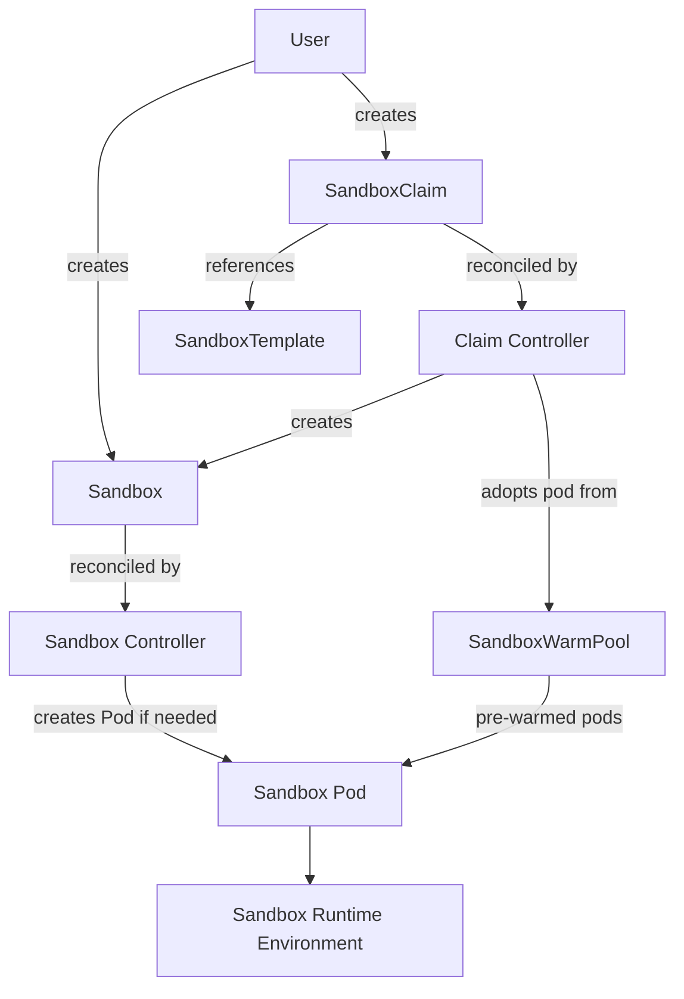
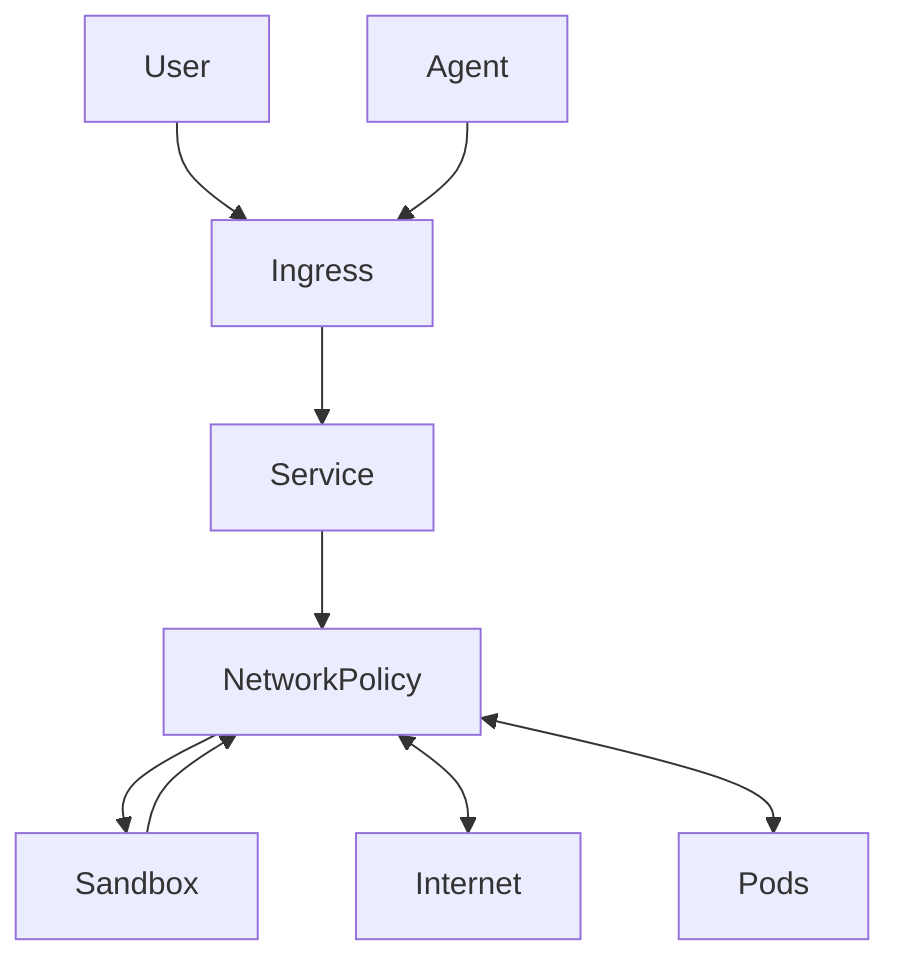

# KNOWLEDGE EXTRACT: github.com_kubernetes-sigs_agent-sandbox_ee1ab9e2
> **Extracted on:** 2026-04-01 09:42:11
> **Source:** D:/LongLeo/AI OS CORP/AI OS/system/security/QUARANTINE/KI-BATCH-20260331205007520375/github.com_kubernetes-sigs_agent-sandbox_ee1ab9e2

---

## File: `.gitignore`
```
bin/

# Ignore python cache files
**/__pycache__/

# Local Netlify folder
.netlify
# Added by goreleaser init:
dist/
release_assets/

# Dynamic versioning file (generated during CI/CD)
clients/python/agentic-sandbox-client/VERSION

# Temporary folders
tmp/
temp/
.tmp/
```

## File: `CONTRIBUTING.md`
```markdown
# Contributing Guidelines

Welcome to Kubernetes. We are excited about the prospect of you joining our [community](https://git.k8s.io/community)! The Kubernetes community abides by the CNCF [code of conduct](../../../vault/archives/archive_legacy/AutoGPT/docs/content/code-of-conduct.md). Here is an excerpt:

_As contributors and maintainers of this project, and in the interest of fostering an open and welcoming community, we pledge to respect all people who contribute through reporting issues, posting feature requests, updating documentation, submitting pull requests or patches, and other activities._

## Getting Started

We have full documentation on how to get started contributing here:

<!---
If your repo has certain guidelines for contribution, put them here ahead of the general k8s resources
-->

- [Contributor License Agreement](https://git.k8s.io/community/CLA.md) - Kubernetes projects require that you sign a Contributor License Agreement (CLA) before we can accept your pull requests
- [Kubernetes Contributor Guide](https://k8s.dev/guide) - Main contributor documentation, or you can just jump directly to the [contributing page](https://k8s.dev/docs/guide/contributing/)
- [Contributor Cheat Sheet](https://k8s.dev/cheatsheet) - Common resources for existing developers

## Mentorship

- [Mentoring Initiatives](https://k8s.dev/community/mentoring) - We have a diverse set of mentorship programs available that are always looking for volunteers!

## Contact Information

- [Slack channel](https://kubernetes.slack.com/messages/sig-apps)
- [Mailing List](https://groups.google.com/a/kubernetes.io/g/sig-apps)

```

## File: `Dockerfile`
```
# Build go binaries
# See https://github.com/golang/go/issues/69255#issuecomment-2523276831
FROM --platform=$BUILDPLATFORM golang:1.26.1 AS builder

# Declare TARGETARCH to make it available in this build stage
ARG TARGETARCH

WORKDIR /workspace

# Download dependencies first to leverage layer caching
COPY go.mod go.sum ./
RUN go mod download

# Copy the code source needed
COPY api/ ./api/
COPY cmd/ ./cmd/
COPY controllers/ ./controllers/
COPY extensions/ ./extensions/
COPY internal/ ./internal/

# Build the binary with optimizations
RUN CGO_ENABLED=0 GOOS=linux GOARCH=${TARGETARCH} go build -ldflags="-s -w" -o /agent-sandbox-controller ./cmd/agent-sandbox-controller


# The controller image
FROM gcr.io/distroless/static-debian13:nonroot

COPY --from=builder /agent-sandbox-controller /agent-sandbox-controller

ENTRYPOINT ["/agent-sandbox-controller"]
```

## File: `HEAD`
```
ref: refs/heads/main
```

## File: `LICENSE`
```
                                 Apache License
                           Version 2.0, January 2004
                        http://www.apache.org/licenses/

   TERMS AND CONDITIONS FOR USE, REPRODUCTION, AND DISTRIBUTION

   1. Definitions.

      "License" shall mean the terms and conditions for use, reproduction,
      and distribution as defined by Sections 1 through 9 of this document.

      "Licensor" shall mean the copyright owner or entity authorized by
      the copyright owner that is granting the License.

      "Legal Entity" shall mean the union of the acting entity and all
      other entities that control, are controlled by, or are under common
      control with that entity. For the purposes of this definition,
      "control" means (i) the power, direct or indirect, to cause the
      direction or management of such entity, whether by contract or
      otherwise, or (ii) ownership of fifty percent (50%) or more of the
      outstanding shares, or (iii) beneficial ownership of such entity.

      "You" (or "Your") shall mean an individual or Legal Entity
      exercising permissions granted by this License.

      "Source" form shall mean the preferred form for making modifications,
      including but not limited to software source code, documentation
      source, and configuration files.

      "Object" form shall mean any form resulting from mechanical
      transformation or translation of a Source form, including but
      not limited to compiled object code, generated documentation,
      and conversions to other media types.

      "Work" shall mean the work of authorship, whether in Source or
      Object form, made available under the License, as indicated by a
      copyright notice that is included in or attached to the work
      (an example is provided in the Appendix below).

      "Derivative Works" shall mean any work, whether in Source or Object
      form, that is based on (or derived from) the Work and for which the
      editorial revisions, annotations, elaborations, or other modifications
      represent, as a whole, an original work of authorship. For the purposes
      of this License, Derivative Works shall not include works that remain
      separable from, or merely link (or bind by name) to the interfaces of,
      the Work and Derivative Works thereof.

      "Contribution" shall mean any work of authorship, including
      the original version of the Work and any modifications or additions
      to that Work or Derivative Works thereof, that is intentionally
      submitted to Licensor for inclusion in the Work by the copyright owner
      or by an individual or Legal Entity authorized to submit on behalf of
      the copyright owner. For the purposes of this definition, "submitted"
      means any form of electronic, verbal, or written communication sent
      to the Licensor or its representatives, including but not limited to
      communication on electronic mailing lists, source code control systems,
      and issue tracking systems that are managed by, or on behalf of, the
      Licensor for the purpose of discussing and improving the Work, but
      excluding communication that is conspicuously marked or otherwise
      designated in writing by the copyright owner as "Not a Contribution."

      "Contributor" shall mean Licensor and any individual or Legal Entity
      on behalf of whom a Contribution has been received by Licensor and
      subsequently incorporated within the Work.

   2. Grant of Copyright License. Subject to the terms and conditions of
      this License, each Contributor hereby grants to You a perpetual,
      worldwide, non-exclusive, no-charge, royalty-free, irrevocable
      copyright license to reproduce, prepare Derivative Works of,
      publicly display, publicly perform, sublicense, and distribute the
      Work and such Derivative Works in Source or Object form.

   3. Grant of Patent License. Subject to the terms and conditions of
      this License, each Contributor hereby grants to You a perpetual,
      worldwide, non-exclusive, no-charge, royalty-free, irrevocable
      (except as stated in this section) patent license to make, have made,
      use, offer to sell, sell, import, and otherwise transfer the Work,
      where such license applies only to those patent claims licensable
      by such Contributor that are necessarily infringed by their
      Contribution(s) alone or by combination of their Contribution(s)
      with the Work to which such Contribution(s) was submitted. If You
      institute patent litigation against any entity (including a
      cross-claim or counterclaim in a lawsuit) alleging that the Work
      or a Contribution incorporated within the Work constitutes direct
      or contributory patent infringement, then any patent licenses
      granted to You under this License for that Work shall terminate
      as of the date such litigation is filed.

   4. Redistribution. You may reproduce and distribute copies of the
      Work or Derivative Works thereof in any medium, with or without
      modifications, and in Source or Object form, provided that You
      meet the following conditions:

      (a) You must give any other recipients of the Work or
          Derivative Works a copy of this License; and

      (b) You must cause any modified files to carry prominent notices
          stating that You changed the files; and

      (c) You must retain, in the Source form of any Derivative Works
          that You distribute, all copyright, patent, trademark, and
          attribution notices from the Source form of the Work,
          excluding those notices that do not pertain to any part of
          the Derivative Works; and

      (d) If the Work includes a "NOTICE" text file as part of its
          distribution, then any Derivative Works that You distribute must
          include a readable copy of the attribution notices contained
          within such NOTICE file, excluding those notices that do not
          pertain to any part of the Derivative Works, in at least one
          of the following places: within a NOTICE text file distributed
          as part of the Derivative Works; within the Source form or
          documentation, if provided along with the Derivative Works; or,
          within a display generated by the Derivative Works, if and
          wherever such third-party notices normally appear. The contents
          of the NOTICE file are for informational purposes only and
          do not modify the License. You may add Your own attribution
          notices within Derivative Works that You distribute, alongside
          or as an addendum to the NOTICE text from the Work, provided
          that such additional attribution notices cannot be construed
          as modifying the License.

      You may add Your own copyright statement to Your modifications and
      may provide additional or different license terms and conditions
      for use, reproduction, or distribution of Your modifications, or
      for any such Derivative Works as a whole, provided Your use,
      reproduction, and distribution of the Work otherwise complies with
      the conditions stated in this License.

   5. Submission of Contributions. Unless You explicitly state otherwise,
      any Contribution intentionally submitted for inclusion in the Work
      by You to the Licensor shall be under the terms and conditions of
      this License, without any additional terms or conditions.
      Notwithstanding the above, nothing herein shall supersede or modify
      the terms of any separate license agreement you may have executed
      with Licensor regarding such Contributions.

   6. Trademarks. This License does not grant permission to use the trade
      names, trademarks, service marks, or product names of the Licensor,
      except as required for reasonable and customary use in describing the
      origin of the Work and reproducing the content of the NOTICE file.

   7. Disclaimer of Warranty. Unless required by applicable law or
      agreed to in writing, Licensor provides the Work (and each
      Contributor provides its Contributions) on an "AS IS" BASIS,
      WITHOUT WARRANTIES OR CONDITIONS OF ANY KIND, either express or
      implied, including, without limitation, any warranties or conditions
      of TITLE, NON-INFRINGEMENT, MERCHANTABILITY, or FITNESS FOR A
      PARTICULAR PURPOSE. You are solely responsible for determining the
      appropriateness of using or redistributing the Work and assume any
      risks associated with Your exercise of permissions under this License.

   8. Limitation of Liability. In no event and under no legal theory,
      whether in tort (including negligence), contract, or otherwise,
      unless required by applicable law (such as deliberate and grossly
      negligent acts) or agreed to in writing, shall any Contributor be
      liable to You for damages, including any direct, indirect, special,
      incidental, or consequential damages of any character arising as a
      result of this License or out of the use or inability to use the
      Work (including but not limited to damages for loss of goodwill,
      work stoppage, computer failure or malfunction, or any and all
      other commercial damages or losses), even if such Contributor
      has been advised of the possibility of such damages.

   9. Accepting Warranty or Additional Liability. While redistributing
      the Work or Derivative Works thereof, You may choose to offer,
      and charge a fee for, acceptance of support, warranty, indemnity,
      or other liability obligations and/or rights consistent with this
      License. However, in accepting such obligations, You may act only
      on Your own behalf and on Your sole responsibility, not on behalf
      of any other Contributor, and only if You agree to indemnify,
      defend, and hold each Contributor harmless for any liability
      incurred by, or claims asserted against, such Contributor by reason
      of your accepting any such warranty or additional liability.

   END OF TERMS AND CONDITIONS

   APPENDIX: How to apply the Apache License to your work.

      To apply the Apache License to your work, attach the following
      boilerplate notice, with the fields enclosed by brackets "{}"
      replaced with your own identifying information. (Don't include
      the brackets!)  The text should be enclosed in the appropriate
      comment syntax for the file format. We also recommend that a
      file or class name and description of purpose be included on the
      same "printed page" as the copyright notice for easier
      identification within third-party archives.

   Copyright {yyyy} {name of copyright owner}

   Licensed under the Apache License, Version 2.0 (the "License");
   you may not use this file except in compliance with the License.
   You may obtain a copy of the License at

       http://www.apache.org/licenses/LICENSE-2.0

   Unless required by applicable law or agreed to in writing, software
   distributed under the License is distributed on an "AS IS" BASIS,
   WITHOUT WARRANTIES OR CONDITIONS OF ANY KIND, either express or implied.
   See the License for the specific language governing permissions and
   limitations under the License.
```

## File: `Makefile`
```
.PHONY: all
all: fix-go-generate build lint-go lint-api test-unit toc-verify

.PHONY: fix-go-generate
fix-go-generate:
	dev/tools/fix-go-generate

.PHONY: build
build:
	go build -o bin/manager cmd/agent-sandbox-controller/main.go

KIND_CLUSTER=agent-sandbox

.PHONY: deploy-kind
deploy-kind:
	./dev/tools/create-kind-cluster --recreate ${KIND_CLUSTER} --kubeconfig bin/KUBECONFIG
	./dev/tools/push-images --image-prefix=kind.local/ --kind-cluster-name=${KIND_CLUSTER}
	./dev/tools/deploy-to-kube --image-prefix=kind.local/

	@if [ "$(EXTENSIONS)" = "true" ]; then \
		echo "🔧 Patching controller to enable extensions..."; \
		kubectl patch deployment agent-sandbox-controller \
			-n agent-sandbox-system \
			-p '{"spec": {"template": {"spec": {"containers": [{"name": "agent-sandbox-controller", "args": ["--extensions=true"]}]}}}}'; \
	fi

.PHONY: deploy-cloud-provider-kind
deploy-cloud-provider-kind:
	./dev/tools/deploy-cloud-provider

.PHONY: delete-kind
delete-kind:
	kind delete cluster --name ${KIND_CLUSTER}

.PHONY: kill-cloud-provider-kind
kill-cloud-provider-kind:
	killall cloud-provider-kind

.PHONY: test-unit
test-unit:
	./dev/tools/test-unit

.PHONY: test-e2e
test-e2e:
	./dev/ci/presubmits/test-e2e

.PHONY: test-e2e-benchmarks
test-e2e-benchmarks:
	./dev/ci/presubmits/test-e2e --suite benchmarks

.PHONY: lint-go
lint-go:
	./dev/tools/lint-go

.PHONY: lint-api
lint-api:
	./dev/tools/lint-api

# Location of your local k8s.io repo (can be overridden: make release-promote TAG=v0.1.0 K8S_IO_DIR=../other/k8s.io)
K8S_IO_DIR ?= ../../kubernetes/k8s.io

# Default remote (can be overriden: make release-publish REMOTE=upstream ...)
REMOTE_UPSTREAM ?= upstream

# Promote all staging images to registry.k8s.io
# Usage: make release-promote TAG=vX.Y.Z
.PHONY: release-promote
release-promote:
	@if [ -z "$(TAG)" ]; then echo "TAG is required (e.g., make release-promote TAG=vX.Y.Z)"; exit 1; fi
	./dev/tools/tag-promote-images --tag=${TAG} --k8s-io-dir=${K8S_IO_DIR}

# Publish a draft release to GitHub
# Usage: make release-publish TAG=vX.Y.Z
.PHONY: release-publish
release-publish:
	@if [ -z "$(TAG)" ]; then echo "TAG is required (e.g., make release-publish TAG=vX.Y.Z)"; exit 1; fi
	go mod tidy
	go generate ./...
	./dev/tools/release --tag=${TAG} --publish

# Generate release manifests only
# Usage: make release-manifests TAG=vX.Y.Z
.PHONY: release-manifests
release-manifests:
	@if [ -z "$(TAG)" ]; then echo "TAG is required (e.g., make release-manifests TAG=vX.Y.Z)"; exit 1; fi
	go mod tidy
	go generate ./...
	./dev/tools/release --tag=${TAG} 

# Example usage:
# make release-python-sdk TAG=v0.1.1rc1 (to release only on TestPyPI, blocked from PyPI in workflow)
# make release-python-sdk TAG=v0.1.1.post1 (for patch release on TestPyPI and PyPI)
.PHONY: release-python-sdk
release-python-sdk:
	@if [ -z "$(TAG)" ]; then echo "TAG is required (e.g., make release-python-sdk TAG=vX.Y.Z.postN)"; exit 1; fi
	./dev/tools/release-python --tag=${TAG} --remote=${REMOTE_UPSTREAM}

.PHONY: toc-update
toc-update:
	./dev/tools/update-toc

.PHONY: toc-verify
toc-verify:
	./dev/tools/verify-toc

.PHONY: clean
clean:
	rm -rf dev/tools/tmp
	rm -rf bin/manager
```

## File: `OWNERS`
```
# See the OWNERS docs at https://go.k8s.io/owners

approvers:
  - janetkuo
  - justinsb
  - soltysh
  - barney-s
```

## File: `README.md`
```markdown
<div align="center">
  

  <h1>Agent Sandbox</h1>
</div>


<p>
  <a href="https://github.com/kubernetes-sigs/agent-sandbox/releases"></a>
  <a href="LICENSE"></a>
</p>

[Website](https://agent-sandbox.sigs.k8s.io) · [Docs](https://agent-sandbox.sigs.k8s.io/docs/) · [DeepWiki](https://deepwiki.com/kubernetes-sigs/agent-sandbox) · [Getting Started](https://agent-sandbox.sigs.k8s.io/docs/getting_started/) · [Examples](examples/) · [Roadmap](roadmap.md)

**agent-sandbox enables easy management of isolated, stateful, singleton workloads, ideal for use cases like AI agent runtimes.**

This project is developing a `Sandbox` Custom Resource Definition (CRD) and controller for Kubernetes, under the umbrella of [SIG Apps](https://github.com/kubernetes/community/tree/master/sig-apps). The goal is to provide a declarative, standardized API for managing workloads that require the characteristics of a long-running, stateful, singleton container with a stable identity, much like a lightweight, single-container VM experience built on Kubernetes primitives.

## Overview

### Core: Sandbox

The `Sandbox` CRD is the core of agent-sandbox. It provides a declarative API for managing a single, stateful pod with a stable identity and persistent storage. This is useful for workloads that don't fit well into the stateless, replicated model of Deployments or the numbered, stable model of StatefulSets.

Key features of the `Sandbox` CRD include:

*   **Stable Identity:** Each Sandbox has a stable hostname and network identity.
*   **Persistent Storage:** Sandboxes can be configured with persistent storage that survives restarts.
*   **Lifecycle Management:** The Sandbox controller manages the lifecycle of the pod, including creation, scheduled deletion, pausing and resuming.

### Extensions

The `extensions` module provides additional CRDs and controllers that build on the core `Sandbox` API to provide more advanced features.

*   `SandboxTemplate`: Provides a way to define reusable templates for creating Sandboxes, making it easier to manage large numbers of similar Sandboxes.
*   `SandboxClaim`: Allows users to create Sandboxes from a template, abstracting away the details of the underlying Sandbox configuration.
*   `SandboxWarmPool`: Manages a pool of pre-warmed Sandbox Pods that can be quickly allocated to users, reducing the time it takes to get a new Sandbox up and running.

## Architecture

agent-sandbox follows the Kubernetes controller pattern. Users create a Sandbox custom resource, and the controller manages the underlying runtime resources.

### Architecture Diagram



## Installation

### Core Components & Extensions

You can install the agent-sandbox controller and its CRDs with the following command.

```sh
# Replace "vX.Y.Z" with a specific version tag (e.g., "v0.1.0") from
# https://github.com/kubernetes-sigs/agent-sandbox/releases
export VERSION="vX.Y.Z"

# To install only the core components:
kubectl apply -f https://github.com/kubernetes-sigs/agent-sandbox/releases/download/${VERSION}/manifest.yaml

# To install the extensions components:
kubectl apply -f https://github.com/kubernetes-sigs/agent-sandbox/releases/download/${VERSION}/extensions.yaml
```

### Python SDK

To interact with the agent-sandbox programmatically, you can use the Python SDK. This client library provides a high-level interface for creating and managing sandboxes.

For detailed installation and usage instructions, please refer to the [Python SDK README](../../../README.md).

## Configuration

For advanced scale and concurrency tuning (e.g., API QPS and worker counts), please see the [Configuration Guide](configuration.md).

## Getting Started

Once you have installed the controller, you can create a simple Sandbox by applying the following YAML to your cluster:

```yaml
apiVersion: agents.x-k8s.io/v1alpha1
kind: Sandbox
metadata:
  name: my-sandbox
spec:
  podTemplate:
    spec:
      containers:
      - name: my-container
        image: <IMAGE>
```

This will create a new Sandbox named `my-sandbox` running the image you specify. You can then access the Sandbox using its stable hostname, `my-sandbox`.

For more complex examples, including how to use the extensions, please see the [examples/](examples/) and [extensions/examples/](extensions/examples/) directories.

## Motivation

Kubernetes excels at managing stateless, replicated applications (Deployments) and stable, numbered sets of stateful pods (StatefulSets). However, there's a growing need for an abstraction to handle use cases such as:

*   **Development Environments:** Isolated, persistent, network-accessible cloud environments for developers.
*   **AI Agent Runtimes:** Isolated environments for executing untrusted, LLM-generated code.
*   **Notebooks and Research Tools:** Persistent, single-container sessions for tools like Jupyter Notebooks.
*   **Stateful Single-Pod Services:** Hosting single-instance applications (e.g., build agents, small databases) needing a stable identity without StatefulSet overhead.

While these can be approximated by combining StatefulSets (size 1), Services, and PersistentVolumeClaims, this approach is cumbersome and lacks specialized lifecycle management like hibernation.

## Desired Sandbox Characteristics

We aim for the Sandbox to be vendor-neutral, supporting various runtimes. Key characteristics include:

*   **Strong Isolation:** Supporting different runtimes like gVisor or Kata Containers to provide enhanced security and isolation between the sandbox and the host, including both kernel and network isolation. This is crucial for running untrusted code or multi-tenant scenarios.
*   **Deep hibernation:** Saving state to persistent storage and potentially archiving the Sandbox object.
*   **Automatic resume:** Resuming a sandbox on network connection.
*   **Efficient persistence:** Elastic and rapidly provisioned storage.
*   **Memory sharing across sandboxes:** Exploring possibilities to share memory across Sandboxes on the same host, even if they are primarily non-homogeneous. This capability is a feature of the specific runtime, and users should select a runtime that aligns with their security and performance requirements.
*   **Rich identity & connectivity:** Exploring dual user/sandbox identities and efficient traffic routing without per-sandbox Services.
*   **Programmable:** Encouraging applications and agents to programmatically consume the Sandbox API.

## Roadmap

The current Roadmap can be found at [roadmap.md](roadmap.md).

## Community, Discussion, Contribution, and Support

This is a community-driven effort, and we welcome collaboration!

Learn how to engage with the Kubernetes community on the [community page](http://kubernetes.io/community/).

You can reach the maintainers of this project at:

- [Slack](https://kubernetes.slack.com/messages/sig-apps)
- [Mailing List](https://groups.google.com/a/kubernetes.io/g/sig-apps)

Please feel free to open issues, suggest features, and contribute code!

### Code of conduct

Participation in the Kubernetes community is governed by the [Kubernetes Code of Conduct](../../../vault/archives/archive_legacy/AutoGPT/docs/content/code-of-conduct.md).

[owners]: https://git.k8s.io/community/contributors/guide/owners.md
[Creative Commons 4.0]: https://git.k8s.io/website/LICENSE
```

## File: `RELEASE.md`
```markdown
# Release Process

The Kubernetes Template Project is released on an as-needed basis. The process is as follows:

1. An issue is proposing a new release with a changelog since the last release
1. All [OWNERS](OWNERS) must LGTM this release
1. An OWNER runs `git tag -s $VERSION` and inserts the changelog and pushes the tag with `git push $VERSION`
1. The release issue is closed
1. An announcement email is sent to `dev@kubernetes.io` with the subject `[ANNOUNCE] kubernetes-template-project $VERSION is released`
```

## File: `SECURITY.md`
```markdown
# Security Policy

## Security Announcements

Join the [kubernetes-security-announce] group for security and vulnerability announcements.

## Reporting a Vulnerability

Instructions for reporting a vulnerability can be found on the
[Kubernetes Security and Disclosure Information] page.

## Supported Versions

Information about supported Kubernetes versions can be found on the
[Kubernetes version and version skew support policy] page on the Kubernetes website.

[kubernetes-security-announce]: https://groups.google.com/forum/#!forum/kubernetes-security-announce
[Kubernetes version and version skew support policy]: https://kubernetes.io/docs/setup/release/version-skew-policy/#supported-versions
[Kubernetes Security and Disclosure Information]: https://kubernetes.io/docs/reference/issues-security/security/#report-a-vulnerability
```

## File: `SECURITY_CONTACTS`
```
# Defined below are the security contacts for this repo.
#
# They are the contact point for the Security Response Committee to reach out
# to for triaging and handling of incoming issues.
#
# The below names agree to abide by the
# [Embargo Policy](https://git.k8s.io/security/private-distributors-list.md#embargo-policy)
# and will be removed and replaced if they violate that agreement.
#
# DO NOT REPORT SECURITY VULNERABILITIES DIRECTLY TO THESE NAMES, FOLLOW THE
# INSTRUCTIONS AT https://kubernetes.io/security/

janetkuo
justinsb
soltysh
```

## File: `cloudbuild.yaml`
```yaml
timeout: 2700s
steps:
  # This step runs the python script to build and push the Docker image.
  # We use the gcloud builder because it comes with python and the docker client.
  - name: "gcr.io/k8s-staging-test-infra/gcb-docker-gcloud"
    entrypoint: "python3"
    args:
      - "./dev/tools/push-images"
      # Assuming the script accepts project and tag arguments.
      # Using standard Cloud Build substitutions.
      - "--image-prefix=${_IMAGE_PREFIX}/"
      - "--extra-image-tag=${_GIT_TAG}-${_CONFIG}"
      - "--extra-image-tag=latest-${_CONFIG}"

options:
  enableStructuredLogging: true
  # Using a more powerful machine type can speed up docker builds.
  machineType: "E2_HIGHCPU_8"
  substitution_option: "ALLOW_LOOSE"
substitutions:
  _GIT_TAG: "12345"
  _CONFIG: main
  _IMAGE_PREFIX: "us-central1-docker.pkg.dev/k8s-staging-images/agent-sandbox"
```

## File: `code-of-conduct.md`
```markdown
# Kubernetes Community Code of Conduct

Please refer to our [Kubernetes Community Code of Conduct](https://git.k8s.io/community/code-of-conduct.md)
```

## File: `codegen.go`
```go
// Copyright 2025 The Kubernetes Authors.
//
// Licensed under the Apache License, Version 2.0 (the "License");
// you may not use this file except in compliance with the License.
// You may obtain a copy of the License at
//
//     http://www.apache.org/licenses/LICENSE-2.0
//
// Unless required by applicable law or agreed to in writing, software
// distributed under the License is distributed on an "AS IS" BASIS,
// WITHOUT WARRANTIES OR CONDITIONS OF ANY KIND, either express or implied.
// See the License for the specific language governing permissions and
// limitations under the License.

// This file just exists as a place to put //go:generate directives that should apply to the entire project

package agentsandbox

// Generate CRDs and RBAC rules
//go:generate go tool -modfile=tools.mod sigs.k8s.io/controller-tools/cmd/controller-gen object crd:maxDescLen=0 paths=./api/... output:crd:dir=k8s/crds
//go:generate go tool -modfile=tools.mod sigs.k8s.io/controller-tools/cmd/controller-gen object crd:maxDescLen=0 paths=./extensions/... output:crd:dir=k8s/crds
//go:generate go tool -modfile=tools.mod sigs.k8s.io/controller-tools/cmd/controller-gen paths=./controllers/... output:rbac:dir=k8s rbac:roleName=agent-sandbox-controller,fileName=rbac.generated.yaml
//go:generate go tool -modfile=tools.mod sigs.k8s.io/controller-tools/cmd/controller-gen paths=./extensions/controllers/... output:rbac:dir=k8s rbac:roleName=agent-sandbox-controller-extensions,fileName=extensions-rbac.generated.yaml
//go:generate ./dev/tools/client-gen-go.sh
```

## File: `config`
```
[core]
	repositoryformatversion = 0
	filemode = false
	bare = false
	logallrefupdates = true
	symlinks = false
	ignorecase = true
[remote "origin"]
	url = https://github.com/kubernetes-sigs/agent-sandbox
	fetch = +refs/heads/main:refs/remotes/origin/main
[branch "main"]
	remote = origin
	merge = refs/heads/main
```

## File: `description`
```
Unnamed repository; edit this file 'description' to name the repository.
```

## File: `go.mod`
```
module sigs.k8s.io/agent-sandbox

go 1.26.1

require (
	github.com/go-logr/logr v1.4.3
	github.com/google/go-cmp v0.7.0
	github.com/prometheus/client_golang v1.23.2
	github.com/stretchr/testify v1.11.1
	go.opentelemetry.io/otel v1.42.0
	go.opentelemetry.io/otel/exporters/otlp/otlptrace/otlptracegrpc v1.39.0
	go.opentelemetry.io/otel/sdk v1.42.0
	go.opentelemetry.io/otel/trace v1.42.0
	k8s.io/api v0.34.1
	k8s.io/apiextensions-apiserver v0.34.1
	k8s.io/apimachinery v0.34.1
	k8s.io/client-go v0.34.1
	k8s.io/klog/v2 v2.130.1
	k8s.io/utils v0.0.0-20251002143259-bc988d571ff4
	sigs.k8s.io/controller-runtime v0.22.2
	sigs.k8s.io/yaml v1.6.0
)

require (
	github.com/beorn7/perks v1.0.1 // indirect
	github.com/cenkalti/backoff/v5 v5.0.3 // indirect
	github.com/cespare/xxhash/v2 v2.3.0 // indirect
	github.com/davecgh/go-spew v1.1.1 // indirect
	github.com/emicklei/go-restful/v3 v3.13.0 // indirect
	github.com/evanphx/json-patch/v5 v5.9.11 // indirect
	github.com/fsnotify/fsnotify v1.9.0 // indirect
	github.com/fxamacker/cbor/v2 v2.9.0 // indirect
	github.com/go-logr/stdr v1.2.2 // indirect
	github.com/go-logr/zapr v1.3.0 // indirect
	github.com/go-openapi/jsonpointer v0.22.1 // indirect
	github.com/go-openapi/jsonreference v0.21.2 // indirect
	github.com/go-openapi/swag v0.25.1 // indirect
	github.com/go-openapi/swag/cmdutils v0.25.1 // indirect
	github.com/go-openapi/swag/conv v0.25.1 // indirect
	github.com/go-openapi/swag/fileutils v0.25.1 // indirect
	github.com/go-openapi/swag/jsonname v0.25.1 // indirect
	github.com/go-openapi/swag/jsonutils v0.25.1 // indirect
	github.com/go-openapi/swag/loading v0.25.1 // indirect
	github.com/go-openapi/swag/mangling v0.25.1 // indirect
	github.com/go-openapi/swag/netutils v0.25.1 // indirect
	github.com/go-openapi/swag/stringutils v0.25.1 // indirect
	github.com/go-openapi/swag/typeutils v0.25.1 // indirect
	github.com/go-openapi/swag/yamlutils v0.25.1 // indirect
	github.com/gogo/protobuf v1.3.2 // indirect
	github.com/google/btree v1.1.3 // indirect
	github.com/google/gnostic-models v0.7.0 // indirect
	github.com/google/uuid v1.6.0 // indirect
	github.com/grpc-ecosystem/grpc-gateway/v2 v2.27.3 // indirect
	github.com/json-iterator/go v1.1.12 // indirect
	github.com/kylelemons/godebug v1.1.0 // indirect
	github.com/modern-go/concurrent v0.0.0-20180306012644-bacd9c7ef1dd // indirect
	github.com/modern-go/reflect2 v1.0.3-0.20250322232337-35a7c28c31ee // indirect
	github.com/munnerz/goautoneg v0.0.0-20191010083416-a7dc8b61c822 // indirect
	github.com/onsi/ginkgo/v2 v2.23.3 // indirect
	github.com/onsi/gomega v1.37.0 // indirect
	github.com/pmezard/go-difflib v1.0.0 // indirect
	github.com/prometheus/client_model v0.6.2 // indirect
	github.com/prometheus/common v0.67.1 // indirect
	github.com/prometheus/procfs v0.17.0 // indirect
	github.com/spf13/pflag v1.0.10 // indirect
	github.com/x448/float16 v0.8.4 // indirect
	go.opentelemetry.io/auto/sdk v1.2.1 // indirect
	go.opentelemetry.io/otel/exporters/otlp/otlptrace v1.39.0 // indirect
	go.opentelemetry.io/otel/metric v1.42.0 // indirect
	go.opentelemetry.io/proto/otlp v1.9.0 // indirect
	go.uber.org/multierr v1.11.0 // indirect
	go.uber.org/zap v1.27.0 // indirect
	go.yaml.in/yaml/v2 v2.4.3 // indirect
	go.yaml.in/yaml/v3 v3.0.4 // indirect
	golang.org/x/net v0.47.0 // indirect
	golang.org/x/oauth2 v0.32.0 // indirect
	golang.org/x/sync v0.18.0 // indirect
	golang.org/x/sys v0.41.0 // indirect
	golang.org/x/term v0.37.0 // indirect
	golang.org/x/text v0.31.0 // indirect
	golang.org/x/time v0.13.0 // indirect
	gomodules.xyz/jsonpatch/v2 v2.5.0 // indirect
	google.golang.org/genproto/googleapis/api v0.0.0-20251202230838-ff82c1b0f217 // indirect
	google.golang.org/genproto/googleapis/rpc v0.0.0-20251202230838-ff82c1b0f217 // indirect
	google.golang.org/grpc v1.77.0 // indirect
	google.golang.org/protobuf v1.36.10 // indirect
	gopkg.in/evanphx/json-patch.v4 v4.13.0 // indirect
	gopkg.in/inf.v0 v0.9.1 // indirect
	gopkg.in/yaml.v3 v3.0.1 // indirect
	k8s.io/kube-openapi v0.0.0-20250910181357-589584f1c912 // indirect
	sigs.k8s.io/json v0.0.0-20250730193827-2d320260d730 // indirect
	sigs.k8s.io/randfill v1.0.0 // indirect
	sigs.k8s.io/structured-merge-diff/v6 v6.3.0 // indirect
)
```

## File: `go.sum`
```
github.com/beorn7/perks v1.0.1 h1:VlbKKnNfV8bJzeqoa4cOKqO6bYr3WgKZxO8Z16+hsOM=
github.com/beorn7/perks v1.0.1/go.mod h1:G2ZrVWU2WbWT9wwq4/hrbKbnv/1ERSJQ0ibhJ6rlkpw=
github.com/cenkalti/backoff/v5 v5.0.3 h1:ZN+IMa753KfX5hd8vVaMixjnqRZ3y8CuJKRKj1xcsSM=
github.com/cenkalti/backoff/v5 v5.0.3/go.mod h1:rkhZdG3JZukswDf7f0cwqPNk4K0sa+F97BxZthm/crw=
github.com/cespare/xxhash/v2 v2.3.0 h1:UL815xU9SqsFlibzuggzjXhog7bL6oX9BbNZnL2UFvs=
github.com/cespare/xxhash/v2 v2.3.0/go.mod h1:VGX0DQ3Q6kWi7AoAeZDth3/j3BFtOZR5XLFGgcrjCOs=
github.com/davecgh/go-spew v1.1.0/go.mod h1:J7Y8YcW2NihsgmVo/mv3lAwl/skON4iLHjSsI+c5H38=
github.com/davecgh/go-spew v1.1.1 h1:vj9j/u1bqnvCEfJOwUhtlOARqs3+rkHYY13jYWTU97c=
github.com/davecgh/go-spew v1.1.1/go.mod h1:J7Y8YcW2NihsgmVo/mv3lAwl/skON4iLHjSsI+c5H38=
github.com/emicklei/go-restful/v3 v3.13.0 h1:C4Bl2xDndpU6nJ4bc1jXd+uTmYPVUwkD6bFY/oTyCes=
github.com/emicklei/go-restful/v3 v3.13.0/go.mod h1:6n3XBCmQQb25CM2LCACGz8ukIrRry+4bhvbpWn3mrbc=
github.com/evanphx/json-patch v0.5.2 h1:xVCHIVMUu1wtM/VkR9jVZ45N3FhZfYMMYGorLCR8P3k=
github.com/evanphx/json-patch v0.5.2/go.mod h1:ZWS5hhDbVDyob71nXKNL0+PWn6ToqBHMikGIFbs31qQ=
github.com/evanphx/json-patch/v5 v5.9.11 h1:/8HVnzMq13/3x9TPvjG08wUGqBTmZBsCWzjTM0wiaDU=
github.com/evanphx/json-patch/v5 v5.9.11/go.mod h1:3j+LviiESTElxA4p3EMKAB9HXj3/XEtnUf6OZxqIQTM=
github.com/fsnotify/fsnotify v1.9.0 h1:2Ml+OJNzbYCTzsxtv8vKSFD9PbJjmhYF14k/jKC7S9k=
github.com/fsnotify/fsnotify v1.9.0/go.mod h1:8jBTzvmWwFyi3Pb8djgCCO5IBqzKJ/Jwo8TRcHyHii0=
github.com/fxamacker/cbor/v2 v2.9.0 h1:NpKPmjDBgUfBms6tr6JZkTHtfFGcMKsw3eGcmD/sapM=
github.com/fxamacker/cbor/v2 v2.9.0/go.mod h1:vM4b+DJCtHn+zz7h3FFp/hDAI9WNWCsZj23V5ytsSxQ=
github.com/go-logr/logr v1.2.2/go.mod h1:jdQByPbusPIv2/zmleS9BjJVeZ6kBagPoEUsqbVz/1A=
github.com/go-logr/logr v1.4.3 h1:CjnDlHq8ikf6E492q6eKboGOC0T8CDaOvkHCIg8idEI=
github.com/go-logr/logr v1.4.3/go.mod h1:9T104GzyrTigFIr8wt5mBrctHMim0Nb2HLGrmQ40KvY=
github.com/go-logr/stdr v1.2.2 h1:hSWxHoqTgW2S2qGc0LTAI563KZ5YKYRhT3MFKZMbjag=
github.com/go-logr/stdr v1.2.2/go.mod h1:mMo/vtBO5dYbehREoey6XUKy/eSumjCCveDpRre4VKE=
github.com/go-logr/zapr v1.3.0 h1:XGdV8XW8zdwFiwOA2Dryh1gj2KRQyOOoNmBy4EplIcQ=
github.com/go-logr/zapr v1.3.0/go.mod h1:YKepepNBd1u/oyhd/yQmtjVXmm9uML4IXUgMOwR8/Gg=
github.com/go-openapi/jsonpointer v0.22.1 h1:sHYI1He3b9NqJ4wXLoJDKmUmHkWy/L7rtEo92JUxBNk=
github.com/go-openapi/jsonpointer v0.22.1/go.mod h1:pQT9OsLkfz1yWoMgYFy4x3U5GY5nUlsOn1qSBH5MkCM=
github.com/go-openapi/jsonreference v0.21.2 h1:Wxjda4M/BBQllegefXrY/9aq1fxBA8sI5M/lFU6tSWU=
github.com/go-openapi/jsonreference v0.21.2/go.mod h1:pp3PEjIsJ9CZDGCNOyXIQxsNuroxm8FAJ/+quA0yKzQ=
github.com/go-openapi/swag v0.25.1 h1:6uwVsx+/OuvFVPqfQmOOPsqTcm5/GkBhNwLqIR916n8=
github.com/go-openapi/swag v0.25.1/go.mod h1:bzONdGlT0fkStgGPd3bhZf1MnuPkf2YAys6h+jZipOo=
github.com/go-openapi/swag/cmdutils v0.25.1 h1:nDke3nAFDArAa631aitksFGj2omusks88GF1VwdYqPY=
github.com/go-openapi/swag/cmdutils v0.25.1/go.mod h1:pdae/AFo6WxLl5L0rq87eRzVPm/XRHM3MoYgRMvG4A0=
github.com/go-openapi/swag/conv v0.25.1 h1:+9o8YUg6QuqqBM5X6rYL/p1dpWeZRhoIt9x7CCP+he0=
github.com/go-openapi/swag/conv v0.25.1/go.mod h1:Z1mFEGPfyIKPu0806khI3zF+/EUXde+fdeksUl2NiDs=
github.com/go-openapi/swag/fileutils v0.25.1 h1:rSRXapjQequt7kqalKXdcpIegIShhTPXx7yw0kek2uU=
github.com/go-openapi/swag/fileutils v0.25.1/go.mod h1:+NXtt5xNZZqmpIpjqcujqojGFek9/w55b3ecmOdtg8M=
github.com/go-openapi/swag/jsonname v0.25.1 h1:Sgx+qbwa4ej6AomWC6pEfXrA6uP2RkaNjA9BR8a1RJU=
github.com/go-openapi/swag/jsonname v0.25.1/go.mod h1:71Tekow6UOLBD3wS7XhdT98g5J5GR13NOTQ9/6Q11Zo=
github.com/go-openapi/swag/jsonutils v0.25.1 h1:AihLHaD0brrkJoMqEZOBNzTLnk81Kg9cWr+SPtxtgl8=
github.com/go-openapi/swag/jsonutils v0.25.1/go.mod h1:JpEkAjxQXpiaHmRO04N1zE4qbUEg3b7Udll7AMGTNOo=
github.com/go-openapi/swag/jsonutils/fixtures_test v0.25.1 h1:DSQGcdB6G0N9c/KhtpYc71PzzGEIc/fZ1no35x4/XBY=
github.com/go-openapi/swag/jsonutils/fixtures_test v0.25.1/go.mod h1:kjmweouyPwRUEYMSrbAidoLMGeJ5p6zdHi9BgZiqmsg=
github.com/go-openapi/swag/loading v0.25.1 h1:6OruqzjWoJyanZOim58iG2vj934TysYVptyaoXS24kw=
github.com/go-openapi/swag/loading v0.25.1/go.mod h1:xoIe2EG32NOYYbqxvXgPzne989bWvSNoWoyQVWEZicc=
github.com/go-openapi/swag/mangling v0.25.1 h1:XzILnLzhZPZNtmxKaz/2xIGPQsBsvmCjrJOWGNz/ync=
github.com/go-openapi/swag/mangling v0.25.1/go.mod h1:CdiMQ6pnfAgyQGSOIYnZkXvqhnnwOn997uXZMAd/7mQ=
github.com/go-openapi/swag/netutils v0.25.1 h1:2wFLYahe40tDUHfKT1GRC4rfa5T1B4GWZ+msEFA4Fl4=
github.com/go-openapi/swag/netutils v0.25.1/go.mod h1:CAkkvqnUJX8NV96tNhEQvKz8SQo2KF0f7LleiJwIeRE=
github.com/go-openapi/swag/stringutils v0.25.1 h1:Xasqgjvk30eUe8VKdmyzKtjkVjeiXx1Iz0zDfMNpPbw=
github.com/go-openapi/swag/stringutils v0.25.1/go.mod h1:JLdSAq5169HaiDUbTvArA2yQxmgn4D6h4A+4HqVvAYg=
github.com/go-openapi/swag/typeutils v0.25.1 h1:rD/9HsEQieewNt6/k+JBwkxuAHktFtH3I3ysiFZqukA=
github.com/go-openapi/swag/typeutils v0.25.1/go.mod h1:9McMC/oCdS4BKwk2shEB7x17P6HmMmA6dQRtAkSnNb8=
github.com/go-openapi/swag/yamlutils v0.25.1 h1:mry5ez8joJwzvMbaTGLhw8pXUnhDK91oSJLDPF1bmGk=
github.com/go-openapi/swag/yamlutils v0.25.1/go.mod h1:cm9ywbzncy3y6uPm/97ysW8+wZ09qsks+9RS8fLWKqg=
github.com/go-task/slim-sprig/v3 v3.0.0 h1:sUs3vkvUymDpBKi3qH1YSqBQk9+9D/8M2mN1vB6EwHI=
github.com/go-task/slim-sprig/v3 v3.0.0/go.mod h1:W848ghGpv3Qj3dhTPRyJypKRiqCdHZiAzKg9hl15HA8=
github.com/gogo/protobuf v1.3.2 h1:Ov1cvc58UF3b5XjBnZv7+opcTcQFZebYjWzi34vdm4Q=
github.com/gogo/protobuf v1.3.2/go.mod h1:P1XiOD3dCwIKUDQYPy72D8LYyHL2YPYrpS2s69NZV8Q=
github.com/golang/protobuf v1.5.4 h1:i7eJL8qZTpSEXOPTxNKhASYpMn+8e5Q6AdndVa1dWek=
github.com/golang/protobuf v1.5.4/go.mod h1:lnTiLA8Wa4RWRcIUkrtSVa5nRhsEGBg48fD6rSs7xps=
github.com/google/btree v1.1.3 h1:CVpQJjYgC4VbzxeGVHfvZrv1ctoYCAI8vbl07Fcxlyg=
github.com/google/btree v1.1.3/go.mod h1:qOPhT0dTNdNzV6Z/lhRX0YXUafgPLFUh+gZMl761Gm4=
github.com/google/gnostic-models v0.7.0 h1:qwTtogB15McXDaNqTZdzPJRHvaVJlAl+HVQnLmJEJxo=
github.com/google/gnostic-models v0.7.0/go.mod h1:whL5G0m6dmc5cPxKc5bdKdEN3UjI7OUGxBlw57miDrQ=
github.com/google/go-cmp v0.7.0 h1:wk8382ETsv4JYUZwIsn6YpYiWiBsYLSJiTsyBybVuN8=
github.com/google/go-cmp v0.7.0/go.mod h1:pXiqmnSA92OHEEa9HXL2W4E7lf9JzCmGVUdgjX3N/iU=
github.com/google/gofuzz v1.0.0/go.mod h1:dBl0BpW6vV/+mYPU4Po3pmUjxk6FQPldtuIdl/M65Eg=
github.com/google/gofuzz v1.2.0 h1:xRy4A+RhZaiKjJ1bPfwQ8sedCA+YS2YcCHW6ec7JMi0=
github.com/google/gofuzz v1.2.0/go.mod h1:dBl0BpW6vV/+mYPU4Po3pmUjxk6FQPldtuIdl/M65Eg=
github.com/google/pprof v0.0.0-20241210010833-40e02aabc2ad h1:a6HEuzUHeKH6hwfN/ZoQgRgVIWFJljSWa/zetS2WTvg=
github.com/google/pprof v0.0.0-20241210010833-40e02aabc2ad/go.mod h1:vavhavw2zAxS5dIdcRluK6cSGGPlZynqzFM8NdvU144=
github.com/google/uuid v1.6.0 h1:NIvaJDMOsjHA8n1jAhLSgzrAzy1Hgr+hNrb57e+94F0=
github.com/google/uuid v1.6.0/go.mod h1:TIyPZe4MgqvfeYDBFedMoGGpEw/LqOeaOT+nhxU+yHo=
github.com/grpc-ecosystem/grpc-gateway/v2 v2.27.3 h1:NmZ1PKzSTQbuGHw9DGPFomqkkLWMC+vZCkfs+FHv1Vg=
github.com/grpc-ecosystem/grpc-gateway/v2 v2.27.3/go.mod h1:zQrxl1YP88HQlA6i9c63DSVPFklWpGX4OWAc9bFuaH4=
github.com/json-iterator/go v1.1.12 h1:PV8peI4a0ysnczrg+LtxykD8LfKY9ML6u2jnxaEnrnM=
github.com/json-iterator/go v1.1.12/go.mod h1:e30LSqwooZae/UwlEbR2852Gd8hjQvJoHmT4TnhNGBo=
github.com/kisielk/errcheck v1.5.0/go.mod h1:pFxgyoBC7bSaBwPgfKdkLd5X25qrDl4LWUI2bnpBCr8=
github.com/kisielk/gotool v1.0.0/go.mod h1:XhKaO+MFFWcvkIS/tQcRk01m1F5IRFswLeQ+oQHNcck=
github.com/klauspost/compress v1.18.0 h1:c/Cqfb0r+Yi+JtIEq73FWXVkRonBlf0CRNYc8Zttxdo=
github.com/klauspost/compress v1.18.0/go.mod h1:2Pp+KzxcywXVXMr50+X0Q/Lsb43OQHYWRCY2AiWywWQ=
github.com/kr/pretty v0.3.1 h1:flRD4NNwYAUpkphVc1HcthR4KEIFJ65n8Mw5qdRn3LE=
github.com/kr/pretty v0.3.1/go.mod h1:hoEshYVHaxMs3cyo3Yncou5ZscifuDolrwPKZanG3xk=
github.com/kr/text v0.2.0 h1:5Nx0Ya0ZqY2ygV366QzturHI13Jq95ApcVaJBhpS+AY=
github.com/kr/text v0.2.0/go.mod h1:eLer722TekiGuMkidMxC/pM04lWEeraHUUmBw8l2grE=
github.com/kylelemons/godebug v1.1.0 h1:RPNrshWIDI6G2gRW9EHilWtl7Z6Sb1BR0xunSBf0SNc=
github.com/kylelemons/godebug v1.1.0/go.mod h1:9/0rRGxNHcop5bhtWyNeEfOS8JIWk580+fNqagV/RAw=
github.com/modern-go/concurrent v0.0.0-20180228061459-e0a39a4cb421/go.mod h1:6dJC0mAP4ikYIbvyc7fijjWJddQyLn8Ig3JB5CqoB9Q=
github.com/modern-go/concurrent v0.0.0-20180306012644-bacd9c7ef1dd h1:TRLaZ9cD/w8PVh93nsPXa1VrQ6jlwL5oN8l14QlcNfg=
github.com/modern-go/concurrent v0.0.0-20180306012644-bacd9c7ef1dd/go.mod h1:6dJC0mAP4ikYIbvyc7fijjWJddQyLn8Ig3JB5CqoB9Q=
github.com/modern-go/reflect2 v1.0.2/go.mod h1:yWuevngMOJpCy52FWWMvUC8ws7m/LJsjYzDa0/r8luk=
github.com/modern-go/reflect2 v1.0.3-0.20250322232337-35a7c28c31ee h1:W5t00kpgFdJifH4BDsTlE89Zl93FEloxaWZfGcifgq8=
github.com/modern-go/reflect2 v1.0.3-0.20250322232337-35a7c28c31ee/go.mod h1:yWuevngMOJpCy52FWWMvUC8ws7m/LJsjYzDa0/r8luk=
github.com/munnerz/goautoneg v0.0.0-20191010083416-a7dc8b61c822 h1:C3w9PqII01/Oq1c1nUAm88MOHcQC9l5mIlSMApZMrHA=
github.com/munnerz/goautoneg v0.0.0-20191010083416-a7dc8b61c822/go.mod h1:+n7T8mK8HuQTcFwEeznm/DIxMOiR9yIdICNftLE1DvQ=
github.com/onsi/ginkgo/v2 v2.23.3 h1:edHxnszytJ4lD9D5Jjc4tiDkPBZ3siDeJJkUZJJVkp0=
github.com/onsi/ginkgo/v2 v2.23.3/go.mod h1:zXTP6xIp3U8aVuXN8ENK9IXRaTjFnpVB9mGmaSRvxnM=
github.com/onsi/gomega v1.37.0 h1:CdEG8g0S133B4OswTDC/5XPSzE1OeP29QOioj2PID2Y=
github.com/onsi/gomega v1.37.0/go.mod h1:8D9+Txp43QWKhM24yyOBEdpkzN8FvJyAwecBgsU4KU0=
github.com/pkg/errors v0.9.1 h1:FEBLx1zS214owpjy7qsBeixbURkuhQAwrK5UwLGTwt4=
github.com/pkg/errors v0.9.1/go.mod h1:bwawxfHBFNV+L2hUp1rHADufV3IMtnDRdf1r5NINEl0=
github.com/pmezard/go-difflib v1.0.0 h1:4DBwDE0NGyQoBHbLQYPwSUPoCMWR5BEzIk/f1lZbAQM=
github.com/pmezard/go-difflib v1.0.0/go.mod h1:iKH77koFhYxTK1pcRnkKkqfTogsbg7gZNVY4sRDYZ/4=
github.com/prometheus/client_golang v1.23.2 h1:Je96obch5RDVy3FDMndoUsjAhG5Edi49h0RJWRi/o0o=
github.com/prometheus/client_golang v1.23.2/go.mod h1:Tb1a6LWHB3/SPIzCoaDXI4I8UHKeFTEQ1YCr+0Gyqmg=
github.com/prometheus/client_model v0.6.2 h1:oBsgwpGs7iVziMvrGhE53c/GrLUsZdHnqNwqPLxwZyk=
github.com/prometheus/client_model v0.6.2/go.mod h1:y3m2F6Gdpfy6Ut/GBsUqTWZqCUvMVzSfMLjcu6wAwpE=
github.com/prometheus/common v0.67.1 h1:OTSON1P4DNxzTg4hmKCc37o4ZAZDv0cfXLkOt0oEowI=
github.com/prometheus/common v0.67.1/go.mod h1:RpmT9v35q2Y+lsieQsdOh5sXZ6ajUGC8NjZAmr8vb0Q=
github.com/prometheus/procfs v0.17.0 h1:FuLQ+05u4ZI+SS/w9+BWEM2TXiHKsUQ9TADiRH7DuK0=
github.com/prometheus/procfs v0.17.0/go.mod h1:oPQLaDAMRbA+u8H5Pbfq+dl3VDAvHxMUOVhe0wYB2zw=
github.com/rogpeppe/go-internal v1.14.1 h1:UQB4HGPB6osV0SQTLymcB4TgvyWu6ZyliaW0tI/otEQ=
github.com/rogpeppe/go-internal v1.14.1/go.mod h1:MaRKkUm5W0goXpeCfT7UZI6fk/L7L7so1lCWt35ZSgc=
github.com/spf13/pflag v1.0.10 h1:4EBh2KAYBwaONj6b2Ye1GiHfwjqyROoF4RwYO+vPwFk=
github.com/spf13/pflag v1.0.10/go.mod h1:McXfInJRrz4CZXVZOBLb0bTZqETkiAhM9Iw0y3An2Bg=
github.com/stretchr/objx v0.1.0/go.mod h1:HFkY916IF+rwdDfMAkV7OtwuqBVzrE8GR6GFx+wExME=
github.com/stretchr/objx v0.5.2 h1:xuMeJ0Sdp5ZMRXx/aWO6RZxdr3beISkG5/G/aIRr3pY=
github.com/stretchr/objx v0.5.2/go.mod h1:FRsXN1f5AsAjCGJKqEizvkpNtU+EGNCLh3NxZ/8L+MA=
github.com/stretchr/testify v1.3.0/go.mod h1:M5WIy9Dh21IEIfnGCwXGc5bZfKNJtfHm1UVUgZn+9EI=
github.com/stretchr/testify v1.11.1 h1:7s2iGBzp5EwR7/aIZr8ao5+dra3wiQyKjjFuvgVKu7U=
github.com/stretchr/testify v1.11.1/go.mod h1:wZwfW3scLgRK+23gO65QZefKpKQRnfz6sD981Nm4B6U=
github.com/x448/float16 v0.8.4 h1:qLwI1I70+NjRFUR3zs1JPUCgaCXSh3SW62uAKT1mSBM=
github.com/x448/float16 v0.8.4/go.mod h1:14CWIYCyZA/cWjXOioeEpHeN/83MdbZDRQHoFcYsOfg=
github.com/yuin/goldmark v1.1.27/go.mod h1:3hX8gzYuyVAZsxl0MRgGTJEmQBFcNTphYh9decYSb74=
github.com/yuin/goldmark v1.2.1/go.mod h1:3hX8gzYuyVAZsxl0MRgGTJEmQBFcNTphYh9decYSb74=
go.opentelemetry.io/auto/sdk v1.2.1 h1:jXsnJ4Lmnqd11kwkBV2LgLoFMZKizbCi5fNZ/ipaZ64=
go.opentelemetry.io/auto/sdk v1.2.1/go.mod h1:KRTj+aOaElaLi+wW1kO/DZRXwkF4C5xPbEe3ZiIhN7Y=
go.opentelemetry.io/otel v1.42.0 h1:lSQGzTgVR3+sgJDAU/7/ZMjN9Z+vUip7leaqBKy4sho=
go.opentelemetry.io/otel v1.42.0/go.mod h1:lJNsdRMxCUIWuMlVJWzecSMuNjE7dOYyWlqOXWkdqCc=
go.opentelemetry.io/otel/exporters/otlp/otlptrace v1.39.0 h1:f0cb2XPmrqn4XMy9PNliTgRKJgS5WcL/u0/WRYGz4t0=
go.opentelemetry.io/otel/exporters/otlp/otlptrace v1.39.0/go.mod h1:vnakAaFckOMiMtOIhFI2MNH4FYrZzXCYxmb1LlhoGz8=
go.opentelemetry.io/otel/exporters/otlp/otlptrace/otlptracegrpc v1.39.0 h1:in9O8ESIOlwJAEGTkkf34DesGRAc/Pn8qJ7k3r/42LM=
go.opentelemetry.io/otel/exporters/otlp/otlptrace/otlptracegrpc v1.39.0/go.mod h1:Rp0EXBm5tfnv0WL+ARyO/PHBEaEAT8UUHQ6AGJcSq6c=
go.opentelemetry.io/otel/metric v1.42.0 h1:2jXG+3oZLNXEPfNmnpxKDeZsFI5o4J+nz6xUlaFdF/4=
go.opentelemetry.io/otel/metric v1.42.0/go.mod h1:RlUN/7vTU7Ao/diDkEpQpnz3/92J9ko05BIwxYa2SSI=
go.opentelemetry.io/otel/sdk v1.42.0 h1:LyC8+jqk6UJwdrI/8VydAq/hvkFKNHZVIWuslJXYsDo=
go.opentelemetry.io/otel/sdk v1.42.0/go.mod h1:rGHCAxd9DAph0joO4W6OPwxjNTYWghRWmkHuGbayMts=
go.opentelemetry.io/otel/sdk/metric v1.42.0 h1:D/1QR46Clz6ajyZ3G8SgNlTJKBdGp84q9RKCAZ3YGuA=
go.opentelemetry.io/otel/sdk/metric v1.42.0/go.mod h1:Ua6AAlDKdZ7tdvaQKfSmnFTdHx37+J4ba8MwVCYM5hc=
go.opentelemetry.io/otel/trace v1.42.0 h1:OUCgIPt+mzOnaUTpOQcBiM/PLQ/Op7oq6g4LenLmOYY=
go.opentelemetry.io/otel/trace v1.42.0/go.mod h1:f3K9S+IFqnumBkKhRJMeaZeNk9epyhnCmQh/EysQCdc=
go.opentelemetry.io/proto/otlp v1.9.0 h1:l706jCMITVouPOqEnii2fIAuO3IVGBRPV5ICjceRb/A=
go.opentelemetry.io/proto/otlp v1.9.0/go.mod h1:xE+Cx5E/eEHw+ISFkwPLwCZefwVjY+pqKg1qcK03+/4=
go.uber.org/goleak v1.3.0 h1:2K3zAYmnTNqV73imy9J1T3WC+gmCePx2hEGkimedGto=
go.uber.org/goleak v1.3.0/go.mod h1:CoHD4mav9JJNrW/WLlf7HGZPjdw8EucARQHekz1X6bE=
go.uber.org/multierr v1.11.0 h1:blXXJkSxSSfBVBlC76pxqeO+LN3aDfLQo+309xJstO0=
go.uber.org/multierr v1.11.0/go.mod h1:20+QtiLqy0Nd6FdQB9TLXag12DsQkrbs3htMFfDN80Y=
go.uber.org/zap v1.27.0 h1:aJMhYGrd5QSmlpLMr2MftRKl7t8J8PTZPA732ud/XR8=
go.uber.org/zap v1.27.0/go.mod h1:GB2qFLM7cTU87MWRP2mPIjqfIDnGu+VIO4V/SdhGo2E=
go.yaml.in/yaml/v2 v2.4.3 h1:6gvOSjQoTB3vt1l+CU+tSyi/HOjfOjRLJ4YwYZGwRO0=
go.yaml.in/yaml/v2 v2.4.3/go.mod h1:zSxWcmIDjOzPXpjlTTbAsKokqkDNAVtZO0WOMiT90s8=
go.yaml.in/yaml/v3 v3.0.4 h1:tfq32ie2Jv2UxXFdLJdh3jXuOzWiL1fo0bu/FbuKpbc=
go.yaml.in/yaml/v3 v3.0.4/go.mod h1:DhzuOOF2ATzADvBadXxruRBLzYTpT36CKvDb3+aBEFg=
golang.org/x/crypto v0.0.0-20190308221718-c2843e01d9a2/go.mod h1:djNgcEr1/C05ACkg1iLfiJU5Ep61QUkGW8qpdssI0+w=
golang.org/x/crypto v0.0.0-20191011191535-87dc89f01550/go.mod h1:yigFU9vqHzYiE8UmvKecakEJjdnWj3jj499lnFckfCI=
golang.org/x/crypto v0.0.0-20200622213623-75b288015ac9/go.mod h1:LzIPMQfyMNhhGPhUkYOs5KpL4U8rLKemX1yGLhDgUto=
golang.org/x/mod v0.2.0/go.mod h1:s0Qsj1ACt9ePp/hMypM3fl4fZqREWJwdYDEqhRiZZUA=
golang.org/x/mod v0.3.0/go.mod h1:s0Qsj1ACt9ePp/hMypM3fl4fZqREWJwdYDEqhRiZZUA=
golang.org/x/net v0.0.0-20190404232315-eb5bcb51f2a3/go.mod h1:t9HGtf8HONx5eT2rtn7q6eTqICYqUVnKs3thJo3Qplg=
golang.org/x/net v0.0.0-20190620200207-3b0461eec859/go.mod h1:z5CRVTTTmAJ677TzLLGU+0bjPO0LkuOLi4/5GtJWs/s=
golang.org/x/net v0.0.0-20200226121028-0de0cce0169b/go.mod h1:z5CRVTTTmAJ677TzLLGU+0bjPO0LkuOLi4/5GtJWs/s=
golang.org/x/net v0.0.0-20201021035429-f5854403a974/go.mod h1:sp8m0HH+o8qH0wwXwYZr8TS3Oi6o0r6Gce1SSxlDquU=
golang.org/x/net v0.47.0 h1:Mx+4dIFzqraBXUugkia1OOvlD6LemFo1ALMHjrXDOhY=
golang.org/x/net v0.47.0/go.mod h1:/jNxtkgq5yWUGYkaZGqo27cfGZ1c5Nen03aYrrKpVRU=
golang.org/x/oauth2 v0.32.0 h1:jsCblLleRMDrxMN29H3z/k1KliIvpLgCkE6R8FXXNgY=
golang.org/x/oauth2 v0.32.0/go.mod h1:lzm5WQJQwKZ3nwavOZ3IS5Aulzxi68dUSgRHujetwEA=
golang.org/x/sync v0.0.0-20190423024810-112230192c58/go.mod h1:RxMgew5VJxzue5/jJTE5uejpjVlOe/izrB70Jof72aM=
golang.org/x/sync v0.0.0-20190911185100-cd5d95a43a6e/go.mod h1:RxMgew5VJxzue5/jJTE5uejpjVlOe/izrB70Jof72aM=
golang.org/x/sync v0.0.0-20201020160332-67f06af15bc9/go.mod h1:RxMgew5VJxzue5/jJTE5uejpjVlOe/izrB70Jof72aM=
golang.org/x/sync v0.18.0 h1:kr88TuHDroi+UVf+0hZnirlk8o8T+4MrK6mr60WkH/I=
golang.org/x/sync v0.18.0/go.mod h1:9KTHXmSnoGruLpwFjVSX0lNNA75CykiMECbovNTZqGI=
golang.org/x/sys v0.0.0-20190215142949-d0b11bdaac8a/go.mod h1:STP8DvDyc/dI5b8T5hshtkjS+E42TnysNCUPdjciGhY=
golang.org/x/sys v0.0.0-20190412213103-97732733099d/go.mod h1:h1NjWce9XRLGQEsW7wpKNCjG9DtNlClVuFLEZdDNbEs=
golang.org/x/sys v0.0.0-20200930185726-fdedc70b468f/go.mod h1:h1NjWce9XRLGQEsW7wpKNCjG9DtNlClVuFLEZdDNbEs=
golang.org/x/sys v0.41.0 h1:Ivj+2Cp/ylzLiEU89QhWblYnOE9zerudt9Ftecq2C6k=
golang.org/x/sys v0.41.0/go.mod h1:OgkHotnGiDImocRcuBABYBEXf8A9a87e/uXjp9XT3ks=
golang.org/x/term v0.37.0 h1:8EGAD0qCmHYZg6J17DvsMy9/wJ7/D/4pV/wfnld5lTU=
golang.org/x/term v0.37.0/go.mod h1:5pB4lxRNYYVZuTLmy8oR2BH8dflOR+IbTYFD8fi3254=
golang.org/x/text v0.3.0/go.mod h1:NqM8EUOU14njkJ3fqMW+pc6Ldnwhi/IjpwHt7yyuwOQ=
golang.org/x/text v0.3.3/go.mod h1:5Zoc/QRtKVWzQhOtBMvqHzDpF6irO9z98xDceosuGiQ=
golang.org/x/text v0.31.0 h1:aC8ghyu4JhP8VojJ2lEHBnochRno1sgL6nEi9WGFGMM=
golang.org/x/text v0.31.0/go.mod h1:tKRAlv61yKIjGGHX/4tP1LTbc13YSec1pxVEWXzfoeM=
golang.org/x/time v0.13.0 h1:eUlYslOIt32DgYD6utsuUeHs4d7AsEYLuIAdg7FlYgI=
golang.org/x/time v0.13.0/go.mod h1:eL/Oa2bBBK0TkX57Fyni+NgnyQQN4LitPmob2Hjnqw4=
golang.org/x/tools v0.0.0-20180917221912-90fa682c2a6e/go.mod h1:n7NCudcB/nEzxVGmLbDWY5pfWTLqBcC2KZ6jyYvM4mQ=
golang.org/x/tools v0.0.0-20191119224855-298f0cb1881e/go.mod h1:b+2E5dAYhXwXZwtnZ6UAqBI28+e2cm9otk0dWdXHAEo=
golang.org/x/tools v0.0.0-20200619180055-7c47624df98f/go.mod h1:EkVYQZoAsY45+roYkvgYkIh4xh/qjgUK9TdY2XT94GE=
golang.org/x/tools v0.0.0-20210106214847-113979e3529a/go.mod h1:emZCQorbCU4vsT4fOWvOPXz4eW1wZW4PmDk9uLelYpA=
golang.org/x/tools v0.38.0 h1:Hx2Xv8hISq8Lm16jvBZ2VQf+RLmbd7wVUsALibYI/IQ=
golang.org/x/tools v0.38.0/go.mod h1:yEsQ/d/YK8cjh0L6rZlY8tgtlKiBNTL14pGDJPJpYQs=
golang.org/x/xerrors v0.0.0-20190717185122-a985d3407aa7/go.mod h1:I/5z698sn9Ka8TeJc9MKroUUfqBBauWjQqLJ2OPfmY0=
golang.org/x/xerrors v0.0.0-20191011141410-1b5146add898/go.mod h1:I/5z698sn9Ka8TeJc9MKroUUfqBBauWjQqLJ2OPfmY0=
golang.org/x/xerrors v0.0.0-20191204190536-9bdfabe68543/go.mod h1:I/5z698sn9Ka8TeJc9MKroUUfqBBauWjQqLJ2OPfmY0=
golang.org/x/xerrors v0.0.0-20200804184101-5ec99f83aff1/go.mod h1:I/5z698sn9Ka8TeJc9MKroUUfqBBauWjQqLJ2OPfmY0=
gomodules.xyz/jsonpatch/v2 v2.5.0 h1:JELs8RLM12qJGXU4u/TO3V25KW8GreMKl9pdkk14RM0=
gomodules.xyz/jsonpatch/v2 v2.5.0/go.mod h1:AH3dM2RI6uoBZxn3LVrfvJ3E0/9dG4cSrbuBJT4moAY=
gonum.org/v1/gonum v0.16.0 h1:5+ul4Swaf3ESvrOnidPp4GZbzf0mxVQpDCYUQE7OJfk=
gonum.org/v1/gonum v0.16.0/go.mod h1:fef3am4MQ93R2HHpKnLk4/Tbh/s0+wqD5nfa6Pnwy4E=
google.golang.org/genproto/googleapis/api v0.0.0-20251202230838-ff82c1b0f217 h1:fCvbg86sFXwdrl5LgVcTEvNC+2txB5mgROGmRL5mrls=
google.golang.org/genproto/googleapis/api v0.0.0-20251202230838-ff82c1b0f217/go.mod h1:+rXWjjaukWZun3mLfjmVnQi18E1AsFbDN9QdJ5YXLto=
google.golang.org/genproto/googleapis/rpc v0.0.0-20251202230838-ff82c1b0f217 h1:gRkg/vSppuSQoDjxyiGfN4Upv/h/DQmIR10ZU8dh4Ww=
google.golang.org/genproto/googleapis/rpc v0.0.0-20251202230838-ff82c1b0f217/go.mod h1:7i2o+ce6H/6BluujYR+kqX3GKH+dChPTQU19wjRPiGk=
google.golang.org/grpc v1.77.0 h1:wVVY6/8cGA6vvffn+wWK5ToddbgdU3d8MNENr4evgXM=
google.golang.org/grpc v1.77.0/go.mod h1:z0BY1iVj0q8E1uSQCjL9cppRj+gnZjzDnzV0dHhrNig=
google.golang.org/protobuf v1.36.10 h1:AYd7cD/uASjIL6Q9LiTjz8JLcrh/88q5UObnmY3aOOE=
google.golang.org/protobuf v1.36.10/go.mod h1:HTf+CrKn2C3g5S8VImy6tdcUvCska2kB7j23XfzDpco=
gopkg.in/check.v1 v0.0.0-20161208181325-20d25e280405/go.mod h1:Co6ibVJAznAaIkqp8huTwlJQCZ016jof/cbN4VW5Yz0=
gopkg.in/check.v1 v1.0.0-20201130134442-10cb98267c6c h1:Hei/4ADfdWqJk1ZMxUNpqntNwaWcugrBjAiHlqqRiVk=
gopkg.in/check.v1 v1.0.0-20201130134442-10cb98267c6c/go.mod h1:JHkPIbrfpd72SG/EVd6muEfDQjcINNoR0C8j2r3qZ4Q=
gopkg.in/evanphx/json-patch.v4 v4.13.0 h1:czT3CmqEaQ1aanPc5SdlgQrrEIb8w/wwCvWWnfEbYzo=
gopkg.in/evanphx/json-patch.v4 v4.13.0/go.mod h1:p8EYWUEYMpynmqDbY58zCKCFZw8pRWMG4EsWvDvM72M=
gopkg.in/inf.v0 v0.9.1 h1:73M5CoZyi3ZLMOyDlQh031Cx6N9NDJ2Vvfl76EDAgDc=
gopkg.in/inf.v0 v0.9.1/go.mod h1:cWUDdTG/fYaXco+Dcufb5Vnc6Gp2YChqWtbxRZE0mXw=
gopkg.in/yaml.v3 v3.0.1 h1:fxVm/GzAzEWqLHuvctI91KS9hhNmmWOoWu0XTYJS7CA=
gopkg.in/yaml.v3 v3.0.1/go.mod h1:K4uyk7z7BCEPqu6E+C64Yfv1cQ7kz7rIZviUmN+EgEM=
k8s.io/api v0.34.1 h1:jC+153630BMdlFukegoEL8E/yT7aLyQkIVuwhmwDgJM=
k8s.io/api v0.34.1/go.mod h1:SB80FxFtXn5/gwzCoN6QCtPD7Vbu5w2n1S0J5gFfTYk=
k8s.io/apiextensions-apiserver v0.34.1 h1:NNPBva8FNAPt1iSVwIE0FsdrVriRXMsaWFMqJbII2CI=
k8s.io/apiextensions-apiserver v0.34.1/go.mod h1:hP9Rld3zF5Ay2Of3BeEpLAToP+l4s5UlxiHfqRaRcMc=
k8s.io/apimachinery v0.34.1 h1:dTlxFls/eikpJxmAC7MVE8oOeP1zryV7iRyIjB0gky4=
k8s.io/apimachinery v0.34.1/go.mod h1:/GwIlEcWuTX9zKIg2mbw0LRFIsXwrfoVxn+ef0X13lw=
k8s.io/client-go v0.34.1 h1:ZUPJKgXsnKwVwmKKdPfw4tB58+7/Ik3CrjOEhsiZ7mY=
k8s.io/client-go v0.34.1/go.mod h1:kA8v0FP+tk6sZA0yKLRG67LWjqufAoSHA2xVGKw9Of8=
k8s.io/klog/v2 v2.130.1 h1:n9Xl7H1Xvksem4KFG4PYbdQCQxqc/tTUyrgXaOhHSzk=
k8s.io/klog/v2 v2.130.1/go.mod h1:3Jpz1GvMt720eyJH1ckRHK1EDfpxISzJ7I9OYgaDtPE=
k8s.io/kube-openapi v0.0.0-20250910181357-589584f1c912 h1:Y3gxNAuB0OBLImH611+UDZcmKS3g6CthxToOb37KgwE=
k8s.io/kube-openapi v0.0.0-20250910181357-589584f1c912/go.mod h1:kdmbQkyfwUagLfXIad1y2TdrjPFWp2Q89B3qkRwf/pQ=
k8s.io/utils v0.0.0-20251002143259-bc988d571ff4 h1:SjGebBtkBqHFOli+05xYbK8YF1Dzkbzn+gDM4X9T4Ck=
k8s.io/utils v0.0.0-20251002143259-bc988d571ff4/go.mod h1:OLgZIPagt7ERELqWJFomSt595RzquPNLL48iOWgYOg0=
sigs.k8s.io/controller-runtime v0.22.2 h1:cK2l8BGWsSWkXz09tcS4rJh95iOLney5eawcK5A33r4=
sigs.k8s.io/controller-runtime v0.22.2/go.mod h1:+QX1XUpTXN4mLoblf4tqr5CQcyHPAki2HLXqQMY6vh8=
sigs.k8s.io/json v0.0.0-20250730193827-2d320260d730 h1:IpInykpT6ceI+QxKBbEflcR5EXP7sU1kvOlxwZh5txg=
sigs.k8s.io/json v0.0.0-20250730193827-2d320260d730/go.mod h1:mdzfpAEoE6DHQEN0uh9ZbOCuHbLK5wOm7dK4ctXE9Tg=
sigs.k8s.io/randfill v1.0.0 h1:JfjMILfT8A6RbawdsK2JXGBR5AQVfd+9TbzrlneTyrU=
sigs.k8s.io/randfill v1.0.0/go.mod h1:XeLlZ/jmk4i1HRopwe7/aU3H5n1zNUcX6TM94b3QxOY=
sigs.k8s.io/structured-merge-diff/v6 v6.3.0 h1:jTijUJbW353oVOd9oTlifJqOGEkUw2jB/fXCbTiQEco=
sigs.k8s.io/structured-merge-diff/v6 v6.3.0/go.mod h1:M3W8sfWvn2HhQDIbGWj3S099YozAsymCo/wrT5ohRUE=
sigs.k8s.io/yaml v1.6.0 h1:G8fkbMSAFqgEFgh4b1wmtzDnioxFCUgTZhlbj5P9QYs=
sigs.k8s.io/yaml v1.6.0/go.mod h1:796bPqUfzR/0jLAl6XjHl3Ck7MiyVv8dbTdyT3/pMf4=
```

## File: `netlify.toml`
```
[build]
  base = "site/"
  publish = "public/"
  command = "npm ci && hugo build -e production"

[build.environment]
  HUGO_VERSION = "0.150.0"

[context.production.environment]
  HUGO_ENV = "production"
  HUGO_BASEURL = "https://agent-sandbox.sigs.k8s.io/"

[context.deploy-preview]
  command = "hugo --enableGitInfo --buildFuture -b $DEPLOY_PRIME_URL"

[context.branch-deploy]
  command = "hugo --enableGitInfo --buildFuture -b $DEPLOY_PRIME_URL"
```

## File: `packed-refs`
```
# pack-refs with: peeled fully-peeled sorted 
220030ba5f819010099c3ff3ac5fc25ce3026272 refs/remotes/origin/main
```

## File: `roadmap.md`
```markdown
## Roadmap

High-level overview of our main strategic priorities for 2026:
- Overhaul Documentation - Restructure and expand current documentation to lower the barrier to entry for new users.
- Website Refresh [[#166](https://github.com/kubernetes-sigs/agent-sandbox/issues/166)] - Update the website to accurately reflect the latest features, documentation links, and usage examples. 
- PyPI Distribution  [[#146](https://github.com/kubernetes-sigs/agent-sandbox/issues/146)] - Publish the agent-sandbox-client package to pip for easier installation
- Expand SDK functionality - natively support methods like read, write, run_code, etc. within the Python SDK
- Benchmarking Guide
- Strict Sandbox-to-Pod Mapping [[#127]](https://github.com/kubernetes-sigs/agent-sandbox/issues/127) - Ensure a reliable 1-to-1 mapping exists between a Sandbox and a Pod
- Expand Sandbox use cases - Computer use case, browser use case, and base images
- Decouple API from Runtime - enable full customization of runtime environment without breaking API
- Implement GO Client [[#227](https://github.com/kubernetes-sigs/agent-sandbox/issues/227)]
- Scale-down / Resume PVC based - Pause resume preserving PVC only, when replicas scale to 0, PVC is saved, when sandbox scales back PVC is restored
- Add complete CR, SDK and template support
- API Support for Multi-Sandbox per Pod - Extend API to support multiple sandboxes in a Pod
- Startup Actions [[#58](https://github.com/kubernetes-sigs/agent-sandbox/issues/58)] - Allow users to specify actions at startup, like immediately pausing the sandbox or pausing it at a specific time
- Auto-deletion of (bursty) sandboxes (RL training typical usage)
- Status Updates [[#119](https://github.com/kubernetes-sigs/agent-sandbox/issues/119)] - Functionality to properly update and reflect the status of the sandbox
- Creation Latency Metrics [[#123](https://github.com/kubernetes-sigs/agent-sandbox/issues/123)] - Add a custom metric to specifically track the latency of Sandbox creation time
- Runtime API OTEL/Tracing Instrumentation - Instrument runtime API with OpenTelemetry and Tracing to provide guidance on further instrumentation
- Metadata Propagation [[#174](https://github.com/kubernetes-sigs/agent-sandbox/issues/174)] - Ensure that labels and annotations are correctly propagated to sandbox pods
- Headless Service Port Handling [[#154](https://github.com/kubernetes-sigs/agent-sandbox/issues/154)] - Ensure Headless Services correctly set ports when containerPort is configured
- Detailed logs Falco configuration extension - Propagate Falco configuration for gVisor sandbox logging. Enable configuration via Agent Sandbox API
- API Support for other isolation technologies - Continue extending the support to QEMU, Firecracker and other technologies; Process isolation (pydantic)
- OpenEnv Support [[#132](https://github.com/kubernetes-sigs/agent-sandbox/issues/132)] - Develop support for AgentSandbox within the OpenEnv environment
- Agent & RL Framework Support - Tighter integration between Agent Sandbox & popular Agent & RL frameworks like CrewAI, Ray Rllib
- Integration with kAgent
- Integration with other Sandbox offerings
- Deliver Beta/GA versions
```

## File: `shallow`
```
220030ba5f819010099c3ff3ac5fc25ce3026272
```

## File: `tools.mod`
```
module sigs.k8s.io/agent-sandbox

go 1.25.7

require (
	k8s.io/api v0.34.0
	k8s.io/apimachinery v0.34.0
	k8s.io/client-go v0.34.0
	sigs.k8s.io/controller-runtime v0.22.1
)

require (
	github.com/Masterminds/semver/v3 v3.4.0 // indirect
	github.com/beorn7/perks v1.0.1 // indirect
	github.com/cespare/xxhash/v2 v2.3.0 // indirect
	github.com/davecgh/go-spew v1.1.1 // indirect
	github.com/emicklei/go-restful/v3 v3.12.2 // indirect
	github.com/evanphx/json-patch/v5 v5.9.11 // indirect
	github.com/fatih/color v1.18.0 // indirect
	github.com/fsnotify/fsnotify v1.9.0 // indirect
	github.com/fxamacker/cbor/v2 v2.9.0 // indirect
	github.com/go-logr/logr v1.4.3 // indirect
	github.com/go-logr/zapr v1.3.0 // indirect
	github.com/go-openapi/jsonpointer v0.21.0 // indirect
	github.com/go-openapi/jsonreference v0.20.2 // indirect
	github.com/go-openapi/swag v0.23.0 // indirect
	github.com/gobuffalo/flect v1.0.3 // indirect
	github.com/gogo/protobuf v1.3.2 // indirect
	github.com/google/btree v1.1.3 // indirect
	github.com/google/gnostic-models v0.7.0 // indirect
	github.com/google/go-cmp v0.7.0 // indirect
	github.com/google/pprof v0.0.0-20250820193118-f64d9cf942d6 // indirect
	github.com/google/uuid v1.6.0 // indirect
	github.com/inconshreveable/mousetrap v1.1.0 // indirect
	github.com/josharian/intern v1.0.0 // indirect
	github.com/json-iterator/go v1.1.12 // indirect
	github.com/mailru/easyjson v0.7.7 // indirect
	github.com/mattn/go-colorable v0.1.13 // indirect
	github.com/mattn/go-isatty v0.0.20 // indirect
	github.com/modern-go/concurrent v0.0.0-20180306012644-bacd9c7ef1dd // indirect
	github.com/modern-go/reflect2 v1.0.3-0.20250322232337-35a7c28c31ee // indirect
	github.com/munnerz/goautoneg v0.0.0-20191010083416-a7dc8b61c822 // indirect
	github.com/onsi/ginkgo/v2 v2.25.1 // indirect
	github.com/pkg/errors v0.9.1 // indirect
	github.com/pmezard/go-difflib v1.0.0 // indirect
	github.com/prometheus/client_golang v1.22.0 // indirect
	github.com/prometheus/client_model v0.6.1 // indirect
	github.com/prometheus/common v0.62.0 // indirect
	github.com/prometheus/procfs v0.15.1 // indirect
	github.com/spf13/cobra v1.9.1 // indirect
	github.com/spf13/pflag v1.0.7 // indirect
	github.com/x448/float16 v0.8.4 // indirect
	go.uber.org/multierr v1.11.0 // indirect
	go.uber.org/zap v1.27.0 // indirect
	go.yaml.in/yaml/v2 v2.4.2 // indirect
	go.yaml.in/yaml/v3 v3.0.4 // indirect
	golang.org/x/mod v0.27.0 // indirect
	golang.org/x/net v0.43.0 // indirect
	golang.org/x/oauth2 v0.27.0 // indirect
	golang.org/x/sync v0.16.0 // indirect
	golang.org/x/sys v0.35.0 // indirect
	golang.org/x/term v0.34.0 // indirect
	golang.org/x/text v0.28.0 // indirect
	golang.org/x/time v0.9.0 // indirect
	golang.org/x/tools v0.36.0 // indirect
	gomodules.xyz/jsonpatch/v2 v2.4.0 // indirect
	google.golang.org/protobuf v1.36.7 // indirect
	gopkg.in/evanphx/json-patch.v4 v4.12.0 // indirect
	gopkg.in/inf.v0 v0.9.1 // indirect
	gopkg.in/yaml.v2 v2.4.0 // indirect
	gopkg.in/yaml.v3 v3.0.1 // indirect
	k8s.io/apiextensions-apiserver v0.34.0 // indirect
	k8s.io/code-generator v0.34.0 // indirect
	k8s.io/gengo/v2 v2.0.0-20250604051438-85fd79dbfd9f // indirect
	k8s.io/klog/v2 v2.130.1 // indirect
	k8s.io/kube-openapi v0.0.0-20250710124328-f3f2b991d03b // indirect
	k8s.io/utils v0.0.0-20250604170112-4c0f3b243397 // indirect
	sigs.k8s.io/controller-tools v0.19.0 // indirect
	sigs.k8s.io/json v0.0.0-20241014173422-cfa47c3a1cc8 // indirect
	sigs.k8s.io/randfill v1.0.0 // indirect
	sigs.k8s.io/structured-merge-diff/v6 v6.3.0 // indirect
	sigs.k8s.io/yaml v1.6.0 // indirect
)

tool sigs.k8s.io/controller-tools/cmd/controller-gen
```

## File: `tools.sum`
```
cel.dev/expr v0.24.0 h1:56OvJKSH3hDGL0ml5uSxZmz3/3Pq4tJ+fb1unVLAFcY=
cel.dev/expr v0.24.0/go.mod h1:hLPLo1W4QUmuYdA72RBX06QTs6MXw941piREPl3Yfiw=
github.com/Masterminds/semver/v3 v3.4.0 h1:Zog+i5UMtVoCU8oKka5P7i9q9HgrJeGzI9SA1Xbatp0=
github.com/Masterminds/semver/v3 v3.4.0/go.mod h1:4V+yj/TJE1HU9XfppCwVMZq3I84lprf4nC11bSS5beM=
github.com/antlr4-go/antlr/v4 v4.13.0 h1:lxCg3LAv+EUK6t1i0y1V6/SLeUi0eKEKdhQAlS8TVTI=
github.com/antlr4-go/antlr/v4 v4.13.0/go.mod h1:pfChB/xh/Unjila75QW7+VU4TSnWnnk9UTnmpPaOR2g=
github.com/beorn7/perks v1.0.1 h1:VlbKKnNfV8bJzeqoa4cOKqO6bYr3WgKZxO8Z16+hsOM=
github.com/beorn7/perks v1.0.1/go.mod h1:G2ZrVWU2WbWT9wwq4/hrbKbnv/1ERSJQ0ibhJ6rlkpw=
github.com/blang/semver/v4 v4.0.0 h1:1PFHFE6yCCTv8C1TeyNNarDzntLi7wMI5i/pzqYIsAM=
github.com/blang/semver/v4 v4.0.0/go.mod h1:IbckMUScFkM3pff0VJDNKRiT6TG/YpiHIM2yvyW5YoQ=
github.com/cenkalti/backoff/v4 v4.3.0 h1:MyRJ/UdXutAwSAT+s3wNd7MfTIcy71VQueUuFK343L8=
github.com/cenkalti/backoff/v4 v4.3.0/go.mod h1:Y3VNntkOUPxTVeUxJ/G5vcM//AlwfmyYozVcomhLiZE=
github.com/cespare/xxhash/v2 v2.3.0 h1:UL815xU9SqsFlibzuggzjXhog7bL6oX9BbNZnL2UFvs=
github.com/cespare/xxhash/v2 v2.3.0/go.mod h1:VGX0DQ3Q6kWi7AoAeZDth3/j3BFtOZR5XLFGgcrjCOs=
github.com/cpuguy83/go-md2man/v2 v2.0.6/go.mod h1:oOW0eioCTA6cOiMLiUPZOpcVxMig6NIQQ7OS05n1F4g=
github.com/creack/pty v1.1.9/go.mod h1:oKZEueFk5CKHvIhNR5MUki03XCEU+Q6VDXinZuGJ33E=
github.com/davecgh/go-spew v1.1.0/go.mod h1:J7Y8YcW2NihsgmVo/mv3lAwl/skON4iLHjSsI+c5H38=
github.com/davecgh/go-spew v1.1.1 h1:vj9j/u1bqnvCEfJOwUhtlOARqs3+rkHYY13jYWTU97c=
github.com/davecgh/go-spew v1.1.1/go.mod h1:J7Y8YcW2NihsgmVo/mv3lAwl/skON4iLHjSsI+c5H38=
github.com/emicklei/go-restful/v3 v3.12.2 h1:DhwDP0vY3k8ZzE0RunuJy8GhNpPL6zqLkDf9B/a0/xU=
github.com/emicklei/go-restful/v3 v3.12.2/go.mod h1:6n3XBCmQQb25CM2LCACGz8ukIrRry+4bhvbpWn3mrbc=
github.com/evanphx/json-patch v0.5.2 h1:xVCHIVMUu1wtM/VkR9jVZ45N3FhZfYMMYGorLCR8P3k=
github.com/evanphx/json-patch v0.5.2/go.mod h1:ZWS5hhDbVDyob71nXKNL0+PWn6ToqBHMikGIFbs31qQ=
github.com/evanphx/json-patch/v5 v5.9.11 h1:/8HVnzMq13/3x9TPvjG08wUGqBTmZBsCWzjTM0wiaDU=
github.com/evanphx/json-patch/v5 v5.9.11/go.mod h1:3j+LviiESTElxA4p3EMKAB9HXj3/XEtnUf6OZxqIQTM=
github.com/fatih/color v1.18.0 h1:S8gINlzdQ840/4pfAwic/ZE0djQEH3wM94VfqLTZcOM=
github.com/fatih/color v1.18.0/go.mod h1:4FelSpRwEGDpQ12mAdzqdOukCy4u8WUtOY6lkT/6HfU=
github.com/felixge/httpsnoop v1.0.4 h1:NFTV2Zj1bL4mc9sqWACXbQFVBBg2W3GPvqp8/ESS2Wg=
github.com/felixge/httpsnoop v1.0.4/go.mod h1:m8KPJKqk1gH5J9DgRY2ASl2lWCfGKXixSwevea8zH2U=
github.com/fsnotify/fsnotify v1.9.0 h1:2Ml+OJNzbYCTzsxtv8vKSFD9PbJjmhYF14k/jKC7S9k=
github.com/fsnotify/fsnotify v1.9.0/go.mod h1:8jBTzvmWwFyi3Pb8djgCCO5IBqzKJ/Jwo8TRcHyHii0=
github.com/fxamacker/cbor/v2 v2.9.0 h1:NpKPmjDBgUfBms6tr6JZkTHtfFGcMKsw3eGcmD/sapM=
github.com/fxamacker/cbor/v2 v2.9.0/go.mod h1:vM4b+DJCtHn+zz7h3FFp/hDAI9WNWCsZj23V5ytsSxQ=
github.com/go-logr/logr v1.4.3 h1:CjnDlHq8ikf6E492q6eKboGOC0T8CDaOvkHCIg8idEI=
github.com/go-logr/logr v1.4.3/go.mod h1:9T104GzyrTigFIr8wt5mBrctHMim0Nb2HLGrmQ40KvY=
github.com/go-logr/stdr v1.2.2 h1:hSWxHoqTgW2S2qGc0LTAI563KZ5YKYRhT3MFKZMbjag=
github.com/go-logr/stdr v1.2.2/go.mod h1:mMo/vtBO5dYbehREoey6XUKy/eSumjCCveDpRre4VKE=
github.com/go-logr/zapr v1.3.0 h1:XGdV8XW8zdwFiwOA2Dryh1gj2KRQyOOoNmBy4EplIcQ=
github.com/go-logr/zapr v1.3.0/go.mod h1:YKepepNBd1u/oyhd/yQmtjVXmm9uML4IXUgMOwR8/Gg=
github.com/go-openapi/jsonpointer v0.19.6/go.mod h1:osyAmYz/mB/C3I+WsTTSgw1ONzaLJoLCyoi6/zppojs=
github.com/go-openapi/jsonpointer v0.21.0 h1:YgdVicSA9vH5RiHs9TZW5oyafXZFc6+2Vc1rr/O9oNQ=
github.com/go-openapi/jsonpointer v0.21.0/go.mod h1:IUyH9l/+uyhIYQ/PXVA41Rexl+kOkAPDdXEYns6fzUY=
github.com/go-openapi/jsonreference v0.20.2 h1:3sVjiK66+uXK/6oQ8xgcRKcFgQ5KXa2KvnJRumpMGbE=
github.com/go-openapi/jsonreference v0.20.2/go.mod h1:Bl1zwGIM8/wsvqjsOQLJ/SH+En5Ap4rVB5KVcIDZG2k=
github.com/go-openapi/swag v0.22.3/go.mod h1:UzaqsxGiab7freDnrUUra0MwWfN/q7tE4j+VcZ0yl14=
github.com/go-openapi/swag v0.23.0 h1:vsEVJDUo2hPJ2tu0/Xc+4noaxyEffXNIs3cOULZ+GrE=
github.com/go-openapi/swag v0.23.0/go.mod h1:esZ8ITTYEsH1V2trKHjAN8Ai7xHb8RV+YSZ577vPjgQ=
github.com/go-task/slim-sprig/v3 v3.0.0 h1:sUs3vkvUymDpBKi3qH1YSqBQk9+9D/8M2mN1vB6EwHI=
github.com/go-task/slim-sprig/v3 v3.0.0/go.mod h1:W848ghGpv3Qj3dhTPRyJypKRiqCdHZiAzKg9hl15HA8=
github.com/gobuffalo/flect v1.0.3 h1:xeWBM2nui+qnVvNM4S3foBhCAL2XgPU+a7FdpelbTq4=
github.com/gobuffalo/flect v1.0.3/go.mod h1:A5msMlrHtLqh9umBSnvabjsMrCcCpAyzglnDvkbYKHs=
github.com/gogo/protobuf v1.3.2 h1:Ov1cvc58UF3b5XjBnZv7+opcTcQFZebYjWzi34vdm4Q=
github.com/gogo/protobuf v1.3.2/go.mod h1:P1XiOD3dCwIKUDQYPy72D8LYyHL2YPYrpS2s69NZV8Q=
github.com/google/btree v1.1.3 h1:CVpQJjYgC4VbzxeGVHfvZrv1ctoYCAI8vbl07Fcxlyg=
github.com/google/btree v1.1.3/go.mod h1:qOPhT0dTNdNzV6Z/lhRX0YXUafgPLFUh+gZMl761Gm4=
github.com/google/cel-go v0.26.0 h1:DPGjXackMpJWH680oGY4lZhYjIameYmR+/6RBdDGmaI=
github.com/google/cel-go v0.26.0/go.mod h1:A9O8OU9rdvrK5MQyrqfIxo1a0u4g3sF8KB6PUIaryMM=
github.com/google/gnostic-models v0.7.0 h1:qwTtogB15McXDaNqTZdzPJRHvaVJlAl+HVQnLmJEJxo=
github.com/google/gnostic-models v0.7.0/go.mod h1:whL5G0m6dmc5cPxKc5bdKdEN3UjI7OUGxBlw57miDrQ=
github.com/google/go-cmp v0.7.0 h1:wk8382ETsv4JYUZwIsn6YpYiWiBsYLSJiTsyBybVuN8=
github.com/google/go-cmp v0.7.0/go.mod h1:pXiqmnSA92OHEEa9HXL2W4E7lf9JzCmGVUdgjX3N/iU=
github.com/google/gofuzz v1.0.0/go.mod h1:dBl0BpW6vV/+mYPU4Po3pmUjxk6FQPldtuIdl/M65Eg=
github.com/google/gofuzz v1.2.0 h1:xRy4A+RhZaiKjJ1bPfwQ8sedCA+YS2YcCHW6ec7JMi0=
github.com/google/gofuzz v1.2.0/go.mod h1:dBl0BpW6vV/+mYPU4Po3pmUjxk6FQPldtuIdl/M65Eg=
github.com/google/pprof v0.0.0-20250820193118-f64d9cf942d6 h1:EEHtgt9IwisQ2AZ4pIsMjahcegHh6rmhqxzIRQIyepY=
github.com/google/pprof v0.0.0-20250820193118-f64d9cf942d6/go.mod h1:I6V7YzU0XDpsHqbsyrghnFZLO1gwK6NPTNvmetQIk9U=
github.com/google/uuid v1.6.0 h1:NIvaJDMOsjHA8n1jAhLSgzrAzy1Hgr+hNrb57e+94F0=
github.com/google/uuid v1.6.0/go.mod h1:TIyPZe4MgqvfeYDBFedMoGGpEw/LqOeaOT+nhxU+yHo=
github.com/grpc-ecosystem/grpc-gateway/v2 v2.26.3 h1:5ZPtiqj0JL5oKWmcsq4VMaAW5ukBEgSGXEN89zeH1Jo=
github.com/grpc-ecosystem/grpc-gateway/v2 v2.26.3/go.mod h1:ndYquD05frm2vACXE1nsccT4oJzjhw2arTS2cpUD1PI=
github.com/inconshreveable/mousetrap v1.1.0 h1:wN+x4NVGpMsO7ErUn/mUI3vEoE6Jt13X2s0bqwp9tc8=
github.com/inconshreveable/mousetrap v1.1.0/go.mod h1:vpF70FUmC8bwa3OWnCshd2FqLfsEA9PFc4w1p2J65bw=
github.com/josharian/intern v1.0.0 h1:vlS4z54oSdjm0bgjRigI+G1HpF+tI+9rE5LLzOg8HmY=
github.com/josharian/intern v1.0.0/go.mod h1:5DoeVV0s6jJacbCEi61lwdGj/aVlrQvzHFFd8Hwg//Y=
github.com/json-iterator/go v1.1.12 h1:PV8peI4a0ysnczrg+LtxykD8LfKY9ML6u2jnxaEnrnM=
github.com/json-iterator/go v1.1.12/go.mod h1:e30LSqwooZae/UwlEbR2852Gd8hjQvJoHmT4TnhNGBo=
github.com/kisielk/errcheck v1.5.0/go.mod h1:pFxgyoBC7bSaBwPgfKdkLd5X25qrDl4LWUI2bnpBCr8=
github.com/kisielk/gotool v1.0.0/go.mod h1:XhKaO+MFFWcvkIS/tQcRk01m1F5IRFswLeQ+oQHNcck=
github.com/klauspost/compress v1.18.0 h1:c/Cqfb0r+Yi+JtIEq73FWXVkRonBlf0CRNYc8Zttxdo=
github.com/klauspost/compress v1.18.0/go.mod h1:2Pp+KzxcywXVXMr50+X0Q/Lsb43OQHYWRCY2AiWywWQ=
github.com/kr/pretty v0.2.1/go.mod h1:ipq/a2n7PKx3OHsz4KJII5eveXtPO4qwEXGdVfWzfnI=
github.com/kr/pretty v0.3.1 h1:flRD4NNwYAUpkphVc1HcthR4KEIFJ65n8Mw5qdRn3LE=
github.com/kr/pretty v0.3.1/go.mod h1:hoEshYVHaxMs3cyo3Yncou5ZscifuDolrwPKZanG3xk=
github.com/kr/pty v1.1.1/go.mod h1:pFQYn66WHrOpPYNljwOMqo10TkYh1fy3cYio2l3bCsQ=
github.com/kr/text v0.1.0/go.mod h1:4Jbv+DJW3UT/LiOwJeYQe1efqtUx/iVham/4vfdArNI=
github.com/kr/text v0.2.0 h1:5Nx0Ya0ZqY2ygV366QzturHI13Jq95ApcVaJBhpS+AY=
github.com/kr/text v0.2.0/go.mod h1:eLer722TekiGuMkidMxC/pM04lWEeraHUUmBw8l2grE=
github.com/kylelemons/godebug v1.1.0 h1:RPNrshWIDI6G2gRW9EHilWtl7Z6Sb1BR0xunSBf0SNc=
github.com/kylelemons/godebug v1.1.0/go.mod h1:9/0rRGxNHcop5bhtWyNeEfOS8JIWk580+fNqagV/RAw=
github.com/mailru/easyjson v0.7.7 h1:UGYAvKxe3sBsEDzO8ZeWOSlIQfWFlxbzLZe7hwFURr0=
github.com/mailru/easyjson v0.7.7/go.mod h1:xzfreul335JAWq5oZzymOObrkdz5UnU4kGfJJLY9Nlc=
github.com/mattn/go-colorable v0.1.13 h1:fFA4WZxdEF4tXPZVKMLwD8oUnCTTo08duU7wxecdEvA=
github.com/mattn/go-colorable v0.1.13/go.mod h1:7S9/ev0klgBDR4GtXTXX8a3vIGJpMovkB8vQcUbaXHg=
github.com/mattn/go-isatty v0.0.16/go.mod h1:kYGgaQfpe5nmfYZH+SKPsOc2e4SrIfOl2e/yFXSvRLM=
github.com/mattn/go-isatty v0.0.20 h1:xfD0iDuEKnDkl03q4limB+vH+GxLEtL/jb4xVJSWWEY=
github.com/mattn/go-isatty v0.0.20/go.mod h1:W+V8PltTTMOvKvAeJH7IuucS94S2C6jfK/D7dTCTo3Y=
github.com/modern-go/concurrent v0.0.0-20180228061459-e0a39a4cb421/go.mod h1:6dJC0mAP4ikYIbvyc7fijjWJddQyLn8Ig3JB5CqoB9Q=
github.com/modern-go/concurrent v0.0.0-20180306012644-bacd9c7ef1dd h1:TRLaZ9cD/w8PVh93nsPXa1VrQ6jlwL5oN8l14QlcNfg=
github.com/modern-go/concurrent v0.0.0-20180306012644-bacd9c7ef1dd/go.mod h1:6dJC0mAP4ikYIbvyc7fijjWJddQyLn8Ig3JB5CqoB9Q=
github.com/modern-go/reflect2 v1.0.2/go.mod h1:yWuevngMOJpCy52FWWMvUC8ws7m/LJsjYzDa0/r8luk=
github.com/modern-go/reflect2 v1.0.3-0.20250322232337-35a7c28c31ee h1:W5t00kpgFdJifH4BDsTlE89Zl93FEloxaWZfGcifgq8=
github.com/modern-go/reflect2 v1.0.3-0.20250322232337-35a7c28c31ee/go.mod h1:yWuevngMOJpCy52FWWMvUC8ws7m/LJsjYzDa0/r8luk=
github.com/munnerz/goautoneg v0.0.0-20191010083416-a7dc8b61c822 h1:C3w9PqII01/Oq1c1nUAm88MOHcQC9l5mIlSMApZMrHA=
github.com/munnerz/goautoneg v0.0.0-20191010083416-a7dc8b61c822/go.mod h1:+n7T8mK8HuQTcFwEeznm/DIxMOiR9yIdICNftLE1DvQ=
github.com/nxadm/tail v1.4.8 h1:nPr65rt6Y5JFSKQO7qToXr7pePgD6Gwiw05lkbyAQTE=
github.com/nxadm/tail v1.4.8/go.mod h1:+ncqLTQzXmGhMZNUePPaPqPvBxHAIsmXswZKocGu+AU=
github.com/onsi/ginkgo v1.16.5 h1:8xi0RTUf59SOSfEtZMvwTvXYMzG4gV23XVHOZiXNtnE=
github.com/onsi/ginkgo v1.16.5/go.mod h1:+E8gABHa3K6zRBolWtd+ROzc/U5bkGt0FwiG042wbpU=
github.com/onsi/ginkgo/v2 v2.25.1 h1:Fwp6crTREKM+oA6Cz4MsO8RhKQzs2/gOIVOUscMAfZY=
github.com/onsi/ginkgo/v2 v2.25.1/go.mod h1:ppTWQ1dh9KM/F1XgpeRqelR+zHVwV81DGRSDnFxK7Sk=
github.com/onsi/gomega v1.38.1 h1:FaLA8GlcpXDwsb7m0h2A9ew2aTk3vnZMlzFgg5tz/pk=
github.com/onsi/gomega v1.38.1/go.mod h1:LfcV8wZLvwcYRwPiJysphKAEsmcFnLMK/9c+PjvlX8g=
github.com/pkg/errors v0.9.1 h1:FEBLx1zS214owpjy7qsBeixbURkuhQAwrK5UwLGTwt4=
github.com/pkg/errors v0.9.1/go.mod h1:bwawxfHBFNV+L2hUp1rHADufV3IMtnDRdf1r5NINEl0=
github.com/pmezard/go-difflib v1.0.0 h1:4DBwDE0NGyQoBHbLQYPwSUPoCMWR5BEzIk/f1lZbAQM=
github.com/pmezard/go-difflib v1.0.0/go.mod h1:iKH77koFhYxTK1pcRnkKkqfTogsbg7gZNVY4sRDYZ/4=
github.com/prometheus/client_golang v1.22.0 h1:rb93p9lokFEsctTys46VnV1kLCDpVZ0a/Y92Vm0Zc6Q=
github.com/prometheus/client_golang v1.22.0/go.mod h1:R7ljNsLXhuQXYZYtw6GAE9AZg8Y7vEW5scdCXrWRXC0=
github.com/prometheus/client_model v0.6.1 h1:ZKSh/rekM+n3CeS952MLRAdFwIKqeY8b62p8ais2e9E=
github.com/prometheus/client_model v0.6.1/go.mod h1:OrxVMOVHjw3lKMa8+x6HeMGkHMQyHDk9E3jmP2AmGiY=
github.com/prometheus/common v0.62.0 h1:xasJaQlnWAeyHdUBeGjXmutelfJHWMRr+Fg4QszZ2Io=
github.com/prometheus/common v0.62.0/go.mod h1:vyBcEuLSvWos9B1+CyL7JZ2up+uFzXhkqml0W5zIY1I=
github.com/prometheus/procfs v0.15.1 h1:YagwOFzUgYfKKHX6Dr+sHT7km/hxC76UB0learggepc=
github.com/prometheus/procfs v0.15.1/go.mod h1:fB45yRUv8NstnjriLhBQLuOUt+WW4BsoGhij/e3PBqk=
github.com/rogpeppe/go-internal v1.13.1 h1:KvO1DLK/DRN07sQ1LQKScxyZJuNnedQ5/wKSR38lUII=
github.com/rogpeppe/go-internal v1.13.1/go.mod h1:uMEvuHeurkdAXX61udpOXGD/AzZDWNMNyH2VO9fmH0o=
github.com/russross/blackfriday/v2 v2.1.0/go.mod h1:+Rmxgy9KzJVeS9/2gXHxylqXiyQDYRxCVz55jmeOWTM=
github.com/spf13/cobra v1.9.1 h1:CXSaggrXdbHK9CF+8ywj8Amf7PBRmPCOJugH954Nnlo=
github.com/spf13/cobra v1.9.1/go.mod h1:nDyEzZ8ogv936Cinf6g1RU9MRY64Ir93oCnqb9wxYW0=
github.com/spf13/pflag v1.0.6/go.mod h1:McXfInJRrz4CZXVZOBLb0bTZqETkiAhM9Iw0y3An2Bg=
github.com/spf13/pflag v1.0.7 h1:vN6T9TfwStFPFM5XzjsvmzZkLuaLX+HS+0SeFLRgU6M=
github.com/spf13/pflag v1.0.7/go.mod h1:McXfInJRrz4CZXVZOBLb0bTZqETkiAhM9Iw0y3An2Bg=
github.com/stoewer/go-strcase v1.3.0 h1:g0eASXYtp+yvN9fK8sH94oCIk0fau9uV1/ZdJ0AVEzs=
github.com/stoewer/go-strcase v1.3.0/go.mod h1:fAH5hQ5pehh+j3nZfvwdk2RgEgQjAoM8wodgtPmh1xo=
github.com/stretchr/objx v0.1.0/go.mod h1:HFkY916IF+rwdDfMAkV7OtwuqBVzrE8GR6GFx+wExME=
github.com/stretchr/objx v0.4.0/go.mod h1:YvHI0jy2hoMjB+UWwv71VJQ9isScKT/TqJzVSSt89Yw=
github.com/stretchr/objx v0.5.0/go.mod h1:Yh+to48EsGEfYuaHDzXPcE3xhTkx73EhmCGUpEOglKo=
github.com/stretchr/objx v0.5.2 h1:xuMeJ0Sdp5ZMRXx/aWO6RZxdr3beISkG5/G/aIRr3pY=
github.com/stretchr/objx v0.5.2/go.mod h1:FRsXN1f5AsAjCGJKqEizvkpNtU+EGNCLh3NxZ/8L+MA=
github.com/stretchr/testify v1.3.0/go.mod h1:M5WIy9Dh21IEIfnGCwXGc5bZfKNJtfHm1UVUgZn+9EI=
github.com/stretchr/testify v1.7.1/go.mod h1:6Fq8oRcR53rry900zMqJjRRixrwX3KX962/h/Wwjteg=
github.com/stretchr/testify v1.8.0/go.mod h1:yNjHg4UonilssWZ8iaSj1OCr/vHnekPRkoO+kdMU+MU=
github.com/stretchr/testify v1.8.1/go.mod h1:w2LPCIKwWwSfY2zedu0+kehJoqGctiVI29o6fzry7u4=
github.com/stretchr/testify v1.10.0 h1:Xv5erBjTwe/5IxqUQTdXv5kgmIvbHo3QQyRwhJsOfJA=
github.com/stretchr/testify v1.10.0/go.mod h1:r2ic/lqez/lEtzL7wO/rwa5dbSLXVDPFyf8C91i36aY=
github.com/x448/float16 v0.8.4 h1:qLwI1I70+NjRFUR3zs1JPUCgaCXSh3SW62uAKT1mSBM=
github.com/x448/float16 v0.8.4/go.mod h1:14CWIYCyZA/cWjXOioeEpHeN/83MdbZDRQHoFcYsOfg=
github.com/yuin/goldmark v1.1.27/go.mod h1:3hX8gzYuyVAZsxl0MRgGTJEmQBFcNTphYh9decYSb74=
github.com/yuin/goldmark v1.2.1/go.mod h1:3hX8gzYuyVAZsxl0MRgGTJEmQBFcNTphYh9decYSb74=
go.opentelemetry.io/auto/sdk v1.1.0 h1:cH53jehLUN6UFLY71z+NDOiNJqDdPRaXzTel0sJySYA=
go.opentelemetry.io/auto/sdk v1.1.0/go.mod h1:3wSPjt5PWp2RhlCcmmOial7AvC4DQqZb7a7wCow3W8A=
go.opentelemetry.io/contrib/instrumentation/net/http/otelhttp v0.58.0 h1:yd02MEjBdJkG3uabWP9apV+OuWRIXGDuJEUJbOHmCFU=
go.opentelemetry.io/contrib/instrumentation/net/http/otelhttp v0.58.0/go.mod h1:umTcuxiv1n/s/S6/c2AT/g2CQ7u5C59sHDNmfSwgz7Q=
go.opentelemetry.io/otel v1.35.0 h1:xKWKPxrxB6OtMCbmMY021CqC45J+3Onta9MqjhnusiQ=
go.opentelemetry.io/otel v1.35.0/go.mod h1:UEqy8Zp11hpkUrL73gSlELM0DupHoiq72dR+Zqel/+Y=
go.opentelemetry.io/otel/exporters/otlp/otlptrace v1.34.0 h1:OeNbIYk/2C15ckl7glBlOBp5+WlYsOElzTNmiPW/x60=
go.opentelemetry.io/otel/exporters/otlp/otlptrace v1.34.0/go.mod h1:7Bept48yIeqxP2OZ9/AqIpYS94h2or0aB4FypJTc8ZM=
go.opentelemetry.io/otel/exporters/otlp/otlptrace/otlptracegrpc v1.34.0 h1:tgJ0uaNS4c98WRNUEx5U3aDlrDOI5Rs+1Vifcw4DJ8U=
go.opentelemetry.io/otel/exporters/otlp/otlptrace/otlptracegrpc v1.34.0/go.mod h1:U7HYyW0zt/a9x5J1Kjs+r1f/d4ZHnYFclhYY2+YbeoE=
go.opentelemetry.io/otel/metric v1.35.0 h1:0znxYu2SNyuMSQT4Y9WDWej0VpcsxkuklLa4/siN90M=
go.opentelemetry.io/otel/metric v1.35.0/go.mod h1:nKVFgxBZ2fReX6IlyW28MgZojkoAkJGaE8CpgeAU3oE=
go.opentelemetry.io/otel/sdk v1.34.0 h1:95zS4k/2GOy069d321O8jWgYsW3MzVV+KuSPKp7Wr1A=
go.opentelemetry.io/otel/sdk v1.34.0/go.mod h1:0e/pNiaMAqaykJGKbi+tSjWfNNHMTxoC9qANsCzbyxU=
go.opentelemetry.io/otel/trace v1.35.0 h1:dPpEfJu1sDIqruz7BHFG3c7528f6ddfSWfFDVt/xgMs=
go.opentelemetry.io/otel/trace v1.35.0/go.mod h1:WUk7DtFp1Aw2MkvqGdwiXYDZZNvA/1J8o6xRXLrIkyc=
go.opentelemetry.io/proto/otlp v1.5.0 h1:xJvq7gMzB31/d406fB8U5CBdyQGw4P399D1aQWU/3i4=
go.opentelemetry.io/proto/otlp v1.5.0/go.mod h1:keN8WnHxOy8PG0rQZjJJ5A2ebUoafqWp0eVQ4yIXvJ4=
go.uber.org/automaxprocs v1.6.0 h1:O3y2/QNTOdbF+e/dpXNNW7Rx2hZ4sTIPyybbxyNqTUs=
go.uber.org/automaxprocs v1.6.0/go.mod h1:ifeIMSnPZuznNm6jmdzmU3/bfk01Fe2fotchwEFJ8r8=
go.uber.org/goleak v1.3.0 h1:2K3zAYmnTNqV73imy9J1T3WC+gmCePx2hEGkimedGto=
go.uber.org/goleak v1.3.0/go.mod h1:CoHD4mav9JJNrW/WLlf7HGZPjdw8EucARQHekz1X6bE=
go.uber.org/multierr v1.11.0 h1:blXXJkSxSSfBVBlC76pxqeO+LN3aDfLQo+309xJstO0=
go.uber.org/multierr v1.11.0/go.mod h1:20+QtiLqy0Nd6FdQB9TLXag12DsQkrbs3htMFfDN80Y=
go.uber.org/zap v1.27.0 h1:aJMhYGrd5QSmlpLMr2MftRKl7t8J8PTZPA732ud/XR8=
go.uber.org/zap v1.27.0/go.mod h1:GB2qFLM7cTU87MWRP2mPIjqfIDnGu+VIO4V/SdhGo2E=
go.yaml.in/yaml/v2 v2.4.2 h1:DzmwEr2rDGHl7lsFgAHxmNz/1NlQ7xLIrlN2h5d1eGI=
go.yaml.in/yaml/v2 v2.4.2/go.mod h1:081UH+NErpNdqlCXm3TtEran0rJZGxAYx9hb/ELlsPU=
go.yaml.in/yaml/v3 v3.0.4 h1:tfq32ie2Jv2UxXFdLJdh3jXuOzWiL1fo0bu/FbuKpbc=
go.yaml.in/yaml/v3 v3.0.4/go.mod h1:DhzuOOF2ATzADvBadXxruRBLzYTpT36CKvDb3+aBEFg=
golang.org/x/crypto v0.0.0-20190308221718-c2843e01d9a2/go.mod h1:djNgcEr1/C05ACkg1iLfiJU5Ep61QUkGW8qpdssI0+w=
golang.org/x/crypto v0.0.0-20191011191535-87dc89f01550/go.mod h1:yigFU9vqHzYiE8UmvKecakEJjdnWj3jj499lnFckfCI=
golang.org/x/crypto v0.0.0-20200622213623-75b288015ac9/go.mod h1:LzIPMQfyMNhhGPhUkYOs5KpL4U8rLKemX1yGLhDgUto=
golang.org/x/exp v0.0.0-20240719175910-8a7402abbf56 h1:2dVuKD2vS7b0QIHQbpyTISPd0LeHDbnYEryqj5Q1ug8=
golang.org/x/exp v0.0.0-20240719175910-8a7402abbf56/go.mod h1:M4RDyNAINzryxdtnbRXRL/OHtkFuWGRjvuhBJpk2IlY=
golang.org/x/mod v0.2.0/go.mod h1:s0Qsj1ACt9ePp/hMypM3fl4fZqREWJwdYDEqhRiZZUA=
golang.org/x/mod v0.3.0/go.mod h1:s0Qsj1ACt9ePp/hMypM3fl4fZqREWJwdYDEqhRiZZUA=
golang.org/x/mod v0.27.0 h1:kb+q2PyFnEADO2IEF935ehFUXlWiNjJWtRNgBLSfbxQ=
golang.org/x/mod v0.27.0/go.mod h1:rWI627Fq0DEoudcK+MBkNkCe0EetEaDSwJJkCcjpazc=
golang.org/x/net v0.0.0-20190404232315-eb5bcb51f2a3/go.mod h1:t9HGtf8HONx5eT2rtn7q6eTqICYqUVnKs3thJo3Qplg=
golang.org/x/net v0.0.0-20190620200207-3b0461eec859/go.mod h1:z5CRVTTTmAJ677TzLLGU+0bjPO0LkuOLi4/5GtJWs/s=
golang.org/x/net v0.0.0-20200226121028-0de0cce0169b/go.mod h1:z5CRVTTTmAJ677TzLLGU+0bjPO0LkuOLi4/5GtJWs/s=
golang.org/x/net v0.0.0-20201021035429-f5854403a974/go.mod h1:sp8m0HH+o8qH0wwXwYZr8TS3Oi6o0r6Gce1SSxlDquU=
golang.org/x/net v0.43.0 h1:lat02VYK2j4aLzMzecihNvTlJNQUq316m2Mr9rnM6YE=
golang.org/x/net v0.43.0/go.mod h1:vhO1fvI4dGsIjh73sWfUVjj3N7CA9WkKJNQm2svM6Jg=
golang.org/x/oauth2 v0.27.0 h1:da9Vo7/tDv5RH/7nZDz1eMGS/q1Vv1N/7FCrBhI9I3M=
golang.org/x/oauth2 v0.27.0/go.mod h1:onh5ek6nERTohokkhCD/y2cV4Do3fxFHFuAejCkRWT8=
golang.org/x/sync v0.0.0-20190423024810-112230192c58/go.mod h1:RxMgew5VJxzue5/jJTE5uejpjVlOe/izrB70Jof72aM=
golang.org/x/sync v0.0.0-20190911185100-cd5d95a43a6e/go.mod h1:RxMgew5VJxzue5/jJTE5uejpjVlOe/izrB70Jof72aM=
golang.org/x/sync v0.0.0-20201020160332-67f06af15bc9/go.mod h1:RxMgew5VJxzue5/jJTE5uejpjVlOe/izrB70Jof72aM=
golang.org/x/sync v0.16.0 h1:ycBJEhp9p4vXvUZNszeOq0kGTPghopOL8q0fq3vstxw=
golang.org/x/sync v0.16.0/go.mod h1:1dzgHSNfp02xaA81J2MS99Qcpr2w7fw1gpm99rleRqA=
golang.org/x/sys v0.0.0-20190215142949-d0b11bdaac8a/go.mod h1:STP8DvDyc/dI5b8T5hshtkjS+E42TnysNCUPdjciGhY=
golang.org/x/sys v0.0.0-20190412213103-97732733099d/go.mod h1:h1NjWce9XRLGQEsW7wpKNCjG9DtNlClVuFLEZdDNbEs=
golang.org/x/sys v0.0.0-20200930185726-fdedc70b468f/go.mod h1:h1NjWce9XRLGQEsW7wpKNCjG9DtNlClVuFLEZdDNbEs=
golang.org/x/sys v0.0.0-20220811171246-fbc7d0a398ab/go.mod h1:oPkhp1MJrh7nUepCBck5+mAzfO9JrbApNNgaTdGDITg=
golang.org/x/sys v0.6.0/go.mod h1:oPkhp1MJrh7nUepCBck5+mAzfO9JrbApNNgaTdGDITg=
golang.org/x/sys v0.35.0 h1:vz1N37gP5bs89s7He8XuIYXpyY0+QlsKmzipCbUtyxI=
golang.org/x/sys v0.35.0/go.mod h1:BJP2sWEmIv4KK5OTEluFJCKSidICx8ciO85XgH3Ak8k=
golang.org/x/term v0.34.0 h1:O/2T7POpk0ZZ7MAzMeWFSg6S5IpWd/RXDlM9hgM3DR4=
golang.org/x/term v0.34.0/go.mod h1:5jC53AEywhIVebHgPVeg0mj8OD3VO9OzclacVrqpaAw=
golang.org/x/text v0.3.0/go.mod h1:NqM8EUOU14njkJ3fqMW+pc6Ldnwhi/IjpwHt7yyuwOQ=
golang.org/x/text v0.3.3/go.mod h1:5Zoc/QRtKVWzQhOtBMvqHzDpF6irO9z98xDceosuGiQ=
golang.org/x/text v0.28.0 h1:rhazDwis8INMIwQ4tpjLDzUhx6RlXqZNPEM0huQojng=
golang.org/x/text v0.28.0/go.mod h1:U8nCwOR8jO/marOQ0QbDiOngZVEBB7MAiitBuMjXiNU=
golang.org/x/time v0.9.0 h1:EsRrnYcQiGH+5FfbgvV4AP7qEZstoyrHB0DzarOQ4ZY=
golang.org/x/time v0.9.0/go.mod h1:3BpzKBy/shNhVucY/MWOyx10tF3SFh9QdLuxbVysPQM=
golang.org/x/tools v0.0.0-20180917221912-90fa682c2a6e/go.mod h1:n7NCudcB/nEzxVGmLbDWY5pfWTLqBcC2KZ6jyYvM4mQ=
golang.org/x/tools v0.0.0-20191119224855-298f0cb1881e/go.mod h1:b+2E5dAYhXwXZwtnZ6UAqBI28+e2cm9otk0dWdXHAEo=
golang.org/x/tools v0.0.0-20200619180055-7c47624df98f/go.mod h1:EkVYQZoAsY45+roYkvgYkIh4xh/qjgUK9TdY2XT94GE=
golang.org/x/tools v0.0.0-20210106214847-113979e3529a/go.mod h1:emZCQorbCU4vsT4fOWvOPXz4eW1wZW4PmDk9uLelYpA=
golang.org/x/tools v0.36.0 h1:kWS0uv/zsvHEle1LbV5LE8QujrxB3wfQyxHfhOk0Qkg=
golang.org/x/tools v0.36.0/go.mod h1:WBDiHKJK8YgLHlcQPYQzNCkUxUypCaa5ZegCVutKm+s=
golang.org/x/tools/go/expect v0.1.0-deprecated h1:jY2C5HGYR5lqex3gEniOQL0r7Dq5+VGVgY1nudX5lXY=
golang.org/x/tools/go/expect v0.1.0-deprecated/go.mod h1:eihoPOH+FgIqa3FpoTwguz/bVUSGBlGQU67vpBeOrBY=
golang.org/x/tools/go/packages/packagestest v0.1.1-deprecated h1:1h2MnaIAIXISqTFKdENegdpAgUXz6NrPEsbIeWaBRvM=
golang.org/x/tools/go/packages/packagestest v0.1.1-deprecated/go.mod h1:RVAQXBGNv1ib0J382/DPCRS/BPnsGebyM1Gj5VSDpG8=
golang.org/x/xerrors v0.0.0-20190717185122-a985d3407aa7/go.mod h1:I/5z698sn9Ka8TeJc9MKroUUfqBBauWjQqLJ2OPfmY0=
golang.org/x/xerrors v0.0.0-20191011141410-1b5146add898/go.mod h1:I/5z698sn9Ka8TeJc9MKroUUfqBBauWjQqLJ2OPfmY0=
golang.org/x/xerrors v0.0.0-20191204190536-9bdfabe68543/go.mod h1:I/5z698sn9Ka8TeJc9MKroUUfqBBauWjQqLJ2OPfmY0=
golang.org/x/xerrors v0.0.0-20200804184101-5ec99f83aff1/go.mod h1:I/5z698sn9Ka8TeJc9MKroUUfqBBauWjQqLJ2OPfmY0=
gomodules.xyz/jsonpatch/v2 v2.4.0 h1:Ci3iUJyx9UeRx7CeFN8ARgGbkESwJK+KB9lLcWxY/Zw=
gomodules.xyz/jsonpatch/v2 v2.4.0/go.mod h1:AH3dM2RI6uoBZxn3LVrfvJ3E0/9dG4cSrbuBJT4moAY=
google.golang.org/genproto/googleapis/api v0.0.0-20250303144028-a0af3efb3deb h1:p31xT4yrYrSM/G4Sn2+TNUkVhFCbG9y8itM2S6Th950=
google.golang.org/genproto/googleapis/api v0.0.0-20250303144028-a0af3efb3deb/go.mod h1:jbe3Bkdp+Dh2IrslsFCklNhweNTBgSYanP1UXhJDhKg=
google.golang.org/genproto/googleapis/rpc v0.0.0-20250303144028-a0af3efb3deb h1:TLPQVbx1GJ8VKZxz52VAxl1EBgKXXbTiU9Fc5fZeLn4=
google.golang.org/genproto/googleapis/rpc v0.0.0-20250303144028-a0af3efb3deb/go.mod h1:LuRYeWDFV6WOn90g357N17oMCaxpgCnbi/44qJvDn2I=
google.golang.org/grpc v1.72.1 h1:HR03wO6eyZ7lknl75XlxABNVLLFc2PAb6mHlYh756mA=
google.golang.org/grpc v1.72.1/go.mod h1:wH5Aktxcg25y1I3w7H69nHfXdOG3UiadoBtjh3izSDM=
google.golang.org/protobuf v1.36.7 h1:IgrO7UwFQGJdRNXH/sQux4R1Dj1WAKcLElzeeRaXV2A=
google.golang.org/protobuf v1.36.7/go.mod h1:jduwjTPXsFjZGTmRluh+L6NjiWu7pchiJ2/5YcXBHnY=
gopkg.in/check.v1 v0.0.0-20161208181325-20d25e280405/go.mod h1:Co6ibVJAznAaIkqp8huTwlJQCZ016jof/cbN4VW5Yz0=
gopkg.in/check.v1 v1.0.0-20201130134442-10cb98267c6c h1:Hei/4ADfdWqJk1ZMxUNpqntNwaWcugrBjAiHlqqRiVk=
gopkg.in/check.v1 v1.0.0-20201130134442-10cb98267c6c/go.mod h1:JHkPIbrfpd72SG/EVd6muEfDQjcINNoR0C8j2r3qZ4Q=
gopkg.in/evanphx/json-patch.v4 v4.12.0 h1:n6jtcsulIzXPJaxegRbvFNNrZDjbij7ny3gmSPG+6V4=
gopkg.in/evanphx/json-patch.v4 v4.12.0/go.mod h1:p8EYWUEYMpynmqDbY58zCKCFZw8pRWMG4EsWvDvM72M=
gopkg.in/inf.v0 v0.9.1 h1:73M5CoZyi3ZLMOyDlQh031Cx6N9NDJ2Vvfl76EDAgDc=
gopkg.in/inf.v0 v0.9.1/go.mod h1:cWUDdTG/fYaXco+Dcufb5Vnc6Gp2YChqWtbxRZE0mXw=
gopkg.in/tomb.v1 v1.0.0-20141024135613-dd632973f1e7 h1:uRGJdciOHaEIrze2W8Q3AKkepLTh2hOroT7a+7czfdQ=
gopkg.in/tomb.v1 v1.0.0-20141024135613-dd632973f1e7/go.mod h1:dt/ZhP58zS4L8KSrWDmTeBkI65Dw0HsyUHuEVlX15mw=
gopkg.in/yaml.v2 v2.4.0 h1:D8xgwECY7CYvx+Y2n4sBz93Jn9JRvxdiyyo8CTfuKaY=
gopkg.in/yaml.v2 v2.4.0/go.mod h1:RDklbk79AGWmwhnvt/jBztapEOGDOx6ZbXqjP6csGnQ=
gopkg.in/yaml.v3 v3.0.0-20200313102051-9f266ea9e77c/go.mod h1:K4uyk7z7BCEPqu6E+C64Yfv1cQ7kz7rIZviUmN+EgEM=
gopkg.in/yaml.v3 v3.0.1 h1:fxVm/GzAzEWqLHuvctI91KS9hhNmmWOoWu0XTYJS7CA=
gopkg.in/yaml.v3 v3.0.1/go.mod h1:K4uyk7z7BCEPqu6E+C64Yfv1cQ7kz7rIZviUmN+EgEM=
k8s.io/api v0.34.0 h1:L+JtP2wDbEYPUeNGbeSa/5GwFtIA662EmT2YSLOkAVE=
k8s.io/api v0.34.0/go.mod h1:YzgkIzOOlhl9uwWCZNqpw6RJy9L2FK4dlJeayUoydug=
k8s.io/apiextensions-apiserver v0.34.0 h1:B3hiB32jV7BcyKcMU5fDaDxk882YrJ1KU+ZSkA9Qxoc=
k8s.io/apiextensions-apiserver v0.34.0/go.mod h1:hLI4GxE1BDBy9adJKxUxCEHBGZtGfIg98Q+JmTD7+g0=
k8s.io/apimachinery v0.34.0 h1:eR1WO5fo0HyoQZt1wdISpFDffnWOvFLOOeJ7MgIv4z0=
k8s.io/apimachinery v0.34.0/go.mod h1:/GwIlEcWuTX9zKIg2mbw0LRFIsXwrfoVxn+ef0X13lw=
k8s.io/apiserver v0.34.0 h1:Z51fw1iGMqN7uJ1kEaynf2Aec1Y774PqU+FVWCFV3Jg=
k8s.io/apiserver v0.34.0/go.mod h1:52ti5YhxAvewmmpVRqlASvaqxt0gKJxvCeW7ZrwgazQ=
k8s.io/client-go v0.34.0 h1:YoWv5r7bsBfb0Hs2jh8SOvFbKzzxyNo0nSb0zC19KZo=
k8s.io/client-go v0.34.0/go.mod h1:ozgMnEKXkRjeMvBZdV1AijMHLTh3pbACPvK7zFR+QQY=
k8s.io/code-generator v0.34.0 h1:Ze2i1QsvUprIlX3oHiGv09BFQRLCz+StA8qKwwFzees=
k8s.io/code-generator v0.34.0/go.mod h1:Py2+4w2HXItL8CGhks8uI/wS3Y93wPKO/9mBQUYNua0=
k8s.io/component-base v0.34.0 h1:bS8Ua3zlJzapklsB1dZgjEJuJEeHjj8yTu1gxE2zQX8=
k8s.io/component-base v0.34.0/go.mod h1:RSCqUdvIjjrEm81epPcjQ/DS+49fADvGSCkIP3IC6vg=
k8s.io/gengo/v2 v2.0.0-20250604051438-85fd79dbfd9f h1:SLb+kxmzfA87x4E4brQzB33VBbT2+x7Zq9ROIHmGn9Q=
k8s.io/gengo/v2 v2.0.0-20250604051438-85fd79dbfd9f/go.mod h1:EJykeLsmFC60UQbYJezXkEsG2FLrt0GPNkU5iK5GWxU=
k8s.io/klog/v2 v2.130.1 h1:n9Xl7H1Xvksem4KFG4PYbdQCQxqc/tTUyrgXaOhHSzk=
k8s.io/klog/v2 v2.130.1/go.mod h1:3Jpz1GvMt720eyJH1ckRHK1EDfpxISzJ7I9OYgaDtPE=
k8s.io/kube-openapi v0.0.0-20250710124328-f3f2b991d03b h1:MloQ9/bdJyIu9lb1PzujOPolHyvO06MXG5TUIj2mNAA=
k8s.io/kube-openapi v0.0.0-20250710124328-f3f2b991d03b/go.mod h1:UZ2yyWbFTpuhSbFhv24aGNOdoRdJZgsIObGBUaYVsts=
k8s.io/utils v0.0.0-20250604170112-4c0f3b243397 h1:hwvWFiBzdWw1FhfY1FooPn3kzWuJ8tmbZBHi4zVsl1Y=
k8s.io/utils v0.0.0-20250604170112-4c0f3b243397/go.mod h1:OLgZIPagt7ERELqWJFomSt595RzquPNLL48iOWgYOg0=
sigs.k8s.io/apiserver-network-proxy/konnectivity-client v0.31.2 h1:jpcvIRr3GLoUoEKRkHKSmGjxb6lWwrBlJsXc+eUYQHM=
sigs.k8s.io/apiserver-network-proxy/konnectivity-client v0.31.2/go.mod h1:Ve9uj1L+deCXFrPOk1LpFXqTg7LCFzFso6PA48q/XZw=
sigs.k8s.io/controller-runtime v0.22.1 h1:Ah1T7I+0A7ize291nJZdS1CabF/lB4E++WizgV24Eqg=
sigs.k8s.io/controller-runtime v0.22.1/go.mod h1:FwiwRjkRPbiN+zp2QRp7wlTCzbUXxZ/D4OzuQUDwBHY=
sigs.k8s.io/controller-tools v0.19.0 h1:OU7jrPPiZusryu6YK0jYSjPqg8Vhf8cAzluP9XGI5uk=
sigs.k8s.io/controller-tools v0.19.0/go.mod h1:y5HY/iNDFkmFla2CfQoVb2AQXMsBk4ad84iR1PLANB0=
sigs.k8s.io/json v0.0.0-20241014173422-cfa47c3a1cc8 h1:gBQPwqORJ8d8/YNZWEjoZs7npUVDpVXUUOFfW6CgAqE=
sigs.k8s.io/json v0.0.0-20241014173422-cfa47c3a1cc8/go.mod h1:mdzfpAEoE6DHQEN0uh9ZbOCuHbLK5wOm7dK4ctXE9Tg=
sigs.k8s.io/randfill v1.0.0 h1:JfjMILfT8A6RbawdsK2JXGBR5AQVfd+9TbzrlneTyrU=
sigs.k8s.io/randfill v1.0.0/go.mod h1:XeLlZ/jmk4i1HRopwe7/aU3H5n1zNUcX6TM94b3QxOY=
sigs.k8s.io/structured-merge-diff/v6 v6.3.0 h1:jTijUJbW353oVOd9oTlifJqOGEkUw2jB/fXCbTiQEco=
sigs.k8s.io/structured-merge-diff/v6 v6.3.0/go.mod h1:M3W8sfWvn2HhQDIbGWj3S099YozAsymCo/wrT5ohRUE=
sigs.k8s.io/yaml v1.6.0 h1:G8fkbMSAFqgEFgh4b1wmtzDnioxFCUgTZhlbj5P9QYs=
sigs.k8s.io/yaml v1.6.0/go.mod h1:796bPqUfzR/0jLAl6XjHl3Ck7MiyVv8dbTdyT3/pMf4=
```

## File: `api/v1alpha1/doc.go`
```go
// Copyright 2026 The Kubernetes Authors.
//
// Licensed under the Apache License, Version 2.0 (the "License");
// you may not use this file except in compliance with the License.
// You may obtain a copy of the License at
//
//     http://www.apache.org/licenses/LICENSE-2.0
//
// Unless required by applicable law or agreed to in writing, software
// distributed under the License is distributed on an "AS IS" BASIS,
// WITHOUT WARRANTIES OR CONDITIONS OF ANY KIND, either express or implied.
// See the License for the specific language governing permissions and
// limitations under the License.

// Package v1alpha1 contains API Schema definitions for the agents v1alpha1 API group
//
// +groupName=agents.x-k8s.io
package v1alpha1
```

## File: `api/v1alpha1/groupversion_info.go`
```go
// Copyright 2025 The Kubernetes Authors.
//
// Licensed under the Apache License, Version 2.0 (the "License");
// you may not use this file except in compliance with the License.
// You may obtain a copy of the License at
//
//     http://www.apache.org/licenses/LICENSE-2.0
//
// Unless required by applicable law or agreed to in writing, software
// distributed under the License is distributed on an "AS IS" BASIS,
// WITHOUT WARRANTIES OR CONDITIONS OF ANY KIND, either express or implied.
// See the License for the specific language governing permissions and
// limitations under the License.

// Package v1alpha1 contains API Schema definitions for the agents v1alpha1 API group.
// +kubebuilder:object:generate=true
// +groupName=agents.x-k8s.io
package v1alpha1

import (
	"k8s.io/apimachinery/pkg/runtime/schema"
	"sigs.k8s.io/controller-runtime/pkg/scheme"
)

var (
	// GroupVersion is group version used to register these objects.
	GroupVersion = schema.GroupVersion{Group: "agents.x-k8s.io", Version: "v1alpha1"}
	// SchemeGroupVersion is group version used to register these objects
	SchemeGroupVersion = GroupVersion

	// SchemeBuilder is used to add go types to the GroupVersionKind scheme.
	SchemeBuilder = &scheme.Builder{GroupVersion: GroupVersion}

	// AddToScheme adds the types in this group-version to the given scheme.
	AddToScheme = SchemeBuilder.AddToScheme
)

// Resource takes an unqualified resource and returns a Group qualified GroupResource
func Resource(resource string) schema.GroupResource {
	return SchemeGroupVersion.WithResource(resource).GroupResource()
}
```

## File: `api/v1alpha1/sandbox_types.go`
```go
// Copyright 2025 The Kubernetes Authors.
//
// Licensed under the Apache License, Version 2.0 (the "License");
// you may not use this file except in compliance with the License.
// You may obtain a copy of the License at
//
//     http://www.apache.org/licenses/LICENSE-2.0
//
// Unless required by applicable law or agreed to in writing, software
// distributed under the License is distributed on an "AS IS" BASIS,
// WITHOUT WARRANTIES OR CONDITIONS OF ANY KIND, either express or implied.
// See the License for the specific language governing permissions and
// limitations under the License.

package v1alpha1

import (
	corev1 "k8s.io/api/core/v1"
	metav1 "k8s.io/apimachinery/pkg/apis/meta/v1"
)

// ConditionType is a type of condition for a resource.
type ConditionType string

func (c ConditionType) String() string { return string(c) }

const (
	// SandboxConditionReady indicates readiness for Sandbox
	SandboxConditionReady ConditionType = "Ready"

	// SandboxReasonExpired indicates expired state for Sandbox
	SandboxReasonExpired = "SandboxExpired"

	// SandboxPodNameAnnotation is the annotation used to track the pod name adopted from a warm pool.
	SandboxPodNameAnnotation = "agents.x-k8s.io/pod-name"
	// SandboxTemplateRefAnnotation is the annotation used to track the sandbox template ref.
	SandboxTemplateRefAnnotation = "agents.x-k8s.io/sandbox-template-ref"
)

type PodMetadata struct {
	// labels defines the map of string keys and values that can be used to organize and categorize
	// (scope and select) objects. May match selectors of replication controllers
	// and services.
	// More info: https://kubernetes.io/docs/concepts/overview/working-with-objects/labels
	// +optional
	Labels map[string]string `json:"labels,omitempty" protobuf:"bytes,1,rep,name=labels"`

	// annotations is an unstructured key value map stored with a resource that may be
	// set by external tools to store and retrieve arbitrary metadata. They are not
	// queryable and should be preserved when modifying objects.
	// More info: https://kubernetes.io/docs/concepts/overview/working-with-objects/annotations
	// +optional
	Annotations map[string]string `json:"annotations,omitempty" protobuf:"bytes,2,rep,name=annotations"`
}

type EmbeddedObjectMetadata struct {
	// name must be unique within a namespace. Is required when creating resources, although
	// some resources may allow a client to request the generation of an appropriate name
	// automatically. Name is primarily intended for creation idempotence and configuration
	// definition.
	// Cannot be updated.
	// More info: https://kubernetes.io/docs/concepts/overview/working-with-objects/names#names
	// +optional
	Name string `json:"name,omitempty" protobuf:"bytes,1,opt,name=name"`

	// labels defines the map of string keys and values that can be used to organize and categorize
	// (scope and select) objects. May match selectors of replication controllers
	// and services.
	// More info: https://kubernetes.io/docs/concepts/overview/working-with-objects/labels
	// +optional
	Labels map[string]string `json:"labels,omitempty" protobuf:"bytes,1,rep,name=labels"`

	// annotations is an unstructured key value map stored with a resource that may be
	// set by external tools to store and retrieve arbitrary metadata. They are not
	// queryable and should be preserved when modifying objects.
	// More info: https://kubernetes.io/docs/concepts/overview/working-with-objects/annotations
	// +optional
	Annotations map[string]string `json:"annotations,omitempty" protobuf:"bytes,2,rep,name=annotations"`
}

type PodTemplate struct {
	// spec is the Pod's spec
	// +required
	Spec corev1.PodSpec `json:"spec" protobuf:"bytes,3,opt,name=spec"`

	// metadata is the Pod's metadata. Only labels and annotations are used.
	// +optional
	ObjectMeta PodMetadata `json:"metadata" protobuf:"bytes,3,opt,name=metadata"`
}

type PersistentVolumeClaimTemplate struct {
	// metadata is the PVC's metadata.
	// +optional
	EmbeddedObjectMetadata `json:"metadata" protobuf:"bytes,3,opt,name=metadata"`

	// spec is the PVC's spec
	// +required
	Spec corev1.PersistentVolumeClaimSpec `json:"spec" protobuf:"bytes,3,opt,name=spec"`
}

// SandboxSpec defines the desired state of Sandbox
type SandboxSpec struct {
	// The following markers will use OpenAPI v3 schema to validate the value
	// More info: https://book.kubebuilder.io/reference/markers/crd-validation.html

	// podTemplate describes the pod spec that will be used to create an agent sandbox.
	// +required
	PodTemplate PodTemplate `json:"podTemplate" protobuf:"bytes,3,opt,name=podTemplate"`

	// volumeClaimTemplates is a list of claims that the sandbox pod is allowed to reference.
	// Every claim in this list must have at least one matching access mode with a provisioner volume.
	// +optional
	VolumeClaimTemplates []PersistentVolumeClaimTemplate `json:"volumeClaimTemplates,omitempty" protobuf:"bytes,4,rep,name=volumeClaimTemplates"`

	// Lifecycle defines when and how the sandbox should be shut down.
	// +optional
	Lifecycle `json:",inline"`

	// replicas is the number of desired replicas.
	// The only allowed values are 0 and 1.
	// Defaults to 1.
	// +kubebuilder:validation:Minimum=0
	// +kubebuilder:validation:Maximum=1
	// +optional
	Replicas *int32 `json:"replicas,omitempty"`
}

// ShutdownPolicy describes the policy for deleting the Sandbox when it expires.
// +kubebuilder:validation:Enum=Delete;Retain
type ShutdownPolicy string

const (
	// ShutdownPolicyDelete deletes the Sandbox when expired.
	ShutdownPolicyDelete ShutdownPolicy = "Delete"

	// ShutdownPolicyRetain keeps the Sandbox when expired (Status will show Expired).
	ShutdownPolicyRetain ShutdownPolicy = "Retain"
)

// Lifecycle defines the lifecycle management for the Sandbox.
type Lifecycle struct {
	// shutdownTime is the absolute time when the sandbox expires.
	// +kubebuilder:validation:Format="date-time"
	// +optional
	ShutdownTime *metav1.Time `json:"shutdownTime,omitempty"`

	// shutdownPolicy determines if the Sandbox resource itself should be deleted when it expires.
	// Underlying resources(Pods, Services) are always deleted on expiry.
	// +kubebuilder:default=Retain
	// +optional
	ShutdownPolicy *ShutdownPolicy `json:"shutdownPolicy,omitempty"`
}

// SandboxStatus defines the observed state of Sandbox.
type SandboxStatus struct {
	// serviceFQDN that is valid for default cluster settings
	// Limitation: Hardcoded to the domain .cluster.local
	// e.g. sandbox-example.default.svc.cluster.local
	// +optional
	ServiceFQDN string `json:"serviceFQDN,omitempty"`

	// service is a sandbox-example
	// +optional
	Service string `json:"service,omitempty"`

	// conditions defines the status conditions array
	// +optional
	Conditions []metav1.Condition `json:"conditions,omitempty"`

	// replicas is the number of actual replicas.
	// +kubebuilder:validation:Minimum=0
	// +optional
	Replicas int32 `json:"replicas,omitempty"`

	// selector is the label selector for pods.
	// +optional
	LabelSelector string `json:"selector,omitempty"`
}

// +genclient
// +kubebuilder:object:root=true
// +kubebuilder:subresource:status
// +kubebuilder:subresource:scale:specpath=.spec.replicas,statuspath=.status.replicas,selectorpath=.status.selector
// +kubebuilder:resource:scope=Namespaced,shortName=sandbox
// Sandbox is the Schema for the sandboxes API
type Sandbox struct {
	metav1.TypeMeta `json:",inline"`

	// metadata is a standard object metadata
	// +optional
	metav1.ObjectMeta `json:"metadata,omitempty,omitzero"`

	// spec defines the desired state of Sandbox
	// +required
	Spec SandboxSpec `json:"spec"`

	// status defines the observed state of Sandbox
	// +optional
	Status SandboxStatus `json:"status,omitempty,omitzero"`
}

// +kubebuilder:object:root=true

// SandboxList contains a list of Sandbox
type SandboxList struct {
	metav1.TypeMeta `json:",inline"`
	metav1.ListMeta `json:"metadata,omitempty"`
	Items           []Sandbox `json:"items"`
}

func init() {
	SchemeBuilder.Register(&Sandbox{}, &SandboxList{})
}
```

## File: `api/v1alpha1/zz_generated.deepcopy.go`
```go
//go:build !ignore_autogenerated

// Code generated by controller-gen. DO NOT EDIT.

package v1alpha1

import (
	"k8s.io/apimachinery/pkg/apis/meta/v1"
	runtime "k8s.io/apimachinery/pkg/runtime"
)

// DeepCopyInto is an autogenerated deepcopy function, copying the receiver, writing into out. in must be non-nil.
func (in *EmbeddedObjectMetadata) DeepCopyInto(out *EmbeddedObjectMetadata) {
	*out = *in
	if in.Labels != nil {
		in, out := &in.Labels, &out.Labels
		*out = make(map[string]string, len(*in))
		for key, val := range *in {
			(*out)[key] = val
		}
	}
	if in.Annotations != nil {
		in, out := &in.Annotations, &out.Annotations
		*out = make(map[string]string, len(*in))
		for key, val := range *in {
			(*out)[key] = val
		}
	}
}

// DeepCopy is an autogenerated deepcopy function, copying the receiver, creating a new EmbeddedObjectMetadata.
func (in *EmbeddedObjectMetadata) DeepCopy() *EmbeddedObjectMetadata {
	if in == nil {
		return nil
	}
	out := new(EmbeddedObjectMetadata)
	in.DeepCopyInto(out)
	return out
}

// DeepCopyInto is an autogenerated deepcopy function, copying the receiver, writing into out. in must be non-nil.
func (in *Lifecycle) DeepCopyInto(out *Lifecycle) {
	*out = *in
	if in.ShutdownTime != nil {
		in, out := &in.ShutdownTime, &out.ShutdownTime
		*out = (*in).DeepCopy()
	}
	if in.ShutdownPolicy != nil {
		in, out := &in.ShutdownPolicy, &out.ShutdownPolicy
		*out = new(ShutdownPolicy)
		**out = **in
	}
}

// DeepCopy is an autogenerated deepcopy function, copying the receiver, creating a new Lifecycle.
func (in *Lifecycle) DeepCopy() *Lifecycle {
	if in == nil {
		return nil
	}
	out := new(Lifecycle)
	in.DeepCopyInto(out)
	return out
}

// DeepCopyInto is an autogenerated deepcopy function, copying the receiver, writing into out. in must be non-nil.
func (in *PersistentVolumeClaimTemplate) DeepCopyInto(out *PersistentVolumeClaimTemplate) {
	*out = *in
	in.EmbeddedObjectMetadata.DeepCopyInto(&out.EmbeddedObjectMetadata)
	in.Spec.DeepCopyInto(&out.Spec)
}

// DeepCopy is an autogenerated deepcopy function, copying the receiver, creating a new PersistentVolumeClaimTemplate.
func (in *PersistentVolumeClaimTemplate) DeepCopy() *PersistentVolumeClaimTemplate {
	if in == nil {
		return nil
	}
	out := new(PersistentVolumeClaimTemplate)
	in.DeepCopyInto(out)
	return out
}

// DeepCopyInto is an autogenerated deepcopy function, copying the receiver, writing into out. in must be non-nil.
func (in *PodMetadata) DeepCopyInto(out *PodMetadata) {
	*out = *in
	if in.Labels != nil {
		in, out := &in.Labels, &out.Labels
		*out = make(map[string]string, len(*in))
		for key, val := range *in {
			(*out)[key] = val
		}
	}
	if in.Annotations != nil {
		in, out := &in.Annotations, &out.Annotations
		*out = make(map[string]string, len(*in))
		for key, val := range *in {
			(*out)[key] = val
		}
	}
}

// DeepCopy is an autogenerated deepcopy function, copying the receiver, creating a new PodMetadata.
func (in *PodMetadata) DeepCopy() *PodMetadata {
	if in == nil {
		return nil
	}
	out := new(PodMetadata)
	in.DeepCopyInto(out)
	return out
}

// DeepCopyInto is an autogenerated deepcopy function, copying the receiver, writing into out. in must be non-nil.
func (in *PodTemplate) DeepCopyInto(out *PodTemplate) {
	*out = *in
	in.Spec.DeepCopyInto(&out.Spec)
	in.ObjectMeta.DeepCopyInto(&out.ObjectMeta)
}

// DeepCopy is an autogenerated deepcopy function, copying the receiver, creating a new PodTemplate.
func (in *PodTemplate) DeepCopy() *PodTemplate {
	if in == nil {
		return nil
	}
	out := new(PodTemplate)
	in.DeepCopyInto(out)
	return out
}

// DeepCopyInto is an autogenerated deepcopy function, copying the receiver, writing into out. in must be non-nil.
func (in *Sandbox) DeepCopyInto(out *Sandbox) {
	*out = *in
	out.TypeMeta = in.TypeMeta
	in.ObjectMeta.DeepCopyInto(&out.ObjectMeta)
	in.Spec.DeepCopyInto(&out.Spec)
	in.Status.DeepCopyInto(&out.Status)
}

// DeepCopy is an autogenerated deepcopy function, copying the receiver, creating a new Sandbox.
func (in *Sandbox) DeepCopy() *Sandbox {
	if in == nil {
		return nil
	}
	out := new(Sandbox)
	in.DeepCopyInto(out)
	return out
}

// DeepCopyObject is an autogenerated deepcopy function, copying the receiver, creating a new runtime.Object.
func (in *Sandbox) DeepCopyObject() runtime.Object {
	if c := in.DeepCopy(); c != nil {
		return c
	}
	return nil
}

// DeepCopyInto is an autogenerated deepcopy function, copying the receiver, writing into out. in must be non-nil.
func (in *SandboxList) DeepCopyInto(out *SandboxList) {
	*out = *in
	out.TypeMeta = in.TypeMeta
	in.ListMeta.DeepCopyInto(&out.ListMeta)
	if in.Items != nil {
		in, out := &in.Items, &out.Items
		*out = make([]Sandbox, len(*in))
		for i := range *in {
			(*in)[i].DeepCopyInto(&(*out)[i])
		}
	}
}

// DeepCopy is an autogenerated deepcopy function, copying the receiver, creating a new SandboxList.
func (in *SandboxList) DeepCopy() *SandboxList {
	if in == nil {
		return nil
	}
	out := new(SandboxList)
	in.DeepCopyInto(out)
	return out
}

// DeepCopyObject is an autogenerated deepcopy function, copying the receiver, creating a new runtime.Object.
func (in *SandboxList) DeepCopyObject() runtime.Object {
	if c := in.DeepCopy(); c != nil {
		return c
	}
	return nil
}

// DeepCopyInto is an autogenerated deepcopy function, copying the receiver, writing into out. in must be non-nil.
func (in *SandboxSpec) DeepCopyInto(out *SandboxSpec) {
	*out = *in
	in.PodTemplate.DeepCopyInto(&out.PodTemplate)
	if in.VolumeClaimTemplates != nil {
		in, out := &in.VolumeClaimTemplates, &out.VolumeClaimTemplates
		*out = make([]PersistentVolumeClaimTemplate, len(*in))
		for i := range *in {
			(*in)[i].DeepCopyInto(&(*out)[i])
		}
	}
	in.Lifecycle.DeepCopyInto(&out.Lifecycle)
	if in.Replicas != nil {
		in, out := &in.Replicas, &out.Replicas
		*out = new(int32)
		**out = **in
	}
}

// DeepCopy is an autogenerated deepcopy function, copying the receiver, creating a new SandboxSpec.
func (in *SandboxSpec) DeepCopy() *SandboxSpec {
	if in == nil {
		return nil
	}
	out := new(SandboxSpec)
	in.DeepCopyInto(out)
	return out
}

// DeepCopyInto is an autogenerated deepcopy function, copying the receiver, writing into out. in must be non-nil.
func (in *SandboxStatus) DeepCopyInto(out *SandboxStatus) {
	*out = *in
	if in.Conditions != nil {
		in, out := &in.Conditions, &out.Conditions
		*out = make([]v1.Condition, len(*in))
		for i := range *in {
			(*in)[i].DeepCopyInto(&(*out)[i])
		}
	}
}

// DeepCopy is an autogenerated deepcopy function, copying the receiver, creating a new SandboxStatus.
func (in *SandboxStatus) DeepCopy() *SandboxStatus {
	if in == nil {
		return nil
	}
	out := new(SandboxStatus)
	in.DeepCopyInto(out)
	return out
}
```

## File: `clients/k8s/clientset/versioned/clientset.go`
```go
// Copyright 2026 The Kubernetes Authors.
//
// Licensed under the Apache License, Version 2.0 (the "License");
// you may not use this file except in compliance with the License.
// You may obtain a copy of the License at
//
//     http://www.apache.org/licenses/LICENSE-2.0
//
// Unless required by applicable law or agreed to in writing, software
// distributed under the License is distributed on an "AS IS" BASIS,
// WITHOUT WARRANTIES OR CONDITIONS OF ANY KIND, either express or implied.
// See the License for the specific language governing permissions and
// limitations under the License.

// Code generated by client-gen. DO NOT EDIT.

package versioned

import (
	fmt "fmt"
	http "net/http"

	discovery "k8s.io/client-go/discovery"
	rest "k8s.io/client-go/rest"
	flowcontrol "k8s.io/client-go/util/flowcontrol"
	agentsv1alpha1 "sigs.k8s.io/agent-sandbox/clients/k8s/clientset/versioned/typed/api/v1alpha1"
)

type Interface interface {
	Discovery() discovery.DiscoveryInterface
	AgentsV1alpha1() agentsv1alpha1.AgentsV1alpha1Interface
}

// Clientset contains the clients for groups.
type Clientset struct {
	*discovery.DiscoveryClient
	agentsV1alpha1 *agentsv1alpha1.AgentsV1alpha1Client
}

// AgentsV1alpha1 retrieves the AgentsV1alpha1Client
func (c *Clientset) AgentsV1alpha1() agentsv1alpha1.AgentsV1alpha1Interface {
	return c.agentsV1alpha1
}

// Discovery retrieves the DiscoveryClient
func (c *Clientset) Discovery() discovery.DiscoveryInterface {
	if c == nil {
		return nil
	}
	return c.DiscoveryClient
}

// NewForConfig creates a new Clientset for the given config.
// If config's RateLimiter is not set and QPS and Burst are acceptable,
// NewForConfig will generate a rate-limiter in configShallowCopy.
// NewForConfig is equivalent to NewForConfigAndClient(c, httpClient),
// where httpClient was generated with rest.HTTPClientFor(c).
func NewForConfig(c *rest.Config) (*Clientset, error) {
	configShallowCopy := *c

	if configShallowCopy.UserAgent == "" {
		configShallowCopy.UserAgent = rest.DefaultKubernetesUserAgent()
	}

	// share the transport between all clients
	httpClient, err := rest.HTTPClientFor(&configShallowCopy)
	if err != nil {
		return nil, err
	}

	return NewForConfigAndClient(&configShallowCopy, httpClient)
}

// NewForConfigAndClient creates a new Clientset for the given config and http client.
// Note the http client provided takes precedence over the configured transport values.
// If config's RateLimiter is not set and QPS and Burst are acceptable,
// NewForConfigAndClient will generate a rate-limiter in configShallowCopy.
func NewForConfigAndClient(c *rest.Config, httpClient *http.Client) (*Clientset, error) {
	configShallowCopy := *c
	if configShallowCopy.RateLimiter == nil && configShallowCopy.QPS > 0 {
		if configShallowCopy.Burst <= 0 {
			return nil, fmt.Errorf("burst is required to be greater than 0 when RateLimiter is not set and QPS is set to greater than 0")
		}
		configShallowCopy.RateLimiter = flowcontrol.NewTokenBucketRateLimiter(configShallowCopy.QPS, configShallowCopy.Burst)
	}

	var cs Clientset
	var err error
	cs.agentsV1alpha1, err = agentsv1alpha1.NewForConfigAndClient(&configShallowCopy, httpClient)
	if err != nil {
		return nil, err
	}

	cs.DiscoveryClient, err = discovery.NewDiscoveryClientForConfigAndClient(&configShallowCopy, httpClient)
	if err != nil {
		return nil, err
	}
	return &cs, nil
}

// NewForConfigOrDie creates a new Clientset for the given config and
// panics if there is an error in the config.
func NewForConfigOrDie(c *rest.Config) *Clientset {
	cs, err := NewForConfig(c)
	if err != nil {
		panic(err)
	}
	return cs
}

// New creates a new Clientset for the given RESTClient.
func New(c rest.Interface) *Clientset {
	var cs Clientset
	cs.agentsV1alpha1 = agentsv1alpha1.New(c)

	cs.DiscoveryClient = discovery.NewDiscoveryClient(c)
	return &cs
}
```

## File: `clients/k8s/clientset/versioned/fake/clientset_generated.go`
```go
// Copyright 2026 The Kubernetes Authors.
//
// Licensed under the Apache License, Version 2.0 (the "License");
// you may not use this file except in compliance with the License.
// You may obtain a copy of the License at
//
//     http://www.apache.org/licenses/LICENSE-2.0
//
// Unless required by applicable law or agreed to in writing, software
// distributed under the License is distributed on an "AS IS" BASIS,
// WITHOUT WARRANTIES OR CONDITIONS OF ANY KIND, either express or implied.
// See the License for the specific language governing permissions and
// limitations under the License.

// Code generated by client-gen. DO NOT EDIT.

package fake

import (
	metav1 "k8s.io/apimachinery/pkg/apis/meta/v1"
	"k8s.io/apimachinery/pkg/runtime"
	"k8s.io/apimachinery/pkg/watch"
	"k8s.io/client-go/discovery"
	fakediscovery "k8s.io/client-go/discovery/fake"
	"k8s.io/client-go/testing"
	clientset "sigs.k8s.io/agent-sandbox/clients/k8s/clientset/versioned"
	agentsv1alpha1 "sigs.k8s.io/agent-sandbox/clients/k8s/clientset/versioned/typed/api/v1alpha1"
	fakeagentsv1alpha1 "sigs.k8s.io/agent-sandbox/clients/k8s/clientset/versioned/typed/api/v1alpha1/fake"
)

// NewSimpleClientset returns a clientset that will respond with the provided objects.
// It's backed by a very simple object tracker that processes creates, updates and deletions as-is,
// without applying any field management, validations and/or defaults. It shouldn't be considered a replacement
// for a real clientset and is mostly useful in simple unit tests.
//
// DEPRECATED: NewClientset replaces this with support for field management, which significantly improves
// server side apply testing. NewClientset is only available when apply configurations are generated (e.g.
// via --with-applyconfig).
func NewSimpleClientset(objects ...runtime.Object) *Clientset {
	o := testing.NewObjectTracker(scheme, codecs.UniversalDecoder())
	for _, obj := range objects {
		if err := o.Add(obj); err != nil {
			panic(err)
		}
	}

	cs := &Clientset{tracker: o}
	cs.discovery = &fakediscovery.FakeDiscovery{Fake: &cs.Fake}
	cs.AddReactor("*", "*", testing.ObjectReaction(o))
	cs.AddWatchReactor("*", func(action testing.Action) (handled bool, ret watch.Interface, err error) {
		var opts metav1.ListOptions
		if watchActcion, ok := action.(testing.WatchActionImpl); ok {
			opts = watchActcion.ListOptions
		}
		gvr := action.GetResource()
		ns := action.GetNamespace()
		watch, err := o.Watch(gvr, ns, opts)
		if err != nil {
			return false, nil, err
		}
		return true, watch, nil
	})

	return cs
}

// Clientset implements clientset.Interface. Meant to be embedded into a
// struct to get a default implementation. This makes faking out just the method
// you want to test easier.
type Clientset struct {
	testing.Fake
	discovery *fakediscovery.FakeDiscovery
	tracker   testing.ObjectTracker
}

func (c *Clientset) Discovery() discovery.DiscoveryInterface {
	return c.discovery
}

func (c *Clientset) Tracker() testing.ObjectTracker {
	return c.tracker
}

var (
	_ clientset.Interface = &Clientset{}
	_ testing.FakeClient  = &Clientset{}
)

// AgentsV1alpha1 retrieves the AgentsV1alpha1Client
func (c *Clientset) AgentsV1alpha1() agentsv1alpha1.AgentsV1alpha1Interface {
	return &fakeagentsv1alpha1.FakeAgentsV1alpha1{Fake: &c.Fake}
}
```

## File: `clients/k8s/clientset/versioned/fake/doc.go`
```go
// Copyright 2026 The Kubernetes Authors.
//
// Licensed under the Apache License, Version 2.0 (the "License");
// you may not use this file except in compliance with the License.
// You may obtain a copy of the License at
//
//     http://www.apache.org/licenses/LICENSE-2.0
//
// Unless required by applicable law or agreed to in writing, software
// distributed under the License is distributed on an "AS IS" BASIS,
// WITHOUT WARRANTIES OR CONDITIONS OF ANY KIND, either express or implied.
// See the License for the specific language governing permissions and
// limitations under the License.

// Code generated by client-gen. DO NOT EDIT.

// This package has the automatically generated fake clientset.
package fake
```

## File: `clients/k8s/clientset/versioned/fake/register.go`
```go
// Copyright 2026 The Kubernetes Authors.
//
// Licensed under the Apache License, Version 2.0 (the "License");
// you may not use this file except in compliance with the License.
// You may obtain a copy of the License at
//
//     http://www.apache.org/licenses/LICENSE-2.0
//
// Unless required by applicable law or agreed to in writing, software
// distributed under the License is distributed on an "AS IS" BASIS,
// WITHOUT WARRANTIES OR CONDITIONS OF ANY KIND, either express or implied.
// See the License for the specific language governing permissions and
// limitations under the License.

// Code generated by client-gen. DO NOT EDIT.

package fake

import (
	v1 "k8s.io/apimachinery/pkg/apis/meta/v1"
	runtime "k8s.io/apimachinery/pkg/runtime"
	schema "k8s.io/apimachinery/pkg/runtime/schema"
	serializer "k8s.io/apimachinery/pkg/runtime/serializer"
	utilruntime "k8s.io/apimachinery/pkg/util/runtime"
	agentsv1alpha1 "sigs.k8s.io/agent-sandbox/api/v1alpha1"
)

var scheme = runtime.NewScheme()
var codecs = serializer.NewCodecFactory(scheme)

var localSchemeBuilder = runtime.SchemeBuilder{
	agentsv1alpha1.AddToScheme,
}

// AddToScheme adds all types of this clientset into the given scheme. This allows composition
// of clientsets, like in:
//
//	import (
//	  "k8s.io/client-go/kubernetes"
//	  clientsetscheme "k8s.io/client-go/kubernetes/scheme"
//	  aggregatorclientsetscheme "k8s.io/kube-aggregator/pkg/client/clientset_generated/clientset/scheme"
//	)
//
//	kclientset, _ := kubernetes.NewForConfig(c)
//	_ = aggregatorclientsetscheme.AddToScheme(clientsetscheme.Scheme)
//
// After this, RawExtensions in Kubernetes types will serialize kube-aggregator types
// correctly.
var AddToScheme = localSchemeBuilder.AddToScheme

func init() {
	v1.AddToGroupVersion(scheme, schema.GroupVersion{Version: "v1"})
	utilruntime.Must(AddToScheme(scheme))
}
```

## File: `clients/k8s/clientset/versioned/scheme/doc.go`
```go
// Copyright 2026 The Kubernetes Authors.
//
// Licensed under the Apache License, Version 2.0 (the "License");
// you may not use this file except in compliance with the License.
// You may obtain a copy of the License at
//
//     http://www.apache.org/licenses/LICENSE-2.0
//
// Unless required by applicable law or agreed to in writing, software
// distributed under the License is distributed on an "AS IS" BASIS,
// WITHOUT WARRANTIES OR CONDITIONS OF ANY KIND, either express or implied.
// See the License for the specific language governing permissions and
// limitations under the License.

// Code generated by client-gen. DO NOT EDIT.

// This package contains the scheme of the automatically generated clientset.
package scheme
```

## File: `clients/k8s/clientset/versioned/scheme/register.go`
```go
// Copyright 2026 The Kubernetes Authors.
//
// Licensed under the Apache License, Version 2.0 (the "License");
// you may not use this file except in compliance with the License.
// You may obtain a copy of the License at
//
//     http://www.apache.org/licenses/LICENSE-2.0
//
// Unless required by applicable law or agreed to in writing, software
// distributed under the License is distributed on an "AS IS" BASIS,
// WITHOUT WARRANTIES OR CONDITIONS OF ANY KIND, either express or implied.
// See the License for the specific language governing permissions and
// limitations under the License.

// Code generated by client-gen. DO NOT EDIT.

package scheme

import (
	v1 "k8s.io/apimachinery/pkg/apis/meta/v1"
	runtime "k8s.io/apimachinery/pkg/runtime"
	schema "k8s.io/apimachinery/pkg/runtime/schema"
	serializer "k8s.io/apimachinery/pkg/runtime/serializer"
	utilruntime "k8s.io/apimachinery/pkg/util/runtime"
	agentsv1alpha1 "sigs.k8s.io/agent-sandbox/api/v1alpha1"
)

var Scheme = runtime.NewScheme()
var Codecs = serializer.NewCodecFactory(Scheme)
var ParameterCodec = runtime.NewParameterCodec(Scheme)
var localSchemeBuilder = runtime.SchemeBuilder{
	agentsv1alpha1.AddToScheme,
}

// AddToScheme adds all types of this clientset into the given scheme. This allows composition
// of clientsets, like in:
//
//	import (
//	  "k8s.io/client-go/kubernetes"
//	  clientsetscheme "k8s.io/client-go/kubernetes/scheme"
//	  aggregatorclientsetscheme "k8s.io/kube-aggregator/pkg/client/clientset_generated/clientset/scheme"
//	)
//
//	kclientset, _ := kubernetes.NewForConfig(c)
//	_ = aggregatorclientsetscheme.AddToScheme(clientsetscheme.Scheme)
//
// After this, RawExtensions in Kubernetes types will serialize kube-aggregator types
// correctly.
var AddToScheme = localSchemeBuilder.AddToScheme

func init() {
	v1.AddToGroupVersion(Scheme, schema.GroupVersion{Version: "v1"})
	utilruntime.Must(AddToScheme(Scheme))
}
```

## File: `clients/k8s/clientset/versioned/typed/api/v1alpha1/api_client.go`
```go
// Copyright 2026 The Kubernetes Authors.
//
// Licensed under the Apache License, Version 2.0 (the "License");
// you may not use this file except in compliance with the License.
// You may obtain a copy of the License at
//
//     http://www.apache.org/licenses/LICENSE-2.0
//
// Unless required by applicable law or agreed to in writing, software
// distributed under the License is distributed on an "AS IS" BASIS,
// WITHOUT WARRANTIES OR CONDITIONS OF ANY KIND, either express or implied.
// See the License for the specific language governing permissions and
// limitations under the License.

// Code generated by client-gen. DO NOT EDIT.

package v1alpha1

import (
	http "net/http"

	rest "k8s.io/client-go/rest"
	apiv1alpha1 "sigs.k8s.io/agent-sandbox/api/v1alpha1"
	scheme "sigs.k8s.io/agent-sandbox/clients/k8s/clientset/versioned/scheme"
)

type AgentsV1alpha1Interface interface {
	RESTClient() rest.Interface
	SandboxesGetter
}

// AgentsV1alpha1Client is used to interact with features provided by the agents.x-k8s.io group.
type AgentsV1alpha1Client struct {
	restClient rest.Interface
}

func (c *AgentsV1alpha1Client) Sandboxes(namespace string) SandboxInterface {
	return newSandboxes(c, namespace)
}

// NewForConfig creates a new AgentsV1alpha1Client for the given config.
// NewForConfig is equivalent to NewForConfigAndClient(c, httpClient),
// where httpClient was generated with rest.HTTPClientFor(c).
func NewForConfig(c *rest.Config) (*AgentsV1alpha1Client, error) {
	config := *c
	setConfigDefaults(&config)
	httpClient, err := rest.HTTPClientFor(&config)
	if err != nil {
		return nil, err
	}
	return NewForConfigAndClient(&config, httpClient)
}

// NewForConfigAndClient creates a new AgentsV1alpha1Client for the given config and http client.
// Note the http client provided takes precedence over the configured transport values.
func NewForConfigAndClient(c *rest.Config, h *http.Client) (*AgentsV1alpha1Client, error) {
	config := *c
	setConfigDefaults(&config)
	client, err := rest.RESTClientForConfigAndClient(&config, h)
	if err != nil {
		return nil, err
	}
	return &AgentsV1alpha1Client{client}, nil
}

// NewForConfigOrDie creates a new AgentsV1alpha1Client for the given config and
// panics if there is an error in the config.
func NewForConfigOrDie(c *rest.Config) *AgentsV1alpha1Client {
	client, err := NewForConfig(c)
	if err != nil {
		panic(err)
	}
	return client
}

// New creates a new AgentsV1alpha1Client for the given RESTClient.
func New(c rest.Interface) *AgentsV1alpha1Client {
	return &AgentsV1alpha1Client{c}
}

func setConfigDefaults(config *rest.Config) {
	gv := apiv1alpha1.SchemeGroupVersion
	config.GroupVersion = &gv
	config.APIPath = "/apis"
	config.NegotiatedSerializer = rest.CodecFactoryForGeneratedClient(scheme.Scheme, scheme.Codecs).WithoutConversion()

	if config.UserAgent == "" {
		config.UserAgent = rest.DefaultKubernetesUserAgent()
	}
}

// RESTClient returns a RESTClient that is used to communicate
// with API server by this client implementation.
func (c *AgentsV1alpha1Client) RESTClient() rest.Interface {
	if c == nil {
		return nil
	}
	return c.restClient
}
```

## File: `clients/k8s/clientset/versioned/typed/api/v1alpha1/doc.go`
```go
// Copyright 2026 The Kubernetes Authors.
//
// Licensed under the Apache License, Version 2.0 (the "License");
// you may not use this file except in compliance with the License.
// You may obtain a copy of the License at
//
//     http://www.apache.org/licenses/LICENSE-2.0
//
// Unless required by applicable law or agreed to in writing, software
// distributed under the License is distributed on an "AS IS" BASIS,
// WITHOUT WARRANTIES OR CONDITIONS OF ANY KIND, either express or implied.
// See the License for the specific language governing permissions and
// limitations under the License.

// Code generated by client-gen. DO NOT EDIT.

// This package has the automatically generated typed clients.
package v1alpha1
```

## File: `clients/k8s/clientset/versioned/typed/api/v1alpha1/generated_expansion.go`
```go
// Copyright 2026 The Kubernetes Authors.
//
// Licensed under the Apache License, Version 2.0 (the "License");
// you may not use this file except in compliance with the License.
// You may obtain a copy of the License at
//
//     http://www.apache.org/licenses/LICENSE-2.0
//
// Unless required by applicable law or agreed to in writing, software
// distributed under the License is distributed on an "AS IS" BASIS,
// WITHOUT WARRANTIES OR CONDITIONS OF ANY KIND, either express or implied.
// See the License for the specific language governing permissions and
// limitations under the License.

// Code generated by client-gen. DO NOT EDIT.

package v1alpha1

type SandboxExpansion interface{}
```

## File: `clients/k8s/clientset/versioned/typed/api/v1alpha1/sandbox.go`
```go
// Copyright 2026 The Kubernetes Authors.
//
// Licensed under the Apache License, Version 2.0 (the "License");
// you may not use this file except in compliance with the License.
// You may obtain a copy of the License at
//
//     http://www.apache.org/licenses/LICENSE-2.0
//
// Unless required by applicable law or agreed to in writing, software
// distributed under the License is distributed on an "AS IS" BASIS,
// WITHOUT WARRANTIES OR CONDITIONS OF ANY KIND, either express or implied.
// See the License for the specific language governing permissions and
// limitations under the License.

// Code generated by client-gen. DO NOT EDIT.

package v1alpha1

import (
	context "context"

	v1 "k8s.io/apimachinery/pkg/apis/meta/v1"
	types "k8s.io/apimachinery/pkg/types"
	watch "k8s.io/apimachinery/pkg/watch"
	gentype "k8s.io/client-go/gentype"
	apiv1alpha1 "sigs.k8s.io/agent-sandbox/api/v1alpha1"
	scheme "sigs.k8s.io/agent-sandbox/clients/k8s/clientset/versioned/scheme"
)

// SandboxesGetter has a method to return a SandboxInterface.
// A group's client should implement this interface.
type SandboxesGetter interface {
	Sandboxes(namespace string) SandboxInterface
}

// SandboxInterface has methods to work with Sandbox resources.
type SandboxInterface interface {
	Create(ctx context.Context, sandbox *apiv1alpha1.Sandbox, opts v1.CreateOptions) (*apiv1alpha1.Sandbox, error)
	Update(ctx context.Context, sandbox *apiv1alpha1.Sandbox, opts v1.UpdateOptions) (*apiv1alpha1.Sandbox, error)
	// Add a +genclient:noStatus comment above the type to avoid generating UpdateStatus().
	UpdateStatus(ctx context.Context, sandbox *apiv1alpha1.Sandbox, opts v1.UpdateOptions) (*apiv1alpha1.Sandbox, error)
	Delete(ctx context.Context, name string, opts v1.DeleteOptions) error
	DeleteCollection(ctx context.Context, opts v1.DeleteOptions, listOpts v1.ListOptions) error
	Get(ctx context.Context, name string, opts v1.GetOptions) (*apiv1alpha1.Sandbox, error)
	List(ctx context.Context, opts v1.ListOptions) (*apiv1alpha1.SandboxList, error)
	Watch(ctx context.Context, opts v1.ListOptions) (watch.Interface, error)
	Patch(ctx context.Context, name string, pt types.PatchType, data []byte, opts v1.PatchOptions, subresources ...string) (result *apiv1alpha1.Sandbox, err error)
	SandboxExpansion
}

// sandboxes implements SandboxInterface
type sandboxes struct {
	*gentype.ClientWithList[*apiv1alpha1.Sandbox, *apiv1alpha1.SandboxList]
}

// newSandboxes returns a Sandboxes
func newSandboxes(c *AgentsV1alpha1Client, namespace string) *sandboxes {
	return &sandboxes{
		gentype.NewClientWithList[*apiv1alpha1.Sandbox, *apiv1alpha1.SandboxList](
			"sandboxes",
			c.RESTClient(),
			scheme.ParameterCodec,
			namespace,
			func() *apiv1alpha1.Sandbox { return &apiv1alpha1.Sandbox{} },
			func() *apiv1alpha1.SandboxList { return &apiv1alpha1.SandboxList{} },
		),
	}
}
```

## File: `clients/k8s/clientset/versioned/typed/api/v1alpha1/fake/doc.go`
```go
// Copyright 2026 The Kubernetes Authors.
//
// Licensed under the Apache License, Version 2.0 (the "License");
// you may not use this file except in compliance with the License.
// You may obtain a copy of the License at
//
//     http://www.apache.org/licenses/LICENSE-2.0
//
// Unless required by applicable law or agreed to in writing, software
// distributed under the License is distributed on an "AS IS" BASIS,
// WITHOUT WARRANTIES OR CONDITIONS OF ANY KIND, either express or implied.
// See the License for the specific language governing permissions and
// limitations under the License.

// Code generated by client-gen. DO NOT EDIT.

// Package fake has the automatically generated clients.
package fake
```

## File: `clients/k8s/clientset/versioned/typed/api/v1alpha1/fake/fake_api_client.go`
```go
// Copyright 2026 The Kubernetes Authors.
//
// Licensed under the Apache License, Version 2.0 (the "License");
// you may not use this file except in compliance with the License.
// You may obtain a copy of the License at
//
//     http://www.apache.org/licenses/LICENSE-2.0
//
// Unless required by applicable law or agreed to in writing, software
// distributed under the License is distributed on an "AS IS" BASIS,
// WITHOUT WARRANTIES OR CONDITIONS OF ANY KIND, either express or implied.
// See the License for the specific language governing permissions and
// limitations under the License.

// Code generated by client-gen. DO NOT EDIT.

package fake

import (
	rest "k8s.io/client-go/rest"
	testing "k8s.io/client-go/testing"
	v1alpha1 "sigs.k8s.io/agent-sandbox/clients/k8s/clientset/versioned/typed/api/v1alpha1"
)

type FakeAgentsV1alpha1 struct {
	*testing.Fake
}

func (c *FakeAgentsV1alpha1) Sandboxes(namespace string) v1alpha1.SandboxInterface {
	return newFakeSandboxes(c, namespace)
}

// RESTClient returns a RESTClient that is used to communicate
// with API server by this client implementation.
func (c *FakeAgentsV1alpha1) RESTClient() rest.Interface {
	var ret *rest.RESTClient
	return ret
}
```

## File: `clients/k8s/clientset/versioned/typed/api/v1alpha1/fake/fake_sandbox.go`
```go
// Copyright 2026 The Kubernetes Authors.
//
// Licensed under the Apache License, Version 2.0 (the "License");
// you may not use this file except in compliance with the License.
// You may obtain a copy of the License at
//
//     http://www.apache.org/licenses/LICENSE-2.0
//
// Unless required by applicable law or agreed to in writing, software
// distributed under the License is distributed on an "AS IS" BASIS,
// WITHOUT WARRANTIES OR CONDITIONS OF ANY KIND, either express or implied.
// See the License for the specific language governing permissions and
// limitations under the License.

// Code generated by client-gen. DO NOT EDIT.

package fake

import (
	gentype "k8s.io/client-go/gentype"
	v1alpha1 "sigs.k8s.io/agent-sandbox/api/v1alpha1"
	apiv1alpha1 "sigs.k8s.io/agent-sandbox/clients/k8s/clientset/versioned/typed/api/v1alpha1"
)

// fakeSandboxes implements SandboxInterface
type fakeSandboxes struct {
	*gentype.FakeClientWithList[*v1alpha1.Sandbox, *v1alpha1.SandboxList]
	Fake *FakeAgentsV1alpha1
}

func newFakeSandboxes(fake *FakeAgentsV1alpha1, namespace string) apiv1alpha1.SandboxInterface {
	return &fakeSandboxes{
		gentype.NewFakeClientWithList[*v1alpha1.Sandbox, *v1alpha1.SandboxList](
			fake.Fake,
			namespace,
			v1alpha1.SchemeGroupVersion.WithResource("sandboxes"),
			v1alpha1.SchemeGroupVersion.WithKind("Sandbox"),
			func() *v1alpha1.Sandbox { return &v1alpha1.Sandbox{} },
			func() *v1alpha1.SandboxList { return &v1alpha1.SandboxList{} },
			func(dst, src *v1alpha1.SandboxList) { dst.ListMeta = src.ListMeta },
			func(list *v1alpha1.SandboxList) []*v1alpha1.Sandbox { return gentype.ToPointerSlice(list.Items) },
			func(list *v1alpha1.SandboxList, items []*v1alpha1.Sandbox) {
				list.Items = gentype.FromPointerSlice(items)
			},
		),
		fake,
	}
}
```

## File: `clients/k8s/extensions/clientset/versioned/clientset.go`
```go
// Copyright 2026 The Kubernetes Authors.
//
// Licensed under the Apache License, Version 2.0 (the "License");
// you may not use this file except in compliance with the License.
// You may obtain a copy of the License at
//
//     http://www.apache.org/licenses/LICENSE-2.0
//
// Unless required by applicable law or agreed to in writing, software
// distributed under the License is distributed on an "AS IS" BASIS,
// WITHOUT WARRANTIES OR CONDITIONS OF ANY KIND, either express or implied.
// See the License for the specific language governing permissions and
// limitations under the License.

// Code generated by client-gen. DO NOT EDIT.

package versioned

import (
	fmt "fmt"
	http "net/http"

	discovery "k8s.io/client-go/discovery"
	rest "k8s.io/client-go/rest"
	flowcontrol "k8s.io/client-go/util/flowcontrol"
	extensionsv1alpha1 "sigs.k8s.io/agent-sandbox/clients/k8s/extensions/clientset/versioned/typed/api/v1alpha1"
)

type Interface interface {
	Discovery() discovery.DiscoveryInterface
	ExtensionsV1alpha1() extensionsv1alpha1.ExtensionsV1alpha1Interface
}

// Clientset contains the clients for groups.
type Clientset struct {
	*discovery.DiscoveryClient
	extensionsV1alpha1 *extensionsv1alpha1.ExtensionsV1alpha1Client
}

// ExtensionsV1alpha1 retrieves the ExtensionsV1alpha1Client
func (c *Clientset) ExtensionsV1alpha1() extensionsv1alpha1.ExtensionsV1alpha1Interface {
	return c.extensionsV1alpha1
}

// Discovery retrieves the DiscoveryClient
func (c *Clientset) Discovery() discovery.DiscoveryInterface {
	if c == nil {
		return nil
	}
	return c.DiscoveryClient
}

// NewForConfig creates a new Clientset for the given config.
// If config's RateLimiter is not set and QPS and Burst are acceptable,
// NewForConfig will generate a rate-limiter in configShallowCopy.
// NewForConfig is equivalent to NewForConfigAndClient(c, httpClient),
// where httpClient was generated with rest.HTTPClientFor(c).
func NewForConfig(c *rest.Config) (*Clientset, error) {
	configShallowCopy := *c

	if configShallowCopy.UserAgent == "" {
		configShallowCopy.UserAgent = rest.DefaultKubernetesUserAgent()
	}

	// share the transport between all clients
	httpClient, err := rest.HTTPClientFor(&configShallowCopy)
	if err != nil {
		return nil, err
	}

	return NewForConfigAndClient(&configShallowCopy, httpClient)
}

// NewForConfigAndClient creates a new Clientset for the given config and http client.
// Note the http client provided takes precedence over the configured transport values.
// If config's RateLimiter is not set and QPS and Burst are acceptable,
// NewForConfigAndClient will generate a rate-limiter in configShallowCopy.
func NewForConfigAndClient(c *rest.Config, httpClient *http.Client) (*Clientset, error) {
	configShallowCopy := *c
	if configShallowCopy.RateLimiter == nil && configShallowCopy.QPS > 0 {
		if configShallowCopy.Burst <= 0 {
			return nil, fmt.Errorf("burst is required to be greater than 0 when RateLimiter is not set and QPS is set to greater than 0")
		}
		configShallowCopy.RateLimiter = flowcontrol.NewTokenBucketRateLimiter(configShallowCopy.QPS, configShallowCopy.Burst)
	}

	var cs Clientset
	var err error
	cs.extensionsV1alpha1, err = extensionsv1alpha1.NewForConfigAndClient(&configShallowCopy, httpClient)
	if err != nil {
		return nil, err
	}

	cs.DiscoveryClient, err = discovery.NewDiscoveryClientForConfigAndClient(&configShallowCopy, httpClient)
	if err != nil {
		return nil, err
	}
	return &cs, nil
}

// NewForConfigOrDie creates a new Clientset for the given config and
// panics if there is an error in the config.
func NewForConfigOrDie(c *rest.Config) *Clientset {
	cs, err := NewForConfig(c)
	if err != nil {
		panic(err)
	}
	return cs
}

// New creates a new Clientset for the given RESTClient.
func New(c rest.Interface) *Clientset {
	var cs Clientset
	cs.extensionsV1alpha1 = extensionsv1alpha1.New(c)

	cs.DiscoveryClient = discovery.NewDiscoveryClient(c)
	return &cs
}
```

## File: `clients/k8s/extensions/clientset/versioned/fake/clientset_generated.go`
```go
// Copyright 2026 The Kubernetes Authors.
//
// Licensed under the Apache License, Version 2.0 (the "License");
// you may not use this file except in compliance with the License.
// You may obtain a copy of the License at
//
//     http://www.apache.org/licenses/LICENSE-2.0
//
// Unless required by applicable law or agreed to in writing, software
// distributed under the License is distributed on an "AS IS" BASIS,
// WITHOUT WARRANTIES OR CONDITIONS OF ANY KIND, either express or implied.
// See the License for the specific language governing permissions and
// limitations under the License.

// Code generated by client-gen. DO NOT EDIT.

package fake

import (
	metav1 "k8s.io/apimachinery/pkg/apis/meta/v1"
	"k8s.io/apimachinery/pkg/runtime"
	"k8s.io/apimachinery/pkg/watch"
	"k8s.io/client-go/discovery"
	fakediscovery "k8s.io/client-go/discovery/fake"
	"k8s.io/client-go/testing"
	clientset "sigs.k8s.io/agent-sandbox/clients/k8s/extensions/clientset/versioned"
	extensionsv1alpha1 "sigs.k8s.io/agent-sandbox/clients/k8s/extensions/clientset/versioned/typed/api/v1alpha1"
	fakeextensionsv1alpha1 "sigs.k8s.io/agent-sandbox/clients/k8s/extensions/clientset/versioned/typed/api/v1alpha1/fake"
)

// NewSimpleClientset returns a clientset that will respond with the provided objects.
// It's backed by a very simple object tracker that processes creates, updates and deletions as-is,
// without applying any field management, validations and/or defaults. It shouldn't be considered a replacement
// for a real clientset and is mostly useful in simple unit tests.
//
// DEPRECATED: NewClientset replaces this with support for field management, which significantly improves
// server side apply testing. NewClientset is only available when apply configurations are generated (e.g.
// via --with-applyconfig).
func NewSimpleClientset(objects ...runtime.Object) *Clientset {
	o := testing.NewObjectTracker(scheme, codecs.UniversalDecoder())
	for _, obj := range objects {
		if err := o.Add(obj); err != nil {
			panic(err)
		}
	}

	cs := &Clientset{tracker: o}
	cs.discovery = &fakediscovery.FakeDiscovery{Fake: &cs.Fake}
	cs.AddReactor("*", "*", testing.ObjectReaction(o))
	cs.AddWatchReactor("*", func(action testing.Action) (handled bool, ret watch.Interface, err error) {
		var opts metav1.ListOptions
		if watchActcion, ok := action.(testing.WatchActionImpl); ok {
			opts = watchActcion.ListOptions
		}
		gvr := action.GetResource()
		ns := action.GetNamespace()
		watch, err := o.Watch(gvr, ns, opts)
		if err != nil {
			return false, nil, err
		}
		return true, watch, nil
	})

	return cs
}

// Clientset implements clientset.Interface. Meant to be embedded into a
// struct to get a default implementation. This makes faking out just the method
// you want to test easier.
type Clientset struct {
	testing.Fake
	discovery *fakediscovery.FakeDiscovery
	tracker   testing.ObjectTracker
}

func (c *Clientset) Discovery() discovery.DiscoveryInterface {
	return c.discovery
}

func (c *Clientset) Tracker() testing.ObjectTracker {
	return c.tracker
}

var (
	_ clientset.Interface = &Clientset{}
	_ testing.FakeClient  = &Clientset{}
)

// ExtensionsV1alpha1 retrieves the ExtensionsV1alpha1Client
func (c *Clientset) ExtensionsV1alpha1() extensionsv1alpha1.ExtensionsV1alpha1Interface {
	return &fakeextensionsv1alpha1.FakeExtensionsV1alpha1{Fake: &c.Fake}
}
```

## File: `clients/k8s/extensions/clientset/versioned/fake/doc.go`
```go
// Copyright 2026 The Kubernetes Authors.
//
// Licensed under the Apache License, Version 2.0 (the "License");
// you may not use this file except in compliance with the License.
// You may obtain a copy of the License at
//
//     http://www.apache.org/licenses/LICENSE-2.0
//
// Unless required by applicable law or agreed to in writing, software
// distributed under the License is distributed on an "AS IS" BASIS,
// WITHOUT WARRANTIES OR CONDITIONS OF ANY KIND, either express or implied.
// See the License for the specific language governing permissions and
// limitations under the License.

// Code generated by client-gen. DO NOT EDIT.

// This package has the automatically generated fake clientset.
package fake
```

## File: `clients/k8s/extensions/clientset/versioned/fake/register.go`
```go
// Copyright 2026 The Kubernetes Authors.
//
// Licensed under the Apache License, Version 2.0 (the "License");
// you may not use this file except in compliance with the License.
// You may obtain a copy of the License at
//
//     http://www.apache.org/licenses/LICENSE-2.0
//
// Unless required by applicable law or agreed to in writing, software
// distributed under the License is distributed on an "AS IS" BASIS,
// WITHOUT WARRANTIES OR CONDITIONS OF ANY KIND, either express or implied.
// See the License for the specific language governing permissions and
// limitations under the License.

// Code generated by client-gen. DO NOT EDIT.

package fake

import (
	v1 "k8s.io/apimachinery/pkg/apis/meta/v1"
	runtime "k8s.io/apimachinery/pkg/runtime"
	schema "k8s.io/apimachinery/pkg/runtime/schema"
	serializer "k8s.io/apimachinery/pkg/runtime/serializer"
	utilruntime "k8s.io/apimachinery/pkg/util/runtime"
	extensionsv1alpha1 "sigs.k8s.io/agent-sandbox/extensions/api/v1alpha1"
)

var scheme = runtime.NewScheme()
var codecs = serializer.NewCodecFactory(scheme)

var localSchemeBuilder = runtime.SchemeBuilder{
	extensionsv1alpha1.AddToScheme,
}

// AddToScheme adds all types of this clientset into the given scheme. This allows composition
// of clientsets, like in:
//
//	import (
//	  "k8s.io/client-go/kubernetes"
//	  clientsetscheme "k8s.io/client-go/kubernetes/scheme"
//	  aggregatorclientsetscheme "k8s.io/kube-aggregator/pkg/client/clientset_generated/clientset/scheme"
//	)
//
//	kclientset, _ := kubernetes.NewForConfig(c)
//	_ = aggregatorclientsetscheme.AddToScheme(clientsetscheme.Scheme)
//
// After this, RawExtensions in Kubernetes types will serialize kube-aggregator types
// correctly.
var AddToScheme = localSchemeBuilder.AddToScheme

func init() {
	v1.AddToGroupVersion(scheme, schema.GroupVersion{Version: "v1"})
	utilruntime.Must(AddToScheme(scheme))
}
```

## File: `clients/k8s/extensions/clientset/versioned/scheme/doc.go`
```go
// Copyright 2026 The Kubernetes Authors.
//
// Licensed under the Apache License, Version 2.0 (the "License");
// you may not use this file except in compliance with the License.
// You may obtain a copy of the License at
//
//     http://www.apache.org/licenses/LICENSE-2.0
//
// Unless required by applicable law or agreed to in writing, software
// distributed under the License is distributed on an "AS IS" BASIS,
// WITHOUT WARRANTIES OR CONDITIONS OF ANY KIND, either express or implied.
// See the License for the specific language governing permissions and
// limitations under the License.

// Code generated by client-gen. DO NOT EDIT.

// This package contains the scheme of the automatically generated clientset.
package scheme
```

## File: `clients/k8s/extensions/clientset/versioned/scheme/register.go`
```go
// Copyright 2026 The Kubernetes Authors.
//
// Licensed under the Apache License, Version 2.0 (the "License");
// you may not use this file except in compliance with the License.
// You may obtain a copy of the License at
//
//     http://www.apache.org/licenses/LICENSE-2.0
//
// Unless required by applicable law or agreed to in writing, software
// distributed under the License is distributed on an "AS IS" BASIS,
// WITHOUT WARRANTIES OR CONDITIONS OF ANY KIND, either express or implied.
// See the License for the specific language governing permissions and
// limitations under the License.

// Code generated by client-gen. DO NOT EDIT.

package scheme

import (
	v1 "k8s.io/apimachinery/pkg/apis/meta/v1"
	runtime "k8s.io/apimachinery/pkg/runtime"
	schema "k8s.io/apimachinery/pkg/runtime/schema"
	serializer "k8s.io/apimachinery/pkg/runtime/serializer"
	utilruntime "k8s.io/apimachinery/pkg/util/runtime"
	extensionsv1alpha1 "sigs.k8s.io/agent-sandbox/extensions/api/v1alpha1"
)

var Scheme = runtime.NewScheme()
var Codecs = serializer.NewCodecFactory(Scheme)
var ParameterCodec = runtime.NewParameterCodec(Scheme)
var localSchemeBuilder = runtime.SchemeBuilder{
	extensionsv1alpha1.AddToScheme,
}

// AddToScheme adds all types of this clientset into the given scheme. This allows composition
// of clientsets, like in:
//
//	import (
//	  "k8s.io/client-go/kubernetes"
//	  clientsetscheme "k8s.io/client-go/kubernetes/scheme"
//	  aggregatorclientsetscheme "k8s.io/kube-aggregator/pkg/client/clientset_generated/clientset/scheme"
//	)
//
//	kclientset, _ := kubernetes.NewForConfig(c)
//	_ = aggregatorclientsetscheme.AddToScheme(clientsetscheme.Scheme)
//
// After this, RawExtensions in Kubernetes types will serialize kube-aggregator types
// correctly.
var AddToScheme = localSchemeBuilder.AddToScheme

func init() {
	v1.AddToGroupVersion(Scheme, schema.GroupVersion{Version: "v1"})
	utilruntime.Must(AddToScheme(Scheme))
}
```

## File: `clients/k8s/extensions/clientset/versioned/typed/api/v1alpha1/api_client.go`
```go
// Copyright 2026 The Kubernetes Authors.
//
// Licensed under the Apache License, Version 2.0 (the "License");
// you may not use this file except in compliance with the License.
// You may obtain a copy of the License at
//
//     http://www.apache.org/licenses/LICENSE-2.0
//
// Unless required by applicable law or agreed to in writing, software
// distributed under the License is distributed on an "AS IS" BASIS,
// WITHOUT WARRANTIES OR CONDITIONS OF ANY KIND, either express or implied.
// See the License for the specific language governing permissions and
// limitations under the License.

// Code generated by client-gen. DO NOT EDIT.

package v1alpha1

import (
	http "net/http"

	rest "k8s.io/client-go/rest"
	scheme "sigs.k8s.io/agent-sandbox/clients/k8s/extensions/clientset/versioned/scheme"
	apiv1alpha1 "sigs.k8s.io/agent-sandbox/extensions/api/v1alpha1"
)

type ExtensionsV1alpha1Interface interface {
	RESTClient() rest.Interface
	SandboxClaimsGetter
	SandboxTemplatesGetter
	SandboxWarmPoolsGetter
}

// ExtensionsV1alpha1Client is used to interact with features provided by the extensions.agents.x-k8s.io group.
type ExtensionsV1alpha1Client struct {
	restClient rest.Interface
}

func (c *ExtensionsV1alpha1Client) SandboxClaims(namespace string) SandboxClaimInterface {
	return newSandboxClaims(c, namespace)
}

func (c *ExtensionsV1alpha1Client) SandboxTemplates(namespace string) SandboxTemplateInterface {
	return newSandboxTemplates(c, namespace)
}

func (c *ExtensionsV1alpha1Client) SandboxWarmPools(namespace string) SandboxWarmPoolInterface {
	return newSandboxWarmPools(c, namespace)
}

// NewForConfig creates a new ExtensionsV1alpha1Client for the given config.
// NewForConfig is equivalent to NewForConfigAndClient(c, httpClient),
// where httpClient was generated with rest.HTTPClientFor(c).
func NewForConfig(c *rest.Config) (*ExtensionsV1alpha1Client, error) {
	config := *c
	setConfigDefaults(&config)
	httpClient, err := rest.HTTPClientFor(&config)
	if err != nil {
		return nil, err
	}
	return NewForConfigAndClient(&config, httpClient)
}

// NewForConfigAndClient creates a new ExtensionsV1alpha1Client for the given config and http client.
// Note the http client provided takes precedence over the configured transport values.
func NewForConfigAndClient(c *rest.Config, h *http.Client) (*ExtensionsV1alpha1Client, error) {
	config := *c
	setConfigDefaults(&config)
	client, err := rest.RESTClientForConfigAndClient(&config, h)
	if err != nil {
		return nil, err
	}
	return &ExtensionsV1alpha1Client{client}, nil
}

// NewForConfigOrDie creates a new ExtensionsV1alpha1Client for the given config and
// panics if there is an error in the config.
func NewForConfigOrDie(c *rest.Config) *ExtensionsV1alpha1Client {
	client, err := NewForConfig(c)
	if err != nil {
		panic(err)
	}
	return client
}

// New creates a new ExtensionsV1alpha1Client for the given RESTClient.
func New(c rest.Interface) *ExtensionsV1alpha1Client {
	return &ExtensionsV1alpha1Client{c}
}

func setConfigDefaults(config *rest.Config) {
	gv := apiv1alpha1.SchemeGroupVersion
	config.GroupVersion = &gv
	config.APIPath = "/apis"
	config.NegotiatedSerializer = rest.CodecFactoryForGeneratedClient(scheme.Scheme, scheme.Codecs).WithoutConversion()

	if config.UserAgent == "" {
		config.UserAgent = rest.DefaultKubernetesUserAgent()
	}
}

// RESTClient returns a RESTClient that is used to communicate
// with API server by this client implementation.
func (c *ExtensionsV1alpha1Client) RESTClient() rest.Interface {
	if c == nil {
		return nil
	}
	return c.restClient
}
```

## File: `clients/k8s/extensions/clientset/versioned/typed/api/v1alpha1/doc.go`
```go
// Copyright 2026 The Kubernetes Authors.
//
// Licensed under the Apache License, Version 2.0 (the "License");
// you may not use this file except in compliance with the License.
// You may obtain a copy of the License at
//
//     http://www.apache.org/licenses/LICENSE-2.0
//
// Unless required by applicable law or agreed to in writing, software
// distributed under the License is distributed on an "AS IS" BASIS,
// WITHOUT WARRANTIES OR CONDITIONS OF ANY KIND, either express or implied.
// See the License for the specific language governing permissions and
// limitations under the License.

// Code generated by client-gen. DO NOT EDIT.

// This package has the automatically generated typed clients.
package v1alpha1
```

## File: `clients/k8s/extensions/clientset/versioned/typed/api/v1alpha1/generated_expansion.go`
```go
// Copyright 2026 The Kubernetes Authors.
//
// Licensed under the Apache License, Version 2.0 (the "License");
// you may not use this file except in compliance with the License.
// You may obtain a copy of the License at
//
//     http://www.apache.org/licenses/LICENSE-2.0
//
// Unless required by applicable law or agreed to in writing, software
// distributed under the License is distributed on an "AS IS" BASIS,
// WITHOUT WARRANTIES OR CONDITIONS OF ANY KIND, either express or implied.
// See the License for the specific language governing permissions and
// limitations under the License.

// Code generated by client-gen. DO NOT EDIT.

package v1alpha1

type SandboxClaimExpansion interface{}

type SandboxTemplateExpansion interface{}

type SandboxWarmPoolExpansion interface{}
```

## File: `clients/k8s/extensions/clientset/versioned/typed/api/v1alpha1/sandboxclaim.go`
```go
// Copyright 2026 The Kubernetes Authors.
//
// Licensed under the Apache License, Version 2.0 (the "License");
// you may not use this file except in compliance with the License.
// You may obtain a copy of the License at
//
//     http://www.apache.org/licenses/LICENSE-2.0
//
// Unless required by applicable law or agreed to in writing, software
// distributed under the License is distributed on an "AS IS" BASIS,
// WITHOUT WARRANTIES OR CONDITIONS OF ANY KIND, either express or implied.
// See the License for the specific language governing permissions and
// limitations under the License.

// Code generated by client-gen. DO NOT EDIT.

package v1alpha1

import (
	context "context"

	v1 "k8s.io/apimachinery/pkg/apis/meta/v1"
	types "k8s.io/apimachinery/pkg/types"
	watch "k8s.io/apimachinery/pkg/watch"
	gentype "k8s.io/client-go/gentype"
	scheme "sigs.k8s.io/agent-sandbox/clients/k8s/extensions/clientset/versioned/scheme"
	apiv1alpha1 "sigs.k8s.io/agent-sandbox/extensions/api/v1alpha1"
)

// SandboxClaimsGetter has a method to return a SandboxClaimInterface.
// A group's client should implement this interface.
type SandboxClaimsGetter interface {
	SandboxClaims(namespace string) SandboxClaimInterface
}

// SandboxClaimInterface has methods to work with SandboxClaim resources.
type SandboxClaimInterface interface {
	Create(ctx context.Context, sandboxClaim *apiv1alpha1.SandboxClaim, opts v1.CreateOptions) (*apiv1alpha1.SandboxClaim, error)
	Update(ctx context.Context, sandboxClaim *apiv1alpha1.SandboxClaim, opts v1.UpdateOptions) (*apiv1alpha1.SandboxClaim, error)
	// Add a +genclient:noStatus comment above the type to avoid generating UpdateStatus().
	UpdateStatus(ctx context.Context, sandboxClaim *apiv1alpha1.SandboxClaim, opts v1.UpdateOptions) (*apiv1alpha1.SandboxClaim, error)
	Delete(ctx context.Context, name string, opts v1.DeleteOptions) error
	DeleteCollection(ctx context.Context, opts v1.DeleteOptions, listOpts v1.ListOptions) error
	Get(ctx context.Context, name string, opts v1.GetOptions) (*apiv1alpha1.SandboxClaim, error)
	List(ctx context.Context, opts v1.ListOptions) (*apiv1alpha1.SandboxClaimList, error)
	Watch(ctx context.Context, opts v1.ListOptions) (watch.Interface, error)
	Patch(ctx context.Context, name string, pt types.PatchType, data []byte, opts v1.PatchOptions, subresources ...string) (result *apiv1alpha1.SandboxClaim, err error)
	SandboxClaimExpansion
}

// sandboxClaims implements SandboxClaimInterface
type sandboxClaims struct {
	*gentype.ClientWithList[*apiv1alpha1.SandboxClaim, *apiv1alpha1.SandboxClaimList]
}

// newSandboxClaims returns a SandboxClaims
func newSandboxClaims(c *ExtensionsV1alpha1Client, namespace string) *sandboxClaims {
	return &sandboxClaims{
		gentype.NewClientWithList[*apiv1alpha1.SandboxClaim, *apiv1alpha1.SandboxClaimList](
			"sandboxclaims",
			c.RESTClient(),
			scheme.ParameterCodec,
			namespace,
			func() *apiv1alpha1.SandboxClaim { return &apiv1alpha1.SandboxClaim{} },
			func() *apiv1alpha1.SandboxClaimList { return &apiv1alpha1.SandboxClaimList{} },
		),
	}
}
```

## File: `clients/k8s/extensions/clientset/versioned/typed/api/v1alpha1/sandboxtemplate.go`
```go
// Copyright 2026 The Kubernetes Authors.
//
// Licensed under the Apache License, Version 2.0 (the "License");
// you may not use this file except in compliance with the License.
// You may obtain a copy of the License at
//
//     http://www.apache.org/licenses/LICENSE-2.0
//
// Unless required by applicable law or agreed to in writing, software
// distributed under the License is distributed on an "AS IS" BASIS,
// WITHOUT WARRANTIES OR CONDITIONS OF ANY KIND, either express or implied.
// See the License for the specific language governing permissions and
// limitations under the License.

// Code generated by client-gen. DO NOT EDIT.

package v1alpha1

import (
	context "context"

	v1 "k8s.io/apimachinery/pkg/apis/meta/v1"
	types "k8s.io/apimachinery/pkg/types"
	watch "k8s.io/apimachinery/pkg/watch"
	gentype "k8s.io/client-go/gentype"
	scheme "sigs.k8s.io/agent-sandbox/clients/k8s/extensions/clientset/versioned/scheme"
	apiv1alpha1 "sigs.k8s.io/agent-sandbox/extensions/api/v1alpha1"
)

// SandboxTemplatesGetter has a method to return a SandboxTemplateInterface.
// A group's client should implement this interface.
type SandboxTemplatesGetter interface {
	SandboxTemplates(namespace string) SandboxTemplateInterface
}

// SandboxTemplateInterface has methods to work with SandboxTemplate resources.
type SandboxTemplateInterface interface {
	Create(ctx context.Context, sandboxTemplate *apiv1alpha1.SandboxTemplate, opts v1.CreateOptions) (*apiv1alpha1.SandboxTemplate, error)
	Update(ctx context.Context, sandboxTemplate *apiv1alpha1.SandboxTemplate, opts v1.UpdateOptions) (*apiv1alpha1.SandboxTemplate, error)
	// Add a +genclient:noStatus comment above the type to avoid generating UpdateStatus().
	UpdateStatus(ctx context.Context, sandboxTemplate *apiv1alpha1.SandboxTemplate, opts v1.UpdateOptions) (*apiv1alpha1.SandboxTemplate, error)
	Delete(ctx context.Context, name string, opts v1.DeleteOptions) error
	DeleteCollection(ctx context.Context, opts v1.DeleteOptions, listOpts v1.ListOptions) error
	Get(ctx context.Context, name string, opts v1.GetOptions) (*apiv1alpha1.SandboxTemplate, error)
	List(ctx context.Context, opts v1.ListOptions) (*apiv1alpha1.SandboxTemplateList, error)
	Watch(ctx context.Context, opts v1.ListOptions) (watch.Interface, error)
	Patch(ctx context.Context, name string, pt types.PatchType, data []byte, opts v1.PatchOptions, subresources ...string) (result *apiv1alpha1.SandboxTemplate, err error)
	SandboxTemplateExpansion
}

// sandboxTemplates implements SandboxTemplateInterface
type sandboxTemplates struct {
	*gentype.ClientWithList[*apiv1alpha1.SandboxTemplate, *apiv1alpha1.SandboxTemplateList]
}

// newSandboxTemplates returns a SandboxTemplates
func newSandboxTemplates(c *ExtensionsV1alpha1Client, namespace string) *sandboxTemplates {
	return &sandboxTemplates{
		gentype.NewClientWithList[*apiv1alpha1.SandboxTemplate, *apiv1alpha1.SandboxTemplateList](
			"sandboxtemplates",
			c.RESTClient(),
			scheme.ParameterCodec,
			namespace,
			func() *apiv1alpha1.SandboxTemplate { return &apiv1alpha1.SandboxTemplate{} },
			func() *apiv1alpha1.SandboxTemplateList { return &apiv1alpha1.SandboxTemplateList{} },
		),
	}
}
```

## File: `clients/k8s/extensions/clientset/versioned/typed/api/v1alpha1/sandboxwarmpool.go`
```go
// Copyright 2026 The Kubernetes Authors.
//
// Licensed under the Apache License, Version 2.0 (the "License");
// you may not use this file except in compliance with the License.
// You may obtain a copy of the License at
//
//     http://www.apache.org/licenses/LICENSE-2.0
//
// Unless required by applicable law or agreed to in writing, software
// distributed under the License is distributed on an "AS IS" BASIS,
// WITHOUT WARRANTIES OR CONDITIONS OF ANY KIND, either express or implied.
// See the License for the specific language governing permissions and
// limitations under the License.

// Code generated by client-gen. DO NOT EDIT.

package v1alpha1

import (
	context "context"

	v1 "k8s.io/apimachinery/pkg/apis/meta/v1"
	types "k8s.io/apimachinery/pkg/types"
	watch "k8s.io/apimachinery/pkg/watch"
	gentype "k8s.io/client-go/gentype"
	scheme "sigs.k8s.io/agent-sandbox/clients/k8s/extensions/clientset/versioned/scheme"
	apiv1alpha1 "sigs.k8s.io/agent-sandbox/extensions/api/v1alpha1"
)

// SandboxWarmPoolsGetter has a method to return a SandboxWarmPoolInterface.
// A group's client should implement this interface.
type SandboxWarmPoolsGetter interface {
	SandboxWarmPools(namespace string) SandboxWarmPoolInterface
}

// SandboxWarmPoolInterface has methods to work with SandboxWarmPool resources.
type SandboxWarmPoolInterface interface {
	Create(ctx context.Context, sandboxWarmPool *apiv1alpha1.SandboxWarmPool, opts v1.CreateOptions) (*apiv1alpha1.SandboxWarmPool, error)
	Update(ctx context.Context, sandboxWarmPool *apiv1alpha1.SandboxWarmPool, opts v1.UpdateOptions) (*apiv1alpha1.SandboxWarmPool, error)
	// Add a +genclient:noStatus comment above the type to avoid generating UpdateStatus().
	UpdateStatus(ctx context.Context, sandboxWarmPool *apiv1alpha1.SandboxWarmPool, opts v1.UpdateOptions) (*apiv1alpha1.SandboxWarmPool, error)
	Delete(ctx context.Context, name string, opts v1.DeleteOptions) error
	DeleteCollection(ctx context.Context, opts v1.DeleteOptions, listOpts v1.ListOptions) error
	Get(ctx context.Context, name string, opts v1.GetOptions) (*apiv1alpha1.SandboxWarmPool, error)
	List(ctx context.Context, opts v1.ListOptions) (*apiv1alpha1.SandboxWarmPoolList, error)
	Watch(ctx context.Context, opts v1.ListOptions) (watch.Interface, error)
	Patch(ctx context.Context, name string, pt types.PatchType, data []byte, opts v1.PatchOptions, subresources ...string) (result *apiv1alpha1.SandboxWarmPool, err error)
	SandboxWarmPoolExpansion
}

// sandboxWarmPools implements SandboxWarmPoolInterface
type sandboxWarmPools struct {
	*gentype.ClientWithList[*apiv1alpha1.SandboxWarmPool, *apiv1alpha1.SandboxWarmPoolList]
}

// newSandboxWarmPools returns a SandboxWarmPools
func newSandboxWarmPools(c *ExtensionsV1alpha1Client, namespace string) *sandboxWarmPools {
	return &sandboxWarmPools{
		gentype.NewClientWithList[*apiv1alpha1.SandboxWarmPool, *apiv1alpha1.SandboxWarmPoolList](
			"sandboxwarmpools",
			c.RESTClient(),
			scheme.ParameterCodec,
			namespace,
			func() *apiv1alpha1.SandboxWarmPool { return &apiv1alpha1.SandboxWarmPool{} },
			func() *apiv1alpha1.SandboxWarmPoolList { return &apiv1alpha1.SandboxWarmPoolList{} },
		),
	}
}
```

## File: `clients/k8s/extensions/clientset/versioned/typed/api/v1alpha1/fake/doc.go`
```go
// Copyright 2026 The Kubernetes Authors.
//
// Licensed under the Apache License, Version 2.0 (the "License");
// you may not use this file except in compliance with the License.
// You may obtain a copy of the License at
//
//     http://www.apache.org/licenses/LICENSE-2.0
//
// Unless required by applicable law or agreed to in writing, software
// distributed under the License is distributed on an "AS IS" BASIS,
// WITHOUT WARRANTIES OR CONDITIONS OF ANY KIND, either express or implied.
// See the License for the specific language governing permissions and
// limitations under the License.

// Code generated by client-gen. DO NOT EDIT.

// Package fake has the automatically generated clients.
package fake
```

## File: `clients/k8s/extensions/clientset/versioned/typed/api/v1alpha1/fake/fake_api_client.go`
```go
// Copyright 2026 The Kubernetes Authors.
//
// Licensed under the Apache License, Version 2.0 (the "License");
// you may not use this file except in compliance with the License.
// You may obtain a copy of the License at
//
//     http://www.apache.org/licenses/LICENSE-2.0
//
// Unless required by applicable law or agreed to in writing, software
// distributed under the License is distributed on an "AS IS" BASIS,
// WITHOUT WARRANTIES OR CONDITIONS OF ANY KIND, either express or implied.
// See the License for the specific language governing permissions and
// limitations under the License.

// Code generated by client-gen. DO NOT EDIT.

package fake

import (
	rest "k8s.io/client-go/rest"
	testing "k8s.io/client-go/testing"
	v1alpha1 "sigs.k8s.io/agent-sandbox/clients/k8s/extensions/clientset/versioned/typed/api/v1alpha1"
)

type FakeExtensionsV1alpha1 struct {
	*testing.Fake
}

func (c *FakeExtensionsV1alpha1) SandboxClaims(namespace string) v1alpha1.SandboxClaimInterface {
	return newFakeSandboxClaims(c, namespace)
}

func (c *FakeExtensionsV1alpha1) SandboxTemplates(namespace string) v1alpha1.SandboxTemplateInterface {
	return newFakeSandboxTemplates(c, namespace)
}

func (c *FakeExtensionsV1alpha1) SandboxWarmPools(namespace string) v1alpha1.SandboxWarmPoolInterface {
	return newFakeSandboxWarmPools(c, namespace)
}

// RESTClient returns a RESTClient that is used to communicate
// with API server by this client implementation.
func (c *FakeExtensionsV1alpha1) RESTClient() rest.Interface {
	var ret *rest.RESTClient
	return ret
}
```

## File: `clients/k8s/extensions/clientset/versioned/typed/api/v1alpha1/fake/fake_sandboxclaim.go`
```go
// Copyright 2026 The Kubernetes Authors.
//
// Licensed under the Apache License, Version 2.0 (the "License");
// you may not use this file except in compliance with the License.
// You may obtain a copy of the License at
//
//     http://www.apache.org/licenses/LICENSE-2.0
//
// Unless required by applicable law or agreed to in writing, software
// distributed under the License is distributed on an "AS IS" BASIS,
// WITHOUT WARRANTIES OR CONDITIONS OF ANY KIND, either express or implied.
// See the License for the specific language governing permissions and
// limitations under the License.

// Code generated by client-gen. DO NOT EDIT.

package fake

import (
	gentype "k8s.io/client-go/gentype"
	apiv1alpha1 "sigs.k8s.io/agent-sandbox/clients/k8s/extensions/clientset/versioned/typed/api/v1alpha1"
	v1alpha1 "sigs.k8s.io/agent-sandbox/extensions/api/v1alpha1"
)

// fakeSandboxClaims implements SandboxClaimInterface
type fakeSandboxClaims struct {
	*gentype.FakeClientWithList[*v1alpha1.SandboxClaim, *v1alpha1.SandboxClaimList]
	Fake *FakeExtensionsV1alpha1
}

func newFakeSandboxClaims(fake *FakeExtensionsV1alpha1, namespace string) apiv1alpha1.SandboxClaimInterface {
	return &fakeSandboxClaims{
		gentype.NewFakeClientWithList[*v1alpha1.SandboxClaim, *v1alpha1.SandboxClaimList](
			fake.Fake,
			namespace,
			v1alpha1.SchemeGroupVersion.WithResource("sandboxclaims"),
			v1alpha1.SchemeGroupVersion.WithKind("SandboxClaim"),
			func() *v1alpha1.SandboxClaim { return &v1alpha1.SandboxClaim{} },
			func() *v1alpha1.SandboxClaimList { return &v1alpha1.SandboxClaimList{} },
			func(dst, src *v1alpha1.SandboxClaimList) { dst.ListMeta = src.ListMeta },
			func(list *v1alpha1.SandboxClaimList) []*v1alpha1.SandboxClaim {
				return gentype.ToPointerSlice(list.Items)
			},
			func(list *v1alpha1.SandboxClaimList, items []*v1alpha1.SandboxClaim) {
				list.Items = gentype.FromPointerSlice(items)
			},
		),
		fake,
	}
}
```

## File: `clients/k8s/extensions/clientset/versioned/typed/api/v1alpha1/fake/fake_sandboxtemplate.go`
```go
// Copyright 2026 The Kubernetes Authors.
//
// Licensed under the Apache License, Version 2.0 (the "License");
// you may not use this file except in compliance with the License.
// You may obtain a copy of the License at
//
//     http://www.apache.org/licenses/LICENSE-2.0
//
// Unless required by applicable law or agreed to in writing, software
// distributed under the License is distributed on an "AS IS" BASIS,
// WITHOUT WARRANTIES OR CONDITIONS OF ANY KIND, either express or implied.
// See the License for the specific language governing permissions and
// limitations under the License.

// Code generated by client-gen. DO NOT EDIT.

package fake

import (
	gentype "k8s.io/client-go/gentype"
	apiv1alpha1 "sigs.k8s.io/agent-sandbox/clients/k8s/extensions/clientset/versioned/typed/api/v1alpha1"
	v1alpha1 "sigs.k8s.io/agent-sandbox/extensions/api/v1alpha1"
)

// fakeSandboxTemplates implements SandboxTemplateInterface
type fakeSandboxTemplates struct {
	*gentype.FakeClientWithList[*v1alpha1.SandboxTemplate, *v1alpha1.SandboxTemplateList]
	Fake *FakeExtensionsV1alpha1
}

func newFakeSandboxTemplates(fake *FakeExtensionsV1alpha1, namespace string) apiv1alpha1.SandboxTemplateInterface {
	return &fakeSandboxTemplates{
		gentype.NewFakeClientWithList[*v1alpha1.SandboxTemplate, *v1alpha1.SandboxTemplateList](
			fake.Fake,
			namespace,
			v1alpha1.SchemeGroupVersion.WithResource("sandboxtemplates"),
			v1alpha1.SchemeGroupVersion.WithKind("SandboxTemplate"),
			func() *v1alpha1.SandboxTemplate { return &v1alpha1.SandboxTemplate{} },
			func() *v1alpha1.SandboxTemplateList { return &v1alpha1.SandboxTemplateList{} },
			func(dst, src *v1alpha1.SandboxTemplateList) { dst.ListMeta = src.ListMeta },
			func(list *v1alpha1.SandboxTemplateList) []*v1alpha1.SandboxTemplate {
				return gentype.ToPointerSlice(list.Items)
			},
			func(list *v1alpha1.SandboxTemplateList, items []*v1alpha1.SandboxTemplate) {
				list.Items = gentype.FromPointerSlice(items)
			},
		),
		fake,
	}
}
```

## File: `clients/k8s/extensions/clientset/versioned/typed/api/v1alpha1/fake/fake_sandboxwarmpool.go`
```go
// Copyright 2026 The Kubernetes Authors.
//
// Licensed under the Apache License, Version 2.0 (the "License");
// you may not use this file except in compliance with the License.
// You may obtain a copy of the License at
//
//     http://www.apache.org/licenses/LICENSE-2.0
//
// Unless required by applicable law or agreed to in writing, software
// distributed under the License is distributed on an "AS IS" BASIS,
// WITHOUT WARRANTIES OR CONDITIONS OF ANY KIND, either express or implied.
// See the License for the specific language governing permissions and
// limitations under the License.

// Code generated by client-gen. DO NOT EDIT.

package fake

import (
	gentype "k8s.io/client-go/gentype"
	apiv1alpha1 "sigs.k8s.io/agent-sandbox/clients/k8s/extensions/clientset/versioned/typed/api/v1alpha1"
	v1alpha1 "sigs.k8s.io/agent-sandbox/extensions/api/v1alpha1"
)

// fakeSandboxWarmPools implements SandboxWarmPoolInterface
type fakeSandboxWarmPools struct {
	*gentype.FakeClientWithList[*v1alpha1.SandboxWarmPool, *v1alpha1.SandboxWarmPoolList]
	Fake *FakeExtensionsV1alpha1
}

func newFakeSandboxWarmPools(fake *FakeExtensionsV1alpha1, namespace string) apiv1alpha1.SandboxWarmPoolInterface {
	return &fakeSandboxWarmPools{
		gentype.NewFakeClientWithList[*v1alpha1.SandboxWarmPool, *v1alpha1.SandboxWarmPoolList](
			fake.Fake,
			namespace,
			v1alpha1.SchemeGroupVersion.WithResource("sandboxwarmpools"),
			v1alpha1.SchemeGroupVersion.WithKind("SandboxWarmPool"),
			func() *v1alpha1.SandboxWarmPool { return &v1alpha1.SandboxWarmPool{} },
			func() *v1alpha1.SandboxWarmPoolList { return &v1alpha1.SandboxWarmPoolList{} },
			func(dst, src *v1alpha1.SandboxWarmPoolList) { dst.ListMeta = src.ListMeta },
			func(list *v1alpha1.SandboxWarmPoolList) []*v1alpha1.SandboxWarmPool {
				return gentype.ToPointerSlice(list.Items)
			},
			func(list *v1alpha1.SandboxWarmPoolList, items []*v1alpha1.SandboxWarmPool) {
				list.Items = gentype.FromPointerSlice(items)
			},
		),
		fake,
	}
}
```

## File: `clients/k8s/extensions/informers/externalversions/factory.go`
```go
// Copyright 2026 The Kubernetes Authors.
//
// Licensed under the Apache License, Version 2.0 (the "License");
// you may not use this file except in compliance with the License.
// You may obtain a copy of the License at
//
//     http://www.apache.org/licenses/LICENSE-2.0
//
// Unless required by applicable law or agreed to in writing, software
// distributed under the License is distributed on an "AS IS" BASIS,
// WITHOUT WARRANTIES OR CONDITIONS OF ANY KIND, either express or implied.
// See the License for the specific language governing permissions and
// limitations under the License.

// Code generated by informer-gen. DO NOT EDIT.

package externalversions

import (
	reflect "reflect"
	sync "sync"
	time "time"

	v1 "k8s.io/apimachinery/pkg/apis/meta/v1"
	runtime "k8s.io/apimachinery/pkg/runtime"
	schema "k8s.io/apimachinery/pkg/runtime/schema"
	cache "k8s.io/client-go/tools/cache"
	versioned "sigs.k8s.io/agent-sandbox/clients/k8s/extensions/clientset/versioned"
	api "sigs.k8s.io/agent-sandbox/clients/k8s/extensions/informers/externalversions/api"
	internalinterfaces "sigs.k8s.io/agent-sandbox/clients/k8s/extensions/informers/externalversions/internalinterfaces"
)

// SharedInformerOption defines the functional option type for SharedInformerFactory.
type SharedInformerOption func(*sharedInformerFactory) *sharedInformerFactory

type sharedInformerFactory struct {
	client           versioned.Interface
	namespace        string
	tweakListOptions internalinterfaces.TweakListOptionsFunc
	lock             sync.Mutex
	defaultResync    time.Duration
	customResync     map[reflect.Type]time.Duration
	transform        cache.TransformFunc

	informers map[reflect.Type]cache.SharedIndexInformer
	// startedInformers is used for tracking which informers have been started.
	// This allows Start() to be called multiple times safely.
	startedInformers map[reflect.Type]bool
	// wg tracks how many goroutines were started.
	wg sync.WaitGroup
	// shuttingDown is true when Shutdown has been called. It may still be running
	// because it needs to wait for goroutines.
	shuttingDown bool
}

// WithCustomResyncConfig sets a custom resync period for the specified informer types.
func WithCustomResyncConfig(resyncConfig map[v1.Object]time.Duration) SharedInformerOption {
	return func(factory *sharedInformerFactory) *sharedInformerFactory {
		for k, v := range resyncConfig {
			factory.customResync[reflect.TypeOf(k)] = v
		}
		return factory
	}
}

// WithTweakListOptions sets a custom filter on all listers of the configured SharedInformerFactory.
func WithTweakListOptions(tweakListOptions internalinterfaces.TweakListOptionsFunc) SharedInformerOption {
	return func(factory *sharedInformerFactory) *sharedInformerFactory {
		factory.tweakListOptions = tweakListOptions
		return factory
	}
}

// WithNamespace limits the SharedInformerFactory to the specified namespace.
func WithNamespace(namespace string) SharedInformerOption {
	return func(factory *sharedInformerFactory) *sharedInformerFactory {
		factory.namespace = namespace
		return factory
	}
}

// WithTransform sets a transform on all informers.
func WithTransform(transform cache.TransformFunc) SharedInformerOption {
	return func(factory *sharedInformerFactory) *sharedInformerFactory {
		factory.transform = transform
		return factory
	}
}

// NewSharedInformerFactory constructs a new instance of sharedInformerFactory for all namespaces.
func NewSharedInformerFactory(client versioned.Interface, defaultResync time.Duration) SharedInformerFactory {
	return NewSharedInformerFactoryWithOptions(client, defaultResync)
}

// NewFilteredSharedInformerFactory constructs a new instance of sharedInformerFactory.
// Listers obtained via this SharedInformerFactory will be subject to the same filters
// as specified here.
// Deprecated: Please use NewSharedInformerFactoryWithOptions instead
func NewFilteredSharedInformerFactory(client versioned.Interface, defaultResync time.Duration, namespace string, tweakListOptions internalinterfaces.TweakListOptionsFunc) SharedInformerFactory {
	return NewSharedInformerFactoryWithOptions(client, defaultResync, WithNamespace(namespace), WithTweakListOptions(tweakListOptions))
}

// NewSharedInformerFactoryWithOptions constructs a new instance of a SharedInformerFactory with additional options.
func NewSharedInformerFactoryWithOptions(client versioned.Interface, defaultResync time.Duration, options ...SharedInformerOption) SharedInformerFactory {
	factory := &sharedInformerFactory{
		client:           client,
		namespace:        v1.NamespaceAll,
		defaultResync:    defaultResync,
		informers:        make(map[reflect.Type]cache.SharedIndexInformer),
		startedInformers: make(map[reflect.Type]bool),
		customResync:     make(map[reflect.Type]time.Duration),
	}

	// Apply all options
	for _, opt := range options {
		factory = opt(factory)
	}

	return factory
}

func (f *sharedInformerFactory) Start(stopCh <-chan struct{}) {
	f.lock.Lock()
	defer f.lock.Unlock()

	if f.shuttingDown {
		return
	}

	for informerType, informer := range f.informers {
		if !f.startedInformers[informerType] {
			f.wg.Add(1)
			// We need a new variable in each loop iteration,
			// otherwise the goroutine would use the loop variable
			// and that keeps changing.
			informer := informer
			go func() {
				defer f.wg.Done()
				informer.Run(stopCh)
			}()
			f.startedInformers[informerType] = true
		}
	}
}

func (f *sharedInformerFactory) Shutdown() {
	f.lock.Lock()
	f.shuttingDown = true
	f.lock.Unlock()

	// Will return immediately if there is nothing to wait for.
	f.wg.Wait()
}

func (f *sharedInformerFactory) WaitForCacheSync(stopCh <-chan struct{}) map[reflect.Type]bool {
	informers := func() map[reflect.Type]cache.SharedIndexInformer {
		f.lock.Lock()
		defer f.lock.Unlock()

		informers := map[reflect.Type]cache.SharedIndexInformer{}
		for informerType, informer := range f.informers {
			if f.startedInformers[informerType] {
				informers[informerType] = informer
			}
		}
		return informers
	}()

	res := map[reflect.Type]bool{}
	for informType, informer := range informers {
		res[informType] = cache.WaitForCacheSync(stopCh, informer.HasSynced)
	}
	return res
}

// InformerFor returns the SharedIndexInformer for obj using an internal
// client.
func (f *sharedInformerFactory) InformerFor(obj runtime.Object, newFunc internalinterfaces.NewInformerFunc) cache.SharedIndexInformer {
	f.lock.Lock()
	defer f.lock.Unlock()

	informerType := reflect.TypeOf(obj)
	informer, exists := f.informers[informerType]
	if exists {
		return informer
	}

	resyncPeriod, exists := f.customResync[informerType]
	if !exists {
		resyncPeriod = f.defaultResync
	}

	informer = newFunc(f.client, resyncPeriod)
	informer.SetTransform(f.transform)
	f.informers[informerType] = informer

	return informer
}

// SharedInformerFactory provides shared informers for resources in all known
// API group versions.
//
// It is typically used like this:
//
//	ctx, cancel := context.Background()
//	defer cancel()
//	factory := NewSharedInformerFactory(client, resyncPeriod)
//	defer factory.WaitForStop()    // Returns immediately if nothing was started.
//	genericInformer := factory.ForResource(resource)
//	typedInformer := factory.SomeAPIGroup().V1().SomeType()
//	factory.Start(ctx.Done())          // Start processing these informers.
//	synced := factory.WaitForCacheSync(ctx.Done())
//	for v, ok := range synced {
//	    if !ok {
//	        fmt.Fprintf(os.Stderr, "caches failed to sync: %v", v)
//	        return
//	    }
//	}
//
//	// Creating informers can also be created after Start, but then
//	// Start must be called again:
//	anotherGenericInformer := factory.ForResource(resource)
//	factory.Start(ctx.Done())
type SharedInformerFactory interface {
	internalinterfaces.SharedInformerFactory

	// Start initializes all requested informers. They are handled in goroutines
	// which run until the stop channel gets closed.
	// Warning: Start does not block. When run in a go-routine, it will race with a later WaitForCacheSync.
	Start(stopCh <-chan struct{})

	// Shutdown marks a factory as shutting down. At that point no new
	// informers can be started anymore and Start will return without
	// doing anything.
	//
	// In addition, Shutdown blocks until all goroutines have terminated. For that
	// to happen, the close channel(s) that they were started with must be closed,
	// either before Shutdown gets called or while it is waiting.
	//
	// Shutdown may be called multiple times, even concurrently. All such calls will
	// block until all goroutines have terminated.
	Shutdown()

	// WaitForCacheSync blocks until all started informers' caches were synced
	// or the stop channel gets closed.
	WaitForCacheSync(stopCh <-chan struct{}) map[reflect.Type]bool

	// ForResource gives generic access to a shared informer of the matching type.
	ForResource(resource schema.GroupVersionResource) (GenericInformer, error)

	// InformerFor returns the SharedIndexInformer for obj using an internal
	// client.
	InformerFor(obj runtime.Object, newFunc internalinterfaces.NewInformerFunc) cache.SharedIndexInformer

	Extensions() api.Interface
}

func (f *sharedInformerFactory) Extensions() api.Interface {
	return api.New(f, f.namespace, f.tweakListOptions)
}
```

## File: `clients/k8s/extensions/informers/externalversions/generic.go`
```go
// Copyright 2026 The Kubernetes Authors.
//
// Licensed under the Apache License, Version 2.0 (the "License");
// you may not use this file except in compliance with the License.
// You may obtain a copy of the License at
//
//     http://www.apache.org/licenses/LICENSE-2.0
//
// Unless required by applicable law or agreed to in writing, software
// distributed under the License is distributed on an "AS IS" BASIS,
// WITHOUT WARRANTIES OR CONDITIONS OF ANY KIND, either express or implied.
// See the License for the specific language governing permissions and
// limitations under the License.

// Code generated by informer-gen. DO NOT EDIT.

package externalversions

import (
	fmt "fmt"

	schema "k8s.io/apimachinery/pkg/runtime/schema"
	cache "k8s.io/client-go/tools/cache"
	v1alpha1 "sigs.k8s.io/agent-sandbox/extensions/api/v1alpha1"
)

// GenericInformer is type of SharedIndexInformer which will locate and delegate to other
// sharedInformers based on type
type GenericInformer interface {
	Informer() cache.SharedIndexInformer
	Lister() cache.GenericLister
}

type genericInformer struct {
	informer cache.SharedIndexInformer
	resource schema.GroupResource
}

// Informer returns the SharedIndexInformer.
func (f *genericInformer) Informer() cache.SharedIndexInformer {
	return f.informer
}

// Lister returns the GenericLister.
func (f *genericInformer) Lister() cache.GenericLister {
	return cache.NewGenericLister(f.Informer().GetIndexer(), f.resource)
}

// ForResource gives generic access to a shared informer of the matching type
// TODO extend this to unknown resources with a client pool
func (f *sharedInformerFactory) ForResource(resource schema.GroupVersionResource) (GenericInformer, error) {
	switch resource {
	// Group=extensions.agents.x-k8s.io, Version=v1alpha1
	case v1alpha1.SchemeGroupVersion.WithResource("sandboxclaims"):
		return &genericInformer{resource: resource.GroupResource(), informer: f.Extensions().V1alpha1().SandboxClaims().Informer()}, nil
	case v1alpha1.SchemeGroupVersion.WithResource("sandboxtemplates"):
		return &genericInformer{resource: resource.GroupResource(), informer: f.Extensions().V1alpha1().SandboxTemplates().Informer()}, nil
	case v1alpha1.SchemeGroupVersion.WithResource("sandboxwarmpools"):
		return &genericInformer{resource: resource.GroupResource(), informer: f.Extensions().V1alpha1().SandboxWarmPools().Informer()}, nil

	}

	return nil, fmt.Errorf("no informer found for %v", resource)
}
```

## File: `clients/k8s/extensions/informers/externalversions/api/interface.go`
```go
// Copyright 2026 The Kubernetes Authors.
//
// Licensed under the Apache License, Version 2.0 (the "License");
// you may not use this file except in compliance with the License.
// You may obtain a copy of the License at
//
//     http://www.apache.org/licenses/LICENSE-2.0
//
// Unless required by applicable law or agreed to in writing, software
// distributed under the License is distributed on an "AS IS" BASIS,
// WITHOUT WARRANTIES OR CONDITIONS OF ANY KIND, either express or implied.
// See the License for the specific language governing permissions and
// limitations under the License.

// Code generated by informer-gen. DO NOT EDIT.

package api

import (
	v1alpha1 "sigs.k8s.io/agent-sandbox/clients/k8s/extensions/informers/externalversions/api/v1alpha1"
	internalinterfaces "sigs.k8s.io/agent-sandbox/clients/k8s/extensions/informers/externalversions/internalinterfaces"
)

// Interface provides access to each of this group's versions.
type Interface interface {
	// V1alpha1 provides access to shared informers for resources in V1alpha1.
	V1alpha1() v1alpha1.Interface
}

type group struct {
	factory          internalinterfaces.SharedInformerFactory
	namespace        string
	tweakListOptions internalinterfaces.TweakListOptionsFunc
}

// New returns a new Interface.
func New(f internalinterfaces.SharedInformerFactory, namespace string, tweakListOptions internalinterfaces.TweakListOptionsFunc) Interface {
	return &group{factory: f, namespace: namespace, tweakListOptions: tweakListOptions}
}

// V1alpha1 returns a new v1alpha1.Interface.
func (g *group) V1alpha1() v1alpha1.Interface {
	return v1alpha1.New(g.factory, g.namespace, g.tweakListOptions)
}
```

## File: `clients/k8s/extensions/informers/externalversions/api/v1alpha1/interface.go`
```go
// Copyright 2026 The Kubernetes Authors.
//
// Licensed under the Apache License, Version 2.0 (the "License");
// you may not use this file except in compliance with the License.
// You may obtain a copy of the License at
//
//     http://www.apache.org/licenses/LICENSE-2.0
//
// Unless required by applicable law or agreed to in writing, software
// distributed under the License is distributed on an "AS IS" BASIS,
// WITHOUT WARRANTIES OR CONDITIONS OF ANY KIND, either express or implied.
// See the License for the specific language governing permissions and
// limitations under the License.

// Code generated by informer-gen. DO NOT EDIT.

package v1alpha1

import (
	internalinterfaces "sigs.k8s.io/agent-sandbox/clients/k8s/extensions/informers/externalversions/internalinterfaces"
)

// Interface provides access to all the informers in this group version.
type Interface interface {
	// SandboxClaims returns a SandboxClaimInformer.
	SandboxClaims() SandboxClaimInformer
	// SandboxTemplates returns a SandboxTemplateInformer.
	SandboxTemplates() SandboxTemplateInformer
	// SandboxWarmPools returns a SandboxWarmPoolInformer.
	SandboxWarmPools() SandboxWarmPoolInformer
}

type version struct {
	factory          internalinterfaces.SharedInformerFactory
	namespace        string
	tweakListOptions internalinterfaces.TweakListOptionsFunc
}

// New returns a new Interface.
func New(f internalinterfaces.SharedInformerFactory, namespace string, tweakListOptions internalinterfaces.TweakListOptionsFunc) Interface {
	return &version{factory: f, namespace: namespace, tweakListOptions: tweakListOptions}
}

// SandboxClaims returns a SandboxClaimInformer.
func (v *version) SandboxClaims() SandboxClaimInformer {
	return &sandboxClaimInformer{factory: v.factory, namespace: v.namespace, tweakListOptions: v.tweakListOptions}
}

// SandboxTemplates returns a SandboxTemplateInformer.
func (v *version) SandboxTemplates() SandboxTemplateInformer {
	return &sandboxTemplateInformer{factory: v.factory, namespace: v.namespace, tweakListOptions: v.tweakListOptions}
}

// SandboxWarmPools returns a SandboxWarmPoolInformer.
func (v *version) SandboxWarmPools() SandboxWarmPoolInformer {
	return &sandboxWarmPoolInformer{factory: v.factory, namespace: v.namespace, tweakListOptions: v.tweakListOptions}
}
```

## File: `clients/k8s/extensions/informers/externalversions/api/v1alpha1/sandboxclaim.go`
```go
// Copyright 2026 The Kubernetes Authors.
//
// Licensed under the Apache License, Version 2.0 (the "License");
// you may not use this file except in compliance with the License.
// You may obtain a copy of the License at
//
//     http://www.apache.org/licenses/LICENSE-2.0
//
// Unless required by applicable law or agreed to in writing, software
// distributed under the License is distributed on an "AS IS" BASIS,
// WITHOUT WARRANTIES OR CONDITIONS OF ANY KIND, either express or implied.
// See the License for the specific language governing permissions and
// limitations under the License.

// Code generated by informer-gen. DO NOT EDIT.

package v1alpha1

import (
	context "context"
	time "time"

	v1 "k8s.io/apimachinery/pkg/apis/meta/v1"
	runtime "k8s.io/apimachinery/pkg/runtime"
	watch "k8s.io/apimachinery/pkg/watch"
	cache "k8s.io/client-go/tools/cache"
	versioned "sigs.k8s.io/agent-sandbox/clients/k8s/extensions/clientset/versioned"
	internalinterfaces "sigs.k8s.io/agent-sandbox/clients/k8s/extensions/informers/externalversions/internalinterfaces"
	apiv1alpha1 "sigs.k8s.io/agent-sandbox/clients/k8s/extensions/listers/api/v1alpha1"
	extensionsapiv1alpha1 "sigs.k8s.io/agent-sandbox/extensions/api/v1alpha1"
)

// SandboxClaimInformer provides access to a shared informer and lister for
// SandboxClaims.
type SandboxClaimInformer interface {
	Informer() cache.SharedIndexInformer
	Lister() apiv1alpha1.SandboxClaimLister
}

type sandboxClaimInformer struct {
	factory          internalinterfaces.SharedInformerFactory
	tweakListOptions internalinterfaces.TweakListOptionsFunc
	namespace        string
}

// NewSandboxClaimInformer constructs a new informer for SandboxClaim type.
// Always prefer using an informer factory to get a shared informer instead of getting an independent
// one. This reduces memory footprint and number of connections to the server.
func NewSandboxClaimInformer(client versioned.Interface, namespace string, resyncPeriod time.Duration, indexers cache.Indexers) cache.SharedIndexInformer {
	return NewFilteredSandboxClaimInformer(client, namespace, resyncPeriod, indexers, nil)
}

// NewFilteredSandboxClaimInformer constructs a new informer for SandboxClaim type.
// Always prefer using an informer factory to get a shared informer instead of getting an independent
// one. This reduces memory footprint and number of connections to the server.
func NewFilteredSandboxClaimInformer(client versioned.Interface, namespace string, resyncPeriod time.Duration, indexers cache.Indexers, tweakListOptions internalinterfaces.TweakListOptionsFunc) cache.SharedIndexInformer {
	return cache.NewSharedIndexInformer(
		&cache.ListWatch{
			ListFunc: func(options v1.ListOptions) (runtime.Object, error) {
				if tweakListOptions != nil {
					tweakListOptions(&options)
				}
				return client.ExtensionsV1alpha1().SandboxClaims(namespace).List(context.Background(), options)
			},
			WatchFunc: func(options v1.ListOptions) (watch.Interface, error) {
				if tweakListOptions != nil {
					tweakListOptions(&options)
				}
				return client.ExtensionsV1alpha1().SandboxClaims(namespace).Watch(context.Background(), options)
			},
			ListWithContextFunc: func(ctx context.Context, options v1.ListOptions) (runtime.Object, error) {
				if tweakListOptions != nil {
					tweakListOptions(&options)
				}
				return client.ExtensionsV1alpha1().SandboxClaims(namespace).List(ctx, options)
			},
			WatchFuncWithContext: func(ctx context.Context, options v1.ListOptions) (watch.Interface, error) {
				if tweakListOptions != nil {
					tweakListOptions(&options)
				}
				return client.ExtensionsV1alpha1().SandboxClaims(namespace).Watch(ctx, options)
			},
		},
		&extensionsapiv1alpha1.SandboxClaim{},
		resyncPeriod,
		indexers,
	)
}

func (f *sandboxClaimInformer) defaultInformer(client versioned.Interface, resyncPeriod time.Duration) cache.SharedIndexInformer {
	return NewFilteredSandboxClaimInformer(client, f.namespace, resyncPeriod, cache.Indexers{cache.NamespaceIndex: cache.MetaNamespaceIndexFunc}, f.tweakListOptions)
}

func (f *sandboxClaimInformer) Informer() cache.SharedIndexInformer {
	return f.factory.InformerFor(&extensionsapiv1alpha1.SandboxClaim{}, f.defaultInformer)
}

func (f *sandboxClaimInformer) Lister() apiv1alpha1.SandboxClaimLister {
	return apiv1alpha1.NewSandboxClaimLister(f.Informer().GetIndexer())
}
```

## File: `clients/k8s/extensions/informers/externalversions/api/v1alpha1/sandboxtemplate.go`
```go
// Copyright 2026 The Kubernetes Authors.
//
// Licensed under the Apache License, Version 2.0 (the "License");
// you may not use this file except in compliance with the License.
// You may obtain a copy of the License at
//
//     http://www.apache.org/licenses/LICENSE-2.0
//
// Unless required by applicable law or agreed to in writing, software
// distributed under the License is distributed on an "AS IS" BASIS,
// WITHOUT WARRANTIES OR CONDITIONS OF ANY KIND, either express or implied.
// See the License for the specific language governing permissions and
// limitations under the License.

// Code generated by informer-gen. DO NOT EDIT.

package v1alpha1

import (
	context "context"
	time "time"

	v1 "k8s.io/apimachinery/pkg/apis/meta/v1"
	runtime "k8s.io/apimachinery/pkg/runtime"
	watch "k8s.io/apimachinery/pkg/watch"
	cache "k8s.io/client-go/tools/cache"
	versioned "sigs.k8s.io/agent-sandbox/clients/k8s/extensions/clientset/versioned"
	internalinterfaces "sigs.k8s.io/agent-sandbox/clients/k8s/extensions/informers/externalversions/internalinterfaces"
	apiv1alpha1 "sigs.k8s.io/agent-sandbox/clients/k8s/extensions/listers/api/v1alpha1"
	extensionsapiv1alpha1 "sigs.k8s.io/agent-sandbox/extensions/api/v1alpha1"
)

// SandboxTemplateInformer provides access to a shared informer and lister for
// SandboxTemplates.
type SandboxTemplateInformer interface {
	Informer() cache.SharedIndexInformer
	Lister() apiv1alpha1.SandboxTemplateLister
}

type sandboxTemplateInformer struct {
	factory          internalinterfaces.SharedInformerFactory
	tweakListOptions internalinterfaces.TweakListOptionsFunc
	namespace        string
}

// NewSandboxTemplateInformer constructs a new informer for SandboxTemplate type.
// Always prefer using an informer factory to get a shared informer instead of getting an independent
// one. This reduces memory footprint and number of connections to the server.
func NewSandboxTemplateInformer(client versioned.Interface, namespace string, resyncPeriod time.Duration, indexers cache.Indexers) cache.SharedIndexInformer {
	return NewFilteredSandboxTemplateInformer(client, namespace, resyncPeriod, indexers, nil)
}

// NewFilteredSandboxTemplateInformer constructs a new informer for SandboxTemplate type.
// Always prefer using an informer factory to get a shared informer instead of getting an independent
// one. This reduces memory footprint and number of connections to the server.
func NewFilteredSandboxTemplateInformer(client versioned.Interface, namespace string, resyncPeriod time.Duration, indexers cache.Indexers, tweakListOptions internalinterfaces.TweakListOptionsFunc) cache.SharedIndexInformer {
	return cache.NewSharedIndexInformer(
		&cache.ListWatch{
			ListFunc: func(options v1.ListOptions) (runtime.Object, error) {
				if tweakListOptions != nil {
					tweakListOptions(&options)
				}
				return client.ExtensionsV1alpha1().SandboxTemplates(namespace).List(context.Background(), options)
			},
			WatchFunc: func(options v1.ListOptions) (watch.Interface, error) {
				if tweakListOptions != nil {
					tweakListOptions(&options)
				}
				return client.ExtensionsV1alpha1().SandboxTemplates(namespace).Watch(context.Background(), options)
			},
			ListWithContextFunc: func(ctx context.Context, options v1.ListOptions) (runtime.Object, error) {
				if tweakListOptions != nil {
					tweakListOptions(&options)
				}
				return client.ExtensionsV1alpha1().SandboxTemplates(namespace).List(ctx, options)
			},
			WatchFuncWithContext: func(ctx context.Context, options v1.ListOptions) (watch.Interface, error) {
				if tweakListOptions != nil {
					tweakListOptions(&options)
				}
				return client.ExtensionsV1alpha1().SandboxTemplates(namespace).Watch(ctx, options)
			},
		},
		&extensionsapiv1alpha1.SandboxTemplate{},
		resyncPeriod,
		indexers,
	)
}

func (f *sandboxTemplateInformer) defaultInformer(client versioned.Interface, resyncPeriod time.Duration) cache.SharedIndexInformer {
	return NewFilteredSandboxTemplateInformer(client, f.namespace, resyncPeriod, cache.Indexers{cache.NamespaceIndex: cache.MetaNamespaceIndexFunc}, f.tweakListOptions)
}

func (f *sandboxTemplateInformer) Informer() cache.SharedIndexInformer {
	return f.factory.InformerFor(&extensionsapiv1alpha1.SandboxTemplate{}, f.defaultInformer)
}

func (f *sandboxTemplateInformer) Lister() apiv1alpha1.SandboxTemplateLister {
	return apiv1alpha1.NewSandboxTemplateLister(f.Informer().GetIndexer())
}
```

## File: `clients/k8s/extensions/informers/externalversions/api/v1alpha1/sandboxwarmpool.go`
```go
// Copyright 2026 The Kubernetes Authors.
//
// Licensed under the Apache License, Version 2.0 (the "License");
// you may not use this file except in compliance with the License.
// You may obtain a copy of the License at
//
//     http://www.apache.org/licenses/LICENSE-2.0
//
// Unless required by applicable law or agreed to in writing, software
// distributed under the License is distributed on an "AS IS" BASIS,
// WITHOUT WARRANTIES OR CONDITIONS OF ANY KIND, either express or implied.
// See the License for the specific language governing permissions and
// limitations under the License.

// Code generated by informer-gen. DO NOT EDIT.

package v1alpha1

import (
	context "context"
	time "time"

	v1 "k8s.io/apimachinery/pkg/apis/meta/v1"
	runtime "k8s.io/apimachinery/pkg/runtime"
	watch "k8s.io/apimachinery/pkg/watch"
	cache "k8s.io/client-go/tools/cache"
	versioned "sigs.k8s.io/agent-sandbox/clients/k8s/extensions/clientset/versioned"
	internalinterfaces "sigs.k8s.io/agent-sandbox/clients/k8s/extensions/informers/externalversions/internalinterfaces"
	apiv1alpha1 "sigs.k8s.io/agent-sandbox/clients/k8s/extensions/listers/api/v1alpha1"
	extensionsapiv1alpha1 "sigs.k8s.io/agent-sandbox/extensions/api/v1alpha1"
)

// SandboxWarmPoolInformer provides access to a shared informer and lister for
// SandboxWarmPools.
type SandboxWarmPoolInformer interface {
	Informer() cache.SharedIndexInformer
	Lister() apiv1alpha1.SandboxWarmPoolLister
}

type sandboxWarmPoolInformer struct {
	factory          internalinterfaces.SharedInformerFactory
	tweakListOptions internalinterfaces.TweakListOptionsFunc
	namespace        string
}

// NewSandboxWarmPoolInformer constructs a new informer for SandboxWarmPool type.
// Always prefer using an informer factory to get a shared informer instead of getting an independent
// one. This reduces memory footprint and number of connections to the server.
func NewSandboxWarmPoolInformer(client versioned.Interface, namespace string, resyncPeriod time.Duration, indexers cache.Indexers) cache.SharedIndexInformer {
	return NewFilteredSandboxWarmPoolInformer(client, namespace, resyncPeriod, indexers, nil)
}

// NewFilteredSandboxWarmPoolInformer constructs a new informer for SandboxWarmPool type.
// Always prefer using an informer factory to get a shared informer instead of getting an independent
// one. This reduces memory footprint and number of connections to the server.
func NewFilteredSandboxWarmPoolInformer(client versioned.Interface, namespace string, resyncPeriod time.Duration, indexers cache.Indexers, tweakListOptions internalinterfaces.TweakListOptionsFunc) cache.SharedIndexInformer {
	return cache.NewSharedIndexInformer(
		&cache.ListWatch{
			ListFunc: func(options v1.ListOptions) (runtime.Object, error) {
				if tweakListOptions != nil {
					tweakListOptions(&options)
				}
				return client.ExtensionsV1alpha1().SandboxWarmPools(namespace).List(context.Background(), options)
			},
			WatchFunc: func(options v1.ListOptions) (watch.Interface, error) {
				if tweakListOptions != nil {
					tweakListOptions(&options)
				}
				return client.ExtensionsV1alpha1().SandboxWarmPools(namespace).Watch(context.Background(), options)
			},
			ListWithContextFunc: func(ctx context.Context, options v1.ListOptions) (runtime.Object, error) {
				if tweakListOptions != nil {
					tweakListOptions(&options)
				}
				return client.ExtensionsV1alpha1().SandboxWarmPools(namespace).List(ctx, options)
			},
			WatchFuncWithContext: func(ctx context.Context, options v1.ListOptions) (watch.Interface, error) {
				if tweakListOptions != nil {
					tweakListOptions(&options)
				}
				return client.ExtensionsV1alpha1().SandboxWarmPools(namespace).Watch(ctx, options)
			},
		},
		&extensionsapiv1alpha1.SandboxWarmPool{},
		resyncPeriod,
		indexers,
	)
}

func (f *sandboxWarmPoolInformer) defaultInformer(client versioned.Interface, resyncPeriod time.Duration) cache.SharedIndexInformer {
	return NewFilteredSandboxWarmPoolInformer(client, f.namespace, resyncPeriod, cache.Indexers{cache.NamespaceIndex: cache.MetaNamespaceIndexFunc}, f.tweakListOptions)
}

func (f *sandboxWarmPoolInformer) Informer() cache.SharedIndexInformer {
	return f.factory.InformerFor(&extensionsapiv1alpha1.SandboxWarmPool{}, f.defaultInformer)
}

func (f *sandboxWarmPoolInformer) Lister() apiv1alpha1.SandboxWarmPoolLister {
	return apiv1alpha1.NewSandboxWarmPoolLister(f.Informer().GetIndexer())
}
```

## File: `clients/k8s/extensions/informers/externalversions/internalinterfaces/factory_interfaces.go`
```go
// Copyright 2026 The Kubernetes Authors.
//
// Licensed under the Apache License, Version 2.0 (the "License");
// you may not use this file except in compliance with the License.
// You may obtain a copy of the License at
//
//     http://www.apache.org/licenses/LICENSE-2.0
//
// Unless required by applicable law or agreed to in writing, software
// distributed under the License is distributed on an "AS IS" BASIS,
// WITHOUT WARRANTIES OR CONDITIONS OF ANY KIND, either express or implied.
// See the License for the specific language governing permissions and
// limitations under the License.

// Code generated by informer-gen. DO NOT EDIT.

package internalinterfaces

import (
	time "time"

	v1 "k8s.io/apimachinery/pkg/apis/meta/v1"
	runtime "k8s.io/apimachinery/pkg/runtime"
	cache "k8s.io/client-go/tools/cache"
	versioned "sigs.k8s.io/agent-sandbox/clients/k8s/extensions/clientset/versioned"
)

// NewInformerFunc takes versioned.Interface and time.Duration to return a SharedIndexInformer.
type NewInformerFunc func(versioned.Interface, time.Duration) cache.SharedIndexInformer

// SharedInformerFactory a small interface to allow for adding an informer without an import cycle
type SharedInformerFactory interface {
	Start(stopCh <-chan struct{})
	InformerFor(obj runtime.Object, newFunc NewInformerFunc) cache.SharedIndexInformer
}

// TweakListOptionsFunc is a function that transforms a v1.ListOptions.
type TweakListOptionsFunc func(*v1.ListOptions)
```

## File: `clients/k8s/extensions/listers/api/v1alpha1/expansion_generated.go`
```go
// Copyright 2026 The Kubernetes Authors.
//
// Licensed under the Apache License, Version 2.0 (the "License");
// you may not use this file except in compliance with the License.
// You may obtain a copy of the License at
//
//     http://www.apache.org/licenses/LICENSE-2.0
//
// Unless required by applicable law or agreed to in writing, software
// distributed under the License is distributed on an "AS IS" BASIS,
// WITHOUT WARRANTIES OR CONDITIONS OF ANY KIND, either express or implied.
// See the License for the specific language governing permissions and
// limitations under the License.

// Code generated by lister-gen. DO NOT EDIT.

package v1alpha1

// SandboxClaimListerExpansion allows custom methods to be added to
// SandboxClaimLister.
type SandboxClaimListerExpansion interface{}

// SandboxClaimNamespaceListerExpansion allows custom methods to be added to
// SandboxClaimNamespaceLister.
type SandboxClaimNamespaceListerExpansion interface{}

// SandboxTemplateListerExpansion allows custom methods to be added to
// SandboxTemplateLister.
type SandboxTemplateListerExpansion interface{}

// SandboxTemplateNamespaceListerExpansion allows custom methods to be added to
// SandboxTemplateNamespaceLister.
type SandboxTemplateNamespaceListerExpansion interface{}

// SandboxWarmPoolListerExpansion allows custom methods to be added to
// SandboxWarmPoolLister.
type SandboxWarmPoolListerExpansion interface{}

// SandboxWarmPoolNamespaceListerExpansion allows custom methods to be added to
// SandboxWarmPoolNamespaceLister.
type SandboxWarmPoolNamespaceListerExpansion interface{}
```

## File: `clients/k8s/extensions/listers/api/v1alpha1/sandboxclaim.go`
```go
// Copyright 2026 The Kubernetes Authors.
//
// Licensed under the Apache License, Version 2.0 (the "License");
// you may not use this file except in compliance with the License.
// You may obtain a copy of the License at
//
//     http://www.apache.org/licenses/LICENSE-2.0
//
// Unless required by applicable law or agreed to in writing, software
// distributed under the License is distributed on an "AS IS" BASIS,
// WITHOUT WARRANTIES OR CONDITIONS OF ANY KIND, either express or implied.
// See the License for the specific language governing permissions and
// limitations under the License.

// Code generated by lister-gen. DO NOT EDIT.

package v1alpha1

import (
	labels "k8s.io/apimachinery/pkg/labels"
	listers "k8s.io/client-go/listers"
	cache "k8s.io/client-go/tools/cache"
	apiv1alpha1 "sigs.k8s.io/agent-sandbox/extensions/api/v1alpha1"
)

// SandboxClaimLister helps list SandboxClaims.
// All objects returned here must be treated as read-only.
type SandboxClaimLister interface {
	// List lists all SandboxClaims in the indexer.
	// Objects returned here must be treated as read-only.
	List(selector labels.Selector) (ret []*apiv1alpha1.SandboxClaim, err error)
	// SandboxClaims returns an object that can list and get SandboxClaims.
	SandboxClaims(namespace string) SandboxClaimNamespaceLister
	SandboxClaimListerExpansion
}

// sandboxClaimLister implements the SandboxClaimLister interface.
type sandboxClaimLister struct {
	listers.ResourceIndexer[*apiv1alpha1.SandboxClaim]
}

// NewSandboxClaimLister returns a new SandboxClaimLister.
func NewSandboxClaimLister(indexer cache.Indexer) SandboxClaimLister {
	return &sandboxClaimLister{listers.New[*apiv1alpha1.SandboxClaim](indexer, apiv1alpha1.Resource("sandboxclaim"))}
}

// SandboxClaims returns an object that can list and get SandboxClaims.
func (s *sandboxClaimLister) SandboxClaims(namespace string) SandboxClaimNamespaceLister {
	return sandboxClaimNamespaceLister{listers.NewNamespaced[*apiv1alpha1.SandboxClaim](s.ResourceIndexer, namespace)}
}

// SandboxClaimNamespaceLister helps list and get SandboxClaims.
// All objects returned here must be treated as read-only.
type SandboxClaimNamespaceLister interface {
	// List lists all SandboxClaims in the indexer for a given namespace.
	// Objects returned here must be treated as read-only.
	List(selector labels.Selector) (ret []*apiv1alpha1.SandboxClaim, err error)
	// Get retrieves the SandboxClaim from the indexer for a given namespace and name.
	// Objects returned here must be treated as read-only.
	Get(name string) (*apiv1alpha1.SandboxClaim, error)
	SandboxClaimNamespaceListerExpansion
}

// sandboxClaimNamespaceLister implements the SandboxClaimNamespaceLister
// interface.
type sandboxClaimNamespaceLister struct {
	listers.ResourceIndexer[*apiv1alpha1.SandboxClaim]
}
```

## File: `clients/k8s/extensions/listers/api/v1alpha1/sandboxtemplate.go`
```go
// Copyright 2026 The Kubernetes Authors.
//
// Licensed under the Apache License, Version 2.0 (the "License");
// you may not use this file except in compliance with the License.
// You may obtain a copy of the License at
//
//     http://www.apache.org/licenses/LICENSE-2.0
//
// Unless required by applicable law or agreed to in writing, software
// distributed under the License is distributed on an "AS IS" BASIS,
// WITHOUT WARRANTIES OR CONDITIONS OF ANY KIND, either express or implied.
// See the License for the specific language governing permissions and
// limitations under the License.

// Code generated by lister-gen. DO NOT EDIT.

package v1alpha1

import (
	labels "k8s.io/apimachinery/pkg/labels"
	listers "k8s.io/client-go/listers"
	cache "k8s.io/client-go/tools/cache"
	apiv1alpha1 "sigs.k8s.io/agent-sandbox/extensions/api/v1alpha1"
)

// SandboxTemplateLister helps list SandboxTemplates.
// All objects returned here must be treated as read-only.
type SandboxTemplateLister interface {
	// List lists all SandboxTemplates in the indexer.
	// Objects returned here must be treated as read-only.
	List(selector labels.Selector) (ret []*apiv1alpha1.SandboxTemplate, err error)
	// SandboxTemplates returns an object that can list and get SandboxTemplates.
	SandboxTemplates(namespace string) SandboxTemplateNamespaceLister
	SandboxTemplateListerExpansion
}

// sandboxTemplateLister implements the SandboxTemplateLister interface.
type sandboxTemplateLister struct {
	listers.ResourceIndexer[*apiv1alpha1.SandboxTemplate]
}

// NewSandboxTemplateLister returns a new SandboxTemplateLister.
func NewSandboxTemplateLister(indexer cache.Indexer) SandboxTemplateLister {
	return &sandboxTemplateLister{listers.New[*apiv1alpha1.SandboxTemplate](indexer, apiv1alpha1.Resource("sandboxtemplate"))}
}

// SandboxTemplates returns an object that can list and get SandboxTemplates.
func (s *sandboxTemplateLister) SandboxTemplates(namespace string) SandboxTemplateNamespaceLister {
	return sandboxTemplateNamespaceLister{listers.NewNamespaced[*apiv1alpha1.SandboxTemplate](s.ResourceIndexer, namespace)}
}

// SandboxTemplateNamespaceLister helps list and get SandboxTemplates.
// All objects returned here must be treated as read-only.
type SandboxTemplateNamespaceLister interface {
	// List lists all SandboxTemplates in the indexer for a given namespace.
	// Objects returned here must be treated as read-only.
	List(selector labels.Selector) (ret []*apiv1alpha1.SandboxTemplate, err error)
	// Get retrieves the SandboxTemplate from the indexer for a given namespace and name.
	// Objects returned here must be treated as read-only.
	Get(name string) (*apiv1alpha1.SandboxTemplate, error)
	SandboxTemplateNamespaceListerExpansion
}

// sandboxTemplateNamespaceLister implements the SandboxTemplateNamespaceLister
// interface.
type sandboxTemplateNamespaceLister struct {
	listers.ResourceIndexer[*apiv1alpha1.SandboxTemplate]
}
```

## File: `clients/k8s/extensions/listers/api/v1alpha1/sandboxwarmpool.go`
```go
// Copyright 2026 The Kubernetes Authors.
//
// Licensed under the Apache License, Version 2.0 (the "License");
// you may not use this file except in compliance with the License.
// You may obtain a copy of the License at
//
//     http://www.apache.org/licenses/LICENSE-2.0
//
// Unless required by applicable law or agreed to in writing, software
// distributed under the License is distributed on an "AS IS" BASIS,
// WITHOUT WARRANTIES OR CONDITIONS OF ANY KIND, either express or implied.
// See the License for the specific language governing permissions and
// limitations under the License.

// Code generated by lister-gen. DO NOT EDIT.

package v1alpha1

import (
	labels "k8s.io/apimachinery/pkg/labels"
	listers "k8s.io/client-go/listers"
	cache "k8s.io/client-go/tools/cache"
	apiv1alpha1 "sigs.k8s.io/agent-sandbox/extensions/api/v1alpha1"
)

// SandboxWarmPoolLister helps list SandboxWarmPools.
// All objects returned here must be treated as read-only.
type SandboxWarmPoolLister interface {
	// List lists all SandboxWarmPools in the indexer.
	// Objects returned here must be treated as read-only.
	List(selector labels.Selector) (ret []*apiv1alpha1.SandboxWarmPool, err error)
	// SandboxWarmPools returns an object that can list and get SandboxWarmPools.
	SandboxWarmPools(namespace string) SandboxWarmPoolNamespaceLister
	SandboxWarmPoolListerExpansion
}

// sandboxWarmPoolLister implements the SandboxWarmPoolLister interface.
type sandboxWarmPoolLister struct {
	listers.ResourceIndexer[*apiv1alpha1.SandboxWarmPool]
}

// NewSandboxWarmPoolLister returns a new SandboxWarmPoolLister.
func NewSandboxWarmPoolLister(indexer cache.Indexer) SandboxWarmPoolLister {
	return &sandboxWarmPoolLister{listers.New[*apiv1alpha1.SandboxWarmPool](indexer, apiv1alpha1.Resource("sandboxwarmpool"))}
}

// SandboxWarmPools returns an object that can list and get SandboxWarmPools.
func (s *sandboxWarmPoolLister) SandboxWarmPools(namespace string) SandboxWarmPoolNamespaceLister {
	return sandboxWarmPoolNamespaceLister{listers.NewNamespaced[*apiv1alpha1.SandboxWarmPool](s.ResourceIndexer, namespace)}
}

// SandboxWarmPoolNamespaceLister helps list and get SandboxWarmPools.
// All objects returned here must be treated as read-only.
type SandboxWarmPoolNamespaceLister interface {
	// List lists all SandboxWarmPools in the indexer for a given namespace.
	// Objects returned here must be treated as read-only.
	List(selector labels.Selector) (ret []*apiv1alpha1.SandboxWarmPool, err error)
	// Get retrieves the SandboxWarmPool from the indexer for a given namespace and name.
	// Objects returned here must be treated as read-only.
	Get(name string) (*apiv1alpha1.SandboxWarmPool, error)
	SandboxWarmPoolNamespaceListerExpansion
}

// sandboxWarmPoolNamespaceLister implements the SandboxWarmPoolNamespaceLister
// interface.
type sandboxWarmPoolNamespaceLister struct {
	listers.ResourceIndexer[*apiv1alpha1.SandboxWarmPool]
}
```

## File: `clients/k8s/informers/externalversions/factory.go`
```go
// Copyright 2026 The Kubernetes Authors.
//
// Licensed under the Apache License, Version 2.0 (the "License");
// you may not use this file except in compliance with the License.
// You may obtain a copy of the License at
//
//     http://www.apache.org/licenses/LICENSE-2.0
//
// Unless required by applicable law or agreed to in writing, software
// distributed under the License is distributed on an "AS IS" BASIS,
// WITHOUT WARRANTIES OR CONDITIONS OF ANY KIND, either express or implied.
// See the License for the specific language governing permissions and
// limitations under the License.

// Code generated by informer-gen. DO NOT EDIT.

package externalversions

import (
	reflect "reflect"
	sync "sync"
	time "time"

	v1 "k8s.io/apimachinery/pkg/apis/meta/v1"
	runtime "k8s.io/apimachinery/pkg/runtime"
	schema "k8s.io/apimachinery/pkg/runtime/schema"
	cache "k8s.io/client-go/tools/cache"
	versioned "sigs.k8s.io/agent-sandbox/clients/k8s/clientset/versioned"
	api "sigs.k8s.io/agent-sandbox/clients/k8s/informers/externalversions/api"
	internalinterfaces "sigs.k8s.io/agent-sandbox/clients/k8s/informers/externalversions/internalinterfaces"
)

// SharedInformerOption defines the functional option type for SharedInformerFactory.
type SharedInformerOption func(*sharedInformerFactory) *sharedInformerFactory

type sharedInformerFactory struct {
	client           versioned.Interface
	namespace        string
	tweakListOptions internalinterfaces.TweakListOptionsFunc
	lock             sync.Mutex
	defaultResync    time.Duration
	customResync     map[reflect.Type]time.Duration
	transform        cache.TransformFunc

	informers map[reflect.Type]cache.SharedIndexInformer
	// startedInformers is used for tracking which informers have been started.
	// This allows Start() to be called multiple times safely.
	startedInformers map[reflect.Type]bool
	// wg tracks how many goroutines were started.
	wg sync.WaitGroup
	// shuttingDown is true when Shutdown has been called. It may still be running
	// because it needs to wait for goroutines.
	shuttingDown bool
}

// WithCustomResyncConfig sets a custom resync period for the specified informer types.
func WithCustomResyncConfig(resyncConfig map[v1.Object]time.Duration) SharedInformerOption {
	return func(factory *sharedInformerFactory) *sharedInformerFactory {
		for k, v := range resyncConfig {
			factory.customResync[reflect.TypeOf(k)] = v
		}
		return factory
	}
}

// WithTweakListOptions sets a custom filter on all listers of the configured SharedInformerFactory.
func WithTweakListOptions(tweakListOptions internalinterfaces.TweakListOptionsFunc) SharedInformerOption {
	return func(factory *sharedInformerFactory) *sharedInformerFactory {
		factory.tweakListOptions = tweakListOptions
		return factory
	}
}

// WithNamespace limits the SharedInformerFactory to the specified namespace.
func WithNamespace(namespace string) SharedInformerOption {
	return func(factory *sharedInformerFactory) *sharedInformerFactory {
		factory.namespace = namespace
		return factory
	}
}

// WithTransform sets a transform on all informers.
func WithTransform(transform cache.TransformFunc) SharedInformerOption {
	return func(factory *sharedInformerFactory) *sharedInformerFactory {
		factory.transform = transform
		return factory
	}
}

// NewSharedInformerFactory constructs a new instance of sharedInformerFactory for all namespaces.
func NewSharedInformerFactory(client versioned.Interface, defaultResync time.Duration) SharedInformerFactory {
	return NewSharedInformerFactoryWithOptions(client, defaultResync)
}

// NewFilteredSharedInformerFactory constructs a new instance of sharedInformerFactory.
// Listers obtained via this SharedInformerFactory will be subject to the same filters
// as specified here.
// Deprecated: Please use NewSharedInformerFactoryWithOptions instead
func NewFilteredSharedInformerFactory(client versioned.Interface, defaultResync time.Duration, namespace string, tweakListOptions internalinterfaces.TweakListOptionsFunc) SharedInformerFactory {
	return NewSharedInformerFactoryWithOptions(client, defaultResync, WithNamespace(namespace), WithTweakListOptions(tweakListOptions))
}

// NewSharedInformerFactoryWithOptions constructs a new instance of a SharedInformerFactory with additional options.
func NewSharedInformerFactoryWithOptions(client versioned.Interface, defaultResync time.Duration, options ...SharedInformerOption) SharedInformerFactory {
	factory := &sharedInformerFactory{
		client:           client,
		namespace:        v1.NamespaceAll,
		defaultResync:    defaultResync,
		informers:        make(map[reflect.Type]cache.SharedIndexInformer),
		startedInformers: make(map[reflect.Type]bool),
		customResync:     make(map[reflect.Type]time.Duration),
	}

	// Apply all options
	for _, opt := range options {
		factory = opt(factory)
	}

	return factory
}

func (f *sharedInformerFactory) Start(stopCh <-chan struct{}) {
	f.lock.Lock()
	defer f.lock.Unlock()

	if f.shuttingDown {
		return
	}

	for informerType, informer := range f.informers {
		if !f.startedInformers[informerType] {
			f.wg.Add(1)
			// We need a new variable in each loop iteration,
			// otherwise the goroutine would use the loop variable
			// and that keeps changing.
			informer := informer
			go func() {
				defer f.wg.Done()
				informer.Run(stopCh)
			}()
			f.startedInformers[informerType] = true
		}
	}
}

func (f *sharedInformerFactory) Shutdown() {
	f.lock.Lock()
	f.shuttingDown = true
	f.lock.Unlock()

	// Will return immediately if there is nothing to wait for.
	f.wg.Wait()
}

func (f *sharedInformerFactory) WaitForCacheSync(stopCh <-chan struct{}) map[reflect.Type]bool {
	informers := func() map[reflect.Type]cache.SharedIndexInformer {
		f.lock.Lock()
		defer f.lock.Unlock()

		informers := map[reflect.Type]cache.SharedIndexInformer{}
		for informerType, informer := range f.informers {
			if f.startedInformers[informerType] {
				informers[informerType] = informer
			}
		}
		return informers
	}()

	res := map[reflect.Type]bool{}
	for informType, informer := range informers {
		res[informType] = cache.WaitForCacheSync(stopCh, informer.HasSynced)
	}
	return res
}

// InformerFor returns the SharedIndexInformer for obj using an internal
// client.
func (f *sharedInformerFactory) InformerFor(obj runtime.Object, newFunc internalinterfaces.NewInformerFunc) cache.SharedIndexInformer {
	f.lock.Lock()
	defer f.lock.Unlock()

	informerType := reflect.TypeOf(obj)
	informer, exists := f.informers[informerType]
	if exists {
		return informer
	}

	resyncPeriod, exists := f.customResync[informerType]
	if !exists {
		resyncPeriod = f.defaultResync
	}

	informer = newFunc(f.client, resyncPeriod)
	informer.SetTransform(f.transform)
	f.informers[informerType] = informer

	return informer
}

// SharedInformerFactory provides shared informers for resources in all known
// API group versions.
//
// It is typically used like this:
//
//	ctx, cancel := context.Background()
//	defer cancel()
//	factory := NewSharedInformerFactory(client, resyncPeriod)
//	defer factory.WaitForStop()    // Returns immediately if nothing was started.
//	genericInformer := factory.ForResource(resource)
//	typedInformer := factory.SomeAPIGroup().V1().SomeType()
//	factory.Start(ctx.Done())          // Start processing these informers.
//	synced := factory.WaitForCacheSync(ctx.Done())
//	for v, ok := range synced {
//	    if !ok {
//	        fmt.Fprintf(os.Stderr, "caches failed to sync: %v", v)
//	        return
//	    }
//	}
//
//	// Creating informers can also be created after Start, but then
//	// Start must be called again:
//	anotherGenericInformer := factory.ForResource(resource)
//	factory.Start(ctx.Done())
type SharedInformerFactory interface {
	internalinterfaces.SharedInformerFactory

	// Start initializes all requested informers. They are handled in goroutines
	// which run until the stop channel gets closed.
	// Warning: Start does not block. When run in a go-routine, it will race with a later WaitForCacheSync.
	Start(stopCh <-chan struct{})

	// Shutdown marks a factory as shutting down. At that point no new
	// informers can be started anymore and Start will return without
	// doing anything.
	//
	// In addition, Shutdown blocks until all goroutines have terminated. For that
	// to happen, the close channel(s) that they were started with must be closed,
	// either before Shutdown gets called or while it is waiting.
	//
	// Shutdown may be called multiple times, even concurrently. All such calls will
	// block until all goroutines have terminated.
	Shutdown()

	// WaitForCacheSync blocks until all started informers' caches were synced
	// or the stop channel gets closed.
	WaitForCacheSync(stopCh <-chan struct{}) map[reflect.Type]bool

	// ForResource gives generic access to a shared informer of the matching type.
	ForResource(resource schema.GroupVersionResource) (GenericInformer, error)

	// InformerFor returns the SharedIndexInformer for obj using an internal
	// client.
	InformerFor(obj runtime.Object, newFunc internalinterfaces.NewInformerFunc) cache.SharedIndexInformer

	Agents() api.Interface
}

func (f *sharedInformerFactory) Agents() api.Interface {
	return api.New(f, f.namespace, f.tweakListOptions)
}
```

## File: `clients/k8s/informers/externalversions/generic.go`
```go
// Copyright 2026 The Kubernetes Authors.
//
// Licensed under the Apache License, Version 2.0 (the "License");
// you may not use this file except in compliance with the License.
// You may obtain a copy of the License at
//
//     http://www.apache.org/licenses/LICENSE-2.0
//
// Unless required by applicable law or agreed to in writing, software
// distributed under the License is distributed on an "AS IS" BASIS,
// WITHOUT WARRANTIES OR CONDITIONS OF ANY KIND, either express or implied.
// See the License for the specific language governing permissions and
// limitations under the License.

// Code generated by informer-gen. DO NOT EDIT.

package externalversions

import (
	fmt "fmt"

	schema "k8s.io/apimachinery/pkg/runtime/schema"
	cache "k8s.io/client-go/tools/cache"
	v1alpha1 "sigs.k8s.io/agent-sandbox/api/v1alpha1"
)

// GenericInformer is type of SharedIndexInformer which will locate and delegate to other
// sharedInformers based on type
type GenericInformer interface {
	Informer() cache.SharedIndexInformer
	Lister() cache.GenericLister
}

type genericInformer struct {
	informer cache.SharedIndexInformer
	resource schema.GroupResource
}

// Informer returns the SharedIndexInformer.
func (f *genericInformer) Informer() cache.SharedIndexInformer {
	return f.informer
}

// Lister returns the GenericLister.
func (f *genericInformer) Lister() cache.GenericLister {
	return cache.NewGenericLister(f.Informer().GetIndexer(), f.resource)
}

// ForResource gives generic access to a shared informer of the matching type
// TODO extend this to unknown resources with a client pool
func (f *sharedInformerFactory) ForResource(resource schema.GroupVersionResource) (GenericInformer, error) {
	switch resource {
	// Group=agents.x-k8s.io, Version=v1alpha1
	case v1alpha1.SchemeGroupVersion.WithResource("sandboxes"):
		return &genericInformer{resource: resource.GroupResource(), informer: f.Agents().V1alpha1().Sandboxes().Informer()}, nil

	}

	return nil, fmt.Errorf("no informer found for %v", resource)
}
```

## File: `clients/k8s/informers/externalversions/api/interface.go`
```go
// Copyright 2026 The Kubernetes Authors.
//
// Licensed under the Apache License, Version 2.0 (the "License");
// you may not use this file except in compliance with the License.
// You may obtain a copy of the License at
//
//     http://www.apache.org/licenses/LICENSE-2.0
//
// Unless required by applicable law or agreed to in writing, software
// distributed under the License is distributed on an "AS IS" BASIS,
// WITHOUT WARRANTIES OR CONDITIONS OF ANY KIND, either express or implied.
// See the License for the specific language governing permissions and
// limitations under the License.

// Code generated by informer-gen. DO NOT EDIT.

package api

import (
	v1alpha1 "sigs.k8s.io/agent-sandbox/clients/k8s/informers/externalversions/api/v1alpha1"
	internalinterfaces "sigs.k8s.io/agent-sandbox/clients/k8s/informers/externalversions/internalinterfaces"
)

// Interface provides access to each of this group's versions.
type Interface interface {
	// V1alpha1 provides access to shared informers for resources in V1alpha1.
	V1alpha1() v1alpha1.Interface
}

type group struct {
	factory          internalinterfaces.SharedInformerFactory
	namespace        string
	tweakListOptions internalinterfaces.TweakListOptionsFunc
}

// New returns a new Interface.
func New(f internalinterfaces.SharedInformerFactory, namespace string, tweakListOptions internalinterfaces.TweakListOptionsFunc) Interface {
	return &group{factory: f, namespace: namespace, tweakListOptions: tweakListOptions}
}

// V1alpha1 returns a new v1alpha1.Interface.
func (g *group) V1alpha1() v1alpha1.Interface {
	return v1alpha1.New(g.factory, g.namespace, g.tweakListOptions)
}
```

## File: `clients/k8s/informers/externalversions/api/v1alpha1/interface.go`
```go
// Copyright 2026 The Kubernetes Authors.
//
// Licensed under the Apache License, Version 2.0 (the "License");
// you may not use this file except in compliance with the License.
// You may obtain a copy of the License at
//
//     http://www.apache.org/licenses/LICENSE-2.0
//
// Unless required by applicable law or agreed to in writing, software
// distributed under the License is distributed on an "AS IS" BASIS,
// WITHOUT WARRANTIES OR CONDITIONS OF ANY KIND, either express or implied.
// See the License for the specific language governing permissions and
// limitations under the License.

// Code generated by informer-gen. DO NOT EDIT.

package v1alpha1

import (
	internalinterfaces "sigs.k8s.io/agent-sandbox/clients/k8s/informers/externalversions/internalinterfaces"
)

// Interface provides access to all the informers in this group version.
type Interface interface {
	// Sandboxes returns a SandboxInformer.
	Sandboxes() SandboxInformer
}

type version struct {
	factory          internalinterfaces.SharedInformerFactory
	namespace        string
	tweakListOptions internalinterfaces.TweakListOptionsFunc
}

// New returns a new Interface.
func New(f internalinterfaces.SharedInformerFactory, namespace string, tweakListOptions internalinterfaces.TweakListOptionsFunc) Interface {
	return &version{factory: f, namespace: namespace, tweakListOptions: tweakListOptions}
}

// Sandboxes returns a SandboxInformer.
func (v *version) Sandboxes() SandboxInformer {
	return &sandboxInformer{factory: v.factory, namespace: v.namespace, tweakListOptions: v.tweakListOptions}
}
```

## File: `clients/k8s/informers/externalversions/api/v1alpha1/sandbox.go`
```go
// Copyright 2026 The Kubernetes Authors.
//
// Licensed under the Apache License, Version 2.0 (the "License");
// you may not use this file except in compliance with the License.
// You may obtain a copy of the License at
//
//     http://www.apache.org/licenses/LICENSE-2.0
//
// Unless required by applicable law or agreed to in writing, software
// distributed under the License is distributed on an "AS IS" BASIS,
// WITHOUT WARRANTIES OR CONDITIONS OF ANY KIND, either express or implied.
// See the License for the specific language governing permissions and
// limitations under the License.

// Code generated by informer-gen. DO NOT EDIT.

package v1alpha1

import (
	context "context"
	time "time"

	v1 "k8s.io/apimachinery/pkg/apis/meta/v1"
	runtime "k8s.io/apimachinery/pkg/runtime"
	watch "k8s.io/apimachinery/pkg/watch"
	cache "k8s.io/client-go/tools/cache"
	agentsandboxapiv1alpha1 "sigs.k8s.io/agent-sandbox/api/v1alpha1"
	versioned "sigs.k8s.io/agent-sandbox/clients/k8s/clientset/versioned"
	internalinterfaces "sigs.k8s.io/agent-sandbox/clients/k8s/informers/externalversions/internalinterfaces"
	apiv1alpha1 "sigs.k8s.io/agent-sandbox/clients/k8s/listers/api/v1alpha1"
)

// SandboxInformer provides access to a shared informer and lister for
// Sandboxes.
type SandboxInformer interface {
	Informer() cache.SharedIndexInformer
	Lister() apiv1alpha1.SandboxLister
}

type sandboxInformer struct {
	factory          internalinterfaces.SharedInformerFactory
	tweakListOptions internalinterfaces.TweakListOptionsFunc
	namespace        string
}

// NewSandboxInformer constructs a new informer for Sandbox type.
// Always prefer using an informer factory to get a shared informer instead of getting an independent
// one. This reduces memory footprint and number of connections to the server.
func NewSandboxInformer(client versioned.Interface, namespace string, resyncPeriod time.Duration, indexers cache.Indexers) cache.SharedIndexInformer {
	return NewFilteredSandboxInformer(client, namespace, resyncPeriod, indexers, nil)
}

// NewFilteredSandboxInformer constructs a new informer for Sandbox type.
// Always prefer using an informer factory to get a shared informer instead of getting an independent
// one. This reduces memory footprint and number of connections to the server.
func NewFilteredSandboxInformer(client versioned.Interface, namespace string, resyncPeriod time.Duration, indexers cache.Indexers, tweakListOptions internalinterfaces.TweakListOptionsFunc) cache.SharedIndexInformer {
	return cache.NewSharedIndexInformer(
		&cache.ListWatch{
			ListFunc: func(options v1.ListOptions) (runtime.Object, error) {
				if tweakListOptions != nil {
					tweakListOptions(&options)
				}
				return client.AgentsV1alpha1().Sandboxes(namespace).List(context.Background(), options)
			},
			WatchFunc: func(options v1.ListOptions) (watch.Interface, error) {
				if tweakListOptions != nil {
					tweakListOptions(&options)
				}
				return client.AgentsV1alpha1().Sandboxes(namespace).Watch(context.Background(), options)
			},
			ListWithContextFunc: func(ctx context.Context, options v1.ListOptions) (runtime.Object, error) {
				if tweakListOptions != nil {
					tweakListOptions(&options)
				}
				return client.AgentsV1alpha1().Sandboxes(namespace).List(ctx, options)
			},
			WatchFuncWithContext: func(ctx context.Context, options v1.ListOptions) (watch.Interface, error) {
				if tweakListOptions != nil {
					tweakListOptions(&options)
				}
				return client.AgentsV1alpha1().Sandboxes(namespace).Watch(ctx, options)
			},
		},
		&agentsandboxapiv1alpha1.Sandbox{},
		resyncPeriod,
		indexers,
	)
}

func (f *sandboxInformer) defaultInformer(client versioned.Interface, resyncPeriod time.Duration) cache.SharedIndexInformer {
	return NewFilteredSandboxInformer(client, f.namespace, resyncPeriod, cache.Indexers{cache.NamespaceIndex: cache.MetaNamespaceIndexFunc}, f.tweakListOptions)
}

func (f *sandboxInformer) Informer() cache.SharedIndexInformer {
	return f.factory.InformerFor(&agentsandboxapiv1alpha1.Sandbox{}, f.defaultInformer)
}

func (f *sandboxInformer) Lister() apiv1alpha1.SandboxLister {
	return apiv1alpha1.NewSandboxLister(f.Informer().GetIndexer())
}
```

## File: `clients/k8s/informers/externalversions/internalinterfaces/factory_interfaces.go`
```go
// Copyright 2026 The Kubernetes Authors.
//
// Licensed under the Apache License, Version 2.0 (the "License");
// you may not use this file except in compliance with the License.
// You may obtain a copy of the License at
//
//     http://www.apache.org/licenses/LICENSE-2.0
//
// Unless required by applicable law or agreed to in writing, software
// distributed under the License is distributed on an "AS IS" BASIS,
// WITHOUT WARRANTIES OR CONDITIONS OF ANY KIND, either express or implied.
// See the License for the specific language governing permissions and
// limitations under the License.

// Code generated by informer-gen. DO NOT EDIT.

package internalinterfaces

import (
	time "time"

	v1 "k8s.io/apimachinery/pkg/apis/meta/v1"
	runtime "k8s.io/apimachinery/pkg/runtime"
	cache "k8s.io/client-go/tools/cache"
	versioned "sigs.k8s.io/agent-sandbox/clients/k8s/clientset/versioned"
)

// NewInformerFunc takes versioned.Interface and time.Duration to return a SharedIndexInformer.
type NewInformerFunc func(versioned.Interface, time.Duration) cache.SharedIndexInformer

// SharedInformerFactory a small interface to allow for adding an informer without an import cycle
type SharedInformerFactory interface {
	Start(stopCh <-chan struct{})
	InformerFor(obj runtime.Object, newFunc NewInformerFunc) cache.SharedIndexInformer
}

// TweakListOptionsFunc is a function that transforms a v1.ListOptions.
type TweakListOptionsFunc func(*v1.ListOptions)
```

## File: `clients/k8s/listers/api/v1alpha1/expansion_generated.go`
```go
// Copyright 2026 The Kubernetes Authors.
//
// Licensed under the Apache License, Version 2.0 (the "License");
// you may not use this file except in compliance with the License.
// You may obtain a copy of the License at
//
//     http://www.apache.org/licenses/LICENSE-2.0
//
// Unless required by applicable law or agreed to in writing, software
// distributed under the License is distributed on an "AS IS" BASIS,
// WITHOUT WARRANTIES OR CONDITIONS OF ANY KIND, either express or implied.
// See the License for the specific language governing permissions and
// limitations under the License.

// Code generated by lister-gen. DO NOT EDIT.

package v1alpha1

// SandboxListerExpansion allows custom methods to be added to
// SandboxLister.
type SandboxListerExpansion interface{}

// SandboxNamespaceListerExpansion allows custom methods to be added to
// SandboxNamespaceLister.
type SandboxNamespaceListerExpansion interface{}
```

## File: `clients/k8s/listers/api/v1alpha1/sandbox.go`
```go
// Copyright 2026 The Kubernetes Authors.
//
// Licensed under the Apache License, Version 2.0 (the "License");
// you may not use this file except in compliance with the License.
// You may obtain a copy of the License at
//
//     http://www.apache.org/licenses/LICENSE-2.0
//
// Unless required by applicable law or agreed to in writing, software
// distributed under the License is distributed on an "AS IS" BASIS,
// WITHOUT WARRANTIES OR CONDITIONS OF ANY KIND, either express or implied.
// See the License for the specific language governing permissions and
// limitations under the License.

// Code generated by lister-gen. DO NOT EDIT.

package v1alpha1

import (
	labels "k8s.io/apimachinery/pkg/labels"
	listers "k8s.io/client-go/listers"
	cache "k8s.io/client-go/tools/cache"
	apiv1alpha1 "sigs.k8s.io/agent-sandbox/api/v1alpha1"
)

// SandboxLister helps list Sandboxes.
// All objects returned here must be treated as read-only.
type SandboxLister interface {
	// List lists all Sandboxes in the indexer.
	// Objects returned here must be treated as read-only.
	List(selector labels.Selector) (ret []*apiv1alpha1.Sandbox, err error)
	// Sandboxes returns an object that can list and get Sandboxes.
	Sandboxes(namespace string) SandboxNamespaceLister
	SandboxListerExpansion
}

// sandboxLister implements the SandboxLister interface.
type sandboxLister struct {
	listers.ResourceIndexer[*apiv1alpha1.Sandbox]
}

// NewSandboxLister returns a new SandboxLister.
func NewSandboxLister(indexer cache.Indexer) SandboxLister {
	return &sandboxLister{listers.New[*apiv1alpha1.Sandbox](indexer, apiv1alpha1.Resource("sandbox"))}
}

// Sandboxes returns an object that can list and get Sandboxes.
func (s *sandboxLister) Sandboxes(namespace string) SandboxNamespaceLister {
	return sandboxNamespaceLister{listers.NewNamespaced[*apiv1alpha1.Sandbox](s.ResourceIndexer, namespace)}
}

// SandboxNamespaceLister helps list and get Sandboxes.
// All objects returned here must be treated as read-only.
type SandboxNamespaceLister interface {
	// List lists all Sandboxes in the indexer for a given namespace.
	// Objects returned here must be treated as read-only.
	List(selector labels.Selector) (ret []*apiv1alpha1.Sandbox, err error)
	// Get retrieves the Sandbox from the indexer for a given namespace and name.
	// Objects returned here must be treated as read-only.
	Get(name string) (*apiv1alpha1.Sandbox, error)
	SandboxNamespaceListerExpansion
}

// sandboxNamespaceLister implements the SandboxNamespaceLister
// interface.
type sandboxNamespaceLister struct {
	listers.ResourceIndexer[*apiv1alpha1.Sandbox]
}
```

## File: `clients/python/agentic-sandbox-client/.gitignore`
```
build/
venv/

__pycache__/
*.pyc
.env
.DS_Store
.idea/
.vscode/
logs/
*.log

k8s_agent_sandbox.egg-info/
dist/
```

## File: `clients/python/agentic-sandbox-client/GCP.md`
```markdown
## Tracing with Open Telemetry and Google Cloud Trace

This guide explains how to run the `SandboxClient` with `OpenTelemetry` tracing enabled to send
traces to `Google Cloud Trace`.

This guide uses Google Cloud Trace as the observability backend. However,
because OpenTelemetry is an open-source, vendor-neutral standard, this setup can be adapted to work
with any backend that supports OTLP (OpenTelemetry Protocol).

### Prerequisites

- A Google Cloud project with the Cloud Trace, Cloud Monitoring and Logging, and Telemetry APIs enabled.
- The user or service account must have the `roles/logging.logWriter`,
  `roles/monitoring.metricWriter`, and `roles/cloudtrace.agent` permissions.
- Ensure you have `docker`, `kubectl`, and the `gcloud CLI` installed and configured.
- Follow all of the prerequisites and steps in the [README](README.md#prerequisites) to create a
  cluster, install the controller, deploy the router, create a sandboxtemplate, and create a virtual
  environment with the agent-sandbox-client and the tracing dependencies installed into the .venv.

### Local Development

#### 1. Authenticate with Google Cloud

For local development, log in with Application Default Credentials. The `OpenTelemetry` collector
will use the credentials to export the traces to Google Cloud Trace.

```bash
gcloud auth application-default login
```

#### 2. Configure the Collector

Save a copy of the file named `otel-collector-config.yaml.example` in this directory as
`otel-collector-config.yaml` in your current working directory. Replace `YOUR-GCP-PROJECT-ID` in the
file with your actual Google Cloud project ID.

#### 3. Run the Collector

From the directory containing your `otel-collector-config.yaml` config file, run the following
command to start the collector in Docker.

```bash
docker run -d \
  --name otel-collector \
  -u "$(id -u):$(id -g)" \
  -v $(pwd)/otel-collector-config.yaml:/etc/otelcol/config.yaml \
  -v $HOME/.config/gcloud/application_default_credentials.json:/gcp/credentials.json \
  -e GOOGLE_APPLICATION_CREDENTIALS=/gcp/credentials.json \
  -p 4317:4317 \
  otel/opentelemetry-collector-contrib \
  --config /etc/otelcol/config.yaml
```

Run `docker ps` to check that the `otel-collector` is running. If you do not see it, run
`docker logs otel-collector` to see the error message.

#### 4. Run the Sandbox Client with Tracing

To run the client and generate traces, instantiate the SandboxClient with the `enable_tracing=True`
flag in your Python script.

```python
from k8s_agent_sandbox import SandboxClient

def main():
    # ...
    with SandboxClient(
        template_name="python-sandbox-template",
        enable_tracing=True
    ) as sandbox:
        # Run any client operations here
        sandbox.run("echo 'Hello, Traced World!'")

if __name__ == "__main__":
    main()
```

Alternatively, you can also run the `test_client.py` in this directory with:

```bash
python test_client.py --enable-tracing
```

#### 5. View the Traces

After running your client script, traces will be sent to Google Cloud.

- Wait a minute or two for the data to be processed.
- Go to the Google Cloud Trace Explorer.
- You will see your traces appear in the list. You can click on a trace to see the full waterfall
  diagram, including the sandbox-client.lifecycle parent span and all its children.

## Tracing Behavior with Multiple Clients

It is generally expected that most clients within the same application process will share the same
`trace_service_name`. The default for the `SandboxClient` is `sandbox-client`.

The `SandboxClient` relies on a **process-wide singleton** `TracerProvider`. This means:

1.  **Creation**: The provider is created only **once**, upon the first initialization of a
    `SandboxClient` with tracing enabled.
2.  **Persistence**: It persists for the entire lifetime of the Python process and is shared by all
    subsequent clients.
3.  **Shutdown**: It is strictly shut down only when the process exits (via `atexit`).

Because the provider is global, the `service.name` resource attribute is **immutable** after the
first initialization. When multiple clients with different service names are used in the same
process, the **first client wins** the global service name configuration. However, each client
maintains its own **instrumentation scope**, ensuring traces remain distinguishable.

| Feature                   | Client A (Initialized First)   | Client B (Initialized Second)                     |
| :------------------------ | :----------------------------- | :------------------------------------------------ |
| **trace_service_name**    | `sandbox-client-a`             | `sandbox-client-b`                                |
| **Global `service.name`** | `sandbox-client-a` (Wins)      | `sandbox-client-a` (Ignored w/ Warning)           |
| **Instrumentation Scope** | `sandbox_client_a`             | `sandbox_client_b`                                |
| **Span Name Format**      | `sandbox-client-a.<operation>` | `sandbox-client-b.<operation>`                    |
| **Trace Backend View**    | Service: `sandbox-client-a`    | Service: `sandbox-client-a` (but separate scopes) |
```

## File: `clients/python/agentic-sandbox-client/OWNERS`
```
# See the OWNERS docs at https://go.k8s.io/owners

approvers:
  - janetkuo
  - justinsb
  - barney-s
  - vicentefb
  - igooch
  - SHRUTI6991
```

## File: `clients/python/agentic-sandbox-client/README.md`
```markdown
# Agentic Sandbox Client Python

This Python client provides a simple, high-level interface for creating and interacting with
sandboxes managed by the Agent Sandbox controller. It's designed to be used as a context manager,
ensuring that sandbox resources are properly created and cleaned up.

It supports a **scalable, cloud-native architecture** using Kubernetes Gateways and a specialized
Router, while maintaining a convenient **Developer Mode** for local testing.

## Architecture

The client operates in three modes:

1.  **Production (Gateway Mode):** Traffic flows from the Client -> Cloud Load Balancer (Gateway)
    -> Router Service -> Sandbox Pod. This supports high-scale deployments.
2.  **Development (Tunnel Mode):** Traffic flows from Localhost -> `kubectl port-forward` -> Router
    Service -> Sandbox Pod. This requires no public IP and works on Kind/Minikube.
3.  **Advanced / Internal Mode**: The client connects directly to a provided api_url, bypassing
    discovery. This is useful for in-cluster communication or when connecting through a custom domain.

## Prerequisites

- A running Kubernetes cluster.
- The [**Agent Sandbox Controller**](https://github.com/kubernetes-sigs/agent-sandbox?tab=readme-ov-file#installation) installed.
- `kubectl` installed and configured locally.

## Setup: Deploying the Router

Before using the client, you must deploy the `sandbox-router`. This is a one-time setup.

1.  **Build and Push the Router Image:**

    For both Gateway Mode and Tunnel Mode, follow the instructions in [sandbox-router](../../../README.md)
    to build, push, and apply the router image and resources.

2.  **Create a Sandbox Template:**

    Ensure a `SandboxTemplate` exists in your target namespace. The [test_client.py](test_client.py)
    uses the [python-runtime-sandbox](../../../examples/python-runtime-sandbox/) image.

    ```bash
    kubectl apply -f python-sandbox-template.yaml
    ```

## Installation

1.  **Create a virtual environment:**

    ```bash
    python3 -m venv .venv
    source .venv/bin/activate
    ```

2.  **Install Agent Sandbox Client**
    

    * **Option 1: Install from PyPI (Recommended):**

        The package is available on [PyPI](https://pypi.org/project/k8s-agent-sandbox/) as `k8s-agent-sandbox`.

        ```bash
        pip install k8s-agent-sandbox
        ```

        If you are using [tracing with GCP](../../../core/security/QUARANTINE/vetted/repos/openclaw/docs/install/gcp.md#tracing-with-open-telemetry-and-google-cloud-trace), install with the optional tracing dependencies:

        ```bash
        pip install "k8s-agent-sandbox[tracing]"
        ```


    * **Option 2: Install from source via git:**

        ```bash
        # Replace "main" with a specific version tag (e.g., "v0.1.0") from
        # https://github.com/kubernetes-sigs/agent-sandbox/releases to pin a version tag.
        export VERSION="main"

        pip install "git+https://github.com/kubernetes-sigs/agent-sandbox.git@${VERSION}#subdirectory=clients/python/agentic-sandbox-client"
        ```

        **Note**: This package uses `setuptools-scm` for dynamic versioning. For Option 2 and Option 3, when installing locally, you may notice the version increment if your local repository has uncommitted changes or is ahead of the last tagged release. This is expected behavior to ensure unique versioning during development.

    * **Option 3: Install from source in editable mode:**

        If you have not already done so, first clone this repository:

        ```bash
        cd ~
        git clone https://github.com/kubernetes-sigs/agent-sandbox.git
        cd agent-sandbox/clients/python/agentic-sandbox-client
        ```

        And then install the agentic-sandbox-client into your activated .venv:

        ```bash
        pip install -e .
        ```

        If you are using [tracing with GCP](../../../core/security/QUARANTINE/vetted/repos/openclaw/docs/install/gcp.md#tracing-with-open-telemetry-and-google-cloud-trace),
        install with the optional tracing dependencies:

        ```
        pip install -e ".[tracing]"
        ```

## Usage Examples

### 1. Production Mode (GKE Gateway)

Use this when running against a real cluster with a public Gateway IP. The client automatically
discovers the Gateway.

```python
from k8s_agent_sandbox import SandboxClient
from k8s_agent_sandbox.models import SandboxGatewayConnectionConfig

# Connect via the GKE Gateway
client = SandboxClient(
    connection_config=SandboxGatewayConnectionConfig(
        gateway_name="external-http-gateway",  # Name of the Gateway resource
    )
)

sandbox = client.create_sandbox(template="python-sandbox-template", namespace="default")
try:
    print(sandbox.commands.run("echo 'Hello from Cloud!'").stdout)
finally:
    sandbox.terminate()
```

### 2. Developer Mode (Local Tunnel)

Use this for local development or CI. The client automatically opens a secure tunnel to the
Router Service using `kubectl`.

```python
from k8s_agent_sandbox import SandboxClient
from k8s_agent_sandbox.models import SandboxLocalTunnelConnectionConfig

# Automatically tunnels to svc/sandbox-router-svc
client = SandboxClient(
    connection_config=SandboxLocalTunnelConnectionConfig()
)

sandbox = client.create_sandbox(template="python-sandbox-template", namespace="default")
try:
    print(sandbox.commands.run("echo 'Hello from Local!'").stdout)
finally:
    sandbox.terminate()
```

### 3. Advanced / Internal Mode

Use `SandboxDirectConnectionConfig` to bypass discovery entirely. Useful for:

- **Internal Agents:** Running inside the cluster (connect via K8s DNS).
- **Custom Domains:** Connecting via HTTPS (e.g., `https://sandbox.example.com`).

```python
from k8s_agent_sandbox import SandboxClient
from k8s_agent_sandbox.models import SandboxDirectConnectionConfig

client = SandboxClient(
    connection_config=SandboxDirectConnectionConfig(
       api_url="http://sandbox-router-svc.default.svc.cluster.local:8080"
    )
)

sandbox = client.create_sandbox(template="python-sandbox-template", namespace="default")
try:
    sandbox.commands.run("ls -la")
finally:
    sandbox.terminate()
```

### 4. Custom Ports

If your sandbox runtime listens on a port other than 8888 (e.g., a Node.js app on 3000), specify `server_port`.

```python
from k8s_agent_sandbox import SandboxClient
from k8s_agent_sandbox.models import SandboxLocalTunnelConnectionConfig

client = SandboxClient(
    connection_config=SandboxLocalTunnelConnectionConfig(server_port=3000)
)

sandbox = client.create_sandbox(template="node-sandbox-template", namespace="default").
```

## Testing

A test script is included to verify the full lifecycle (Creation -> Execution -> File I/O -> Cleanup).

### Run in Dev Mode:

```
python test_client.py --namespace default
```

### Run in Production Mode:

```
python test_client.py --gateway-name external-http-gateway
```
```

## File: `clients/python/agentic-sandbox-client/otel-collector-config.yaml.example`
```
receivers:
  otlp:
    protocols:
      grpc:
        endpoint: 0.0.0.0:4317
      http:
        endpoint: 0.0.0.0:4318

processors:
  batch:

exporters:
  googlecloud:
    project: "YOUR-GCP-PROJECT-ID"

service:
  pipelines:
    traces:
      receivers: [otlp]
      processors: [batch]
      exporters: [googlecloud]
```

## File: `clients/python/agentic-sandbox-client/pyproject.toml`
```
[build-system]
requires = ["setuptools>=61.0", "setuptools-scm>=8.0"]
build-backend = "setuptools.build_meta"

[project]
name = "k8s-agent-sandbox"
dynamic = ["version"]
description = "A client library to interact with the Agentic Sandbox on Kubernetes."
readme = "README.md"
requires-python = ">=3.10"
classifiers = [
    "Programming Language :: Python :: 3",
    "License :: OSI Approved :: Apache Software License",
    "Operating System :: OS Independent",
]
dependencies = [
    "kubernetes",
    "requests",
    "pydantic",
]

[project.urls]
"Homepage" = "https://github.com/kubernetes-sigs/agent-sandbox"
"Bug Tracker" = "https://github.com/kubernetes-sigs/agent-sandbox/issues"

[tool.setuptools.packages.find]
# This tells setuptools to include the 'k8s_agent_sandbox'
# package, ignore other directories like 'sandbox_router', and exclude tests.
include = ["k8s_agent_sandbox*"]
exclude = [
    "*.test",
    "*.test.*",
    "*.tests",
    "*.tests.*",
    "k8s_agent_sandbox.test*",
    "k8s_agent_sandbox.*.test*"
]

[tool.setuptools.exclude-package-data]
# setuptools_scm automatically bundles tracked files as package data.
# We need to explicitly exclude test directories and files from being bundled.
"*" = ["test/*", "tests/*", "*/test/*", "*/tests/*", "test_*.py", "*_test.py"]

[tool.setuptools_scm]
root = "../../.."

[project.optional-dependencies]
test = [
    "pytest",
    "pytest-xdist",
]
tracing = [
    "opentelemetry-api~=1.39.0",
    "opentelemetry-sdk~=1.39.0",
    "opentelemetry-exporter-otlp~=1.39.0",
    "opentelemetry-instrumentation-requests~=0.60b0",
]

[tool.pytest.ini_options]
testpaths = ["k8s_agent_sandbox"]
```

## File: `clients/python/agentic-sandbox-client/python-counter-template.yaml`
```yaml
apiVersion: extensions.agents.x-k8s.io/v1alpha1
kind: SandboxTemplate
metadata:
  name: python-counter-template
  namespace: sandbox-test
  labels:
    language: python
spec:
  #enableDisruptionControl: true
  #shutdownTime: "2025-12-31T23:59:59Z"
  podTemplate:
    metadata:
      labels:
        app: agent-sandbox-workload
    spec:
      serviceAccountName: sandbox-test
      runtimeClassName: gvisor
      containers:
      - name: my-container1
        image: python:3.10-slim
        command: ["python3", "-c"]
        args:
          - |
            import time
            i = 0
            while True:
              print(f"Count: {i}", flush=True)
              i += 1
              time.sleep(1)
```

## File: `clients/python/agentic-sandbox-client/python-sandbox-template.yaml`
```yaml
apiVersion: extensions.agents.x-k8s.io/v1alpha1
kind: SandboxTemplate
metadata:
  # The test_client.py expects the template to have this name
  name: python-sandbox-template
  namespace: default
spec:
  podTemplate:
    spec:
      # Optional, if gVisor is specified, must have gVisor enabled node
      runtimeClassName: gvisor
      containers:
      - name: python-runtime
        # The test_client.py expects the image to be agent-sandbox/examples/python-runtime-sandbox
        image: us-central1-docker.pkg.dev/k8s-staging-images/agent-sandbox/python-runtime-sandbox:latest-main
        ports:
        - containerPort: 8888
        readinessProbe:
          httpGet:
            path: "/"
            port: 8888
          initialDelaySeconds: 0
          periodSeconds: 1
        livenessProbe:
          httpGet:
            path: "/"
            port: 8888
          initialDelaySeconds: 2
          periodSeconds: 10
        resources:
          requests:
            cpu: "250m"
            memory: "512Mi"
            ephemeral-storage: "512Mi"
      restartPolicy: "OnFailure"
```

## File: `clients/python/agentic-sandbox-client/test_client.py`
```python
# Copyright 2025 The Kubernetes Authors.
#
# Licensed under the Apache License, Version 2.0 (the "License");
# you may not use this file except in compliance with the License.
# You may obtain a copy of the License at
#
#     http://www.apache.org/licenses/LICENSE-2.0
#
# Unless required by applicable law or agreed to in writing, software
# distributed under the License is distributed on an "AS IS" BASIS,
# WITHOUT WARRANTIES OR CONDITIONS OF ANY KIND, either express or implied.
# See the License for the specific language governing permissions and
# limitations under the License.

import argparse
import time
import logging
from unittest.mock import MagicMock
from pydantic import ValidationError
from k8s_agent_sandbox import SandboxClient
from k8s_agent_sandbox.models import (
    SandboxDirectConnectionConfig,
    SandboxGatewayConnectionConfig,
    SandboxLocalTunnelConnectionConfig,
    SandboxTracerConfig,
    ExecutionResult,
    FileEntry
)
from k8s_agent_sandbox.sandbox import Sandbox

logging.basicConfig(level=logging.INFO, format='%(asctime)s - %(levelname)s - %(message)s', force=True)
 
def run_sandbox_tests(sandbox: Sandbox):
    """Tests methods on the Sandbox object (execution, files, etc)."""
    print("\n--- Testing Command Execution ---")
    command_to_run = "echo 'Hello from the sandbox shruti!'"
    print(f"Executing command: '{command_to_run}'")

    result = sandbox.commands.run(command_to_run)

    print(f"Stdout: {result.stdout.strip()}")
    print(f"Stderr: {result.stderr.strip()}")
    print(f"Exit Code: {result.exit_code}")

    assert result.exit_code == 0
    assert result.stdout.strip() == "Hello from the sandbox shruti!"

    print("\n--- Command Execution Test Passed! ---")

    # Test file operations
    print("\n--- Testing File Operations ---")
    file_content = "This is a test file."
    file_path = "test.txt"

    print(f"Writing content to '{file_path}'...")
    sandbox.files.write(file_path, file_content)

    print(f"Reading content from '{file_path}'...")
    read_content = sandbox.files.read(file_path).decode('utf-8')

    print(f"Read content: '{read_content}'")
    assert read_content == file_content
    
    print("--- File Operations Test Passed! ---")

    # Test list and exists
    print("\n--- Testing List and Exists ---")
    print(f"Checking if '{file_path}' exists...")
    exists = sandbox.files.exists(file_path)
    assert exists is True, f"Expected '{file_path}' to exist"

    print("Checking if 'non_existent_file.txt' exists...")
    not_exists = sandbox.files.exists("non_existent_file.txt")
    assert not_exists is False, "Expected 'non_existent_file.txt' to not exist"

    print("Listing files in '.' ...")
    files = sandbox.files.list(".")
    print(f"Files found: {[f.name for f in files]}")

    found = any(f.name == file_path for f in files)
    assert found is True, f"Expected '{file_path}' to be in the file list"

    file_entry = next(f for f in files if f.name == file_path)
    assert file_entry.size == len(file_content), f"Expected size {len(file_content)}, got {file_entry.size}"
    print("--- List and Exists Test Passed! ---")

    # Test introspection commands
    print("\n--- Testing Pod Introspection ---")

    print("\n--- Listing files in /app ---")
    list_files_result = sandbox.commands.run("ls -la /app")
    print(list_files_result.stdout)

    print("\n--- Printing environment variables ---")
    env_result = sandbox.commands.run("env")
    print(env_result.stdout)

    print("--- Introspection Tests Finished ---")
    
    print("\n--- Testing Pydantic Validation ---")
    
    # Test: ExecutionResult defaults (partial response)
    original_send_request = sandbox.connector.send_request
    
    mock_response = MagicMock()
    mock_response.json.return_value = {} # Empty response
    sandbox.connector.send_request = MagicMock(return_value=mock_response)
    
    print("Testing ExecutionResult defaults with empty response...")
    # This should not raise error because of defaults
    res = sandbox.commands.run("echo test") 
    assert res.exit_code == -1
    assert res.stdout == ""
    assert isinstance(res, ExecutionResult)
    print("ExecutionResult defaults verified.")

    # Test: FileEntry validation (invalid type)
    mock_response.json.return_value = [{
        "name": "bad_file",
        "size": 100,
        "type": "invalid_type", # Invalid literal
        "mod_time": 12345.6
    }]
    
    print("Testing FileEntry validation with invalid type...")
    try:
        sandbox.files.list(".")
        raise AssertionError("RuntimeError not raised for invalid FileEntry type")
    except RuntimeError as e:
        print(f"Caught expected RuntimeError: {e}")
        assert "Server returned invalid file entry format" in str(e)
    
    # Restore original method
    sandbox.connector.send_request = original_send_request
    print("--- Pydantic Validation Tests Passed ---")


def run_client_tests(client: SandboxClient, template_name: str, namespace: str):
    print(f"Creating sandbox with template '{template_name}' in namespace '{namespace}'...")
    sandbox = client.create_sandbox(template_name, namespace=namespace)
    print(f"Sandbox created with claim name: {sandbox.claim_name}")

    print(f"Creating second sandbox with template '{template_name}' in namespace '{namespace}'...")
    sandbox2 = client.create_sandbox(template_name, namespace=namespace)
    print(f"Sandbox 2 created with claim name: {sandbox2.claim_name}")

    print("\n--- Verifying Active Sandboxes ---")
    active_sandboxes = client.list_active_sandboxes()
    print(f"Active sandboxes: {active_sandboxes}")
    assert (sandbox.namespace, sandbox.claim_name) in active_sandboxes
    assert (sandbox2.namespace, sandbox2.claim_name) in active_sandboxes

    # Test get_sandbox
    print("\n--- Testing get_sandbox ---")
    reattached_sandbox = client.get_sandbox(sandbox.claim_name, namespace=namespace)
    print(f"Re-attached to sandbox: {reattached_sandbox.claim_name}")

    # Verify it is the same sandbox
    assert sandbox is reattached_sandbox, "Expected same sandbox objects"
    assert sandbox.connector.session is reattached_sandbox.connector.session, "Expected same requests.Session objects"

    reattached_result = reattached_sandbox.commands.run("echo 'Re-attached'")
    print(f"Re-attached execution result: {reattached_result.stdout.strip()}")
    assert reattached_result.exit_code == 0
    assert reattached_result.stdout.strip() == "Re-attached"
    print("\n--- get_sandbox Test Passed ---")

    # Run Sandbox Tests
    run_sandbox_tests(sandbox)

    print("\n--- Testing Termination and Get ---")
    print(f"Terminating sandbox {sandbox.claim_name}...")
    sandbox.terminate()
    
    client.delete_sandbox(sandbox.claim_name, namespace=namespace)
    
    print(f"Attempting to get terminated sandbox {sandbox.claim_name}...")
    # Wait for K8s to fully delete the resource
    start_time = time.monotonic()
    while True:
        try:
            client.get_sandbox(sandbox.claim_name, namespace=namespace)
            if time.monotonic() - start_time > 60:
                raise AssertionError(f"Sandbox {sandbox.claim_name} was not deleted within timeout")
            print("Sandbox still exists, waiting...")
            time.sleep(2)
        except RuntimeError as e:
            print(f"Caught expected RuntimeError: {e}")
            assert "not found" in str(e)
            break
    print("--- Termination and Get Test Passed ---")

    print("\n--- Testing delete_all ---")
    # Ensure sandbox2 is still active
    assert (sandbox2.namespace, sandbox2.claim_name) in client.list_active_sandboxes()
    
    print("Calling client.delete_all()...")
    client.delete_all()
    
    # Verify client registry is empty
    active_sandboxes_after = client.list_active_sandboxes()
    assert len(active_sandboxes_after) == 0, f"Expected 0 active sandboxes, got {active_sandboxes_after}"
    
    # Verify sandbox2 state
    assert not sandbox2.is_active, "Sandbox 2 should be marked inactive"
    assert sandbox2.commands is None, "Sandbox 2 commands engine should be None"
    assert sandbox2.files is None, "Sandbox 2 files engine should be None"
    print("--- delete_all Test Passed ---")

    print("\n--- Verifying Sandbox 2 is unusable ---")
    try:
        sandbox2.commands.run("echo 'Should not work'")
        raise AssertionError("Sandbox 2 should be unusable after delete_all")
    except AttributeError:
        print("Verified: Sandbox 2 commands is None.")

    print("\n--- Verifying Sandbox 2 cannot be retrieved ---")
    # Wait for K8s to fully delete the resource
    start_time = time.monotonic()
    while True:
        try:
            client.get_sandbox(sandbox2.claim_name, namespace=namespace)
            if time.monotonic() - start_time > 60:
                raise AssertionError(f"Sandbox {sandbox2.claim_name} was not deleted within timeout")
            print("Sandbox still exists, waiting...")
            time.sleep(2)
        except RuntimeError as e:
            print(f"Caught expected RuntimeError: {e}")
            assert "not found" in str(e)
            break
    print("--- Sandbox 2 Retrieval Failure Verified ---")


def main(template_name: str, gateway_name: str | None, api_url: str | None, namespace: str,
               server_port: int, enable_tracing: bool):
    """
    Tests the Sandbox client by creating a sandbox, running a command,
    and then cleaning up.
    """

    print(
        f"--- Starting Sandbox Client Test (Namespace: {namespace}, Port: {server_port}) ---")
    if gateway_name:
        print(f"Mode: Gateway Discovery ({gateway_name})")
    elif api_url:
        print(f"Mode: Direct API URL ({api_url})")
    else:
        print("Mode: Local Port-Forward fallback")

    # Create Connection Config object
    if gateway_name:
        connection_config = SandboxGatewayConnectionConfig(
            gateway_name=gateway_name,
            server_port=server_port
        )
    elif api_url:
        connection_config = SandboxDirectConnectionConfig(
            api_url=api_url,
            server_port=server_port
        )
    else:
        connection_config = SandboxLocalTunnelConnectionConfig(
            server_port=server_port
        )

    tracer_config = SandboxTracerConfig(
        enable_tracing=enable_tracing,
        trace_service_name="sandbox-client-test"
    )

    client = SandboxClient(
        connection_config=connection_config,
        tracer_config=tracer_config
    )

    try:
        run_client_tests(client, template_name, namespace)

    except Exception as e:
        print(f"\n--- An error occurred during the test: {e} ---")
    finally:
        print("Cleaning up all sandboxes...")
        client.delete_all()
        print("\n--- Sandbox Client Test Finished ---")

if __name__ == "__main__":
    parser = argparse.ArgumentParser(description="Test the Sandbox client.")
    parser.add_argument(
        "--template-name",
        default="python-sandbox-template",
        help="The name of the sandbox template to use for the test."
    )

    # Default is None to allow testing the Port-Forward fallback
    parser.add_argument(
        "--gateway-name",
        default=None,
        help="The name of the Gateway resource. If omitted, defaults to local port-forward mode."
    )

    parser.add_argument(
        "--api-url", help="Direct URL to router (e.g. http://localhost:8080)", default=None)
    parser.add_argument("--namespace", default="default",
                        help="Namespace to create sandbox in")
    parser.add_argument("--server-port", type=int, default=8888,
                        help="Port the sandbox container listens on")
    parser.add_argument("--enable-tracing",
                        action="store_true",
                        help="Enable OpenTelemetry tracing in the agentic-sandbox-client."
                        )

    args = parser.parse_args()

    main(
        template_name=args.template_name,
        gateway_name=args.gateway_name,
        api_url=args.api_url,
        namespace=args.namespace,
        server_port=args.server_port,
        enable_tracing=args.enable_tracing
    )
```

## File: `clients/python/agentic-sandbox-client/test_computer_use_extension.py`
```python
# Copyright 2025 The Kubernetes Authors.
#
# Licensed under the Apache License, Version 2.0 (the "License");
# you may not use this file except in compliance with the License.
# You may obtain a copy of the License at
#
#     http://www.apache.org/licenses/LICENSE-2.0
#
# Unless required by applicable law or agreed to in writing, software
# distributed under the License is distributed on an "AS IS" BASIS,
# WITHOUT WARRANTIES OR CONDITIONS OF ANY KIND, either express or implied.
# See the License for the specific language governing permissions and
# limitations under the License.

import unittest
import os
import subprocess
import time
import logging
from k8s_agent_sandbox.extensions.computer_use import ComputerUseSandboxClient
from k8s_agent_sandbox.models import SandboxLocalTunnelConnectionConfig
from kubernetes import client, config

logging.basicConfig(level=logging.INFO, format='%(asctime)s - %(levelname)s - %(message)s', force=True)

def load_kubernetes_config():
    """Loads Kubernetes configuration, prioritizing kubeconfig and falling back to an environment variable."""
    try:
        config.load_kube_config()
        logging.info("Kubernetes config loaded from kubeconfig file.")
    except config.ConfigException:
        logging.info("Kubeconfig file not found, attempting to load from environment variable.")
        try:
            config.load_kube_config(config_file=os.getenv("KUBECONFIG_FILE"))
            logging.info("Kubernetes config loaded from KUBECONFIG_FILE environment variable.")
        except Exception as e:
            logging.error(f"Could not load Kubernetes config: {e}", exc_info=True)
            raise

class TestComputerUseSandbox(unittest.TestCase):

    @classmethod
    def setUpClass(cls):
        """Create the gemini-api-key secret before all tests."""
        logging.info("Setting up test class...")
        if not os.environ.get("GEMINI_API_KEY"):
            logging.error("GEMINI_API_KEY environment variable not set or is empty.")
            raise unittest.SkipTest("GEMINI_API_KEY environment variable not set or is empty. Skipping tests.")
        
        load_kubernetes_config()
        
        logging.info("Creating gemini-api-key secret using Python client...")
        secret_name = "gemini-api-key"
        api_key_value = os.environ['GEMINI_API_KEY']
        
        # Base64 encode the API key for Kubernetes secret
        import base64
        encoded_api_key = base64.b64encode(api_key_value.encode("utf-8")).decode("utf-8")

        secret_body = client.V1Secret(
            api_version="v1",
            kind="Secret",
            metadata=client.V1ObjectMeta(name=secret_name),
            data={"key": encoded_api_key}
        )
        
        cls.core_v1_api = client.CoreV1Api()
        try:
            cls.core_v1_api.create_namespaced_secret(namespace="default", body=secret_body)
            logging.info(f"Secret {secret_name} created successfully in namespace 'default'.")
        except client.ApiException as e:
            if e.status == 409: # Already exists
                logging.warning(f"Secret {secret_name} already exists in namespace 'default'. Attempting to update it.")
                cls.core_v1_api.replace_namespaced_secret(name=secret_name, namespace="default", body=secret_body)
                logging.info(f"Secret {secret_name} updated successfully in namespace 'default'.")
            else:
                logging.error(f"Error creating/updating secret: {e}", exc_info=True)
                raise
        
        logging.info("Waiting for secret to be created in namespace 'default'...")
        for i in range(10):
            try:
                cls.core_v1_api.read_namespaced_secret("gemini-api-key", "default")
                logging.info("Secret is ready.")
                return
            except client.ApiException as e:
                if e.status == 404:
                    logging.info(f"Secret not found, retry {i+1}/10...")
                    time.sleep(1)
                else:
                    logging.error(f"Error reading secret: {e}", exc_info=True)
                    raise
        raise TimeoutError("Secret did not become ready in time.")

    @classmethod
    def tearDownClass(cls):
        """Delete the gemini-api-key secret after all tests."""
        logging.info("Tearing down test class...")
        try:
            cls.core_v1_api.delete_namespaced_secret(name="gemini-api-key", namespace="default")
            logging.info("Secret 'gemini-api-key' deleted successfully from namespace 'default'.")
        except client.ApiException as e:
            if e.status == 404:  # Not found
                logging.info("Secret 'gemini-api-key' was already deleted or not found in namespace 'default'.")
            else:
                logging.error(f"Error deleting secret: {e}", exc_info=True)
                raise

    def test_agent_with_api_key(self):
        """Tests the agent endpoint with a valid API key."""
        logging.info("Starting test_agent_with_api_key...")
        template_name = "sandbox-python-computeruse-template"
        
        connection_config = SandboxLocalTunnelConnectionConfig(server_port=8888)
        sandbox_client = ComputerUseSandboxClient(connection_config=connection_config)
        
        try:
            sandbox = sandbox_client.create_sandbox(template_name, "default")
            self.assertTrue(sandbox.is_active)
            logging.info("Sandbox is ready.")
            
            query = "Navigate to https://www.example.com and tell me what the heading says."
            logging.info(f"Sending query: {query}")
            result = sandbox.agent(query)
            
            logging.info(f"Received result: {result}")
            self.assertEqual(result.exit_code, 0)
            self.assertIn("Example Domain", result.stdout)
        finally:
            sandbox_client.delete_all()
        logging.info("Finished test_agent_with_api_key.")

    def test_agent_without_api_key(self):
        """
        Tests the agent endpoint without a valid API key.
        This test no longer relies on manipulating os.environ locally.
        """
        logging.info("Starting test_agent_without_api_key...")

        # Delete the secret that setUpClass created to ensure the sandbox starts without it.
        logging.info("Deleting secret for 'without_api_key' test...")
        core_v1_api = client.CoreV1Api()
        try:
            core_v1_api.delete_namespaced_secret(name="gemini-api-key", namespace="default")
            logging.info("Secret 'gemini-api-key' deleted for this test.")
        except client.ApiException as e:
            if e.status == 404:
                logging.warning("Secret 'gemini-api-key' was not found for deletion, which is expected in some cases.")
            else:
                logging.error(f"Error deleting secret for test: {e}")
                raise

        template_name = "sandbox-python-computeruse-template"
        connection_config = SandboxLocalTunnelConnectionConfig(server_port=8888)
        # Set a shorter timeout to speed up the failure test
        sandbox_client = ComputerUseSandboxClient(connection_config=connection_config)

        try:
            with self.assertRaises(TimeoutError) as cm:
                sandbox_client.create_sandbox(template_name, "default", sandbox_ready_timeout=30)
            self.assertIn("did not become ready within", str(cm.exception))
        finally:
            sandbox_client.delete_all()

        logging.info("Attempting to create sandbox without API key, expecting failure.")
        # The agent call would also fail if the sandbox were to become ready,
        # but the test is designed to verify the sandbox doesn't become ready
        # without the API key, leading to a TimeoutError.
        logging.info("Finished test_agent_without_api_key.")


if __name__ == "__main__":


    unittest.main()
```

## File: `clients/python/agentic-sandbox-client/test_podsnapshot_extension.py`
```python
# Copyright 2026 The Kubernetes Authors.
#
# Licensed under the Apache License, Version 2.0 (the "License");
# you may not use this file except in compliance with the License.
# You may obtain a copy of the License at
#
#     http://www.apache.org/licenses/LICENSE-2.0
#
# Unless required by applicable law or agreed to in writing, software
# distributed under the License is distributed on an "AS IS" BASIS,
# WITHOUT WARRANTIES OR CONDITIONS OF ANY KIND, either express or implied.
# See the License for the specific language governing permissions and
# limitations under the License.

"""
Integration test for PodSnapshotSandboxClient.
"""

import argparse
import time
import logging
from kubernetes import config
from k8s_agent_sandbox.gke_extensions.snapshots.podsnapshot_client import PodSnapshotSandboxClient
from k8s_agent_sandbox.gke_extensions.snapshots.snapshot_engine import SnapshotResponse
from k8s_agent_sandbox.models import (
    SandboxDirectConnectionConfig,
    SandboxLocalTunnelConnectionConfig,
)


WAIT_TIME_SECONDS = 10

logging.basicConfig(level=logging.INFO, format='%(asctime)s - %(levelname)s - %(message)s', force=True)
def test_snapshot_response(snapshot_response: SnapshotResponse, snapshot_name: str):
    assert hasattr(
        snapshot_response, "trigger_name"
    ), "snapshot response missing 'trigger_name' attribute"

    print(f"Trigger Name: {snapshot_response.trigger_name}")
    print(f"Snapshot UID: {snapshot_response.snapshot_uid}")
    print(f"Success: {snapshot_response.success}")
    print(f"Error Code: {snapshot_response.error_code}")
    print(f"Error Reason: {snapshot_response.error_reason}")

    assert snapshot_response.trigger_name.startswith(
        snapshot_name
    ), f"Expected trigger name prefix '{snapshot_name}', but got '{snapshot_response.trigger_name}'"
    assert (
        snapshot_response.success
    ), f"Expected success=True, but got False. Reason: {snapshot_response.error_reason}"
    assert snapshot_response.error_code == 0


def main(
    template_name: str,
    api_url: str | None,
    namespace: str,
    server_port: int,
):
    """
    Tests the Sandbox client by creating a sandbox, running a command,
    and then cleaning up.
    """

    print(
        f"--- Starting Sandbox Client Test (Namespace: {namespace}, Port: {server_port}) ---"
    )

    # Load kube config
    try:
        config.load_incluster_config()
    except config.ConfigException:
        config.load_kube_config()

    first_snapshot_name = "test-snapshot-10"
    second_snapshot_name = "test-snapshot-20"

    client = None
    try:
        print("\n***** Phase 1: Starting Counter *****")

        if api_url:
            connection_config = SandboxDirectConnectionConfig(
                api_url=api_url,
                server_port=server_port
            )
        else:
            connection_config = SandboxLocalTunnelConnectionConfig(
                server_port=server_port
            )

        client = PodSnapshotSandboxClient(connection_config=connection_config)

        print("\n======= Testing Pod Snapshot Extension =======")
        
        sandbox = client.create_sandbox(template_name, namespace=namespace)

        time.sleep(WAIT_TIME_SECONDS)
        print(
            f"Creating first pod snapshot '{first_snapshot_name}' after {WAIT_TIME_SECONDS} seconds..."
        )
        snapshot_response = sandbox.snapshots.create(first_snapshot_name)
        test_snapshot_response(snapshot_response, first_snapshot_name)

        time.sleep(WAIT_TIME_SECONDS)

        print(
            f"\nCreating second pod snapshot '{second_snapshot_name}' after {WAIT_TIME_SECONDS} seconds..."
        )
        snapshot_response = sandbox.snapshots.create(second_snapshot_name)
        test_snapshot_response(snapshot_response, second_snapshot_name)
        recent_snapshot_uid = snapshot_response.snapshot_uid
        print(f"Recent snapshot UID: {recent_snapshot_uid}")

        # Wait a moment for the PodSnapshotPolicy controller's cache to recognize the new snapshot as the latest
        time.sleep(WAIT_TIME_SECONDS)
        
        print(f"\nChecking if sandbox was restored from snapshot '{recent_snapshot_uid}'...")
        restored_sandbox = client.create_sandbox(template_name, namespace=namespace)
        restore_result = restored_sandbox.is_restored_from_snapshot(recent_snapshot_uid)
        assert restore_result.success, restore_result.error_reason
        print("Pod was restored from the most recent snapshot.")

        print("--- Pod Snapshot Test Passed! ---")

    except Exception as e:
        print(f"\n--- An error occurred during the test: {e} ---")
    finally:
        print("Cleaning up all sandboxes...")
        if client:
           client.delete_all()
        print("\n--- Sandbox Client Test Finished ---")


if __name__ == "__main__":
    parser = argparse.ArgumentParser(description="Test the Sandbox client.")
    parser.add_argument(
        "--template-name",
        default="python-sandbox-template",
        help="The name of the sandbox template to use for the test.",
    )

    parser.add_argument(
        "--api-url",
        help="Direct URL to router (e.g. http://localhost:8080)",
        default=None,
    )
    parser.add_argument(
        "--namespace", default="default", help="Namespace to create sandbox in"
    )
    parser.add_argument(
        "--server-port",
        type=int,
        default=8888,
        help="Port the sandbox container listens on",
    )

    args = parser.parse_args()

    main(
        template_name=args.template_name,
        api_url=args.api_url,
        namespace=args.namespace,
        server_port=args.server_port,
    )
```

## File: `clients/python/agentic-sandbox-client/gateway-kind/README.md`
```markdown
# Gateway API Support for KinD Clusters

This directory contains resources to enable Kubernetes Gateway API support within KinD (Kubernetes in Docker) clusters. Since KinD doesn't have a native load balancer, we use `cloud-provider-kind` to provision an IP address for the Gateway resource. This enables the agentic-sandbox-client to connect to sandboxes in the cluster via a Kubernetes Gateway.

### Step-by-step Guide for Local Kind Cluster

This guide explains how to manually set up the Sandbox Router and Gateway API on a local KinD cluster.

1.  **Setup Agentic Sandbox and Python SDK Client:**
    a.  **Deploy Kind Cluster and Build Images:**
        Run the following command from the root of the repository to set up the Kind cluster and build/load all necessary images (including the Sandbox Router). We also export the `IMAGE_TAG` for subsequent steps:
        ```bash
        make build
        make deploy-kind EXTENSIONS=true 
        export IMAGE_TAG=$(python3 -c "import sys; sys.path.append('dev/tools/shared'); from utils import get_image_tag; print(get_image_tag())")
        ```

    b.  **Deploy Sandbox Router:**
        Deploy sandbox router image manually using the correct image tag. Run the following commands:
        ```bash
        # From the root of the repository
        # Ensure IMAGE_TAG is set (see step 1.a)
        cd clients/python/agentic-sandbox-client/sandbox-router
        export SANDBOX_ROUTER_IMG=kind.local/sandbox-router:$IMAGE_TAG
        sed "s|IMAGE_PLACEHOLDER|${SANDBOX_ROUTER_IMG}|g" sandbox_router.yaml | kubectl apply -f -
        cd -
        ```

    c.  **Deploy Python Sandbox Template:**
        Deploy python runtime image manually using the correct image tag. Run the following commands:
        ```bash
        # From the root of the repository
        # Ensure IMAGE_TAG is set (see step 1.a)
        cd clients/python/agentic-sandbox-client/gateway-kind
        export PYTHON_SANDBOX_IMG=kind.local/python-runtime-sandbox:$IMAGE_TAG
        sed "s|IMAGE_PLACEHOLDER|${PYTHON_SANDBOX_IMG}|g" python-sandbox-template.yaml | kubectl apply -f -
        cd -
        ```
    
    d.  **Install SDK:** Follow the SDK installation instructions in the [main client README](../../../README.md).

2.  **Install and Run cloud-provider-kind:**
    This component provides a load balancer implementation for KinD.

    Install the latest version and run `cloud-provider-kind` in the background, enabling the Gateway API controller::
    ```bash
    make deploy-cloud-provider-kind
    ```
    
    *See [cloud-provider-kind documentation](https://github.com/kubernetes-sigs/cloud-provider-kind) for more details.*

3.  **Deploy KinD Gateway Resources:**
    Apply the Gateway, and HTTPRoute from this directory:
    ```bash
    kubectl apply -f gateway-kind.yaml
    ```
    
4.  **Test the Setup:**
    a.  **Check Gateway Status:** After a short time, verify that the Gateway has been assigned an IP address by `cloud-provider-kind`:
    ```bash  
    kubectl get gateway
    ```
    You should see output similar to this, with an ADDRESS populated:
    ```bash
    NAME           CLASS                 ADDRESS       PROGRAMMED   AGE
    kind-gateway   cloud-provider-kind   192.168.8.3   True         2m
    ```
    If the ADDRESS is empty, wait a bit longer or check the `cloud-provider-kind` logs.
    
    b.  **Run Test Client:** Use the `agentic-sandbox-client` in Gateway mode to test the end-to-end flow:
    ```bash  
    python ../test_client.py --gateway-name="kind-gateway"
    ```

5. **Clean up:** To stop the cloud-provider-kind process, run:
    ```bash
    make kill-cloud-provider-kind
    ```

### Automated Setup & Test

For a fully automated setup and test run, you can use the `run-test-kind.sh` script provided in this directory:

```bash
./run-test-kind.sh
```
```

## File: `clients/python/agentic-sandbox-client/gateway-kind/gateway-kind.yaml`
```yaml
apiVersion: gateway.networking.k8s.io/v1
kind: Gateway
metadata:
  name: kind-gateway
spec:
  gatewayClassName: cloud-provider-kind
  listeners:
    - name: http
      protocol: HTTP
      port: 80
      allowedRoutes:
        kinds:
          - kind: HTTPRoute
        namespaces:
          from: All
---
# The HTTPRoute to connect the Gateway to the router service.
apiVersion: gateway.networking.k8s.io/v1beta1
kind: HTTPRoute
metadata:
  name: sandbox-router-route
spec:
  parentRefs:
  - name: kind-gateway # This must match the name of the Gateway
  rules:
  - matches:
    - path:
        type: PathPrefix
        value: /
    backendRefs:
    - name: sandbox-router-svc # Route all traffic to the router service
      port: 8080
```

## File: `clients/python/agentic-sandbox-client/gateway-kind/python-sandbox-template.yaml`
```yaml
apiVersion: extensions.agents.x-k8s.io/v1alpha1
kind: SandboxTemplate
metadata:
  # The test_client.py expects the template to have this name
  name: python-sandbox-template
  namespace: default
spec:
  podTemplate:
    spec:
      containers:
      - name: python-runtime
        # The test_client.py expects the image to be agent-sandbox/examples/python-runtime-sandbox
        image: IMAGE_PLACEHOLDER
        ports:
        - containerPort: 8888
        readinessProbe:
          httpGet:
            path: "/"
            port: 8888
          initialDelaySeconds: 0
          periodSeconds: 1
        livenessProbe:
          httpGet:
            path: "/"
            port: 8888
          initialDelaySeconds: 2
          periodSeconds: 10
        resources:
          requests:
            cpu: "250m"
            memory: "512Mi"
            ephemeral-storage: "512Mi"
      restartPolicy: "OnFailure"
```

## File: `clients/python/agentic-sandbox-client/gateway-kind/run-test-kind.sh`
```bash
#!/bin/bash
# Copyright 2025 The Kubernetes Authors.
#
# Licensed under the Apache License, Version 2.0 (the "License");
# you may not use this file except in compliance with the License.
# You may obtain a copy of the License at
#
#     http://www.apache.org/licenses/LICENSE-2.0
#
# Unless required by applicable law or agreed to in writing, software
# distributed under the License is distributed on an "AS IS" BASIS,
# WITHOUT WARRANTIES OR CONDITIONS OF ANY KIND, either express or implied.
# See the License for the specific language governing permissions and
# limitations under the License.


set -e

export KIND_CLUSTER_NAME="agent-sandbox"

# Get the image tag using a temporary Python script
REPO_ROOT=$(git rev-parse --show-toplevel)

TEMP_PY_SCRIPT=$(mktemp /tmp/get_tag_XXXXXX.py)
cat <<EOF > "$TEMP_PY_SCRIPT"
import sys
sys.path.append('$REPO_ROOT/dev/tools/shared')
from utils import get_image_tag
print(get_image_tag())
EOF

IMAGE_TAG=$(python3 "$TEMP_PY_SCRIPT")

rm "$TEMP_PY_SCRIPT"
echo "Using image tag: $IMAGE_TAG"


export SANDBOX_ROUTER_IMG="kind.local/sandbox-router:${IMAGE_TAG}"
export SANDBOX_PYTHON_RUNTIME_IMG="kind.local/python-runtime-sandbox:${IMAGE_TAG}"

# following develop guide to make and deploy agent-sandbox to kind cluster
cd $REPO_ROOT
make build
make deploy-kind EXTENSIONS=true
make deploy-cloud-provider-kind

cd clients/python/agentic-sandbox-client/gateway-kind
echo "Applying CRD for template - Sandbox claim will be applied by the sandbox client in python code"
sed -i "s|IMAGE_PLACEHOLDER|${SANDBOX_PYTHON_RUNTIME_IMG}|g" python-sandbox-template.yaml
kubectl apply -f python-sandbox-template.yaml


cd ../sandbox-router
echo "Applying CRD for router template"
sed -i "s|IMAGE_PLACEHOLDER|${SANDBOX_ROUTER_IMG}|g" sandbox_router.yaml
kubectl apply -f sandbox_router.yaml
kubectl rollout status deployment/sandbox-router-deployment --timeout=60s


cd ../gateway-kind
echo "Setting up Cloud Provider Kind Gateway in the kind cluster..."
echo "Applying Gateway configuration..."
kubectl apply -f gateway-kind.yaml
kubectl wait --for=condition=Programmed=True gateway/kind-gateway --timeout=60s

cd ../


# Cleanup function
cleanup() {
    echo "Cleaning up virtual environment..."
    deactivate 
    rm -rf .venv

    cd $REPO_ROOT
    echo "Cleaning up cloud provider kind..."
    make kill-cloud-provider-kind
    
    echo "Deleting kind cluster..."
    make delete-kind || true

    echo "Cleanup completed."
}


echo "Starting virtual environment for Python client and install agentic sandbox client..."
python3 -m venv .venv
source .venv/bin/activate
pip install -e .


echo "========= $0 - Running the Python client tester... ========="
python3 ./test_client.py --gateway-name kind-gateway
echo "========= $0 - Finished running the Python client with gateway and router tester. ========="

trap cleanup EXIT

echo "Test finished."
```

## File: `clients/python/agentic-sandbox-client/k8s_agent_sandbox/__init__.py`
```python
# Copyright 2025 The Kubernetes Authors.
#
# Licensed under the Apache License, Version 2.0 (the "License");
# you may not use this file except in compliance with the License.
# You may obtain a copy of the License at
#
#     http://www.apache.org/licenses/LICENSE-2.0
#
# Unless required by applicable law or agreed to in writing, software
# distributed under the License is distributed on an "AS IS" BASIS,
# WITHOUT WARRANTIES OR CONDITIONS OF ANY KIND, either express or implied.
# See the License for the specific language governing permissions and
# limitations under the License.

from .sandbox_client import SandboxClient
from .exceptions import (
    SandboxError,
    SandboxNotFoundError,
    SandboxNotReadyError,
    SandboxPortForwardError,
    SandboxRequestError,
)
```

## File: `clients/python/agentic-sandbox-client/k8s_agent_sandbox/connector.py`
```python
# Copyright 2026 The Kubernetes Authors.
#
# Licensed under the Apache License, Version 2.0 (the "License");
# you may not use this file except in compliance with the License.
# You may obtain a copy of the License at
#
#     http://www.apache.org/licenses/LICENSE-2.0
#
# Unless required by applicable law or agreed to in writing, software
# distributed under the License is distributed on an "AS IS" BASIS,
# WITHOUT WARRANTIES OR CONDITIONS OF ANY KIND, either express or implied.
# See the License for the specific language governing permissions and
# limitations under the License.

import logging
import socket
import subprocess
import time
import requests
from abc import ABC, abstractmethod
from requests.adapters import HTTPAdapter
from urllib3.util.retry import Retry
from .models import (
    SandboxConnectionConfig,
    SandboxDirectConnectionConfig,
    SandboxGatewayConnectionConfig,
    SandboxLocalTunnelConnectionConfig
)
from .k8s_helper import K8sHelper
from .exceptions import (
    SandboxPortForwardError,
    SandboxRequestError,
)

ROUTER_SERVICE_NAME = "svc/sandbox-router-svc"

class ConnectionStrategy(ABC):
    """Abstract base class for connection strategies."""
    
    @abstractmethod
    def connect(self) -> str:
        """Establishes the connection and returns the base URL."""
        pass

    @abstractmethod
    def close(self):
        """Cleans up any resources associated with the connection."""
        pass

    @abstractmethod
    def verify_connection(self):
        """Checks if the connection is healthy. Raises SandboxPortForwardError if not."""
        pass

class DirectConnectionStrategy(ConnectionStrategy):
    def __init__(self, config: SandboxDirectConnectionConfig):
        self.config = config

    def connect(self) -> str:
        return self.config.api_url

    def close(self):
        pass

    def verify_connection(self):
        pass

class GatewayConnectionStrategy(ConnectionStrategy):
    def __init__(self, config: SandboxGatewayConnectionConfig, k8s_helper: K8sHelper):
        self.config = config
        self.k8s_helper = k8s_helper
        self.base_url = None

    def connect(self) -> str:
        if self.base_url:
            return self.base_url
            
        ip_address = self.k8s_helper.wait_for_gateway_ip(
            self.config.gateway_name,
            self.config.gateway_namespace,
            self.config.gateway_ready_timeout
        )
        self.base_url = f"http://{ip_address}"
        return self.base_url

    def close(self):
        self.base_url = None

    def verify_connection(self):
        pass

class LocalTunnelConnectionStrategy(ConnectionStrategy):
    def __init__(self, sandbox_id: str, namespace: str, config: SandboxLocalTunnelConnectionConfig):
        self.sandbox_id = sandbox_id
        self.namespace = namespace
        self.config = config
        self.port_forward_process: subprocess.Popen | None = None
        self.base_url = None

    def _get_free_port(self):
        """Finds a free port on localhost."""
        with socket.socket(socket.AF_INET, socket.SOCK_STREAM) as s:
            s.bind(('127.0.0.1', 0))
            return s.getsockname()[1]

    def connect(self) -> str:
        if self.base_url and self.port_forward_process and self.port_forward_process.poll() is None:
             return self.base_url

        if self.port_forward_process:
             self.close()

        local_port = self._get_free_port()

        logging.info(
            f"Starting tunnel for Sandbox {self.sandbox_id}")
        self.port_forward_process = subprocess.Popen(
            [
                "kubectl", "port-forward",
                ROUTER_SERVICE_NAME,
                f"{local_port}:8080",
                "-n", self.namespace
            ],
            stdout=subprocess.PIPE,
            stderr=subprocess.PIPE
        )

        logging.info("Waiting for port-forwarding to be ready...")
        start_time = time.monotonic()
        while time.monotonic() - start_time < self.config.port_forward_ready_timeout:
            if self.port_forward_process.poll() is not None:
                _, stderr = self.port_forward_process.communicate()
                raise SandboxPortForwardError(
                    f"Tunnel crashed: {stderr.decode(errors='replace')}")

            try:
                with socket.create_connection(("127.0.0.1", local_port), timeout=0.1):
                    self.base_url = f"http://127.0.0.1:{local_port}"
                    logging.info(f"Tunnel ready at {self.base_url}")
                    time.sleep(0.5)
                    return self.base_url
            except (socket.timeout, ConnectionRefusedError):
                time.sleep(0.5)

        self.close()
        raise TimeoutError("Failed to establish tunnel to Router Service.")

    def close(self):
        if self.port_forward_process:
            try:
                logging.info(f"Stopping port-forwarding for Sandbox {self.sandbox_id}...")
                self.port_forward_process.terminate()
                try:
                    self.port_forward_process.wait(timeout=2)
                except subprocess.TimeoutExpired:
                    self.port_forward_process.kill()
            except Exception as e:
                logging.error(f"Failed to stop port-forwarding: {e}")
            finally:
                self.port_forward_process = None
                self.base_url = None

    def verify_connection(self):
        if self.port_forward_process and self.port_forward_process.poll() is not None:
            _, stderr = self.port_forward_process.communicate()
            raise SandboxPortForwardError(
                f"Kubectl Port-Forward crashed!\n"
                f"Stderr: {stderr.decode(errors='replace')}"
            )

class SandboxConnector:
    """
    Manages the connection to the Sandbox, including auto-discovery and port-forwarding.
    """
    def __init__(
        self,
        sandbox_id: str,
        namespace: str,
        connection_config: SandboxConnectionConfig,
        k8s_helper: K8sHelper,
    ):
        # Parameter initialization
        self.id = sandbox_id
        self.namespace = namespace
        self.connection_config = connection_config
        self.k8s_helper = k8s_helper
        
        # Connection strategy initialization
        self.strategy = self._connection_strategy()
        
        # HTTP Session setup
        self.session = requests.Session()
        retries = Retry(
            total=5,
            backoff_factor=0.5,
            status_forcelist=[500, 502, 503, 504],
            allowed_methods=["GET", "POST", "PUT", "DELETE"]
        )
        self.session.mount("http://", HTTPAdapter(max_retries=retries))
        self.session.mount("https://", HTTPAdapter(max_retries=retries))
        

    def _connection_strategy(self):
        if isinstance(self.connection_config, SandboxDirectConnectionConfig):
            return DirectConnectionStrategy(self.connection_config)
        elif isinstance(self.connection_config, SandboxGatewayConnectionConfig):
            return GatewayConnectionStrategy(self.connection_config, self.k8s_helper)
        elif isinstance(self.connection_config, SandboxLocalTunnelConnectionConfig):
            return LocalTunnelConnectionStrategy(self.id, self.namespace, self.connection_config)
        else:
            raise ValueError("Unknown connection configuration type")

    def get_conn_strategy(self):
        return self.strategy

    def connect(self) -> str:
        return self.strategy.connect()

    def close(self):
        self.strategy.close()

    def send_request(self, method: str, endpoint: str, **kwargs) -> requests.Response:
        try:
            # Establish connection (re-establishes if closed/dead)
            base_url = self.connect()

            # Verify if the connection is active before sending the request
            self.strategy.verify_connection()

            # Prepare the request
            url = f"{base_url.rstrip('/')}/{endpoint.lstrip('/')}"

            headers = kwargs.get("headers", {}).copy()
            headers["X-Sandbox-ID"] = self.id
            headers["X-Sandbox-Namespace"] = self.namespace
            headers["X-Sandbox-Port"] = str(self.connection_config.server_port)
            kwargs["headers"] = headers

            # Send the request
            response = self.session.request(method, url, **kwargs)
            response.raise_for_status()
            return response
        except SandboxPortForwardError:
            self.close()
            raise
        except requests.exceptions.RequestException as e:
            resp = getattr(e, "response", None)
            status_code = resp.status_code if resp is not None else None

            logging.error(f"Request to sandbox failed: {e}")
            self.close()
            raise SandboxRequestError(
                f"Failed to communicate with the sandbox at {url}.",
                status_code=status_code,
                response=resp,
            ) from e
```

## File: `clients/python/agentic-sandbox-client/k8s_agent_sandbox/constants.py`
```python
# Copyright 2026 The Kubernetes Authors.
#
# Licensed under the Apache License, Version 2.0 (the "License");
# you may not use this file except in compliance with the License.
# You may obtain a copy of the License at
#
#     http://www.apache.org/licenses/LICENSE-2.0
#
# Unless required by applicable law or agreed to in writing, software
# distributed under the License is distributed on an "AS IS" BASIS,
# WITHOUT WARRANTIES OR CONDITIONS OF ANY KIND, either express or implied.
# See the License for the specific language governing permissions and
# limitations under the License.

# Constants for API Groups and Resources
GATEWAY_API_GROUP = "gateway.networking.k8s.io"
GATEWAY_API_VERSION = "v1"
GATEWAY_PLURAL = "gateways"

CLAIM_API_GROUP = "extensions.agents.x-k8s.io"
CLAIM_API_VERSION = "v1alpha1"
CLAIM_PLURAL_NAME = "sandboxclaims"

SANDBOX_API_GROUP = "agents.x-k8s.io"
SANDBOX_API_VERSION = "v1alpha1"
SANDBOX_PLURAL_NAME = "sandboxes"

POD_NAME_ANNOTATION = "agents.x-k8s.io/pod-name"

PODSNAPSHOT_API_GROUP = "podsnapshot.gke.io"
PODSNAPSHOT_API_VERSION = "v1alpha1"
PODSNAPSHOT_PLURAL = "podsnapshots"
PODSNAPSHOTMANUALTRIGGER_PLURAL = "podsnapshotmanualtriggers"
PODSNAPSHOTMANUALTRIGGER_API_KIND = "PodSnapshotManualTrigger"
PODSNAPSHOT_API_KIND = "PodSnapshot"
```

## File: `clients/python/agentic-sandbox-client/k8s_agent_sandbox/exceptions.py`
```python
# Copyright 2026 The Kubernetes Authors.
#
# Licensed under the Apache License, Version 2.0 (the "License");
# you may not use this file except in compliance with the License.
# You may obtain a copy of the License at
#
#     http://www.apache.org/licenses/LICENSE-2.0
#
# Unless required by applicable law or agreed to in writing, software
# distributed under the License is distributed on an "AS IS" BASIS,
# WITHOUT WARRANTIES OR CONDITIONS OF ANY KIND, either express or implied.
# See the License for the specific language governing permissions and
# limitations under the License.

import requests


class SandboxError(RuntimeError):
    """Base class for all sandbox-related errors."""


class SandboxNotReadyError(SandboxError):
    """Raised when the sandbox is not ready for communication."""


class SandboxNotFoundError(SandboxError):
    """Raised when the sandbox or sandbox claim cannot be found or was deleted."""


class SandboxPortForwardError(SandboxError):
    """Raised when the port-forward process crashes."""


class SandboxMetadataError(SandboxError):
    """Raised when the sandbox object is missing expected metadata."""


class SandboxRequestError(SandboxError):
    """Raised when an HTTP request to the sandbox fails.

    Attributes:
        status_code: The HTTP status code, if available.
        response: The raw ``requests.Response``, if available.
    """

    def __init__(
        self,
        message: str,
        status_code: int | None = None,
        response: requests.Response | None = None,
    ):
        super().__init__(message)
        self.status_code = status_code
        self.response = response
```

## File: `clients/python/agentic-sandbox-client/k8s_agent_sandbox/k8s_helper.py`
```python
# Copyright 2026 The Kubernetes Authors.
#
# Licensed under the Apache License, Version 2.0 (the "License");
# you may not use this file except in compliance with the License.
# You may obtain a copy of the License at
#
#     http://www.apache.org/licenses/LICENSE-2.0
#
# Unless required by applicable law or agreed to in writing, software
# distributed under the License is distributed on an "AS IS" BASIS,
# WITHOUT WARRANTIES OR CONDITIONS OF ANY KIND, either express or implied.
# See the License for the specific language governing permissions and
# limitations under the License.

import logging
from typing import List
from kubernetes import client, config, watch
from .exceptions import SandboxMetadataError, SandboxNotFoundError

# Constants for API Groups and Resources
CLAIM_API_GROUP = "extensions.agents.x-k8s.io"
CLAIM_API_VERSION = "v1alpha1"
CLAIM_PLURAL_NAME = "sandboxclaims"

SANDBOX_API_GROUP = "agents.x-k8s.io"
SANDBOX_API_VERSION = "v1alpha1"
SANDBOX_PLURAL_NAME = "sandboxes"

GATEWAY_API_GROUP = "gateway.networking.k8s.io"
GATEWAY_API_VERSION = "v1"
GATEWAY_PLURAL = "gateways"

class K8sHelper:
    """Helper class for Kubernetes API interactions."""

    def __init__(self):
        try:
            config.load_incluster_config()
        except config.ConfigException:
            config.load_kube_config()
        self.custom_objects_api = client.CustomObjectsApi()
        self.core_v1_api = client.CoreV1Api()

    def create_sandbox_claim(self, name: str, template: str, namespace: str, annotations: dict | None = None):
        """Creates a SandboxClaim custom resource."""
        manifest = {
            "apiVersion": f"{CLAIM_API_GROUP}/{CLAIM_API_VERSION}",
            "kind": "SandboxClaim",
            "metadata": {
                "name": name,
                "annotations": annotations or {}
            },
            "spec": {
                "sandboxTemplateRef": {
                    "name": template
                }
            }
        }
        logging.info(f"Creating SandboxClaim '{name}' in namespace '{namespace}' using template '{template}'...")
        self.custom_objects_api.create_namespaced_custom_object(
            group=CLAIM_API_GROUP,
            version=CLAIM_API_VERSION,
            namespace=namespace,
            plural=CLAIM_PLURAL_NAME,
            body=manifest
        )
    
    def resolve_sandbox_name(self, claim_name: str, namespace: str, timeout: int) -> str:
        """Resolves the actual Sandbox name from the SandboxClaim status.
        With warm pool adoption, the sandbox name may differ from the claim
        name. This method watches the SandboxClaim until the sandbox name
        appears in the claim's status, then returns it.
        """
        w = watch.Watch()
        logging.info(f"Resolving sandbox name from claim '{claim_name}'...")
        for event in w.stream(
            func=self.custom_objects_api.list_namespaced_custom_object,
            namespace=namespace,
            group=CLAIM_API_GROUP,
            version=CLAIM_API_VERSION,
            plural=CLAIM_PLURAL_NAME,
            field_selector=f"metadata.name={claim_name}",
            timeout_seconds=timeout
        ):
            if event["type"] == "DELETED":
                w.stop()
                raise SandboxMetadataError(
                    f"SandboxClaim '{claim_name}' was deleted while resolving sandbox name")
            if event["type"] in ["ADDED", "MODIFIED"]:
                claim_object = event['object']
                sandbox_status = claim_object.get(
                    'status', {}).get('sandbox', {})
                name = sandbox_status.get('name', '')
                if name:
                    logging.info(
                        f"Resolved sandbox name '{name}' from claim status")
                    w.stop()
                    return name
        raise TimeoutError(
            f"Could not resolve sandbox name from claim "
            f"'{claim_name}' within {timeout} seconds.")

    def wait_for_sandbox_ready(self, name: str, namespace: str, timeout: int):
        """Waits for the Sandbox custom resource to have a 'Ready' status."""
        logging.info(f"Watching for Sandbox {name} to become ready...")
        w = watch.Watch()
        for event in w.stream(
            func=self.custom_objects_api.list_namespaced_custom_object,
            namespace=namespace,
            group=SANDBOX_API_GROUP,
            version=SANDBOX_API_VERSION,
            plural=SANDBOX_PLURAL_NAME,
            field_selector=f"metadata.name={name}",
            timeout_seconds=timeout
        ):
            if event is None:
                continue
            if event["type"] in ["ADDED", "MODIFIED"]:
                sandbox_object = event['object']
                status = sandbox_object.get('status', {})
                conditions = status.get('conditions', [])
                for cond in conditions:
                    if cond.get('type') == 'Ready' and cond.get('status') == 'True':
                        logging.info(f"Sandbox {name} is ready.")
                        w.stop()
                        return
            elif event["type"] == "DELETED":
                logging.error(f"Sandbox {name} was deleted before becoming ready.")
                w.stop()
                raise SandboxNotFoundError(f"Sandbox {name} was deleted before becoming ready.")
        raise TimeoutError(f"Sandbox {name} did not become ready within {timeout} seconds.")

    def delete_sandbox_claim(self, name: str, namespace: str):
        """Deletes a SandboxClaim custom resource."""
        try:
            self.custom_objects_api.delete_namespaced_custom_object(
                group=CLAIM_API_GROUP,
                version=CLAIM_API_VERSION,
                namespace=namespace,
                plural=CLAIM_PLURAL_NAME,
                name=name
            )
            logging.info(f"Terminated SandboxClaim: {name}")
        except client.ApiException as e:
            if e.status != 404:
                logging.error(f"Error terminating sandbox {name}: {e}")
                raise

    def get_sandbox(self, name: str, namespace: str):
        """Gets a Sandbox custom resource."""
        try:
            return self.custom_objects_api.get_namespaced_custom_object(
                group=SANDBOX_API_GROUP,
                version=SANDBOX_API_VERSION,
                namespace=namespace,
                plural=SANDBOX_PLURAL_NAME,
                name=name
            )
        except client.ApiException as e:
            if e.status == 404:
                return None
            raise

    def list_sandbox_claims(self, namespace: str) -> List[str]:
        """Lists all SandboxClaim custom resources in a namespace."""
        try:
            response = self.custom_objects_api.list_namespaced_custom_object(
                group=CLAIM_API_GROUP,
                version=CLAIM_API_VERSION,
                namespace=namespace,
                plural=CLAIM_PLURAL_NAME
            )
            return [
                item.get("metadata", {}).get("name") 
                for item in response.get("items", []) 
                if item.get("metadata", {}).get("name")
            ]
        except client.ApiException as e:
            logging.error(f"Error listing sandbox claims in namespace {namespace}: {e}")
            raise

    def wait_for_gateway_ip(self, gateway_name: str, namespace: str, timeout: int) -> str:
        """Waits for the Gateway to be assigned an external IP."""
        logging.info(f"Waiting for Gateway '{gateway_name}' in namespace '{namespace}'...")
        w = watch.Watch()
        for event in w.stream(
            func=self.custom_objects_api.list_namespaced_custom_object,
            namespace=namespace,
            group=GATEWAY_API_GROUP,
            version=GATEWAY_API_VERSION,
            plural=GATEWAY_PLURAL,
            field_selector=f"metadata.name={gateway_name}",
            timeout_seconds=timeout,
        ):
            if event is None:
                continue
            if event["type"] in ["ADDED", "MODIFIED"]:
                gateway_object = event['object']
                status = gateway_object.get('status', {})
                addresses = status.get('addresses', [])
                if addresses:
                    ip_address = addresses[0].get('value')
                    if ip_address:
                        logging.info(f"Gateway ready. IP: {ip_address}")
                        w.stop()
                        return ip_address
        raise TimeoutError(f"Gateway '{gateway_name}' did not get an IP.")
```

## File: `clients/python/agentic-sandbox-client/k8s_agent_sandbox/models.py`
```python
# Copyright 2026 The Kubernetes Authors.
#
# Licensed under the Apache License, Version 2.0 (the "License");
# you may not use this file except in compliance with the License.
# You may obtain a copy of the License at
#
#     http://www.apache.org/licenses/LICENSE-2.0
#
# Unless required by applicable law or agreed to in writing, software
# distributed under the License is distributed on an "AS IS" BASIS,
# WITHOUT WARRANTIES OR CONDITIONS OF ANY KIND, either express or implied.
# See the License for the specific language governing permissions and
# limitations under the License.

from typing import Literal, Union
from pydantic import BaseModel

class ExecutionResult(BaseModel):
    """A structured object for holding the result of a command execution."""
    stdout: str = ""  # Standard output from the command.
    stderr: str = ""  # Standard error from the command.
    exit_code: int = -1  # Exit code of the command.

class FileEntry(BaseModel):
    """Represents a file or directory entry in the sandbox."""
    name: str # Name of the file.
    size: int  # Size of the file in bytes.
    type: Literal["file", "directory"]  # Type of the entry (file or directory).
    mod_time: float # Last modification time of the file. (POSIX timestamp)

class SandboxDirectConnectionConfig(BaseModel):
    """Configuration for connecting directly to a Sandbox URL."""
    api_url: str  # Direct URL to the router.
    server_port: int = 8888  # Port the sandbox container listens on.

class SandboxGatewayConnectionConfig(BaseModel):
    """Configuration for connecting via Kubernetes Gateway API."""
    gateway_name: str  # Name of the Gateway resource.
    gateway_namespace: str = "default"  # Namespace where the Gateway resource resides.
    gateway_ready_timeout: int = 180  # Timeout in seconds to wait for Gateway IP.
    server_port: int = 8888  # Port the sandbox container listens on.

class SandboxLocalTunnelConnectionConfig(BaseModel):
    """Configuration for connecting via kubectl port-forward."""
    port_forward_ready_timeout: int = 30  # Timeout in seconds to wait for port-forward to be ready.
    server_port: int = 8888  # Port the sandbox container listens on.

SandboxConnectionConfig = Union[SandboxDirectConnectionConfig, SandboxGatewayConnectionConfig, SandboxLocalTunnelConnectionConfig]

class SandboxTracerConfig(BaseModel):
    """Configuration for tracer level information"""
    enable_tracing: bool = False  # Whether to enable OpenTelemetry tracing.
    trace_service_name: str = "sandbox-client"  # Service name used for traces.
    
```

## File: `clients/python/agentic-sandbox-client/k8s_agent_sandbox/sandbox.py`
```python
# Copyright 2026 The Kubernetes Authors.
#
# Licensed under the Apache License, Version 2.0 (the "License");
# you may not use this file except in compliance with the License.
# You may obtain a copy of the License at
#
#     http://www.apache.org/licenses/LICENSE-2.0
#
# Unless required by applicable law or agreed to in writing, software
# distributed under the License is distributed on an "AS IS" BASIS,
# WITHOUT WARRANTIES OR CONDITIONS OF ANY KIND, either express or implied.
# See the License for the specific language governing permissions and
# limitations under the License.

import atexit
import logging
import requests
from .trace_manager import create_tracer_manager, trace_span, trace
from .commands.command_executor import CommandExecutor
from .files.filesystem import Filesystem
from .models import (
    SandboxConnectionConfig, 
    SandboxLocalTunnelConnectionConfig, 
    SandboxTracerConfig
)
from .k8s_helper import K8sHelper
from .connector import SandboxConnector
from .constants import POD_NAME_ANNOTATION

class Sandbox:
    """
    Represents a connection to a specific running Sandbox instance.

    This class provides the interface for interacting with the Sandbox, including:
    - Executing commands via the `commands` property.
    - Managing files via the `files` property.
    - Handling the underlying connection.
    - Integrating with OpenTelemetry for tracing operations.
    """
    def __init__(
        self,
        claim_name: str,
        sandbox_id: str,
        namespace: str = "default",
        connection_config: SandboxConnectionConfig | None = None,
        tracer_config: SandboxTracerConfig | None = None,
        k8s_helper: K8sHelper | None = None,
    ):
        # Sandbox Related Configuration
        self.claim_name = claim_name
        self.sandbox_id = sandbox_id
        self.namespace = namespace
        self.connection_config = connection_config or SandboxLocalTunnelConnectionConfig()
        
        # Sandbox Management downstream dependency
        self.k8s_helper = k8s_helper or K8sHelper()

        # Establish Sandbox Connection
        self.connector = SandboxConnector(
            sandbox_id=self.sandbox_id, # Pass the base sandbox id to connect to.
            namespace=self.namespace,
            connection_config=self.connection_config,
            k8s_helper=self.k8s_helper
        )

        # Tracer initialization
        self.tracer_config = tracer_config or SandboxTracerConfig()
        self.trace_service_name = self.tracer_config.trace_service_name
        self.tracing_manager, self.tracer = create_tracer_manager(self.tracer_config)

        # Initialisation of namespaced engines
        self._commands = CommandExecutor(self.connector, self.tracer, self.trace_service_name)
        self._files = Filesystem(self.connector, self.tracer, self.trace_service_name)
        
        # Internal state tracking
        self._is_closed = False
        self._pod_name = None
        
    def get_pod_name(self) -> str:
        """Fetches the Sandbox object from Kubernetes and retrieves its current pod name."""
        if self._pod_name is not None:
            return self._pod_name
            
        sandbox_object = self.k8s_helper.get_sandbox(self.sandbox_id, self.namespace) or {}
        metadata = sandbox_object.get('metadata') or {}
        annotations = metadata.get('annotations') or {}
        pod_name = annotations.get(POD_NAME_ANNOTATION)
        self._pod_name = pod_name if pod_name is not None else self.sandbox_id
        return self._pod_name

    @property
    def commands(self) -> CommandExecutor | None:
        return self._commands

    @property
    def files(self) -> Filesystem | None:
        return self._files

    @property
    def is_active(self) -> bool:
        """
        Returns True if the connection hasn't been explicitly closed 
        and engines are still initialized.
        """
        return not self._is_closed and self._commands is not None and self._files is not None

    def _close_connection(self):
        """Closes the client-side connection and disables execution engines."""
        if self._is_closed:
            return
        # Close client side connection
        self.connector.close()
        
        # Don't allow anymore further executions.
        self._commands = None
        self._files = None
        
        # Cleanup Trace if it exists
        if self.tracing_manager:
            try:
                self.tracing_manager.end_lifecycle_span()
            except Exception as e:
                logging.error(f"Failed to end tracing span: {e}")
        
        self._is_closed = True
        logging.info(f"Connection to sandbox claim '{self.claim_name}' has been closed.")
    
    def terminate(self):
        """Permanent deletion of all server side infrastructure and client side connection."""
        # Close the client side connection and trace manager lifecycle
        self._close_connection()
        
        # Delete this Sandbox
        self.k8s_helper.delete_sandbox_claim(self.claim_name, self.namespace)

 
```

## File: `clients/python/agentic-sandbox-client/k8s_agent_sandbox/sandbox_client.py`
```python
# Copyright 2025 The Kubernetes Authors.
#
# Licensed under the Apache License, Version 2.0 (the "License");
# you may not use this file except in compliance with the License.
# You may obtain a copy of the License at
#
#     http://www.apache.org/licenses/LICENSE-2.0
#
# Unless required by applicable law or agreed to in writing, software
# distributed under the License is distributed on an "AS IS" BASIS,
# WITHOUT WARRANTIES OR CONDITIONS OF ANY KIND, either express or implied.
# See the License for the specific language governing permissions and
# limitations under the License.
"""
This module provides the SandboxClient for interacting with the Agentic Sandbox.
It handles lifecycle management (claiming, waiting) and interaction (execution,
file I/O) via the Sandbox resource handle.
"""

import json
import os
import uuid
import sys
import subprocess
import time
import atexit
import logging
from typing import List, Literal, Dict, Tuple, TypeVar, Generic, Type
from pydantic import BaseModel
from kubernetes import client

# Import all tracing components from the trace_manager module
from .trace_manager import (
    create_tracer_manager, initialize_tracer, trace_span, trace
)
from .sandbox import Sandbox
from .models import (
    SandboxConnectionConfig, 
    SandboxLocalTunnelConnectionConfig, 
    SandboxTracerConfig
)
from .k8s_helper import K8sHelper
from .exceptions import SandboxNotFoundError

logging.basicConfig(level=logging.INFO,
                    format='%(asctime)s - %(levelname)s - %(message)s',
                    stream=sys.stdout)

T = TypeVar('T', bound=Sandbox)

class SandboxClient(Generic[T]):
    """
    A registry-based client for managing Sandbox lifecycles.
    Tracks all active handles to ensure flat code structure and safe cleanup.
    """

    sandbox_class: Type[T] = Sandbox  # type: ignore

    def __init__(
        self,
        connection_config: SandboxConnectionConfig | None = None,
        tracer_config: SandboxTracerConfig | None = None,
    ):
        # Sandbox related configuration
        self.connection_config = connection_config or SandboxLocalTunnelConnectionConfig()
        
        # Tracer configuration
        self.tracer_config = tracer_config or SandboxTracerConfig()
        if self.tracer_config.enable_tracing:
            initialize_tracer(self.tracer_config.trace_service_name)
        self.tracing_manager, self.tracer = create_tracer_manager(self.tracer_config)

        # Downstream Kubernetes Configuration
        self.k8s_helper = K8sHelper()
        
        # Tracks all the active client side connections to the created sandbox claims
        self._active_connection_sandboxes: Dict[Tuple[str, str], T] = {}
        
        # Register global cleanup for all tracked sandboxes.
        # Deletes all the sandboxes on program termination
        atexit.register(self.delete_all)

    def create_sandbox(self, template: str, namespace: str = "default", sandbox_ready_timeout: int = 180) -> T:
        """Provisions new Sandbox claim and returns a Sandbox handle which tracks 
           the underlying infrastructure.
        
        Example:
        
            >>> client = SandboxClient()
            >>> sandbox = client.create_sandbox(template="python-sandbox-template")
            >>> sandbox.commands.run("echo 'Hello World'")
        """
        if not template:
            raise ValueError("Template name cannot be empty.")

        claim_name = f"sandbox-claim-{uuid.uuid4().hex[:8]}"
        
        try:
            self._create_claim(claim_name, template, namespace)
            # Resolve the sandbox id from the sandbox claim object.
            # In case of warmpool, sandbox id is not the same as claim name.
            start_time = time.monotonic()
            sandbox_id = self.k8s_helper.resolve_sandbox_name(
                claim_name, namespace, sandbox_ready_timeout
            )
            elapsed_time = time.monotonic() - start_time
            remaining_timeout = max(0, int(sandbox_ready_timeout - elapsed_time))
            if remaining_timeout <= 0:
                raise TimeoutError("Sandbox resolution exceeded the ready timeout.")
            self._wait_for_sandbox_ready(sandbox_id, namespace, remaining_timeout)
            
            sandbox = self.sandbox_class(
                claim_name=claim_name,
                sandbox_id=sandbox_id,
                namespace=namespace,
                connection_config=self.connection_config,
                tracer_config=self.tracer_config,
                k8s_helper=self.k8s_helper
            )
        except Exception:
            # If creation or waiting fails, ensure we don't leave an orphaned claim
            self._delete_claim(claim_name, namespace)
            raise

        self._active_connection_sandboxes[(namespace, claim_name)] = sandbox
        return sandbox

    def get_sandbox(self, claim_name: str, namespace: str = "default", resolve_timeout: int = 30) -> T:
        """
        Retrieves an existing sandbox handle given a sandbox claim name. 
        If the handle is closed or missing, it re-attaches to the infrastructure.
        
        Example:
        
            >>> client = SandboxClient()
            >>> sandbox = client.get_sandbox("sandbox-claim-1234abcd")
            >>> sandbox.commands.run("ls -la")
        """
        key = (namespace, claim_name)
        existing = self._active_connection_sandboxes.get(key)

        # Check if the sandbox actually exists in Kubernetes
        try:
            sandbox_id = self.k8s_helper.resolve_sandbox_name(claim_name, namespace, timeout=resolve_timeout)
            sandbox_object = self.k8s_helper.get_sandbox(sandbox_id, namespace)
            if not sandbox_object:
                raise SandboxNotFoundError(f"Underlying Sandbox '{sandbox_id}' not found.")
        except Exception as e:
            if existing:
                existing.terminate()
            self._active_connection_sandboxes.pop(key, None)
            raise SandboxNotFoundError(f"Sandbox claim '{claim_name}' not found or resolution failed in namespace '{namespace}': {e}") from e

        # If it's already in the registry and active (and verified on K8s), return the existing object
        if existing and existing.is_active:
            return existing
            
        # If the sandbox is not active, pop it out from the tracking list
        if existing:
            self._active_connection_sandboxes.pop(key, None)

        # Re-attach: Create a fresh handle for the existing ID
        new_handle = self.sandbox_class(
            claim_name=claim_name,
            sandbox_id=sandbox_id,
            namespace=namespace,
            connection_config=self.connection_config,
            tracer_config=self.tracer_config,
            k8s_helper=self.k8s_helper
        )
        
        self._active_connection_sandboxes[key] = new_handle
        return new_handle
    
    def list_active_sandboxes(self) -> List[Tuple[str, str]]:
        """Returns a list of tuples containing (namespace, claim_name) currently managed by this client.
        
        Example:
        
            >>> client = SandboxClient()
            >>> client.create_sandbox("python-sandbox-template")
            >>> print(client.list_active_sandboxes())
            [('default', 'sandbox-claim-1234abcd')]
        """
        # We only return IDs that are still active/initialized, and clean up inactive ones.
        for key, obj in list(self._active_connection_sandboxes.items()):
            if not obj.is_active:
                self._active_connection_sandboxes.pop(key, None)
        return list(self._active_connection_sandboxes.keys())
      
    def list_all_sandboxes(self, namespace: str = "default") -> List[str]:
        """
        Lists all SandboxClaim names currently existing in the Kubernetes cluster 
        for the given namespace.
        
        Example:
        
            >>> client = SandboxClient()
            >>> print(client.list_all_sandboxes(namespace="default"))
            ['sandbox-claim-1234abcd', 'sandbox-claim-5678efgh']
        """
        return self.k8s_helper.list_sandbox_claims(namespace)

    def delete_sandbox(self, claim_name: str, namespace: str = "default"):
        """Stops the client side connection and deletes the Kubernetes resources.
        
        Example:
        
            >>> client = SandboxClient()
            >>> sandbox = client.create_sandbox("python-sandbox-template")
            >>> client.delete_sandbox(sandbox.claim_name)
        """
        key = (namespace, claim_name)
        sandbox = self._active_connection_sandboxes.get(key)
        try:
            if sandbox:
                sandbox.terminate()
                self._active_connection_sandboxes.pop(key, None)
            else:
                self._delete_claim(claim_name, namespace)
        except Exception as e:
            logging.error(f"Failed to delete sandbox '{claim_name}' in namespace '{namespace}': {e}")
            
    def delete_all(self):
        """
        Cleanup all tracked sandboxes managed by this client.
        Triggered automatically on script exit via atexit.
        
        Example:
        
            >>> client = SandboxClient()
            >>> client.create_sandbox("python-sandbox-template")
            >>> client.create_sandbox("python-sandbox-template")
            >>> client.delete_all()
        """
        for (ns, claim_name), _ in list(self._active_connection_sandboxes.items()):
            try:
                self.delete_sandbox(claim_name, namespace=ns)
            except Exception as e:
                logging.error(
                    f"Cleanup failed for {claim_name} in namespace {ns}: {e}"
                )

    
    @trace_span("create_claim")
    def _create_claim(self, claim_name: str, template_name: str, namespace: str):
        """Creates the SandboxClaim custom resource in the Kubernetes cluster."""
        span = trace.get_current_span()
        if span.is_recording():
            span.set_attribute("sandbox.claim.name", claim_name)

        annotations = {}
        if self.tracing_manager:
            trace_context_str = self.tracing_manager.get_trace_context_json()
            if trace_context_str:
                annotations["opentelemetry.io/trace-context"] = trace_context_str

        self.k8s_helper.create_sandbox_claim(claim_name, template_name, namespace, annotations)

    @trace_span("wait_for_sandbox_ready")
    def _wait_for_sandbox_ready(self, sandbox_id: str, namespace: str, timeout: int):
        """Waits for the Sandbox custom resource to have a 'Ready' status."""
        self.k8s_helper.wait_for_sandbox_ready(sandbox_id, namespace, timeout)

    @trace_span("delete_claim")
    def _delete_claim(self, claim_name: str, namespace: str):
        """Deletes the SandboxClaim custom resource from the Kubernetes cluster."""
        try:
            self.k8s_helper.delete_sandbox_claim(claim_name, namespace)
        except Exception as e:
            logging.error(f"Failed to cleanup SandboxClaim '{claim_name}': {e}")
```

## File: `clients/python/agentic-sandbox-client/k8s_agent_sandbox/trace_manager.py`
```python
# Copyright 2025 The Kubernetes Authors.
#
# Licensed under the Apache License, Version 2.0 (the "License");
# you may not use this file except in compliance with the License.
# You may obtain a copy of the License at
#
#     http://www.apache.org/licenses/LICENSE-2.0
#
# Unless required by applicable law or agreed to in writing, software
# distributed under the License is distributed on an "AS IS" BASIS,
# WITHOUT WARRANTIES OR CONDITIONS OF ANY KIND, either express or implied.
# See the License for the specific language governing permissions and
# limitations under the License.
"""
This module manages OpenTelemetry tracing integration for the Agentic Sandbox client.
It provides a wrapper for the OpenTelemetry SDK to handle tracing initialization,
span creation, and context propagation. If OpenTelemetry is not installed, it
falls back to no-op mock objects.
"""

import atexit
import functools
import json
import logging
import threading
from contextlib import nullcontext
from typing import TYPE_CHECKING

if TYPE_CHECKING:
    from .models import SandboxTracerConfig

# If optional dependency OpenTelemetry is not installed, define a complete set of mock objects
# to prevent runtime errors.
try:
    from opentelemetry import trace, context
    from opentelemetry.exporter.otlp.proto.grpc.trace_exporter import OTLPSpanExporter
    from opentelemetry.sdk.resources import Resource
    from opentelemetry.sdk.trace import TracerProvider
    from opentelemetry.sdk.trace.export import BatchSpanProcessor
    from opentelemetry.trace.propagation.tracecontext import TraceContextTextMapPropagator
    OPENTELEMETRY_AVAILABLE = True
except ImportError:
    OPENTELEMETRY_AVAILABLE = False
    logging.debug("OpenTelemetry not installed; using MockTracer.")

    class MockSpan:
        """Mock class for OpenTelemetry Span."""

        def is_recording(self):
            """Mock is_recording."""
            return False

        def set_attribute(self, key, value):
            """Mock set_attribute."""

        def end(self):
            """Mock end."""

    class MockTracer:
        """Mock class for OpenTelemetry Tracer."""

        def start_as_current_span(self, *args, **kwargs):
            """Mock start_as_current_span."""
            return nullcontext()

        def start_span(self, *args, **kwargs):
            """Mock start_span."""
            return MockSpan()

    class TraceStub:
        """Mock class for OpenTelemetry trace module."""
        @staticmethod
        def get_current_span():
            """Mock get_current_span."""
            return MockSpan()

        @staticmethod
        def set_tracer_provider(_):
            """Mock set_tracer_provider."""
        @staticmethod
        def get_tracer(name, version=None):
            """Mock get_tracer."""
            return MockTracer()

        @staticmethod
        def set_span_in_context(span, context=None):
            """Mock set_span_in_context."""

    class TraceContextTextMapPropagator:
        """Mock class for OpenTelemetry TraceContextTextMapPropagator."""

        def inject(self, carrier, context=None, setter=None):
            """Mock inject."""

    class ContextStub:
        """Mock class for OpenTelemetry context module."""
        @staticmethod
        def attach(*args, **kwargs):
            """Mock attach."""

        @staticmethod
        def detach(*args, **kwargs):
            """Mock detach."""

    # Assign mock stubs to match import names
    trace = TraceStub
    context = ContextStub

# --- Global state for the singleton TracerProvider ---
_TRACER_PROVIDER = None
_TRACER_PROVIDER_LOCK = threading.Lock()


def initialize_tracer(service_name: str):
    """
    Initializes the global OpenTelemetry TracerProvider using the singleton pattern.

    This function uses double-checked locking to ensure thread-safe, one-time initialization.

    Behavior:
    - If OpenTelemetry is not installed, this is a no-op.
    - If the Provider is already initialized, it verifies that the requested 'service_name'
      matches the existing global service name. If they differ, a warning is logged
      indicating that the requested name will be ignored in favor of the existing one.
    - Configures a BatchSpanProcessor and OTLPSpanExporter for sending traces.
    """
    global _TRACER_PROVIDER

    if not OPENTELEMETRY_AVAILABLE:
        logging.error(
            "OpenTelemetry not installed; skipping tracer initialization.")
        return

    # First check (no lock) for performance.
    if _TRACER_PROVIDER is not None:
        try:
            existing_name = _TRACER_PROVIDER.resource.attributes.get(
                "service.name")
            if existing_name and existing_name != service_name:
                logging.warning(
                    f"Global TracerProvider already initialized with service name '{existing_name}'. "
                    f"Ignoring request to initialize with '{service_name}'."
                )
        except Exception:
            # Fallback if accessing attributes fails for any reason
            pass
        return

    with _TRACER_PROVIDER_LOCK:
        # Second check (with lock) to ensure thread safety.
        if _TRACER_PROVIDER is None:
            resource = Resource(attributes={"service.name": service_name})
            _TRACER_PROVIDER = TracerProvider(resource=resource)
            _TRACER_PROVIDER.add_span_processor(
                BatchSpanProcessor(OTLPSpanExporter())
            )
            trace.set_tracer_provider(_TRACER_PROVIDER)
            # Ensure shutdown is called only once when the process exits.
            atexit.register(_TRACER_PROVIDER.shutdown)
            logging.info(
                f"Global OpenTelemetry TracerProvider configured for service '{service_name}'.")


def trace_span(span_suffix):
    """
    Decorator to wrap a method in an OpenTelemetry span with a dynamic name.

    The final span name is constructed at runtime as:
        "{self.trace_service_name}.{span_suffix}"

    The decorated method must belong to an instance (`self`) that has:
        1. `self.tracer`: An initialized OpenTelemetry Tracer.
        2. `self.trace_service_name`: The string name of the service (e.g., 'sandbox-client').

    If `self.tracer` is None (tracing disabled), the method runs without decoration.
    """
    def decorator(func):
        @functools.wraps(func)
        def wrapper(self, *args, **kwargs):
            tracer = getattr(self, 'tracer', None)
            if not tracer:
                return func(self, *args, **kwargs)

            # Determine the service name at runtime
            service_name = getattr(
                self, 'trace_service_name', 'sandbox-client')
            span_name = f"{service_name}.{span_suffix}"

            with tracer.start_as_current_span(span_name):
                return func(self, *args, **kwargs)
        return wrapper
    return decorator


class TracerManager:
    """
    Manages the tracing lifecycle for a single client instance.

    This manager isolates the client's tracing context by:
    1. Creating a tracer with a unique 'instrumentation scope' based on the client's name.
    2. Managing a 'lifecycle' span that serves as the parent for all operations.
    3. Handling the attachment/detachment of the OTel context to the current thread.
    """

    def __init__(self, service_name: str):
        instrumentation_scope_name = service_name.replace('-', '_')
        self.tracer = trace.get_tracer(instrumentation_scope_name)
        self.lifecycle_span_name = f"{service_name}.lifecycle"
        self.parent_span = None
        self.context_token = None
        self.propagator = TraceContextTextMapPropagator()

    def start_lifecycle_span(self):
        """Starts the main parent span for the client's lifecycle."""
        if not self.tracer:
            return

        self.parent_span = self.tracer.start_span(self.lifecycle_span_name)
        ctx = trace.set_span_in_context(self.parent_span)
        self.context_token = context.attach(ctx)

    def end_lifecycle_span(self):
        """Ends the main parent span and detaches the context."""
        if self.context_token:
            context.detach(self.context_token)
        if self.parent_span:
            self.parent_span.end()

    def get_trace_context_json(self) -> str:
        """Captures only traceparent and tracestate (excludes baggage)."""
        carrier = {}
        self.propagator.inject(carrier)
        return json.dumps(carrier) if carrier else ""

def create_tracer_manager(config: "SandboxTracerConfig"):
    """
    Creates and initializes a TracerManager based on the provided configuration.
    """
    if not config.enable_tracing:
        return None, None

    if not OPENTELEMETRY_AVAILABLE:
        logging.error("OpenTelemetry not installed; skipping tracer initialization.")
        return None, None

    manager = TracerManager(service_name=config.trace_service_name)
    return manager, manager.tracer
```

## File: `clients/python/agentic-sandbox-client/k8s_agent_sandbox/commands/__init__.py`
```python
# Copyright 2026 The Kubernetes Authors.
#
# Licensed under the Apache License, Version 2.0 (the "License");
# you may not use this file except in compliance with the License.
# You may obtain a copy of the License at
#
#     http://www.apache.org/licenses/LICENSE-2.0
#
# Unless required by applicable law or agreed to in writing, software
# distributed under the License is distributed on an "AS IS" BASIS,
# WITHOUT WARRANTIES OR CONDITIONS OF ANY KIND, either express or implied.
# See the License for the specific language governing permissions and
# limitations under the License.
```

## File: `clients/python/agentic-sandbox-client/k8s_agent_sandbox/commands/command_executor.py`
```python
# Copyright 2026 The Kubernetes Authors.
#
# Licensed under the Apache License, Version 2.0 (the "License");
# you may not use this file except in compliance with the License.
# You may obtain a copy of the License at
#
#     http://www.apache.org/licenses/LICENSE-2.0
#
# Unless required by applicable law or agreed to in writing, software
# distributed under the License is distributed on an "AS IS" BASIS,
# WITHOUT WARRANTIES OR CONDITIONS OF ANY KIND, either express or implied.
# See the License for the specific language governing permissions and
# limitations under the License.

from typing import TYPE_CHECKING
from k8s_agent_sandbox.connector import SandboxConnector
from k8s_agent_sandbox.models import ExecutionResult
from k8s_agent_sandbox.trace_manager import trace_span, trace

class CommandExecutor:
    """
    Handles execution of commands within the sandbox.
    """
    def __init__(self, connector: SandboxConnector, tracer, trace_service_name: str):
        self.connector = connector
        self.tracer = tracer
        self.trace_service_name = trace_service_name

    @trace_span("run")
    def run(self, command: str, timeout: int = 60) -> ExecutionResult:
        span = trace.get_current_span()
        if span.is_recording():
            span.set_attribute("sandbox.command", command)

        payload = {"command": command}
        response = self.connector.send_request(
            "POST", "execute", json=payload, timeout=timeout)

        try:
            response_data = response.json()
        except ValueError as e:
            raise RuntimeError(f"Failed to decode JSON response from sandbox: {response.text}") from e
        try:
            result = ExecutionResult(**response_data)
        except Exception as e:
            raise RuntimeError(f"Server returned invalid execution result format: {response_data}") from e

        if span.is_recording():
            span.set_attribute("sandbox.exit_code", result.exit_code)
        return result
```

## File: `clients/python/agentic-sandbox-client/k8s_agent_sandbox/extensions/README.md`
```markdown
# Agentic Sandbox Computer Use Extension

This directory contains the Python client extension for interacting with the Agentic Sandbox in a "computer use" scenario. This extension allows programmatic control of a sandbox environment that can execute actions within a virtual desktop, such as browsing the web or running shell commands.

## Components

The computer use functionality is driven by two main components defined in `computer_use.py`:

### `ComputerUseSandboxClient`
This class extends the base `SandboxClient` and acts as the main entry point for the computer-use extension. By setting `sandbox_class = SandboxWithComputerUseSupport`, it ensures that all sandbox handles created or retrieved via this client are automatically provisioned with the computer-use capabilities.

### `SandboxWithComputerUseSupport`
This class extends the base `Sandbox` handle. It manages the underlying sandbox connection while providing a specialized `.agent()` method to interact directly with the computer-use API runtime.

*   **`agent(self, query: str, timeout: int = 60) -> ExecutionResult`**: 
    *   Executes a natural language `query` using an agent within the sandbox. The method sends the query to the sandbox router via HTTP `POST` and returns an `ExecutionResult` containing the `stdout`, `stderr`, and `exit_code` from the executed task.

## Usage Example

Here is an example demonstrating how to initialize the client, create the sandbox, and execute an agent query:

```python
from k8s_agent_sandbox.extensions.computer_use import ComputerUseSandboxClient
from k8s_agent_sandbox.models import SandboxLocalTunnelConnectionConfig

# Initialize the client targeting the specific port the agent listens on (e.g., 8888)
client = ComputerUseSandboxClient(
    connection_config=SandboxLocalTunnelConnectionConfig(server_port=8888)
)

# Create the sandbox with computer use support enabled
sandbox = client.create_sandbox(
    template_name="sandbox-python-computeruse-template", 
    namespace="default"
)

try:
    # Send a natural language query to the virtual desktop agent
    result = sandbox.agent("Navigate to https://www.example.com and tell me what the heading says.", timeout=180)
    print(f"Agent Output: {result.stdout}")
finally:
    sandbox.terminate()
```

## `test_computer_use_extension.py`

This file contains the unit tests for the `ComputerUseSandbox` extension. It ensures that the extension correctly interacts with the sandbox environment and handles various scenarios, including the presence or absence of an API key.

### Key Tests:

*   **`setUp(self)`**: This method runs before each test. It's responsible for ensuring the `GEMINI_API_KEY` environment variable is set and creates a Kubernetes secret named `gemini-api-key` using this value. This secret is crucial for the sandbox's agent to authenticate with external services.
*   **`test_agent_with_api_key(self)`**: This test verifies the `agent` method's functionality when a valid API key is provided. It sends a sample query (e.g., navigating to a website and extracting information) and asserts that the `exit_code` is 0 (success) and the expected output is present in `stdout`.
*   **`test_agent_without_api_key(self)`**: This test ensures that the `agent` method correctly handles scenarios where no API key is provided. It expects an `exit_code` of 1 (failure) and an "API key" related error message in `stderr`.

### Prerequisites

Before running the tests, you must have the following set up:

1.  **Python Virtual Environment**: It is highly recommended to use a virtual environment to manage dependencies.
    ```bash
    # From the project root directory
    python3 -m venv .venv
    source .venv/bin/activate
    ```

2.  **Install Needed Dependencies**: Install the required Python packages, including the local `k8s_agent_sandbox` client in editable mode.
    ```bash
    pip install kubernetes requests
    pip install -e clients/python/agentic-sandbox-client/
    ```

3.  **Apply Sandbox Configuration**: The necessary agent-sandbox controller, extensions, including the `sandbox-router` deployment, must be applied to your Kubernetes cluster.
4.  **Apply the Gemini computer-use runtime configuration** Please refer to `examples/gemini-cu-sandbox` to see prerequsities and apply the correct `SandboxTemplate`.
    ```bash
    kubectl apply -f examples/gemini-cu-sandbox/sandbox-gemini-computer-use.yaml
    ```

### Running Tests:

Once the prerequisites are met, you can use the `extensions.computer_use.py` to interact with the runtime and run the tests from the project root directory.

Example:
```bash
python3 -m unittest clients.python.agentic-sandbox-client.test_computer_use_extension
```
```

## File: `clients/python/agentic-sandbox-client/k8s_agent_sandbox/extensions/__init__.py`
```python
# Copyright 2025 The Kubernetes Authors.
#
# Licensed under the Apache License, Version 2.0 (the "License");
# you may not use this file except in compliance with the License.
# You may obtain a copy of the License at
#
#     http://www.apache.org/licenses/LICENSE-2.0
#
# Unless required by applicable law or agreed to in writing, software
# distributed under the License is distributed on an "AS IS" BASIS,
# WITHOUT WARRANTIES OR CONDITIONS OF ANY KIND, either express or implied.
# See the License for the specific language governing permissions and
# limitations under the License.

```

## File: `clients/python/agentic-sandbox-client/k8s_agent_sandbox/extensions/computer_use.py`
```python
# Copyright 2025 The Kubernetes Authors.
#
# Licensed under the Apache License, Version 2.0 (the "License");
# you may not use this file except in compliance with the License.
# You may obtain a copy of the License at
#
#     http://www.apache.org/licenses/LICENSE-2.0
#
# Unless required by applicable law of agreed to in writing, software
# distributed under the License is distributed on an "AS IS" BASIS,
# WITHOUT WARRANTIES OR CONDITIONS OF ANY KIND, either express or implied.
# See the License for the specific language governing permissions and
# limitations under the License.

from ..sandbox_client import SandboxClient
from ..sandbox import Sandbox
from ..models import ExecutionResult
from ..trace_manager import trace_span

class SandboxWithComputerUseSupport(Sandbox):
    @trace_span("agent_query")
    def agent(self, query: str, timeout: int = 60) -> ExecutionResult:
        """Executes a query using the agent."""
        if not self.is_active:
            raise ConnectionError("Sandbox is not active. Cannot execute agent queries.")

        payload = {"query": query}

        response = self.connector.send_request("POST", "agent", json=payload, timeout=timeout)

        response_data = response.json()
        # Pydantic safely falls back to defaults for any missing keys
        return ExecutionResult(**(response_data or {}))

class ComputerUseSandboxClient(SandboxClient[SandboxWithComputerUseSupport]):
    """
    A specialized Sandbox client for the computer-use example.
    """
    sandbox_class = SandboxWithComputerUseSupport
```

## File: `clients/python/agentic-sandbox-client/k8s_agent_sandbox/files/__init__.py`
```python
# Copyright 2026 The Kubernetes Authors.
#
# Licensed under the Apache License, Version 2.0 (the "License");
# you may not use this file except in compliance with the License.
# You may obtain a copy of the License at
#
#     http://www.apache.org/licenses/LICENSE-2.0
#
# Unless required by applicable law or agreed to in writing, software
# distributed under the License is distributed on an "AS IS" BASIS,
# WITHOUT WARRANTIES OR CONDITIONS OF ANY KIND, either express or implied.
# See the License for the specific language governing permissions and
# limitations under the License.
```

## File: `clients/python/agentic-sandbox-client/k8s_agent_sandbox/files/filesystem.py`
```python
# Copyright 2026 The Kubernetes Authors.
#
# Licensed under the Apache License, Version 2.0 (the "License");
# you may not use this file except in compliance with the License.
# You may obtain a copy of the License at
#
#     http://www.apache.org/licenses/LICENSE-2.0
#
# Unless required by applicable law or agreed to in writing, software
# distributed under the License is distributed on an "AS IS" BASIS,
# WITHOUT WARRANTIES OR CONDITIONS OF ANY KIND, either express or implied.
# See the License for the specific language governing permissions and
# limitations under the License.

import json
import logging
import os
import urllib.parse
from typing import List
from k8s_agent_sandbox.connector import SandboxConnector
from k8s_agent_sandbox.models import FileEntry
from k8s_agent_sandbox.trace_manager import trace_span, trace

class Filesystem:
    """
    Handles file operations within the sandbox.
    """
    def __init__(self, connector: SandboxConnector, tracer, trace_service_name: str):
        self.connector = connector
        self.tracer = tracer
        self.trace_service_name = trace_service_name

    @trace_span("write")
    def write(self, path: str, content: bytes | str, timeout: int = 60):
        span = trace.get_current_span()
        if span.is_recording():
            span.set_attribute("sandbox.file.path", path)
            span.set_attribute("sandbox.file.size", len(content))

        if isinstance(content, str):
            content = content.encode('utf-8')

        filename = os.path.basename(path)
        files_payload = {'file': (filename, content)}
        self.connector.send_request("POST", "upload",
                      files=files_payload, timeout=timeout)
        logging.info(f"File '{filename}' uploaded successfully.")

    @trace_span("read")
    def read(self, path: str, timeout: int = 60) -> bytes:
        span = trace.get_current_span()
        if span.is_recording():
            span.set_attribute("sandbox.file.path", path)

        encoded_path = urllib.parse.quote(path, safe='')
        response = self.connector.send_request(
            "GET", f"download/{encoded_path}", timeout=timeout)
        content = response.content

        if span.is_recording():
            span.set_attribute("sandbox.file.size", len(content))

        return content

    @trace_span("list")
    def list(self, path: str, timeout: int = 60) -> List[FileEntry]:
        span = trace.get_current_span()
        if span.is_recording():
            span.set_attribute("sandbox.file.path", path)
        encoded_path = urllib.parse.quote(path, safe='')
        response = self.connector.send_request("GET", f"list/{encoded_path}", timeout=timeout)

        try:
            entries = response.json()
        except ValueError as e:
            raise RuntimeError(f"Failed to decode JSON response from sandbox: {response.text}") from e

        if not entries:
            return []

        try:
            file_entries = [FileEntry(**e) for e in entries]
        except Exception as e:
            raise RuntimeError(f"Server returned invalid file entry format: {entries}") from e

        if span.is_recording():
            span.set_attribute("sandbox.file.count", len(file_entries))
        return file_entries

    @trace_span("exists")
    def exists(self, path: str, timeout: int = 60) -> bool:
        span = trace.get_current_span()
        if span.is_recording():
            span.set_attribute("sandbox.file.path", path)
        encoded_path = urllib.parse.quote(path, safe='')
        response = self.connector.send_request("GET", f"exists/{encoded_path}", timeout=timeout)
        
        try:
            response_data = response.json()
        except ValueError as e:
            raise RuntimeError(f"Failed to decode JSON response from sandbox: {response.text}") from e
            
        exists = response_data.get("exists", False)
        if span.is_recording():
            span.set_attribute("sandbox.file.exists", exists)
        return exists
```

## File: `clients/python/agentic-sandbox-client/k8s_agent_sandbox/gke_extensions/snapshots/README.md`
```markdown
# Agentic Sandbox Pod Snapshot Extension

This directory contains the Python client extension for interacting with the Agentic Sandbox to manage Pod Snapshots. This extension allows you to trigger snapshots of a running sandbox and restore a new sandbox from the recently created snapshot.

## Components

The snapshot functionality is driven by two main components:

### `PodSnapshotSandboxClient`
The main entry point for the snapshot extension. It inherits from the base `SandboxClient` but automatically validates that the required GKE Pod Snapshot CRDs are installed on the cluster upon initialization. It ensures that all sandboxes created via this client are instantiated as `SandboxWithSnapshotSupport`.

### `SandboxWithSnapshotSupport`
This class wraps the base `Sandbox` to seamlessly provide snapshot capabilities. It manages the sandbox lifecycle while granting access to the underlying snapshot operations via the `.snapshots` property.

### `SnapshotEngine`
The core engine responsible for interacting with the GKE Pod Snapshot Controller.
*   Creates `PodSnapshotManualTrigger` custom resources.
*   Watches for the snapshot controller to process the trigger and create a `PodSnapshot` resource.
*   Returns a structured `SnapshotResponse` containing the success status, error details, and `snapshot_uid`.
*   Ensures that manual trigger resources are cleanly deleted when the sandbox context exits.

## Usage Example

Here is an example demonstrating how to initialize the client and trigger a snapshot:

```python
from k8s_agent_sandbox.gke_extensions.snapshots import PodSnapshotSandboxClient

# Initialize the specialized snapshot client
client = PodSnapshotSandboxClient()

# Create a sandbox with snapshot capabilities enabled
sandbox = client.create_sandbox(
    template_name="python-counter-template", 
    namespace="default"
)

try:
    # Trigger a snapshot via the snapshots engine
    response = sandbox.snapshots.create("my-first-snapshot")

    if response.success:
        print(f"Snapshot created successfully! UID: {response.snapshot_uid}")
    else:
        print(f"Snapshot failed: {response.error_reason}")
finally:
    sandbox.terminate()
```

## `test_podsnapshot_extension.py`

This file, located in the parent directory (`clients/python/agentic-sandbox-client/`), contains an integration test script for the `PodSnapshotSandboxClient` extension. It verifies the snapshot and restore functionality.

### Test Phases:

1.  **Phase 1: Starting Counter Sandbox & Snapshotting**:
    *   Starts a sandbox with a counter application.
    *   Takes a snapshot (`test-snapshot-10`) after ~10 seconds.
    *   Takes a snapshot (`test-snapshot-20`) after ~20 seconds.
2.  **Phase 2: Restoring from Recent Snapshot**:
    *   Restores a sandbox from the second snapshot.
    *   Verifies that sandbox has been restored from the recent snapshot. 

### Prerequisites

1.  **Python Virtual Environment**:
    ```bash
    python3 -m venv .venv
    source .venv/bin/activate
    ```

2.  **Install Dependencies**:
    ```bash
    pip install kubernetes
    pip install -e clients/python/agentic-sandbox-client/
    ```

3.  **Pod Snapshot Controller**: The Pod Snapshot controller must be installed in a **GKE standard cluster** running with **gVisor**. 
   * For detailed setup instructions, refer to the [GKE Pod Snapshots public documentation](https://docs.cloud.google.com/kubernetes-engine/docs/how-to/pod-snapshots).
   * Ensure a GCS bucket is configured to store the pod snapshot states and that the necessary IAM permissions are applied.

4.  **CRDs**: `PodSnapshotStorageConfig`, `PodSnapshotPolicy` CRDs must be applied. `PodSnapshotPolicy` should specify the selector match labels.

5.  **Sandbox Template**: A `SandboxTemplate` (e.g., `python-counter-template`) with runtime gVisor, appropriate KSA and label that matches that selector label in `PodSnapshotPolicy` must be available in the cluster.

### Running Tests:

To run the integration test, execute the script with the appropriate arguments:

```bash
python3 clients/python/agentic-sandbox-client/test_podsnapshot_extension.py \
  --template-name python-counter-template \
  --namespace sandbox-test
```

Adjust the `--namespace`, `--template-name` as needed for your environment.
```

## File: `clients/python/agentic-sandbox-client/k8s_agent_sandbox/gke_extensions/snapshots/__init__.py`
```python
# Copyright 2026 The Kubernetes Authors.
#
# Licensed under the Apache License, Version 2.0 (the "License");
# you may not use this file except in compliance with the License.
# You may obtain a copy of the License at
#
#     http://www.apache.org/licenses/LICENSE-2.0
#
# Unless required by applicable law or agreed to in writing, software
# distributed under the License is distributed on an "AS IS" BASIS,
# WITHOUT WARRANTIES OR CONDITIONS OF ANY KIND, either express or implied.
# See the License for the specific language governing permissions and
# limitations under the License.

from .podsnapshot_client import PodSnapshotSandboxClient
```

## File: `clients/python/agentic-sandbox-client/k8s_agent_sandbox/gke_extensions/snapshots/podsnapshot_client.py`
```python
# Copyright 2026 The Kubernetes Authors.
#
# Licensed under the Apache License, Version 2.0 (the "License");
# you may not use this file except in compliance with the License.
# You may obtain a copy of the License at
#
#     http://www.apache.org/licenses/LICENSE-2.0
#
# Unless required by applicable law or agreed to in writing, software
# distributed under the License is distributed on an "AS IS" BASIS,
# WITHOUT WARRANTIES OR CONDITIONS OF ANY KIND, either express or implied.
# See the License for the specific language governing permissions and
# limitations under the License.

from kubernetes.client import ApiException
from k8s_agent_sandbox.constants import (
    PODSNAPSHOT_API_GROUP,
    PODSNAPSHOT_API_KIND,
    PODSNAPSHOT_API_VERSION,
)
from k8s_agent_sandbox.sandbox_client import SandboxClient
from .sandbox_with_snapshot_support import SandboxWithSnapshotSupport

class PodSnapshotSandboxClient(SandboxClient[SandboxWithSnapshotSupport]):
    """
    A specialized Sandbox client for managing Sandboxes with Pod Snapshot feature.
    This class enables users to take snapshot of the Sandbox via GKE Pod Snapshot feature:
    https://docs.cloud.google.com/kubernetes-engine/docs/concepts/pod-snapshots
    """

    sandbox_class = SandboxWithSnapshotSupport

    def __init__(
        self,
        *args, **kwargs,
    ):
        super().__init__(*args, **kwargs)

        self.snapshot_crd_installed = self._check_snapshot_crd_installed()
        if not self.snapshot_crd_installed:
            raise RuntimeError(
                "Pod Snapshot Controller is not ready. "
                "Ensure the PodSnapshot CRD is installed."
            )

    def _check_snapshot_crd_installed(self) -> bool:
        if getattr(self, "snapshot_crd_installed", False):
            return True
        try:
            resource_list = self.k8s_helper.custom_objects_api.get_api_resources(
                group=PODSNAPSHOT_API_GROUP,
                version=PODSNAPSHOT_API_VERSION,
            )
            if not resource_list or not resource_list.resources:
                return False
            for resource in resource_list.resources:
                if resource.kind == PODSNAPSHOT_API_KIND:
                    return True
            return False
        except ApiException as e:
            if e.status in [403, 404]:
                return False
            raise
```

## File: `clients/python/agentic-sandbox-client/k8s_agent_sandbox/gke_extensions/snapshots/sandbox_with_snapshot_support.py`
```python
# Copyright 2026 The Kubernetes Authors.
#
# Licensed under the Apache License, Version 2.0 (the "License");
# you may not use this file except in compliance with the License.
# You may obtain a copy of the License at
#
#     http://www.apache.org/licenses/LICENSE-2.0
#
# Unless required by applicable law or agreed to in writing, software
# distributed under the License is distributed on an "AS IS" BASIS,
# WITHOUT WARRANTIES OR CONDITIONS OF ANY KIND, either express or implied.
# See the License for the specific language governing permissions and
# limitations under the License.

import logging
from .snapshot_engine import SnapshotEngine
from k8s_agent_sandbox.sandbox import Sandbox
from .utils import check_pod_restored_from_snapshot, RestoreCheckResult
from pydantic import BaseModel

SNAPSHOT_SUCCESS_CODE = 0
SNAPSHOT_ERROR_CODE = 1

logger = logging.getLogger(__name__)

class SandboxWithSnapshotSupport(Sandbox):
    def __init__(self, *args, **kwargs):
        super().__init__(*args, **kwargs)
        self._snapshots = SnapshotEngine(
            namespace=self.namespace,
            k8s_helper=self.k8s_helper,
            get_pod_name_func=self.get_pod_name,
        )

    @property
    def snapshots(self) -> SnapshotEngine | None:
        return self._snapshots

    @property
    def is_active(self) -> bool:
        return super().is_active and self._snapshots is not None
    
    def is_restored_from_snapshot(self, snapshot_uid: str) -> RestoreCheckResult:
        """
        Checks if this sandbox was restored from the provided snapshot.

        Returns:
            RestoreCheckResult: The status of restoration check.
        """
        if not snapshot_uid:
            return RestoreCheckResult(
                success=False,
                error_reason="Snapshot UID cannot be empty.",
                error_code=SNAPSHOT_ERROR_CODE,
            )

        pod_name = self.get_pod_name()
        if not pod_name:
            logger.warning("Cannot check restore status: pod_name is unknown.")
            return RestoreCheckResult(
                success=False,
                error_reason="Pod name not found. Ensure sandbox is created.",
                error_code=SNAPSHOT_ERROR_CODE,
            )

        return check_pod_restored_from_snapshot(
            k8s_helper=self.k8s_helper,
            namespace=self.namespace,
            pod_name=pod_name,
            snapshot_uid=snapshot_uid,
        )
    
    def terminate(self):
        """
        Cleans up the manually generated trigger resources and terminates the Sandbox.
        """
        try:
            if self._snapshots:
                self._snapshots.delete_manual_triggers()
        finally:
            super().terminate()
            self._snapshots = None
        
```

## File: `clients/python/agentic-sandbox-client/k8s_agent_sandbox/gke_extensions/snapshots/snapshot_engine.py`
```python
# Copyright 2026 The Kubernetes Authors.
#
# Licensed under the Apache License, Version 2.0 (the "License");
# you may not use this file except in compliance with the License.
# You may obtain a copy of the License at
#
#     http://www.apache.org/licenses/LICENSE-2.0
#
# Unless required by applicable law or agreed to in writing, software
# distributed under the License is distributed on an "AS IS" BASIS,
# WITHOUT WARRANTIES OR CONDITIONS OF ANY KIND, either express or implied.
# See the License for the specific language governing permissions and
# limitations under the License.

import logging
import uuid
import time
from typing import Callable
from datetime import datetime, timezone
from kubernetes.client import ApiException
from pydantic import BaseModel

from k8s_agent_sandbox.constants import (
    PODSNAPSHOT_API_GROUP,
    PODSNAPSHOT_API_VERSION,
    PODSNAPSHOTMANUALTRIGGER_API_KIND,
    PODSNAPSHOTMANUALTRIGGER_PLURAL,
)
from .utils import wait_for_snapshot_to_be_completed

SNAPSHOT_SUCCESS_CODE = 0
SNAPSHOT_ERROR_CODE = 1

logger = logging.getLogger(__name__)


class SnapshotResponse(BaseModel):
    """Structured response for snapshot operations."""
    success: bool
    trigger_name: str
    snapshot_uid: str | None
    snapshot_timestamp: str | None
    error_reason: str
    error_code: int


class SnapshotEngine:
    """Engine for managing Sandbox snapshots."""

    def __init__(
        self,
        namespace: str,
        k8s_helper,
        get_pod_name_func: Callable[[], str],
    ):
        self.namespace = namespace
        self.k8s_helper = k8s_helper
        self.get_pod_name_func = get_pod_name_func
        self.created_manual_triggers = []

    def create(self, trigger_name: str, podsnapshot_timeout: int = 180) -> SnapshotResponse:
        """
        Creates a snapshot of the Sandbox.
        """
        timestamp = datetime.now(timezone.utc).strftime("%Y%m%d-%H%M%S")
        suffix = uuid.uuid4().hex[:8]
        # Sanitize to comply with Kubernetes resource name rules
        safe_trigger_name = trigger_name.lower().replace("_", "-")

        # Truncate to avoid exceeding Kubernetes 63-character limit for resource names
        # "-{timestamp}-{suffix}" is 25 chars long, leaving a max of 38 chars for safe_trigger_name
        safe_trigger_name = safe_trigger_name[:38].strip("-")
        if not safe_trigger_name:
            safe_trigger_name = "snap"

        trigger_name = f"{safe_trigger_name}-{timestamp}-{suffix}"

        manifest = {
            "apiVersion": f"{PODSNAPSHOT_API_GROUP}/{PODSNAPSHOT_API_VERSION}",
            "kind": f"{PODSNAPSHOTMANUALTRIGGER_API_KIND}",
            "metadata": {"name": trigger_name, "namespace": self.namespace},
            "spec": {"targetPod": self.get_pod_name_func()},
        }

        try:
            pod_snapshot_manual_trigger_cr = self.k8s_helper.custom_objects_api.create_namespaced_custom_object(
                group=PODSNAPSHOT_API_GROUP,
                version=PODSNAPSHOT_API_VERSION,
                namespace=self.namespace,
                plural=PODSNAPSHOTMANUALTRIGGER_PLURAL,
                body=manifest,
            )
            self.created_manual_triggers.append(trigger_name)
        except ApiException as e:
            error_message = f"Failed to create PodSnapshotManualTrigger: {e}"
            if e.status == 403:
                error_message += " Check if the service account has RBAC permissions to create PodSnapshotManualTrigger resources."

            logger.exception(
                f"Failed to create PodSnapshotManualTrigger '{trigger_name}': {e}"
            )

            return SnapshotResponse(
                success=False,
                trigger_name=trigger_name,
                snapshot_uid=None,
                snapshot_timestamp=None,
                error_reason=error_message,
                error_code=SNAPSHOT_ERROR_CODE,
            )
            
        try:
            # Start watching from the version we just created to avoid missing updates
            resource_version = pod_snapshot_manual_trigger_cr.get("metadata", {}).get("resourceVersion")
            snapshot_result = wait_for_snapshot_to_be_completed(
                k8s_helper=self.k8s_helper,
                namespace=self.namespace,
                trigger_name=trigger_name,
                podsnapshot_timeout=podsnapshot_timeout,
                resource_version=resource_version,
            )

            return SnapshotResponse(
                success=True,
                trigger_name=trigger_name,
                snapshot_uid=snapshot_result.snapshot_uid,
                snapshot_timestamp=snapshot_result.snapshot_timestamp,
                error_reason="",
                error_code=SNAPSHOT_SUCCESS_CODE,
            )
        except TimeoutError as e:
            logger.exception(
                f"Snapshot creation timed out for trigger '{trigger_name}': {e}"
            )
            return SnapshotResponse(
                success=False,
                trigger_name=trigger_name,
                snapshot_uid=None,
                snapshot_timestamp=None,
                error_reason=f"Snapshot creation timed out: {e}",
                error_code=SNAPSHOT_ERROR_CODE,
            )
        except RuntimeError as e:
            logger.exception(
                f"Snapshot creation failed for trigger '{trigger_name}': {e}"
            )
            return SnapshotResponse(
                success=False,
                trigger_name=trigger_name,
                snapshot_uid=None,
                snapshot_timestamp=None,
                error_reason=f"Snapshot creation failed: {e}",
                error_code=SNAPSHOT_ERROR_CODE,
            )
        except Exception as e:
            logger.exception(
                f"Unexpected error during snapshot creation for trigger '{trigger_name}': {e}"
            )
            return SnapshotResponse(
                success=False,
                trigger_name=trigger_name,
                snapshot_uid=None,
                snapshot_timestamp=None,
                error_reason=f"Server error: {e}",
                error_code=SNAPSHOT_ERROR_CODE,
            )

    def delete_manual_triggers(self, max_retries: int = 3):
        """Cleans up the manual trigger related resources created by this Sandbox."""
        remaining_triggers = list(self.created_manual_triggers)

        for attempt in range(1, max_retries + 1):
            if not remaining_triggers:
                break

            current_batch = remaining_triggers
            remaining_triggers = []

            for trigger_name in current_batch:
                try:
                    self.k8s_helper.custom_objects_api.delete_namespaced_custom_object(
                        group=PODSNAPSHOT_API_GROUP,
                        version=PODSNAPSHOT_API_VERSION,
                        namespace=self.namespace,
                        plural=PODSNAPSHOTMANUALTRIGGER_PLURAL,
                        name=trigger_name,
                    )
                    logger.info(f"Deleted PodSnapshotManualTrigger '{trigger_name}'")
                except ApiException as e:
                    if e.status == 404:
                        # Ignore if the resource is already deleted
                        continue
                    logger.error(
                        f"Attempt {attempt}/{max_retries}: Failed to delete PodSnapshotManualTrigger '{trigger_name}': {e}"
                    )
                    remaining_triggers.append(trigger_name)
                except Exception as e:
                    logger.error(
                        f"Attempt {attempt}/{max_retries}: Unexpected error while deleting PodSnapshotManualTrigger '{trigger_name}': {e}"
                    )
                    remaining_triggers.append(trigger_name)

            if remaining_triggers and attempt < max_retries:
                time.sleep(1)  # Brief pause before retrying

        self.created_manual_triggers = remaining_triggers

        if self.created_manual_triggers:
            logger.warning(
                f"Failed to delete {len(self.created_manual_triggers)} PodSnapshotManualTrigger(s) "
                f"after {max_retries} attempts: {', '.join(self.created_manual_triggers)}. "
                "These resources may be leaked in Kubernetes and require manual cleanup."
            )
```

## File: `clients/python/agentic-sandbox-client/k8s_agent_sandbox/gke_extensions/snapshots/utils.py`
```python
# Copyright 2026 The Kubernetes Authors.
#
# Licensed under the Apache License, Version 2.0 (the "License");
# you may not use this file except in compliance with the License.
# You may obtain a copy of the License at
#
#     http://www.apache.org/licenses/LICENSE-2.0
#
# Unless required by applicable law or agreed to in writing, software
# distributed under the License is distributed on an "AS IS" BASIS,
# WITHOUT WARRANTIES OR CONDITIONS OF ANY KIND, either express or implied.
# See the License for the specific language governing permissions and
# limitations under the License.

import logging
from typing import Any
from kubernetes.client import ApiException
from kubernetes import watch
from pydantic import BaseModel
from k8s_agent_sandbox.constants import (
    PODSNAPSHOT_API_GROUP,
    PODSNAPSHOT_API_VERSION,
    PODSNAPSHOTMANUALTRIGGER_PLURAL,
)

logger = logging.getLogger(__name__)

SNAPSHOT_SUCCESS_CODE = 0
SNAPSHOT_ERROR_CODE = 1

class RestoreCheckResult(BaseModel):
    """Result of a restore check operation."""
    success: bool
    error_reason: str
    error_code: int

class SnapshotResult(BaseModel):
    """Result of a snapshot processing operation."""
    snapshot_uid: str
    snapshot_timestamp: str


def _get_snapshot_info(snapshot_obj: dict[str, Any]) -> SnapshotResult:
    """Get the details for Snapshot"""
    status = snapshot_obj.get("status", {})
    conditions = status.get("conditions") or []
    for condition in conditions:
        if (
            condition.get("type") == "Triggered"
            and condition.get("status") == "True"
            and condition.get("reason") == "Complete"
        ):
            snapshot_created = status.get("snapshotCreated") or {}
            snapshot_uid = snapshot_created.get("name")
            snapshot_timestamp = condition.get("lastTransitionTime")
            return SnapshotResult(
                snapshot_uid=snapshot_uid,
                snapshot_timestamp=snapshot_timestamp,
            )
        elif condition.get("status") == "False" and condition.get("reason") in [
            "Failed",
            "Error",
        ]:
            raise RuntimeError(
                f"Snapshot failed. Condition: {condition.get('message', 'Unknown error')}"
            )
    raise ValueError("Snapshot is not yet complete.")


def wait_for_snapshot_to_be_completed(
    k8s_helper,
    namespace: str,
    trigger_name: str,
    podsnapshot_timeout: int,
    resource_version: str | None = None,
) -> SnapshotResult:
    """
    Waits for the PodSnapshotManualTrigger to be processed and returns SnapshotResult.
    """
    w = watch.Watch()
    logger.info(
        f"Waiting for snapshot manual trigger '{trigger_name}' to be processed..."
    )

    kwargs = {}
    if resource_version:
        kwargs["resource_version"] = resource_version

    try:
        for event in w.stream(
            func=k8s_helper.custom_objects_api.list_namespaced_custom_object,
            namespace=namespace,
            group=PODSNAPSHOT_API_GROUP,
            version=PODSNAPSHOT_API_VERSION,
            plural=PODSNAPSHOTMANUALTRIGGER_PLURAL,
            field_selector=f"metadata.name={trigger_name}",
            timeout_seconds=podsnapshot_timeout,
            **kwargs,
        ):
            if event["type"] in ["ADDED", "MODIFIED"]:
                obj = event["object"]
                try:
                    result = _get_snapshot_info(obj)
                    logger.info(
                        f"Snapshot manual trigger '{trigger_name}' processed successfully. Created Snapshot UID: {result.snapshot_uid}"
                    )
                    return result
                except ValueError:
                    # Continue watching if snapshot is not yet complete
                    continue
            elif event["type"] == "ERROR":
                logger.error(
                    f"Snapshot watch received error event: {event['object']}"
                )
                raise RuntimeError(f"Snapshot watch error: {event['object']}")
            elif event["type"] == "DELETED":
                logger.error(
                    f"Snapshot manual trigger '{trigger_name}' was deleted before completion."
                )
                raise RuntimeError(
                    f"Snapshot manual trigger '{trigger_name}' was deleted."
                )
    except Exception as e:
        logger.error(f"Error watching snapshot: {e}")
        raise
    finally:
        w.stop()

    raise TimeoutError(
        f"Snapshot manual trigger '{trigger_name}' was not processed within {podsnapshot_timeout} seconds."
    )

def check_pod_restored_from_snapshot(
    k8s_helper,
    namespace: str,
    pod_name: str,
    snapshot_uid: str,
) -> RestoreCheckResult:
    """Checks if a pod was restored from the provided snapshot."""
    try:
        pod = k8s_helper.core_v1_api.read_namespaced_pod(pod_name, namespace)

        if not pod.status or not pod.status.conditions:
            return RestoreCheckResult(
                success=False,
                error_reason="Pod status or conditions not found.",
                error_code=SNAPSHOT_ERROR_CODE,
            )

        for condition in pod.status.conditions:
            if condition.type == "PodRestored":
                if condition.status == "True":
                    # Check if Snapshot UID is present in the condition.message
                    if condition.message and snapshot_uid in condition.message:
                        return RestoreCheckResult(
                            success=True,
                            error_reason="",
                            error_code=SNAPSHOT_SUCCESS_CODE,
                        )
                    else:
                        return RestoreCheckResult(
                            success=False,
                            error_reason=f"Pod was not restored from the given snapshot '{snapshot_uid}'. Actual condition message: '{condition.message}'",
                            error_code=SNAPSHOT_ERROR_CODE,
                        )
                else:
                    reason_val = condition.reason or ""
                    msg_val = condition.message or ""
                    reason = f" reason: '{reason_val}'"
                    msg = f" message: '{msg_val}'"
                    return RestoreCheckResult(
                        success=False,
                        error_reason=f"Restore attempted but pending or failed (status: '{condition.status}'{reason}{msg})",
                        error_code=SNAPSHOT_ERROR_CODE,
                    )

        return RestoreCheckResult(
            success=False,
            error_reason="Pod was started as a fresh instance",
            error_code=SNAPSHOT_ERROR_CODE,
        )

    except ApiException as e:
        logger.error(f"Failed to check pod restore status: {e}")
        return RestoreCheckResult(
            success=False,
            error_reason=f"Failed to check pod restore status: {e}",
            error_code=SNAPSHOT_ERROR_CODE,
        )
    except Exception as e:
        logger.exception(
            f"Unexpected error during restore check for snapshot UID '{snapshot_uid}': {e}"
        )
        return RestoreCheckResult(
            success=False,
            error_reason=f"Unexpected error: {e}",
            error_code=SNAPSHOT_ERROR_CODE,
        )
```

## File: `clients/python/agentic-sandbox-client/k8s_agent_sandbox/gke_extensions/snapshots/test/unit/test_podsnapshot_client.py`
```python
# Copyright 2026 The Kubernetes Authors.
#
# Licensed under the Apache License, Version 2.0 (the "License");
# you may not use this file except in compliance with the License.
# You may obtain a copy of the License at
#
#     http://www.apache.org/licenses/LICENSE-2.0
#
# Unless required by applicable law or agreed to in writing, software
# distributed under the License is distributed on an "AS IS" BASIS,
# WITHOUT WARRANTIES OR CONDITIONS OF ANY KIND, either express or implied.
# See the License for the specific language governing permissions and
# limitations under the License.

import unittest
import logging
from unittest.mock import MagicMock, patch
from kubernetes.client import ApiException
from k8s_agent_sandbox.gke_extensions.snapshots.podsnapshot_client import (
    PodSnapshotSandboxClient,
)
from k8s_agent_sandbox.gke_extensions.snapshots.sandbox_with_snapshot_support import (
    SandboxWithSnapshotSupport,
)
from k8s_agent_sandbox.constants import (
    PODSNAPSHOT_API_KIND,
    PODSNAPSHOT_API_GROUP,
    PODSNAPSHOT_API_VERSION,
)

logger = logging.getLogger(__name__)


class TestPodSnapshotSandboxClient(unittest.TestCase):
    @patch('k8s_agent_sandbox.sandbox_client.K8sHelper')
    def test_init_crd_installed_success(self, mock_k8s_helper_cls):
        mock_k8s_helper = mock_k8s_helper_cls.return_value
        mock_resource_list = MagicMock()
        mock_resource = MagicMock()
        mock_resource.kind = PODSNAPSHOT_API_KIND
        mock_resource_list.resources = [mock_resource]
        mock_k8s_helper.custom_objects_api.get_api_resources.return_value = mock_resource_list
        
        client = PodSnapshotSandboxClient()
        
        self.assertTrue(client.snapshot_crd_installed)
        mock_k8s_helper.custom_objects_api.get_api_resources.assert_called_with(
            group=PODSNAPSHOT_API_GROUP, version=PODSNAPSHOT_API_VERSION
        )
        
    @patch('k8s_agent_sandbox.sandbox_client.K8sHelper')
    def test_init_crd_not_installed_failure(self, mock_k8s_helper_cls):
        mock_k8s_helper = mock_k8s_helper_cls.return_value
        mock_k8s_helper.custom_objects_api.get_api_resources.return_value = None
        
        with self.assertRaises(RuntimeError) as context:
            PodSnapshotSandboxClient()
            
        self.assertIn("Pod Snapshot Controller is not ready", str(context.exception))
        
    @patch('k8s_agent_sandbox.sandbox_client.K8sHelper')
    def test_init_crd_api_exception(self, mock_k8s_helper_cls):
        mock_k8s_helper = mock_k8s_helper_cls.return_value
        mock_k8s_helper.custom_objects_api.get_api_resources.side_effect = ApiException(status=500)
        
        with self.assertRaises(ApiException):
            PodSnapshotSandboxClient()
            
    @patch('k8s_agent_sandbox.sandbox_client.K8sHelper')
    @patch.object(PodSnapshotSandboxClient, '_check_snapshot_crd_installed', return_value=True)
    def test_sandbox_class(self, mock_check, mock_k8s_helper_cls):
        client = PodSnapshotSandboxClient()
        self.assertEqual(client.sandbox_class, SandboxWithSnapshotSupport)
        
    @patch('k8s_agent_sandbox.sandbox_client.K8sHelper')
    @patch.object(PodSnapshotSandboxClient, '_check_snapshot_crd_installed', return_value=True)
    @patch('k8s_agent_sandbox.sandbox_client.SandboxClient.create_sandbox')
    def test_create_sandbox(self, mock_super_create, mock_check, mock_k8s_helper_cls):
        client = PodSnapshotSandboxClient()
        mock_super_create.return_value = MagicMock(spec=SandboxWithSnapshotSupport)
        
        result = client.create_sandbox("test-template", "test-ns")
        
        mock_super_create.assert_called_once_with("test-template", "test-ns")
        self.assertIsInstance(result, SandboxWithSnapshotSupport)

    @patch('k8s_agent_sandbox.sandbox_client.K8sHelper')
    @patch.object(PodSnapshotSandboxClient, '_check_snapshot_crd_installed', return_value=True)
    @patch('k8s_agent_sandbox.sandbox_client.SandboxClient.get_sandbox')
    def test_get_sandbox(self, mock_super_get, mock_check, mock_k8s_helper_cls):
        client = PodSnapshotSandboxClient()
        mock_super_get.return_value = MagicMock(spec=SandboxWithSnapshotSupport)
        
        result = client.get_sandbox("test-id", "test-ns")
        
        mock_super_get.assert_called_once_with("test-id", "test-ns")
        self.assertIsInstance(result, SandboxWithSnapshotSupport)

    @patch('k8s_agent_sandbox.sandbox_client.K8sHelper')
    @patch.object(PodSnapshotSandboxClient, '_check_snapshot_crd_installed', return_value=True)
    @patch('k8s_agent_sandbox.sandbox_client.SandboxClient.list_active_sandboxes')
    def test_list_active_sandboxes(self, mock_super_list, mock_check, mock_k8s_helper_cls):
        client = PodSnapshotSandboxClient()
        mock_super_list.return_value = ["test-id-1", "test-id-2"]
        
        result = client.list_active_sandboxes()
        
        mock_super_list.assert_called_once_with()
        self.assertEqual(result, ["test-id-1", "test-id-2"])

if __name__ == "__main__":
    unittest.main()
```

## File: `clients/python/agentic-sandbox-client/k8s_agent_sandbox/test/unit/__init__.py`
```python
# Copyright 2026 The Kubernetes Authors.
#
# Licensed under the Apache License, Version 2.0 (the "License");
# you may not use this file except in compliance with the License.
# You may obtain a copy of the License at
#
#     http://www.apache.org/licenses/LICENSE-2.0
#
# Unless required by applicable law or agreed to in writing, software
# distributed under the License is distributed on an "AS IS" BASIS,
# WITHOUT WARRANTIES OR CONDITIONS OF ANY KIND, either express or implied.
# See the License for the specific language governing permissions and
# limitations under the License.

```

## File: `clients/python/agentic-sandbox-client/k8s_agent_sandbox/test/unit/test_sandbox.py`
```python
# Copyright 2026 The Kubernetes Authors.
#
# Licensed under the Apache License, Version 2.0 (the "License");
# you may not use this file except in compliance with the License.
# You may obtain a copy of the License at
#
#     http://www.apache.org/licenses/LICENSE-2.0
#
# Unless required by applicable law or agreed to in writing, software
# distributed under the License is distributed on an "AS IS" BASIS,
# WITHOUT WARRANTIES OR CONDITIONS OF ANY KIND, either express or implied.
# See the License for the specific language governing permissions and
# limitations under the License.

import unittest
from unittest.mock import MagicMock, patch

from k8s_agent_sandbox.sandbox import Sandbox
from k8s_agent_sandbox.models import SandboxLocalTunnelConnectionConfig, SandboxTracerConfig


class TestSandbox(unittest.TestCase):

    @patch('k8s_agent_sandbox.sandbox.Filesystem')
    @patch('k8s_agent_sandbox.sandbox.CommandExecutor')
    @patch('k8s_agent_sandbox.sandbox.create_tracer_manager')
    @patch('k8s_agent_sandbox.sandbox.SandboxConnector')
    @patch('k8s_agent_sandbox.sandbox.K8sHelper')
    def setUp(self, mock_k8s_helper, mock_connector, mock_create_tracer_manager, mock_command_executor, mock_filesystem):
        self.mock_k8s_helper_cls = mock_k8s_helper
        self.mock_connector_cls = mock_connector
        self.mock_create_tracer_manager_func = mock_create_tracer_manager
        self.mock_command_executor_cls = mock_command_executor
        self.mock_filesystem_cls = mock_filesystem

        self.mock_k8s_helper = mock_k8s_helper.return_value
        self.mock_connector = mock_connector.return_value
        self.mock_tracer_manager = MagicMock()
        self.mock_tracer = MagicMock()
        mock_create_tracer_manager.return_value = (self.mock_tracer_manager, self.mock_tracer)
        self.mock_command_executor = mock_command_executor.return_value
        self.mock_filesystem = mock_filesystem.return_value

        self.sandbox_id = "test-sandbox"
        self.namespace = "test-namespace"
        self.claim_name = "test-claim"

        self.sandbox = Sandbox(
            claim_name=self.claim_name,
            sandbox_id=self.sandbox_id,
            namespace=self.namespace,
        )

    def test_init_with_defaults(self):
        """Tests sandbox initialization with default configurations."""
        self.mock_k8s_helper_cls.assert_called_once()

        self.mock_connector_cls.assert_called_once()
        args, kwargs = self.mock_connector_cls.call_args
        self.assertEqual(kwargs['sandbox_id'], self.sandbox_id)
        self.assertEqual(kwargs['namespace'], self.namespace)
        self.assertIsInstance(kwargs['connection_config'], SandboxLocalTunnelConnectionConfig)
        self.assertEqual(kwargs['k8s_helper'], self.mock_k8s_helper)

        self.mock_create_tracer_manager_func.assert_called_once()
        self.assertIsInstance(self.mock_create_tracer_manager_func.call_args[0][0], SandboxTracerConfig)

        self.mock_command_executor_cls.assert_called_once_with(self.mock_connector, self.mock_tracer, 'sandbox-client')
        self.mock_filesystem_cls.assert_called_once_with(self.mock_connector, self.mock_tracer, 'sandbox-client')

        self.assertEqual(self.sandbox.claim_name, self.claim_name)
        self.assertEqual(self.sandbox.sandbox_id, self.sandbox_id)
        self.assertEqual(self.sandbox.namespace, self.namespace)
        self.assertFalse(self.sandbox._is_closed)

    @patch('k8s_agent_sandbox.sandbox.Filesystem')
    @patch('k8s_agent_sandbox.sandbox.CommandExecutor')
    @patch('k8s_agent_sandbox.sandbox.create_tracer_manager')
    @patch('k8s_agent_sandbox.sandbox.SandboxConnector')
    @patch('k8s_agent_sandbox.sandbox.K8sHelper')
    def test_init_with_custom_args(self, mock_k8s_helper, mock_connector, mock_create_tracer_manager, mock_command_executor, mock_filesystem):
        """Tests sandbox initialization with custom arguments."""
        mock_k8s_helper_instance = MagicMock()
        mock_connection_config = MagicMock()
        mock_tracer_config = SandboxTracerConfig(trace_service_name="custom-tracer")
        mock_tracer, mock_manager = MagicMock(), MagicMock()
        mock_create_tracer_manager.return_value = (mock_manager, mock_tracer)

        sandbox = Sandbox(
            sandbox_id="custom-id",
            namespace="custom-ns",
            claim_name="custom-claim",
            connection_config=mock_connection_config,
            tracer_config=mock_tracer_config,
            k8s_helper=mock_k8s_helper_instance
        )

        mock_k8s_helper.assert_not_called()
        self.assertEqual(sandbox.k8s_helper, mock_k8s_helper_instance)

        mock_connector.assert_called_once_with(
            sandbox_id="custom-id",
            namespace="custom-ns",
            connection_config=mock_connection_config,
            k8s_helper=mock_k8s_helper_instance
        )

        mock_create_tracer_manager.assert_called_once_with(mock_tracer_config)
        mock_command_executor.assert_called_once_with(mock_connector.return_value, mock_tracer, "custom-tracer")
        mock_filesystem.assert_called_once_with(mock_connector.return_value, mock_tracer, "custom-tracer")

    def test_get_pod_name_with_annotation(self):
        self.mock_k8s_helper.get_sandbox.return_value = {
            "metadata": {
                "annotations": {
                    'agents.x-k8s.io/pod-name': "annotated-pod-name"
                }
            }
        }
        self.assertEqual(self.sandbox.get_pod_name(), "annotated-pod-name")

    def test_get_pod_name_fallback(self):
        self.mock_k8s_helper.get_sandbox.return_value = None
        self.assertEqual(self.sandbox.get_pod_name(), self.sandbox_id)

    def test_properties(self):
        """Tests the commands and files properties."""
        self.assertEqual(self.sandbox.commands, self.mock_command_executor)
        self.assertEqual(self.sandbox.files, self.mock_filesystem)

    def test_is_active(self):
        """Tests the is_active property."""
        self.assertTrue(self.sandbox.is_active)
        self.sandbox._is_closed = True
        self.assertFalse(self.sandbox.is_active)

    def test_close_connection(self):
        """Tests the internal _close_connection method."""
        self.sandbox._close_connection()

        self.mock_connector.close.assert_called_once()
        self.assertIsNone(self.sandbox.commands)
        self.assertIsNone(self.sandbox.files)
        self.mock_tracer_manager.end_lifecycle_span.assert_called_once()
        self.assertTrue(self.sandbox._is_closed)

        # Test idempotency
        self.mock_connector.close.reset_mock()
        self.sandbox._close_connection()
        self.mock_connector.close.assert_not_called()

    @patch('logging.error')
    def test_close_connection_with_tracing_error(self, mock_logging_error):
        """Tests _close_connection with an error in tracing."""
        self.mock_tracer_manager.end_lifecycle_span.side_effect = Exception("Tracer error")
        self.sandbox._close_connection()

        self.mock_connector.close.assert_called_once()
        self.assertTrue(self.sandbox._is_closed)
        mock_logging_error.assert_called_once_with("Failed to end tracing span: Tracer error")

    def test_terminate(self):
        """Tests the terminate method."""
        with patch.object(self.sandbox, '_close_connection') as mock_close:
            self.sandbox.terminate()
            mock_close.assert_called_once()

        self.mock_k8s_helper.delete_sandbox_claim.assert_called_once_with(self.claim_name, self.namespace)

if __name__ == '__main__':
    unittest.main()
```

## File: `clients/python/agentic-sandbox-client/k8s_agent_sandbox/test/unit/test_sandboxclient.py`
```python
# Copyright 2026 The Kubernetes Authors.
#
# Licensed under the Apache License, Version 2.0 (the "License");
# you may not use this file except in compliance with the License.
# You may obtain a copy of the License at
#
#     http://www.apache.org/licenses/LICENSE-2.0
#
# Unless required by applicable law or agreed to in writing, software
# distributed under the License is distributed on an "AS IS" BASIS,
# WITHOUT WARRANTIES OR CONDITIONS OF ANY KIND, either express or implied.
# See the License for the specific language governing permissions and
# limitations under the License.

import json
import os
import threading
import unittest
from http import HTTPStatus
from http.server import HTTPServer, BaseHTTPRequestHandler
from unittest.mock import MagicMock, patch, ANY

from requests.adapters import HTTPAdapter
from urllib3.util.retry import Retry

from k8s_agent_sandbox.sandbox_client import SandboxClient
from k8s_agent_sandbox.sandbox import Sandbox
from k8s_agent_sandbox.connector import SandboxConnector
from k8s_agent_sandbox.models import SandboxDirectConnectionConfig
from k8s_agent_sandbox.constants import POD_NAME_ANNOTATION
from k8s_agent_sandbox.exceptions import (
    SandboxPortForwardError,
    SandboxRequestError,
)


class TestSandboxClient(unittest.TestCase):

    @patch('k8s_agent_sandbox.sandbox_client.K8sHelper')
    def setUp(self, MockK8sHelper):
        self.client = SandboxClient()
        self.mock_k8s_helper = self.client.k8s_helper
        self.mock_sandbox_class = MagicMock()
        self.client.sandbox_class = self.mock_sandbox_class

    @patch('uuid.uuid4')
    def test_create_sandbox_success(self, mock_uuid):
        mock_uuid.return_value.hex = '1234abcd'
        self.mock_k8s_helper.resolve_sandbox_name.return_value = "resolved-id"
        self.mock_k8s_helper.get_sandbox.return_value = {
            "metadata": {"annotations": {POD_NAME_ANNOTATION: "custom-pod-name"}}
        }
        
        mock_sandbox_instance = MagicMock()
        self.mock_sandbox_class.return_value = mock_sandbox_instance
        
        with patch.object(self.client, '_create_claim') as mock_create_claim, \
             patch.object(self.client, '_wait_for_sandbox_ready') as mock_wait:
            
            sandbox = self.client.create_sandbox("test-template", "test-namespace")
            
            mock_create_claim.assert_called_once_with("sandbox-claim-1234abcd", "test-template", "test-namespace")
            self.mock_k8s_helper.resolve_sandbox_name.assert_called_once_with("sandbox-claim-1234abcd", "test-namespace", 180)
            mock_wait.assert_called_once_with("resolved-id", "test-namespace", ANY)
            self.assertEqual(sandbox, mock_sandbox_instance)
            
            # Verify the new sandbox is tracked in the registry
            self.assertEqual(len(self.client._active_connection_sandboxes), 1)
            self.assertEqual(self.client._active_connection_sandboxes[("test-namespace", "sandbox-claim-1234abcd")], mock_sandbox_instance)

    @patch('uuid.uuid4')
    def test_create_sandbox_failure_cleanup(self, mock_uuid):
        mock_uuid.return_value.hex = '1234abcd'
        self.mock_k8s_helper.resolve_sandbox_name.side_effect = Exception("Timeout Error")
        
        with patch.object(self.client, '_create_claim') as mock_create_claim:
            with self.assertRaises(Exception) as context:
                self.client.create_sandbox("test-template", "test-namespace")
                
            self.assertEqual(str(context.exception), "Timeout Error")
            # Ensure delete_sandbox_claim is called to cleanup orphan claim on failure
            self.mock_k8s_helper.delete_sandbox_claim.assert_called_once_with("sandbox-claim-1234abcd", "test-namespace")

    def test_get_sandbox_existing_active(self):
        mock_sandbox = MagicMock()
        mock_sandbox.is_active = True
        self.client._active_connection_sandboxes[("test-namespace", "test-claim")] = mock_sandbox
        
        self.mock_k8s_helper.resolve_sandbox_name.return_value = "resolved-id"
        self.mock_k8s_helper.get_sandbox.return_value = {"metadata": {}}

        sandbox = self.client.get_sandbox("test-claim", "test-namespace")
        
        self.assertEqual(sandbox, mock_sandbox)
        self.mock_sandbox_class.assert_not_called()

        mock_inactive_sandbox = MagicMock()
        mock_inactive_sandbox.is_active = False
        self.client._active_connection_sandboxes[("test-namespace", "test-claim")] = mock_inactive_sandbox
        
        self.mock_k8s_helper.resolve_sandbox_name.return_value = "resolved-id"
        self.mock_k8s_helper.get_sandbox.return_value = {"metadata": {}}
        
        mock_new_sandbox = MagicMock()
        self.mock_sandbox_class.return_value = mock_new_sandbox
        
        sandbox = self.client.get_sandbox("test-claim", "test-namespace")
        
        self.assertEqual(sandbox, mock_new_sandbox)
        self.assertEqual(self.client._active_connection_sandboxes[("test-namespace", "test-claim")], mock_new_sandbox)
        self.mock_k8s_helper.get_sandbox.assert_called_with("resolved-id", "test-namespace")
        self.mock_sandbox_class.assert_called_once()

    def test_get_sandbox_not_found_k8s_error(self):
        self.mock_k8s_helper.resolve_sandbox_name.side_effect = Exception("Not found")
        
        with self.assertRaises(RuntimeError) as context:
            self.client.get_sandbox("test-claim", "test-namespace")
            
        self.assertIn("Sandbox claim 'test-claim' not found or resolution failed in namespace 'test-namespace'", str(context.exception))

    def test_get_sandbox_underlying_sandbox_not_found(self):
        self.mock_k8s_helper.resolve_sandbox_name.return_value = "resolved-id"
        self.mock_k8s_helper.get_sandbox.return_value = None
        
        with self.assertRaises(RuntimeError) as context:
            self.client.get_sandbox("test-claim", "test-namespace")
            
        self.assertIn("Sandbox claim 'test-claim' not found or resolution failed in namespace 'test-namespace'", str(context.exception))
        self.assertIn("Underlying Sandbox 'resolved-id' not found.", str(context.exception))

    def test_list_active_sandboxes(self):
        mock_active = MagicMock()
        mock_active.is_active = True
        self.client._active_connection_sandboxes[("ns1", "active-claim")] = mock_active
        
        mock_inactive = MagicMock()
        mock_inactive.is_active = False
        self.client._active_connection_sandboxes[("ns2", "inactive-claim")] = mock_inactive
        
        active_list = self.client.list_active_sandboxes()
        
        self.assertEqual(active_list, [("ns1", "active-claim")])
        self.assertNotIn(("ns2", "inactive-claim"), self.client._active_connection_sandboxes)

    def test_list_all_sandboxes(self):
        self.mock_k8s_helper.list_sandbox_claims.return_value = ["sandbox-1", "sandbox-2"]
        
        result = self.client.list_all_sandboxes("test-namespace")
        
        self.mock_k8s_helper.list_sandbox_claims.assert_called_once_with("test-namespace")
        self.assertEqual(result, ["sandbox-1", "sandbox-2"])

    def test_delete_sandbox_in_registry(self):
        mock_sandbox = MagicMock()
        self.client._active_connection_sandboxes[("test-namespace", "test-claim")] = mock_sandbox
        
        self.client.delete_sandbox("test-claim", "test-namespace")
        
        mock_sandbox.terminate.assert_called_once()
        self.assertNotIn(("test-namespace", "test-claim"), self.client._active_connection_sandboxes)
        self.mock_k8s_helper.delete_sandbox_claim.assert_not_called()

    def test_delete_sandbox_not_in_registry_success(self):
        with patch.object(self.client, '_delete_claim') as mock_delete_claim:
            self.client.delete_sandbox("test-claim", "test-namespace")
            
        mock_delete_claim.assert_called_once_with("test-claim", "test-namespace")

    def test_delete_all(self):
        mock_sandbox1 = MagicMock()
        mock_sandbox1.namespace = "ns1"
        self.client._active_connection_sandboxes[("ns1", "claim1")] = mock_sandbox1
        
        mock_sandbox2 = MagicMock()
        mock_sandbox2.namespace = "ns2"
        self.client._active_connection_sandboxes[("ns2", "claim2")] = mock_sandbox2
        
        with patch.object(self.client, 'delete_sandbox') as mock_delete:
            self.client.delete_all()
            self.assertEqual(mock_delete.call_count, 2)
            mock_delete.assert_any_call("claim1", namespace="ns1")
            mock_delete.assert_any_call("claim2", namespace="ns2")

    def test_create_claim(self):
        self.client.tracing_manager = MagicMock()
        self.client.tracing_manager.get_trace_context_json.return_value = "trace-data"
        
        self.client._create_claim("test-claim", "test-template", "test-namespace")
        
        self.mock_k8s_helper.create_sandbox_claim.assert_called_once_with(
            "test-claim", "test-template", "test-namespace", 
            {"opentelemetry.io/trace-context": "trace-data"}
        )

    def test_wait_for_sandbox_ready(self):
        self.client._wait_for_sandbox_ready("sandbox-id", "test-namespace", 45)
        
        self.mock_k8s_helper.wait_for_sandbox_ready.assert_called_once_with(
            "sandbox-id", "test-namespace", 45
        )


class SandboxHandler(BaseHTTPRequestHandler):
    """Minimal api handler with basic routing to exercise error paths."""

    def do_POST(self):
        if self.path == "/run":
            self._respond(HTTPStatus.ACCEPTED, {"status": "accepted", "message": "Trajectory execution started"})
        elif self.path == "/run-busy":
            self._respond(HTTPStatus.CONFLICT, {"detail": "A task is already running. Each sandbox can only execute one task at a time."})
        elif self.path == "/run-shutdown":
            self._respond(HTTPStatus.SERVICE_UNAVAILABLE, {"detail": "Service is shutting down, cannot accept new jobs"})
        elif self.path == "/run-500":
            self._respond(HTTPStatus.INTERNAL_SERVER_ERROR, {"detail": "Internal server error"})
        else:
            self._respond(HTTPStatus.NOT_FOUND, {"detail": "Not found"})

    def do_GET(self):
        if self.path == "/health":
            self._respond(HTTPStatus.OK, {"status": "healthy", "message": "Sandbox service is running"})
        else:
            self._respond(HTTPStatus.NOT_FOUND, {"detail": "Not found"})

    def _respond(self, status: HTTPStatus, body: dict):
        self.send_response(status)
        self.send_header("Content-Type", "application/json")
        payload = json.dumps(body).encode()
        self.send_header("Content-Length", str(len(payload)))
        self.end_headers()
        self.wfile.write(payload)

    def log_message(self, *args):
        pass


class TestRequestExceptions(unittest.TestCase):
    """Integration tests: real HTTP server + SandboxConnector.send_request()."""

    @classmethod
    def setUpClass(cls):
        cls.server = HTTPServer(("127.0.0.1", 0), SandboxHandler)
        cls.port = cls.server.server_address[1]
        cls.server_thread = threading.Thread(target=cls.server.serve_forever)
        cls.server_thread.daemon = True
        cls.server_thread.start()

    @classmethod
    def tearDownClass(cls):
        cls.server.shutdown()
        cls.server.server_close()
        cls.server_thread.join(timeout=5)

    def _make_connector(self) -> SandboxConnector:
        """Creates a SandboxConnector pointing at the local test server."""
        config = SandboxDirectConnectionConfig(
            api_url=f"http://127.0.0.1:{self.port}",
            server_port=self.port,
        )
        k8s_helper = MagicMock()
        connector = SandboxConnector(
            sandbox_id="test-sandbox",
            namespace="default",
            connection_config=config,
            k8s_helper=k8s_helper,
        )
        adapter = HTTPAdapter(max_retries=Retry(total=0))
        connector.session.mount("http://", adapter)
        return connector

    def test_run_accepted(self):
        """POST /run returns 202."""
        connector = self._make_connector()
        response = connector.send_request("POST", "run", json={"query": "test"})
        self.assertEqual(response.status_code, 202)
        self.assertEqual(response.json()["status"], "accepted")

    def test_health_ok(self):
        """GET /health returns 200."""
        connector = self._make_connector()
        response = connector.send_request("GET", "health")
        self.assertEqual(response.status_code, 200)

    def test_409_raises_sandbox_request_error(self):
        """Validates 409 SandboxRequestError."""
        connector = self._make_connector()
        with self.assertRaises(SandboxRequestError) as ctx:
            connector.send_request("POST", "run-busy")
        self.assertEqual(ctx.exception.status_code, 409)
        body = ctx.exception.response.json()
        self.assertIn("already running", body["detail"])

    def test_409_is_catchable_as_runtime_error(self):
        """Backwards compatibility: SandboxRequestError is still a RuntimeError."""
        connector = self._make_connector()
        with self.assertRaises(RuntimeError):
            connector.send_request("POST", "run-busy")

    def test_503_raises_sandbox_request_error(self):
        """Validates 503 SandboxRequestError."""
        connector = self._make_connector()
        with self.assertRaises(SandboxRequestError) as ctx:
            connector.send_request("POST", "run-shutdown")
        self.assertEqual(ctx.exception.status_code, 503)
        body = ctx.exception.response.json()
        self.assertIn("shutting down", body["detail"])

    def test_500_raises_sandbox_request_error(self):
        """Validates 500 SandboxRequestError."""
        connector = self._make_connector()
        with self.assertRaises(SandboxRequestError) as ctx:
            connector.send_request("POST", "run-500")
        self.assertEqual(ctx.exception.status_code, 500)

    def test_connection_refused_has_no_status_code(self):
        """Validates no status_code when server is unreachable."""
        config = SandboxDirectConnectionConfig(api_url="http://192.0.2.0", server_port=8888)
        k8s_helper = MagicMock()
        connector = SandboxConnector(
            sandbox_id="test-sandbox", namespace="default",
            connection_config=config, k8s_helper=k8s_helper,
        )
        adapter = HTTPAdapter(max_retries=Retry(total=0))
        connector.session.mount("http://", adapter)
        with self.assertRaises(SandboxRequestError) as ctx:
            connector.send_request("POST", "run", timeout=1)
        self.assertIsNone(ctx.exception.status_code)

    def test_port_forward_crash_raises_sandbox_port_forward_error(self):
        """Validates SandboxPortForwardError when verify_connection detects a crash."""
        connector = self._make_connector()
        with patch.object(connector.strategy, "verify_connection",
                          side_effect=SandboxPortForwardError("Kubectl Port-Forward crashed!")):
            with self.assertRaises(SandboxPortForwardError):
                connector.send_request("GET", "health")

    def test_port_forward_error_is_catchable_as_runtime_error(self):
        """Backwards compatibility: SandboxPortForwardError is still a RuntimeError."""
        connector = self._make_connector()
        with patch.object(connector.strategy, "verify_connection",
                          side_effect=SandboxPortForwardError("Kubectl Port-Forward crashed!")):
            with self.assertRaises(RuntimeError):
                connector.send_request("GET", "health")


if __name__ == '__main__':
    unittest.main()
```

## File: `clients/python/agentic-sandbox-client/sandbox-router/Dockerfile`
```
# Use the official Python image from the Docker Hub as the base image.
FROM python:3.13-slim

WORKDIR /app

# Installation of dependencies for sandbox router.
COPY requirements.txt .

RUN pip install --no-cache-dir --require-hashes -r requirements.txt

COPY sandbox_router.py .

# Change ownership of the /app directory to the non-root user 1000.
RUN chown -R 1000:1000 /app
USER 1000

# Expose the port that the Uvicorn server will run on.
# This must match the port in the CMD instruction below.
EXPOSE 8080

# Use Uvicorn as a production-ready web server to run the Flask app
CMD ["uvicorn", "sandbox_router:app", "--host", "0.0.0.0", "--port", "8080"]
```

## File: `clients/python/agentic-sandbox-client/sandbox-router/README.md`
```markdown
# Sandbox Router

The Sandbox Router is a lightweight, asynchronous reverse proxy designed to provide scalable and
dynamic access to thousands of ephemeral agent sandboxes running in a Kubernetes cluster. It acts as
a central entry point for all sandbox traffic, routing requests to the correct destination based on
a unique identifier.

## Architecture

This router is a key component of a scalable architecture that avoids the limitations of creating
individual network routes for every sandbox. Instead of having the Gateway route traffic directly to
each sandbox, all traffic is directed to a highly-available router deployment. This router then
forwards requests to the correct sandbox.

The request flow is as follows:

1. An external client sends a request to a single, static IP address provided by a Gateway. The
   request must include a header (e.g., `X-Sandbox-ID`) that specifies the unique name of the target
   sandbox.
2. A static `HTTPRoute` rule directs all incoming traffic from the Gateway to the `sandbox-router-svc`.
3. The router service load balances the request to one of the available router pods.
4. The router pod reads the `X-Sandbox-ID` header, constructs the internal Kubernetes DNS name for
   the target sandbox's headless service, and proxies the original request to it.
5. The response from the sandbox pod is streamed back along the same path to the original client.

## Building the Docker Image

The router is a Python application built with FastAPI and Uvicorn.

### Prerequisites

- Python 3.13+
- Docker

### Build Steps

Use the provided `Dockerfile` to build and push the image to your container registry.

```bash
export SANDBOX_ROUTER_IMG=your_registry_path/sandbox-router:latest
docker build -t $SANDBOX_ROUTER_IMG .
docker push $SANDBOX_ROUTER_IMG
```

## Configuration

The router can be configured using the following environment variables:

| Variable | Description | Default |
|---|---|---|
| `PROXY_TIMEOUT_SECONDS` | Timeout in seconds for proxied requests to sandbox pods. Increase this for long-running operations (e.g., code execution, model inference). | `180` (3 minutes) |

## Deployment

### Deploy the Sandbox Router

The Sandbox Router (or similar reverse proxy service) is needed for both the "Gateway Mode" and
"Tunnel Mode" interactions with the Python client.

In `sandbox_router.yaml` replace `IMAGE_PLACEHOLDER` with the `$SANDBOX_ROUTER_IMG` from the
previous step, and then apply the manifest.

```bash
sed -i "s|IMAGE_PLACEHOLDER|${SANDBOX_ROUTER_IMG}|g" sandbox_router.yaml
kubectl apply -f sandbox_router.yaml
```

### Deploy the Gateway

In order to use the Python client in "Gateway Mode", you will need to create the Gateway resources.

Note that the example Gateway resources are specific to GKE. If running on a different Kubernetes
provider you will need to modify the `gateway.yaml`.

```bash
kubectl apply -f gateway.yaml
```

## Testing

### `test_sandbox_router.py`

This file contains unit tests for the Sandbox Router. The tests use `pytest` with FastAPI's
`TestClient` and mock the underlying `httpx` transport so that no live cluster is required.

#### Test Classes:

* **`TestHealthCheck`**: Verifies the `/healthz` endpoint returns a `200 OK` status.

* **`TestProxyRequestValidation`**: Validates input sanitization for proxy requests.
    * Missing `X-Sandbox-ID` header returns `400`.
    * Invalid namespace format (e.g., containing spaces or special characters) returns `400`.
    * Invalid (non-numeric) `X-Sandbox-Port` header returns `400`.
    * Well-formed namespace values with hyphens pass validation.

* **`TestProxyTimeout`**: Confirms timeout configuration behavior.
    * Default timeout is `180` seconds.
    * The `PROXY_TIMEOUT_SECONDS` environment variable overrides the default.
    * Timeout reverts to the default when the environment variable is unset.

* **`TestProxyRouting`**: Tests request forwarding logic.
    * An unreachable sandbox returns `502 Bad Gateway`.
    * The target URL is correctly constructed from `X-Sandbox-ID`, `X-Sandbox-Namespace`, and
      `X-Sandbox-Port` headers using internal Kubernetes DNS
      (`<id>.<namespace>.svc.cluster.local:<port>`).
    * The original `Host` header is not forwarded to the sandbox.

#### Prerequisites

1.  **Python Virtual Environment**:

    ```bash
    python3 -m venv .venv
    source .venv/bin/activate
    ```

2.  **Install Dependencies**:

    ```bash
    pip install -e ../
    pip install -r requirements.txt
    pip install pytest
    ```

#### Running Tests

```bash
pytest test_sandbox_router.py -v
```
```

## File: `clients/python/agentic-sandbox-client/sandbox-router/gateway.yaml`
```yaml
# A Gateway to create an endpoint for external HTTP traffic.
apiVersion: gateway.networking.k8s.io/v1
kind: Gateway
metadata:
  name: external-http-gateway
  namespace: default
spec:
  gatewayClassName: gke-l7-global-external-managed # Specific to GKE; creates all necessary GatewayClass resources; choose a different gateway class to use other Gateway implementations
  listeners:
  - name: http
    protocol: HTTP
    port: 80
    allowedRoutes:
      namespaces:
        from: Same
---
# The HTTPRoute to connect the Gateway to the router service.
apiVersion: gateway.networking.k8s.io/v1
kind: HTTPRoute
metadata:
  name: sandbox-router-route
  namespace: default
spec:
  parentRefs:
  - name: external-http-gateway # This must match the name of the Gateway
  rules:
  - matches:
    - path:
        type: PathPrefix
        value: /
    backendRefs:
    - name: sandbox-router-svc # Route all traffic to the router service
      port: 8080
---
# HealthCheckPolicy tells the GKE Gateway to use the router app "/healthz" endpoint for its health
# checks instead of the default "/".
apiVersion: networking.gke.io/v1 # Specific to GKE
kind: HealthCheckPolicy
metadata:
  name: router-health-check-policy
  namespace: default
spec:
  targetRef:
    group: ""
    kind: Service
    name: sandbox-router-svc # This must match the name of the router's service
  default:
    config:
      type: HTTP
      httpHealthCheck:
        requestPath: /healthz # Tell the health checker to use this path
```

## File: `clients/python/agentic-sandbox-client/sandbox-router/requirements.in`
```
fastapi
uvicorn
httpx
```

## File: `clients/python/agentic-sandbox-client/sandbox-router/requirements.txt`
```
#
# This file is autogenerated by pip-compile with Python 3.13
# by the following command:
#
#    pip-compile --generate-hashes requirements.in
#
annotated-doc==0.0.4 \
    --hash=sha256:571ac1dc6991c450b25a9c2d84a3705e2ae7a53467b5d111c24fa8baabbed320 \
    --hash=sha256:fbcda96e87e9c92ad167c2e53839e57503ecfda18804ea28102353485033faa4
    # via fastapi
annotated-types==0.7.0 \
    --hash=sha256:1f02e8b43a8fbbc3f3e0d4f0f4bfc8131bcb4eebe8849b8e5c773f3a1c582a53 \
    --hash=sha256:aff07c09a53a08bc8cfccb9c85b05f1aa9a2a6f23728d790723543408344ce89
    # via pydantic
anyio==4.11.0 \
    --hash=sha256:0287e96f4d26d4149305414d4e3bc32f0dcd0862365a4bddea19d7a1ec38c4fc \
    --hash=sha256:82a8d0b81e318cc5ce71a5f1f8b5c4e63619620b63141ef8c995fa0db95a57c4
    # via
    #   httpx
    #   starlette
certifi==2025.11.12 \
    --hash=sha256:97de8790030bbd5c2d96b7ec782fc2f7820ef8dba6db909ccf95449f2d062d4b \
    --hash=sha256:d8ab5478f2ecd78af242878415affce761ca6bc54a22a27e026d7c25357c3316
    # via
    #   httpcore
    #   httpx
click==8.3.0 \
    --hash=sha256:9b9f285302c6e3064f4330c05f05b81945b2a39544279343e6e7c5f27a9baddc \
    --hash=sha256:e7b8232224eba16f4ebe410c25ced9f7875cb5f3263ffc93cc3e8da705e229c4
    # via uvicorn
fastapi==0.121.2 \
    --hash=sha256:ca8e932b2b823ec1721c641e3669472c855ad9564a2854c9899d904c2848b8b9 \
    --hash=sha256:f2d80b49a86a846b70cc3a03eb5ea6ad2939298bf6a7fe377aa9cd3dd079d358
    # via -r requirements.in
h11==0.16.0 \
    --hash=sha256:4e35b956cf45792e4caa5885e69fba00bdbc6ffafbfa020300e549b208ee5ff1 \
    --hash=sha256:63cf8bbe7522de3bf65932fda1d9c2772064ffb3dae62d55932da54b31cb6c86
    # via
    #   httpcore
    #   uvicorn
httpcore==1.0.9 \
    --hash=sha256:2d400746a40668fc9dec9810239072b40b4484b640a8c38fd654a024c7a1bf55 \
    --hash=sha256:6e34463af53fd2ab5d807f399a9b45ea31c3dfa2276f15a2c3f00afff6e176e8
    # via httpx
httpx==0.28.1 \
    --hash=sha256:75e98c5f16b0f35b567856f597f06ff2270a374470a5c2392242528e3e3e42fc \
    --hash=sha256:d909fcccc110f8c7faf814ca82a9a4d816bc5a6dbfea25d6591d6985b8ba59ad
    # via -r requirements.in
idna==3.11 \
    --hash=sha256:771a87f49d9defaf64091e6e6fe9c18d4833f140bd19464795bc32d966ca37ea \
    --hash=sha256:795dafcc9c04ed0c1fb032c2aa73654d8e8c5023a7df64a53f39190ada629902
    # via
    #   anyio
    #   httpx
pydantic==2.12.4 \
    --hash=sha256:0f8cb9555000a4b5b617f66bfd2566264c4984b27589d3b845685983e8ea85ac \
    --hash=sha256:92d3d202a745d46f9be6df459ac5a064fdaa3c1c4cd8adcfa332ccf3c05f871e
    # via fastapi
pydantic-core==2.41.5 \
    --hash=sha256:0177272f88ab8312479336e1d777f6b124537d47f2123f89cb37e0accea97f90 \
    --hash=sha256:01a3d0ab748ee531f4ea6c3e48ad9dac84ddba4b0d82291f87248f2f9de8d740 \
    --hash=sha256:0384e2e1021894b1ff5a786dbf94771e2986ebe2869533874d7e43bc79c6f504 \
    --hash=sha256:03b77d184b9eb40240ae9fd676ca364ce1085f203e1b1256f8ab9984dca80a84 \
    --hash=sha256:03ca43e12fab6023fc79d28ca6b39b05f794ad08ec2feccc59a339b02f2b3d33 \
    --hash=sha256:05a2c8852530ad2812cb7914dc61a1125dc4e06252ee98e5638a12da6cc6fb6c \
    --hash=sha256:070259a8818988b9a84a449a2a7337c7f430a22acc0859c6b110aa7212a6d9c0 \
    --hash=sha256:08daa51ea16ad373ffd5e7606252cc32f07bc72b28284b6bc9c6df804816476e \
    --hash=sha256:0cbaad15cb0c90aa221d43c00e77bb33c93e8d36e0bf74760cd00e732d10a6a0 \
    --hash=sha256:100baa204bb412b74fe285fb0f3a385256dad1d1879f0a5cb1499ed2e83d132a \
    --hash=sha256:112e305c3314f40c93998e567879e887a3160bb8689ef3d2c04b6cc62c33ac34 \
    --hash=sha256:16f80f7abe3351f8ea6858914ddc8c77e02578544a0ebc15b4c2e1a0e813b0b2 \
    --hash=sha256:1746d4a3d9a794cacae06a5eaaccb4b8643a131d45fbc9af23e353dc0a5ba5c3 \
    --hash=sha256:1962293292865bca8e54702b08a4f26da73adc83dd1fcf26fbc875b35d81c815 \
    --hash=sha256:1d1d9764366c73f996edd17abb6d9d7649a7eb690006ab6adbda117717099b14 \
    --hash=sha256:1f8d33a7f4d5a7889e60dc39856d76d09333d8a6ed0f5f1190635cbec70ec4ba \
    --hash=sha256:22f0fb8c1c583a3b6f24df2470833b40207e907b90c928cc8d3594b76f874375 \
    --hash=sha256:239edca560d05757817c13dc17c50766136d21f7cd0fac50295499ae24f90fdf \
    --hash=sha256:242a206cd0318f95cd21bdacff3fcc3aab23e79bba5cac3db5a841c9ef9c6963 \
    --hash=sha256:25e1c2af0fce638d5f1988b686f3b3ea8cd7de5f244ca147c777769e798a9cd1 \
    --hash=sha256:266fb4cbf5e3cbd0b53669a6d1b039c45e3ce651fd5442eff4d07c2cc8d66808 \
    --hash=sha256:2782c870e99878c634505236d81e5443092fba820f0373997ff75f90f68cd553 \
    --hash=sha256:287dad91cfb551c363dc62899a80e9e14da1f0e2b6ebde82c806612ca2a13ef1 \
    --hash=sha256:29452c56df2ed968d18d7e21f4ab0ac55e71dc59524872f6fc57dcf4a3249ed2 \
    --hash=sha256:299e0a22e7ae2b85c1a57f104538b2656e8ab1873511fd718a1c1c6f149b77b5 \
    --hash=sha256:2a5e06546e19f24c6a96a129142a75cee553cc018ffee48a460059b1185f4470 \
    --hash=sha256:2b761d210c9ea91feda40d25b4efe82a1707da2ef62901466a42492c028553a2 \
    --hash=sha256:2c010c6ded393148374c0f6f0bf89d206bf3217f201faa0635dcd56bd1520f6b \
    --hash=sha256:2ff4321e56e879ee8d2a879501c8e469414d948f4aba74a2d4593184eb326660 \
    --hash=sha256:3006c3dd9ba34b0c094c544c6006cc79e87d8612999f1a5d43b769b89181f23c \
    --hash=sha256:33cb885e759a705b426baada1fe68cbb0a2e68e34c5d0d0289a364cf01709093 \
    --hash=sha256:346285d28e4c8017da95144c7f3acd42740d637ff41946af5ce6e5e420502dd5 \
    --hash=sha256:34a64bc3441dc1213096a20fe27e8e128bd3ff89921706e83c0b1ac971276594 \
    --hash=sha256:35b44f37a3199f771c3eaa53051bc8a70cd7b54f333531c59e29fd4db5d15008 \
    --hash=sha256:378bec5c66998815d224c9ca994f1e14c0c21cb95d2f52b6021cc0b2a58f2a5a \
    --hash=sha256:3f37a19d7ebcdd20b96485056ba9e8b304e27d9904d233d7b1015db320e51f0a \
    --hash=sha256:3f84d5c1b4ab906093bdc1ff10484838aca54ef08de4afa9de0f5f14d69639cd \
    --hash=sha256:4009935984bd36bd2c774e13f9a09563ce8de4abaa7226f5108262fa3e637284 \
    --hash=sha256:406bf18d345822d6c21366031003612b9c77b3e29ffdb0f612367352aab7d586 \
    --hash=sha256:4819fa52133c9aa3c387b3328f25c1facc356491e6135b459f1de698ff64d869 \
    --hash=sha256:482c982f814460eabe1d3bb0adfdc583387bd4691ef00b90575ca0d2b6fe2294 \
    --hash=sha256:4bc36bbc0b7584de96561184ad7f012478987882ebf9f9c389b23f432ea3d90f \
    --hash=sha256:506d766a8727beef16b7adaeb8ee6217c64fc813646b424d0804d67c16eddb66 \
    --hash=sha256:56121965f7a4dc965bff783d70b907ddf3d57f6eba29b6d2e5dabfaf07799c51 \
    --hash=sha256:58133647260ea01e4d0500089a8c4f07bd7aa6ce109682b1426394988d8aaacc \
    --hash=sha256:5921a4d3ca3aee735d9fd163808f5e8dd6c6972101e4adbda9a4667908849b97 \
    --hash=sha256:5a4e67afbc95fa5c34cf27d9089bca7fcab4e51e57278d710320a70b956d1b9a \
    --hash=sha256:5cb1b2f9742240e4bb26b652a5aeb840aa4b417c7748b6f8387927bc6e45e40d \
    --hash=sha256:62de39db01b8d593e45871af2af9e497295db8d73b085f6bfd0b18c83c70a8f9 \
    --hash=sha256:634e8609e89ceecea15e2d61bc9ac3718caaaa71963717bf3c8f38bfde64242c \
    --hash=sha256:63510af5e38f8955b8ee5687740d6ebf7c2a0886d15a6d65c32814613681bc07 \
    --hash=sha256:650ae77860b45cfa6e2cdafc42618ceafab3a2d9a3811fcfbd3bbf8ac3c40d36 \
    --hash=sha256:6561e94ba9dacc9c61bce40e2d6bdc3bfaa0259d3ff36ace3b1e6901936d2e3e \
    --hash=sha256:65840751b72fbfd82c3c640cff9284545342a4f1eb1586ad0636955b261b0b05 \
    --hash=sha256:6cb58b9c66f7e4179a2d5e0f849c48eff5c1fca560994d6eb6543abf955a149e \
    --hash=sha256:6f52298fbd394f9ed112d56f3d11aabd0d5bd27beb3084cc3d8ad069483b8941 \
    --hash=sha256:707625ef0983fcfb461acfaf14de2067c5942c6bb0f3b4c99158bed6fedd3cf3 \
    --hash=sha256:72f6c8b11857a856bcfa48c86f5368439f74453563f951e473514579d44aa612 \
    --hash=sha256:753e230374206729bf0a807954bcc6c150d3743928a73faffee51ac6557a03c3 \
    --hash=sha256:76d0819de158cd855d1cbb8fcafdf6f5cf1eb8e470abe056d5d161106e38062b \
    --hash=sha256:76ee27c6e9c7f16f47db7a94157112a2f3a00e958bc626e2f4ee8bec5c328fbe \
    --hash=sha256:77b63866ca88d804225eaa4af3e664c5faf3568cea95360d21f4725ab6e07146 \
    --hash=sha256:79ec52ec461e99e13791ec6508c722742ad745571f234ea6255bed38c6480f11 \
    --hash=sha256:7b93a4d08587e2b7e7882de461e82b6ed76d9026ce91ca7915e740ecc7855f60 \
    --hash=sha256:7da7087d756b19037bc2c06edc6c170eeef3c3bafcb8f532ff17d64dc427adfd \
    --hash=sha256:7f3bf998340c6d4b0c9a2f02d6a400e51f123b59565d74dc60d252ce888c260b \
    --hash=sha256:80aa89cad80b32a912a65332f64a4450ed00966111b6615ca6816153d3585a8c \
    --hash=sha256:8566def80554c3faa0e65ac30ab0932b9e3a5cd7f8323764303d468e5c37595a \
    --hash=sha256:873e0d5b4fb9b89ef7c2d2a963ea7d02879d9da0da8d9d4933dee8ee86a8b460 \
    --hash=sha256:88942d3a3dff3afc8288c21e565e476fc278902ae4d6d134f1eeda118cc830b1 \
    --hash=sha256:8bfeaf8735be79f225f3fefab7f941c712aaca36f1128c9d7e2352ee1aa87bdf \
    --hash=sha256:8e7c86f27c585ef37c35e56a96363ab8de4e549a95512445b85c96d3e2f7c1bf \
    --hash=sha256:915c3d10f81bec3a74fbd4faebe8391013ba61e5a1a8d48c4455b923bdda7858 \
    --hash=sha256:93e8740d7503eb008aa2df04d3b9735f845d43ae845e6dcd2be0b55a2da43cd2 \
    --hash=sha256:941103c9be18ac8daf7b7adca8228f8ed6bb7a1849020f643b3a14d15b1924d9 \
    --hash=sha256:97aeba56665b4c3235a0e52b2c2f5ae9cd071b8a8310ad27bddb3f7fb30e9aa2 \
    --hash=sha256:a39455728aabd58ceabb03c90e12f71fd30fa69615760a075b9fec596456ccc3 \
    --hash=sha256:a3a52f6156e73e7ccb0f8cced536adccb7042be67cb45f9562e12b319c119da6 \
    --hash=sha256:a668ce24de96165bb239160b3d854943128f4334822900534f2fe947930e5770 \
    --hash=sha256:a75dafbf87d6276ddc5b2bf6fae5254e3d0876b626eb24969a574fff9149ee5d \
    --hash=sha256:aabf5777b5c8ca26f7824cb4a120a740c9588ed58df9b2d196ce92fba42ff8dc \
    --hash=sha256:aec5cf2fd867b4ff45b9959f8b20ea3993fc93e63c7363fe6851424c8a7e7c23 \
    --hash=sha256:b2379fa7ed44ddecb5bfe4e48577d752db9fc10be00a6b7446e9663ba143de26 \
    --hash=sha256:b4ececa40ac28afa90871c2cc2b9ffd2ff0bf749380fbdf57d165fd23da353aa \
    --hash=sha256:b5819cd790dbf0c5eb9f82c73c16b39a65dd6dd4d1439dcdea7816ec9adddab8 \
    --hash=sha256:b74557b16e390ec12dca509bce9264c3bbd128f8a2c376eaa68003d7f327276d \
    --hash=sha256:b80aa5095cd3109962a298ce14110ae16b8c1aece8b72f9dafe81cf597ad80b3 \
    --hash=sha256:b93590ae81f7010dbe380cdeab6f515902ebcbefe0b9327cc4804d74e93ae69d \
    --hash=sha256:b96d5f26b05d03cc60f11a7761a5ded1741da411e7fe0909e27a5e6a0cb7b034 \
    --hash=sha256:bd3d54f38609ff308209bd43acea66061494157703364ae40c951f83ba99a1a9 \
    --hash=sha256:bfea2a5f0b4d8d43adf9d7b8bf019fb46fdd10a2e5cde477fbcb9d1fa08c68e1 \
    --hash=sha256:c007fe8a43d43b3969e8469004e9845944f1a80e6acd47c150856bb87f230c56 \
    --hash=sha256:c1df3d34aced70add6f867a8cf413e299177e0c22660cc767218373d0779487b \
    --hash=sha256:c23e27686783f60290e36827f9c626e63154b82b116d7fe9adba1fda36da706c \
    --hash=sha256:c8d8b4eb992936023be7dee581270af5c6e0697a8559895f527f5b7105ecd36a \
    --hash=sha256:c9e19dd6e28fdcaa5a1de679aec4141f691023916427ef9bae8584f9c2fb3b0e \
    --hash=sha256:d0d2568a8c11bf8225044aa94409e21da0cb09dcdafe9ecd10250b2baad531a9 \
    --hash=sha256:d38548150c39b74aeeb0ce8ee1d8e82696f4a4e16ddc6de7b1d8823f7de4b9b5 \
    --hash=sha256:d3a978c4f57a597908b7e697229d996d77a6d3c94901e9edee593adada95ce1a \
    --hash=sha256:d5160812ea7a8a2ffbe233d8da666880cad0cbaf5d4de74ae15c313213d62556 \
    --hash=sha256:dc799088c08fa04e43144b164feb0c13f9a0bc40503f8df3e9fde58a3c0c101e \
    --hash=sha256:df3959765b553b9440adfd3c795617c352154e497a4eaf3752555cfb5da8fc49 \
    --hash=sha256:dfa8a0c812ac681395907e71e1274819dec685fec28273a28905df579ef137e2 \
    --hash=sha256:e25c479382d26a2a41b7ebea1043564a937db462816ea07afa8a44c0866d52f9 \
    --hash=sha256:e4f4a984405e91527a0d62649ee21138f8e3d0ef103be488c1dc11a80d7f184b \
    --hash=sha256:e536c98a7626a98feb2d3eaf75944ef6f3dbee447e1f841eae16f2f0a72d8ddc \
    --hash=sha256:e56ba91f47764cc14f1daacd723e3e82d1a89d783f0f5afe9c364b8bb491ccdb \
    --hash=sha256:e672ba74fbc2dc8eea59fb6d4aed6845e6905fc2a8afe93175d94a83ba2a01a0 \
    --hash=sha256:e7b576130c69225432866fe2f4a469a85a54ade141d96fd396dffcf607b558f8 \
    --hash=sha256:e8465ab91a4bd96d36dde3263f06caa6a8a6019e4113f24dc753d79a8b3a3f82 \
    --hash=sha256:e96cea19e34778f8d59fe40775a7a574d95816eb150850a85a7a4c8f4b94ac69 \
    --hash=sha256:ece5c59f0ce7d001e017643d8d24da587ea1f74f6993467d85ae8a5ef9d4f42b \
    --hash=sha256:eceb81a8d74f9267ef4081e246ffd6d129da5d87e37a77c9bde550cb04870c1c \
    --hash=sha256:ed2e99c456e3fadd05c991f8f437ef902e00eedf34320ba2b0842bd1c3ca3a75 \
    --hash=sha256:f0cd744688278965817fd0839c4a4116add48d23890d468bc436f78beb28abf5 \
    --hash=sha256:f14f8f046c14563f8eb3f45f499cc658ab8d10072961e07225e507adb700e93f \
    --hash=sha256:f15489ba13d61f670dcc96772e733aad1a6f9c429cc27574c6cdaed82d0146ad \
    --hash=sha256:f31d95a179f8d64d90f6831d71fa93290893a33148d890ba15de25642c5d075b \
    --hash=sha256:f41a7489d32336dbf2199c8c0a215390a751c5b014c2c1c5366e817202e9cdf7 \
    --hash=sha256:f41eb9797986d6ebac5e8edff36d5cef9de40def462311b3eb3eeded1431e425 \
    --hash=sha256:f547144f2966e1e16ae626d8ce72b4cfa0caedc7fa28052001c94fb2fcaa1c52
    # via pydantic
sniffio==1.3.1 \
    --hash=sha256:2f6da418d1f1e0fddd844478f41680e794e6051915791a034ff65e5f100525a2 \
    --hash=sha256:f4324edc670a0f49750a81b895f35c3adb843cca46f0530f79fc1babb23789dc
    # via anyio
starlette==0.49.3 \
    --hash=sha256:1c14546f299b5901a1ea0e34410575bc33bbd741377a10484a54445588d00284 \
    --hash=sha256:b579b99715fdc2980cf88c8ec96d3bf1ce16f5a8051a7c2b84ef9b1cdecaea2f
    # via fastapi
typing-extensions==4.15.0 \
    --hash=sha256:0cea48d173cc12fa28ecabc3b837ea3cf6f38c6d1136f85cbaaf598984861466 \
    --hash=sha256:f0fa19c6845758ab08074a0cfa8b7aecb71c999ca73d62883bc25cc018c4e548
    # via
    #   fastapi
    #   pydantic
    #   pydantic-core
    #   typing-inspection
typing-inspection==0.4.2 \
    --hash=sha256:4ed1cacbdc298c220f1bd249ed5287caa16f34d44ef4e9c3d0cbad5b521545e7 \
    --hash=sha256:ba561c48a67c5958007083d386c3295464928b01faa735ab8547c5692e87f464
    # via pydantic
uvicorn==0.38.0 \
    --hash=sha256:48c0afd214ceb59340075b4a052ea1ee91c16fbc2a9b1469cca0e54566977b02 \
    --hash=sha256:fd97093bdd120a2609fc0d3afe931d4d4ad688b6e75f0f929fde1bc36fe0e91d
    # via -r requirements.in
```

## File: `clients/python/agentic-sandbox-client/sandbox-router/sandbox_router.py`
```python
# Copyright 2025 The Kubernetes Authors.
#
# Licensed under the Apache License, Version 2.0 (the "License");
# you may not use this file except in compliance with the License.
# You may obtain a copy of the License at
#
#     http://www.apache.org/licenses/LICENSE-2.0
#
# Unless required by applicable law or agreed to in writing, software
# distributed under the License is distributed on an "AS IS" BASIS,
# WITHOUT WARRANTIES OR CONDITIONS OF ANY KIND, either express or implied.
# See the License for the specific language governing permissions and
# limitations under the License.


import os

import httpx
from fastapi import FastAPI, Request, HTTPException
from fastapi.responses import StreamingResponse

# Initialize the FastAPI application
app = FastAPI()

# Configuration
DEFAULT_SANDBOX_PORT = 8888
DEFAULT_NAMESPACE = "default"
DEFAULT_PROXY_TIMEOUT = 180.0


def _get_proxy_timeout() -> float:
    raw = os.environ.get("PROXY_TIMEOUT_SECONDS")
    if raw is None:
        return DEFAULT_PROXY_TIMEOUT
    try:
        value = float(raw)
    except (ValueError, TypeError):
        print(f"WARNING: Invalid PROXY_TIMEOUT_SECONDS='{raw}', "
              f"falling back to {DEFAULT_PROXY_TIMEOUT}s")
        return DEFAULT_PROXY_TIMEOUT
    if value <= 0:
        print(f"WARNING: PROXY_TIMEOUT_SECONDS must be positive, got {value}, "
              f"falling back to {DEFAULT_PROXY_TIMEOUT}s")
        return DEFAULT_PROXY_TIMEOUT
    return value


proxy_timeout = _get_proxy_timeout()
client = httpx.AsyncClient(timeout=proxy_timeout)

print(f"Sandbox router configured with proxy timeout: {proxy_timeout}s")


@app.get("/healthz")
async def health_check():
    """A simple health check endpoint that always returns 200 OK."""
    return {"status": "ok"}


@app.api_route("/{full_path:path}", methods=['GET', 'POST', 'PUT', 'DELETE', 'PATCH'])
async def proxy_request(request: Request, full_path: str):
    """
    Receives all incoming requests, determines the target sandbox from headers,
    and asynchronously proxies the request to it.
    """
    sandbox_id = request.headers.get("X-Sandbox-ID")
    if not sandbox_id:
        raise HTTPException(
            status_code=400, detail="X-Sandbox-ID header is required.")

    # Dynamic discovery via headers
    namespace = request.headers.get("X-Sandbox-Namespace", DEFAULT_NAMESPACE)
    
    # Sanitize namespace to prevent DNS injection
    if not namespace.replace("-", "").isalnum():
        raise HTTPException(status_code=400, detail="Invalid namespace format.")

    try:
        port = int(request.headers.get("X-Sandbox-Port", DEFAULT_SANDBOX_PORT))
    except ValueError:
        raise HTTPException(status_code=400, detail="Invalid port format.")

    # Construct the K8s internal DNS name
    target_host = f"{sandbox_id}.{namespace}.svc.cluster.local"
    target_url = f"http://{target_host}:{port}/{full_path}"

    print(f"Proxying request for sandbox '{sandbox_id}' to URL: {target_url}")

    try:
        headers = {key: value for (
            key, value) in request.headers.items() if key.lower() != 'host'}

        req = client.build_request(
            method=request.method,
            url=target_url,
            headers=headers,
            content=await request.body()
        )

        resp = await client.send(req, stream=True)

        return StreamingResponse(
            content=resp.aiter_bytes(),
            status_code=resp.status_code,
            headers=resp.headers
        )
    except httpx.ConnectError as e:
        print(
            f"ERROR: Connection to sandbox at {target_url} failed. Error: {e}")
        raise HTTPException(
            status_code=502, detail=f"Could not connect to the backend sandbox: {sandbox_id}")
    except Exception as e:
        print(f"An unexpected error occurred: {e}")
        raise HTTPException(
            status_code=500, detail="An internal error occurred in the proxy.")
```

## File: `clients/python/agentic-sandbox-client/sandbox-router/sandbox_router.yaml`
```yaml
# A ClusterIP Service to provide a stable endpoint for the router pods.
apiVersion: v1
kind: Service
metadata:
  name: sandbox-router-svc
spec:
  type: ClusterIP
  selector:
    app: sandbox-router
  ports:
  - name: http
    protocol: TCP
    port: 8080 # The port the service will listen on
    targetPort: 8080 # The port the router container listens on (from the sandbox_router/Dockerfile)
---
# The Deployment to manage and run the router pods.
apiVersion: apps/v1
kind: Deployment
metadata:
  name: sandbox-router-deployment
spec:
  replicas: 2 # Run at least two replicas for high availability
  selector:
    matchLabels:
      app: sandbox-router
  template:
    metadata:
      labels:
        app: sandbox-router
    spec:
      # Ensure pods are spread across different zones for HA
      topologySpreadConstraints:
        - maxSkew: 1
          topologyKey: topology.kubernetes.io/zone
          whenUnsatisfiable: ScheduleAnyway
          labelSelector:
            matchLabels:
              app: sandbox-router
      containers:
      - name: router
        # IMPORTANT: Replace this with the full path to the router image you pushed.
        image: IMAGE_PLACEHOLDER
        env:
        - name: PROXY_TIMEOUT_SECONDS
          value: "180"
        ports:
        - containerPort: 8080
        readinessProbe:
          httpGet:
            path: /healthz
            port: 8080
          initialDelaySeconds: 5
          periodSeconds: 5
        livenessProbe:
          httpGet:
            path: /healthz
            port: 8080
          initialDelaySeconds: 10
          periodSeconds: 10
        resources:
          requests:
            cpu: "250m"
            memory: "512Mi"
          limits:
            cpu: "1000m"
            memory: "1Gi"
      securityContext:
        runAsUser: 1000
        runAsGroup: 1000
```

## File: `clients/python/agentic-sandbox-client/sandbox-router/test_sandbox_router.py`
```python
# Copyright 2026 The Kubernetes Authors.
#
# Licensed under the Apache License, Version 2.0 (the "License");
# you may not use this file except in compliance with the License.
# You may obtain a copy of the License at
#
#     http://www.apache.org/licenses/LICENSE-2.0
#
# Unless required by applicable law or agreed to in writing, software
# distributed under the License is distributed on an "AS IS" BASIS,
# WITHOUT WARRANTIES OR CONDITIONS OF ANY KIND, either express or implied.
# See the License for the specific language governing permissions and
# limitations under the License.

import importlib
import os
from unittest.mock import AsyncMock, patch

import httpx
import pytest
from fastapi.testclient import TestClient

import sandbox_router


@pytest.fixture
def client():
    return TestClient(sandbox_router.app)


class TestHealthCheck:
    def test_returns_ok(self, client):
        resp = client.get("/healthz")
        assert resp.status_code == 200
        assert resp.json() == {"status": "ok"}


class TestProxyRequestValidation:
    def test_missing_sandbox_id_header(self, client):
        resp = client.post("/execute")
        assert resp.status_code == 400
        assert "X-Sandbox-ID" in resp.json()["detail"]

    def test_invalid_namespace_format(self, client):
        resp = client.post(
            "/execute",
            headers={
                "X-Sandbox-ID": "my-sandbox",
                "X-Sandbox-Namespace": "bad namespace!",
            },
        )
        assert resp.status_code == 400
        assert "Invalid namespace" in resp.json()["detail"]

    def test_invalid_port_format(self, client):
        resp = client.post(
            "/execute",
            headers={
                "X-Sandbox-ID": "my-sandbox",
                "X-Sandbox-Port": "not-a-number",
            },
        )
        assert resp.status_code == 400
        assert "Invalid port" in resp.json()["detail"]

    def test_valid_namespace_with_hyphens(self, client):
        """Namespaces like 'my-ns' should pass validation (connection will fail, not 400)."""
        resp = client.post(
            "/execute",
            headers={
                "X-Sandbox-ID": "my-sandbox",
                "X-Sandbox-Namespace": "my-namespace",
            },
        )
        # Should NOT be a 400 validation error; it will fail at connection level
        assert resp.status_code != 400


class TestProxyTimeout:
    def test_default_timeout(self):
        assert sandbox_router.DEFAULT_PROXY_TIMEOUT == 180.0

    def test_env_var_overrides_timeout(self):
        with patch.dict(os.environ, {"PROXY_TIMEOUT_SECONDS": "600"}):
            importlib.reload(sandbox_router)
            assert sandbox_router.proxy_timeout == 600.0
            assert sandbox_router.client.timeout.connect == 600.0
            assert sandbox_router.client.timeout.read == 600.0

        # Restore default
        importlib.reload(sandbox_router)
    def test_default_when_env_var_unset(self):
        with patch.dict(os.environ, {}, clear=True):
            importlib.reload(sandbox_router)
            assert sandbox_router.proxy_timeout == 180.0

        # Restore default
        importlib.reload(sandbox_router)


class TestProxyRouting:
    def test_connect_error_returns_502(self, client):
        """When the target sandbox is unreachable, the router should return 502."""
        with patch.object(
            sandbox_router.client,
            "send",
            new_callable=AsyncMock,
            side_effect=httpx.ConnectError("Connection refused"),
        ):
            resp = client.post(
                "/execute",
                headers={"X-Sandbox-ID": "unreachable-sandbox"},
                content=b'{"command": "echo hello"}',
            )
            assert resp.status_code == 502
            assert "unreachable-sandbox" in resp.json()["detail"]

    def test_target_url_construction(self, client):
        """Verify the router builds the correct internal DNS URL."""
        with patch.object(
            sandbox_router.client,
            "send",
            new_callable=AsyncMock,
            side_effect=httpx.ConnectError("expected"),
        ) as mock_send:
            client.post(
                "/some/path",
                headers={
                    "X-Sandbox-ID": "test-box",
                    "X-Sandbox-Namespace": "prod",
                    "X-Sandbox-Port": "9999",
                },
            )
            built_request = mock_send.call_args
            request_obj = built_request[0][0]  # first positional arg
            assert "test-box.prod.svc.cluster.local:9999/some/path" in str(
                request_obj.url
            )

    def test_original_host_header_not_forwarded(self, client):
        """The original 'host' header should not be forwarded to the sandbox."""
        captured_request = {}

        async def capture_send(req, **kwargs):
            captured_request["headers"] = dict(req.headers)
            raise httpx.ConnectError("stop here")

        with patch.object(sandbox_router.client, "send", side_effect=capture_send):
            client.post(
                "/execute",
                headers={
                    "X-Sandbox-ID": "my-sandbox",
                    "host": "evil.example.com",
                },
            )
            forwarded_host = captured_request.get("headers", {}).get("host", "")
            assert "evil.example.com" not in forwarded_host

```

## File: `cmd/agent-sandbox-controller/main.go`
```go
// Copyright 2025 The Kubernetes Authors.
//
// Licensed under the Apache License, Version 2.0 (the "License");
// you may not use this file except in compliance with the License.
// You may obtain a copy of the License at
//
//     http://www.apache.org/licenses/LICENSE-2.0
//
// Unless required by applicable law or agreed to in writing, software
// distributed under the License is distributed on an "AS IS" BASIS,
// WITHOUT WARRANTIES OR CONDITIONS OF ANY KIND, either express or implied.
// See the License for the specific language governing permissions and
// limitations under the License.

package main

import (
	"context"
	"flag"
	"net/http"
	"net/http/pprof"
	"os"
	"runtime"
	"time"

	// Import all Kubernetes client auth plugins (e.g. Azure, GCP, OIDC, etc.)
	// to ensure that exec-entrypoint and run can make use of them.
	_ "k8s.io/client-go/plugin/pkg/client/auth"

	utilruntime "k8s.io/apimachinery/pkg/util/runtime"
	ctrl "sigs.k8s.io/controller-runtime"
	"sigs.k8s.io/controller-runtime/pkg/healthz"
	"sigs.k8s.io/controller-runtime/pkg/log/zap"
	metricsserver "sigs.k8s.io/controller-runtime/pkg/metrics/server"

	"sigs.k8s.io/agent-sandbox/controllers"
	extensionsv1alpha1 "sigs.k8s.io/agent-sandbox/extensions/api/v1alpha1"
	extensionscontrollers "sigs.k8s.io/agent-sandbox/extensions/controllers"
	asmetrics "sigs.k8s.io/agent-sandbox/internal/metrics"
	//+kubebuilder:scaffold:imports
)

var (
	setupLog = ctrl.Log.WithName("setup")
)

func main() {
	var metricsAddr string
	var enableLeaderElection bool
	var leaderElectionNamespace string
	var probeAddr string
	var extensions bool
	var enableTracing bool
	var enablePprof bool
	var enablePprofDebug bool
	var pprofBlockProfileRate int
	var pprofMutexProfileFraction int
	var kubeAPIQPS float64
	var kubeAPIBurst int
	var sandboxConcurrentWorkers int
	var sandboxClaimConcurrentWorkers int
	var sandboxWarmPoolConcurrentWorkers int
	var sandboxTemplateConcurrentWorkers int
	flag.StringVar(&metricsAddr, "metrics-bind-address", ":8080", "The address the metric endpoint binds to.")
	flag.StringVar(&probeAddr, "health-probe-bind-address", ":8081", "The address the probe endpoint binds to.")
	flag.BoolVar(&enableLeaderElection, "leader-elect", true,
		"Enable leader election for controller manager. "+
			"Enabling this will ensure there is only one active controller manager.")
	flag.StringVar(&leaderElectionNamespace, "leader-election-namespace", "", "The namespace in which the leader election resource will be created.")
	flag.BoolVar(&extensions, "extensions", false, "Enable extensions controllers.")
	flag.BoolVar(&enableTracing, "enable-tracing", false, "Enable OpenTelemetry tracing via OTLP.")
	flag.BoolVar(&enablePprof, "enable-pprof", false,
		"Enable CPU profiling endpoint (/debug/pprof/profile) on the metrics server.")
	flag.BoolVar(&enablePprofDebug, "enable-pprof-debug", false,
		"Enable all pprof endpoints including sensitive ones (cmdline, symbol, heap, goroutine, etc). "+
			"Implies --enable-pprof. WARNING: May expose sensitive information and comes with performance overhead.")
	flag.IntVar(&pprofBlockProfileRate, "pprof-block-profile-rate", 1000000,
		"Block profile sampling rate for /debug/pprof/block when --enable-pprof-debug is set. "+
			"<=0 disables; 1 samples all blocking events; >=2 sets the rate in nanoseconds (e.g. 1000000 ~= 1ms).")
	flag.IntVar(&pprofMutexProfileFraction, "pprof-mutex-profile-fraction", 10,
		"Mutex contention sampling rate for /debug/pprof/mutex when --enable-pprof-debug is set. "+
			"<=0 disables; 1 samples all events; N>1 samples ~1/N events (e.g. 10 ~= 1/10, 100 ~= 1/100).")
	flag.Float64Var(&kubeAPIQPS, "kube-api-qps", -1.0, "QPS limit for kube API client (default is -1 no rate limit-unlimited)")
	flag.IntVar(&kubeAPIBurst, "kube-api-burst", 10, "Burst limit for kube API client")
	flag.IntVar(&sandboxConcurrentWorkers, "sandbox-concurrent-workers", 1, "Max concurrent reconciles for the Sandbox controller")
	flag.IntVar(&sandboxClaimConcurrentWorkers, "sandbox-claim-concurrent-workers", 1, "Max concurrent reconciles for the SandboxClaim controller")
	flag.IntVar(&sandboxWarmPoolConcurrentWorkers, "sandbox-warm-pool-concurrent-workers", 1, "Max concurrent reconciles for the SandboxWarmPool controller")
	flag.IntVar(&sandboxTemplateConcurrentWorkers, "sandbox-template-concurrent-workers", 1, "Max concurrent reconciles for the SandboxTemplate controller")
	opts := zap.Options{
		Development: true,
	}
	opts.BindFlags(flag.CommandLine)
	flag.Parse()

	ctrl.SetLogger(zap.New(zap.UseFlagOptions(&opts)))

	setupLog.Info("Concurrency settings",
		"sandbox", sandboxConcurrentWorkers,
		"sandboxClaim", sandboxClaimConcurrentWorkers,
		"sandboxWarmPool", sandboxWarmPoolConcurrentWorkers,
		"sandboxTemplate", sandboxTemplateConcurrentWorkers,
	)

	// Validation checks for concurrency flags
	if sandboxConcurrentWorkers <= 0 || sandboxClaimConcurrentWorkers <= 0 || sandboxWarmPoolConcurrentWorkers <= 0 {
		setupLog.Error(nil, "concurrent workers must be greater than 0")
		os.Exit(1)
	}
	// A logical maximum (too much will create unnecessary load on the API server)
	totalWorkers := sandboxConcurrentWorkers + sandboxClaimConcurrentWorkers + sandboxWarmPoolConcurrentWorkers + sandboxTemplateConcurrentWorkers
	if totalWorkers > 1000 {
		setupLog.Info("Warning: total concurrent workers exceeds 1000, which could lead to resource exhaustion", "total", totalWorkers)
	}

	if kubeAPIBurst <= 0 {
		setupLog.Error(nil, "kube-api-burst must be greater than 0")
		os.Exit(1)
	}
	// Warning if the total number of workers exceeds the kube API burst limit
	if kubeAPIQPS > 0 && totalWorkers > kubeAPIBurst {
		setupLog.Info("Warning: Total concurrent workers exceeds the kube API burst limit. Workers may experience client-side throttling.",
			"totalWorkers", totalWorkers,
			"kubeAPIBurst", kubeAPIBurst,
		)
	}

	if enableLeaderElection && leaderElectionNamespace == "" {
		setupLog.V(1).Info("leader election is enabled (--leader-elect=true), but --leader-election-namespace is empty; attempting auto-detection")
	}

	ctx := ctrl.SetupSignalHandler()

	// Initialize Tracing Provider
	var instrumenter = asmetrics.NewNoOp()
	if enableTracing {
		var cleanup func()
		var err error
		// Use a timeout context for initialization to prevent blocking
		initCtx, cancel := context.WithTimeout(ctx, 10*time.Second)
		defer cancel()

		instrumenter, cleanup, err = asmetrics.SetupOTel(initCtx, "agent-sandbox-controller")
		if err != nil {
			setupLog.Error(err, "unable to initialize tracing")
			os.Exit(1)
		}
		defer cleanup()
	}

	// Importing net/http/pprof registers handlers on the global DefaultServeMux.
	// Reset it to avoid accidentally exposing pprof via any server that uses the default mux.
	http.DefaultServeMux = http.NewServeMux()

	scheme := controllers.Scheme
	if extensions {
		utilruntime.Must(extensionsv1alpha1.AddToScheme(scheme))
	}

	metricsOpts := metricsserver.Options{
		BindAddress: metricsAddr,
	}
	if enablePprof || enablePprofDebug {
		setupLog.Info("pprof enabled", "debug", enablePprofDebug)
		metricsOpts.ExtraHandlers = map[string]http.Handler{
			"/debug/pprof/profile": http.HandlerFunc(pprof.Profile),
		}
		if enablePprofDebug {
			setupLog.Info("pprof debug endpoints enabled")
			if pprofBlockProfileRate < 0 {
				setupLog.Info("invalid pprof block profile rate; clamping to 0", "rate", pprofBlockProfileRate)
				pprofBlockProfileRate = 0
			}
			if pprofMutexProfileFraction < 0 {
				setupLog.Info("invalid pprof mutex profile fraction; clamping to 0", "fraction", pprofMutexProfileFraction)
				pprofMutexProfileFraction = 0
			}
			runtime.SetBlockProfileRate(pprofBlockProfileRate)
			runtime.SetMutexProfileFraction(pprofMutexProfileFraction)
			setupLog.Info("pprof sampling configured",
				"blockProfileRateNs", pprofBlockProfileRate,
				"mutexProfileFraction", pprofMutexProfileFraction,
			)
			metricsOpts.ExtraHandlers["/debug/pprof/"] = http.HandlerFunc(pprof.Index)
			metricsOpts.ExtraHandlers["/debug/pprof/cmdline"] = http.HandlerFunc(pprof.Cmdline)
			metricsOpts.ExtraHandlers["/debug/pprof/symbol"] = http.HandlerFunc(pprof.Symbol)
			metricsOpts.ExtraHandlers["/debug/pprof/heap"] = pprof.Handler("heap")
			metricsOpts.ExtraHandlers["/debug/pprof/goroutine"] = pprof.Handler("goroutine")
			metricsOpts.ExtraHandlers["/debug/pprof/allocs"] = pprof.Handler("allocs")
			metricsOpts.ExtraHandlers["/debug/pprof/block"] = pprof.Handler("block")
			metricsOpts.ExtraHandlers["/debug/pprof/mutex"] = pprof.Handler("mutex")
			metricsOpts.ExtraHandlers["/debug/pprof/trace"] = http.HandlerFunc(pprof.Trace)
		}
	}

	restConfig := ctrl.GetConfigOrDie()
	restConfig.QPS = float32(kubeAPIQPS)
	restConfig.Burst = kubeAPIBurst

	mgr, err := ctrl.NewManager(restConfig, ctrl.Options{
		Scheme:                  scheme,
		Metrics:                 metricsOpts,
		HealthProbeBindAddress:  probeAddr,
		LeaderElection:          enableLeaderElection,
		LeaderElectionNamespace: leaderElectionNamespace,
		LeaderElectionID:        "a3317529.agent-sandbox.x-k8s.io",
	})
	if err != nil {
		setupLog.Error(err, "unable to start manager")
		os.Exit(1)
	}

	// Register the custom Sandbox metric collector globally.
	asmetrics.RegisterSandboxCollector(mgr.GetClient(), mgr.GetLogger().WithName("sandbox-collector"))

	if err = (&controllers.SandboxReconciler{
		Client: mgr.GetClient(),
		Scheme: mgr.GetScheme(),
		Tracer: instrumenter,
	}).SetupWithManager(mgr, sandboxConcurrentWorkers); err != nil {
		setupLog.Error(err, "unable to create controller", "controller", "Sandbox")
		os.Exit(1)
	}

	if extensions {
		if err = (&extensionscontrollers.SandboxClaimReconciler{
			Client:   mgr.GetClient(),
			Scheme:   mgr.GetScheme(),
			Recorder: mgr.GetEventRecorderFor("sandboxclaim-controller"),
			Tracer:   instrumenter,
		}).SetupWithManager(mgr, sandboxClaimConcurrentWorkers); err != nil {
			setupLog.Error(err, "unable to create controller", "controller", "SandboxClaim")
			os.Exit(1)
		}

		if err = (&extensionscontrollers.SandboxTemplateReconciler{
			Client:   mgr.GetClient(),
			Scheme:   mgr.GetScheme(),
			Recorder: mgr.GetEventRecorderFor("sandboxtemplate-controller"),
			Tracer:   instrumenter,
		}).SetupWithManager(mgr, sandboxTemplateConcurrentWorkers); err != nil {
			setupLog.Error(err, "unable to create controller", "controller", "SandboxTemplate")
			os.Exit(1)
		}

		if err = (&extensionscontrollers.SandboxWarmPoolReconciler{
			Client: mgr.GetClient(),
			Scheme: mgr.GetScheme(),
		}).SetupWithManager(mgr, sandboxWarmPoolConcurrentWorkers); err != nil {
			setupLog.Error(err, "unable to create controller", "controller", "SandboxWarmPool")
			os.Exit(1)
		}
	}

	//+kubebuilder:scaffold:builder

	if err := mgr.AddHealthzCheck("healthz", healthz.Ping); err != nil {
		setupLog.Error(err, "unable to set up health check")
		os.Exit(1)
	}
	if err := mgr.AddReadyzCheck("readyz", healthz.Ping); err != nil {
		setupLog.Error(err, "unable to set up ready check")
		os.Exit(1)
	}

	setupLog.Info("starting manager")
	if err := mgr.Start(ctx); err != nil {
		setupLog.Error(err, "problem running manager")
		os.Exit(1)
	}
}
```

## File: `controllers/sandbox_controller.go`
```go
// Copyright 2025 The Kubernetes Authors.
//
// Licensed under the Apache License, Version 2.0 (the "License");
// you may not use this file except in compliance with the License.
// You may obtain a copy of the License at
//
//     http://www.apache.org/licenses/LICENSE-2.0
//
// Unless required by applicable law or agreed to in writing, software
// distributed under the License is distributed on an "AS IS" BASIS,
// WITHOUT WARRANTIES OR CONDITIONS OF ANY KIND, either express or implied.
// See the License for the specific language governing permissions and
// limitations under the License.

package controllers

import (
	"context"
	"errors"
	"fmt"
	"hash/fnv"
	"reflect"
	"time"

	corev1 "k8s.io/api/core/v1"
	k8serrors "k8s.io/apimachinery/pkg/api/errors"
	"k8s.io/apimachinery/pkg/api/meta"
	metav1 "k8s.io/apimachinery/pkg/apis/meta/v1"
	"k8s.io/apimachinery/pkg/labels"
	"k8s.io/apimachinery/pkg/runtime"
	"k8s.io/apimachinery/pkg/types"
	utilruntime "k8s.io/apimachinery/pkg/util/runtime"
	clientgoscheme "k8s.io/client-go/kubernetes/scheme"
	ctrl "sigs.k8s.io/controller-runtime"
	"sigs.k8s.io/controller-runtime/pkg/builder"
	"sigs.k8s.io/controller-runtime/pkg/client"
	"sigs.k8s.io/controller-runtime/pkg/controller"
	"sigs.k8s.io/controller-runtime/pkg/log"
	"sigs.k8s.io/controller-runtime/pkg/predicate"

	sandboxv1alpha1 "sigs.k8s.io/agent-sandbox/api/v1alpha1"
	asmetrics "sigs.k8s.io/agent-sandbox/internal/metrics"
)

const (
	sandboxLabel                = "agents.x-k8s.io/sandbox-name-hash"
	sandboxControllerFieldOwner = "sandbox-controller"
)

var (
	// Scheme for use by sandbox controllers. Registers required types for client.
	Scheme = runtime.NewScheme()
)

func init() {
	utilruntime.Must(clientgoscheme.AddToScheme(Scheme))
	utilruntime.Must(sandboxv1alpha1.AddToScheme(Scheme))
}

// SandboxReconciler reconciles a Sandbox object
type SandboxReconciler struct {
	client.Client
	Scheme *runtime.Scheme
	Tracer asmetrics.Instrumenter
}

//+kubebuilder:rbac:groups=agents.x-k8s.io,resources=sandboxes,verbs=get;list;watch;create;update;patch;delete
//+kubebuilder:rbac:groups=agents.x-k8s.io,resources=sandboxes/finalizers,verbs=get;update;patch
//+kubebuilder:rbac:groups=agents.x-k8s.io,resources=sandboxes/status,verbs=get;update;patch
//+kubebuilder:rbac:groups=core,resources=pods,verbs=get;list;watch;create;update;patch;delete
//+kubebuilder:rbac:groups=core,resources=services,verbs=get;list;watch;create;update;patch;delete
//+kubebuilder:rbac:groups=core,resources=persistentvolumeclaims,verbs=get;list;watch;create;update;patch;delete
//+kubebuilder:rbac:groups=coordination.k8s.io,resources=leases,verbs=get;list;watch;create;update;patch

// Reconcile is part of the main kubernetes reconciliation loop which aims to
// move the current state of the cluster closer to the desired state.
// TODO(user): Modify the Reconcile function to compare the state specified by
// the Sandbox object against the actual cluster state, and then
// perform operations to make the cluster state reflect the state specified by
// the user.
//
// For more details, check Reconcile and its Result here:
// - https://pkg.go.dev/sigs.k8s.io/controller-runtime@v0.14.1/pkg/reconcile
func (r *SandboxReconciler) Reconcile(ctx context.Context, req ctrl.Request) (ctrl.Result, error) {
	log := log.FromContext(ctx)

	sandbox := &sandboxv1alpha1.Sandbox{}
	if err := r.Get(ctx, req.NamespacedName, sandbox); err != nil {
		if k8serrors.IsNotFound(err) {
			log.Info("sandbox resource not found. Ignoring since object must be deleted")
			return ctrl.Result{}, nil
		}
		return ctrl.Result{}, err
	}

	// Start Tracing Span
	initialAttrs := map[string]string{
		"sandbox.name":      sandbox.Name,
		"sandbox.namespace": sandbox.Namespace,
	}
	ctx, end := r.Tracer.StartSpan(ctx, sandbox, "ReconcileSandbox", initialAttrs)
	defer end()

	// If the sandbox is being deleted, do nothing
	if !sandbox.DeletionTimestamp.IsZero() {
		log.Info("Sandbox is being deleted")
		return ctrl.Result{}, nil
	}

	// Check if already marked as expired to avoid repeated operations, including cleanups
	if sandboxMarkedExpired(sandbox) {
		log.Info("Sandbox is already marked as expired")
		// Note: The sandbox won't be deleted if shutdown policy is changed to delete after expiration.
		//       To delete an expired sandbox, the user should delete the sandbox instead of updating it.
		//       This keeps the controller code simple.
		return ctrl.Result{}, nil
	}

	// Initialize trace ID for active resources missing an ID (inline, no re-reconcile)
	tc := r.Tracer.GetTraceContext(ctx)
	if tc != "" && (sandbox.Annotations == nil || sandbox.Annotations[asmetrics.TraceContextAnnotation] == "") {
		patch := client.MergeFrom(sandbox.DeepCopy())
		if sandbox.Annotations == nil {
			sandbox.Annotations = make(map[string]string)
		}
		sandbox.Annotations[asmetrics.TraceContextAnnotation] = tc

		if err := r.Patch(ctx, sandbox, patch); err != nil {
			return ctrl.Result{}, err
		}
	}

	if sandbox.Spec.Replicas == nil {
		replicas := int32(1)
		sandbox.Spec.Replicas = &replicas
	}

	oldStatus := sandbox.Status.DeepCopy()
	var err error
	sandboxDeleted := false

	expired, requeueAfter := checkSandboxExpiry(sandbox)

	// Check if sandbox has expired
	if expired {
		log.Info("Sandbox has expired, deleting child resources and checking shutdown policy")
		sandboxDeleted, err = r.handleSandboxExpiry(ctx, sandbox)
	} else {
		err = r.reconcileChildResources(ctx, sandbox)
	}

	if !sandboxDeleted {
		// Update status
		if statusUpdateErr := r.updateStatus(ctx, oldStatus, sandbox); statusUpdateErr != nil {
			// Surface update error
			err = errors.Join(err, statusUpdateErr)
		}
	}
	// return errors seen
	return ctrl.Result{RequeueAfter: requeueAfter}, err
}

func (r *SandboxReconciler) reconcileChildResources(ctx context.Context, sandbox *sandboxv1alpha1.Sandbox) error {
	// Create a hash from the sandbox.Name and use it as label value
	nameHash := NameHash(sandbox.Name)

	var allErrors error

	// Reconcile PVCs
	err := r.reconcilePVCs(ctx, sandbox)
	allErrors = errors.Join(allErrors, err)

	// Reconcile Pod
	pod, err := r.reconcilePod(ctx, sandbox, nameHash)
	allErrors = errors.Join(allErrors, err)
	if pod == nil {
		sandbox.Status.Replicas = 0
		sandbox.Status.LabelSelector = ""
	} else {
		sandbox.Status.Replicas = 1
		sandbox.Status.LabelSelector = fmt.Sprintf("%s=%s", sandboxLabel, NameHash(sandbox.Name))
	}

	// Reconcile Service
	svc, err := r.reconcileService(ctx, sandbox, nameHash)
	allErrors = errors.Join(allErrors, err)

	// compute and set overall Ready condition
	readyCondition := r.computeReadyCondition(sandbox, allErrors, svc, pod)
	meta.SetStatusCondition(&sandbox.Status.Conditions, readyCondition)

	return allErrors
}

func (r *SandboxReconciler) computeReadyCondition(sandbox *sandboxv1alpha1.Sandbox, err error, svc *corev1.Service, pod *corev1.Pod) metav1.Condition {
	readyCondition := metav1.Condition{
		Type:               string(sandboxv1alpha1.SandboxConditionReady),
		ObservedGeneration: sandbox.Generation,
		Message:            "",
		Status:             metav1.ConditionFalse,
		Reason:             "DependenciesNotReady",
	}

	if err != nil {
		readyCondition.Reason = "ReconcilerError"
		readyCondition.Message = "Error seen: " + err.Error()
		return readyCondition
	}

	message := ""
	podReady := false
	if pod != nil {
		message = "Pod exists with phase: " + string(pod.Status.Phase)
		// Check if pod Ready condition is true
		if pod.Status.Phase == corev1.PodRunning {
			message = "Pod is Running but not Ready"
			for _, condition := range pod.Status.Conditions {
				if condition.Type == corev1.PodReady {
					if condition.Status == corev1.ConditionTrue {
						message = "Pod is Ready"
						podReady = true
					}
					break
				}
			}
		}
	} else {
		if sandbox.Spec.Replicas != nil && *sandbox.Spec.Replicas == 0 {
			message = "Pod does not exist, replicas is 0"
			// This is intended behaviour. So marking it ready.
			podReady = true
		} else {
			message = "Pod does not exist"
		}
	}

	svcReady := false
	if svc != nil {
		message += "; Service Exists"
		svcReady = true
	} else {
		message += "; Service does not exist"
	}

	readyCondition.Message = message
	if podReady && svcReady {
		readyCondition.Status = metav1.ConditionTrue
		readyCondition.Reason = "DependenciesReady"
	}

	return readyCondition
}

func (r *SandboxReconciler) updateStatus(ctx context.Context, oldStatus *sandboxv1alpha1.SandboxStatus, sandbox *sandboxv1alpha1.Sandbox) error {
	log := log.FromContext(ctx)

	if reflect.DeepEqual(oldStatus, &sandbox.Status) {
		return nil
	}

	if err := r.Status().Update(ctx, sandbox); err != nil {
		log.Error(err, "Failed to update sandbox status")
		return err
	}

	// Surface error
	return nil
}

// GetNumericHash generates a raw FNV-1a hash value.
func GetNumericHash(input string) uint32 {
	h := fnv.New32a()
	h.Write([]byte(input))
	return h.Sum32()
}

// NameHash generates an FNV-1a hash from a string and returns
// it as a fixed-length hexadecimal string.
func NameHash(objectName string) string {
	return fmt.Sprintf("%08x", GetNumericHash(objectName))
}

func (r *SandboxReconciler) reconcileService(ctx context.Context, sandbox *sandboxv1alpha1.Sandbox, nameHash string) (*corev1.Service, error) {
	log := log.FromContext(ctx)
	service := &corev1.Service{}
	if err := r.Get(ctx, types.NamespacedName{Name: sandbox.Name, Namespace: sandbox.Namespace}, service); err != nil {
		if !k8serrors.IsNotFound(err) {
			log.Error(err, "Failed to get Service")
			return nil, fmt.Errorf("service get failed: %w", err)
		}
	} else {
		log.Info("Found Service", "Service.Namespace", service.Namespace, "Service.Name", service.Name)
		setServiceStatus(sandbox, service)
		return service, nil
	}

	log.Info("Creating a new Headless Service", "Service.Namespace", sandbox.Namespace, "Service.Name", sandbox.Name)
	service = &corev1.Service{
		ObjectMeta: metav1.ObjectMeta{
			Name:      sandbox.Name,
			Namespace: sandbox.Namespace,
			Labels: map[string]string{
				sandboxLabel: nameHash,
			},
		},
		Spec: corev1.ServiceSpec{
			ClusterIP: "None",
			Selector: map[string]string{
				sandboxLabel: nameHash,
			},
		},
	}
	service.SetGroupVersionKind(corev1.SchemeGroupVersion.WithKind("Service"))
	if err := ctrl.SetControllerReference(sandbox, service, r.Scheme); err != nil {
		log.Error(err, "Failed to set controller reference")
		return nil, fmt.Errorf("SetControllerReference for Service failed: %w", err)
	}

	err := r.Create(ctx, service, client.FieldOwner(sandboxControllerFieldOwner))
	if err != nil {
		log.Error(err, "Failed to create", "Service.Namespace", service.Namespace, "Service.Name", service.Name)
		return nil, err
	}

	setServiceStatus(sandbox, service)
	return service, nil
}

// setServiceStatus updates the sandbox status with the service name and FQDN.
// TODO(barney-s): hardcoded to svc.cluster.local which is the default. Need a way to change it.
func setServiceStatus(sandbox *sandboxv1alpha1.Sandbox, service *corev1.Service) {
	sandbox.Status.Service = service.Name
	sandbox.Status.ServiceFQDN = service.Name + "." + service.Namespace + ".svc.cluster.local"
}

func (r *SandboxReconciler) reconcilePod(ctx context.Context, sandbox *sandboxv1alpha1.Sandbox, nameHash string) (*corev1.Pod, error) {
	log := log.FromContext(ctx)

	// Start a child span of ReconcileSandbox
	ctx, end := r.Tracer.StartSpan(ctx, nil, "reconcilePod", nil)
	defer end()

	// List all pods with the pool label matching the warm pool name hash
	// TODO: find a better way to make sure one sandbox has at most one pod
	podList := &corev1.PodList{}
	labelSelector := labels.SelectorFromSet(labels.Set{
		sandboxLabel: nameHash,
	})

	if err := r.List(ctx, podList, &client.ListOptions{
		LabelSelector: labelSelector,
		Namespace:     sandbox.Namespace,
	}); err != nil {
		log.Error(err, "Failed to list pods")
	}

	if len(podList.Items) > 1 {
		log.Info("Multiple pods found for sandbox, this should not happen", "Sandbox", sandbox.Name, "PodCount", len(podList.Items))
	}

	// Determine the pod name to look up
	podName := sandbox.Name
	var trackedPodName string
	var podNameAnnotationExists bool
	if trackedPodName, podNameAnnotationExists = sandbox.Annotations[sandboxv1alpha1.SandboxPodNameAnnotation]; podNameAnnotationExists && trackedPodName != "" {
		podName = trackedPodName
		log.Info("Using tracked pod name from sandbox annotation", "podName", podName)
	}

	pod := &corev1.Pod{}
	err := r.Get(ctx, types.NamespacedName{Name: podName, Namespace: sandbox.Namespace}, pod)
	if err != nil {
		if !k8serrors.IsNotFound(err) {
			log.Error(err, "Failed to get Pod")
			return nil, fmt.Errorf("pod get failed: %w", err)
		}
		if podNameAnnotationExists {
			log.Error(err, "Pod not found")
			return nil, fmt.Errorf("pod in annotation get failed: %w", err)
		}
		pod = nil
	}

	// 1. PATH: Logic for deleting Pod when replicas is 0
	if *sandbox.Spec.Replicas == 0 {
		if pod != nil {
			if pod.DeletionTimestamp.IsZero() {
				log.Info("Deleting Pod because .Spec.Replicas is 0", "Pod.Namespace", pod.Namespace, "Pod.Name", pod.Name)
				if err := r.Delete(ctx, pod); err != nil {
					return nil, fmt.Errorf("failed to delete pod: %w", err)
				}
			} else {
				log.Info("Pod is already being deleted", "Pod.Namespace", pod.Namespace, "Pod.Name", pod.Name)
			}
		}

		// Remove the pod name annotation from the sandbox if it exists
		if _, exists := sandbox.Annotations[sandboxv1alpha1.SandboxPodNameAnnotation]; exists {
			log.Info("Removing pod name annotation from sandbox", "Sandbox.Name", sandbox.Name)
			// Create a patch to update only the annotations
			patch := client.MergeFrom(sandbox.DeepCopy())
			delete(sandbox.Annotations, sandboxv1alpha1.SandboxPodNameAnnotation)

			if err := r.Patch(ctx, sandbox, patch); err != nil {
				return nil, fmt.Errorf("failed to remove pod name annotation: %w", err)
			}
		}

		return nil, nil
	}

	// 2. PATH: Existing Pod found (e.g., adopted from WarmPool or already exists)
	if pod != nil {
		log.Info("Found Pod", "Pod.Namespace", pod.Namespace, "Pod.Name", pod.Name)

		if r.Tracer.IsRecording(ctx) {
			r.Tracer.AddEvent(ctx, "ExistingPodStatusObserved", map[string]string{
				"pod.Name":  pod.Name,
				"pod.Phase": string(pod.Status.Phase),
			})
		}

		if pod.Labels == nil {
			pod.Labels = make(map[string]string)
		}
		changed := false
		if pod.Labels[sandboxLabel] != nameHash {
			pod.Labels[sandboxLabel] = nameHash
			changed = true
		}
		// Propagate pod template labels to the existing pod (e.g., after warm pool adoption)
		for k, v := range sandbox.Spec.PodTemplate.ObjectMeta.Labels {
			if pod.Labels[k] != v {
				pod.Labels[k] = v
				changed = true
			}
		}

		// Set controller reference if the pod is not controlled by anything.
		if controllerRef := metav1.GetControllerOf(pod); controllerRef == nil {
			if err := ctrl.SetControllerReference(sandbox, pod, r.Scheme); err != nil {
				return nil, fmt.Errorf("SetControllerReference for Pod failed: %w", err)
			}
			changed = true
		}

		if changed {
			if err := r.Update(ctx, pod); err != nil {
				return nil, fmt.Errorf("failed to update pod: %w", err)
			}
		}

		// TODO - Do we enfore (change) spec if a pod exists ?
		// r.Patch(ctx, pod, client.Apply, client.ForceOwnership, client.FieldOwner("sandbox-controller"))
		return pod, nil
	}

	// 3. PATH: Create new Pod
	log.Info("Creating a new Pod", "Pod.Namespace", sandbox.Namespace, "Pod.Name", sandbox.Name)
	labels := map[string]string{
		sandboxLabel: nameHash,
	}
	for k, v := range sandbox.Spec.PodTemplate.ObjectMeta.Labels {
		labels[k] = v
	}
	annotations := map[string]string{}
	for k, v := range sandbox.Spec.PodTemplate.ObjectMeta.Annotations {
		annotations[k] = v
	}

	mutatedSpec := sandbox.Spec.PodTemplate.Spec.DeepCopy()

	for _, pvcTemplate := range sandbox.Spec.VolumeClaimTemplates {
		pvcName := pvcTemplate.Name + "-" + sandbox.Name
		mutatedSpec.Volumes = append(mutatedSpec.Volumes, corev1.Volume{
			Name: pvcTemplate.Name,
			VolumeSource: corev1.VolumeSource{
				PersistentVolumeClaim: &corev1.PersistentVolumeClaimVolumeSource{
					ClaimName: pvcName,
				},
			},
		})
	}
	pod = &corev1.Pod{
		ObjectMeta: metav1.ObjectMeta{
			Name:        sandbox.Name,
			Namespace:   sandbox.Namespace,
			Labels:      labels,
			Annotations: annotations,
		},
		Spec: *mutatedSpec,
	}
	pod.SetGroupVersionKind(corev1.SchemeGroupVersion.WithKind("Pod"))
	if err := ctrl.SetControllerReference(sandbox, pod, r.Scheme); err != nil {
		return nil, fmt.Errorf("SetControllerReference for Pod failed: %w", err)
	}
	if err := r.Create(ctx, pod, client.FieldOwner(sandboxControllerFieldOwner)); err != nil {
		log.Error(err, "Failed to create", "Pod.Namespace", pod.Namespace, "Pod.Name", pod.Name)
		return nil, err
	}

	if r.Tracer.IsRecording(ctx) {
		r.Tracer.AddEvent(ctx, "NewPodStatusObserved", map[string]string{
			"pod.Name":  pod.Name,
			"pod.Phase": string(pod.Status.Phase),
		})
	}

	return pod, nil
}

func (r *SandboxReconciler) reconcilePVCs(ctx context.Context, sandbox *sandboxv1alpha1.Sandbox) error {
	log := log.FromContext(ctx)

	// Start a child span of ReconcileSandbox
	ctx, end := r.Tracer.StartSpan(ctx, nil, "reconcilePVCs", nil)
	defer end()

	for _, pvcTemplate := range sandbox.Spec.VolumeClaimTemplates {
		pvc := &corev1.PersistentVolumeClaim{}
		pvcName := pvcTemplate.Name + "-" + sandbox.Name
		err := r.Get(ctx, types.NamespacedName{Name: pvcName, Namespace: sandbox.Namespace}, pvc)
		if err == nil {
			continue
		}

		if !k8serrors.IsNotFound(err) {
			log.Error(err, "Failed to get PVC")
			return fmt.Errorf("PVC Get Failed: %w", err)
		}

		log.Info("Creating a new PVC", "PVC.Namespace", sandbox.Namespace, "PVC.Name", pvcName)
		pvc = &corev1.PersistentVolumeClaim{
			ObjectMeta: metav1.ObjectMeta{
				Name:      pvcName,
				Namespace: sandbox.Namespace,
			},
			Spec: pvcTemplate.Spec,
		}
		if err := ctrl.SetControllerReference(sandbox, pvc, r.Scheme); err != nil {
			return fmt.Errorf("SetControllerReference for PVC failed: %w", err)
		}
		if err := r.Create(ctx, pvc, client.FieldOwner(sandboxControllerFieldOwner)); err != nil {
			log.Error(err, "Failed to create PVC", "PVC.Namespace", sandbox.Namespace, "PVC.Name", pvcName)
			return err
		}
	}
	return nil
}

// handles sandbox expiry by deleting child resources and the sandbox itself if needed
func (r *SandboxReconciler) handleSandboxExpiry(ctx context.Context, sandbox *sandboxv1alpha1.Sandbox) (bool, error) {
	var allErrors error
	pod := &corev1.Pod{
		ObjectMeta: metav1.ObjectMeta{
			Name:      sandbox.Name,
			Namespace: sandbox.Namespace,
		},
	}
	if err := r.Delete(ctx, pod); err != nil && !k8serrors.IsNotFound(err) {
		allErrors = errors.Join(allErrors, fmt.Errorf("failed to delete pod: %w", err))
	}

	service := &corev1.Service{
		ObjectMeta: metav1.ObjectMeta{
			Name:      sandbox.Name,
			Namespace: sandbox.Namespace,
		},
	}
	if err := r.Delete(ctx, service); err != nil && !k8serrors.IsNotFound(err) {
		allErrors = errors.Join(allErrors, fmt.Errorf("failed to delete service: %w", err))
	}

	if sandbox.Spec.ShutdownPolicy != nil && *sandbox.Spec.ShutdownPolicy == sandboxv1alpha1.ShutdownPolicyDelete {
		if err := r.Delete(ctx, sandbox); err != nil && !k8serrors.IsNotFound(err) {
			allErrors = errors.Join(allErrors, fmt.Errorf("failed to delete sandbox: %w", err))
		} else {
			return true, nil
		}
	}

	// If we reach here, sandbox is not deleted
	// Only update "expired" status if cleanup was successful
	if allErrors == nil {
		// Clear all status fields explicitly
		sandbox.Status = sandboxv1alpha1.SandboxStatus{}
		// Update status to mark as expired
		meta.SetStatusCondition(&sandbox.Status.Conditions, metav1.Condition{
			Type:               string(sandboxv1alpha1.SandboxConditionReady),
			Status:             metav1.ConditionFalse,
			ObservedGeneration: sandbox.Generation,
			Reason:             sandboxv1alpha1.SandboxReasonExpired,
			Message:            "Sandbox has expired",
		})
	}

	return false, allErrors
}

// checks if the sandbox has expired
// returns true if expired, false otherwise
// if not expired, also returns the duration to requeue after
func checkSandboxExpiry(sandbox *sandboxv1alpha1.Sandbox) (bool, time.Duration) {
	if sandbox.Spec.ShutdownTime == nil {
		return false, 0
	}

	expiryTime := sandbox.Spec.ShutdownTime.Time
	if time.Now().After(expiryTime) {
		return true, 0
	}

	// Calculate remaining time
	remainingTime := time.Until(expiryTime)

	// TODO(barney-s): Do we need a inverse exponential backoff here ?
	//requeueAfter := max(remainingTime/2, 2*time.Second)

	// Requeue at expiry time or in 2 seconds whichever is later
	requeueAfter := max(remainingTime, 2*time.Second)
	return false, requeueAfter
}

// sandboxMarkedExpired checks if the sandbox is already marked as expired
func sandboxMarkedExpired(sandbox *sandboxv1alpha1.Sandbox) bool {
	cond := meta.FindStatusCondition(sandbox.Status.Conditions, string(sandboxv1alpha1.SandboxConditionReady))
	return cond != nil && cond.Reason == sandboxv1alpha1.SandboxReasonExpired
}

// SetupWithManager sets up the controller with the Manager.
func (r *SandboxReconciler) SetupWithManager(mgr ctrl.Manager, concurrentWorkers int) error {
	labelSelectorPredicate, err := predicate.LabelSelectorPredicate(metav1.LabelSelector{
		MatchExpressions: []metav1.LabelSelectorRequirement{
			{
				Key:      sandboxLabel,
				Operator: metav1.LabelSelectorOpExists,
				Values:   []string{},
			},
		},
	})
	if err != nil {
		return err
	}

	return ctrl.NewControllerManagedBy(mgr).
		For(&sandboxv1alpha1.Sandbox{}).
		Owns(&corev1.Pod{}, builder.WithPredicates(labelSelectorPredicate)).
		Owns(&corev1.Service{}, builder.WithPredicates(labelSelectorPredicate)).
		WithOptions(controller.Options{MaxConcurrentReconciles: concurrentWorkers}).
		Complete(r)
}
```

## File: `controllers/sandbox_controller_test.go`
```go
// Copyright 2025 The Kubernetes Authors.
//
// Licensed under the Apache License, Version 2.0 (the "License");
// you may not use this file except in compliance with the License.
// You may obtain a copy of the License at
//
//     http://www.apache.org/licenses/LICENSE-2.0
//
// Unless required by applicable law or agreed to in writing, software
// distributed under the License is distributed on an "AS IS" BASIS,
// WITHOUT WARRANTIES OR CONDITIONS OF ANY KIND, either express or implied.
// See the License for the specific language governing permissions and
// limitations under the License.

package controllers

import (
	"errors"
	"testing"
	"time"

	"github.com/google/go-cmp/cmp"
	"github.com/google/go-cmp/cmp/cmpopts"
	"github.com/stretchr/testify/require"
	corev1 "k8s.io/api/core/v1"
	k8serrors "k8s.io/apimachinery/pkg/api/errors"
	"k8s.io/apimachinery/pkg/api/resource"
	metav1 "k8s.io/apimachinery/pkg/apis/meta/v1"
	"k8s.io/apimachinery/pkg/runtime"
	"k8s.io/apimachinery/pkg/types"
	"k8s.io/utils/ptr"
	ctrl "sigs.k8s.io/controller-runtime"
	"sigs.k8s.io/controller-runtime/pkg/client"
	"sigs.k8s.io/controller-runtime/pkg/client/fake"

	sandboxv1alpha1 "sigs.k8s.io/agent-sandbox/api/v1alpha1"
	asmetrics "sigs.k8s.io/agent-sandbox/internal/metrics"
)

func newFakeClient(initialObjs ...runtime.Object) client.WithWatch {
	return fake.NewClientBuilder().
		WithScheme(Scheme).
		WithStatusSubresource(&sandboxv1alpha1.Sandbox{}).
		WithRuntimeObjects(initialObjs...).
		Build()
}

func sandboxControllerRef(name string) metav1.OwnerReference {
	return metav1.OwnerReference{
		APIVersion:         "agents.x-k8s.io/v1alpha1",
		Kind:               "Sandbox",
		Name:               name,
		Controller:         ptr.To(true),
		BlockOwnerDeletion: ptr.To(true),
	}
}

func TestComputeReadyCondition(t *testing.T) {
	r := &SandboxReconciler{}

	testCases := []struct {
		name           string
		sandbox        *sandboxv1alpha1.Sandbox
		err            error
		svc            *corev1.Service
		pod            *corev1.Pod
		expectedStatus metav1.ConditionStatus
		expectedReason string
	}{
		{
			name: "all ready",
			sandbox: &sandboxv1alpha1.Sandbox{
				ObjectMeta: metav1.ObjectMeta{
					Generation: 1,
				},
			},
			err: nil,
			svc: &corev1.Service{},
			pod: &corev1.Pod{
				Status: corev1.PodStatus{
					Phase: corev1.PodRunning,
					Conditions: []corev1.PodCondition{
						{
							Type:   corev1.PodReady,
							Status: corev1.ConditionTrue,
						},
					},
				},
			},
			expectedStatus: metav1.ConditionTrue,
			expectedReason: "DependenciesReady",
		},
		{
			name: "error",
			sandbox: &sandboxv1alpha1.Sandbox{
				ObjectMeta: metav1.ObjectMeta{
					Generation: 1,
				},
			},
			err:            errors.New("test error"),
			svc:            &corev1.Service{},
			pod:            &corev1.Pod{},
			expectedStatus: metav1.ConditionFalse,
			expectedReason: "ReconcilerError",
		},
		{
			name: "pod not ready",
			sandbox: &sandboxv1alpha1.Sandbox{
				ObjectMeta: metav1.ObjectMeta{
					Generation: 1,
				},
			},
			err: nil,
			svc: &corev1.Service{},
			pod: &corev1.Pod{
				Status: corev1.PodStatus{
					Phase: corev1.PodRunning,
					Conditions: []corev1.PodCondition{
						{
							Type:   corev1.PodReady,
							Status: corev1.ConditionFalse,
						},
					},
				},
			},
			expectedStatus: metav1.ConditionFalse,
			expectedReason: "DependenciesNotReady",
		},
		{
			name: "pod running but not ready",
			sandbox: &sandboxv1alpha1.Sandbox{
				ObjectMeta: metav1.ObjectMeta{
					Generation: 1,
				},
			},
			err: nil,
			svc: &corev1.Service{},
			pod: &corev1.Pod{
				Status: corev1.PodStatus{
					Phase: corev1.PodRunning,
				},
			},
			expectedStatus: metav1.ConditionFalse,
			expectedReason: "DependenciesNotReady",
		},
		{
			name: "pod pending",
			sandbox: &sandboxv1alpha1.Sandbox{
				ObjectMeta: metav1.ObjectMeta{
					Generation: 1,
				},
			},
			err: nil,
			svc: &corev1.Service{},
			pod: &corev1.Pod{
				Status: corev1.PodStatus{
					Phase: corev1.PodPending,
				},
			},
			expectedStatus: metav1.ConditionFalse,
			expectedReason: "DependenciesNotReady",
		},
		{
			name: "service not ready",
			sandbox: &sandboxv1alpha1.Sandbox{
				ObjectMeta: metav1.ObjectMeta{
					Generation: 1,
				},
			},
			err: nil,
			svc: nil,
			pod: &corev1.Pod{
				Status: corev1.PodStatus{
					Phase: corev1.PodRunning,
				},
			},
			expectedStatus: metav1.ConditionFalse,
			expectedReason: "DependenciesNotReady",
		},
		{
			name: "all not ready",
			sandbox: &sandboxv1alpha1.Sandbox{
				ObjectMeta: metav1.ObjectMeta{
					Generation: 1,
				},
			},
			err:            nil,
			svc:            nil,
			pod:            nil,
			expectedStatus: metav1.ConditionFalse,
			expectedReason: "DependenciesNotReady",
		},
	}

	for _, tc := range testCases {
		t.Run(tc.name, func(t *testing.T) {
			condition := r.computeReadyCondition(tc.sandbox, tc.err, tc.svc, tc.pod)
			require.Equal(t, sandboxv1alpha1.SandboxConditionReady.String(), condition.Type)
			require.Equal(t, tc.sandbox.Generation, condition.ObservedGeneration)
			require.Equal(t, tc.expectedStatus, condition.Status)
			require.Equal(t, tc.expectedReason, condition.Reason)
		})
	}
}

func TestReconcile(t *testing.T) {
	sandboxName := "sandbox-name"
	sandboxNs := "sandbox-ns"
	testCases := []struct {
		name                 string
		initialObjs          []runtime.Object
		sandboxSpec          sandboxv1alpha1.SandboxSpec
		wantStatus           sandboxv1alpha1.SandboxStatus
		wantObjs             []client.Object
		wantDeletedObjs      []client.Object
		expectSandboxDeleted bool
	}{
		{
			name: "minimal sandbox spec with Pod and Service",
			// Input sandbox spec
			sandboxSpec: sandboxv1alpha1.SandboxSpec{
				PodTemplate: sandboxv1alpha1.PodTemplate{
					Spec: corev1.PodSpec{
						Containers: []corev1.Container{
							{
								Name: "test-container",
							},
						},
					},
				},
			},
			// Verify Sandbox status
			wantStatus: sandboxv1alpha1.SandboxStatus{
				Service:       sandboxName,
				ServiceFQDN:   "sandbox-name.sandbox-ns.svc.cluster.local",
				Replicas:      1,
				LabelSelector: "agents.x-k8s.io/sandbox-name-hash=ab179450", // Pre-computed hash of "sandbox-name"
				Conditions: []metav1.Condition{
					{
						Type:               "Ready",
						Status:             "False",
						ObservedGeneration: 1,
						Reason:             "DependenciesNotReady",
						Message:            "Pod exists with phase: ; Service Exists",
					},
				},
			},
			wantObjs: []client.Object{
				// Verify Pod
				&corev1.Pod{
					ObjectMeta: metav1.ObjectMeta{
						Name:            sandboxName,
						Namespace:       sandboxNs,
						ResourceVersion: "1",
						Labels: map[string]string{
							"agents.x-k8s.io/sandbox-name-hash": "ab179450",
						},
						OwnerReferences: []metav1.OwnerReference{sandboxControllerRef(sandboxName)},
					},
					Spec: corev1.PodSpec{
						Containers: []corev1.Container{
							{
								Name: "test-container",
							},
						},
					},
				},
				// Verify Service
				&corev1.Service{
					ObjectMeta: metav1.ObjectMeta{
						Name:            sandboxName,
						Namespace:       sandboxNs,
						ResourceVersion: "1",
						Labels: map[string]string{
							"agents.x-k8s.io/sandbox-name-hash": "ab179450",
						},
						OwnerReferences: []metav1.OwnerReference{sandboxControllerRef(sandboxName)},
					},
					Spec: corev1.ServiceSpec{
						Selector: map[string]string{
							"agents.x-k8s.io/sandbox-name-hash": "ab179450",
						},
						ClusterIP: "None",
					},
				},
			},
		},
		{
			name: "sandbox spec with PVC, Pod, and Service",
			// Input sandbox spec
			sandboxSpec: sandboxv1alpha1.SandboxSpec{
				PodTemplate: sandboxv1alpha1.PodTemplate{
					Spec: corev1.PodSpec{
						Containers: []corev1.Container{
							{
								Name: "test-container",
							},
						},
					},
					ObjectMeta: sandboxv1alpha1.PodMetadata{
						Labels: map[string]string{
							"custom-label": "label-val",
						},
						Annotations: map[string]string{
							"custom-annotation": "anno-val",
						},
					},
				},
				VolumeClaimTemplates: []sandboxv1alpha1.PersistentVolumeClaimTemplate{
					{
						EmbeddedObjectMetadata: sandboxv1alpha1.EmbeddedObjectMetadata{
							Name: "my-pvc",
						},
						Spec: corev1.PersistentVolumeClaimSpec{
							AccessModes: []corev1.PersistentVolumeAccessMode{corev1.ReadWriteOnce},
							Resources: corev1.VolumeResourceRequirements{
								Requests: corev1.ResourceList{
									"storage": resource.MustParse("10Gi"),
								},
							},
						},
					},
				},
			},
			// Verify Sandbox status
			wantStatus: sandboxv1alpha1.SandboxStatus{
				Service:       sandboxName,
				ServiceFQDN:   "sandbox-name.sandbox-ns.svc.cluster.local",
				Replicas:      1,
				LabelSelector: "agents.x-k8s.io/sandbox-name-hash=ab179450", // Pre-computed hash of "sandbox-name"
				Conditions: []metav1.Condition{
					{
						Type:               "Ready",
						Status:             "False",
						ObservedGeneration: 1,
						Reason:             "DependenciesNotReady",
						Message:            "Pod exists with phase: ; Service Exists",
					},
				},
			},
			wantObjs: []client.Object{
				// Verify Pod
				&corev1.Pod{
					ObjectMeta: metav1.ObjectMeta{
						Name:            sandboxName,
						Namespace:       sandboxNs,
						ResourceVersion: "1",
						Labels: map[string]string{
							"agents.x-k8s.io/sandbox-name-hash": "ab179450",
							"custom-label":                      "label-val",
						},
						Annotations: map[string]string{
							"custom-annotation": "anno-val",
						},
						OwnerReferences: []metav1.OwnerReference{sandboxControllerRef(sandboxName)},
					},
					Spec: corev1.PodSpec{
						Containers: []corev1.Container{
							{
								Name: "test-container",
							},
						},
						Volumes: []corev1.Volume{
							{
								Name: "my-pvc",
								VolumeSource: corev1.VolumeSource{
									PersistentVolumeClaim: &corev1.PersistentVolumeClaimVolumeSource{
										ClaimName: "my-pvc-sandbox-name",
										ReadOnly:  false,
									},
								},
							},
						},
					},
				},
				// Verify Service
				&corev1.Service{
					ObjectMeta: metav1.ObjectMeta{
						Name:            sandboxName,
						Namespace:       sandboxNs,
						ResourceVersion: "1",
						Labels: map[string]string{
							"agents.x-k8s.io/sandbox-name-hash": "ab179450",
						},
						OwnerReferences: []metav1.OwnerReference{sandboxControllerRef(sandboxName)},
					},
					Spec: corev1.ServiceSpec{
						Selector: map[string]string{
							"agents.x-k8s.io/sandbox-name-hash": "ab179450",
						},
						ClusterIP: "None",
					},
				},
				// Verify PVC
				&corev1.PersistentVolumeClaim{
					ObjectMeta: metav1.ObjectMeta{
						Name:            "my-pvc-sandbox-name",
						Namespace:       sandboxNs,
						ResourceVersion: "1",
						OwnerReferences: []metav1.OwnerReference{sandboxControllerRef(sandboxName)},
					},
					Spec: corev1.PersistentVolumeClaimSpec{
						AccessModes: []corev1.PersistentVolumeAccessMode{corev1.ReadWriteOnce},
						Resources: corev1.VolumeResourceRequirements{
							Requests: corev1.ResourceList{
								"storage": resource.MustParse("10Gi"),
							},
						},
					},
				},
			},
		},
		{
			name: "sandbox expired with retain policy",
			initialObjs: []runtime.Object{
				&corev1.Pod{
					ObjectMeta: metav1.ObjectMeta{
						Name:      sandboxName,
						Namespace: sandboxNs,
					},
				},
				&corev1.Service{
					ObjectMeta: metav1.ObjectMeta{
						Name:      sandboxName,
						Namespace: sandboxNs,
					},
				},
			},
			sandboxSpec: sandboxv1alpha1.SandboxSpec{
				PodTemplate: sandboxv1alpha1.PodTemplate{
					Spec: corev1.PodSpec{
						Containers: []corev1.Container{
							{
								Name: "test-container",
							},
						},
					},
				},
				Lifecycle: sandboxv1alpha1.Lifecycle{
					ShutdownTime:   ptr.To(metav1.NewTime(time.Now().Add(-1 * time.Hour))),
					ShutdownPolicy: ptr.To(sandboxv1alpha1.ShutdownPolicyRetain),
				},
			},
			wantStatus: sandboxv1alpha1.SandboxStatus{
				Conditions: []metav1.Condition{
					{
						Type:               "Ready",
						Status:             "False",
						ObservedGeneration: 1,
						Reason:             "SandboxExpired",
						Message:            "Sandbox has expired",
					},
				},
			},
			wantDeletedObjs: []client.Object{
				&corev1.Pod{ObjectMeta: metav1.ObjectMeta{Name: sandboxName, Namespace: sandboxNs}},
				&corev1.Service{ObjectMeta: metav1.ObjectMeta{Name: sandboxName, Namespace: sandboxNs}},
			},
		},
		{
			name: "sandbox expired with delete policy",
			initialObjs: []runtime.Object{
				&corev1.Pod{
					ObjectMeta: metav1.ObjectMeta{
						Name:      sandboxName,
						Namespace: sandboxNs,
					},
				},
				&corev1.Service{
					ObjectMeta: metav1.ObjectMeta{
						Name:      sandboxName,
						Namespace: sandboxNs,
					},
				},
			},
			sandboxSpec: sandboxv1alpha1.SandboxSpec{
				PodTemplate: sandboxv1alpha1.PodTemplate{
					Spec: corev1.PodSpec{
						Containers: []corev1.Container{
							{
								Name: "test-container",
							},
						},
					},
				},
				Lifecycle: sandboxv1alpha1.Lifecycle{
					ShutdownTime:   ptr.To(metav1.NewTime(time.Now().Add(-30 * time.Minute))),
					ShutdownPolicy: ptr.To(sandboxv1alpha1.ShutdownPolicyDelete),
				},
			},
			wantDeletedObjs: []client.Object{
				&corev1.Pod{ObjectMeta: metav1.ObjectMeta{Name: sandboxName, Namespace: sandboxNs}},
				&corev1.Service{ObjectMeta: metav1.ObjectMeta{Name: sandboxName, Namespace: sandboxNs}},
				&sandboxv1alpha1.Sandbox{ObjectMeta: metav1.ObjectMeta{Name: sandboxName, Namespace: sandboxNs}},
			},
			expectSandboxDeleted: true,
		},
	}

	for _, tc := range testCases {
		t.Run(tc.name, func(t *testing.T) {
			sb := &sandboxv1alpha1.Sandbox{}
			sb.Name = sandboxName
			sb.Namespace = sandboxNs
			sb.Generation = 1
			sb.Spec = tc.sandboxSpec
			r := SandboxReconciler{
				Client: newFakeClient(append(tc.initialObjs, sb)...),
				Scheme: Scheme,
				Tracer: asmetrics.NewNoOp(),
			}

			_, err := r.Reconcile(t.Context(), ctrl.Request{
				NamespacedName: types.NamespacedName{
					Name:      sandboxName,
					Namespace: sandboxNs,
				},
			})
			require.NoError(t, err)
			// Validate Sandbox status or deletion
			liveSandbox := &sandboxv1alpha1.Sandbox{}
			err = r.Get(t.Context(), types.NamespacedName{Name: sandboxName, Namespace: sandboxNs}, liveSandbox)
			if tc.expectSandboxDeleted {
				require.True(t, k8serrors.IsNotFound(err))
			} else {
				require.NoError(t, err)
				opts := []cmp.Option{
					cmpopts.IgnoreFields(metav1.Condition{}, "LastTransitionTime"),
				}
				if diff := cmp.Diff(tc.wantStatus, liveSandbox.Status, opts...); diff != "" {
					t.Fatalf("unexpected sandbox status (-want,+got):\n%s", diff)
				}
			}
			// Validate the other objects from the "cluster" (fake client)
			for _, obj := range tc.wantObjs {
				liveObj := obj.DeepCopyObject().(client.Object)
				err = r.Get(t.Context(), types.NamespacedName{Name: obj.GetName(), Namespace: obj.GetNamespace()}, liveObj)
				require.NoError(t, err)
				require.Equal(t, obj, liveObj)
			}
			for _, obj := range tc.wantDeletedObjs {
				liveObj := obj.DeepCopyObject().(client.Object)
				err = r.Get(t.Context(), types.NamespacedName{Name: obj.GetName(), Namespace: obj.GetNamespace()}, liveObj)
				require.True(t, k8serrors.IsNotFound(err))
			}
		})
	}
}

func TestReconcilePod(t *testing.T) {
	sandboxName := "sandbox-name"
	sandboxNs := "sandbox-ns"
	nameHash := "name-hash"
	sandboxObj := &sandboxv1alpha1.Sandbox{
		ObjectMeta: metav1.ObjectMeta{
			Name:      sandboxName,
			Namespace: sandboxNs,
		},
		Spec: sandboxv1alpha1.SandboxSpec{
			Replicas: ptr.To(int32(1)),
			PodTemplate: sandboxv1alpha1.PodTemplate{
				Spec: corev1.PodSpec{
					Containers: []corev1.Container{
						{
							Name: "test-container",
						},
					},
				},
				ObjectMeta: sandboxv1alpha1.PodMetadata{
					Labels: map[string]string{
						"custom-label": "label-val",
					},
					Annotations: map[string]string{
						"custom-annotation": "anno-val",
					},
				},
			},
		},
	}
	testCases := []struct {
		name                   string
		initialObjs            []runtime.Object
		sandbox                *sandboxv1alpha1.Sandbox
		wantPod                *corev1.Pod
		expectErr              bool
		wantSandboxAnnotations map[string]string
	}{
		{
			name: "updates label and owner reference if Pod already exists",
			initialObjs: []runtime.Object{
				&corev1.Pod{
					ObjectMeta: metav1.ObjectMeta{
						Name:            sandboxName,
						Namespace:       sandboxNs,
						ResourceVersion: "1",
					},
					Spec: corev1.PodSpec{
						Containers: []corev1.Container{
							{
								Name: "foo",
							},
						},
					},
				},
			},
			sandbox: sandboxObj,
			wantPod: &corev1.Pod{
				ObjectMeta: metav1.ObjectMeta{
					Name:            sandboxName,
					Namespace:       sandboxNs,
					ResourceVersion: "2",
					Labels: map[string]string{
						"agents.x-k8s.io/sandbox-name-hash": nameHash,
						"custom-label":                      "label-val",
					},
					OwnerReferences: []metav1.OwnerReference{sandboxControllerRef(sandboxName)},
				},
				Spec: corev1.PodSpec{
					Containers: []corev1.Container{
						{
							Name: "foo",
						},
					},
				},
			},
		},
		{
			name:    "reconcilePod creates a new Pod",
			sandbox: sandboxObj,
			wantPod: &corev1.Pod{
				ObjectMeta: metav1.ObjectMeta{
					Name:            sandboxName,
					Namespace:       sandboxNs,
					ResourceVersion: "1",
					Labels: map[string]string{
						"agents.x-k8s.io/sandbox-name-hash": nameHash,
						"custom-label":                      "label-val",
					},
					Annotations: map[string]string{
						"custom-annotation": "anno-val",
					},
					OwnerReferences: []metav1.OwnerReference{sandboxControllerRef(sandboxName)},
				},
				Spec: corev1.PodSpec{
					Containers: []corev1.Container{
						{
							Name: "test-container",
						},
					},
				},
			},
		},
		{
			name: "delete pod if replicas is 0",
			initialObjs: []runtime.Object{
				&corev1.Pod{
					ObjectMeta: metav1.ObjectMeta{
						Name:            sandboxName,
						Namespace:       sandboxNs,
						ResourceVersion: "1",
					},
				},
			},
			sandbox: &sandboxv1alpha1.Sandbox{
				ObjectMeta: metav1.ObjectMeta{
					Name:      sandboxName,
					Namespace: sandboxNs,
				},
				Spec: sandboxv1alpha1.SandboxSpec{
					Replicas: ptr.To(int32(0))},
			},
			wantPod: nil,
		},
		{
			name: "no-op if replicas is 0 and pod does not exist",
			sandbox: &sandboxv1alpha1.Sandbox{
				ObjectMeta: metav1.ObjectMeta{
					Name:      sandboxName,
					Namespace: sandboxNs,
				},
				Spec: sandboxv1alpha1.SandboxSpec{
					Replicas: ptr.To(int32(0)),
				},
			},
			wantPod: nil,
		},
		{
			name: "adopts existing pod via annotation - pod gets label and owner reference",
			initialObjs: []runtime.Object{
				&corev1.Pod{
					ObjectMeta: metav1.ObjectMeta{
						Name:            "adopted-pod-name",
						Namespace:       sandboxNs,
						ResourceVersion: "1",
					},
					Spec: corev1.PodSpec{
						Containers: []corev1.Container{
							{
								Name: "existing-container",
							},
						},
					},
				},
			},
			sandbox: &sandboxv1alpha1.Sandbox{
				ObjectMeta: metav1.ObjectMeta{
					Name:      sandboxName,
					Namespace: sandboxNs,
					Annotations: map[string]string{
						sandboxv1alpha1.SandboxPodNameAnnotation: "adopted-pod-name",
					},
				},
				Spec: sandboxv1alpha1.SandboxSpec{
					Replicas: ptr.To(int32(1)),
					PodTemplate: sandboxv1alpha1.PodTemplate{
						Spec: corev1.PodSpec{
							Containers: []corev1.Container{
								{
									Name: "test-container",
								},
							},
						},
					},
				},
			},
			wantPod: &corev1.Pod{
				ObjectMeta: metav1.ObjectMeta{
					Name:            "adopted-pod-name",
					Namespace:       sandboxNs,
					ResourceVersion: "2",
					Labels: map[string]string{
						sandboxLabel: nameHash,
					},
					OwnerReferences: []metav1.OwnerReference{sandboxControllerRef(sandboxName)},
				},
				Spec: corev1.PodSpec{
					Containers: []corev1.Container{
						{
							Name: "existing-container",
						},
					},
				},
			},
			expectErr: false,
		},
		{
			name: "does not change controller if Pod already has a different controller",
			initialObjs: []runtime.Object{
				&corev1.Pod{
					ObjectMeta: metav1.ObjectMeta{
						Name:            sandboxName,
						Namespace:       sandboxNs,
						ResourceVersion: "1",
						// Add a controller reference to a different controller
						OwnerReferences: []metav1.OwnerReference{
							{
								APIVersion:         "apps/v1",
								Kind:               "Deployment",
								Name:               "some-other-controller",
								UID:                "some-other-uid",
								Controller:         ptr.To(true),
								BlockOwnerDeletion: ptr.To(true),
							},
						},
					},
					Spec: corev1.PodSpec{
						Containers: []corev1.Container{
							{
								Name: "foo",
							},
						},
					},
				},
			},
			sandbox: sandboxObj,
			// The pod should still have the original controller reference
			wantPod: &corev1.Pod{
				ObjectMeta: metav1.ObjectMeta{
					Name:            sandboxName,
					Namespace:       sandboxNs,
					ResourceVersion: "2",
					Labels: map[string]string{
						"agents.x-k8s.io/sandbox-name-hash": nameHash,
						"custom-label":                      "label-val",
					},
					// Should still have the original controller reference
					OwnerReferences: []metav1.OwnerReference{
						{
							APIVersion:         "apps/v1",
							Kind:               "Deployment",
							Name:               "some-other-controller",
							UID:                "some-other-uid",
							Controller:         ptr.To(true),
							BlockOwnerDeletion: ptr.To(true),
						},
					},
				},
				Spec: corev1.PodSpec{
					Containers: []corev1.Container{
						{
							Name: "foo",
						},
					},
				},
			},
		},
		{
			name:        "error when annotated pod does not exist",
			initialObjs: []runtime.Object{},
			sandbox: &sandboxv1alpha1.Sandbox{
				ObjectMeta: metav1.ObjectMeta{
					Name:      sandboxName,
					Namespace: sandboxNs,
					Annotations: map[string]string{
						sandboxv1alpha1.SandboxPodNameAnnotation: "non-existent-pod",
					},
				},
				Spec: sandboxv1alpha1.SandboxSpec{
					Replicas: ptr.To(int32(1)),
					PodTemplate: sandboxv1alpha1.PodTemplate{
						Spec: corev1.PodSpec{
							Containers: []corev1.Container{
								{
									Name: "test-container",
								},
							},
						},
					},
				},
			},
			wantPod:   nil,
			expectErr: true,
		},
		{
			name: "remove pod name annotation when replicas is 0",
			initialObjs: []runtime.Object{
				&corev1.Pod{
					ObjectMeta: metav1.ObjectMeta{
						Name:            "annotated-pod-name",
						Namespace:       sandboxNs,
						ResourceVersion: "1",
					},
				},
			},
			sandbox: &sandboxv1alpha1.Sandbox{
				ObjectMeta: metav1.ObjectMeta{
					Name:      sandboxName,
					Namespace: sandboxNs,
					Annotations: map[string]string{
						sandboxv1alpha1.SandboxPodNameAnnotation: "annotated-pod-name",
						"other-annotation":                       "other-value",
					},
				},
				Spec: sandboxv1alpha1.SandboxSpec{
					Replicas: ptr.To(int32(0)),
				},
			},
			wantPod:                nil,
			expectErr:              false,
			wantSandboxAnnotations: map[string]string{"other-annotation": "other-value"},
		},
	}

	for _, tc := range testCases {
		t.Run(tc.name, func(t *testing.T) {
			r := SandboxReconciler{
				Client: newFakeClient(append(tc.initialObjs, tc.sandbox)...),
				Scheme: Scheme,
				Tracer: asmetrics.NewNoOp(),
			}

			pod, err := r.reconcilePod(t.Context(), tc.sandbox, nameHash)
			if tc.expectErr {
				require.Error(t, err)
			} else {
				require.NoError(t, err)
			}
			require.Equal(t, tc.wantPod, pod)

			// Validate the Pod from the "cluster" (fake client)
			if tc.wantPod != nil {
				livePod := &corev1.Pod{}
				err = r.Get(t.Context(), types.NamespacedName{Name: pod.Name, Namespace: pod.Namespace}, livePod)
				require.NoError(t, err)
				require.Equal(t, tc.wantPod, livePod)
			} else if !tc.expectErr {
				// When wantPod is nil and no error expected, verify pod doesn't exist
				livePod := &corev1.Pod{}
				podName := sandboxName
				// Check if there's an annotation with a non-empty value
				if annotatedPod, exists := tc.sandbox.Annotations[sandboxv1alpha1.SandboxPodNameAnnotation]; exists && annotatedPod != "" {
					podName = annotatedPod
				}
				err = r.Get(t.Context(), types.NamespacedName{Name: podName, Namespace: sandboxNs}, livePod)
				require.True(t, k8serrors.IsNotFound(err))
			}

			// Check if sandbox annotations were updated as expected
			if tc.wantSandboxAnnotations != nil {
				// Fetch the sandbox to see if annotations were updated
				liveSandbox := &sandboxv1alpha1.Sandbox{}
				err = r.Get(t.Context(), types.NamespacedName{Name: tc.sandbox.Name, Namespace: tc.sandbox.Namespace}, liveSandbox)
				require.NoError(t, err)

				// Check if the annotations match what we expect
				require.Equal(t, tc.wantSandboxAnnotations, liveSandbox.Annotations)
			}
		})
	}
}

func TestSandboxExpiry(t *testing.T) {
	testCases := []struct {
		name           string
		shutdownTime   *metav1.Time
		deletionPolicy sandboxv1alpha1.ShutdownPolicy
		wantExpired    bool
		wantRequeue    bool
	}{
		{
			name:         "nil shutdown time",
			shutdownTime: nil,
			wantExpired:  false,
			wantRequeue:  false,
		},
		{
			name:         "shutdown time in future",
			shutdownTime: ptr.To(metav1.NewTime(time.Now().Add(2 * time.Hour))),
			wantExpired:  false,
			wantRequeue:  true,
		},
		{
			name:           "shutdown time in past - retain",
			shutdownTime:   ptr.To(metav1.NewTime(time.Now().Add(-10 * time.Second))),
			deletionPolicy: sandboxv1alpha1.ShutdownPolicyRetain,
			wantExpired:    true,
			wantRequeue:    false,
		},
		{
			name:           "shutdown time in past - delete",
			shutdownTime:   ptr.To(metav1.NewTime(time.Now().Add(-1 * time.Minute))),
			deletionPolicy: sandboxv1alpha1.ShutdownPolicyDelete,
			wantExpired:    true,
			wantRequeue:    false,
		},
	}
	for _, tc := range testCases {
		t.Run(tc.name, func(t *testing.T) {
			sandbox := &sandboxv1alpha1.Sandbox{}
			sandbox.Spec.ShutdownTime = tc.shutdownTime
			if tc.deletionPolicy != "" {
				sandbox.Spec.ShutdownPolicy = ptr.To(tc.deletionPolicy)
			}
			expired, requeueAfter := checkSandboxExpiry(sandbox)
			require.Equal(t, tc.wantExpired, expired)
			if tc.wantRequeue {
				require.Greater(t, requeueAfter, time.Duration(0))
			} else {
				require.Equal(t, time.Duration(0), requeueAfter)
			}
		})
	}
}
```

## File: `dev/OWNERS`
```
# See the OWNERS docs at https://go.k8s.io/owners

approvers:
  - janetkuo
  - justinsb
  - barney-s
  - vicentefb
  - igooch
  - SHRUTI6991
```

## File: `dev/ci/periodics/test-load-test`
```
#!/usr/bin/env python3
# Copyright 2026 The Kubernetes Authors.
#
# Licensed under the Apache License, Version 2.0 (the "License");
# you may not use this file except in compliance with the License.
# You may obtain a copy of the License at
#
#     http://www.apache.org/licenses/LICENSE-2.0
#
# Unless required by applicable law or agreed to in writing, software
# distributed under the License is distributed on an "AS IS" BASIS,
# WITHOUT WARRANTIES OR CONDITIONS OF ANY KIND, either express or implied.
# See the License for the specific language governing permissions and
# limitations under the License.

import os
import shutil
import subprocess
import tempfile
import sys

# Add the repository root to sys.path to allow importing from dev.*
_repo_root = os.path.dirname(os.path.dirname(os.path.dirname(os.path.dirname(os.path.abspath(__file__)))))
if _repo_root not in sys.path:
    sys.path.insert(0, _repo_root)

from dev.ci.shared.runner import TestRunner

def install_clusterloader2(repo_root):
    """Installs clusterloader2 if not present."""
    bin_dir = os.path.join(repo_root, "bin")
    if not os.path.exists(bin_dir):
        os.makedirs(bin_dir)
    cl2_path = os.path.join(bin_dir, "clusterloader2")
    if os.path.exists(cl2_path):
        return cl2_path
    
    print("Installing clusterloader2...")
    with tempfile.TemporaryDirectory() as tmpdirname:
        subprocess.check_call(["git", "clone", "--depth", "1", "https://github.com/kubernetes/perf-tests.git", tmpdirname])
        
        # Build from inside clusterloader2 directory as per README so go.mod is found
        build_dir = os.path.join(tmpdirname, "clusterloader2")
        cmd = ["go", "build", "-o", cl2_path, "./cmd/clusterloader.go"]
        subprocess.check_call(cmd, cwd=build_dir)
    return cl2_path

class LoadTestRunner(TestRunner):
    def __init__(self):
        super().__init__("load-test", "Invokes load-test in kind cluster and outputs a junit report in the ARTIFACTS dir")
        self.parser.add_argument(
            "--replicas",
            dest="replicas",
            help="Number of replicas per namespace",
            type=int,
            default=5,
        )
        self.parser.add_argument(
            "--namespaces",
            dest="namespaces",
            help="Number of namespaces",
            type=int,
            default=1,
        )
        self.parser.add_argument(
            "--qps",
            dest="qps",
            help="QPS for creating objects",
            type=float,
            default=10,
        )
        self.parser.add_argument(
            "--namespace-prefix",
            dest="namespace_prefix",
            help="Prefix for namespaces",
            type=str,
            default="agent-sandbox",
        )

    def setup_cluster(self, args):
        return super().setup_cluster(args, extra_push_images_args=["--controller-only"])

    def run_tests(self, args):
        cl2_path = install_clusterloader2(self.repo_root)
        test_config = "agent-sandbox-load-test.yaml"
        kubeconfig = os.path.join(self.repo_root, "bin/KUBECONFIG")

        # Create overrides file with CLI arguments
        with tempfile.NamedTemporaryFile(mode='w', delete=False) as overrides_file:
            overrides_file.write(f"CL2_REPLICAS: {args.replicas}\n")
            overrides_file.write(f"CL2_NAMESPACES: {args.namespaces}\n")
            overrides_file.write(f"CL2_QPS: {args.qps}\n")
            overrides_file.write(f"CL2_NAMESPACE_PREFIX: {args.namespace_prefix}\n")
            overrides_path = overrides_file.name

        try:
            # Run clusterloader2 from the load-test directory so relative paths in config work
            report_dir = os.path.join(self.repo_root, "bin")
            cmd = [cl2_path, f"--testconfig={test_config}", f"--kubeconfig={kubeconfig}", f"--testoverrides={overrides_path}", "--provider=kind", "--v=2", f"--report-dir={report_dir}"]
            print(f"Running load test: {' '.join(cmd)}")
            result = subprocess.run(cmd, cwd=os.path.join(self.repo_root, "dev/load-test"))
        finally:
            if os.path.exists(overrides_path):
                os.remove(overrides_path)
            # Cleanup kubeconfig and cl2 path for fresh runs
            if os.path.exists(kubeconfig):
                os.remove(kubeconfig)
            if os.path.exists(cl2_path):
                os.remove(cl2_path)
        return result

    def copy_artifacts(self):
        artifact_dir = os.getenv("ARTIFACTS")
        if artifact_dir:
            if os.path.exists(f"{self.repo_root}/bin/junit.xml"):
                shutil.copy(f"{self.repo_root}/bin/junit.xml", f"{artifact_dir}/junit_load_test.xml")

if __name__ == "__main__":
    runner = LoadTestRunner()
    runner.main()
```

## File: `dev/ci/presubmits/lint-api`
```
#!/usr/bin/env python3
# Copyright 2025 The Kubernetes Authors.
#
# Licensed under the Apache License, Version 2.0 (the "License");
# you may not use this file except in compliance with the License.
# You may obtain a copy of the License at
#
#     http://www.apache.org/licenses/LICENSE-2.0
#
# Unless required by applicable law or agreed to in writing, software
# distributed under the License is distributed on an "AS IS" BASIS,
# WITHOUT WARRANTIES OR CONDITIONS OF ANY KIND, either express or implied.
# See the License for the specific language governing permissions and
# limitations under the License.

import sys

from shared import utils


def main():
    """ invokes go kube api linter """
    return utils.run_dev_tool("lint-api")


if __name__ == "__main__":
    sys.exit(main())
```

## File: `dev/ci/presubmits/lint-go`
```
#!/usr/bin/env python3
# Copyright 2025 The Kubernetes Authors.
#
# Licensed under the Apache License, Version 2.0 (the "License");
# you may not use this file except in compliance with the License.
# You may obtain a copy of the License at
#
#     http://www.apache.org/licenses/LICENSE-2.0
#
# Unless required by applicable law or agreed to in writing, software
# distributed under the License is distributed on an "AS IS" BASIS,
# WITHOUT WARRANTIES OR CONDITIONS OF ANY KIND, either express or implied.
# See the License for the specific language governing permissions and
# limitations under the License.

import sys

from shared import utils


def main():
    """ invokes go linter """
    return utils.run_dev_tool("lint-go")


if __name__ == "__main__":
    sys.exit(main())
```

## File: `dev/ci/presubmits/test-autogen-up-to-date`
```
#!/usr/bin/env python3
# Copyright 2025 The Kubernetes Authors.
#
# Licensed under the Apache License, Version 2.0 (the "License");
# you may not use this file except in compliance with the License.
# You may obtain a copy of the License at
#
#     http://www.apache.org/licenses/LICENSE-2.0
#
# Unless required by applicable law or agreed to in writing, software
# distributed under the License is distributed on an "AS IS" BASIS,
# WITHOUT WARRANTIES OR CONDITIONS OF ANY KIND, either express or implied.
# See the License for the specific language governing permissions and
# limitations under the License.


import os
import subprocess
import sys
import glob

def run_and_verify_no_changes(command):
    subprocess.run(command, check=True)

    # Use subprocess.check_output which will raise an exception if the command fails.
    diff_output = subprocess.check_output(["git", "diff", "--name-only"]).decode("utf-8").strip()
    if diff_output:
        print("Full diff:")
        # Use subprocess.run to simply execute and print the output of git diff
        subprocess.run(["git", "--no-pager", "diff"])
        print("ERROR: Generated files out-of-date. Please run '{}' and update your PR.".format(" ".join(command)))
        print("Affected files:")
        print(diff_output)
        sys.exit(1)


def main():
    """Runs the validation logic."""

    repo_root = subprocess.check_output(["git", "rev-parse", "--show-toplevel"]).strip().decode("utf-8")
    os.chdir(repo_root)

    # Run each script in dev/tools/fix-*
    for script in sorted(glob.glob("dev/tools/fix-*")):
        print(f"\n{'='*60}")
        print(f"Running: {script}")
        print(f"{'='*60}")
        run_and_verify_no_changes([script])

if __name__ == "__main__":
    main()
```

## File: `dev/ci/presubmits/test-e2e`
```
#!/usr/bin/env python3
# Copyright 2025 The Kubernetes Authors.
#
# Licensed under the Apache License, Version 2.0 (the "License");
# you may not use this file except in compliance with the License.
# You may obtain a copy of the License at
#
#     http://www.apache.org/licenses/LICENSE-2.0
#
# Unless required by applicable law or agreed to in writing, software
# distributed under the License is distributed on an "AS IS" BASIS,
# WITHOUT WARRANTIES OR CONDITIONS OF ANY KIND, either express or implied.
# See the License for the specific language governing permissions and
# limitations under the License.

import os
import shutil
import subprocess
import sys

# Add the repository root to sys.path to allow importing from dev.*
_repo_root = os.path.dirname(os.path.dirname(os.path.dirname(os.path.dirname(os.path.abspath(__file__)))))
if _repo_root not in sys.path:
    sys.path.insert(0, _repo_root)

from dev.ci.shared.runner import TestRunner

class E2ETestRunner(TestRunner):
    def __init__(self):
        super().__init__("e2e-test", "invokes e2e tests in kind cluster and outputs a junit report in the ARTIFACTS dir")
        self.parser.add_argument(
            "--suite",
            dest="suite",
            help="which suite of tests to run",
            type=str,
            choices=["all", "tests", "benchmarks"],
            default="all",
        )

    def run_tests(self, args):
        return subprocess.run([f"{self.repo_root}/dev/tools/test-e2e", "--image-prefix", args.image_prefix, "--suite", args.suite])

    def copy_artifacts(self):
        artifact_dir = os.getenv("ARTIFACTS")
        if artifact_dir:
            shutil.copy(f"{self.repo_root}/bin/e2e-go-junit.xml", f"{artifact_dir}/junit_go.xml")
            shutil.copy(f"{self.repo_root}/bin/e2e-python-sdk-junit.xml", f"{artifact_dir}/junit_python_sdk.xml")

if __name__ == "__main__":
    runner = E2ETestRunner()
    runner.main()
```

## File: `dev/ci/presubmits/test-unit`
```
#!/usr/bin/env python3
# Copyright 2025 The Kubernetes Authors.
#
# Licensed under the Apache License, Version 2.0 (the "License");
# you may not use this file except in compliance with the License.
# You may obtain a copy of the License at
#
#     http://www.apache.org/licenses/LICENSE-2.0
#
# Unless required by applicable law or agreed to in writing, software
# distributed under the License is distributed on an "AS IS" BASIS,
# WITHOUT WARRANTIES OR CONDITIONS OF ANY KIND, either express or implied.
# See the License for the specific language governing permissions and
# limitations under the License.

import os
import shutil
import sys

from shared import utils


def main():
    """ invokes unit tests and outputs a junit report in the ARTIFACTS dir

    The ARTIFACTS environment variable is set by prow.
    """
    repo_root = utils.get_repo_root()
    exit_code = utils.run_dev_tool("test-unit")

    artifact_dir = os.getenv("ARTIFACTS")
    if artifact_dir:
        shutil.copy(f"{repo_root}/bin/unit-junit.xml", f"{artifact_dir}/junit.xml")

    return exit_code


if __name__ == "__main__":
    sys.exit(main())
```

## File: `dev/ci/presubmits/shared/utils.py`
```python
#!/usr/bin/env python3
# Copyright 2025 The Kubernetes Authors
#
# Licensed under the Apache License, Version 2.0 (the "License");
# you may not use this file except in compliance with the License.
# You may obtain a copy of the License at
#
#     http://www.apache.org/licenses/LICENSE-2.0
#
# Unless required by applicable law or agreed to in writing, software
# distributed under the License is distributed on an "AS IS" BASIS,
# WITHOUT WARRANTIES OR CONDITIONS OF ANY KIND, either express or implied.
# See the License for the specific language governing permissions and
# limitations under the License.

import os
import subprocess


def get_repo_root():
    """ Gets the absolute path to the repo root directory """
    presubmit_dir = os.path.dirname(os.path.dirname(os.path.realpath(__file__)))
    return os.path.dirname(os.path.dirname(os.path.dirname(presubmit_dir)))


def run_dev_tool(tool_name):
    repo_root = get_repo_root()
    result = subprocess.run([f"{repo_root}/dev/tools/{tool_name}"])
    return result.returncode
```

## File: `dev/ci/shared/runner.py`
```python
#!/usr/bin/env python3
# Copyright 2026 The Kubernetes Authors.
#
# Licensed under the Apache License, Version 2.0 (the "License");
# you may not use this file except in compliance with the License.
# You may obtain a copy of the License at
#
#     http://www.apache.org/licenses/LICENSE-2.0
#
# Unless required by applicable law or agreed to in writing, software
# distributed under the License is distributed on an "AS IS" BASIS,
# WITHOUT WARRANTIES OR CONDITIONS OF ANY KIND, either express or implied.
# See the License for the specific language governing permissions and
# limitations under the License.

import os
import argparse
import sys
import subprocess

from dev.tools.shared import utils as tools_utils

class TestRunner:
    def __init__(self, name, description):
        self.name = name
        self.description = description
        self.repo_root = self._get_repo_root()
        if self.repo_root not in sys.path:
            sys.path.insert(0, self.repo_root)

        self.parser = argparse.ArgumentParser(description=self.description)
        self.parser.add_argument(
            "--image-prefix",
            dest="image_prefix",
            help="prefix for the image name. requires slash at the end if a path",
            type=str,
            default="kind.local/",
        )

    def _get_repo_root(self):
        return os.path.dirname(os.path.dirname(os.path.dirname(os.path.dirname(os.path.abspath(__file__)))))

    def setup_cluster(self, args, extra_push_images_args=None):
        image_tag = tools_utils.get_image_tag()
        result = subprocess.run([f"{self.repo_root}/dev/tools/create-kind-cluster", self.name, "--recreate", "--kubeconfig", f"{self.repo_root}/bin/KUBECONFIG"])
        if result.returncode != 0:
            return result
        
        push_images_cmd = [f"{self.repo_root}/dev/tools/push-images", "--kind-cluster-name", self.name, "--image-prefix", args.image_prefix, "--image-tag", image_tag]
        if extra_push_images_args:
            push_images_cmd.extend(extra_push_images_args)
        result = subprocess.run(push_images_cmd)
        if result.returncode != 0:
            return result

        result = subprocess.run([f"{self.repo_root}/dev/tools/deploy-to-kube", "--image-prefix", args.image_prefix, "--image-tag", image_tag])
        if result.returncode != 0:
            return result

        result = subprocess.run([f"{self.repo_root}/dev/tools/deploy-cloud-provider"])
        return result

    def run_tests(self, args):
        raise NotImplementedError

    def copy_artifacts(self):
        pass

    def main(self):
        args = self.parser.parse_args()
        result = self.setup_cluster(args)
        if result.returncode != 0:
            sys.exit(result.returncode)
        
        result = self.run_tests(args)
        self.copy_artifacts()
        if result:
            sys.exit(result.returncode)
        else:
            sys.exit(0)
```

## File: `dev/load-test/README.md`
```markdown
# Agent Sandbox Load Testing

This directory contains configuration files for running load tests on the Agent Sandbox using [ClusterLoader2](https://github.com/kubernetes/perf-tests/tree/master/clusterloader2).

## Prerequisites

1.  **Kubernetes Cluster**: You need a running Kubernetes cluster. 
2.  **Agent Sandbox Controller**: The controller and CRDs must be installed on the cluster.
3.  **Go Lang**: The clusterloader2 uses Go to execute the load tests.

## Setup

### 1. Install Agent Sandbox Controller

You can install the agent-sandbox controller by following the instructions: https://github.com/kubernetes-sigs/agent-sandbox#installation.

### 2. Install ClusterLoader2

Follow the instructions to install [ClusterLoader2](https://github.com/kubernetes/perf-tests/blob/master/clusterloader2/docs/GETTING_STARTED.md#clusterloader2). This creates a new local repository as a sibling to this repository.

The expected directory structure is:

```text
workspace/
├── agent-sandbox/          # This repository
│   └── dev/
│       └── load-test/
│           └── agent-sandbox-load-test.yaml
└── perf-tests/             # Cloned from kubernetes/perf-tests
    └── clusterloader2/
```

## Running the Load Test

The load test is defined in `agent-sandbox-load-test.yaml`. 

It creates a specified number of Sandboxes using the template in `cluster-loader-sandbox.yaml` and measures startup latency.

### 1. Build the cluster loader

Make sure your current directory is: `perf-tests/clusterloader2`. Build the cluster loader first.

```bash
go build -o clusterloader2 ./cmd/clusterloader.go
```

### 2. Run the load test

To run the test against your Kubernetes cluster, execute the command below:

```bash
./clusterloader2 
--testconfig=../../agent-sandbox/dev/load-test/agent-sandbox-load-test.yaml 
--kubeconfig=$HOME/.kube/config
--provider=gke
```

To run the test against against your local kind Kubernetes cluster, please follow
the [kind installation](https://kind.sigs.k8s.io/docs/user/quick-start#installation) guide.

Then execute the command below:

```bash
./clusterloader2 
--testconfig=../../agent-sandbox/dev/load-test/agent-sandbox-load-test.yaml 
--kubeconfig=$HOME/.kube/config
--provider=kind
```

**Note:** Ensure you are in the `clusterloader2/` directory when running this command, as the configuration references `agent-sandbox-load-test.yaml` via a relative path.

### 3. Verify results

Once the test is run, the results will be saved in `junit.xml` under the `clusterloader2/` directory.
The result will look like this.

```xml
<?xml version="1.0" encoding="UTF-8"?>
  <testsuite name="ClusterLoaderV2" tests="0" failures="0" errors="0" time="57.957">
      <testcase name="agent-sandbox-load-test overall (../../agent-sandbox-initial-playing/load-test/agent-sandbox-load-test.yaml)" classname="ClusterLoaderV2" time="57.955555557"></testcase>
      <testcase name="agent-sandbox-load-test: [step: 01] Start Startup Latency Measurement [00] - SandboxStartupLatency" classname="ClusterLoaderV2" time="0.225971844"></testcase>
      <testcase name="agent-sandbox-load-test: [step: 02] Create Sandboxes" classname="ClusterLoaderV2" time="2.012305727"></testcase>
      <testcase name="agent-sandbox-load-test: [step: 03] Wait for Sandboxes to be Ready [00] - WaitForSandboxes" classname="ClusterLoaderV2" time="5.095579777"></testcase>
      <testcase name="agent-sandbox-load-test: [step: 04] Gather Results [00] - SandboxStartupLatency" classname="ClusterLoaderV2" time="0.126157956"></testcase>
  </testsuite>
```
```

## File: `dev/load-test/agent-sandbox-load-test.yaml`
```yaml
{{$replicas := DefaultParam .CL2_REPLICAS 20}}
{{$namespaces := DefaultParam .CL2_NAMESPACES 1}}
{{$qps := DefaultParam .CL2_QPS 10}}
{{$namespacePrefix := DefaultParam .CL2_NAMESPACE_PREFIX "agent-sandbox"}}
name: agent-sandbox-load-test
namespace:
  number: {{$namespaces}}
  prefix: {{$namespacePrefix}}
tuningSets:
- name: BurstCreate
  qpsLoad:
    qps: {{$qps}} # Adjust based on your cluster's capacity
steps:
- name: Start Startup Latency Measurement
  measurements:
  # TODO: Replace PodStartupLatency with GenericPrometheusQuery 
  # once agent_sandbox_creation_latency_ms metrics are available to measure 
  # end-to-end controller overhead.  
  - Identifier: SandboxStartupLatency
    Method: PodStartupLatency # Warning: this only measures the downstream Pod latency, not the end-to-end Sandbox lifecycle
    Params:
      action: start
      labelSelector: "group=agent-sandbox-load-test"
- name: Create Sandboxes
  phases:
  - namespaceRange: {min: 1, max: {{$namespaces}}}
    replicasPerNamespace: {{$replicas}} # Total sandboxes to spin up
    tuningSet: BurstCreate
    objectBundle:
    - basename: agent-env
      objectTemplatePath: "cluster-loader-sandbox.yaml"
      templateFillMap:
        Group: agent-sandbox-load-test
- name: Wait for Sandboxes to be Ready
  measurements:
  - Identifier: WaitForSandboxes
    Method: WaitForRunningPods
    Params:
      action: start
      labelSelector: "group=agent-sandbox-load-test"
      desiredPodCount: {{MultiplyInt $replicas $namespaces}}
- name: Gather Results
  measurements:
  - Identifier: SandboxStartupLatency
    Method: PodStartupLatency
    Params:
      action: gather
      labelSelector: "group=agent-sandbox-load-test"
- name: Delete Sandboxes
  phases:
  - namespaceRange: {min: 1, max: {{$namespaces}}}
    replicasPerNamespace: 0
    tuningSet: BurstCreate
    objectBundle:
    - basename: agent-env
      objectTemplatePath: "cluster-loader-sandbox.yaml"
```

## File: `dev/load-test/cluster-loader-sandbox.yaml`
```yaml
apiVersion: agents.x-k8s.io/v1alpha1
kind: Sandbox
metadata:
  name: {{.Name}}
spec:
  podTemplate:
    metadata:
      labels:
        group: {{.Group}}
    spec:
      terminationGracePeriodSeconds: 1
      restartPolicy: Never
      containers:
      - name: sample-sandbox
        image: alpine
        command: ["/bin/sh", "-c", "echo 'Hello from the Agent Sandbox!'; sleep 3600"]
```

## File: `dev/load-test/test-recipes/README-rapid-burst.md`
```markdown
# Agent Sandbox Rapid Burst Test (Test Recipes)

## Overview

This script and configuration executes a burst-oriented load test against the Agent Sandbox system
on a Kubernetes cluster using [ClusterLoader2](https://github.com/kubernetes/perf-tests) (CL2).

This README applies specifically to the **Rapid Burst Test**, which is located in
`dev/load-test/test-recipes/`.

The test is designed to measure the performance and scalability of the system by creating a large
number of SandboxClaim resources in discrete, rapid bursts. It configures and deploys a Prometheus
server within the cluster to gather detailed performance metrics, including SandboxClaim startup
latency.

## Prerequisites

Before running this test, ensure the following prerequisites are met:

- **Go Environment**: A working Go installation is required to compile and run ClusterLoader2.
- **Kubernetes Cluster**: You must have `kubectl` access configured for a target GKE cluster. The
  script will use the configuration found at `$HOME/.kube/config`.
- **Source Code Repositories**: You must have the following repositories cloned to your local
  machine, typically in your `$HOME` directory:
  - `perf-tests`: The official Kubernetes performance testing repository containing ClusterLoader2.
  - `agent-sandbox`: The main project repository.
- **`agent-sandbox-controller`**: The agent-sandbox controller extensions and manifests should be
  installed in the target cluster.
  - If you have made local changes to the controller, you can build the image using
    ```bash
    cd ~/agent-sandbox
    ./dev/tools/push-images --image-prefix=path/to/your/repo --controller-only
    ```
  - Generate the manifests using `cd ~/agent-sandbox && make release-manifests TAG=123`. The
    manifests will be generated in `~/agent-sandbox/release_assets`. Search for the
    `image: registry.k8s.io/agent-sandbox/agent-sandbox-controller:123` line in the generated
    extensions and manifest files and replace the image with your image:tag.
  - We recommend adding and adjusting the below configurations in the `extensions.yaml` generated
    manifest to whatever values are appropriate for your cluster size:
    ```yaml
    containers:
      - name: agent-sandbox-controller
        image: path/to/your/image:your-tag
        args:
          - --leader-elect=true
          - --extensions
          - --kube-api-qps=1000
          - --kube-api-burst=1000
          - --sandbox-concurrent-workers=1000
          - --sandbox-claim-concurrent-workers=1000
          - --sandbox-warm-pool-concurrent-workers=1000
    ```
  - Apply your modified manifests to your cluster to install the agent-sandbox controller.
    ```bash
    cd ~/agent-sandbox
    kubectl apply -f release_assets/manifest.yaml
    kubectl apply -f release_assets/extensions.yaml
    ```

## Running the Test

**Execute**: Run the script from your terminal:

```bash
cd dev/load-test/test-recipes
./run_rapid_burst.sh
```

You can optionally pass in a name which will be appended to the output directory for the test
artifacts.

```bash
./run_rapid_burst.sh test1
```

Note that you may need to first run `chmod +x run_rapid_burst.sh` once.

## Configuration

The primary test parameters can be modified by editing the variables at the top of the
`run_rapid_burst.sh` script or by passing overrides to clusterloader2.

- **`BURST_SIZE`**: The number of SandboxClaim resources to create in each burst iteration.
- **`QPS`**: The maximum creation rate (Queries Per Second) for SandboxClaim objects.
- **`TOTAL_BURSTS`**: The total number of burst cycles to run.
- **`WARMPOOL_SIZE`**: The target number of pre-warmed sandboxes to maintain.
- **`RUNTIME_CLASS`**: The RuntimeClassName for the SandboxTemplate such as `gvisor`.

The total number of claims created by the test will be `BURST_SIZE * TOTAL_BURSTS`.

## Output

All artifacts for a given test run, including the full CL2 log, generated test overrides, and
Prometheus reports, will be saved to a timestamped directory located at `${TEST_DIR}/tmp/${RUN_ID}`.
```

## File: `dev/load-test/test-recipes/high-volume-test.yaml`
```yaml
{{$rampUpQps := DefaultParam .CL2_RAMP_UP_QPS 10}}
{{$rampDownQps := DefaultParam .CL2_RAMP_DOWN_QPS 50}}
{{$replicas := DefaultParam .CL2_REPLICAS 100}} # Keep increasing this to find the max.
{{$namespaces := DefaultParam .CL2_NAMESPACES 1}}
name: high-volume-test
automanagedNamespaces: {{$namespaces}}

tuningSets:
- name: RampUp
  qpsLoad:
    qps: {{$rampUpQps}}
- name: RampDown
  qpsLoad:
    qps: {{$rampDownQps}}

steps:
# 1. Start Metric Measurement
- name: Start Metric Measurement
  measurements:
  - identifier: SchedulingThroughput
    method: SchedulingThroughput
    params:
      action: start
  # TODO: Replace PodStartupLatency with GenericPrometheusQuery 
  # once agent_sandbox_creation_latency_ms metrics are available to measure 
  # end-to-end controller overhead.
  - identifier: SandboxStartupLatency
    method: PodStartupLatency # Warning: this only measures the downstream Pod latency, not the end-to-end Sandbox lifecycle
    params:
      action: start
      labelSelector: "group=linear-rampup"

# 2. Increase the Load with Linear Ramp Up with a steady qps of {{$rampUpQps}} / sec.
- name: Linear Ramp Up
  phases:
  - name: Scale Up
    namespaceRange: {min: 1, max: {{$namespaces}}}
    tuningSet: RampUp
    replicasPerNamespace: {{$replicas}}
    objectBundle:
    - basename: agent-sandbox
      identifier: "linear-rampup"
      objectTemplatePath: ../cluster-loader-sandbox.yaml
      templateFillMap:
        Group: linear-rampup
    waits:
    - type: Running
      labelSelector: "group=linear-rampup"

- name: Wait for Prometheus Scrape
  measurements:
  - identifier: Wait
    method: Sleep
    params:
      duration: 20s

# 3. Gather Measurement
- name: Gather Latency Measurement
  measurements:
  - identifier: SchedulingThroughput
    method: SchedulingThroughput
    params:
      action: gather
  - identifier: SandboxStartupLatency
    method: PodStartupLatency
    params:
      action: gather

# 4. Delete Sandboxes to keep the cluster clean
- name: Cleanup Sandboxes
  phases:
  - namespaceRange: {min: 1, max: {{$namespaces}}}
    replicasPerNamespace: 0
    tuningSet: RampDown
    objectBundle:
    - basename: agent-sandbox
      objectTemplatePath: ../cluster-loader-sandbox.yaml
```

## File: `dev/load-test/test-recipes/medium-scale-concurrent-load-test.yaml`
```yaml
{{$constantChurnQps := DefaultParam .CL2_CONSTANT_CHURN_QPS 2}}
{{$quickDeleteQps := DefaultParam .CL2_QUICK_DELETE_QPS 100}}
{{$replicas := DefaultParam .CL2_REPLICAS 1200}}
{{$namespaces := DefaultParam .CL2_NAMESPACES 1}}
name: performance-churn-test-steady-state
automanagedNamespaces: {{$namespaces}}

tuningSets:
- name: ConstantChurn
  qpsLoad:
    qps: {{$constantChurnQps}}
- name: QuickFinalDeletion
  qpsLoad:
    qps: {{$quickDeleteQps}}

steps:
# 1. Initial Warmup to establish steady state for Group A
- name: Initial Warmup
  phases:
  - namespaceRange: {min: 1, max: {{$namespaces}}}
    replicasPerNamespace: {{$replicas}}
    tuningSet: ConstantChurn
    objectBundle:
    - basename: churn-initial-warmup-group
      objectTemplatePath: ../cluster-loader-sandbox.yaml
      templateFillMap:
        Group: initial-warmup-group
    waits:
    - type: Running
      labelSelector: "group=initial-warmup-group"

# # 2. Start Measurements for Group B sandbox creations
- name: Start Measurements
  measurements:
  # TODO: Replace PodStartupLatency with GenericPrometheusQuery 
  # once agent_sandbox_creation_latency_ms metrics are available to measure 
  # end-to-end controller overhead.
  - identifier: SandboxStartupLatency
    method: PodStartupLatency # Warning: this only measures the downstream Pod latency, not the end-to-end Sandbox lifecycle
    params:
      action: start
      labelSelector: "group=continuous-churn-group"

# # 3. Create Continuous Churn Loop with sandboxes getting created 
# # in Group B while sandboxes in Group A are getting deleted concurrently 
# # to maintain steady state.
- name: Continuous Churn Cycle
  phases:
  - name: Create
    namespaceRange: {min: 1, max: {{$namespaces}}}
    replicasPerNamespace: {{$replicas}}
    tuningSet: ConstantChurn
    objectBundle:
    - basename: churn-continuous-churn-group
      objectTemplatePath: ../cluster-loader-sandbox.yaml
      templateFillMap:
        Group: continuous-churn-group
    waits:
    - type: Running
      labelSelector: "group=continuous-churn-group"
  - name: Delete
    namespaceRange: {min: 1, max: {{$namespaces}}}
    replicasPerNamespace: 0
    tuningSet: ConstantChurn
    objectBundle:
    - basename: churn-initial-warmup-group
      objectTemplatePath: ../cluster-loader-sandbox.yaml
    waits:
    - type: Deleted
      labelSelector: "group=initial-warmup-group"

# # 4. Gather Measurements for Group B sandbox creations
- name: Gather Measurements
  measurements:
  - identifier: SandboxStartupLatency
    method: PodStartupLatency
    params:
      action: gather
      labelSelector: "group=continuous-churn-group"

# 5. Cleanup any remaining Sandboxes to keep the cluster clean
- name: Cleanup Remaining Sandboxes
  phases:
  - namespaceRange: {min: 1, max: {{$namespaces}}}
    replicasPerNamespace: 0
    tuningSet: ConstantChurn
    objectBundle:
    - basename: churn-initial-warmup-group
      objectTemplatePath: ../cluster-loader-sandbox.yaml
  - namespaceRange: {min: 1, max: {{$namespaces}}}
    replicasPerNamespace: 0
    tuningSet: QuickFinalDeletion
    objectBundle:
    - basename: churn-continuous-churn-group
      objectTemplatePath: ../cluster-loader-sandbox.yaml
```

## File: `dev/load-test/test-recipes/rapid-burst-test.yaml`
```yaml
# The number of namespaces to create and spread the test load across.
{{$namespaces := DefaultParam .CL2_NAMESPACES 1}}
# The maximum rate (Queries Per Second) for cluster loader to create objects during test phases.
{{$qps := DefaultParam .CL2_QPS 100}}
# The target number of pre-warmed, ready sandboxes to maintain in the warm pool.
{{$warmpool_size := DefaultParam .CL2_WARMPOOL_SIZE 200}}
# The prefix used for naming the test namespaces (e.g., "agent-sandbox-1").
{{$namespacePrefix := DefaultParam .CL2_NAMESPACE_PREFIX "agent-sandbox"}}
# The number of new SandboxClaims to create during each burst iteration.
{{$burstSize := DefaultParam .CL2_BURST_SIZE 50}}
# The total number of burst iterations to execute in the test.
{{$totalBursts := DefaultParam .CL2_TOTAL_BURSTS 100}}
{{$runtimeClass := DefaultParam .CL2_RUNTIME_CLASS "gvisor"}}

name: rapid-burst-test

namespace:
  number: {{$namespaces}}
  prefix: {{$namespacePrefix}}

tuningSets:
- name: BurstCreate
  qpsLoad:
    qps: {{$qps}}

steps:
- name: Start Startup Latency Measurement
  measurements:
  - Identifier: SandboxStartupLatency
    Method: PodStartupLatency
    Params:
      action: start
      labelSelector: "app=agent-sandbox-load-test"
  - Identifier: SandboxClaimStartupLatency
    Method: GenericPrometheusQuery
    Params:
      action: start
      metricName: Agent Sandbox Claim Startup Latency (ms)
      metricVersion: v1
      unit: ms
      queries:
        - name: StartupLatency50
          query: histogram_quantile(0.50, sum(rate(agent_sandbox_claim_startup_latency_ms_bucket{}[%v])) by (le))
          threshold: 1000  # Equivalent to 1s
          requireSamples: true
        - name: StartupLatency90
          query: histogram_quantile(0.90, sum(rate(agent_sandbox_claim_startup_latency_ms_bucket{}[%v])) by (le))
          threshold: 1000  # Equivalent to 1s
          requireSamples: true
        - name: StartupLatency99
          query: histogram_quantile(0.99, sum(rate(agent_sandbox_claim_startup_latency_ms_bucket{}[%v])) by (le))
          threshold: 5000  # Equivalent to 5s
          requireSamples: true

- name: Setup Sandbox Template
  phases:
  - namespaceRange: {min: 1, max: {{$namespaces}}}
    replicasPerNamespace: 1
    tuningSet: BurstCreate
    objectBundle:
    - basename: template
      objectTemplatePath: templates/cluster-loader-sandbox-template.yaml
      templateFillMap:
        LatencyType: rapid-burst
        RuntimeClass: {{$runtimeClass}}

- name: Setup Sandbox Warm Pool
  phases:
  - namespaceRange: {min: 1, max: {{$namespaces}}}
    replicasPerNamespace: 1
    tuningSet: BurstCreate
    objectBundle:
    - basename: warmpool
      objectTemplatePath: templates/cluster-loader-warmpool.yaml
      templateFillMap:
        TemplateName: template-0
        Replicas: {{$warmpool_size}}

- name: Wait for Warm Pool Sandboxes to be Ready
  measurements:
  - Identifier: WaitForWarmPoolSandboxes
    Method: WaitForGenericK8sObjects
    Params:
      action: start
      objectGroup: "agents.x-k8s.io"
      objectVersion: "v1alpha1"
      objectResource: "sandboxes"
      labelSelector: "agents.x-k8s.io/warm-pool-sandbox"
      namespaceRange: {min: 1, max: {{$namespaces}}}
      successfulConditions: ["Ready=True"]
      failedConditions: []
      minDesiredObjectCount: {{MultiplyInt $warmpool_size $namespaces}}
      maxFailedObjectCount: 0
      timeout: 15m

# --- START BURST LOOP ---
{{range $i := Loop $totalBursts}}
{{$burstIteration := AddInt $i 1}}
{{$replicaCount := MultiplyInt $burstIteration $burstSize}}

- name: Create Burst {{$burstIteration}} Sandbox Claims ({{$burstSize}})
  phases:
  - namespaceRange: {min: 1, max: {{$namespaces}}}
    replicasPerNamespace: {{$replicaCount}}
    tuningSet: BurstCreate
    objectBundle:
    - basename: agent-claim
      objectTemplatePath: templates/cluster-loader-sandbox-claim.yaml
      templateFillMap:
        TemplateName: template-0

- name: Wait for Burst {{$burstIteration}} Sandbox Claims to be Ready
  measurements:
  - Identifier: WaitForBurst{{$burstIteration}}SandboxClaims
    Method: WaitForGenericK8sObjects
    Params:
      action: start
      objectGroup: extensions.agents.x-k8s.io
      objectVersion: v1alpha1
      objectResource: sandboxclaims
      namespaceRange: {min: 1, max: {{$namespaces}}}
      successfulConditions: ["Ready=True"]
      failedConditions: []
      minDesiredObjectCount: {{MultiplyInt $replicaCount $namespaces}}
      maxFailedObjectCount: 0
      timeout: 60m
      refreshInterval: 20ms

- name: Pause 20 Seconds After Burst {{$burstIteration}}
  measurements:
  - Identifier: WaitAfterBurst{{$burstIteration}}
    Method: Sleep
    Params:
      duration: 20s
{{end}}
# --- END BURST LOOP ---

- name: Pause 1m to allow Prometheus to scrape the metrics
  measurements:
  - Identifier: WaitAfterTest
    Method: Sleep
    Params:
      duration: 1m

- name: Gather Results
  measurements:
  - Identifier: SandboxStartupLatency
    Method: PodStartupLatency
    Params:
      action: gather
      labelSelector: "app=agent-sandbox-load-test"
  - Identifier: SandboxClaimStartupLatency
    Method: GenericPrometheusQuery
    Params:
      action: gather
      enableViolations: true

- name: Delete Sandbox Claims
  phases:
  - namespaceRange: {min: 1, max: {{$namespaces}}}
    replicasPerNamespace: 0
    tuningSet: BurstCreate
    objectBundle:
    - basename: agent-claim
      objectTemplatePath: templates/cluster-loader-sandbox-claim.yaml

- name: Delete Sandbox Warm Pool
  phases:
  - namespaceRange: {min: 1, max: {{$namespaces}}}
    replicasPerNamespace: 0
    tuningSet: BurstCreate
    objectBundle:
    - basename: warmpool
      objectTemplatePath: templates/cluster-loader-warmpool.yaml

- name: Delete Sandbox Templates
  phases:
  - namespaceRange: {min: 1, max: {{$namespaces}}}
    replicasPerNamespace: 0
    tuningSet: BurstCreate
    objectBundle:
    - basename: template
      objectTemplatePath: templates/cluster-loader-sandbox-template.yaml
```

## File: `dev/load-test/test-recipes/run_rapid_burst.sh`
```bash
#!/bin/bash
# Copyright 2026 The Kubernetes Authors.
#
# Licensed under the Apache License, Version 2.0 (the "License");
# you may not use this file except in compliance with the License.
# You may obtain a copy of the License at
#
#     http://www.apache.org/licenses/LICENSE-2.0
#
# Unless required by applicable law or agreed to in writing, software
# distributed under the License is distributed on an "AS IS" BASIS,
# WITHOUT WARRANTIES OR CONDITIONS OF ANY KIND, either express or implied.
# See the License for the specific language governing permissions and
# limitations under the License.


RUN_ID=$(date +%Y%m%d-%H%M%S)
if [ -n "$1" ]; then
  RUN_ID+="-${1}"
fi

# BURST_SIZE * TOTAL_BURSTS = Total sandbox claims created
BURST_SIZE=1000
QPS=1000
TOTAL_BURSTS=10
WARMPOOL_SIZE=1000
RUNTIME_CLASS="" # Change to "gvisor" if your cluster supports it

# Update these paths to match your environment
# Clusterloader2 must be cloned or forked from https://github.com/kubernetes/perf-tests
CL2_DIR="${HOME}/perf-tests/clusterloader2"
AGENTS_DIR="${HOME}/agent-sandbox"
TEST_DIR="${AGENTS_DIR}/dev/load-test/test-recipes"
TEST_CONFIG="${TEST_DIR}/rapid-burst-test.yaml"
LOGS_DIR="${TEST_DIR}/tmp/${RUN_ID}"

mkdir -p "$LOGS_DIR"

echo "=== Starting Native CL2 $(($BURST_SIZE*$TOTAL_BURSTS)) Burst Load Test ==="
echo "Burst Size: $BURST_SIZE, QPS: $QPS, Total Bursts: $TOTAL_BURSTS, Warmpool Size: $WARMPOOL_SIZE"

# Create overrides specifying the CL2 parameters
cat <<JSON_EOF > "${LOGS_DIR}/testoverrides.json"
{
  "CL2_QPS": $QPS,
  "CL2_BURST_SIZE": $BURST_SIZE,
  "CL2_TOTAL_BURSTS": $TOTAL_BURSTS,
  "CL2_WARMPOOL_SIZE": $WARMPOOL_SIZE,
  "CL2_TEMPLATE_DIR": "$TEST_DIR",
  "CL2_RUNTIME_CLASS": "$RUNTIME_CLASS"
}
JSON_EOF

# Execute using the cluster loader2 test
cd "$CL2_DIR"
go run cmd/clusterloader.go \
  --enable-prometheus-server=true \
  --kubeconfig=$HOME/.kube/config \
  --prometheus-additional-monitors-path="${TEST_DIR}/monitor" \
  --provider=gke \
  --report-dir="${LOGS_DIR}" \
  --testconfig="${TEST_CONFIG}" \
  --testoverrides="${LOGS_DIR}/testoverrides.json" \
  --v=2 \
  2>&1 | tee "${LOGS_DIR}/clusterloader2-${RUN_ID}.log"
```

## File: `dev/load-test/test-recipes/throughput-test.yaml`
```yaml
{{$qps := DefaultParam .CL2_THROUGHPUT_QPS 200}} # Keep increasing this to find the max. 
{{$quickDeleteQps := DefaultParam .CL2_QUICK_DELETE_QPS 100}}
{{$replicas := DefaultParam .CL2_REPLICAS 12000}}
{{$namespaces := DefaultParam .CL2_NAMESPACES 1}}
name: throughput-test
namespace:
  number: {{$namespaces}}
  prefix: throughput-test-ns
  deleteAutomanagedNamespaces: true

tuningSets:
- name: ConstantRate
  qpsLoad:
    qps: {{$qps}}
- name: QuickFinalDeletion
  qpsLoad:
    qps: {{$quickDeleteQps}}

steps:
- name: Start Throughput Monitor
  measurements:
  - Identifier: SchedulingThroughput
    Method: SchedulingThroughput
    Params:
      action: start
  - Identifier: ReadyPerSecond
    Method: GenericPrometheusQuery
    Params:
      action: start
      # Query: We sum the rate of pods entering 'Running' phase.
      # We use a 5m window to smooth out scraping intervals.
      query: sum(kube_pod_status_phase{phase="Running", namespace=~"throughput-test-ns-.*"})[5m])
      metricName: "Throughput"
      metricVersion: "v1"
      unit: "pods/s"
  # TODO: Replace PodStartupLatency with GenericPrometheusQuery 
  # once agent_sandbox_creation_latency_ms metrics are available to measure 
  # end-to-end controller overhead.
  - Identifier: SandboxStartupLatency
    Method: PodStartupLatency
    Params:
      action: start
      labelSelector: "group=throughput-test"


- name: Create Workload
  phases:
  - namespaceRange:
      min: 1
      max: {{$namespaces}}
    replicasPerNamespace: {{$replicas}} # Create high enough number
    tuningSet: ConstantRate
    objectBundle:
    - basename: agent-pod
      objectTemplatePath: "../cluster-loader-sandbox.yaml"
      templateFillMap:
        Group: throughput-test

- name: Wait for all pods to be Running before gathering results
  measurements:
  - Identifier: WaitForRunning
    Method: WaitForRunningPods
    Params:
      action: start
      labelSelector: "group=throughput-test"
      desiredPodCount: {{MultiplyInt $replicas $namespaces}}
      timeout: 60m

- name: Wait for Prometheus Scrape
  measurements:
  - Identifier: Wait
    Method: Sleep
    Params:
      duration: 30s

- name: Gather Throughput Results
  measurements:
  - Identifier: SchedulingThroughput
    Method: SchedulingThroughput
    Params:
      action: gather
  - Identifier: ReadyPerSecond
    Method: GenericPrometheusQuery
    Params:
      action: gather
  - Identifier: SandboxStartupLatency
    Method: PodStartupLatency
    Params:
      action: gather
      labelSelector: "group=throughput-test"

- name: Delete Sandboxes
  phases:
  - namespaceRange:
      min: 1
      max: {{$namespaces}}
    replicasPerNamespace: 0
    tuningSet: QuickFinalDeletion
    objectBundle:
    - basename: agent-pod
      objectTemplatePath: "../cluster-loader-sandbox.yaml"
      
```

## File: `dev/load-test/test-recipes/warmpool-burst-test.yaml`
```yaml
{{$runtimeClass := DefaultParam .CL2_RUNTIME_CLASS "gvisor"}}
{{$rampUpQps := DefaultParam .CL2_RAMP_UP_QPS 100}}
{{$rampDownQps := DefaultParam .CL2_RAMP_DOWN_QPS 50}}
{{$replicas := DefaultParam .CL2_REPLICAS 100}}
{{$namespaces := DefaultParam .CL2_NAMESPACES 1}}
name: warmpool-burst-test
automanagedNamespaces: {{$namespaces}}

tuningSets:
- name: RampUp
  qpsLoad:
    qps: {{$rampUpQps}} 
- name: RampDown
  qpsLoad:
    qps: {{$rampDownQps}} 

steps:
# --- 1. SETUP INFRASTRUCTURE ---
- name: Create Sandbox Templates
  phases:
  - namespaceRange: {min: 1, max: {{$namespaces}}}
    replicasPerNamespace: 1
    tuningSet: RampUp
    objectBundle:
    - basename: perf-template-warm
      objectTemplatePath: "templates/cluster-loader-sandbox-template.yaml"
      templateFillMap:
        LatencyType: warm
        RuntimeClass: {{$runtimeClass}}
    - basename: perf-template-cold
      objectTemplatePath: "templates/cluster-loader-sandbox-template.yaml"
      templateFillMap:
        LatencyType: cold
        RuntimeClass: {{$runtimeClass}}

- name: Create Warmpools
  phases:
  - namespaceRange: {min: 1, max: {{$namespaces}}}
    replicasPerNamespace: 1
    tuningSet: RampUp
    objectBundle:
    - basename: warmpool
      objectTemplatePath: "templates/cluster-loader-warmpool.yaml"
      templateFillMap:
        TemplateName: perf-template-warm-0
        Replicas: {{$replicas}}
    waits:
    - type: Running
      labelSelector: "agents.x-k8s.io/pool"

# --- 2. DRAIN WARMPOOL (Excluded from Cold Measurement) ---
# TODO: Add a measurement once we have the metric to measure acquistion from warmpool.
- name: Claim with Warmpool
  phases:
  - name: Drain Pool
    namespaceRange: {min: 1, max: {{$namespaces}}}
    tuningSet: RampUp
    replicasPerNamespace: {{$replicas}} 
    objectBundle:
    - basename: warmpool-claim
      objectTemplatePath: templates/cluster-loader-sandbox-claim.yaml
      templateFillMap:
        TemplateName: perf-template-warm-0
        LatencyType: warm # Labeled as warm to stay out of cold metrics
    waits:
    - type: Running
      labelSelector: "latency-type=warm"

# --- 3. MEASUREMENT: COLD START ---
- name: Start Cold Latency Measurement
  measurements:
  # TODO: Replace PodStartupLatency with GenericPrometheusQuery 
  # once agent_sandbox_creation_latency_ms metrics are available to measure 
  # end-to-end controller overhead.
  - identifier: ColdAcquisitionLatency
    method: PodStartupLatency
    params:
      action: start
      labelSelector: "latency-type=cold" # Explicitly watch ONLY cold pods

- name: Claim without Warmpool
  phases:
  - name: Cold Start {{$replicas}}
    namespaceRange: {min: 1, max: {{$namespaces}}}
    tuningSet: RampUp
    replicasPerNamespace: {{$replicas}} # Requesting {{$replicas}} specifically for the cold phase
    objectBundle:
    - basename: cold-claim
      objectTemplatePath: templates/cluster-loader-sandbox-claim.yaml
      templateFillMap:
        TemplateName: perf-template-cold-0
        LatencyType: cold # This matches the measurement selector
    waits:
    - type: Running
      labelSelector: "latency-type=cold"

- name: Gather Cold Latency Measurement
  measurements:
  - identifier: ColdAcquisitionLatency
    method: PodStartupLatency
    params:
      action: gather

# --- 4. CLEANUP ---
- name: Wait before deletion
  measurements:
  - identifier: Wait
    method: Sleep
    params:
      duration: 20s

- name: Cleanup All Claims
  phases:
  - namespaceRange: {min: 1, max: {{$namespaces}}}
    replicasPerNamespace: 0
    tuningSet: RampDown
    objectBundle:
    - basename: warmpool-claim
      objectTemplatePath: templates/cluster-loader-sandbox-claim.yaml
    - basename: cold-claim
      objectTemplatePath: templates/cluster-loader-sandbox-claim.yaml
    waits:
    - type: Deleted
      labelSelector: "agents.x-k8s.io/sandbox-name-hash"

- name: Delete Warmpools and Templates
  phases:
  - namespaceRange: {min: 1, max: {{$namespaces}}}
    replicasPerNamespace: 0
    tuningSet: RampDown
    objectBundle:
    - basename: warmpool
      objectTemplatePath: "templates/cluster-loader-warmpool.yaml"
    - basename: perf-template-warm
      objectTemplatePath: "templates/cluster-loader-sandbox-template.yaml"
    - basename: perf-template-cold
      objectTemplatePath: "templates/cluster-loader-sandbox-template.yaml"
```

## File: `dev/load-test/test-recipes/monitor/agent-sandbox-controller-monitor.yaml`
```yaml
apiVersion: monitoring.coreos.com/v1
kind: ServiceMonitor
metadata:
  name: agent-sandbox-controller-monitor
  namespace: monitoring
  labels:
    k8s-app: agent-sandbox-controller
spec:
  selector:
    matchLabels:
      app: agent-sandbox-controller
  namespaceSelector:
    matchNames:
      - agent-sandbox-system
  endpoints:
  - port: metrics
    path: /metrics
    interval: 10s
```

## File: `dev/load-test/test-recipes/templates/cluster-loader-sandbox-claim.yaml`
```yaml
apiVersion: extensions.agents.x-k8s.io/v1alpha1
kind: SandboxClaim
metadata:
  name: {{.Name}}
spec:
  sandboxTemplateRef:
    name: {{.TemplateName}}
```

## File: `dev/load-test/test-recipes/templates/cluster-loader-sandbox-template.yaml`
```yaml
apiVersion: extensions.agents.x-k8s.io/v1alpha1
kind: SandboxTemplate
metadata:
  name: {{.Name}}
spec:
  podTemplate:
    metadata:
      labels:
        latency-type: {{.LatencyType}}
    spec:
      restartPolicy: Never 
      {{if .RuntimeClass}}
      runtimeClassName: {{.RuntimeClass}}
      {{end}}
      containers:
        - name: python-agent
          image: python:3.11-slim
          command: ["/bin/sh", "-c"]
          args: ["echo 'Hello from the Sandbox!' && sleep 3600"]
```

## File: `dev/load-test/test-recipes/templates/cluster-loader-warmpool.yaml`
```yaml
# Warmpool Template
apiVersion: extensions.agents.x-k8s.io/v1alpha1
kind: SandboxWarmPool
metadata:
  name: {{.Name}}
spec:
  replicas: {{.Replicas}}
  sandboxTemplateRef:
    name: {{.TemplateName}}
```

## File: `dev/tools/.custom-gcl.yaml`
```yaml
version: v2.11.3
name: golangci-kube-api-linter
destination: ./tmp/bin/
plugins:
- module: 'sigs.k8s.io/kube-api-linter'
  version: v0.0.0-20260206102632-39e3d06a2850
```

## File: `dev/tools/.golangci-kal.yml`
```yaml
# This file holds the Kube-API-Linter (KAL) configuration.
# KAL ensures that our Custom Resource Definitions meet the Kubernetes API
# conventions (as much as possible).
#
# The linters documentation is at
# https://github.com/kubernetes-sigs/kube-api-linter/blob/main/docs/linters.md
version: "2"
run:
  go: "1.26"
  allow-parallel-runners: true
linters:
  default: none
  enable:
    - kubeapilinter
  settings:
    custom:
      kubeapilinter:
        type: module
        description: KAL is the Kube-API-Linter and lints Custom Resource Definitions (CRDs) based on API conventions and best practices.
        settings:
          linters:
            # We configure the list of enabled linters explicitly.
            # Whenever a new linter is added, it should not break the backward
            # compatibility of existing APIs (at least for v1 APIs).
            enable:
              - "nobools"
              - "commentstart"
              - "conflictingmarkers"
              - "duplicatemarkers"
              - "nofloats"
              - "optionalorrequired"
              - "statussubresource"
              - "uniquemarkers"
              - "jsontags"
              - "statusoptional"
              - "nophase"
              - "nonullable"
              - "forbiddenmarkers"
              - "nomaps"
            disable:
              - "*"
          lintersConfig:
            conflictingmarkers:
              conflicts:
              - name: "default_vs_required"
                sets:
                  - ["default", "kubebuilder:default"]
                  - ["required", "kubebuilder:validation:Required", "k8s:required"]
                description: "A field with a default value cannot be required"
            forbiddenmarkers:
              markers:
                - identifier: "+kubebuilder:pruning:PreserveUnknownFields"
                - identifier: "+kubebuilder:validation:XPreserveUnknownFields"
                - identifier: "+kubebuilder:validation:items:XPreserveUnknownFields"
                - identifier: "+kubebuilder:validation:EmbeddedResource"
                - identifier: "+kubebuilder:validation:XEmbeddedResource"
                - identifier: "+kubebuilder:validation:items:XEmbeddedResource"
  exclusions:
    generated: strict
    paths:
      # Exclude test files and generated code.
      - _test\.go
      - zz_generated.*\.go$
    rules:
    # KAL only validates the API folders for CRD client generation.
    - path-except: "api/.*"
      linters:
        - kubeapilinter

```

## File: `dev/tools/.golangci.yaml`
```yaml
version: "2"
linters:
  enable:
    - govet
    - revive
    - staticcheck
    - unconvert
    - unparam
    - misspell
    - errcheck
    - ineffassign
  exclusions:
    generated: lax
    presets:
      - comments
      - common-false-positives
      - legacy
      - std-error-handling
    paths:
      - third_party$
      - builtin$
      - examples$
formatters:
  enable:
    - gofmt
    - goimports
  exclusions:
    generated: lax
    paths:
      - third_party$
      - builtin$
      - examples$
```

## File: `dev/tools/.notableofcontents`
```
docs/keps/README.md
```

## File: `dev/tools/build-kal`
```
#!/usr/bin/env bash
# Copyright 2025 The Kubernetes Authors.
#
# Licensed under the Apache License, Version 2.0 (the "License");
# you may not use this file except in compliance with the License.
# You may obtain a copy of the License at
#
#     http://www.apache.org/licenses/LICENSE-2.0
#
# Unless required by applicable law or agreed to in writing, software
# distributed under the License is distributed on an "AS IS" BASIS,
# WITHOUT WARRANTIES OR CONDITIONS OF ANY KIND, either express or implied.
# See the License for the specific language governing permissions and
# limitations under the License.

set -o nounset
set -o pipefail

SCRIPT_DIR="$(cd "$(dirname "${BASH_SOURCE[0]}")" && pwd)"
OUTPUT_DIR="${SCRIPT_DIR}/tmp/bin"
OUTPUT_BINARY="${OUTPUT_DIR}/golangci-kube-api-linter"

mkdir -p "${OUTPUT_DIR}"

echo "Building golangci-kube-api-linter..."
(cd "${SCRIPT_DIR}" && go tool -modfile "${SCRIPT_DIR}/go.mod" golangci-lint custom)

if [ -f "${OUTPUT_BINARY}" ]; then
    echo "Build complete. Binary: ${OUTPUT_BINARY}"
else
    echo "Build failed: binary not found at ${OUTPUT_BINARY}"
    exit 1
fi

echo "Build complete. Run with:"
echo "  ${OUTPUT_BINARY} run --config=${SCRIPT_DIR}/.golangci-kal.yml"
```

## File: `dev/tools/client-gen-go.sh`
```bash
#!/usr/bin/env bash
# Copyright 2026 The Kubernetes Authors.
#
# Licensed under the Apache License, Version 2.0 (the "License");
# you may not use this file except in compliance with the License.
# You may obtain a copy of the License at
#
#     http://www.apache.org/licenses/LICENSE-2.0
#
# Unless required by applicable law or agreed to in writing, software
# distributed under the License is distributed on an "AS IS" BASIS,
# WITHOUT WARRANTIES OR CONDITIONS OF ANY KIND, either express or implied.
# See the License for the specific language governing permissions and
# limitations under the License.


set -o errexit
set -o nounset
set -o pipefail

SCRIPT_ROOT=$(dirname "${BASH_SOURCE[0]}")/../..
cd "${SCRIPT_ROOT}"

CMD="go run -modfile=tools.mod k8s.io/code-generator"
API_PKG="sigs.k8s.io/agent-sandbox/api/v1alpha1"
CLIENT_PKG="sigs.k8s.io/agent-sandbox/clients/k8s"

echo "Generating clientset..."
${CMD}/cmd/client-gen \
  --output-dir "clients/k8s/clientset" \
  --output-pkg "${CLIENT_PKG}/clientset" \
  --clientset-name "versioned" \
  --input-base "" \
  --input "${API_PKG}"

echo "Generating listers..."
${CMD}/cmd/lister-gen \
  --output-dir "clients/k8s/listers" \
  --output-pkg "${CLIENT_PKG}/listers" \
  "${API_PKG}"

echo "Generating informers..."
${CMD}/cmd/informer-gen \
  --output-dir "clients/k8s/informers" \
  --output-pkg "${CLIENT_PKG}/informers" \
  --versioned-clientset-package "${CLIENT_PKG}/clientset/versioned" \
  --listers-package "${CLIENT_PKG}/listers" \
  "${API_PKG}"


EXT_API_PKG="sigs.k8s.io/agent-sandbox/extensions/api/v1alpha1"
EXT_CLIENT_PKG="sigs.k8s.io/agent-sandbox/clients/k8s/extensions"

echo "Generating extensions clientset..."
${CMD}/cmd/client-gen \
  --output-dir "clients/k8s/extensions/clientset" \
  --output-pkg "${EXT_CLIENT_PKG}/clientset" \
  --clientset-name "versioned" \
  --input-base "" \
  --input "${EXT_API_PKG}"

echo "Generating extensions listers..."
${CMD}/cmd/lister-gen \
  --output-dir "clients/k8s/extensions/listers" \
  --output-pkg "${EXT_CLIENT_PKG}/listers" \
  "${EXT_API_PKG}"

echo "Generating extensions informers..."
${CMD}/cmd/informer-gen \
  --output-dir "clients/k8s/extensions/informers" \
  --output-pkg "${EXT_CLIENT_PKG}/informers" \
  --versioned-clientset-package "${EXT_CLIENT_PKG}/clientset/versioned" \
  --listers-package "${EXT_CLIENT_PKG}/listers" \
  "${EXT_API_PKG}"

echo "Fixing license headers..."
"${SCRIPT_ROOT}"/dev/tools/fix-boilerplate

echo "Done."
```

## File: `dev/tools/create-kind-cluster`
```
#!/usr/bin/env python3
# Copyright 2025 The Kubernetes Authors
#
# Licensed under the Apache License, Version 2.0 (the "License");
# you may not use this file except in compliance with the License.
# You may obtain a copy of the License at
#
#     http://www.apache.org/licenses/LICENSE-2.0
#
# Unless required by applicable law or agreed to in writing, software
# distributed under the License is distributed on an "AS IS" BASIS,
# WITHOUT WARRANTIES OR CONDITIONS OF ANY KIND, either express or implied.
# See the License for the specific language governing permissions and
# limitations under the License.

import argparse
import os
import subprocess
import sys
import tempfile
import textwrap


def create_kind_config(kubelet_verbosity, containerd_loglevel=None):
    """Create a kind config with kubelet verbosity and containerd settings."""
    config = textwrap.dedent(f"""\
        kind: Cluster
        apiVersion: kind.x-k8s.io/v1alpha4
        nodes:
        - role: control-plane
          kubeadmConfigPatches:
          - |
            kind: ClusterConfiguration
            apiServer:
              extraArgs:
                enable-admission-plugins: "NodeRestriction,OwnerReferencesPermissionEnforcement"
          - |
            kind: KubeletConfiguration
            logging:
              verbosity: {kubelet_verbosity}
        """)
    if containerd_loglevel:
        config += textwrap.dedent(f"""\
            containerdConfigPatches:
            - |-
              [debug]
                level = "{containerd_loglevel}"
            """)
    return config


def main():
    parser = argparse.ArgumentParser(description="Create a kind cluster.")
    parser.add_argument("name", help="The name of the cluster.")
    parser.add_argument("--recreate", action="store_true", help="Delete the cluster if it already exists.")
    parser.add_argument("--kubeconfig", help="Path to export the kubeconfig to.")
    parser.add_argument("--containerd-loglevel", default="debug",
                        help="Containerd log level (default: debug). Set to empty string to skip.")
    parser.add_argument("--kubelet-verbosity", type=int, default=8,
                        help="Kubelet verbosity level (requires cluster creation, not applied to existing clusters).")
    args = parser.parse_args()

    clusters = subprocess.run(["kind", "get", "clusters"], capture_output=True, text=True).stdout.splitlines()

    cluster_exists = args.name in clusters
    if cluster_exists:
        if args.recreate:
            print(f"Cluster '{args.name}' already exists. Deleting it.")
            subprocess.run(["kind", "delete", "cluster", "--name", args.name], check=True)
            cluster_exists = False
        else:
            print(f"Cluster '{args.name}' already exists. Use --recreate to delete and recreate it.")

    if not cluster_exists:
        print(f"Creating cluster '{args.name}'.")

        create_cmd = ["kind", "create", "cluster", "--name", args.name]

        # Create a temporary config file with kubelet verbosity and containerd settings
        config_content = create_kind_config(args.kubelet_verbosity, args.containerd_loglevel)
        with tempfile.NamedTemporaryFile(mode='w', suffix='.yaml', delete=False) as f:
            f.write(config_content)
            config_path = f.name

        print(f"Using kind config with kubelet verbosity: {args.kubelet_verbosity}")
        create_cmd.extend(["--config", config_path])

        try:
            subprocess.run(create_cmd, check=True)
        finally:
            os.unlink(config_path)
    else:
        if args.kubelet_verbosity is not None or args.containerd_loglevel:
            print(f"Note: --kubelet-verbosity and --containerd-loglevel require cluster recreation (use --recreate).")

    if args.kubeconfig:
        kubeconfig_dir = os.path.dirname(args.kubeconfig)
        if kubeconfig_dir:
            os.makedirs(kubeconfig_dir, exist_ok=True)
        print(f"Exporting kubeconfig for cluster '{args.name}' to '{args.kubeconfig}'.")
        subprocess.run(["kind", "export", "kubeconfig", "--name", args.name, "--kubeconfig", args.kubeconfig], check=True)

if __name__ == "__main__":
    main()
```

## File: `dev/tools/deploy-cloud-provider`
```
#!/usr/bin/env python3
# Copyright 2025 The Kubernetes Authors.
#
# Licensed under the Apache License, Version 2.0 (the "License");
# you may not use this file except in compliance with the License.
# You may obtain a copy of the License at
#
#     http://www.apache.org/licenses/LICENSE-2.0
#
# Unless required by applicable law or agreed to in writing, software
# distributed under the License is distributed on an "AS IS" BASIS,
# WITHOUT WARRANTIES OR CONDITIONS OF ANY KIND, either express or implied.
# See the License for the specific language governing permissions and
# limitations under the License.

import os
import subprocess

from shared import utils


def main():
    repo_root = utils.get_repo_root()

    print("Setting up cloud-provider-kind for gateway ...")
    cmd = ["go", "install", "sigs.k8s.io/cloud-provider-kind@latest"]
    subprocess.run(cmd, cwd=repo_root, check=True)

    # Get current path
    path = os.environ.get("PATH", "")

    # Append the go/bin path
    go_bin = os.path.expanduser("~/go/bin")
    os.environ["PATH"] = f"{path}:{go_bin}"

    print(
        "Starting cloud-provider-kind in the background and enabling the Gateway API controller ..."
    )
    process = subprocess.Popen(
        ["cloud-provider-kind", "--gateway-channel", "standard"],
        stdout=subprocess.DEVNULL,  # Silence output so it doesn't clutter terminal
        stderr=subprocess.DEVNULL,  # Silence errors
    )

    print(f"Process started with PID: {process.pid}")


if __name__ == "__main__":
    main()
```

## File: `dev/tools/deploy-to-kube`
```
#!/usr/bin/env python3
# Copyright 2025 The Kubernetes Authors.
#
# Licensed under the Apache License, Version 2.0 (the "License");
# you may not use this file except in compliance with the License.
# You may obtain a copy of the License at
#
#     http://www.apache.org/licenses/LICENSE-2.0
#
# Unless required by applicable law or agreed to in writing, software
# distributed under the License is distributed on an "AS IS" BASIS,
# WITHOUT WARRANTIES OR CONDITIONS OF ANY KIND, either express or implied.
# See the License for the specific language governing permissions and
# limitations under the License.

import argparse
import io
import os
import subprocess
import yaml

from shared import utils


def find_and_replace_images(doc, service_name, image_prefix, image_tag):
    """Recursively finds and replaces container images in a Kubernetes manifest."""
    def fn(field_path, v):
        if field_path == ".spec.template.spec.containers[].image":
            # We only replace images that look like :latest
            image_and_tag = v.split(":")
            if len(image_and_tag) == 2 and image_and_tag[1] == "latest":
                v2 = f"{image_prefix}{image_and_tag[0]}:{image_tag}"
                print(f"{v}: replaced image with {v2}")
                v = v2
            if v.startswith("ko://"):
                # ko://foo/bar/command-name -> image_prefix + command-name + image_tag
                command_name = v.split("/")[-1]
                v2 = f"{image_prefix}{command_name}:{image_tag}"
                print(f"{v}: replaced image with {v2}")
                v = v2
        return v
    walk_object(doc, fn)


def walk_object(obj, fn, field_path=""):
    """Recursively walks an object, and calls fn with the field_path to allow for value replacement."""
    if isinstance(obj, dict):
        for k, v in obj.items():
            v2 = fn(f"{field_path}.{k}", v)
            obj[k] = v2
            walk_object(v, fn, field_path=f"{field_path}.{k}")
    elif isinstance(obj, list):
        for item in obj:
            walk_object(item, fn, field_path=field_path + "[]")
    elif isinstance(obj, str) or isinstance(obj, int) or isinstance(obj, float) or obj is None:
        pass
    else:
        raise Exception(f"unexpected type: {type(obj)}")


def kubectl_apply_objects(docs, repo_root):
    """Helper to apply a list of k8s objects."""
    if not docs: return
    for doc in docs:
        kind = doc.get("kind", "Unknown")
        name = doc.get("metadata", {}).get("name", "Unknown")
        print(f"Applying {kind} {name}")
    string_stream = io.StringIO()
    yaml.dump_all(docs, string_stream)
    subprocess.run(["kubectl", "apply", "-f", "-"], cwd=repo_root, check=True, input=string_stream.getvalue(), text=True)


def main(args):
    repo_root = utils.get_repo_root()

    manifests_path = os.path.join(repo_root, "k8s")

    if not os.path.isdir(manifests_path):
        print("k8s directory not found")
        return

    prereq_docs = []
    other_docs = []

    image_prefix = utils.get_image_prefix(args)
    image_tag = args.image_tag or utils.get_image_tag()

    for root, dirs, files in os.walk(manifests_path):
        for filename in files:
            if not (filename.endswith(".yaml") or filename.endswith(".yml")):
                continue

            path = os.path.join(root, filename)
            with open(path, "r") as f:
                # Use safe_load_all for multi-document YAML files
                docs = list(yaml.safe_load_all(f))

            service_name = os.path.basename(root)
            
            # Process each document in the file
            for doc in docs:
                if not doc: continue

                # Rule 1: CRDs need to be applied first
                is_crd = doc.get("kind") == "CustomResourceDefinition"
                if is_crd:
                      prereq_docs.append(doc)
                      continue

                # Rule 2: Namespaces also need to be applied first
                if doc.get("kind") == "Namespace":
                      prereq_docs.append(doc)
                      continue
                
                # Rule 3: Everything else (Deployments, StatefulSets, etc.)
                # If we got here, it's a resource we want to apply.
                find_and_replace_images(doc, service_name, image_prefix, image_tag)
                other_docs.append(doc)

    print(f"Applying {len(prereq_docs)} prerequisite manifests (Namespace, CRDs)...")
    kubectl_apply_objects(prereq_docs, repo_root)

    print(f"Applying {len(other_docs)} other manifests...")
    kubectl_apply_objects(other_docs, repo_root)
    print("Deployment complete.")


if __name__ == "__main__":
    parser = argparse.ArgumentParser(description="Deploy manifests under k8s/ to Kubernetes cluster")
    parser.add_argument("--image-prefix",
                        dest="image_prefix",
                        help="prefix for the image name. requires slash at the end if a path",
                        type=str,
                        default=os.getenv("IMAGE_PREFIX"))
    parser.add_argument("--image-tag",
                        dest="image_tag",
                        help="Image tag for this build. If not set, a default tag is generated based on date and git commit",
                        type=str,
                        default=os.getenv("IMAGE_TAG"))
    args = parser.parse_args()
    main(args)
```

## File: `dev/tools/fix-boilerplate`
```
#!/usr/bin/env python3
# Copyright 2025 The Kubernetes Authors.
#
# Licensed under the Apache License, Version 2.0 (the "License");
# you may not use this file except in compliance with the License.
# You may obtain a copy of the License at
#
#     http://www.apache.org/licenses/LICENSE-2.0
#
# Unless required by applicable law or agreed to in writing, software
# distributed under the License is distributed on an "AS IS" BASIS,
# WITHOUT WARRANTIES OR CONDITIONS OF ANY KIND, either express or implied.
# See the License for the specific language governing permissions and
# limitations under the License.


import os
import sys

# Assuming fix-boilerplate is in dev/tools and headers.py is in dev/tools/shared
script_dir = os.path.dirname(os.path.realpath(__file__))
# Add dev/tools to sys.path to allow importing shared.headers
sys.path.append(script_dir)

from shared import headers

def main():
    # Find the repo root from the script's location
    repo_root = os.path.abspath(os.path.join(script_dir, '..', '..'))

    excludes = [
        "**/zz_generated.*",
        #TODO:  make hugo files work with the necessary headers
        "**/site/**",
    ]

    print(f"Scanning for license headers in {repo_root}")
    headers.apply_headers_to_tree(repo_root, excludes=excludes)
    print("Done.")

if __name__ == "__main__":
    main()
```

## File: `dev/tools/fix-go-format`
```
#!/usr/bin/env python3
# Copyright 2025 The Kubernetes Authors.
#
# Licensed under the Apache License, Version 2.0 (the "License");
# you may not use this file except in compliance with the License.
# You may obtain a copy of the License at
#
#     http://www.apache.org/licenses/LICENSE-2.0
#
# Unless required by applicable law or agreed to in writing, software
# distributed under the License is distributed on an "AS IS" BASIS,
# WITHOUT WARRANTIES OR CONDITIONS OF ANY KIND, either express or implied.
# See the License for the specific language governing permissions and
# limitations under the License.


import os
import subprocess
import sys

script_dir = os.path.dirname(os.path.realpath(__file__))
sys.path.append(script_dir)

from shared import golang

def run_go_fmt(mod_dir):
    print(f"Running go fmt in {mod_dir}")
    subprocess.check_call(["go", "fmt", "./..."], cwd=mod_dir)

def main():
    golang.for_each_module(run_go_fmt)

if __name__ == "__main__":
    main()
```

## File: `dev/tools/fix-go-generate`
```
#!/usr/bin/env python3
# Copyright 2025 The Kubernetes Authors.
#
# Licensed under the Apache License, Version 2.0 (the "License");
# you may not use this file except in compliance with the License.
# You may obtain a copy of the License at
#
#     http://www.apache.org/licenses/LICENSE-2.0
#
# Unless required by applicable law or agreed to in writing, software
# distributed under the License is distributed on an "AS IS" BASIS,
# WITHOUT WARRANTIES OR CONDITIONS OF ANY KIND, either express or implied.
# See the License for the specific language governing permissions and
# limitations under the License.


import os
import subprocess
import sys

script_dir = os.path.dirname(os.path.realpath(__file__))
sys.path.append(script_dir)

from shared import headers

def main():
    # Find the repo root from the script's location
    repo_root = os.path.abspath(os.path.join(script_dir, '..', '..'))

    print(f"Running go generate ./... in {repo_root}")
    subprocess.check_call(["go", "generate", "-v", "./..."], cwd=repo_root)

if __name__ == "__main__":
    main()
```

## File: `dev/tools/fix-gomod`
```
#!/usr/bin/env python3
# Copyright 2025 The Kubernetes Authors.
#
# Licensed under the Apache License, Version 2.0 (the "License");
# you may not use this file except in compliance with the License.
# You may obtain a copy of the License at
#
#     http://www.apache.org/licenses/LICENSE-2.0
#
# Unless required by applicable law or agreed to in writing, software
# distributed under the License is distributed on an "AS IS" BASIS,
# WITHOUT WARRANTIES OR CONDITIONS OF ANY KIND, either express or implied.
# See the License for the specific language governing permissions and
# limitations under the License.


import os
import subprocess
import sys

script_dir = os.path.dirname(os.path.realpath(__file__))
sys.path.append(script_dir)

from shared import golang

# Directories that use go.mod for non-Go purposes (e.g. Hugo modules).
EXCLUDE_DIRS = {"site"}

def run_go_mod_tidy(mod_dir):
    repo_root = golang.find_repo_root()
    rel_dir = os.path.relpath(mod_dir, repo_root)
    if rel_dir.split(os.sep)[0] in EXCLUDE_DIRS:
        print(f"Skipping go mod tidy in {mod_dir} (non-Go module)")
        return
    print(f"Running go mod tidy in {mod_dir}")
    subprocess.check_call(["go", "mod", "tidy"], cwd=mod_dir)

def main():
    golang.for_each_module(run_go_mod_tidy)

if __name__ == "__main__":
    main()
```

## File: `dev/tools/go.mod`
```
module sigs.k8s.io/agent-sandbox/dev/tools

go 1.26.1

tool (
	github.com/golangci/golangci-lint/v2/cmd/golangci-lint
	gotest.tools/gotestsum
	sigs.k8s.io/kube-api-linter/cmd/golangci-lint-kube-api-linter
)

require (
	4d63.com/gocheckcompilerdirectives v1.3.0 // indirect
	4d63.com/gochecknoglobals v0.2.2 // indirect
	codeberg.org/chavacava/garif v0.2.0 // indirect
	codeberg.org/polyfloyd/go-errorlint v1.9.0 // indirect
	dev.gaijin.team/go/exhaustruct/v4 v4.0.0 // indirect
	dev.gaijin.team/go/golib v0.6.0 // indirect
	github.com/4meepo/tagalign v1.4.3 // indirect
	github.com/Abirdcfly/dupword v0.1.7 // indirect
	github.com/AdminBenni/iota-mixing v1.0.0 // indirect
	github.com/AlwxSin/noinlineerr v1.0.5 // indirect
	github.com/Antonboom/errname v1.1.1 // indirect
	github.com/Antonboom/nilnil v1.1.1 // indirect
	github.com/Antonboom/testifylint v1.6.4 // indirect
	github.com/BurntSushi/toml v1.6.0 // indirect
	github.com/Djarvur/go-err113 v0.1.1 // indirect
	github.com/Masterminds/semver/v3 v3.4.0 // indirect
	github.com/MirrexOne/unqueryvet v1.5.4 // indirect
	github.com/OpenPeeDeeP/depguard/v2 v2.2.1 // indirect
	github.com/alecthomas/chroma/v2 v2.23.1 // indirect
	github.com/alecthomas/go-check-sumtype v0.3.1 // indirect
	github.com/alexkohler/nakedret/v2 v2.0.6 // indirect
	github.com/alexkohler/prealloc v1.1.0 // indirect
	github.com/alfatraining/structtag v1.0.0 // indirect
	github.com/alingse/asasalint v0.0.11 // indirect
	github.com/alingse/nilnesserr v0.2.0 // indirect
	github.com/ashanbrown/forbidigo/v2 v2.3.0 // indirect
	github.com/ashanbrown/makezero/v2 v2.1.0 // indirect
	github.com/aymanbagabas/go-osc52/v2 v2.0.1 // indirect
	github.com/beorn7/perks v1.0.1 // indirect
	github.com/bitfield/gotestdox v0.2.2 // indirect
	github.com/bkielbasa/cyclop v1.2.3 // indirect
	github.com/blizzy78/varnamelen v0.8.0 // indirect
	github.com/bombsimon/wsl/v4 v4.7.0 // indirect
	github.com/bombsimon/wsl/v5 v5.6.0 // indirect
	github.com/breml/bidichk v0.3.3 // indirect
	github.com/breml/errchkjson v0.4.1 // indirect
	github.com/butuzov/ireturn v0.4.0 // indirect
	github.com/butuzov/mirror v1.3.0 // indirect
	github.com/catenacyber/perfsprint v0.10.1 // indirect
	github.com/ccojocar/zxcvbn-go v1.0.4 // indirect
	github.com/cespare/xxhash/v2 v2.3.0 // indirect
	github.com/charithe/durationcheck v0.0.11 // indirect
	github.com/charmbracelet/colorprofile v0.2.3-0.20250311203215-f60798e515dc // indirect
	github.com/charmbracelet/lipgloss v1.1.0 // indirect
	github.com/charmbracelet/x/ansi v0.10.1 // indirect
	github.com/charmbracelet/x/cellbuf v0.0.13-0.20250311204145-2c3ea96c31dd // indirect
	github.com/charmbracelet/x/term v0.2.1 // indirect
	github.com/ckaznocha/intrange v0.3.1 // indirect
	github.com/curioswitch/go-reassign v0.3.0 // indirect
	github.com/daixiang0/gci v0.13.7 // indirect
	github.com/dave/dst v0.27.3 // indirect
	github.com/davecgh/go-spew v1.1.2-0.20180830191138-d8f796af33cc // indirect
	github.com/denis-tingaikin/go-header v0.5.0 // indirect
	github.com/dlclark/regexp2 v1.11.5 // indirect
	github.com/dnephin/pflag v1.0.7 // indirect
	github.com/ettle/strcase v0.2.0 // indirect
	github.com/fatih/color v1.18.0 // indirect
	github.com/fatih/structtag v1.2.0 // indirect
	github.com/firefart/nonamedreturns v1.0.6 // indirect
	github.com/fsnotify/fsnotify v1.9.0 // indirect
	github.com/fzipp/gocyclo v0.6.0 // indirect
	github.com/ghostiam/protogetter v0.3.20 // indirect
	github.com/go-critic/go-critic v0.14.3 // indirect
	github.com/go-toolsmith/astcast v1.1.0 // indirect
	github.com/go-toolsmith/astcopy v1.1.0 // indirect
	github.com/go-toolsmith/astequal v1.2.0 // indirect
	github.com/go-toolsmith/astfmt v1.1.0 // indirect
	github.com/go-toolsmith/astp v1.1.0 // indirect
	github.com/go-toolsmith/strparse v1.1.0 // indirect
	github.com/go-toolsmith/typep v1.1.0 // indirect
	github.com/go-viper/mapstructure/v2 v2.5.0 // indirect
	github.com/go-xmlfmt/xmlfmt v1.1.3 // indirect
	github.com/gobwas/glob v0.2.3 // indirect
	github.com/godoc-lint/godoc-lint v0.11.2 // indirect
	github.com/gofrs/flock v0.13.0 // indirect
	github.com/golangci/asciicheck v0.5.0 // indirect
	github.com/golangci/dupl v0.0.0-20250308024227-f665c8d69b32 // indirect
	github.com/golangci/go-printf-func-name v0.1.1 // indirect
	github.com/golangci/gofmt v0.0.0-20250106114630-d62b90e6713d // indirect
	github.com/golangci/golangci-lint/v2 v2.11.3 // indirect
	github.com/golangci/golines v0.15.0 // indirect
	github.com/golangci/misspell v0.8.0 // indirect
	github.com/golangci/plugin-module-register v0.1.2 // indirect
	github.com/golangci/revgrep v0.8.0 // indirect
	github.com/golangci/swaggoswag v0.0.0-20250504205917-77f2aca3143e // indirect
	github.com/golangci/unconvert v0.0.0-20250410112200-a129a6e6413e // indirect
	github.com/google/go-cmp v0.7.0 // indirect
	github.com/google/shlex v0.0.0-20191202100458-e7afc7fbc510 // indirect
	github.com/gordonklaus/ineffassign v0.2.0 // indirect
	github.com/gostaticanalysis/analysisutil v0.7.1 // indirect
	github.com/gostaticanalysis/comment v1.5.0 // indirect
	github.com/gostaticanalysis/forcetypeassert v0.2.0 // indirect
	github.com/gostaticanalysis/nilerr v0.1.2 // indirect
	github.com/hashicorp/go-immutable-radix/v2 v2.1.0 // indirect
	github.com/hashicorp/go-version v1.8.0 // indirect
	github.com/hashicorp/golang-lru/v2 v2.0.7 // indirect
	github.com/hashicorp/hcl v1.0.0 // indirect
	github.com/hexops/gotextdiff v1.0.3 // indirect
	github.com/inconshreveable/mousetrap v1.1.0 // indirect
	github.com/jgautheron/goconst v1.8.2 // indirect
	github.com/jingyugao/rowserrcheck v1.1.1 // indirect
	github.com/jjti/go-spancheck v0.6.5 // indirect
	github.com/julz/importas v0.2.0 // indirect
	github.com/karamaru-alpha/copyloopvar v1.2.2 // indirect
	github.com/kisielk/errcheck v1.10.0 // indirect
	github.com/kkHAIKE/contextcheck v1.1.6 // indirect
	github.com/kulti/thelper v0.7.1 // indirect
	github.com/kunwardeep/paralleltest v1.0.15 // indirect
	github.com/lasiar/canonicalheader v1.1.2 // indirect
	github.com/ldez/exptostd v0.4.5 // indirect
	github.com/ldez/gomoddirectives v0.8.0 // indirect
	github.com/ldez/grignotin v0.10.1 // indirect
	github.com/ldez/structtags v0.6.1 // indirect
	github.com/ldez/tagliatelle v0.7.2 // indirect
	github.com/ldez/usetesting v0.5.0 // indirect
	github.com/leonklingele/grouper v1.1.2 // indirect
	github.com/lucasb-eyer/go-colorful v1.2.0 // indirect
	github.com/macabu/inamedparam v0.2.0 // indirect
	github.com/magiconair/properties v1.8.6 // indirect
	github.com/manuelarte/embeddedstructfieldcheck v0.4.0 // indirect
	github.com/manuelarte/funcorder v0.5.0 // indirect
	github.com/maratori/testableexamples v1.0.1 // indirect
	github.com/maratori/testpackage v1.1.2 // indirect
	github.com/matoous/godox v1.1.0 // indirect
	github.com/mattn/go-colorable v0.1.14 // indirect
	github.com/mattn/go-isatty v0.0.20 // indirect
	github.com/mattn/go-runewidth v0.0.16 // indirect
	github.com/mgechev/revive v1.15.0 // indirect
	github.com/mitchellh/go-homedir v1.1.0 // indirect
	github.com/mitchellh/mapstructure v1.5.0 // indirect
	github.com/moricho/tparallel v0.3.2 // indirect
	github.com/muesli/termenv v0.16.0 // indirect
	github.com/munnerz/goautoneg v0.0.0-20191010083416-a7dc8b61c822 // indirect
	github.com/nakabonne/nestif v0.3.1 // indirect
	github.com/nishanths/exhaustive v0.12.0 // indirect
	github.com/nishanths/predeclared v0.2.2 // indirect
	github.com/nunnatsa/ginkgolinter v0.23.0 // indirect
	github.com/pelletier/go-toml v1.9.5 // indirect
	github.com/pelletier/go-toml/v2 v2.2.4 // indirect
	github.com/pmezard/go-difflib v1.0.1-0.20181226105442-5d4384ee4fb2 // indirect
	github.com/prometheus/client_golang v1.23.2 // indirect
	github.com/prometheus/client_model v0.6.2 // indirect
	github.com/prometheus/common v0.67.5 // indirect
	github.com/prometheus/procfs v0.17.0 // indirect
	github.com/quasilyte/go-ruleguard v0.4.5 // indirect
	github.com/quasilyte/go-ruleguard/dsl v0.3.23 // indirect
	github.com/quasilyte/gogrep v0.5.0 // indirect
	github.com/quasilyte/regex/syntax v0.0.0-20210819130434-b3f0c404a727 // indirect
	github.com/quasilyte/stdinfo v0.0.0-20220114132959-f7386bf02567 // indirect
	github.com/raeperd/recvcheck v0.2.0 // indirect
	github.com/rivo/uniseg v0.4.7 // indirect
	github.com/rogpeppe/go-internal v1.14.1 // indirect
	github.com/ryancurrah/gomodguard v1.4.1 // indirect
	github.com/ryanrolds/sqlclosecheck v0.5.1 // indirect
	github.com/sanposhiho/wastedassign/v2 v2.1.0 // indirect
	github.com/santhosh-tekuri/jsonschema/v6 v6.0.2 // indirect
	github.com/sashamelentyev/interfacebloat v1.1.0 // indirect
	github.com/sashamelentyev/usestdlibvars v1.29.0 // indirect
	github.com/securego/gosec/v2 v2.24.8-0.20260309165252-619ce2117e08 // indirect
	github.com/sirupsen/logrus v1.9.4 // indirect
	github.com/sivchari/containedctx v1.0.3 // indirect
	github.com/sonatard/noctx v0.5.0 // indirect
	github.com/sourcegraph/go-diff v0.7.0 // indirect
	github.com/spf13/afero v1.15.0 // indirect
	github.com/spf13/cast v1.5.0 // indirect
	github.com/spf13/cobra v1.10.2 // indirect
	github.com/spf13/jwalterweatherman v1.1.0 // indirect
	github.com/spf13/pflag v1.0.10 // indirect
	github.com/spf13/viper v1.12.0 // indirect
	github.com/ssgreg/nlreturn/v2 v2.2.1 // indirect
	github.com/stbenjam/no-sprintf-host-port v0.3.1 // indirect
	github.com/stretchr/objx v0.5.2 // indirect
	github.com/stretchr/testify v1.11.1 // indirect
	github.com/subosito/gotenv v1.4.1 // indirect
	github.com/tetafro/godot v1.5.4 // indirect
	github.com/timakin/bodyclose v0.0.0-20241222091800-1db5c5ca4d67 // indirect
	github.com/timonwong/loggercheck v0.11.0 // indirect
	github.com/tomarrell/wrapcheck/v2 v2.12.0 // indirect
	github.com/tommy-muehle/go-mnd/v2 v2.5.1 // indirect
	github.com/ultraware/funlen v0.2.0 // indirect
	github.com/ultraware/whitespace v0.2.0 // indirect
	github.com/uudashr/gocognit v1.2.1 // indirect
	github.com/uudashr/iface v1.4.1 // indirect
	github.com/xen0n/gosmopolitan v1.3.0 // indirect
	github.com/xo/terminfo v0.0.0-20220910002029-abceb7e1c41e // indirect
	github.com/yagipy/maintidx v1.0.0 // indirect
	github.com/yeya24/promlinter v0.3.0 // indirect
	github.com/ykadowak/zerologlint v0.1.5 // indirect
	gitlab.com/bosi/decorder v0.4.2 // indirect
	go-simpler.org/musttag v0.14.0 // indirect
	go-simpler.org/sloglint v0.11.1 // indirect
	go.augendre.info/arangolint v0.4.0 // indirect
	go.augendre.info/fatcontext v0.9.0 // indirect
	go.uber.org/multierr v1.10.0 // indirect
	go.uber.org/zap v1.27.0 // indirect
	go.yaml.in/yaml/v2 v2.4.3 // indirect
	go.yaml.in/yaml/v3 v3.0.4 // indirect
	golang.org/x/exp/typeparams v0.0.0-20260209203927-2842357ff358 // indirect
	golang.org/x/mod v0.33.0 // indirect
	golang.org/x/net v0.52.0 // indirect
	golang.org/x/sync v0.20.0 // indirect
	golang.org/x/sys v0.42.0 // indirect
	golang.org/x/term v0.41.0 // indirect
	golang.org/x/text v0.35.0 // indirect
	golang.org/x/tools v0.42.0 // indirect
	google.golang.org/protobuf v1.36.11 // indirect
	gopkg.in/ini.v1 v1.67.0 // indirect
	gopkg.in/yaml.v2 v2.4.0 // indirect
	gopkg.in/yaml.v3 v3.0.1 // indirect
	gotest.tools/gotestsum v1.13.0 // indirect
	honnef.co/go/tools v0.7.0 // indirect
	k8s.io/apimachinery v0.35.2 // indirect
	k8s.io/gengo/v2 v2.0.0-20250922181213-ec3ebc5fd46b // indirect
	k8s.io/utils v0.0.0-20251002143259-bc988d571ff4 // indirect
	mvdan.cc/gofumpt v0.9.2 // indirect
	mvdan.cc/unparam v0.0.0-20251027182757-5beb8c8f8f15 // indirect
	sigs.k8s.io/kube-api-linter v0.0.0-20260206102632-39e3d06a2850 // indirect
	sigs.k8s.io/yaml v1.6.0 // indirect
)
```

## File: `dev/tools/go.sum`
```
4d63.com/gocheckcompilerdirectives v1.3.0 h1:Ew5y5CtcAAQeTVKUVFrE7EwHMrTO6BggtEj8BZSjZ3A=
4d63.com/gocheckcompilerdirectives v1.3.0/go.mod h1:ofsJ4zx2QAuIP/NO/NAh1ig6R1Fb18/GI7RVMwz7kAY=
4d63.com/gochecknoglobals v0.2.2 h1:H1vdnwnMaZdQW/N+NrkT1SZMTBmcwHe9Vq8lJcYYTtU=
4d63.com/gochecknoglobals v0.2.2/go.mod h1:lLxwTQjL5eIesRbvnzIP3jZtG140FnTdz+AlMa+ogt0=
codeberg.org/chavacava/garif v0.2.0 h1:F0tVjhYbuOCnvNcU3YSpO6b3Waw6Bimy4K0mM8y6MfY=
codeberg.org/chavacava/garif v0.2.0/go.mod h1:P2BPbVbT4QcvLZrORc2T29szK3xEOlnl0GiPTJmEqBQ=
codeberg.org/polyfloyd/go-errorlint v1.9.0 h1:VkdEEmA1VBpH6ecQoMR4LdphVI3fA4RrCh2an7YmodI=
codeberg.org/polyfloyd/go-errorlint v1.9.0/go.mod h1:GPRRu2LzVijNn4YkrZYJfatQIdS+TrcK8rL5Xs24qw8=
dev.gaijin.team/go/exhaustruct/v4 v4.0.0 h1:873r7aNneqoBB3IaFIzhvt2RFYTuHgmMjoKfwODoI1Y=
dev.gaijin.team/go/exhaustruct/v4 v4.0.0/go.mod h1:aZ/k2o4Y05aMJtiux15x8iXaumE88YdiB0Ai4fXOzPI=
dev.gaijin.team/go/golib v0.6.0 h1:v6nnznFTs4bppib/NyU1PQxobwDHwCXXl15P7DV5Zgo=
dev.gaijin.team/go/golib v0.6.0/go.mod h1:uY1mShx8Z/aNHWDyAkZTkX+uCi5PdX7KsG1eDQa2AVE=
github.com/4meepo/tagalign v1.4.3 h1:Bnu7jGWwbfpAie2vyl63Zup5KuRv21olsPIha53BJr8=
github.com/4meepo/tagalign v1.4.3/go.mod h1:00WwRjiuSbrRJnSVeGWPLp2epS5Q/l4UEy0apLLS37c=
github.com/Abirdcfly/dupword v0.1.7 h1:2j8sInznrje4I0CMisSL6ipEBkeJUJAmK1/lfoNGWrQ=
github.com/Abirdcfly/dupword v0.1.7/go.mod h1:K0DkBeOebJ4VyOICFdppB23Q0YMOgVafM0zYW0n9lF4=
github.com/AdminBenni/iota-mixing v1.0.0 h1:Os6lpjG2dp/AE5fYBPAA1zfa2qMdCAWwPMCgpwKq7wo=
github.com/AdminBenni/iota-mixing v1.0.0/go.mod h1:i4+tpAaB+qMVIV9OK3m4/DAynOd5bQFaOu+2AhtBCNY=
github.com/AlwxSin/noinlineerr v1.0.5 h1:RUjt63wk1AYWTXtVXbSqemlbVTb23JOSRiNsshj7TbY=
github.com/AlwxSin/noinlineerr v1.0.5/go.mod h1:+QgkkoYrMH7RHvcdxdlI7vYYEdgeoFOVjU9sUhw/rQc=
github.com/Antonboom/errname v1.1.1 h1:bllB7mlIbTVzO9jmSWVWLjxTEbGBVQ1Ff/ClQgtPw9Q=
github.com/Antonboom/errname v1.1.1/go.mod h1:gjhe24xoxXp0ScLtHzjiXp0Exi1RFLKJb0bVBtWKCWQ=
github.com/Antonboom/nilnil v1.1.1 h1:9Mdr6BYd8WHCDngQnNVV0b554xyisFioEKi30sksufQ=
github.com/Antonboom/nilnil v1.1.1/go.mod h1:yCyAmSw3doopbOWhJlVci+HuyNRuHJKIv6V2oYQa8II=
github.com/Antonboom/testifylint v1.6.4 h1:gs9fUEy+egzxkEbq9P4cpcMB6/G0DYdMeiFS87UiqmQ=
github.com/Antonboom/testifylint v1.6.4/go.mod h1:YO33FROXX2OoUfwjz8g+gUxQXio5i9qpVy7nXGbxDD4=
github.com/BurntSushi/toml v1.6.0 h1:dRaEfpa2VI55EwlIW72hMRHdWouJeRF7TPYhI+AUQjk=
github.com/BurntSushi/toml v1.6.0/go.mod h1:ukJfTF/6rtPPRCnwkur4qwRxa8vTRFBF0uk2lLoLwho=
github.com/Djarvur/go-err113 v0.1.1 h1:eHfopDqXRwAi+YmCUas75ZE0+hoBHJ2GQNLYRSxao4g=
github.com/Djarvur/go-err113 v0.1.1/go.mod h1:IaWJdYFLg76t2ihfflPZnM1LIQszWOsFDh2hhhAVF6k=
github.com/Masterminds/semver/v3 v3.4.0 h1:Zog+i5UMtVoCU8oKka5P7i9q9HgrJeGzI9SA1Xbatp0=
github.com/Masterminds/semver/v3 v3.4.0/go.mod h1:4V+yj/TJE1HU9XfppCwVMZq3I84lprf4nC11bSS5beM=
github.com/MirrexOne/unqueryvet v1.5.4 h1:38QOxShO7JmMWT+eCdDMbcUgGCOeJphVkzzRgyLJgsQ=
github.com/MirrexOne/unqueryvet v1.5.4/go.mod h1:fs9Zq6eh1LRIhsDIsxf9PONVUjYdFHdtkHIgZdJnyPU=
github.com/OpenPeeDeeP/depguard/v2 v2.2.1 h1:vckeWVESWp6Qog7UZSARNqfu/cZqvki8zsuj3piCMx4=
github.com/OpenPeeDeeP/depguard/v2 v2.2.1/go.mod h1:q4DKzC4UcVaAvcfd41CZh0PWpGgzrVxUYBlgKNGquUo=
github.com/alecthomas/assert/v2 v2.11.0 h1:2Q9r3ki8+JYXvGsDyBXwH3LcJ+WK5D0gc5E8vS6K3D0=
github.com/alecthomas/assert/v2 v2.11.0/go.mod h1:Bze95FyfUr7x34QZrjL+XP+0qgp/zg8yS+TtBj1WA3k=
github.com/alecthomas/chroma/v2 v2.23.1 h1:nv2AVZdTyClGbVQkIzlDm/rnhk1E9bU9nXwmZ/Vk/iY=
github.com/alecthomas/chroma/v2 v2.23.1/go.mod h1:NqVhfBR0lte5Ouh3DcthuUCTUpDC9cxBOfyMbMQPs3o=
github.com/alecthomas/go-check-sumtype v0.3.1 h1:u9aUvbGINJxLVXiFvHUlPEaD7VDULsrxJb4Aq31NLkU=
github.com/alecthomas/go-check-sumtype v0.3.1/go.mod h1:A8TSiN3UPRw3laIgWEUOHHLPa6/r9MtoigdlP5h3K/E=
github.com/alecthomas/repr v0.5.2 h1:SU73FTI9D1P5UNtvseffFSGmdNci/O6RsqzeXJtP0Qs=
github.com/alecthomas/repr v0.5.2/go.mod h1:Fr0507jx4eOXV7AlPV6AVZLYrLIuIeSOWtW57eE/O/4=
github.com/alexkohler/nakedret/v2 v2.0.6 h1:ME3Qef1/KIKr3kWX3nti3hhgNxw6aqN5pZmQiFSsuzQ=
github.com/alexkohler/nakedret/v2 v2.0.6/go.mod h1:l3RKju/IzOMQHmsEvXwkqMDzHHvurNQfAgE1eVmT40Q=
github.com/alexkohler/prealloc v1.1.0 h1:cKGRBqlXw5iyQGLYhrXrDlcHxugXpTq4tQ5c91wkf8M=
github.com/alexkohler/prealloc v1.1.0/go.mod h1:fT39Jge3bQrfA7nPMDngUfvUbQGQeJyGQnR+913SCig=
github.com/alfatraining/structtag v1.0.0 h1:2qmcUqNcCoyVJ0up879K614L9PazjBSFruTB0GOFjCc=
github.com/alfatraining/structtag v1.0.0/go.mod h1:p3Xi5SwzTi+Ryj64DqjLWz7XurHxbGsq6y3ubePJPus=
github.com/alingse/asasalint v0.0.11 h1:SFwnQXJ49Kx/1GghOFz1XGqHYKp21Kq1nHad/0WQRnw=
github.com/alingse/asasalint v0.0.11/go.mod h1:nCaoMhw7a9kSJObvQyVzNTPBDbNpdocqrSP7t/cW5+I=
github.com/alingse/nilnesserr v0.2.0 h1:raLem5KG7EFVb4UIDAXgrv3N2JIaffeKNtcEXkEWd/w=
github.com/alingse/nilnesserr v0.2.0/go.mod h1:1xJPrXonEtX7wyTq8Dytns5P2hNzoWymVUIaKm4HNFg=
github.com/ashanbrown/forbidigo/v2 v2.3.0 h1:OZZDOchCgsX5gvToVtEBoV2UWbFfI6RKQTir2UZzSxo=
github.com/ashanbrown/forbidigo/v2 v2.3.0/go.mod h1:5p6VmsG5/1xx3E785W9fouMxIOkvY2rRV9nMdWadd6c=
github.com/ashanbrown/makezero/v2 v2.1.0 h1:snuKYMbqosNokUKm+R6/+vOPs8yVAi46La7Ck6QYSaE=
github.com/ashanbrown/makezero/v2 v2.1.0/go.mod h1:aEGT/9q3S8DHeE57C88z2a6xydvgx8J5hgXIGWgo0MY=
github.com/aymanbagabas/go-osc52/v2 v2.0.1 h1:HwpRHbFMcZLEVr42D4p7XBqjyuxQH5SMiErDT4WkJ2k=
github.com/aymanbagabas/go-osc52/v2 v2.0.1/go.mod h1:uYgXzlJ7ZpABp8OJ+exZzJJhRNQ2ASbcXHWsFqH8hp8=
github.com/beorn7/perks v1.0.1 h1:VlbKKnNfV8bJzeqoa4cOKqO6bYr3WgKZxO8Z16+hsOM=
github.com/beorn7/perks v1.0.1/go.mod h1:G2ZrVWU2WbWT9wwq4/hrbKbnv/1ERSJQ0ibhJ6rlkpw=
github.com/bitfield/gotestdox v0.2.2 h1:x6RcPAbBbErKLnapz1QeAlf3ospg8efBsedU93CDsnE=
github.com/bitfield/gotestdox v0.2.2/go.mod h1:D+gwtS0urjBrzguAkTM2wodsTQYFHdpx8eqRJ3N+9pY=
github.com/bkielbasa/cyclop v1.2.3 h1:faIVMIGDIANuGPWH031CZJTi2ymOQBULs9H21HSMa5w=
github.com/bkielbasa/cyclop v1.2.3/go.mod h1:kHTwA9Q0uZqOADdupvcFJQtp/ksSnytRMe8ztxG8Fuo=
github.com/blizzy78/varnamelen v0.8.0 h1:oqSblyuQvFsW1hbBHh1zfwrKe3kcSj0rnXkKzsQ089M=
github.com/blizzy78/varnamelen v0.8.0/go.mod h1:V9TzQZ4fLJ1DSrjVDfl89H7aMnTvKkApdHeyESmyR7k=
github.com/bombsimon/wsl/v4 v4.7.0 h1:1Ilm9JBPRczjyUs6hvOPKvd7VL1Q++PL8M0SXBDf+jQ=
github.com/bombsimon/wsl/v4 v4.7.0/go.mod h1:uV/+6BkffuzSAVYD+yGyld1AChO7/EuLrCF/8xTiapg=
github.com/bombsimon/wsl/v5 v5.6.0 h1:4z+/sBqC5vUmSp1O0mS+czxwH9+LKXtCWtHH9rZGQL8=
github.com/bombsimon/wsl/v5 v5.6.0/go.mod h1:Uqt2EfrMj2NV8UGoN1f1Y3m0NpUVCsUdrNCdet+8LvU=
github.com/breml/bidichk v0.3.3 h1:WSM67ztRusf1sMoqH6/c4OBCUlRVTKq+CbSeo0R17sE=
github.com/breml/bidichk v0.3.3/go.mod h1:ISbsut8OnjB367j5NseXEGGgO/th206dVa427kR8YTE=
github.com/breml/errchkjson v0.4.1 h1:keFSS8D7A2T0haP9kzZTi7o26r7kE3vymjZNeNDRDwg=
github.com/breml/errchkjson v0.4.1/go.mod h1:a23OvR6Qvcl7DG/Z4o0el6BRAjKnaReoPQFciAl9U3s=
github.com/butuzov/ireturn v0.4.0 h1:+s76bF/PfeKEdbG8b54aCocxXmi0wvYdOVsWxVO7n8E=
github.com/butuzov/ireturn v0.4.0/go.mod h1:ghI0FrCmap8pDWZwfPisFD1vEc56VKH4NpQUxDHta70=
github.com/butuzov/mirror v1.3.0 h1:HdWCXzmwlQHdVhwvsfBb2Au0r3HyINry3bDWLYXiKoc=
github.com/butuzov/mirror v1.3.0/go.mod h1:AEij0Z8YMALaq4yQj9CPPVYOyJQyiexpQEQgihajRfI=
github.com/catenacyber/perfsprint v0.10.1 h1:u7Riei30bk46XsG8nknMhKLXG9BcXz3+3tl/WpKm0PQ=
github.com/catenacyber/perfsprint v0.10.1/go.mod h1:DJTGsi/Zufpuus6XPGJyKOTMELe347o6akPvWG9Zcsc=
github.com/ccojocar/zxcvbn-go v1.0.4 h1:FWnCIRMXPj43ukfX000kvBZvV6raSxakYr1nzyNrUcc=
github.com/ccojocar/zxcvbn-go v1.0.4/go.mod h1:3GxGX+rHmueTUMvm5ium7irpyjmm7ikxYFOSJB21Das=
github.com/cespare/xxhash/v2 v2.3.0 h1:UL815xU9SqsFlibzuggzjXhog7bL6oX9BbNZnL2UFvs=
github.com/cespare/xxhash/v2 v2.3.0/go.mod h1:VGX0DQ3Q6kWi7AoAeZDth3/j3BFtOZR5XLFGgcrjCOs=
github.com/charithe/durationcheck v0.0.11 h1:g1/EX1eIiKS57NTWsYtHDZ/APfeXKhye1DidBcABctk=
github.com/charithe/durationcheck v0.0.11/go.mod h1:x5iZaixRNl8ctbM+3B2RrPG5t856TxRyVQEnbIEM2X4=
github.com/charmbracelet/colorprofile v0.2.3-0.20250311203215-f60798e515dc h1:4pZI35227imm7yK2bGPcfpFEmuY1gc2YSTShr4iJBfs=
github.com/charmbracelet/colorprofile v0.2.3-0.20250311203215-f60798e515dc/go.mod h1:X4/0JoqgTIPSFcRA/P6INZzIuyqdFY5rm8tb41s9okk=
github.com/charmbracelet/lipgloss v1.1.0 h1:vYXsiLHVkK7fp74RkV7b2kq9+zDLoEU4MZoFqR/noCY=
github.com/charmbracelet/lipgloss v1.1.0/go.mod h1:/6Q8FR2o+kj8rz4Dq0zQc3vYf7X+B0binUUBwA0aL30=
github.com/charmbracelet/x/ansi v0.10.1 h1:rL3Koar5XvX0pHGfovN03f5cxLbCF2YvLeyz7D2jVDQ=
github.com/charmbracelet/x/ansi v0.10.1/go.mod h1:3RQDQ6lDnROptfpWuUVIUG64bD2g2BgntdxH0Ya5TeE=
github.com/charmbracelet/x/cellbuf v0.0.13-0.20250311204145-2c3ea96c31dd h1:vy0GVL4jeHEwG5YOXDmi86oYw2yuYUGqz6a8sLwg0X8=
github.com/charmbracelet/x/cellbuf v0.0.13-0.20250311204145-2c3ea96c31dd/go.mod h1:xe0nKWGd3eJgtqZRaN9RjMtK7xUYchjzPr7q6kcvCCs=
github.com/charmbracelet/x/term v0.2.1 h1:AQeHeLZ1OqSXhrAWpYUtZyX1T3zVxfpZuEQMIQaGIAQ=
github.com/charmbracelet/x/term v0.2.1/go.mod h1:oQ4enTYFV7QN4m0i9mzHrViD7TQKvNEEkHUMCmsxdUg=
github.com/ckaznocha/intrange v0.3.1 h1:j1onQyXvHUsPWujDH6WIjhyH26gkRt/txNlV7LspvJs=
github.com/ckaznocha/intrange v0.3.1/go.mod h1:QVepyz1AkUoFQkpEqksSYpNpUo3c5W7nWh/s6SHIJJk=
github.com/cpuguy83/go-md2man/v2 v2.0.6/go.mod h1:oOW0eioCTA6cOiMLiUPZOpcVxMig6NIQQ7OS05n1F4g=
github.com/curioswitch/go-reassign v0.3.0 h1:dh3kpQHuADL3cobV/sSGETA8DOv457dwl+fbBAhrQPs=
github.com/curioswitch/go-reassign v0.3.0/go.mod h1:nApPCCTtqLJN/s8HfItCcKV0jIPwluBOvZP+dsJGA88=
github.com/daixiang0/gci v0.13.7 h1:+0bG5eK9vlI08J+J/NWGbWPTNiXPG4WhNLJOkSxWITQ=
github.com/daixiang0/gci v0.13.7/go.mod h1:812WVN6JLFY9S6Tv76twqmNqevN0pa3SX3nih0brVzQ=
github.com/dave/dst v0.27.3 h1:P1HPoMza3cMEquVf9kKy8yXsFirry4zEnWOdYPOoIzY=
github.com/dave/dst v0.27.3/go.mod h1:jHh6EOibnHgcUW3WjKHisiooEkYwqpHLBSX1iOBhEyc=
github.com/dave/jennifer v1.7.1 h1:B4jJJDHelWcDhlRQxWeo0Npa/pYKBLrirAQoTN45txo=
github.com/dave/jennifer v1.7.1/go.mod h1:nXbxhEmQfOZhWml3D1cDK5M1FLnMSozpbFN/m3RmGZc=
github.com/davecgh/go-spew v1.1.0/go.mod h1:J7Y8YcW2NihsgmVo/mv3lAwl/skON4iLHjSsI+c5H38=
github.com/davecgh/go-spew v1.1.1/go.mod h1:J7Y8YcW2NihsgmVo/mv3lAwl/skON4iLHjSsI+c5H38=
github.com/davecgh/go-spew v1.1.2-0.20180830191138-d8f796af33cc h1:U9qPSI2PIWSS1VwoXQT9A3Wy9MM3WgvqSxFWenqJduM=
github.com/davecgh/go-spew v1.1.2-0.20180830191138-d8f796af33cc/go.mod h1:J7Y8YcW2NihsgmVo/mv3lAwl/skON4iLHjSsI+c5H38=
github.com/denis-tingaikin/go-header v0.5.0 h1:SRdnP5ZKvcO9KKRP1KJrhFR3RrlGuD+42t4429eC9k8=
github.com/denis-tingaikin/go-header v0.5.0/go.mod h1:mMenU5bWrok6Wl2UsZjy+1okegmwQ3UgWl4V1D8gjlY=
github.com/dlclark/regexp2 v1.11.5 h1:Q/sSnsKerHeCkc/jSTNq1oCm7KiVgUMZRDUoRu0JQZQ=
github.com/dlclark/regexp2 v1.11.5/go.mod h1:DHkYz0B9wPfa6wondMfaivmHpzrQ3v9q8cnmRbL6yW8=
github.com/dnephin/pflag v1.0.7 h1:oxONGlWxhmUct0YzKTgrpQv9AUA1wtPBn7zuSjJqptk=
github.com/dnephin/pflag v1.0.7/go.mod h1:uxE91IoWURlOiTUIA8Mq5ZZkAv3dPUfZNaT80Zm7OQE=
github.com/ettle/strcase v0.2.0 h1:fGNiVF21fHXpX1niBgk0aROov1LagYsOwV/xqKDKR/Q=
github.com/ettle/strcase v0.2.0/go.mod h1:DajmHElDSaX76ITe3/VHVyMin4LWSJN5Z909Wp+ED1A=
github.com/fatih/color v1.18.0 h1:S8gINlzdQ840/4pfAwic/ZE0djQEH3wM94VfqLTZcOM=
github.com/fatih/color v1.18.0/go.mod h1:4FelSpRwEGDpQ12mAdzqdOukCy4u8WUtOY6lkT/6HfU=
github.com/fatih/structtag v1.2.0 h1:/OdNE99OxoI/PqaW/SuSK9uxxT3f/tcSZgon/ssNSx4=
github.com/fatih/structtag v1.2.0/go.mod h1:mBJUNpUnHmRKrKlQQlmCrh5PuhftFbNv8Ys4/aAZl94=
github.com/firefart/nonamedreturns v1.0.6 h1:vmiBcKV/3EqKY3ZiPxCINmpS431OcE1S47AQUwhrg8E=
github.com/firefart/nonamedreturns v1.0.6/go.mod h1:R8NisJnSIpvPWheCq0mNRXJok6D8h7fagJTF8EMEwCo=
github.com/frankban/quicktest v1.14.3 h1:FJKSZTDHjyhriyC81FLQ0LY93eSai0ZyR/ZIkd3ZUKE=
github.com/frankban/quicktest v1.14.3/go.mod h1:mgiwOwqx65TmIk1wJ6Q7wvnVMocbUorkibMOrVTHZps=
github.com/fsnotify/fsnotify v1.9.0 h1:2Ml+OJNzbYCTzsxtv8vKSFD9PbJjmhYF14k/jKC7S9k=
github.com/fsnotify/fsnotify v1.9.0/go.mod h1:8jBTzvmWwFyi3Pb8djgCCO5IBqzKJ/Jwo8TRcHyHii0=
github.com/fzipp/gocyclo v0.6.0 h1:lsblElZG7d3ALtGMx9fmxeTKZaLLpU8mET09yN4BBLo=
github.com/fzipp/gocyclo v0.6.0/go.mod h1:rXPyn8fnlpa0R2csP/31uerbiVBugk5whMdlyaLkLoA=
github.com/ghostiam/protogetter v0.3.20 h1:oW7OPFit2FxZOpmMRPP9FffU4uUpfeE/rEdE1f+MzD0=
github.com/ghostiam/protogetter v0.3.20/go.mod h1:FjIu5Yfs6FT391m+Fjp3fbAYJ6rkL/J6ySpZBfnODuI=
github.com/go-critic/go-critic v0.14.3 h1:5R1qH2iFeo4I/RJU8vTezdqs08Egi4u5p6vOESA0pog=
github.com/go-critic/go-critic v0.14.3/go.mod h1:xwntfW6SYAd7h1OqDzmN6hBX/JxsEKl5up/Y2bsxgVQ=
github.com/go-logr/logr v1.4.3 h1:CjnDlHq8ikf6E492q6eKboGOC0T8CDaOvkHCIg8idEI=
github.com/go-logr/logr v1.4.3/go.mod h1:9T104GzyrTigFIr8wt5mBrctHMim0Nb2HLGrmQ40KvY=
github.com/go-quicktest/qt v1.101.0 h1:O1K29Txy5P2OK0dGo59b7b0LR6wKfIhttaAhHUyn7eI=
github.com/go-quicktest/qt v1.101.0/go.mod h1:14Bz/f7NwaXPtdYEgzsx46kqSxVwTbzVZsDC26tQJow=
github.com/go-task/slim-sprig/v3 v3.0.0 h1:sUs3vkvUymDpBKi3qH1YSqBQk9+9D/8M2mN1vB6EwHI=
github.com/go-task/slim-sprig/v3 v3.0.0/go.mod h1:W848ghGpv3Qj3dhTPRyJypKRiqCdHZiAzKg9hl15HA8=
github.com/go-toolsmith/astcast v1.1.0 h1:+JN9xZV1A+Re+95pgnMgDboWNVnIMMQXwfBwLRPgSC8=
github.com/go-toolsmith/astcast v1.1.0/go.mod h1:qdcuFWeGGS2xX5bLM/c3U9lewg7+Zu4mr+xPwZIB4ZU=
github.com/go-toolsmith/astcopy v1.1.0 h1:YGwBN0WM+ekI/6SS6+52zLDEf8Yvp3n2seZITCUBt5s=
github.com/go-toolsmith/astcopy v1.1.0/go.mod h1:hXM6gan18VA1T/daUEHCFcYiW8Ai1tIwIzHY6srfEAw=
github.com/go-toolsmith/astequal v1.0.3/go.mod h1:9Ai4UglvtR+4up+bAD4+hCj7iTo4m/OXVTSLnCyTAx4=
github.com/go-toolsmith/astequal v1.1.0/go.mod h1:sedf7VIdCL22LD8qIvv7Nn9MuWJruQA/ysswh64lffQ=
github.com/go-toolsmith/astequal v1.2.0 h1:3Fs3CYZ1k9Vo4FzFhwwewC3CHISHDnVUPC4x0bI2+Cw=
github.com/go-toolsmith/astequal v1.2.0/go.mod h1:c8NZ3+kSFtFY/8lPso4v8LuJjdJiUFVnSuU3s0qrrDY=
github.com/go-toolsmith/astfmt v1.1.0 h1:iJVPDPp6/7AaeLJEruMsBUlOYCmvg0MoCfJprsOmcco=
github.com/go-toolsmith/astfmt v1.1.0/go.mod h1:OrcLlRwu0CuiIBp/8b5PYF9ktGVZUjlNMV634mhwuQ4=
github.com/go-toolsmith/astp v1.1.0 h1:dXPuCl6u2llURjdPLLDxJeZInAeZ0/eZwFJmqZMnpQA=
github.com/go-toolsmith/astp v1.1.0/go.mod h1:0T1xFGz9hicKs8Z5MfAqSUitoUYS30pDMsRVIDHs8CA=
github.com/go-toolsmith/pkgload v1.2.2 h1:0CtmHq/02QhxcF7E9N5LIFcYFsMR5rdovfqTtRKkgIk=
github.com/go-toolsmith/pkgload v1.2.2/go.mod h1:R2hxLNRKuAsiXCo2i5J6ZQPhnPMOVtU+f0arbFPWCus=
github.com/go-toolsmith/strparse v1.0.0/go.mod h1:YI2nUKP9YGZnL/L1/DLFBfixrcjslWct4wyljWhSRy8=
github.com/go-toolsmith/strparse v1.1.0 h1:GAioeZUK9TGxnLS+qfdqNbA4z0SSm5zVNtCQiyP2Bvw=
github.com/go-toolsmith/strparse v1.1.0/go.mod h1:7ksGy58fsaQkGQlY8WVoBFNyEPMGuJin1rfoPS4lBSQ=
github.com/go-toolsmith/typep v1.1.0 h1:fIRYDyF+JywLfqzyhdiHzRop/GQDxxNhLGQ6gFUNHus=
github.com/go-toolsmith/typep v1.1.0/go.mod h1:fVIw+7zjdsMxDA3ITWnH1yOiw1rnTQKCsF/sk2H/qig=
github.com/go-viper/mapstructure/v2 v2.5.0 h1:vM5IJoUAy3d7zRSVtIwQgBj7BiWtMPfmPEgAXnvj1Ro=
github.com/go-viper/mapstructure/v2 v2.5.0/go.mod h1:oJDH3BJKyqBA2TXFhDsKDGDTlndYOZ6rGS0BRZIxGhM=
github.com/go-xmlfmt/xmlfmt v1.1.3 h1:t8Ey3Uy7jDSEisW2K3somuMKIpzktkWptA0iFCnRUWY=
github.com/go-xmlfmt/xmlfmt v1.1.3/go.mod h1:aUCEOzzezBEjDBbFBoSiya/gduyIiWYRP6CnSFIV8AM=
github.com/gobwas/glob v0.2.3 h1:A4xDbljILXROh+kObIiy5kIaPYD8e96x1tgBhUI5J+Y=
github.com/gobwas/glob v0.2.3/go.mod h1:d3Ez4x06l9bZtSvzIay5+Yzi0fmZzPgnTbPcKjJAkT8=
github.com/godoc-lint/godoc-lint v0.11.2 h1:Bp0FkJWoSdNsBikdNgIcgtaoo+xz6I/Y9s5WSBQUeeM=
github.com/godoc-lint/godoc-lint v0.11.2/go.mod h1:iVpGdL1JCikNH2gGeAn3Hh+AgN5Gx/I/cxV+91L41jo=
github.com/gofrs/flock v0.13.0 h1:95JolYOvGMqeH31+FC7D2+uULf6mG61mEZ/A8dRYMzw=
github.com/gofrs/flock v0.13.0/go.mod h1:jxeyy9R1auM5S6JYDBhDt+E2TCo7DkratH4Pgi8P+Z0=
github.com/golangci/asciicheck v0.5.0 h1:jczN/BorERZwK8oiFBOGvlGPknhvq0bjnysTj4nUfo0=
github.com/golangci/asciicheck v0.5.0/go.mod h1:5RMNAInbNFw2krqN6ibBxN/zfRFa9S6tA1nPdM0l8qQ=
github.com/golangci/dupl v0.0.0-20250308024227-f665c8d69b32 h1:WUvBfQL6EW/40l6OmeSBYQJNSif4O11+bmWEz+C7FYw=
github.com/golangci/dupl v0.0.0-20250308024227-f665c8d69b32/go.mod h1:NUw9Zr2Sy7+HxzdjIULge71wI6yEg1lWQr7Evcu8K0E=
github.com/golangci/go-printf-func-name v0.1.1 h1:hIYTFJqAGp1iwoIfsNTpoq1xZAarogrvjO9AfiW3B4U=
github.com/golangci/go-printf-func-name v0.1.1/go.mod h1:Es64MpWEZbh0UBtTAICOZiB+miW53w/K9Or/4QogJss=
github.com/golangci/gofmt v0.0.0-20250106114630-d62b90e6713d h1:viFft9sS/dxoYY0aiOTsLKO2aZQAPT4nlQCsimGcSGE=
github.com/golangci/gofmt v0.0.0-20250106114630-d62b90e6713d/go.mod h1:ivJ9QDg0XucIkmwhzCDsqcnxxlDStoTl89jDMIoNxKY=
github.com/golangci/golangci-lint/v2 v2.11.3 h1:ySX1GtLwlwOEzcLKJifI/aIVesrcHDno+5mrro8rWes=
github.com/golangci/golangci-lint/v2 v2.11.3/go.mod h1:HmDEVZuxz77cNLumPfNNHAFyMX/b7IbA0tpmAbwiVfo=
github.com/golangci/golines v0.15.0 h1:Qnph25g8Y1c5fdo1X7GaRDGgnMHgnxh4Gk4VfPTtRx0=
github.com/golangci/golines v0.15.0/go.mod h1:AZjXd23tbHMpowhtnGlj9KCNsysj72aeZVVHnVcZx10=
github.com/golangci/misspell v0.8.0 h1:qvxQhiE2/5z+BVRo1kwYA8yGz+lOlu5Jfvtx2b04Jbg=
github.com/golangci/misspell v0.8.0/go.mod h1:WZyyI2P3hxPY2UVHs3cS8YcllAeyfquQcKfdeE9AFVg=
github.com/golangci/plugin-module-register v0.1.2 h1:e5WM6PO6NIAEcij3B053CohVp3HIYbzSuP53UAYgOpg=
github.com/golangci/plugin-module-register v0.1.2/go.mod h1:1+QGTsKBvAIvPvoY/os+G5eoqxWn70HYDm2uvUyGuVw=
github.com/golangci/revgrep v0.8.0 h1:EZBctwbVd0aMeRnNUsFogoyayvKHyxlV3CdUA46FX2s=
github.com/golangci/revgrep v0.8.0/go.mod h1:U4R/s9dlXZsg8uJmaR1GrloUr14D7qDl8gi2iPXJH8k=
github.com/golangci/swaggoswag v0.0.0-20250504205917-77f2aca3143e h1:ai0EfmVYE2bRA5htgAG9r7s3tHsfjIhN98WshBTJ9jM=
github.com/golangci/swaggoswag v0.0.0-20250504205917-77f2aca3143e/go.mod h1:Vrn4B5oR9qRwM+f54koyeH3yzphlecwERs0el27Fr/s=
github.com/golangci/unconvert v0.0.0-20250410112200-a129a6e6413e h1:gD6P7NEo7Eqtt0ssnqSJNNndxe69DOQ24A5h7+i3KpM=
github.com/golangci/unconvert v0.0.0-20250410112200-a129a6e6413e/go.mod h1:h+wZwLjUTJnm/P2rwlbJdRPZXOzaT36/FwnPnY2inzc=
github.com/google/go-cmp v0.5.2/go.mod h1:v8dTdLbMG2kIc/vJvl+f65V22dbkXbowE6jgT/gNBxE=
github.com/google/go-cmp v0.5.4/go.mod h1:v8dTdLbMG2kIc/vJvl+f65V22dbkXbowE6jgT/gNBxE=
github.com/google/go-cmp v0.5.8/go.mod h1:17dUlkBOakJ0+DkrSSNjCkIjxS6bF9zb3elmeNGIjoY=
github.com/google/go-cmp v0.7.0 h1:wk8382ETsv4JYUZwIsn6YpYiWiBsYLSJiTsyBybVuN8=
github.com/google/go-cmp v0.7.0/go.mod h1:pXiqmnSA92OHEEa9HXL2W4E7lf9JzCmGVUdgjX3N/iU=
github.com/google/pprof v0.0.0-20260115054156-294ebfa9ad83 h1:z2ogiKUYzX5Is6zr/vP9vJGqPwcdqsWjOt+V8J7+bTc=
github.com/google/pprof v0.0.0-20260115054156-294ebfa9ad83/go.mod h1:MxpfABSjhmINe3F1It9d+8exIHFvUqtLIRCdOGNXqiI=
github.com/google/shlex v0.0.0-20191202100458-e7afc7fbc510 h1:El6M4kTTCOh6aBiKaUGG7oYTSPP8MxqL4YI3kZKwcP4=
github.com/google/shlex v0.0.0-20191202100458-e7afc7fbc510/go.mod h1:pupxD2MaaD3pAXIBCelhxNneeOaAeabZDe5s4K6zSpQ=
github.com/gordonklaus/ineffassign v0.2.0 h1:Uths4KnmwxNJNzq87fwQQDDnbNb7De00VOk9Nu0TySs=
github.com/gordonklaus/ineffassign v0.2.0/go.mod h1:TIpymnagPSexySzs7F9FnO1XFTy8IT3a59vmZp5Y9Lw=
github.com/gostaticanalysis/analysisutil v0.7.1 h1:ZMCjoue3DtDWQ5WyU16YbjbQEQ3VuzwxALrpYd+HeKk=
github.com/gostaticanalysis/analysisutil v0.7.1/go.mod h1:v21E3hY37WKMGSnbsw2S/ojApNWb6C1//mXO48CXbVc=
github.com/gostaticanalysis/comment v1.4.2/go.mod h1:KLUTGDv6HOCotCH8h2erHKmpci2ZoR8VPu34YA2uzdM=
github.com/gostaticanalysis/comment v1.5.0 h1:X82FLl+TswsUMpMh17srGRuKaaXprTaytmEpgnKIDu8=
github.com/gostaticanalysis/comment v1.5.0/go.mod h1:V6eb3gpCv9GNVqb6amXzEUX3jXLVK/AdA+IrAMSqvEc=
github.com/gostaticanalysis/forcetypeassert v0.2.0 h1:uSnWrrUEYDr86OCxWa4/Tp2jeYDlogZiZHzGkWFefTk=
github.com/gostaticanalysis/forcetypeassert v0.2.0/go.mod h1:M5iPavzE9pPqWyeiVXSFghQjljW1+l/Uke3PXHS6ILY=
github.com/gostaticanalysis/nilerr v0.1.2 h1:S6nk8a9N8g062nsx63kUkF6AzbHGw7zzyHMcpu52xQU=
github.com/gostaticanalysis/nilerr v0.1.2/go.mod h1:A19UHhoY3y8ahoL7YKz6sdjDtduwTSI4CsymaC2htPA=
github.com/gostaticanalysis/testutil v0.3.1-0.20210208050101-bfb5c8eec0e4/go.mod h1:D+FIZ+7OahH3ePw/izIEeH5I06eKs1IKI4Xr64/Am3M=
github.com/gostaticanalysis/testutil v0.5.0 h1:Dq4wT1DdTwTGCQQv3rl3IvD5Ld0E6HiY+3Zh0sUGqw8=
github.com/gostaticanalysis/testutil v0.5.0/go.mod h1:OLQSbuM6zw2EvCcXTz1lVq5unyoNft372msDY0nY5Hs=
github.com/hashicorp/go-immutable-radix/v2 v2.1.0 h1:CUW5RYIcysz+D3B+l1mDeXrQ7fUvGGCwJfdASSzbrfo=
github.com/hashicorp/go-immutable-radix/v2 v2.1.0/go.mod h1:hgdqLXA4f6NIjRVisM1TJ9aOJVNRqKZj+xDGF6m7PBw=
github.com/hashicorp/go-uuid v1.0.3 h1:2gKiV6YVmrJ1i2CKKa9obLvRieoRGviZFL26PcT/Co8=
github.com/hashicorp/go-uuid v1.0.3/go.mod h1:6SBZvOh/SIDV7/2o3Jml5SYk/TvGqwFJ/bN7x4byOro=
github.com/hashicorp/go-version v1.2.1/go.mod h1:fltr4n8CU8Ke44wwGCBoEymUuxUHl09ZGVZPK5anwXA=
github.com/hashicorp/go-version v1.8.0 h1:KAkNb1HAiZd1ukkxDFGmokVZe1Xy9HG6NUp+bPle2i4=
github.com/hashicorp/go-version v1.8.0/go.mod h1:fltr4n8CU8Ke44wwGCBoEymUuxUHl09ZGVZPK5anwXA=
github.com/hashicorp/golang-lru/v2 v2.0.7 h1:a+bsQ5rvGLjzHuww6tVxozPZFVghXaHOwFs4luLUK2k=
github.com/hashicorp/golang-lru/v2 v2.0.7/go.mod h1:QeFd9opnmA6QUJc5vARoKUSoFhyfM2/ZepoAG6RGpeM=
github.com/hashicorp/hcl v1.0.0 h1:0Anlzjpi4vEasTeNFn2mLJgTSwt0+6sfsiTG8qcWGx4=
github.com/hashicorp/hcl v1.0.0/go.mod h1:E5yfLk+7swimpb2L/Alb/PJmXilQ/rhwaUYs4T20WEQ=
github.com/hexops/gotextdiff v1.0.3 h1:gitA9+qJrrTCsiCl7+kh75nPqQt1cx4ZkudSTLoUqJM=
github.com/hexops/gotextdiff v1.0.3/go.mod h1:pSWU5MAI3yDq+fZBTazCSJysOMbxWL1BSow5/V2vxeg=
github.com/inconshreveable/mousetrap v1.1.0 h1:wN+x4NVGpMsO7ErUn/mUI3vEoE6Jt13X2s0bqwp9tc8=
github.com/inconshreveable/mousetrap v1.1.0/go.mod h1:vpF70FUmC8bwa3OWnCshd2FqLfsEA9PFc4w1p2J65bw=
github.com/jgautheron/goconst v1.8.2 h1:y0XF7X8CikZ93fSNT6WBTb/NElBu9IjaY7CCYQrCMX4=
github.com/jgautheron/goconst v1.8.2/go.mod h1:A0oxgBCHy55NQn6sYpO7UdnA9p+h7cPtoOZUmvNIako=
github.com/jingyugao/rowserrcheck v1.1.1 h1:zibz55j/MJtLsjP1OF4bSdgXxwL1b+Vn7Tjzq7gFzUs=
github.com/jingyugao/rowserrcheck v1.1.1/go.mod h1:4yvlZSDb3IyDTUZJUmpZfm2Hwok+Dtp+nu2qOq+er9c=
github.com/jjti/go-spancheck v0.6.5 h1:lmi7pKxa37oKYIMScialXUK6hP3iY5F1gu+mLBPgYB8=
github.com/jjti/go-spancheck v0.6.5/go.mod h1:aEogkeatBrbYsyW6y5TgDfihCulDYciL1B7rG2vSsrU=
github.com/julz/importas v0.2.0 h1:y+MJN/UdL63QbFJHws9BVC5RpA2iq0kpjrFajTGivjQ=
github.com/julz/importas v0.2.0/go.mod h1:pThlt589EnCYtMnmhmRYY/qn9lCf/frPOK+WMx3xiJY=
github.com/karamaru-alpha/copyloopvar v1.2.2 h1:yfNQvP9YaGQR7VaWLYcfZUlRP2eo2vhExWKxD/fP6q0=
github.com/karamaru-alpha/copyloopvar v1.2.2/go.mod h1:oY4rGZqZ879JkJMtX3RRkcXRkmUvH0x35ykgaKgsgJY=
github.com/kisielk/errcheck v1.10.0 h1:Lvs/YAHP24YKg08LA8oDw2z9fJVme090RAXd90S+rrw=
github.com/kisielk/errcheck v1.10.0/go.mod h1:kQxWMMVZgIkDq7U8xtG/n2juOjbLgZtedi0D+/VL/i8=
github.com/kkHAIKE/contextcheck v1.1.6 h1:7HIyRcnyzxL9Lz06NGhiKvenXq7Zw6Q0UQu/ttjfJCE=
github.com/kkHAIKE/contextcheck v1.1.6/go.mod h1:3dDbMRNBFaq8HFXWC1JyvDSPm43CmE6IuHam8Wr0rkg=
github.com/kr/pretty v0.3.1 h1:flRD4NNwYAUpkphVc1HcthR4KEIFJ65n8Mw5qdRn3LE=
github.com/kr/pretty v0.3.1/go.mod h1:hoEshYVHaxMs3cyo3Yncou5ZscifuDolrwPKZanG3xk=
github.com/kr/text v0.2.0 h1:5Nx0Ya0ZqY2ygV366QzturHI13Jq95ApcVaJBhpS+AY=
github.com/kr/text v0.2.0/go.mod h1:eLer722TekiGuMkidMxC/pM04lWEeraHUUmBw8l2grE=
github.com/kulti/thelper v0.7.1 h1:fI8QITAoFVLx+y+vSyuLBP+rcVIB8jKooNSCT2EiI98=
github.com/kulti/thelper v0.7.1/go.mod h1:NsMjfQEy6sd+9Kfw8kCP61W1I0nerGSYSFnGaxQkcbs=
github.com/kunwardeep/paralleltest v1.0.15 h1:ZMk4Qt306tHIgKISHWFJAO1IDQJLc6uDyJMLyncOb6w=
github.com/kunwardeep/paralleltest v1.0.15/go.mod h1:di4moFqtfz3ToSKxhNjhOZL+696QtJGCFe132CbBLGk=
github.com/lasiar/canonicalheader v1.1.2 h1:vZ5uqwvDbyJCnMhmFYimgMZnJMjwljN5VGY0VKbMXb4=
github.com/lasiar/canonicalheader v1.1.2/go.mod h1:qJCeLFS0G/QlLQ506T+Fk/fWMa2VmBUiEI2cuMK4djI=
github.com/ldez/exptostd v0.4.5 h1:kv2ZGUVI6VwRfp/+bcQ6Nbx0ghFWcGIKInkG/oFn1aQ=
github.com/ldez/exptostd v0.4.5/go.mod h1:QRjHRMXJrCTIm9WxVNH6VW7oN7KrGSht69bIRwvdFsM=
github.com/ldez/gomoddirectives v0.8.0 h1:JqIuTtgvFC2RdH1s357vrE23WJF2cpDCPFgA/TWDGpk=
github.com/ldez/gomoddirectives v0.8.0/go.mod h1:jutzamvZR4XYJLr0d5Honycp4Gy6GEg2mS9+2YX3F1Q=
github.com/ldez/grignotin v0.10.1 h1:keYi9rYsgbvqAZGI1liek5c+jv9UUjbvdj3Tbn5fn4o=
github.com/ldez/grignotin v0.10.1/go.mod h1:UlDbXFCARrXbWGNGP3S5vsysNXAPhnSuBufpTEbwOas=
github.com/ldez/structtags v0.6.1 h1:bUooFLbXx41tW8SvkfwfFkkjPYvFFs59AAMgVg6DUBk=
github.com/ldez/structtags v0.6.1/go.mod h1:YDxVSgDy/MON6ariaxLF2X09bh19qL7MtGBN5MrvbdY=
github.com/ldez/tagliatelle v0.7.2 h1:KuOlL70/fu9paxuxbeqlicJnCspCRjH0x8FW+NfgYUk=
github.com/ldez/tagliatelle v0.7.2/go.mod h1:PtGgm163ZplJfZMZ2sf5nhUT170rSuPgBimoyYtdaSI=
github.com/ldez/usetesting v0.5.0 h1:3/QtzZObBKLy1F4F8jLuKJiKBjjVFi1IavpoWbmqLwc=
github.com/ldez/usetesting v0.5.0/go.mod h1:Spnb4Qppf8JTuRgblLrEWb7IE6rDmUpGvxY3iRrzvDQ=
github.com/leonklingele/grouper v1.1.2 h1:o1ARBDLOmmasUaNDesWqWCIFH3u7hoFlM84YrjT3mIY=
github.com/leonklingele/grouper v1.1.2/go.mod h1:6D0M/HVkhs2yRKRFZUoGjeDy7EZTfFBE9gl4kjmIGkA=
github.com/lucasb-eyer/go-colorful v1.2.0 h1:1nnpGOrhyZZuNyfu1QjKiUICQ74+3FNCN69Aj6K7nkY=
github.com/lucasb-eyer/go-colorful v1.2.0/go.mod h1:R4dSotOR9KMtayYi1e77YzuveK+i7ruzyGqttikkLy0=
github.com/macabu/inamedparam v0.2.0 h1:VyPYpOc10nkhI2qeNUdh3Zket4fcZjEWe35poddBCpE=
github.com/macabu/inamedparam v0.2.0/go.mod h1:+Pee9/YfGe5LJ62pYXqB89lJ+0k5bsR8Wgz/C0Zlq3U=
github.com/magiconair/properties v1.8.6 h1:5ibWZ6iY0NctNGWo87LalDlEZ6R41TqbbDamhfG/Qzo=
github.com/magiconair/properties v1.8.6/go.mod h1:y3VJvCyxH9uVvJTWEGAELF3aiYNyPKd5NZ3oSwXrF60=
github.com/manuelarte/embeddedstructfieldcheck v0.4.0 h1:3mAIyaGRtjK6EO9E73JlXLtiy7ha80b2ZVGyacxgfww=
github.com/manuelarte/embeddedstructfieldcheck v0.4.0/go.mod h1:z8dFSyXqp+fC6NLDSljRJeNQJJDWnY7RoWFzV3PC6UM=
github.com/manuelarte/funcorder v0.5.0 h1:llMuHXXbg7tD0i/LNw8vGnkDTHFpTnWqKPI85Rknc+8=
github.com/manuelarte/funcorder v0.5.0/go.mod h1:Yt3CiUQthSBMBxjShjdXMexmzpP8YGvGLjrxJNkO2hA=
github.com/maratori/testableexamples v1.0.1 h1:HfOQXs+XgfeRBJ+Wz0XfH+FHnoY9TVqL6Fcevpzy4q8=
github.com/maratori/testableexamples v1.0.1/go.mod h1:XE2F/nQs7B9N08JgyRmdGjYVGqxWwClLPCGSQhXQSrQ=
github.com/maratori/testpackage v1.1.2 h1:ffDSh+AgqluCLMXhM19f/cpvQAKygKAJXFl9aUjmbqs=
github.com/maratori/testpackage v1.1.2/go.mod h1:8F24GdVDFW5Ew43Et02jamrVMNXLUNaOynhDssITGfc=
github.com/matoous/godox v1.1.0 h1:W5mqwbyWrwZv6OQ5Z1a/DHGMOvXYCBP3+Ht7KMoJhq4=
github.com/matoous/godox v1.1.0/go.mod h1:jgE/3fUXiTurkdHOLT5WEkThTSuE7yxHv5iWPa80afs=
github.com/matryer/is v1.4.0 h1:sosSmIWwkYITGrxZ25ULNDeKiMNzFSr4V/eqBQP0PeE=
github.com/matryer/is v1.4.0/go.mod h1:8I/i5uYgLzgsgEloJE1U6xx5HkBQpAZvepWuujKwMRU=
github.com/mattn/go-colorable v0.1.14 h1:9A9LHSqF/7dyVVX6g0U9cwm9pG3kP9gSzcuIPHPsaIE=
github.com/mattn/go-colorable v0.1.14/go.mod h1:6LmQG8QLFO4G5z1gPvYEzlUgJ2wF+stgPZH1UqBm1s8=
github.com/mattn/go-isatty v0.0.20 h1:xfD0iDuEKnDkl03q4limB+vH+GxLEtL/jb4xVJSWWEY=
github.com/mattn/go-isatty v0.0.20/go.mod h1:W+V8PltTTMOvKvAeJH7IuucS94S2C6jfK/D7dTCTo3Y=
github.com/mattn/go-runewidth v0.0.16 h1:E5ScNMtiwvlvB5paMFdw9p4kSQzbXFikJ5SQO6TULQc=
github.com/mattn/go-runewidth v0.0.16/go.mod h1:Jdepj2loyihRzMpdS35Xk/zdY8IAYHsh153qUoGf23w=
github.com/mgechev/revive v1.15.0 h1:vJ0HzSBzfNyPbHKolgiFjHxLek9KUijhqh42yGoqZ8Q=
github.com/mgechev/revive v1.15.0/go.mod h1:LlAKO3QQe9OJ0pVZzI2GPa8CbXGZ/9lNpCGvK4T/a8A=
github.com/mitchellh/go-homedir v1.1.0 h1:lukF9ziXFxDFPkA1vsr5zpc1XuPDn/wFntq5mG+4E0Y=
github.com/mitchellh/go-homedir v1.1.0/go.mod h1:SfyaCUpYCn1Vlf4IUYiD9fPX4A5wJrkLzIz1N1q0pr0=
github.com/mitchellh/mapstructure v1.5.0 h1:jeMsZIYE/09sWLaz43PL7Gy6RuMjD2eJVyuac5Z2hdY=
github.com/mitchellh/mapstructure v1.5.0/go.mod h1:bFUtVrKA4DC2yAKiSyO/QUcy7e+RRV2QTWOzhPopBRo=
github.com/moricho/tparallel v0.3.2 h1:odr8aZVFA3NZrNybggMkYO3rgPRcqjeQUlBBFVxKHTI=
github.com/moricho/tparallel v0.3.2/go.mod h1:OQ+K3b4Ln3l2TZveGCywybl68glfLEwFGqvnjok8b+U=
github.com/muesli/termenv v0.16.0 h1:S5AlUN9dENB57rsbnkPyfdGuWIlkmzJjbFf0Tf5FWUc=
github.com/muesli/termenv v0.16.0/go.mod h1:ZRfOIKPFDYQoDFF4Olj7/QJbW60Ol/kL1pU3VfY/Cnk=
github.com/munnerz/goautoneg v0.0.0-20191010083416-a7dc8b61c822 h1:C3w9PqII01/Oq1c1nUAm88MOHcQC9l5mIlSMApZMrHA=
github.com/munnerz/goautoneg v0.0.0-20191010083416-a7dc8b61c822/go.mod h1:+n7T8mK8HuQTcFwEeznm/DIxMOiR9yIdICNftLE1DvQ=
github.com/nakabonne/nestif v0.3.1 h1:wm28nZjhQY5HyYPx+weN3Q65k6ilSBxDb8v5S81B81U=
github.com/nakabonne/nestif v0.3.1/go.mod h1:9EtoZochLn5iUprVDmDjqGKPofoUEBL8U4Ngq6aY7OE=
github.com/nishanths/exhaustive v0.12.0 h1:vIY9sALmw6T/yxiASewa4TQcFsVYZQQRUQJhKRf3Swg=
github.com/nishanths/exhaustive v0.12.0/go.mod h1:mEZ95wPIZW+x8kC4TgC+9YCUgiST7ecevsVDTgc2obs=
github.com/nishanths/predeclared v0.2.2 h1:V2EPdZPliZymNAn79T8RkNApBjMmVKh5XRpLm/w98Vk=
github.com/nishanths/predeclared v0.2.2/go.mod h1:RROzoN6TnGQupbC+lqggsOlcgysk3LMK/HI84Mp280c=
github.com/nunnatsa/ginkgolinter v0.23.0 h1:x3o4DGYOWbBMP/VdNQKgSj+25aJKx2Pe6lHr8gBcgf8=
github.com/nunnatsa/ginkgolinter v0.23.0/go.mod h1:9qN1+0akwXEccwV1CAcCDfcoBlWXHB+ML9884pL4SZ4=
github.com/onsi/ginkgo/v2 v2.28.1 h1:S4hj+HbZp40fNKuLUQOYLDgZLwNUVn19N3Atb98NCyI=
github.com/onsi/ginkgo/v2 v2.28.1/go.mod h1:CLtbVInNckU3/+gC8LzkGUb9oF+e8W8TdUsxPwvdOgE=
github.com/onsi/gomega v1.39.1 h1:1IJLAad4zjPn2PsnhH70V4DKRFlrCzGBNrNaru+Vf28=
github.com/onsi/gomega v1.39.1/go.mod h1:hL6yVALoTOxeWudERyfppUcZXjMwIMLnuSfruD2lcfg=
github.com/otiai10/copy v1.2.0/go.mod h1:rrF5dJ5F0t/EWSYODDu4j9/vEeYHMkc8jt0zJChqQWw=
github.com/otiai10/copy v1.14.0 h1:dCI/t1iTdYGtkvCuBG2BgR6KZa83PTclw4U5n2wAllU=
github.com/otiai10/copy v1.14.0/go.mod h1:ECfuL02W+/FkTWZWgQqXPWZgW9oeKCSQ5qVfSc4qc4w=
github.com/otiai10/curr v0.0.0-20150429015615-9b4961190c95/go.mod h1:9qAhocn7zKJG+0mI8eUu6xqkFDYS2kb2saOteoSB3cE=
github.com/otiai10/curr v1.0.0/go.mod h1:LskTG5wDwr8Rs+nNQ+1LlxRjAtTZZjtJW4rMXl6j4vs=
github.com/otiai10/mint v1.3.0/go.mod h1:F5AjcsTsWUqX+Na9fpHb52P8pcRX2CI6A3ctIT91xUo=
github.com/otiai10/mint v1.3.1/go.mod h1:/yxELlJQ0ufhjUwhshSj+wFjZ78CnZ48/1wtmBH1OTc=
github.com/pelletier/go-toml v1.9.5 h1:4yBQzkHv+7BHq2PQUZF3Mx0IYxG7LsP222s7Agd3ve8=
github.com/pelletier/go-toml v1.9.5/go.mod h1:u1nR/EPcESfeI/szUZKdtJ0xRNbUoANCkoOuaOx1Y+c=
github.com/pelletier/go-toml/v2 v2.2.4 h1:mye9XuhQ6gvn5h28+VilKrrPoQVanw5PMw/TB0t5Ec4=
github.com/pelletier/go-toml/v2 v2.2.4/go.mod h1:2gIqNv+qfxSVS7cM2xJQKtLSTLUE9V8t9Stt+h56mCY=
github.com/pmezard/go-difflib v1.0.0/go.mod h1:iKH77koFhYxTK1pcRnkKkqfTogsbg7gZNVY4sRDYZ/4=
github.com/pmezard/go-difflib v1.0.1-0.20181226105442-5d4384ee4fb2 h1:Jamvg5psRIccs7FGNTlIRMkT8wgtp5eCXdBlqhYGL6U=
github.com/pmezard/go-difflib v1.0.1-0.20181226105442-5d4384ee4fb2/go.mod h1:iKH77koFhYxTK1pcRnkKkqfTogsbg7gZNVY4sRDYZ/4=
github.com/prometheus/client_golang v1.23.2 h1:Je96obch5RDVy3FDMndoUsjAhG5Edi49h0RJWRi/o0o=
github.com/prometheus/client_golang v1.23.2/go.mod h1:Tb1a6LWHB3/SPIzCoaDXI4I8UHKeFTEQ1YCr+0Gyqmg=
github.com/prometheus/client_model v0.6.2 h1:oBsgwpGs7iVziMvrGhE53c/GrLUsZdHnqNwqPLxwZyk=
github.com/prometheus/client_model v0.6.2/go.mod h1:y3m2F6Gdpfy6Ut/GBsUqTWZqCUvMVzSfMLjcu6wAwpE=
github.com/prometheus/common v0.67.5 h1:pIgK94WWlQt1WLwAC5j2ynLaBRDiinoAb86HZHTUGI4=
github.com/prometheus/common v0.67.5/go.mod h1:SjE/0MzDEEAyrdr5Gqc6G+sXI67maCxzaT3A2+HqjUw=
github.com/prometheus/procfs v0.17.0 h1:FuLQ+05u4ZI+SS/w9+BWEM2TXiHKsUQ9TADiRH7DuK0=
github.com/prometheus/procfs v0.17.0/go.mod h1:oPQLaDAMRbA+u8H5Pbfq+dl3VDAvHxMUOVhe0wYB2zw=
github.com/quasilyte/go-ruleguard v0.4.5 h1:AGY0tiOT5hJX9BTdx/xBdoCubQUAE2grkqY2lSwvZcA=
github.com/quasilyte/go-ruleguard v0.4.5/go.mod h1:Vl05zJ538vcEEwu16V/Hdu7IYZWyKSwIy4c88Ro1kRE=
github.com/quasilyte/go-ruleguard/dsl v0.3.23 h1:lxjt5B6ZCiBeeNO8/oQsegE6fLeCzuMRoVWSkXC4uvY=
github.com/quasilyte/go-ruleguard/dsl v0.3.23/go.mod h1:KeCP03KrjuSO0H1kTuZQCWlQPulDV6YMIXmpQss17rU=
github.com/quasilyte/gogrep v0.5.0 h1:eTKODPXbI8ffJMN+W2aE0+oL0z/nh8/5eNdiO34SOAo=
github.com/quasilyte/gogrep v0.5.0/go.mod h1:Cm9lpz9NZjEoL1tgZ2OgeUKPIxL1meE7eo60Z6Sk+Ng=
github.com/quasilyte/regex/syntax v0.0.0-20210819130434-b3f0c404a727 h1:TCg2WBOl980XxGFEZSS6KlBGIV0diGdySzxATTWoqaU=
github.com/quasilyte/regex/syntax v0.0.0-20210819130434-b3f0c404a727/go.mod h1:rlzQ04UMyJXu/aOvhd8qT+hvDrFpiwqp8MRXDY9szc0=
github.com/quasilyte/stdinfo v0.0.0-20220114132959-f7386bf02567 h1:M8mH9eK4OUR4lu7Gd+PU1fV2/qnDNfzT635KRSObncs=
github.com/quasilyte/stdinfo v0.0.0-20220114132959-f7386bf02567/go.mod h1:DWNGW8A4Y+GyBgPuaQJuWiy0XYftx4Xm/y5Jqk9I6VQ=
github.com/raeperd/recvcheck v0.2.0 h1:GnU+NsbiCqdC2XX5+vMZzP+jAJC5fht7rcVTAhX74UI=
github.com/raeperd/recvcheck v0.2.0/go.mod h1:n04eYkwIR0JbgD73wT8wL4JjPC3wm0nFtzBnWNocnYU=
github.com/rivo/uniseg v0.2.0/go.mod h1:J6wj4VEh+S6ZtnVlnTBMWIodfgj8LQOQFoIToxlJtxc=
github.com/rivo/uniseg v0.4.7 h1:WUdvkW8uEhrYfLC4ZzdpI2ztxP1I582+49Oc5Mq64VQ=
github.com/rivo/uniseg v0.4.7/go.mod h1:FN3SvrM+Zdj16jyLfmOkMNblXMcoc8DfTHruCPUcx88=
github.com/rogpeppe/go-internal v1.14.1 h1:UQB4HGPB6osV0SQTLymcB4TgvyWu6ZyliaW0tI/otEQ=
github.com/rogpeppe/go-internal v1.14.1/go.mod h1:MaRKkUm5W0goXpeCfT7UZI6fk/L7L7so1lCWt35ZSgc=
github.com/russross/blackfriday/v2 v2.1.0/go.mod h1:+Rmxgy9KzJVeS9/2gXHxylqXiyQDYRxCVz55jmeOWTM=
github.com/ryancurrah/gomodguard v1.4.1 h1:eWC8eUMNZ/wM/PWuZBv7JxxqT5fiIKSIyTvjb7Elr+g=
github.com/ryancurrah/gomodguard v1.4.1/go.mod h1:qnMJwV1hX9m+YJseXEBhd2s90+1Xn6x9dLz11ualI1I=
github.com/ryanrolds/sqlclosecheck v0.5.1 h1:dibWW826u0P8jNLsLN+En7+RqWWTYrjCB9fJfSfdyCU=
github.com/ryanrolds/sqlclosecheck v0.5.1/go.mod h1:2g3dUjoS6AL4huFdv6wn55WpLIDjY7ZgUR4J8HOO/XQ=
github.com/sanposhiho/wastedassign/v2 v2.1.0 h1:crurBF7fJKIORrV85u9UUpePDYGWnwvv3+A96WvwXT0=
github.com/sanposhiho/wastedassign/v2 v2.1.0/go.mod h1:+oSmSC+9bQ+VUAxA66nBb0Z7N8CK7mscKTDYC6aIek4=
github.com/santhosh-tekuri/jsonschema/v6 v6.0.2 h1:KRzFb2m7YtdldCEkzs6KqmJw4nqEVZGK7IN2kJkjTuQ=
github.com/santhosh-tekuri/jsonschema/v6 v6.0.2/go.mod h1:JXeL+ps8p7/KNMjDQk3TCwPpBy0wYklyWTfbkIzdIFU=
github.com/sashamelentyev/interfacebloat v1.1.0 h1:xdRdJp0irL086OyW1H/RTZTr1h/tMEOsumirXcOJqAw=
github.com/sashamelentyev/interfacebloat v1.1.0/go.mod h1:+Y9yU5YdTkrNvoX0xHc84dxiN1iBi9+G8zZIhPVoNjQ=
github.com/sashamelentyev/usestdlibvars v1.29.0 h1:8J0MoRrw4/NAXtjQqTHrbW9NN+3iMf7Knkq057v4XOQ=
github.com/sashamelentyev/usestdlibvars v1.29.0/go.mod h1:8PpnjHMk5VdeWlVb4wCdrB8PNbLqZ3wBZTZWkrpZZL8=
github.com/securego/gosec/v2 v2.24.8-0.20260309165252-619ce2117e08 h1:AoLtJX4WUtZkhhUUMFy3GgecAALp/Mb4S1iyQOA2s0U=
github.com/securego/gosec/v2 v2.24.8-0.20260309165252-619ce2117e08/go.mod h1:+XLCJiRE95ga77XInNELh2M6zQP+PdqiT9Zpm0D9Wpk=
github.com/sergi/go-diff v1.2.0 h1:XU+rvMAioB0UC3q1MFrIQy4Vo5/4VsRDQQXHsEya6xQ=
github.com/sergi/go-diff v1.2.0/go.mod h1:STckp+ISIX8hZLjrqAeVduY0gWCT9IjLuqbuNXdaHfM=
github.com/shurcooL/go v0.0.0-20180423040247-9e1955d9fb6e/go.mod h1:TDJrrUr11Vxrven61rcy3hJMUqaf/CLWYhHNPmT14Lk=
github.com/shurcooL/go-goon v0.0.0-20170922171312-37c2f522c041/go.mod h1:N5mDOmsrJOB+vfqUK+7DmDyjhSLIIBnXo9lvZJj3MWQ=
github.com/sirupsen/logrus v1.9.4 h1:TsZE7l11zFCLZnZ+teH4Umoq5BhEIfIzfRDZ1Uzql2w=
github.com/sirupsen/logrus v1.9.4/go.mod h1:ftWc9WdOfJ0a92nsE2jF5u5ZwH8Bv2zdeOC42RjbV2g=
github.com/sivchari/containedctx v1.0.3 h1:x+etemjbsh2fB5ewm5FeLNi5bUjK0V8n0RB+Wwfd0XE=
github.com/sivchari/containedctx v1.0.3/go.mod h1:c1RDvCbnJLtH4lLcYD/GqwiBSSf4F5Qk0xld2rBqzJ4=
github.com/sonatard/noctx v0.5.0 h1:e/jdaqAsuWVOKQ0P6NWiIdDNHmHT5SwuuSfojFjzwrw=
github.com/sonatard/noctx v0.5.0/go.mod h1:64XdbzFb18XL4LporKXp8poqZtPKbCrqQ402CV+kJas=
github.com/sourcegraph/go-diff v0.7.0 h1:9uLlrd5T46OXs5qpp8L/MTltk0zikUGi0sNNyCpA8G0=
github.com/sourcegraph/go-diff v0.7.0/go.mod h1:iBszgVvyxdc8SFZ7gm69go2KDdt3ag071iBaWPF6cjs=
github.com/spf13/afero v1.15.0 h1:b/YBCLWAJdFWJTN9cLhiXXcD7mzKn9Dm86dNnfyQw1I=
github.com/spf13/afero v1.15.0/go.mod h1:NC2ByUVxtQs4b3sIUphxK0NioZnmxgyCrfzeuq8lxMg=
github.com/spf13/cast v1.5.0 h1:rj3WzYc11XZaIZMPKmwP96zkFEnnAmV8s6XbB2aY32w=
github.com/spf13/cast v1.5.0/go.mod h1:SpXXQ5YoyJw6s3/6cMTQuxvgRl3PCJiyaX9p6b155UU=
github.com/spf13/cobra v1.10.2 h1:DMTTonx5m65Ic0GOoRY2c16WCbHxOOw6xxezuLaBpcU=
github.com/spf13/cobra v1.10.2/go.mod h1:7C1pvHqHw5A4vrJfjNwvOdzYu0Gml16OCs2GRiTUUS4=
github.com/spf13/jwalterweatherman v1.1.0 h1:ue6voC5bR5F8YxI5S67j9i582FU4Qvo2bmqnqMYADFk=
github.com/spf13/jwalterweatherman v1.1.0/go.mod h1:aNWZUN0dPAAO/Ljvb5BEdw96iTZ0EXowPYD95IqWIGo=
github.com/spf13/pflag v1.0.5/go.mod h1:McXfInJRrz4CZXVZOBLb0bTZqETkiAhM9Iw0y3An2Bg=
github.com/spf13/pflag v1.0.9/go.mod h1:McXfInJRrz4CZXVZOBLb0bTZqETkiAhM9Iw0y3An2Bg=
github.com/spf13/pflag v1.0.10 h1:4EBh2KAYBwaONj6b2Ye1GiHfwjqyROoF4RwYO+vPwFk=
github.com/spf13/pflag v1.0.10/go.mod h1:McXfInJRrz4CZXVZOBLb0bTZqETkiAhM9Iw0y3An2Bg=
github.com/spf13/viper v1.12.0 h1:CZ7eSOd3kZoaYDLbXnmzgQI5RlciuXBMA+18HwHRfZQ=
github.com/spf13/viper v1.12.0/go.mod h1:b6COn30jlNxbm/V2IqWiNWkJ+vZNiMNksliPCiuKtSI=
github.com/ssgreg/nlreturn/v2 v2.2.1 h1:X4XDI7jstt3ySqGU86YGAURbxw3oTDPK9sPEi6YEwQ0=
github.com/ssgreg/nlreturn/v2 v2.2.1/go.mod h1:E/iiPB78hV7Szg2YfRgyIrk1AD6JVMTRkkxBiELzh2I=
github.com/stbenjam/no-sprintf-host-port v0.3.1 h1:AyX7+dxI4IdLBPtDbsGAyqiTSLpCP9hWRrXQDU4Cm/g=
github.com/stbenjam/no-sprintf-host-port v0.3.1/go.mod h1:ODbZesTCHMVKthBHskvUUexdcNHAQRXk9NpSsL8p/HQ=
github.com/stretchr/objx v0.1.0/go.mod h1:HFkY916IF+rwdDfMAkV7OtwuqBVzrE8GR6GFx+wExME=
github.com/stretchr/objx v0.5.2 h1:xuMeJ0Sdp5ZMRXx/aWO6RZxdr3beISkG5/G/aIRr3pY=
github.com/stretchr/objx v0.5.2/go.mod h1:FRsXN1f5AsAjCGJKqEizvkpNtU+EGNCLh3NxZ/8L+MA=
github.com/stretchr/testify v1.2.2/go.mod h1:a8OnRcib4nhh0OaRAV+Yts87kKdq0PP7pXfy6kDkUVs=
github.com/stretchr/testify v1.3.0/go.mod h1:M5WIy9Dh21IEIfnGCwXGc5bZfKNJtfHm1UVUgZn+9EI=
github.com/stretchr/testify v1.4.0/go.mod h1:j7eGeouHqKxXV5pUuKE4zz7dFj8WfuZ+81PSLYec5m4=
github.com/stretchr/testify v1.11.1 h1:7s2iGBzp5EwR7/aIZr8ao5+dra3wiQyKjjFuvgVKu7U=
github.com/stretchr/testify v1.11.1/go.mod h1:wZwfW3scLgRK+23gO65QZefKpKQRnfz6sD981Nm4B6U=
github.com/subosito/gotenv v1.4.1 h1:jyEFiXpy21Wm81FBN71l9VoMMV8H8jG+qIK3GCpY6Qs=
github.com/subosito/gotenv v1.4.1/go.mod h1:ayKnFf/c6rvx/2iiLrJUk1e6plDbT3edrFNGqEflhK0=
github.com/tenntenn/modver v1.0.1 h1:2klLppGhDgzJrScMpkj9Ujy3rXPUspSjAcev9tSEBgA=
github.com/tenntenn/modver v1.0.1/go.mod h1:bePIyQPb7UeioSRkw3Q0XeMhYZSMx9B8ePqg6SAMGH0=
github.com/tenntenn/text/transform v0.0.0-20200319021203-7eef512accb3 h1:f+jULpRQGxTSkNYKJ51yaw6ChIqO+Je8UqsTKN/cDag=
github.com/tenntenn/text/transform v0.0.0-20200319021203-7eef512accb3/go.mod h1:ON8b8w4BN/kE1EOhwT0o+d62W65a6aPw1nouo9LMgyY=
github.com/tetafro/godot v1.5.4 h1:u1ww+gqpRLiIA16yF2PV1CV1n/X3zhyezbNXC3E14Sg=
github.com/tetafro/godot v1.5.4/go.mod h1:eOkMrVQurDui411nBY2FA05EYH01r14LuWY/NrVDVcU=
github.com/timakin/bodyclose v0.0.0-20241222091800-1db5c5ca4d67 h1:9LPGD+jzxMlnk5r6+hJnar67cgpDIz/iyD+rfl5r2Vk=
github.com/timakin/bodyclose v0.0.0-20241222091800-1db5c5ca4d67/go.mod h1:mkjARE7Yr8qU23YcGMSALbIxTQ9r9QBVahQOBRfU460=
github.com/timonwong/loggercheck v0.11.0 h1:jdaMpYBl+Uq9mWPXv1r8jc5fC3gyXx4/WGwTnnNKn4M=
github.com/timonwong/loggercheck v0.11.0/go.mod h1:HEAWU8djynujaAVX7QI65Myb8qgfcZ1uKbdpg3ZzKl8=
github.com/tomarrell/wrapcheck/v2 v2.12.0 h1:H/qQ1aNWz/eeIhxKAFvkfIA+N7YDvq6TWVFL27Of9is=
github.com/tomarrell/wrapcheck/v2 v2.12.0/go.mod h1:AQhQuZd0p7b6rfW+vUwHm5OMCGgp63moQ9Qr/0BpIWo=
github.com/tommy-muehle/go-mnd/v2 v2.5.1 h1:NowYhSdyE/1zwK9QCLeRb6USWdoif80Ie+v+yU8u1Zw=
github.com/tommy-muehle/go-mnd/v2 v2.5.1/go.mod h1:WsUAkMJMYww6l/ufffCD3m+P7LEvr8TnZn9lwVDlgzw=
github.com/ultraware/funlen v0.2.0 h1:gCHmCn+d2/1SemTdYMiKLAHFYxTYz7z9VIDRaTGyLkI=
github.com/ultraware/funlen v0.2.0/go.mod h1:ZE0q4TsJ8T1SQcjmkhN/w+MceuatI6pBFSxxyteHIJA=
github.com/ultraware/whitespace v0.2.0 h1:TYowo2m9Nfj1baEQBjuHzvMRbp19i+RCcRYrSWoFa+g=
github.com/ultraware/whitespace v0.2.0/go.mod h1:XcP1RLD81eV4BW8UhQlpaR+SDc2givTvyI8a586WjW8=
github.com/uudashr/gocognit v1.2.1 h1:CSJynt5txTnORn/DkhiB4mZjwPuifyASC8/6Q0I/QS4=
github.com/uudashr/gocognit v1.2.1/go.mod h1:acaubQc6xYlXFEMb9nWX2dYBzJ/bIjEkc1zzvyIZg5Q=
github.com/uudashr/iface v1.4.1 h1:J16Xl1wyNX9ofhpHmQ9h9gk5rnv2A6lX/2+APLTo0zU=
github.com/uudashr/iface v1.4.1/go.mod h1:pbeBPlbuU2qkNDn0mmfrxP2X+wjPMIQAy+r1MBXSXtg=
github.com/xen0n/gosmopolitan v1.3.0 h1:zAZI1zefvo7gcpbCOrPSHJZJYA9ZgLfJqtKzZ5pHqQM=
github.com/xen0n/gosmopolitan v1.3.0/go.mod h1:rckfr5T6o4lBtM1ga7mLGKZmLxswUoH1zxHgNXOsEt4=
github.com/xo/terminfo v0.0.0-20220910002029-abceb7e1c41e h1:JVG44RsyaB9T2KIHavMF/ppJZNG9ZpyihvCd0w101no=
github.com/xo/terminfo v0.0.0-20220910002029-abceb7e1c41e/go.mod h1:RbqR21r5mrJuqunuUZ/Dhy/avygyECGrLceyNeo4LiM=
github.com/yagipy/maintidx v1.0.0 h1:h5NvIsCz+nRDapQ0exNv4aJ0yXSI0420omVANTv3GJM=
github.com/yagipy/maintidx v1.0.0/go.mod h1:0qNf/I/CCZXSMhsRsrEPDZ+DkekpKLXAJfsTACwgXLk=
github.com/yeya24/promlinter v0.3.0 h1:JVDbMp08lVCP7Y6NP3qHroGAO6z2yGKQtS5JsjqtoFs=
github.com/yeya24/promlinter v0.3.0/go.mod h1:cDfJQQYv9uYciW60QT0eeHlFodotkYZlL+YcPQN+mW4=
github.com/ykadowak/zerologlint v0.1.5 h1:Gy/fMz1dFQN9JZTPjv1hxEk+sRWm05row04Yoolgdiw=
github.com/ykadowak/zerologlint v0.1.5/go.mod h1:KaUskqF3e/v59oPmdq1U1DnKcuHokl2/K1U4pmIELKg=
github.com/yuin/goldmark v1.1.25/go.mod h1:3hX8gzYuyVAZsxl0MRgGTJEmQBFcNTphYh9decYSb74=
github.com/yuin/goldmark v1.1.32/go.mod h1:3hX8gzYuyVAZsxl0MRgGTJEmQBFcNTphYh9decYSb74=
github.com/yuin/goldmark v1.2.1/go.mod h1:3hX8gzYuyVAZsxl0MRgGTJEmQBFcNTphYh9decYSb74=
github.com/yuin/goldmark v1.3.5/go.mod h1:mwnBkeHKe2W/ZEtQ+71ViKU8L12m81fl3OWwC1Zlc8k=
github.com/yuin/goldmark v1.4.1/go.mod h1:mwnBkeHKe2W/ZEtQ+71ViKU8L12m81fl3OWwC1Zlc8k=
github.com/yuin/goldmark v1.4.13/go.mod h1:6yULJ656Px+3vBD8DxQVa3kxgyrAnzto9xy5taEt/CY=
gitlab.com/bosi/decorder v0.4.2 h1:qbQaV3zgwnBZ4zPMhGLW4KZe7A7NwxEhJx39R3shffo=
gitlab.com/bosi/decorder v0.4.2/go.mod h1:muuhHoaJkA9QLcYHq4Mj8FJUwDZ+EirSHRiaTcTf6T8=
go-simpler.org/assert v0.9.0 h1:PfpmcSvL7yAnWyChSjOz6Sp6m9j5lyK8Ok9pEL31YkQ=
go-simpler.org/assert v0.9.0/go.mod h1:74Eqh5eI6vCK6Y5l3PI8ZYFXG4Sa+tkr70OIPJAUr28=
go-simpler.org/musttag v0.14.0 h1:XGySZATqQYSEV3/YTy+iX+aofbZZllJaqwFWs+RTtSo=
go-simpler.org/musttag v0.14.0/go.mod h1:uP8EymctQjJ4Z1kUnjX0u2l60WfUdQxCwSNKzE1JEOE=
go-simpler.org/sloglint v0.11.1 h1:xRbPepLT/MHPTCA6TS/wNfZrDzkGvCCqUv4Bdwc3H7s=
go-simpler.org/sloglint v0.11.1/go.mod h1:2PowwiCOK8mjiF+0KGifVOT8ZsCNiFzvfyJeJOIt8MQ=
go.augendre.info/arangolint v0.4.0 h1:xSCZjRoS93nXazBSg5d0OGCi9APPLNMmmLrC995tR50=
go.augendre.info/arangolint v0.4.0/go.mod h1:l+f/b4plABuFISuKnTGD4RioXiCCgghv2xqst/xOvAA=
go.augendre.info/fatcontext v0.9.0 h1:Gt5jGD4Zcj8CDMVzjOJITlSb9cEch54hjRRlN3qDojE=
go.augendre.info/fatcontext v0.9.0/go.mod h1:L94brOAT1OOUNue6ph/2HnwxoNlds9aXDF2FcUntbNw=
go.uber.org/goleak v1.3.0 h1:2K3zAYmnTNqV73imy9J1T3WC+gmCePx2hEGkimedGto=
go.uber.org/goleak v1.3.0/go.mod h1:CoHD4mav9JJNrW/WLlf7HGZPjdw8EucARQHekz1X6bE=
go.uber.org/multierr v1.10.0 h1:S0h4aNzvfcFsC3dRF1jLoaov7oRaKqRGC/pUEJ2yvPQ=
go.uber.org/multierr v1.10.0/go.mod h1:20+QtiLqy0Nd6FdQB9TLXag12DsQkrbs3htMFfDN80Y=
go.uber.org/zap v1.27.0 h1:aJMhYGrd5QSmlpLMr2MftRKl7t8J8PTZPA732ud/XR8=
go.uber.org/zap v1.27.0/go.mod h1:GB2qFLM7cTU87MWRP2mPIjqfIDnGu+VIO4V/SdhGo2E=
go.yaml.in/yaml/v2 v2.4.3 h1:6gvOSjQoTB3vt1l+CU+tSyi/HOjfOjRLJ4YwYZGwRO0=
go.yaml.in/yaml/v2 v2.4.3/go.mod h1:zSxWcmIDjOzPXpjlTTbAsKokqkDNAVtZO0WOMiT90s8=
go.yaml.in/yaml/v3 v3.0.4 h1:tfq32ie2Jv2UxXFdLJdh3jXuOzWiL1fo0bu/FbuKpbc=
go.yaml.in/yaml/v3 v3.0.4/go.mod h1:DhzuOOF2ATzADvBadXxruRBLzYTpT36CKvDb3+aBEFg=
golang.org/x/crypto v0.0.0-20190308221718-c2843e01d9a2/go.mod h1:djNgcEr1/C05ACkg1iLfiJU5Ep61QUkGW8qpdssI0+w=
golang.org/x/crypto v0.0.0-20191011191535-87dc89f01550/go.mod h1:yigFU9vqHzYiE8UmvKecakEJjdnWj3jj499lnFckfCI=
golang.org/x/crypto v0.0.0-20200622213623-75b288015ac9/go.mod h1:LzIPMQfyMNhhGPhUkYOs5KpL4U8rLKemX1yGLhDgUto=
golang.org/x/crypto v0.0.0-20210921155107-089bfa567519/go.mod h1:GvvjBRRGRdwPK5ydBHafDWAxML/pGHZbMvKqRZ5+Abc=
golang.org/x/crypto v0.13.0/go.mod h1:y6Z2r+Rw4iayiXXAIxJIDAJ1zMW4yaTpebo8fPOliYc=
golang.org/x/crypto v0.14.0/go.mod h1:MVFd36DqK4CsrnJYDkBA3VC4m2GkXAM0PvzMCn4JQf4=
golang.org/x/exp v0.0.0-20250620022241-b7579e27df2b h1:M2rDM6z3Fhozi9O7NWsxAkg/yqS/lQJ6PmkyIV3YP+o=
golang.org/x/exp v0.0.0-20250620022241-b7579e27df2b/go.mod h1:3//PLf8L/X+8b4vuAfHzxeRUl04Adcb341+IGKfnqS8=
golang.org/x/exp/typeparams v0.0.0-20220428152302-39d4317da171/go.mod h1:AbB0pIl9nAr9wVwH+Z2ZpaocVmF5I4GyWCDIsVjR0bk=
golang.org/x/exp/typeparams v0.0.0-20230203172020-98cc5a0785f9/go.mod h1:AbB0pIl9nAr9wVwH+Z2ZpaocVmF5I4GyWCDIsVjR0bk=
golang.org/x/exp/typeparams v0.0.0-20260209203927-2842357ff358 h1:qWFG1Dj7TBjOjOvhEOkmyGPVoquqUKnIU0lEVLp8xyk=
golang.org/x/exp/typeparams v0.0.0-20260209203927-2842357ff358/go.mod h1:4Mzdyp/6jzw9auFDJ3OMF5qksa7UvPnzKqTVGcb04ms=
golang.org/x/mod v0.2.0/go.mod h1:s0Qsj1ACt9ePp/hMypM3fl4fZqREWJwdYDEqhRiZZUA=
golang.org/x/mod v0.3.0/go.mod h1:s0Qsj1ACt9ePp/hMypM3fl4fZqREWJwdYDEqhRiZZUA=
golang.org/x/mod v0.4.1/go.mod h1:s0Qsj1ACt9ePp/hMypM3fl4fZqREWJwdYDEqhRiZZUA=
golang.org/x/mod v0.4.2/go.mod h1:s0Qsj1ACt9ePp/hMypM3fl4fZqREWJwdYDEqhRiZZUA=
golang.org/x/mod v0.6.0-dev.0.20220106191415-9b9b3d81d5e3/go.mod h1:3p9vT2HGsQu2K1YbXdKPJLVgG5VJdoTa1poYQBtP1AY=
golang.org/x/mod v0.6.0-dev.0.20220419223038-86c51ed26bb4/go.mod h1:jJ57K6gSWd91VN4djpZkiMVwK6gcyfeH4XE8wZrZaV4=
golang.org/x/mod v0.8.0/go.mod h1:iBbtSCu2XBx23ZKBPSOrRkjjQPZFPuis4dIYUhu/chs=
golang.org/x/mod v0.12.0/go.mod h1:iBbtSCu2XBx23ZKBPSOrRkjjQPZFPuis4dIYUhu/chs=
golang.org/x/mod v0.13.0/go.mod h1:hTbmBsO62+eylJbnUtE2MGJUyE7QWk4xUqPFrRgJ+7c=
golang.org/x/mod v0.33.0 h1:tHFzIWbBifEmbwtGz65eaWyGiGZatSrT9prnU8DbVL8=
golang.org/x/mod v0.33.0/go.mod h1:swjeQEj+6r7fODbD2cqrnje9PnziFuw4bmLbBZFrQ5w=
golang.org/x/net v0.0.0-20190404232315-eb5bcb51f2a3/go.mod h1:t9HGtf8HONx5eT2rtn7q6eTqICYqUVnKs3thJo3Qplg=
golang.org/x/net v0.0.0-20190620200207-3b0461eec859/go.mod h1:z5CRVTTTmAJ677TzLLGU+0bjPO0LkuOLi4/5GtJWs/s=
golang.org/x/net v0.0.0-20200226121028-0de0cce0169b/go.mod h1:z5CRVTTTmAJ677TzLLGU+0bjPO0LkuOLi4/5GtJWs/s=
golang.org/x/net v0.0.0-20200625001655-4c5254603344/go.mod h1:/O7V0waA8r7cgGh81Ro3o1hOxt32SMVPicZroKQ2sZA=
golang.org/x/net v0.0.0-20201021035429-f5854403a974/go.mod h1:sp8m0HH+o8qH0wwXwYZr8TS3Oi6o0r6Gce1SSxlDquU=
golang.org/x/net v0.0.0-20210226172049-e18ecbb05110/go.mod h1:m0MpNAwzfU5UDzcl9v0D8zg8gWTRqZa9RBIspLL5mdg=
golang.org/x/net v0.0.0-20210405180319-a5a99cb37ef4/go.mod h1:p54w0d4576C0XHj96bSt6lcn1PtDYWL6XObtHCRCNQM=
golang.org/x/net v0.0.0-20211015210444-4f30a5c0130f/go.mod h1:9nx3DQGgdP8bBQD5qxJ1jj9UTztislL4KSBs9R2vV5Y=
golang.org/x/net v0.0.0-20220722155237-a158d28d115b/go.mod h1:XRhObCWvk6IyKnWLug+ECip1KBveYUHfp+8e9klMJ9c=
golang.org/x/net v0.6.0/go.mod h1:2Tu9+aMcznHK/AK1HMvgo6xiTLG5rD5rZLDS+rp2Bjs=
golang.org/x/net v0.10.0/go.mod h1:0qNGK6F8kojg2nk9dLZ2mShWaEBan6FAoqfSigmmuDg=
golang.org/x/net v0.15.0/go.mod h1:idbUs1IY1+zTqbi8yxTbhexhEEk5ur9LInksu6HrEpk=
golang.org/x/net v0.16.0/go.mod h1:NxSsAGuq816PNPmqtQdLE42eU2Fs7NoRIZrHJAlaCOE=
golang.org/x/net v0.52.0 h1:He/TN1l0e4mmR3QqHMT2Xab3Aj3L9qjbhRm78/6jrW0=
golang.org/x/net v0.52.0/go.mod h1:R1MAz7uMZxVMualyPXb+VaqGSa3LIaUqk0eEt3w36Sw=
golang.org/x/sync v0.0.0-20190423024810-112230192c58/go.mod h1:RxMgew5VJxzue5/jJTE5uejpjVlOe/izrB70Jof72aM=
golang.org/x/sync v0.0.0-20190911185100-cd5d95a43a6e/go.mod h1:RxMgew5VJxzue5/jJTE5uejpjVlOe/izrB70Jof72aM=
golang.org/x/sync v0.0.0-20200625203802-6e8e738ad208/go.mod h1:RxMgew5VJxzue5/jJTE5uejpjVlOe/izrB70Jof72aM=
golang.org/x/sync v0.0.0-20201020160332-67f06af15bc9/go.mod h1:RxMgew5VJxzue5/jJTE5uejpjVlOe/izrB70Jof72aM=
golang.org/x/sync v0.0.0-20210220032951-036812b2e83c/go.mod h1:RxMgew5VJxzue5/jJTE5uejpjVlOe/izrB70Jof72aM=
golang.org/x/sync v0.0.0-20220722155255-886fb9371eb4/go.mod h1:RxMgew5VJxzue5/jJTE5uejpjVlOe/izrB70Jof72aM=
golang.org/x/sync v0.1.0/go.mod h1:RxMgew5VJxzue5/jJTE5uejpjVlOe/izrB70Jof72aM=
golang.org/x/sync v0.3.0/go.mod h1:FU7BRWz2tNW+3quACPkgCx/L+uEAv1htQ0V83Z9Rj+Y=
golang.org/x/sync v0.4.0/go.mod h1:FU7BRWz2tNW+3quACPkgCx/L+uEAv1htQ0V83Z9Rj+Y=
golang.org/x/sync v0.20.0 h1:e0PTpb7pjO8GAtTs2dQ6jYa5BWYlMuX047Dco/pItO4=
golang.org/x/sync v0.20.0/go.mod h1:9xrNwdLfx4jkKbNva9FpL6vEN7evnE43NNNJQ2LF3+0=
golang.org/x/sys v0.0.0-20190215142949-d0b11bdaac8a/go.mod h1:STP8DvDyc/dI5b8T5hshtkjS+E42TnysNCUPdjciGhY=
golang.org/x/sys v0.0.0-20190412213103-97732733099d/go.mod h1:h1NjWce9XRLGQEsW7wpKNCjG9DtNlClVuFLEZdDNbEs=
golang.org/x/sys v0.0.0-20200323222414-85ca7c5b95cd/go.mod h1:h1NjWce9XRLGQEsW7wpKNCjG9DtNlClVuFLEZdDNbEs=
golang.org/x/sys v0.0.0-20200930185726-fdedc70b468f/go.mod h1:h1NjWce9XRLGQEsW7wpKNCjG9DtNlClVuFLEZdDNbEs=
golang.org/x/sys v0.0.0-20201119102817-f84b799fce68/go.mod h1:h1NjWce9XRLGQEsW7wpKNCjG9DtNlClVuFLEZdDNbEs=
golang.org/x/sys v0.0.0-20210124154548-22da62e12c0c/go.mod h1:h1NjWce9XRLGQEsW7wpKNCjG9DtNlClVuFLEZdDNbEs=
golang.org/x/sys v0.0.0-20210330210617-4fbd30eecc44/go.mod h1:h1NjWce9XRLGQEsW7wpKNCjG9DtNlClVuFLEZdDNbEs=
golang.org/x/sys v0.0.0-20210423082822-04245dca01da/go.mod h1:h1NjWce9XRLGQEsW7wpKNCjG9DtNlClVuFLEZdDNbEs=
golang.org/x/sys v0.0.0-20210510120138-977fb7262007/go.mod h1:oPkhp1MJrh7nUepCBck5+mAzfO9JrbApNNgaTdGDITg=
golang.org/x/sys v0.0.0-20210615035016-665e8c7367d1/go.mod h1:oPkhp1MJrh7nUepCBck5+mAzfO9JrbApNNgaTdGDITg=
golang.org/x/sys v0.0.0-20211019181941-9d821ace8654/go.mod h1:oPkhp1MJrh7nUepCBck5+mAzfO9JrbApNNgaTdGDITg=
golang.org/x/sys v0.0.0-20211105183446-c75c47738b0c/go.mod h1:oPkhp1MJrh7nUepCBck5+mAzfO9JrbApNNgaTdGDITg=
golang.org/x/sys v0.0.0-20220520151302-bc2c85ada10a/go.mod h1:oPkhp1MJrh7nUepCBck5+mAzfO9JrbApNNgaTdGDITg=
golang.org/x/sys v0.0.0-20220722155257-8c9f86f7a55f/go.mod h1:oPkhp1MJrh7nUepCBck5+mAzfO9JrbApNNgaTdGDITg=
golang.org/x/sys v0.5.0/go.mod h1:oPkhp1MJrh7nUepCBck5+mAzfO9JrbApNNgaTdGDITg=
golang.org/x/sys v0.6.0/go.mod h1:oPkhp1MJrh7nUepCBck5+mAzfO9JrbApNNgaTdGDITg=
golang.org/x/sys v0.8.0/go.mod h1:oPkhp1MJrh7nUepCBck5+mAzfO9JrbApNNgaTdGDITg=
golang.org/x/sys v0.12.0/go.mod h1:oPkhp1MJrh7nUepCBck5+mAzfO9JrbApNNgaTdGDITg=
golang.org/x/sys v0.13.0/go.mod h1:oPkhp1MJrh7nUepCBck5+mAzfO9JrbApNNgaTdGDITg=
golang.org/x/sys v0.42.0 h1:omrd2nAlyT5ESRdCLYdm3+fMfNFE/+Rf4bDIQImRJeo=
golang.org/x/sys v0.42.0/go.mod h1:4GL1E5IUh+htKOUEOaiffhrAeqysfVGipDYzABqnCmw=
golang.org/x/term v0.0.0-20201126162022-7de9c90e9dd1/go.mod h1:bj7SfCRtBDWHUb9snDiAeCFNEtKQo2Wmx5Cou7ajbmo=
golang.org/x/term v0.0.0-20210927222741-03fcf44c2211/go.mod h1:jbD1KX2456YbFQfuXm/mYQcufACuNUgVhRMnK/tPxf8=
golang.org/x/term v0.5.0/go.mod h1:jMB1sMXY+tzblOD4FWmEbocvup2/aLOaQEp7JmGp78k=
golang.org/x/term v0.8.0/go.mod h1:xPskH00ivmX89bAKVGSKKtLOWNx2+17Eiy94tnKShWo=
golang.org/x/term v0.12.0/go.mod h1:owVbMEjm3cBLCHdkQu9b1opXd4ETQWc3BhuQGKgXgvU=
golang.org/x/term v0.13.0/go.mod h1:LTmsnFJwVN6bCy1rVCoS+qHT1HhALEFxKncY3WNNh4U=
golang.org/x/term v0.41.0 h1:QCgPso/Q3RTJx2Th4bDLqML4W6iJiaXFq2/ftQF13YU=
golang.org/x/term v0.41.0/go.mod h1:3pfBgksrReYfZ5lvYM0kSO0LIkAl4Yl2bXOkKP7Ec2A=
golang.org/x/text v0.3.0/go.mod h1:NqM8EUOU14njkJ3fqMW+pc6Ldnwhi/IjpwHt7yyuwOQ=
golang.org/x/text v0.3.2/go.mod h1:bEr9sfX3Q8Zfm5fL9x+3itogRgK3+ptLWKqgva+5dAk=
golang.org/x/text v0.3.3/go.mod h1:5Zoc/QRtKVWzQhOtBMvqHzDpF6irO9z98xDceosuGiQ=
golang.org/x/text v0.3.6/go.mod h1:5Zoc/QRtKVWzQhOtBMvqHzDpF6irO9z98xDceosuGiQ=
golang.org/x/text v0.3.7/go.mod h1:u+2+/6zg+i71rQMx5EYifcz6MCKuco9NR6JIITiCfzQ=
golang.org/x/text v0.7.0/go.mod h1:mrYo+phRRbMaCq/xk9113O4dZlRixOauAjOtrjsXDZ8=
golang.org/x/text v0.9.0/go.mod h1:e1OnstbJyHTd6l/uOt8jFFHp6TRDWZR/bV3emEE/zU8=
golang.org/x/text v0.13.0/go.mod h1:TvPlkZtksWOMsz7fbANvkp4WM8x/WCo/om8BMLbz+aE=
golang.org/x/text v0.35.0 h1:JOVx6vVDFokkpaq1AEptVzLTpDe9KGpj5tR4/X+ybL8=
golang.org/x/text v0.35.0/go.mod h1:khi/HExzZJ2pGnjenulevKNX1W67CUy0AsXcNubPGCA=
golang.org/x/tools v0.0.0-20180917221912-90fa682c2a6e/go.mod h1:n7NCudcB/nEzxVGmLbDWY5pfWTLqBcC2KZ6jyYvM4mQ=
golang.org/x/tools v0.0.0-20191119224855-298f0cb1881e/go.mod h1:b+2E5dAYhXwXZwtnZ6UAqBI28+e2cm9otk0dWdXHAEo=
golang.org/x/tools v0.0.0-20200329025819-fd4102a86c65/go.mod h1:Sl4aGygMT6LrqrWclx+PTx3U+LnKx/seiNR+3G19Ar8=
golang.org/x/tools v0.0.0-20200724022722-7017fd6b1305/go.mod h1:njjCfa9FT2d7l9Bc6FUM5FLjQPp3cFF28FI3qnDFljA=
golang.org/x/tools v0.1.1-0.20210205202024-ef80cdb6ec6d/go.mod h1:9bzcO0MWcOuT0tm1iBGzDVPshzfwoVvREIui8C+MHqU=
golang.org/x/tools v0.1.1-0.20210302220138-2ac05c832e1a/go.mod h1:9bzcO0MWcOuT0tm1iBGzDVPshzfwoVvREIui8C+MHqU=
golang.org/x/tools v0.1.1/go.mod h1:o0xws9oXOQQZyjljx8fwUC0k7L1pTE6eaCbjGeHmOkk=
golang.org/x/tools v0.1.10/go.mod h1:Uh6Zz+xoGYZom868N8YTex3t7RhtHDBrE8Gzo9bV56E=
golang.org/x/tools v0.1.12/go.mod h1:hNGJHUnrk76NpqgfD5Aqm5Crs+Hm0VOH/i9J2+nxYbc=
golang.org/x/tools v0.6.0/go.mod h1:Xwgl3UAJ/d3gWutnCtw505GrjyAbvKui8lOU390QaIU=
golang.org/x/tools v0.13.0/go.mod h1:HvlwmtVNQAhOuCjW7xxvovg8wbNq7LwfXh/k7wXUl58=
golang.org/x/tools v0.14.0/go.mod h1:uYBEerGOWcJyEORxN+Ek8+TT266gXkNlHdJBwexUsBg=
golang.org/x/tools v0.42.0 h1:uNgphsn75Tdz5Ji2q36v/nsFSfR/9BRFvqhGBaJGd5k=
golang.org/x/tools v0.42.0/go.mod h1:Ma6lCIwGZvHK6XtgbswSoWroEkhugApmsXyrUmBhfr0=
golang.org/x/tools/go/expect v0.1.1-deprecated h1:jpBZDwmgPhXsKZC6WhL20P4b/wmnpsEAGHaNy0n/rJM=
golang.org/x/tools/go/expect v0.1.1-deprecated/go.mod h1:eihoPOH+FgIqa3FpoTwguz/bVUSGBlGQU67vpBeOrBY=
golang.org/x/tools/go/packages/packagestest v0.1.1-deprecated h1:1h2MnaIAIXISqTFKdENegdpAgUXz6NrPEsbIeWaBRvM=
golang.org/x/tools/go/packages/packagestest v0.1.1-deprecated/go.mod h1:RVAQXBGNv1ib0J382/DPCRS/BPnsGebyM1Gj5VSDpG8=
golang.org/x/xerrors v0.0.0-20190717185122-a985d3407aa7/go.mod h1:I/5z698sn9Ka8TeJc9MKroUUfqBBauWjQqLJ2OPfmY0=
golang.org/x/xerrors v0.0.0-20191011141410-1b5146add898/go.mod h1:I/5z698sn9Ka8TeJc9MKroUUfqBBauWjQqLJ2OPfmY0=
golang.org/x/xerrors v0.0.0-20191204190536-9bdfabe68543/go.mod h1:I/5z698sn9Ka8TeJc9MKroUUfqBBauWjQqLJ2OPfmY0=
golang.org/x/xerrors v0.0.0-20200804184101-5ec99f83aff1/go.mod h1:I/5z698sn9Ka8TeJc9MKroUUfqBBauWjQqLJ2OPfmY0=
google.golang.org/protobuf v1.36.11 h1:fV6ZwhNocDyBLK0dj+fg8ektcVegBBuEolpbTQyBNVE=
google.golang.org/protobuf v1.36.11/go.mod h1:HTf+CrKn2C3g5S8VImy6tdcUvCska2kB7j23XfzDpco=
gopkg.in/check.v1 v0.0.0-20161208181325-20d25e280405/go.mod h1:Co6ibVJAznAaIkqp8huTwlJQCZ016jof/cbN4VW5Yz0=
gopkg.in/check.v1 v1.0.0-20201130134442-10cb98267c6c h1:Hei/4ADfdWqJk1ZMxUNpqntNwaWcugrBjAiHlqqRiVk=
gopkg.in/check.v1 v1.0.0-20201130134442-10cb98267c6c/go.mod h1:JHkPIbrfpd72SG/EVd6muEfDQjcINNoR0C8j2r3qZ4Q=
gopkg.in/ini.v1 v1.67.0 h1:Dgnx+6+nfE+IfzjUEISNeydPJh9AXNNsWbGP9KzCsOA=
gopkg.in/ini.v1 v1.67.0/go.mod h1:pNLf8WUiyNEtQjuu5G5vTm06TEv9tsIgeAvK8hOrP4k=
gopkg.in/yaml.v2 v2.2.2/go.mod h1:hI93XBmqTisBFMUTm0b8Fm+jr3Dg1NNxqwp+5A1VGuI=
gopkg.in/yaml.v2 v2.4.0 h1:D8xgwECY7CYvx+Y2n4sBz93Jn9JRvxdiyyo8CTfuKaY=
gopkg.in/yaml.v2 v2.4.0/go.mod h1:RDklbk79AGWmwhnvt/jBztapEOGDOx6ZbXqjP6csGnQ=
gopkg.in/yaml.v3 v3.0.1 h1:fxVm/GzAzEWqLHuvctI91KS9hhNmmWOoWu0XTYJS7CA=
gopkg.in/yaml.v3 v3.0.1/go.mod h1:K4uyk7z7BCEPqu6E+C64Yfv1cQ7kz7rIZviUmN+EgEM=
gotest.tools/gotestsum v1.13.0 h1:+Lh454O9mu9AMG1APV4o0y7oDYKyik/3kBOiCqiEpRo=
gotest.tools/gotestsum v1.13.0/go.mod h1:7f0NS5hFb0dWr4NtcsAsF0y1kzjEFfAil0HiBQJE03Q=
gotest.tools/v3 v3.5.2 h1:7koQfIKdy+I8UTetycgUqXWSDwpgv193Ka+qRsmBY8Q=
gotest.tools/v3 v3.5.2/go.mod h1:LtdLGcnqToBH83WByAAi/wiwSFCArdFIUV/xxN4pcjA=
honnef.co/go/tools v0.7.0 h1:w6WUp1VbkqPEgLz4rkBzH/CSU6HkoqNLp6GstyTx3lU=
honnef.co/go/tools v0.7.0/go.mod h1:pm29oPxeP3P82ISxZDgIYeOaf9ta6Pi0EWvCFoLG2vc=
k8s.io/apimachinery v0.35.2 h1:NqsM/mmZA7sHW02JZ9RTtk3wInRgbVxL8MPfzSANAK8=
k8s.io/apimachinery v0.35.2/go.mod h1:jQCgFZFR1F4Ik7hvr2g84RTJSZegBc8yHgFWKn//hns=
k8s.io/gengo/v2 v2.0.0-20250922181213-ec3ebc5fd46b h1:gMplByicHV/TJBizHd9aVEsTYoJBnnUAT5MHlTkbjhQ=
k8s.io/gengo/v2 v2.0.0-20250922181213-ec3ebc5fd46b/go.mod h1:CgujABENc3KuTrcsdpGmrrASjtQsWCT7R99mEV4U/fM=
k8s.io/utils v0.0.0-20251002143259-bc988d571ff4 h1:SjGebBtkBqHFOli+05xYbK8YF1Dzkbzn+gDM4X9T4Ck=
k8s.io/utils v0.0.0-20251002143259-bc988d571ff4/go.mod h1:OLgZIPagt7ERELqWJFomSt595RzquPNLL48iOWgYOg0=
mvdan.cc/gofumpt v0.9.2 h1:zsEMWL8SVKGHNztrx6uZrXdp7AX8r421Vvp23sz7ik4=
mvdan.cc/gofumpt v0.9.2/go.mod h1:iB7Hn+ai8lPvofHd9ZFGVg2GOr8sBUw1QUWjNbmIL/s=
mvdan.cc/unparam v0.0.0-20251027182757-5beb8c8f8f15 h1:ssMzja7PDPJV8FStj7hq9IKiuiKhgz9ErWw+m68e7DI=
mvdan.cc/unparam v0.0.0-20251027182757-5beb8c8f8f15/go.mod h1:4M5MMXl2kW6fivUT6yRGpLLPNfuGtU2Z0cPvFquGDYU=
sigs.k8s.io/kube-api-linter v0.0.0-20260206102632-39e3d06a2850 h1:SdyNO1yIff2xcQ6aishcTRbaAuIDWzo7IvSgvY9L0W0=
sigs.k8s.io/kube-api-linter v0.0.0-20260206102632-39e3d06a2850/go.mod h1:5mP60UakkCye+eOcZ5p98VnV2O49qreW1gq9TdsUf7Q=
sigs.k8s.io/yaml v1.6.0 h1:G8fkbMSAFqgEFgh4b1wmtzDnioxFCUgTZhlbj5P9QYs=
sigs.k8s.io/yaml v1.6.0/go.mod h1:796bPqUfzR/0jLAl6XjHl3Ck7MiyVv8dbTdyT3/pMf4=
```

## File: `dev/tools/install-kro`
```
#!/usr/bin/env python3
# Copyright 2025 The Kubernetes Authors.
#
# Licensed under the Apache License, Version 2.0 (the "License");
# you may not use this file except in compliance with the License.
# You may obtain a copy of the License at
#
#     http://www.apache.org/licenses/LICENSE-2.0
#
# Unless required by applicable law or agreed to in writing, software
# distributed under the License is distributed on an "AS IS" BASIS,
# WITHOUT WARRANTIES OR CONDITIONS OF ANY KIND, either express or implied.
# See the License for the specific language governing permissions and
# limitations under the License.

import requests
import subprocess
import time

def get_latest_kro_version():
    """Fetches the latest Kro version from the GitHub API."""
    url = "https://api.github.com/repos/kubernetes-sigs/kro/releases/latest"
    response = requests.get(url)
    response.raise_for_status()
    tag_name = response.json()["tag_name"]
    return tag_name.lstrip("v")

def run_command(command):
    """Runs a shell command and prints its output."""
    print(f"Running command: {' '.join(command)}")
    subprocess.run(command, check=True)

def main():
    """Installs the latest version of Kro."""
    try:
        kro_version = get_latest_kro_version()
        print(f"Installing kro version: {kro_version}")

        helm_install_command = [
            "helm", "install", "kro", "oci://registry.k8s.io/kro/charts/kro",
            "--namespace", "kro",
            "--create-namespace",
            f"--version={kro_version}"
        ]
        run_command(helm_install_command)

        print("Waiting for 5 seconds...")
        time.sleep(5)

        helm_list_command = ["helm", "-n", "kro", "list"]
        run_command(helm_list_command)

        kubectl_get_pods_command = ["kubectl", "get", "pods", "-n", "kro"]
        run_command(kubectl_get_pods_command)

        print("Kro installed successfully.")

    except requests.exceptions.RequestException as e:
        print(f"Error fetching Kro version: {e}")
    except subprocess.CalledProcessError as e:
        print(f"Error executing command: {e}")
    except Exception as e:
        print(f"An unexpected error occurred: {e}")

if __name__ == "__main__":
    main()
```

## File: `dev/tools/lint-api`
```
#!/usr/bin/env python3
# Copyright 2026 The Kubernetes Authors.
#
# Licensed under the Apache License, Version 2.0 (the "License");
# you may not use this file except in compliance with the License.
# You may obtain a copy of the License at
#
#     http://www.apache.org/licenses/LICENSE-2.0
#
# Unless required by applicable law or agreed to in writing, software
# distributed under the License is distributed on an "AS IS" BASIS,
# WITHOUT WARRANTIES OR CONDITIONS OF ANY KIND, either express or implied.
# See the License for the specific language governing permissions and
# limitations under the License.

"""
Run kube-api-linter (KAL) on API directories.
KAL validates Custom Resource Definitions against Kubernetes API conventions.

Usage:
    python3 dev/tools/lint-api
"""

import subprocess
import sys
import os

from shared import utils


def main():
    """Run kube-api-linter for API directories."""
    repo_root = utils.get_repo_root()
    tools_dir = os.path.join(repo_root, "dev", "tools")
    kal_config = os.path.join(tools_dir, ".golangci-kal.yml")
    kal_binary = os.path.join(tools_dir, "tmp", "bin", "golangci-kube-api-linter")

    # Build binary if it doesn't exist
    if not os.path.exists(kal_binary):
        print(f"Building golangci-kube-api-linter...")
        build_script = os.path.join(tools_dir, "build-kal")
        build_result = subprocess.run([build_script], cwd=repo_root)
        if build_result.returncode != 0:
            return build_result.returncode

    # Run custom golangci-lint with KAL plugin
    result = subprocess.run([
        kal_binary, "run",
        "--config", kal_config,
        "./api/...",
        "./extensions/api/...",
    ], cwd=repo_root)

    return result.returncode


if __name__ == "__main__":
    sys.exit(main())
```

## File: `dev/tools/lint-go`
```
#!/usr/bin/env python3
# Copyright 2025 The Kubernetes Authors.
#
# Licensed under the Apache License, Version 2.0 (the "License");
# you may not use this file except in compliance with the License.
# You may obtain a copy of the License at
#
#     http://www.apache.org/licenses/LICENSE-2.0
#
# Unless required by applicable law or agreed to in writing, software
# distributed under the License is distributed on an "AS IS" BASIS,
# WITHOUT WARRANTIES OR CONDITIONS OF ANY KIND, either express or implied.
# See the License for the specific language governing permissions and
# limitations under the License.

import subprocess
import sys

from shared import utils


def main():
    """ invokes go linter """
    repo_root = utils.get_repo_root()
    result = subprocess.run(utils.go_tool_args(
        "golangci-lint", "run",
        f"--config={repo_root}/dev/tools/.golangci.yaml",
    ), cwd=repo_root)

    return result.returncode


if __name__ == "__main__":
    sys.exit(main())
```

## File: `dev/tools/push-images`
```
#!/usr/bin/env python3
# Copyright 2025 The Kubernetes Authors.
#
# Licensed under the Apache License, Version 2.0 (the "License");
# you may not use this file except in compliance with the License.
# You may obtain a copy of the License at
#
#     http://www.apache.org/licenses/LICENSE-2.0
#
# Unless required by applicable law or agreed to in writing, software
# distributed under the License is distributed on an "AS IS" BASIS,
# WITHOUT WARRANTIES OR CONDITIONS OF ANY KIND, either express or implied.
# See the License for the specific language governing permissions and
# limitations under the License.

import argparse
import os
import subprocess

from shared import utils


def create_buildx_builder_if_not_exists():
    builder_name = "agent-sandbox-builder"
    try:
        subprocess.run(
            ["docker", "buildx", "inspect", builder_name],
            check=True,
            capture_output=True,
            text=True,
        )
        print(f"buildx builder '{builder_name}' already exists.")
    except subprocess.CalledProcessError:
        print(f"creating buildx builder '{builder_name}'.")
        subprocess.run(
            ["docker", "buildx", "create", "--name", builder_name], check=True
        )
    subprocess.run(["docker", "buildx", "use", builder_name], check=True)


def build_and_push_image_with_docker_buildx(args, service_name, srcdir, dockerfile_path, image_tag):
    platforms = "linux/amd64,linux/arm64"
    build_cmd = [
        "docker",
        "buildx",
        "build",
        "--progress=plain",
        f"--output=type={args.docker_build_output_type}",
    ]
    if args.docker_build_output_type == "registry":
        build_cmd.append("--platform=" + platforms)
    image_name = utils.get_full_image_name(args, service_name, tag=image_tag)
    build_cmd.extend(["-t", image_name])
    for tag in args.extra_image_tags:  # additional image tags
        extra_tag = utils.get_full_image_name(args, service_name, tag=tag)
        build_cmd.extend(["-t", extra_tag])
    build_cmd.extend([
        "-f",
        os.path.basename(dockerfile_path),
        ".",
    ])
    subprocess.run(build_cmd, cwd=srcdir, check=True)
    print(f"pushed image {image_name}")


def load_kind_image(args, cluster_name, service_name, srcdir, image_tag):
    image_name = utils.get_full_image_name(args, service_name, tag=image_tag)
    build_cmd = [
        "kind",
        "load",
        "docker-image",
        f"--name={cluster_name}",
        image_name,
    ]

    subprocess.run(build_cmd, cwd=srcdir, check=True)
    print(f"loaded image {image_name} into kind cluster {args.kind_cluster_name}")


def build_and_push_image(args, service_name, srcdir, dockerfile_path, image_tag):
    build_and_push_image_with_docker_buildx(args, service_name, srcdir, dockerfile_path, image_tag)
    if args.kind_cluster_name:
        load_kind_image(args, args.kind_cluster_name, service_name, srcdir, image_tag)


def main(args):
    """Builds and pushes all discovered Docker images."""
    image_tag = args.image_tag or utils.get_image_tag()
    excluded_dirs = {"bin", "dev", "docs", "k8s", "site",
                     "temp", "tests", "tmp", ".venv"}

    if args.controller_only:
        # TODO: Implement an explicit inclusion strategy for controller only Dockerfile.
        excluded_dirs.update({"examples", "clients"})

    for root, dirs, files in os.walk(".", topdown=True):
        dirs[:] = [d for d in dirs if d not in excluded_dirs]

        if "Dockerfile" in files:
            dockerfile_path = os.path.join(root, "Dockerfile")
            context_dir = root
            service_name = os.path.basename(root)  # same as image name

            if not service_name:
                continue

            if service_name == ".":
                service_name = "agent-sandbox-controller"

            print(f"--- Found Dockerfile at: {dockerfile_path}")
            print(f"--- Service Name: {service_name}")
            print(f"--- Context Dir: {context_dir}")

            print(f"create Docker buildx builder for {service_name}")
            create_buildx_builder_if_not_exists()
            print(f"building image for {service_name}")
            build_and_push_image(args, service_name, context_dir, dockerfile_path, image_tag)
            # TODO: Handle duplicate service names in different paths


if __name__ == "__main__":
    # parse arguments and call
    parser = argparse.ArgumentParser(description="Build and push Docker images")
    parser.add_argument("--image-prefix",
                        dest="image_prefix",
                        help="Prefix for the image name. requires slash at the end if a path",
                        type=str,
                        default=os.getenv("IMAGE_PREFIX"))
    parser.add_argument("--extra-image-tag",
                        dest="extra_image_tags",
                        help="Additional tags to use when publishing images.",
                        type=str,
                        action="append",
                        default=[])
    parser.add_argument("--kind-cluster-name",
                        dest="kind_cluster_name",
                        help="Name of the kind cluster. If set, images will be loaded into the cluster",
                        type=str,
                        default=os.getenv("KIND_CLUSTER_NAME"))
    parser.add_argument("--controller-only",
                        dest="controller_only",
                        action="store_true",
                        help="Only build and push the agent-sandbox-controller image.")
    parser.add_argument("--image-tag",
                        dest="image_tag",
                        help="Image tag for this build. If not set, a default tag is generated based on date and git commit",
                        type=str,
                        default=os.getenv("IMAGE_TAG"))
    args = parser.parse_args()

    if args.kind_cluster_name:
        args.docker_build_output_type = "docker"
    else:
        args.docker_build_output_type = "registry"

    main(args)
```

## File: `dev/tools/release`
```
#!/usr/bin/env python3
# Copyright 2025 The Kubernetes Authors.
#
# Licensed under the Apache License, Version 2.0 (the "License");
# you may not use this file except in compliance with the License.
# You may obtain a copy of the License at
#
#     http://www.apache.org/licenses/LICENSE-2.0
#
# Unless required by applicable law or agreed to in writing, software
# distributed under the License is distributed on an "AS IS" BASIS,
# WITHOUT WARRANTIES OR CONDITIONS OF ANY KIND, either express or implied.
# See the License for the specific language governing permissions and
# limitations under the License.

import os
import glob
import re
import argparse
import subprocess
import sys

def run_command(cmd):
    """Helper to run shell commands."""
    try:
        subprocess.run(cmd, check=True)
    except subprocess.CalledProcessError:
        print(f"Error running command: {' '.join(cmd)}")
        sys.exit(1)

def main():
    parser = argparse.ArgumentParser(description='Generate release manifests.')
    parser.add_argument('--tag', required=True, help='The git tag for the release.')
    parser.add_argument('--publish', action='store_true', help='Publish the release to GitHub.')
    args = parser.parse_args()
    tag = args.tag

    # Create the release_assets directory if it doesn't exist
    if not os.path.exists('release_assets'):
        os.makedirs('release_assets')

    all_yaml_files = glob.glob('k8s/**/*.yaml', recursive=True)
    image_url = f'registry.k8s.io/agent-sandbox/agent-sandbox-controller:{args.tag}'

    # --- Generate manifest.yaml ---
    print('INFO: Preparing core manifest.yaml')
    manifest_files = [f for f in all_yaml_files if 'extensions' not in os.path.basename(f)]
    with open('release_assets/manifest.yaml', 'w') as outfile:
        for fname in sorted(manifest_files):
            with open(fname) as infile:
                outfile.write(infile.read())
                outfile.write('---\n')


    # Replace image placeholder in manifest.yaml
    print(f'INFO: Replacing image placeholder in core manifest.yaml with: {image_url}')
    with open('release_assets/manifest.yaml', 'r') as file:
        filedata = file.read()

    filedata = re.sub(r'ko://sigs.k8s.io/agent-sandbox/cmd/agent-sandbox-controller.*', image_url, filedata)

    with open('release_assets/manifest.yaml', 'w') as file:
        file.write(filedata)
    print('INFO: Successfully created release_assets/manifest.yaml')

    # --- Generate extensions.yaml ---
    print('INFO: Preparing extensions.yaml')
    extension_files = [f for f in all_yaml_files if 'extensions' in os.path.basename(f)]
    with open('release_assets/extensions.yaml', 'w') as outfile:
        for fname in sorted(extension_files):
            with open(fname) as infile:
                outfile.write(infile.read())
                outfile.write('---\n')

    # Replace image placeholder in extensions.yaml
    print(f'INFO: Replacing image placeholder in extensions.yaml with: {image_url}')
    with open('release_assets/extensions.yaml', 'r') as file:
        filedata = file.read()

    filedata = re.sub(r'ko://sigs.k8s.io/agent-sandbox/cmd/agent-sandbox-controller.*', image_url, filedata)

    with open('release_assets/extensions.yaml', 'w') as file:
        file.write(filedata)
    print('INFO: Successfully created release_assets/extensions.yaml')

    # --- Publish Draft Release ---
    if args.publish:
        print(f"INFO: Publishing draft release {tag} to GitHub...")
        manifest_path = "release_assets/manifest.yaml"
        extensions_path = "release_assets/extensions.yaml"
        
        if not os.path.exists(manifest_path) or not os.path.exists(extensions_path):
             print("❌ Release assets missing. Cannot publish.")
             sys.exit(1)
             
        # Check if release exists, if so, we might want to fail or edit. 
        # Here we assume creating a new one.
        cmd = [
            "gh", "release", "create", tag,
            manifest_path,
            extensions_path,
            "--generate-notes",
            "--title", tag,
            "--verify-tag",
            "--draft",
            "--repo", "kubernetes-sigs/agent-sandbox"
        ]
        run_command(cmd)
        print(f"🎉 Draft release {tag} published successfully!")
        print(f"👉 Go to https://github.com/kubernetes-sigs/agent-sandbox/releases to review and publish.")

if __name__ == '__main__':
    main()
```

## File: `dev/tools/release-python`
```
#!/usr/bin/env python3
# Copyright 2026 The Kubernetes Authors
#
# Licensed under the Apache License, Version 2.0 (the "License");
# you may not use this file except in compliance with the License.
# You may obtain a copy of the License at
#
#     http://www.apache.org/licenses/LICENSE-2.0
#
# Unless required by applicable law or agreed to in writing, software
# distributed under the License is distributed on an "AS IS" BASIS,
# WITHOUT WARRANTIES OR CONDITIONS OF ANY KIND, either express or implied.
# See the License for the specific language governing permissions and
# limitations under the License.

import argparse

from shared.git_ops import validate_tag, check_tag_exists, check_local_repo_state, create_and_push_tag


def main():
    parser = argparse.ArgumentParser(description="Release Python Client.")
    parser.add_argument(
        "--tag", required=True, help="The version to tag (e.g. v0.1.0)."
    )
    parser.add_argument(
        "--remote",
        required=True,
        help="The remote to push the tag to. Values can be upstream or origin.",
    )

    args = parser.parse_args()

    remote = args.remote
    tag = args.tag

    # Validate Version tag
    validate_tag(tag)

    # Pre-flight Check
    check_local_repo_state(remote)
    check_tag_exists(tag, remote)

    # Idempotency: Check if tag already exists locally and push tag
    create_and_push_tag(tag, remote=remote)

    print("✅ Done! The 'pypi-publish' GitHub Action should now be running.")


if __name__ == "__main__":
    main()
```

## File: `dev/tools/tag-promote-images`
```
#!/usr/bin/env python3
# Copyright 2026 The Kubernetes Authors.
#
# Licensed under the Apache License, Version 2.0 (the "License");
# you may not use this file except in compliance with the License.
# You may obtain a copy of the License at
#
#     http://www.apache.org/licenses/LICENSE-2.0
#
# Unless required by applicable law or agreed to in writing, software
# distributed under the License is distributed on an "AS IS" BASIS,
# WITHOUT WARRANTIES OR CONDITIONS OF ANY KIND, either express or implied.
# See the License for the specific language governing permissions and
# limitations under the License.

import os
import sys
import argparse
import subprocess
import time

from shared.git_ops import run_command, validate_tag, check_tag_exists, check_local_repo_state, create_and_push_tag

# The local clone of k8s.io repo relative to where this script is executed (i.e. make release-promote)
DEFAULT_K8S_IO_DIR = "../../kubernetes/k8s.io"
STAGING_REPO_BASE = "us-central1-docker.pkg.dev/k8s-staging-images/agent-sandbox"
# Path within the k8s.io repository
IMAGES_YAML_PATH = "registry.k8s.io/images/k8s-staging-agent-sandbox/images.yaml"

# List of images to promote
IMAGES_TO_PROMOTE = [
    "agent-sandbox-controller",
    "chrome-sandbox",
    "python-runtime-sandbox"
]

# Git Remotes (Adjust if your remote names differ)
REMOTE_UPSTREAM = "upstream"
REMOTE_FORK = "origin"


def get_gh_username():
    """Fetches the authenticated GitHub username."""
    print("👤 Fetching GitHub username...")
    return run_command(["gh", "api", "user", "--jq", ".login"], capture_output=True)

def get_latest_digest(image_name, tag):
    """Polls the staging registry for the latest digest matching the tag."""
    image_path = f"{STAGING_REPO_BASE}/{image_name}"
    # Enforce image tag format: vYYYYMMDD-<git tag>-main
    filter_arg = f"tags~v[0-9]{{8}}-{tag}-main"
    
    print(f"   Searching {image_path} for tag pattern: {filter_arg}")
    
    # Wait up to 45 minutes (45 * 60s)
    for i in range(45): 
        try:
            out = run_command(
                [
                    "gcloud", "container", "images", "list-tags", 
                    image_path, 
                    f"--filter={filter_arg}", 
                    "--format=get(digest)",
                    "--sort-by=~timestamp", # Get the latest build first
                    "--limit=1"
                ], 
                capture_output=True
            )
            if out:
                return out
        except subprocess.CalledProcessError:
            pass 
        
        time.sleep(60)
        print(f"   [Wait: {i+1}m] Still waiting...", flush=True)
    
    return None


def main():
    parser = argparse.ArgumentParser(description='Stage 1: Tag and Promote Agent Sandbox Release')
    parser.add_argument('--tag', required=True, help='The git tag for the release (e.g., v0.1.0)')
    parser.add_argument('--k8s-io-dir', default=DEFAULT_K8S_IO_DIR, help='Path to local k8s.io repository')
    args = parser.parse_args()

    tag = args.tag
    validate_tag(tag)
    
    k8s_io_dir = os.path.abspath(args.k8s_io_dir)

    gh_user = get_gh_username()
    print(f"✅ Authenticated as: {gh_user}")

    print(f"🚀 Starting promotion process for {tag}")

    # --- Pre-flight Check ---
    check_local_repo_state(REMOTE_UPSTREAM)
    check_tag_exists(tag, remote=REMOTE_UPSTREAM)

    # --- Step 1: Create and Push Tag ---
    print(f"--- Step 1: Handling Git Tag {tag} and Publish to PyPI---")
    create_and_push_tag(tag, remote=REMOTE_UPSTREAM)

    print("✅ Done! The 'pypi-publish' GitHub Action should now be running.")

    # --- Step 2: Wait for Staging Images ---
    # CI job: https://prow.k8s.io/job-history/gs/kubernetes-ci-logs/logs/post-agent-sandbox-push-images
    print(f"--- Step 2: Waiting for Staging Images ---")
    print("⏳ Polling registry (timeout: 45 mins)...")
    
    collected_digests = {}

    for image in IMAGES_TO_PROMOTE:
        digest = get_latest_digest(image, tag)
        print("") # Newline after dots
        if not digest:
            print(f"❌ Timeout waiting for {image}. Please check Cloud Build logs.")
            sys.exit(1)
        print(f"✅ Found {image}: {digest}")
        collected_digests[image] = digest

    # --- Step 3: Create Promotion PR ---
    print(f"--- Step 3: Creating Promotion PR in {k8s_io_dir} ---")
    
    if not os.path.isdir(k8s_io_dir):
        print(f"❌ Directory {k8s_io_dir} not found. Please clone kubernetes/k8s.io.")
        sys.exit(1)

    print("🛡️  Checking for uncommitted changes...")
    status = run_command(["git", "status", "--porcelain"], cwd=k8s_io_dir, capture_output=True)
    if status:
        print(f"❌ Your k8s.io repo at {k8s_io_dir} has uncommitted changes.")
        print("   Please stash or commit them before running the release script.")
        sys.exit(1)

    # Sync k8s.io repo from UPSTREAM
    print(f"🔄 Syncing k8s.io main branch from {REMOTE_UPSTREAM}...")
    run_command(["git", "fetch", REMOTE_UPSTREAM], cwd=k8s_io_dir)
    run_command(["git", "checkout", "main"], cwd=k8s_io_dir)
    run_command(["git", "reset", "--hard", f"{REMOTE_UPSTREAM}/main"], cwd=k8s_io_dir)
    
    branch_name = f"promote-agent-sandbox-{tag}"
    # Cleanup old promotion branch if already exists, and create the new promotion branch
    run_command(["git", "branch", "-D", branch_name], cwd=k8s_io_dir, capture_output=True, allow_error=True)
    run_command(["git", "checkout", "-b", branch_name], cwd=k8s_io_dir)

    # Update images.yaml
    yaml_path = os.path.join(k8s_io_dir, IMAGES_YAML_PATH)
    if not os.path.exists(yaml_path):
        print(f"❌ {IMAGES_YAML_PATH} does not exist in k8s.io repo.")
        sys.exit(1)

    print(f"📝 Updating {IMAGES_YAML_PATH}...")
    with open(yaml_path, 'r') as f:
        lines = f.readlines()

    new_lines = []
    current_image_block = None
    
    # Iterate and inject digests
    for line in lines:
        new_lines.append(line)
        
        # Detect which image block we are inside
        if "- name:" in line:
            for img in IMAGES_TO_PROMOTE:
                if f"- name: {img}" in line:
                    current_image_block = img
                    break
            else:
                current_image_block = None
        
        # If inside a target block, look for 'dmap:' and append
        if current_image_block and "dmap:" in line:
             digest = collected_digests[current_image_block]
             indent = line.find("dmap:") + 2 
             new_entry = f'{" " * indent}"{digest}": ["{tag}"]\n'
             new_lines.append(new_entry)
             print(f"   Updated {current_image_block}")
             current_image_block = None # Reset to avoid double insertion

    with open(yaml_path, 'w') as f:
        f.writelines(new_lines)

    run_command(["git", "add", IMAGES_YAML_PATH], cwd=k8s_io_dir)
    run_command(["git", "commit", "-m", f"Promote agent-sandbox {tag}"], cwd=k8s_io_dir)
    
    # Force push to ORIGIN (fork) to open PR (we force push to retry failed attempts)
    print(f"⬆️  Pushing branch to {REMOTE_FORK}...")
    run_command(["git", "push", "--force", "-u", REMOTE_FORK, branch_name], cwd=k8s_io_dir)

    print("🚀 Creating PR...")
    head_branch_ref = f"{gh_user}:{branch_name}"

    pr_url = run_command([
        "gh", "pr", "create",
        "--title", f"Promote agent-sandbox {tag}",
        "--body", f"Promoting agent-sandbox images for release {tag}",
        "--head", head_branch_ref, 
        "--base", "main",
        "--repo", "kubernetes/k8s.io" 
    ], cwd=k8s_io_dir, capture_output=True)

    print(f"✅ Promotion PR created: {pr_url}")
    print("👉 Action Required: Merge the PR and wait for the images to be promoted to registry.k8s.io")

if __name__ == '__main__':
    main()
```

## File: `dev/tools/test-e2e`
```
#!/usr/bin/env python3
# Copyright 2025 The Kubernetes Authors.
#
# Licensed under the Apache License, Version 2.0 (the "License");
# you may not use this file except in compliance with the License.
# You may obtain a copy of the License at
#
#     http://www.apache.org/licenses/LICENSE-2.0
#
# Unless required by applicable law or agreed to in writing, software
# distributed under the License is distributed on an "AS IS" BASIS,
# WITHOUT WARRANTIES OR CONDITIONS OF ANY KIND, either express or implied.
# See the License for the specific language governing permissions and
# limitations under the License.

import os
import argparse
import subprocess
import sys

from shared import utils


def run_go_e2e_tests(repo_root, artifact_dir, env):
    """Runs the Go e2e tests"""
    print("========= Running Go E2E tests... =========")
    go_test_cmd = utils.go_tool_args(
        "gotestsum",
        f"--junitfile={repo_root}/bin/e2e-go-junit.xml",
        f"--jsonfile={artifact_dir}/test-e2e.json",
        "--",
        "./test/e2e/...",
        "--parallel=1",
        "-v",
    )
    print(f"Running command: {' '.join(go_test_cmd)}")
    return subprocess.run(go_test_cmd, env=env, cwd=repo_root).returncode


def run_go_e2e_benchmarks(repo_root, artifact_dir, env):
    """Runs the Go e2e benchmarks and saves output for benchstat"""
    print("========= Running Go E2E benchmarks... =========")
    benchmark_file = os.path.join(artifact_dir, "benchmarks-go.txt")

    # Run benchmarks with go test directly (not gotestsum) to get clean benchmark output
    go_test_cmd = [
        "go", "test",
        "-bench=.",
        "-benchtime=1x",  # Run each benchmark once (e2e tests are expensive)
        "-run=^$",  # Don't run tests, only benchmarks
        "./test/e2e/...",
    ]
    print(f"Running command: {' '.join(go_test_cmd)}")
    print(f"Benchmark output will be saved to: {benchmark_file}")

    with open(benchmark_file, "w") as f:
        process = subprocess.Popen(go_test_cmd, env=env, cwd=repo_root, stdout=subprocess.PIPE, text=True)

        for line in process.stdout:
            sys.stdout.write(line)  # Print to terminal as it happens
            f.write(line)           # Save to file also

        process.wait()

    return process.returncode


def setup_python_sdk(repo_root, env):
    """Installs the Python SDK and its dependencies"""
    print("========= Ensuring Python SDK is installed... =========")
    venv_path = os.path.join(repo_root, ".venv")
    sdk_path = os.path.join(repo_root, "clients", "python", "agentic-sandbox-client")

    # Create virtual environment
    print(f"Creating virtual environment at {venv_path}")
    result = subprocess.run(
        [sys.executable, "-m", "venv", venv_path], env=env, cwd=repo_root, check=False
    )
    if result.returncode != 0:
        print("Failed to create virtual environment.")
        return False

    # Install in editable mode within the virtual environment
    pip_executable = os.path.join(venv_path, "bin", "pip")
    install_cmd = [pip_executable, "install", "-e", f"{sdk_path}[test]"]
    # Install in editable mode
    print(f"Running command: {' '.join(install_cmd)}")
    result = subprocess.run(install_cmd, env=env, cwd=repo_root, check=False)
    if result.returncode != 0:
        print("Failed to install Python SDK.")
        return False
    print("Python SDK installed successfully.")
    return True


def run_python_e2e_tests(repo_root, artifact_dir, env):
    """Runs the Python e2e tests and generates a junit report"""
    print("========= Running Python SDK E2E tests... =========")

    # Define the path for the JUnit report
    junit_report_path = f"{repo_root}/bin/e2e-python-sdk-junit.xml"

    # Set the environment variable for the test namespace
    test_env = env.copy()

    python_executable = os.path.join(repo_root, ".venv", "bin", "python")
    pytest_cmd = [
        python_executable,
        "-m",
        "pytest",
        f"--junitxml={junit_report_path}",
        "-v",
        "-n", "auto",  # to run tests in parallel
        os.path.join(repo_root, "test", "e2e/"),
    ]

    print(f"Running command: {' '.join(pytest_cmd)}")
    result = subprocess.run(pytest_cmd, env=test_env, cwd=repo_root)
    return result.returncode


def main(args):
    """ invokes unit tests and outputs a junit results file """
    repo_root = utils.get_repo_root()

    artifact_dir = os.getenv("ARTIFACTS")
    if not artifact_dir:
        artifact_dir = f"{repo_root}/bin"
    os.makedirs(artifact_dir, exist_ok=True)

    env = os.environ.copy()
    env["IMAGE_TAG"] = utils.get_image_tag()
    env["IMAGE_PREFIX"] = utils.get_image_prefix(args)
    env["PIP_EXTRA_INDEX_URL"] = os.environ.get("PIP_EXTRA_INDEX_URL", "https://pypi.org/simple/")

    if not setup_python_sdk(repo_root, env):
        return 1

    exit_code = 0

    go_test_result = 0
    go_benchmark_result = 0
    python_test_result = 0

    if args.suite in ["all", "tests"]:
        go_test_result = run_go_e2e_tests(repo_root, artifact_dir, env)
        python_test_result = run_python_e2e_tests(repo_root, artifact_dir, env)
        
    if args.suite in ["all", "benchmarks"]:
        go_benchmark_result = run_go_e2e_benchmarks(repo_root, artifact_dir, env)

    if go_test_result != 0:
        print("Go E2E tests failed.")

    if go_benchmark_result != 0:
        print("Go E2E benchmarks failed.")

    if python_test_result != 0:
        print("Python SDK E2E tests failed.")
        exit_code = 1

    if go_test_result != 0 or python_test_result != 0 or go_benchmark_result != 0:
        print("One or more E2E tests failed.")
        exit_code = 1

    return exit_code


if __name__ == "__main__":
    parser = argparse.ArgumentParser(
        description="Run end-to-end tests against Kubernetes kind cluster"
    )
    parser.add_argument(
        "--image-prefix",
        dest="image_prefix",
        help="prefix for the image name. requires slash at the end if a path",
        type=str,
        default=os.getenv("IMAGE_PREFIX"),
    )
    parser.add_argument(
        "--suite",
        dest="suite",
        help="which suite of tests to run",
        type=str,
        choices=["all", "tests", "benchmarks"],
        default="all",
    )
    args = parser.parse_args()
    sys.exit(main(args))
```

## File: `dev/tools/test-unit`
```
#!/usr/bin/env python3
# Copyright 2025 The Kubernetes Authors.
#
# Licensed under the Apache License, Version 2.0 (the "License");
# you may not use this file except in compliance with the License.
# You may obtain a copy of the License at
#
#     http://www.apache.org/licenses/LICENSE-2.0
#
# Unless required by applicable law or agreed to in writing, software
# distributed under the License is distributed on an "AS IS" BASIS,
# WITHOUT WARRANTIES OR CONDITIONS OF ANY KIND, either express or implied.
# See the License for the specific language governing permissions and
# limitations under the License.

import os
import subprocess
import sys

from shared import utils

PYTHON_TEST_SUITES = [
    {
        "name": "sandbox-router",
        "dir": os.path.join("clients", "python", "agentic-sandbox-client", "sandbox-router"),
        "requirements": "requirements.txt",
    },
    {
        "name": "k8s-agent-sandbox",
        "dir": os.path.join("clients", "python", "agentic-sandbox-client", "k8s_agent_sandbox"),
        "requirements": "requirements.txt",
    }
]


def run_go_tests(repo_root):
    """ runs Go unit tests and returns the exit code """
    go_list_cmd = ["go", "list", "./..."]
    go_list_output = subprocess.check_output(go_list_cmd, cwd=repo_root, text=True)
    packages = go_list_output.strip().split('\n')

    filtered_packages = [pkg for pkg in packages if "test/e2e" not in pkg]

    result = subprocess.run(utils.go_tool_args(
        "gotestsum", f"--junitfile={repo_root}/bin/unit-junit.xml",
        "--", *filtered_packages
    ), cwd=repo_root)

    return result.returncode


def run_python_tests(repo_root):
    """ runs Python unit tests in a temporary venv and returns the exit code """
    returncode = 0

    for suite in PYTHON_TEST_SUITES:
        test_dir = os.path.join(repo_root, suite["dir"])
        if not os.path.isdir(test_dir):
            print(f"WARNING: Python test directory not found, skipping: {test_dir}")
            continue

        venv_dir = os.path.join(repo_root, "bin", f"python-venv-{suite['name']}")
        venv_python = os.path.join(venv_dir, "bin", "python")
        venv_pip = os.path.join(venv_dir, "bin", "pip")

        print(f"\n=== Setting up Python venv for {suite['name']} tests ===")
        subprocess.check_call([sys.executable, "-m", "venv", venv_dir])

        env = os.environ.copy()
        env["PIP_EXTRA_INDEX_URL"] = os.environ.get("PIP_EXTRA_INDEX_URL", "https://pypi.org/simple/")

        req_file = os.path.join(test_dir, suite["requirements"])
        if os.path.isfile(req_file):
            subprocess.check_call(
                [venv_pip, "install", "--quiet", "-r", req_file], env=env)
        elif suite["name"] == "k8s-agent-sandbox":
            # install the package itself with test extras
            package_dir = os.path.dirname(test_dir)
            subprocess.check_call(
            [venv_pip, "install", "--quiet", "-e", ".[test]"], cwd=package_dir, env=env)

        subprocess.check_call(
            [venv_pip, "install", "--quiet", "pytest"], env=env)

        print(f"\n=== Running Python unit tests: {suite['name']} ===")
        junit_file = os.path.join(
            repo_root, "bin", f"python-{suite['name']}-junit.xml")
        result = subprocess.run([
            venv_python, "-m", "pytest",
            test_dir,
            f"--junitxml={junit_file}",
            "-v",
        ], cwd=test_dir)

        if result.returncode != 0:
            returncode = result.returncode

    return returncode


def main():
    """ invokes unit tests and outputs junit results files """
    repo_root = utils.get_repo_root()

    go_rc = run_go_tests(repo_root)
    python_rc = run_python_tests(repo_root)

    if go_rc != 0:
        return go_rc
    return python_rc


if __name__ == "__main__":
    sys.exit(main())
```

## File: `dev/tools/update-go-dependency`
```
#!/usr/bin/env python3
# Copyright 2025 The Kubernetes Authors.
#
# Licensed under the Apache License, Version 2.0 (the "License");
# you may not use this file except in compliance with the License.
# You may obtain a copy of the License at
#
#     http://www.apache.org/licenses/LICENSE-2.0
#
# Unless required by applicable law or agreed to in writing, software
# distributed under the License is distributed on an "AS IS" BASIS,
# WITHOUT WARRANTIES OR CONDITIONS OF ANY KIND, either express or implied.
# See the License for the specific language governing permissions and
# limitations under the License.


import os
import subprocess
import sys
import argparse
import glob

script_dir = os.path.dirname(os.path.realpath(__file__))
sys.path.append(script_dir)

from shared import golang


def main():
    parser = argparse.ArgumentParser(
        description="Update a go dependency in all go.mod/tools.mod files."
    )
    parser.add_argument("dependency", help="The go dependency to update, e.g. 'k8s.io/client-go@v0.29.0'")
    args = parser.parse_args()

    repo_root = golang.find_repo_root()
    mod_files = golang.find_go_mod_files(mod_name_patterns=['go.mod', 'tools.mod'])

    if not mod_files:
        print("No go.mod or tools.mod files found.")
        return

    print(f"Found mod files:")
    for f in mod_files:
        rel_path = os.path.relpath(f, repo_root)
        print(f"  {rel_path}")

    for mod_file in mod_files:
        mod_dir = os.path.dirname(mod_file)
        mod_filename = os.path.basename(mod_file)
        rel_path = os.path.relpath(mod_dir, repo_root)
        display_path = rel_path if rel_path != '.' else '(root)'

        go_get_command = ["go", "get"]
        if mod_filename == "tools.mod":
            go_get_command.append("-modfile=tools.mod")
        go_get_command.append(args.dependency)

        print(f"Running '{' '.join(go_get_command)}' in '{display_path}'...")
        try:
            subprocess.run(
                go_get_command,
                cwd=mod_dir,
                check=True,
                capture_output=True,
                text=True,
            )
        except subprocess.CalledProcessError as e:
            print(f"Error updating dependency in {display_path} ({mod_filename}):")
            print(e.stderr)
            sys.exit(1)

    for mod_file in mod_files:
        mod_dir = os.path.dirname(mod_file)
        mod_filename = os.path.basename(mod_file)
        rel_path = os.path.relpath(mod_dir, repo_root)
        display_path = rel_path if rel_path != '.' else '(root)'

        go_tidy_command = ["go", "mod", "tidy"]
        if mod_filename == "tools.mod":
            go_tidy_command.append("-modfile=tools.mod")

        print(f"Running '{' '.join(go_tidy_command)}' in '{display_path}'...")
        try:
            subprocess.run(
                go_tidy_command,
                cwd=mod_dir,
                check=True,
                capture_output=True,
                text=True,
            )
        except subprocess.CalledProcessError as e:
            print(f"Error running 'go mod tidy' in {display_path} ({mod_filename}):")
            print(e.stderr)
            sys.exit(1)

    print("\nDependency update complete.")


if __name__ == "__main__":
    main()
```

## File: `dev/tools/update-toc`
```
#!/usr/bin/env bash

# Copyright 2025 The Kubernetes Authors.
#
# Licensed under the Apache License, Version 2.0 (the "License");
# you may not use this file except in compliance with the License.
# You may obtain a copy of the License at
#
#     http://www.apache.org/licenses/LICENSE-2.0
#
# Unless required by applicable law or agreed to in writing, software
# distributed under the License is distributed on an "AS IS" BASIS,
# WITHOUT WARRANTIES OR CONDITIONS OF ANY KIND, either express or implied.
# See the License for the specific language governing permissions and
# limitations under the License.

set -o errexit
set -o nounset
set -o pipefail

# keep in sync with dev/tools/verify-toc
TOOL_VERSION=v1.1.0

# cd to the root path
ROOT="$(cd "$(dirname "${BASH_SOURCE[0]}")/../.." && pwd -P)"
cd "${ROOT}"

# create a temporary directory
TMP_DIR=$(mktemp -d)

# cleanup
exitHandler() (
  echo "Cleaning up..."
  rm -rf "${TMP_DIR}"
)
trap exitHandler EXIT

# Perform go install in a temp dir as we are not tracking this version in a go
# module.
# If we do the go install in the repo, it will create/update go.mod and go.sum.
cd "${TMP_DIR}"
GO111MODULE=on GOBIN="${TMP_DIR}" go install "sigs.k8s.io/mdtoc@${TOOL_VERSION}"
export PATH="${TMP_DIR}:${PATH}"
cd "${ROOT}"

echo "Updating tables of contents if necessary..."
# Update tables of contents if necessary.
find docs/keps -name '*.md' \
    | grep -Fxvf dev/tools/.notableofcontents \
    | xargs mdtoc --inplace --max-depth=5  || (
      echo "Failed generating TOC. If this failed silently and you are on mac, try 'brew install grep'"
      exit 1
    )
```

## File: `dev/tools/verify-toc`
```
#!/usr/bin/env bash

# Copyright 2025 The Kubernetes Authors.
#
# Licensed under the Apache License, Version 2.0 (the "License");
# you may not use this file except in compliance with the License.
# You may obtain a copy of the License at
#
#     http://www.apache.org/licenses/LICENSE-2.0
#
# Unless required by applicable law or agreed to in writing, software
# distributed under the License is distributed on an "AS IS" BASIS,
# WITHOUT WARRANTIES OR CONDITIONS OF ANY KIND, either express or implied.
# See the License for the specific language governing permissions and
# limitations under the License.

set -o errexit
set -o nounset
set -o pipefail

# keep in sync with dev/tools/update-toc
TOOL_VERSION=v1.1.0

# cd to the root path
ROOT="$(cd "$(dirname "${BASH_SOURCE[0]}")/../.." && pwd -P)"
cd "${ROOT}"

# create a temporary directory
TMP_DIR=$(mktemp -d)

# cleanup
exitHandler() (
  echo "Cleaning up..."
  rm -rf "${TMP_DIR}"
)
trap exitHandler EXIT

# perform go install in a temp dir as we are not tracking this version in a go module
# if we do the go install in the repo, it will create / update a go.mod and go.sum
cd "${TMP_DIR}"
GO111MODULE=on GOBIN="${TMP_DIR}" go install "sigs.k8s.io/mdtoc@${TOOL_VERSION}"
export PATH="${TMP_DIR}:${PATH}"
cd "${ROOT}"

echo "Checking table of contents are up to date..."
# Verify tables of contents are up-to-date
find docs/keps -name '*.md' \
    | grep -Fxvf dev/tools/.notableofcontents \
    | xargs mdtoc --inplace --max-depth=5 --dryrun || (
      echo "Table of content not up to date. Did you run 'make update-toc' ?"
      echo "If this failed silently and you are on mac, try 'brew install grep'"
      exit 1
    )
```

## File: `dev/tools/shared/git_ops.py`
```python
#!/usr/bin/env python3
# Copyright 2026 The Kubernetes Authors
#
# Licensed under the Apache License, Version 2.0 (the "License");
# you may not use this file except in compliance with the License.
# You may obtain a copy of the License at
#
#     http://www.apache.org/licenses/LICENSE-2.0
#
# Unless required by applicable law or agreed to in writing, software
# distributed under the License is distributed on an "AS IS" BASIS,
# WITHOUT WARRANTIES OR CONDITIONS OF ANY KIND, either express or implied.
# See the License for the specific language governing permissions and
# limitations under the License.

import subprocess
import sys
import re


def run_command(cmd, cwd=None, capture_output=False, allow_error=False):
    """Helper to run shell commands."""
    try:
        result = subprocess.run(
            cmd,
            cwd=cwd,
            check=True,
            text=True,
            stdout=subprocess.PIPE if capture_output else None,
            stderr=subprocess.PIPE if capture_output else None,
        )
        return result.stdout.strip() if capture_output else None
    except subprocess.CalledProcessError as e:
        if allow_error:
            return None
        # ALWAYS print stderr on failure, even if capture_output was requested
        print(f"❌ Error running command: {' '.join(cmd)}")
        if e.stderr:
            print(f"🛑 Stderr:\n{e.stderr}")
        elif e.stdout:
            print(f"🛑 Stdout:\n{e.stdout}")
        sys.exit(1)


def check_local_repo_state(remote):
    """Ensures the local agent-sandbox repo is clean and up-to-date."""
    print(f"🛡️  Verifying local repository state...")

    # 1. Check for uncommitted changes
    if run_command(["git", "status", "--porcelain"], capture_output=True):
        print(
            "❌ You have uncommitted changes in agent-sandbox. Please commit or stash them."
        )
        sys.exit(1)

    # 2. Fetch upstream
    print(f"⬇️  Fetching {remote}...")
    try:
        run_command(["git", "fetch", remote])
    except subprocess.CalledProcessError:
        print(f"❌ Failed to fetch from '{remote}'. Please check your git remotes.")
        sys.exit(1)

    # 3. Check synchronization
    current_branch = run_command(
        ["git", "rev-parse", "--abbrev-ref", "HEAD"], capture_output=True
    )
    local_sha = run_command(["git", "rev-parse", "HEAD"], capture_output=True)

    if current_branch == "main":
        upstream_sha = run_command(
            ["git", "rev-parse", f"{remote}/main"], capture_output=True
        )
        if local_sha != upstream_sha:
            print(f"❌ Local 'main' is not synced with {remote}/main.")
            print(f"   Local:    {local_sha}")
            print(f"   Upstream: {upstream_sha}")
            print("   Please run: git pull upstream main")
            sys.exit(1)
        print("✅ Local 'main' is up-to-date with upstream.")
    else:
        print(f"⚠️  You are releasing from branch '{current_branch}' (not 'main').")
        print("   Assuming this is a test release. Continuing...")


def check_tag_exists(tag, remote):
    """Check if tag already exists on upstream to prevent overwriting existing releases"""

    print(f"🔍 Checking if tag {tag} already exists on {remote}...")
    remote_tags = run_command(
        ["git", "ls-remote", "--tags", remote, f"refs/tags/{tag}"], capture_output=True
    )
    if remote_tags:
        print(
            f"❌ Tag {tag} already exists on {remote}. Aborting to prevent accidental overwrite."
        )
        print(
            "   If you are resuming a failed run, please manually remove the tag from upstream and retry."
        )
        sys.exit(1)


def create_and_push_tag(tag, remote):
    """Tag creation and push."""

    # Ensure tag exists locally, create if not
    existing_tag = run_command(["git", "tag", "--list", tag], capture_output=True)
    if existing_tag.strip() == tag:
        print(f"✅ Tag {tag} already exists locally.")
    else:
        print(f"➕ Creating tag {tag}...")
        run_command(["git", "tag", "-m", f"Release {tag}", tag])

    # Push tag to upstream
    print(f"⬆️  Ensuring tag {tag} is pushed to {remote}...")
    # This will succeed (exit 0) even if the tag is already there ("Everything up-to-date")
    run_command(["git", "push", remote, tag])
    print("✅ Tag confirmed on upstream.")


def validate_tag(tag):
    """Strictly validates the version against PEP 440."""
    pattern = r"^v?\d+\.\d+\.\d+(?:\.?(?:a|b|rc|post|dev)\d+)?$"

    if not re.match(pattern, tag):
        print(f"❌ Error: Tag '{tag}' is invalid.")
        print("   Allowed examples: v0.1.0, v0.1.0rc1, v0.1.0.post1")
        sys.exit(1)
```

## File: `dev/tools/shared/golang.py`
```python
#!/usr/bin/env python3

# Copyright 2025 The Kubernetes Authors.
#
# Licensed under the Apache License, Version 2.0 (the "License");
# you may not use this file except in compliance with the License.
# You may obtain a copy of the License at
#
#     http://www.apache.org/licenses/LICENSE-2.0
#
# Unless required by applicable law or agreed to in writing, software
# distributed under the License is distributed on an "AS IS" BASIS,
# WITHOUT WARRANTIES OR CONDITIONS OF ANY KIND, either express or implied.
# See the License for the specific language governing permissions and
# limitations under the License.

import os
import glob

def find_repo_root():
    """Finds the repository root from the script's location."""
    return os.path.abspath(os.path.join(os.path.dirname(__file__), '..', '..', '..'))

def find_go_mod_files(mod_name_patterns=['go.mod']):
    """Finds all go.mod files in the repository."""
    repo_root = find_repo_root()
    mod_files = []
    for pattern in mod_name_patterns:
        search_pattern = os.path.join(repo_root, '**', pattern)
        mod_files.extend(glob.glob(search_pattern, recursive=True))

    mod_files.sort()

    return mod_files

def for_each_module(func):
    """Runs a function for each module directory containing go.mod."""
    mod_files = find_go_mod_files()
    for mod_file in mod_files:
        mod_dir = os.path.dirname(mod_file)
        func(mod_dir)
```

## File: `dev/tools/shared/headers.py`
```python
#!/usr/bin/env python3

# Copyright 2025 The Kubernetes Authors.
#
# Licensed under the Apache License, Version 2.0 (the "License");
# you may not use this file except in compliance with the License.
# You may obtain a copy of the License at
#
#     http://www.apache.org/licenses/LICENSE-2.0
#
# Unless required by applicable law or agreed to in writing, software
# distributed under the License is distributed on an "AS IS" BASIS,
# WITHOUT WARRANTIES OR CONDITIONS OF ANY KIND, either express or implied.
# See the License for the specific language governing permissions and
# limitations under the License.

import os
import fnmatch
import argparse
import datetime

# The license header to apply
APACHE_HEADER = """Copyright {year} The Kubernetes Authors.

Licensed under the Apache License, Version 2.0 (the "License");
you may not use this file except in compliance with the License.
You may obtain a copy of the License at

    http://www.apache.org/licenses/LICENSE-2.0

Unless required by applicable law or agreed to in writing, software
distributed under the License is distributed on an "AS IS" BASIS,
WITHOUT WARRANTIES OR CONDITIONS OF ANY KIND, either express or implied.
See the License for the specific language governing permissions and
limitations under the License.
"""

# Mapping of file extensions to their comment syntax
# (line_prefix, block_start, block_end)
COMMENT_STYLES = {
    ".go": ("// ", None, None),
    ".sh": ("# ", None, None),
    ".py": ("# ", None, None),
    ".js": ("// ", None, None),
    ".ts": ("// ", None, None),
    ".java": ("// ", None, None),
    ".scala": ("// ", None, None),
    ".c": ("// ", None, None),
    ".h": ("// ", None, None),
    ".cpp": ("// ", None, None),
    ".tf": ("# ", None, None),
    # Block comments for file types that support them
    ".css": (None, "/*", " */"),
    ".xml": (None, "<!--", "-->"),
    ".html": (None, "<!--", "-->"),
}

# Default glob patterns to exclude, relative to the root directory
DEFAULT_EXCLUDES = [
    ".git/**",
    ".idea/**",
    "__pycache__/**",
    "node_modules/**",
    "vendor/**",
    "**/*.yaml",
    "**/*.yml",
    "**/LICENSE",
    "**/*.md",
    "**/OWNERS",
    "**/SECURITY_CONTACTS",
    "go.mod",
    "go.sum",
    "*.json",
    "*.pyc",
    "*.so",
    "*.o",
    "*.a",
    "*.dll",
    "*.exe",
    "*.jar",
    "*.class",
    "*.zip",
    "*.tar.gz",
    "*.tgz",
    "*.rar",
    "*.7z",
    "*.log",
    "*.sum",
    "*.DS_Store",
]

def file_extension_magic(file_path):
    """Tries to determine the file type, as encoded by a typical extension."""
    # Default to the file extension
    _, ext = os.path.splitext(file_path)
    if ext:
        return ext
    # Look for a shebang line
    with open(file_path, 'r', encoding='utf-8') as f:
        # Read the first 4k of the file, which should be enough for any header.
        try:
            content = f.read(4096)
        except UnicodeDecodeError:
            # Likely a binary file
            return None
        # First line is shebang (e.g., #!/usr/bin/env python)
        first_line = content.split('\n', 1)[0]
        if first_line.startswith("#!"):
            if "python" in first_line:
                return ".py"
            if "bash" in first_line or "sh" in first_line:
                return ".sh"
            print((f"unknown shebang in {file_path}: {first_line}"))
    return None

def get_comment_style(file_extension):
    """Gets the comment style for a file based on its extension."""
    return COMMENT_STYLES.get(file_extension)

def format_header(header_text, style):
    """Formats the header text with the correct comment style."""
    line_prefix, block_start, block_end = style

    # Add a space for line prefixes if they don't have one
    if line_prefix and not line_prefix.endswith(' '):
        line_prefix += ' '

    header_lines = header_text.strip().split('\n')

    if line_prefix:
        # Handle empty lines in header correctly
        formatted_lines = [f"{line_prefix}{line}".rstrip() if line else line_prefix.rstrip() for line in header_lines]
        return '\n'.join(formatted_lines) + '\n\n'

    if block_start and block_end:
        # Handle block comments
        formatted_header = f"{block_start}\n"
        formatted_header += '\n'.join(f" {line}".rstrip() if line else "" for line in header_lines)
        formatted_header += f"\n{block_end}\n\n"
        return formatted_header

    return None


def has_license_header(file_path):
    """Checks if a file already has an Apache license header."""
    try:
        with open(file_path, 'r', encoding='utf-8') as f:
            # Read the first 4k of the file, which should be enough for any header.
            content = f.read(4096)
            if not "Licensed under the Apache License, Version 2.0" in content:
                return False
            if not "The Kubernetes Authors" in content:
                return False
            return True
    except Exception as e:
        # print(f"Could not read file {file_path}: {e}")
        return True # Skip file on error


def apply_license_header(file_path, header_text, dry_run=False):
    """Applies the license header to a single file if it doesn't have one."""

    file_extension = file_extension_magic(file_path)
    if not file_extension:
        # print(f"Skipping (unknown file type): {file_path}")
        return


    if has_license_header(file_path):
        # print(f"Skipping (header exists): {file_path}")
        return

    style = get_comment_style(file_extension)
    if not style:
        # print(f"Skipping (unsupported extension): {file_path}")
        return

    formatted_header = format_header(header_text, style)
    if not formatted_header:
        # print(f"Skipping (could not format header): {file_path}")
        return

    print(f"Applying header to: {file_path}")
    if not dry_run:
        try:
            with open(file_path, 'r+', encoding='utf-8') as f:
                content = f.read()
                f.seek(0, 0)
                # Handle shebangs (e.g., #!/usr/bin/env python)
                if content.startswith("#!"):
                    lines = content.split('\n', 1)
                    shebang = lines[0]
                    rest_of_content = lines[1] if len(lines) > 1 else ""
                    f.write(shebang + '\n' + formatted_header + rest_of_content)
                else:
                    f.write(formatted_header + content)
        except Exception as e:
            print(f"Could not write to file {file_path}: {e}")


def _match_path_parts(path_parts, pattern_parts):
    """Recursively matches path components against pattern components."""
    if not pattern_parts:
        return not path_parts
    if not path_parts:
        return pattern_parts == ['**'] or all(p == '' for p in pattern_parts)

    p_part = pattern_parts[0]
    if p_part == '**':
        if len(pattern_parts) == 1:
            return True  # `/**` at the end matches everything remaining
        # `/**/` can match zero or more directories.
        for i in range(len(path_parts) + 1):
            if _match_path_parts(path_parts[i:], pattern_parts[1:]):
                return True
        return False
    else:
        if fnmatch.fnmatch(path_parts[0], p_part):
            return _match_path_parts(path_parts[1:], pattern_parts[1:])
        return False

def is_path_excluded(relative_path, exclude_patterns):
    """Checks if a relative path matches any of the .gitignore-style exclude patterns."""
    relative_path = relative_path.replace(os.path.sep, '/')
    path_parts = relative_path.split('/')

    for pattern in exclude_patterns:
        pattern = pattern.replace(os.path.sep, '/')
        if '/' not in pattern:
            # If no slash, match against any component of the path
            if any(fnmatch.fnmatch(part, pattern) for part in path_parts):
                return True
        else:
            # If slash is present, match from the root
            pattern_parts = pattern.split('/')
            if _match_path_parts(path_parts, pattern_parts):
                return True
    return False


def apply_headers_to_tree(root_dir, excludes=None, dry_run=False):
    """
    Applies headers to all files in a repository, respecting excludes.
    """
    year = datetime.datetime.now().year
    header_text = APACHE_HEADER.format(year=year)

    all_excludes = DEFAULT_EXCLUDES + (excludes or [])
    print(f"Excluding patterns: {all_excludes}")

    for root, dirs, files in os.walk(root_dir, topdown=True):
        rel_root = os.path.relpath(root, root_dir)
        if rel_root == '.':
            rel_root = ''

        # Filter dirs in-place so os.walk doesn't recurse into them
        dirs[:] = [d for d in dirs if not is_path_excluded(os.path.join(rel_root, d), all_excludes)]

        for file in files:
            rel_path = os.path.join(rel_root, file)
            if is_path_excluded(rel_path, all_excludes):
                continue

            full_path = os.path.join(root, file)
            apply_license_header(full_path, header_text, dry_run)
```

## File: `dev/tools/shared/utils.py`
```python
#!/usr/bin/env python3
# Copyright 2025 The Kubernetes Authors
#
# Licensed under the Apache License, Version 2.0 (the "License");
# you may not use this file except in compliance with the License.
# You may obtain a copy of the License at
#
#     http://www.apache.org/licenses/LICENSE-2.0
#
# Unless required by applicable law or agreed to in writing, software
# distributed under the License is distributed on an "AS IS" BASIS,
# WITHOUT WARRANTIES OR CONDITIONS OF ANY KIND, either express or implied.
# See the License for the specific language governing permissions and
# limitations under the License.

from datetime import datetime
import os
import subprocess


def git_describe():
    """Gets the git describe output for HEAD."""
    return subprocess.check_output(
        ["git", "describe", "--always", "--dirty"], text=True).strip()


def get_image_tag():
    """Gets the image tag based on the date and git commit."""
    day = datetime.today().strftime("%Y%m%d")
    return f"v{day}-{git_describe()}"


def get_image_prefix(args):
    """Constructs the image prefix for a container image."""
    if args.image_prefix:
        return args.image_prefix
    raise Exception(f"--image-prefix arg or IMAGE_PREFIX environment variable must be set")


def get_full_image_name(args, image_id, tag=None):
    """Constructs the full GCR image name for an image."""
    image_prefix = get_image_prefix(args)
    if not tag:
        tag = get_image_tag()
    return f"{image_prefix}{image_id}:{tag}"


def get_repo_root():
    """ Gets the absolute path to the repo root directory """
    tools_dir = os.path.dirname(os.path.dirname(os.path.realpath(__file__)))
    return os.path.dirname(os.path.dirname(tools_dir))


def go_tool_args(*args):
    """ Constructs command line arguments to run a go tool """
    repo_root = get_repo_root()
    return ["go", "tool", f"-modfile={repo_root}/dev/tools/go.mod", *args]
```

## File: `docs/OWNERS`
```
# See the OWNERS docs at https://go.k8s.io/owners

approvers:
  - janetkuo
  - justinsb
  - barney-s
  - vicentefb
  - igooch
  - SHRUTI6991
```

## File: `docs/configuration.md`
```markdown
# Configuration

The `agent-sandbox-controller` supports several command-line flags to tune performance and scalability under high load or in large clusters.

## Concurrency Settings

* `--sandbox-concurrent-workers` (default: 1): The maximum number of concurrent reconciles for the Sandbox controller.
* `--sandbox-claim-concurrent-workers` (default: 1): The maximum number of concurrent reconciles for the SandboxClaim controller.
* `--sandbox-warm-pool-concurrent-workers` (default: 1): The maximum number of concurrent reconciles for the SandboxWarmPool controller.
* `--kube-api-qps` (default: -1 ; no rate limiting): The maximum Queries Per Second (QPS) sent to the Kubernetes API server from the controller.
* `--kube-api-burst` (default: 10): The maximum burst for throttle requests to the Kubernetes API server.

## Deployment Example

To deploy the controller with custom concurrency settings, modify the `args` of the `agent-sandbox-controller` container within the project's installation manifests. 

If using the core controller, update `manifest.yaml`:

```yaml
      containers:
      - name: agent-sandbox-controller
        image: ko://sigs.k8s.io/agent-sandbox/cmd/agent-sandbox-controller 
        args:
        - --leader-elect=true
        - --sandbox-concurrent-workers=10
        - --kube-api-qps=50
        - --kube-api-burst=100
```

If you are deploying the extensions controller (which includes the core controllers + extensions), update the args in `extensions.yaml` instead:

```yaml
      containers:
      - name: agent-sandbox-controller
        image: ko://sigs.k8s.io/agent-sandbox/cmd/agent-sandbox-controller 
        args:
        - --leader-elect=true
        - --extensions
        - --sandbox-concurrent-workers=10
        - --sandbox-claim-concurrent-workers=10
        - --sandbox-warm-pool-concurrent-workers=10
        - --kube-api-qps=50
        - --kube-api-burst=100
```
**Using `kubectl patch` (Live Cluster):**
If you have already deployed the controller (e.g., via `make deploy-kind`) and want to apply these concurrency flags dynamically to the running cluster, you can use a JSON patch:

```bash
kubectl patch deployment agent-sandbox-controller \
  -n agent-sandbox-system \
  --type='json' \
  -p='[
    {"op": "add", "path": "/spec/template/spec/containers/0/args/-", "value": "--sandbox-concurrent-workers=10"},
    {"op": "add", "path": "/spec/template/spec/containers/0/args/-", "value": "--sandbox-claim-concurrent-workers=10"},
    {"op": "add", "path": "/spec/template/spec/containers/0/args/-", "value": "--sandbox-warm-pool-concurrent-workers=10"},
    {"op": "add", "path": "/spec/template/spec/containers/0/args/-", "value": "--kube-api-qps=50"},
    {"op": "add", "path": "/spec/template/spec/containers/0/args/-", "value": "--kube-api-burst=100"}
  ]'
```
This method safely appends the new flags without overwriting existing necessary arguments like `--leader-elect=true` or `--extensions=true`.

**Using Kustomize:**
If you prefer applying patches via Kustomize rather than modifying the base manifests directly, you can create a patch file (e.g., `patch-args.yaml`):

```yaml
# patch-args.yaml
apiVersion: apps/v1
kind: Deployment
metadata:
  name: agent-sandbox-controller
  namespace: agent-sandbox-system
spec:
  template:
    spec:
      containers:
      - name: agent-sandbox-controller
        args:
        - --sandbox-concurrent-workers=10
        - --sandbox-claim-concurrent-workers=10
        - --sandbox-warm-pool-concurrent-workers=10
        - --kube-api-qps=50
        - --kube-api-burst=100
```
Then include the patch in your `kustomization.yaml`:
```yaml
patches:
  - path: patch-args.yaml
```
```

## File: `docs/development.md`
```markdown
# Development Guide

This guide provides instructions for building, running, and debugging the agent-sandbox controller.

## Prerequisites

Before you begin, ensure you have the following tools installed:

* [Go](https://golang.org/doc/install)
* [Docker](https://docs.docker.com/get-docker/)
  * [Docker buildx plugin](https://github.com/docker/buildx?tab=readme-ov-file#installing) On Debian-based systems, `apt install docker-buildx-plugin`
* [kind](https://kind.sigs.k8s.io/docs/user/quick-start/#installation) (optional, a convenient tool for running local Kubernetes clusters using Docker container)
* [kubectl](https://kubernetes.io/docs/tasks/tools/install-kubectl/)

## Building the Controller

#### Local binary
To build the controller binary, run the following command:

```sh
make build
```

This will compile the controller and create a binary at `bin/manager`.

#### Pushing to a container registry

For working with a remote cluster you can build and push the image to a container registry.

```sh
./dev/tools/push-images --image-prefix=<registry-url-with-trailing-slash>
```

### Regenerate CRD and RBAC

Whenever any changes are made to the `api/` folder or the `controllers/` folder (kubebuilder tags), you may have to regenerate the CRDs and the RBAC manifests.

```sh
make all 
# which runs dev/tools/fix-go-generate
```

## Deploying to cluster

#### Deploying to local `kind` cluster

To run the controller on a local `kind` cluster, use the following command:

```sh
make deploy-kind
```

This command will:

1.  Create a `kind` cluster named `agent-sandbox` if it doesn't already exist.
2.  Build the controller's container image.
3.  Push the image to the `kind` cluster.
4.  Deploy the controller to the `kind` cluster.

You can verify that the controller is running by checking the pods in the `agent-sandbox-system` namespace:

```sh
kubectl get pods -n agent-sandbox-system
```

#### Deploying to a remote cluster

Make sure your kubectl context is set to the cluster you want to deploy to.

```sh
./dev/tools/deploy-to-kube --image-prefix=<registry-url-with-trailing-slash>
```

## Debugging the Controller

There are several ways to debug the controller while it's running in the cluster.

### View Controller Logs

To view the controller's logs, use the `kubectl logs` command. First, find the name of the controller's pod:

```sh
kubectl get pods -n agent-sandbox-system
```

Then, view the logs for that pod:

```sh
kubectl logs -n agent-sandbox-system <pod-name>
```

### Accessing the Controller Pod

You can get a shell into the controller's pod to inspect its filesystem and environment:

```sh
kubectl exec -it -n agent-sandbox-system <pod-name> -- /bin/bash
```

### Running the Controller on the Host

For a faster feedback loop, you can run the controller directly on your host machine and have it connect to the `kind` cluster.

1.  **Get the `kubeconfig` for the `kind` cluster:**

    ```sh
    kind get kubeconfig --name agent-sandbox > /tmp/kubeconfig
    ```

2.  **Set the `KUBECONFIG` environment variable:**

    ```sh
    export KUBECONFIG=/tmp/kubeconfig
    ```

3.  **Apply the CRD:**

    ```sh
    kubectl apply -f ./k8s/crds/
    ```
4.  **Run the controller:**

    ```sh
    go run ./cmd/agent-sandbox-controller/main.go
    ```

The controller will now be running on your host machine and will be connected to the `kind` cluster. You can now use a debugger like Delve to debug the controller.

## CI/CD with Prow

The project uses [Prow](https://prow.k8s.io) for CI/CD. 

The configuration for these jobs is managed in the [kubernetes/test-infra](https://github.com/kubernetes/test-infra) repository, see [`config/jobs/kubernetes-sigs/agent-sandbox`](https://github.com/kubernetes/test-infra/tree/master/config/jobs/kubernetes-sigs/agent-sandbox).

The CI scripts are located in the [`dev/ci/`](../dev/ci/) directory.

Note that presubmits are triggered on every push to the `main` branch, and postsubmits are triggered on every merge to the `main` branch.

### Pull Requests

[@k8s-ci-robot](https://github.com/k8s-ci-robot) will automatically merge PRs that have both `lgtm` and `approve` labels, and have passed all the Prow presubmits, see the [code review process](https://github.com/kubernetes/community/blob/master/contributors/guide/owners.md#the-code-review-process). 

You can add commands in PRs/issues to trigger certain actions, see [Prow command help](https://prow.k8s.io/command-help?repo=kubernetes-sigs%2Fagent-sandbox) for more information.

This repo uses squash merge by default. If you need to retain separate commits in a PR when it merges, use the `/label tide/merge-method-rebase` command to change the merge method.

@k8s-ci-robot doesn't handle GitHub Actions in presubmits, so [GitHub Workflows](../.github/workflows) should contain only non-presubmit jobs.

### Image Registries and Promotion

The project uses Google Artifact Registry (GAR) for container image storage and distribution.

#### Registries

-   **Staging Registry**: `us-central1-docker.pkg.dev/k8s-staging-images/agent-sandbox`.
    This is where all intermediate and development images are pushed as postsubmits. See [post-agent-sandbox-push-images job history](https://prow.k8s.io/job-history/gs/kubernetes-ci-logs/logs/post-agent-sandbox-push-images).
-   **Production Registry**: `registry.k8s.io/agent-sandbox`.
    Official releases are served from this registry.

#### Promotion Process

To move an image from staging to the production registry, a **promotion process** is required:

1.  **Staging**: Images are built and pushed to the staging registry.
2.  **Promotion PR**: A PR is submitted to the [kubernetes/k8s.io](https://github.com/kubernetes/k8s.io) repository. This PR updates the registry configuration (e.g., [`registry.k8s.io/images/k8s-staging-agent-sandbox/images.yaml`](https://github.com/kubernetes/k8s.io/blob/main/registry.k8s.io/images/k8s-staging-agent-sandbox/images.yaml)) with the image digest and its associated tag. See [example PR](https://github.com/kubernetes/k8s.io/pull/9230).
3.  **Promotion**: Once the PR is merged, the image is automatically promoted to `registry.k8s.io`.

This step can be automated by running `make release-promote TAG=vX.Y.Z`. This calls `dev/tools/tag-promote-images` script which handles the promotion process. `IMAGES_TO_PROMOTE` variable in the script can be updated to include more images.
```

## File: `docs/prowjob_manual_run.md`
```markdown
# Guide: Running Prow Jobs Locally for Agent Sandbox


This document provides a comprehensive, step-by-step workflow for executing **Prow periodic jobs** (specifically performance load tests) on a local workstation.


---


## Prerequisites


Running a Prow job locally involves **nested virtualization** (Kubernetes inside a Pod inside your local cluster). Ensure your host machine meets these requirements:


* **System Resources**: Minimum 8 CPU cores and 16GB RAM allocated to your Docker/Kubernetes runtime.
* **Inotify Limits**: Increase limits on your host machine to prevent KinD startup hangs:

    ```bash
    sudo sysctl -w fs.inotify.max_user_watches=524288
    sudo sysctl -w fs.inotify.max_user_instances=512
    ```

    To make these changes persistent across reboots, add them to `/etc/sysctl.d/99-inotify.conf`


    ```bash 
    echo "fs.inotify.max_user_watches=524288" | sudo tee -a /etc/sysctl.d/99-inotify.conf 
    echo "fs.inotify.max_user_instances=512" | sudo tee -a /etc/sysctl.d/99-inotify.conf 
    sudo sysctl -p /etc/sysctl.d/99-inotify.conf
    ```

* **Environment**: A clone of the `kubernetes/test-infra` repository.


## Example YAML


The YAML is defined in `config/jobs/kubernetes-sigs/agent-sandbox/agent-sandbox-periodics-main.yaml` in the `kubernetes/test-infra` repository.


## Execution Workflow
Follow these steps from the root of your `kubernetes/test-infra` repository.


#### Step 1: Trigger the Job
Run the job using the [Prow Job on Kind utility script (pj-on-kind.sh)](https://github.com/kubernetes-sigs/prow/blob/main/pkg/pj-on-kind.sh).


```bash
./config/pj-on-kind.sh periodic-agent-sandbox-perf-load-test
```


#### Step 2: Identify the Pod


Identify the Pod ID generated by the script.


```bash
kubectl get pods
```


#### Step 3: Monitor Execution
Stream the logs specifically from the test container. This is where your load test logic and KinD-in-Docker initialization occur.


```bash
kubectl logs -f <POD_NAME> -c test
```


#### Step 4: Verify Results
Prow jobs are transient. Once the test completes, navigate to the local artifact mount to verify the outcome.

*Note: The exact base output directory depends on your system and is printed in the terminal by the `pj-on-kind.sh` script when it starts. Replace `<OUT_DIR>` below with that path.*


```bash
cd <OUT_DIR>/periodic-agent-sandbox-perf-load-test/<POD_NAME>
cat finished.json
```
```

## File: `docs/testing.md`
```markdown

## To create a kind cluster
```shell
make deploy-kind
```

## Running unit tests
To run all unit tests:
```shell
make test-unit
```
## Running the e2e tests (including benchmarks)
To run all e2e tests:
```shell
make test-e2e
```
## Running only e2e benchmarks
To run only e2e benchmarks:
```shell
make test-e2e --suite=benchmarks
```
## Remove the kind cluster
```shell
make delete-kind
```

### See also
- [Kubernetes testing guide](https://github.com/kubernetes/community/blob/master/contributors/devel/sig-testing/testing.md)
- [Integration Testing in Kubernetes](https://github.com/kubernetes/community/blob/master/contributors/devel/sig-testing/integration-tests.md)
- [End-to-End Testing in Kubernetes](https://github.com/kubernetes/community/blob/master/contributors/devel/sig-testing/e2e-tests.md)
- [Flaky Tests in Kubernetes](https://github.com/kubernetes/community/blob/master/contributors/devel/sig-testing/flaky-tests.md)
```

## File: `docs/keps/README.md`
```markdown
# Agent Sandbox Enhancement Proposals

In agent-sandbox, we follow a process inspired by the official [Kubernetes Enhancement Proposal (KEP)](https://github.com/kubernetes/enhancements/tree/master/keps) process to propose, communicate, and coordinate on new efforts for the project.

## Quick Start

Writing a KEP is optional. If you choose to write one, follow the process outlined in the [template](../../../README.md) to create your proposal. Before writing the proposal, you can socialize your ideas by reaching the maintainers and other contributors on the [#sig-apps channel on Kubernetes Slack](https://kubernetes.slack.com/messages/sig-apps) or the [SIG-Apps mailing list](https://groups.google.com/a/kubernetes.io/g/sig-apps).

## FAQs

### When should I follow the process?

It's best for non-trivial changes:

*   Anything that may be controversial
*   New features
*   Major changes to existing features
*   Changes that have a wide-ranging impact on the project

### How are KEPs numbered?

KEPs are prefixed with their associated tracking issue number from the `agent-sandbox` repository. This gives each KEP a unique identifier and makes it easy to find the issue where the current state of the proposal is being discussed and updated.

### What are the benefits of writing a KEP?

The goal of the KEP process is to clearly communicate new efforts to the `agent-sandbox` community. By creating a well-curated set of proposals, we can:

*   Provide a clear record of the decisions that have been made.
*   Ensure that the community has a chance to review and provide feedback on major changes.
*   Make it easier for everyone to find information about the current state and future direction of the project.
```

## File: `docs/keps/359-refactor-python-sdk/README.md`
```markdown
### 1. Summary

This KEP discusses the idea of a Unified Agent Sandbox SDK that provides AI Agent Orchestrators / Platform Admins with a Fluent API for managing remote execution environments. This design moves away from treating a sandbox as a transient Python script helper (via `ContextManager` i.e `with`/`__enter__`/`__exit__`) and instead treats it as a Persistent Resource Handle. By abstracting the sandbox into specialized engine (Execution, Filesystem etc), the SDK provides a robust interface for long-lived, stateful agentic workflows.

### 2. Motivation

Traditional Python SDKs favor the Context Manager pattern `(with Sandbox() as sbx:)`. While appropriate for short-lived scripts, this pattern is a fundamental hindrance to the long-lived, asynchronous nature of AI agent workflows. The Unified SDK abstracts the underlying infrastructure (Kubernetes CRDs) into a single logical object called `Sandbox`.

1. **Identity Stability**: The Sandbox object represents a stable identity (`sandbox_id`). Whether the underlying Pod is running, suspended, or resuming, the developer interacts with the same object.

2. **Orchestration vs. Execution**: By abstracting the object, we can separate the Management Path (lifecycle changes) from the Execution Path (running code). Although, we do provide `api_url` to connect to the sandbox with the current `with` API model, it is not very intuitive for the customer. 

3. **Capability Discovery**: Dot-notation namespacing (e.g., `sbx.files`, `sbx.process`) allows the SDK to grow in functionality without bloating the root object.

4. **Distributed ownership**: By moving to an explicit Resource Handle based on a `sandbox_id`, we allow the logical ownership of a sandbox to move across the network.

5. **Non linear Logic**: Agents often manage multiple sandboxes simultaneously (e.g., a "Researcher" sandbox and a "Coder" sandbox). Nesting `with` blocks for multiple long-lived resources leads to unreadable code and complex error-handling logic.


### 3. API Specification

The SDK architecture is divided into three tiers: the Entry Client, the Resource Handle, and the specialized Engines.

#### 3.1 The EntryPoint (`SandboxClient`)

The `SandboxClient` handles global configuration and acts as a factory for sandboxes. It encapsulates the connection to the control plane.

```python
class SandboxClient:
    """Entry point for the SDK. Manages configuration and sandbox creation."""
    def __init__(self,router_dns: str):
        self.router_dns = router_dns

    def create_sandbox(self, template: str, namespace: str = "default") -> Sandbox:
        """Provisions a new sandbox and returns a Resource Handle."""
        return Sandbox("sandbox_id", self.router_dns, self)

    def get_sandbox(self, sandbox_id: str) -> Sandbox:
        """Re-attaches to an existing sandbox by ID."""
        return Sandbox(sandbox_id, self.router_dns, self)
```

#### 3.2 The Core Handle (Sandbox)

The root object manages the state of the resource and holds references to specialized engines.

```python
class Sandbox:
    def __init__(self, sandbox_id, router_dns):
        self.id = sandbox_id
        # Namespaced Engines
        self.commands = CoreExecution(sandbox_id, router_dns)
        self.files = Filesystem(sandbox_id, router_dns)

    def status(self):
        """Fetches the current lifecycle state from the helper."""
        return self._helper.status(self.id) # This helper internally calls the K8 APIs. 
        
    def suspend(self):
        """Hibernates the environment; saves memory/files to Storage."""
        return self._helper.suspend(self.id)

    def resume(self):
        """Wakes the environment; rehydrates from the last snapshot."""
        return self._helper.resume(self.id)

    def terminate(self):
        """Permanent deletion of all infrastructure and state."""
        return self._helper.terminate(self.id)
```

#### 3.3 Specialized Engines

Engines talk to the Sandbox Router via a stable DNS, using the `X-Sandbox-Id` header to maintain session persistence.

*CoreExecution (sbx.core)*: Handles stateless and stateful `run_code` and `run_cmd`.

*FileSystem (sbx.files)*: Handles read, write, and list operations on files.

*ProcessSystem (sbx.process)*: Handles the creation and killing of processes inside a Sandbox. 

#### 3.4 Developer Experience (The "Fluent" API)

The final result is a library that feels like a native extension of the Agent's brain:

```python
# Initialize the entry point
client = SandboxClient(router_dns="router.sandbox.svc")

# Provision - No context manager used
sbx = client.create_sandbox(template="python-ml")

# Use modular engines
sbx.files.write("data.py", "x = 42")
sbx.core.run_code("import data; print(data.x)")

# Explicitly suspend when done with the current task phase
sbx.suspend()

# Re-attach later (even in a different process)
old_sbx = client.get_sandbox("sbx_123")
old_sbx.resume()
```

### 4. Proof Of Concept

https://github.com/kubernetes-sigs/agent-sandbox/pull/365

1. Implemented the changes proposed above. The session to router is initiated as part of Sandbox instance creation.
2. Updated the test client to support the resource handle way of sandbox creation.

### 5. Scalability

1. In future, if we want to manage the creation and management
of the Sandboxes via a custom Sandbox manager, we can easily
integrate that in the `Sandbox` resource handle. 
2. Sandbox Manager POC: https://github.com/SHRUTI6991/agent-sandbox-initial-playing/tree/two-clients/clients/python/agentic-sandbox-client/sandbox-manager. 
```

## File: `docs/keps/359-refactor-python-sdk/kep.yaml`
```yaml
title: Agent Sandbox Python SDK Refactor From Context Manager to Resource Handle
kep-number: 174
authors:
  - "@SHRUTI6991"
status: implementable
creation-date: 2026-03-03
reviewers:
  - "@barney-s"
approvers:
  - "@janetkuo"
```

## File: `docs/keps/NNNN-template/README.md`
```markdown
# KEP-NNNN: Your short, descriptive title

<!--
TOC is auto-generated via `make toc-update`.
-->

<!-- toc -->
- [Summary](#summary)
- [Motivation](#motivation)
- [Proposal](#proposal)
  - [User Stories (Optional)](#user-stories-optional)
  - [High-Level Design](#high-level-design)
    - [API Changes](#api-changes)
    - [Implementation Guidance](#implementation-guidance)
- [Scalability](#scalability)
- [Alternatives (Optional)](#alternatives-optional)
<!-- /toc -->

## Summary

<!--
A brief, one-paragraph summary of the enhancement.
-->

## Motivation

<!--
This section is for explicitly listing the motivation, goals, and non-goals of this KEP.
Describe the problem that this KEP is trying to solve and why it is important.
-->

## Proposal

<!--
This is the core of the specification. It should contain enough detail for a reviewer
(human or AI) to understand the proposal and its implementation.
-->

### User Stories (Optional)

<!--
Detail the things that people will be able to do when this KEP is implemented.
Consider the different personas who might use this and what they want to accomplish.
-->

### High-Level Design

<!--
This section should contain enough information that the specifics of your change are understandable at a high level.
It should focus on the "what" and "how" at a system level, not the implementation details of individual functions.
-->

#### API Changes

<!--
Describe any changes to the APIs of agent-sandbox. N/A if no API changes are needed.
-->

#### Implementation Guidance

<!--
This section provides guidance for the implementation of the KEP.
It is intended to be read by a human developer or an LLM.

It can include:
- Pointers to existing code that can be reused or should be modified.
- Suggestions for libraries or frameworks to use.
- High-level descriptions of algorithms or logic, without writing the full code.
- Any other context that would be helpful for implementation.

Optional if the design is trivial and can be covered in High-Level Design section.
-->

## Scalability

<!--
Consider the impact of the change on the performance and resource consumption of the system, especially at scale.

For example:
- Will this feature increase the time taken by any operations?
- Will this feature lead to a non-negligible increase in resource usage (CPU, RAM, disk, I/O)?
- Can this feature result in resource exhaustion of some node resources (PIDs, sockets, inodes, etc.)?
- What are the expected performance characteristics of the feature?
- How will the feature behave in large-scale environments (e.g., many nodes, high request rates, large number of objects)?
-->

## Alternatives (Optional)

<!--
What other approaches did you consider, and why did you rule them out? 
These do not need to be as detailed as the proposal, but should include enough information
to express the idea and why it was not chosen.
Any significant drawbacks of the proposed solution can be mentioned here in the context of the alternatives.
-->
```

## File: `docs/keps/NNNN-template/kep.yaml`
```yaml
title: KEP Template
kep-number: NNNN
authors:
  - "@jane.doe"
status: implementable|implemented
creation-date: yyyy-mm-dd
reviewers:
  - TBD
  - "@alice.doe"
approvers:
  - TBD
  - "@oscar.doe"

see-also:
  - "/keps/1234-we-heard-you-like-keps"
  - "/keps/2345-everyone-gets-a-kep"
replaces:
  - "/keps/3456-replaced-kep"
```

## File: `examples/OWNERS`
```
# See the OWNERS docs at https://go.k8s.io/owners

approvers:
  - janetkuo
  - justinsb
  - barney-s
  - vicentefb
  - igooch
  - SHRUTI6991
```

## File: `examples/README.md`
```markdown
# Agent Sandbox Examples

This directory contains examples of how to use the Agent Sandbox. Each subdirectory contains a different example.

- [**aio-sandbox**](./aio-sandbox): An example of running All-in-One (AIO) Sandbox using agent-sandbox.
- [**chrome-sandbox**](./chrome-sandbox): An example of running a Chrome browser in a sandbox.
- [**code-interpreter-agent-on-adk**](./code-interpreter-agent-on-adk): An example of using Agent Sandbox as a tool in Agent Development Kit (ADK).
- [**composing-sandbox-nw-policies**](./composing-sandbox-nw-policies): An example of composing network policies for sandboxes.
- [**gemini-cu-sandbox**](./gemini-cu-sandbox): An example of a Python runtime sandbox for Gemini Computer Use Agent.
- [**hello-world-sandbox**](./hello-world-sandbox): A simple "Hello World" sandbox example.
- [**jupyterlab**](./jupyterlab): An example of running JupyterLab on Agent-Sandbox.
- [**langchain**](./langchain): An example of a coding agent using Agent-Sandbox and LangGraph.
- [**manual-pdb**](./manual-pdb): An example of manual PodDisruptionBudget (PDB) configuration for sandboxes.
- [**openclaw-sandbox**](./openclaw-sandbox): An example of running OpenClaw (formerly Moltbot) inside the Agent Sandbox.
- [**policy**](./policy): Examples of using different policies with sandboxes.
- [**python-runtime-sandbox**](./python-runtime-sandbox): An example of a Python runtime sandbox.
- [**sandbox-ksa**](./sandbox-ksa): Examples of a sandbox with a service account, namespace, and a basic sandbox.
- [**vscode-sandbox**](./vscode-sandbox): An example of running VSCode in a sandbox.
```

## File: `examples/aio-sandbox/README.md`
```markdown
# All-in-One (AIO) Sandbox Example

This example demonstrates how to create and access an [All-in-One (AIO) Sandbox](https://github.com/agent-infra/sandbox) via Agent-Sandbox.

## Create an AIO Sandbox

Apply the sandbox manifest with AIO Sandbox runtime. You can find the latest version [here](https://github.com/agent-infra/sandbox/pkgs/container/sandbox).

```sh
kubectl apply -f aio-sandbox.yaml
# sandbox.agents.x-k8s.io/aio-sandbox-example created
```

They can then check the status of the applied resource.
Verify sandbox and pod are running:

```sh
# wait until the sandbox is ready
kubectl wait --for=condition=Ready sandbox aio-sandbox-example

kubectl get sandbox
# NAME                  AGE
# aio-sandbox-example   41s
kubectl get pod aio-sandbox-example
# NAME                  READY   STATUS    RESTARTS   AGE
# aio-sandbox-example   1/1     Running   0          49s
```

The AIO Sandbox has multiple tools pre-installed, including VNC, VSCode, Jupyter and Terminal in one unified environment.

## Accessing the AIO Sandbox Server

Port forward the aio-sandbox server port.

```sh
# set ingress host and port
export INGRESS_HOST="localhost"
export INGRESS_PORT="8080"

# port forward to the aio-sandbox pod
kubectl port-forward --address ${INGRESS_HOST} pod/aio-sandbox-example ${INGRESS_PORT}:8080
```

Setup GATEWAY_URL environment variable:

```sh
export GATEWAY_URL="http://${INGRESS_HOST}:${INGRESS_PORT}"

echo "$GATEWAY_URL"
# http://localhost:8080
```

Connect to the aio-sandbox on a browser via `http://<INGRESS_HOST>:<INGRESS_PORT>`

## Access the AIO Sandbox via Python SDK

```sh
# set up a virtual environment if needed
python3 -m venv venv
source venv/bin/activate

# install the agent-sandbox package
pip install agent-sandbox==0.0.18
```

> **Note:**
> The `agent-sandbox` Python SDK installed above is for controlling tools *inside* the AIO sandbox (e.g., browser, shell, file system). If you want to programmatically provision or manage sandbox infrastructure (Kubernetes resource lifecycle), use the complementary [`agentic-sandbox-client` Python SDK](../../clients/python/agentic-sandbox-client/). These two SDKs can be used together for a complete infrastructure + application workflow.

Run the basic python example:
```sh
python3 main.py
```

## More examples

For more examples of using the AIO Sandbox, refer to agent-infra/sandbox [examples](https://github.com/agent-infra/sandbox/tree/main/examples).

## Cleanup

To remove the sandbox and related resources when you are done, run:

```sh
kubectl delete -f aio-sandbox.yaml

# Cleanup sandbox_screenshot.png from main.py if needed
rm sandbox_screenshot.png
```

## References
- [AIO Sandbox](https://github.com/agent-infra/sandbox/tree/main)
- [AIO Sandbox Python SDK](https://github.com/agent-infra/sandbox/tree/main/sdk/python)
```

## File: `examples/aio-sandbox/aio-sandbox.yaml`
```yaml
apiVersion: agents.x-k8s.io/v1alpha1
kind: Sandbox
metadata:
  name: aio-sandbox-example
spec:
  podTemplate:
    metadata:
      labels:
        sandbox: aio-sandbox-example
    spec:
      containers:
        - name: aio-sandbox
          image: ghcr.io/agent-infra/sandbox:1.0.0.152
          securityContext:
            allowPrivilegeEscalation: false
          ports:
          - containerPort: 8080
          resources:
            limits:
              memory: "4Gi"
              cpu: "2000m"
```

## File: `examples/aio-sandbox/main.py`
```python
# Copyright 2025 The Kubernetes Authors.
#
# Licensed under the Apache License, Version 2.0 (the "License");
# you may not use this file except in compliance with the License.
# You may obtain a copy of the License at
#
#     http://www.apache.org/licenses/LICENSE-2.0
#
# Unless required by applicable law or agreed to in writing, software
# distributed under the License is distributed on an "AS IS" BASIS,
# WITHOUT WARRANTIES OR CONDITIONS OF ANY KIND, either express or implied.
# See the License for the specific language governing permissions and
# limitations under the License.


""" Below example shows basic usage of the aio-sandbox sdk, example taken and modified from https://github.com/agent-infra/sandbox/tree/main?tab=readme-ov-file#basic-usage """

import os
from agent_sandbox import Sandbox

# Initialize the Sandbox client using the GATEWAY_URL environment variable
base_url = os.environ.get("GATEWAY_URL", "http://localhost:8080")
client = Sandbox(base_url=base_url)

# Get the home directory of the sandbox context
home_dir = client.sandbox.get_context().home_dir

# Run a simple shell command to list files in the sandbox home directory
result = client.shell.exec_command(command="ls -la", timeout=10)
print(result.data.output)

# Read the contents of the .bashrc file in the sandbox home directory
content = client.file.read_file(file=f"{home_dir}/.bashrc")
print(content.data.content)

# Take a screenshot of the sandbox browser (headless automation)
screenshot_path = "sandbox_screenshot.png"
with open(screenshot_path, "wb") as f:
    for chunk in client.browser.screenshot():
        f.write(chunk)
print(f"Screenshot saved to {screenshot_path}")
```

## File: `examples/chrome-sandbox/.gitignore`
```
screenshots
chrome_launch.gif
```

## File: `examples/chrome-sandbox/Dockerfile`
```
# Compile our golang binaries in a separate stage to keep the final image small.
FROM golang:1.26.1 AS builder

WORKDIR /src

COPY go.mod go.sum ./
COPY cmd ./cmd

RUN CGO_ENABLED=0 go build -o /chrome-sandbox-entrypoint ./cmd/chrome-sandbox-entrypoint

#----------------------
# Use a base image with a minimal set of packages.
FROM debian:13-slim

#----------------------
# Install general prerequisite packages.
RUN apt-get update && apt-get install -y \
    ca-certificates \
    wget \
    xdg-utils \
    --no-install-recommends \
    && rm -rf /var/lib/apt/lists/*


# Download and install chromium package
# (We previously tried directly install the deb package, but it does not yet appear to be packaged for linux/arm64)
RUN apt-get update && apt-get install --yes --no-install-recommends chromium

# Create a non-root user to run Chrome.
RUN groupadd -r chrome && useradd -r -g chrome -G audio,video chrome \
    && mkdir -p /home/chrome/Downloads && chown -R chrome:chrome /home/chrome

#----------------------
# Install VNC
RUN apt-get update  \
    && apt-get install --yes tigervnc-standalone-server --no-install-recommends \
    && rm -rf /var/lib/apt/lists/*

# We need xdpyinfo to check that the X server is up
RUN apt-get update  \
    && apt-get install --yes x11-utils --no-install-recommends \
    && rm -rf /var/lib/apt/lists/*

# Precreate X11 stuff
RUN mkdir -p /tmp/.X11-unix
RUN chmod 1777 /tmp/.X11-unix

#----------------------
# Add our entrypoint script
COPY --chmod=a+rx scripts/start-chrome /start-chrome
COPY --from=builder --chmod=a+rx /chrome-sandbox-entrypoint /chrome-sandbox-entrypoint

#----------------------
# Configure entrypoint, user, etc

WORKDIR /home/chrome

USER chrome

# Set the entrypoint to run our binary.
ENTRYPOINT [ "/chrome-sandbox-entrypoint" ]
```

## File: `examples/chrome-sandbox/README.md`
```markdown
# chrome in a Sandbox

This example runs Chrome in a container; we are starting by running it in a Docker container,
but the plan is to run it in a Sandbox as we stand up the infrastructure there.

Currently you can test it out by running `run-test`; it will build a (local) container image,
then run it.  The image will capture screenshots roughly every 100ms so you can observe
the progress as Chrome launches and opens (currently) https://google.com

The screenshots are in an unusual xwg format, so the script depends on the `convert`
utility to convert those to an animated gif.

Plans:

* Move to Sandbox
* Implement a better test for readiness
* Maybe support selenium / playwright to make this a more useful example
* Incorporate into our e2e tests
```

## File: `examples/chrome-sandbox/go.mod`
```
module sigs.k8s.io/agent-sandbox/examples/chrome-sandbox

go 1.26.1

require k8s.io/klog/v2 v2.130.1

require github.com/go-logr/logr v1.4.2 // indirect
```

## File: `examples/chrome-sandbox/go.sum`
```
github.com/go-logr/logr v1.4.2 h1:6pFjapn8bFcIbiKo3XT4j/BhANplGihG6tvd+8rYgrY=
github.com/go-logr/logr v1.4.2/go.mod h1:9T104GzyrTigFIr8wt5mBrctHMim0Nb2HLGrmQ40KvY=
k8s.io/klog/v2 v2.130.1 h1:n9Xl7H1Xvksem4KFG4PYbdQCQxqc/tTUyrgXaOhHSzk=
k8s.io/klog/v2 v2.130.1/go.mod h1:3Jpz1GvMt720eyJH1ckRHK1EDfpxISzJ7I9OYgaDtPE=
```

## File: `examples/chrome-sandbox/run-test`
```
#!/bin/bash
# Copyright 2025 The Kubernetes Authors.
#
# Licensed under the Apache License, Version 2.0 (the "License");
# you may not use this file except in compliance with the License.
# You may obtain a copy of the License at
#
#     http://www.apache.org/licenses/LICENSE-2.0
#
# Unless required by applicable law or agreed to in writing, software
# distributed under the License is distributed on an "AS IS" BASIS,
# WITHOUT WARRANTIES OR CONDITIONS OF ANY KIND, either express or implied.
# See the License for the specific language governing permissions and
# limitations under the License.


set -e

docker buildx build --load --tag chrome-sandbox .


# Exit after about 5 seconds
(sleep 5; echo "Killing docker container"; docker rm --force chrome-sandbox) &

echo "Starting docker container at $(date -u +%Y%m%dT%H%M%S.%N)"
docker run -i --rm --name chrome-sandbox chrome-sandbox || true
```

## File: `examples/chrome-sandbox/cmd/chrome-sandbox-entrypoint/main.go`
```go
// Copyright 2025 The Kubernetes Authors.
//
// Licensed under the Apache License, Version 2.0 (the "License");
// you may not use this file except in compliance with the License.
// You may obtain a copy of the License at
//
//     http://www.apache.org/licenses/LICENSE-2.0
//
// Unless required by applicable law or agreed to in writing, software
// distributed under the License is distributed on an "AS IS" BASIS,
// WITHOUT WARRANTIES OR CONDITIONS OF ANY KIND, either express or implied.
// See the License for the specific language governing permissions and
// limitations under the License.

package main

import (
	"bytes"
	"context"
	"fmt"
	"io"
	"net/http"
	"os"
	"os/exec"
	"strings"
	"time"

	"k8s.io/klog/v2"
)

func main() {
	ctx := context.Background()
	if err := run(ctx); err != nil {
		fmt.Fprintf(os.Stderr, "Error: %v\n", err)
		os.Exit(1)
	}
}

func run(ctx context.Context) error {
	log := klog.FromContext(ctx)

	ctx, cancel := context.WithCancel(ctx)
	defer cancel()

	vnc := &VNCServer{}

	errs := make(chan error, 10)

	go func() {
		if err := vnc.Run(ctx); err != nil {
			log.Error(err, "VNC server exited with error")
			errs <- fmt.Errorf("VNC server exited with error: %w", err)
			cancel()
		}
	}()

	if err := vnc.WaitForReady(ctx); err != nil {
		return fmt.Errorf("failed to wait for VNC server: %w", err)
	}

	chrome := &Chrome{}
	go func() {
		if err := chrome.Run(ctx); err != nil {
			log.Error(err, "Chrome exited with error")
			errs <- fmt.Errorf("Chrome exited with error: %w", err)
			cancel()
		}
	}()

	if err := chrome.WaitForReady(ctx); err != nil {
		return fmt.Errorf("failed to wait for Chrome: %w", err)
	}
	log.Info("Chrome and VNC server are running")

	<-ctx.Done()
	errs <- ctx.Err()

	// Return the first error (or nil))
	return <-errs
}

type Chrome struct {
}

func (c *Chrome) Run(ctx context.Context) error {
	cmd := exec.CommandContext(ctx, "/start-chrome")
	cmd.Stdout = os.Stdout
	cmd.Stderr = os.Stderr

	var env []string
	for _, e := range os.Environ() {
		if strings.HasPrefix(e, "DISPLAY=") {
			continue
		}
		env = append(env, e)
	}
	env = append(env, "DISPLAY=:1")
	cmd.Env = env

	return cmd.Run()
}

func (c *Chrome) WaitForReady(ctx context.Context) error {
	log := klog.FromContext(ctx)

	u := "http://localhost:9222/json/version"

	httpClient := &http.Client{}
	httpClient.Timeout = 200 * time.Millisecond

	for {
		if ctx.Err() != nil {
			return ctx.Err()
		}

		req, err := http.NewRequestWithContext(ctx, "GET", u, nil)
		if err != nil {
			return fmt.Errorf("failed to create HTTP request: %w", err)
		}

		// Send the HTTP request
		response, err := httpClient.Do(req)
		if err != nil {
			log.Info("Waiting for Chrome to be ready", "url", u, "error", err)
			time.Sleep(100 * time.Millisecond)
			continue
		}
		defer response.Body.Close()

		// Check for HTTP 200 OK
		if response.StatusCode != http.StatusOK {
			log.Info("Waiting for Chrome to be ready", "url", u, "status", response.Status)
			time.Sleep(100 * time.Millisecond)
			continue
		}

		b, err := io.ReadAll(response.Body)
		if err != nil {
			log.Info("Waiting for Chrome to be ready", "url", u, "error", err)
			time.Sleep(100 * time.Millisecond)
			continue
		}

		log.Info("Chrome is ready", "url", u, "response", string(b))
		break
	}
	return nil
}

type VNCServer struct {
}

func (v *VNCServer) Run(ctx context.Context) error {
	log := klog.FromContext(ctx)

	// TODO: Parameterize the command / arguments
	cmd := exec.CommandContext(ctx, "Xtigervnc", ":1", "-geometry", "1280x1024")
	cmd.Stdout = os.Stdout
	cmd.Stderr = os.Stderr

	log.Info("Starting VNC server", "command", cmd.String())
	if err := cmd.Start(); err != nil {
		return fmt.Errorf("failed to start VNC server: %w", err)
	}

	go func() {
		<-ctx.Done()
		if err := cmd.Process.Kill(); err != nil {
			log.Error(err, "failed to kill VNC server")
		}
	}()

	if err := cmd.Wait(); err != nil {
		return fmt.Errorf("VNC server exited with error: %w", err)
	}

	return nil
}

func (v *VNCServer) WaitForReady(ctx context.Context) error {
	log := klog.FromContext(ctx)

	for {
		if ctx.Err() != nil {
			return ctx.Err()
		}

		cmd := exec.CommandContext(ctx, "xdpyinfo", "-display", ":1")
		var stdout bytes.Buffer
		cmd.Stdout = &stdout
		var stderr bytes.Buffer
		cmd.Stderr = &stderr
		if err := cmd.Run(); err != nil {
			log.Info("Waiting for VNC server to be ready", "error", err)
			time.Sleep(100 * time.Millisecond)
			continue
		}

		log.Info("VNC is ready")
		break
	}
	return nil

}
```

## File: `examples/chrome-sandbox/scripts/start-chrome`
```
#!/bin/bash
# Copyright 2025 The Kubernetes Authors.
#
# Licensed under the Apache License, Version 2.0 (the "License");
# you may not use this file except in compliance with the License.
# You may obtain a copy of the License at
#
#     http://www.apache.org/licenses/LICENSE-2.0
#
# Unless required by applicable law or agreed to in writing, software
# distributed under the License is distributed on an "AS IS" BASIS,
# WITHOUT WARRANTIES OR CONDITIONS OF ANY KIND, either express or implied.
# See the License for the specific language governing permissions and
# limitations under the License.


set -e
set -x

# There are a lot of interesting flags we could use here: https://github.com/microsoft/playwright/blob/20023ab33a1dc04db2d5a3f753760eef33339e73/packages/playwright-core/src/server/chromium/chromiumSwitches.ts#L47
flags=()

flags+=(--no-sandbox) # We can't use sandbox in a container

flags+=(--disable-gpu) # We don't (normally) have a GPU
flags+=(--disable-dev-shm-usage) # We don't (normally) have a shared memory filesystem

flags+=(--no-default-browser-check) # Avoids hanging with a "set chrome as default browser" dialog
flags+=(--no-first-run) # Avoids hanging with a "set chrome as default browser" dialog

flags+=(--start-maximized) # We're the only thing running, use the whole screen

flags+=(--disable-field-trial-config) # Keeps things consistent and a little faster (?)

flags+=(--remote-debugging-port=9222) # Enable remote debugging
flags+=(--user-data-dir=/tmp/chrome-data) # DevTools remote debugging requires a non-default data directory. Specify this using --user-data-dir.


# Launch Chrome
chromium "${flags[@]}" "https://www.google.com"
```

## File: `examples/code-interpreter-agent-on-adk/README.md`
```markdown
# Using Agent Sandbox as a Tool in Agent Development Kit (ADK)

The guide walks you through the process of creating a simple [ADK](https://google.github.io/adk-docs/) agent that is able to use agent sandbox as a tool.

## Installation

1. Install the Agent-Sandbox controller and CRDs to a cluster. You can follow the instructions from the [installation section from the Getting Started page](../../../README.md#installation).

2. Install the Agent Sandbox [router](../../../README.md#setup-deploying-the-router)

3. Create a Python virtual environment:
   ```sh
   python3 -m venv .venv
   source .venv/bin/activate
   ```

4. Install the dependencies:
   ```sh
   export VERSION="main"
   pip install google-adk==1.19.0 "git+https://github.com/kubernetes-sigs/agent-sandbox.git@${VERSION}#subdirectory=clients/python/agentic-sandbox-client"
   ```

5. Create a new ADK project:
   ```sh
   adk create coding_agent
   ```

6. Replace the content of the `coding_agent/agent.py` file with the following:

   ```sh
   from google.adk.agents.llm_agent import Agent
   from k8s_agent_sandbox import SandboxClient
   
   
   def execute_python(code: str):
       with SandboxClient(
           template_name="python-sandbox-template",
           namespace="default"
       ) as sandbox:
           sandbox.write("run.py", code)
           result = sandbox.run("python3 run.py")
           return result.stdout
   
   
   root_agent = Agent(
       model='gemini-2.5-flash',
       name='coding_agent',
       description="Writes Python code and executes it in a sandbox.",
       instruction="You are a helpful assistant that can write Python code and execute it in the sandbox. Use the 'execute_python' tool for this purpose.",
       tools=[execute_python],
   )
   ```
   
   As you can see, the Agent Sandbox is called by a wrapper function `execute_python` which, in turn, is used by the `Agent` class as a tool.

7. Run the agent in ADK's built in server:
   ```sh
   adk web
   ```

## Testing

1. Open the agent's page: http://127.0.0.1:8000.

2. Tell the agent to generate some code and execute it in the sandbox:


The agent should generate the code and execute it in the agent-sandbox.


```

## File: `examples/composing-sandbox-nw-policies/README.md`
```markdown
# Composing Sandbox with Network Policies

The `Sandbox` API is a low-level primitive for creating secure sandboxes. In real-world scenarios, you often want to compose a `Sandbox` with other Kubernetes resources, such as `NetworkPolicy`, `Ingress` and `Service`, to create a more complete and secure "agentic sandbox" environment.

* `Ingress` can be used to expose the Sandbox to Users and Agents outside the cluster. 
* `NetworkPolicy` can be used to control who can connect to the Sandbox and limit the Sandbox outgoing connections to other pods or the internet.  
* `Service` can be used to expose the Sandbox ports for `Ingress`  



This composition can be achieved in multiple ways:

*  **Writing a custom controller:** You can write a dedicated Kubernetes controller that watches for a higher-level CRD and creates the `Sandbox`, `NetworkPolicy`, and `Service` resources.
*  **Using a tool like KRO:** [KRO (Kubernetes Resource Orchestrator)](https://kro.run/docs/overview) allows you to define composite resources declaratively using a `ResourceGraphDefinition` (RGD). This creates a server side CRD that can be consumed by users.
* **Using Helm:** Similar to KRO, we can use Helm to create a client side composition of resources and use the helm-cli to manage it.

This example demonstrates the second approach, using KRO to define a new `AgenticSandbox` CRD that encapsulates a `Sandbox`, a `NetworkPolicy`, and a `Service`.

The `Service` created here is distinct from the one created by the `agent-sandbox` controller. This layering allows for more complex networking configurations and showcases the value of composing resources.

## Brief introduction to KRO

KRO is a powerful tool for defining and managing composite resources in Kubernetes. At its core, KRO introduces the `ResourceGraphDefinition` (RGD) custom resource. An RGD allows you to declaratively specify a graph of Kubernetes resources that should be created, updated, and deleted together as a single unit. When an RGD is applied to a cluster, KRO automatically generates a new Custom Resource Definition (CRD) based on the RGD's schema. Users can then interact with this new, higher-level CRD, and KRO will handle the orchestration of the underlying resources defined in the RGD. This enables administrators to define complex, opinionated abstractions that users can consume easily, without needing to manage the individual components.

## Example: Using KRO to create an `AgenticSandbox`

### Install KRO

First, install KRO on your cluster:
```
dev/tools/install-kro
```

### Create RGD

Install the `ResourceGraphDefinition` (RGD) which defines our new `AgenticSandbox` CRD

```
kubectl apply -f rgd.yaml
```

Validate that the RGD is installed correctly:

```
$ kubectl get rgd
NAME              APIVERSION   KIND             STATE    AGE
agentic-sandbox   v1alpha1     AgenticSandbox   Active   6m38s
```

Validate that the new `AgenticSandbox` CRD is installed correctly:
```
$ kubectl get crd
NAME                                      CREATED AT
agenticsandboxes.custom.agents.x-k8s.io   2025-09-20T05:03:49Z  # << THIS
resourcegraphdefinitions.kro.run          2025-09-20T04:35:37Z
sandboxes.agents.x-k8s.io                 2025-09-19T22:40:05Z
```

### Create an `AgenticSandbox`

You can now create an example `AgenticSandbox` resource:

```yaml
apiVersion: custom.agents.x-k8s.io/v1alpha1
kind: AgenticSandbox
metadata:
  name: demo
spec:
  image: nginx
  service:
    port: 80
```

Apply it to the cluster:
```
kubectl apply -f instance.yaml
```

Check the status of the created resources:

```
kubectl get agenticsandboxes
kubectl get agenticsandboxes demo -o yaml
```

The KRO reconciler reconciles `AgenticSandbox` instance and creates the following resources:
* Sandbox
* Service
* NetworkPolicy (if enabled)
* Ingress (if enbled)

The user/agent can access the Sandbox via the Ingress or the Service as appropriate.

If needed the user can update `AgenticSandbox` instance and reapply.

Once done using the Sandbox, the user can delete the `AgenticSandbox` instance, and KRO will clean up all the resources it created:

```
kubectl delete agenticsandbox demo
```
```

## File: `examples/composing-sandbox-nw-policies/instance.yaml`
```yaml
apiVersion: custom.agents.x-k8s.io/v1alpha1
kind: AgenticSandbox
metadata:
  name: demo
spec:
  image: nginx
  service:
    port: 80
```

## File: `examples/composing-sandbox-nw-policies/rgd.yaml`
```yaml

apiVersion: kro.run/v1alpha1
kind: ResourceGraphDefinition
metadata:
  name: agentic-sandbox
spec:
  # `schema` section of the spec defines the CRD that will be created by KRO for users to consume.
  # This follows a simplified specification: https://kro.run/docs/concepts/simple-schema/
  schema:
    # The user facing CRD that KRO will create
    apiVersion: v1alpha1
    group: custom.agents.x-k8s.io
    kind: AgenticSandbox
    # Spec fields that users can provide.
    types:
      egressRule: object
    spec:
      image: string | default="nginx"
      service:
        port: integer | default=80
      networkPolicy:
        enabled: boolean | default=false
        ingress:
          podLabels: "map[string]string"
          namespaceLabels: "map[string]string"
        egress: "[]egressRule"
      ingress:
        enabled: boolean | default=false
    status:
      # Fields the controller will inject into instances status.
      fqdn: ${service.metadata.name}.${service.metadata.namespace}.svc.cluster.local
      sandboxConditions: ${sandbox.status.conditions}
  # `resources` section defines the resources that will be created when a user creates an `AgenticSandbox` resource.
  # This follows a simplified specification: https://kro.run/docs/concepts/resource-graph
  # Each resource has an `id` that can be referenced by other resources, a `template` that defines the resource to create,
  # and optional `readyWhen` and `includeWhen` fields to control resource creation and readiness.
  # We can use CEL expressions to reference fields from the `schema` and other resources.
  # See https://kro.run/docs/concepts/cel-expressions/ for more details
  graph:
  resources:
    - id: sandbox
      readyWhen: # CEL expressions to determine when a resource is ready
      - ${sandbox.status.conditions.exists(x, x.type == 'Ready' && x.status == "True")}
      template:
        apiVersion: agents.x-k8s.io/v1alpha1
        kind: Sandbox
        metadata:
          # CEL expressions to reference fields from the `schema`
          name: ${schema.metadata.name} # Use the name provided by user
        spec:
          podTemplate:
            metadata:
              labels:
                sandbox: ${schema.metadata.name}
            spec:
              containers:
                - name: sandbox
                  image: ${schema.spec.image}
                  ports:
                    # CEL expressions to reference fields from the `schema`
                    - containerPort: ${schema.spec.service.port}
    - id: service
      template:
        apiVersion: v1
        kind: Service
        metadata:
          name: ${schema.metadata.name}-lb
        spec:
          selector:
            sandbox: ${schema.metadata.name}
          ports:
            - protocol: TCP
              port: ${schema.spec.service.port}
              targetPort: ${schema.spec.service.port}
    - id: nwpolicy
      includeWhen:
        - ${schema.spec.networkPolicy.enabled}
      template:
        apiVersion: networking.k8s.io/v1
        kind: NetworkPolicy
        metadata:
          name: allow-frontend-to-backend
          namespace: default
        spec:
          podSelector:
            matchLabels:
              sandbox: ${schema.metadata.name}
          policyTypes:
            - Ingress
            - Egress
          ingress:
          - from:
            - podSelector:
                matchLabels: ${schema.spec.networkPolicy.ingress.podLabels}
            - namespaceSelector:
                matchLabels: ${schema.spec.networkPolicy.ingress.namespaceLabels}
          egress: ${schema.spec.networkPolicy.egress}
    - id: ingress
      includeWhen:
        - ${schema.spec.ingress.enabled} # Only include if the user wants to create an Ingress
      template:
        apiVersion: networking.k8s.io/v1
        kind: Ingress
        metadata:
          name: ${schema.metadata.name}
        spec:
          defaultBackend:
            service:
              # CEL expressions to reference fields from the resource `service`
              # this causes ingress to be created only after service is created
              name: ${service.metadata.name}
              port:
                number: ${schema.spec.service.port}
```

## File: `examples/gemini-cu-sandbox/Dockerfile`
```
# Use an official Python runtime as a parent image
FROM python:3.13-bookworm

# Set the working directory in the container
WORKDIR /app

# clone the computer-use-preview repository for the images and requirements
RUN git clone https://github.com/google-gemini/computer-use-preview

# Copy the requirements files
COPY requirements.txt .

# Install any needed packages specified in requirements.txt
RUN pip install --no-cache-dir -r requirements.txt && \
    pip install --no-cache-dir -r computer-use-preview/requirements.txt

RUN playwright install

# Install Chromium browser
RUN apt-get update && \
    apt-get install -y chromium --no-install-recommends && \
    ln -s /usr/bin/chromium /usr/bin/chrome && \
    rm -rf /var/lib/apt/lists/*

# Copy the rest of the application's code into the container
COPY . .

# Make port 8888 available to the world outside this container
EXPOSE 8888

# Set environment variable to use hosts X11 display
ENV DISPLAY=:0

# Run main.py when the container launches
CMD ["uvicorn", "main:app", "--host", "0.0.0.0", "--port", "8888"]
```

## File: `examples/gemini-cu-sandbox/README.md`
```markdown
# Python Runtime Sandbox for Gemini Computer Use Agent

This example implements a simple Python server in a sandbox container that can run the `computer-use-preview` agent.
It includes a FastAPI server that can execute browser tasks and a Python script to test it (`tester.py`).

**Setup**

To run the agent, you need to provide a Gemini API key. You can do this by setting the `GEMINI_API_KEY` environment variable.

```bash
export GEMINI_API_KEY="YOUR_GEMINI_API_KEY"
```

You also need to install the required Python libraries:
```bash
pip install kubernetes requests
```

**Prerequisites**

The Runtime is based on the `computer-use-preview` repository, you can clone it or Docker build will do it automatically:
```bash
git clone https://github.com/google-gemini/computer-use-preview
```

## Running the Docker Test Script (`run-test-docker.sh`)

The `run-test-docker.sh` script provides a way to build and test the sandboxed agent locally using Docker. It supports both non-interactive and interactive modes.

### Flags

- `--interactive`: Runs the script in interactive mode.
- `--nobuild`: Skips the Docker image build step.

### Non-Interactive Mode (Default)

By default, the script runs in non-interactive mode. It will:
1.  Build the Docker image (unless `--nobuild` is specified).
2.  Start the container in the background.
3.  Run the `tester.py` script, which sends a predefined query to the agent running in the container.
4.  Stop and remove the container.

To run in non-interactive mode:
```bash
./run-test-docker.sh
```

The `tester.py` script acts as a client to interact with the python API server, sending a query to the `/agent` endpoint and printing the standard output, standard error, and exit code from the response.

Usage:
`python tester.py [ip] [port]`

### Interactive Mode

You can run the script in interactive mode by using the `--interactive` flag. This is useful for running custom queries against the agent inside the container. In this mode, the script will:
1.  Build the Docker image (unless `--nobuild` is specified).
2.  Start the container in the background.
3.  Execute a sample query (`python computer-use-preview/main.py --query "Go to Google and type 'Hello World' into the search bar"`) inside the container, attaching your terminal to it.

To run in interactive mode:
```bash
./run-test-docker.sh --interactive
```
To run in interactive mode without rebuilding the image:
```bash
./run-test-docker.sh --nobuild --interactive
```

## Python Classes in `main.py`

The `main.py` file defines the following Pydantic models to ensure type-safe data for the API endpoints:

### `AgentQuery`
This class models the request body for the `/agent` endpoint.
- **`query: str`**: The natural language query for the browser agent to execute.
- **`api_key: str`**: The Gemini API key for authenticating with the agent.

### `AgentResponse`
This class models the response body for the `/agent` endpoint. 
- **`stdout: str`**: The standard output from the agent execution.
- **`stderr: str`**: The standard error from the agent execution.
- **`exit_code: int`**: The exit code of the agent execution.

## Testing on a local kind cluster using agent-sandbox

To test the sandbox on a local [kind](https://kind.sigs.k8s.io/) cluster, you can use the `run-test-kind.sh` script. This script automates the entire process of setting up a local Kubernetes cluster, deploying the sandbox, and running the integration tests.

This script will:
1.  Create a kind cluster (if it doesn't exist).
2.  Build and deploy the agent sandbox controller to the cluster.
3.  Build the python runtime sandbox image.
4.  Load the image into the kind cluster.
5.  Deploy the sandbox and run the `test_computer_use_extension.py` integration tests.
6.  Clean up all the resources.

To run the script from the project root:
```bash
./examples/gemini-cu-sandbox/run-test-kind.sh
```
```

## File: `examples/gemini-cu-sandbox/main.py`
```python
# Copyright 2025 The Kubernetes Authors.
#
# Licensed under the Apache License, Version 2.0 (the "License");
# you may not use this file except in compliance with the License.
# You may obtain a copy of the License at
#
#     http://www.apache.org/licenses/LICENSE-2.0
#
# Unless required by applicable law of agreed to in writing, software
# distributed under the License is distributed on an "AS IS" BASIS,
# WITHOUT WARRANTIES OR CONDITIONS OF ANY KIND, either express or implied.
# See the License for the specific language governing permissions and
# limitations under the License.

import subprocess
import shlex
import logging
import os

from fastapi import FastAPI
from pydantic import BaseModel

class AgentQuery(BaseModel):
    """Request model for the /agent endpoint."""
    query: str
    api_key: str | None = None # Allow explicit API key for testing

class AgentResponse(BaseModel):
    """Response model for the /agent endpoint."""
    stdout: str
    stderr: str
    exit_code: int

app = FastAPI(
    title="Agentic Sandbox Runtime for Computer Use",
    description="An API server for executing browser tasks using the computer-use-preview agent.",
    version="1.0.0",
)

@app.get("/", summary="Health Check")
async def health_check():
    """A simple health check endpoint to confirm the server is running."""
    return {"status": "ok", "message": "Sandbox Runtime is active."}

@app.post("/agent", summary="Run the browser agent with a query", response_model=AgentResponse)
def agent_command(request: AgentQuery):
    """
    Executes the computer-use-preview agent with a given query.
    """
    # Use a fresh environment for each subprocess call
    env = os.environ.copy()
    env["PLAYWRIGHT_HEADLESS"] = "1"

    # Prioritize API key from the request if provided.
    if request.api_key:
        env["GEMINI_API_KEY"] = request.api_key

    # If GEMINI_API_KEY is still not set (neither from request nor initial environment),
    # then return an error.
    if "GEMINI_API_KEY" not in env:
        return AgentResponse(
            stdout="",
            stderr="GEMINI_API_KEY not found in request or environment variables. Please set it via request or environment variable (e.g., K8s secret).",
            exit_code=1,
        )

    try:
        # The command to run the agent. Using shlex.quote for safety.
        command = f"python computer-use-preview/main.py --query {shlex.quote(request.query)}"
        
        # Execute the command
        args = shlex.split(command)
        process = subprocess.run(
            args,
            capture_output=True,
            text=True,
            cwd="/app",
            env=env
        )
        return AgentResponse(
            stdout=process.stdout,
            stderr=process.stderr,
            exit_code=process.returncode
        )
    except Exception as e:
        logging.exception("An error occurred during agent execution.")
        return AgentResponse(
                    stdout="",
                    stderr=f"Failed to execute command: {str(e)}",
                    exit_code=1
         )
```

## File: `examples/gemini-cu-sandbox/requirements.in`
```
# For the API server
fastapi
uvicorn
pytest
httpx
google-genai
termcolor
rich
playwright
browserbase
python-multipart

# For the ML agent's tasks
termcolor==3.1.0
pydantic==2.11.4
google-genai>=1.40.0
playwright==1.52.0
browserbase==1.3.0
rich
pytest
python-multipart
```

## File: `examples/gemini-cu-sandbox/requirements.txt`
```
#
# This file is autogenerated by pip-compile with Python 3.11
# by the following command:
#
#    pip-compile --generate-hashes --output-file=requirements.txt requirements.in
#
annotated-types==0.7.0 \
    --hash=sha256:1f02e8b43a8fbbc3f3e0d4f0f4bfc8131bcb4eebe8849b8e5c773f3a1c582a53 \
    --hash=sha256:aff07c09a53a08bc8cfccb9c85b05f1aa9a2a6f23728d790723543408344ce89
    # via pydantic
anyio==4.10.0 \
    --hash=sha256:3f3fae35c96039744587aa5b8371e7e8e603c0702999535961dd336026973ba6 \
    --hash=sha256:60e474ac86736bbfd6f210f7a61218939c318f43f9972497381f1c5e930ed3d1
    # via starlette
click==8.2.1 \
    --hash=sha256:27c491cc05d968d271d5a1db13e3b5a184636d9d930f148c50b038f0d0646202 \
    --hash=sha256:61a3265b914e850b85317d0b3109c7f8cd35a670f963866005d6ef1d5175a12b
    # via uvicorn
fastapi==0.116.1 \
    --hash=sha256:c46ac7c312df840f0c9e220f7964bada936781bc4e2e6eb71f1c4d7553786565 \
    --hash=sha256:ed52cbf946abfd70c5a0dccb24673f0670deeb517a88b3544d03c2a6bf283143
    # via -r requirements.in
h11==0.16.0 \
    --hash=sha256:4e35b956cf45792e4caa5885e69fba00bdbc6ffafbfa020300e549b208ee5ff1 \
    --hash=sha256:63cf8bbe7522de3bf65932fda1d9c2772064ffb3dae62d55932da54b31cb6c86
    # via uvicorn
idna==3.10 \
    --hash=sha256:12f65c9b470abda6dc35cf8e63cc574b1c52b11df2c86030af0ac09b01b13ea9 \
    --hash=sha256:946d195a0d259cbba61165e88e65941f16e9b36ea6ddb97f00452bae8b1287d3
    # via anyio
joblib==1.5.2 \
    --hash=sha256:3faa5c39054b2f03ca547da9b2f52fde67c06240c31853f306aea97f13647b55 \
    --hash=sha256:4e1f0bdbb987e6d843c70cf43714cb276623def372df3c22fe5266b2670bc241
    # via scikit-learn
lightgbm==4.6.0 \
    --hash=sha256:2dafd98d4e02b844ceb0b61450a660681076b1ea6c7adb8c566dfd66832aafad \
    --hash=sha256:37089ee95664b6550a7189d887dbf098e3eadab03537e411f52c63c121e3ba4b \
    --hash=sha256:4d68712bbd2b57a0b14390cbf9376c1d5ed773fa2e71e099cac588703b590336 \
    --hash=sha256:b7a393de8a334d5c8e490df91270f0763f83f959574d504c7ccb9eee4aef70ed \
    --hash=sha256:cb19b5afea55b5b61cbb2131095f50538bd608a00655f23ad5d25ae3e3bf1c8d \
    --hash=sha256:cb1c59720eb569389c0ba74d14f52351b573af489f230032a1c9f314f8bab7fe
    # via -r requirements.in
numpy==2.3.3 \
    --hash=sha256:067e3d7159a5d8f8a0b46ee11148fc35ca9b21f61e3c49fbd0a027450e65a33b \
    --hash=sha256:0ffc4f5caba7dfcbe944ed674b7eef683c7e94874046454bb79ed7ee0236f59d \
    --hash=sha256:1c02d0629d25d426585fb2e45a66154081b9fa677bc92a881ff1d216bc9919a8 \
    --hash=sha256:2990adf06d1ecee3b3dcbb4977dfab6e9f09807598d647f04d385d29e7a3c3d3 \
    --hash=sha256:396b254daeb0a57b1fe0ecb5e3cff6fa79a380fa97c8f7781a6d08cd429418fe \
    --hash=sha256:3c7cf302ac6e0b76a64c4aecf1a09e51abd9b01fc7feee80f6c43e3ab1b1dbc5 \
    --hash=sha256:40051003e03db4041aa325da2a0971ba41cf65714e65d296397cc0e32de6018b \
    --hash=sha256:414a97499480067d305fcac9716c29cf4d0d76db6ebf0bf3cbce666677f12652 \
    --hash=sha256:433bf137e338677cebdd5beac0199ac84712ad9d630b74eceeb759eaa45ddf30 \
    --hash=sha256:4384a169c4d8f97195980815d6fcad04933a7e1ab3b530921c3fef7a1c63426d \
    --hash=sha256:497d7cad08e7092dba36e3d296fe4c97708c93daf26643a1ae4b03f6294d30eb \
    --hash=sha256:50a5fe69f135f88a2be9b6ca0481a68a136f6febe1916e4920e12f1a34e708a7 \
    --hash=sha256:533ca5f6d325c80b6007d4d7fb1984c303553534191024ec6a524a4c92a5935a \
    --hash=sha256:5534ed6b92f9b7dca6c0a19d6df12d41c68b991cef051d108f6dbff3babc4ebf \
    --hash=sha256:5b83648633d46f77039c29078751f80da65aa64d5622a3cd62aaef9d835b6c93 \
    --hash=sha256:691808c2b26b0f002a032c73255d0bd89751425f379f7bcd22d140db593a96e8 \
    --hash=sha256:6ee9086235dd6ab7ae75aba5662f582a81ced49f0f1c6de4260a78d8f2d91a19 \
    --hash=sha256:74c2a948d02f88c11a3c075d9733f1ae67d97c6bdb97f2bb542f980458b257e7 \
    --hash=sha256:75370986cc0bc66f4ce5110ad35aae6d182cc4ce6433c40ad151f53690130bf1 \
    --hash=sha256:7af05ed4dc19f308e1d9fc759f36f21921eb7bbfc82843eeec6b2a2863a0aefa \
    --hash=sha256:7f025652034199c301049296b59fa7d52c7e625017cae4c75d8662e377bf487d \
    --hash=sha256:823d04112bc85ef5c4fda73ba24e6096c8f869931405a80aa8b0e604510a26bc \
    --hash=sha256:8e9aced64054739037d42fb84c54dd38b81ee238816c948c8f3ed134665dcd86 \
    --hash=sha256:901bf6123879b7f251d3631967fd574690734236075082078e0571977c6a8e6a \
    --hash=sha256:93d4962d8f82af58f0b2eb85daaf1b3ca23fe0a85d0be8f1f2b7bb46034e56d7 \
    --hash=sha256:94fcaa68757c3e2e668ddadeaa86ab05499a70725811e582b6a9858dd472fb30 \
    --hash=sha256:952cfd0748514ea7c3afc729a0fc639e61655ce4c55ab9acfab14bda4f402b4c \
    --hash=sha256:9591e1221db3f37751e6442850429b3aabf7026d3b05542d102944ca7f00c8a8 \
    --hash=sha256:9ad12e976ca7b10f1774b03615a2a4bab8addce37ecc77394d8e986927dc0dfe \
    --hash=sha256:9cc48e09feb11e1db00b320e9d30a4151f7369afb96bd0e48d942d09da3a0d00 \
    --hash=sha256:9dc13c6a5829610cc07422bc74d3ac083bd8323f14e2827d992f9e52e22cd6a6 \
    --hash=sha256:9e318ee0596d76d4cb3d78535dc005fa60e5ea348cd131a51e99d0bdbe0b54fe \
    --hash=sha256:a333b4ed33d8dc2b373cc955ca57babc00cd6f9009991d9edc5ddbc1bac36bcd \
    --hash=sha256:afd07d377f478344ec6ca2b8d4ca08ae8bd44706763d1efb56397de606393f48 \
    --hash=sha256:b001bae8cea1c7dfdb2ae2b017ed0a6f2102d7a70059df1e338e307a4c78a8ae \
    --hash=sha256:b912f2ed2b67a129e6a601e9d93d4fa37bef67e54cac442a2f588a54afe5c67a \
    --hash=sha256:bc92a5dedcc53857249ca51ef29f5e5f2f8c513e22cfb90faeb20343b8c6f7a6 \
    --hash=sha256:ca0309a18d4dfea6fc6262a66d06c26cfe4640c3926ceec90e57791a82b6eee5 \
    --hash=sha256:cb248499b0bc3be66ebd6578b83e5acacf1d6cb2a77f2248ce0e40fbec5a76d0 \
    --hash=sha256:cb32e3cf0f762aee47ad1ddc6672988f7f27045b0783c887190545baba73aa25 \
    --hash=sha256:cd052f1fa6a78dee696b58a914b7229ecfa41f0a6d96dc663c1220a55e137593 \
    --hash=sha256:cd4260f64bc794c3390a63bf0728220dd1a68170c169088a1e0dfa2fde1be12f \
    --hash=sha256:cd7de500a5b66319db419dc3c345244404a164beae0d0937283b907d8152e6ea \
    --hash=sha256:ce020080e4a52426202bdb6f7691c65bb55e49f261f31a8f506c9f6bc7450421 \
    --hash=sha256:cfdd09f9c84a1a934cde1eec2267f0a43a7cd44b2cca4ff95b7c0d14d144b0bf \
    --hash=sha256:d00de139a3324e26ed5b95870ce63be7ec7352171bc69a4cf1f157a48e3eb6b7 \
    --hash=sha256:d79715d95f1894771eb4e60fb23f065663b2298f7d22945d66877aadf33d00c7 \
    --hash=sha256:d8f3b1080782469fdc1718c4ed1d22549b5fb12af0d57d35e992158a772a37cf \
    --hash=sha256:d9192da52b9745f7f0766531dcfa978b7763916f158bb63bdb8a1eca0068ab20 \
    --hash=sha256:da1a74b90e7483d6ce5244053399a614b1d6b7bc30a60d2f570e5071f8959d3e \
    --hash=sha256:e6687dc183aa55dae4a705b35f9c0f8cb178bcaa2f029b241ac5356221d5c021 \
    --hash=sha256:e7e946c7170858a0295f79a60214424caac2ffdb0063d4d79cb681f9aa0aa569 \
    --hash=sha256:eb63d443d7b4ffd1e873f8155260d7f58e7e4b095961b01c91062935c2491e57 \
    --hash=sha256:ec9d249840f6a565f58d8f913bccac2444235025bbb13e9a4681783572ee3caa \
    --hash=sha256:ed635ff692483b8e3f0fcaa8e7eb8a75ee71aa6d975388224f70821421800cea \
    --hash=sha256:eda59e44957d272846bb407aad19f89dc6f58fecf3504bd144f4c5cf81a7eacc \
    --hash=sha256:f0dadeb302887f07431910f67a14d57209ed91130be0adea2f9793f1a4f817cf \
    --hash=sha256:f0ddb4b96a87b6728df9362135e764eac3cfa674499943ebc44ce96c478ab125 \
    --hash=sha256:f5415fb78995644253370985342cd03572ef8620b934da27d77377a2285955bf
    # via
    #   lightgbm
    #   pandas
    #   scikit-learn
    #   scipy
pandas==2.3.2 \
    --hash=sha256:0064187b80a5be6f2f9c9d6bdde29372468751dfa89f4211a3c5871854cfbf7a \
    --hash=sha256:0bd281310d4f412733f319a5bc552f86d62cddc5f51d2e392c8787335c994175 \
    --hash=sha256:0c6ecbac99a354a051ef21c5307601093cb9e0f4b1855984a084bfec9302699e \
    --hash=sha256:0cee69d583b9b128823d9514171cabb6861e09409af805b54459bd0c821a35c2 \
    --hash=sha256:114c2fe4f4328cf98ce5716d1532f3ab79c5919f95a9cfee81d9140064a2e4d6 \
    --hash=sha256:12d039facec710f7ba305786837d0225a3444af7bbd9c15c32ca2d40d157ed8b \
    --hash=sha256:1333e9c299adcbb68ee89a9bb568fc3f20f9cbb419f1dd5225071e6cddb2a743 \
    --hash=sha256:13bd629c653856f00c53dc495191baa59bcafbbf54860a46ecc50d3a88421a96 \
    --hash=sha256:1b9b52693123dd234b7c985c68b709b0b009f4521000d0525f2b95c22f15944b \
    --hash=sha256:1d81573b3f7db40d020983f78721e9bfc425f411e616ef019a10ebf597aedb2e \
    --hash=sha256:213a5adf93d020b74327cb2c1b842884dbdd37f895f42dcc2f09d451d949f811 \
    --hash=sha256:21bb612d148bb5860b7eb2c10faacf1a810799245afd342cf297d7551513fbb6 \
    --hash=sha256:220cc5c35ffaa764dd5bb17cf42df283b5cb7fdf49e10a7b053a06c9cb48ee2b \
    --hash=sha256:2319656ed81124982900b4c37f0e0c58c015af9a7bbc62342ba5ad07ace82ba9 \
    --hash=sha256:36d627906fd44b5fd63c943264e11e96e923f8de77d6016dc2f667b9ad193438 \
    --hash=sha256:3fbb977f802156e7a3f829e9d1d5398f6192375a3e2d1a9ee0803e35fe70a2b9 \
    --hash=sha256:42c05e15111221384019897df20c6fe893b2f697d03c811ee67ec9e0bb5a3424 \
    --hash=sha256:45178cf09d1858a1509dc73ec261bf5b25a625a389b65be2e47b559905f0ab6a \
    --hash=sha256:48fa91c4dfb3b2b9bfdb5c24cd3567575f4e13f9636810462ffed8925352be5a \
    --hash=sha256:4ac8c320bded4718b298281339c1a50fb00a6ba78cb2a63521c39bec95b0209b \
    --hash=sha256:52bc29a946304c360561974c6542d1dd628ddafa69134a7131fdfd6a5d7a1a35 \
    --hash=sha256:76972bcbd7de8e91ad5f0ca884a9f2c477a2125354af624e022c49e5bd0dfff4 \
    --hash=sha256:77cefe00e1b210f9c76c697fedd8fdb8d3dd86563e9c8adc9fa72b90f5e9e4c2 \
    --hash=sha256:837248b4fc3a9b83b9c6214699a13f069dc13510a6a6d7f9ba33145d2841a012 \
    --hash=sha256:88080a0ff8a55eac9c84e3ff3c7665b3b5476c6fbc484775ca1910ce1c3e0b87 \
    --hash=sha256:8c13b81a9347eb8c7548f53fd9a4f08d4dfe996836543f805c987bafa03317ae \
    --hash=sha256:9467697b8083f9667b212633ad6aa4ab32436dcbaf4cd57325debb0ddef2012f \
    --hash=sha256:96d31a6b4354e3b9b8a2c848af75d31da390657e3ac6f30c05c82068b9ed79b9 \
    --hash=sha256:a9d7ec92d71a420185dec44909c32e9a362248c4ae2238234b76d5be37f208cc \
    --hash=sha256:ab7b58f8f82706890924ccdfb5f48002b83d2b5a3845976a9fb705d36c34dcdb \
    --hash=sha256:b37205ad6f00d52f16b6d09f406434ba928c1a1966e2771006a9033c736d30d2 \
    --hash=sha256:b62d586eb25cb8cb70a5746a378fc3194cb7f11ea77170d59f889f5dfe3cec7a \
    --hash=sha256:b98bdd7c456a05eef7cd21fd6b29e3ca243591fe531c62be94a2cc987efb5ac2 \
    --hash=sha256:c253828cb08f47488d60f43c5fc95114c771bbfff085da54bfc79cb4f9e3a372 \
    --hash=sha256:c624b615ce97864eb588779ed4046186f967374185c047070545253a52ab2d57 \
    --hash=sha256:c6f048aa0fd080d6a06cc7e7537c09b53be6642d330ac6f54a600c3ace857ee9 \
    --hash=sha256:cc03acc273c5515ab69f898df99d9d4f12c4d70dbfc24c3acc6203751d0804cf \
    --hash=sha256:d25c20a03e8870f6339bcf67281b946bd20b86f1a544ebbebb87e66a8d642cba \
    --hash=sha256:d2c3554bd31b731cd6490d94a28f3abb8dd770634a9e06eb6d2911b9827db370 \
    --hash=sha256:d4a558c7620340a0931828d8065688b3cc5b4c8eb674bcaf33d18ff4a6870b4a \
    --hash=sha256:df4df0b9d02bb873a106971bb85d448378ef14b86ba96f035f50bbd3688456b4 \
    --hash=sha256:e190b738675a73b581736cc8ec71ae113d6c3768d0bd18bffa5b9a0927b0b6ea
    # via -r requirements.in
pydantic==2.11.7 \
    --hash=sha256:d989c3c6cb79469287b1569f7447a17848c998458d49ebe294e975b9baf0f0db \
    --hash=sha256:dde5df002701f6de26248661f6835bbe296a47bf73990135c7d07ce741b9623b
    # via fastapi
pydantic-core==2.33.2 \
    --hash=sha256:0069c9acc3f3981b9ff4cdfaf088e98d83440a4c7ea1bc07460af3d4dc22e72d \
    --hash=sha256:031c57d67ca86902726e0fae2214ce6770bbe2f710dc33063187a68744a5ecac \
    --hash=sha256:0405262705a123b7ce9f0b92f123334d67b70fd1f20a9372b907ce1080c7ba02 \
    --hash=sha256:04a1a413977ab517154eebb2d326da71638271477d6ad87a769102f7c2488c56 \
    --hash=sha256:09fb9dd6571aacd023fe6aaca316bd01cf60ab27240d7eb39ebd66a3a15293b4 \
    --hash=sha256:0a39979dcbb70998b0e505fb1556a1d550a0781463ce84ebf915ba293ccb7e22 \
    --hash=sha256:0a9f2c9dd19656823cb8250b0724ee9c60a82f3cdf68a080979d13092a3b0fef \
    --hash=sha256:0e03262ab796d986f978f79c943fc5f620381be7287148b8010b4097f79a39ec \
    --hash=sha256:0e5b2671f05ba48b94cb90ce55d8bdcaaedb8ba00cc5359f6810fc918713983d \
    --hash=sha256:0e6116757f7959a712db11f3e9c0a99ade00a5bbedae83cb801985aa154f071b \
    --hash=sha256:0fb2d542b4d66f9470e8065c5469ec676978d625a8b7a363f07d9a501a9cb36a \
    --hash=sha256:1082dd3e2d7109ad8b7da48e1d4710c8d06c253cbc4a27c1cff4fbcaa97a9e3f \
    --hash=sha256:1a8695a8d00c73e50bff9dfda4d540b7dee29ff9b8053e38380426a85ef10052 \
    --hash=sha256:1e063337ef9e9820c77acc768546325ebe04ee38b08703244c1309cccc4f1bab \
    --hash=sha256:1ea40a64d23faa25e62a70ad163571c0b342b8bf66d5fa612ac0dec4f069d916 \
    --hash=sha256:2058a32994f1fde4ca0480ab9d1e75a0e8c87c22b53a3ae66554f9af78f2fe8c \
    --hash=sha256:235f45e5dbcccf6bd99f9f472858849f73d11120d76ea8707115415f8e5ebebf \
    --hash=sha256:2807668ba86cb38c6817ad9bc66215ab8584d1d304030ce4f0887336f28a5e27 \
    --hash=sha256:2b0a451c263b01acebe51895bfb0e1cc842a5c666efe06cdf13846c7418caa9a \
    --hash=sha256:2b3d326aaef0c0399d9afffeb6367d5e26ddc24d351dbc9c636840ac355dc5d8 \
    --hash=sha256:2bfb5112df54209d820d7bf9317c7a6c9025ea52e49f46b6a2060104bba37de7 \
    --hash=sha256:2f82865531efd18d6e07a04a17331af02cb7a651583c418df8266f17a63c6612 \
    --hash=sha256:329467cecfb529c925cf2bbd4d60d2c509bc2fb52a20c1045bf09bb70971a9c1 \
    --hash=sha256:3a1c81334778f9e3af2f8aeb7a960736e5cab1dfebfb26aabca09afd2906c039 \
    --hash=sha256:3abcd9392a36025e3bd55f9bd38d908bd17962cc49bc6da8e7e96285336e2bca \
    --hash=sha256:3c6db6e52c6d70aa0d00d45cdb9b40f0433b96380071ea80b09277dba021ddf7 \
    --hash=sha256:3dc625f4aa79713512d1976fe9f0bc99f706a9dee21dfd1810b4bbbf228d0e8a \
    --hash=sha256:3eb3fe62804e8f859c49ed20a8451342de53ed764150cb14ca71357c765dc2a6 \
    --hash=sha256:44857c3227d3fb5e753d5fe4a3420d6376fa594b07b621e220cd93703fe21782 \
    --hash=sha256:4b25d91e288e2c4e0662b8038a28c6a07eaac3e196cfc4ff69de4ea3db992a1b \
    --hash=sha256:4c5b0a576fb381edd6d27f0a85915c6daf2f8138dc5c267a57c08a62900758c7 \
    --hash=sha256:4e61206137cbc65e6d5256e1166f88331d3b6238e082d9f74613b9b765fb9025 \
    --hash=sha256:52fb90784e0a242bb96ec53f42196a17278855b0f31ac7c3cc6f5c1ec4811849 \
    --hash=sha256:53a57d2ed685940a504248187d5685e49eb5eef0f696853647bf37c418c538f7 \
    --hash=sha256:572c7e6c8bb4774d2ac88929e3d1f12bc45714ae5ee6d9a788a9fb35e60bb04b \
    --hash=sha256:5c4aa4e82353f65e548c476b37e64189783aa5384903bfea4f41580f255fddfa \
    --hash=sha256:5c92edd15cd58b3c2d34873597a1e20f13094f59cf88068adb18947df5455b4e \
    --hash=sha256:5f483cfb75ff703095c59e365360cb73e00185e01aaea067cd19acffd2ab20ea \
    --hash=sha256:61c18fba8e5e9db3ab908620af374db0ac1baa69f0f32df4f61ae23f15e586ac \
    --hash=sha256:6368900c2d3ef09b69cb0b913f9f8263b03786e5b2a387706c5afb66800efd51 \
    --hash=sha256:64632ff9d614e5eecfb495796ad51b0ed98c453e447a76bcbeeb69615079fc7e \
    --hash=sha256:65132b7b4a1c0beded5e057324b7e16e10910c106d43675d9bd87d4f38dde162 \
    --hash=sha256:6b99022f1d19bc32a4c2a0d544fc9a76e3be90f0b3f4af413f87d38749300e65 \
    --hash=sha256:6bdfe4b3789761f3bcb4b1ddf33355a71079858958e3a552f16d5af19768fef2 \
    --hash=sha256:6fa6dfc3e4d1f734a34710f391ae822e0a8eb8559a85c6979e14e65ee6ba2954 \
    --hash=sha256:73662edf539e72a9440129f231ed3757faab89630d291b784ca99237fb94db2b \
    --hash=sha256:73cf6373c21bc80b2e0dc88444f41ae60b2f070ed02095754eb5a01df12256de \
    --hash=sha256:7cb8bc3605c29176e1b105350d2e6474142d7c1bd1d9327c4a9bdb46bf827acc \
    --hash=sha256:7f92c15cd1e97d4b12acd1cc9004fa092578acfa57b67ad5e43a197175d01a64 \
    --hash=sha256:82f68293f055f51b51ea42fafc74b6aad03e70e191799430b90c13d643059ebb \
    --hash=sha256:83aa99b1285bc8f038941ddf598501a86f1536789740991d7d8756e34f1e74d9 \
    --hash=sha256:87acbfcf8e90ca885206e98359d7dca4bcbb35abdc0ff66672a293e1d7a19101 \
    --hash=sha256:87b31b6846e361ef83fedb187bb5b4372d0da3f7e28d85415efa92d6125d6e6d \
    --hash=sha256:881b21b5549499972441da4758d662aeea93f1923f953e9cbaff14b8b9565aef \
    --hash=sha256:8d55ab81c57b8ff8548c3e4947f119551253f4e3787a7bbc0b6b3ca47498a9d3 \
    --hash=sha256:8f57a69461af2a5fa6e6bbd7a5f60d3b7e6cebb687f55106933188e79ad155c1 \
    --hash=sha256:95237e53bb015f67b63c91af7518a62a8660376a6a0db19b89acc77a4d6199f5 \
    --hash=sha256:96081f1605125ba0855dfda83f6f3df5ec90c61195421ba72223de35ccfb2f88 \
    --hash=sha256:970919794d126ba8645f3837ab6046fb4e72bbc057b3709144066204c19a455d \
    --hash=sha256:9cb1da0f5a471435a7bc7e439b8a728e8b61e59784b2af70d7c169f8dd8ae290 \
    --hash=sha256:9fcd347d2cc5c23b06de6d3b7b8275be558a0c90549495c699e379a80bf8379e \
    --hash=sha256:9fdac5d6ffa1b5a83bca06ffe7583f5576555e6c8b3a91fbd25ea7780f825f7d \
    --hash=sha256:a11c8d26a50bfab49002947d3d237abe4d9e4b5bdc8846a63537b6488e197808 \
    --hash=sha256:a144d4f717285c6d9234a66778059f33a89096dfb9b39117663fd8413d582dcc \
    --hash=sha256:a2b911a5b90e0374d03813674bf0a5fbbb7741570dcd4b4e85a2e48d17def29d \
    --hash=sha256:a7ec89dc587667f22b6a0b6579c249fca9026ce7c333fc142ba42411fa243cdc \
    --hash=sha256:aa9d91b338f2df0508606f7009fde642391425189bba6d8c653afd80fd6bb64e \
    --hash=sha256:b0379a2b24882fef529ec3b4987cb5d003b9cda32256024e6fe1586ac45fc640 \
    --hash=sha256:bc7aee6f634a6f4a95676fcb5d6559a2c2a390330098dba5e5a5f28a2e4ada30 \
    --hash=sha256:bdc25f3681f7b78572699569514036afe3c243bc3059d3942624e936ec93450e \
    --hash=sha256:c083a3bdd5a93dfe480f1125926afcdbf2917ae714bdb80b36d34318b2bec5d9 \
    --hash=sha256:c20c462aa4434b33a2661701b861604913f912254e441ab8d78d30485736115a \
    --hash=sha256:c2fc0a768ef76c15ab9238afa6da7f69895bb5d1ee83aeea2e3509af4472d0b9 \
    --hash=sha256:c52b02ad8b4e2cf14ca7b3d918f3eb0ee91e63b3167c32591e57c4317e134f8f \
    --hash=sha256:c54c939ee22dc8e2d545da79fc5381f1c020d6d3141d3bd747eab59164dc89fb \
    --hash=sha256:c8e7af2f4e0194c22b5b37205bfb293d166a7344a5b0d0eaccebc376546d77d5 \
    --hash=sha256:cca3868ddfaccfbc4bfb1d608e2ccaaebe0ae628e1416aeb9c4d88c001bb45ab \
    --hash=sha256:d3f26877a748dc4251cfcfda9dfb5f13fcb034f5308388066bcfe9031b63ae7d \
    --hash=sha256:d53b22f2032c42eaaf025f7c40c2e3b94568ae077a606f006d206a463bc69572 \
    --hash=sha256:d87c561733f66531dced0da6e864f44ebf89a8fba55f31407b00c2f7f9449593 \
    --hash=sha256:d946c8bf0d5c24bf4fe333af284c59a19358aa3ec18cb3dc4370080da1e8ad29 \
    --hash=sha256:dac89aea9af8cd672fa7b510e7b8c33b0bba9a43186680550ccf23020f32d535 \
    --hash=sha256:db4b41f9bd95fbe5acd76d89920336ba96f03e149097365afe1cb092fceb89a1 \
    --hash=sha256:dc46a01bf8d62f227d5ecee74178ffc448ff4e5197c756331f71efcc66dc980f \
    --hash=sha256:dd14041875d09cc0f9308e37a6f8b65f5585cf2598a53aa0123df8b129d481f8 \
    --hash=sha256:de4b83bb311557e439b9e186f733f6c645b9417c84e2eb8203f3f820a4b988bf \
    --hash=sha256:e799c050df38a639db758c617ec771fd8fb7a5f8eaaa4b27b101f266b216a246 \
    --hash=sha256:e80b087132752f6b3d714f041ccf74403799d3b23a72722ea2e6ba2e892555b9 \
    --hash=sha256:eb8c529b2819c37140eb51b914153063d27ed88e3bdc31b71198a198e921e011 \
    --hash=sha256:eb9b459ca4df0e5c87deb59d37377461a538852765293f9e6ee834f0435a93b9 \
    --hash=sha256:efec8db3266b76ef9607c2c4c419bdb06bf335ae433b80816089ea7585816f6a \
    --hash=sha256:f481959862f57f29601ccced557cc2e817bce7533ab8e01a797a48b49c9692b3 \
    --hash=sha256:f517ca031dfc037a9c07e748cefd8d96235088b83b4f4ba8939105d20fa1dcd6 \
    --hash=sha256:f889f7a40498cc077332c7ab6b4608d296d852182211787d4f3ee377aaae66e8 \
    --hash=sha256:f8de619080e944347f5f20de29a975c2d815d9ddd8be9b9b7268e2e3ef68605a \
    --hash=sha256:f941635f2a3d96b2973e867144fde513665c87f13fe0e193c158ac51bfaaa7b2 \
    --hash=sha256:fa754d1850735a0b0e03bcffd9d4b4343eb417e47196e4485d9cca326073a42c \
    --hash=sha256:fa854f5cf7e33842a892e5c73f45327760bc7bc516339fda888c75ae60edaeb6 \
    --hash=sha256:fe5b32187cbc0c862ee201ad66c30cf218e5ed468ec8dc1cf49dec66e160cc4d
    # via pydantic
python-dateutil==2.9.0.post0 \
    --hash=sha256:37dd54208da7e1cd875388217d5e00ebd4179249f90fb72437e91a35459a0ad3 \
    --hash=sha256:a8b2bc7bffae282281c8140a97d3aa9c14da0b136dfe83f850eea9a5f7470427
    # via pandas
python-multipart==0.0.20 \
    --hash=sha256:8a62d3a8335e06589fe01f2a3e178cdcc632f3fbe0d492ad9ee0ec35aab1f104 \
    --hash=sha256:8dd0cab45b8e23064ae09147625994d090fa46f5b0d1e13af944c331a7fa9d13
    # via -r requirements.in
pytz==2025.2 \
    --hash=sha256:360b9e3dbb49a209c21ad61809c7fb453643e048b38924c765813546746e81c3 \
    --hash=sha256:5ddf76296dd8c44c26eb8f4b6f35488f3ccbf6fbbd7adee0b7262d43f0ec2f00
    # via pandas
scikit-learn==1.7.2 \
    --hash=sha256:0486c8f827c2e7b64837c731c8feff72c0bd2b998067a8a9cbc10643c31f0fe1 \
    --hash=sha256:0b7dacaa05e5d76759fb071558a8b5130f4845166d88654a0f9bdf3eb57851b7 \
    --hash=sha256:191e5550980d45449126e23ed1d5e9e24b2c68329ee1f691a3987476e115e09c \
    --hash=sha256:20e9e49ecd130598f1ca38a1d85090e1a600147b9c02fa6f15d69cb53d968fda \
    --hash=sha256:2a41e2a0ef45063e654152ec9d8bcfc39f7afce35b08902bfe290c2498a67a6a \
    --hash=sha256:36749fb62b3d961b1ce4fedf08fa57a1986cd409eff2d783bca5d4b9b5fce51c \
    --hash=sha256:4a847fea807e278f821a0406ca01e387f97653e284ecbd9750e3ee7c90347f18 \
    --hash=sha256:502c18e39849c0ea1a5d681af1dbcf15f6cce601aebb657aabbfe84133c1907f \
    --hash=sha256:57dc4deb1d3762c75d685507fbd0bc17160144b2f2ba4ccea5dc285ab0d0e973 \
    --hash=sha256:6088aa475f0785e01bcf8529f55280a3d7d298679f50c0bb70a2364a82d0b290 \
    --hash=sha256:63a9afd6f7b229aad94618c01c252ce9e6fa97918c5ca19c9a17a087d819440c \
    --hash=sha256:6b33579c10a3081d076ab403df4a4190da4f4432d443521674637677dc91e61f \
    --hash=sha256:7a4c328a71785382fe3fe676a9ecf2c86189249beff90bf85e22bdb7efaf9ae0 \
    --hash=sha256:7a58814265dfc52b3295b1900cfb5701589d30a8bb026c7540f1e9d3499d5ec8 \
    --hash=sha256:89877e19a80c7b11a2891a27c21c4894fb18e2c2e077815bcade10d34287b20d \
    --hash=sha256:8d91a97fa2b706943822398ab943cde71858a50245e31bc71dba62aab1d60a96 \
    --hash=sha256:8da8bf89d4d79aaec192d2bda62f9b56ae4e5b4ef93b6a56b5de4977e375c1f1 \
    --hash=sha256:9656e4a53e54578ad10a434dc1f993330568cfee176dff07112b8785fb413106 \
    --hash=sha256:96dc05a854add0e50d3f47a1ef21a10a595016da5b007c7d9cd9d0bffd1fcc61 \
    --hash=sha256:98335fb98509b73385b3ab2bd0639b1f610541d3988ee675c670371d6a87aa7c \
    --hash=sha256:9acb6c5e867447b4e1390930e3944a005e2cb115922e693c08a323421a6966e8 \
    --hash=sha256:9b7ed8d58725030568523e937c43e56bc01cadb478fc43c042a9aca1dacb3ba1 \
    --hash=sha256:abebbd61ad9e1deed54cca45caea8ad5f79e1b93173dece40bb8e0c658dbe6fe \
    --hash=sha256:acbc0f5fd2edd3432a22c69bed78e837c70cf896cd7993d71d51ba6708507476 \
    --hash=sha256:b4d6e9deed1a47aca9fe2f267ab8e8fe82ee20b4526b2c0cd9e135cea10feb44 \
    --hash=sha256:bb24510ed3f9f61476181e4db51ce801e2ba37541def12dc9333b946fc7a9cf8 \
    --hash=sha256:c7509693451651cd7361d30ce4e86a1347493554f172b1c72a39300fa2aea79e \
    --hash=sha256:ca250e6836d10e6f402436d6463d6c0e4d8e0234cfb6a9a47835bd392b852ce5 \
    --hash=sha256:e5bf3d930aee75a65478df91ac1225ff89cd28e9ac7bd1196853a9229b6adb0b \
    --hash=sha256:f95dc55b7902b91331fa4e5845dd5bde0580c9cd9612b1b2791b7e80c3d32615 \
    --hash=sha256:fa8f63940e29c82d1e67a45d5297bdebbcb585f5a5a50c4914cc2e852ab77f33
    # via -r requirements.in
scipy==1.16.1 \
    --hash=sha256:0851f6a1e537fe9399f35986897e395a1aa61c574b178c0d456be5b1a0f5ca1f \
    --hash=sha256:0a55ffe0ba0f59666e90951971a884d1ff6f4ec3275a48f472cfb64175570f77 \
    --hash=sha256:15240c3aac087a522b4eaedb09f0ad061753c5eebf1ea430859e5bf8640d5919 \
    --hash=sha256:18aca1646a29ee9a0625a1be5637fa798d4d81fdf426481f06d69af828f16958 \
    --hash=sha256:21a611ced9275cb861bacadbada0b8c0623bc00b05b09eb97f23b370fc2ae56d \
    --hash=sha256:226652fca853008119c03a8ce71ffe1b3f6d2844cc1686e8f9806edafae68596 \
    --hash=sha256:2ef500e72f9623a6735769e4b93e9dcb158d40752cdbb077f305487e3e2d1f45 \
    --hash=sha256:30cc4bb81c41831ecfd6dc450baf48ffd80ef5aed0f5cf3ea775740e80f16ecc \
    --hash=sha256:367d567ee9fc1e9e2047d31f39d9d6a7a04e0710c86e701e053f237d14a9b4f6 \
    --hash=sha256:3d0b80fb26d3e13a794c71d4b837e2a589d839fd574a6bbb4ee1288c213ad4a3 \
    --hash=sha256:3ddfb1e8d0b540cb4ee9c53fc3dea3186f97711248fb94b4142a1b27178d8b4b \
    --hash=sha256:3ea0733a2ff73fd6fdc5fecca54ee9b459f4d74f00b99aced7d9a3adb43fb1cc \
    --hash=sha256:44c76f9e8b6e8e488a586190ab38016e4ed2f8a038af7cd3defa903c0a2238b3 \
    --hash=sha256:4cf5785e44e19dcd32a0e4807555e1e9a9b8d475c6afff3d21c3c543a6aa84f4 \
    --hash=sha256:4dc0e7be79e95d8ba3435d193e0d8ce372f47f774cffd882f88ea4e1e1ddc731 \
    --hash=sha256:5451606823a5e73dfa621a89948096c6528e2896e40b39248295d3a0138d594f \
    --hash=sha256:57d75524cb1c5a374958a2eae3d84e1929bb971204cc9d52213fb8589183fc19 \
    --hash=sha256:5aa2687b9935da3ed89c5dbed5234576589dd28d0bf7cd237501ccfbdf1ad608 \
    --hash=sha256:5e1a106f8c023d57a2a903e771228bf5c5b27b5d692088f457acacd3b54511e4 \
    --hash=sha256:65f81a25805f3659b48126b5053d9e823d3215e4a63730b5e1671852a1705921 \
    --hash=sha256:6c62eea7f607f122069b9bad3f99489ddca1a5173bef8a0c75555d7488b6f725 \
    --hash=sha256:6e5c2f74e5df33479b5cd4e97a9104c511518fbd979aa9b8f6aec18b2e9ecae7 \
    --hash=sha256:709559a1db68a9abc3b2c8672c4badf1614f3b440b3ab326d86a5c0491eafae3 \
    --hash=sha256:744d977daa4becb9fc59135e75c069f8d301a87d64f88f1e602a9ecf51e77b27 \
    --hash=sha256:796a5a9ad36fa3a782375db8f4241ab02a091308eb079746bc0f874c9b998318 \
    --hash=sha256:81929ed0fa7a5713fcdd8b2e6f73697d3b4c4816d090dd34ff937c20fa90e8ab \
    --hash=sha256:81b433bbeaf35728dad619afc002db9b189e45eebe2cd676effe1fb93fef2b9c \
    --hash=sha256:8503517c44c18d1030d666cb70aaac1cc8913608816e06742498833b128488b7 \
    --hash=sha256:85764fb15a2ad994e708258bb4ed8290d1305c62a4e1ef07c414356a24fcfbf8 \
    --hash=sha256:886cc81fdb4c6903a3bb0464047c25a6d1016fef77bb97949817d0c0d79f9e04 \
    --hash=sha256:89728678c5ca5abd610aee148c199ac1afb16e19844401ca97d43dc548a354eb \
    --hash=sha256:8dfbb25dffc4c3dd9371d8ab456ca81beeaf6f9e1c2119f179392f0dc1ab7695 \
    --hash=sha256:978d8311674b05a8f7ff2ea6c6bce5d8b45a0cb09d4c5793e0318f448613ea65 \
    --hash=sha256:adccd93a2fa937a27aae826d33e3bfa5edf9aa672376a4852d23a7cd67a2e5b7 \
    --hash=sha256:bcc12db731858abda693cecdb3bdc9e6d4bd200213f49d224fe22df82687bdd6 \
    --hash=sha256:c033fa32bab91dc98ca59d0cf23bb876454e2bb02cbe592d5023138778f70030 \
    --hash=sha256:c0c804d60492a0aad7f5b2bb1862f4548b990049e27e828391ff2bf6f7199998 \
    --hash=sha256:c24fa02f7ed23ae514460a22c57eca8f530dbfa50b1cfdbf4f37c05b5309cc39 \
    --hash=sha256:ca66d980469cb623b1759bdd6e9fd97d4e33a9fad5b33771ced24d0cb24df67e \
    --hash=sha256:cb18899127278058bcc09e7b9966d41a5a43740b5bb8dcba401bd983f82e885b \
    --hash=sha256:cc1d2f2fd48ba1e0620554fe5bc44d3e8f5d4185c8c109c7fbdf5af2792cfad2 \
    --hash=sha256:d85495cef541729a70cdddbbf3e6b903421bc1af3e8e3a9a72a06751f33b7c39 \
    --hash=sha256:d8da7c3dd67bcd93f15618938f43ed0995982eb38973023d46d4646c4283ad65 \
    --hash=sha256:dc54f76ac18073bcecffb98d93f03ed6b81a92ef91b5d3b135dcc81d55a724c7 \
    --hash=sha256:e756d688cb03fd07de0fffad475649b03cb89bee696c98ce508b17c11a03f95c \
    --hash=sha256:e7cc1ffcc230f568549fc56670bcf3df1884c30bd652c5da8138199c8c76dae0 \
    --hash=sha256:e8fd15fc5085ab4cca74cb91fe0a4263b1f32e4420761ddae531ad60934c2119 \
    --hash=sha256:f006e323874ffd0b0b816d8c6a8e7f9a73d55ab3b8c3f72b752b226d0e3ac83d \
    --hash=sha256:f0ebb7204f063fad87fc0a0e4ff4a2ff40b2a226e4ba1b7e34bf4b79bf97cd86 \
    --hash=sha256:f1b9e5962656f2734c2b285a8745358ecb4e4efbadd00208c80a389227ec61ff \
    --hash=sha256:f23634f9e5adb51b2a77766dac217063e764337fbc816aa8ad9aaebcd4397fd3 \
    --hash=sha256:f7b8013c6c066609577d910d1a2a077021727af07b6fab0ee22c2f901f22352a \
    --hash=sha256:f8a5d6cd147acecc2603fbd382fed6c46f474cccfcf69ea32582e033fb54dcfe \
    --hash=sha256:f965bbf3235b01c776115ab18f092a95aa74c271a52577bcb0563e85738fd618 \
    --hash=sha256:fedc2cbd1baed37474b1924c331b97bdff611d762c196fac1a9b71e67b813b1b
    # via
    #   lightgbm
    #   scikit-learn
six==1.17.0 \
    --hash=sha256:4721f391ed90541fddacab5acf947aa0d3dc7d27b2e1e8eda2be8970586c3274 \
    --hash=sha256:ff70335d468e7eb6ec65b95b99d3a2836546063f63acc5171de367e834932a81
    # via python-dateutil
sniffio==1.3.1 \
    --hash=sha256:2f6da418d1f1e0fddd844478f41680e794e6051915791a034ff65e5f100525a2 \
    --hash=sha256:f4324edc670a0f49750a81b895f35c3adb843cca46f0530f79fc1babb23789dc
    # via anyio
starlette==0.47.3 \
    --hash=sha256:6bc94f839cc176c4858894f1f8908f0ab79dfec1a6b8402f6da9be26ebea52e9 \
    --hash=sha256:89c0778ca62a76b826101e7c709e70680a1699ca7da6b44d38eb0a7e61fe4b51
    # via fastapi
threadpoolctl==3.6.0 \
    --hash=sha256:43a0b8fd5a2928500110039e43a5eed8480b918967083ea48dc3ab9f13c4a7fb \
    --hash=sha256:8ab8b4aa3491d812b623328249fab5302a68d2d71745c8a4c719a2fcaba9f44e
    # via scikit-learn
typing-extensions==4.15.0 \
    --hash=sha256:0cea48d173cc12fa28ecabc3b837ea3cf6f38c6d1136f85cbaaf598984861466 \
    --hash=sha256:f0fa19c6845758ab08074a0cfa8b7aecb71c999ca73d62883bc25cc018c4e548
    # via
    #   anyio
    #   fastapi
    #   pydantic
    #   pydantic-core
    #   starlette
    #   typing-inspection
typing-inspection==0.4.1 \
    --hash=sha256:389055682238f53b04f7badcb49b989835495a96700ced5dab2d8feae4b26f51 \
    --hash=sha256:6ae134cc0203c33377d43188d4064e9b357dba58cff3185f22924610e70a9d28
    # via pydantic
tzdata==2025.2 \
    --hash=sha256:1a403fada01ff9221ca8044d701868fa132215d84beb92242d9acd2147f667a8 \
    --hash=sha256:b60a638fcc0daffadf82fe0f57e53d06bdec2f36c4df66280ae79bce6bd6f2b9
    # via pandas
uvicorn==0.35.0 \
    --hash=sha256:197535216b25ff9b785e29a0b79199f55222193d47f820816e7da751e9bc8d4a \
    --hash=sha256:bc662f087f7cf2ce11a1d7fd70b90c9f98ef2e2831556dd078d131b96cc94a01
    # via -r requirements.in
```

## File: `examples/gemini-cu-sandbox/run-test-docker.sh`
```bash
#!/bin/bash
# Copyright 2025 The Kubernetes Authors.
#
# Licensed under the Apache License, Version 2.0 (the "License");
# you may not use this file except in compliance with the License.
# You may obtain a copy of the License at
#
#     http://www.apache.org/licenses/LICENSE-2.0
#
# Unless required by applicable law or agreed to in writing, software
# distributed under the License is distributed on an "AS IS" BASIS,
# WITHOUT WARRANTIES OR CONDITIONS OF ANY KIND, either express or implied.
# See the License for the specific language governing permissions and
# limitations under the License.

set -e

SCRIPT_DIR=$(cd "$(dirname "${BASH_SOURCE[0]}")" && pwd)

NO_BUILD=false
INTERACTIVE_FLAG=""
DOCKER_RUN_FLAGS="-d"
# Default to non-interactive mode
NON_INTERACTIVE_FLAG="-e NON_INTERACTIVE=1"

while [[ "$#" -gt 0 ]]; do
    case $1 in
        --nobuild)
            NO_BUILD=true
            shift
            ;;
        --interactive)
            INTERACTIVE_FLAG="true"
            NON_INTERACTIVE_FLAG=""
            shift
            ;;
        *)
            echo "Unknown parameter passed: $1"
            exit 1
            ;;
    esac
done

if [ -n "$INTERACTIVE_FLAG" ]; then
    DOCKER_RUN_FLAGS="$DOCKER_RUN_FLAGS -e DISPLAY=$DISPLAY -v /tmp/.X11-unix:/tmp/.X11-unix"
fi

if [ "$NO_BUILD" = false ]; then
    echo "Building Docker image..."
    docker build --load -t sandbox-gemini-runtime "$SCRIPT_DIR"
fi

xhost +local:docker
echo "Stopping any existing sandbox-gemini-runtime container..."
docker rm -f sandbox-gemini-runtime || true
echo "Starting sandbox-gemini-runtime container..."
echo "Make sure to set GEMINI_API_KEY environment variable before running the script"
docker run $DOCKER_RUN_FLAGS --rm --name sandbox-gemini-runtime -p 8080:8080 $NON_INTERACTIVE_FLAG -e GEMINI_API_KEY=$GEMINI_API_KEY sandbox-gemini-runtime 

cleanup() {
    echo "Stopping sandbox-runtime container..."
    docker stop sandbox-gemini-runtime
}
trap cleanup EXIT
if [ -n "$INTERACTIVE_FLAG" ]; then
    echo "Running in interactive mode"
    docker exec -it sandbox-gemini-runtime python computer-use-preview/main.py --initial_url "http://www.example.com" --query "Go to YouTube.com, search for funny cats, scroll a few pages down, return the name of the title of a video that has cats in the name."
    
else
    echo "Running in non-interactive mode"
    echo "Waiting for the server to start..."
    while ! curl -s http://127.0.0.1:8080/; do
        sleep 1
    done

    echo "Running the Python tester..."
    python3 "$SCRIPT_DIR/tester.py" "http://127.0.0.1:8080"

    echo "Test finished."
fi
```

## File: `examples/gemini-cu-sandbox/run-test-kind.sh`
```bash
#!/bin/bash
# Copyright 2025 The Kubernetes Authors.
#
# Licensed under the Apache License, Version 2.0 (the "License");
# you may not use this file except in compliance with the License.
# You may obtain a copy of the License at
#
#     http://www.apache.org/licenses/LICENSE-2.0
#
# Unless required by applicable law or agreed to in writing, software
# distributed under the License is distributed on an "AS IS" BASIS,
# WITHOUT WARRANTIES OR CONDITIONS OF ANY KIND, either express or implied.
# See the License for the specific language governing permissions and
# limitations under the License.

set -e

export KIND_CLUSTER_NAME="agent-sandbox"
NO_BUILD=false
INTERACTIVE_FLAG=""
SANDBOX_ROUTER_IMG="sandbox-router:latest"

while [[ "$#" -gt 0 ]]; do
    case $1 in
        --nobuild)
            NO_BUILD=true
            shift
            ;;
        --interactive)
            INTERACTIVE_FLAG="true"
            shift
            ;;
        *)
            echo "Unknown parameter passed: $1"
            exit 1
            ;;
    esac
done

if [ "$NO_BUILD" = false ]; then
    # following develop guide to make and deploy agent-sandbox to kind cluster
    SCRIPT_DIR=$(dirname "$0")
    PROJECT_ROOT=$(readlink -f "$SCRIPT_DIR/../../")

    echo "Building and deploying agent-sandbox to kind cluster from: $PROJECT_ROOT"
    (cd "$PROJECT_ROOT" && make build)
    (cd "$PROJECT_ROOT" && make deploy-kind EXTENSIONS=true)
    
    echo "Building sandbox-gemini-runtime image..."
    docker build -t sandbox-gemini-runtime:latest --load "$SCRIPT_DIR" # Build from the script's directory and load it
    (cd "$PROJECT_ROOT/clients/python/agentic-sandbox-client/sandbox-router" && docker buildx build --load -t "${SANDBOX_ROUTER_IMG}" .)

    echo "Loading sandbox-router image into kind cluster..."
    kind load docker-image "${SANDBOX_ROUTER_IMG}" --name "${KIND_CLUSTER_NAME}"
    echo "Loading sandbox-runtime image into kind cluster..."
    kind load docker-image sandbox-gemini-runtime:latest --name "${KIND_CLUSTER_NAME}"
fi

SCRIPT_DIR=$(dirname "$0")
PROJECT_ROOT=$(readlink -f "$SCRIPT_DIR/../../")
echo "DEBUG: SCRIPT_DIR is $SCRIPT_DIR"
echo "DEBUG: PROJECT_ROOT is $PROJECT_ROOT"

# Create a temporary kubeconfig file for kind
KUBECFG_FILE=$(mktemp)
kind get kubeconfig --name "${KIND_CLUSTER_NAME}" > "$KUBECFG_FILE"
export KUBECONFIG="$KUBECFG_FILE"

# Cleanup function
cleanup() {
    echo "Cleaning up..."
    kubectl delete --ignore-not-found -f "$PROJECT_ROOT/clients/python/agentic-sandbox-client/sandbox-router/sandbox_router.yaml"
    kubectl delete --ignore-not-found sandboxclaim sandbox-computeruse-claim
    kubectl delete --ignore-not-found secret gemini-api-key
    kubectl delete --ignore-not-found -f "$SCRIPT_DIR/sandbox-gemini-computer-use.yaml"
    rm -f "$KUBECFG_FILE" # Delete the temporary kubeconfig file
}
trap cleanup EXIT

echo "Applying CRD and deployment..."
(cd "$PROJECT_ROOT/clients/python/agentic-sandbox-client/sandbox-router" && kubectl apply -f sandbox_router.yaml)
kubectl apply -f "$SCRIPT_DIR/sandbox-gemini-computer-use.yaml"

# Ensure the local client is up-to-date for running tests
(cd "$PROJECT_ROOT" && pip install -e . --break-system-packages)

echo "Running the programmatic test..."
(cd "$PROJECT_ROOT" && python3 -m unittest "clients.python.agentic-sandbox-client.test_computer_use_extension")

echo "Test finished."
```

## File: `examples/gemini-cu-sandbox/sandbox-gemini-computer-use.yaml`
```yaml
apiVersion: extensions.agents.x-k8s.io/v1alpha1
kind: SandboxTemplate
metadata:
  name: sandbox-python-computeruse-template
spec:
  podTemplate:
    metadata:
      labels:
        app: sandbox
        sandbox: sandbox-python-computeruse
      annotations:
        test: "yes"
    spec:
      containers:
      - name: sandbox-python-computeruse
        image: sandbox-gemini-runtime:latest
        imagePullPolicy: IfNotPresent
        ports:
        - containerPort: 8888
        env:
        - name: GEMINI_API_KEY
          valueFrom:
            secretKeyRef:
              name: gemini-api-key
              key: key
```

## File: `examples/gemini-cu-sandbox/test_main.py`
```python
# Copyright 2025 The Kubernetes Authors.
#
# Licensed under the Apache License, Version 2.0 (the "License");
# you may not use this file except in compliance with the License.
# You may obtain a copy of the License at
#
#     http://www.apache.org/licenses/LICENSE-2.0
#
# Unless required by applicable law or agreed to in writing, software
# distributed under the License is distributed on an "AS IS" BASIS,
# WITHOUT WARRANTIES OR CONDITIONS OF ANY KIND, either express or implied.
# See the License for the specific language governing permissions and
# limitations under the License.

import pytest
import shlex
from fastapi.testclient import TestClient
from unittest.mock import patch, MagicMock
from main import app

client = TestClient(app)

def test_health_check():
    response = client.get("/")
    assert response.status_code == 200
    assert response.json() == {"status": "ok", "message": "Sandbox Runtime is active."}

@patch('main.subprocess.run')
def test_agent_command_defaults(mock_subprocess_run):
    # Configure the mock to return a successful process completion
    mock_process = MagicMock()
    mock_process.stdout = "Agent output"
    mock_process.stderr = ""
    mock_process.returncode = 0
    mock_subprocess_run.return_value = mock_process

    # Make the request with only the required query
    response = client.post("/agent", json={"query": "test query"})

    # Assertions
    assert response.status_code == 200
    assert response.json() == {
        "stdout": "Agent output",
        "stderr": "",
        "exit_code": 0
    }

    # Verify that subprocess.run was called with the correct command
    expected_command = (
        "python computer-use-preview/main.py --query 'test query' "
        "--env 'playwright' "
        "--initial_url 'https://www.google.com' "
        "--model 'gemini-2.5-computer-use-preview-10-2025'"
    )
    mock_subprocess_run.assert_called_once()
    called_args, called_kwargs = mock_subprocess_run.call_args
    assert called_args[0] == shlex.split(expected_command)


@patch('main.subprocess.run')
def test_agent_command_custom_args(mock_subprocess_run):
    # Configure the mock
    mock_process = MagicMock()
    mock_process.stdout = "Custom agent output"
    mock_process.stderr = "Custom error"
    mock_process.returncode = 1
    mock_subprocess_run.return_value = mock_process

    # Make the request with custom arguments
    request_payload = {
        "query": "custom query",
        "env": "browserbase",
        "initial_url": "https://example.com",
        "highlight_mouse": True,
        "model": "custom-model"
    }
    response = client.post("/agent", json=request_payload)

    # Assertions
    assert response.status_code == 200
    assert response.json() == {
        "stdout": "Custom agent output",
        "stderr": "Custom error",
        "exit_code": 1
    }

    # Verify the command
    expected_command = (
        "python computer-use-preview/main.py --query 'custom query' "
        "--env 'browserbase' "
        "--initial_url 'https://example.com' "
        "--model 'custom-model' --highlight_mouse"
    )
    mock_subprocess_run.assert_called_once()
    called_args, called_kwargs = mock_subprocess_run.call_args
    assert called_args[0] == shlex.split(expected_command)
```

## File: `examples/gemini-cu-sandbox/tester.py`
```python
# Copyright 2025 The Kubernetes Authors.
#
# Licensed under the Apache License, Version 2.0 (the "License");
# you may not use this file except in compliance with the License.
# You may obtain a copy of the License at
#
#     http://www.apache.org/licenses/LICENSE-2.0
#
# Unless required by applicable law or agreed to in writing, software
# distributed under the License is distributed on an "AS IS" BASIS,
# WITHOUT WARRANTIES OR CONDITIONS OF ANY KIND, either express or implied.
# See the License for the specific language governing permissions and
# limitations under the License.

import requests
import sys
import os

def test_health_check(base_url, headers):
    """
    Tests the health check endpoint.
    """
    url = f"{base_url}/"
    try:
        print(f"--- Testing Health Check endpoint ---")
        print(f"Sending GET request to {url}")
        response = requests.get(url, headers=headers)
        response.raise_for_status()
        print("Health check successful!")
        print("Response JSON:", response.json())
        assert response.json()["status"] == "ok"
    except (requests.exceptions.RequestException, AssertionError) as e:
        print(f"An error occurred during health check: {e}")
        sys.exit(1)

def test_agent_without_api_key(base_url, headers):
    """
    Tests the agent endpoint without a GEMINI_API_KEY.
    """
    url = f"{base_url}/agent"
    payload = {"query": "what is the weather today"}

    try:
        print(f"\n--- Testing Agent endpoint (without API key) ---")
        print(f"Sending POST request to {url} with payload: {payload}")
        response = requests.post(url, json=payload, headers=headers)
        response.raise_for_status()  # Raise an exception for bad status codes
        
        print("Agent command execution requested successfully!")
        print("Response JSON:", response.json())
        
        response_json = response.json()
        
        # The agent should exit gracefully (exit code 0) even without an API key.
        assert response_json['exit_code'] == 0, f"Expected exit code 0, but got {response_json['exit_code']}"
        
        # The error about the missing API key should be in stdout.
        stdout = response_json['stdout']
        api_key_error_present = (
            "API key not valid" in stdout or
            "GEMINI_API_KEY" in stdout or
            "PERMISSION_DENIED" in stdout or
            "DefaultCredentialsError" in stdout
        )
        assert api_key_error_present, "Expected an API key-related error in stdout, but it was not found."
        
        print("Test successful: Agent exited gracefully with expected API key error message.")
        
    except (requests.exceptions.RequestException, AssertionError) as e:
        print(f"An error occurred during agent command test (without API key): {e}")
        sys.exit(1)

def test_agent_with_api_key(base_url, headers):
    """
    Tests the agent endpoint with a GEMINI_API_KEY.
    """
    url = f"{base_url}/agent"
    # This query will navigate to a simple page and extract the text.
    payload = {"query": "Navigate to https://www.example.com and tell me what the heading says."}

    try:
        print(f"\n--- Testing Agent endpoint (with API key) ---")
        print(f"Sending POST request to {url} with payload: {payload}")
        response = requests.post(url, json=payload, headers=headers)
        response.raise_for_status()  # Raise an exception for bad status codes
        
        print("Agent command execution requested successfully!")
        print("Response JSON:", response.json())
        
        response_json = response.json()
        
        assert response_json['exit_code'] == 0, f"Expected exit code 0, but got {response_json['exit_code']}"
        
        # The agent's final reasoning should contain the answer.
        stdout = response_json['stdout']
        assert "Example Domain" in stdout, "Expected 'Example Domain' in the agent's output."
        
        print("Test successful: Agent navigated to the page and extracted the heading.")
        
    except (requests.exceptions.RequestException, AssertionError) as e:
        print(f"An error occurred during agent command test (with API key): {e}")
        sys.exit(1)

if __name__ == "__main__":
    headers = {}
    if len(sys.argv) == 3:
        # Router mode
        print("--- Running in Router Mode ---")
        base_url = sys.argv[1]
        sandbox_id = sys.argv[2]
        headers = {"X-Sandbox-ID": sandbox_id,
                   "X-Sandbox-Namespace": "default",
                   "X-Sandbox-Port": "8080"}
    elif len(sys.argv) == 2:
        # Local Docker mode
        print("--- Running in Local Docker Mode ---")
        base_url = sys.argv[1]
    else:
        print("Usage:")
        print("  Router Mode: python tester.py <router_base_url> <sandbox_id>")
        print("  Local Docker Mode: python tester.py <container_base_url>")
        sys.exit(1)

    test_health_check(base_url, headers)
    print(os.environ.get("GEMINI_API_KEY"))
    if os.environ.get("GEMINI_API_KEY"):
        test_agent_with_api_key(base_url, headers)
    else:
        print("\n--- Skipping test_agent_with_api_key: GEMINI_API_KEY not set ---")
        test_agent_without_api_key(base_url, headers)
```

## File: `examples/hello-world-sandbox/Dockerfile`
```
# Use a minimal base image
FROM alpine:latest

# Command to run when the container starts
CMD ["sh", "-c", "echo 'Hello, World from Kubernetes!' && sleep 3600"]
```

## File: `examples/hello-world-sandbox/README.md`
```markdown
# Hello World on Kubernetes Sandbox

This document describes how to build a simple "Hello World" Docker image, push it to Google Artifact Registry, and deploy it to a Kubernetes cluster using a custom `Sandbox` resource.

## Prerequisites

1.  **Docker:** Docker installed and running on your local machine.
2.  **gcloud CLI:** Google Cloud SDK installed and configured.
3.  **kubectl:** Kubernetes command-line tool installed.
4.  **Google Cloud Project:** A GCP project with Artifact Registry API enabled.
5.  **Artifact Registry Repository:** A Docker repository created in Artifact Registry.
6.  **Kubernetes Cluster:** Access to a Kubernetes cluster where you have permissions to deploy resources.

## Configuration

Please replace the placeholder values below with your actual environment details:

```bash
export USERNAME=someuser # Replace with your username
export LOCATION=us-central1 # Replace with your Artifact Registry region
export PROJECT=someuser-project # Replace with your GCP Project ID
export REPOSITORY=someuser-repository # Replace with your Artifact Registry repository name
export IMAGE=${LOCATION}-docker.pkg.dev/${PROJECT}/${REPOSITORY}/hello-world:latest # Replace with your Docker image name and tag
```

## Files

*   `Dockerfile`: Defines the instructions to build the Docker image.
*   `hello-world.yaml`: Kubernetes manifest for the `Sandbox` custom resource.

## Steps

**1. Build and Run the Docker Image**
Open a terminal in the directory containing the Dockerfile.

```bash
# Build the image:
docker build -t ${IMAGE} .

# Run the image:
docker run --rm ${IMAGE}
```

**2. Configure Docker Authentication for Artifact Registry**

```bash
gcloud auth configure-docker ${LOCATION}-docker.pkg.dev
```

**3. Tag and Push the Image to Artifact Registry**  

```bash
# Push the image to Artifact Registry.
docker push ${IMAGE}
```

**4. Deploy to Kubernetes**
Ensure your kubectl context is pointing to the correct cluster. Apply the manifest:

```bash
cat hello-world.yaml | envsubst | kubectl apply -f -
```

This will create a Sandbox resource named `hello-world`. The Sandbox controller will then provision the underlying Pod.

**5. Check Sandbox status**

```bash
# Get Sandbox Status
kubectl get sandbox hello-world

# Find all the running pods
kubectl get pods

# Look for the pod which was created
kubectl describe pod hello-world
```

**6. Verify Container Logs**

```bash
# Get Logs: While the pod is running or after it has completed:
kubectl logs hello-world -c my-container
```

You should see the output: `Hello, World from Kubernetes!`
```

## File: `examples/hello-world-sandbox/hello-world.yaml`
```yaml
apiVersion: agents.x-k8s.io/v1alpha1
kind: Sandbox
metadata:
  name: hello-world
spec:
  podTemplate:
    spec:
      containers:
      - name: my-container
        image: ${IMAGE}
      restartPolicy: Never
```

## File: `examples/jupyterlab/README.md`
```markdown
# JupyterLab on Agent-Sandbox

## Prerequisites

**You must have agent-sandbox already installed on your cluster.** Follow the installation guide:

**[Agent-Sandbox Installation Guide](../../../core/security/QUARANTINE/vetted/repos/codex/docs/install.md)**

Make sure the agent-sandbox controller is running before proceeding:

```bash
kubectl get pods -n agent-sandbox-system
# Should show agent-sandbox-controller-* in Running state
```

## Project Structure

```
.
├── README.md                    # This file
├── ../../INSTALL.md             # Agent-sandbox installation guide
├── jupyterlab.yaml              # Modular deployment (Secret + Sandbox only)
├── jupyterlab-full.yaml         # All-in-one deployment (+ ConfigMap with file contents)
└── files/
    ├── download_models.py       # Script to download HuggingFace models
    ├── requirements.txt         # Python dependencies
    └── welcome.ipynb            # Sample notebook
```

## Installation Methods

Choose one of two deployment methods:

### Method A: All-in-One Deployment

Use `jupyterlab-full.yaml` which contains everything in a single file.

**Steps:**

1. **Edit the HuggingFace token:**

    ```bash
    # Open jupyterlab-full.yaml and replace HF_TOKEN with your actual token
    vi jupyterlab-full.yaml
    ```

    Or use sed:

    ```bash
    export HF_TOKEN="your_actual_HF_token_here"
    sed -i "s/HF_TOKEN/$HF_TOKEN/g" jupyterlab-full.yaml
    ```

2. **Deploy everything:**

    ```bash
    kubectl apply -f jupyterlab-full.yaml
    ```

3. **Skip to "Verify Installation" section below.**


### Method B: Modular Deployment

Use `jupyterlab.yaml` + create ConfigMap from files. This keeps YAML clean.

**Steps:**

1. **Create the ConfigMap from files:**

    ```bash
    kubectl create configmap jupyter-init-files \
      --from-file=files/download_models.py \
      --from-file=files/requirements.txt \
      --from-file=files/welcome.ipynb \
      --namespace=default
    ```

    Verify the ConfigMap was created:

    ```bash
    kubectl get configmap jupyter-init-files -o yaml
    ```

2. **Edit the HuggingFace token:**

    ```bash
    # Open jupyterlab.yaml and replace HF_TOKEN with your actual token
    vi jupyterlab.yaml
    ```

    Or use sed:

    ```bash
    export HF_TOKEN="your_actual_HF_token_here"
    sed -i "s/HF_TOKEN/$HF_TOKEN/g" jupyterlab.yaml
    ```

3. **Deploy the Sandbox:**

    ```bash
    kubectl apply -f jupyterlab.yaml
    ```

    ---

## Verify Installation

### 1. Monitor Initialization

The init container will download packages and models on first run (~5-10 minutes):

```bash
# Watch pod creation
kubectl get pods -l sandbox=jupyterlab -w

# Check init container logs
kubectl logs -f jupyterlab-sandbox -c setup-environment

# You should see:
# "Installing Python dependencies to persistent storage..."
# "Downloading models to persistent storage..."
# "Initialization complete!"
```

### 2. Check Main Container

Once init completes, verify JupyterLab started:

```bash
# Check main container logs
kubectl logs -f jupyterlab-sandbox -c jupyterlab

# Look for: "Jupyter Server ... is running at http://0.0.0.0:8888"
```

### 3. Verify Pod is Running

```bash
kubectl get sandbox jupyterlab-sandbox
kubectl get pod jupyterlab-sandbox

# Both should show Running status
```

## Access JupyterLab

### Port Forward to Local Machine

```bash
kubectl port-forward --address 0.0.0.0 pod/jupyterlab-sandbox 8888:8888
```

**Access in browser:**
- Local: http://localhost:8888

**Navigate to the welcome notebook:**
- Open http://localhost:8888/lab/tree/work/welcome.ipynb
- Or click `welcome.ipynb` in the JupyterLab file browser

**No password required** (authentication disabled for sandbox use).

## What Gets Deployed

### Resources

1. **Secret** (`jupyter-hf-token`): Stores your HuggingFace token
2. **ConfigMap** (`jupyter-init-files`): Contains Python scripts and notebooks
3. **Sandbox** (`jupyterlab-sandbox`): Creates the JupyterLab environment with:
   - Init container: Downloads models and installs dependencies
   - Main container: Runs JupyterLab server
   - PVC: 20Gi persistent storage

## Customization

### Add More Python Packages

Edit `files/requirements.txt`:

```
transformers>=4.51.0
torch
huggingface_hub
ipywidgets
pandas>=2.0.0        # Add your packages
scikit-learn
matplotlib
```

Then recreate the ConfigMap and force re-initialization:

```bash
# Method A (all-in-one): Edit jupyterlab-full.yaml and reapply
kubectl apply -f jupyterlab-full.yaml

# Method B (modular): Recreate ConfigMap
kubectl delete configmap jupyter-init-files
kubectl create configmap jupyter-init-files \
  --from-file=files/download_models.py \
  --from-file=files/requirements.txt \
  --from-file=files/welcome.ipynb

# Force re-init for both methods
kubectl exec jupyterlab-sandbox -- rm /home/jovyan/.initialized
kubectl delete pod jupyterlab-sandbox
```

### Add More Models

Edit `files/download_models.py`:

```python
model_names = [
    "Qwen/Qwen3-Embedding-0.6B",
    "meta-llama/Llama-3.2-1B-Instruct",                          # Add more
]
```

Then recreate ConfigMap and force re-init (same steps as above).

### Add More Notebooks

Add `.ipynb` files to the `files/` directory, then:

```bash
# Recreate ConfigMap with all files
kubectl delete configmap jupyter-init-files
kubectl create configmap jupyter-init-files \
  --from-file=files/ \
  --namespace=default

# Update init script to copy all notebooks
# Edit jupyterlab.yaml or jupyterlab-full.yaml:
# Change: cp /config/welcome.ipynb /home/jovyan/work/welcome.ipynb
# To:     cp /config/*.ipynb /home/jovyan/work/

# Reapply and restart
kubectl apply -f jupyterlab.yaml
kubectl delete pod jupyterlab-sandbox
```

### Change Storage Size

Modify `volumeClaimTemplates` in the Sandbox spec:

```yaml
volumeClaimTemplates:
  - metadata:
      name: workspace
    spec:
      resources:
        requests:
          storage: 50Gi  # Increase for large datasets
```

**Note:** You must delete the existing Sandbox and PVC to change storage size:

```bash
kubectl delete sandbox jupyterlab-sandbox
kubectl delete pvc jupyterlab-sandbox-workspace
kubectl apply -f jupyterlab.yaml
```

## Troubleshooting

### Init Container Fails

**Check init logs:**

```bash
kubectl logs jupyterlab-sandbox -c setup-environment
```

**Common issues:**

1. **Invalid HuggingFace token** - 401 Unauthorized errors
   - Solution: Verify your token at https://huggingface.co/settings/tokens
   - Update the secret: `kubectl delete secret jupyter-hf-token && kubectl create secret ...`

2. **Out of disk space** - Ephemeral storage exceeded
   - This shouldn't happen with current config (everything uses PVC)
   - Check PVC is mounted: `kubectl describe pod jupyterlab-sandbox | grep Volumes`

3. **Model download timeout** - Network issues or large model
   - Check init logs for specific error
   - Try with a smaller model first

### JupyterLab Not Starting

**Check main container logs:**

```bash
kubectl logs jupyterlab-sandbox -c jupyterlab
```

**Common issues:**

1. **Port already in use** - Unlikely in fresh pod
   - Verify with: `kubectl exec jupyterlab-sandbox -- netstat -tuln | grep 8888`

2. **Python packages not found** - Init failed or was skipped
   - Check if packages exist: `kubectl exec jupyterlab-sandbox -- ls /home/jovyan/.local/lib/python3.12/site-packages`
   - Force re-init: `kubectl exec jupyterlab-sandbox -- rm /home/jovyan/.initialized && kubectl delete pod jupyterlab-sandbox`

## Cleanup

### Delete Everything

```bash
# Delete Sandbox (also deletes pod and PVC)
kubectl delete sandbox jupyterlab-sandbox

# Delete ConfigMap and Secret
kubectl delete configmap jupyter-init-files
kubectl delete secret jupyter-hf-token
```

### Keep Data, Remove Deployment

```bash
# Delete just the Sandbox (keeps PVC)
kubectl delete sandbox jupyterlab-sandbox --cascade=orphan

# PVC remains - you can reattach it later
kubectl get pvc jupyterlab-sandbox-workspace
```

## Additional Resources

- [Agent-Sandbox GitHub](https://github.com/kubernetes-sigs/agent-sandbox)
- [JupyterLab Documentation](https://jupyterlab.readthedocs.io/)
- [HuggingFace Tokens](https://huggingface.co/settings/tokens)
- [Kubernetes Sandboxes](https://kubernetes.io/docs/concepts/workloads/pods/sandboxes/)
```

## File: `examples/jupyterlab/experiment.md`
```markdown

# Isolated ML Workspaces with Agent-Sandbox


## The Problem

Your ML team needs to experiment with models from HuggingFace. But shared environments create problems:

**Shared JupyterHub - Everyone in One Environment:**
```
┌─────────────────────────────────┐
│    Shared JupyterHub Pod        │
│                                 │
│  Alice ──┐                      │
│  Bob   ──┼──> Same Environment  │
│  Carol ──┘                      │
│                                 │
│  Problems:                      │
│  • Package conflicts            │
│  • Resource contention          │
│  • Coordination overhead        │
│  • Security concerns            │
└─────────────────────────────────┘
```

**Issues:**
- Alice needs TensorFlow 2.10, Bob needs 2.15 -> conflict
- One person's training job slows everyone down
- Upgrading packages breaks someone's code
- All users share same permissions and data access
- Experimenting with untrusted models from HuggingFace risks the entire environment

## The Solution: Agent-Sandbox

Each data scientist gets their own isolated workspace:

```
┌────────────────────────────────────────────────┐
│         ML Platform with Isolation             │
├────────────────────────────────────────────────┤
│                                                │
│  ┌─────────┐   ┌─────────┐   ┌─────────┐       │
│  │ Alice's │   │  Bob's  │   │ Carol's │       │
│  │ Sandbox │   │ Sandbox │   │ Sandbox │       │
│  │         │   │         │   │         │       │
│  │ TF 2.10 │   │ PyTorch │   │ sklearn │       │
│  │ 4 CPU   │   │ 8 CPU   │   │ 2 CPU   │       │
│  └─────────┘   └─────────┘   └─────────┘       │
│       │             │             │            │
│       └─────────────┴─────────────┘            │
│                     │                          │
│          ┌─────────────────────┐               │
│          │  Shared Resources   │               │
│          │  - Data Lake        │               │
│          │  - Model Registry   │               │
│          └─────────────────────┘               │
└────────────────────────────────────────────────┘
```

**Each person gets:**
- Own JupyterLab instance
- Own Python environment
- Guaranteed CPU/memory allocation
- Persistent storage for their work
- Isolated security boundary

**Why this matters for HuggingFace models:**
- Public model repositories can contain custom code that executes during loading
- In a shared environment, one person loading a problematic model affects everyone
- With agent-sandbox, each person's experiments stay isolated
- Safe to try new, unverified models without risk to the team or infrastructure

## The Example

The included `files/experiment.ipynb` shows a typical workflow:

1. **Load a model from HuggingFace** - Get a pre-trained sentiment analysis model
2. **Test baseline performance** - See how it works out of the box
3. **Prepare training data** - Create custom dataset
4. **Fine-tune the model** - Train on your data
5. **Evaluate results** - Check performance improvements
6. **Save the model** - Store in persistent workspace

## Getting Started

### Prerequisites
- Agent-sandbox installed ([Installation Guide](../../../README.md#Installation))
- JupyterLab deployed ([Installation Guide](./README.md))

### Access JupyterLab

```bash
# Port forward
kubectl port-forward pod/jupyterlab-sandbox 8888:8888

# Open in browser
# http://localhost:8888/lab/tree/work/experiment.ipynb
```

Run all cells to see the complete ML workflow in action.

## Adding More Users

To add another team member:

```bash
# Create sandbox for Bob
export BOB_TOKEN=<HF-TOKEN>

kubectl create secret generic jupyter-hf-token-bob \
  --from-literal=token=${BOB_TOKEN}

kubectl apply -f - <<EOF
apiVersion: agents.x-k8s.io/v1alpha1
kind: Sandbox
metadata:
  name: jupyterlab-bob
spec:
  # Copy spec from jupyterlab.yaml
  # Adjust resources as needed
EOF
```
```

## File: `examples/langchain/Dockerfile`
```
FROM python:3.13-slim

WORKDIR /app

COPY requirements.txt .
RUN pip install --no-cache-dir -r requirements.txt

COPY coding_agent.py .

RUN mkdir -p /workspace

WORKDIR /workspace

CMD ["python", "/app/coding_agent.py"]
```

## File: `examples/langchain/Dockerfile.init`
```
FROM python:3.13-slim

RUN pip install --no-cache-dir torch transformers

COPY download_model.py /app/download_model.py

ENTRYPOINT ["python3", "-u", "/app/download_model.py"]
```

## File: `examples/langchain/README.md`
```markdown
# Coding Agent on Agent-Sandbox and LangGraph

## Architecture

### Components

1. **Agent-Sandbox Controller**: Kubernetes operator that manages sandboxed workloads
2. **Init Container**: Downloads and caches the ML model on first run
3. **Main Agent Container**: Runs the LangGraph-based coding agent with local model inference
4. **Persistent Volume Claim**: Stores the cached model

### Technology Stack

- **Kubernetes**: Kind (Kubernetes in Docker)
- **ML Framework**: Transformers, PyTorch
- **Agent Framework**: LangGraph
- **Model**: Salesforce/codegen-350M-mono (350M parameters)
- **Language**: Python 3.13

## Prerequisites

### Required Software

```bash
# Verify installations
go version              # Go 1.19+
make --version          # GNU Make
python3 --version       # Python 3.13+
docker --version        # Docker 20.10+
kind --version          # Kind 0.17+
kubectl version --client # kubectl 1.25+
```

### Installation Links

- [Go](https://golang.org/doc/install)
- [Make](https://www.gnu.org/software/make/)
- [Python 3](https://www.python.org/downloads/)
- [Docker](https://docs.docker.com/get-docker/)
- [Docker buildx](https://github.com/docker/buildx)
- [Kind](https://kind.sigs.k8s.io/docs/user/quick-start/#installation)
- [kubectl](https://kubernetes.io/docs/tasks/tools/install-kubectl/)

## Setup Instructions

### 1. Deploy Agent-Sandbox to Kind

You can find agent-sandbox setup instructions [here](../../../README.md#installation).

```bash
# Verify installation
kubectl -n agent-sandbox-system wait --for=condition=Ready pod -l app=agent-sandbox-controller
```

The `kubectl wait` command will exit when the pod is ready.

### 2. Set Up HuggingFace Token

```bash
# Export your HuggingFace token
export HF_TOKEN='your_huggingface_token_here'
```

Get a token from [HuggingFace](https://huggingface.co/settings/tokens).

### 3. Navigate to the examples, langchain directory

```bash
cd examples/langchain
```

### 4. Set your huggingface token

Update `<HF_TOKEN>` placeholder in `deployment.yaml`:

```yaml
apiVersion: v1
kind: Secret
metadata:
  name: coding-agent-hf-token
  namespace: default
type: Opaque
stringData:
  token: "<HF_TOKEN>"  # Replace with your actual HuggingFace token
```

### 5. Build and Deploy

```bash
# Build init container image
docker build -f Dockerfile.init -t model-downloader:latest .

# Build agent image
docker build -t coding-agent:latest .

# Load images into Kind
kind load docker-image model-downloader:latest --name agent-sandbox
kind load docker-image coding-agent:latest --name agent-sandbox

# Deploy to Kubernetes
kubectl apply -f deployment.yaml

# Watch init container download model (first run only, takes 3-5 minutes)
kubectl logs -f coding-agent-sandbox -c model-downloader

# Wait for pod to be ready
kubectl wait --for=condition=ready pod -l app=coding-agent --timeout=600s
```

### 6. Use the Agent

```bash
# Attach to the agent & hit enter to get interraction prompt
kubectl attach -it coding-agent-sandbox

# Example usage:
# You: Generate code to calculate factorial of 5
# [Agent generates, executes, and potentially fixes code automatically]
```

## Workflow

### Agent Execution Flow

1. **User Input**: User provides a coding task
2. **Code Generation**: LLM generates Python code based on the task
3. **Execution**: Code is executed in a sandboxed environment
4. **Error Detection**: If execution fails, error is captured
5. **Auto-Fix**: LLM attempts to fix the code (up to 3 iterations)
6. **Result**: Final code and execution output are displayed

## Troubleshooting

### Out of Memory Errors

**Problem**: Pod crashes with OOM errors.

**Solution**: Increase memory limits in `deployment.yaml`:

```yaml
limits:
  memory: "24Gi"  # Increase from 16Gi
```
### Slow Code Generation
**Problem**: Takes 30-60 seconds to generate code.
**Expected**: The 350M model runs on CPU without GPU acceleration. This is normal for local inference.
**Options**:
- Accept the performance
- Use a smaller model
- Add GPU support to your Kind cluster
- Use a hosted API instead
## Switching Models
To use a different model, update these files:
### `download_model.py`

```python
MODEL_ID = "<your-model-id>"  # e.g., "bigcode/starcoder2-3b"
```

### `coding_agent.py`

```python
def __init__(self, model_id: str = "<your-model-id>", hf_token: str = None):
```

After changing models:

```bash
# Delete PVC to remove old model
kubectl delete pvc models-cache-pvc
# Rebuild and redeploy
docker build -f Dockerfile.init -t model-downloader:latest .
docker build -t coding-agent:latest .
kind load docker-image model-downloader:latest --name agent-sandbox
kind load docker-image coding-agent:latest --name agent-sandbox
kubectl delete sandbox coding-agent-sandbox
kubectl apply -f deployment.yaml
```

## Cleanup

### Remove Agent Only

```bash
kubectl delete sandbox coding-agent-sandbox
kubectl delete pvc models-cache-pvc
kubectl delete secret coding-agent-hf-token
```

### Remove Agent-Sandbox Controller

```bash
kubectl delete namespace agent-sandbox-system
kubectl delete crd sandboxes.agents.x-k8s.io
```

### Remove Kind Cluster

```bash
kind delete cluster --name agent-sandbox
```

## References

- [Agent-Sandbox GitHub](https://github.com/kubernetes-sigs/agent-sandbox)
- [LangGraph Documentation](https://langchain-ai.github.io/langgraph/)
- [HuggingFace Transformers](https://huggingface.co/docs/transformers)
- [Kind Documentation](https://kind.sigs.k8s.io/)

## Support

For issues:

1. Check logs: `kubectl logs coding-agent-sandbox -c agent`
2. Check init container: `kubectl logs coding-agent-sandbox -c model-downloader`
3. Verify pod status: `kubectl describe pod coding-agent-sandbox`
4. Review agent-sandbox controller: `kubectl logs -n agent-sandbox-system -l app=agent-sandbox-controller`
```

## File: `examples/langchain/coding_agent.py`
```python
# Copyright 2026 The Kubernetes Authors.
#
# Licensed under the Apache License, Version 2.0 (the "License");
# you may not use this file except in compliance with the License.
# You may obtain a copy of the License at
#
#     http://www.apache.org/licenses/LICENSE-2.0
#
# Unless required by applicable law or agreed to in writing, software
# distributed under the License is distributed on an "AS IS" BASIS,
# WITHOUT WARRANTIES OR CONDITIONS OF ANY KIND, either express or implied.
# See the License for the specific language governing permissions and
# limitations under the License.

import asyncio
import sys
from typing import TypedDict, Literal, Optional
import torch
from transformers import AutoTokenizer, AutoModelForCausalLM

class AgentState(TypedDict):
    user_request: str
    generated_code: str
    execution_result: str
    error_message: Optional[str]
    iteration_count: int
    max_iterations: int
    status: Literal["planning", "coding", "executing", "fixing", "completed", "failed"]


class LocalCodeExecutor:
    
    @staticmethod
    async def execute(code: str) -> tuple[str, bool]:
        try:
            with open('/tmp/agent_code.py', 'w') as f:
                f.write(code)
            
            proc = await asyncio.create_subprocess_exec(
                'python', '/tmp/agent_code.py',
                stdout=asyncio.subprocess.PIPE,
                stderr=asyncio.subprocess.PIPE
            )
            
            try:
                stdout, stderr = await asyncio.wait_for(proc.communicate(), timeout=60.0)
                
                if proc.returncode == 0:
                    return stdout.decode(), True
                else:
                    return stderr.decode(), False
                    
            except asyncio.TimeoutError:
                proc.kill()
                return "Execution timeout (60s)", False
                
        except Exception as e:
            return f"Execution error: {str(e)}", False


class CodeGenerationLLM:
    
    def __init__(self, model_id: str = "Salesforce/codegen-350M-mono", hf_token: str = None):
        import os
        if not hf_token:
            hf_token = os.getenv("HF_TOKEN")
        
        if not hf_token:
            raise ValueError("HF_TOKEN required for model download")
        
        print(f"Loading model {model_id}... This will take 2-5 minutes on first run.")

        cache_dir = os.getenv("HF_HOME", "/models")
        
        self.tokenizer = AutoTokenizer.from_pretrained(
            model_id,
            token=hf_token,
            trust_remote_code=True,
            local_files_only=True,
            cache_dir=cache_dir
        )
        
        self.model = AutoModelForCausalLM.from_pretrained(
            model_id,
            token=hf_token,
            trust_remote_code=True,
            torch_dtype=torch.float16 if torch.cuda.is_available() else torch.float32,
            device_map="auto",
            low_cpu_mem_usage=True,
            local_files_only=True,
            cache_dir=cache_dir
        )
        
        if self.tokenizer.pad_token is None:
            self.tokenizer.pad_token = self.tokenizer.eos_token
        
        print(f"Model loaded successfully on device: {self.model.device}")
        print(f"Model memory footprint: ~{self.model.get_memory_footprint() / 1e9:.2f} GB")
    
    def generate_code_sync(self, task: str) -> str:
        prompt = f"""You are an expert programmer. Generate clean, executable code for the following task.
Your code must be completely self-contained with no external dependencies.
Include proper error handling and print informative output.
Output ONLY executable code, no markdown, no explanations, no backticks.

Task: {task}

Python code:"""
        
        inputs = self.tokenizer(prompt, return_tensors="pt", padding=True)
        inputs = {k: v.to(self.model.device) for k, v in inputs.items()}
        
        with torch.no_grad():
            outputs = self.model.generate(
                **inputs,
                max_new_tokens=256,
                temperature=0.1,
                do_sample=True,
                top_p=0.9,
                pad_token_id=self.tokenizer.pad_token_id,
                eos_token_id=self.tokenizer.eos_token_id,
                repetition_penalty=1.2
            )
        
        generated_text = self.tokenizer.decode(outputs[0], skip_special_tokens=True)
        
        code = generated_text[len(prompt):].strip()
        return self._clean_code(code)
    
    def fix_code_sync(self, task: str, code: str, error: str) -> str:
        prompt = f"""You are debugging code. The code failed with an error. Fix the code to resolve the error.
Output ONLY the corrected code, no markdown, no explanations, no backticks.

Original Task: {task}

Failed code:
{code}

Error:
{error}

Fixed Python code:"""
        
        inputs = self.tokenizer(prompt, return_tensors="pt", padding=True)
        inputs = {k: v.to(self.model.device) for k, v in inputs.items()}
        
        with torch.no_grad():
            outputs = self.model.generate(
                **inputs,
                max_new_tokens=256,
                temperature=0.1,
                do_sample=True,
                top_p=0.9,
                pad_token_id=self.tokenizer.pad_token_id,
                eos_token_id=self.tokenizer.eos_token_id,
                repetition_penalty=1.2
            )
        
        generated_text = self.tokenizer.decode(outputs[0], skip_special_tokens=True)
        
        code = generated_text[len(prompt):].strip()
        return self._clean_code(code)
    
    @staticmethod
    def _clean_code(code: str) -> str:
        code = code.strip()

        if code.startswith("```python"):
            code = code[9:].strip()
        elif code.startswith("```"):
            code = code[3:].strip()

        if code.endswith("```"):
            code = code[:-3].strip()

        lines = code.split('\n')
        cleaned_lines = []
        prev_line = None
        repeat_count = 0

        for line in lines:
            stripped = line.strip()

            if stripped.startswith(('Note:', 'Explanation:', 'This code', 'The code', 'Output:')):
                break
            
            if prev_line == stripped and len(stripped) < 3:
                repeat_count += 1
                if repeat_count > 2:  
                    break
            else:
                repeat_count = 0

            cleaned_lines.append(line)
            prev_line = stripped

        return '\n'.join(cleaned_lines).strip()


class CodingAgent:
    
    def __init__(self, llm: CodeGenerationLLM, executor: LocalCodeExecutor):
        self.llm = llm
        self.executor = executor
    
    async def generate_code_node(self, state: AgentState) -> AgentState:
        print("\nGenerating code...")
        
        loop = asyncio.get_event_loop()
        code = await loop.run_in_executor(None, self.llm.generate_code_sync, state["user_request"])
        
        print(f"Code generated ({len(code)} chars)")
        
        return {
            **state,
            "generated_code": code,
            "status": "executing"
        }
    
    async def execute_code_node(self, state: AgentState) -> AgentState:
        print("Executing code...")
        
        output, success = await self.executor.execute(state["generated_code"])
        
        if success:
            print("Execution successful")
            return {
                **state,
                "execution_result": output,
                "status": "completed",
                "error_message": None
            }
        else:
            print("Execution failed")
            return {
                **state,
                "execution_result": output,
                "error_message": output,
                "status": "fixing",
                "iteration_count": state["iteration_count"] + 1
            }
    
    async def fix_code_node(self, state: AgentState) -> AgentState:
        if state["iteration_count"] >= state["max_iterations"]:
            return {
                **state,
                "status": "failed",
                "execution_result": f"Max iterations reached ({state['max_iterations']})"
            }
        
        print(f"Fixing code (attempt {state['iteration_count']}/{state['max_iterations']})...")
        
        loop = asyncio.get_event_loop()
        fixed_code = await loop.run_in_executor(
            None, 
            self.llm.fix_code_sync,
            state["user_request"],
            state["generated_code"],
            state["error_message"]
        )
        
        print(f"Code fixed ({len(fixed_code)} chars)")
        
        return {
            **state,
            "generated_code": fixed_code,
            "status": "executing"
        }
    
    def should_continue(self, state: AgentState) -> Literal["execute", "fix", "end"]:
        if state["status"] == "executing":
            return "execute"
        elif state["status"] == "fixing":
            return "fix"
        else:
            return "end"


def create_graph(llm: CodeGenerationLLM, executor: LocalCodeExecutor):
    from langgraph.graph import StateGraph, END
    
    agent = CodingAgent(llm, executor)
    
    workflow = StateGraph(AgentState)
    workflow.add_node("generate", agent.generate_code_node)
    workflow.add_node("execute", agent.execute_code_node)
    workflow.add_node("fix", agent.fix_code_node)
    
    workflow.set_entry_point("generate")
    
    workflow.add_conditional_edges(
        "generate",
        agent.should_continue,
        {"execute": "execute", "end": END}
    )
    
    workflow.add_conditional_edges(
        "execute",
        agent.should_continue,
        {"fix": "fix", "end": END}
    )
    
    workflow.add_conditional_edges(
        "fix",
        agent.should_continue,
        {"execute": "execute", "end": END}
    )
    
    return workflow.compile()


async def run_agent(task: str, graph) -> dict:
    initial_state: AgentState = {
        "user_request": task,
        "generated_code": "",
        "execution_result": "",
        "error_message": None,
        "iteration_count": 0,
        "max_iterations": 3,
        "status": "planning"
    }
    
    final_state = await graph.ainvoke(initial_state)
    return final_state


async def interactive_chat():
    print("=" * 80)
    print("LangGraph Coding Agent (Local Transformers)")
    print("=" * 80)
    print("I can help you write and execute Python code.")
    print("Commands: 'exit', 'quit', or Ctrl+C to quit")
    print("=" * 80)
    
    print("\nInitializing LLM (this takes 2-5 minutes)...")
    llm = CodeGenerationLLM()
    executor = LocalCodeExecutor()
    graph = create_graph(llm, executor)
    print("Ready!\n")
    
    while True:
        try:
            print("\n" + "=" * 80)
            user_input = input("You: ").strip()
            
            if not user_input:
                continue
            
            if user_input.lower() in ['exit', 'quit']:
                print("\nGoodbye!")
                break
            
            print("")
            result = await run_agent(user_input, graph)
            
            print("\n" + "=" * 80)
            print("Generated Code:")
            print("-" * 80)
            print(result["generated_code"])
            print("\n" + "=" * 80)
            print("Execution Result:")
            print("-" * 80)
            print(result["execution_result"])
            print("=" * 80)
            
            if result["status"] == "failed":
                print(f"\nStatus: FAILED (tried {result['iteration_count']} times)")
            else:
                print(f"\nStatus: {result['status'].upper()}")
                if result["iteration_count"] > 0:
                    print(f"   (Fixed after {result['iteration_count']} attempts)")
            
        except KeyboardInterrupt:
            print("\n\nGoodbye!")
            break
        except Exception as e:
            print(f"\nError: {e}")
            import traceback
            traceback.print_exc()


def main():
    try:
        asyncio.run(interactive_chat())
    except KeyboardInterrupt:
        print("\n\nGoodbye!")


if __name__ == "__main__":
    main()
```

## File: `examples/langchain/deployment.yaml`
```yaml
---
apiVersion: v1
kind: Secret
metadata:
  name: coding-agent-hf-token
  namespace: default
type: Opaque
stringData:
  token: "<HF_TOKEN>"  # Replace with your actual HuggingFace token
---
apiVersion: v1
kind: PersistentVolumeClaim
metadata:
  name: models-cache-pvc
  namespace: default
spec:
  accessModes:
    - ReadWriteOnce
  resources:
    requests:
      storage: 20Gi

---
apiVersion: agents.x-k8s.io/v1alpha1
kind: Sandbox
metadata:
  name: coding-agent-sandbox
  namespace: default
spec:
  podTemplate:
    metadata:
      labels:
        app: coding-agent
        sandbox: coding-agent
    spec:
      initContainers:
        - name: model-downloader
          image: model-downloader:latest
          imagePullPolicy: Never
          env:
            - name: HF_TOKEN
              valueFrom:
                secretKeyRef:
                  name: coding-agent-hf-token
                  key: token
          volumeMounts:
            - name: models-cache
              mountPath: /models
          resources:
            requests:
              cpu: "1"
              memory: "4Gi"
            limits:
              cpu: "2"
              memory: "8Gi"
      containers:
        - name: agent
          image: coding-agent:latest
          imagePullPolicy: Never # Comment this line out if using some container registry. This is intended for local run on Kind.
          env:
            - name: HF_TOKEN
              valueFrom:
                secretKeyRef:
                  name: coding-agent-hf-token
                  key: token
            - name: TRANSFORMERS_CACHE
              value: "/models"
            - name: HF_HOME
              value: "/models"
          stdin: true
          tty: true
          volumeMounts:
            - name: workspace
              mountPath: /workspace
            - name: models-cache
              mountPath: /models
              readOnly: true
          resources:
            requests:
              cpu: "2"
              memory: "4Gi"
              ephemeral-storage: "5Gi"
            limits:
              cpu: "6"
              memory: "16Gi"
              ephemeral-storage: "15Gi"
      volumes:
        - name: models-cache
          persistentVolumeClaim:
            claimName: models-cache-pvc

  volumeClaimTemplates:
    - metadata:
        name: workspace
      spec:
        accessModes:
          - ReadWriteOnce
        resources:
          requests:
            storage: 15Gi
```

## File: `examples/langchain/download_model.py`
```python
#!/usr/bin/env python3
# Copyright 2026 The Kubernetes Authors.
#
# Licensed under the Apache License, Version 2.0 (the "License");
# you may not use this file except in compliance with the License.
# You may obtain a copy of the License at
#
#     http://www.apache.org/licenses/LICENSE-2.0
#
# Unless required by applicable law or agreed to in writing, software
# distributed under the License is distributed on an "AS IS" BASIS,
# WITHOUT WARRANTIES OR CONDITIONS OF ANY KIND, either express or implied.
# See the License for the specific language governing permissions and
# limitations under the License.


import os
import sys
from pathlib import Path
from transformers import AutoTokenizer, AutoModelForCausalLM

def download_model():
    MODEL_ID = "Salesforce/codegen-350M-mono"
    CACHE_DIR = Path("/models")
    HF_TOKEN = os.getenv("HF_TOKEN")
    
    if not HF_TOKEN:
        print("ERROR: HF_TOKEN environment variable not set")
        print("Set it with: export HF_TOKEN='your_token_here'")
        sys.exit(1)
    
    print(f"Cache directory: {CACHE_DIR}")
    CACHE_DIR.mkdir(parents=True, exist_ok=True)
    print(f"Cache directory ready: {CACHE_DIR}")
    
    print(f"\nDownloading tokenizer for {MODEL_ID}...")
    try:
        tokenizer = AutoTokenizer.from_pretrained(
            MODEL_ID,
            token=HF_TOKEN,
            trust_remote_code=True,
            cache_dir=str(CACHE_DIR)
        )
        print("Tokenizer downloaded successfully")
    except Exception as e:
        print(f"Failed to download tokenizer: {e}")
        sys.exit(1)
    
    print(f"\nDownloading model {MODEL_ID}...")
    print("This will take several minutes...")
    try:
        model = AutoModelForCausalLM.from_pretrained(
            MODEL_ID,
            token=HF_TOKEN,
            trust_remote_code=True,
            cache_dir=str(CACHE_DIR),
            device_map=None,
            low_cpu_mem_usage=True
        )
        print("Model downloaded successfully")
    except Exception as e:
        print(f"Failed to download model: {e}")
        sys.exit(1)
    
    print(f"\nVerifying model files in {CACHE_DIR}...")
    model_files = list(CACHE_DIR.rglob("*"))
    total_size = sum(f.stat().st_size for f in model_files if f.is_file())
    total_size_gb = total_size / (1024**3)
    
    print(f"Model cache contains {len(model_files)} files")
    print(f"Total size: {total_size_gb:.2f} GB")
    print(f"\nSUCCESS! Model cached at: {CACHE_DIR}")
    print(f"\nTo use in your deployment, mount this directory as a volume:")
    print(f"hostPath: {CACHE_DIR}")

if __name__ == "__main__":
    print("=" * 80)
    print("HuggingFace Model Downloader")
    print("=" * 80)
    
    try:
        download_model()
    except KeyboardInterrupt:
        print("\n\nDownload interrupted")
        sys.exit(1)
    except Exception as e:
        print(f"\nUnexpected error: {e}")
        import traceback
        traceback.print_exc()
        sys.exit(1)
```

## File: `examples/langchain/requirements.txt`
```
langgraph>=1.0.1
langchain-core>=1.0.1
torch>=2.0.0
transformers>=4.36.0
accelerate>=0.25.0
sentencepiece
protobuf
```

## File: `examples/manual-pdb/README.md`
```markdown
# Manual PodDisruptionBudget (PDB) Configuration

This example demonstrates how to protect Sandboxes from voluntary disruptions (e.g., node drains, cluster upgrades) using standard Kubernetes manifests, without relying on the controller's automated disruption control.

## How It Works (Shared Protection)

In this manual workflow, you create a **single Shared PDB** per namespace. This PDB acts as a "security blanket" that protects **all** Sandboxes in that namespace, provided they opt-in via labels.

### 1. The Matching Rule
Protection is **not automatic**. A Sandbox is only protected if its Template metadata matches the PDB selector exactly.

* **PDB Selector:** `matchLabels: { sandbox-disruption-policy: "manual-protection" }`
* **Sandbox Template:** Must have `labels: { sandbox-disruption-policy: "manual-protection" }`

Any Sandbox created in this namespace without this specific label will be ignored by the PDB and can be evicted at any time.

### 2. The "Math" of Shared PDBs
Because multiple Sandboxes share one PDB, we use `maxUnavailable: 0`.

* **Scenario:** You have 3 Sandboxes running in the `dev-team` namespace.
* **Logic:** `maxUnavailable: 0` tells Kubernetes: "You cannot voluntarily evict *any* pod that has this label."
* **Result:** All 3 Sandboxes are protected individually.

*Warning: Do not use `minAvailable: 1` for a shared PDB. If you have 3 sandboxes and require only 1 to be available, Kubernetes is allowed to evict the other 2 during maintenance.*

## Usage Steps

### Step 1: Apply the Template
The template includes the required labels and the `safe-to-evict` annotation.
```bash
kubectl apply -f sandbox-template.yaml
```

### Step 2: Apply the Shared PDB (Once per Namespace)
You must apply the PDB manifest to **every** namespace where you intend to run Sandboxes.

```bash
# Example for the 'default' namespace
kubectl apply -f shared-pdb.yaml -n default
```

### Step 3: Create Sandbox Claims
You can now create as many Claims as you want in that namespace.

```bash
# Example for the 'default' namespace
kubectl apply -f sandbox-claim.yaml -n default
```


### Lifecycle & Cleanup (Important)
Unlike the automated controller implementation, **manual PDBs do not clean themselves up.**

- **When you delete a Sandbox:** The PDB remains active in the namespace.

- **When you delete the last Sandbox:** You must manually delete the PDB if you want to remove the configuration.

- **Risk:** If you delete the PDB while other Sandboxes are still running in that namespace, those Sandboxes immediately lose protection. Coordinate with your team before deleting the shared PDB.
```

## File: `examples/manual-pdb/sandboxclaim.yaml`
```yaml
apiVersion: extensions.agents.x-k8s.io/v1alpha1
kind: SandboxClaim
metadata:
  # This will be the name of your sandbox pod and its associated resources.
  name: manual-protection-claim
  # This MUST be in the same namespace as the SandboxTemplate.
  namespace: default
spec:
  sandboxTemplateRef:
    # This name must exactly match the 'metadata.name' of your SandboxTemplate.
    name: secure-template
```

## File: `examples/manual-pdb/sandboxtemplate.yaml`
```yaml
apiVersion: extensions.agents.x-k8s.io/v1alpha1
kind: SandboxTemplate
metadata:
  name: secure-template
  namespace: default
spec:
  podTemplate:
    metadata:
      annotations:
        cluster-autoscaler.kubernetes.io/safe-to-evict: "false"
      labels:
        sandbox-disruption-policy: "manual-protection"
        app: my-sandbox-app
    spec:
      containers:
      - name: debug-container
        image: nginx:alpine
```

## File: `examples/manual-pdb/shared-pdb.yaml`
```yaml
apiVersion: policy/v1
kind: PodDisruptionBudget
metadata:
  name: shared-sandbox-pdb
  # NOTE: This must be applied to the SAME namespace where the SandboxClaim creates the pod.
  namespace: default
spec:
# CRITICAL: We use maxUnavailable: 0 because multiple Sandboxes share this PDB.
  maxUnavailable: 0
  selector:
    matchLabels:
      # This MUST match what we put in the Template
      sandbox-disruption-policy: "manual-protection"
```

## File: `examples/openclaw-sandbox/README.md`
```markdown
# OpenClaw Sandbox Example

This example demonstrates how to run [OpenClaw (formerly Moltbot)](https://github.com/openclaw/openclaw) inside the Agent Sandbox.

## Prerequisites

-   A Kubernetes cluster (e.g., Kind).
-   `agent-sandbox` controller installed.

## Usage

1.  (If using Kind) Load the image into Kind:
    ```bash
    kind load docker-image ghcr.io/openclaw/openclaw:2026.3.23
    ```

2.  Generate a secure token:
    ```bash
    export OPENCLAW_GATEWAY_TOKEN="$(openssl rand -hex 32)"
    ```

3.  Apply the Sandbox resource (replacing the token placeholder):
    ```bash
    kubectl apply -f openclaw-config.yaml

    sed "s/dummy-token-for-sandbox/$OPENCLAW_GATEWAY_TOKEN/g" openclaw-sandbox.yaml | kubectl apply -f -
    ```

4.  Verify the pod is running and port-forward to access the Gateway:
    ```bash
    kubectl port-forward pod/openclaw-sandbox 18789:18789
    ```

5.  **Access the Web UI**: Open [http://localhost:18789](http://localhost:18789) in your browser.

## CLI Operations

You can run OpenClaw CLI commands directly inside the sandbox container.

```bash
kubectl exec -it openclaw-sandbox -- openclaw --help
```
```

## File: `examples/openclaw-sandbox/openclaw-config.yaml`
```yaml
apiVersion: v1
kind: ConfigMap
metadata:
  name: openclaw-config
data:
  openclaw.json: |
    {
      "gateway": {
        "controlUi": {
          "dangerouslyAllowHostHeaderOriginFallback": true
        }
      }
    }
```

## File: `examples/openclaw-sandbox/openclaw-sandbox.yaml`
```yaml
apiVersion: agents.x-k8s.io/v1alpha1
kind: Sandbox
metadata:
  name: openclaw-sandbox
spec:
  podTemplate:
    metadata:
      labels:
        sandbox: openclaw-sandbox
    spec:
      automountServiceAccountToken: false
      securityContext:
        runAsUser: 1000
        runAsGroup: 1000
        fsGroup: 1000
      containers:
        - name: openclaw
          image: ghcr.io/openclaw/openclaw:2026.3.23
          imagePullPolicy: IfNotPresent
          securityContext:
            allowPrivilegeEscalation: false
            readOnlyRootFilesystem: false
            runAsNonRoot: true
            capabilities:
              drop:
                - ALL
          env:
            - name: OPENCLAW_GATEWAY_TOKEN
              value: "dummy-token-for-sandbox"
            - name: OPENCLAW_CONFIG_PATH
              value: "/etc/openclaw/openclaw.json"
          command:
            - node
            - dist/index.js
            - gateway
            - --bind=lan
            - --port
            - "18789"
            - --allow-unconfigured
            - --verbose
          ports:
            - containerPort: 18789
            - containerPort: 18790
          volumeMounts:
            - mountPath: /home/node/.openclaw/workspace
              name: workspaces-pvc
            - mountPath: /home/node/.openclaw
              name: config-volume
            - mountPath: /etc/openclaw
              name: cm-volume
      volumes:
        - name: config-volume
          emptyDir: {}
        - name: cm-volume
          configMap:
            name: openclaw-config
  volumeClaimTemplates:
    - metadata:
        name: workspaces-pvc
      spec:
        accessModes:
          - ReadWriteOnce
        resources:
          requests:
            storage: 2Gi
```

## File: `examples/openclaw-sandbox/run-test-kind.sh`
```bash
#!/bin/bash
# Copyright 2025 The Kubernetes Authors.
#
# Licensed under the Apache License, Version 2.0 (the "License");
# you may not use this file except in compliance with the License.
# You may obtain a copy of the License at
#
#     http://www.apache.org/licenses/LICENSE-2.0
#
# Unless required by applicable law or agreed to in writing, software
# distributed under the License is distributed on an "AS IS" BASIS,
# WITHOUT WARRANTIES OR CONDITIONS OF ANY KIND, either express or implied.
# See the License for the specific language governing permissions and
# limitations under the License.

set -e

export KIND_CLUSTER_NAME="agent-sandbox"

# Navigate to root to build/deploy controller if needed
# Assuming this script is run from examples/openclaw-sandbox
cd ../../
# Only build/deploy if user asks or if we want to ensure latest controller
# make build 
# make deploy-kind
cd examples/openclaw-sandbox

echo "Pulling ghcr.io/openclaw/openclaw:latest..."
docker pull ghcr.io/openclaw/openclaw:latest

echo "Loading ghcr.io/openclaw/openclaw:latest into kind cluster..."
kind load docker-image ghcr.io/openclaw/openclaw:latest --name "${KIND_CLUSTER_NAME}"

echo "Generating secure token..."
export OPENCLAW_GATEWAY_TOKEN=$(openssl rand -hex 32)
echo "Token: $OPENCLAW_GATEWAY_TOKEN"

echo "Applying sandbox resource with generated token..."
sed "s/dummy-token-for-sandbox/$OPENCLAW_GATEWAY_TOKEN/g" openclaw-sandbox.yaml | kubectl apply -f -

# Cleanup function
cleanup() {
    echo "Cleaning up..."
    kubectl delete --ignore-not-found -f openclaw-sandbox.yaml
    # We do NOT delete the controller or cluster here to allow inspection
    # kubectl delete --ignore-not-found statefulset agent-sandbox-controller -n agent-sandbox-system
    # cd ../../
    # make delete-kind
}
# trap cleanup EXIT

echo "Waiting for sandbox pod to be ready..."
kubectl wait --for=condition=ready pod --selector=sandbox=openclaw-sandbox --timeout=120s

echo "Port-forwarding service..."
POD_NAME=$(kubectl get pods -l sandbox=openclaw-sandbox -o jsonpath='{.items[0].metadata.name}')
kubectl port-forward "pod/${POD_NAME}" 18789:18789 &
PF_PID=$!

trap "kill $PF_PID" EXIT

sleep 5

echo "Checking Gateway health..."
# Gateway usually accepts websocket at / or distinct path. 
# We just check if it connects.
curl -v http://127.0.0.1:18789 || echo "Gateway accessible despite curl exit code"

echo "Test finished."
```

## File: `examples/policy/sandbox-automount-token-binding.yaml`
```yaml
apiVersion: admissionregistration.k8s.io/v1
kind: ValidatingAdmissionPolicyBinding
metadata:
  name: "sandbox-automount-token-binding"
spec:
  policyName: "sandbox-automount-token-policy"
  validationActions: [Deny]
  matchResources:
    # Adjust below to limit the scope of the policy
    namespaceSelector:
      matchExpressions:
      - key: kubernetes.io/metadata.name
        operator: NotIn
        values:
        - kube-system
```

## File: `examples/policy/sandbox-automount-token-policy.yaml`
```yaml
apiVersion: admissionregistration.k8s.io/v1
kind: ValidatingAdmissionPolicy
metadata:
  name: "sandbox-automount-token-policy"
spec:
  failurePolicy: Fail
  matchConstraints:
    resourceRules:
      - apiGroups:   ["agents.x-k8s.io"]
        apiVersions: ["v1alpha1"]
        operations:  ["CREATE", "UPDATE"]
        resources:   ["sandboxes"]
  validations:
    - expression: "object.spec.podTemplate.spec.automountServiceAccountToken == false"
      message: "For security reasons, spec.podTemplate.spec.automountServiceAccountToken must be explicitly set to false for Sandbox resources."
```

## File: `examples/policy/opa-gatekeeper/README.md`
```markdown
# User Guide: Protecting Agentic Sandboxes with OPA Gatekeeper

## 1. Overview

This guide provides step-by-step instructions for configuring a OPA Gatekeeper security policy on a Kubernetes cluster. The goal of this policy is to **prevent any user or process from granting new permissions to a ServiceAccount that is actively being used by a custom `Sandbox` resource.**

This acts as a critical security boundary, preventing accidental or malicious privilege escalation for sandboxed environments.

**How it Works:**  
The policy intercepts all `RoleBinding` and `ClusterRoleBinding` creation requests. If the request targets a `ServiceAccount` that is referenced by a running `Sandbox`, OPA Gatekeeper will **block the request and return an error**.

---

## 2. Prerequisites

Before you begin, ensure you have the following:

- `kubectl` access to a Kubernetes **Standard** cluster with permissions to install Helm charts.
- Helm v3+ installed on your local machine.

---

## 3. Configuration Steps

### Step 1: Install [OPA Gatekeeper](https://open-policy-agent.github.io/gatekeeper/website/docs/install/)

Use the following Helm commands to deploy it to your cluster.

```bash
# 1. Add the official OPA Gatekeeper Helm repository
helm repo add gatekeeper https://open-policy-agent.github.io/gatekeeper/charts

# 2. Update your local Helm repositories
helm repo update

# 3. Install OPA into its own namespace
helm install gatekeeper/gatekeeper --name-template=gatekeeper --namespace gatekeeper-system --create-namespace
```

You can verify the installation by checking the pods and CRDs in the gatekeeper-system namespace:

```bash
kubectl get pods -n gatekeeper-system
```

All pods should be in the `Running` state.

### Step 2: Verify Custom Resource Definitions (CRDs)

Ensure that the Gatekeeper CRDs are present in your cluster:

```bash
kubectl get crds | grep gatekeeper
```

If either CRD is not found, stop and resolve that issue before proceeding.

### Step 3: Define the ConstraintTemplate

The ConstraintTemplate provides the Rego logic that Gatekeeper will use to enforce the policy. This template looks for `Pods` using the targeted `ServiceAccount` and checks if they are owned by a `Sandbox` CR.

Apply the template:

```bash
kubectl apply -f template-sandbox-binding.yaml
```

This creates a new CRD called `K8sPreventSandboxServiceAccountBinding` that Gatekeeper will recognize. You can verify it by running the following:

```bash
kubectl get crd k8spreventactiveserviceaccountbinding

# You should see a crd like the following:
k8spreventactiveserviceaccountbinding.constraints.gatekeeper.sh   
```

### Step 4: Define the Constraint

The `Constraint` instantiates the template and specifies which resources it should apply to.

```bash
kubectl apply -f constraint-sandbox-binding.yaml
```

### Step 5: Define the Config and understanding Rego logic

- The `ConstraintTemplate` uses Rego code that tries to look up other resources in the cluster. Specifically, it uses `data.inventory` to find `Pod` objects, this is from the Rego logic:

```bash
# Find a pod using this ServiceAccount in the same namespace
pod := data.inventory.namespace[sa_namespace]["v1"]["Pod"][_]
```

- This line of code means: "Iterate through all Pods in the same namespace as the ServiceAccount in the RoleBinding/ClusterRoleBinding."
- `data.inventory` Comes from a Cache: Gatekeeper doesn't query the Kubernetes API server live for every admission request when data.inventory is used. This would be too slow and overload the API server. Instead, it maintains an in-memory cache of certain Kubernetes resources.
- The `Config` Resource Populates the Cache: The `Config` object in the `gatekeeper-system` namespace, specifically the `spec.sync.syncOnly` section, tells Gatekeeper which resources to watch and put into its cache.

Apply the config:
```bash
kubectl apply -f config-sandbox-binding.yaml
```

Gatekeeper will now start enforcing this policy on any new or updated `RoleBinding` or `ClusterRoleBinding` resources.

## 4. Testing and Verification

To confirm the policy is working, simulate an attempt to grant new permissions to a protected `ServiceAccount`.

### A. Set Up the Test Scenario

Apply the `Namespace`, `ServiceAccount` and `Sandbox` resources to the cluster.

```bash
kubectl apply -f - <<EOF
apiVersion: v1
kind: Namespace
metadata:
  name: sandbox-ns
---
apiVersion: v1
kind: ServiceAccount
metadata:
  name: sandbox-sa
  namespace: sandbox-ns
---
apiVersion: agents.x-k8s.io/v1alpha1
kind: Sandbox
metadata:
  name: sandbox-example
  namespace: sandbox-ns
spec:
  podTemplate:
    metadata:
      labels:
        sandbox: my-sandbox
      annotations:
        test: "yes"
    spec:
      serviceAccountName: sandbox-sa
      containers:
      - name: my-container
        image: busybox
        command: ["/bin/sh", "-c", "sleep 3600"]
EOF
```


### B. Trigger the Policy (Expected Failure)

Apply a `RoleBinding` that should fail

```bash
kubectl apply -f - <<EOF
apiVersion: rbac.authorization.k8s.io/v1
kind: RoleBinding
metadata:
  name: test-forbidden-binding
  namespace: sandbox-ns
roleRef:
  apiGroup: rbac.authorization.k8s.io
  kind: Role
  name: view
subjects:
- kind: ServiceAccount
  name: sandbox-sa
  namespace: sandbox-ns
EOF
```

### C. Check the Expected Outcome
You should see an error like:
```bash
Error from server (Forbidden): error when creating "STDIN": admission webhook "validation.gatekeeper.sh" denied the request: [prevent-active-sa-binding] RoleBinding cannot be created/updated: ServiceAccount 'sandbox-ns/sandbox-sa' is in use by Pod 'sandbox-ns/sandbox-example', which is controlled by Sandbox CR 'sandbox-example'
```

If you see this error, your security policy is successfully configured and enforced. ✅


#### Scenario 2: Binding to an unused ServiceAccount (Should be ALLOWED)
Try to bind to `another-sa` in `test-ns`, assuming no `Sandbox` Pod uses it.

```bash
kubectl apply -f - <<EOF
apiVersion: v1
kind: Namespace
metadata:
  name: test-ns
---
apiVersion: v1
kind: ServiceAccount
metadata:
  name: another-sa
  namespace: test-ns
---
apiVersion: rbac.authorization.k8s.io/v1
kind: RoleBinding
metadata:
  name: test-allow
  namespace: test-ns
roleRef:
  apiGroup: rbac.authorization.k8s.io
  kind: Role
  name: view
subjects:
- kind: ServiceAccount
  name: another-sa
  namespace: test-ns
EOF
```

You should see:

```bash
rolebinding.rbac.authorization.k8s.io/test-allow created
```

#### Scenario 3: Binding to a ServiceAccount used by a NON-Sandbox Pod (Should be ALLOWED)
If `sandbox` in `sandbox-ns` is used by a `Pod` not managed by an `Sandbox` CR (e.g., a standalone `Pod` or one managed by a `Deployment`), the binding should also be allowed, because the policy specifically checks for `ownerReferences` of kind `Sandbox`.


#### Summary of How it Works
The Rego code in the `ConstraintTemplate` intercepts the creation/update of `RoleBindings` and `ClusterRoleBindings`. For each `ServiceAccount` subject, it queries Gatekeeper's in-memory cache (data.inventory) for any Pods in the specified namespace that use this `ServiceAccount`. It then filters this list to include only `Pods` whose `metadata.ownerReferences` indicate they are owned by an `Sandbox` resource from the `agents.x-k8s.io` API group. If any such active `Pods` are found, the binding is rejected.
This setup effectively prevents assigning potentially elevated permissions to `ServiceAccounts` that are actively in use by your sandboxed workloads.


## 5. Uninstall

```bash
helm delete gatekeeper --namespace gatekeeper-system

# helm won't remove the crds so you have to run the following 
kubectl delete crd -l gatekeeper.sh/system=yes
```
```

## File: `examples/policy/opa-gatekeeper/config-sandbox-binding.yaml`
```yaml
apiVersion: config.gatekeeper.sh/v1alpha1
kind: Config
metadata:
  name: config
  namespace: gatekeeper-system
spec:
  sync:
    syncOnly:
      - group: ""
        version: "v1"
        kind: "Pod"
      - group: ""
        version: "v1"
        kind: "Namespace"
```

## File: `examples/policy/opa-gatekeeper/constraint-sandbox-binding.yaml`
```yaml
apiVersion: constraints.gatekeeper.sh/v1beta1
kind: K8sPreventActiveServiceAccountBinding
metadata:
  name: prevent-active-sa-binding
spec:
  match:
    kinds:
      - apiGroups: ["rbac.authorization.k8s.io"]
        kinds: ["RoleBinding", "ClusterRoleBinding"]
```

## File: `examples/policy/opa-gatekeeper/template-sandbox-binding.yaml`
```yaml
apiVersion: templates.gatekeeper.sh/v1beta1
kind: ConstraintTemplate
metadata:
  name: k8spreventactiveserviceaccountbinding
  annotations:
    description: >-
      Prevents RoleBindings and ClusterRoleBindings from being applied to
      ServiceAccounts that are actively in use by Pods CONTROLLED BY A SANDBOX CR.
spec:
  crd:
    spec:
      names:
        kind: K8sPreventActiveServiceAccountBinding
      validation:
        openAPIV3Schema:
          type: object
          properties:
            # No parameters needed for this policy
  targets:
    - target: admission.k8s.gatekeeper.sh
      rego: |
        package kubernetes.preventactivebinding

        violation[{"msg": msg}] {
          # Trigger for RoleBindings
          input.review.kind.kind == "RoleBinding"
          binding := input.review.object
          subject := binding.subjects[_]
          subject.kind == "ServiceAccount"

          sa_name := subject.name
          sa_namespace := subject.namespace
          sa_namespace != ""

          # Find a pod using this ServiceAccount in the same namespace
          pod := data.inventory.namespace[sa_namespace]["v1"]["Pod"][_]
          pod.spec.serviceAccountName == sa_name

          # Check if this pod is controlled by a Sandbox CR
          owner := pod.metadata.ownerReferences[_]
          owner.kind == "Sandbox"
          startswith(owner.apiVersion, "agents.x-k8s.io/") # Match agents.x-k8s.io/v1alpha1 or other versions

          msg := sprintf("RoleBinding cannot be created/updated: ServiceAccount '%s/%s' is in use by Pod '%s/%s', which is controlled by Sandbox CR '%s'", [sa_namespace, sa_name, sa_namespace, pod.metadata.name, owner.name])
        }

        violation[{"msg": msg}] {
          # Trigger for ClusterRoleBindings
          input.review.kind.kind == "ClusterRoleBinding"
          binding := input.review.object
          subject := binding.subjects[_]
          subject.kind == "ServiceAccount"

          sa_name := subject.name
          sa_namespace := subject.namespace
          sa_namespace != ""

          # Find a pod using this ServiceAccount in the same namespace
          pod := data.inventory.namespace[sa_namespace]["v1"]["Pod"][_]
          pod.spec.serviceAccountName == sa_name

          # Check if this pod is controlled by a Sandbox CR
          owner := pod.metadata.ownerReferences[_]
          owner.kind == "Sandbox"
          startswith(owner.apiVersion, "agents.x-k8s.io/") # Match agents.x-k8s.io/v1alpha1 or other versions

          msg := sprintf("ClusterRoleBinding cannot be created/updated: ServiceAccount '%s/%s' is in use by Pod '%s/%s', which is controlled by Sandbox CR '%s'", [sa_namespace, sa_name, sa_namespace, pod.metadata.name, owner.name])
        }
```

## File: `examples/policy/policy-controller/README.md`
```markdown
# User Guide: Protecting Agentic Sandboxes with Policy Controller

## 1. Overview

This guide provides step-by-step instructions for configuring a Policy Controller on a **GKE** cluster. The goal of this policy is to **prevent any user or process from granting new permissions to a ServiceAccount that is actively being used by a custom `Sandbox` resource.**

This acts as a critical security boundary, preventing accidental or malicious privilege escalation for sandboxed environments.

**How it Works:**  
The policy intercepts all `RoleBinding` and `ClusterRoleBinding` creation requests. If the request targets a `ServiceAccount` that is referenced by a running `Sandbox`, Policy Controller will **block the request and return an error**.

---

## 2. Prerequisites

Before you begin, ensure you have the following:

- `kubectl` access to a Kubernetes **GKE Standard** or **GKE Autopilot** cluster with permissions to install Helm charts.
- Helm v3+ installed on your local machine.

```bash
# Set variables to your own values and copy paste them into your active shell
CLUSTER_LOCATION=<YOUR_CLUSTER_LOCATION>
CLUSTER_NAME=<YOUR_CLUSTER_NAME>
PROJECT_ID=$(gcloud config get project)
MEMBERSHIP_NAME=agentic-sandbox-fleet
```

Make sure you have created a plain simple AP cluster beforehand or a Standard cluster. **NOTE: if you plan on using this guide with Standard GKE Cluster make sure that you enable Workload Identity during the cluster creation process. Otherwise, it will add at least 15 more minutes to deploy the Policy Controller. If you didn’t have a chance to do that and you don’t mind simply keep following the steps and they will guide you to enable the feature.**

1. Set Project Context:

```bash
gcloud config set project ${PROJECT_ID}
```

2. Enable the API:

```bash
gcloud services enable anthospolicycontroller.googleapis.com
```

3. **Register Cluster to Fleet (If your cluster is not already registered):**
The Policy Controller is designed as a fleet-level feature. Google Cloud uses the concept of a "fleet" (a logical grouping of Kubernetes clusters) to manage features that span across multiple clusters in a more centralized and consistent way. Note: this command will fail if you’re using Standard Cluster and if you didn’t enable Workload Identity. If so jump to **Step 4**.

```bash
gcloud container fleet memberships register ${MEMBERSHIP_NAME} \
  --gke-cluster=${CLUSTER_LOCATION}/${CLUSTER_NAME} \
  --enable-workload-identity \
  --project=${PROJECT_ID}
```

4. For Standard Cluster only **(Skip to Section 3 Configuration Steps if you already have enabled Workload Identity and the previous step worked)** you would need to first enable the Workload Identity feature. This operation will take 5-10 min. 

```bash
gcloud container clusters update ${CLUSTER_NAME} \
  --location=${CLUSTER_LOCATION} \
  --workload-pool=${PROJECT_ID}.svc.id.goog \
  --project=${PROJECT_ID}
```

- **Update Node Pool to use GKE Metadata Server:** Workload Identity requires node pools to use the GKE Metadata Server. You need to update each node pool in your Standard cluster. Note updating a node basically means node recreation so the time to update each node could be around 8 min per node pool (the node pool had 2 nodes).  

```bash
# List the nodes first
gcloud container node-pools list \
  --cluster=${CLUSTER_NAME} \
  --location=${CLUSTER_LOCATION} \
  --project=${PROJECT_ID}

# For each node pool name from the previous output run  
gcloud container node-pools update YOUR_NODE_POOL_NAME \
  --cluster=${CLUSTER_NAME} \
  --location=${CLUSTER_LOCATION} \
  --workload-metadata=GKE_METADATA \
  --project=${PROJECT_ID}
```

After this is done you can go back to **Step 3** and create the fleet. 

---

## 3. Configuration Steps

### Step 1: Install [Policy Controller](https://cloud.google.com/kubernetes-engine/enterprise/policy-controller/docs/how-to/installing-policy-controller)


```bash
gcloud container fleet policycontroller enable \
  --memberships=${MEMBERSHIP_NAME} \
  --project=${PROJECT_ID}
```

Wait for the installation to be complete and you can check the status with. Look for the state: `ACTIVE` for the admission and audit components. It takes around 30 seconds to 1 min to appear `ACTIVE`: 

```bash
gcloud container fleet policycontroller describe \
  --memberships=${MEMBERSHIP_NAME} \
  --project=${PROJECT_ID}
```

### Step 2: Verify Custom Resource Definitions (CRDs)

Ensure that the CRDs are present in your cluster. Should be >30 CRDs installed, it takes a couple of seconds for all CRDs to be installed. 

```bash
# This command should return the names of the CRDs installed by the Policy controller	
kubectl get crds | grep gatekeeper
```

If either CRD is not found, stop and resolve that issue before proceeding.

### Step 3: Define the Config and understanding Rego logic

- The `ConstraintTemplate` uses Rego code that tries to look up other resources in the cluster. The custom template that we are going to use, uses `data.inventory`, which requires referential constraints to be enabled.

```bash
gcloud container fleet policycontroller update \
  --memberships=${MEMBERSHIP_NAME} \
  --referential-rules \
  --project=${PROJECT_ID}
```

Specifically, it uses `data.inventory` to find `Pod` objects, this is from the Rego logic:

```bash
# Find a pod using this ServiceAccount in the same namespace
pod := data.inventory.namespace[sa_namespace]["v1"]["Pod"][_]
```

- This line of code means: "Iterate through all Pods in the same namespace as the ServiceAccount in the RoleBinding/ClusterRoleBinding."
- `data.inventory` Comes from a Cache: Gatekeeper doesn't query the Kubernetes API server live for every admission request when data.inventory is used. This would be too slow and overload the API server. Instead, it maintains an in-memory cache of certain Kubernetes resources.
- The `Config` Resource Populates the Cache: The `Config` object in the `gatekeeper-system` namespace, specifically the `spec.sync.syncOnly` section, tells Gatekeeper which resources to watch and put into its cache.

Apply the config:
```bash
kubectl apply -f config-sandbox-binding.yaml
```

### Step 4: Define the ConstraintTemplate

The ConstraintTemplate provides the Rego logic that Gatekeeper will use to enforce the policy. This template looks for `Pods` using the targeted `ServiceAccount` and checks if they are owned by a `Sandbox` CR.

Apply the template:

```bash
kubectl apply -f template-sandbox-binding.yaml
```

This creates a new CRD called `K8sPreventSandboxServiceAccountBinding` that Gatekeeper will recognize. You can verify it by running the following:

```bash
kubectl get crd k8spreventactiveserviceaccountbinding

# You should see a crd like the following:
k8spreventactiveserviceaccountbinding.constraints.gatekeeper.sh   
```

### Step 5: Define the Constraint

The `Constraint` instantiates the template and specifies which resources it should apply to.

```bash
kubectl apply -f constraint-sandbox-binding.yaml
```

Gatekeeper will now start enforcing this policy on any new or updated `RoleBinding` or `ClusterRoleBinding` resources.

## 4. Testing and Verification

To confirm the policy is working, simulate an attempt to grant new permissions to a protected `ServiceAccount`.

### A. Set Up the Test Scenario

Apply the `Namespace`, `ServiceAccount` and `Sandbox` resources to the cluster.

```bash
kubectl apply -f - <<EOF
apiVersion: v1
kind: Namespace
metadata:
  name: sandbox-ns
---
apiVersion: v1
kind: ServiceAccount
metadata:
  name: sandbox-sa
  namespace: sandbox-ns
---
apiVersion: agents.x-k8s.io/v1alpha1
kind: Sandbox
metadata:
  name: sandbox-example
  namespace: sandbox-ns
spec:
  podTemplate:
    metadata:
      labels:
        sandbox: my-sandbox
      annotations:
        test: "yes"
    spec:
      serviceAccountName: sandbox-sa
      containers:
      - name: my-container
        image: busybox
        command: ["/bin/sh", "-c", "sleep 3600"]
EOF
```


### B. Trigger the Policy (Expected Failure)

Apply a `RoleBinding` that should fail

```bash
kubectl apply -f - <<EOF
apiVersion: rbac.authorization.k8s.io/v1
kind: RoleBinding
metadata:
  name: test-forbidden-binding
  namespace: sandbox-ns
roleRef:
  apiGroup: rbac.authorization.k8s.io
  kind: Role
  name: view
subjects:
- kind: ServiceAccount
  name: sandbox-sa
  namespace: sandbox-ns
EOF
```

### C. Check the Expected Outcome
You should see an error like:
```bash
Error from server (Forbidden): error when creating "STDIN": admission webhook "validation.gatekeeper.sh" denied the request: [prevent-active-sa-binding] RoleBinding cannot be created/updated: ServiceAccount 'sandbox-ns/sandbox-sa' is in use by Pod 'sandbox-ns/sandbox-example', which is controlled by Sandbox CR 'sandbox-example'
```

If you see this error, your security policy is successfully configured and enforced. ✅


#### Scenario 2: Binding to an unused ServiceAccount (Should be ALLOWED)
Try to bind to `another-sa` in `test-ns`, assuming no `Sandbox` Pod uses it.

```bash
kubectl apply -f - <<EOF
apiVersion: v1
kind: Namespace
metadata:
  name: test-ns
---
apiVersion: v1
kind: ServiceAccount
metadata:
  name: another-sa
  namespace: test-ns
---
apiVersion: rbac.authorization.k8s.io/v1
kind: RoleBinding
metadata:
  name: test-allow
  namespace: test-ns
roleRef:
  apiGroup: rbac.authorization.k8s.io
  kind: Role
  name: view
subjects:
- kind: ServiceAccount
  name: another-sa
  namespace: test-ns
EOF
```

You should see:

```bash
rolebinding.rbac.authorization.k8s.io/test-allow created
```

#### Scenario 3: Binding to a ServiceAccount used by a NON-Sandbox Pod (Should be ALLOWED)
If `sandbox` in `sandbox-ns` is used by a `Pod` not managed by an `Sandbox` CR (e.g., a standalone `Pod` or one managed by a `Deployment`), the binding should also be allowed, because the policy specifically checks for `ownerReferences` of kind `Sandbox`.


#### Summary of How it Works
The Rego code in the `ConstraintTemplate` intercepts the creation/update of `RoleBindings` and `ClusterRoleBindings`. For each `ServiceAccount` subject, it queries Gatekeeper's in-memory cache (data.inventory) for any Pods in the specified namespace that use this `ServiceAccount`. It then filters this list to include only `Pods` whose `metadata.ownerReferences` indicate they are owned by an `Sandbox` resource from the `agents.x-k8s.io` API group. If any such active `Pods` are found, the binding is rejected.
This setup effectively prevents assigning potentially elevated permissions to `ServiceAccounts` that are actively in use by your sandboxed workloads.

## 5. Troubleshooting

The order in which you apply the gatekeeper yaml files (`Config` -> `ConstraintTemplate` -> `Constraint`) is important. If for some reason you see an error when you describe the `ConstrainTemplate` and/or you aren’t able to apply the `Constraint`. Do the following: 

```bash
# delete config
kubectl delete config config -n gatekeeper-system

# delete constrainttemplate
kubectl delete constrainttemplate k8spreventsandboxserviceaccountbinding

# delete the gatekeeper-controller-manager pod so that it restarts
kubectl delete pod gatekeeper-controller-manager-xxxx-xxxx -n gatekeeper-system	
```

Wait for the gatekeeper-controller-manager pod to be up and running and then apply the `Config`, `ConstraintTemplate` (verify again that there’s no errors in the status when you describe it) and `Constraint`. 


## 6. Cleanup

```bash
# delete the constraint
kubectl delete K8sPreventSandboxServiceAccountBinding prevent-sandbox-sa-binding

# delete constrainttemplate
kubectl delete constrainttemplate k8spreventsandboxserviceaccountbinding

# delete config
kubectl delete config config -n gatekeeper-system

# Disable Policy Controller Feature
gcloud container fleet policycontroller disable \
  --memberships=${MEMBERSHIP_NAME} \
  --project=${PROJECT_ID}
```

Verify uninstallation from Cluster, it might take a couple of minutes to actually start seeing the “Active” Status becoming “Terminating”

```bash
# you should see the status changing from Active to Terminating and then you should no longer see the namespace i.e. you should see namespace not found error
kubectl get namespace gatekeeper-system


# Check CRDs
kubectl get crds | grep gatekeeper.sh

# If any CRDs are remaining you can delete them manually, for example:
kubectl delete crd configs.config.gatekeeper.sh
```
Unregister Cluster from Fleet by removing the cluster’s membership from the fleet. 

```bash
gcloud container fleet memberships unregister ${MEMBERSHIP_NAME} \
  --gke-cluster=${CLUSTER_LOCATION}/${CLUSTER_NAME} \
  --project=${PROJECT_ID}
```
```

## File: `examples/policy/policy-controller/config-sandbox-binding.yaml`
```yaml
apiVersion: config.gatekeeper.sh/v1alpha1
kind: Config
metadata:
  name: config
  namespace: gatekeeper-system
spec:
  sync:
    syncOnly:
      - group: ""
        version: "v1"
        kind: "Pod"
      - group: ""
        version: "v1"
        kind: "Namespace"
```

## File: `examples/policy/policy-controller/constraint-sandbox-binding.yaml`
```yaml
apiVersion: constraints.gatekeeper.sh/v1beta1
kind: K8sPreventActiveServiceAccountBinding
metadata:
  name: prevent-active-sa-binding
spec:
  match:
    kinds:
      - apiGroups: ["rbac.authorization.k8s.io"]
        kinds: ["RoleBinding", "ClusterRoleBinding"]
```

## File: `examples/policy/policy-controller/template-sandbox-binding.yaml`
```yaml
apiVersion: templates.gatekeeper.sh/v1beta1
kind: ConstraintTemplate
metadata:
  name: k8spreventactiveserviceaccountbinding
  annotations:
    description: >-
      Prevents RoleBindings and ClusterRoleBindings from being applied to
      ServiceAccounts that are actively in use by Pods CONTROLLED BY A SANDBOX CR.
spec:
  crd:
    spec:
      names:
        kind: K8sPreventActiveServiceAccountBinding
      validation:
        openAPIV3Schema:
          type: object
          properties:
            # No parameters needed for this policy
  targets:
    - target: admission.k8s.gatekeeper.sh
      rego: |
        package kubernetes.preventactivebinding

        violation[{"msg": msg}] {
          # Trigger for RoleBindings
          input.review.kind.kind == "RoleBinding"
          binding := input.review.object
          subject := binding.subjects[_]
          subject.kind == "ServiceAccount"

          sa_name := subject.name
          sa_namespace := subject.namespace
          sa_namespace != ""

          # Find a pod using this ServiceAccount in the same namespace
          pod := data.inventory.namespace[sa_namespace]["v1"]["Pod"][_]
          pod.spec.serviceAccountName == sa_name

          # Check if this pod is controlled by a Sandbox CR
          owner := pod.metadata.ownerReferences[_]
          owner.kind == "Sandbox"
          startswith(owner.apiVersion, "agents.x-k8s.io/") # Match agents.x-k8s.io/v1alpha1 or other versions

          msg := sprintf("RoleBinding cannot be created/updated: ServiceAccount '%s/%s' is in use by Pod '%s/%s', which is controlled by Sandbox CR '%s'", [sa_namespace, sa_name, sa_namespace, pod.metadata.name, owner.name])
        }

        violation[{"msg": msg}] {
          # Trigger for ClusterRoleBindings
          input.review.kind.kind == "ClusterRoleBinding"
          binding := input.review.object
          subject := binding.subjects[_]
          subject.kind == "ServiceAccount"

          sa_name := subject.name
          sa_namespace := subject.namespace
          sa_namespace != ""

          # Find a pod using this ServiceAccount in the same namespace
          pod := data.inventory.namespace[sa_namespace]["v1"]["Pod"][_]
          pod.spec.serviceAccountName == sa_name

          # Check if this pod is controlled by a Sandbox CR
          owner := pod.metadata.ownerReferences[_]
          owner.kind == "Sandbox"
          startswith(owner.apiVersion, "agents.x-k8s.io/") # Match agents.x-k8s.io/v1alpha1 or other versions

          msg := sprintf("ClusterRoleBinding cannot be created/updated: ServiceAccount '%s/%s' is in use by Pod '%s/%s', which is controlled by Sandbox CR '%s'", [sa_namespace, sa_name, sa_namespace, pod.metadata.name, owner.name])
        }
```

## File: `examples/policy/vap/README.md`
```markdown
# Secure Sandbox Admission Policy (VAP)

This directory contains the **Validating Admission Policy (VAP)** for the Agent Sandbox. It acts as a cluster-level guardrail to enforce a "Secure by Default" posture for all sandbox workloads.

## Enforced Security Controls

This policy **rejects** any `Sandbox` resource that attempts to bypass the following critical security controls.

| Control | Enforced Rule | Security Benefit |
| :--- | :--- | :--- |
| **Runtime Isolation** | `runtimeClassName: gvisor` | **Prevents Container Escape.** <br> Mandates the use of gVisor (a user-space kernel) to strongly isolate the untrusted workload from the underlying host kernel. |
| **Node Isolation** | `hostNetwork: false` | **Protects Node Metadata.** <br> Prevents the sandbox from accessing the host's network namespace, effectively blocking access to the Cloud Metadata Server (169.254.169.254) and other localhost services. |
| **Process Isolation** | `hostPID` & `hostIPC`: false | **Prevents Namespace Leaks.** <br> Ensures the sandbox cannot see or signal processes on the host node (`hostPID`) or use host inter-process communication mechanisms (`hostIPC`). |
| **Network Isolation** | `ports.hostPort: Forbidden` | **Prevents Port Hijacking.** <br> Blocks containers from binding directly to ports on the host node's network interface, which would bypass network policies and consume node resources. |
| **Identity Isolation** | `automountServiceAccountToken: false` | **Prevents K8s API Abuse.** <br> Ensures that the sandbox pod does not receive a Kubernetes Service Account token, preventing it from authenticating with or attacking the Kubernetes API server. |
| **Identity Isolation** | `volumes.projected: No Tokens/Certs` | **Prevents Credential Bypass.** <br> Explicitly blocks the use of "Projected Volumes" to manually mount Service Account tokens or Pod Certificates (`ClusterTrustBundle` and `podCertificate`), closing loopholes that would allow attackers to bypass identity restrictions. |
| **Filesystem Isolation** | `volumes.hostPath: Forbidden` | **Prevents Host Access.** <br> Strictly blocks mounting directories from the underlying node filesystem (e.g., `/var/run/docker.sock`), which is a common vector for container breakouts. |
| **Filesystem Hardening** | `procMount: Default` | **Protects /proc Filesystem.** <br> Prevents the use of `Unmasked` proc mounts, which would expose sensitive kernel information typically hidden by the container runtime. |
| **Kernel Hardening** | `sysctls: Forbidden` | **Prevents Kernel Tuning.** <br> Prohibits the modification of kernel parameters via `sysctls`, ensuring the shared kernel state remains consistent and secure. |
| **Privilege Escalation** | `privileged: false` | **Maintains Isolation Boundary.** <br> Blocks "privileged" containers, which would otherwise allow the workload to access host devices and bypass almost all security restrictions. |
| **Hardening** | `capabilities: drop ["ALL"]` | **Reduces Attack Surface.** <br> Strictly forces the removal of ALL Linux capabilities, implementing defense-in-depth even within the gVisor sandbox. |
| **Hardening** | `capabilities.add: []` | **Prevents Permission Creep.** <br> Prohibits adding *any* Linux capabilities (like `NET_ADMIN` or `SYS_PTRACE`), ensuring the container remains strictly unprivileged even if other settings are loose. |
| **DoS Protection** | `resources.limits` (CPU & Memory) | **Prevents Noisy Neighbors.** <br> Requires all containers to set resource limits, preventing a single compromised or buggy sandbox from starving the underlying node of resources. |
| **User Isolation** | `runAsNonRoot: true` | **Defense in Depth.** <br> Enforces that the process cannot run as root. The policy checks both the Pod-level `securityContext` and the individual Container-level `securityContext` to ensure proper inheritance. |
| **GKE Specific: Scheduling** | `nodeSelector: sandbox.gke.io/runtime: gvisor` | **Guarantees Runtime Target.** <br> Ensures the Kubernetes scheduler only places the Sandbox on node pools that have gVisor installed and configured. |
| **GKE Specfic: Scheduling** | `tolerations: sandbox.gke.io/runtime=gvisor` | **Permits Runtime Target.** <br> Ensures the Sandbox is authorized to land on the dedicated, tainted gVisor node pool. |
## Deployment

This policy requires **Kubernetes v1.30+** (Standard on GKE Autopilot).

### Defense in Depth
1. **Apply the Policy Definition**

This policy utilizes **CEL Variables** to merge `spec.containers`, `spec.initContainers` and `spec.ephemeralContainers` into a single validation stream. 

This ensures that security controls (like `privileged: false`, `runAsNonRoot: true`, and `capabilities.drop`) are enforced on **every** container in the pod, preventing attackers from using "Side Door" attacks where malicious configuration is hidden inside an Init Container.

```bash
   kubectl apply -f secure-sandbox-policy.yaml
```

2. **Bind the Policy to the Cluster:**
```bash
    kubectl apply -f secure-sandbox-binding.yaml
```

## Testing & Verification
To verify the policy is active, try creating a non-compliant sandbox.

1. Compliant Sandbox (Should Succeed):

```yaml
apiVersion: agents.x-k8s.io/v1alpha1
kind: Sandbox
metadata:
  name: secure-sandbox
spec:
  podTemplate:
    spec:
      runtimeClassName: gvisor
      hostNetwork: false
      automountServiceAccountToken: false

      nodeSelector:
        sandbox.gke.io/runtime: gvisor
      tolerations:
      - key: sandbox.gke.io/runtime
        operator: Equal
        value: gvisor
        effect: NoSchedule
      
      # 1. Init Containers (Must also be secure!)
      initContainers:
      - name: setup-data
        image: alpine:3.18
        command: ["/bin/sh", "-c", "echo 'initializing...'"]
        securityContext:
          runAsNonRoot: true
          runAsUser: 1000
          capabilities:
            drop: ["ALL"]
        resources:
          limits:
            cpu: "100m"
            memory: "64Mi"

      # 2. Main Containers
      containers:
      - name: main-agent
        image: python:3.11-slim
        command: ["python3", "-c", "import time; time.sleep(3600)"]
        securityContext:
          runAsNonRoot: true
          runAsUser: 1000
          # privileged: false       # Implied default, but policy enforces non-privileged
          capabilities:
            drop: ["ALL"]
        resources:
          limits:
            cpu: "500m"
            memory: "512Mi"

      # 3. Sidecar Containers (e.g., Log Shipper)
      - name: log-sidecar
        image: busybox:1.36
        command: ["/bin/sh", "-c", "tail -f /dev/null"]
        securityContext:
          runAsNonRoot: true
          runAsUser: 1000
          capabilities:
            drop: ["ALL"]
        resources:
          limits:
            cpu: "100m"
            memory: "128Mi"
```

2. Non-Compliant Sandbox (Should Fail because of missing `runtimeClassName`):

Since there's no `runtimeClassName` specified, the VAP will reject the creation of the Sandbox resource. 

```yaml
apiVersion: agents.x-k8s.io/v1alpha1
kind: Sandbox
metadata:
  name: insecure-sandbox
spec:
  podTemplate:
    spec:
      hostNetwork: false
      containers:
      - name: agent
        image: python:3.11-slim
```


Expected Error:

If you created a `Sandbox` resource directly: 

```
kubectl apply -f insecure-sandbox.yaml

The sandboxes "insecure-sandbox" is invalid: : ValidatingAdmissionPolicy 'secure-sandbox-policy' with binding 'secure-sandbox-binding' denied request: Security Violation: All Sandboxes must use 'runtimeClassName: gvisor'
```

Or if you created a `SandboxTemplate` + `SandboxClaim` you should see the error in the controller logs. 
```
2026-02-11T01:32:35Z    ERROR   Error creating sandbox for claim        {"controller": "sandboxclaim", "controllerGroup": "extensions.agents.x-k8s.io", "controllerKind": "SandboxClaim", "SandboxClaim": {"name":"egress-test-claim","namespace":"default"}, "namespace": "default", "name": "egress-test-claim", "reconcileID": "c46a1f97-1286-4b73-9de0-364d01dda8a6", "claimName": "egress-test-claim", "error": "sandbox create error: sandboxes.agents.x-k8s.io \"egress-test-claim\" is forbidden: ValidatingAdmissionPolicy 'secure-sandbox-policy' with binding 'secure-sandbox-binding' denied request: Security Violation: All Sandboxes must use 'runtimeClassName: gvisor'"}
```


3. Verify Init Container Protection
Attempt to create a Sandbox with a secure main container but a privileged init container.

**Manifest (`bad-init.yaml`):**
```yaml
apiVersion: agents.x-k8s.io/v1alpha1
kind: Sandbox
metadata:
  name: side-door-attack
spec:
  podTemplate:
    spec:
      runtimeClassName: gvisor
      automountServiceAccountToken: false
      hostNetwork: false
      containers:
      - name: innocent-worker
        image: alpine
        securityContext: { runAsNonRoot: true, capabilities: { drop: ["ALL"] } }
        resources: { limits: { cpu: "100m", memory: "128Mi" } }
      initContainers:
      - name: evil-setup
        image: alpine
        securityContext: { privileged: true } # <--- MALICIOUS
  ```
Expected error: 

```
The sandboxes "side-door-attack" is invalid: 
* <nil>: Security Violation: Privileged containers are not allowed (checked in containers, initContainers, and ephemeralContainers).
```


### Automated Integration Tests
We include an automated integration test suite (`policy_test.go`) that verifies these controls against a real Kubernetes API server.

Prerequisites
To run the tests locally, you need the setup-envtest tool to download the Kubernetes API server binary (no full cluster required).

1. Install the tool:

```
go install sigs.k8s.io/controller-runtime/tools/setup-envtest@latest

# This downloads the correct kube-apiserver and etcd for your OS/Arch
go run sigs.k8s.io/controller-runtime/tools/setup-envtest@latest use 1.30
go: downloading sigs.k8s.io/controller-runtime v0.23.1
go: downloading sigs.k8s.io/controller-runtime/tools/setup-envtest v0.0.0-20260216173200-e4c1c38bcbdb
go: sigs.k8s.io/controller-runtime/tools/setup-envtest@v0.0.0-20260216173200-e4c1c38bcbdb requires go >= 1.25.0; switching to go1.25.7
go: downloading github.com/spf13/afero v1.12.0
go: downloading go.uber.org/multierr v1.10.0
go: downloading golang.org/x/text v0.33.0
Version: 1.30.0
OS/Arch: linux/amd64
Path: /your/path/.local/share/kubebuilder-envtest/k8s/1.30.0-linux-amd64
```

### Running the Tests
Run the Go test suite, pointing `KUBEBUILDER_ASSETS` to the path from step 1.

```
KUBEBUILDER_ASSETS="/your/path/.local/share/kubebuilder-envtest/k8s/1.30.0-linux-amd64" go test -v -tags integration ./examples/policy/vap/
```

### Expected Output

You should see the test spin up a local API server, apply the policy, and reject the insecure scenarios.

```
=== RUN   TestSecureSandboxVAP
=== RUN   TestSecureSandboxVAP/Success:_Secure_Sandbox
=== RUN   TestSecureSandboxVAP/Violation:_Runtime_Class_(Not_gvisor)
=== RUN   TestSecureSandboxVAP/Violation:_HostNetwork_is_True
=== RUN   TestSecureSandboxVAP/Violation:_HostPID_is_True
=== RUN   TestSecureSandboxVAP/Violation:_HostIPC_is_True
=== RUN   TestSecureSandboxVAP/Violation:_HostPort_Used
=== RUN   TestSecureSandboxVAP/Violation:_Automount_Service_Account_Token
=== RUN   TestSecureSandboxVAP/Violation:_Projected_Volume_(Token)
=== RUN   TestSecureSandboxVAP/Violation:_HostPath_Volume
=== RUN   TestSecureSandboxVAP/Violation:_Unmasked_ProcMount
=== RUN   TestSecureSandboxVAP/Violation:_Sysctls_Set
=== RUN   TestSecureSandboxVAP/Violation:_Privileged_Container
=== RUN   TestSecureSandboxVAP/Violation:_Capabilities_(Didn't_Drop)
=== RUN   TestSecureSandboxVAP/Violation:_Capabilities_(Added)
=== RUN   TestSecureSandboxVAP/Violation:_RunAsRoot
=== RUN   TestSecureSandboxVAP/Violation:_Missing_Resource_Limits
=== RUN   TestSecureSandboxVAP/Violation:_Wrong_Node_Selector
=== RUN   TestSecureSandboxVAP/Violation:_Missing_Toleration
--- PASS: TestSecureSandboxVAP (7.31s)
    --- PASS: TestSecureSandboxVAP/Success:_Secure_Sandbox (2.05s)
    --- PASS: TestSecureSandboxVAP/Violation:_Runtime_Class_(Not_gvisor) (0.00s)
    --- PASS: TestSecureSandboxVAP/Violation:_HostNetwork_is_True (0.00s)
    --- PASS: TestSecureSandboxVAP/Violation:_HostPID_is_True (0.00s)
    --- PASS: TestSecureSandboxVAP/Violation:_HostIPC_is_True (0.00s)
    --- PASS: TestSecureSandboxVAP/Violation:_HostPort_Used (0.01s)
    --- PASS: TestSecureSandboxVAP/Violation:_Automount_Service_Account_Token (0.01s)
    --- PASS: TestSecureSandboxVAP/Violation:_Projected_Volume_(Token) (0.00s)
    --- PASS: TestSecureSandboxVAP/Violation:_HostPath_Volume (0.00s)
    --- PASS: TestSecureSandboxVAP/Violation:_Unmasked_ProcMount (0.00s)
    --- PASS: TestSecureSandboxVAP/Violation:_Sysctls_Set (0.00s)
    --- PASS: TestSecureSandboxVAP/Violation:_Privileged_Container (0.00s)
    --- PASS: TestSecureSandboxVAP/Violation:_Capabilities_(Didn't_Drop) (0.00s)
    --- PASS: TestSecureSandboxVAP/Violation:_Capabilities_(Added) (0.00s)
    --- PASS: TestSecureSandboxVAP/Violation:_RunAsRoot (0.00s)
    --- PASS: TestSecureSandboxVAP/Violation:_Missing_Resource_Limits (0.00s)
    --- PASS: TestSecureSandboxVAP/Violation:_Wrong_Node_Selector (0.00s)
    --- PASS: TestSecureSandboxVAP/Violation:_Missing_Toleration (0.00s)
PASS
ok      sigs.k8s.io/agent-sandbox/examples/policy/vap   7.481s
```
```

## File: `examples/policy/vap/policy_test.go`
```go
//go:build integration
// +build integration

/*
Copyright 2026 The Kubernetes Authors.

Licensed under the Apache License, Version 2.0 (the "License");
you may not use this file except in compliance with the License.
You may obtain a copy of the License at

    http://www.apache.org/licenses/LICENSE-2.0

Unless required by applicable law or agreed to in writing, software
distributed under the License is distributed on an "AS IS" BASIS,
WITHOUT WARRANTIES OR CONDITIONS OF ANY KIND, either express or implied.
See the License for the specific language governing permissions and
limitations under the License.
*/

package vap

import (
	"context"
	"os"
	"path/filepath"
	"testing"

	admissionregistrationv1 "k8s.io/api/admissionregistration/v1"
	corev1 "k8s.io/api/core/v1"
	"k8s.io/apimachinery/pkg/api/resource"
	metav1 "k8s.io/apimachinery/pkg/apis/meta/v1"
	"k8s.io/apimachinery/pkg/runtime"
	"k8s.io/apimachinery/pkg/util/yaml"
	"k8s.io/utils/ptr"
	"sigs.k8s.io/controller-runtime/pkg/client"
	"sigs.k8s.io/controller-runtime/pkg/envtest"

	sandboxv1alpha1 "sigs.k8s.io/agent-sandbox/api/v1alpha1"
)

func TestSecureSandboxVAP(t *testing.T) {
	// 1. Setup EnvTest
	crdPath := filepath.Join("..", "..", "..", "k8s", "crds")

	testEnv := &envtest.Environment{
		CRDDirectoryPaths:     []string{crdPath},
		ErrorIfCRDPathMissing: true,
	}

	cfg, err := testEnv.Start()
	if err != nil {
		t.Fatalf("Failed to start test environment: %v", err)
	}
	defer testEnv.Stop()

	// 2. Create Client
	scheme := runtime.NewScheme()
	_ = sandboxv1alpha1.AddToScheme(scheme)
	_ = admissionregistrationv1.AddToScheme(scheme)
	_ = corev1.AddToScheme(scheme)

	k8sClient, err := client.New(cfg, client.Options{Scheme: scheme})
	if err != nil {
		t.Fatalf("Failed to create client: %v", err)
	}

	ctx := context.Background()

	// 3. Apply Policy
	if err := applyYAML(ctx, k8sClient, "secure-sandbox-policy.yaml"); err != nil {
		t.Fatalf("Failed to apply VAP: %v", err)
	}
	if err := applyYAML(ctx, k8sClient, "secure-sandbox-binding.yaml"); err != nil {
		t.Fatalf("Failed to apply VAP Binding: %v", err)
	}

	// Base secure spec to clone for failure cases
	secureSpec := corev1.PodSpec{
		RuntimeClassName:             ptr.To("gvisor"),
		HostNetwork:                  false,
		AutomountServiceAccountToken: ptr.To(false),
		NodeSelector:                 map[string]string{"sandbox.gke.io/runtime": "gvisor"},
		Tolerations: []corev1.Toleration{
			{Key: "sandbox.gke.io/runtime", Value: "gvisor", Effect: corev1.TaintEffectNoSchedule, Operator: corev1.TolerationOpEqual},
		},
		Containers: []corev1.Container{
			{
				Name:  "test",
				Image: "nginx",
				SecurityContext: &corev1.SecurityContext{
					RunAsNonRoot: ptr.To(true),
					Capabilities: &corev1.Capabilities{Drop: []corev1.Capability{"ALL"}},
					ProcMount:    ptr.To(corev1.DefaultProcMount),
				},
				Resources: corev1.ResourceRequirements{
					Limits: corev1.ResourceList{
						corev1.ResourceCPU:    parserQuantity("100m"),
						corev1.ResourceMemory: parserQuantity("128Mi"),
					},
				},
			},
		},
	}

	// 4. Test Scenarios
	tests := []struct {
		name          string
		mutateSpec    func(spec *corev1.PodSpec) // Function to inject the vulnerability
		expectAllowed bool
	}{
		// --- 1. Success Case ---
		{
			name:          "Success: Secure Sandbox",
			mutateSpec:    func(spec *corev1.PodSpec) {}, // No changes
			expectAllowed: true,
		},

		// --- 2. Isolation Violations ---
		{
			name: "Violation: Runtime Class (Not gvisor)",
			mutateSpec: func(spec *corev1.PodSpec) {
				spec.RuntimeClassName = ptr.To("runc")
			},
			expectAllowed: false,
		},
		{
			name: "Violation: HostNetwork is True",
			mutateSpec: func(spec *corev1.PodSpec) {
				spec.HostNetwork = true
			},
			expectAllowed: false,
		},
		{
			name: "Violation: HostPID is True",
			mutateSpec: func(spec *corev1.PodSpec) {
				spec.HostPID = true
			},
			expectAllowed: false,
		},
		{
			name: "Violation: HostIPC is True",
			mutateSpec: func(spec *corev1.PodSpec) {
				spec.HostIPC = true
			},
			expectAllowed: false,
		},
		{
			name: "Violation: HostPort Used",
			mutateSpec: func(spec *corev1.PodSpec) {
				spec.Containers[0].Ports = []corev1.ContainerPort{
					{ContainerPort: 80, HostPort: 8080},
				}
			},
			expectAllowed: false,
		},

		// --- 3. Identity Violations ---
		{
			name: "Violation: Automount Service Account Token",
			mutateSpec: func(spec *corev1.PodSpec) {
				spec.AutomountServiceAccountToken = ptr.To(true)
			},
			expectAllowed: false,
		},
		{
			name: "Violation: Projected Volume (ClusterTrustBundle / Pod Certs)",
			mutateSpec: func(spec *corev1.PodSpec) {
				spec.Volumes = []corev1.Volume{
					{
						Name: "cert-vol",
						VolumeSource: corev1.VolumeSource{
							Projected: &corev1.ProjectedVolumeSource{
								Sources: []corev1.VolumeProjection{
									{ClusterTrustBundle: &corev1.ClusterTrustBundleProjection{Name: ptr.To("my-cert")}},
								},
							},
						},
					},
				}
			},
			expectAllowed: false,
		},
		{
			name: "Violation: Capabilities (Dropped NET_RAW instead of ALL)",
			mutateSpec: func(spec *corev1.PodSpec) {
				// We drop NET_RAW, but the policy strictly requires ALL now.
				spec.Containers[0].SecurityContext.Capabilities.Drop = []corev1.Capability{"NET_RAW"}
			},
			expectAllowed: false,
		},
		{
			name: "Success: Pod-level RunAsNonRoot is inherited",
			mutateSpec: func(spec *corev1.PodSpec) {
				// Remove container-level runAsNonRoot
				spec.Containers[0].SecurityContext.RunAsNonRoot = nil
				// Set it at the Pod level instead
				spec.SecurityContext = &corev1.PodSecurityContext{
					RunAsNonRoot: ptr.To(true),
				}
			},
			expectAllowed: true,
		},
		{
			name: "Violation: Container overrides Pod-level RunAsNonRoot to false",
			mutateSpec: func(spec *corev1.PodSpec) {
				// Pod says true
				spec.SecurityContext = &corev1.PodSecurityContext{
					RunAsNonRoot: ptr.To(true),
				}
				// Container maliciously overrides to false
				spec.Containers[0].SecurityContext.RunAsNonRoot = ptr.To(false)
			},
			expectAllowed: false,
		},

		// --- 4. Filesystem & Kernel Violations ---
		{
			name: "Violation: HostPath Volume",
			mutateSpec: func(spec *corev1.PodSpec) {
				spec.Volumes = []corev1.Volume{
					{
						Name: "host-vol",
						VolumeSource: corev1.VolumeSource{
							HostPath: &corev1.HostPathVolumeSource{Path: "/tmp"},
						},
					},
				}
			},
			expectAllowed: false,
		},
		{
			name: "Violation: Unmasked ProcMount",
			mutateSpec: func(spec *corev1.PodSpec) {
				spec.Containers[0].SecurityContext.ProcMount = ptr.To(corev1.UnmaskedProcMount)
			},
			expectAllowed: false,
		},
		{
			name: "Violation: Sysctls Set",
			mutateSpec: func(spec *corev1.PodSpec) {
				spec.SecurityContext = &corev1.PodSecurityContext{
					Sysctls: []corev1.Sysctl{{Name: "net.ipv4.ip_forward", Value: "1"}},
				}
			},
			expectAllowed: false,
		},

		// --- 5. Hardening Violations ---
		{
			name: "Violation: Privileged Container",
			mutateSpec: func(spec *corev1.PodSpec) {
				spec.Containers[0].SecurityContext.Privileged = ptr.To(true)
			},
			expectAllowed: false,
		},
		{
			name: "Violation: Capabilities (Didn't Drop)",
			mutateSpec: func(spec *corev1.PodSpec) {
				spec.Containers[0].SecurityContext.Capabilities.Drop = []corev1.Capability{}
			},
			expectAllowed: false,
		},
		{
			name: "Violation: Capabilities (Added)",
			mutateSpec: func(spec *corev1.PodSpec) {
				spec.Containers[0].SecurityContext.Capabilities.Add = []corev1.Capability{"NET_ADMIN"}
			},
			expectAllowed: false,
		},
		{
			name: "Violation: RunAsRoot",
			mutateSpec: func(spec *corev1.PodSpec) {
				spec.Containers[0].SecurityContext.RunAsNonRoot = ptr.To(false)
			},
			expectAllowed: false,
		},
		{
			name: "Violation: Missing Resource Limits",
			mutateSpec: func(spec *corev1.PodSpec) {
				spec.Containers[0].Resources.Limits = nil
			},
			expectAllowed: false,
		},

		// --- 6. Scheduling Violations ---
		{
			name: "Violation: Wrong Node Selector",
			mutateSpec: func(spec *corev1.PodSpec) {
				spec.NodeSelector = nil
			},
			expectAllowed: false,
		},
		{
			name: "Violation: Missing Toleration",
			mutateSpec: func(spec *corev1.PodSpec) {
				spec.Tolerations = nil
			},
			expectAllowed: false,
		},
		{
			name: "Violation: Projected Volume (PodCertificate)",
			mutateSpec: func(spec *corev1.PodSpec) {
				spec.Volumes = []corev1.Volume{
					{
						Name: "podcert-vol",
						VolumeSource: corev1.VolumeSource{
							Projected: &corev1.ProjectedVolumeSource{
								Sources: []corev1.VolumeProjection{
									{
										// Blocks the exact attack vector Michael mentioned
										PodCertificate: &corev1.PodCertificateProjection{
											SignerName:           "coolcert.example.com/foo",
											CredentialBundlePath: "credentialbundle.pem",
										},
									},
								},
							},
						},
					},
				}
			},
			expectAllowed: false,
		},
	}

	for _, tc := range tests {
		t.Run(tc.name, func(t *testing.T) {
			// DeepCopy the secure spec to start fresh every time
			sandbox := &sandboxv1alpha1.Sandbox{
				ObjectMeta: metav1.ObjectMeta{Name: "test-sandbox", Namespace: "default"},
				Spec: sandboxv1alpha1.SandboxSpec{
					PodTemplate: sandboxv1alpha1.PodTemplate{
						Spec: *secureSpec.DeepCopy(),
					},
				},
			}

			// Apply the vulnerability
			tc.mutateSpec(&sandbox.Spec.PodTemplate.Spec)

			// Attempt Creation
			err := k8sClient.Create(ctx, sandbox)

			if tc.expectAllowed {
				if err != nil {
					t.Fatalf("Expected Sandbox to be created, but got error: %v", err)
				}
			} else {
				if err == nil {
					t.Fatal("Security Fail: Expected VAP to reject insecure Sandbox, but it was allowed!")
				}
				// Cleanup failed sandbox (not strictly needed since Create failed, but good practice for allowed ones)
			}
			// Cleanup allowed sandboxes
			if err == nil {
				_ = k8sClient.Delete(ctx, sandbox)
			}
		})
	}
}

// Helper to apply YAML files
func applyYAML(ctx context.Context, c client.Client, filename string) error {
	data, err := os.ReadFile(filename)
	if err != nil {
		return err
	}
	decoder := yaml.NewYAMLOrJSONDecoder(os.NewFile(0, filename), 4096)
	_ = decoder

	obj := &admissionregistrationv1.ValidatingAdmissionPolicy{}
	if filename == "secure-sandbox-binding.yaml" {
		binding := &admissionregistrationv1.ValidatingAdmissionPolicyBinding{}
		if err := yaml.Unmarshal(data, binding); err != nil {
			return err
		}
		binding.ResourceVersion = ""
		return c.Create(ctx, binding)
	}

	if err := yaml.Unmarshal(data, obj); err != nil {
		return err
	}
	obj.ResourceVersion = ""
	return c.Create(ctx, obj)
}

// Helper for resource quantities
func parserQuantity(q string) resource.Quantity {
	val, _ := resource.ParseQuantity(q)
	return val
}
```

## File: `examples/policy/vap/secure-sandbox-binding.yaml`
```yaml
apiVersion: admissionregistration.k8s.io/v1
kind: ValidatingAdmissionPolicyBinding
metadata:
  name: secure-sandbox-binding
spec:
  policyName: secure-sandbox-policy
  validationActions: [Deny]
  matchResources:
    # Apply to all namespaces by default
    # You can restrict this with namespaceSelector if needed for local dev
    namespaceSelector:
      matchExpressions:
      - key: "kubernetes.io/metadata.name"
        operator: NotIn
        values: ["kube-system", "agents-system"] # Exclude system namespaces if necessary
```

## File: `examples/policy/vap/secure-sandbox-policy.yaml`
```yaml
apiVersion: admissionregistration.k8s.io/v1
kind: ValidatingAdmissionPolicy
metadata:
  name: secure-sandbox-policy
spec:
  failurePolicy: Fail
  matchConstraints:
    resourceRules:
    - apiGroups:   ["agents.x-k8s.io"]
      apiVersions: ["v1alpha1"]
      operations:  ["CREATE", "UPDATE"]
      resources:   ["sandboxes"]
  
  # Define a variable to check ALL container types: containers, initContainers, and ephemeralContainers.
  variables:
    - name: allContainers
      expression: >-
        object.spec.podTemplate.spec.containers +
        (has(object.spec.podTemplate.spec.initContainers) ? object.spec.podTemplate.spec.initContainers : []) +
        (has(object.spec.podTemplate.spec.ephemeralContainers) ? object.spec.podTemplate.spec.ephemeralContainers : [])

  validations:
    # 1. Runtime Isolation
    # All sandboxes must use gVisor to prevent container escape.
    - expression: "has(object.spec.podTemplate.spec.runtimeClassName) && object.spec.podTemplate.spec.runtimeClassName == 'gvisor'"
      message: "Security Violation: All Sandboxes must use 'runtimeClassName: gvisor'"

    # 2. Network Isolation (Metadata Server Protection)
    # Host networking allows access to 169.254.169.254 (Node Metadata). This must be blocked.
    - expression: "!has(object.spec.podTemplate.spec.hostNetwork) || object.spec.podTemplate.spec.hostNetwork == false"
      message: "Security Violation: 'hostNetwork: true' is strictly prohibited. Sandboxes must be isolated from the node network."

    # 3. Identity Isolation (K8s API Access)
    # Sandboxes must not mount K8s ServiceAccount tokens to prevent API abuse.
    - expression: "has(object.spec.podTemplate.spec.automountServiceAccountToken) && object.spec.podTemplate.spec.automountServiceAccountToken == false"
      message: "Security Violation: 'automountServiceAccountToken' must be explicitly set to 'false'. Sandbox workloads are not permitted to access the K8s API."

    # 4. Privilege Escalation Prevention
    # Privileged containers break isolation boundaries.
    - expression: >-
        variables.allContainers.all(c, 
           !has(c.securityContext) || 
           !has(c.securityContext.privileged) ||
           c.securityContext.privileged == false
        )
      message: "Security Violation: Privileged containers are not allowed (checked in containers, initContainers, and ephemeralContainers)."

    # 5. Capabilities Hardening (Defense in Depth)
    # Drop ALL capabilities.
    - expression: >-
        variables.allContainers.all(c, 
           has(c.securityContext) &&
           has(c.securityContext.capabilities) &&
           has(c.securityContext.capabilities.drop) &&
           'ALL' in c.securityContext.capabilities.drop
        )
      message: "Security Violation: All containers must explicitly drop 'ALL' capabilities in securityContext."

    # 6. DoS Protection (Resource Limits)
    # Prevent noisy neighbors by enforcing memory/cpu limits.
    - expression: >-
        variables.allContainers.all(c, 
           has(c.resources) && 
           has(c.resources.limits) && 
           has(c.resources.limits.memory) && 
           has(c.resources.limits.cpu)
        )
      message: "Security Violation: All containers must define resource limits (cpu and memory) to prevent DoS."

    # 7. Root User Restriction
    # Containers must not run as root. Checks Pod-level inheritance and Container-level overrides.
    - expression: >-
        variables.allContainers.all(c, 
          (has(c.securityContext) && has(c.securityContext.runAsNonRoot) && c.securityContext.runAsNonRoot == true) ||
          ((!has(c.securityContext) || !has(c.securityContext.runAsNonRoot)) && 
           has(object.spec.podTemplate.spec.securityContext) && 
           has(object.spec.podTemplate.spec.securityContext.runAsNonRoot) && 
           object.spec.podTemplate.spec.securityContext.runAsNonRoot == true)
        )
      message: "Security Violation: Pods or Containers must set 'runAsNonRoot: true', and containers cannot override it to false."

    # 8. Identity Isolation (Projected Volumes)
    # Blocks manual mounting of ServiceAccount tokens, ClusterTrustBundles, and PodCertificates.
    - expression: >-
        !has(object.spec.podTemplate.spec.volumes) ||
        !object.spec.podTemplate.spec.volumes.exists(v, 
           has(v.projected) && 
           has(v.projected.sources) && 
           v.projected.sources.exists(s, has(s.serviceAccountToken) || has(s.clusterTrustBundle) || has(s.podCertificate))
        )
      message: "Security Violation: Projected Service Account Tokens, ClusterTrustBundles, and PodCertificates are prohibited."

    # 9. Filesystem Isolation (HostPath)
    # HostPath volumes allow attackers to access the underlying node filesystem.
    - expression: >-
        !has(object.spec.podTemplate.spec.volumes) ||
        !object.spec.podTemplate.spec.volumes.exists(v, has(v.hostPath))
      message: "Security Violation: HostPath volumes are strictly prohibited. You cannot mount host directories."
    
    # 10. Capabilities Hardening (No Adds)
    # Prevent adding dangerous capabilities back after dropping them.
    - expression: >-
        variables.allContainers.all(c, 
           !has(c.securityContext) ||
           !has(c.securityContext.capabilities) ||
           !has(c.securityContext.capabilities.add) ||
           size(c.securityContext.capabilities.add) == 0
        )
      message: "Security Violation: Capabilities.add must be empty. You cannot add capabilities."
    
    # 11. Process & IPC Isolation
    # Prevent sharing PID/IPC namespaces with the host.
    - expression: >-
        (!has(object.spec.podTemplate.spec.hostPID) || object.spec.podTemplate.spec.hostPID == false) && 
        (!has(object.spec.podTemplate.spec.hostIPC) || object.spec.podTemplate.spec.hostIPC == false)
      message: "Security Violation: 'hostPID' and 'hostIPC' must be false."

    # 12. Network Isolation (HostPort)
    # Binding to a host port allows bypassing network policy and claiming node resources.
    - expression: >-
        variables.allContainers.all(c, 
          !has(c.ports) || 
          c.ports.all(p, !has(p.hostPort))
        )
      message: "Security Violation: 'hostPort' usage is prohibited."

    # 13. Kernel Hardening (Sysctls)
    # Prevent modifying kernel parameters.
    - expression: >-
        !has(object.spec.podTemplate.spec.securityContext) ||
        !has(object.spec.podTemplate.spec.securityContext.sysctls) ||
        size(object.spec.podTemplate.spec.securityContext.sysctls) == 0
      message: "Security Violation: Custom 'sysctls' are prohibited."

    # 14. Filesystem Hardening (ProcMount)
    # Prevent unmasking /proc paths (which could leak host info).
    - expression: >-
        variables.allContainers.all(c, 
           !has(c.securityContext) ||
           !has(c.securityContext.procMount) ||
           c.securityContext.procMount == 'Default'
        )
      message: "Security Violation: 'procMount' must be 'Default' (Unmasked is prohibited)."

    # 15. GKE Scheduling (Node Selector)
    # Ensure the workload lands on a node capable of running gVisor.
    - expression: >-
        has(object.spec.podTemplate.spec.nodeSelector) && 
        'sandbox.gke.io/runtime' in object.spec.podTemplate.spec.nodeSelector && 
        object.spec.podTemplate.spec.nodeSelector['sandbox.gke.io/runtime'] == 'gvisor'
      message: "Scheduling Violation: Sandboxes must be scheduled on gVisor nodes (nodeSelector 'sandbox.gke.io/runtime: gvisor')."

    # 16. GKE Scheduling (Tolerations)
    # Ensure the workload can tolerate the gVisor taint.
    - expression: >-
         has(object.spec.podTemplate.spec.tolerations) &&
         object.spec.podTemplate.spec.tolerations.exists(t, 
           t.key == 'sandbox.gke.io/runtime' && 
           t.value == 'gvisor' && 
           t.effect == 'NoSchedule'
         )
      message: "Scheduling Violation: Sandboxes must tolerate the gVisor taint ('sandbox.gke.io/runtime=gvisor:NoSchedule')."
```

## File: `examples/python-runtime-sandbox/Dockerfile`
```
# Use the official Python image from the Docker Hub as the base image.  
FROM python:3.11-slim

WORKDIR /app

# Installation of dependencies for python runtime sandbox.
COPY requirements.txt .

RUN pip install --no-cache-dir --require-hashes -r requirements.txt

COPY main.py .

# Change ownership of the /app directory to the non-root user 1000.
RUN chown -R 1000:1000 /app
USER 1000

# Expose the port that the Uvicorn server will run on.
# This must match the port in the CMD instruction below.
EXPOSE 8888

# The command to run when the container starts.
# This starts the Uvicorn server, making our API available.
CMD ["uvicorn", "main:app", "--host", "0.0.0.0", "--port", "8888", "--log-level", "trace"]
```

## File: `examples/python-runtime-sandbox/README.md`
```markdown
# Python Runtime Sandbox

This example implements a simple Python server in a sandbox container. 
It includes a FastAPI server that can execute commands and a Python script to test it (`tester.py`).

Test it out by running `run-test-docker`:
It will build a (local) container image containing the python server,run it, then execute `tester.py` to test the running container and a cleanup.

The `tester.py` script acts as a client to interact with the python API server, sending a command to the `/execute` endpoint and printing the standard output, standard error, and exit code from the response.

Usage:
`python tester.py [ip] [port]`

## Python Classes in `main.py`

The `main.py` file defines the following Pydantic models to ensure type-safe data for the API endpoints:

### `ExecuteRequest`
This class models the request body for the `/execute` endpoint.
- **`command: str`**: The shell command to be executed in the sandbox.

### `ExecuteResponse`
This class models the response body for the `/execute` endpoint.
- **`stdout: str`**: The standard output from the executed command.
- **`stderr: str`**: The standard error from the executed command.
- **`exit_code: int`**: The exit code of the executed command.

## Testing on a local kind cluster using agent-sandbox

To test the sandbox on a local [kind](https://kind.sigs.k8s.io/) cluster, you can use the `run-test-kind.sh` script.
This script will:
1.  Create a kind cluster (if it doesn't exist).
2.  Build and deploy the agent sandbox controller to the cluster.
3.  Build the python runtime sandbox image.
4.  Load the image into the kind cluster.
5.  Deploy the sandbox and run the tests using examples/python-runtime-sandbox/sandbox-python-kind.yaml
6.  Clean up all the resources.

To run the script:
```bash
./run-test-kind.sh
```
```

## File: `examples/python-runtime-sandbox/main.py`
```python
# Copyright 2025 The Kubernetes Authors.
#
# Licensed under the Apache License, Version 2.0 (the "License");
# you may not use this file except in compliance with the License.
# You may obtain a copy of the License at
#
#     http://www.apache.org/licenses/LICENSE-2.0
#
# Unless required by applicable law or agreed to in writing, software
# distributed under the License is distributed on an "AS IS" BASIS,
# WITHOUT WARRANTIES OR CONDITIONS OF ANY KIND, either express or implied.
# See the License for the specific language governing permissions and
# limitations under the License.

import subprocess
import os
import shlex
import logging
import urllib.parse

from fastapi import FastAPI, UploadFile, File
from fastapi.responses import FileResponse, JSONResponse
from pydantic import BaseModel

class ExecuteRequest(BaseModel):
    """Request model for the /execute endpoint."""
    command: str

class ExecuteResponse(BaseModel):
    """Response model for the /execute endpoint."""
    stdout: str
    stderr: str
    exit_code: int

def get_safe_path(file_path: str) -> str:
    """Sanitizes the file path to ensure it stays within /app."""
    base_dir = os.path.realpath("/app")
    # Remove leading slashes to ensure path is relative
    clean_path = file_path.lstrip("/")
    full_path = os.path.realpath(os.path.join(base_dir, clean_path))

    if os.path.commonpath([base_dir, full_path]) != base_dir:
        raise ValueError("Access denied: Path must be within /app")
    
    return full_path

app = FastAPI(
    title="Agentic Sandbox Runtime",
    description="An API server for executing commands and managing files in a secure sandbox.",
    version="1.0.0",
)

@app.get("/", summary="Health Check")
async def health_check():
    """A simple health check endpoint to confirm the server is running."""
    return {"status": "ok", "message": "Sandbox Runtime is active."}

@app.post("/execute", summary="Execute a shell command", response_model=ExecuteResponse)
async def execute_command(request: ExecuteRequest):
    """
    Executes a shell command inside the sandbox and returns its output.
    Uses shlex.split for security to prevent shell injection.
    """
    try:
        # Split the command string into a list to safely pass to subprocess
        args = shlex.split(request.command)
        
        # Execute the command, always from the /app directory
        process = subprocess.run(
            args,
            capture_output=True,
            text=True,
            cwd="/app" 
        )
        return ExecuteResponse(
            stdout=process.stdout,
            stderr=process.stderr,
            exit_code=process.returncode
        )
    except Exception as e:
        return ExecuteResponse(
            stdout="",
            stderr=f"Failed to execute command: {str(e)}",
            exit_code=1
        )

@app.post("/upload", summary="Upload a file to the sandbox")
async def upload_file(file: UploadFile = File(...)):
    """
    Receives a file and saves it to the /app directory in the sandbox.
    """
    try:
        logging.info(f"--- UPLOAD_FILE CALLED: Attempting to save '{file.filename}' ---")
        file_path = os.path.join("/app", file.filename)
        
        with open(file_path, "wb") as f:
            f.write(await file.read())
            
        return JSONResponse(
            status_code=200,
            content={"message": f"File '{file.filename}' uploaded successfully."}
        )
    except Exception as e:
        logging.exception("An error occurred during file upload.") 
        return JSONResponse(
            status_code=500,
            content={"message": f"File upload failed: {str(e)}"}
        )

@app.get("/download/{encoded_file_path:path}", summary="Download a file from the sandbox")
async def download_file(encoded_file_path: str):
    """
    Downloads a specified file from the /app directory in the sandbox.
    """
    decoded_path = urllib.parse.unquote(encoded_file_path)
    try:
        full_path = get_safe_path(decoded_path)
    except ValueError:
        return JSONResponse(status_code=403, content={"message": "Access denied"})

    if os.path.isfile(full_path):
        return FileResponse(path=full_path, media_type='application/octet-stream', filename=decoded_path)
    return JSONResponse(status_code=404, content={"message": "File not found"})

@app.get("/list/{encoded_file_path:path}", summary="List files in a directory")
async def list_files(encoded_file_path: str):
    """
    Lists the contents of a directory under the /app directory in the sandbox.
    """
    decoded_path = urllib.parse.unquote(encoded_file_path)
    try:
        full_path = get_safe_path(decoded_path)
    except ValueError:
        return JSONResponse(status_code=403, content={"message": "Access denied"})

    if not os.path.isdir(full_path):
        return JSONResponse(status_code=404, content={"message": "Path is not a directory"})
    
    try:
        entries = []
        with os.scandir(full_path) as it:
            for entry in it:
                stats = entry.stat()
                entries.append({
                    "name": entry.name,
                    "size": stats.st_size,
                    "type": "directory" if entry.is_dir() else "file",
                    "mod_time": stats.st_mtime
                })
        return JSONResponse(status_code=200, content=entries)
    except Exception as e:
        return JSONResponse(status_code=500, content={"message": f"List files failed: {str(e)}"})

@app.get("/exists/{encoded_file_path:path}", summary="Check if the relative path exists")
async def exists(encoded_file_path: str):
    """
    Checks if a specified file or directory exists under the /app directory in the sandbox.
    """
    decoded_path = urllib.parse.unquote(encoded_file_path)
    try:
        full_path = get_safe_path(decoded_path)
    except ValueError:
        return JSONResponse(status_code=403, content={"message": "Access denied"})

    return JSONResponse(status_code=200, content={
        "path": decoded_path,
        "exists": os.path.exists(full_path)
    })
```

## File: `examples/python-runtime-sandbox/requirements.in`
```
# For the API server
fastapi
uvicorn
python-multipart

# For the ML agent's tasks
pandas
scikit-learn
lightgbm
```

## File: `examples/python-runtime-sandbox/requirements.txt`
```
#
# This file is autogenerated by pip-compile with Python 3.11
# by the following command:
#
#    pip-compile --generate-hashes --output-file=requirements.txt requirements.in
#
annotated-types==0.7.0 \
    --hash=sha256:1f02e8b43a8fbbc3f3e0d4f0f4bfc8131bcb4eebe8849b8e5c773f3a1c582a53 \
    --hash=sha256:aff07c09a53a08bc8cfccb9c85b05f1aa9a2a6f23728d790723543408344ce89
    # via pydantic
anyio==4.10.0 \
    --hash=sha256:3f3fae35c96039744587aa5b8371e7e8e603c0702999535961dd336026973ba6 \
    --hash=sha256:60e474ac86736bbfd6f210f7a61218939c318f43f9972497381f1c5e930ed3d1
    # via starlette
click==8.2.1 \
    --hash=sha256:27c491cc05d968d271d5a1db13e3b5a184636d9d930f148c50b038f0d0646202 \
    --hash=sha256:61a3265b914e850b85317d0b3109c7f8cd35a670f963866005d6ef1d5175a12b
    # via uvicorn
fastapi==0.116.1 \
    --hash=sha256:c46ac7c312df840f0c9e220f7964bada936781bc4e2e6eb71f1c4d7553786565 \
    --hash=sha256:ed52cbf946abfd70c5a0dccb24673f0670deeb517a88b3544d03c2a6bf283143
    # via -r requirements.in
h11==0.16.0 \
    --hash=sha256:4e35b956cf45792e4caa5885e69fba00bdbc6ffafbfa020300e549b208ee5ff1 \
    --hash=sha256:63cf8bbe7522de3bf65932fda1d9c2772064ffb3dae62d55932da54b31cb6c86
    # via uvicorn
idna==3.10 \
    --hash=sha256:12f65c9b470abda6dc35cf8e63cc574b1c52b11df2c86030af0ac09b01b13ea9 \
    --hash=sha256:946d195a0d259cbba61165e88e65941f16e9b36ea6ddb97f00452bae8b1287d3
    # via anyio
joblib==1.5.2 \
    --hash=sha256:3faa5c39054b2f03ca547da9b2f52fde67c06240c31853f306aea97f13647b55 \
    --hash=sha256:4e1f0bdbb987e6d843c70cf43714cb276623def372df3c22fe5266b2670bc241
    # via scikit-learn
lightgbm==4.6.0 \
    --hash=sha256:2dafd98d4e02b844ceb0b61450a660681076b1ea6c7adb8c566dfd66832aafad \
    --hash=sha256:37089ee95664b6550a7189d887dbf098e3eadab03537e411f52c63c121e3ba4b \
    --hash=sha256:4d68712bbd2b57a0b14390cbf9376c1d5ed773fa2e71e099cac588703b590336 \
    --hash=sha256:b7a393de8a334d5c8e490df91270f0763f83f959574d504c7ccb9eee4aef70ed \
    --hash=sha256:cb19b5afea55b5b61cbb2131095f50538bd608a00655f23ad5d25ae3e3bf1c8d \
    --hash=sha256:cb1c59720eb569389c0ba74d14f52351b573af489f230032a1c9f314f8bab7fe
    # via -r requirements.in
numpy==2.3.3 \
    --hash=sha256:067e3d7159a5d8f8a0b46ee11148fc35ca9b21f61e3c49fbd0a027450e65a33b \
    --hash=sha256:0ffc4f5caba7dfcbe944ed674b7eef683c7e94874046454bb79ed7ee0236f59d \
    --hash=sha256:1c02d0629d25d426585fb2e45a66154081b9fa677bc92a881ff1d216bc9919a8 \
    --hash=sha256:2990adf06d1ecee3b3dcbb4977dfab6e9f09807598d647f04d385d29e7a3c3d3 \
    --hash=sha256:396b254daeb0a57b1fe0ecb5e3cff6fa79a380fa97c8f7781a6d08cd429418fe \
    --hash=sha256:3c7cf302ac6e0b76a64c4aecf1a09e51abd9b01fc7feee80f6c43e3ab1b1dbc5 \
    --hash=sha256:40051003e03db4041aa325da2a0971ba41cf65714e65d296397cc0e32de6018b \
    --hash=sha256:414a97499480067d305fcac9716c29cf4d0d76db6ebf0bf3cbce666677f12652 \
    --hash=sha256:433bf137e338677cebdd5beac0199ac84712ad9d630b74eceeb759eaa45ddf30 \
    --hash=sha256:4384a169c4d8f97195980815d6fcad04933a7e1ab3b530921c3fef7a1c63426d \
    --hash=sha256:497d7cad08e7092dba36e3d296fe4c97708c93daf26643a1ae4b03f6294d30eb \
    --hash=sha256:50a5fe69f135f88a2be9b6ca0481a68a136f6febe1916e4920e12f1a34e708a7 \
    --hash=sha256:533ca5f6d325c80b6007d4d7fb1984c303553534191024ec6a524a4c92a5935a \
    --hash=sha256:5534ed6b92f9b7dca6c0a19d6df12d41c68b991cef051d108f6dbff3babc4ebf \
    --hash=sha256:5b83648633d46f77039c29078751f80da65aa64d5622a3cd62aaef9d835b6c93 \
    --hash=sha256:691808c2b26b0f002a032c73255d0bd89751425f379f7bcd22d140db593a96e8 \
    --hash=sha256:6ee9086235dd6ab7ae75aba5662f582a81ced49f0f1c6de4260a78d8f2d91a19 \
    --hash=sha256:74c2a948d02f88c11a3c075d9733f1ae67d97c6bdb97f2bb542f980458b257e7 \
    --hash=sha256:75370986cc0bc66f4ce5110ad35aae6d182cc4ce6433c40ad151f53690130bf1 \
    --hash=sha256:7af05ed4dc19f308e1d9fc759f36f21921eb7bbfc82843eeec6b2a2863a0aefa \
    --hash=sha256:7f025652034199c301049296b59fa7d52c7e625017cae4c75d8662e377bf487d \
    --hash=sha256:823d04112bc85ef5c4fda73ba24e6096c8f869931405a80aa8b0e604510a26bc \
    --hash=sha256:8e9aced64054739037d42fb84c54dd38b81ee238816c948c8f3ed134665dcd86 \
    --hash=sha256:901bf6123879b7f251d3631967fd574690734236075082078e0571977c6a8e6a \
    --hash=sha256:93d4962d8f82af58f0b2eb85daaf1b3ca23fe0a85d0be8f1f2b7bb46034e56d7 \
    --hash=sha256:94fcaa68757c3e2e668ddadeaa86ab05499a70725811e582b6a9858dd472fb30 \
    --hash=sha256:952cfd0748514ea7c3afc729a0fc639e61655ce4c55ab9acfab14bda4f402b4c \
    --hash=sha256:9591e1221db3f37751e6442850429b3aabf7026d3b05542d102944ca7f00c8a8 \
    --hash=sha256:9ad12e976ca7b10f1774b03615a2a4bab8addce37ecc77394d8e986927dc0dfe \
    --hash=sha256:9cc48e09feb11e1db00b320e9d30a4151f7369afb96bd0e48d942d09da3a0d00 \
    --hash=sha256:9dc13c6a5829610cc07422bc74d3ac083bd8323f14e2827d992f9e52e22cd6a6 \
    --hash=sha256:9e318ee0596d76d4cb3d78535dc005fa60e5ea348cd131a51e99d0bdbe0b54fe \
    --hash=sha256:a333b4ed33d8dc2b373cc955ca57babc00cd6f9009991d9edc5ddbc1bac36bcd \
    --hash=sha256:afd07d377f478344ec6ca2b8d4ca08ae8bd44706763d1efb56397de606393f48 \
    --hash=sha256:b001bae8cea1c7dfdb2ae2b017ed0a6f2102d7a70059df1e338e307a4c78a8ae \
    --hash=sha256:b912f2ed2b67a129e6a601e9d93d4fa37bef67e54cac442a2f588a54afe5c67a \
    --hash=sha256:bc92a5dedcc53857249ca51ef29f5e5f2f8c513e22cfb90faeb20343b8c6f7a6 \
    --hash=sha256:ca0309a18d4dfea6fc6262a66d06c26cfe4640c3926ceec90e57791a82b6eee5 \
    --hash=sha256:cb248499b0bc3be66ebd6578b83e5acacf1d6cb2a77f2248ce0e40fbec5a76d0 \
    --hash=sha256:cb32e3cf0f762aee47ad1ddc6672988f7f27045b0783c887190545baba73aa25 \
    --hash=sha256:cd052f1fa6a78dee696b58a914b7229ecfa41f0a6d96dc663c1220a55e137593 \
    --hash=sha256:cd4260f64bc794c3390a63bf0728220dd1a68170c169088a1e0dfa2fde1be12f \
    --hash=sha256:cd7de500a5b66319db419dc3c345244404a164beae0d0937283b907d8152e6ea \
    --hash=sha256:ce020080e4a52426202bdb6f7691c65bb55e49f261f31a8f506c9f6bc7450421 \
    --hash=sha256:cfdd09f9c84a1a934cde1eec2267f0a43a7cd44b2cca4ff95b7c0d14d144b0bf \
    --hash=sha256:d00de139a3324e26ed5b95870ce63be7ec7352171bc69a4cf1f157a48e3eb6b7 \
    --hash=sha256:d79715d95f1894771eb4e60fb23f065663b2298f7d22945d66877aadf33d00c7 \
    --hash=sha256:d8f3b1080782469fdc1718c4ed1d22549b5fb12af0d57d35e992158a772a37cf \
    --hash=sha256:d9192da52b9745f7f0766531dcfa978b7763916f158bb63bdb8a1eca0068ab20 \
    --hash=sha256:da1a74b90e7483d6ce5244053399a614b1d6b7bc30a60d2f570e5071f8959d3e \
    --hash=sha256:e6687dc183aa55dae4a705b35f9c0f8cb178bcaa2f029b241ac5356221d5c021 \
    --hash=sha256:e7e946c7170858a0295f79a60214424caac2ffdb0063d4d79cb681f9aa0aa569 \
    --hash=sha256:eb63d443d7b4ffd1e873f8155260d7f58e7e4b095961b01c91062935c2491e57 \
    --hash=sha256:ec9d249840f6a565f58d8f913bccac2444235025bbb13e9a4681783572ee3caa \
    --hash=sha256:ed635ff692483b8e3f0fcaa8e7eb8a75ee71aa6d975388224f70821421800cea \
    --hash=sha256:eda59e44957d272846bb407aad19f89dc6f58fecf3504bd144f4c5cf81a7eacc \
    --hash=sha256:f0dadeb302887f07431910f67a14d57209ed91130be0adea2f9793f1a4f817cf \
    --hash=sha256:f0ddb4b96a87b6728df9362135e764eac3cfa674499943ebc44ce96c478ab125 \
    --hash=sha256:f5415fb78995644253370985342cd03572ef8620b934da27d77377a2285955bf
    # via
    #   lightgbm
    #   pandas
    #   scikit-learn
    #   scipy
pandas==2.3.2 \
    --hash=sha256:0064187b80a5be6f2f9c9d6bdde29372468751dfa89f4211a3c5871854cfbf7a \
    --hash=sha256:0bd281310d4f412733f319a5bc552f86d62cddc5f51d2e392c8787335c994175 \
    --hash=sha256:0c6ecbac99a354a051ef21c5307601093cb9e0f4b1855984a084bfec9302699e \
    --hash=sha256:0cee69d583b9b128823d9514171cabb6861e09409af805b54459bd0c821a35c2 \
    --hash=sha256:114c2fe4f4328cf98ce5716d1532f3ab79c5919f95a9cfee81d9140064a2e4d6 \
    --hash=sha256:12d039facec710f7ba305786837d0225a3444af7bbd9c15c32ca2d40d157ed8b \
    --hash=sha256:1333e9c299adcbb68ee89a9bb568fc3f20f9cbb419f1dd5225071e6cddb2a743 \
    --hash=sha256:13bd629c653856f00c53dc495191baa59bcafbbf54860a46ecc50d3a88421a96 \
    --hash=sha256:1b9b52693123dd234b7c985c68b709b0b009f4521000d0525f2b95c22f15944b \
    --hash=sha256:1d81573b3f7db40d020983f78721e9bfc425f411e616ef019a10ebf597aedb2e \
    --hash=sha256:213a5adf93d020b74327cb2c1b842884dbdd37f895f42dcc2f09d451d949f811 \
    --hash=sha256:21bb612d148bb5860b7eb2c10faacf1a810799245afd342cf297d7551513fbb6 \
    --hash=sha256:220cc5c35ffaa764dd5bb17cf42df283b5cb7fdf49e10a7b053a06c9cb48ee2b \
    --hash=sha256:2319656ed81124982900b4c37f0e0c58c015af9a7bbc62342ba5ad07ace82ba9 \
    --hash=sha256:36d627906fd44b5fd63c943264e11e96e923f8de77d6016dc2f667b9ad193438 \
    --hash=sha256:3fbb977f802156e7a3f829e9d1d5398f6192375a3e2d1a9ee0803e35fe70a2b9 \
    --hash=sha256:42c05e15111221384019897df20c6fe893b2f697d03c811ee67ec9e0bb5a3424 \
    --hash=sha256:45178cf09d1858a1509dc73ec261bf5b25a625a389b65be2e47b559905f0ab6a \
    --hash=sha256:48fa91c4dfb3b2b9bfdb5c24cd3567575f4e13f9636810462ffed8925352be5a \
    --hash=sha256:4ac8c320bded4718b298281339c1a50fb00a6ba78cb2a63521c39bec95b0209b \
    --hash=sha256:52bc29a946304c360561974c6542d1dd628ddafa69134a7131fdfd6a5d7a1a35 \
    --hash=sha256:76972bcbd7de8e91ad5f0ca884a9f2c477a2125354af624e022c49e5bd0dfff4 \
    --hash=sha256:77cefe00e1b210f9c76c697fedd8fdb8d3dd86563e9c8adc9fa72b90f5e9e4c2 \
    --hash=sha256:837248b4fc3a9b83b9c6214699a13f069dc13510a6a6d7f9ba33145d2841a012 \
    --hash=sha256:88080a0ff8a55eac9c84e3ff3c7665b3b5476c6fbc484775ca1910ce1c3e0b87 \
    --hash=sha256:8c13b81a9347eb8c7548f53fd9a4f08d4dfe996836543f805c987bafa03317ae \
    --hash=sha256:9467697b8083f9667b212633ad6aa4ab32436dcbaf4cd57325debb0ddef2012f \
    --hash=sha256:96d31a6b4354e3b9b8a2c848af75d31da390657e3ac6f30c05c82068b9ed79b9 \
    --hash=sha256:a9d7ec92d71a420185dec44909c32e9a362248c4ae2238234b76d5be37f208cc \
    --hash=sha256:ab7b58f8f82706890924ccdfb5f48002b83d2b5a3845976a9fb705d36c34dcdb \
    --hash=sha256:b37205ad6f00d52f16b6d09f406434ba928c1a1966e2771006a9033c736d30d2 \
    --hash=sha256:b62d586eb25cb8cb70a5746a378fc3194cb7f11ea77170d59f889f5dfe3cec7a \
    --hash=sha256:b98bdd7c456a05eef7cd21fd6b29e3ca243591fe531c62be94a2cc987efb5ac2 \
    --hash=sha256:c253828cb08f47488d60f43c5fc95114c771bbfff085da54bfc79cb4f9e3a372 \
    --hash=sha256:c624b615ce97864eb588779ed4046186f967374185c047070545253a52ab2d57 \
    --hash=sha256:c6f048aa0fd080d6a06cc7e7537c09b53be6642d330ac6f54a600c3ace857ee9 \
    --hash=sha256:cc03acc273c5515ab69f898df99d9d4f12c4d70dbfc24c3acc6203751d0804cf \
    --hash=sha256:d25c20a03e8870f6339bcf67281b946bd20b86f1a544ebbebb87e66a8d642cba \
    --hash=sha256:d2c3554bd31b731cd6490d94a28f3abb8dd770634a9e06eb6d2911b9827db370 \
    --hash=sha256:d4a558c7620340a0931828d8065688b3cc5b4c8eb674bcaf33d18ff4a6870b4a \
    --hash=sha256:df4df0b9d02bb873a106971bb85d448378ef14b86ba96f035f50bbd3688456b4 \
    --hash=sha256:e190b738675a73b581736cc8ec71ae113d6c3768d0bd18bffa5b9a0927b0b6ea
    # via -r requirements.in
pydantic==2.11.7 \
    --hash=sha256:d989c3c6cb79469287b1569f7447a17848c998458d49ebe294e975b9baf0f0db \
    --hash=sha256:dde5df002701f6de26248661f6835bbe296a47bf73990135c7d07ce741b9623b
    # via fastapi
pydantic-core==2.33.2 \
    --hash=sha256:0069c9acc3f3981b9ff4cdfaf088e98d83440a4c7ea1bc07460af3d4dc22e72d \
    --hash=sha256:031c57d67ca86902726e0fae2214ce6770bbe2f710dc33063187a68744a5ecac \
    --hash=sha256:0405262705a123b7ce9f0b92f123334d67b70fd1f20a9372b907ce1080c7ba02 \
    --hash=sha256:04a1a413977ab517154eebb2d326da71638271477d6ad87a769102f7c2488c56 \
    --hash=sha256:09fb9dd6571aacd023fe6aaca316bd01cf60ab27240d7eb39ebd66a3a15293b4 \
    --hash=sha256:0a39979dcbb70998b0e505fb1556a1d550a0781463ce84ebf915ba293ccb7e22 \
    --hash=sha256:0a9f2c9dd19656823cb8250b0724ee9c60a82f3cdf68a080979d13092a3b0fef \
    --hash=sha256:0e03262ab796d986f978f79c943fc5f620381be7287148b8010b4097f79a39ec \
    --hash=sha256:0e5b2671f05ba48b94cb90ce55d8bdcaaedb8ba00cc5359f6810fc918713983d \
    --hash=sha256:0e6116757f7959a712db11f3e9c0a99ade00a5bbedae83cb801985aa154f071b \
    --hash=sha256:0fb2d542b4d66f9470e8065c5469ec676978d625a8b7a363f07d9a501a9cb36a \
    --hash=sha256:1082dd3e2d7109ad8b7da48e1d4710c8d06c253cbc4a27c1cff4fbcaa97a9e3f \
    --hash=sha256:1a8695a8d00c73e50bff9dfda4d540b7dee29ff9b8053e38380426a85ef10052 \
    --hash=sha256:1e063337ef9e9820c77acc768546325ebe04ee38b08703244c1309cccc4f1bab \
    --hash=sha256:1ea40a64d23faa25e62a70ad163571c0b342b8bf66d5fa612ac0dec4f069d916 \
    --hash=sha256:2058a32994f1fde4ca0480ab9d1e75a0e8c87c22b53a3ae66554f9af78f2fe8c \
    --hash=sha256:235f45e5dbcccf6bd99f9f472858849f73d11120d76ea8707115415f8e5ebebf \
    --hash=sha256:2807668ba86cb38c6817ad9bc66215ab8584d1d304030ce4f0887336f28a5e27 \
    --hash=sha256:2b0a451c263b01acebe51895bfb0e1cc842a5c666efe06cdf13846c7418caa9a \
    --hash=sha256:2b3d326aaef0c0399d9afffeb6367d5e26ddc24d351dbc9c636840ac355dc5d8 \
    --hash=sha256:2bfb5112df54209d820d7bf9317c7a6c9025ea52e49f46b6a2060104bba37de7 \
    --hash=sha256:2f82865531efd18d6e07a04a17331af02cb7a651583c418df8266f17a63c6612 \
    --hash=sha256:329467cecfb529c925cf2bbd4d60d2c509bc2fb52a20c1045bf09bb70971a9c1 \
    --hash=sha256:3a1c81334778f9e3af2f8aeb7a960736e5cab1dfebfb26aabca09afd2906c039 \
    --hash=sha256:3abcd9392a36025e3bd55f9bd38d908bd17962cc49bc6da8e7e96285336e2bca \
    --hash=sha256:3c6db6e52c6d70aa0d00d45cdb9b40f0433b96380071ea80b09277dba021ddf7 \
    --hash=sha256:3dc625f4aa79713512d1976fe9f0bc99f706a9dee21dfd1810b4bbbf228d0e8a \
    --hash=sha256:3eb3fe62804e8f859c49ed20a8451342de53ed764150cb14ca71357c765dc2a6 \
    --hash=sha256:44857c3227d3fb5e753d5fe4a3420d6376fa594b07b621e220cd93703fe21782 \
    --hash=sha256:4b25d91e288e2c4e0662b8038a28c6a07eaac3e196cfc4ff69de4ea3db992a1b \
    --hash=sha256:4c5b0a576fb381edd6d27f0a85915c6daf2f8138dc5c267a57c08a62900758c7 \
    --hash=sha256:4e61206137cbc65e6d5256e1166f88331d3b6238e082d9f74613b9b765fb9025 \
    --hash=sha256:52fb90784e0a242bb96ec53f42196a17278855b0f31ac7c3cc6f5c1ec4811849 \
    --hash=sha256:53a57d2ed685940a504248187d5685e49eb5eef0f696853647bf37c418c538f7 \
    --hash=sha256:572c7e6c8bb4774d2ac88929e3d1f12bc45714ae5ee6d9a788a9fb35e60bb04b \
    --hash=sha256:5c4aa4e82353f65e548c476b37e64189783aa5384903bfea4f41580f255fddfa \
    --hash=sha256:5c92edd15cd58b3c2d34873597a1e20f13094f59cf88068adb18947df5455b4e \
    --hash=sha256:5f483cfb75ff703095c59e365360cb73e00185e01aaea067cd19acffd2ab20ea \
    --hash=sha256:61c18fba8e5e9db3ab908620af374db0ac1baa69f0f32df4f61ae23f15e586ac \
    --hash=sha256:6368900c2d3ef09b69cb0b913f9f8263b03786e5b2a387706c5afb66800efd51 \
    --hash=sha256:64632ff9d614e5eecfb495796ad51b0ed98c453e447a76bcbeeb69615079fc7e \
    --hash=sha256:65132b7b4a1c0beded5e057324b7e16e10910c106d43675d9bd87d4f38dde162 \
    --hash=sha256:6b99022f1d19bc32a4c2a0d544fc9a76e3be90f0b3f4af413f87d38749300e65 \
    --hash=sha256:6bdfe4b3789761f3bcb4b1ddf33355a71079858958e3a552f16d5af19768fef2 \
    --hash=sha256:6fa6dfc3e4d1f734a34710f391ae822e0a8eb8559a85c6979e14e65ee6ba2954 \
    --hash=sha256:73662edf539e72a9440129f231ed3757faab89630d291b784ca99237fb94db2b \
    --hash=sha256:73cf6373c21bc80b2e0dc88444f41ae60b2f070ed02095754eb5a01df12256de \
    --hash=sha256:7cb8bc3605c29176e1b105350d2e6474142d7c1bd1d9327c4a9bdb46bf827acc \
    --hash=sha256:7f92c15cd1e97d4b12acd1cc9004fa092578acfa57b67ad5e43a197175d01a64 \
    --hash=sha256:82f68293f055f51b51ea42fafc74b6aad03e70e191799430b90c13d643059ebb \
    --hash=sha256:83aa99b1285bc8f038941ddf598501a86f1536789740991d7d8756e34f1e74d9 \
    --hash=sha256:87acbfcf8e90ca885206e98359d7dca4bcbb35abdc0ff66672a293e1d7a19101 \
    --hash=sha256:87b31b6846e361ef83fedb187bb5b4372d0da3f7e28d85415efa92d6125d6e6d \
    --hash=sha256:881b21b5549499972441da4758d662aeea93f1923f953e9cbaff14b8b9565aef \
    --hash=sha256:8d55ab81c57b8ff8548c3e4947f119551253f4e3787a7bbc0b6b3ca47498a9d3 \
    --hash=sha256:8f57a69461af2a5fa6e6bbd7a5f60d3b7e6cebb687f55106933188e79ad155c1 \
    --hash=sha256:95237e53bb015f67b63c91af7518a62a8660376a6a0db19b89acc77a4d6199f5 \
    --hash=sha256:96081f1605125ba0855dfda83f6f3df5ec90c61195421ba72223de35ccfb2f88 \
    --hash=sha256:970919794d126ba8645f3837ab6046fb4e72bbc057b3709144066204c19a455d \
    --hash=sha256:9cb1da0f5a471435a7bc7e439b8a728e8b61e59784b2af70d7c169f8dd8ae290 \
    --hash=sha256:9fcd347d2cc5c23b06de6d3b7b8275be558a0c90549495c699e379a80bf8379e \
    --hash=sha256:9fdac5d6ffa1b5a83bca06ffe7583f5576555e6c8b3a91fbd25ea7780f825f7d \
    --hash=sha256:a11c8d26a50bfab49002947d3d237abe4d9e4b5bdc8846a63537b6488e197808 \
    --hash=sha256:a144d4f717285c6d9234a66778059f33a89096dfb9b39117663fd8413d582dcc \
    --hash=sha256:a2b911a5b90e0374d03813674bf0a5fbbb7741570dcd4b4e85a2e48d17def29d \
    --hash=sha256:a7ec89dc587667f22b6a0b6579c249fca9026ce7c333fc142ba42411fa243cdc \
    --hash=sha256:aa9d91b338f2df0508606f7009fde642391425189bba6d8c653afd80fd6bb64e \
    --hash=sha256:b0379a2b24882fef529ec3b4987cb5d003b9cda32256024e6fe1586ac45fc640 \
    --hash=sha256:bc7aee6f634a6f4a95676fcb5d6559a2c2a390330098dba5e5a5f28a2e4ada30 \
    --hash=sha256:bdc25f3681f7b78572699569514036afe3c243bc3059d3942624e936ec93450e \
    --hash=sha256:c083a3bdd5a93dfe480f1125926afcdbf2917ae714bdb80b36d34318b2bec5d9 \
    --hash=sha256:c20c462aa4434b33a2661701b861604913f912254e441ab8d78d30485736115a \
    --hash=sha256:c2fc0a768ef76c15ab9238afa6da7f69895bb5d1ee83aeea2e3509af4472d0b9 \
    --hash=sha256:c52b02ad8b4e2cf14ca7b3d918f3eb0ee91e63b3167c32591e57c4317e134f8f \
    --hash=sha256:c54c939ee22dc8e2d545da79fc5381f1c020d6d3141d3bd747eab59164dc89fb \
    --hash=sha256:c8e7af2f4e0194c22b5b37205bfb293d166a7344a5b0d0eaccebc376546d77d5 \
    --hash=sha256:cca3868ddfaccfbc4bfb1d608e2ccaaebe0ae628e1416aeb9c4d88c001bb45ab \
    --hash=sha256:d3f26877a748dc4251cfcfda9dfb5f13fcb034f5308388066bcfe9031b63ae7d \
    --hash=sha256:d53b22f2032c42eaaf025f7c40c2e3b94568ae077a606f006d206a463bc69572 \
    --hash=sha256:d87c561733f66531dced0da6e864f44ebf89a8fba55f31407b00c2f7f9449593 \
    --hash=sha256:d946c8bf0d5c24bf4fe333af284c59a19358aa3ec18cb3dc4370080da1e8ad29 \
    --hash=sha256:dac89aea9af8cd672fa7b510e7b8c33b0bba9a43186680550ccf23020f32d535 \
    --hash=sha256:db4b41f9bd95fbe5acd76d89920336ba96f03e149097365afe1cb092fceb89a1 \
    --hash=sha256:dc46a01bf8d62f227d5ecee74178ffc448ff4e5197c756331f71efcc66dc980f \
    --hash=sha256:dd14041875d09cc0f9308e37a6f8b65f5585cf2598a53aa0123df8b129d481f8 \
    --hash=sha256:de4b83bb311557e439b9e186f733f6c645b9417c84e2eb8203f3f820a4b988bf \
    --hash=sha256:e799c050df38a639db758c617ec771fd8fb7a5f8eaaa4b27b101f266b216a246 \
    --hash=sha256:e80b087132752f6b3d714f041ccf74403799d3b23a72722ea2e6ba2e892555b9 \
    --hash=sha256:eb8c529b2819c37140eb51b914153063d27ed88e3bdc31b71198a198e921e011 \
    --hash=sha256:eb9b459ca4df0e5c87deb59d37377461a538852765293f9e6ee834f0435a93b9 \
    --hash=sha256:efec8db3266b76ef9607c2c4c419bdb06bf335ae433b80816089ea7585816f6a \
    --hash=sha256:f481959862f57f29601ccced557cc2e817bce7533ab8e01a797a48b49c9692b3 \
    --hash=sha256:f517ca031dfc037a9c07e748cefd8d96235088b83b4f4ba8939105d20fa1dcd6 \
    --hash=sha256:f889f7a40498cc077332c7ab6b4608d296d852182211787d4f3ee377aaae66e8 \
    --hash=sha256:f8de619080e944347f5f20de29a975c2d815d9ddd8be9b9b7268e2e3ef68605a \
    --hash=sha256:f941635f2a3d96b2973e867144fde513665c87f13fe0e193c158ac51bfaaa7b2 \
    --hash=sha256:fa754d1850735a0b0e03bcffd9d4b4343eb417e47196e4485d9cca326073a42c \
    --hash=sha256:fa854f5cf7e33842a892e5c73f45327760bc7bc516339fda888c75ae60edaeb6 \
    --hash=sha256:fe5b32187cbc0c862ee201ad66c30cf218e5ed468ec8dc1cf49dec66e160cc4d
    # via pydantic
python-dateutil==2.9.0.post0 \
    --hash=sha256:37dd54208da7e1cd875388217d5e00ebd4179249f90fb72437e91a35459a0ad3 \
    --hash=sha256:a8b2bc7bffae282281c8140a97d3aa9c14da0b136dfe83f850eea9a5f7470427
    # via pandas
python-multipart==0.0.20 \
    --hash=sha256:8a62d3a8335e06589fe01f2a3e178cdcc632f3fbe0d492ad9ee0ec35aab1f104 \
    --hash=sha256:8dd0cab45b8e23064ae09147625994d090fa46f5b0d1e13af944c331a7fa9d13
    # via -r requirements.in
pytz==2025.2 \
    --hash=sha256:360b9e3dbb49a209c21ad61809c7fb453643e048b38924c765813546746e81c3 \
    --hash=sha256:5ddf76296dd8c44c26eb8f4b6f35488f3ccbf6fbbd7adee0b7262d43f0ec2f00
    # via pandas
scikit-learn==1.7.2 \
    --hash=sha256:0486c8f827c2e7b64837c731c8feff72c0bd2b998067a8a9cbc10643c31f0fe1 \
    --hash=sha256:0b7dacaa05e5d76759fb071558a8b5130f4845166d88654a0f9bdf3eb57851b7 \
    --hash=sha256:191e5550980d45449126e23ed1d5e9e24b2c68329ee1f691a3987476e115e09c \
    --hash=sha256:20e9e49ecd130598f1ca38a1d85090e1a600147b9c02fa6f15d69cb53d968fda \
    --hash=sha256:2a41e2a0ef45063e654152ec9d8bcfc39f7afce35b08902bfe290c2498a67a6a \
    --hash=sha256:36749fb62b3d961b1ce4fedf08fa57a1986cd409eff2d783bca5d4b9b5fce51c \
    --hash=sha256:4a847fea807e278f821a0406ca01e387f97653e284ecbd9750e3ee7c90347f18 \
    --hash=sha256:502c18e39849c0ea1a5d681af1dbcf15f6cce601aebb657aabbfe84133c1907f \
    --hash=sha256:57dc4deb1d3762c75d685507fbd0bc17160144b2f2ba4ccea5dc285ab0d0e973 \
    --hash=sha256:6088aa475f0785e01bcf8529f55280a3d7d298679f50c0bb70a2364a82d0b290 \
    --hash=sha256:63a9afd6f7b229aad94618c01c252ce9e6fa97918c5ca19c9a17a087d819440c \
    --hash=sha256:6b33579c10a3081d076ab403df4a4190da4f4432d443521674637677dc91e61f \
    --hash=sha256:7a4c328a71785382fe3fe676a9ecf2c86189249beff90bf85e22bdb7efaf9ae0 \
    --hash=sha256:7a58814265dfc52b3295b1900cfb5701589d30a8bb026c7540f1e9d3499d5ec8 \
    --hash=sha256:89877e19a80c7b11a2891a27c21c4894fb18e2c2e077815bcade10d34287b20d \
    --hash=sha256:8d91a97fa2b706943822398ab943cde71858a50245e31bc71dba62aab1d60a96 \
    --hash=sha256:8da8bf89d4d79aaec192d2bda62f9b56ae4e5b4ef93b6a56b5de4977e375c1f1 \
    --hash=sha256:9656e4a53e54578ad10a434dc1f993330568cfee176dff07112b8785fb413106 \
    --hash=sha256:96dc05a854add0e50d3f47a1ef21a10a595016da5b007c7d9cd9d0bffd1fcc61 \
    --hash=sha256:98335fb98509b73385b3ab2bd0639b1f610541d3988ee675c670371d6a87aa7c \
    --hash=sha256:9acb6c5e867447b4e1390930e3944a005e2cb115922e693c08a323421a6966e8 \
    --hash=sha256:9b7ed8d58725030568523e937c43e56bc01cadb478fc43c042a9aca1dacb3ba1 \
    --hash=sha256:abebbd61ad9e1deed54cca45caea8ad5f79e1b93173dece40bb8e0c658dbe6fe \
    --hash=sha256:acbc0f5fd2edd3432a22c69bed78e837c70cf896cd7993d71d51ba6708507476 \
    --hash=sha256:b4d6e9deed1a47aca9fe2f267ab8e8fe82ee20b4526b2c0cd9e135cea10feb44 \
    --hash=sha256:bb24510ed3f9f61476181e4db51ce801e2ba37541def12dc9333b946fc7a9cf8 \
    --hash=sha256:c7509693451651cd7361d30ce4e86a1347493554f172b1c72a39300fa2aea79e \
    --hash=sha256:ca250e6836d10e6f402436d6463d6c0e4d8e0234cfb6a9a47835bd392b852ce5 \
    --hash=sha256:e5bf3d930aee75a65478df91ac1225ff89cd28e9ac7bd1196853a9229b6adb0b \
    --hash=sha256:f95dc55b7902b91331fa4e5845dd5bde0580c9cd9612b1b2791b7e80c3d32615 \
    --hash=sha256:fa8f63940e29c82d1e67a45d5297bdebbcb585f5a5a50c4914cc2e852ab77f33
    # via -r requirements.in
scipy==1.16.1 \
    --hash=sha256:0851f6a1e537fe9399f35986897e395a1aa61c574b178c0d456be5b1a0f5ca1f \
    --hash=sha256:0a55ffe0ba0f59666e90951971a884d1ff6f4ec3275a48f472cfb64175570f77 \
    --hash=sha256:15240c3aac087a522b4eaedb09f0ad061753c5eebf1ea430859e5bf8640d5919 \
    --hash=sha256:18aca1646a29ee9a0625a1be5637fa798d4d81fdf426481f06d69af828f16958 \
    --hash=sha256:21a611ced9275cb861bacadbada0b8c0623bc00b05b09eb97f23b370fc2ae56d \
    --hash=sha256:226652fca853008119c03a8ce71ffe1b3f6d2844cc1686e8f9806edafae68596 \
    --hash=sha256:2ef500e72f9623a6735769e4b93e9dcb158d40752cdbb077f305487e3e2d1f45 \
    --hash=sha256:30cc4bb81c41831ecfd6dc450baf48ffd80ef5aed0f5cf3ea775740e80f16ecc \
    --hash=sha256:367d567ee9fc1e9e2047d31f39d9d6a7a04e0710c86e701e053f237d14a9b4f6 \
    --hash=sha256:3d0b80fb26d3e13a794c71d4b837e2a589d839fd574a6bbb4ee1288c213ad4a3 \
    --hash=sha256:3ddfb1e8d0b540cb4ee9c53fc3dea3186f97711248fb94b4142a1b27178d8b4b \
    --hash=sha256:3ea0733a2ff73fd6fdc5fecca54ee9b459f4d74f00b99aced7d9a3adb43fb1cc \
    --hash=sha256:44c76f9e8b6e8e488a586190ab38016e4ed2f8a038af7cd3defa903c0a2238b3 \
    --hash=sha256:4cf5785e44e19dcd32a0e4807555e1e9a9b8d475c6afff3d21c3c543a6aa84f4 \
    --hash=sha256:4dc0e7be79e95d8ba3435d193e0d8ce372f47f774cffd882f88ea4e1e1ddc731 \
    --hash=sha256:5451606823a5e73dfa621a89948096c6528e2896e40b39248295d3a0138d594f \
    --hash=sha256:57d75524cb1c5a374958a2eae3d84e1929bb971204cc9d52213fb8589183fc19 \
    --hash=sha256:5aa2687b9935da3ed89c5dbed5234576589dd28d0bf7cd237501ccfbdf1ad608 \
    --hash=sha256:5e1a106f8c023d57a2a903e771228bf5c5b27b5d692088f457acacd3b54511e4 \
    --hash=sha256:65f81a25805f3659b48126b5053d9e823d3215e4a63730b5e1671852a1705921 \
    --hash=sha256:6c62eea7f607f122069b9bad3f99489ddca1a5173bef8a0c75555d7488b6f725 \
    --hash=sha256:6e5c2f74e5df33479b5cd4e97a9104c511518fbd979aa9b8f6aec18b2e9ecae7 \
    --hash=sha256:709559a1db68a9abc3b2c8672c4badf1614f3b440b3ab326d86a5c0491eafae3 \
    --hash=sha256:744d977daa4becb9fc59135e75c069f8d301a87d64f88f1e602a9ecf51e77b27 \
    --hash=sha256:796a5a9ad36fa3a782375db8f4241ab02a091308eb079746bc0f874c9b998318 \
    --hash=sha256:81929ed0fa7a5713fcdd8b2e6f73697d3b4c4816d090dd34ff937c20fa90e8ab \
    --hash=sha256:81b433bbeaf35728dad619afc002db9b189e45eebe2cd676effe1fb93fef2b9c \
    --hash=sha256:8503517c44c18d1030d666cb70aaac1cc8913608816e06742498833b128488b7 \
    --hash=sha256:85764fb15a2ad994e708258bb4ed8290d1305c62a4e1ef07c414356a24fcfbf8 \
    --hash=sha256:886cc81fdb4c6903a3bb0464047c25a6d1016fef77bb97949817d0c0d79f9e04 \
    --hash=sha256:89728678c5ca5abd610aee148c199ac1afb16e19844401ca97d43dc548a354eb \
    --hash=sha256:8dfbb25dffc4c3dd9371d8ab456ca81beeaf6f9e1c2119f179392f0dc1ab7695 \
    --hash=sha256:978d8311674b05a8f7ff2ea6c6bce5d8b45a0cb09d4c5793e0318f448613ea65 \
    --hash=sha256:adccd93a2fa937a27aae826d33e3bfa5edf9aa672376a4852d23a7cd67a2e5b7 \
    --hash=sha256:bcc12db731858abda693cecdb3bdc9e6d4bd200213f49d224fe22df82687bdd6 \
    --hash=sha256:c033fa32bab91dc98ca59d0cf23bb876454e2bb02cbe592d5023138778f70030 \
    --hash=sha256:c0c804d60492a0aad7f5b2bb1862f4548b990049e27e828391ff2bf6f7199998 \
    --hash=sha256:c24fa02f7ed23ae514460a22c57eca8f530dbfa50b1cfdbf4f37c05b5309cc39 \
    --hash=sha256:ca66d980469cb623b1759bdd6e9fd97d4e33a9fad5b33771ced24d0cb24df67e \
    --hash=sha256:cb18899127278058bcc09e7b9966d41a5a43740b5bb8dcba401bd983f82e885b \
    --hash=sha256:cc1d2f2fd48ba1e0620554fe5bc44d3e8f5d4185c8c109c7fbdf5af2792cfad2 \
    --hash=sha256:d85495cef541729a70cdddbbf3e6b903421bc1af3e8e3a9a72a06751f33b7c39 \
    --hash=sha256:d8da7c3dd67bcd93f15618938f43ed0995982eb38973023d46d4646c4283ad65 \
    --hash=sha256:dc54f76ac18073bcecffb98d93f03ed6b81a92ef91b5d3b135dcc81d55a724c7 \
    --hash=sha256:e756d688cb03fd07de0fffad475649b03cb89bee696c98ce508b17c11a03f95c \
    --hash=sha256:e7cc1ffcc230f568549fc56670bcf3df1884c30bd652c5da8138199c8c76dae0 \
    --hash=sha256:e8fd15fc5085ab4cca74cb91fe0a4263b1f32e4420761ddae531ad60934c2119 \
    --hash=sha256:f006e323874ffd0b0b816d8c6a8e7f9a73d55ab3b8c3f72b752b226d0e3ac83d \
    --hash=sha256:f0ebb7204f063fad87fc0a0e4ff4a2ff40b2a226e4ba1b7e34bf4b79bf97cd86 \
    --hash=sha256:f1b9e5962656f2734c2b285a8745358ecb4e4efbadd00208c80a389227ec61ff \
    --hash=sha256:f23634f9e5adb51b2a77766dac217063e764337fbc816aa8ad9aaebcd4397fd3 \
    --hash=sha256:f7b8013c6c066609577d910d1a2a077021727af07b6fab0ee22c2f901f22352a \
    --hash=sha256:f8a5d6cd147acecc2603fbd382fed6c46f474cccfcf69ea32582e033fb54dcfe \
    --hash=sha256:f965bbf3235b01c776115ab18f092a95aa74c271a52577bcb0563e85738fd618 \
    --hash=sha256:fedc2cbd1baed37474b1924c331b97bdff611d762c196fac1a9b71e67b813b1b
    # via
    #   lightgbm
    #   scikit-learn
six==1.17.0 \
    --hash=sha256:4721f391ed90541fddacab5acf947aa0d3dc7d27b2e1e8eda2be8970586c3274 \
    --hash=sha256:ff70335d468e7eb6ec65b95b99d3a2836546063f63acc5171de367e834932a81
    # via python-dateutil
sniffio==1.3.1 \
    --hash=sha256:2f6da418d1f1e0fddd844478f41680e794e6051915791a034ff65e5f100525a2 \
    --hash=sha256:f4324edc670a0f49750a81b895f35c3adb843cca46f0530f79fc1babb23789dc
    # via anyio
starlette==0.47.3 \
    --hash=sha256:6bc94f839cc176c4858894f1f8908f0ab79dfec1a6b8402f6da9be26ebea52e9 \
    --hash=sha256:89c0778ca62a76b826101e7c709e70680a1699ca7da6b44d38eb0a7e61fe4b51
    # via fastapi
threadpoolctl==3.6.0 \
    --hash=sha256:43a0b8fd5a2928500110039e43a5eed8480b918967083ea48dc3ab9f13c4a7fb \
    --hash=sha256:8ab8b4aa3491d812b623328249fab5302a68d2d71745c8a4c719a2fcaba9f44e
    # via scikit-learn
typing-extensions==4.15.0 \
    --hash=sha256:0cea48d173cc12fa28ecabc3b837ea3cf6f38c6d1136f85cbaaf598984861466 \
    --hash=sha256:f0fa19c6845758ab08074a0cfa8b7aecb71c999ca73d62883bc25cc018c4e548
    # via
    #   anyio
    #   fastapi
    #   pydantic
    #   pydantic-core
    #   starlette
    #   typing-inspection
typing-inspection==0.4.1 \
    --hash=sha256:389055682238f53b04f7badcb49b989835495a96700ced5dab2d8feae4b26f51 \
    --hash=sha256:6ae134cc0203c33377d43188d4064e9b357dba58cff3185f22924610e70a9d28
    # via pydantic
tzdata==2025.2 \
    --hash=sha256:1a403fada01ff9221ca8044d701868fa132215d84beb92242d9acd2147f667a8 \
    --hash=sha256:b60a638fcc0daffadf82fe0f57e53d06bdec2f36c4df66280ae79bce6bd6f2b9
    # via pandas
uvicorn==0.35.0 \
    --hash=sha256:197535216b25ff9b785e29a0b79199f55222193d47f820816e7da751e9bc8d4a \
    --hash=sha256:bc662f087f7cf2ce11a1d7fd70b90c9f98ef2e2831556dd078d131b96cc94a01
    # via -r requirements.in
```

## File: `examples/python-runtime-sandbox/run-test-docker.sh`
```bash
#!/bin/bash
# Copyright 2025 The Kubernetes Authors.
#
# Licensed under the Apache License, Version 2.0 (the "License");
# you may not use this file except in compliance with the License.
# You may obtain a copy of the License at
#
#     http://www.apache.org/licenses/LICENSE-2.0
#
# Unless required by applicable law or agreed to in writing, software
# distributed under the License is distributed on an "AS IS" BASIS,
# WITHOUT WARRANTIES OR CONDITIONS OF ANY KIND, either express or implied.
# See the License for the specific language governing permissions and
# limitations under the License.


set -e

echo "Building Docker image..."
docker build -t sandbox-runtime .

echo "Starting sandbox-runtime container..."
# Run the container in detached mode and publish the port
docker run -d --rm --name sandbox-runtime -p 8888:8888 sandbox-runtime

# Cleanup function to ensure the container is stopped
cleanup() {
    echo "Stopping sandbox-runtime container..."
    docker stop sandbox-runtime
}

# Trap EXIT signal to call the cleanup function when the script ends
trap cleanup EXIT

echo "Waiting for the server to start..."
sleep 5 # Give the server a moment to initialize

echo "Running the Python tester..."
python3 tester.py 127.0.0.1 8888

echo "Test finished."
# The 'trap' command will now execute the cleanup function to stop the container
```

## File: `examples/python-runtime-sandbox/run-test-kind.sh`
```bash
#!/bin/bash
# Copyright 2025 The Kubernetes Authors.
#
# Licensed under the Apache License, Version 2.0 (the "License");
# you may not use this file except in compliance with the License.
# You may obtain a copy of the License at
#
#     http://www.apache.org/licenses/LICENSE-2.0
#
# Unless required by applicable law or agreed to in writing, software
# distributed under the License is distributed on an "AS IS" BASIS,
# WITHOUT WARRANTIES OR CONDITIONS OF ANY KIND, either express or implied.
# See the License for the specific language governing permissions and
# limitations under the License.


set -e

export KIND_CLUSTER_NAME="agent-sandbox"

# following develop guide to make and deploy agent-sandbox to kind cluster
cd ../../
make build 
make deploy-kind
cd examples/python-runtime-sandbox

echo "Building sandbox-runtime image..."
docker build -t sandbox-runtime .

echo "Loading sandbox-runtime image into kind cluster..."
kind load docker-image sandbox-runtime:latest --name "${KIND_CLUSTER_NAME}"


echo "Applying CRD and deployment..."
kubectl apply -f sandbox-python-kind.yaml

# Cleanup function
cleanup() {
    echo "Cleaning up python-runtime and sandbox controller..."
    kubectl delete --timeout=10s --ignore-not-found -f sandbox-python-kind.yaml
    kubectl delete --timeout=10s --ignore-not-found deployment agent-sandbox-controller -n agent-sandbox-system
    kubectl delete --timeout=10s --ignore-not-found crd sandboxes.agents.x-k8s.io
    echo "Deleting kind cluster..." 
    cd ../../
    make delete-kind
    cd examples/python-runtime-sandbox
}
trap cleanup EXIT

echo "Waiting for sandbox pod to be ready..."
kubectl wait --for=condition=ready pod --selector=sandbox=my-python-sandbox --timeout=60s

echo "Port-forwarding service..."
POD_NAME=$(kubectl get pods -l sandbox=my-python-sandbox -o jsonpath='{.items[0].metadata.name}')
kubectl port-forward "pod/${POD_NAME}" 8888:8888 &
PF_PID=$!

# Additional cleanup for port-forward
trap "kill $PF_PID; cleanup" EXIT

# Give port-forward a moment to establish
sleep 3

echo "Running the Python tester..."
python3 tester.py 127.0.0.1 8888

echo "Test finished."
# The 'trap' command will now execute the cleanup function.
```

## File: `examples/python-runtime-sandbox/sandbox-python-kind.yaml`
```yaml
apiVersion: agents.x-k8s.io/v1alpha1
kind: Sandbox
metadata:
  name: sandbox-python-example
spec:
  podTemplate:
    metadata:
      labels:
        sandbox: my-python-sandbox
      annotations:
        test: "yes"
    spec:
      containers:
      - name: python-sandbox
        image: sandbox-runtime:latest
        imagePullPolicy: IfNotPresent
        ports:
        - containerPort: 8888
```

## File: `examples/python-runtime-sandbox/tester.py`
```python
# Copyright 2025 The Kubernetes Authors.
#
# Licensed under the Apache License, Version 2.0 (the "License");
# you may not use this file except in compliance with the License.
# You may obtain a copy of the License at
#
#     http://www.apache.org/licenses/LICENSE-2.0
#
# Unless required by applicable law or agreed to in writing, software
# distributed under the License is distributed on an "AS IS" BASIS,
# WITHOUT WARRANTIES OR CONDITIONS OF ANY KIND, either express or implied.
# See the License for the specific language governing permissions and
# limitations under the License.

import requests
import sys
import urllib.parse

def test_health_check(base_url):
    """
    Tests the health check endpoint.
    """
    url = f"{base_url}/"
    try:
        print(f"--- Testing Health Check endpoint ---")
        print(f"Sending GET request to {url}")
        response = requests.get(url)
        response.raise_for_status()
        print("Health check successful!")
        print("Response JSON:", response.json())
        assert response.json()["status"] == "ok"
    except (requests.exceptions.RequestException, AssertionError) as e:
        print(f"An error occurred during health check: {e}")
        sys.exit(1)

def test_execute(base_url):
    """
    Tests the execute endpoint.
    """
    url = f"{base_url}/execute"
    payload = {"command": "echo 'hello world'"}
    
    try:
        print(f"\n--- Testing Execute endpoint ---")
        print(f"Sending POST request to {url} with payload: {payload}")
        response = requests.post(url, json=payload)
        response.raise_for_status()  # Raise an exception for bad status codes
        
        print("Execute command successful!")
        print("Response JSON:", response.json())
        assert response.json()["stdout"] == "hello world\n"
        
    except (requests.exceptions.RequestException, AssertionError) as e:
        print(f"An error occurred during execute command: {e}")
        sys.exit(1)

def test_list_files(base_url):
    """
    Tests the list files endpoint.
    """
    url = f"{base_url}/list/."
    try:
        print(f"\n--- Testing List Files endpoint ---")
        print(f"Sending GET request to {url}")
        response = requests.get(url)
        response.raise_for_status()
        
        print("List files successful!")
        print("Response JSON:", response.json())
        assert isinstance(response.json(), list)
        
    except (requests.exceptions.RequestException, AssertionError) as e:
        print(f"An error occurred during list files: {e}")
        sys.exit(1)

def test_exists(base_url):
    """
    Tests the exists endpoint.
    """
    url = f"{base_url}/exists/."
    try:
        print(f"\n--- Testing Exists endpoint ---")
        print(f"Sending GET request to {url}")
        response = requests.get(url)
        response.raise_for_status()
        
        print("Exists check successful!")
        print("Response JSON:", response.json())
        assert response.json()["path"] == ""
        assert response.json()["exists"] is True

        url = f"{base_url}/exists/does_not_exist"
        print(f"Sending GET request to {url}")
        response = requests.get(url)
        response.raise_for_status()
        
        print("Exists check (negative) successful!")
        print("Response JSON:", response.json())
        assert response.json()["path"] == "does_not_exist"
        assert response.json()["exists"] is False
        
    except (requests.exceptions.RequestException, AssertionError) as e:
        print(f"An error occurred during exists check: {e}")
        sys.exit(1)

def test_path_traversal(base_url):
    """
    Tests that relative path traversal attempts are blocked.
    """
    # Try to access /etc/passwd via relative path traversal
    unsafe_path = "../../etc/passwd"
    # We must encode slashes so the web server passes them to the application
    # instead of resolving them itself.
    encoded_path = urllib.parse.quote(unsafe_path, safe='')
    url = f"{base_url}/exists/{encoded_path}"
    
    try:
        print(f"\n--- Testing Path Traversal ---")
        print(f"Sending GET request to {url}")
        response = requests.get(url)
        
        print(f"Response status code: {response.status_code}")
        print("Response JSON:", response.json())
        
        assert response.status_code == 403
        assert response.json()["message"] == "Access denied"
        print("Path traversal blocked successfully!")
        
    except (requests.exceptions.RequestException, AssertionError) as e:
        print(f"An error occurred during path traversal check: {e}")
        sys.exit(1)

def test_absolute_path_traversal(base_url):
    """
    Tests that absolute path traversal attempts are blocked.
    """
    # Try to access /etc/passwd via absolute path traversal.
    # Note: The server strips leading slashes, effectively re-rooting absolute paths to /app.
    # To test the 'outside /app' check, we must use '..' to traverse up from /app.
    unsafe_path = "/../etc/passwd"
    encoded_path = urllib.parse.quote(unsafe_path, safe='')
    url = f"{base_url}/exists/{encoded_path}"
    
    try:
        print(f"\n--- Testing Absolute Path Traversal ---")
        print(f"Sending GET request to {url}")
        response = requests.get(url)
        
        print(f"Response status code: {response.status_code}")
        print("Response JSON:", response.json())
        
        assert response.status_code == 403
        assert response.json()["message"] == "Access denied"
        print("Absolute path traversal blocked successfully!")
        
    except (requests.exceptions.RequestException, AssertionError) as e:
        print(f"An error occurred during absolute path traversal check: {e}")
        sys.exit(1)

if __name__ == "__main__":
    if len(sys.argv) != 3:
        print("Usage: python tester.py <server_ip> <server_port>")
        sys.exit(1)
        
    ip = sys.argv[1]
    port = sys.argv[2]
    base_url = f"http://{ip}:{port}"
    
    test_health_check(base_url)
    test_execute(base_url)
    test_list_files(base_url)
    test_exists(base_url)
    test_path_traversal(base_url)
    test_absolute_path_traversal(base_url)
```

## File: `examples/sandbox-ksa/sandbox-ns.yaml`
```yaml
apiVersion: v1
kind: Namespace
metadata:
  name: sandbox-ns
```

## File: `examples/sandbox-ksa/sandbox-sa.yaml`
```yaml
apiVersion: v1
kind: ServiceAccount
metadata:
  name: your-sandbox-sa
  namespace: sandbox-ns
```

## File: `examples/sandbox-ksa/sandbox.yaml`
```yaml
apiVersion: agents.x-k8s.io/v1alpha1
kind: Sandbox
metadata:
  name: sandbox-example
  namespace: sandbox-ns
spec:
  podTemplate:
    metadata:
      labels:
        sandbox: my-sandbox
      annotations:
        test: "yes"
    spec:
      # Each sandboxed pod can use a distinct KSA, then they will have distinct identities
      serviceAccountName: your-sandbox-sa
      containers:
      - name: my-container
        image: busybox
        command: ["/bin/sh", "-c", "sleep 3600"]
        volumeMounts:
        - name: my-pvc
          mountPath: /my-data
  volumeClaimTemplates:
  - metadata:
      name: my-pvc
    spec:
      accessModes: [ "ReadWriteOnce" ]
      resources:
        requests:
          storage: 1Gi
```

## File: `examples/vscode-sandbox/README.md`
```markdown

## Create a Sandbox with VSCode and Gemini CLI

Apply the sandbox manifest with PVC

```
kubectl apply -k base
```

They can then check the status of the applied resource.
Verify sandbox and pod are running:

```
kubectl get sandbox
kubectl get pod sandbox-example

kubectl wait --for=condition=Ready sandbox sandbox-example
```

### Harden Agent Sandbox isolation using gVisor (Optional)

The `Sandbox` API provides lifecycle features that are useful for managing long running
sandbox workloads on kubernetes. In real world scenarios, you may want to also
provide workload isolation for running untrusted workloads inside a sandbox.

[gVisor](https://gvisor.dev/docs/) provides a virtualization layer between
applications and the host operating system that creates a strong layer of
isolation. It implements the kernel in userspace and minimizes the risk of a
workload gaining access to the host machine.

This example demonstrates how to use `Sandbox` along with gVisor in order
to utilize the lifecycle features of `Sandbox` in addition with the workload
isolation features of gVisor.

#### Create a cluster with gVisor enabled

First, enable gVisor on your Kubernetes cluster. For examples of how to enable
gVisor, see the [gVisor documentation](https://gvisor.dev/docs/user_guide/quick_start/kubernetes/).

#### Create a Sandbox using the gVisor runtimeClassName

Apply the kustomize overlay to inject `runtimeClassName: gvisor` to the
`vscode-sandbox` example and apply it to the cluster:

```shell
kubectl apply -k overlays/gvisor
```

Validate that the `Pod` with gVisor enabled is running:

```shell
$ kubectl wait --for=condition=Ready sandbox sandbox-example
$ kubectl get pods -o jsonpath=$'{range .items[*]}{.metadata.name}: {.spec.runtimeClassName}\n{end}'
```
### Harden Agent Sandbox isolation using Kata Containers (Optional)

#### Prerequisites

* Host machine that supports nested virtualization

   You can verify that by running:

   ```sh
   cat /sys/module/kvm_intel/parameters/nested
   ```
   In case of AMD platform replace `kvm_intel` with `kvm_amd`
   The output must be “Y” or 1.

* [minikube](https://minikube.sigs.k8s.io/docs/start/?arch=%2Flinux%2Fx86-64%2Fstable%2Fbinary+download)
* [kubectl](https://kubernetes.io/docs/tasks/tools/)

#### Create minikube cluster

> Note:
> At this moment, we use only `containerd` runtime, since it works without additional adjustments.

```sh
minikube start --vm-driver kvm2 --memory 8192  --container-runtime=containerd --bootstrapper=kubeadm
```

#### Install Kata Containers

Follow the instructions provided at [Kata Containers Installation Guide](https://github.com/kata-containers/kata-containers/tree/main/docs/install)

#### Create a Sandbox using the kata-qemu runtimeClassName

Apply the kustomize overlay to inject `runtimeClassName: kata-qemu` to the
`vscode-sandbox` example and apply it to the cluster:

```shell
kubectl apply -k overlays/kata
```

Validate that the `Pod` with Kata container enabled is running:

```shell
$ kubectl wait --for=condition=Ready sandbox sandbox-example
$ kubectl get pods -o jsonpath=$'{range .items[*]}{.metadata.name}: {.spec.runtimeClassName}\n{end}'
```

## Accessing VSCode

### 1. Wait for VSCode to Start

The `sandbox-example` pod runs an initialization process (`envbuilder`) that clones the repository and installs dependencies before starting VSCode. You must wait for this process to finish.

Watch the logs until you see `HTTP server listening`:

```bash
# Wait for output similar to:
$ kubectl logs -f sandbox-example

[2025-...] info  Wrote default config file to /root/.config/code-server/config.yaml
[2025-...] info  HTTP server listening on [http://0.0.0.0:13337/](http://0.0.0.0:13337/)
[2025-...] info    - Authentication is disabled
```

### 2. Connect to VSCode

#### Option A: Simple Access (Standard Runtime)

If you are running the standard example (without gVisor or Kata), you can port-forward directly to the pod.

```bash
# Forward local port 13337 to the pod
kubectl port-forward pod/sandbox-example 13337:13337
```

Open your browser to: http://localhost:13337 or `<machine-dns>`:13337


#### Option B: Secure Access (gVisor / Kata / Production)

If you are using gVisor or Kata Containers, direct pod port-forwarding isn't compatible. In this case, use the Sandbox Router.

**Prerequisites:**

1.  **Deploy the Router (Required for All Modes):**
    ```bash
    # Deploys the Deployment and Service
    kubectl apply -f ../../clients/python/agentic-sandbox-client/sandbox_router/sandbox_router.yaml
    ```

2.  **Deploy the Gateway (Production Only):**
    If you need external access via a Public IP (GKE), apply the Gateway configuration.
    ```bash
    # Deploys Gateway, HTTPRoute, and HealthCheckPolicy
    kubectl apply -f ../../clients/python/agentic-sandbox-client/sandbox_router/gateway.yaml
    ```

**For Production (via Gateway)**

1. Get the Gateway IP:
```bash
export GATEWAY_IP=$(kubectl get gateway external-http-gateway -n default -o jsonpath='{.status.addresses[0].value}')
echo "Gateway IP: $GATEWAY_IP"
```

2. **Connect: (Curl Test):** You must inject the routing headers. Use `curl` to test:
```bash
curl -v -H "X-Sandbox-ID: sandbox-example" \
        -H "X-Sandbox-Port: 13337" \
        http://$GATEWAY_IP
```

3.  **Access via Browser (UI):**
    To load the VSCode interface, your browser must send the routing headers.
    
    1.  Install a header-modifying extension (e.g., **ModHeader** for Chrome/Edge/Firefox).
    2.  Configure the extension to send:
        * `X-Sandbox-ID`: `sandbox-example`
        * `X-Sandbox-Port`: `13337`
    3.  Navigate to **`http://<GATEWAY_IP>`** (replace with the IP from step 1).

    You should see the VSCode interface load immediately.

**For Local Development (via Router Tunnel)**

For local development, port-forward to the **Router Service** (do not port-forward to the pod directly, as it's not compatible with secure runtimes like gVisor/kata).

1. Start the Tunnel: 
```bash 
# Forward local 8080 to the Router Service
kubectl port-forward svc/sandbox-router-svc 8080:8080 -n default
```

- **Access via Curl:** You need to send the correct headers to route traffic to your specific sandbox. Via curl, set:
```bash
curl -v -H "X-Sandbox-ID: sandbox-example" \
        -H "X-Sandbox-Port: 13337" \
        http://localhost:8080
```

#### Getting VSCode password

If the logs indicate authentication is enabled, retrieve the password.
In a separate terminal connect to the pod and get the password.

```
kubectl exec  sandbox-example --  cat /root/.config/code-server/config.yaml 
```

Use the password and connect to vscode.

## Use gemini-cli

Gemini cli is preinstalled. Open a teminal in vscode and use Gemini cli.
```

## File: `examples/vscode-sandbox/devcontainer.json`
```json
{
	"name": "Go and Node.js Dev Container",
	"image": "mcr.microsoft.com/devcontainers/base:ubuntu",
	"features": {
		"ghcr.io/devcontainers/features/go:1": {
			"version": "latest"
		},
		"ghcr.io/devcontainers/features/node:1": {
			"version": "lts"
		},
        "ghcr.io/coder/devcontainer-features/code-server:1": {
            "port": 13337,
            "host": "0.0.0.0"
        },
	},
	"postCreateCommand": "npm install -g @google/gemini-cli",
    "appPort": ["13337:13337"]
}
```

## File: `examples/vscode-sandbox/entrypoint.sh`
```bash
#!/bin/bash
# Copyright 2025 The Kubernetes Authors.
#
# Licensed under the Apache License, Version 2.0 (the "License");
# you may not use this file except in compliance with the License.
# You may obtain a copy of the License at
#
#     http://www.apache.org/licenses/LICENSE-2.0
#
# Unless required by applicable law or agreed to in writing, software
# distributed under the License is distributed on an "AS IS" BASIS,
# WITHOUT WARRANTIES OR CONDITIONS OF ANY KIND, either express or implied.
# See the License for the specific language governing permissions and
# limitations under the License.


export GEMINI_API_KEY=`cat /tokens/gemini`

set -x


# protection against running gemini on an unpause
# if gemini-promt.txt dont run gemini else create and run it
if [ -f gemini-prompt.txt ]; then
  echo "gemini-prompt.txt exists, skipping gemini generation"
else
  echo "gemini-prompt.txt does not exist, running gemini"
  echo "$AGENT_PROMPT" > gemini-prompt.txt
  gemini -y  -p  "$AGENT_PROMPT" > gemini-output.txt || true
fi

#/usr/local/bin/code-server-entrypoint
/usr/bin/code-server --auth=none --bind-addr=0.0.0.0:13337
```

## File: `examples/vscode-sandbox/base/kustomization.yaml`
```yaml
apiVersion: kustomize.config.k8s.io/v1beta1
kind: Kustomization

resources:
- vscode-sandbox.yaml
```

## File: `examples/vscode-sandbox/base/vscode-sandbox.yaml`
```yaml
apiVersion: agents.x-k8s.io/v1alpha1
kind: Sandbox
metadata:
  name: sandbox-example
spec:
  podTemplate:
    metadata:
      labels:
        sandbox: sandbox-example
    spec:
      containers:
        - name: devcontainer-main
          image: ghcr.io/coder/envbuilder
          resources:
            requests:
              cpu: "1000m"
              memory: "2Gi"
              ephemeral-storage: "4Gi"
            limits:
              ephemeral-storage: "4Gi"
          env:
            # URL to the repository where the .devcontainer folder we want to load is located
            # for a branch append "#refs/heads/branch-name"
            - name: ENVBUILDER_GIT_URL
              value: "https://github.com/kubernetes-sigs/agent-sandbox.git"
            - name: ENVBUILDER_DEVCONTAINER_DIR
              value: "examples/vscode-sandbox"
            - name: ENVBUILDER_GIT_CLONE_SINGLE_BRANCH
              value: "true"
            - name: ENVBUILDER_INIT_SCRIPT
              value: "examples/vscode-sandbox/entrypoint.sh"
            - name: AGENT_PROMPT
              value: "You are an expert kubernetes developer who is helping with code reviews. Please look at the most recent commit and provide a review feedback. Dont make any code changes. Would you approve it ?"
            - name: ENVBUILDER_IGNORE_PATHS
              value: "/var/run,/product_uuid,/product_name,/tokens"
          volumeMounts:
            - mountPath: /workspaces
              name: workspaces-pvc
  volumeClaimTemplates:
    - metadata:
        name: workspaces-pvc
      spec:
        accessModes:
          - ReadWriteOnce
        resources:
          requests:
            storage: 10Gi
```

## File: `examples/vscode-sandbox/overlays/gvisor/kustomization.yaml`
```yaml
apiVersion: kustomize.config.k8s.io/v1beta1
kind: Kustomization

resources:
- ../../base

# This example adds the "gvisor" runtimeClassName to the Sandbox Pod spec
patches:
- path: patch-gvisor.yaml
  target:
    kind: Sandbox
    name: sandbox-example
```

## File: `examples/vscode-sandbox/overlays/gvisor/patch-gvisor.yaml`
```yaml
apiVersion: agents.x-k8s.io/v1alpha1
kind: Sandbox
metadata:
  name: sandbox-example
spec:
  podTemplate:
    spec:
      # Set runtimeClassName to use gVisor
      runtimeClassName: gvisor
```

## File: `examples/vscode-sandbox/overlays/kata/kustomization.yaml`
```yaml
apiVersion: kustomize.config.k8s.io/v1beta1
kind: Kustomization

resources:
- ../../base

# This example adds the "kata" runtimeClassName to the Sandbox Pod spec
patches:
- path: patch-kata.yaml
  target:
    kind: Sandbox
    name: sandbox-example
```

## File: `examples/vscode-sandbox/overlays/kata/patch-kata.yaml`
```yaml
apiVersion: agents.x-k8s.io/v1alpha1
kind: Sandbox
metadata:
  name: sandbox-example
spec:
  podTemplate:
    spec:
      # Set runtimeClassName to use kata qemu class
      runtimeClassName: kata-qemu
```

## File: `extensions/OWNERS`
```
# See the OWNERS docs at https://go.k8s.io/owners

approvers:
  - janetkuo
  - justinsb
  - barney-s
```

## File: `extensions/api/v1alpha1/doc.go`
```go
// Copyright 2026 The Kubernetes Authors.
//
// Licensed under the Apache License, Version 2.0 (the "License");
// you may not use this file except in compliance with the License.
// You may obtain a copy of the License at
//
//     http://www.apache.org/licenses/LICENSE-2.0
//
// Unless required by applicable law or agreed to in writing, software
// distributed under the License is distributed on an "AS IS" BASIS,
// WITHOUT WARRANTIES OR CONDITIONS OF ANY KIND, either express or implied.
// See the License for the specific language governing permissions and
// limitations under the License.

// +k8s:deepcopy-gen=package
// +groupName=extensions.agents.x-k8s.io

// Package v1alpha1 contains API Schema definitions for the extensions v1alpha1 API group
package v1alpha1
```

## File: `extensions/api/v1alpha1/groupversion_info.go`
```go
// Copyright 2025 The Kubernetes Authors.
//
// Licensed under the Apache License, Version 2.0 (the "License");
// you may not use this file except in compliance with the License.
// You may obtain a copy of the License at
//
//     http://www.apache.org/licenses/LICENSE-2.0
//
// Unless required by applicable law or agreed to in writing, software
// distributed under the License is distributed on an "AS IS" BASIS,
// WITHOUT WARRANTIES OR CONDITIONS OF ANY KIND, either express or implied.
// See the License for the specific language governing permissions and
// limitations under the License.

// Package v1alpha1 contains API Schema definitions for the agents v1alpha1 API group.
// +kubebuilder:object:generate=true
// +groupName=extensions.agents.x-k8s.io
package v1alpha1

import (
	"k8s.io/apimachinery/pkg/runtime/schema"
	"sigs.k8s.io/controller-runtime/pkg/scheme"
)

var (
	// GroupVersion is group version used to register these objects.
	GroupVersion = schema.GroupVersion{Group: "extensions.agents.x-k8s.io", Version: "v1alpha1"}
	// SchemeGroupVersion is group version used to register these objects
	SchemeGroupVersion = GroupVersion

	// SchemeBuilder is used to add go types to the GroupVersionKind scheme.
	SchemeBuilder = &scheme.Builder{GroupVersion: GroupVersion}

	// AddToScheme adds the types in this group-version to the given scheme.
	AddToScheme = SchemeBuilder.AddToScheme
)

// Resource takes an unqualified resource and returns a Group qualified GroupResource
func Resource(resource string) schema.GroupResource {
	return SchemeGroupVersion.WithResource(resource).GroupResource()
}
```

## File: `extensions/api/v1alpha1/sandboxclaim_types.go`
```go
// Copyright 2025 The Kubernetes Authors.
//
// Licensed under the Apache License, Version 2.0 (the "License");
// you may not use this file except in compliance with the License.
// You may obtain a copy of the License at
//
//     http://www.apache.org/licenses/LICENSE-2.0
//
// Unless required by applicable law or agreed to in writing, software
// distributed under the License is distributed on an "AS IS" BASIS,
// WITHOUT WARRANTIES OR CONDITIONS OF ANY KIND, either express or implied.
// See the License for the specific language governing permissions and
// limitations under the License.

package v1alpha1

import (
	metav1 "k8s.io/apimachinery/pkg/apis/meta/v1"
)

// NOTE: json tags are required.  Any new fields you add must have json tags for the fields to be serialized.
// Important: Run "make" to regenerate code after modifying this file

const (
	// ClaimExpiredReason is the reason used in conditions/events when a claim expires.
	ClaimExpiredReason = "ClaimExpired"
)

// ShutdownPolicy describes the policy for shutting down the underlying Sandbox when the SandboxClaim expires.
// +kubebuilder:validation:Enum=Delete;DeleteForeground;Retain
type ShutdownPolicy string

const (
	// ShutdownPolicyDelete deletes the SandboxClaim (and cascadingly the Sandbox) when expired.
	ShutdownPolicyDelete ShutdownPolicy = "Delete"

	// ShutdownPolicyDeleteForeground deletes the SandboxClaim when expired using foreground
	// cascade deletion. The claim remains in the API (with a deletionTimestamp) until its
	// underlying Sandbox and Pod are fully terminated. This allows external systems to observe
	// shutdown progress by checking whether the claim still exists.
	ShutdownPolicyDeleteForeground ShutdownPolicy = "DeleteForeground"

	// ShutdownPolicyRetain keeps the SandboxClaim when expired (Status will show Expired).
	// The underlying SandboxClaim resources (Sandbox, Pod, Service) are deleted to save resources,
	// but the SandboxClaim object itself remains.
	ShutdownPolicyRetain ShutdownPolicy = "Retain"
)

// Lifecycle defines the lifecycle management for the SandboxClaim.
type Lifecycle struct {
	// shutdownTime is the absolute time when the SandboxClaim expires.
	// This time governs the lifecycle of the claim. It is not propagated to the
	// underlying Sandbox. Instead, the SandboxClaim controller enforces this
	// expiration by deleting the Sandbox resources when the time is reached.
	// If this field is omitted or set to nil, the SandboxClaim itself won't expire.
	// This implies unsetting a Sandbox's ShutdownTime via SandboxClaim isn't supported.
	// +kubebuilder:validation:Format="date-time"
	// +optional
	ShutdownTime *metav1.Time `json:"shutdownTime,omitempty"`

	// shutdownPolicy determines the behavior when the SandboxClaim expires.
	// +kubebuilder:default=Retain
	// +optional
	ShutdownPolicy ShutdownPolicy `json:"shutdownPolicy,omitempty"`
}

// SandboxTemplateRef references a SandboxTemplate
type SandboxTemplateRef struct {
	// name of the SandboxTemplate
	// +required
	Name string `json:"name,omitempty" protobuf:"bytes,1,name=name"`
}

// SandboxClaimSpec defines the desired state of Sandbox
type SandboxClaimSpec struct {
	// sandboxTemplateRef defines the name of the SandboxTemplate to be used for creating a Sandbox.
	// +required
	TemplateRef SandboxTemplateRef `json:"sandboxTemplateRef,omitempty" protobuf:"bytes,3,name=sandboxTemplateRef"`

	// lifecycle defines when and how the SandboxClaim should be shut down.
	// +optional
	Lifecycle *Lifecycle `json:"lifecycle,omitempty"`
}

// SandboxClaimStatus defines the observed state of Sandbox.
type SandboxClaimStatus struct {
	// conditions represent the latest available observations of a Sandbox's current state.
	// +optional
	Conditions []metav1.Condition `json:"conditions,omitempty" protobuf:"bytes,1,rep,name=conditions"`

	// sandbox defines the state of Sandbox
	// +optional
	SandboxStatus SandboxStatus `json:"sandbox,omitempty" protobuf:"bytes,2,opt,name=sandboxStatus"`
}

type SandboxStatus struct {
	// name is the name of the Sandbox created from this claim
	// +optional
	Name string `json:"name,omitempty"`
}

// +genclient
// +kubebuilder:object:root=true
// +kubebuilder:subresource:status
// +kubebuilder:resource:scope=Namespaced,shortName=sandboxclaim
// SandboxClaim is the Schema for the sandbox Claim API
type SandboxClaim struct {
	metav1.TypeMeta `json:",inline"`

	// metadata is a standard object metadata
	// +optional
	metav1.ObjectMeta `json:"metadata,omitempty,omitzero"`

	// spec defines the desired state of Sandbox
	// +required
	Spec SandboxClaimSpec `json:"spec"`

	// status defines the observed state of Sandbox
	// +optional
	Status SandboxClaimStatus `json:"status,omitempty,omitzero"`
}

// +kubebuilder:object:root=true

// SandboxList contains a list of Sandbox
type SandboxClaimList struct {
	metav1.TypeMeta `json:",inline"`
	metav1.ListMeta `json:"metadata,omitempty"`
	Items           []SandboxClaim `json:"items"`
}

func init() {
	SchemeBuilder.Register(&SandboxClaim{}, &SandboxClaimList{})
}
```

## File: `extensions/api/v1alpha1/sandboxtemplate_types.go`
```go
// Copyright 2025 The Kubernetes Authors.
//
// Licensed under the Apache License, Version 2.0 (the "License");
// you may not use this file except in compliance with the License.
// You may obtain a copy of the License at
//
//     http://www.apache.org/licenses/LICENSE-2.0
//
// Unless required by applicable law or agreed to in writing, software
// distributed under the License is distributed on an "AS IS" BASIS,
// WITHOUT WARRANTIES OR CONDITIONS OF ANY KIND, either express or implied.
// See the License for the specific language governing permissions and
// limitations under the License.

package v1alpha1

import (
	networkingv1 "k8s.io/api/networking/v1"
	metav1 "k8s.io/apimachinery/pkg/apis/meta/v1"
	sandboxv1alpha1 "sigs.k8s.io/agent-sandbox/api/v1alpha1"
)

// NOTE: json tags are required.  Any new fields you add must have json tags for the fields to be serialized.
// Important: Run "make" to regenerate code after modifying this file

// NetworkPolicyManagement defines whether the controller automatically generates
// and manages a shared NetworkPolicy for this template.
type NetworkPolicyManagement string

const (
	// SandboxIDLabel is the label key applied to the Pod to identify the owning Claim UID.
	// The SandboxClaim controller injects this label into the Pod
	// System-injected labels/annotations shouldn't be touched
	SandboxIDLabel = "agents.x-k8s.io/claim-uid"

	// NetworkPolicyManagementManaged means the controller will ensure a shared NetworkPolicy exists.
	// This shared NetworkPolicy will be a user provide one or a default controller created policy.
	// This is the default behavior if the field is omitted.
	NetworkPolicyManagementManaged NetworkPolicyManagement = "Managed"

	// NetworkPolicyManagementUnmanaged means the controller will skip NetworkPolicy
	// creation entirely, allowing external systems (like Cilium) to manage networking.
	NetworkPolicyManagementUnmanaged NetworkPolicyManagement = "Unmanaged"
)

// NetworkPolicySpec defines the desired state of the NetworkPolicy.
type NetworkPolicySpec struct {
	// ingress is a list of ingress rules to be applied to the sandbox.
	// Traffic is allowed to the sandbox if it matches at least one rule.
	// If this list is empty, all ingress traffic is blocked (Default Deny).
	// +optional
	Ingress []networkingv1.NetworkPolicyIngressRule `json:"ingress,omitempty"`

	// egress is a list of egress rules to be applied to the sandbox.
	// Traffic is allowed out of the sandbox if it matches at least one rule.
	// If this list is empty, all egress traffic is blocked (Default Deny).
	// +optional
	Egress []networkingv1.NetworkPolicyEgressRule `json:"egress,omitempty"`
}

// SandboxTemplateSpec defines the desired state of Sandbox
type SandboxTemplateSpec struct {
	// podTemplate defines the object template that describes the pod spec that will be used to create
	// an agent sandbox.
	// If AutomountServiceAccountToken is not specified in the PodSpec, it defaults to false
	// to ensure a secure-by-default environment.
	// +required
	PodTemplate sandboxv1alpha1.PodTemplate `json:"podTemplate" protobuf:"bytes,3,opt,name=podTemplate"`

	// networkPolicy defines the network policy to be applied to the sandboxes
	// created from this template. A single shared NetworkPolicy is created per Template.
	// Behavior is dictated by the NetworkPolicyManagement field:
	// - If Management is "Unmanaged": This field is completely ignored.
	// - If Management is "Managed" (default) and this field is omitted (nil): The controller
	//   automatically applies a strict Secure Default policy:
	//     * Ingress: Allow traffic only from the Sandbox Router.
	//     * Egress: Allow Public Internet only. Blocks internal IPs (RFC1918), Metadata Server, etc.
	// - If Management is "Managed" and this field is provided: The controller applies your custom rules.
	// Update Behavior:
	// Because the NetworkPolicy is shared at the template level, any updates to these rules
	// will be applied to the single shared policy object. The underlying Kubernetes CNI will then
	// dynamically enforce the updated rules across all existing and future sandboxes
	// referencing this template.
	// NOTE: This is a restricted subset of the standard Kubernetes NetworkPolicySpec.
	// Fields like 'PodSelector' and 'PolicyTypes' are intentionally excluded because
	// they are managed by the controller to ensure strict isolation and default-deny posture.
	// WARNING: This policy enforces a strict "Default Deny" ingress posture.
	// If your Pod uses sidecars (e.g., Istio proxy, monitoring agents) that listen
	// on their own ports, the NetworkPolicy will BLOCK traffic to them by default.
	// You MUST explicitly allow traffic to these sidecar ports using 'Ingress',
	// otherwise the sidecars may fail health checks.
	// +optional
	NetworkPolicy *NetworkPolicySpec `json:"networkPolicy,omitempty"`

	// networkPolicyManagement defines whether the controller manages the NetworkPolicy.
	// Valid values are "Managed" (default) or "Unmanaged".
	// +kubebuilder:validation:Enum=Managed;Unmanaged
	// +kubebuilder:default=Managed
	// +optional
	NetworkPolicyManagement NetworkPolicyManagement `json:"networkPolicyManagement,omitempty"`
}

// SandboxTemplateStatus defines the observed state of Sandbox.
type SandboxTemplateStatus struct {
}

// +genclient
// +kubebuilder:object:root=true
// +kubebuilder:subresource:status
// +kubebuilder:resource:scope=Namespaced,shortName=sandboxtemplate
// SandboxTemplate is the Schema for the sandbox template API
type SandboxTemplate struct {
	metav1.TypeMeta `json:",inline"`

	// metadata is a standard object metadata
	// +optional
	metav1.ObjectMeta `json:"metadata,omitempty,omitzero"`

	// spec defines the desired state of Sandbox
	// +required
	Spec SandboxTemplateSpec `json:"spec"`

	// status defines the observed state of Sandbox
	// +optional
	Status SandboxTemplateStatus `json:"status,omitempty,omitzero"`
}

// +kubebuilder:object:root=true

// SandboxTemplateList contains a list of Sandbox
type SandboxTemplateList struct {
	metav1.TypeMeta `json:",inline"`
	metav1.ListMeta `json:"metadata,omitempty"`
	Items           []SandboxTemplate `json:"items"`
}

func init() {
	SchemeBuilder.Register(&SandboxTemplate{}, &SandboxTemplateList{})
}
```

## File: `extensions/api/v1alpha1/sandboxwarmpool_types.go`
```go
// Copyright 2025 The Kubernetes Authors.
//
// Licensed under the Apache License, Version 2.0 (the "License");
// you may not use this file except in compliance with the License.
// You may obtain a copy of the License at
//
//     http://www.apache.org/licenses/LICENSE-2.0
//
// Unless required by applicable law or agreed to in writing, software
// distributed under the License is distributed on an "AS IS" BASIS,
// WITHOUT WARRANTIES OR CONDITIONS OF ANY KIND, either express or implied.
// See the License for the specific language governing permissions and
// limitations under the License.

package v1alpha1

import (
	metav1 "k8s.io/apimachinery/pkg/apis/meta/v1"
)

// NOTE: json tags are required. Any new fields you add must have json tags for the fields to be serialized.
// Important: Run "make" to regenerate code after modifying this file

// SandboxWarmPoolSpec defines the desired state of SandboxWarmPool
type SandboxWarmPoolSpec struct {
	// replicas is the desired number of sandboxes in the pool.
	// This field is controlled by an HPA if specified.
	// +required
	// +kubebuilder:validation:Minimum=0
	Replicas int32 `json:"replicas"`

	// sandboxTemplateRef - name of the SandboxTemplate to be used for creating a Sandbox
	// +required
	TemplateRef SandboxTemplateRef `json:"sandboxTemplateRef,omitempty" protobuf:"bytes,3,name=sandboxTemplateRef"`
}

// SandboxWarmPoolStatus defines the observed state of SandboxWarmPool
type SandboxWarmPoolStatus struct {
	// replicas is the total number of sandboxes in the pool.
	// +optional
	Replicas int32 `json:"replicas,omitempty"`

	// readyReplicas is the total number of sandboxes in the pool that are in a ready state.
	// +optional
	ReadyReplicas int32 `json:"readyReplicas,omitempty"`

	// selector is the label selector used to find the pods in the pool.
	// +optional
	Selector string `json:"selector,omitempty"`
}

// +genclient
// +kubebuilder:object:root=true
// +kubebuilder:subresource:status
// +kubebuilder:subresource:scale:specpath=.spec.replicas,statuspath=.status.replicas,selectorpath=.status.selector
// +kubebuilder:resource:scope=Namespaced,shortName=swp
// +kubebuilder:printcolumn:name="Ready",type=integer,JSONPath=`.status.readyReplicas`
// +kubebuilder:printcolumn:name="Age",type=date,JSONPath=`.metadata.creationTimestamp`
// SandboxWarmPool is the Schema for the sandboxwarmpools API
type SandboxWarmPool struct {
	metav1.TypeMeta `json:",inline"`

	// metadata is a standard object metadata
	// +optional
	metav1.ObjectMeta `json:"metadata,omitempty"`

	// spec defines the desired state of SandboxWarmPool
	// +required
	Spec SandboxWarmPoolSpec `json:"spec"`

	// status defines the observed state of SandboxWarmPool
	// +optional
	Status SandboxWarmPoolStatus `json:"status,omitempty"`
}

// +kubebuilder:object:root=true

// SandboxWarmPoolList contains a list of SandboxWarmPool
type SandboxWarmPoolList struct {
	metav1.TypeMeta `json:",inline"`
	metav1.ListMeta `json:"metadata,omitempty"`
	Items           []SandboxWarmPool `json:"items"`
}

func init() {
	SchemeBuilder.Register(&SandboxWarmPool{}, &SandboxWarmPoolList{})
}
```

## File: `extensions/api/v1alpha1/zz_generated.deepcopy.go`
```go
//go:build !ignore_autogenerated

// Code generated by controller-gen. DO NOT EDIT.

package v1alpha1

import (
	networkingv1 "k8s.io/api/networking/v1"
	"k8s.io/apimachinery/pkg/apis/meta/v1"
	runtime "k8s.io/apimachinery/pkg/runtime"
)

// DeepCopyInto is an autogenerated deepcopy function, copying the receiver, writing into out. in must be non-nil.
func (in *Lifecycle) DeepCopyInto(out *Lifecycle) {
	*out = *in
	if in.ShutdownTime != nil {
		in, out := &in.ShutdownTime, &out.ShutdownTime
		*out = (*in).DeepCopy()
	}
}

// DeepCopy is an autogenerated deepcopy function, copying the receiver, creating a new Lifecycle.
func (in *Lifecycle) DeepCopy() *Lifecycle {
	if in == nil {
		return nil
	}
	out := new(Lifecycle)
	in.DeepCopyInto(out)
	return out
}

// DeepCopyInto is an autogenerated deepcopy function, copying the receiver, writing into out. in must be non-nil.
func (in *NetworkPolicySpec) DeepCopyInto(out *NetworkPolicySpec) {
	*out = *in
	if in.Ingress != nil {
		in, out := &in.Ingress, &out.Ingress
		*out = make([]networkingv1.NetworkPolicyIngressRule, len(*in))
		for i := range *in {
			(*in)[i].DeepCopyInto(&(*out)[i])
		}
	}
	if in.Egress != nil {
		in, out := &in.Egress, &out.Egress
		*out = make([]networkingv1.NetworkPolicyEgressRule, len(*in))
		for i := range *in {
			(*in)[i].DeepCopyInto(&(*out)[i])
		}
	}
}

// DeepCopy is an autogenerated deepcopy function, copying the receiver, creating a new NetworkPolicySpec.
func (in *NetworkPolicySpec) DeepCopy() *NetworkPolicySpec {
	if in == nil {
		return nil
	}
	out := new(NetworkPolicySpec)
	in.DeepCopyInto(out)
	return out
}

// DeepCopyInto is an autogenerated deepcopy function, copying the receiver, writing into out. in must be non-nil.
func (in *SandboxClaim) DeepCopyInto(out *SandboxClaim) {
	*out = *in
	out.TypeMeta = in.TypeMeta
	in.ObjectMeta.DeepCopyInto(&out.ObjectMeta)
	in.Spec.DeepCopyInto(&out.Spec)
	in.Status.DeepCopyInto(&out.Status)
}

// DeepCopy is an autogenerated deepcopy function, copying the receiver, creating a new SandboxClaim.
func (in *SandboxClaim) DeepCopy() *SandboxClaim {
	if in == nil {
		return nil
	}
	out := new(SandboxClaim)
	in.DeepCopyInto(out)
	return out
}

// DeepCopyObject is an autogenerated deepcopy function, copying the receiver, creating a new runtime.Object.
func (in *SandboxClaim) DeepCopyObject() runtime.Object {
	if c := in.DeepCopy(); c != nil {
		return c
	}
	return nil
}

// DeepCopyInto is an autogenerated deepcopy function, copying the receiver, writing into out. in must be non-nil.
func (in *SandboxClaimList) DeepCopyInto(out *SandboxClaimList) {
	*out = *in
	out.TypeMeta = in.TypeMeta
	in.ListMeta.DeepCopyInto(&out.ListMeta)
	if in.Items != nil {
		in, out := &in.Items, &out.Items
		*out = make([]SandboxClaim, len(*in))
		for i := range *in {
			(*in)[i].DeepCopyInto(&(*out)[i])
		}
	}
}

// DeepCopy is an autogenerated deepcopy function, copying the receiver, creating a new SandboxClaimList.
func (in *SandboxClaimList) DeepCopy() *SandboxClaimList {
	if in == nil {
		return nil
	}
	out := new(SandboxClaimList)
	in.DeepCopyInto(out)
	return out
}

// DeepCopyObject is an autogenerated deepcopy function, copying the receiver, creating a new runtime.Object.
func (in *SandboxClaimList) DeepCopyObject() runtime.Object {
	if c := in.DeepCopy(); c != nil {
		return c
	}
	return nil
}

// DeepCopyInto is an autogenerated deepcopy function, copying the receiver, writing into out. in must be non-nil.
func (in *SandboxClaimSpec) DeepCopyInto(out *SandboxClaimSpec) {
	*out = *in
	out.TemplateRef = in.TemplateRef
	if in.Lifecycle != nil {
		in, out := &in.Lifecycle, &out.Lifecycle
		*out = new(Lifecycle)
		(*in).DeepCopyInto(*out)
	}
}

// DeepCopy is an autogenerated deepcopy function, copying the receiver, creating a new SandboxClaimSpec.
func (in *SandboxClaimSpec) DeepCopy() *SandboxClaimSpec {
	if in == nil {
		return nil
	}
	out := new(SandboxClaimSpec)
	in.DeepCopyInto(out)
	return out
}

// DeepCopyInto is an autogenerated deepcopy function, copying the receiver, writing into out. in must be non-nil.
func (in *SandboxClaimStatus) DeepCopyInto(out *SandboxClaimStatus) {
	*out = *in
	if in.Conditions != nil {
		in, out := &in.Conditions, &out.Conditions
		*out = make([]v1.Condition, len(*in))
		for i := range *in {
			(*in)[i].DeepCopyInto(&(*out)[i])
		}
	}
	out.SandboxStatus = in.SandboxStatus
}

// DeepCopy is an autogenerated deepcopy function, copying the receiver, creating a new SandboxClaimStatus.
func (in *SandboxClaimStatus) DeepCopy() *SandboxClaimStatus {
	if in == nil {
		return nil
	}
	out := new(SandboxClaimStatus)
	in.DeepCopyInto(out)
	return out
}

// DeepCopyInto is an autogenerated deepcopy function, copying the receiver, writing into out. in must be non-nil.
func (in *SandboxStatus) DeepCopyInto(out *SandboxStatus) {
	*out = *in
}

// DeepCopy is an autogenerated deepcopy function, copying the receiver, creating a new SandboxStatus.
func (in *SandboxStatus) DeepCopy() *SandboxStatus {
	if in == nil {
		return nil
	}
	out := new(SandboxStatus)
	in.DeepCopyInto(out)
	return out
}

// DeepCopyInto is an autogenerated deepcopy function, copying the receiver, writing into out. in must be non-nil.
func (in *SandboxTemplate) DeepCopyInto(out *SandboxTemplate) {
	*out = *in
	out.TypeMeta = in.TypeMeta
	in.ObjectMeta.DeepCopyInto(&out.ObjectMeta)
	in.Spec.DeepCopyInto(&out.Spec)
	out.Status = in.Status
}

// DeepCopy is an autogenerated deepcopy function, copying the receiver, creating a new SandboxTemplate.
func (in *SandboxTemplate) DeepCopy() *SandboxTemplate {
	if in == nil {
		return nil
	}
	out := new(SandboxTemplate)
	in.DeepCopyInto(out)
	return out
}

// DeepCopyObject is an autogenerated deepcopy function, copying the receiver, creating a new runtime.Object.
func (in *SandboxTemplate) DeepCopyObject() runtime.Object {
	if c := in.DeepCopy(); c != nil {
		return c
	}
	return nil
}

// DeepCopyInto is an autogenerated deepcopy function, copying the receiver, writing into out. in must be non-nil.
func (in *SandboxTemplateList) DeepCopyInto(out *SandboxTemplateList) {
	*out = *in
	out.TypeMeta = in.TypeMeta
	in.ListMeta.DeepCopyInto(&out.ListMeta)
	if in.Items != nil {
		in, out := &in.Items, &out.Items
		*out = make([]SandboxTemplate, len(*in))
		for i := range *in {
			(*in)[i].DeepCopyInto(&(*out)[i])
		}
	}
}

// DeepCopy is an autogenerated deepcopy function, copying the receiver, creating a new SandboxTemplateList.
func (in *SandboxTemplateList) DeepCopy() *SandboxTemplateList {
	if in == nil {
		return nil
	}
	out := new(SandboxTemplateList)
	in.DeepCopyInto(out)
	return out
}

// DeepCopyObject is an autogenerated deepcopy function, copying the receiver, creating a new runtime.Object.
func (in *SandboxTemplateList) DeepCopyObject() runtime.Object {
	if c := in.DeepCopy(); c != nil {
		return c
	}
	return nil
}

// DeepCopyInto is an autogenerated deepcopy function, copying the receiver, writing into out. in must be non-nil.
func (in *SandboxTemplateRef) DeepCopyInto(out *SandboxTemplateRef) {
	*out = *in
}

// DeepCopy is an autogenerated deepcopy function, copying the receiver, creating a new SandboxTemplateRef.
func (in *SandboxTemplateRef) DeepCopy() *SandboxTemplateRef {
	if in == nil {
		return nil
	}
	out := new(SandboxTemplateRef)
	in.DeepCopyInto(out)
	return out
}

// DeepCopyInto is an autogenerated deepcopy function, copying the receiver, writing into out. in must be non-nil.
func (in *SandboxTemplateSpec) DeepCopyInto(out *SandboxTemplateSpec) {
	*out = *in
	in.PodTemplate.DeepCopyInto(&out.PodTemplate)
	if in.NetworkPolicy != nil {
		in, out := &in.NetworkPolicy, &out.NetworkPolicy
		*out = new(NetworkPolicySpec)
		(*in).DeepCopyInto(*out)
	}
}

// DeepCopy is an autogenerated deepcopy function, copying the receiver, creating a new SandboxTemplateSpec.
func (in *SandboxTemplateSpec) DeepCopy() *SandboxTemplateSpec {
	if in == nil {
		return nil
	}
	out := new(SandboxTemplateSpec)
	in.DeepCopyInto(out)
	return out
}

// DeepCopyInto is an autogenerated deepcopy function, copying the receiver, writing into out. in must be non-nil.
func (in *SandboxTemplateStatus) DeepCopyInto(out *SandboxTemplateStatus) {
	*out = *in
}

// DeepCopy is an autogenerated deepcopy function, copying the receiver, creating a new SandboxTemplateStatus.
func (in *SandboxTemplateStatus) DeepCopy() *SandboxTemplateStatus {
	if in == nil {
		return nil
	}
	out := new(SandboxTemplateStatus)
	in.DeepCopyInto(out)
	return out
}

// DeepCopyInto is an autogenerated deepcopy function, copying the receiver, writing into out. in must be non-nil.
func (in *SandboxWarmPool) DeepCopyInto(out *SandboxWarmPool) {
	*out = *in
	out.TypeMeta = in.TypeMeta
	in.ObjectMeta.DeepCopyInto(&out.ObjectMeta)
	out.Spec = in.Spec
	out.Status = in.Status
}

// DeepCopy is an autogenerated deepcopy function, copying the receiver, creating a new SandboxWarmPool.
func (in *SandboxWarmPool) DeepCopy() *SandboxWarmPool {
	if in == nil {
		return nil
	}
	out := new(SandboxWarmPool)
	in.DeepCopyInto(out)
	return out
}

// DeepCopyObject is an autogenerated deepcopy function, copying the receiver, creating a new runtime.Object.
func (in *SandboxWarmPool) DeepCopyObject() runtime.Object {
	if c := in.DeepCopy(); c != nil {
		return c
	}
	return nil
}

// DeepCopyInto is an autogenerated deepcopy function, copying the receiver, writing into out. in must be non-nil.
func (in *SandboxWarmPoolList) DeepCopyInto(out *SandboxWarmPoolList) {
	*out = *in
	out.TypeMeta = in.TypeMeta
	in.ListMeta.DeepCopyInto(&out.ListMeta)
	if in.Items != nil {
		in, out := &in.Items, &out.Items
		*out = make([]SandboxWarmPool, len(*in))
		for i := range *in {
			(*in)[i].DeepCopyInto(&(*out)[i])
		}
	}
}

// DeepCopy is an autogenerated deepcopy function, copying the receiver, creating a new SandboxWarmPoolList.
func (in *SandboxWarmPoolList) DeepCopy() *SandboxWarmPoolList {
	if in == nil {
		return nil
	}
	out := new(SandboxWarmPoolList)
	in.DeepCopyInto(out)
	return out
}

// DeepCopyObject is an autogenerated deepcopy function, copying the receiver, creating a new runtime.Object.
func (in *SandboxWarmPoolList) DeepCopyObject() runtime.Object {
	if c := in.DeepCopy(); c != nil {
		return c
	}
	return nil
}

// DeepCopyInto is an autogenerated deepcopy function, copying the receiver, writing into out. in must be non-nil.
func (in *SandboxWarmPoolSpec) DeepCopyInto(out *SandboxWarmPoolSpec) {
	*out = *in
	out.TemplateRef = in.TemplateRef
}

// DeepCopy is an autogenerated deepcopy function, copying the receiver, creating a new SandboxWarmPoolSpec.
func (in *SandboxWarmPoolSpec) DeepCopy() *SandboxWarmPoolSpec {
	if in == nil {
		return nil
	}
	out := new(SandboxWarmPoolSpec)
	in.DeepCopyInto(out)
	return out
}

// DeepCopyInto is an autogenerated deepcopy function, copying the receiver, writing into out. in must be non-nil.
func (in *SandboxWarmPoolStatus) DeepCopyInto(out *SandboxWarmPoolStatus) {
	*out = *in
}

// DeepCopy is an autogenerated deepcopy function, copying the receiver, creating a new SandboxWarmPoolStatus.
func (in *SandboxWarmPoolStatus) DeepCopy() *SandboxWarmPoolStatus {
	if in == nil {
		return nil
	}
	out := new(SandboxWarmPoolStatus)
	in.DeepCopyInto(out)
	return out
}
```

## File: `extensions/controllers/OWNERS`
```
# See the OWNERS docs at https://go.k8s.io/owners

approvers:
  - janetkuo
  - justinsb
  - barney-s
  - vicentefb
  - igooch
```

## File: `extensions/controllers/sandboxclaim_controller.go`
```go
// Copyright 2025 The Kubernetes Authors.
//
// Licensed under the Apache License, Version 2.0 (the "License");
// you may not use this file except in compliance with the License.
// You may obtain a copy of the License at
//
//     http://www.apache.org/licenses/LICENSE-2.0
//
// Unless required by applicable law or agreed to in writing, software
// distributed under the License is distributed on an "AS IS" BASIS,
// WITHOUT WARRANTIES OR CONDITIONS OF ANY KIND, either express or implied.
// See the License for the specific language governing permissions and
// limitations under the License.

package controllers

import (
	"context"
	"errors"
	"fmt"
	"sort"
	"time"

	corev1 "k8s.io/api/core/v1"
	networkingv1 "k8s.io/api/networking/v1"
	"k8s.io/apimachinery/pkg/api/equality"
	k8errors "k8s.io/apimachinery/pkg/api/errors"
	"k8s.io/apimachinery/pkg/api/meta"
	metav1 "k8s.io/apimachinery/pkg/apis/meta/v1"
	"k8s.io/apimachinery/pkg/runtime"
	"k8s.io/client-go/tools/record"
	ctrl "sigs.k8s.io/controller-runtime"
	"sigs.k8s.io/controller-runtime/pkg/client"
	"sigs.k8s.io/controller-runtime/pkg/controller"
	"sigs.k8s.io/controller-runtime/pkg/controller/controllerutil"
	"sigs.k8s.io/controller-runtime/pkg/log"

	v1alpha1 "sigs.k8s.io/agent-sandbox/api/v1alpha1"
	sandboxcontrollers "sigs.k8s.io/agent-sandbox/controllers"
	extensionsv1alpha1 "sigs.k8s.io/agent-sandbox/extensions/api/v1alpha1"
	asmetrics "sigs.k8s.io/agent-sandbox/internal/metrics"
)

// ErrTemplateNotFound is a sentinel error indicating a SandboxTemplate was not found.
var ErrTemplateNotFound = errors.New("SandboxTemplate not found")

// SandboxClaimReconciler reconciles a SandboxClaim object
type SandboxClaimReconciler struct {
	client.Client
	Scheme                  *runtime.Scheme
	Recorder                record.EventRecorder
	Tracer                  asmetrics.Instrumenter
	MaxConcurrentReconciles int
}

//+kubebuilder:rbac:groups=extensions.agents.x-k8s.io,resources=sandboxclaims,verbs=get;list;watch;create;update;patch;delete
//+kubebuilder:rbac:groups=extensions.agents.x-k8s.io,resources=sandboxclaims/finalizers,verbs=get;update;patch
//+kubebuilder:rbac:groups=extensions.agents.x-k8s.io,resources=sandboxclaims/status,verbs=get;update;patch
//+kubebuilder:rbac:groups=agents.x-k8s.io,resources=sandboxes,verbs=get;list;watch;create;update;patch;delete
//+kubebuilder:rbac:groups=extensions.agents.x-k8s.io,resources=sandboxtemplates,verbs=get;list;watch
//+kubebuilder:rbac:groups=core,resources=pods,verbs=get;list;watch;update;patch
//+kubebuilder:rbac:groups="",resources=events,verbs=create;patch
//+kubebuilder:rbac:groups=coordination.k8s.io,resources=leases,verbs=get;list;watch;create;update;patch;delete

// Reconcile is part of the main kubernetes reconciliation loop which aims to
// move the current state of the cluster closer to the desired state.
func (r *SandboxClaimReconciler) Reconcile(ctx context.Context, req ctrl.Request) (ctrl.Result, error) {
	log := log.FromContext(ctx)
	claim := &extensionsv1alpha1.SandboxClaim{}
	if err := r.Get(ctx, req.NamespacedName, claim); err != nil {
		if k8errors.IsNotFound(err) {
			return ctrl.Result{}, nil
		}
		return ctrl.Result{}, fmt.Errorf("failed to get sandbox claim %q: %w", req.NamespacedName, err)
	}

	// Start Tracing Span
	ctx, end := r.Tracer.StartSpan(ctx, claim, "ReconcileSandboxClaim", nil)
	defer end()

	if !claim.DeletionTimestamp.IsZero() {
		return ctrl.Result{}, nil
	}

	// Initialize trace ID for active resources missing an ID. Inline patch,
	// no early return, to avoid forcing a second reconcile cycle.
	tc := r.Tracer.GetTraceContext(ctx)
	if tc != "" && (claim.Annotations == nil || claim.Annotations[asmetrics.TraceContextAnnotation] == "") {
		patch := client.MergeFrom(claim.DeepCopy())
		if claim.Annotations == nil {
			claim.Annotations = make(map[string]string)
		}
		claim.Annotations[asmetrics.TraceContextAnnotation] = tc
		if err := r.Patch(ctx, claim, patch); err != nil {
			return ctrl.Result{}, err
		}
	}

	originalClaimStatus := claim.Status.DeepCopy()

	// Check Expiration
	// We calculate this upfront to decide the flow.
	claimExpired, timeLeft := r.checkExpiration(claim)

	// Handle "Delete" and "DeleteForeground" policies immediately.
	// If we delete the claim, we return immediately.
	// Continuing would try to update the status of a deleted object, causing a crash/error.
	if claimExpired && claim.Spec.Lifecycle != nil &&
		(claim.Spec.Lifecycle.ShutdownPolicy == extensionsv1alpha1.ShutdownPolicyDelete ||
			claim.Spec.Lifecycle.ShutdownPolicy == extensionsv1alpha1.ShutdownPolicyDeleteForeground) {

		policy := claim.Spec.Lifecycle.ShutdownPolicy
		log.Info("Deleting Claim because time has expired", "shutdownPolicy", policy)
		if r.Recorder != nil {
			r.Recorder.Event(claim, corev1.EventTypeNormal, extensionsv1alpha1.ClaimExpiredReason, fmt.Sprintf("Deleting Claim (ShutdownPolicy=%s)", policy))
		}

		deleteOpts := []client.DeleteOption{}
		if policy == extensionsv1alpha1.ShutdownPolicyDeleteForeground {
			deleteOpts = append(deleteOpts, client.PropagationPolicy(metav1.DeletePropagationForeground))
		}

		if err := r.Delete(ctx, claim, deleteOpts...); err != nil {
			return ctrl.Result{}, client.IgnoreNotFound(err)
		}
		return ctrl.Result{}, nil
	}

	// Manage Resources based on State
	var sandbox *v1alpha1.Sandbox
	var reconcileErr error

	if claimExpired {
		// Policy=Retain (since Delete handled above)
		// Ensure Sandbox is deleted, but keep the Claim.
		sandbox, reconcileErr = r.reconcileExpired(ctx, claim)
	} else {
		// Ensure Sandbox exists and is configured.
		sandbox, reconcileErr = r.reconcileActive(ctx, claim)
	}

	// Update Status & Events
	r.computeAndSetStatus(claim, sandbox, reconcileErr, claimExpired)

	if !hasExpiredCondition(originalClaimStatus.Conditions) && hasExpiredCondition(claim.Status.Conditions) {
		if r.Recorder != nil {
			r.Recorder.Event(claim, corev1.EventTypeNormal, extensionsv1alpha1.ClaimExpiredReason, "Claim expired")
		}
	}

	if updateErr := r.updateStatus(ctx, originalClaimStatus, claim); updateErr != nil {
		return ctrl.Result{}, errors.Join(reconcileErr, updateErr)
	}

	r.recordCreationLatencyMetric(claim, originalClaimStatus, sandbox)

	// Determine Result
	var result ctrl.Result
	if !claimExpired && timeLeft > 0 {
		result = ctrl.Result{RequeueAfter: timeLeft}
	}

	// Suppress expected user errors (like missing templates) to avoid crash loops
	if errors.Is(reconcileErr, ErrTemplateNotFound) {
		return result, nil
	}

	return result, reconcileErr
}

// checkExpiration calculates if the claim is expired and how much time is left.
func (r *SandboxClaimReconciler) checkExpiration(claim *extensionsv1alpha1.SandboxClaim) (bool, time.Duration) {
	if claim.Spec.Lifecycle == nil || claim.Spec.Lifecycle.ShutdownTime == nil {
		return false, 0
	}

	now := time.Now()
	expiry := claim.Spec.Lifecycle.ShutdownTime.Time

	if now.After(expiry) {
		return true, 0
	}

	return false, expiry.Sub(now)
}

// reconcileActive handles the creation and updates of running sandboxes.
func (r *SandboxClaimReconciler) reconcileActive(ctx context.Context, claim *extensionsv1alpha1.SandboxClaim) (*v1alpha1.Sandbox, error) {
	logger := log.FromContext(ctx)

	// Fast path: try to find existing or adopt from warm pool before template lookup.
	sandbox, err := r.getOrCreateSandbox(ctx, claim, nil)
	if err != nil {
		return nil, err
	}
	if sandbox != nil {
		// Found or adopted. Reconcile network policy (best effort, non blocking).
		template, templateErr := r.getTemplate(ctx, claim)
		if templateErr != nil {
			logger.Error(templateErr, "failed to get template for network policy reconciliation")
		}
		if template != nil {
			if npErr := r.reconcileNetworkPolicy(ctx, claim, template); npErr != nil {
				logger.Error(npErr, "network policy reconcile failed after adoption (non-fatal)")
			}
		}
		return sandbox, nil
	}

	// Cold path: no existing sandbox or warm pool candidate.
	// Need template to create from scratch.
	template, templateErr := r.getTemplate(ctx, claim)
	if templateErr != nil && !k8errors.IsNotFound(templateErr) {
		return nil, templateErr
	}
	if templateErr != nil {
		return nil, ErrTemplateNotFound
	}

	if npErr := r.reconcileNetworkPolicy(ctx, claim, template); npErr != nil {
		return nil, fmt.Errorf("failed to reconcile network policy: %w", npErr)
	}

	return r.createSandbox(ctx, claim, template)
}

// reconcileExpired ensures the Sandbox is deleted for Retained claims.
func (r *SandboxClaimReconciler) reconcileExpired(ctx context.Context, claim *extensionsv1alpha1.SandboxClaim) (*v1alpha1.Sandbox, error) {
	log := log.FromContext(ctx)
	sandbox := &v1alpha1.Sandbox{}

	// Check if Sandbox exists
	if err := r.Get(ctx, client.ObjectKeyFromObject(claim), sandbox); err != nil {
		if k8errors.IsNotFound(err) {
			return nil, nil // Sandbox is gone, life is good.
		}
		return nil, err
	}

	// Sandbox exists, delete it.
	if sandbox.DeletionTimestamp.IsZero() {
		log.Info("Deleting Sandbox because Claim expired (Policy=Retain)", "Sandbox", sandbox.Name)
		if err := r.Delete(ctx, sandbox); err != nil {
			return sandbox, fmt.Errorf("failed to delete expired sandbox: %w", err)
		}
	}

	return sandbox, nil
}

func (r *SandboxClaimReconciler) updateStatus(ctx context.Context, oldStatus *extensionsv1alpha1.SandboxClaimStatus, claim *extensionsv1alpha1.SandboxClaim) error {
	log := log.FromContext(ctx)

	sort.Slice(oldStatus.Conditions, func(i, j int) bool {
		return oldStatus.Conditions[i].Type < oldStatus.Conditions[j].Type
	})
	sort.Slice(claim.Status.Conditions, func(i, j int) bool {
		return claim.Status.Conditions[i].Type < claim.Status.Conditions[j].Type
	})

	if equality.Semantic.DeepEqual(oldStatus, &claim.Status) {
		return nil
	}

	if err := r.Status().Update(ctx, claim); err != nil {
		log.Error(err, "Failed to update sandboxclaim status")
		return err
	}

	return nil
}

func (r *SandboxClaimReconciler) computeReadyCondition(claim *extensionsv1alpha1.SandboxClaim, sandbox *v1alpha1.Sandbox, err error, isClaimExpired bool) metav1.Condition {
	if err != nil {
		reason := "ReconcilerError"
		if errors.Is(err, ErrTemplateNotFound) {
			reason = "TemplateNotFound"
			return metav1.Condition{
				Type:               string(v1alpha1.SandboxConditionReady),
				Status:             metav1.ConditionFalse,
				Reason:             reason,
				Message:            fmt.Sprintf("SandboxTemplate %q not found", claim.Spec.TemplateRef.Name),
				ObservedGeneration: claim.Generation,
			}
		}
		return metav1.Condition{
			Type:               string(v1alpha1.SandboxConditionReady),
			Status:             metav1.ConditionFalse,
			Reason:             reason,
			Message:            "Error seen: " + err.Error(),
			ObservedGeneration: claim.Generation,
		}
	}

	if isClaimExpired {
		return metav1.Condition{
			Type:               string(v1alpha1.SandboxConditionReady),
			Status:             metav1.ConditionFalse,
			Reason:             extensionsv1alpha1.ClaimExpiredReason,
			Message:            "Claim expired. Sandbox resources deleted.",
			ObservedGeneration: claim.Generation,
		}
	}

	if sandbox == nil {
		// Only handle genuine missing sandbox here (expired case is handled above)
		return metav1.Condition{
			Type:               string(v1alpha1.SandboxConditionReady),
			Status:             metav1.ConditionFalse,
			Reason:             "SandboxMissing",
			Message:            "Sandbox does not exist",
			ObservedGeneration: claim.Generation,
		}
	}

	// Check if Core Controller marked it as Expired
	if isSandboxExpired(sandbox) {
		return metav1.Condition{
			Type:               string(v1alpha1.SandboxConditionReady),
			Status:             metav1.ConditionFalse,
			Reason:             v1alpha1.SandboxReasonExpired,
			Message:            "Underlying Sandbox resource has expired independently of the Claim.",
			ObservedGeneration: claim.Generation,
		}
	}

	// Forward the condition from Sandbox Status
	for _, condition := range sandbox.Status.Conditions {
		if condition.Type == string(v1alpha1.SandboxConditionReady) {
			return condition
		}
	}

	return metav1.Condition{
		Type:               string(v1alpha1.SandboxConditionReady),
		Status:             metav1.ConditionFalse,
		Reason:             "SandboxNotReady",
		Message:            "Sandbox is not ready",
		ObservedGeneration: claim.Generation,
	}
}

func (r *SandboxClaimReconciler) computeAndSetStatus(claim *extensionsv1alpha1.SandboxClaim, sandbox *v1alpha1.Sandbox, err error, isClaimExpired bool) {
	readyCondition := r.computeReadyCondition(claim, sandbox, err, isClaimExpired)
	meta.SetStatusCondition(&claim.Status.Conditions, readyCondition)

	if sandbox != nil {
		claim.Status.SandboxStatus.Name = sandbox.Name
	}
}

// adoptSandboxFromCandidates picks the best candidate and transfers ownership to the claim.
func (r *SandboxClaimReconciler) adoptSandboxFromCandidates(ctx context.Context, claim *extensionsv1alpha1.SandboxClaim, candidates []*v1alpha1.Sandbox) (*v1alpha1.Sandbox, error) {
	log := log.FromContext(ctx)

	// Sort: ready sandboxes first, then by creation time (oldest first)
	sort.Slice(candidates, func(i, j int) bool {
		iReady := isSandboxReady(candidates[i])
		jReady := isSandboxReady(candidates[j])
		if iReady != jReady {
			return iReady
		}
		return candidates[i].CreationTimestamp.Before(&candidates[j].CreationTimestamp)
	})

	if len(candidates) == 0 {
		log.Info("No warm pool candidates available, falling through to cold start")
		return nil, nil
	}

	// Determine the search range for collision avoidance.
	n := len(candidates)
	workerCount := r.MaxConcurrentReconciles
	if workerCount <= 0 {
		workerCount = 1
	}
	searchWindow := min(n, workerCount)

	// Compute a starting index deterministic to this specific Claim UID.
	hashValue := sandboxcontrollers.GetNumericHash(string(claim.UID))
	startIndex := int(hashValue % uint32(searchWindow))

	// Iterate through the entire list starting from the hashed offset.
	for i := 0; i < n; i++ {
		currIndex := (startIndex + i) % n
		adopted := candidates[currIndex]

		// Extract pool name from owner reference before clearing
		poolName := "none"
		if controllerRef := metav1.GetControllerOf(adopted); controllerRef != nil {
			poolName = controllerRef.Name
		}

		log.Info(fmt.Sprintf("Attempting sandbox adoption: sandbox=%s, pool=%s", adopted.Name, poolName))

		// Remove warm pool labels so the sandbox no longer appears in warm pool queries
		delete(adopted.Labels, warmPoolSandboxLabel)
		delete(adopted.Labels, sandboxTemplateRefHash)

		// Transfer ownership from SandboxWarmPool to SandboxClaim
		adopted.OwnerReferences = nil
		if err := controllerutil.SetControllerReference(claim, adopted, r.Scheme); err != nil {
			return nil, fmt.Errorf("failed to set controller reference on adopted sandbox: %w", err)
		}

		// Propagate trace context from claim
		if adopted.Annotations == nil {
			adopted.Annotations = make(map[string]string)
		}
		if tc, ok := claim.Annotations[asmetrics.TraceContextAnnotation]; ok {
			adopted.Annotations[asmetrics.TraceContextAnnotation] = tc
		}

		// Add sandbox ID label to pod template for NetworkPolicy targeting
		if adopted.Spec.PodTemplate.ObjectMeta.Labels == nil {
			adopted.Spec.PodTemplate.ObjectMeta.Labels = make(map[string]string)
		}
		adopted.Spec.PodTemplate.ObjectMeta.Labels[extensionsv1alpha1.SandboxIDLabel] = string(claim.UID)

		// Update uses optimistic concurrency (resourceVersion) so concurrent
		// claims racing to adopt the same sandbox will conflict and retry.
		if err := r.Update(ctx, adopted); err != nil {
			if k8errors.IsConflict(err) || k8errors.IsNotFound(err) {
				// Another worker adopted this sandbox while we were processing; try next candidate.
				continue
			}
			log.Error(err, "Failed to update adopted sandbox")
			return nil, err
		}

		log.Info("Successfully adopted sandbox from warm pool", "sandbox", adopted.Name, "claim", claim.Name)

		if r.Recorder != nil {
			r.Recorder.Event(claim, corev1.EventTypeNormal, "SandboxAdopted", fmt.Sprintf("Adopted warm pool Sandbox %q", adopted.Name))
		}

		podCondition := "not_ready"
		if isSandboxReady(adopted) {
			podCondition = "ready"
		}
		asmetrics.RecordSandboxClaimCreation(claim.Namespace, claim.Spec.TemplateRef.Name, asmetrics.LaunchTypeWarm, poolName, podCondition)

		return adopted, nil
	}

	log.Info("Failed to adopt any sandbox after checking all candidates")
	return nil, nil // Return nil, nil to fall completely to cold start
}

// isSandboxReady checks if a sandbox has Ready=True condition
func isSandboxReady(sb *v1alpha1.Sandbox) bool {
	for _, cond := range sb.Status.Conditions {
		if cond.Type == string(v1alpha1.SandboxConditionReady) && cond.Status == metav1.ConditionTrue {
			return true
		}
	}
	return false
}

func (r *SandboxClaimReconciler) createSandbox(ctx context.Context, claim *extensionsv1alpha1.SandboxClaim, template *extensionsv1alpha1.SandboxTemplate) (*v1alpha1.Sandbox, error) {
	logger := log.FromContext(ctx)

	if template == nil {
		logger.Error(ErrTemplateNotFound, "cannot create sandbox")
		return nil, ErrTemplateNotFound
	}

	logger.Info("creating sandbox from template", "template", template.Name)
	sandbox := &v1alpha1.Sandbox{
		ObjectMeta: metav1.ObjectMeta{
			Namespace: claim.Namespace,
			Name:      claim.Name,
		},
	}

	// Determine if we are in "Secure By Default" mode
	management := template.Spec.NetworkPolicyManagement
	isManaged := management == "" || management == extensionsv1alpha1.NetworkPolicyManagementManaged
	isSecureByDefault := isManaged && template.Spec.NetworkPolicy == nil

	// Propagate the trace context annotation to the Sandbox resource
	if sandbox.Annotations == nil {
		sandbox.Annotations = make(map[string]string)
	}
	if tc, ok := claim.Annotations[asmetrics.TraceContextAnnotation]; ok {
		sandbox.Annotations[asmetrics.TraceContextAnnotation] = tc
	}

	// Track the sandbox template ref to be used by metrics collector
	sandbox.Annotations[v1alpha1.SandboxTemplateRefAnnotation] = template.Name

	template.Spec.PodTemplate.DeepCopyInto(&sandbox.Spec.PodTemplate)
	// TODO: this is a workaround, remove replica assignment related issue #202
	replicas := int32(1)
	sandbox.Spec.Replicas = &replicas
	// Enforce a secure-by-default policy by disabling the automatic mounting
	// of the service account token, adhering to security best practices for
	// sandboxed environments.
	if sandbox.Spec.PodTemplate.Spec.AutomountServiceAccountToken == nil {
		automount := false
		sandbox.Spec.PodTemplate.Spec.AutomountServiceAccountToken = &automount
	}
	// To prevent internal DNS enumeration while still allowing public domain resolution,
	// we explicitly override the Pod's DNS config to use external public resolvers.
	// We only inject this if using the strict "Secure by Default" policy. If the user
	// provides custom rules or is Unmanaged, we leave DNS alone for air-gapped/proxy compatibility.
	if isSecureByDefault && sandbox.Spec.PodTemplate.Spec.DNSPolicy == "" {
		sandbox.Spec.PodTemplate.Spec.DNSPolicy = corev1.DNSNone
		sandbox.Spec.PodTemplate.Spec.DNSConfig = &corev1.PodDNSConfig{
			Nameservers: []string{"8.8.8.8", "1.1.1.1"}, // Google & Cloudflare public DNS
		}
	}

	if sandbox.Spec.PodTemplate.ObjectMeta.Labels == nil {
		sandbox.Spec.PodTemplate.ObjectMeta.Labels = make(map[string]string)
	}
	sandbox.Spec.PodTemplate.ObjectMeta.Labels[extensionsv1alpha1.SandboxIDLabel] = string(claim.UID)
	sandbox.Spec.PodTemplate.ObjectMeta.Labels[sandboxTemplateRefHash] = sandboxcontrollers.NameHash(template.Name)

	if err := controllerutil.SetControllerReference(claim, sandbox, r.Scheme); err != nil {
		err = fmt.Errorf("failed to set controller reference for sandbox: %w", err)
		logger.Error(err, "Error creating sandbox for claim", "claimName", claim.Name)
		return nil, err
	}

	if err := r.Create(ctx, sandbox); err != nil {
		err = fmt.Errorf("sandbox create error: %w", err)
		logger.Error(err, "Error creating sandbox for claim", "claimName", claim.Name)
		return nil, err
	}

	logger.Info("Created sandbox for claim", "claim", claim.Name)

	if r.Recorder != nil {
		r.Recorder.Event(claim, corev1.EventTypeNormal, "SandboxProvisioned", fmt.Sprintf("Created Sandbox %q", sandbox.Name))
	}

	asmetrics.RecordSandboxClaimCreation(claim.Namespace, claim.Spec.TemplateRef.Name, asmetrics.LaunchTypeCold, "none", "not_ready")

	return sandbox, nil
}

func (r *SandboxClaimReconciler) getOrCreateSandbox(ctx context.Context, claim *extensionsv1alpha1.SandboxClaim, _ *extensionsv1alpha1.SandboxTemplate) (*v1alpha1.Sandbox, error) {
	logger := log.FromContext(ctx)

	// Check if a previously adopted sandbox is recorded in claim status
	if statusName := claim.Status.SandboxStatus.Name; statusName != "" {
		sandbox := &v1alpha1.Sandbox{}
		if err := r.Get(ctx, client.ObjectKey{Namespace: claim.Namespace, Name: statusName}, sandbox); err == nil {
			if metav1.IsControlledBy(sandbox, claim) {
				logger.Info("found existing adopted sandbox from status", "name", statusName)
				return sandbox, nil
			}
		} else if !k8errors.IsNotFound(err) {
			return nil, fmt.Errorf("failed to get sandbox %q from status: %w", statusName, err)
		}
	}

	// Try name-based lookup (sandbox created by createSandbox uses claim.Name)
	sandbox := &v1alpha1.Sandbox{
		ObjectMeta: metav1.ObjectMeta{
			Namespace: claim.Namespace,
			Name:      claim.Name,
		},
	}
	if err := r.Get(ctx, client.ObjectKeyFromObject(sandbox), sandbox); err != nil {
		sandbox = nil
		if !k8errors.IsNotFound(err) {
			return nil, fmt.Errorf("failed to get sandbox %q: %w", claim.Name, err)
		}
	}

	if sandbox != nil {
		logger.Info("sandbox already exists, skipping update", "name", sandbox.Name)
		if !metav1.IsControlledBy(sandbox, claim) {
			err := fmt.Errorf("sandbox %q is not controlled by claim %q. Please use a different claim name or delete the sandbox manually", sandbox.Name, claim.Name)
			logger.Error(err, "Sandbox controller mismatch")
			return nil, err
		}
		return sandbox, nil
	}

	// Single List: ownership guard + adoption candidate scan.
	// This queries the informer cache (not the API server), so it's fast.
	allSandboxes := &v1alpha1.SandboxList{}
	if err := r.List(ctx, allSandboxes, client.InNamespace(claim.Namespace)); err != nil {
		return nil, fmt.Errorf("failed to list sandboxes: %w", err)
	}

	templateHash := sandboxcontrollers.NameHash(claim.Spec.TemplateRef.Name)
	var adoptionCandidates []*v1alpha1.Sandbox

	for i := range allSandboxes.Items {
		sb := &allSandboxes.Items[i]
		if !sb.DeletionTimestamp.IsZero() {
			continue
		}

		// Ownership guard: if this claim already owns a sandbox, return it
		if metav1.IsControlledBy(sb, claim) {
			logger.Info("found existing owned sandbox", "name", sb.Name)
			return sb, nil
		}

		// Collect adoption candidates from warm pool
		if _, ok := sb.Labels[warmPoolSandboxLabel]; !ok {
			continue
		}
		if sb.Labels[sandboxTemplateRefHash] != templateHash {
			continue
		}
		controllerRef := metav1.GetControllerOf(sb)
		if controllerRef != nil && controllerRef.Kind != "SandboxWarmPool" {
			continue
		}
		adoptionCandidates = append(adoptionCandidates, sb)
	}

	// Try to adopt from warm pool
	if len(adoptionCandidates) > 0 {
		adopted, err := r.adoptSandboxFromCandidates(ctx, claim, adoptionCandidates)
		if err != nil {
			return nil, err
		}
		if adopted != nil {
			return adopted, nil
		}
	}

	// No warm pool sandbox available; caller decides whether to create
	return nil, nil
}

func (r *SandboxClaimReconciler) getTemplate(ctx context.Context, claim *extensionsv1alpha1.SandboxClaim) (*extensionsv1alpha1.SandboxTemplate, error) {
	template := &extensionsv1alpha1.SandboxTemplate{
		ObjectMeta: metav1.ObjectMeta{
			Namespace: claim.Namespace,
			Name:      claim.Spec.TemplateRef.Name,
		},
	}
	if err := r.Get(ctx, client.ObjectKeyFromObject(template), template); err != nil {
		if !k8errors.IsNotFound(err) {
			err = fmt.Errorf("failed to get sandbox template %q: %w", claim.Spec.TemplateRef.Name, err)
		}
		return nil, err
	}

	return template, nil
}

// SetupWithManager sets up the controller with the Manager.
func (r *SandboxClaimReconciler) SetupWithManager(mgr ctrl.Manager, concurrentWorkers int) error {
	r.MaxConcurrentReconciles = concurrentWorkers
	return ctrl.NewControllerManagedBy(mgr).
		For(&extensionsv1alpha1.SandboxClaim{}).
		Owns(&v1alpha1.Sandbox{}).
		WithOptions(controller.Options{MaxConcurrentReconciles: concurrentWorkers}).
		Complete(r)
}

// reconcileNetworkPolicy ensures a NetworkPolicy exists for the claimed Sandbox.
func (r *SandboxClaimReconciler) reconcileNetworkPolicy(ctx context.Context, claim *extensionsv1alpha1.SandboxClaim, template *extensionsv1alpha1.SandboxTemplate) error {
	logger := log.FromContext(ctx)

	// Skip if the template opts out of managed network policies
	if template != nil && template.Spec.NetworkPolicyManagement == extensionsv1alpha1.NetworkPolicyManagementUnmanaged {
		return nil
	}

	// Cleanup Check: If missing, delete existing policy
	if template == nil || template.Spec.NetworkPolicy == nil {
		existingNP := &networkingv1.NetworkPolicy{
			ObjectMeta: metav1.ObjectMeta{
				Name:      claim.Name + "-network-policy",
				Namespace: claim.Namespace,
			},
		}
		if err := r.Delete(ctx, existingNP); err != nil {
			if !k8errors.IsNotFound(err) {
				logger.Error(err, "Failed to clean up disabled NetworkPolicy")
				return err
			}
		} else {
			logger.Info("Deleted disabled NetworkPolicy", "name", existingNP.Name)
		}
		return nil
	}

	np := &networkingv1.NetworkPolicy{
		ObjectMeta: metav1.ObjectMeta{
			Name:      claim.Name + "-network-policy",
			Namespace: claim.Namespace,
		},
	}

	_, err := controllerutil.CreateOrUpdate(ctx, r.Client, np, func() error {
		np.Spec.PodSelector = metav1.LabelSelector{
			MatchLabels: map[string]string{
				extensionsv1alpha1.SandboxIDLabel: string(claim.UID),
			},
		}
		np.Spec.PolicyTypes = []networkingv1.PolicyType{
			networkingv1.PolicyTypeIngress,
			networkingv1.PolicyTypeEgress,
		}

		templateNP := template.Spec.NetworkPolicy

		np.Spec.Ingress = templateNP.Ingress
		np.Spec.Egress = templateNP.Egress

		return controllerutil.SetControllerReference(claim, np, r.Scheme)
	})

	if err != nil {
		logger.Error(err, "Failed to create or update NetworkPolicy for claim")
		return err
	}

	logger.Info("Successfully reconciled NetworkPolicy for claim", "NetworkPolicy.Name", np.Name)
	return nil
}

// recordCreationLatencyMetric detects and records transitions to Ready state.
func (r *SandboxClaimReconciler) recordCreationLatencyMetric(
	claim *extensionsv1alpha1.SandboxClaim,
	oldStatus *extensionsv1alpha1.SandboxClaimStatus,
	sandbox *v1alpha1.Sandbox,
) {

	newStatus := &claim.Status
	newReady := meta.FindStatusCondition(newStatus.Conditions, string(v1alpha1.SandboxConditionReady))
	if newReady == nil || newReady.Status != metav1.ConditionTrue {
		return
	}

	// Do not record creation metric if we have already seen the ready state.
	oldReady := meta.FindStatusCondition(oldStatus.Conditions, string(v1alpha1.SandboxConditionReady))
	if oldReady != nil && oldReady.Status == metav1.ConditionTrue {
		return
	}

	launchType := asmetrics.LaunchTypeCold
	// This is unlikely to happen; here for completeness only.
	if sandbox == nil {
		launchType = asmetrics.LaunchTypeUnknown
	} else if sandbox.Annotations[v1alpha1.SandboxPodNameAnnotation] != "" {
		// Existence of the SandboxPodNameAnnotation implies the pod was adopted from a warm pool.
		launchType = asmetrics.LaunchTypeWarm
	}

	// SandboxClaim doesn't react to TemplateRef updates currently, so we don't need to handle the
	// startup latency when the TemplateRef is updated.
	asmetrics.RecordClaimStartupLatency(claim.CreationTimestamp.Time, launchType, claim.Spec.TemplateRef.Name)

	// For cold launches, also record the time from Sandbox creation to Ready state to capture controller overhead.
	if sandbox == nil || sandbox.CreationTimestamp.IsZero() {
		return
	}
	sandboxReady := meta.FindStatusCondition(sandbox.Status.Conditions, string(v1alpha1.SandboxConditionReady))
	if sandboxReady == nil || sandboxReady.Status != metav1.ConditionTrue || sandboxReady.LastTransitionTime.IsZero() {
		return
	}
	latency := sandboxReady.LastTransitionTime.Sub(sandbox.CreationTimestamp.Time)
	if latency >= 0 {
		asmetrics.RecordSandboxCreationLatency(latency, sandbox.Namespace, launchType, claim.Spec.TemplateRef.Name)
	}
}

// isSandboxExpired checks the Sandbox status condition set by the Core Controller
func isSandboxExpired(sandbox *v1alpha1.Sandbox) bool {
	return hasExpiredCondition(sandbox.Status.Conditions)
}

// hasExpiredCondition Helper to check if conditions list contains the expired reason
func hasExpiredCondition(conditions []metav1.Condition) bool {
	for _, cond := range conditions {
		if cond.Type == string(v1alpha1.SandboxConditionReady) {
			if cond.Reason == extensionsv1alpha1.ClaimExpiredReason || cond.Reason == v1alpha1.SandboxReasonExpired {
				return true
			}
		}
	}
	return false
}
```

## File: `extensions/controllers/sandboxclaim_controller_test.go`
```go
/*
Copyright 2025 The Kubernetes Authors.

Licensed under the Apache License, Version 2.0 (the "License");
you may not use this file except in compliance with the License.
You may obtain a copy of the License at

    http://www.apache.org/licenses/LICENSE-2.0

Unless required by applicable law or agreed to in writing, software
distributed under the License is distributed on an "AS IS" BASIS,
WITHOUT WARRANTIES OR CONDITIONS OF ANY KIND, either express or implied.
See the License for the specific language governing permissions and
limitations under the License.
*/

package controllers

import (
	"context"
	"fmt"
	"testing"
	"time"

	"github.com/google/go-cmp/cmp"
	"github.com/prometheus/client_golang/prometheus/testutil"
	corev1 "k8s.io/api/core/v1"
	networkingv1 "k8s.io/api/networking/v1"
	k8errors "k8s.io/apimachinery/pkg/api/errors"
	metav1 "k8s.io/apimachinery/pkg/apis/meta/v1"
	"k8s.io/apimachinery/pkg/runtime"
	"k8s.io/apimachinery/pkg/types"
	"k8s.io/client-go/tools/record"
	"k8s.io/utils/ptr"
	"sigs.k8s.io/controller-runtime/pkg/client"
	"sigs.k8s.io/controller-runtime/pkg/client/fake"
	"sigs.k8s.io/controller-runtime/pkg/reconcile"

	sandboxv1alpha1 "sigs.k8s.io/agent-sandbox/api/v1alpha1"
	sandboxcontrollers "sigs.k8s.io/agent-sandbox/controllers"
	extensionsv1alpha1 "sigs.k8s.io/agent-sandbox/extensions/api/v1alpha1"
	asmetrics "sigs.k8s.io/agent-sandbox/internal/metrics"
)

func TestSandboxClaimReconcile(t *testing.T) {
	template := &extensionsv1alpha1.SandboxTemplate{
		ObjectMeta: metav1.ObjectMeta{Name: "test-template", Namespace: "default"},
		Spec: extensionsv1alpha1.SandboxTemplateSpec{
			PodTemplate: sandboxv1alpha1.PodTemplate{
				Spec: corev1.PodSpec{
					Containers: []corev1.Container{{Name: "test-container", Image: "test-image"}},
				},
			},
		},
	}

	templateWithNP := &extensionsv1alpha1.SandboxTemplate{
		ObjectMeta: metav1.ObjectMeta{
			Name:      "test-template-with-np",
			Namespace: "default",
		},
		Spec: extensionsv1alpha1.SandboxTemplateSpec{
			PodTemplate: sandboxv1alpha1.PodTemplate{
				Spec: corev1.PodSpec{
					Containers: []corev1.Container{
						{
							Name:  "test-container",
							Image: "test-image",
							Ports: []corev1.ContainerPort{{ContainerPort: 8080}},
						},
					},
				},
			},
			NetworkPolicy: &extensionsv1alpha1.NetworkPolicySpec{
				Ingress: []networkingv1.NetworkPolicyIngressRule{
					{
						From: []networkingv1.NetworkPolicyPeer{
							{
								NamespaceSelector: &metav1.LabelSelector{MatchLabels: map[string]string{"ns-role": "ingress"}},
								PodSelector:       &metav1.LabelSelector{MatchLabels: map[string]string{"app": "ingress"}},
							},
						},
					},
				},

				Egress: []networkingv1.NetworkPolicyEgressRule{
					{
						To: []networkingv1.NetworkPolicyPeer{
							{
								PodSelector: &metav1.LabelSelector{MatchLabels: map[string]string{"app": "metrics"}},
							},
						},
					},
				},
			},
		},
	}

	templateWithNPDisabled := templateWithNP.DeepCopy()
	templateWithNPDisabled.Name = "test-template-np-disabled"
	templateWithNPDisabled.Spec.NetworkPolicy = nil

	claim := &extensionsv1alpha1.SandboxClaim{
		ObjectMeta: metav1.ObjectMeta{Name: "test-claim", Namespace: "default", UID: "claim-uid"},
		Spec:       extensionsv1alpha1.SandboxClaimSpec{TemplateRef: extensionsv1alpha1.SandboxTemplateRef{Name: "test-template"}},
	}

	uncontrolledSandbox := &sandboxv1alpha1.Sandbox{
		ObjectMeta: metav1.ObjectMeta{Name: "test-claim", Namespace: "default"},
		Spec: sandboxv1alpha1.SandboxSpec{
			PodTemplate: sandboxv1alpha1.PodTemplate{
				ObjectMeta: sandboxv1alpha1.PodMetadata{
					Labels: map[string]string{
						sandboxTemplateRefHash: sandboxcontrollers.NameHash("test-template"),
					},
				},
				Spec: template.Spec.PodTemplate.Spec,
			},
		},
	}

	controlledSandbox := &sandboxv1alpha1.Sandbox{
		ObjectMeta: metav1.ObjectMeta{
			Name: "test-claim", Namespace: "default",
			OwnerReferences: []metav1.OwnerReference{{
				APIVersion: "extensions.agents.x-k8s.io/v1alpha1", Kind: "SandboxClaim", Name: "test-claim", UID: "claim-uid", Controller: ptr.To(true),
			}},
		},
		Spec: sandboxv1alpha1.SandboxSpec{
			PodTemplate: sandboxv1alpha1.PodTemplate{
				ObjectMeta: sandboxv1alpha1.PodMetadata{
					Labels: map[string]string{
						sandboxTemplateRefHash: sandboxcontrollers.NameHash("test-template"),
					},
				},
				Spec: template.Spec.PodTemplate.Spec,
			},
		},
	}

	controlledSandbox.Spec.PodTemplate.Spec.DNSPolicy = corev1.DNSNone
	controlledSandbox.Spec.PodTemplate.Spec.DNSConfig = &corev1.PodDNSConfig{
		Nameservers: []string{"8.8.8.8", "1.1.1.1"},
	}

	controlledSandboxWithDefault := controlledSandbox.DeepCopy()
	controlledSandboxWithDefault.Spec.PodTemplate.Spec.AutomountServiceAccountToken = ptr.To(false)

	templateWithAutomount := &extensionsv1alpha1.SandboxTemplate{
		ObjectMeta: metav1.ObjectMeta{Name: "automount-template", Namespace: "default"},
		Spec: extensionsv1alpha1.SandboxTemplateSpec{
			PodTemplate: sandboxv1alpha1.PodTemplate{
				Spec: corev1.PodSpec{AutomountServiceAccountToken: ptr.To(true), Containers: []corev1.Container{{Name: "test-container", Image: "test-image"}}},
			},
		},
	}

	claimForAutomount := &extensionsv1alpha1.SandboxClaim{
		ObjectMeta: metav1.ObjectMeta{Name: "automount-claim", Namespace: "default", UID: "claim-uid-automount"},
		Spec:       extensionsv1alpha1.SandboxClaimSpec{TemplateRef: extensionsv1alpha1.SandboxTemplateRef{Name: "automount-template"}},
	}

	templateOptOut := &extensionsv1alpha1.SandboxTemplate{
		ObjectMeta: metav1.ObjectMeta{
			Name:      "test-template-opt-out",
			Namespace: "default",
		},
		Spec: extensionsv1alpha1.SandboxTemplateSpec{
			NetworkPolicyManagement: extensionsv1alpha1.NetworkPolicyManagementUnmanaged,
			PodTemplate: sandboxv1alpha1.PodTemplate{
				Spec: corev1.PodSpec{
					Containers: []corev1.Container{{Name: "test-container", Image: "test-image"}},
				},
			},
			NetworkPolicy: &extensionsv1alpha1.NetworkPolicySpec{
				Egress: []networkingv1.NetworkPolicyEgressRule{{}},
			},
		},
	}

	existingNPToDelete := &networkingv1.NetworkPolicy{
		ObjectMeta: metav1.ObjectMeta{
			Name:      "test-template-opt-out-network-policy", // Must match the expected generated name
			Namespace: "default",
		},
		Spec: networkingv1.NetworkPolicySpec{}, // The contents don't matter, we just want it to exist
	}

	// Represents a policy that was created in the past, but the template has since changed
	outdatedNPToUpdate := &networkingv1.NetworkPolicy{
		ObjectMeta: metav1.ObjectMeta{
			Name:      "test-template-with-np-network-policy", // Matches templateWithNP
			Namespace: "default",
		},
		Spec: networkingv1.NetworkPolicySpec{
			// Purposely outdated/wrong spec
			PodSelector: metav1.LabelSelector{
				MatchLabels: map[string]string{"old-label": "outdated"},
			},
			PolicyTypes: []networkingv1.PolicyType{networkingv1.PolicyTypeIngress},
		},
	}

	claimOptOut := &extensionsv1alpha1.SandboxClaim{
		ObjectMeta: metav1.ObjectMeta{Name: "test-claim-opt-out", Namespace: "default", UID: "claim-uid-opt-out"},
		Spec:       extensionsv1alpha1.SandboxClaimSpec{TemplateRef: extensionsv1alpha1.SandboxTemplateRef{Name: "test-template-opt-out"}},
	}

	readySandbox := controlledSandboxWithDefault.DeepCopy()
	readySandbox.Status.Conditions = []metav1.Condition{{
		Type:    string(sandboxv1alpha1.SandboxConditionReady),
		Status:  metav1.ConditionTrue,
		Reason:  "SandboxReady",
		Message: "Sandbox is ready",
	}}

	// Validation Functions
	validateSandboxHasDefaultAutomountToken := func(t *testing.T, sandbox *sandboxv1alpha1.Sandbox, template *extensionsv1alpha1.SandboxTemplate) {
		expectedSpec := template.Spec.PodTemplate.Spec.DeepCopy()
		expectedSpec.AutomountServiceAccountToken = ptr.To(false)

		expectedSpec.DNSPolicy = corev1.DNSNone
		expectedSpec.DNSConfig = &corev1.PodDNSConfig{
			Nameservers: []string{"8.8.8.8", "1.1.1.1"},
		}
		if diff := cmp.Diff(&sandbox.Spec.PodTemplate.Spec, expectedSpec); diff != "" {
			t.Errorf("unexpected sandbox spec:\n%s", diff)
		}
	}

	validateSandboxAutomountTrue := func(t *testing.T, sandbox *sandboxv1alpha1.Sandbox, _ *extensionsv1alpha1.SandboxTemplate) {
		if sandbox.Spec.PodTemplate.Spec.AutomountServiceAccountToken == nil || !*sandbox.Spec.PodTemplate.Spec.AutomountServiceAccountToken {
			t.Error("expected AutomountServiceAccountToken to be true")
		}
	}

	validateSandboxDNSUntouched := func(t *testing.T, sandbox *sandboxv1alpha1.Sandbox, _ *extensionsv1alpha1.SandboxTemplate) {
		// Prove that the air-gapped fix works: DNS should not be overridden!
		if sandbox.Spec.PodTemplate.Spec.DNSPolicy == corev1.DNSNone {
			t.Errorf("Expected DNSPolicy to remain untouched, but it was set to None")
		}
		if sandbox.Spec.PodTemplate.Spec.DNSConfig != nil {
			t.Errorf("Expected DNSConfig to be nil, but got %v", sandbox.Spec.PodTemplate.Spec.DNSConfig)
		}
	}

	testCases := []struct {
		name              string
		claimToReconcile  *extensionsv1alpha1.SandboxClaim
		existingObjects   []client.Object
		expectSandbox     bool
		expectError       bool
		expectedCondition metav1.Condition
		validateSandbox   func(t *testing.T, sandbox *sandboxv1alpha1.Sandbox, template *extensionsv1alpha1.SandboxTemplate)
	}{
		{
			name:             "sandbox is created when a claim is made",
			claimToReconcile: claim,
			existingObjects:  []client.Object{template},
			expectSandbox:    true,
			expectedCondition: metav1.Condition{
				Type: string(sandboxv1alpha1.SandboxConditionReady), Status: metav1.ConditionFalse, Reason: "SandboxNotReady", Message: "Sandbox is not ready",
			},
			validateSandbox: validateSandboxHasDefaultAutomountToken,
		},
		{
			name:             "sandbox is created with automount token enabled",
			claimToReconcile: claimForAutomount,
			existingObjects:  []client.Object{templateWithAutomount},
			expectSandbox:    true,
			expectedCondition: metav1.Condition{
				Type: string(sandboxv1alpha1.SandboxConditionReady), Status: metav1.ConditionFalse, Reason: "SandboxNotReady", Message: "Sandbox is not ready",
			},
			validateSandbox: validateSandboxAutomountTrue,
		},
		{
			name:             "sandbox is not created when template is not found",
			claimToReconcile: claim,
			existingObjects:  []client.Object{},
			expectSandbox:    false,
			expectError:      false,
			expectedCondition: metav1.Condition{
				Type: string(sandboxv1alpha1.SandboxConditionReady), Status: metav1.ConditionFalse, Reason: "TemplateNotFound", Message: `SandboxTemplate "test-template" not found`,
			},
		},
		{
			name:             "sandbox exists but is not controlled by claim",
			claimToReconcile: claim,
			existingObjects:  []client.Object{template, uncontrolledSandbox},
			expectSandbox:    true,
			expectError:      true,
			expectedCondition: metav1.Condition{
				Type: string(sandboxv1alpha1.SandboxConditionReady), Status: metav1.ConditionFalse, Reason: "ReconcilerError", Message: "Error seen: sandbox \"test-claim\" is not controlled by claim \"test-claim\". Please use a different claim name or delete the sandbox manually",
			},
		},
		{
			name:             "sandbox exists and is controlled by claim",
			claimToReconcile: claim,
			existingObjects:  []client.Object{template, controlledSandboxWithDefault},
			expectSandbox:    true,
			expectedCondition: metav1.Condition{
				Type: string(sandboxv1alpha1.SandboxConditionReady), Status: metav1.ConditionFalse, Reason: "SandboxNotReady", Message: "Sandbox is not ready",
			},
			validateSandbox: validateSandboxHasDefaultAutomountToken,
		},
		{
			name:             "sandbox exists but template is not found",
			claimToReconcile: claim,
			existingObjects:  []client.Object{readySandbox},
			expectSandbox:    true,
			expectedCondition: metav1.Condition{
				Type: string(sandboxv1alpha1.SandboxConditionReady), Status: metav1.ConditionTrue, Reason: "SandboxReady", Message: "Sandbox is ready",
			},
			validateSandbox: validateSandboxHasDefaultAutomountToken,
		},
		{
			name:             "sandbox is ready",
			claimToReconcile: claim,
			existingObjects:  []client.Object{template, readySandbox},
			expectSandbox:    true,
			expectedCondition: metav1.Condition{
				Type: string(sandboxv1alpha1.SandboxConditionReady), Status: metav1.ConditionTrue, Reason: "SandboxReady", Message: "Sandbox is ready",
			},
			validateSandbox: validateSandboxHasDefaultAutomountToken,
		},
		{
			name: "sandbox is created with network policy enabled",
			claimToReconcile: &extensionsv1alpha1.SandboxClaim{
				ObjectMeta: metav1.ObjectMeta{Name: "test-claim-np", Namespace: "default", UID: "claim-np-uid"},
				Spec:       extensionsv1alpha1.SandboxClaimSpec{TemplateRef: extensionsv1alpha1.SandboxTemplateRef{Name: "test-template-with-np"}},
			},
			existingObjects: []client.Object{templateWithNP},
			expectSandbox:   true,
			expectedCondition: metav1.Condition{
				Type: string(sandboxv1alpha1.SandboxConditionReady), Status: metav1.ConditionFalse, Reason: "SandboxNotReady", Message: "Sandbox is not ready",
			},
			validateSandbox: validateSandboxDNSUntouched,
		},
		{
			name: "Scenario A: Creates Default Secure Policy (Strict Isolation) when template has none",
			claimToReconcile: &extensionsv1alpha1.SandboxClaim{
				ObjectMeta: metav1.ObjectMeta{Name: "claim-default-np", Namespace: "default", UID: "uid-default-np"},
				Spec:       extensionsv1alpha1.SandboxClaimSpec{TemplateRef: extensionsv1alpha1.SandboxTemplateRef{Name: "test-template"}},
			},
			existingObjects: []client.Object{template},
			expectSandbox:   true,
			expectedCondition: metav1.Condition{
				Type:    string(sandboxv1alpha1.SandboxConditionReady),
				Status:  metav1.ConditionFalse,
				Reason:  "SandboxNotReady",
				Message: "Sandbox is not ready",
			},
			validateSandbox: func(t *testing.T, sandbox *sandboxv1alpha1.Sandbox, _ *extensionsv1alpha1.SandboxTemplate) {
				// Verify DNS Bypass is successfully injected
				if sandbox.Spec.PodTemplate.Spec.DNSPolicy != corev1.DNSNone {
					t.Errorf("Expected DNSPolicy to be 'None', got %q", sandbox.Spec.PodTemplate.Spec.DNSPolicy)
				}
				if sandbox.Spec.PodTemplate.Spec.DNSConfig == nil || len(sandbox.Spec.PodTemplate.Spec.DNSConfig.Nameservers) != 2 {
					t.Fatalf("Expected injected DNSConfig with 2 public nameservers")
				}
				if sandbox.Spec.PodTemplate.Spec.DNSConfig.Nameservers[0] != "8.8.8.8" {
					t.Errorf("Expected first nameserver to be 8.8.8.8, got %q", sandbox.Spec.PodTemplate.Spec.DNSConfig.Nameservers[0])
				}
			},
		},
		{
			name:             "Existing NetworkPolicy is deleted when template opts out and removes custom policy",
			claimToReconcile: claimOptOut, // Uses the template with disableDefaultNetworkPolicy: true
			existingObjects:  []client.Object{templateOptOut, existingNPToDelete},
			expectSandbox:    true,
			expectedCondition: metav1.Condition{
				Type:    string(sandboxv1alpha1.SandboxConditionReady),
				Status:  metav1.ConditionFalse,
				Reason:  "SandboxNotReady",
				Message: "Sandbox is not ready",
			},
		},
		{
			name: "Existing NetworkPolicy is updated when template spec changes and a new sandboxclaim is created",
			claimToReconcile: &extensionsv1alpha1.SandboxClaim{
				ObjectMeta: metav1.ObjectMeta{Name: "test-claim-update", Namespace: "default", UID: "claim-update-uid"},
				Spec:       extensionsv1alpha1.SandboxClaimSpec{TemplateRef: extensionsv1alpha1.SandboxTemplateRef{Name: "test-template-with-np"}},
			},
			// Seed the cluster with the correct template, but the wrong/outdated network policy
			existingObjects: []client.Object{templateWithNP, outdatedNPToUpdate},
			expectSandbox:   true,
			expectedCondition: metav1.Condition{
				Type:    string(sandboxv1alpha1.SandboxConditionReady),
				Status:  metav1.ConditionFalse,
				Reason:  "SandboxNotReady",
				Message: "Sandbox is not ready",
			},
		},
		{
			name:             "NetworkPolicy is not created when template has NetworkPolicyManagement set to Unmanaged",
			claimToReconcile: claimOptOut,
			existingObjects:  []client.Object{templateOptOut},
			expectSandbox:    true,
			expectedCondition: metav1.Condition{
				Type:    string(sandboxv1alpha1.SandboxConditionReady),
				Status:  metav1.ConditionFalse,
				Reason:  "SandboxNotReady",
				Message: "Sandbox is not ready",
			},
		},
		{
			name: "trace context is propagated from claim to sandbox",
			claimToReconcile: &extensionsv1alpha1.SandboxClaim{
				ObjectMeta: metav1.ObjectMeta{
					Name: "trace-claim", Namespace: "default", UID: "trace-uid",
					Annotations: map[string]string{asmetrics.TraceContextAnnotation: "00-4bf92f3577b34da6a3ce929d0e0e4736-00f067aa0ba902b7-01"},
				},
				Spec: extensionsv1alpha1.SandboxClaimSpec{TemplateRef: extensionsv1alpha1.SandboxTemplateRef{Name: "test-template"}},
			},
			existingObjects: []client.Object{template},
			expectSandbox:   true,
			expectedCondition: metav1.Condition{
				Type: string(sandboxv1alpha1.SandboxConditionReady), Status: metav1.ConditionFalse, Reason: "SandboxNotReady", Message: "Sandbox is not ready",
			},
			validateSandbox: func(t *testing.T, sandbox *sandboxv1alpha1.Sandbox, _ *extensionsv1alpha1.SandboxTemplate) {
				if val, ok := sandbox.Annotations[asmetrics.TraceContextAnnotation]; !ok || val != "00-4bf92f3577b34da6a3ce929d0e0e4736-00f067aa0ba902b7-01" {
					t.Errorf("expected trace context annotation to be propagated, got %q", val)
				}
			},
		},
	}

	for _, tc := range testCases {
		t.Run(tc.name, func(t *testing.T) {
			scheme := newScheme(t)

			// Logic to determine which claim to use (Default to 'claim' if nil)
			claimToUse := tc.claimToReconcile
			if claimToUse == nil {
				claimToUse = claim // Fallback for older tests
			}

			allObjects := append(tc.existingObjects, claimToUse)
			client := fake.NewClientBuilder().WithScheme(scheme).WithObjects(allObjects...).WithStatusSubresource(claimToUse).Build()

			reconciler := &SandboxClaimReconciler{
				Client:   client,
				Scheme:   scheme,
				Recorder: record.NewFakeRecorder(10),
				Tracer:   asmetrics.NewNoOp(),
			}

			req := reconcile.Request{
				NamespacedName: types.NamespacedName{Name: claimToUse.Name, Namespace: "default"},
			}
			_, err := reconciler.Reconcile(context.Background(), req)
			if tc.expectError && err == nil {
				t.Fatal("expected an error but got none")
			}
			if !tc.expectError && err != nil {
				t.Fatalf("reconcile: (%v)", err)
			}

			var sandbox sandboxv1alpha1.Sandbox
			err = client.Get(context.Background(), req.NamespacedName, &sandbox)
			if tc.expectSandbox && err != nil {
				t.Fatalf("get sandbox: (%v)", err)
			}
			if !tc.expectSandbox && !k8errors.IsNotFound(err) {
				t.Fatalf("expected sandbox to not exist, but got err: %v", err)
			}

			if tc.expectSandbox {
				// Verify the controller injected the template hash label so the NP can find the pod
				expectedHash := sandboxcontrollers.NameHash(claimToUse.Spec.TemplateRef.Name)
				if val, exists := sandbox.Spec.PodTemplate.ObjectMeta.Labels[sandboxTemplateRefHash]; !exists || val != expectedHash {
					t.Errorf("expected Sandbox PodTemplate to have label '%s' with value %q, got %q", sandboxTemplateRefHash, expectedHash, val)
				}
			}

			if tc.validateSandbox != nil {
				tc.validateSandbox(t, &sandbox, template)
			}

			var updatedClaim extensionsv1alpha1.SandboxClaim
			if err := client.Get(context.Background(), req.NamespacedName, &updatedClaim); err != nil {
				t.Fatalf("get sandbox claim: (%v)", err)
			}
			if len(updatedClaim.Status.Conditions) != 1 {
				t.Fatalf("expected 1 condition, got %d", len(updatedClaim.Status.Conditions))
			}
			condition := updatedClaim.Status.Conditions[0]
			if tc.expectedCondition.Reason == "ReconcilerError" {
				if condition.Reason != "ReconcilerError" {
					t.Errorf("expected condition reason %q, got %q", "ReconcilerError", condition.Reason)
				}
			} else {
				if diff := cmp.Diff(tc.expectedCondition, condition, cmp.Comparer(ignoreTimestamp)); diff != "" {
					t.Errorf("unexpected condition:\n%s", diff)
				}
			}
		})
	}
}

// TestSandboxClaimCleanupPolicy verifies that the Claim deletes itself
// based on its own timestamp, and deletes the Sandbox if Policy=Retain.
func TestSandboxClaimCleanupPolicy(t *testing.T) {
	template := &extensionsv1alpha1.SandboxTemplate{
		ObjectMeta: metav1.ObjectMeta{Name: "cleanup-template", Namespace: "default"},
		Spec:       extensionsv1alpha1.SandboxTemplateSpec{PodTemplate: sandboxv1alpha1.PodTemplate{}},
	}

	createClaim := func(name string, policy extensionsv1alpha1.ShutdownPolicy) *extensionsv1alpha1.SandboxClaim {
		pastTime := metav1.Time{Time: time.Now().Add(-2 * time.Hour).Truncate(time.Second)}
		return &extensionsv1alpha1.SandboxClaim{
			ObjectMeta: metav1.ObjectMeta{Name: name, Namespace: "default", UID: types.UID(name)},
			Spec: extensionsv1alpha1.SandboxClaimSpec{
				TemplateRef: extensionsv1alpha1.SandboxTemplateRef{Name: "cleanup-template"},
				Lifecycle: &extensionsv1alpha1.Lifecycle{
					ShutdownPolicy: policy,
					ShutdownTime:   &pastTime,
				},
			},
		}
	}

	// Helper to create a Sandbox.
	createSandbox := func(claimName string, isExpired bool) *sandboxv1alpha1.Sandbox {
		reason := "SandboxReady"
		status := metav1.ConditionTrue
		if isExpired {
			reason = "SandboxExpired"
			status = metav1.ConditionFalse
		}

		return &sandboxv1alpha1.Sandbox{
			ObjectMeta: metav1.ObjectMeta{
				Name:      claimName,
				Namespace: "default",
				OwnerReferences: []metav1.OwnerReference{
					{APIVersion: "extensions.agents.x-k8s.io/v1alpha1", Kind: "SandboxClaim", Name: claimName, UID: types.UID(claimName), Controller: ptr.To(true)},
				},
			},
			Spec: sandboxv1alpha1.SandboxSpec{PodTemplate: sandboxv1alpha1.PodTemplate{}},
			Status: sandboxv1alpha1.SandboxStatus{
				Conditions: []metav1.Condition{
					{
						Type:   string(sandboxv1alpha1.SandboxConditionReady),
						Status: status,
						Reason: reason,
					},
				},
			},
		}
	}

	testCases := []struct {
		name                 string
		claim                *extensionsv1alpha1.SandboxClaim
		sandboxIsExpired     bool
		expectClaimDeleted   bool
		expectSandboxDeleted bool
		expectStatus         string
	}{
		{
			name:                 "Policy=Retain -> Should Retain Claim but DELETE Sandbox",
			claim:                createClaim("retain-claim", extensionsv1alpha1.ShutdownPolicyRetain),
			sandboxIsExpired:     false,
			expectClaimDeleted:   false,
			expectSandboxDeleted: true, // Controller explicitly deletes Sandbox here.
			expectStatus:         extensionsv1alpha1.ClaimExpiredReason,
		},
		{
			name:               "Policy=Delete && Sandbox Expired -> Should Delete Claim",
			claim:              createClaim("delete-claim-synced", extensionsv1alpha1.ShutdownPolicyDelete),
			sandboxIsExpired:   true,
			expectClaimDeleted: true,
			// In unit tests (FakeClient), deleting the Parent (Claim) does NOT automatically delete the Child (Sandbox).
			// Since our controller only deletes the Claim and relies on K8s GC for the Sandbox,
			// the Sandbox will technically remain in the FakeClient. This is expected behavior for tests.
			expectSandboxDeleted: false,
			expectStatus:         "",
		},
		{
			name:                 "Policy=Delete && Sandbox Running -> Should Delete Claim immediately",
			claim:                createClaim("delete-claim-race", extensionsv1alpha1.ShutdownPolicyDelete),
			sandboxIsExpired:     false,
			expectClaimDeleted:   true,
			expectSandboxDeleted: false, // Same as above: FakeClient doesn't simulate GC.
			expectStatus:         "",
		},
		{
			name:               "Policy=DeleteForeground && Sandbox Running -> Should Delete Claim with foreground propagation",
			claim:              createClaim("delete-fg-claim", extensionsv1alpha1.ShutdownPolicyDeleteForeground),
			sandboxIsExpired:   false,
			expectClaimDeleted: true,
			// FakeClient doesn't simulate GC or foreground propagation,
			// so the Sandbox will remain. The important thing is the Claim is deleted.
			expectSandboxDeleted: false,
			expectStatus:         "",
		},
		{
			name:                 "Policy=DeleteForeground && Sandbox Expired -> Should Delete Claim with foreground propagation",
			claim:                createClaim("delete-fg-claim-expired", extensionsv1alpha1.ShutdownPolicyDeleteForeground),
			sandboxIsExpired:     true,
			expectClaimDeleted:   true,
			expectSandboxDeleted: false,
			expectStatus:         "",
		},
	}

	for _, tc := range testCases {
		t.Run(tc.name, func(t *testing.T) {
			scheme := newScheme(t)
			sandbox := createSandbox(tc.claim.Name, tc.sandboxIsExpired)
			client := fake.NewClientBuilder().WithScheme(scheme).
				WithObjects(template, tc.claim, sandbox).
				WithStatusSubresource(tc.claim).Build()

			reconciler := &SandboxClaimReconciler{
				Client:   client,
				Scheme:   scheme,
				Recorder: record.NewFakeRecorder(10),
				Tracer:   asmetrics.NewNoOp(),
			}

			req := reconcile.Request{NamespacedName: types.NamespacedName{Name: tc.claim.Name, Namespace: "default"}}
			_, err := reconciler.Reconcile(context.Background(), req)
			if err != nil {
				t.Fatalf("reconcile failed: %v", err)
			}

			// 1. Verify Claim
			var fetchedClaim extensionsv1alpha1.SandboxClaim
			err = client.Get(context.Background(), req.NamespacedName, &fetchedClaim)

			if tc.expectClaimDeleted {
				if !k8errors.IsNotFound(err) {
					t.Errorf("Expected Claim to be deleted, but it still exists")
				}
			} else {
				if err != nil {
					t.Errorf("Expected Claim to exist, but got error: %v", err)
				}
				// Verify Status Message for Retained Claims
				foundReason := false
				for _, cond := range fetchedClaim.Status.Conditions {
					if cond.Type == string(sandboxv1alpha1.SandboxConditionReady) && cond.Reason == tc.expectStatus {
						foundReason = true
					}
				}
				if !foundReason {
					t.Errorf("Expected status reason %q, but not found", tc.expectStatus)
				}
			}

			// 2. Verify Sandbox
			var fetchedSandbox sandboxv1alpha1.Sandbox
			err = client.Get(context.Background(), req.NamespacedName, &fetchedSandbox)

			if tc.expectSandboxDeleted {
				if !k8errors.IsNotFound(err) {
					t.Error("Expected Sandbox to be deleted (explicitly by controller), but it still exists")
				}
			} else {
				// For Policy=Delete.
				// We verify it still exists to ensure the controller didn't delete it explicitly (which would be redundant).
				if k8errors.IsNotFound(err) {
					t.Error("Expected Sandbox to persist (FakeClient has no GC), but it was deleted")
				}
			}
		})
	}
}

// TestSandboxProvisionEvent verifies that Sandbox creation emits "SandboxProvisioned".
func TestSandboxProvisionEvent(t *testing.T) {
	scheme := newScheme(t)
	claimName := "provision-event-claim"

	claim := &extensionsv1alpha1.SandboxClaim{
		ObjectMeta: metav1.ObjectMeta{Name: claimName, Namespace: "default", UID: types.UID(claimName)},
		Spec: extensionsv1alpha1.SandboxClaimSpec{
			TemplateRef: extensionsv1alpha1.SandboxTemplateRef{Name: "test-template"},
		},
	}

	template := &extensionsv1alpha1.SandboxTemplate{
		ObjectMeta: metav1.ObjectMeta{Name: "test-template", Namespace: "default"},
		Spec:       extensionsv1alpha1.SandboxTemplateSpec{PodTemplate: sandboxv1alpha1.PodTemplate{}},
	}

	fakeRecorder := record.NewFakeRecorder(10)
	client := fake.NewClientBuilder().WithScheme(scheme).
		WithObjects(claim, template).
		WithStatusSubresource(claim).Build()

	reconciler := &SandboxClaimReconciler{
		Client:   client,
		Scheme:   scheme,
		Recorder: fakeRecorder,
		Tracer:   asmetrics.NewNoOp(),
	}

	req := reconcile.Request{NamespacedName: types.NamespacedName{Name: claimName, Namespace: "default"}}

	if _, err := reconciler.Reconcile(context.Background(), req); err != nil {
		t.Fatalf("Reconcile failed: %v", err)
	}

	// Verify 'SandboxProvisioned' Event
	expectedMsg := fmt.Sprintf("Normal SandboxProvisioned Created Sandbox %q", claimName)
	foundProvisionEvent := false
	// Drain the channel
Loop:
	for {
		select {
		case event := <-fakeRecorder.Events:
			if event == expectedMsg {
				foundProvisionEvent = true
				break Loop
			}
		default:
			break Loop
		}
	}
	if !foundProvisionEvent {
		t.Errorf("Expected event %q not found", expectedMsg)
	}
}

func TestSandboxClaimSandboxAdoption(t *testing.T) {
	template := &extensionsv1alpha1.SandboxTemplate{
		ObjectMeta: metav1.ObjectMeta{
			Name:      "test-template",
			Namespace: "default",
		},
		Spec: extensionsv1alpha1.SandboxTemplateSpec{
			PodTemplate: sandboxv1alpha1.PodTemplate{
				Spec: corev1.PodSpec{
					Containers: []corev1.Container{
						{
							Name:  "test-container",
							Image: "test-image",
						},
					},
				},
			},
		},
	}

	claim := &extensionsv1alpha1.SandboxClaim{
		ObjectMeta: metav1.ObjectMeta{
			Name:      "test-claim",
			Namespace: "default",
			UID:       "claim-uid",
		},
		Spec: extensionsv1alpha1.SandboxClaimSpec{
			TemplateRef: extensionsv1alpha1.SandboxTemplateRef{
				Name: "test-template",
			},
		},
	}

	warmPoolUID := types.UID("warmpool-uid-123")
	poolNameHash := sandboxcontrollers.NameHash("test-pool")

	createWarmPoolSandbox := func(name string, creationTime metav1.Time, ready bool) *sandboxv1alpha1.Sandbox {
		conditionStatus := metav1.ConditionFalse
		if ready {
			conditionStatus = metav1.ConditionTrue
		}
		replicas := int32(1)
		return &sandboxv1alpha1.Sandbox{
			ObjectMeta: metav1.ObjectMeta{
				Name:              name,
				Namespace:         "default",
				CreationTimestamp: creationTime,
				Labels: map[string]string{
					warmPoolSandboxLabel:   poolNameHash,
					sandboxTemplateRefHash: sandboxcontrollers.NameHash("test-template"),
				},
				OwnerReferences: []metav1.OwnerReference{
					{
						APIVersion: "extensions.agents.x-k8s.io/v1alpha1",
						Kind:       "SandboxWarmPool",
						Name:       "test-pool",
						UID:        warmPoolUID,
						Controller: ptr.To(true),
					},
				},
			},
			Spec: sandboxv1alpha1.SandboxSpec{
				Replicas: &replicas,
				PodTemplate: sandboxv1alpha1.PodTemplate{
					Spec: corev1.PodSpec{
						Containers: []corev1.Container{
							{
								Name:  "test-container",
								Image: "test-image",
							},
						},
					},
				},
			},
			Status: sandboxv1alpha1.SandboxStatus{
				Conditions: []metav1.Condition{
					{
						Type:   string(sandboxv1alpha1.SandboxConditionReady),
						Status: conditionStatus,
						Reason: "DependenciesReady",
					},
				},
			},
		}
	}

	createSandboxWithDifferentController := func(name string) *sandboxv1alpha1.Sandbox {
		replicas := int32(1)
		return &sandboxv1alpha1.Sandbox{
			ObjectMeta: metav1.ObjectMeta{
				Name:      name,
				Namespace: "default",
				Labels: map[string]string{
					warmPoolSandboxLabel:   poolNameHash,
					sandboxTemplateRefHash: sandboxcontrollers.NameHash("test-template"),
				},
				OwnerReferences: []metav1.OwnerReference{
					{
						APIVersion: "apps/v1",
						Kind:       "ReplicaSet",
						Name:       "other-controller",
						UID:        "other-uid-456",
						Controller: ptr.To(true),
					},
				},
			},
			Spec: sandboxv1alpha1.SandboxSpec{
				Replicas: &replicas,
				PodTemplate: sandboxv1alpha1.PodTemplate{
					Spec: corev1.PodSpec{
						Containers: []corev1.Container{
							{
								Name:  "test-container",
								Image: "test-image",
							},
						},
					},
				},
			},
		}
	}

	createDeletingSandbox := func(name string) *sandboxv1alpha1.Sandbox {
		sb := createWarmPoolSandbox(name, metav1.Now(), true)
		now := metav1.Now()
		sb.DeletionTimestamp = &now
		sb.Finalizers = []string{"test-finalizer"}
		return sb
	}

	testCases := []struct {
		name                    string
		existingObjects         []client.Object
		expectSandboxAdoption   bool
		expectedAdoptedSandbox  string
		expectNewSandboxCreated bool
		simulateConflicts       int
	}{
		{
			name: "adopts oldest ready sandbox from warm pool",
			existingObjects: []client.Object{
				template,
				claim,
				createWarmPoolSandbox("pool-sb-1", metav1.Time{Time: metav1.Now().Add(-3600 * time.Second)}, true),
				createWarmPoolSandbox("pool-sb-2", metav1.Time{Time: metav1.Now().Add(-1800 * time.Second)}, true),
				createWarmPoolSandbox("pool-sb-3", metav1.Now(), true),
			},
			expectSandboxAdoption:   true,
			expectedAdoptedSandbox:  "pool-sb-1",
			expectNewSandboxCreated: false,
		},
		{
			name: "creates new sandbox when no warm pool sandboxes exist",
			existingObjects: []client.Object{
				template,
				claim,
			},
			expectSandboxAdoption:   false,
			expectNewSandboxCreated: true,
		},
		{
			name: "skips sandboxes with different controller",
			existingObjects: []client.Object{
				template,
				claim,
				createSandboxWithDifferentController("other-sb-1"),
				createWarmPoolSandbox("pool-sb-1", metav1.Now(), true),
			},
			expectSandboxAdoption:   true,
			expectedAdoptedSandbox:  "pool-sb-1",
			expectNewSandboxCreated: false,
		},
		{
			name: "skips sandboxes being deleted",
			existingObjects: []client.Object{
				template,
				claim,
				createDeletingSandbox("deleting-sb"),
				createWarmPoolSandbox("pool-sb-1", metav1.Now(), true),
			},
			expectSandboxAdoption:   true,
			expectedAdoptedSandbox:  "pool-sb-1",
			expectNewSandboxCreated: false,
		},
		{
			name: "creates new sandbox when only ineligible warm pool sandboxes exist",
			existingObjects: []client.Object{
				template,
				claim,
				createSandboxWithDifferentController("other-sb-1"),
				createDeletingSandbox("deleting-sb"),
			},
			expectSandboxAdoption:   false,
			expectNewSandboxCreated: true,
		},
		{
			name: "prioritizes ready sandboxes over not-ready ones",
			existingObjects: []client.Object{
				template,
				claim,
				createWarmPoolSandbox("not-ready", metav1.Time{Time: metav1.Now().Add(-2 * time.Hour)}, false),
				createWarmPoolSandbox("middle-ready", metav1.Time{Time: metav1.Now().Add(-1 * time.Hour)}, true),
				createWarmPoolSandbox("young-ready", metav1.Now(), true),
			},
			expectSandboxAdoption:   true,
			expectedAdoptedSandbox:  "middle-ready",
			expectNewSandboxCreated: false,
		},
		{
			name: "adopts oldest non-ready sandbox when no ready sandboxes exist",
			existingObjects: []client.Object{
				template,
				claim,
				createWarmPoolSandbox("not-ready-1", metav1.Time{Time: metav1.Now().Add(-2 * time.Hour)}, false),
				createWarmPoolSandbox("not-ready-2", metav1.Time{Time: metav1.Now().Add(-1 * time.Hour)}, false),
			},
			expectSandboxAdoption:   true,
			expectedAdoptedSandbox:  "not-ready-1",
			expectNewSandboxCreated: false,
		},
		{
			name: "retries on conflict when adopting sandbox",
			existingObjects: []client.Object{
				template,
				claim,
				createWarmPoolSandbox("pool-sb-1", metav1.Time{Time: metav1.Now().Add(-1 * time.Hour)}, true),
				createWarmPoolSandbox("pool-sb-2", metav1.Now(), true),
			},
			expectSandboxAdoption:   true,
			expectedAdoptedSandbox:  "pool-sb-2",
			expectNewSandboxCreated: false,
			simulateConflicts:       1, // Fail update on the first sandbox, succeed on the second
		},
	}

	for _, tc := range testCases {
		t.Run(tc.name, func(t *testing.T) {
			scheme := newScheme(t)
			var fakeClient client.Client = fake.NewClientBuilder().
				WithScheme(scheme).
				WithObjects(tc.existingObjects...).
				WithStatusSubresource(claim).
				Build()

			if tc.simulateConflicts > 0 {
				fakeClient = &conflictClient{
					Client:       fakeClient,
					maxConflicts: tc.simulateConflicts,
				}
			}

			reconciler := &SandboxClaimReconciler{
				Client:   fakeClient,
				Scheme:   scheme,
				Recorder: record.NewFakeRecorder(10),
				Tracer:   asmetrics.NewNoOp(),
			}

			req := reconcile.Request{
				NamespacedName: types.NamespacedName{
					Name:      "test-claim",
					Namespace: "default",
				},
			}

			ctx := context.Background()
			_, err := reconciler.Reconcile(ctx, req)
			if err != nil {
				t.Fatalf("reconcile failed: %v", err)
			}

			if tc.expectSandboxAdoption {
				// Verify the adopted sandbox has correct labels and owner reference
				var adoptedSandbox sandboxv1alpha1.Sandbox
				err = fakeClient.Get(ctx, types.NamespacedName{
					Name:      tc.expectedAdoptedSandbox,
					Namespace: "default",
				}, &adoptedSandbox)
				if err != nil {
					t.Fatalf("failed to get adopted sandbox: %v", err)
				}

				// 1. Verify warm pool labels were removed
				if _, exists := adoptedSandbox.Labels[warmPoolSandboxLabel]; exists {
					t.Errorf("expected warm pool label to be removed from adopted sandbox")
				}
				if _, exists := adoptedSandbox.Labels[sandboxTemplateRefHash]; exists {
					t.Errorf("expected template ref label to be removed from adopted sandbox")
				}

				// 2. Verify SandboxID label was added to pod template
				expectedUID := string(types.UID("claim-uid"))
				if val := adoptedSandbox.Spec.PodTemplate.ObjectMeta.Labels[extensionsv1alpha1.SandboxIDLabel]; val != expectedUID {
					t.Errorf("expected pod template to have SandboxID label %q, got %q", expectedUID, val)
				}

				// 3. Verify claim is the controller owner
				controllerRef := metav1.GetControllerOf(&adoptedSandbox)
				if controllerRef == nil || controllerRef.UID != claim.UID {
					t.Errorf("expected adopted sandbox to be controlled by claim, got %v", controllerRef)
				}

			} else if tc.expectNewSandboxCreated {
				// Verify a new sandbox was created with the claim's name
				var sandbox sandboxv1alpha1.Sandbox
				err = fakeClient.Get(ctx, req.NamespacedName, &sandbox)
				if err != nil {
					t.Fatalf("expected sandbox to be created but got error: %v", err)
				}
			}
		})
	}
}

// TestSandboxClaimNoReAdoption verifies that a second reconcile does not adopt another
// sandbox from the warm pool when the claim already owns one.
func TestSandboxClaimNoReAdoption(t *testing.T) {
	scheme := newScheme(t)

	template := &extensionsv1alpha1.SandboxTemplate{
		ObjectMeta: metav1.ObjectMeta{Name: "test-template", Namespace: "default"},
		Spec: extensionsv1alpha1.SandboxTemplateSpec{
			PodTemplate: sandboxv1alpha1.PodTemplate{
				Spec: corev1.PodSpec{
					Containers: []corev1.Container{{Name: "c", Image: "img"}},
				},
			},
		},
	}

	poolNameHash := sandboxcontrollers.NameHash("test-pool")

	// Claim that already adopted a sandbox (name recorded in status)
	claim := &extensionsv1alpha1.SandboxClaim{
		ObjectMeta: metav1.ObjectMeta{Name: "test-claim", Namespace: "default", UID: "claim-uid"},
		Spec:       extensionsv1alpha1.SandboxClaimSpec{TemplateRef: extensionsv1alpha1.SandboxTemplateRef{Name: "test-template"}},
		Status: extensionsv1alpha1.SandboxClaimStatus{
			SandboxStatus: extensionsv1alpha1.SandboxStatus{Name: "adopted-sb"},
		},
	}

	// The previously adopted sandbox (owned by claim, different name)
	adoptedSandbox := &sandboxv1alpha1.Sandbox{
		ObjectMeta: metav1.ObjectMeta{
			Name: "adopted-sb", Namespace: "default",
			OwnerReferences: []metav1.OwnerReference{{
				APIVersion: "extensions.agents.x-k8s.io/v1alpha1", Kind: "SandboxClaim",
				Name: "test-claim", UID: "claim-uid", Controller: ptr.To(true),
			}},
		},
		Spec: sandboxv1alpha1.SandboxSpec{
			Replicas:    ptr.To(int32(1)),
			PodTemplate: sandboxv1alpha1.PodTemplate{Spec: corev1.PodSpec{Containers: []corev1.Container{{Name: "c", Image: "img"}}}},
		},
	}

	// Another warm pool sandbox that should NOT be adopted
	poolSandbox := &sandboxv1alpha1.Sandbox{
		ObjectMeta: metav1.ObjectMeta{
			Name: "pool-sb-extra", Namespace: "default",
			Labels: map[string]string{
				warmPoolSandboxLabel:   poolNameHash,
				sandboxTemplateRefHash: sandboxcontrollers.NameHash("test-template"),
			},
		},
		Spec: sandboxv1alpha1.SandboxSpec{
			Replicas:    ptr.To(int32(1)),
			PodTemplate: sandboxv1alpha1.PodTemplate{Spec: corev1.PodSpec{Containers: []corev1.Container{{Name: "c", Image: "img"}}}},
		},
		Status: sandboxv1alpha1.SandboxStatus{
			Conditions: []metav1.Condition{{
				Type: string(sandboxv1alpha1.SandboxConditionReady), Status: metav1.ConditionTrue, Reason: "Ready",
			}},
		},
	}

	fakeClient := fake.NewClientBuilder().
		WithScheme(scheme).
		WithObjects(template, claim, adoptedSandbox, poolSandbox).
		WithStatusSubresource(claim).
		Build()

	reconciler := &SandboxClaimReconciler{
		Client:   fakeClient,
		Scheme:   scheme,
		Recorder: record.NewFakeRecorder(10),
		Tracer:   asmetrics.NewNoOp(),
	}

	req := reconcile.Request{NamespacedName: types.NamespacedName{Name: "test-claim", Namespace: "default"}}
	ctx := context.Background()

	_, err := reconciler.Reconcile(ctx, req)
	if err != nil {
		t.Fatalf("reconcile failed: %v", err)
	}

	// Verify the pool sandbox was NOT adopted (still has warm pool labels)
	var extra sandboxv1alpha1.Sandbox
	if err := fakeClient.Get(ctx, types.NamespacedName{Name: "pool-sb-extra", Namespace: "default"}, &extra); err != nil {
		t.Fatalf("failed to get pool sandbox: %v", err)
	}
	if _, ok := extra.Labels[warmPoolSandboxLabel]; !ok {
		t.Error("pool sandbox should still have warm pool label (should not have been adopted)")
	}
}

func TestRecordCreationLatencyMetric(t *testing.T) {
	pastTime := metav1.Time{Time: time.Now().Add(-10 * time.Second)}

	testCases := []struct {
		name                 string
		claim                *extensionsv1alpha1.SandboxClaim
		oldStatus            *extensionsv1alpha1.SandboxClaimStatus
		sandbox              *sandboxv1alpha1.Sandbox
		expectedObservations int
	}{
		{
			name: "records success on first ready transition",
			claim: &extensionsv1alpha1.SandboxClaim{
				ObjectMeta: metav1.ObjectMeta{Name: "new-ready", CreationTimestamp: pastTime},
				Spec:       extensionsv1alpha1.SandboxClaimSpec{TemplateRef: extensionsv1alpha1.SandboxTemplateRef{Name: "tpl"}},
				Status: extensionsv1alpha1.SandboxClaimStatus{
					Conditions: []metav1.Condition{{Type: string(sandboxv1alpha1.SandboxConditionReady), Status: metav1.ConditionTrue}},
				},
			},
			oldStatus:            &extensionsv1alpha1.SandboxClaimStatus{},
			expectedObservations: 1,
		},
		{
			name: "ignores ready condition = false",
			claim: &extensionsv1alpha1.SandboxClaim{
				ObjectMeta: metav1.ObjectMeta{Name: "not-ready", CreationTimestamp: pastTime},
				Spec:       extensionsv1alpha1.SandboxClaimSpec{TemplateRef: extensionsv1alpha1.SandboxTemplateRef{Name: "tpl"}},
				Status: extensionsv1alpha1.SandboxClaimStatus{
					Conditions: []metav1.Condition{{Type: string(sandboxv1alpha1.SandboxConditionReady), Status: metav1.ConditionFalse}},
				},
			},
			oldStatus:            &extensionsv1alpha1.SandboxClaimStatus{},
			expectedObservations: 0,
		},
		{
			name: "ignores success if status was already ready in previous loop",
			claim: &extensionsv1alpha1.SandboxClaim{
				ObjectMeta: metav1.ObjectMeta{Name: "already-ready", CreationTimestamp: pastTime},
				Status: extensionsv1alpha1.SandboxClaimStatus{
					Conditions: []metav1.Condition{{Type: string(sandboxv1alpha1.SandboxConditionReady), Status: metav1.ConditionTrue}},
				},
			},
			oldStatus: &extensionsv1alpha1.SandboxClaimStatus{
				Conditions: []metav1.Condition{{Type: string(sandboxv1alpha1.SandboxConditionReady), Status: metav1.ConditionTrue}},
			},
			expectedObservations: 0,
		},
		{
			name: "uses unknown launch type when sandbox is nil",
			claim: &extensionsv1alpha1.SandboxClaim{
				ObjectMeta: metav1.ObjectMeta{Name: "unknown", CreationTimestamp: pastTime},
				Spec:       extensionsv1alpha1.SandboxClaimSpec{TemplateRef: extensionsv1alpha1.SandboxTemplateRef{Name: "tpl"}},
				Status: extensionsv1alpha1.SandboxClaimStatus{
					Conditions: []metav1.Condition{{Type: string(sandboxv1alpha1.SandboxConditionReady), Status: metav1.ConditionTrue, Reason: "Unknown"}},
				},
			},
			oldStatus:            &extensionsv1alpha1.SandboxClaimStatus{},
			sandbox:              nil,
			expectedObservations: 1,
		},
	}

	for _, tc := range testCases {
		t.Run(tc.name, func(t *testing.T) {
			// Reset the metrics registry for a clean test
			asmetrics.ClaimStartupLatency.Reset()
			r := &SandboxClaimReconciler{}

			r.recordCreationLatencyMetric(tc.claim, tc.oldStatus, tc.sandbox)

			// Verify the metric was observed in the Prometheus registry
			count := testutil.CollectAndCount(asmetrics.ClaimStartupLatency)
			if count != tc.expectedObservations {
				t.Errorf("expected %d observations, got %d", tc.expectedObservations, count)
			}
		})
	}
}

func TestSandboxClaimCreationMetric(t *testing.T) {
	template := &extensionsv1alpha1.SandboxTemplate{
		ObjectMeta: metav1.ObjectMeta{Name: "test-template", Namespace: "default"},
		Spec: extensionsv1alpha1.SandboxTemplateSpec{
			PodTemplate: sandboxv1alpha1.PodTemplate{
				Spec: corev1.PodSpec{
					Containers: []corev1.Container{{Name: "test-container", Image: "test-image"}},
				},
			},
		},
	}

	claim := &extensionsv1alpha1.SandboxClaim{
		ObjectMeta: metav1.ObjectMeta{Name: "test-claim", Namespace: "default", UID: "claim-uid"},
		Spec:       extensionsv1alpha1.SandboxClaimSpec{TemplateRef: extensionsv1alpha1.SandboxTemplateRef{Name: "test-template"}},
	}

	t.Run("Cold Start", func(t *testing.T) {
		asmetrics.SandboxClaimCreationTotal.Reset()
		scheme := newScheme(t)
		client := fake.NewClientBuilder().WithScheme(scheme).WithObjects(template, claim).WithStatusSubresource(claim).Build()
		reconciler := &SandboxClaimReconciler{
			Client:   client,
			Scheme:   scheme,
			Recorder: record.NewFakeRecorder(10),
			Tracer:   asmetrics.NewNoOp(),
		}

		req := reconcile.Request{NamespacedName: types.NamespacedName{Name: claim.Name, Namespace: "default"}}
		_, err := reconciler.Reconcile(context.Background(), req)
		if err != nil {
			t.Fatalf("reconcile failed: %v", err)
		}

		// Verify metric
		val := testutil.ToFloat64(asmetrics.SandboxClaimCreationTotal.WithLabelValues("default", "test-template", asmetrics.LaunchTypeCold, "none", "not_ready"))
		if val != 1 {
			t.Errorf("expected metric count 1, got %v", val)
		}
	})

	t.Run("Warm Start", func(t *testing.T) {
		asmetrics.SandboxClaimCreationTotal.Reset()

		// Create a warm pool sandbox
		poolNameHash := sandboxcontrollers.NameHash("test-pool")
		warmSandbox := &sandboxv1alpha1.Sandbox{
			ObjectMeta: metav1.ObjectMeta{
				Name:      "warm-sb",
				Namespace: "default",
				Labels: map[string]string{
					warmPoolSandboxLabel:   poolNameHash,
					sandboxTemplateRefHash: sandboxcontrollers.NameHash("test-template"),
				},
				OwnerReferences: []metav1.OwnerReference{
					{
						APIVersion: "extensions.agents.x-k8s.io/v1alpha1",
						Kind:       "SandboxWarmPool",
						Name:       "test-pool",
						UID:        "pool-uid",
						Controller: ptr.To(true),
					},
				},
			},
			Spec: sandboxv1alpha1.SandboxSpec{
				Replicas:    ptr.To(int32(1)),
				PodTemplate: sandboxv1alpha1.PodTemplate{Spec: corev1.PodSpec{Containers: []corev1.Container{{Name: "c", Image: "i"}}}},
			},
			Status: sandboxv1alpha1.SandboxStatus{
				Conditions: []metav1.Condition{{
					Type: string(sandboxv1alpha1.SandboxConditionReady), Status: metav1.ConditionTrue, Reason: "Ready",
				}},
			},
		}

		scheme := newScheme(t)
		client := fake.NewClientBuilder().WithScheme(scheme).WithObjects(template, claim, warmSandbox).WithStatusSubresource(claim).Build()
		reconciler := &SandboxClaimReconciler{
			Client:   client,
			Scheme:   scheme,
			Recorder: record.NewFakeRecorder(10),
			Tracer:   asmetrics.NewNoOp(),
		}

		req := reconcile.Request{NamespacedName: types.NamespacedName{Name: claim.Name, Namespace: "default"}}
		_, err := reconciler.Reconcile(context.Background(), req)
		if err != nil {
			t.Fatalf("reconcile failed: %v", err)
		}

		// Verify metric
		val := testutil.ToFloat64(asmetrics.SandboxClaimCreationTotal.WithLabelValues("default", "test-template", asmetrics.LaunchTypeWarm, "test-pool", "ready"))
		if val != 1 {
			t.Errorf("expected metric count 1, got %v", val)
		}
	})
}

func newScheme(t *testing.T) *runtime.Scheme {
	scheme := runtime.NewScheme()
	if err := sandboxv1alpha1.AddToScheme(scheme); err != nil {
		t.Fatalf("add to scheme: (%v)", err)
	}
	if err := extensionsv1alpha1.AddToScheme(scheme); err != nil {
		t.Fatalf("add to scheme: (%v)", err)
	}
	if err := corev1.AddToScheme(scheme); err != nil {
		t.Fatalf("add to scheme: (%v)", err)
	}
	if err := networkingv1.AddToScheme(scheme); err != nil {
		t.Fatalf("add to scheme: (%v)", err)
	}
	return scheme
}

func ignoreTimestamp(_, _ metav1.Time) bool {
	return true
}

type conflictClient struct {
	client.Client
	conflictCount int
	maxConflicts  int
}

func (c *conflictClient) Update(ctx context.Context, obj client.Object, opts ...client.UpdateOption) error {
	if sandbox, ok := obj.(*sandboxv1alpha1.Sandbox); ok {
		if c.conflictCount < c.maxConflicts {
			c.conflictCount++
			return k8errors.NewConflict(sandboxv1alpha1.Resource("sandboxes"), sandbox.Name, fmt.Errorf("simulated conflict"))
		}
	}
	return c.Client.Update(ctx, obj, opts...)
}
```

## File: `extensions/controllers/sandboxtemplate_controller.go`
```go
// Copyright 2026 The Kubernetes Authors.
//
// Licensed under the Apache License, Version 2.0 (the "License");
// you may not use this file except in compliance with the License.
// You may obtain a copy of the License at
//
//     http://www.apache.org/licenses/LICENSE-2.0
//
// Unless required by applicable law or agreed to in writing, software
// distributed under the License is distributed on an "AS IS" BASIS,
// WITHOUT WARRANTIES OR CONDITIONS OF ANY KIND, either express or implied.
// See the License for the specific language governing permissions and
// limitations under the License.

package controllers

import (
	"context"
	"fmt"

	networkingv1 "k8s.io/api/networking/v1"
	"k8s.io/apimachinery/pkg/api/equality"
	k8errors "k8s.io/apimachinery/pkg/api/errors"
	metav1 "k8s.io/apimachinery/pkg/apis/meta/v1"
	"k8s.io/apimachinery/pkg/runtime"
	"k8s.io/apimachinery/pkg/types"
	"k8s.io/client-go/tools/record"
	ctrl "sigs.k8s.io/controller-runtime"
	"sigs.k8s.io/controller-runtime/pkg/client"
	"sigs.k8s.io/controller-runtime/pkg/controller"
	"sigs.k8s.io/controller-runtime/pkg/controller/controllerutil"
	"sigs.k8s.io/controller-runtime/pkg/log"

	sandboxcontrollers "sigs.k8s.io/agent-sandbox/controllers"
	extensionsv1alpha1 "sigs.k8s.io/agent-sandbox/extensions/api/v1alpha1"
	asmetrics "sigs.k8s.io/agent-sandbox/internal/metrics"
)

// SandboxTemplateReconciler reconciles a SandboxTemplate object
type SandboxTemplateReconciler struct {
	client.Client
	Scheme   *runtime.Scheme
	Recorder record.EventRecorder
	Tracer   asmetrics.Instrumenter
}

//+kubebuilder:rbac:groups=extensions.agents.x-k8s.io,resources=sandboxtemplates,verbs=get;list;watch;create;update;patch;delete
//+kubebuilder:rbac:groups=extensions.agents.x-k8s.io,resources=sandboxtemplates/status,verbs=get;update;patch
//+kubebuilder:rbac:groups=networking.k8s.io,resources=networkpolicies,verbs=get;list;watch;create;update;patch;delete

func (r *SandboxTemplateReconciler) Reconcile(ctx context.Context, req ctrl.Request) (ctrl.Result, error) {
	logger := log.FromContext(ctx)

	// 1. Fetch the SandboxTemplate
	template := &extensionsv1alpha1.SandboxTemplate{}
	if err := r.Get(ctx, req.NamespacedName, template); err != nil {
		if k8errors.IsNotFound(err) {
			return ctrl.Result{}, nil
		}
		return ctrl.Result{}, fmt.Errorf("failed to get sandbox template %q: %w", req.NamespacedName, err)
	}

	ctx, end := r.Tracer.StartSpan(ctx, template, "ReconcileSandboxTemplate", nil)
	defer end()

	if !template.DeletionTimestamp.IsZero() {
		return ctrl.Result{}, nil
	}

	// 2. Determine Scope and Desired State
	npName := template.Name + "-network-policy"
	npNamespace := template.Namespace

	management := template.Spec.NetworkPolicyManagement
	if management == "" {
		management = extensionsv1alpha1.NetworkPolicyManagementManaged
	}

	// 3. Handle "Unmanaged" Opt-Out
	if management == extensionsv1alpha1.NetworkPolicyManagementUnmanaged {
		existingNP := &networkingv1.NetworkPolicy{
			ObjectMeta: metav1.ObjectMeta{Name: npName, Namespace: npNamespace},
		}
		if err := r.Delete(ctx, existingNP); err != nil && !k8errors.IsNotFound(err) {
			logger.Error(err, "Failed to clean up unmanaged NetworkPolicy")
			return ctrl.Result{}, err
		} else if err == nil {
			logger.Info("Deleted unmanaged NetworkPolicy", "name", existingNP.Name)
		}
		return ctrl.Result{}, nil
	}

	// 4. Construct Desired NetworkPolicy Spec
	var desiredSpec networkingv1.NetworkPolicySpec
	if template.Spec.NetworkPolicy == nil {
		desiredSpec = buildDefaultNetworkPolicySpec(template.Name)
	} else {
		desiredSpec = networkingv1.NetworkPolicySpec{
			PodSelector: metav1.LabelSelector{
				MatchLabels: map[string]string{
					sandboxTemplateRefHash: sandboxcontrollers.NameHash(template.Name),
				},
			},
			PolicyTypes: []networkingv1.PolicyType{
				networkingv1.PolicyTypeIngress,
				networkingv1.PolicyTypeEgress,
			},
			Ingress: template.Spec.NetworkPolicy.Ingress,
			Egress:  template.Spec.NetworkPolicy.Egress,
		}
	}

	// 5. Reconcile Existing vs Desired
	existingNP := &networkingv1.NetworkPolicy{}
	err := r.Get(ctx, types.NamespacedName{Name: npName, Namespace: npNamespace}, existingNP)

	if err == nil {
		// Policy exists: Semantic DeepEqual check for drift
		if equality.Semantic.DeepEqual(existingNP.Spec, desiredSpec) {
			return ctrl.Result{}, nil // Perfect match, O(1) efficiency.
		}

		existingNP.Spec = desiredSpec
		if err := r.Update(ctx, existingNP); err != nil {
			logger.Error(err, "Failed to update NetworkPolicy", "name", npName)
			return ctrl.Result{}, err
		}
		logger.Info("Successfully updated shared NetworkPolicy", "name", npName)
		return ctrl.Result{}, nil
	}

	if !k8errors.IsNotFound(err) {
		return ctrl.Result{}, fmt.Errorf("failed to get NetworkPolicy: %w", err)
	}

	// 6. Create New Policy
	np := &networkingv1.NetworkPolicy{
		ObjectMeta: metav1.ObjectMeta{Name: npName, Namespace: npNamespace},
		Spec:       desiredSpec,
	}

	if err := controllerutil.SetControllerReference(template, np, r.Scheme); err != nil {
		return ctrl.Result{}, err
	}

	if err := r.Create(ctx, np); err != nil {
		logger.Error(err, "Failed to create NetworkPolicy", "name", npName)
		return ctrl.Result{}, err
	}

	logger.Info("Successfully created shared NetworkPolicy", "name", npName)
	return ctrl.Result{}, nil
}

// buildDefaultNetworkPolicySpec generates the "Secure by Default" network policy.
func buildDefaultNetworkPolicySpec(templateName string) networkingv1.NetworkPolicySpec {
	return networkingv1.NetworkPolicySpec{
		PodSelector: metav1.LabelSelector{
			MatchLabels: map[string]string{
				sandboxTemplateRefHash: sandboxcontrollers.NameHash(templateName),
			},
		},
		PolicyTypes: []networkingv1.PolicyType{
			networkingv1.PolicyTypeIngress,
			networkingv1.PolicyTypeEgress,
		},
		// 1. INGRESS: Allow traffic only from the Sandbox Router
		Ingress: []networkingv1.NetworkPolicyIngressRule{
			{
				From: []networkingv1.NetworkPolicyPeer{
					{
						PodSelector: &metav1.LabelSelector{
							MatchLabels: map[string]string{
								"app": "sandbox-router",
							},
						},
					},
				},
			},
		},
		// 2. EGRESS: Secure Default Configuration
		Egress: []networkingv1.NetworkPolicyEgressRule{
			// Public Internet Access (Strict Isolation)
			// This rule allows all ports to PUBLIC IPs, but explicitly blocks private LAN ranges.
			// NOTE: This intentionally blocks internal cluster DNS (CoreDNS) by default to prevent
			// agents from probing for service discovery and leaking internal service names.
			{
				To: []networkingv1.NetworkPolicyPeer{
					{
						IPBlock: &networkingv1.IPBlock{
							CIDR: "0.0.0.0/0",
							Except: []string{
								"10.0.0.0/8",     // Block Private Class A (Cluster/VPC Network)
								"172.16.0.0/12",  // Block Private Class B
								"192.168.0.0/16", // Block Private Class C
								"169.254.0.0/16", // Block Link-Local (Metadata Server)
							},
						},
					},
					{
						IPBlock: &networkingv1.IPBlock{
							CIDR: "::/0", // IPv6 Catch-all
							Except: []string{
								"fc00::/7", // Block IPv6 Unique Local Addresses (Internal)
							},
						},
					},
				},
			},
		},
	}
}

// SetupWithManager sets up the controller with the Manager.
func (r *SandboxTemplateReconciler) SetupWithManager(mgr ctrl.Manager, concurrentWorkers int) error {
	return ctrl.NewControllerManagedBy(mgr).
		For(&extensionsv1alpha1.SandboxTemplate{}).
		Owns(&networkingv1.NetworkPolicy{}).
		WithOptions(controller.Options{MaxConcurrentReconciles: concurrentWorkers}).
		Complete(r)
}
```

## File: `extensions/controllers/sandboxtemplate_controller_test.go`
```go
/*
Copyright 2026 The Kubernetes Authors.

Licensed under the Apache License, Version 2.0 (the "License");
you may not use this file except in compliance with the License.
You may obtain a copy of the License at

    http://www.apache.org/licenses/LICENSE-2.0

Unless required by applicable law or agreed to in writing, software
distributed under the License is distributed on an "AS IS" BASIS,
WITHOUT WARRANTIES OR CONDITIONS OF ANY KIND, either express or implied.
See the License for the specific language governing permissions and
limitations under the License.
*/

package controllers

import (
	"context"
	"testing"

	corev1 "k8s.io/api/core/v1"
	networkingv1 "k8s.io/api/networking/v1"
	k8errors "k8s.io/apimachinery/pkg/api/errors"
	metav1 "k8s.io/apimachinery/pkg/apis/meta/v1"
	"k8s.io/apimachinery/pkg/types"
	"k8s.io/client-go/tools/record"
	"sigs.k8s.io/controller-runtime/pkg/client"
	"sigs.k8s.io/controller-runtime/pkg/client/fake"
	"sigs.k8s.io/controller-runtime/pkg/reconcile"

	sandboxv1alpha1 "sigs.k8s.io/agent-sandbox/api/v1alpha1"
	sandboxcontrollers "sigs.k8s.io/agent-sandbox/controllers"
	extensionsv1alpha1 "sigs.k8s.io/agent-sandbox/extensions/api/v1alpha1"
	asmetrics "sigs.k8s.io/agent-sandbox/internal/metrics"
)

func TestSandboxTemplateReconcileNetworkPolicy(t *testing.T) {
	templateDefault := &extensionsv1alpha1.SandboxTemplate{
		ObjectMeta: metav1.ObjectMeta{Name: "test-template", Namespace: "default"},
		Spec: extensionsv1alpha1.SandboxTemplateSpec{
			PodTemplate: sandboxv1alpha1.PodTemplate{
				Spec: corev1.PodSpec{Containers: []corev1.Container{{Name: "c1", Image: "img"}}},
			},
		},
	}

	templateWithNP := &extensionsv1alpha1.SandboxTemplate{
		ObjectMeta: metav1.ObjectMeta{Name: "test-template-custom", Namespace: "default"},
		Spec: extensionsv1alpha1.SandboxTemplateSpec{
			NetworkPolicy: &extensionsv1alpha1.NetworkPolicySpec{
				Ingress: []networkingv1.NetworkPolicyIngressRule{
					{
						From: []networkingv1.NetworkPolicyPeer{
							{PodSelector: &metav1.LabelSelector{MatchLabels: map[string]string{"app": "ingress"}}},
						},
					},
				},
				Egress: []networkingv1.NetworkPolicyEgressRule{
					{
						To: []networkingv1.NetworkPolicyPeer{
							{PodSelector: &metav1.LabelSelector{MatchLabels: map[string]string{"app": "metrics"}}},
						},
					},
				},
			},
		},
	}

	templateOptOut := &extensionsv1alpha1.SandboxTemplate{
		ObjectMeta: metav1.ObjectMeta{Name: "test-template-optout", Namespace: "default"},
		Spec: extensionsv1alpha1.SandboxTemplateSpec{
			NetworkPolicyManagement: extensionsv1alpha1.NetworkPolicyManagementUnmanaged,
			NetworkPolicy: &extensionsv1alpha1.NetworkPolicySpec{
				Egress: []networkingv1.NetworkPolicyEgressRule{{}}, // Should be ignored
			},
		},
	}

	existingNPToDelete := &networkingv1.NetworkPolicy{
		ObjectMeta: metav1.ObjectMeta{Name: "test-template-optout-network-policy", Namespace: "default"},
		Spec:       networkingv1.NetworkPolicySpec{},
	}

	outdatedNPToUpdate := &networkingv1.NetworkPolicy{
		ObjectMeta: metav1.ObjectMeta{Name: "test-template-custom-network-policy", Namespace: "default"},
		Spec: networkingv1.NetworkPolicySpec{
			PodSelector: metav1.LabelSelector{MatchLabels: map[string]string{"old-label": "outdated"}}, // Will be overwritten
		},
	}

	testCases := []struct {
		name                  string
		templateToReconcile   *extensionsv1alpha1.SandboxTemplate
		existingObjects       []client.Object
		expectNetworkPolicy   bool
		validateNetworkPolicy func(t *testing.T, np *networkingv1.NetworkPolicy)
	}{
		{
			name:                "Creates Default Secure Policy (Strict Isolation) when template has none",
			templateToReconcile: templateDefault,
			existingObjects:     []client.Object{templateDefault},
			expectNetworkPolicy: true,
			validateNetworkPolicy: func(t *testing.T, np *networkingv1.NetworkPolicy) {
				if len(np.Spec.PolicyTypes) != 2 {
					t.Errorf("Expected 2 PolicyTypes, got %d", len(np.Spec.PolicyTypes))
				}
				if len(np.Spec.Ingress) != 1 || np.Spec.Ingress[0].From[0].PodSelector.MatchLabels["app"] != "sandbox-router" {
					t.Errorf("Expected Default Ingress rule to target sandbox-router")
				}
				if len(np.Spec.Egress) != 1 || np.Spec.Egress[0].To[0].IPBlock.CIDR != "0.0.0.0/0" {
					t.Fatalf("Expected Default Egress IPBlock 0.0.0.0/0")
				}
				expectedLabelKey := "agents.x-k8s.io/sandbox-template-ref-hash"
				if _, ok := np.Spec.PodSelector.MatchLabels[expectedLabelKey]; !ok {
					t.Errorf("Expected PodSelector MatchLabels to contain %q", expectedLabelKey)
				}
			},
		},
		{
			name:                "Creates custom network policy when defined in template",
			templateToReconcile: templateWithNP,
			existingObjects:     []client.Object{templateWithNP},
			expectNetworkPolicy: true,
			validateNetworkPolicy: func(t *testing.T, np *networkingv1.NetworkPolicy) {
				expectedHash := sandboxcontrollers.NameHash("test-template-custom")
				if np.Spec.PodSelector.MatchLabels[sandboxTemplateRefHash] != expectedHash {
					t.Errorf("unexpected pod selector hash")
				}
				if np.Spec.Ingress[0].From[0].PodSelector.MatchLabels["app"] != "ingress" {
					t.Errorf("unexpected custom ingress rule")
				}
			},
		},
		{
			name:                "NetworkPolicy is not created when template is Unmanaged",
			templateToReconcile: templateOptOut,
			existingObjects:     []client.Object{templateOptOut},
			expectNetworkPolicy: false,
		},
		{
			name:                "Existing NetworkPolicy is deleted when template updates to Unmanaged",
			templateToReconcile: templateOptOut,
			existingObjects:     []client.Object{templateOptOut, existingNPToDelete},
			expectNetworkPolicy: false,
		},
		{
			name:                "Existing NetworkPolicy is updated when template spec changes",
			templateToReconcile: templateWithNP,
			existingObjects:     []client.Object{templateWithNP, outdatedNPToUpdate},
			expectNetworkPolicy: true,
			validateNetworkPolicy: func(t *testing.T, np *networkingv1.NetworkPolicy) {
				if _, exists := np.Spec.PodSelector.MatchLabels["old-label"]; exists {
					t.Errorf("expected old outdated labels to be removed")
				}
				if np.Spec.Ingress[0].From[0].PodSelector.MatchLabels["app"] != "ingress" {
					t.Errorf("expected updated ingress rule with app: ingress")
				}
			},
		},
	}

	for _, tc := range testCases {
		t.Run(tc.name, func(t *testing.T) {
			scheme := newScheme(t) // Assuming newScheme is in your other test file (it's package level)
			client := fake.NewClientBuilder().WithScheme(scheme).WithObjects(tc.existingObjects...).Build()

			reconciler := &SandboxTemplateReconciler{
				Client:   client,
				Scheme:   scheme,
				Recorder: record.NewFakeRecorder(10),
				Tracer:   asmetrics.NewNoOp(),
			}

			req := reconcile.Request{
				NamespacedName: types.NamespacedName{Name: tc.templateToReconcile.Name, Namespace: "default"},
			}

			_, err := reconciler.Reconcile(context.Background(), req)
			if err != nil {
				t.Fatalf("reconcile: (%v)", err)
			}

			var np networkingv1.NetworkPolicy
			npName := types.NamespacedName{Name: tc.templateToReconcile.Name + "-network-policy", Namespace: req.Namespace}
			err = client.Get(context.Background(), npName, &np)

			if tc.expectNetworkPolicy && err != nil {
				t.Fatalf("expected network policy to exist, got err: %v", err)
			}
			if !tc.expectNetworkPolicy && !k8errors.IsNotFound(err) {
				t.Fatalf("expected network policy to not exist (err: %v)", err)
			}

			if tc.expectNetworkPolicy && tc.validateNetworkPolicy != nil {
				tc.validateNetworkPolicy(t, &np)
			}
		})
	}
}
```

## File: `extensions/controllers/sandboxwarmpool_controller.go`
```go
// Copyright 2025 The Kubernetes Authors.
//
// Licensed under the Apache License, Version 2.0 (the "License");
// you may not use this file except in compliance with the License.
// You may obtain a copy of the License at
//
//     http://www.apache.org/licenses/LICENSE-2.0
//
// Unless required by applicable law or agreed to in writing, software
// distributed under the License is distributed on an "AS IS" BASIS,
// WITHOUT WARRANTIES OR CONDITIONS OF ANY KIND, either express or implied.
// See the License for the specific language governing permissions and
// limitations under the License.

package controllers

import (
	"context"
	"errors"
	"fmt"
	"sort"
	"time"

	corev1 "k8s.io/api/core/v1"
	"k8s.io/apimachinery/pkg/api/equality"
	k8serrors "k8s.io/apimachinery/pkg/api/errors"
	metav1 "k8s.io/apimachinery/pkg/apis/meta/v1"
	"k8s.io/apimachinery/pkg/labels"
	"k8s.io/apimachinery/pkg/runtime"
	ctrl "sigs.k8s.io/controller-runtime"
	"sigs.k8s.io/controller-runtime/pkg/client"
	"sigs.k8s.io/controller-runtime/pkg/controller"
	"sigs.k8s.io/controller-runtime/pkg/controller/controllerutil"
	"sigs.k8s.io/controller-runtime/pkg/log"

	sandboxv1alpha1 "sigs.k8s.io/agent-sandbox/api/v1alpha1"
	sandboxcontrollers "sigs.k8s.io/agent-sandbox/controllers"
	extensionsv1alpha1 "sigs.k8s.io/agent-sandbox/extensions/api/v1alpha1"
)

const (
	sandboxTemplateRefHash = "agents.x-k8s.io/sandbox-template-ref-hash"
	warmPoolSandboxLabel   = "agents.x-k8s.io/warm-pool-sandbox"
)

// SandboxWarmPoolReconciler reconciles a SandboxWarmPool object
type SandboxWarmPoolReconciler struct {
	client.Client
	Scheme *runtime.Scheme
}

//+kubebuilder:rbac:groups=extensions.agents.x-k8s.io,resources=sandboxwarmpools,verbs=get;list;watch;create;update;patch;delete
//+kubebuilder:rbac:groups=extensions.agents.x-k8s.io,resources=sandboxwarmpools/finalizers,verbs=get;update;patch
//+kubebuilder:rbac:groups=extensions.agents.x-k8s.io,resources=sandboxwarmpools/status,verbs=get;update;patch
//+kubebuilder:rbac:groups="",resources=pods,verbs=get;list;watch;create;update;patch;delete
//+kubebuilder:rbac:groups=agents.x-k8s.io,resources=sandboxes,verbs=get;list;watch;create;update;patch;delete

// Reconcile implements the reconciliation loop for SandboxWarmPool
func (r *SandboxWarmPoolReconciler) Reconcile(ctx context.Context, req ctrl.Request) (ctrl.Result, error) {
	log := log.FromContext(ctx)

	// Fetch the SandboxWarmPool instance
	warmPool := &extensionsv1alpha1.SandboxWarmPool{}
	if err := r.Get(ctx, req.NamespacedName, warmPool); err != nil {
		if k8serrors.IsNotFound(err) {
			log.Info("SandboxWarmPool resource not found. Ignoring since object must be deleted")
			return ctrl.Result{}, nil
		}
		log.Error(err, "Failed to get SandboxWarmPool")
		return ctrl.Result{}, err
	}

	// Handle deletion
	if !warmPool.DeletionTimestamp.IsZero() {
		log.Info("SandboxWarmPool is being deleted")
		return ctrl.Result{}, nil
	}

	// Save old status for comparison
	oldStatus := warmPool.Status.DeepCopy()

	// Reconcile the pool (create or delete Sandboxes as needed)
	if err := r.reconcilePool(ctx, warmPool); err != nil {
		return ctrl.Result{}, err
	}

	// Update status if it has changed
	if err := r.updateStatus(ctx, oldStatus, warmPool); err != nil {
		log.Error(err, "Failed to update SandboxWarmPool status")
		return ctrl.Result{}, err
	}

	return ctrl.Result{}, nil
}

// reconcilePool ensures the correct number of pre-allocated sandboxes exist in the pool
func (r *SandboxWarmPoolReconciler) reconcilePool(ctx context.Context, warmPool *extensionsv1alpha1.SandboxWarmPool) error {
	log := log.FromContext(ctx)

	// Compute hash of the warm pool name for the pool label
	poolNameHash := sandboxcontrollers.NameHash(warmPool.Name)

	// List all Sandbox CRs with the warm pool label
	sandboxList := &sandboxv1alpha1.SandboxList{}
	labelSelector := labels.SelectorFromSet(labels.Set{
		warmPoolSandboxLabel: poolNameHash,
	})

	if err := r.List(ctx, sandboxList, &client.ListOptions{
		LabelSelector: labelSelector,
		Namespace:     warmPool.Namespace,
	}); err != nil {
		log.Error(err, "Failed to list sandboxes")
		return err
	}

	// Filter sandboxes by ownership
	var activeSandboxes []sandboxv1alpha1.Sandbox
	var allErrors error

	for _, sb := range sandboxList.Items {
		if !sb.DeletionTimestamp.IsZero() {
			continue
		}

		controllerRef := metav1.GetControllerOf(&sb)

		if controllerRef == nil {
			// Orphaned sandbox - adopt it
			log.Info("Adopting orphaned sandbox", "sandbox", sb.Name)
			if err := r.adoptSandbox(ctx, warmPool, &sb); err != nil {
				log.Error(err, "Failed to adopt sandbox", "sandbox", sb.Name)
				allErrors = errors.Join(allErrors, err)
				continue
			}
			activeSandboxes = append(activeSandboxes, sb)
		} else if controllerRef.UID == warmPool.UID {
			activeSandboxes = append(activeSandboxes, sb)
		} else {
			log.Info("Ignoring sandbox with different controller",
				"sandbox", sb.Name,
				"controller", controllerRef.Name,
				"controllerKind", controllerRef.Kind)
		}
	}

	const warmPoolReadinessGracePeriod = 5 * time.Minute

	now := time.Now()
	var healthySandboxes []sandboxv1alpha1.Sandbox
	for _, sb := range activeSandboxes {
		if !isSandboxReady(&sb) && !sb.CreationTimestamp.IsZero() && now.Sub(sb.CreationTimestamp.Time) > warmPoolReadinessGracePeriod {
			log.Info("Deleting stuck warm pool sandbox",
				"sandbox", sb.Name,
				"age", now.Sub(sb.CreationTimestamp.Time).Round(time.Second))
			if err := r.Delete(ctx, &sb); err != nil {
				log.Error(err, "Failed to delete stuck sandbox", "sandbox", sb.Name)
				allErrors = errors.Join(allErrors, err)
			}
			continue
		}
		healthySandboxes = append(healthySandboxes, sb)
	}
	activeSandboxes = healthySandboxes

	desiredReplicas := warmPool.Spec.Replicas
	currentReplicas := int32(len(activeSandboxes))

	log.Info("Pool status",
		"desired", desiredReplicas,
		"current", currentReplicas,
		"poolName", warmPool.Name,
		"poolNameHash", poolNameHash)

	warmPool.Status.Replicas = currentReplicas
	warmPool.Status.Selector = labelSelector.String()

	// Calculate ready replicas by checking Sandbox Ready condition
	readyReplicas := int32(0)
	for i := range activeSandboxes {
		if isSandboxReady(&activeSandboxes[i]) {
			readyReplicas++
		}
	}
	warmPool.Status.ReadyReplicas = readyReplicas

	// Create new sandboxes if we need more
	if currentReplicas < desiredReplicas {
		sandboxesToCreate := desiredReplicas - currentReplicas
		log.Info("Creating new pool sandboxes", "count", sandboxesToCreate)

		for i := int32(0); i < sandboxesToCreate; i++ {
			if err := r.createPoolSandbox(ctx, warmPool, poolNameHash); err != nil {
				log.Error(err, "Failed to create pool sandbox")
				allErrors = errors.Join(allErrors, err)
			}
		}
	}

	// Delete excess sandboxes if we have too many
	if currentReplicas > desiredReplicas {
		sandboxesToDelete := currentReplicas - desiredReplicas
		log.Info("Deleting excess sandboxes", "count", sandboxesToDelete)

		// Prioritize deleting unready sandboxes before ready ones,
		// then newest first within each group.
		sort.Slice(activeSandboxes, func(i, j int) bool {
			iReady := isSandboxReady(&activeSandboxes[i])
			jReady := isSandboxReady(&activeSandboxes[j])
			if iReady != jReady {
				return !iReady // unready first
			}
			return activeSandboxes[i].CreationTimestamp.After(activeSandboxes[j].CreationTimestamp.Time)
		})

		for i := int32(0); i < sandboxesToDelete && i < int32(len(activeSandboxes)); i++ {
			sb := &activeSandboxes[i]
			if err := r.Delete(ctx, sb); err != nil {
				log.Error(err, "Failed to delete sandbox", "sandbox", sb.Name)
				allErrors = errors.Join(allErrors, err)
			}
		}
	}

	return allErrors
}

// adoptSandbox sets this warmpool as the owner of an orphaned sandbox
func (r *SandboxWarmPoolReconciler) adoptSandbox(ctx context.Context, warmPool *extensionsv1alpha1.SandboxWarmPool, sb *sandboxv1alpha1.Sandbox) error {
	if err := controllerutil.SetControllerReference(warmPool, sb, r.Scheme); err != nil {
		return err
	}
	return r.Update(ctx, sb)
}

// createPoolSandbox creates a full Sandbox CR (with pod template, service, etc.) for the warm pool
func (r *SandboxWarmPoolReconciler) createPoolSandbox(ctx context.Context, warmPool *extensionsv1alpha1.SandboxWarmPool, poolNameHash string) error {
	log := log.FromContext(ctx)

	// Try getting template
	var template *extensionsv1alpha1.SandboxTemplate
	var err error
	if template, err = r.getTemplate(ctx, warmPool); err != nil {
		log.Error(err, "Failed to get sandbox template for warm pool", "warmPoolName", warmPool.Name)
		return err
	}

	// Build labels for the Sandbox CR
	sandboxLabels := map[string]string{
		warmPoolSandboxLabel:   poolNameHash,
		sandboxTemplateRefHash: sandboxcontrollers.NameHash(warmPool.Spec.TemplateRef.Name),
	}

	// Copy template pod labels into sandbox pod template
	podLabels := make(map[string]string)
	for k, v := range template.Spec.PodTemplate.ObjectMeta.Labels {
		podLabels[k] = v
	}
	// Propagate template ref hash to pod template for NetworkPolicy targeting
	podLabels[sandboxTemplateRefHash] = sandboxcontrollers.NameHash(warmPool.Spec.TemplateRef.Name)

	podAnnotations := make(map[string]string)
	for k, v := range template.Spec.PodTemplate.ObjectMeta.Annotations {
		podAnnotations[k] = v
	}

	replicas := int32(1)

	sandbox := &sandboxv1alpha1.Sandbox{
		ObjectMeta: metav1.ObjectMeta{
			GenerateName: fmt.Sprintf("%s-", warmPool.Name),
			Namespace:    warmPool.Namespace,
			Labels:       sandboxLabels,
		},
		Spec: sandboxv1alpha1.SandboxSpec{
			Replicas: &replicas,
			PodTemplate: sandboxv1alpha1.PodTemplate{
				Spec: *template.Spec.PodTemplate.Spec.DeepCopy(),
				ObjectMeta: sandboxv1alpha1.PodMetadata{
					Labels:      podLabels,
					Annotations: podAnnotations,
				},
			},
		},
	}

	// Enforce a secure-by-default policy by disabling the automatic mounting
	// of the service account token for warm pool sandboxes.
	if sandbox.Spec.PodTemplate.Spec.AutomountServiceAccountToken == nil {
		automount := false
		sandbox.Spec.PodTemplate.Spec.AutomountServiceAccountToken = &automount
	}

	// Enforce DNS secure-by-default for warm pool sandboxes.
	management := template.Spec.NetworkPolicyManagement
	isManaged := management == "" || management == extensionsv1alpha1.NetworkPolicyManagementManaged
	isSecureByDefault := isManaged && template.Spec.NetworkPolicy == nil
	if isSecureByDefault && sandbox.Spec.PodTemplate.Spec.DNSPolicy == "" {
		sandbox.Spec.PodTemplate.Spec.DNSPolicy = corev1.DNSNone
		sandbox.Spec.PodTemplate.Spec.DNSConfig = &corev1.PodDNSConfig{
			Nameservers: []string{"8.8.8.8", "1.1.1.1"},
		}
	}

	// Set controller reference so the Sandbox is owned by the SandboxWarmPool
	if err := ctrl.SetControllerReference(warmPool, sandbox, r.Scheme); err != nil {
		return fmt.Errorf("SetControllerReference for Sandbox failed: %w", err)
	}

	if err := r.Create(ctx, sandbox); err != nil {
		log.Error(err, "Failed to create pool sandbox")
		return err
	}

	log.Info("Created new pool sandbox", "sandbox", sandbox.Name, "poolName", warmPool.Name)
	return nil
}

// updateStatus updates the status of the SandboxWarmPool if it has changed
func (r *SandboxWarmPoolReconciler) updateStatus(ctx context.Context, oldStatus *extensionsv1alpha1.SandboxWarmPoolStatus, warmPool *extensionsv1alpha1.SandboxWarmPool) error {
	log := log.FromContext(ctx)

	// Check if status has changed
	if equality.Semantic.DeepEqual(oldStatus, &warmPool.Status) {
		return nil
	}

	patch := &extensionsv1alpha1.SandboxWarmPool{
		TypeMeta: metav1.TypeMeta{
			APIVersion: extensionsv1alpha1.GroupVersion.String(),
			Kind:       "SandboxWarmPool",
		},
		ObjectMeta: metav1.ObjectMeta{
			Name:      warmPool.Name,
			Namespace: warmPool.Namespace,
		},
		Status: warmPool.Status,
	}

	// Send the Server-Side Apply request to update the status subresource
	if err := r.Status().Patch(ctx, patch, client.Apply, client.FieldOwner("warmpool-controller"), client.ForceOwnership); err != nil {
		log.Error(err, "Failed to apply SandboxWarmPool status via SSA")
		return err
	}

	log.Info("Updated SandboxWarmPool status", "replicas", warmPool.Status.Replicas)
	return nil
}

func (r *SandboxWarmPoolReconciler) getTemplate(ctx context.Context, warmPool *extensionsv1alpha1.SandboxWarmPool) (*extensionsv1alpha1.SandboxTemplate, error) {
	template := &extensionsv1alpha1.SandboxTemplate{
		ObjectMeta: metav1.ObjectMeta{
			Namespace: warmPool.Namespace,
			Name:      warmPool.Spec.TemplateRef.Name,
		},
	}
	if err := r.Get(ctx, client.ObjectKeyFromObject(template), template); err != nil {
		if !k8serrors.IsNotFound(err) {
			err = fmt.Errorf("failed to get sandbox template %q: %w", warmPool.Spec.TemplateRef.Name, err)
		}
		return nil, err
	}

	return template, nil
}

// SetupWithManager sets up the controller with the Manager
func (r *SandboxWarmPoolReconciler) SetupWithManager(mgr ctrl.Manager, concurrentWorkers int) error {
	return ctrl.NewControllerManagedBy(mgr).
		For(&extensionsv1alpha1.SandboxWarmPool{}).
		Owns(&sandboxv1alpha1.Sandbox{}).
		WithOptions(controller.Options{MaxConcurrentReconciles: concurrentWorkers}).
		Complete(r)
}
```

## File: `extensions/controllers/sandboxwarmpool_controller_test.go`
```go
// Copyright 2025 The Kubernetes Authors.
//
// Licensed under the Apache License, Version 2.0 (the "License");
// you may not use this file except in compliance with the License.
// You may obtain a copy of the License at
//
//     http://www.apache.org/licenses/LICENSE-2.0
//
// Unless required by applicable law or agreed to in writing, software
// distributed under the License is distributed on an "AS IS" BASIS,
// WITHOUT WARRANTIES OR CONDITIONS OF ANY KIND, either express or implied.
// See the License for the specific language governing permissions and
// limitations under the License.

package controllers

import (
	"context"
	"testing"
	"time"

	"github.com/stretchr/testify/require"
	corev1 "k8s.io/api/core/v1"
	metav1 "k8s.io/apimachinery/pkg/apis/meta/v1"
	"k8s.io/apimachinery/pkg/runtime"
	"k8s.io/apimachinery/pkg/types"
	utilruntime "k8s.io/apimachinery/pkg/util/runtime"
	clientgoscheme "k8s.io/client-go/kubernetes/scheme"
	sandboxv1alpha1 "sigs.k8s.io/agent-sandbox/api/v1alpha1"
	sandboxcontrollers "sigs.k8s.io/agent-sandbox/controllers"
	extensionsv1alpha1 "sigs.k8s.io/agent-sandbox/extensions/api/v1alpha1"
	"sigs.k8s.io/controller-runtime/pkg/client"
	"sigs.k8s.io/controller-runtime/pkg/client/fake"
)

// Create a test scheme with extensions types registered
func newTestScheme() *runtime.Scheme {
	scheme := runtime.NewScheme()
	utilruntime.Must(clientgoscheme.AddToScheme(scheme))
	utilruntime.Must(sandboxv1alpha1.AddToScheme(scheme))
	utilruntime.Must(extensionsv1alpha1.AddToScheme(scheme))
	return scheme
}

func createPoolSandbox(poolName, namespace, poolNameHash, suffix string) *sandboxv1alpha1.Sandbox {
	replicas := int32(1)
	return &sandboxv1alpha1.Sandbox{
		ObjectMeta: metav1.ObjectMeta{
			Name:              poolName + suffix,
			Namespace:         namespace,
			CreationTimestamp: metav1.Now(),
			Labels: map[string]string{
				warmPoolSandboxLabel: poolNameHash,
			},
		},
		Spec: sandboxv1alpha1.SandboxSpec{
			Replicas: &replicas,
			PodTemplate: sandboxv1alpha1.PodTemplate{
				Spec: corev1.PodSpec{
					Containers: []corev1.Container{
						{
							Name:  "test-container",
							Image: "test-image",
						},
					},
				},
			},
		},
	}
}

func createTemplate(namespace string) *extensionsv1alpha1.SandboxTemplate {
	return &extensionsv1alpha1.SandboxTemplate{
		ObjectMeta: metav1.ObjectMeta{
			Name:      "test-template",
			Namespace: namespace,
		},
		Spec: extensionsv1alpha1.SandboxTemplateSpec{
			PodTemplate: sandboxv1alpha1.PodTemplate{
				Spec: corev1.PodSpec{
					Containers: []corev1.Container{
						{
							Name:  "test-container",
							Image: "test-image",
						},
					},
				},
			},
		},
	}
}

func TestReconcilePool(t *testing.T) {
	poolName := "test-pool"
	poolNamespace := "default"
	templateName := "test-template"
	replicas := int32(3)

	template := createTemplate(poolNamespace)

	warmPool := &extensionsv1alpha1.SandboxWarmPool{
		ObjectMeta: metav1.ObjectMeta{
			Name:      poolName,
			Namespace: poolNamespace,
		},
		Spec: extensionsv1alpha1.SandboxWarmPoolSpec{
			Replicas: replicas,
			TemplateRef: extensionsv1alpha1.SandboxTemplateRef{
				Name: templateName,
			},
		},
	}

	poolNameHash := sandboxcontrollers.NameHash(poolName)
	scheme := newTestScheme()

	testCases := []struct {
		name             string
		initialObjs      []runtime.Object
		expectedReplicas int32
	}{
		{
			name:             "creates sandboxes when pool is empty",
			initialObjs:      []runtime.Object{template},
			expectedReplicas: replicas,
		},
		{
			name: "creates additional sandboxes when under-provisioned",
			initialObjs: []runtime.Object{
				template,
				createPoolSandbox(poolName, poolNamespace, poolNameHash, "-abc123"),
			},
			expectedReplicas: replicas,
		},
		{
			name: "deletes excess sandboxes when over-provisioned",
			initialObjs: []runtime.Object{
				template,
				createPoolSandbox(poolName, poolNamespace, poolNameHash, "-abc123"),
				createPoolSandbox(poolName, poolNamespace, poolNameHash, "-def456"),
				createPoolSandbox(poolName, poolNamespace, poolNameHash, "-ghi789"),
				createPoolSandbox(poolName, poolNamespace, poolNameHash, "-jkl012"),
			},
			expectedReplicas: replicas,
		},
		{
			name: "maintains correct replica count",
			initialObjs: []runtime.Object{
				template,
				createPoolSandbox(poolName, poolNamespace, poolNameHash, "-abc123"),
				createPoolSandbox(poolName, poolNamespace, poolNameHash, "-def456"),
				createPoolSandbox(poolName, poolNamespace, poolNameHash, "-ghi789"),
			},
			expectedReplicas: replicas,
		},
	}

	for _, tc := range testCases {
		t.Run(tc.name, func(t *testing.T) {
			r := SandboxWarmPoolReconciler{
				Client: fake.NewClientBuilder().
					WithScheme(scheme).
					WithRuntimeObjects(tc.initialObjs...).
					Build(),
				Scheme: scheme,
			}

			ctx := context.Background()

			err := r.reconcilePool(ctx, warmPool)
			require.NoError(t, err)

			err = r.reconcilePool(ctx, warmPool)
			require.NoError(t, err)

			// Verify final state - count sandboxes with correct warm pool label
			list := &sandboxv1alpha1.SandboxList{}
			err = r.List(ctx, list, &client.ListOptions{Namespace: poolNamespace})
			require.NoError(t, err)

			count := int32(0)
			for _, sb := range list.Items {
				if sb.Labels[warmPoolSandboxLabel] == poolNameHash {
					count++
				}
			}

			require.Equal(t, tc.expectedReplicas, count)
			require.Equal(t, tc.expectedReplicas, warmPool.Status.Replicas)

			expectedSelector := warmPoolSandboxLabel + "=" + poolNameHash
			require.Equal(t, expectedSelector, warmPool.Status.Selector, "Status.Selector mismatch")
		})
	}
}

func TestReconcilePoolControllerRef(t *testing.T) {
	poolName := "test-pool"
	poolNamespace := "default"
	templateName := "test-template"
	replicas := int32(2)

	template := createTemplate(poolNamespace)
	scheme := newTestScheme()

	warmPool := &extensionsv1alpha1.SandboxWarmPool{
		ObjectMeta: metav1.ObjectMeta{
			Name:      poolName,
			Namespace: poolNamespace,
			UID:       "warmpool-uid-123",
		},
		Spec: extensionsv1alpha1.SandboxWarmPoolSpec{
			Replicas: replicas,
			TemplateRef: extensionsv1alpha1.SandboxTemplateRef{
				Name: templateName,
			},
		},
	}

	poolNameHash := sandboxcontrollers.NameHash(poolName)

	createSandboxWithOwner := func(suffix string, ownerUID string) *sandboxv1alpha1.Sandbox {
		sb := createPoolSandbox(poolName, poolNamespace, poolNameHash, suffix)
		if ownerUID != "" {
			sb.OwnerReferences = []metav1.OwnerReference{
				{
					APIVersion: "extensions.agents.x-k8s.io/v1alpha1",
					Kind:       "SandboxWarmPool",
					Name:       poolName,
					UID:        types.UID(ownerUID),
					Controller: boolPtr(true),
				},
			}
		}
		return sb
	}

	createSandboxWithDifferentController := func(suffix string) *sandboxv1alpha1.Sandbox {
		sb := createPoolSandbox(poolName, poolNamespace, poolNameHash, suffix)
		sb.OwnerReferences = []metav1.OwnerReference{
			{
				APIVersion: "apps/v1",
				Kind:       "ReplicaSet",
				Name:       "other-controller",
				UID:        "other-uid-456",
				Controller: boolPtr(true),
			},
		}
		return sb
	}

	testCases := []struct {
		name             string
		initialObjs      []runtime.Object
		expectedReplicas int32
	}{
		{
			name: "adopts orphaned sandboxes with no controller reference",
			initialObjs: []runtime.Object{
				template,
				createSandboxWithOwner("-abc123", ""),
				createSandboxWithOwner("-def456", ""),
			},
			expectedReplicas: replicas,
		},
		{
			name: "includes sandboxes with correct controller reference",
			initialObjs: []runtime.Object{
				template,
				createSandboxWithOwner("-abc123", "warmpool-uid-123"),
				createSandboxWithOwner("-def456", "warmpool-uid-123"),
			},
			expectedReplicas: replicas,
		},
		{
			name: "ignores sandboxes with different controller reference",
			initialObjs: []runtime.Object{
				template,
				createSandboxWithDifferentController("-abc123"),
				createSandboxWithDifferentController("-def456"),
			},
			expectedReplicas: replicas,
		},
		{
			name: "handles mix of owned, orphaned, and foreign sandboxes",
			initialObjs: []runtime.Object{
				template,
				createSandboxWithOwner("-abc123", "warmpool-uid-123"),
				createSandboxWithOwner("-def456", ""),
				createSandboxWithDifferentController("-ghi789"),
			},
			expectedReplicas: replicas,
		},
	}

	for _, tc := range testCases {
		t.Run(tc.name, func(t *testing.T) {
			r := SandboxWarmPoolReconciler{
				Client: fake.NewClientBuilder().
					WithScheme(scheme).
					WithRuntimeObjects(tc.initialObjs...).
					Build(),
				Scheme: scheme,
			}

			ctx := context.Background()

			err := r.reconcilePool(ctx, warmPool)
			require.NoError(t, err)

			err = r.reconcilePool(ctx, warmPool)
			require.NoError(t, err)

			list := &sandboxv1alpha1.SandboxList{}
			err = r.List(ctx, list, &client.ListOptions{Namespace: poolNamespace})
			require.NoError(t, err)

			ownedCount := int32(0)
			for _, sb := range list.Items {
				if sb.Labels[warmPoolSandboxLabel] == poolNameHash {
					controllerRef := metav1.GetControllerOf(&sb)
					if controllerRef != nil && controllerRef.UID == warmPool.UID {
						ownedCount++
					}
				}
			}

			require.Equal(t, tc.expectedReplicas, ownedCount, "owned sandbox count mismatch")
			require.Equal(t, tc.expectedReplicas, warmPool.Status.Replicas, "status replicas mismatch")
		})
	}
}

func boolPtr(b bool) *bool {
	return &b
}

func TestPoolLabelValueInIntegration(t *testing.T) {
	poolName := "test-pool"
	poolNamespace := "default"
	templateName := "test-template"
	replicas := int32(3)

	ctx := context.Background()
	scheme := newTestScheme()

	t.Run("all created sandboxes have correct labels from template", func(t *testing.T) {
		template := &extensionsv1alpha1.SandboxTemplate{
			ObjectMeta: metav1.ObjectMeta{
				Name:      templateName,
				Namespace: poolNamespace,
			},
			Spec: extensionsv1alpha1.SandboxTemplateSpec{
				PodTemplate: sandboxv1alpha1.PodTemplate{
					ObjectMeta: sandboxv1alpha1.PodMetadata{
						Labels: map[string]string{
							"pod-label": "from-podtemplate",
							"version":   "2.0",
						},
						Annotations: map[string]string{
							"pod-annotation": "from-podtemplate",
						},
					},
					Spec: corev1.PodSpec{
						Containers: []corev1.Container{
							{
								Name:  "test-container",
								Image: "test-image:latest",
							},
						},
					},
				},
			},
		}

		warmPool := &extensionsv1alpha1.SandboxWarmPool{
			ObjectMeta: metav1.ObjectMeta{
				Name:      poolName,
				Namespace: poolNamespace,
				UID:       "warmpool-uid-123",
			},
			Spec: extensionsv1alpha1.SandboxWarmPoolSpec{
				Replicas: replicas,
				TemplateRef: extensionsv1alpha1.SandboxTemplateRef{
					Name: templateName,
				},
			},
		}

		r := SandboxWarmPoolReconciler{
			Client: fake.NewClientBuilder().
				WithScheme(scheme).
				WithRuntimeObjects(template).
				Build(),
			Scheme: scheme,
		}

		expectedPoolNameHash := sandboxcontrollers.NameHash(poolName)

		err := r.reconcilePool(ctx, warmPool)
		require.NoError(t, err)

		list := &sandboxv1alpha1.SandboxList{}
		err = r.List(ctx, list, &client.ListOptions{Namespace: poolNamespace})
		require.NoError(t, err)
		require.Len(t, list.Items, int(replicas))

		for _, sb := range list.Items {
			require.Equal(t, expectedPoolNameHash, sb.Labels[warmPoolSandboxLabel],
				"sandbox %s should have correct warm pool label", sb.Name)
			require.Equal(t, sandboxcontrollers.NameHash(templateName), sb.Labels[sandboxTemplateRefHash],
				"sandbox %s should have correct template ref label", sb.Name)

			// Verify pod template labels are propagated into the sandbox's pod template
			require.Equal(t, "2.0", sb.Spec.PodTemplate.ObjectMeta.Labels["version"])
			require.Equal(t, "from-podtemplate", sb.Spec.PodTemplate.ObjectMeta.Labels["pod-label"])

			// Verify pod template annotations
			require.Equal(t, "from-podtemplate", sb.Spec.PodTemplate.ObjectMeta.Annotations["pod-annotation"])
		}
	})
}

func TestReconcilePoolReadyReplicas(t *testing.T) {
	poolName := "test-pool"
	poolNamespace := "default"
	templateName := "test-template"
	replicas := int32(3)

	template := createTemplate(poolNamespace)
	scheme := newTestScheme()

	warmPool := &extensionsv1alpha1.SandboxWarmPool{
		ObjectMeta: metav1.ObjectMeta{
			Name:      poolName,
			Namespace: poolNamespace,
		},
		Spec: extensionsv1alpha1.SandboxWarmPoolSpec{
			Replicas: replicas,
			TemplateRef: extensionsv1alpha1.SandboxTemplateRef{
				Name: templateName,
			},
		},
	}

	poolNameHash := sandboxcontrollers.NameHash(poolName)

	createSandboxWithReadyCondition := func(suffix string, ready metav1.ConditionStatus) *sandboxv1alpha1.Sandbox {
		sb := createPoolSandbox(poolName, poolNamespace, poolNameHash, suffix)
		sb.Status.Conditions = []metav1.Condition{
			{
				Type:   string(sandboxv1alpha1.SandboxConditionReady),
				Status: ready,
			},
		}
		return sb
	}

	testCases := []struct {
		name                  string
		initialObjs           []runtime.Object
		expectedReadyReplicas int32
	}{
		{
			name: "no sandboxes ready",
			initialObjs: []runtime.Object{
				template,
				createSandboxWithReadyCondition("-abc123", metav1.ConditionFalse),
				createSandboxWithReadyCondition("-def456", metav1.ConditionUnknown),
				createSandboxWithReadyCondition("-ghi789", metav1.ConditionFalse),
			},
			expectedReadyReplicas: 0,
		},
		{
			name: "some sandboxes ready",
			initialObjs: []runtime.Object{
				template,
				createSandboxWithReadyCondition("-abc123", metav1.ConditionTrue),
				createSandboxWithReadyCondition("-def456", metav1.ConditionFalse),
				createSandboxWithReadyCondition("-ghi789", metav1.ConditionTrue),
			},
			expectedReadyReplicas: 2,
		},
		{
			name: "all sandboxes ready",
			initialObjs: []runtime.Object{
				template,
				createSandboxWithReadyCondition("-abc123", metav1.ConditionTrue),
				createSandboxWithReadyCondition("-def456", metav1.ConditionTrue),
				createSandboxWithReadyCondition("-ghi789", metav1.ConditionTrue),
			},
			expectedReadyReplicas: 3,
		},
		{
			name: "sandboxes with no ready condition",
			initialObjs: []runtime.Object{
				template,
				createPoolSandbox(poolName, poolNamespace, poolNameHash, "-abc123"),
				createPoolSandbox(poolName, poolNamespace, poolNameHash, "-def456"),
				createSandboxWithReadyCondition("-ghi789", metav1.ConditionTrue),
			},
			expectedReadyReplicas: 1,
		},
	}

	for _, tc := range testCases {
		t.Run(tc.name, func(t *testing.T) {
			r := SandboxWarmPoolReconciler{
				Client: fake.NewClientBuilder().
					WithScheme(scheme).
					WithRuntimeObjects(tc.initialObjs...).
					Build(),
				Scheme: scheme,
			}

			ctx := context.Background()

			err := r.reconcilePool(ctx, warmPool)
			require.NoError(t, err)
			err = r.reconcilePool(ctx, warmPool)
			require.NoError(t, err)

			require.Equal(t, tc.expectedReadyReplicas, warmPool.Status.ReadyReplicas)
		})
	}
}

func TestReconcilePoolGCStuckSandboxes(t *testing.T) {
	poolName := "test-pool"
	poolNamespace := "default"
	templateName := "test-template"
	replicas := int32(2)

	template := createTemplate(poolNamespace)
	scheme := newTestScheme()

	warmPool := &extensionsv1alpha1.SandboxWarmPool{
		ObjectMeta: metav1.ObjectMeta{
			Name:      poolName,
			Namespace: poolNamespace,
		},
		Spec: extensionsv1alpha1.SandboxWarmPoolSpec{
			Replicas: replicas,
			TemplateRef: extensionsv1alpha1.SandboxTemplateRef{
				Name: templateName,
			},
		},
	}

	poolNameHash := sandboxcontrollers.NameHash(poolName)

	createSandboxWithAge := func(suffix string, ready metav1.ConditionStatus, age time.Duration) *sandboxv1alpha1.Sandbox {
		sb := createPoolSandbox(poolName, poolNamespace, poolNameHash, suffix)
		sb.CreationTimestamp = metav1.Time{Time: time.Now().Add(-age)}
		sb.Status.Conditions = []metav1.Condition{
			{
				Type:   string(sandboxv1alpha1.SandboxConditionReady),
				Status: ready,
			},
		}
		return sb
	}

	t.Run("deletes non-ready sandbox older than grace period", func(t *testing.T) {
		r := SandboxWarmPoolReconciler{
			Client: fake.NewClientBuilder().
				WithScheme(scheme).
				WithRuntimeObjects(
					template,
					createSandboxWithAge("-stuck", metav1.ConditionFalse, 10*time.Minute),
					createSandboxWithAge("-healthy", metav1.ConditionTrue, 10*time.Minute),
				).
				Build(),
			Scheme: scheme,
		}

		ctx := context.Background()
		err := r.reconcilePool(ctx, warmPool)
		require.NoError(t, err)

		// The stuck sandbox should be deleted and replaced
		list := &sandboxv1alpha1.SandboxList{}
		err = r.List(ctx, list, &client.ListOptions{Namespace: poolNamespace})
		require.NoError(t, err)

		// Should have: 1 healthy (kept) + 1 newly created replacement = 2
		poolCount := int32(0)
		for _, sb := range list.Items {
			if sb.Labels[warmPoolSandboxLabel] == poolNameHash {
				poolCount++
			}
		}
		require.Equal(t, replicas, poolCount)
	})

	t.Run("keeps non-ready sandbox within grace period", func(t *testing.T) {
		r := SandboxWarmPoolReconciler{
			Client: fake.NewClientBuilder().
				WithScheme(scheme).
				WithRuntimeObjects(
					template,
					createSandboxWithAge("-starting", metav1.ConditionFalse, 2*time.Minute),
					createSandboxWithAge("-healthy", metav1.ConditionTrue, 10*time.Minute),
				).
				Build(),
			Scheme: scheme,
		}

		ctx := context.Background()
		err := r.reconcilePool(ctx, warmPool)
		require.NoError(t, err)

		// Both should be kept (one healthy, one still within grace period)
		list := &sandboxv1alpha1.SandboxList{}
		err = r.List(ctx, list, &client.ListOptions{Namespace: poolNamespace})
		require.NoError(t, err)

		poolCount := int32(0)
		for _, sb := range list.Items {
			if sb.Labels[warmPoolSandboxLabel] == poolNameHash {
				poolCount++
			}
		}
		require.Equal(t, replicas, poolCount)
		require.Equal(t, replicas, warmPool.Status.Replicas)
	})
}
```

## File: `extensions/examples/OWNERS`
```
# See the OWNERS docs at https://go.k8s.io/owners

approvers:
  - janetkuo
  - justinsb
  - barney-s
  - vicentefb
  - igooch
```

## File: `extensions/examples/README.md`
```markdown
# Agent Sandbox Extensions Examples

This directory contains an example of a `SandboxTemplate`, a `SandboxClaim` for requesting Sandboxes from the `SandboxTemplate`, and a `SandboxWarmPool` for creating a pool of Pods for Sandboxes to use.
```

## File: `extensions/examples/llm.yaml`
```yaml
apiVersion: extensions.agents.x-k8s.io/v1alpha1
kind: SandboxTemplate
metadata:
  name: internal-llm-template
spec:
  podTemplate:
    spec:
      # Use hostAliases to natively configure /etc/hosts for the local LLM.
      # This completely avoids the need for internal DNS resolution!
      hostAliases:
      - ip: "10.50.0.100"
        hostnames:
        - "llm.internal"
        - "ollama.local"
      
      containers:
      - name: agent
        image: python:3.11-slim
        env:
        # The agent can now safely call this hostname
        - name: LLM_API_BASE
          value: "http://llm.internal:8000"

  # Custom Network Policy
  networkPolicy:
    ingress:
      - from:
        - podSelector:
            matchLabels:
              app: sandbox-router
    egress:
      # 1. Allow access to specific internal LLM Server via IP
      - to:
        - ipBlock:
            cidr: 10.50.0.100/32
        ports:
        - protocol: TCP
          port: 8000
      
      # 2. Allow Public Internet (Blocks all other private IPs AND internal DNS)
      - to:
        - ipBlock:
            cidr: 0.0.0.0/0
            except:
            - 10.0.0.0/8
            - 172.16.0.0/12
            - 192.168.0.0/16
            - 169.254.0.0/16
```

## File: `extensions/examples/sandbox-claim.yaml`
```yaml
apiVersion: extensions.agents.x-k8s.io/v1alpha1
kind: SandboxClaim
metadata:
  # This will be the name of your sandbox pod and its associated resources.
  name: my-secure-sandbox
  # This MUST be in the same namespace as the SandboxTemplate.
  namespace: default
spec:
  # It points to the template.
  sandboxTemplateRef:
    # This name must exactly match the 'metadata.name' of your SandboxTemplate.
    name: secure-datascience-template
  lifecycle:
    # Policy can be "Delete" (clean up everything) or "Retain" (stop resources but keep objects).
    # Default is "Retain".
    shutdownPolicy: Delete

    # Absolute timestamp when the sandbox should expire (RFC3339 format).
    # If omitted, the sandbox will run indefinitely.
    shutdownTime: "2025-12-31T23:59:59Z"
```

## File: `extensions/examples/sandboxclaim.yaml`
```yaml
apiVersion: extensions.agents.x-k8s.io/v1alpha1
kind: SandboxClaim
metadata:
  # This will be the name of your sandbox pod and its associated resources.
  name: my-secure-sandbox
  # This MUST be in the same namespace as the SandboxTemplate.
  namespace: default
spec:
  #shutdownTime: "2025-10-28T02:50:00Z"
  # It points to the template.
  sandboxTemplateRef:
    # This name must exactly match the 'metadata.name' of your SandboxTemplate.
    name: secure-datascience-template
```

## File: `extensions/examples/sandboxtemplate.yaml`
```yaml
apiVersion: extensions.agents.x-k8s.io/v1alpha1
kind: SandboxTemplate
metadata:
  name: secure-datascience-template
  namespace: default
spec:
  #enableDisruptionControl: true
  #shutdownTime: "2025-12-31T23:59:59Z"
  podTemplate:
    spec:
      # This pod uses a non-root user and gVisor for runtime sandboxing.
      #runtimeClassName: gvisor
      securityContext:
        runAsUser: 1000
        runAsGroup: 3000
        fsGroup: 2000
        runAsNonRoot: true
      containers:
      - name: my-container
        image: busybox
        command: ["/bin/sh", "-c", "sleep 36000"]
        ports:
        - containerPort: 8888
          protocol: TCP
```

## File: `extensions/examples/sandboxwarmpool.yaml`
```yaml
apiVersion: extensions.agents.x-k8s.io/v1alpha1
kind: SandboxWarmPool
metadata:
  name: sandboxwarmpool-example
spec:
  replicas: 1
  sandboxTemplateRef:
    # This name must exactly match the 'metadata.name' of your SandboxTemplate.
    name: secure-datascience-template
```

## File: `extensions/examples/secure-sandboxtemplate.yaml`
```yaml
# Restrict Pod-to-Pod Communication: The presence of the 'networkPolicy' block causes the controller 
# to create a unique NetworkPolicy for each sandbox. This individual policy is what guarantees 
# that sandbox-1 cannot talk to sandbox-2.

# Only Allow Pod Ingress from MST L7XLB: The 'ingress' list explicitly defines the L7XLB's labels 
# as the only allowed ingress source.

# Only Allow Egress if Required:
# We explicitly create a rule to allow TCP and UDP traffic on port 53.
# This ensures DNS resolution works regardless of the cluster's DNS provider (CoreDNS, NodeLocal DNS, Cloud DNS, etc.).
# By providing only this rule in 'egress', we are declaring that no other traffic is required.

# Don't Allow Access to API Server: This is a direct result of the "default-deny" egress policy. 
# Since there is no rule in 'egress' that allows traffic to the API server IPs, it is blocked.
apiVersion: extensions.agents.x-k8s.io/v1alpha1
kind: SandboxTemplate
metadata:
  name: secure-datascience-template
  namespace: default
spec:
  podTemplate:
    spec:
      # This pod uses a non-root user and gVisor for runtime sandboxing.
      runtimeClassName: gvisor
      securityContext:
        runAsUser: 1000
        runAsGroup: 3000
        fsGroup: 2000
        runAsNonRoot: true
      containers:
      - name: my-container
        image: busybox
        command: ["/bin/sh", "-c", "sleep 36000"]
        ports:
        - containerPort: 8888
          protocol: TCP

  # 2. Define the Network Policy to enforce the security requirements.
  networkPolicy:
    # WARNING: Sidecars (like Istio/Datadog) needing extra ingress ports must be
    # explicitly allowed via the 'ingress' list below.

    # REQUIREMENT #3: Only allow pod ingress from MST L7XLB.
    # This section defines the trusted ingress source using standard K8s syntax.
    # Traffic from any other source, including other sandbox pods, will be blocked.
    ingress:
      - from:
        - namespaceSelector:
            matchLabels:
              istio-injection: enabled
          podSelector:
            matchLabels:
              app: istio-ingressgateway
    
    # REQUIREMENT #2 & #4: Only allow egress if required & block API server access.
    # We must explicitly allow DNS (Port 53), otherwise the Pod cannot resolve names.
    # By listing ONLY DNS here, we implicitly block all other outgoing traffic,
    # including connections to the Kubernetes API server and other pods.
    egress:
      - ports:
        - protocol: UDP
          port: 53
        - protocol: TCP
          port: 53
```

## File: `hooks/applypatch-msg.sample`
```
#!/bin/sh
#
# An example hook script to check the commit log message taken by
# applypatch from an e-mail message.
#
# The hook should exit with non-zero status after issuing an
# appropriate message if it wants to stop the commit.  The hook is
# allowed to edit the commit message file.
#
# To enable this hook, rename this file to "applypatch-msg".

. git-sh-setup
commitmsg="$(git rev-parse --git-path hooks/commit-msg)"
test -x "$commitmsg" && exec "$commitmsg" ${1+"$@"}
:
```

## File: `hooks/commit-msg.sample`
```
#!/bin/sh
#
# An example hook script to check the commit log message.
# Called by "git commit" with one argument, the name of the file
# that has the commit message.  The hook should exit with non-zero
# status after issuing an appropriate message if it wants to stop the
# commit.  The hook is allowed to edit the commit message file.
#
# To enable this hook, rename this file to "commit-msg".

# Uncomment the below to add a Signed-off-by line to the message.
# Doing this in a hook is a bad idea in general, but the prepare-commit-msg
# hook is more suited to it.
#
# SOB=$(git var GIT_AUTHOR_IDENT | sed -n 's/^\(.*>\).*$/Signed-off-by: \1/p')
# grep -qs "^$SOB" "$1" || echo "$SOB" >> "$1"

# This example catches duplicate Signed-off-by lines.

test "" = "$(grep '^Signed-off-by: ' "$1" |
	 sort | uniq -c | sed -e '/^[ 	]*1[ 	]/d')" || {
	echo >&2 Duplicate Signed-off-by lines.
	exit 1
}
```

## File: `hooks/fsmonitor-watchman.sample`
```
#!/usr/bin/perl

use strict;
use warnings;
use IPC::Open2;

# An example hook script to integrate Watchman
# (https://facebook.github.io/watchman/) with git to speed up detecting
# new and modified files.
#
# The hook is passed a version (currently 2) and last update token
# formatted as a string and outputs to stdout a new update token and
# all files that have been modified since the update token. Paths must
# be relative to the root of the working tree and separated by a single NUL.
#
# To enable this hook, rename this file to "query-watchman" and set
# 'git config core.fsmonitor .git/hooks/query-watchman'
#
my ($version, $last_update_token) = @ARGV;

# Uncomment for debugging
# print STDERR "$0 $version $last_update_token\n";

# Check the hook interface version
if ($version ne 2) {
	die "Unsupported query-fsmonitor hook version '$version'.\n" .
	    "Falling back to scanning...\n";
}

my $git_work_tree = get_working_dir();

my $retry = 1;

my $json_pkg;
eval {
	require JSON::XS;
	$json_pkg = "JSON::XS";
	1;
} or do {
	require JSON::PP;
	$json_pkg = "JSON::PP";
};

launch_watchman();

sub launch_watchman {
	my $o = watchman_query();
	if (is_work_tree_watched($o)) {
		output_result($o->{clock}, @{$o->{files}});
	}
}

sub output_result {
	my ($clockid, @files) = @_;

	# Uncomment for debugging watchman output
	# open (my $fh, ">", ".git/watchman-output.out");
	# binmode $fh, ":utf8";
	# print $fh "$clockid\n@files\n";
	# close $fh;

	binmode STDOUT, ":utf8";
	print $clockid;
	print "\0";
	local $, = "\0";
	print @files;
}

sub watchman_clock {
	my $response = qx/watchman clock "$git_work_tree"/;
	die "Failed to get clock id on '$git_work_tree'.\n" .
		"Falling back to scanning...\n" if $? != 0;

	return $json_pkg->new->utf8->decode($response);
}

sub watchman_query {
	my $pid = open2(\*CHLD_OUT, \*CHLD_IN, 'watchman -j --no-pretty')
	or die "open2() failed: $!\n" .
	"Falling back to scanning...\n";

	# In the query expression below we're asking for names of files that
	# changed since $last_update_token but not from the .git folder.
	#
	# To accomplish this, we're using the "since" generator to use the
	# recency index to select candidate nodes and "fields" to limit the
	# output to file names only. Then we're using the "expression" term to
	# further constrain the results.
	my $last_update_line = "";
	if (substr($last_update_token, 0, 1) eq "c") {
		$last_update_token = "\"$last_update_token\"";
		$last_update_line = qq[\n"since": $last_update_token,];
	}
	my $query = <<"	END";
		["query", "$git_work_tree", {$last_update_line
			"fields": ["name"],
			"expression": ["not", ["dirname", ".git"]]
		}]
	END

	# Uncomment for debugging the watchman query
	# open (my $fh, ">", ".git/watchman-query.json");
	# print $fh $query;
	# close $fh;

	print CHLD_IN $query;
	close CHLD_IN;
	my $response = do {local $/; <CHLD_OUT>};

	# Uncomment for debugging the watch response
	# open ($fh, ">", ".git/watchman-response.json");
	# print $fh $response;
	# close $fh;

	die "Watchman: command returned no output.\n" .
	"Falling back to scanning...\n" if $response eq "";
	die "Watchman: command returned invalid output: $response\n" .
	"Falling back to scanning...\n" unless $response =~ /^\{/;

	return $json_pkg->new->utf8->decode($response);
}

sub is_work_tree_watched {
	my ($output) = @_;
	my $error = $output->{error};
	if ($retry > 0 and $error and $error =~ m/unable to resolve root .* directory (.*) is not watched/) {
		$retry--;
		my $response = qx/watchman watch "$git_work_tree"/;
		die "Failed to make watchman watch '$git_work_tree'.\n" .
		    "Falling back to scanning...\n" if $? != 0;
		$output = $json_pkg->new->utf8->decode($response);
		$error = $output->{error};
		die "Watchman: $error.\n" .
		"Falling back to scanning...\n" if $error;

		# Uncomment for debugging watchman output
		# open (my $fh, ">", ".git/watchman-output.out");
		# close $fh;

		# Watchman will always return all files on the first query so
		# return the fast "everything is dirty" flag to git and do the
		# Watchman query just to get it over with now so we won't pay
		# the cost in git to look up each individual file.
		my $o = watchman_clock();
		$error = $output->{error};

		die "Watchman: $error.\n" .
		"Falling back to scanning...\n" if $error;

		output_result($o->{clock}, ("/"));
		$last_update_token = $o->{clock};

		eval { launch_watchman() };
		return 0;
	}

	die "Watchman: $error.\n" .
	"Falling back to scanning...\n" if $error;

	return 1;
}

sub get_working_dir {
	my $working_dir;
	if ($^O =~ 'msys' || $^O =~ 'cygwin') {
		$working_dir = Win32::GetCwd();
		$working_dir =~ tr/\\/\//;
	} else {
		require Cwd;
		$working_dir = Cwd::cwd();
	}

	return $working_dir;
}
```

## File: `hooks/post-update.sample`
```
#!/bin/sh
#
# An example hook script to prepare a packed repository for use over
# dumb transports.
#
# To enable this hook, rename this file to "post-update".

exec git update-server-info
```

## File: `hooks/pre-applypatch.sample`
```
#!/bin/sh
#
# An example hook script to verify what is about to be committed
# by applypatch from an e-mail message.
#
# The hook should exit with non-zero status after issuing an
# appropriate message if it wants to stop the commit.
#
# To enable this hook, rename this file to "pre-applypatch".

. git-sh-setup
precommit="$(git rev-parse --git-path hooks/pre-commit)"
test -x "$precommit" && exec "$precommit" ${1+"$@"}
:
```

## File: `hooks/pre-commit.sample`
```
#!/bin/sh
#
# An example hook script to verify what is about to be committed.
# Called by "git commit" with no arguments.  The hook should
# exit with non-zero status after issuing an appropriate message if
# it wants to stop the commit.
#
# To enable this hook, rename this file to "pre-commit".

if git rev-parse --verify HEAD >/dev/null 2>&1
then
	against=HEAD
else
	# Initial commit: diff against an empty tree object
	against=$(git hash-object -t tree /dev/null)
fi

# If you want to allow non-ASCII filenames set this variable to true.
allownonascii=$(git config --type=bool hooks.allownonascii)

# Redirect output to stderr.
exec 1>&2

# Cross platform projects tend to avoid non-ASCII filenames; prevent
# them from being added to the repository. We exploit the fact that the
# printable range starts at the space character and ends with tilde.
if [ "$allownonascii" != "true" ] &&
	# Note that the use of brackets around a tr range is ok here, (it's
	# even required, for portability to Solaris 10's /usr/bin/tr), since
	# the square bracket bytes happen to fall in the designated range.
	test $(git diff-index --cached --name-only --diff-filter=A -z $against |
	  LC_ALL=C tr -d '[ -~]\0' | wc -c) != 0
then
	cat <<\EOF
Error: Attempt to add a non-ASCII file name.

This can cause problems if you want to work with people on other platforms.

To be portable it is advisable to rename the file.

If you know what you are doing you can disable this check using:

  git config hooks.allownonascii true
EOF
	exit 1
fi

# If there are whitespace errors, print the offending file names and fail.
exec git diff-index --check --cached $against --
```

## File: `hooks/pre-merge-commit.sample`
```
#!/bin/sh
#
# An example hook script to verify what is about to be committed.
# Called by "git merge" with no arguments.  The hook should
# exit with non-zero status after issuing an appropriate message to
# stderr if it wants to stop the merge commit.
#
# To enable this hook, rename this file to "pre-merge-commit".

. git-sh-setup
test -x "$GIT_DIR/hooks/pre-commit" &&
        exec "$GIT_DIR/hooks/pre-commit"
:
```

## File: `hooks/pre-push.sample`
```
#!/bin/sh

# An example hook script to verify what is about to be pushed.  Called by "git
# push" after it has checked the remote status, but before anything has been
# pushed.  If this script exits with a non-zero status nothing will be pushed.
#
# This hook is called with the following parameters:
#
# $1 -- Name of the remote to which the push is being done
# $2 -- URL to which the push is being done
#
# If pushing without using a named remote those arguments will be equal.
#
# Information about the commits which are being pushed is supplied as lines to
# the standard input in the form:
#
#   <local ref> <local oid> <remote ref> <remote oid>
#
# This sample shows how to prevent push of commits where the log message starts
# with "WIP" (work in progress).

remote="$1"
url="$2"

zero=$(git hash-object --stdin </dev/null | tr '[0-9a-f]' '0')

while read local_ref local_oid remote_ref remote_oid
do
	if test "$local_oid" = "$zero"
	then
		# Handle delete
		:
	else
		if test "$remote_oid" = "$zero"
		then
			# New branch, examine all commits
			range="$local_oid"
		else
			# Update to existing branch, examine new commits
			range="$remote_oid..$local_oid"
		fi

		# Check for WIP commit
		commit=$(git rev-list -n 1 --grep '^WIP' "$range")
		if test -n "$commit"
		then
			echo >&2 "Found WIP commit in $local_ref, not pushing"
			exit 1
		fi
	fi
done

exit 0
```

## File: `hooks/pre-rebase.sample`
```
#!/bin/sh
#
# Copyright (c) 2006, 2008 Junio C Hamano
#
# The "pre-rebase" hook is run just before "git rebase" starts doing
# its job, and can prevent the command from running by exiting with
# non-zero status.
#
# The hook is called with the following parameters:
#
# $1 -- the upstream the series was forked from.
# $2 -- the branch being rebased (or empty when rebasing the current branch).
#
# This sample shows how to prevent topic branches that are already
# merged to 'next' branch from getting rebased, because allowing it
# would result in rebasing already published history.

publish=next
basebranch="$1"
if test "$#" = 2
then
	topic="refs/heads/$2"
else
	topic=`git symbolic-ref HEAD` ||
	exit 0 ;# we do not interrupt rebasing detached HEAD
fi

case "$topic" in
refs/heads/??/*)
	;;
*)
	exit 0 ;# we do not interrupt others.
	;;
esac

# Now we are dealing with a topic branch being rebased
# on top of master.  Is it OK to rebase it?

# Does the topic really exist?
git show-ref -q "$topic" || {
	echo >&2 "No such branch $topic"
	exit 1
}

# Is topic fully merged to master?
not_in_master=`git rev-list --pretty=oneline ^master "$topic"`
if test -z "$not_in_master"
then
	echo >&2 "$topic is fully merged to master; better remove it."
	exit 1 ;# we could allow it, but there is no point.
fi

# Is topic ever merged to next?  If so you should not be rebasing it.
only_next_1=`git rev-list ^master "^$topic" ${publish} | sort`
only_next_2=`git rev-list ^master           ${publish} | sort`
if test "$only_next_1" = "$only_next_2"
then
	not_in_topic=`git rev-list "^$topic" master`
	if test -z "$not_in_topic"
	then
		echo >&2 "$topic is already up to date with master"
		exit 1 ;# we could allow it, but there is no point.
	else
		exit 0
	fi
else
	not_in_next=`git rev-list --pretty=oneline ^${publish} "$topic"`
	/usr/bin/perl -e '
		my $topic = $ARGV[0];
		my $msg = "* $topic has commits already merged to public branch:\n";
		my (%not_in_next) = map {
			/^([0-9a-f]+) /;
			($1 => 1);
		} split(/\n/, $ARGV[1]);
		for my $elem (map {
				/^([0-9a-f]+) (.*)$/;
				[$1 => $2];
			} split(/\n/, $ARGV[2])) {
			if (!exists $not_in_next{$elem->[0]}) {
				if ($msg) {
					print STDERR $msg;
					undef $msg;
				}
				print STDERR " $elem->[1]\n";
			}
		}
	' "$topic" "$not_in_next" "$not_in_master"
	exit 1
fi

<<\DOC_END

This sample hook safeguards topic branches that have been
published from being rewound.

The workflow assumed here is:

 * Once a topic branch forks from "master", "master" is never
   merged into it again (either directly or indirectly).

 * Once a topic branch is fully cooked and merged into "master",
   it is deleted.  If you need to build on top of it to correct
   earlier mistakes, a new topic branch is created by forking at
   the tip of the "master".  This is not strictly necessary, but
   it makes it easier to keep your history simple.

 * Whenever you need to test or publish your changes to topic
   branches, merge them into "next" branch.

The script, being an example, hardcodes the publish branch name
to be "next", but it is trivial to make it configurable via
$GIT_DIR/config mechanism.

With this workflow, you would want to know:

(1) ... if a topic branch has ever been merged to "next".  Young
    topic branches can have stupid mistakes you would rather
    clean up before publishing, and things that have not been
    merged into other branches can be easily rebased without
    affecting other people.  But once it is published, you would
    not want to rewind it.

(2) ... if a topic branch has been fully merged to "master".
    Then you can delete it.  More importantly, you should not
    build on top of it -- other people may already want to
    change things related to the topic as patches against your
    "master", so if you need further changes, it is better to
    fork the topic (perhaps with the same name) afresh from the
    tip of "master".

Let's look at this example:

		   o---o---o---o---o---o---o---o---o---o "next"
		  /       /           /           /
		 /   a---a---b A     /           /
		/   /               /           /
	       /   /   c---c---c---c B         /
	      /   /   /             \         /
	     /   /   /   b---b C     \       /
	    /   /   /   /             \     /
    ---o---o---o---o---o---o---o---o---o---o---o "master"


A, B and C are topic branches.

 * A has one fix since it was merged up to "next".

 * B has finished.  It has been fully merged up to "master" and "next",
   and is ready to be deleted.

 * C has not merged to "next" at all.

We would want to allow C to be rebased, refuse A, and encourage
B to be deleted.

To compute (1):

	git rev-list ^master ^topic next
	git rev-list ^master        next

	if these match, topic has not merged in next at all.

To compute (2):

	git rev-list master..topic

	if this is empty, it is fully merged to "master".

DOC_END
```

## File: `hooks/pre-receive.sample`
```
#!/bin/sh
#
# An example hook script to make use of push options.
# The example simply echoes all push options that start with 'echoback='
# and rejects all pushes when the "reject" push option is used.
#
# To enable this hook, rename this file to "pre-receive".

if test -n "$GIT_PUSH_OPTION_COUNT"
then
	i=0
	while test "$i" -lt "$GIT_PUSH_OPTION_COUNT"
	do
		eval "value=\$GIT_PUSH_OPTION_$i"
		case "$value" in
		echoback=*)
			echo "echo from the pre-receive-hook: ${value#*=}" >&2
			;;
		reject)
			exit 1
		esac
		i=$((i + 1))
	done
fi
```

## File: `hooks/prepare-commit-msg.sample`
```
#!/bin/sh
#
# An example hook script to prepare the commit log message.
# Called by "git commit" with the name of the file that has the
# commit message, followed by the description of the commit
# message's source.  The hook's purpose is to edit the commit
# message file.  If the hook fails with a non-zero status,
# the commit is aborted.
#
# To enable this hook, rename this file to "prepare-commit-msg".

# This hook includes three examples. The first one removes the
# "# Please enter the commit message..." help message.
#
# The second includes the output of "git diff --name-status -r"
# into the message, just before the "git status" output.  It is
# commented because it doesn't cope with --amend or with squashed
# commits.
#
# The third example adds a Signed-off-by line to the message, that can
# still be edited.  This is rarely a good idea.

COMMIT_MSG_FILE=$1
COMMIT_SOURCE=$2
SHA1=$3

/usr/bin/perl -i.bak -ne 'print unless(m/^. Please enter the commit message/..m/^#$/)' "$COMMIT_MSG_FILE"

# case "$COMMIT_SOURCE,$SHA1" in
#  ,|template,)
#    /usr/bin/perl -i.bak -pe '
#       print "\n" . `git diff --cached --name-status -r`
# 	 if /^#/ && $first++ == 0' "$COMMIT_MSG_FILE" ;;
#  *) ;;
# esac

# SOB=$(git var GIT_COMMITTER_IDENT | sed -n 's/^\(.*>\).*$/Signed-off-by: \1/p')
# git interpret-trailers --in-place --trailer "$SOB" "$COMMIT_MSG_FILE"
# if test -z "$COMMIT_SOURCE"
# then
#   /usr/bin/perl -i.bak -pe 'print "\n" if !$first_line++' "$COMMIT_MSG_FILE"
# fi
```

## File: `hooks/push-to-checkout.sample`
```
#!/bin/sh

# An example hook script to update a checked-out tree on a git push.
#
# This hook is invoked by git-receive-pack(1) when it reacts to git
# push and updates reference(s) in its repository, and when the push
# tries to update the branch that is currently checked out and the
# receive.denyCurrentBranch configuration variable is set to
# updateInstead.
#
# By default, such a push is refused if the working tree and the index
# of the remote repository has any difference from the currently
# checked out commit; when both the working tree and the index match
# the current commit, they are updated to match the newly pushed tip
# of the branch. This hook is to be used to override the default
# behaviour; however the code below reimplements the default behaviour
# as a starting point for convenient modification.
#
# The hook receives the commit with which the tip of the current
# branch is going to be updated:
commit=$1

# It can exit with a non-zero status to refuse the push (when it does
# so, it must not modify the index or the working tree).
die () {
	echo >&2 "$*"
	exit 1
}

# Or it can make any necessary changes to the working tree and to the
# index to bring them to the desired state when the tip of the current
# branch is updated to the new commit, and exit with a zero status.
#
# For example, the hook can simply run git read-tree -u -m HEAD "$1"
# in order to emulate git fetch that is run in the reverse direction
# with git push, as the two-tree form of git read-tree -u -m is
# essentially the same as git switch or git checkout that switches
# branches while keeping the local changes in the working tree that do
# not interfere with the difference between the branches.

# The below is a more-or-less exact translation to shell of the C code
# for the default behaviour for git's push-to-checkout hook defined in
# the push_to_deploy() function in builtin/receive-pack.c.
#
# Note that the hook will be executed from the repository directory,
# not from the working tree, so if you want to perform operations on
# the working tree, you will have to adapt your code accordingly, e.g.
# by adding "cd .." or using relative paths.

if ! git update-index -q --ignore-submodules --refresh
then
	die "Up-to-date check failed"
fi

if ! git diff-files --quiet --ignore-submodules --
then
	die "Working directory has unstaged changes"
fi

# This is a rough translation of:
#
#   head_has_history() ? "HEAD" : EMPTY_TREE_SHA1_HEX
if git cat-file -e HEAD 2>/dev/null
then
	head=HEAD
else
	head=$(git hash-object -t tree --stdin </dev/null)
fi

if ! git diff-index --quiet --cached --ignore-submodules $head --
then
	die "Working directory has staged changes"
fi

if ! git read-tree -u -m "$commit"
then
	die "Could not update working tree to new HEAD"
fi
```

## File: `hooks/sendemail-validate.sample`
```
#!/bin/sh

# An example hook script to validate a patch (and/or patch series) before
# sending it via email.
#
# The hook should exit with non-zero status after issuing an appropriate
# message if it wants to prevent the email(s) from being sent.
#
# To enable this hook, rename this file to "sendemail-validate".
#
# By default, it will only check that the patch(es) can be applied on top of
# the default upstream branch without conflicts in a secondary worktree. After
# validation (successful or not) of the last patch of a series, the worktree
# will be deleted.
#
# The following config variables can be set to change the default remote and
# remote ref that are used to apply the patches against:
#
#   sendemail.validateRemote (default: origin)
#   sendemail.validateRemoteRef (default: HEAD)
#
# Replace the TODO placeholders with appropriate checks according to your
# needs.

validate_cover_letter () {
	file="$1"
	# TODO: Replace with appropriate checks (e.g. spell checking).
	true
}

validate_patch () {
	file="$1"
	# Ensure that the patch applies without conflicts.
	git am -3 "$file" || return
	# TODO: Replace with appropriate checks for this patch
	# (e.g. checkpatch.pl).
	true
}

validate_series () {
	# TODO: Replace with appropriate checks for the whole series
	# (e.g. quick build, coding style checks, etc.).
	true
}

# main -------------------------------------------------------------------------

if test "$GIT_SENDEMAIL_FILE_COUNTER" = 1
then
	remote=$(git config --default origin --get sendemail.validateRemote) &&
	ref=$(git config --default HEAD --get sendemail.validateRemoteRef) &&
	worktree=$(mktemp --tmpdir -d sendemail-validate.XXXXXXX) &&
	git worktree add -fd --checkout "$worktree" "refs/remotes/$remote/$ref" &&
	git config --replace-all sendemail.validateWorktree "$worktree"
else
	worktree=$(git config --get sendemail.validateWorktree)
fi || {
	echo "sendemail-validate: error: failed to prepare worktree" >&2
	exit 1
}

unset GIT_DIR GIT_WORK_TREE
cd "$worktree" &&

if grep -q "^diff --git " "$1"
then
	validate_patch "$1"
else
	validate_cover_letter "$1"
fi &&

if test "$GIT_SENDEMAIL_FILE_COUNTER" = "$GIT_SENDEMAIL_FILE_TOTAL"
then
	git config --unset-all sendemail.validateWorktree &&
	trap 'git worktree remove -ff "$worktree"' EXIT &&
	validate_series
fi
```

## File: `hooks/update.sample`
```
#!/bin/sh
#
# An example hook script to block unannotated tags from entering.
# Called by "git receive-pack" with arguments: refname sha1-old sha1-new
#
# To enable this hook, rename this file to "update".
#
# Config
# ------
# hooks.allowunannotated
#   This boolean sets whether unannotated tags will be allowed into the
#   repository.  By default they won't be.
# hooks.allowdeletetag
#   This boolean sets whether deleting tags will be allowed in the
#   repository.  By default they won't be.
# hooks.allowmodifytag
#   This boolean sets whether a tag may be modified after creation. By default
#   it won't be.
# hooks.allowdeletebranch
#   This boolean sets whether deleting branches will be allowed in the
#   repository.  By default they won't be.
# hooks.denycreatebranch
#   This boolean sets whether remotely creating branches will be denied
#   in the repository.  By default this is allowed.
#

# --- Command line
refname="$1"
oldrev="$2"
newrev="$3"

# --- Safety check
if [ -z "$GIT_DIR" ]; then
	echo "Don't run this script from the command line." >&2
	echo " (if you want, you could supply GIT_DIR then run" >&2
	echo "  $0 <ref> <oldrev> <newrev>)" >&2
	exit 1
fi

if [ -z "$refname" -o -z "$oldrev" -o -z "$newrev" ]; then
	echo "usage: $0 <ref> <oldrev> <newrev>" >&2
	exit 1
fi

# --- Config
allowunannotated=$(git config --type=bool hooks.allowunannotated)
allowdeletebranch=$(git config --type=bool hooks.allowdeletebranch)
denycreatebranch=$(git config --type=bool hooks.denycreatebranch)
allowdeletetag=$(git config --type=bool hooks.allowdeletetag)
allowmodifytag=$(git config --type=bool hooks.allowmodifytag)

# check for no description
projectdesc=$(sed -e '1q' "$GIT_DIR/description")
case "$projectdesc" in
"Unnamed repository"* | "")
	echo "*** Project description file hasn't been set" >&2
	exit 1
	;;
esac

# --- Check types
# if $newrev is 0000...0000, it's a commit to delete a ref.
zero=$(git hash-object --stdin </dev/null | tr '[0-9a-f]' '0')
if [ "$newrev" = "$zero" ]; then
	newrev_type=delete
else
	newrev_type=$(git cat-file -t $newrev)
fi

case "$refname","$newrev_type" in
	refs/tags/*,commit)
		# un-annotated tag
		short_refname=${refname##refs/tags/}
		if [ "$allowunannotated" != "true" ]; then
			echo "*** The un-annotated tag, $short_refname, is not allowed in this repository" >&2
			echo "*** Use 'git tag [ -a | -s ]' for tags you want to propagate." >&2
			exit 1
		fi
		;;
	refs/tags/*,delete)
		# delete tag
		if [ "$allowdeletetag" != "true" ]; then
			echo "*** Deleting a tag is not allowed in this repository" >&2
			exit 1
		fi
		;;
	refs/tags/*,tag)
		# annotated tag
		if [ "$allowmodifytag" != "true" ] && git rev-parse $refname > /dev/null 2>&1
		then
			echo "*** Tag '$refname' already exists." >&2
			echo "*** Modifying a tag is not allowed in this repository." >&2
			exit 1
		fi
		;;
	refs/heads/*,commit)
		# branch
		if [ "$oldrev" = "$zero" -a "$denycreatebranch" = "true" ]; then
			echo "*** Creating a branch is not allowed in this repository" >&2
			exit 1
		fi
		;;
	refs/heads/*,delete)
		# delete branch
		if [ "$allowdeletebranch" != "true" ]; then
			echo "*** Deleting a branch is not allowed in this repository" >&2
			exit 1
		fi
		;;
	refs/remotes/*,commit)
		# tracking branch
		;;
	refs/remotes/*,delete)
		# delete tracking branch
		if [ "$allowdeletebranch" != "true" ]; then
			echo "*** Deleting a tracking branch is not allowed in this repository" >&2
			exit 1
		fi
		;;
	*)
		# Anything else (is there anything else?)
		echo "*** Update hook: unknown type of update to ref $refname of type $newrev_type" >&2
		exit 1
		;;
esac

# --- Finished
exit 0
```

## File: `info/exclude`
```
# git ls-files --others --exclude-from=.git/info/exclude
# Lines that start with '#' are comments.
# For a project mostly in C, the following would be a good set of
# exclude patterns (uncomment them if you want to use them):
# *.[oa]
# *~
```

## File: `internal/metrics/OWNERS`
```
# See the OWNERS docs at https://go.k8s.io/owners

approvers:
  - janetkuo
  - justinsb
  - barney-s
  - vicentefb
  - igooch
```

## File: `internal/metrics/metrics.go`
```go
// Copyright 2026 The Kubernetes Authors.
//
// Licensed under the Apache License, Version 2.0 (the "License");
// you may not use this file except in compliance with the License.
// You may obtain a copy of the License at
//
//     http://www.apache.org/licenses/LICENSE-2.0
//
// Unless required by applicable law or agreed to in writing, software
// distributed under the License is distributed on an "AS IS" BASIS,
// WITHOUT WARRANTIES OR CONDITIONS OF ANY KIND, either express or implied.
// See the License for the specific language governing permissions and
// limitations under the License.

// nolint:revive
package metrics

import (
	"time"

	"github.com/prometheus/client_golang/prometheus"
	"sigs.k8s.io/controller-runtime/pkg/metrics"
)

const (
	LaunchTypeWarm    = "warm"    // Pod from a SandboxWarmPool
	LaunchTypeCold    = "cold"    // Pod not from a SandboxWarmPool
	LaunchTypeUnknown = "unknown" // Used when Sandbox is nil during failure
)

var (
	// ClaimStartupLatency measures the time from SandboxClaim creation to SandboxClaim Ready state.
	// Labels:
	// - launch_type: "warm", "cold", "unknown"
	// - sandbox_template: the SandboxTemplateRef
	ClaimStartupLatency = prometheus.NewHistogramVec(
		prometheus.HistogramOpts{
			Name: "agent_sandbox_claim_startup_latency_ms",
			Help: "End-to-end latency from SandboxClaim creation to Pod Ready state in milliseconds.",
			// Buckets for latency from 50ms to 4 minutes
			Buckets: []float64{50, 100, 250, 500, 1000, 2500, 5000, 10000, 30000, 60000, 120000, 240000},
		},
		[]string{"launch_type", "sandbox_template"},
	)

	// SandboxCreationLatency measures the time from Sandbox creation to Pod Ready state.
	// Labels:
	// - namespace: the namespace of the sandbox
	// - launch_type: "warm", "cold", "unknown"
	// - sandbox_template: the SandboxTemplateRef
	SandboxCreationLatency = prometheus.NewHistogramVec(
		prometheus.HistogramOpts{
			Name: "agent_sandbox_creation_latency_ms",
			Help: "Latency from Sandbox creation to Pod Ready state in milliseconds. For warm launches, this measures controller synchronization overhead since the Pod is pre-provisioned.",
			// Buckets for latency from 50ms to 10 minutes
			Buckets: []float64{50, 100, 250, 500, 1000, 2500, 5000, 10000, 30000, 60000, 120000, 240000, 300000, 600000},
		},
		[]string{"namespace", "launch_type", "sandbox_template"},
	)

	// SandboxClaimCreationTotal calculates the total number of SandboxClaims created.
	// Labels:
	// - namespace: the namespace of the claim
	// - sandbox_template: the SandboxTemplateRef
	// - launch_type: "warm", "cold", "unknown"
	// - warmpool_name: the name of the warm pool (if applicable)
	// - pod_condition: "ready", "not_ready"
	SandboxClaimCreationTotal = prometheus.NewCounterVec(
		prometheus.CounterOpts{
			Name: "agent_sandbox_claim_creation_total",
			Help: "Total number of SandboxClaims created, labeled by namespace, sandbox template, launch type, warmpool name, and pod condition.",
		},
		[]string{"namespace", "sandbox_template", "launch_type", "warmpool_name", "pod_condition"},
	)

	// AgentSandboxesDesc describes the agent_sandboxes metric point-in-time counts.
	// Labels:
	// - namespace: the namespace of the sandbox
	// - ready_condition: "true" | "false"
	// - expired: "true" | "false"
	// - launch_type: "warm" | "cold"
	// - sandbox_template: sandboxTemplateRef
	AgentSandboxesDesc = prometheus.NewDesc(
		"agent_sandboxes",
		"Monitor the point-in-time number of sandboxes in the cluster.",
		[]string{"namespace", "ready_condition", "expired", "launch_type", "sandbox_template"},
		nil,
	)
)

// Init registers custom metrics with the global controller-runtime registry.
func init() {
	metrics.Registry.MustRegister(ClaimStartupLatency)
	metrics.Registry.MustRegister(SandboxCreationLatency)
	metrics.Registry.MustRegister(SandboxClaimCreationTotal)
}

// RecordClaimStartupLatency records the duration since the provided start time.
func RecordClaimStartupLatency(startTime time.Time, launchType, templateName string) {
	duration := float64(time.Since(startTime).Milliseconds())
	ClaimStartupLatency.WithLabelValues(launchType, templateName).Observe(duration)
}

// RecordSandboxCreationLatency records the measured latency duration for a sandbox creation.
func RecordSandboxCreationLatency(duration time.Duration, namespace, launchType, templateName string) {
	SandboxCreationLatency.WithLabelValues(namespace, launchType, templateName).Observe(float64(duration.Milliseconds()))
}

// RecordSandboxClaimCreation increments the total count of created sandbox claims.
func RecordSandboxClaimCreation(namespace, templateName, launchType, warmPoolName, podCondition string) {
	SandboxClaimCreationTotal.WithLabelValues(namespace, templateName, launchType, warmPoolName, podCondition).Inc()
}
```

## File: `internal/metrics/metrics_test.go`
```go
// Copyright 2026 The Kubernetes Authors.
//
// Licensed under the Apache License, Version 2.0 (the "License");
// you may not use this file except in compliance with the License.
// You may obtain a copy of the License at
//
//     http://www.apache.org/licenses/LICENSE-2.0
//
// Unless required by applicable law or agreed to in writing, software
// distributed under the License is distributed on an "AS IS" BASIS,
// WITHOUT WARRANTIES OR CONDITIONS OF ANY KIND, either express or implied.
// See the License for the specific language governing permissions and
// limitations under the License.

// nolint:revive
package metrics

import (
	"testing"
	"time"

	"github.com/prometheus/client_golang/prometheus/testutil"
)

func TestClaimLatencyRecording(t *testing.T) {
	testCases := []struct {
		name       string
		launchType string
	}{
		{"Warm", LaunchTypeWarm},
		{"Cold", LaunchTypeCold},
		{"Unknown", LaunchTypeUnknown},
	}

	for _, tc := range testCases {
		t.Run(tc.name, func(t *testing.T) {
			ClaimStartupLatency.Reset()
			ClaimStartupLatency.WithLabelValues(tc.launchType, "test-tmpl").Observe(1000)

			if testutil.CollectAndCount(ClaimStartupLatency) != 1 {
				t.Errorf("Expected 1 observation")
			}
		})
	}
}

func TestSandboxCreationLatencyRecording(t *testing.T) {
	testCases := []struct {
		name       string
		launchType string
	}{
		{"Warm", LaunchTypeWarm},
		{"Cold", LaunchTypeCold},
		{"Unknown", LaunchTypeUnknown},
	}

	for _, tc := range testCases {
		t.Run(tc.name, func(t *testing.T) {
			SandboxCreationLatency.Reset()
			RecordSandboxCreationLatency(1000*time.Millisecond, "default", tc.launchType, "test-tmpl")

			if testutil.CollectAndCount(SandboxCreationLatency) != 1 {
				t.Errorf("Expected 1 observation")
			}
		})
	}
}

func TestSandboxClaimCreationRecording(t *testing.T) {
	testCases := []struct {
		name         string
		launchType   string
		podCondition string
	}{
		{"WarmReady", LaunchTypeWarm, "ready"},
		{"WarmNotReady", LaunchTypeWarm, "not_ready"},
		{"Cold", LaunchTypeCold, "not_ready"},
		{"Unknown", LaunchTypeUnknown, "not_ready"},
	}

	for _, tc := range testCases {
		t.Run(tc.name, func(t *testing.T) {
			SandboxClaimCreationTotal.Reset()
			SandboxClaimCreationTotal.WithLabelValues("default", "test-tmpl", tc.launchType, "test-pool", tc.podCondition).Inc()

			if testutil.CollectAndCount(SandboxClaimCreationTotal) != 1 {
				t.Errorf("Expected 1 observation")
			}
		})
	}
}
```

## File: `internal/metrics/sandbox_collector.go`
```go
// Copyright 2026 The Kubernetes Authors.
//
// Licensed under the Apache License, Version 2.0 (the "License");
// you may not use this file except in compliance with the License.
// You may obtain a copy of the License at
//
//     http://www.apache.org/licenses/LICENSE-2.0
//
// Unless required by applicable law or agreed to in writing, software
// distributed under the License is distributed on an "AS IS" BASIS,
// WITHOUT WARRANTIES OR CONDITIONS OF ANY KIND, either express or implied.
// See the License for the specific language governing permissions and
// limitations under the License.

// nolint:revive
package metrics

import (
	"context"
	"time"

	"github.com/go-logr/logr"
	"github.com/prometheus/client_golang/prometheus"
	"k8s.io/apimachinery/pkg/api/meta"
	metav1 "k8s.io/apimachinery/pkg/apis/meta/v1"
	sandboxv1alpha1 "sigs.k8s.io/agent-sandbox/api/v1alpha1"
	"sigs.k8s.io/controller-runtime/pkg/client"
	"sigs.k8s.io/controller-runtime/pkg/metrics"
)

const (
	metricsCollectTimeout = 5 * time.Second
)

// AgentSandboxesMetricKey is used to aggregate counts for identical Sandboxes metric label combinations.
type AgentSandboxesMetricKey struct {
	Namespace      string
	ReadyCondition string
	Expired        string
	LaunchType     string
	Template       string
}

// NewAgentSandboxesConstMetric creates a new Prometheus ConstMetric for the agent_sandboxes gauge.
func NewAgentSandboxesConstMetric(count int, key AgentSandboxesMetricKey) prometheus.Metric {
	return prometheus.MustNewConstMetric(
		AgentSandboxesDesc,
		prometheus.GaugeValue,
		float64(count),
		key.Namespace,
		key.ReadyCondition,
		key.Expired,
		key.LaunchType,
		key.Template,
	)
}

// RegisterSandboxCollector registers the custom Prometheus collector for sandbox counts.
func RegisterSandboxCollector(c client.Client, logger logr.Logger) {
	collector := NewSandboxCollector(c, logger)
	if err := metrics.Registry.Register(collector); err != nil {
		if _, ok := err.(prometheus.AlreadyRegisteredError); !ok {
			logger.Error(err, "Failed to register SandboxCollector")
		} else {
			logger.Info("SandboxCollector already registered, ignoring")
		}
	}
}

// SandboxCollector is a custom Prometheus collector that dynamically fetches sandbox counts.
type SandboxCollector struct {
	client             client.Client
	logger             logr.Logger
	agentSandboxesDesc *prometheus.Desc
}

// NewSandboxCollector initializes a SandboxCollector.
func NewSandboxCollector(c client.Client, logger logr.Logger) *SandboxCollector {
	return &SandboxCollector{
		client:             c,
		logger:             logger,
		agentSandboxesDesc: AgentSandboxesDesc,
	}
}

// Describe sends the metric descriptor to the channel.
func (c *SandboxCollector) Describe(ch chan<- *prometheus.Desc) {
	ch <- c.agentSandboxesDesc
}

// Collect fetches sandboxes, calculates labels, and sends metrics to the channel.
// Note: Using client.List to fetch all sandboxes in the cluster on every metrics scrape
// introduces O(N) memory allocation and CPU overhead due to deep-copying thousands of objects.
// While updating a GaugeVec in the Reconcile loop might be slightly harder to manage,
// it operates in O(1) memory during scrapes and is generally more performant.
// This is a known performance trade-off to keep the Reconcile loop simpler.
func (c *SandboxCollector) Collect(ch chan<- prometheus.Metric) {
	var sandboxList sandboxv1alpha1.SandboxList
	ctx, cancel := context.WithTimeout(context.Background(), metricsCollectTimeout)
	defer cancel()

	// TODO(chw120): The current O(N) List call during metrics collection poses a scalability concern.
	// In large clusters, frequent scrapes could lead to high CPU usage or OOM.
	// This should be replaced with a more efficient implementation.
	if err := c.client.List(ctx, &sandboxList); err != nil {
		c.logger.Error(err, "Failed to list sandboxes for metrics collection")
		return
	}

	counts := make(map[AgentSandboxesMetricKey]int)
	for _, sandbox := range sandboxList.Items {
		readyConditionStr := "false"
		expiredStr := "false"
		readyCond := meta.FindStatusCondition(sandbox.Status.Conditions, string(sandboxv1alpha1.SandboxConditionReady))
		if readyCond != nil {
			if readyCond.Status == metav1.ConditionTrue {
				readyConditionStr = "true"
			}
			if readyCond.Reason == sandboxv1alpha1.SandboxReasonExpired {
				expiredStr = "true"
			}
		}

		launchTypeStr := LaunchTypeCold
		if _, ok := sandbox.Annotations[sandboxv1alpha1.SandboxPodNameAnnotation]; ok && sandbox.Annotations[sandboxv1alpha1.SandboxPodNameAnnotation] != "" {
			launchTypeStr = LaunchTypeWarm
		}

		sandboxTemplateStr := "unknown"
		// If a user manually creates a Sandbox without a SandboxClaim, it won't have the
		// SandboxTemplateRefAnnotation. The collector correctly handles this by defaulting to "unknown".
		if template, ok := sandbox.Annotations[sandboxv1alpha1.SandboxTemplateRefAnnotation]; ok && template != "" {
			sandboxTemplateStr = template
		}

		key := AgentSandboxesMetricKey{
			Namespace:      sandbox.Namespace,
			ReadyCondition: readyConditionStr,
			Expired:        expiredStr,
			LaunchType:     launchTypeStr,
			Template:       sandboxTemplateStr,
		}
		counts[key]++
	}

	for key, count := range counts {
		ch <- NewAgentSandboxesConstMetric(count, key)
	}
}
```

## File: `internal/metrics/sandbox_collector_test.go`
```go
// Copyright 2026 The Kubernetes Authors.
//
// Licensed under the Apache License, Version 2.0 (the "License");
// you may not use this file except in compliance with the License.
// You may obtain a copy of the License at
//
//     http://www.apache.org/licenses/LICENSE-2.0
//
// Unless required by applicable law or agreed to in writing, software
// distributed under the License is distributed on an "AS IS" BASIS,
// WITHOUT WARRANTIES OR CONDITIONS OF ANY KIND, either express or implied.
// See the License for the specific language governing permissions and
// limitations under the License.

// nolint:revive
package metrics

import (
	"testing"

	"github.com/go-logr/logr"
	"github.com/prometheus/client_golang/prometheus"
	"github.com/prometheus/client_golang/prometheus/testutil"
	"github.com/stretchr/testify/require"
	metav1 "k8s.io/apimachinery/pkg/apis/meta/v1"
	"k8s.io/apimachinery/pkg/runtime"
	"sigs.k8s.io/controller-runtime/pkg/client/fake"

	sandboxv1alpha1 "sigs.k8s.io/agent-sandbox/api/v1alpha1"
)

func newFakeClient(objects ...runtime.Object) *fake.ClientBuilder {
	scheme := runtime.NewScheme()
	_ = sandboxv1alpha1.AddToScheme(scheme)
	return fake.NewClientBuilder().WithScheme(scheme).WithRuntimeObjects(objects...)
}

func TestSandboxCollector(t *testing.T) {
	testCases := []struct {
		name           string
		sandboxes      []runtime.Object
		expectedCount  int
		expectedLabels map[string]int
	}{
		{
			name: "single ready cold unknown sandbox",
			sandboxes: []runtime.Object{
				&sandboxv1alpha1.Sandbox{
					ObjectMeta: metav1.ObjectMeta{
						Name:      "sandbox-1",
						Namespace: "default",
					},
					Status: sandboxv1alpha1.SandboxStatus{
						Conditions: []metav1.Condition{
							{
								Type:   string(sandboxv1alpha1.SandboxConditionReady),
								Status: metav1.ConditionTrue,
							},
						},
					},
				},
			},
			expectedCount: 1,
			expectedLabels: map[string]int{
				"expired:false launch_type:cold namespace:default ready_condition:true sandbox_template:unknown": 1,
			},
		},
		{
			name: "missing ready condition",
			sandboxes: []runtime.Object{
				&sandboxv1alpha1.Sandbox{
					ObjectMeta: metav1.ObjectMeta{
						Name:      "sandbox-missing",
						Namespace: "default",
					},
					Status: sandboxv1alpha1.SandboxStatus{
						Conditions: nil,
					},
				},
			},
			expectedCount: 1,
			expectedLabels: map[string]int{
				"expired:false launch_type:cold namespace:default ready_condition:false sandbox_template:unknown": 1,
			},
		},
		{
			name: "mixed sandboxes",
			sandboxes: []runtime.Object{
				&sandboxv1alpha1.Sandbox{
					ObjectMeta: metav1.ObjectMeta{
						Name:      "sandbox-1",
						Namespace: "default",
					},
					Status: sandboxv1alpha1.SandboxStatus{
						Conditions: []metav1.Condition{
							{
								Type:   string(sandboxv1alpha1.SandboxConditionReady),
								Status: metav1.ConditionTrue,
							},
						},
					},
				},
				&sandboxv1alpha1.Sandbox{
					ObjectMeta: metav1.ObjectMeta{
						Name:      "sandbox-2",
						Namespace: "test-ns",
						Annotations: map[string]string{
							sandboxv1alpha1.SandboxPodNameAnnotation:     "adopted-pod",
							sandboxv1alpha1.SandboxTemplateRefAnnotation: "my-template",
						},
					},
					Status: sandboxv1alpha1.SandboxStatus{
						Conditions: []metav1.Condition{
							{
								Type:   string(sandboxv1alpha1.SandboxConditionReady),
								Status: metav1.ConditionFalse,
								Reason: sandboxv1alpha1.SandboxReasonExpired,
							},
						},
					},
				},
				&sandboxv1alpha1.Sandbox{
					ObjectMeta: metav1.ObjectMeta{
						Name:      "sandbox-3",
						Namespace: "default",
					},
					Status: sandboxv1alpha1.SandboxStatus{
						Conditions: []metav1.Condition{
							{
								Type:   string(sandboxv1alpha1.SandboxConditionReady),
								Status: metav1.ConditionFalse,
							},
						},
					},
				},
				&sandboxv1alpha1.Sandbox{
					ObjectMeta: metav1.ObjectMeta{
						Name:      "sandbox-4",
						Namespace: "default",
					},
					Status: sandboxv1alpha1.SandboxStatus{
						Conditions: []metav1.Condition{
							{
								Type:   string(sandboxv1alpha1.SandboxConditionReady),
								Status: metav1.ConditionFalse,
							},
						},
					},
				},
			},
			expectedCount: 3, // We expect 3 distinct metric series for the 4 sandboxes
			expectedLabels: map[string]int{
				"expired:false launch_type:cold namespace:default ready_condition:true sandbox_template:unknown":     1,
				"expired:true launch_type:warm namespace:test-ns ready_condition:false sandbox_template:my-template": 1,
				"expired:false launch_type:cold namespace:default ready_condition:false sandbox_template:unknown":    2,
			},
		},
	}

	for _, tc := range testCases {
		t.Run(tc.name, func(t *testing.T) {
			fakeClient := newFakeClient(tc.sandboxes...).Build()
			collector := NewSandboxCollector(fakeClient, logr.Discard())
			registry := prometheus.NewRegistry()
			registry.MustRegister(collector)
			count, err := testutil.GatherAndCount(registry, "agent_sandboxes")
			require.NoError(t, err)
			require.Equal(t, tc.expectedCount, count)
			metrics, err := registry.Gather()
			require.NoError(t, err)
			actualLabels := make(map[string]int)
			for _, mf := range metrics {
				if mf.GetName() == "agent_sandboxes" {
					for _, m := range mf.GetMetric() {
						labelStr := ""
						for _, l := range m.GetLabel() {
							labelStr += l.GetName() + ":" + l.GetValue() + " "
						}
						// Trim trailing space
						if len(labelStr) > 0 {
							labelStr = labelStr[:len(labelStr)-1]
						}
						actualLabels[labelStr] = int(m.GetGauge().GetValue())
					}
				}
			}
			require.Equal(t, tc.expectedLabels, actualLabels)
		})
	}
}
```

## File: `internal/metrics/tracing.go`
```go
// Copyright 2026 The Kubernetes Authors.
//
// Licensed under the Apache License, Version 2.0 (the "License");
// you may not use this file except in compliance with the License.
// You may obtain a copy of the License at
//
//     http://www.apache.org/licenses/LICENSE-2.0
//
// Unless required by applicable law or agreed to in writing, software
// distributed under the License is distributed on an "AS IS" BASIS,
// WITHOUT WARRANTIES OR CONDITIONS OF ANY KIND, either express or implied.
// See the License for the specific language governing permissions and
// limitations under the License.

// nolint:revive
package metrics

import (
	"context"
	"encoding/json"

	"github.com/go-logr/logr"
	"go.opentelemetry.io/otel"
	"go.opentelemetry.io/otel/attribute"
	"go.opentelemetry.io/otel/exporters/otlp/otlptrace/otlptracegrpc"
	"go.opentelemetry.io/otel/propagation"
	"go.opentelemetry.io/otel/sdk/resource"
	sdktrace "go.opentelemetry.io/otel/sdk/trace"
	semconv "go.opentelemetry.io/otel/semconv/v1.38.0"
	"go.opentelemetry.io/otel/trace"
	metav1 "k8s.io/apimachinery/pkg/apis/meta/v1"
	"sigs.k8s.io/controller-runtime/pkg/log"
)

const (
	// TraceContextAnnotation is a JSON-serialized map of W3C Trace Context headers.
	// Example: {"traceparent": "00-4bf92f3577b34da6a3ce929d0e0e4736-00f067aa0ba902b7-01"}
	TraceContextAnnotation = "opentelemetry.io/trace-context"
)

type noopInstrumenter struct{}

func (n *noopInstrumenter) StartSpan(ctx context.Context, _ metav1.Object, _ string, _ map[string]string) (context.Context, func()) {
	return ctx, func() {}
}
func (n *noopInstrumenter) GetTraceContext(_ context.Context) string                  { return "" }
func (n *noopInstrumenter) AddEvent(_ context.Context, _ string, _ map[string]string) {}
func (n *noopInstrumenter) IsRecording(_ context.Context) bool                        { return false }
func NewNoOp() Instrumenter                                                           { return &noopInstrumenter{} }

// Instrumenter defines the operations needed for tracing sandbox lifecycles.
type Instrumenter interface {
	StartSpan(ctx context.Context, obj metav1.Object, spanName string, attrs map[string]string) (context.Context, func())
	GetTraceContext(ctx context.Context) string
	AddEvent(ctx context.Context, name string, attrs map[string]string)
	IsRecording(ctx context.Context) bool
}

type otelInstrumenter struct {
	tracer     trace.Tracer
	propagator propagation.TextMapPropagator
	logger     logr.Logger
}

// StartSpan starts a span, potentially continuing one extracted from resource annotations.
func (o *otelInstrumenter) StartSpan(ctx context.Context, obj metav1.Object, spanName string, attrs map[string]string) (context.Context, func()) {

	// 1. Extract Parent Context from annotations if present.
	if obj != nil && obj.GetAnnotations() != nil {
		if tc, ok := obj.GetAnnotations()[TraceContextAnnotation]; ok && tc != "" {
			var carrier map[string]string
			if err := json.Unmarshal([]byte(tc), &carrier); err == nil {
				ctx = o.propagator.Extract(ctx, propagation.MapCarrier(carrier))
			} else {
				o.logger.Error(err, "failed to unmarshal trace context annotation", "annotation", tc)
			}
		}
	}

	// 2. Prepare initial attributes (WithAttributes)
	opts := []trace.SpanStartOption{}
	if len(attrs) > 0 {
		otelAttrs := make([]attribute.KeyValue, 0, len(attrs))
		for k, v := range attrs {
			otelAttrs = append(otelAttrs, attribute.String(k, v))
		}
		opts = append(opts, trace.WithAttributes(otelAttrs...))
	}

	// 3. Start Span with options
	ctx, span := o.tracer.Start(ctx, spanName, opts...)
	return ctx, func() { span.End() }
}

// GetTraceContext returns the current W3C context as a JSON string for persistence.
func (o *otelInstrumenter) GetTraceContext(ctx context.Context) string {
	carrier := propagation.MapCarrier{}
	o.propagator.Inject(ctx, carrier)
	data, err := json.Marshal(carrier)
	if err != nil {
		o.logger.Error(err, "failed to marshal trace context")
		return ""
	}
	return string(data)
}

// AddEvent uses WithAttributes to provide info about state changes or progress.
func (o *otelInstrumenter) AddEvent(ctx context.Context, name string, attrs map[string]string) {
	span := trace.SpanFromContext(ctx)
	otelAttrs := make([]attribute.KeyValue, 0, len(attrs))
	for k, v := range attrs {
		otelAttrs = append(otelAttrs, attribute.String(k, v))
	}

	span.AddEvent(name, trace.WithAttributes(otelAttrs...))
}

// Returns true if the span in the context is a real, sampled-in span.
func (o *otelInstrumenter) IsRecording(ctx context.Context) bool {
	return trace.SpanFromContext(ctx).IsRecording()
}

// SetupOTel initializes the global OpenTelemetry SDK and returns an Instrumenter.
func SetupOTel(ctx context.Context, serviceName string) (Instrumenter, func(), error) {
	// exporter respects OTEL_EXPORTER_OTLP_ENDPOINT and OTEL_EXPORTER_OTLP_INSECURE env vars.
	exporter, err := otlptracegrpc.New(ctx)
	if err != nil {
		return nil, nil, err
	}

	tp := sdktrace.NewTracerProvider(
		sdktrace.WithBatcher(exporter),
		sdktrace.WithResource(resource.NewWithAttributes(
			semconv.SchemaURL,
			semconv.ServiceNameKey.String(serviceName),
		)),
	)
	otel.SetTracerProvider(tp)
	// Use standard W3C Context propagator only (no Baggage).
	otel.SetTextMapPropagator(propagation.TraceContext{})

	return &otelInstrumenter{
		tracer:     tp.Tracer("agent-sandbox-controller"),
		propagator: otel.GetTextMapPropagator(),
		logger:     log.FromContext(ctx).WithName("tracing"),
	}, func() { _ = tp.Shutdown(context.Background()) }, nil
}
```

## File: `k8s/controller.yaml`
```yaml
---
kind: Namespace
apiVersion: v1
metadata:
  name: agent-sandbox-system

---

kind: ServiceAccount
apiVersion: v1
metadata:
  name: agent-sandbox-controller
  namespace: agent-sandbox-system
  labels:
    app: agent-sandbox-controller

---

apiVersion: rbac.authorization.k8s.io/v1
kind: ClusterRoleBinding
metadata:
  name: agent-sandbox-controller
subjects:
- kind: ServiceAccount
  name: agent-sandbox-controller
  namespace: agent-sandbox-system
roleRef:
  kind: ClusterRole
  name: agent-sandbox-controller
  apiGroup: rbac.authorization.k8s.io

---

kind: Service
apiVersion: v1
metadata:
  name: agent-sandbox-controller
  namespace: agent-sandbox-system
  labels:
    app: agent-sandbox-controller
spec:
  selector:
    app: agent-sandbox-controller
  ports:
  - name: metrics
    port: 8080
    targetPort: metrics
    protocol: TCP

---

kind: Deployment
apiVersion: apps/v1
metadata:
  name: agent-sandbox-controller
  namespace: agent-sandbox-system
  labels:
    app: agent-sandbox-controller
spec:
  replicas: 1
  selector:
    matchLabels:
      app: agent-sandbox-controller
  template:
    metadata:
      labels:
        app: agent-sandbox-controller
    spec:
      serviceAccountName: agent-sandbox-controller
      containers:
      - name: agent-sandbox-controller
        image: ko://sigs.k8s.io/agent-sandbox/cmd/agent-sandbox-controller # placeholder value, replaced by deployment scripts
        args:
        - --leader-elect=true
        ports:
        - name: metrics
          containerPort: 8080
          protocol: TCP
        - name: healthz
          containerPort: 8081
          protocol: TCP
```

## File: `k8s/extensions-rbac.generated.yaml`
```yaml
---
apiVersion: rbac.authorization.k8s.io/v1
kind: ClusterRole
metadata:
  name: agent-sandbox-controller-extensions
rules:
- apiGroups:
  - ""
  resources:
  - events
  verbs:
  - create
  - patch
- apiGroups:
  - ""
  resources:
  - pods
  verbs:
  - create
  - delete
  - get
  - list
  - patch
  - update
  - watch
- apiGroups:
  - agents.x-k8s.io
  resources:
  - sandboxes
  verbs:
  - create
  - delete
  - get
  - list
  - patch
  - update
  - watch
- apiGroups:
  - coordination.k8s.io
  resources:
  - leases
  verbs:
  - create
  - delete
  - get
  - list
  - patch
  - update
  - watch
- apiGroups:
  - extensions.agents.x-k8s.io
  resources:
  - sandboxclaims
  - sandboxtemplates
  - sandboxwarmpools
  verbs:
  - create
  - delete
  - get
  - list
  - patch
  - update
  - watch
- apiGroups:
  - extensions.agents.x-k8s.io
  resources:
  - sandboxclaims/finalizers
  - sandboxclaims/status
  - sandboxtemplates/status
  - sandboxwarmpools/finalizers
  - sandboxwarmpools/status
  verbs:
  - get
  - patch
  - update
- apiGroups:
  - networking.k8s.io
  resources:
  - networkpolicies
  verbs:
  - create
  - delete
  - get
  - list
  - patch
  - update
  - watch
```

## File: `k8s/extensions.controller.yaml`
```yaml
---
kind: Deployment
apiVersion: apps/v1
metadata:
  name: agent-sandbox-controller
  namespace: agent-sandbox-system
  labels:
    app: agent-sandbox-controller
spec:
  replicas: 1
  selector:
    matchLabels:
      app: agent-sandbox-controller
  template:
    metadata:
      labels:
        app: agent-sandbox-controller
    spec:
      serviceAccountName: agent-sandbox-controller
      containers:
      - name: agent-sandbox-controller
        image: ko://sigs.k8s.io/agent-sandbox/cmd/agent-sandbox-controller # placeholder value, replaced by deployment scripts
        args:
        - "--leader-elect=true"
        - "--extensions"
        ports:
        - name: metrics
          containerPort: 8080
          protocol: TCP
        - name: healthz
          containerPort: 8081
          protocol: TCP
```

## File: `k8s/extensions.yaml`
```yaml
---

apiVersion: rbac.authorization.k8s.io/v1
kind: ClusterRoleBinding
metadata:
  name: agent-sandbox-controller-extensions
subjects:
- kind: ServiceAccount
  name: agent-sandbox-controller
  namespace: agent-sandbox-system
roleRef:
  kind: ClusterRole
  name: agent-sandbox-controller-extensions
  apiGroup: rbac.authorization.k8s.io
```

## File: `k8s/rbac.generated.yaml`
```yaml
---
apiVersion: rbac.authorization.k8s.io/v1
kind: ClusterRole
metadata:
  name: agent-sandbox-controller
rules:
- apiGroups:
  - ""
  resources:
  - persistentvolumeclaims
  - pods
  - services
  verbs:
  - create
  - delete
  - get
  - list
  - patch
  - update
  - watch
- apiGroups:
  - agents.x-k8s.io
  resources:
  - sandboxes
  verbs:
  - create
  - delete
  - get
  - list
  - patch
  - update
  - watch
- apiGroups:
  - agents.x-k8s.io
  resources:
  - sandboxes/finalizers
  - sandboxes/status
  verbs:
  - get
  - patch
  - update
- apiGroups:
  - coordination.k8s.io
  resources:
  - leases
  verbs:
  - create
  - get
  - list
  - patch
  - update
  - watch
```

## File: `k8s/crds/agents.x-k8s.io_sandboxes.yaml`
```yaml
---
apiVersion: apiextensions.k8s.io/v1
kind: CustomResourceDefinition
metadata:
  annotations:
    controller-gen.kubebuilder.io/version: v0.19.0
  name: sandboxes.agents.x-k8s.io
spec:
  group: agents.x-k8s.io
  names:
    kind: Sandbox
    listKind: SandboxList
    plural: sandboxes
    shortNames:
    - sandbox
    singular: sandbox
  scope: Namespaced
  versions:
  - name: v1alpha1
    schema:
      openAPIV3Schema:
        properties:
          apiVersion:
            type: string
          kind:
            type: string
          metadata:
            type: object
          spec:
            properties:
              podTemplate:
                properties:
                  metadata:
                    properties:
                      annotations:
                        additionalProperties:
                          type: string
                        type: object
                      labels:
                        additionalProperties:
                          type: string
                        type: object
                    type: object
                  spec:
                    properties:
                      activeDeadlineSeconds:
                        format: int64
                        type: integer
                      affinity:
                        properties:
                          nodeAffinity:
                            properties:
                              preferredDuringSchedulingIgnoredDuringExecution:
                                items:
                                  properties:
                                    preference:
                                      properties:
                                        matchExpressions:
                                          items:
                                            properties:
                                              key:
                                                type: string
                                              operator:
                                                type: string
                                              values:
                                                items:
                                                  type: string
                                                type: array
                                                x-kubernetes-list-type: atomic
                                            required:
                                            - key
                                            - operator
                                            type: object
                                          type: array
                                          x-kubernetes-list-type: atomic
                                        matchFields:
                                          items:
                                            properties:
                                              key:
                                                type: string
                                              operator:
                                                type: string
                                              values:
                                                items:
                                                  type: string
                                                type: array
                                                x-kubernetes-list-type: atomic
                                            required:
                                            - key
                                            - operator
                                            type: object
                                          type: array
                                          x-kubernetes-list-type: atomic
                                      type: object
                                      x-kubernetes-map-type: atomic
                                    weight:
                                      format: int32
                                      type: integer
                                  required:
                                  - preference
                                  - weight
                                  type: object
                                type: array
                                x-kubernetes-list-type: atomic
                              requiredDuringSchedulingIgnoredDuringExecution:
                                properties:
                                  nodeSelectorTerms:
                                    items:
                                      properties:
                                        matchExpressions:
                                          items:
                                            properties:
                                              key:
                                                type: string
                                              operator:
                                                type: string
                                              values:
                                                items:
                                                  type: string
                                                type: array
                                                x-kubernetes-list-type: atomic
                                            required:
                                            - key
                                            - operator
                                            type: object
                                          type: array
                                          x-kubernetes-list-type: atomic
                                        matchFields:
                                          items:
                                            properties:
                                              key:
                                                type: string
                                              operator:
                                                type: string
                                              values:
                                                items:
                                                  type: string
                                                type: array
                                                x-kubernetes-list-type: atomic
                                            required:
                                            - key
                                            - operator
                                            type: object
                                          type: array
                                          x-kubernetes-list-type: atomic
                                      type: object
                                      x-kubernetes-map-type: atomic
                                    type: array
                                    x-kubernetes-list-type: atomic
                                required:
                                - nodeSelectorTerms
                                type: object
                                x-kubernetes-map-type: atomic
                            type: object
                          podAffinity:
                            properties:
                              preferredDuringSchedulingIgnoredDuringExecution:
                                items:
                                  properties:
                                    podAffinityTerm:
                                      properties:
                                        labelSelector:
                                          properties:
                                            matchExpressions:
                                              items:
                                                properties:
                                                  key:
                                                    type: string
                                                  operator:
                                                    type: string
                                                  values:
                                                    items:
                                                      type: string
                                                    type: array
                                                    x-kubernetes-list-type: atomic
                                                required:
                                                - key
                                                - operator
                                                type: object
                                              type: array
                                              x-kubernetes-list-type: atomic
                                            matchLabels:
                                              additionalProperties:
                                                type: string
                                              type: object
                                          type: object
                                          x-kubernetes-map-type: atomic
                                        matchLabelKeys:
                                          items:
                                            type: string
                                          type: array
                                          x-kubernetes-list-type: atomic
                                        mismatchLabelKeys:
                                          items:
                                            type: string
                                          type: array
                                          x-kubernetes-list-type: atomic
                                        namespaceSelector:
                                          properties:
                                            matchExpressions:
                                              items:
                                                properties:
                                                  key:
                                                    type: string
                                                  operator:
                                                    type: string
                                                  values:
                                                    items:
                                                      type: string
                                                    type: array
                                                    x-kubernetes-list-type: atomic
                                                required:
                                                - key
                                                - operator
                                                type: object
                                              type: array
                                              x-kubernetes-list-type: atomic
                                            matchLabels:
                                              additionalProperties:
                                                type: string
                                              type: object
                                          type: object
                                          x-kubernetes-map-type: atomic
                                        namespaces:
                                          items:
                                            type: string
                                          type: array
                                          x-kubernetes-list-type: atomic
                                        topologyKey:
                                          type: string
                                      required:
                                      - topologyKey
                                      type: object
                                    weight:
                                      format: int32
                                      type: integer
                                  required:
                                  - podAffinityTerm
                                  - weight
                                  type: object
                                type: array
                                x-kubernetes-list-type: atomic
                              requiredDuringSchedulingIgnoredDuringExecution:
                                items:
                                  properties:
                                    labelSelector:
                                      properties:
                                        matchExpressions:
                                          items:
                                            properties:
                                              key:
                                                type: string
                                              operator:
                                                type: string
                                              values:
                                                items:
                                                  type: string
                                                type: array
                                                x-kubernetes-list-type: atomic
                                            required:
                                            - key
                                            - operator
                                            type: object
                                          type: array
                                          x-kubernetes-list-type: atomic
                                        matchLabels:
                                          additionalProperties:
                                            type: string
                                          type: object
                                      type: object
                                      x-kubernetes-map-type: atomic
                                    matchLabelKeys:
                                      items:
                                        type: string
                                      type: array
                                      x-kubernetes-list-type: atomic
                                    mismatchLabelKeys:
                                      items:
                                        type: string
                                      type: array
                                      x-kubernetes-list-type: atomic
                                    namespaceSelector:
                                      properties:
                                        matchExpressions:
                                          items:
                                            properties:
                                              key:
                                                type: string
                                              operator:
                                                type: string
                                              values:
                                                items:
                                                  type: string
                                                type: array
                                                x-kubernetes-list-type: atomic
                                            required:
                                            - key
                                            - operator
                                            type: object
                                          type: array
                                          x-kubernetes-list-type: atomic
                                        matchLabels:
                                          additionalProperties:
                                            type: string
                                          type: object
                                      type: object
                                      x-kubernetes-map-type: atomic
                                    namespaces:
                                      items:
                                        type: string
                                      type: array
                                      x-kubernetes-list-type: atomic
                                    topologyKey:
                                      type: string
                                  required:
                                  - topologyKey
                                  type: object
                                type: array
                                x-kubernetes-list-type: atomic
                            type: object
                          podAntiAffinity:
                            properties:
                              preferredDuringSchedulingIgnoredDuringExecution:
                                items:
                                  properties:
                                    podAffinityTerm:
                                      properties:
                                        labelSelector:
                                          properties:
                                            matchExpressions:
                                              items:
                                                properties:
                                                  key:
                                                    type: string
                                                  operator:
                                                    type: string
                                                  values:
                                                    items:
                                                      type: string
                                                    type: array
                                                    x-kubernetes-list-type: atomic
                                                required:
                                                - key
                                                - operator
                                                type: object
                                              type: array
                                              x-kubernetes-list-type: atomic
                                            matchLabels:
                                              additionalProperties:
                                                type: string
                                              type: object
                                          type: object
                                          x-kubernetes-map-type: atomic
                                        matchLabelKeys:
                                          items:
                                            type: string
                                          type: array
                                          x-kubernetes-list-type: atomic
                                        mismatchLabelKeys:
                                          items:
                                            type: string
                                          type: array
                                          x-kubernetes-list-type: atomic
                                        namespaceSelector:
                                          properties:
                                            matchExpressions:
                                              items:
                                                properties:
                                                  key:
                                                    type: string
                                                  operator:
                                                    type: string
                                                  values:
                                                    items:
                                                      type: string
                                                    type: array
                                                    x-kubernetes-list-type: atomic
                                                required:
                                                - key
                                                - operator
                                                type: object
                                              type: array
                                              x-kubernetes-list-type: atomic
                                            matchLabels:
                                              additionalProperties:
                                                type: string
                                              type: object
                                          type: object
                                          x-kubernetes-map-type: atomic
                                        namespaces:
                                          items:
                                            type: string
                                          type: array
                                          x-kubernetes-list-type: atomic
                                        topologyKey:
                                          type: string
                                      required:
                                      - topologyKey
                                      type: object
                                    weight:
                                      format: int32
                                      type: integer
                                  required:
                                  - podAffinityTerm
                                  - weight
                                  type: object
                                type: array
                                x-kubernetes-list-type: atomic
                              requiredDuringSchedulingIgnoredDuringExecution:
                                items:
                                  properties:
                                    labelSelector:
                                      properties:
                                        matchExpressions:
                                          items:
                                            properties:
                                              key:
                                                type: string
                                              operator:
                                                type: string
                                              values:
                                                items:
                                                  type: string
                                                type: array
                                                x-kubernetes-list-type: atomic
                                            required:
                                            - key
                                            - operator
                                            type: object
                                          type: array
                                          x-kubernetes-list-type: atomic
                                        matchLabels:
                                          additionalProperties:
                                            type: string
                                          type: object
                                      type: object
                                      x-kubernetes-map-type: atomic
                                    matchLabelKeys:
                                      items:
                                        type: string
                                      type: array
                                      x-kubernetes-list-type: atomic
                                    mismatchLabelKeys:
                                      items:
                                        type: string
                                      type: array
                                      x-kubernetes-list-type: atomic
                                    namespaceSelector:
                                      properties:
                                        matchExpressions:
                                          items:
                                            properties:
                                              key:
                                                type: string
                                              operator:
                                                type: string
                                              values:
                                                items:
                                                  type: string
                                                type: array
                                                x-kubernetes-list-type: atomic
                                            required:
                                            - key
                                            - operator
                                            type: object
                                          type: array
                                          x-kubernetes-list-type: atomic
                                        matchLabels:
                                          additionalProperties:
                                            type: string
                                          type: object
                                      type: object
                                      x-kubernetes-map-type: atomic
                                    namespaces:
                                      items:
                                        type: string
                                      type: array
                                      x-kubernetes-list-type: atomic
                                    topologyKey:
                                      type: string
                                  required:
                                  - topologyKey
                                  type: object
                                type: array
                                x-kubernetes-list-type: atomic
                            type: object
                        type: object
                      automountServiceAccountToken:
                        type: boolean
                      containers:
                        items:
                          properties:
                            args:
                              items:
                                type: string
                              type: array
                              x-kubernetes-list-type: atomic
                            command:
                              items:
                                type: string
                              type: array
                              x-kubernetes-list-type: atomic
                            env:
                              items:
                                properties:
                                  name:
                                    type: string
                                  value:
                                    type: string
                                  valueFrom:
                                    properties:
                                      configMapKeyRef:
                                        properties:
                                          key:
                                            type: string
                                          name:
                                            default: ""
                                            type: string
                                          optional:
                                            type: boolean
                                        required:
                                        - key
                                        type: object
                                        x-kubernetes-map-type: atomic
                                      fieldRef:
                                        properties:
                                          apiVersion:
                                            type: string
                                          fieldPath:
                                            type: string
                                        required:
                                        - fieldPath
                                        type: object
                                        x-kubernetes-map-type: atomic
                                      fileKeyRef:
                                        properties:
                                          key:
                                            type: string
                                          optional:
                                            default: false
                                            type: boolean
                                          path:
                                            type: string
                                          volumeName:
                                            type: string
                                        required:
                                        - key
                                        - path
                                        - volumeName
                                        type: object
                                        x-kubernetes-map-type: atomic
                                      resourceFieldRef:
                                        properties:
                                          containerName:
                                            type: string
                                          divisor:
                                            anyOf:
                                            - type: integer
                                            - type: string
                                            pattern: ^(\+|-)?(([0-9]+(\.[0-9]*)?)|(\.[0-9]+))(([KMGTPE]i)|[numkMGTPE]|([eE](\+|-)?(([0-9]+(\.[0-9]*)?)|(\.[0-9]+))))?$
                                            x-kubernetes-int-or-string: true
                                          resource:
                                            type: string
                                        required:
                                        - resource
                                        type: object
                                        x-kubernetes-map-type: atomic
                                      secretKeyRef:
                                        properties:
                                          key:
                                            type: string
                                          name:
                                            default: ""
                                            type: string
                                          optional:
                                            type: boolean
                                        required:
                                        - key
                                        type: object
                                        x-kubernetes-map-type: atomic
                                    type: object
                                required:
                                - name
                                type: object
                              type: array
                              x-kubernetes-list-map-keys:
                              - name
                              x-kubernetes-list-type: map
                            envFrom:
                              items:
                                properties:
                                  configMapRef:
                                    properties:
                                      name:
                                        default: ""
                                        type: string
                                      optional:
                                        type: boolean
                                    type: object
                                    x-kubernetes-map-type: atomic
                                  prefix:
                                    type: string
                                  secretRef:
                                    properties:
                                      name:
                                        default: ""
                                        type: string
                                      optional:
                                        type: boolean
                                    type: object
                                    x-kubernetes-map-type: atomic
                                type: object
                              type: array
                              x-kubernetes-list-type: atomic
                            image:
                              type: string
                            imagePullPolicy:
                              type: string
                            lifecycle:
                              properties:
                                postStart:
                                  properties:
                                    exec:
                                      properties:
                                        command:
                                          items:
                                            type: string
                                          type: array
                                          x-kubernetes-list-type: atomic
                                      type: object
                                    httpGet:
                                      properties:
                                        host:
                                          type: string
                                        httpHeaders:
                                          items:
                                            properties:
                                              name:
                                                type: string
                                              value:
                                                type: string
                                            required:
                                            - name
                                            - value
                                            type: object
                                          type: array
                                          x-kubernetes-list-type: atomic
                                        path:
                                          type: string
                                        port:
                                          anyOf:
                                          - type: integer
                                          - type: string
                                          x-kubernetes-int-or-string: true
                                        scheme:
                                          type: string
                                      required:
                                      - port
                                      type: object
                                    sleep:
                                      properties:
                                        seconds:
                                          format: int64
                                          type: integer
                                      required:
                                      - seconds
                                      type: object
                                    tcpSocket:
                                      properties:
                                        host:
                                          type: string
                                        port:
                                          anyOf:
                                          - type: integer
                                          - type: string
                                          x-kubernetes-int-or-string: true
                                      required:
                                      - port
                                      type: object
                                  type: object
                                preStop:
                                  properties:
                                    exec:
                                      properties:
                                        command:
                                          items:
                                            type: string
                                          type: array
                                          x-kubernetes-list-type: atomic
                                      type: object
                                    httpGet:
                                      properties:
                                        host:
                                          type: string
                                        httpHeaders:
                                          items:
                                            properties:
                                              name:
                                                type: string
                                              value:
                                                type: string
                                            required:
                                            - name
                                            - value
                                            type: object
                                          type: array
                                          x-kubernetes-list-type: atomic
                                        path:
                                          type: string
                                        port:
                                          anyOf:
                                          - type: integer
                                          - type: string
                                          x-kubernetes-int-or-string: true
                                        scheme:
                                          type: string
                                      required:
                                      - port
                                      type: object
                                    sleep:
                                      properties:
                                        seconds:
                                          format: int64
                                          type: integer
                                      required:
                                      - seconds
                                      type: object
                                    tcpSocket:
                                      properties:
                                        host:
                                          type: string
                                        port:
                                          anyOf:
                                          - type: integer
                                          - type: string
                                          x-kubernetes-int-or-string: true
                                      required:
                                      - port
                                      type: object
                                  type: object
                                stopSignal:
                                  type: string
                              type: object
                            livenessProbe:
                              properties:
                                exec:
                                  properties:
                                    command:
                                      items:
                                        type: string
                                      type: array
                                      x-kubernetes-list-type: atomic
                                  type: object
                                failureThreshold:
                                  format: int32
                                  type: integer
                                grpc:
                                  properties:
                                    port:
                                      format: int32
                                      type: integer
                                    service:
                                      default: ""
                                      type: string
                                  required:
                                  - port
                                  type: object
                                httpGet:
                                  properties:
                                    host:
                                      type: string
                                    httpHeaders:
                                      items:
                                        properties:
                                          name:
                                            type: string
                                          value:
                                            type: string
                                        required:
                                        - name
                                        - value
                                        type: object
                                      type: array
                                      x-kubernetes-list-type: atomic
                                    path:
                                      type: string
                                    port:
                                      anyOf:
                                      - type: integer
                                      - type: string
                                      x-kubernetes-int-or-string: true
                                    scheme:
                                      type: string
                                  required:
                                  - port
                                  type: object
                                initialDelaySeconds:
                                  format: int32
                                  type: integer
                                periodSeconds:
                                  format: int32
                                  type: integer
                                successThreshold:
                                  format: int32
                                  type: integer
                                tcpSocket:
                                  properties:
                                    host:
                                      type: string
                                    port:
                                      anyOf:
                                      - type: integer
                                      - type: string
                                      x-kubernetes-int-or-string: true
                                  required:
                                  - port
                                  type: object
                                terminationGracePeriodSeconds:
                                  format: int64
                                  type: integer
                                timeoutSeconds:
                                  format: int32
                                  type: integer
                              type: object
                            name:
                              type: string
                            ports:
                              items:
                                properties:
                                  containerPort:
                                    format: int32
                                    type: integer
                                  hostIP:
                                    type: string
                                  hostPort:
                                    format: int32
                                    type: integer
                                  name:
                                    type: string
                                  protocol:
                                    default: TCP
                                    type: string
                                required:
                                - containerPort
                                type: object
                              type: array
                              x-kubernetes-list-map-keys:
                              - containerPort
                              - protocol
                              x-kubernetes-list-type: map
                            readinessProbe:
                              properties:
                                exec:
                                  properties:
                                    command:
                                      items:
                                        type: string
                                      type: array
                                      x-kubernetes-list-type: atomic
                                  type: object
                                failureThreshold:
                                  format: int32
                                  type: integer
                                grpc:
                                  properties:
                                    port:
                                      format: int32
                                      type: integer
                                    service:
                                      default: ""
                                      type: string
                                  required:
                                  - port
                                  type: object
                                httpGet:
                                  properties:
                                    host:
                                      type: string
                                    httpHeaders:
                                      items:
                                        properties:
                                          name:
                                            type: string
                                          value:
                                            type: string
                                        required:
                                        - name
                                        - value
                                        type: object
                                      type: array
                                      x-kubernetes-list-type: atomic
                                    path:
                                      type: string
                                    port:
                                      anyOf:
                                      - type: integer
                                      - type: string
                                      x-kubernetes-int-or-string: true
                                    scheme:
                                      type: string
                                  required:
                                  - port
                                  type: object
                                initialDelaySeconds:
                                  format: int32
                                  type: integer
                                periodSeconds:
                                  format: int32
                                  type: integer
                                successThreshold:
                                  format: int32
                                  type: integer
                                tcpSocket:
                                  properties:
                                    host:
                                      type: string
                                    port:
                                      anyOf:
                                      - type: integer
                                      - type: string
                                      x-kubernetes-int-or-string: true
                                  required:
                                  - port
                                  type: object
                                terminationGracePeriodSeconds:
                                  format: int64
                                  type: integer
                                timeoutSeconds:
                                  format: int32
                                  type: integer
                              type: object
                            resizePolicy:
                              items:
                                properties:
                                  resourceName:
                                    type: string
                                  restartPolicy:
                                    type: string
                                required:
                                - resourceName
                                - restartPolicy
                                type: object
                              type: array
                              x-kubernetes-list-type: atomic
                            resources:
                              properties:
                                claims:
                                  items:
                                    properties:
                                      name:
                                        type: string
                                      request:
                                        type: string
                                    required:
                                    - name
                                    type: object
                                  type: array
                                  x-kubernetes-list-map-keys:
                                  - name
                                  x-kubernetes-list-type: map
                                limits:
                                  additionalProperties:
                                    anyOf:
                                    - type: integer
                                    - type: string
                                    pattern: ^(\+|-)?(([0-9]+(\.[0-9]*)?)|(\.[0-9]+))(([KMGTPE]i)|[numkMGTPE]|([eE](\+|-)?(([0-9]+(\.[0-9]*)?)|(\.[0-9]+))))?$
                                    x-kubernetes-int-or-string: true
                                  type: object
                                requests:
                                  additionalProperties:
                                    anyOf:
                                    - type: integer
                                    - type: string
                                    pattern: ^(\+|-)?(([0-9]+(\.[0-9]*)?)|(\.[0-9]+))(([KMGTPE]i)|[numkMGTPE]|([eE](\+|-)?(([0-9]+(\.[0-9]*)?)|(\.[0-9]+))))?$
                                    x-kubernetes-int-or-string: true
                                  type: object
                              type: object
                            restartPolicy:
                              type: string
                            restartPolicyRules:
                              items:
                                properties:
                                  action:
                                    type: string
                                  exitCodes:
                                    properties:
                                      operator:
                                        type: string
                                      values:
                                        items:
                                          format: int32
                                          type: integer
                                        type: array
                                        x-kubernetes-list-type: set
                                    required:
                                    - operator
                                    type: object
                                required:
                                - action
                                type: object
                              type: array
                              x-kubernetes-list-type: atomic
                            securityContext:
                              properties:
                                allowPrivilegeEscalation:
                                  type: boolean
                                appArmorProfile:
                                  properties:
                                    localhostProfile:
                                      type: string
                                    type:
                                      type: string
                                  required:
                                  - type
                                  type: object
                                capabilities:
                                  properties:
                                    add:
                                      items:
                                        type: string
                                      type: array
                                      x-kubernetes-list-type: atomic
                                    drop:
                                      items:
                                        type: string
                                      type: array
                                      x-kubernetes-list-type: atomic
                                  type: object
                                privileged:
                                  type: boolean
                                procMount:
                                  type: string
                                readOnlyRootFilesystem:
                                  type: boolean
                                runAsGroup:
                                  format: int64
                                  type: integer
                                runAsNonRoot:
                                  type: boolean
                                runAsUser:
                                  format: int64
                                  type: integer
                                seLinuxOptions:
                                  properties:
                                    level:
                                      type: string
                                    role:
                                      type: string
                                    type:
                                      type: string
                                    user:
                                      type: string
                                  type: object
                                seccompProfile:
                                  properties:
                                    localhostProfile:
                                      type: string
                                    type:
                                      type: string
                                  required:
                                  - type
                                  type: object
                                windowsOptions:
                                  properties:
                                    gmsaCredentialSpec:
                                      type: string
                                    gmsaCredentialSpecName:
                                      type: string
                                    hostProcess:
                                      type: boolean
                                    runAsUserName:
                                      type: string
                                  type: object
                              type: object
                            startupProbe:
                              properties:
                                exec:
                                  properties:
                                    command:
                                      items:
                                        type: string
                                      type: array
                                      x-kubernetes-list-type: atomic
                                  type: object
                                failureThreshold:
                                  format: int32
                                  type: integer
                                grpc:
                                  properties:
                                    port:
                                      format: int32
                                      type: integer
                                    service:
                                      default: ""
                                      type: string
                                  required:
                                  - port
                                  type: object
                                httpGet:
                                  properties:
                                    host:
                                      type: string
                                    httpHeaders:
                                      items:
                                        properties:
                                          name:
                                            type: string
                                          value:
                                            type: string
                                        required:
                                        - name
                                        - value
                                        type: object
                                      type: array
                                      x-kubernetes-list-type: atomic
                                    path:
                                      type: string
                                    port:
                                      anyOf:
                                      - type: integer
                                      - type: string
                                      x-kubernetes-int-or-string: true
                                    scheme:
                                      type: string
                                  required:
                                  - port
                                  type: object
                                initialDelaySeconds:
                                  format: int32
                                  type: integer
                                periodSeconds:
                                  format: int32
                                  type: integer
                                successThreshold:
                                  format: int32
                                  type: integer
                                tcpSocket:
                                  properties:
                                    host:
                                      type: string
                                    port:
                                      anyOf:
                                      - type: integer
                                      - type: string
                                      x-kubernetes-int-or-string: true
                                  required:
                                  - port
                                  type: object
                                terminationGracePeriodSeconds:
                                  format: int64
                                  type: integer
                                timeoutSeconds:
                                  format: int32
                                  type: integer
                              type: object
                            stdin:
                              type: boolean
                            stdinOnce:
                              type: boolean
                            terminationMessagePath:
                              type: string
                            terminationMessagePolicy:
                              type: string
                            tty:
                              type: boolean
                            volumeDevices:
                              items:
                                properties:
                                  devicePath:
                                    type: string
                                  name:
                                    type: string
                                required:
                                - devicePath
                                - name
                                type: object
                              type: array
                              x-kubernetes-list-map-keys:
                              - devicePath
                              x-kubernetes-list-type: map
                            volumeMounts:
                              items:
                                properties:
                                  mountPath:
                                    type: string
                                  mountPropagation:
                                    type: string
                                  name:
                                    type: string
                                  readOnly:
                                    type: boolean
                                  recursiveReadOnly:
                                    type: string
                                  subPath:
                                    type: string
                                  subPathExpr:
                                    type: string
                                required:
                                - mountPath
                                - name
                                type: object
                              type: array
                              x-kubernetes-list-map-keys:
                              - mountPath
                              x-kubernetes-list-type: map
                            workingDir:
                              type: string
                          required:
                          - name
                          type: object
                        type: array
                        x-kubernetes-list-map-keys:
                        - name
                        x-kubernetes-list-type: map
                      dnsConfig:
                        properties:
                          nameservers:
                            items:
                              type: string
                            type: array
                            x-kubernetes-list-type: atomic
                          options:
                            items:
                              properties:
                                name:
                                  type: string
                                value:
                                  type: string
                              type: object
                            type: array
                            x-kubernetes-list-type: atomic
                          searches:
                            items:
                              type: string
                            type: array
                            x-kubernetes-list-type: atomic
                        type: object
                      dnsPolicy:
                        type: string
                      enableServiceLinks:
                        type: boolean
                      ephemeralContainers:
                        items:
                          properties:
                            args:
                              items:
                                type: string
                              type: array
                              x-kubernetes-list-type: atomic
                            command:
                              items:
                                type: string
                              type: array
                              x-kubernetes-list-type: atomic
                            env:
                              items:
                                properties:
                                  name:
                                    type: string
                                  value:
                                    type: string
                                  valueFrom:
                                    properties:
                                      configMapKeyRef:
                                        properties:
                                          key:
                                            type: string
                                          name:
                                            default: ""
                                            type: string
                                          optional:
                                            type: boolean
                                        required:
                                        - key
                                        type: object
                                        x-kubernetes-map-type: atomic
                                      fieldRef:
                                        properties:
                                          apiVersion:
                                            type: string
                                          fieldPath:
                                            type: string
                                        required:
                                        - fieldPath
                                        type: object
                                        x-kubernetes-map-type: atomic
                                      fileKeyRef:
                                        properties:
                                          key:
                                            type: string
                                          optional:
                                            default: false
                                            type: boolean
                                          path:
                                            type: string
                                          volumeName:
                                            type: string
                                        required:
                                        - key
                                        - path
                                        - volumeName
                                        type: object
                                        x-kubernetes-map-type: atomic
                                      resourceFieldRef:
                                        properties:
                                          containerName:
                                            type: string
                                          divisor:
                                            anyOf:
                                            - type: integer
                                            - type: string
                                            pattern: ^(\+|-)?(([0-9]+(\.[0-9]*)?)|(\.[0-9]+))(([KMGTPE]i)|[numkMGTPE]|([eE](\+|-)?(([0-9]+(\.[0-9]*)?)|(\.[0-9]+))))?$
                                            x-kubernetes-int-or-string: true
                                          resource:
                                            type: string
                                        required:
                                        - resource
                                        type: object
                                        x-kubernetes-map-type: atomic
                                      secretKeyRef:
                                        properties:
                                          key:
                                            type: string
                                          name:
                                            default: ""
                                            type: string
                                          optional:
                                            type: boolean
                                        required:
                                        - key
                                        type: object
                                        x-kubernetes-map-type: atomic
                                    type: object
                                required:
                                - name
                                type: object
                              type: array
                              x-kubernetes-list-map-keys:
                              - name
                              x-kubernetes-list-type: map
                            envFrom:
                              items:
                                properties:
                                  configMapRef:
                                    properties:
                                      name:
                                        default: ""
                                        type: string
                                      optional:
                                        type: boolean
                                    type: object
                                    x-kubernetes-map-type: atomic
                                  prefix:
                                    type: string
                                  secretRef:
                                    properties:
                                      name:
                                        default: ""
                                        type: string
                                      optional:
                                        type: boolean
                                    type: object
                                    x-kubernetes-map-type: atomic
                                type: object
                              type: array
                              x-kubernetes-list-type: atomic
                            image:
                              type: string
                            imagePullPolicy:
                              type: string
                            lifecycle:
                              properties:
                                postStart:
                                  properties:
                                    exec:
                                      properties:
                                        command:
                                          items:
                                            type: string
                                          type: array
                                          x-kubernetes-list-type: atomic
                                      type: object
                                    httpGet:
                                      properties:
                                        host:
                                          type: string
                                        httpHeaders:
                                          items:
                                            properties:
                                              name:
                                                type: string
                                              value:
                                                type: string
                                            required:
                                            - name
                                            - value
                                            type: object
                                          type: array
                                          x-kubernetes-list-type: atomic
                                        path:
                                          type: string
                                        port:
                                          anyOf:
                                          - type: integer
                                          - type: string
                                          x-kubernetes-int-or-string: true
                                        scheme:
                                          type: string
                                      required:
                                      - port
                                      type: object
                                    sleep:
                                      properties:
                                        seconds:
                                          format: int64
                                          type: integer
                                      required:
                                      - seconds
                                      type: object
                                    tcpSocket:
                                      properties:
                                        host:
                                          type: string
                                        port:
                                          anyOf:
                                          - type: integer
                                          - type: string
                                          x-kubernetes-int-or-string: true
                                      required:
                                      - port
                                      type: object
                                  type: object
                                preStop:
                                  properties:
                                    exec:
                                      properties:
                                        command:
                                          items:
                                            type: string
                                          type: array
                                          x-kubernetes-list-type: atomic
                                      type: object
                                    httpGet:
                                      properties:
                                        host:
                                          type: string
                                        httpHeaders:
                                          items:
                                            properties:
                                              name:
                                                type: string
                                              value:
                                                type: string
                                            required:
                                            - name
                                            - value
                                            type: object
                                          type: array
                                          x-kubernetes-list-type: atomic
                                        path:
                                          type: string
                                        port:
                                          anyOf:
                                          - type: integer
                                          - type: string
                                          x-kubernetes-int-or-string: true
                                        scheme:
                                          type: string
                                      required:
                                      - port
                                      type: object
                                    sleep:
                                      properties:
                                        seconds:
                                          format: int64
                                          type: integer
                                      required:
                                      - seconds
                                      type: object
                                    tcpSocket:
                                      properties:
                                        host:
                                          type: string
                                        port:
                                          anyOf:
                                          - type: integer
                                          - type: string
                                          x-kubernetes-int-or-string: true
                                      required:
                                      - port
                                      type: object
                                  type: object
                                stopSignal:
                                  type: string
                              type: object
                            livenessProbe:
                              properties:
                                exec:
                                  properties:
                                    command:
                                      items:
                                        type: string
                                      type: array
                                      x-kubernetes-list-type: atomic
                                  type: object
                                failureThreshold:
                                  format: int32
                                  type: integer
                                grpc:
                                  properties:
                                    port:
                                      format: int32
                                      type: integer
                                    service:
                                      default: ""
                                      type: string
                                  required:
                                  - port
                                  type: object
                                httpGet:
                                  properties:
                                    host:
                                      type: string
                                    httpHeaders:
                                      items:
                                        properties:
                                          name:
                                            type: string
                                          value:
                                            type: string
                                        required:
                                        - name
                                        - value
                                        type: object
                                      type: array
                                      x-kubernetes-list-type: atomic
                                    path:
                                      type: string
                                    port:
                                      anyOf:
                                      - type: integer
                                      - type: string
                                      x-kubernetes-int-or-string: true
                                    scheme:
                                      type: string
                                  required:
                                  - port
                                  type: object
                                initialDelaySeconds:
                                  format: int32
                                  type: integer
                                periodSeconds:
                                  format: int32
                                  type: integer
                                successThreshold:
                                  format: int32
                                  type: integer
                                tcpSocket:
                                  properties:
                                    host:
                                      type: string
                                    port:
                                      anyOf:
                                      - type: integer
                                      - type: string
                                      x-kubernetes-int-or-string: true
                                  required:
                                  - port
                                  type: object
                                terminationGracePeriodSeconds:
                                  format: int64
                                  type: integer
                                timeoutSeconds:
                                  format: int32
                                  type: integer
                              type: object
                            name:
                              type: string
                            ports:
                              items:
                                properties:
                                  containerPort:
                                    format: int32
                                    type: integer
                                  hostIP:
                                    type: string
                                  hostPort:
                                    format: int32
                                    type: integer
                                  name:
                                    type: string
                                  protocol:
                                    default: TCP
                                    type: string
                                required:
                                - containerPort
                                type: object
                              type: array
                              x-kubernetes-list-map-keys:
                              - containerPort
                              - protocol
                              x-kubernetes-list-type: map
                            readinessProbe:
                              properties:
                                exec:
                                  properties:
                                    command:
                                      items:
                                        type: string
                                      type: array
                                      x-kubernetes-list-type: atomic
                                  type: object
                                failureThreshold:
                                  format: int32
                                  type: integer
                                grpc:
                                  properties:
                                    port:
                                      format: int32
                                      type: integer
                                    service:
                                      default: ""
                                      type: string
                                  required:
                                  - port
                                  type: object
                                httpGet:
                                  properties:
                                    host:
                                      type: string
                                    httpHeaders:
                                      items:
                                        properties:
                                          name:
                                            type: string
                                          value:
                                            type: string
                                        required:
                                        - name
                                        - value
                                        type: object
                                      type: array
                                      x-kubernetes-list-type: atomic
                                    path:
                                      type: string
                                    port:
                                      anyOf:
                                      - type: integer
                                      - type: string
                                      x-kubernetes-int-or-string: true
                                    scheme:
                                      type: string
                                  required:
                                  - port
                                  type: object
                                initialDelaySeconds:
                                  format: int32
                                  type: integer
                                periodSeconds:
                                  format: int32
                                  type: integer
                                successThreshold:
                                  format: int32
                                  type: integer
                                tcpSocket:
                                  properties:
                                    host:
                                      type: string
                                    port:
                                      anyOf:
                                      - type: integer
                                      - type: string
                                      x-kubernetes-int-or-string: true
                                  required:
                                  - port
                                  type: object
                                terminationGracePeriodSeconds:
                                  format: int64
                                  type: integer
                                timeoutSeconds:
                                  format: int32
                                  type: integer
                              type: object
                            resizePolicy:
                              items:
                                properties:
                                  resourceName:
                                    type: string
                                  restartPolicy:
                                    type: string
                                required:
                                - resourceName
                                - restartPolicy
                                type: object
                              type: array
                              x-kubernetes-list-type: atomic
                            resources:
                              properties:
                                claims:
                                  items:
                                    properties:
                                      name:
                                        type: string
                                      request:
                                        type: string
                                    required:
                                    - name
                                    type: object
                                  type: array
                                  x-kubernetes-list-map-keys:
                                  - name
                                  x-kubernetes-list-type: map
                                limits:
                                  additionalProperties:
                                    anyOf:
                                    - type: integer
                                    - type: string
                                    pattern: ^(\+|-)?(([0-9]+(\.[0-9]*)?)|(\.[0-9]+))(([KMGTPE]i)|[numkMGTPE]|([eE](\+|-)?(([0-9]+(\.[0-9]*)?)|(\.[0-9]+))))?$
                                    x-kubernetes-int-or-string: true
                                  type: object
                                requests:
                                  additionalProperties:
                                    anyOf:
                                    - type: integer
                                    - type: string
                                    pattern: ^(\+|-)?(([0-9]+(\.[0-9]*)?)|(\.[0-9]+))(([KMGTPE]i)|[numkMGTPE]|([eE](\+|-)?(([0-9]+(\.[0-9]*)?)|(\.[0-9]+))))?$
                                    x-kubernetes-int-or-string: true
                                  type: object
                              type: object
                            restartPolicy:
                              type: string
                            restartPolicyRules:
                              items:
                                properties:
                                  action:
                                    type: string
                                  exitCodes:
                                    properties:
                                      operator:
                                        type: string
                                      values:
                                        items:
                                          format: int32
                                          type: integer
                                        type: array
                                        x-kubernetes-list-type: set
                                    required:
                                    - operator
                                    type: object
                                required:
                                - action
                                type: object
                              type: array
                              x-kubernetes-list-type: atomic
                            securityContext:
                              properties:
                                allowPrivilegeEscalation:
                                  type: boolean
                                appArmorProfile:
                                  properties:
                                    localhostProfile:
                                      type: string
                                    type:
                                      type: string
                                  required:
                                  - type
                                  type: object
                                capabilities:
                                  properties:
                                    add:
                                      items:
                                        type: string
                                      type: array
                                      x-kubernetes-list-type: atomic
                                    drop:
                                      items:
                                        type: string
                                      type: array
                                      x-kubernetes-list-type: atomic
                                  type: object
                                privileged:
                                  type: boolean
                                procMount:
                                  type: string
                                readOnlyRootFilesystem:
                                  type: boolean
                                runAsGroup:
                                  format: int64
                                  type: integer
                                runAsNonRoot:
                                  type: boolean
                                runAsUser:
                                  format: int64
                                  type: integer
                                seLinuxOptions:
                                  properties:
                                    level:
                                      type: string
                                    role:
                                      type: string
                                    type:
                                      type: string
                                    user:
                                      type: string
                                  type: object
                                seccompProfile:
                                  properties:
                                    localhostProfile:
                                      type: string
                                    type:
                                      type: string
                                  required:
                                  - type
                                  type: object
                                windowsOptions:
                                  properties:
                                    gmsaCredentialSpec:
                                      type: string
                                    gmsaCredentialSpecName:
                                      type: string
                                    hostProcess:
                                      type: boolean
                                    runAsUserName:
                                      type: string
                                  type: object
                              type: object
                            startupProbe:
                              properties:
                                exec:
                                  properties:
                                    command:
                                      items:
                                        type: string
                                      type: array
                                      x-kubernetes-list-type: atomic
                                  type: object
                                failureThreshold:
                                  format: int32
                                  type: integer
                                grpc:
                                  properties:
                                    port:
                                      format: int32
                                      type: integer
                                    service:
                                      default: ""
                                      type: string
                                  required:
                                  - port
                                  type: object
                                httpGet:
                                  properties:
                                    host:
                                      type: string
                                    httpHeaders:
                                      items:
                                        properties:
                                          name:
                                            type: string
                                          value:
                                            type: string
                                        required:
                                        - name
                                        - value
                                        type: object
                                      type: array
                                      x-kubernetes-list-type: atomic
                                    path:
                                      type: string
                                    port:
                                      anyOf:
                                      - type: integer
                                      - type: string
                                      x-kubernetes-int-or-string: true
                                    scheme:
                                      type: string
                                  required:
                                  - port
                                  type: object
                                initialDelaySeconds:
                                  format: int32
                                  type: integer
                                periodSeconds:
                                  format: int32
                                  type: integer
                                successThreshold:
                                  format: int32
                                  type: integer
                                tcpSocket:
                                  properties:
                                    host:
                                      type: string
                                    port:
                                      anyOf:
                                      - type: integer
                                      - type: string
                                      x-kubernetes-int-or-string: true
                                  required:
                                  - port
                                  type: object
                                terminationGracePeriodSeconds:
                                  format: int64
                                  type: integer
                                timeoutSeconds:
                                  format: int32
                                  type: integer
                              type: object
                            stdin:
                              type: boolean
                            stdinOnce:
                              type: boolean
                            targetContainerName:
                              type: string
                            terminationMessagePath:
                              type: string
                            terminationMessagePolicy:
                              type: string
                            tty:
                              type: boolean
                            volumeDevices:
                              items:
                                properties:
                                  devicePath:
                                    type: string
                                  name:
                                    type: string
                                required:
                                - devicePath
                                - name
                                type: object
                              type: array
                              x-kubernetes-list-map-keys:
                              - devicePath
                              x-kubernetes-list-type: map
                            volumeMounts:
                              items:
                                properties:
                                  mountPath:
                                    type: string
                                  mountPropagation:
                                    type: string
                                  name:
                                    type: string
                                  readOnly:
                                    type: boolean
                                  recursiveReadOnly:
                                    type: string
                                  subPath:
                                    type: string
                                  subPathExpr:
                                    type: string
                                required:
                                - mountPath
                                - name
                                type: object
                              type: array
                              x-kubernetes-list-map-keys:
                              - mountPath
                              x-kubernetes-list-type: map
                            workingDir:
                              type: string
                          required:
                          - name
                          type: object
                        type: array
                        x-kubernetes-list-map-keys:
                        - name
                        x-kubernetes-list-type: map
                      hostAliases:
                        items:
                          properties:
                            hostnames:
                              items:
                                type: string
                              type: array
                              x-kubernetes-list-type: atomic
                            ip:
                              type: string
                          required:
                          - ip
                          type: object
                        type: array
                        x-kubernetes-list-map-keys:
                        - ip
                        x-kubernetes-list-type: map
                      hostIPC:
                        type: boolean
                      hostNetwork:
                        type: boolean
                      hostPID:
                        type: boolean
                      hostUsers:
                        type: boolean
                      hostname:
                        type: string
                      hostnameOverride:
                        type: string
                      imagePullSecrets:
                        items:
                          properties:
                            name:
                              default: ""
                              type: string
                          type: object
                          x-kubernetes-map-type: atomic
                        type: array
                        x-kubernetes-list-map-keys:
                        - name
                        x-kubernetes-list-type: map
                      initContainers:
                        items:
                          properties:
                            args:
                              items:
                                type: string
                              type: array
                              x-kubernetes-list-type: atomic
                            command:
                              items:
                                type: string
                              type: array
                              x-kubernetes-list-type: atomic
                            env:
                              items:
                                properties:
                                  name:
                                    type: string
                                  value:
                                    type: string
                                  valueFrom:
                                    properties:
                                      configMapKeyRef:
                                        properties:
                                          key:
                                            type: string
                                          name:
                                            default: ""
                                            type: string
                                          optional:
                                            type: boolean
                                        required:
                                        - key
                                        type: object
                                        x-kubernetes-map-type: atomic
                                      fieldRef:
                                        properties:
                                          apiVersion:
                                            type: string
                                          fieldPath:
                                            type: string
                                        required:
                                        - fieldPath
                                        type: object
                                        x-kubernetes-map-type: atomic
                                      fileKeyRef:
                                        properties:
                                          key:
                                            type: string
                                          optional:
                                            default: false
                                            type: boolean
                                          path:
                                            type: string
                                          volumeName:
                                            type: string
                                        required:
                                        - key
                                        - path
                                        - volumeName
                                        type: object
                                        x-kubernetes-map-type: atomic
                                      resourceFieldRef:
                                        properties:
                                          containerName:
                                            type: string
                                          divisor:
                                            anyOf:
                                            - type: integer
                                            - type: string
                                            pattern: ^(\+|-)?(([0-9]+(\.[0-9]*)?)|(\.[0-9]+))(([KMGTPE]i)|[numkMGTPE]|([eE](\+|-)?(([0-9]+(\.[0-9]*)?)|(\.[0-9]+))))?$
                                            x-kubernetes-int-or-string: true
                                          resource:
                                            type: string
                                        required:
                                        - resource
                                        type: object
                                        x-kubernetes-map-type: atomic
                                      secretKeyRef:
                                        properties:
                                          key:
                                            type: string
                                          name:
                                            default: ""
                                            type: string
                                          optional:
                                            type: boolean
                                        required:
                                        - key
                                        type: object
                                        x-kubernetes-map-type: atomic
                                    type: object
                                required:
                                - name
                                type: object
                              type: array
                              x-kubernetes-list-map-keys:
                              - name
                              x-kubernetes-list-type: map
                            envFrom:
                              items:
                                properties:
                                  configMapRef:
                                    properties:
                                      name:
                                        default: ""
                                        type: string
                                      optional:
                                        type: boolean
                                    type: object
                                    x-kubernetes-map-type: atomic
                                  prefix:
                                    type: string
                                  secretRef:
                                    properties:
                                      name:
                                        default: ""
                                        type: string
                                      optional:
                                        type: boolean
                                    type: object
                                    x-kubernetes-map-type: atomic
                                type: object
                              type: array
                              x-kubernetes-list-type: atomic
                            image:
                              type: string
                            imagePullPolicy:
                              type: string
                            lifecycle:
                              properties:
                                postStart:
                                  properties:
                                    exec:
                                      properties:
                                        command:
                                          items:
                                            type: string
                                          type: array
                                          x-kubernetes-list-type: atomic
                                      type: object
                                    httpGet:
                                      properties:
                                        host:
                                          type: string
                                        httpHeaders:
                                          items:
                                            properties:
                                              name:
                                                type: string
                                              value:
                                                type: string
                                            required:
                                            - name
                                            - value
                                            type: object
                                          type: array
                                          x-kubernetes-list-type: atomic
                                        path:
                                          type: string
                                        port:
                                          anyOf:
                                          - type: integer
                                          - type: string
                                          x-kubernetes-int-or-string: true
                                        scheme:
                                          type: string
                                      required:
                                      - port
                                      type: object
                                    sleep:
                                      properties:
                                        seconds:
                                          format: int64
                                          type: integer
                                      required:
                                      - seconds
                                      type: object
                                    tcpSocket:
                                      properties:
                                        host:
                                          type: string
                                        port:
                                          anyOf:
                                          - type: integer
                                          - type: string
                                          x-kubernetes-int-or-string: true
                                      required:
                                      - port
                                      type: object
                                  type: object
                                preStop:
                                  properties:
                                    exec:
                                      properties:
                                        command:
                                          items:
                                            type: string
                                          type: array
                                          x-kubernetes-list-type: atomic
                                      type: object
                                    httpGet:
                                      properties:
                                        host:
                                          type: string
                                        httpHeaders:
                                          items:
                                            properties:
                                              name:
                                                type: string
                                              value:
                                                type: string
                                            required:
                                            - name
                                            - value
                                            type: object
                                          type: array
                                          x-kubernetes-list-type: atomic
                                        path:
                                          type: string
                                        port:
                                          anyOf:
                                          - type: integer
                                          - type: string
                                          x-kubernetes-int-or-string: true
                                        scheme:
                                          type: string
                                      required:
                                      - port
                                      type: object
                                    sleep:
                                      properties:
                                        seconds:
                                          format: int64
                                          type: integer
                                      required:
                                      - seconds
                                      type: object
                                    tcpSocket:
                                      properties:
                                        host:
                                          type: string
                                        port:
                                          anyOf:
                                          - type: integer
                                          - type: string
                                          x-kubernetes-int-or-string: true
                                      required:
                                      - port
                                      type: object
                                  type: object
                                stopSignal:
                                  type: string
                              type: object
                            livenessProbe:
                              properties:
                                exec:
                                  properties:
                                    command:
                                      items:
                                        type: string
                                      type: array
                                      x-kubernetes-list-type: atomic
                                  type: object
                                failureThreshold:
                                  format: int32
                                  type: integer
                                grpc:
                                  properties:
                                    port:
                                      format: int32
                                      type: integer
                                    service:
                                      default: ""
                                      type: string
                                  required:
                                  - port
                                  type: object
                                httpGet:
                                  properties:
                                    host:
                                      type: string
                                    httpHeaders:
                                      items:
                                        properties:
                                          name:
                                            type: string
                                          value:
                                            type: string
                                        required:
                                        - name
                                        - value
                                        type: object
                                      type: array
                                      x-kubernetes-list-type: atomic
                                    path:
                                      type: string
                                    port:
                                      anyOf:
                                      - type: integer
                                      - type: string
                                      x-kubernetes-int-or-string: true
                                    scheme:
                                      type: string
                                  required:
                                  - port
                                  type: object
                                initialDelaySeconds:
                                  format: int32
                                  type: integer
                                periodSeconds:
                                  format: int32
                                  type: integer
                                successThreshold:
                                  format: int32
                                  type: integer
                                tcpSocket:
                                  properties:
                                    host:
                                      type: string
                                    port:
                                      anyOf:
                                      - type: integer
                                      - type: string
                                      x-kubernetes-int-or-string: true
                                  required:
                                  - port
                                  type: object
                                terminationGracePeriodSeconds:
                                  format: int64
                                  type: integer
                                timeoutSeconds:
                                  format: int32
                                  type: integer
                              type: object
                            name:
                              type: string
                            ports:
                              items:
                                properties:
                                  containerPort:
                                    format: int32
                                    type: integer
                                  hostIP:
                                    type: string
                                  hostPort:
                                    format: int32
                                    type: integer
                                  name:
                                    type: string
                                  protocol:
                                    default: TCP
                                    type: string
                                required:
                                - containerPort
                                type: object
                              type: array
                              x-kubernetes-list-map-keys:
                              - containerPort
                              - protocol
                              x-kubernetes-list-type: map
                            readinessProbe:
                              properties:
                                exec:
                                  properties:
                                    command:
                                      items:
                                        type: string
                                      type: array
                                      x-kubernetes-list-type: atomic
                                  type: object
                                failureThreshold:
                                  format: int32
                                  type: integer
                                grpc:
                                  properties:
                                    port:
                                      format: int32
                                      type: integer
                                    service:
                                      default: ""
                                      type: string
                                  required:
                                  - port
                                  type: object
                                httpGet:
                                  properties:
                                    host:
                                      type: string
                                    httpHeaders:
                                      items:
                                        properties:
                                          name:
                                            type: string
                                          value:
                                            type: string
                                        required:
                                        - name
                                        - value
                                        type: object
                                      type: array
                                      x-kubernetes-list-type: atomic
                                    path:
                                      type: string
                                    port:
                                      anyOf:
                                      - type: integer
                                      - type: string
                                      x-kubernetes-int-or-string: true
                                    scheme:
                                      type: string
                                  required:
                                  - port
                                  type: object
                                initialDelaySeconds:
                                  format: int32
                                  type: integer
                                periodSeconds:
                                  format: int32
                                  type: integer
                                successThreshold:
                                  format: int32
                                  type: integer
                                tcpSocket:
                                  properties:
                                    host:
                                      type: string
                                    port:
                                      anyOf:
                                      - type: integer
                                      - type: string
                                      x-kubernetes-int-or-string: true
                                  required:
                                  - port
                                  type: object
                                terminationGracePeriodSeconds:
                                  format: int64
                                  type: integer
                                timeoutSeconds:
                                  format: int32
                                  type: integer
                              type: object
                            resizePolicy:
                              items:
                                properties:
                                  resourceName:
                                    type: string
                                  restartPolicy:
                                    type: string
                                required:
                                - resourceName
                                - restartPolicy
                                type: object
                              type: array
                              x-kubernetes-list-type: atomic
                            resources:
                              properties:
                                claims:
                                  items:
                                    properties:
                                      name:
                                        type: string
                                      request:
                                        type: string
                                    required:
                                    - name
                                    type: object
                                  type: array
                                  x-kubernetes-list-map-keys:
                                  - name
                                  x-kubernetes-list-type: map
                                limits:
                                  additionalProperties:
                                    anyOf:
                                    - type: integer
                                    - type: string
                                    pattern: ^(\+|-)?(([0-9]+(\.[0-9]*)?)|(\.[0-9]+))(([KMGTPE]i)|[numkMGTPE]|([eE](\+|-)?(([0-9]+(\.[0-9]*)?)|(\.[0-9]+))))?$
                                    x-kubernetes-int-or-string: true
                                  type: object
                                requests:
                                  additionalProperties:
                                    anyOf:
                                    - type: integer
                                    - type: string
                                    pattern: ^(\+|-)?(([0-9]+(\.[0-9]*)?)|(\.[0-9]+))(([KMGTPE]i)|[numkMGTPE]|([eE](\+|-)?(([0-9]+(\.[0-9]*)?)|(\.[0-9]+))))?$
                                    x-kubernetes-int-or-string: true
                                  type: object
                              type: object
                            restartPolicy:
                              type: string
                            restartPolicyRules:
                              items:
                                properties:
                                  action:
                                    type: string
                                  exitCodes:
                                    properties:
                                      operator:
                                        type: string
                                      values:
                                        items:
                                          format: int32
                                          type: integer
                                        type: array
                                        x-kubernetes-list-type: set
                                    required:
                                    - operator
                                    type: object
                                required:
                                - action
                                type: object
                              type: array
                              x-kubernetes-list-type: atomic
                            securityContext:
                              properties:
                                allowPrivilegeEscalation:
                                  type: boolean
                                appArmorProfile:
                                  properties:
                                    localhostProfile:
                                      type: string
                                    type:
                                      type: string
                                  required:
                                  - type
                                  type: object
                                capabilities:
                                  properties:
                                    add:
                                      items:
                                        type: string
                                      type: array
                                      x-kubernetes-list-type: atomic
                                    drop:
                                      items:
                                        type: string
                                      type: array
                                      x-kubernetes-list-type: atomic
                                  type: object
                                privileged:
                                  type: boolean
                                procMount:
                                  type: string
                                readOnlyRootFilesystem:
                                  type: boolean
                                runAsGroup:
                                  format: int64
                                  type: integer
                                runAsNonRoot:
                                  type: boolean
                                runAsUser:
                                  format: int64
                                  type: integer
                                seLinuxOptions:
                                  properties:
                                    level:
                                      type: string
                                    role:
                                      type: string
                                    type:
                                      type: string
                                    user:
                                      type: string
                                  type: object
                                seccompProfile:
                                  properties:
                                    localhostProfile:
                                      type: string
                                    type:
                                      type: string
                                  required:
                                  - type
                                  type: object
                                windowsOptions:
                                  properties:
                                    gmsaCredentialSpec:
                                      type: string
                                    gmsaCredentialSpecName:
                                      type: string
                                    hostProcess:
                                      type: boolean
                                    runAsUserName:
                                      type: string
                                  type: object
                              type: object
                            startupProbe:
                              properties:
                                exec:
                                  properties:
                                    command:
                                      items:
                                        type: string
                                      type: array
                                      x-kubernetes-list-type: atomic
                                  type: object
                                failureThreshold:
                                  format: int32
                                  type: integer
                                grpc:
                                  properties:
                                    port:
                                      format: int32
                                      type: integer
                                    service:
                                      default: ""
                                      type: string
                                  required:
                                  - port
                                  type: object
                                httpGet:
                                  properties:
                                    host:
                                      type: string
                                    httpHeaders:
                                      items:
                                        properties:
                                          name:
                                            type: string
                                          value:
                                            type: string
                                        required:
                                        - name
                                        - value
                                        type: object
                                      type: array
                                      x-kubernetes-list-type: atomic
                                    path:
                                      type: string
                                    port:
                                      anyOf:
                                      - type: integer
                                      - type: string
                                      x-kubernetes-int-or-string: true
                                    scheme:
                                      type: string
                                  required:
                                  - port
                                  type: object
                                initialDelaySeconds:
                                  format: int32
                                  type: integer
                                periodSeconds:
                                  format: int32
                                  type: integer
                                successThreshold:
                                  format: int32
                                  type: integer
                                tcpSocket:
                                  properties:
                                    host:
                                      type: string
                                    port:
                                      anyOf:
                                      - type: integer
                                      - type: string
                                      x-kubernetes-int-or-string: true
                                  required:
                                  - port
                                  type: object
                                terminationGracePeriodSeconds:
                                  format: int64
                                  type: integer
                                timeoutSeconds:
                                  format: int32
                                  type: integer
                              type: object
                            stdin:
                              type: boolean
                            stdinOnce:
                              type: boolean
                            terminationMessagePath:
                              type: string
                            terminationMessagePolicy:
                              type: string
                            tty:
                              type: boolean
                            volumeDevices:
                              items:
                                properties:
                                  devicePath:
                                    type: string
                                  name:
                                    type: string
                                required:
                                - devicePath
                                - name
                                type: object
                              type: array
                              x-kubernetes-list-map-keys:
                              - devicePath
                              x-kubernetes-list-type: map
                            volumeMounts:
                              items:
                                properties:
                                  mountPath:
                                    type: string
                                  mountPropagation:
                                    type: string
                                  name:
                                    type: string
                                  readOnly:
                                    type: boolean
                                  recursiveReadOnly:
                                    type: string
                                  subPath:
                                    type: string
                                  subPathExpr:
                                    type: string
                                required:
                                - mountPath
                                - name
                                type: object
                              type: array
                              x-kubernetes-list-map-keys:
                              - mountPath
                              x-kubernetes-list-type: map
                            workingDir:
                              type: string
                          required:
                          - name
                          type: object
                        type: array
                        x-kubernetes-list-map-keys:
                        - name
                        x-kubernetes-list-type: map
                      nodeName:
                        type: string
                      nodeSelector:
                        additionalProperties:
                          type: string
                        type: object
                        x-kubernetes-map-type: atomic
                      os:
                        properties:
                          name:
                            type: string
                        required:
                        - name
                        type: object
                      overhead:
                        additionalProperties:
                          anyOf:
                          - type: integer
                          - type: string
                          pattern: ^(\+|-)?(([0-9]+(\.[0-9]*)?)|(\.[0-9]+))(([KMGTPE]i)|[numkMGTPE]|([eE](\+|-)?(([0-9]+(\.[0-9]*)?)|(\.[0-9]+))))?$
                          x-kubernetes-int-or-string: true
                        type: object
                      preemptionPolicy:
                        type: string
                      priority:
                        format: int32
                        type: integer
                      priorityClassName:
                        type: string
                      readinessGates:
                        items:
                          properties:
                            conditionType:
                              type: string
                          required:
                          - conditionType
                          type: object
                        type: array
                        x-kubernetes-list-type: atomic
                      resourceClaims:
                        items:
                          properties:
                            name:
                              type: string
                            resourceClaimName:
                              type: string
                            resourceClaimTemplateName:
                              type: string
                          required:
                          - name
                          type: object
                        type: array
                        x-kubernetes-list-map-keys:
                        - name
                        x-kubernetes-list-type: map
                      resources:
                        properties:
                          claims:
                            items:
                              properties:
                                name:
                                  type: string
                                request:
                                  type: string
                              required:
                              - name
                              type: object
                            type: array
                            x-kubernetes-list-map-keys:
                            - name
                            x-kubernetes-list-type: map
                          limits:
                            additionalProperties:
                              anyOf:
                              - type: integer
                              - type: string
                              pattern: ^(\+|-)?(([0-9]+(\.[0-9]*)?)|(\.[0-9]+))(([KMGTPE]i)|[numkMGTPE]|([eE](\+|-)?(([0-9]+(\.[0-9]*)?)|(\.[0-9]+))))?$
                              x-kubernetes-int-or-string: true
                            type: object
                          requests:
                            additionalProperties:
                              anyOf:
                              - type: integer
                              - type: string
                              pattern: ^(\+|-)?(([0-9]+(\.[0-9]*)?)|(\.[0-9]+))(([KMGTPE]i)|[numkMGTPE]|([eE](\+|-)?(([0-9]+(\.[0-9]*)?)|(\.[0-9]+))))?$
                              x-kubernetes-int-or-string: true
                            type: object
                        type: object
                      restartPolicy:
                        type: string
                      runtimeClassName:
                        type: string
                      schedulerName:
                        type: string
                      schedulingGates:
                        items:
                          properties:
                            name:
                              type: string
                          required:
                          - name
                          type: object
                        type: array
                        x-kubernetes-list-map-keys:
                        - name
                        x-kubernetes-list-type: map
                      securityContext:
                        properties:
                          appArmorProfile:
                            properties:
                              localhostProfile:
                                type: string
                              type:
                                type: string
                            required:
                            - type
                            type: object
                          fsGroup:
                            format: int64
                            type: integer
                          fsGroupChangePolicy:
                            type: string
                          runAsGroup:
                            format: int64
                            type: integer
                          runAsNonRoot:
                            type: boolean
                          runAsUser:
                            format: int64
                            type: integer
                          seLinuxChangePolicy:
                            type: string
                          seLinuxOptions:
                            properties:
                              level:
                                type: string
                              role:
                                type: string
                              type:
                                type: string
                              user:
                                type: string
                            type: object
                          seccompProfile:
                            properties:
                              localhostProfile:
                                type: string
                              type:
                                type: string
                            required:
                            - type
                            type: object
                          supplementalGroups:
                            items:
                              format: int64
                              type: integer
                            type: array
                            x-kubernetes-list-type: atomic
                          supplementalGroupsPolicy:
                            type: string
                          sysctls:
                            items:
                              properties:
                                name:
                                  type: string
                                value:
                                  type: string
                              required:
                              - name
                              - value
                              type: object
                            type: array
                            x-kubernetes-list-type: atomic
                          windowsOptions:
                            properties:
                              gmsaCredentialSpec:
                                type: string
                              gmsaCredentialSpecName:
                                type: string
                              hostProcess:
                                type: boolean
                              runAsUserName:
                                type: string
                            type: object
                        type: object
                      serviceAccount:
                        type: string
                      serviceAccountName:
                        type: string
                      setHostnameAsFQDN:
                        type: boolean
                      shareProcessNamespace:
                        type: boolean
                      subdomain:
                        type: string
                      terminationGracePeriodSeconds:
                        format: int64
                        type: integer
                      tolerations:
                        items:
                          properties:
                            effect:
                              type: string
                            key:
                              type: string
                            operator:
                              type: string
                            tolerationSeconds:
                              format: int64
                              type: integer
                            value:
                              type: string
                          type: object
                        type: array
                        x-kubernetes-list-type: atomic
                      topologySpreadConstraints:
                        items:
                          properties:
                            labelSelector:
                              properties:
                                matchExpressions:
                                  items:
                                    properties:
                                      key:
                                        type: string
                                      operator:
                                        type: string
                                      values:
                                        items:
                                          type: string
                                        type: array
                                        x-kubernetes-list-type: atomic
                                    required:
                                    - key
                                    - operator
                                    type: object
                                  type: array
                                  x-kubernetes-list-type: atomic
                                matchLabels:
                                  additionalProperties:
                                    type: string
                                  type: object
                              type: object
                              x-kubernetes-map-type: atomic
                            matchLabelKeys:
                              items:
                                type: string
                              type: array
                              x-kubernetes-list-type: atomic
                            maxSkew:
                              format: int32
                              type: integer
                            minDomains:
                              format: int32
                              type: integer
                            nodeAffinityPolicy:
                              type: string
                            nodeTaintsPolicy:
                              type: string
                            topologyKey:
                              type: string
                            whenUnsatisfiable:
                              type: string
                          required:
                          - maxSkew
                          - topologyKey
                          - whenUnsatisfiable
                          type: object
                        type: array
                        x-kubernetes-list-map-keys:
                        - topologyKey
                        - whenUnsatisfiable
                        x-kubernetes-list-type: map
                      volumes:
                        items:
                          properties:
                            awsElasticBlockStore:
                              properties:
                                fsType:
                                  type: string
                                partition:
                                  format: int32
                                  type: integer
                                readOnly:
                                  type: boolean
                                volumeID:
                                  type: string
                              required:
                              - volumeID
                              type: object
                            azureDisk:
                              properties:
                                cachingMode:
                                  type: string
                                diskName:
                                  type: string
                                diskURI:
                                  type: string
                                fsType:
                                  default: ext4
                                  type: string
                                kind:
                                  type: string
                                readOnly:
                                  default: false
                                  type: boolean
                              required:
                              - diskName
                              - diskURI
                              type: object
                            azureFile:
                              properties:
                                readOnly:
                                  type: boolean
                                secretName:
                                  type: string
                                shareName:
                                  type: string
                              required:
                              - secretName
                              - shareName
                              type: object
                            cephfs:
                              properties:
                                monitors:
                                  items:
                                    type: string
                                  type: array
                                  x-kubernetes-list-type: atomic
                                path:
                                  type: string
                                readOnly:
                                  type: boolean
                                secretFile:
                                  type: string
                                secretRef:
                                  properties:
                                    name:
                                      default: ""
                                      type: string
                                  type: object
                                  x-kubernetes-map-type: atomic
                                user:
                                  type: string
                              required:
                              - monitors
                              type: object
                            cinder:
                              properties:
                                fsType:
                                  type: string
                                readOnly:
                                  type: boolean
                                secretRef:
                                  properties:
                                    name:
                                      default: ""
                                      type: string
                                  type: object
                                  x-kubernetes-map-type: atomic
                                volumeID:
                                  type: string
                              required:
                              - volumeID
                              type: object
                            configMap:
                              properties:
                                defaultMode:
                                  format: int32
                                  type: integer
                                items:
                                  items:
                                    properties:
                                      key:
                                        type: string
                                      mode:
                                        format: int32
                                        type: integer
                                      path:
                                        type: string
                                    required:
                                    - key
                                    - path
                                    type: object
                                  type: array
                                  x-kubernetes-list-type: atomic
                                name:
                                  default: ""
                                  type: string
                                optional:
                                  type: boolean
                              type: object
                              x-kubernetes-map-type: atomic
                            csi:
                              properties:
                                driver:
                                  type: string
                                fsType:
                                  type: string
                                nodePublishSecretRef:
                                  properties:
                                    name:
                                      default: ""
                                      type: string
                                  type: object
                                  x-kubernetes-map-type: atomic
                                readOnly:
                                  type: boolean
                                volumeAttributes:
                                  additionalProperties:
                                    type: string
                                  type: object
                              required:
                              - driver
                              type: object
                            downwardAPI:
                              properties:
                                defaultMode:
                                  format: int32
                                  type: integer
                                items:
                                  items:
                                    properties:
                                      fieldRef:
                                        properties:
                                          apiVersion:
                                            type: string
                                          fieldPath:
                                            type: string
                                        required:
                                        - fieldPath
                                        type: object
                                        x-kubernetes-map-type: atomic
                                      mode:
                                        format: int32
                                        type: integer
                                      path:
                                        type: string
                                      resourceFieldRef:
                                        properties:
                                          containerName:
                                            type: string
                                          divisor:
                                            anyOf:
                                            - type: integer
                                            - type: string
                                            pattern: ^(\+|-)?(([0-9]+(\.[0-9]*)?)|(\.[0-9]+))(([KMGTPE]i)|[numkMGTPE]|([eE](\+|-)?(([0-9]+(\.[0-9]*)?)|(\.[0-9]+))))?$
                                            x-kubernetes-int-or-string: true
                                          resource:
                                            type: string
                                        required:
                                        - resource
                                        type: object
                                        x-kubernetes-map-type: atomic
                                    required:
                                    - path
                                    type: object
                                  type: array
                                  x-kubernetes-list-type: atomic
                              type: object
                            emptyDir:
                              properties:
                                medium:
                                  type: string
                                sizeLimit:
                                  anyOf:
                                  - type: integer
                                  - type: string
                                  pattern: ^(\+|-)?(([0-9]+(\.[0-9]*)?)|(\.[0-9]+))(([KMGTPE]i)|[numkMGTPE]|([eE](\+|-)?(([0-9]+(\.[0-9]*)?)|(\.[0-9]+))))?$
                                  x-kubernetes-int-or-string: true
                              type: object
                            ephemeral:
                              properties:
                                volumeClaimTemplate:
                                  properties:
                                    metadata:
                                      type: object
                                    spec:
                                      properties:
                                        accessModes:
                                          items:
                                            type: string
                                          type: array
                                          x-kubernetes-list-type: atomic
                                        dataSource:
                                          properties:
                                            apiGroup:
                                              type: string
                                            kind:
                                              type: string
                                            name:
                                              type: string
                                          required:
                                          - kind
                                          - name
                                          type: object
                                          x-kubernetes-map-type: atomic
                                        dataSourceRef:
                                          properties:
                                            apiGroup:
                                              type: string
                                            kind:
                                              type: string
                                            name:
                                              type: string
                                            namespace:
                                              type: string
                                          required:
                                          - kind
                                          - name
                                          type: object
                                        resources:
                                          properties:
                                            limits:
                                              additionalProperties:
                                                anyOf:
                                                - type: integer
                                                - type: string
                                                pattern: ^(\+|-)?(([0-9]+(\.[0-9]*)?)|(\.[0-9]+))(([KMGTPE]i)|[numkMGTPE]|([eE](\+|-)?(([0-9]+(\.[0-9]*)?)|(\.[0-9]+))))?$
                                                x-kubernetes-int-or-string: true
                                              type: object
                                            requests:
                                              additionalProperties:
                                                anyOf:
                                                - type: integer
                                                - type: string
                                                pattern: ^(\+|-)?(([0-9]+(\.[0-9]*)?)|(\.[0-9]+))(([KMGTPE]i)|[numkMGTPE]|([eE](\+|-)?(([0-9]+(\.[0-9]*)?)|(\.[0-9]+))))?$
                                                x-kubernetes-int-or-string: true
                                              type: object
                                          type: object
                                        selector:
                                          properties:
                                            matchExpressions:
                                              items:
                                                properties:
                                                  key:
                                                    type: string
                                                  operator:
                                                    type: string
                                                  values:
                                                    items:
                                                      type: string
                                                    type: array
                                                    x-kubernetes-list-type: atomic
                                                required:
                                                - key
                                                - operator
                                                type: object
                                              type: array
                                              x-kubernetes-list-type: atomic
                                            matchLabels:
                                              additionalProperties:
                                                type: string
                                              type: object
                                          type: object
                                          x-kubernetes-map-type: atomic
                                        storageClassName:
                                          type: string
                                        volumeAttributesClassName:
                                          type: string
                                        volumeMode:
                                          type: string
                                        volumeName:
                                          type: string
                                      type: object
                                  required:
                                  - spec
                                  type: object
                              type: object
                            fc:
                              properties:
                                fsType:
                                  type: string
                                lun:
                                  format: int32
                                  type: integer
                                readOnly:
                                  type: boolean
                                targetWWNs:
                                  items:
                                    type: string
                                  type: array
                                  x-kubernetes-list-type: atomic
                                wwids:
                                  items:
                                    type: string
                                  type: array
                                  x-kubernetes-list-type: atomic
                              type: object
                            flexVolume:
                              properties:
                                driver:
                                  type: string
                                fsType:
                                  type: string
                                options:
                                  additionalProperties:
                                    type: string
                                  type: object
                                readOnly:
                                  type: boolean
                                secretRef:
                                  properties:
                                    name:
                                      default: ""
                                      type: string
                                  type: object
                                  x-kubernetes-map-type: atomic
                              required:
                              - driver
                              type: object
                            flocker:
                              properties:
                                datasetName:
                                  type: string
                                datasetUUID:
                                  type: string
                              type: object
                            gcePersistentDisk:
                              properties:
                                fsType:
                                  type: string
                                partition:
                                  format: int32
                                  type: integer
                                pdName:
                                  type: string
                                readOnly:
                                  type: boolean
                              required:
                              - pdName
                              type: object
                            gitRepo:
                              properties:
                                directory:
                                  type: string
                                repository:
                                  type: string
                                revision:
                                  type: string
                              required:
                              - repository
                              type: object
                            glusterfs:
                              properties:
                                endpoints:
                                  type: string
                                path:
                                  type: string
                                readOnly:
                                  type: boolean
                              required:
                              - endpoints
                              - path
                              type: object
                            hostPath:
                              properties:
                                path:
                                  type: string
                                type:
                                  type: string
                              required:
                              - path
                              type: object
                            image:
                              properties:
                                pullPolicy:
                                  type: string
                                reference:
                                  type: string
                              type: object
                            iscsi:
                              properties:
                                chapAuthDiscovery:
                                  type: boolean
                                chapAuthSession:
                                  type: boolean
                                fsType:
                                  type: string
                                initiatorName:
                                  type: string
                                iqn:
                                  type: string
                                iscsiInterface:
                                  default: default
                                  type: string
                                lun:
                                  format: int32
                                  type: integer
                                portals:
                                  items:
                                    type: string
                                  type: array
                                  x-kubernetes-list-type: atomic
                                readOnly:
                                  type: boolean
                                secretRef:
                                  properties:
                                    name:
                                      default: ""
                                      type: string
                                  type: object
                                  x-kubernetes-map-type: atomic
                                targetPortal:
                                  type: string
                              required:
                              - iqn
                              - lun
                              - targetPortal
                              type: object
                            name:
                              type: string
                            nfs:
                              properties:
                                path:
                                  type: string
                                readOnly:
                                  type: boolean
                                server:
                                  type: string
                              required:
                              - path
                              - server
                              type: object
                            persistentVolumeClaim:
                              properties:
                                claimName:
                                  type: string
                                readOnly:
                                  type: boolean
                              required:
                              - claimName
                              type: object
                            photonPersistentDisk:
                              properties:
                                fsType:
                                  type: string
                                pdID:
                                  type: string
                              required:
                              - pdID
                              type: object
                            portworxVolume:
                              properties:
                                fsType:
                                  type: string
                                readOnly:
                                  type: boolean
                                volumeID:
                                  type: string
                              required:
                              - volumeID
                              type: object
                            projected:
                              properties:
                                defaultMode:
                                  format: int32
                                  type: integer
                                sources:
                                  items:
                                    properties:
                                      clusterTrustBundle:
                                        properties:
                                          labelSelector:
                                            properties:
                                              matchExpressions:
                                                items:
                                                  properties:
                                                    key:
                                                      type: string
                                                    operator:
                                                      type: string
                                                    values:
                                                      items:
                                                        type: string
                                                      type: array
                                                      x-kubernetes-list-type: atomic
                                                  required:
                                                  - key
                                                  - operator
                                                  type: object
                                                type: array
                                                x-kubernetes-list-type: atomic
                                              matchLabels:
                                                additionalProperties:
                                                  type: string
                                                type: object
                                            type: object
                                            x-kubernetes-map-type: atomic
                                          name:
                                            type: string
                                          optional:
                                            type: boolean
                                          path:
                                            type: string
                                          signerName:
                                            type: string
                                        required:
                                        - path
                                        type: object
                                      configMap:
                                        properties:
                                          items:
                                            items:
                                              properties:
                                                key:
                                                  type: string
                                                mode:
                                                  format: int32
                                                  type: integer
                                                path:
                                                  type: string
                                              required:
                                              - key
                                              - path
                                              type: object
                                            type: array
                                            x-kubernetes-list-type: atomic
                                          name:
                                            default: ""
                                            type: string
                                          optional:
                                            type: boolean
                                        type: object
                                        x-kubernetes-map-type: atomic
                                      downwardAPI:
                                        properties:
                                          items:
                                            items:
                                              properties:
                                                fieldRef:
                                                  properties:
                                                    apiVersion:
                                                      type: string
                                                    fieldPath:
                                                      type: string
                                                  required:
                                                  - fieldPath
                                                  type: object
                                                  x-kubernetes-map-type: atomic
                                                mode:
                                                  format: int32
                                                  type: integer
                                                path:
                                                  type: string
                                                resourceFieldRef:
                                                  properties:
                                                    containerName:
                                                      type: string
                                                    divisor:
                                                      anyOf:
                                                      - type: integer
                                                      - type: string
                                                      pattern: ^(\+|-)?(([0-9]+(\.[0-9]*)?)|(\.[0-9]+))(([KMGTPE]i)|[numkMGTPE]|([eE](\+|-)?(([0-9]+(\.[0-9]*)?)|(\.[0-9]+))))?$
                                                      x-kubernetes-int-or-string: true
                                                    resource:
                                                      type: string
                                                  required:
                                                  - resource
                                                  type: object
                                                  x-kubernetes-map-type: atomic
                                              required:
                                              - path
                                              type: object
                                            type: array
                                            x-kubernetes-list-type: atomic
                                        type: object
                                      podCertificate:
                                        properties:
                                          certificateChainPath:
                                            type: string
                                          credentialBundlePath:
                                            type: string
                                          keyPath:
                                            type: string
                                          keyType:
                                            type: string
                                          maxExpirationSeconds:
                                            format: int32
                                            type: integer
                                          signerName:
                                            type: string
                                        required:
                                        - keyType
                                        - signerName
                                        type: object
                                      secret:
                                        properties:
                                          items:
                                            items:
                                              properties:
                                                key:
                                                  type: string
                                                mode:
                                                  format: int32
                                                  type: integer
                                                path:
                                                  type: string
                                              required:
                                              - key
                                              - path
                                              type: object
                                            type: array
                                            x-kubernetes-list-type: atomic
                                          name:
                                            default: ""
                                            type: string
                                          optional:
                                            type: boolean
                                        type: object
                                        x-kubernetes-map-type: atomic
                                      serviceAccountToken:
                                        properties:
                                          audience:
                                            type: string
                                          expirationSeconds:
                                            format: int64
                                            type: integer
                                          path:
                                            type: string
                                        required:
                                        - path
                                        type: object
                                    type: object
                                  type: array
                                  x-kubernetes-list-type: atomic
                              type: object
                            quobyte:
                              properties:
                                group:
                                  type: string
                                readOnly:
                                  type: boolean
                                registry:
                                  type: string
                                tenant:
                                  type: string
                                user:
                                  type: string
                                volume:
                                  type: string
                              required:
                              - registry
                              - volume
                              type: object
                            rbd:
                              properties:
                                fsType:
                                  type: string
                                image:
                                  type: string
                                keyring:
                                  default: /etc/ceph/keyring
                                  type: string
                                monitors:
                                  items:
                                    type: string
                                  type: array
                                  x-kubernetes-list-type: atomic
                                pool:
                                  default: rbd
                                  type: string
                                readOnly:
                                  type: boolean
                                secretRef:
                                  properties:
                                    name:
                                      default: ""
                                      type: string
                                  type: object
                                  x-kubernetes-map-type: atomic
                                user:
                                  default: admin
                                  type: string
                              required:
                              - image
                              - monitors
                              type: object
                            scaleIO:
                              properties:
                                fsType:
                                  default: xfs
                                  type: string
                                gateway:
                                  type: string
                                protectionDomain:
                                  type: string
                                readOnly:
                                  type: boolean
                                secretRef:
                                  properties:
                                    name:
                                      default: ""
                                      type: string
                                  type: object
                                  x-kubernetes-map-type: atomic
                                sslEnabled:
                                  type: boolean
                                storageMode:
                                  default: ThinProvisioned
                                  type: string
                                storagePool:
                                  type: string
                                system:
                                  type: string
                                volumeName:
                                  type: string
                              required:
                              - gateway
                              - secretRef
                              - system
                              type: object
                            secret:
                              properties:
                                defaultMode:
                                  format: int32
                                  type: integer
                                items:
                                  items:
                                    properties:
                                      key:
                                        type: string
                                      mode:
                                        format: int32
                                        type: integer
                                      path:
                                        type: string
                                    required:
                                    - key
                                    - path
                                    type: object
                                  type: array
                                  x-kubernetes-list-type: atomic
                                optional:
                                  type: boolean
                                secretName:
                                  type: string
                              type: object
                            storageos:
                              properties:
                                fsType:
                                  type: string
                                readOnly:
                                  type: boolean
                                secretRef:
                                  properties:
                                    name:
                                      default: ""
                                      type: string
                                  type: object
                                  x-kubernetes-map-type: atomic
                                volumeName:
                                  type: string
                                volumeNamespace:
                                  type: string
                              type: object
                            vsphereVolume:
                              properties:
                                fsType:
                                  type: string
                                storagePolicyID:
                                  type: string
                                storagePolicyName:
                                  type: string
                                volumePath:
                                  type: string
                              required:
                              - volumePath
                              type: object
                          required:
                          - name
                          type: object
                        type: array
                        x-kubernetes-list-map-keys:
                        - name
                        x-kubernetes-list-type: map
                    required:
                    - containers
                    type: object
                required:
                - spec
                type: object
              replicas:
                format: int32
                maximum: 1
                minimum: 0
                type: integer
              shutdownPolicy:
                default: Retain
                enum:
                - Delete
                - Retain
                type: string
              shutdownTime:
                format: date-time
                type: string
              volumeClaimTemplates:
                items:
                  properties:
                    metadata:
                      properties:
                        annotations:
                          additionalProperties:
                            type: string
                          type: object
                        labels:
                          additionalProperties:
                            type: string
                          type: object
                        name:
                          type: string
                      type: object
                    spec:
                      properties:
                        accessModes:
                          items:
                            type: string
                          type: array
                          x-kubernetes-list-type: atomic
                        dataSource:
                          properties:
                            apiGroup:
                              type: string
                            kind:
                              type: string
                            name:
                              type: string
                          required:
                          - kind
                          - name
                          type: object
                          x-kubernetes-map-type: atomic
                        dataSourceRef:
                          properties:
                            apiGroup:
                              type: string
                            kind:
                              type: string
                            name:
                              type: string
                            namespace:
                              type: string
                          required:
                          - kind
                          - name
                          type: object
                        resources:
                          properties:
                            limits:
                              additionalProperties:
                                anyOf:
                                - type: integer
                                - type: string
                                pattern: ^(\+|-)?(([0-9]+(\.[0-9]*)?)|(\.[0-9]+))(([KMGTPE]i)|[numkMGTPE]|([eE](\+|-)?(([0-9]+(\.[0-9]*)?)|(\.[0-9]+))))?$
                                x-kubernetes-int-or-string: true
                              type: object
                            requests:
                              additionalProperties:
                                anyOf:
                                - type: integer
                                - type: string
                                pattern: ^(\+|-)?(([0-9]+(\.[0-9]*)?)|(\.[0-9]+))(([KMGTPE]i)|[numkMGTPE]|([eE](\+|-)?(([0-9]+(\.[0-9]*)?)|(\.[0-9]+))))?$
                                x-kubernetes-int-or-string: true
                              type: object
                          type: object
                        selector:
                          properties:
                            matchExpressions:
                              items:
                                properties:
                                  key:
                                    type: string
                                  operator:
                                    type: string
                                  values:
                                    items:
                                      type: string
                                    type: array
                                    x-kubernetes-list-type: atomic
                                required:
                                - key
                                - operator
                                type: object
                              type: array
                              x-kubernetes-list-type: atomic
                            matchLabels:
                              additionalProperties:
                                type: string
                              type: object
                          type: object
                          x-kubernetes-map-type: atomic
                        storageClassName:
                          type: string
                        volumeAttributesClassName:
                          type: string
                        volumeMode:
                          type: string
                        volumeName:
                          type: string
                      type: object
                  required:
                  - spec
                  type: object
                type: array
            required:
            - podTemplate
            type: object
          status:
            properties:
              conditions:
                items:
                  properties:
                    lastTransitionTime:
                      format: date-time
                      type: string
                    message:
                      maxLength: 32768
                      type: string
                    observedGeneration:
                      format: int64
                      minimum: 0
                      type: integer
                    reason:
                      maxLength: 1024
                      minLength: 1
                      pattern: ^[A-Za-z]([A-Za-z0-9_,:]*[A-Za-z0-9_])?$
                      type: string
                    status:
                      enum:
                      - "True"
                      - "False"
                      - Unknown
                      type: string
                    type:
                      maxLength: 316
                      pattern: ^([a-z0-9]([-a-z0-9]*[a-z0-9])?(\.[a-z0-9]([-a-z0-9]*[a-z0-9])?)*/)?(([A-Za-z0-9][-A-Za-z0-9_.]*)?[A-Za-z0-9])$
                      type: string
                  required:
                  - lastTransitionTime
                  - message
                  - reason
                  - status
                  - type
                  type: object
                type: array
              replicas:
                format: int32
                minimum: 0
                type: integer
              selector:
                type: string
              service:
                type: string
              serviceFQDN:
                type: string
            type: object
        required:
        - spec
        type: object
    served: true
    storage: true
    subresources:
      scale:
        labelSelectorPath: .status.selector
        specReplicasPath: .spec.replicas
        statusReplicasPath: .status.replicas
      status: {}
```

## File: `k8s/crds/extensions.agents.x-k8s.io_sandboxclaims.yaml`
```yaml
---
apiVersion: apiextensions.k8s.io/v1
kind: CustomResourceDefinition
metadata:
  annotations:
    controller-gen.kubebuilder.io/version: v0.19.0
  name: sandboxclaims.extensions.agents.x-k8s.io
spec:
  group: extensions.agents.x-k8s.io
  names:
    kind: SandboxClaim
    listKind: SandboxClaimList
    plural: sandboxclaims
    shortNames:
    - sandboxclaim
    singular: sandboxclaim
  scope: Namespaced
  versions:
  - name: v1alpha1
    schema:
      openAPIV3Schema:
        properties:
          apiVersion:
            type: string
          kind:
            type: string
          metadata:
            type: object
          spec:
            properties:
              lifecycle:
                properties:
                  shutdownPolicy:
                    default: Retain
                    enum:
                    - Delete
                    - DeleteForeground
                    - Retain
                    type: string
                  shutdownTime:
                    format: date-time
                    type: string
                type: object
              sandboxTemplateRef:
                properties:
                  name:
                    type: string
                required:
                - name
                type: object
            required:
            - sandboxTemplateRef
            type: object
          status:
            properties:
              conditions:
                items:
                  properties:
                    lastTransitionTime:
                      format: date-time
                      type: string
                    message:
                      maxLength: 32768
                      type: string
                    observedGeneration:
                      format: int64
                      minimum: 0
                      type: integer
                    reason:
                      maxLength: 1024
                      minLength: 1
                      pattern: ^[A-Za-z]([A-Za-z0-9_,:]*[A-Za-z0-9_])?$
                      type: string
                    status:
                      enum:
                      - "True"
                      - "False"
                      - Unknown
                      type: string
                    type:
                      maxLength: 316
                      pattern: ^([a-z0-9]([-a-z0-9]*[a-z0-9])?(\.[a-z0-9]([-a-z0-9]*[a-z0-9])?)*/)?(([A-Za-z0-9][-A-Za-z0-9_.]*)?[A-Za-z0-9])$
                      type: string
                  required:
                  - lastTransitionTime
                  - message
                  - reason
                  - status
                  - type
                  type: object
                type: array
              sandbox:
                properties:
                  name:
                    type: string
                type: object
            type: object
        required:
        - spec
        type: object
    served: true
    storage: true
    subresources:
      status: {}
```

## File: `k8s/crds/extensions.agents.x-k8s.io_sandboxtemplates.yaml`
```yaml
---
apiVersion: apiextensions.k8s.io/v1
kind: CustomResourceDefinition
metadata:
  annotations:
    controller-gen.kubebuilder.io/version: v0.19.0
  name: sandboxtemplates.extensions.agents.x-k8s.io
spec:
  group: extensions.agents.x-k8s.io
  names:
    kind: SandboxTemplate
    listKind: SandboxTemplateList
    plural: sandboxtemplates
    shortNames:
    - sandboxtemplate
    singular: sandboxtemplate
  scope: Namespaced
  versions:
  - name: v1alpha1
    schema:
      openAPIV3Schema:
        properties:
          apiVersion:
            type: string
          kind:
            type: string
          metadata:
            type: object
          spec:
            properties:
              networkPolicy:
                properties:
                  egress:
                    items:
                      properties:
                        ports:
                          items:
                            properties:
                              endPort:
                                format: int32
                                type: integer
                              port:
                                anyOf:
                                - type: integer
                                - type: string
                                x-kubernetes-int-or-string: true
                              protocol:
                                type: string
                            type: object
                          type: array
                          x-kubernetes-list-type: atomic
                        to:
                          items:
                            properties:
                              ipBlock:
                                properties:
                                  cidr:
                                    type: string
                                  except:
                                    items:
                                      type: string
                                    type: array
                                    x-kubernetes-list-type: atomic
                                required:
                                - cidr
                                type: object
                              namespaceSelector:
                                properties:
                                  matchExpressions:
                                    items:
                                      properties:
                                        key:
                                          type: string
                                        operator:
                                          type: string
                                        values:
                                          items:
                                            type: string
                                          type: array
                                          x-kubernetes-list-type: atomic
                                      required:
                                      - key
                                      - operator
                                      type: object
                                    type: array
                                    x-kubernetes-list-type: atomic
                                  matchLabels:
                                    additionalProperties:
                                      type: string
                                    type: object
                                type: object
                                x-kubernetes-map-type: atomic
                              podSelector:
                                properties:
                                  matchExpressions:
                                    items:
                                      properties:
                                        key:
                                          type: string
                                        operator:
                                          type: string
                                        values:
                                          items:
                                            type: string
                                          type: array
                                          x-kubernetes-list-type: atomic
                                      required:
                                      - key
                                      - operator
                                      type: object
                                    type: array
                                    x-kubernetes-list-type: atomic
                                  matchLabels:
                                    additionalProperties:
                                      type: string
                                    type: object
                                type: object
                                x-kubernetes-map-type: atomic
                            type: object
                          type: array
                          x-kubernetes-list-type: atomic
                      type: object
                    type: array
                  ingress:
                    items:
                      properties:
                        from:
                          items:
                            properties:
                              ipBlock:
                                properties:
                                  cidr:
                                    type: string
                                  except:
                                    items:
                                      type: string
                                    type: array
                                    x-kubernetes-list-type: atomic
                                required:
                                - cidr
                                type: object
                              namespaceSelector:
                                properties:
                                  matchExpressions:
                                    items:
                                      properties:
                                        key:
                                          type: string
                                        operator:
                                          type: string
                                        values:
                                          items:
                                            type: string
                                          type: array
                                          x-kubernetes-list-type: atomic
                                      required:
                                      - key
                                      - operator
                                      type: object
                                    type: array
                                    x-kubernetes-list-type: atomic
                                  matchLabels:
                                    additionalProperties:
                                      type: string
                                    type: object
                                type: object
                                x-kubernetes-map-type: atomic
                              podSelector:
                                properties:
                                  matchExpressions:
                                    items:
                                      properties:
                                        key:
                                          type: string
                                        operator:
                                          type: string
                                        values:
                                          items:
                                            type: string
                                          type: array
                                          x-kubernetes-list-type: atomic
                                      required:
                                      - key
                                      - operator
                                      type: object
                                    type: array
                                    x-kubernetes-list-type: atomic
                                  matchLabels:
                                    additionalProperties:
                                      type: string
                                    type: object
                                type: object
                                x-kubernetes-map-type: atomic
                            type: object
                          type: array
                          x-kubernetes-list-type: atomic
                        ports:
                          items:
                            properties:
                              endPort:
                                format: int32
                                type: integer
                              port:
                                anyOf:
                                - type: integer
                                - type: string
                                x-kubernetes-int-or-string: true
                              protocol:
                                type: string
                            type: object
                          type: array
                          x-kubernetes-list-type: atomic
                      type: object
                    type: array
                type: object
              networkPolicyManagement:
                default: Managed
                enum:
                - Managed
                - Unmanaged
                type: string
              podTemplate:
                properties:
                  metadata:
                    properties:
                      annotations:
                        additionalProperties:
                          type: string
                        type: object
                      labels:
                        additionalProperties:
                          type: string
                        type: object
                    type: object
                  spec:
                    properties:
                      activeDeadlineSeconds:
                        format: int64
                        type: integer
                      affinity:
                        properties:
                          nodeAffinity:
                            properties:
                              preferredDuringSchedulingIgnoredDuringExecution:
                                items:
                                  properties:
                                    preference:
                                      properties:
                                        matchExpressions:
                                          items:
                                            properties:
                                              key:
                                                type: string
                                              operator:
                                                type: string
                                              values:
                                                items:
                                                  type: string
                                                type: array
                                                x-kubernetes-list-type: atomic
                                            required:
                                            - key
                                            - operator
                                            type: object
                                          type: array
                                          x-kubernetes-list-type: atomic
                                        matchFields:
                                          items:
                                            properties:
                                              key:
                                                type: string
                                              operator:
                                                type: string
                                              values:
                                                items:
                                                  type: string
                                                type: array
                                                x-kubernetes-list-type: atomic
                                            required:
                                            - key
                                            - operator
                                            type: object
                                          type: array
                                          x-kubernetes-list-type: atomic
                                      type: object
                                      x-kubernetes-map-type: atomic
                                    weight:
                                      format: int32
                                      type: integer
                                  required:
                                  - preference
                                  - weight
                                  type: object
                                type: array
                                x-kubernetes-list-type: atomic
                              requiredDuringSchedulingIgnoredDuringExecution:
                                properties:
                                  nodeSelectorTerms:
                                    items:
                                      properties:
                                        matchExpressions:
                                          items:
                                            properties:
                                              key:
                                                type: string
                                              operator:
                                                type: string
                                              values:
                                                items:
                                                  type: string
                                                type: array
                                                x-kubernetes-list-type: atomic
                                            required:
                                            - key
                                            - operator
                                            type: object
                                          type: array
                                          x-kubernetes-list-type: atomic
                                        matchFields:
                                          items:
                                            properties:
                                              key:
                                                type: string
                                              operator:
                                                type: string
                                              values:
                                                items:
                                                  type: string
                                                type: array
                                                x-kubernetes-list-type: atomic
                                            required:
                                            - key
                                            - operator
                                            type: object
                                          type: array
                                          x-kubernetes-list-type: atomic
                                      type: object
                                      x-kubernetes-map-type: atomic
                                    type: array
                                    x-kubernetes-list-type: atomic
                                required:
                                - nodeSelectorTerms
                                type: object
                                x-kubernetes-map-type: atomic
                            type: object
                          podAffinity:
                            properties:
                              preferredDuringSchedulingIgnoredDuringExecution:
                                items:
                                  properties:
                                    podAffinityTerm:
                                      properties:
                                        labelSelector:
                                          properties:
                                            matchExpressions:
                                              items:
                                                properties:
                                                  key:
                                                    type: string
                                                  operator:
                                                    type: string
                                                  values:
                                                    items:
                                                      type: string
                                                    type: array
                                                    x-kubernetes-list-type: atomic
                                                required:
                                                - key
                                                - operator
                                                type: object
                                              type: array
                                              x-kubernetes-list-type: atomic
                                            matchLabels:
                                              additionalProperties:
                                                type: string
                                              type: object
                                          type: object
                                          x-kubernetes-map-type: atomic
                                        matchLabelKeys:
                                          items:
                                            type: string
                                          type: array
                                          x-kubernetes-list-type: atomic
                                        mismatchLabelKeys:
                                          items:
                                            type: string
                                          type: array
                                          x-kubernetes-list-type: atomic
                                        namespaceSelector:
                                          properties:
                                            matchExpressions:
                                              items:
                                                properties:
                                                  key:
                                                    type: string
                                                  operator:
                                                    type: string
                                                  values:
                                                    items:
                                                      type: string
                                                    type: array
                                                    x-kubernetes-list-type: atomic
                                                required:
                                                - key
                                                - operator
                                                type: object
                                              type: array
                                              x-kubernetes-list-type: atomic
                                            matchLabels:
                                              additionalProperties:
                                                type: string
                                              type: object
                                          type: object
                                          x-kubernetes-map-type: atomic
                                        namespaces:
                                          items:
                                            type: string
                                          type: array
                                          x-kubernetes-list-type: atomic
                                        topologyKey:
                                          type: string
                                      required:
                                      - topologyKey
                                      type: object
                                    weight:
                                      format: int32
                                      type: integer
                                  required:
                                  - podAffinityTerm
                                  - weight
                                  type: object
                                type: array
                                x-kubernetes-list-type: atomic
                              requiredDuringSchedulingIgnoredDuringExecution:
                                items:
                                  properties:
                                    labelSelector:
                                      properties:
                                        matchExpressions:
                                          items:
                                            properties:
                                              key:
                                                type: string
                                              operator:
                                                type: string
                                              values:
                                                items:
                                                  type: string
                                                type: array
                                                x-kubernetes-list-type: atomic
                                            required:
                                            - key
                                            - operator
                                            type: object
                                          type: array
                                          x-kubernetes-list-type: atomic
                                        matchLabels:
                                          additionalProperties:
                                            type: string
                                          type: object
                                      type: object
                                      x-kubernetes-map-type: atomic
                                    matchLabelKeys:
                                      items:
                                        type: string
                                      type: array
                                      x-kubernetes-list-type: atomic
                                    mismatchLabelKeys:
                                      items:
                                        type: string
                                      type: array
                                      x-kubernetes-list-type: atomic
                                    namespaceSelector:
                                      properties:
                                        matchExpressions:
                                          items:
                                            properties:
                                              key:
                                                type: string
                                              operator:
                                                type: string
                                              values:
                                                items:
                                                  type: string
                                                type: array
                                                x-kubernetes-list-type: atomic
                                            required:
                                            - key
                                            - operator
                                            type: object
                                          type: array
                                          x-kubernetes-list-type: atomic
                                        matchLabels:
                                          additionalProperties:
                                            type: string
                                          type: object
                                      type: object
                                      x-kubernetes-map-type: atomic
                                    namespaces:
                                      items:
                                        type: string
                                      type: array
                                      x-kubernetes-list-type: atomic
                                    topologyKey:
                                      type: string
                                  required:
                                  - topologyKey
                                  type: object
                                type: array
                                x-kubernetes-list-type: atomic
                            type: object
                          podAntiAffinity:
                            properties:
                              preferredDuringSchedulingIgnoredDuringExecution:
                                items:
                                  properties:
                                    podAffinityTerm:
                                      properties:
                                        labelSelector:
                                          properties:
                                            matchExpressions:
                                              items:
                                                properties:
                                                  key:
                                                    type: string
                                                  operator:
                                                    type: string
                                                  values:
                                                    items:
                                                      type: string
                                                    type: array
                                                    x-kubernetes-list-type: atomic
                                                required:
                                                - key
                                                - operator
                                                type: object
                                              type: array
                                              x-kubernetes-list-type: atomic
                                            matchLabels:
                                              additionalProperties:
                                                type: string
                                              type: object
                                          type: object
                                          x-kubernetes-map-type: atomic
                                        matchLabelKeys:
                                          items:
                                            type: string
                                          type: array
                                          x-kubernetes-list-type: atomic
                                        mismatchLabelKeys:
                                          items:
                                            type: string
                                          type: array
                                          x-kubernetes-list-type: atomic
                                        namespaceSelector:
                                          properties:
                                            matchExpressions:
                                              items:
                                                properties:
                                                  key:
                                                    type: string
                                                  operator:
                                                    type: string
                                                  values:
                                                    items:
                                                      type: string
                                                    type: array
                                                    x-kubernetes-list-type: atomic
                                                required:
                                                - key
                                                - operator
                                                type: object
                                              type: array
                                              x-kubernetes-list-type: atomic
                                            matchLabels:
                                              additionalProperties:
                                                type: string
                                              type: object
                                          type: object
                                          x-kubernetes-map-type: atomic
                                        namespaces:
                                          items:
                                            type: string
                                          type: array
                                          x-kubernetes-list-type: atomic
                                        topologyKey:
                                          type: string
                                      required:
                                      - topologyKey
                                      type: object
                                    weight:
                                      format: int32
                                      type: integer
                                  required:
                                  - podAffinityTerm
                                  - weight
                                  type: object
                                type: array
                                x-kubernetes-list-type: atomic
                              requiredDuringSchedulingIgnoredDuringExecution:
                                items:
                                  properties:
                                    labelSelector:
                                      properties:
                                        matchExpressions:
                                          items:
                                            properties:
                                              key:
                                                type: string
                                              operator:
                                                type: string
                                              values:
                                                items:
                                                  type: string
                                                type: array
                                                x-kubernetes-list-type: atomic
                                            required:
                                            - key
                                            - operator
                                            type: object
                                          type: array
                                          x-kubernetes-list-type: atomic
                                        matchLabels:
                                          additionalProperties:
                                            type: string
                                          type: object
                                      type: object
                                      x-kubernetes-map-type: atomic
                                    matchLabelKeys:
                                      items:
                                        type: string
                                      type: array
                                      x-kubernetes-list-type: atomic
                                    mismatchLabelKeys:
                                      items:
                                        type: string
                                      type: array
                                      x-kubernetes-list-type: atomic
                                    namespaceSelector:
                                      properties:
                                        matchExpressions:
                                          items:
                                            properties:
                                              key:
                                                type: string
                                              operator:
                                                type: string
                                              values:
                                                items:
                                                  type: string
                                                type: array
                                                x-kubernetes-list-type: atomic
                                            required:
                                            - key
                                            - operator
                                            type: object
                                          type: array
                                          x-kubernetes-list-type: atomic
                                        matchLabels:
                                          additionalProperties:
                                            type: string
                                          type: object
                                      type: object
                                      x-kubernetes-map-type: atomic
                                    namespaces:
                                      items:
                                        type: string
                                      type: array
                                      x-kubernetes-list-type: atomic
                                    topologyKey:
                                      type: string
                                  required:
                                  - topologyKey
                                  type: object
                                type: array
                                x-kubernetes-list-type: atomic
                            type: object
                        type: object
                      automountServiceAccountToken:
                        type: boolean
                      containers:
                        items:
                          properties:
                            args:
                              items:
                                type: string
                              type: array
                              x-kubernetes-list-type: atomic
                            command:
                              items:
                                type: string
                              type: array
                              x-kubernetes-list-type: atomic
                            env:
                              items:
                                properties:
                                  name:
                                    type: string
                                  value:
                                    type: string
                                  valueFrom:
                                    properties:
                                      configMapKeyRef:
                                        properties:
                                          key:
                                            type: string
                                          name:
                                            default: ""
                                            type: string
                                          optional:
                                            type: boolean
                                        required:
                                        - key
                                        type: object
                                        x-kubernetes-map-type: atomic
                                      fieldRef:
                                        properties:
                                          apiVersion:
                                            type: string
                                          fieldPath:
                                            type: string
                                        required:
                                        - fieldPath
                                        type: object
                                        x-kubernetes-map-type: atomic
                                      fileKeyRef:
                                        properties:
                                          key:
                                            type: string
                                          optional:
                                            default: false
                                            type: boolean
                                          path:
                                            type: string
                                          volumeName:
                                            type: string
                                        required:
                                        - key
                                        - path
                                        - volumeName
                                        type: object
                                        x-kubernetes-map-type: atomic
                                      resourceFieldRef:
                                        properties:
                                          containerName:
                                            type: string
                                          divisor:
                                            anyOf:
                                            - type: integer
                                            - type: string
                                            pattern: ^(\+|-)?(([0-9]+(\.[0-9]*)?)|(\.[0-9]+))(([KMGTPE]i)|[numkMGTPE]|([eE](\+|-)?(([0-9]+(\.[0-9]*)?)|(\.[0-9]+))))?$
                                            x-kubernetes-int-or-string: true
                                          resource:
                                            type: string
                                        required:
                                        - resource
                                        type: object
                                        x-kubernetes-map-type: atomic
                                      secretKeyRef:
                                        properties:
                                          key:
                                            type: string
                                          name:
                                            default: ""
                                            type: string
                                          optional:
                                            type: boolean
                                        required:
                                        - key
                                        type: object
                                        x-kubernetes-map-type: atomic
                                    type: object
                                required:
                                - name
                                type: object
                              type: array
                              x-kubernetes-list-map-keys:
                              - name
                              x-kubernetes-list-type: map
                            envFrom:
                              items:
                                properties:
                                  configMapRef:
                                    properties:
                                      name:
                                        default: ""
                                        type: string
                                      optional:
                                        type: boolean
                                    type: object
                                    x-kubernetes-map-type: atomic
                                  prefix:
                                    type: string
                                  secretRef:
                                    properties:
                                      name:
                                        default: ""
                                        type: string
                                      optional:
                                        type: boolean
                                    type: object
                                    x-kubernetes-map-type: atomic
                                type: object
                              type: array
                              x-kubernetes-list-type: atomic
                            image:
                              type: string
                            imagePullPolicy:
                              type: string
                            lifecycle:
                              properties:
                                postStart:
                                  properties:
                                    exec:
                                      properties:
                                        command:
                                          items:
                                            type: string
                                          type: array
                                          x-kubernetes-list-type: atomic
                                      type: object
                                    httpGet:
                                      properties:
                                        host:
                                          type: string
                                        httpHeaders:
                                          items:
                                            properties:
                                              name:
                                                type: string
                                              value:
                                                type: string
                                            required:
                                            - name
                                            - value
                                            type: object
                                          type: array
                                          x-kubernetes-list-type: atomic
                                        path:
                                          type: string
                                        port:
                                          anyOf:
                                          - type: integer
                                          - type: string
                                          x-kubernetes-int-or-string: true
                                        scheme:
                                          type: string
                                      required:
                                      - port
                                      type: object
                                    sleep:
                                      properties:
                                        seconds:
                                          format: int64
                                          type: integer
                                      required:
                                      - seconds
                                      type: object
                                    tcpSocket:
                                      properties:
                                        host:
                                          type: string
                                        port:
                                          anyOf:
                                          - type: integer
                                          - type: string
                                          x-kubernetes-int-or-string: true
                                      required:
                                      - port
                                      type: object
                                  type: object
                                preStop:
                                  properties:
                                    exec:
                                      properties:
                                        command:
                                          items:
                                            type: string
                                          type: array
                                          x-kubernetes-list-type: atomic
                                      type: object
                                    httpGet:
                                      properties:
                                        host:
                                          type: string
                                        httpHeaders:
                                          items:
                                            properties:
                                              name:
                                                type: string
                                              value:
                                                type: string
                                            required:
                                            - name
                                            - value
                                            type: object
                                          type: array
                                          x-kubernetes-list-type: atomic
                                        path:
                                          type: string
                                        port:
                                          anyOf:
                                          - type: integer
                                          - type: string
                                          x-kubernetes-int-or-string: true
                                        scheme:
                                          type: string
                                      required:
                                      - port
                                      type: object
                                    sleep:
                                      properties:
                                        seconds:
                                          format: int64
                                          type: integer
                                      required:
                                      - seconds
                                      type: object
                                    tcpSocket:
                                      properties:
                                        host:
                                          type: string
                                        port:
                                          anyOf:
                                          - type: integer
                                          - type: string
                                          x-kubernetes-int-or-string: true
                                      required:
                                      - port
                                      type: object
                                  type: object
                                stopSignal:
                                  type: string
                              type: object
                            livenessProbe:
                              properties:
                                exec:
                                  properties:
                                    command:
                                      items:
                                        type: string
                                      type: array
                                      x-kubernetes-list-type: atomic
                                  type: object
                                failureThreshold:
                                  format: int32
                                  type: integer
                                grpc:
                                  properties:
                                    port:
                                      format: int32
                                      type: integer
                                    service:
                                      default: ""
                                      type: string
                                  required:
                                  - port
                                  type: object
                                httpGet:
                                  properties:
                                    host:
                                      type: string
                                    httpHeaders:
                                      items:
                                        properties:
                                          name:
                                            type: string
                                          value:
                                            type: string
                                        required:
                                        - name
                                        - value
                                        type: object
                                      type: array
                                      x-kubernetes-list-type: atomic
                                    path:
                                      type: string
                                    port:
                                      anyOf:
                                      - type: integer
                                      - type: string
                                      x-kubernetes-int-or-string: true
                                    scheme:
                                      type: string
                                  required:
                                  - port
                                  type: object
                                initialDelaySeconds:
                                  format: int32
                                  type: integer
                                periodSeconds:
                                  format: int32
                                  type: integer
                                successThreshold:
                                  format: int32
                                  type: integer
                                tcpSocket:
                                  properties:
                                    host:
                                      type: string
                                    port:
                                      anyOf:
                                      - type: integer
                                      - type: string
                                      x-kubernetes-int-or-string: true
                                  required:
                                  - port
                                  type: object
                                terminationGracePeriodSeconds:
                                  format: int64
                                  type: integer
                                timeoutSeconds:
                                  format: int32
                                  type: integer
                              type: object
                            name:
                              type: string
                            ports:
                              items:
                                properties:
                                  containerPort:
                                    format: int32
                                    type: integer
                                  hostIP:
                                    type: string
                                  hostPort:
                                    format: int32
                                    type: integer
                                  name:
                                    type: string
                                  protocol:
                                    default: TCP
                                    type: string
                                required:
                                - containerPort
                                type: object
                              type: array
                              x-kubernetes-list-map-keys:
                              - containerPort
                              - protocol
                              x-kubernetes-list-type: map
                            readinessProbe:
                              properties:
                                exec:
                                  properties:
                                    command:
                                      items:
                                        type: string
                                      type: array
                                      x-kubernetes-list-type: atomic
                                  type: object
                                failureThreshold:
                                  format: int32
                                  type: integer
                                grpc:
                                  properties:
                                    port:
                                      format: int32
                                      type: integer
                                    service:
                                      default: ""
                                      type: string
                                  required:
                                  - port
                                  type: object
                                httpGet:
                                  properties:
                                    host:
                                      type: string
                                    httpHeaders:
                                      items:
                                        properties:
                                          name:
                                            type: string
                                          value:
                                            type: string
                                        required:
                                        - name
                                        - value
                                        type: object
                                      type: array
                                      x-kubernetes-list-type: atomic
                                    path:
                                      type: string
                                    port:
                                      anyOf:
                                      - type: integer
                                      - type: string
                                      x-kubernetes-int-or-string: true
                                    scheme:
                                      type: string
                                  required:
                                  - port
                                  type: object
                                initialDelaySeconds:
                                  format: int32
                                  type: integer
                                periodSeconds:
                                  format: int32
                                  type: integer
                                successThreshold:
                                  format: int32
                                  type: integer
                                tcpSocket:
                                  properties:
                                    host:
                                      type: string
                                    port:
                                      anyOf:
                                      - type: integer
                                      - type: string
                                      x-kubernetes-int-or-string: true
                                  required:
                                  - port
                                  type: object
                                terminationGracePeriodSeconds:
                                  format: int64
                                  type: integer
                                timeoutSeconds:
                                  format: int32
                                  type: integer
                              type: object
                            resizePolicy:
                              items:
                                properties:
                                  resourceName:
                                    type: string
                                  restartPolicy:
                                    type: string
                                required:
                                - resourceName
                                - restartPolicy
                                type: object
                              type: array
                              x-kubernetes-list-type: atomic
                            resources:
                              properties:
                                claims:
                                  items:
                                    properties:
                                      name:
                                        type: string
                                      request:
                                        type: string
                                    required:
                                    - name
                                    type: object
                                  type: array
                                  x-kubernetes-list-map-keys:
                                  - name
                                  x-kubernetes-list-type: map
                                limits:
                                  additionalProperties:
                                    anyOf:
                                    - type: integer
                                    - type: string
                                    pattern: ^(\+|-)?(([0-9]+(\.[0-9]*)?)|(\.[0-9]+))(([KMGTPE]i)|[numkMGTPE]|([eE](\+|-)?(([0-9]+(\.[0-9]*)?)|(\.[0-9]+))))?$
                                    x-kubernetes-int-or-string: true
                                  type: object
                                requests:
                                  additionalProperties:
                                    anyOf:
                                    - type: integer
                                    - type: string
                                    pattern: ^(\+|-)?(([0-9]+(\.[0-9]*)?)|(\.[0-9]+))(([KMGTPE]i)|[numkMGTPE]|([eE](\+|-)?(([0-9]+(\.[0-9]*)?)|(\.[0-9]+))))?$
                                    x-kubernetes-int-or-string: true
                                  type: object
                              type: object
                            restartPolicy:
                              type: string
                            restartPolicyRules:
                              items:
                                properties:
                                  action:
                                    type: string
                                  exitCodes:
                                    properties:
                                      operator:
                                        type: string
                                      values:
                                        items:
                                          format: int32
                                          type: integer
                                        type: array
                                        x-kubernetes-list-type: set
                                    required:
                                    - operator
                                    type: object
                                required:
                                - action
                                type: object
                              type: array
                              x-kubernetes-list-type: atomic
                            securityContext:
                              properties:
                                allowPrivilegeEscalation:
                                  type: boolean
                                appArmorProfile:
                                  properties:
                                    localhostProfile:
                                      type: string
                                    type:
                                      type: string
                                  required:
                                  - type
                                  type: object
                                capabilities:
                                  properties:
                                    add:
                                      items:
                                        type: string
                                      type: array
                                      x-kubernetes-list-type: atomic
                                    drop:
                                      items:
                                        type: string
                                      type: array
                                      x-kubernetes-list-type: atomic
                                  type: object
                                privileged:
                                  type: boolean
                                procMount:
                                  type: string
                                readOnlyRootFilesystem:
                                  type: boolean
                                runAsGroup:
                                  format: int64
                                  type: integer
                                runAsNonRoot:
                                  type: boolean
                                runAsUser:
                                  format: int64
                                  type: integer
                                seLinuxOptions:
                                  properties:
                                    level:
                                      type: string
                                    role:
                                      type: string
                                    type:
                                      type: string
                                    user:
                                      type: string
                                  type: object
                                seccompProfile:
                                  properties:
                                    localhostProfile:
                                      type: string
                                    type:
                                      type: string
                                  required:
                                  - type
                                  type: object
                                windowsOptions:
                                  properties:
                                    gmsaCredentialSpec:
                                      type: string
                                    gmsaCredentialSpecName:
                                      type: string
                                    hostProcess:
                                      type: boolean
                                    runAsUserName:
                                      type: string
                                  type: object
                              type: object
                            startupProbe:
                              properties:
                                exec:
                                  properties:
                                    command:
                                      items:
                                        type: string
                                      type: array
                                      x-kubernetes-list-type: atomic
                                  type: object
                                failureThreshold:
                                  format: int32
                                  type: integer
                                grpc:
                                  properties:
                                    port:
                                      format: int32
                                      type: integer
                                    service:
                                      default: ""
                                      type: string
                                  required:
                                  - port
                                  type: object
                                httpGet:
                                  properties:
                                    host:
                                      type: string
                                    httpHeaders:
                                      items:
                                        properties:
                                          name:
                                            type: string
                                          value:
                                            type: string
                                        required:
                                        - name
                                        - value
                                        type: object
                                      type: array
                                      x-kubernetes-list-type: atomic
                                    path:
                                      type: string
                                    port:
                                      anyOf:
                                      - type: integer
                                      - type: string
                                      x-kubernetes-int-or-string: true
                                    scheme:
                                      type: string
                                  required:
                                  - port
                                  type: object
                                initialDelaySeconds:
                                  format: int32
                                  type: integer
                                periodSeconds:
                                  format: int32
                                  type: integer
                                successThreshold:
                                  format: int32
                                  type: integer
                                tcpSocket:
                                  properties:
                                    host:
                                      type: string
                                    port:
                                      anyOf:
                                      - type: integer
                                      - type: string
                                      x-kubernetes-int-or-string: true
                                  required:
                                  - port
                                  type: object
                                terminationGracePeriodSeconds:
                                  format: int64
                                  type: integer
                                timeoutSeconds:
                                  format: int32
                                  type: integer
                              type: object
                            stdin:
                              type: boolean
                            stdinOnce:
                              type: boolean
                            terminationMessagePath:
                              type: string
                            terminationMessagePolicy:
                              type: string
                            tty:
                              type: boolean
                            volumeDevices:
                              items:
                                properties:
                                  devicePath:
                                    type: string
                                  name:
                                    type: string
                                required:
                                - devicePath
                                - name
                                type: object
                              type: array
                              x-kubernetes-list-map-keys:
                              - devicePath
                              x-kubernetes-list-type: map
                            volumeMounts:
                              items:
                                properties:
                                  mountPath:
                                    type: string
                                  mountPropagation:
                                    type: string
                                  name:
                                    type: string
                                  readOnly:
                                    type: boolean
                                  recursiveReadOnly:
                                    type: string
                                  subPath:
                                    type: string
                                  subPathExpr:
                                    type: string
                                required:
                                - mountPath
                                - name
                                type: object
                              type: array
                              x-kubernetes-list-map-keys:
                              - mountPath
                              x-kubernetes-list-type: map
                            workingDir:
                              type: string
                          required:
                          - name
                          type: object
                        type: array
                        x-kubernetes-list-map-keys:
                        - name
                        x-kubernetes-list-type: map
                      dnsConfig:
                        properties:
                          nameservers:
                            items:
                              type: string
                            type: array
                            x-kubernetes-list-type: atomic
                          options:
                            items:
                              properties:
                                name:
                                  type: string
                                value:
                                  type: string
                              type: object
                            type: array
                            x-kubernetes-list-type: atomic
                          searches:
                            items:
                              type: string
                            type: array
                            x-kubernetes-list-type: atomic
                        type: object
                      dnsPolicy:
                        type: string
                      enableServiceLinks:
                        type: boolean
                      ephemeralContainers:
                        items:
                          properties:
                            args:
                              items:
                                type: string
                              type: array
                              x-kubernetes-list-type: atomic
                            command:
                              items:
                                type: string
                              type: array
                              x-kubernetes-list-type: atomic
                            env:
                              items:
                                properties:
                                  name:
                                    type: string
                                  value:
                                    type: string
                                  valueFrom:
                                    properties:
                                      configMapKeyRef:
                                        properties:
                                          key:
                                            type: string
                                          name:
                                            default: ""
                                            type: string
                                          optional:
                                            type: boolean
                                        required:
                                        - key
                                        type: object
                                        x-kubernetes-map-type: atomic
                                      fieldRef:
                                        properties:
                                          apiVersion:
                                            type: string
                                          fieldPath:
                                            type: string
                                        required:
                                        - fieldPath
                                        type: object
                                        x-kubernetes-map-type: atomic
                                      fileKeyRef:
                                        properties:
                                          key:
                                            type: string
                                          optional:
                                            default: false
                                            type: boolean
                                          path:
                                            type: string
                                          volumeName:
                                            type: string
                                        required:
                                        - key
                                        - path
                                        - volumeName
                                        type: object
                                        x-kubernetes-map-type: atomic
                                      resourceFieldRef:
                                        properties:
                                          containerName:
                                            type: string
                                          divisor:
                                            anyOf:
                                            - type: integer
                                            - type: string
                                            pattern: ^(\+|-)?(([0-9]+(\.[0-9]*)?)|(\.[0-9]+))(([KMGTPE]i)|[numkMGTPE]|([eE](\+|-)?(([0-9]+(\.[0-9]*)?)|(\.[0-9]+))))?$
                                            x-kubernetes-int-or-string: true
                                          resource:
                                            type: string
                                        required:
                                        - resource
                                        type: object
                                        x-kubernetes-map-type: atomic
                                      secretKeyRef:
                                        properties:
                                          key:
                                            type: string
                                          name:
                                            default: ""
                                            type: string
                                          optional:
                                            type: boolean
                                        required:
                                        - key
                                        type: object
                                        x-kubernetes-map-type: atomic
                                    type: object
                                required:
                                - name
                                type: object
                              type: array
                              x-kubernetes-list-map-keys:
                              - name
                              x-kubernetes-list-type: map
                            envFrom:
                              items:
                                properties:
                                  configMapRef:
                                    properties:
                                      name:
                                        default: ""
                                        type: string
                                      optional:
                                        type: boolean
                                    type: object
                                    x-kubernetes-map-type: atomic
                                  prefix:
                                    type: string
                                  secretRef:
                                    properties:
                                      name:
                                        default: ""
                                        type: string
                                      optional:
                                        type: boolean
                                    type: object
                                    x-kubernetes-map-type: atomic
                                type: object
                              type: array
                              x-kubernetes-list-type: atomic
                            image:
                              type: string
                            imagePullPolicy:
                              type: string
                            lifecycle:
                              properties:
                                postStart:
                                  properties:
                                    exec:
                                      properties:
                                        command:
                                          items:
                                            type: string
                                          type: array
                                          x-kubernetes-list-type: atomic
                                      type: object
                                    httpGet:
                                      properties:
                                        host:
                                          type: string
                                        httpHeaders:
                                          items:
                                            properties:
                                              name:
                                                type: string
                                              value:
                                                type: string
                                            required:
                                            - name
                                            - value
                                            type: object
                                          type: array
                                          x-kubernetes-list-type: atomic
                                        path:
                                          type: string
                                        port:
                                          anyOf:
                                          - type: integer
                                          - type: string
                                          x-kubernetes-int-or-string: true
                                        scheme:
                                          type: string
                                      required:
                                      - port
                                      type: object
                                    sleep:
                                      properties:
                                        seconds:
                                          format: int64
                                          type: integer
                                      required:
                                      - seconds
                                      type: object
                                    tcpSocket:
                                      properties:
                                        host:
                                          type: string
                                        port:
                                          anyOf:
                                          - type: integer
                                          - type: string
                                          x-kubernetes-int-or-string: true
                                      required:
                                      - port
                                      type: object
                                  type: object
                                preStop:
                                  properties:
                                    exec:
                                      properties:
                                        command:
                                          items:
                                            type: string
                                          type: array
                                          x-kubernetes-list-type: atomic
                                      type: object
                                    httpGet:
                                      properties:
                                        host:
                                          type: string
                                        httpHeaders:
                                          items:
                                            properties:
                                              name:
                                                type: string
                                              value:
                                                type: string
                                            required:
                                            - name
                                            - value
                                            type: object
                                          type: array
                                          x-kubernetes-list-type: atomic
                                        path:
                                          type: string
                                        port:
                                          anyOf:
                                          - type: integer
                                          - type: string
                                          x-kubernetes-int-or-string: true
                                        scheme:
                                          type: string
                                      required:
                                      - port
                                      type: object
                                    sleep:
                                      properties:
                                        seconds:
                                          format: int64
                                          type: integer
                                      required:
                                      - seconds
                                      type: object
                                    tcpSocket:
                                      properties:
                                        host:
                                          type: string
                                        port:
                                          anyOf:
                                          - type: integer
                                          - type: string
                                          x-kubernetes-int-or-string: true
                                      required:
                                      - port
                                      type: object
                                  type: object
                                stopSignal:
                                  type: string
                              type: object
                            livenessProbe:
                              properties:
                                exec:
                                  properties:
                                    command:
                                      items:
                                        type: string
                                      type: array
                                      x-kubernetes-list-type: atomic
                                  type: object
                                failureThreshold:
                                  format: int32
                                  type: integer
                                grpc:
                                  properties:
                                    port:
                                      format: int32
                                      type: integer
                                    service:
                                      default: ""
                                      type: string
                                  required:
                                  - port
                                  type: object
                                httpGet:
                                  properties:
                                    host:
                                      type: string
                                    httpHeaders:
                                      items:
                                        properties:
                                          name:
                                            type: string
                                          value:
                                            type: string
                                        required:
                                        - name
                                        - value
                                        type: object
                                      type: array
                                      x-kubernetes-list-type: atomic
                                    path:
                                      type: string
                                    port:
                                      anyOf:
                                      - type: integer
                                      - type: string
                                      x-kubernetes-int-or-string: true
                                    scheme:
                                      type: string
                                  required:
                                  - port
                                  type: object
                                initialDelaySeconds:
                                  format: int32
                                  type: integer
                                periodSeconds:
                                  format: int32
                                  type: integer
                                successThreshold:
                                  format: int32
                                  type: integer
                                tcpSocket:
                                  properties:
                                    host:
                                      type: string
                                    port:
                                      anyOf:
                                      - type: integer
                                      - type: string
                                      x-kubernetes-int-or-string: true
                                  required:
                                  - port
                                  type: object
                                terminationGracePeriodSeconds:
                                  format: int64
                                  type: integer
                                timeoutSeconds:
                                  format: int32
                                  type: integer
                              type: object
                            name:
                              type: string
                            ports:
                              items:
                                properties:
                                  containerPort:
                                    format: int32
                                    type: integer
                                  hostIP:
                                    type: string
                                  hostPort:
                                    format: int32
                                    type: integer
                                  name:
                                    type: string
                                  protocol:
                                    default: TCP
                                    type: string
                                required:
                                - containerPort
                                type: object
                              type: array
                              x-kubernetes-list-map-keys:
                              - containerPort
                              - protocol
                              x-kubernetes-list-type: map
                            readinessProbe:
                              properties:
                                exec:
                                  properties:
                                    command:
                                      items:
                                        type: string
                                      type: array
                                      x-kubernetes-list-type: atomic
                                  type: object
                                failureThreshold:
                                  format: int32
                                  type: integer
                                grpc:
                                  properties:
                                    port:
                                      format: int32
                                      type: integer
                                    service:
                                      default: ""
                                      type: string
                                  required:
                                  - port
                                  type: object
                                httpGet:
                                  properties:
                                    host:
                                      type: string
                                    httpHeaders:
                                      items:
                                        properties:
                                          name:
                                            type: string
                                          value:
                                            type: string
                                        required:
                                        - name
                                        - value
                                        type: object
                                      type: array
                                      x-kubernetes-list-type: atomic
                                    path:
                                      type: string
                                    port:
                                      anyOf:
                                      - type: integer
                                      - type: string
                                      x-kubernetes-int-or-string: true
                                    scheme:
                                      type: string
                                  required:
                                  - port
                                  type: object
                                initialDelaySeconds:
                                  format: int32
                                  type: integer
                                periodSeconds:
                                  format: int32
                                  type: integer
                                successThreshold:
                                  format: int32
                                  type: integer
                                tcpSocket:
                                  properties:
                                    host:
                                      type: string
                                    port:
                                      anyOf:
                                      - type: integer
                                      - type: string
                                      x-kubernetes-int-or-string: true
                                  required:
                                  - port
                                  type: object
                                terminationGracePeriodSeconds:
                                  format: int64
                                  type: integer
                                timeoutSeconds:
                                  format: int32
                                  type: integer
                              type: object
                            resizePolicy:
                              items:
                                properties:
                                  resourceName:
                                    type: string
                                  restartPolicy:
                                    type: string
                                required:
                                - resourceName
                                - restartPolicy
                                type: object
                              type: array
                              x-kubernetes-list-type: atomic
                            resources:
                              properties:
                                claims:
                                  items:
                                    properties:
                                      name:
                                        type: string
                                      request:
                                        type: string
                                    required:
                                    - name
                                    type: object
                                  type: array
                                  x-kubernetes-list-map-keys:
                                  - name
                                  x-kubernetes-list-type: map
                                limits:
                                  additionalProperties:
                                    anyOf:
                                    - type: integer
                                    - type: string
                                    pattern: ^(\+|-)?(([0-9]+(\.[0-9]*)?)|(\.[0-9]+))(([KMGTPE]i)|[numkMGTPE]|([eE](\+|-)?(([0-9]+(\.[0-9]*)?)|(\.[0-9]+))))?$
                                    x-kubernetes-int-or-string: true
                                  type: object
                                requests:
                                  additionalProperties:
                                    anyOf:
                                    - type: integer
                                    - type: string
                                    pattern: ^(\+|-)?(([0-9]+(\.[0-9]*)?)|(\.[0-9]+))(([KMGTPE]i)|[numkMGTPE]|([eE](\+|-)?(([0-9]+(\.[0-9]*)?)|(\.[0-9]+))))?$
                                    x-kubernetes-int-or-string: true
                                  type: object
                              type: object
                            restartPolicy:
                              type: string
                            restartPolicyRules:
                              items:
                                properties:
                                  action:
                                    type: string
                                  exitCodes:
                                    properties:
                                      operator:
                                        type: string
                                      values:
                                        items:
                                          format: int32
                                          type: integer
                                        type: array
                                        x-kubernetes-list-type: set
                                    required:
                                    - operator
                                    type: object
                                required:
                                - action
                                type: object
                              type: array
                              x-kubernetes-list-type: atomic
                            securityContext:
                              properties:
                                allowPrivilegeEscalation:
                                  type: boolean
                                appArmorProfile:
                                  properties:
                                    localhostProfile:
                                      type: string
                                    type:
                                      type: string
                                  required:
                                  - type
                                  type: object
                                capabilities:
                                  properties:
                                    add:
                                      items:
                                        type: string
                                      type: array
                                      x-kubernetes-list-type: atomic
                                    drop:
                                      items:
                                        type: string
                                      type: array
                                      x-kubernetes-list-type: atomic
                                  type: object
                                privileged:
                                  type: boolean
                                procMount:
                                  type: string
                                readOnlyRootFilesystem:
                                  type: boolean
                                runAsGroup:
                                  format: int64
                                  type: integer
                                runAsNonRoot:
                                  type: boolean
                                runAsUser:
                                  format: int64
                                  type: integer
                                seLinuxOptions:
                                  properties:
                                    level:
                                      type: string
                                    role:
                                      type: string
                                    type:
                                      type: string
                                    user:
                                      type: string
                                  type: object
                                seccompProfile:
                                  properties:
                                    localhostProfile:
                                      type: string
                                    type:
                                      type: string
                                  required:
                                  - type
                                  type: object
                                windowsOptions:
                                  properties:
                                    gmsaCredentialSpec:
                                      type: string
                                    gmsaCredentialSpecName:
                                      type: string
                                    hostProcess:
                                      type: boolean
                                    runAsUserName:
                                      type: string
                                  type: object
                              type: object
                            startupProbe:
                              properties:
                                exec:
                                  properties:
                                    command:
                                      items:
                                        type: string
                                      type: array
                                      x-kubernetes-list-type: atomic
                                  type: object
                                failureThreshold:
                                  format: int32
                                  type: integer
                                grpc:
                                  properties:
                                    port:
                                      format: int32
                                      type: integer
                                    service:
                                      default: ""
                                      type: string
                                  required:
                                  - port
                                  type: object
                                httpGet:
                                  properties:
                                    host:
                                      type: string
                                    httpHeaders:
                                      items:
                                        properties:
                                          name:
                                            type: string
                                          value:
                                            type: string
                                        required:
                                        - name
                                        - value
                                        type: object
                                      type: array
                                      x-kubernetes-list-type: atomic
                                    path:
                                      type: string
                                    port:
                                      anyOf:
                                      - type: integer
                                      - type: string
                                      x-kubernetes-int-or-string: true
                                    scheme:
                                      type: string
                                  required:
                                  - port
                                  type: object
                                initialDelaySeconds:
                                  format: int32
                                  type: integer
                                periodSeconds:
                                  format: int32
                                  type: integer
                                successThreshold:
                                  format: int32
                                  type: integer
                                tcpSocket:
                                  properties:
                                    host:
                                      type: string
                                    port:
                                      anyOf:
                                      - type: integer
                                      - type: string
                                      x-kubernetes-int-or-string: true
                                  required:
                                  - port
                                  type: object
                                terminationGracePeriodSeconds:
                                  format: int64
                                  type: integer
                                timeoutSeconds:
                                  format: int32
                                  type: integer
                              type: object
                            stdin:
                              type: boolean
                            stdinOnce:
                              type: boolean
                            targetContainerName:
                              type: string
                            terminationMessagePath:
                              type: string
                            terminationMessagePolicy:
                              type: string
                            tty:
                              type: boolean
                            volumeDevices:
                              items:
                                properties:
                                  devicePath:
                                    type: string
                                  name:
                                    type: string
                                required:
                                - devicePath
                                - name
                                type: object
                              type: array
                              x-kubernetes-list-map-keys:
                              - devicePath
                              x-kubernetes-list-type: map
                            volumeMounts:
                              items:
                                properties:
                                  mountPath:
                                    type: string
                                  mountPropagation:
                                    type: string
                                  name:
                                    type: string
                                  readOnly:
                                    type: boolean
                                  recursiveReadOnly:
                                    type: string
                                  subPath:
                                    type: string
                                  subPathExpr:
                                    type: string
                                required:
                                - mountPath
                                - name
                                type: object
                              type: array
                              x-kubernetes-list-map-keys:
                              - mountPath
                              x-kubernetes-list-type: map
                            workingDir:
                              type: string
                          required:
                          - name
                          type: object
                        type: array
                        x-kubernetes-list-map-keys:
                        - name
                        x-kubernetes-list-type: map
                      hostAliases:
                        items:
                          properties:
                            hostnames:
                              items:
                                type: string
                              type: array
                              x-kubernetes-list-type: atomic
                            ip:
                              type: string
                          required:
                          - ip
                          type: object
                        type: array
                        x-kubernetes-list-map-keys:
                        - ip
                        x-kubernetes-list-type: map
                      hostIPC:
                        type: boolean
                      hostNetwork:
                        type: boolean
                      hostPID:
                        type: boolean
                      hostUsers:
                        type: boolean
                      hostname:
                        type: string
                      hostnameOverride:
                        type: string
                      imagePullSecrets:
                        items:
                          properties:
                            name:
                              default: ""
                              type: string
                          type: object
                          x-kubernetes-map-type: atomic
                        type: array
                        x-kubernetes-list-map-keys:
                        - name
                        x-kubernetes-list-type: map
                      initContainers:
                        items:
                          properties:
                            args:
                              items:
                                type: string
                              type: array
                              x-kubernetes-list-type: atomic
                            command:
                              items:
                                type: string
                              type: array
                              x-kubernetes-list-type: atomic
                            env:
                              items:
                                properties:
                                  name:
                                    type: string
                                  value:
                                    type: string
                                  valueFrom:
                                    properties:
                                      configMapKeyRef:
                                        properties:
                                          key:
                                            type: string
                                          name:
                                            default: ""
                                            type: string
                                          optional:
                                            type: boolean
                                        required:
                                        - key
                                        type: object
                                        x-kubernetes-map-type: atomic
                                      fieldRef:
                                        properties:
                                          apiVersion:
                                            type: string
                                          fieldPath:
                                            type: string
                                        required:
                                        - fieldPath
                                        type: object
                                        x-kubernetes-map-type: atomic
                                      fileKeyRef:
                                        properties:
                                          key:
                                            type: string
                                          optional:
                                            default: false
                                            type: boolean
                                          path:
                                            type: string
                                          volumeName:
                                            type: string
                                        required:
                                        - key
                                        - path
                                        - volumeName
                                        type: object
                                        x-kubernetes-map-type: atomic
                                      resourceFieldRef:
                                        properties:
                                          containerName:
                                            type: string
                                          divisor:
                                            anyOf:
                                            - type: integer
                                            - type: string
                                            pattern: ^(\+|-)?(([0-9]+(\.[0-9]*)?)|(\.[0-9]+))(([KMGTPE]i)|[numkMGTPE]|([eE](\+|-)?(([0-9]+(\.[0-9]*)?)|(\.[0-9]+))))?$
                                            x-kubernetes-int-or-string: true
                                          resource:
                                            type: string
                                        required:
                                        - resource
                                        type: object
                                        x-kubernetes-map-type: atomic
                                      secretKeyRef:
                                        properties:
                                          key:
                                            type: string
                                          name:
                                            default: ""
                                            type: string
                                          optional:
                                            type: boolean
                                        required:
                                        - key
                                        type: object
                                        x-kubernetes-map-type: atomic
                                    type: object
                                required:
                                - name
                                type: object
                              type: array
                              x-kubernetes-list-map-keys:
                              - name
                              x-kubernetes-list-type: map
                            envFrom:
                              items:
                                properties:
                                  configMapRef:
                                    properties:
                                      name:
                                        default: ""
                                        type: string
                                      optional:
                                        type: boolean
                                    type: object
                                    x-kubernetes-map-type: atomic
                                  prefix:
                                    type: string
                                  secretRef:
                                    properties:
                                      name:
                                        default: ""
                                        type: string
                                      optional:
                                        type: boolean
                                    type: object
                                    x-kubernetes-map-type: atomic
                                type: object
                              type: array
                              x-kubernetes-list-type: atomic
                            image:
                              type: string
                            imagePullPolicy:
                              type: string
                            lifecycle:
                              properties:
                                postStart:
                                  properties:
                                    exec:
                                      properties:
                                        command:
                                          items:
                                            type: string
                                          type: array
                                          x-kubernetes-list-type: atomic
                                      type: object
                                    httpGet:
                                      properties:
                                        host:
                                          type: string
                                        httpHeaders:
                                          items:
                                            properties:
                                              name:
                                                type: string
                                              value:
                                                type: string
                                            required:
                                            - name
                                            - value
                                            type: object
                                          type: array
                                          x-kubernetes-list-type: atomic
                                        path:
                                          type: string
                                        port:
                                          anyOf:
                                          - type: integer
                                          - type: string
                                          x-kubernetes-int-or-string: true
                                        scheme:
                                          type: string
                                      required:
                                      - port
                                      type: object
                                    sleep:
                                      properties:
                                        seconds:
                                          format: int64
                                          type: integer
                                      required:
                                      - seconds
                                      type: object
                                    tcpSocket:
                                      properties:
                                        host:
                                          type: string
                                        port:
                                          anyOf:
                                          - type: integer
                                          - type: string
                                          x-kubernetes-int-or-string: true
                                      required:
                                      - port
                                      type: object
                                  type: object
                                preStop:
                                  properties:
                                    exec:
                                      properties:
                                        command:
                                          items:
                                            type: string
                                          type: array
                                          x-kubernetes-list-type: atomic
                                      type: object
                                    httpGet:
                                      properties:
                                        host:
                                          type: string
                                        httpHeaders:
                                          items:
                                            properties:
                                              name:
                                                type: string
                                              value:
                                                type: string
                                            required:
                                            - name
                                            - value
                                            type: object
                                          type: array
                                          x-kubernetes-list-type: atomic
                                        path:
                                          type: string
                                        port:
                                          anyOf:
                                          - type: integer
                                          - type: string
                                          x-kubernetes-int-or-string: true
                                        scheme:
                                          type: string
                                      required:
                                      - port
                                      type: object
                                    sleep:
                                      properties:
                                        seconds:
                                          format: int64
                                          type: integer
                                      required:
                                      - seconds
                                      type: object
                                    tcpSocket:
                                      properties:
                                        host:
                                          type: string
                                        port:
                                          anyOf:
                                          - type: integer
                                          - type: string
                                          x-kubernetes-int-or-string: true
                                      required:
                                      - port
                                      type: object
                                  type: object
                                stopSignal:
                                  type: string
                              type: object
                            livenessProbe:
                              properties:
                                exec:
                                  properties:
                                    command:
                                      items:
                                        type: string
                                      type: array
                                      x-kubernetes-list-type: atomic
                                  type: object
                                failureThreshold:
                                  format: int32
                                  type: integer
                                grpc:
                                  properties:
                                    port:
                                      format: int32
                                      type: integer
                                    service:
                                      default: ""
                                      type: string
                                  required:
                                  - port
                                  type: object
                                httpGet:
                                  properties:
                                    host:
                                      type: string
                                    httpHeaders:
                                      items:
                                        properties:
                                          name:
                                            type: string
                                          value:
                                            type: string
                                        required:
                                        - name
                                        - value
                                        type: object
                                      type: array
                                      x-kubernetes-list-type: atomic
                                    path:
                                      type: string
                                    port:
                                      anyOf:
                                      - type: integer
                                      - type: string
                                      x-kubernetes-int-or-string: true
                                    scheme:
                                      type: string
                                  required:
                                  - port
                                  type: object
                                initialDelaySeconds:
                                  format: int32
                                  type: integer
                                periodSeconds:
                                  format: int32
                                  type: integer
                                successThreshold:
                                  format: int32
                                  type: integer
                                tcpSocket:
                                  properties:
                                    host:
                                      type: string
                                    port:
                                      anyOf:
                                      - type: integer
                                      - type: string
                                      x-kubernetes-int-or-string: true
                                  required:
                                  - port
                                  type: object
                                terminationGracePeriodSeconds:
                                  format: int64
                                  type: integer
                                timeoutSeconds:
                                  format: int32
                                  type: integer
                              type: object
                            name:
                              type: string
                            ports:
                              items:
                                properties:
                                  containerPort:
                                    format: int32
                                    type: integer
                                  hostIP:
                                    type: string
                                  hostPort:
                                    format: int32
                                    type: integer
                                  name:
                                    type: string
                                  protocol:
                                    default: TCP
                                    type: string
                                required:
                                - containerPort
                                type: object
                              type: array
                              x-kubernetes-list-map-keys:
                              - containerPort
                              - protocol
                              x-kubernetes-list-type: map
                            readinessProbe:
                              properties:
                                exec:
                                  properties:
                                    command:
                                      items:
                                        type: string
                                      type: array
                                      x-kubernetes-list-type: atomic
                                  type: object
                                failureThreshold:
                                  format: int32
                                  type: integer
                                grpc:
                                  properties:
                                    port:
                                      format: int32
                                      type: integer
                                    service:
                                      default: ""
                                      type: string
                                  required:
                                  - port
                                  type: object
                                httpGet:
                                  properties:
                                    host:
                                      type: string
                                    httpHeaders:
                                      items:
                                        properties:
                                          name:
                                            type: string
                                          value:
                                            type: string
                                        required:
                                        - name
                                        - value
                                        type: object
                                      type: array
                                      x-kubernetes-list-type: atomic
                                    path:
                                      type: string
                                    port:
                                      anyOf:
                                      - type: integer
                                      - type: string
                                      x-kubernetes-int-or-string: true
                                    scheme:
                                      type: string
                                  required:
                                  - port
                                  type: object
                                initialDelaySeconds:
                                  format: int32
                                  type: integer
                                periodSeconds:
                                  format: int32
                                  type: integer
                                successThreshold:
                                  format: int32
                                  type: integer
                                tcpSocket:
                                  properties:
                                    host:
                                      type: string
                                    port:
                                      anyOf:
                                      - type: integer
                                      - type: string
                                      x-kubernetes-int-or-string: true
                                  required:
                                  - port
                                  type: object
                                terminationGracePeriodSeconds:
                                  format: int64
                                  type: integer
                                timeoutSeconds:
                                  format: int32
                                  type: integer
                              type: object
                            resizePolicy:
                              items:
                                properties:
                                  resourceName:
                                    type: string
                                  restartPolicy:
                                    type: string
                                required:
                                - resourceName
                                - restartPolicy
                                type: object
                              type: array
                              x-kubernetes-list-type: atomic
                            resources:
                              properties:
                                claims:
                                  items:
                                    properties:
                                      name:
                                        type: string
                                      request:
                                        type: string
                                    required:
                                    - name
                                    type: object
                                  type: array
                                  x-kubernetes-list-map-keys:
                                  - name
                                  x-kubernetes-list-type: map
                                limits:
                                  additionalProperties:
                                    anyOf:
                                    - type: integer
                                    - type: string
                                    pattern: ^(\+|-)?(([0-9]+(\.[0-9]*)?)|(\.[0-9]+))(([KMGTPE]i)|[numkMGTPE]|([eE](\+|-)?(([0-9]+(\.[0-9]*)?)|(\.[0-9]+))))?$
                                    x-kubernetes-int-or-string: true
                                  type: object
                                requests:
                                  additionalProperties:
                                    anyOf:
                                    - type: integer
                                    - type: string
                                    pattern: ^(\+|-)?(([0-9]+(\.[0-9]*)?)|(\.[0-9]+))(([KMGTPE]i)|[numkMGTPE]|([eE](\+|-)?(([0-9]+(\.[0-9]*)?)|(\.[0-9]+))))?$
                                    x-kubernetes-int-or-string: true
                                  type: object
                              type: object
                            restartPolicy:
                              type: string
                            restartPolicyRules:
                              items:
                                properties:
                                  action:
                                    type: string
                                  exitCodes:
                                    properties:
                                      operator:
                                        type: string
                                      values:
                                        items:
                                          format: int32
                                          type: integer
                                        type: array
                                        x-kubernetes-list-type: set
                                    required:
                                    - operator
                                    type: object
                                required:
                                - action
                                type: object
                              type: array
                              x-kubernetes-list-type: atomic
                            securityContext:
                              properties:
                                allowPrivilegeEscalation:
                                  type: boolean
                                appArmorProfile:
                                  properties:
                                    localhostProfile:
                                      type: string
                                    type:
                                      type: string
                                  required:
                                  - type
                                  type: object
                                capabilities:
                                  properties:
                                    add:
                                      items:
                                        type: string
                                      type: array
                                      x-kubernetes-list-type: atomic
                                    drop:
                                      items:
                                        type: string
                                      type: array
                                      x-kubernetes-list-type: atomic
                                  type: object
                                privileged:
                                  type: boolean
                                procMount:
                                  type: string
                                readOnlyRootFilesystem:
                                  type: boolean
                                runAsGroup:
                                  format: int64
                                  type: integer
                                runAsNonRoot:
                                  type: boolean
                                runAsUser:
                                  format: int64
                                  type: integer
                                seLinuxOptions:
                                  properties:
                                    level:
                                      type: string
                                    role:
                                      type: string
                                    type:
                                      type: string
                                    user:
                                      type: string
                                  type: object
                                seccompProfile:
                                  properties:
                                    localhostProfile:
                                      type: string
                                    type:
                                      type: string
                                  required:
                                  - type
                                  type: object
                                windowsOptions:
                                  properties:
                                    gmsaCredentialSpec:
                                      type: string
                                    gmsaCredentialSpecName:
                                      type: string
                                    hostProcess:
                                      type: boolean
                                    runAsUserName:
                                      type: string
                                  type: object
                              type: object
                            startupProbe:
                              properties:
                                exec:
                                  properties:
                                    command:
                                      items:
                                        type: string
                                      type: array
                                      x-kubernetes-list-type: atomic
                                  type: object
                                failureThreshold:
                                  format: int32
                                  type: integer
                                grpc:
                                  properties:
                                    port:
                                      format: int32
                                      type: integer
                                    service:
                                      default: ""
                                      type: string
                                  required:
                                  - port
                                  type: object
                                httpGet:
                                  properties:
                                    host:
                                      type: string
                                    httpHeaders:
                                      items:
                                        properties:
                                          name:
                                            type: string
                                          value:
                                            type: string
                                        required:
                                        - name
                                        - value
                                        type: object
                                      type: array
                                      x-kubernetes-list-type: atomic
                                    path:
                                      type: string
                                    port:
                                      anyOf:
                                      - type: integer
                                      - type: string
                                      x-kubernetes-int-or-string: true
                                    scheme:
                                      type: string
                                  required:
                                  - port
                                  type: object
                                initialDelaySeconds:
                                  format: int32
                                  type: integer
                                periodSeconds:
                                  format: int32
                                  type: integer
                                successThreshold:
                                  format: int32
                                  type: integer
                                tcpSocket:
                                  properties:
                                    host:
                                      type: string
                                    port:
                                      anyOf:
                                      - type: integer
                                      - type: string
                                      x-kubernetes-int-or-string: true
                                  required:
                                  - port
                                  type: object
                                terminationGracePeriodSeconds:
                                  format: int64
                                  type: integer
                                timeoutSeconds:
                                  format: int32
                                  type: integer
                              type: object
                            stdin:
                              type: boolean
                            stdinOnce:
                              type: boolean
                            terminationMessagePath:
                              type: string
                            terminationMessagePolicy:
                              type: string
                            tty:
                              type: boolean
                            volumeDevices:
                              items:
                                properties:
                                  devicePath:
                                    type: string
                                  name:
                                    type: string
                                required:
                                - devicePath
                                - name
                                type: object
                              type: array
                              x-kubernetes-list-map-keys:
                              - devicePath
                              x-kubernetes-list-type: map
                            volumeMounts:
                              items:
                                properties:
                                  mountPath:
                                    type: string
                                  mountPropagation:
                                    type: string
                                  name:
                                    type: string
                                  readOnly:
                                    type: boolean
                                  recursiveReadOnly:
                                    type: string
                                  subPath:
                                    type: string
                                  subPathExpr:
                                    type: string
                                required:
                                - mountPath
                                - name
                                type: object
                              type: array
                              x-kubernetes-list-map-keys:
                              - mountPath
                              x-kubernetes-list-type: map
                            workingDir:
                              type: string
                          required:
                          - name
                          type: object
                        type: array
                        x-kubernetes-list-map-keys:
                        - name
                        x-kubernetes-list-type: map
                      nodeName:
                        type: string
                      nodeSelector:
                        additionalProperties:
                          type: string
                        type: object
                        x-kubernetes-map-type: atomic
                      os:
                        properties:
                          name:
                            type: string
                        required:
                        - name
                        type: object
                      overhead:
                        additionalProperties:
                          anyOf:
                          - type: integer
                          - type: string
                          pattern: ^(\+|-)?(([0-9]+(\.[0-9]*)?)|(\.[0-9]+))(([KMGTPE]i)|[numkMGTPE]|([eE](\+|-)?(([0-9]+(\.[0-9]*)?)|(\.[0-9]+))))?$
                          x-kubernetes-int-or-string: true
                        type: object
                      preemptionPolicy:
                        type: string
                      priority:
                        format: int32
                        type: integer
                      priorityClassName:
                        type: string
                      readinessGates:
                        items:
                          properties:
                            conditionType:
                              type: string
                          required:
                          - conditionType
                          type: object
                        type: array
                        x-kubernetes-list-type: atomic
                      resourceClaims:
                        items:
                          properties:
                            name:
                              type: string
                            resourceClaimName:
                              type: string
                            resourceClaimTemplateName:
                              type: string
                          required:
                          - name
                          type: object
                        type: array
                        x-kubernetes-list-map-keys:
                        - name
                        x-kubernetes-list-type: map
                      resources:
                        properties:
                          claims:
                            items:
                              properties:
                                name:
                                  type: string
                                request:
                                  type: string
                              required:
                              - name
                              type: object
                            type: array
                            x-kubernetes-list-map-keys:
                            - name
                            x-kubernetes-list-type: map
                          limits:
                            additionalProperties:
                              anyOf:
                              - type: integer
                              - type: string
                              pattern: ^(\+|-)?(([0-9]+(\.[0-9]*)?)|(\.[0-9]+))(([KMGTPE]i)|[numkMGTPE]|([eE](\+|-)?(([0-9]+(\.[0-9]*)?)|(\.[0-9]+))))?$
                              x-kubernetes-int-or-string: true
                            type: object
                          requests:
                            additionalProperties:
                              anyOf:
                              - type: integer
                              - type: string
                              pattern: ^(\+|-)?(([0-9]+(\.[0-9]*)?)|(\.[0-9]+))(([KMGTPE]i)|[numkMGTPE]|([eE](\+|-)?(([0-9]+(\.[0-9]*)?)|(\.[0-9]+))))?$
                              x-kubernetes-int-or-string: true
                            type: object
                        type: object
                      restartPolicy:
                        type: string
                      runtimeClassName:
                        type: string
                      schedulerName:
                        type: string
                      schedulingGates:
                        items:
                          properties:
                            name:
                              type: string
                          required:
                          - name
                          type: object
                        type: array
                        x-kubernetes-list-map-keys:
                        - name
                        x-kubernetes-list-type: map
                      securityContext:
                        properties:
                          appArmorProfile:
                            properties:
                              localhostProfile:
                                type: string
                              type:
                                type: string
                            required:
                            - type
                            type: object
                          fsGroup:
                            format: int64
                            type: integer
                          fsGroupChangePolicy:
                            type: string
                          runAsGroup:
                            format: int64
                            type: integer
                          runAsNonRoot:
                            type: boolean
                          runAsUser:
                            format: int64
                            type: integer
                          seLinuxChangePolicy:
                            type: string
                          seLinuxOptions:
                            properties:
                              level:
                                type: string
                              role:
                                type: string
                              type:
                                type: string
                              user:
                                type: string
                            type: object
                          seccompProfile:
                            properties:
                              localhostProfile:
                                type: string
                              type:
                                type: string
                            required:
                            - type
                            type: object
                          supplementalGroups:
                            items:
                              format: int64
                              type: integer
                            type: array
                            x-kubernetes-list-type: atomic
                          supplementalGroupsPolicy:
                            type: string
                          sysctls:
                            items:
                              properties:
                                name:
                                  type: string
                                value:
                                  type: string
                              required:
                              - name
                              - value
                              type: object
                            type: array
                            x-kubernetes-list-type: atomic
                          windowsOptions:
                            properties:
                              gmsaCredentialSpec:
                                type: string
                              gmsaCredentialSpecName:
                                type: string
                              hostProcess:
                                type: boolean
                              runAsUserName:
                                type: string
                            type: object
                        type: object
                      serviceAccount:
                        type: string
                      serviceAccountName:
                        type: string
                      setHostnameAsFQDN:
                        type: boolean
                      shareProcessNamespace:
                        type: boolean
                      subdomain:
                        type: string
                      terminationGracePeriodSeconds:
                        format: int64
                        type: integer
                      tolerations:
                        items:
                          properties:
                            effect:
                              type: string
                            key:
                              type: string
                            operator:
                              type: string
                            tolerationSeconds:
                              format: int64
                              type: integer
                            value:
                              type: string
                          type: object
                        type: array
                        x-kubernetes-list-type: atomic
                      topologySpreadConstraints:
                        items:
                          properties:
                            labelSelector:
                              properties:
                                matchExpressions:
                                  items:
                                    properties:
                                      key:
                                        type: string
                                      operator:
                                        type: string
                                      values:
                                        items:
                                          type: string
                                        type: array
                                        x-kubernetes-list-type: atomic
                                    required:
                                    - key
                                    - operator
                                    type: object
                                  type: array
                                  x-kubernetes-list-type: atomic
                                matchLabels:
                                  additionalProperties:
                                    type: string
                                  type: object
                              type: object
                              x-kubernetes-map-type: atomic
                            matchLabelKeys:
                              items:
                                type: string
                              type: array
                              x-kubernetes-list-type: atomic
                            maxSkew:
                              format: int32
                              type: integer
                            minDomains:
                              format: int32
                              type: integer
                            nodeAffinityPolicy:
                              type: string
                            nodeTaintsPolicy:
                              type: string
                            topologyKey:
                              type: string
                            whenUnsatisfiable:
                              type: string
                          required:
                          - maxSkew
                          - topologyKey
                          - whenUnsatisfiable
                          type: object
                        type: array
                        x-kubernetes-list-map-keys:
                        - topologyKey
                        - whenUnsatisfiable
                        x-kubernetes-list-type: map
                      volumes:
                        items:
                          properties:
                            awsElasticBlockStore:
                              properties:
                                fsType:
                                  type: string
                                partition:
                                  format: int32
                                  type: integer
                                readOnly:
                                  type: boolean
                                volumeID:
                                  type: string
                              required:
                              - volumeID
                              type: object
                            azureDisk:
                              properties:
                                cachingMode:
                                  type: string
                                diskName:
                                  type: string
                                diskURI:
                                  type: string
                                fsType:
                                  default: ext4
                                  type: string
                                kind:
                                  type: string
                                readOnly:
                                  default: false
                                  type: boolean
                              required:
                              - diskName
                              - diskURI
                              type: object
                            azureFile:
                              properties:
                                readOnly:
                                  type: boolean
                                secretName:
                                  type: string
                                shareName:
                                  type: string
                              required:
                              - secretName
                              - shareName
                              type: object
                            cephfs:
                              properties:
                                monitors:
                                  items:
                                    type: string
                                  type: array
                                  x-kubernetes-list-type: atomic
                                path:
                                  type: string
                                readOnly:
                                  type: boolean
                                secretFile:
                                  type: string
                                secretRef:
                                  properties:
                                    name:
                                      default: ""
                                      type: string
                                  type: object
                                  x-kubernetes-map-type: atomic
                                user:
                                  type: string
                              required:
                              - monitors
                              type: object
                            cinder:
                              properties:
                                fsType:
                                  type: string
                                readOnly:
                                  type: boolean
                                secretRef:
                                  properties:
                                    name:
                                      default: ""
                                      type: string
                                  type: object
                                  x-kubernetes-map-type: atomic
                                volumeID:
                                  type: string
                              required:
                              - volumeID
                              type: object
                            configMap:
                              properties:
                                defaultMode:
                                  format: int32
                                  type: integer
                                items:
                                  items:
                                    properties:
                                      key:
                                        type: string
                                      mode:
                                        format: int32
                                        type: integer
                                      path:
                                        type: string
                                    required:
                                    - key
                                    - path
                                    type: object
                                  type: array
                                  x-kubernetes-list-type: atomic
                                name:
                                  default: ""
                                  type: string
                                optional:
                                  type: boolean
                              type: object
                              x-kubernetes-map-type: atomic
                            csi:
                              properties:
                                driver:
                                  type: string
                                fsType:
                                  type: string
                                nodePublishSecretRef:
                                  properties:
                                    name:
                                      default: ""
                                      type: string
                                  type: object
                                  x-kubernetes-map-type: atomic
                                readOnly:
                                  type: boolean
                                volumeAttributes:
                                  additionalProperties:
                                    type: string
                                  type: object
                              required:
                              - driver
                              type: object
                            downwardAPI:
                              properties:
                                defaultMode:
                                  format: int32
                                  type: integer
                                items:
                                  items:
                                    properties:
                                      fieldRef:
                                        properties:
                                          apiVersion:
                                            type: string
                                          fieldPath:
                                            type: string
                                        required:
                                        - fieldPath
                                        type: object
                                        x-kubernetes-map-type: atomic
                                      mode:
                                        format: int32
                                        type: integer
                                      path:
                                        type: string
                                      resourceFieldRef:
                                        properties:
                                          containerName:
                                            type: string
                                          divisor:
                                            anyOf:
                                            - type: integer
                                            - type: string
                                            pattern: ^(\+|-)?(([0-9]+(\.[0-9]*)?)|(\.[0-9]+))(([KMGTPE]i)|[numkMGTPE]|([eE](\+|-)?(([0-9]+(\.[0-9]*)?)|(\.[0-9]+))))?$
                                            x-kubernetes-int-or-string: true
                                          resource:
                                            type: string
                                        required:
                                        - resource
                                        type: object
                                        x-kubernetes-map-type: atomic
                                    required:
                                    - path
                                    type: object
                                  type: array
                                  x-kubernetes-list-type: atomic
                              type: object
                            emptyDir:
                              properties:
                                medium:
                                  type: string
                                sizeLimit:
                                  anyOf:
                                  - type: integer
                                  - type: string
                                  pattern: ^(\+|-)?(([0-9]+(\.[0-9]*)?)|(\.[0-9]+))(([KMGTPE]i)|[numkMGTPE]|([eE](\+|-)?(([0-9]+(\.[0-9]*)?)|(\.[0-9]+))))?$
                                  x-kubernetes-int-or-string: true
                              type: object
                            ephemeral:
                              properties:
                                volumeClaimTemplate:
                                  properties:
                                    metadata:
                                      type: object
                                    spec:
                                      properties:
                                        accessModes:
                                          items:
                                            type: string
                                          type: array
                                          x-kubernetes-list-type: atomic
                                        dataSource:
                                          properties:
                                            apiGroup:
                                              type: string
                                            kind:
                                              type: string
                                            name:
                                              type: string
                                          required:
                                          - kind
                                          - name
                                          type: object
                                          x-kubernetes-map-type: atomic
                                        dataSourceRef:
                                          properties:
                                            apiGroup:
                                              type: string
                                            kind:
                                              type: string
                                            name:
                                              type: string
                                            namespace:
                                              type: string
                                          required:
                                          - kind
                                          - name
                                          type: object
                                        resources:
                                          properties:
                                            limits:
                                              additionalProperties:
                                                anyOf:
                                                - type: integer
                                                - type: string
                                                pattern: ^(\+|-)?(([0-9]+(\.[0-9]*)?)|(\.[0-9]+))(([KMGTPE]i)|[numkMGTPE]|([eE](\+|-)?(([0-9]+(\.[0-9]*)?)|(\.[0-9]+))))?$
                                                x-kubernetes-int-or-string: true
                                              type: object
                                            requests:
                                              additionalProperties:
                                                anyOf:
                                                - type: integer
                                                - type: string
                                                pattern: ^(\+|-)?(([0-9]+(\.[0-9]*)?)|(\.[0-9]+))(([KMGTPE]i)|[numkMGTPE]|([eE](\+|-)?(([0-9]+(\.[0-9]*)?)|(\.[0-9]+))))?$
                                                x-kubernetes-int-or-string: true
                                              type: object
                                          type: object
                                        selector:
                                          properties:
                                            matchExpressions:
                                              items:
                                                properties:
                                                  key:
                                                    type: string
                                                  operator:
                                                    type: string
                                                  values:
                                                    items:
                                                      type: string
                                                    type: array
                                                    x-kubernetes-list-type: atomic
                                                required:
                                                - key
                                                - operator
                                                type: object
                                              type: array
                                              x-kubernetes-list-type: atomic
                                            matchLabels:
                                              additionalProperties:
                                                type: string
                                              type: object
                                          type: object
                                          x-kubernetes-map-type: atomic
                                        storageClassName:
                                          type: string
                                        volumeAttributesClassName:
                                          type: string
                                        volumeMode:
                                          type: string
                                        volumeName:
                                          type: string
                                      type: object
                                  required:
                                  - spec
                                  type: object
                              type: object
                            fc:
                              properties:
                                fsType:
                                  type: string
                                lun:
                                  format: int32
                                  type: integer
                                readOnly:
                                  type: boolean
                                targetWWNs:
                                  items:
                                    type: string
                                  type: array
                                  x-kubernetes-list-type: atomic
                                wwids:
                                  items:
                                    type: string
                                  type: array
                                  x-kubernetes-list-type: atomic
                              type: object
                            flexVolume:
                              properties:
                                driver:
                                  type: string
                                fsType:
                                  type: string
                                options:
                                  additionalProperties:
                                    type: string
                                  type: object
                                readOnly:
                                  type: boolean
                                secretRef:
                                  properties:
                                    name:
                                      default: ""
                                      type: string
                                  type: object
                                  x-kubernetes-map-type: atomic
                              required:
                              - driver
                              type: object
                            flocker:
                              properties:
                                datasetName:
                                  type: string
                                datasetUUID:
                                  type: string
                              type: object
                            gcePersistentDisk:
                              properties:
                                fsType:
                                  type: string
                                partition:
                                  format: int32
                                  type: integer
                                pdName:
                                  type: string
                                readOnly:
                                  type: boolean
                              required:
                              - pdName
                              type: object
                            gitRepo:
                              properties:
                                directory:
                                  type: string
                                repository:
                                  type: string
                                revision:
                                  type: string
                              required:
                              - repository
                              type: object
                            glusterfs:
                              properties:
                                endpoints:
                                  type: string
                                path:
                                  type: string
                                readOnly:
                                  type: boolean
                              required:
                              - endpoints
                              - path
                              type: object
                            hostPath:
                              properties:
                                path:
                                  type: string
                                type:
                                  type: string
                              required:
                              - path
                              type: object
                            image:
                              properties:
                                pullPolicy:
                                  type: string
                                reference:
                                  type: string
                              type: object
                            iscsi:
                              properties:
                                chapAuthDiscovery:
                                  type: boolean
                                chapAuthSession:
                                  type: boolean
                                fsType:
                                  type: string
                                initiatorName:
                                  type: string
                                iqn:
                                  type: string
                                iscsiInterface:
                                  default: default
                                  type: string
                                lun:
                                  format: int32
                                  type: integer
                                portals:
                                  items:
                                    type: string
                                  type: array
                                  x-kubernetes-list-type: atomic
                                readOnly:
                                  type: boolean
                                secretRef:
                                  properties:
                                    name:
                                      default: ""
                                      type: string
                                  type: object
                                  x-kubernetes-map-type: atomic
                                targetPortal:
                                  type: string
                              required:
                              - iqn
                              - lun
                              - targetPortal
                              type: object
                            name:
                              type: string
                            nfs:
                              properties:
                                path:
                                  type: string
                                readOnly:
                                  type: boolean
                                server:
                                  type: string
                              required:
                              - path
                              - server
                              type: object
                            persistentVolumeClaim:
                              properties:
                                claimName:
                                  type: string
                                readOnly:
                                  type: boolean
                              required:
                              - claimName
                              type: object
                            photonPersistentDisk:
                              properties:
                                fsType:
                                  type: string
                                pdID:
                                  type: string
                              required:
                              - pdID
                              type: object
                            portworxVolume:
                              properties:
                                fsType:
                                  type: string
                                readOnly:
                                  type: boolean
                                volumeID:
                                  type: string
                              required:
                              - volumeID
                              type: object
                            projected:
                              properties:
                                defaultMode:
                                  format: int32
                                  type: integer
                                sources:
                                  items:
                                    properties:
                                      clusterTrustBundle:
                                        properties:
                                          labelSelector:
                                            properties:
                                              matchExpressions:
                                                items:
                                                  properties:
                                                    key:
                                                      type: string
                                                    operator:
                                                      type: string
                                                    values:
                                                      items:
                                                        type: string
                                                      type: array
                                                      x-kubernetes-list-type: atomic
                                                  required:
                                                  - key
                                                  - operator
                                                  type: object
                                                type: array
                                                x-kubernetes-list-type: atomic
                                              matchLabels:
                                                additionalProperties:
                                                  type: string
                                                type: object
                                            type: object
                                            x-kubernetes-map-type: atomic
                                          name:
                                            type: string
                                          optional:
                                            type: boolean
                                          path:
                                            type: string
                                          signerName:
                                            type: string
                                        required:
                                        - path
                                        type: object
                                      configMap:
                                        properties:
                                          items:
                                            items:
                                              properties:
                                                key:
                                                  type: string
                                                mode:
                                                  format: int32
                                                  type: integer
                                                path:
                                                  type: string
                                              required:
                                              - key
                                              - path
                                              type: object
                                            type: array
                                            x-kubernetes-list-type: atomic
                                          name:
                                            default: ""
                                            type: string
                                          optional:
                                            type: boolean
                                        type: object
                                        x-kubernetes-map-type: atomic
                                      downwardAPI:
                                        properties:
                                          items:
                                            items:
                                              properties:
                                                fieldRef:
                                                  properties:
                                                    apiVersion:
                                                      type: string
                                                    fieldPath:
                                                      type: string
                                                  required:
                                                  - fieldPath
                                                  type: object
                                                  x-kubernetes-map-type: atomic
                                                mode:
                                                  format: int32
                                                  type: integer
                                                path:
                                                  type: string
                                                resourceFieldRef:
                                                  properties:
                                                    containerName:
                                                      type: string
                                                    divisor:
                                                      anyOf:
                                                      - type: integer
                                                      - type: string
                                                      pattern: ^(\+|-)?(([0-9]+(\.[0-9]*)?)|(\.[0-9]+))(([KMGTPE]i)|[numkMGTPE]|([eE](\+|-)?(([0-9]+(\.[0-9]*)?)|(\.[0-9]+))))?$
                                                      x-kubernetes-int-or-string: true
                                                    resource:
                                                      type: string
                                                  required:
                                                  - resource
                                                  type: object
                                                  x-kubernetes-map-type: atomic
                                              required:
                                              - path
                                              type: object
                                            type: array
                                            x-kubernetes-list-type: atomic
                                        type: object
                                      podCertificate:
                                        properties:
                                          certificateChainPath:
                                            type: string
                                          credentialBundlePath:
                                            type: string
                                          keyPath:
                                            type: string
                                          keyType:
                                            type: string
                                          maxExpirationSeconds:
                                            format: int32
                                            type: integer
                                          signerName:
                                            type: string
                                        required:
                                        - keyType
                                        - signerName
                                        type: object
                                      secret:
                                        properties:
                                          items:
                                            items:
                                              properties:
                                                key:
                                                  type: string
                                                mode:
                                                  format: int32
                                                  type: integer
                                                path:
                                                  type: string
                                              required:
                                              - key
                                              - path
                                              type: object
                                            type: array
                                            x-kubernetes-list-type: atomic
                                          name:
                                            default: ""
                                            type: string
                                          optional:
                                            type: boolean
                                        type: object
                                        x-kubernetes-map-type: atomic
                                      serviceAccountToken:
                                        properties:
                                          audience:
                                            type: string
                                          expirationSeconds:
                                            format: int64
                                            type: integer
                                          path:
                                            type: string
                                        required:
                                        - path
                                        type: object
                                    type: object
                                  type: array
                                  x-kubernetes-list-type: atomic
                              type: object
                            quobyte:
                              properties:
                                group:
                                  type: string
                                readOnly:
                                  type: boolean
                                registry:
                                  type: string
                                tenant:
                                  type: string
                                user:
                                  type: string
                                volume:
                                  type: string
                              required:
                              - registry
                              - volume
                              type: object
                            rbd:
                              properties:
                                fsType:
                                  type: string
                                image:
                                  type: string
                                keyring:
                                  default: /etc/ceph/keyring
                                  type: string
                                monitors:
                                  items:
                                    type: string
                                  type: array
                                  x-kubernetes-list-type: atomic
                                pool:
                                  default: rbd
                                  type: string
                                readOnly:
                                  type: boolean
                                secretRef:
                                  properties:
                                    name:
                                      default: ""
                                      type: string
                                  type: object
                                  x-kubernetes-map-type: atomic
                                user:
                                  default: admin
                                  type: string
                              required:
                              - image
                              - monitors
                              type: object
                            scaleIO:
                              properties:
                                fsType:
                                  default: xfs
                                  type: string
                                gateway:
                                  type: string
                                protectionDomain:
                                  type: string
                                readOnly:
                                  type: boolean
                                secretRef:
                                  properties:
                                    name:
                                      default: ""
                                      type: string
                                  type: object
                                  x-kubernetes-map-type: atomic
                                sslEnabled:
                                  type: boolean
                                storageMode:
                                  default: ThinProvisioned
                                  type: string
                                storagePool:
                                  type: string
                                system:
                                  type: string
                                volumeName:
                                  type: string
                              required:
                              - gateway
                              - secretRef
                              - system
                              type: object
                            secret:
                              properties:
                                defaultMode:
                                  format: int32
                                  type: integer
                                items:
                                  items:
                                    properties:
                                      key:
                                        type: string
                                      mode:
                                        format: int32
                                        type: integer
                                      path:
                                        type: string
                                    required:
                                    - key
                                    - path
                                    type: object
                                  type: array
                                  x-kubernetes-list-type: atomic
                                optional:
                                  type: boolean
                                secretName:
                                  type: string
                              type: object
                            storageos:
                              properties:
                                fsType:
                                  type: string
                                readOnly:
                                  type: boolean
                                secretRef:
                                  properties:
                                    name:
                                      default: ""
                                      type: string
                                  type: object
                                  x-kubernetes-map-type: atomic
                                volumeName:
                                  type: string
                                volumeNamespace:
                                  type: string
                              type: object
                            vsphereVolume:
                              properties:
                                fsType:
                                  type: string
                                storagePolicyID:
                                  type: string
                                storagePolicyName:
                                  type: string
                                volumePath:
                                  type: string
                              required:
                              - volumePath
                              type: object
                          required:
                          - name
                          type: object
                        type: array
                        x-kubernetes-list-map-keys:
                        - name
                        x-kubernetes-list-type: map
                    required:
                    - containers
                    type: object
                required:
                - spec
                type: object
            required:
            - podTemplate
            type: object
          status:
            type: object
        required:
        - spec
        type: object
    served: true
    storage: true
    subresources:
      status: {}
```

## File: `k8s/crds/extensions.agents.x-k8s.io_sandboxwarmpools.yaml`
```yaml
---
apiVersion: apiextensions.k8s.io/v1
kind: CustomResourceDefinition
metadata:
  annotations:
    controller-gen.kubebuilder.io/version: v0.19.0
  name: sandboxwarmpools.extensions.agents.x-k8s.io
spec:
  group: extensions.agents.x-k8s.io
  names:
    kind: SandboxWarmPool
    listKind: SandboxWarmPoolList
    plural: sandboxwarmpools
    shortNames:
    - swp
    singular: sandboxwarmpool
  scope: Namespaced
  versions:
  - additionalPrinterColumns:
    - jsonPath: .status.readyReplicas
      name: Ready
      type: integer
    - jsonPath: .metadata.creationTimestamp
      name: Age
      type: date
    name: v1alpha1
    schema:
      openAPIV3Schema:
        properties:
          apiVersion:
            type: string
          kind:
            type: string
          metadata:
            type: object
          spec:
            properties:
              replicas:
                format: int32
                minimum: 0
                type: integer
              sandboxTemplateRef:
                properties:
                  name:
                    type: string
                required:
                - name
                type: object
            required:
            - replicas
            - sandboxTemplateRef
            type: object
          status:
            properties:
              readyReplicas:
                format: int32
                type: integer
              replicas:
                format: int32
                type: integer
              selector:
                type: string
            type: object
        required:
        - spec
        type: object
    served: true
    storage: true
    subresources:
      scale:
        labelSelectorPath: .status.selector
        specReplicasPath: .spec.replicas
        statusReplicasPath: .status.replicas
      status: {}
```

## File: `kubernetes-sigs-agent-sandbox-220030b/.gitignore`
```
bin/

# Ignore python cache files
**/__pycache__/

# Local Netlify folder
.netlify
# Added by goreleaser init:
dist/
release_assets/

# Dynamic versioning file (generated during CI/CD)
clients/python/agentic-sandbox-client/VERSION

# Temporary folders
tmp/
temp/
.tmp/
```

## File: `kubernetes-sigs-agent-sandbox-220030b/CONTRIBUTING.md`
```markdown
# Contributing Guidelines

Welcome to Kubernetes. We are excited about the prospect of you joining our [community](https://git.k8s.io/community)! The Kubernetes community abides by the CNCF [code of conduct](../../../vault/archives/archive_legacy/AutoGPT/docs/content/code-of-conduct.md). Here is an excerpt:

_As contributors and maintainers of this project, and in the interest of fostering an open and welcoming community, we pledge to respect all people who contribute through reporting issues, posting feature requests, updating documentation, submitting pull requests or patches, and other activities._

## Getting Started

We have full documentation on how to get started contributing here:

<!---
If your repo has certain guidelines for contribution, put them here ahead of the general k8s resources
-->

- [Contributor License Agreement](https://git.k8s.io/community/CLA.md) - Kubernetes projects require that you sign a Contributor License Agreement (CLA) before we can accept your pull requests
- [Kubernetes Contributor Guide](https://k8s.dev/guide) - Main contributor documentation, or you can just jump directly to the [contributing page](https://k8s.dev/docs/guide/contributing/)
- [Contributor Cheat Sheet](https://k8s.dev/cheatsheet) - Common resources for existing developers

## Mentorship

- [Mentoring Initiatives](https://k8s.dev/community/mentoring) - We have a diverse set of mentorship programs available that are always looking for volunteers!

## Contact Information

- [Slack channel](https://kubernetes.slack.com/messages/sig-apps)
- [Mailing List](https://groups.google.com/a/kubernetes.io/g/sig-apps)

```

## File: `kubernetes-sigs-agent-sandbox-220030b/Dockerfile`
```
# Build go binaries
# See https://github.com/golang/go/issues/69255#issuecomment-2523276831
FROM --platform=$BUILDPLATFORM golang:1.26.1 AS builder

# Declare TARGETARCH to make it available in this build stage
ARG TARGETARCH

WORKDIR /workspace

# Download dependencies first to leverage layer caching
COPY go.mod go.sum ./
RUN go mod download

# Copy the code source needed
COPY api/ ./api/
COPY cmd/ ./cmd/
COPY controllers/ ./controllers/
COPY extensions/ ./extensions/
COPY internal/ ./internal/

# Build the binary with optimizations
RUN CGO_ENABLED=0 GOOS=linux GOARCH=${TARGETARCH} go build -ldflags="-s -w" -o /agent-sandbox-controller ./cmd/agent-sandbox-controller


# The controller image
FROM gcr.io/distroless/static-debian13:nonroot

COPY --from=builder /agent-sandbox-controller /agent-sandbox-controller

ENTRYPOINT ["/agent-sandbox-controller"]
```

## File: `kubernetes-sigs-agent-sandbox-220030b/LICENSE`
```
                                 Apache License
                           Version 2.0, January 2004
                        http://www.apache.org/licenses/

   TERMS AND CONDITIONS FOR USE, REPRODUCTION, AND DISTRIBUTION

   1. Definitions.

      "License" shall mean the terms and conditions for use, reproduction,
      and distribution as defined by Sections 1 through 9 of this document.

      "Licensor" shall mean the copyright owner or entity authorized by
      the copyright owner that is granting the License.

      "Legal Entity" shall mean the union of the acting entity and all
      other entities that control, are controlled by, or are under common
      control with that entity. For the purposes of this definition,
      "control" means (i) the power, direct or indirect, to cause the
      direction or management of such entity, whether by contract or
      otherwise, or (ii) ownership of fifty percent (50%) or more of the
      outstanding shares, or (iii) beneficial ownership of such entity.

      "You" (or "Your") shall mean an individual or Legal Entity
      exercising permissions granted by this License.

      "Source" form shall mean the preferred form for making modifications,
      including but not limited to software source code, documentation
      source, and configuration files.

      "Object" form shall mean any form resulting from mechanical
      transformation or translation of a Source form, including but
      not limited to compiled object code, generated documentation,
      and conversions to other media types.

      "Work" shall mean the work of authorship, whether in Source or
      Object form, made available under the License, as indicated by a
      copyright notice that is included in or attached to the work
      (an example is provided in the Appendix below).

      "Derivative Works" shall mean any work, whether in Source or Object
      form, that is based on (or derived from) the Work and for which the
      editorial revisions, annotations, elaborations, or other modifications
      represent, as a whole, an original work of authorship. For the purposes
      of this License, Derivative Works shall not include works that remain
      separable from, or merely link (or bind by name) to the interfaces of,
      the Work and Derivative Works thereof.

      "Contribution" shall mean any work of authorship, including
      the original version of the Work and any modifications or additions
      to that Work or Derivative Works thereof, that is intentionally
      submitted to Licensor for inclusion in the Work by the copyright owner
      or by an individual or Legal Entity authorized to submit on behalf of
      the copyright owner. For the purposes of this definition, "submitted"
      means any form of electronic, verbal, or written communication sent
      to the Licensor or its representatives, including but not limited to
      communication on electronic mailing lists, source code control systems,
      and issue tracking systems that are managed by, or on behalf of, the
      Licensor for the purpose of discussing and improving the Work, but
      excluding communication that is conspicuously marked or otherwise
      designated in writing by the copyright owner as "Not a Contribution."

      "Contributor" shall mean Licensor and any individual or Legal Entity
      on behalf of whom a Contribution has been received by Licensor and
      subsequently incorporated within the Work.

   2. Grant of Copyright License. Subject to the terms and conditions of
      this License, each Contributor hereby grants to You a perpetual,
      worldwide, non-exclusive, no-charge, royalty-free, irrevocable
      copyright license to reproduce, prepare Derivative Works of,
      publicly display, publicly perform, sublicense, and distribute the
      Work and such Derivative Works in Source or Object form.

   3. Grant of Patent License. Subject to the terms and conditions of
      this License, each Contributor hereby grants to You a perpetual,
      worldwide, non-exclusive, no-charge, royalty-free, irrevocable
      (except as stated in this section) patent license to make, have made,
      use, offer to sell, sell, import, and otherwise transfer the Work,
      where such license applies only to those patent claims licensable
      by such Contributor that are necessarily infringed by their
      Contribution(s) alone or by combination of their Contribution(s)
      with the Work to which such Contribution(s) was submitted. If You
      institute patent litigation against any entity (including a
      cross-claim or counterclaim in a lawsuit) alleging that the Work
      or a Contribution incorporated within the Work constitutes direct
      or contributory patent infringement, then any patent licenses
      granted to You under this License for that Work shall terminate
      as of the date such litigation is filed.

   4. Redistribution. You may reproduce and distribute copies of the
      Work or Derivative Works thereof in any medium, with or without
      modifications, and in Source or Object form, provided that You
      meet the following conditions:

      (a) You must give any other recipients of the Work or
          Derivative Works a copy of this License; and

      (b) You must cause any modified files to carry prominent notices
          stating that You changed the files; and

      (c) You must retain, in the Source form of any Derivative Works
          that You distribute, all copyright, patent, trademark, and
          attribution notices from the Source form of the Work,
          excluding those notices that do not pertain to any part of
          the Derivative Works; and

      (d) If the Work includes a "NOTICE" text file as part of its
          distribution, then any Derivative Works that You distribute must
          include a readable copy of the attribution notices contained
          within such NOTICE file, excluding those notices that do not
          pertain to any part of the Derivative Works, in at least one
          of the following places: within a NOTICE text file distributed
          as part of the Derivative Works; within the Source form or
          documentation, if provided along with the Derivative Works; or,
          within a display generated by the Derivative Works, if and
          wherever such third-party notices normally appear. The contents
          of the NOTICE file are for informational purposes only and
          do not modify the License. You may add Your own attribution
          notices within Derivative Works that You distribute, alongside
          or as an addendum to the NOTICE text from the Work, provided
          that such additional attribution notices cannot be construed
          as modifying the License.

      You may add Your own copyright statement to Your modifications and
      may provide additional or different license terms and conditions
      for use, reproduction, or distribution of Your modifications, or
      for any such Derivative Works as a whole, provided Your use,
      reproduction, and distribution of the Work otherwise complies with
      the conditions stated in this License.

   5. Submission of Contributions. Unless You explicitly state otherwise,
      any Contribution intentionally submitted for inclusion in the Work
      by You to the Licensor shall be under the terms and conditions of
      this License, without any additional terms or conditions.
      Notwithstanding the above, nothing herein shall supersede or modify
      the terms of any separate license agreement you may have executed
      with Licensor regarding such Contributions.

   6. Trademarks. This License does not grant permission to use the trade
      names, trademarks, service marks, or product names of the Licensor,
      except as required for reasonable and customary use in describing the
      origin of the Work and reproducing the content of the NOTICE file.

   7. Disclaimer of Warranty. Unless required by applicable law or
      agreed to in writing, Licensor provides the Work (and each
      Contributor provides its Contributions) on an "AS IS" BASIS,
      WITHOUT WARRANTIES OR CONDITIONS OF ANY KIND, either express or
      implied, including, without limitation, any warranties or conditions
      of TITLE, NON-INFRINGEMENT, MERCHANTABILITY, or FITNESS FOR A
      PARTICULAR PURPOSE. You are solely responsible for determining the
      appropriateness of using or redistributing the Work and assume any
      risks associated with Your exercise of permissions under this License.

   8. Limitation of Liability. In no event and under no legal theory,
      whether in tort (including negligence), contract, or otherwise,
      unless required by applicable law (such as deliberate and grossly
      negligent acts) or agreed to in writing, shall any Contributor be
      liable to You for damages, including any direct, indirect, special,
      incidental, or consequential damages of any character arising as a
      result of this License or out of the use or inability to use the
      Work (including but not limited to damages for loss of goodwill,
      work stoppage, computer failure or malfunction, or any and all
      other commercial damages or losses), even if such Contributor
      has been advised of the possibility of such damages.

   9. Accepting Warranty or Additional Liability. While redistributing
      the Work or Derivative Works thereof, You may choose to offer,
      and charge a fee for, acceptance of support, warranty, indemnity,
      or other liability obligations and/or rights consistent with this
      License. However, in accepting such obligations, You may act only
      on Your own behalf and on Your sole responsibility, not on behalf
      of any other Contributor, and only if You agree to indemnify,
      defend, and hold each Contributor harmless for any liability
      incurred by, or claims asserted against, such Contributor by reason
      of your accepting any such warranty or additional liability.

   END OF TERMS AND CONDITIONS

   APPENDIX: How to apply the Apache License to your work.

      To apply the Apache License to your work, attach the following
      boilerplate notice, with the fields enclosed by brackets "{}"
      replaced with your own identifying information. (Don't include
      the brackets!)  The text should be enclosed in the appropriate
      comment syntax for the file format. We also recommend that a
      file or class name and description of purpose be included on the
      same "printed page" as the copyright notice for easier
      identification within third-party archives.

   Copyright {yyyy} {name of copyright owner}

   Licensed under the Apache License, Version 2.0 (the "License");
   you may not use this file except in compliance with the License.
   You may obtain a copy of the License at

       http://www.apache.org/licenses/LICENSE-2.0

   Unless required by applicable law or agreed to in writing, software
   distributed under the License is distributed on an "AS IS" BASIS,
   WITHOUT WARRANTIES OR CONDITIONS OF ANY KIND, either express or implied.
   See the License for the specific language governing permissions and
   limitations under the License.
```

## File: `kubernetes-sigs-agent-sandbox-220030b/Makefile`
```
.PHONY: all
all: fix-go-generate build lint-go lint-api test-unit toc-verify

.PHONY: fix-go-generate
fix-go-generate:
	dev/tools/fix-go-generate

.PHONY: build
build:
	go build -o bin/manager cmd/agent-sandbox-controller/main.go

KIND_CLUSTER=agent-sandbox

.PHONY: deploy-kind
deploy-kind:
	./dev/tools/create-kind-cluster --recreate ${KIND_CLUSTER} --kubeconfig bin/KUBECONFIG
	./dev/tools/push-images --image-prefix=kind.local/ --kind-cluster-name=${KIND_CLUSTER}
	./dev/tools/deploy-to-kube --image-prefix=kind.local/

	@if [ "$(EXTENSIONS)" = "true" ]; then \
		echo "🔧 Patching controller to enable extensions..."; \
		kubectl patch deployment agent-sandbox-controller \
			-n agent-sandbox-system \
			-p '{"spec": {"template": {"spec": {"containers": [{"name": "agent-sandbox-controller", "args": ["--extensions=true"]}]}}}}'; \
	fi

.PHONY: deploy-cloud-provider-kind
deploy-cloud-provider-kind:
	./dev/tools/deploy-cloud-provider

.PHONY: delete-kind
delete-kind:
	kind delete cluster --name ${KIND_CLUSTER}

.PHONY: kill-cloud-provider-kind
kill-cloud-provider-kind:
	killall cloud-provider-kind

.PHONY: test-unit
test-unit:
	./dev/tools/test-unit

.PHONY: test-e2e
test-e2e:
	./dev/ci/presubmits/test-e2e

.PHONY: test-e2e-benchmarks
test-e2e-benchmarks:
	./dev/ci/presubmits/test-e2e --suite benchmarks

.PHONY: lint-go
lint-go:
	./dev/tools/lint-go

.PHONY: lint-api
lint-api:
	./dev/tools/lint-api

# Location of your local k8s.io repo (can be overridden: make release-promote TAG=v0.1.0 K8S_IO_DIR=../other/k8s.io)
K8S_IO_DIR ?= ../../kubernetes/k8s.io

# Default remote (can be overriden: make release-publish REMOTE=upstream ...)
REMOTE_UPSTREAM ?= upstream

# Promote all staging images to registry.k8s.io
# Usage: make release-promote TAG=vX.Y.Z
.PHONY: release-promote
release-promote:
	@if [ -z "$(TAG)" ]; then echo "TAG is required (e.g., make release-promote TAG=vX.Y.Z)"; exit 1; fi
	./dev/tools/tag-promote-images --tag=${TAG} --k8s-io-dir=${K8S_IO_DIR}

# Publish a draft release to GitHub
# Usage: make release-publish TAG=vX.Y.Z
.PHONY: release-publish
release-publish:
	@if [ -z "$(TAG)" ]; then echo "TAG is required (e.g., make release-publish TAG=vX.Y.Z)"; exit 1; fi
	go mod tidy
	go generate ./...
	./dev/tools/release --tag=${TAG} --publish

# Generate release manifests only
# Usage: make release-manifests TAG=vX.Y.Z
.PHONY: release-manifests
release-manifests:
	@if [ -z "$(TAG)" ]; then echo "TAG is required (e.g., make release-manifests TAG=vX.Y.Z)"; exit 1; fi
	go mod tidy
	go generate ./...
	./dev/tools/release --tag=${TAG} 

# Example usage:
# make release-python-sdk TAG=v0.1.1rc1 (to release only on TestPyPI, blocked from PyPI in workflow)
# make release-python-sdk TAG=v0.1.1.post1 (for patch release on TestPyPI and PyPI)
.PHONY: release-python-sdk
release-python-sdk:
	@if [ -z "$(TAG)" ]; then echo "TAG is required (e.g., make release-python-sdk TAG=vX.Y.Z.postN)"; exit 1; fi
	./dev/tools/release-python --tag=${TAG} --remote=${REMOTE_UPSTREAM}

.PHONY: toc-update
toc-update:
	./dev/tools/update-toc

.PHONY: toc-verify
toc-verify:
	./dev/tools/verify-toc

.PHONY: clean
clean:
	rm -rf dev/tools/tmp
	rm -rf bin/manager
```

## File: `kubernetes-sigs-agent-sandbox-220030b/OWNERS`
```
# See the OWNERS docs at https://go.k8s.io/owners

approvers:
  - janetkuo
  - justinsb
  - soltysh
  - barney-s
```

## File: `kubernetes-sigs-agent-sandbox-220030b/README.md`
```markdown
<div align="center">
  

  <h1>Agent Sandbox</h1>
</div>


<p>
  <a href="https://github.com/kubernetes-sigs/agent-sandbox/releases"></a>
  <a href="LICENSE"></a>
</p>

[Website](https://agent-sandbox.sigs.k8s.io) · [Docs](https://agent-sandbox.sigs.k8s.io/docs/) · [DeepWiki](https://deepwiki.com/kubernetes-sigs/agent-sandbox) · [Getting Started](https://agent-sandbox.sigs.k8s.io/docs/getting_started/) · [Examples](examples/) · [Roadmap](roadmap.md)

**agent-sandbox enables easy management of isolated, stateful, singleton workloads, ideal for use cases like AI agent runtimes.**

This project is developing a `Sandbox` Custom Resource Definition (CRD) and controller for Kubernetes, under the umbrella of [SIG Apps](https://github.com/kubernetes/community/tree/master/sig-apps). The goal is to provide a declarative, standardized API for managing workloads that require the characteristics of a long-running, stateful, singleton container with a stable identity, much like a lightweight, single-container VM experience built on Kubernetes primitives.

## Overview

### Core: Sandbox

The `Sandbox` CRD is the core of agent-sandbox. It provides a declarative API for managing a single, stateful pod with a stable identity and persistent storage. This is useful for workloads that don't fit well into the stateless, replicated model of Deployments or the numbered, stable model of StatefulSets.

Key features of the `Sandbox` CRD include:

*   **Stable Identity:** Each Sandbox has a stable hostname and network identity.
*   **Persistent Storage:** Sandboxes can be configured with persistent storage that survives restarts.
*   **Lifecycle Management:** The Sandbox controller manages the lifecycle of the pod, including creation, scheduled deletion, pausing and resuming.

### Extensions

The `extensions` module provides additional CRDs and controllers that build on the core `Sandbox` API to provide more advanced features.

*   `SandboxTemplate`: Provides a way to define reusable templates for creating Sandboxes, making it easier to manage large numbers of similar Sandboxes.
*   `SandboxClaim`: Allows users to create Sandboxes from a template, abstracting away the details of the underlying Sandbox configuration.
*   `SandboxWarmPool`: Manages a pool of pre-warmed Sandbox Pods that can be quickly allocated to users, reducing the time it takes to get a new Sandbox up and running.

## Architecture

agent-sandbox follows the Kubernetes controller pattern. Users create a Sandbox custom resource, and the controller manages the underlying runtime resources.

### Architecture Diagram


## Installation

### Core Components & Extensions

You can install the agent-sandbox controller and its CRDs with the following command.

```sh
# Replace "vX.Y.Z" with a specific version tag (e.g., "v0.1.0") from
# https://github.com/kubernetes-sigs/agent-sandbox/releases
export VERSION="vX.Y.Z"

# To install only the core components:
kubectl apply -f https://github.com/kubernetes-sigs/agent-sandbox/releases/download/${VERSION}/manifest.yaml

# To install the extensions components:
kubectl apply -f https://github.com/kubernetes-sigs/agent-sandbox/releases/download/${VERSION}/extensions.yaml
```

### Python SDK

To interact with the agent-sandbox programmatically, you can use the Python SDK. This client library provides a high-level interface for creating and managing sandboxes.

For detailed installation and usage instructions, please refer to the [Python SDK README](../../../README.md).

## Configuration

For advanced scale and concurrency tuning (e.g., API QPS and worker counts), please see the [Configuration Guide](configuration.md).

## Getting Started

Once you have installed the controller, you can create a simple Sandbox by applying the following YAML to your cluster:

```yaml
apiVersion: agents.x-k8s.io/v1alpha1
kind: Sandbox
metadata:
  name: my-sandbox
spec:
  podTemplate:
    spec:
      containers:
      - name: my-container
        image: <IMAGE>
```

This will create a new Sandbox named `my-sandbox` running the image you specify. You can then access the Sandbox using its stable hostname, `my-sandbox`.

For more complex examples, including how to use the extensions, please see the [examples/](examples/) and [extensions/examples/](extensions/examples/) directories.

## Motivation

Kubernetes excels at managing stateless, replicated applications (Deployments) and stable, numbered sets of stateful pods (StatefulSets). However, there's a growing need for an abstraction to handle use cases such as:

*   **Development Environments:** Isolated, persistent, network-accessible cloud environments for developers.
*   **AI Agent Runtimes:** Isolated environments for executing untrusted, LLM-generated code.
*   **Notebooks and Research Tools:** Persistent, single-container sessions for tools like Jupyter Notebooks.
*   **Stateful Single-Pod Services:** Hosting single-instance applications (e.g., build agents, small databases) needing a stable identity without StatefulSet overhead.

While these can be approximated by combining StatefulSets (size 1), Services, and PersistentVolumeClaims, this approach is cumbersome and lacks specialized lifecycle management like hibernation.

## Desired Sandbox Characteristics

We aim for the Sandbox to be vendor-neutral, supporting various runtimes. Key characteristics include:

*   **Strong Isolation:** Supporting different runtimes like gVisor or Kata Containers to provide enhanced security and isolation between the sandbox and the host, including both kernel and network isolation. This is crucial for running untrusted code or multi-tenant scenarios.
*   **Deep hibernation:** Saving state to persistent storage and potentially archiving the Sandbox object.
*   **Automatic resume:** Resuming a sandbox on network connection.
*   **Efficient persistence:** Elastic and rapidly provisioned storage.
*   **Memory sharing across sandboxes:** Exploring possibilities to share memory across Sandboxes on the same host, even if they are primarily non-homogeneous. This capability is a feature of the specific runtime, and users should select a runtime that aligns with their security and performance requirements.
*   **Rich identity & connectivity:** Exploring dual user/sandbox identities and efficient traffic routing without per-sandbox Services.
*   **Programmable:** Encouraging applications and agents to programmatically consume the Sandbox API.

## Roadmap

The current Roadmap can be found at [roadmap.md](roadmap.md).

## Community, Discussion, Contribution, and Support

This is a community-driven effort, and we welcome collaboration!

Learn how to engage with the Kubernetes community on the [community page](http://kubernetes.io/community/).

You can reach the maintainers of this project at:

- [Slack](https://kubernetes.slack.com/messages/sig-apps)
- [Mailing List](https://groups.google.com/a/kubernetes.io/g/sig-apps)

Please feel free to open issues, suggest features, and contribute code!

### Code of conduct

Participation in the Kubernetes community is governed by the [Kubernetes Code of Conduct](../../../vault/archives/archive_legacy/AutoGPT/docs/content/code-of-conduct.md).

[owners]: https://git.k8s.io/community/contributors/guide/owners.md
[Creative Commons 4.0]: https://git.k8s.io/website/LICENSE
```

## File: `kubernetes-sigs-agent-sandbox-220030b/RELEASE.md`
```markdown
# Release Process

The Kubernetes Template Project is released on an as-needed basis. The process is as follows:

1. An issue is proposing a new release with a changelog since the last release
1. All [OWNERS](OWNERS) must LGTM this release
1. An OWNER runs `git tag -s $VERSION` and inserts the changelog and pushes the tag with `git push $VERSION`
1. The release issue is closed
1. An announcement email is sent to `dev@kubernetes.io` with the subject `[ANNOUNCE] kubernetes-template-project $VERSION is released`
```

## File: `kubernetes-sigs-agent-sandbox-220030b/SECURITY.md`
```markdown
# Security Policy

## Security Announcements

Join the [kubernetes-security-announce] group for security and vulnerability announcements.

## Reporting a Vulnerability

Instructions for reporting a vulnerability can be found on the
[Kubernetes Security and Disclosure Information] page.

## Supported Versions

Information about supported Kubernetes versions can be found on the
[Kubernetes version and version skew support policy] page on the Kubernetes website.

[kubernetes-security-announce]: https://groups.google.com/forum/#!forum/kubernetes-security-announce
[Kubernetes version and version skew support policy]: https://kubernetes.io/docs/setup/release/version-skew-policy/#supported-versions
[Kubernetes Security and Disclosure Information]: https://kubernetes.io/docs/reference/issues-security/security/#report-a-vulnerability
```

## File: `kubernetes-sigs-agent-sandbox-220030b/SECURITY_CONTACTS`
```
# Defined below are the security contacts for this repo.
#
# They are the contact point for the Security Response Committee to reach out
# to for triaging and handling of incoming issues.
#
# The below names agree to abide by the
# [Embargo Policy](https://git.k8s.io/security/private-distributors-list.md#embargo-policy)
# and will be removed and replaced if they violate that agreement.
#
# DO NOT REPORT SECURITY VULNERABILITIES DIRECTLY TO THESE NAMES, FOLLOW THE
# INSTRUCTIONS AT https://kubernetes.io/security/

janetkuo
justinsb
soltysh
```

## File: `kubernetes-sigs-agent-sandbox-220030b/cloudbuild.yaml`
```yaml
timeout: 2700s
steps:
  # This step runs the python script to build and push the Docker image.
  # We use the gcloud builder because it comes with python and the docker client.
  - name: "gcr.io/k8s-staging-test-infra/gcb-docker-gcloud"
    entrypoint: "python3"
    args:
      - "./dev/tools/push-images"
      # Assuming the script accepts project and tag arguments.
      # Using standard Cloud Build substitutions.
      - "--image-prefix=${_IMAGE_PREFIX}/"
      - "--extra-image-tag=${_GIT_TAG}-${_CONFIG}"
      - "--extra-image-tag=latest-${_CONFIG}"

options:
  enableStructuredLogging: true
  # Using a more powerful machine type can speed up docker builds.
  machineType: "E2_HIGHCPU_8"
  substitution_option: "ALLOW_LOOSE"
substitutions:
  _GIT_TAG: "12345"
  _CONFIG: main
  _IMAGE_PREFIX: "us-central1-docker.pkg.dev/k8s-staging-images/agent-sandbox"
```

## File: `kubernetes-sigs-agent-sandbox-220030b/code-of-conduct.md`
```markdown
# Kubernetes Community Code of Conduct

Please refer to our [Kubernetes Community Code of Conduct](https://git.k8s.io/community/code-of-conduct.md)
```

## File: `kubernetes-sigs-agent-sandbox-220030b/codegen.go`
```go
// Copyright 2025 The Kubernetes Authors.
//
// Licensed under the Apache License, Version 2.0 (the "License");
// you may not use this file except in compliance with the License.
// You may obtain a copy of the License at
//
//     http://www.apache.org/licenses/LICENSE-2.0
//
// Unless required by applicable law or agreed to in writing, software
// distributed under the License is distributed on an "AS IS" BASIS,
// WITHOUT WARRANTIES OR CONDITIONS OF ANY KIND, either express or implied.
// See the License for the specific language governing permissions and
// limitations under the License.

// This file just exists as a place to put //go:generate directives that should apply to the entire project

package agentsandbox

// Generate CRDs and RBAC rules
//go:generate go tool -modfile=tools.mod sigs.k8s.io/controller-tools/cmd/controller-gen object crd:maxDescLen=0 paths=./api/... output:crd:dir=k8s/crds
//go:generate go tool -modfile=tools.mod sigs.k8s.io/controller-tools/cmd/controller-gen object crd:maxDescLen=0 paths=./extensions/... output:crd:dir=k8s/crds
//go:generate go tool -modfile=tools.mod sigs.k8s.io/controller-tools/cmd/controller-gen paths=./controllers/... output:rbac:dir=k8s rbac:roleName=agent-sandbox-controller,fileName=rbac.generated.yaml
//go:generate go tool -modfile=tools.mod sigs.k8s.io/controller-tools/cmd/controller-gen paths=./extensions/controllers/... output:rbac:dir=k8s rbac:roleName=agent-sandbox-controller-extensions,fileName=extensions-rbac.generated.yaml
//go:generate ./dev/tools/client-gen-go.sh
```

## File: `kubernetes-sigs-agent-sandbox-220030b/go.mod`
```
module sigs.k8s.io/agent-sandbox

go 1.26.1

require (
	github.com/go-logr/logr v1.4.3
	github.com/google/go-cmp v0.7.0
	github.com/prometheus/client_golang v1.23.2
	github.com/stretchr/testify v1.11.1
	go.opentelemetry.io/otel v1.42.0
	go.opentelemetry.io/otel/exporters/otlp/otlptrace/otlptracegrpc v1.39.0
	go.opentelemetry.io/otel/sdk v1.42.0
	go.opentelemetry.io/otel/trace v1.42.0
	k8s.io/api v0.34.1
	k8s.io/apiextensions-apiserver v0.34.1
	k8s.io/apimachinery v0.34.1
	k8s.io/client-go v0.34.1
	k8s.io/klog/v2 v2.130.1
	k8s.io/utils v0.0.0-20251002143259-bc988d571ff4
	sigs.k8s.io/controller-runtime v0.22.2
	sigs.k8s.io/yaml v1.6.0
)

require (
	github.com/beorn7/perks v1.0.1 // indirect
	github.com/cenkalti/backoff/v5 v5.0.3 // indirect
	github.com/cespare/xxhash/v2 v2.3.0 // indirect
	github.com/davecgh/go-spew v1.1.1 // indirect
	github.com/emicklei/go-restful/v3 v3.13.0 // indirect
	github.com/evanphx/json-patch/v5 v5.9.11 // indirect
	github.com/fsnotify/fsnotify v1.9.0 // indirect
	github.com/fxamacker/cbor/v2 v2.9.0 // indirect
	github.com/go-logr/stdr v1.2.2 // indirect
	github.com/go-logr/zapr v1.3.0 // indirect
	github.com/go-openapi/jsonpointer v0.22.1 // indirect
	github.com/go-openapi/jsonreference v0.21.2 // indirect
	github.com/go-openapi/swag v0.25.1 // indirect
	github.com/go-openapi/swag/cmdutils v0.25.1 // indirect
	github.com/go-openapi/swag/conv v0.25.1 // indirect
	github.com/go-openapi/swag/fileutils v0.25.1 // indirect
	github.com/go-openapi/swag/jsonname v0.25.1 // indirect
	github.com/go-openapi/swag/jsonutils v0.25.1 // indirect
	github.com/go-openapi/swag/loading v0.25.1 // indirect
	github.com/go-openapi/swag/mangling v0.25.1 // indirect
	github.com/go-openapi/swag/netutils v0.25.1 // indirect
	github.com/go-openapi/swag/stringutils v0.25.1 // indirect
	github.com/go-openapi/swag/typeutils v0.25.1 // indirect
	github.com/go-openapi/swag/yamlutils v0.25.1 // indirect
	github.com/gogo/protobuf v1.3.2 // indirect
	github.com/google/btree v1.1.3 // indirect
	github.com/google/gnostic-models v0.7.0 // indirect
	github.com/google/uuid v1.6.0 // indirect
	github.com/grpc-ecosystem/grpc-gateway/v2 v2.27.3 // indirect
	github.com/json-iterator/go v1.1.12 // indirect
	github.com/kylelemons/godebug v1.1.0 // indirect
	github.com/modern-go/concurrent v0.0.0-20180306012644-bacd9c7ef1dd // indirect
	github.com/modern-go/reflect2 v1.0.3-0.20250322232337-35a7c28c31ee // indirect
	github.com/munnerz/goautoneg v0.0.0-20191010083416-a7dc8b61c822 // indirect
	github.com/onsi/ginkgo/v2 v2.23.3 // indirect
	github.com/onsi/gomega v1.37.0 // indirect
	github.com/pmezard/go-difflib v1.0.0 // indirect
	github.com/prometheus/client_model v0.6.2 // indirect
	github.com/prometheus/common v0.67.1 // indirect
	github.com/prometheus/procfs v0.17.0 // indirect
	github.com/spf13/pflag v1.0.10 // indirect
	github.com/x448/float16 v0.8.4 // indirect
	go.opentelemetry.io/auto/sdk v1.2.1 // indirect
	go.opentelemetry.io/otel/exporters/otlp/otlptrace v1.39.0 // indirect
	go.opentelemetry.io/otel/metric v1.42.0 // indirect
	go.opentelemetry.io/proto/otlp v1.9.0 // indirect
	go.uber.org/multierr v1.11.0 // indirect
	go.uber.org/zap v1.27.0 // indirect
	go.yaml.in/yaml/v2 v2.4.3 // indirect
	go.yaml.in/yaml/v3 v3.0.4 // indirect
	golang.org/x/net v0.47.0 // indirect
	golang.org/x/oauth2 v0.32.0 // indirect
	golang.org/x/sync v0.18.0 // indirect
	golang.org/x/sys v0.41.0 // indirect
	golang.org/x/term v0.37.0 // indirect
	golang.org/x/text v0.31.0 // indirect
	golang.org/x/time v0.13.0 // indirect
	gomodules.xyz/jsonpatch/v2 v2.5.0 // indirect
	google.golang.org/genproto/googleapis/api v0.0.0-20251202230838-ff82c1b0f217 // indirect
	google.golang.org/genproto/googleapis/rpc v0.0.0-20251202230838-ff82c1b0f217 // indirect
	google.golang.org/grpc v1.77.0 // indirect
	google.golang.org/protobuf v1.36.10 // indirect
	gopkg.in/evanphx/json-patch.v4 v4.13.0 // indirect
	gopkg.in/inf.v0 v0.9.1 // indirect
	gopkg.in/yaml.v3 v3.0.1 // indirect
	k8s.io/kube-openapi v0.0.0-20250910181357-589584f1c912 // indirect
	sigs.k8s.io/json v0.0.0-20250730193827-2d320260d730 // indirect
	sigs.k8s.io/randfill v1.0.0 // indirect
	sigs.k8s.io/structured-merge-diff/v6 v6.3.0 // indirect
)
```

## File: `kubernetes-sigs-agent-sandbox-220030b/go.sum`
```
github.com/beorn7/perks v1.0.1 h1:VlbKKnNfV8bJzeqoa4cOKqO6bYr3WgKZxO8Z16+hsOM=
github.com/beorn7/perks v1.0.1/go.mod h1:G2ZrVWU2WbWT9wwq4/hrbKbnv/1ERSJQ0ibhJ6rlkpw=
github.com/cenkalti/backoff/v5 v5.0.3 h1:ZN+IMa753KfX5hd8vVaMixjnqRZ3y8CuJKRKj1xcsSM=
github.com/cenkalti/backoff/v5 v5.0.3/go.mod h1:rkhZdG3JZukswDf7f0cwqPNk4K0sa+F97BxZthm/crw=
github.com/cespare/xxhash/v2 v2.3.0 h1:UL815xU9SqsFlibzuggzjXhog7bL6oX9BbNZnL2UFvs=
github.com/cespare/xxhash/v2 v2.3.0/go.mod h1:VGX0DQ3Q6kWi7AoAeZDth3/j3BFtOZR5XLFGgcrjCOs=
github.com/davecgh/go-spew v1.1.0/go.mod h1:J7Y8YcW2NihsgmVo/mv3lAwl/skON4iLHjSsI+c5H38=
github.com/davecgh/go-spew v1.1.1 h1:vj9j/u1bqnvCEfJOwUhtlOARqs3+rkHYY13jYWTU97c=
github.com/davecgh/go-spew v1.1.1/go.mod h1:J7Y8YcW2NihsgmVo/mv3lAwl/skON4iLHjSsI+c5H38=
github.com/emicklei/go-restful/v3 v3.13.0 h1:C4Bl2xDndpU6nJ4bc1jXd+uTmYPVUwkD6bFY/oTyCes=
github.com/emicklei/go-restful/v3 v3.13.0/go.mod h1:6n3XBCmQQb25CM2LCACGz8ukIrRry+4bhvbpWn3mrbc=
github.com/evanphx/json-patch v0.5.2 h1:xVCHIVMUu1wtM/VkR9jVZ45N3FhZfYMMYGorLCR8P3k=
github.com/evanphx/json-patch v0.5.2/go.mod h1:ZWS5hhDbVDyob71nXKNL0+PWn6ToqBHMikGIFbs31qQ=
github.com/evanphx/json-patch/v5 v5.9.11 h1:/8HVnzMq13/3x9TPvjG08wUGqBTmZBsCWzjTM0wiaDU=
github.com/evanphx/json-patch/v5 v5.9.11/go.mod h1:3j+LviiESTElxA4p3EMKAB9HXj3/XEtnUf6OZxqIQTM=
github.com/fsnotify/fsnotify v1.9.0 h1:2Ml+OJNzbYCTzsxtv8vKSFD9PbJjmhYF14k/jKC7S9k=
github.com/fsnotify/fsnotify v1.9.0/go.mod h1:8jBTzvmWwFyi3Pb8djgCCO5IBqzKJ/Jwo8TRcHyHii0=
github.com/fxamacker/cbor/v2 v2.9.0 h1:NpKPmjDBgUfBms6tr6JZkTHtfFGcMKsw3eGcmD/sapM=
github.com/fxamacker/cbor/v2 v2.9.0/go.mod h1:vM4b+DJCtHn+zz7h3FFp/hDAI9WNWCsZj23V5ytsSxQ=
github.com/go-logr/logr v1.2.2/go.mod h1:jdQByPbusPIv2/zmleS9BjJVeZ6kBagPoEUsqbVz/1A=
github.com/go-logr/logr v1.4.3 h1:CjnDlHq8ikf6E492q6eKboGOC0T8CDaOvkHCIg8idEI=
github.com/go-logr/logr v1.4.3/go.mod h1:9T104GzyrTigFIr8wt5mBrctHMim0Nb2HLGrmQ40KvY=
github.com/go-logr/stdr v1.2.2 h1:hSWxHoqTgW2S2qGc0LTAI563KZ5YKYRhT3MFKZMbjag=
github.com/go-logr/stdr v1.2.2/go.mod h1:mMo/vtBO5dYbehREoey6XUKy/eSumjCCveDpRre4VKE=
github.com/go-logr/zapr v1.3.0 h1:XGdV8XW8zdwFiwOA2Dryh1gj2KRQyOOoNmBy4EplIcQ=
github.com/go-logr/zapr v1.3.0/go.mod h1:YKepepNBd1u/oyhd/yQmtjVXmm9uML4IXUgMOwR8/Gg=
github.com/go-openapi/jsonpointer v0.22.1 h1:sHYI1He3b9NqJ4wXLoJDKmUmHkWy/L7rtEo92JUxBNk=
github.com/go-openapi/jsonpointer v0.22.1/go.mod h1:pQT9OsLkfz1yWoMgYFy4x3U5GY5nUlsOn1qSBH5MkCM=
github.com/go-openapi/jsonreference v0.21.2 h1:Wxjda4M/BBQllegefXrY/9aq1fxBA8sI5M/lFU6tSWU=
github.com/go-openapi/jsonreference v0.21.2/go.mod h1:pp3PEjIsJ9CZDGCNOyXIQxsNuroxm8FAJ/+quA0yKzQ=
github.com/go-openapi/swag v0.25.1 h1:6uwVsx+/OuvFVPqfQmOOPsqTcm5/GkBhNwLqIR916n8=
github.com/go-openapi/swag v0.25.1/go.mod h1:bzONdGlT0fkStgGPd3bhZf1MnuPkf2YAys6h+jZipOo=
github.com/go-openapi/swag/cmdutils v0.25.1 h1:nDke3nAFDArAa631aitksFGj2omusks88GF1VwdYqPY=
github.com/go-openapi/swag/cmdutils v0.25.1/go.mod h1:pdae/AFo6WxLl5L0rq87eRzVPm/XRHM3MoYgRMvG4A0=
github.com/go-openapi/swag/conv v0.25.1 h1:+9o8YUg6QuqqBM5X6rYL/p1dpWeZRhoIt9x7CCP+he0=
github.com/go-openapi/swag/conv v0.25.1/go.mod h1:Z1mFEGPfyIKPu0806khI3zF+/EUXde+fdeksUl2NiDs=
github.com/go-openapi/swag/fileutils v0.25.1 h1:rSRXapjQequt7kqalKXdcpIegIShhTPXx7yw0kek2uU=
github.com/go-openapi/swag/fileutils v0.25.1/go.mod h1:+NXtt5xNZZqmpIpjqcujqojGFek9/w55b3ecmOdtg8M=
github.com/go-openapi/swag/jsonname v0.25.1 h1:Sgx+qbwa4ej6AomWC6pEfXrA6uP2RkaNjA9BR8a1RJU=
github.com/go-openapi/swag/jsonname v0.25.1/go.mod h1:71Tekow6UOLBD3wS7XhdT98g5J5GR13NOTQ9/6Q11Zo=
github.com/go-openapi/swag/jsonutils v0.25.1 h1:AihLHaD0brrkJoMqEZOBNzTLnk81Kg9cWr+SPtxtgl8=
github.com/go-openapi/swag/jsonutils v0.25.1/go.mod h1:JpEkAjxQXpiaHmRO04N1zE4qbUEg3b7Udll7AMGTNOo=
github.com/go-openapi/swag/jsonutils/fixtures_test v0.25.1 h1:DSQGcdB6G0N9c/KhtpYc71PzzGEIc/fZ1no35x4/XBY=
github.com/go-openapi/swag/jsonutils/fixtures_test v0.25.1/go.mod h1:kjmweouyPwRUEYMSrbAidoLMGeJ5p6zdHi9BgZiqmsg=
github.com/go-openapi/swag/loading v0.25.1 h1:6OruqzjWoJyanZOim58iG2vj934TysYVptyaoXS24kw=
github.com/go-openapi/swag/loading v0.25.1/go.mod h1:xoIe2EG32NOYYbqxvXgPzne989bWvSNoWoyQVWEZicc=
github.com/go-openapi/swag/mangling v0.25.1 h1:XzILnLzhZPZNtmxKaz/2xIGPQsBsvmCjrJOWGNz/ync=
github.com/go-openapi/swag/mangling v0.25.1/go.mod h1:CdiMQ6pnfAgyQGSOIYnZkXvqhnnwOn997uXZMAd/7mQ=
github.com/go-openapi/swag/netutils v0.25.1 h1:2wFLYahe40tDUHfKT1GRC4rfa5T1B4GWZ+msEFA4Fl4=
github.com/go-openapi/swag/netutils v0.25.1/go.mod h1:CAkkvqnUJX8NV96tNhEQvKz8SQo2KF0f7LleiJwIeRE=
github.com/go-openapi/swag/stringutils v0.25.1 h1:Xasqgjvk30eUe8VKdmyzKtjkVjeiXx1Iz0zDfMNpPbw=
github.com/go-openapi/swag/stringutils v0.25.1/go.mod h1:JLdSAq5169HaiDUbTvArA2yQxmgn4D6h4A+4HqVvAYg=
github.com/go-openapi/swag/typeutils v0.25.1 h1:rD/9HsEQieewNt6/k+JBwkxuAHktFtH3I3ysiFZqukA=
github.com/go-openapi/swag/typeutils v0.25.1/go.mod h1:9McMC/oCdS4BKwk2shEB7x17P6HmMmA6dQRtAkSnNb8=
github.com/go-openapi/swag/yamlutils v0.25.1 h1:mry5ez8joJwzvMbaTGLhw8pXUnhDK91oSJLDPF1bmGk=
github.com/go-openapi/swag/yamlutils v0.25.1/go.mod h1:cm9ywbzncy3y6uPm/97ysW8+wZ09qsks+9RS8fLWKqg=
github.com/go-task/slim-sprig/v3 v3.0.0 h1:sUs3vkvUymDpBKi3qH1YSqBQk9+9D/8M2mN1vB6EwHI=
github.com/go-task/slim-sprig/v3 v3.0.0/go.mod h1:W848ghGpv3Qj3dhTPRyJypKRiqCdHZiAzKg9hl15HA8=
github.com/gogo/protobuf v1.3.2 h1:Ov1cvc58UF3b5XjBnZv7+opcTcQFZebYjWzi34vdm4Q=
github.com/gogo/protobuf v1.3.2/go.mod h1:P1XiOD3dCwIKUDQYPy72D8LYyHL2YPYrpS2s69NZV8Q=
github.com/golang/protobuf v1.5.4 h1:i7eJL8qZTpSEXOPTxNKhASYpMn+8e5Q6AdndVa1dWek=
github.com/golang/protobuf v1.5.4/go.mod h1:lnTiLA8Wa4RWRcIUkrtSVa5nRhsEGBg48fD6rSs7xps=
github.com/google/btree v1.1.3 h1:CVpQJjYgC4VbzxeGVHfvZrv1ctoYCAI8vbl07Fcxlyg=
github.com/google/btree v1.1.3/go.mod h1:qOPhT0dTNdNzV6Z/lhRX0YXUafgPLFUh+gZMl761Gm4=
github.com/google/gnostic-models v0.7.0 h1:qwTtogB15McXDaNqTZdzPJRHvaVJlAl+HVQnLmJEJxo=
github.com/google/gnostic-models v0.7.0/go.mod h1:whL5G0m6dmc5cPxKc5bdKdEN3UjI7OUGxBlw57miDrQ=
github.com/google/go-cmp v0.7.0 h1:wk8382ETsv4JYUZwIsn6YpYiWiBsYLSJiTsyBybVuN8=
github.com/google/go-cmp v0.7.0/go.mod h1:pXiqmnSA92OHEEa9HXL2W4E7lf9JzCmGVUdgjX3N/iU=
github.com/google/gofuzz v1.0.0/go.mod h1:dBl0BpW6vV/+mYPU4Po3pmUjxk6FQPldtuIdl/M65Eg=
github.com/google/gofuzz v1.2.0 h1:xRy4A+RhZaiKjJ1bPfwQ8sedCA+YS2YcCHW6ec7JMi0=
github.com/google/gofuzz v1.2.0/go.mod h1:dBl0BpW6vV/+mYPU4Po3pmUjxk6FQPldtuIdl/M65Eg=
github.com/google/pprof v0.0.0-20241210010833-40e02aabc2ad h1:a6HEuzUHeKH6hwfN/ZoQgRgVIWFJljSWa/zetS2WTvg=
github.com/google/pprof v0.0.0-20241210010833-40e02aabc2ad/go.mod h1:vavhavw2zAxS5dIdcRluK6cSGGPlZynqzFM8NdvU144=
github.com/google/uuid v1.6.0 h1:NIvaJDMOsjHA8n1jAhLSgzrAzy1Hgr+hNrb57e+94F0=
github.com/google/uuid v1.6.0/go.mod h1:TIyPZe4MgqvfeYDBFedMoGGpEw/LqOeaOT+nhxU+yHo=
github.com/grpc-ecosystem/grpc-gateway/v2 v2.27.3 h1:NmZ1PKzSTQbuGHw9DGPFomqkkLWMC+vZCkfs+FHv1Vg=
github.com/grpc-ecosystem/grpc-gateway/v2 v2.27.3/go.mod h1:zQrxl1YP88HQlA6i9c63DSVPFklWpGX4OWAc9bFuaH4=
github.com/json-iterator/go v1.1.12 h1:PV8peI4a0ysnczrg+LtxykD8LfKY9ML6u2jnxaEnrnM=
github.com/json-iterator/go v1.1.12/go.mod h1:e30LSqwooZae/UwlEbR2852Gd8hjQvJoHmT4TnhNGBo=
github.com/kisielk/errcheck v1.5.0/go.mod h1:pFxgyoBC7bSaBwPgfKdkLd5X25qrDl4LWUI2bnpBCr8=
github.com/kisielk/gotool v1.0.0/go.mod h1:XhKaO+MFFWcvkIS/tQcRk01m1F5IRFswLeQ+oQHNcck=
github.com/klauspost/compress v1.18.0 h1:c/Cqfb0r+Yi+JtIEq73FWXVkRonBlf0CRNYc8Zttxdo=
github.com/klauspost/compress v1.18.0/go.mod h1:2Pp+KzxcywXVXMr50+X0Q/Lsb43OQHYWRCY2AiWywWQ=
github.com/kr/pretty v0.3.1 h1:flRD4NNwYAUpkphVc1HcthR4KEIFJ65n8Mw5qdRn3LE=
github.com/kr/pretty v0.3.1/go.mod h1:hoEshYVHaxMs3cyo3Yncou5ZscifuDolrwPKZanG3xk=
github.com/kr/text v0.2.0 h1:5Nx0Ya0ZqY2ygV366QzturHI13Jq95ApcVaJBhpS+AY=
github.com/kr/text v0.2.0/go.mod h1:eLer722TekiGuMkidMxC/pM04lWEeraHUUmBw8l2grE=
github.com/kylelemons/godebug v1.1.0 h1:RPNrshWIDI6G2gRW9EHilWtl7Z6Sb1BR0xunSBf0SNc=
github.com/kylelemons/godebug v1.1.0/go.mod h1:9/0rRGxNHcop5bhtWyNeEfOS8JIWk580+fNqagV/RAw=
github.com/modern-go/concurrent v0.0.0-20180228061459-e0a39a4cb421/go.mod h1:6dJC0mAP4ikYIbvyc7fijjWJddQyLn8Ig3JB5CqoB9Q=
github.com/modern-go/concurrent v0.0.0-20180306012644-bacd9c7ef1dd h1:TRLaZ9cD/w8PVh93nsPXa1VrQ6jlwL5oN8l14QlcNfg=
github.com/modern-go/concurrent v0.0.0-20180306012644-bacd9c7ef1dd/go.mod h1:6dJC0mAP4ikYIbvyc7fijjWJddQyLn8Ig3JB5CqoB9Q=
github.com/modern-go/reflect2 v1.0.2/go.mod h1:yWuevngMOJpCy52FWWMvUC8ws7m/LJsjYzDa0/r8luk=
github.com/modern-go/reflect2 v1.0.3-0.20250322232337-35a7c28c31ee h1:W5t00kpgFdJifH4BDsTlE89Zl93FEloxaWZfGcifgq8=
github.com/modern-go/reflect2 v1.0.3-0.20250322232337-35a7c28c31ee/go.mod h1:yWuevngMOJpCy52FWWMvUC8ws7m/LJsjYzDa0/r8luk=
github.com/munnerz/goautoneg v0.0.0-20191010083416-a7dc8b61c822 h1:C3w9PqII01/Oq1c1nUAm88MOHcQC9l5mIlSMApZMrHA=
github.com/munnerz/goautoneg v0.0.0-20191010083416-a7dc8b61c822/go.mod h1:+n7T8mK8HuQTcFwEeznm/DIxMOiR9yIdICNftLE1DvQ=
github.com/onsi/ginkgo/v2 v2.23.3 h1:edHxnszytJ4lD9D5Jjc4tiDkPBZ3siDeJJkUZJJVkp0=
github.com/onsi/ginkgo/v2 v2.23.3/go.mod h1:zXTP6xIp3U8aVuXN8ENK9IXRaTjFnpVB9mGmaSRvxnM=
github.com/onsi/gomega v1.37.0 h1:CdEG8g0S133B4OswTDC/5XPSzE1OeP29QOioj2PID2Y=
github.com/onsi/gomega v1.37.0/go.mod h1:8D9+Txp43QWKhM24yyOBEdpkzN8FvJyAwecBgsU4KU0=
github.com/pkg/errors v0.9.1 h1:FEBLx1zS214owpjy7qsBeixbURkuhQAwrK5UwLGTwt4=
github.com/pkg/errors v0.9.1/go.mod h1:bwawxfHBFNV+L2hUp1rHADufV3IMtnDRdf1r5NINEl0=
github.com/pmezard/go-difflib v1.0.0 h1:4DBwDE0NGyQoBHbLQYPwSUPoCMWR5BEzIk/f1lZbAQM=
github.com/pmezard/go-difflib v1.0.0/go.mod h1:iKH77koFhYxTK1pcRnkKkqfTogsbg7gZNVY4sRDYZ/4=
github.com/prometheus/client_golang v1.23.2 h1:Je96obch5RDVy3FDMndoUsjAhG5Edi49h0RJWRi/o0o=
github.com/prometheus/client_golang v1.23.2/go.mod h1:Tb1a6LWHB3/SPIzCoaDXI4I8UHKeFTEQ1YCr+0Gyqmg=
github.com/prometheus/client_model v0.6.2 h1:oBsgwpGs7iVziMvrGhE53c/GrLUsZdHnqNwqPLxwZyk=
github.com/prometheus/client_model v0.6.2/go.mod h1:y3m2F6Gdpfy6Ut/GBsUqTWZqCUvMVzSfMLjcu6wAwpE=
github.com/prometheus/common v0.67.1 h1:OTSON1P4DNxzTg4hmKCc37o4ZAZDv0cfXLkOt0oEowI=
github.com/prometheus/common v0.67.1/go.mod h1:RpmT9v35q2Y+lsieQsdOh5sXZ6ajUGC8NjZAmr8vb0Q=
github.com/prometheus/procfs v0.17.0 h1:FuLQ+05u4ZI+SS/w9+BWEM2TXiHKsUQ9TADiRH7DuK0=
github.com/prometheus/procfs v0.17.0/go.mod h1:oPQLaDAMRbA+u8H5Pbfq+dl3VDAvHxMUOVhe0wYB2zw=
github.com/rogpeppe/go-internal v1.14.1 h1:UQB4HGPB6osV0SQTLymcB4TgvyWu6ZyliaW0tI/otEQ=
github.com/rogpeppe/go-internal v1.14.1/go.mod h1:MaRKkUm5W0goXpeCfT7UZI6fk/L7L7so1lCWt35ZSgc=
github.com/spf13/pflag v1.0.10 h1:4EBh2KAYBwaONj6b2Ye1GiHfwjqyROoF4RwYO+vPwFk=
github.com/spf13/pflag v1.0.10/go.mod h1:McXfInJRrz4CZXVZOBLb0bTZqETkiAhM9Iw0y3An2Bg=
github.com/stretchr/objx v0.1.0/go.mod h1:HFkY916IF+rwdDfMAkV7OtwuqBVzrE8GR6GFx+wExME=
github.com/stretchr/objx v0.5.2 h1:xuMeJ0Sdp5ZMRXx/aWO6RZxdr3beISkG5/G/aIRr3pY=
github.com/stretchr/objx v0.5.2/go.mod h1:FRsXN1f5AsAjCGJKqEizvkpNtU+EGNCLh3NxZ/8L+MA=
github.com/stretchr/testify v1.3.0/go.mod h1:M5WIy9Dh21IEIfnGCwXGc5bZfKNJtfHm1UVUgZn+9EI=
github.com/stretchr/testify v1.11.1 h1:7s2iGBzp5EwR7/aIZr8ao5+dra3wiQyKjjFuvgVKu7U=
github.com/stretchr/testify v1.11.1/go.mod h1:wZwfW3scLgRK+23gO65QZefKpKQRnfz6sD981Nm4B6U=
github.com/x448/float16 v0.8.4 h1:qLwI1I70+NjRFUR3zs1JPUCgaCXSh3SW62uAKT1mSBM=
github.com/x448/float16 v0.8.4/go.mod h1:14CWIYCyZA/cWjXOioeEpHeN/83MdbZDRQHoFcYsOfg=
github.com/yuin/goldmark v1.1.27/go.mod h1:3hX8gzYuyVAZsxl0MRgGTJEmQBFcNTphYh9decYSb74=
github.com/yuin/goldmark v1.2.1/go.mod h1:3hX8gzYuyVAZsxl0MRgGTJEmQBFcNTphYh9decYSb74=
go.opentelemetry.io/auto/sdk v1.2.1 h1:jXsnJ4Lmnqd11kwkBV2LgLoFMZKizbCi5fNZ/ipaZ64=
go.opentelemetry.io/auto/sdk v1.2.1/go.mod h1:KRTj+aOaElaLi+wW1kO/DZRXwkF4C5xPbEe3ZiIhN7Y=
go.opentelemetry.io/otel v1.42.0 h1:lSQGzTgVR3+sgJDAU/7/ZMjN9Z+vUip7leaqBKy4sho=
go.opentelemetry.io/otel v1.42.0/go.mod h1:lJNsdRMxCUIWuMlVJWzecSMuNjE7dOYyWlqOXWkdqCc=
go.opentelemetry.io/otel/exporters/otlp/otlptrace v1.39.0 h1:f0cb2XPmrqn4XMy9PNliTgRKJgS5WcL/u0/WRYGz4t0=
go.opentelemetry.io/otel/exporters/otlp/otlptrace v1.39.0/go.mod h1:vnakAaFckOMiMtOIhFI2MNH4FYrZzXCYxmb1LlhoGz8=
go.opentelemetry.io/otel/exporters/otlp/otlptrace/otlptracegrpc v1.39.0 h1:in9O8ESIOlwJAEGTkkf34DesGRAc/Pn8qJ7k3r/42LM=
go.opentelemetry.io/otel/exporters/otlp/otlptrace/otlptracegrpc v1.39.0/go.mod h1:Rp0EXBm5tfnv0WL+ARyO/PHBEaEAT8UUHQ6AGJcSq6c=
go.opentelemetry.io/otel/metric v1.42.0 h1:2jXG+3oZLNXEPfNmnpxKDeZsFI5o4J+nz6xUlaFdF/4=
go.opentelemetry.io/otel/metric v1.42.0/go.mod h1:RlUN/7vTU7Ao/diDkEpQpnz3/92J9ko05BIwxYa2SSI=
go.opentelemetry.io/otel/sdk v1.42.0 h1:LyC8+jqk6UJwdrI/8VydAq/hvkFKNHZVIWuslJXYsDo=
go.opentelemetry.io/otel/sdk v1.42.0/go.mod h1:rGHCAxd9DAph0joO4W6OPwxjNTYWghRWmkHuGbayMts=
go.opentelemetry.io/otel/sdk/metric v1.42.0 h1:D/1QR46Clz6ajyZ3G8SgNlTJKBdGp84q9RKCAZ3YGuA=
go.opentelemetry.io/otel/sdk/metric v1.42.0/go.mod h1:Ua6AAlDKdZ7tdvaQKfSmnFTdHx37+J4ba8MwVCYM5hc=
go.opentelemetry.io/otel/trace v1.42.0 h1:OUCgIPt+mzOnaUTpOQcBiM/PLQ/Op7oq6g4LenLmOYY=
go.opentelemetry.io/otel/trace v1.42.0/go.mod h1:f3K9S+IFqnumBkKhRJMeaZeNk9epyhnCmQh/EysQCdc=
go.opentelemetry.io/proto/otlp v1.9.0 h1:l706jCMITVouPOqEnii2fIAuO3IVGBRPV5ICjceRb/A=
go.opentelemetry.io/proto/otlp v1.9.0/go.mod h1:xE+Cx5E/eEHw+ISFkwPLwCZefwVjY+pqKg1qcK03+/4=
go.uber.org/goleak v1.3.0 h1:2K3zAYmnTNqV73imy9J1T3WC+gmCePx2hEGkimedGto=
go.uber.org/goleak v1.3.0/go.mod h1:CoHD4mav9JJNrW/WLlf7HGZPjdw8EucARQHekz1X6bE=
go.uber.org/multierr v1.11.0 h1:blXXJkSxSSfBVBlC76pxqeO+LN3aDfLQo+309xJstO0=
go.uber.org/multierr v1.11.0/go.mod h1:20+QtiLqy0Nd6FdQB9TLXag12DsQkrbs3htMFfDN80Y=
go.uber.org/zap v1.27.0 h1:aJMhYGrd5QSmlpLMr2MftRKl7t8J8PTZPA732ud/XR8=
go.uber.org/zap v1.27.0/go.mod h1:GB2qFLM7cTU87MWRP2mPIjqfIDnGu+VIO4V/SdhGo2E=
go.yaml.in/yaml/v2 v2.4.3 h1:6gvOSjQoTB3vt1l+CU+tSyi/HOjfOjRLJ4YwYZGwRO0=
go.yaml.in/yaml/v2 v2.4.3/go.mod h1:zSxWcmIDjOzPXpjlTTbAsKokqkDNAVtZO0WOMiT90s8=
go.yaml.in/yaml/v3 v3.0.4 h1:tfq32ie2Jv2UxXFdLJdh3jXuOzWiL1fo0bu/FbuKpbc=
go.yaml.in/yaml/v3 v3.0.4/go.mod h1:DhzuOOF2ATzADvBadXxruRBLzYTpT36CKvDb3+aBEFg=
golang.org/x/crypto v0.0.0-20190308221718-c2843e01d9a2/go.mod h1:djNgcEr1/C05ACkg1iLfiJU5Ep61QUkGW8qpdssI0+w=
golang.org/x/crypto v0.0.0-20191011191535-87dc89f01550/go.mod h1:yigFU9vqHzYiE8UmvKecakEJjdnWj3jj499lnFckfCI=
golang.org/x/crypto v0.0.0-20200622213623-75b288015ac9/go.mod h1:LzIPMQfyMNhhGPhUkYOs5KpL4U8rLKemX1yGLhDgUto=
golang.org/x/mod v0.2.0/go.mod h1:s0Qsj1ACt9ePp/hMypM3fl4fZqREWJwdYDEqhRiZZUA=
golang.org/x/mod v0.3.0/go.mod h1:s0Qsj1ACt9ePp/hMypM3fl4fZqREWJwdYDEqhRiZZUA=
golang.org/x/net v0.0.0-20190404232315-eb5bcb51f2a3/go.mod h1:t9HGtf8HONx5eT2rtn7q6eTqICYqUVnKs3thJo3Qplg=
golang.org/x/net v0.0.0-20190620200207-3b0461eec859/go.mod h1:z5CRVTTTmAJ677TzLLGU+0bjPO0LkuOLi4/5GtJWs/s=
golang.org/x/net v0.0.0-20200226121028-0de0cce0169b/go.mod h1:z5CRVTTTmAJ677TzLLGU+0bjPO0LkuOLi4/5GtJWs/s=
golang.org/x/net v0.0.0-20201021035429-f5854403a974/go.mod h1:sp8m0HH+o8qH0wwXwYZr8TS3Oi6o0r6Gce1SSxlDquU=
golang.org/x/net v0.47.0 h1:Mx+4dIFzqraBXUugkia1OOvlD6LemFo1ALMHjrXDOhY=
golang.org/x/net v0.47.0/go.mod h1:/jNxtkgq5yWUGYkaZGqo27cfGZ1c5Nen03aYrrKpVRU=
golang.org/x/oauth2 v0.32.0 h1:jsCblLleRMDrxMN29H3z/k1KliIvpLgCkE6R8FXXNgY=
golang.org/x/oauth2 v0.32.0/go.mod h1:lzm5WQJQwKZ3nwavOZ3IS5Aulzxi68dUSgRHujetwEA=
golang.org/x/sync v0.0.0-20190423024810-112230192c58/go.mod h1:RxMgew5VJxzue5/jJTE5uejpjVlOe/izrB70Jof72aM=
golang.org/x/sync v0.0.0-20190911185100-cd5d95a43a6e/go.mod h1:RxMgew5VJxzue5/jJTE5uejpjVlOe/izrB70Jof72aM=
golang.org/x/sync v0.0.0-20201020160332-67f06af15bc9/go.mod h1:RxMgew5VJxzue5/jJTE5uejpjVlOe/izrB70Jof72aM=
golang.org/x/sync v0.18.0 h1:kr88TuHDroi+UVf+0hZnirlk8o8T+4MrK6mr60WkH/I=
golang.org/x/sync v0.18.0/go.mod h1:9KTHXmSnoGruLpwFjVSX0lNNA75CykiMECbovNTZqGI=
golang.org/x/sys v0.0.0-20190215142949-d0b11bdaac8a/go.mod h1:STP8DvDyc/dI5b8T5hshtkjS+E42TnysNCUPdjciGhY=
golang.org/x/sys v0.0.0-20190412213103-97732733099d/go.mod h1:h1NjWce9XRLGQEsW7wpKNCjG9DtNlClVuFLEZdDNbEs=
golang.org/x/sys v0.0.0-20200930185726-fdedc70b468f/go.mod h1:h1NjWce9XRLGQEsW7wpKNCjG9DtNlClVuFLEZdDNbEs=
golang.org/x/sys v0.41.0 h1:Ivj+2Cp/ylzLiEU89QhWblYnOE9zerudt9Ftecq2C6k=
golang.org/x/sys v0.41.0/go.mod h1:OgkHotnGiDImocRcuBABYBEXf8A9a87e/uXjp9XT3ks=
golang.org/x/term v0.37.0 h1:8EGAD0qCmHYZg6J17DvsMy9/wJ7/D/4pV/wfnld5lTU=
golang.org/x/term v0.37.0/go.mod h1:5pB4lxRNYYVZuTLmy8oR2BH8dflOR+IbTYFD8fi3254=
golang.org/x/text v0.3.0/go.mod h1:NqM8EUOU14njkJ3fqMW+pc6Ldnwhi/IjpwHt7yyuwOQ=
golang.org/x/text v0.3.3/go.mod h1:5Zoc/QRtKVWzQhOtBMvqHzDpF6irO9z98xDceosuGiQ=
golang.org/x/text v0.31.0 h1:aC8ghyu4JhP8VojJ2lEHBnochRno1sgL6nEi9WGFGMM=
golang.org/x/text v0.31.0/go.mod h1:tKRAlv61yKIjGGHX/4tP1LTbc13YSec1pxVEWXzfoeM=
golang.org/x/time v0.13.0 h1:eUlYslOIt32DgYD6utsuUeHs4d7AsEYLuIAdg7FlYgI=
golang.org/x/time v0.13.0/go.mod h1:eL/Oa2bBBK0TkX57Fyni+NgnyQQN4LitPmob2Hjnqw4=
golang.org/x/tools v0.0.0-20180917221912-90fa682c2a6e/go.mod h1:n7NCudcB/nEzxVGmLbDWY5pfWTLqBcC2KZ6jyYvM4mQ=
golang.org/x/tools v0.0.0-20191119224855-298f0cb1881e/go.mod h1:b+2E5dAYhXwXZwtnZ6UAqBI28+e2cm9otk0dWdXHAEo=
golang.org/x/tools v0.0.0-20200619180055-7c47624df98f/go.mod h1:EkVYQZoAsY45+roYkvgYkIh4xh/qjgUK9TdY2XT94GE=
golang.org/x/tools v0.0.0-20210106214847-113979e3529a/go.mod h1:emZCQorbCU4vsT4fOWvOPXz4eW1wZW4PmDk9uLelYpA=
golang.org/x/tools v0.38.0 h1:Hx2Xv8hISq8Lm16jvBZ2VQf+RLmbd7wVUsALibYI/IQ=
golang.org/x/tools v0.38.0/go.mod h1:yEsQ/d/YK8cjh0L6rZlY8tgtlKiBNTL14pGDJPJpYQs=
golang.org/x/xerrors v0.0.0-20190717185122-a985d3407aa7/go.mod h1:I/5z698sn9Ka8TeJc9MKroUUfqBBauWjQqLJ2OPfmY0=
golang.org/x/xerrors v0.0.0-20191011141410-1b5146add898/go.mod h1:I/5z698sn9Ka8TeJc9MKroUUfqBBauWjQqLJ2OPfmY0=
golang.org/x/xerrors v0.0.0-20191204190536-9bdfabe68543/go.mod h1:I/5z698sn9Ka8TeJc9MKroUUfqBBauWjQqLJ2OPfmY0=
golang.org/x/xerrors v0.0.0-20200804184101-5ec99f83aff1/go.mod h1:I/5z698sn9Ka8TeJc9MKroUUfqBBauWjQqLJ2OPfmY0=
gomodules.xyz/jsonpatch/v2 v2.5.0 h1:JELs8RLM12qJGXU4u/TO3V25KW8GreMKl9pdkk14RM0=
gomodules.xyz/jsonpatch/v2 v2.5.0/go.mod h1:AH3dM2RI6uoBZxn3LVrfvJ3E0/9dG4cSrbuBJT4moAY=
gonum.org/v1/gonum v0.16.0 h1:5+ul4Swaf3ESvrOnidPp4GZbzf0mxVQpDCYUQE7OJfk=
gonum.org/v1/gonum v0.16.0/go.mod h1:fef3am4MQ93R2HHpKnLk4/Tbh/s0+wqD5nfa6Pnwy4E=
google.golang.org/genproto/googleapis/api v0.0.0-20251202230838-ff82c1b0f217 h1:fCvbg86sFXwdrl5LgVcTEvNC+2txB5mgROGmRL5mrls=
google.golang.org/genproto/googleapis/api v0.0.0-20251202230838-ff82c1b0f217/go.mod h1:+rXWjjaukWZun3mLfjmVnQi18E1AsFbDN9QdJ5YXLto=
google.golang.org/genproto/googleapis/rpc v0.0.0-20251202230838-ff82c1b0f217 h1:gRkg/vSppuSQoDjxyiGfN4Upv/h/DQmIR10ZU8dh4Ww=
google.golang.org/genproto/googleapis/rpc v0.0.0-20251202230838-ff82c1b0f217/go.mod h1:7i2o+ce6H/6BluujYR+kqX3GKH+dChPTQU19wjRPiGk=
google.golang.org/grpc v1.77.0 h1:wVVY6/8cGA6vvffn+wWK5ToddbgdU3d8MNENr4evgXM=
google.golang.org/grpc v1.77.0/go.mod h1:z0BY1iVj0q8E1uSQCjL9cppRj+gnZjzDnzV0dHhrNig=
google.golang.org/protobuf v1.36.10 h1:AYd7cD/uASjIL6Q9LiTjz8JLcrh/88q5UObnmY3aOOE=
google.golang.org/protobuf v1.36.10/go.mod h1:HTf+CrKn2C3g5S8VImy6tdcUvCska2kB7j23XfzDpco=
gopkg.in/check.v1 v0.0.0-20161208181325-20d25e280405/go.mod h1:Co6ibVJAznAaIkqp8huTwlJQCZ016jof/cbN4VW5Yz0=
gopkg.in/check.v1 v1.0.0-20201130134442-10cb98267c6c h1:Hei/4ADfdWqJk1ZMxUNpqntNwaWcugrBjAiHlqqRiVk=
gopkg.in/check.v1 v1.0.0-20201130134442-10cb98267c6c/go.mod h1:JHkPIbrfpd72SG/EVd6muEfDQjcINNoR0C8j2r3qZ4Q=
gopkg.in/evanphx/json-patch.v4 v4.13.0 h1:czT3CmqEaQ1aanPc5SdlgQrrEIb8w/wwCvWWnfEbYzo=
gopkg.in/evanphx/json-patch.v4 v4.13.0/go.mod h1:p8EYWUEYMpynmqDbY58zCKCFZw8pRWMG4EsWvDvM72M=
gopkg.in/inf.v0 v0.9.1 h1:73M5CoZyi3ZLMOyDlQh031Cx6N9NDJ2Vvfl76EDAgDc=
gopkg.in/inf.v0 v0.9.1/go.mod h1:cWUDdTG/fYaXco+Dcufb5Vnc6Gp2YChqWtbxRZE0mXw=
gopkg.in/yaml.v3 v3.0.1 h1:fxVm/GzAzEWqLHuvctI91KS9hhNmmWOoWu0XTYJS7CA=
gopkg.in/yaml.v3 v3.0.1/go.mod h1:K4uyk7z7BCEPqu6E+C64Yfv1cQ7kz7rIZviUmN+EgEM=
k8s.io/api v0.34.1 h1:jC+153630BMdlFukegoEL8E/yT7aLyQkIVuwhmwDgJM=
k8s.io/api v0.34.1/go.mod h1:SB80FxFtXn5/gwzCoN6QCtPD7Vbu5w2n1S0J5gFfTYk=
k8s.io/apiextensions-apiserver v0.34.1 h1:NNPBva8FNAPt1iSVwIE0FsdrVriRXMsaWFMqJbII2CI=
k8s.io/apiextensions-apiserver v0.34.1/go.mod h1:hP9Rld3zF5Ay2Of3BeEpLAToP+l4s5UlxiHfqRaRcMc=
k8s.io/apimachinery v0.34.1 h1:dTlxFls/eikpJxmAC7MVE8oOeP1zryV7iRyIjB0gky4=
k8s.io/apimachinery v0.34.1/go.mod h1:/GwIlEcWuTX9zKIg2mbw0LRFIsXwrfoVxn+ef0X13lw=
k8s.io/client-go v0.34.1 h1:ZUPJKgXsnKwVwmKKdPfw4tB58+7/Ik3CrjOEhsiZ7mY=
k8s.io/client-go v0.34.1/go.mod h1:kA8v0FP+tk6sZA0yKLRG67LWjqufAoSHA2xVGKw9Of8=
k8s.io/klog/v2 v2.130.1 h1:n9Xl7H1Xvksem4KFG4PYbdQCQxqc/tTUyrgXaOhHSzk=
k8s.io/klog/v2 v2.130.1/go.mod h1:3Jpz1GvMt720eyJH1ckRHK1EDfpxISzJ7I9OYgaDtPE=
k8s.io/kube-openapi v0.0.0-20250910181357-589584f1c912 h1:Y3gxNAuB0OBLImH611+UDZcmKS3g6CthxToOb37KgwE=
k8s.io/kube-openapi v0.0.0-20250910181357-589584f1c912/go.mod h1:kdmbQkyfwUagLfXIad1y2TdrjPFWp2Q89B3qkRwf/pQ=
k8s.io/utils v0.0.0-20251002143259-bc988d571ff4 h1:SjGebBtkBqHFOli+05xYbK8YF1Dzkbzn+gDM4X9T4Ck=
k8s.io/utils v0.0.0-20251002143259-bc988d571ff4/go.mod h1:OLgZIPagt7ERELqWJFomSt595RzquPNLL48iOWgYOg0=
sigs.k8s.io/controller-runtime v0.22.2 h1:cK2l8BGWsSWkXz09tcS4rJh95iOLney5eawcK5A33r4=
sigs.k8s.io/controller-runtime v0.22.2/go.mod h1:+QX1XUpTXN4mLoblf4tqr5CQcyHPAki2HLXqQMY6vh8=
sigs.k8s.io/json v0.0.0-20250730193827-2d320260d730 h1:IpInykpT6ceI+QxKBbEflcR5EXP7sU1kvOlxwZh5txg=
sigs.k8s.io/json v0.0.0-20250730193827-2d320260d730/go.mod h1:mdzfpAEoE6DHQEN0uh9ZbOCuHbLK5wOm7dK4ctXE9Tg=
sigs.k8s.io/randfill v1.0.0 h1:JfjMILfT8A6RbawdsK2JXGBR5AQVfd+9TbzrlneTyrU=
sigs.k8s.io/randfill v1.0.0/go.mod h1:XeLlZ/jmk4i1HRopwe7/aU3H5n1zNUcX6TM94b3QxOY=
sigs.k8s.io/structured-merge-diff/v6 v6.3.0 h1:jTijUJbW353oVOd9oTlifJqOGEkUw2jB/fXCbTiQEco=
sigs.k8s.io/structured-merge-diff/v6 v6.3.0/go.mod h1:M3W8sfWvn2HhQDIbGWj3S099YozAsymCo/wrT5ohRUE=
sigs.k8s.io/yaml v1.6.0 h1:G8fkbMSAFqgEFgh4b1wmtzDnioxFCUgTZhlbj5P9QYs=
sigs.k8s.io/yaml v1.6.0/go.mod h1:796bPqUfzR/0jLAl6XjHl3Ck7MiyVv8dbTdyT3/pMf4=
```

## File: `kubernetes-sigs-agent-sandbox-220030b/netlify.toml`
```
[build]
  base = "site/"
  publish = "public/"
  command = "npm ci && hugo build -e production"

[build.environment]
  HUGO_VERSION = "0.150.0"

[context.production.environment]
  HUGO_ENV = "production"
  HUGO_BASEURL = "https://agent-sandbox.sigs.k8s.io/"

[context.deploy-preview]
  command = "hugo --enableGitInfo --buildFuture -b $DEPLOY_PRIME_URL"

[context.branch-deploy]
  command = "hugo --enableGitInfo --buildFuture -b $DEPLOY_PRIME_URL"
```

## File: `kubernetes-sigs-agent-sandbox-220030b/roadmap.md`
```markdown
## Roadmap

High-level overview of our main strategic priorities for 2026:
- Overhaul Documentation - Restructure and expand current documentation to lower the barrier to entry for new users.
- Website Refresh [[#166](https://github.com/kubernetes-sigs/agent-sandbox/issues/166)] - Update the website to accurately reflect the latest features, documentation links, and usage examples. 
- PyPI Distribution  [[#146](https://github.com/kubernetes-sigs/agent-sandbox/issues/146)] - Publish the agent-sandbox-client package to pip for easier installation
- Expand SDK functionality - natively support methods like read, write, run_code, etc. within the Python SDK
- Benchmarking Guide
- Strict Sandbox-to-Pod Mapping [[#127]](https://github.com/kubernetes-sigs/agent-sandbox/issues/127) - Ensure a reliable 1-to-1 mapping exists between a Sandbox and a Pod
- Expand Sandbox use cases - Computer use case, browser use case, and base images
- Decouple API from Runtime - enable full customization of runtime environment without breaking API
- Implement GO Client [[#227](https://github.com/kubernetes-sigs/agent-sandbox/issues/227)]
- Scale-down / Resume PVC based - Pause resume preserving PVC only, when replicas scale to 0, PVC is saved, when sandbox scales back PVC is restored
- Add complete CR, SDK and template support
- API Support for Multi-Sandbox per Pod - Extend API to support multiple sandboxes in a Pod
- Startup Actions [[#58](https://github.com/kubernetes-sigs/agent-sandbox/issues/58)] - Allow users to specify actions at startup, like immediately pausing the sandbox or pausing it at a specific time
- Auto-deletion of (bursty) sandboxes (RL training typical usage)
- Status Updates [[#119](https://github.com/kubernetes-sigs/agent-sandbox/issues/119)] - Functionality to properly update and reflect the status of the sandbox
- Creation Latency Metrics [[#123](https://github.com/kubernetes-sigs/agent-sandbox/issues/123)] - Add a custom metric to specifically track the latency of Sandbox creation time
- Runtime API OTEL/Tracing Instrumentation - Instrument runtime API with OpenTelemetry and Tracing to provide guidance on further instrumentation
- Metadata Propagation [[#174](https://github.com/kubernetes-sigs/agent-sandbox/issues/174)] - Ensure that labels and annotations are correctly propagated to sandbox pods
- Headless Service Port Handling [[#154](https://github.com/kubernetes-sigs/agent-sandbox/issues/154)] - Ensure Headless Services correctly set ports when containerPort is configured
- Detailed logs Falco configuration extension - Propagate Falco configuration for gVisor sandbox logging. Enable configuration via Agent Sandbox API
- API Support for other isolation technologies - Continue extending the support to QEMU, Firecracker and other technologies; Process isolation (pydantic)
- OpenEnv Support [[#132](https://github.com/kubernetes-sigs/agent-sandbox/issues/132)] - Develop support for AgentSandbox within the OpenEnv environment
- Agent & RL Framework Support - Tighter integration between Agent Sandbox & popular Agent & RL frameworks like CrewAI, Ray Rllib
- Integration with kAgent
- Integration with other Sandbox offerings
- Deliver Beta/GA versions
```

## File: `kubernetes-sigs-agent-sandbox-220030b/tools.mod`
```
module sigs.k8s.io/agent-sandbox

go 1.25.7

require (
	k8s.io/api v0.34.0
	k8s.io/apimachinery v0.34.0
	k8s.io/client-go v0.34.0
	sigs.k8s.io/controller-runtime v0.22.1
)

require (
	github.com/Masterminds/semver/v3 v3.4.0 // indirect
	github.com/beorn7/perks v1.0.1 // indirect
	github.com/cespare/xxhash/v2 v2.3.0 // indirect
	github.com/davecgh/go-spew v1.1.1 // indirect
	github.com/emicklei/go-restful/v3 v3.12.2 // indirect
	github.com/evanphx/json-patch/v5 v5.9.11 // indirect
	github.com/fatih/color v1.18.0 // indirect
	github.com/fsnotify/fsnotify v1.9.0 // indirect
	github.com/fxamacker/cbor/v2 v2.9.0 // indirect
	github.com/go-logr/logr v1.4.3 // indirect
	github.com/go-logr/zapr v1.3.0 // indirect
	github.com/go-openapi/jsonpointer v0.21.0 // indirect
	github.com/go-openapi/jsonreference v0.20.2 // indirect
	github.com/go-openapi/swag v0.23.0 // indirect
	github.com/gobuffalo/flect v1.0.3 // indirect
	github.com/gogo/protobuf v1.3.2 // indirect
	github.com/google/btree v1.1.3 // indirect
	github.com/google/gnostic-models v0.7.0 // indirect
	github.com/google/go-cmp v0.7.0 // indirect
	github.com/google/pprof v0.0.0-20250820193118-f64d9cf942d6 // indirect
	github.com/google/uuid v1.6.0 // indirect
	github.com/inconshreveable/mousetrap v1.1.0 // indirect
	github.com/josharian/intern v1.0.0 // indirect
	github.com/json-iterator/go v1.1.12 // indirect
	github.com/mailru/easyjson v0.7.7 // indirect
	github.com/mattn/go-colorable v0.1.13 // indirect
	github.com/mattn/go-isatty v0.0.20 // indirect
	github.com/modern-go/concurrent v0.0.0-20180306012644-bacd9c7ef1dd // indirect
	github.com/modern-go/reflect2 v1.0.3-0.20250322232337-35a7c28c31ee // indirect
	github.com/munnerz/goautoneg v0.0.0-20191010083416-a7dc8b61c822 // indirect
	github.com/onsi/ginkgo/v2 v2.25.1 // indirect
	github.com/pkg/errors v0.9.1 // indirect
	github.com/pmezard/go-difflib v1.0.0 // indirect
	github.com/prometheus/client_golang v1.22.0 // indirect
	github.com/prometheus/client_model v0.6.1 // indirect
	github.com/prometheus/common v0.62.0 // indirect
	github.com/prometheus/procfs v0.15.1 // indirect
	github.com/spf13/cobra v1.9.1 // indirect
	github.com/spf13/pflag v1.0.7 // indirect
	github.com/x448/float16 v0.8.4 // indirect
	go.uber.org/multierr v1.11.0 // indirect
	go.uber.org/zap v1.27.0 // indirect
	go.yaml.in/yaml/v2 v2.4.2 // indirect
	go.yaml.in/yaml/v3 v3.0.4 // indirect
	golang.org/x/mod v0.27.0 // indirect
	golang.org/x/net v0.43.0 // indirect
	golang.org/x/oauth2 v0.27.0 // indirect
	golang.org/x/sync v0.16.0 // indirect
	golang.org/x/sys v0.35.0 // indirect
	golang.org/x/term v0.34.0 // indirect
	golang.org/x/text v0.28.0 // indirect
	golang.org/x/time v0.9.0 // indirect
	golang.org/x/tools v0.36.0 // indirect
	gomodules.xyz/jsonpatch/v2 v2.4.0 // indirect
	google.golang.org/protobuf v1.36.7 // indirect
	gopkg.in/evanphx/json-patch.v4 v4.12.0 // indirect
	gopkg.in/inf.v0 v0.9.1 // indirect
	gopkg.in/yaml.v2 v2.4.0 // indirect
	gopkg.in/yaml.v3 v3.0.1 // indirect
	k8s.io/apiextensions-apiserver v0.34.0 // indirect
	k8s.io/code-generator v0.34.0 // indirect
	k8s.io/gengo/v2 v2.0.0-20250604051438-85fd79dbfd9f // indirect
	k8s.io/klog/v2 v2.130.1 // indirect
	k8s.io/kube-openapi v0.0.0-20250710124328-f3f2b991d03b // indirect
	k8s.io/utils v0.0.0-20250604170112-4c0f3b243397 // indirect
	sigs.k8s.io/controller-tools v0.19.0 // indirect
	sigs.k8s.io/json v0.0.0-20241014173422-cfa47c3a1cc8 // indirect
	sigs.k8s.io/randfill v1.0.0 // indirect
	sigs.k8s.io/structured-merge-diff/v6 v6.3.0 // indirect
	sigs.k8s.io/yaml v1.6.0 // indirect
)

tool sigs.k8s.io/controller-tools/cmd/controller-gen
```

## File: `kubernetes-sigs-agent-sandbox-220030b/tools.sum`
```
cel.dev/expr v0.24.0 h1:56OvJKSH3hDGL0ml5uSxZmz3/3Pq4tJ+fb1unVLAFcY=
cel.dev/expr v0.24.0/go.mod h1:hLPLo1W4QUmuYdA72RBX06QTs6MXw941piREPl3Yfiw=
github.com/Masterminds/semver/v3 v3.4.0 h1:Zog+i5UMtVoCU8oKka5P7i9q9HgrJeGzI9SA1Xbatp0=
github.com/Masterminds/semver/v3 v3.4.0/go.mod h1:4V+yj/TJE1HU9XfppCwVMZq3I84lprf4nC11bSS5beM=
github.com/antlr4-go/antlr/v4 v4.13.0 h1:lxCg3LAv+EUK6t1i0y1V6/SLeUi0eKEKdhQAlS8TVTI=
github.com/antlr4-go/antlr/v4 v4.13.0/go.mod h1:pfChB/xh/Unjila75QW7+VU4TSnWnnk9UTnmpPaOR2g=
github.com/beorn7/perks v1.0.1 h1:VlbKKnNfV8bJzeqoa4cOKqO6bYr3WgKZxO8Z16+hsOM=
github.com/beorn7/perks v1.0.1/go.mod h1:G2ZrVWU2WbWT9wwq4/hrbKbnv/1ERSJQ0ibhJ6rlkpw=
github.com/blang/semver/v4 v4.0.0 h1:1PFHFE6yCCTv8C1TeyNNarDzntLi7wMI5i/pzqYIsAM=
github.com/blang/semver/v4 v4.0.0/go.mod h1:IbckMUScFkM3pff0VJDNKRiT6TG/YpiHIM2yvyW5YoQ=
github.com/cenkalti/backoff/v4 v4.3.0 h1:MyRJ/UdXutAwSAT+s3wNd7MfTIcy71VQueUuFK343L8=
github.com/cenkalti/backoff/v4 v4.3.0/go.mod h1:Y3VNntkOUPxTVeUxJ/G5vcM//AlwfmyYozVcomhLiZE=
github.com/cespare/xxhash/v2 v2.3.0 h1:UL815xU9SqsFlibzuggzjXhog7bL6oX9BbNZnL2UFvs=
github.com/cespare/xxhash/v2 v2.3.0/go.mod h1:VGX0DQ3Q6kWi7AoAeZDth3/j3BFtOZR5XLFGgcrjCOs=
github.com/cpuguy83/go-md2man/v2 v2.0.6/go.mod h1:oOW0eioCTA6cOiMLiUPZOpcVxMig6NIQQ7OS05n1F4g=
github.com/creack/pty v1.1.9/go.mod h1:oKZEueFk5CKHvIhNR5MUki03XCEU+Q6VDXinZuGJ33E=
github.com/davecgh/go-spew v1.1.0/go.mod h1:J7Y8YcW2NihsgmVo/mv3lAwl/skON4iLHjSsI+c5H38=
github.com/davecgh/go-spew v1.1.1 h1:vj9j/u1bqnvCEfJOwUhtlOARqs3+rkHYY13jYWTU97c=
github.com/davecgh/go-spew v1.1.1/go.mod h1:J7Y8YcW2NihsgmVo/mv3lAwl/skON4iLHjSsI+c5H38=
github.com/emicklei/go-restful/v3 v3.12.2 h1:DhwDP0vY3k8ZzE0RunuJy8GhNpPL6zqLkDf9B/a0/xU=
github.com/emicklei/go-restful/v3 v3.12.2/go.mod h1:6n3XBCmQQb25CM2LCACGz8ukIrRry+4bhvbpWn3mrbc=
github.com/evanphx/json-patch v0.5.2 h1:xVCHIVMUu1wtM/VkR9jVZ45N3FhZfYMMYGorLCR8P3k=
github.com/evanphx/json-patch v0.5.2/go.mod h1:ZWS5hhDbVDyob71nXKNL0+PWn6ToqBHMikGIFbs31qQ=
github.com/evanphx/json-patch/v5 v5.9.11 h1:/8HVnzMq13/3x9TPvjG08wUGqBTmZBsCWzjTM0wiaDU=
github.com/evanphx/json-patch/v5 v5.9.11/go.mod h1:3j+LviiESTElxA4p3EMKAB9HXj3/XEtnUf6OZxqIQTM=
github.com/fatih/color v1.18.0 h1:S8gINlzdQ840/4pfAwic/ZE0djQEH3wM94VfqLTZcOM=
github.com/fatih/color v1.18.0/go.mod h1:4FelSpRwEGDpQ12mAdzqdOukCy4u8WUtOY6lkT/6HfU=
github.com/felixge/httpsnoop v1.0.4 h1:NFTV2Zj1bL4mc9sqWACXbQFVBBg2W3GPvqp8/ESS2Wg=
github.com/felixge/httpsnoop v1.0.4/go.mod h1:m8KPJKqk1gH5J9DgRY2ASl2lWCfGKXixSwevea8zH2U=
github.com/fsnotify/fsnotify v1.9.0 h1:2Ml+OJNzbYCTzsxtv8vKSFD9PbJjmhYF14k/jKC7S9k=
github.com/fsnotify/fsnotify v1.9.0/go.mod h1:8jBTzvmWwFyi3Pb8djgCCO5IBqzKJ/Jwo8TRcHyHii0=
github.com/fxamacker/cbor/v2 v2.9.0 h1:NpKPmjDBgUfBms6tr6JZkTHtfFGcMKsw3eGcmD/sapM=
github.com/fxamacker/cbor/v2 v2.9.0/go.mod h1:vM4b+DJCtHn+zz7h3FFp/hDAI9WNWCsZj23V5ytsSxQ=
github.com/go-logr/logr v1.4.3 h1:CjnDlHq8ikf6E492q6eKboGOC0T8CDaOvkHCIg8idEI=
github.com/go-logr/logr v1.4.3/go.mod h1:9T104GzyrTigFIr8wt5mBrctHMim0Nb2HLGrmQ40KvY=
github.com/go-logr/stdr v1.2.2 h1:hSWxHoqTgW2S2qGc0LTAI563KZ5YKYRhT3MFKZMbjag=
github.com/go-logr/stdr v1.2.2/go.mod h1:mMo/vtBO5dYbehREoey6XUKy/eSumjCCveDpRre4VKE=
github.com/go-logr/zapr v1.3.0 h1:XGdV8XW8zdwFiwOA2Dryh1gj2KRQyOOoNmBy4EplIcQ=
github.com/go-logr/zapr v1.3.0/go.mod h1:YKepepNBd1u/oyhd/yQmtjVXmm9uML4IXUgMOwR8/Gg=
github.com/go-openapi/jsonpointer v0.19.6/go.mod h1:osyAmYz/mB/C3I+WsTTSgw1ONzaLJoLCyoi6/zppojs=
github.com/go-openapi/jsonpointer v0.21.0 h1:YgdVicSA9vH5RiHs9TZW5oyafXZFc6+2Vc1rr/O9oNQ=
github.com/go-openapi/jsonpointer v0.21.0/go.mod h1:IUyH9l/+uyhIYQ/PXVA41Rexl+kOkAPDdXEYns6fzUY=
github.com/go-openapi/jsonreference v0.20.2 h1:3sVjiK66+uXK/6oQ8xgcRKcFgQ5KXa2KvnJRumpMGbE=
github.com/go-openapi/jsonreference v0.20.2/go.mod h1:Bl1zwGIM8/wsvqjsOQLJ/SH+En5Ap4rVB5KVcIDZG2k=
github.com/go-openapi/swag v0.22.3/go.mod h1:UzaqsxGiab7freDnrUUra0MwWfN/q7tE4j+VcZ0yl14=
github.com/go-openapi/swag v0.23.0 h1:vsEVJDUo2hPJ2tu0/Xc+4noaxyEffXNIs3cOULZ+GrE=
github.com/go-openapi/swag v0.23.0/go.mod h1:esZ8ITTYEsH1V2trKHjAN8Ai7xHb8RV+YSZ577vPjgQ=
github.com/go-task/slim-sprig/v3 v3.0.0 h1:sUs3vkvUymDpBKi3qH1YSqBQk9+9D/8M2mN1vB6EwHI=
github.com/go-task/slim-sprig/v3 v3.0.0/go.mod h1:W848ghGpv3Qj3dhTPRyJypKRiqCdHZiAzKg9hl15HA8=
github.com/gobuffalo/flect v1.0.3 h1:xeWBM2nui+qnVvNM4S3foBhCAL2XgPU+a7FdpelbTq4=
github.com/gobuffalo/flect v1.0.3/go.mod h1:A5msMlrHtLqh9umBSnvabjsMrCcCpAyzglnDvkbYKHs=
github.com/gogo/protobuf v1.3.2 h1:Ov1cvc58UF3b5XjBnZv7+opcTcQFZebYjWzi34vdm4Q=
github.com/gogo/protobuf v1.3.2/go.mod h1:P1XiOD3dCwIKUDQYPy72D8LYyHL2YPYrpS2s69NZV8Q=
github.com/google/btree v1.1.3 h1:CVpQJjYgC4VbzxeGVHfvZrv1ctoYCAI8vbl07Fcxlyg=
github.com/google/btree v1.1.3/go.mod h1:qOPhT0dTNdNzV6Z/lhRX0YXUafgPLFUh+gZMl761Gm4=
github.com/google/cel-go v0.26.0 h1:DPGjXackMpJWH680oGY4lZhYjIameYmR+/6RBdDGmaI=
github.com/google/cel-go v0.26.0/go.mod h1:A9O8OU9rdvrK5MQyrqfIxo1a0u4g3sF8KB6PUIaryMM=
github.com/google/gnostic-models v0.7.0 h1:qwTtogB15McXDaNqTZdzPJRHvaVJlAl+HVQnLmJEJxo=
github.com/google/gnostic-models v0.7.0/go.mod h1:whL5G0m6dmc5cPxKc5bdKdEN3UjI7OUGxBlw57miDrQ=
github.com/google/go-cmp v0.7.0 h1:wk8382ETsv4JYUZwIsn6YpYiWiBsYLSJiTsyBybVuN8=
github.com/google/go-cmp v0.7.0/go.mod h1:pXiqmnSA92OHEEa9HXL2W4E7lf9JzCmGVUdgjX3N/iU=
github.com/google/gofuzz v1.0.0/go.mod h1:dBl0BpW6vV/+mYPU4Po3pmUjxk6FQPldtuIdl/M65Eg=
github.com/google/gofuzz v1.2.0 h1:xRy4A+RhZaiKjJ1bPfwQ8sedCA+YS2YcCHW6ec7JMi0=
github.com/google/gofuzz v1.2.0/go.mod h1:dBl0BpW6vV/+mYPU4Po3pmUjxk6FQPldtuIdl/M65Eg=
github.com/google/pprof v0.0.0-20250820193118-f64d9cf942d6 h1:EEHtgt9IwisQ2AZ4pIsMjahcegHh6rmhqxzIRQIyepY=
github.com/google/pprof v0.0.0-20250820193118-f64d9cf942d6/go.mod h1:I6V7YzU0XDpsHqbsyrghnFZLO1gwK6NPTNvmetQIk9U=
github.com/google/uuid v1.6.0 h1:NIvaJDMOsjHA8n1jAhLSgzrAzy1Hgr+hNrb57e+94F0=
github.com/google/uuid v1.6.0/go.mod h1:TIyPZe4MgqvfeYDBFedMoGGpEw/LqOeaOT+nhxU+yHo=
github.com/grpc-ecosystem/grpc-gateway/v2 v2.26.3 h1:5ZPtiqj0JL5oKWmcsq4VMaAW5ukBEgSGXEN89zeH1Jo=
github.com/grpc-ecosystem/grpc-gateway/v2 v2.26.3/go.mod h1:ndYquD05frm2vACXE1nsccT4oJzjhw2arTS2cpUD1PI=
github.com/inconshreveable/mousetrap v1.1.0 h1:wN+x4NVGpMsO7ErUn/mUI3vEoE6Jt13X2s0bqwp9tc8=
github.com/inconshreveable/mousetrap v1.1.0/go.mod h1:vpF70FUmC8bwa3OWnCshd2FqLfsEA9PFc4w1p2J65bw=
github.com/josharian/intern v1.0.0 h1:vlS4z54oSdjm0bgjRigI+G1HpF+tI+9rE5LLzOg8HmY=
github.com/josharian/intern v1.0.0/go.mod h1:5DoeVV0s6jJacbCEi61lwdGj/aVlrQvzHFFd8Hwg//Y=
github.com/json-iterator/go v1.1.12 h1:PV8peI4a0ysnczrg+LtxykD8LfKY9ML6u2jnxaEnrnM=
github.com/json-iterator/go v1.1.12/go.mod h1:e30LSqwooZae/UwlEbR2852Gd8hjQvJoHmT4TnhNGBo=
github.com/kisielk/errcheck v1.5.0/go.mod h1:pFxgyoBC7bSaBwPgfKdkLd5X25qrDl4LWUI2bnpBCr8=
github.com/kisielk/gotool v1.0.0/go.mod h1:XhKaO+MFFWcvkIS/tQcRk01m1F5IRFswLeQ+oQHNcck=
github.com/klauspost/compress v1.18.0 h1:c/Cqfb0r+Yi+JtIEq73FWXVkRonBlf0CRNYc8Zttxdo=
github.com/klauspost/compress v1.18.0/go.mod h1:2Pp+KzxcywXVXMr50+X0Q/Lsb43OQHYWRCY2AiWywWQ=
github.com/kr/pretty v0.2.1/go.mod h1:ipq/a2n7PKx3OHsz4KJII5eveXtPO4qwEXGdVfWzfnI=
github.com/kr/pretty v0.3.1 h1:flRD4NNwYAUpkphVc1HcthR4KEIFJ65n8Mw5qdRn3LE=
github.com/kr/pretty v0.3.1/go.mod h1:hoEshYVHaxMs3cyo3Yncou5ZscifuDolrwPKZanG3xk=
github.com/kr/pty v1.1.1/go.mod h1:pFQYn66WHrOpPYNljwOMqo10TkYh1fy3cYio2l3bCsQ=
github.com/kr/text v0.1.0/go.mod h1:4Jbv+DJW3UT/LiOwJeYQe1efqtUx/iVham/4vfdArNI=
github.com/kr/text v0.2.0 h1:5Nx0Ya0ZqY2ygV366QzturHI13Jq95ApcVaJBhpS+AY=
github.com/kr/text v0.2.0/go.mod h1:eLer722TekiGuMkidMxC/pM04lWEeraHUUmBw8l2grE=
github.com/kylelemons/godebug v1.1.0 h1:RPNrshWIDI6G2gRW9EHilWtl7Z6Sb1BR0xunSBf0SNc=
github.com/kylelemons/godebug v1.1.0/go.mod h1:9/0rRGxNHcop5bhtWyNeEfOS8JIWk580+fNqagV/RAw=
github.com/mailru/easyjson v0.7.7 h1:UGYAvKxe3sBsEDzO8ZeWOSlIQfWFlxbzLZe7hwFURr0=
github.com/mailru/easyjson v0.7.7/go.mod h1:xzfreul335JAWq5oZzymOObrkdz5UnU4kGfJJLY9Nlc=
github.com/mattn/go-colorable v0.1.13 h1:fFA4WZxdEF4tXPZVKMLwD8oUnCTTo08duU7wxecdEvA=
github.com/mattn/go-colorable v0.1.13/go.mod h1:7S9/ev0klgBDR4GtXTXX8a3vIGJpMovkB8vQcUbaXHg=
github.com/mattn/go-isatty v0.0.16/go.mod h1:kYGgaQfpe5nmfYZH+SKPsOc2e4SrIfOl2e/yFXSvRLM=
github.com/mattn/go-isatty v0.0.20 h1:xfD0iDuEKnDkl03q4limB+vH+GxLEtL/jb4xVJSWWEY=
github.com/mattn/go-isatty v0.0.20/go.mod h1:W+V8PltTTMOvKvAeJH7IuucS94S2C6jfK/D7dTCTo3Y=
github.com/modern-go/concurrent v0.0.0-20180228061459-e0a39a4cb421/go.mod h1:6dJC0mAP4ikYIbvyc7fijjWJddQyLn8Ig3JB5CqoB9Q=
github.com/modern-go/concurrent v0.0.0-20180306012644-bacd9c7ef1dd h1:TRLaZ9cD/w8PVh93nsPXa1VrQ6jlwL5oN8l14QlcNfg=
github.com/modern-go/concurrent v0.0.0-20180306012644-bacd9c7ef1dd/go.mod h1:6dJC0mAP4ikYIbvyc7fijjWJddQyLn8Ig3JB5CqoB9Q=
github.com/modern-go/reflect2 v1.0.2/go.mod h1:yWuevngMOJpCy52FWWMvUC8ws7m/LJsjYzDa0/r8luk=
github.com/modern-go/reflect2 v1.0.3-0.20250322232337-35a7c28c31ee h1:W5t00kpgFdJifH4BDsTlE89Zl93FEloxaWZfGcifgq8=
github.com/modern-go/reflect2 v1.0.3-0.20250322232337-35a7c28c31ee/go.mod h1:yWuevngMOJpCy52FWWMvUC8ws7m/LJsjYzDa0/r8luk=
github.com/munnerz/goautoneg v0.0.0-20191010083416-a7dc8b61c822 h1:C3w9PqII01/Oq1c1nUAm88MOHcQC9l5mIlSMApZMrHA=
github.com/munnerz/goautoneg v0.0.0-20191010083416-a7dc8b61c822/go.mod h1:+n7T8mK8HuQTcFwEeznm/DIxMOiR9yIdICNftLE1DvQ=
github.com/nxadm/tail v1.4.8 h1:nPr65rt6Y5JFSKQO7qToXr7pePgD6Gwiw05lkbyAQTE=
github.com/nxadm/tail v1.4.8/go.mod h1:+ncqLTQzXmGhMZNUePPaPqPvBxHAIsmXswZKocGu+AU=
github.com/onsi/ginkgo v1.16.5 h1:8xi0RTUf59SOSfEtZMvwTvXYMzG4gV23XVHOZiXNtnE=
github.com/onsi/ginkgo v1.16.5/go.mod h1:+E8gABHa3K6zRBolWtd+ROzc/U5bkGt0FwiG042wbpU=
github.com/onsi/ginkgo/v2 v2.25.1 h1:Fwp6crTREKM+oA6Cz4MsO8RhKQzs2/gOIVOUscMAfZY=
github.com/onsi/ginkgo/v2 v2.25.1/go.mod h1:ppTWQ1dh9KM/F1XgpeRqelR+zHVwV81DGRSDnFxK7Sk=
github.com/onsi/gomega v1.38.1 h1:FaLA8GlcpXDwsb7m0h2A9ew2aTk3vnZMlzFgg5tz/pk=
github.com/onsi/gomega v1.38.1/go.mod h1:LfcV8wZLvwcYRwPiJysphKAEsmcFnLMK/9c+PjvlX8g=
github.com/pkg/errors v0.9.1 h1:FEBLx1zS214owpjy7qsBeixbURkuhQAwrK5UwLGTwt4=
github.com/pkg/errors v0.9.1/go.mod h1:bwawxfHBFNV+L2hUp1rHADufV3IMtnDRdf1r5NINEl0=
github.com/pmezard/go-difflib v1.0.0 h1:4DBwDE0NGyQoBHbLQYPwSUPoCMWR5BEzIk/f1lZbAQM=
github.com/pmezard/go-difflib v1.0.0/go.mod h1:iKH77koFhYxTK1pcRnkKkqfTogsbg7gZNVY4sRDYZ/4=
github.com/prometheus/client_golang v1.22.0 h1:rb93p9lokFEsctTys46VnV1kLCDpVZ0a/Y92Vm0Zc6Q=
github.com/prometheus/client_golang v1.22.0/go.mod h1:R7ljNsLXhuQXYZYtw6GAE9AZg8Y7vEW5scdCXrWRXC0=
github.com/prometheus/client_model v0.6.1 h1:ZKSh/rekM+n3CeS952MLRAdFwIKqeY8b62p8ais2e9E=
github.com/prometheus/client_model v0.6.1/go.mod h1:OrxVMOVHjw3lKMa8+x6HeMGkHMQyHDk9E3jmP2AmGiY=
github.com/prometheus/common v0.62.0 h1:xasJaQlnWAeyHdUBeGjXmutelfJHWMRr+Fg4QszZ2Io=
github.com/prometheus/common v0.62.0/go.mod h1:vyBcEuLSvWos9B1+CyL7JZ2up+uFzXhkqml0W5zIY1I=
github.com/prometheus/procfs v0.15.1 h1:YagwOFzUgYfKKHX6Dr+sHT7km/hxC76UB0learggepc=
github.com/prometheus/procfs v0.15.1/go.mod h1:fB45yRUv8NstnjriLhBQLuOUt+WW4BsoGhij/e3PBqk=
github.com/rogpeppe/go-internal v1.13.1 h1:KvO1DLK/DRN07sQ1LQKScxyZJuNnedQ5/wKSR38lUII=
github.com/rogpeppe/go-internal v1.13.1/go.mod h1:uMEvuHeurkdAXX61udpOXGD/AzZDWNMNyH2VO9fmH0o=
github.com/russross/blackfriday/v2 v2.1.0/go.mod h1:+Rmxgy9KzJVeS9/2gXHxylqXiyQDYRxCVz55jmeOWTM=
github.com/spf13/cobra v1.9.1 h1:CXSaggrXdbHK9CF+8ywj8Amf7PBRmPCOJugH954Nnlo=
github.com/spf13/cobra v1.9.1/go.mod h1:nDyEzZ8ogv936Cinf6g1RU9MRY64Ir93oCnqb9wxYW0=
github.com/spf13/pflag v1.0.6/go.mod h1:McXfInJRrz4CZXVZOBLb0bTZqETkiAhM9Iw0y3An2Bg=
github.com/spf13/pflag v1.0.7 h1:vN6T9TfwStFPFM5XzjsvmzZkLuaLX+HS+0SeFLRgU6M=
github.com/spf13/pflag v1.0.7/go.mod h1:McXfInJRrz4CZXVZOBLb0bTZqETkiAhM9Iw0y3An2Bg=
github.com/stoewer/go-strcase v1.3.0 h1:g0eASXYtp+yvN9fK8sH94oCIk0fau9uV1/ZdJ0AVEzs=
github.com/stoewer/go-strcase v1.3.0/go.mod h1:fAH5hQ5pehh+j3nZfvwdk2RgEgQjAoM8wodgtPmh1xo=
github.com/stretchr/objx v0.1.0/go.mod h1:HFkY916IF+rwdDfMAkV7OtwuqBVzrE8GR6GFx+wExME=
github.com/stretchr/objx v0.4.0/go.mod h1:YvHI0jy2hoMjB+UWwv71VJQ9isScKT/TqJzVSSt89Yw=
github.com/stretchr/objx v0.5.0/go.mod h1:Yh+to48EsGEfYuaHDzXPcE3xhTkx73EhmCGUpEOglKo=
github.com/stretchr/objx v0.5.2 h1:xuMeJ0Sdp5ZMRXx/aWO6RZxdr3beISkG5/G/aIRr3pY=
github.com/stretchr/objx v0.5.2/go.mod h1:FRsXN1f5AsAjCGJKqEizvkpNtU+EGNCLh3NxZ/8L+MA=
github.com/stretchr/testify v1.3.0/go.mod h1:M5WIy9Dh21IEIfnGCwXGc5bZfKNJtfHm1UVUgZn+9EI=
github.com/stretchr/testify v1.7.1/go.mod h1:6Fq8oRcR53rry900zMqJjRRixrwX3KX962/h/Wwjteg=
github.com/stretchr/testify v1.8.0/go.mod h1:yNjHg4UonilssWZ8iaSj1OCr/vHnekPRkoO+kdMU+MU=
github.com/stretchr/testify v1.8.1/go.mod h1:w2LPCIKwWwSfY2zedu0+kehJoqGctiVI29o6fzry7u4=
github.com/stretchr/testify v1.10.0 h1:Xv5erBjTwe/5IxqUQTdXv5kgmIvbHo3QQyRwhJsOfJA=
github.com/stretchr/testify v1.10.0/go.mod h1:r2ic/lqez/lEtzL7wO/rwa5dbSLXVDPFyf8C91i36aY=
github.com/x448/float16 v0.8.4 h1:qLwI1I70+NjRFUR3zs1JPUCgaCXSh3SW62uAKT1mSBM=
github.com/x448/float16 v0.8.4/go.mod h1:14CWIYCyZA/cWjXOioeEpHeN/83MdbZDRQHoFcYsOfg=
github.com/yuin/goldmark v1.1.27/go.mod h1:3hX8gzYuyVAZsxl0MRgGTJEmQBFcNTphYh9decYSb74=
github.com/yuin/goldmark v1.2.1/go.mod h1:3hX8gzYuyVAZsxl0MRgGTJEmQBFcNTphYh9decYSb74=
go.opentelemetry.io/auto/sdk v1.1.0 h1:cH53jehLUN6UFLY71z+NDOiNJqDdPRaXzTel0sJySYA=
go.opentelemetry.io/auto/sdk v1.1.0/go.mod h1:3wSPjt5PWp2RhlCcmmOial7AvC4DQqZb7a7wCow3W8A=
go.opentelemetry.io/contrib/instrumentation/net/http/otelhttp v0.58.0 h1:yd02MEjBdJkG3uabWP9apV+OuWRIXGDuJEUJbOHmCFU=
go.opentelemetry.io/contrib/instrumentation/net/http/otelhttp v0.58.0/go.mod h1:umTcuxiv1n/s/S6/c2AT/g2CQ7u5C59sHDNmfSwgz7Q=
go.opentelemetry.io/otel v1.35.0 h1:xKWKPxrxB6OtMCbmMY021CqC45J+3Onta9MqjhnusiQ=
go.opentelemetry.io/otel v1.35.0/go.mod h1:UEqy8Zp11hpkUrL73gSlELM0DupHoiq72dR+Zqel/+Y=
go.opentelemetry.io/otel/exporters/otlp/otlptrace v1.34.0 h1:OeNbIYk/2C15ckl7glBlOBp5+WlYsOElzTNmiPW/x60=
go.opentelemetry.io/otel/exporters/otlp/otlptrace v1.34.0/go.mod h1:7Bept48yIeqxP2OZ9/AqIpYS94h2or0aB4FypJTc8ZM=
go.opentelemetry.io/otel/exporters/otlp/otlptrace/otlptracegrpc v1.34.0 h1:tgJ0uaNS4c98WRNUEx5U3aDlrDOI5Rs+1Vifcw4DJ8U=
go.opentelemetry.io/otel/exporters/otlp/otlptrace/otlptracegrpc v1.34.0/go.mod h1:U7HYyW0zt/a9x5J1Kjs+r1f/d4ZHnYFclhYY2+YbeoE=
go.opentelemetry.io/otel/metric v1.35.0 h1:0znxYu2SNyuMSQT4Y9WDWej0VpcsxkuklLa4/siN90M=
go.opentelemetry.io/otel/metric v1.35.0/go.mod h1:nKVFgxBZ2fReX6IlyW28MgZojkoAkJGaE8CpgeAU3oE=
go.opentelemetry.io/otel/sdk v1.34.0 h1:95zS4k/2GOy069d321O8jWgYsW3MzVV+KuSPKp7Wr1A=
go.opentelemetry.io/otel/sdk v1.34.0/go.mod h1:0e/pNiaMAqaykJGKbi+tSjWfNNHMTxoC9qANsCzbyxU=
go.opentelemetry.io/otel/trace v1.35.0 h1:dPpEfJu1sDIqruz7BHFG3c7528f6ddfSWfFDVt/xgMs=
go.opentelemetry.io/otel/trace v1.35.0/go.mod h1:WUk7DtFp1Aw2MkvqGdwiXYDZZNvA/1J8o6xRXLrIkyc=
go.opentelemetry.io/proto/otlp v1.5.0 h1:xJvq7gMzB31/d406fB8U5CBdyQGw4P399D1aQWU/3i4=
go.opentelemetry.io/proto/otlp v1.5.0/go.mod h1:keN8WnHxOy8PG0rQZjJJ5A2ebUoafqWp0eVQ4yIXvJ4=
go.uber.org/automaxprocs v1.6.0 h1:O3y2/QNTOdbF+e/dpXNNW7Rx2hZ4sTIPyybbxyNqTUs=
go.uber.org/automaxprocs v1.6.0/go.mod h1:ifeIMSnPZuznNm6jmdzmU3/bfk01Fe2fotchwEFJ8r8=
go.uber.org/goleak v1.3.0 h1:2K3zAYmnTNqV73imy9J1T3WC+gmCePx2hEGkimedGto=
go.uber.org/goleak v1.3.0/go.mod h1:CoHD4mav9JJNrW/WLlf7HGZPjdw8EucARQHekz1X6bE=
go.uber.org/multierr v1.11.0 h1:blXXJkSxSSfBVBlC76pxqeO+LN3aDfLQo+309xJstO0=
go.uber.org/multierr v1.11.0/go.mod h1:20+QtiLqy0Nd6FdQB9TLXag12DsQkrbs3htMFfDN80Y=
go.uber.org/zap v1.27.0 h1:aJMhYGrd5QSmlpLMr2MftRKl7t8J8PTZPA732ud/XR8=
go.uber.org/zap v1.27.0/go.mod h1:GB2qFLM7cTU87MWRP2mPIjqfIDnGu+VIO4V/SdhGo2E=
go.yaml.in/yaml/v2 v2.4.2 h1:DzmwEr2rDGHl7lsFgAHxmNz/1NlQ7xLIrlN2h5d1eGI=
go.yaml.in/yaml/v2 v2.4.2/go.mod h1:081UH+NErpNdqlCXm3TtEran0rJZGxAYx9hb/ELlsPU=
go.yaml.in/yaml/v3 v3.0.4 h1:tfq32ie2Jv2UxXFdLJdh3jXuOzWiL1fo0bu/FbuKpbc=
go.yaml.in/yaml/v3 v3.0.4/go.mod h1:DhzuOOF2ATzADvBadXxruRBLzYTpT36CKvDb3+aBEFg=
golang.org/x/crypto v0.0.0-20190308221718-c2843e01d9a2/go.mod h1:djNgcEr1/C05ACkg1iLfiJU5Ep61QUkGW8qpdssI0+w=
golang.org/x/crypto v0.0.0-20191011191535-87dc89f01550/go.mod h1:yigFU9vqHzYiE8UmvKecakEJjdnWj3jj499lnFckfCI=
golang.org/x/crypto v0.0.0-20200622213623-75b288015ac9/go.mod h1:LzIPMQfyMNhhGPhUkYOs5KpL4U8rLKemX1yGLhDgUto=
golang.org/x/exp v0.0.0-20240719175910-8a7402abbf56 h1:2dVuKD2vS7b0QIHQbpyTISPd0LeHDbnYEryqj5Q1ug8=
golang.org/x/exp v0.0.0-20240719175910-8a7402abbf56/go.mod h1:M4RDyNAINzryxdtnbRXRL/OHtkFuWGRjvuhBJpk2IlY=
golang.org/x/mod v0.2.0/go.mod h1:s0Qsj1ACt9ePp/hMypM3fl4fZqREWJwdYDEqhRiZZUA=
golang.org/x/mod v0.3.0/go.mod h1:s0Qsj1ACt9ePp/hMypM3fl4fZqREWJwdYDEqhRiZZUA=
golang.org/x/mod v0.27.0 h1:kb+q2PyFnEADO2IEF935ehFUXlWiNjJWtRNgBLSfbxQ=
golang.org/x/mod v0.27.0/go.mod h1:rWI627Fq0DEoudcK+MBkNkCe0EetEaDSwJJkCcjpazc=
golang.org/x/net v0.0.0-20190404232315-eb5bcb51f2a3/go.mod h1:t9HGtf8HONx5eT2rtn7q6eTqICYqUVnKs3thJo3Qplg=
golang.org/x/net v0.0.0-20190620200207-3b0461eec859/go.mod h1:z5CRVTTTmAJ677TzLLGU+0bjPO0LkuOLi4/5GtJWs/s=
golang.org/x/net v0.0.0-20200226121028-0de0cce0169b/go.mod h1:z5CRVTTTmAJ677TzLLGU+0bjPO0LkuOLi4/5GtJWs/s=
golang.org/x/net v0.0.0-20201021035429-f5854403a974/go.mod h1:sp8m0HH+o8qH0wwXwYZr8TS3Oi6o0r6Gce1SSxlDquU=
golang.org/x/net v0.43.0 h1:lat02VYK2j4aLzMzecihNvTlJNQUq316m2Mr9rnM6YE=
golang.org/x/net v0.43.0/go.mod h1:vhO1fvI4dGsIjh73sWfUVjj3N7CA9WkKJNQm2svM6Jg=
golang.org/x/oauth2 v0.27.0 h1:da9Vo7/tDv5RH/7nZDz1eMGS/q1Vv1N/7FCrBhI9I3M=
golang.org/x/oauth2 v0.27.0/go.mod h1:onh5ek6nERTohokkhCD/y2cV4Do3fxFHFuAejCkRWT8=
golang.org/x/sync v0.0.0-20190423024810-112230192c58/go.mod h1:RxMgew5VJxzue5/jJTE5uejpjVlOe/izrB70Jof72aM=
golang.org/x/sync v0.0.0-20190911185100-cd5d95a43a6e/go.mod h1:RxMgew5VJxzue5/jJTE5uejpjVlOe/izrB70Jof72aM=
golang.org/x/sync v0.0.0-20201020160332-67f06af15bc9/go.mod h1:RxMgew5VJxzue5/jJTE5uejpjVlOe/izrB70Jof72aM=
golang.org/x/sync v0.16.0 h1:ycBJEhp9p4vXvUZNszeOq0kGTPghopOL8q0fq3vstxw=
golang.org/x/sync v0.16.0/go.mod h1:1dzgHSNfp02xaA81J2MS99Qcpr2w7fw1gpm99rleRqA=
golang.org/x/sys v0.0.0-20190215142949-d0b11bdaac8a/go.mod h1:STP8DvDyc/dI5b8T5hshtkjS+E42TnysNCUPdjciGhY=
golang.org/x/sys v0.0.0-20190412213103-97732733099d/go.mod h1:h1NjWce9XRLGQEsW7wpKNCjG9DtNlClVuFLEZdDNbEs=
golang.org/x/sys v0.0.0-20200930185726-fdedc70b468f/go.mod h1:h1NjWce9XRLGQEsW7wpKNCjG9DtNlClVuFLEZdDNbEs=
golang.org/x/sys v0.0.0-20220811171246-fbc7d0a398ab/go.mod h1:oPkhp1MJrh7nUepCBck5+mAzfO9JrbApNNgaTdGDITg=
golang.org/x/sys v0.6.0/go.mod h1:oPkhp1MJrh7nUepCBck5+mAzfO9JrbApNNgaTdGDITg=
golang.org/x/sys v0.35.0 h1:vz1N37gP5bs89s7He8XuIYXpyY0+QlsKmzipCbUtyxI=
golang.org/x/sys v0.35.0/go.mod h1:BJP2sWEmIv4KK5OTEluFJCKSidICx8ciO85XgH3Ak8k=
golang.org/x/term v0.34.0 h1:O/2T7POpk0ZZ7MAzMeWFSg6S5IpWd/RXDlM9hgM3DR4=
golang.org/x/term v0.34.0/go.mod h1:5jC53AEywhIVebHgPVeg0mj8OD3VO9OzclacVrqpaAw=
golang.org/x/text v0.3.0/go.mod h1:NqM8EUOU14njkJ3fqMW+pc6Ldnwhi/IjpwHt7yyuwOQ=
golang.org/x/text v0.3.3/go.mod h1:5Zoc/QRtKVWzQhOtBMvqHzDpF6irO9z98xDceosuGiQ=
golang.org/x/text v0.28.0 h1:rhazDwis8INMIwQ4tpjLDzUhx6RlXqZNPEM0huQojng=
golang.org/x/text v0.28.0/go.mod h1:U8nCwOR8jO/marOQ0QbDiOngZVEBB7MAiitBuMjXiNU=
golang.org/x/time v0.9.0 h1:EsRrnYcQiGH+5FfbgvV4AP7qEZstoyrHB0DzarOQ4ZY=
golang.org/x/time v0.9.0/go.mod h1:3BpzKBy/shNhVucY/MWOyx10tF3SFh9QdLuxbVysPQM=
golang.org/x/tools v0.0.0-20180917221912-90fa682c2a6e/go.mod h1:n7NCudcB/nEzxVGmLbDWY5pfWTLqBcC2KZ6jyYvM4mQ=
golang.org/x/tools v0.0.0-20191119224855-298f0cb1881e/go.mod h1:b+2E5dAYhXwXZwtnZ6UAqBI28+e2cm9otk0dWdXHAEo=
golang.org/x/tools v0.0.0-20200619180055-7c47624df98f/go.mod h1:EkVYQZoAsY45+roYkvgYkIh4xh/qjgUK9TdY2XT94GE=
golang.org/x/tools v0.0.0-20210106214847-113979e3529a/go.mod h1:emZCQorbCU4vsT4fOWvOPXz4eW1wZW4PmDk9uLelYpA=
golang.org/x/tools v0.36.0 h1:kWS0uv/zsvHEle1LbV5LE8QujrxB3wfQyxHfhOk0Qkg=
golang.org/x/tools v0.36.0/go.mod h1:WBDiHKJK8YgLHlcQPYQzNCkUxUypCaa5ZegCVutKm+s=
golang.org/x/tools/go/expect v0.1.0-deprecated h1:jY2C5HGYR5lqex3gEniOQL0r7Dq5+VGVgY1nudX5lXY=
golang.org/x/tools/go/expect v0.1.0-deprecated/go.mod h1:eihoPOH+FgIqa3FpoTwguz/bVUSGBlGQU67vpBeOrBY=
golang.org/x/tools/go/packages/packagestest v0.1.1-deprecated h1:1h2MnaIAIXISqTFKdENegdpAgUXz6NrPEsbIeWaBRvM=
golang.org/x/tools/go/packages/packagestest v0.1.1-deprecated/go.mod h1:RVAQXBGNv1ib0J382/DPCRS/BPnsGebyM1Gj5VSDpG8=
golang.org/x/xerrors v0.0.0-20190717185122-a985d3407aa7/go.mod h1:I/5z698sn9Ka8TeJc9MKroUUfqBBauWjQqLJ2OPfmY0=
golang.org/x/xerrors v0.0.0-20191011141410-1b5146add898/go.mod h1:I/5z698sn9Ka8TeJc9MKroUUfqBBauWjQqLJ2OPfmY0=
golang.org/x/xerrors v0.0.0-20191204190536-9bdfabe68543/go.mod h1:I/5z698sn9Ka8TeJc9MKroUUfqBBauWjQqLJ2OPfmY0=
golang.org/x/xerrors v0.0.0-20200804184101-5ec99f83aff1/go.mod h1:I/5z698sn9Ka8TeJc9MKroUUfqBBauWjQqLJ2OPfmY0=
gomodules.xyz/jsonpatch/v2 v2.4.0 h1:Ci3iUJyx9UeRx7CeFN8ARgGbkESwJK+KB9lLcWxY/Zw=
gomodules.xyz/jsonpatch/v2 v2.4.0/go.mod h1:AH3dM2RI6uoBZxn3LVrfvJ3E0/9dG4cSrbuBJT4moAY=
google.golang.org/genproto/googleapis/api v0.0.0-20250303144028-a0af3efb3deb h1:p31xT4yrYrSM/G4Sn2+TNUkVhFCbG9y8itM2S6Th950=
google.golang.org/genproto/googleapis/api v0.0.0-20250303144028-a0af3efb3deb/go.mod h1:jbe3Bkdp+Dh2IrslsFCklNhweNTBgSYanP1UXhJDhKg=
google.golang.org/genproto/googleapis/rpc v0.0.0-20250303144028-a0af3efb3deb h1:TLPQVbx1GJ8VKZxz52VAxl1EBgKXXbTiU9Fc5fZeLn4=
google.golang.org/genproto/googleapis/rpc v0.0.0-20250303144028-a0af3efb3deb/go.mod h1:LuRYeWDFV6WOn90g357N17oMCaxpgCnbi/44qJvDn2I=
google.golang.org/grpc v1.72.1 h1:HR03wO6eyZ7lknl75XlxABNVLLFc2PAb6mHlYh756mA=
google.golang.org/grpc v1.72.1/go.mod h1:wH5Aktxcg25y1I3w7H69nHfXdOG3UiadoBtjh3izSDM=
google.golang.org/protobuf v1.36.7 h1:IgrO7UwFQGJdRNXH/sQux4R1Dj1WAKcLElzeeRaXV2A=
google.golang.org/protobuf v1.36.7/go.mod h1:jduwjTPXsFjZGTmRluh+L6NjiWu7pchiJ2/5YcXBHnY=
gopkg.in/check.v1 v0.0.0-20161208181325-20d25e280405/go.mod h1:Co6ibVJAznAaIkqp8huTwlJQCZ016jof/cbN4VW5Yz0=
gopkg.in/check.v1 v1.0.0-20201130134442-10cb98267c6c h1:Hei/4ADfdWqJk1ZMxUNpqntNwaWcugrBjAiHlqqRiVk=
gopkg.in/check.v1 v1.0.0-20201130134442-10cb98267c6c/go.mod h1:JHkPIbrfpd72SG/EVd6muEfDQjcINNoR0C8j2r3qZ4Q=
gopkg.in/evanphx/json-patch.v4 v4.12.0 h1:n6jtcsulIzXPJaxegRbvFNNrZDjbij7ny3gmSPG+6V4=
gopkg.in/evanphx/json-patch.v4 v4.12.0/go.mod h1:p8EYWUEYMpynmqDbY58zCKCFZw8pRWMG4EsWvDvM72M=
gopkg.in/inf.v0 v0.9.1 h1:73M5CoZyi3ZLMOyDlQh031Cx6N9NDJ2Vvfl76EDAgDc=
gopkg.in/inf.v0 v0.9.1/go.mod h1:cWUDdTG/fYaXco+Dcufb5Vnc6Gp2YChqWtbxRZE0mXw=
gopkg.in/tomb.v1 v1.0.0-20141024135613-dd632973f1e7 h1:uRGJdciOHaEIrze2W8Q3AKkepLTh2hOroT7a+7czfdQ=
gopkg.in/tomb.v1 v1.0.0-20141024135613-dd632973f1e7/go.mod h1:dt/ZhP58zS4L8KSrWDmTeBkI65Dw0HsyUHuEVlX15mw=
gopkg.in/yaml.v2 v2.4.0 h1:D8xgwECY7CYvx+Y2n4sBz93Jn9JRvxdiyyo8CTfuKaY=
gopkg.in/yaml.v2 v2.4.0/go.mod h1:RDklbk79AGWmwhnvt/jBztapEOGDOx6ZbXqjP6csGnQ=
gopkg.in/yaml.v3 v3.0.0-20200313102051-9f266ea9e77c/go.mod h1:K4uyk7z7BCEPqu6E+C64Yfv1cQ7kz7rIZviUmN+EgEM=
gopkg.in/yaml.v3 v3.0.1 h1:fxVm/GzAzEWqLHuvctI91KS9hhNmmWOoWu0XTYJS7CA=
gopkg.in/yaml.v3 v3.0.1/go.mod h1:K4uyk7z7BCEPqu6E+C64Yfv1cQ7kz7rIZviUmN+EgEM=
k8s.io/api v0.34.0 h1:L+JtP2wDbEYPUeNGbeSa/5GwFtIA662EmT2YSLOkAVE=
k8s.io/api v0.34.0/go.mod h1:YzgkIzOOlhl9uwWCZNqpw6RJy9L2FK4dlJeayUoydug=
k8s.io/apiextensions-apiserver v0.34.0 h1:B3hiB32jV7BcyKcMU5fDaDxk882YrJ1KU+ZSkA9Qxoc=
k8s.io/apiextensions-apiserver v0.34.0/go.mod h1:hLI4GxE1BDBy9adJKxUxCEHBGZtGfIg98Q+JmTD7+g0=
k8s.io/apimachinery v0.34.0 h1:eR1WO5fo0HyoQZt1wdISpFDffnWOvFLOOeJ7MgIv4z0=
k8s.io/apimachinery v0.34.0/go.mod h1:/GwIlEcWuTX9zKIg2mbw0LRFIsXwrfoVxn+ef0X13lw=
k8s.io/apiserver v0.34.0 h1:Z51fw1iGMqN7uJ1kEaynf2Aec1Y774PqU+FVWCFV3Jg=
k8s.io/apiserver v0.34.0/go.mod h1:52ti5YhxAvewmmpVRqlASvaqxt0gKJxvCeW7ZrwgazQ=
k8s.io/client-go v0.34.0 h1:YoWv5r7bsBfb0Hs2jh8SOvFbKzzxyNo0nSb0zC19KZo=
k8s.io/client-go v0.34.0/go.mod h1:ozgMnEKXkRjeMvBZdV1AijMHLTh3pbACPvK7zFR+QQY=
k8s.io/code-generator v0.34.0 h1:Ze2i1QsvUprIlX3oHiGv09BFQRLCz+StA8qKwwFzees=
k8s.io/code-generator v0.34.0/go.mod h1:Py2+4w2HXItL8CGhks8uI/wS3Y93wPKO/9mBQUYNua0=
k8s.io/component-base v0.34.0 h1:bS8Ua3zlJzapklsB1dZgjEJuJEeHjj8yTu1gxE2zQX8=
k8s.io/component-base v0.34.0/go.mod h1:RSCqUdvIjjrEm81epPcjQ/DS+49fADvGSCkIP3IC6vg=
k8s.io/gengo/v2 v2.0.0-20250604051438-85fd79dbfd9f h1:SLb+kxmzfA87x4E4brQzB33VBbT2+x7Zq9ROIHmGn9Q=
k8s.io/gengo/v2 v2.0.0-20250604051438-85fd79dbfd9f/go.mod h1:EJykeLsmFC60UQbYJezXkEsG2FLrt0GPNkU5iK5GWxU=
k8s.io/klog/v2 v2.130.1 h1:n9Xl7H1Xvksem4KFG4PYbdQCQxqc/tTUyrgXaOhHSzk=
k8s.io/klog/v2 v2.130.1/go.mod h1:3Jpz1GvMt720eyJH1ckRHK1EDfpxISzJ7I9OYgaDtPE=
k8s.io/kube-openapi v0.0.0-20250710124328-f3f2b991d03b h1:MloQ9/bdJyIu9lb1PzujOPolHyvO06MXG5TUIj2mNAA=
k8s.io/kube-openapi v0.0.0-20250710124328-f3f2b991d03b/go.mod h1:UZ2yyWbFTpuhSbFhv24aGNOdoRdJZgsIObGBUaYVsts=
k8s.io/utils v0.0.0-20250604170112-4c0f3b243397 h1:hwvWFiBzdWw1FhfY1FooPn3kzWuJ8tmbZBHi4zVsl1Y=
k8s.io/utils v0.0.0-20250604170112-4c0f3b243397/go.mod h1:OLgZIPagt7ERELqWJFomSt595RzquPNLL48iOWgYOg0=
sigs.k8s.io/apiserver-network-proxy/konnectivity-client v0.31.2 h1:jpcvIRr3GLoUoEKRkHKSmGjxb6lWwrBlJsXc+eUYQHM=
sigs.k8s.io/apiserver-network-proxy/konnectivity-client v0.31.2/go.mod h1:Ve9uj1L+deCXFrPOk1LpFXqTg7LCFzFso6PA48q/XZw=
sigs.k8s.io/controller-runtime v0.22.1 h1:Ah1T7I+0A7ize291nJZdS1CabF/lB4E++WizgV24Eqg=
sigs.k8s.io/controller-runtime v0.22.1/go.mod h1:FwiwRjkRPbiN+zp2QRp7wlTCzbUXxZ/D4OzuQUDwBHY=
sigs.k8s.io/controller-tools v0.19.0 h1:OU7jrPPiZusryu6YK0jYSjPqg8Vhf8cAzluP9XGI5uk=
sigs.k8s.io/controller-tools v0.19.0/go.mod h1:y5HY/iNDFkmFla2CfQoVb2AQXMsBk4ad84iR1PLANB0=
sigs.k8s.io/json v0.0.0-20241014173422-cfa47c3a1cc8 h1:gBQPwqORJ8d8/YNZWEjoZs7npUVDpVXUUOFfW6CgAqE=
sigs.k8s.io/json v0.0.0-20241014173422-cfa47c3a1cc8/go.mod h1:mdzfpAEoE6DHQEN0uh9ZbOCuHbLK5wOm7dK4ctXE9Tg=
sigs.k8s.io/randfill v1.0.0 h1:JfjMILfT8A6RbawdsK2JXGBR5AQVfd+9TbzrlneTyrU=
sigs.k8s.io/randfill v1.0.0/go.mod h1:XeLlZ/jmk4i1HRopwe7/aU3H5n1zNUcX6TM94b3QxOY=
sigs.k8s.io/structured-merge-diff/v6 v6.3.0 h1:jTijUJbW353oVOd9oTlifJqOGEkUw2jB/fXCbTiQEco=
sigs.k8s.io/structured-merge-diff/v6 v6.3.0/go.mod h1:M3W8sfWvn2HhQDIbGWj3S099YozAsymCo/wrT5ohRUE=
sigs.k8s.io/yaml v1.6.0 h1:G8fkbMSAFqgEFgh4b1wmtzDnioxFCUgTZhlbj5P9QYs=
sigs.k8s.io/yaml v1.6.0/go.mod h1:796bPqUfzR/0jLAl6XjHl3Ck7MiyVv8dbTdyT3/pMf4=
```

## File: `kubernetes-sigs-agent-sandbox-220030b/api/v1alpha1/doc.go`
```go
// Copyright 2026 The Kubernetes Authors.
//
// Licensed under the Apache License, Version 2.0 (the "License");
// you may not use this file except in compliance with the License.
// You may obtain a copy of the License at
//
//     http://www.apache.org/licenses/LICENSE-2.0
//
// Unless required by applicable law or agreed to in writing, software
// distributed under the License is distributed on an "AS IS" BASIS,
// WITHOUT WARRANTIES OR CONDITIONS OF ANY KIND, either express or implied.
// See the License for the specific language governing permissions and
// limitations under the License.

// Package v1alpha1 contains API Schema definitions for the agents v1alpha1 API group
//
// +groupName=agents.x-k8s.io
package v1alpha1
```

## File: `kubernetes-sigs-agent-sandbox-220030b/api/v1alpha1/groupversion_info.go`
```go
// Copyright 2025 The Kubernetes Authors.
//
// Licensed under the Apache License, Version 2.0 (the "License");
// you may not use this file except in compliance with the License.
// You may obtain a copy of the License at
//
//     http://www.apache.org/licenses/LICENSE-2.0
//
// Unless required by applicable law or agreed to in writing, software
// distributed under the License is distributed on an "AS IS" BASIS,
// WITHOUT WARRANTIES OR CONDITIONS OF ANY KIND, either express or implied.
// See the License for the specific language governing permissions and
// limitations under the License.

// Package v1alpha1 contains API Schema definitions for the agents v1alpha1 API group.
// +kubebuilder:object:generate=true
// +groupName=agents.x-k8s.io
package v1alpha1

import (
	"k8s.io/apimachinery/pkg/runtime/schema"
	"sigs.k8s.io/controller-runtime/pkg/scheme"
)

var (
	// GroupVersion is group version used to register these objects.
	GroupVersion = schema.GroupVersion{Group: "agents.x-k8s.io", Version: "v1alpha1"}
	// SchemeGroupVersion is group version used to register these objects
	SchemeGroupVersion = GroupVersion

	// SchemeBuilder is used to add go types to the GroupVersionKind scheme.
	SchemeBuilder = &scheme.Builder{GroupVersion: GroupVersion}

	// AddToScheme adds the types in this group-version to the given scheme.
	AddToScheme = SchemeBuilder.AddToScheme
)

// Resource takes an unqualified resource and returns a Group qualified GroupResource
func Resource(resource string) schema.GroupResource {
	return SchemeGroupVersion.WithResource(resource).GroupResource()
}
```

## File: `kubernetes-sigs-agent-sandbox-220030b/api/v1alpha1/sandbox_types.go`
```go
// Copyright 2025 The Kubernetes Authors.
//
// Licensed under the Apache License, Version 2.0 (the "License");
// you may not use this file except in compliance with the License.
// You may obtain a copy of the License at
//
//     http://www.apache.org/licenses/LICENSE-2.0
//
// Unless required by applicable law or agreed to in writing, software
// distributed under the License is distributed on an "AS IS" BASIS,
// WITHOUT WARRANTIES OR CONDITIONS OF ANY KIND, either express or implied.
// See the License for the specific language governing permissions and
// limitations under the License.

package v1alpha1

import (
	corev1 "k8s.io/api/core/v1"
	metav1 "k8s.io/apimachinery/pkg/apis/meta/v1"
)

// ConditionType is a type of condition for a resource.
type ConditionType string

func (c ConditionType) String() string { return string(c) }

const (
	// SandboxConditionReady indicates readiness for Sandbox
	SandboxConditionReady ConditionType = "Ready"

	// SandboxReasonExpired indicates expired state for Sandbox
	SandboxReasonExpired = "SandboxExpired"

	// SandboxPodNameAnnotation is the annotation used to track the pod name adopted from a warm pool.
	SandboxPodNameAnnotation = "agents.x-k8s.io/pod-name"
	// SandboxTemplateRefAnnotation is the annotation used to track the sandbox template ref.
	SandboxTemplateRefAnnotation = "agents.x-k8s.io/sandbox-template-ref"
)

type PodMetadata struct {
	// labels defines the map of string keys and values that can be used to organize and categorize
	// (scope and select) objects. May match selectors of replication controllers
	// and services.
	// More info: https://kubernetes.io/docs/concepts/overview/working-with-objects/labels
	// +optional
	Labels map[string]string `json:"labels,omitempty" protobuf:"bytes,1,rep,name=labels"`

	// annotations is an unstructured key value map stored with a resource that may be
	// set by external tools to store and retrieve arbitrary metadata. They are not
	// queryable and should be preserved when modifying objects.
	// More info: https://kubernetes.io/docs/concepts/overview/working-with-objects/annotations
	// +optional
	Annotations map[string]string `json:"annotations,omitempty" protobuf:"bytes,2,rep,name=annotations"`
}

type EmbeddedObjectMetadata struct {
	// name must be unique within a namespace. Is required when creating resources, although
	// some resources may allow a client to request the generation of an appropriate name
	// automatically. Name is primarily intended for creation idempotence and configuration
	// definition.
	// Cannot be updated.
	// More info: https://kubernetes.io/docs/concepts/overview/working-with-objects/names#names
	// +optional
	Name string `json:"name,omitempty" protobuf:"bytes,1,opt,name=name"`

	// labels defines the map of string keys and values that can be used to organize and categorize
	// (scope and select) objects. May match selectors of replication controllers
	// and services.
	// More info: https://kubernetes.io/docs/concepts/overview/working-with-objects/labels
	// +optional
	Labels map[string]string `json:"labels,omitempty" protobuf:"bytes,1,rep,name=labels"`

	// annotations is an unstructured key value map stored with a resource that may be
	// set by external tools to store and retrieve arbitrary metadata. They are not
	// queryable and should be preserved when modifying objects.
	// More info: https://kubernetes.io/docs/concepts/overview/working-with-objects/annotations
	// +optional
	Annotations map[string]string `json:"annotations,omitempty" protobuf:"bytes,2,rep,name=annotations"`
}

type PodTemplate struct {
	// spec is the Pod's spec
	// +required
	Spec corev1.PodSpec `json:"spec" protobuf:"bytes,3,opt,name=spec"`

	// metadata is the Pod's metadata. Only labels and annotations are used.
	// +optional
	ObjectMeta PodMetadata `json:"metadata" protobuf:"bytes,3,opt,name=metadata"`
}

type PersistentVolumeClaimTemplate struct {
	// metadata is the PVC's metadata.
	// +optional
	EmbeddedObjectMetadata `json:"metadata" protobuf:"bytes,3,opt,name=metadata"`

	// spec is the PVC's spec
	// +required
	Spec corev1.PersistentVolumeClaimSpec `json:"spec" protobuf:"bytes,3,opt,name=spec"`
}

// SandboxSpec defines the desired state of Sandbox
type SandboxSpec struct {
	// The following markers will use OpenAPI v3 schema to validate the value
	// More info: https://book.kubebuilder.io/reference/markers/crd-validation.html

	// podTemplate describes the pod spec that will be used to create an agent sandbox.
	// +required
	PodTemplate PodTemplate `json:"podTemplate" protobuf:"bytes,3,opt,name=podTemplate"`

	// volumeClaimTemplates is a list of claims that the sandbox pod is allowed to reference.
	// Every claim in this list must have at least one matching access mode with a provisioner volume.
	// +optional
	VolumeClaimTemplates []PersistentVolumeClaimTemplate `json:"volumeClaimTemplates,omitempty" protobuf:"bytes,4,rep,name=volumeClaimTemplates"`

	// Lifecycle defines when and how the sandbox should be shut down.
	// +optional
	Lifecycle `json:",inline"`

	// replicas is the number of desired replicas.
	// The only allowed values are 0 and 1.
	// Defaults to 1.
	// +kubebuilder:validation:Minimum=0
	// +kubebuilder:validation:Maximum=1
	// +optional
	Replicas *int32 `json:"replicas,omitempty"`
}

// ShutdownPolicy describes the policy for deleting the Sandbox when it expires.
// +kubebuilder:validation:Enum=Delete;Retain
type ShutdownPolicy string

const (
	// ShutdownPolicyDelete deletes the Sandbox when expired.
	ShutdownPolicyDelete ShutdownPolicy = "Delete"

	// ShutdownPolicyRetain keeps the Sandbox when expired (Status will show Expired).
	ShutdownPolicyRetain ShutdownPolicy = "Retain"
)

// Lifecycle defines the lifecycle management for the Sandbox.
type Lifecycle struct {
	// shutdownTime is the absolute time when the sandbox expires.
	// +kubebuilder:validation:Format="date-time"
	// +optional
	ShutdownTime *metav1.Time `json:"shutdownTime,omitempty"`

	// shutdownPolicy determines if the Sandbox resource itself should be deleted when it expires.
	// Underlying resources(Pods, Services) are always deleted on expiry.
	// +kubebuilder:default=Retain
	// +optional
	ShutdownPolicy *ShutdownPolicy `json:"shutdownPolicy,omitempty"`
}

// SandboxStatus defines the observed state of Sandbox.
type SandboxStatus struct {
	// serviceFQDN that is valid for default cluster settings
	// Limitation: Hardcoded to the domain .cluster.local
	// e.g. sandbox-example.default.svc.cluster.local
	// +optional
	ServiceFQDN string `json:"serviceFQDN,omitempty"`

	// service is a sandbox-example
	// +optional
	Service string `json:"service,omitempty"`

	// conditions defines the status conditions array
	// +optional
	Conditions []metav1.Condition `json:"conditions,omitempty"`

	// replicas is the number of actual replicas.
	// +kubebuilder:validation:Minimum=0
	// +optional
	Replicas int32 `json:"replicas,omitempty"`

	// selector is the label selector for pods.
	// +optional
	LabelSelector string `json:"selector,omitempty"`
}

// +genclient
// +kubebuilder:object:root=true
// +kubebuilder:subresource:status
// +kubebuilder:subresource:scale:specpath=.spec.replicas,statuspath=.status.replicas,selectorpath=.status.selector
// +kubebuilder:resource:scope=Namespaced,shortName=sandbox
// Sandbox is the Schema for the sandboxes API
type Sandbox struct {
	metav1.TypeMeta `json:",inline"`

	// metadata is a standard object metadata
	// +optional
	metav1.ObjectMeta `json:"metadata,omitempty,omitzero"`

	// spec defines the desired state of Sandbox
	// +required
	Spec SandboxSpec `json:"spec"`

	// status defines the observed state of Sandbox
	// +optional
	Status SandboxStatus `json:"status,omitempty,omitzero"`
}

// +kubebuilder:object:root=true

// SandboxList contains a list of Sandbox
type SandboxList struct {
	metav1.TypeMeta `json:",inline"`
	metav1.ListMeta `json:"metadata,omitempty"`
	Items           []Sandbox `json:"items"`
}

func init() {
	SchemeBuilder.Register(&Sandbox{}, &SandboxList{})
}
```

## File: `kubernetes-sigs-agent-sandbox-220030b/api/v1alpha1/zz_generated.deepcopy.go`
```go
//go:build !ignore_autogenerated

// Code generated by controller-gen. DO NOT EDIT.

package v1alpha1

import (
	"k8s.io/apimachinery/pkg/apis/meta/v1"
	runtime "k8s.io/apimachinery/pkg/runtime"
)

// DeepCopyInto is an autogenerated deepcopy function, copying the receiver, writing into out. in must be non-nil.
func (in *EmbeddedObjectMetadata) DeepCopyInto(out *EmbeddedObjectMetadata) {
	*out = *in
	if in.Labels != nil {
		in, out := &in.Labels, &out.Labels
		*out = make(map[string]string, len(*in))
		for key, val := range *in {
			(*out)[key] = val
		}
	}
	if in.Annotations != nil {
		in, out := &in.Annotations, &out.Annotations
		*out = make(map[string]string, len(*in))
		for key, val := range *in {
			(*out)[key] = val
		}
	}
}

// DeepCopy is an autogenerated deepcopy function, copying the receiver, creating a new EmbeddedObjectMetadata.
func (in *EmbeddedObjectMetadata) DeepCopy() *EmbeddedObjectMetadata {
	if in == nil {
		return nil
	}
	out := new(EmbeddedObjectMetadata)
	in.DeepCopyInto(out)
	return out
}

// DeepCopyInto is an autogenerated deepcopy function, copying the receiver, writing into out. in must be non-nil.
func (in *Lifecycle) DeepCopyInto(out *Lifecycle) {
	*out = *in
	if in.ShutdownTime != nil {
		in, out := &in.ShutdownTime, &out.ShutdownTime
		*out = (*in).DeepCopy()
	}
	if in.ShutdownPolicy != nil {
		in, out := &in.ShutdownPolicy, &out.ShutdownPolicy
		*out = new(ShutdownPolicy)
		**out = **in
	}
}

// DeepCopy is an autogenerated deepcopy function, copying the receiver, creating a new Lifecycle.
func (in *Lifecycle) DeepCopy() *Lifecycle {
	if in == nil {
		return nil
	}
	out := new(Lifecycle)
	in.DeepCopyInto(out)
	return out
}

// DeepCopyInto is an autogenerated deepcopy function, copying the receiver, writing into out. in must be non-nil.
func (in *PersistentVolumeClaimTemplate) DeepCopyInto(out *PersistentVolumeClaimTemplate) {
	*out = *in
	in.EmbeddedObjectMetadata.DeepCopyInto(&out.EmbeddedObjectMetadata)
	in.Spec.DeepCopyInto(&out.Spec)
}

// DeepCopy is an autogenerated deepcopy function, copying the receiver, creating a new PersistentVolumeClaimTemplate.
func (in *PersistentVolumeClaimTemplate) DeepCopy() *PersistentVolumeClaimTemplate {
	if in == nil {
		return nil
	}
	out := new(PersistentVolumeClaimTemplate)
	in.DeepCopyInto(out)
	return out
}

// DeepCopyInto is an autogenerated deepcopy function, copying the receiver, writing into out. in must be non-nil.
func (in *PodMetadata) DeepCopyInto(out *PodMetadata) {
	*out = *in
	if in.Labels != nil {
		in, out := &in.Labels, &out.Labels
		*out = make(map[string]string, len(*in))
		for key, val := range *in {
			(*out)[key] = val
		}
	}
	if in.Annotations != nil {
		in, out := &in.Annotations, &out.Annotations
		*out = make(map[string]string, len(*in))
		for key, val := range *in {
			(*out)[key] = val
		}
	}
}

// DeepCopy is an autogenerated deepcopy function, copying the receiver, creating a new PodMetadata.
func (in *PodMetadata) DeepCopy() *PodMetadata {
	if in == nil {
		return nil
	}
	out := new(PodMetadata)
	in.DeepCopyInto(out)
	return out
}

// DeepCopyInto is an autogenerated deepcopy function, copying the receiver, writing into out. in must be non-nil.
func (in *PodTemplate) DeepCopyInto(out *PodTemplate) {
	*out = *in
	in.Spec.DeepCopyInto(&out.Spec)
	in.ObjectMeta.DeepCopyInto(&out.ObjectMeta)
}

// DeepCopy is an autogenerated deepcopy function, copying the receiver, creating a new PodTemplate.
func (in *PodTemplate) DeepCopy() *PodTemplate {
	if in == nil {
		return nil
	}
	out := new(PodTemplate)
	in.DeepCopyInto(out)
	return out
}

// DeepCopyInto is an autogenerated deepcopy function, copying the receiver, writing into out. in must be non-nil.
func (in *Sandbox) DeepCopyInto(out *Sandbox) {
	*out = *in
	out.TypeMeta = in.TypeMeta
	in.ObjectMeta.DeepCopyInto(&out.ObjectMeta)
	in.Spec.DeepCopyInto(&out.Spec)
	in.Status.DeepCopyInto(&out.Status)
}

// DeepCopy is an autogenerated deepcopy function, copying the receiver, creating a new Sandbox.
func (in *Sandbox) DeepCopy() *Sandbox {
	if in == nil {
		return nil
	}
	out := new(Sandbox)
	in.DeepCopyInto(out)
	return out
}

// DeepCopyObject is an autogenerated deepcopy function, copying the receiver, creating a new runtime.Object.
func (in *Sandbox) DeepCopyObject() runtime.Object {
	if c := in.DeepCopy(); c != nil {
		return c
	}
	return nil
}

// DeepCopyInto is an autogenerated deepcopy function, copying the receiver, writing into out. in must be non-nil.
func (in *SandboxList) DeepCopyInto(out *SandboxList) {
	*out = *in
	out.TypeMeta = in.TypeMeta
	in.ListMeta.DeepCopyInto(&out.ListMeta)
	if in.Items != nil {
		in, out := &in.Items, &out.Items
		*out = make([]Sandbox, len(*in))
		for i := range *in {
			(*in)[i].DeepCopyInto(&(*out)[i])
		}
	}
}

// DeepCopy is an autogenerated deepcopy function, copying the receiver, creating a new SandboxList.
func (in *SandboxList) DeepCopy() *SandboxList {
	if in == nil {
		return nil
	}
	out := new(SandboxList)
	in.DeepCopyInto(out)
	return out
}

// DeepCopyObject is an autogenerated deepcopy function, copying the receiver, creating a new runtime.Object.
func (in *SandboxList) DeepCopyObject() runtime.Object {
	if c := in.DeepCopy(); c != nil {
		return c
	}
	return nil
}

// DeepCopyInto is an autogenerated deepcopy function, copying the receiver, writing into out. in must be non-nil.
func (in *SandboxSpec) DeepCopyInto(out *SandboxSpec) {
	*out = *in
	in.PodTemplate.DeepCopyInto(&out.PodTemplate)
	if in.VolumeClaimTemplates != nil {
		in, out := &in.VolumeClaimTemplates, &out.VolumeClaimTemplates
		*out = make([]PersistentVolumeClaimTemplate, len(*in))
		for i := range *in {
			(*in)[i].DeepCopyInto(&(*out)[i])
		}
	}
	in.Lifecycle.DeepCopyInto(&out.Lifecycle)
	if in.Replicas != nil {
		in, out := &in.Replicas, &out.Replicas
		*out = new(int32)
		**out = **in
	}
}

// DeepCopy is an autogenerated deepcopy function, copying the receiver, creating a new SandboxSpec.
func (in *SandboxSpec) DeepCopy() *SandboxSpec {
	if in == nil {
		return nil
	}
	out := new(SandboxSpec)
	in.DeepCopyInto(out)
	return out
}

// DeepCopyInto is an autogenerated deepcopy function, copying the receiver, writing into out. in must be non-nil.
func (in *SandboxStatus) DeepCopyInto(out *SandboxStatus) {
	*out = *in
	if in.Conditions != nil {
		in, out := &in.Conditions, &out.Conditions
		*out = make([]v1.Condition, len(*in))
		for i := range *in {
			(*in)[i].DeepCopyInto(&(*out)[i])
		}
	}
}

// DeepCopy is an autogenerated deepcopy function, copying the receiver, creating a new SandboxStatus.
func (in *SandboxStatus) DeepCopy() *SandboxStatus {
	if in == nil {
		return nil
	}
	out := new(SandboxStatus)
	in.DeepCopyInto(out)
	return out
}
```

## File: `kubernetes-sigs-agent-sandbox-220030b/clients/k8s/clientset/versioned/clientset.go`
```go
// Copyright 2026 The Kubernetes Authors.
//
// Licensed under the Apache License, Version 2.0 (the "License");
// you may not use this file except in compliance with the License.
// You may obtain a copy of the License at
//
//     http://www.apache.org/licenses/LICENSE-2.0
//
// Unless required by applicable law or agreed to in writing, software
// distributed under the License is distributed on an "AS IS" BASIS,
// WITHOUT WARRANTIES OR CONDITIONS OF ANY KIND, either express or implied.
// See the License for the specific language governing permissions and
// limitations under the License.

// Code generated by client-gen. DO NOT EDIT.

package versioned

import (
	fmt "fmt"
	http "net/http"

	discovery "k8s.io/client-go/discovery"
	rest "k8s.io/client-go/rest"
	flowcontrol "k8s.io/client-go/util/flowcontrol"
	agentsv1alpha1 "sigs.k8s.io/agent-sandbox/clients/k8s/clientset/versioned/typed/api/v1alpha1"
)

type Interface interface {
	Discovery() discovery.DiscoveryInterface
	AgentsV1alpha1() agentsv1alpha1.AgentsV1alpha1Interface
}

// Clientset contains the clients for groups.
type Clientset struct {
	*discovery.DiscoveryClient
	agentsV1alpha1 *agentsv1alpha1.AgentsV1alpha1Client
}

// AgentsV1alpha1 retrieves the AgentsV1alpha1Client
func (c *Clientset) AgentsV1alpha1() agentsv1alpha1.AgentsV1alpha1Interface {
	return c.agentsV1alpha1
}

// Discovery retrieves the DiscoveryClient
func (c *Clientset) Discovery() discovery.DiscoveryInterface {
	if c == nil {
		return nil
	}
	return c.DiscoveryClient
}

// NewForConfig creates a new Clientset for the given config.
// If config's RateLimiter is not set and QPS and Burst are acceptable,
// NewForConfig will generate a rate-limiter in configShallowCopy.
// NewForConfig is equivalent to NewForConfigAndClient(c, httpClient),
// where httpClient was generated with rest.HTTPClientFor(c).
func NewForConfig(c *rest.Config) (*Clientset, error) {
	configShallowCopy := *c

	if configShallowCopy.UserAgent == "" {
		configShallowCopy.UserAgent = rest.DefaultKubernetesUserAgent()
	}

	// share the transport between all clients
	httpClient, err := rest.HTTPClientFor(&configShallowCopy)
	if err != nil {
		return nil, err
	}

	return NewForConfigAndClient(&configShallowCopy, httpClient)
}

// NewForConfigAndClient creates a new Clientset for the given config and http client.
// Note the http client provided takes precedence over the configured transport values.
// If config's RateLimiter is not set and QPS and Burst are acceptable,
// NewForConfigAndClient will generate a rate-limiter in configShallowCopy.
func NewForConfigAndClient(c *rest.Config, httpClient *http.Client) (*Clientset, error) {
	configShallowCopy := *c
	if configShallowCopy.RateLimiter == nil && configShallowCopy.QPS > 0 {
		if configShallowCopy.Burst <= 0 {
			return nil, fmt.Errorf("burst is required to be greater than 0 when RateLimiter is not set and QPS is set to greater than 0")
		}
		configShallowCopy.RateLimiter = flowcontrol.NewTokenBucketRateLimiter(configShallowCopy.QPS, configShallowCopy.Burst)
	}

	var cs Clientset
	var err error
	cs.agentsV1alpha1, err = agentsv1alpha1.NewForConfigAndClient(&configShallowCopy, httpClient)
	if err != nil {
		return nil, err
	}

	cs.DiscoveryClient, err = discovery.NewDiscoveryClientForConfigAndClient(&configShallowCopy, httpClient)
	if err != nil {
		return nil, err
	}
	return &cs, nil
}

// NewForConfigOrDie creates a new Clientset for the given config and
// panics if there is an error in the config.
func NewForConfigOrDie(c *rest.Config) *Clientset {
	cs, err := NewForConfig(c)
	if err != nil {
		panic(err)
	}
	return cs
}

// New creates a new Clientset for the given RESTClient.
func New(c rest.Interface) *Clientset {
	var cs Clientset
	cs.agentsV1alpha1 = agentsv1alpha1.New(c)

	cs.DiscoveryClient = discovery.NewDiscoveryClient(c)
	return &cs
}
```

## File: `kubernetes-sigs-agent-sandbox-220030b/clients/k8s/clientset/versioned/fake/clientset_generated.go`
```go
// Copyright 2026 The Kubernetes Authors.
//
// Licensed under the Apache License, Version 2.0 (the "License");
// you may not use this file except in compliance with the License.
// You may obtain a copy of the License at
//
//     http://www.apache.org/licenses/LICENSE-2.0
//
// Unless required by applicable law or agreed to in writing, software
// distributed under the License is distributed on an "AS IS" BASIS,
// WITHOUT WARRANTIES OR CONDITIONS OF ANY KIND, either express or implied.
// See the License for the specific language governing permissions and
// limitations under the License.

// Code generated by client-gen. DO NOT EDIT.

package fake

import (
	metav1 "k8s.io/apimachinery/pkg/apis/meta/v1"
	"k8s.io/apimachinery/pkg/runtime"
	"k8s.io/apimachinery/pkg/watch"
	"k8s.io/client-go/discovery"
	fakediscovery "k8s.io/client-go/discovery/fake"
	"k8s.io/client-go/testing"
	clientset "sigs.k8s.io/agent-sandbox/clients/k8s/clientset/versioned"
	agentsv1alpha1 "sigs.k8s.io/agent-sandbox/clients/k8s/clientset/versioned/typed/api/v1alpha1"
	fakeagentsv1alpha1 "sigs.k8s.io/agent-sandbox/clients/k8s/clientset/versioned/typed/api/v1alpha1/fake"
)

// NewSimpleClientset returns a clientset that will respond with the provided objects.
// It's backed by a very simple object tracker that processes creates, updates and deletions as-is,
// without applying any field management, validations and/or defaults. It shouldn't be considered a replacement
// for a real clientset and is mostly useful in simple unit tests.
//
// DEPRECATED: NewClientset replaces this with support for field management, which significantly improves
// server side apply testing. NewClientset is only available when apply configurations are generated (e.g.
// via --with-applyconfig).
func NewSimpleClientset(objects ...runtime.Object) *Clientset {
	o := testing.NewObjectTracker(scheme, codecs.UniversalDecoder())
	for _, obj := range objects {
		if err := o.Add(obj); err != nil {
			panic(err)
		}
	}

	cs := &Clientset{tracker: o}
	cs.discovery = &fakediscovery.FakeDiscovery{Fake: &cs.Fake}
	cs.AddReactor("*", "*", testing.ObjectReaction(o))
	cs.AddWatchReactor("*", func(action testing.Action) (handled bool, ret watch.Interface, err error) {
		var opts metav1.ListOptions
		if watchActcion, ok := action.(testing.WatchActionImpl); ok {
			opts = watchActcion.ListOptions
		}
		gvr := action.GetResource()
		ns := action.GetNamespace()
		watch, err := o.Watch(gvr, ns, opts)
		if err != nil {
			return false, nil, err
		}
		return true, watch, nil
	})

	return cs
}

// Clientset implements clientset.Interface. Meant to be embedded into a
// struct to get a default implementation. This makes faking out just the method
// you want to test easier.
type Clientset struct {
	testing.Fake
	discovery *fakediscovery.FakeDiscovery
	tracker   testing.ObjectTracker
}

func (c *Clientset) Discovery() discovery.DiscoveryInterface {
	return c.discovery
}

func (c *Clientset) Tracker() testing.ObjectTracker {
	return c.tracker
}

var (
	_ clientset.Interface = &Clientset{}
	_ testing.FakeClient  = &Clientset{}
)

// AgentsV1alpha1 retrieves the AgentsV1alpha1Client
func (c *Clientset) AgentsV1alpha1() agentsv1alpha1.AgentsV1alpha1Interface {
	return &fakeagentsv1alpha1.FakeAgentsV1alpha1{Fake: &c.Fake}
}
```

## File: `kubernetes-sigs-agent-sandbox-220030b/clients/k8s/clientset/versioned/fake/doc.go`
```go
// Copyright 2026 The Kubernetes Authors.
//
// Licensed under the Apache License, Version 2.0 (the "License");
// you may not use this file except in compliance with the License.
// You may obtain a copy of the License at
//
//     http://www.apache.org/licenses/LICENSE-2.0
//
// Unless required by applicable law or agreed to in writing, software
// distributed under the License is distributed on an "AS IS" BASIS,
// WITHOUT WARRANTIES OR CONDITIONS OF ANY KIND, either express or implied.
// See the License for the specific language governing permissions and
// limitations under the License.

// Code generated by client-gen. DO NOT EDIT.

// This package has the automatically generated fake clientset.
package fake
```

## File: `kubernetes-sigs-agent-sandbox-220030b/clients/k8s/clientset/versioned/fake/register.go`
```go
// Copyright 2026 The Kubernetes Authors.
//
// Licensed under the Apache License, Version 2.0 (the "License");
// you may not use this file except in compliance with the License.
// You may obtain a copy of the License at
//
//     http://www.apache.org/licenses/LICENSE-2.0
//
// Unless required by applicable law or agreed to in writing, software
// distributed under the License is distributed on an "AS IS" BASIS,
// WITHOUT WARRANTIES OR CONDITIONS OF ANY KIND, either express or implied.
// See the License for the specific language governing permissions and
// limitations under the License.

// Code generated by client-gen. DO NOT EDIT.

package fake

import (
	v1 "k8s.io/apimachinery/pkg/apis/meta/v1"
	runtime "k8s.io/apimachinery/pkg/runtime"
	schema "k8s.io/apimachinery/pkg/runtime/schema"
	serializer "k8s.io/apimachinery/pkg/runtime/serializer"
	utilruntime "k8s.io/apimachinery/pkg/util/runtime"
	agentsv1alpha1 "sigs.k8s.io/agent-sandbox/api/v1alpha1"
)

var scheme = runtime.NewScheme()
var codecs = serializer.NewCodecFactory(scheme)

var localSchemeBuilder = runtime.SchemeBuilder{
	agentsv1alpha1.AddToScheme,
}

// AddToScheme adds all types of this clientset into the given scheme. This allows composition
// of clientsets, like in:
//
//	import (
//	  "k8s.io/client-go/kubernetes"
//	  clientsetscheme "k8s.io/client-go/kubernetes/scheme"
//	  aggregatorclientsetscheme "k8s.io/kube-aggregator/pkg/client/clientset_generated/clientset/scheme"
//	)
//
//	kclientset, _ := kubernetes.NewForConfig(c)
//	_ = aggregatorclientsetscheme.AddToScheme(clientsetscheme.Scheme)
//
// After this, RawExtensions in Kubernetes types will serialize kube-aggregator types
// correctly.
var AddToScheme = localSchemeBuilder.AddToScheme

func init() {
	v1.AddToGroupVersion(scheme, schema.GroupVersion{Version: "v1"})
	utilruntime.Must(AddToScheme(scheme))
}
```

## File: `kubernetes-sigs-agent-sandbox-220030b/clients/k8s/clientset/versioned/scheme/doc.go`
```go
// Copyright 2026 The Kubernetes Authors.
//
// Licensed under the Apache License, Version 2.0 (the "License");
// you may not use this file except in compliance with the License.
// You may obtain a copy of the License at
//
//     http://www.apache.org/licenses/LICENSE-2.0
//
// Unless required by applicable law or agreed to in writing, software
// distributed under the License is distributed on an "AS IS" BASIS,
// WITHOUT WARRANTIES OR CONDITIONS OF ANY KIND, either express or implied.
// See the License for the specific language governing permissions and
// limitations under the License.

// Code generated by client-gen. DO NOT EDIT.

// This package contains the scheme of the automatically generated clientset.
package scheme
```

## File: `kubernetes-sigs-agent-sandbox-220030b/clients/k8s/clientset/versioned/scheme/register.go`
```go
// Copyright 2026 The Kubernetes Authors.
//
// Licensed under the Apache License, Version 2.0 (the "License");
// you may not use this file except in compliance with the License.
// You may obtain a copy of the License at
//
//     http://www.apache.org/licenses/LICENSE-2.0
//
// Unless required by applicable law or agreed to in writing, software
// distributed under the License is distributed on an "AS IS" BASIS,
// WITHOUT WARRANTIES OR CONDITIONS OF ANY KIND, either express or implied.
// See the License for the specific language governing permissions and
// limitations under the License.

// Code generated by client-gen. DO NOT EDIT.

package scheme

import (
	v1 "k8s.io/apimachinery/pkg/apis/meta/v1"
	runtime "k8s.io/apimachinery/pkg/runtime"
	schema "k8s.io/apimachinery/pkg/runtime/schema"
	serializer "k8s.io/apimachinery/pkg/runtime/serializer"
	utilruntime "k8s.io/apimachinery/pkg/util/runtime"
	agentsv1alpha1 "sigs.k8s.io/agent-sandbox/api/v1alpha1"
)

var Scheme = runtime.NewScheme()
var Codecs = serializer.NewCodecFactory(Scheme)
var ParameterCodec = runtime.NewParameterCodec(Scheme)
var localSchemeBuilder = runtime.SchemeBuilder{
	agentsv1alpha1.AddToScheme,
}

// AddToScheme adds all types of this clientset into the given scheme. This allows composition
// of clientsets, like in:
//
//	import (
//	  "k8s.io/client-go/kubernetes"
//	  clientsetscheme "k8s.io/client-go/kubernetes/scheme"
//	  aggregatorclientsetscheme "k8s.io/kube-aggregator/pkg/client/clientset_generated/clientset/scheme"
//	)
//
//	kclientset, _ := kubernetes.NewForConfig(c)
//	_ = aggregatorclientsetscheme.AddToScheme(clientsetscheme.Scheme)
//
// After this, RawExtensions in Kubernetes types will serialize kube-aggregator types
// correctly.
var AddToScheme = localSchemeBuilder.AddToScheme

func init() {
	v1.AddToGroupVersion(Scheme, schema.GroupVersion{Version: "v1"})
	utilruntime.Must(AddToScheme(Scheme))
}
```

## File: `kubernetes-sigs-agent-sandbox-220030b/clients/k8s/clientset/versioned/typed/api/v1alpha1/api_client.go`
```go
// Copyright 2026 The Kubernetes Authors.
//
// Licensed under the Apache License, Version 2.0 (the "License");
// you may not use this file except in compliance with the License.
// You may obtain a copy of the License at
//
//     http://www.apache.org/licenses/LICENSE-2.0
//
// Unless required by applicable law or agreed to in writing, software
// distributed under the License is distributed on an "AS IS" BASIS,
// WITHOUT WARRANTIES OR CONDITIONS OF ANY KIND, either express or implied.
// See the License for the specific language governing permissions and
// limitations under the License.

// Code generated by client-gen. DO NOT EDIT.

package v1alpha1

import (
	http "net/http"

	rest "k8s.io/client-go/rest"
	apiv1alpha1 "sigs.k8s.io/agent-sandbox/api/v1alpha1"
	scheme "sigs.k8s.io/agent-sandbox/clients/k8s/clientset/versioned/scheme"
)

type AgentsV1alpha1Interface interface {
	RESTClient() rest.Interface
	SandboxesGetter
}

// AgentsV1alpha1Client is used to interact with features provided by the agents.x-k8s.io group.
type AgentsV1alpha1Client struct {
	restClient rest.Interface
}

func (c *AgentsV1alpha1Client) Sandboxes(namespace string) SandboxInterface {
	return newSandboxes(c, namespace)
}

// NewForConfig creates a new AgentsV1alpha1Client for the given config.
// NewForConfig is equivalent to NewForConfigAndClient(c, httpClient),
// where httpClient was generated with rest.HTTPClientFor(c).
func NewForConfig(c *rest.Config) (*AgentsV1alpha1Client, error) {
	config := *c
	setConfigDefaults(&config)
	httpClient, err := rest.HTTPClientFor(&config)
	if err != nil {
		return nil, err
	}
	return NewForConfigAndClient(&config, httpClient)
}

// NewForConfigAndClient creates a new AgentsV1alpha1Client for the given config and http client.
// Note the http client provided takes precedence over the configured transport values.
func NewForConfigAndClient(c *rest.Config, h *http.Client) (*AgentsV1alpha1Client, error) {
	config := *c
	setConfigDefaults(&config)
	client, err := rest.RESTClientForConfigAndClient(&config, h)
	if err != nil {
		return nil, err
	}
	return &AgentsV1alpha1Client{client}, nil
}

// NewForConfigOrDie creates a new AgentsV1alpha1Client for the given config and
// panics if there is an error in the config.
func NewForConfigOrDie(c *rest.Config) *AgentsV1alpha1Client {
	client, err := NewForConfig(c)
	if err != nil {
		panic(err)
	}
	return client
}

// New creates a new AgentsV1alpha1Client for the given RESTClient.
func New(c rest.Interface) *AgentsV1alpha1Client {
	return &AgentsV1alpha1Client{c}
}

func setConfigDefaults(config *rest.Config) {
	gv := apiv1alpha1.SchemeGroupVersion
	config.GroupVersion = &gv
	config.APIPath = "/apis"
	config.NegotiatedSerializer = rest.CodecFactoryForGeneratedClient(scheme.Scheme, scheme.Codecs).WithoutConversion()

	if config.UserAgent == "" {
		config.UserAgent = rest.DefaultKubernetesUserAgent()
	}
}

// RESTClient returns a RESTClient that is used to communicate
// with API server by this client implementation.
func (c *AgentsV1alpha1Client) RESTClient() rest.Interface {
	if c == nil {
		return nil
	}
	return c.restClient
}
```

## File: `kubernetes-sigs-agent-sandbox-220030b/clients/k8s/clientset/versioned/typed/api/v1alpha1/doc.go`
```go
// Copyright 2026 The Kubernetes Authors.
//
// Licensed under the Apache License, Version 2.0 (the "License");
// you may not use this file except in compliance with the License.
// You may obtain a copy of the License at
//
//     http://www.apache.org/licenses/LICENSE-2.0
//
// Unless required by applicable law or agreed to in writing, software
// distributed under the License is distributed on an "AS IS" BASIS,
// WITHOUT WARRANTIES OR CONDITIONS OF ANY KIND, either express or implied.
// See the License for the specific language governing permissions and
// limitations under the License.

// Code generated by client-gen. DO NOT EDIT.

// This package has the automatically generated typed clients.
package v1alpha1
```

## File: `kubernetes-sigs-agent-sandbox-220030b/clients/k8s/clientset/versioned/typed/api/v1alpha1/generated_expansion.go`
```go
// Copyright 2026 The Kubernetes Authors.
//
// Licensed under the Apache License, Version 2.0 (the "License");
// you may not use this file except in compliance with the License.
// You may obtain a copy of the License at
//
//     http://www.apache.org/licenses/LICENSE-2.0
//
// Unless required by applicable law or agreed to in writing, software
// distributed under the License is distributed on an "AS IS" BASIS,
// WITHOUT WARRANTIES OR CONDITIONS OF ANY KIND, either express or implied.
// See the License for the specific language governing permissions and
// limitations under the License.

// Code generated by client-gen. DO NOT EDIT.

package v1alpha1

type SandboxExpansion interface{}
```

## File: `kubernetes-sigs-agent-sandbox-220030b/clients/k8s/clientset/versioned/typed/api/v1alpha1/sandbox.go`
```go
// Copyright 2026 The Kubernetes Authors.
//
// Licensed under the Apache License, Version 2.0 (the "License");
// you may not use this file except in compliance with the License.
// You may obtain a copy of the License at
//
//     http://www.apache.org/licenses/LICENSE-2.0
//
// Unless required by applicable law or agreed to in writing, software
// distributed under the License is distributed on an "AS IS" BASIS,
// WITHOUT WARRANTIES OR CONDITIONS OF ANY KIND, either express or implied.
// See the License for the specific language governing permissions and
// limitations under the License.

// Code generated by client-gen. DO NOT EDIT.

package v1alpha1

import (
	context "context"

	v1 "k8s.io/apimachinery/pkg/apis/meta/v1"
	types "k8s.io/apimachinery/pkg/types"
	watch "k8s.io/apimachinery/pkg/watch"
	gentype "k8s.io/client-go/gentype"
	apiv1alpha1 "sigs.k8s.io/agent-sandbox/api/v1alpha1"
	scheme "sigs.k8s.io/agent-sandbox/clients/k8s/clientset/versioned/scheme"
)

// SandboxesGetter has a method to return a SandboxInterface.
// A group's client should implement this interface.
type SandboxesGetter interface {
	Sandboxes(namespace string) SandboxInterface
}

// SandboxInterface has methods to work with Sandbox resources.
type SandboxInterface interface {
	Create(ctx context.Context, sandbox *apiv1alpha1.Sandbox, opts v1.CreateOptions) (*apiv1alpha1.Sandbox, error)
	Update(ctx context.Context, sandbox *apiv1alpha1.Sandbox, opts v1.UpdateOptions) (*apiv1alpha1.Sandbox, error)
	// Add a +genclient:noStatus comment above the type to avoid generating UpdateStatus().
	UpdateStatus(ctx context.Context, sandbox *apiv1alpha1.Sandbox, opts v1.UpdateOptions) (*apiv1alpha1.Sandbox, error)
	Delete(ctx context.Context, name string, opts v1.DeleteOptions) error
	DeleteCollection(ctx context.Context, opts v1.DeleteOptions, listOpts v1.ListOptions) error
	Get(ctx context.Context, name string, opts v1.GetOptions) (*apiv1alpha1.Sandbox, error)
	List(ctx context.Context, opts v1.ListOptions) (*apiv1alpha1.SandboxList, error)
	Watch(ctx context.Context, opts v1.ListOptions) (watch.Interface, error)
	Patch(ctx context.Context, name string, pt types.PatchType, data []byte, opts v1.PatchOptions, subresources ...string) (result *apiv1alpha1.Sandbox, err error)
	SandboxExpansion
}

// sandboxes implements SandboxInterface
type sandboxes struct {
	*gentype.ClientWithList[*apiv1alpha1.Sandbox, *apiv1alpha1.SandboxList]
}

// newSandboxes returns a Sandboxes
func newSandboxes(c *AgentsV1alpha1Client, namespace string) *sandboxes {
	return &sandboxes{
		gentype.NewClientWithList[*apiv1alpha1.Sandbox, *apiv1alpha1.SandboxList](
			"sandboxes",
			c.RESTClient(),
			scheme.ParameterCodec,
			namespace,
			func() *apiv1alpha1.Sandbox { return &apiv1alpha1.Sandbox{} },
			func() *apiv1alpha1.SandboxList { return &apiv1alpha1.SandboxList{} },
		),
	}
}
```

## File: `kubernetes-sigs-agent-sandbox-220030b/clients/k8s/clientset/versioned/typed/api/v1alpha1/fake/doc.go`
```go
// Copyright 2026 The Kubernetes Authors.
//
// Licensed under the Apache License, Version 2.0 (the "License");
// you may not use this file except in compliance with the License.
// You may obtain a copy of the License at
//
//     http://www.apache.org/licenses/LICENSE-2.0
//
// Unless required by applicable law or agreed to in writing, software
// distributed under the License is distributed on an "AS IS" BASIS,
// WITHOUT WARRANTIES OR CONDITIONS OF ANY KIND, either express or implied.
// See the License for the specific language governing permissions and
// limitations under the License.

// Code generated by client-gen. DO NOT EDIT.

// Package fake has the automatically generated clients.
package fake
```

## File: `kubernetes-sigs-agent-sandbox-220030b/clients/k8s/clientset/versioned/typed/api/v1alpha1/fake/fake_api_client.go`
```go
// Copyright 2026 The Kubernetes Authors.
//
// Licensed under the Apache License, Version 2.0 (the "License");
// you may not use this file except in compliance with the License.
// You may obtain a copy of the License at
//
//     http://www.apache.org/licenses/LICENSE-2.0
//
// Unless required by applicable law or agreed to in writing, software
// distributed under the License is distributed on an "AS IS" BASIS,
// WITHOUT WARRANTIES OR CONDITIONS OF ANY KIND, either express or implied.
// See the License for the specific language governing permissions and
// limitations under the License.

// Code generated by client-gen. DO NOT EDIT.

package fake

import (
	rest "k8s.io/client-go/rest"
	testing "k8s.io/client-go/testing"
	v1alpha1 "sigs.k8s.io/agent-sandbox/clients/k8s/clientset/versioned/typed/api/v1alpha1"
)

type FakeAgentsV1alpha1 struct {
	*testing.Fake
}

func (c *FakeAgentsV1alpha1) Sandboxes(namespace string) v1alpha1.SandboxInterface {
	return newFakeSandboxes(c, namespace)
}

// RESTClient returns a RESTClient that is used to communicate
// with API server by this client implementation.
func (c *FakeAgentsV1alpha1) RESTClient() rest.Interface {
	var ret *rest.RESTClient
	return ret
}
```

## File: `kubernetes-sigs-agent-sandbox-220030b/clients/k8s/clientset/versioned/typed/api/v1alpha1/fake/fake_sandbox.go`
```go
// Copyright 2026 The Kubernetes Authors.
//
// Licensed under the Apache License, Version 2.0 (the "License");
// you may not use this file except in compliance with the License.
// You may obtain a copy of the License at
//
//     http://www.apache.org/licenses/LICENSE-2.0
//
// Unless required by applicable law or agreed to in writing, software
// distributed under the License is distributed on an "AS IS" BASIS,
// WITHOUT WARRANTIES OR CONDITIONS OF ANY KIND, either express or implied.
// See the License for the specific language governing permissions and
// limitations under the License.

// Code generated by client-gen. DO NOT EDIT.

package fake

import (
	gentype "k8s.io/client-go/gentype"
	v1alpha1 "sigs.k8s.io/agent-sandbox/api/v1alpha1"
	apiv1alpha1 "sigs.k8s.io/agent-sandbox/clients/k8s/clientset/versioned/typed/api/v1alpha1"
)

// fakeSandboxes implements SandboxInterface
type fakeSandboxes struct {
	*gentype.FakeClientWithList[*v1alpha1.Sandbox, *v1alpha1.SandboxList]
	Fake *FakeAgentsV1alpha1
}

func newFakeSandboxes(fake *FakeAgentsV1alpha1, namespace string) apiv1alpha1.SandboxInterface {
	return &fakeSandboxes{
		gentype.NewFakeClientWithList[*v1alpha1.Sandbox, *v1alpha1.SandboxList](
			fake.Fake,
			namespace,
			v1alpha1.SchemeGroupVersion.WithResource("sandboxes"),
			v1alpha1.SchemeGroupVersion.WithKind("Sandbox"),
			func() *v1alpha1.Sandbox { return &v1alpha1.Sandbox{} },
			func() *v1alpha1.SandboxList { return &v1alpha1.SandboxList{} },
			func(dst, src *v1alpha1.SandboxList) { dst.ListMeta = src.ListMeta },
			func(list *v1alpha1.SandboxList) []*v1alpha1.Sandbox { return gentype.ToPointerSlice(list.Items) },
			func(list *v1alpha1.SandboxList, items []*v1alpha1.Sandbox) {
				list.Items = gentype.FromPointerSlice(items)
			},
		),
		fake,
	}
}
```

## File: `kubernetes-sigs-agent-sandbox-220030b/clients/k8s/extensions/clientset/versioned/clientset.go`
```go
// Copyright 2026 The Kubernetes Authors.
//
// Licensed under the Apache License, Version 2.0 (the "License");
// you may not use this file except in compliance with the License.
// You may obtain a copy of the License at
//
//     http://www.apache.org/licenses/LICENSE-2.0
//
// Unless required by applicable law or agreed to in writing, software
// distributed under the License is distributed on an "AS IS" BASIS,
// WITHOUT WARRANTIES OR CONDITIONS OF ANY KIND, either express or implied.
// See the License for the specific language governing permissions and
// limitations under the License.

// Code generated by client-gen. DO NOT EDIT.

package versioned

import (
	fmt "fmt"
	http "net/http"

	discovery "k8s.io/client-go/discovery"
	rest "k8s.io/client-go/rest"
	flowcontrol "k8s.io/client-go/util/flowcontrol"
	extensionsv1alpha1 "sigs.k8s.io/agent-sandbox/clients/k8s/extensions/clientset/versioned/typed/api/v1alpha1"
)

type Interface interface {
	Discovery() discovery.DiscoveryInterface
	ExtensionsV1alpha1() extensionsv1alpha1.ExtensionsV1alpha1Interface
}

// Clientset contains the clients for groups.
type Clientset struct {
	*discovery.DiscoveryClient
	extensionsV1alpha1 *extensionsv1alpha1.ExtensionsV1alpha1Client
}

// ExtensionsV1alpha1 retrieves the ExtensionsV1alpha1Client
func (c *Clientset) ExtensionsV1alpha1() extensionsv1alpha1.ExtensionsV1alpha1Interface {
	return c.extensionsV1alpha1
}

// Discovery retrieves the DiscoveryClient
func (c *Clientset) Discovery() discovery.DiscoveryInterface {
	if c == nil {
		return nil
	}
	return c.DiscoveryClient
}

// NewForConfig creates a new Clientset for the given config.
// If config's RateLimiter is not set and QPS and Burst are acceptable,
// NewForConfig will generate a rate-limiter in configShallowCopy.
// NewForConfig is equivalent to NewForConfigAndClient(c, httpClient),
// where httpClient was generated with rest.HTTPClientFor(c).
func NewForConfig(c *rest.Config) (*Clientset, error) {
	configShallowCopy := *c

	if configShallowCopy.UserAgent == "" {
		configShallowCopy.UserAgent = rest.DefaultKubernetesUserAgent()
	}

	// share the transport between all clients
	httpClient, err := rest.HTTPClientFor(&configShallowCopy)
	if err != nil {
		return nil, err
	}

	return NewForConfigAndClient(&configShallowCopy, httpClient)
}

// NewForConfigAndClient creates a new Clientset for the given config and http client.
// Note the http client provided takes precedence over the configured transport values.
// If config's RateLimiter is not set and QPS and Burst are acceptable,
// NewForConfigAndClient will generate a rate-limiter in configShallowCopy.
func NewForConfigAndClient(c *rest.Config, httpClient *http.Client) (*Clientset, error) {
	configShallowCopy := *c
	if configShallowCopy.RateLimiter == nil && configShallowCopy.QPS > 0 {
		if configShallowCopy.Burst <= 0 {
			return nil, fmt.Errorf("burst is required to be greater than 0 when RateLimiter is not set and QPS is set to greater than 0")
		}
		configShallowCopy.RateLimiter = flowcontrol.NewTokenBucketRateLimiter(configShallowCopy.QPS, configShallowCopy.Burst)
	}

	var cs Clientset
	var err error
	cs.extensionsV1alpha1, err = extensionsv1alpha1.NewForConfigAndClient(&configShallowCopy, httpClient)
	if err != nil {
		return nil, err
	}

	cs.DiscoveryClient, err = discovery.NewDiscoveryClientForConfigAndClient(&configShallowCopy, httpClient)
	if err != nil {
		return nil, err
	}
	return &cs, nil
}

// NewForConfigOrDie creates a new Clientset for the given config and
// panics if there is an error in the config.
func NewForConfigOrDie(c *rest.Config) *Clientset {
	cs, err := NewForConfig(c)
	if err != nil {
		panic(err)
	}
	return cs
}

// New creates a new Clientset for the given RESTClient.
func New(c rest.Interface) *Clientset {
	var cs Clientset
	cs.extensionsV1alpha1 = extensionsv1alpha1.New(c)

	cs.DiscoveryClient = discovery.NewDiscoveryClient(c)
	return &cs
}
```

## File: `kubernetes-sigs-agent-sandbox-220030b/clients/k8s/extensions/clientset/versioned/fake/clientset_generated.go`
```go
// Copyright 2026 The Kubernetes Authors.
//
// Licensed under the Apache License, Version 2.0 (the "License");
// you may not use this file except in compliance with the License.
// You may obtain a copy of the License at
//
//     http://www.apache.org/licenses/LICENSE-2.0
//
// Unless required by applicable law or agreed to in writing, software
// distributed under the License is distributed on an "AS IS" BASIS,
// WITHOUT WARRANTIES OR CONDITIONS OF ANY KIND, either express or implied.
// See the License for the specific language governing permissions and
// limitations under the License.

// Code generated by client-gen. DO NOT EDIT.

package fake

import (
	metav1 "k8s.io/apimachinery/pkg/apis/meta/v1"
	"k8s.io/apimachinery/pkg/runtime"
	"k8s.io/apimachinery/pkg/watch"
	"k8s.io/client-go/discovery"
	fakediscovery "k8s.io/client-go/discovery/fake"
	"k8s.io/client-go/testing"
	clientset "sigs.k8s.io/agent-sandbox/clients/k8s/extensions/clientset/versioned"
	extensionsv1alpha1 "sigs.k8s.io/agent-sandbox/clients/k8s/extensions/clientset/versioned/typed/api/v1alpha1"
	fakeextensionsv1alpha1 "sigs.k8s.io/agent-sandbox/clients/k8s/extensions/clientset/versioned/typed/api/v1alpha1/fake"
)

// NewSimpleClientset returns a clientset that will respond with the provided objects.
// It's backed by a very simple object tracker that processes creates, updates and deletions as-is,
// without applying any field management, validations and/or defaults. It shouldn't be considered a replacement
// for a real clientset and is mostly useful in simple unit tests.
//
// DEPRECATED: NewClientset replaces this with support for field management, which significantly improves
// server side apply testing. NewClientset is only available when apply configurations are generated (e.g.
// via --with-applyconfig).
func NewSimpleClientset(objects ...runtime.Object) *Clientset {
	o := testing.NewObjectTracker(scheme, codecs.UniversalDecoder())
	for _, obj := range objects {
		if err := o.Add(obj); err != nil {
			panic(err)
		}
	}

	cs := &Clientset{tracker: o}
	cs.discovery = &fakediscovery.FakeDiscovery{Fake: &cs.Fake}
	cs.AddReactor("*", "*", testing.ObjectReaction(o))
	cs.AddWatchReactor("*", func(action testing.Action) (handled bool, ret watch.Interface, err error) {
		var opts metav1.ListOptions
		if watchActcion, ok := action.(testing.WatchActionImpl); ok {
			opts = watchActcion.ListOptions
		}
		gvr := action.GetResource()
		ns := action.GetNamespace()
		watch, err := o.Watch(gvr, ns, opts)
		if err != nil {
			return false, nil, err
		}
		return true, watch, nil
	})

	return cs
}

// Clientset implements clientset.Interface. Meant to be embedded into a
// struct to get a default implementation. This makes faking out just the method
// you want to test easier.
type Clientset struct {
	testing.Fake
	discovery *fakediscovery.FakeDiscovery
	tracker   testing.ObjectTracker
}

func (c *Clientset) Discovery() discovery.DiscoveryInterface {
	return c.discovery
}

func (c *Clientset) Tracker() testing.ObjectTracker {
	return c.tracker
}

var (
	_ clientset.Interface = &Clientset{}
	_ testing.FakeClient  = &Clientset{}
)

// ExtensionsV1alpha1 retrieves the ExtensionsV1alpha1Client
func (c *Clientset) ExtensionsV1alpha1() extensionsv1alpha1.ExtensionsV1alpha1Interface {
	return &fakeextensionsv1alpha1.FakeExtensionsV1alpha1{Fake: &c.Fake}
}
```

## File: `kubernetes-sigs-agent-sandbox-220030b/clients/k8s/extensions/clientset/versioned/fake/doc.go`
```go
// Copyright 2026 The Kubernetes Authors.
//
// Licensed under the Apache License, Version 2.0 (the "License");
// you may not use this file except in compliance with the License.
// You may obtain a copy of the License at
//
//     http://www.apache.org/licenses/LICENSE-2.0
//
// Unless required by applicable law or agreed to in writing, software
// distributed under the License is distributed on an "AS IS" BASIS,
// WITHOUT WARRANTIES OR CONDITIONS OF ANY KIND, either express or implied.
// See the License for the specific language governing permissions and
// limitations under the License.

// Code generated by client-gen. DO NOT EDIT.

// This package has the automatically generated fake clientset.
package fake
```

## File: `kubernetes-sigs-agent-sandbox-220030b/clients/k8s/extensions/clientset/versioned/fake/register.go`
```go
// Copyright 2026 The Kubernetes Authors.
//
// Licensed under the Apache License, Version 2.0 (the "License");
// you may not use this file except in compliance with the License.
// You may obtain a copy of the License at
//
//     http://www.apache.org/licenses/LICENSE-2.0
//
// Unless required by applicable law or agreed to in writing, software
// distributed under the License is distributed on an "AS IS" BASIS,
// WITHOUT WARRANTIES OR CONDITIONS OF ANY KIND, either express or implied.
// See the License for the specific language governing permissions and
// limitations under the License.

// Code generated by client-gen. DO NOT EDIT.

package fake

import (
	v1 "k8s.io/apimachinery/pkg/apis/meta/v1"
	runtime "k8s.io/apimachinery/pkg/runtime"
	schema "k8s.io/apimachinery/pkg/runtime/schema"
	serializer "k8s.io/apimachinery/pkg/runtime/serializer"
	utilruntime "k8s.io/apimachinery/pkg/util/runtime"
	extensionsv1alpha1 "sigs.k8s.io/agent-sandbox/extensions/api/v1alpha1"
)

var scheme = runtime.NewScheme()
var codecs = serializer.NewCodecFactory(scheme)

var localSchemeBuilder = runtime.SchemeBuilder{
	extensionsv1alpha1.AddToScheme,
}

// AddToScheme adds all types of this clientset into the given scheme. This allows composition
// of clientsets, like in:
//
//	import (
//	  "k8s.io/client-go/kubernetes"
//	  clientsetscheme "k8s.io/client-go/kubernetes/scheme"
//	  aggregatorclientsetscheme "k8s.io/kube-aggregator/pkg/client/clientset_generated/clientset/scheme"
//	)
//
//	kclientset, _ := kubernetes.NewForConfig(c)
//	_ = aggregatorclientsetscheme.AddToScheme(clientsetscheme.Scheme)
//
// After this, RawExtensions in Kubernetes types will serialize kube-aggregator types
// correctly.
var AddToScheme = localSchemeBuilder.AddToScheme

func init() {
	v1.AddToGroupVersion(scheme, schema.GroupVersion{Version: "v1"})
	utilruntime.Must(AddToScheme(scheme))
}
```

## File: `kubernetes-sigs-agent-sandbox-220030b/clients/k8s/extensions/clientset/versioned/scheme/doc.go`
```go
// Copyright 2026 The Kubernetes Authors.
//
// Licensed under the Apache License, Version 2.0 (the "License");
// you may not use this file except in compliance with the License.
// You may obtain a copy of the License at
//
//     http://www.apache.org/licenses/LICENSE-2.0
//
// Unless required by applicable law or agreed to in writing, software
// distributed under the License is distributed on an "AS IS" BASIS,
// WITHOUT WARRANTIES OR CONDITIONS OF ANY KIND, either express or implied.
// See the License for the specific language governing permissions and
// limitations under the License.

// Code generated by client-gen. DO NOT EDIT.

// This package contains the scheme of the automatically generated clientset.
package scheme
```

## File: `kubernetes-sigs-agent-sandbox-220030b/clients/k8s/extensions/clientset/versioned/scheme/register.go`
```go
// Copyright 2026 The Kubernetes Authors.
//
// Licensed under the Apache License, Version 2.0 (the "License");
// you may not use this file except in compliance with the License.
// You may obtain a copy of the License at
//
//     http://www.apache.org/licenses/LICENSE-2.0
//
// Unless required by applicable law or agreed to in writing, software
// distributed under the License is distributed on an "AS IS" BASIS,
// WITHOUT WARRANTIES OR CONDITIONS OF ANY KIND, either express or implied.
// See the License for the specific language governing permissions and
// limitations under the License.

// Code generated by client-gen. DO NOT EDIT.

package scheme

import (
	v1 "k8s.io/apimachinery/pkg/apis/meta/v1"
	runtime "k8s.io/apimachinery/pkg/runtime"
	schema "k8s.io/apimachinery/pkg/runtime/schema"
	serializer "k8s.io/apimachinery/pkg/runtime/serializer"
	utilruntime "k8s.io/apimachinery/pkg/util/runtime"
	extensionsv1alpha1 "sigs.k8s.io/agent-sandbox/extensions/api/v1alpha1"
)

var Scheme = runtime.NewScheme()
var Codecs = serializer.NewCodecFactory(Scheme)
var ParameterCodec = runtime.NewParameterCodec(Scheme)
var localSchemeBuilder = runtime.SchemeBuilder{
	extensionsv1alpha1.AddToScheme,
}

// AddToScheme adds all types of this clientset into the given scheme. This allows composition
// of clientsets, like in:
//
//	import (
//	  "k8s.io/client-go/kubernetes"
//	  clientsetscheme "k8s.io/client-go/kubernetes/scheme"
//	  aggregatorclientsetscheme "k8s.io/kube-aggregator/pkg/client/clientset_generated/clientset/scheme"
//	)
//
//	kclientset, _ := kubernetes.NewForConfig(c)
//	_ = aggregatorclientsetscheme.AddToScheme(clientsetscheme.Scheme)
//
// After this, RawExtensions in Kubernetes types will serialize kube-aggregator types
// correctly.
var AddToScheme = localSchemeBuilder.AddToScheme

func init() {
	v1.AddToGroupVersion(Scheme, schema.GroupVersion{Version: "v1"})
	utilruntime.Must(AddToScheme(Scheme))
}
```

## File: `kubernetes-sigs-agent-sandbox-220030b/clients/k8s/extensions/clientset/versioned/typed/api/v1alpha1/api_client.go`
```go
// Copyright 2026 The Kubernetes Authors.
//
// Licensed under the Apache License, Version 2.0 (the "License");
// you may not use this file except in compliance with the License.
// You may obtain a copy of the License at
//
//     http://www.apache.org/licenses/LICENSE-2.0
//
// Unless required by applicable law or agreed to in writing, software
// distributed under the License is distributed on an "AS IS" BASIS,
// WITHOUT WARRANTIES OR CONDITIONS OF ANY KIND, either express or implied.
// See the License for the specific language governing permissions and
// limitations under the License.

// Code generated by client-gen. DO NOT EDIT.

package v1alpha1

import (
	http "net/http"

	rest "k8s.io/client-go/rest"
	scheme "sigs.k8s.io/agent-sandbox/clients/k8s/extensions/clientset/versioned/scheme"
	apiv1alpha1 "sigs.k8s.io/agent-sandbox/extensions/api/v1alpha1"
)

type ExtensionsV1alpha1Interface interface {
	RESTClient() rest.Interface
	SandboxClaimsGetter
	SandboxTemplatesGetter
	SandboxWarmPoolsGetter
}

// ExtensionsV1alpha1Client is used to interact with features provided by the extensions.agents.x-k8s.io group.
type ExtensionsV1alpha1Client struct {
	restClient rest.Interface
}

func (c *ExtensionsV1alpha1Client) SandboxClaims(namespace string) SandboxClaimInterface {
	return newSandboxClaims(c, namespace)
}

func (c *ExtensionsV1alpha1Client) SandboxTemplates(namespace string) SandboxTemplateInterface {
	return newSandboxTemplates(c, namespace)
}

func (c *ExtensionsV1alpha1Client) SandboxWarmPools(namespace string) SandboxWarmPoolInterface {
	return newSandboxWarmPools(c, namespace)
}

// NewForConfig creates a new ExtensionsV1alpha1Client for the given config.
// NewForConfig is equivalent to NewForConfigAndClient(c, httpClient),
// where httpClient was generated with rest.HTTPClientFor(c).
func NewForConfig(c *rest.Config) (*ExtensionsV1alpha1Client, error) {
	config := *c
	setConfigDefaults(&config)
	httpClient, err := rest.HTTPClientFor(&config)
	if err != nil {
		return nil, err
	}
	return NewForConfigAndClient(&config, httpClient)
}

// NewForConfigAndClient creates a new ExtensionsV1alpha1Client for the given config and http client.
// Note the http client provided takes precedence over the configured transport values.
func NewForConfigAndClient(c *rest.Config, h *http.Client) (*ExtensionsV1alpha1Client, error) {
	config := *c
	setConfigDefaults(&config)
	client, err := rest.RESTClientForConfigAndClient(&config, h)
	if err != nil {
		return nil, err
	}
	return &ExtensionsV1alpha1Client{client}, nil
}

// NewForConfigOrDie creates a new ExtensionsV1alpha1Client for the given config and
// panics if there is an error in the config.
func NewForConfigOrDie(c *rest.Config) *ExtensionsV1alpha1Client {
	client, err := NewForConfig(c)
	if err != nil {
		panic(err)
	}
	return client
}

// New creates a new ExtensionsV1alpha1Client for the given RESTClient.
func New(c rest.Interface) *ExtensionsV1alpha1Client {
	return &ExtensionsV1alpha1Client{c}
}

func setConfigDefaults(config *rest.Config) {
	gv := apiv1alpha1.SchemeGroupVersion
	config.GroupVersion = &gv
	config.APIPath = "/apis"
	config.NegotiatedSerializer = rest.CodecFactoryForGeneratedClient(scheme.Scheme, scheme.Codecs).WithoutConversion()

	if config.UserAgent == "" {
		config.UserAgent = rest.DefaultKubernetesUserAgent()
	}
}

// RESTClient returns a RESTClient that is used to communicate
// with API server by this client implementation.
func (c *ExtensionsV1alpha1Client) RESTClient() rest.Interface {
	if c == nil {
		return nil
	}
	return c.restClient
}
```

## File: `kubernetes-sigs-agent-sandbox-220030b/clients/k8s/extensions/clientset/versioned/typed/api/v1alpha1/doc.go`
```go
// Copyright 2026 The Kubernetes Authors.
//
// Licensed under the Apache License, Version 2.0 (the "License");
// you may not use this file except in compliance with the License.
// You may obtain a copy of the License at
//
//     http://www.apache.org/licenses/LICENSE-2.0
//
// Unless required by applicable law or agreed to in writing, software
// distributed under the License is distributed on an "AS IS" BASIS,
// WITHOUT WARRANTIES OR CONDITIONS OF ANY KIND, either express or implied.
// See the License for the specific language governing permissions and
// limitations under the License.

// Code generated by client-gen. DO NOT EDIT.

// This package has the automatically generated typed clients.
package v1alpha1
```

## File: `kubernetes-sigs-agent-sandbox-220030b/clients/k8s/extensions/clientset/versioned/typed/api/v1alpha1/generated_expansion.go`
```go
// Copyright 2026 The Kubernetes Authors.
//
// Licensed under the Apache License, Version 2.0 (the "License");
// you may not use this file except in compliance with the License.
// You may obtain a copy of the License at
//
//     http://www.apache.org/licenses/LICENSE-2.0
//
// Unless required by applicable law or agreed to in writing, software
// distributed under the License is distributed on an "AS IS" BASIS,
// WITHOUT WARRANTIES OR CONDITIONS OF ANY KIND, either express or implied.
// See the License for the specific language governing permissions and
// limitations under the License.

// Code generated by client-gen. DO NOT EDIT.

package v1alpha1

type SandboxClaimExpansion interface{}

type SandboxTemplateExpansion interface{}

type SandboxWarmPoolExpansion interface{}
```

## File: `kubernetes-sigs-agent-sandbox-220030b/clients/k8s/extensions/clientset/versioned/typed/api/v1alpha1/sandboxclaim.go`
```go
// Copyright 2026 The Kubernetes Authors.
//
// Licensed under the Apache License, Version 2.0 (the "License");
// you may not use this file except in compliance with the License.
// You may obtain a copy of the License at
//
//     http://www.apache.org/licenses/LICENSE-2.0
//
// Unless required by applicable law or agreed to in writing, software
// distributed under the License is distributed on an "AS IS" BASIS,
// WITHOUT WARRANTIES OR CONDITIONS OF ANY KIND, either express or implied.
// See the License for the specific language governing permissions and
// limitations under the License.

// Code generated by client-gen. DO NOT EDIT.

package v1alpha1

import (
	context "context"

	v1 "k8s.io/apimachinery/pkg/apis/meta/v1"
	types "k8s.io/apimachinery/pkg/types"
	watch "k8s.io/apimachinery/pkg/watch"
	gentype "k8s.io/client-go/gentype"
	scheme "sigs.k8s.io/agent-sandbox/clients/k8s/extensions/clientset/versioned/scheme"
	apiv1alpha1 "sigs.k8s.io/agent-sandbox/extensions/api/v1alpha1"
)

// SandboxClaimsGetter has a method to return a SandboxClaimInterface.
// A group's client should implement this interface.
type SandboxClaimsGetter interface {
	SandboxClaims(namespace string) SandboxClaimInterface
}

// SandboxClaimInterface has methods to work with SandboxClaim resources.
type SandboxClaimInterface interface {
	Create(ctx context.Context, sandboxClaim *apiv1alpha1.SandboxClaim, opts v1.CreateOptions) (*apiv1alpha1.SandboxClaim, error)
	Update(ctx context.Context, sandboxClaim *apiv1alpha1.SandboxClaim, opts v1.UpdateOptions) (*apiv1alpha1.SandboxClaim, error)
	// Add a +genclient:noStatus comment above the type to avoid generating UpdateStatus().
	UpdateStatus(ctx context.Context, sandboxClaim *apiv1alpha1.SandboxClaim, opts v1.UpdateOptions) (*apiv1alpha1.SandboxClaim, error)
	Delete(ctx context.Context, name string, opts v1.DeleteOptions) error
	DeleteCollection(ctx context.Context, opts v1.DeleteOptions, listOpts v1.ListOptions) error
	Get(ctx context.Context, name string, opts v1.GetOptions) (*apiv1alpha1.SandboxClaim, error)
	List(ctx context.Context, opts v1.ListOptions) (*apiv1alpha1.SandboxClaimList, error)
	Watch(ctx context.Context, opts v1.ListOptions) (watch.Interface, error)
	Patch(ctx context.Context, name string, pt types.PatchType, data []byte, opts v1.PatchOptions, subresources ...string) (result *apiv1alpha1.SandboxClaim, err error)
	SandboxClaimExpansion
}

// sandboxClaims implements SandboxClaimInterface
type sandboxClaims struct {
	*gentype.ClientWithList[*apiv1alpha1.SandboxClaim, *apiv1alpha1.SandboxClaimList]
}

// newSandboxClaims returns a SandboxClaims
func newSandboxClaims(c *ExtensionsV1alpha1Client, namespace string) *sandboxClaims {
	return &sandboxClaims{
		gentype.NewClientWithList[*apiv1alpha1.SandboxClaim, *apiv1alpha1.SandboxClaimList](
			"sandboxclaims",
			c.RESTClient(),
			scheme.ParameterCodec,
			namespace,
			func() *apiv1alpha1.SandboxClaim { return &apiv1alpha1.SandboxClaim{} },
			func() *apiv1alpha1.SandboxClaimList { return &apiv1alpha1.SandboxClaimList{} },
		),
	}
}
```

## File: `kubernetes-sigs-agent-sandbox-220030b/clients/k8s/extensions/clientset/versioned/typed/api/v1alpha1/sandboxtemplate.go`
```go
// Copyright 2026 The Kubernetes Authors.
//
// Licensed under the Apache License, Version 2.0 (the "License");
// you may not use this file except in compliance with the License.
// You may obtain a copy of the License at
//
//     http://www.apache.org/licenses/LICENSE-2.0
//
// Unless required by applicable law or agreed to in writing, software
// distributed under the License is distributed on an "AS IS" BASIS,
// WITHOUT WARRANTIES OR CONDITIONS OF ANY KIND, either express or implied.
// See the License for the specific language governing permissions and
// limitations under the License.

// Code generated by client-gen. DO NOT EDIT.

package v1alpha1

import (
	context "context"

	v1 "k8s.io/apimachinery/pkg/apis/meta/v1"
	types "k8s.io/apimachinery/pkg/types"
	watch "k8s.io/apimachinery/pkg/watch"
	gentype "k8s.io/client-go/gentype"
	scheme "sigs.k8s.io/agent-sandbox/clients/k8s/extensions/clientset/versioned/scheme"
	apiv1alpha1 "sigs.k8s.io/agent-sandbox/extensions/api/v1alpha1"
)

// SandboxTemplatesGetter has a method to return a SandboxTemplateInterface.
// A group's client should implement this interface.
type SandboxTemplatesGetter interface {
	SandboxTemplates(namespace string) SandboxTemplateInterface
}

// SandboxTemplateInterface has methods to work with SandboxTemplate resources.
type SandboxTemplateInterface interface {
	Create(ctx context.Context, sandboxTemplate *apiv1alpha1.SandboxTemplate, opts v1.CreateOptions) (*apiv1alpha1.SandboxTemplate, error)
	Update(ctx context.Context, sandboxTemplate *apiv1alpha1.SandboxTemplate, opts v1.UpdateOptions) (*apiv1alpha1.SandboxTemplate, error)
	// Add a +genclient:noStatus comment above the type to avoid generating UpdateStatus().
	UpdateStatus(ctx context.Context, sandboxTemplate *apiv1alpha1.SandboxTemplate, opts v1.UpdateOptions) (*apiv1alpha1.SandboxTemplate, error)
	Delete(ctx context.Context, name string, opts v1.DeleteOptions) error
	DeleteCollection(ctx context.Context, opts v1.DeleteOptions, listOpts v1.ListOptions) error
	Get(ctx context.Context, name string, opts v1.GetOptions) (*apiv1alpha1.SandboxTemplate, error)
	List(ctx context.Context, opts v1.ListOptions) (*apiv1alpha1.SandboxTemplateList, error)
	Watch(ctx context.Context, opts v1.ListOptions) (watch.Interface, error)
	Patch(ctx context.Context, name string, pt types.PatchType, data []byte, opts v1.PatchOptions, subresources ...string) (result *apiv1alpha1.SandboxTemplate, err error)
	SandboxTemplateExpansion
}

// sandboxTemplates implements SandboxTemplateInterface
type sandboxTemplates struct {
	*gentype.ClientWithList[*apiv1alpha1.SandboxTemplate, *apiv1alpha1.SandboxTemplateList]
}

// newSandboxTemplates returns a SandboxTemplates
func newSandboxTemplates(c *ExtensionsV1alpha1Client, namespace string) *sandboxTemplates {
	return &sandboxTemplates{
		gentype.NewClientWithList[*apiv1alpha1.SandboxTemplate, *apiv1alpha1.SandboxTemplateList](
			"sandboxtemplates",
			c.RESTClient(),
			scheme.ParameterCodec,
			namespace,
			func() *apiv1alpha1.SandboxTemplate { return &apiv1alpha1.SandboxTemplate{} },
			func() *apiv1alpha1.SandboxTemplateList { return &apiv1alpha1.SandboxTemplateList{} },
		),
	}
}
```

## File: `kubernetes-sigs-agent-sandbox-220030b/clients/k8s/extensions/clientset/versioned/typed/api/v1alpha1/sandboxwarmpool.go`
```go
// Copyright 2026 The Kubernetes Authors.
//
// Licensed under the Apache License, Version 2.0 (the "License");
// you may not use this file except in compliance with the License.
// You may obtain a copy of the License at
//
//     http://www.apache.org/licenses/LICENSE-2.0
//
// Unless required by applicable law or agreed to in writing, software
// distributed under the License is distributed on an "AS IS" BASIS,
// WITHOUT WARRANTIES OR CONDITIONS OF ANY KIND, either express or implied.
// See the License for the specific language governing permissions and
// limitations under the License.

// Code generated by client-gen. DO NOT EDIT.

package v1alpha1

import (
	context "context"

	v1 "k8s.io/apimachinery/pkg/apis/meta/v1"
	types "k8s.io/apimachinery/pkg/types"
	watch "k8s.io/apimachinery/pkg/watch"
	gentype "k8s.io/client-go/gentype"
	scheme "sigs.k8s.io/agent-sandbox/clients/k8s/extensions/clientset/versioned/scheme"
	apiv1alpha1 "sigs.k8s.io/agent-sandbox/extensions/api/v1alpha1"
)

// SandboxWarmPoolsGetter has a method to return a SandboxWarmPoolInterface.
// A group's client should implement this interface.
type SandboxWarmPoolsGetter interface {
	SandboxWarmPools(namespace string) SandboxWarmPoolInterface
}

// SandboxWarmPoolInterface has methods to work with SandboxWarmPool resources.
type SandboxWarmPoolInterface interface {
	Create(ctx context.Context, sandboxWarmPool *apiv1alpha1.SandboxWarmPool, opts v1.CreateOptions) (*apiv1alpha1.SandboxWarmPool, error)
	Update(ctx context.Context, sandboxWarmPool *apiv1alpha1.SandboxWarmPool, opts v1.UpdateOptions) (*apiv1alpha1.SandboxWarmPool, error)
	// Add a +genclient:noStatus comment above the type to avoid generating UpdateStatus().
	UpdateStatus(ctx context.Context, sandboxWarmPool *apiv1alpha1.SandboxWarmPool, opts v1.UpdateOptions) (*apiv1alpha1.SandboxWarmPool, error)
	Delete(ctx context.Context, name string, opts v1.DeleteOptions) error
	DeleteCollection(ctx context.Context, opts v1.DeleteOptions, listOpts v1.ListOptions) error
	Get(ctx context.Context, name string, opts v1.GetOptions) (*apiv1alpha1.SandboxWarmPool, error)
	List(ctx context.Context, opts v1.ListOptions) (*apiv1alpha1.SandboxWarmPoolList, error)
	Watch(ctx context.Context, opts v1.ListOptions) (watch.Interface, error)
	Patch(ctx context.Context, name string, pt types.PatchType, data []byte, opts v1.PatchOptions, subresources ...string) (result *apiv1alpha1.SandboxWarmPool, err error)
	SandboxWarmPoolExpansion
}

// sandboxWarmPools implements SandboxWarmPoolInterface
type sandboxWarmPools struct {
	*gentype.ClientWithList[*apiv1alpha1.SandboxWarmPool, *apiv1alpha1.SandboxWarmPoolList]
}

// newSandboxWarmPools returns a SandboxWarmPools
func newSandboxWarmPools(c *ExtensionsV1alpha1Client, namespace string) *sandboxWarmPools {
	return &sandboxWarmPools{
		gentype.NewClientWithList[*apiv1alpha1.SandboxWarmPool, *apiv1alpha1.SandboxWarmPoolList](
			"sandboxwarmpools",
			c.RESTClient(),
			scheme.ParameterCodec,
			namespace,
			func() *apiv1alpha1.SandboxWarmPool { return &apiv1alpha1.SandboxWarmPool{} },
			func() *apiv1alpha1.SandboxWarmPoolList { return &apiv1alpha1.SandboxWarmPoolList{} },
		),
	}
}
```

## File: `kubernetes-sigs-agent-sandbox-220030b/clients/k8s/extensions/clientset/versioned/typed/api/v1alpha1/fake/doc.go`
```go
// Copyright 2026 The Kubernetes Authors.
//
// Licensed under the Apache License, Version 2.0 (the "License");
// you may not use this file except in compliance with the License.
// You may obtain a copy of the License at
//
//     http://www.apache.org/licenses/LICENSE-2.0
//
// Unless required by applicable law or agreed to in writing, software
// distributed under the License is distributed on an "AS IS" BASIS,
// WITHOUT WARRANTIES OR CONDITIONS OF ANY KIND, either express or implied.
// See the License for the specific language governing permissions and
// limitations under the License.

// Code generated by client-gen. DO NOT EDIT.

// Package fake has the automatically generated clients.
package fake
```

## File: `kubernetes-sigs-agent-sandbox-220030b/clients/k8s/extensions/clientset/versioned/typed/api/v1alpha1/fake/fake_api_client.go`
```go
// Copyright 2026 The Kubernetes Authors.
//
// Licensed under the Apache License, Version 2.0 (the "License");
// you may not use this file except in compliance with the License.
// You may obtain a copy of the License at
//
//     http://www.apache.org/licenses/LICENSE-2.0
//
// Unless required by applicable law or agreed to in writing, software
// distributed under the License is distributed on an "AS IS" BASIS,
// WITHOUT WARRANTIES OR CONDITIONS OF ANY KIND, either express or implied.
// See the License for the specific language governing permissions and
// limitations under the License.

// Code generated by client-gen. DO NOT EDIT.

package fake

import (
	rest "k8s.io/client-go/rest"
	testing "k8s.io/client-go/testing"
	v1alpha1 "sigs.k8s.io/agent-sandbox/clients/k8s/extensions/clientset/versioned/typed/api/v1alpha1"
)

type FakeExtensionsV1alpha1 struct {
	*testing.Fake
}

func (c *FakeExtensionsV1alpha1) SandboxClaims(namespace string) v1alpha1.SandboxClaimInterface {
	return newFakeSandboxClaims(c, namespace)
}

func (c *FakeExtensionsV1alpha1) SandboxTemplates(namespace string) v1alpha1.SandboxTemplateInterface {
	return newFakeSandboxTemplates(c, namespace)
}

func (c *FakeExtensionsV1alpha1) SandboxWarmPools(namespace string) v1alpha1.SandboxWarmPoolInterface {
	return newFakeSandboxWarmPools(c, namespace)
}

// RESTClient returns a RESTClient that is used to communicate
// with API server by this client implementation.
func (c *FakeExtensionsV1alpha1) RESTClient() rest.Interface {
	var ret *rest.RESTClient
	return ret
}
```

## File: `kubernetes-sigs-agent-sandbox-220030b/clients/k8s/extensions/clientset/versioned/typed/api/v1alpha1/fake/fake_sandboxclaim.go`
```go
// Copyright 2026 The Kubernetes Authors.
//
// Licensed under the Apache License, Version 2.0 (the "License");
// you may not use this file except in compliance with the License.
// You may obtain a copy of the License at
//
//     http://www.apache.org/licenses/LICENSE-2.0
//
// Unless required by applicable law or agreed to in writing, software
// distributed under the License is distributed on an "AS IS" BASIS,
// WITHOUT WARRANTIES OR CONDITIONS OF ANY KIND, either express or implied.
// See the License for the specific language governing permissions and
// limitations under the License.

// Code generated by client-gen. DO NOT EDIT.

package fake

import (
	gentype "k8s.io/client-go/gentype"
	apiv1alpha1 "sigs.k8s.io/agent-sandbox/clients/k8s/extensions/clientset/versioned/typed/api/v1alpha1"
	v1alpha1 "sigs.k8s.io/agent-sandbox/extensions/api/v1alpha1"
)

// fakeSandboxClaims implements SandboxClaimInterface
type fakeSandboxClaims struct {
	*gentype.FakeClientWithList[*v1alpha1.SandboxClaim, *v1alpha1.SandboxClaimList]
	Fake *FakeExtensionsV1alpha1
}

func newFakeSandboxClaims(fake *FakeExtensionsV1alpha1, namespace string) apiv1alpha1.SandboxClaimInterface {
	return &fakeSandboxClaims{
		gentype.NewFakeClientWithList[*v1alpha1.SandboxClaim, *v1alpha1.SandboxClaimList](
			fake.Fake,
			namespace,
			v1alpha1.SchemeGroupVersion.WithResource("sandboxclaims"),
			v1alpha1.SchemeGroupVersion.WithKind("SandboxClaim"),
			func() *v1alpha1.SandboxClaim { return &v1alpha1.SandboxClaim{} },
			func() *v1alpha1.SandboxClaimList { return &v1alpha1.SandboxClaimList{} },
			func(dst, src *v1alpha1.SandboxClaimList) { dst.ListMeta = src.ListMeta },
			func(list *v1alpha1.SandboxClaimList) []*v1alpha1.SandboxClaim {
				return gentype.ToPointerSlice(list.Items)
			},
			func(list *v1alpha1.SandboxClaimList, items []*v1alpha1.SandboxClaim) {
				list.Items = gentype.FromPointerSlice(items)
			},
		),
		fake,
	}
}
```

## File: `kubernetes-sigs-agent-sandbox-220030b/clients/k8s/extensions/clientset/versioned/typed/api/v1alpha1/fake/fake_sandboxtemplate.go`
```go
// Copyright 2026 The Kubernetes Authors.
//
// Licensed under the Apache License, Version 2.0 (the "License");
// you may not use this file except in compliance with the License.
// You may obtain a copy of the License at
//
//     http://www.apache.org/licenses/LICENSE-2.0
//
// Unless required by applicable law or agreed to in writing, software
// distributed under the License is distributed on an "AS IS" BASIS,
// WITHOUT WARRANTIES OR CONDITIONS OF ANY KIND, either express or implied.
// See the License for the specific language governing permissions and
// limitations under the License.

// Code generated by client-gen. DO NOT EDIT.

package fake

import (
	gentype "k8s.io/client-go/gentype"
	apiv1alpha1 "sigs.k8s.io/agent-sandbox/clients/k8s/extensions/clientset/versioned/typed/api/v1alpha1"
	v1alpha1 "sigs.k8s.io/agent-sandbox/extensions/api/v1alpha1"
)

// fakeSandboxTemplates implements SandboxTemplateInterface
type fakeSandboxTemplates struct {
	*gentype.FakeClientWithList[*v1alpha1.SandboxTemplate, *v1alpha1.SandboxTemplateList]
	Fake *FakeExtensionsV1alpha1
}

func newFakeSandboxTemplates(fake *FakeExtensionsV1alpha1, namespace string) apiv1alpha1.SandboxTemplateInterface {
	return &fakeSandboxTemplates{
		gentype.NewFakeClientWithList[*v1alpha1.SandboxTemplate, *v1alpha1.SandboxTemplateList](
			fake.Fake,
			namespace,
			v1alpha1.SchemeGroupVersion.WithResource("sandboxtemplates"),
			v1alpha1.SchemeGroupVersion.WithKind("SandboxTemplate"),
			func() *v1alpha1.SandboxTemplate { return &v1alpha1.SandboxTemplate{} },
			func() *v1alpha1.SandboxTemplateList { return &v1alpha1.SandboxTemplateList{} },
			func(dst, src *v1alpha1.SandboxTemplateList) { dst.ListMeta = src.ListMeta },
			func(list *v1alpha1.SandboxTemplateList) []*v1alpha1.SandboxTemplate {
				return gentype.ToPointerSlice(list.Items)
			},
			func(list *v1alpha1.SandboxTemplateList, items []*v1alpha1.SandboxTemplate) {
				list.Items = gentype.FromPointerSlice(items)
			},
		),
		fake,
	}
}
```

## File: `kubernetes-sigs-agent-sandbox-220030b/clients/k8s/extensions/clientset/versioned/typed/api/v1alpha1/fake/fake_sandboxwarmpool.go`
```go
// Copyright 2026 The Kubernetes Authors.
//
// Licensed under the Apache License, Version 2.0 (the "License");
// you may not use this file except in compliance with the License.
// You may obtain a copy of the License at
//
//     http://www.apache.org/licenses/LICENSE-2.0
//
// Unless required by applicable law or agreed to in writing, software
// distributed under the License is distributed on an "AS IS" BASIS,
// WITHOUT WARRANTIES OR CONDITIONS OF ANY KIND, either express or implied.
// See the License for the specific language governing permissions and
// limitations under the License.

// Code generated by client-gen. DO NOT EDIT.

package fake

import (
	gentype "k8s.io/client-go/gentype"
	apiv1alpha1 "sigs.k8s.io/agent-sandbox/clients/k8s/extensions/clientset/versioned/typed/api/v1alpha1"
	v1alpha1 "sigs.k8s.io/agent-sandbox/extensions/api/v1alpha1"
)

// fakeSandboxWarmPools implements SandboxWarmPoolInterface
type fakeSandboxWarmPools struct {
	*gentype.FakeClientWithList[*v1alpha1.SandboxWarmPool, *v1alpha1.SandboxWarmPoolList]
	Fake *FakeExtensionsV1alpha1
}

func newFakeSandboxWarmPools(fake *FakeExtensionsV1alpha1, namespace string) apiv1alpha1.SandboxWarmPoolInterface {
	return &fakeSandboxWarmPools{
		gentype.NewFakeClientWithList[*v1alpha1.SandboxWarmPool, *v1alpha1.SandboxWarmPoolList](
			fake.Fake,
			namespace,
			v1alpha1.SchemeGroupVersion.WithResource("sandboxwarmpools"),
			v1alpha1.SchemeGroupVersion.WithKind("SandboxWarmPool"),
			func() *v1alpha1.SandboxWarmPool { return &v1alpha1.SandboxWarmPool{} },
			func() *v1alpha1.SandboxWarmPoolList { return &v1alpha1.SandboxWarmPoolList{} },
			func(dst, src *v1alpha1.SandboxWarmPoolList) { dst.ListMeta = src.ListMeta },
			func(list *v1alpha1.SandboxWarmPoolList) []*v1alpha1.SandboxWarmPool {
				return gentype.ToPointerSlice(list.Items)
			},
			func(list *v1alpha1.SandboxWarmPoolList, items []*v1alpha1.SandboxWarmPool) {
				list.Items = gentype.FromPointerSlice(items)
			},
		),
		fake,
	}
}
```

## File: `kubernetes-sigs-agent-sandbox-220030b/clients/k8s/extensions/informers/externalversions/factory.go`
```go
// Copyright 2026 The Kubernetes Authors.
//
// Licensed under the Apache License, Version 2.0 (the "License");
// you may not use this file except in compliance with the License.
// You may obtain a copy of the License at
//
//     http://www.apache.org/licenses/LICENSE-2.0
//
// Unless required by applicable law or agreed to in writing, software
// distributed under the License is distributed on an "AS IS" BASIS,
// WITHOUT WARRANTIES OR CONDITIONS OF ANY KIND, either express or implied.
// See the License for the specific language governing permissions and
// limitations under the License.

// Code generated by informer-gen. DO NOT EDIT.

package externalversions

import (
	reflect "reflect"
	sync "sync"
	time "time"

	v1 "k8s.io/apimachinery/pkg/apis/meta/v1"
	runtime "k8s.io/apimachinery/pkg/runtime"
	schema "k8s.io/apimachinery/pkg/runtime/schema"
	cache "k8s.io/client-go/tools/cache"
	versioned "sigs.k8s.io/agent-sandbox/clients/k8s/extensions/clientset/versioned"
	api "sigs.k8s.io/agent-sandbox/clients/k8s/extensions/informers/externalversions/api"
	internalinterfaces "sigs.k8s.io/agent-sandbox/clients/k8s/extensions/informers/externalversions/internalinterfaces"
)

// SharedInformerOption defines the functional option type for SharedInformerFactory.
type SharedInformerOption func(*sharedInformerFactory) *sharedInformerFactory

type sharedInformerFactory struct {
	client           versioned.Interface
	namespace        string
	tweakListOptions internalinterfaces.TweakListOptionsFunc
	lock             sync.Mutex
	defaultResync    time.Duration
	customResync     map[reflect.Type]time.Duration
	transform        cache.TransformFunc

	informers map[reflect.Type]cache.SharedIndexInformer
	// startedInformers is used for tracking which informers have been started.
	// This allows Start() to be called multiple times safely.
	startedInformers map[reflect.Type]bool
	// wg tracks how many goroutines were started.
	wg sync.WaitGroup
	// shuttingDown is true when Shutdown has been called. It may still be running
	// because it needs to wait for goroutines.
	shuttingDown bool
}

// WithCustomResyncConfig sets a custom resync period for the specified informer types.
func WithCustomResyncConfig(resyncConfig map[v1.Object]time.Duration) SharedInformerOption {
	return func(factory *sharedInformerFactory) *sharedInformerFactory {
		for k, v := range resyncConfig {
			factory.customResync[reflect.TypeOf(k)] = v
		}
		return factory
	}
}

// WithTweakListOptions sets a custom filter on all listers of the configured SharedInformerFactory.
func WithTweakListOptions(tweakListOptions internalinterfaces.TweakListOptionsFunc) SharedInformerOption {
	return func(factory *sharedInformerFactory) *sharedInformerFactory {
		factory.tweakListOptions = tweakListOptions
		return factory
	}
}

// WithNamespace limits the SharedInformerFactory to the specified namespace.
func WithNamespace(namespace string) SharedInformerOption {
	return func(factory *sharedInformerFactory) *sharedInformerFactory {
		factory.namespace = namespace
		return factory
	}
}

// WithTransform sets a transform on all informers.
func WithTransform(transform cache.TransformFunc) SharedInformerOption {
	return func(factory *sharedInformerFactory) *sharedInformerFactory {
		factory.transform = transform
		return factory
	}
}

// NewSharedInformerFactory constructs a new instance of sharedInformerFactory for all namespaces.
func NewSharedInformerFactory(client versioned.Interface, defaultResync time.Duration) SharedInformerFactory {
	return NewSharedInformerFactoryWithOptions(client, defaultResync)
}

// NewFilteredSharedInformerFactory constructs a new instance of sharedInformerFactory.
// Listers obtained via this SharedInformerFactory will be subject to the same filters
// as specified here.
// Deprecated: Please use NewSharedInformerFactoryWithOptions instead
func NewFilteredSharedInformerFactory(client versioned.Interface, defaultResync time.Duration, namespace string, tweakListOptions internalinterfaces.TweakListOptionsFunc) SharedInformerFactory {
	return NewSharedInformerFactoryWithOptions(client, defaultResync, WithNamespace(namespace), WithTweakListOptions(tweakListOptions))
}

// NewSharedInformerFactoryWithOptions constructs a new instance of a SharedInformerFactory with additional options.
func NewSharedInformerFactoryWithOptions(client versioned.Interface, defaultResync time.Duration, options ...SharedInformerOption) SharedInformerFactory {
	factory := &sharedInformerFactory{
		client:           client,
		namespace:        v1.NamespaceAll,
		defaultResync:    defaultResync,
		informers:        make(map[reflect.Type]cache.SharedIndexInformer),
		startedInformers: make(map[reflect.Type]bool),
		customResync:     make(map[reflect.Type]time.Duration),
	}

	// Apply all options
	for _, opt := range options {
		factory = opt(factory)
	}

	return factory
}

func (f *sharedInformerFactory) Start(stopCh <-chan struct{}) {
	f.lock.Lock()
	defer f.lock.Unlock()

	if f.shuttingDown {
		return
	}

	for informerType, informer := range f.informers {
		if !f.startedInformers[informerType] {
			f.wg.Add(1)
			// We need a new variable in each loop iteration,
			// otherwise the goroutine would use the loop variable
			// and that keeps changing.
			informer := informer
			go func() {
				defer f.wg.Done()
				informer.Run(stopCh)
			}()
			f.startedInformers[informerType] = true
		}
	}
}

func (f *sharedInformerFactory) Shutdown() {
	f.lock.Lock()
	f.shuttingDown = true
	f.lock.Unlock()

	// Will return immediately if there is nothing to wait for.
	f.wg.Wait()
}

func (f *sharedInformerFactory) WaitForCacheSync(stopCh <-chan struct{}) map[reflect.Type]bool {
	informers := func() map[reflect.Type]cache.SharedIndexInformer {
		f.lock.Lock()
		defer f.lock.Unlock()

		informers := map[reflect.Type]cache.SharedIndexInformer{}
		for informerType, informer := range f.informers {
			if f.startedInformers[informerType] {
				informers[informerType] = informer
			}
		}
		return informers
	}()

	res := map[reflect.Type]bool{}
	for informType, informer := range informers {
		res[informType] = cache.WaitForCacheSync(stopCh, informer.HasSynced)
	}
	return res
}

// InformerFor returns the SharedIndexInformer for obj using an internal
// client.
func (f *sharedInformerFactory) InformerFor(obj runtime.Object, newFunc internalinterfaces.NewInformerFunc) cache.SharedIndexInformer {
	f.lock.Lock()
	defer f.lock.Unlock()

	informerType := reflect.TypeOf(obj)
	informer, exists := f.informers[informerType]
	if exists {
		return informer
	}

	resyncPeriod, exists := f.customResync[informerType]
	if !exists {
		resyncPeriod = f.defaultResync
	}

	informer = newFunc(f.client, resyncPeriod)
	informer.SetTransform(f.transform)
	f.informers[informerType] = informer

	return informer
}

// SharedInformerFactory provides shared informers for resources in all known
// API group versions.
//
// It is typically used like this:
//
//	ctx, cancel := context.Background()
//	defer cancel()
//	factory := NewSharedInformerFactory(client, resyncPeriod)
//	defer factory.WaitForStop()    // Returns immediately if nothing was started.
//	genericInformer := factory.ForResource(resource)
//	typedInformer := factory.SomeAPIGroup().V1().SomeType()
//	factory.Start(ctx.Done())          // Start processing these informers.
//	synced := factory.WaitForCacheSync(ctx.Done())
//	for v, ok := range synced {
//	    if !ok {
//	        fmt.Fprintf(os.Stderr, "caches failed to sync: %v", v)
//	        return
//	    }
//	}
//
//	// Creating informers can also be created after Start, but then
//	// Start must be called again:
//	anotherGenericInformer := factory.ForResource(resource)
//	factory.Start(ctx.Done())
type SharedInformerFactory interface {
	internalinterfaces.SharedInformerFactory

	// Start initializes all requested informers. They are handled in goroutines
	// which run until the stop channel gets closed.
	// Warning: Start does not block. When run in a go-routine, it will race with a later WaitForCacheSync.
	Start(stopCh <-chan struct{})

	// Shutdown marks a factory as shutting down. At that point no new
	// informers can be started anymore and Start will return without
	// doing anything.
	//
	// In addition, Shutdown blocks until all goroutines have terminated. For that
	// to happen, the close channel(s) that they were started with must be closed,
	// either before Shutdown gets called or while it is waiting.
	//
	// Shutdown may be called multiple times, even concurrently. All such calls will
	// block until all goroutines have terminated.
	Shutdown()

	// WaitForCacheSync blocks until all started informers' caches were synced
	// or the stop channel gets closed.
	WaitForCacheSync(stopCh <-chan struct{}) map[reflect.Type]bool

	// ForResource gives generic access to a shared informer of the matching type.
	ForResource(resource schema.GroupVersionResource) (GenericInformer, error)

	// InformerFor returns the SharedIndexInformer for obj using an internal
	// client.
	InformerFor(obj runtime.Object, newFunc internalinterfaces.NewInformerFunc) cache.SharedIndexInformer

	Extensions() api.Interface
}

func (f *sharedInformerFactory) Extensions() api.Interface {
	return api.New(f, f.namespace, f.tweakListOptions)
}
```

## File: `kubernetes-sigs-agent-sandbox-220030b/clients/k8s/extensions/informers/externalversions/generic.go`
```go
// Copyright 2026 The Kubernetes Authors.
//
// Licensed under the Apache License, Version 2.0 (the "License");
// you may not use this file except in compliance with the License.
// You may obtain a copy of the License at
//
//     http://www.apache.org/licenses/LICENSE-2.0
//
// Unless required by applicable law or agreed to in writing, software
// distributed under the License is distributed on an "AS IS" BASIS,
// WITHOUT WARRANTIES OR CONDITIONS OF ANY KIND, either express or implied.
// See the License for the specific language governing permissions and
// limitations under the License.

// Code generated by informer-gen. DO NOT EDIT.

package externalversions

import (
	fmt "fmt"

	schema "k8s.io/apimachinery/pkg/runtime/schema"
	cache "k8s.io/client-go/tools/cache"
	v1alpha1 "sigs.k8s.io/agent-sandbox/extensions/api/v1alpha1"
)

// GenericInformer is type of SharedIndexInformer which will locate and delegate to other
// sharedInformers based on type
type GenericInformer interface {
	Informer() cache.SharedIndexInformer
	Lister() cache.GenericLister
}

type genericInformer struct {
	informer cache.SharedIndexInformer
	resource schema.GroupResource
}

// Informer returns the SharedIndexInformer.
func (f *genericInformer) Informer() cache.SharedIndexInformer {
	return f.informer
}

// Lister returns the GenericLister.
func (f *genericInformer) Lister() cache.GenericLister {
	return cache.NewGenericLister(f.Informer().GetIndexer(), f.resource)
}

// ForResource gives generic access to a shared informer of the matching type
// TODO extend this to unknown resources with a client pool
func (f *sharedInformerFactory) ForResource(resource schema.GroupVersionResource) (GenericInformer, error) {
	switch resource {
	// Group=extensions.agents.x-k8s.io, Version=v1alpha1
	case v1alpha1.SchemeGroupVersion.WithResource("sandboxclaims"):
		return &genericInformer{resource: resource.GroupResource(), informer: f.Extensions().V1alpha1().SandboxClaims().Informer()}, nil
	case v1alpha1.SchemeGroupVersion.WithResource("sandboxtemplates"):
		return &genericInformer{resource: resource.GroupResource(), informer: f.Extensions().V1alpha1().SandboxTemplates().Informer()}, nil
	case v1alpha1.SchemeGroupVersion.WithResource("sandboxwarmpools"):
		return &genericInformer{resource: resource.GroupResource(), informer: f.Extensions().V1alpha1().SandboxWarmPools().Informer()}, nil

	}

	return nil, fmt.Errorf("no informer found for %v", resource)
}
```

## File: `kubernetes-sigs-agent-sandbox-220030b/clients/k8s/extensions/informers/externalversions/api/interface.go`
```go
// Copyright 2026 The Kubernetes Authors.
//
// Licensed under the Apache License, Version 2.0 (the "License");
// you may not use this file except in compliance with the License.
// You may obtain a copy of the License at
//
//     http://www.apache.org/licenses/LICENSE-2.0
//
// Unless required by applicable law or agreed to in writing, software
// distributed under the License is distributed on an "AS IS" BASIS,
// WITHOUT WARRANTIES OR CONDITIONS OF ANY KIND, either express or implied.
// See the License for the specific language governing permissions and
// limitations under the License.

// Code generated by informer-gen. DO NOT EDIT.

package api

import (
	v1alpha1 "sigs.k8s.io/agent-sandbox/clients/k8s/extensions/informers/externalversions/api/v1alpha1"
	internalinterfaces "sigs.k8s.io/agent-sandbox/clients/k8s/extensions/informers/externalversions/internalinterfaces"
)

// Interface provides access to each of this group's versions.
type Interface interface {
	// V1alpha1 provides access to shared informers for resources in V1alpha1.
	V1alpha1() v1alpha1.Interface
}

type group struct {
	factory          internalinterfaces.SharedInformerFactory
	namespace        string
	tweakListOptions internalinterfaces.TweakListOptionsFunc
}

// New returns a new Interface.
func New(f internalinterfaces.SharedInformerFactory, namespace string, tweakListOptions internalinterfaces.TweakListOptionsFunc) Interface {
	return &group{factory: f, namespace: namespace, tweakListOptions: tweakListOptions}
}

// V1alpha1 returns a new v1alpha1.Interface.
func (g *group) V1alpha1() v1alpha1.Interface {
	return v1alpha1.New(g.factory, g.namespace, g.tweakListOptions)
}
```

## File: `kubernetes-sigs-agent-sandbox-220030b/clients/k8s/extensions/informers/externalversions/api/v1alpha1/interface.go`
```go
// Copyright 2026 The Kubernetes Authors.
//
// Licensed under the Apache License, Version 2.0 (the "License");
// you may not use this file except in compliance with the License.
// You may obtain a copy of the License at
//
//     http://www.apache.org/licenses/LICENSE-2.0
//
// Unless required by applicable law or agreed to in writing, software
// distributed under the License is distributed on an "AS IS" BASIS,
// WITHOUT WARRANTIES OR CONDITIONS OF ANY KIND, either express or implied.
// See the License for the specific language governing permissions and
// limitations under the License.

// Code generated by informer-gen. DO NOT EDIT.

package v1alpha1

import (
	internalinterfaces "sigs.k8s.io/agent-sandbox/clients/k8s/extensions/informers/externalversions/internalinterfaces"
)

// Interface provides access to all the informers in this group version.
type Interface interface {
	// SandboxClaims returns a SandboxClaimInformer.
	SandboxClaims() SandboxClaimInformer
	// SandboxTemplates returns a SandboxTemplateInformer.
	SandboxTemplates() SandboxTemplateInformer
	// SandboxWarmPools returns a SandboxWarmPoolInformer.
	SandboxWarmPools() SandboxWarmPoolInformer
}

type version struct {
	factory          internalinterfaces.SharedInformerFactory
	namespace        string
	tweakListOptions internalinterfaces.TweakListOptionsFunc
}

// New returns a new Interface.
func New(f internalinterfaces.SharedInformerFactory, namespace string, tweakListOptions internalinterfaces.TweakListOptionsFunc) Interface {
	return &version{factory: f, namespace: namespace, tweakListOptions: tweakListOptions}
}

// SandboxClaims returns a SandboxClaimInformer.
func (v *version) SandboxClaims() SandboxClaimInformer {
	return &sandboxClaimInformer{factory: v.factory, namespace: v.namespace, tweakListOptions: v.tweakListOptions}
}

// SandboxTemplates returns a SandboxTemplateInformer.
func (v *version) SandboxTemplates() SandboxTemplateInformer {
	return &sandboxTemplateInformer{factory: v.factory, namespace: v.namespace, tweakListOptions: v.tweakListOptions}
}

// SandboxWarmPools returns a SandboxWarmPoolInformer.
func (v *version) SandboxWarmPools() SandboxWarmPoolInformer {
	return &sandboxWarmPoolInformer{factory: v.factory, namespace: v.namespace, tweakListOptions: v.tweakListOptions}
}
```

## File: `kubernetes-sigs-agent-sandbox-220030b/clients/k8s/extensions/informers/externalversions/api/v1alpha1/sandboxclaim.go`
```go
// Copyright 2026 The Kubernetes Authors.
//
// Licensed under the Apache License, Version 2.0 (the "License");
// you may not use this file except in compliance with the License.
// You may obtain a copy of the License at
//
//     http://www.apache.org/licenses/LICENSE-2.0
//
// Unless required by applicable law or agreed to in writing, software
// distributed under the License is distributed on an "AS IS" BASIS,
// WITHOUT WARRANTIES OR CONDITIONS OF ANY KIND, either express or implied.
// See the License for the specific language governing permissions and
// limitations under the License.

// Code generated by informer-gen. DO NOT EDIT.

package v1alpha1

import (
	context "context"
	time "time"

	v1 "k8s.io/apimachinery/pkg/apis/meta/v1"
	runtime "k8s.io/apimachinery/pkg/runtime"
	watch "k8s.io/apimachinery/pkg/watch"
	cache "k8s.io/client-go/tools/cache"
	versioned "sigs.k8s.io/agent-sandbox/clients/k8s/extensions/clientset/versioned"
	internalinterfaces "sigs.k8s.io/agent-sandbox/clients/k8s/extensions/informers/externalversions/internalinterfaces"
	apiv1alpha1 "sigs.k8s.io/agent-sandbox/clients/k8s/extensions/listers/api/v1alpha1"
	extensionsapiv1alpha1 "sigs.k8s.io/agent-sandbox/extensions/api/v1alpha1"
)

// SandboxClaimInformer provides access to a shared informer and lister for
// SandboxClaims.
type SandboxClaimInformer interface {
	Informer() cache.SharedIndexInformer
	Lister() apiv1alpha1.SandboxClaimLister
}

type sandboxClaimInformer struct {
	factory          internalinterfaces.SharedInformerFactory
	tweakListOptions internalinterfaces.TweakListOptionsFunc
	namespace        string
}

// NewSandboxClaimInformer constructs a new informer for SandboxClaim type.
// Always prefer using an informer factory to get a shared informer instead of getting an independent
// one. This reduces memory footprint and number of connections to the server.
func NewSandboxClaimInformer(client versioned.Interface, namespace string, resyncPeriod time.Duration, indexers cache.Indexers) cache.SharedIndexInformer {
	return NewFilteredSandboxClaimInformer(client, namespace, resyncPeriod, indexers, nil)
}

// NewFilteredSandboxClaimInformer constructs a new informer for SandboxClaim type.
// Always prefer using an informer factory to get a shared informer instead of getting an independent
// one. This reduces memory footprint and number of connections to the server.
func NewFilteredSandboxClaimInformer(client versioned.Interface, namespace string, resyncPeriod time.Duration, indexers cache.Indexers, tweakListOptions internalinterfaces.TweakListOptionsFunc) cache.SharedIndexInformer {
	return cache.NewSharedIndexInformer(
		&cache.ListWatch{
			ListFunc: func(options v1.ListOptions) (runtime.Object, error) {
				if tweakListOptions != nil {
					tweakListOptions(&options)
				}
				return client.ExtensionsV1alpha1().SandboxClaims(namespace).List(context.Background(), options)
			},
			WatchFunc: func(options v1.ListOptions) (watch.Interface, error) {
				if tweakListOptions != nil {
					tweakListOptions(&options)
				}
				return client.ExtensionsV1alpha1().SandboxClaims(namespace).Watch(context.Background(), options)
			},
			ListWithContextFunc: func(ctx context.Context, options v1.ListOptions) (runtime.Object, error) {
				if tweakListOptions != nil {
					tweakListOptions(&options)
				}
				return client.ExtensionsV1alpha1().SandboxClaims(namespace).List(ctx, options)
			},
			WatchFuncWithContext: func(ctx context.Context, options v1.ListOptions) (watch.Interface, error) {
				if tweakListOptions != nil {
					tweakListOptions(&options)
				}
				return client.ExtensionsV1alpha1().SandboxClaims(namespace).Watch(ctx, options)
			},
		},
		&extensionsapiv1alpha1.SandboxClaim{},
		resyncPeriod,
		indexers,
	)
}

func (f *sandboxClaimInformer) defaultInformer(client versioned.Interface, resyncPeriod time.Duration) cache.SharedIndexInformer {
	return NewFilteredSandboxClaimInformer(client, f.namespace, resyncPeriod, cache.Indexers{cache.NamespaceIndex: cache.MetaNamespaceIndexFunc}, f.tweakListOptions)
}

func (f *sandboxClaimInformer) Informer() cache.SharedIndexInformer {
	return f.factory.InformerFor(&extensionsapiv1alpha1.SandboxClaim{}, f.defaultInformer)
}

func (f *sandboxClaimInformer) Lister() apiv1alpha1.SandboxClaimLister {
	return apiv1alpha1.NewSandboxClaimLister(f.Informer().GetIndexer())
}
```

## File: `kubernetes-sigs-agent-sandbox-220030b/clients/k8s/extensions/informers/externalversions/api/v1alpha1/sandboxtemplate.go`
```go
// Copyright 2026 The Kubernetes Authors.
//
// Licensed under the Apache License, Version 2.0 (the "License");
// you may not use this file except in compliance with the License.
// You may obtain a copy of the License at
//
//     http://www.apache.org/licenses/LICENSE-2.0
//
// Unless required by applicable law or agreed to in writing, software
// distributed under the License is distributed on an "AS IS" BASIS,
// WITHOUT WARRANTIES OR CONDITIONS OF ANY KIND, either express or implied.
// See the License for the specific language governing permissions and
// limitations under the License.

// Code generated by informer-gen. DO NOT EDIT.

package v1alpha1

import (
	context "context"
	time "time"

	v1 "k8s.io/apimachinery/pkg/apis/meta/v1"
	runtime "k8s.io/apimachinery/pkg/runtime"
	watch "k8s.io/apimachinery/pkg/watch"
	cache "k8s.io/client-go/tools/cache"
	versioned "sigs.k8s.io/agent-sandbox/clients/k8s/extensions/clientset/versioned"
	internalinterfaces "sigs.k8s.io/agent-sandbox/clients/k8s/extensions/informers/externalversions/internalinterfaces"
	apiv1alpha1 "sigs.k8s.io/agent-sandbox/clients/k8s/extensions/listers/api/v1alpha1"
	extensionsapiv1alpha1 "sigs.k8s.io/agent-sandbox/extensions/api/v1alpha1"
)

// SandboxTemplateInformer provides access to a shared informer and lister for
// SandboxTemplates.
type SandboxTemplateInformer interface {
	Informer() cache.SharedIndexInformer
	Lister() apiv1alpha1.SandboxTemplateLister
}

type sandboxTemplateInformer struct {
	factory          internalinterfaces.SharedInformerFactory
	tweakListOptions internalinterfaces.TweakListOptionsFunc
	namespace        string
}

// NewSandboxTemplateInformer constructs a new informer for SandboxTemplate type.
// Always prefer using an informer factory to get a shared informer instead of getting an independent
// one. This reduces memory footprint and number of connections to the server.
func NewSandboxTemplateInformer(client versioned.Interface, namespace string, resyncPeriod time.Duration, indexers cache.Indexers) cache.SharedIndexInformer {
	return NewFilteredSandboxTemplateInformer(client, namespace, resyncPeriod, indexers, nil)
}

// NewFilteredSandboxTemplateInformer constructs a new informer for SandboxTemplate type.
// Always prefer using an informer factory to get a shared informer instead of getting an independent
// one. This reduces memory footprint and number of connections to the server.
func NewFilteredSandboxTemplateInformer(client versioned.Interface, namespace string, resyncPeriod time.Duration, indexers cache.Indexers, tweakListOptions internalinterfaces.TweakListOptionsFunc) cache.SharedIndexInformer {
	return cache.NewSharedIndexInformer(
		&cache.ListWatch{
			ListFunc: func(options v1.ListOptions) (runtime.Object, error) {
				if tweakListOptions != nil {
					tweakListOptions(&options)
				}
				return client.ExtensionsV1alpha1().SandboxTemplates(namespace).List(context.Background(), options)
			},
			WatchFunc: func(options v1.ListOptions) (watch.Interface, error) {
				if tweakListOptions != nil {
					tweakListOptions(&options)
				}
				return client.ExtensionsV1alpha1().SandboxTemplates(namespace).Watch(context.Background(), options)
			},
			ListWithContextFunc: func(ctx context.Context, options v1.ListOptions) (runtime.Object, error) {
				if tweakListOptions != nil {
					tweakListOptions(&options)
				}
				return client.ExtensionsV1alpha1().SandboxTemplates(namespace).List(ctx, options)
			},
			WatchFuncWithContext: func(ctx context.Context, options v1.ListOptions) (watch.Interface, error) {
				if tweakListOptions != nil {
					tweakListOptions(&options)
				}
				return client.ExtensionsV1alpha1().SandboxTemplates(namespace).Watch(ctx, options)
			},
		},
		&extensionsapiv1alpha1.SandboxTemplate{},
		resyncPeriod,
		indexers,
	)
}

func (f *sandboxTemplateInformer) defaultInformer(client versioned.Interface, resyncPeriod time.Duration) cache.SharedIndexInformer {
	return NewFilteredSandboxTemplateInformer(client, f.namespace, resyncPeriod, cache.Indexers{cache.NamespaceIndex: cache.MetaNamespaceIndexFunc}, f.tweakListOptions)
}

func (f *sandboxTemplateInformer) Informer() cache.SharedIndexInformer {
	return f.factory.InformerFor(&extensionsapiv1alpha1.SandboxTemplate{}, f.defaultInformer)
}

func (f *sandboxTemplateInformer) Lister() apiv1alpha1.SandboxTemplateLister {
	return apiv1alpha1.NewSandboxTemplateLister(f.Informer().GetIndexer())
}
```

## File: `kubernetes-sigs-agent-sandbox-220030b/clients/k8s/extensions/informers/externalversions/api/v1alpha1/sandboxwarmpool.go`
```go
// Copyright 2026 The Kubernetes Authors.
//
// Licensed under the Apache License, Version 2.0 (the "License");
// you may not use this file except in compliance with the License.
// You may obtain a copy of the License at
//
//     http://www.apache.org/licenses/LICENSE-2.0
//
// Unless required by applicable law or agreed to in writing, software
// distributed under the License is distributed on an "AS IS" BASIS,
// WITHOUT WARRANTIES OR CONDITIONS OF ANY KIND, either express or implied.
// See the License for the specific language governing permissions and
// limitations under the License.

// Code generated by informer-gen. DO NOT EDIT.

package v1alpha1

import (
	context "context"
	time "time"

	v1 "k8s.io/apimachinery/pkg/apis/meta/v1"
	runtime "k8s.io/apimachinery/pkg/runtime"
	watch "k8s.io/apimachinery/pkg/watch"
	cache "k8s.io/client-go/tools/cache"
	versioned "sigs.k8s.io/agent-sandbox/clients/k8s/extensions/clientset/versioned"
	internalinterfaces "sigs.k8s.io/agent-sandbox/clients/k8s/extensions/informers/externalversions/internalinterfaces"
	apiv1alpha1 "sigs.k8s.io/agent-sandbox/clients/k8s/extensions/listers/api/v1alpha1"
	extensionsapiv1alpha1 "sigs.k8s.io/agent-sandbox/extensions/api/v1alpha1"
)

// SandboxWarmPoolInformer provides access to a shared informer and lister for
// SandboxWarmPools.
type SandboxWarmPoolInformer interface {
	Informer() cache.SharedIndexInformer
	Lister() apiv1alpha1.SandboxWarmPoolLister
}

type sandboxWarmPoolInformer struct {
	factory          internalinterfaces.SharedInformerFactory
	tweakListOptions internalinterfaces.TweakListOptionsFunc
	namespace        string
}

// NewSandboxWarmPoolInformer constructs a new informer for SandboxWarmPool type.
// Always prefer using an informer factory to get a shared informer instead of getting an independent
// one. This reduces memory footprint and number of connections to the server.
func NewSandboxWarmPoolInformer(client versioned.Interface, namespace string, resyncPeriod time.Duration, indexers cache.Indexers) cache.SharedIndexInformer {
	return NewFilteredSandboxWarmPoolInformer(client, namespace, resyncPeriod, indexers, nil)
}

// NewFilteredSandboxWarmPoolInformer constructs a new informer for SandboxWarmPool type.
// Always prefer using an informer factory to get a shared informer instead of getting an independent
// one. This reduces memory footprint and number of connections to the server.
func NewFilteredSandboxWarmPoolInformer(client versioned.Interface, namespace string, resyncPeriod time.Duration, indexers cache.Indexers, tweakListOptions internalinterfaces.TweakListOptionsFunc) cache.SharedIndexInformer {
	return cache.NewSharedIndexInformer(
		&cache.ListWatch{
			ListFunc: func(options v1.ListOptions) (runtime.Object, error) {
				if tweakListOptions != nil {
					tweakListOptions(&options)
				}
				return client.ExtensionsV1alpha1().SandboxWarmPools(namespace).List(context.Background(), options)
			},
			WatchFunc: func(options v1.ListOptions) (watch.Interface, error) {
				if tweakListOptions != nil {
					tweakListOptions(&options)
				}
				return client.ExtensionsV1alpha1().SandboxWarmPools(namespace).Watch(context.Background(), options)
			},
			ListWithContextFunc: func(ctx context.Context, options v1.ListOptions) (runtime.Object, error) {
				if tweakListOptions != nil {
					tweakListOptions(&options)
				}
				return client.ExtensionsV1alpha1().SandboxWarmPools(namespace).List(ctx, options)
			},
			WatchFuncWithContext: func(ctx context.Context, options v1.ListOptions) (watch.Interface, error) {
				if tweakListOptions != nil {
					tweakListOptions(&options)
				}
				return client.ExtensionsV1alpha1().SandboxWarmPools(namespace).Watch(ctx, options)
			},
		},
		&extensionsapiv1alpha1.SandboxWarmPool{},
		resyncPeriod,
		indexers,
	)
}

func (f *sandboxWarmPoolInformer) defaultInformer(client versioned.Interface, resyncPeriod time.Duration) cache.SharedIndexInformer {
	return NewFilteredSandboxWarmPoolInformer(client, f.namespace, resyncPeriod, cache.Indexers{cache.NamespaceIndex: cache.MetaNamespaceIndexFunc}, f.tweakListOptions)
}

func (f *sandboxWarmPoolInformer) Informer() cache.SharedIndexInformer {
	return f.factory.InformerFor(&extensionsapiv1alpha1.SandboxWarmPool{}, f.defaultInformer)
}

func (f *sandboxWarmPoolInformer) Lister() apiv1alpha1.SandboxWarmPoolLister {
	return apiv1alpha1.NewSandboxWarmPoolLister(f.Informer().GetIndexer())
}
```

## File: `kubernetes-sigs-agent-sandbox-220030b/clients/k8s/extensions/informers/externalversions/internalinterfaces/factory_interfaces.go`
```go
// Copyright 2026 The Kubernetes Authors.
//
// Licensed under the Apache License, Version 2.0 (the "License");
// you may not use this file except in compliance with the License.
// You may obtain a copy of the License at
//
//     http://www.apache.org/licenses/LICENSE-2.0
//
// Unless required by applicable law or agreed to in writing, software
// distributed under the License is distributed on an "AS IS" BASIS,
// WITHOUT WARRANTIES OR CONDITIONS OF ANY KIND, either express or implied.
// See the License for the specific language governing permissions and
// limitations under the License.

// Code generated by informer-gen. DO NOT EDIT.

package internalinterfaces

import (
	time "time"

	v1 "k8s.io/apimachinery/pkg/apis/meta/v1"
	runtime "k8s.io/apimachinery/pkg/runtime"
	cache "k8s.io/client-go/tools/cache"
	versioned "sigs.k8s.io/agent-sandbox/clients/k8s/extensions/clientset/versioned"
)

// NewInformerFunc takes versioned.Interface and time.Duration to return a SharedIndexInformer.
type NewInformerFunc func(versioned.Interface, time.Duration) cache.SharedIndexInformer

// SharedInformerFactory a small interface to allow for adding an informer without an import cycle
type SharedInformerFactory interface {
	Start(stopCh <-chan struct{})
	InformerFor(obj runtime.Object, newFunc NewInformerFunc) cache.SharedIndexInformer
}

// TweakListOptionsFunc is a function that transforms a v1.ListOptions.
type TweakListOptionsFunc func(*v1.ListOptions)
```

## File: `kubernetes-sigs-agent-sandbox-220030b/clients/k8s/extensions/listers/api/v1alpha1/expansion_generated.go`
```go
// Copyright 2026 The Kubernetes Authors.
//
// Licensed under the Apache License, Version 2.0 (the "License");
// you may not use this file except in compliance with the License.
// You may obtain a copy of the License at
//
//     http://www.apache.org/licenses/LICENSE-2.0
//
// Unless required by applicable law or agreed to in writing, software
// distributed under the License is distributed on an "AS IS" BASIS,
// WITHOUT WARRANTIES OR CONDITIONS OF ANY KIND, either express or implied.
// See the License for the specific language governing permissions and
// limitations under the License.

// Code generated by lister-gen. DO NOT EDIT.

package v1alpha1

// SandboxClaimListerExpansion allows custom methods to be added to
// SandboxClaimLister.
type SandboxClaimListerExpansion interface{}

// SandboxClaimNamespaceListerExpansion allows custom methods to be added to
// SandboxClaimNamespaceLister.
type SandboxClaimNamespaceListerExpansion interface{}

// SandboxTemplateListerExpansion allows custom methods to be added to
// SandboxTemplateLister.
type SandboxTemplateListerExpansion interface{}

// SandboxTemplateNamespaceListerExpansion allows custom methods to be added to
// SandboxTemplateNamespaceLister.
type SandboxTemplateNamespaceListerExpansion interface{}

// SandboxWarmPoolListerExpansion allows custom methods to be added to
// SandboxWarmPoolLister.
type SandboxWarmPoolListerExpansion interface{}

// SandboxWarmPoolNamespaceListerExpansion allows custom methods to be added to
// SandboxWarmPoolNamespaceLister.
type SandboxWarmPoolNamespaceListerExpansion interface{}
```

## File: `kubernetes-sigs-agent-sandbox-220030b/clients/k8s/extensions/listers/api/v1alpha1/sandboxclaim.go`
```go
// Copyright 2026 The Kubernetes Authors.
//
// Licensed under the Apache License, Version 2.0 (the "License");
// you may not use this file except in compliance with the License.
// You may obtain a copy of the License at
//
//     http://www.apache.org/licenses/LICENSE-2.0
//
// Unless required by applicable law or agreed to in writing, software
// distributed under the License is distributed on an "AS IS" BASIS,
// WITHOUT WARRANTIES OR CONDITIONS OF ANY KIND, either express or implied.
// See the License for the specific language governing permissions and
// limitations under the License.

// Code generated by lister-gen. DO NOT EDIT.

package v1alpha1

import (
	labels "k8s.io/apimachinery/pkg/labels"
	listers "k8s.io/client-go/listers"
	cache "k8s.io/client-go/tools/cache"
	apiv1alpha1 "sigs.k8s.io/agent-sandbox/extensions/api/v1alpha1"
)

// SandboxClaimLister helps list SandboxClaims.
// All objects returned here must be treated as read-only.
type SandboxClaimLister interface {
	// List lists all SandboxClaims in the indexer.
	// Objects returned here must be treated as read-only.
	List(selector labels.Selector) (ret []*apiv1alpha1.SandboxClaim, err error)
	// SandboxClaims returns an object that can list and get SandboxClaims.
	SandboxClaims(namespace string) SandboxClaimNamespaceLister
	SandboxClaimListerExpansion
}

// sandboxClaimLister implements the SandboxClaimLister interface.
type sandboxClaimLister struct {
	listers.ResourceIndexer[*apiv1alpha1.SandboxClaim]
}

// NewSandboxClaimLister returns a new SandboxClaimLister.
func NewSandboxClaimLister(indexer cache.Indexer) SandboxClaimLister {
	return &sandboxClaimLister{listers.New[*apiv1alpha1.SandboxClaim](indexer, apiv1alpha1.Resource("sandboxclaim"))}
}

// SandboxClaims returns an object that can list and get SandboxClaims.
func (s *sandboxClaimLister) SandboxClaims(namespace string) SandboxClaimNamespaceLister {
	return sandboxClaimNamespaceLister{listers.NewNamespaced[*apiv1alpha1.SandboxClaim](s.ResourceIndexer, namespace)}
}

// SandboxClaimNamespaceLister helps list and get SandboxClaims.
// All objects returned here must be treated as read-only.
type SandboxClaimNamespaceLister interface {
	// List lists all SandboxClaims in the indexer for a given namespace.
	// Objects returned here must be treated as read-only.
	List(selector labels.Selector) (ret []*apiv1alpha1.SandboxClaim, err error)
	// Get retrieves the SandboxClaim from the indexer for a given namespace and name.
	// Objects returned here must be treated as read-only.
	Get(name string) (*apiv1alpha1.SandboxClaim, error)
	SandboxClaimNamespaceListerExpansion
}

// sandboxClaimNamespaceLister implements the SandboxClaimNamespaceLister
// interface.
type sandboxClaimNamespaceLister struct {
	listers.ResourceIndexer[*apiv1alpha1.SandboxClaim]
}
```

## File: `kubernetes-sigs-agent-sandbox-220030b/clients/k8s/extensions/listers/api/v1alpha1/sandboxtemplate.go`
```go
// Copyright 2026 The Kubernetes Authors.
//
// Licensed under the Apache License, Version 2.0 (the "License");
// you may not use this file except in compliance with the License.
// You may obtain a copy of the License at
//
//     http://www.apache.org/licenses/LICENSE-2.0
//
// Unless required by applicable law or agreed to in writing, software
// distributed under the License is distributed on an "AS IS" BASIS,
// WITHOUT WARRANTIES OR CONDITIONS OF ANY KIND, either express or implied.
// See the License for the specific language governing permissions and
// limitations under the License.

// Code generated by lister-gen. DO NOT EDIT.

package v1alpha1

import (
	labels "k8s.io/apimachinery/pkg/labels"
	listers "k8s.io/client-go/listers"
	cache "k8s.io/client-go/tools/cache"
	apiv1alpha1 "sigs.k8s.io/agent-sandbox/extensions/api/v1alpha1"
)

// SandboxTemplateLister helps list SandboxTemplates.
// All objects returned here must be treated as read-only.
type SandboxTemplateLister interface {
	// List lists all SandboxTemplates in the indexer.
	// Objects returned here must be treated as read-only.
	List(selector labels.Selector) (ret []*apiv1alpha1.SandboxTemplate, err error)
	// SandboxTemplates returns an object that can list and get SandboxTemplates.
	SandboxTemplates(namespace string) SandboxTemplateNamespaceLister
	SandboxTemplateListerExpansion
}

// sandboxTemplateLister implements the SandboxTemplateLister interface.
type sandboxTemplateLister struct {
	listers.ResourceIndexer[*apiv1alpha1.SandboxTemplate]
}

// NewSandboxTemplateLister returns a new SandboxTemplateLister.
func NewSandboxTemplateLister(indexer cache.Indexer) SandboxTemplateLister {
	return &sandboxTemplateLister{listers.New[*apiv1alpha1.SandboxTemplate](indexer, apiv1alpha1.Resource("sandboxtemplate"))}
}

// SandboxTemplates returns an object that can list and get SandboxTemplates.
func (s *sandboxTemplateLister) SandboxTemplates(namespace string) SandboxTemplateNamespaceLister {
	return sandboxTemplateNamespaceLister{listers.NewNamespaced[*apiv1alpha1.SandboxTemplate](s.ResourceIndexer, namespace)}
}

// SandboxTemplateNamespaceLister helps list and get SandboxTemplates.
// All objects returned here must be treated as read-only.
type SandboxTemplateNamespaceLister interface {
	// List lists all SandboxTemplates in the indexer for a given namespace.
	// Objects returned here must be treated as read-only.
	List(selector labels.Selector) (ret []*apiv1alpha1.SandboxTemplate, err error)
	// Get retrieves the SandboxTemplate from the indexer for a given namespace and name.
	// Objects returned here must be treated as read-only.
	Get(name string) (*apiv1alpha1.SandboxTemplate, error)
	SandboxTemplateNamespaceListerExpansion
}

// sandboxTemplateNamespaceLister implements the SandboxTemplateNamespaceLister
// interface.
type sandboxTemplateNamespaceLister struct {
	listers.ResourceIndexer[*apiv1alpha1.SandboxTemplate]
}
```

## File: `kubernetes-sigs-agent-sandbox-220030b/clients/k8s/extensions/listers/api/v1alpha1/sandboxwarmpool.go`
```go
// Copyright 2026 The Kubernetes Authors.
//
// Licensed under the Apache License, Version 2.0 (the "License");
// you may not use this file except in compliance with the License.
// You may obtain a copy of the License at
//
//     http://www.apache.org/licenses/LICENSE-2.0
//
// Unless required by applicable law or agreed to in writing, software
// distributed under the License is distributed on an "AS IS" BASIS,
// WITHOUT WARRANTIES OR CONDITIONS OF ANY KIND, either express or implied.
// See the License for the specific language governing permissions and
// limitations under the License.

// Code generated by lister-gen. DO NOT EDIT.

package v1alpha1

import (
	labels "k8s.io/apimachinery/pkg/labels"
	listers "k8s.io/client-go/listers"
	cache "k8s.io/client-go/tools/cache"
	apiv1alpha1 "sigs.k8s.io/agent-sandbox/extensions/api/v1alpha1"
)

// SandboxWarmPoolLister helps list SandboxWarmPools.
// All objects returned here must be treated as read-only.
type SandboxWarmPoolLister interface {
	// List lists all SandboxWarmPools in the indexer.
	// Objects returned here must be treated as read-only.
	List(selector labels.Selector) (ret []*apiv1alpha1.SandboxWarmPool, err error)
	// SandboxWarmPools returns an object that can list and get SandboxWarmPools.
	SandboxWarmPools(namespace string) SandboxWarmPoolNamespaceLister
	SandboxWarmPoolListerExpansion
}

// sandboxWarmPoolLister implements the SandboxWarmPoolLister interface.
type sandboxWarmPoolLister struct {
	listers.ResourceIndexer[*apiv1alpha1.SandboxWarmPool]
}

// NewSandboxWarmPoolLister returns a new SandboxWarmPoolLister.
func NewSandboxWarmPoolLister(indexer cache.Indexer) SandboxWarmPoolLister {
	return &sandboxWarmPoolLister{listers.New[*apiv1alpha1.SandboxWarmPool](indexer, apiv1alpha1.Resource("sandboxwarmpool"))}
}

// SandboxWarmPools returns an object that can list and get SandboxWarmPools.
func (s *sandboxWarmPoolLister) SandboxWarmPools(namespace string) SandboxWarmPoolNamespaceLister {
	return sandboxWarmPoolNamespaceLister{listers.NewNamespaced[*apiv1alpha1.SandboxWarmPool](s.ResourceIndexer, namespace)}
}

// SandboxWarmPoolNamespaceLister helps list and get SandboxWarmPools.
// All objects returned here must be treated as read-only.
type SandboxWarmPoolNamespaceLister interface {
	// List lists all SandboxWarmPools in the indexer for a given namespace.
	// Objects returned here must be treated as read-only.
	List(selector labels.Selector) (ret []*apiv1alpha1.SandboxWarmPool, err error)
	// Get retrieves the SandboxWarmPool from the indexer for a given namespace and name.
	// Objects returned here must be treated as read-only.
	Get(name string) (*apiv1alpha1.SandboxWarmPool, error)
	SandboxWarmPoolNamespaceListerExpansion
}

// sandboxWarmPoolNamespaceLister implements the SandboxWarmPoolNamespaceLister
// interface.
type sandboxWarmPoolNamespaceLister struct {
	listers.ResourceIndexer[*apiv1alpha1.SandboxWarmPool]
}
```

## File: `kubernetes-sigs-agent-sandbox-220030b/clients/k8s/informers/externalversions/factory.go`
```go
// Copyright 2026 The Kubernetes Authors.
//
// Licensed under the Apache License, Version 2.0 (the "License");
// you may not use this file except in compliance with the License.
// You may obtain a copy of the License at
//
//     http://www.apache.org/licenses/LICENSE-2.0
//
// Unless required by applicable law or agreed to in writing, software
// distributed under the License is distributed on an "AS IS" BASIS,
// WITHOUT WARRANTIES OR CONDITIONS OF ANY KIND, either express or implied.
// See the License for the specific language governing permissions and
// limitations under the License.

// Code generated by informer-gen. DO NOT EDIT.

package externalversions

import (
	reflect "reflect"
	sync "sync"
	time "time"

	v1 "k8s.io/apimachinery/pkg/apis/meta/v1"
	runtime "k8s.io/apimachinery/pkg/runtime"
	schema "k8s.io/apimachinery/pkg/runtime/schema"
	cache "k8s.io/client-go/tools/cache"
	versioned "sigs.k8s.io/agent-sandbox/clients/k8s/clientset/versioned"
	api "sigs.k8s.io/agent-sandbox/clients/k8s/informers/externalversions/api"
	internalinterfaces "sigs.k8s.io/agent-sandbox/clients/k8s/informers/externalversions/internalinterfaces"
)

// SharedInformerOption defines the functional option type for SharedInformerFactory.
type SharedInformerOption func(*sharedInformerFactory) *sharedInformerFactory

type sharedInformerFactory struct {
	client           versioned.Interface
	namespace        string
	tweakListOptions internalinterfaces.TweakListOptionsFunc
	lock             sync.Mutex
	defaultResync    time.Duration
	customResync     map[reflect.Type]time.Duration
	transform        cache.TransformFunc

	informers map[reflect.Type]cache.SharedIndexInformer
	// startedInformers is used for tracking which informers have been started.
	// This allows Start() to be called multiple times safely.
	startedInformers map[reflect.Type]bool
	// wg tracks how many goroutines were started.
	wg sync.WaitGroup
	// shuttingDown is true when Shutdown has been called. It may still be running
	// because it needs to wait for goroutines.
	shuttingDown bool
}

// WithCustomResyncConfig sets a custom resync period for the specified informer types.
func WithCustomResyncConfig(resyncConfig map[v1.Object]time.Duration) SharedInformerOption {
	return func(factory *sharedInformerFactory) *sharedInformerFactory {
		for k, v := range resyncConfig {
			factory.customResync[reflect.TypeOf(k)] = v
		}
		return factory
	}
}

// WithTweakListOptions sets a custom filter on all listers of the configured SharedInformerFactory.
func WithTweakListOptions(tweakListOptions internalinterfaces.TweakListOptionsFunc) SharedInformerOption {
	return func(factory *sharedInformerFactory) *sharedInformerFactory {
		factory.tweakListOptions = tweakListOptions
		return factory
	}
}

// WithNamespace limits the SharedInformerFactory to the specified namespace.
func WithNamespace(namespace string) SharedInformerOption {
	return func(factory *sharedInformerFactory) *sharedInformerFactory {
		factory.namespace = namespace
		return factory
	}
}

// WithTransform sets a transform on all informers.
func WithTransform(transform cache.TransformFunc) SharedInformerOption {
	return func(factory *sharedInformerFactory) *sharedInformerFactory {
		factory.transform = transform
		return factory
	}
}

// NewSharedInformerFactory constructs a new instance of sharedInformerFactory for all namespaces.
func NewSharedInformerFactory(client versioned.Interface, defaultResync time.Duration) SharedInformerFactory {
	return NewSharedInformerFactoryWithOptions(client, defaultResync)
}

// NewFilteredSharedInformerFactory constructs a new instance of sharedInformerFactory.
// Listers obtained via this SharedInformerFactory will be subject to the same filters
// as specified here.
// Deprecated: Please use NewSharedInformerFactoryWithOptions instead
func NewFilteredSharedInformerFactory(client versioned.Interface, defaultResync time.Duration, namespace string, tweakListOptions internalinterfaces.TweakListOptionsFunc) SharedInformerFactory {
	return NewSharedInformerFactoryWithOptions(client, defaultResync, WithNamespace(namespace), WithTweakListOptions(tweakListOptions))
}

// NewSharedInformerFactoryWithOptions constructs a new instance of a SharedInformerFactory with additional options.
func NewSharedInformerFactoryWithOptions(client versioned.Interface, defaultResync time.Duration, options ...SharedInformerOption) SharedInformerFactory {
	factory := &sharedInformerFactory{
		client:           client,
		namespace:        v1.NamespaceAll,
		defaultResync:    defaultResync,
		informers:        make(map[reflect.Type]cache.SharedIndexInformer),
		startedInformers: make(map[reflect.Type]bool),
		customResync:     make(map[reflect.Type]time.Duration),
	}

	// Apply all options
	for _, opt := range options {
		factory = opt(factory)
	}

	return factory
}

func (f *sharedInformerFactory) Start(stopCh <-chan struct{}) {
	f.lock.Lock()
	defer f.lock.Unlock()

	if f.shuttingDown {
		return
	}

	for informerType, informer := range f.informers {
		if !f.startedInformers[informerType] {
			f.wg.Add(1)
			// We need a new variable in each loop iteration,
			// otherwise the goroutine would use the loop variable
			// and that keeps changing.
			informer := informer
			go func() {
				defer f.wg.Done()
				informer.Run(stopCh)
			}()
			f.startedInformers[informerType] = true
		}
	}
}

func (f *sharedInformerFactory) Shutdown() {
	f.lock.Lock()
	f.shuttingDown = true
	f.lock.Unlock()

	// Will return immediately if there is nothing to wait for.
	f.wg.Wait()
}

func (f *sharedInformerFactory) WaitForCacheSync(stopCh <-chan struct{}) map[reflect.Type]bool {
	informers := func() map[reflect.Type]cache.SharedIndexInformer {
		f.lock.Lock()
		defer f.lock.Unlock()

		informers := map[reflect.Type]cache.SharedIndexInformer{}
		for informerType, informer := range f.informers {
			if f.startedInformers[informerType] {
				informers[informerType] = informer
			}
		}
		return informers
	}()

	res := map[reflect.Type]bool{}
	for informType, informer := range informers {
		res[informType] = cache.WaitForCacheSync(stopCh, informer.HasSynced)
	}
	return res
}

// InformerFor returns the SharedIndexInformer for obj using an internal
// client.
func (f *sharedInformerFactory) InformerFor(obj runtime.Object, newFunc internalinterfaces.NewInformerFunc) cache.SharedIndexInformer {
	f.lock.Lock()
	defer f.lock.Unlock()

	informerType := reflect.TypeOf(obj)
	informer, exists := f.informers[informerType]
	if exists {
		return informer
	}

	resyncPeriod, exists := f.customResync[informerType]
	if !exists {
		resyncPeriod = f.defaultResync
	}

	informer = newFunc(f.client, resyncPeriod)
	informer.SetTransform(f.transform)
	f.informers[informerType] = informer

	return informer
}

// SharedInformerFactory provides shared informers for resources in all known
// API group versions.
//
// It is typically used like this:
//
//	ctx, cancel := context.Background()
//	defer cancel()
//	factory := NewSharedInformerFactory(client, resyncPeriod)
//	defer factory.WaitForStop()    // Returns immediately if nothing was started.
//	genericInformer := factory.ForResource(resource)
//	typedInformer := factory.SomeAPIGroup().V1().SomeType()
//	factory.Start(ctx.Done())          // Start processing these informers.
//	synced := factory.WaitForCacheSync(ctx.Done())
//	for v, ok := range synced {
//	    if !ok {
//	        fmt.Fprintf(os.Stderr, "caches failed to sync: %v", v)
//	        return
//	    }
//	}
//
//	// Creating informers can also be created after Start, but then
//	// Start must be called again:
//	anotherGenericInformer := factory.ForResource(resource)
//	factory.Start(ctx.Done())
type SharedInformerFactory interface {
	internalinterfaces.SharedInformerFactory

	// Start initializes all requested informers. They are handled in goroutines
	// which run until the stop channel gets closed.
	// Warning: Start does not block. When run in a go-routine, it will race with a later WaitForCacheSync.
	Start(stopCh <-chan struct{})

	// Shutdown marks a factory as shutting down. At that point no new
	// informers can be started anymore and Start will return without
	// doing anything.
	//
	// In addition, Shutdown blocks until all goroutines have terminated. For that
	// to happen, the close channel(s) that they were started with must be closed,
	// either before Shutdown gets called or while it is waiting.
	//
	// Shutdown may be called multiple times, even concurrently. All such calls will
	// block until all goroutines have terminated.
	Shutdown()

	// WaitForCacheSync blocks until all started informers' caches were synced
	// or the stop channel gets closed.
	WaitForCacheSync(stopCh <-chan struct{}) map[reflect.Type]bool

	// ForResource gives generic access to a shared informer of the matching type.
	ForResource(resource schema.GroupVersionResource) (GenericInformer, error)

	// InformerFor returns the SharedIndexInformer for obj using an internal
	// client.
	InformerFor(obj runtime.Object, newFunc internalinterfaces.NewInformerFunc) cache.SharedIndexInformer

	Agents() api.Interface
}

func (f *sharedInformerFactory) Agents() api.Interface {
	return api.New(f, f.namespace, f.tweakListOptions)
}
```

## File: `kubernetes-sigs-agent-sandbox-220030b/clients/k8s/informers/externalversions/generic.go`
```go
// Copyright 2026 The Kubernetes Authors.
//
// Licensed under the Apache License, Version 2.0 (the "License");
// you may not use this file except in compliance with the License.
// You may obtain a copy of the License at
//
//     http://www.apache.org/licenses/LICENSE-2.0
//
// Unless required by applicable law or agreed to in writing, software
// distributed under the License is distributed on an "AS IS" BASIS,
// WITHOUT WARRANTIES OR CONDITIONS OF ANY KIND, either express or implied.
// See the License for the specific language governing permissions and
// limitations under the License.

// Code generated by informer-gen. DO NOT EDIT.

package externalversions

import (
	fmt "fmt"

	schema "k8s.io/apimachinery/pkg/runtime/schema"
	cache "k8s.io/client-go/tools/cache"
	v1alpha1 "sigs.k8s.io/agent-sandbox/api/v1alpha1"
)

// GenericInformer is type of SharedIndexInformer which will locate and delegate to other
// sharedInformers based on type
type GenericInformer interface {
	Informer() cache.SharedIndexInformer
	Lister() cache.GenericLister
}

type genericInformer struct {
	informer cache.SharedIndexInformer
	resource schema.GroupResource
}

// Informer returns the SharedIndexInformer.
func (f *genericInformer) Informer() cache.SharedIndexInformer {
	return f.informer
}

// Lister returns the GenericLister.
func (f *genericInformer) Lister() cache.GenericLister {
	return cache.NewGenericLister(f.Informer().GetIndexer(), f.resource)
}

// ForResource gives generic access to a shared informer of the matching type
// TODO extend this to unknown resources with a client pool
func (f *sharedInformerFactory) ForResource(resource schema.GroupVersionResource) (GenericInformer, error) {
	switch resource {
	// Group=agents.x-k8s.io, Version=v1alpha1
	case v1alpha1.SchemeGroupVersion.WithResource("sandboxes"):
		return &genericInformer{resource: resource.GroupResource(), informer: f.Agents().V1alpha1().Sandboxes().Informer()}, nil

	}

	return nil, fmt.Errorf("no informer found for %v", resource)
}
```

## File: `kubernetes-sigs-agent-sandbox-220030b/clients/k8s/informers/externalversions/api/interface.go`
```go
// Copyright 2026 The Kubernetes Authors.
//
// Licensed under the Apache License, Version 2.0 (the "License");
// you may not use this file except in compliance with the License.
// You may obtain a copy of the License at
//
//     http://www.apache.org/licenses/LICENSE-2.0
//
// Unless required by applicable law or agreed to in writing, software
// distributed under the License is distributed on an "AS IS" BASIS,
// WITHOUT WARRANTIES OR CONDITIONS OF ANY KIND, either express or implied.
// See the License for the specific language governing permissions and
// limitations under the License.

// Code generated by informer-gen. DO NOT EDIT.

package api

import (
	v1alpha1 "sigs.k8s.io/agent-sandbox/clients/k8s/informers/externalversions/api/v1alpha1"
	internalinterfaces "sigs.k8s.io/agent-sandbox/clients/k8s/informers/externalversions/internalinterfaces"
)

// Interface provides access to each of this group's versions.
type Interface interface {
	// V1alpha1 provides access to shared informers for resources in V1alpha1.
	V1alpha1() v1alpha1.Interface
}

type group struct {
	factory          internalinterfaces.SharedInformerFactory
	namespace        string
	tweakListOptions internalinterfaces.TweakListOptionsFunc
}

// New returns a new Interface.
func New(f internalinterfaces.SharedInformerFactory, namespace string, tweakListOptions internalinterfaces.TweakListOptionsFunc) Interface {
	return &group{factory: f, namespace: namespace, tweakListOptions: tweakListOptions}
}

// V1alpha1 returns a new v1alpha1.Interface.
func (g *group) V1alpha1() v1alpha1.Interface {
	return v1alpha1.New(g.factory, g.namespace, g.tweakListOptions)
}
```

## File: `kubernetes-sigs-agent-sandbox-220030b/clients/k8s/informers/externalversions/api/v1alpha1/interface.go`
```go
// Copyright 2026 The Kubernetes Authors.
//
// Licensed under the Apache License, Version 2.0 (the "License");
// you may not use this file except in compliance with the License.
// You may obtain a copy of the License at
//
//     http://www.apache.org/licenses/LICENSE-2.0
//
// Unless required by applicable law or agreed to in writing, software
// distributed under the License is distributed on an "AS IS" BASIS,
// WITHOUT WARRANTIES OR CONDITIONS OF ANY KIND, either express or implied.
// See the License for the specific language governing permissions and
// limitations under the License.

// Code generated by informer-gen. DO NOT EDIT.

package v1alpha1

import (
	internalinterfaces "sigs.k8s.io/agent-sandbox/clients/k8s/informers/externalversions/internalinterfaces"
)

// Interface provides access to all the informers in this group version.
type Interface interface {
	// Sandboxes returns a SandboxInformer.
	Sandboxes() SandboxInformer
}

type version struct {
	factory          internalinterfaces.SharedInformerFactory
	namespace        string
	tweakListOptions internalinterfaces.TweakListOptionsFunc
}

// New returns a new Interface.
func New(f internalinterfaces.SharedInformerFactory, namespace string, tweakListOptions internalinterfaces.TweakListOptionsFunc) Interface {
	return &version{factory: f, namespace: namespace, tweakListOptions: tweakListOptions}
}

// Sandboxes returns a SandboxInformer.
func (v *version) Sandboxes() SandboxInformer {
	return &sandboxInformer{factory: v.factory, namespace: v.namespace, tweakListOptions: v.tweakListOptions}
}
```

## File: `kubernetes-sigs-agent-sandbox-220030b/clients/k8s/informers/externalversions/api/v1alpha1/sandbox.go`
```go
// Copyright 2026 The Kubernetes Authors.
//
// Licensed under the Apache License, Version 2.0 (the "License");
// you may not use this file except in compliance with the License.
// You may obtain a copy of the License at
//
//     http://www.apache.org/licenses/LICENSE-2.0
//
// Unless required by applicable law or agreed to in writing, software
// distributed under the License is distributed on an "AS IS" BASIS,
// WITHOUT WARRANTIES OR CONDITIONS OF ANY KIND, either express or implied.
// See the License for the specific language governing permissions and
// limitations under the License.

// Code generated by informer-gen. DO NOT EDIT.

package v1alpha1

import (
	context "context"
	time "time"

	v1 "k8s.io/apimachinery/pkg/apis/meta/v1"
	runtime "k8s.io/apimachinery/pkg/runtime"
	watch "k8s.io/apimachinery/pkg/watch"
	cache "k8s.io/client-go/tools/cache"
	agentsandboxapiv1alpha1 "sigs.k8s.io/agent-sandbox/api/v1alpha1"
	versioned "sigs.k8s.io/agent-sandbox/clients/k8s/clientset/versioned"
	internalinterfaces "sigs.k8s.io/agent-sandbox/clients/k8s/informers/externalversions/internalinterfaces"
	apiv1alpha1 "sigs.k8s.io/agent-sandbox/clients/k8s/listers/api/v1alpha1"
)

// SandboxInformer provides access to a shared informer and lister for
// Sandboxes.
type SandboxInformer interface {
	Informer() cache.SharedIndexInformer
	Lister() apiv1alpha1.SandboxLister
}

type sandboxInformer struct {
	factory          internalinterfaces.SharedInformerFactory
	tweakListOptions internalinterfaces.TweakListOptionsFunc
	namespace        string
}

// NewSandboxInformer constructs a new informer for Sandbox type.
// Always prefer using an informer factory to get a shared informer instead of getting an independent
// one. This reduces memory footprint and number of connections to the server.
func NewSandboxInformer(client versioned.Interface, namespace string, resyncPeriod time.Duration, indexers cache.Indexers) cache.SharedIndexInformer {
	return NewFilteredSandboxInformer(client, namespace, resyncPeriod, indexers, nil)
}

// NewFilteredSandboxInformer constructs a new informer for Sandbox type.
// Always prefer using an informer factory to get a shared informer instead of getting an independent
// one. This reduces memory footprint and number of connections to the server.
func NewFilteredSandboxInformer(client versioned.Interface, namespace string, resyncPeriod time.Duration, indexers cache.Indexers, tweakListOptions internalinterfaces.TweakListOptionsFunc) cache.SharedIndexInformer {
	return cache.NewSharedIndexInformer(
		&cache.ListWatch{
			ListFunc: func(options v1.ListOptions) (runtime.Object, error) {
				if tweakListOptions != nil {
					tweakListOptions(&options)
				}
				return client.AgentsV1alpha1().Sandboxes(namespace).List(context.Background(), options)
			},
			WatchFunc: func(options v1.ListOptions) (watch.Interface, error) {
				if tweakListOptions != nil {
					tweakListOptions(&options)
				}
				return client.AgentsV1alpha1().Sandboxes(namespace).Watch(context.Background(), options)
			},
			ListWithContextFunc: func(ctx context.Context, options v1.ListOptions) (runtime.Object, error) {
				if tweakListOptions != nil {
					tweakListOptions(&options)
				}
				return client.AgentsV1alpha1().Sandboxes(namespace).List(ctx, options)
			},
			WatchFuncWithContext: func(ctx context.Context, options v1.ListOptions) (watch.Interface, error) {
				if tweakListOptions != nil {
					tweakListOptions(&options)
				}
				return client.AgentsV1alpha1().Sandboxes(namespace).Watch(ctx, options)
			},
		},
		&agentsandboxapiv1alpha1.Sandbox{},
		resyncPeriod,
		indexers,
	)
}

func (f *sandboxInformer) defaultInformer(client versioned.Interface, resyncPeriod time.Duration) cache.SharedIndexInformer {
	return NewFilteredSandboxInformer(client, f.namespace, resyncPeriod, cache.Indexers{cache.NamespaceIndex: cache.MetaNamespaceIndexFunc}, f.tweakListOptions)
}

func (f *sandboxInformer) Informer() cache.SharedIndexInformer {
	return f.factory.InformerFor(&agentsandboxapiv1alpha1.Sandbox{}, f.defaultInformer)
}

func (f *sandboxInformer) Lister() apiv1alpha1.SandboxLister {
	return apiv1alpha1.NewSandboxLister(f.Informer().GetIndexer())
}
```

## File: `kubernetes-sigs-agent-sandbox-220030b/clients/k8s/informers/externalversions/internalinterfaces/factory_interfaces.go`
```go
// Copyright 2026 The Kubernetes Authors.
//
// Licensed under the Apache License, Version 2.0 (the "License");
// you may not use this file except in compliance with the License.
// You may obtain a copy of the License at
//
//     http://www.apache.org/licenses/LICENSE-2.0
//
// Unless required by applicable law or agreed to in writing, software
// distributed under the License is distributed on an "AS IS" BASIS,
// WITHOUT WARRANTIES OR CONDITIONS OF ANY KIND, either express or implied.
// See the License for the specific language governing permissions and
// limitations under the License.

// Code generated by informer-gen. DO NOT EDIT.

package internalinterfaces

import (
	time "time"

	v1 "k8s.io/apimachinery/pkg/apis/meta/v1"
	runtime "k8s.io/apimachinery/pkg/runtime"
	cache "k8s.io/client-go/tools/cache"
	versioned "sigs.k8s.io/agent-sandbox/clients/k8s/clientset/versioned"
)

// NewInformerFunc takes versioned.Interface and time.Duration to return a SharedIndexInformer.
type NewInformerFunc func(versioned.Interface, time.Duration) cache.SharedIndexInformer

// SharedInformerFactory a small interface to allow for adding an informer without an import cycle
type SharedInformerFactory interface {
	Start(stopCh <-chan struct{})
	InformerFor(obj runtime.Object, newFunc NewInformerFunc) cache.SharedIndexInformer
}

// TweakListOptionsFunc is a function that transforms a v1.ListOptions.
type TweakListOptionsFunc func(*v1.ListOptions)
```

## File: `kubernetes-sigs-agent-sandbox-220030b/clients/k8s/listers/api/v1alpha1/expansion_generated.go`
```go
// Copyright 2026 The Kubernetes Authors.
//
// Licensed under the Apache License, Version 2.0 (the "License");
// you may not use this file except in compliance with the License.
// You may obtain a copy of the License at
//
//     http://www.apache.org/licenses/LICENSE-2.0
//
// Unless required by applicable law or agreed to in writing, software
// distributed under the License is distributed on an "AS IS" BASIS,
// WITHOUT WARRANTIES OR CONDITIONS OF ANY KIND, either express or implied.
// See the License for the specific language governing permissions and
// limitations under the License.

// Code generated by lister-gen. DO NOT EDIT.

package v1alpha1

// SandboxListerExpansion allows custom methods to be added to
// SandboxLister.
type SandboxListerExpansion interface{}

// SandboxNamespaceListerExpansion allows custom methods to be added to
// SandboxNamespaceLister.
type SandboxNamespaceListerExpansion interface{}
```

## File: `kubernetes-sigs-agent-sandbox-220030b/clients/k8s/listers/api/v1alpha1/sandbox.go`
```go
// Copyright 2026 The Kubernetes Authors.
//
// Licensed under the Apache License, Version 2.0 (the "License");
// you may not use this file except in compliance with the License.
// You may obtain a copy of the License at
//
//     http://www.apache.org/licenses/LICENSE-2.0
//
// Unless required by applicable law or agreed to in writing, software
// distributed under the License is distributed on an "AS IS" BASIS,
// WITHOUT WARRANTIES OR CONDITIONS OF ANY KIND, either express or implied.
// See the License for the specific language governing permissions and
// limitations under the License.

// Code generated by lister-gen. DO NOT EDIT.

package v1alpha1

import (
	labels "k8s.io/apimachinery/pkg/labels"
	listers "k8s.io/client-go/listers"
	cache "k8s.io/client-go/tools/cache"
	apiv1alpha1 "sigs.k8s.io/agent-sandbox/api/v1alpha1"
)

// SandboxLister helps list Sandboxes.
// All objects returned here must be treated as read-only.
type SandboxLister interface {
	// List lists all Sandboxes in the indexer.
	// Objects returned here must be treated as read-only.
	List(selector labels.Selector) (ret []*apiv1alpha1.Sandbox, err error)
	// Sandboxes returns an object that can list and get Sandboxes.
	Sandboxes(namespace string) SandboxNamespaceLister
	SandboxListerExpansion
}

// sandboxLister implements the SandboxLister interface.
type sandboxLister struct {
	listers.ResourceIndexer[*apiv1alpha1.Sandbox]
}

// NewSandboxLister returns a new SandboxLister.
func NewSandboxLister(indexer cache.Indexer) SandboxLister {
	return &sandboxLister{listers.New[*apiv1alpha1.Sandbox](indexer, apiv1alpha1.Resource("sandbox"))}
}

// Sandboxes returns an object that can list and get Sandboxes.
func (s *sandboxLister) Sandboxes(namespace string) SandboxNamespaceLister {
	return sandboxNamespaceLister{listers.NewNamespaced[*apiv1alpha1.Sandbox](s.ResourceIndexer, namespace)}
}

// SandboxNamespaceLister helps list and get Sandboxes.
// All objects returned here must be treated as read-only.
type SandboxNamespaceLister interface {
	// List lists all Sandboxes in the indexer for a given namespace.
	// Objects returned here must be treated as read-only.
	List(selector labels.Selector) (ret []*apiv1alpha1.Sandbox, err error)
	// Get retrieves the Sandbox from the indexer for a given namespace and name.
	// Objects returned here must be treated as read-only.
	Get(name string) (*apiv1alpha1.Sandbox, error)
	SandboxNamespaceListerExpansion
}

// sandboxNamespaceLister implements the SandboxNamespaceLister
// interface.
type sandboxNamespaceLister struct {
	listers.ResourceIndexer[*apiv1alpha1.Sandbox]
}
```

## File: `kubernetes-sigs-agent-sandbox-220030b/clients/python/agentic-sandbox-client/.gitignore`
```
build/
venv/

__pycache__/
*.pyc
.env
.DS_Store
.idea/
.vscode/
logs/
*.log

k8s_agent_sandbox.egg-info/
dist/
```

## File: `kubernetes-sigs-agent-sandbox-220030b/clients/python/agentic-sandbox-client/GCP.md`
```markdown
## Tracing with Open Telemetry and Google Cloud Trace

This guide explains how to run the `SandboxClient` with `OpenTelemetry` tracing enabled to send
traces to `Google Cloud Trace`.

This guide uses Google Cloud Trace as the observability backend. However,
because OpenTelemetry is an open-source, vendor-neutral standard, this setup can be adapted to work
with any backend that supports OTLP (OpenTelemetry Protocol).

### Prerequisites

- A Google Cloud project with the Cloud Trace, Cloud Monitoring and Logging, and Telemetry APIs enabled.
- The user or service account must have the `roles/logging.logWriter`,
  `roles/monitoring.metricWriter`, and `roles/cloudtrace.agent` permissions.
- Ensure you have `docker`, `kubectl`, and the `gcloud CLI` installed and configured.
- Follow all of the prerequisites and steps in the [README](README.md#prerequisites) to create a
  cluster, install the controller, deploy the router, create a sandboxtemplate, and create a virtual
  environment with the agent-sandbox-client and the tracing dependencies installed into the .venv.

### Local Development

#### 1. Authenticate with Google Cloud

For local development, log in with Application Default Credentials. The `OpenTelemetry` collector
will use the credentials to export the traces to Google Cloud Trace.

```bash
gcloud auth application-default login
```

#### 2. Configure the Collector

Save a copy of the file named `otel-collector-config.yaml.example` in this directory as
`otel-collector-config.yaml` in your current working directory. Replace `YOUR-GCP-PROJECT-ID` in the
file with your actual Google Cloud project ID.

#### 3. Run the Collector

From the directory containing your `otel-collector-config.yaml` config file, run the following
command to start the collector in Docker.

```bash
docker run -d \
  --name otel-collector \
  -u "$(id -u):$(id -g)" \
  -v $(pwd)/otel-collector-config.yaml:/etc/otelcol/config.yaml \
  -v $HOME/.config/gcloud/application_default_credentials.json:/gcp/credentials.json \
  -e GOOGLE_APPLICATION_CREDENTIALS=/gcp/credentials.json \
  -p 4317:4317 \
  otel/opentelemetry-collector-contrib \
  --config /etc/otelcol/config.yaml
```

Run `docker ps` to check that the `otel-collector` is running. If you do not see it, run
`docker logs otel-collector` to see the error message.

#### 4. Run the Sandbox Client with Tracing

To run the client and generate traces, instantiate the SandboxClient with the `enable_tracing=True`
flag in your Python script.

```python
from k8s_agent_sandbox import SandboxClient

def main():
    # ...
    with SandboxClient(
        template_name="python-sandbox-template",
        enable_tracing=True
    ) as sandbox:
        # Run any client operations here
        sandbox.run("echo 'Hello, Traced World!'")

if __name__ == "__main__":
    main()
```

Alternatively, you can also run the `test_client.py` in this directory with:

```bash
python test_client.py --enable-tracing
```

#### 5. View the Traces

After running your client script, traces will be sent to Google Cloud.

- Wait a minute or two for the data to be processed.
- Go to the Google Cloud Trace Explorer.
- You will see your traces appear in the list. You can click on a trace to see the full waterfall
  diagram, including the sandbox-client.lifecycle parent span and all its children.

## Tracing Behavior with Multiple Clients

It is generally expected that most clients within the same application process will share the same
`trace_service_name`. The default for the `SandboxClient` is `sandbox-client`.

The `SandboxClient` relies on a **process-wide singleton** `TracerProvider`. This means:

1.  **Creation**: The provider is created only **once**, upon the first initialization of a
    `SandboxClient` with tracing enabled.
2.  **Persistence**: It persists for the entire lifetime of the Python process and is shared by all
    subsequent clients.
3.  **Shutdown**: It is strictly shut down only when the process exits (via `atexit`).

Because the provider is global, the `service.name` resource attribute is **immutable** after the
first initialization. When multiple clients with different service names are used in the same
process, the **first client wins** the global service name configuration. However, each client
maintains its own **instrumentation scope**, ensuring traces remain distinguishable.

| Feature                   | Client A (Initialized First)   | Client B (Initialized Second)                     |
| :------------------------ | :----------------------------- | :------------------------------------------------ |
| **trace_service_name**    | `sandbox-client-a`             | `sandbox-client-b`                                |
| **Global `service.name`** | `sandbox-client-a` (Wins)      | `sandbox-client-a` (Ignored w/ Warning)           |
| **Instrumentation Scope** | `sandbox_client_a`             | `sandbox_client_b`                                |
| **Span Name Format**      | `sandbox-client-a.<operation>` | `sandbox-client-b.<operation>`                    |
| **Trace Backend View**    | Service: `sandbox-client-a`    | Service: `sandbox-client-a` (but separate scopes) |
```

## File: `kubernetes-sigs-agent-sandbox-220030b/clients/python/agentic-sandbox-client/OWNERS`
```
# See the OWNERS docs at https://go.k8s.io/owners

approvers:
  - janetkuo
  - justinsb
  - barney-s
  - vicentefb
  - igooch
  - SHRUTI6991
```

## File: `kubernetes-sigs-agent-sandbox-220030b/clients/python/agentic-sandbox-client/README.md`
```markdown
# Agentic Sandbox Client Python

This Python client provides a simple, high-level interface for creating and interacting with
sandboxes managed by the Agent Sandbox controller. It's designed to be used as a context manager,
ensuring that sandbox resources are properly created and cleaned up.

It supports a **scalable, cloud-native architecture** using Kubernetes Gateways and a specialized
Router, while maintaining a convenient **Developer Mode** for local testing.

## Architecture

The client operates in three modes:

1.  **Production (Gateway Mode):** Traffic flows from the Client -> Cloud Load Balancer (Gateway)
    -> Router Service -> Sandbox Pod. This supports high-scale deployments.
2.  **Development (Tunnel Mode):** Traffic flows from Localhost -> `kubectl port-forward` -> Router
    Service -> Sandbox Pod. This requires no public IP and works on Kind/Minikube.
3.  **Advanced / Internal Mode**: The client connects directly to a provided api_url, bypassing
    discovery. This is useful for in-cluster communication or when connecting through a custom domain.

## Prerequisites

- A running Kubernetes cluster.
- The [**Agent Sandbox Controller**](https://github.com/kubernetes-sigs/agent-sandbox?tab=readme-ov-file#installation) installed.
- `kubectl` installed and configured locally.

## Setup: Deploying the Router

Before using the client, you must deploy the `sandbox-router`. This is a one-time setup.

1.  **Build and Push the Router Image:**

    For both Gateway Mode and Tunnel Mode, follow the instructions in [sandbox-router](../../../README.md)
    to build, push, and apply the router image and resources.

2.  **Create a Sandbox Template:**

    Ensure a `SandboxTemplate` exists in your target namespace. The [test_client.py](test_client.py)
    uses the [python-runtime-sandbox](../../../examples/python-runtime-sandbox/) image.

    ```bash
    kubectl apply -f python-sandbox-template.yaml
    ```

## Installation

1.  **Create a virtual environment:**

    ```bash
    python3 -m venv .venv
    source .venv/bin/activate
    ```

2.  **Install Agent Sandbox Client**
    

    * **Option 1: Install from PyPI (Recommended):**

        The package is available on [PyPI](https://pypi.org/project/k8s-agent-sandbox/) as `k8s-agent-sandbox`.

        ```bash
        pip install k8s-agent-sandbox
        ```

        If you are using [tracing with GCP](../../../core/security/QUARANTINE/vetted/repos/openclaw/docs/install/gcp.md#tracing-with-open-telemetry-and-google-cloud-trace), install with the optional tracing dependencies:

        ```bash
        pip install "k8s-agent-sandbox[tracing]"
        ```


    * **Option 2: Install from source via git:**

        ```bash
        # Replace "main" with a specific version tag (e.g., "v0.1.0") from
        # https://github.com/kubernetes-sigs/agent-sandbox/releases to pin a version tag.
        export VERSION="main"

        pip install "git+https://github.com/kubernetes-sigs/agent-sandbox.git@${VERSION}#subdirectory=clients/python/agentic-sandbox-client"
        ```

        **Note**: This package uses `setuptools-scm` for dynamic versioning. For Option 2 and Option 3, when installing locally, you may notice the version increment if your local repository has uncommitted changes or is ahead of the last tagged release. This is expected behavior to ensure unique versioning during development.

    * **Option 3: Install from source in editable mode:**

        If you have not already done so, first clone this repository:

        ```bash
        cd ~
        git clone https://github.com/kubernetes-sigs/agent-sandbox.git
        cd agent-sandbox/clients/python/agentic-sandbox-client
        ```

        And then install the agentic-sandbox-client into your activated .venv:

        ```bash
        pip install -e .
        ```

        If you are using [tracing with GCP](../../../core/security/QUARANTINE/vetted/repos/openclaw/docs/install/gcp.md#tracing-with-open-telemetry-and-google-cloud-trace),
        install with the optional tracing dependencies:

        ```
        pip install -e ".[tracing]"
        ```

## Usage Examples

### 1. Production Mode (GKE Gateway)

Use this when running against a real cluster with a public Gateway IP. The client automatically
discovers the Gateway.

```python
from k8s_agent_sandbox import SandboxClient
from k8s_agent_sandbox.models import SandboxGatewayConnectionConfig

# Connect via the GKE Gateway
client = SandboxClient(
    connection_config=SandboxGatewayConnectionConfig(
        gateway_name="external-http-gateway",  # Name of the Gateway resource
    )
)

sandbox = client.create_sandbox(template="python-sandbox-template", namespace="default")
try:
    print(sandbox.commands.run("echo 'Hello from Cloud!'").stdout)
finally:
    sandbox.terminate()
```

### 2. Developer Mode (Local Tunnel)

Use this for local development or CI. The client automatically opens a secure tunnel to the
Router Service using `kubectl`.

```python
from k8s_agent_sandbox import SandboxClient
from k8s_agent_sandbox.models import SandboxLocalTunnelConnectionConfig

# Automatically tunnels to svc/sandbox-router-svc
client = SandboxClient(
    connection_config=SandboxLocalTunnelConnectionConfig()
)

sandbox = client.create_sandbox(template="python-sandbox-template", namespace="default")
try:
    print(sandbox.commands.run("echo 'Hello from Local!'").stdout)
finally:
    sandbox.terminate()
```

### 3. Advanced / Internal Mode

Use `SandboxDirectConnectionConfig` to bypass discovery entirely. Useful for:

- **Internal Agents:** Running inside the cluster (connect via K8s DNS).
- **Custom Domains:** Connecting via HTTPS (e.g., `https://sandbox.example.com`).

```python
from k8s_agent_sandbox import SandboxClient
from k8s_agent_sandbox.models import SandboxDirectConnectionConfig

client = SandboxClient(
    connection_config=SandboxDirectConnectionConfig(
       api_url="http://sandbox-router-svc.default.svc.cluster.local:8080"
    )
)

sandbox = client.create_sandbox(template="python-sandbox-template", namespace="default")
try:
    sandbox.commands.run("ls -la")
finally:
    sandbox.terminate()
```

### 4. Custom Ports

If your sandbox runtime listens on a port other than 8888 (e.g., a Node.js app on 3000), specify `server_port`.

```python
from k8s_agent_sandbox import SandboxClient
from k8s_agent_sandbox.models import SandboxLocalTunnelConnectionConfig

client = SandboxClient(
    connection_config=SandboxLocalTunnelConnectionConfig(server_port=3000)
)

sandbox = client.create_sandbox(template="node-sandbox-template", namespace="default").
```

## Testing

A test script is included to verify the full lifecycle (Creation -> Execution -> File I/O -> Cleanup).

### Run in Dev Mode:

```
python test_client.py --namespace default
```

### Run in Production Mode:

```
python test_client.py --gateway-name external-http-gateway
```
```

## File: `kubernetes-sigs-agent-sandbox-220030b/clients/python/agentic-sandbox-client/otel-collector-config.yaml.example`
```
receivers:
  otlp:
    protocols:
      grpc:
        endpoint: 0.0.0.0:4317
      http:
        endpoint: 0.0.0.0:4318

processors:
  batch:

exporters:
  googlecloud:
    project: "YOUR-GCP-PROJECT-ID"

service:
  pipelines:
    traces:
      receivers: [otlp]
      processors: [batch]
      exporters: [googlecloud]
```

## File: `kubernetes-sigs-agent-sandbox-220030b/clients/python/agentic-sandbox-client/pyproject.toml`
```
[build-system]
requires = ["setuptools>=61.0", "setuptools-scm>=8.0"]
build-backend = "setuptools.build_meta"

[project]
name = "k8s-agent-sandbox"
dynamic = ["version"]
description = "A client library to interact with the Agentic Sandbox on Kubernetes."
readme = "README.md"
requires-python = ">=3.10"
classifiers = [
    "Programming Language :: Python :: 3",
    "License :: OSI Approved :: Apache Software License",
    "Operating System :: OS Independent",
]
dependencies = [
    "kubernetes",
    "requests",
    "pydantic",
]

[project.urls]
"Homepage" = "https://github.com/kubernetes-sigs/agent-sandbox"
"Bug Tracker" = "https://github.com/kubernetes-sigs/agent-sandbox/issues"

[tool.setuptools.packages.find]
# This tells setuptools to include the 'k8s_agent_sandbox'
# package, ignore other directories like 'sandbox_router', and exclude tests.
include = ["k8s_agent_sandbox*"]
exclude = [
    "*.test",
    "*.test.*",
    "*.tests",
    "*.tests.*",
    "k8s_agent_sandbox.test*",
    "k8s_agent_sandbox.*.test*"
]

[tool.setuptools.exclude-package-data]
# setuptools_scm automatically bundles tracked files as package data.
# We need to explicitly exclude test directories and files from being bundled.
"*" = ["test/*", "tests/*", "*/test/*", "*/tests/*", "test_*.py", "*_test.py"]

[tool.setuptools_scm]
root = "../../.."

[project.optional-dependencies]
test = [
    "pytest",
    "pytest-xdist",
]
tracing = [
    "opentelemetry-api~=1.39.0",
    "opentelemetry-sdk~=1.39.0",
    "opentelemetry-exporter-otlp~=1.39.0",
    "opentelemetry-instrumentation-requests~=0.60b0",
]

[tool.pytest.ini_options]
testpaths = ["k8s_agent_sandbox"]
```

## File: `kubernetes-sigs-agent-sandbox-220030b/clients/python/agentic-sandbox-client/python-counter-template.yaml`
```yaml
apiVersion: extensions.agents.x-k8s.io/v1alpha1
kind: SandboxTemplate
metadata:
  name: python-counter-template
  namespace: sandbox-test
  labels:
    language: python
spec:
  #enableDisruptionControl: true
  #shutdownTime: "2025-12-31T23:59:59Z"
  podTemplate:
    metadata:
      labels:
        app: agent-sandbox-workload
    spec:
      serviceAccountName: sandbox-test
      runtimeClassName: gvisor
      containers:
      - name: my-container1
        image: python:3.10-slim
        command: ["python3", "-c"]
        args:
          - |
            import time
            i = 0
            while True:
              print(f"Count: {i}", flush=True)
              i += 1
              time.sleep(1)
```

## File: `kubernetes-sigs-agent-sandbox-220030b/clients/python/agentic-sandbox-client/python-sandbox-template.yaml`
```yaml
apiVersion: extensions.agents.x-k8s.io/v1alpha1
kind: SandboxTemplate
metadata:
  # The test_client.py expects the template to have this name
  name: python-sandbox-template
  namespace: default
spec:
  podTemplate:
    spec:
      # Optional, if gVisor is specified, must have gVisor enabled node
      runtimeClassName: gvisor
      containers:
      - name: python-runtime
        # The test_client.py expects the image to be agent-sandbox/examples/python-runtime-sandbox
        image: us-central1-docker.pkg.dev/k8s-staging-images/agent-sandbox/python-runtime-sandbox:latest-main
        ports:
        - containerPort: 8888
        readinessProbe:
          httpGet:
            path: "/"
            port: 8888
          initialDelaySeconds: 0
          periodSeconds: 1
        livenessProbe:
          httpGet:
            path: "/"
            port: 8888
          initialDelaySeconds: 2
          periodSeconds: 10
        resources:
          requests:
            cpu: "250m"
            memory: "512Mi"
            ephemeral-storage: "512Mi"
      restartPolicy: "OnFailure"
```

## File: `kubernetes-sigs-agent-sandbox-220030b/clients/python/agentic-sandbox-client/test_client.py`
```python
# Copyright 2025 The Kubernetes Authors.
#
# Licensed under the Apache License, Version 2.0 (the "License");
# you may not use this file except in compliance with the License.
# You may obtain a copy of the License at
#
#     http://www.apache.org/licenses/LICENSE-2.0
#
# Unless required by applicable law or agreed to in writing, software
# distributed under the License is distributed on an "AS IS" BASIS,
# WITHOUT WARRANTIES OR CONDITIONS OF ANY KIND, either express or implied.
# See the License for the specific language governing permissions and
# limitations under the License.

import argparse
import time
import logging
from unittest.mock import MagicMock
from pydantic import ValidationError
from k8s_agent_sandbox import SandboxClient
from k8s_agent_sandbox.models import (
    SandboxDirectConnectionConfig,
    SandboxGatewayConnectionConfig,
    SandboxLocalTunnelConnectionConfig,
    SandboxTracerConfig,
    ExecutionResult,
    FileEntry
)
from k8s_agent_sandbox.sandbox import Sandbox

logging.basicConfig(level=logging.INFO, format='%(asctime)s - %(levelname)s - %(message)s', force=True)
 
def run_sandbox_tests(sandbox: Sandbox):
    """Tests methods on the Sandbox object (execution, files, etc)."""
    print("\n--- Testing Command Execution ---")
    command_to_run = "echo 'Hello from the sandbox shruti!'"
    print(f"Executing command: '{command_to_run}'")

    result = sandbox.commands.run(command_to_run)

    print(f"Stdout: {result.stdout.strip()}")
    print(f"Stderr: {result.stderr.strip()}")
    print(f"Exit Code: {result.exit_code}")

    assert result.exit_code == 0
    assert result.stdout.strip() == "Hello from the sandbox shruti!"

    print("\n--- Command Execution Test Passed! ---")

    # Test file operations
    print("\n--- Testing File Operations ---")
    file_content = "This is a test file."
    file_path = "test.txt"

    print(f"Writing content to '{file_path}'...")
    sandbox.files.write(file_path, file_content)

    print(f"Reading content from '{file_path}'...")
    read_content = sandbox.files.read(file_path).decode('utf-8')

    print(f"Read content: '{read_content}'")
    assert read_content == file_content
    
    print("--- File Operations Test Passed! ---")

    # Test list and exists
    print("\n--- Testing List and Exists ---")
    print(f"Checking if '{file_path}' exists...")
    exists = sandbox.files.exists(file_path)
    assert exists is True, f"Expected '{file_path}' to exist"

    print("Checking if 'non_existent_file.txt' exists...")
    not_exists = sandbox.files.exists("non_existent_file.txt")
    assert not_exists is False, "Expected 'non_existent_file.txt' to not exist"

    print("Listing files in '.' ...")
    files = sandbox.files.list(".")
    print(f"Files found: {[f.name for f in files]}")

    found = any(f.name == file_path for f in files)
    assert found is True, f"Expected '{file_path}' to be in the file list"

    file_entry = next(f for f in files if f.name == file_path)
    assert file_entry.size == len(file_content), f"Expected size {len(file_content)}, got {file_entry.size}"
    print("--- List and Exists Test Passed! ---")

    # Test introspection commands
    print("\n--- Testing Pod Introspection ---")

    print("\n--- Listing files in /app ---")
    list_files_result = sandbox.commands.run("ls -la /app")
    print(list_files_result.stdout)

    print("\n--- Printing environment variables ---")
    env_result = sandbox.commands.run("env")
    print(env_result.stdout)

    print("--- Introspection Tests Finished ---")
    
    print("\n--- Testing Pydantic Validation ---")
    
    # Test: ExecutionResult defaults (partial response)
    original_send_request = sandbox.connector.send_request
    
    mock_response = MagicMock()
    mock_response.json.return_value = {} # Empty response
    sandbox.connector.send_request = MagicMock(return_value=mock_response)
    
    print("Testing ExecutionResult defaults with empty response...")
    # This should not raise error because of defaults
    res = sandbox.commands.run("echo test") 
    assert res.exit_code == -1
    assert res.stdout == ""
    assert isinstance(res, ExecutionResult)
    print("ExecutionResult defaults verified.")

    # Test: FileEntry validation (invalid type)
    mock_response.json.return_value = [{
        "name": "bad_file",
        "size": 100,
        "type": "invalid_type", # Invalid literal
        "mod_time": 12345.6
    }]
    
    print("Testing FileEntry validation with invalid type...")
    try:
        sandbox.files.list(".")
        raise AssertionError("RuntimeError not raised for invalid FileEntry type")
    except RuntimeError as e:
        print(f"Caught expected RuntimeError: {e}")
        assert "Server returned invalid file entry format" in str(e)
    
    # Restore original method
    sandbox.connector.send_request = original_send_request
    print("--- Pydantic Validation Tests Passed ---")


def run_client_tests(client: SandboxClient, template_name: str, namespace: str):
    print(f"Creating sandbox with template '{template_name}' in namespace '{namespace}'...")
    sandbox = client.create_sandbox(template_name, namespace=namespace)
    print(f"Sandbox created with claim name: {sandbox.claim_name}")

    print(f"Creating second sandbox with template '{template_name}' in namespace '{namespace}'...")
    sandbox2 = client.create_sandbox(template_name, namespace=namespace)
    print(f"Sandbox 2 created with claim name: {sandbox2.claim_name}")

    print("\n--- Verifying Active Sandboxes ---")
    active_sandboxes = client.list_active_sandboxes()
    print(f"Active sandboxes: {active_sandboxes}")
    assert (sandbox.namespace, sandbox.claim_name) in active_sandboxes
    assert (sandbox2.namespace, sandbox2.claim_name) in active_sandboxes

    # Test get_sandbox
    print("\n--- Testing get_sandbox ---")
    reattached_sandbox = client.get_sandbox(sandbox.claim_name, namespace=namespace)
    print(f"Re-attached to sandbox: {reattached_sandbox.claim_name}")

    # Verify it is the same sandbox
    assert sandbox is reattached_sandbox, "Expected same sandbox objects"
    assert sandbox.connector.session is reattached_sandbox.connector.session, "Expected same requests.Session objects"

    reattached_result = reattached_sandbox.commands.run("echo 'Re-attached'")
    print(f"Re-attached execution result: {reattached_result.stdout.strip()}")
    assert reattached_result.exit_code == 0
    assert reattached_result.stdout.strip() == "Re-attached"
    print("\n--- get_sandbox Test Passed ---")

    # Run Sandbox Tests
    run_sandbox_tests(sandbox)

    print("\n--- Testing Termination and Get ---")
    print(f"Terminating sandbox {sandbox.claim_name}...")
    sandbox.terminate()
    
    client.delete_sandbox(sandbox.claim_name, namespace=namespace)
    
    print(f"Attempting to get terminated sandbox {sandbox.claim_name}...")
    # Wait for K8s to fully delete the resource
    start_time = time.monotonic()
    while True:
        try:
            client.get_sandbox(sandbox.claim_name, namespace=namespace)
            if time.monotonic() - start_time > 60:
                raise AssertionError(f"Sandbox {sandbox.claim_name} was not deleted within timeout")
            print("Sandbox still exists, waiting...")
            time.sleep(2)
        except RuntimeError as e:
            print(f"Caught expected RuntimeError: {e}")
            assert "not found" in str(e)
            break
    print("--- Termination and Get Test Passed ---")

    print("\n--- Testing delete_all ---")
    # Ensure sandbox2 is still active
    assert (sandbox2.namespace, sandbox2.claim_name) in client.list_active_sandboxes()
    
    print("Calling client.delete_all()...")
    client.delete_all()
    
    # Verify client registry is empty
    active_sandboxes_after = client.list_active_sandboxes()
    assert len(active_sandboxes_after) == 0, f"Expected 0 active sandboxes, got {active_sandboxes_after}"
    
    # Verify sandbox2 state
    assert not sandbox2.is_active, "Sandbox 2 should be marked inactive"
    assert sandbox2.commands is None, "Sandbox 2 commands engine should be None"
    assert sandbox2.files is None, "Sandbox 2 files engine should be None"
    print("--- delete_all Test Passed ---")

    print("\n--- Verifying Sandbox 2 is unusable ---")
    try:
        sandbox2.commands.run("echo 'Should not work'")
        raise AssertionError("Sandbox 2 should be unusable after delete_all")
    except AttributeError:
        print("Verified: Sandbox 2 commands is None.")

    print("\n--- Verifying Sandbox 2 cannot be retrieved ---")
    # Wait for K8s to fully delete the resource
    start_time = time.monotonic()
    while True:
        try:
            client.get_sandbox(sandbox2.claim_name, namespace=namespace)
            if time.monotonic() - start_time > 60:
                raise AssertionError(f"Sandbox {sandbox2.claim_name} was not deleted within timeout")
            print("Sandbox still exists, waiting...")
            time.sleep(2)
        except RuntimeError as e:
            print(f"Caught expected RuntimeError: {e}")
            assert "not found" in str(e)
            break
    print("--- Sandbox 2 Retrieval Failure Verified ---")


def main(template_name: str, gateway_name: str | None, api_url: str | None, namespace: str,
               server_port: int, enable_tracing: bool):
    """
    Tests the Sandbox client by creating a sandbox, running a command,
    and then cleaning up.
    """

    print(
        f"--- Starting Sandbox Client Test (Namespace: {namespace}, Port: {server_port}) ---")
    if gateway_name:
        print(f"Mode: Gateway Discovery ({gateway_name})")
    elif api_url:
        print(f"Mode: Direct API URL ({api_url})")
    else:
        print("Mode: Local Port-Forward fallback")

    # Create Connection Config object
    if gateway_name:
        connection_config = SandboxGatewayConnectionConfig(
            gateway_name=gateway_name,
            server_port=server_port
        )
    elif api_url:
        connection_config = SandboxDirectConnectionConfig(
            api_url=api_url,
            server_port=server_port
        )
    else:
        connection_config = SandboxLocalTunnelConnectionConfig(
            server_port=server_port
        )

    tracer_config = SandboxTracerConfig(
        enable_tracing=enable_tracing,
        trace_service_name="sandbox-client-test"
    )

    client = SandboxClient(
        connection_config=connection_config,
        tracer_config=tracer_config
    )

    try:
        run_client_tests(client, template_name, namespace)

    except Exception as e:
        print(f"\n--- An error occurred during the test: {e} ---")
    finally:
        print("Cleaning up all sandboxes...")
        client.delete_all()
        print("\n--- Sandbox Client Test Finished ---")

if __name__ == "__main__":
    parser = argparse.ArgumentParser(description="Test the Sandbox client.")
    parser.add_argument(
        "--template-name",
        default="python-sandbox-template",
        help="The name of the sandbox template to use for the test."
    )

    # Default is None to allow testing the Port-Forward fallback
    parser.add_argument(
        "--gateway-name",
        default=None,
        help="The name of the Gateway resource. If omitted, defaults to local port-forward mode."
    )

    parser.add_argument(
        "--api-url", help="Direct URL to router (e.g. http://localhost:8080)", default=None)
    parser.add_argument("--namespace", default="default",
                        help="Namespace to create sandbox in")
    parser.add_argument("--server-port", type=int, default=8888,
                        help="Port the sandbox container listens on")
    parser.add_argument("--enable-tracing",
                        action="store_true",
                        help="Enable OpenTelemetry tracing in the agentic-sandbox-client."
                        )

    args = parser.parse_args()

    main(
        template_name=args.template_name,
        gateway_name=args.gateway_name,
        api_url=args.api_url,
        namespace=args.namespace,
        server_port=args.server_port,
        enable_tracing=args.enable_tracing
    )
```

## File: `kubernetes-sigs-agent-sandbox-220030b/clients/python/agentic-sandbox-client/test_computer_use_extension.py`
```python
# Copyright 2025 The Kubernetes Authors.
#
# Licensed under the Apache License, Version 2.0 (the "License");
# you may not use this file except in compliance with the License.
# You may obtain a copy of the License at
#
#     http://www.apache.org/licenses/LICENSE-2.0
#
# Unless required by applicable law or agreed to in writing, software
# distributed under the License is distributed on an "AS IS" BASIS,
# WITHOUT WARRANTIES OR CONDITIONS OF ANY KIND, either express or implied.
# See the License for the specific language governing permissions and
# limitations under the License.

import unittest
import os
import subprocess
import time
import logging
from k8s_agent_sandbox.extensions.computer_use import ComputerUseSandboxClient
from k8s_agent_sandbox.models import SandboxLocalTunnelConnectionConfig
from kubernetes import client, config

logging.basicConfig(level=logging.INFO, format='%(asctime)s - %(levelname)s - %(message)s', force=True)

def load_kubernetes_config():
    """Loads Kubernetes configuration, prioritizing kubeconfig and falling back to an environment variable."""
    try:
        config.load_kube_config()
        logging.info("Kubernetes config loaded from kubeconfig file.")
    except config.ConfigException:
        logging.info("Kubeconfig file not found, attempting to load from environment variable.")
        try:
            config.load_kube_config(config_file=os.getenv("KUBECONFIG_FILE"))
            logging.info("Kubernetes config loaded from KUBECONFIG_FILE environment variable.")
        except Exception as e:
            logging.error(f"Could not load Kubernetes config: {e}", exc_info=True)
            raise

class TestComputerUseSandbox(unittest.TestCase):

    @classmethod
    def setUpClass(cls):
        """Create the gemini-api-key secret before all tests."""
        logging.info("Setting up test class...")
        if not os.environ.get("GEMINI_API_KEY"):
            logging.error("GEMINI_API_KEY environment variable not set or is empty.")
            raise unittest.SkipTest("GEMINI_API_KEY environment variable not set or is empty. Skipping tests.")
        
        load_kubernetes_config()
        
        logging.info("Creating gemini-api-key secret using Python client...")
        secret_name = "gemini-api-key"
        api_key_value = os.environ['GEMINI_API_KEY']
        
        # Base64 encode the API key for Kubernetes secret
        import base64
        encoded_api_key = base64.b64encode(api_key_value.encode("utf-8")).decode("utf-8")

        secret_body = client.V1Secret(
            api_version="v1",
            kind="Secret",
            metadata=client.V1ObjectMeta(name=secret_name),
            data={"key": encoded_api_key}
        )
        
        cls.core_v1_api = client.CoreV1Api()
        try:
            cls.core_v1_api.create_namespaced_secret(namespace="default", body=secret_body)
            logging.info(f"Secret {secret_name} created successfully in namespace 'default'.")
        except client.ApiException as e:
            if e.status == 409: # Already exists
                logging.warning(f"Secret {secret_name} already exists in namespace 'default'. Attempting to update it.")
                cls.core_v1_api.replace_namespaced_secret(name=secret_name, namespace="default", body=secret_body)
                logging.info(f"Secret {secret_name} updated successfully in namespace 'default'.")
            else:
                logging.error(f"Error creating/updating secret: {e}", exc_info=True)
                raise
        
        logging.info("Waiting for secret to be created in namespace 'default'...")
        for i in range(10):
            try:
                cls.core_v1_api.read_namespaced_secret("gemini-api-key", "default")
                logging.info("Secret is ready.")
                return
            except client.ApiException as e:
                if e.status == 404:
                    logging.info(f"Secret not found, retry {i+1}/10...")
                    time.sleep(1)
                else:
                    logging.error(f"Error reading secret: {e}", exc_info=True)
                    raise
        raise TimeoutError("Secret did not become ready in time.")

    @classmethod
    def tearDownClass(cls):
        """Delete the gemini-api-key secret after all tests."""
        logging.info("Tearing down test class...")
        try:
            cls.core_v1_api.delete_namespaced_secret(name="gemini-api-key", namespace="default")
            logging.info("Secret 'gemini-api-key' deleted successfully from namespace 'default'.")
        except client.ApiException as e:
            if e.status == 404:  # Not found
                logging.info("Secret 'gemini-api-key' was already deleted or not found in namespace 'default'.")
            else:
                logging.error(f"Error deleting secret: {e}", exc_info=True)
                raise

    def test_agent_with_api_key(self):
        """Tests the agent endpoint with a valid API key."""
        logging.info("Starting test_agent_with_api_key...")
        template_name = "sandbox-python-computeruse-template"
        
        connection_config = SandboxLocalTunnelConnectionConfig(server_port=8888)
        sandbox_client = ComputerUseSandboxClient(connection_config=connection_config)
        
        try:
            sandbox = sandbox_client.create_sandbox(template_name, "default")
            self.assertTrue(sandbox.is_active)
            logging.info("Sandbox is ready.")
            
            query = "Navigate to https://www.example.com and tell me what the heading says."
            logging.info(f"Sending query: {query}")
            result = sandbox.agent(query)
            
            logging.info(f"Received result: {result}")
            self.assertEqual(result.exit_code, 0)
            self.assertIn("Example Domain", result.stdout)
        finally:
            sandbox_client.delete_all()
        logging.info("Finished test_agent_with_api_key.")

    def test_agent_without_api_key(self):
        """
        Tests the agent endpoint without a valid API key.
        This test no longer relies on manipulating os.environ locally.
        """
        logging.info("Starting test_agent_without_api_key...")

        # Delete the secret that setUpClass created to ensure the sandbox starts without it.
        logging.info("Deleting secret for 'without_api_key' test...")
        core_v1_api = client.CoreV1Api()
        try:
            core_v1_api.delete_namespaced_secret(name="gemini-api-key", namespace="default")
            logging.info("Secret 'gemini-api-key' deleted for this test.")
        except client.ApiException as e:
            if e.status == 404:
                logging.warning("Secret 'gemini-api-key' was not found for deletion, which is expected in some cases.")
            else:
                logging.error(f"Error deleting secret for test: {e}")
                raise

        template_name = "sandbox-python-computeruse-template"
        connection_config = SandboxLocalTunnelConnectionConfig(server_port=8888)
        # Set a shorter timeout to speed up the failure test
        sandbox_client = ComputerUseSandboxClient(connection_config=connection_config)

        try:
            with self.assertRaises(TimeoutError) as cm:
                sandbox_client.create_sandbox(template_name, "default", sandbox_ready_timeout=30)
            self.assertIn("did not become ready within", str(cm.exception))
        finally:
            sandbox_client.delete_all()

        logging.info("Attempting to create sandbox without API key, expecting failure.")
        # The agent call would also fail if the sandbox were to become ready,
        # but the test is designed to verify the sandbox doesn't become ready
        # without the API key, leading to a TimeoutError.
        logging.info("Finished test_agent_without_api_key.")


if __name__ == "__main__":


    unittest.main()
```

## File: `kubernetes-sigs-agent-sandbox-220030b/clients/python/agentic-sandbox-client/test_podsnapshot_extension.py`
```python
# Copyright 2026 The Kubernetes Authors.
#
# Licensed under the Apache License, Version 2.0 (the "License");
# you may not use this file except in compliance with the License.
# You may obtain a copy of the License at
#
#     http://www.apache.org/licenses/LICENSE-2.0
#
# Unless required by applicable law or agreed to in writing, software
# distributed under the License is distributed on an "AS IS" BASIS,
# WITHOUT WARRANTIES OR CONDITIONS OF ANY KIND, either express or implied.
# See the License for the specific language governing permissions and
# limitations under the License.

"""
Integration test for PodSnapshotSandboxClient.
"""

import argparse
import time
import logging
from kubernetes import config
from k8s_agent_sandbox.gke_extensions.snapshots.podsnapshot_client import PodSnapshotSandboxClient
from k8s_agent_sandbox.gke_extensions.snapshots.snapshot_engine import SnapshotResponse
from k8s_agent_sandbox.models import (
    SandboxDirectConnectionConfig,
    SandboxLocalTunnelConnectionConfig,
)


WAIT_TIME_SECONDS = 10

logging.basicConfig(level=logging.INFO, format='%(asctime)s - %(levelname)s - %(message)s', force=True)
def test_snapshot_response(snapshot_response: SnapshotResponse, snapshot_name: str):
    assert hasattr(
        snapshot_response, "trigger_name"
    ), "snapshot response missing 'trigger_name' attribute"

    print(f"Trigger Name: {snapshot_response.trigger_name}")
    print(f"Snapshot UID: {snapshot_response.snapshot_uid}")
    print(f"Success: {snapshot_response.success}")
    print(f"Error Code: {snapshot_response.error_code}")
    print(f"Error Reason: {snapshot_response.error_reason}")

    assert snapshot_response.trigger_name.startswith(
        snapshot_name
    ), f"Expected trigger name prefix '{snapshot_name}', but got '{snapshot_response.trigger_name}'"
    assert (
        snapshot_response.success
    ), f"Expected success=True, but got False. Reason: {snapshot_response.error_reason}"
    assert snapshot_response.error_code == 0


def main(
    template_name: str,
    api_url: str | None,
    namespace: str,
    server_port: int,
):
    """
    Tests the Sandbox client by creating a sandbox, running a command,
    and then cleaning up.
    """

    print(
        f"--- Starting Sandbox Client Test (Namespace: {namespace}, Port: {server_port}) ---"
    )

    # Load kube config
    try:
        config.load_incluster_config()
    except config.ConfigException:
        config.load_kube_config()

    first_snapshot_name = "test-snapshot-10"
    second_snapshot_name = "test-snapshot-20"

    client = None
    try:
        print("\n***** Phase 1: Starting Counter *****")

        if api_url:
            connection_config = SandboxDirectConnectionConfig(
                api_url=api_url,
                server_port=server_port
            )
        else:
            connection_config = SandboxLocalTunnelConnectionConfig(
                server_port=server_port
            )

        client = PodSnapshotSandboxClient(connection_config=connection_config)

        print("\n======= Testing Pod Snapshot Extension =======")
        
        sandbox = client.create_sandbox(template_name, namespace=namespace)

        time.sleep(WAIT_TIME_SECONDS)
        print(
            f"Creating first pod snapshot '{first_snapshot_name}' after {WAIT_TIME_SECONDS} seconds..."
        )
        snapshot_response = sandbox.snapshots.create(first_snapshot_name)
        test_snapshot_response(snapshot_response, first_snapshot_name)

        time.sleep(WAIT_TIME_SECONDS)

        print(
            f"\nCreating second pod snapshot '{second_snapshot_name}' after {WAIT_TIME_SECONDS} seconds..."
        )
        snapshot_response = sandbox.snapshots.create(second_snapshot_name)
        test_snapshot_response(snapshot_response, second_snapshot_name)
        recent_snapshot_uid = snapshot_response.snapshot_uid
        print(f"Recent snapshot UID: {recent_snapshot_uid}")

        # Wait a moment for the PodSnapshotPolicy controller's cache to recognize the new snapshot as the latest
        time.sleep(WAIT_TIME_SECONDS)
        
        print(f"\nChecking if sandbox was restored from snapshot '{recent_snapshot_uid}'...")
        restored_sandbox = client.create_sandbox(template_name, namespace=namespace)
        restore_result = restored_sandbox.is_restored_from_snapshot(recent_snapshot_uid)
        assert restore_result.success, restore_result.error_reason
        print("Pod was restored from the most recent snapshot.")

        print("--- Pod Snapshot Test Passed! ---")

    except Exception as e:
        print(f"\n--- An error occurred during the test: {e} ---")
    finally:
        print("Cleaning up all sandboxes...")
        if client:
           client.delete_all()
        print("\n--- Sandbox Client Test Finished ---")


if __name__ == "__main__":
    parser = argparse.ArgumentParser(description="Test the Sandbox client.")
    parser.add_argument(
        "--template-name",
        default="python-sandbox-template",
        help="The name of the sandbox template to use for the test.",
    )

    parser.add_argument(
        "--api-url",
        help="Direct URL to router (e.g. http://localhost:8080)",
        default=None,
    )
    parser.add_argument(
        "--namespace", default="default", help="Namespace to create sandbox in"
    )
    parser.add_argument(
        "--server-port",
        type=int,
        default=8888,
        help="Port the sandbox container listens on",
    )

    args = parser.parse_args()

    main(
        template_name=args.template_name,
        api_url=args.api_url,
        namespace=args.namespace,
        server_port=args.server_port,
    )
```

## File: `kubernetes-sigs-agent-sandbox-220030b/clients/python/agentic-sandbox-client/gateway-kind/README.md`
```markdown
# Gateway API Support for KinD Clusters

This directory contains resources to enable Kubernetes Gateway API support within KinD (Kubernetes in Docker) clusters. Since KinD doesn't have a native load balancer, we use `cloud-provider-kind` to provision an IP address for the Gateway resource. This enables the agentic-sandbox-client to connect to sandboxes in the cluster via a Kubernetes Gateway.

### Step-by-step Guide for Local Kind Cluster

This guide explains how to manually set up the Sandbox Router and Gateway API on a local KinD cluster.

1.  **Setup Agentic Sandbox and Python SDK Client:**
    a.  **Deploy Kind Cluster and Build Images:**
        Run the following command from the root of the repository to set up the Kind cluster and build/load all necessary images (including the Sandbox Router). We also export the `IMAGE_TAG` for subsequent steps:
        ```bash
        make build
        make deploy-kind EXTENSIONS=true 
        export IMAGE_TAG=$(python3 -c "import sys; sys.path.append('dev/tools/shared'); from utils import get_image_tag; print(get_image_tag())")
        ```

    b.  **Deploy Sandbox Router:**
        Deploy sandbox router image manually using the correct image tag. Run the following commands:
        ```bash
        # From the root of the repository
        # Ensure IMAGE_TAG is set (see step 1.a)
        cd clients/python/agentic-sandbox-client/sandbox-router
        export SANDBOX_ROUTER_IMG=kind.local/sandbox-router:$IMAGE_TAG
        sed "s|IMAGE_PLACEHOLDER|${SANDBOX_ROUTER_IMG}|g" sandbox_router.yaml | kubectl apply -f -
        cd -
        ```

    c.  **Deploy Python Sandbox Template:**
        Deploy python runtime image manually using the correct image tag. Run the following commands:
        ```bash
        # From the root of the repository
        # Ensure IMAGE_TAG is set (see step 1.a)
        cd clients/python/agentic-sandbox-client/gateway-kind
        export PYTHON_SANDBOX_IMG=kind.local/python-runtime-sandbox:$IMAGE_TAG
        sed "s|IMAGE_PLACEHOLDER|${PYTHON_SANDBOX_IMG}|g" python-sandbox-template.yaml | kubectl apply -f -
        cd -
        ```
    
    d.  **Install SDK:** Follow the SDK installation instructions in the [main client README](../../../README.md).

2.  **Install and Run cloud-provider-kind:**
    This component provides a load balancer implementation for KinD.

    Install the latest version and run `cloud-provider-kind` in the background, enabling the Gateway API controller::
    ```bash
    make deploy-cloud-provider-kind
    ```
    
    *See [cloud-provider-kind documentation](https://github.com/kubernetes-sigs/cloud-provider-kind) for more details.*

3.  **Deploy KinD Gateway Resources:**
    Apply the Gateway, and HTTPRoute from this directory:
    ```bash
    kubectl apply -f gateway-kind.yaml
    ```
    
4.  **Test the Setup:**
    a.  **Check Gateway Status:** After a short time, verify that the Gateway has been assigned an IP address by `cloud-provider-kind`:
    ```bash  
    kubectl get gateway
    ```
    You should see output similar to this, with an ADDRESS populated:
    ```bash
    NAME           CLASS                 ADDRESS       PROGRAMMED   AGE
    kind-gateway   cloud-provider-kind   192.168.8.3   True         2m
    ```
    If the ADDRESS is empty, wait a bit longer or check the `cloud-provider-kind` logs.
    
    b.  **Run Test Client:** Use the `agentic-sandbox-client` in Gateway mode to test the end-to-end flow:
    ```bash  
    python ../test_client.py --gateway-name="kind-gateway"
    ```

5. **Clean up:** To stop the cloud-provider-kind process, run:
    ```bash
    make kill-cloud-provider-kind
    ```

### Automated Setup & Test

For a fully automated setup and test run, you can use the `run-test-kind.sh` script provided in this directory:

```bash
./run-test-kind.sh
```
```

## File: `kubernetes-sigs-agent-sandbox-220030b/clients/python/agentic-sandbox-client/gateway-kind/gateway-kind.yaml`
```yaml
apiVersion: gateway.networking.k8s.io/v1
kind: Gateway
metadata:
  name: kind-gateway
spec:
  gatewayClassName: cloud-provider-kind
  listeners:
    - name: http
      protocol: HTTP
      port: 80
      allowedRoutes:
        kinds:
          - kind: HTTPRoute
        namespaces:
          from: All
---
# The HTTPRoute to connect the Gateway to the router service.
apiVersion: gateway.networking.k8s.io/v1beta1
kind: HTTPRoute
metadata:
  name: sandbox-router-route
spec:
  parentRefs:
  - name: kind-gateway # This must match the name of the Gateway
  rules:
  - matches:
    - path:
        type: PathPrefix
        value: /
    backendRefs:
    - name: sandbox-router-svc # Route all traffic to the router service
      port: 8080
```

## File: `kubernetes-sigs-agent-sandbox-220030b/clients/python/agentic-sandbox-client/gateway-kind/python-sandbox-template.yaml`
```yaml
apiVersion: extensions.agents.x-k8s.io/v1alpha1
kind: SandboxTemplate
metadata:
  # The test_client.py expects the template to have this name
  name: python-sandbox-template
  namespace: default
spec:
  podTemplate:
    spec:
      containers:
      - name: python-runtime
        # The test_client.py expects the image to be agent-sandbox/examples/python-runtime-sandbox
        image: IMAGE_PLACEHOLDER
        ports:
        - containerPort: 8888
        readinessProbe:
          httpGet:
            path: "/"
            port: 8888
          initialDelaySeconds: 0
          periodSeconds: 1
        livenessProbe:
          httpGet:
            path: "/"
            port: 8888
          initialDelaySeconds: 2
          periodSeconds: 10
        resources:
          requests:
            cpu: "250m"
            memory: "512Mi"
            ephemeral-storage: "512Mi"
      restartPolicy: "OnFailure"
```

## File: `kubernetes-sigs-agent-sandbox-220030b/clients/python/agentic-sandbox-client/gateway-kind/run-test-kind.sh`
```bash
#!/bin/bash
# Copyright 2025 The Kubernetes Authors.
#
# Licensed under the Apache License, Version 2.0 (the "License");
# you may not use this file except in compliance with the License.
# You may obtain a copy of the License at
#
#     http://www.apache.org/licenses/LICENSE-2.0
#
# Unless required by applicable law or agreed to in writing, software
# distributed under the License is distributed on an "AS IS" BASIS,
# WITHOUT WARRANTIES OR CONDITIONS OF ANY KIND, either express or implied.
# See the License for the specific language governing permissions and
# limitations under the License.


set -e

export KIND_CLUSTER_NAME="agent-sandbox"

# Get the image tag using a temporary Python script
REPO_ROOT=$(git rev-parse --show-toplevel)

TEMP_PY_SCRIPT=$(mktemp /tmp/get_tag_XXXXXX.py)
cat <<EOF > "$TEMP_PY_SCRIPT"
import sys
sys.path.append('$REPO_ROOT/dev/tools/shared')
from utils import get_image_tag
print(get_image_tag())
EOF

IMAGE_TAG=$(python3 "$TEMP_PY_SCRIPT")

rm "$TEMP_PY_SCRIPT"
echo "Using image tag: $IMAGE_TAG"


export SANDBOX_ROUTER_IMG="kind.local/sandbox-router:${IMAGE_TAG}"
export SANDBOX_PYTHON_RUNTIME_IMG="kind.local/python-runtime-sandbox:${IMAGE_TAG}"

# following develop guide to make and deploy agent-sandbox to kind cluster
cd $REPO_ROOT
make build
make deploy-kind EXTENSIONS=true
make deploy-cloud-provider-kind

cd clients/python/agentic-sandbox-client/gateway-kind
echo "Applying CRD for template - Sandbox claim will be applied by the sandbox client in python code"
sed -i "s|IMAGE_PLACEHOLDER|${SANDBOX_PYTHON_RUNTIME_IMG}|g" python-sandbox-template.yaml
kubectl apply -f python-sandbox-template.yaml


cd ../sandbox-router
echo "Applying CRD for router template"
sed -i "s|IMAGE_PLACEHOLDER|${SANDBOX_ROUTER_IMG}|g" sandbox_router.yaml
kubectl apply -f sandbox_router.yaml
kubectl rollout status deployment/sandbox-router-deployment --timeout=60s


cd ../gateway-kind
echo "Setting up Cloud Provider Kind Gateway in the kind cluster..."
echo "Applying Gateway configuration..."
kubectl apply -f gateway-kind.yaml
kubectl wait --for=condition=Programmed=True gateway/kind-gateway --timeout=60s

cd ../


# Cleanup function
cleanup() {
    echo "Cleaning up virtual environment..."
    deactivate 
    rm -rf .venv

    cd $REPO_ROOT
    echo "Cleaning up cloud provider kind..."
    make kill-cloud-provider-kind
    
    echo "Deleting kind cluster..."
    make delete-kind || true

    echo "Cleanup completed."
}


echo "Starting virtual environment for Python client and install agentic sandbox client..."
python3 -m venv .venv
source .venv/bin/activate
pip install -e .


echo "========= $0 - Running the Python client tester... ========="
python3 ./test_client.py --gateway-name kind-gateway
echo "========= $0 - Finished running the Python client with gateway and router tester. ========="

trap cleanup EXIT

echo "Test finished."
```

## File: `kubernetes-sigs-agent-sandbox-220030b/clients/python/agentic-sandbox-client/k8s_agent_sandbox/__init__.py`
```python
# Copyright 2025 The Kubernetes Authors.
#
# Licensed under the Apache License, Version 2.0 (the "License");
# you may not use this file except in compliance with the License.
# You may obtain a copy of the License at
#
#     http://www.apache.org/licenses/LICENSE-2.0
#
# Unless required by applicable law or agreed to in writing, software
# distributed under the License is distributed on an "AS IS" BASIS,
# WITHOUT WARRANTIES OR CONDITIONS OF ANY KIND, either express or implied.
# See the License for the specific language governing permissions and
# limitations under the License.

from .sandbox_client import SandboxClient
from .exceptions import (
    SandboxError,
    SandboxNotFoundError,
    SandboxNotReadyError,
    SandboxPortForwardError,
    SandboxRequestError,
)
```

## File: `kubernetes-sigs-agent-sandbox-220030b/clients/python/agentic-sandbox-client/k8s_agent_sandbox/connector.py`
```python
# Copyright 2026 The Kubernetes Authors.
#
# Licensed under the Apache License, Version 2.0 (the "License");
# you may not use this file except in compliance with the License.
# You may obtain a copy of the License at
#
#     http://www.apache.org/licenses/LICENSE-2.0
#
# Unless required by applicable law or agreed to in writing, software
# distributed under the License is distributed on an "AS IS" BASIS,
# WITHOUT WARRANTIES OR CONDITIONS OF ANY KIND, either express or implied.
# See the License for the specific language governing permissions and
# limitations under the License.

import logging
import socket
import subprocess
import time
import requests
from abc import ABC, abstractmethod
from requests.adapters import HTTPAdapter
from urllib3.util.retry import Retry
from .models import (
    SandboxConnectionConfig,
    SandboxDirectConnectionConfig,
    SandboxGatewayConnectionConfig,
    SandboxLocalTunnelConnectionConfig
)
from .k8s_helper import K8sHelper
from .exceptions import (
    SandboxPortForwardError,
    SandboxRequestError,
)

ROUTER_SERVICE_NAME = "svc/sandbox-router-svc"

class ConnectionStrategy(ABC):
    """Abstract base class for connection strategies."""
    
    @abstractmethod
    def connect(self) -> str:
        """Establishes the connection and returns the base URL."""
        pass

    @abstractmethod
    def close(self):
        """Cleans up any resources associated with the connection."""
        pass

    @abstractmethod
    def verify_connection(self):
        """Checks if the connection is healthy. Raises SandboxPortForwardError if not."""
        pass

class DirectConnectionStrategy(ConnectionStrategy):
    def __init__(self, config: SandboxDirectConnectionConfig):
        self.config = config

    def connect(self) -> str:
        return self.config.api_url

    def close(self):
        pass

    def verify_connection(self):
        pass

class GatewayConnectionStrategy(ConnectionStrategy):
    def __init__(self, config: SandboxGatewayConnectionConfig, k8s_helper: K8sHelper):
        self.config = config
        self.k8s_helper = k8s_helper
        self.base_url = None

    def connect(self) -> str:
        if self.base_url:
            return self.base_url
            
        ip_address = self.k8s_helper.wait_for_gateway_ip(
            self.config.gateway_name,
            self.config.gateway_namespace,
            self.config.gateway_ready_timeout
        )
        self.base_url = f"http://{ip_address}"
        return self.base_url

    def close(self):
        self.base_url = None

    def verify_connection(self):
        pass

class LocalTunnelConnectionStrategy(ConnectionStrategy):
    def __init__(self, sandbox_id: str, namespace: str, config: SandboxLocalTunnelConnectionConfig):
        self.sandbox_id = sandbox_id
        self.namespace = namespace
        self.config = config
        self.port_forward_process: subprocess.Popen | None = None
        self.base_url = None

    def _get_free_port(self):
        """Finds a free port on localhost."""
        with socket.socket(socket.AF_INET, socket.SOCK_STREAM) as s:
            s.bind(('127.0.0.1', 0))
            return s.getsockname()[1]

    def connect(self) -> str:
        if self.base_url and self.port_forward_process and self.port_forward_process.poll() is None:
             return self.base_url

        if self.port_forward_process:
             self.close()

        local_port = self._get_free_port()

        logging.info(
            f"Starting tunnel for Sandbox {self.sandbox_id}")
        self.port_forward_process = subprocess.Popen(
            [
                "kubectl", "port-forward",
                ROUTER_SERVICE_NAME,
                f"{local_port}:8080",
                "-n", self.namespace
            ],
            stdout=subprocess.PIPE,
            stderr=subprocess.PIPE
        )

        logging.info("Waiting for port-forwarding to be ready...")
        start_time = time.monotonic()
        while time.monotonic() - start_time < self.config.port_forward_ready_timeout:
            if self.port_forward_process.poll() is not None:
                _, stderr = self.port_forward_process.communicate()
                raise SandboxPortForwardError(
                    f"Tunnel crashed: {stderr.decode(errors='replace')}")

            try:
                with socket.create_connection(("127.0.0.1", local_port), timeout=0.1):
                    self.base_url = f"http://127.0.0.1:{local_port}"
                    logging.info(f"Tunnel ready at {self.base_url}")
                    time.sleep(0.5)
                    return self.base_url
            except (socket.timeout, ConnectionRefusedError):
                time.sleep(0.5)

        self.close()
        raise TimeoutError("Failed to establish tunnel to Router Service.")

    def close(self):
        if self.port_forward_process:
            try:
                logging.info(f"Stopping port-forwarding for Sandbox {self.sandbox_id}...")
                self.port_forward_process.terminate()
                try:
                    self.port_forward_process.wait(timeout=2)
                except subprocess.TimeoutExpired:
                    self.port_forward_process.kill()
            except Exception as e:
                logging.error(f"Failed to stop port-forwarding: {e}")
            finally:
                self.port_forward_process = None
                self.base_url = None

    def verify_connection(self):
        if self.port_forward_process and self.port_forward_process.poll() is not None:
            _, stderr = self.port_forward_process.communicate()
            raise SandboxPortForwardError(
                f"Kubectl Port-Forward crashed!\n"
                f"Stderr: {stderr.decode(errors='replace')}"
            )

class SandboxConnector:
    """
    Manages the connection to the Sandbox, including auto-discovery and port-forwarding.
    """
    def __init__(
        self,
        sandbox_id: str,
        namespace: str,
        connection_config: SandboxConnectionConfig,
        k8s_helper: K8sHelper,
    ):
        # Parameter initialization
        self.id = sandbox_id
        self.namespace = namespace
        self.connection_config = connection_config
        self.k8s_helper = k8s_helper
        
        # Connection strategy initialization
        self.strategy = self._connection_strategy()
        
        # HTTP Session setup
        self.session = requests.Session()
        retries = Retry(
            total=5,
            backoff_factor=0.5,
            status_forcelist=[500, 502, 503, 504],
            allowed_methods=["GET", "POST", "PUT", "DELETE"]
        )
        self.session.mount("http://", HTTPAdapter(max_retries=retries))
        self.session.mount("https://", HTTPAdapter(max_retries=retries))
        

    def _connection_strategy(self):
        if isinstance(self.connection_config, SandboxDirectConnectionConfig):
            return DirectConnectionStrategy(self.connection_config)
        elif isinstance(self.connection_config, SandboxGatewayConnectionConfig):
            return GatewayConnectionStrategy(self.connection_config, self.k8s_helper)
        elif isinstance(self.connection_config, SandboxLocalTunnelConnectionConfig):
            return LocalTunnelConnectionStrategy(self.id, self.namespace, self.connection_config)
        else:
            raise ValueError("Unknown connection configuration type")

    def get_conn_strategy(self):
        return self.strategy

    def connect(self) -> str:
        return self.strategy.connect()

    def close(self):
        self.strategy.close()

    def send_request(self, method: str, endpoint: str, **kwargs) -> requests.Response:
        try:
            # Establish connection (re-establishes if closed/dead)
            base_url = self.connect()

            # Verify if the connection is active before sending the request
            self.strategy.verify_connection()

            # Prepare the request
            url = f"{base_url.rstrip('/')}/{endpoint.lstrip('/')}"

            headers = kwargs.get("headers", {}).copy()
            headers["X-Sandbox-ID"] = self.id
            headers["X-Sandbox-Namespace"] = self.namespace
            headers["X-Sandbox-Port"] = str(self.connection_config.server_port)
            kwargs["headers"] = headers

            # Send the request
            response = self.session.request(method, url, **kwargs)
            response.raise_for_status()
            return response
        except SandboxPortForwardError:
            self.close()
            raise
        except requests.exceptions.RequestException as e:
            resp = getattr(e, "response", None)
            status_code = resp.status_code if resp is not None else None

            logging.error(f"Request to sandbox failed: {e}")
            self.close()
            raise SandboxRequestError(
                f"Failed to communicate with the sandbox at {url}.",
                status_code=status_code,
                response=resp,
            ) from e
```

## File: `kubernetes-sigs-agent-sandbox-220030b/clients/python/agentic-sandbox-client/k8s_agent_sandbox/constants.py`
```python
# Copyright 2026 The Kubernetes Authors.
#
# Licensed under the Apache License, Version 2.0 (the "License");
# you may not use this file except in compliance with the License.
# You may obtain a copy of the License at
#
#     http://www.apache.org/licenses/LICENSE-2.0
#
# Unless required by applicable law or agreed to in writing, software
# distributed under the License is distributed on an "AS IS" BASIS,
# WITHOUT WARRANTIES OR CONDITIONS OF ANY KIND, either express or implied.
# See the License for the specific language governing permissions and
# limitations under the License.

# Constants for API Groups and Resources
GATEWAY_API_GROUP = "gateway.networking.k8s.io"
GATEWAY_API_VERSION = "v1"
GATEWAY_PLURAL = "gateways"

CLAIM_API_GROUP = "extensions.agents.x-k8s.io"
CLAIM_API_VERSION = "v1alpha1"
CLAIM_PLURAL_NAME = "sandboxclaims"

SANDBOX_API_GROUP = "agents.x-k8s.io"
SANDBOX_API_VERSION = "v1alpha1"
SANDBOX_PLURAL_NAME = "sandboxes"

POD_NAME_ANNOTATION = "agents.x-k8s.io/pod-name"

PODSNAPSHOT_API_GROUP = "podsnapshot.gke.io"
PODSNAPSHOT_API_VERSION = "v1alpha1"
PODSNAPSHOT_PLURAL = "podsnapshots"
PODSNAPSHOTMANUALTRIGGER_PLURAL = "podsnapshotmanualtriggers"
PODSNAPSHOTMANUALTRIGGER_API_KIND = "PodSnapshotManualTrigger"
PODSNAPSHOT_API_KIND = "PodSnapshot"
```

## File: `kubernetes-sigs-agent-sandbox-220030b/clients/python/agentic-sandbox-client/k8s_agent_sandbox/exceptions.py`
```python
# Copyright 2026 The Kubernetes Authors.
#
# Licensed under the Apache License, Version 2.0 (the "License");
# you may not use this file except in compliance with the License.
# You may obtain a copy of the License at
#
#     http://www.apache.org/licenses/LICENSE-2.0
#
# Unless required by applicable law or agreed to in writing, software
# distributed under the License is distributed on an "AS IS" BASIS,
# WITHOUT WARRANTIES OR CONDITIONS OF ANY KIND, either express or implied.
# See the License for the specific language governing permissions and
# limitations under the License.

import requests


class SandboxError(RuntimeError):
    """Base class for all sandbox-related errors."""


class SandboxNotReadyError(SandboxError):
    """Raised when the sandbox is not ready for communication."""


class SandboxNotFoundError(SandboxError):
    """Raised when the sandbox or sandbox claim cannot be found or was deleted."""


class SandboxPortForwardError(SandboxError):
    """Raised when the port-forward process crashes."""


class SandboxMetadataError(SandboxError):
    """Raised when the sandbox object is missing expected metadata."""


class SandboxRequestError(SandboxError):
    """Raised when an HTTP request to the sandbox fails.

    Attributes:
        status_code: The HTTP status code, if available.
        response: The raw ``requests.Response``, if available.
    """

    def __init__(
        self,
        message: str,
        status_code: int | None = None,
        response: requests.Response | None = None,
    ):
        super().__init__(message)
        self.status_code = status_code
        self.response = response
```

## File: `kubernetes-sigs-agent-sandbox-220030b/clients/python/agentic-sandbox-client/k8s_agent_sandbox/k8s_helper.py`
```python
# Copyright 2026 The Kubernetes Authors.
#
# Licensed under the Apache License, Version 2.0 (the "License");
# you may not use this file except in compliance with the License.
# You may obtain a copy of the License at
#
#     http://www.apache.org/licenses/LICENSE-2.0
#
# Unless required by applicable law or agreed to in writing, software
# distributed under the License is distributed on an "AS IS" BASIS,
# WITHOUT WARRANTIES OR CONDITIONS OF ANY KIND, either express or implied.
# See the License for the specific language governing permissions and
# limitations under the License.

import logging
from typing import List
from kubernetes import client, config, watch
from .exceptions import SandboxMetadataError, SandboxNotFoundError

# Constants for API Groups and Resources
CLAIM_API_GROUP = "extensions.agents.x-k8s.io"
CLAIM_API_VERSION = "v1alpha1"
CLAIM_PLURAL_NAME = "sandboxclaims"

SANDBOX_API_GROUP = "agents.x-k8s.io"
SANDBOX_API_VERSION = "v1alpha1"
SANDBOX_PLURAL_NAME = "sandboxes"

GATEWAY_API_GROUP = "gateway.networking.k8s.io"
GATEWAY_API_VERSION = "v1"
GATEWAY_PLURAL = "gateways"

class K8sHelper:
    """Helper class for Kubernetes API interactions."""

    def __init__(self):
        try:
            config.load_incluster_config()
        except config.ConfigException:
            config.load_kube_config()
        self.custom_objects_api = client.CustomObjectsApi()
        self.core_v1_api = client.CoreV1Api()

    def create_sandbox_claim(self, name: str, template: str, namespace: str, annotations: dict | None = None):
        """Creates a SandboxClaim custom resource."""
        manifest = {
            "apiVersion": f"{CLAIM_API_GROUP}/{CLAIM_API_VERSION}",
            "kind": "SandboxClaim",
            "metadata": {
                "name": name,
                "annotations": annotations or {}
            },
            "spec": {
                "sandboxTemplateRef": {
                    "name": template
                }
            }
        }
        logging.info(f"Creating SandboxClaim '{name}' in namespace '{namespace}' using template '{template}'...")
        self.custom_objects_api.create_namespaced_custom_object(
            group=CLAIM_API_GROUP,
            version=CLAIM_API_VERSION,
            namespace=namespace,
            plural=CLAIM_PLURAL_NAME,
            body=manifest
        )
    
    def resolve_sandbox_name(self, claim_name: str, namespace: str, timeout: int) -> str:
        """Resolves the actual Sandbox name from the SandboxClaim status.
        With warm pool adoption, the sandbox name may differ from the claim
        name. This method watches the SandboxClaim until the sandbox name
        appears in the claim's status, then returns it.
        """
        w = watch.Watch()
        logging.info(f"Resolving sandbox name from claim '{claim_name}'...")
        for event in w.stream(
            func=self.custom_objects_api.list_namespaced_custom_object,
            namespace=namespace,
            group=CLAIM_API_GROUP,
            version=CLAIM_API_VERSION,
            plural=CLAIM_PLURAL_NAME,
            field_selector=f"metadata.name={claim_name}",
            timeout_seconds=timeout
        ):
            if event["type"] == "DELETED":
                w.stop()
                raise SandboxMetadataError(
                    f"SandboxClaim '{claim_name}' was deleted while resolving sandbox name")
            if event["type"] in ["ADDED", "MODIFIED"]:
                claim_object = event['object']
                sandbox_status = claim_object.get(
                    'status', {}).get('sandbox', {})
                name = sandbox_status.get('name', '')
                if name:
                    logging.info(
                        f"Resolved sandbox name '{name}' from claim status")
                    w.stop()
                    return name
        raise TimeoutError(
            f"Could not resolve sandbox name from claim "
            f"'{claim_name}' within {timeout} seconds.")

    def wait_for_sandbox_ready(self, name: str, namespace: str, timeout: int):
        """Waits for the Sandbox custom resource to have a 'Ready' status."""
        logging.info(f"Watching for Sandbox {name} to become ready...")
        w = watch.Watch()
        for event in w.stream(
            func=self.custom_objects_api.list_namespaced_custom_object,
            namespace=namespace,
            group=SANDBOX_API_GROUP,
            version=SANDBOX_API_VERSION,
            plural=SANDBOX_PLURAL_NAME,
            field_selector=f"metadata.name={name}",
            timeout_seconds=timeout
        ):
            if event is None:
                continue
            if event["type"] in ["ADDED", "MODIFIED"]:
                sandbox_object = event['object']
                status = sandbox_object.get('status', {})
                conditions = status.get('conditions', [])
                for cond in conditions:
                    if cond.get('type') == 'Ready' and cond.get('status') == 'True':
                        logging.info(f"Sandbox {name} is ready.")
                        w.stop()
                        return
            elif event["type"] == "DELETED":
                logging.error(f"Sandbox {name} was deleted before becoming ready.")
                w.stop()
                raise SandboxNotFoundError(f"Sandbox {name} was deleted before becoming ready.")
        raise TimeoutError(f"Sandbox {name} did not become ready within {timeout} seconds.")

    def delete_sandbox_claim(self, name: str, namespace: str):
        """Deletes a SandboxClaim custom resource."""
        try:
            self.custom_objects_api.delete_namespaced_custom_object(
                group=CLAIM_API_GROUP,
                version=CLAIM_API_VERSION,
                namespace=namespace,
                plural=CLAIM_PLURAL_NAME,
                name=name
            )
            logging.info(f"Terminated SandboxClaim: {name}")
        except client.ApiException as e:
            if e.status != 404:
                logging.error(f"Error terminating sandbox {name}: {e}")
                raise

    def get_sandbox(self, name: str, namespace: str):
        """Gets a Sandbox custom resource."""
        try:
            return self.custom_objects_api.get_namespaced_custom_object(
                group=SANDBOX_API_GROUP,
                version=SANDBOX_API_VERSION,
                namespace=namespace,
                plural=SANDBOX_PLURAL_NAME,
                name=name
            )
        except client.ApiException as e:
            if e.status == 404:
                return None
            raise

    def list_sandbox_claims(self, namespace: str) -> List[str]:
        """Lists all SandboxClaim custom resources in a namespace."""
        try:
            response = self.custom_objects_api.list_namespaced_custom_object(
                group=CLAIM_API_GROUP,
                version=CLAIM_API_VERSION,
                namespace=namespace,
                plural=CLAIM_PLURAL_NAME
            )
            return [
                item.get("metadata", {}).get("name") 
                for item in response.get("items", []) 
                if item.get("metadata", {}).get("name")
            ]
        except client.ApiException as e:
            logging.error(f"Error listing sandbox claims in namespace {namespace}: {e}")
            raise

    def wait_for_gateway_ip(self, gateway_name: str, namespace: str, timeout: int) -> str:
        """Waits for the Gateway to be assigned an external IP."""
        logging.info(f"Waiting for Gateway '{gateway_name}' in namespace '{namespace}'...")
        w = watch.Watch()
        for event in w.stream(
            func=self.custom_objects_api.list_namespaced_custom_object,
            namespace=namespace,
            group=GATEWAY_API_GROUP,
            version=GATEWAY_API_VERSION,
            plural=GATEWAY_PLURAL,
            field_selector=f"metadata.name={gateway_name}",
            timeout_seconds=timeout,
        ):
            if event is None:
                continue
            if event["type"] in ["ADDED", "MODIFIED"]:
                gateway_object = event['object']
                status = gateway_object.get('status', {})
                addresses = status.get('addresses', [])
                if addresses:
                    ip_address = addresses[0].get('value')
                    if ip_address:
                        logging.info(f"Gateway ready. IP: {ip_address}")
                        w.stop()
                        return ip_address
        raise TimeoutError(f"Gateway '{gateway_name}' did not get an IP.")
```

## File: `kubernetes-sigs-agent-sandbox-220030b/clients/python/agentic-sandbox-client/k8s_agent_sandbox/models.py`
```python
# Copyright 2026 The Kubernetes Authors.
#
# Licensed under the Apache License, Version 2.0 (the "License");
# you may not use this file except in compliance with the License.
# You may obtain a copy of the License at
#
#     http://www.apache.org/licenses/LICENSE-2.0
#
# Unless required by applicable law or agreed to in writing, software
# distributed under the License is distributed on an "AS IS" BASIS,
# WITHOUT WARRANTIES OR CONDITIONS OF ANY KIND, either express or implied.
# See the License for the specific language governing permissions and
# limitations under the License.

from typing import Literal, Union
from pydantic import BaseModel

class ExecutionResult(BaseModel):
    """A structured object for holding the result of a command execution."""
    stdout: str = ""  # Standard output from the command.
    stderr: str = ""  # Standard error from the command.
    exit_code: int = -1  # Exit code of the command.

class FileEntry(BaseModel):
    """Represents a file or directory entry in the sandbox."""
    name: str # Name of the file.
    size: int  # Size of the file in bytes.
    type: Literal["file", "directory"]  # Type of the entry (file or directory).
    mod_time: float # Last modification time of the file. (POSIX timestamp)

class SandboxDirectConnectionConfig(BaseModel):
    """Configuration for connecting directly to a Sandbox URL."""
    api_url: str  # Direct URL to the router.
    server_port: int = 8888  # Port the sandbox container listens on.

class SandboxGatewayConnectionConfig(BaseModel):
    """Configuration for connecting via Kubernetes Gateway API."""
    gateway_name: str  # Name of the Gateway resource.
    gateway_namespace: str = "default"  # Namespace where the Gateway resource resides.
    gateway_ready_timeout: int = 180  # Timeout in seconds to wait for Gateway IP.
    server_port: int = 8888  # Port the sandbox container listens on.

class SandboxLocalTunnelConnectionConfig(BaseModel):
    """Configuration for connecting via kubectl port-forward."""
    port_forward_ready_timeout: int = 30  # Timeout in seconds to wait for port-forward to be ready.
    server_port: int = 8888  # Port the sandbox container listens on.

SandboxConnectionConfig = Union[SandboxDirectConnectionConfig, SandboxGatewayConnectionConfig, SandboxLocalTunnelConnectionConfig]

class SandboxTracerConfig(BaseModel):
    """Configuration for tracer level information"""
    enable_tracing: bool = False  # Whether to enable OpenTelemetry tracing.
    trace_service_name: str = "sandbox-client"  # Service name used for traces.
    
```

## File: `kubernetes-sigs-agent-sandbox-220030b/clients/python/agentic-sandbox-client/k8s_agent_sandbox/sandbox.py`
```python
# Copyright 2026 The Kubernetes Authors.
#
# Licensed under the Apache License, Version 2.0 (the "License");
# you may not use this file except in compliance with the License.
# You may obtain a copy of the License at
#
#     http://www.apache.org/licenses/LICENSE-2.0
#
# Unless required by applicable law or agreed to in writing, software
# distributed under the License is distributed on an "AS IS" BASIS,
# WITHOUT WARRANTIES OR CONDITIONS OF ANY KIND, either express or implied.
# See the License for the specific language governing permissions and
# limitations under the License.

import atexit
import logging
import requests
from .trace_manager import create_tracer_manager, trace_span, trace
from .commands.command_executor import CommandExecutor
from .files.filesystem import Filesystem
from .models import (
    SandboxConnectionConfig, 
    SandboxLocalTunnelConnectionConfig, 
    SandboxTracerConfig
)
from .k8s_helper import K8sHelper
from .connector import SandboxConnector
from .constants import POD_NAME_ANNOTATION

class Sandbox:
    """
    Represents a connection to a specific running Sandbox instance.

    This class provides the interface for interacting with the Sandbox, including:
    - Executing commands via the `commands` property.
    - Managing files via the `files` property.
    - Handling the underlying connection.
    - Integrating with OpenTelemetry for tracing operations.
    """
    def __init__(
        self,
        claim_name: str,
        sandbox_id: str,
        namespace: str = "default",
        connection_config: SandboxConnectionConfig | None = None,
        tracer_config: SandboxTracerConfig | None = None,
        k8s_helper: K8sHelper | None = None,
    ):
        # Sandbox Related Configuration
        self.claim_name = claim_name
        self.sandbox_id = sandbox_id
        self.namespace = namespace
        self.connection_config = connection_config or SandboxLocalTunnelConnectionConfig()
        
        # Sandbox Management downstream dependency
        self.k8s_helper = k8s_helper or K8sHelper()

        # Establish Sandbox Connection
        self.connector = SandboxConnector(
            sandbox_id=self.sandbox_id, # Pass the base sandbox id to connect to.
            namespace=self.namespace,
            connection_config=self.connection_config,
            k8s_helper=self.k8s_helper
        )

        # Tracer initialization
        self.tracer_config = tracer_config or SandboxTracerConfig()
        self.trace_service_name = self.tracer_config.trace_service_name
        self.tracing_manager, self.tracer = create_tracer_manager(self.tracer_config)

        # Initialisation of namespaced engines
        self._commands = CommandExecutor(self.connector, self.tracer, self.trace_service_name)
        self._files = Filesystem(self.connector, self.tracer, self.trace_service_name)
        
        # Internal state tracking
        self._is_closed = False
        self._pod_name = None
        
    def get_pod_name(self) -> str:
        """Fetches the Sandbox object from Kubernetes and retrieves its current pod name."""
        if self._pod_name is not None:
            return self._pod_name
            
        sandbox_object = self.k8s_helper.get_sandbox(self.sandbox_id, self.namespace) or {}
        metadata = sandbox_object.get('metadata') or {}
        annotations = metadata.get('annotations') or {}
        pod_name = annotations.get(POD_NAME_ANNOTATION)
        self._pod_name = pod_name if pod_name is not None else self.sandbox_id
        return self._pod_name

    @property
    def commands(self) -> CommandExecutor | None:
        return self._commands

    @property
    def files(self) -> Filesystem | None:
        return self._files

    @property
    def is_active(self) -> bool:
        """
        Returns True if the connection hasn't been explicitly closed 
        and engines are still initialized.
        """
        return not self._is_closed and self._commands is not None and self._files is not None

    def _close_connection(self):
        """Closes the client-side connection and disables execution engines."""
        if self._is_closed:
            return
        # Close client side connection
        self.connector.close()
        
        # Don't allow anymore further executions.
        self._commands = None
        self._files = None
        
        # Cleanup Trace if it exists
        if self.tracing_manager:
            try:
                self.tracing_manager.end_lifecycle_span()
            except Exception as e:
                logging.error(f"Failed to end tracing span: {e}")
        
        self._is_closed = True
        logging.info(f"Connection to sandbox claim '{self.claim_name}' has been closed.")
    
    def terminate(self):
        """Permanent deletion of all server side infrastructure and client side connection."""
        # Close the client side connection and trace manager lifecycle
        self._close_connection()
        
        # Delete this Sandbox
        self.k8s_helper.delete_sandbox_claim(self.claim_name, self.namespace)

 
```

## File: `kubernetes-sigs-agent-sandbox-220030b/clients/python/agentic-sandbox-client/k8s_agent_sandbox/sandbox_client.py`
```python
# Copyright 2025 The Kubernetes Authors.
#
# Licensed under the Apache License, Version 2.0 (the "License");
# you may not use this file except in compliance with the License.
# You may obtain a copy of the License at
#
#     http://www.apache.org/licenses/LICENSE-2.0
#
# Unless required by applicable law or agreed to in writing, software
# distributed under the License is distributed on an "AS IS" BASIS,
# WITHOUT WARRANTIES OR CONDITIONS OF ANY KIND, either express or implied.
# See the License for the specific language governing permissions and
# limitations under the License.
"""
This module provides the SandboxClient for interacting with the Agentic Sandbox.
It handles lifecycle management (claiming, waiting) and interaction (execution,
file I/O) via the Sandbox resource handle.
"""

import json
import os
import uuid
import sys
import subprocess
import time
import atexit
import logging
from typing import List, Literal, Dict, Tuple, TypeVar, Generic, Type
from pydantic import BaseModel
from kubernetes import client

# Import all tracing components from the trace_manager module
from .trace_manager import (
    create_tracer_manager, initialize_tracer, trace_span, trace
)
from .sandbox import Sandbox
from .models import (
    SandboxConnectionConfig, 
    SandboxLocalTunnelConnectionConfig, 
    SandboxTracerConfig
)
from .k8s_helper import K8sHelper
from .exceptions import SandboxNotFoundError

logging.basicConfig(level=logging.INFO,
                    format='%(asctime)s - %(levelname)s - %(message)s',
                    stream=sys.stdout)

T = TypeVar('T', bound=Sandbox)

class SandboxClient(Generic[T]):
    """
    A registry-based client for managing Sandbox lifecycles.
    Tracks all active handles to ensure flat code structure and safe cleanup.
    """

    sandbox_class: Type[T] = Sandbox  # type: ignore

    def __init__(
        self,
        connection_config: SandboxConnectionConfig | None = None,
        tracer_config: SandboxTracerConfig | None = None,
    ):
        # Sandbox related configuration
        self.connection_config = connection_config or SandboxLocalTunnelConnectionConfig()
        
        # Tracer configuration
        self.tracer_config = tracer_config or SandboxTracerConfig()
        if self.tracer_config.enable_tracing:
            initialize_tracer(self.tracer_config.trace_service_name)
        self.tracing_manager, self.tracer = create_tracer_manager(self.tracer_config)

        # Downstream Kubernetes Configuration
        self.k8s_helper = K8sHelper()
        
        # Tracks all the active client side connections to the created sandbox claims
        self._active_connection_sandboxes: Dict[Tuple[str, str], T] = {}
        
        # Register global cleanup for all tracked sandboxes.
        # Deletes all the sandboxes on program termination
        atexit.register(self.delete_all)

    def create_sandbox(self, template: str, namespace: str = "default", sandbox_ready_timeout: int = 180) -> T:
        """Provisions new Sandbox claim and returns a Sandbox handle which tracks 
           the underlying infrastructure.
        
        Example:
        
            >>> client = SandboxClient()
            >>> sandbox = client.create_sandbox(template="python-sandbox-template")
            >>> sandbox.commands.run("echo 'Hello World'")
        """
        if not template:
            raise ValueError("Template name cannot be empty.")

        claim_name = f"sandbox-claim-{uuid.uuid4().hex[:8]}"
        
        try:
            self._create_claim(claim_name, template, namespace)
            # Resolve the sandbox id from the sandbox claim object.
            # In case of warmpool, sandbox id is not the same as claim name.
            start_time = time.monotonic()
            sandbox_id = self.k8s_helper.resolve_sandbox_name(
                claim_name, namespace, sandbox_ready_timeout
            )
            elapsed_time = time.monotonic() - start_time
            remaining_timeout = max(0, int(sandbox_ready_timeout - elapsed_time))
            if remaining_timeout <= 0:
                raise TimeoutError("Sandbox resolution exceeded the ready timeout.")
            self._wait_for_sandbox_ready(sandbox_id, namespace, remaining_timeout)
            
            sandbox = self.sandbox_class(
                claim_name=claim_name,
                sandbox_id=sandbox_id,
                namespace=namespace,
                connection_config=self.connection_config,
                tracer_config=self.tracer_config,
                k8s_helper=self.k8s_helper
            )
        except Exception:
            # If creation or waiting fails, ensure we don't leave an orphaned claim
            self._delete_claim(claim_name, namespace)
            raise

        self._active_connection_sandboxes[(namespace, claim_name)] = sandbox
        return sandbox

    def get_sandbox(self, claim_name: str, namespace: str = "default", resolve_timeout: int = 30) -> T:
        """
        Retrieves an existing sandbox handle given a sandbox claim name. 
        If the handle is closed or missing, it re-attaches to the infrastructure.
        
        Example:
        
            >>> client = SandboxClient()
            >>> sandbox = client.get_sandbox("sandbox-claim-1234abcd")
            >>> sandbox.commands.run("ls -la")
        """
        key = (namespace, claim_name)
        existing = self._active_connection_sandboxes.get(key)

        # Check if the sandbox actually exists in Kubernetes
        try:
            sandbox_id = self.k8s_helper.resolve_sandbox_name(claim_name, namespace, timeout=resolve_timeout)
            sandbox_object = self.k8s_helper.get_sandbox(sandbox_id, namespace)
            if not sandbox_object:
                raise SandboxNotFoundError(f"Underlying Sandbox '{sandbox_id}' not found.")
        except Exception as e:
            if existing:
                existing.terminate()
            self._active_connection_sandboxes.pop(key, None)
            raise SandboxNotFoundError(f"Sandbox claim '{claim_name}' not found or resolution failed in namespace '{namespace}': {e}") from e

        # If it's already in the registry and active (and verified on K8s), return the existing object
        if existing and existing.is_active:
            return existing
            
        # If the sandbox is not active, pop it out from the tracking list
        if existing:
            self._active_connection_sandboxes.pop(key, None)

        # Re-attach: Create a fresh handle for the existing ID
        new_handle = self.sandbox_class(
            claim_name=claim_name,
            sandbox_id=sandbox_id,
            namespace=namespace,
            connection_config=self.connection_config,
            tracer_config=self.tracer_config,
            k8s_helper=self.k8s_helper
        )
        
        self._active_connection_sandboxes[key] = new_handle
        return new_handle
    
    def list_active_sandboxes(self) -> List[Tuple[str, str]]:
        """Returns a list of tuples containing (namespace, claim_name) currently managed by this client.
        
        Example:
        
            >>> client = SandboxClient()
            >>> client.create_sandbox("python-sandbox-template")
            >>> print(client.list_active_sandboxes())
            [('default', 'sandbox-claim-1234abcd')]
        """
        # We only return IDs that are still active/initialized, and clean up inactive ones.
        for key, obj in list(self._active_connection_sandboxes.items()):
            if not obj.is_active:
                self._active_connection_sandboxes.pop(key, None)
        return list(self._active_connection_sandboxes.keys())
      
    def list_all_sandboxes(self, namespace: str = "default") -> List[str]:
        """
        Lists all SandboxClaim names currently existing in the Kubernetes cluster 
        for the given namespace.
        
        Example:
        
            >>> client = SandboxClient()
            >>> print(client.list_all_sandboxes(namespace="default"))
            ['sandbox-claim-1234abcd', 'sandbox-claim-5678efgh']
        """
        return self.k8s_helper.list_sandbox_claims(namespace)

    def delete_sandbox(self, claim_name: str, namespace: str = "default"):
        """Stops the client side connection and deletes the Kubernetes resources.
        
        Example:
        
            >>> client = SandboxClient()
            >>> sandbox = client.create_sandbox("python-sandbox-template")
            >>> client.delete_sandbox(sandbox.claim_name)
        """
        key = (namespace, claim_name)
        sandbox = self._active_connection_sandboxes.get(key)
        try:
            if sandbox:
                sandbox.terminate()
                self._active_connection_sandboxes.pop(key, None)
            else:
                self._delete_claim(claim_name, namespace)
        except Exception as e:
            logging.error(f"Failed to delete sandbox '{claim_name}' in namespace '{namespace}': {e}")
            
    def delete_all(self):
        """
        Cleanup all tracked sandboxes managed by this client.
        Triggered automatically on script exit via atexit.
        
        Example:
        
            >>> client = SandboxClient()
            >>> client.create_sandbox("python-sandbox-template")
            >>> client.create_sandbox("python-sandbox-template")
            >>> client.delete_all()
        """
        for (ns, claim_name), _ in list(self._active_connection_sandboxes.items()):
            try:
                self.delete_sandbox(claim_name, namespace=ns)
            except Exception as e:
                logging.error(
                    f"Cleanup failed for {claim_name} in namespace {ns}: {e}"
                )

    
    @trace_span("create_claim")
    def _create_claim(self, claim_name: str, template_name: str, namespace: str):
        """Creates the SandboxClaim custom resource in the Kubernetes cluster."""
        span = trace.get_current_span()
        if span.is_recording():
            span.set_attribute("sandbox.claim.name", claim_name)

        annotations = {}
        if self.tracing_manager:
            trace_context_str = self.tracing_manager.get_trace_context_json()
            if trace_context_str:
                annotations["opentelemetry.io/trace-context"] = trace_context_str

        self.k8s_helper.create_sandbox_claim(claim_name, template_name, namespace, annotations)

    @trace_span("wait_for_sandbox_ready")
    def _wait_for_sandbox_ready(self, sandbox_id: str, namespace: str, timeout: int):
        """Waits for the Sandbox custom resource to have a 'Ready' status."""
        self.k8s_helper.wait_for_sandbox_ready(sandbox_id, namespace, timeout)

    @trace_span("delete_claim")
    def _delete_claim(self, claim_name: str, namespace: str):
        """Deletes the SandboxClaim custom resource from the Kubernetes cluster."""
        try:
            self.k8s_helper.delete_sandbox_claim(claim_name, namespace)
        except Exception as e:
            logging.error(f"Failed to cleanup SandboxClaim '{claim_name}': {e}")
```

## File: `kubernetes-sigs-agent-sandbox-220030b/clients/python/agentic-sandbox-client/k8s_agent_sandbox/trace_manager.py`
```python
# Copyright 2025 The Kubernetes Authors.
#
# Licensed under the Apache License, Version 2.0 (the "License");
# you may not use this file except in compliance with the License.
# You may obtain a copy of the License at
#
#     http://www.apache.org/licenses/LICENSE-2.0
#
# Unless required by applicable law or agreed to in writing, software
# distributed under the License is distributed on an "AS IS" BASIS,
# WITHOUT WARRANTIES OR CONDITIONS OF ANY KIND, either express or implied.
# See the License for the specific language governing permissions and
# limitations under the License.
"""
This module manages OpenTelemetry tracing integration for the Agentic Sandbox client.
It provides a wrapper for the OpenTelemetry SDK to handle tracing initialization,
span creation, and context propagation. If OpenTelemetry is not installed, it
falls back to no-op mock objects.
"""

import atexit
import functools
import json
import logging
import threading
from contextlib import nullcontext
from typing import TYPE_CHECKING

if TYPE_CHECKING:
    from .models import SandboxTracerConfig

# If optional dependency OpenTelemetry is not installed, define a complete set of mock objects
# to prevent runtime errors.
try:
    from opentelemetry import trace, context
    from opentelemetry.exporter.otlp.proto.grpc.trace_exporter import OTLPSpanExporter
    from opentelemetry.sdk.resources import Resource
    from opentelemetry.sdk.trace import TracerProvider
    from opentelemetry.sdk.trace.export import BatchSpanProcessor
    from opentelemetry.trace.propagation.tracecontext import TraceContextTextMapPropagator
    OPENTELEMETRY_AVAILABLE = True
except ImportError:
    OPENTELEMETRY_AVAILABLE = False
    logging.debug("OpenTelemetry not installed; using MockTracer.")

    class MockSpan:
        """Mock class for OpenTelemetry Span."""

        def is_recording(self):
            """Mock is_recording."""
            return False

        def set_attribute(self, key, value):
            """Mock set_attribute."""

        def end(self):
            """Mock end."""

    class MockTracer:
        """Mock class for OpenTelemetry Tracer."""

        def start_as_current_span(self, *args, **kwargs):
            """Mock start_as_current_span."""
            return nullcontext()

        def start_span(self, *args, **kwargs):
            """Mock start_span."""
            return MockSpan()

    class TraceStub:
        """Mock class for OpenTelemetry trace module."""
        @staticmethod
        def get_current_span():
            """Mock get_current_span."""
            return MockSpan()

        @staticmethod
        def set_tracer_provider(_):
            """Mock set_tracer_provider."""
        @staticmethod
        def get_tracer(name, version=None):
            """Mock get_tracer."""
            return MockTracer()

        @staticmethod
        def set_span_in_context(span, context=None):
            """Mock set_span_in_context."""

    class TraceContextTextMapPropagator:
        """Mock class for OpenTelemetry TraceContextTextMapPropagator."""

        def inject(self, carrier, context=None, setter=None):
            """Mock inject."""

    class ContextStub:
        """Mock class for OpenTelemetry context module."""
        @staticmethod
        def attach(*args, **kwargs):
            """Mock attach."""

        @staticmethod
        def detach(*args, **kwargs):
            """Mock detach."""

    # Assign mock stubs to match import names
    trace = TraceStub
    context = ContextStub

# --- Global state for the singleton TracerProvider ---
_TRACER_PROVIDER = None
_TRACER_PROVIDER_LOCK = threading.Lock()


def initialize_tracer(service_name: str):
    """
    Initializes the global OpenTelemetry TracerProvider using the singleton pattern.

    This function uses double-checked locking to ensure thread-safe, one-time initialization.

    Behavior:
    - If OpenTelemetry is not installed, this is a no-op.
    - If the Provider is already initialized, it verifies that the requested 'service_name'
      matches the existing global service name. If they differ, a warning is logged
      indicating that the requested name will be ignored in favor of the existing one.
    - Configures a BatchSpanProcessor and OTLPSpanExporter for sending traces.
    """
    global _TRACER_PROVIDER

    if not OPENTELEMETRY_AVAILABLE:
        logging.error(
            "OpenTelemetry not installed; skipping tracer initialization.")
        return

    # First check (no lock) for performance.
    if _TRACER_PROVIDER is not None:
        try:
            existing_name = _TRACER_PROVIDER.resource.attributes.get(
                "service.name")
            if existing_name and existing_name != service_name:
                logging.warning(
                    f"Global TracerProvider already initialized with service name '{existing_name}'. "
                    f"Ignoring request to initialize with '{service_name}'."
                )
        except Exception:
            # Fallback if accessing attributes fails for any reason
            pass
        return

    with _TRACER_PROVIDER_LOCK:
        # Second check (with lock) to ensure thread safety.
        if _TRACER_PROVIDER is None:
            resource = Resource(attributes={"service.name": service_name})
            _TRACER_PROVIDER = TracerProvider(resource=resource)
            _TRACER_PROVIDER.add_span_processor(
                BatchSpanProcessor(OTLPSpanExporter())
            )
            trace.set_tracer_provider(_TRACER_PROVIDER)
            # Ensure shutdown is called only once when the process exits.
            atexit.register(_TRACER_PROVIDER.shutdown)
            logging.info(
                f"Global OpenTelemetry TracerProvider configured for service '{service_name}'.")


def trace_span(span_suffix):
    """
    Decorator to wrap a method in an OpenTelemetry span with a dynamic name.

    The final span name is constructed at runtime as:
        "{self.trace_service_name}.{span_suffix}"

    The decorated method must belong to an instance (`self`) that has:
        1. `self.tracer`: An initialized OpenTelemetry Tracer.
        2. `self.trace_service_name`: The string name of the service (e.g., 'sandbox-client').

    If `self.tracer` is None (tracing disabled), the method runs without decoration.
    """
    def decorator(func):
        @functools.wraps(func)
        def wrapper(self, *args, **kwargs):
            tracer = getattr(self, 'tracer', None)
            if not tracer:
                return func(self, *args, **kwargs)

            # Determine the service name at runtime
            service_name = getattr(
                self, 'trace_service_name', 'sandbox-client')
            span_name = f"{service_name}.{span_suffix}"

            with tracer.start_as_current_span(span_name):
                return func(self, *args, **kwargs)
        return wrapper
    return decorator


class TracerManager:
    """
    Manages the tracing lifecycle for a single client instance.

    This manager isolates the client's tracing context by:
    1. Creating a tracer with a unique 'instrumentation scope' based on the client's name.
    2. Managing a 'lifecycle' span that serves as the parent for all operations.
    3. Handling the attachment/detachment of the OTel context to the current thread.
    """

    def __init__(self, service_name: str):
        instrumentation_scope_name = service_name.replace('-', '_')
        self.tracer = trace.get_tracer(instrumentation_scope_name)
        self.lifecycle_span_name = f"{service_name}.lifecycle"
        self.parent_span = None
        self.context_token = None
        self.propagator = TraceContextTextMapPropagator()

    def start_lifecycle_span(self):
        """Starts the main parent span for the client's lifecycle."""
        if not self.tracer:
            return

        self.parent_span = self.tracer.start_span(self.lifecycle_span_name)
        ctx = trace.set_span_in_context(self.parent_span)
        self.context_token = context.attach(ctx)

    def end_lifecycle_span(self):
        """Ends the main parent span and detaches the context."""
        if self.context_token:
            context.detach(self.context_token)
        if self.parent_span:
            self.parent_span.end()

    def get_trace_context_json(self) -> str:
        """Captures only traceparent and tracestate (excludes baggage)."""
        carrier = {}
        self.propagator.inject(carrier)
        return json.dumps(carrier) if carrier else ""

def create_tracer_manager(config: "SandboxTracerConfig"):
    """
    Creates and initializes a TracerManager based on the provided configuration.
    """
    if not config.enable_tracing:
        return None, None

    if not OPENTELEMETRY_AVAILABLE:
        logging.error("OpenTelemetry not installed; skipping tracer initialization.")
        return None, None

    manager = TracerManager(service_name=config.trace_service_name)
    return manager, manager.tracer
```

## File: `kubernetes-sigs-agent-sandbox-220030b/clients/python/agentic-sandbox-client/k8s_agent_sandbox/commands/__init__.py`
```python
# Copyright 2026 The Kubernetes Authors.
#
# Licensed under the Apache License, Version 2.0 (the "License");
# you may not use this file except in compliance with the License.
# You may obtain a copy of the License at
#
#     http://www.apache.org/licenses/LICENSE-2.0
#
# Unless required by applicable law or agreed to in writing, software
# distributed under the License is distributed on an "AS IS" BASIS,
# WITHOUT WARRANTIES OR CONDITIONS OF ANY KIND, either express or implied.
# See the License for the specific language governing permissions and
# limitations under the License.
```

## File: `kubernetes-sigs-agent-sandbox-220030b/clients/python/agentic-sandbox-client/k8s_agent_sandbox/commands/command_executor.py`
```python
# Copyright 2026 The Kubernetes Authors.
#
# Licensed under the Apache License, Version 2.0 (the "License");
# you may not use this file except in compliance with the License.
# You may obtain a copy of the License at
#
#     http://www.apache.org/licenses/LICENSE-2.0
#
# Unless required by applicable law or agreed to in writing, software
# distributed under the License is distributed on an "AS IS" BASIS,
# WITHOUT WARRANTIES OR CONDITIONS OF ANY KIND, either express or implied.
# See the License for the specific language governing permissions and
# limitations under the License.

from typing import TYPE_CHECKING
from k8s_agent_sandbox.connector import SandboxConnector
from k8s_agent_sandbox.models import ExecutionResult
from k8s_agent_sandbox.trace_manager import trace_span, trace

class CommandExecutor:
    """
    Handles execution of commands within the sandbox.
    """
    def __init__(self, connector: SandboxConnector, tracer, trace_service_name: str):
        self.connector = connector
        self.tracer = tracer
        self.trace_service_name = trace_service_name

    @trace_span("run")
    def run(self, command: str, timeout: int = 60) -> ExecutionResult:
        span = trace.get_current_span()
        if span.is_recording():
            span.set_attribute("sandbox.command", command)

        payload = {"command": command}
        response = self.connector.send_request(
            "POST", "execute", json=payload, timeout=timeout)

        try:
            response_data = response.json()
        except ValueError as e:
            raise RuntimeError(f"Failed to decode JSON response from sandbox: {response.text}") from e
        try:
            result = ExecutionResult(**response_data)
        except Exception as e:
            raise RuntimeError(f"Server returned invalid execution result format: {response_data}") from e

        if span.is_recording():
            span.set_attribute("sandbox.exit_code", result.exit_code)
        return result
```

## File: `kubernetes-sigs-agent-sandbox-220030b/clients/python/agentic-sandbox-client/k8s_agent_sandbox/extensions/README.md`
```markdown
# Agentic Sandbox Computer Use Extension

This directory contains the Python client extension for interacting with the Agentic Sandbox in a "computer use" scenario. This extension allows programmatic control of a sandbox environment that can execute actions within a virtual desktop, such as browsing the web or running shell commands.

## Components

The computer use functionality is driven by two main components defined in `computer_use.py`:

### `ComputerUseSandboxClient`
This class extends the base `SandboxClient` and acts as the main entry point for the computer-use extension. By setting `sandbox_class = SandboxWithComputerUseSupport`, it ensures that all sandbox handles created or retrieved via this client are automatically provisioned with the computer-use capabilities.

### `SandboxWithComputerUseSupport`
This class extends the base `Sandbox` handle. It manages the underlying sandbox connection while providing a specialized `.agent()` method to interact directly with the computer-use API runtime.

*   **`agent(self, query: str, timeout: int = 60) -> ExecutionResult`**: 
    *   Executes a natural language `query` using an agent within the sandbox. The method sends the query to the sandbox router via HTTP `POST` and returns an `ExecutionResult` containing the `stdout`, `stderr`, and `exit_code` from the executed task.

## Usage Example

Here is an example demonstrating how to initialize the client, create the sandbox, and execute an agent query:

```python
from k8s_agent_sandbox.extensions.computer_use import ComputerUseSandboxClient
from k8s_agent_sandbox.models import SandboxLocalTunnelConnectionConfig

# Initialize the client targeting the specific port the agent listens on (e.g., 8888)
client = ComputerUseSandboxClient(
    connection_config=SandboxLocalTunnelConnectionConfig(server_port=8888)
)

# Create the sandbox with computer use support enabled
sandbox = client.create_sandbox(
    template_name="sandbox-python-computeruse-template", 
    namespace="default"
)

try:
    # Send a natural language query to the virtual desktop agent
    result = sandbox.agent("Navigate to https://www.example.com and tell me what the heading says.", timeout=180)
    print(f"Agent Output: {result.stdout}")
finally:
    sandbox.terminate()
```

## `test_computer_use_extension.py`

This file contains the unit tests for the `ComputerUseSandbox` extension. It ensures that the extension correctly interacts with the sandbox environment and handles various scenarios, including the presence or absence of an API key.

### Key Tests:

*   **`setUp(self)`**: This method runs before each test. It's responsible for ensuring the `GEMINI_API_KEY` environment variable is set and creates a Kubernetes secret named `gemini-api-key` using this value. This secret is crucial for the sandbox's agent to authenticate with external services.
*   **`test_agent_with_api_key(self)`**: This test verifies the `agent` method's functionality when a valid API key is provided. It sends a sample query (e.g., navigating to a website and extracting information) and asserts that the `exit_code` is 0 (success) and the expected output is present in `stdout`.
*   **`test_agent_without_api_key(self)`**: This test ensures that the `agent` method correctly handles scenarios where no API key is provided. It expects an `exit_code` of 1 (failure) and an "API key" related error message in `stderr`.

### Prerequisites

Before running the tests, you must have the following set up:

1.  **Python Virtual Environment**: It is highly recommended to use a virtual environment to manage dependencies.
    ```bash
    # From the project root directory
    python3 -m venv .venv
    source .venv/bin/activate
    ```

2.  **Install Needed Dependencies**: Install the required Python packages, including the local `k8s_agent_sandbox` client in editable mode.
    ```bash
    pip install kubernetes requests
    pip install -e clients/python/agentic-sandbox-client/
    ```

3.  **Apply Sandbox Configuration**: The necessary agent-sandbox controller, extensions, including the `sandbox-router` deployment, must be applied to your Kubernetes cluster.
4.  **Apply the Gemini computer-use runtime configuration** Please refer to `examples/gemini-cu-sandbox` to see prerequsities and apply the correct `SandboxTemplate`.
    ```bash
    kubectl apply -f examples/gemini-cu-sandbox/sandbox-gemini-computer-use.yaml
    ```

### Running Tests:

Once the prerequisites are met, you can use the `extensions.computer_use.py` to interact with the runtime and run the tests from the project root directory.

Example:
```bash
python3 -m unittest clients.python.agentic-sandbox-client.test_computer_use_extension
```
```

## File: `kubernetes-sigs-agent-sandbox-220030b/clients/python/agentic-sandbox-client/k8s_agent_sandbox/extensions/__init__.py`
```python
# Copyright 2025 The Kubernetes Authors.
#
# Licensed under the Apache License, Version 2.0 (the "License");
# you may not use this file except in compliance with the License.
# You may obtain a copy of the License at
#
#     http://www.apache.org/licenses/LICENSE-2.0
#
# Unless required by applicable law or agreed to in writing, software
# distributed under the License is distributed on an "AS IS" BASIS,
# WITHOUT WARRANTIES OR CONDITIONS OF ANY KIND, either express or implied.
# See the License for the specific language governing permissions and
# limitations under the License.

```

## File: `kubernetes-sigs-agent-sandbox-220030b/clients/python/agentic-sandbox-client/k8s_agent_sandbox/extensions/computer_use.py`
```python
# Copyright 2025 The Kubernetes Authors.
#
# Licensed under the Apache License, Version 2.0 (the "License");
# you may not use this file except in compliance with the License.
# You may obtain a copy of the License at
#
#     http://www.apache.org/licenses/LICENSE-2.0
#
# Unless required by applicable law of agreed to in writing, software
# distributed under the License is distributed on an "AS IS" BASIS,
# WITHOUT WARRANTIES OR CONDITIONS OF ANY KIND, either express or implied.
# See the License for the specific language governing permissions and
# limitations under the License.

from ..sandbox_client import SandboxClient
from ..sandbox import Sandbox
from ..models import ExecutionResult
from ..trace_manager import trace_span

class SandboxWithComputerUseSupport(Sandbox):
    @trace_span("agent_query")
    def agent(self, query: str, timeout: int = 60) -> ExecutionResult:
        """Executes a query using the agent."""
        if not self.is_active:
            raise ConnectionError("Sandbox is not active. Cannot execute agent queries.")

        payload = {"query": query}

        response = self.connector.send_request("POST", "agent", json=payload, timeout=timeout)

        response_data = response.json()
        # Pydantic safely falls back to defaults for any missing keys
        return ExecutionResult(**(response_data or {}))

class ComputerUseSandboxClient(SandboxClient[SandboxWithComputerUseSupport]):
    """
    A specialized Sandbox client for the computer-use example.
    """
    sandbox_class = SandboxWithComputerUseSupport
```

## File: `kubernetes-sigs-agent-sandbox-220030b/clients/python/agentic-sandbox-client/k8s_agent_sandbox/files/__init__.py`
```python
# Copyright 2026 The Kubernetes Authors.
#
# Licensed under the Apache License, Version 2.0 (the "License");
# you may not use this file except in compliance with the License.
# You may obtain a copy of the License at
#
#     http://www.apache.org/licenses/LICENSE-2.0
#
# Unless required by applicable law or agreed to in writing, software
# distributed under the License is distributed on an "AS IS" BASIS,
# WITHOUT WARRANTIES OR CONDITIONS OF ANY KIND, either express or implied.
# See the License for the specific language governing permissions and
# limitations under the License.
```

## File: `kubernetes-sigs-agent-sandbox-220030b/clients/python/agentic-sandbox-client/k8s_agent_sandbox/files/filesystem.py`
```python
# Copyright 2026 The Kubernetes Authors.
#
# Licensed under the Apache License, Version 2.0 (the "License");
# you may not use this file except in compliance with the License.
# You may obtain a copy of the License at
#
#     http://www.apache.org/licenses/LICENSE-2.0
#
# Unless required by applicable law or agreed to in writing, software
# distributed under the License is distributed on an "AS IS" BASIS,
# WITHOUT WARRANTIES OR CONDITIONS OF ANY KIND, either express or implied.
# See the License for the specific language governing permissions and
# limitations under the License.

import json
import logging
import os
import urllib.parse
from typing import List
from k8s_agent_sandbox.connector import SandboxConnector
from k8s_agent_sandbox.models import FileEntry
from k8s_agent_sandbox.trace_manager import trace_span, trace

class Filesystem:
    """
    Handles file operations within the sandbox.
    """
    def __init__(self, connector: SandboxConnector, tracer, trace_service_name: str):
        self.connector = connector
        self.tracer = tracer
        self.trace_service_name = trace_service_name

    @trace_span("write")
    def write(self, path: str, content: bytes | str, timeout: int = 60):
        span = trace.get_current_span()
        if span.is_recording():
            span.set_attribute("sandbox.file.path", path)
            span.set_attribute("sandbox.file.size", len(content))

        if isinstance(content, str):
            content = content.encode('utf-8')

        filename = os.path.basename(path)
        files_payload = {'file': (filename, content)}
        self.connector.send_request("POST", "upload",
                      files=files_payload, timeout=timeout)
        logging.info(f"File '{filename}' uploaded successfully.")

    @trace_span("read")
    def read(self, path: str, timeout: int = 60) -> bytes:
        span = trace.get_current_span()
        if span.is_recording():
            span.set_attribute("sandbox.file.path", path)

        encoded_path = urllib.parse.quote(path, safe='')
        response = self.connector.send_request(
            "GET", f"download/{encoded_path}", timeout=timeout)
        content = response.content

        if span.is_recording():
            span.set_attribute("sandbox.file.size", len(content))

        return content

    @trace_span("list")
    def list(self, path: str, timeout: int = 60) -> List[FileEntry]:
        span = trace.get_current_span()
        if span.is_recording():
            span.set_attribute("sandbox.file.path", path)
        encoded_path = urllib.parse.quote(path, safe='')
        response = self.connector.send_request("GET", f"list/{encoded_path}", timeout=timeout)

        try:
            entries = response.json()
        except ValueError as e:
            raise RuntimeError(f"Failed to decode JSON response from sandbox: {response.text}") from e

        if not entries:
            return []

        try:
            file_entries = [FileEntry(**e) for e in entries]
        except Exception as e:
            raise RuntimeError(f"Server returned invalid file entry format: {entries}") from e

        if span.is_recording():
            span.set_attribute("sandbox.file.count", len(file_entries))
        return file_entries

    @trace_span("exists")
    def exists(self, path: str, timeout: int = 60) -> bool:
        span = trace.get_current_span()
        if span.is_recording():
            span.set_attribute("sandbox.file.path", path)
        encoded_path = urllib.parse.quote(path, safe='')
        response = self.connector.send_request("GET", f"exists/{encoded_path}", timeout=timeout)
        
        try:
            response_data = response.json()
        except ValueError as e:
            raise RuntimeError(f"Failed to decode JSON response from sandbox: {response.text}") from e
            
        exists = response_data.get("exists", False)
        if span.is_recording():
            span.set_attribute("sandbox.file.exists", exists)
        return exists
```

## File: `kubernetes-sigs-agent-sandbox-220030b/clients/python/agentic-sandbox-client/k8s_agent_sandbox/gke_extensions/snapshots/README.md`
```markdown
# Agentic Sandbox Pod Snapshot Extension

This directory contains the Python client extension for interacting with the Agentic Sandbox to manage Pod Snapshots. This extension allows you to trigger snapshots of a running sandbox and restore a new sandbox from the recently created snapshot.

## Components

The snapshot functionality is driven by two main components:

### `PodSnapshotSandboxClient`
The main entry point for the snapshot extension. It inherits from the base `SandboxClient` but automatically validates that the required GKE Pod Snapshot CRDs are installed on the cluster upon initialization. It ensures that all sandboxes created via this client are instantiated as `SandboxWithSnapshotSupport`.

### `SandboxWithSnapshotSupport`
This class wraps the base `Sandbox` to seamlessly provide snapshot capabilities. It manages the sandbox lifecycle while granting access to the underlying snapshot operations via the `.snapshots` property.

### `SnapshotEngine`
The core engine responsible for interacting with the GKE Pod Snapshot Controller.
*   Creates `PodSnapshotManualTrigger` custom resources.
*   Watches for the snapshot controller to process the trigger and create a `PodSnapshot` resource.
*   Returns a structured `SnapshotResponse` containing the success status, error details, and `snapshot_uid`.
*   Ensures that manual trigger resources are cleanly deleted when the sandbox context exits.

## Usage Example

Here is an example demonstrating how to initialize the client and trigger a snapshot:

```python
from k8s_agent_sandbox.gke_extensions.snapshots import PodSnapshotSandboxClient

# Initialize the specialized snapshot client
client = PodSnapshotSandboxClient()

# Create a sandbox with snapshot capabilities enabled
sandbox = client.create_sandbox(
    template_name="python-counter-template", 
    namespace="default"
)

try:
    # Trigger a snapshot via the snapshots engine
    response = sandbox.snapshots.create("my-first-snapshot")

    if response.success:
        print(f"Snapshot created successfully! UID: {response.snapshot_uid}")
    else:
        print(f"Snapshot failed: {response.error_reason}")
finally:
    sandbox.terminate()
```

## `test_podsnapshot_extension.py`

This file, located in the parent directory (`clients/python/agentic-sandbox-client/`), contains an integration test script for the `PodSnapshotSandboxClient` extension. It verifies the snapshot and restore functionality.

### Test Phases:

1.  **Phase 1: Starting Counter Sandbox & Snapshotting**:
    *   Starts a sandbox with a counter application.
    *   Takes a snapshot (`test-snapshot-10`) after ~10 seconds.
    *   Takes a snapshot (`test-snapshot-20`) after ~20 seconds.
2.  **Phase 2: Restoring from Recent Snapshot**:
    *   Restores a sandbox from the second snapshot.
    *   Verifies that sandbox has been restored from the recent snapshot. 

### Prerequisites

1.  **Python Virtual Environment**:
    ```bash
    python3 -m venv .venv
    source .venv/bin/activate
    ```

2.  **Install Dependencies**:
    ```bash
    pip install kubernetes
    pip install -e clients/python/agentic-sandbox-client/
    ```

3.  **Pod Snapshot Controller**: The Pod Snapshot controller must be installed in a **GKE standard cluster** running with **gVisor**. 
   * For detailed setup instructions, refer to the [GKE Pod Snapshots public documentation](https://docs.cloud.google.com/kubernetes-engine/docs/how-to/pod-snapshots).
   * Ensure a GCS bucket is configured to store the pod snapshot states and that the necessary IAM permissions are applied.

4.  **CRDs**: `PodSnapshotStorageConfig`, `PodSnapshotPolicy` CRDs must be applied. `PodSnapshotPolicy` should specify the selector match labels.

5.  **Sandbox Template**: A `SandboxTemplate` (e.g., `python-counter-template`) with runtime gVisor, appropriate KSA and label that matches that selector label in `PodSnapshotPolicy` must be available in the cluster.

### Running Tests:

To run the integration test, execute the script with the appropriate arguments:

```bash
python3 clients/python/agentic-sandbox-client/test_podsnapshot_extension.py \
  --template-name python-counter-template \
  --namespace sandbox-test
```

Adjust the `--namespace`, `--template-name` as needed for your environment.
```

## File: `kubernetes-sigs-agent-sandbox-220030b/clients/python/agentic-sandbox-client/k8s_agent_sandbox/gke_extensions/snapshots/__init__.py`
```python
# Copyright 2026 The Kubernetes Authors.
#
# Licensed under the Apache License, Version 2.0 (the "License");
# you may not use this file except in compliance with the License.
# You may obtain a copy of the License at
#
#     http://www.apache.org/licenses/LICENSE-2.0
#
# Unless required by applicable law or agreed to in writing, software
# distributed under the License is distributed on an "AS IS" BASIS,
# WITHOUT WARRANTIES OR CONDITIONS OF ANY KIND, either express or implied.
# See the License for the specific language governing permissions and
# limitations under the License.

from .podsnapshot_client import PodSnapshotSandboxClient
```

## File: `kubernetes-sigs-agent-sandbox-220030b/clients/python/agentic-sandbox-client/k8s_agent_sandbox/gke_extensions/snapshots/podsnapshot_client.py`
```python
# Copyright 2026 The Kubernetes Authors.
#
# Licensed under the Apache License, Version 2.0 (the "License");
# you may not use this file except in compliance with the License.
# You may obtain a copy of the License at
#
#     http://www.apache.org/licenses/LICENSE-2.0
#
# Unless required by applicable law or agreed to in writing, software
# distributed under the License is distributed on an "AS IS" BASIS,
# WITHOUT WARRANTIES OR CONDITIONS OF ANY KIND, either express or implied.
# See the License for the specific language governing permissions and
# limitations under the License.

from kubernetes.client import ApiException
from k8s_agent_sandbox.constants import (
    PODSNAPSHOT_API_GROUP,
    PODSNAPSHOT_API_KIND,
    PODSNAPSHOT_API_VERSION,
)
from k8s_agent_sandbox.sandbox_client import SandboxClient
from .sandbox_with_snapshot_support import SandboxWithSnapshotSupport

class PodSnapshotSandboxClient(SandboxClient[SandboxWithSnapshotSupport]):
    """
    A specialized Sandbox client for managing Sandboxes with Pod Snapshot feature.
    This class enables users to take snapshot of the Sandbox via GKE Pod Snapshot feature:
    https://docs.cloud.google.com/kubernetes-engine/docs/concepts/pod-snapshots
    """

    sandbox_class = SandboxWithSnapshotSupport

    def __init__(
        self,
        *args, **kwargs,
    ):
        super().__init__(*args, **kwargs)

        self.snapshot_crd_installed = self._check_snapshot_crd_installed()
        if not self.snapshot_crd_installed:
            raise RuntimeError(
                "Pod Snapshot Controller is not ready. "
                "Ensure the PodSnapshot CRD is installed."
            )

    def _check_snapshot_crd_installed(self) -> bool:
        if getattr(self, "snapshot_crd_installed", False):
            return True
        try:
            resource_list = self.k8s_helper.custom_objects_api.get_api_resources(
                group=PODSNAPSHOT_API_GROUP,
                version=PODSNAPSHOT_API_VERSION,
            )
            if not resource_list or not resource_list.resources:
                return False
            for resource in resource_list.resources:
                if resource.kind == PODSNAPSHOT_API_KIND:
                    return True
            return False
        except ApiException as e:
            if e.status in [403, 404]:
                return False
            raise
```

## File: `kubernetes-sigs-agent-sandbox-220030b/clients/python/agentic-sandbox-client/k8s_agent_sandbox/gke_extensions/snapshots/sandbox_with_snapshot_support.py`
```python
# Copyright 2026 The Kubernetes Authors.
#
# Licensed under the Apache License, Version 2.0 (the "License");
# you may not use this file except in compliance with the License.
# You may obtain a copy of the License at
#
#     http://www.apache.org/licenses/LICENSE-2.0
#
# Unless required by applicable law or agreed to in writing, software
# distributed under the License is distributed on an "AS IS" BASIS,
# WITHOUT WARRANTIES OR CONDITIONS OF ANY KIND, either express or implied.
# See the License for the specific language governing permissions and
# limitations under the License.

import logging
from .snapshot_engine import SnapshotEngine
from k8s_agent_sandbox.sandbox import Sandbox
from .utils import check_pod_restored_from_snapshot, RestoreCheckResult
from pydantic import BaseModel

SNAPSHOT_SUCCESS_CODE = 0
SNAPSHOT_ERROR_CODE = 1

logger = logging.getLogger(__name__)

class SandboxWithSnapshotSupport(Sandbox):
    def __init__(self, *args, **kwargs):
        super().__init__(*args, **kwargs)
        self._snapshots = SnapshotEngine(
            namespace=self.namespace,
            k8s_helper=self.k8s_helper,
            get_pod_name_func=self.get_pod_name,
        )

    @property
    def snapshots(self) -> SnapshotEngine | None:
        return self._snapshots

    @property
    def is_active(self) -> bool:
        return super().is_active and self._snapshots is not None
    
    def is_restored_from_snapshot(self, snapshot_uid: str) -> RestoreCheckResult:
        """
        Checks if this sandbox was restored from the provided snapshot.

        Returns:
            RestoreCheckResult: The status of restoration check.
        """
        if not snapshot_uid:
            return RestoreCheckResult(
                success=False,
                error_reason="Snapshot UID cannot be empty.",
                error_code=SNAPSHOT_ERROR_CODE,
            )

        pod_name = self.get_pod_name()
        if not pod_name:
            logger.warning("Cannot check restore status: pod_name is unknown.")
            return RestoreCheckResult(
                success=False,
                error_reason="Pod name not found. Ensure sandbox is created.",
                error_code=SNAPSHOT_ERROR_CODE,
            )

        return check_pod_restored_from_snapshot(
            k8s_helper=self.k8s_helper,
            namespace=self.namespace,
            pod_name=pod_name,
            snapshot_uid=snapshot_uid,
        )
    
    def terminate(self):
        """
        Cleans up the manually generated trigger resources and terminates the Sandbox.
        """
        try:
            if self._snapshots:
                self._snapshots.delete_manual_triggers()
        finally:
            super().terminate()
            self._snapshots = None
        
```

## File: `kubernetes-sigs-agent-sandbox-220030b/clients/python/agentic-sandbox-client/k8s_agent_sandbox/gke_extensions/snapshots/snapshot_engine.py`
```python
# Copyright 2026 The Kubernetes Authors.
#
# Licensed under the Apache License, Version 2.0 (the "License");
# you may not use this file except in compliance with the License.
# You may obtain a copy of the License at
#
#     http://www.apache.org/licenses/LICENSE-2.0
#
# Unless required by applicable law or agreed to in writing, software
# distributed under the License is distributed on an "AS IS" BASIS,
# WITHOUT WARRANTIES OR CONDITIONS OF ANY KIND, either express or implied.
# See the License for the specific language governing permissions and
# limitations under the License.

import logging
import uuid
import time
from typing import Callable
from datetime import datetime, timezone
from kubernetes.client import ApiException
from pydantic import BaseModel

from k8s_agent_sandbox.constants import (
    PODSNAPSHOT_API_GROUP,
    PODSNAPSHOT_API_VERSION,
    PODSNAPSHOTMANUALTRIGGER_API_KIND,
    PODSNAPSHOTMANUALTRIGGER_PLURAL,
)
from .utils import wait_for_snapshot_to_be_completed

SNAPSHOT_SUCCESS_CODE = 0
SNAPSHOT_ERROR_CODE = 1

logger = logging.getLogger(__name__)


class SnapshotResponse(BaseModel):
    """Structured response for snapshot operations."""
    success: bool
    trigger_name: str
    snapshot_uid: str | None
    snapshot_timestamp: str | None
    error_reason: str
    error_code: int


class SnapshotEngine:
    """Engine for managing Sandbox snapshots."""

    def __init__(
        self,
        namespace: str,
        k8s_helper,
        get_pod_name_func: Callable[[], str],
    ):
        self.namespace = namespace
        self.k8s_helper = k8s_helper
        self.get_pod_name_func = get_pod_name_func
        self.created_manual_triggers = []

    def create(self, trigger_name: str, podsnapshot_timeout: int = 180) -> SnapshotResponse:
        """
        Creates a snapshot of the Sandbox.
        """
        timestamp = datetime.now(timezone.utc).strftime("%Y%m%d-%H%M%S")
        suffix = uuid.uuid4().hex[:8]
        # Sanitize to comply with Kubernetes resource name rules
        safe_trigger_name = trigger_name.lower().replace("_", "-")

        # Truncate to avoid exceeding Kubernetes 63-character limit for resource names
        # "-{timestamp}-{suffix}" is 25 chars long, leaving a max of 38 chars for safe_trigger_name
        safe_trigger_name = safe_trigger_name[:38].strip("-")
        if not safe_trigger_name:
            safe_trigger_name = "snap"

        trigger_name = f"{safe_trigger_name}-{timestamp}-{suffix}"

        manifest = {
            "apiVersion": f"{PODSNAPSHOT_API_GROUP}/{PODSNAPSHOT_API_VERSION}",
            "kind": f"{PODSNAPSHOTMANUALTRIGGER_API_KIND}",
            "metadata": {"name": trigger_name, "namespace": self.namespace},
            "spec": {"targetPod": self.get_pod_name_func()},
        }

        try:
            pod_snapshot_manual_trigger_cr = self.k8s_helper.custom_objects_api.create_namespaced_custom_object(
                group=PODSNAPSHOT_API_GROUP,
                version=PODSNAPSHOT_API_VERSION,
                namespace=self.namespace,
                plural=PODSNAPSHOTMANUALTRIGGER_PLURAL,
                body=manifest,
            )
            self.created_manual_triggers.append(trigger_name)
        except ApiException as e:
            error_message = f"Failed to create PodSnapshotManualTrigger: {e}"
            if e.status == 403:
                error_message += " Check if the service account has RBAC permissions to create PodSnapshotManualTrigger resources."

            logger.exception(
                f"Failed to create PodSnapshotManualTrigger '{trigger_name}': {e}"
            )

            return SnapshotResponse(
                success=False,
                trigger_name=trigger_name,
                snapshot_uid=None,
                snapshot_timestamp=None,
                error_reason=error_message,
                error_code=SNAPSHOT_ERROR_CODE,
            )
            
        try:
            # Start watching from the version we just created to avoid missing updates
            resource_version = pod_snapshot_manual_trigger_cr.get("metadata", {}).get("resourceVersion")
            snapshot_result = wait_for_snapshot_to_be_completed(
                k8s_helper=self.k8s_helper,
                namespace=self.namespace,
                trigger_name=trigger_name,
                podsnapshot_timeout=podsnapshot_timeout,
                resource_version=resource_version,
            )

            return SnapshotResponse(
                success=True,
                trigger_name=trigger_name,
                snapshot_uid=snapshot_result.snapshot_uid,
                snapshot_timestamp=snapshot_result.snapshot_timestamp,
                error_reason="",
                error_code=SNAPSHOT_SUCCESS_CODE,
            )
        except TimeoutError as e:
            logger.exception(
                f"Snapshot creation timed out for trigger '{trigger_name}': {e}"
            )
            return SnapshotResponse(
                success=False,
                trigger_name=trigger_name,
                snapshot_uid=None,
                snapshot_timestamp=None,
                error_reason=f"Snapshot creation timed out: {e}",
                error_code=SNAPSHOT_ERROR_CODE,
            )
        except RuntimeError as e:
            logger.exception(
                f"Snapshot creation failed for trigger '{trigger_name}': {e}"
            )
            return SnapshotResponse(
                success=False,
                trigger_name=trigger_name,
                snapshot_uid=None,
                snapshot_timestamp=None,
                error_reason=f"Snapshot creation failed: {e}",
                error_code=SNAPSHOT_ERROR_CODE,
            )
        except Exception as e:
            logger.exception(
                f"Unexpected error during snapshot creation for trigger '{trigger_name}': {e}"
            )
            return SnapshotResponse(
                success=False,
                trigger_name=trigger_name,
                snapshot_uid=None,
                snapshot_timestamp=None,
                error_reason=f"Server error: {e}",
                error_code=SNAPSHOT_ERROR_CODE,
            )

    def delete_manual_triggers(self, max_retries: int = 3):
        """Cleans up the manual trigger related resources created by this Sandbox."""
        remaining_triggers = list(self.created_manual_triggers)

        for attempt in range(1, max_retries + 1):
            if not remaining_triggers:
                break

            current_batch = remaining_triggers
            remaining_triggers = []

            for trigger_name in current_batch:
                try:
                    self.k8s_helper.custom_objects_api.delete_namespaced_custom_object(
                        group=PODSNAPSHOT_API_GROUP,
                        version=PODSNAPSHOT_API_VERSION,
                        namespace=self.namespace,
                        plural=PODSNAPSHOTMANUALTRIGGER_PLURAL,
                        name=trigger_name,
                    )
                    logger.info(f"Deleted PodSnapshotManualTrigger '{trigger_name}'")
                except ApiException as e:
                    if e.status == 404:
                        # Ignore if the resource is already deleted
                        continue
                    logger.error(
                        f"Attempt {attempt}/{max_retries}: Failed to delete PodSnapshotManualTrigger '{trigger_name}': {e}"
                    )
                    remaining_triggers.append(trigger_name)
                except Exception as e:
                    logger.error(
                        f"Attempt {attempt}/{max_retries}: Unexpected error while deleting PodSnapshotManualTrigger '{trigger_name}': {e}"
                    )
                    remaining_triggers.append(trigger_name)

            if remaining_triggers and attempt < max_retries:
                time.sleep(1)  # Brief pause before retrying

        self.created_manual_triggers = remaining_triggers

        if self.created_manual_triggers:
            logger.warning(
                f"Failed to delete {len(self.created_manual_triggers)} PodSnapshotManualTrigger(s) "
                f"after {max_retries} attempts: {', '.join(self.created_manual_triggers)}. "
                "These resources may be leaked in Kubernetes and require manual cleanup."
            )
```

## File: `kubernetes-sigs-agent-sandbox-220030b/clients/python/agentic-sandbox-client/k8s_agent_sandbox/gke_extensions/snapshots/utils.py`
```python
# Copyright 2026 The Kubernetes Authors.
#
# Licensed under the Apache License, Version 2.0 (the "License");
# you may not use this file except in compliance with the License.
# You may obtain a copy of the License at
#
#     http://www.apache.org/licenses/LICENSE-2.0
#
# Unless required by applicable law or agreed to in writing, software
# distributed under the License is distributed on an "AS IS" BASIS,
# WITHOUT WARRANTIES OR CONDITIONS OF ANY KIND, either express or implied.
# See the License for the specific language governing permissions and
# limitations under the License.

import logging
from typing import Any
from kubernetes.client import ApiException
from kubernetes import watch
from pydantic import BaseModel
from k8s_agent_sandbox.constants import (
    PODSNAPSHOT_API_GROUP,
    PODSNAPSHOT_API_VERSION,
    PODSNAPSHOTMANUALTRIGGER_PLURAL,
)

logger = logging.getLogger(__name__)

SNAPSHOT_SUCCESS_CODE = 0
SNAPSHOT_ERROR_CODE = 1

class RestoreCheckResult(BaseModel):
    """Result of a restore check operation."""
    success: bool
    error_reason: str
    error_code: int

class SnapshotResult(BaseModel):
    """Result of a snapshot processing operation."""
    snapshot_uid: str
    snapshot_timestamp: str


def _get_snapshot_info(snapshot_obj: dict[str, Any]) -> SnapshotResult:
    """Get the details for Snapshot"""
    status = snapshot_obj.get("status", {})
    conditions = status.get("conditions") or []
    for condition in conditions:
        if (
            condition.get("type") == "Triggered"
            and condition.get("status") == "True"
            and condition.get("reason") == "Complete"
        ):
            snapshot_created = status.get("snapshotCreated") or {}
            snapshot_uid = snapshot_created.get("name")
            snapshot_timestamp = condition.get("lastTransitionTime")
            return SnapshotResult(
                snapshot_uid=snapshot_uid,
                snapshot_timestamp=snapshot_timestamp,
            )
        elif condition.get("status") == "False" and condition.get("reason") in [
            "Failed",
            "Error",
        ]:
            raise RuntimeError(
                f"Snapshot failed. Condition: {condition.get('message', 'Unknown error')}"
            )
    raise ValueError("Snapshot is not yet complete.")


def wait_for_snapshot_to_be_completed(
    k8s_helper,
    namespace: str,
    trigger_name: str,
    podsnapshot_timeout: int,
    resource_version: str | None = None,
) -> SnapshotResult:
    """
    Waits for the PodSnapshotManualTrigger to be processed and returns SnapshotResult.
    """
    w = watch.Watch()
    logger.info(
        f"Waiting for snapshot manual trigger '{trigger_name}' to be processed..."
    )

    kwargs = {}
    if resource_version:
        kwargs["resource_version"] = resource_version

    try:
        for event in w.stream(
            func=k8s_helper.custom_objects_api.list_namespaced_custom_object,
            namespace=namespace,
            group=PODSNAPSHOT_API_GROUP,
            version=PODSNAPSHOT_API_VERSION,
            plural=PODSNAPSHOTMANUALTRIGGER_PLURAL,
            field_selector=f"metadata.name={trigger_name}",
            timeout_seconds=podsnapshot_timeout,
            **kwargs,
        ):
            if event["type"] in ["ADDED", "MODIFIED"]:
                obj = event["object"]
                try:
                    result = _get_snapshot_info(obj)
                    logger.info(
                        f"Snapshot manual trigger '{trigger_name}' processed successfully. Created Snapshot UID: {result.snapshot_uid}"
                    )
                    return result
                except ValueError:
                    # Continue watching if snapshot is not yet complete
                    continue
            elif event["type"] == "ERROR":
                logger.error(
                    f"Snapshot watch received error event: {event['object']}"
                )
                raise RuntimeError(f"Snapshot watch error: {event['object']}")
            elif event["type"] == "DELETED":
                logger.error(
                    f"Snapshot manual trigger '{trigger_name}' was deleted before completion."
                )
                raise RuntimeError(
                    f"Snapshot manual trigger '{trigger_name}' was deleted."
                )
    except Exception as e:
        logger.error(f"Error watching snapshot: {e}")
        raise
    finally:
        w.stop()

    raise TimeoutError(
        f"Snapshot manual trigger '{trigger_name}' was not processed within {podsnapshot_timeout} seconds."
    )

def check_pod_restored_from_snapshot(
    k8s_helper,
    namespace: str,
    pod_name: str,
    snapshot_uid: str,
) -> RestoreCheckResult:
    """Checks if a pod was restored from the provided snapshot."""
    try:
        pod = k8s_helper.core_v1_api.read_namespaced_pod(pod_name, namespace)

        if not pod.status or not pod.status.conditions:
            return RestoreCheckResult(
                success=False,
                error_reason="Pod status or conditions not found.",
                error_code=SNAPSHOT_ERROR_CODE,
            )

        for condition in pod.status.conditions:
            if condition.type == "PodRestored":
                if condition.status == "True":
                    # Check if Snapshot UID is present in the condition.message
                    if condition.message and snapshot_uid in condition.message:
                        return RestoreCheckResult(
                            success=True,
                            error_reason="",
                            error_code=SNAPSHOT_SUCCESS_CODE,
                        )
                    else:
                        return RestoreCheckResult(
                            success=False,
                            error_reason=f"Pod was not restored from the given snapshot '{snapshot_uid}'. Actual condition message: '{condition.message}'",
                            error_code=SNAPSHOT_ERROR_CODE,
                        )
                else:
                    reason_val = condition.reason or ""
                    msg_val = condition.message or ""
                    reason = f" reason: '{reason_val}'"
                    msg = f" message: '{msg_val}'"
                    return RestoreCheckResult(
                        success=False,
                        error_reason=f"Restore attempted but pending or failed (status: '{condition.status}'{reason}{msg})",
                        error_code=SNAPSHOT_ERROR_CODE,
                    )

        return RestoreCheckResult(
            success=False,
            error_reason="Pod was started as a fresh instance",
            error_code=SNAPSHOT_ERROR_CODE,
        )

    except ApiException as e:
        logger.error(f"Failed to check pod restore status: {e}")
        return RestoreCheckResult(
            success=False,
            error_reason=f"Failed to check pod restore status: {e}",
            error_code=SNAPSHOT_ERROR_CODE,
        )
    except Exception as e:
        logger.exception(
            f"Unexpected error during restore check for snapshot UID '{snapshot_uid}': {e}"
        )
        return RestoreCheckResult(
            success=False,
            error_reason=f"Unexpected error: {e}",
            error_code=SNAPSHOT_ERROR_CODE,
        )
```

## File: `kubernetes-sigs-agent-sandbox-220030b/clients/python/agentic-sandbox-client/k8s_agent_sandbox/gke_extensions/snapshots/test/unit/test_podsnapshot_client.py`
```python
# Copyright 2026 The Kubernetes Authors.
#
# Licensed under the Apache License, Version 2.0 (the "License");
# you may not use this file except in compliance with the License.
# You may obtain a copy of the License at
#
#     http://www.apache.org/licenses/LICENSE-2.0
#
# Unless required by applicable law or agreed to in writing, software
# distributed under the License is distributed on an "AS IS" BASIS,
# WITHOUT WARRANTIES OR CONDITIONS OF ANY KIND, either express or implied.
# See the License for the specific language governing permissions and
# limitations under the License.

import unittest
import logging
from unittest.mock import MagicMock, patch
from kubernetes.client import ApiException
from k8s_agent_sandbox.gke_extensions.snapshots.podsnapshot_client import (
    PodSnapshotSandboxClient,
)
from k8s_agent_sandbox.gke_extensions.snapshots.sandbox_with_snapshot_support import (
    SandboxWithSnapshotSupport,
)
from k8s_agent_sandbox.constants import (
    PODSNAPSHOT_API_KIND,
    PODSNAPSHOT_API_GROUP,
    PODSNAPSHOT_API_VERSION,
)

logger = logging.getLogger(__name__)


class TestPodSnapshotSandboxClient(unittest.TestCase):
    @patch('k8s_agent_sandbox.sandbox_client.K8sHelper')
    def test_init_crd_installed_success(self, mock_k8s_helper_cls):
        mock_k8s_helper = mock_k8s_helper_cls.return_value
        mock_resource_list = MagicMock()
        mock_resource = MagicMock()
        mock_resource.kind = PODSNAPSHOT_API_KIND
        mock_resource_list.resources = [mock_resource]
        mock_k8s_helper.custom_objects_api.get_api_resources.return_value = mock_resource_list
        
        client = PodSnapshotSandboxClient()
        
        self.assertTrue(client.snapshot_crd_installed)
        mock_k8s_helper.custom_objects_api.get_api_resources.assert_called_with(
            group=PODSNAPSHOT_API_GROUP, version=PODSNAPSHOT_API_VERSION
        )
        
    @patch('k8s_agent_sandbox.sandbox_client.K8sHelper')
    def test_init_crd_not_installed_failure(self, mock_k8s_helper_cls):
        mock_k8s_helper = mock_k8s_helper_cls.return_value
        mock_k8s_helper.custom_objects_api.get_api_resources.return_value = None
        
        with self.assertRaises(RuntimeError) as context:
            PodSnapshotSandboxClient()
            
        self.assertIn("Pod Snapshot Controller is not ready", str(context.exception))
        
    @patch('k8s_agent_sandbox.sandbox_client.K8sHelper')
    def test_init_crd_api_exception(self, mock_k8s_helper_cls):
        mock_k8s_helper = mock_k8s_helper_cls.return_value
        mock_k8s_helper.custom_objects_api.get_api_resources.side_effect = ApiException(status=500)
        
        with self.assertRaises(ApiException):
            PodSnapshotSandboxClient()
            
    @patch('k8s_agent_sandbox.sandbox_client.K8sHelper')
    @patch.object(PodSnapshotSandboxClient, '_check_snapshot_crd_installed', return_value=True)
    def test_sandbox_class(self, mock_check, mock_k8s_helper_cls):
        client = PodSnapshotSandboxClient()
        self.assertEqual(client.sandbox_class, SandboxWithSnapshotSupport)
        
    @patch('k8s_agent_sandbox.sandbox_client.K8sHelper')
    @patch.object(PodSnapshotSandboxClient, '_check_snapshot_crd_installed', return_value=True)
    @patch('k8s_agent_sandbox.sandbox_client.SandboxClient.create_sandbox')
    def test_create_sandbox(self, mock_super_create, mock_check, mock_k8s_helper_cls):
        client = PodSnapshotSandboxClient()
        mock_super_create.return_value = MagicMock(spec=SandboxWithSnapshotSupport)
        
        result = client.create_sandbox("test-template", "test-ns")
        
        mock_super_create.assert_called_once_with("test-template", "test-ns")
        self.assertIsInstance(result, SandboxWithSnapshotSupport)

    @patch('k8s_agent_sandbox.sandbox_client.K8sHelper')
    @patch.object(PodSnapshotSandboxClient, '_check_snapshot_crd_installed', return_value=True)
    @patch('k8s_agent_sandbox.sandbox_client.SandboxClient.get_sandbox')
    def test_get_sandbox(self, mock_super_get, mock_check, mock_k8s_helper_cls):
        client = PodSnapshotSandboxClient()
        mock_super_get.return_value = MagicMock(spec=SandboxWithSnapshotSupport)
        
        result = client.get_sandbox("test-id", "test-ns")
        
        mock_super_get.assert_called_once_with("test-id", "test-ns")
        self.assertIsInstance(result, SandboxWithSnapshotSupport)

    @patch('k8s_agent_sandbox.sandbox_client.K8sHelper')
    @patch.object(PodSnapshotSandboxClient, '_check_snapshot_crd_installed', return_value=True)
    @patch('k8s_agent_sandbox.sandbox_client.SandboxClient.list_active_sandboxes')
    def test_list_active_sandboxes(self, mock_super_list, mock_check, mock_k8s_helper_cls):
        client = PodSnapshotSandboxClient()
        mock_super_list.return_value = ["test-id-1", "test-id-2"]
        
        result = client.list_active_sandboxes()
        
        mock_super_list.assert_called_once_with()
        self.assertEqual(result, ["test-id-1", "test-id-2"])

if __name__ == "__main__":
    unittest.main()
```

## File: `kubernetes-sigs-agent-sandbox-220030b/clients/python/agentic-sandbox-client/k8s_agent_sandbox/gke_extensions/snapshots/test/unit/test_sandbox_with_snapshot_support.py`
```python
# Copyright 2026 The Kubernetes Authors.
#
# Licensed under the Apache License, Version 2.0 (the "License");
# you may not use this file except in compliance with the License.
# You may obtain a copy of the License at
#
#     http://www.apache.org/licenses/LICENSE-2.0
#
# Unless required by applicable law or agreed to in writing, software
# distributed under the License is distributed on an "AS IS" BASIS,
# WITHOUT WARRANTIES OR CONDITIONS OF ANY KIND, either express or implied.
# See the License for the specific language governing permissions and
# limitations under the License.

import unittest
import logging
from unittest.mock import MagicMock, patch, call
from kubernetes.client import ApiException

from k8s_agent_sandbox.gke_extensions.snapshots.sandbox_with_snapshot_support import (
    SandboxWithSnapshotSupport,
    SNAPSHOT_SUCCESS_CODE,
    SNAPSHOT_ERROR_CODE,
)
from k8s_agent_sandbox.constants import (
    PODSNAPSHOT_API_GROUP,
    PODSNAPSHOT_API_VERSION,
    PODSNAPSHOTMANUALTRIGGER_PLURAL,
    POD_NAME_ANNOTATION,
)

logger = logging.getLogger(__name__)

class TestSandboxWithSnapshotSupport(unittest.TestCase):
    @patch('k8s_agent_sandbox.sandbox.SandboxConnector')
    @patch('k8s_agent_sandbox.sandbox.create_tracer_manager')
    @patch('k8s_agent_sandbox.sandbox.CommandExecutor')
    @patch('k8s_agent_sandbox.sandbox.Filesystem')
    def setUp(self, mock_fs, mock_ce, mock_ctm, mock_conn):
        mock_ctm.return_value = (None, None)
        
        self.mock_k8s_helper = MagicMock()

        # Create SandboxWithSnapshotSupport
        self.sandbox = SandboxWithSnapshotSupport(
            namespace="test-ns",
            k8s_helper=self.mock_k8s_helper,
            claim_name="test-claim",
            sandbox_id="test-id",
        )
        self.sandbox.get_pod_name = MagicMock(return_value="test-pod")
        # Access the underlying engine
        self.engine = self.sandbox.snapshots
        self.engine.get_pod_name_func = self.sandbox.get_pod_name

    @patch("k8s_agent_sandbox.gke_extensions.snapshots.utils.watch.Watch")
    def test_snapshots_create_success(self, mock_watch_cls):
        mock_watch = MagicMock()
        mock_watch_cls.return_value = mock_watch

        mock_event = {
            "type": "MODIFIED",
            "object": {
                "status": {
                    "conditions": [
                        {
                            "type": "Triggered",
                            "status": "True",
                            "reason": "Complete",
                            "lastTransitionTime": "2023-01-01T00:00:00Z",
                        }
                    ],
                    "snapshotCreated": {"name": "snapshot-uid"},
                }
            },
        }
        mock_watch.stream.return_value = [mock_event]

        mock_created_obj = {"metadata": {"resourceVersion": "123"}, "status": {}}
        self.mock_k8s_helper.custom_objects_api.create_namespaced_custom_object.return_value = mock_created_obj

        result = self.engine.create("test-trigger")

        self.sandbox.get_pod_name.assert_called_once()
        self.assertEqual(result.error_code, SNAPSHOT_SUCCESS_CODE)
        self.assertTrue(result.success)
        self.assertEqual(result.snapshot_uid, "snapshot-uid")
        self.assertEqual(result.snapshot_timestamp, "2023-01-01T00:00:00Z")
        self.assertIn("test-trigger", result.trigger_name)

        self.mock_k8s_helper.custom_objects_api.create_namespaced_custom_object.assert_called_once()
        _, kwargs = self.mock_k8s_helper.custom_objects_api.create_namespaced_custom_object.call_args
        self.assertEqual(kwargs['group'], PODSNAPSHOT_API_GROUP)
        self.assertEqual(kwargs['body']['spec']['targetPod'], "test-pod")

        mock_watch.stream.assert_called_once()
        _, stream_kwargs = mock_watch.stream.call_args
        self.assertEqual(stream_kwargs.get("resource_version"), "123")

    @patch("k8s_agent_sandbox.gke_extensions.snapshots.utils.watch.Watch")
    def test_snapshots_create_processed_retry(self, mock_watch_cls):
        mock_watch = MagicMock()
        mock_watch_cls.return_value = mock_watch

        event_incomplete = {
            "type": "MODIFIED",
            "object": {
                "status": {
                    "conditions": [
                        {
                            "type": "Triggered",
                            "status": "False",
                            "reason": "Pending",
                        }
                    ]
                }
            },
        }
        event_complete = {
            "type": "MODIFIED",
            "object": {
                "status": {
                    "conditions": [
                        {
                            "type": "Triggered",
                            "status": "True",
                            "reason": "Complete",
                            "lastTransitionTime": "2023-01-01T00:00:00Z",
                        }
                    ],
                    "snapshotCreated": {"name": "snapshot-uid-retry"},
                }
            },
        }
        mock_watch.stream.return_value = [event_incomplete, event_complete]

        self.mock_k8s_helper.custom_objects_api.create_namespaced_custom_object.return_value = {
            "metadata": {"resourceVersion": "999"}
        }

        result = self.engine.create("test-retry")
        self.assertTrue(result.success)
        self.assertEqual(result.snapshot_uid, "snapshot-uid-retry")

    def test_snapshots_create_api_exception(self):
        self.mock_k8s_helper.custom_objects_api.create_namespaced_custom_object.side_effect = ApiException("Create failed")

        result = self.engine.create("test-trigger")

        self.assertFalse(result.success)
        self.assertEqual(result.error_code, 1)
        self.assertIn("Failed to create PodSnapshotManualTrigger", result.error_reason)

    @patch("k8s_agent_sandbox.gke_extensions.snapshots.utils.watch.Watch")
    def test_snapshots_create_timeout(self, mock_watch_cls):
        mock_watch = MagicMock()
        mock_watch_cls.return_value = mock_watch
        mock_watch.stream.return_value = []

        result = self.engine.create("test-trigger", podsnapshot_timeout=1)

        self.assertEqual(result.error_code, 1)
        self.assertFalse(result.success)
        self.assertIn("timed out", result.error_reason)

    @patch("k8s_agent_sandbox.gke_extensions.snapshots.utils.watch.Watch")
    def test_snapshots_create_watch_failure(self, mock_watch_cls):
        mock_watch = MagicMock()
        mock_watch_cls.return_value = mock_watch
        failure_event = {
            "type": "MODIFIED",
            "object": {
                "status": {
                    "conditions": [
                        {
                            "type": "Triggered",
                            "status": "False",
                            "reason": "Failed",
                            "message": "Snapshot failed due to timeout",
                        }
                    ]
                }
            },
        }
        mock_watch.stream.return_value = [failure_event]
        self.mock_k8s_helper.custom_objects_api.create_namespaced_custom_object.return_value = {
            "metadata": {"resourceVersion": "100"}
        }

        result = self.engine.create("test-trigger-fail")

        self.assertFalse(result.success)
        self.assertEqual(result.error_code, 1)
        self.assertIn("Snapshot failed. Condition: Snapshot failed due to timeout", result.error_reason)

    @patch("k8s_agent_sandbox.gke_extensions.snapshots.utils.watch.Watch")
    def test_snapshots_create_watch_error(self, mock_watch_cls):
        mock_watch = MagicMock()
        mock_watch_cls.return_value = mock_watch
        error_event = {
            "type": "ERROR",
            "object": {"code": 500, "message": "Internal Server Error"},
        }
        mock_watch.stream.return_value = [error_event]
        self.mock_k8s_helper.custom_objects_api.create_namespaced_custom_object.return_value = {
            "metadata": {"resourceVersion": "100"}
        }

        result = self.engine.create("test-trigger-error")

        self.assertFalse(result.success)
        self.assertEqual(result.error_code, 1)
        self.assertIn("Snapshot watch error:", result.error_reason)

    @patch("k8s_agent_sandbox.gke_extensions.snapshots.utils.watch.Watch")
    def test_snapshots_create_watch_deleted(self, mock_watch_cls):
        mock_watch = MagicMock()
        mock_watch_cls.return_value = mock_watch
        deleted_event = {"type": "DELETED", "object": {}}
        mock_watch.stream.return_value = [deleted_event]
        self.mock_k8s_helper.custom_objects_api.create_namespaced_custom_object.return_value = {
            "metadata": {"resourceVersion": "100"}
        }

        result = self.engine.create("test-trigger-deleted")

        self.assertFalse(result.success)
        self.assertEqual(result.error_code, 1)
        self.assertIn("was deleted", result.error_reason)

    @patch("k8s_agent_sandbox.gke_extensions.snapshots.utils.watch.Watch")
    def test_snapshots_create_generic_exception(self, mock_watch_cls):
        mock_watch = MagicMock()
        mock_watch_cls.return_value = mock_watch
        mock_watch.stream.side_effect = Exception("Something went wrong")
        self.mock_k8s_helper.custom_objects_api.create_namespaced_custom_object.return_value = {
            "metadata": {"resourceVersion": "100"}
        }

        result = self.engine.create("test-trigger-generic")

        self.assertFalse(result.success)
        self.assertEqual(result.error_code, 1)
        self.assertIn("Server error: Something went wrong", result.error_reason)

    def test_snapshots_create_invalid_name(self):
        self.mock_k8s_helper.custom_objects_api.create_namespaced_custom_object.side_effect = ApiException("Invalid value: 'Test_Trigger'")

        result = self.engine.create("Test_Trigger")

        self.assertFalse(result.success)
        self.assertEqual(result.error_code, 1)
        self.assertIn("Failed to create PodSnapshotManualTrigger", result.error_reason)
        self.assertIn("Invalid value", result.error_reason)

    def test_delete_manual_triggers(self):
        self.engine.created_manual_triggers = ["trigger-1", "trigger-2"]

        self.engine.delete_manual_triggers()

        self.assertEqual(
            self.mock_k8s_helper.custom_objects_api.delete_namespaced_custom_object.call_count, 2
        )

        calls = [
            call(
                group=PODSNAPSHOT_API_GROUP,
                version=PODSNAPSHOT_API_VERSION,
                namespace=self.sandbox.namespace,
                plural=PODSNAPSHOTMANUALTRIGGER_PLURAL,
                name="trigger-1",
            ),
            call(
                group=PODSNAPSHOT_API_GROUP,
                version=PODSNAPSHOT_API_VERSION,
                namespace=self.sandbox.namespace,
                plural=PODSNAPSHOTMANUALTRIGGER_PLURAL,
                name="trigger-2",
            ),
        ]
        self.mock_k8s_helper.custom_objects_api.delete_namespaced_custom_object.assert_has_calls(
            calls, any_order=True
        )
        self.assertEqual(len(self.engine.created_manual_triggers), 0)
    
    def test_is_restored_from_snapshot_success(self):
        """Test successful identification of restore from snapshot."""
        logging.info("Starting test_is_restored_from_snapshot_success...")

        mock_pod = MagicMock()
        mock_condition = MagicMock()
        mock_condition.type = "PodRestored"
        mock_condition.status = "True"
        mock_condition.message = "Restored from snapshot test-uid"
        mock_pod.status.conditions = [mock_condition]

        self.mock_k8s_helper.core_v1_api.read_namespaced_pod.return_value = mock_pod

        result = self.sandbox.is_restored_from_snapshot("test-uid")

        self.assertTrue(result.success, result.error_reason)
        self.assertEqual(result.error_code, SNAPSHOT_SUCCESS_CODE)
        self.mock_k8s_helper.core_v1_api.read_namespaced_pod.assert_called_once_with(
            "test-pod", "test-ns"
        )
        logging.info("Finished test_is_restored_from_snapshot_success.")

    def test_is_restored_from_snapshot_empty_uid(self):
        """Test is_restored_from_snapshot with empty UID."""
        logging.info("Starting test_is_restored_from_snapshot_empty_uid...")
        result = self.sandbox.is_restored_from_snapshot("")
        self.assertFalse(result.success)
        self.assertEqual(result.error_code, SNAPSHOT_ERROR_CODE)
        self.assertIn("Snapshot UID cannot be empty", result.error_reason)
        logging.info("Finished test_is_restored_from_snapshot_empty_uid.")

    def test_is_restored_from_snapshot_pending_or_failed(self):
        """Test is_restored_from_snapshot when PodRestored condition is not True."""
        logging.info("Starting test_is_restored_from_snapshot_pending_or_failed...")

        mock_pod = MagicMock()
        mock_condition = MagicMock()
        mock_condition.type = "PodRestored"
        mock_condition.status = "False"
        mock_condition.reason = "FailedToRestore"
        mock_condition.message = "Snapshot not found"
        mock_pod.status.conditions = [mock_condition]

        self.mock_k8s_helper.core_v1_api.read_namespaced_pod.return_value = mock_pod

        result = self.sandbox.is_restored_from_snapshot("test-uid")

        self.assertFalse(result.success)
        self.assertEqual(result.error_code, SNAPSHOT_ERROR_CODE)
        self.assertIn("Restore attempted but pending or failed", result.error_reason)
        self.assertIn("status: 'False'", result.error_reason)
        self.assertIn("reason: 'FailedToRestore'", result.error_reason)
        self.assertIn("message: 'Snapshot not found'", result.error_reason)
        logging.info("Finished test_is_restored_from_snapshot_pending_or_failed.")

    def test_is_restored_from_snapshot_no_pod_name(self):
        """Test is_restored_from_snapshot when pod name is missing."""
        logging.info("Starting test_is_restored_from_snapshot_no_pod_name...")
        self.sandbox.get_pod_name.return_value = None
        result = self.sandbox.is_restored_from_snapshot("test-uid")
        self.assertFalse(result.success)
        self.assertEqual(result.error_code, SNAPSHOT_ERROR_CODE)
        self.assertIn("Pod name not found", result.error_reason)
        logging.info("Finished test_is_restored_from_snapshot_no_pod_name.")

    def test_is_restored_from_snapshot_no_status(self):
        """Test is_restored_from_snapshot when pod status is None."""
        logging.info("Starting test_is_restored_from_snapshot_no_status...")

        mock_pod = MagicMock()
        mock_pod.status = None
        self.mock_k8s_helper.core_v1_api.read_namespaced_pod.return_value = mock_pod

        result = self.sandbox.is_restored_from_snapshot("test-uid")
        self.assertFalse(result.success)
        self.assertEqual(result.error_code, SNAPSHOT_ERROR_CODE)
        self.assertIn("Pod status or conditions not found", result.error_reason)
        logging.info("Finished test_is_restored_from_snapshot_no_status.")

    def test_is_restored_from_snapshot_no_conditions(self):
        """Test is_restored_from_snapshot when pod has no conditions."""
        logging.info("Starting test_is_restored_from_snapshot_no_conditions...")

        mock_pod = MagicMock()
        mock_pod.status.conditions = None
        self.mock_k8s_helper.core_v1_api.read_namespaced_pod.return_value = mock_pod

        result = self.sandbox.is_restored_from_snapshot("test-uid")
        self.assertFalse(result.success)
        self.assertEqual(result.error_code, SNAPSHOT_ERROR_CODE)
        self.assertIn("Pod status or conditions not found", result.error_reason)
        logging.info("Finished test_is_restored_from_snapshot_no_conditions.")

    def test_is_restored_from_snapshot_wrong_uid(self):
        """Test is_restored_from_snapshot when restored from a different snapshot."""
        logging.info("Starting test_is_restored_from_snapshot_wrong_uid...")

        mock_pod = MagicMock()
        mock_condition = MagicMock()
        mock_condition.type = "PodRestored"
        mock_condition.status = "True"
        mock_condition.message = "Restored from snapshot other-uid"
        mock_pod.status.conditions = [mock_condition]

        self.mock_k8s_helper.core_v1_api.read_namespaced_pod.return_value = mock_pod

        result = self.sandbox.is_restored_from_snapshot("test-uid")
        self.assertFalse(result.success)
        self.assertEqual(result.error_code, SNAPSHOT_ERROR_CODE)
        self.assertIn("not restored from the given snapshot", result.error_reason)
        logging.info("Finished test_is_restored_from_snapshot_wrong_uid.")

    def test_is_restored_from_snapshot_not_restored(self):
        """Test is_restored_from_snapshot when not restored from any snapshot."""
        logging.info("Starting test_is_restored_from_snapshot_not_restored...")

        mock_pod = MagicMock()
        mock_condition = MagicMock()
        mock_condition.type = "PodScheduled"
        mock_condition.status = "True"
        mock_pod.status.conditions = [mock_condition]

        self.mock_k8s_helper.core_v1_api.read_namespaced_pod.return_value = mock_pod

        result = self.sandbox.is_restored_from_snapshot("test-uid")
        self.assertFalse(result.success)
        self.assertEqual(result.error_code, SNAPSHOT_ERROR_CODE)
        self.assertIn("started as a fresh instance", result.error_reason)
        logging.info("Finished test_is_restored_from_snapshot_not_restored.")

    def test_is_restored_from_snapshot_api_exception(self):
        """Test is_restored_from_snapshot handling ApiException."""
        logging.info("Starting test_is_restored_from_snapshot_api_exception...")

        self.mock_k8s_helper.core_v1_api.read_namespaced_pod.side_effect = ApiException(
            status=500, reason="Internal Server Error"
        )

        result = self.sandbox.is_restored_from_snapshot("test-uid")
        self.assertFalse(result.success)
        self.assertEqual(result.error_code, SNAPSHOT_ERROR_CODE)
        self.assertIn("Failed to check pod restore status", result.error_reason)
        logging.info("Finished test_is_restored_from_snapshot_api_exception.")

    def test_is_restored_from_snapshot_generic_exception(self):
        """
        Test is_restored_from_snapshot handling generic exception.
        A generic exception here could represent unexpected errors such as:
        - Network issues leading to aborted connections or timeouts (urllib3.exceptions or socket errors)
        - Deserialization issues when parsing the API response (e.g. ValueError or TypeError)
        - Threading/Async context errors within the underlying kubernetes client library
        """
        logging.info("Starting test_is_restored_from_snapshot_generic_exception...")

        self.mock_k8s_helper.core_v1_api.read_namespaced_pod.side_effect = ValueError(
            "Deserialization error"
        )

        result = self.sandbox.is_restored_from_snapshot("test-uid")
        self.assertFalse(result.success)
        self.assertEqual(result.error_code, SNAPSHOT_ERROR_CODE)
        self.assertIn("Unexpected error", result.error_reason)
        logging.info("Finished test_is_restored_from_snapshot_generic_exception.")

if __name__ == "__main__":
    unittest.main()
```

## File: `kubernetes-sigs-agent-sandbox-220030b/clients/python/agentic-sandbox-client/k8s_agent_sandbox/test/unit/__init__.py`
```python
# Copyright 2026 The Kubernetes Authors.
#
# Licensed under the Apache License, Version 2.0 (the "License");
# you may not use this file except in compliance with the License.
# You may obtain a copy of the License at
#
#     http://www.apache.org/licenses/LICENSE-2.0
#
# Unless required by applicable law or agreed to in writing, software
# distributed under the License is distributed on an "AS IS" BASIS,
# WITHOUT WARRANTIES OR CONDITIONS OF ANY KIND, either express or implied.
# See the License for the specific language governing permissions and
# limitations under the License.

```

## File: `kubernetes-sigs-agent-sandbox-220030b/clients/python/agentic-sandbox-client/k8s_agent_sandbox/test/unit/test_sandbox.py`
```python
# Copyright 2026 The Kubernetes Authors.
#
# Licensed under the Apache License, Version 2.0 (the "License");
# you may not use this file except in compliance with the License.
# You may obtain a copy of the License at
#
#     http://www.apache.org/licenses/LICENSE-2.0
#
# Unless required by applicable law or agreed to in writing, software
# distributed under the License is distributed on an "AS IS" BASIS,
# WITHOUT WARRANTIES OR CONDITIONS OF ANY KIND, either express or implied.
# See the License for the specific language governing permissions and
# limitations under the License.

import unittest
from unittest.mock import MagicMock, patch

from k8s_agent_sandbox.sandbox import Sandbox
from k8s_agent_sandbox.models import SandboxLocalTunnelConnectionConfig, SandboxTracerConfig


class TestSandbox(unittest.TestCase):

    @patch('k8s_agent_sandbox.sandbox.Filesystem')
    @patch('k8s_agent_sandbox.sandbox.CommandExecutor')
    @patch('k8s_agent_sandbox.sandbox.create_tracer_manager')
    @patch('k8s_agent_sandbox.sandbox.SandboxConnector')
    @patch('k8s_agent_sandbox.sandbox.K8sHelper')
    def setUp(self, mock_k8s_helper, mock_connector, mock_create_tracer_manager, mock_command_executor, mock_filesystem):
        self.mock_k8s_helper_cls = mock_k8s_helper
        self.mock_connector_cls = mock_connector
        self.mock_create_tracer_manager_func = mock_create_tracer_manager
        self.mock_command_executor_cls = mock_command_executor
        self.mock_filesystem_cls = mock_filesystem

        self.mock_k8s_helper = mock_k8s_helper.return_value
        self.mock_connector = mock_connector.return_value
        self.mock_tracer_manager = MagicMock()
        self.mock_tracer = MagicMock()
        mock_create_tracer_manager.return_value = (self.mock_tracer_manager, self.mock_tracer)
        self.mock_command_executor = mock_command_executor.return_value
        self.mock_filesystem = mock_filesystem.return_value

        self.sandbox_id = "test-sandbox"
        self.namespace = "test-namespace"
        self.claim_name = "test-claim"

        self.sandbox = Sandbox(
            claim_name=self.claim_name,
            sandbox_id=self.sandbox_id,
            namespace=self.namespace,
        )

    def test_init_with_defaults(self):
        """Tests sandbox initialization with default configurations."""
        self.mock_k8s_helper_cls.assert_called_once()

        self.mock_connector_cls.assert_called_once()
        args, kwargs = self.mock_connector_cls.call_args
        self.assertEqual(kwargs['sandbox_id'], self.sandbox_id)
        self.assertEqual(kwargs['namespace'], self.namespace)
        self.assertIsInstance(kwargs['connection_config'], SandboxLocalTunnelConnectionConfig)
        self.assertEqual(kwargs['k8s_helper'], self.mock_k8s_helper)

        self.mock_create_tracer_manager_func.assert_called_once()
        self.assertIsInstance(self.mock_create_tracer_manager_func.call_args[0][0], SandboxTracerConfig)

        self.mock_command_executor_cls.assert_called_once_with(self.mock_connector, self.mock_tracer, 'sandbox-client')
        self.mock_filesystem_cls.assert_called_once_with(self.mock_connector, self.mock_tracer, 'sandbox-client')

        self.assertEqual(self.sandbox.claim_name, self.claim_name)
        self.assertEqual(self.sandbox.sandbox_id, self.sandbox_id)
        self.assertEqual(self.sandbox.namespace, self.namespace)
        self.assertFalse(self.sandbox._is_closed)

    @patch('k8s_agent_sandbox.sandbox.Filesystem')
    @patch('k8s_agent_sandbox.sandbox.CommandExecutor')
    @patch('k8s_agent_sandbox.sandbox.create_tracer_manager')
    @patch('k8s_agent_sandbox.sandbox.SandboxConnector')
    @patch('k8s_agent_sandbox.sandbox.K8sHelper')
    def test_init_with_custom_args(self, mock_k8s_helper, mock_connector, mock_create_tracer_manager, mock_command_executor, mock_filesystem):
        """Tests sandbox initialization with custom arguments."""
        mock_k8s_helper_instance = MagicMock()
        mock_connection_config = MagicMock()
        mock_tracer_config = SandboxTracerConfig(trace_service_name="custom-tracer")
        mock_tracer, mock_manager = MagicMock(), MagicMock()
        mock_create_tracer_manager.return_value = (mock_manager, mock_tracer)

        sandbox = Sandbox(
            sandbox_id="custom-id",
            namespace="custom-ns",
            claim_name="custom-claim",
            connection_config=mock_connection_config,
            tracer_config=mock_tracer_config,
            k8s_helper=mock_k8s_helper_instance
        )

        mock_k8s_helper.assert_not_called()
        self.assertEqual(sandbox.k8s_helper, mock_k8s_helper_instance)

        mock_connector.assert_called_once_with(
            sandbox_id="custom-id",
            namespace="custom-ns",
            connection_config=mock_connection_config,
            k8s_helper=mock_k8s_helper_instance
        )

        mock_create_tracer_manager.assert_called_once_with(mock_tracer_config)
        mock_command_executor.assert_called_once_with(mock_connector.return_value, mock_tracer, "custom-tracer")
        mock_filesystem.assert_called_once_with(mock_connector.return_value, mock_tracer, "custom-tracer")

    def test_get_pod_name_with_annotation(self):
        self.mock_k8s_helper.get_sandbox.return_value = {
            "metadata": {
                "annotations": {
                    'agents.x-k8s.io/pod-name': "annotated-pod-name"
                }
            }
        }
        self.assertEqual(self.sandbox.get_pod_name(), "annotated-pod-name")

    def test_get_pod_name_fallback(self):
        self.mock_k8s_helper.get_sandbox.return_value = None
        self.assertEqual(self.sandbox.get_pod_name(), self.sandbox_id)

    def test_properties(self):
        """Tests the commands and files properties."""
        self.assertEqual(self.sandbox.commands, self.mock_command_executor)
        self.assertEqual(self.sandbox.files, self.mock_filesystem)

    def test_is_active(self):
        """Tests the is_active property."""
        self.assertTrue(self.sandbox.is_active)
        self.sandbox._is_closed = True
        self.assertFalse(self.sandbox.is_active)

    def test_close_connection(self):
        """Tests the internal _close_connection method."""
        self.sandbox._close_connection()

        self.mock_connector.close.assert_called_once()
        self.assertIsNone(self.sandbox.commands)
        self.assertIsNone(self.sandbox.files)
        self.mock_tracer_manager.end_lifecycle_span.assert_called_once()
        self.assertTrue(self.sandbox._is_closed)

        # Test idempotency
        self.mock_connector.close.reset_mock()
        self.sandbox._close_connection()
        self.mock_connector.close.assert_not_called()

    @patch('logging.error')
    def test_close_connection_with_tracing_error(self, mock_logging_error):
        """Tests _close_connection with an error in tracing."""
        self.mock_tracer_manager.end_lifecycle_span.side_effect = Exception("Tracer error")
        self.sandbox._close_connection()

        self.mock_connector.close.assert_called_once()
        self.assertTrue(self.sandbox._is_closed)
        mock_logging_error.assert_called_once_with("Failed to end tracing span: Tracer error")

    def test_terminate(self):
        """Tests the terminate method."""
        with patch.object(self.sandbox, '_close_connection') as mock_close:
            self.sandbox.terminate()
            mock_close.assert_called_once()

        self.mock_k8s_helper.delete_sandbox_claim.assert_called_once_with(self.claim_name, self.namespace)

if __name__ == '__main__':
    unittest.main()
```

## File: `kubernetes-sigs-agent-sandbox-220030b/clients/python/agentic-sandbox-client/k8s_agent_sandbox/test/unit/test_sandboxclient.py`
```python
# Copyright 2026 The Kubernetes Authors.
#
# Licensed under the Apache License, Version 2.0 (the "License");
# you may not use this file except in compliance with the License.
# You may obtain a copy of the License at
#
#     http://www.apache.org/licenses/LICENSE-2.0
#
# Unless required by applicable law or agreed to in writing, software
# distributed under the License is distributed on an "AS IS" BASIS,
# WITHOUT WARRANTIES OR CONDITIONS OF ANY KIND, either express or implied.
# See the License for the specific language governing permissions and
# limitations under the License.

import json
import os
import threading
import unittest
from http import HTTPStatus
from http.server import HTTPServer, BaseHTTPRequestHandler
from unittest.mock import MagicMock, patch, ANY

from requests.adapters import HTTPAdapter
from urllib3.util.retry import Retry

from k8s_agent_sandbox.sandbox_client import SandboxClient
from k8s_agent_sandbox.sandbox import Sandbox
from k8s_agent_sandbox.connector import SandboxConnector
from k8s_agent_sandbox.models import SandboxDirectConnectionConfig
from k8s_agent_sandbox.constants import POD_NAME_ANNOTATION
from k8s_agent_sandbox.exceptions import (
    SandboxPortForwardError,
    SandboxRequestError,
)


class TestSandboxClient(unittest.TestCase):

    @patch('k8s_agent_sandbox.sandbox_client.K8sHelper')
    def setUp(self, MockK8sHelper):
        self.client = SandboxClient()
        self.mock_k8s_helper = self.client.k8s_helper
        self.mock_sandbox_class = MagicMock()
        self.client.sandbox_class = self.mock_sandbox_class

    @patch('uuid.uuid4')
    def test_create_sandbox_success(self, mock_uuid):
        mock_uuid.return_value.hex = '1234abcd'
        self.mock_k8s_helper.resolve_sandbox_name.return_value = "resolved-id"
        self.mock_k8s_helper.get_sandbox.return_value = {
            "metadata": {"annotations": {POD_NAME_ANNOTATION: "custom-pod-name"}}
        }
        
        mock_sandbox_instance = MagicMock()
        self.mock_sandbox_class.return_value = mock_sandbox_instance
        
        with patch.object(self.client, '_create_claim') as mock_create_claim, \
             patch.object(self.client, '_wait_for_sandbox_ready') as mock_wait:
            
            sandbox = self.client.create_sandbox("test-template", "test-namespace")
            
            mock_create_claim.assert_called_once_with("sandbox-claim-1234abcd", "test-template", "test-namespace")
            self.mock_k8s_helper.resolve_sandbox_name.assert_called_once_with("sandbox-claim-1234abcd", "test-namespace", 180)
            mock_wait.assert_called_once_with("resolved-id", "test-namespace", ANY)
            self.assertEqual(sandbox, mock_sandbox_instance)
            
            # Verify the new sandbox is tracked in the registry
            self.assertEqual(len(self.client._active_connection_sandboxes), 1)
            self.assertEqual(self.client._active_connection_sandboxes[("test-namespace", "sandbox-claim-1234abcd")], mock_sandbox_instance)

    @patch('uuid.uuid4')
    def test_create_sandbox_failure_cleanup(self, mock_uuid):
        mock_uuid.return_value.hex = '1234abcd'
        self.mock_k8s_helper.resolve_sandbox_name.side_effect = Exception("Timeout Error")
        
        with patch.object(self.client, '_create_claim') as mock_create_claim:
            with self.assertRaises(Exception) as context:
                self.client.create_sandbox("test-template", "test-namespace")
                
            self.assertEqual(str(context.exception), "Timeout Error")
            # Ensure delete_sandbox_claim is called to cleanup orphan claim on failure
            self.mock_k8s_helper.delete_sandbox_claim.assert_called_once_with("sandbox-claim-1234abcd", "test-namespace")

    def test_get_sandbox_existing_active(self):
        mock_sandbox = MagicMock()
        mock_sandbox.is_active = True
        self.client._active_connection_sandboxes[("test-namespace", "test-claim")] = mock_sandbox
        
        self.mock_k8s_helper.resolve_sandbox_name.return_value = "resolved-id"
        self.mock_k8s_helper.get_sandbox.return_value = {"metadata": {}}

        sandbox = self.client.get_sandbox("test-claim", "test-namespace")
        
        self.assertEqual(sandbox, mock_sandbox)
        self.mock_sandbox_class.assert_not_called()

        mock_inactive_sandbox = MagicMock()
        mock_inactive_sandbox.is_active = False
        self.client._active_connection_sandboxes[("test-namespace", "test-claim")] = mock_inactive_sandbox
        
        self.mock_k8s_helper.resolve_sandbox_name.return_value = "resolved-id"
        self.mock_k8s_helper.get_sandbox.return_value = {"metadata": {}}
        
        mock_new_sandbox = MagicMock()
        self.mock_sandbox_class.return_value = mock_new_sandbox
        
        sandbox = self.client.get_sandbox("test-claim", "test-namespace")
        
        self.assertEqual(sandbox, mock_new_sandbox)
        self.assertEqual(self.client._active_connection_sandboxes[("test-namespace", "test-claim")], mock_new_sandbox)
        self.mock_k8s_helper.get_sandbox.assert_called_with("resolved-id", "test-namespace")
        self.mock_sandbox_class.assert_called_once()

    def test_get_sandbox_not_found_k8s_error(self):
        self.mock_k8s_helper.resolve_sandbox_name.side_effect = Exception("Not found")
        
        with self.assertRaises(RuntimeError) as context:
            self.client.get_sandbox("test-claim", "test-namespace")
            
        self.assertIn("Sandbox claim 'test-claim' not found or resolution failed in namespace 'test-namespace'", str(context.exception))

    def test_get_sandbox_underlying_sandbox_not_found(self):
        self.mock_k8s_helper.resolve_sandbox_name.return_value = "resolved-id"
        self.mock_k8s_helper.get_sandbox.return_value = None
        
        with self.assertRaises(RuntimeError) as context:
            self.client.get_sandbox("test-claim", "test-namespace")
            
        self.assertIn("Sandbox claim 'test-claim' not found or resolution failed in namespace 'test-namespace'", str(context.exception))
        self.assertIn("Underlying Sandbox 'resolved-id' not found.", str(context.exception))

    def test_list_active_sandboxes(self):
        mock_active = MagicMock()
        mock_active.is_active = True
        self.client._active_connection_sandboxes[("ns1", "active-claim")] = mock_active
        
        mock_inactive = MagicMock()
        mock_inactive.is_active = False
        self.client._active_connection_sandboxes[("ns2", "inactive-claim")] = mock_inactive
        
        active_list = self.client.list_active_sandboxes()
        
        self.assertEqual(active_list, [("ns1", "active-claim")])
        self.assertNotIn(("ns2", "inactive-claim"), self.client._active_connection_sandboxes)

    def test_list_all_sandboxes(self):
        self.mock_k8s_helper.list_sandbox_claims.return_value = ["sandbox-1", "sandbox-2"]
        
        result = self.client.list_all_sandboxes("test-namespace")
        
        self.mock_k8s_helper.list_sandbox_claims.assert_called_once_with("test-namespace")
        self.assertEqual(result, ["sandbox-1", "sandbox-2"])

    def test_delete_sandbox_in_registry(self):
        mock_sandbox = MagicMock()
        self.client._active_connection_sandboxes[("test-namespace", "test-claim")] = mock_sandbox
        
        self.client.delete_sandbox("test-claim", "test-namespace")
        
        mock_sandbox.terminate.assert_called_once()
        self.assertNotIn(("test-namespace", "test-claim"), self.client._active_connection_sandboxes)
        self.mock_k8s_helper.delete_sandbox_claim.assert_not_called()

    def test_delete_sandbox_not_in_registry_success(self):
        with patch.object(self.client, '_delete_claim') as mock_delete_claim:
            self.client.delete_sandbox("test-claim", "test-namespace")
            
        mock_delete_claim.assert_called_once_with("test-claim", "test-namespace")

    def test_delete_all(self):
        mock_sandbox1 = MagicMock()
        mock_sandbox1.namespace = "ns1"
        self.client._active_connection_sandboxes[("ns1", "claim1")] = mock_sandbox1
        
        mock_sandbox2 = MagicMock()
        mock_sandbox2.namespace = "ns2"
        self.client._active_connection_sandboxes[("ns2", "claim2")] = mock_sandbox2
        
        with patch.object(self.client, 'delete_sandbox') as mock_delete:
            self.client.delete_all()
            self.assertEqual(mock_delete.call_count, 2)
            mock_delete.assert_any_call("claim1", namespace="ns1")
            mock_delete.assert_any_call("claim2", namespace="ns2")

    def test_create_claim(self):
        self.client.tracing_manager = MagicMock()
        self.client.tracing_manager.get_trace_context_json.return_value = "trace-data"
        
        self.client._create_claim("test-claim", "test-template", "test-namespace")
        
        self.mock_k8s_helper.create_sandbox_claim.assert_called_once_with(
            "test-claim", "test-template", "test-namespace", 
            {"opentelemetry.io/trace-context": "trace-data"}
        )

    def test_wait_for_sandbox_ready(self):
        self.client._wait_for_sandbox_ready("sandbox-id", "test-namespace", 45)
        
        self.mock_k8s_helper.wait_for_sandbox_ready.assert_called_once_with(
            "sandbox-id", "test-namespace", 45
        )


class SandboxHandler(BaseHTTPRequestHandler):
    """Minimal api handler with basic routing to exercise error paths."""

    def do_POST(self):
        if self.path == "/run":
            self._respond(HTTPStatus.ACCEPTED, {"status": "accepted", "message": "Trajectory execution started"})
        elif self.path == "/run-busy":
            self._respond(HTTPStatus.CONFLICT, {"detail": "A task is already running. Each sandbox can only execute one task at a time."})
        elif self.path == "/run-shutdown":
            self._respond(HTTPStatus.SERVICE_UNAVAILABLE, {"detail": "Service is shutting down, cannot accept new jobs"})
        elif self.path == "/run-500":
            self._respond(HTTPStatus.INTERNAL_SERVER_ERROR, {"detail": "Internal server error"})
        else:
            self._respond(HTTPStatus.NOT_FOUND, {"detail": "Not found"})

    def do_GET(self):
        if self.path == "/health":
            self._respond(HTTPStatus.OK, {"status": "healthy", "message": "Sandbox service is running"})
        else:
            self._respond(HTTPStatus.NOT_FOUND, {"detail": "Not found"})

    def _respond(self, status: HTTPStatus, body: dict):
        self.send_response(status)
        self.send_header("Content-Type", "application/json")
        payload = json.dumps(body).encode()
        self.send_header("Content-Length", str(len(payload)))
        self.end_headers()
        self.wfile.write(payload)

    def log_message(self, *args):
        pass


class TestRequestExceptions(unittest.TestCase):
    """Integration tests: real HTTP server + SandboxConnector.send_request()."""

    @classmethod
    def setUpClass(cls):
        cls.server = HTTPServer(("127.0.0.1", 0), SandboxHandler)
        cls.port = cls.server.server_address[1]
        cls.server_thread = threading.Thread(target=cls.server.serve_forever)
        cls.server_thread.daemon = True
        cls.server_thread.start()

    @classmethod
    def tearDownClass(cls):
        cls.server.shutdown()
        cls.server.server_close()
        cls.server_thread.join(timeout=5)

    def _make_connector(self) -> SandboxConnector:
        """Creates a SandboxConnector pointing at the local test server."""
        config = SandboxDirectConnectionConfig(
            api_url=f"http://127.0.0.1:{self.port}",
            server_port=self.port,
        )
        k8s_helper = MagicMock()
        connector = SandboxConnector(
            sandbox_id="test-sandbox",
            namespace="default",
            connection_config=config,
            k8s_helper=k8s_helper,
        )
        adapter = HTTPAdapter(max_retries=Retry(total=0))
        connector.session.mount("http://", adapter)
        return connector

    def test_run_accepted(self):
        """POST /run returns 202."""
        connector = self._make_connector()
        response = connector.send_request("POST", "run", json={"query": "test"})
        self.assertEqual(response.status_code, 202)
        self.assertEqual(response.json()["status"], "accepted")

    def test_health_ok(self):
        """GET /health returns 200."""
        connector = self._make_connector()
        response = connector.send_request("GET", "health")
        self.assertEqual(response.status_code, 200)

    def test_409_raises_sandbox_request_error(self):
        """Validates 409 SandboxRequestError."""
        connector = self._make_connector()
        with self.assertRaises(SandboxRequestError) as ctx:
            connector.send_request("POST", "run-busy")
        self.assertEqual(ctx.exception.status_code, 409)
        body = ctx.exception.response.json()
        self.assertIn("already running", body["detail"])

    def test_409_is_catchable_as_runtime_error(self):
        """Backwards compatibility: SandboxRequestError is still a RuntimeError."""
        connector = self._make_connector()
        with self.assertRaises(RuntimeError):
            connector.send_request("POST", "run-busy")

    def test_503_raises_sandbox_request_error(self):
        """Validates 503 SandboxRequestError."""
        connector = self._make_connector()
        with self.assertRaises(SandboxRequestError) as ctx:
            connector.send_request("POST", "run-shutdown")
        self.assertEqual(ctx.exception.status_code, 503)
        body = ctx.exception.response.json()
        self.assertIn("shutting down", body["detail"])

    def test_500_raises_sandbox_request_error(self):
        """Validates 500 SandboxRequestError."""
        connector = self._make_connector()
        with self.assertRaises(SandboxRequestError) as ctx:
            connector.send_request("POST", "run-500")
        self.assertEqual(ctx.exception.status_code, 500)

    def test_connection_refused_has_no_status_code(self):
        """Validates no status_code when server is unreachable."""
        config = SandboxDirectConnectionConfig(api_url="http://192.0.2.0", server_port=8888)
        k8s_helper = MagicMock()
        connector = SandboxConnector(
            sandbox_id="test-sandbox", namespace="default",
            connection_config=config, k8s_helper=k8s_helper,
        )
        adapter = HTTPAdapter(max_retries=Retry(total=0))
        connector.session.mount("http://", adapter)
        with self.assertRaises(SandboxRequestError) as ctx:
            connector.send_request("POST", "run", timeout=1)
        self.assertIsNone(ctx.exception.status_code)

    def test_port_forward_crash_raises_sandbox_port_forward_error(self):
        """Validates SandboxPortForwardError when verify_connection detects a crash."""
        connector = self._make_connector()
        with patch.object(connector.strategy, "verify_connection",
                          side_effect=SandboxPortForwardError("Kubectl Port-Forward crashed!")):
            with self.assertRaises(SandboxPortForwardError):
                connector.send_request("GET", "health")

    def test_port_forward_error_is_catchable_as_runtime_error(self):
        """Backwards compatibility: SandboxPortForwardError is still a RuntimeError."""
        connector = self._make_connector()
        with patch.object(connector.strategy, "verify_connection",
                          side_effect=SandboxPortForwardError("Kubectl Port-Forward crashed!")):
            with self.assertRaises(RuntimeError):
                connector.send_request("GET", "health")


if __name__ == '__main__':
    unittest.main()
```

## File: `kubernetes-sigs-agent-sandbox-220030b/clients/python/agentic-sandbox-client/sandbox-router/Dockerfile`
```
# Use the official Python image from the Docker Hub as the base image.
FROM python:3.13-slim

WORKDIR /app

# Installation of dependencies for sandbox router.
COPY requirements.txt .

RUN pip install --no-cache-dir --require-hashes -r requirements.txt

COPY sandbox_router.py .

# Change ownership of the /app directory to the non-root user 1000.
RUN chown -R 1000:1000 /app
USER 1000

# Expose the port that the Uvicorn server will run on.
# This must match the port in the CMD instruction below.
EXPOSE 8080

# Use Uvicorn as a production-ready web server to run the Flask app
CMD ["uvicorn", "sandbox_router:app", "--host", "0.0.0.0", "--port", "8080"]
```

## File: `kubernetes-sigs-agent-sandbox-220030b/clients/python/agentic-sandbox-client/sandbox-router/README.md`
```markdown
# Sandbox Router

The Sandbox Router is a lightweight, asynchronous reverse proxy designed to provide scalable and
dynamic access to thousands of ephemeral agent sandboxes running in a Kubernetes cluster. It acts as
a central entry point for all sandbox traffic, routing requests to the correct destination based on
a unique identifier.

## Architecture

This router is a key component of a scalable architecture that avoids the limitations of creating
individual network routes for every sandbox. Instead of having the Gateway route traffic directly to
each sandbox, all traffic is directed to a highly-available router deployment. This router then
forwards requests to the correct sandbox.

The request flow is as follows:

1. An external client sends a request to a single, static IP address provided by a Gateway. The
   request must include a header (e.g., `X-Sandbox-ID`) that specifies the unique name of the target
   sandbox.
2. A static `HTTPRoute` rule directs all incoming traffic from the Gateway to the `sandbox-router-svc`.
3. The router service load balances the request to one of the available router pods.
4. The router pod reads the `X-Sandbox-ID` header, constructs the internal Kubernetes DNS name for
   the target sandbox's headless service, and proxies the original request to it.
5. The response from the sandbox pod is streamed back along the same path to the original client.

## Building the Docker Image

The router is a Python application built with FastAPI and Uvicorn.

### Prerequisites

- Python 3.13+
- Docker

### Build Steps

Use the provided `Dockerfile` to build and push the image to your container registry.

```bash
export SANDBOX_ROUTER_IMG=your_registry_path/sandbox-router:latest
docker build -t $SANDBOX_ROUTER_IMG .
docker push $SANDBOX_ROUTER_IMG
```

## Configuration

The router can be configured using the following environment variables:

| Variable | Description | Default |
|---|---|---|
| `PROXY_TIMEOUT_SECONDS` | Timeout in seconds for proxied requests to sandbox pods. Increase this for long-running operations (e.g., code execution, model inference). | `180` (3 minutes) |

## Deployment

### Deploy the Sandbox Router

The Sandbox Router (or similar reverse proxy service) is needed for both the "Gateway Mode" and
"Tunnel Mode" interactions with the Python client.

In `sandbox_router.yaml` replace `IMAGE_PLACEHOLDER` with the `$SANDBOX_ROUTER_IMG` from the
previous step, and then apply the manifest.

```bash
sed -i "s|IMAGE_PLACEHOLDER|${SANDBOX_ROUTER_IMG}|g" sandbox_router.yaml
kubectl apply -f sandbox_router.yaml
```

### Deploy the Gateway

In order to use the Python client in "Gateway Mode", you will need to create the Gateway resources.

Note that the example Gateway resources are specific to GKE. If running on a different Kubernetes
provider you will need to modify the `gateway.yaml`.

```bash
kubectl apply -f gateway.yaml
```

## Testing

### `test_sandbox_router.py`

This file contains unit tests for the Sandbox Router. The tests use `pytest` with FastAPI's
`TestClient` and mock the underlying `httpx` transport so that no live cluster is required.

#### Test Classes:

* **`TestHealthCheck`**: Verifies the `/healthz` endpoint returns a `200 OK` status.

* **`TestProxyRequestValidation`**: Validates input sanitization for proxy requests.
    * Missing `X-Sandbox-ID` header returns `400`.
    * Invalid namespace format (e.g., containing spaces or special characters) returns `400`.
    * Invalid (non-numeric) `X-Sandbox-Port` header returns `400`.
    * Well-formed namespace values with hyphens pass validation.

* **`TestProxyTimeout`**: Confirms timeout configuration behavior.
    * Default timeout is `180` seconds.
    * The `PROXY_TIMEOUT_SECONDS` environment variable overrides the default.
    * Timeout reverts to the default when the environment variable is unset.

* **`TestProxyRouting`**: Tests request forwarding logic.
    * An unreachable sandbox returns `502 Bad Gateway`.
    * The target URL is correctly constructed from `X-Sandbox-ID`, `X-Sandbox-Namespace`, and
      `X-Sandbox-Port` headers using internal Kubernetes DNS
      (`<id>.<namespace>.svc.cluster.local:<port>`).
    * The original `Host` header is not forwarded to the sandbox.

#### Prerequisites

1.  **Python Virtual Environment**:

    ```bash
    python3 -m venv .venv
    source .venv/bin/activate
    ```

2.  **Install Dependencies**:

    ```bash
    pip install -e ../
    pip install -r requirements.txt
    pip install pytest
    ```

#### Running Tests

```bash
pytest test_sandbox_router.py -v
```
```

## File: `kubernetes-sigs-agent-sandbox-220030b/clients/python/agentic-sandbox-client/sandbox-router/gateway.yaml`
```yaml
# A Gateway to create an endpoint for external HTTP traffic.
apiVersion: gateway.networking.k8s.io/v1
kind: Gateway
metadata:
  name: external-http-gateway
  namespace: default
spec:
  gatewayClassName: gke-l7-global-external-managed # Specific to GKE; creates all necessary GatewayClass resources; choose a different gateway class to use other Gateway implementations
  listeners:
  - name: http
    protocol: HTTP
    port: 80
    allowedRoutes:
      namespaces:
        from: Same
---
# The HTTPRoute to connect the Gateway to the router service.
apiVersion: gateway.networking.k8s.io/v1
kind: HTTPRoute
metadata:
  name: sandbox-router-route
  namespace: default
spec:
  parentRefs:
  - name: external-http-gateway # This must match the name of the Gateway
  rules:
  - matches:
    - path:
        type: PathPrefix
        value: /
    backendRefs:
    - name: sandbox-router-svc # Route all traffic to the router service
      port: 8080
---
# HealthCheckPolicy tells the GKE Gateway to use the router app "/healthz" endpoint for its health
# checks instead of the default "/".
apiVersion: networking.gke.io/v1 # Specific to GKE
kind: HealthCheckPolicy
metadata:
  name: router-health-check-policy
  namespace: default
spec:
  targetRef:
    group: ""
    kind: Service
    name: sandbox-router-svc # This must match the name of the router's service
  default:
    config:
      type: HTTP
      httpHealthCheck:
        requestPath: /healthz # Tell the health checker to use this path
```

## File: `kubernetes-sigs-agent-sandbox-220030b/clients/python/agentic-sandbox-client/sandbox-router/requirements.in`
```
fastapi
uvicorn
httpx
```

## File: `kubernetes-sigs-agent-sandbox-220030b/clients/python/agentic-sandbox-client/sandbox-router/requirements.txt`
```
#
# This file is autogenerated by pip-compile with Python 3.13
# by the following command:
#
#    pip-compile --generate-hashes requirements.in
#
annotated-doc==0.0.4 \
    --hash=sha256:571ac1dc6991c450b25a9c2d84a3705e2ae7a53467b5d111c24fa8baabbed320 \
    --hash=sha256:fbcda96e87e9c92ad167c2e53839e57503ecfda18804ea28102353485033faa4
    # via fastapi
annotated-types==0.7.0 \
    --hash=sha256:1f02e8b43a8fbbc3f3e0d4f0f4bfc8131bcb4eebe8849b8e5c773f3a1c582a53 \
    --hash=sha256:aff07c09a53a08bc8cfccb9c85b05f1aa9a2a6f23728d790723543408344ce89
    # via pydantic
anyio==4.11.0 \
    --hash=sha256:0287e96f4d26d4149305414d4e3bc32f0dcd0862365a4bddea19d7a1ec38c4fc \
    --hash=sha256:82a8d0b81e318cc5ce71a5f1f8b5c4e63619620b63141ef8c995fa0db95a57c4
    # via
    #   httpx
    #   starlette
certifi==2025.11.12 \
    --hash=sha256:97de8790030bbd5c2d96b7ec782fc2f7820ef8dba6db909ccf95449f2d062d4b \
    --hash=sha256:d8ab5478f2ecd78af242878415affce761ca6bc54a22a27e026d7c25357c3316
    # via
    #   httpcore
    #   httpx
click==8.3.0 \
    --hash=sha256:9b9f285302c6e3064f4330c05f05b81945b2a39544279343e6e7c5f27a9baddc \
    --hash=sha256:e7b8232224eba16f4ebe410c25ced9f7875cb5f3263ffc93cc3e8da705e229c4
    # via uvicorn
fastapi==0.121.2 \
    --hash=sha256:ca8e932b2b823ec1721c641e3669472c855ad9564a2854c9899d904c2848b8b9 \
    --hash=sha256:f2d80b49a86a846b70cc3a03eb5ea6ad2939298bf6a7fe377aa9cd3dd079d358
    # via -r requirements.in
h11==0.16.0 \
    --hash=sha256:4e35b956cf45792e4caa5885e69fba00bdbc6ffafbfa020300e549b208ee5ff1 \
    --hash=sha256:63cf8bbe7522de3bf65932fda1d9c2772064ffb3dae62d55932da54b31cb6c86
    # via
    #   httpcore
    #   uvicorn
httpcore==1.0.9 \
    --hash=sha256:2d400746a40668fc9dec9810239072b40b4484b640a8c38fd654a024c7a1bf55 \
    --hash=sha256:6e34463af53fd2ab5d807f399a9b45ea31c3dfa2276f15a2c3f00afff6e176e8
    # via httpx
httpx==0.28.1 \
    --hash=sha256:75e98c5f16b0f35b567856f597f06ff2270a374470a5c2392242528e3e3e42fc \
    --hash=sha256:d909fcccc110f8c7faf814ca82a9a4d816bc5a6dbfea25d6591d6985b8ba59ad
    # via -r requirements.in
idna==3.11 \
    --hash=sha256:771a87f49d9defaf64091e6e6fe9c18d4833f140bd19464795bc32d966ca37ea \
    --hash=sha256:795dafcc9c04ed0c1fb032c2aa73654d8e8c5023a7df64a53f39190ada629902
    # via
    #   anyio
    #   httpx
pydantic==2.12.4 \
    --hash=sha256:0f8cb9555000a4b5b617f66bfd2566264c4984b27589d3b845685983e8ea85ac \
    --hash=sha256:92d3d202a745d46f9be6df459ac5a064fdaa3c1c4cd8adcfa332ccf3c05f871e
    # via fastapi
pydantic-core==2.41.5 \
    --hash=sha256:0177272f88ab8312479336e1d777f6b124537d47f2123f89cb37e0accea97f90 \
    --hash=sha256:01a3d0ab748ee531f4ea6c3e48ad9dac84ddba4b0d82291f87248f2f9de8d740 \
    --hash=sha256:0384e2e1021894b1ff5a786dbf94771e2986ebe2869533874d7e43bc79c6f504 \
    --hash=sha256:03b77d184b9eb40240ae9fd676ca364ce1085f203e1b1256f8ab9984dca80a84 \
    --hash=sha256:03ca43e12fab6023fc79d28ca6b39b05f794ad08ec2feccc59a339b02f2b3d33 \
    --hash=sha256:05a2c8852530ad2812cb7914dc61a1125dc4e06252ee98e5638a12da6cc6fb6c \
    --hash=sha256:070259a8818988b9a84a449a2a7337c7f430a22acc0859c6b110aa7212a6d9c0 \
    --hash=sha256:08daa51ea16ad373ffd5e7606252cc32f07bc72b28284b6bc9c6df804816476e \
    --hash=sha256:0cbaad15cb0c90aa221d43c00e77bb33c93e8d36e0bf74760cd00e732d10a6a0 \
    --hash=sha256:100baa204bb412b74fe285fb0f3a385256dad1d1879f0a5cb1499ed2e83d132a \
    --hash=sha256:112e305c3314f40c93998e567879e887a3160bb8689ef3d2c04b6cc62c33ac34 \
    --hash=sha256:16f80f7abe3351f8ea6858914ddc8c77e02578544a0ebc15b4c2e1a0e813b0b2 \
    --hash=sha256:1746d4a3d9a794cacae06a5eaaccb4b8643a131d45fbc9af23e353dc0a5ba5c3 \
    --hash=sha256:1962293292865bca8e54702b08a4f26da73adc83dd1fcf26fbc875b35d81c815 \
    --hash=sha256:1d1d9764366c73f996edd17abb6d9d7649a7eb690006ab6adbda117717099b14 \
    --hash=sha256:1f8d33a7f4d5a7889e60dc39856d76d09333d8a6ed0f5f1190635cbec70ec4ba \
    --hash=sha256:22f0fb8c1c583a3b6f24df2470833b40207e907b90c928cc8d3594b76f874375 \
    --hash=sha256:239edca560d05757817c13dc17c50766136d21f7cd0fac50295499ae24f90fdf \
    --hash=sha256:242a206cd0318f95cd21bdacff3fcc3aab23e79bba5cac3db5a841c9ef9c6963 \
    --hash=sha256:25e1c2af0fce638d5f1988b686f3b3ea8cd7de5f244ca147c777769e798a9cd1 \
    --hash=sha256:266fb4cbf5e3cbd0b53669a6d1b039c45e3ce651fd5442eff4d07c2cc8d66808 \
    --hash=sha256:2782c870e99878c634505236d81e5443092fba820f0373997ff75f90f68cd553 \
    --hash=sha256:287dad91cfb551c363dc62899a80e9e14da1f0e2b6ebde82c806612ca2a13ef1 \
    --hash=sha256:29452c56df2ed968d18d7e21f4ab0ac55e71dc59524872f6fc57dcf4a3249ed2 \
    --hash=sha256:299e0a22e7ae2b85c1a57f104538b2656e8ab1873511fd718a1c1c6f149b77b5 \
    --hash=sha256:2a5e06546e19f24c6a96a129142a75cee553cc018ffee48a460059b1185f4470 \
    --hash=sha256:2b761d210c9ea91feda40d25b4efe82a1707da2ef62901466a42492c028553a2 \
    --hash=sha256:2c010c6ded393148374c0f6f0bf89d206bf3217f201faa0635dcd56bd1520f6b \
    --hash=sha256:2ff4321e56e879ee8d2a879501c8e469414d948f4aba74a2d4593184eb326660 \
    --hash=sha256:3006c3dd9ba34b0c094c544c6006cc79e87d8612999f1a5d43b769b89181f23c \
    --hash=sha256:33cb885e759a705b426baada1fe68cbb0a2e68e34c5d0d0289a364cf01709093 \
    --hash=sha256:346285d28e4c8017da95144c7f3acd42740d637ff41946af5ce6e5e420502dd5 \
    --hash=sha256:34a64bc3441dc1213096a20fe27e8e128bd3ff89921706e83c0b1ac971276594 \
    --hash=sha256:35b44f37a3199f771c3eaa53051bc8a70cd7b54f333531c59e29fd4db5d15008 \
    --hash=sha256:378bec5c66998815d224c9ca994f1e14c0c21cb95d2f52b6021cc0b2a58f2a5a \
    --hash=sha256:3f37a19d7ebcdd20b96485056ba9e8b304e27d9904d233d7b1015db320e51f0a \
    --hash=sha256:3f84d5c1b4ab906093bdc1ff10484838aca54ef08de4afa9de0f5f14d69639cd \
    --hash=sha256:4009935984bd36bd2c774e13f9a09563ce8de4abaa7226f5108262fa3e637284 \
    --hash=sha256:406bf18d345822d6c21366031003612b9c77b3e29ffdb0f612367352aab7d586 \
    --hash=sha256:4819fa52133c9aa3c387b3328f25c1facc356491e6135b459f1de698ff64d869 \
    --hash=sha256:482c982f814460eabe1d3bb0adfdc583387bd4691ef00b90575ca0d2b6fe2294 \
    --hash=sha256:4bc36bbc0b7584de96561184ad7f012478987882ebf9f9c389b23f432ea3d90f \
    --hash=sha256:506d766a8727beef16b7adaeb8ee6217c64fc813646b424d0804d67c16eddb66 \
    --hash=sha256:56121965f7a4dc965bff783d70b907ddf3d57f6eba29b6d2e5dabfaf07799c51 \
    --hash=sha256:58133647260ea01e4d0500089a8c4f07bd7aa6ce109682b1426394988d8aaacc \
    --hash=sha256:5921a4d3ca3aee735d9fd163808f5e8dd6c6972101e4adbda9a4667908849b97 \
    --hash=sha256:5a4e67afbc95fa5c34cf27d9089bca7fcab4e51e57278d710320a70b956d1b9a \
    --hash=sha256:5cb1b2f9742240e4bb26b652a5aeb840aa4b417c7748b6f8387927bc6e45e40d \
    --hash=sha256:62de39db01b8d593e45871af2af9e497295db8d73b085f6bfd0b18c83c70a8f9 \
    --hash=sha256:634e8609e89ceecea15e2d61bc9ac3718caaaa71963717bf3c8f38bfde64242c \
    --hash=sha256:63510af5e38f8955b8ee5687740d6ebf7c2a0886d15a6d65c32814613681bc07 \
    --hash=sha256:650ae77860b45cfa6e2cdafc42618ceafab3a2d9a3811fcfbd3bbf8ac3c40d36 \
    --hash=sha256:6561e94ba9dacc9c61bce40e2d6bdc3bfaa0259d3ff36ace3b1e6901936d2e3e \
    --hash=sha256:65840751b72fbfd82c3c640cff9284545342a4f1eb1586ad0636955b261b0b05 \
    --hash=sha256:6cb58b9c66f7e4179a2d5e0f849c48eff5c1fca560994d6eb6543abf955a149e \
    --hash=sha256:6f52298fbd394f9ed112d56f3d11aabd0d5bd27beb3084cc3d8ad069483b8941 \
    --hash=sha256:707625ef0983fcfb461acfaf14de2067c5942c6bb0f3b4c99158bed6fedd3cf3 \
    --hash=sha256:72f6c8b11857a856bcfa48c86f5368439f74453563f951e473514579d44aa612 \
    --hash=sha256:753e230374206729bf0a807954bcc6c150d3743928a73faffee51ac6557a03c3 \
    --hash=sha256:76d0819de158cd855d1cbb8fcafdf6f5cf1eb8e470abe056d5d161106e38062b \
    --hash=sha256:76ee27c6e9c7f16f47db7a94157112a2f3a00e958bc626e2f4ee8bec5c328fbe \
    --hash=sha256:77b63866ca88d804225eaa4af3e664c5faf3568cea95360d21f4725ab6e07146 \
    --hash=sha256:79ec52ec461e99e13791ec6508c722742ad745571f234ea6255bed38c6480f11 \
    --hash=sha256:7b93a4d08587e2b7e7882de461e82b6ed76d9026ce91ca7915e740ecc7855f60 \
    --hash=sha256:7da7087d756b19037bc2c06edc6c170eeef3c3bafcb8f532ff17d64dc427adfd \
    --hash=sha256:7f3bf998340c6d4b0c9a2f02d6a400e51f123b59565d74dc60d252ce888c260b \
    --hash=sha256:80aa89cad80b32a912a65332f64a4450ed00966111b6615ca6816153d3585a8c \
    --hash=sha256:8566def80554c3faa0e65ac30ab0932b9e3a5cd7f8323764303d468e5c37595a \
    --hash=sha256:873e0d5b4fb9b89ef7c2d2a963ea7d02879d9da0da8d9d4933dee8ee86a8b460 \
    --hash=sha256:88942d3a3dff3afc8288c21e565e476fc278902ae4d6d134f1eeda118cc830b1 \
    --hash=sha256:8bfeaf8735be79f225f3fefab7f941c712aaca36f1128c9d7e2352ee1aa87bdf \
    --hash=sha256:8e7c86f27c585ef37c35e56a96363ab8de4e549a95512445b85c96d3e2f7c1bf \
    --hash=sha256:915c3d10f81bec3a74fbd4faebe8391013ba61e5a1a8d48c4455b923bdda7858 \
    --hash=sha256:93e8740d7503eb008aa2df04d3b9735f845d43ae845e6dcd2be0b55a2da43cd2 \
    --hash=sha256:941103c9be18ac8daf7b7adca8228f8ed6bb7a1849020f643b3a14d15b1924d9 \
    --hash=sha256:97aeba56665b4c3235a0e52b2c2f5ae9cd071b8a8310ad27bddb3f7fb30e9aa2 \
    --hash=sha256:a39455728aabd58ceabb03c90e12f71fd30fa69615760a075b9fec596456ccc3 \
    --hash=sha256:a3a52f6156e73e7ccb0f8cced536adccb7042be67cb45f9562e12b319c119da6 \
    --hash=sha256:a668ce24de96165bb239160b3d854943128f4334822900534f2fe947930e5770 \
    --hash=sha256:a75dafbf87d6276ddc5b2bf6fae5254e3d0876b626eb24969a574fff9149ee5d \
    --hash=sha256:aabf5777b5c8ca26f7824cb4a120a740c9588ed58df9b2d196ce92fba42ff8dc \
    --hash=sha256:aec5cf2fd867b4ff45b9959f8b20ea3993fc93e63c7363fe6851424c8a7e7c23 \
    --hash=sha256:b2379fa7ed44ddecb5bfe4e48577d752db9fc10be00a6b7446e9663ba143de26 \
    --hash=sha256:b4ececa40ac28afa90871c2cc2b9ffd2ff0bf749380fbdf57d165fd23da353aa \
    --hash=sha256:b5819cd790dbf0c5eb9f82c73c16b39a65dd6dd4d1439dcdea7816ec9adddab8 \
    --hash=sha256:b74557b16e390ec12dca509bce9264c3bbd128f8a2c376eaa68003d7f327276d \
    --hash=sha256:b80aa5095cd3109962a298ce14110ae16b8c1aece8b72f9dafe81cf597ad80b3 \
    --hash=sha256:b93590ae81f7010dbe380cdeab6f515902ebcbefe0b9327cc4804d74e93ae69d \
    --hash=sha256:b96d5f26b05d03cc60f11a7761a5ded1741da411e7fe0909e27a5e6a0cb7b034 \
    --hash=sha256:bd3d54f38609ff308209bd43acea66061494157703364ae40c951f83ba99a1a9 \
    --hash=sha256:bfea2a5f0b4d8d43adf9d7b8bf019fb46fdd10a2e5cde477fbcb9d1fa08c68e1 \
    --hash=sha256:c007fe8a43d43b3969e8469004e9845944f1a80e6acd47c150856bb87f230c56 \
    --hash=sha256:c1df3d34aced70add6f867a8cf413e299177e0c22660cc767218373d0779487b \
    --hash=sha256:c23e27686783f60290e36827f9c626e63154b82b116d7fe9adba1fda36da706c \
    --hash=sha256:c8d8b4eb992936023be7dee581270af5c6e0697a8559895f527f5b7105ecd36a \
    --hash=sha256:c9e19dd6e28fdcaa5a1de679aec4141f691023916427ef9bae8584f9c2fb3b0e \
    --hash=sha256:d0d2568a8c11bf8225044aa94409e21da0cb09dcdafe9ecd10250b2baad531a9 \
    --hash=sha256:d38548150c39b74aeeb0ce8ee1d8e82696f4a4e16ddc6de7b1d8823f7de4b9b5 \
    --hash=sha256:d3a978c4f57a597908b7e697229d996d77a6d3c94901e9edee593adada95ce1a \
    --hash=sha256:d5160812ea7a8a2ffbe233d8da666880cad0cbaf5d4de74ae15c313213d62556 \
    --hash=sha256:dc799088c08fa04e43144b164feb0c13f9a0bc40503f8df3e9fde58a3c0c101e \
    --hash=sha256:df3959765b553b9440adfd3c795617c352154e497a4eaf3752555cfb5da8fc49 \
    --hash=sha256:dfa8a0c812ac681395907e71e1274819dec685fec28273a28905df579ef137e2 \
    --hash=sha256:e25c479382d26a2a41b7ebea1043564a937db462816ea07afa8a44c0866d52f9 \
    --hash=sha256:e4f4a984405e91527a0d62649ee21138f8e3d0ef103be488c1dc11a80d7f184b \
    --hash=sha256:e536c98a7626a98feb2d3eaf75944ef6f3dbee447e1f841eae16f2f0a72d8ddc \
    --hash=sha256:e56ba91f47764cc14f1daacd723e3e82d1a89d783f0f5afe9c364b8bb491ccdb \
    --hash=sha256:e672ba74fbc2dc8eea59fb6d4aed6845e6905fc2a8afe93175d94a83ba2a01a0 \
    --hash=sha256:e7b576130c69225432866fe2f4a469a85a54ade141d96fd396dffcf607b558f8 \
    --hash=sha256:e8465ab91a4bd96d36dde3263f06caa6a8a6019e4113f24dc753d79a8b3a3f82 \
    --hash=sha256:e96cea19e34778f8d59fe40775a7a574d95816eb150850a85a7a4c8f4b94ac69 \
    --hash=sha256:ece5c59f0ce7d001e017643d8d24da587ea1f74f6993467d85ae8a5ef9d4f42b \
    --hash=sha256:eceb81a8d74f9267ef4081e246ffd6d129da5d87e37a77c9bde550cb04870c1c \
    --hash=sha256:ed2e99c456e3fadd05c991f8f437ef902e00eedf34320ba2b0842bd1c3ca3a75 \
    --hash=sha256:f0cd744688278965817fd0839c4a4116add48d23890d468bc436f78beb28abf5 \
    --hash=sha256:f14f8f046c14563f8eb3f45f499cc658ab8d10072961e07225e507adb700e93f \
    --hash=sha256:f15489ba13d61f670dcc96772e733aad1a6f9c429cc27574c6cdaed82d0146ad \
    --hash=sha256:f31d95a179f8d64d90f6831d71fa93290893a33148d890ba15de25642c5d075b \
    --hash=sha256:f41a7489d32336dbf2199c8c0a215390a751c5b014c2c1c5366e817202e9cdf7 \
    --hash=sha256:f41eb9797986d6ebac5e8edff36d5cef9de40def462311b3eb3eeded1431e425 \
    --hash=sha256:f547144f2966e1e16ae626d8ce72b4cfa0caedc7fa28052001c94fb2fcaa1c52
    # via pydantic
sniffio==1.3.1 \
    --hash=sha256:2f6da418d1f1e0fddd844478f41680e794e6051915791a034ff65e5f100525a2 \
    --hash=sha256:f4324edc670a0f49750a81b895f35c3adb843cca46f0530f79fc1babb23789dc
    # via anyio
starlette==0.49.3 \
    --hash=sha256:1c14546f299b5901a1ea0e34410575bc33bbd741377a10484a54445588d00284 \
    --hash=sha256:b579b99715fdc2980cf88c8ec96d3bf1ce16f5a8051a7c2b84ef9b1cdecaea2f
    # via fastapi
typing-extensions==4.15.0 \
    --hash=sha256:0cea48d173cc12fa28ecabc3b837ea3cf6f38c6d1136f85cbaaf598984861466 \
    --hash=sha256:f0fa19c6845758ab08074a0cfa8b7aecb71c999ca73d62883bc25cc018c4e548
    # via
    #   fastapi
    #   pydantic
    #   pydantic-core
    #   typing-inspection
typing-inspection==0.4.2 \
    --hash=sha256:4ed1cacbdc298c220f1bd249ed5287caa16f34d44ef4e9c3d0cbad5b521545e7 \
    --hash=sha256:ba561c48a67c5958007083d386c3295464928b01faa735ab8547c5692e87f464
    # via pydantic
uvicorn==0.38.0 \
    --hash=sha256:48c0afd214ceb59340075b4a052ea1ee91c16fbc2a9b1469cca0e54566977b02 \
    --hash=sha256:fd97093bdd120a2609fc0d3afe931d4d4ad688b6e75f0f929fde1bc36fe0e91d
    # via -r requirements.in
```

## File: `kubernetes-sigs-agent-sandbox-220030b/clients/python/agentic-sandbox-client/sandbox-router/sandbox_router.py`
```python
# Copyright 2025 The Kubernetes Authors.
#
# Licensed under the Apache License, Version 2.0 (the "License");
# you may not use this file except in compliance with the License.
# You may obtain a copy of the License at
#
#     http://www.apache.org/licenses/LICENSE-2.0
#
# Unless required by applicable law or agreed to in writing, software
# distributed under the License is distributed on an "AS IS" BASIS,
# WITHOUT WARRANTIES OR CONDITIONS OF ANY KIND, either express or implied.
# See the License for the specific language governing permissions and
# limitations under the License.


import os

import httpx
from fastapi import FastAPI, Request, HTTPException
from fastapi.responses import StreamingResponse

# Initialize the FastAPI application
app = FastAPI()

# Configuration
DEFAULT_SANDBOX_PORT = 8888
DEFAULT_NAMESPACE = "default"
DEFAULT_PROXY_TIMEOUT = 180.0


def _get_proxy_timeout() -> float:
    raw = os.environ.get("PROXY_TIMEOUT_SECONDS")
    if raw is None:
        return DEFAULT_PROXY_TIMEOUT
    try:
        value = float(raw)
    except (ValueError, TypeError):
        print(f"WARNING: Invalid PROXY_TIMEOUT_SECONDS='{raw}', "
              f"falling back to {DEFAULT_PROXY_TIMEOUT}s")
        return DEFAULT_PROXY_TIMEOUT
    if value <= 0:
        print(f"WARNING: PROXY_TIMEOUT_SECONDS must be positive, got {value}, "
              f"falling back to {DEFAULT_PROXY_TIMEOUT}s")
        return DEFAULT_PROXY_TIMEOUT
    return value


proxy_timeout = _get_proxy_timeout()
client = httpx.AsyncClient(timeout=proxy_timeout)

print(f"Sandbox router configured with proxy timeout: {proxy_timeout}s")


@app.get("/healthz")
async def health_check():
    """A simple health check endpoint that always returns 200 OK."""
    return {"status": "ok"}


@app.api_route("/{full_path:path}", methods=['GET', 'POST', 'PUT', 'DELETE', 'PATCH'])
async def proxy_request(request: Request, full_path: str):
    """
    Receives all incoming requests, determines the target sandbox from headers,
    and asynchronously proxies the request to it.
    """
    sandbox_id = request.headers.get("X-Sandbox-ID")
    if not sandbox_id:
        raise HTTPException(
            status_code=400, detail="X-Sandbox-ID header is required.")

    # Dynamic discovery via headers
    namespace = request.headers.get("X-Sandbox-Namespace", DEFAULT_NAMESPACE)
    
    # Sanitize namespace to prevent DNS injection
    if not namespace.replace("-", "").isalnum():
        raise HTTPException(status_code=400, detail="Invalid namespace format.")

    try:
        port = int(request.headers.get("X-Sandbox-Port", DEFAULT_SANDBOX_PORT))
    except ValueError:
        raise HTTPException(status_code=400, detail="Invalid port format.")

    # Construct the K8s internal DNS name
    target_host = f"{sandbox_id}.{namespace}.svc.cluster.local"
    target_url = f"http://{target_host}:{port}/{full_path}"

    print(f"Proxying request for sandbox '{sandbox_id}' to URL: {target_url}")

    try:
        headers = {key: value for (
            key, value) in request.headers.items() if key.lower() != 'host'}

        req = client.build_request(
            method=request.method,
            url=target_url,
            headers=headers,
            content=await request.body()
        )

        resp = await client.send(req, stream=True)

        return StreamingResponse(
            content=resp.aiter_bytes(),
            status_code=resp.status_code,
            headers=resp.headers
        )
    except httpx.ConnectError as e:
        print(
            f"ERROR: Connection to sandbox at {target_url} failed. Error: {e}")
        raise HTTPException(
            status_code=502, detail=f"Could not connect to the backend sandbox: {sandbox_id}")
    except Exception as e:
        print(f"An unexpected error occurred: {e}")
        raise HTTPException(
            status_code=500, detail="An internal error occurred in the proxy.")
```

## File: `kubernetes-sigs-agent-sandbox-220030b/clients/python/agentic-sandbox-client/sandbox-router/sandbox_router.yaml`
```yaml
# A ClusterIP Service to provide a stable endpoint for the router pods.
apiVersion: v1
kind: Service
metadata:
  name: sandbox-router-svc
spec:
  type: ClusterIP
  selector:
    app: sandbox-router
  ports:
  - name: http
    protocol: TCP
    port: 8080 # The port the service will listen on
    targetPort: 8080 # The port the router container listens on (from the sandbox_router/Dockerfile)
---
# The Deployment to manage and run the router pods.
apiVersion: apps/v1
kind: Deployment
metadata:
  name: sandbox-router-deployment
spec:
  replicas: 2 # Run at least two replicas for high availability
  selector:
    matchLabels:
      app: sandbox-router
  template:
    metadata:
      labels:
        app: sandbox-router
    spec:
      # Ensure pods are spread across different zones for HA
      topologySpreadConstraints:
        - maxSkew: 1
          topologyKey: topology.kubernetes.io/zone
          whenUnsatisfiable: ScheduleAnyway
          labelSelector:
            matchLabels:
              app: sandbox-router
      containers:
      - name: router
        # IMPORTANT: Replace this with the full path to the router image you pushed.
        image: IMAGE_PLACEHOLDER
        env:
        - name: PROXY_TIMEOUT_SECONDS
          value: "180"
        ports:
        - containerPort: 8080
        readinessProbe:
          httpGet:
            path: /healthz
            port: 8080
          initialDelaySeconds: 5
          periodSeconds: 5
        livenessProbe:
          httpGet:
            path: /healthz
            port: 8080
          initialDelaySeconds: 10
          periodSeconds: 10
        resources:
          requests:
            cpu: "250m"
            memory: "512Mi"
          limits:
            cpu: "1000m"
            memory: "1Gi"
      securityContext:
        runAsUser: 1000
        runAsGroup: 1000
```

## File: `kubernetes-sigs-agent-sandbox-220030b/clients/python/agentic-sandbox-client/sandbox-router/test_sandbox_router.py`
```python
# Copyright 2026 The Kubernetes Authors.
#
# Licensed under the Apache License, Version 2.0 (the "License");
# you may not use this file except in compliance with the License.
# You may obtain a copy of the License at
#
#     http://www.apache.org/licenses/LICENSE-2.0
#
# Unless required by applicable law or agreed to in writing, software
# distributed under the License is distributed on an "AS IS" BASIS,
# WITHOUT WARRANTIES OR CONDITIONS OF ANY KIND, either express or implied.
# See the License for the specific language governing permissions and
# limitations under the License.

import importlib
import os
from unittest.mock import AsyncMock, patch

import httpx
import pytest
from fastapi.testclient import TestClient

import sandbox_router


@pytest.fixture
def client():
    return TestClient(sandbox_router.app)


class TestHealthCheck:
    def test_returns_ok(self, client):
        resp = client.get("/healthz")
        assert resp.status_code == 200
        assert resp.json() == {"status": "ok"}


class TestProxyRequestValidation:
    def test_missing_sandbox_id_header(self, client):
        resp = client.post("/execute")
        assert resp.status_code == 400
        assert "X-Sandbox-ID" in resp.json()["detail"]

    def test_invalid_namespace_format(self, client):
        resp = client.post(
            "/execute",
            headers={
                "X-Sandbox-ID": "my-sandbox",
                "X-Sandbox-Namespace": "bad namespace!",
            },
        )
        assert resp.status_code == 400
        assert "Invalid namespace" in resp.json()["detail"]

    def test_invalid_port_format(self, client):
        resp = client.post(
            "/execute",
            headers={
                "X-Sandbox-ID": "my-sandbox",
                "X-Sandbox-Port": "not-a-number",
            },
        )
        assert resp.status_code == 400
        assert "Invalid port" in resp.json()["detail"]

    def test_valid_namespace_with_hyphens(self, client):
        """Namespaces like 'my-ns' should pass validation (connection will fail, not 400)."""
        resp = client.post(
            "/execute",
            headers={
                "X-Sandbox-ID": "my-sandbox",
                "X-Sandbox-Namespace": "my-namespace",
            },
        )
        # Should NOT be a 400 validation error; it will fail at connection level
        assert resp.status_code != 400


class TestProxyTimeout:
    def test_default_timeout(self):
        assert sandbox_router.DEFAULT_PROXY_TIMEOUT == 180.0

    def test_env_var_overrides_timeout(self):
        with patch.dict(os.environ, {"PROXY_TIMEOUT_SECONDS": "600"}):
            importlib.reload(sandbox_router)
            assert sandbox_router.proxy_timeout == 600.0
            assert sandbox_router.client.timeout.connect == 600.0
            assert sandbox_router.client.timeout.read == 600.0

        # Restore default
        importlib.reload(sandbox_router)
    def test_default_when_env_var_unset(self):
        with patch.dict(os.environ, {}, clear=True):
            importlib.reload(sandbox_router)
            assert sandbox_router.proxy_timeout == 180.0

        # Restore default
        importlib.reload(sandbox_router)


class TestProxyRouting:
    def test_connect_error_returns_502(self, client):
        """When the target sandbox is unreachable, the router should return 502."""
        with patch.object(
            sandbox_router.client,
            "send",
            new_callable=AsyncMock,
            side_effect=httpx.ConnectError("Connection refused"),
        ):
            resp = client.post(
                "/execute",
                headers={"X-Sandbox-ID": "unreachable-sandbox"},
                content=b'{"command": "echo hello"}',
            )
            assert resp.status_code == 502
            assert "unreachable-sandbox" in resp.json()["detail"]

    def test_target_url_construction(self, client):
        """Verify the router builds the correct internal DNS URL."""
        with patch.object(
            sandbox_router.client,
            "send",
            new_callable=AsyncMock,
            side_effect=httpx.ConnectError("expected"),
        ) as mock_send:
            client.post(
                "/some/path",
                headers={
                    "X-Sandbox-ID": "test-box",
                    "X-Sandbox-Namespace": "prod",
                    "X-Sandbox-Port": "9999",
                },
            )
            built_request = mock_send.call_args
            request_obj = built_request[0][0]  # first positional arg
            assert "test-box.prod.svc.cluster.local:9999/some/path" in str(
                request_obj.url
            )

    def test_original_host_header_not_forwarded(self, client):
        """The original 'host' header should not be forwarded to the sandbox."""
        captured_request = {}

        async def capture_send(req, **kwargs):
            captured_request["headers"] = dict(req.headers)
            raise httpx.ConnectError("stop here")

        with patch.object(sandbox_router.client, "send", side_effect=capture_send):
            client.post(
                "/execute",
                headers={
                    "X-Sandbox-ID": "my-sandbox",
                    "host": "evil.example.com",
                },
            )
            forwarded_host = captured_request.get("headers", {}).get("host", "")
            assert "evil.example.com" not in forwarded_host

```

## File: `kubernetes-sigs-agent-sandbox-220030b/cmd/agent-sandbox-controller/main.go`
```go
// Copyright 2025 The Kubernetes Authors.
//
// Licensed under the Apache License, Version 2.0 (the "License");
// you may not use this file except in compliance with the License.
// You may obtain a copy of the License at
//
//     http://www.apache.org/licenses/LICENSE-2.0
//
// Unless required by applicable law or agreed to in writing, software
// distributed under the License is distributed on an "AS IS" BASIS,
// WITHOUT WARRANTIES OR CONDITIONS OF ANY KIND, either express or implied.
// See the License for the specific language governing permissions and
// limitations under the License.

package main

import (
	"context"
	"flag"
	"net/http"
	"net/http/pprof"
	"os"
	"runtime"
	"time"

	// Import all Kubernetes client auth plugins (e.g. Azure, GCP, OIDC, etc.)
	// to ensure that exec-entrypoint and run can make use of them.
	_ "k8s.io/client-go/plugin/pkg/client/auth"

	utilruntime "k8s.io/apimachinery/pkg/util/runtime"
	ctrl "sigs.k8s.io/controller-runtime"
	"sigs.k8s.io/controller-runtime/pkg/healthz"
	"sigs.k8s.io/controller-runtime/pkg/log/zap"
	metricsserver "sigs.k8s.io/controller-runtime/pkg/metrics/server"

	"sigs.k8s.io/agent-sandbox/controllers"
	extensionsv1alpha1 "sigs.k8s.io/agent-sandbox/extensions/api/v1alpha1"
	extensionscontrollers "sigs.k8s.io/agent-sandbox/extensions/controllers"
	asmetrics "sigs.k8s.io/agent-sandbox/internal/metrics"
	//+kubebuilder:scaffold:imports
)

var (
	setupLog = ctrl.Log.WithName("setup")
)

func main() {
	var metricsAddr string
	var enableLeaderElection bool
	var leaderElectionNamespace string
	var probeAddr string
	var extensions bool
	var enableTracing bool
	var enablePprof bool
	var enablePprofDebug bool
	var pprofBlockProfileRate int
	var pprofMutexProfileFraction int
	var kubeAPIQPS float64
	var kubeAPIBurst int
	var sandboxConcurrentWorkers int
	var sandboxClaimConcurrentWorkers int
	var sandboxWarmPoolConcurrentWorkers int
	var sandboxTemplateConcurrentWorkers int
	flag.StringVar(&metricsAddr, "metrics-bind-address", ":8080", "The address the metric endpoint binds to.")
	flag.StringVar(&probeAddr, "health-probe-bind-address", ":8081", "The address the probe endpoint binds to.")
	flag.BoolVar(&enableLeaderElection, "leader-elect", true,
		"Enable leader election for controller manager. "+
			"Enabling this will ensure there is only one active controller manager.")
	flag.StringVar(&leaderElectionNamespace, "leader-election-namespace", "", "The namespace in which the leader election resource will be created.")
	flag.BoolVar(&extensions, "extensions", false, "Enable extensions controllers.")
	flag.BoolVar(&enableTracing, "enable-tracing", false, "Enable OpenTelemetry tracing via OTLP.")
	flag.BoolVar(&enablePprof, "enable-pprof", false,
		"Enable CPU profiling endpoint (/debug/pprof/profile) on the metrics server.")
	flag.BoolVar(&enablePprofDebug, "enable-pprof-debug", false,
		"Enable all pprof endpoints including sensitive ones (cmdline, symbol, heap, goroutine, etc). "+
			"Implies --enable-pprof. WARNING: May expose sensitive information and comes with performance overhead.")
	flag.IntVar(&pprofBlockProfileRate, "pprof-block-profile-rate", 1000000,
		"Block profile sampling rate for /debug/pprof/block when --enable-pprof-debug is set. "+
			"<=0 disables; 1 samples all blocking events; >=2 sets the rate in nanoseconds (e.g. 1000000 ~= 1ms).")
	flag.IntVar(&pprofMutexProfileFraction, "pprof-mutex-profile-fraction", 10,
		"Mutex contention sampling rate for /debug/pprof/mutex when --enable-pprof-debug is set. "+
			"<=0 disables; 1 samples all events; N>1 samples ~1/N events (e.g. 10 ~= 1/10, 100 ~= 1/100).")
	flag.Float64Var(&kubeAPIQPS, "kube-api-qps", -1.0, "QPS limit for kube API client (default is -1 no rate limit-unlimited)")
	flag.IntVar(&kubeAPIBurst, "kube-api-burst", 10, "Burst limit for kube API client")
	flag.IntVar(&sandboxConcurrentWorkers, "sandbox-concurrent-workers", 1, "Max concurrent reconciles for the Sandbox controller")
	flag.IntVar(&sandboxClaimConcurrentWorkers, "sandbox-claim-concurrent-workers", 1, "Max concurrent reconciles for the SandboxClaim controller")
	flag.IntVar(&sandboxWarmPoolConcurrentWorkers, "sandbox-warm-pool-concurrent-workers", 1, "Max concurrent reconciles for the SandboxWarmPool controller")
	flag.IntVar(&sandboxTemplateConcurrentWorkers, "sandbox-template-concurrent-workers", 1, "Max concurrent reconciles for the SandboxTemplate controller")
	opts := zap.Options{
		Development: true,
	}
	opts.BindFlags(flag.CommandLine)
	flag.Parse()

	ctrl.SetLogger(zap.New(zap.UseFlagOptions(&opts)))

	setupLog.Info("Concurrency settings",
		"sandbox", sandboxConcurrentWorkers,
		"sandboxClaim", sandboxClaimConcurrentWorkers,
		"sandboxWarmPool", sandboxWarmPoolConcurrentWorkers,
		"sandboxTemplate", sandboxTemplateConcurrentWorkers,
	)

	// Validation checks for concurrency flags
	if sandboxConcurrentWorkers <= 0 || sandboxClaimConcurrentWorkers <= 0 || sandboxWarmPoolConcurrentWorkers <= 0 {
		setupLog.Error(nil, "concurrent workers must be greater than 0")
		os.Exit(1)
	}
	// A logical maximum (too much will create unnecessary load on the API server)
	totalWorkers := sandboxConcurrentWorkers + sandboxClaimConcurrentWorkers + sandboxWarmPoolConcurrentWorkers + sandboxTemplateConcurrentWorkers
	if totalWorkers > 1000 {
		setupLog.Info("Warning: total concurrent workers exceeds 1000, which could lead to resource exhaustion", "total", totalWorkers)
	}

	if kubeAPIBurst <= 0 {
		setupLog.Error(nil, "kube-api-burst must be greater than 0")
		os.Exit(1)
	}
	// Warning if the total number of workers exceeds the kube API burst limit
	if kubeAPIQPS > 0 && totalWorkers > kubeAPIBurst {
		setupLog.Info("Warning: Total concurrent workers exceeds the kube API burst limit. Workers may experience client-side throttling.",
			"totalWorkers", totalWorkers,
			"kubeAPIBurst", kubeAPIBurst,
		)
	}

	if enableLeaderElection && leaderElectionNamespace == "" {
		setupLog.V(1).Info("leader election is enabled (--leader-elect=true), but --leader-election-namespace is empty; attempting auto-detection")
	}

	ctx := ctrl.SetupSignalHandler()

	// Initialize Tracing Provider
	var instrumenter = asmetrics.NewNoOp()
	if enableTracing {
		var cleanup func()
		var err error
		// Use a timeout context for initialization to prevent blocking
		initCtx, cancel := context.WithTimeout(ctx, 10*time.Second)
		defer cancel()

		instrumenter, cleanup, err = asmetrics.SetupOTel(initCtx, "agent-sandbox-controller")
		if err != nil {
			setupLog.Error(err, "unable to initialize tracing")
			os.Exit(1)
		}
		defer cleanup()
	}

	// Importing net/http/pprof registers handlers on the global DefaultServeMux.
	// Reset it to avoid accidentally exposing pprof via any server that uses the default mux.
	http.DefaultServeMux = http.NewServeMux()

	scheme := controllers.Scheme
	if extensions {
		utilruntime.Must(extensionsv1alpha1.AddToScheme(scheme))
	}

	metricsOpts := metricsserver.Options{
		BindAddress: metricsAddr,
	}
	if enablePprof || enablePprofDebug {
		setupLog.Info("pprof enabled", "debug", enablePprofDebug)
		metricsOpts.ExtraHandlers = map[string]http.Handler{
			"/debug/pprof/profile": http.HandlerFunc(pprof.Profile),
		}
		if enablePprofDebug {
			setupLog.Info("pprof debug endpoints enabled")
			if pprofBlockProfileRate < 0 {
				setupLog.Info("invalid pprof block profile rate; clamping to 0", "rate", pprofBlockProfileRate)
				pprofBlockProfileRate = 0
			}
			if pprofMutexProfileFraction < 0 {
				setupLog.Info("invalid pprof mutex profile fraction; clamping to 0", "fraction", pprofMutexProfileFraction)
				pprofMutexProfileFraction = 0
			}
			runtime.SetBlockProfileRate(pprofBlockProfileRate)
			runtime.SetMutexProfileFraction(pprofMutexProfileFraction)
			setupLog.Info("pprof sampling configured",
				"blockProfileRateNs", pprofBlockProfileRate,
				"mutexProfileFraction", pprofMutexProfileFraction,
			)
			metricsOpts.ExtraHandlers["/debug/pprof/"] = http.HandlerFunc(pprof.Index)
			metricsOpts.ExtraHandlers["/debug/pprof/cmdline"] = http.HandlerFunc(pprof.Cmdline)
			metricsOpts.ExtraHandlers["/debug/pprof/symbol"] = http.HandlerFunc(pprof.Symbol)
			metricsOpts.ExtraHandlers["/debug/pprof/heap"] = pprof.Handler("heap")
			metricsOpts.ExtraHandlers["/debug/pprof/goroutine"] = pprof.Handler("goroutine")
			metricsOpts.ExtraHandlers["/debug/pprof/allocs"] = pprof.Handler("allocs")
			metricsOpts.ExtraHandlers["/debug/pprof/block"] = pprof.Handler("block")
			metricsOpts.ExtraHandlers["/debug/pprof/mutex"] = pprof.Handler("mutex")
			metricsOpts.ExtraHandlers["/debug/pprof/trace"] = http.HandlerFunc(pprof.Trace)
		}
	}

	restConfig := ctrl.GetConfigOrDie()
	restConfig.QPS = float32(kubeAPIQPS)
	restConfig.Burst = kubeAPIBurst

	mgr, err := ctrl.NewManager(restConfig, ctrl.Options{
		Scheme:                  scheme,
		Metrics:                 metricsOpts,
		HealthProbeBindAddress:  probeAddr,
		LeaderElection:          enableLeaderElection,
		LeaderElectionNamespace: leaderElectionNamespace,
		LeaderElectionID:        "a3317529.agent-sandbox.x-k8s.io",
	})
	if err != nil {
		setupLog.Error(err, "unable to start manager")
		os.Exit(1)
	}

	// Register the custom Sandbox metric collector globally.
	asmetrics.RegisterSandboxCollector(mgr.GetClient(), mgr.GetLogger().WithName("sandbox-collector"))

	if err = (&controllers.SandboxReconciler{
		Client: mgr.GetClient(),
		Scheme: mgr.GetScheme(),
		Tracer: instrumenter,
	}).SetupWithManager(mgr, sandboxConcurrentWorkers); err != nil {
		setupLog.Error(err, "unable to create controller", "controller", "Sandbox")
		os.Exit(1)
	}

	if extensions {
		if err = (&extensionscontrollers.SandboxClaimReconciler{
			Client:   mgr.GetClient(),
			Scheme:   mgr.GetScheme(),
			Recorder: mgr.GetEventRecorderFor("sandboxclaim-controller"),
			Tracer:   instrumenter,
		}).SetupWithManager(mgr, sandboxClaimConcurrentWorkers); err != nil {
			setupLog.Error(err, "unable to create controller", "controller", "SandboxClaim")
			os.Exit(1)
		}

		if err = (&extensionscontrollers.SandboxTemplateReconciler{
			Client:   mgr.GetClient(),
			Scheme:   mgr.GetScheme(),
			Recorder: mgr.GetEventRecorderFor("sandboxtemplate-controller"),
			Tracer:   instrumenter,
		}).SetupWithManager(mgr, sandboxTemplateConcurrentWorkers); err != nil {
			setupLog.Error(err, "unable to create controller", "controller", "SandboxTemplate")
			os.Exit(1)
		}

		if err = (&extensionscontrollers.SandboxWarmPoolReconciler{
			Client: mgr.GetClient(),
			Scheme: mgr.GetScheme(),
		}).SetupWithManager(mgr, sandboxWarmPoolConcurrentWorkers); err != nil {
			setupLog.Error(err, "unable to create controller", "controller", "SandboxWarmPool")
			os.Exit(1)
		}
	}

	//+kubebuilder:scaffold:builder

	if err := mgr.AddHealthzCheck("healthz", healthz.Ping); err != nil {
		setupLog.Error(err, "unable to set up health check")
		os.Exit(1)
	}
	if err := mgr.AddReadyzCheck("readyz", healthz.Ping); err != nil {
		setupLog.Error(err, "unable to set up ready check")
		os.Exit(1)
	}

	setupLog.Info("starting manager")
	if err := mgr.Start(ctx); err != nil {
		setupLog.Error(err, "problem running manager")
		os.Exit(1)
	}
}
```

## File: `kubernetes-sigs-agent-sandbox-220030b/controllers/sandbox_controller.go`
```go
// Copyright 2025 The Kubernetes Authors.
//
// Licensed under the Apache License, Version 2.0 (the "License");
// you may not use this file except in compliance with the License.
// You may obtain a copy of the License at
//
//     http://www.apache.org/licenses/LICENSE-2.0
//
// Unless required by applicable law or agreed to in writing, software
// distributed under the License is distributed on an "AS IS" BASIS,
// WITHOUT WARRANTIES OR CONDITIONS OF ANY KIND, either express or implied.
// See the License for the specific language governing permissions and
// limitations under the License.

package controllers

import (
	"context"
	"errors"
	"fmt"
	"hash/fnv"
	"reflect"
	"time"

	corev1 "k8s.io/api/core/v1"
	k8serrors "k8s.io/apimachinery/pkg/api/errors"
	"k8s.io/apimachinery/pkg/api/meta"
	metav1 "k8s.io/apimachinery/pkg/apis/meta/v1"
	"k8s.io/apimachinery/pkg/labels"
	"k8s.io/apimachinery/pkg/runtime"
	"k8s.io/apimachinery/pkg/types"
	utilruntime "k8s.io/apimachinery/pkg/util/runtime"
	clientgoscheme "k8s.io/client-go/kubernetes/scheme"
	ctrl "sigs.k8s.io/controller-runtime"
	"sigs.k8s.io/controller-runtime/pkg/builder"
	"sigs.k8s.io/controller-runtime/pkg/client"
	"sigs.k8s.io/controller-runtime/pkg/controller"
	"sigs.k8s.io/controller-runtime/pkg/log"
	"sigs.k8s.io/controller-runtime/pkg/predicate"

	sandboxv1alpha1 "sigs.k8s.io/agent-sandbox/api/v1alpha1"
	asmetrics "sigs.k8s.io/agent-sandbox/internal/metrics"
)

const (
	sandboxLabel                = "agents.x-k8s.io/sandbox-name-hash"
	sandboxControllerFieldOwner = "sandbox-controller"
)

var (
	// Scheme for use by sandbox controllers. Registers required types for client.
	Scheme = runtime.NewScheme()
)

func init() {
	utilruntime.Must(clientgoscheme.AddToScheme(Scheme))
	utilruntime.Must(sandboxv1alpha1.AddToScheme(Scheme))
}

// SandboxReconciler reconciles a Sandbox object
type SandboxReconciler struct {
	client.Client
	Scheme *runtime.Scheme
	Tracer asmetrics.Instrumenter
}

//+kubebuilder:rbac:groups=agents.x-k8s.io,resources=sandboxes,verbs=get;list;watch;create;update;patch;delete
//+kubebuilder:rbac:groups=agents.x-k8s.io,resources=sandboxes/finalizers,verbs=get;update;patch
//+kubebuilder:rbac:groups=agents.x-k8s.io,resources=sandboxes/status,verbs=get;update;patch
//+kubebuilder:rbac:groups=core,resources=pods,verbs=get;list;watch;create;update;patch;delete
//+kubebuilder:rbac:groups=core,resources=services,verbs=get;list;watch;create;update;patch;delete
//+kubebuilder:rbac:groups=core,resources=persistentvolumeclaims,verbs=get;list;watch;create;update;patch;delete
//+kubebuilder:rbac:groups=coordination.k8s.io,resources=leases,verbs=get;list;watch;create;update;patch

// Reconcile is part of the main kubernetes reconciliation loop which aims to
// move the current state of the cluster closer to the desired state.
// TODO(user): Modify the Reconcile function to compare the state specified by
// the Sandbox object against the actual cluster state, and then
// perform operations to make the cluster state reflect the state specified by
// the user.
//
// For more details, check Reconcile and its Result here:
// - https://pkg.go.dev/sigs.k8s.io/controller-runtime@v0.14.1/pkg/reconcile
func (r *SandboxReconciler) Reconcile(ctx context.Context, req ctrl.Request) (ctrl.Result, error) {
	log := log.FromContext(ctx)

	sandbox := &sandboxv1alpha1.Sandbox{}
	if err := r.Get(ctx, req.NamespacedName, sandbox); err != nil {
		if k8serrors.IsNotFound(err) {
			log.Info("sandbox resource not found. Ignoring since object must be deleted")
			return ctrl.Result{}, nil
		}
		return ctrl.Result{}, err
	}

	// Start Tracing Span
	initialAttrs := map[string]string{
		"sandbox.name":      sandbox.Name,
		"sandbox.namespace": sandbox.Namespace,
	}
	ctx, end := r.Tracer.StartSpan(ctx, sandbox, "ReconcileSandbox", initialAttrs)
	defer end()

	// If the sandbox is being deleted, do nothing
	if !sandbox.DeletionTimestamp.IsZero() {
		log.Info("Sandbox is being deleted")
		return ctrl.Result{}, nil
	}

	// Check if already marked as expired to avoid repeated operations, including cleanups
	if sandboxMarkedExpired(sandbox) {
		log.Info("Sandbox is already marked as expired")
		// Note: The sandbox won't be deleted if shutdown policy is changed to delete after expiration.
		//       To delete an expired sandbox, the user should delete the sandbox instead of updating it.
		//       This keeps the controller code simple.
		return ctrl.Result{}, nil
	}

	// Initialize trace ID for active resources missing an ID (inline, no re-reconcile)
	tc := r.Tracer.GetTraceContext(ctx)
	if tc != "" && (sandbox.Annotations == nil || sandbox.Annotations[asmetrics.TraceContextAnnotation] == "") {
		patch := client.MergeFrom(sandbox.DeepCopy())
		if sandbox.Annotations == nil {
			sandbox.Annotations = make(map[string]string)
		}
		sandbox.Annotations[asmetrics.TraceContextAnnotation] = tc

		if err := r.Patch(ctx, sandbox, patch); err != nil {
			return ctrl.Result{}, err
		}
	}

	if sandbox.Spec.Replicas == nil {
		replicas := int32(1)
		sandbox.Spec.Replicas = &replicas
	}

	oldStatus := sandbox.Status.DeepCopy()
	var err error
	sandboxDeleted := false

	expired, requeueAfter := checkSandboxExpiry(sandbox)

	// Check if sandbox has expired
	if expired {
		log.Info("Sandbox has expired, deleting child resources and checking shutdown policy")
		sandboxDeleted, err = r.handleSandboxExpiry(ctx, sandbox)
	} else {
		err = r.reconcileChildResources(ctx, sandbox)
	}

	if !sandboxDeleted {
		// Update status
		if statusUpdateErr := r.updateStatus(ctx, oldStatus, sandbox); statusUpdateErr != nil {
			// Surface update error
			err = errors.Join(err, statusUpdateErr)
		}
	}
	// return errors seen
	return ctrl.Result{RequeueAfter: requeueAfter}, err
}

func (r *SandboxReconciler) reconcileChildResources(ctx context.Context, sandbox *sandboxv1alpha1.Sandbox) error {
	// Create a hash from the sandbox.Name and use it as label value
	nameHash := NameHash(sandbox.Name)

	var allErrors error

	// Reconcile PVCs
	err := r.reconcilePVCs(ctx, sandbox)
	allErrors = errors.Join(allErrors, err)

	// Reconcile Pod
	pod, err := r.reconcilePod(ctx, sandbox, nameHash)
	allErrors = errors.Join(allErrors, err)
	if pod == nil {
		sandbox.Status.Replicas = 0
		sandbox.Status.LabelSelector = ""
	} else {
		sandbox.Status.Replicas = 1
		sandbox.Status.LabelSelector = fmt.Sprintf("%s=%s", sandboxLabel, NameHash(sandbox.Name))
	}

	// Reconcile Service
	svc, err := r.reconcileService(ctx, sandbox, nameHash)
	allErrors = errors.Join(allErrors, err)

	// compute and set overall Ready condition
	readyCondition := r.computeReadyCondition(sandbox, allErrors, svc, pod)
	meta.SetStatusCondition(&sandbox.Status.Conditions, readyCondition)

	return allErrors
}

func (r *SandboxReconciler) computeReadyCondition(sandbox *sandboxv1alpha1.Sandbox, err error, svc *corev1.Service, pod *corev1.Pod) metav1.Condition {
	readyCondition := metav1.Condition{
		Type:               string(sandboxv1alpha1.SandboxConditionReady),
		ObservedGeneration: sandbox.Generation,
		Message:            "",
		Status:             metav1.ConditionFalse,
		Reason:             "DependenciesNotReady",
	}

	if err != nil {
		readyCondition.Reason = "ReconcilerError"
		readyCondition.Message = "Error seen: " + err.Error()
		return readyCondition
	}

	message := ""
	podReady := false
	if pod != nil {
		message = "Pod exists with phase: " + string(pod.Status.Phase)
		// Check if pod Ready condition is true
		if pod.Status.Phase == corev1.PodRunning {
			message = "Pod is Running but not Ready"
			for _, condition := range pod.Status.Conditions {
				if condition.Type == corev1.PodReady {
					if condition.Status == corev1.ConditionTrue {
						message = "Pod is Ready"
						podReady = true
					}
					break
				}
			}
		}
	} else {
		if sandbox.Spec.Replicas != nil && *sandbox.Spec.Replicas == 0 {
			message = "Pod does not exist, replicas is 0"
			// This is intended behaviour. So marking it ready.
			podReady = true
		} else {
			message = "Pod does not exist"
		}
	}

	svcReady := false
	if svc != nil {
		message += "; Service Exists"
		svcReady = true
	} else {
		message += "; Service does not exist"
	}

	readyCondition.Message = message
	if podReady && svcReady {
		readyCondition.Status = metav1.ConditionTrue
		readyCondition.Reason = "DependenciesReady"
	}

	return readyCondition
}

func (r *SandboxReconciler) updateStatus(ctx context.Context, oldStatus *sandboxv1alpha1.SandboxStatus, sandbox *sandboxv1alpha1.Sandbox) error {
	log := log.FromContext(ctx)

	if reflect.DeepEqual(oldStatus, &sandbox.Status) {
		return nil
	}

	if err := r.Status().Update(ctx, sandbox); err != nil {
		log.Error(err, "Failed to update sandbox status")
		return err
	}

	// Surface error
	return nil
}

// GetNumericHash generates a raw FNV-1a hash value.
func GetNumericHash(input string) uint32 {
	h := fnv.New32a()
	h.Write([]byte(input))
	return h.Sum32()
}

// NameHash generates an FNV-1a hash from a string and returns
// it as a fixed-length hexadecimal string.
func NameHash(objectName string) string {
	return fmt.Sprintf("%08x", GetNumericHash(objectName))
}

func (r *SandboxReconciler) reconcileService(ctx context.Context, sandbox *sandboxv1alpha1.Sandbox, nameHash string) (*corev1.Service, error) {
	log := log.FromContext(ctx)
	service := &corev1.Service{}
	if err := r.Get(ctx, types.NamespacedName{Name: sandbox.Name, Namespace: sandbox.Namespace}, service); err != nil {
		if !k8serrors.IsNotFound(err) {
			log.Error(err, "Failed to get Service")
			return nil, fmt.Errorf("service get failed: %w", err)
		}
	} else {
		log.Info("Found Service", "Service.Namespace", service.Namespace, "Service.Name", service.Name)
		setServiceStatus(sandbox, service)
		return service, nil
	}

	log.Info("Creating a new Headless Service", "Service.Namespace", sandbox.Namespace, "Service.Name", sandbox.Name)
	service = &corev1.Service{
		ObjectMeta: metav1.ObjectMeta{
			Name:      sandbox.Name,
			Namespace: sandbox.Namespace,
			Labels: map[string]string{
				sandboxLabel: nameHash,
			},
		},
		Spec: corev1.ServiceSpec{
			ClusterIP: "None",
			Selector: map[string]string{
				sandboxLabel: nameHash,
			},
		},
	}
	service.SetGroupVersionKind(corev1.SchemeGroupVersion.WithKind("Service"))
	if err := ctrl.SetControllerReference(sandbox, service, r.Scheme); err != nil {
		log.Error(err, "Failed to set controller reference")
		return nil, fmt.Errorf("SetControllerReference for Service failed: %w", err)
	}

	err := r.Create(ctx, service, client.FieldOwner(sandboxControllerFieldOwner))
	if err != nil {
		log.Error(err, "Failed to create", "Service.Namespace", service.Namespace, "Service.Name", service.Name)
		return nil, err
	}

	setServiceStatus(sandbox, service)
	return service, nil
}

// setServiceStatus updates the sandbox status with the service name and FQDN.
// TODO(barney-s): hardcoded to svc.cluster.local which is the default. Need a way to change it.
func setServiceStatus(sandbox *sandboxv1alpha1.Sandbox, service *corev1.Service) {
	sandbox.Status.Service = service.Name
	sandbox.Status.ServiceFQDN = service.Name + "." + service.Namespace + ".svc.cluster.local"
}

func (r *SandboxReconciler) reconcilePod(ctx context.Context, sandbox *sandboxv1alpha1.Sandbox, nameHash string) (*corev1.Pod, error) {
	log := log.FromContext(ctx)

	// Start a child span of ReconcileSandbox
	ctx, end := r.Tracer.StartSpan(ctx, nil, "reconcilePod", nil)
	defer end()

	// List all pods with the pool label matching the warm pool name hash
	// TODO: find a better way to make sure one sandbox has at most one pod
	podList := &corev1.PodList{}
	labelSelector := labels.SelectorFromSet(labels.Set{
		sandboxLabel: nameHash,
	})

	if err := r.List(ctx, podList, &client.ListOptions{
		LabelSelector: labelSelector,
		Namespace:     sandbox.Namespace,
	}); err != nil {
		log.Error(err, "Failed to list pods")
	}

	if len(podList.Items) > 1 {
		log.Info("Multiple pods found for sandbox, this should not happen", "Sandbox", sandbox.Name, "PodCount", len(podList.Items))
	}

	// Determine the pod name to look up
	podName := sandbox.Name
	var trackedPodName string
	var podNameAnnotationExists bool
	if trackedPodName, podNameAnnotationExists = sandbox.Annotations[sandboxv1alpha1.SandboxPodNameAnnotation]; podNameAnnotationExists && trackedPodName != "" {
		podName = trackedPodName
		log.Info("Using tracked pod name from sandbox annotation", "podName", podName)
	}

	pod := &corev1.Pod{}
	err := r.Get(ctx, types.NamespacedName{Name: podName, Namespace: sandbox.Namespace}, pod)
	if err != nil {
		if !k8serrors.IsNotFound(err) {
			log.Error(err, "Failed to get Pod")
			return nil, fmt.Errorf("pod get failed: %w", err)
		}
		if podNameAnnotationExists {
			log.Error(err, "Pod not found")
			return nil, fmt.Errorf("pod in annotation get failed: %w", err)
		}
		pod = nil
	}

	// 1. PATH: Logic for deleting Pod when replicas is 0
	if *sandbox.Spec.Replicas == 0 {
		if pod != nil {
			if pod.DeletionTimestamp.IsZero() {
				log.Info("Deleting Pod because .Spec.Replicas is 0", "Pod.Namespace", pod.Namespace, "Pod.Name", pod.Name)
				if err := r.Delete(ctx, pod); err != nil {
					return nil, fmt.Errorf("failed to delete pod: %w", err)
				}
			} else {
				log.Info("Pod is already being deleted", "Pod.Namespace", pod.Namespace, "Pod.Name", pod.Name)
			}
		}

		// Remove the pod name annotation from the sandbox if it exists
		if _, exists := sandbox.Annotations[sandboxv1alpha1.SandboxPodNameAnnotation]; exists {
			log.Info("Removing pod name annotation from sandbox", "Sandbox.Name", sandbox.Name)
			// Create a patch to update only the annotations
			patch := client.MergeFrom(sandbox.DeepCopy())
			delete(sandbox.Annotations, sandboxv1alpha1.SandboxPodNameAnnotation)

			if err := r.Patch(ctx, sandbox, patch); err != nil {
				return nil, fmt.Errorf("failed to remove pod name annotation: %w", err)
			}
		}

		return nil, nil
	}

	// 2. PATH: Existing Pod found (e.g., adopted from WarmPool or already exists)
	if pod != nil {
		log.Info("Found Pod", "Pod.Namespace", pod.Namespace, "Pod.Name", pod.Name)

		if r.Tracer.IsRecording(ctx) {
			r.Tracer.AddEvent(ctx, "ExistingPodStatusObserved", map[string]string{
				"pod.Name":  pod.Name,
				"pod.Phase": string(pod.Status.Phase),
			})
		}

		if pod.Labels == nil {
			pod.Labels = make(map[string]string)
		}
		changed := false
		if pod.Labels[sandboxLabel] != nameHash {
			pod.Labels[sandboxLabel] = nameHash
			changed = true
		}
		// Propagate pod template labels to the existing pod (e.g., after warm pool adoption)
		for k, v := range sandbox.Spec.PodTemplate.ObjectMeta.Labels {
			if pod.Labels[k] != v {
				pod.Labels[k] = v
				changed = true
			}
		}

		// Set controller reference if the pod is not controlled by anything.
		if controllerRef := metav1.GetControllerOf(pod); controllerRef == nil {
			if err := ctrl.SetControllerReference(sandbox, pod, r.Scheme); err != nil {
				return nil, fmt.Errorf("SetControllerReference for Pod failed: %w", err)
			}
			changed = true
		}

		if changed {
			if err := r.Update(ctx, pod); err != nil {
				return nil, fmt.Errorf("failed to update pod: %w", err)
			}
		}

		// TODO - Do we enfore (change) spec if a pod exists ?
		// r.Patch(ctx, pod, client.Apply, client.ForceOwnership, client.FieldOwner("sandbox-controller"))
		return pod, nil
	}

	// 3. PATH: Create new Pod
	log.Info("Creating a new Pod", "Pod.Namespace", sandbox.Namespace, "Pod.Name", sandbox.Name)
	labels := map[string]string{
		sandboxLabel: nameHash,
	}
	for k, v := range sandbox.Spec.PodTemplate.ObjectMeta.Labels {
		labels[k] = v
	}
	annotations := map[string]string{}
	for k, v := range sandbox.Spec.PodTemplate.ObjectMeta.Annotations {
		annotations[k] = v
	}

	mutatedSpec := sandbox.Spec.PodTemplate.Spec.DeepCopy()

	for _, pvcTemplate := range sandbox.Spec.VolumeClaimTemplates {
		pvcName := pvcTemplate.Name + "-" + sandbox.Name
		mutatedSpec.Volumes = append(mutatedSpec.Volumes, corev1.Volume{
			Name: pvcTemplate.Name,
			VolumeSource: corev1.VolumeSource{
				PersistentVolumeClaim: &corev1.PersistentVolumeClaimVolumeSource{
					ClaimName: pvcName,
				},
			},
		})
	}
	pod = &corev1.Pod{
		ObjectMeta: metav1.ObjectMeta{
			Name:        sandbox.Name,
			Namespace:   sandbox.Namespace,
			Labels:      labels,
			Annotations: annotations,
		},
		Spec: *mutatedSpec,
	}
	pod.SetGroupVersionKind(corev1.SchemeGroupVersion.WithKind("Pod"))
	if err := ctrl.SetControllerReference(sandbox, pod, r.Scheme); err != nil {
		return nil, fmt.Errorf("SetControllerReference for Pod failed: %w", err)
	}
	if err := r.Create(ctx, pod, client.FieldOwner(sandboxControllerFieldOwner)); err != nil {
		log.Error(err, "Failed to create", "Pod.Namespace", pod.Namespace, "Pod.Name", pod.Name)
		return nil, err
	}

	if r.Tracer.IsRecording(ctx) {
		r.Tracer.AddEvent(ctx, "NewPodStatusObserved", map[string]string{
			"pod.Name":  pod.Name,
			"pod.Phase": string(pod.Status.Phase),
		})
	}

	return pod, nil
}

func (r *SandboxReconciler) reconcilePVCs(ctx context.Context, sandbox *sandboxv1alpha1.Sandbox) error {
	log := log.FromContext(ctx)

	// Start a child span of ReconcileSandbox
	ctx, end := r.Tracer.StartSpan(ctx, nil, "reconcilePVCs", nil)
	defer end()

	for _, pvcTemplate := range sandbox.Spec.VolumeClaimTemplates {
		pvc := &corev1.PersistentVolumeClaim{}
		pvcName := pvcTemplate.Name + "-" + sandbox.Name
		err := r.Get(ctx, types.NamespacedName{Name: pvcName, Namespace: sandbox.Namespace}, pvc)
		if err == nil {
			continue
		}

		if !k8serrors.IsNotFound(err) {
			log.Error(err, "Failed to get PVC")
			return fmt.Errorf("PVC Get Failed: %w", err)
		}

		log.Info("Creating a new PVC", "PVC.Namespace", sandbox.Namespace, "PVC.Name", pvcName)
		pvc = &corev1.PersistentVolumeClaim{
			ObjectMeta: metav1.ObjectMeta{
				Name:      pvcName,
				Namespace: sandbox.Namespace,
			},
			Spec: pvcTemplate.Spec,
		}
		if err := ctrl.SetControllerReference(sandbox, pvc, r.Scheme); err != nil {
			return fmt.Errorf("SetControllerReference for PVC failed: %w", err)
		}
		if err := r.Create(ctx, pvc, client.FieldOwner(sandboxControllerFieldOwner)); err != nil {
			log.Error(err, "Failed to create PVC", "PVC.Namespace", sandbox.Namespace, "PVC.Name", pvcName)
			return err
		}
	}
	return nil
}

// handles sandbox expiry by deleting child resources and the sandbox itself if needed
func (r *SandboxReconciler) handleSandboxExpiry(ctx context.Context, sandbox *sandboxv1alpha1.Sandbox) (bool, error) {
	var allErrors error
	pod := &corev1.Pod{
		ObjectMeta: metav1.ObjectMeta{
			Name:      sandbox.Name,
			Namespace: sandbox.Namespace,
		},
	}
	if err := r.Delete(ctx, pod); err != nil && !k8serrors.IsNotFound(err) {
		allErrors = errors.Join(allErrors, fmt.Errorf("failed to delete pod: %w", err))
	}

	service := &corev1.Service{
		ObjectMeta: metav1.ObjectMeta{
			Name:      sandbox.Name,
			Namespace: sandbox.Namespace,
		},
	}
	if err := r.Delete(ctx, service); err != nil && !k8serrors.IsNotFound(err) {
		allErrors = errors.Join(allErrors, fmt.Errorf("failed to delete service: %w", err))
	}

	if sandbox.Spec.ShutdownPolicy != nil && *sandbox.Spec.ShutdownPolicy == sandboxv1alpha1.ShutdownPolicyDelete {
		if err := r.Delete(ctx, sandbox); err != nil && !k8serrors.IsNotFound(err) {
			allErrors = errors.Join(allErrors, fmt.Errorf("failed to delete sandbox: %w", err))
		} else {
			return true, nil
		}
	}

	// If we reach here, sandbox is not deleted
	// Only update "expired" status if cleanup was successful
	if allErrors == nil {
		// Clear all status fields explicitly
		sandbox.Status = sandboxv1alpha1.SandboxStatus{}
		// Update status to mark as expired
		meta.SetStatusCondition(&sandbox.Status.Conditions, metav1.Condition{
			Type:               string(sandboxv1alpha1.SandboxConditionReady),
			Status:             metav1.ConditionFalse,
			ObservedGeneration: sandbox.Generation,
			Reason:             sandboxv1alpha1.SandboxReasonExpired,
			Message:            "Sandbox has expired",
		})
	}

	return false, allErrors
}

// checks if the sandbox has expired
// returns true if expired, false otherwise
// if not expired, also returns the duration to requeue after
func checkSandboxExpiry(sandbox *sandboxv1alpha1.Sandbox) (bool, time.Duration) {
	if sandbox.Spec.ShutdownTime == nil {
		return false, 0
	}

	expiryTime := sandbox.Spec.ShutdownTime.Time
	if time.Now().After(expiryTime) {
		return true, 0
	}

	// Calculate remaining time
	remainingTime := time.Until(expiryTime)

	// TODO(barney-s): Do we need a inverse exponential backoff here ?
	//requeueAfter := max(remainingTime/2, 2*time.Second)

	// Requeue at expiry time or in 2 seconds whichever is later
	requeueAfter := max(remainingTime, 2*time.Second)
	return false, requeueAfter
}

// sandboxMarkedExpired checks if the sandbox is already marked as expired
func sandboxMarkedExpired(sandbox *sandboxv1alpha1.Sandbox) bool {
	cond := meta.FindStatusCondition(sandbox.Status.Conditions, string(sandboxv1alpha1.SandboxConditionReady))
	return cond != nil && cond.Reason == sandboxv1alpha1.SandboxReasonExpired
}

// SetupWithManager sets up the controller with the Manager.
func (r *SandboxReconciler) SetupWithManager(mgr ctrl.Manager, concurrentWorkers int) error {
	labelSelectorPredicate, err := predicate.LabelSelectorPredicate(metav1.LabelSelector{
		MatchExpressions: []metav1.LabelSelectorRequirement{
			{
				Key:      sandboxLabel,
				Operator: metav1.LabelSelectorOpExists,
				Values:   []string{},
			},
		},
	})
	if err != nil {
		return err
	}

	return ctrl.NewControllerManagedBy(mgr).
		For(&sandboxv1alpha1.Sandbox{}).
		Owns(&corev1.Pod{}, builder.WithPredicates(labelSelectorPredicate)).
		Owns(&corev1.Service{}, builder.WithPredicates(labelSelectorPredicate)).
		WithOptions(controller.Options{MaxConcurrentReconciles: concurrentWorkers}).
		Complete(r)
}
```

## File: `kubernetes-sigs-agent-sandbox-220030b/controllers/sandbox_controller_test.go`
```go
// Copyright 2025 The Kubernetes Authors.
//
// Licensed under the Apache License, Version 2.0 (the "License");
// you may not use this file except in compliance with the License.
// You may obtain a copy of the License at
//
//     http://www.apache.org/licenses/LICENSE-2.0
//
// Unless required by applicable law or agreed to in writing, software
// distributed under the License is distributed on an "AS IS" BASIS,
// WITHOUT WARRANTIES OR CONDITIONS OF ANY KIND, either express or implied.
// See the License for the specific language governing permissions and
// limitations under the License.

package controllers

import (
	"errors"
	"testing"
	"time"

	"github.com/google/go-cmp/cmp"
	"github.com/google/go-cmp/cmp/cmpopts"
	"github.com/stretchr/testify/require"
	corev1 "k8s.io/api/core/v1"
	k8serrors "k8s.io/apimachinery/pkg/api/errors"
	"k8s.io/apimachinery/pkg/api/resource"
	metav1 "k8s.io/apimachinery/pkg/apis/meta/v1"
	"k8s.io/apimachinery/pkg/runtime"
	"k8s.io/apimachinery/pkg/types"
	"k8s.io/utils/ptr"
	ctrl "sigs.k8s.io/controller-runtime"
	"sigs.k8s.io/controller-runtime/pkg/client"
	"sigs.k8s.io/controller-runtime/pkg/client/fake"

	sandboxv1alpha1 "sigs.k8s.io/agent-sandbox/api/v1alpha1"
	asmetrics "sigs.k8s.io/agent-sandbox/internal/metrics"
)

func newFakeClient(initialObjs ...runtime.Object) client.WithWatch {
	return fake.NewClientBuilder().
		WithScheme(Scheme).
		WithStatusSubresource(&sandboxv1alpha1.Sandbox{}).
		WithRuntimeObjects(initialObjs...).
		Build()
}

func sandboxControllerRef(name string) metav1.OwnerReference {
	return metav1.OwnerReference{
		APIVersion:         "agents.x-k8s.io/v1alpha1",
		Kind:               "Sandbox",
		Name:               name,
		Controller:         ptr.To(true),
		BlockOwnerDeletion: ptr.To(true),
	}
}

func TestComputeReadyCondition(t *testing.T) {
	r := &SandboxReconciler{}

	testCases := []struct {
		name           string
		sandbox        *sandboxv1alpha1.Sandbox
		err            error
		svc            *corev1.Service
		pod            *corev1.Pod
		expectedStatus metav1.ConditionStatus
		expectedReason string
	}{
		{
			name: "all ready",
			sandbox: &sandboxv1alpha1.Sandbox{
				ObjectMeta: metav1.ObjectMeta{
					Generation: 1,
				},
			},
			err: nil,
			svc: &corev1.Service{},
			pod: &corev1.Pod{
				Status: corev1.PodStatus{
					Phase: corev1.PodRunning,
					Conditions: []corev1.PodCondition{
						{
							Type:   corev1.PodReady,
							Status: corev1.ConditionTrue,
						},
					},
				},
			},
			expectedStatus: metav1.ConditionTrue,
			expectedReason: "DependenciesReady",
		},
		{
			name: "error",
			sandbox: &sandboxv1alpha1.Sandbox{
				ObjectMeta: metav1.ObjectMeta{
					Generation: 1,
				},
			},
			err:            errors.New("test error"),
			svc:            &corev1.Service{},
			pod:            &corev1.Pod{},
			expectedStatus: metav1.ConditionFalse,
			expectedReason: "ReconcilerError",
		},
		{
			name: "pod not ready",
			sandbox: &sandboxv1alpha1.Sandbox{
				ObjectMeta: metav1.ObjectMeta{
					Generation: 1,
				},
			},
			err: nil,
			svc: &corev1.Service{},
			pod: &corev1.Pod{
				Status: corev1.PodStatus{
					Phase: corev1.PodRunning,
					Conditions: []corev1.PodCondition{
						{
							Type:   corev1.PodReady,
							Status: corev1.ConditionFalse,
						},
					},
				},
			},
			expectedStatus: metav1.ConditionFalse,
			expectedReason: "DependenciesNotReady",
		},
		{
			name: "pod running but not ready",
			sandbox: &sandboxv1alpha1.Sandbox{
				ObjectMeta: metav1.ObjectMeta{
					Generation: 1,
				},
			},
			err: nil,
			svc: &corev1.Service{},
			pod: &corev1.Pod{
				Status: corev1.PodStatus{
					Phase: corev1.PodRunning,
				},
			},
			expectedStatus: metav1.ConditionFalse,
			expectedReason: "DependenciesNotReady",
		},
		{
			name: "pod pending",
			sandbox: &sandboxv1alpha1.Sandbox{
				ObjectMeta: metav1.ObjectMeta{
					Generation: 1,
				},
			},
			err: nil,
			svc: &corev1.Service{},
			pod: &corev1.Pod{
				Status: corev1.PodStatus{
					Phase: corev1.PodPending,
				},
			},
			expectedStatus: metav1.ConditionFalse,
			expectedReason: "DependenciesNotReady",
		},
		{
			name: "service not ready",
			sandbox: &sandboxv1alpha1.Sandbox{
				ObjectMeta: metav1.ObjectMeta{
					Generation: 1,
				},
			},
			err: nil,
			svc: nil,
			pod: &corev1.Pod{
				Status: corev1.PodStatus{
					Phase: corev1.PodRunning,
				},
			},
			expectedStatus: metav1.ConditionFalse,
			expectedReason: "DependenciesNotReady",
		},
		{
			name: "all not ready",
			sandbox: &sandboxv1alpha1.Sandbox{
				ObjectMeta: metav1.ObjectMeta{
					Generation: 1,
				},
			},
			err:            nil,
			svc:            nil,
			pod:            nil,
			expectedStatus: metav1.ConditionFalse,
			expectedReason: "DependenciesNotReady",
		},
	}

	for _, tc := range testCases {
		t.Run(tc.name, func(t *testing.T) {
			condition := r.computeReadyCondition(tc.sandbox, tc.err, tc.svc, tc.pod)
			require.Equal(t, sandboxv1alpha1.SandboxConditionReady.String(), condition.Type)
			require.Equal(t, tc.sandbox.Generation, condition.ObservedGeneration)
			require.Equal(t, tc.expectedStatus, condition.Status)
			require.Equal(t, tc.expectedReason, condition.Reason)
		})
	}
}

func TestReconcile(t *testing.T) {
	sandboxName := "sandbox-name"
	sandboxNs := "sandbox-ns"
	testCases := []struct {
		name                 string
		initialObjs          []runtime.Object
		sandboxSpec          sandboxv1alpha1.SandboxSpec
		wantStatus           sandboxv1alpha1.SandboxStatus
		wantObjs             []client.Object
		wantDeletedObjs      []client.Object
		expectSandboxDeleted bool
	}{
		{
			name: "minimal sandbox spec with Pod and Service",
			// Input sandbox spec
			sandboxSpec: sandboxv1alpha1.SandboxSpec{
				PodTemplate: sandboxv1alpha1.PodTemplate{
					Spec: corev1.PodSpec{
						Containers: []corev1.Container{
							{
								Name: "test-container",
							},
						},
					},
				},
			},
			// Verify Sandbox status
			wantStatus: sandboxv1alpha1.SandboxStatus{
				Service:       sandboxName,
				ServiceFQDN:   "sandbox-name.sandbox-ns.svc.cluster.local",
				Replicas:      1,
				LabelSelector: "agents.x-k8s.io/sandbox-name-hash=ab179450", // Pre-computed hash of "sandbox-name"
				Conditions: []metav1.Condition{
					{
						Type:               "Ready",
						Status:             "False",
						ObservedGeneration: 1,
						Reason:             "DependenciesNotReady",
						Message:            "Pod exists with phase: ; Service Exists",
					},
				},
			},
			wantObjs: []client.Object{
				// Verify Pod
				&corev1.Pod{
					ObjectMeta: metav1.ObjectMeta{
						Name:            sandboxName,
						Namespace:       sandboxNs,
						ResourceVersion: "1",
						Labels: map[string]string{
							"agents.x-k8s.io/sandbox-name-hash": "ab179450",
						},
						OwnerReferences: []metav1.OwnerReference{sandboxControllerRef(sandboxName)},
					},
					Spec: corev1.PodSpec{
						Containers: []corev1.Container{
							{
								Name: "test-container",
							},
						},
					},
				},
				// Verify Service
				&corev1.Service{
					ObjectMeta: metav1.ObjectMeta{
						Name:            sandboxName,
						Namespace:       sandboxNs,
						ResourceVersion: "1",
						Labels: map[string]string{
							"agents.x-k8s.io/sandbox-name-hash": "ab179450",
						},
						OwnerReferences: []metav1.OwnerReference{sandboxControllerRef(sandboxName)},
					},
					Spec: corev1.ServiceSpec{
						Selector: map[string]string{
							"agents.x-k8s.io/sandbox-name-hash": "ab179450",
						},
						ClusterIP: "None",
					},
				},
			},
		},
		{
			name: "sandbox spec with PVC, Pod, and Service",
			// Input sandbox spec
			sandboxSpec: sandboxv1alpha1.SandboxSpec{
				PodTemplate: sandboxv1alpha1.PodTemplate{
					Spec: corev1.PodSpec{
						Containers: []corev1.Container{
							{
								Name: "test-container",
							},
						},
					},
					ObjectMeta: sandboxv1alpha1.PodMetadata{
						Labels: map[string]string{
							"custom-label": "label-val",
						},
						Annotations: map[string]string{
							"custom-annotation": "anno-val",
						},
					},
				},
				VolumeClaimTemplates: []sandboxv1alpha1.PersistentVolumeClaimTemplate{
					{
						EmbeddedObjectMetadata: sandboxv1alpha1.EmbeddedObjectMetadata{
							Name: "my-pvc",
						},
						Spec: corev1.PersistentVolumeClaimSpec{
							AccessModes: []corev1.PersistentVolumeAccessMode{corev1.ReadWriteOnce},
							Resources: corev1.VolumeResourceRequirements{
								Requests: corev1.ResourceList{
									"storage": resource.MustParse("10Gi"),
								},
							},
						},
					},
				},
			},
			// Verify Sandbox status
			wantStatus: sandboxv1alpha1.SandboxStatus{
				Service:       sandboxName,
				ServiceFQDN:   "sandbox-name.sandbox-ns.svc.cluster.local",
				Replicas:      1,
				LabelSelector: "agents.x-k8s.io/sandbox-name-hash=ab179450", // Pre-computed hash of "sandbox-name"
				Conditions: []metav1.Condition{
					{
						Type:               "Ready",
						Status:             "False",
						ObservedGeneration: 1,
						Reason:             "DependenciesNotReady",
						Message:            "Pod exists with phase: ; Service Exists",
					},
				},
			},
			wantObjs: []client.Object{
				// Verify Pod
				&corev1.Pod{
					ObjectMeta: metav1.ObjectMeta{
						Name:            sandboxName,
						Namespace:       sandboxNs,
						ResourceVersion: "1",
						Labels: map[string]string{
							"agents.x-k8s.io/sandbox-name-hash": "ab179450",
							"custom-label":                      "label-val",
						},
						Annotations: map[string]string{
							"custom-annotation": "anno-val",
						},
						OwnerReferences: []metav1.OwnerReference{sandboxControllerRef(sandboxName)},
					},
					Spec: corev1.PodSpec{
						Containers: []corev1.Container{
							{
								Name: "test-container",
							},
						},
						Volumes: []corev1.Volume{
							{
								Name: "my-pvc",
								VolumeSource: corev1.VolumeSource{
									PersistentVolumeClaim: &corev1.PersistentVolumeClaimVolumeSource{
										ClaimName: "my-pvc-sandbox-name",
										ReadOnly:  false,
									},
								},
							},
						},
					},
				},
				// Verify Service
				&corev1.Service{
					ObjectMeta: metav1.ObjectMeta{
						Name:            sandboxName,
						Namespace:       sandboxNs,
						ResourceVersion: "1",
						Labels: map[string]string{
							"agents.x-k8s.io/sandbox-name-hash": "ab179450",
						},
						OwnerReferences: []metav1.OwnerReference{sandboxControllerRef(sandboxName)},
					},
					Spec: corev1.ServiceSpec{
						Selector: map[string]string{
							"agents.x-k8s.io/sandbox-name-hash": "ab179450",
						},
						ClusterIP: "None",
					},
				},
				// Verify PVC
				&corev1.PersistentVolumeClaim{
					ObjectMeta: metav1.ObjectMeta{
						Name:            "my-pvc-sandbox-name",
						Namespace:       sandboxNs,
						ResourceVersion: "1",
						OwnerReferences: []metav1.OwnerReference{sandboxControllerRef(sandboxName)},
					},
					Spec: corev1.PersistentVolumeClaimSpec{
						AccessModes: []corev1.PersistentVolumeAccessMode{corev1.ReadWriteOnce},
						Resources: corev1.VolumeResourceRequirements{
							Requests: corev1.ResourceList{
								"storage": resource.MustParse("10Gi"),
							},
						},
					},
				},
			},
		},
		{
			name: "sandbox expired with retain policy",
			initialObjs: []runtime.Object{
				&corev1.Pod{
					ObjectMeta: metav1.ObjectMeta{
						Name:      sandboxName,
						Namespace: sandboxNs,
					},
				},
				&corev1.Service{
					ObjectMeta: metav1.ObjectMeta{
						Name:      sandboxName,
						Namespace: sandboxNs,
					},
				},
			},
			sandboxSpec: sandboxv1alpha1.SandboxSpec{
				PodTemplate: sandboxv1alpha1.PodTemplate{
					Spec: corev1.PodSpec{
						Containers: []corev1.Container{
							{
								Name: "test-container",
							},
						},
					},
				},
				Lifecycle: sandboxv1alpha1.Lifecycle{
					ShutdownTime:   ptr.To(metav1.NewTime(time.Now().Add(-1 * time.Hour))),
					ShutdownPolicy: ptr.To(sandboxv1alpha1.ShutdownPolicyRetain),
				},
			},
			wantStatus: sandboxv1alpha1.SandboxStatus{
				Conditions: []metav1.Condition{
					{
						Type:               "Ready",
						Status:             "False",
						ObservedGeneration: 1,
						Reason:             "SandboxExpired",
						Message:            "Sandbox has expired",
					},
				},
			},
			wantDeletedObjs: []client.Object{
				&corev1.Pod{ObjectMeta: metav1.ObjectMeta{Name: sandboxName, Namespace: sandboxNs}},
				&corev1.Service{ObjectMeta: metav1.ObjectMeta{Name: sandboxName, Namespace: sandboxNs}},
			},
		},
		{
			name: "sandbox expired with delete policy",
			initialObjs: []runtime.Object{
				&corev1.Pod{
					ObjectMeta: metav1.ObjectMeta{
						Name:      sandboxName,
						Namespace: sandboxNs,
					},
				},
				&corev1.Service{
					ObjectMeta: metav1.ObjectMeta{
						Name:      sandboxName,
						Namespace: sandboxNs,
					},
				},
			},
			sandboxSpec: sandboxv1alpha1.SandboxSpec{
				PodTemplate: sandboxv1alpha1.PodTemplate{
					Spec: corev1.PodSpec{
						Containers: []corev1.Container{
							{
								Name: "test-container",
							},
						},
					},
				},
				Lifecycle: sandboxv1alpha1.Lifecycle{
					ShutdownTime:   ptr.To(metav1.NewTime(time.Now().Add(-30 * time.Minute))),
					ShutdownPolicy: ptr.To(sandboxv1alpha1.ShutdownPolicyDelete),
				},
			},
			wantDeletedObjs: []client.Object{
				&corev1.Pod{ObjectMeta: metav1.ObjectMeta{Name: sandboxName, Namespace: sandboxNs}},
				&corev1.Service{ObjectMeta: metav1.ObjectMeta{Name: sandboxName, Namespace: sandboxNs}},
				&sandboxv1alpha1.Sandbox{ObjectMeta: metav1.ObjectMeta{Name: sandboxName, Namespace: sandboxNs}},
			},
			expectSandboxDeleted: true,
		},
	}

	for _, tc := range testCases {
		t.Run(tc.name, func(t *testing.T) {
			sb := &sandboxv1alpha1.Sandbox{}
			sb.Name = sandboxName
			sb.Namespace = sandboxNs
			sb.Generation = 1
			sb.Spec = tc.sandboxSpec
			r := SandboxReconciler{
				Client: newFakeClient(append(tc.initialObjs, sb)...),
				Scheme: Scheme,
				Tracer: asmetrics.NewNoOp(),
			}

			_, err := r.Reconcile(t.Context(), ctrl.Request{
				NamespacedName: types.NamespacedName{
					Name:      sandboxName,
					Namespace: sandboxNs,
				},
			})
			require.NoError(t, err)
			// Validate Sandbox status or deletion
			liveSandbox := &sandboxv1alpha1.Sandbox{}
			err = r.Get(t.Context(), types.NamespacedName{Name: sandboxName, Namespace: sandboxNs}, liveSandbox)
			if tc.expectSandboxDeleted {
				require.True(t, k8serrors.IsNotFound(err))
			} else {
				require.NoError(t, err)
				opts := []cmp.Option{
					cmpopts.IgnoreFields(metav1.Condition{}, "LastTransitionTime"),
				}
				if diff := cmp.Diff(tc.wantStatus, liveSandbox.Status, opts...); diff != "" {
					t.Fatalf("unexpected sandbox status (-want,+got):\n%s", diff)
				}
			}
			// Validate the other objects from the "cluster" (fake client)
			for _, obj := range tc.wantObjs {
				liveObj := obj.DeepCopyObject().(client.Object)
				err = r.Get(t.Context(), types.NamespacedName{Name: obj.GetName(), Namespace: obj.GetNamespace()}, liveObj)
				require.NoError(t, err)
				require.Equal(t, obj, liveObj)
			}
			for _, obj := range tc.wantDeletedObjs {
				liveObj := obj.DeepCopyObject().(client.Object)
				err = r.Get(t.Context(), types.NamespacedName{Name: obj.GetName(), Namespace: obj.GetNamespace()}, liveObj)
				require.True(t, k8serrors.IsNotFound(err))
			}
		})
	}
}

func TestReconcilePod(t *testing.T) {
	sandboxName := "sandbox-name"
	sandboxNs := "sandbox-ns"
	nameHash := "name-hash"
	sandboxObj := &sandboxv1alpha1.Sandbox{
		ObjectMeta: metav1.ObjectMeta{
			Name:      sandboxName,
			Namespace: sandboxNs,
		},
		Spec: sandboxv1alpha1.SandboxSpec{
			Replicas: ptr.To(int32(1)),
			PodTemplate: sandboxv1alpha1.PodTemplate{
				Spec: corev1.PodSpec{
					Containers: []corev1.Container{
						{
							Name: "test-container",
						},
					},
				},
				ObjectMeta: sandboxv1alpha1.PodMetadata{
					Labels: map[string]string{
						"custom-label": "label-val",
					},
					Annotations: map[string]string{
						"custom-annotation": "anno-val",
					},
				},
			},
		},
	}
	testCases := []struct {
		name                   string
		initialObjs            []runtime.Object
		sandbox                *sandboxv1alpha1.Sandbox
		wantPod                *corev1.Pod
		expectErr              bool
		wantSandboxAnnotations map[string]string
	}{
		{
			name: "updates label and owner reference if Pod already exists",
			initialObjs: []runtime.Object{
				&corev1.Pod{
					ObjectMeta: metav1.ObjectMeta{
						Name:            sandboxName,
						Namespace:       sandboxNs,
						ResourceVersion: "1",
					},
					Spec: corev1.PodSpec{
						Containers: []corev1.Container{
							{
								Name: "foo",
							},
						},
					},
				},
			},
			sandbox: sandboxObj,
			wantPod: &corev1.Pod{
				ObjectMeta: metav1.ObjectMeta{
					Name:            sandboxName,
					Namespace:       sandboxNs,
					ResourceVersion: "2",
					Labels: map[string]string{
						"agents.x-k8s.io/sandbox-name-hash": nameHash,
						"custom-label":                      "label-val",
					},
					OwnerReferences: []metav1.OwnerReference{sandboxControllerRef(sandboxName)},
				},
				Spec: corev1.PodSpec{
					Containers: []corev1.Container{
						{
							Name: "foo",
						},
					},
				},
			},
		},
		{
			name:    "reconcilePod creates a new Pod",
			sandbox: sandboxObj,
			wantPod: &corev1.Pod{
				ObjectMeta: metav1.ObjectMeta{
					Name:            sandboxName,
					Namespace:       sandboxNs,
					ResourceVersion: "1",
					Labels: map[string]string{
						"agents.x-k8s.io/sandbox-name-hash": nameHash,
						"custom-label":                      "label-val",
					},
					Annotations: map[string]string{
						"custom-annotation": "anno-val",
					},
					OwnerReferences: []metav1.OwnerReference{sandboxControllerRef(sandboxName)},
				},
				Spec: corev1.PodSpec{
					Containers: []corev1.Container{
						{
							Name: "test-container",
						},
					},
				},
			},
		},
		{
			name: "delete pod if replicas is 0",
			initialObjs: []runtime.Object{
				&corev1.Pod{
					ObjectMeta: metav1.ObjectMeta{
						Name:            sandboxName,
						Namespace:       sandboxNs,
						ResourceVersion: "1",
					},
				},
			},
			sandbox: &sandboxv1alpha1.Sandbox{
				ObjectMeta: metav1.ObjectMeta{
					Name:      sandboxName,
					Namespace: sandboxNs,
				},
				Spec: sandboxv1alpha1.SandboxSpec{
					Replicas: ptr.To(int32(0))},
			},
			wantPod: nil,
		},
		{
			name: "no-op if replicas is 0 and pod does not exist",
			sandbox: &sandboxv1alpha1.Sandbox{
				ObjectMeta: metav1.ObjectMeta{
					Name:      sandboxName,
					Namespace: sandboxNs,
				},
				Spec: sandboxv1alpha1.SandboxSpec{
					Replicas: ptr.To(int32(0)),
				},
			},
			wantPod: nil,
		},
		{
			name: "adopts existing pod via annotation - pod gets label and owner reference",
			initialObjs: []runtime.Object{
				&corev1.Pod{
					ObjectMeta: metav1.ObjectMeta{
						Name:            "adopted-pod-name",
						Namespace:       sandboxNs,
						ResourceVersion: "1",
					},
					Spec: corev1.PodSpec{
						Containers: []corev1.Container{
							{
								Name: "existing-container",
							},
						},
					},
				},
			},
			sandbox: &sandboxv1alpha1.Sandbox{
				ObjectMeta: metav1.ObjectMeta{
					Name:      sandboxName,
					Namespace: sandboxNs,
					Annotations: map[string]string{
						sandboxv1alpha1.SandboxPodNameAnnotation: "adopted-pod-name",
					},
				},
				Spec: sandboxv1alpha1.SandboxSpec{
					Replicas: ptr.To(int32(1)),
					PodTemplate: sandboxv1alpha1.PodTemplate{
						Spec: corev1.PodSpec{
							Containers: []corev1.Container{
								{
									Name: "test-container",
								},
							},
						},
					},
				},
			},
			wantPod: &corev1.Pod{
				ObjectMeta: metav1.ObjectMeta{
					Name:            "adopted-pod-name",
					Namespace:       sandboxNs,
					ResourceVersion: "2",
					Labels: map[string]string{
						sandboxLabel: nameHash,
					},
					OwnerReferences: []metav1.OwnerReference{sandboxControllerRef(sandboxName)},
				},
				Spec: corev1.PodSpec{
					Containers: []corev1.Container{
						{
							Name: "existing-container",
						},
					},
				},
			},
			expectErr: false,
		},
		{
			name: "does not change controller if Pod already has a different controller",
			initialObjs: []runtime.Object{
				&corev1.Pod{
					ObjectMeta: metav1.ObjectMeta{
						Name:            sandboxName,
						Namespace:       sandboxNs,
						ResourceVersion: "1",
						// Add a controller reference to a different controller
						OwnerReferences: []metav1.OwnerReference{
							{
								APIVersion:         "apps/v1",
								Kind:               "Deployment",
								Name:               "some-other-controller",
								UID:                "some-other-uid",
								Controller:         ptr.To(true),
								BlockOwnerDeletion: ptr.To(true),
							},
						},
					},
					Spec: corev1.PodSpec{
						Containers: []corev1.Container{
							{
								Name: "foo",
							},
						},
					},
				},
			},
			sandbox: sandboxObj,
			// The pod should still have the original controller reference
			wantPod: &corev1.Pod{
				ObjectMeta: metav1.ObjectMeta{
					Name:            sandboxName,
					Namespace:       sandboxNs,
					ResourceVersion: "2",
					Labels: map[string]string{
						"agents.x-k8s.io/sandbox-name-hash": nameHash,
						"custom-label":                      "label-val",
					},
					// Should still have the original controller reference
					OwnerReferences: []metav1.OwnerReference{
						{
							APIVersion:         "apps/v1",
							Kind:               "Deployment",
							Name:               "some-other-controller",
							UID:                "some-other-uid",
							Controller:         ptr.To(true),
							BlockOwnerDeletion: ptr.To(true),
						},
					},
				},
				Spec: corev1.PodSpec{
					Containers: []corev1.Container{
						{
							Name: "foo",
						},
					},
				},
			},
		},
		{
			name:        "error when annotated pod does not exist",
			initialObjs: []runtime.Object{},
			sandbox: &sandboxv1alpha1.Sandbox{
				ObjectMeta: metav1.ObjectMeta{
					Name:      sandboxName,
					Namespace: sandboxNs,
					Annotations: map[string]string{
						sandboxv1alpha1.SandboxPodNameAnnotation: "non-existent-pod",
					},
				},
				Spec: sandboxv1alpha1.SandboxSpec{
					Replicas: ptr.To(int32(1)),
					PodTemplate: sandboxv1alpha1.PodTemplate{
						Spec: corev1.PodSpec{
							Containers: []corev1.Container{
								{
									Name: "test-container",
								},
							},
						},
					},
				},
			},
			wantPod:   nil,
			expectErr: true,
		},
		{
			name: "remove pod name annotation when replicas is 0",
			initialObjs: []runtime.Object{
				&corev1.Pod{
					ObjectMeta: metav1.ObjectMeta{
						Name:            "annotated-pod-name",
						Namespace:       sandboxNs,
						ResourceVersion: "1",
					},
				},
			},
			sandbox: &sandboxv1alpha1.Sandbox{
				ObjectMeta: metav1.ObjectMeta{
					Name:      sandboxName,
					Namespace: sandboxNs,
					Annotations: map[string]string{
						sandboxv1alpha1.SandboxPodNameAnnotation: "annotated-pod-name",
						"other-annotation":                       "other-value",
					},
				},
				Spec: sandboxv1alpha1.SandboxSpec{
					Replicas: ptr.To(int32(0)),
				},
			},
			wantPod:                nil,
			expectErr:              false,
			wantSandboxAnnotations: map[string]string{"other-annotation": "other-value"},
		},
	}

	for _, tc := range testCases {
		t.Run(tc.name, func(t *testing.T) {
			r := SandboxReconciler{
				Client: newFakeClient(append(tc.initialObjs, tc.sandbox)...),
				Scheme: Scheme,
				Tracer: asmetrics.NewNoOp(),
			}

			pod, err := r.reconcilePod(t.Context(), tc.sandbox, nameHash)
			if tc.expectErr {
				require.Error(t, err)
			} else {
				require.NoError(t, err)
			}
			require.Equal(t, tc.wantPod, pod)

			// Validate the Pod from the "cluster" (fake client)
			if tc.wantPod != nil {
				livePod := &corev1.Pod{}
				err = r.Get(t.Context(), types.NamespacedName{Name: pod.Name, Namespace: pod.Namespace}, livePod)
				require.NoError(t, err)
				require.Equal(t, tc.wantPod, livePod)
			} else if !tc.expectErr {
				// When wantPod is nil and no error expected, verify pod doesn't exist
				livePod := &corev1.Pod{}
				podName := sandboxName
				// Check if there's an annotation with a non-empty value
				if annotatedPod, exists := tc.sandbox.Annotations[sandboxv1alpha1.SandboxPodNameAnnotation]; exists && annotatedPod != "" {
					podName = annotatedPod
				}
				err = r.Get(t.Context(), types.NamespacedName{Name: podName, Namespace: sandboxNs}, livePod)
				require.True(t, k8serrors.IsNotFound(err))
			}

			// Check if sandbox annotations were updated as expected
			if tc.wantSandboxAnnotations != nil {
				// Fetch the sandbox to see if annotations were updated
				liveSandbox := &sandboxv1alpha1.Sandbox{}
				err = r.Get(t.Context(), types.NamespacedName{Name: tc.sandbox.Name, Namespace: tc.sandbox.Namespace}, liveSandbox)
				require.NoError(t, err)

				// Check if the annotations match what we expect
				require.Equal(t, tc.wantSandboxAnnotations, liveSandbox.Annotations)
			}
		})
	}
}

func TestSandboxExpiry(t *testing.T) {
	testCases := []struct {
		name           string
		shutdownTime   *metav1.Time
		deletionPolicy sandboxv1alpha1.ShutdownPolicy
		wantExpired    bool
		wantRequeue    bool
	}{
		{
			name:         "nil shutdown time",
			shutdownTime: nil,
			wantExpired:  false,
			wantRequeue:  false,
		},
		{
			name:         "shutdown time in future",
			shutdownTime: ptr.To(metav1.NewTime(time.Now().Add(2 * time.Hour))),
			wantExpired:  false,
			wantRequeue:  true,
		},
		{
			name:           "shutdown time in past - retain",
			shutdownTime:   ptr.To(metav1.NewTime(time.Now().Add(-10 * time.Second))),
			deletionPolicy: sandboxv1alpha1.ShutdownPolicyRetain,
			wantExpired:    true,
			wantRequeue:    false,
		},
		{
			name:           "shutdown time in past - delete",
			shutdownTime:   ptr.To(metav1.NewTime(time.Now().Add(-1 * time.Minute))),
			deletionPolicy: sandboxv1alpha1.ShutdownPolicyDelete,
			wantExpired:    true,
			wantRequeue:    false,
		},
	}
	for _, tc := range testCases {
		t.Run(tc.name, func(t *testing.T) {
			sandbox := &sandboxv1alpha1.Sandbox{}
			sandbox.Spec.ShutdownTime = tc.shutdownTime
			if tc.deletionPolicy != "" {
				sandbox.Spec.ShutdownPolicy = ptr.To(tc.deletionPolicy)
			}
			expired, requeueAfter := checkSandboxExpiry(sandbox)
			require.Equal(t, tc.wantExpired, expired)
			if tc.wantRequeue {
				require.Greater(t, requeueAfter, time.Duration(0))
			} else {
				require.Equal(t, time.Duration(0), requeueAfter)
			}
		})
	}
}
```

## File: `kubernetes-sigs-agent-sandbox-220030b/dev/OWNERS`
```
# See the OWNERS docs at https://go.k8s.io/owners

approvers:
  - janetkuo
  - justinsb
  - barney-s
  - vicentefb
  - igooch
  - SHRUTI6991
```

## File: `kubernetes-sigs-agent-sandbox-220030b/dev/ci/periodics/test-load-test`
```
#!/usr/bin/env python3
# Copyright 2026 The Kubernetes Authors.
#
# Licensed under the Apache License, Version 2.0 (the "License");
# you may not use this file except in compliance with the License.
# You may obtain a copy of the License at
#
#     http://www.apache.org/licenses/LICENSE-2.0
#
# Unless required by applicable law or agreed to in writing, software
# distributed under the License is distributed on an "AS IS" BASIS,
# WITHOUT WARRANTIES OR CONDITIONS OF ANY KIND, either express or implied.
# See the License for the specific language governing permissions and
# limitations under the License.

import os
import shutil
import subprocess
import tempfile
import sys

# Add the repository root to sys.path to allow importing from dev.*
_repo_root = os.path.dirname(os.path.dirname(os.path.dirname(os.path.dirname(os.path.abspath(__file__)))))
if _repo_root not in sys.path:
    sys.path.insert(0, _repo_root)

from dev.ci.shared.runner import TestRunner

def install_clusterloader2(repo_root):
    """Installs clusterloader2 if not present."""
    bin_dir = os.path.join(repo_root, "bin")
    if not os.path.exists(bin_dir):
        os.makedirs(bin_dir)
    cl2_path = os.path.join(bin_dir, "clusterloader2")
    if os.path.exists(cl2_path):
        return cl2_path
    
    print("Installing clusterloader2...")
    with tempfile.TemporaryDirectory() as tmpdirname:
        subprocess.check_call(["git", "clone", "--depth", "1", "https://github.com/kubernetes/perf-tests.git", tmpdirname])
        
        # Build from inside clusterloader2 directory as per README so go.mod is found
        build_dir = os.path.join(tmpdirname, "clusterloader2")
        cmd = ["go", "build", "-o", cl2_path, "./cmd/clusterloader.go"]
        subprocess.check_call(cmd, cwd=build_dir)
    return cl2_path

class LoadTestRunner(TestRunner):
    def __init__(self):
        super().__init__("load-test", "Invokes load-test in kind cluster and outputs a junit report in the ARTIFACTS dir")
        self.parser.add_argument(
            "--replicas",
            dest="replicas",
            help="Number of replicas per namespace",
            type=int,
            default=5,
        )
        self.parser.add_argument(
            "--namespaces",
            dest="namespaces",
            help="Number of namespaces",
            type=int,
            default=1,
        )
        self.parser.add_argument(
            "--qps",
            dest="qps",
            help="QPS for creating objects",
            type=float,
            default=10,
        )
        self.parser.add_argument(
            "--namespace-prefix",
            dest="namespace_prefix",
            help="Prefix for namespaces",
            type=str,
            default="agent-sandbox",
        )

    def setup_cluster(self, args):
        return super().setup_cluster(args, extra_push_images_args=["--controller-only"])

    def run_tests(self, args):
        cl2_path = install_clusterloader2(self.repo_root)
        test_config = "agent-sandbox-load-test.yaml"
        kubeconfig = os.path.join(self.repo_root, "bin/KUBECONFIG")

        # Create overrides file with CLI arguments
        with tempfile.NamedTemporaryFile(mode='w', delete=False) as overrides_file:
            overrides_file.write(f"CL2_REPLICAS: {args.replicas}\n")
            overrides_file.write(f"CL2_NAMESPACES: {args.namespaces}\n")
            overrides_file.write(f"CL2_QPS: {args.qps}\n")
            overrides_file.write(f"CL2_NAMESPACE_PREFIX: {args.namespace_prefix}\n")
            overrides_path = overrides_file.name

        try:
            # Run clusterloader2 from the load-test directory so relative paths in config work
            report_dir = os.path.join(self.repo_root, "bin")
            cmd = [cl2_path, f"--testconfig={test_config}", f"--kubeconfig={kubeconfig}", f"--testoverrides={overrides_path}", "--provider=kind", "--v=2", f"--report-dir={report_dir}"]
            print(f"Running load test: {' '.join(cmd)}")
            result = subprocess.run(cmd, cwd=os.path.join(self.repo_root, "dev/load-test"))
        finally:
            if os.path.exists(overrides_path):
                os.remove(overrides_path)
            # Cleanup kubeconfig and cl2 path for fresh runs
            if os.path.exists(kubeconfig):
                os.remove(kubeconfig)
            if os.path.exists(cl2_path):
                os.remove(cl2_path)
        return result

    def copy_artifacts(self):
        artifact_dir = os.getenv("ARTIFACTS")
        if artifact_dir:
            if os.path.exists(f"{self.repo_root}/bin/junit.xml"):
                shutil.copy(f"{self.repo_root}/bin/junit.xml", f"{artifact_dir}/junit_load_test.xml")

if __name__ == "__main__":
    runner = LoadTestRunner()
    runner.main()
```

## File: `kubernetes-sigs-agent-sandbox-220030b/dev/ci/presubmits/lint-api`
```
#!/usr/bin/env python3
# Copyright 2025 The Kubernetes Authors.
#
# Licensed under the Apache License, Version 2.0 (the "License");
# you may not use this file except in compliance with the License.
# You may obtain a copy of the License at
#
#     http://www.apache.org/licenses/LICENSE-2.0
#
# Unless required by applicable law or agreed to in writing, software
# distributed under the License is distributed on an "AS IS" BASIS,
# WITHOUT WARRANTIES OR CONDITIONS OF ANY KIND, either express or implied.
# See the License for the specific language governing permissions and
# limitations under the License.

import sys

from shared import utils


def main():
    """ invokes go kube api linter """
    return utils.run_dev_tool("lint-api")


if __name__ == "__main__":
    sys.exit(main())
```

## File: `kubernetes-sigs-agent-sandbox-220030b/dev/ci/presubmits/lint-go`
```
#!/usr/bin/env python3
# Copyright 2025 The Kubernetes Authors.
#
# Licensed under the Apache License, Version 2.0 (the "License");
# you may not use this file except in compliance with the License.
# You may obtain a copy of the License at
#
#     http://www.apache.org/licenses/LICENSE-2.0
#
# Unless required by applicable law or agreed to in writing, software
# distributed under the License is distributed on an "AS IS" BASIS,
# WITHOUT WARRANTIES OR CONDITIONS OF ANY KIND, either express or implied.
# See the License for the specific language governing permissions and
# limitations under the License.

import sys

from shared import utils


def main():
    """ invokes go linter """
    return utils.run_dev_tool("lint-go")


if __name__ == "__main__":
    sys.exit(main())
```

## File: `kubernetes-sigs-agent-sandbox-220030b/dev/ci/presubmits/test-autogen-up-to-date`
```
#!/usr/bin/env python3
# Copyright 2025 The Kubernetes Authors.
#
# Licensed under the Apache License, Version 2.0 (the "License");
# you may not use this file except in compliance with the License.
# You may obtain a copy of the License at
#
#     http://www.apache.org/licenses/LICENSE-2.0
#
# Unless required by applicable law or agreed to in writing, software
# distributed under the License is distributed on an "AS IS" BASIS,
# WITHOUT WARRANTIES OR CONDITIONS OF ANY KIND, either express or implied.
# See the License for the specific language governing permissions and
# limitations under the License.


import os
import subprocess
import sys
import glob

def run_and_verify_no_changes(command):
    subprocess.run(command, check=True)

    # Use subprocess.check_output which will raise an exception if the command fails.
    diff_output = subprocess.check_output(["git", "diff", "--name-only"]).decode("utf-8").strip()
    if diff_output:
        print("Full diff:")
        # Use subprocess.run to simply execute and print the output of git diff
        subprocess.run(["git", "--no-pager", "diff"])
        print("ERROR: Generated files out-of-date. Please run '{}' and update your PR.".format(" ".join(command)))
        print("Affected files:")
        print(diff_output)
        sys.exit(1)


def main():
    """Runs the validation logic."""

    repo_root = subprocess.check_output(["git", "rev-parse", "--show-toplevel"]).strip().decode("utf-8")
    os.chdir(repo_root)

    # Run each script in dev/tools/fix-*
    for script in sorted(glob.glob("dev/tools/fix-*")):
        print(f"\n{'='*60}")
        print(f"Running: {script}")
        print(f"{'='*60}")
        run_and_verify_no_changes([script])

if __name__ == "__main__":
    main()
```

## File: `kubernetes-sigs-agent-sandbox-220030b/dev/ci/presubmits/test-e2e`
```
#!/usr/bin/env python3
# Copyright 2025 The Kubernetes Authors.
#
# Licensed under the Apache License, Version 2.0 (the "License");
# you may not use this file except in compliance with the License.
# You may obtain a copy of the License at
#
#     http://www.apache.org/licenses/LICENSE-2.0
#
# Unless required by applicable law or agreed to in writing, software
# distributed under the License is distributed on an "AS IS" BASIS,
# WITHOUT WARRANTIES OR CONDITIONS OF ANY KIND, either express or implied.
# See the License for the specific language governing permissions and
# limitations under the License.

import os
import shutil
import subprocess
import sys

# Add the repository root to sys.path to allow importing from dev.*
_repo_root = os.path.dirname(os.path.dirname(os.path.dirname(os.path.dirname(os.path.abspath(__file__)))))
if _repo_root not in sys.path:
    sys.path.insert(0, _repo_root)

from dev.ci.shared.runner import TestRunner

class E2ETestRunner(TestRunner):
    def __init__(self):
        super().__init__("e2e-test", "invokes e2e tests in kind cluster and outputs a junit report in the ARTIFACTS dir")
        self.parser.add_argument(
            "--suite",
            dest="suite",
            help="which suite of tests to run",
            type=str,
            choices=["all", "tests", "benchmarks"],
            default="all",
        )

    def run_tests(self, args):
        return subprocess.run([f"{self.repo_root}/dev/tools/test-e2e", "--image-prefix", args.image_prefix, "--suite", args.suite])

    def copy_artifacts(self):
        artifact_dir = os.getenv("ARTIFACTS")
        if artifact_dir:
            shutil.copy(f"{self.repo_root}/bin/e2e-go-junit.xml", f"{artifact_dir}/junit_go.xml")
            shutil.copy(f"{self.repo_root}/bin/e2e-python-sdk-junit.xml", f"{artifact_dir}/junit_python_sdk.xml")

if __name__ == "__main__":
    runner = E2ETestRunner()
    runner.main()
```

## File: `kubernetes-sigs-agent-sandbox-220030b/dev/ci/presubmits/test-unit`
```
#!/usr/bin/env python3
# Copyright 2025 The Kubernetes Authors.
#
# Licensed under the Apache License, Version 2.0 (the "License");
# you may not use this file except in compliance with the License.
# You may obtain a copy of the License at
#
#     http://www.apache.org/licenses/LICENSE-2.0
#
# Unless required by applicable law or agreed to in writing, software
# distributed under the License is distributed on an "AS IS" BASIS,
# WITHOUT WARRANTIES OR CONDITIONS OF ANY KIND, either express or implied.
# See the License for the specific language governing permissions and
# limitations under the License.

import os
import shutil
import sys

from shared import utils


def main():
    """ invokes unit tests and outputs a junit report in the ARTIFACTS dir

    The ARTIFACTS environment variable is set by prow.
    """
    repo_root = utils.get_repo_root()
    exit_code = utils.run_dev_tool("test-unit")

    artifact_dir = os.getenv("ARTIFACTS")
    if artifact_dir:
        shutil.copy(f"{repo_root}/bin/unit-junit.xml", f"{artifact_dir}/junit.xml")

    return exit_code


if __name__ == "__main__":
    sys.exit(main())
```

## File: `kubernetes-sigs-agent-sandbox-220030b/dev/ci/presubmits/shared/utils.py`
```python
#!/usr/bin/env python3
# Copyright 2025 The Kubernetes Authors
#
# Licensed under the Apache License, Version 2.0 (the "License");
# you may not use this file except in compliance with the License.
# You may obtain a copy of the License at
#
#     http://www.apache.org/licenses/LICENSE-2.0
#
# Unless required by applicable law or agreed to in writing, software
# distributed under the License is distributed on an "AS IS" BASIS,
# WITHOUT WARRANTIES OR CONDITIONS OF ANY KIND, either express or implied.
# See the License for the specific language governing permissions and
# limitations under the License.

import os
import subprocess


def get_repo_root():
    """ Gets the absolute path to the repo root directory """
    presubmit_dir = os.path.dirname(os.path.dirname(os.path.realpath(__file__)))
    return os.path.dirname(os.path.dirname(os.path.dirname(presubmit_dir)))


def run_dev_tool(tool_name):
    repo_root = get_repo_root()
    result = subprocess.run([f"{repo_root}/dev/tools/{tool_name}"])
    return result.returncode
```

## File: `kubernetes-sigs-agent-sandbox-220030b/dev/ci/shared/runner.py`
```python
#!/usr/bin/env python3
# Copyright 2026 The Kubernetes Authors.
#
# Licensed under the Apache License, Version 2.0 (the "License");
# you may not use this file except in compliance with the License.
# You may obtain a copy of the License at
#
#     http://www.apache.org/licenses/LICENSE-2.0
#
# Unless required by applicable law or agreed to in writing, software
# distributed under the License is distributed on an "AS IS" BASIS,
# WITHOUT WARRANTIES OR CONDITIONS OF ANY KIND, either express or implied.
# See the License for the specific language governing permissions and
# limitations under the License.

import os
import argparse
import sys
import subprocess

from dev.tools.shared import utils as tools_utils

class TestRunner:
    def __init__(self, name, description):
        self.name = name
        self.description = description
        self.repo_root = self._get_repo_root()
        if self.repo_root not in sys.path:
            sys.path.insert(0, self.repo_root)

        self.parser = argparse.ArgumentParser(description=self.description)
        self.parser.add_argument(
            "--image-prefix",
            dest="image_prefix",
            help="prefix for the image name. requires slash at the end if a path",
            type=str,
            default="kind.local/",
        )

    def _get_repo_root(self):
        return os.path.dirname(os.path.dirname(os.path.dirname(os.path.dirname(os.path.abspath(__file__)))))

    def setup_cluster(self, args, extra_push_images_args=None):
        image_tag = tools_utils.get_image_tag()
        result = subprocess.run([f"{self.repo_root}/dev/tools/create-kind-cluster", self.name, "--recreate", "--kubeconfig", f"{self.repo_root}/bin/KUBECONFIG"])
        if result.returncode != 0:
            return result
        
        push_images_cmd = [f"{self.repo_root}/dev/tools/push-images", "--kind-cluster-name", self.name, "--image-prefix", args.image_prefix, "--image-tag", image_tag]
        if extra_push_images_args:
            push_images_cmd.extend(extra_push_images_args)
        result = subprocess.run(push_images_cmd)
        if result.returncode != 0:
            return result

        result = subprocess.run([f"{self.repo_root}/dev/tools/deploy-to-kube", "--image-prefix", args.image_prefix, "--image-tag", image_tag])
        if result.returncode != 0:
            return result

        result = subprocess.run([f"{self.repo_root}/dev/tools/deploy-cloud-provider"])
        return result

    def run_tests(self, args):
        raise NotImplementedError

    def copy_artifacts(self):
        pass

    def main(self):
        args = self.parser.parse_args()
        result = self.setup_cluster(args)
        if result.returncode != 0:
            sys.exit(result.returncode)
        
        result = self.run_tests(args)
        self.copy_artifacts()
        if result:
            sys.exit(result.returncode)
        else:
            sys.exit(0)
```

## File: `kubernetes-sigs-agent-sandbox-220030b/dev/load-test/README.md`
```markdown
# Agent Sandbox Load Testing

This directory contains configuration files for running load tests on the Agent Sandbox using [ClusterLoader2](https://github.com/kubernetes/perf-tests/tree/master/clusterloader2).

## Prerequisites

1.  **Kubernetes Cluster**: You need a running Kubernetes cluster. 
2.  **Agent Sandbox Controller**: The controller and CRDs must be installed on the cluster.
3.  **Go Lang**: The clusterloader2 uses Go to execute the load tests.

## Setup

### 1. Install Agent Sandbox Controller

You can install the agent-sandbox controller by following the instructions: https://github.com/kubernetes-sigs/agent-sandbox#installation.

### 2. Install ClusterLoader2

Follow the instructions to install [ClusterLoader2](https://github.com/kubernetes/perf-tests/blob/master/clusterloader2/docs/GETTING_STARTED.md#clusterloader2). This creates a new local repository as a sibling to this repository.

The expected directory structure is:

```text
workspace/
├── agent-sandbox/          # This repository
│   └── dev/
│       └── load-test/
│           └── agent-sandbox-load-test.yaml
└── perf-tests/             # Cloned from kubernetes/perf-tests
    └── clusterloader2/
```

## Running the Load Test

The load test is defined in `agent-sandbox-load-test.yaml`. 

It creates a specified number of Sandboxes using the template in `cluster-loader-sandbox.yaml` and measures startup latency.

### 1. Build the cluster loader

Make sure your current directory is: `perf-tests/clusterloader2`. Build the cluster loader first.

```bash
go build -o clusterloader2 ./cmd/clusterloader.go
```

### 2. Run the load test

To run the test against your Kubernetes cluster, execute the command below:

```bash
./clusterloader2 
--testconfig=../../agent-sandbox/dev/load-test/agent-sandbox-load-test.yaml 
--kubeconfig=$HOME/.kube/config
--provider=gke
```

To run the test against against your local kind Kubernetes cluster, please follow
the [kind installation](https://kind.sigs.k8s.io/docs/user/quick-start#installation) guide.

Then execute the command below:

```bash
./clusterloader2 
--testconfig=../../agent-sandbox/dev/load-test/agent-sandbox-load-test.yaml 
--kubeconfig=$HOME/.kube/config
--provider=kind
```

**Note:** Ensure you are in the `clusterloader2/` directory when running this command, as the configuration references `agent-sandbox-load-test.yaml` via a relative path.

### 3. Verify results

Once the test is run, the results will be saved in `junit.xml` under the `clusterloader2/` directory.
The result will look like this.

```xml
<?xml version="1.0" encoding="UTF-8"?>
  <testsuite name="ClusterLoaderV2" tests="0" failures="0" errors="0" time="57.957">
      <testcase name="agent-sandbox-load-test overall (../../agent-sandbox-initial-playing/load-test/agent-sandbox-load-test.yaml)" classname="ClusterLoaderV2" time="57.955555557"></testcase>
      <testcase name="agent-sandbox-load-test: [step: 01] Start Startup Latency Measurement [00] - SandboxStartupLatency" classname="ClusterLoaderV2" time="0.225971844"></testcase>
      <testcase name="agent-sandbox-load-test: [step: 02] Create Sandboxes" classname="ClusterLoaderV2" time="2.012305727"></testcase>
      <testcase name="agent-sandbox-load-test: [step: 03] Wait for Sandboxes to be Ready [00] - WaitForSandboxes" classname="ClusterLoaderV2" time="5.095579777"></testcase>
      <testcase name="agent-sandbox-load-test: [step: 04] Gather Results [00] - SandboxStartupLatency" classname="ClusterLoaderV2" time="0.126157956"></testcase>
  </testsuite>
```
```

## File: `kubernetes-sigs-agent-sandbox-220030b/dev/load-test/agent-sandbox-load-test.yaml`
```yaml
{{$replicas := DefaultParam .CL2_REPLICAS 20}}
{{$namespaces := DefaultParam .CL2_NAMESPACES 1}}
{{$qps := DefaultParam .CL2_QPS 10}}
{{$namespacePrefix := DefaultParam .CL2_NAMESPACE_PREFIX "agent-sandbox"}}
name: agent-sandbox-load-test
namespace:
  number: {{$namespaces}}
  prefix: {{$namespacePrefix}}
tuningSets:
- name: BurstCreate
  qpsLoad:
    qps: {{$qps}} # Adjust based on your cluster's capacity
steps:
- name: Start Startup Latency Measurement
  measurements:
  # TODO: Replace PodStartupLatency with GenericPrometheusQuery 
  # once agent_sandbox_creation_latency_ms metrics are available to measure 
  # end-to-end controller overhead.  
  - Identifier: SandboxStartupLatency
    Method: PodStartupLatency # Warning: this only measures the downstream Pod latency, not the end-to-end Sandbox lifecycle
    Params:
      action: start
      labelSelector: "group=agent-sandbox-load-test"
- name: Create Sandboxes
  phases:
  - namespaceRange: {min: 1, max: {{$namespaces}}}
    replicasPerNamespace: {{$replicas}} # Total sandboxes to spin up
    tuningSet: BurstCreate
    objectBundle:
    - basename: agent-env
      objectTemplatePath: "cluster-loader-sandbox.yaml"
      templateFillMap:
        Group: agent-sandbox-load-test
- name: Wait for Sandboxes to be Ready
  measurements:
  - Identifier: WaitForSandboxes
    Method: WaitForRunningPods
    Params:
      action: start
      labelSelector: "group=agent-sandbox-load-test"
      desiredPodCount: {{MultiplyInt $replicas $namespaces}}
- name: Gather Results
  measurements:
  - Identifier: SandboxStartupLatency
    Method: PodStartupLatency
    Params:
      action: gather
      labelSelector: "group=agent-sandbox-load-test"
- name: Delete Sandboxes
  phases:
  - namespaceRange: {min: 1, max: {{$namespaces}}}
    replicasPerNamespace: 0
    tuningSet: BurstCreate
    objectBundle:
    - basename: agent-env
      objectTemplatePath: "cluster-loader-sandbox.yaml"
```

## File: `kubernetes-sigs-agent-sandbox-220030b/dev/load-test/cluster-loader-sandbox.yaml`
```yaml
apiVersion: agents.x-k8s.io/v1alpha1
kind: Sandbox
metadata:
  name: {{.Name}}
spec:
  podTemplate:
    metadata:
      labels:
        group: {{.Group}}
    spec:
      terminationGracePeriodSeconds: 1
      restartPolicy: Never
      containers:
      - name: sample-sandbox
        image: alpine
        command: ["/bin/sh", "-c", "echo 'Hello from the Agent Sandbox!'; sleep 3600"]
```

## File: `kubernetes-sigs-agent-sandbox-220030b/dev/load-test/test-recipes/README-rapid-burst.md`
```markdown
# Agent Sandbox Rapid Burst Test (Test Recipes)

## Overview

This script and configuration executes a burst-oriented load test against the Agent Sandbox system
on a Kubernetes cluster using [ClusterLoader2](https://github.com/kubernetes/perf-tests) (CL2).

This README applies specifically to the **Rapid Burst Test**, which is located in
`dev/load-test/test-recipes/`.

The test is designed to measure the performance and scalability of the system by creating a large
number of SandboxClaim resources in discrete, rapid bursts. It configures and deploys a Prometheus
server within the cluster to gather detailed performance metrics, including SandboxClaim startup
latency.

## Prerequisites

Before running this test, ensure the following prerequisites are met:

- **Go Environment**: A working Go installation is required to compile and run ClusterLoader2.
- **Kubernetes Cluster**: You must have `kubectl` access configured for a target GKE cluster. The
  script will use the configuration found at `$HOME/.kube/config`.
- **Source Code Repositories**: You must have the following repositories cloned to your local
  machine, typically in your `$HOME` directory:
  - `perf-tests`: The official Kubernetes performance testing repository containing ClusterLoader2.
  - `agent-sandbox`: The main project repository.
- **`agent-sandbox-controller`**: The agent-sandbox controller extensions and manifests should be
  installed in the target cluster.
  - If you have made local changes to the controller, you can build the image using
    ```bash
    cd ~/agent-sandbox
    ./dev/tools/push-images --image-prefix=path/to/your/repo --controller-only
    ```
  - Generate the manifests using `cd ~/agent-sandbox && make release-manifests TAG=123`. The
    manifests will be generated in `~/agent-sandbox/release_assets`. Search for the
    `image: registry.k8s.io/agent-sandbox/agent-sandbox-controller:123` line in the generated
    extensions and manifest files and replace the image with your image:tag.
  - We recommend adding and adjusting the below configurations in the `extensions.yaml` generated
    manifest to whatever values are appropriate for your cluster size:
    ```yaml
    containers:
      - name: agent-sandbox-controller
        image: path/to/your/image:your-tag
        args:
          - --leader-elect=true
          - --extensions
          - --kube-api-qps=1000
          - --kube-api-burst=1000
          - --sandbox-concurrent-workers=1000
          - --sandbox-claim-concurrent-workers=1000
          - --sandbox-warm-pool-concurrent-workers=1000
    ```
  - Apply your modified manifests to your cluster to install the agent-sandbox controller.
    ```bash
    cd ~/agent-sandbox
    kubectl apply -f release_assets/manifest.yaml
    kubectl apply -f release_assets/extensions.yaml
    ```

## Running the Test

**Execute**: Run the script from your terminal:

```bash
cd dev/load-test/test-recipes
./run_rapid_burst.sh
```

You can optionally pass in a name which will be appended to the output directory for the test
artifacts.

```bash
./run_rapid_burst.sh test1
```

Note that you may need to first run `chmod +x run_rapid_burst.sh` once.

## Configuration

The primary test parameters can be modified by editing the variables at the top of the
`run_rapid_burst.sh` script or by passing overrides to clusterloader2.

- **`BURST_SIZE`**: The number of SandboxClaim resources to create in each burst iteration.
- **`QPS`**: The maximum creation rate (Queries Per Second) for SandboxClaim objects.
- **`TOTAL_BURSTS`**: The total number of burst cycles to run.
- **`WARMPOOL_SIZE`**: The target number of pre-warmed sandboxes to maintain.
- **`RUNTIME_CLASS`**: The RuntimeClassName for the SandboxTemplate such as `gvisor`.

The total number of claims created by the test will be `BURST_SIZE * TOTAL_BURSTS`.

## Output

All artifacts for a given test run, including the full CL2 log, generated test overrides, and
Prometheus reports, will be saved to a timestamped directory located at `${TEST_DIR}/tmp/${RUN_ID}`.
```

## File: `kubernetes-sigs-agent-sandbox-220030b/dev/load-test/test-recipes/high-volume-test.yaml`
```yaml
{{$rampUpQps := DefaultParam .CL2_RAMP_UP_QPS 10}}
{{$rampDownQps := DefaultParam .CL2_RAMP_DOWN_QPS 50}}
{{$replicas := DefaultParam .CL2_REPLICAS 100}} # Keep increasing this to find the max.
{{$namespaces := DefaultParam .CL2_NAMESPACES 1}}
name: high-volume-test
automanagedNamespaces: {{$namespaces}}

tuningSets:
- name: RampUp
  qpsLoad:
    qps: {{$rampUpQps}}
- name: RampDown
  qpsLoad:
    qps: {{$rampDownQps}}

steps:
# 1. Start Metric Measurement
- name: Start Metric Measurement
  measurements:
  - identifier: SchedulingThroughput
    method: SchedulingThroughput
    params:
      action: start
  # TODO: Replace PodStartupLatency with GenericPrometheusQuery 
  # once agent_sandbox_creation_latency_ms metrics are available to measure 
  # end-to-end controller overhead.
  - identifier: SandboxStartupLatency
    method: PodStartupLatency # Warning: this only measures the downstream Pod latency, not the end-to-end Sandbox lifecycle
    params:
      action: start
      labelSelector: "group=linear-rampup"

# 2. Increase the Load with Linear Ramp Up with a steady qps of {{$rampUpQps}} / sec.
- name: Linear Ramp Up
  phases:
  - name: Scale Up
    namespaceRange: {min: 1, max: {{$namespaces}}}
    tuningSet: RampUp
    replicasPerNamespace: {{$replicas}}
    objectBundle:
    - basename: agent-sandbox
      identifier: "linear-rampup"
      objectTemplatePath: ../cluster-loader-sandbox.yaml
      templateFillMap:
        Group: linear-rampup
    waits:
    - type: Running
      labelSelector: "group=linear-rampup"

- name: Wait for Prometheus Scrape
  measurements:
  - identifier: Wait
    method: Sleep
    params:
      duration: 20s

# 3. Gather Measurement
- name: Gather Latency Measurement
  measurements:
  - identifier: SchedulingThroughput
    method: SchedulingThroughput
    params:
      action: gather
  - identifier: SandboxStartupLatency
    method: PodStartupLatency
    params:
      action: gather

# 4. Delete Sandboxes to keep the cluster clean
- name: Cleanup Sandboxes
  phases:
  - namespaceRange: {min: 1, max: {{$namespaces}}}
    replicasPerNamespace: 0
    tuningSet: RampDown
    objectBundle:
    - basename: agent-sandbox
      objectTemplatePath: ../cluster-loader-sandbox.yaml
```

## File: `kubernetes-sigs-agent-sandbox-220030b/dev/load-test/test-recipes/medium-scale-concurrent-load-test.yaml`
```yaml
{{$constantChurnQps := DefaultParam .CL2_CONSTANT_CHURN_QPS 2}}
{{$quickDeleteQps := DefaultParam .CL2_QUICK_DELETE_QPS 100}}
{{$replicas := DefaultParam .CL2_REPLICAS 1200}}
{{$namespaces := DefaultParam .CL2_NAMESPACES 1}}
name: performance-churn-test-steady-state
automanagedNamespaces: {{$namespaces}}

tuningSets:
- name: ConstantChurn
  qpsLoad:
    qps: {{$constantChurnQps}}
- name: QuickFinalDeletion
  qpsLoad:
    qps: {{$quickDeleteQps}}

steps:
# 1. Initial Warmup to establish steady state for Group A
- name: Initial Warmup
  phases:
  - namespaceRange: {min: 1, max: {{$namespaces}}}
    replicasPerNamespace: {{$replicas}}
    tuningSet: ConstantChurn
    objectBundle:
    - basename: churn-initial-warmup-group
      objectTemplatePath: ../cluster-loader-sandbox.yaml
      templateFillMap:
        Group: initial-warmup-group
    waits:
    - type: Running
      labelSelector: "group=initial-warmup-group"

# # 2. Start Measurements for Group B sandbox creations
- name: Start Measurements
  measurements:
  # TODO: Replace PodStartupLatency with GenericPrometheusQuery 
  # once agent_sandbox_creation_latency_ms metrics are available to measure 
  # end-to-end controller overhead.
  - identifier: SandboxStartupLatency
    method: PodStartupLatency # Warning: this only measures the downstream Pod latency, not the end-to-end Sandbox lifecycle
    params:
      action: start
      labelSelector: "group=continuous-churn-group"

# # 3. Create Continuous Churn Loop with sandboxes getting created 
# # in Group B while sandboxes in Group A are getting deleted concurrently 
# # to maintain steady state.
- name: Continuous Churn Cycle
  phases:
  - name: Create
    namespaceRange: {min: 1, max: {{$namespaces}}}
    replicasPerNamespace: {{$replicas}}
    tuningSet: ConstantChurn
    objectBundle:
    - basename: churn-continuous-churn-group
      objectTemplatePath: ../cluster-loader-sandbox.yaml
      templateFillMap:
        Group: continuous-churn-group
    waits:
    - type: Running
      labelSelector: "group=continuous-churn-group"
  - name: Delete
    namespaceRange: {min: 1, max: {{$namespaces}}}
    replicasPerNamespace: 0
    tuningSet: ConstantChurn
    objectBundle:
    - basename: churn-initial-warmup-group
      objectTemplatePath: ../cluster-loader-sandbox.yaml
    waits:
    - type: Deleted
      labelSelector: "group=initial-warmup-group"

# # 4. Gather Measurements for Group B sandbox creations
- name: Gather Measurements
  measurements:
  - identifier: SandboxStartupLatency
    method: PodStartupLatency
    params:
      action: gather
      labelSelector: "group=continuous-churn-group"

# 5. Cleanup any remaining Sandboxes to keep the cluster clean
- name: Cleanup Remaining Sandboxes
  phases:
  - namespaceRange: {min: 1, max: {{$namespaces}}}
    replicasPerNamespace: 0
    tuningSet: ConstantChurn
    objectBundle:
    - basename: churn-initial-warmup-group
      objectTemplatePath: ../cluster-loader-sandbox.yaml
  - namespaceRange: {min: 1, max: {{$namespaces}}}
    replicasPerNamespace: 0
    tuningSet: QuickFinalDeletion
    objectBundle:
    - basename: churn-continuous-churn-group
      objectTemplatePath: ../cluster-loader-sandbox.yaml
```

## File: `kubernetes-sigs-agent-sandbox-220030b/dev/load-test/test-recipes/rapid-burst-test.yaml`
```yaml
# The number of namespaces to create and spread the test load across.
{{$namespaces := DefaultParam .CL2_NAMESPACES 1}}
# The maximum rate (Queries Per Second) for cluster loader to create objects during test phases.
{{$qps := DefaultParam .CL2_QPS 100}}
# The target number of pre-warmed, ready sandboxes to maintain in the warm pool.
{{$warmpool_size := DefaultParam .CL2_WARMPOOL_SIZE 200}}
# The prefix used for naming the test namespaces (e.g., "agent-sandbox-1").
{{$namespacePrefix := DefaultParam .CL2_NAMESPACE_PREFIX "agent-sandbox"}}
# The number of new SandboxClaims to create during each burst iteration.
{{$burstSize := DefaultParam .CL2_BURST_SIZE 50}}
# The total number of burst iterations to execute in the test.
{{$totalBursts := DefaultParam .CL2_TOTAL_BURSTS 100}}
{{$runtimeClass := DefaultParam .CL2_RUNTIME_CLASS "gvisor"}}

name: rapid-burst-test

namespace:
  number: {{$namespaces}}
  prefix: {{$namespacePrefix}}

tuningSets:
- name: BurstCreate
  qpsLoad:
    qps: {{$qps}}

steps:
- name: Start Startup Latency Measurement
  measurements:
  - Identifier: SandboxStartupLatency
    Method: PodStartupLatency
    Params:
      action: start
      labelSelector: "app=agent-sandbox-load-test"
  - Identifier: SandboxClaimStartupLatency
    Method: GenericPrometheusQuery
    Params:
      action: start
      metricName: Agent Sandbox Claim Startup Latency (ms)
      metricVersion: v1
      unit: ms
      queries:
        - name: StartupLatency50
          query: histogram_quantile(0.50, sum(rate(agent_sandbox_claim_startup_latency_ms_bucket{}[%v])) by (le))
          threshold: 1000  # Equivalent to 1s
          requireSamples: true
        - name: StartupLatency90
          query: histogram_quantile(0.90, sum(rate(agent_sandbox_claim_startup_latency_ms_bucket{}[%v])) by (le))
          threshold: 1000  # Equivalent to 1s
          requireSamples: true
        - name: StartupLatency99
          query: histogram_quantile(0.99, sum(rate(agent_sandbox_claim_startup_latency_ms_bucket{}[%v])) by (le))
          threshold: 5000  # Equivalent to 5s
          requireSamples: true

- name: Setup Sandbox Template
  phases:
  - namespaceRange: {min: 1, max: {{$namespaces}}}
    replicasPerNamespace: 1
    tuningSet: BurstCreate
    objectBundle:
    - basename: template
      objectTemplatePath: templates/cluster-loader-sandbox-template.yaml
      templateFillMap:
        LatencyType: rapid-burst
        RuntimeClass: {{$runtimeClass}}

- name: Setup Sandbox Warm Pool
  phases:
  - namespaceRange: {min: 1, max: {{$namespaces}}}
    replicasPerNamespace: 1
    tuningSet: BurstCreate
    objectBundle:
    - basename: warmpool
      objectTemplatePath: templates/cluster-loader-warmpool.yaml
      templateFillMap:
        TemplateName: template-0
        Replicas: {{$warmpool_size}}

- name: Wait for Warm Pool Sandboxes to be Ready
  measurements:
  - Identifier: WaitForWarmPoolSandboxes
    Method: WaitForGenericK8sObjects
    Params:
      action: start
      objectGroup: "agents.x-k8s.io"
      objectVersion: "v1alpha1"
      objectResource: "sandboxes"
      labelSelector: "agents.x-k8s.io/warm-pool-sandbox"
      namespaceRange: {min: 1, max: {{$namespaces}}}
      successfulConditions: ["Ready=True"]
      failedConditions: []
      minDesiredObjectCount: {{MultiplyInt $warmpool_size $namespaces}}
      maxFailedObjectCount: 0
      timeout: 15m

# --- START BURST LOOP ---
{{range $i := Loop $totalBursts}}
{{$burstIteration := AddInt $i 1}}
{{$replicaCount := MultiplyInt $burstIteration $burstSize}}

- name: Create Burst {{$burstIteration}} Sandbox Claims ({{$burstSize}})
  phases:
  - namespaceRange: {min: 1, max: {{$namespaces}}}
    replicasPerNamespace: {{$replicaCount}}
    tuningSet: BurstCreate
    objectBundle:
    - basename: agent-claim
      objectTemplatePath: templates/cluster-loader-sandbox-claim.yaml
      templateFillMap:
        TemplateName: template-0

- name: Wait for Burst {{$burstIteration}} Sandbox Claims to be Ready
  measurements:
  - Identifier: WaitForBurst{{$burstIteration}}SandboxClaims
    Method: WaitForGenericK8sObjects
    Params:
      action: start
      objectGroup: extensions.agents.x-k8s.io
      objectVersion: v1alpha1
      objectResource: sandboxclaims
      namespaceRange: {min: 1, max: {{$namespaces}}}
      successfulConditions: ["Ready=True"]
      failedConditions: []
      minDesiredObjectCount: {{MultiplyInt $replicaCount $namespaces}}
      maxFailedObjectCount: 0
      timeout: 60m
      refreshInterval: 20ms

- name: Pause 20 Seconds After Burst {{$burstIteration}}
  measurements:
  - Identifier: WaitAfterBurst{{$burstIteration}}
    Method: Sleep
    Params:
      duration: 20s
{{end}}
# --- END BURST LOOP ---

- name: Pause 1m to allow Prometheus to scrape the metrics
  measurements:
  - Identifier: WaitAfterTest
    Method: Sleep
    Params:
      duration: 1m

- name: Gather Results
  measurements:
  - Identifier: SandboxStartupLatency
    Method: PodStartupLatency
    Params:
      action: gather
      labelSelector: "app=agent-sandbox-load-test"
  - Identifier: SandboxClaimStartupLatency
    Method: GenericPrometheusQuery
    Params:
      action: gather
      enableViolations: true

- name: Delete Sandbox Claims
  phases:
  - namespaceRange: {min: 1, max: {{$namespaces}}}
    replicasPerNamespace: 0
    tuningSet: BurstCreate
    objectBundle:
    - basename: agent-claim
      objectTemplatePath: templates/cluster-loader-sandbox-claim.yaml

- name: Delete Sandbox Warm Pool
  phases:
  - namespaceRange: {min: 1, max: {{$namespaces}}}
    replicasPerNamespace: 0
    tuningSet: BurstCreate
    objectBundle:
    - basename: warmpool
      objectTemplatePath: templates/cluster-loader-warmpool.yaml

- name: Delete Sandbox Templates
  phases:
  - namespaceRange: {min: 1, max: {{$namespaces}}}
    replicasPerNamespace: 0
    tuningSet: BurstCreate
    objectBundle:
    - basename: template
      objectTemplatePath: templates/cluster-loader-sandbox-template.yaml
```

## File: `kubernetes-sigs-agent-sandbox-220030b/dev/load-test/test-recipes/run_rapid_burst.sh`
```bash
#!/bin/bash
# Copyright 2026 The Kubernetes Authors.
#
# Licensed under the Apache License, Version 2.0 (the "License");
# you may not use this file except in compliance with the License.
# You may obtain a copy of the License at
#
#     http://www.apache.org/licenses/LICENSE-2.0
#
# Unless required by applicable law or agreed to in writing, software
# distributed under the License is distributed on an "AS IS" BASIS,
# WITHOUT WARRANTIES OR CONDITIONS OF ANY KIND, either express or implied.
# See the License for the specific language governing permissions and
# limitations under the License.


RUN_ID=$(date +%Y%m%d-%H%M%S)
if [ -n "$1" ]; then
  RUN_ID+="-${1}"
fi

# BURST_SIZE * TOTAL_BURSTS = Total sandbox claims created
BURST_SIZE=1000
QPS=1000
TOTAL_BURSTS=10
WARMPOOL_SIZE=1000
RUNTIME_CLASS="" # Change to "gvisor" if your cluster supports it

# Update these paths to match your environment
# Clusterloader2 must be cloned or forked from https://github.com/kubernetes/perf-tests
CL2_DIR="${HOME}/perf-tests/clusterloader2"
AGENTS_DIR="${HOME}/agent-sandbox"
TEST_DIR="${AGENTS_DIR}/dev/load-test/test-recipes"
TEST_CONFIG="${TEST_DIR}/rapid-burst-test.yaml"
LOGS_DIR="${TEST_DIR}/tmp/${RUN_ID}"

mkdir -p "$LOGS_DIR"

echo "=== Starting Native CL2 $(($BURST_SIZE*$TOTAL_BURSTS)) Burst Load Test ==="
echo "Burst Size: $BURST_SIZE, QPS: $QPS, Total Bursts: $TOTAL_BURSTS, Warmpool Size: $WARMPOOL_SIZE"

# Create overrides specifying the CL2 parameters
cat <<JSON_EOF > "${LOGS_DIR}/testoverrides.json"
{
  "CL2_QPS": $QPS,
  "CL2_BURST_SIZE": $BURST_SIZE,
  "CL2_TOTAL_BURSTS": $TOTAL_BURSTS,
  "CL2_WARMPOOL_SIZE": $WARMPOOL_SIZE,
  "CL2_TEMPLATE_DIR": "$TEST_DIR",
  "CL2_RUNTIME_CLASS": "$RUNTIME_CLASS"
}
JSON_EOF

# Execute using the cluster loader2 test
cd "$CL2_DIR"
go run cmd/clusterloader.go \
  --enable-prometheus-server=true \
  --kubeconfig=$HOME/.kube/config \
  --prometheus-additional-monitors-path="${TEST_DIR}/monitor" \
  --provider=gke \
  --report-dir="${LOGS_DIR}" \
  --testconfig="${TEST_CONFIG}" \
  --testoverrides="${LOGS_DIR}/testoverrides.json" \
  --v=2 \
  2>&1 | tee "${LOGS_DIR}/clusterloader2-${RUN_ID}.log"
```

## File: `kubernetes-sigs-agent-sandbox-220030b/dev/load-test/test-recipes/throughput-test.yaml`
```yaml
{{$qps := DefaultParam .CL2_THROUGHPUT_QPS 200}} # Keep increasing this to find the max. 
{{$quickDeleteQps := DefaultParam .CL2_QUICK_DELETE_QPS 100}}
{{$replicas := DefaultParam .CL2_REPLICAS 12000}}
{{$namespaces := DefaultParam .CL2_NAMESPACES 1}}
name: throughput-test
namespace:
  number: {{$namespaces}}
  prefix: throughput-test-ns
  deleteAutomanagedNamespaces: true

tuningSets:
- name: ConstantRate
  qpsLoad:
    qps: {{$qps}}
- name: QuickFinalDeletion
  qpsLoad:
    qps: {{$quickDeleteQps}}

steps:
- name: Start Throughput Monitor
  measurements:
  - Identifier: SchedulingThroughput
    Method: SchedulingThroughput
    Params:
      action: start
  - Identifier: ReadyPerSecond
    Method: GenericPrometheusQuery
    Params:
      action: start
      # Query: We sum the rate of pods entering 'Running' phase.
      # We use a 5m window to smooth out scraping intervals.
      query: sum(kube_pod_status_phase{phase="Running", namespace=~"throughput-test-ns-.*"})[5m])
      metricName: "Throughput"
      metricVersion: "v1"
      unit: "pods/s"
  # TODO: Replace PodStartupLatency with GenericPrometheusQuery 
  # once agent_sandbox_creation_latency_ms metrics are available to measure 
  # end-to-end controller overhead.
  - Identifier: SandboxStartupLatency
    Method: PodStartupLatency
    Params:
      action: start
      labelSelector: "group=throughput-test"


- name: Create Workload
  phases:
  - namespaceRange:
      min: 1
      max: {{$namespaces}}
    replicasPerNamespace: {{$replicas}} # Create high enough number
    tuningSet: ConstantRate
    objectBundle:
    - basename: agent-pod
      objectTemplatePath: "../cluster-loader-sandbox.yaml"
      templateFillMap:
        Group: throughput-test

- name: Wait for all pods to be Running before gathering results
  measurements:
  - Identifier: WaitForRunning
    Method: WaitForRunningPods
    Params:
      action: start
      labelSelector: "group=throughput-test"
      desiredPodCount: {{MultiplyInt $replicas $namespaces}}
      timeout: 60m

- name: Wait for Prometheus Scrape
  measurements:
  - Identifier: Wait
    Method: Sleep
    Params:
      duration: 30s

- name: Gather Throughput Results
  measurements:
  - Identifier: SchedulingThroughput
    Method: SchedulingThroughput
    Params:
      action: gather
  - Identifier: ReadyPerSecond
    Method: GenericPrometheusQuery
    Params:
      action: gather
  - Identifier: SandboxStartupLatency
    Method: PodStartupLatency
    Params:
      action: gather
      labelSelector: "group=throughput-test"

- name: Delete Sandboxes
  phases:
  - namespaceRange:
      min: 1
      max: {{$namespaces}}
    replicasPerNamespace: 0
    tuningSet: QuickFinalDeletion
    objectBundle:
    - basename: agent-pod
      objectTemplatePath: "../cluster-loader-sandbox.yaml"
      
```

## File: `kubernetes-sigs-agent-sandbox-220030b/dev/load-test/test-recipes/warmpool-burst-test.yaml`
```yaml
{{$runtimeClass := DefaultParam .CL2_RUNTIME_CLASS "gvisor"}}
{{$rampUpQps := DefaultParam .CL2_RAMP_UP_QPS 100}}
{{$rampDownQps := DefaultParam .CL2_RAMP_DOWN_QPS 50}}
{{$replicas := DefaultParam .CL2_REPLICAS 100}}
{{$namespaces := DefaultParam .CL2_NAMESPACES 1}}
name: warmpool-burst-test
automanagedNamespaces: {{$namespaces}}

tuningSets:
- name: RampUp
  qpsLoad:
    qps: {{$rampUpQps}} 
- name: RampDown
  qpsLoad:
    qps: {{$rampDownQps}} 

steps:
# --- 1. SETUP INFRASTRUCTURE ---
- name: Create Sandbox Templates
  phases:
  - namespaceRange: {min: 1, max: {{$namespaces}}}
    replicasPerNamespace: 1
    tuningSet: RampUp
    objectBundle:
    - basename: perf-template-warm
      objectTemplatePath: "templates/cluster-loader-sandbox-template.yaml"
      templateFillMap:
        LatencyType: warm
        RuntimeClass: {{$runtimeClass}}
    - basename: perf-template-cold
      objectTemplatePath: "templates/cluster-loader-sandbox-template.yaml"
      templateFillMap:
        LatencyType: cold
        RuntimeClass: {{$runtimeClass}}

- name: Create Warmpools
  phases:
  - namespaceRange: {min: 1, max: {{$namespaces}}}
    replicasPerNamespace: 1
    tuningSet: RampUp
    objectBundle:
    - basename: warmpool
      objectTemplatePath: "templates/cluster-loader-warmpool.yaml"
      templateFillMap:
        TemplateName: perf-template-warm-0
        Replicas: {{$replicas}}
    waits:
    - type: Running
      labelSelector: "agents.x-k8s.io/pool"

# --- 2. DRAIN WARMPOOL (Excluded from Cold Measurement) ---
# TODO: Add a measurement once we have the metric to measure acquistion from warmpool.
- name: Claim with Warmpool
  phases:
  - name: Drain Pool
    namespaceRange: {min: 1, max: {{$namespaces}}}
    tuningSet: RampUp
    replicasPerNamespace: {{$replicas}} 
    objectBundle:
    - basename: warmpool-claim
      objectTemplatePath: templates/cluster-loader-sandbox-claim.yaml
      templateFillMap:
        TemplateName: perf-template-warm-0
        LatencyType: warm # Labeled as warm to stay out of cold metrics
    waits:
    - type: Running
      labelSelector: "latency-type=warm"

# --- 3. MEASUREMENT: COLD START ---
- name: Start Cold Latency Measurement
  measurements:
  # TODO: Replace PodStartupLatency with GenericPrometheusQuery 
  # once agent_sandbox_creation_latency_ms metrics are available to measure 
  # end-to-end controller overhead.
  - identifier: ColdAcquisitionLatency
    method: PodStartupLatency
    params:
      action: start
      labelSelector: "latency-type=cold" # Explicitly watch ONLY cold pods

- name: Claim without Warmpool
  phases:
  - name: Cold Start {{$replicas}}
    namespaceRange: {min: 1, max: {{$namespaces}}}
    tuningSet: RampUp
    replicasPerNamespace: {{$replicas}} # Requesting {{$replicas}} specifically for the cold phase
    objectBundle:
    - basename: cold-claim
      objectTemplatePath: templates/cluster-loader-sandbox-claim.yaml
      templateFillMap:
        TemplateName: perf-template-cold-0
        LatencyType: cold # This matches the measurement selector
    waits:
    - type: Running
      labelSelector: "latency-type=cold"

- name: Gather Cold Latency Measurement
  measurements:
  - identifier: ColdAcquisitionLatency
    method: PodStartupLatency
    params:
      action: gather

# --- 4. CLEANUP ---
- name: Wait before deletion
  measurements:
  - identifier: Wait
    method: Sleep
    params:
      duration: 20s

- name: Cleanup All Claims
  phases:
  - namespaceRange: {min: 1, max: {{$namespaces}}}
    replicasPerNamespace: 0
    tuningSet: RampDown
    objectBundle:
    - basename: warmpool-claim
      objectTemplatePath: templates/cluster-loader-sandbox-claim.yaml
    - basename: cold-claim
      objectTemplatePath: templates/cluster-loader-sandbox-claim.yaml
    waits:
    - type: Deleted
      labelSelector: "agents.x-k8s.io/sandbox-name-hash"

- name: Delete Warmpools and Templates
  phases:
  - namespaceRange: {min: 1, max: {{$namespaces}}}
    replicasPerNamespace: 0
    tuningSet: RampDown
    objectBundle:
    - basename: warmpool
      objectTemplatePath: "templates/cluster-loader-warmpool.yaml"
    - basename: perf-template-warm
      objectTemplatePath: "templates/cluster-loader-sandbox-template.yaml"
    - basename: perf-template-cold
      objectTemplatePath: "templates/cluster-loader-sandbox-template.yaml"
```

## File: `kubernetes-sigs-agent-sandbox-220030b/dev/load-test/test-recipes/monitor/agent-sandbox-controller-monitor.yaml`
```yaml
apiVersion: monitoring.coreos.com/v1
kind: ServiceMonitor
metadata:
  name: agent-sandbox-controller-monitor
  namespace: monitoring
  labels:
    k8s-app: agent-sandbox-controller
spec:
  selector:
    matchLabels:
      app: agent-sandbox-controller
  namespaceSelector:
    matchNames:
      - agent-sandbox-system
  endpoints:
  - port: metrics
    path: /metrics
    interval: 10s
```

## File: `kubernetes-sigs-agent-sandbox-220030b/dev/load-test/test-recipes/templates/cluster-loader-sandbox-claim.yaml`
```yaml
apiVersion: extensions.agents.x-k8s.io/v1alpha1
kind: SandboxClaim
metadata:
  name: {{.Name}}
spec:
  sandboxTemplateRef:
    name: {{.TemplateName}}
```

## File: `kubernetes-sigs-agent-sandbox-220030b/dev/load-test/test-recipes/templates/cluster-loader-sandbox-template.yaml`
```yaml
apiVersion: extensions.agents.x-k8s.io/v1alpha1
kind: SandboxTemplate
metadata:
  name: {{.Name}}
spec:
  podTemplate:
    metadata:
      labels:
        latency-type: {{.LatencyType}}
    spec:
      restartPolicy: Never 
      {{if .RuntimeClass}}
      runtimeClassName: {{.RuntimeClass}}
      {{end}}
      containers:
        - name: python-agent
          image: python:3.11-slim
          command: ["/bin/sh", "-c"]
          args: ["echo 'Hello from the Sandbox!' && sleep 3600"]
```

## File: `kubernetes-sigs-agent-sandbox-220030b/dev/load-test/test-recipes/templates/cluster-loader-warmpool.yaml`
```yaml
# Warmpool Template
apiVersion: extensions.agents.x-k8s.io/v1alpha1
kind: SandboxWarmPool
metadata:
  name: {{.Name}}
spec:
  replicas: {{.Replicas}}
  sandboxTemplateRef:
    name: {{.TemplateName}}
```

## File: `kubernetes-sigs-agent-sandbox-220030b/dev/tools/.custom-gcl.yaml`
```yaml
version: v2.11.3
name: golangci-kube-api-linter
destination: ./tmp/bin/
plugins:
- module: 'sigs.k8s.io/kube-api-linter'
  version: v0.0.0-20260206102632-39e3d06a2850
```

## File: `kubernetes-sigs-agent-sandbox-220030b/dev/tools/.golangci-kal.yml`
```yaml
# This file holds the Kube-API-Linter (KAL) configuration.
# KAL ensures that our Custom Resource Definitions meet the Kubernetes API
# conventions (as much as possible).
#
# The linters documentation is at
# https://github.com/kubernetes-sigs/kube-api-linter/blob/main/docs/linters.md
version: "2"
run:
  go: "1.26"
  allow-parallel-runners: true
linters:
  default: none
  enable:
    - kubeapilinter
  settings:
    custom:
      kubeapilinter:
        type: module
        description: KAL is the Kube-API-Linter and lints Custom Resource Definitions (CRDs) based on API conventions and best practices.
        settings:
          linters:
            # We configure the list of enabled linters explicitly.
            # Whenever a new linter is added, it should not break the backward
            # compatibility of existing APIs (at least for v1 APIs).
            enable:
              - "nobools"
              - "commentstart"
              - "conflictingmarkers"
              - "duplicatemarkers"
              - "nofloats"
              - "optionalorrequired"
              - "statussubresource"
              - "uniquemarkers"
              - "jsontags"
              - "statusoptional"
              - "nophase"
              - "nonullable"
              - "forbiddenmarkers"
              - "nomaps"
            disable:
              - "*"
          lintersConfig:
            conflictingmarkers:
              conflicts:
              - name: "default_vs_required"
                sets:
                  - ["default", "kubebuilder:default"]
                  - ["required", "kubebuilder:validation:Required", "k8s:required"]
                description: "A field with a default value cannot be required"
            forbiddenmarkers:
              markers:
                - identifier: "+kubebuilder:pruning:PreserveUnknownFields"
                - identifier: "+kubebuilder:validation:XPreserveUnknownFields"
                - identifier: "+kubebuilder:validation:items:XPreserveUnknownFields"
                - identifier: "+kubebuilder:validation:EmbeddedResource"
                - identifier: "+kubebuilder:validation:XEmbeddedResource"
                - identifier: "+kubebuilder:validation:items:XEmbeddedResource"
  exclusions:
    generated: strict
    paths:
      # Exclude test files and generated code.
      - _test\.go
      - zz_generated.*\.go$
    rules:
    # KAL only validates the API folders for CRD client generation.
    - path-except: "api/.*"
      linters:
        - kubeapilinter

```

## File: `kubernetes-sigs-agent-sandbox-220030b/dev/tools/.golangci.yaml`
```yaml
version: "2"
linters:
  enable:
    - govet
    - revive
    - staticcheck
    - unconvert
    - unparam
    - misspell
    - errcheck
    - ineffassign
  exclusions:
    generated: lax
    presets:
      - comments
      - common-false-positives
      - legacy
      - std-error-handling
    paths:
      - third_party$
      - builtin$
      - examples$
formatters:
  enable:
    - gofmt
    - goimports
  exclusions:
    generated: lax
    paths:
      - third_party$
      - builtin$
      - examples$
```

## File: `kubernetes-sigs-agent-sandbox-220030b/dev/tools/.notableofcontents`
```
docs/keps/README.md
```

## File: `kubernetes-sigs-agent-sandbox-220030b/dev/tools/build-kal`
```
#!/usr/bin/env bash
# Copyright 2025 The Kubernetes Authors.
#
# Licensed under the Apache License, Version 2.0 (the "License");
# you may not use this file except in compliance with the License.
# You may obtain a copy of the License at
#
#     http://www.apache.org/licenses/LICENSE-2.0
#
# Unless required by applicable law or agreed to in writing, software
# distributed under the License is distributed on an "AS IS" BASIS,
# WITHOUT WARRANTIES OR CONDITIONS OF ANY KIND, either express or implied.
# See the License for the specific language governing permissions and
# limitations under the License.

set -o nounset
set -o pipefail

SCRIPT_DIR="$(cd "$(dirname "${BASH_SOURCE[0]}")" && pwd)"
OUTPUT_DIR="${SCRIPT_DIR}/tmp/bin"
OUTPUT_BINARY="${OUTPUT_DIR}/golangci-kube-api-linter"

mkdir -p "${OUTPUT_DIR}"

echo "Building golangci-kube-api-linter..."
(cd "${SCRIPT_DIR}" && go tool -modfile "${SCRIPT_DIR}/go.mod" golangci-lint custom)

if [ -f "${OUTPUT_BINARY}" ]; then
    echo "Build complete. Binary: ${OUTPUT_BINARY}"
else
    echo "Build failed: binary not found at ${OUTPUT_BINARY}"
    exit 1
fi

echo "Build complete. Run with:"
echo "  ${OUTPUT_BINARY} run --config=${SCRIPT_DIR}/.golangci-kal.yml"
```

## File: `kubernetes-sigs-agent-sandbox-220030b/dev/tools/client-gen-go.sh`
```bash
#!/usr/bin/env bash
# Copyright 2026 The Kubernetes Authors.
#
# Licensed under the Apache License, Version 2.0 (the "License");
# you may not use this file except in compliance with the License.
# You may obtain a copy of the License at
#
#     http://www.apache.org/licenses/LICENSE-2.0
#
# Unless required by applicable law or agreed to in writing, software
# distributed under the License is distributed on an "AS IS" BASIS,
# WITHOUT WARRANTIES OR CONDITIONS OF ANY KIND, either express or implied.
# See the License for the specific language governing permissions and
# limitations under the License.


set -o errexit
set -o nounset
set -o pipefail

SCRIPT_ROOT=$(dirname "${BASH_SOURCE[0]}")/../..
cd "${SCRIPT_ROOT}"

CMD="go run -modfile=tools.mod k8s.io/code-generator"
API_PKG="sigs.k8s.io/agent-sandbox/api/v1alpha1"
CLIENT_PKG="sigs.k8s.io/agent-sandbox/clients/k8s"

echo "Generating clientset..."
${CMD}/cmd/client-gen \
  --output-dir "clients/k8s/clientset" \
  --output-pkg "${CLIENT_PKG}/clientset" \
  --clientset-name "versioned" \
  --input-base "" \
  --input "${API_PKG}"

echo "Generating listers..."
${CMD}/cmd/lister-gen \
  --output-dir "clients/k8s/listers" \
  --output-pkg "${CLIENT_PKG}/listers" \
  "${API_PKG}"

echo "Generating informers..."
${CMD}/cmd/informer-gen \
  --output-dir "clients/k8s/informers" \
  --output-pkg "${CLIENT_PKG}/informers" \
  --versioned-clientset-package "${CLIENT_PKG}/clientset/versioned" \
  --listers-package "${CLIENT_PKG}/listers" \
  "${API_PKG}"


EXT_API_PKG="sigs.k8s.io/agent-sandbox/extensions/api/v1alpha1"
EXT_CLIENT_PKG="sigs.k8s.io/agent-sandbox/clients/k8s/extensions"

echo "Generating extensions clientset..."
${CMD}/cmd/client-gen \
  --output-dir "clients/k8s/extensions/clientset" \
  --output-pkg "${EXT_CLIENT_PKG}/clientset" \
  --clientset-name "versioned" \
  --input-base "" \
  --input "${EXT_API_PKG}"

echo "Generating extensions listers..."
${CMD}/cmd/lister-gen \
  --output-dir "clients/k8s/extensions/listers" \
  --output-pkg "${EXT_CLIENT_PKG}/listers" \
  "${EXT_API_PKG}"

echo "Generating extensions informers..."
${CMD}/cmd/informer-gen \
  --output-dir "clients/k8s/extensions/informers" \
  --output-pkg "${EXT_CLIENT_PKG}/informers" \
  --versioned-clientset-package "${EXT_CLIENT_PKG}/clientset/versioned" \
  --listers-package "${EXT_CLIENT_PKG}/listers" \
  "${EXT_API_PKG}"

echo "Fixing license headers..."
"${SCRIPT_ROOT}"/dev/tools/fix-boilerplate

echo "Done."
```

## File: `kubernetes-sigs-agent-sandbox-220030b/dev/tools/create-kind-cluster`
```
#!/usr/bin/env python3
# Copyright 2025 The Kubernetes Authors
#
# Licensed under the Apache License, Version 2.0 (the "License");
# you may not use this file except in compliance with the License.
# You may obtain a copy of the License at
#
#     http://www.apache.org/licenses/LICENSE-2.0
#
# Unless required by applicable law or agreed to in writing, software
# distributed under the License is distributed on an "AS IS" BASIS,
# WITHOUT WARRANTIES OR CONDITIONS OF ANY KIND, either express or implied.
# See the License for the specific language governing permissions and
# limitations under the License.

import argparse
import os
import subprocess
import sys
import tempfile
import textwrap


def create_kind_config(kubelet_verbosity, containerd_loglevel=None):
    """Create a kind config with kubelet verbosity and containerd settings."""
    config = textwrap.dedent(f"""\
        kind: Cluster
        apiVersion: kind.x-k8s.io/v1alpha4
        nodes:
        - role: control-plane
          kubeadmConfigPatches:
          - |
            kind: ClusterConfiguration
            apiServer:
              extraArgs:
                enable-admission-plugins: "NodeRestriction,OwnerReferencesPermissionEnforcement"
          - |
            kind: KubeletConfiguration
            logging:
              verbosity: {kubelet_verbosity}
        """)
    if containerd_loglevel:
        config += textwrap.dedent(f"""\
            containerdConfigPatches:
            - |-
              [debug]
                level = "{containerd_loglevel}"
            """)
    return config


def main():
    parser = argparse.ArgumentParser(description="Create a kind cluster.")
    parser.add_argument("name", help="The name of the cluster.")
    parser.add_argument("--recreate", action="store_true", help="Delete the cluster if it already exists.")
    parser.add_argument("--kubeconfig", help="Path to export the kubeconfig to.")
    parser.add_argument("--containerd-loglevel", default="debug",
                        help="Containerd log level (default: debug). Set to empty string to skip.")
    parser.add_argument("--kubelet-verbosity", type=int, default=8,
                        help="Kubelet verbosity level (requires cluster creation, not applied to existing clusters).")
    args = parser.parse_args()

    clusters = subprocess.run(["kind", "get", "clusters"], capture_output=True, text=True).stdout.splitlines()

    cluster_exists = args.name in clusters
    if cluster_exists:
        if args.recreate:
            print(f"Cluster '{args.name}' already exists. Deleting it.")
            subprocess.run(["kind", "delete", "cluster", "--name", args.name], check=True)
            cluster_exists = False
        else:
            print(f"Cluster '{args.name}' already exists. Use --recreate to delete and recreate it.")

    if not cluster_exists:
        print(f"Creating cluster '{args.name}'.")

        create_cmd = ["kind", "create", "cluster", "--name", args.name]

        # Create a temporary config file with kubelet verbosity and containerd settings
        config_content = create_kind_config(args.kubelet_verbosity, args.containerd_loglevel)
        with tempfile.NamedTemporaryFile(mode='w', suffix='.yaml', delete=False) as f:
            f.write(config_content)
            config_path = f.name

        print(f"Using kind config with kubelet verbosity: {args.kubelet_verbosity}")
        create_cmd.extend(["--config", config_path])

        try:
            subprocess.run(create_cmd, check=True)
        finally:
            os.unlink(config_path)
    else:
        if args.kubelet_verbosity is not None or args.containerd_loglevel:
            print(f"Note: --kubelet-verbosity and --containerd-loglevel require cluster recreation (use --recreate).")

    if args.kubeconfig:
        kubeconfig_dir = os.path.dirname(args.kubeconfig)
        if kubeconfig_dir:
            os.makedirs(kubeconfig_dir, exist_ok=True)
        print(f"Exporting kubeconfig for cluster '{args.name}' to '{args.kubeconfig}'.")
        subprocess.run(["kind", "export", "kubeconfig", "--name", args.name, "--kubeconfig", args.kubeconfig], check=True)

if __name__ == "__main__":
    main()
```

## File: `kubernetes-sigs-agent-sandbox-220030b/dev/tools/deploy-cloud-provider`
```
#!/usr/bin/env python3
# Copyright 2025 The Kubernetes Authors.
#
# Licensed under the Apache License, Version 2.0 (the "License");
# you may not use this file except in compliance with the License.
# You may obtain a copy of the License at
#
#     http://www.apache.org/licenses/LICENSE-2.0
#
# Unless required by applicable law or agreed to in writing, software
# distributed under the License is distributed on an "AS IS" BASIS,
# WITHOUT WARRANTIES OR CONDITIONS OF ANY KIND, either express or implied.
# See the License for the specific language governing permissions and
# limitations under the License.

import os
import subprocess

from shared import utils


def main():
    repo_root = utils.get_repo_root()

    print("Setting up cloud-provider-kind for gateway ...")
    cmd = ["go", "install", "sigs.k8s.io/cloud-provider-kind@latest"]
    subprocess.run(cmd, cwd=repo_root, check=True)

    # Get current path
    path = os.environ.get("PATH", "")

    # Append the go/bin path
    go_bin = os.path.expanduser("~/go/bin")
    os.environ["PATH"] = f"{path}:{go_bin}"

    print(
        "Starting cloud-provider-kind in the background and enabling the Gateway API controller ..."
    )
    process = subprocess.Popen(
        ["cloud-provider-kind", "--gateway-channel", "standard"],
        stdout=subprocess.DEVNULL,  # Silence output so it doesn't clutter terminal
        stderr=subprocess.DEVNULL,  # Silence errors
    )

    print(f"Process started with PID: {process.pid}")


if __name__ == "__main__":
    main()
```

## File: `kubernetes-sigs-agent-sandbox-220030b/dev/tools/deploy-to-kube`
```
#!/usr/bin/env python3
# Copyright 2025 The Kubernetes Authors.
#
# Licensed under the Apache License, Version 2.0 (the "License");
# you may not use this file except in compliance with the License.
# You may obtain a copy of the License at
#
#     http://www.apache.org/licenses/LICENSE-2.0
#
# Unless required by applicable law or agreed to in writing, software
# distributed under the License is distributed on an "AS IS" BASIS,
# WITHOUT WARRANTIES OR CONDITIONS OF ANY KIND, either express or implied.
# See the License for the specific language governing permissions and
# limitations under the License.

import argparse
import io
import os
import subprocess
import yaml

from shared import utils


def find_and_replace_images(doc, service_name, image_prefix, image_tag):
    """Recursively finds and replaces container images in a Kubernetes manifest."""
    def fn(field_path, v):
        if field_path == ".spec.template.spec.containers[].image":
            # We only replace images that look like :latest
            image_and_tag = v.split(":")
            if len(image_and_tag) == 2 and image_and_tag[1] == "latest":
                v2 = f"{image_prefix}{image_and_tag[0]}:{image_tag}"
                print(f"{v}: replaced image with {v2}")
                v = v2
            if v.startswith("ko://"):
                # ko://foo/bar/command-name -> image_prefix + command-name + image_tag
                command_name = v.split("/")[-1]
                v2 = f"{image_prefix}{command_name}:{image_tag}"
                print(f"{v}: replaced image with {v2}")
                v = v2
        return v
    walk_object(doc, fn)


def walk_object(obj, fn, field_path=""):
    """Recursively walks an object, and calls fn with the field_path to allow for value replacement."""
    if isinstance(obj, dict):
        for k, v in obj.items():
            v2 = fn(f"{field_path}.{k}", v)
            obj[k] = v2
            walk_object(v, fn, field_path=f"{field_path}.{k}")
    elif isinstance(obj, list):
        for item in obj:
            walk_object(item, fn, field_path=field_path + "[]")
    elif isinstance(obj, str) or isinstance(obj, int) or isinstance(obj, float) or obj is None:
        pass
    else:
        raise Exception(f"unexpected type: {type(obj)}")


def kubectl_apply_objects(docs, repo_root):
    """Helper to apply a list of k8s objects."""
    if not docs: return
    for doc in docs:
        kind = doc.get("kind", "Unknown")
        name = doc.get("metadata", {}).get("name", "Unknown")
        print(f"Applying {kind} {name}")
    string_stream = io.StringIO()
    yaml.dump_all(docs, string_stream)
    subprocess.run(["kubectl", "apply", "-f", "-"], cwd=repo_root, check=True, input=string_stream.getvalue(), text=True)


def main(args):
    repo_root = utils.get_repo_root()

    manifests_path = os.path.join(repo_root, "k8s")

    if not os.path.isdir(manifests_path):
        print("k8s directory not found")
        return

    prereq_docs = []
    other_docs = []

    image_prefix = utils.get_image_prefix(args)
    image_tag = args.image_tag or utils.get_image_tag()

    for root, dirs, files in os.walk(manifests_path):
        for filename in files:
            if not (filename.endswith(".yaml") or filename.endswith(".yml")):
                continue

            path = os.path.join(root, filename)
            with open(path, "r") as f:
                # Use safe_load_all for multi-document YAML files
                docs = list(yaml.safe_load_all(f))

            service_name = os.path.basename(root)
            
            # Process each document in the file
            for doc in docs:
                if not doc: continue

                # Rule 1: CRDs need to be applied first
                is_crd = doc.get("kind") == "CustomResourceDefinition"
                if is_crd:
                      prereq_docs.append(doc)
                      continue

                # Rule 2: Namespaces also need to be applied first
                if doc.get("kind") == "Namespace":
                      prereq_docs.append(doc)
                      continue
                
                # Rule 3: Everything else (Deployments, StatefulSets, etc.)
                # If we got here, it's a resource we want to apply.
                find_and_replace_images(doc, service_name, image_prefix, image_tag)
                other_docs.append(doc)

    print(f"Applying {len(prereq_docs)} prerequisite manifests (Namespace, CRDs)...")
    kubectl_apply_objects(prereq_docs, repo_root)

    print(f"Applying {len(other_docs)} other manifests...")
    kubectl_apply_objects(other_docs, repo_root)
    print("Deployment complete.")


if __name__ == "__main__":
    parser = argparse.ArgumentParser(description="Deploy manifests under k8s/ to Kubernetes cluster")
    parser.add_argument("--image-prefix",
                        dest="image_prefix",
                        help="prefix for the image name. requires slash at the end if a path",
                        type=str,
                        default=os.getenv("IMAGE_PREFIX"))
    parser.add_argument("--image-tag",
                        dest="image_tag",
                        help="Image tag for this build. If not set, a default tag is generated based on date and git commit",
                        type=str,
                        default=os.getenv("IMAGE_TAG"))
    args = parser.parse_args()
    main(args)
```

## File: `kubernetes-sigs-agent-sandbox-220030b/dev/tools/fix-boilerplate`
```
#!/usr/bin/env python3
# Copyright 2025 The Kubernetes Authors.
#
# Licensed under the Apache License, Version 2.0 (the "License");
# you may not use this file except in compliance with the License.
# You may obtain a copy of the License at
#
#     http://www.apache.org/licenses/LICENSE-2.0
#
# Unless required by applicable law or agreed to in writing, software
# distributed under the License is distributed on an "AS IS" BASIS,
# WITHOUT WARRANTIES OR CONDITIONS OF ANY KIND, either express or implied.
# See the License for the specific language governing permissions and
# limitations under the License.


import os
import sys

# Assuming fix-boilerplate is in dev/tools and headers.py is in dev/tools/shared
script_dir = os.path.dirname(os.path.realpath(__file__))
# Add dev/tools to sys.path to allow importing shared.headers
sys.path.append(script_dir)

from shared import headers

def main():
    # Find the repo root from the script's location
    repo_root = os.path.abspath(os.path.join(script_dir, '..', '..'))

    excludes = [
        "**/zz_generated.*",
        #TODO:  make hugo files work with the necessary headers
        "**/site/**",
    ]

    print(f"Scanning for license headers in {repo_root}")
    headers.apply_headers_to_tree(repo_root, excludes=excludes)
    print("Done.")

if __name__ == "__main__":
    main()
```

## File: `kubernetes-sigs-agent-sandbox-220030b/dev/tools/fix-go-format`
```
#!/usr/bin/env python3
# Copyright 2025 The Kubernetes Authors.
#
# Licensed under the Apache License, Version 2.0 (the "License");
# you may not use this file except in compliance with the License.
# You may obtain a copy of the License at
#
#     http://www.apache.org/licenses/LICENSE-2.0
#
# Unless required by applicable law or agreed to in writing, software
# distributed under the License is distributed on an "AS IS" BASIS,
# WITHOUT WARRANTIES OR CONDITIONS OF ANY KIND, either express or implied.
# See the License for the specific language governing permissions and
# limitations under the License.


import os
import subprocess
import sys

script_dir = os.path.dirname(os.path.realpath(__file__))
sys.path.append(script_dir)

from shared import golang

def run_go_fmt(mod_dir):
    print(f"Running go fmt in {mod_dir}")
    subprocess.check_call(["go", "fmt", "./..."], cwd=mod_dir)

def main():
    golang.for_each_module(run_go_fmt)

if __name__ == "__main__":
    main()
```

## File: `kubernetes-sigs-agent-sandbox-220030b/dev/tools/fix-go-generate`
```
#!/usr/bin/env python3
# Copyright 2025 The Kubernetes Authors.
#
# Licensed under the Apache License, Version 2.0 (the "License");
# you may not use this file except in compliance with the License.
# You may obtain a copy of the License at
#
#     http://www.apache.org/licenses/LICENSE-2.0
#
# Unless required by applicable law or agreed to in writing, software
# distributed under the License is distributed on an "AS IS" BASIS,
# WITHOUT WARRANTIES OR CONDITIONS OF ANY KIND, either express or implied.
# See the License for the specific language governing permissions and
# limitations under the License.


import os
import subprocess
import sys

script_dir = os.path.dirname(os.path.realpath(__file__))
sys.path.append(script_dir)

from shared import headers

def main():
    # Find the repo root from the script's location
    repo_root = os.path.abspath(os.path.join(script_dir, '..', '..'))

    print(f"Running go generate ./... in {repo_root}")
    subprocess.check_call(["go", "generate", "-v", "./..."], cwd=repo_root)

if __name__ == "__main__":
    main()
```

## File: `kubernetes-sigs-agent-sandbox-220030b/dev/tools/fix-gomod`
```
#!/usr/bin/env python3
# Copyright 2025 The Kubernetes Authors.
#
# Licensed under the Apache License, Version 2.0 (the "License");
# you may not use this file except in compliance with the License.
# You may obtain a copy of the License at
#
#     http://www.apache.org/licenses/LICENSE-2.0
#
# Unless required by applicable law or agreed to in writing, software
# distributed under the License is distributed on an "AS IS" BASIS,
# WITHOUT WARRANTIES OR CONDITIONS OF ANY KIND, either express or implied.
# See the License for the specific language governing permissions and
# limitations under the License.


import os
import subprocess
import sys

script_dir = os.path.dirname(os.path.realpath(__file__))
sys.path.append(script_dir)

from shared import golang

# Directories that use go.mod for non-Go purposes (e.g. Hugo modules).
EXCLUDE_DIRS = {"site"}

def run_go_mod_tidy(mod_dir):
    repo_root = golang.find_repo_root()
    rel_dir = os.path.relpath(mod_dir, repo_root)
    if rel_dir.split(os.sep)[0] in EXCLUDE_DIRS:
        print(f"Skipping go mod tidy in {mod_dir} (non-Go module)")
        return
    print(f"Running go mod tidy in {mod_dir}")
    subprocess.check_call(["go", "mod", "tidy"], cwd=mod_dir)

def main():
    golang.for_each_module(run_go_mod_tidy)

if __name__ == "__main__":
    main()
```

## File: `kubernetes-sigs-agent-sandbox-220030b/dev/tools/go.mod`
```
module sigs.k8s.io/agent-sandbox/dev/tools

go 1.26.1

tool (
	github.com/golangci/golangci-lint/v2/cmd/golangci-lint
	gotest.tools/gotestsum
	sigs.k8s.io/kube-api-linter/cmd/golangci-lint-kube-api-linter
)

require (
	4d63.com/gocheckcompilerdirectives v1.3.0 // indirect
	4d63.com/gochecknoglobals v0.2.2 // indirect
	codeberg.org/chavacava/garif v0.2.0 // indirect
	codeberg.org/polyfloyd/go-errorlint v1.9.0 // indirect
	dev.gaijin.team/go/exhaustruct/v4 v4.0.0 // indirect
	dev.gaijin.team/go/golib v0.6.0 // indirect
	github.com/4meepo/tagalign v1.4.3 // indirect
	github.com/Abirdcfly/dupword v0.1.7 // indirect
	github.com/AdminBenni/iota-mixing v1.0.0 // indirect
	github.com/AlwxSin/noinlineerr v1.0.5 // indirect
	github.com/Antonboom/errname v1.1.1 // indirect
	github.com/Antonboom/nilnil v1.1.1 // indirect
	github.com/Antonboom/testifylint v1.6.4 // indirect
	github.com/BurntSushi/toml v1.6.0 // indirect
	github.com/Djarvur/go-err113 v0.1.1 // indirect
	github.com/Masterminds/semver/v3 v3.4.0 // indirect
	github.com/MirrexOne/unqueryvet v1.5.4 // indirect
	github.com/OpenPeeDeeP/depguard/v2 v2.2.1 // indirect
	github.com/alecthomas/chroma/v2 v2.23.1 // indirect
	github.com/alecthomas/go-check-sumtype v0.3.1 // indirect
	github.com/alexkohler/nakedret/v2 v2.0.6 // indirect
	github.com/alexkohler/prealloc v1.1.0 // indirect
	github.com/alfatraining/structtag v1.0.0 // indirect
	github.com/alingse/asasalint v0.0.11 // indirect
	github.com/alingse/nilnesserr v0.2.0 // indirect
	github.com/ashanbrown/forbidigo/v2 v2.3.0 // indirect
	github.com/ashanbrown/makezero/v2 v2.1.0 // indirect
	github.com/aymanbagabas/go-osc52/v2 v2.0.1 // indirect
	github.com/beorn7/perks v1.0.1 // indirect
	github.com/bitfield/gotestdox v0.2.2 // indirect
	github.com/bkielbasa/cyclop v1.2.3 // indirect
	github.com/blizzy78/varnamelen v0.8.0 // indirect
	github.com/bombsimon/wsl/v4 v4.7.0 // indirect
	github.com/bombsimon/wsl/v5 v5.6.0 // indirect
	github.com/breml/bidichk v0.3.3 // indirect
	github.com/breml/errchkjson v0.4.1 // indirect
	github.com/butuzov/ireturn v0.4.0 // indirect
	github.com/butuzov/mirror v1.3.0 // indirect
	github.com/catenacyber/perfsprint v0.10.1 // indirect
	github.com/ccojocar/zxcvbn-go v1.0.4 // indirect
	github.com/cespare/xxhash/v2 v2.3.0 // indirect
	github.com/charithe/durationcheck v0.0.11 // indirect
	github.com/charmbracelet/colorprofile v0.2.3-0.20250311203215-f60798e515dc // indirect
	github.com/charmbracelet/lipgloss v1.1.0 // indirect
	github.com/charmbracelet/x/ansi v0.10.1 // indirect
	github.com/charmbracelet/x/cellbuf v0.0.13-0.20250311204145-2c3ea96c31dd // indirect
	github.com/charmbracelet/x/term v0.2.1 // indirect
	github.com/ckaznocha/intrange v0.3.1 // indirect
	github.com/curioswitch/go-reassign v0.3.0 // indirect
	github.com/daixiang0/gci v0.13.7 // indirect
	github.com/dave/dst v0.27.3 // indirect
	github.com/davecgh/go-spew v1.1.2-0.20180830191138-d8f796af33cc // indirect
	github.com/denis-tingaikin/go-header v0.5.0 // indirect
	github.com/dlclark/regexp2 v1.11.5 // indirect
	github.com/dnephin/pflag v1.0.7 // indirect
	github.com/ettle/strcase v0.2.0 // indirect
	github.com/fatih/color v1.18.0 // indirect
	github.com/fatih/structtag v1.2.0 // indirect
	github.com/firefart/nonamedreturns v1.0.6 // indirect
	github.com/fsnotify/fsnotify v1.9.0 // indirect
	github.com/fzipp/gocyclo v0.6.0 // indirect
	github.com/ghostiam/protogetter v0.3.20 // indirect
	github.com/go-critic/go-critic v0.14.3 // indirect
	github.com/go-toolsmith/astcast v1.1.0 // indirect
	github.com/go-toolsmith/astcopy v1.1.0 // indirect
	github.com/go-toolsmith/astequal v1.2.0 // indirect
	github.com/go-toolsmith/astfmt v1.1.0 // indirect
	github.com/go-toolsmith/astp v1.1.0 // indirect
	github.com/go-toolsmith/strparse v1.1.0 // indirect
	github.com/go-toolsmith/typep v1.1.0 // indirect
	github.com/go-viper/mapstructure/v2 v2.5.0 // indirect
	github.com/go-xmlfmt/xmlfmt v1.1.3 // indirect
	github.com/gobwas/glob v0.2.3 // indirect
	github.com/godoc-lint/godoc-lint v0.11.2 // indirect
	github.com/gofrs/flock v0.13.0 // indirect
	github.com/golangci/asciicheck v0.5.0 // indirect
	github.com/golangci/dupl v0.0.0-20250308024227-f665c8d69b32 // indirect
	github.com/golangci/go-printf-func-name v0.1.1 // indirect
	github.com/golangci/gofmt v0.0.0-20250106114630-d62b90e6713d // indirect
	github.com/golangci/golangci-lint/v2 v2.11.3 // indirect
	github.com/golangci/golines v0.15.0 // indirect
	github.com/golangci/misspell v0.8.0 // indirect
	github.com/golangci/plugin-module-register v0.1.2 // indirect
	github.com/golangci/revgrep v0.8.0 // indirect
	github.com/golangci/swaggoswag v0.0.0-20250504205917-77f2aca3143e // indirect
	github.com/golangci/unconvert v0.0.0-20250410112200-a129a6e6413e // indirect
	github.com/google/go-cmp v0.7.0 // indirect
	github.com/google/shlex v0.0.0-20191202100458-e7afc7fbc510 // indirect
	github.com/gordonklaus/ineffassign v0.2.0 // indirect
	github.com/gostaticanalysis/analysisutil v0.7.1 // indirect
	github.com/gostaticanalysis/comment v1.5.0 // indirect
	github.com/gostaticanalysis/forcetypeassert v0.2.0 // indirect
	github.com/gostaticanalysis/nilerr v0.1.2 // indirect
	github.com/hashicorp/go-immutable-radix/v2 v2.1.0 // indirect
	github.com/hashicorp/go-version v1.8.0 // indirect
	github.com/hashicorp/golang-lru/v2 v2.0.7 // indirect
	github.com/hashicorp/hcl v1.0.0 // indirect
	github.com/hexops/gotextdiff v1.0.3 // indirect
	github.com/inconshreveable/mousetrap v1.1.0 // indirect
	github.com/jgautheron/goconst v1.8.2 // indirect
	github.com/jingyugao/rowserrcheck v1.1.1 // indirect
	github.com/jjti/go-spancheck v0.6.5 // indirect
	github.com/julz/importas v0.2.0 // indirect
	github.com/karamaru-alpha/copyloopvar v1.2.2 // indirect
	github.com/kisielk/errcheck v1.10.0 // indirect
	github.com/kkHAIKE/contextcheck v1.1.6 // indirect
	github.com/kulti/thelper v0.7.1 // indirect
	github.com/kunwardeep/paralleltest v1.0.15 // indirect
	github.com/lasiar/canonicalheader v1.1.2 // indirect
	github.com/ldez/exptostd v0.4.5 // indirect
	github.com/ldez/gomoddirectives v0.8.0 // indirect
	github.com/ldez/grignotin v0.10.1 // indirect
	github.com/ldez/structtags v0.6.1 // indirect
	github.com/ldez/tagliatelle v0.7.2 // indirect
	github.com/ldez/usetesting v0.5.0 // indirect
	github.com/leonklingele/grouper v1.1.2 // indirect
	github.com/lucasb-eyer/go-colorful v1.2.0 // indirect
	github.com/macabu/inamedparam v0.2.0 // indirect
	github.com/magiconair/properties v1.8.6 // indirect
	github.com/manuelarte/embeddedstructfieldcheck v0.4.0 // indirect
	github.com/manuelarte/funcorder v0.5.0 // indirect
	github.com/maratori/testableexamples v1.0.1 // indirect
	github.com/maratori/testpackage v1.1.2 // indirect
	github.com/matoous/godox v1.1.0 // indirect
	github.com/mattn/go-colorable v0.1.14 // indirect
	github.com/mattn/go-isatty v0.0.20 // indirect
	github.com/mattn/go-runewidth v0.0.16 // indirect
	github.com/mgechev/revive v1.15.0 // indirect
	github.com/mitchellh/go-homedir v1.1.0 // indirect
	github.com/mitchellh/mapstructure v1.5.0 // indirect
	github.com/moricho/tparallel v0.3.2 // indirect
	github.com/muesli/termenv v0.16.0 // indirect
	github.com/munnerz/goautoneg v0.0.0-20191010083416-a7dc8b61c822 // indirect
	github.com/nakabonne/nestif v0.3.1 // indirect
	github.com/nishanths/exhaustive v0.12.0 // indirect
	github.com/nishanths/predeclared v0.2.2 // indirect
	github.com/nunnatsa/ginkgolinter v0.23.0 // indirect
	github.com/pelletier/go-toml v1.9.5 // indirect
	github.com/pelletier/go-toml/v2 v2.2.4 // indirect
	github.com/pmezard/go-difflib v1.0.1-0.20181226105442-5d4384ee4fb2 // indirect
	github.com/prometheus/client_golang v1.23.2 // indirect
	github.com/prometheus/client_model v0.6.2 // indirect
	github.com/prometheus/common v0.67.5 // indirect
	github.com/prometheus/procfs v0.17.0 // indirect
	github.com/quasilyte/go-ruleguard v0.4.5 // indirect
	github.com/quasilyte/go-ruleguard/dsl v0.3.23 // indirect
	github.com/quasilyte/gogrep v0.5.0 // indirect
	github.com/quasilyte/regex/syntax v0.0.0-20210819130434-b3f0c404a727 // indirect
	github.com/quasilyte/stdinfo v0.0.0-20220114132959-f7386bf02567 // indirect
	github.com/raeperd/recvcheck v0.2.0 // indirect
	github.com/rivo/uniseg v0.4.7 // indirect
	github.com/rogpeppe/go-internal v1.14.1 // indirect
	github.com/ryancurrah/gomodguard v1.4.1 // indirect
	github.com/ryanrolds/sqlclosecheck v0.5.1 // indirect
	github.com/sanposhiho/wastedassign/v2 v2.1.0 // indirect
	github.com/santhosh-tekuri/jsonschema/v6 v6.0.2 // indirect
	github.com/sashamelentyev/interfacebloat v1.1.0 // indirect
	github.com/sashamelentyev/usestdlibvars v1.29.0 // indirect
	github.com/securego/gosec/v2 v2.24.8-0.20260309165252-619ce2117e08 // indirect
	github.com/sirupsen/logrus v1.9.4 // indirect
	github.com/sivchari/containedctx v1.0.3 // indirect
	github.com/sonatard/noctx v0.5.0 // indirect
	github.com/sourcegraph/go-diff v0.7.0 // indirect
	github.com/spf13/afero v1.15.0 // indirect
	github.com/spf13/cast v1.5.0 // indirect
	github.com/spf13/cobra v1.10.2 // indirect
	github.com/spf13/jwalterweatherman v1.1.0 // indirect
	github.com/spf13/pflag v1.0.10 // indirect
	github.com/spf13/viper v1.12.0 // indirect
	github.com/ssgreg/nlreturn/v2 v2.2.1 // indirect
	github.com/stbenjam/no-sprintf-host-port v0.3.1 // indirect
	github.com/stretchr/objx v0.5.2 // indirect
	github.com/stretchr/testify v1.11.1 // indirect
	github.com/subosito/gotenv v1.4.1 // indirect
	github.com/tetafro/godot v1.5.4 // indirect
	github.com/timakin/bodyclose v0.0.0-20241222091800-1db5c5ca4d67 // indirect
	github.com/timonwong/loggercheck v0.11.0 // indirect
	github.com/tomarrell/wrapcheck/v2 v2.12.0 // indirect
	github.com/tommy-muehle/go-mnd/v2 v2.5.1 // indirect
	github.com/ultraware/funlen v0.2.0 // indirect
	github.com/ultraware/whitespace v0.2.0 // indirect
	github.com/uudashr/gocognit v1.2.1 // indirect
	github.com/uudashr/iface v1.4.1 // indirect
	github.com/xen0n/gosmopolitan v1.3.0 // indirect
	github.com/xo/terminfo v0.0.0-20220910002029-abceb7e1c41e // indirect
	github.com/yagipy/maintidx v1.0.0 // indirect
	github.com/yeya24/promlinter v0.3.0 // indirect
	github.com/ykadowak/zerologlint v0.1.5 // indirect
	gitlab.com/bosi/decorder v0.4.2 // indirect
	go-simpler.org/musttag v0.14.0 // indirect
	go-simpler.org/sloglint v0.11.1 // indirect
	go.augendre.info/arangolint v0.4.0 // indirect
	go.augendre.info/fatcontext v0.9.0 // indirect
	go.uber.org/multierr v1.10.0 // indirect
	go.uber.org/zap v1.27.0 // indirect
	go.yaml.in/yaml/v2 v2.4.3 // indirect
	go.yaml.in/yaml/v3 v3.0.4 // indirect
	golang.org/x/exp/typeparams v0.0.0-20260209203927-2842357ff358 // indirect
	golang.org/x/mod v0.33.0 // indirect
	golang.org/x/net v0.52.0 // indirect
	golang.org/x/sync v0.20.0 // indirect
	golang.org/x/sys v0.42.0 // indirect
	golang.org/x/term v0.41.0 // indirect
	golang.org/x/text v0.35.0 // indirect
	golang.org/x/tools v0.42.0 // indirect
	google.golang.org/protobuf v1.36.11 // indirect
	gopkg.in/ini.v1 v1.67.0 // indirect
	gopkg.in/yaml.v2 v2.4.0 // indirect
	gopkg.in/yaml.v3 v3.0.1 // indirect
	gotest.tools/gotestsum v1.13.0 // indirect
	honnef.co/go/tools v0.7.0 // indirect
	k8s.io/apimachinery v0.35.2 // indirect
	k8s.io/gengo/v2 v2.0.0-20250922181213-ec3ebc5fd46b // indirect
	k8s.io/utils v0.0.0-20251002143259-bc988d571ff4 // indirect
	mvdan.cc/gofumpt v0.9.2 // indirect
	mvdan.cc/unparam v0.0.0-20251027182757-5beb8c8f8f15 // indirect
	sigs.k8s.io/kube-api-linter v0.0.0-20260206102632-39e3d06a2850 // indirect
	sigs.k8s.io/yaml v1.6.0 // indirect
)
```

## File: `kubernetes-sigs-agent-sandbox-220030b/dev/tools/go.sum`
```
4d63.com/gocheckcompilerdirectives v1.3.0 h1:Ew5y5CtcAAQeTVKUVFrE7EwHMrTO6BggtEj8BZSjZ3A=
4d63.com/gocheckcompilerdirectives v1.3.0/go.mod h1:ofsJ4zx2QAuIP/NO/NAh1ig6R1Fb18/GI7RVMwz7kAY=
4d63.com/gochecknoglobals v0.2.2 h1:H1vdnwnMaZdQW/N+NrkT1SZMTBmcwHe9Vq8lJcYYTtU=
4d63.com/gochecknoglobals v0.2.2/go.mod h1:lLxwTQjL5eIesRbvnzIP3jZtG140FnTdz+AlMa+ogt0=
codeberg.org/chavacava/garif v0.2.0 h1:F0tVjhYbuOCnvNcU3YSpO6b3Waw6Bimy4K0mM8y6MfY=
codeberg.org/chavacava/garif v0.2.0/go.mod h1:P2BPbVbT4QcvLZrORc2T29szK3xEOlnl0GiPTJmEqBQ=
codeberg.org/polyfloyd/go-errorlint v1.9.0 h1:VkdEEmA1VBpH6ecQoMR4LdphVI3fA4RrCh2an7YmodI=
codeberg.org/polyfloyd/go-errorlint v1.9.0/go.mod h1:GPRRu2LzVijNn4YkrZYJfatQIdS+TrcK8rL5Xs24qw8=
dev.gaijin.team/go/exhaustruct/v4 v4.0.0 h1:873r7aNneqoBB3IaFIzhvt2RFYTuHgmMjoKfwODoI1Y=
dev.gaijin.team/go/exhaustruct/v4 v4.0.0/go.mod h1:aZ/k2o4Y05aMJtiux15x8iXaumE88YdiB0Ai4fXOzPI=
dev.gaijin.team/go/golib v0.6.0 h1:v6nnznFTs4bppib/NyU1PQxobwDHwCXXl15P7DV5Zgo=
dev.gaijin.team/go/golib v0.6.0/go.mod h1:uY1mShx8Z/aNHWDyAkZTkX+uCi5PdX7KsG1eDQa2AVE=
github.com/4meepo/tagalign v1.4.3 h1:Bnu7jGWwbfpAie2vyl63Zup5KuRv21olsPIha53BJr8=
github.com/4meepo/tagalign v1.4.3/go.mod h1:00WwRjiuSbrRJnSVeGWPLp2epS5Q/l4UEy0apLLS37c=
github.com/Abirdcfly/dupword v0.1.7 h1:2j8sInznrje4I0CMisSL6ipEBkeJUJAmK1/lfoNGWrQ=
github.com/Abirdcfly/dupword v0.1.7/go.mod h1:K0DkBeOebJ4VyOICFdppB23Q0YMOgVafM0zYW0n9lF4=
github.com/AdminBenni/iota-mixing v1.0.0 h1:Os6lpjG2dp/AE5fYBPAA1zfa2qMdCAWwPMCgpwKq7wo=
github.com/AdminBenni/iota-mixing v1.0.0/go.mod h1:i4+tpAaB+qMVIV9OK3m4/DAynOd5bQFaOu+2AhtBCNY=
github.com/AlwxSin/noinlineerr v1.0.5 h1:RUjt63wk1AYWTXtVXbSqemlbVTb23JOSRiNsshj7TbY=
github.com/AlwxSin/noinlineerr v1.0.5/go.mod h1:+QgkkoYrMH7RHvcdxdlI7vYYEdgeoFOVjU9sUhw/rQc=
github.com/Antonboom/errname v1.1.1 h1:bllB7mlIbTVzO9jmSWVWLjxTEbGBVQ1Ff/ClQgtPw9Q=
github.com/Antonboom/errname v1.1.1/go.mod h1:gjhe24xoxXp0ScLtHzjiXp0Exi1RFLKJb0bVBtWKCWQ=
github.com/Antonboom/nilnil v1.1.1 h1:9Mdr6BYd8WHCDngQnNVV0b554xyisFioEKi30sksufQ=
github.com/Antonboom/nilnil v1.1.1/go.mod h1:yCyAmSw3doopbOWhJlVci+HuyNRuHJKIv6V2oYQa8II=
github.com/Antonboom/testifylint v1.6.4 h1:gs9fUEy+egzxkEbq9P4cpcMB6/G0DYdMeiFS87UiqmQ=
github.com/Antonboom/testifylint v1.6.4/go.mod h1:YO33FROXX2OoUfwjz8g+gUxQXio5i9qpVy7nXGbxDD4=
github.com/BurntSushi/toml v1.6.0 h1:dRaEfpa2VI55EwlIW72hMRHdWouJeRF7TPYhI+AUQjk=
github.com/BurntSushi/toml v1.6.0/go.mod h1:ukJfTF/6rtPPRCnwkur4qwRxa8vTRFBF0uk2lLoLwho=
github.com/Djarvur/go-err113 v0.1.1 h1:eHfopDqXRwAi+YmCUas75ZE0+hoBHJ2GQNLYRSxao4g=
github.com/Djarvur/go-err113 v0.1.1/go.mod h1:IaWJdYFLg76t2ihfflPZnM1LIQszWOsFDh2hhhAVF6k=
github.com/Masterminds/semver/v3 v3.4.0 h1:Zog+i5UMtVoCU8oKka5P7i9q9HgrJeGzI9SA1Xbatp0=
github.com/Masterminds/semver/v3 v3.4.0/go.mod h1:4V+yj/TJE1HU9XfppCwVMZq3I84lprf4nC11bSS5beM=
github.com/MirrexOne/unqueryvet v1.5.4 h1:38QOxShO7JmMWT+eCdDMbcUgGCOeJphVkzzRgyLJgsQ=
github.com/MirrexOne/unqueryvet v1.5.4/go.mod h1:fs9Zq6eh1LRIhsDIsxf9PONVUjYdFHdtkHIgZdJnyPU=
github.com/OpenPeeDeeP/depguard/v2 v2.2.1 h1:vckeWVESWp6Qog7UZSARNqfu/cZqvki8zsuj3piCMx4=
github.com/OpenPeeDeeP/depguard/v2 v2.2.1/go.mod h1:q4DKzC4UcVaAvcfd41CZh0PWpGgzrVxUYBlgKNGquUo=
github.com/alecthomas/assert/v2 v2.11.0 h1:2Q9r3ki8+JYXvGsDyBXwH3LcJ+WK5D0gc5E8vS6K3D0=
github.com/alecthomas/assert/v2 v2.11.0/go.mod h1:Bze95FyfUr7x34QZrjL+XP+0qgp/zg8yS+TtBj1WA3k=
github.com/alecthomas/chroma/v2 v2.23.1 h1:nv2AVZdTyClGbVQkIzlDm/rnhk1E9bU9nXwmZ/Vk/iY=
github.com/alecthomas/chroma/v2 v2.23.1/go.mod h1:NqVhfBR0lte5Ouh3DcthuUCTUpDC9cxBOfyMbMQPs3o=
github.com/alecthomas/go-check-sumtype v0.3.1 h1:u9aUvbGINJxLVXiFvHUlPEaD7VDULsrxJb4Aq31NLkU=
github.com/alecthomas/go-check-sumtype v0.3.1/go.mod h1:A8TSiN3UPRw3laIgWEUOHHLPa6/r9MtoigdlP5h3K/E=
github.com/alecthomas/repr v0.5.2 h1:SU73FTI9D1P5UNtvseffFSGmdNci/O6RsqzeXJtP0Qs=
github.com/alecthomas/repr v0.5.2/go.mod h1:Fr0507jx4eOXV7AlPV6AVZLYrLIuIeSOWtW57eE/O/4=
github.com/alexkohler/nakedret/v2 v2.0.6 h1:ME3Qef1/KIKr3kWX3nti3hhgNxw6aqN5pZmQiFSsuzQ=
github.com/alexkohler/nakedret/v2 v2.0.6/go.mod h1:l3RKju/IzOMQHmsEvXwkqMDzHHvurNQfAgE1eVmT40Q=
github.com/alexkohler/prealloc v1.1.0 h1:cKGRBqlXw5iyQGLYhrXrDlcHxugXpTq4tQ5c91wkf8M=
github.com/alexkohler/prealloc v1.1.0/go.mod h1:fT39Jge3bQrfA7nPMDngUfvUbQGQeJyGQnR+913SCig=
github.com/alfatraining/structtag v1.0.0 h1:2qmcUqNcCoyVJ0up879K614L9PazjBSFruTB0GOFjCc=
github.com/alfatraining/structtag v1.0.0/go.mod h1:p3Xi5SwzTi+Ryj64DqjLWz7XurHxbGsq6y3ubePJPus=
github.com/alingse/asasalint v0.0.11 h1:SFwnQXJ49Kx/1GghOFz1XGqHYKp21Kq1nHad/0WQRnw=
github.com/alingse/asasalint v0.0.11/go.mod h1:nCaoMhw7a9kSJObvQyVzNTPBDbNpdocqrSP7t/cW5+I=
github.com/alingse/nilnesserr v0.2.0 h1:raLem5KG7EFVb4UIDAXgrv3N2JIaffeKNtcEXkEWd/w=
github.com/alingse/nilnesserr v0.2.0/go.mod h1:1xJPrXonEtX7wyTq8Dytns5P2hNzoWymVUIaKm4HNFg=
github.com/ashanbrown/forbidigo/v2 v2.3.0 h1:OZZDOchCgsX5gvToVtEBoV2UWbFfI6RKQTir2UZzSxo=
github.com/ashanbrown/forbidigo/v2 v2.3.0/go.mod h1:5p6VmsG5/1xx3E785W9fouMxIOkvY2rRV9nMdWadd6c=
github.com/ashanbrown/makezero/v2 v2.1.0 h1:snuKYMbqosNokUKm+R6/+vOPs8yVAi46La7Ck6QYSaE=
github.com/ashanbrown/makezero/v2 v2.1.0/go.mod h1:aEGT/9q3S8DHeE57C88z2a6xydvgx8J5hgXIGWgo0MY=
github.com/aymanbagabas/go-osc52/v2 v2.0.1 h1:HwpRHbFMcZLEVr42D4p7XBqjyuxQH5SMiErDT4WkJ2k=
github.com/aymanbagabas/go-osc52/v2 v2.0.1/go.mod h1:uYgXzlJ7ZpABp8OJ+exZzJJhRNQ2ASbcXHWsFqH8hp8=
github.com/beorn7/perks v1.0.1 h1:VlbKKnNfV8bJzeqoa4cOKqO6bYr3WgKZxO8Z16+hsOM=
github.com/beorn7/perks v1.0.1/go.mod h1:G2ZrVWU2WbWT9wwq4/hrbKbnv/1ERSJQ0ibhJ6rlkpw=
github.com/bitfield/gotestdox v0.2.2 h1:x6RcPAbBbErKLnapz1QeAlf3ospg8efBsedU93CDsnE=
github.com/bitfield/gotestdox v0.2.2/go.mod h1:D+gwtS0urjBrzguAkTM2wodsTQYFHdpx8eqRJ3N+9pY=
github.com/bkielbasa/cyclop v1.2.3 h1:faIVMIGDIANuGPWH031CZJTi2ymOQBULs9H21HSMa5w=
github.com/bkielbasa/cyclop v1.2.3/go.mod h1:kHTwA9Q0uZqOADdupvcFJQtp/ksSnytRMe8ztxG8Fuo=
github.com/blizzy78/varnamelen v0.8.0 h1:oqSblyuQvFsW1hbBHh1zfwrKe3kcSj0rnXkKzsQ089M=
github.com/blizzy78/varnamelen v0.8.0/go.mod h1:V9TzQZ4fLJ1DSrjVDfl89H7aMnTvKkApdHeyESmyR7k=
github.com/bombsimon/wsl/v4 v4.7.0 h1:1Ilm9JBPRczjyUs6hvOPKvd7VL1Q++PL8M0SXBDf+jQ=
github.com/bombsimon/wsl/v4 v4.7.0/go.mod h1:uV/+6BkffuzSAVYD+yGyld1AChO7/EuLrCF/8xTiapg=
github.com/bombsimon/wsl/v5 v5.6.0 h1:4z+/sBqC5vUmSp1O0mS+czxwH9+LKXtCWtHH9rZGQL8=
github.com/bombsimon/wsl/v5 v5.6.0/go.mod h1:Uqt2EfrMj2NV8UGoN1f1Y3m0NpUVCsUdrNCdet+8LvU=
github.com/breml/bidichk v0.3.3 h1:WSM67ztRusf1sMoqH6/c4OBCUlRVTKq+CbSeo0R17sE=
github.com/breml/bidichk v0.3.3/go.mod h1:ISbsut8OnjB367j5NseXEGGgO/th206dVa427kR8YTE=
github.com/breml/errchkjson v0.4.1 h1:keFSS8D7A2T0haP9kzZTi7o26r7kE3vymjZNeNDRDwg=
github.com/breml/errchkjson v0.4.1/go.mod h1:a23OvR6Qvcl7DG/Z4o0el6BRAjKnaReoPQFciAl9U3s=
github.com/butuzov/ireturn v0.4.0 h1:+s76bF/PfeKEdbG8b54aCocxXmi0wvYdOVsWxVO7n8E=
github.com/butuzov/ireturn v0.4.0/go.mod h1:ghI0FrCmap8pDWZwfPisFD1vEc56VKH4NpQUxDHta70=
github.com/butuzov/mirror v1.3.0 h1:HdWCXzmwlQHdVhwvsfBb2Au0r3HyINry3bDWLYXiKoc=
github.com/butuzov/mirror v1.3.0/go.mod h1:AEij0Z8YMALaq4yQj9CPPVYOyJQyiexpQEQgihajRfI=
github.com/catenacyber/perfsprint v0.10.1 h1:u7Riei30bk46XsG8nknMhKLXG9BcXz3+3tl/WpKm0PQ=
github.com/catenacyber/perfsprint v0.10.1/go.mod h1:DJTGsi/Zufpuus6XPGJyKOTMELe347o6akPvWG9Zcsc=
github.com/ccojocar/zxcvbn-go v1.0.4 h1:FWnCIRMXPj43ukfX000kvBZvV6raSxakYr1nzyNrUcc=
github.com/ccojocar/zxcvbn-go v1.0.4/go.mod h1:3GxGX+rHmueTUMvm5ium7irpyjmm7ikxYFOSJB21Das=
github.com/cespare/xxhash/v2 v2.3.0 h1:UL815xU9SqsFlibzuggzjXhog7bL6oX9BbNZnL2UFvs=
github.com/cespare/xxhash/v2 v2.3.0/go.mod h1:VGX0DQ3Q6kWi7AoAeZDth3/j3BFtOZR5XLFGgcrjCOs=
github.com/charithe/durationcheck v0.0.11 h1:g1/EX1eIiKS57NTWsYtHDZ/APfeXKhye1DidBcABctk=
github.com/charithe/durationcheck v0.0.11/go.mod h1:x5iZaixRNl8ctbM+3B2RrPG5t856TxRyVQEnbIEM2X4=
github.com/charmbracelet/colorprofile v0.2.3-0.20250311203215-f60798e515dc h1:4pZI35227imm7yK2bGPcfpFEmuY1gc2YSTShr4iJBfs=
github.com/charmbracelet/colorprofile v0.2.3-0.20250311203215-f60798e515dc/go.mod h1:X4/0JoqgTIPSFcRA/P6INZzIuyqdFY5rm8tb41s9okk=
github.com/charmbracelet/lipgloss v1.1.0 h1:vYXsiLHVkK7fp74RkV7b2kq9+zDLoEU4MZoFqR/noCY=
github.com/charmbracelet/lipgloss v1.1.0/go.mod h1:/6Q8FR2o+kj8rz4Dq0zQc3vYf7X+B0binUUBwA0aL30=
github.com/charmbracelet/x/ansi v0.10.1 h1:rL3Koar5XvX0pHGfovN03f5cxLbCF2YvLeyz7D2jVDQ=
github.com/charmbracelet/x/ansi v0.10.1/go.mod h1:3RQDQ6lDnROptfpWuUVIUG64bD2g2BgntdxH0Ya5TeE=
github.com/charmbracelet/x/cellbuf v0.0.13-0.20250311204145-2c3ea96c31dd h1:vy0GVL4jeHEwG5YOXDmi86oYw2yuYUGqz6a8sLwg0X8=
github.com/charmbracelet/x/cellbuf v0.0.13-0.20250311204145-2c3ea96c31dd/go.mod h1:xe0nKWGd3eJgtqZRaN9RjMtK7xUYchjzPr7q6kcvCCs=
github.com/charmbracelet/x/term v0.2.1 h1:AQeHeLZ1OqSXhrAWpYUtZyX1T3zVxfpZuEQMIQaGIAQ=
github.com/charmbracelet/x/term v0.2.1/go.mod h1:oQ4enTYFV7QN4m0i9mzHrViD7TQKvNEEkHUMCmsxdUg=
github.com/ckaznocha/intrange v0.3.1 h1:j1onQyXvHUsPWujDH6WIjhyH26gkRt/txNlV7LspvJs=
github.com/ckaznocha/intrange v0.3.1/go.mod h1:QVepyz1AkUoFQkpEqksSYpNpUo3c5W7nWh/s6SHIJJk=
github.com/cpuguy83/go-md2man/v2 v2.0.6/go.mod h1:oOW0eioCTA6cOiMLiUPZOpcVxMig6NIQQ7OS05n1F4g=
github.com/curioswitch/go-reassign v0.3.0 h1:dh3kpQHuADL3cobV/sSGETA8DOv457dwl+fbBAhrQPs=
github.com/curioswitch/go-reassign v0.3.0/go.mod h1:nApPCCTtqLJN/s8HfItCcKV0jIPwluBOvZP+dsJGA88=
github.com/daixiang0/gci v0.13.7 h1:+0bG5eK9vlI08J+J/NWGbWPTNiXPG4WhNLJOkSxWITQ=
github.com/daixiang0/gci v0.13.7/go.mod h1:812WVN6JLFY9S6Tv76twqmNqevN0pa3SX3nih0brVzQ=
github.com/dave/dst v0.27.3 h1:P1HPoMza3cMEquVf9kKy8yXsFirry4zEnWOdYPOoIzY=
github.com/dave/dst v0.27.3/go.mod h1:jHh6EOibnHgcUW3WjKHisiooEkYwqpHLBSX1iOBhEyc=
github.com/dave/jennifer v1.7.1 h1:B4jJJDHelWcDhlRQxWeo0Npa/pYKBLrirAQoTN45txo=
github.com/dave/jennifer v1.7.1/go.mod h1:nXbxhEmQfOZhWml3D1cDK5M1FLnMSozpbFN/m3RmGZc=
github.com/davecgh/go-spew v1.1.0/go.mod h1:J7Y8YcW2NihsgmVo/mv3lAwl/skON4iLHjSsI+c5H38=
github.com/davecgh/go-spew v1.1.1/go.mod h1:J7Y8YcW2NihsgmVo/mv3lAwl/skON4iLHjSsI+c5H38=
github.com/davecgh/go-spew v1.1.2-0.20180830191138-d8f796af33cc h1:U9qPSI2PIWSS1VwoXQT9A3Wy9MM3WgvqSxFWenqJduM=
github.com/davecgh/go-spew v1.1.2-0.20180830191138-d8f796af33cc/go.mod h1:J7Y8YcW2NihsgmVo/mv3lAwl/skON4iLHjSsI+c5H38=
github.com/denis-tingaikin/go-header v0.5.0 h1:SRdnP5ZKvcO9KKRP1KJrhFR3RrlGuD+42t4429eC9k8=
github.com/denis-tingaikin/go-header v0.5.0/go.mod h1:mMenU5bWrok6Wl2UsZjy+1okegmwQ3UgWl4V1D8gjlY=
github.com/dlclark/regexp2 v1.11.5 h1:Q/sSnsKerHeCkc/jSTNq1oCm7KiVgUMZRDUoRu0JQZQ=
github.com/dlclark/regexp2 v1.11.5/go.mod h1:DHkYz0B9wPfa6wondMfaivmHpzrQ3v9q8cnmRbL6yW8=
github.com/dnephin/pflag v1.0.7 h1:oxONGlWxhmUct0YzKTgrpQv9AUA1wtPBn7zuSjJqptk=
github.com/dnephin/pflag v1.0.7/go.mod h1:uxE91IoWURlOiTUIA8Mq5ZZkAv3dPUfZNaT80Zm7OQE=
github.com/ettle/strcase v0.2.0 h1:fGNiVF21fHXpX1niBgk0aROov1LagYsOwV/xqKDKR/Q=
github.com/ettle/strcase v0.2.0/go.mod h1:DajmHElDSaX76ITe3/VHVyMin4LWSJN5Z909Wp+ED1A=
github.com/fatih/color v1.18.0 h1:S8gINlzdQ840/4pfAwic/ZE0djQEH3wM94VfqLTZcOM=
github.com/fatih/color v1.18.0/go.mod h1:4FelSpRwEGDpQ12mAdzqdOukCy4u8WUtOY6lkT/6HfU=
github.com/fatih/structtag v1.2.0 h1:/OdNE99OxoI/PqaW/SuSK9uxxT3f/tcSZgon/ssNSx4=
github.com/fatih/structtag v1.2.0/go.mod h1:mBJUNpUnHmRKrKlQQlmCrh5PuhftFbNv8Ys4/aAZl94=
github.com/firefart/nonamedreturns v1.0.6 h1:vmiBcKV/3EqKY3ZiPxCINmpS431OcE1S47AQUwhrg8E=
github.com/firefart/nonamedreturns v1.0.6/go.mod h1:R8NisJnSIpvPWheCq0mNRXJok6D8h7fagJTF8EMEwCo=
github.com/frankban/quicktest v1.14.3 h1:FJKSZTDHjyhriyC81FLQ0LY93eSai0ZyR/ZIkd3ZUKE=
github.com/frankban/quicktest v1.14.3/go.mod h1:mgiwOwqx65TmIk1wJ6Q7wvnVMocbUorkibMOrVTHZps=
github.com/fsnotify/fsnotify v1.9.0 h1:2Ml+OJNzbYCTzsxtv8vKSFD9PbJjmhYF14k/jKC7S9k=
github.com/fsnotify/fsnotify v1.9.0/go.mod h1:8jBTzvmWwFyi3Pb8djgCCO5IBqzKJ/Jwo8TRcHyHii0=
github.com/fzipp/gocyclo v0.6.0 h1:lsblElZG7d3ALtGMx9fmxeTKZaLLpU8mET09yN4BBLo=
github.com/fzipp/gocyclo v0.6.0/go.mod h1:rXPyn8fnlpa0R2csP/31uerbiVBugk5whMdlyaLkLoA=
github.com/ghostiam/protogetter v0.3.20 h1:oW7OPFit2FxZOpmMRPP9FffU4uUpfeE/rEdE1f+MzD0=
github.com/ghostiam/protogetter v0.3.20/go.mod h1:FjIu5Yfs6FT391m+Fjp3fbAYJ6rkL/J6ySpZBfnODuI=
github.com/go-critic/go-critic v0.14.3 h1:5R1qH2iFeo4I/RJU8vTezdqs08Egi4u5p6vOESA0pog=
github.com/go-critic/go-critic v0.14.3/go.mod h1:xwntfW6SYAd7h1OqDzmN6hBX/JxsEKl5up/Y2bsxgVQ=
github.com/go-logr/logr v1.4.3 h1:CjnDlHq8ikf6E492q6eKboGOC0T8CDaOvkHCIg8idEI=
github.com/go-logr/logr v1.4.3/go.mod h1:9T104GzyrTigFIr8wt5mBrctHMim0Nb2HLGrmQ40KvY=
github.com/go-quicktest/qt v1.101.0 h1:O1K29Txy5P2OK0dGo59b7b0LR6wKfIhttaAhHUyn7eI=
github.com/go-quicktest/qt v1.101.0/go.mod h1:14Bz/f7NwaXPtdYEgzsx46kqSxVwTbzVZsDC26tQJow=
github.com/go-task/slim-sprig/v3 v3.0.0 h1:sUs3vkvUymDpBKi3qH1YSqBQk9+9D/8M2mN1vB6EwHI=
github.com/go-task/slim-sprig/v3 v3.0.0/go.mod h1:W848ghGpv3Qj3dhTPRyJypKRiqCdHZiAzKg9hl15HA8=
github.com/go-toolsmith/astcast v1.1.0 h1:+JN9xZV1A+Re+95pgnMgDboWNVnIMMQXwfBwLRPgSC8=
github.com/go-toolsmith/astcast v1.1.0/go.mod h1:qdcuFWeGGS2xX5bLM/c3U9lewg7+Zu4mr+xPwZIB4ZU=
github.com/go-toolsmith/astcopy v1.1.0 h1:YGwBN0WM+ekI/6SS6+52zLDEf8Yvp3n2seZITCUBt5s=
github.com/go-toolsmith/astcopy v1.1.0/go.mod h1:hXM6gan18VA1T/daUEHCFcYiW8Ai1tIwIzHY6srfEAw=
github.com/go-toolsmith/astequal v1.0.3/go.mod h1:9Ai4UglvtR+4up+bAD4+hCj7iTo4m/OXVTSLnCyTAx4=
github.com/go-toolsmith/astequal v1.1.0/go.mod h1:sedf7VIdCL22LD8qIvv7Nn9MuWJruQA/ysswh64lffQ=
github.com/go-toolsmith/astequal v1.2.0 h1:3Fs3CYZ1k9Vo4FzFhwwewC3CHISHDnVUPC4x0bI2+Cw=
github.com/go-toolsmith/astequal v1.2.0/go.mod h1:c8NZ3+kSFtFY/8lPso4v8LuJjdJiUFVnSuU3s0qrrDY=
github.com/go-toolsmith/astfmt v1.1.0 h1:iJVPDPp6/7AaeLJEruMsBUlOYCmvg0MoCfJprsOmcco=
github.com/go-toolsmith/astfmt v1.1.0/go.mod h1:OrcLlRwu0CuiIBp/8b5PYF9ktGVZUjlNMV634mhwuQ4=
github.com/go-toolsmith/astp v1.1.0 h1:dXPuCl6u2llURjdPLLDxJeZInAeZ0/eZwFJmqZMnpQA=
github.com/go-toolsmith/astp v1.1.0/go.mod h1:0T1xFGz9hicKs8Z5MfAqSUitoUYS30pDMsRVIDHs8CA=
github.com/go-toolsmith/pkgload v1.2.2 h1:0CtmHq/02QhxcF7E9N5LIFcYFsMR5rdovfqTtRKkgIk=
github.com/go-toolsmith/pkgload v1.2.2/go.mod h1:R2hxLNRKuAsiXCo2i5J6ZQPhnPMOVtU+f0arbFPWCus=
github.com/go-toolsmith/strparse v1.0.0/go.mod h1:YI2nUKP9YGZnL/L1/DLFBfixrcjslWct4wyljWhSRy8=
github.com/go-toolsmith/strparse v1.1.0 h1:GAioeZUK9TGxnLS+qfdqNbA4z0SSm5zVNtCQiyP2Bvw=
github.com/go-toolsmith/strparse v1.1.0/go.mod h1:7ksGy58fsaQkGQlY8WVoBFNyEPMGuJin1rfoPS4lBSQ=
github.com/go-toolsmith/typep v1.1.0 h1:fIRYDyF+JywLfqzyhdiHzRop/GQDxxNhLGQ6gFUNHus=
github.com/go-toolsmith/typep v1.1.0/go.mod h1:fVIw+7zjdsMxDA3ITWnH1yOiw1rnTQKCsF/sk2H/qig=
github.com/go-viper/mapstructure/v2 v2.5.0 h1:vM5IJoUAy3d7zRSVtIwQgBj7BiWtMPfmPEgAXnvj1Ro=
github.com/go-viper/mapstructure/v2 v2.5.0/go.mod h1:oJDH3BJKyqBA2TXFhDsKDGDTlndYOZ6rGS0BRZIxGhM=
github.com/go-xmlfmt/xmlfmt v1.1.3 h1:t8Ey3Uy7jDSEisW2K3somuMKIpzktkWptA0iFCnRUWY=
github.com/go-xmlfmt/xmlfmt v1.1.3/go.mod h1:aUCEOzzezBEjDBbFBoSiya/gduyIiWYRP6CnSFIV8AM=
github.com/gobwas/glob v0.2.3 h1:A4xDbljILXROh+kObIiy5kIaPYD8e96x1tgBhUI5J+Y=
github.com/gobwas/glob v0.2.3/go.mod h1:d3Ez4x06l9bZtSvzIay5+Yzi0fmZzPgnTbPcKjJAkT8=
github.com/godoc-lint/godoc-lint v0.11.2 h1:Bp0FkJWoSdNsBikdNgIcgtaoo+xz6I/Y9s5WSBQUeeM=
github.com/godoc-lint/godoc-lint v0.11.2/go.mod h1:iVpGdL1JCikNH2gGeAn3Hh+AgN5Gx/I/cxV+91L41jo=
github.com/gofrs/flock v0.13.0 h1:95JolYOvGMqeH31+FC7D2+uULf6mG61mEZ/A8dRYMzw=
github.com/gofrs/flock v0.13.0/go.mod h1:jxeyy9R1auM5S6JYDBhDt+E2TCo7DkratH4Pgi8P+Z0=
github.com/golangci/asciicheck v0.5.0 h1:jczN/BorERZwK8oiFBOGvlGPknhvq0bjnysTj4nUfo0=
github.com/golangci/asciicheck v0.5.0/go.mod h1:5RMNAInbNFw2krqN6ibBxN/zfRFa9S6tA1nPdM0l8qQ=
github.com/golangci/dupl v0.0.0-20250308024227-f665c8d69b32 h1:WUvBfQL6EW/40l6OmeSBYQJNSif4O11+bmWEz+C7FYw=
github.com/golangci/dupl v0.0.0-20250308024227-f665c8d69b32/go.mod h1:NUw9Zr2Sy7+HxzdjIULge71wI6yEg1lWQr7Evcu8K0E=
github.com/golangci/go-printf-func-name v0.1.1 h1:hIYTFJqAGp1iwoIfsNTpoq1xZAarogrvjO9AfiW3B4U=
github.com/golangci/go-printf-func-name v0.1.1/go.mod h1:Es64MpWEZbh0UBtTAICOZiB+miW53w/K9Or/4QogJss=
github.com/golangci/gofmt v0.0.0-20250106114630-d62b90e6713d h1:viFft9sS/dxoYY0aiOTsLKO2aZQAPT4nlQCsimGcSGE=
github.com/golangci/gofmt v0.0.0-20250106114630-d62b90e6713d/go.mod h1:ivJ9QDg0XucIkmwhzCDsqcnxxlDStoTl89jDMIoNxKY=
github.com/golangci/golangci-lint/v2 v2.11.3 h1:ySX1GtLwlwOEzcLKJifI/aIVesrcHDno+5mrro8rWes=
github.com/golangci/golangci-lint/v2 v2.11.3/go.mod h1:HmDEVZuxz77cNLumPfNNHAFyMX/b7IbA0tpmAbwiVfo=
github.com/golangci/golines v0.15.0 h1:Qnph25g8Y1c5fdo1X7GaRDGgnMHgnxh4Gk4VfPTtRx0=
github.com/golangci/golines v0.15.0/go.mod h1:AZjXd23tbHMpowhtnGlj9KCNsysj72aeZVVHnVcZx10=
github.com/golangci/misspell v0.8.0 h1:qvxQhiE2/5z+BVRo1kwYA8yGz+lOlu5Jfvtx2b04Jbg=
github.com/golangci/misspell v0.8.0/go.mod h1:WZyyI2P3hxPY2UVHs3cS8YcllAeyfquQcKfdeE9AFVg=
github.com/golangci/plugin-module-register v0.1.2 h1:e5WM6PO6NIAEcij3B053CohVp3HIYbzSuP53UAYgOpg=
github.com/golangci/plugin-module-register v0.1.2/go.mod h1:1+QGTsKBvAIvPvoY/os+G5eoqxWn70HYDm2uvUyGuVw=
github.com/golangci/revgrep v0.8.0 h1:EZBctwbVd0aMeRnNUsFogoyayvKHyxlV3CdUA46FX2s=
github.com/golangci/revgrep v0.8.0/go.mod h1:U4R/s9dlXZsg8uJmaR1GrloUr14D7qDl8gi2iPXJH8k=
github.com/golangci/swaggoswag v0.0.0-20250504205917-77f2aca3143e h1:ai0EfmVYE2bRA5htgAG9r7s3tHsfjIhN98WshBTJ9jM=
github.com/golangci/swaggoswag v0.0.0-20250504205917-77f2aca3143e/go.mod h1:Vrn4B5oR9qRwM+f54koyeH3yzphlecwERs0el27Fr/s=
github.com/golangci/unconvert v0.0.0-20250410112200-a129a6e6413e h1:gD6P7NEo7Eqtt0ssnqSJNNndxe69DOQ24A5h7+i3KpM=
github.com/golangci/unconvert v0.0.0-20250410112200-a129a6e6413e/go.mod h1:h+wZwLjUTJnm/P2rwlbJdRPZXOzaT36/FwnPnY2inzc=
github.com/google/go-cmp v0.5.2/go.mod h1:v8dTdLbMG2kIc/vJvl+f65V22dbkXbowE6jgT/gNBxE=
github.com/google/go-cmp v0.5.4/go.mod h1:v8dTdLbMG2kIc/vJvl+f65V22dbkXbowE6jgT/gNBxE=
github.com/google/go-cmp v0.5.8/go.mod h1:17dUlkBOakJ0+DkrSSNjCkIjxS6bF9zb3elmeNGIjoY=
github.com/google/go-cmp v0.7.0 h1:wk8382ETsv4JYUZwIsn6YpYiWiBsYLSJiTsyBybVuN8=
github.com/google/go-cmp v0.7.0/go.mod h1:pXiqmnSA92OHEEa9HXL2W4E7lf9JzCmGVUdgjX3N/iU=
github.com/google/pprof v0.0.0-20260115054156-294ebfa9ad83 h1:z2ogiKUYzX5Is6zr/vP9vJGqPwcdqsWjOt+V8J7+bTc=
github.com/google/pprof v0.0.0-20260115054156-294ebfa9ad83/go.mod h1:MxpfABSjhmINe3F1It9d+8exIHFvUqtLIRCdOGNXqiI=
github.com/google/shlex v0.0.0-20191202100458-e7afc7fbc510 h1:El6M4kTTCOh6aBiKaUGG7oYTSPP8MxqL4YI3kZKwcP4=
github.com/google/shlex v0.0.0-20191202100458-e7afc7fbc510/go.mod h1:pupxD2MaaD3pAXIBCelhxNneeOaAeabZDe5s4K6zSpQ=
github.com/gordonklaus/ineffassign v0.2.0 h1:Uths4KnmwxNJNzq87fwQQDDnbNb7De00VOk9Nu0TySs=
github.com/gordonklaus/ineffassign v0.2.0/go.mod h1:TIpymnagPSexySzs7F9FnO1XFTy8IT3a59vmZp5Y9Lw=
github.com/gostaticanalysis/analysisutil v0.7.1 h1:ZMCjoue3DtDWQ5WyU16YbjbQEQ3VuzwxALrpYd+HeKk=
github.com/gostaticanalysis/analysisutil v0.7.1/go.mod h1:v21E3hY37WKMGSnbsw2S/ojApNWb6C1//mXO48CXbVc=
github.com/gostaticanalysis/comment v1.4.2/go.mod h1:KLUTGDv6HOCotCH8h2erHKmpci2ZoR8VPu34YA2uzdM=
github.com/gostaticanalysis/comment v1.5.0 h1:X82FLl+TswsUMpMh17srGRuKaaXprTaytmEpgnKIDu8=
github.com/gostaticanalysis/comment v1.5.0/go.mod h1:V6eb3gpCv9GNVqb6amXzEUX3jXLVK/AdA+IrAMSqvEc=
github.com/gostaticanalysis/forcetypeassert v0.2.0 h1:uSnWrrUEYDr86OCxWa4/Tp2jeYDlogZiZHzGkWFefTk=
github.com/gostaticanalysis/forcetypeassert v0.2.0/go.mod h1:M5iPavzE9pPqWyeiVXSFghQjljW1+l/Uke3PXHS6ILY=
github.com/gostaticanalysis/nilerr v0.1.2 h1:S6nk8a9N8g062nsx63kUkF6AzbHGw7zzyHMcpu52xQU=
github.com/gostaticanalysis/nilerr v0.1.2/go.mod h1:A19UHhoY3y8ahoL7YKz6sdjDtduwTSI4CsymaC2htPA=
github.com/gostaticanalysis/testutil v0.3.1-0.20210208050101-bfb5c8eec0e4/go.mod h1:D+FIZ+7OahH3ePw/izIEeH5I06eKs1IKI4Xr64/Am3M=
github.com/gostaticanalysis/testutil v0.5.0 h1:Dq4wT1DdTwTGCQQv3rl3IvD5Ld0E6HiY+3Zh0sUGqw8=
github.com/gostaticanalysis/testutil v0.5.0/go.mod h1:OLQSbuM6zw2EvCcXTz1lVq5unyoNft372msDY0nY5Hs=
github.com/hashicorp/go-immutable-radix/v2 v2.1.0 h1:CUW5RYIcysz+D3B+l1mDeXrQ7fUvGGCwJfdASSzbrfo=
github.com/hashicorp/go-immutable-radix/v2 v2.1.0/go.mod h1:hgdqLXA4f6NIjRVisM1TJ9aOJVNRqKZj+xDGF6m7PBw=
github.com/hashicorp/go-uuid v1.0.3 h1:2gKiV6YVmrJ1i2CKKa9obLvRieoRGviZFL26PcT/Co8=
github.com/hashicorp/go-uuid v1.0.3/go.mod h1:6SBZvOh/SIDV7/2o3Jml5SYk/TvGqwFJ/bN7x4byOro=
github.com/hashicorp/go-version v1.2.1/go.mod h1:fltr4n8CU8Ke44wwGCBoEymUuxUHl09ZGVZPK5anwXA=
github.com/hashicorp/go-version v1.8.0 h1:KAkNb1HAiZd1ukkxDFGmokVZe1Xy9HG6NUp+bPle2i4=
github.com/hashicorp/go-version v1.8.0/go.mod h1:fltr4n8CU8Ke44wwGCBoEymUuxUHl09ZGVZPK5anwXA=
github.com/hashicorp/golang-lru/v2 v2.0.7 h1:a+bsQ5rvGLjzHuww6tVxozPZFVghXaHOwFs4luLUK2k=
github.com/hashicorp/golang-lru/v2 v2.0.7/go.mod h1:QeFd9opnmA6QUJc5vARoKUSoFhyfM2/ZepoAG6RGpeM=
github.com/hashicorp/hcl v1.0.0 h1:0Anlzjpi4vEasTeNFn2mLJgTSwt0+6sfsiTG8qcWGx4=
github.com/hashicorp/hcl v1.0.0/go.mod h1:E5yfLk+7swimpb2L/Alb/PJmXilQ/rhwaUYs4T20WEQ=
github.com/hexops/gotextdiff v1.0.3 h1:gitA9+qJrrTCsiCl7+kh75nPqQt1cx4ZkudSTLoUqJM=
github.com/hexops/gotextdiff v1.0.3/go.mod h1:pSWU5MAI3yDq+fZBTazCSJysOMbxWL1BSow5/V2vxeg=
github.com/inconshreveable/mousetrap v1.1.0 h1:wN+x4NVGpMsO7ErUn/mUI3vEoE6Jt13X2s0bqwp9tc8=
github.com/inconshreveable/mousetrap v1.1.0/go.mod h1:vpF70FUmC8bwa3OWnCshd2FqLfsEA9PFc4w1p2J65bw=
github.com/jgautheron/goconst v1.8.2 h1:y0XF7X8CikZ93fSNT6WBTb/NElBu9IjaY7CCYQrCMX4=
github.com/jgautheron/goconst v1.8.2/go.mod h1:A0oxgBCHy55NQn6sYpO7UdnA9p+h7cPtoOZUmvNIako=
github.com/jingyugao/rowserrcheck v1.1.1 h1:zibz55j/MJtLsjP1OF4bSdgXxwL1b+Vn7Tjzq7gFzUs=
github.com/jingyugao/rowserrcheck v1.1.1/go.mod h1:4yvlZSDb3IyDTUZJUmpZfm2Hwok+Dtp+nu2qOq+er9c=
github.com/jjti/go-spancheck v0.6.5 h1:lmi7pKxa37oKYIMScialXUK6hP3iY5F1gu+mLBPgYB8=
github.com/jjti/go-spancheck v0.6.5/go.mod h1:aEogkeatBrbYsyW6y5TgDfihCulDYciL1B7rG2vSsrU=
github.com/julz/importas v0.2.0 h1:y+MJN/UdL63QbFJHws9BVC5RpA2iq0kpjrFajTGivjQ=
github.com/julz/importas v0.2.0/go.mod h1:pThlt589EnCYtMnmhmRYY/qn9lCf/frPOK+WMx3xiJY=
github.com/karamaru-alpha/copyloopvar v1.2.2 h1:yfNQvP9YaGQR7VaWLYcfZUlRP2eo2vhExWKxD/fP6q0=
github.com/karamaru-alpha/copyloopvar v1.2.2/go.mod h1:oY4rGZqZ879JkJMtX3RRkcXRkmUvH0x35ykgaKgsgJY=
github.com/kisielk/errcheck v1.10.0 h1:Lvs/YAHP24YKg08LA8oDw2z9fJVme090RAXd90S+rrw=
github.com/kisielk/errcheck v1.10.0/go.mod h1:kQxWMMVZgIkDq7U8xtG/n2juOjbLgZtedi0D+/VL/i8=
github.com/kkHAIKE/contextcheck v1.1.6 h1:7HIyRcnyzxL9Lz06NGhiKvenXq7Zw6Q0UQu/ttjfJCE=
github.com/kkHAIKE/contextcheck v1.1.6/go.mod h1:3dDbMRNBFaq8HFXWC1JyvDSPm43CmE6IuHam8Wr0rkg=
github.com/kr/pretty v0.3.1 h1:flRD4NNwYAUpkphVc1HcthR4KEIFJ65n8Mw5qdRn3LE=
github.com/kr/pretty v0.3.1/go.mod h1:hoEshYVHaxMs3cyo3Yncou5ZscifuDolrwPKZanG3xk=
github.com/kr/text v0.2.0 h1:5Nx0Ya0ZqY2ygV366QzturHI13Jq95ApcVaJBhpS+AY=
github.com/kr/text v0.2.0/go.mod h1:eLer722TekiGuMkidMxC/pM04lWEeraHUUmBw8l2grE=
github.com/kulti/thelper v0.7.1 h1:fI8QITAoFVLx+y+vSyuLBP+rcVIB8jKooNSCT2EiI98=
github.com/kulti/thelper v0.7.1/go.mod h1:NsMjfQEy6sd+9Kfw8kCP61W1I0nerGSYSFnGaxQkcbs=
github.com/kunwardeep/paralleltest v1.0.15 h1:ZMk4Qt306tHIgKISHWFJAO1IDQJLc6uDyJMLyncOb6w=
github.com/kunwardeep/paralleltest v1.0.15/go.mod h1:di4moFqtfz3ToSKxhNjhOZL+696QtJGCFe132CbBLGk=
github.com/lasiar/canonicalheader v1.1.2 h1:vZ5uqwvDbyJCnMhmFYimgMZnJMjwljN5VGY0VKbMXb4=
github.com/lasiar/canonicalheader v1.1.2/go.mod h1:qJCeLFS0G/QlLQ506T+Fk/fWMa2VmBUiEI2cuMK4djI=
github.com/ldez/exptostd v0.4.5 h1:kv2ZGUVI6VwRfp/+bcQ6Nbx0ghFWcGIKInkG/oFn1aQ=
github.com/ldez/exptostd v0.4.5/go.mod h1:QRjHRMXJrCTIm9WxVNH6VW7oN7KrGSht69bIRwvdFsM=
github.com/ldez/gomoddirectives v0.8.0 h1:JqIuTtgvFC2RdH1s357vrE23WJF2cpDCPFgA/TWDGpk=
github.com/ldez/gomoddirectives v0.8.0/go.mod h1:jutzamvZR4XYJLr0d5Honycp4Gy6GEg2mS9+2YX3F1Q=
github.com/ldez/grignotin v0.10.1 h1:keYi9rYsgbvqAZGI1liek5c+jv9UUjbvdj3Tbn5fn4o=
github.com/ldez/grignotin v0.10.1/go.mod h1:UlDbXFCARrXbWGNGP3S5vsysNXAPhnSuBufpTEbwOas=
github.com/ldez/structtags v0.6.1 h1:bUooFLbXx41tW8SvkfwfFkkjPYvFFs59AAMgVg6DUBk=
github.com/ldez/structtags v0.6.1/go.mod h1:YDxVSgDy/MON6ariaxLF2X09bh19qL7MtGBN5MrvbdY=
github.com/ldez/tagliatelle v0.7.2 h1:KuOlL70/fu9paxuxbeqlicJnCspCRjH0x8FW+NfgYUk=
github.com/ldez/tagliatelle v0.7.2/go.mod h1:PtGgm163ZplJfZMZ2sf5nhUT170rSuPgBimoyYtdaSI=
github.com/ldez/usetesting v0.5.0 h1:3/QtzZObBKLy1F4F8jLuKJiKBjjVFi1IavpoWbmqLwc=
github.com/ldez/usetesting v0.5.0/go.mod h1:Spnb4Qppf8JTuRgblLrEWb7IE6rDmUpGvxY3iRrzvDQ=
github.com/leonklingele/grouper v1.1.2 h1:o1ARBDLOmmasUaNDesWqWCIFH3u7hoFlM84YrjT3mIY=
github.com/leonklingele/grouper v1.1.2/go.mod h1:6D0M/HVkhs2yRKRFZUoGjeDy7EZTfFBE9gl4kjmIGkA=
github.com/lucasb-eyer/go-colorful v1.2.0 h1:1nnpGOrhyZZuNyfu1QjKiUICQ74+3FNCN69Aj6K7nkY=
github.com/lucasb-eyer/go-colorful v1.2.0/go.mod h1:R4dSotOR9KMtayYi1e77YzuveK+i7ruzyGqttikkLy0=
github.com/macabu/inamedparam v0.2.0 h1:VyPYpOc10nkhI2qeNUdh3Zket4fcZjEWe35poddBCpE=
github.com/macabu/inamedparam v0.2.0/go.mod h1:+Pee9/YfGe5LJ62pYXqB89lJ+0k5bsR8Wgz/C0Zlq3U=
github.com/magiconair/properties v1.8.6 h1:5ibWZ6iY0NctNGWo87LalDlEZ6R41TqbbDamhfG/Qzo=
github.com/magiconair/properties v1.8.6/go.mod h1:y3VJvCyxH9uVvJTWEGAELF3aiYNyPKd5NZ3oSwXrF60=
github.com/manuelarte/embeddedstructfieldcheck v0.4.0 h1:3mAIyaGRtjK6EO9E73JlXLtiy7ha80b2ZVGyacxgfww=
github.com/manuelarte/embeddedstructfieldcheck v0.4.0/go.mod h1:z8dFSyXqp+fC6NLDSljRJeNQJJDWnY7RoWFzV3PC6UM=
github.com/manuelarte/funcorder v0.5.0 h1:llMuHXXbg7tD0i/LNw8vGnkDTHFpTnWqKPI85Rknc+8=
github.com/manuelarte/funcorder v0.5.0/go.mod h1:Yt3CiUQthSBMBxjShjdXMexmzpP8YGvGLjrxJNkO2hA=
github.com/maratori/testableexamples v1.0.1 h1:HfOQXs+XgfeRBJ+Wz0XfH+FHnoY9TVqL6Fcevpzy4q8=
github.com/maratori/testableexamples v1.0.1/go.mod h1:XE2F/nQs7B9N08JgyRmdGjYVGqxWwClLPCGSQhXQSrQ=
github.com/maratori/testpackage v1.1.2 h1:ffDSh+AgqluCLMXhM19f/cpvQAKygKAJXFl9aUjmbqs=
github.com/maratori/testpackage v1.1.2/go.mod h1:8F24GdVDFW5Ew43Et02jamrVMNXLUNaOynhDssITGfc=
github.com/matoous/godox v1.1.0 h1:W5mqwbyWrwZv6OQ5Z1a/DHGMOvXYCBP3+Ht7KMoJhq4=
github.com/matoous/godox v1.1.0/go.mod h1:jgE/3fUXiTurkdHOLT5WEkThTSuE7yxHv5iWPa80afs=
github.com/matryer/is v1.4.0 h1:sosSmIWwkYITGrxZ25ULNDeKiMNzFSr4V/eqBQP0PeE=
github.com/matryer/is v1.4.0/go.mod h1:8I/i5uYgLzgsgEloJE1U6xx5HkBQpAZvepWuujKwMRU=
github.com/mattn/go-colorable v0.1.14 h1:9A9LHSqF/7dyVVX6g0U9cwm9pG3kP9gSzcuIPHPsaIE=
github.com/mattn/go-colorable v0.1.14/go.mod h1:6LmQG8QLFO4G5z1gPvYEzlUgJ2wF+stgPZH1UqBm1s8=
github.com/mattn/go-isatty v0.0.20 h1:xfD0iDuEKnDkl03q4limB+vH+GxLEtL/jb4xVJSWWEY=
github.com/mattn/go-isatty v0.0.20/go.mod h1:W+V8PltTTMOvKvAeJH7IuucS94S2C6jfK/D7dTCTo3Y=
github.com/mattn/go-runewidth v0.0.16 h1:E5ScNMtiwvlvB5paMFdw9p4kSQzbXFikJ5SQO6TULQc=
github.com/mattn/go-runewidth v0.0.16/go.mod h1:Jdepj2loyihRzMpdS35Xk/zdY8IAYHsh153qUoGf23w=
github.com/mgechev/revive v1.15.0 h1:vJ0HzSBzfNyPbHKolgiFjHxLek9KUijhqh42yGoqZ8Q=
github.com/mgechev/revive v1.15.0/go.mod h1:LlAKO3QQe9OJ0pVZzI2GPa8CbXGZ/9lNpCGvK4T/a8A=
github.com/mitchellh/go-homedir v1.1.0 h1:lukF9ziXFxDFPkA1vsr5zpc1XuPDn/wFntq5mG+4E0Y=
github.com/mitchellh/go-homedir v1.1.0/go.mod h1:SfyaCUpYCn1Vlf4IUYiD9fPX4A5wJrkLzIz1N1q0pr0=
github.com/mitchellh/mapstructure v1.5.0 h1:jeMsZIYE/09sWLaz43PL7Gy6RuMjD2eJVyuac5Z2hdY=
github.com/mitchellh/mapstructure v1.5.0/go.mod h1:bFUtVrKA4DC2yAKiSyO/QUcy7e+RRV2QTWOzhPopBRo=
github.com/moricho/tparallel v0.3.2 h1:odr8aZVFA3NZrNybggMkYO3rgPRcqjeQUlBBFVxKHTI=
github.com/moricho/tparallel v0.3.2/go.mod h1:OQ+K3b4Ln3l2TZveGCywybl68glfLEwFGqvnjok8b+U=
github.com/muesli/termenv v0.16.0 h1:S5AlUN9dENB57rsbnkPyfdGuWIlkmzJjbFf0Tf5FWUc=
github.com/muesli/termenv v0.16.0/go.mod h1:ZRfOIKPFDYQoDFF4Olj7/QJbW60Ol/kL1pU3VfY/Cnk=
github.com/munnerz/goautoneg v0.0.0-20191010083416-a7dc8b61c822 h1:C3w9PqII01/Oq1c1nUAm88MOHcQC9l5mIlSMApZMrHA=
github.com/munnerz/goautoneg v0.0.0-20191010083416-a7dc8b61c822/go.mod h1:+n7T8mK8HuQTcFwEeznm/DIxMOiR9yIdICNftLE1DvQ=
github.com/nakabonne/nestif v0.3.1 h1:wm28nZjhQY5HyYPx+weN3Q65k6ilSBxDb8v5S81B81U=
github.com/nakabonne/nestif v0.3.1/go.mod h1:9EtoZochLn5iUprVDmDjqGKPofoUEBL8U4Ngq6aY7OE=
github.com/nishanths/exhaustive v0.12.0 h1:vIY9sALmw6T/yxiASewa4TQcFsVYZQQRUQJhKRf3Swg=
github.com/nishanths/exhaustive v0.12.0/go.mod h1:mEZ95wPIZW+x8kC4TgC+9YCUgiST7ecevsVDTgc2obs=
github.com/nishanths/predeclared v0.2.2 h1:V2EPdZPliZymNAn79T8RkNApBjMmVKh5XRpLm/w98Vk=
github.com/nishanths/predeclared v0.2.2/go.mod h1:RROzoN6TnGQupbC+lqggsOlcgysk3LMK/HI84Mp280c=
github.com/nunnatsa/ginkgolinter v0.23.0 h1:x3o4DGYOWbBMP/VdNQKgSj+25aJKx2Pe6lHr8gBcgf8=
github.com/nunnatsa/ginkgolinter v0.23.0/go.mod h1:9qN1+0akwXEccwV1CAcCDfcoBlWXHB+ML9884pL4SZ4=
github.com/onsi/ginkgo/v2 v2.28.1 h1:S4hj+HbZp40fNKuLUQOYLDgZLwNUVn19N3Atb98NCyI=
github.com/onsi/ginkgo/v2 v2.28.1/go.mod h1:CLtbVInNckU3/+gC8LzkGUb9oF+e8W8TdUsxPwvdOgE=
github.com/onsi/gomega v1.39.1 h1:1IJLAad4zjPn2PsnhH70V4DKRFlrCzGBNrNaru+Vf28=
github.com/onsi/gomega v1.39.1/go.mod h1:hL6yVALoTOxeWudERyfppUcZXjMwIMLnuSfruD2lcfg=
github.com/otiai10/copy v1.2.0/go.mod h1:rrF5dJ5F0t/EWSYODDu4j9/vEeYHMkc8jt0zJChqQWw=
github.com/otiai10/copy v1.14.0 h1:dCI/t1iTdYGtkvCuBG2BgR6KZa83PTclw4U5n2wAllU=
github.com/otiai10/copy v1.14.0/go.mod h1:ECfuL02W+/FkTWZWgQqXPWZgW9oeKCSQ5qVfSc4qc4w=
github.com/otiai10/curr v0.0.0-20150429015615-9b4961190c95/go.mod h1:9qAhocn7zKJG+0mI8eUu6xqkFDYS2kb2saOteoSB3cE=
github.com/otiai10/curr v1.0.0/go.mod h1:LskTG5wDwr8Rs+nNQ+1LlxRjAtTZZjtJW4rMXl6j4vs=
github.com/otiai10/mint v1.3.0/go.mod h1:F5AjcsTsWUqX+Na9fpHb52P8pcRX2CI6A3ctIT91xUo=
github.com/otiai10/mint v1.3.1/go.mod h1:/yxELlJQ0ufhjUwhshSj+wFjZ78CnZ48/1wtmBH1OTc=
github.com/pelletier/go-toml v1.9.5 h1:4yBQzkHv+7BHq2PQUZF3Mx0IYxG7LsP222s7Agd3ve8=
github.com/pelletier/go-toml v1.9.5/go.mod h1:u1nR/EPcESfeI/szUZKdtJ0xRNbUoANCkoOuaOx1Y+c=
github.com/pelletier/go-toml/v2 v2.2.4 h1:mye9XuhQ6gvn5h28+VilKrrPoQVanw5PMw/TB0t5Ec4=
github.com/pelletier/go-toml/v2 v2.2.4/go.mod h1:2gIqNv+qfxSVS7cM2xJQKtLSTLUE9V8t9Stt+h56mCY=
github.com/pmezard/go-difflib v1.0.0/go.mod h1:iKH77koFhYxTK1pcRnkKkqfTogsbg7gZNVY4sRDYZ/4=
github.com/pmezard/go-difflib v1.0.1-0.20181226105442-5d4384ee4fb2 h1:Jamvg5psRIccs7FGNTlIRMkT8wgtp5eCXdBlqhYGL6U=
github.com/pmezard/go-difflib v1.0.1-0.20181226105442-5d4384ee4fb2/go.mod h1:iKH77koFhYxTK1pcRnkKkqfTogsbg7gZNVY4sRDYZ/4=
github.com/prometheus/client_golang v1.23.2 h1:Je96obch5RDVy3FDMndoUsjAhG5Edi49h0RJWRi/o0o=
github.com/prometheus/client_golang v1.23.2/go.mod h1:Tb1a6LWHB3/SPIzCoaDXI4I8UHKeFTEQ1YCr+0Gyqmg=
github.com/prometheus/client_model v0.6.2 h1:oBsgwpGs7iVziMvrGhE53c/GrLUsZdHnqNwqPLxwZyk=
github.com/prometheus/client_model v0.6.2/go.mod h1:y3m2F6Gdpfy6Ut/GBsUqTWZqCUvMVzSfMLjcu6wAwpE=
github.com/prometheus/common v0.67.5 h1:pIgK94WWlQt1WLwAC5j2ynLaBRDiinoAb86HZHTUGI4=
github.com/prometheus/common v0.67.5/go.mod h1:SjE/0MzDEEAyrdr5Gqc6G+sXI67maCxzaT3A2+HqjUw=
github.com/prometheus/procfs v0.17.0 h1:FuLQ+05u4ZI+SS/w9+BWEM2TXiHKsUQ9TADiRH7DuK0=
github.com/prometheus/procfs v0.17.0/go.mod h1:oPQLaDAMRbA+u8H5Pbfq+dl3VDAvHxMUOVhe0wYB2zw=
github.com/quasilyte/go-ruleguard v0.4.5 h1:AGY0tiOT5hJX9BTdx/xBdoCubQUAE2grkqY2lSwvZcA=
github.com/quasilyte/go-ruleguard v0.4.5/go.mod h1:Vl05zJ538vcEEwu16V/Hdu7IYZWyKSwIy4c88Ro1kRE=
github.com/quasilyte/go-ruleguard/dsl v0.3.23 h1:lxjt5B6ZCiBeeNO8/oQsegE6fLeCzuMRoVWSkXC4uvY=
github.com/quasilyte/go-ruleguard/dsl v0.3.23/go.mod h1:KeCP03KrjuSO0H1kTuZQCWlQPulDV6YMIXmpQss17rU=
github.com/quasilyte/gogrep v0.5.0 h1:eTKODPXbI8ffJMN+W2aE0+oL0z/nh8/5eNdiO34SOAo=
github.com/quasilyte/gogrep v0.5.0/go.mod h1:Cm9lpz9NZjEoL1tgZ2OgeUKPIxL1meE7eo60Z6Sk+Ng=
github.com/quasilyte/regex/syntax v0.0.0-20210819130434-b3f0c404a727 h1:TCg2WBOl980XxGFEZSS6KlBGIV0diGdySzxATTWoqaU=
github.com/quasilyte/regex/syntax v0.0.0-20210819130434-b3f0c404a727/go.mod h1:rlzQ04UMyJXu/aOvhd8qT+hvDrFpiwqp8MRXDY9szc0=
github.com/quasilyte/stdinfo v0.0.0-20220114132959-f7386bf02567 h1:M8mH9eK4OUR4lu7Gd+PU1fV2/qnDNfzT635KRSObncs=
github.com/quasilyte/stdinfo v0.0.0-20220114132959-f7386bf02567/go.mod h1:DWNGW8A4Y+GyBgPuaQJuWiy0XYftx4Xm/y5Jqk9I6VQ=
github.com/raeperd/recvcheck v0.2.0 h1:GnU+NsbiCqdC2XX5+vMZzP+jAJC5fht7rcVTAhX74UI=
github.com/raeperd/recvcheck v0.2.0/go.mod h1:n04eYkwIR0JbgD73wT8wL4JjPC3wm0nFtzBnWNocnYU=
github.com/rivo/uniseg v0.2.0/go.mod h1:J6wj4VEh+S6ZtnVlnTBMWIodfgj8LQOQFoIToxlJtxc=
github.com/rivo/uniseg v0.4.7 h1:WUdvkW8uEhrYfLC4ZzdpI2ztxP1I582+49Oc5Mq64VQ=
github.com/rivo/uniseg v0.4.7/go.mod h1:FN3SvrM+Zdj16jyLfmOkMNblXMcoc8DfTHruCPUcx88=
github.com/rogpeppe/go-internal v1.14.1 h1:UQB4HGPB6osV0SQTLymcB4TgvyWu6ZyliaW0tI/otEQ=
github.com/rogpeppe/go-internal v1.14.1/go.mod h1:MaRKkUm5W0goXpeCfT7UZI6fk/L7L7so1lCWt35ZSgc=
github.com/russross/blackfriday/v2 v2.1.0/go.mod h1:+Rmxgy9KzJVeS9/2gXHxylqXiyQDYRxCVz55jmeOWTM=
github.com/ryancurrah/gomodguard v1.4.1 h1:eWC8eUMNZ/wM/PWuZBv7JxxqT5fiIKSIyTvjb7Elr+g=
github.com/ryancurrah/gomodguard v1.4.1/go.mod h1:qnMJwV1hX9m+YJseXEBhd2s90+1Xn6x9dLz11ualI1I=
github.com/ryanrolds/sqlclosecheck v0.5.1 h1:dibWW826u0P8jNLsLN+En7+RqWWTYrjCB9fJfSfdyCU=
github.com/ryanrolds/sqlclosecheck v0.5.1/go.mod h1:2g3dUjoS6AL4huFdv6wn55WpLIDjY7ZgUR4J8HOO/XQ=
github.com/sanposhiho/wastedassign/v2 v2.1.0 h1:crurBF7fJKIORrV85u9UUpePDYGWnwvv3+A96WvwXT0=
github.com/sanposhiho/wastedassign/v2 v2.1.0/go.mod h1:+oSmSC+9bQ+VUAxA66nBb0Z7N8CK7mscKTDYC6aIek4=
github.com/santhosh-tekuri/jsonschema/v6 v6.0.2 h1:KRzFb2m7YtdldCEkzs6KqmJw4nqEVZGK7IN2kJkjTuQ=
github.com/santhosh-tekuri/jsonschema/v6 v6.0.2/go.mod h1:JXeL+ps8p7/KNMjDQk3TCwPpBy0wYklyWTfbkIzdIFU=
github.com/sashamelentyev/interfacebloat v1.1.0 h1:xdRdJp0irL086OyW1H/RTZTr1h/tMEOsumirXcOJqAw=
github.com/sashamelentyev/interfacebloat v1.1.0/go.mod h1:+Y9yU5YdTkrNvoX0xHc84dxiN1iBi9+G8zZIhPVoNjQ=
github.com/sashamelentyev/usestdlibvars v1.29.0 h1:8J0MoRrw4/NAXtjQqTHrbW9NN+3iMf7Knkq057v4XOQ=
github.com/sashamelentyev/usestdlibvars v1.29.0/go.mod h1:8PpnjHMk5VdeWlVb4wCdrB8PNbLqZ3wBZTZWkrpZZL8=
github.com/securego/gosec/v2 v2.24.8-0.20260309165252-619ce2117e08 h1:AoLtJX4WUtZkhhUUMFy3GgecAALp/Mb4S1iyQOA2s0U=
github.com/securego/gosec/v2 v2.24.8-0.20260309165252-619ce2117e08/go.mod h1:+XLCJiRE95ga77XInNELh2M6zQP+PdqiT9Zpm0D9Wpk=
github.com/sergi/go-diff v1.2.0 h1:XU+rvMAioB0UC3q1MFrIQy4Vo5/4VsRDQQXHsEya6xQ=
github.com/sergi/go-diff v1.2.0/go.mod h1:STckp+ISIX8hZLjrqAeVduY0gWCT9IjLuqbuNXdaHfM=
github.com/shurcooL/go v0.0.0-20180423040247-9e1955d9fb6e/go.mod h1:TDJrrUr11Vxrven61rcy3hJMUqaf/CLWYhHNPmT14Lk=
github.com/shurcooL/go-goon v0.0.0-20170922171312-37c2f522c041/go.mod h1:N5mDOmsrJOB+vfqUK+7DmDyjhSLIIBnXo9lvZJj3MWQ=
github.com/sirupsen/logrus v1.9.4 h1:TsZE7l11zFCLZnZ+teH4Umoq5BhEIfIzfRDZ1Uzql2w=
github.com/sirupsen/logrus v1.9.4/go.mod h1:ftWc9WdOfJ0a92nsE2jF5u5ZwH8Bv2zdeOC42RjbV2g=
github.com/sivchari/containedctx v1.0.3 h1:x+etemjbsh2fB5ewm5FeLNi5bUjK0V8n0RB+Wwfd0XE=
github.com/sivchari/containedctx v1.0.3/go.mod h1:c1RDvCbnJLtH4lLcYD/GqwiBSSf4F5Qk0xld2rBqzJ4=
github.com/sonatard/noctx v0.5.0 h1:e/jdaqAsuWVOKQ0P6NWiIdDNHmHT5SwuuSfojFjzwrw=
github.com/sonatard/noctx v0.5.0/go.mod h1:64XdbzFb18XL4LporKXp8poqZtPKbCrqQ402CV+kJas=
github.com/sourcegraph/go-diff v0.7.0 h1:9uLlrd5T46OXs5qpp8L/MTltk0zikUGi0sNNyCpA8G0=
github.com/sourcegraph/go-diff v0.7.0/go.mod h1:iBszgVvyxdc8SFZ7gm69go2KDdt3ag071iBaWPF6cjs=
github.com/spf13/afero v1.15.0 h1:b/YBCLWAJdFWJTN9cLhiXXcD7mzKn9Dm86dNnfyQw1I=
github.com/spf13/afero v1.15.0/go.mod h1:NC2ByUVxtQs4b3sIUphxK0NioZnmxgyCrfzeuq8lxMg=
github.com/spf13/cast v1.5.0 h1:rj3WzYc11XZaIZMPKmwP96zkFEnnAmV8s6XbB2aY32w=
github.com/spf13/cast v1.5.0/go.mod h1:SpXXQ5YoyJw6s3/6cMTQuxvgRl3PCJiyaX9p6b155UU=
github.com/spf13/cobra v1.10.2 h1:DMTTonx5m65Ic0GOoRY2c16WCbHxOOw6xxezuLaBpcU=
github.com/spf13/cobra v1.10.2/go.mod h1:7C1pvHqHw5A4vrJfjNwvOdzYu0Gml16OCs2GRiTUUS4=
github.com/spf13/jwalterweatherman v1.1.0 h1:ue6voC5bR5F8YxI5S67j9i582FU4Qvo2bmqnqMYADFk=
github.com/spf13/jwalterweatherman v1.1.0/go.mod h1:aNWZUN0dPAAO/Ljvb5BEdw96iTZ0EXowPYD95IqWIGo=
github.com/spf13/pflag v1.0.5/go.mod h1:McXfInJRrz4CZXVZOBLb0bTZqETkiAhM9Iw0y3An2Bg=
github.com/spf13/pflag v1.0.9/go.mod h1:McXfInJRrz4CZXVZOBLb0bTZqETkiAhM9Iw0y3An2Bg=
github.com/spf13/pflag v1.0.10 h1:4EBh2KAYBwaONj6b2Ye1GiHfwjqyROoF4RwYO+vPwFk=
github.com/spf13/pflag v1.0.10/go.mod h1:McXfInJRrz4CZXVZOBLb0bTZqETkiAhM9Iw0y3An2Bg=
github.com/spf13/viper v1.12.0 h1:CZ7eSOd3kZoaYDLbXnmzgQI5RlciuXBMA+18HwHRfZQ=
github.com/spf13/viper v1.12.0/go.mod h1:b6COn30jlNxbm/V2IqWiNWkJ+vZNiMNksliPCiuKtSI=
github.com/ssgreg/nlreturn/v2 v2.2.1 h1:X4XDI7jstt3ySqGU86YGAURbxw3oTDPK9sPEi6YEwQ0=
github.com/ssgreg/nlreturn/v2 v2.2.1/go.mod h1:E/iiPB78hV7Szg2YfRgyIrk1AD6JVMTRkkxBiELzh2I=
github.com/stbenjam/no-sprintf-host-port v0.3.1 h1:AyX7+dxI4IdLBPtDbsGAyqiTSLpCP9hWRrXQDU4Cm/g=
github.com/stbenjam/no-sprintf-host-port v0.3.1/go.mod h1:ODbZesTCHMVKthBHskvUUexdcNHAQRXk9NpSsL8p/HQ=
github.com/stretchr/objx v0.1.0/go.mod h1:HFkY916IF+rwdDfMAkV7OtwuqBVzrE8GR6GFx+wExME=
github.com/stretchr/objx v0.5.2 h1:xuMeJ0Sdp5ZMRXx/aWO6RZxdr3beISkG5/G/aIRr3pY=
github.com/stretchr/objx v0.5.2/go.mod h1:FRsXN1f5AsAjCGJKqEizvkpNtU+EGNCLh3NxZ/8L+MA=
github.com/stretchr/testify v1.2.2/go.mod h1:a8OnRcib4nhh0OaRAV+Yts87kKdq0PP7pXfy6kDkUVs=
github.com/stretchr/testify v1.3.0/go.mod h1:M5WIy9Dh21IEIfnGCwXGc5bZfKNJtfHm1UVUgZn+9EI=
github.com/stretchr/testify v1.4.0/go.mod h1:j7eGeouHqKxXV5pUuKE4zz7dFj8WfuZ+81PSLYec5m4=
github.com/stretchr/testify v1.11.1 h1:7s2iGBzp5EwR7/aIZr8ao5+dra3wiQyKjjFuvgVKu7U=
github.com/stretchr/testify v1.11.1/go.mod h1:wZwfW3scLgRK+23gO65QZefKpKQRnfz6sD981Nm4B6U=
github.com/subosito/gotenv v1.4.1 h1:jyEFiXpy21Wm81FBN71l9VoMMV8H8jG+qIK3GCpY6Qs=
github.com/subosito/gotenv v1.4.1/go.mod h1:ayKnFf/c6rvx/2iiLrJUk1e6plDbT3edrFNGqEflhK0=
github.com/tenntenn/modver v1.0.1 h1:2klLppGhDgzJrScMpkj9Ujy3rXPUspSjAcev9tSEBgA=
github.com/tenntenn/modver v1.0.1/go.mod h1:bePIyQPb7UeioSRkw3Q0XeMhYZSMx9B8ePqg6SAMGH0=
github.com/tenntenn/text/transform v0.0.0-20200319021203-7eef512accb3 h1:f+jULpRQGxTSkNYKJ51yaw6ChIqO+Je8UqsTKN/cDag=
github.com/tenntenn/text/transform v0.0.0-20200319021203-7eef512accb3/go.mod h1:ON8b8w4BN/kE1EOhwT0o+d62W65a6aPw1nouo9LMgyY=
github.com/tetafro/godot v1.5.4 h1:u1ww+gqpRLiIA16yF2PV1CV1n/X3zhyezbNXC3E14Sg=
github.com/tetafro/godot v1.5.4/go.mod h1:eOkMrVQurDui411nBY2FA05EYH01r14LuWY/NrVDVcU=
github.com/timakin/bodyclose v0.0.0-20241222091800-1db5c5ca4d67 h1:9LPGD+jzxMlnk5r6+hJnar67cgpDIz/iyD+rfl5r2Vk=
github.com/timakin/bodyclose v0.0.0-20241222091800-1db5c5ca4d67/go.mod h1:mkjARE7Yr8qU23YcGMSALbIxTQ9r9QBVahQOBRfU460=
github.com/timonwong/loggercheck v0.11.0 h1:jdaMpYBl+Uq9mWPXv1r8jc5fC3gyXx4/WGwTnnNKn4M=
github.com/timonwong/loggercheck v0.11.0/go.mod h1:HEAWU8djynujaAVX7QI65Myb8qgfcZ1uKbdpg3ZzKl8=
github.com/tomarrell/wrapcheck/v2 v2.12.0 h1:H/qQ1aNWz/eeIhxKAFvkfIA+N7YDvq6TWVFL27Of9is=
github.com/tomarrell/wrapcheck/v2 v2.12.0/go.mod h1:AQhQuZd0p7b6rfW+vUwHm5OMCGgp63moQ9Qr/0BpIWo=
github.com/tommy-muehle/go-mnd/v2 v2.5.1 h1:NowYhSdyE/1zwK9QCLeRb6USWdoif80Ie+v+yU8u1Zw=
github.com/tommy-muehle/go-mnd/v2 v2.5.1/go.mod h1:WsUAkMJMYww6l/ufffCD3m+P7LEvr8TnZn9lwVDlgzw=
github.com/ultraware/funlen v0.2.0 h1:gCHmCn+d2/1SemTdYMiKLAHFYxTYz7z9VIDRaTGyLkI=
github.com/ultraware/funlen v0.2.0/go.mod h1:ZE0q4TsJ8T1SQcjmkhN/w+MceuatI6pBFSxxyteHIJA=
github.com/ultraware/whitespace v0.2.0 h1:TYowo2m9Nfj1baEQBjuHzvMRbp19i+RCcRYrSWoFa+g=
github.com/ultraware/whitespace v0.2.0/go.mod h1:XcP1RLD81eV4BW8UhQlpaR+SDc2givTvyI8a586WjW8=
github.com/uudashr/gocognit v1.2.1 h1:CSJynt5txTnORn/DkhiB4mZjwPuifyASC8/6Q0I/QS4=
github.com/uudashr/gocognit v1.2.1/go.mod h1:acaubQc6xYlXFEMb9nWX2dYBzJ/bIjEkc1zzvyIZg5Q=
github.com/uudashr/iface v1.4.1 h1:J16Xl1wyNX9ofhpHmQ9h9gk5rnv2A6lX/2+APLTo0zU=
github.com/uudashr/iface v1.4.1/go.mod h1:pbeBPlbuU2qkNDn0mmfrxP2X+wjPMIQAy+r1MBXSXtg=
github.com/xen0n/gosmopolitan v1.3.0 h1:zAZI1zefvo7gcpbCOrPSHJZJYA9ZgLfJqtKzZ5pHqQM=
github.com/xen0n/gosmopolitan v1.3.0/go.mod h1:rckfr5T6o4lBtM1ga7mLGKZmLxswUoH1zxHgNXOsEt4=
github.com/xo/terminfo v0.0.0-20220910002029-abceb7e1c41e h1:JVG44RsyaB9T2KIHavMF/ppJZNG9ZpyihvCd0w101no=
github.com/xo/terminfo v0.0.0-20220910002029-abceb7e1c41e/go.mod h1:RbqR21r5mrJuqunuUZ/Dhy/avygyECGrLceyNeo4LiM=
github.com/yagipy/maintidx v1.0.0 h1:h5NvIsCz+nRDapQ0exNv4aJ0yXSI0420omVANTv3GJM=
github.com/yagipy/maintidx v1.0.0/go.mod h1:0qNf/I/CCZXSMhsRsrEPDZ+DkekpKLXAJfsTACwgXLk=
github.com/yeya24/promlinter v0.3.0 h1:JVDbMp08lVCP7Y6NP3qHroGAO6z2yGKQtS5JsjqtoFs=
github.com/yeya24/promlinter v0.3.0/go.mod h1:cDfJQQYv9uYciW60QT0eeHlFodotkYZlL+YcPQN+mW4=
github.com/ykadowak/zerologlint v0.1.5 h1:Gy/fMz1dFQN9JZTPjv1hxEk+sRWm05row04Yoolgdiw=
github.com/ykadowak/zerologlint v0.1.5/go.mod h1:KaUskqF3e/v59oPmdq1U1DnKcuHokl2/K1U4pmIELKg=
github.com/yuin/goldmark v1.1.25/go.mod h1:3hX8gzYuyVAZsxl0MRgGTJEmQBFcNTphYh9decYSb74=
github.com/yuin/goldmark v1.1.32/go.mod h1:3hX8gzYuyVAZsxl0MRgGTJEmQBFcNTphYh9decYSb74=
github.com/yuin/goldmark v1.2.1/go.mod h1:3hX8gzYuyVAZsxl0MRgGTJEmQBFcNTphYh9decYSb74=
github.com/yuin/goldmark v1.3.5/go.mod h1:mwnBkeHKe2W/ZEtQ+71ViKU8L12m81fl3OWwC1Zlc8k=
github.com/yuin/goldmark v1.4.1/go.mod h1:mwnBkeHKe2W/ZEtQ+71ViKU8L12m81fl3OWwC1Zlc8k=
github.com/yuin/goldmark v1.4.13/go.mod h1:6yULJ656Px+3vBD8DxQVa3kxgyrAnzto9xy5taEt/CY=
gitlab.com/bosi/decorder v0.4.2 h1:qbQaV3zgwnBZ4zPMhGLW4KZe7A7NwxEhJx39R3shffo=
gitlab.com/bosi/decorder v0.4.2/go.mod h1:muuhHoaJkA9QLcYHq4Mj8FJUwDZ+EirSHRiaTcTf6T8=
go-simpler.org/assert v0.9.0 h1:PfpmcSvL7yAnWyChSjOz6Sp6m9j5lyK8Ok9pEL31YkQ=
go-simpler.org/assert v0.9.0/go.mod h1:74Eqh5eI6vCK6Y5l3PI8ZYFXG4Sa+tkr70OIPJAUr28=
go-simpler.org/musttag v0.14.0 h1:XGySZATqQYSEV3/YTy+iX+aofbZZllJaqwFWs+RTtSo=
go-simpler.org/musttag v0.14.0/go.mod h1:uP8EymctQjJ4Z1kUnjX0u2l60WfUdQxCwSNKzE1JEOE=
go-simpler.org/sloglint v0.11.1 h1:xRbPepLT/MHPTCA6TS/wNfZrDzkGvCCqUv4Bdwc3H7s=
go-simpler.org/sloglint v0.11.1/go.mod h1:2PowwiCOK8mjiF+0KGifVOT8ZsCNiFzvfyJeJOIt8MQ=
go.augendre.info/arangolint v0.4.0 h1:xSCZjRoS93nXazBSg5d0OGCi9APPLNMmmLrC995tR50=
go.augendre.info/arangolint v0.4.0/go.mod h1:l+f/b4plABuFISuKnTGD4RioXiCCgghv2xqst/xOvAA=
go.augendre.info/fatcontext v0.9.0 h1:Gt5jGD4Zcj8CDMVzjOJITlSb9cEch54hjRRlN3qDojE=
go.augendre.info/fatcontext v0.9.0/go.mod h1:L94brOAT1OOUNue6ph/2HnwxoNlds9aXDF2FcUntbNw=
go.uber.org/goleak v1.3.0 h1:2K3zAYmnTNqV73imy9J1T3WC+gmCePx2hEGkimedGto=
go.uber.org/goleak v1.3.0/go.mod h1:CoHD4mav9JJNrW/WLlf7HGZPjdw8EucARQHekz1X6bE=
go.uber.org/multierr v1.10.0 h1:S0h4aNzvfcFsC3dRF1jLoaov7oRaKqRGC/pUEJ2yvPQ=
go.uber.org/multierr v1.10.0/go.mod h1:20+QtiLqy0Nd6FdQB9TLXag12DsQkrbs3htMFfDN80Y=
go.uber.org/zap v1.27.0 h1:aJMhYGrd5QSmlpLMr2MftRKl7t8J8PTZPA732ud/XR8=
go.uber.org/zap v1.27.0/go.mod h1:GB2qFLM7cTU87MWRP2mPIjqfIDnGu+VIO4V/SdhGo2E=
go.yaml.in/yaml/v2 v2.4.3 h1:6gvOSjQoTB3vt1l+CU+tSyi/HOjfOjRLJ4YwYZGwRO0=
go.yaml.in/yaml/v2 v2.4.3/go.mod h1:zSxWcmIDjOzPXpjlTTbAsKokqkDNAVtZO0WOMiT90s8=
go.yaml.in/yaml/v3 v3.0.4 h1:tfq32ie2Jv2UxXFdLJdh3jXuOzWiL1fo0bu/FbuKpbc=
go.yaml.in/yaml/v3 v3.0.4/go.mod h1:DhzuOOF2ATzADvBadXxruRBLzYTpT36CKvDb3+aBEFg=
golang.org/x/crypto v0.0.0-20190308221718-c2843e01d9a2/go.mod h1:djNgcEr1/C05ACkg1iLfiJU5Ep61QUkGW8qpdssI0+w=
golang.org/x/crypto v0.0.0-20191011191535-87dc89f01550/go.mod h1:yigFU9vqHzYiE8UmvKecakEJjdnWj3jj499lnFckfCI=
golang.org/x/crypto v0.0.0-20200622213623-75b288015ac9/go.mod h1:LzIPMQfyMNhhGPhUkYOs5KpL4U8rLKemX1yGLhDgUto=
golang.org/x/crypto v0.0.0-20210921155107-089bfa567519/go.mod h1:GvvjBRRGRdwPK5ydBHafDWAxML/pGHZbMvKqRZ5+Abc=
golang.org/x/crypto v0.13.0/go.mod h1:y6Z2r+Rw4iayiXXAIxJIDAJ1zMW4yaTpebo8fPOliYc=
golang.org/x/crypto v0.14.0/go.mod h1:MVFd36DqK4CsrnJYDkBA3VC4m2GkXAM0PvzMCn4JQf4=
golang.org/x/exp v0.0.0-20250620022241-b7579e27df2b h1:M2rDM6z3Fhozi9O7NWsxAkg/yqS/lQJ6PmkyIV3YP+o=
golang.org/x/exp v0.0.0-20250620022241-b7579e27df2b/go.mod h1:3//PLf8L/X+8b4vuAfHzxeRUl04Adcb341+IGKfnqS8=
golang.org/x/exp/typeparams v0.0.0-20220428152302-39d4317da171/go.mod h1:AbB0pIl9nAr9wVwH+Z2ZpaocVmF5I4GyWCDIsVjR0bk=
golang.org/x/exp/typeparams v0.0.0-20230203172020-98cc5a0785f9/go.mod h1:AbB0pIl9nAr9wVwH+Z2ZpaocVmF5I4GyWCDIsVjR0bk=
golang.org/x/exp/typeparams v0.0.0-20260209203927-2842357ff358 h1:qWFG1Dj7TBjOjOvhEOkmyGPVoquqUKnIU0lEVLp8xyk=
golang.org/x/exp/typeparams v0.0.0-20260209203927-2842357ff358/go.mod h1:4Mzdyp/6jzw9auFDJ3OMF5qksa7UvPnzKqTVGcb04ms=
golang.org/x/mod v0.2.0/go.mod h1:s0Qsj1ACt9ePp/hMypM3fl4fZqREWJwdYDEqhRiZZUA=
golang.org/x/mod v0.3.0/go.mod h1:s0Qsj1ACt9ePp/hMypM3fl4fZqREWJwdYDEqhRiZZUA=
golang.org/x/mod v0.4.1/go.mod h1:s0Qsj1ACt9ePp/hMypM3fl4fZqREWJwdYDEqhRiZZUA=
golang.org/x/mod v0.4.2/go.mod h1:s0Qsj1ACt9ePp/hMypM3fl4fZqREWJwdYDEqhRiZZUA=
golang.org/x/mod v0.6.0-dev.0.20220106191415-9b9b3d81d5e3/go.mod h1:3p9vT2HGsQu2K1YbXdKPJLVgG5VJdoTa1poYQBtP1AY=
golang.org/x/mod v0.6.0-dev.0.20220419223038-86c51ed26bb4/go.mod h1:jJ57K6gSWd91VN4djpZkiMVwK6gcyfeH4XE8wZrZaV4=
golang.org/x/mod v0.8.0/go.mod h1:iBbtSCu2XBx23ZKBPSOrRkjjQPZFPuis4dIYUhu/chs=
golang.org/x/mod v0.12.0/go.mod h1:iBbtSCu2XBx23ZKBPSOrRkjjQPZFPuis4dIYUhu/chs=
golang.org/x/mod v0.13.0/go.mod h1:hTbmBsO62+eylJbnUtE2MGJUyE7QWk4xUqPFrRgJ+7c=
golang.org/x/mod v0.33.0 h1:tHFzIWbBifEmbwtGz65eaWyGiGZatSrT9prnU8DbVL8=
golang.org/x/mod v0.33.0/go.mod h1:swjeQEj+6r7fODbD2cqrnje9PnziFuw4bmLbBZFrQ5w=
golang.org/x/net v0.0.0-20190404232315-eb5bcb51f2a3/go.mod h1:t9HGtf8HONx5eT2rtn7q6eTqICYqUVnKs3thJo3Qplg=
golang.org/x/net v0.0.0-20190620200207-3b0461eec859/go.mod h1:z5CRVTTTmAJ677TzLLGU+0bjPO0LkuOLi4/5GtJWs/s=
golang.org/x/net v0.0.0-20200226121028-0de0cce0169b/go.mod h1:z5CRVTTTmAJ677TzLLGU+0bjPO0LkuOLi4/5GtJWs/s=
golang.org/x/net v0.0.0-20200625001655-4c5254603344/go.mod h1:/O7V0waA8r7cgGh81Ro3o1hOxt32SMVPicZroKQ2sZA=
golang.org/x/net v0.0.0-20201021035429-f5854403a974/go.mod h1:sp8m0HH+o8qH0wwXwYZr8TS3Oi6o0r6Gce1SSxlDquU=
golang.org/x/net v0.0.0-20210226172049-e18ecbb05110/go.mod h1:m0MpNAwzfU5UDzcl9v0D8zg8gWTRqZa9RBIspLL5mdg=
golang.org/x/net v0.0.0-20210405180319-a5a99cb37ef4/go.mod h1:p54w0d4576C0XHj96bSt6lcn1PtDYWL6XObtHCRCNQM=
golang.org/x/net v0.0.0-20211015210444-4f30a5c0130f/go.mod h1:9nx3DQGgdP8bBQD5qxJ1jj9UTztislL4KSBs9R2vV5Y=
golang.org/x/net v0.0.0-20220722155237-a158d28d115b/go.mod h1:XRhObCWvk6IyKnWLug+ECip1KBveYUHfp+8e9klMJ9c=
golang.org/x/net v0.6.0/go.mod h1:2Tu9+aMcznHK/AK1HMvgo6xiTLG5rD5rZLDS+rp2Bjs=
golang.org/x/net v0.10.0/go.mod h1:0qNGK6F8kojg2nk9dLZ2mShWaEBan6FAoqfSigmmuDg=
golang.org/x/net v0.15.0/go.mod h1:idbUs1IY1+zTqbi8yxTbhexhEEk5ur9LInksu6HrEpk=
golang.org/x/net v0.16.0/go.mod h1:NxSsAGuq816PNPmqtQdLE42eU2Fs7NoRIZrHJAlaCOE=
golang.org/x/net v0.52.0 h1:He/TN1l0e4mmR3QqHMT2Xab3Aj3L9qjbhRm78/6jrW0=
golang.org/x/net v0.52.0/go.mod h1:R1MAz7uMZxVMualyPXb+VaqGSa3LIaUqk0eEt3w36Sw=
golang.org/x/sync v0.0.0-20190423024810-112230192c58/go.mod h1:RxMgew5VJxzue5/jJTE5uejpjVlOe/izrB70Jof72aM=
golang.org/x/sync v0.0.0-20190911185100-cd5d95a43a6e/go.mod h1:RxMgew5VJxzue5/jJTE5uejpjVlOe/izrB70Jof72aM=
golang.org/x/sync v0.0.0-20200625203802-6e8e738ad208/go.mod h1:RxMgew5VJxzue5/jJTE5uejpjVlOe/izrB70Jof72aM=
golang.org/x/sync v0.0.0-20201020160332-67f06af15bc9/go.mod h1:RxMgew5VJxzue5/jJTE5uejpjVlOe/izrB70Jof72aM=
golang.org/x/sync v0.0.0-20210220032951-036812b2e83c/go.mod h1:RxMgew5VJxzue5/jJTE5uejpjVlOe/izrB70Jof72aM=
golang.org/x/sync v0.0.0-20220722155255-886fb9371eb4/go.mod h1:RxMgew5VJxzue5/jJTE5uejpjVlOe/izrB70Jof72aM=
golang.org/x/sync v0.1.0/go.mod h1:RxMgew5VJxzue5/jJTE5uejpjVlOe/izrB70Jof72aM=
golang.org/x/sync v0.3.0/go.mod h1:FU7BRWz2tNW+3quACPkgCx/L+uEAv1htQ0V83Z9Rj+Y=
golang.org/x/sync v0.4.0/go.mod h1:FU7BRWz2tNW+3quACPkgCx/L+uEAv1htQ0V83Z9Rj+Y=
golang.org/x/sync v0.20.0 h1:e0PTpb7pjO8GAtTs2dQ6jYa5BWYlMuX047Dco/pItO4=
golang.org/x/sync v0.20.0/go.mod h1:9xrNwdLfx4jkKbNva9FpL6vEN7evnE43NNNJQ2LF3+0=
golang.org/x/sys v0.0.0-20190215142949-d0b11bdaac8a/go.mod h1:STP8DvDyc/dI5b8T5hshtkjS+E42TnysNCUPdjciGhY=
golang.org/x/sys v0.0.0-20190412213103-97732733099d/go.mod h1:h1NjWce9XRLGQEsW7wpKNCjG9DtNlClVuFLEZdDNbEs=
golang.org/x/sys v0.0.0-20200323222414-85ca7c5b95cd/go.mod h1:h1NjWce9XRLGQEsW7wpKNCjG9DtNlClVuFLEZdDNbEs=
golang.org/x/sys v0.0.0-20200930185726-fdedc70b468f/go.mod h1:h1NjWce9XRLGQEsW7wpKNCjG9DtNlClVuFLEZdDNbEs=
golang.org/x/sys v0.0.0-20201119102817-f84b799fce68/go.mod h1:h1NjWce9XRLGQEsW7wpKNCjG9DtNlClVuFLEZdDNbEs=
golang.org/x/sys v0.0.0-20210124154548-22da62e12c0c/go.mod h1:h1NjWce9XRLGQEsW7wpKNCjG9DtNlClVuFLEZdDNbEs=
golang.org/x/sys v0.0.0-20210330210617-4fbd30eecc44/go.mod h1:h1NjWce9XRLGQEsW7wpKNCjG9DtNlClVuFLEZdDNbEs=
golang.org/x/sys v0.0.0-20210423082822-04245dca01da/go.mod h1:h1NjWce9XRLGQEsW7wpKNCjG9DtNlClVuFLEZdDNbEs=
golang.org/x/sys v0.0.0-20210510120138-977fb7262007/go.mod h1:oPkhp1MJrh7nUepCBck5+mAzfO9JrbApNNgaTdGDITg=
golang.org/x/sys v0.0.0-20210615035016-665e8c7367d1/go.mod h1:oPkhp1MJrh7nUepCBck5+mAzfO9JrbApNNgaTdGDITg=
golang.org/x/sys v0.0.0-20211019181941-9d821ace8654/go.mod h1:oPkhp1MJrh7nUepCBck5+mAzfO9JrbApNNgaTdGDITg=
golang.org/x/sys v0.0.0-20211105183446-c75c47738b0c/go.mod h1:oPkhp1MJrh7nUepCBck5+mAzfO9JrbApNNgaTdGDITg=
golang.org/x/sys v0.0.0-20220520151302-bc2c85ada10a/go.mod h1:oPkhp1MJrh7nUepCBck5+mAzfO9JrbApNNgaTdGDITg=
golang.org/x/sys v0.0.0-20220722155257-8c9f86f7a55f/go.mod h1:oPkhp1MJrh7nUepCBck5+mAzfO9JrbApNNgaTdGDITg=
golang.org/x/sys v0.5.0/go.mod h1:oPkhp1MJrh7nUepCBck5+mAzfO9JrbApNNgaTdGDITg=
golang.org/x/sys v0.6.0/go.mod h1:oPkhp1MJrh7nUepCBck5+mAzfO9JrbApNNgaTdGDITg=
golang.org/x/sys v0.8.0/go.mod h1:oPkhp1MJrh7nUepCBck5+mAzfO9JrbApNNgaTdGDITg=
golang.org/x/sys v0.12.0/go.mod h1:oPkhp1MJrh7nUepCBck5+mAzfO9JrbApNNgaTdGDITg=
golang.org/x/sys v0.13.0/go.mod h1:oPkhp1MJrh7nUepCBck5+mAzfO9JrbApNNgaTdGDITg=
golang.org/x/sys v0.42.0 h1:omrd2nAlyT5ESRdCLYdm3+fMfNFE/+Rf4bDIQImRJeo=
golang.org/x/sys v0.42.0/go.mod h1:4GL1E5IUh+htKOUEOaiffhrAeqysfVGipDYzABqnCmw=
golang.org/x/term v0.0.0-20201126162022-7de9c90e9dd1/go.mod h1:bj7SfCRtBDWHUb9snDiAeCFNEtKQo2Wmx5Cou7ajbmo=
golang.org/x/term v0.0.0-20210927222741-03fcf44c2211/go.mod h1:jbD1KX2456YbFQfuXm/mYQcufACuNUgVhRMnK/tPxf8=
golang.org/x/term v0.5.0/go.mod h1:jMB1sMXY+tzblOD4FWmEbocvup2/aLOaQEp7JmGp78k=
golang.org/x/term v0.8.0/go.mod h1:xPskH00ivmX89bAKVGSKKtLOWNx2+17Eiy94tnKShWo=
golang.org/x/term v0.12.0/go.mod h1:owVbMEjm3cBLCHdkQu9b1opXd4ETQWc3BhuQGKgXgvU=
golang.org/x/term v0.13.0/go.mod h1:LTmsnFJwVN6bCy1rVCoS+qHT1HhALEFxKncY3WNNh4U=
golang.org/x/term v0.41.0 h1:QCgPso/Q3RTJx2Th4bDLqML4W6iJiaXFq2/ftQF13YU=
golang.org/x/term v0.41.0/go.mod h1:3pfBgksrReYfZ5lvYM0kSO0LIkAl4Yl2bXOkKP7Ec2A=
golang.org/x/text v0.3.0/go.mod h1:NqM8EUOU14njkJ3fqMW+pc6Ldnwhi/IjpwHt7yyuwOQ=
golang.org/x/text v0.3.2/go.mod h1:bEr9sfX3Q8Zfm5fL9x+3itogRgK3+ptLWKqgva+5dAk=
golang.org/x/text v0.3.3/go.mod h1:5Zoc/QRtKVWzQhOtBMvqHzDpF6irO9z98xDceosuGiQ=
golang.org/x/text v0.3.6/go.mod h1:5Zoc/QRtKVWzQhOtBMvqHzDpF6irO9z98xDceosuGiQ=
golang.org/x/text v0.3.7/go.mod h1:u+2+/6zg+i71rQMx5EYifcz6MCKuco9NR6JIITiCfzQ=
golang.org/x/text v0.7.0/go.mod h1:mrYo+phRRbMaCq/xk9113O4dZlRixOauAjOtrjsXDZ8=
golang.org/x/text v0.9.0/go.mod h1:e1OnstbJyHTd6l/uOt8jFFHp6TRDWZR/bV3emEE/zU8=
golang.org/x/text v0.13.0/go.mod h1:TvPlkZtksWOMsz7fbANvkp4WM8x/WCo/om8BMLbz+aE=
golang.org/x/text v0.35.0 h1:JOVx6vVDFokkpaq1AEptVzLTpDe9KGpj5tR4/X+ybL8=
golang.org/x/text v0.35.0/go.mod h1:khi/HExzZJ2pGnjenulevKNX1W67CUy0AsXcNubPGCA=
golang.org/x/tools v0.0.0-20180917221912-90fa682c2a6e/go.mod h1:n7NCudcB/nEzxVGmLbDWY5pfWTLqBcC2KZ6jyYvM4mQ=
golang.org/x/tools v0.0.0-20191119224855-298f0cb1881e/go.mod h1:b+2E5dAYhXwXZwtnZ6UAqBI28+e2cm9otk0dWdXHAEo=
golang.org/x/tools v0.0.0-20200329025819-fd4102a86c65/go.mod h1:Sl4aGygMT6LrqrWclx+PTx3U+LnKx/seiNR+3G19Ar8=
golang.org/x/tools v0.0.0-20200724022722-7017fd6b1305/go.mod h1:njjCfa9FT2d7l9Bc6FUM5FLjQPp3cFF28FI3qnDFljA=
golang.org/x/tools v0.1.1-0.20210205202024-ef80cdb6ec6d/go.mod h1:9bzcO0MWcOuT0tm1iBGzDVPshzfwoVvREIui8C+MHqU=
golang.org/x/tools v0.1.1-0.20210302220138-2ac05c832e1a/go.mod h1:9bzcO0MWcOuT0tm1iBGzDVPshzfwoVvREIui8C+MHqU=
golang.org/x/tools v0.1.1/go.mod h1:o0xws9oXOQQZyjljx8fwUC0k7L1pTE6eaCbjGeHmOkk=
golang.org/x/tools v0.1.10/go.mod h1:Uh6Zz+xoGYZom868N8YTex3t7RhtHDBrE8Gzo9bV56E=
golang.org/x/tools v0.1.12/go.mod h1:hNGJHUnrk76NpqgfD5Aqm5Crs+Hm0VOH/i9J2+nxYbc=
golang.org/x/tools v0.6.0/go.mod h1:Xwgl3UAJ/d3gWutnCtw505GrjyAbvKui8lOU390QaIU=
golang.org/x/tools v0.13.0/go.mod h1:HvlwmtVNQAhOuCjW7xxvovg8wbNq7LwfXh/k7wXUl58=
golang.org/x/tools v0.14.0/go.mod h1:uYBEerGOWcJyEORxN+Ek8+TT266gXkNlHdJBwexUsBg=
golang.org/x/tools v0.42.0 h1:uNgphsn75Tdz5Ji2q36v/nsFSfR/9BRFvqhGBaJGd5k=
golang.org/x/tools v0.42.0/go.mod h1:Ma6lCIwGZvHK6XtgbswSoWroEkhugApmsXyrUmBhfr0=
golang.org/x/tools/go/expect v0.1.1-deprecated h1:jpBZDwmgPhXsKZC6WhL20P4b/wmnpsEAGHaNy0n/rJM=
golang.org/x/tools/go/expect v0.1.1-deprecated/go.mod h1:eihoPOH+FgIqa3FpoTwguz/bVUSGBlGQU67vpBeOrBY=
golang.org/x/tools/go/packages/packagestest v0.1.1-deprecated h1:1h2MnaIAIXISqTFKdENegdpAgUXz6NrPEsbIeWaBRvM=
golang.org/x/tools/go/packages/packagestest v0.1.1-deprecated/go.mod h1:RVAQXBGNv1ib0J382/DPCRS/BPnsGebyM1Gj5VSDpG8=
golang.org/x/xerrors v0.0.0-20190717185122-a985d3407aa7/go.mod h1:I/5z698sn9Ka8TeJc9MKroUUfqBBauWjQqLJ2OPfmY0=
golang.org/x/xerrors v0.0.0-20191011141410-1b5146add898/go.mod h1:I/5z698sn9Ka8TeJc9MKroUUfqBBauWjQqLJ2OPfmY0=
golang.org/x/xerrors v0.0.0-20191204190536-9bdfabe68543/go.mod h1:I/5z698sn9Ka8TeJc9MKroUUfqBBauWjQqLJ2OPfmY0=
golang.org/x/xerrors v0.0.0-20200804184101-5ec99f83aff1/go.mod h1:I/5z698sn9Ka8TeJc9MKroUUfqBBauWjQqLJ2OPfmY0=
google.golang.org/protobuf v1.36.11 h1:fV6ZwhNocDyBLK0dj+fg8ektcVegBBuEolpbTQyBNVE=
google.golang.org/protobuf v1.36.11/go.mod h1:HTf+CrKn2C3g5S8VImy6tdcUvCska2kB7j23XfzDpco=
gopkg.in/check.v1 v0.0.0-20161208181325-20d25e280405/go.mod h1:Co6ibVJAznAaIkqp8huTwlJQCZ016jof/cbN4VW5Yz0=
gopkg.in/check.v1 v1.0.0-20201130134442-10cb98267c6c h1:Hei/4ADfdWqJk1ZMxUNpqntNwaWcugrBjAiHlqqRiVk=
gopkg.in/check.v1 v1.0.0-20201130134442-10cb98267c6c/go.mod h1:JHkPIbrfpd72SG/EVd6muEfDQjcINNoR0C8j2r3qZ4Q=
gopkg.in/ini.v1 v1.67.0 h1:Dgnx+6+nfE+IfzjUEISNeydPJh9AXNNsWbGP9KzCsOA=
gopkg.in/ini.v1 v1.67.0/go.mod h1:pNLf8WUiyNEtQjuu5G5vTm06TEv9tsIgeAvK8hOrP4k=
gopkg.in/yaml.v2 v2.2.2/go.mod h1:hI93XBmqTisBFMUTm0b8Fm+jr3Dg1NNxqwp+5A1VGuI=
gopkg.in/yaml.v2 v2.4.0 h1:D8xgwECY7CYvx+Y2n4sBz93Jn9JRvxdiyyo8CTfuKaY=
gopkg.in/yaml.v2 v2.4.0/go.mod h1:RDklbk79AGWmwhnvt/jBztapEOGDOx6ZbXqjP6csGnQ=
gopkg.in/yaml.v3 v3.0.1 h1:fxVm/GzAzEWqLHuvctI91KS9hhNmmWOoWu0XTYJS7CA=
gopkg.in/yaml.v3 v3.0.1/go.mod h1:K4uyk7z7BCEPqu6E+C64Yfv1cQ7kz7rIZviUmN+EgEM=
gotest.tools/gotestsum v1.13.0 h1:+Lh454O9mu9AMG1APV4o0y7oDYKyik/3kBOiCqiEpRo=
gotest.tools/gotestsum v1.13.0/go.mod h1:7f0NS5hFb0dWr4NtcsAsF0y1kzjEFfAil0HiBQJE03Q=
gotest.tools/v3 v3.5.2 h1:7koQfIKdy+I8UTetycgUqXWSDwpgv193Ka+qRsmBY8Q=
gotest.tools/v3 v3.5.2/go.mod h1:LtdLGcnqToBH83WByAAi/wiwSFCArdFIUV/xxN4pcjA=
honnef.co/go/tools v0.7.0 h1:w6WUp1VbkqPEgLz4rkBzH/CSU6HkoqNLp6GstyTx3lU=
honnef.co/go/tools v0.7.0/go.mod h1:pm29oPxeP3P82ISxZDgIYeOaf9ta6Pi0EWvCFoLG2vc=
k8s.io/apimachinery v0.35.2 h1:NqsM/mmZA7sHW02JZ9RTtk3wInRgbVxL8MPfzSANAK8=
k8s.io/apimachinery v0.35.2/go.mod h1:jQCgFZFR1F4Ik7hvr2g84RTJSZegBc8yHgFWKn//hns=
k8s.io/gengo/v2 v2.0.0-20250922181213-ec3ebc5fd46b h1:gMplByicHV/TJBizHd9aVEsTYoJBnnUAT5MHlTkbjhQ=
k8s.io/gengo/v2 v2.0.0-20250922181213-ec3ebc5fd46b/go.mod h1:CgujABENc3KuTrcsdpGmrrASjtQsWCT7R99mEV4U/fM=
k8s.io/utils v0.0.0-20251002143259-bc988d571ff4 h1:SjGebBtkBqHFOli+05xYbK8YF1Dzkbzn+gDM4X9T4Ck=
k8s.io/utils v0.0.0-20251002143259-bc988d571ff4/go.mod h1:OLgZIPagt7ERELqWJFomSt595RzquPNLL48iOWgYOg0=
mvdan.cc/gofumpt v0.9.2 h1:zsEMWL8SVKGHNztrx6uZrXdp7AX8r421Vvp23sz7ik4=
mvdan.cc/gofumpt v0.9.2/go.mod h1:iB7Hn+ai8lPvofHd9ZFGVg2GOr8sBUw1QUWjNbmIL/s=
mvdan.cc/unparam v0.0.0-20251027182757-5beb8c8f8f15 h1:ssMzja7PDPJV8FStj7hq9IKiuiKhgz9ErWw+m68e7DI=
mvdan.cc/unparam v0.0.0-20251027182757-5beb8c8f8f15/go.mod h1:4M5MMXl2kW6fivUT6yRGpLLPNfuGtU2Z0cPvFquGDYU=
sigs.k8s.io/kube-api-linter v0.0.0-20260206102632-39e3d06a2850 h1:SdyNO1yIff2xcQ6aishcTRbaAuIDWzo7IvSgvY9L0W0=
sigs.k8s.io/kube-api-linter v0.0.0-20260206102632-39e3d06a2850/go.mod h1:5mP60UakkCye+eOcZ5p98VnV2O49qreW1gq9TdsUf7Q=
sigs.k8s.io/yaml v1.6.0 h1:G8fkbMSAFqgEFgh4b1wmtzDnioxFCUgTZhlbj5P9QYs=
sigs.k8s.io/yaml v1.6.0/go.mod h1:796bPqUfzR/0jLAl6XjHl3Ck7MiyVv8dbTdyT3/pMf4=
```

## File: `kubernetes-sigs-agent-sandbox-220030b/dev/tools/install-kro`
```
#!/usr/bin/env python3
# Copyright 2025 The Kubernetes Authors.
#
# Licensed under the Apache License, Version 2.0 (the "License");
# you may not use this file except in compliance with the License.
# You may obtain a copy of the License at
#
#     http://www.apache.org/licenses/LICENSE-2.0
#
# Unless required by applicable law or agreed to in writing, software
# distributed under the License is distributed on an "AS IS" BASIS,
# WITHOUT WARRANTIES OR CONDITIONS OF ANY KIND, either express or implied.
# See the License for the specific language governing permissions and
# limitations under the License.

import requests
import subprocess
import time

def get_latest_kro_version():
    """Fetches the latest Kro version from the GitHub API."""
    url = "https://api.github.com/repos/kubernetes-sigs/kro/releases/latest"
    response = requests.get(url)
    response.raise_for_status()
    tag_name = response.json()["tag_name"]
    return tag_name.lstrip("v")

def run_command(command):
    """Runs a shell command and prints its output."""
    print(f"Running command: {' '.join(command)}")
    subprocess.run(command, check=True)

def main():
    """Installs the latest version of Kro."""
    try:
        kro_version = get_latest_kro_version()
        print(f"Installing kro version: {kro_version}")

        helm_install_command = [
            "helm", "install", "kro", "oci://registry.k8s.io/kro/charts/kro",
            "--namespace", "kro",
            "--create-namespace",
            f"--version={kro_version}"
        ]
        run_command(helm_install_command)

        print("Waiting for 5 seconds...")
        time.sleep(5)

        helm_list_command = ["helm", "-n", "kro", "list"]
        run_command(helm_list_command)

        kubectl_get_pods_command = ["kubectl", "get", "pods", "-n", "kro"]
        run_command(kubectl_get_pods_command)

        print("Kro installed successfully.")

    except requests.exceptions.RequestException as e:
        print(f"Error fetching Kro version: {e}")
    except subprocess.CalledProcessError as e:
        print(f"Error executing command: {e}")
    except Exception as e:
        print(f"An unexpected error occurred: {e}")

if __name__ == "__main__":
    main()
```

## File: `kubernetes-sigs-agent-sandbox-220030b/dev/tools/lint-api`
```
#!/usr/bin/env python3
# Copyright 2026 The Kubernetes Authors.
#
# Licensed under the Apache License, Version 2.0 (the "License");
# you may not use this file except in compliance with the License.
# You may obtain a copy of the License at
#
#     http://www.apache.org/licenses/LICENSE-2.0
#
# Unless required by applicable law or agreed to in writing, software
# distributed under the License is distributed on an "AS IS" BASIS,
# WITHOUT WARRANTIES OR CONDITIONS OF ANY KIND, either express or implied.
# See the License for the specific language governing permissions and
# limitations under the License.

"""
Run kube-api-linter (KAL) on API directories.
KAL validates Custom Resource Definitions against Kubernetes API conventions.

Usage:
    python3 dev/tools/lint-api
"""

import subprocess
import sys
import os

from shared import utils


def main():
    """Run kube-api-linter for API directories."""
    repo_root = utils.get_repo_root()
    tools_dir = os.path.join(repo_root, "dev", "tools")
    kal_config = os.path.join(tools_dir, ".golangci-kal.yml")
    kal_binary = os.path.join(tools_dir, "tmp", "bin", "golangci-kube-api-linter")

    # Build binary if it doesn't exist
    if not os.path.exists(kal_binary):
        print(f"Building golangci-kube-api-linter...")
        build_script = os.path.join(tools_dir, "build-kal")
        build_result = subprocess.run([build_script], cwd=repo_root)
        if build_result.returncode != 0:
            return build_result.returncode

    # Run custom golangci-lint with KAL plugin
    result = subprocess.run([
        kal_binary, "run",
        "--config", kal_config,
        "./api/...",
        "./extensions/api/...",
    ], cwd=repo_root)

    return result.returncode


if __name__ == "__main__":
    sys.exit(main())
```

## File: `kubernetes-sigs-agent-sandbox-220030b/dev/tools/lint-go`
```
#!/usr/bin/env python3
# Copyright 2025 The Kubernetes Authors.
#
# Licensed under the Apache License, Version 2.0 (the "License");
# you may not use this file except in compliance with the License.
# You may obtain a copy of the License at
#
#     http://www.apache.org/licenses/LICENSE-2.0
#
# Unless required by applicable law or agreed to in writing, software
# distributed under the License is distributed on an "AS IS" BASIS,
# WITHOUT WARRANTIES OR CONDITIONS OF ANY KIND, either express or implied.
# See the License for the specific language governing permissions and
# limitations under the License.

import subprocess
import sys

from shared import utils


def main():
    """ invokes go linter """
    repo_root = utils.get_repo_root()
    result = subprocess.run(utils.go_tool_args(
        "golangci-lint", "run",
        f"--config={repo_root}/dev/tools/.golangci.yaml",
    ), cwd=repo_root)

    return result.returncode


if __name__ == "__main__":
    sys.exit(main())
```

## File: `kubernetes-sigs-agent-sandbox-220030b/dev/tools/push-images`
```
#!/usr/bin/env python3
# Copyright 2025 The Kubernetes Authors.
#
# Licensed under the Apache License, Version 2.0 (the "License");
# you may not use this file except in compliance with the License.
# You may obtain a copy of the License at
#
#     http://www.apache.org/licenses/LICENSE-2.0
#
# Unless required by applicable law or agreed to in writing, software
# distributed under the License is distributed on an "AS IS" BASIS,
# WITHOUT WARRANTIES OR CONDITIONS OF ANY KIND, either express or implied.
# See the License for the specific language governing permissions and
# limitations under the License.

import argparse
import os
import subprocess

from shared import utils


def create_buildx_builder_if_not_exists():
    builder_name = "agent-sandbox-builder"
    try:
        subprocess.run(
            ["docker", "buildx", "inspect", builder_name],
            check=True,
            capture_output=True,
            text=True,
        )
        print(f"buildx builder '{builder_name}' already exists.")
    except subprocess.CalledProcessError:
        print(f"creating buildx builder '{builder_name}'.")
        subprocess.run(
            ["docker", "buildx", "create", "--name", builder_name], check=True
        )
    subprocess.run(["docker", "buildx", "use", builder_name], check=True)


def build_and_push_image_with_docker_buildx(args, service_name, srcdir, dockerfile_path, image_tag):
    platforms = "linux/amd64,linux/arm64"
    build_cmd = [
        "docker",
        "buildx",
        "build",
        "--progress=plain",
        f"--output=type={args.docker_build_output_type}",
    ]
    if args.docker_build_output_type == "registry":
        build_cmd.append("--platform=" + platforms)
    image_name = utils.get_full_image_name(args, service_name, tag=image_tag)
    build_cmd.extend(["-t", image_name])
    for tag in args.extra_image_tags:  # additional image tags
        extra_tag = utils.get_full_image_name(args, service_name, tag=tag)
        build_cmd.extend(["-t", extra_tag])
    build_cmd.extend([
        "-f",
        os.path.basename(dockerfile_path),
        ".",
    ])
    subprocess.run(build_cmd, cwd=srcdir, check=True)
    print(f"pushed image {image_name}")


def load_kind_image(args, cluster_name, service_name, srcdir, image_tag):
    image_name = utils.get_full_image_name(args, service_name, tag=image_tag)
    build_cmd = [
        "kind",
        "load",
        "docker-image",
        f"--name={cluster_name}",
        image_name,
    ]

    subprocess.run(build_cmd, cwd=srcdir, check=True)
    print(f"loaded image {image_name} into kind cluster {args.kind_cluster_name}")


def build_and_push_image(args, service_name, srcdir, dockerfile_path, image_tag):
    build_and_push_image_with_docker_buildx(args, service_name, srcdir, dockerfile_path, image_tag)
    if args.kind_cluster_name:
        load_kind_image(args, args.kind_cluster_name, service_name, srcdir, image_tag)


def main(args):
    """Builds and pushes all discovered Docker images."""
    image_tag = args.image_tag or utils.get_image_tag()
    excluded_dirs = {"bin", "dev", "docs", "k8s", "site",
                     "temp", "tests", "tmp", ".venv"}

    if args.controller_only:
        # TODO: Implement an explicit inclusion strategy for controller only Dockerfile.
        excluded_dirs.update({"examples", "clients"})

    for root, dirs, files in os.walk(".", topdown=True):
        dirs[:] = [d for d in dirs if d not in excluded_dirs]

        if "Dockerfile" in files:
            dockerfile_path = os.path.join(root, "Dockerfile")
            context_dir = root
            service_name = os.path.basename(root)  # same as image name

            if not service_name:
                continue

            if service_name == ".":
                service_name = "agent-sandbox-controller"

            print(f"--- Found Dockerfile at: {dockerfile_path}")
            print(f"--- Service Name: {service_name}")
            print(f"--- Context Dir: {context_dir}")

            print(f"create Docker buildx builder for {service_name}")
            create_buildx_builder_if_not_exists()
            print(f"building image for {service_name}")
            build_and_push_image(args, service_name, context_dir, dockerfile_path, image_tag)
            # TODO: Handle duplicate service names in different paths


if __name__ == "__main__":
    # parse arguments and call
    parser = argparse.ArgumentParser(description="Build and push Docker images")
    parser.add_argument("--image-prefix",
                        dest="image_prefix",
                        help="Prefix for the image name. requires slash at the end if a path",
                        type=str,
                        default=os.getenv("IMAGE_PREFIX"))
    parser.add_argument("--extra-image-tag",
                        dest="extra_image_tags",
                        help="Additional tags to use when publishing images.",
                        type=str,
                        action="append",
                        default=[])
    parser.add_argument("--kind-cluster-name",
                        dest="kind_cluster_name",
                        help="Name of the kind cluster. If set, images will be loaded into the cluster",
                        type=str,
                        default=os.getenv("KIND_CLUSTER_NAME"))
    parser.add_argument("--controller-only",
                        dest="controller_only",
                        action="store_true",
                        help="Only build and push the agent-sandbox-controller image.")
    parser.add_argument("--image-tag",
                        dest="image_tag",
                        help="Image tag for this build. If not set, a default tag is generated based on date and git commit",
                        type=str,
                        default=os.getenv("IMAGE_TAG"))
    args = parser.parse_args()

    if args.kind_cluster_name:
        args.docker_build_output_type = "docker"
    else:
        args.docker_build_output_type = "registry"

    main(args)
```

## File: `kubernetes-sigs-agent-sandbox-220030b/dev/tools/release`
```
#!/usr/bin/env python3
# Copyright 2025 The Kubernetes Authors.
#
# Licensed under the Apache License, Version 2.0 (the "License");
# you may not use this file except in compliance with the License.
# You may obtain a copy of the License at
#
#     http://www.apache.org/licenses/LICENSE-2.0
#
# Unless required by applicable law or agreed to in writing, software
# distributed under the License is distributed on an "AS IS" BASIS,
# WITHOUT WARRANTIES OR CONDITIONS OF ANY KIND, either express or implied.
# See the License for the specific language governing permissions and
# limitations under the License.

import os
import glob
import re
import argparse
import subprocess
import sys

def run_command(cmd):
    """Helper to run shell commands."""
    try:
        subprocess.run(cmd, check=True)
    except subprocess.CalledProcessError:
        print(f"Error running command: {' '.join(cmd)}")
        sys.exit(1)

def main():
    parser = argparse.ArgumentParser(description='Generate release manifests.')
    parser.add_argument('--tag', required=True, help='The git tag for the release.')
    parser.add_argument('--publish', action='store_true', help='Publish the release to GitHub.')
    args = parser.parse_args()
    tag = args.tag

    # Create the release_assets directory if it doesn't exist
    if not os.path.exists('release_assets'):
        os.makedirs('release_assets')

    all_yaml_files = glob.glob('k8s/**/*.yaml', recursive=True)
    image_url = f'registry.k8s.io/agent-sandbox/agent-sandbox-controller:{args.tag}'

    # --- Generate manifest.yaml ---
    print('INFO: Preparing core manifest.yaml')
    manifest_files = [f for f in all_yaml_files if 'extensions' not in os.path.basename(f)]
    with open('release_assets/manifest.yaml', 'w') as outfile:
        for fname in sorted(manifest_files):
            with open(fname) as infile:
                outfile.write(infile.read())
                outfile.write('---\n')


    # Replace image placeholder in manifest.yaml
    print(f'INFO: Replacing image placeholder in core manifest.yaml with: {image_url}')
    with open('release_assets/manifest.yaml', 'r') as file:
        filedata = file.read()

    filedata = re.sub(r'ko://sigs.k8s.io/agent-sandbox/cmd/agent-sandbox-controller.*', image_url, filedata)

    with open('release_assets/manifest.yaml', 'w') as file:
        file.write(filedata)
    print('INFO: Successfully created release_assets/manifest.yaml')

    # --- Generate extensions.yaml ---
    print('INFO: Preparing extensions.yaml')
    extension_files = [f for f in all_yaml_files if 'extensions' in os.path.basename(f)]
    with open('release_assets/extensions.yaml', 'w') as outfile:
        for fname in sorted(extension_files):
            with open(fname) as infile:
                outfile.write(infile.read())
                outfile.write('---\n')

    # Replace image placeholder in extensions.yaml
    print(f'INFO: Replacing image placeholder in extensions.yaml with: {image_url}')
    with open('release_assets/extensions.yaml', 'r') as file:
        filedata = file.read()

    filedata = re.sub(r'ko://sigs.k8s.io/agent-sandbox/cmd/agent-sandbox-controller.*', image_url, filedata)

    with open('release_assets/extensions.yaml', 'w') as file:
        file.write(filedata)
    print('INFO: Successfully created release_assets/extensions.yaml')

    # --- Publish Draft Release ---
    if args.publish:
        print(f"INFO: Publishing draft release {tag} to GitHub...")
        manifest_path = "release_assets/manifest.yaml"
        extensions_path = "release_assets/extensions.yaml"
        
        if not os.path.exists(manifest_path) or not os.path.exists(extensions_path):
             print("❌ Release assets missing. Cannot publish.")
             sys.exit(1)
             
        # Check if release exists, if so, we might want to fail or edit. 
        # Here we assume creating a new one.
        cmd = [
            "gh", "release", "create", tag,
            manifest_path,
            extensions_path,
            "--generate-notes",
            "--title", tag,
            "--verify-tag",
            "--draft",
            "--repo", "kubernetes-sigs/agent-sandbox"
        ]
        run_command(cmd)
        print(f"🎉 Draft release {tag} published successfully!")
        print(f"👉 Go to https://github.com/kubernetes-sigs/agent-sandbox/releases to review and publish.")

if __name__ == '__main__':
    main()
```

## File: `kubernetes-sigs-agent-sandbox-220030b/dev/tools/release-python`
```
#!/usr/bin/env python3
# Copyright 2026 The Kubernetes Authors
#
# Licensed under the Apache License, Version 2.0 (the "License");
# you may not use this file except in compliance with the License.
# You may obtain a copy of the License at
#
#     http://www.apache.org/licenses/LICENSE-2.0
#
# Unless required by applicable law or agreed to in writing, software
# distributed under the License is distributed on an "AS IS" BASIS,
# WITHOUT WARRANTIES OR CONDITIONS OF ANY KIND, either express or implied.
# See the License for the specific language governing permissions and
# limitations under the License.

import argparse

from shared.git_ops import validate_tag, check_tag_exists, check_local_repo_state, create_and_push_tag


def main():
    parser = argparse.ArgumentParser(description="Release Python Client.")
    parser.add_argument(
        "--tag", required=True, help="The version to tag (e.g. v0.1.0)."
    )
    parser.add_argument(
        "--remote",
        required=True,
        help="The remote to push the tag to. Values can be upstream or origin.",
    )

    args = parser.parse_args()

    remote = args.remote
    tag = args.tag

    # Validate Version tag
    validate_tag(tag)

    # Pre-flight Check
    check_local_repo_state(remote)
    check_tag_exists(tag, remote)

    # Idempotency: Check if tag already exists locally and push tag
    create_and_push_tag(tag, remote=remote)

    print("✅ Done! The 'pypi-publish' GitHub Action should now be running.")


if __name__ == "__main__":
    main()
```

## File: `kubernetes-sigs-agent-sandbox-220030b/dev/tools/tag-promote-images`
```
#!/usr/bin/env python3
# Copyright 2026 The Kubernetes Authors.
#
# Licensed under the Apache License, Version 2.0 (the "License");
# you may not use this file except in compliance with the License.
# You may obtain a copy of the License at
#
#     http://www.apache.org/licenses/LICENSE-2.0
#
# Unless required by applicable law or agreed to in writing, software
# distributed under the License is distributed on an "AS IS" BASIS,
# WITHOUT WARRANTIES OR CONDITIONS OF ANY KIND, either express or implied.
# See the License for the specific language governing permissions and
# limitations under the License.

import os
import sys
import argparse
import subprocess
import time

from shared.git_ops import run_command, validate_tag, check_tag_exists, check_local_repo_state, create_and_push_tag

# The local clone of k8s.io repo relative to where this script is executed (i.e. make release-promote)
DEFAULT_K8S_IO_DIR = "../../kubernetes/k8s.io"
STAGING_REPO_BASE = "us-central1-docker.pkg.dev/k8s-staging-images/agent-sandbox"
# Path within the k8s.io repository
IMAGES_YAML_PATH = "registry.k8s.io/images/k8s-staging-agent-sandbox/images.yaml"

# List of images to promote
IMAGES_TO_PROMOTE = [
    "agent-sandbox-controller",
    "chrome-sandbox",
    "python-runtime-sandbox"
]

# Git Remotes (Adjust if your remote names differ)
REMOTE_UPSTREAM = "upstream"
REMOTE_FORK = "origin"


def get_gh_username():
    """Fetches the authenticated GitHub username."""
    print("👤 Fetching GitHub username...")
    return run_command(["gh", "api", "user", "--jq", ".login"], capture_output=True)

def get_latest_digest(image_name, tag):
    """Polls the staging registry for the latest digest matching the tag."""
    image_path = f"{STAGING_REPO_BASE}/{image_name}"
    # Enforce image tag format: vYYYYMMDD-<git tag>-main
    filter_arg = f"tags~v[0-9]{{8}}-{tag}-main"
    
    print(f"   Searching {image_path} for tag pattern: {filter_arg}")
    
    # Wait up to 45 minutes (45 * 60s)
    for i in range(45): 
        try:
            out = run_command(
                [
                    "gcloud", "container", "images", "list-tags", 
                    image_path, 
                    f"--filter={filter_arg}", 
                    "--format=get(digest)",
                    "--sort-by=~timestamp", # Get the latest build first
                    "--limit=1"
                ], 
                capture_output=True
            )
            if out:
                return out
        except subprocess.CalledProcessError:
            pass 
        
        time.sleep(60)
        print(f"   [Wait: {i+1}m] Still waiting...", flush=True)
    
    return None


def main():
    parser = argparse.ArgumentParser(description='Stage 1: Tag and Promote Agent Sandbox Release')
    parser.add_argument('--tag', required=True, help='The git tag for the release (e.g., v0.1.0)')
    parser.add_argument('--k8s-io-dir', default=DEFAULT_K8S_IO_DIR, help='Path to local k8s.io repository')
    args = parser.parse_args()

    tag = args.tag
    validate_tag(tag)
    
    k8s_io_dir = os.path.abspath(args.k8s_io_dir)

    gh_user = get_gh_username()
    print(f"✅ Authenticated as: {gh_user}")

    print(f"🚀 Starting promotion process for {tag}")

    # --- Pre-flight Check ---
    check_local_repo_state(REMOTE_UPSTREAM)
    check_tag_exists(tag, remote=REMOTE_UPSTREAM)

    # --- Step 1: Create and Push Tag ---
    print(f"--- Step 1: Handling Git Tag {tag} and Publish to PyPI---")
    create_and_push_tag(tag, remote=REMOTE_UPSTREAM)

    print("✅ Done! The 'pypi-publish' GitHub Action should now be running.")

    # --- Step 2: Wait for Staging Images ---
    # CI job: https://prow.k8s.io/job-history/gs/kubernetes-ci-logs/logs/post-agent-sandbox-push-images
    print(f"--- Step 2: Waiting for Staging Images ---")
    print("⏳ Polling registry (timeout: 45 mins)...")
    
    collected_digests = {}

    for image in IMAGES_TO_PROMOTE:
        digest = get_latest_digest(image, tag)
        print("") # Newline after dots
        if not digest:
            print(f"❌ Timeout waiting for {image}. Please check Cloud Build logs.")
            sys.exit(1)
        print(f"✅ Found {image}: {digest}")
        collected_digests[image] = digest

    # --- Step 3: Create Promotion PR ---
    print(f"--- Step 3: Creating Promotion PR in {k8s_io_dir} ---")
    
    if not os.path.isdir(k8s_io_dir):
        print(f"❌ Directory {k8s_io_dir} not found. Please clone kubernetes/k8s.io.")
        sys.exit(1)

    print("🛡️  Checking for uncommitted changes...")
    status = run_command(["git", "status", "--porcelain"], cwd=k8s_io_dir, capture_output=True)
    if status:
        print(f"❌ Your k8s.io repo at {k8s_io_dir} has uncommitted changes.")
        print("   Please stash or commit them before running the release script.")
        sys.exit(1)

    # Sync k8s.io repo from UPSTREAM
    print(f"🔄 Syncing k8s.io main branch from {REMOTE_UPSTREAM}...")
    run_command(["git", "fetch", REMOTE_UPSTREAM], cwd=k8s_io_dir)
    run_command(["git", "checkout", "main"], cwd=k8s_io_dir)
    run_command(["git", "reset", "--hard", f"{REMOTE_UPSTREAM}/main"], cwd=k8s_io_dir)
    
    branch_name = f"promote-agent-sandbox-{tag}"
    # Cleanup old promotion branch if already exists, and create the new promotion branch
    run_command(["git", "branch", "-D", branch_name], cwd=k8s_io_dir, capture_output=True, allow_error=True)
    run_command(["git", "checkout", "-b", branch_name], cwd=k8s_io_dir)

    # Update images.yaml
    yaml_path = os.path.join(k8s_io_dir, IMAGES_YAML_PATH)
    if not os.path.exists(yaml_path):
        print(f"❌ {IMAGES_YAML_PATH} does not exist in k8s.io repo.")
        sys.exit(1)

    print(f"📝 Updating {IMAGES_YAML_PATH}...")
    with open(yaml_path, 'r') as f:
        lines = f.readlines()

    new_lines = []
    current_image_block = None
    
    # Iterate and inject digests
    for line in lines:
        new_lines.append(line)
        
        # Detect which image block we are inside
        if "- name:" in line:
            for img in IMAGES_TO_PROMOTE:
                if f"- name: {img}" in line:
                    current_image_block = img
                    break
            else:
                current_image_block = None
        
        # If inside a target block, look for 'dmap:' and append
        if current_image_block and "dmap:" in line:
             digest = collected_digests[current_image_block]
             indent = line.find("dmap:") + 2 
             new_entry = f'{" " * indent}"{digest}": ["{tag}"]\n'
             new_lines.append(new_entry)
             print(f"   Updated {current_image_block}")
             current_image_block = None # Reset to avoid double insertion

    with open(yaml_path, 'w') as f:
        f.writelines(new_lines)

    run_command(["git", "add", IMAGES_YAML_PATH], cwd=k8s_io_dir)
    run_command(["git", "commit", "-m", f"Promote agent-sandbox {tag}"], cwd=k8s_io_dir)
    
    # Force push to ORIGIN (fork) to open PR (we force push to retry failed attempts)
    print(f"⬆️  Pushing branch to {REMOTE_FORK}...")
    run_command(["git", "push", "--force", "-u", REMOTE_FORK, branch_name], cwd=k8s_io_dir)

    print("🚀 Creating PR...")
    head_branch_ref = f"{gh_user}:{branch_name}"

    pr_url = run_command([
        "gh", "pr", "create",
        "--title", f"Promote agent-sandbox {tag}",
        "--body", f"Promoting agent-sandbox images for release {tag}",
        "--head", head_branch_ref, 
        "--base", "main",
        "--repo", "kubernetes/k8s.io" 
    ], cwd=k8s_io_dir, capture_output=True)

    print(f"✅ Promotion PR created: {pr_url}")
    print("👉 Action Required: Merge the PR and wait for the images to be promoted to registry.k8s.io")

if __name__ == '__main__':
    main()
```

## File: `kubernetes-sigs-agent-sandbox-220030b/dev/tools/test-e2e`
```
#!/usr/bin/env python3
# Copyright 2025 The Kubernetes Authors.
#
# Licensed under the Apache License, Version 2.0 (the "License");
# you may not use this file except in compliance with the License.
# You may obtain a copy of the License at
#
#     http://www.apache.org/licenses/LICENSE-2.0
#
# Unless required by applicable law or agreed to in writing, software
# distributed under the License is distributed on an "AS IS" BASIS,
# WITHOUT WARRANTIES OR CONDITIONS OF ANY KIND, either express or implied.
# See the License for the specific language governing permissions and
# limitations under the License.

import os
import argparse
import subprocess
import sys

from shared import utils


def run_go_e2e_tests(repo_root, artifact_dir, env):
    """Runs the Go e2e tests"""
    print("========= Running Go E2E tests... =========")
    go_test_cmd = utils.go_tool_args(
        "gotestsum",
        f"--junitfile={repo_root}/bin/e2e-go-junit.xml",
        f"--jsonfile={artifact_dir}/test-e2e.json",
        "--",
        "./test/e2e/...",
        "--parallel=1",
        "-v",
    )
    print(f"Running command: {' '.join(go_test_cmd)}")
    return subprocess.run(go_test_cmd, env=env, cwd=repo_root).returncode


def run_go_e2e_benchmarks(repo_root, artifact_dir, env):
    """Runs the Go e2e benchmarks and saves output for benchstat"""
    print("========= Running Go E2E benchmarks... =========")
    benchmark_file = os.path.join(artifact_dir, "benchmarks-go.txt")

    # Run benchmarks with go test directly (not gotestsum) to get clean benchmark output
    go_test_cmd = [
        "go", "test",
        "-bench=.",
        "-benchtime=1x",  # Run each benchmark once (e2e tests are expensive)
        "-run=^$",  # Don't run tests, only benchmarks
        "./test/e2e/...",
    ]
    print(f"Running command: {' '.join(go_test_cmd)}")
    print(f"Benchmark output will be saved to: {benchmark_file}")

    with open(benchmark_file, "w") as f:
        process = subprocess.Popen(go_test_cmd, env=env, cwd=repo_root, stdout=subprocess.PIPE, text=True)

        for line in process.stdout:
            sys.stdout.write(line)  # Print to terminal as it happens
            f.write(line)           # Save to file also

        process.wait()

    return process.returncode


def setup_python_sdk(repo_root, env):
    """Installs the Python SDK and its dependencies"""
    print("========= Ensuring Python SDK is installed... =========")
    venv_path = os.path.join(repo_root, ".venv")
    sdk_path = os.path.join(repo_root, "clients", "python", "agentic-sandbox-client")

    # Create virtual environment
    print(f"Creating virtual environment at {venv_path}")
    result = subprocess.run(
        [sys.executable, "-m", "venv", venv_path], env=env, cwd=repo_root, check=False
    )
    if result.returncode != 0:
        print("Failed to create virtual environment.")
        return False

    # Install in editable mode within the virtual environment
    pip_executable = os.path.join(venv_path, "bin", "pip")
    install_cmd = [pip_executable, "install", "-e", f"{sdk_path}[test]"]
    # Install in editable mode
    print(f"Running command: {' '.join(install_cmd)}")
    result = subprocess.run(install_cmd, env=env, cwd=repo_root, check=False)
    if result.returncode != 0:
        print("Failed to install Python SDK.")
        return False
    print("Python SDK installed successfully.")
    return True


def run_python_e2e_tests(repo_root, artifact_dir, env):
    """Runs the Python e2e tests and generates a junit report"""
    print("========= Running Python SDK E2E tests... =========")

    # Define the path for the JUnit report
    junit_report_path = f"{repo_root}/bin/e2e-python-sdk-junit.xml"

    # Set the environment variable for the test namespace
    test_env = env.copy()

    python_executable = os.path.join(repo_root, ".venv", "bin", "python")
    pytest_cmd = [
        python_executable,
        "-m",
        "pytest",
        f"--junitxml={junit_report_path}",
        "-v",
        "-n", "auto",  # to run tests in parallel
        os.path.join(repo_root, "test", "e2e/"),
    ]

    print(f"Running command: {' '.join(pytest_cmd)}")
    result = subprocess.run(pytest_cmd, env=test_env, cwd=repo_root)
    return result.returncode


def main(args):
    """ invokes unit tests and outputs a junit results file """
    repo_root = utils.get_repo_root()

    artifact_dir = os.getenv("ARTIFACTS")
    if not artifact_dir:
        artifact_dir = f"{repo_root}/bin"
    os.makedirs(artifact_dir, exist_ok=True)

    env = os.environ.copy()
    env["IMAGE_TAG"] = utils.get_image_tag()
    env["IMAGE_PREFIX"] = utils.get_image_prefix(args)
    env["PIP_EXTRA_INDEX_URL"] = os.environ.get("PIP_EXTRA_INDEX_URL", "https://pypi.org/simple/")

    if not setup_python_sdk(repo_root, env):
        return 1

    exit_code = 0

    go_test_result = 0
    go_benchmark_result = 0
    python_test_result = 0

    if args.suite in ["all", "tests"]:
        go_test_result = run_go_e2e_tests(repo_root, artifact_dir, env)
        python_test_result = run_python_e2e_tests(repo_root, artifact_dir, env)
        
    if args.suite in ["all", "benchmarks"]:
        go_benchmark_result = run_go_e2e_benchmarks(repo_root, artifact_dir, env)

    if go_test_result != 0:
        print("Go E2E tests failed.")

    if go_benchmark_result != 0:
        print("Go E2E benchmarks failed.")

    if python_test_result != 0:
        print("Python SDK E2E tests failed.")
        exit_code = 1

    if go_test_result != 0 or python_test_result != 0 or go_benchmark_result != 0:
        print("One or more E2E tests failed.")
        exit_code = 1

    return exit_code


if __name__ == "__main__":
    parser = argparse.ArgumentParser(
        description="Run end-to-end tests against Kubernetes kind cluster"
    )
    parser.add_argument(
        "--image-prefix",
        dest="image_prefix",
        help="prefix for the image name. requires slash at the end if a path",
        type=str,
        default=os.getenv("IMAGE_PREFIX"),
    )
    parser.add_argument(
        "--suite",
        dest="suite",
        help="which suite of tests to run",
        type=str,
        choices=["all", "tests", "benchmarks"],
        default="all",
    )
    args = parser.parse_args()
    sys.exit(main(args))
```

## File: `kubernetes-sigs-agent-sandbox-220030b/dev/tools/test-unit`
```
#!/usr/bin/env python3
# Copyright 2025 The Kubernetes Authors.
#
# Licensed under the Apache License, Version 2.0 (the "License");
# you may not use this file except in compliance with the License.
# You may obtain a copy of the License at
#
#     http://www.apache.org/licenses/LICENSE-2.0
#
# Unless required by applicable law or agreed to in writing, software
# distributed under the License is distributed on an "AS IS" BASIS,
# WITHOUT WARRANTIES OR CONDITIONS OF ANY KIND, either express or implied.
# See the License for the specific language governing permissions and
# limitations under the License.

import os
import subprocess
import sys

from shared import utils

PYTHON_TEST_SUITES = [
    {
        "name": "sandbox-router",
        "dir": os.path.join("clients", "python", "agentic-sandbox-client", "sandbox-router"),
        "requirements": "requirements.txt",
    },
    {
        "name": "k8s-agent-sandbox",
        "dir": os.path.join("clients", "python", "agentic-sandbox-client", "k8s_agent_sandbox"),
        "requirements": "requirements.txt",
    }
]


def run_go_tests(repo_root):
    """ runs Go unit tests and returns the exit code """
    go_list_cmd = ["go", "list", "./..."]
    go_list_output = subprocess.check_output(go_list_cmd, cwd=repo_root, text=True)
    packages = go_list_output.strip().split('\n')

    filtered_packages = [pkg for pkg in packages if "test/e2e" not in pkg]

    result = subprocess.run(utils.go_tool_args(
        "gotestsum", f"--junitfile={repo_root}/bin/unit-junit.xml",
        "--", *filtered_packages
    ), cwd=repo_root)

    return result.returncode


def run_python_tests(repo_root):
    """ runs Python unit tests in a temporary venv and returns the exit code """
    returncode = 0

    for suite in PYTHON_TEST_SUITES:
        test_dir = os.path.join(repo_root, suite["dir"])
        if not os.path.isdir(test_dir):
            print(f"WARNING: Python test directory not found, skipping: {test_dir}")
            continue

        venv_dir = os.path.join(repo_root, "bin", f"python-venv-{suite['name']}")
        venv_python = os.path.join(venv_dir, "bin", "python")
        venv_pip = os.path.join(venv_dir, "bin", "pip")

        print(f"\n=== Setting up Python venv for {suite['name']} tests ===")
        subprocess.check_call([sys.executable, "-m", "venv", venv_dir])

        env = os.environ.copy()
        env["PIP_EXTRA_INDEX_URL"] = os.environ.get("PIP_EXTRA_INDEX_URL", "https://pypi.org/simple/")

        req_file = os.path.join(test_dir, suite["requirements"])
        if os.path.isfile(req_file):
            subprocess.check_call(
                [venv_pip, "install", "--quiet", "-r", req_file], env=env)
        elif suite["name"] == "k8s-agent-sandbox":
            # install the package itself with test extras
            package_dir = os.path.dirname(test_dir)
            subprocess.check_call(
            [venv_pip, "install", "--quiet", "-e", ".[test]"], cwd=package_dir, env=env)

        subprocess.check_call(
            [venv_pip, "install", "--quiet", "pytest"], env=env)

        print(f"\n=== Running Python unit tests: {suite['name']} ===")
        junit_file = os.path.join(
            repo_root, "bin", f"python-{suite['name']}-junit.xml")
        result = subprocess.run([
            venv_python, "-m", "pytest",
            test_dir,
            f"--junitxml={junit_file}",
            "-v",
        ], cwd=test_dir)

        if result.returncode != 0:
            returncode = result.returncode

    return returncode


def main():
    """ invokes unit tests and outputs junit results files """
    repo_root = utils.get_repo_root()

    go_rc = run_go_tests(repo_root)
    python_rc = run_python_tests(repo_root)

    if go_rc != 0:
        return go_rc
    return python_rc


if __name__ == "__main__":
    sys.exit(main())
```

## File: `kubernetes-sigs-agent-sandbox-220030b/dev/tools/update-go-dependency`
```
#!/usr/bin/env python3
# Copyright 2025 The Kubernetes Authors.
#
# Licensed under the Apache License, Version 2.0 (the "License");
# you may not use this file except in compliance with the License.
# You may obtain a copy of the License at
#
#     http://www.apache.org/licenses/LICENSE-2.0
#
# Unless required by applicable law or agreed to in writing, software
# distributed under the License is distributed on an "AS IS" BASIS,
# WITHOUT WARRANTIES OR CONDITIONS OF ANY KIND, either express or implied.
# See the License for the specific language governing permissions and
# limitations under the License.


import os
import subprocess
import sys
import argparse
import glob

script_dir = os.path.dirname(os.path.realpath(__file__))
sys.path.append(script_dir)

from shared import golang


def main():
    parser = argparse.ArgumentParser(
        description="Update a go dependency in all go.mod/tools.mod files."
    )
    parser.add_argument("dependency", help="The go dependency to update, e.g. 'k8s.io/client-go@v0.29.0'")
    args = parser.parse_args()

    repo_root = golang.find_repo_root()
    mod_files = golang.find_go_mod_files(mod_name_patterns=['go.mod', 'tools.mod'])

    if not mod_files:
        print("No go.mod or tools.mod files found.")
        return

    print(f"Found mod files:")
    for f in mod_files:
        rel_path = os.path.relpath(f, repo_root)
        print(f"  {rel_path}")

    for mod_file in mod_files:
        mod_dir = os.path.dirname(mod_file)
        mod_filename = os.path.basename(mod_file)
        rel_path = os.path.relpath(mod_dir, repo_root)
        display_path = rel_path if rel_path != '.' else '(root)'

        go_get_command = ["go", "get"]
        if mod_filename == "tools.mod":
            go_get_command.append("-modfile=tools.mod")
        go_get_command.append(args.dependency)

        print(f"Running '{' '.join(go_get_command)}' in '{display_path}'...")
        try:
            subprocess.run(
                go_get_command,
                cwd=mod_dir,
                check=True,
                capture_output=True,
                text=True,
            )
        except subprocess.CalledProcessError as e:
            print(f"Error updating dependency in {display_path} ({mod_filename}):")
            print(e.stderr)
            sys.exit(1)

    for mod_file in mod_files:
        mod_dir = os.path.dirname(mod_file)
        mod_filename = os.path.basename(mod_file)
        rel_path = os.path.relpath(mod_dir, repo_root)
        display_path = rel_path if rel_path != '.' else '(root)'

        go_tidy_command = ["go", "mod", "tidy"]
        if mod_filename == "tools.mod":
            go_tidy_command.append("-modfile=tools.mod")

        print(f"Running '{' '.join(go_tidy_command)}' in '{display_path}'...")
        try:
            subprocess.run(
                go_tidy_command,
                cwd=mod_dir,
                check=True,
                capture_output=True,
                text=True,
            )
        except subprocess.CalledProcessError as e:
            print(f"Error running 'go mod tidy' in {display_path} ({mod_filename}):")
            print(e.stderr)
            sys.exit(1)

    print("\nDependency update complete.")


if __name__ == "__main__":
    main()
```

## File: `kubernetes-sigs-agent-sandbox-220030b/dev/tools/update-toc`
```
#!/usr/bin/env bash

# Copyright 2025 The Kubernetes Authors.
#
# Licensed under the Apache License, Version 2.0 (the "License");
# you may not use this file except in compliance with the License.
# You may obtain a copy of the License at
#
#     http://www.apache.org/licenses/LICENSE-2.0
#
# Unless required by applicable law or agreed to in writing, software
# distributed under the License is distributed on an "AS IS" BASIS,
# WITHOUT WARRANTIES OR CONDITIONS OF ANY KIND, either express or implied.
# See the License for the specific language governing permissions and
# limitations under the License.

set -o errexit
set -o nounset
set -o pipefail

# keep in sync with dev/tools/verify-toc
TOOL_VERSION=v1.1.0

# cd to the root path
ROOT="$(cd "$(dirname "${BASH_SOURCE[0]}")/../.." && pwd -P)"
cd "${ROOT}"

# create a temporary directory
TMP_DIR=$(mktemp -d)

# cleanup
exitHandler() (
  echo "Cleaning up..."
  rm -rf "${TMP_DIR}"
)
trap exitHandler EXIT

# Perform go install in a temp dir as we are not tracking this version in a go
# module.
# If we do the go install in the repo, it will create/update go.mod and go.sum.
cd "${TMP_DIR}"
GO111MODULE=on GOBIN="${TMP_DIR}" go install "sigs.k8s.io/mdtoc@${TOOL_VERSION}"
export PATH="${TMP_DIR}:${PATH}"
cd "${ROOT}"

echo "Updating tables of contents if necessary..."
# Update tables of contents if necessary.
find docs/keps -name '*.md' \
    | grep -Fxvf dev/tools/.notableofcontents \
    | xargs mdtoc --inplace --max-depth=5  || (
      echo "Failed generating TOC. If this failed silently and you are on mac, try 'brew install grep'"
      exit 1
    )
```

## File: `kubernetes-sigs-agent-sandbox-220030b/dev/tools/verify-toc`
```
#!/usr/bin/env bash

# Copyright 2025 The Kubernetes Authors.
#
# Licensed under the Apache License, Version 2.0 (the "License");
# you may not use this file except in compliance with the License.
# You may obtain a copy of the License at
#
#     http://www.apache.org/licenses/LICENSE-2.0
#
# Unless required by applicable law or agreed to in writing, software
# distributed under the License is distributed on an "AS IS" BASIS,
# WITHOUT WARRANTIES OR CONDITIONS OF ANY KIND, either express or implied.
# See the License for the specific language governing permissions and
# limitations under the License.

set -o errexit
set -o nounset
set -o pipefail

# keep in sync with dev/tools/update-toc
TOOL_VERSION=v1.1.0

# cd to the root path
ROOT="$(cd "$(dirname "${BASH_SOURCE[0]}")/../.." && pwd -P)"
cd "${ROOT}"

# create a temporary directory
TMP_DIR=$(mktemp -d)

# cleanup
exitHandler() (
  echo "Cleaning up..."
  rm -rf "${TMP_DIR}"
)
trap exitHandler EXIT

# perform go install in a temp dir as we are not tracking this version in a go module
# if we do the go install in the repo, it will create / update a go.mod and go.sum
cd "${TMP_DIR}"
GO111MODULE=on GOBIN="${TMP_DIR}" go install "sigs.k8s.io/mdtoc@${TOOL_VERSION}"
export PATH="${TMP_DIR}:${PATH}"
cd "${ROOT}"

echo "Checking table of contents are up to date..."
# Verify tables of contents are up-to-date
find docs/keps -name '*.md' \
    | grep -Fxvf dev/tools/.notableofcontents \
    | xargs mdtoc --inplace --max-depth=5 --dryrun || (
      echo "Table of content not up to date. Did you run 'make update-toc' ?"
      echo "If this failed silently and you are on mac, try 'brew install grep'"
      exit 1
    )
```

## File: `kubernetes-sigs-agent-sandbox-220030b/dev/tools/shared/git_ops.py`
```python
#!/usr/bin/env python3
# Copyright 2026 The Kubernetes Authors
#
# Licensed under the Apache License, Version 2.0 (the "License");
# you may not use this file except in compliance with the License.
# You may obtain a copy of the License at
#
#     http://www.apache.org/licenses/LICENSE-2.0
#
# Unless required by applicable law or agreed to in writing, software
# distributed under the License is distributed on an "AS IS" BASIS,
# WITHOUT WARRANTIES OR CONDITIONS OF ANY KIND, either express or implied.
# See the License for the specific language governing permissions and
# limitations under the License.

import subprocess
import sys
import re


def run_command(cmd, cwd=None, capture_output=False, allow_error=False):
    """Helper to run shell commands."""
    try:
        result = subprocess.run(
            cmd,
            cwd=cwd,
            check=True,
            text=True,
            stdout=subprocess.PIPE if capture_output else None,
            stderr=subprocess.PIPE if capture_output else None,
        )
        return result.stdout.strip() if capture_output else None
    except subprocess.CalledProcessError as e:
        if allow_error:
            return None
        # ALWAYS print stderr on failure, even if capture_output was requested
        print(f"❌ Error running command: {' '.join(cmd)}")
        if e.stderr:
            print(f"🛑 Stderr:\n{e.stderr}")
        elif e.stdout:
            print(f"🛑 Stdout:\n{e.stdout}")
        sys.exit(1)


def check_local_repo_state(remote):
    """Ensures the local agent-sandbox repo is clean and up-to-date."""
    print(f"🛡️  Verifying local repository state...")

    # 1. Check for uncommitted changes
    if run_command(["git", "status", "--porcelain"], capture_output=True):
        print(
            "❌ You have uncommitted changes in agent-sandbox. Please commit or stash them."
        )
        sys.exit(1)

    # 2. Fetch upstream
    print(f"⬇️  Fetching {remote}...")
    try:
        run_command(["git", "fetch", remote])
    except subprocess.CalledProcessError:
        print(f"❌ Failed to fetch from '{remote}'. Please check your git remotes.")
        sys.exit(1)

    # 3. Check synchronization
    current_branch = run_command(
        ["git", "rev-parse", "--abbrev-ref", "HEAD"], capture_output=True
    )
    local_sha = run_command(["git", "rev-parse", "HEAD"], capture_output=True)

    if current_branch == "main":
        upstream_sha = run_command(
            ["git", "rev-parse", f"{remote}/main"], capture_output=True
        )
        if local_sha != upstream_sha:
            print(f"❌ Local 'main' is not synced with {remote}/main.")
            print(f"   Local:    {local_sha}")
            print(f"   Upstream: {upstream_sha}")
            print("   Please run: git pull upstream main")
            sys.exit(1)
        print("✅ Local 'main' is up-to-date with upstream.")
    else:
        print(f"⚠️  You are releasing from branch '{current_branch}' (not 'main').")
        print("   Assuming this is a test release. Continuing...")


def check_tag_exists(tag, remote):
    """Check if tag already exists on upstream to prevent overwriting existing releases"""

    print(f"🔍 Checking if tag {tag} already exists on {remote}...")
    remote_tags = run_command(
        ["git", "ls-remote", "--tags", remote, f"refs/tags/{tag}"], capture_output=True
    )
    if remote_tags:
        print(
            f"❌ Tag {tag} already exists on {remote}. Aborting to prevent accidental overwrite."
        )
        print(
            "   If you are resuming a failed run, please manually remove the tag from upstream and retry."
        )
        sys.exit(1)


def create_and_push_tag(tag, remote):
    """Tag creation and push."""

    # Ensure tag exists locally, create if not
    existing_tag = run_command(["git", "tag", "--list", tag], capture_output=True)
    if existing_tag.strip() == tag:
        print(f"✅ Tag {tag} already exists locally.")
    else:
        print(f"➕ Creating tag {tag}...")
        run_command(["git", "tag", "-m", f"Release {tag}", tag])

    # Push tag to upstream
    print(f"⬆️  Ensuring tag {tag} is pushed to {remote}...")
    # This will succeed (exit 0) even if the tag is already there ("Everything up-to-date")
    run_command(["git", "push", remote, tag])
    print("✅ Tag confirmed on upstream.")


def validate_tag(tag):
    """Strictly validates the version against PEP 440."""
    pattern = r"^v?\d+\.\d+\.\d+(?:\.?(?:a|b|rc|post|dev)\d+)?$"

    if not re.match(pattern, tag):
        print(f"❌ Error: Tag '{tag}' is invalid.")
        print("   Allowed examples: v0.1.0, v0.1.0rc1, v0.1.0.post1")
        sys.exit(1)
```

## File: `kubernetes-sigs-agent-sandbox-220030b/dev/tools/shared/golang.py`
```python
#!/usr/bin/env python3

# Copyright 2025 The Kubernetes Authors.
#
# Licensed under the Apache License, Version 2.0 (the "License");
# you may not use this file except in compliance with the License.
# You may obtain a copy of the License at
#
#     http://www.apache.org/licenses/LICENSE-2.0
#
# Unless required by applicable law or agreed to in writing, software
# distributed under the License is distributed on an "AS IS" BASIS,
# WITHOUT WARRANTIES OR CONDITIONS OF ANY KIND, either express or implied.
# See the License for the specific language governing permissions and
# limitations under the License.

import os
import glob

def find_repo_root():
    """Finds the repository root from the script's location."""
    return os.path.abspath(os.path.join(os.path.dirname(__file__), '..', '..', '..'))

def find_go_mod_files(mod_name_patterns=['go.mod']):
    """Finds all go.mod files in the repository."""
    repo_root = find_repo_root()
    mod_files = []
    for pattern in mod_name_patterns:
        search_pattern = os.path.join(repo_root, '**', pattern)
        mod_files.extend(glob.glob(search_pattern, recursive=True))

    mod_files.sort()

    return mod_files

def for_each_module(func):
    """Runs a function for each module directory containing go.mod."""
    mod_files = find_go_mod_files()
    for mod_file in mod_files:
        mod_dir = os.path.dirname(mod_file)
        func(mod_dir)
```

## File: `kubernetes-sigs-agent-sandbox-220030b/dev/tools/shared/headers.py`
```python
#!/usr/bin/env python3

# Copyright 2025 The Kubernetes Authors.
#
# Licensed under the Apache License, Version 2.0 (the "License");
# you may not use this file except in compliance with the License.
# You may obtain a copy of the License at
#
#     http://www.apache.org/licenses/LICENSE-2.0
#
# Unless required by applicable law or agreed to in writing, software
# distributed under the License is distributed on an "AS IS" BASIS,
# WITHOUT WARRANTIES OR CONDITIONS OF ANY KIND, either express or implied.
# See the License for the specific language governing permissions and
# limitations under the License.

import os
import fnmatch
import argparse
import datetime

# The license header to apply
APACHE_HEADER = """Copyright {year} The Kubernetes Authors.

Licensed under the Apache License, Version 2.0 (the "License");
you may not use this file except in compliance with the License.
You may obtain a copy of the License at

    http://www.apache.org/licenses/LICENSE-2.0

Unless required by applicable law or agreed to in writing, software
distributed under the License is distributed on an "AS IS" BASIS,
WITHOUT WARRANTIES OR CONDITIONS OF ANY KIND, either express or implied.
See the License for the specific language governing permissions and
limitations under the License.
"""

# Mapping of file extensions to their comment syntax
# (line_prefix, block_start, block_end)
COMMENT_STYLES = {
    ".go": ("// ", None, None),
    ".sh": ("# ", None, None),
    ".py": ("# ", None, None),
    ".js": ("// ", None, None),
    ".ts": ("// ", None, None),
    ".java": ("// ", None, None),
    ".scala": ("// ", None, None),
    ".c": ("// ", None, None),
    ".h": ("// ", None, None),
    ".cpp": ("// ", None, None),
    ".tf": ("# ", None, None),
    # Block comments for file types that support them
    ".css": (None, "/*", " */"),
    ".xml": (None, "<!--", "-->"),
    ".html": (None, "<!--", "-->"),
}

# Default glob patterns to exclude, relative to the root directory
DEFAULT_EXCLUDES = [
    ".git/**",
    ".idea/**",
    "__pycache__/**",
    "node_modules/**",
    "vendor/**",
    "**/*.yaml",
    "**/*.yml",
    "**/LICENSE",
    "**/*.md",
    "**/OWNERS",
    "**/SECURITY_CONTACTS",
    "go.mod",
    "go.sum",
    "*.json",
    "*.pyc",
    "*.so",
    "*.o",
    "*.a",
    "*.dll",
    "*.exe",
    "*.jar",
    "*.class",
    "*.zip",
    "*.tar.gz",
    "*.tgz",
    "*.rar",
    "*.7z",
    "*.log",
    "*.sum",
    "*.DS_Store",
]

def file_extension_magic(file_path):
    """Tries to determine the file type, as encoded by a typical extension."""
    # Default to the file extension
    _, ext = os.path.splitext(file_path)
    if ext:
        return ext
    # Look for a shebang line
    with open(file_path, 'r', encoding='utf-8') as f:
        # Read the first 4k of the file, which should be enough for any header.
        try:
            content = f.read(4096)
        except UnicodeDecodeError:
            # Likely a binary file
            return None
        # First line is shebang (e.g., #!/usr/bin/env python)
        first_line = content.split('\n', 1)[0]
        if first_line.startswith("#!"):
            if "python" in first_line:
                return ".py"
            if "bash" in first_line or "sh" in first_line:
                return ".sh"
            print((f"unknown shebang in {file_path}: {first_line}"))
    return None

def get_comment_style(file_extension):
    """Gets the comment style for a file based on its extension."""
    return COMMENT_STYLES.get(file_extension)

def format_header(header_text, style):
    """Formats the header text with the correct comment style."""
    line_prefix, block_start, block_end = style

    # Add a space for line prefixes if they don't have one
    if line_prefix and not line_prefix.endswith(' '):
        line_prefix += ' '

    header_lines = header_text.strip().split('\n')

    if line_prefix:
        # Handle empty lines in header correctly
        formatted_lines = [f"{line_prefix}{line}".rstrip() if line else line_prefix.rstrip() for line in header_lines]
        return '\n'.join(formatted_lines) + '\n\n'

    if block_start and block_end:
        # Handle block comments
        formatted_header = f"{block_start}\n"
        formatted_header += '\n'.join(f" {line}".rstrip() if line else "" for line in header_lines)
        formatted_header += f"\n{block_end}\n\n"
        return formatted_header

    return None


def has_license_header(file_path):
    """Checks if a file already has an Apache license header."""
    try:
        with open(file_path, 'r', encoding='utf-8') as f:
            # Read the first 4k of the file, which should be enough for any header.
            content = f.read(4096)
            if not "Licensed under the Apache License, Version 2.0" in content:
                return False
            if not "The Kubernetes Authors" in content:
                return False
            return True
    except Exception as e:
        # print(f"Could not read file {file_path}: {e}")
        return True # Skip file on error


def apply_license_header(file_path, header_text, dry_run=False):
    """Applies the license header to a single file if it doesn't have one."""

    file_extension = file_extension_magic(file_path)
    if not file_extension:
        # print(f"Skipping (unknown file type): {file_path}")
        return


    if has_license_header(file_path):
        # print(f"Skipping (header exists): {file_path}")
        return

    style = get_comment_style(file_extension)
    if not style:
        # print(f"Skipping (unsupported extension): {file_path}")
        return

    formatted_header = format_header(header_text, style)
    if not formatted_header:
        # print(f"Skipping (could not format header): {file_path}")
        return

    print(f"Applying header to: {file_path}")
    if not dry_run:
        try:
            with open(file_path, 'r+', encoding='utf-8') as f:
                content = f.read()
                f.seek(0, 0)
                # Handle shebangs (e.g., #!/usr/bin/env python)
                if content.startswith("#!"):
                    lines = content.split('\n', 1)
                    shebang = lines[0]
                    rest_of_content = lines[1] if len(lines) > 1 else ""
                    f.write(shebang + '\n' + formatted_header + rest_of_content)
                else:
                    f.write(formatted_header + content)
        except Exception as e:
            print(f"Could not write to file {file_path}: {e}")


def _match_path_parts(path_parts, pattern_parts):
    """Recursively matches path components against pattern components."""
    if not pattern_parts:
        return not path_parts
    if not path_parts:
        return pattern_parts == ['**'] or all(p == '' for p in pattern_parts)

    p_part = pattern_parts[0]
    if p_part == '**':
        if len(pattern_parts) == 1:
            return True  # `/**` at the end matches everything remaining
        # `/**/` can match zero or more directories.
        for i in range(len(path_parts) + 1):
            if _match_path_parts(path_parts[i:], pattern_parts[1:]):
                return True
        return False
    else:
        if fnmatch.fnmatch(path_parts[0], p_part):
            return _match_path_parts(path_parts[1:], pattern_parts[1:])
        return False

def is_path_excluded(relative_path, exclude_patterns):
    """Checks if a relative path matches any of the .gitignore-style exclude patterns."""
    relative_path = relative_path.replace(os.path.sep, '/')
    path_parts = relative_path.split('/')

    for pattern in exclude_patterns:
        pattern = pattern.replace(os.path.sep, '/')
        if '/' not in pattern:
            # If no slash, match against any component of the path
            if any(fnmatch.fnmatch(part, pattern) for part in path_parts):
                return True
        else:
            # If slash is present, match from the root
            pattern_parts = pattern.split('/')
            if _match_path_parts(path_parts, pattern_parts):
                return True
    return False


def apply_headers_to_tree(root_dir, excludes=None, dry_run=False):
    """
    Applies headers to all files in a repository, respecting excludes.
    """
    year = datetime.datetime.now().year
    header_text = APACHE_HEADER.format(year=year)

    all_excludes = DEFAULT_EXCLUDES + (excludes or [])
    print(f"Excluding patterns: {all_excludes}")

    for root, dirs, files in os.walk(root_dir, topdown=True):
        rel_root = os.path.relpath(root, root_dir)
        if rel_root == '.':
            rel_root = ''

        # Filter dirs in-place so os.walk doesn't recurse into them
        dirs[:] = [d for d in dirs if not is_path_excluded(os.path.join(rel_root, d), all_excludes)]

        for file in files:
            rel_path = os.path.join(rel_root, file)
            if is_path_excluded(rel_path, all_excludes):
                continue

            full_path = os.path.join(root, file)
            apply_license_header(full_path, header_text, dry_run)
```

## File: `kubernetes-sigs-agent-sandbox-220030b/dev/tools/shared/utils.py`
```python
#!/usr/bin/env python3
# Copyright 2025 The Kubernetes Authors
#
# Licensed under the Apache License, Version 2.0 (the "License");
# you may not use this file except in compliance with the License.
# You may obtain a copy of the License at
#
#     http://www.apache.org/licenses/LICENSE-2.0
#
# Unless required by applicable law or agreed to in writing, software
# distributed under the License is distributed on an "AS IS" BASIS,
# WITHOUT WARRANTIES OR CONDITIONS OF ANY KIND, either express or implied.
# See the License for the specific language governing permissions and
# limitations under the License.

from datetime import datetime
import os
import subprocess


def git_describe():
    """Gets the git describe output for HEAD."""
    return subprocess.check_output(
        ["git", "describe", "--always", "--dirty"], text=True).strip()


def get_image_tag():
    """Gets the image tag based on the date and git commit."""
    day = datetime.today().strftime("%Y%m%d")
    return f"v{day}-{git_describe()}"


def get_image_prefix(args):
    """Constructs the image prefix for a container image."""
    if args.image_prefix:
        return args.image_prefix
    raise Exception(f"--image-prefix arg or IMAGE_PREFIX environment variable must be set")


def get_full_image_name(args, image_id, tag=None):
    """Constructs the full GCR image name for an image."""
    image_prefix = get_image_prefix(args)
    if not tag:
        tag = get_image_tag()
    return f"{image_prefix}{image_id}:{tag}"


def get_repo_root():
    """ Gets the absolute path to the repo root directory """
    tools_dir = os.path.dirname(os.path.dirname(os.path.realpath(__file__)))
    return os.path.dirname(os.path.dirname(tools_dir))


def go_tool_args(*args):
    """ Constructs command line arguments to run a go tool """
    repo_root = get_repo_root()
    return ["go", "tool", f"-modfile={repo_root}/dev/tools/go.mod", *args]
```

## File: `kubernetes-sigs-agent-sandbox-220030b/docs/OWNERS`
```
# See the OWNERS docs at https://go.k8s.io/owners

approvers:
  - janetkuo
  - justinsb
  - barney-s
  - vicentefb
  - igooch
  - SHRUTI6991
```

## File: `kubernetes-sigs-agent-sandbox-220030b/docs/configuration.md`
```markdown
# Configuration

The `agent-sandbox-controller` supports several command-line flags to tune performance and scalability under high load or in large clusters.

## Concurrency Settings

* `--sandbox-concurrent-workers` (default: 1): The maximum number of concurrent reconciles for the Sandbox controller.
* `--sandbox-claim-concurrent-workers` (default: 1): The maximum number of concurrent reconciles for the SandboxClaim controller.
* `--sandbox-warm-pool-concurrent-workers` (default: 1): The maximum number of concurrent reconciles for the SandboxWarmPool controller.
* `--kube-api-qps` (default: -1 ; no rate limiting): The maximum Queries Per Second (QPS) sent to the Kubernetes API server from the controller.
* `--kube-api-burst` (default: 10): The maximum burst for throttle requests to the Kubernetes API server.

## Deployment Example

To deploy the controller with custom concurrency settings, modify the `args` of the `agent-sandbox-controller` container within the project's installation manifests. 

If using the core controller, update `manifest.yaml`:

```yaml
      containers:
      - name: agent-sandbox-controller
        image: ko://sigs.k8s.io/agent-sandbox/cmd/agent-sandbox-controller 
        args:
        - --leader-elect=true
        - --sandbox-concurrent-workers=10
        - --kube-api-qps=50
        - --kube-api-burst=100
```

If you are deploying the extensions controller (which includes the core controllers + extensions), update the args in `extensions.yaml` instead:

```yaml
      containers:
      - name: agent-sandbox-controller
        image: ko://sigs.k8s.io/agent-sandbox/cmd/agent-sandbox-controller 
        args:
        - --leader-elect=true
        - --extensions
        - --sandbox-concurrent-workers=10
        - --sandbox-claim-concurrent-workers=10
        - --sandbox-warm-pool-concurrent-workers=10
        - --kube-api-qps=50
        - --kube-api-burst=100
```
**Using `kubectl patch` (Live Cluster):**
If you have already deployed the controller (e.g., via `make deploy-kind`) and want to apply these concurrency flags dynamically to the running cluster, you can use a JSON patch:

```bash
kubectl patch deployment agent-sandbox-controller \
  -n agent-sandbox-system \
  --type='json' \
  -p='[
    {"op": "add", "path": "/spec/template/spec/containers/0/args/-", "value": "--sandbox-concurrent-workers=10"},
    {"op": "add", "path": "/spec/template/spec/containers/0/args/-", "value": "--sandbox-claim-concurrent-workers=10"},
    {"op": "add", "path": "/spec/template/spec/containers/0/args/-", "value": "--sandbox-warm-pool-concurrent-workers=10"},
    {"op": "add", "path": "/spec/template/spec/containers/0/args/-", "value": "--kube-api-qps=50"},
    {"op": "add", "path": "/spec/template/spec/containers/0/args/-", "value": "--kube-api-burst=100"}
  ]'
```
This method safely appends the new flags without overwriting existing necessary arguments like `--leader-elect=true` or `--extensions=true`.

**Using Kustomize:**
If you prefer applying patches via Kustomize rather than modifying the base manifests directly, you can create a patch file (e.g., `patch-args.yaml`):

```yaml
# patch-args.yaml
apiVersion: apps/v1
kind: Deployment
metadata:
  name: agent-sandbox-controller
  namespace: agent-sandbox-system
spec:
  template:
    spec:
      containers:
      - name: agent-sandbox-controller
        args:
        - --sandbox-concurrent-workers=10
        - --sandbox-claim-concurrent-workers=10
        - --sandbox-warm-pool-concurrent-workers=10
        - --kube-api-qps=50
        - --kube-api-burst=100
```
Then include the patch in your `kustomization.yaml`:
```yaml
patches:
  - path: patch-args.yaml
```
```

## File: `kubernetes-sigs-agent-sandbox-220030b/docs/development.md`
```markdown
# Development Guide

This guide provides instructions for building, running, and debugging the agent-sandbox controller.

## Prerequisites

Before you begin, ensure you have the following tools installed:

* [Go](https://golang.org/doc/install)
* [Docker](https://docs.docker.com/get-docker/)
  * [Docker buildx plugin](https://github.com/docker/buildx?tab=readme-ov-file#installing) On Debian-based systems, `apt install docker-buildx-plugin`
* [kind](https://kind.sigs.k8s.io/docs/user/quick-start/#installation) (optional, a convenient tool for running local Kubernetes clusters using Docker container)
* [kubectl](https://kubernetes.io/docs/tasks/tools/install-kubectl/)

## Building the Controller

#### Local binary
To build the controller binary, run the following command:

```sh
make build
```

This will compile the controller and create a binary at `bin/manager`.

#### Pushing to a container registry

For working with a remote cluster you can build and push the image to a container registry.

```sh
./dev/tools/push-images --image-prefix=<registry-url-with-trailing-slash>
```

### Regenerate CRD and RBAC

Whenever any changes are made to the `api/` folder or the `controllers/` folder (kubebuilder tags), you may have to regenerate the CRDs and the RBAC manifests.

```sh
make all 
# which runs dev/tools/fix-go-generate
```

## Deploying to cluster

#### Deploying to local `kind` cluster

To run the controller on a local `kind` cluster, use the following command:

```sh
make deploy-kind
```

This command will:

1.  Create a `kind` cluster named `agent-sandbox` if it doesn't already exist.
2.  Build the controller's container image.
3.  Push the image to the `kind` cluster.
4.  Deploy the controller to the `kind` cluster.

You can verify that the controller is running by checking the pods in the `agent-sandbox-system` namespace:

```sh
kubectl get pods -n agent-sandbox-system
```

#### Deploying to a remote cluster

Make sure your kubectl context is set to the cluster you want to deploy to.

```sh
./dev/tools/deploy-to-kube --image-prefix=<registry-url-with-trailing-slash>
```

## Debugging the Controller

There are several ways to debug the controller while it's running in the cluster.

### View Controller Logs

To view the controller's logs, use the `kubectl logs` command. First, find the name of the controller's pod:

```sh
kubectl get pods -n agent-sandbox-system
```

Then, view the logs for that pod:

```sh
kubectl logs -n agent-sandbox-system <pod-name>
```

### Accessing the Controller Pod

You can get a shell into the controller's pod to inspect its filesystem and environment:

```sh
kubectl exec -it -n agent-sandbox-system <pod-name> -- /bin/bash
```

### Running the Controller on the Host

For a faster feedback loop, you can run the controller directly on your host machine and have it connect to the `kind` cluster.

1.  **Get the `kubeconfig` for the `kind` cluster:**

    ```sh
    kind get kubeconfig --name agent-sandbox > /tmp/kubeconfig
    ```

2.  **Set the `KUBECONFIG` environment variable:**

    ```sh
    export KUBECONFIG=/tmp/kubeconfig
    ```

3.  **Apply the CRD:**

    ```sh
    kubectl apply -f ./k8s/crds/
    ```
4.  **Run the controller:**

    ```sh
    go run ./cmd/agent-sandbox-controller/main.go
    ```

The controller will now be running on your host machine and will be connected to the `kind` cluster. You can now use a debugger like Delve to debug the controller.

## CI/CD with Prow

The project uses [Prow](https://prow.k8s.io) for CI/CD. 

The configuration for these jobs is managed in the [kubernetes/test-infra](https://github.com/kubernetes/test-infra) repository, see [`config/jobs/kubernetes-sigs/agent-sandbox`](https://github.com/kubernetes/test-infra/tree/master/config/jobs/kubernetes-sigs/agent-sandbox).

The CI scripts are located in the [`dev/ci/`](../dev/ci/) directory.

Note that presubmits are triggered on every push to the `main` branch, and postsubmits are triggered on every merge to the `main` branch.

### Pull Requests

[@k8s-ci-robot](https://github.com/k8s-ci-robot) will automatically merge PRs that have both `lgtm` and `approve` labels, and have passed all the Prow presubmits, see the [code review process](https://github.com/kubernetes/community/blob/master/contributors/guide/owners.md#the-code-review-process). 

You can add commands in PRs/issues to trigger certain actions, see [Prow command help](https://prow.k8s.io/command-help?repo=kubernetes-sigs%2Fagent-sandbox) for more information.

This repo uses squash merge by default. If you need to retain separate commits in a PR when it merges, use the `/label tide/merge-method-rebase` command to change the merge method.

@k8s-ci-robot doesn't handle GitHub Actions in presubmits, so [GitHub Workflows](../.github/workflows) should contain only non-presubmit jobs.

### Image Registries and Promotion

The project uses Google Artifact Registry (GAR) for container image storage and distribution.

#### Registries

-   **Staging Registry**: `us-central1-docker.pkg.dev/k8s-staging-images/agent-sandbox`.
    This is where all intermediate and development images are pushed as postsubmits. See [post-agent-sandbox-push-images job history](https://prow.k8s.io/job-history/gs/kubernetes-ci-logs/logs/post-agent-sandbox-push-images).
-   **Production Registry**: `registry.k8s.io/agent-sandbox`.
    Official releases are served from this registry.

#### Promotion Process

To move an image from staging to the production registry, a **promotion process** is required:

1.  **Staging**: Images are built and pushed to the staging registry.
2.  **Promotion PR**: A PR is submitted to the [kubernetes/k8s.io](https://github.com/kubernetes/k8s.io) repository. This PR updates the registry configuration (e.g., [`registry.k8s.io/images/k8s-staging-agent-sandbox/images.yaml`](https://github.com/kubernetes/k8s.io/blob/main/registry.k8s.io/images/k8s-staging-agent-sandbox/images.yaml)) with the image digest and its associated tag. See [example PR](https://github.com/kubernetes/k8s.io/pull/9230).
3.  **Promotion**: Once the PR is merged, the image is automatically promoted to `registry.k8s.io`.

This step can be automated by running `make release-promote TAG=vX.Y.Z`. This calls `dev/tools/tag-promote-images` script which handles the promotion process. `IMAGES_TO_PROMOTE` variable in the script can be updated to include more images.
```

## File: `kubernetes-sigs-agent-sandbox-220030b/docs/prowjob_manual_run.md`
```markdown
# Guide: Running Prow Jobs Locally for Agent Sandbox


This document provides a comprehensive, step-by-step workflow for executing **Prow periodic jobs** (specifically performance load tests) on a local workstation.


---


## Prerequisites


Running a Prow job locally involves **nested virtualization** (Kubernetes inside a Pod inside your local cluster). Ensure your host machine meets these requirements:


* **System Resources**: Minimum 8 CPU cores and 16GB RAM allocated to your Docker/Kubernetes runtime.
* **Inotify Limits**: Increase limits on your host machine to prevent KinD startup hangs:

    ```bash
    sudo sysctl -w fs.inotify.max_user_watches=524288
    sudo sysctl -w fs.inotify.max_user_instances=512
    ```

    To make these changes persistent across reboots, add them to `/etc/sysctl.d/99-inotify.conf`


    ```bash 
    echo "fs.inotify.max_user_watches=524288" | sudo tee -a /etc/sysctl.d/99-inotify.conf 
    echo "fs.inotify.max_user_instances=512" | sudo tee -a /etc/sysctl.d/99-inotify.conf 
    sudo sysctl -p /etc/sysctl.d/99-inotify.conf
    ```

* **Environment**: A clone of the `kubernetes/test-infra` repository.


## Example YAML


The YAML is defined in `config/jobs/kubernetes-sigs/agent-sandbox/agent-sandbox-periodics-main.yaml` in the `kubernetes/test-infra` repository.


## Execution Workflow
Follow these steps from the root of your `kubernetes/test-infra` repository.


#### Step 1: Trigger the Job
Run the job using the [Prow Job on Kind utility script (pj-on-kind.sh)](https://github.com/kubernetes-sigs/prow/blob/main/pkg/pj-on-kind.sh).


```bash
./config/pj-on-kind.sh periodic-agent-sandbox-perf-load-test
```


#### Step 2: Identify the Pod


Identify the Pod ID generated by the script.


```bash
kubectl get pods
```


#### Step 3: Monitor Execution
Stream the logs specifically from the test container. This is where your load test logic and KinD-in-Docker initialization occur.


```bash
kubectl logs -f <POD_NAME> -c test
```


#### Step 4: Verify Results
Prow jobs are transient. Once the test completes, navigate to the local artifact mount to verify the outcome.

*Note: The exact base output directory depends on your system and is printed in the terminal by the `pj-on-kind.sh` script when it starts. Replace `<OUT_DIR>` below with that path.*


```bash
cd <OUT_DIR>/periodic-agent-sandbox-perf-load-test/<POD_NAME>
cat finished.json
```
```

## File: `kubernetes-sigs-agent-sandbox-220030b/docs/testing.md`
```markdown

## To create a kind cluster
```shell
make deploy-kind
```

## Running unit tests
To run all unit tests:
```shell
make test-unit
```
## Running the e2e tests (including benchmarks)
To run all e2e tests:
```shell
make test-e2e
```
## Running only e2e benchmarks
To run only e2e benchmarks:
```shell
make test-e2e --suite=benchmarks
```
## Remove the kind cluster
```shell
make delete-kind
```

### See also
- [Kubernetes testing guide](https://github.com/kubernetes/community/blob/master/contributors/devel/sig-testing/testing.md)
- [Integration Testing in Kubernetes](https://github.com/kubernetes/community/blob/master/contributors/devel/sig-testing/integration-tests.md)
- [End-to-End Testing in Kubernetes](https://github.com/kubernetes/community/blob/master/contributors/devel/sig-testing/e2e-tests.md)
- [Flaky Tests in Kubernetes](https://github.com/kubernetes/community/blob/master/contributors/devel/sig-testing/flaky-tests.md)
```

## File: `kubernetes-sigs-agent-sandbox-220030b/docs/keps/README.md`
```markdown
# Agent Sandbox Enhancement Proposals

In agent-sandbox, we follow a process inspired by the official [Kubernetes Enhancement Proposal (KEP)](https://github.com/kubernetes/enhancements/tree/master/keps) process to propose, communicate, and coordinate on new efforts for the project.

## Quick Start

Writing a KEP is optional. If you choose to write one, follow the process outlined in the [template](../../../README.md) to create your proposal. Before writing the proposal, you can socialize your ideas by reaching the maintainers and other contributors on the [#sig-apps channel on Kubernetes Slack](https://kubernetes.slack.com/messages/sig-apps) or the [SIG-Apps mailing list](https://groups.google.com/a/kubernetes.io/g/sig-apps).

## FAQs

### When should I follow the process?

It's best for non-trivial changes:

*   Anything that may be controversial
*   New features
*   Major changes to existing features
*   Changes that have a wide-ranging impact on the project

### How are KEPs numbered?

KEPs are prefixed with their associated tracking issue number from the `agent-sandbox` repository. This gives each KEP a unique identifier and makes it easy to find the issue where the current state of the proposal is being discussed and updated.

### What are the benefits of writing a KEP?

The goal of the KEP process is to clearly communicate new efforts to the `agent-sandbox` community. By creating a well-curated set of proposals, we can:

*   Provide a clear record of the decisions that have been made.
*   Ensure that the community has a chance to review and provide feedback on major changes.
*   Make it easier for everyone to find information about the current state and future direction of the project.
```

## File: `kubernetes-sigs-agent-sandbox-220030b/docs/keps/359-refactor-python-sdk/README.md`
```markdown
### 1. Summary

This KEP discusses the idea of a Unified Agent Sandbox SDK that provides AI Agent Orchestrators / Platform Admins with a Fluent API for managing remote execution environments. This design moves away from treating a sandbox as a transient Python script helper (via `ContextManager` i.e `with`/`__enter__`/`__exit__`) and instead treats it as a Persistent Resource Handle. By abstracting the sandbox into specialized engine (Execution, Filesystem etc), the SDK provides a robust interface for long-lived, stateful agentic workflows.

### 2. Motivation

Traditional Python SDKs favor the Context Manager pattern `(with Sandbox() as sbx:)`. While appropriate for short-lived scripts, this pattern is a fundamental hindrance to the long-lived, asynchronous nature of AI agent workflows. The Unified SDK abstracts the underlying infrastructure (Kubernetes CRDs) into a single logical object called `Sandbox`.

1. **Identity Stability**: The Sandbox object represents a stable identity (`sandbox_id`). Whether the underlying Pod is running, suspended, or resuming, the developer interacts with the same object.

2. **Orchestration vs. Execution**: By abstracting the object, we can separate the Management Path (lifecycle changes) from the Execution Path (running code). Although, we do provide `api_url` to connect to the sandbox with the current `with` API model, it is not very intuitive for the customer. 

3. **Capability Discovery**: Dot-notation namespacing (e.g., `sbx.files`, `sbx.process`) allows the SDK to grow in functionality without bloating the root object.

4. **Distributed ownership**: By moving to an explicit Resource Handle based on a `sandbox_id`, we allow the logical ownership of a sandbox to move across the network.

5. **Non linear Logic**: Agents often manage multiple sandboxes simultaneously (e.g., a "Researcher" sandbox and a "Coder" sandbox). Nesting `with` blocks for multiple long-lived resources leads to unreadable code and complex error-handling logic.


### 3. API Specification

The SDK architecture is divided into three tiers: the Entry Client, the Resource Handle, and the specialized Engines.

#### 3.1 The EntryPoint (`SandboxClient`)

The `SandboxClient` handles global configuration and acts as a factory for sandboxes. It encapsulates the connection to the control plane.

```python
class SandboxClient:
    """Entry point for the SDK. Manages configuration and sandbox creation."""
    def __init__(self,router_dns: str):
        self.router_dns = router_dns

    def create_sandbox(self, template: str, namespace: str = "default") -> Sandbox:
        """Provisions a new sandbox and returns a Resource Handle."""
        return Sandbox("sandbox_id", self.router_dns, self)

    def get_sandbox(self, sandbox_id: str) -> Sandbox:
        """Re-attaches to an existing sandbox by ID."""
        return Sandbox(sandbox_id, self.router_dns, self)
```

#### 3.2 The Core Handle (Sandbox)

The root object manages the state of the resource and holds references to specialized engines.

```python
class Sandbox:
    def __init__(self, sandbox_id, router_dns):
        self.id = sandbox_id
        # Namespaced Engines
        self.commands = CoreExecution(sandbox_id, router_dns)
        self.files = Filesystem(sandbox_id, router_dns)

    def status(self):
        """Fetches the current lifecycle state from the helper."""
        return self._helper.status(self.id) # This helper internally calls the K8 APIs. 
        
    def suspend(self):
        """Hibernates the environment; saves memory/files to Storage."""
        return self._helper.suspend(self.id)

    def resume(self):
        """Wakes the environment; rehydrates from the last snapshot."""
        return self._helper.resume(self.id)

    def terminate(self):
        """Permanent deletion of all infrastructure and state."""
        return self._helper.terminate(self.id)
```

#### 3.3 Specialized Engines

Engines talk to the Sandbox Router via a stable DNS, using the `X-Sandbox-Id` header to maintain session persistence.

*CoreExecution (sbx.core)*: Handles stateless and stateful `run_code` and `run_cmd`.

*FileSystem (sbx.files)*: Handles read, write, and list operations on files.

*ProcessSystem (sbx.process)*: Handles the creation and killing of processes inside a Sandbox. 

#### 3.4 Developer Experience (The "Fluent" API)

The final result is a library that feels like a native extension of the Agent's brain:

```python
# Initialize the entry point
client = SandboxClient(router_dns="router.sandbox.svc")

# Provision - No context manager used
sbx = client.create_sandbox(template="python-ml")

# Use modular engines
sbx.files.write("data.py", "x = 42")
sbx.core.run_code("import data; print(data.x)")

# Explicitly suspend when done with the current task phase
sbx.suspend()

# Re-attach later (even in a different process)
old_sbx = client.get_sandbox("sbx_123")
old_sbx.resume()
```

### 4. Proof Of Concept

https://github.com/kubernetes-sigs/agent-sandbox/pull/365

1. Implemented the changes proposed above. The session to router is initiated as part of Sandbox instance creation.
2. Updated the test client to support the resource handle way of sandbox creation.

### 5. Scalability

1. In future, if we want to manage the creation and management
of the Sandboxes via a custom Sandbox manager, we can easily
integrate that in the `Sandbox` resource handle. 
2. Sandbox Manager POC: https://github.com/SHRUTI6991/agent-sandbox-initial-playing/tree/two-clients/clients/python/agentic-sandbox-client/sandbox-manager. 
```

## File: `kubernetes-sigs-agent-sandbox-220030b/docs/keps/359-refactor-python-sdk/kep.yaml`
```yaml
title: Agent Sandbox Python SDK Refactor From Context Manager to Resource Handle
kep-number: 174
authors:
  - "@SHRUTI6991"
status: implementable
creation-date: 2026-03-03
reviewers:
  - "@barney-s"
approvers:
  - "@janetkuo"
```

## File: `kubernetes-sigs-agent-sandbox-220030b/docs/keps/NNNN-template/README.md`
```markdown
# KEP-NNNN: Your short, descriptive title

<!--
TOC is auto-generated via `make toc-update`.
-->

<!-- toc -->
- [Summary](#summary)
- [Motivation](#motivation)
- [Proposal](#proposal)
  - [User Stories (Optional)](#user-stories-optional)
  - [High-Level Design](#high-level-design)
    - [API Changes](#api-changes)
    - [Implementation Guidance](#implementation-guidance)
- [Scalability](#scalability)
- [Alternatives (Optional)](#alternatives-optional)
<!-- /toc -->

## Summary

<!--
A brief, one-paragraph summary of the enhancement.
-->

## Motivation

<!--
This section is for explicitly listing the motivation, goals, and non-goals of this KEP.
Describe the problem that this KEP is trying to solve and why it is important.
-->

## Proposal

<!--
This is the core of the specification. It should contain enough detail for a reviewer
(human or AI) to understand the proposal and its implementation.
-->

### User Stories (Optional)

<!--
Detail the things that people will be able to do when this KEP is implemented.
Consider the different personas who might use this and what they want to accomplish.
-->

### High-Level Design

<!--
This section should contain enough information that the specifics of your change are understandable at a high level.
It should focus on the "what" and "how" at a system level, not the implementation details of individual functions.
-->

#### API Changes

<!--
Describe any changes to the APIs of agent-sandbox. N/A if no API changes are needed.
-->

#### Implementation Guidance

<!--
This section provides guidance for the implementation of the KEP.
It is intended to be read by a human developer or an LLM.

It can include:
- Pointers to existing code that can be reused or should be modified.
- Suggestions for libraries or frameworks to use.
- High-level descriptions of algorithms or logic, without writing the full code.
- Any other context that would be helpful for implementation.

Optional if the design is trivial and can be covered in High-Level Design section.
-->

## Scalability

<!--
Consider the impact of the change on the performance and resource consumption of the system, especially at scale.

For example:
- Will this feature increase the time taken by any operations?
- Will this feature lead to a non-negligible increase in resource usage (CPU, RAM, disk, I/O)?
- Can this feature result in resource exhaustion of some node resources (PIDs, sockets, inodes, etc.)?
- What are the expected performance characteristics of the feature?
- How will the feature behave in large-scale environments (e.g., many nodes, high request rates, large number of objects)?
-->

## Alternatives (Optional)

<!--
What other approaches did you consider, and why did you rule them out? 
These do not need to be as detailed as the proposal, but should include enough information
to express the idea and why it was not chosen.
Any significant drawbacks of the proposed solution can be mentioned here in the context of the alternatives.
-->
```

## File: `kubernetes-sigs-agent-sandbox-220030b/docs/keps/NNNN-template/kep.yaml`
```yaml
title: KEP Template
kep-number: NNNN
authors:
  - "@jane.doe"
status: implementable|implemented
creation-date: yyyy-mm-dd
reviewers:
  - TBD
  - "@alice.doe"
approvers:
  - TBD
  - "@oscar.doe"

see-also:
  - "/keps/1234-we-heard-you-like-keps"
  - "/keps/2345-everyone-gets-a-kep"
replaces:
  - "/keps/3456-replaced-kep"
```

## File: `kubernetes-sigs-agent-sandbox-220030b/examples/OWNERS`
```
# See the OWNERS docs at https://go.k8s.io/owners

approvers:
  - janetkuo
  - justinsb
  - barney-s
  - vicentefb
  - igooch
  - SHRUTI6991
```

## File: `kubernetes-sigs-agent-sandbox-220030b/examples/README.md`
```markdown
# Agent Sandbox Examples

This directory contains examples of how to use the Agent Sandbox. Each subdirectory contains a different example.

- [**aio-sandbox**](./aio-sandbox): An example of running All-in-One (AIO) Sandbox using agent-sandbox.
- [**chrome-sandbox**](./chrome-sandbox): An example of running a Chrome browser in a sandbox.
- [**code-interpreter-agent-on-adk**](./code-interpreter-agent-on-adk): An example of using Agent Sandbox as a tool in Agent Development Kit (ADK).
- [**composing-sandbox-nw-policies**](./composing-sandbox-nw-policies): An example of composing network policies for sandboxes.
- [**gemini-cu-sandbox**](./gemini-cu-sandbox): An example of a Python runtime sandbox for Gemini Computer Use Agent.
- [**hello-world-sandbox**](./hello-world-sandbox): A simple "Hello World" sandbox example.
- [**jupyterlab**](./jupyterlab): An example of running JupyterLab on Agent-Sandbox.
- [**langchain**](./langchain): An example of a coding agent using Agent-Sandbox and LangGraph.
- [**manual-pdb**](./manual-pdb): An example of manual PodDisruptionBudget (PDB) configuration for sandboxes.
- [**openclaw-sandbox**](./openclaw-sandbox): An example of running OpenClaw (formerly Moltbot) inside the Agent Sandbox.
- [**policy**](./policy): Examples of using different policies with sandboxes.
- [**python-runtime-sandbox**](./python-runtime-sandbox): An example of a Python runtime sandbox.
- [**sandbox-ksa**](./sandbox-ksa): Examples of a sandbox with a service account, namespace, and a basic sandbox.
- [**vscode-sandbox**](./vscode-sandbox): An example of running VSCode in a sandbox.
```

## File: `kubernetes-sigs-agent-sandbox-220030b/examples/aio-sandbox/README.md`
```markdown
# All-in-One (AIO) Sandbox Example

This example demonstrates how to create and access an [All-in-One (AIO) Sandbox](https://github.com/agent-infra/sandbox) via Agent-Sandbox.

## Create an AIO Sandbox

Apply the sandbox manifest with AIO Sandbox runtime. You can find the latest version [here](https://github.com/agent-infra/sandbox/pkgs/container/sandbox).

```sh
kubectl apply -f aio-sandbox.yaml
# sandbox.agents.x-k8s.io/aio-sandbox-example created
```

They can then check the status of the applied resource.
Verify sandbox and pod are running:

```sh
# wait until the sandbox is ready
kubectl wait --for=condition=Ready sandbox aio-sandbox-example

kubectl get sandbox
# NAME                  AGE
# aio-sandbox-example   41s
kubectl get pod aio-sandbox-example
# NAME                  READY   STATUS    RESTARTS   AGE
# aio-sandbox-example   1/1     Running   0          49s
```

The AIO Sandbox has multiple tools pre-installed, including VNC, VSCode, Jupyter and Terminal in one unified environment.

## Accessing the AIO Sandbox Server

Port forward the aio-sandbox server port.

```sh
# set ingress host and port
export INGRESS_HOST="localhost"
export INGRESS_PORT="8080"

# port forward to the aio-sandbox pod
kubectl port-forward --address ${INGRESS_HOST} pod/aio-sandbox-example ${INGRESS_PORT}:8080
```

Setup GATEWAY_URL environment variable:

```sh
export GATEWAY_URL="http://${INGRESS_HOST}:${INGRESS_PORT}"

echo "$GATEWAY_URL"
# http://localhost:8080
```

Connect to the aio-sandbox on a browser via `http://<INGRESS_HOST>:<INGRESS_PORT>`

## Access the AIO Sandbox via Python SDK

```sh
# set up a virtual environment if needed
python3 -m venv venv
source venv/bin/activate

# install the agent-sandbox package
pip install agent-sandbox==0.0.18
```

> **Note:**
> The `agent-sandbox` Python SDK installed above is for controlling tools *inside* the AIO sandbox (e.g., browser, shell, file system). If you want to programmatically provision or manage sandbox infrastructure (Kubernetes resource lifecycle), use the complementary [`agentic-sandbox-client` Python SDK](../../clients/python/agentic-sandbox-client/). These two SDKs can be used together for a complete infrastructure + application workflow.

Run the basic python example:
```sh
python3 main.py
```

## More examples

For more examples of using the AIO Sandbox, refer to agent-infra/sandbox [examples](https://github.com/agent-infra/sandbox/tree/main/examples).

## Cleanup

To remove the sandbox and related resources when you are done, run:

```sh
kubectl delete -f aio-sandbox.yaml

# Cleanup sandbox_screenshot.png from main.py if needed
rm sandbox_screenshot.png
```

## References
- [AIO Sandbox](https://github.com/agent-infra/sandbox/tree/main)
- [AIO Sandbox Python SDK](https://github.com/agent-infra/sandbox/tree/main/sdk/python)
```

## File: `kubernetes-sigs-agent-sandbox-220030b/examples/aio-sandbox/aio-sandbox.yaml`
```yaml
apiVersion: agents.x-k8s.io/v1alpha1
kind: Sandbox
metadata:
  name: aio-sandbox-example
spec:
  podTemplate:
    metadata:
      labels:
        sandbox: aio-sandbox-example
    spec:
      containers:
        - name: aio-sandbox
          image: ghcr.io/agent-infra/sandbox:1.0.0.152
          securityContext:
            allowPrivilegeEscalation: false
          ports:
          - containerPort: 8080
          resources:
            limits:
              memory: "4Gi"
              cpu: "2000m"
```

## File: `kubernetes-sigs-agent-sandbox-220030b/examples/aio-sandbox/main.py`
```python
# Copyright 2025 The Kubernetes Authors.
#
# Licensed under the Apache License, Version 2.0 (the "License");
# you may not use this file except in compliance with the License.
# You may obtain a copy of the License at
#
#     http://www.apache.org/licenses/LICENSE-2.0
#
# Unless required by applicable law or agreed to in writing, software
# distributed under the License is distributed on an "AS IS" BASIS,
# WITHOUT WARRANTIES OR CONDITIONS OF ANY KIND, either express or implied.
# See the License for the specific language governing permissions and
# limitations under the License.


""" Below example shows basic usage of the aio-sandbox sdk, example taken and modified from https://github.com/agent-infra/sandbox/tree/main?tab=readme-ov-file#basic-usage """

import os
from agent_sandbox import Sandbox

# Initialize the Sandbox client using the GATEWAY_URL environment variable
base_url = os.environ.get("GATEWAY_URL", "http://localhost:8080")
client = Sandbox(base_url=base_url)

# Get the home directory of the sandbox context
home_dir = client.sandbox.get_context().home_dir

# Run a simple shell command to list files in the sandbox home directory
result = client.shell.exec_command(command="ls -la", timeout=10)
print(result.data.output)

# Read the contents of the .bashrc file in the sandbox home directory
content = client.file.read_file(file=f"{home_dir}/.bashrc")
print(content.data.content)

# Take a screenshot of the sandbox browser (headless automation)
screenshot_path = "sandbox_screenshot.png"
with open(screenshot_path, "wb") as f:
    for chunk in client.browser.screenshot():
        f.write(chunk)
print(f"Screenshot saved to {screenshot_path}")
```

## File: `kubernetes-sigs-agent-sandbox-220030b/examples/chrome-sandbox/.gitignore`
```
screenshots
chrome_launch.gif
```

## File: `kubernetes-sigs-agent-sandbox-220030b/examples/chrome-sandbox/Dockerfile`
```
# Compile our golang binaries in a separate stage to keep the final image small.
FROM golang:1.26.1 AS builder

WORKDIR /src

COPY go.mod go.sum ./
COPY cmd ./cmd

RUN CGO_ENABLED=0 go build -o /chrome-sandbox-entrypoint ./cmd/chrome-sandbox-entrypoint

#----------------------
# Use a base image with a minimal set of packages.
FROM debian:13-slim

#----------------------
# Install general prerequisite packages.
RUN apt-get update && apt-get install -y \
    ca-certificates \
    wget \
    xdg-utils \
    --no-install-recommends \
    && rm -rf /var/lib/apt/lists/*


# Download and install chromium package
# (We previously tried directly install the deb package, but it does not yet appear to be packaged for linux/arm64)
RUN apt-get update && apt-get install --yes --no-install-recommends chromium

# Create a non-root user to run Chrome.
RUN groupadd -r chrome && useradd -r -g chrome -G audio,video chrome \
    && mkdir -p /home/chrome/Downloads && chown -R chrome:chrome /home/chrome

#----------------------
# Install VNC
RUN apt-get update  \
    && apt-get install --yes tigervnc-standalone-server --no-install-recommends \
    && rm -rf /var/lib/apt/lists/*

# We need xdpyinfo to check that the X server is up
RUN apt-get update  \
    && apt-get install --yes x11-utils --no-install-recommends \
    && rm -rf /var/lib/apt/lists/*

# Precreate X11 stuff
RUN mkdir -p /tmp/.X11-unix
RUN chmod 1777 /tmp/.X11-unix

#----------------------
# Add our entrypoint script
COPY --chmod=a+rx scripts/start-chrome /start-chrome
COPY --from=builder --chmod=a+rx /chrome-sandbox-entrypoint /chrome-sandbox-entrypoint

#----------------------
# Configure entrypoint, user, etc

WORKDIR /home/chrome

USER chrome

# Set the entrypoint to run our binary.
ENTRYPOINT [ "/chrome-sandbox-entrypoint" ]
```

## File: `kubernetes-sigs-agent-sandbox-220030b/examples/chrome-sandbox/README.md`
```markdown
# chrome in a Sandbox

This example runs Chrome in a container; we are starting by running it in a Docker container,
but the plan is to run it in a Sandbox as we stand up the infrastructure there.

Currently you can test it out by running `run-test`; it will build a (local) container image,
then run it.  The image will capture screenshots roughly every 100ms so you can observe
the progress as Chrome launches and opens (currently) https://google.com

The screenshots are in an unusual xwg format, so the script depends on the `convert`
utility to convert those to an animated gif.

Plans:

* Move to Sandbox
* Implement a better test for readiness
* Maybe support selenium / playwright to make this a more useful example
* Incorporate into our e2e tests
```

## File: `kubernetes-sigs-agent-sandbox-220030b/examples/chrome-sandbox/go.mod`
```
module sigs.k8s.io/agent-sandbox/examples/chrome-sandbox

go 1.26.1

require k8s.io/klog/v2 v2.130.1

require github.com/go-logr/logr v1.4.2 // indirect
```

## File: `kubernetes-sigs-agent-sandbox-220030b/examples/chrome-sandbox/go.sum`
```
github.com/go-logr/logr v1.4.2 h1:6pFjapn8bFcIbiKo3XT4j/BhANplGihG6tvd+8rYgrY=
github.com/go-logr/logr v1.4.2/go.mod h1:9T104GzyrTigFIr8wt5mBrctHMim0Nb2HLGrmQ40KvY=
k8s.io/klog/v2 v2.130.1 h1:n9Xl7H1Xvksem4KFG4PYbdQCQxqc/tTUyrgXaOhHSzk=
k8s.io/klog/v2 v2.130.1/go.mod h1:3Jpz1GvMt720eyJH1ckRHK1EDfpxISzJ7I9OYgaDtPE=
```

## File: `kubernetes-sigs-agent-sandbox-220030b/examples/chrome-sandbox/run-test`
```
#!/bin/bash
# Copyright 2025 The Kubernetes Authors.
#
# Licensed under the Apache License, Version 2.0 (the "License");
# you may not use this file except in compliance with the License.
# You may obtain a copy of the License at
#
#     http://www.apache.org/licenses/LICENSE-2.0
#
# Unless required by applicable law or agreed to in writing, software
# distributed under the License is distributed on an "AS IS" BASIS,
# WITHOUT WARRANTIES OR CONDITIONS OF ANY KIND, either express or implied.
# See the License for the specific language governing permissions and
# limitations under the License.


set -e

docker buildx build --load --tag chrome-sandbox .


# Exit after about 5 seconds
(sleep 5; echo "Killing docker container"; docker rm --force chrome-sandbox) &

echo "Starting docker container at $(date -u +%Y%m%dT%H%M%S.%N)"
docker run -i --rm --name chrome-sandbox chrome-sandbox || true
```

## File: `kubernetes-sigs-agent-sandbox-220030b/examples/chrome-sandbox/cmd/chrome-sandbox-entrypoint/main.go`
```go
// Copyright 2025 The Kubernetes Authors.
//
// Licensed under the Apache License, Version 2.0 (the "License");
// you may not use this file except in compliance with the License.
// You may obtain a copy of the License at
//
//     http://www.apache.org/licenses/LICENSE-2.0
//
// Unless required by applicable law or agreed to in writing, software
// distributed under the License is distributed on an "AS IS" BASIS,
// WITHOUT WARRANTIES OR CONDITIONS OF ANY KIND, either express or implied.
// See the License for the specific language governing permissions and
// limitations under the License.

package main

import (
	"bytes"
	"context"
	"fmt"
	"io"
	"net/http"
	"os"
	"os/exec"
	"strings"
	"time"

	"k8s.io/klog/v2"
)

func main() {
	ctx := context.Background()
	if err := run(ctx); err != nil {
		fmt.Fprintf(os.Stderr, "Error: %v\n", err)
		os.Exit(1)
	}
}

func run(ctx context.Context) error {
	log := klog.FromContext(ctx)

	ctx, cancel := context.WithCancel(ctx)
	defer cancel()

	vnc := &VNCServer{}

	errs := make(chan error, 10)

	go func() {
		if err := vnc.Run(ctx); err != nil {
			log.Error(err, "VNC server exited with error")
			errs <- fmt.Errorf("VNC server exited with error: %w", err)
			cancel()
		}
	}()

	if err := vnc.WaitForReady(ctx); err != nil {
		return fmt.Errorf("failed to wait for VNC server: %w", err)
	}

	chrome := &Chrome{}
	go func() {
		if err := chrome.Run(ctx); err != nil {
			log.Error(err, "Chrome exited with error")
			errs <- fmt.Errorf("Chrome exited with error: %w", err)
			cancel()
		}
	}()

	if err := chrome.WaitForReady(ctx); err != nil {
		return fmt.Errorf("failed to wait for Chrome: %w", err)
	}
	log.Info("Chrome and VNC server are running")

	<-ctx.Done()
	errs <- ctx.Err()

	// Return the first error (or nil))
	return <-errs
}

type Chrome struct {
}

func (c *Chrome) Run(ctx context.Context) error {
	cmd := exec.CommandContext(ctx, "/start-chrome")
	cmd.Stdout = os.Stdout
	cmd.Stderr = os.Stderr

	var env []string
	for _, e := range os.Environ() {
		if strings.HasPrefix(e, "DISPLAY=") {
			continue
		}
		env = append(env, e)
	}
	env = append(env, "DISPLAY=:1")
	cmd.Env = env

	return cmd.Run()
}

func (c *Chrome) WaitForReady(ctx context.Context) error {
	log := klog.FromContext(ctx)

	u := "http://localhost:9222/json/version"

	httpClient := &http.Client{}
	httpClient.Timeout = 200 * time.Millisecond

	for {
		if ctx.Err() != nil {
			return ctx.Err()
		}

		req, err := http.NewRequestWithContext(ctx, "GET", u, nil)
		if err != nil {
			return fmt.Errorf("failed to create HTTP request: %w", err)
		}

		// Send the HTTP request
		response, err := httpClient.Do(req)
		if err != nil {
			log.Info("Waiting for Chrome to be ready", "url", u, "error", err)
			time.Sleep(100 * time.Millisecond)
			continue
		}
		defer response.Body.Close()

		// Check for HTTP 200 OK
		if response.StatusCode != http.StatusOK {
			log.Info("Waiting for Chrome to be ready", "url", u, "status", response.Status)
			time.Sleep(100 * time.Millisecond)
			continue
		}

		b, err := io.ReadAll(response.Body)
		if err != nil {
			log.Info("Waiting for Chrome to be ready", "url", u, "error", err)
			time.Sleep(100 * time.Millisecond)
			continue
		}

		log.Info("Chrome is ready", "url", u, "response", string(b))
		break
	}
	return nil
}

type VNCServer struct {
}

func (v *VNCServer) Run(ctx context.Context) error {
	log := klog.FromContext(ctx)

	// TODO: Parameterize the command / arguments
	cmd := exec.CommandContext(ctx, "Xtigervnc", ":1", "-geometry", "1280x1024")
	cmd.Stdout = os.Stdout
	cmd.Stderr = os.Stderr

	log.Info("Starting VNC server", "command", cmd.String())
	if err := cmd.Start(); err != nil {
		return fmt.Errorf("failed to start VNC server: %w", err)
	}

	go func() {
		<-ctx.Done()
		if err := cmd.Process.Kill(); err != nil {
			log.Error(err, "failed to kill VNC server")
		}
	}()

	if err := cmd.Wait(); err != nil {
		return fmt.Errorf("VNC server exited with error: %w", err)
	}

	return nil
}

func (v *VNCServer) WaitForReady(ctx context.Context) error {
	log := klog.FromContext(ctx)

	for {
		if ctx.Err() != nil {
			return ctx.Err()
		}

		cmd := exec.CommandContext(ctx, "xdpyinfo", "-display", ":1")
		var stdout bytes.Buffer
		cmd.Stdout = &stdout
		var stderr bytes.Buffer
		cmd.Stderr = &stderr
		if err := cmd.Run(); err != nil {
			log.Info("Waiting for VNC server to be ready", "error", err)
			time.Sleep(100 * time.Millisecond)
			continue
		}

		log.Info("VNC is ready")
		break
	}
	return nil

}
```

## File: `kubernetes-sigs-agent-sandbox-220030b/examples/chrome-sandbox/scripts/start-chrome`
```
#!/bin/bash
# Copyright 2025 The Kubernetes Authors.
#
# Licensed under the Apache License, Version 2.0 (the "License");
# you may not use this file except in compliance with the License.
# You may obtain a copy of the License at
#
#     http://www.apache.org/licenses/LICENSE-2.0
#
# Unless required by applicable law or agreed to in writing, software
# distributed under the License is distributed on an "AS IS" BASIS,
# WITHOUT WARRANTIES OR CONDITIONS OF ANY KIND, either express or implied.
# See the License for the specific language governing permissions and
# limitations under the License.


set -e
set -x

# There are a lot of interesting flags we could use here: https://github.com/microsoft/playwright/blob/20023ab33a1dc04db2d5a3f753760eef33339e73/packages/playwright-core/src/server/chromium/chromiumSwitches.ts#L47
flags=()

flags+=(--no-sandbox) # We can't use sandbox in a container

flags+=(--disable-gpu) # We don't (normally) have a GPU
flags+=(--disable-dev-shm-usage) # We don't (normally) have a shared memory filesystem

flags+=(--no-default-browser-check) # Avoids hanging with a "set chrome as default browser" dialog
flags+=(--no-first-run) # Avoids hanging with a "set chrome as default browser" dialog

flags+=(--start-maximized) # We're the only thing running, use the whole screen

flags+=(--disable-field-trial-config) # Keeps things consistent and a little faster (?)

flags+=(--remote-debugging-port=9222) # Enable remote debugging
flags+=(--user-data-dir=/tmp/chrome-data) # DevTools remote debugging requires a non-default data directory. Specify this using --user-data-dir.


# Launch Chrome
chromium "${flags[@]}" "https://www.google.com"
```

## File: `kubernetes-sigs-agent-sandbox-220030b/examples/code-interpreter-agent-on-adk/README.md`
```markdown
# Using Agent Sandbox as a Tool in Agent Development Kit (ADK)

The guide walks you through the process of creating a simple [ADK](https://google.github.io/adk-docs/) agent that is able to use agent sandbox as a tool.

## Installation

1. Install the Agent-Sandbox controller and CRDs to a cluster. You can follow the instructions from the [installation section from the Getting Started page](../../../README.md#installation).

2. Install the Agent Sandbox [router](../../../README.md#setup-deploying-the-router)

3. Create a Python virtual environment:
   ```sh
   python3 -m venv .venv
   source .venv/bin/activate
   ```

4. Install the dependencies:
   ```sh
   export VERSION="main"
   pip install google-adk==1.19.0 "git+https://github.com/kubernetes-sigs/agent-sandbox.git@${VERSION}#subdirectory=clients/python/agentic-sandbox-client"
   ```

5. Create a new ADK project:
   ```sh
   adk create coding_agent
   ```

6. Replace the content of the `coding_agent/agent.py` file with the following:

   ```sh
   from google.adk.agents.llm_agent import Agent
   from k8s_agent_sandbox import SandboxClient
   
   
   def execute_python(code: str):
       with SandboxClient(
           template_name="python-sandbox-template",
           namespace="default"
       ) as sandbox:
           sandbox.write("run.py", code)
           result = sandbox.run("python3 run.py")
           return result.stdout
   
   
   root_agent = Agent(
       model='gemini-2.5-flash',
       name='coding_agent',
       description="Writes Python code and executes it in a sandbox.",
       instruction="You are a helpful assistant that can write Python code and execute it in the sandbox. Use the 'execute_python' tool for this purpose.",
       tools=[execute_python],
   )
   ```
   
   As you can see, the Agent Sandbox is called by a wrapper function `execute_python` which, in turn, is used by the `Agent` class as a tool.

7. Run the agent in ADK's built in server:
   ```sh
   adk web
   ```

## Testing

1. Open the agent's page: http://127.0.0.1:8000.

2. Tell the agent to generate some code and execute it in the sandbox:


The agent should generate the code and execute it in the agent-sandbox.


```

## File: `kubernetes-sigs-agent-sandbox-220030b/examples/composing-sandbox-nw-policies/README.md`
```markdown
# Composing Sandbox with Network Policies

The `Sandbox` API is a low-level primitive for creating secure sandboxes. In real-world scenarios, you often want to compose a `Sandbox` with other Kubernetes resources, such as `NetworkPolicy`, `Ingress` and `Service`, to create a more complete and secure "agentic sandbox" environment.

* `Ingress` can be used to expose the Sandbox to Users and Agents outside the cluster. 
* `NetworkPolicy` can be used to control who can connect to the Sandbox and limit the Sandbox outgoing connections to other pods or the internet.  
* `Service` can be used to expose the Sandbox ports for `Ingress`  


This composition can be achieved in multiple ways:

*  **Writing a custom controller:** You can write a dedicated Kubernetes controller that watches for a higher-level CRD and creates the `Sandbox`, `NetworkPolicy`, and `Service` resources.
*  **Using a tool like KRO:** [KRO (Kubernetes Resource Orchestrator)](https://kro.run/docs/overview) allows you to define composite resources declaratively using a `ResourceGraphDefinition` (RGD). This creates a server side CRD that can be consumed by users.
* **Using Helm:** Similar to KRO, we can use Helm to create a client side composition of resources and use the helm-cli to manage it.

This example demonstrates the second approach, using KRO to define a new `AgenticSandbox` CRD that encapsulates a `Sandbox`, a `NetworkPolicy`, and a `Service`.

The `Service` created here is distinct from the one created by the `agent-sandbox` controller. This layering allows for more complex networking configurations and showcases the value of composing resources.

## Brief introduction to KRO

KRO is a powerful tool for defining and managing composite resources in Kubernetes. At its core, KRO introduces the `ResourceGraphDefinition` (RGD) custom resource. An RGD allows you to declaratively specify a graph of Kubernetes resources that should be created, updated, and deleted together as a single unit. When an RGD is applied to a cluster, KRO automatically generates a new Custom Resource Definition (CRD) based on the RGD's schema. Users can then interact with this new, higher-level CRD, and KRO will handle the orchestration of the underlying resources defined in the RGD. This enables administrators to define complex, opinionated abstractions that users can consume easily, without needing to manage the individual components.

## Example: Using KRO to create an `AgenticSandbox`

### Install KRO

First, install KRO on your cluster:
```
dev/tools/install-kro
```

### Create RGD

Install the `ResourceGraphDefinition` (RGD) which defines our new `AgenticSandbox` CRD

```
kubectl apply -f rgd.yaml
```

Validate that the RGD is installed correctly:

```
$ kubectl get rgd
NAME              APIVERSION   KIND             STATE    AGE
agentic-sandbox   v1alpha1     AgenticSandbox   Active   6m38s
```

Validate that the new `AgenticSandbox` CRD is installed correctly:
```
$ kubectl get crd
NAME                                      CREATED AT
agenticsandboxes.custom.agents.x-k8s.io   2025-09-20T05:03:49Z  # << THIS
resourcegraphdefinitions.kro.run          2025-09-20T04:35:37Z
sandboxes.agents.x-k8s.io                 2025-09-19T22:40:05Z
```

### Create an `AgenticSandbox`

You can now create an example `AgenticSandbox` resource:

```yaml
apiVersion: custom.agents.x-k8s.io/v1alpha1
kind: AgenticSandbox
metadata:
  name: demo
spec:
  image: nginx
  service:
    port: 80
```

Apply it to the cluster:
```
kubectl apply -f instance.yaml
```

Check the status of the created resources:

```
kubectl get agenticsandboxes
kubectl get agenticsandboxes demo -o yaml
```

The KRO reconciler reconciles `AgenticSandbox` instance and creates the following resources:
* Sandbox
* Service
* NetworkPolicy (if enabled)
* Ingress (if enbled)

The user/agent can access the Sandbox via the Ingress or the Service as appropriate.

If needed the user can update `AgenticSandbox` instance and reapply.

Once done using the Sandbox, the user can delete the `AgenticSandbox` instance, and KRO will clean up all the resources it created:

```
kubectl delete agenticsandbox demo
```
```

## File: `kubernetes-sigs-agent-sandbox-220030b/examples/composing-sandbox-nw-policies/instance.yaml`
```yaml
apiVersion: custom.agents.x-k8s.io/v1alpha1
kind: AgenticSandbox
metadata:
  name: demo
spec:
  image: nginx
  service:
    port: 80
```

## File: `kubernetes-sigs-agent-sandbox-220030b/examples/composing-sandbox-nw-policies/rgd.yaml`
```yaml

apiVersion: kro.run/v1alpha1
kind: ResourceGraphDefinition
metadata:
  name: agentic-sandbox
spec:
  # `schema` section of the spec defines the CRD that will be created by KRO for users to consume.
  # This follows a simplified specification: https://kro.run/docs/concepts/simple-schema/
  schema:
    # The user facing CRD that KRO will create
    apiVersion: v1alpha1
    group: custom.agents.x-k8s.io
    kind: AgenticSandbox
    # Spec fields that users can provide.
    types:
      egressRule: object
    spec:
      image: string | default="nginx"
      service:
        port: integer | default=80
      networkPolicy:
        enabled: boolean | default=false
        ingress:
          podLabels: "map[string]string"
          namespaceLabels: "map[string]string"
        egress: "[]egressRule"
      ingress:
        enabled: boolean | default=false
    status:
      # Fields the controller will inject into instances status.
      fqdn: ${service.metadata.name}.${service.metadata.namespace}.svc.cluster.local
      sandboxConditions: ${sandbox.status.conditions}
  # `resources` section defines the resources that will be created when a user creates an `AgenticSandbox` resource.
  # This follows a simplified specification: https://kro.run/docs/concepts/resource-graph
  # Each resource has an `id` that can be referenced by other resources, a `template` that defines the resource to create,
  # and optional `readyWhen` and `includeWhen` fields to control resource creation and readiness.
  # We can use CEL expressions to reference fields from the `schema` and other resources.
  # See https://kro.run/docs/concepts/cel-expressions/ for more details
  graph:
  resources:
    - id: sandbox
      readyWhen: # CEL expressions to determine when a resource is ready
      - ${sandbox.status.conditions.exists(x, x.type == 'Ready' && x.status == "True")}
      template:
        apiVersion: agents.x-k8s.io/v1alpha1
        kind: Sandbox
        metadata:
          # CEL expressions to reference fields from the `schema`
          name: ${schema.metadata.name} # Use the name provided by user
        spec:
          podTemplate:
            metadata:
              labels:
                sandbox: ${schema.metadata.name}
            spec:
              containers:
                - name: sandbox
                  image: ${schema.spec.image}
                  ports:
                    # CEL expressions to reference fields from the `schema`
                    - containerPort: ${schema.spec.service.port}
    - id: service
      template:
        apiVersion: v1
        kind: Service
        metadata:
          name: ${schema.metadata.name}-lb
        spec:
          selector:
            sandbox: ${schema.metadata.name}
          ports:
            - protocol: TCP
              port: ${schema.spec.service.port}
              targetPort: ${schema.spec.service.port}
    - id: nwpolicy
      includeWhen:
        - ${schema.spec.networkPolicy.enabled}
      template:
        apiVersion: networking.k8s.io/v1
        kind: NetworkPolicy
        metadata:
          name: allow-frontend-to-backend
          namespace: default
        spec:
          podSelector:
            matchLabels:
              sandbox: ${schema.metadata.name}
          policyTypes:
            - Ingress
            - Egress
          ingress:
          - from:
            - podSelector:
                matchLabels: ${schema.spec.networkPolicy.ingress.podLabels}
            - namespaceSelector:
                matchLabels: ${schema.spec.networkPolicy.ingress.namespaceLabels}
          egress: ${schema.spec.networkPolicy.egress}
    - id: ingress
      includeWhen:
        - ${schema.spec.ingress.enabled} # Only include if the user wants to create an Ingress
      template:
        apiVersion: networking.k8s.io/v1
        kind: Ingress
        metadata:
          name: ${schema.metadata.name}
        spec:
          defaultBackend:
            service:
              # CEL expressions to reference fields from the resource `service`
              # this causes ingress to be created only after service is created
              name: ${service.metadata.name}
              port:
                number: ${schema.spec.service.port}
```

## File: `kubernetes-sigs-agent-sandbox-220030b/examples/gemini-cu-sandbox/Dockerfile`
```
# Use an official Python runtime as a parent image
FROM python:3.13-bookworm

# Set the working directory in the container
WORKDIR /app

# clone the computer-use-preview repository for the images and requirements
RUN git clone https://github.com/google-gemini/computer-use-preview

# Copy the requirements files
COPY requirements.txt .

# Install any needed packages specified in requirements.txt
RUN pip install --no-cache-dir -r requirements.txt && \
    pip install --no-cache-dir -r computer-use-preview/requirements.txt

RUN playwright install

# Install Chromium browser
RUN apt-get update && \
    apt-get install -y chromium --no-install-recommends && \
    ln -s /usr/bin/chromium /usr/bin/chrome && \
    rm -rf /var/lib/apt/lists/*

# Copy the rest of the application's code into the container
COPY . .

# Make port 8888 available to the world outside this container
EXPOSE 8888

# Set environment variable to use hosts X11 display
ENV DISPLAY=:0

# Run main.py when the container launches
CMD ["uvicorn", "main:app", "--host", "0.0.0.0", "--port", "8888"]
```

## File: `kubernetes-sigs-agent-sandbox-220030b/examples/gemini-cu-sandbox/README.md`
```markdown
# Python Runtime Sandbox for Gemini Computer Use Agent

This example implements a simple Python server in a sandbox container that can run the `computer-use-preview` agent.
It includes a FastAPI server that can execute browser tasks and a Python script to test it (`tester.py`).

**Setup**

To run the agent, you need to provide a Gemini API key. You can do this by setting the `GEMINI_API_KEY` environment variable.

```bash
export GEMINI_API_KEY="YOUR_GEMINI_API_KEY"
```

You also need to install the required Python libraries:
```bash
pip install kubernetes requests
```

**Prerequisites**

The Runtime is based on the `computer-use-preview` repository, you can clone it or Docker build will do it automatically:
```bash
git clone https://github.com/google-gemini/computer-use-preview
```

## Running the Docker Test Script (`run-test-docker.sh`)

The `run-test-docker.sh` script provides a way to build and test the sandboxed agent locally using Docker. It supports both non-interactive and interactive modes.

### Flags

- `--interactive`: Runs the script in interactive mode.
- `--nobuild`: Skips the Docker image build step.

### Non-Interactive Mode (Default)

By default, the script runs in non-interactive mode. It will:
1.  Build the Docker image (unless `--nobuild` is specified).
2.  Start the container in the background.
3.  Run the `tester.py` script, which sends a predefined query to the agent running in the container.
4.  Stop and remove the container.

To run in non-interactive mode:
```bash
./run-test-docker.sh
```

The `tester.py` script acts as a client to interact with the python API server, sending a query to the `/agent` endpoint and printing the standard output, standard error, and exit code from the response.

Usage:
`python tester.py [ip] [port]`

### Interactive Mode

You can run the script in interactive mode by using the `--interactive` flag. This is useful for running custom queries against the agent inside the container. In this mode, the script will:
1.  Build the Docker image (unless `--nobuild` is specified).
2.  Start the container in the background.
3.  Execute a sample query (`python computer-use-preview/main.py --query "Go to Google and type 'Hello World' into the search bar"`) inside the container, attaching your terminal to it.

To run in interactive mode:
```bash
./run-test-docker.sh --interactive
```
To run in interactive mode without rebuilding the image:
```bash
./run-test-docker.sh --nobuild --interactive
```

## Python Classes in `main.py`

The `main.py` file defines the following Pydantic models to ensure type-safe data for the API endpoints:

### `AgentQuery`
This class models the request body for the `/agent` endpoint.
- **`query: str`**: The natural language query for the browser agent to execute.
- **`api_key: str`**: The Gemini API key for authenticating with the agent.

### `AgentResponse`
This class models the response body for the `/agent` endpoint. 
- **`stdout: str`**: The standard output from the agent execution.
- **`stderr: str`**: The standard error from the agent execution.
- **`exit_code: int`**: The exit code of the agent execution.

## Testing on a local kind cluster using agent-sandbox

To test the sandbox on a local [kind](https://kind.sigs.k8s.io/) cluster, you can use the `run-test-kind.sh` script. This script automates the entire process of setting up a local Kubernetes cluster, deploying the sandbox, and running the integration tests.

This script will:
1.  Create a kind cluster (if it doesn't exist).
2.  Build and deploy the agent sandbox controller to the cluster.
3.  Build the python runtime sandbox image.
4.  Load the image into the kind cluster.
5.  Deploy the sandbox and run the `test_computer_use_extension.py` integration tests.
6.  Clean up all the resources.

To run the script from the project root:
```bash
./examples/gemini-cu-sandbox/run-test-kind.sh
```
```

## File: `kubernetes-sigs-agent-sandbox-220030b/examples/gemini-cu-sandbox/main.py`
```python
# Copyright 2025 The Kubernetes Authors.
#
# Licensed under the Apache License, Version 2.0 (the "License");
# you may not use this file except in compliance with the License.
# You may obtain a copy of the License at
#
#     http://www.apache.org/licenses/LICENSE-2.0
#
# Unless required by applicable law of agreed to in writing, software
# distributed under the License is distributed on an "AS IS" BASIS,
# WITHOUT WARRANTIES OR CONDITIONS OF ANY KIND, either express or implied.
# See the License for the specific language governing permissions and
# limitations under the License.

import subprocess
import shlex
import logging
import os

from fastapi import FastAPI
from pydantic import BaseModel

class AgentQuery(BaseModel):
    """Request model for the /agent endpoint."""
    query: str
    api_key: str | None = None # Allow explicit API key for testing

class AgentResponse(BaseModel):
    """Response model for the /agent endpoint."""
    stdout: str
    stderr: str
    exit_code: int

app = FastAPI(
    title="Agentic Sandbox Runtime for Computer Use",
    description="An API server for executing browser tasks using the computer-use-preview agent.",
    version="1.0.0",
)

@app.get("/", summary="Health Check")
async def health_check():
    """A simple health check endpoint to confirm the server is running."""
    return {"status": "ok", "message": "Sandbox Runtime is active."}

@app.post("/agent", summary="Run the browser agent with a query", response_model=AgentResponse)
def agent_command(request: AgentQuery):
    """
    Executes the computer-use-preview agent with a given query.
    """
    # Use a fresh environment for each subprocess call
    env = os.environ.copy()
    env["PLAYWRIGHT_HEADLESS"] = "1"

    # Prioritize API key from the request if provided.
    if request.api_key:
        env["GEMINI_API_KEY"] = request.api_key

    # If GEMINI_API_KEY is still not set (neither from request nor initial environment),
    # then return an error.
    if "GEMINI_API_KEY" not in env:
        return AgentResponse(
            stdout="",
            stderr="GEMINI_API_KEY not found in request or environment variables. Please set it via request or environment variable (e.g., K8s secret).",
            exit_code=1,
        )

    try:
        # The command to run the agent. Using shlex.quote for safety.
        command = f"python computer-use-preview/main.py --query {shlex.quote(request.query)}"
        
        # Execute the command
        args = shlex.split(command)
        process = subprocess.run(
            args,
            capture_output=True,
            text=True,
            cwd="/app",
            env=env
        )
        return AgentResponse(
            stdout=process.stdout,
            stderr=process.stderr,
            exit_code=process.returncode
        )
    except Exception as e:
        logging.exception("An error occurred during agent execution.")
        return AgentResponse(
                    stdout="",
                    stderr=f"Failed to execute command: {str(e)}",
                    exit_code=1
         )
```

## File: `kubernetes-sigs-agent-sandbox-220030b/examples/gemini-cu-sandbox/requirements.in`
```
# For the API server
fastapi
uvicorn
pytest
httpx
google-genai
termcolor
rich
playwright
browserbase
python-multipart

# For the ML agent's tasks
termcolor==3.1.0
pydantic==2.11.4
google-genai>=1.40.0
playwright==1.52.0
browserbase==1.3.0
rich
pytest
python-multipart
```

## File: `kubernetes-sigs-agent-sandbox-220030b/examples/gemini-cu-sandbox/requirements.txt`
```
#
# This file is autogenerated by pip-compile with Python 3.11
# by the following command:
#
#    pip-compile --generate-hashes --output-file=requirements.txt requirements.in
#
annotated-types==0.7.0 \
    --hash=sha256:1f02e8b43a8fbbc3f3e0d4f0f4bfc8131bcb4eebe8849b8e5c773f3a1c582a53 \
    --hash=sha256:aff07c09a53a08bc8cfccb9c85b05f1aa9a2a6f23728d790723543408344ce89
    # via pydantic
anyio==4.10.0 \
    --hash=sha256:3f3fae35c96039744587aa5b8371e7e8e603c0702999535961dd336026973ba6 \
    --hash=sha256:60e474ac86736bbfd6f210f7a61218939c318f43f9972497381f1c5e930ed3d1
    # via starlette
click==8.2.1 \
    --hash=sha256:27c491cc05d968d271d5a1db13e3b5a184636d9d930f148c50b038f0d0646202 \
    --hash=sha256:61a3265b914e850b85317d0b3109c7f8cd35a670f963866005d6ef1d5175a12b
    # via uvicorn
fastapi==0.116.1 \
    --hash=sha256:c46ac7c312df840f0c9e220f7964bada936781bc4e2e6eb71f1c4d7553786565 \
    --hash=sha256:ed52cbf946abfd70c5a0dccb24673f0670deeb517a88b3544d03c2a6bf283143
    # via -r requirements.in
h11==0.16.0 \
    --hash=sha256:4e35b956cf45792e4caa5885e69fba00bdbc6ffafbfa020300e549b208ee5ff1 \
    --hash=sha256:63cf8bbe7522de3bf65932fda1d9c2772064ffb3dae62d55932da54b31cb6c86
    # via uvicorn
idna==3.10 \
    --hash=sha256:12f65c9b470abda6dc35cf8e63cc574b1c52b11df2c86030af0ac09b01b13ea9 \
    --hash=sha256:946d195a0d259cbba61165e88e65941f16e9b36ea6ddb97f00452bae8b1287d3
    # via anyio
joblib==1.5.2 \
    --hash=sha256:3faa5c39054b2f03ca547da9b2f52fde67c06240c31853f306aea97f13647b55 \
    --hash=sha256:4e1f0bdbb987e6d843c70cf43714cb276623def372df3c22fe5266b2670bc241
    # via scikit-learn
lightgbm==4.6.0 \
    --hash=sha256:2dafd98d4e02b844ceb0b61450a660681076b1ea6c7adb8c566dfd66832aafad \
    --hash=sha256:37089ee95664b6550a7189d887dbf098e3eadab03537e411f52c63c121e3ba4b \
    --hash=sha256:4d68712bbd2b57a0b14390cbf9376c1d5ed773fa2e71e099cac588703b590336 \
    --hash=sha256:b7a393de8a334d5c8e490df91270f0763f83f959574d504c7ccb9eee4aef70ed \
    --hash=sha256:cb19b5afea55b5b61cbb2131095f50538bd608a00655f23ad5d25ae3e3bf1c8d \
    --hash=sha256:cb1c59720eb569389c0ba74d14f52351b573af489f230032a1c9f314f8bab7fe
    # via -r requirements.in
numpy==2.3.3 \
    --hash=sha256:067e3d7159a5d8f8a0b46ee11148fc35ca9b21f61e3c49fbd0a027450e65a33b \
    --hash=sha256:0ffc4f5caba7dfcbe944ed674b7eef683c7e94874046454bb79ed7ee0236f59d \
    --hash=sha256:1c02d0629d25d426585fb2e45a66154081b9fa677bc92a881ff1d216bc9919a8 \
    --hash=sha256:2990adf06d1ecee3b3dcbb4977dfab6e9f09807598d647f04d385d29e7a3c3d3 \
    --hash=sha256:396b254daeb0a57b1fe0ecb5e3cff6fa79a380fa97c8f7781a6d08cd429418fe \
    --hash=sha256:3c7cf302ac6e0b76a64c4aecf1a09e51abd9b01fc7feee80f6c43e3ab1b1dbc5 \
    --hash=sha256:40051003e03db4041aa325da2a0971ba41cf65714e65d296397cc0e32de6018b \
    --hash=sha256:414a97499480067d305fcac9716c29cf4d0d76db6ebf0bf3cbce666677f12652 \
    --hash=sha256:433bf137e338677cebdd5beac0199ac84712ad9d630b74eceeb759eaa45ddf30 \
    --hash=sha256:4384a169c4d8f97195980815d6fcad04933a7e1ab3b530921c3fef7a1c63426d \
    --hash=sha256:497d7cad08e7092dba36e3d296fe4c97708c93daf26643a1ae4b03f6294d30eb \
    --hash=sha256:50a5fe69f135f88a2be9b6ca0481a68a136f6febe1916e4920e12f1a34e708a7 \
    --hash=sha256:533ca5f6d325c80b6007d4d7fb1984c303553534191024ec6a524a4c92a5935a \
    --hash=sha256:5534ed6b92f9b7dca6c0a19d6df12d41c68b991cef051d108f6dbff3babc4ebf \
    --hash=sha256:5b83648633d46f77039c29078751f80da65aa64d5622a3cd62aaef9d835b6c93 \
    --hash=sha256:691808c2b26b0f002a032c73255d0bd89751425f379f7bcd22d140db593a96e8 \
    --hash=sha256:6ee9086235dd6ab7ae75aba5662f582a81ced49f0f1c6de4260a78d8f2d91a19 \
    --hash=sha256:74c2a948d02f88c11a3c075d9733f1ae67d97c6bdb97f2bb542f980458b257e7 \
    --hash=sha256:75370986cc0bc66f4ce5110ad35aae6d182cc4ce6433c40ad151f53690130bf1 \
    --hash=sha256:7af05ed4dc19f308e1d9fc759f36f21921eb7bbfc82843eeec6b2a2863a0aefa \
    --hash=sha256:7f025652034199c301049296b59fa7d52c7e625017cae4c75d8662e377bf487d \
    --hash=sha256:823d04112bc85ef5c4fda73ba24e6096c8f869931405a80aa8b0e604510a26bc \
    --hash=sha256:8e9aced64054739037d42fb84c54dd38b81ee238816c948c8f3ed134665dcd86 \
    --hash=sha256:901bf6123879b7f251d3631967fd574690734236075082078e0571977c6a8e6a \
    --hash=sha256:93d4962d8f82af58f0b2eb85daaf1b3ca23fe0a85d0be8f1f2b7bb46034e56d7 \
    --hash=sha256:94fcaa68757c3e2e668ddadeaa86ab05499a70725811e582b6a9858dd472fb30 \
    --hash=sha256:952cfd0748514ea7c3afc729a0fc639e61655ce4c55ab9acfab14bda4f402b4c \
    --hash=sha256:9591e1221db3f37751e6442850429b3aabf7026d3b05542d102944ca7f00c8a8 \
    --hash=sha256:9ad12e976ca7b10f1774b03615a2a4bab8addce37ecc77394d8e986927dc0dfe \
    --hash=sha256:9cc48e09feb11e1db00b320e9d30a4151f7369afb96bd0e48d942d09da3a0d00 \
    --hash=sha256:9dc13c6a5829610cc07422bc74d3ac083bd8323f14e2827d992f9e52e22cd6a6 \
    --hash=sha256:9e318ee0596d76d4cb3d78535dc005fa60e5ea348cd131a51e99d0bdbe0b54fe \
    --hash=sha256:a333b4ed33d8dc2b373cc955ca57babc00cd6f9009991d9edc5ddbc1bac36bcd \
    --hash=sha256:afd07d377f478344ec6ca2b8d4ca08ae8bd44706763d1efb56397de606393f48 \
    --hash=sha256:b001bae8cea1c7dfdb2ae2b017ed0a6f2102d7a70059df1e338e307a4c78a8ae \
    --hash=sha256:b912f2ed2b67a129e6a601e9d93d4fa37bef67e54cac442a2f588a54afe5c67a \
    --hash=sha256:bc92a5dedcc53857249ca51ef29f5e5f2f8c513e22cfb90faeb20343b8c6f7a6 \
    --hash=sha256:ca0309a18d4dfea6fc6262a66d06c26cfe4640c3926ceec90e57791a82b6eee5 \
    --hash=sha256:cb248499b0bc3be66ebd6578b83e5acacf1d6cb2a77f2248ce0e40fbec5a76d0 \
    --hash=sha256:cb32e3cf0f762aee47ad1ddc6672988f7f27045b0783c887190545baba73aa25 \
    --hash=sha256:cd052f1fa6a78dee696b58a914b7229ecfa41f0a6d96dc663c1220a55e137593 \
    --hash=sha256:cd4260f64bc794c3390a63bf0728220dd1a68170c169088a1e0dfa2fde1be12f \
    --hash=sha256:cd7de500a5b66319db419dc3c345244404a164beae0d0937283b907d8152e6ea \
    --hash=sha256:ce020080e4a52426202bdb6f7691c65bb55e49f261f31a8f506c9f6bc7450421 \
    --hash=sha256:cfdd09f9c84a1a934cde1eec2267f0a43a7cd44b2cca4ff95b7c0d14d144b0bf \
    --hash=sha256:d00de139a3324e26ed5b95870ce63be7ec7352171bc69a4cf1f157a48e3eb6b7 \
    --hash=sha256:d79715d95f1894771eb4e60fb23f065663b2298f7d22945d66877aadf33d00c7 \
    --hash=sha256:d8f3b1080782469fdc1718c4ed1d22549b5fb12af0d57d35e992158a772a37cf \
    --hash=sha256:d9192da52b9745f7f0766531dcfa978b7763916f158bb63bdb8a1eca0068ab20 \
    --hash=sha256:da1a74b90e7483d6ce5244053399a614b1d6b7bc30a60d2f570e5071f8959d3e \
    --hash=sha256:e6687dc183aa55dae4a705b35f9c0f8cb178bcaa2f029b241ac5356221d5c021 \
    --hash=sha256:e7e946c7170858a0295f79a60214424caac2ffdb0063d4d79cb681f9aa0aa569 \
    --hash=sha256:eb63d443d7b4ffd1e873f8155260d7f58e7e4b095961b01c91062935c2491e57 \
    --hash=sha256:ec9d249840f6a565f58d8f913bccac2444235025bbb13e9a4681783572ee3caa \
    --hash=sha256:ed635ff692483b8e3f0fcaa8e7eb8a75ee71aa6d975388224f70821421800cea \
    --hash=sha256:eda59e44957d272846bb407aad19f89dc6f58fecf3504bd144f4c5cf81a7eacc \
    --hash=sha256:f0dadeb302887f07431910f67a14d57209ed91130be0adea2f9793f1a4f817cf \
    --hash=sha256:f0ddb4b96a87b6728df9362135e764eac3cfa674499943ebc44ce96c478ab125 \
    --hash=sha256:f5415fb78995644253370985342cd03572ef8620b934da27d77377a2285955bf
    # via
    #   lightgbm
    #   pandas
    #   scikit-learn
    #   scipy
pandas==2.3.2 \
    --hash=sha256:0064187b80a5be6f2f9c9d6bdde29372468751dfa89f4211a3c5871854cfbf7a \
    --hash=sha256:0bd281310d4f412733f319a5bc552f86d62cddc5f51d2e392c8787335c994175 \
    --hash=sha256:0c6ecbac99a354a051ef21c5307601093cb9e0f4b1855984a084bfec9302699e \
    --hash=sha256:0cee69d583b9b128823d9514171cabb6861e09409af805b54459bd0c821a35c2 \
    --hash=sha256:114c2fe4f4328cf98ce5716d1532f3ab79c5919f95a9cfee81d9140064a2e4d6 \
    --hash=sha256:12d039facec710f7ba305786837d0225a3444af7bbd9c15c32ca2d40d157ed8b \
    --hash=sha256:1333e9c299adcbb68ee89a9bb568fc3f20f9cbb419f1dd5225071e6cddb2a743 \
    --hash=sha256:13bd629c653856f00c53dc495191baa59bcafbbf54860a46ecc50d3a88421a96 \
    --hash=sha256:1b9b52693123dd234b7c985c68b709b0b009f4521000d0525f2b95c22f15944b \
    --hash=sha256:1d81573b3f7db40d020983f78721e9bfc425f411e616ef019a10ebf597aedb2e \
    --hash=sha256:213a5adf93d020b74327cb2c1b842884dbdd37f895f42dcc2f09d451d949f811 \
    --hash=sha256:21bb612d148bb5860b7eb2c10faacf1a810799245afd342cf297d7551513fbb6 \
    --hash=sha256:220cc5c35ffaa764dd5bb17cf42df283b5cb7fdf49e10a7b053a06c9cb48ee2b \
    --hash=sha256:2319656ed81124982900b4c37f0e0c58c015af9a7bbc62342ba5ad07ace82ba9 \
    --hash=sha256:36d627906fd44b5fd63c943264e11e96e923f8de77d6016dc2f667b9ad193438 \
    --hash=sha256:3fbb977f802156e7a3f829e9d1d5398f6192375a3e2d1a9ee0803e35fe70a2b9 \
    --hash=sha256:42c05e15111221384019897df20c6fe893b2f697d03c811ee67ec9e0bb5a3424 \
    --hash=sha256:45178cf09d1858a1509dc73ec261bf5b25a625a389b65be2e47b559905f0ab6a \
    --hash=sha256:48fa91c4dfb3b2b9bfdb5c24cd3567575f4e13f9636810462ffed8925352be5a \
    --hash=sha256:4ac8c320bded4718b298281339c1a50fb00a6ba78cb2a63521c39bec95b0209b \
    --hash=sha256:52bc29a946304c360561974c6542d1dd628ddafa69134a7131fdfd6a5d7a1a35 \
    --hash=sha256:76972bcbd7de8e91ad5f0ca884a9f2c477a2125354af624e022c49e5bd0dfff4 \
    --hash=sha256:77cefe00e1b210f9c76c697fedd8fdb8d3dd86563e9c8adc9fa72b90f5e9e4c2 \
    --hash=sha256:837248b4fc3a9b83b9c6214699a13f069dc13510a6a6d7f9ba33145d2841a012 \
    --hash=sha256:88080a0ff8a55eac9c84e3ff3c7665b3b5476c6fbc484775ca1910ce1c3e0b87 \
    --hash=sha256:8c13b81a9347eb8c7548f53fd9a4f08d4dfe996836543f805c987bafa03317ae \
    --hash=sha256:9467697b8083f9667b212633ad6aa4ab32436dcbaf4cd57325debb0ddef2012f \
    --hash=sha256:96d31a6b4354e3b9b8a2c848af75d31da390657e3ac6f30c05c82068b9ed79b9 \
    --hash=sha256:a9d7ec92d71a420185dec44909c32e9a362248c4ae2238234b76d5be37f208cc \
    --hash=sha256:ab7b58f8f82706890924ccdfb5f48002b83d2b5a3845976a9fb705d36c34dcdb \
    --hash=sha256:b37205ad6f00d52f16b6d09f406434ba928c1a1966e2771006a9033c736d30d2 \
    --hash=sha256:b62d586eb25cb8cb70a5746a378fc3194cb7f11ea77170d59f889f5dfe3cec7a \
    --hash=sha256:b98bdd7c456a05eef7cd21fd6b29e3ca243591fe531c62be94a2cc987efb5ac2 \
    --hash=sha256:c253828cb08f47488d60f43c5fc95114c771bbfff085da54bfc79cb4f9e3a372 \
    --hash=sha256:c624b615ce97864eb588779ed4046186f967374185c047070545253a52ab2d57 \
    --hash=sha256:c6f048aa0fd080d6a06cc7e7537c09b53be6642d330ac6f54a600c3ace857ee9 \
    --hash=sha256:cc03acc273c5515ab69f898df99d9d4f12c4d70dbfc24c3acc6203751d0804cf \
    --hash=sha256:d25c20a03e8870f6339bcf67281b946bd20b86f1a544ebbebb87e66a8d642cba \
    --hash=sha256:d2c3554bd31b731cd6490d94a28f3abb8dd770634a9e06eb6d2911b9827db370 \
    --hash=sha256:d4a558c7620340a0931828d8065688b3cc5b4c8eb674bcaf33d18ff4a6870b4a \
    --hash=sha256:df4df0b9d02bb873a106971bb85d448378ef14b86ba96f035f50bbd3688456b4 \
    --hash=sha256:e190b738675a73b581736cc8ec71ae113d6c3768d0bd18bffa5b9a0927b0b6ea
    # via -r requirements.in
pydantic==2.11.7 \
    --hash=sha256:d989c3c6cb79469287b1569f7447a17848c998458d49ebe294e975b9baf0f0db \
    --hash=sha256:dde5df002701f6de26248661f6835bbe296a47bf73990135c7d07ce741b9623b
    # via fastapi
pydantic-core==2.33.2 \
    --hash=sha256:0069c9acc3f3981b9ff4cdfaf088e98d83440a4c7ea1bc07460af3d4dc22e72d \
    --hash=sha256:031c57d67ca86902726e0fae2214ce6770bbe2f710dc33063187a68744a5ecac \
    --hash=sha256:0405262705a123b7ce9f0b92f123334d67b70fd1f20a9372b907ce1080c7ba02 \
    --hash=sha256:04a1a413977ab517154eebb2d326da71638271477d6ad87a769102f7c2488c56 \
    --hash=sha256:09fb9dd6571aacd023fe6aaca316bd01cf60ab27240d7eb39ebd66a3a15293b4 \
    --hash=sha256:0a39979dcbb70998b0e505fb1556a1d550a0781463ce84ebf915ba293ccb7e22 \
    --hash=sha256:0a9f2c9dd19656823cb8250b0724ee9c60a82f3cdf68a080979d13092a3b0fef \
    --hash=sha256:0e03262ab796d986f978f79c943fc5f620381be7287148b8010b4097f79a39ec \
    --hash=sha256:0e5b2671f05ba48b94cb90ce55d8bdcaaedb8ba00cc5359f6810fc918713983d \
    --hash=sha256:0e6116757f7959a712db11f3e9c0a99ade00a5bbedae83cb801985aa154f071b \
    --hash=sha256:0fb2d542b4d66f9470e8065c5469ec676978d625a8b7a363f07d9a501a9cb36a \
    --hash=sha256:1082dd3e2d7109ad8b7da48e1d4710c8d06c253cbc4a27c1cff4fbcaa97a9e3f \
    --hash=sha256:1a8695a8d00c73e50bff9dfda4d540b7dee29ff9b8053e38380426a85ef10052 \
    --hash=sha256:1e063337ef9e9820c77acc768546325ebe04ee38b08703244c1309cccc4f1bab \
    --hash=sha256:1ea40a64d23faa25e62a70ad163571c0b342b8bf66d5fa612ac0dec4f069d916 \
    --hash=sha256:2058a32994f1fde4ca0480ab9d1e75a0e8c87c22b53a3ae66554f9af78f2fe8c \
    --hash=sha256:235f45e5dbcccf6bd99f9f472858849f73d11120d76ea8707115415f8e5ebebf \
    --hash=sha256:2807668ba86cb38c6817ad9bc66215ab8584d1d304030ce4f0887336f28a5e27 \
    --hash=sha256:2b0a451c263b01acebe51895bfb0e1cc842a5c666efe06cdf13846c7418caa9a \
    --hash=sha256:2b3d326aaef0c0399d9afffeb6367d5e26ddc24d351dbc9c636840ac355dc5d8 \
    --hash=sha256:2bfb5112df54209d820d7bf9317c7a6c9025ea52e49f46b6a2060104bba37de7 \
    --hash=sha256:2f82865531efd18d6e07a04a17331af02cb7a651583c418df8266f17a63c6612 \
    --hash=sha256:329467cecfb529c925cf2bbd4d60d2c509bc2fb52a20c1045bf09bb70971a9c1 \
    --hash=sha256:3a1c81334778f9e3af2f8aeb7a960736e5cab1dfebfb26aabca09afd2906c039 \
    --hash=sha256:3abcd9392a36025e3bd55f9bd38d908bd17962cc49bc6da8e7e96285336e2bca \
    --hash=sha256:3c6db6e52c6d70aa0d00d45cdb9b40f0433b96380071ea80b09277dba021ddf7 \
    --hash=sha256:3dc625f4aa79713512d1976fe9f0bc99f706a9dee21dfd1810b4bbbf228d0e8a \
    --hash=sha256:3eb3fe62804e8f859c49ed20a8451342de53ed764150cb14ca71357c765dc2a6 \
    --hash=sha256:44857c3227d3fb5e753d5fe4a3420d6376fa594b07b621e220cd93703fe21782 \
    --hash=sha256:4b25d91e288e2c4e0662b8038a28c6a07eaac3e196cfc4ff69de4ea3db992a1b \
    --hash=sha256:4c5b0a576fb381edd6d27f0a85915c6daf2f8138dc5c267a57c08a62900758c7 \
    --hash=sha256:4e61206137cbc65e6d5256e1166f88331d3b6238e082d9f74613b9b765fb9025 \
    --hash=sha256:52fb90784e0a242bb96ec53f42196a17278855b0f31ac7c3cc6f5c1ec4811849 \
    --hash=sha256:53a57d2ed685940a504248187d5685e49eb5eef0f696853647bf37c418c538f7 \
    --hash=sha256:572c7e6c8bb4774d2ac88929e3d1f12bc45714ae5ee6d9a788a9fb35e60bb04b \
    --hash=sha256:5c4aa4e82353f65e548c476b37e64189783aa5384903bfea4f41580f255fddfa \
    --hash=sha256:5c92edd15cd58b3c2d34873597a1e20f13094f59cf88068adb18947df5455b4e \
    --hash=sha256:5f483cfb75ff703095c59e365360cb73e00185e01aaea067cd19acffd2ab20ea \
    --hash=sha256:61c18fba8e5e9db3ab908620af374db0ac1baa69f0f32df4f61ae23f15e586ac \
    --hash=sha256:6368900c2d3ef09b69cb0b913f9f8263b03786e5b2a387706c5afb66800efd51 \
    --hash=sha256:64632ff9d614e5eecfb495796ad51b0ed98c453e447a76bcbeeb69615079fc7e \
    --hash=sha256:65132b7b4a1c0beded5e057324b7e16e10910c106d43675d9bd87d4f38dde162 \
    --hash=sha256:6b99022f1d19bc32a4c2a0d544fc9a76e3be90f0b3f4af413f87d38749300e65 \
    --hash=sha256:6bdfe4b3789761f3bcb4b1ddf33355a71079858958e3a552f16d5af19768fef2 \
    --hash=sha256:6fa6dfc3e4d1f734a34710f391ae822e0a8eb8559a85c6979e14e65ee6ba2954 \
    --hash=sha256:73662edf539e72a9440129f231ed3757faab89630d291b784ca99237fb94db2b \
    --hash=sha256:73cf6373c21bc80b2e0dc88444f41ae60b2f070ed02095754eb5a01df12256de \
    --hash=sha256:7cb8bc3605c29176e1b105350d2e6474142d7c1bd1d9327c4a9bdb46bf827acc \
    --hash=sha256:7f92c15cd1e97d4b12acd1cc9004fa092578acfa57b67ad5e43a197175d01a64 \
    --hash=sha256:82f68293f055f51b51ea42fafc74b6aad03e70e191799430b90c13d643059ebb \
    --hash=sha256:83aa99b1285bc8f038941ddf598501a86f1536789740991d7d8756e34f1e74d9 \
    --hash=sha256:87acbfcf8e90ca885206e98359d7dca4bcbb35abdc0ff66672a293e1d7a19101 \
    --hash=sha256:87b31b6846e361ef83fedb187bb5b4372d0da3f7e28d85415efa92d6125d6e6d \
    --hash=sha256:881b21b5549499972441da4758d662aeea93f1923f953e9cbaff14b8b9565aef \
    --hash=sha256:8d55ab81c57b8ff8548c3e4947f119551253f4e3787a7bbc0b6b3ca47498a9d3 \
    --hash=sha256:8f57a69461af2a5fa6e6bbd7a5f60d3b7e6cebb687f55106933188e79ad155c1 \
    --hash=sha256:95237e53bb015f67b63c91af7518a62a8660376a6a0db19b89acc77a4d6199f5 \
    --hash=sha256:96081f1605125ba0855dfda83f6f3df5ec90c61195421ba72223de35ccfb2f88 \
    --hash=sha256:970919794d126ba8645f3837ab6046fb4e72bbc057b3709144066204c19a455d \
    --hash=sha256:9cb1da0f5a471435a7bc7e439b8a728e8b61e59784b2af70d7c169f8dd8ae290 \
    --hash=sha256:9fcd347d2cc5c23b06de6d3b7b8275be558a0c90549495c699e379a80bf8379e \
    --hash=sha256:9fdac5d6ffa1b5a83bca06ffe7583f5576555e6c8b3a91fbd25ea7780f825f7d \
    --hash=sha256:a11c8d26a50bfab49002947d3d237abe4d9e4b5bdc8846a63537b6488e197808 \
    --hash=sha256:a144d4f717285c6d9234a66778059f33a89096dfb9b39117663fd8413d582dcc \
    --hash=sha256:a2b911a5b90e0374d03813674bf0a5fbbb7741570dcd4b4e85a2e48d17def29d \
    --hash=sha256:a7ec89dc587667f22b6a0b6579c249fca9026ce7c333fc142ba42411fa243cdc \
    --hash=sha256:aa9d91b338f2df0508606f7009fde642391425189bba6d8c653afd80fd6bb64e \
    --hash=sha256:b0379a2b24882fef529ec3b4987cb5d003b9cda32256024e6fe1586ac45fc640 \
    --hash=sha256:bc7aee6f634a6f4a95676fcb5d6559a2c2a390330098dba5e5a5f28a2e4ada30 \
    --hash=sha256:bdc25f3681f7b78572699569514036afe3c243bc3059d3942624e936ec93450e \
    --hash=sha256:c083a3bdd5a93dfe480f1125926afcdbf2917ae714bdb80b36d34318b2bec5d9 \
    --hash=sha256:c20c462aa4434b33a2661701b861604913f912254e441ab8d78d30485736115a \
    --hash=sha256:c2fc0a768ef76c15ab9238afa6da7f69895bb5d1ee83aeea2e3509af4472d0b9 \
    --hash=sha256:c52b02ad8b4e2cf14ca7b3d918f3eb0ee91e63b3167c32591e57c4317e134f8f \
    --hash=sha256:c54c939ee22dc8e2d545da79fc5381f1c020d6d3141d3bd747eab59164dc89fb \
    --hash=sha256:c8e7af2f4e0194c22b5b37205bfb293d166a7344a5b0d0eaccebc376546d77d5 \
    --hash=sha256:cca3868ddfaccfbc4bfb1d608e2ccaaebe0ae628e1416aeb9c4d88c001bb45ab \
    --hash=sha256:d3f26877a748dc4251cfcfda9dfb5f13fcb034f5308388066bcfe9031b63ae7d \
    --hash=sha256:d53b22f2032c42eaaf025f7c40c2e3b94568ae077a606f006d206a463bc69572 \
    --hash=sha256:d87c561733f66531dced0da6e864f44ebf89a8fba55f31407b00c2f7f9449593 \
    --hash=sha256:d946c8bf0d5c24bf4fe333af284c59a19358aa3ec18cb3dc4370080da1e8ad29 \
    --hash=sha256:dac89aea9af8cd672fa7b510e7b8c33b0bba9a43186680550ccf23020f32d535 \
    --hash=sha256:db4b41f9bd95fbe5acd76d89920336ba96f03e149097365afe1cb092fceb89a1 \
    --hash=sha256:dc46a01bf8d62f227d5ecee74178ffc448ff4e5197c756331f71efcc66dc980f \
    --hash=sha256:dd14041875d09cc0f9308e37a6f8b65f5585cf2598a53aa0123df8b129d481f8 \
    --hash=sha256:de4b83bb311557e439b9e186f733f6c645b9417c84e2eb8203f3f820a4b988bf \
    --hash=sha256:e799c050df38a639db758c617ec771fd8fb7a5f8eaaa4b27b101f266b216a246 \
    --hash=sha256:e80b087132752f6b3d714f041ccf74403799d3b23a72722ea2e6ba2e892555b9 \
    --hash=sha256:eb8c529b2819c37140eb51b914153063d27ed88e3bdc31b71198a198e921e011 \
    --hash=sha256:eb9b459ca4df0e5c87deb59d37377461a538852765293f9e6ee834f0435a93b9 \
    --hash=sha256:efec8db3266b76ef9607c2c4c419bdb06bf335ae433b80816089ea7585816f6a \
    --hash=sha256:f481959862f57f29601ccced557cc2e817bce7533ab8e01a797a48b49c9692b3 \
    --hash=sha256:f517ca031dfc037a9c07e748cefd8d96235088b83b4f4ba8939105d20fa1dcd6 \
    --hash=sha256:f889f7a40498cc077332c7ab6b4608d296d852182211787d4f3ee377aaae66e8 \
    --hash=sha256:f8de619080e944347f5f20de29a975c2d815d9ddd8be9b9b7268e2e3ef68605a \
    --hash=sha256:f941635f2a3d96b2973e867144fde513665c87f13fe0e193c158ac51bfaaa7b2 \
    --hash=sha256:fa754d1850735a0b0e03bcffd9d4b4343eb417e47196e4485d9cca326073a42c \
    --hash=sha256:fa854f5cf7e33842a892e5c73f45327760bc7bc516339fda888c75ae60edaeb6 \
    --hash=sha256:fe5b32187cbc0c862ee201ad66c30cf218e5ed468ec8dc1cf49dec66e160cc4d
    # via pydantic
python-dateutil==2.9.0.post0 \
    --hash=sha256:37dd54208da7e1cd875388217d5e00ebd4179249f90fb72437e91a35459a0ad3 \
    --hash=sha256:a8b2bc7bffae282281c8140a97d3aa9c14da0b136dfe83f850eea9a5f7470427
    # via pandas
python-multipart==0.0.20 \
    --hash=sha256:8a62d3a8335e06589fe01f2a3e178cdcc632f3fbe0d492ad9ee0ec35aab1f104 \
    --hash=sha256:8dd0cab45b8e23064ae09147625994d090fa46f5b0d1e13af944c331a7fa9d13
    # via -r requirements.in
pytz==2025.2 \
    --hash=sha256:360b9e3dbb49a209c21ad61809c7fb453643e048b38924c765813546746e81c3 \
    --hash=sha256:5ddf76296dd8c44c26eb8f4b6f35488f3ccbf6fbbd7adee0b7262d43f0ec2f00
    # via pandas
scikit-learn==1.7.2 \
    --hash=sha256:0486c8f827c2e7b64837c731c8feff72c0bd2b998067a8a9cbc10643c31f0fe1 \
    --hash=sha256:0b7dacaa05e5d76759fb071558a8b5130f4845166d88654a0f9bdf3eb57851b7 \
    --hash=sha256:191e5550980d45449126e23ed1d5e9e24b2c68329ee1f691a3987476e115e09c \
    --hash=sha256:20e9e49ecd130598f1ca38a1d85090e1a600147b9c02fa6f15d69cb53d968fda \
    --hash=sha256:2a41e2a0ef45063e654152ec9d8bcfc39f7afce35b08902bfe290c2498a67a6a \
    --hash=sha256:36749fb62b3d961b1ce4fedf08fa57a1986cd409eff2d783bca5d4b9b5fce51c \
    --hash=sha256:4a847fea807e278f821a0406ca01e387f97653e284ecbd9750e3ee7c90347f18 \
    --hash=sha256:502c18e39849c0ea1a5d681af1dbcf15f6cce601aebb657aabbfe84133c1907f \
    --hash=sha256:57dc4deb1d3762c75d685507fbd0bc17160144b2f2ba4ccea5dc285ab0d0e973 \
    --hash=sha256:6088aa475f0785e01bcf8529f55280a3d7d298679f50c0bb70a2364a82d0b290 \
    --hash=sha256:63a9afd6f7b229aad94618c01c252ce9e6fa97918c5ca19c9a17a087d819440c \
    --hash=sha256:6b33579c10a3081d076ab403df4a4190da4f4432d443521674637677dc91e61f \
    --hash=sha256:7a4c328a71785382fe3fe676a9ecf2c86189249beff90bf85e22bdb7efaf9ae0 \
    --hash=sha256:7a58814265dfc52b3295b1900cfb5701589d30a8bb026c7540f1e9d3499d5ec8 \
    --hash=sha256:89877e19a80c7b11a2891a27c21c4894fb18e2c2e077815bcade10d34287b20d \
    --hash=sha256:8d91a97fa2b706943822398ab943cde71858a50245e31bc71dba62aab1d60a96 \
    --hash=sha256:8da8bf89d4d79aaec192d2bda62f9b56ae4e5b4ef93b6a56b5de4977e375c1f1 \
    --hash=sha256:9656e4a53e54578ad10a434dc1f993330568cfee176dff07112b8785fb413106 \
    --hash=sha256:96dc05a854add0e50d3f47a1ef21a10a595016da5b007c7d9cd9d0bffd1fcc61 \
    --hash=sha256:98335fb98509b73385b3ab2bd0639b1f610541d3988ee675c670371d6a87aa7c \
    --hash=sha256:9acb6c5e867447b4e1390930e3944a005e2cb115922e693c08a323421a6966e8 \
    --hash=sha256:9b7ed8d58725030568523e937c43e56bc01cadb478fc43c042a9aca1dacb3ba1 \
    --hash=sha256:abebbd61ad9e1deed54cca45caea8ad5f79e1b93173dece40bb8e0c658dbe6fe \
    --hash=sha256:acbc0f5fd2edd3432a22c69bed78e837c70cf896cd7993d71d51ba6708507476 \
    --hash=sha256:b4d6e9deed1a47aca9fe2f267ab8e8fe82ee20b4526b2c0cd9e135cea10feb44 \
    --hash=sha256:bb24510ed3f9f61476181e4db51ce801e2ba37541def12dc9333b946fc7a9cf8 \
    --hash=sha256:c7509693451651cd7361d30ce4e86a1347493554f172b1c72a39300fa2aea79e \
    --hash=sha256:ca250e6836d10e6f402436d6463d6c0e4d8e0234cfb6a9a47835bd392b852ce5 \
    --hash=sha256:e5bf3d930aee75a65478df91ac1225ff89cd28e9ac7bd1196853a9229b6adb0b \
    --hash=sha256:f95dc55b7902b91331fa4e5845dd5bde0580c9cd9612b1b2791b7e80c3d32615 \
    --hash=sha256:fa8f63940e29c82d1e67a45d5297bdebbcb585f5a5a50c4914cc2e852ab77f33
    # via -r requirements.in
scipy==1.16.1 \
    --hash=sha256:0851f6a1e537fe9399f35986897e395a1aa61c574b178c0d456be5b1a0f5ca1f \
    --hash=sha256:0a55ffe0ba0f59666e90951971a884d1ff6f4ec3275a48f472cfb64175570f77 \
    --hash=sha256:15240c3aac087a522b4eaedb09f0ad061753c5eebf1ea430859e5bf8640d5919 \
    --hash=sha256:18aca1646a29ee9a0625a1be5637fa798d4d81fdf426481f06d69af828f16958 \
    --hash=sha256:21a611ced9275cb861bacadbada0b8c0623bc00b05b09eb97f23b370fc2ae56d \
    --hash=sha256:226652fca853008119c03a8ce71ffe1b3f6d2844cc1686e8f9806edafae68596 \
    --hash=sha256:2ef500e72f9623a6735769e4b93e9dcb158d40752cdbb077f305487e3e2d1f45 \
    --hash=sha256:30cc4bb81c41831ecfd6dc450baf48ffd80ef5aed0f5cf3ea775740e80f16ecc \
    --hash=sha256:367d567ee9fc1e9e2047d31f39d9d6a7a04e0710c86e701e053f237d14a9b4f6 \
    --hash=sha256:3d0b80fb26d3e13a794c71d4b837e2a589d839fd574a6bbb4ee1288c213ad4a3 \
    --hash=sha256:3ddfb1e8d0b540cb4ee9c53fc3dea3186f97711248fb94b4142a1b27178d8b4b \
    --hash=sha256:3ea0733a2ff73fd6fdc5fecca54ee9b459f4d74f00b99aced7d9a3adb43fb1cc \
    --hash=sha256:44c76f9e8b6e8e488a586190ab38016e4ed2f8a038af7cd3defa903c0a2238b3 \
    --hash=sha256:4cf5785e44e19dcd32a0e4807555e1e9a9b8d475c6afff3d21c3c543a6aa84f4 \
    --hash=sha256:4dc0e7be79e95d8ba3435d193e0d8ce372f47f774cffd882f88ea4e1e1ddc731 \
    --hash=sha256:5451606823a5e73dfa621a89948096c6528e2896e40b39248295d3a0138d594f \
    --hash=sha256:57d75524cb1c5a374958a2eae3d84e1929bb971204cc9d52213fb8589183fc19 \
    --hash=sha256:5aa2687b9935da3ed89c5dbed5234576589dd28d0bf7cd237501ccfbdf1ad608 \
    --hash=sha256:5e1a106f8c023d57a2a903e771228bf5c5b27b5d692088f457acacd3b54511e4 \
    --hash=sha256:65f81a25805f3659b48126b5053d9e823d3215e4a63730b5e1671852a1705921 \
    --hash=sha256:6c62eea7f607f122069b9bad3f99489ddca1a5173bef8a0c75555d7488b6f725 \
    --hash=sha256:6e5c2f74e5df33479b5cd4e97a9104c511518fbd979aa9b8f6aec18b2e9ecae7 \
    --hash=sha256:709559a1db68a9abc3b2c8672c4badf1614f3b440b3ab326d86a5c0491eafae3 \
    --hash=sha256:744d977daa4becb9fc59135e75c069f8d301a87d64f88f1e602a9ecf51e77b27 \
    --hash=sha256:796a5a9ad36fa3a782375db8f4241ab02a091308eb079746bc0f874c9b998318 \
    --hash=sha256:81929ed0fa7a5713fcdd8b2e6f73697d3b4c4816d090dd34ff937c20fa90e8ab \
    --hash=sha256:81b433bbeaf35728dad619afc002db9b189e45eebe2cd676effe1fb93fef2b9c \
    --hash=sha256:8503517c44c18d1030d666cb70aaac1cc8913608816e06742498833b128488b7 \
    --hash=sha256:85764fb15a2ad994e708258bb4ed8290d1305c62a4e1ef07c414356a24fcfbf8 \
    --hash=sha256:886cc81fdb4c6903a3bb0464047c25a6d1016fef77bb97949817d0c0d79f9e04 \
    --hash=sha256:89728678c5ca5abd610aee148c199ac1afb16e19844401ca97d43dc548a354eb \
    --hash=sha256:8dfbb25dffc4c3dd9371d8ab456ca81beeaf6f9e1c2119f179392f0dc1ab7695 \
    --hash=sha256:978d8311674b05a8f7ff2ea6c6bce5d8b45a0cb09d4c5793e0318f448613ea65 \
    --hash=sha256:adccd93a2fa937a27aae826d33e3bfa5edf9aa672376a4852d23a7cd67a2e5b7 \
    --hash=sha256:bcc12db731858abda693cecdb3bdc9e6d4bd200213f49d224fe22df82687bdd6 \
    --hash=sha256:c033fa32bab91dc98ca59d0cf23bb876454e2bb02cbe592d5023138778f70030 \
    --hash=sha256:c0c804d60492a0aad7f5b2bb1862f4548b990049e27e828391ff2bf6f7199998 \
    --hash=sha256:c24fa02f7ed23ae514460a22c57eca8f530dbfa50b1cfdbf4f37c05b5309cc39 \
    --hash=sha256:ca66d980469cb623b1759bdd6e9fd97d4e33a9fad5b33771ced24d0cb24df67e \
    --hash=sha256:cb18899127278058bcc09e7b9966d41a5a43740b5bb8dcba401bd983f82e885b \
    --hash=sha256:cc1d2f2fd48ba1e0620554fe5bc44d3e8f5d4185c8c109c7fbdf5af2792cfad2 \
    --hash=sha256:d85495cef541729a70cdddbbf3e6b903421bc1af3e8e3a9a72a06751f33b7c39 \
    --hash=sha256:d8da7c3dd67bcd93f15618938f43ed0995982eb38973023d46d4646c4283ad65 \
    --hash=sha256:dc54f76ac18073bcecffb98d93f03ed6b81a92ef91b5d3b135dcc81d55a724c7 \
    --hash=sha256:e756d688cb03fd07de0fffad475649b03cb89bee696c98ce508b17c11a03f95c \
    --hash=sha256:e7cc1ffcc230f568549fc56670bcf3df1884c30bd652c5da8138199c8c76dae0 \
    --hash=sha256:e8fd15fc5085ab4cca74cb91fe0a4263b1f32e4420761ddae531ad60934c2119 \
    --hash=sha256:f006e323874ffd0b0b816d8c6a8e7f9a73d55ab3b8c3f72b752b226d0e3ac83d \
    --hash=sha256:f0ebb7204f063fad87fc0a0e4ff4a2ff40b2a226e4ba1b7e34bf4b79bf97cd86 \
    --hash=sha256:f1b9e5962656f2734c2b285a8745358ecb4e4efbadd00208c80a389227ec61ff \
    --hash=sha256:f23634f9e5adb51b2a77766dac217063e764337fbc816aa8ad9aaebcd4397fd3 \
    --hash=sha256:f7b8013c6c066609577d910d1a2a077021727af07b6fab0ee22c2f901f22352a \
    --hash=sha256:f8a5d6cd147acecc2603fbd382fed6c46f474cccfcf69ea32582e033fb54dcfe \
    --hash=sha256:f965bbf3235b01c776115ab18f092a95aa74c271a52577bcb0563e85738fd618 \
    --hash=sha256:fedc2cbd1baed37474b1924c331b97bdff611d762c196fac1a9b71e67b813b1b
    # via
    #   lightgbm
    #   scikit-learn
six==1.17.0 \
    --hash=sha256:4721f391ed90541fddacab5acf947aa0d3dc7d27b2e1e8eda2be8970586c3274 \
    --hash=sha256:ff70335d468e7eb6ec65b95b99d3a2836546063f63acc5171de367e834932a81
    # via python-dateutil
sniffio==1.3.1 \
    --hash=sha256:2f6da418d1f1e0fddd844478f41680e794e6051915791a034ff65e5f100525a2 \
    --hash=sha256:f4324edc670a0f49750a81b895f35c3adb843cca46f0530f79fc1babb23789dc
    # via anyio
starlette==0.47.3 \
    --hash=sha256:6bc94f839cc176c4858894f1f8908f0ab79dfec1a6b8402f6da9be26ebea52e9 \
    --hash=sha256:89c0778ca62a76b826101e7c709e70680a1699ca7da6b44d38eb0a7e61fe4b51
    # via fastapi
threadpoolctl==3.6.0 \
    --hash=sha256:43a0b8fd5a2928500110039e43a5eed8480b918967083ea48dc3ab9f13c4a7fb \
    --hash=sha256:8ab8b4aa3491d812b623328249fab5302a68d2d71745c8a4c719a2fcaba9f44e
    # via scikit-learn
typing-extensions==4.15.0 \
    --hash=sha256:0cea48d173cc12fa28ecabc3b837ea3cf6f38c6d1136f85cbaaf598984861466 \
    --hash=sha256:f0fa19c6845758ab08074a0cfa8b7aecb71c999ca73d62883bc25cc018c4e548
    # via
    #   anyio
    #   fastapi
    #   pydantic
    #   pydantic-core
    #   starlette
    #   typing-inspection
typing-inspection==0.4.1 \
    --hash=sha256:389055682238f53b04f7badcb49b989835495a96700ced5dab2d8feae4b26f51 \
    --hash=sha256:6ae134cc0203c33377d43188d4064e9b357dba58cff3185f22924610e70a9d28
    # via pydantic
tzdata==2025.2 \
    --hash=sha256:1a403fada01ff9221ca8044d701868fa132215d84beb92242d9acd2147f667a8 \
    --hash=sha256:b60a638fcc0daffadf82fe0f57e53d06bdec2f36c4df66280ae79bce6bd6f2b9
    # via pandas
uvicorn==0.35.0 \
    --hash=sha256:197535216b25ff9b785e29a0b79199f55222193d47f820816e7da751e9bc8d4a \
    --hash=sha256:bc662f087f7cf2ce11a1d7fd70b90c9f98ef2e2831556dd078d131b96cc94a01
    # via -r requirements.in
```

## File: `kubernetes-sigs-agent-sandbox-220030b/examples/gemini-cu-sandbox/run-test-docker.sh`
```bash
#!/bin/bash
# Copyright 2025 The Kubernetes Authors.
#
# Licensed under the Apache License, Version 2.0 (the "License");
# you may not use this file except in compliance with the License.
# You may obtain a copy of the License at
#
#     http://www.apache.org/licenses/LICENSE-2.0
#
# Unless required by applicable law or agreed to in writing, software
# distributed under the License is distributed on an "AS IS" BASIS,
# WITHOUT WARRANTIES OR CONDITIONS OF ANY KIND, either express or implied.
# See the License for the specific language governing permissions and
# limitations under the License.

set -e

SCRIPT_DIR=$(cd "$(dirname "${BASH_SOURCE[0]}")" && pwd)

NO_BUILD=false
INTERACTIVE_FLAG=""
DOCKER_RUN_FLAGS="-d"
# Default to non-interactive mode
NON_INTERACTIVE_FLAG="-e NON_INTERACTIVE=1"

while [[ "$#" -gt 0 ]]; do
    case $1 in
        --nobuild)
            NO_BUILD=true
            shift
            ;;
        --interactive)
            INTERACTIVE_FLAG="true"
            NON_INTERACTIVE_FLAG=""
            shift
            ;;
        *)
            echo "Unknown parameter passed: $1"
            exit 1
            ;;
    esac
done

if [ -n "$INTERACTIVE_FLAG" ]; then
    DOCKER_RUN_FLAGS="$DOCKER_RUN_FLAGS -e DISPLAY=$DISPLAY -v /tmp/.X11-unix:/tmp/.X11-unix"
fi

if [ "$NO_BUILD" = false ]; then
    echo "Building Docker image..."
    docker build --load -t sandbox-gemini-runtime "$SCRIPT_DIR"
fi

xhost +local:docker
echo "Stopping any existing sandbox-gemini-runtime container..."
docker rm -f sandbox-gemini-runtime || true
echo "Starting sandbox-gemini-runtime container..."
echo "Make sure to set GEMINI_API_KEY environment variable before running the script"
docker run $DOCKER_RUN_FLAGS --rm --name sandbox-gemini-runtime -p 8080:8080 $NON_INTERACTIVE_FLAG -e GEMINI_API_KEY=$GEMINI_API_KEY sandbox-gemini-runtime 

cleanup() {
    echo "Stopping sandbox-runtime container..."
    docker stop sandbox-gemini-runtime
}
trap cleanup EXIT
if [ -n "$INTERACTIVE_FLAG" ]; then
    echo "Running in interactive mode"
    docker exec -it sandbox-gemini-runtime python computer-use-preview/main.py --initial_url "http://www.example.com" --query "Go to YouTube.com, search for funny cats, scroll a few pages down, return the name of the title of a video that has cats in the name."
    
else
    echo "Running in non-interactive mode"
    echo "Waiting for the server to start..."
    while ! curl -s http://127.0.0.1:8080/; do
        sleep 1
    done

    echo "Running the Python tester..."
    python3 "$SCRIPT_DIR/tester.py" "http://127.0.0.1:8080"

    echo "Test finished."
fi
```

## File: `kubernetes-sigs-agent-sandbox-220030b/examples/gemini-cu-sandbox/run-test-kind.sh`
```bash
#!/bin/bash
# Copyright 2025 The Kubernetes Authors.
#
# Licensed under the Apache License, Version 2.0 (the "License");
# you may not use this file except in compliance with the License.
# You may obtain a copy of the License at
#
#     http://www.apache.org/licenses/LICENSE-2.0
#
# Unless required by applicable law or agreed to in writing, software
# distributed under the License is distributed on an "AS IS" BASIS,
# WITHOUT WARRANTIES OR CONDITIONS OF ANY KIND, either express or implied.
# See the License for the specific language governing permissions and
# limitations under the License.

set -e

export KIND_CLUSTER_NAME="agent-sandbox"
NO_BUILD=false
INTERACTIVE_FLAG=""
SANDBOX_ROUTER_IMG="sandbox-router:latest"

while [[ "$#" -gt 0 ]]; do
    case $1 in
        --nobuild)
            NO_BUILD=true
            shift
            ;;
        --interactive)
            INTERACTIVE_FLAG="true"
            shift
            ;;
        *)
            echo "Unknown parameter passed: $1"
            exit 1
            ;;
    esac
done

if [ "$NO_BUILD" = false ]; then
    # following develop guide to make and deploy agent-sandbox to kind cluster
    SCRIPT_DIR=$(dirname "$0")
    PROJECT_ROOT=$(readlink -f "$SCRIPT_DIR/../../")

    echo "Building and deploying agent-sandbox to kind cluster from: $PROJECT_ROOT"
    (cd "$PROJECT_ROOT" && make build)
    (cd "$PROJECT_ROOT" && make deploy-kind EXTENSIONS=true)
    
    echo "Building sandbox-gemini-runtime image..."
    docker build -t sandbox-gemini-runtime:latest --load "$SCRIPT_DIR" # Build from the script's directory and load it
    (cd "$PROJECT_ROOT/clients/python/agentic-sandbox-client/sandbox-router" && docker buildx build --load -t "${SANDBOX_ROUTER_IMG}" .)

    echo "Loading sandbox-router image into kind cluster..."
    kind load docker-image "${SANDBOX_ROUTER_IMG}" --name "${KIND_CLUSTER_NAME}"
    echo "Loading sandbox-runtime image into kind cluster..."
    kind load docker-image sandbox-gemini-runtime:latest --name "${KIND_CLUSTER_NAME}"
fi

SCRIPT_DIR=$(dirname "$0")
PROJECT_ROOT=$(readlink -f "$SCRIPT_DIR/../../")
echo "DEBUG: SCRIPT_DIR is $SCRIPT_DIR"
echo "DEBUG: PROJECT_ROOT is $PROJECT_ROOT"

# Create a temporary kubeconfig file for kind
KUBECFG_FILE=$(mktemp)
kind get kubeconfig --name "${KIND_CLUSTER_NAME}" > "$KUBECFG_FILE"
export KUBECONFIG="$KUBECFG_FILE"

# Cleanup function
cleanup() {
    echo "Cleaning up..."
    kubectl delete --ignore-not-found -f "$PROJECT_ROOT/clients/python/agentic-sandbox-client/sandbox-router/sandbox_router.yaml"
    kubectl delete --ignore-not-found sandboxclaim sandbox-computeruse-claim
    kubectl delete --ignore-not-found secret gemini-api-key
    kubectl delete --ignore-not-found -f "$SCRIPT_DIR/sandbox-gemini-computer-use.yaml"
    rm -f "$KUBECFG_FILE" # Delete the temporary kubeconfig file
}
trap cleanup EXIT

echo "Applying CRD and deployment..."
(cd "$PROJECT_ROOT/clients/python/agentic-sandbox-client/sandbox-router" && kubectl apply -f sandbox_router.yaml)
kubectl apply -f "$SCRIPT_DIR/sandbox-gemini-computer-use.yaml"

# Ensure the local client is up-to-date for running tests
(cd "$PROJECT_ROOT" && pip install -e . --break-system-packages)

echo "Running the programmatic test..."
(cd "$PROJECT_ROOT" && python3 -m unittest "clients.python.agentic-sandbox-client.test_computer_use_extension")

echo "Test finished."
```

## File: `kubernetes-sigs-agent-sandbox-220030b/examples/gemini-cu-sandbox/sandbox-gemini-computer-use.yaml`
```yaml
apiVersion: extensions.agents.x-k8s.io/v1alpha1
kind: SandboxTemplate
metadata:
  name: sandbox-python-computeruse-template
spec:
  podTemplate:
    metadata:
      labels:
        app: sandbox
        sandbox: sandbox-python-computeruse
      annotations:
        test: "yes"
    spec:
      containers:
      - name: sandbox-python-computeruse
        image: sandbox-gemini-runtime:latest
        imagePullPolicy: IfNotPresent
        ports:
        - containerPort: 8888
        env:
        - name: GEMINI_API_KEY
          valueFrom:
            secretKeyRef:
              name: gemini-api-key
              key: key
```

## File: `kubernetes-sigs-agent-sandbox-220030b/examples/gemini-cu-sandbox/test_main.py`
```python
# Copyright 2025 The Kubernetes Authors.
#
# Licensed under the Apache License, Version 2.0 (the "License");
# you may not use this file except in compliance with the License.
# You may obtain a copy of the License at
#
#     http://www.apache.org/licenses/LICENSE-2.0
#
# Unless required by applicable law or agreed to in writing, software
# distributed under the License is distributed on an "AS IS" BASIS,
# WITHOUT WARRANTIES OR CONDITIONS OF ANY KIND, either express or implied.
# See the License for the specific language governing permissions and
# limitations under the License.

import pytest
import shlex
from fastapi.testclient import TestClient
from unittest.mock import patch, MagicMock
from main import app

client = TestClient(app)

def test_health_check():
    response = client.get("/")
    assert response.status_code == 200
    assert response.json() == {"status": "ok", "message": "Sandbox Runtime is active."}

@patch('main.subprocess.run')
def test_agent_command_defaults(mock_subprocess_run):
    # Configure the mock to return a successful process completion
    mock_process = MagicMock()
    mock_process.stdout = "Agent output"
    mock_process.stderr = ""
    mock_process.returncode = 0
    mock_subprocess_run.return_value = mock_process

    # Make the request with only the required query
    response = client.post("/agent", json={"query": "test query"})

    # Assertions
    assert response.status_code == 200
    assert response.json() == {
        "stdout": "Agent output",
        "stderr": "",
        "exit_code": 0
    }

    # Verify that subprocess.run was called with the correct command
    expected_command = (
        "python computer-use-preview/main.py --query 'test query' "
        "--env 'playwright' "
        "--initial_url 'https://www.google.com' "
        "--model 'gemini-2.5-computer-use-preview-10-2025'"
    )
    mock_subprocess_run.assert_called_once()
    called_args, called_kwargs = mock_subprocess_run.call_args
    assert called_args[0] == shlex.split(expected_command)


@patch('main.subprocess.run')
def test_agent_command_custom_args(mock_subprocess_run):
    # Configure the mock
    mock_process = MagicMock()
    mock_process.stdout = "Custom agent output"
    mock_process.stderr = "Custom error"
    mock_process.returncode = 1
    mock_subprocess_run.return_value = mock_process

    # Make the request with custom arguments
    request_payload = {
        "query": "custom query",
        "env": "browserbase",
        "initial_url": "https://example.com",
        "highlight_mouse": True,
        "model": "custom-model"
    }
    response = client.post("/agent", json=request_payload)

    # Assertions
    assert response.status_code == 200
    assert response.json() == {
        "stdout": "Custom agent output",
        "stderr": "Custom error",
        "exit_code": 1
    }

    # Verify the command
    expected_command = (
        "python computer-use-preview/main.py --query 'custom query' "
        "--env 'browserbase' "
        "--initial_url 'https://example.com' "
        "--model 'custom-model' --highlight_mouse"
    )
    mock_subprocess_run.assert_called_once()
    called_args, called_kwargs = mock_subprocess_run.call_args
    assert called_args[0] == shlex.split(expected_command)
```

## File: `kubernetes-sigs-agent-sandbox-220030b/examples/gemini-cu-sandbox/tester.py`
```python
# Copyright 2025 The Kubernetes Authors.
#
# Licensed under the Apache License, Version 2.0 (the "License");
# you may not use this file except in compliance with the License.
# You may obtain a copy of the License at
#
#     http://www.apache.org/licenses/LICENSE-2.0
#
# Unless required by applicable law or agreed to in writing, software
# distributed under the License is distributed on an "AS IS" BASIS,
# WITHOUT WARRANTIES OR CONDITIONS OF ANY KIND, either express or implied.
# See the License for the specific language governing permissions and
# limitations under the License.

import requests
import sys
import os

def test_health_check(base_url, headers):
    """
    Tests the health check endpoint.
    """
    url = f"{base_url}/"
    try:
        print(f"--- Testing Health Check endpoint ---")
        print(f"Sending GET request to {url}")
        response = requests.get(url, headers=headers)
        response.raise_for_status()
        print("Health check successful!")
        print("Response JSON:", response.json())
        assert response.json()["status"] == "ok"
    except (requests.exceptions.RequestException, AssertionError) as e:
        print(f"An error occurred during health check: {e}")
        sys.exit(1)

def test_agent_without_api_key(base_url, headers):
    """
    Tests the agent endpoint without a GEMINI_API_KEY.
    """
    url = f"{base_url}/agent"
    payload = {"query": "what is the weather today"}

    try:
        print(f"\n--- Testing Agent endpoint (without API key) ---")
        print(f"Sending POST request to {url} with payload: {payload}")
        response = requests.post(url, json=payload, headers=headers)
        response.raise_for_status()  # Raise an exception for bad status codes
        
        print("Agent command execution requested successfully!")
        print("Response JSON:", response.json())
        
        response_json = response.json()
        
        # The agent should exit gracefully (exit code 0) even without an API key.
        assert response_json['exit_code'] == 0, f"Expected exit code 0, but got {response_json['exit_code']}"
        
        # The error about the missing API key should be in stdout.
        stdout = response_json['stdout']
        api_key_error_present = (
            "API key not valid" in stdout or
            "GEMINI_API_KEY" in stdout or
            "PERMISSION_DENIED" in stdout or
            "DefaultCredentialsError" in stdout
        )
        assert api_key_error_present, "Expected an API key-related error in stdout, but it was not found."
        
        print("Test successful: Agent exited gracefully with expected API key error message.")
        
    except (requests.exceptions.RequestException, AssertionError) as e:
        print(f"An error occurred during agent command test (without API key): {e}")
        sys.exit(1)

def test_agent_with_api_key(base_url, headers):
    """
    Tests the agent endpoint with a GEMINI_API_KEY.
    """
    url = f"{base_url}/agent"
    # This query will navigate to a simple page and extract the text.
    payload = {"query": "Navigate to https://www.example.com and tell me what the heading says."}

    try:
        print(f"\n--- Testing Agent endpoint (with API key) ---")
        print(f"Sending POST request to {url} with payload: {payload}")
        response = requests.post(url, json=payload, headers=headers)
        response.raise_for_status()  # Raise an exception for bad status codes
        
        print("Agent command execution requested successfully!")
        print("Response JSON:", response.json())
        
        response_json = response.json()
        
        assert response_json['exit_code'] == 0, f"Expected exit code 0, but got {response_json['exit_code']}"
        
        # The agent's final reasoning should contain the answer.
        stdout = response_json['stdout']
        assert "Example Domain" in stdout, "Expected 'Example Domain' in the agent's output."
        
        print("Test successful: Agent navigated to the page and extracted the heading.")
        
    except (requests.exceptions.RequestException, AssertionError) as e:
        print(f"An error occurred during agent command test (with API key): {e}")
        sys.exit(1)

if __name__ == "__main__":
    headers = {}
    if len(sys.argv) == 3:
        # Router mode
        print("--- Running in Router Mode ---")
        base_url = sys.argv[1]
        sandbox_id = sys.argv[2]
        headers = {"X-Sandbox-ID": sandbox_id,
                   "X-Sandbox-Namespace": "default",
                   "X-Sandbox-Port": "8080"}
    elif len(sys.argv) == 2:
        # Local Docker mode
        print("--- Running in Local Docker Mode ---")
        base_url = sys.argv[1]
    else:
        print("Usage:")
        print("  Router Mode: python tester.py <router_base_url> <sandbox_id>")
        print("  Local Docker Mode: python tester.py <container_base_url>")
        sys.exit(1)

    test_health_check(base_url, headers)
    print(os.environ.get("GEMINI_API_KEY"))
    if os.environ.get("GEMINI_API_KEY"):
        test_agent_with_api_key(base_url, headers)
    else:
        print("\n--- Skipping test_agent_with_api_key: GEMINI_API_KEY not set ---")
        test_agent_without_api_key(base_url, headers)
```

## File: `kubernetes-sigs-agent-sandbox-220030b/examples/hello-world-sandbox/Dockerfile`
```
# Use a minimal base image
FROM alpine:latest

# Command to run when the container starts
CMD ["sh", "-c", "echo 'Hello, World from Kubernetes!' && sleep 3600"]
```

## File: `kubernetes-sigs-agent-sandbox-220030b/examples/hello-world-sandbox/README.md`
```markdown
# Hello World on Kubernetes Sandbox

This document describes how to build a simple "Hello World" Docker image, push it to Google Artifact Registry, and deploy it to a Kubernetes cluster using a custom `Sandbox` resource.

## Prerequisites

1.  **Docker:** Docker installed and running on your local machine.
2.  **gcloud CLI:** Google Cloud SDK installed and configured.
3.  **kubectl:** Kubernetes command-line tool installed.
4.  **Google Cloud Project:** A GCP project with Artifact Registry API enabled.
5.  **Artifact Registry Repository:** A Docker repository created in Artifact Registry.
6.  **Kubernetes Cluster:** Access to a Kubernetes cluster where you have permissions to deploy resources.

## Configuration

Please replace the placeholder values below with your actual environment details:

```bash
export USERNAME=someuser # Replace with your username
export LOCATION=us-central1 # Replace with your Artifact Registry region
export PROJECT=someuser-project # Replace with your GCP Project ID
export REPOSITORY=someuser-repository # Replace with your Artifact Registry repository name
export IMAGE=${LOCATION}-docker.pkg.dev/${PROJECT}/${REPOSITORY}/hello-world:latest # Replace with your Docker image name and tag
```

## Files

*   `Dockerfile`: Defines the instructions to build the Docker image.
*   `hello-world.yaml`: Kubernetes manifest for the `Sandbox` custom resource.

## Steps

**1. Build and Run the Docker Image**
Open a terminal in the directory containing the Dockerfile.

```bash
# Build the image:
docker build -t ${IMAGE} .

# Run the image:
docker run --rm ${IMAGE}
```

**2. Configure Docker Authentication for Artifact Registry**

```bash
gcloud auth configure-docker ${LOCATION}-docker.pkg.dev
```

**3. Tag and Push the Image to Artifact Registry**  

```bash
# Push the image to Artifact Registry.
docker push ${IMAGE}
```

**4. Deploy to Kubernetes**
Ensure your kubectl context is pointing to the correct cluster. Apply the manifest:

```bash
cat hello-world.yaml | envsubst | kubectl apply -f -
```

This will create a Sandbox resource named `hello-world`. The Sandbox controller will then provision the underlying Pod.

**5. Check Sandbox status**

```bash
# Get Sandbox Status
kubectl get sandbox hello-world

# Find all the running pods
kubectl get pods

# Look for the pod which was created
kubectl describe pod hello-world
```

**6. Verify Container Logs**

```bash
# Get Logs: While the pod is running or after it has completed:
kubectl logs hello-world -c my-container
```

You should see the output: `Hello, World from Kubernetes!`
```

## File: `kubernetes-sigs-agent-sandbox-220030b/examples/hello-world-sandbox/hello-world.yaml`
```yaml
apiVersion: agents.x-k8s.io/v1alpha1
kind: Sandbox
metadata:
  name: hello-world
spec:
  podTemplate:
    spec:
      containers:
      - name: my-container
        image: ${IMAGE}
      restartPolicy: Never
```

## File: `kubernetes-sigs-agent-sandbox-220030b/examples/jupyterlab/README.md`
```markdown
# JupyterLab on Agent-Sandbox

## Prerequisites

**You must have agent-sandbox already installed on your cluster.** Follow the installation guide:

**[Agent-Sandbox Installation Guide](../../../core/security/QUARANTINE/vetted/repos/codex/docs/install.md)**

Make sure the agent-sandbox controller is running before proceeding:

```bash
kubectl get pods -n agent-sandbox-system
# Should show agent-sandbox-controller-* in Running state
```

## Project Structure

```
.
├── README.md                    # This file
├── ../../INSTALL.md             # Agent-sandbox installation guide
├── jupyterlab.yaml              # Modular deployment (Secret + Sandbox only)
├── jupyterlab-full.yaml         # All-in-one deployment (+ ConfigMap with file contents)
└── files/
    ├── download_models.py       # Script to download HuggingFace models
    ├── requirements.txt         # Python dependencies
    └── welcome.ipynb            # Sample notebook
```

## Installation Methods

Choose one of two deployment methods:

### Method A: All-in-One Deployment

Use `jupyterlab-full.yaml` which contains everything in a single file.

**Steps:**

1. **Edit the HuggingFace token:**

    ```bash
    # Open jupyterlab-full.yaml and replace HF_TOKEN with your actual token
    vi jupyterlab-full.yaml
    ```

    Or use sed:

    ```bash
    export HF_TOKEN="your_actual_HF_token_here"
    sed -i "s/HF_TOKEN/$HF_TOKEN/g" jupyterlab-full.yaml
    ```

2. **Deploy everything:**

    ```bash
    kubectl apply -f jupyterlab-full.yaml
    ```

3. **Skip to "Verify Installation" section below.**


### Method B: Modular Deployment

Use `jupyterlab.yaml` + create ConfigMap from files. This keeps YAML clean.

**Steps:**

1. **Create the ConfigMap from files:**

    ```bash
    kubectl create configmap jupyter-init-files \
      --from-file=files/download_models.py \
      --from-file=files/requirements.txt \
      --from-file=files/welcome.ipynb \
      --namespace=default
    ```

    Verify the ConfigMap was created:

    ```bash
    kubectl get configmap jupyter-init-files -o yaml
    ```

2. **Edit the HuggingFace token:**

    ```bash
    # Open jupyterlab.yaml and replace HF_TOKEN with your actual token
    vi jupyterlab.yaml
    ```

    Or use sed:

    ```bash
    export HF_TOKEN="your_actual_HF_token_here"
    sed -i "s/HF_TOKEN/$HF_TOKEN/g" jupyterlab.yaml
    ```

3. **Deploy the Sandbox:**

    ```bash
    kubectl apply -f jupyterlab.yaml
    ```

    ---

## Verify Installation

### 1. Monitor Initialization

The init container will download packages and models on first run (~5-10 minutes):

```bash
# Watch pod creation
kubectl get pods -l sandbox=jupyterlab -w

# Check init container logs
kubectl logs -f jupyterlab-sandbox -c setup-environment

# You should see:
# "Installing Python dependencies to persistent storage..."
# "Downloading models to persistent storage..."
# "Initialization complete!"
```

### 2. Check Main Container

Once init completes, verify JupyterLab started:

```bash
# Check main container logs
kubectl logs -f jupyterlab-sandbox -c jupyterlab

# Look for: "Jupyter Server ... is running at http://0.0.0.0:8888"
```

### 3. Verify Pod is Running

```bash
kubectl get sandbox jupyterlab-sandbox
kubectl get pod jupyterlab-sandbox

# Both should show Running status
```

## Access JupyterLab

### Port Forward to Local Machine

```bash
kubectl port-forward --address 0.0.0.0 pod/jupyterlab-sandbox 8888:8888
```

**Access in browser:**
- Local: http://localhost:8888

**Navigate to the welcome notebook:**
- Open http://localhost:8888/lab/tree/work/welcome.ipynb
- Or click `welcome.ipynb` in the JupyterLab file browser

**No password required** (authentication disabled for sandbox use).

## What Gets Deployed

### Resources

1. **Secret** (`jupyter-hf-token`): Stores your HuggingFace token
2. **ConfigMap** (`jupyter-init-files`): Contains Python scripts and notebooks
3. **Sandbox** (`jupyterlab-sandbox`): Creates the JupyterLab environment with:
   - Init container: Downloads models and installs dependencies
   - Main container: Runs JupyterLab server
   - PVC: 20Gi persistent storage

## Customization

### Add More Python Packages

Edit `files/requirements.txt`:

```
transformers>=4.51.0
torch
huggingface_hub
ipywidgets
pandas>=2.0.0        # Add your packages
scikit-learn
matplotlib
```

Then recreate the ConfigMap and force re-initialization:

```bash
# Method A (all-in-one): Edit jupyterlab-full.yaml and reapply
kubectl apply -f jupyterlab-full.yaml

# Method B (modular): Recreate ConfigMap
kubectl delete configmap jupyter-init-files
kubectl create configmap jupyter-init-files \
  --from-file=files/download_models.py \
  --from-file=files/requirements.txt \
  --from-file=files/welcome.ipynb

# Force re-init for both methods
kubectl exec jupyterlab-sandbox -- rm /home/jovyan/.initialized
kubectl delete pod jupyterlab-sandbox
```

### Add More Models

Edit `files/download_models.py`:

```python
model_names = [
    "Qwen/Qwen3-Embedding-0.6B",
    "meta-llama/Llama-3.2-1B-Instruct",                          # Add more
]
```

Then recreate ConfigMap and force re-init (same steps as above).

### Add More Notebooks

Add `.ipynb` files to the `files/` directory, then:

```bash
# Recreate ConfigMap with all files
kubectl delete configmap jupyter-init-files
kubectl create configmap jupyter-init-files \
  --from-file=files/ \
  --namespace=default

# Update init script to copy all notebooks
# Edit jupyterlab.yaml or jupyterlab-full.yaml:
# Change: cp /config/welcome.ipynb /home/jovyan/work/welcome.ipynb
# To:     cp /config/*.ipynb /home/jovyan/work/

# Reapply and restart
kubectl apply -f jupyterlab.yaml
kubectl delete pod jupyterlab-sandbox
```

### Change Storage Size

Modify `volumeClaimTemplates` in the Sandbox spec:

```yaml
volumeClaimTemplates:
  - metadata:
      name: workspace
    spec:
      resources:
        requests:
          storage: 50Gi  # Increase for large datasets
```

**Note:** You must delete the existing Sandbox and PVC to change storage size:

```bash
kubectl delete sandbox jupyterlab-sandbox
kubectl delete pvc jupyterlab-sandbox-workspace
kubectl apply -f jupyterlab.yaml
```

## Troubleshooting

### Init Container Fails

**Check init logs:**

```bash
kubectl logs jupyterlab-sandbox -c setup-environment
```

**Common issues:**

1. **Invalid HuggingFace token** - 401 Unauthorized errors
   - Solution: Verify your token at https://huggingface.co/settings/tokens
   - Update the secret: `kubectl delete secret jupyter-hf-token && kubectl create secret ...`

2. **Out of disk space** - Ephemeral storage exceeded
   - This shouldn't happen with current config (everything uses PVC)
   - Check PVC is mounted: `kubectl describe pod jupyterlab-sandbox | grep Volumes`

3. **Model download timeout** - Network issues or large model
   - Check init logs for specific error
   - Try with a smaller model first

### JupyterLab Not Starting

**Check main container logs:**

```bash
kubectl logs jupyterlab-sandbox -c jupyterlab
```

**Common issues:**

1. **Port already in use** - Unlikely in fresh pod
   - Verify with: `kubectl exec jupyterlab-sandbox -- netstat -tuln | grep 8888`

2. **Python packages not found** - Init failed or was skipped
   - Check if packages exist: `kubectl exec jupyterlab-sandbox -- ls /home/jovyan/.local/lib/python3.12/site-packages`
   - Force re-init: `kubectl exec jupyterlab-sandbox -- rm /home/jovyan/.initialized && kubectl delete pod jupyterlab-sandbox`

## Cleanup

### Delete Everything

```bash
# Delete Sandbox (also deletes pod and PVC)
kubectl delete sandbox jupyterlab-sandbox

# Delete ConfigMap and Secret
kubectl delete configmap jupyter-init-files
kubectl delete secret jupyter-hf-token
```

### Keep Data, Remove Deployment

```bash
# Delete just the Sandbox (keeps PVC)
kubectl delete sandbox jupyterlab-sandbox --cascade=orphan

# PVC remains - you can reattach it later
kubectl get pvc jupyterlab-sandbox-workspace
```

## Additional Resources

- [Agent-Sandbox GitHub](https://github.com/kubernetes-sigs/agent-sandbox)
- [JupyterLab Documentation](https://jupyterlab.readthedocs.io/)
- [HuggingFace Tokens](https://huggingface.co/settings/tokens)
- [Kubernetes Sandboxes](https://kubernetes.io/docs/concepts/workloads/pods/sandboxes/)
```

## File: `kubernetes-sigs-agent-sandbox-220030b/examples/jupyterlab/experiment.md`
```markdown

# Isolated ML Workspaces with Agent-Sandbox


## The Problem

Your ML team needs to experiment with models from HuggingFace. But shared environments create problems:

**Shared JupyterHub - Everyone in One Environment:**
```
┌─────────────────────────────────┐
│    Shared JupyterHub Pod        │
│                                 │
│  Alice ──┐                      │
│  Bob   ──┼──> Same Environment  │
│  Carol ──┘                      │
│                                 │
│  Problems:                      │
│  • Package conflicts            │
│  • Resource contention          │
│  • Coordination overhead        │
│  • Security concerns            │
└─────────────────────────────────┘
```

**Issues:**
- Alice needs TensorFlow 2.10, Bob needs 2.15 -> conflict
- One person's training job slows everyone down
- Upgrading packages breaks someone's code
- All users share same permissions and data access
- Experimenting with untrusted models from HuggingFace risks the entire environment

## The Solution: Agent-Sandbox

Each data scientist gets their own isolated workspace:

```
┌────────────────────────────────────────────────┐
│         ML Platform with Isolation             │
├────────────────────────────────────────────────┤
│                                                │
│  ┌─────────┐   ┌─────────┐   ┌─────────┐       │
│  │ Alice's │   │  Bob's  │   │ Carol's │       │
│  │ Sandbox │   │ Sandbox │   │ Sandbox │       │
│  │         │   │         │   │         │       │
│  │ TF 2.10 │   │ PyTorch │   │ sklearn │       │
│  │ 4 CPU   │   │ 8 CPU   │   │ 2 CPU   │       │
│  └─────────┘   └─────────┘   └─────────┘       │
│       │             │             │            │
│       └─────────────┴─────────────┘            │
│                     │                          │
│          ┌─────────────────────┐               │
│          │  Shared Resources   │               │
│          │  - Data Lake        │               │
│          │  - Model Registry   │               │
│          └─────────────────────┘               │
└────────────────────────────────────────────────┘
```

**Each person gets:**
- Own JupyterLab instance
- Own Python environment
- Guaranteed CPU/memory allocation
- Persistent storage for their work
- Isolated security boundary

**Why this matters for HuggingFace models:**
- Public model repositories can contain custom code that executes during loading
- In a shared environment, one person loading a problematic model affects everyone
- With agent-sandbox, each person's experiments stay isolated
- Safe to try new, unverified models without risk to the team or infrastructure

## The Example

The included `files/experiment.ipynb` shows a typical workflow:

1. **Load a model from HuggingFace** - Get a pre-trained sentiment analysis model
2. **Test baseline performance** - See how it works out of the box
3. **Prepare training data** - Create custom dataset
4. **Fine-tune the model** - Train on your data
5. **Evaluate results** - Check performance improvements
6. **Save the model** - Store in persistent workspace

## Getting Started

### Prerequisites
- Agent-sandbox installed ([Installation Guide](../../../README.md#Installation))
- JupyterLab deployed ([Installation Guide](./README.md))

### Access JupyterLab

```bash
# Port forward
kubectl port-forward pod/jupyterlab-sandbox 8888:8888

# Open in browser
# http://localhost:8888/lab/tree/work/experiment.ipynb
```

Run all cells to see the complete ML workflow in action.

## Adding More Users

To add another team member:

```bash
# Create sandbox for Bob
export BOB_TOKEN=<HF-TOKEN>

kubectl create secret generic jupyter-hf-token-bob \
  --from-literal=token=${BOB_TOKEN}

kubectl apply -f - <<EOF
apiVersion: agents.x-k8s.io/v1alpha1
kind: Sandbox
metadata:
  name: jupyterlab-bob
spec:
  # Copy spec from jupyterlab.yaml
  # Adjust resources as needed
EOF
```
```

## File: `kubernetes-sigs-agent-sandbox-220030b/examples/langchain/Dockerfile`
```
FROM python:3.13-slim

WORKDIR /app

COPY requirements.txt .
RUN pip install --no-cache-dir -r requirements.txt

COPY coding_agent.py .

RUN mkdir -p /workspace

WORKDIR /workspace

CMD ["python", "/app/coding_agent.py"]
```

## File: `kubernetes-sigs-agent-sandbox-220030b/examples/langchain/Dockerfile.init`
```
FROM python:3.13-slim

RUN pip install --no-cache-dir torch transformers

COPY download_model.py /app/download_model.py

ENTRYPOINT ["python3", "-u", "/app/download_model.py"]
```

## File: `kubernetes-sigs-agent-sandbox-220030b/examples/langchain/README.md`
```markdown
# Coding Agent on Agent-Sandbox and LangGraph

## Architecture

### Components

1. **Agent-Sandbox Controller**: Kubernetes operator that manages sandboxed workloads
2. **Init Container**: Downloads and caches the ML model on first run
3. **Main Agent Container**: Runs the LangGraph-based coding agent with local model inference
4. **Persistent Volume Claim**: Stores the cached model

### Technology Stack

- **Kubernetes**: Kind (Kubernetes in Docker)
- **ML Framework**: Transformers, PyTorch
- **Agent Framework**: LangGraph
- **Model**: Salesforce/codegen-350M-mono (350M parameters)
- **Language**: Python 3.13

## Prerequisites

### Required Software

```bash
# Verify installations
go version              # Go 1.19+
make --version          # GNU Make
python3 --version       # Python 3.13+
docker --version        # Docker 20.10+
kind --version          # Kind 0.17+
kubectl version --client # kubectl 1.25+
```

### Installation Links

- [Go](https://golang.org/doc/install)
- [Make](https://www.gnu.org/software/make/)
- [Python 3](https://www.python.org/downloads/)
- [Docker](https://docs.docker.com/get-docker/)
- [Docker buildx](https://github.com/docker/buildx)
- [Kind](https://kind.sigs.k8s.io/docs/user/quick-start/#installation)
- [kubectl](https://kubernetes.io/docs/tasks/tools/install-kubectl/)

## Setup Instructions

### 1. Deploy Agent-Sandbox to Kind

You can find agent-sandbox setup instructions [here](../../../README.md#installation).

```bash
# Verify installation
kubectl -n agent-sandbox-system wait --for=condition=Ready pod -l app=agent-sandbox-controller
```

The `kubectl wait` command will exit when the pod is ready.

### 2. Set Up HuggingFace Token

```bash
# Export your HuggingFace token
export HF_TOKEN='your_huggingface_token_here'
```

Get a token from [HuggingFace](https://huggingface.co/settings/tokens).

### 3. Navigate to the examples, langchain directory

```bash
cd examples/langchain
```

### 4. Set your huggingface token

Update `<HF_TOKEN>` placeholder in `deployment.yaml`:

```yaml
apiVersion: v1
kind: Secret
metadata:
  name: coding-agent-hf-token
  namespace: default
type: Opaque
stringData:
  token: "<HF_TOKEN>"  # Replace with your actual HuggingFace token
```

### 5. Build and Deploy

```bash
# Build init container image
docker build -f Dockerfile.init -t model-downloader:latest .

# Build agent image
docker build -t coding-agent:latest .

# Load images into Kind
kind load docker-image model-downloader:latest --name agent-sandbox
kind load docker-image coding-agent:latest --name agent-sandbox

# Deploy to Kubernetes
kubectl apply -f deployment.yaml

# Watch init container download model (first run only, takes 3-5 minutes)
kubectl logs -f coding-agent-sandbox -c model-downloader

# Wait for pod to be ready
kubectl wait --for=condition=ready pod -l app=coding-agent --timeout=600s
```

### 6. Use the Agent

```bash
# Attach to the agent & hit enter to get interraction prompt
kubectl attach -it coding-agent-sandbox

# Example usage:
# You: Generate code to calculate factorial of 5
# [Agent generates, executes, and potentially fixes code automatically]
```

## Workflow

### Agent Execution Flow

1. **User Input**: User provides a coding task
2. **Code Generation**: LLM generates Python code based on the task
3. **Execution**: Code is executed in a sandboxed environment
4. **Error Detection**: If execution fails, error is captured
5. **Auto-Fix**: LLM attempts to fix the code (up to 3 iterations)
6. **Result**: Final code and execution output are displayed

## Troubleshooting

### Out of Memory Errors

**Problem**: Pod crashes with OOM errors.

**Solution**: Increase memory limits in `deployment.yaml`:

```yaml
limits:
  memory: "24Gi"  # Increase from 16Gi
```
### Slow Code Generation
**Problem**: Takes 30-60 seconds to generate code.
**Expected**: The 350M model runs on CPU without GPU acceleration. This is normal for local inference.
**Options**:
- Accept the performance
- Use a smaller model
- Add GPU support to your Kind cluster
- Use a hosted API instead
## Switching Models
To use a different model, update these files:
### `download_model.py`

```python
MODEL_ID = "<your-model-id>"  # e.g., "bigcode/starcoder2-3b"
```

### `coding_agent.py`

```python
def __init__(self, model_id: str = "<your-model-id>", hf_token: str = None):
```

After changing models:

```bash
# Delete PVC to remove old model
kubectl delete pvc models-cache-pvc
# Rebuild and redeploy
docker build -f Dockerfile.init -t model-downloader:latest .
docker build -t coding-agent:latest .
kind load docker-image model-downloader:latest --name agent-sandbox
kind load docker-image coding-agent:latest --name agent-sandbox
kubectl delete sandbox coding-agent-sandbox
kubectl apply -f deployment.yaml
```

## Cleanup

### Remove Agent Only

```bash
kubectl delete sandbox coding-agent-sandbox
kubectl delete pvc models-cache-pvc
kubectl delete secret coding-agent-hf-token
```

### Remove Agent-Sandbox Controller

```bash
kubectl delete namespace agent-sandbox-system
kubectl delete crd sandboxes.agents.x-k8s.io
```

### Remove Kind Cluster

```bash
kind delete cluster --name agent-sandbox
```

## References

- [Agent-Sandbox GitHub](https://github.com/kubernetes-sigs/agent-sandbox)
- [LangGraph Documentation](https://langchain-ai.github.io/langgraph/)
- [HuggingFace Transformers](https://huggingface.co/docs/transformers)
- [Kind Documentation](https://kind.sigs.k8s.io/)

## Support

For issues:

1. Check logs: `kubectl logs coding-agent-sandbox -c agent`
2. Check init container: `kubectl logs coding-agent-sandbox -c model-downloader`
3. Verify pod status: `kubectl describe pod coding-agent-sandbox`
4. Review agent-sandbox controller: `kubectl logs -n agent-sandbox-system -l app=agent-sandbox-controller`
```

## File: `kubernetes-sigs-agent-sandbox-220030b/examples/langchain/coding_agent.py`
```python
# Copyright 2026 The Kubernetes Authors.
#
# Licensed under the Apache License, Version 2.0 (the "License");
# you may not use this file except in compliance with the License.
# You may obtain a copy of the License at
#
#     http://www.apache.org/licenses/LICENSE-2.0
#
# Unless required by applicable law or agreed to in writing, software
# distributed under the License is distributed on an "AS IS" BASIS,
# WITHOUT WARRANTIES OR CONDITIONS OF ANY KIND, either express or implied.
# See the License for the specific language governing permissions and
# limitations under the License.

import asyncio
import sys
from typing import TypedDict, Literal, Optional
import torch
from transformers import AutoTokenizer, AutoModelForCausalLM

class AgentState(TypedDict):
    user_request: str
    generated_code: str
    execution_result: str
    error_message: Optional[str]
    iteration_count: int
    max_iterations: int
    status: Literal["planning", "coding", "executing", "fixing", "completed", "failed"]


class LocalCodeExecutor:
    
    @staticmethod
    async def execute(code: str) -> tuple[str, bool]:
        try:
            with open('/tmp/agent_code.py', 'w') as f:
                f.write(code)
            
            proc = await asyncio.create_subprocess_exec(
                'python', '/tmp/agent_code.py',
                stdout=asyncio.subprocess.PIPE,
                stderr=asyncio.subprocess.PIPE
            )
            
            try:
                stdout, stderr = await asyncio.wait_for(proc.communicate(), timeout=60.0)
                
                if proc.returncode == 0:
                    return stdout.decode(), True
                else:
                    return stderr.decode(), False
                    
            except asyncio.TimeoutError:
                proc.kill()
                return "Execution timeout (60s)", False
                
        except Exception as e:
            return f"Execution error: {str(e)}", False


class CodeGenerationLLM:
    
    def __init__(self, model_id: str = "Salesforce/codegen-350M-mono", hf_token: str = None):
        import os
        if not hf_token:
            hf_token = os.getenv("HF_TOKEN")
        
        if not hf_token:
            raise ValueError("HF_TOKEN required for model download")
        
        print(f"Loading model {model_id}... This will take 2-5 minutes on first run.")

        cache_dir = os.getenv("HF_HOME", "/models")
        
        self.tokenizer = AutoTokenizer.from_pretrained(
            model_id,
            token=hf_token,
            trust_remote_code=True,
            local_files_only=True,
            cache_dir=cache_dir
        )
        
        self.model = AutoModelForCausalLM.from_pretrained(
            model_id,
            token=hf_token,
            trust_remote_code=True,
            torch_dtype=torch.float16 if torch.cuda.is_available() else torch.float32,
            device_map="auto",
            low_cpu_mem_usage=True,
            local_files_only=True,
            cache_dir=cache_dir
        )
        
        if self.tokenizer.pad_token is None:
            self.tokenizer.pad_token = self.tokenizer.eos_token
        
        print(f"Model loaded successfully on device: {self.model.device}")
        print(f"Model memory footprint: ~{self.model.get_memory_footprint() / 1e9:.2f} GB")
    
    def generate_code_sync(self, task: str) -> str:
        prompt = f"""You are an expert programmer. Generate clean, executable code for the following task.
Your code must be completely self-contained with no external dependencies.
Include proper error handling and print informative output.
Output ONLY executable code, no markdown, no explanations, no backticks.

Task: {task}

Python code:"""
        
        inputs = self.tokenizer(prompt, return_tensors="pt", padding=True)
        inputs = {k: v.to(self.model.device) for k, v in inputs.items()}
        
        with torch.no_grad():
            outputs = self.model.generate(
                **inputs,
                max_new_tokens=256,
                temperature=0.1,
                do_sample=True,
                top_p=0.9,
                pad_token_id=self.tokenizer.pad_token_id,
                eos_token_id=self.tokenizer.eos_token_id,
                repetition_penalty=1.2
            )
        
        generated_text = self.tokenizer.decode(outputs[0], skip_special_tokens=True)
        
        code = generated_text[len(prompt):].strip()
        return self._clean_code(code)
    
    def fix_code_sync(self, task: str, code: str, error: str) -> str:
        prompt = f"""You are debugging code. The code failed with an error. Fix the code to resolve the error.
Output ONLY the corrected code, no markdown, no explanations, no backticks.

Original Task: {task}

Failed code:
{code}

Error:
{error}

Fixed Python code:"""
        
        inputs = self.tokenizer(prompt, return_tensors="pt", padding=True)
        inputs = {k: v.to(self.model.device) for k, v in inputs.items()}
        
        with torch.no_grad():
            outputs = self.model.generate(
                **inputs,
                max_new_tokens=256,
                temperature=0.1,
                do_sample=True,
                top_p=0.9,
                pad_token_id=self.tokenizer.pad_token_id,
                eos_token_id=self.tokenizer.eos_token_id,
                repetition_penalty=1.2
            )
        
        generated_text = self.tokenizer.decode(outputs[0], skip_special_tokens=True)
        
        code = generated_text[len(prompt):].strip()
        return self._clean_code(code)
    
    @staticmethod
    def _clean_code(code: str) -> str:
        code = code.strip()

        if code.startswith("```python"):
            code = code[9:].strip()
        elif code.startswith("```"):
            code = code[3:].strip()

        if code.endswith("```"):
            code = code[:-3].strip()

        lines = code.split('\n')
        cleaned_lines = []
        prev_line = None
        repeat_count = 0

        for line in lines:
            stripped = line.strip()

            if stripped.startswith(('Note:', 'Explanation:', 'This code', 'The code', 'Output:')):
                break
            
            if prev_line == stripped and len(stripped) < 3:
                repeat_count += 1
                if repeat_count > 2:  
                    break
            else:
                repeat_count = 0

            cleaned_lines.append(line)
            prev_line = stripped

        return '\n'.join(cleaned_lines).strip()


class CodingAgent:
    
    def __init__(self, llm: CodeGenerationLLM, executor: LocalCodeExecutor):
        self.llm = llm
        self.executor = executor
    
    async def generate_code_node(self, state: AgentState) -> AgentState:
        print("\nGenerating code...")
        
        loop = asyncio.get_event_loop()
        code = await loop.run_in_executor(None, self.llm.generate_code_sync, state["user_request"])
        
        print(f"Code generated ({len(code)} chars)")
        
        return {
            **state,
            "generated_code": code,
            "status": "executing"
        }
    
    async def execute_code_node(self, state: AgentState) -> AgentState:
        print("Executing code...")
        
        output, success = await self.executor.execute(state["generated_code"])
        
        if success:
            print("Execution successful")
            return {
                **state,
                "execution_result": output,
                "status": "completed",
                "error_message": None
            }
        else:
            print("Execution failed")
            return {
                **state,
                "execution_result": output,
                "error_message": output,
                "status": "fixing",
                "iteration_count": state["iteration_count"] + 1
            }
    
    async def fix_code_node(self, state: AgentState) -> AgentState:
        if state["iteration_count"] >= state["max_iterations"]:
            return {
                **state,
                "status": "failed",
                "execution_result": f"Max iterations reached ({state['max_iterations']})"
            }
        
        print(f"Fixing code (attempt {state['iteration_count']}/{state['max_iterations']})...")
        
        loop = asyncio.get_event_loop()
        fixed_code = await loop.run_in_executor(
            None, 
            self.llm.fix_code_sync,
            state["user_request"],
            state["generated_code"],
            state["error_message"]
        )
        
        print(f"Code fixed ({len(fixed_code)} chars)")
        
        return {
            **state,
            "generated_code": fixed_code,
            "status": "executing"
        }
    
    def should_continue(self, state: AgentState) -> Literal["execute", "fix", "end"]:
        if state["status"] == "executing":
            return "execute"
        elif state["status"] == "fixing":
            return "fix"
        else:
            return "end"


def create_graph(llm: CodeGenerationLLM, executor: LocalCodeExecutor):
    from langgraph.graph import StateGraph, END
    
    agent = CodingAgent(llm, executor)
    
    workflow = StateGraph(AgentState)
    workflow.add_node("generate", agent.generate_code_node)
    workflow.add_node("execute", agent.execute_code_node)
    workflow.add_node("fix", agent.fix_code_node)
    
    workflow.set_entry_point("generate")
    
    workflow.add_conditional_edges(
        "generate",
        agent.should_continue,
        {"execute": "execute", "end": END}
    )
    
    workflow.add_conditional_edges(
        "execute",
        agent.should_continue,
        {"fix": "fix", "end": END}
    )
    
    workflow.add_conditional_edges(
        "fix",
        agent.should_continue,
        {"execute": "execute", "end": END}
    )
    
    return workflow.compile()


async def run_agent(task: str, graph) -> dict:
    initial_state: AgentState = {
        "user_request": task,
        "generated_code": "",
        "execution_result": "",
        "error_message": None,
        "iteration_count": 0,
        "max_iterations": 3,
        "status": "planning"
    }
    
    final_state = await graph.ainvoke(initial_state)
    return final_state


async def interactive_chat():
    print("=" * 80)
    print("LangGraph Coding Agent (Local Transformers)")
    print("=" * 80)
    print("I can help you write and execute Python code.")
    print("Commands: 'exit', 'quit', or Ctrl+C to quit")
    print("=" * 80)
    
    print("\nInitializing LLM (this takes 2-5 minutes)...")
    llm = CodeGenerationLLM()
    executor = LocalCodeExecutor()
    graph = create_graph(llm, executor)
    print("Ready!\n")
    
    while True:
        try:
            print("\n" + "=" * 80)
            user_input = input("You: ").strip()
            
            if not user_input:
                continue
            
            if user_input.lower() in ['exit', 'quit']:
                print("\nGoodbye!")
                break
            
            print("")
            result = await run_agent(user_input, graph)
            
            print("\n" + "=" * 80)
            print("Generated Code:")
            print("-" * 80)
            print(result["generated_code"])
            print("\n" + "=" * 80)
            print("Execution Result:")
            print("-" * 80)
            print(result["execution_result"])
            print("=" * 80)
            
            if result["status"] == "failed":
                print(f"\nStatus: FAILED (tried {result['iteration_count']} times)")
            else:
                print(f"\nStatus: {result['status'].upper()}")
                if result["iteration_count"] > 0:
                    print(f"   (Fixed after {result['iteration_count']} attempts)")
            
        except KeyboardInterrupt:
            print("\n\nGoodbye!")
            break
        except Exception as e:
            print(f"\nError: {e}")
            import traceback
            traceback.print_exc()


def main():
    try:
        asyncio.run(interactive_chat())
    except KeyboardInterrupt:
        print("\n\nGoodbye!")


if __name__ == "__main__":
    main()
```

## File: `kubernetes-sigs-agent-sandbox-220030b/examples/langchain/deployment.yaml`
```yaml
---
apiVersion: v1
kind: Secret
metadata:
  name: coding-agent-hf-token
  namespace: default
type: Opaque
stringData:
  token: "<HF_TOKEN>"  # Replace with your actual HuggingFace token
---
apiVersion: v1
kind: PersistentVolumeClaim
metadata:
  name: models-cache-pvc
  namespace: default
spec:
  accessModes:
    - ReadWriteOnce
  resources:
    requests:
      storage: 20Gi

---
apiVersion: agents.x-k8s.io/v1alpha1
kind: Sandbox
metadata:
  name: coding-agent-sandbox
  namespace: default
spec:
  podTemplate:
    metadata:
      labels:
        app: coding-agent
        sandbox: coding-agent
    spec:
      initContainers:
        - name: model-downloader
          image: model-downloader:latest
          imagePullPolicy: Never
          env:
            - name: HF_TOKEN
              valueFrom:
                secretKeyRef:
                  name: coding-agent-hf-token
                  key: token
          volumeMounts:
            - name: models-cache
              mountPath: /models
          resources:
            requests:
              cpu: "1"
              memory: "4Gi"
            limits:
              cpu: "2"
              memory: "8Gi"
      containers:
        - name: agent
          image: coding-agent:latest
          imagePullPolicy: Never # Comment this line out if using some container registry. This is intended for local run on Kind.
          env:
            - name: HF_TOKEN
              valueFrom:
                secretKeyRef:
                  name: coding-agent-hf-token
                  key: token
            - name: TRANSFORMERS_CACHE
              value: "/models"
            - name: HF_HOME
              value: "/models"
          stdin: true
          tty: true
          volumeMounts:
            - name: workspace
              mountPath: /workspace
            - name: models-cache
              mountPath: /models
              readOnly: true
          resources:
            requests:
              cpu: "2"
              memory: "4Gi"
              ephemeral-storage: "5Gi"
            limits:
              cpu: "6"
              memory: "16Gi"
              ephemeral-storage: "15Gi"
      volumes:
        - name: models-cache
          persistentVolumeClaim:
            claimName: models-cache-pvc

  volumeClaimTemplates:
    - metadata:
        name: workspace
      spec:
        accessModes:
          - ReadWriteOnce
        resources:
          requests:
            storage: 15Gi
```

## File: `kubernetes-sigs-agent-sandbox-220030b/examples/langchain/download_model.py`
```python
#!/usr/bin/env python3
# Copyright 2026 The Kubernetes Authors.
#
# Licensed under the Apache License, Version 2.0 (the "License");
# you may not use this file except in compliance with the License.
# You may obtain a copy of the License at
#
#     http://www.apache.org/licenses/LICENSE-2.0
#
# Unless required by applicable law or agreed to in writing, software
# distributed under the License is distributed on an "AS IS" BASIS,
# WITHOUT WARRANTIES OR CONDITIONS OF ANY KIND, either express or implied.
# See the License for the specific language governing permissions and
# limitations under the License.


import os
import sys
from pathlib import Path
from transformers import AutoTokenizer, AutoModelForCausalLM

def download_model():
    MODEL_ID = "Salesforce/codegen-350M-mono"
    CACHE_DIR = Path("/models")
    HF_TOKEN = os.getenv("HF_TOKEN")
    
    if not HF_TOKEN:
        print("ERROR: HF_TOKEN environment variable not set")
        print("Set it with: export HF_TOKEN='your_token_here'")
        sys.exit(1)
    
    print(f"Cache directory: {CACHE_DIR}")
    CACHE_DIR.mkdir(parents=True, exist_ok=True)
    print(f"Cache directory ready: {CACHE_DIR}")
    
    print(f"\nDownloading tokenizer for {MODEL_ID}...")
    try:
        tokenizer = AutoTokenizer.from_pretrained(
            MODEL_ID,
            token=HF_TOKEN,
            trust_remote_code=True,
            cache_dir=str(CACHE_DIR)
        )
        print("Tokenizer downloaded successfully")
    except Exception as e:
        print(f"Failed to download tokenizer: {e}")
        sys.exit(1)
    
    print(f"\nDownloading model {MODEL_ID}...")
    print("This will take several minutes...")
    try:
        model = AutoModelForCausalLM.from_pretrained(
            MODEL_ID,
            token=HF_TOKEN,
            trust_remote_code=True,
            cache_dir=str(CACHE_DIR),
            device_map=None,
            low_cpu_mem_usage=True
        )
        print("Model downloaded successfully")
    except Exception as e:
        print(f"Failed to download model: {e}")
        sys.exit(1)
    
    print(f"\nVerifying model files in {CACHE_DIR}...")
    model_files = list(CACHE_DIR.rglob("*"))
    total_size = sum(f.stat().st_size for f in model_files if f.is_file())
    total_size_gb = total_size / (1024**3)
    
    print(f"Model cache contains {len(model_files)} files")
    print(f"Total size: {total_size_gb:.2f} GB")
    print(f"\nSUCCESS! Model cached at: {CACHE_DIR}")
    print(f"\nTo use in your deployment, mount this directory as a volume:")
    print(f"hostPath: {CACHE_DIR}")

if __name__ == "__main__":
    print("=" * 80)
    print("HuggingFace Model Downloader")
    print("=" * 80)
    
    try:
        download_model()
    except KeyboardInterrupt:
        print("\n\nDownload interrupted")
        sys.exit(1)
    except Exception as e:
        print(f"\nUnexpected error: {e}")
        import traceback
        traceback.print_exc()
        sys.exit(1)
```

## File: `kubernetes-sigs-agent-sandbox-220030b/examples/langchain/requirements.txt`
```
langgraph>=1.0.1
langchain-core>=1.0.1
torch>=2.0.0
transformers>=4.36.0
accelerate>=0.25.0
sentencepiece
protobuf
```

## File: `kubernetes-sigs-agent-sandbox-220030b/examples/manual-pdb/README.md`
```markdown
# Manual PodDisruptionBudget (PDB) Configuration

This example demonstrates how to protect Sandboxes from voluntary disruptions (e.g., node drains, cluster upgrades) using standard Kubernetes manifests, without relying on the controller's automated disruption control.

## How It Works (Shared Protection)

In this manual workflow, you create a **single Shared PDB** per namespace. This PDB acts as a "security blanket" that protects **all** Sandboxes in that namespace, provided they opt-in via labels.

### 1. The Matching Rule
Protection is **not automatic**. A Sandbox is only protected if its Template metadata matches the PDB selector exactly.

* **PDB Selector:** `matchLabels: { sandbox-disruption-policy: "manual-protection" }`
* **Sandbox Template:** Must have `labels: { sandbox-disruption-policy: "manual-protection" }`

Any Sandbox created in this namespace without this specific label will be ignored by the PDB and can be evicted at any time.

### 2. The "Math" of Shared PDBs
Because multiple Sandboxes share one PDB, we use `maxUnavailable: 0`.

* **Scenario:** You have 3 Sandboxes running in the `dev-team` namespace.
* **Logic:** `maxUnavailable: 0` tells Kubernetes: "You cannot voluntarily evict *any* pod that has this label."
* **Result:** All 3 Sandboxes are protected individually.

*Warning: Do not use `minAvailable: 1` for a shared PDB. If you have 3 sandboxes and require only 1 to be available, Kubernetes is allowed to evict the other 2 during maintenance.*

## Usage Steps

### Step 1: Apply the Template
The template includes the required labels and the `safe-to-evict` annotation.
```bash
kubectl apply -f sandbox-template.yaml
```

### Step 2: Apply the Shared PDB (Once per Namespace)
You must apply the PDB manifest to **every** namespace where you intend to run Sandboxes.

```bash
# Example for the 'default' namespace
kubectl apply -f shared-pdb.yaml -n default
```

### Step 3: Create Sandbox Claims
You can now create as many Claims as you want in that namespace.

```bash
# Example for the 'default' namespace
kubectl apply -f sandbox-claim.yaml -n default
```


### Lifecycle & Cleanup (Important)
Unlike the automated controller implementation, **manual PDBs do not clean themselves up.**

- **When you delete a Sandbox:** The PDB remains active in the namespace.

- **When you delete the last Sandbox:** You must manually delete the PDB if you want to remove the configuration.

- **Risk:** If you delete the PDB while other Sandboxes are still running in that namespace, those Sandboxes immediately lose protection. Coordinate with your team before deleting the shared PDB.
```

## File: `kubernetes-sigs-agent-sandbox-220030b/examples/manual-pdb/sandboxclaim.yaml`
```yaml
apiVersion: extensions.agents.x-k8s.io/v1alpha1
kind: SandboxClaim
metadata:
  # This will be the name of your sandbox pod and its associated resources.
  name: manual-protection-claim
  # This MUST be in the same namespace as the SandboxTemplate.
  namespace: default
spec:
  sandboxTemplateRef:
    # This name must exactly match the 'metadata.name' of your SandboxTemplate.
    name: secure-template
```

## File: `kubernetes-sigs-agent-sandbox-220030b/examples/manual-pdb/sandboxtemplate.yaml`
```yaml
apiVersion: extensions.agents.x-k8s.io/v1alpha1
kind: SandboxTemplate
metadata:
  name: secure-template
  namespace: default
spec:
  podTemplate:
    metadata:
      annotations:
        cluster-autoscaler.kubernetes.io/safe-to-evict: "false"
      labels:
        sandbox-disruption-policy: "manual-protection"
        app: my-sandbox-app
    spec:
      containers:
      - name: debug-container
        image: nginx:alpine
```

## File: `kubernetes-sigs-agent-sandbox-220030b/examples/manual-pdb/shared-pdb.yaml`
```yaml
apiVersion: policy/v1
kind: PodDisruptionBudget
metadata:
  name: shared-sandbox-pdb
  # NOTE: This must be applied to the SAME namespace where the SandboxClaim creates the pod.
  namespace: default
spec:
# CRITICAL: We use maxUnavailable: 0 because multiple Sandboxes share this PDB.
  maxUnavailable: 0
  selector:
    matchLabels:
      # This MUST match what we put in the Template
      sandbox-disruption-policy: "manual-protection"
```

## File: `kubernetes-sigs-agent-sandbox-220030b/examples/openclaw-sandbox/README.md`
```markdown
# OpenClaw Sandbox Example

This example demonstrates how to run [OpenClaw (formerly Moltbot)](https://github.com/openclaw/openclaw) inside the Agent Sandbox.

## Prerequisites

-   A Kubernetes cluster (e.g., Kind).
-   `agent-sandbox` controller installed.

## Usage

1.  (If using Kind) Load the image into Kind:
    ```bash
    kind load docker-image ghcr.io/openclaw/openclaw:2026.3.23
    ```

2.  Generate a secure token:
    ```bash
    export OPENCLAW_GATEWAY_TOKEN="$(openssl rand -hex 32)"
    ```

3.  Apply the Sandbox resource (replacing the token placeholder):
    ```bash
    kubectl apply -f openclaw-config.yaml

    sed "s/dummy-token-for-sandbox/$OPENCLAW_GATEWAY_TOKEN/g" openclaw-sandbox.yaml | kubectl apply -f -
    ```

4.  Verify the pod is running and port-forward to access the Gateway:
    ```bash
    kubectl port-forward pod/openclaw-sandbox 18789:18789
    ```

5.  **Access the Web UI**: Open [http://localhost:18789](http://localhost:18789) in your browser.

## CLI Operations

You can run OpenClaw CLI commands directly inside the sandbox container.

```bash
kubectl exec -it openclaw-sandbox -- openclaw --help
```
```

## File: `kubernetes-sigs-agent-sandbox-220030b/examples/openclaw-sandbox/openclaw-config.yaml`
```yaml
apiVersion: v1
kind: ConfigMap
metadata:
  name: openclaw-config
data:
  openclaw.json: |
    {
      "gateway": {
        "controlUi": {
          "dangerouslyAllowHostHeaderOriginFallback": true
        }
      }
    }
```

## File: `kubernetes-sigs-agent-sandbox-220030b/examples/openclaw-sandbox/openclaw-sandbox.yaml`
```yaml
apiVersion: agents.x-k8s.io/v1alpha1
kind: Sandbox
metadata:
  name: openclaw-sandbox
spec:
  podTemplate:
    metadata:
      labels:
        sandbox: openclaw-sandbox
    spec:
      automountServiceAccountToken: false
      securityContext:
        runAsUser: 1000
        runAsGroup: 1000
        fsGroup: 1000
      containers:
        - name: openclaw
          image: ghcr.io/openclaw/openclaw:2026.3.23
          imagePullPolicy: IfNotPresent
          securityContext:
            allowPrivilegeEscalation: false
            readOnlyRootFilesystem: false
            runAsNonRoot: true
            capabilities:
              drop:
                - ALL
          env:
            - name: OPENCLAW_GATEWAY_TOKEN
              value: "dummy-token-for-sandbox"
            - name: OPENCLAW_CONFIG_PATH
              value: "/etc/openclaw/openclaw.json"
          command:
            - node
            - dist/index.js
            - gateway
            - --bind=lan
            - --port
            - "18789"
            - --allow-unconfigured
            - --verbose
          ports:
            - containerPort: 18789
            - containerPort: 18790
          volumeMounts:
            - mountPath: /home/node/.openclaw/workspace
              name: workspaces-pvc
            - mountPath: /home/node/.openclaw
              name: config-volume
            - mountPath: /etc/openclaw
              name: cm-volume
      volumes:
        - name: config-volume
          emptyDir: {}
        - name: cm-volume
          configMap:
            name: openclaw-config
  volumeClaimTemplates:
    - metadata:
        name: workspaces-pvc
      spec:
        accessModes:
          - ReadWriteOnce
        resources:
          requests:
            storage: 2Gi
```

## File: `kubernetes-sigs-agent-sandbox-220030b/examples/openclaw-sandbox/run-test-kind.sh`
```bash
#!/bin/bash
# Copyright 2025 The Kubernetes Authors.
#
# Licensed under the Apache License, Version 2.0 (the "License");
# you may not use this file except in compliance with the License.
# You may obtain a copy of the License at
#
#     http://www.apache.org/licenses/LICENSE-2.0
#
# Unless required by applicable law or agreed to in writing, software
# distributed under the License is distributed on an "AS IS" BASIS,
# WITHOUT WARRANTIES OR CONDITIONS OF ANY KIND, either express or implied.
# See the License for the specific language governing permissions and
# limitations under the License.

set -e

export KIND_CLUSTER_NAME="agent-sandbox"

# Navigate to root to build/deploy controller if needed
# Assuming this script is run from examples/openclaw-sandbox
cd ../../
# Only build/deploy if user asks or if we want to ensure latest controller
# make build 
# make deploy-kind
cd examples/openclaw-sandbox

echo "Pulling ghcr.io/openclaw/openclaw:latest..."
docker pull ghcr.io/openclaw/openclaw:latest

echo "Loading ghcr.io/openclaw/openclaw:latest into kind cluster..."
kind load docker-image ghcr.io/openclaw/openclaw:latest --name "${KIND_CLUSTER_NAME}"

echo "Generating secure token..."
export OPENCLAW_GATEWAY_TOKEN=$(openssl rand -hex 32)
echo "Token: $OPENCLAW_GATEWAY_TOKEN"

echo "Applying sandbox resource with generated token..."
sed "s/dummy-token-for-sandbox/$OPENCLAW_GATEWAY_TOKEN/g" openclaw-sandbox.yaml | kubectl apply -f -

# Cleanup function
cleanup() {
    echo "Cleaning up..."
    kubectl delete --ignore-not-found -f openclaw-sandbox.yaml
    # We do NOT delete the controller or cluster here to allow inspection
    # kubectl delete --ignore-not-found statefulset agent-sandbox-controller -n agent-sandbox-system
    # cd ../../
    # make delete-kind
}
# trap cleanup EXIT

echo "Waiting for sandbox pod to be ready..."
kubectl wait --for=condition=ready pod --selector=sandbox=openclaw-sandbox --timeout=120s

echo "Port-forwarding service..."
POD_NAME=$(kubectl get pods -l sandbox=openclaw-sandbox -o jsonpath='{.items[0].metadata.name}')
kubectl port-forward "pod/${POD_NAME}" 18789:18789 &
PF_PID=$!

trap "kill $PF_PID" EXIT

sleep 5

echo "Checking Gateway health..."
# Gateway usually accepts websocket at / or distinct path. 
# We just check if it connects.
curl -v http://127.0.0.1:18789 || echo "Gateway accessible despite curl exit code"

echo "Test finished."
```

## File: `kubernetes-sigs-agent-sandbox-220030b/examples/policy/sandbox-automount-token-binding.yaml`
```yaml
apiVersion: admissionregistration.k8s.io/v1
kind: ValidatingAdmissionPolicyBinding
metadata:
  name: "sandbox-automount-token-binding"
spec:
  policyName: "sandbox-automount-token-policy"
  validationActions: [Deny]
  matchResources:
    # Adjust below to limit the scope of the policy
    namespaceSelector:
      matchExpressions:
      - key: kubernetes.io/metadata.name
        operator: NotIn
        values:
        - kube-system
```

## File: `kubernetes-sigs-agent-sandbox-220030b/examples/policy/sandbox-automount-token-policy.yaml`
```yaml
apiVersion: admissionregistration.k8s.io/v1
kind: ValidatingAdmissionPolicy
metadata:
  name: "sandbox-automount-token-policy"
spec:
  failurePolicy: Fail
  matchConstraints:
    resourceRules:
      - apiGroups:   ["agents.x-k8s.io"]
        apiVersions: ["v1alpha1"]
        operations:  ["CREATE", "UPDATE"]
        resources:   ["sandboxes"]
  validations:
    - expression: "object.spec.podTemplate.spec.automountServiceAccountToken == false"
      message: "For security reasons, spec.podTemplate.spec.automountServiceAccountToken must be explicitly set to false for Sandbox resources."
```

## File: `kubernetes-sigs-agent-sandbox-220030b/examples/policy/opa-gatekeeper/README.md`
```markdown
# User Guide: Protecting Agentic Sandboxes with OPA Gatekeeper

## 1. Overview

This guide provides step-by-step instructions for configuring a OPA Gatekeeper security policy on a Kubernetes cluster. The goal of this policy is to **prevent any user or process from granting new permissions to a ServiceAccount that is actively being used by a custom `Sandbox` resource.**

This acts as a critical security boundary, preventing accidental or malicious privilege escalation for sandboxed environments.

**How it Works:**  
The policy intercepts all `RoleBinding` and `ClusterRoleBinding` creation requests. If the request targets a `ServiceAccount` that is referenced by a running `Sandbox`, OPA Gatekeeper will **block the request and return an error**.

---

## 2. Prerequisites

Before you begin, ensure you have the following:

- `kubectl` access to a Kubernetes **Standard** cluster with permissions to install Helm charts.
- Helm v3+ installed on your local machine.

---

## 3. Configuration Steps

### Step 1: Install [OPA Gatekeeper](https://open-policy-agent.github.io/gatekeeper/website/docs/install/)

Use the following Helm commands to deploy it to your cluster.

```bash
# 1. Add the official OPA Gatekeeper Helm repository
helm repo add gatekeeper https://open-policy-agent.github.io/gatekeeper/charts

# 2. Update your local Helm repositories
helm repo update

# 3. Install OPA into its own namespace
helm install gatekeeper/gatekeeper --name-template=gatekeeper --namespace gatekeeper-system --create-namespace
```

You can verify the installation by checking the pods and CRDs in the gatekeeper-system namespace:

```bash
kubectl get pods -n gatekeeper-system
```

All pods should be in the `Running` state.

### Step 2: Verify Custom Resource Definitions (CRDs)

Ensure that the Gatekeeper CRDs are present in your cluster:

```bash
kubectl get crds | grep gatekeeper
```

If either CRD is not found, stop and resolve that issue before proceeding.

### Step 3: Define the ConstraintTemplate

The ConstraintTemplate provides the Rego logic that Gatekeeper will use to enforce the policy. This template looks for `Pods` using the targeted `ServiceAccount` and checks if they are owned by a `Sandbox` CR.

Apply the template:

```bash
kubectl apply -f template-sandbox-binding.yaml
```

This creates a new CRD called `K8sPreventSandboxServiceAccountBinding` that Gatekeeper will recognize. You can verify it by running the following:

```bash
kubectl get crd k8spreventactiveserviceaccountbinding

# You should see a crd like the following:
k8spreventactiveserviceaccountbinding.constraints.gatekeeper.sh   
```

### Step 4: Define the Constraint

The `Constraint` instantiates the template and specifies which resources it should apply to.

```bash
kubectl apply -f constraint-sandbox-binding.yaml
```

### Step 5: Define the Config and understanding Rego logic

- The `ConstraintTemplate` uses Rego code that tries to look up other resources in the cluster. Specifically, it uses `data.inventory` to find `Pod` objects, this is from the Rego logic:

```bash
# Find a pod using this ServiceAccount in the same namespace
pod := data.inventory.namespace[sa_namespace]["v1"]["Pod"][_]
```

- This line of code means: "Iterate through all Pods in the same namespace as the ServiceAccount in the RoleBinding/ClusterRoleBinding."
- `data.inventory` Comes from a Cache: Gatekeeper doesn't query the Kubernetes API server live for every admission request when data.inventory is used. This would be too slow and overload the API server. Instead, it maintains an in-memory cache of certain Kubernetes resources.
- The `Config` Resource Populates the Cache: The `Config` object in the `gatekeeper-system` namespace, specifically the `spec.sync.syncOnly` section, tells Gatekeeper which resources to watch and put into its cache.

Apply the config:
```bash
kubectl apply -f config-sandbox-binding.yaml
```

Gatekeeper will now start enforcing this policy on any new or updated `RoleBinding` or `ClusterRoleBinding` resources.

## 4. Testing and Verification

To confirm the policy is working, simulate an attempt to grant new permissions to a protected `ServiceAccount`.

### A. Set Up the Test Scenario

Apply the `Namespace`, `ServiceAccount` and `Sandbox` resources to the cluster.

```bash
kubectl apply -f - <<EOF
apiVersion: v1
kind: Namespace
metadata:
  name: sandbox-ns
---
apiVersion: v1
kind: ServiceAccount
metadata:
  name: sandbox-sa
  namespace: sandbox-ns
---
apiVersion: agents.x-k8s.io/v1alpha1
kind: Sandbox
metadata:
  name: sandbox-example
  namespace: sandbox-ns
spec:
  podTemplate:
    metadata:
      labels:
        sandbox: my-sandbox
      annotations:
        test: "yes"
    spec:
      serviceAccountName: sandbox-sa
      containers:
      - name: my-container
        image: busybox
        command: ["/bin/sh", "-c", "sleep 3600"]
EOF
```


### B. Trigger the Policy (Expected Failure)

Apply a `RoleBinding` that should fail

```bash
kubectl apply -f - <<EOF
apiVersion: rbac.authorization.k8s.io/v1
kind: RoleBinding
metadata:
  name: test-forbidden-binding
  namespace: sandbox-ns
roleRef:
  apiGroup: rbac.authorization.k8s.io
  kind: Role
  name: view
subjects:
- kind: ServiceAccount
  name: sandbox-sa
  namespace: sandbox-ns
EOF
```

### C. Check the Expected Outcome
You should see an error like:
```bash
Error from server (Forbidden): error when creating "STDIN": admission webhook "validation.gatekeeper.sh" denied the request: [prevent-active-sa-binding] RoleBinding cannot be created/updated: ServiceAccount 'sandbox-ns/sandbox-sa' is in use by Pod 'sandbox-ns/sandbox-example', which is controlled by Sandbox CR 'sandbox-example'
```

If you see this error, your security policy is successfully configured and enforced. ✅


#### Scenario 2: Binding to an unused ServiceAccount (Should be ALLOWED)
Try to bind to `another-sa` in `test-ns`, assuming no `Sandbox` Pod uses it.

```bash
kubectl apply -f - <<EOF
apiVersion: v1
kind: Namespace
metadata:
  name: test-ns
---
apiVersion: v1
kind: ServiceAccount
metadata:
  name: another-sa
  namespace: test-ns
---
apiVersion: rbac.authorization.k8s.io/v1
kind: RoleBinding
metadata:
  name: test-allow
  namespace: test-ns
roleRef:
  apiGroup: rbac.authorization.k8s.io
  kind: Role
  name: view
subjects:
- kind: ServiceAccount
  name: another-sa
  namespace: test-ns
EOF
```

You should see:

```bash
rolebinding.rbac.authorization.k8s.io/test-allow created
```

#### Scenario 3: Binding to a ServiceAccount used by a NON-Sandbox Pod (Should be ALLOWED)
If `sandbox` in `sandbox-ns` is used by a `Pod` not managed by an `Sandbox` CR (e.g., a standalone `Pod` or one managed by a `Deployment`), the binding should also be allowed, because the policy specifically checks for `ownerReferences` of kind `Sandbox`.


#### Summary of How it Works
The Rego code in the `ConstraintTemplate` intercepts the creation/update of `RoleBindings` and `ClusterRoleBindings`. For each `ServiceAccount` subject, it queries Gatekeeper's in-memory cache (data.inventory) for any Pods in the specified namespace that use this `ServiceAccount`. It then filters this list to include only `Pods` whose `metadata.ownerReferences` indicate they are owned by an `Sandbox` resource from the `agents.x-k8s.io` API group. If any such active `Pods` are found, the binding is rejected.
This setup effectively prevents assigning potentially elevated permissions to `ServiceAccounts` that are actively in use by your sandboxed workloads.


## 5. Uninstall

```bash
helm delete gatekeeper --namespace gatekeeper-system

# helm won't remove the crds so you have to run the following 
kubectl delete crd -l gatekeeper.sh/system=yes
```
```

## File: `kubernetes-sigs-agent-sandbox-220030b/examples/policy/opa-gatekeeper/config-sandbox-binding.yaml`
```yaml
apiVersion: config.gatekeeper.sh/v1alpha1
kind: Config
metadata:
  name: config
  namespace: gatekeeper-system
spec:
  sync:
    syncOnly:
      - group: ""
        version: "v1"
        kind: "Pod"
      - group: ""
        version: "v1"
        kind: "Namespace"
```

## File: `kubernetes-sigs-agent-sandbox-220030b/examples/policy/opa-gatekeeper/constraint-sandbox-binding.yaml`
```yaml
apiVersion: constraints.gatekeeper.sh/v1beta1
kind: K8sPreventActiveServiceAccountBinding
metadata:
  name: prevent-active-sa-binding
spec:
  match:
    kinds:
      - apiGroups: ["rbac.authorization.k8s.io"]
        kinds: ["RoleBinding", "ClusterRoleBinding"]
```

## File: `kubernetes-sigs-agent-sandbox-220030b/examples/policy/opa-gatekeeper/template-sandbox-binding.yaml`
```yaml
apiVersion: templates.gatekeeper.sh/v1beta1
kind: ConstraintTemplate
metadata:
  name: k8spreventactiveserviceaccountbinding
  annotations:
    description: >-
      Prevents RoleBindings and ClusterRoleBindings from being applied to
      ServiceAccounts that are actively in use by Pods CONTROLLED BY A SANDBOX CR.
spec:
  crd:
    spec:
      names:
        kind: K8sPreventActiveServiceAccountBinding
      validation:
        openAPIV3Schema:
          type: object
          properties:
            # No parameters needed for this policy
  targets:
    - target: admission.k8s.gatekeeper.sh
      rego: |
        package kubernetes.preventactivebinding

        violation[{"msg": msg}] {
          # Trigger for RoleBindings
          input.review.kind.kind == "RoleBinding"
          binding := input.review.object
          subject := binding.subjects[_]
          subject.kind == "ServiceAccount"

          sa_name := subject.name
          sa_namespace := subject.namespace
          sa_namespace != ""

          # Find a pod using this ServiceAccount in the same namespace
          pod := data.inventory.namespace[sa_namespace]["v1"]["Pod"][_]
          pod.spec.serviceAccountName == sa_name

          # Check if this pod is controlled by a Sandbox CR
          owner := pod.metadata.ownerReferences[_]
          owner.kind == "Sandbox"
          startswith(owner.apiVersion, "agents.x-k8s.io/") # Match agents.x-k8s.io/v1alpha1 or other versions

          msg := sprintf("RoleBinding cannot be created/updated: ServiceAccount '%s/%s' is in use by Pod '%s/%s', which is controlled by Sandbox CR '%s'", [sa_namespace, sa_name, sa_namespace, pod.metadata.name, owner.name])
        }

        violation[{"msg": msg}] {
          # Trigger for ClusterRoleBindings
          input.review.kind.kind == "ClusterRoleBinding"
          binding := input.review.object
          subject := binding.subjects[_]
          subject.kind == "ServiceAccount"

          sa_name := subject.name
          sa_namespace := subject.namespace
          sa_namespace != ""

          # Find a pod using this ServiceAccount in the same namespace
          pod := data.inventory.namespace[sa_namespace]["v1"]["Pod"][_]
          pod.spec.serviceAccountName == sa_name

          # Check if this pod is controlled by a Sandbox CR
          owner := pod.metadata.ownerReferences[_]
          owner.kind == "Sandbox"
          startswith(owner.apiVersion, "agents.x-k8s.io/") # Match agents.x-k8s.io/v1alpha1 or other versions

          msg := sprintf("ClusterRoleBinding cannot be created/updated: ServiceAccount '%s/%s' is in use by Pod '%s/%s', which is controlled by Sandbox CR '%s'", [sa_namespace, sa_name, sa_namespace, pod.metadata.name, owner.name])
        }
```

## File: `kubernetes-sigs-agent-sandbox-220030b/examples/policy/policy-controller/README.md`
```markdown
# User Guide: Protecting Agentic Sandboxes with Policy Controller

## 1. Overview

This guide provides step-by-step instructions for configuring a Policy Controller on a **GKE** cluster. The goal of this policy is to **prevent any user or process from granting new permissions to a ServiceAccount that is actively being used by a custom `Sandbox` resource.**

This acts as a critical security boundary, preventing accidental or malicious privilege escalation for sandboxed environments.

**How it Works:**  
The policy intercepts all `RoleBinding` and `ClusterRoleBinding` creation requests. If the request targets a `ServiceAccount` that is referenced by a running `Sandbox`, Policy Controller will **block the request and return an error**.

---

## 2. Prerequisites

Before you begin, ensure you have the following:

- `kubectl` access to a Kubernetes **GKE Standard** or **GKE Autopilot** cluster with permissions to install Helm charts.
- Helm v3+ installed on your local machine.

```bash
# Set variables to your own values and copy paste them into your active shell
CLUSTER_LOCATION=<YOUR_CLUSTER_LOCATION>
CLUSTER_NAME=<YOUR_CLUSTER_NAME>
PROJECT_ID=$(gcloud config get project)
MEMBERSHIP_NAME=agentic-sandbox-fleet
```

Make sure you have created a plain simple AP cluster beforehand or a Standard cluster. **NOTE: if you plan on using this guide with Standard GKE Cluster make sure that you enable Workload Identity during the cluster creation process. Otherwise, it will add at least 15 more minutes to deploy the Policy Controller. If you didn’t have a chance to do that and you don’t mind simply keep following the steps and they will guide you to enable the feature.**

1. Set Project Context:

```bash
gcloud config set project ${PROJECT_ID}
```

2. Enable the API:

```bash
gcloud services enable anthospolicycontroller.googleapis.com
```

3. **Register Cluster to Fleet (If your cluster is not already registered):**
The Policy Controller is designed as a fleet-level feature. Google Cloud uses the concept of a "fleet" (a logical grouping of Kubernetes clusters) to manage features that span across multiple clusters in a more centralized and consistent way. Note: this command will fail if you’re using Standard Cluster and if you didn’t enable Workload Identity. If so jump to **Step 4**.

```bash
gcloud container fleet memberships register ${MEMBERSHIP_NAME} \
  --gke-cluster=${CLUSTER_LOCATION}/${CLUSTER_NAME} \
  --enable-workload-identity \
  --project=${PROJECT_ID}
```

4. For Standard Cluster only **(Skip to Section 3 Configuration Steps if you already have enabled Workload Identity and the previous step worked)** you would need to first enable the Workload Identity feature. This operation will take 5-10 min. 

```bash
gcloud container clusters update ${CLUSTER_NAME} \
  --location=${CLUSTER_LOCATION} \
  --workload-pool=${PROJECT_ID}.svc.id.goog \
  --project=${PROJECT_ID}
```

- **Update Node Pool to use GKE Metadata Server:** Workload Identity requires node pools to use the GKE Metadata Server. You need to update each node pool in your Standard cluster. Note updating a node basically means node recreation so the time to update each node could be around 8 min per node pool (the node pool had 2 nodes).  

```bash
# List the nodes first
gcloud container node-pools list \
  --cluster=${CLUSTER_NAME} \
  --location=${CLUSTER_LOCATION} \
  --project=${PROJECT_ID}

# For each node pool name from the previous output run  
gcloud container node-pools update YOUR_NODE_POOL_NAME \
  --cluster=${CLUSTER_NAME} \
  --location=${CLUSTER_LOCATION} \
  --workload-metadata=GKE_METADATA \
  --project=${PROJECT_ID}
```

After this is done you can go back to **Step 3** and create the fleet. 

---

## 3. Configuration Steps

### Step 1: Install [Policy Controller](https://cloud.google.com/kubernetes-engine/enterprise/policy-controller/docs/how-to/installing-policy-controller)


```bash
gcloud container fleet policycontroller enable \
  --memberships=${MEMBERSHIP_NAME} \
  --project=${PROJECT_ID}
```

Wait for the installation to be complete and you can check the status with. Look for the state: `ACTIVE` for the admission and audit components. It takes around 30 seconds to 1 min to appear `ACTIVE`: 

```bash
gcloud container fleet policycontroller describe \
  --memberships=${MEMBERSHIP_NAME} \
  --project=${PROJECT_ID}
```

### Step 2: Verify Custom Resource Definitions (CRDs)

Ensure that the CRDs are present in your cluster. Should be >30 CRDs installed, it takes a couple of seconds for all CRDs to be installed. 

```bash
# This command should return the names of the CRDs installed by the Policy controller	
kubectl get crds | grep gatekeeper
```

If either CRD is not found, stop and resolve that issue before proceeding.

### Step 3: Define the Config and understanding Rego logic

- The `ConstraintTemplate` uses Rego code that tries to look up other resources in the cluster. The custom template that we are going to use, uses `data.inventory`, which requires referential constraints to be enabled.

```bash
gcloud container fleet policycontroller update \
  --memberships=${MEMBERSHIP_NAME} \
  --referential-rules \
  --project=${PROJECT_ID}
```

Specifically, it uses `data.inventory` to find `Pod` objects, this is from the Rego logic:

```bash
# Find a pod using this ServiceAccount in the same namespace
pod := data.inventory.namespace[sa_namespace]["v1"]["Pod"][_]
```

- This line of code means: "Iterate through all Pods in the same namespace as the ServiceAccount in the RoleBinding/ClusterRoleBinding."
- `data.inventory` Comes from a Cache: Gatekeeper doesn't query the Kubernetes API server live for every admission request when data.inventory is used. This would be too slow and overload the API server. Instead, it maintains an in-memory cache of certain Kubernetes resources.
- The `Config` Resource Populates the Cache: The `Config` object in the `gatekeeper-system` namespace, specifically the `spec.sync.syncOnly` section, tells Gatekeeper which resources to watch and put into its cache.

Apply the config:
```bash
kubectl apply -f config-sandbox-binding.yaml
```

### Step 4: Define the ConstraintTemplate

The ConstraintTemplate provides the Rego logic that Gatekeeper will use to enforce the policy. This template looks for `Pods` using the targeted `ServiceAccount` and checks if they are owned by a `Sandbox` CR.

Apply the template:

```bash
kubectl apply -f template-sandbox-binding.yaml
```

This creates a new CRD called `K8sPreventSandboxServiceAccountBinding` that Gatekeeper will recognize. You can verify it by running the following:

```bash
kubectl get crd k8spreventactiveserviceaccountbinding

# You should see a crd like the following:
k8spreventactiveserviceaccountbinding.constraints.gatekeeper.sh   
```

### Step 5: Define the Constraint

The `Constraint` instantiates the template and specifies which resources it should apply to.

```bash
kubectl apply -f constraint-sandbox-binding.yaml
```

Gatekeeper will now start enforcing this policy on any new or updated `RoleBinding` or `ClusterRoleBinding` resources.

## 4. Testing and Verification

To confirm the policy is working, simulate an attempt to grant new permissions to a protected `ServiceAccount`.

### A. Set Up the Test Scenario

Apply the `Namespace`, `ServiceAccount` and `Sandbox` resources to the cluster.

```bash
kubectl apply -f - <<EOF
apiVersion: v1
kind: Namespace
metadata:
  name: sandbox-ns
---
apiVersion: v1
kind: ServiceAccount
metadata:
  name: sandbox-sa
  namespace: sandbox-ns
---
apiVersion: agents.x-k8s.io/v1alpha1
kind: Sandbox
metadata:
  name: sandbox-example
  namespace: sandbox-ns
spec:
  podTemplate:
    metadata:
      labels:
        sandbox: my-sandbox
      annotations:
        test: "yes"
    spec:
      serviceAccountName: sandbox-sa
      containers:
      - name: my-container
        image: busybox
        command: ["/bin/sh", "-c", "sleep 3600"]
EOF
```


### B. Trigger the Policy (Expected Failure)

Apply a `RoleBinding` that should fail

```bash
kubectl apply -f - <<EOF
apiVersion: rbac.authorization.k8s.io/v1
kind: RoleBinding
metadata:
  name: test-forbidden-binding
  namespace: sandbox-ns
roleRef:
  apiGroup: rbac.authorization.k8s.io
  kind: Role
  name: view
subjects:
- kind: ServiceAccount
  name: sandbox-sa
  namespace: sandbox-ns
EOF
```

### C. Check the Expected Outcome
You should see an error like:
```bash
Error from server (Forbidden): error when creating "STDIN": admission webhook "validation.gatekeeper.sh" denied the request: [prevent-active-sa-binding] RoleBinding cannot be created/updated: ServiceAccount 'sandbox-ns/sandbox-sa' is in use by Pod 'sandbox-ns/sandbox-example', which is controlled by Sandbox CR 'sandbox-example'
```

If you see this error, your security policy is successfully configured and enforced. ✅


#### Scenario 2: Binding to an unused ServiceAccount (Should be ALLOWED)
Try to bind to `another-sa` in `test-ns`, assuming no `Sandbox` Pod uses it.

```bash
kubectl apply -f - <<EOF
apiVersion: v1
kind: Namespace
metadata:
  name: test-ns
---
apiVersion: v1
kind: ServiceAccount
metadata:
  name: another-sa
  namespace: test-ns
---
apiVersion: rbac.authorization.k8s.io/v1
kind: RoleBinding
metadata:
  name: test-allow
  namespace: test-ns
roleRef:
  apiGroup: rbac.authorization.k8s.io
  kind: Role
  name: view
subjects:
- kind: ServiceAccount
  name: another-sa
  namespace: test-ns
EOF
```

You should see:

```bash
rolebinding.rbac.authorization.k8s.io/test-allow created
```

#### Scenario 3: Binding to a ServiceAccount used by a NON-Sandbox Pod (Should be ALLOWED)
If `sandbox` in `sandbox-ns` is used by a `Pod` not managed by an `Sandbox` CR (e.g., a standalone `Pod` or one managed by a `Deployment`), the binding should also be allowed, because the policy specifically checks for `ownerReferences` of kind `Sandbox`.


#### Summary of How it Works
The Rego code in the `ConstraintTemplate` intercepts the creation/update of `RoleBindings` and `ClusterRoleBindings`. For each `ServiceAccount` subject, it queries Gatekeeper's in-memory cache (data.inventory) for any Pods in the specified namespace that use this `ServiceAccount`. It then filters this list to include only `Pods` whose `metadata.ownerReferences` indicate they are owned by an `Sandbox` resource from the `agents.x-k8s.io` API group. If any such active `Pods` are found, the binding is rejected.
This setup effectively prevents assigning potentially elevated permissions to `ServiceAccounts` that are actively in use by your sandboxed workloads.

## 5. Troubleshooting

The order in which you apply the gatekeeper yaml files (`Config` -> `ConstraintTemplate` -> `Constraint`) is important. If for some reason you see an error when you describe the `ConstrainTemplate` and/or you aren’t able to apply the `Constraint`. Do the following: 

```bash
# delete config
kubectl delete config config -n gatekeeper-system

# delete constrainttemplate
kubectl delete constrainttemplate k8spreventsandboxserviceaccountbinding

# delete the gatekeeper-controller-manager pod so that it restarts
kubectl delete pod gatekeeper-controller-manager-xxxx-xxxx -n gatekeeper-system	
```

Wait for the gatekeeper-controller-manager pod to be up and running and then apply the `Config`, `ConstraintTemplate` (verify again that there’s no errors in the status when you describe it) and `Constraint`. 


## 6. Cleanup

```bash
# delete the constraint
kubectl delete K8sPreventSandboxServiceAccountBinding prevent-sandbox-sa-binding

# delete constrainttemplate
kubectl delete constrainttemplate k8spreventsandboxserviceaccountbinding

# delete config
kubectl delete config config -n gatekeeper-system

# Disable Policy Controller Feature
gcloud container fleet policycontroller disable \
  --memberships=${MEMBERSHIP_NAME} \
  --project=${PROJECT_ID}
```

Verify uninstallation from Cluster, it might take a couple of minutes to actually start seeing the “Active” Status becoming “Terminating”

```bash
# you should see the status changing from Active to Terminating and then you should no longer see the namespace i.e. you should see namespace not found error
kubectl get namespace gatekeeper-system


# Check CRDs
kubectl get crds | grep gatekeeper.sh

# If any CRDs are remaining you can delete them manually, for example:
kubectl delete crd configs.config.gatekeeper.sh
```
Unregister Cluster from Fleet by removing the cluster’s membership from the fleet. 

```bash
gcloud container fleet memberships unregister ${MEMBERSHIP_NAME} \
  --gke-cluster=${CLUSTER_LOCATION}/${CLUSTER_NAME} \
  --project=${PROJECT_ID}
```
```

## File: `kubernetes-sigs-agent-sandbox-220030b/examples/policy/policy-controller/config-sandbox-binding.yaml`
```yaml
apiVersion: config.gatekeeper.sh/v1alpha1
kind: Config
metadata:
  name: config
  namespace: gatekeeper-system
spec:
  sync:
    syncOnly:
      - group: ""
        version: "v1"
        kind: "Pod"
      - group: ""
        version: "v1"
        kind: "Namespace"
```

## File: `kubernetes-sigs-agent-sandbox-220030b/examples/policy/policy-controller/constraint-sandbox-binding.yaml`
```yaml
apiVersion: constraints.gatekeeper.sh/v1beta1
kind: K8sPreventActiveServiceAccountBinding
metadata:
  name: prevent-active-sa-binding
spec:
  match:
    kinds:
      - apiGroups: ["rbac.authorization.k8s.io"]
        kinds: ["RoleBinding", "ClusterRoleBinding"]
```

## File: `kubernetes-sigs-agent-sandbox-220030b/examples/policy/policy-controller/template-sandbox-binding.yaml`
```yaml
apiVersion: templates.gatekeeper.sh/v1beta1
kind: ConstraintTemplate
metadata:
  name: k8spreventactiveserviceaccountbinding
  annotations:
    description: >-
      Prevents RoleBindings and ClusterRoleBindings from being applied to
      ServiceAccounts that are actively in use by Pods CONTROLLED BY A SANDBOX CR.
spec:
  crd:
    spec:
      names:
        kind: K8sPreventActiveServiceAccountBinding
      validation:
        openAPIV3Schema:
          type: object
          properties:
            # No parameters needed for this policy
  targets:
    - target: admission.k8s.gatekeeper.sh
      rego: |
        package kubernetes.preventactivebinding

        violation[{"msg": msg}] {
          # Trigger for RoleBindings
          input.review.kind.kind == "RoleBinding"
          binding := input.review.object
          subject := binding.subjects[_]
          subject.kind == "ServiceAccount"

          sa_name := subject.name
          sa_namespace := subject.namespace
          sa_namespace != ""

          # Find a pod using this ServiceAccount in the same namespace
          pod := data.inventory.namespace[sa_namespace]["v1"]["Pod"][_]
          pod.spec.serviceAccountName == sa_name

          # Check if this pod is controlled by a Sandbox CR
          owner := pod.metadata.ownerReferences[_]
          owner.kind == "Sandbox"
          startswith(owner.apiVersion, "agents.x-k8s.io/") # Match agents.x-k8s.io/v1alpha1 or other versions

          msg := sprintf("RoleBinding cannot be created/updated: ServiceAccount '%s/%s' is in use by Pod '%s/%s', which is controlled by Sandbox CR '%s'", [sa_namespace, sa_name, sa_namespace, pod.metadata.name, owner.name])
        }

        violation[{"msg": msg}] {
          # Trigger for ClusterRoleBindings
          input.review.kind.kind == "ClusterRoleBinding"
          binding := input.review.object
          subject := binding.subjects[_]
          subject.kind == "ServiceAccount"

          sa_name := subject.name
          sa_namespace := subject.namespace
          sa_namespace != ""

          # Find a pod using this ServiceAccount in the same namespace
          pod := data.inventory.namespace[sa_namespace]["v1"]["Pod"][_]
          pod.spec.serviceAccountName == sa_name

          # Check if this pod is controlled by a Sandbox CR
          owner := pod.metadata.ownerReferences[_]
          owner.kind == "Sandbox"
          startswith(owner.apiVersion, "agents.x-k8s.io/") # Match agents.x-k8s.io/v1alpha1 or other versions

          msg := sprintf("ClusterRoleBinding cannot be created/updated: ServiceAccount '%s/%s' is in use by Pod '%s/%s', which is controlled by Sandbox CR '%s'", [sa_namespace, sa_name, sa_namespace, pod.metadata.name, owner.name])
        }
```

## File: `kubernetes-sigs-agent-sandbox-220030b/examples/policy/vap/README.md`
```markdown
# Secure Sandbox Admission Policy (VAP)

This directory contains the **Validating Admission Policy (VAP)** for the Agent Sandbox. It acts as a cluster-level guardrail to enforce a "Secure by Default" posture for all sandbox workloads.

## Enforced Security Controls

This policy **rejects** any `Sandbox` resource that attempts to bypass the following critical security controls.

| Control | Enforced Rule | Security Benefit |
| :--- | :--- | :--- |
| **Runtime Isolation** | `runtimeClassName: gvisor` | **Prevents Container Escape.** <br> Mandates the use of gVisor (a user-space kernel) to strongly isolate the untrusted workload from the underlying host kernel. |
| **Node Isolation** | `hostNetwork: false` | **Protects Node Metadata.** <br> Prevents the sandbox from accessing the host's network namespace, effectively blocking access to the Cloud Metadata Server (169.254.169.254) and other localhost services. |
| **Process Isolation** | `hostPID` & `hostIPC`: false | **Prevents Namespace Leaks.** <br> Ensures the sandbox cannot see or signal processes on the host node (`hostPID`) or use host inter-process communication mechanisms (`hostIPC`). |
| **Network Isolation** | `ports.hostPort: Forbidden` | **Prevents Port Hijacking.** <br> Blocks containers from binding directly to ports on the host node's network interface, which would bypass network policies and consume node resources. |
| **Identity Isolation** | `automountServiceAccountToken: false` | **Prevents K8s API Abuse.** <br> Ensures that the sandbox pod does not receive a Kubernetes Service Account token, preventing it from authenticating with or attacking the Kubernetes API server. |
| **Identity Isolation** | `volumes.projected: No Tokens/Certs` | **Prevents Credential Bypass.** <br> Explicitly blocks the use of "Projected Volumes" to manually mount Service Account tokens or Pod Certificates (`ClusterTrustBundle` and `podCertificate`), closing loopholes that would allow attackers to bypass identity restrictions. |
| **Filesystem Isolation** | `volumes.hostPath: Forbidden` | **Prevents Host Access.** <br> Strictly blocks mounting directories from the underlying node filesystem (e.g., `/var/run/docker.sock`), which is a common vector for container breakouts. |
| **Filesystem Hardening** | `procMount: Default` | **Protects /proc Filesystem.** <br> Prevents the use of `Unmasked` proc mounts, which would expose sensitive kernel information typically hidden by the container runtime. |
| **Kernel Hardening** | `sysctls: Forbidden` | **Prevents Kernel Tuning.** <br> Prohibits the modification of kernel parameters via `sysctls`, ensuring the shared kernel state remains consistent and secure. |
| **Privilege Escalation** | `privileged: false` | **Maintains Isolation Boundary.** <br> Blocks "privileged" containers, which would otherwise allow the workload to access host devices and bypass almost all security restrictions. |
| **Hardening** | `capabilities: drop ["ALL"]` | **Reduces Attack Surface.** <br> Strictly forces the removal of ALL Linux capabilities, implementing defense-in-depth even within the gVisor sandbox. |
| **Hardening** | `capabilities.add: []` | **Prevents Permission Creep.** <br> Prohibits adding *any* Linux capabilities (like `NET_ADMIN` or `SYS_PTRACE`), ensuring the container remains strictly unprivileged even if other settings are loose. |
| **DoS Protection** | `resources.limits` (CPU & Memory) | **Prevents Noisy Neighbors.** <br> Requires all containers to set resource limits, preventing a single compromised or buggy sandbox from starving the underlying node of resources. |
| **User Isolation** | `runAsNonRoot: true` | **Defense in Depth.** <br> Enforces that the process cannot run as root. The policy checks both the Pod-level `securityContext` and the individual Container-level `securityContext` to ensure proper inheritance. |
| **GKE Specific: Scheduling** | `nodeSelector: sandbox.gke.io/runtime: gvisor` | **Guarantees Runtime Target.** <br> Ensures the Kubernetes scheduler only places the Sandbox on node pools that have gVisor installed and configured. |
| **GKE Specfic: Scheduling** | `tolerations: sandbox.gke.io/runtime=gvisor` | **Permits Runtime Target.** <br> Ensures the Sandbox is authorized to land on the dedicated, tainted gVisor node pool. |
## Deployment

This policy requires **Kubernetes v1.30+** (Standard on GKE Autopilot).

### Defense in Depth
1. **Apply the Policy Definition**

This policy utilizes **CEL Variables** to merge `spec.containers`, `spec.initContainers` and `spec.ephemeralContainers` into a single validation stream. 

This ensures that security controls (like `privileged: false`, `runAsNonRoot: true`, and `capabilities.drop`) are enforced on **every** container in the pod, preventing attackers from using "Side Door" attacks where malicious configuration is hidden inside an Init Container.

```bash
   kubectl apply -f secure-sandbox-policy.yaml
```

2. **Bind the Policy to the Cluster:**
```bash
    kubectl apply -f secure-sandbox-binding.yaml
```

## Testing & Verification
To verify the policy is active, try creating a non-compliant sandbox.

1. Compliant Sandbox (Should Succeed):

```yaml
apiVersion: agents.x-k8s.io/v1alpha1
kind: Sandbox
metadata:
  name: secure-sandbox
spec:
  podTemplate:
    spec:
      runtimeClassName: gvisor
      hostNetwork: false
      automountServiceAccountToken: false

      nodeSelector:
        sandbox.gke.io/runtime: gvisor
      tolerations:
      - key: sandbox.gke.io/runtime
        operator: Equal
        value: gvisor
        effect: NoSchedule
      
      # 1. Init Containers (Must also be secure!)
      initContainers:
      - name: setup-data
        image: alpine:3.18
        command: ["/bin/sh", "-c", "echo 'initializing...'"]
        securityContext:
          runAsNonRoot: true
          runAsUser: 1000
          capabilities:
            drop: ["ALL"]
        resources:
          limits:
            cpu: "100m"
            memory: "64Mi"

      # 2. Main Containers
      containers:
      - name: main-agent
        image: python:3.11-slim
        command: ["python3", "-c", "import time; time.sleep(3600)"]
        securityContext:
          runAsNonRoot: true
          runAsUser: 1000
          # privileged: false       # Implied default, but policy enforces non-privileged
          capabilities:
            drop: ["ALL"]
        resources:
          limits:
            cpu: "500m"
            memory: "512Mi"

      # 3. Sidecar Containers (e.g., Log Shipper)
      - name: log-sidecar
        image: busybox:1.36
        command: ["/bin/sh", "-c", "tail -f /dev/null"]
        securityContext:
          runAsNonRoot: true
          runAsUser: 1000
          capabilities:
            drop: ["ALL"]
        resources:
          limits:
            cpu: "100m"
            memory: "128Mi"
```

2. Non-Compliant Sandbox (Should Fail because of missing `runtimeClassName`):

Since there's no `runtimeClassName` specified, the VAP will reject the creation of the Sandbox resource. 

```yaml
apiVersion: agents.x-k8s.io/v1alpha1
kind: Sandbox
metadata:
  name: insecure-sandbox
spec:
  podTemplate:
    spec:
      hostNetwork: false
      containers:
      - name: agent
        image: python:3.11-slim
```


Expected Error:

If you created a `Sandbox` resource directly: 

```
kubectl apply -f insecure-sandbox.yaml

The sandboxes "insecure-sandbox" is invalid: : ValidatingAdmissionPolicy 'secure-sandbox-policy' with binding 'secure-sandbox-binding' denied request: Security Violation: All Sandboxes must use 'runtimeClassName: gvisor'
```

Or if you created a `SandboxTemplate` + `SandboxClaim` you should see the error in the controller logs. 
```
2026-02-11T01:32:35Z    ERROR   Error creating sandbox for claim        {"controller": "sandboxclaim", "controllerGroup": "extensions.agents.x-k8s.io", "controllerKind": "SandboxClaim", "SandboxClaim": {"name":"egress-test-claim","namespace":"default"}, "namespace": "default", "name": "egress-test-claim", "reconcileID": "c46a1f97-1286-4b73-9de0-364d01dda8a6", "claimName": "egress-test-claim", "error": "sandbox create error: sandboxes.agents.x-k8s.io \"egress-test-claim\" is forbidden: ValidatingAdmissionPolicy 'secure-sandbox-policy' with binding 'secure-sandbox-binding' denied request: Security Violation: All Sandboxes must use 'runtimeClassName: gvisor'"}
```


3. Verify Init Container Protection
Attempt to create a Sandbox with a secure main container but a privileged init container.

**Manifest (`bad-init.yaml`):**
```yaml
apiVersion: agents.x-k8s.io/v1alpha1
kind: Sandbox
metadata:
  name: side-door-attack
spec:
  podTemplate:
    spec:
      runtimeClassName: gvisor
      automountServiceAccountToken: false
      hostNetwork: false
      containers:
      - name: innocent-worker
        image: alpine
        securityContext: { runAsNonRoot: true, capabilities: { drop: ["ALL"] } }
        resources: { limits: { cpu: "100m", memory: "128Mi" } }
      initContainers:
      - name: evil-setup
        image: alpine
        securityContext: { privileged: true } # <--- MALICIOUS
  ```
Expected error: 

```
The sandboxes "side-door-attack" is invalid: 
* <nil>: Security Violation: Privileged containers are not allowed (checked in containers, initContainers, and ephemeralContainers).
```


### Automated Integration Tests
We include an automated integration test suite (`policy_test.go`) that verifies these controls against a real Kubernetes API server.

Prerequisites
To run the tests locally, you need the setup-envtest tool to download the Kubernetes API server binary (no full cluster required).

1. Install the tool:

```
go install sigs.k8s.io/controller-runtime/tools/setup-envtest@latest

# This downloads the correct kube-apiserver and etcd for your OS/Arch
go run sigs.k8s.io/controller-runtime/tools/setup-envtest@latest use 1.30
go: downloading sigs.k8s.io/controller-runtime v0.23.1
go: downloading sigs.k8s.io/controller-runtime/tools/setup-envtest v0.0.0-20260216173200-e4c1c38bcbdb
go: sigs.k8s.io/controller-runtime/tools/setup-envtest@v0.0.0-20260216173200-e4c1c38bcbdb requires go >= 1.25.0; switching to go1.25.7
go: downloading github.com/spf13/afero v1.12.0
go: downloading go.uber.org/multierr v1.10.0
go: downloading golang.org/x/text v0.33.0
Version: 1.30.0
OS/Arch: linux/amd64
Path: /your/path/.local/share/kubebuilder-envtest/k8s/1.30.0-linux-amd64
```

### Running the Tests
Run the Go test suite, pointing `KUBEBUILDER_ASSETS` to the path from step 1.

```
KUBEBUILDER_ASSETS="/your/path/.local/share/kubebuilder-envtest/k8s/1.30.0-linux-amd64" go test -v -tags integration ./examples/policy/vap/
```

### Expected Output

You should see the test spin up a local API server, apply the policy, and reject the insecure scenarios.

```
=== RUN   TestSecureSandboxVAP
=== RUN   TestSecureSandboxVAP/Success:_Secure_Sandbox
=== RUN   TestSecureSandboxVAP/Violation:_Runtime_Class_(Not_gvisor)
=== RUN   TestSecureSandboxVAP/Violation:_HostNetwork_is_True
=== RUN   TestSecureSandboxVAP/Violation:_HostPID_is_True
=== RUN   TestSecureSandboxVAP/Violation:_HostIPC_is_True
=== RUN   TestSecureSandboxVAP/Violation:_HostPort_Used
=== RUN   TestSecureSandboxVAP/Violation:_Automount_Service_Account_Token
=== RUN   TestSecureSandboxVAP/Violation:_Projected_Volume_(Token)
=== RUN   TestSecureSandboxVAP/Violation:_HostPath_Volume
=== RUN   TestSecureSandboxVAP/Violation:_Unmasked_ProcMount
=== RUN   TestSecureSandboxVAP/Violation:_Sysctls_Set
=== RUN   TestSecureSandboxVAP/Violation:_Privileged_Container
=== RUN   TestSecureSandboxVAP/Violation:_Capabilities_(Didn't_Drop)
=== RUN   TestSecureSandboxVAP/Violation:_Capabilities_(Added)
=== RUN   TestSecureSandboxVAP/Violation:_RunAsRoot
=== RUN   TestSecureSandboxVAP/Violation:_Missing_Resource_Limits
=== RUN   TestSecureSandboxVAP/Violation:_Wrong_Node_Selector
=== RUN   TestSecureSandboxVAP/Violation:_Missing_Toleration
--- PASS: TestSecureSandboxVAP (7.31s)
    --- PASS: TestSecureSandboxVAP/Success:_Secure_Sandbox (2.05s)
    --- PASS: TestSecureSandboxVAP/Violation:_Runtime_Class_(Not_gvisor) (0.00s)
    --- PASS: TestSecureSandboxVAP/Violation:_HostNetwork_is_True (0.00s)
    --- PASS: TestSecureSandboxVAP/Violation:_HostPID_is_True (0.00s)
    --- PASS: TestSecureSandboxVAP/Violation:_HostIPC_is_True (0.00s)
    --- PASS: TestSecureSandboxVAP/Violation:_HostPort_Used (0.01s)
    --- PASS: TestSecureSandboxVAP/Violation:_Automount_Service_Account_Token (0.01s)
    --- PASS: TestSecureSandboxVAP/Violation:_Projected_Volume_(Token) (0.00s)
    --- PASS: TestSecureSandboxVAP/Violation:_HostPath_Volume (0.00s)
    --- PASS: TestSecureSandboxVAP/Violation:_Unmasked_ProcMount (0.00s)
    --- PASS: TestSecureSandboxVAP/Violation:_Sysctls_Set (0.00s)
    --- PASS: TestSecureSandboxVAP/Violation:_Privileged_Container (0.00s)
    --- PASS: TestSecureSandboxVAP/Violation:_Capabilities_(Didn't_Drop) (0.00s)
    --- PASS: TestSecureSandboxVAP/Violation:_Capabilities_(Added) (0.00s)
    --- PASS: TestSecureSandboxVAP/Violation:_RunAsRoot (0.00s)
    --- PASS: TestSecureSandboxVAP/Violation:_Missing_Resource_Limits (0.00s)
    --- PASS: TestSecureSandboxVAP/Violation:_Wrong_Node_Selector (0.00s)
    --- PASS: TestSecureSandboxVAP/Violation:_Missing_Toleration (0.00s)
PASS
ok      sigs.k8s.io/agent-sandbox/examples/policy/vap   7.481s
```
```

## File: `kubernetes-sigs-agent-sandbox-220030b/examples/policy/vap/policy_test.go`
```go
//go:build integration
// +build integration

/*
Copyright 2026 The Kubernetes Authors.

Licensed under the Apache License, Version 2.0 (the "License");
you may not use this file except in compliance with the License.
You may obtain a copy of the License at

    http://www.apache.org/licenses/LICENSE-2.0

Unless required by applicable law or agreed to in writing, software
distributed under the License is distributed on an "AS IS" BASIS,
WITHOUT WARRANTIES OR CONDITIONS OF ANY KIND, either express or implied.
See the License for the specific language governing permissions and
limitations under the License.
*/

package vap

import (
	"context"
	"os"
	"path/filepath"
	"testing"

	admissionregistrationv1 "k8s.io/api/admissionregistration/v1"
	corev1 "k8s.io/api/core/v1"
	"k8s.io/apimachinery/pkg/api/resource"
	metav1 "k8s.io/apimachinery/pkg/apis/meta/v1"
	"k8s.io/apimachinery/pkg/runtime"
	"k8s.io/apimachinery/pkg/util/yaml"
	"k8s.io/utils/ptr"
	"sigs.k8s.io/controller-runtime/pkg/client"
	"sigs.k8s.io/controller-runtime/pkg/envtest"

	sandboxv1alpha1 "sigs.k8s.io/agent-sandbox/api/v1alpha1"
)

func TestSecureSandboxVAP(t *testing.T) {
	// 1. Setup EnvTest
	crdPath := filepath.Join("..", "..", "..", "k8s", "crds")

	testEnv := &envtest.Environment{
		CRDDirectoryPaths:     []string{crdPath},
		ErrorIfCRDPathMissing: true,
	}

	cfg, err := testEnv.Start()
	if err != nil {
		t.Fatalf("Failed to start test environment: %v", err)
	}
	defer testEnv.Stop()

	// 2. Create Client
	scheme := runtime.NewScheme()
	_ = sandboxv1alpha1.AddToScheme(scheme)
	_ = admissionregistrationv1.AddToScheme(scheme)
	_ = corev1.AddToScheme(scheme)

	k8sClient, err := client.New(cfg, client.Options{Scheme: scheme})
	if err != nil {
		t.Fatalf("Failed to create client: %v", err)
	}

	ctx := context.Background()

	// 3. Apply Policy
	if err := applyYAML(ctx, k8sClient, "secure-sandbox-policy.yaml"); err != nil {
		t.Fatalf("Failed to apply VAP: %v", err)
	}
	if err := applyYAML(ctx, k8sClient, "secure-sandbox-binding.yaml"); err != nil {
		t.Fatalf("Failed to apply VAP Binding: %v", err)
	}

	// Base secure spec to clone for failure cases
	secureSpec := corev1.PodSpec{
		RuntimeClassName:             ptr.To("gvisor"),
		HostNetwork:                  false,
		AutomountServiceAccountToken: ptr.To(false),
		NodeSelector:                 map[string]string{"sandbox.gke.io/runtime": "gvisor"},
		Tolerations: []corev1.Toleration{
			{Key: "sandbox.gke.io/runtime", Value: "gvisor", Effect: corev1.TaintEffectNoSchedule, Operator: corev1.TolerationOpEqual},
		},
		Containers: []corev1.Container{
			{
				Name:  "test",
				Image: "nginx",
				SecurityContext: &corev1.SecurityContext{
					RunAsNonRoot: ptr.To(true),
					Capabilities: &corev1.Capabilities{Drop: []corev1.Capability{"ALL"}},
					ProcMount:    ptr.To(corev1.DefaultProcMount),
				},
				Resources: corev1.ResourceRequirements{
					Limits: corev1.ResourceList{
						corev1.ResourceCPU:    parserQuantity("100m"),
						corev1.ResourceMemory: parserQuantity("128Mi"),
					},
				},
			},
		},
	}

	// 4. Test Scenarios
	tests := []struct {
		name          string
		mutateSpec    func(spec *corev1.PodSpec) // Function to inject the vulnerability
		expectAllowed bool
	}{
		// --- 1. Success Case ---
		{
			name:          "Success: Secure Sandbox",
			mutateSpec:    func(spec *corev1.PodSpec) {}, // No changes
			expectAllowed: true,
		},

		// --- 2. Isolation Violations ---
		{
			name: "Violation: Runtime Class (Not gvisor)",
			mutateSpec: func(spec *corev1.PodSpec) {
				spec.RuntimeClassName = ptr.To("runc")
			},
			expectAllowed: false,
		},
		{
			name: "Violation: HostNetwork is True",
			mutateSpec: func(spec *corev1.PodSpec) {
				spec.HostNetwork = true
			},
			expectAllowed: false,
		},
		{
			name: "Violation: HostPID is True",
			mutateSpec: func(spec *corev1.PodSpec) {
				spec.HostPID = true
			},
			expectAllowed: false,
		},
		{
			name: "Violation: HostIPC is True",
			mutateSpec: func(spec *corev1.PodSpec) {
				spec.HostIPC = true
			},
			expectAllowed: false,
		},
		{
			name: "Violation: HostPort Used",
			mutateSpec: func(spec *corev1.PodSpec) {
				spec.Containers[0].Ports = []corev1.ContainerPort{
					{ContainerPort: 80, HostPort: 8080},
				}
			},
			expectAllowed: false,
		},

		// --- 3. Identity Violations ---
		{
			name: "Violation: Automount Service Account Token",
			mutateSpec: func(spec *corev1.PodSpec) {
				spec.AutomountServiceAccountToken = ptr.To(true)
			},
			expectAllowed: false,
		},
		{
			name: "Violation: Projected Volume (ClusterTrustBundle / Pod Certs)",
			mutateSpec: func(spec *corev1.PodSpec) {
				spec.Volumes = []corev1.Volume{
					{
						Name: "cert-vol",
						VolumeSource: corev1.VolumeSource{
							Projected: &corev1.ProjectedVolumeSource{
								Sources: []corev1.VolumeProjection{
									{ClusterTrustBundle: &corev1.ClusterTrustBundleProjection{Name: ptr.To("my-cert")}},
								},
							},
						},
					},
				}
			},
			expectAllowed: false,
		},
		{
			name: "Violation: Capabilities (Dropped NET_RAW instead of ALL)",
			mutateSpec: func(spec *corev1.PodSpec) {
				// We drop NET_RAW, but the policy strictly requires ALL now.
				spec.Containers[0].SecurityContext.Capabilities.Drop = []corev1.Capability{"NET_RAW"}
			},
			expectAllowed: false,
		},
		{
			name: "Success: Pod-level RunAsNonRoot is inherited",
			mutateSpec: func(spec *corev1.PodSpec) {
				// Remove container-level runAsNonRoot
				spec.Containers[0].SecurityContext.RunAsNonRoot = nil
				// Set it at the Pod level instead
				spec.SecurityContext = &corev1.PodSecurityContext{
					RunAsNonRoot: ptr.To(true),
				}
			},
			expectAllowed: true,
		},
		{
			name: "Violation: Container overrides Pod-level RunAsNonRoot to false",
			mutateSpec: func(spec *corev1.PodSpec) {
				// Pod says true
				spec.SecurityContext = &corev1.PodSecurityContext{
					RunAsNonRoot: ptr.To(true),
				}
				// Container maliciously overrides to false
				spec.Containers[0].SecurityContext.RunAsNonRoot = ptr.To(false)
			},
			expectAllowed: false,
		},

		// --- 4. Filesystem & Kernel Violations ---
		{
			name: "Violation: HostPath Volume",
			mutateSpec: func(spec *corev1.PodSpec) {
				spec.Volumes = []corev1.Volume{
					{
						Name: "host-vol",
						VolumeSource: corev1.VolumeSource{
							HostPath: &corev1.HostPathVolumeSource{Path: "/tmp"},
						},
					},
				}
			},
			expectAllowed: false,
		},
		{
			name: "Violation: Unmasked ProcMount",
			mutateSpec: func(spec *corev1.PodSpec) {
				spec.Containers[0].SecurityContext.ProcMount = ptr.To(corev1.UnmaskedProcMount)
			},
			expectAllowed: false,
		},
		{
			name: "Violation: Sysctls Set",
			mutateSpec: func(spec *corev1.PodSpec) {
				spec.SecurityContext = &corev1.PodSecurityContext{
					Sysctls: []corev1.Sysctl{{Name: "net.ipv4.ip_forward", Value: "1"}},
				}
			},
			expectAllowed: false,
		},

		// --- 5. Hardening Violations ---
		{
			name: "Violation: Privileged Container",
			mutateSpec: func(spec *corev1.PodSpec) {
				spec.Containers[0].SecurityContext.Privileged = ptr.To(true)
			},
			expectAllowed: false,
		},
		{
			name: "Violation: Capabilities (Didn't Drop)",
			mutateSpec: func(spec *corev1.PodSpec) {
				spec.Containers[0].SecurityContext.Capabilities.Drop = []corev1.Capability{}
			},
			expectAllowed: false,
		},
		{
			name: "Violation: Capabilities (Added)",
			mutateSpec: func(spec *corev1.PodSpec) {
				spec.Containers[0].SecurityContext.Capabilities.Add = []corev1.Capability{"NET_ADMIN"}
			},
			expectAllowed: false,
		},
		{
			name: "Violation: RunAsRoot",
			mutateSpec: func(spec *corev1.PodSpec) {
				spec.Containers[0].SecurityContext.RunAsNonRoot = ptr.To(false)
			},
			expectAllowed: false,
		},
		{
			name: "Violation: Missing Resource Limits",
			mutateSpec: func(spec *corev1.PodSpec) {
				spec.Containers[0].Resources.Limits = nil
			},
			expectAllowed: false,
		},

		// --- 6. Scheduling Violations ---
		{
			name: "Violation: Wrong Node Selector",
			mutateSpec: func(spec *corev1.PodSpec) {
				spec.NodeSelector = nil
			},
			expectAllowed: false,
		},
		{
			name: "Violation: Missing Toleration",
			mutateSpec: func(spec *corev1.PodSpec) {
				spec.Tolerations = nil
			},
			expectAllowed: false,
		},
		{
			name: "Violation: Projected Volume (PodCertificate)",
			mutateSpec: func(spec *corev1.PodSpec) {
				spec.Volumes = []corev1.Volume{
					{
						Name: "podcert-vol",
						VolumeSource: corev1.VolumeSource{
							Projected: &corev1.ProjectedVolumeSource{
								Sources: []corev1.VolumeProjection{
									{
										// Blocks the exact attack vector Michael mentioned
										PodCertificate: &corev1.PodCertificateProjection{
											SignerName:           "coolcert.example.com/foo",
											CredentialBundlePath: "credentialbundle.pem",
										},
									},
								},
							},
						},
					},
				}
			},
			expectAllowed: false,
		},
	}

	for _, tc := range tests {
		t.Run(tc.name, func(t *testing.T) {
			// DeepCopy the secure spec to start fresh every time
			sandbox := &sandboxv1alpha1.Sandbox{
				ObjectMeta: metav1.ObjectMeta{Name: "test-sandbox", Namespace: "default"},
				Spec: sandboxv1alpha1.SandboxSpec{
					PodTemplate: sandboxv1alpha1.PodTemplate{
						Spec: *secureSpec.DeepCopy(),
					},
				},
			}

			// Apply the vulnerability
			tc.mutateSpec(&sandbox.Spec.PodTemplate.Spec)

			// Attempt Creation
			err := k8sClient.Create(ctx, sandbox)

			if tc.expectAllowed {
				if err != nil {
					t.Fatalf("Expected Sandbox to be created, but got error: %v", err)
				}
			} else {
				if err == nil {
					t.Fatal("Security Fail: Expected VAP to reject insecure Sandbox, but it was allowed!")
				}
				// Cleanup failed sandbox (not strictly needed since Create failed, but good practice for allowed ones)
			}
			// Cleanup allowed sandboxes
			if err == nil {
				_ = k8sClient.Delete(ctx, sandbox)
			}
		})
	}
}

// Helper to apply YAML files
func applyYAML(ctx context.Context, c client.Client, filename string) error {
	data, err := os.ReadFile(filename)
	if err != nil {
		return err
	}
	decoder := yaml.NewYAMLOrJSONDecoder(os.NewFile(0, filename), 4096)
	_ = decoder

	obj := &admissionregistrationv1.ValidatingAdmissionPolicy{}
	if filename == "secure-sandbox-binding.yaml" {
		binding := &admissionregistrationv1.ValidatingAdmissionPolicyBinding{}
		if err := yaml.Unmarshal(data, binding); err != nil {
			return err
		}
		binding.ResourceVersion = ""
		return c.Create(ctx, binding)
	}

	if err := yaml.Unmarshal(data, obj); err != nil {
		return err
	}
	obj.ResourceVersion = ""
	return c.Create(ctx, obj)
}

// Helper for resource quantities
func parserQuantity(q string) resource.Quantity {
	val, _ := resource.ParseQuantity(q)
	return val
}
```

## File: `kubernetes-sigs-agent-sandbox-220030b/examples/policy/vap/secure-sandbox-binding.yaml`
```yaml
apiVersion: admissionregistration.k8s.io/v1
kind: ValidatingAdmissionPolicyBinding
metadata:
  name: secure-sandbox-binding
spec:
  policyName: secure-sandbox-policy
  validationActions: [Deny]
  matchResources:
    # Apply to all namespaces by default
    # You can restrict this with namespaceSelector if needed for local dev
    namespaceSelector:
      matchExpressions:
      - key: "kubernetes.io/metadata.name"
        operator: NotIn
        values: ["kube-system", "agents-system"] # Exclude system namespaces if necessary
```

## File: `kubernetes-sigs-agent-sandbox-220030b/examples/policy/vap/secure-sandbox-policy.yaml`
```yaml
apiVersion: admissionregistration.k8s.io/v1
kind: ValidatingAdmissionPolicy
metadata:
  name: secure-sandbox-policy
spec:
  failurePolicy: Fail
  matchConstraints:
    resourceRules:
    - apiGroups:   ["agents.x-k8s.io"]
      apiVersions: ["v1alpha1"]
      operations:  ["CREATE", "UPDATE"]
      resources:   ["sandboxes"]
  
  # Define a variable to check ALL container types: containers, initContainers, and ephemeralContainers.
  variables:
    - name: allContainers
      expression: >-
        object.spec.podTemplate.spec.containers +
        (has(object.spec.podTemplate.spec.initContainers) ? object.spec.podTemplate.spec.initContainers : []) +
        (has(object.spec.podTemplate.spec.ephemeralContainers) ? object.spec.podTemplate.spec.ephemeralContainers : [])

  validations:
    # 1. Runtime Isolation
    # All sandboxes must use gVisor to prevent container escape.
    - expression: "has(object.spec.podTemplate.spec.runtimeClassName) && object.spec.podTemplate.spec.runtimeClassName == 'gvisor'"
      message: "Security Violation: All Sandboxes must use 'runtimeClassName: gvisor'"

    # 2. Network Isolation (Metadata Server Protection)
    # Host networking allows access to 169.254.169.254 (Node Metadata). This must be blocked.
    - expression: "!has(object.spec.podTemplate.spec.hostNetwork) || object.spec.podTemplate.spec.hostNetwork == false"
      message: "Security Violation: 'hostNetwork: true' is strictly prohibited. Sandboxes must be isolated from the node network."

    # 3. Identity Isolation (K8s API Access)
    # Sandboxes must not mount K8s ServiceAccount tokens to prevent API abuse.
    - expression: "has(object.spec.podTemplate.spec.automountServiceAccountToken) && object.spec.podTemplate.spec.automountServiceAccountToken == false"
      message: "Security Violation: 'automountServiceAccountToken' must be explicitly set to 'false'. Sandbox workloads are not permitted to access the K8s API."

    # 4. Privilege Escalation Prevention
    # Privileged containers break isolation boundaries.
    - expression: >-
        variables.allContainers.all(c, 
           !has(c.securityContext) || 
           !has(c.securityContext.privileged) ||
           c.securityContext.privileged == false
        )
      message: "Security Violation: Privileged containers are not allowed (checked in containers, initContainers, and ephemeralContainers)."

    # 5. Capabilities Hardening (Defense in Depth)
    # Drop ALL capabilities.
    - expression: >-
        variables.allContainers.all(c, 
           has(c.securityContext) &&
           has(c.securityContext.capabilities) &&
           has(c.securityContext.capabilities.drop) &&
           'ALL' in c.securityContext.capabilities.drop
        )
      message: "Security Violation: All containers must explicitly drop 'ALL' capabilities in securityContext."

    # 6. DoS Protection (Resource Limits)
    # Prevent noisy neighbors by enforcing memory/cpu limits.
    - expression: >-
        variables.allContainers.all(c, 
           has(c.resources) && 
           has(c.resources.limits) && 
           has(c.resources.limits.memory) && 
           has(c.resources.limits.cpu)
        )
      message: "Security Violation: All containers must define resource limits (cpu and memory) to prevent DoS."

    # 7. Root User Restriction
    # Containers must not run as root. Checks Pod-level inheritance and Container-level overrides.
    - expression: >-
        variables.allContainers.all(c, 
          (has(c.securityContext) && has(c.securityContext.runAsNonRoot) && c.securityContext.runAsNonRoot == true) ||
          ((!has(c.securityContext) || !has(c.securityContext.runAsNonRoot)) && 
           has(object.spec.podTemplate.spec.securityContext) && 
           has(object.spec.podTemplate.spec.securityContext.runAsNonRoot) && 
           object.spec.podTemplate.spec.securityContext.runAsNonRoot == true)
        )
      message: "Security Violation: Pods or Containers must set 'runAsNonRoot: true', and containers cannot override it to false."

    # 8. Identity Isolation (Projected Volumes)
    # Blocks manual mounting of ServiceAccount tokens, ClusterTrustBundles, and PodCertificates.
    - expression: >-
        !has(object.spec.podTemplate.spec.volumes) ||
        !object.spec.podTemplate.spec.volumes.exists(v, 
           has(v.projected) && 
           has(v.projected.sources) && 
           v.projected.sources.exists(s, has(s.serviceAccountToken) || has(s.clusterTrustBundle) || has(s.podCertificate))
        )
      message: "Security Violation: Projected Service Account Tokens, ClusterTrustBundles, and PodCertificates are prohibited."

    # 9. Filesystem Isolation (HostPath)
    # HostPath volumes allow attackers to access the underlying node filesystem.
    - expression: >-
        !has(object.spec.podTemplate.spec.volumes) ||
        !object.spec.podTemplate.spec.volumes.exists(v, has(v.hostPath))
      message: "Security Violation: HostPath volumes are strictly prohibited. You cannot mount host directories."
    
    # 10. Capabilities Hardening (No Adds)
    # Prevent adding dangerous capabilities back after dropping them.
    - expression: >-
        variables.allContainers.all(c, 
           !has(c.securityContext) ||
           !has(c.securityContext.capabilities) ||
           !has(c.securityContext.capabilities.add) ||
           size(c.securityContext.capabilities.add) == 0
        )
      message: "Security Violation: Capabilities.add must be empty. You cannot add capabilities."
    
    # 11. Process & IPC Isolation
    # Prevent sharing PID/IPC namespaces with the host.
    - expression: >-
        (!has(object.spec.podTemplate.spec.hostPID) || object.spec.podTemplate.spec.hostPID == false) && 
        (!has(object.spec.podTemplate.spec.hostIPC) || object.spec.podTemplate.spec.hostIPC == false)
      message: "Security Violation: 'hostPID' and 'hostIPC' must be false."

    # 12. Network Isolation (HostPort)
    # Binding to a host port allows bypassing network policy and claiming node resources.
    - expression: >-
        variables.allContainers.all(c, 
          !has(c.ports) || 
          c.ports.all(p, !has(p.hostPort))
        )
      message: "Security Violation: 'hostPort' usage is prohibited."

    # 13. Kernel Hardening (Sysctls)
    # Prevent modifying kernel parameters.
    - expression: >-
        !has(object.spec.podTemplate.spec.securityContext) ||
        !has(object.spec.podTemplate.spec.securityContext.sysctls) ||
        size(object.spec.podTemplate.spec.securityContext.sysctls) == 0
      message: "Security Violation: Custom 'sysctls' are prohibited."

    # 14. Filesystem Hardening (ProcMount)
    # Prevent unmasking /proc paths (which could leak host info).
    - expression: >-
        variables.allContainers.all(c, 
           !has(c.securityContext) ||
           !has(c.securityContext.procMount) ||
           c.securityContext.procMount == 'Default'
        )
      message: "Security Violation: 'procMount' must be 'Default' (Unmasked is prohibited)."

    # 15. GKE Scheduling (Node Selector)
    # Ensure the workload lands on a node capable of running gVisor.
    - expression: >-
        has(object.spec.podTemplate.spec.nodeSelector) && 
        'sandbox.gke.io/runtime' in object.spec.podTemplate.spec.nodeSelector && 
        object.spec.podTemplate.spec.nodeSelector['sandbox.gke.io/runtime'] == 'gvisor'
      message: "Scheduling Violation: Sandboxes must be scheduled on gVisor nodes (nodeSelector 'sandbox.gke.io/runtime: gvisor')."

    # 16. GKE Scheduling (Tolerations)
    # Ensure the workload can tolerate the gVisor taint.
    - expression: >-
         has(object.spec.podTemplate.spec.tolerations) &&
         object.spec.podTemplate.spec.tolerations.exists(t, 
           t.key == 'sandbox.gke.io/runtime' && 
           t.value == 'gvisor' && 
           t.effect == 'NoSchedule'
         )
      message: "Scheduling Violation: Sandboxes must tolerate the gVisor taint ('sandbox.gke.io/runtime=gvisor:NoSchedule')."
```

## File: `kubernetes-sigs-agent-sandbox-220030b/examples/python-runtime-sandbox/Dockerfile`
```
# Use the official Python image from the Docker Hub as the base image.  
FROM python:3.11-slim

WORKDIR /app

# Installation of dependencies for python runtime sandbox.
COPY requirements.txt .

RUN pip install --no-cache-dir --require-hashes -r requirements.txt

COPY main.py .

# Change ownership of the /app directory to the non-root user 1000.
RUN chown -R 1000:1000 /app
USER 1000

# Expose the port that the Uvicorn server will run on.
# This must match the port in the CMD instruction below.
EXPOSE 8888

# The command to run when the container starts.
# This starts the Uvicorn server, making our API available.
CMD ["uvicorn", "main:app", "--host", "0.0.0.0", "--port", "8888", "--log-level", "trace"]
```

## File: `kubernetes-sigs-agent-sandbox-220030b/examples/python-runtime-sandbox/README.md`
```markdown
# Python Runtime Sandbox

This example implements a simple Python server in a sandbox container. 
It includes a FastAPI server that can execute commands and a Python script to test it (`tester.py`).

Test it out by running `run-test-docker`:
It will build a (local) container image containing the python server,run it, then execute `tester.py` to test the running container and a cleanup.

The `tester.py` script acts as a client to interact with the python API server, sending a command to the `/execute` endpoint and printing the standard output, standard error, and exit code from the response.

Usage:
`python tester.py [ip] [port]`

## Python Classes in `main.py`

The `main.py` file defines the following Pydantic models to ensure type-safe data for the API endpoints:

### `ExecuteRequest`
This class models the request body for the `/execute` endpoint.
- **`command: str`**: The shell command to be executed in the sandbox.

### `ExecuteResponse`
This class models the response body for the `/execute` endpoint.
- **`stdout: str`**: The standard output from the executed command.
- **`stderr: str`**: The standard error from the executed command.
- **`exit_code: int`**: The exit code of the executed command.

## Testing on a local kind cluster using agent-sandbox

To test the sandbox on a local [kind](https://kind.sigs.k8s.io/) cluster, you can use the `run-test-kind.sh` script.
This script will:
1.  Create a kind cluster (if it doesn't exist).
2.  Build and deploy the agent sandbox controller to the cluster.
3.  Build the python runtime sandbox image.
4.  Load the image into the kind cluster.
5.  Deploy the sandbox and run the tests using examples/python-runtime-sandbox/sandbox-python-kind.yaml
6.  Clean up all the resources.

To run the script:
```bash
./run-test-kind.sh
```
```

## File: `kubernetes-sigs-agent-sandbox-220030b/examples/python-runtime-sandbox/main.py`
```python
# Copyright 2025 The Kubernetes Authors.
#
# Licensed under the Apache License, Version 2.0 (the "License");
# you may not use this file except in compliance with the License.
# You may obtain a copy of the License at
#
#     http://www.apache.org/licenses/LICENSE-2.0
#
# Unless required by applicable law or agreed to in writing, software
# distributed under the License is distributed on an "AS IS" BASIS,
# WITHOUT WARRANTIES OR CONDITIONS OF ANY KIND, either express or implied.
# See the License for the specific language governing permissions and
# limitations under the License.

import subprocess
import os
import shlex
import logging
import urllib.parse

from fastapi import FastAPI, UploadFile, File
from fastapi.responses import FileResponse, JSONResponse
from pydantic import BaseModel

class ExecuteRequest(BaseModel):
    """Request model for the /execute endpoint."""
    command: str

class ExecuteResponse(BaseModel):
    """Response model for the /execute endpoint."""
    stdout: str
    stderr: str
    exit_code: int

def get_safe_path(file_path: str) -> str:
    """Sanitizes the file path to ensure it stays within /app."""
    base_dir = os.path.realpath("/app")
    # Remove leading slashes to ensure path is relative
    clean_path = file_path.lstrip("/")
    full_path = os.path.realpath(os.path.join(base_dir, clean_path))

    if os.path.commonpath([base_dir, full_path]) != base_dir:
        raise ValueError("Access denied: Path must be within /app")
    
    return full_path

app = FastAPI(
    title="Agentic Sandbox Runtime",
    description="An API server for executing commands and managing files in a secure sandbox.",
    version="1.0.0",
)

@app.get("/", summary="Health Check")
async def health_check():
    """A simple health check endpoint to confirm the server is running."""
    return {"status": "ok", "message": "Sandbox Runtime is active."}

@app.post("/execute", summary="Execute a shell command", response_model=ExecuteResponse)
async def execute_command(request: ExecuteRequest):
    """
    Executes a shell command inside the sandbox and returns its output.
    Uses shlex.split for security to prevent shell injection.
    """
    try:
        # Split the command string into a list to safely pass to subprocess
        args = shlex.split(request.command)
        
        # Execute the command, always from the /app directory
        process = subprocess.run(
            args,
            capture_output=True,
            text=True,
            cwd="/app" 
        )
        return ExecuteResponse(
            stdout=process.stdout,
            stderr=process.stderr,
            exit_code=process.returncode
        )
    except Exception as e:
        return ExecuteResponse(
            stdout="",
            stderr=f"Failed to execute command: {str(e)}",
            exit_code=1
        )

@app.post("/upload", summary="Upload a file to the sandbox")
async def upload_file(file: UploadFile = File(...)):
    """
    Receives a file and saves it to the /app directory in the sandbox.
    """
    try:
        logging.info(f"--- UPLOAD_FILE CALLED: Attempting to save '{file.filename}' ---")
        file_path = os.path.join("/app", file.filename)
        
        with open(file_path, "wb") as f:
            f.write(await file.read())
            
        return JSONResponse(
            status_code=200,
            content={"message": f"File '{file.filename}' uploaded successfully."}
        )
    except Exception as e:
        logging.exception("An error occurred during file upload.") 
        return JSONResponse(
            status_code=500,
            content={"message": f"File upload failed: {str(e)}"}
        )

@app.get("/download/{encoded_file_path:path}", summary="Download a file from the sandbox")
async def download_file(encoded_file_path: str):
    """
    Downloads a specified file from the /app directory in the sandbox.
    """
    decoded_path = urllib.parse.unquote(encoded_file_path)
    try:
        full_path = get_safe_path(decoded_path)
    except ValueError:
        return JSONResponse(status_code=403, content={"message": "Access denied"})

    if os.path.isfile(full_path):
        return FileResponse(path=full_path, media_type='application/octet-stream', filename=decoded_path)
    return JSONResponse(status_code=404, content={"message": "File not found"})

@app.get("/list/{encoded_file_path:path}", summary="List files in a directory")
async def list_files(encoded_file_path: str):
    """
    Lists the contents of a directory under the /app directory in the sandbox.
    """
    decoded_path = urllib.parse.unquote(encoded_file_path)
    try:
        full_path = get_safe_path(decoded_path)
    except ValueError:
        return JSONResponse(status_code=403, content={"message": "Access denied"})

    if not os.path.isdir(full_path):
        return JSONResponse(status_code=404, content={"message": "Path is not a directory"})
    
    try:
        entries = []
        with os.scandir(full_path) as it:
            for entry in it:
                stats = entry.stat()
                entries.append({
                    "name": entry.name,
                    "size": stats.st_size,
                    "type": "directory" if entry.is_dir() else "file",
                    "mod_time": stats.st_mtime
                })
        return JSONResponse(status_code=200, content=entries)
    except Exception as e:
        return JSONResponse(status_code=500, content={"message": f"List files failed: {str(e)}"})

@app.get("/exists/{encoded_file_path:path}", summary="Check if the relative path exists")
async def exists(encoded_file_path: str):
    """
    Checks if a specified file or directory exists under the /app directory in the sandbox.
    """
    decoded_path = urllib.parse.unquote(encoded_file_path)
    try:
        full_path = get_safe_path(decoded_path)
    except ValueError:
        return JSONResponse(status_code=403, content={"message": "Access denied"})

    return JSONResponse(status_code=200, content={
        "path": decoded_path,
        "exists": os.path.exists(full_path)
    })
```

## File: `kubernetes-sigs-agent-sandbox-220030b/examples/python-runtime-sandbox/requirements.in`
```
# For the API server
fastapi
uvicorn
python-multipart

# For the ML agent's tasks
pandas
scikit-learn
lightgbm
```

## File: `kubernetes-sigs-agent-sandbox-220030b/examples/python-runtime-sandbox/requirements.txt`
```
#
# This file is autogenerated by pip-compile with Python 3.11
# by the following command:
#
#    pip-compile --generate-hashes --output-file=requirements.txt requirements.in
#
annotated-types==0.7.0 \
    --hash=sha256:1f02e8b43a8fbbc3f3e0d4f0f4bfc8131bcb4eebe8849b8e5c773f3a1c582a53 \
    --hash=sha256:aff07c09a53a08bc8cfccb9c85b05f1aa9a2a6f23728d790723543408344ce89
    # via pydantic
anyio==4.10.0 \
    --hash=sha256:3f3fae35c96039744587aa5b8371e7e8e603c0702999535961dd336026973ba6 \
    --hash=sha256:60e474ac86736bbfd6f210f7a61218939c318f43f9972497381f1c5e930ed3d1
    # via starlette
click==8.2.1 \
    --hash=sha256:27c491cc05d968d271d5a1db13e3b5a184636d9d930f148c50b038f0d0646202 \
    --hash=sha256:61a3265b914e850b85317d0b3109c7f8cd35a670f963866005d6ef1d5175a12b
    # via uvicorn
fastapi==0.116.1 \
    --hash=sha256:c46ac7c312df840f0c9e220f7964bada936781bc4e2e6eb71f1c4d7553786565 \
    --hash=sha256:ed52cbf946abfd70c5a0dccb24673f0670deeb517a88b3544d03c2a6bf283143
    # via -r requirements.in
h11==0.16.0 \
    --hash=sha256:4e35b956cf45792e4caa5885e69fba00bdbc6ffafbfa020300e549b208ee5ff1 \
    --hash=sha256:63cf8bbe7522de3bf65932fda1d9c2772064ffb3dae62d55932da54b31cb6c86
    # via uvicorn
idna==3.10 \
    --hash=sha256:12f65c9b470abda6dc35cf8e63cc574b1c52b11df2c86030af0ac09b01b13ea9 \
    --hash=sha256:946d195a0d259cbba61165e88e65941f16e9b36ea6ddb97f00452bae8b1287d3
    # via anyio
joblib==1.5.2 \
    --hash=sha256:3faa5c39054b2f03ca547da9b2f52fde67c06240c31853f306aea97f13647b55 \
    --hash=sha256:4e1f0bdbb987e6d843c70cf43714cb276623def372df3c22fe5266b2670bc241
    # via scikit-learn
lightgbm==4.6.0 \
    --hash=sha256:2dafd98d4e02b844ceb0b61450a660681076b1ea6c7adb8c566dfd66832aafad \
    --hash=sha256:37089ee95664b6550a7189d887dbf098e3eadab03537e411f52c63c121e3ba4b \
    --hash=sha256:4d68712bbd2b57a0b14390cbf9376c1d5ed773fa2e71e099cac588703b590336 \
    --hash=sha256:b7a393de8a334d5c8e490df91270f0763f83f959574d504c7ccb9eee4aef70ed \
    --hash=sha256:cb19b5afea55b5b61cbb2131095f50538bd608a00655f23ad5d25ae3e3bf1c8d \
    --hash=sha256:cb1c59720eb569389c0ba74d14f52351b573af489f230032a1c9f314f8bab7fe
    # via -r requirements.in
numpy==2.3.3 \
    --hash=sha256:067e3d7159a5d8f8a0b46ee11148fc35ca9b21f61e3c49fbd0a027450e65a33b \
    --hash=sha256:0ffc4f5caba7dfcbe944ed674b7eef683c7e94874046454bb79ed7ee0236f59d \
    --hash=sha256:1c02d0629d25d426585fb2e45a66154081b9fa677bc92a881ff1d216bc9919a8 \
    --hash=sha256:2990adf06d1ecee3b3dcbb4977dfab6e9f09807598d647f04d385d29e7a3c3d3 \
    --hash=sha256:396b254daeb0a57b1fe0ecb5e3cff6fa79a380fa97c8f7781a6d08cd429418fe \
    --hash=sha256:3c7cf302ac6e0b76a64c4aecf1a09e51abd9b01fc7feee80f6c43e3ab1b1dbc5 \
    --hash=sha256:40051003e03db4041aa325da2a0971ba41cf65714e65d296397cc0e32de6018b \
    --hash=sha256:414a97499480067d305fcac9716c29cf4d0d76db6ebf0bf3cbce666677f12652 \
    --hash=sha256:433bf137e338677cebdd5beac0199ac84712ad9d630b74eceeb759eaa45ddf30 \
    --hash=sha256:4384a169c4d8f97195980815d6fcad04933a7e1ab3b530921c3fef7a1c63426d \
    --hash=sha256:497d7cad08e7092dba36e3d296fe4c97708c93daf26643a1ae4b03f6294d30eb \
    --hash=sha256:50a5fe69f135f88a2be9b6ca0481a68a136f6febe1916e4920e12f1a34e708a7 \
    --hash=sha256:533ca5f6d325c80b6007d4d7fb1984c303553534191024ec6a524a4c92a5935a \
    --hash=sha256:5534ed6b92f9b7dca6c0a19d6df12d41c68b991cef051d108f6dbff3babc4ebf \
    --hash=sha256:5b83648633d46f77039c29078751f80da65aa64d5622a3cd62aaef9d835b6c93 \
    --hash=sha256:691808c2b26b0f002a032c73255d0bd89751425f379f7bcd22d140db593a96e8 \
    --hash=sha256:6ee9086235dd6ab7ae75aba5662f582a81ced49f0f1c6de4260a78d8f2d91a19 \
    --hash=sha256:74c2a948d02f88c11a3c075d9733f1ae67d97c6bdb97f2bb542f980458b257e7 \
    --hash=sha256:75370986cc0bc66f4ce5110ad35aae6d182cc4ce6433c40ad151f53690130bf1 \
    --hash=sha256:7af05ed4dc19f308e1d9fc759f36f21921eb7bbfc82843eeec6b2a2863a0aefa \
    --hash=sha256:7f025652034199c301049296b59fa7d52c7e625017cae4c75d8662e377bf487d \
    --hash=sha256:823d04112bc85ef5c4fda73ba24e6096c8f869931405a80aa8b0e604510a26bc \
    --hash=sha256:8e9aced64054739037d42fb84c54dd38b81ee238816c948c8f3ed134665dcd86 \
    --hash=sha256:901bf6123879b7f251d3631967fd574690734236075082078e0571977c6a8e6a \
    --hash=sha256:93d4962d8f82af58f0b2eb85daaf1b3ca23fe0a85d0be8f1f2b7bb46034e56d7 \
    --hash=sha256:94fcaa68757c3e2e668ddadeaa86ab05499a70725811e582b6a9858dd472fb30 \
    --hash=sha256:952cfd0748514ea7c3afc729a0fc639e61655ce4c55ab9acfab14bda4f402b4c \
    --hash=sha256:9591e1221db3f37751e6442850429b3aabf7026d3b05542d102944ca7f00c8a8 \
    --hash=sha256:9ad12e976ca7b10f1774b03615a2a4bab8addce37ecc77394d8e986927dc0dfe \
    --hash=sha256:9cc48e09feb11e1db00b320e9d30a4151f7369afb96bd0e48d942d09da3a0d00 \
    --hash=sha256:9dc13c6a5829610cc07422bc74d3ac083bd8323f14e2827d992f9e52e22cd6a6 \
    --hash=sha256:9e318ee0596d76d4cb3d78535dc005fa60e5ea348cd131a51e99d0bdbe0b54fe \
    --hash=sha256:a333b4ed33d8dc2b373cc955ca57babc00cd6f9009991d9edc5ddbc1bac36bcd \
    --hash=sha256:afd07d377f478344ec6ca2b8d4ca08ae8bd44706763d1efb56397de606393f48 \
    --hash=sha256:b001bae8cea1c7dfdb2ae2b017ed0a6f2102d7a70059df1e338e307a4c78a8ae \
    --hash=sha256:b912f2ed2b67a129e6a601e9d93d4fa37bef67e54cac442a2f588a54afe5c67a \
    --hash=sha256:bc92a5dedcc53857249ca51ef29f5e5f2f8c513e22cfb90faeb20343b8c6f7a6 \
    --hash=sha256:ca0309a18d4dfea6fc6262a66d06c26cfe4640c3926ceec90e57791a82b6eee5 \
    --hash=sha256:cb248499b0bc3be66ebd6578b83e5acacf1d6cb2a77f2248ce0e40fbec5a76d0 \
    --hash=sha256:cb32e3cf0f762aee47ad1ddc6672988f7f27045b0783c887190545baba73aa25 \
    --hash=sha256:cd052f1fa6a78dee696b58a914b7229ecfa41f0a6d96dc663c1220a55e137593 \
    --hash=sha256:cd4260f64bc794c3390a63bf0728220dd1a68170c169088a1e0dfa2fde1be12f \
    --hash=sha256:cd7de500a5b66319db419dc3c345244404a164beae0d0937283b907d8152e6ea \
    --hash=sha256:ce020080e4a52426202bdb6f7691c65bb55e49f261f31a8f506c9f6bc7450421 \
    --hash=sha256:cfdd09f9c84a1a934cde1eec2267f0a43a7cd44b2cca4ff95b7c0d14d144b0bf \
    --hash=sha256:d00de139a3324e26ed5b95870ce63be7ec7352171bc69a4cf1f157a48e3eb6b7 \
    --hash=sha256:d79715d95f1894771eb4e60fb23f065663b2298f7d22945d66877aadf33d00c7 \
    --hash=sha256:d8f3b1080782469fdc1718c4ed1d22549b5fb12af0d57d35e992158a772a37cf \
    --hash=sha256:d9192da52b9745f7f0766531dcfa978b7763916f158bb63bdb8a1eca0068ab20 \
    --hash=sha256:da1a74b90e7483d6ce5244053399a614b1d6b7bc30a60d2f570e5071f8959d3e \
    --hash=sha256:e6687dc183aa55dae4a705b35f9c0f8cb178bcaa2f029b241ac5356221d5c021 \
    --hash=sha256:e7e946c7170858a0295f79a60214424caac2ffdb0063d4d79cb681f9aa0aa569 \
    --hash=sha256:eb63d443d7b4ffd1e873f8155260d7f58e7e4b095961b01c91062935c2491e57 \
    --hash=sha256:ec9d249840f6a565f58d8f913bccac2444235025bbb13e9a4681783572ee3caa \
    --hash=sha256:ed635ff692483b8e3f0fcaa8e7eb8a75ee71aa6d975388224f70821421800cea \
    --hash=sha256:eda59e44957d272846bb407aad19f89dc6f58fecf3504bd144f4c5cf81a7eacc \
    --hash=sha256:f0dadeb302887f07431910f67a14d57209ed91130be0adea2f9793f1a4f817cf \
    --hash=sha256:f0ddb4b96a87b6728df9362135e764eac3cfa674499943ebc44ce96c478ab125 \
    --hash=sha256:f5415fb78995644253370985342cd03572ef8620b934da27d77377a2285955bf
    # via
    #   lightgbm
    #   pandas
    #   scikit-learn
    #   scipy
pandas==2.3.2 \
    --hash=sha256:0064187b80a5be6f2f9c9d6bdde29372468751dfa89f4211a3c5871854cfbf7a \
    --hash=sha256:0bd281310d4f412733f319a5bc552f86d62cddc5f51d2e392c8787335c994175 \
    --hash=sha256:0c6ecbac99a354a051ef21c5307601093cb9e0f4b1855984a084bfec9302699e \
    --hash=sha256:0cee69d583b9b128823d9514171cabb6861e09409af805b54459bd0c821a35c2 \
    --hash=sha256:114c2fe4f4328cf98ce5716d1532f3ab79c5919f95a9cfee81d9140064a2e4d6 \
    --hash=sha256:12d039facec710f7ba305786837d0225a3444af7bbd9c15c32ca2d40d157ed8b \
    --hash=sha256:1333e9c299adcbb68ee89a9bb568fc3f20f9cbb419f1dd5225071e6cddb2a743 \
    --hash=sha256:13bd629c653856f00c53dc495191baa59bcafbbf54860a46ecc50d3a88421a96 \
    --hash=sha256:1b9b52693123dd234b7c985c68b709b0b009f4521000d0525f2b95c22f15944b \
    --hash=sha256:1d81573b3f7db40d020983f78721e9bfc425f411e616ef019a10ebf597aedb2e \
    --hash=sha256:213a5adf93d020b74327cb2c1b842884dbdd37f895f42dcc2f09d451d949f811 \
    --hash=sha256:21bb612d148bb5860b7eb2c10faacf1a810799245afd342cf297d7551513fbb6 \
    --hash=sha256:220cc5c35ffaa764dd5bb17cf42df283b5cb7fdf49e10a7b053a06c9cb48ee2b \
    --hash=sha256:2319656ed81124982900b4c37f0e0c58c015af9a7bbc62342ba5ad07ace82ba9 \
    --hash=sha256:36d627906fd44b5fd63c943264e11e96e923f8de77d6016dc2f667b9ad193438 \
    --hash=sha256:3fbb977f802156e7a3f829e9d1d5398f6192375a3e2d1a9ee0803e35fe70a2b9 \
    --hash=sha256:42c05e15111221384019897df20c6fe893b2f697d03c811ee67ec9e0bb5a3424 \
    --hash=sha256:45178cf09d1858a1509dc73ec261bf5b25a625a389b65be2e47b559905f0ab6a \
    --hash=sha256:48fa91c4dfb3b2b9bfdb5c24cd3567575f4e13f9636810462ffed8925352be5a \
    --hash=sha256:4ac8c320bded4718b298281339c1a50fb00a6ba78cb2a63521c39bec95b0209b \
    --hash=sha256:52bc29a946304c360561974c6542d1dd628ddafa69134a7131fdfd6a5d7a1a35 \
    --hash=sha256:76972bcbd7de8e91ad5f0ca884a9f2c477a2125354af624e022c49e5bd0dfff4 \
    --hash=sha256:77cefe00e1b210f9c76c697fedd8fdb8d3dd86563e9c8adc9fa72b90f5e9e4c2 \
    --hash=sha256:837248b4fc3a9b83b9c6214699a13f069dc13510a6a6d7f9ba33145d2841a012 \
    --hash=sha256:88080a0ff8a55eac9c84e3ff3c7665b3b5476c6fbc484775ca1910ce1c3e0b87 \
    --hash=sha256:8c13b81a9347eb8c7548f53fd9a4f08d4dfe996836543f805c987bafa03317ae \
    --hash=sha256:9467697b8083f9667b212633ad6aa4ab32436dcbaf4cd57325debb0ddef2012f \
    --hash=sha256:96d31a6b4354e3b9b8a2c848af75d31da390657e3ac6f30c05c82068b9ed79b9 \
    --hash=sha256:a9d7ec92d71a420185dec44909c32e9a362248c4ae2238234b76d5be37f208cc \
    --hash=sha256:ab7b58f8f82706890924ccdfb5f48002b83d2b5a3845976a9fb705d36c34dcdb \
    --hash=sha256:b37205ad6f00d52f16b6d09f406434ba928c1a1966e2771006a9033c736d30d2 \
    --hash=sha256:b62d586eb25cb8cb70a5746a378fc3194cb7f11ea77170d59f889f5dfe3cec7a \
    --hash=sha256:b98bdd7c456a05eef7cd21fd6b29e3ca243591fe531c62be94a2cc987efb5ac2 \
    --hash=sha256:c253828cb08f47488d60f43c5fc95114c771bbfff085da54bfc79cb4f9e3a372 \
    --hash=sha256:c624b615ce97864eb588779ed4046186f967374185c047070545253a52ab2d57 \
    --hash=sha256:c6f048aa0fd080d6a06cc7e7537c09b53be6642d330ac6f54a600c3ace857ee9 \
    --hash=sha256:cc03acc273c5515ab69f898df99d9d4f12c4d70dbfc24c3acc6203751d0804cf \
    --hash=sha256:d25c20a03e8870f6339bcf67281b946bd20b86f1a544ebbebb87e66a8d642cba \
    --hash=sha256:d2c3554bd31b731cd6490d94a28f3abb8dd770634a9e06eb6d2911b9827db370 \
    --hash=sha256:d4a558c7620340a0931828d8065688b3cc5b4c8eb674bcaf33d18ff4a6870b4a \
    --hash=sha256:df4df0b9d02bb873a106971bb85d448378ef14b86ba96f035f50bbd3688456b4 \
    --hash=sha256:e190b738675a73b581736cc8ec71ae113d6c3768d0bd18bffa5b9a0927b0b6ea
    # via -r requirements.in
pydantic==2.11.7 \
    --hash=sha256:d989c3c6cb79469287b1569f7447a17848c998458d49ebe294e975b9baf0f0db \
    --hash=sha256:dde5df002701f6de26248661f6835bbe296a47bf73990135c7d07ce741b9623b
    # via fastapi
pydantic-core==2.33.2 \
    --hash=sha256:0069c9acc3f3981b9ff4cdfaf088e98d83440a4c7ea1bc07460af3d4dc22e72d \
    --hash=sha256:031c57d67ca86902726e0fae2214ce6770bbe2f710dc33063187a68744a5ecac \
    --hash=sha256:0405262705a123b7ce9f0b92f123334d67b70fd1f20a9372b907ce1080c7ba02 \
    --hash=sha256:04a1a413977ab517154eebb2d326da71638271477d6ad87a769102f7c2488c56 \
    --hash=sha256:09fb9dd6571aacd023fe6aaca316bd01cf60ab27240d7eb39ebd66a3a15293b4 \
    --hash=sha256:0a39979dcbb70998b0e505fb1556a1d550a0781463ce84ebf915ba293ccb7e22 \
    --hash=sha256:0a9f2c9dd19656823cb8250b0724ee9c60a82f3cdf68a080979d13092a3b0fef \
    --hash=sha256:0e03262ab796d986f978f79c943fc5f620381be7287148b8010b4097f79a39ec \
    --hash=sha256:0e5b2671f05ba48b94cb90ce55d8bdcaaedb8ba00cc5359f6810fc918713983d \
    --hash=sha256:0e6116757f7959a712db11f3e9c0a99ade00a5bbedae83cb801985aa154f071b \
    --hash=sha256:0fb2d542b4d66f9470e8065c5469ec676978d625a8b7a363f07d9a501a9cb36a \
    --hash=sha256:1082dd3e2d7109ad8b7da48e1d4710c8d06c253cbc4a27c1cff4fbcaa97a9e3f \
    --hash=sha256:1a8695a8d00c73e50bff9dfda4d540b7dee29ff9b8053e38380426a85ef10052 \
    --hash=sha256:1e063337ef9e9820c77acc768546325ebe04ee38b08703244c1309cccc4f1bab \
    --hash=sha256:1ea40a64d23faa25e62a70ad163571c0b342b8bf66d5fa612ac0dec4f069d916 \
    --hash=sha256:2058a32994f1fde4ca0480ab9d1e75a0e8c87c22b53a3ae66554f9af78f2fe8c \
    --hash=sha256:235f45e5dbcccf6bd99f9f472858849f73d11120d76ea8707115415f8e5ebebf \
    --hash=sha256:2807668ba86cb38c6817ad9bc66215ab8584d1d304030ce4f0887336f28a5e27 \
    --hash=sha256:2b0a451c263b01acebe51895bfb0e1cc842a5c666efe06cdf13846c7418caa9a \
    --hash=sha256:2b3d326aaef0c0399d9afffeb6367d5e26ddc24d351dbc9c636840ac355dc5d8 \
    --hash=sha256:2bfb5112df54209d820d7bf9317c7a6c9025ea52e49f46b6a2060104bba37de7 \
    --hash=sha256:2f82865531efd18d6e07a04a17331af02cb7a651583c418df8266f17a63c6612 \
    --hash=sha256:329467cecfb529c925cf2bbd4d60d2c509bc2fb52a20c1045bf09bb70971a9c1 \
    --hash=sha256:3a1c81334778f9e3af2f8aeb7a960736e5cab1dfebfb26aabca09afd2906c039 \
    --hash=sha256:3abcd9392a36025e3bd55f9bd38d908bd17962cc49bc6da8e7e96285336e2bca \
    --hash=sha256:3c6db6e52c6d70aa0d00d45cdb9b40f0433b96380071ea80b09277dba021ddf7 \
    --hash=sha256:3dc625f4aa79713512d1976fe9f0bc99f706a9dee21dfd1810b4bbbf228d0e8a \
    --hash=sha256:3eb3fe62804e8f859c49ed20a8451342de53ed764150cb14ca71357c765dc2a6 \
    --hash=sha256:44857c3227d3fb5e753d5fe4a3420d6376fa594b07b621e220cd93703fe21782 \
    --hash=sha256:4b25d91e288e2c4e0662b8038a28c6a07eaac3e196cfc4ff69de4ea3db992a1b \
    --hash=sha256:4c5b0a576fb381edd6d27f0a85915c6daf2f8138dc5c267a57c08a62900758c7 \
    --hash=sha256:4e61206137cbc65e6d5256e1166f88331d3b6238e082d9f74613b9b765fb9025 \
    --hash=sha256:52fb90784e0a242bb96ec53f42196a17278855b0f31ac7c3cc6f5c1ec4811849 \
    --hash=sha256:53a57d2ed685940a504248187d5685e49eb5eef0f696853647bf37c418c538f7 \
    --hash=sha256:572c7e6c8bb4774d2ac88929e3d1f12bc45714ae5ee6d9a788a9fb35e60bb04b \
    --hash=sha256:5c4aa4e82353f65e548c476b37e64189783aa5384903bfea4f41580f255fddfa \
    --hash=sha256:5c92edd15cd58b3c2d34873597a1e20f13094f59cf88068adb18947df5455b4e \
    --hash=sha256:5f483cfb75ff703095c59e365360cb73e00185e01aaea067cd19acffd2ab20ea \
    --hash=sha256:61c18fba8e5e9db3ab908620af374db0ac1baa69f0f32df4f61ae23f15e586ac \
    --hash=sha256:6368900c2d3ef09b69cb0b913f9f8263b03786e5b2a387706c5afb66800efd51 \
    --hash=sha256:64632ff9d614e5eecfb495796ad51b0ed98c453e447a76bcbeeb69615079fc7e \
    --hash=sha256:65132b7b4a1c0beded5e057324b7e16e10910c106d43675d9bd87d4f38dde162 \
    --hash=sha256:6b99022f1d19bc32a4c2a0d544fc9a76e3be90f0b3f4af413f87d38749300e65 \
    --hash=sha256:6bdfe4b3789761f3bcb4b1ddf33355a71079858958e3a552f16d5af19768fef2 \
    --hash=sha256:6fa6dfc3e4d1f734a34710f391ae822e0a8eb8559a85c6979e14e65ee6ba2954 \
    --hash=sha256:73662edf539e72a9440129f231ed3757faab89630d291b784ca99237fb94db2b \
    --hash=sha256:73cf6373c21bc80b2e0dc88444f41ae60b2f070ed02095754eb5a01df12256de \
    --hash=sha256:7cb8bc3605c29176e1b105350d2e6474142d7c1bd1d9327c4a9bdb46bf827acc \
    --hash=sha256:7f92c15cd1e97d4b12acd1cc9004fa092578acfa57b67ad5e43a197175d01a64 \
    --hash=sha256:82f68293f055f51b51ea42fafc74b6aad03e70e191799430b90c13d643059ebb \
    --hash=sha256:83aa99b1285bc8f038941ddf598501a86f1536789740991d7d8756e34f1e74d9 \
    --hash=sha256:87acbfcf8e90ca885206e98359d7dca4bcbb35abdc0ff66672a293e1d7a19101 \
    --hash=sha256:87b31b6846e361ef83fedb187bb5b4372d0da3f7e28d85415efa92d6125d6e6d \
    --hash=sha256:881b21b5549499972441da4758d662aeea93f1923f953e9cbaff14b8b9565aef \
    --hash=sha256:8d55ab81c57b8ff8548c3e4947f119551253f4e3787a7bbc0b6b3ca47498a9d3 \
    --hash=sha256:8f57a69461af2a5fa6e6bbd7a5f60d3b7e6cebb687f55106933188e79ad155c1 \
    --hash=sha256:95237e53bb015f67b63c91af7518a62a8660376a6a0db19b89acc77a4d6199f5 \
    --hash=sha256:96081f1605125ba0855dfda83f6f3df5ec90c61195421ba72223de35ccfb2f88 \
    --hash=sha256:970919794d126ba8645f3837ab6046fb4e72bbc057b3709144066204c19a455d \
    --hash=sha256:9cb1da0f5a471435a7bc7e439b8a728e8b61e59784b2af70d7c169f8dd8ae290 \
    --hash=sha256:9fcd347d2cc5c23b06de6d3b7b8275be558a0c90549495c699e379a80bf8379e \
    --hash=sha256:9fdac5d6ffa1b5a83bca06ffe7583f5576555e6c8b3a91fbd25ea7780f825f7d \
    --hash=sha256:a11c8d26a50bfab49002947d3d237abe4d9e4b5bdc8846a63537b6488e197808 \
    --hash=sha256:a144d4f717285c6d9234a66778059f33a89096dfb9b39117663fd8413d582dcc \
    --hash=sha256:a2b911a5b90e0374d03813674bf0a5fbbb7741570dcd4b4e85a2e48d17def29d \
    --hash=sha256:a7ec89dc587667f22b6a0b6579c249fca9026ce7c333fc142ba42411fa243cdc \
    --hash=sha256:aa9d91b338f2df0508606f7009fde642391425189bba6d8c653afd80fd6bb64e \
    --hash=sha256:b0379a2b24882fef529ec3b4987cb5d003b9cda32256024e6fe1586ac45fc640 \
    --hash=sha256:bc7aee6f634a6f4a95676fcb5d6559a2c2a390330098dba5e5a5f28a2e4ada30 \
    --hash=sha256:bdc25f3681f7b78572699569514036afe3c243bc3059d3942624e936ec93450e \
    --hash=sha256:c083a3bdd5a93dfe480f1125926afcdbf2917ae714bdb80b36d34318b2bec5d9 \
    --hash=sha256:c20c462aa4434b33a2661701b861604913f912254e441ab8d78d30485736115a \
    --hash=sha256:c2fc0a768ef76c15ab9238afa6da7f69895bb5d1ee83aeea2e3509af4472d0b9 \
    --hash=sha256:c52b02ad8b4e2cf14ca7b3d918f3eb0ee91e63b3167c32591e57c4317e134f8f \
    --hash=sha256:c54c939ee22dc8e2d545da79fc5381f1c020d6d3141d3bd747eab59164dc89fb \
    --hash=sha256:c8e7af2f4e0194c22b5b37205bfb293d166a7344a5b0d0eaccebc376546d77d5 \
    --hash=sha256:cca3868ddfaccfbc4bfb1d608e2ccaaebe0ae628e1416aeb9c4d88c001bb45ab \
    --hash=sha256:d3f26877a748dc4251cfcfda9dfb5f13fcb034f5308388066bcfe9031b63ae7d \
    --hash=sha256:d53b22f2032c42eaaf025f7c40c2e3b94568ae077a606f006d206a463bc69572 \
    --hash=sha256:d87c561733f66531dced0da6e864f44ebf89a8fba55f31407b00c2f7f9449593 \
    --hash=sha256:d946c8bf0d5c24bf4fe333af284c59a19358aa3ec18cb3dc4370080da1e8ad29 \
    --hash=sha256:dac89aea9af8cd672fa7b510e7b8c33b0bba9a43186680550ccf23020f32d535 \
    --hash=sha256:db4b41f9bd95fbe5acd76d89920336ba96f03e149097365afe1cb092fceb89a1 \
    --hash=sha256:dc46a01bf8d62f227d5ecee74178ffc448ff4e5197c756331f71efcc66dc980f \
    --hash=sha256:dd14041875d09cc0f9308e37a6f8b65f5585cf2598a53aa0123df8b129d481f8 \
    --hash=sha256:de4b83bb311557e439b9e186f733f6c645b9417c84e2eb8203f3f820a4b988bf \
    --hash=sha256:e799c050df38a639db758c617ec771fd8fb7a5f8eaaa4b27b101f266b216a246 \
    --hash=sha256:e80b087132752f6b3d714f041ccf74403799d3b23a72722ea2e6ba2e892555b9 \
    --hash=sha256:eb8c529b2819c37140eb51b914153063d27ed88e3bdc31b71198a198e921e011 \
    --hash=sha256:eb9b459ca4df0e5c87deb59d37377461a538852765293f9e6ee834f0435a93b9 \
    --hash=sha256:efec8db3266b76ef9607c2c4c419bdb06bf335ae433b80816089ea7585816f6a \
    --hash=sha256:f481959862f57f29601ccced557cc2e817bce7533ab8e01a797a48b49c9692b3 \
    --hash=sha256:f517ca031dfc037a9c07e748cefd8d96235088b83b4f4ba8939105d20fa1dcd6 \
    --hash=sha256:f889f7a40498cc077332c7ab6b4608d296d852182211787d4f3ee377aaae66e8 \
    --hash=sha256:f8de619080e944347f5f20de29a975c2d815d9ddd8be9b9b7268e2e3ef68605a \
    --hash=sha256:f941635f2a3d96b2973e867144fde513665c87f13fe0e193c158ac51bfaaa7b2 \
    --hash=sha256:fa754d1850735a0b0e03bcffd9d4b4343eb417e47196e4485d9cca326073a42c \
    --hash=sha256:fa854f5cf7e33842a892e5c73f45327760bc7bc516339fda888c75ae60edaeb6 \
    --hash=sha256:fe5b32187cbc0c862ee201ad66c30cf218e5ed468ec8dc1cf49dec66e160cc4d
    # via pydantic
python-dateutil==2.9.0.post0 \
    --hash=sha256:37dd54208da7e1cd875388217d5e00ebd4179249f90fb72437e91a35459a0ad3 \
    --hash=sha256:a8b2bc7bffae282281c8140a97d3aa9c14da0b136dfe83f850eea9a5f7470427
    # via pandas
python-multipart==0.0.20 \
    --hash=sha256:8a62d3a8335e06589fe01f2a3e178cdcc632f3fbe0d492ad9ee0ec35aab1f104 \
    --hash=sha256:8dd0cab45b8e23064ae09147625994d090fa46f5b0d1e13af944c331a7fa9d13
    # via -r requirements.in
pytz==2025.2 \
    --hash=sha256:360b9e3dbb49a209c21ad61809c7fb453643e048b38924c765813546746e81c3 \
    --hash=sha256:5ddf76296dd8c44c26eb8f4b6f35488f3ccbf6fbbd7adee0b7262d43f0ec2f00
    # via pandas
scikit-learn==1.7.2 \
    --hash=sha256:0486c8f827c2e7b64837c731c8feff72c0bd2b998067a8a9cbc10643c31f0fe1 \
    --hash=sha256:0b7dacaa05e5d76759fb071558a8b5130f4845166d88654a0f9bdf3eb57851b7 \
    --hash=sha256:191e5550980d45449126e23ed1d5e9e24b2c68329ee1f691a3987476e115e09c \
    --hash=sha256:20e9e49ecd130598f1ca38a1d85090e1a600147b9c02fa6f15d69cb53d968fda \
    --hash=sha256:2a41e2a0ef45063e654152ec9d8bcfc39f7afce35b08902bfe290c2498a67a6a \
    --hash=sha256:36749fb62b3d961b1ce4fedf08fa57a1986cd409eff2d783bca5d4b9b5fce51c \
    --hash=sha256:4a847fea807e278f821a0406ca01e387f97653e284ecbd9750e3ee7c90347f18 \
    --hash=sha256:502c18e39849c0ea1a5d681af1dbcf15f6cce601aebb657aabbfe84133c1907f \
    --hash=sha256:57dc4deb1d3762c75d685507fbd0bc17160144b2f2ba4ccea5dc285ab0d0e973 \
    --hash=sha256:6088aa475f0785e01bcf8529f55280a3d7d298679f50c0bb70a2364a82d0b290 \
    --hash=sha256:63a9afd6f7b229aad94618c01c252ce9e6fa97918c5ca19c9a17a087d819440c \
    --hash=sha256:6b33579c10a3081d076ab403df4a4190da4f4432d443521674637677dc91e61f \
    --hash=sha256:7a4c328a71785382fe3fe676a9ecf2c86189249beff90bf85e22bdb7efaf9ae0 \
    --hash=sha256:7a58814265dfc52b3295b1900cfb5701589d30a8bb026c7540f1e9d3499d5ec8 \
    --hash=sha256:89877e19a80c7b11a2891a27c21c4894fb18e2c2e077815bcade10d34287b20d \
    --hash=sha256:8d91a97fa2b706943822398ab943cde71858a50245e31bc71dba62aab1d60a96 \
    --hash=sha256:8da8bf89d4d79aaec192d2bda62f9b56ae4e5b4ef93b6a56b5de4977e375c1f1 \
    --hash=sha256:9656e4a53e54578ad10a434dc1f993330568cfee176dff07112b8785fb413106 \
    --hash=sha256:96dc05a854add0e50d3f47a1ef21a10a595016da5b007c7d9cd9d0bffd1fcc61 \
    --hash=sha256:98335fb98509b73385b3ab2bd0639b1f610541d3988ee675c670371d6a87aa7c \
    --hash=sha256:9acb6c5e867447b4e1390930e3944a005e2cb115922e693c08a323421a6966e8 \
    --hash=sha256:9b7ed8d58725030568523e937c43e56bc01cadb478fc43c042a9aca1dacb3ba1 \
    --hash=sha256:abebbd61ad9e1deed54cca45caea8ad5f79e1b93173dece40bb8e0c658dbe6fe \
    --hash=sha256:acbc0f5fd2edd3432a22c69bed78e837c70cf896cd7993d71d51ba6708507476 \
    --hash=sha256:b4d6e9deed1a47aca9fe2f267ab8e8fe82ee20b4526b2c0cd9e135cea10feb44 \
    --hash=sha256:bb24510ed3f9f61476181e4db51ce801e2ba37541def12dc9333b946fc7a9cf8 \
    --hash=sha256:c7509693451651cd7361d30ce4e86a1347493554f172b1c72a39300fa2aea79e \
    --hash=sha256:ca250e6836d10e6f402436d6463d6c0e4d8e0234cfb6a9a47835bd392b852ce5 \
    --hash=sha256:e5bf3d930aee75a65478df91ac1225ff89cd28e9ac7bd1196853a9229b6adb0b \
    --hash=sha256:f95dc55b7902b91331fa4e5845dd5bde0580c9cd9612b1b2791b7e80c3d32615 \
    --hash=sha256:fa8f63940e29c82d1e67a45d5297bdebbcb585f5a5a50c4914cc2e852ab77f33
    # via -r requirements.in
scipy==1.16.1 \
    --hash=sha256:0851f6a1e537fe9399f35986897e395a1aa61c574b178c0d456be5b1a0f5ca1f \
    --hash=sha256:0a55ffe0ba0f59666e90951971a884d1ff6f4ec3275a48f472cfb64175570f77 \
    --hash=sha256:15240c3aac087a522b4eaedb09f0ad061753c5eebf1ea430859e5bf8640d5919 \
    --hash=sha256:18aca1646a29ee9a0625a1be5637fa798d4d81fdf426481f06d69af828f16958 \
    --hash=sha256:21a611ced9275cb861bacadbada0b8c0623bc00b05b09eb97f23b370fc2ae56d \
    --hash=sha256:226652fca853008119c03a8ce71ffe1b3f6d2844cc1686e8f9806edafae68596 \
    --hash=sha256:2ef500e72f9623a6735769e4b93e9dcb158d40752cdbb077f305487e3e2d1f45 \
    --hash=sha256:30cc4bb81c41831ecfd6dc450baf48ffd80ef5aed0f5cf3ea775740e80f16ecc \
    --hash=sha256:367d567ee9fc1e9e2047d31f39d9d6a7a04e0710c86e701e053f237d14a9b4f6 \
    --hash=sha256:3d0b80fb26d3e13a794c71d4b837e2a589d839fd574a6bbb4ee1288c213ad4a3 \
    --hash=sha256:3ddfb1e8d0b540cb4ee9c53fc3dea3186f97711248fb94b4142a1b27178d8b4b \
    --hash=sha256:3ea0733a2ff73fd6fdc5fecca54ee9b459f4d74f00b99aced7d9a3adb43fb1cc \
    --hash=sha256:44c76f9e8b6e8e488a586190ab38016e4ed2f8a038af7cd3defa903c0a2238b3 \
    --hash=sha256:4cf5785e44e19dcd32a0e4807555e1e9a9b8d475c6afff3d21c3c543a6aa84f4 \
    --hash=sha256:4dc0e7be79e95d8ba3435d193e0d8ce372f47f774cffd882f88ea4e1e1ddc731 \
    --hash=sha256:5451606823a5e73dfa621a89948096c6528e2896e40b39248295d3a0138d594f \
    --hash=sha256:57d75524cb1c5a374958a2eae3d84e1929bb971204cc9d52213fb8589183fc19 \
    --hash=sha256:5aa2687b9935da3ed89c5dbed5234576589dd28d0bf7cd237501ccfbdf1ad608 \
    --hash=sha256:5e1a106f8c023d57a2a903e771228bf5c5b27b5d692088f457acacd3b54511e4 \
    --hash=sha256:65f81a25805f3659b48126b5053d9e823d3215e4a63730b5e1671852a1705921 \
    --hash=sha256:6c62eea7f607f122069b9bad3f99489ddca1a5173bef8a0c75555d7488b6f725 \
    --hash=sha256:6e5c2f74e5df33479b5cd4e97a9104c511518fbd979aa9b8f6aec18b2e9ecae7 \
    --hash=sha256:709559a1db68a9abc3b2c8672c4badf1614f3b440b3ab326d86a5c0491eafae3 \
    --hash=sha256:744d977daa4becb9fc59135e75c069f8d301a87d64f88f1e602a9ecf51e77b27 \
    --hash=sha256:796a5a9ad36fa3a782375db8f4241ab02a091308eb079746bc0f874c9b998318 \
    --hash=sha256:81929ed0fa7a5713fcdd8b2e6f73697d3b4c4816d090dd34ff937c20fa90e8ab \
    --hash=sha256:81b433bbeaf35728dad619afc002db9b189e45eebe2cd676effe1fb93fef2b9c \
    --hash=sha256:8503517c44c18d1030d666cb70aaac1cc8913608816e06742498833b128488b7 \
    --hash=sha256:85764fb15a2ad994e708258bb4ed8290d1305c62a4e1ef07c414356a24fcfbf8 \
    --hash=sha256:886cc81fdb4c6903a3bb0464047c25a6d1016fef77bb97949817d0c0d79f9e04 \
    --hash=sha256:89728678c5ca5abd610aee148c199ac1afb16e19844401ca97d43dc548a354eb \
    --hash=sha256:8dfbb25dffc4c3dd9371d8ab456ca81beeaf6f9e1c2119f179392f0dc1ab7695 \
    --hash=sha256:978d8311674b05a8f7ff2ea6c6bce5d8b45a0cb09d4c5793e0318f448613ea65 \
    --hash=sha256:adccd93a2fa937a27aae826d33e3bfa5edf9aa672376a4852d23a7cd67a2e5b7 \
    --hash=sha256:bcc12db731858abda693cecdb3bdc9e6d4bd200213f49d224fe22df82687bdd6 \
    --hash=sha256:c033fa32bab91dc98ca59d0cf23bb876454e2bb02cbe592d5023138778f70030 \
    --hash=sha256:c0c804d60492a0aad7f5b2bb1862f4548b990049e27e828391ff2bf6f7199998 \
    --hash=sha256:c24fa02f7ed23ae514460a22c57eca8f530dbfa50b1cfdbf4f37c05b5309cc39 \
    --hash=sha256:ca66d980469cb623b1759bdd6e9fd97d4e33a9fad5b33771ced24d0cb24df67e \
    --hash=sha256:cb18899127278058bcc09e7b9966d41a5a43740b5bb8dcba401bd983f82e885b \
    --hash=sha256:cc1d2f2fd48ba1e0620554fe5bc44d3e8f5d4185c8c109c7fbdf5af2792cfad2 \
    --hash=sha256:d85495cef541729a70cdddbbf3e6b903421bc1af3e8e3a9a72a06751f33b7c39 \
    --hash=sha256:d8da7c3dd67bcd93f15618938f43ed0995982eb38973023d46d4646c4283ad65 \
    --hash=sha256:dc54f76ac18073bcecffb98d93f03ed6b81a92ef91b5d3b135dcc81d55a724c7 \
    --hash=sha256:e756d688cb03fd07de0fffad475649b03cb89bee696c98ce508b17c11a03f95c \
    --hash=sha256:e7cc1ffcc230f568549fc56670bcf3df1884c30bd652c5da8138199c8c76dae0 \
    --hash=sha256:e8fd15fc5085ab4cca74cb91fe0a4263b1f32e4420761ddae531ad60934c2119 \
    --hash=sha256:f006e323874ffd0b0b816d8c6a8e7f9a73d55ab3b8c3f72b752b226d0e3ac83d \
    --hash=sha256:f0ebb7204f063fad87fc0a0e4ff4a2ff40b2a226e4ba1b7e34bf4b79bf97cd86 \
    --hash=sha256:f1b9e5962656f2734c2b285a8745358ecb4e4efbadd00208c80a389227ec61ff \
    --hash=sha256:f23634f9e5adb51b2a77766dac217063e764337fbc816aa8ad9aaebcd4397fd3 \
    --hash=sha256:f7b8013c6c066609577d910d1a2a077021727af07b6fab0ee22c2f901f22352a \
    --hash=sha256:f8a5d6cd147acecc2603fbd382fed6c46f474cccfcf69ea32582e033fb54dcfe \
    --hash=sha256:f965bbf3235b01c776115ab18f092a95aa74c271a52577bcb0563e85738fd618 \
    --hash=sha256:fedc2cbd1baed37474b1924c331b97bdff611d762c196fac1a9b71e67b813b1b
    # via
    #   lightgbm
    #   scikit-learn
six==1.17.0 \
    --hash=sha256:4721f391ed90541fddacab5acf947aa0d3dc7d27b2e1e8eda2be8970586c3274 \
    --hash=sha256:ff70335d468e7eb6ec65b95b99d3a2836546063f63acc5171de367e834932a81
    # via python-dateutil
sniffio==1.3.1 \
    --hash=sha256:2f6da418d1f1e0fddd844478f41680e794e6051915791a034ff65e5f100525a2 \
    --hash=sha256:f4324edc670a0f49750a81b895f35c3adb843cca46f0530f79fc1babb23789dc
    # via anyio
starlette==0.47.3 \
    --hash=sha256:6bc94f839cc176c4858894f1f8908f0ab79dfec1a6b8402f6da9be26ebea52e9 \
    --hash=sha256:89c0778ca62a76b826101e7c709e70680a1699ca7da6b44d38eb0a7e61fe4b51
    # via fastapi
threadpoolctl==3.6.0 \
    --hash=sha256:43a0b8fd5a2928500110039e43a5eed8480b918967083ea48dc3ab9f13c4a7fb \
    --hash=sha256:8ab8b4aa3491d812b623328249fab5302a68d2d71745c8a4c719a2fcaba9f44e
    # via scikit-learn
typing-extensions==4.15.0 \
    --hash=sha256:0cea48d173cc12fa28ecabc3b837ea3cf6f38c6d1136f85cbaaf598984861466 \
    --hash=sha256:f0fa19c6845758ab08074a0cfa8b7aecb71c999ca73d62883bc25cc018c4e548
    # via
    #   anyio
    #   fastapi
    #   pydantic
    #   pydantic-core
    #   starlette
    #   typing-inspection
typing-inspection==0.4.1 \
    --hash=sha256:389055682238f53b04f7badcb49b989835495a96700ced5dab2d8feae4b26f51 \
    --hash=sha256:6ae134cc0203c33377d43188d4064e9b357dba58cff3185f22924610e70a9d28
    # via pydantic
tzdata==2025.2 \
    --hash=sha256:1a403fada01ff9221ca8044d701868fa132215d84beb92242d9acd2147f667a8 \
    --hash=sha256:b60a638fcc0daffadf82fe0f57e53d06bdec2f36c4df66280ae79bce6bd6f2b9
    # via pandas
uvicorn==0.35.0 \
    --hash=sha256:197535216b25ff9b785e29a0b79199f55222193d47f820816e7da751e9bc8d4a \
    --hash=sha256:bc662f087f7cf2ce11a1d7fd70b90c9f98ef2e2831556dd078d131b96cc94a01
    # via -r requirements.in
```

## File: `kubernetes-sigs-agent-sandbox-220030b/examples/python-runtime-sandbox/run-test-docker.sh`
```bash
#!/bin/bash
# Copyright 2025 The Kubernetes Authors.
#
# Licensed under the Apache License, Version 2.0 (the "License");
# you may not use this file except in compliance with the License.
# You may obtain a copy of the License at
#
#     http://www.apache.org/licenses/LICENSE-2.0
#
# Unless required by applicable law or agreed to in writing, software
# distributed under the License is distributed on an "AS IS" BASIS,
# WITHOUT WARRANTIES OR CONDITIONS OF ANY KIND, either express or implied.
# See the License for the specific language governing permissions and
# limitations under the License.


set -e

echo "Building Docker image..."
docker build -t sandbox-runtime .

echo "Starting sandbox-runtime container..."
# Run the container in detached mode and publish the port
docker run -d --rm --name sandbox-runtime -p 8888:8888 sandbox-runtime

# Cleanup function to ensure the container is stopped
cleanup() {
    echo "Stopping sandbox-runtime container..."
    docker stop sandbox-runtime
}

# Trap EXIT signal to call the cleanup function when the script ends
trap cleanup EXIT

echo "Waiting for the server to start..."
sleep 5 # Give the server a moment to initialize

echo "Running the Python tester..."
python3 tester.py 127.0.0.1 8888

echo "Test finished."
# The 'trap' command will now execute the cleanup function to stop the container
```

## File: `kubernetes-sigs-agent-sandbox-220030b/examples/python-runtime-sandbox/run-test-kind.sh`
```bash
#!/bin/bash
# Copyright 2025 The Kubernetes Authors.
#
# Licensed under the Apache License, Version 2.0 (the "License");
# you may not use this file except in compliance with the License.
# You may obtain a copy of the License at
#
#     http://www.apache.org/licenses/LICENSE-2.0
#
# Unless required by applicable law or agreed to in writing, software
# distributed under the License is distributed on an "AS IS" BASIS,
# WITHOUT WARRANTIES OR CONDITIONS OF ANY KIND, either express or implied.
# See the License for the specific language governing permissions and
# limitations under the License.


set -e

export KIND_CLUSTER_NAME="agent-sandbox"

# following develop guide to make and deploy agent-sandbox to kind cluster
cd ../../
make build 
make deploy-kind
cd examples/python-runtime-sandbox

echo "Building sandbox-runtime image..."
docker build -t sandbox-runtime .

echo "Loading sandbox-runtime image into kind cluster..."
kind load docker-image sandbox-runtime:latest --name "${KIND_CLUSTER_NAME}"


echo "Applying CRD and deployment..."
kubectl apply -f sandbox-python-kind.yaml

# Cleanup function
cleanup() {
    echo "Cleaning up python-runtime and sandbox controller..."
    kubectl delete --timeout=10s --ignore-not-found -f sandbox-python-kind.yaml
    kubectl delete --timeout=10s --ignore-not-found deployment agent-sandbox-controller -n agent-sandbox-system
    kubectl delete --timeout=10s --ignore-not-found crd sandboxes.agents.x-k8s.io
    echo "Deleting kind cluster..." 
    cd ../../
    make delete-kind
    cd examples/python-runtime-sandbox
}
trap cleanup EXIT

echo "Waiting for sandbox pod to be ready..."
kubectl wait --for=condition=ready pod --selector=sandbox=my-python-sandbox --timeout=60s

echo "Port-forwarding service..."
POD_NAME=$(kubectl get pods -l sandbox=my-python-sandbox -o jsonpath='{.items[0].metadata.name}')
kubectl port-forward "pod/${POD_NAME}" 8888:8888 &
PF_PID=$!

# Additional cleanup for port-forward
trap "kill $PF_PID; cleanup" EXIT

# Give port-forward a moment to establish
sleep 3

echo "Running the Python tester..."
python3 tester.py 127.0.0.1 8888

echo "Test finished."
# The 'trap' command will now execute the cleanup function.
```

## File: `kubernetes-sigs-agent-sandbox-220030b/examples/python-runtime-sandbox/sandbox-python-kind.yaml`
```yaml
apiVersion: agents.x-k8s.io/v1alpha1
kind: Sandbox
metadata:
  name: sandbox-python-example
spec:
  podTemplate:
    metadata:
      labels:
        sandbox: my-python-sandbox
      annotations:
        test: "yes"
    spec:
      containers:
      - name: python-sandbox
        image: sandbox-runtime:latest
        imagePullPolicy: IfNotPresent
        ports:
        - containerPort: 8888
```

## File: `kubernetes-sigs-agent-sandbox-220030b/examples/python-runtime-sandbox/tester.py`
```python
# Copyright 2025 The Kubernetes Authors.
#
# Licensed under the Apache License, Version 2.0 (the "License");
# you may not use this file except in compliance with the License.
# You may obtain a copy of the License at
#
#     http://www.apache.org/licenses/LICENSE-2.0
#
# Unless required by applicable law or agreed to in writing, software
# distributed under the License is distributed on an "AS IS" BASIS,
# WITHOUT WARRANTIES OR CONDITIONS OF ANY KIND, either express or implied.
# See the License for the specific language governing permissions and
# limitations under the License.

import requests
import sys
import urllib.parse

def test_health_check(base_url):
    """
    Tests the health check endpoint.
    """
    url = f"{base_url}/"
    try:
        print(f"--- Testing Health Check endpoint ---")
        print(f"Sending GET request to {url}")
        response = requests.get(url)
        response.raise_for_status()
        print("Health check successful!")
        print("Response JSON:", response.json())
        assert response.json()["status"] == "ok"
    except (requests.exceptions.RequestException, AssertionError) as e:
        print(f"An error occurred during health check: {e}")
        sys.exit(1)

def test_execute(base_url):
    """
    Tests the execute endpoint.
    """
    url = f"{base_url}/execute"
    payload = {"command": "echo 'hello world'"}
    
    try:
        print(f"\n--- Testing Execute endpoint ---")
        print(f"Sending POST request to {url} with payload: {payload}")
        response = requests.post(url, json=payload)
        response.raise_for_status()  # Raise an exception for bad status codes
        
        print("Execute command successful!")
        print("Response JSON:", response.json())
        assert response.json()["stdout"] == "hello world\n"
        
    except (requests.exceptions.RequestException, AssertionError) as e:
        print(f"An error occurred during execute command: {e}")
        sys.exit(1)

def test_list_files(base_url):
    """
    Tests the list files endpoint.
    """
    url = f"{base_url}/list/."
    try:
        print(f"\n--- Testing List Files endpoint ---")
        print(f"Sending GET request to {url}")
        response = requests.get(url)
        response.raise_for_status()
        
        print("List files successful!")
        print("Response JSON:", response.json())
        assert isinstance(response.json(), list)
        
    except (requests.exceptions.RequestException, AssertionError) as e:
        print(f"An error occurred during list files: {e}")
        sys.exit(1)

def test_exists(base_url):
    """
    Tests the exists endpoint.
    """
    url = f"{base_url}/exists/."
    try:
        print(f"\n--- Testing Exists endpoint ---")
        print(f"Sending GET request to {url}")
        response = requests.get(url)
        response.raise_for_status()
        
        print("Exists check successful!")
        print("Response JSON:", response.json())
        assert response.json()["path"] == ""
        assert response.json()["exists"] is True

        url = f"{base_url}/exists/does_not_exist"
        print(f"Sending GET request to {url}")
        response = requests.get(url)
        response.raise_for_status()
        
        print("Exists check (negative) successful!")
        print("Response JSON:", response.json())
        assert response.json()["path"] == "does_not_exist"
        assert response.json()["exists"] is False
        
    except (requests.exceptions.RequestException, AssertionError) as e:
        print(f"An error occurred during exists check: {e}")
        sys.exit(1)

def test_path_traversal(base_url):
    """
    Tests that relative path traversal attempts are blocked.
    """
    # Try to access /etc/passwd via relative path traversal
    unsafe_path = "../../etc/passwd"
    # We must encode slashes so the web server passes them to the application
    # instead of resolving them itself.
    encoded_path = urllib.parse.quote(unsafe_path, safe='')
    url = f"{base_url}/exists/{encoded_path}"
    
    try:
        print(f"\n--- Testing Path Traversal ---")
        print(f"Sending GET request to {url}")
        response = requests.get(url)
        
        print(f"Response status code: {response.status_code}")
        print("Response JSON:", response.json())
        
        assert response.status_code == 403
        assert response.json()["message"] == "Access denied"
        print("Path traversal blocked successfully!")
        
    except (requests.exceptions.RequestException, AssertionError) as e:
        print(f"An error occurred during path traversal check: {e}")
        sys.exit(1)

def test_absolute_path_traversal(base_url):
    """
    Tests that absolute path traversal attempts are blocked.
    """
    # Try to access /etc/passwd via absolute path traversal.
    # Note: The server strips leading slashes, effectively re-rooting absolute paths to /app.
    # To test the 'outside /app' check, we must use '..' to traverse up from /app.
    unsafe_path = "/../etc/passwd"
    encoded_path = urllib.parse.quote(unsafe_path, safe='')
    url = f"{base_url}/exists/{encoded_path}"
    
    try:
        print(f"\n--- Testing Absolute Path Traversal ---")
        print(f"Sending GET request to {url}")
        response = requests.get(url)
        
        print(f"Response status code: {response.status_code}")
        print("Response JSON:", response.json())
        
        assert response.status_code == 403
        assert response.json()["message"] == "Access denied"
        print("Absolute path traversal blocked successfully!")
        
    except (requests.exceptions.RequestException, AssertionError) as e:
        print(f"An error occurred during absolute path traversal check: {e}")
        sys.exit(1)

if __name__ == "__main__":
    if len(sys.argv) != 3:
        print("Usage: python tester.py <server_ip> <server_port>")
        sys.exit(1)
        
    ip = sys.argv[1]
    port = sys.argv[2]
    base_url = f"http://{ip}:{port}"
    
    test_health_check(base_url)
    test_execute(base_url)
    test_list_files(base_url)
    test_exists(base_url)
    test_path_traversal(base_url)
    test_absolute_path_traversal(base_url)
```

## File: `kubernetes-sigs-agent-sandbox-220030b/examples/sandbox-ksa/sandbox-ns.yaml`
```yaml
apiVersion: v1
kind: Namespace
metadata:
  name: sandbox-ns
```

## File: `kubernetes-sigs-agent-sandbox-220030b/examples/sandbox-ksa/sandbox-sa.yaml`
```yaml
apiVersion: v1
kind: ServiceAccount
metadata:
  name: your-sandbox-sa
  namespace: sandbox-ns
```

## File: `kubernetes-sigs-agent-sandbox-220030b/examples/sandbox-ksa/sandbox.yaml`
```yaml
apiVersion: agents.x-k8s.io/v1alpha1
kind: Sandbox
metadata:
  name: sandbox-example
  namespace: sandbox-ns
spec:
  podTemplate:
    metadata:
      labels:
        sandbox: my-sandbox
      annotations:
        test: "yes"
    spec:
      # Each sandboxed pod can use a distinct KSA, then they will have distinct identities
      serviceAccountName: your-sandbox-sa
      containers:
      - name: my-container
        image: busybox
        command: ["/bin/sh", "-c", "sleep 3600"]
        volumeMounts:
        - name: my-pvc
          mountPath: /my-data
  volumeClaimTemplates:
  - metadata:
      name: my-pvc
    spec:
      accessModes: [ "ReadWriteOnce" ]
      resources:
        requests:
          storage: 1Gi
```

## File: `kubernetes-sigs-agent-sandbox-220030b/examples/vscode-sandbox/README.md`
```markdown

## Create a Sandbox with VSCode and Gemini CLI

Apply the sandbox manifest with PVC

```
kubectl apply -k base
```

They can then check the status of the applied resource.
Verify sandbox and pod are running:

```
kubectl get sandbox
kubectl get pod sandbox-example

kubectl wait --for=condition=Ready sandbox sandbox-example
```

### Harden Agent Sandbox isolation using gVisor (Optional)

The `Sandbox` API provides lifecycle features that are useful for managing long running
sandbox workloads on kubernetes. In real world scenarios, you may want to also
provide workload isolation for running untrusted workloads inside a sandbox.

[gVisor](https://gvisor.dev/docs/) provides a virtualization layer between
applications and the host operating system that creates a strong layer of
isolation. It implements the kernel in userspace and minimizes the risk of a
workload gaining access to the host machine.

This example demonstrates how to use `Sandbox` along with gVisor in order
to utilize the lifecycle features of `Sandbox` in addition with the workload
isolation features of gVisor.

#### Create a cluster with gVisor enabled

First, enable gVisor on your Kubernetes cluster. For examples of how to enable
gVisor, see the [gVisor documentation](https://gvisor.dev/docs/user_guide/quick_start/kubernetes/).

#### Create a Sandbox using the gVisor runtimeClassName

Apply the kustomize overlay to inject `runtimeClassName: gvisor` to the
`vscode-sandbox` example and apply it to the cluster:

```shell
kubectl apply -k overlays/gvisor
```

Validate that the `Pod` with gVisor enabled is running:

```shell
$ kubectl wait --for=condition=Ready sandbox sandbox-example
$ kubectl get pods -o jsonpath=$'{range .items[*]}{.metadata.name}: {.spec.runtimeClassName}\n{end}'
```
### Harden Agent Sandbox isolation using Kata Containers (Optional)

#### Prerequisites

* Host machine that supports nested virtualization

   You can verify that by running:

   ```sh
   cat /sys/module/kvm_intel/parameters/nested
   ```
   In case of AMD platform replace `kvm_intel` with `kvm_amd`
   The output must be “Y” or 1.

* [minikube](https://minikube.sigs.k8s.io/docs/start/?arch=%2Flinux%2Fx86-64%2Fstable%2Fbinary+download)
* [kubectl](https://kubernetes.io/docs/tasks/tools/)

#### Create minikube cluster

> Note:
> At this moment, we use only `containerd` runtime, since it works without additional adjustments.

```sh
minikube start --vm-driver kvm2 --memory 8192  --container-runtime=containerd --bootstrapper=kubeadm
```

#### Install Kata Containers

Follow the instructions provided at [Kata Containers Installation Guide](https://github.com/kata-containers/kata-containers/tree/main/docs/install)

#### Create a Sandbox using the kata-qemu runtimeClassName

Apply the kustomize overlay to inject `runtimeClassName: kata-qemu` to the
`vscode-sandbox` example and apply it to the cluster:

```shell
kubectl apply -k overlays/kata
```

Validate that the `Pod` with Kata container enabled is running:

```shell
$ kubectl wait --for=condition=Ready sandbox sandbox-example
$ kubectl get pods -o jsonpath=$'{range .items[*]}{.metadata.name}: {.spec.runtimeClassName}\n{end}'
```

## Accessing VSCode

### 1. Wait for VSCode to Start

The `sandbox-example` pod runs an initialization process (`envbuilder`) that clones the repository and installs dependencies before starting VSCode. You must wait for this process to finish.

Watch the logs until you see `HTTP server listening`:

```bash
# Wait for output similar to:
$ kubectl logs -f sandbox-example

[2025-...] info  Wrote default config file to /root/.config/code-server/config.yaml
[2025-...] info  HTTP server listening on [http://0.0.0.0:13337/](http://0.0.0.0:13337/)
[2025-...] info    - Authentication is disabled
```

### 2. Connect to VSCode

#### Option A: Simple Access (Standard Runtime)

If you are running the standard example (without gVisor or Kata), you can port-forward directly to the pod.

```bash
# Forward local port 13337 to the pod
kubectl port-forward pod/sandbox-example 13337:13337
```

Open your browser to: http://localhost:13337 or `<machine-dns>`:13337


#### Option B: Secure Access (gVisor / Kata / Production)

If you are using gVisor or Kata Containers, direct pod port-forwarding isn't compatible. In this case, use the Sandbox Router.

**Prerequisites:**

1.  **Deploy the Router (Required for All Modes):**
    ```bash
    # Deploys the Deployment and Service
    kubectl apply -f ../../clients/python/agentic-sandbox-client/sandbox_router/sandbox_router.yaml
    ```

2.  **Deploy the Gateway (Production Only):**
    If you need external access via a Public IP (GKE), apply the Gateway configuration.
    ```bash
    # Deploys Gateway, HTTPRoute, and HealthCheckPolicy
    kubectl apply -f ../../clients/python/agentic-sandbox-client/sandbox_router/gateway.yaml
    ```

**For Production (via Gateway)**

1. Get the Gateway IP:
```bash
export GATEWAY_IP=$(kubectl get gateway external-http-gateway -n default -o jsonpath='{.status.addresses[0].value}')
echo "Gateway IP: $GATEWAY_IP"
```

2. **Connect: (Curl Test):** You must inject the routing headers. Use `curl` to test:
```bash
curl -v -H "X-Sandbox-ID: sandbox-example" \
        -H "X-Sandbox-Port: 13337" \
        http://$GATEWAY_IP
```

3.  **Access via Browser (UI):**
    To load the VSCode interface, your browser must send the routing headers.
    
    1.  Install a header-modifying extension (e.g., **ModHeader** for Chrome/Edge/Firefox).
    2.  Configure the extension to send:
        * `X-Sandbox-ID`: `sandbox-example`
        * `X-Sandbox-Port`: `13337`
    3.  Navigate to **`http://<GATEWAY_IP>`** (replace with the IP from step 1).

    You should see the VSCode interface load immediately.

**For Local Development (via Router Tunnel)**

For local development, port-forward to the **Router Service** (do not port-forward to the pod directly, as it's not compatible with secure runtimes like gVisor/kata).

1. Start the Tunnel: 
```bash 
# Forward local 8080 to the Router Service
kubectl port-forward svc/sandbox-router-svc 8080:8080 -n default
```

- **Access via Curl:** You need to send the correct headers to route traffic to your specific sandbox. Via curl, set:
```bash
curl -v -H "X-Sandbox-ID: sandbox-example" \
        -H "X-Sandbox-Port: 13337" \
        http://localhost:8080
```

#### Getting VSCode password

If the logs indicate authentication is enabled, retrieve the password.
In a separate terminal connect to the pod and get the password.

```
kubectl exec  sandbox-example --  cat /root/.config/code-server/config.yaml 
```

Use the password and connect to vscode.

## Use gemini-cli

Gemini cli is preinstalled. Open a teminal in vscode and use Gemini cli.
```

## File: `kubernetes-sigs-agent-sandbox-220030b/examples/vscode-sandbox/devcontainer.json`
```json
{
	"name": "Go and Node.js Dev Container",
	"image": "mcr.microsoft.com/devcontainers/base:ubuntu",
	"features": {
		"ghcr.io/devcontainers/features/go:1": {
			"version": "latest"
		},
		"ghcr.io/devcontainers/features/node:1": {
			"version": "lts"
		},
        "ghcr.io/coder/devcontainer-features/code-server:1": {
            "port": 13337,
            "host": "0.0.0.0"
        },
	},
	"postCreateCommand": "npm install -g @google/gemini-cli",
    "appPort": ["13337:13337"]
}
```

## File: `kubernetes-sigs-agent-sandbox-220030b/examples/vscode-sandbox/entrypoint.sh`
```bash
#!/bin/bash
# Copyright 2025 The Kubernetes Authors.
#
# Licensed under the Apache License, Version 2.0 (the "License");
# you may not use this file except in compliance with the License.
# You may obtain a copy of the License at
#
#     http://www.apache.org/licenses/LICENSE-2.0
#
# Unless required by applicable law or agreed to in writing, software
# distributed under the License is distributed on an "AS IS" BASIS,
# WITHOUT WARRANTIES OR CONDITIONS OF ANY KIND, either express or implied.
# See the License for the specific language governing permissions and
# limitations under the License.


export GEMINI_API_KEY=`cat /tokens/gemini`

set -x


# protection against running gemini on an unpause
# if gemini-promt.txt dont run gemini else create and run it
if [ -f gemini-prompt.txt ]; then
  echo "gemini-prompt.txt exists, skipping gemini generation"
else
  echo "gemini-prompt.txt does not exist, running gemini"
  echo "$AGENT_PROMPT" > gemini-prompt.txt
  gemini -y  -p  "$AGENT_PROMPT" > gemini-output.txt || true
fi

#/usr/local/bin/code-server-entrypoint
/usr/bin/code-server --auth=none --bind-addr=0.0.0.0:13337
```

## File: `kubernetes-sigs-agent-sandbox-220030b/examples/vscode-sandbox/base/kustomization.yaml`
```yaml
apiVersion: kustomize.config.k8s.io/v1beta1
kind: Kustomization

resources:
- vscode-sandbox.yaml
```

## File: `kubernetes-sigs-agent-sandbox-220030b/examples/vscode-sandbox/base/vscode-sandbox.yaml`
```yaml
apiVersion: agents.x-k8s.io/v1alpha1
kind: Sandbox
metadata:
  name: sandbox-example
spec:
  podTemplate:
    metadata:
      labels:
        sandbox: sandbox-example
    spec:
      containers:
        - name: devcontainer-main
          image: ghcr.io/coder/envbuilder
          resources:
            requests:
              cpu: "1000m"
              memory: "2Gi"
              ephemeral-storage: "4Gi"
            limits:
              ephemeral-storage: "4Gi"
          env:
            # URL to the repository where the .devcontainer folder we want to load is located
            # for a branch append "#refs/heads/branch-name"
            - name: ENVBUILDER_GIT_URL
              value: "https://github.com/kubernetes-sigs/agent-sandbox.git"
            - name: ENVBUILDER_DEVCONTAINER_DIR
              value: "examples/vscode-sandbox"
            - name: ENVBUILDER_GIT_CLONE_SINGLE_BRANCH
              value: "true"
            - name: ENVBUILDER_INIT_SCRIPT
              value: "examples/vscode-sandbox/entrypoint.sh"
            - name: AGENT_PROMPT
              value: "You are an expert kubernetes developer who is helping with code reviews. Please look at the most recent commit and provide a review feedback. Dont make any code changes. Would you approve it ?"
            - name: ENVBUILDER_IGNORE_PATHS
              value: "/var/run,/product_uuid,/product_name,/tokens"
          volumeMounts:
            - mountPath: /workspaces
              name: workspaces-pvc
  volumeClaimTemplates:
    - metadata:
        name: workspaces-pvc
      spec:
        accessModes:
          - ReadWriteOnce
        resources:
          requests:
            storage: 10Gi
```

## File: `kubernetes-sigs-agent-sandbox-220030b/examples/vscode-sandbox/overlays/gvisor/kustomization.yaml`
```yaml
apiVersion: kustomize.config.k8s.io/v1beta1
kind: Kustomization

resources:
- ../../base

# This example adds the "gvisor" runtimeClassName to the Sandbox Pod spec
patches:
- path: patch-gvisor.yaml
  target:
    kind: Sandbox
    name: sandbox-example
```

## File: `kubernetes-sigs-agent-sandbox-220030b/examples/vscode-sandbox/overlays/gvisor/patch-gvisor.yaml`
```yaml
apiVersion: agents.x-k8s.io/v1alpha1
kind: Sandbox
metadata:
  name: sandbox-example
spec:
  podTemplate:
    spec:
      # Set runtimeClassName to use gVisor
      runtimeClassName: gvisor
```

## File: `kubernetes-sigs-agent-sandbox-220030b/examples/vscode-sandbox/overlays/kata/kustomization.yaml`
```yaml
apiVersion: kustomize.config.k8s.io/v1beta1
kind: Kustomization

resources:
- ../../base

# This example adds the "kata" runtimeClassName to the Sandbox Pod spec
patches:
- path: patch-kata.yaml
  target:
    kind: Sandbox
    name: sandbox-example
```

## File: `kubernetes-sigs-agent-sandbox-220030b/examples/vscode-sandbox/overlays/kata/patch-kata.yaml`
```yaml
apiVersion: agents.x-k8s.io/v1alpha1
kind: Sandbox
metadata:
  name: sandbox-example
spec:
  podTemplate:
    spec:
      # Set runtimeClassName to use kata qemu class
      runtimeClassName: kata-qemu
```

## File: `kubernetes-sigs-agent-sandbox-220030b/extensions/OWNERS`
```
# See the OWNERS docs at https://go.k8s.io/owners

approvers:
  - janetkuo
  - justinsb
  - barney-s
```

## File: `kubernetes-sigs-agent-sandbox-220030b/extensions/api/v1alpha1/doc.go`
```go
// Copyright 2026 The Kubernetes Authors.
//
// Licensed under the Apache License, Version 2.0 (the "License");
// you may not use this file except in compliance with the License.
// You may obtain a copy of the License at
//
//     http://www.apache.org/licenses/LICENSE-2.0
//
// Unless required by applicable law or agreed to in writing, software
// distributed under the License is distributed on an "AS IS" BASIS,
// WITHOUT WARRANTIES OR CONDITIONS OF ANY KIND, either express or implied.
// See the License for the specific language governing permissions and
// limitations under the License.

// +k8s:deepcopy-gen=package
// +groupName=extensions.agents.x-k8s.io

// Package v1alpha1 contains API Schema definitions for the extensions v1alpha1 API group
package v1alpha1
```

## File: `kubernetes-sigs-agent-sandbox-220030b/extensions/api/v1alpha1/groupversion_info.go`
```go
// Copyright 2025 The Kubernetes Authors.
//
// Licensed under the Apache License, Version 2.0 (the "License");
// you may not use this file except in compliance with the License.
// You may obtain a copy of the License at
//
//     http://www.apache.org/licenses/LICENSE-2.0
//
// Unless required by applicable law or agreed to in writing, software
// distributed under the License is distributed on an "AS IS" BASIS,
// WITHOUT WARRANTIES OR CONDITIONS OF ANY KIND, either express or implied.
// See the License for the specific language governing permissions and
// limitations under the License.

// Package v1alpha1 contains API Schema definitions for the agents v1alpha1 API group.
// +kubebuilder:object:generate=true
// +groupName=extensions.agents.x-k8s.io
package v1alpha1

import (
	"k8s.io/apimachinery/pkg/runtime/schema"
	"sigs.k8s.io/controller-runtime/pkg/scheme"
)

var (
	// GroupVersion is group version used to register these objects.
	GroupVersion = schema.GroupVersion{Group: "extensions.agents.x-k8s.io", Version: "v1alpha1"}
	// SchemeGroupVersion is group version used to register these objects
	SchemeGroupVersion = GroupVersion

	// SchemeBuilder is used to add go types to the GroupVersionKind scheme.
	SchemeBuilder = &scheme.Builder{GroupVersion: GroupVersion}

	// AddToScheme adds the types in this group-version to the given scheme.
	AddToScheme = SchemeBuilder.AddToScheme
)

// Resource takes an unqualified resource and returns a Group qualified GroupResource
func Resource(resource string) schema.GroupResource {
	return SchemeGroupVersion.WithResource(resource).GroupResource()
}
```

## File: `kubernetes-sigs-agent-sandbox-220030b/extensions/api/v1alpha1/sandboxclaim_types.go`
```go
// Copyright 2025 The Kubernetes Authors.
//
// Licensed under the Apache License, Version 2.0 (the "License");
// you may not use this file except in compliance with the License.
// You may obtain a copy of the License at
//
//     http://www.apache.org/licenses/LICENSE-2.0
//
// Unless required by applicable law or agreed to in writing, software
// distributed under the License is distributed on an "AS IS" BASIS,
// WITHOUT WARRANTIES OR CONDITIONS OF ANY KIND, either express or implied.
// See the License for the specific language governing permissions and
// limitations under the License.

package v1alpha1

import (
	metav1 "k8s.io/apimachinery/pkg/apis/meta/v1"
)

// NOTE: json tags are required.  Any new fields you add must have json tags for the fields to be serialized.
// Important: Run "make" to regenerate code after modifying this file

const (
	// ClaimExpiredReason is the reason used in conditions/events when a claim expires.
	ClaimExpiredReason = "ClaimExpired"
)

// ShutdownPolicy describes the policy for shutting down the underlying Sandbox when the SandboxClaim expires.
// +kubebuilder:validation:Enum=Delete;DeleteForeground;Retain
type ShutdownPolicy string

const (
	// ShutdownPolicyDelete deletes the SandboxClaim (and cascadingly the Sandbox) when expired.
	ShutdownPolicyDelete ShutdownPolicy = "Delete"

	// ShutdownPolicyDeleteForeground deletes the SandboxClaim when expired using foreground
	// cascade deletion. The claim remains in the API (with a deletionTimestamp) until its
	// underlying Sandbox and Pod are fully terminated. This allows external systems to observe
	// shutdown progress by checking whether the claim still exists.
	ShutdownPolicyDeleteForeground ShutdownPolicy = "DeleteForeground"

	// ShutdownPolicyRetain keeps the SandboxClaim when expired (Status will show Expired).
	// The underlying SandboxClaim resources (Sandbox, Pod, Service) are deleted to save resources,
	// but the SandboxClaim object itself remains.
	ShutdownPolicyRetain ShutdownPolicy = "Retain"
)

// Lifecycle defines the lifecycle management for the SandboxClaim.
type Lifecycle struct {
	// shutdownTime is the absolute time when the SandboxClaim expires.
	// This time governs the lifecycle of the claim. It is not propagated to the
	// underlying Sandbox. Instead, the SandboxClaim controller enforces this
	// expiration by deleting the Sandbox resources when the time is reached.
	// If this field is omitted or set to nil, the SandboxClaim itself won't expire.
	// This implies unsetting a Sandbox's ShutdownTime via SandboxClaim isn't supported.
	// +kubebuilder:validation:Format="date-time"
	// +optional
	ShutdownTime *metav1.Time `json:"shutdownTime,omitempty"`

	// shutdownPolicy determines the behavior when the SandboxClaim expires.
	// +kubebuilder:default=Retain
	// +optional
	ShutdownPolicy ShutdownPolicy `json:"shutdownPolicy,omitempty"`
}

// SandboxTemplateRef references a SandboxTemplate
type SandboxTemplateRef struct {
	// name of the SandboxTemplate
	// +required
	Name string `json:"name,omitempty" protobuf:"bytes,1,name=name"`
}

// SandboxClaimSpec defines the desired state of Sandbox
type SandboxClaimSpec struct {
	// sandboxTemplateRef defines the name of the SandboxTemplate to be used for creating a Sandbox.
	// +required
	TemplateRef SandboxTemplateRef `json:"sandboxTemplateRef,omitempty" protobuf:"bytes,3,name=sandboxTemplateRef"`

	// lifecycle defines when and how the SandboxClaim should be shut down.
	// +optional
	Lifecycle *Lifecycle `json:"lifecycle,omitempty"`
}

// SandboxClaimStatus defines the observed state of Sandbox.
type SandboxClaimStatus struct {
	// conditions represent the latest available observations of a Sandbox's current state.
	// +optional
	Conditions []metav1.Condition `json:"conditions,omitempty" protobuf:"bytes,1,rep,name=conditions"`

	// sandbox defines the state of Sandbox
	// +optional
	SandboxStatus SandboxStatus `json:"sandbox,omitempty" protobuf:"bytes,2,opt,name=sandboxStatus"`
}

type SandboxStatus struct {
	// name is the name of the Sandbox created from this claim
	// +optional
	Name string `json:"name,omitempty"`
}

// +genclient
// +kubebuilder:object:root=true
// +kubebuilder:subresource:status
// +kubebuilder:resource:scope=Namespaced,shortName=sandboxclaim
// SandboxClaim is the Schema for the sandbox Claim API
type SandboxClaim struct {
	metav1.TypeMeta `json:",inline"`

	// metadata is a standard object metadata
	// +optional
	metav1.ObjectMeta `json:"metadata,omitempty,omitzero"`

	// spec defines the desired state of Sandbox
	// +required
	Spec SandboxClaimSpec `json:"spec"`

	// status defines the observed state of Sandbox
	// +optional
	Status SandboxClaimStatus `json:"status,omitempty,omitzero"`
}

// +kubebuilder:object:root=true

// SandboxList contains a list of Sandbox
type SandboxClaimList struct {
	metav1.TypeMeta `json:",inline"`
	metav1.ListMeta `json:"metadata,omitempty"`
	Items           []SandboxClaim `json:"items"`
}

func init() {
	SchemeBuilder.Register(&SandboxClaim{}, &SandboxClaimList{})
}
```

## File: `kubernetes-sigs-agent-sandbox-220030b/extensions/api/v1alpha1/sandboxtemplate_types.go`
```go
// Copyright 2025 The Kubernetes Authors.
//
// Licensed under the Apache License, Version 2.0 (the "License");
// you may not use this file except in compliance with the License.
// You may obtain a copy of the License at
//
//     http://www.apache.org/licenses/LICENSE-2.0
//
// Unless required by applicable law or agreed to in writing, software
// distributed under the License is distributed on an "AS IS" BASIS,
// WITHOUT WARRANTIES OR CONDITIONS OF ANY KIND, either express or implied.
// See the License for the specific language governing permissions and
// limitations under the License.

package v1alpha1

import (
	networkingv1 "k8s.io/api/networking/v1"
	metav1 "k8s.io/apimachinery/pkg/apis/meta/v1"
	sandboxv1alpha1 "sigs.k8s.io/agent-sandbox/api/v1alpha1"
)

// NOTE: json tags are required.  Any new fields you add must have json tags for the fields to be serialized.
// Important: Run "make" to regenerate code after modifying this file

// NetworkPolicyManagement defines whether the controller automatically generates
// and manages a shared NetworkPolicy for this template.
type NetworkPolicyManagement string

const (
	// SandboxIDLabel is the label key applied to the Pod to identify the owning Claim UID.
	// The SandboxClaim controller injects this label into the Pod
	// System-injected labels/annotations shouldn't be touched
	SandboxIDLabel = "agents.x-k8s.io/claim-uid"

	// NetworkPolicyManagementManaged means the controller will ensure a shared NetworkPolicy exists.
	// This shared NetworkPolicy will be a user provide one or a default controller created policy.
	// This is the default behavior if the field is omitted.
	NetworkPolicyManagementManaged NetworkPolicyManagement = "Managed"

	// NetworkPolicyManagementUnmanaged means the controller will skip NetworkPolicy
	// creation entirely, allowing external systems (like Cilium) to manage networking.
	NetworkPolicyManagementUnmanaged NetworkPolicyManagement = "Unmanaged"
)

// NetworkPolicySpec defines the desired state of the NetworkPolicy.
type NetworkPolicySpec struct {
	// ingress is a list of ingress rules to be applied to the sandbox.
	// Traffic is allowed to the sandbox if it matches at least one rule.
	// If this list is empty, all ingress traffic is blocked (Default Deny).
	// +optional
	Ingress []networkingv1.NetworkPolicyIngressRule `json:"ingress,omitempty"`

	// egress is a list of egress rules to be applied to the sandbox.
	// Traffic is allowed out of the sandbox if it matches at least one rule.
	// If this list is empty, all egress traffic is blocked (Default Deny).
	// +optional
	Egress []networkingv1.NetworkPolicyEgressRule `json:"egress,omitempty"`
}

// SandboxTemplateSpec defines the desired state of Sandbox
type SandboxTemplateSpec struct {
	// podTemplate defines the object template that describes the pod spec that will be used to create
	// an agent sandbox.
	// If AutomountServiceAccountToken is not specified in the PodSpec, it defaults to false
	// to ensure a secure-by-default environment.
	// +required
	PodTemplate sandboxv1alpha1.PodTemplate `json:"podTemplate" protobuf:"bytes,3,opt,name=podTemplate"`

	// networkPolicy defines the network policy to be applied to the sandboxes
	// created from this template. A single shared NetworkPolicy is created per Template.
	// Behavior is dictated by the NetworkPolicyManagement field:
	// - If Management is "Unmanaged": This field is completely ignored.
	// - If Management is "Managed" (default) and this field is omitted (nil): The controller
	//   automatically applies a strict Secure Default policy:
	//     * Ingress: Allow traffic only from the Sandbox Router.
	//     * Egress: Allow Public Internet only. Blocks internal IPs (RFC1918), Metadata Server, etc.
	// - If Management is "Managed" and this field is provided: The controller applies your custom rules.
	// Update Behavior:
	// Because the NetworkPolicy is shared at the template level, any updates to these rules
	// will be applied to the single shared policy object. The underlying Kubernetes CNI will then
	// dynamically enforce the updated rules across all existing and future sandboxes
	// referencing this template.
	// NOTE: This is a restricted subset of the standard Kubernetes NetworkPolicySpec.
	// Fields like 'PodSelector' and 'PolicyTypes' are intentionally excluded because
	// they are managed by the controller to ensure strict isolation and default-deny posture.
	// WARNING: This policy enforces a strict "Default Deny" ingress posture.
	// If your Pod uses sidecars (e.g., Istio proxy, monitoring agents) that listen
	// on their own ports, the NetworkPolicy will BLOCK traffic to them by default.
	// You MUST explicitly allow traffic to these sidecar ports using 'Ingress',
	// otherwise the sidecars may fail health checks.
	// +optional
	NetworkPolicy *NetworkPolicySpec `json:"networkPolicy,omitempty"`

	// networkPolicyManagement defines whether the controller manages the NetworkPolicy.
	// Valid values are "Managed" (default) or "Unmanaged".
	// +kubebuilder:validation:Enum=Managed;Unmanaged
	// +kubebuilder:default=Managed
	// +optional
	NetworkPolicyManagement NetworkPolicyManagement `json:"networkPolicyManagement,omitempty"`
}

// SandboxTemplateStatus defines the observed state of Sandbox.
type SandboxTemplateStatus struct {
}

// +genclient
// +kubebuilder:object:root=true
// +kubebuilder:subresource:status
// +kubebuilder:resource:scope=Namespaced,shortName=sandboxtemplate
// SandboxTemplate is the Schema for the sandbox template API
type SandboxTemplate struct {
	metav1.TypeMeta `json:",inline"`

	// metadata is a standard object metadata
	// +optional
	metav1.ObjectMeta `json:"metadata,omitempty,omitzero"`

	// spec defines the desired state of Sandbox
	// +required
	Spec SandboxTemplateSpec `json:"spec"`

	// status defines the observed state of Sandbox
	// +optional
	Status SandboxTemplateStatus `json:"status,omitempty,omitzero"`
}

// +kubebuilder:object:root=true

// SandboxTemplateList contains a list of Sandbox
type SandboxTemplateList struct {
	metav1.TypeMeta `json:",inline"`
	metav1.ListMeta `json:"metadata,omitempty"`
	Items           []SandboxTemplate `json:"items"`
}

func init() {
	SchemeBuilder.Register(&SandboxTemplate{}, &SandboxTemplateList{})
}
```

## File: `kubernetes-sigs-agent-sandbox-220030b/extensions/api/v1alpha1/sandboxwarmpool_types.go`
```go
// Copyright 2025 The Kubernetes Authors.
//
// Licensed under the Apache License, Version 2.0 (the "License");
// you may not use this file except in compliance with the License.
// You may obtain a copy of the License at
//
//     http://www.apache.org/licenses/LICENSE-2.0
//
// Unless required by applicable law or agreed to in writing, software
// distributed under the License is distributed on an "AS IS" BASIS,
// WITHOUT WARRANTIES OR CONDITIONS OF ANY KIND, either express or implied.
// See the License for the specific language governing permissions and
// limitations under the License.

package v1alpha1

import (
	metav1 "k8s.io/apimachinery/pkg/apis/meta/v1"
)

// NOTE: json tags are required. Any new fields you add must have json tags for the fields to be serialized.
// Important: Run "make" to regenerate code after modifying this file

// SandboxWarmPoolSpec defines the desired state of SandboxWarmPool
type SandboxWarmPoolSpec struct {
	// replicas is the desired number of sandboxes in the pool.
	// This field is controlled by an HPA if specified.
	// +required
	// +kubebuilder:validation:Minimum=0
	Replicas int32 `json:"replicas"`

	// sandboxTemplateRef - name of the SandboxTemplate to be used for creating a Sandbox
	// +required
	TemplateRef SandboxTemplateRef `json:"sandboxTemplateRef,omitempty" protobuf:"bytes,3,name=sandboxTemplateRef"`
}

// SandboxWarmPoolStatus defines the observed state of SandboxWarmPool
type SandboxWarmPoolStatus struct {
	// replicas is the total number of sandboxes in the pool.
	// +optional
	Replicas int32 `json:"replicas,omitempty"`

	// readyReplicas is the total number of sandboxes in the pool that are in a ready state.
	// +optional
	ReadyReplicas int32 `json:"readyReplicas,omitempty"`

	// selector is the label selector used to find the pods in the pool.
	// +optional
	Selector string `json:"selector,omitempty"`
}

// +genclient
// +kubebuilder:object:root=true
// +kubebuilder:subresource:status
// +kubebuilder:subresource:scale:specpath=.spec.replicas,statuspath=.status.replicas,selectorpath=.status.selector
// +kubebuilder:resource:scope=Namespaced,shortName=swp
// +kubebuilder:printcolumn:name="Ready",type=integer,JSONPath=`.status.readyReplicas`
// +kubebuilder:printcolumn:name="Age",type=date,JSONPath=`.metadata.creationTimestamp`
// SandboxWarmPool is the Schema for the sandboxwarmpools API
type SandboxWarmPool struct {
	metav1.TypeMeta `json:",inline"`

	// metadata is a standard object metadata
	// +optional
	metav1.ObjectMeta `json:"metadata,omitempty"`

	// spec defines the desired state of SandboxWarmPool
	// +required
	Spec SandboxWarmPoolSpec `json:"spec"`

	// status defines the observed state of SandboxWarmPool
	// +optional
	Status SandboxWarmPoolStatus `json:"status,omitempty"`
}

// +kubebuilder:object:root=true

// SandboxWarmPoolList contains a list of SandboxWarmPool
type SandboxWarmPoolList struct {
	metav1.TypeMeta `json:",inline"`
	metav1.ListMeta `json:"metadata,omitempty"`
	Items           []SandboxWarmPool `json:"items"`
}

func init() {
	SchemeBuilder.Register(&SandboxWarmPool{}, &SandboxWarmPoolList{})
}
```

## File: `kubernetes-sigs-agent-sandbox-220030b/extensions/api/v1alpha1/zz_generated.deepcopy.go`
```go
//go:build !ignore_autogenerated

// Code generated by controller-gen. DO NOT EDIT.

package v1alpha1

import (
	networkingv1 "k8s.io/api/networking/v1"
	"k8s.io/apimachinery/pkg/apis/meta/v1"
	runtime "k8s.io/apimachinery/pkg/runtime"
)

// DeepCopyInto is an autogenerated deepcopy function, copying the receiver, writing into out. in must be non-nil.
func (in *Lifecycle) DeepCopyInto(out *Lifecycle) {
	*out = *in
	if in.ShutdownTime != nil {
		in, out := &in.ShutdownTime, &out.ShutdownTime
		*out = (*in).DeepCopy()
	}
}

// DeepCopy is an autogenerated deepcopy function, copying the receiver, creating a new Lifecycle.
func (in *Lifecycle) DeepCopy() *Lifecycle {
	if in == nil {
		return nil
	}
	out := new(Lifecycle)
	in.DeepCopyInto(out)
	return out
}

// DeepCopyInto is an autogenerated deepcopy function, copying the receiver, writing into out. in must be non-nil.
func (in *NetworkPolicySpec) DeepCopyInto(out *NetworkPolicySpec) {
	*out = *in
	if in.Ingress != nil {
		in, out := &in.Ingress, &out.Ingress
		*out = make([]networkingv1.NetworkPolicyIngressRule, len(*in))
		for i := range *in {
			(*in)[i].DeepCopyInto(&(*out)[i])
		}
	}
	if in.Egress != nil {
		in, out := &in.Egress, &out.Egress
		*out = make([]networkingv1.NetworkPolicyEgressRule, len(*in))
		for i := range *in {
			(*in)[i].DeepCopyInto(&(*out)[i])
		}
	}
}

// DeepCopy is an autogenerated deepcopy function, copying the receiver, creating a new NetworkPolicySpec.
func (in *NetworkPolicySpec) DeepCopy() *NetworkPolicySpec {
	if in == nil {
		return nil
	}
	out := new(NetworkPolicySpec)
	in.DeepCopyInto(out)
	return out
}

// DeepCopyInto is an autogenerated deepcopy function, copying the receiver, writing into out. in must be non-nil.
func (in *SandboxClaim) DeepCopyInto(out *SandboxClaim) {
	*out = *in
	out.TypeMeta = in.TypeMeta
	in.ObjectMeta.DeepCopyInto(&out.ObjectMeta)
	in.Spec.DeepCopyInto(&out.Spec)
	in.Status.DeepCopyInto(&out.Status)
}

// DeepCopy is an autogenerated deepcopy function, copying the receiver, creating a new SandboxClaim.
func (in *SandboxClaim) DeepCopy() *SandboxClaim {
	if in == nil {
		return nil
	}
	out := new(SandboxClaim)
	in.DeepCopyInto(out)
	return out
}

// DeepCopyObject is an autogenerated deepcopy function, copying the receiver, creating a new runtime.Object.
func (in *SandboxClaim) DeepCopyObject() runtime.Object {
	if c := in.DeepCopy(); c != nil {
		return c
	}
	return nil
}

// DeepCopyInto is an autogenerated deepcopy function, copying the receiver, writing into out. in must be non-nil.
func (in *SandboxClaimList) DeepCopyInto(out *SandboxClaimList) {
	*out = *in
	out.TypeMeta = in.TypeMeta
	in.ListMeta.DeepCopyInto(&out.ListMeta)
	if in.Items != nil {
		in, out := &in.Items, &out.Items
		*out = make([]SandboxClaim, len(*in))
		for i := range *in {
			(*in)[i].DeepCopyInto(&(*out)[i])
		}
	}
}

// DeepCopy is an autogenerated deepcopy function, copying the receiver, creating a new SandboxClaimList.
func (in *SandboxClaimList) DeepCopy() *SandboxClaimList {
	if in == nil {
		return nil
	}
	out := new(SandboxClaimList)
	in.DeepCopyInto(out)
	return out
}

// DeepCopyObject is an autogenerated deepcopy function, copying the receiver, creating a new runtime.Object.
func (in *SandboxClaimList) DeepCopyObject() runtime.Object {
	if c := in.DeepCopy(); c != nil {
		return c
	}
	return nil
}

// DeepCopyInto is an autogenerated deepcopy function, copying the receiver, writing into out. in must be non-nil.
func (in *SandboxClaimSpec) DeepCopyInto(out *SandboxClaimSpec) {
	*out = *in
	out.TemplateRef = in.TemplateRef
	if in.Lifecycle != nil {
		in, out := &in.Lifecycle, &out.Lifecycle
		*out = new(Lifecycle)
		(*in).DeepCopyInto(*out)
	}
}

// DeepCopy is an autogenerated deepcopy function, copying the receiver, creating a new SandboxClaimSpec.
func (in *SandboxClaimSpec) DeepCopy() *SandboxClaimSpec {
	if in == nil {
		return nil
	}
	out := new(SandboxClaimSpec)
	in.DeepCopyInto(out)
	return out
}

// DeepCopyInto is an autogenerated deepcopy function, copying the receiver, writing into out. in must be non-nil.
func (in *SandboxClaimStatus) DeepCopyInto(out *SandboxClaimStatus) {
	*out = *in
	if in.Conditions != nil {
		in, out := &in.Conditions, &out.Conditions
		*out = make([]v1.Condition, len(*in))
		for i := range *in {
			(*in)[i].DeepCopyInto(&(*out)[i])
		}
	}
	out.SandboxStatus = in.SandboxStatus
}

// DeepCopy is an autogenerated deepcopy function, copying the receiver, creating a new SandboxClaimStatus.
func (in *SandboxClaimStatus) DeepCopy() *SandboxClaimStatus {
	if in == nil {
		return nil
	}
	out := new(SandboxClaimStatus)
	in.DeepCopyInto(out)
	return out
}

// DeepCopyInto is an autogenerated deepcopy function, copying the receiver, writing into out. in must be non-nil.
func (in *SandboxStatus) DeepCopyInto(out *SandboxStatus) {
	*out = *in
}

// DeepCopy is an autogenerated deepcopy function, copying the receiver, creating a new SandboxStatus.
func (in *SandboxStatus) DeepCopy() *SandboxStatus {
	if in == nil {
		return nil
	}
	out := new(SandboxStatus)
	in.DeepCopyInto(out)
	return out
}

// DeepCopyInto is an autogenerated deepcopy function, copying the receiver, writing into out. in must be non-nil.
func (in *SandboxTemplate) DeepCopyInto(out *SandboxTemplate) {
	*out = *in
	out.TypeMeta = in.TypeMeta
	in.ObjectMeta.DeepCopyInto(&out.ObjectMeta)
	in.Spec.DeepCopyInto(&out.Spec)
	out.Status = in.Status
}

// DeepCopy is an autogenerated deepcopy function, copying the receiver, creating a new SandboxTemplate.
func (in *SandboxTemplate) DeepCopy() *SandboxTemplate {
	if in == nil {
		return nil
	}
	out := new(SandboxTemplate)
	in.DeepCopyInto(out)
	return out
}

// DeepCopyObject is an autogenerated deepcopy function, copying the receiver, creating a new runtime.Object.
func (in *SandboxTemplate) DeepCopyObject() runtime.Object {
	if c := in.DeepCopy(); c != nil {
		return c
	}
	return nil
}

// DeepCopyInto is an autogenerated deepcopy function, copying the receiver, writing into out. in must be non-nil.
func (in *SandboxTemplateList) DeepCopyInto(out *SandboxTemplateList) {
	*out = *in
	out.TypeMeta = in.TypeMeta
	in.ListMeta.DeepCopyInto(&out.ListMeta)
	if in.Items != nil {
		in, out := &in.Items, &out.Items
		*out = make([]SandboxTemplate, len(*in))
		for i := range *in {
			(*in)[i].DeepCopyInto(&(*out)[i])
		}
	}
}

// DeepCopy is an autogenerated deepcopy function, copying the receiver, creating a new SandboxTemplateList.
func (in *SandboxTemplateList) DeepCopy() *SandboxTemplateList {
	if in == nil {
		return nil
	}
	out := new(SandboxTemplateList)
	in.DeepCopyInto(out)
	return out
}

// DeepCopyObject is an autogenerated deepcopy function, copying the receiver, creating a new runtime.Object.
func (in *SandboxTemplateList) DeepCopyObject() runtime.Object {
	if c := in.DeepCopy(); c != nil {
		return c
	}
	return nil
}

// DeepCopyInto is an autogenerated deepcopy function, copying the receiver, writing into out. in must be non-nil.
func (in *SandboxTemplateRef) DeepCopyInto(out *SandboxTemplateRef) {
	*out = *in
}

// DeepCopy is an autogenerated deepcopy function, copying the receiver, creating a new SandboxTemplateRef.
func (in *SandboxTemplateRef) DeepCopy() *SandboxTemplateRef {
	if in == nil {
		return nil
	}
	out := new(SandboxTemplateRef)
	in.DeepCopyInto(out)
	return out
}

// DeepCopyInto is an autogenerated deepcopy function, copying the receiver, writing into out. in must be non-nil.
func (in *SandboxTemplateSpec) DeepCopyInto(out *SandboxTemplateSpec) {
	*out = *in
	in.PodTemplate.DeepCopyInto(&out.PodTemplate)
	if in.NetworkPolicy != nil {
		in, out := &in.NetworkPolicy, &out.NetworkPolicy
		*out = new(NetworkPolicySpec)
		(*in).DeepCopyInto(*out)
	}
}

// DeepCopy is an autogenerated deepcopy function, copying the receiver, creating a new SandboxTemplateSpec.
func (in *SandboxTemplateSpec) DeepCopy() *SandboxTemplateSpec {
	if in == nil {
		return nil
	}
	out := new(SandboxTemplateSpec)
	in.DeepCopyInto(out)
	return out
}

// DeepCopyInto is an autogenerated deepcopy function, copying the receiver, writing into out. in must be non-nil.
func (in *SandboxTemplateStatus) DeepCopyInto(out *SandboxTemplateStatus) {
	*out = *in
}

// DeepCopy is an autogenerated deepcopy function, copying the receiver, creating a new SandboxTemplateStatus.
func (in *SandboxTemplateStatus) DeepCopy() *SandboxTemplateStatus {
	if in == nil {
		return nil
	}
	out := new(SandboxTemplateStatus)
	in.DeepCopyInto(out)
	return out
}

// DeepCopyInto is an autogenerated deepcopy function, copying the receiver, writing into out. in must be non-nil.
func (in *SandboxWarmPool) DeepCopyInto(out *SandboxWarmPool) {
	*out = *in
	out.TypeMeta = in.TypeMeta
	in.ObjectMeta.DeepCopyInto(&out.ObjectMeta)
	out.Spec = in.Spec
	out.Status = in.Status
}

// DeepCopy is an autogenerated deepcopy function, copying the receiver, creating a new SandboxWarmPool.
func (in *SandboxWarmPool) DeepCopy() *SandboxWarmPool {
	if in == nil {
		return nil
	}
	out := new(SandboxWarmPool)
	in.DeepCopyInto(out)
	return out
}

// DeepCopyObject is an autogenerated deepcopy function, copying the receiver, creating a new runtime.Object.
func (in *SandboxWarmPool) DeepCopyObject() runtime.Object {
	if c := in.DeepCopy(); c != nil {
		return c
	}
	return nil
}

// DeepCopyInto is an autogenerated deepcopy function, copying the receiver, writing into out. in must be non-nil.
func (in *SandboxWarmPoolList) DeepCopyInto(out *SandboxWarmPoolList) {
	*out = *in
	out.TypeMeta = in.TypeMeta
	in.ListMeta.DeepCopyInto(&out.ListMeta)
	if in.Items != nil {
		in, out := &in.Items, &out.Items
		*out = make([]SandboxWarmPool, len(*in))
		for i := range *in {
			(*in)[i].DeepCopyInto(&(*out)[i])
		}
	}
}

// DeepCopy is an autogenerated deepcopy function, copying the receiver, creating a new SandboxWarmPoolList.
func (in *SandboxWarmPoolList) DeepCopy() *SandboxWarmPoolList {
	if in == nil {
		return nil
	}
	out := new(SandboxWarmPoolList)
	in.DeepCopyInto(out)
	return out
}

// DeepCopyObject is an autogenerated deepcopy function, copying the receiver, creating a new runtime.Object.
func (in *SandboxWarmPoolList) DeepCopyObject() runtime.Object {
	if c := in.DeepCopy(); c != nil {
		return c
	}
	return nil
}

// DeepCopyInto is an autogenerated deepcopy function, copying the receiver, writing into out. in must be non-nil.
func (in *SandboxWarmPoolSpec) DeepCopyInto(out *SandboxWarmPoolSpec) {
	*out = *in
	out.TemplateRef = in.TemplateRef
}

// DeepCopy is an autogenerated deepcopy function, copying the receiver, creating a new SandboxWarmPoolSpec.
func (in *SandboxWarmPoolSpec) DeepCopy() *SandboxWarmPoolSpec {
	if in == nil {
		return nil
	}
	out := new(SandboxWarmPoolSpec)
	in.DeepCopyInto(out)
	return out
}

// DeepCopyInto is an autogenerated deepcopy function, copying the receiver, writing into out. in must be non-nil.
func (in *SandboxWarmPoolStatus) DeepCopyInto(out *SandboxWarmPoolStatus) {
	*out = *in
}

// DeepCopy is an autogenerated deepcopy function, copying the receiver, creating a new SandboxWarmPoolStatus.
func (in *SandboxWarmPoolStatus) DeepCopy() *SandboxWarmPoolStatus {
	if in == nil {
		return nil
	}
	out := new(SandboxWarmPoolStatus)
	in.DeepCopyInto(out)
	return out
}
```

## File: `kubernetes-sigs-agent-sandbox-220030b/extensions/controllers/OWNERS`
```
# See the OWNERS docs at https://go.k8s.io/owners

approvers:
  - janetkuo
  - justinsb
  - barney-s
  - vicentefb
  - igooch
```

## File: `kubernetes-sigs-agent-sandbox-220030b/extensions/controllers/sandboxclaim_controller.go`
```go
// Copyright 2025 The Kubernetes Authors.
//
// Licensed under the Apache License, Version 2.0 (the "License");
// you may not use this file except in compliance with the License.
// You may obtain a copy of the License at
//
//     http://www.apache.org/licenses/LICENSE-2.0
//
// Unless required by applicable law or agreed to in writing, software
// distributed under the License is distributed on an "AS IS" BASIS,
// WITHOUT WARRANTIES OR CONDITIONS OF ANY KIND, either express or implied.
// See the License for the specific language governing permissions and
// limitations under the License.

package controllers

import (
	"context"
	"errors"
	"fmt"
	"sort"
	"time"

	corev1 "k8s.io/api/core/v1"
	networkingv1 "k8s.io/api/networking/v1"
	"k8s.io/apimachinery/pkg/api/equality"
	k8errors "k8s.io/apimachinery/pkg/api/errors"
	"k8s.io/apimachinery/pkg/api/meta"
	metav1 "k8s.io/apimachinery/pkg/apis/meta/v1"
	"k8s.io/apimachinery/pkg/runtime"
	"k8s.io/client-go/tools/record"
	ctrl "sigs.k8s.io/controller-runtime"
	"sigs.k8s.io/controller-runtime/pkg/client"
	"sigs.k8s.io/controller-runtime/pkg/controller"
	"sigs.k8s.io/controller-runtime/pkg/controller/controllerutil"
	"sigs.k8s.io/controller-runtime/pkg/log"

	v1alpha1 "sigs.k8s.io/agent-sandbox/api/v1alpha1"
	sandboxcontrollers "sigs.k8s.io/agent-sandbox/controllers"
	extensionsv1alpha1 "sigs.k8s.io/agent-sandbox/extensions/api/v1alpha1"
	asmetrics "sigs.k8s.io/agent-sandbox/internal/metrics"
)

// ErrTemplateNotFound is a sentinel error indicating a SandboxTemplate was not found.
var ErrTemplateNotFound = errors.New("SandboxTemplate not found")

// SandboxClaimReconciler reconciles a SandboxClaim object
type SandboxClaimReconciler struct {
	client.Client
	Scheme                  *runtime.Scheme
	Recorder                record.EventRecorder
	Tracer                  asmetrics.Instrumenter
	MaxConcurrentReconciles int
}

//+kubebuilder:rbac:groups=extensions.agents.x-k8s.io,resources=sandboxclaims,verbs=get;list;watch;create;update;patch;delete
//+kubebuilder:rbac:groups=extensions.agents.x-k8s.io,resources=sandboxclaims/finalizers,verbs=get;update;patch
//+kubebuilder:rbac:groups=extensions.agents.x-k8s.io,resources=sandboxclaims/status,verbs=get;update;patch
//+kubebuilder:rbac:groups=agents.x-k8s.io,resources=sandboxes,verbs=get;list;watch;create;update;patch;delete
//+kubebuilder:rbac:groups=extensions.agents.x-k8s.io,resources=sandboxtemplates,verbs=get;list;watch
//+kubebuilder:rbac:groups=core,resources=pods,verbs=get;list;watch;update;patch
//+kubebuilder:rbac:groups="",resources=events,verbs=create;patch
//+kubebuilder:rbac:groups=coordination.k8s.io,resources=leases,verbs=get;list;watch;create;update;patch;delete

// Reconcile is part of the main kubernetes reconciliation loop which aims to
// move the current state of the cluster closer to the desired state.
func (r *SandboxClaimReconciler) Reconcile(ctx context.Context, req ctrl.Request) (ctrl.Result, error) {
	log := log.FromContext(ctx)
	claim := &extensionsv1alpha1.SandboxClaim{}
	if err := r.Get(ctx, req.NamespacedName, claim); err != nil {
		if k8errors.IsNotFound(err) {
			return ctrl.Result{}, nil
		}
		return ctrl.Result{}, fmt.Errorf("failed to get sandbox claim %q: %w", req.NamespacedName, err)
	}

	// Start Tracing Span
	ctx, end := r.Tracer.StartSpan(ctx, claim, "ReconcileSandboxClaim", nil)
	defer end()

	if !claim.DeletionTimestamp.IsZero() {
		return ctrl.Result{}, nil
	}

	// Initialize trace ID for active resources missing an ID. Inline patch,
	// no early return, to avoid forcing a second reconcile cycle.
	tc := r.Tracer.GetTraceContext(ctx)
	if tc != "" && (claim.Annotations == nil || claim.Annotations[asmetrics.TraceContextAnnotation] == "") {
		patch := client.MergeFrom(claim.DeepCopy())
		if claim.Annotations == nil {
			claim.Annotations = make(map[string]string)
		}
		claim.Annotations[asmetrics.TraceContextAnnotation] = tc
		if err := r.Patch(ctx, claim, patch); err != nil {
			return ctrl.Result{}, err
		}
	}

	originalClaimStatus := claim.Status.DeepCopy()

	// Check Expiration
	// We calculate this upfront to decide the flow.
	claimExpired, timeLeft := r.checkExpiration(claim)

	// Handle "Delete" and "DeleteForeground" policies immediately.
	// If we delete the claim, we return immediately.
	// Continuing would try to update the status of a deleted object, causing a crash/error.
	if claimExpired && claim.Spec.Lifecycle != nil &&
		(claim.Spec.Lifecycle.ShutdownPolicy == extensionsv1alpha1.ShutdownPolicyDelete ||
			claim.Spec.Lifecycle.ShutdownPolicy == extensionsv1alpha1.ShutdownPolicyDeleteForeground) {

		policy := claim.Spec.Lifecycle.ShutdownPolicy
		log.Info("Deleting Claim because time has expired", "shutdownPolicy", policy)
		if r.Recorder != nil {
			r.Recorder.Event(claim, corev1.EventTypeNormal, extensionsv1alpha1.ClaimExpiredReason, fmt.Sprintf("Deleting Claim (ShutdownPolicy=%s)", policy))
		}

		deleteOpts := []client.DeleteOption{}
		if policy == extensionsv1alpha1.ShutdownPolicyDeleteForeground {
			deleteOpts = append(deleteOpts, client.PropagationPolicy(metav1.DeletePropagationForeground))
		}

		if err := r.Delete(ctx, claim, deleteOpts...); err != nil {
			return ctrl.Result{}, client.IgnoreNotFound(err)
		}
		return ctrl.Result{}, nil
	}

	// Manage Resources based on State
	var sandbox *v1alpha1.Sandbox
	var reconcileErr error

	if claimExpired {
		// Policy=Retain (since Delete handled above)
		// Ensure Sandbox is deleted, but keep the Claim.
		sandbox, reconcileErr = r.reconcileExpired(ctx, claim)
	} else {
		// Ensure Sandbox exists and is configured.
		sandbox, reconcileErr = r.reconcileActive(ctx, claim)
	}

	// Update Status & Events
	r.computeAndSetStatus(claim, sandbox, reconcileErr, claimExpired)

	if !hasExpiredCondition(originalClaimStatus.Conditions) && hasExpiredCondition(claim.Status.Conditions) {
		if r.Recorder != nil {
			r.Recorder.Event(claim, corev1.EventTypeNormal, extensionsv1alpha1.ClaimExpiredReason, "Claim expired")
		}
	}

	if updateErr := r.updateStatus(ctx, originalClaimStatus, claim); updateErr != nil {
		return ctrl.Result{}, errors.Join(reconcileErr, updateErr)
	}

	r.recordCreationLatencyMetric(claim, originalClaimStatus, sandbox)

	// Determine Result
	var result ctrl.Result
	if !claimExpired && timeLeft > 0 {
		result = ctrl.Result{RequeueAfter: timeLeft}
	}

	// Suppress expected user errors (like missing templates) to avoid crash loops
	if errors.Is(reconcileErr, ErrTemplateNotFound) {
		return result, nil
	}

	return result, reconcileErr
}

// checkExpiration calculates if the claim is expired and how much time is left.
func (r *SandboxClaimReconciler) checkExpiration(claim *extensionsv1alpha1.SandboxClaim) (bool, time.Duration) {
	if claim.Spec.Lifecycle == nil || claim.Spec.Lifecycle.ShutdownTime == nil {
		return false, 0
	}

	now := time.Now()
	expiry := claim.Spec.Lifecycle.ShutdownTime.Time

	if now.After(expiry) {
		return true, 0
	}

	return false, expiry.Sub(now)
}

// reconcileActive handles the creation and updates of running sandboxes.
func (r *SandboxClaimReconciler) reconcileActive(ctx context.Context, claim *extensionsv1alpha1.SandboxClaim) (*v1alpha1.Sandbox, error) {
	logger := log.FromContext(ctx)

	// Fast path: try to find existing or adopt from warm pool before template lookup.
	sandbox, err := r.getOrCreateSandbox(ctx, claim, nil)
	if err != nil {
		return nil, err
	}
	if sandbox != nil {
		// Found or adopted. Reconcile network policy (best effort, non blocking).
		template, templateErr := r.getTemplate(ctx, claim)
		if templateErr != nil {
			logger.Error(templateErr, "failed to get template for network policy reconciliation")
		}
		if template != nil {
			if npErr := r.reconcileNetworkPolicy(ctx, claim, template); npErr != nil {
				logger.Error(npErr, "network policy reconcile failed after adoption (non-fatal)")
			}
		}
		return sandbox, nil
	}

	// Cold path: no existing sandbox or warm pool candidate.
	// Need template to create from scratch.
	template, templateErr := r.getTemplate(ctx, claim)
	if templateErr != nil && !k8errors.IsNotFound(templateErr) {
		return nil, templateErr
	}
	if templateErr != nil {
		return nil, ErrTemplateNotFound
	}

	if npErr := r.reconcileNetworkPolicy(ctx, claim, template); npErr != nil {
		return nil, fmt.Errorf("failed to reconcile network policy: %w", npErr)
	}

	return r.createSandbox(ctx, claim, template)
}

// reconcileExpired ensures the Sandbox is deleted for Retained claims.
func (r *SandboxClaimReconciler) reconcileExpired(ctx context.Context, claim *extensionsv1alpha1.SandboxClaim) (*v1alpha1.Sandbox, error) {
	log := log.FromContext(ctx)
	sandbox := &v1alpha1.Sandbox{}

	// Check if Sandbox exists
	if err := r.Get(ctx, client.ObjectKeyFromObject(claim), sandbox); err != nil {
		if k8errors.IsNotFound(err) {
			return nil, nil // Sandbox is gone, life is good.
		}
		return nil, err
	}

	// Sandbox exists, delete it.
	if sandbox.DeletionTimestamp.IsZero() {
		log.Info("Deleting Sandbox because Claim expired (Policy=Retain)", "Sandbox", sandbox.Name)
		if err := r.Delete(ctx, sandbox); err != nil {
			return sandbox, fmt.Errorf("failed to delete expired sandbox: %w", err)
		}
	}

	return sandbox, nil
}

func (r *SandboxClaimReconciler) updateStatus(ctx context.Context, oldStatus *extensionsv1alpha1.SandboxClaimStatus, claim *extensionsv1alpha1.SandboxClaim) error {
	log := log.FromContext(ctx)

	sort.Slice(oldStatus.Conditions, func(i, j int) bool {
		return oldStatus.Conditions[i].Type < oldStatus.Conditions[j].Type
	})
	sort.Slice(claim.Status.Conditions, func(i, j int) bool {
		return claim.Status.Conditions[i].Type < claim.Status.Conditions[j].Type
	})

	if equality.Semantic.DeepEqual(oldStatus, &claim.Status) {
		return nil
	}

	if err := r.Status().Update(ctx, claim); err != nil {
		log.Error(err, "Failed to update sandboxclaim status")
		return err
	}

	return nil
}

func (r *SandboxClaimReconciler) computeReadyCondition(claim *extensionsv1alpha1.SandboxClaim, sandbox *v1alpha1.Sandbox, err error, isClaimExpired bool) metav1.Condition {
	if err != nil {
		reason := "ReconcilerError"
		if errors.Is(err, ErrTemplateNotFound) {
			reason = "TemplateNotFound"
			return metav1.Condition{
				Type:               string(v1alpha1.SandboxConditionReady),
				Status:             metav1.ConditionFalse,
				Reason:             reason,
				Message:            fmt.Sprintf("SandboxTemplate %q not found", claim.Spec.TemplateRef.Name),
				ObservedGeneration: claim.Generation,
			}
		}
		return metav1.Condition{
			Type:               string(v1alpha1.SandboxConditionReady),
			Status:             metav1.ConditionFalse,
			Reason:             reason,
			Message:            "Error seen: " + err.Error(),
			ObservedGeneration: claim.Generation,
		}
	}

	if isClaimExpired {
		return metav1.Condition{
			Type:               string(v1alpha1.SandboxConditionReady),
			Status:             metav1.ConditionFalse,
			Reason:             extensionsv1alpha1.ClaimExpiredReason,
			Message:            "Claim expired. Sandbox resources deleted.",
			ObservedGeneration: claim.Generation,
		}
	}

	if sandbox == nil {
		// Only handle genuine missing sandbox here (expired case is handled above)
		return metav1.Condition{
			Type:               string(v1alpha1.SandboxConditionReady),
			Status:             metav1.ConditionFalse,
			Reason:             "SandboxMissing",
			Message:            "Sandbox does not exist",
			ObservedGeneration: claim.Generation,
		}
	}

	// Check if Core Controller marked it as Expired
	if isSandboxExpired(sandbox) {
		return metav1.Condition{
			Type:               string(v1alpha1.SandboxConditionReady),
			Status:             metav1.ConditionFalse,
			Reason:             v1alpha1.SandboxReasonExpired,
			Message:            "Underlying Sandbox resource has expired independently of the Claim.",
			ObservedGeneration: claim.Generation,
		}
	}

	// Forward the condition from Sandbox Status
	for _, condition := range sandbox.Status.Conditions {
		if condition.Type == string(v1alpha1.SandboxConditionReady) {
			return condition
		}
	}

	return metav1.Condition{
		Type:               string(v1alpha1.SandboxConditionReady),
		Status:             metav1.ConditionFalse,
		Reason:             "SandboxNotReady",
		Message:            "Sandbox is not ready",
		ObservedGeneration: claim.Generation,
	}
}

func (r *SandboxClaimReconciler) computeAndSetStatus(claim *extensionsv1alpha1.SandboxClaim, sandbox *v1alpha1.Sandbox, err error, isClaimExpired bool) {
	readyCondition := r.computeReadyCondition(claim, sandbox, err, isClaimExpired)
	meta.SetStatusCondition(&claim.Status.Conditions, readyCondition)

	if sandbox != nil {
		claim.Status.SandboxStatus.Name = sandbox.Name
	}
}

// adoptSandboxFromCandidates picks the best candidate and transfers ownership to the claim.
func (r *SandboxClaimReconciler) adoptSandboxFromCandidates(ctx context.Context, claim *extensionsv1alpha1.SandboxClaim, candidates []*v1alpha1.Sandbox) (*v1alpha1.Sandbox, error) {
	log := log.FromContext(ctx)

	// Sort: ready sandboxes first, then by creation time (oldest first)
	sort.Slice(candidates, func(i, j int) bool {
		iReady := isSandboxReady(candidates[i])
		jReady := isSandboxReady(candidates[j])
		if iReady != jReady {
			return iReady
		}
		return candidates[i].CreationTimestamp.Before(&candidates[j].CreationTimestamp)
	})

	if len(candidates) == 0 {
		log.Info("No warm pool candidates available, falling through to cold start")
		return nil, nil
	}

	// Determine the search range for collision avoidance.
	n := len(candidates)
	workerCount := r.MaxConcurrentReconciles
	if workerCount <= 0 {
		workerCount = 1
	}
	searchWindow := min(n, workerCount)

	// Compute a starting index deterministic to this specific Claim UID.
	hashValue := sandboxcontrollers.GetNumericHash(string(claim.UID))
	startIndex := int(hashValue % uint32(searchWindow))

	// Iterate through the entire list starting from the hashed offset.
	for i := 0; i < n; i++ {
		currIndex := (startIndex + i) % n
		adopted := candidates[currIndex]

		// Extract pool name from owner reference before clearing
		poolName := "none"
		if controllerRef := metav1.GetControllerOf(adopted); controllerRef != nil {
			poolName = controllerRef.Name
		}

		log.Info(fmt.Sprintf("Attempting sandbox adoption: sandbox=%s, pool=%s", adopted.Name, poolName))

		// Remove warm pool labels so the sandbox no longer appears in warm pool queries
		delete(adopted.Labels, warmPoolSandboxLabel)
		delete(adopted.Labels, sandboxTemplateRefHash)

		// Transfer ownership from SandboxWarmPool to SandboxClaim
		adopted.OwnerReferences = nil
		if err := controllerutil.SetControllerReference(claim, adopted, r.Scheme); err != nil {
			return nil, fmt.Errorf("failed to set controller reference on adopted sandbox: %w", err)
		}

		// Propagate trace context from claim
		if adopted.Annotations == nil {
			adopted.Annotations = make(map[string]string)
		}
		if tc, ok := claim.Annotations[asmetrics.TraceContextAnnotation]; ok {
			adopted.Annotations[asmetrics.TraceContextAnnotation] = tc
		}

		// Add sandbox ID label to pod template for NetworkPolicy targeting
		if adopted.Spec.PodTemplate.ObjectMeta.Labels == nil {
			adopted.Spec.PodTemplate.ObjectMeta.Labels = make(map[string]string)
		}
		adopted.Spec.PodTemplate.ObjectMeta.Labels[extensionsv1alpha1.SandboxIDLabel] = string(claim.UID)

		// Update uses optimistic concurrency (resourceVersion) so concurrent
		// claims racing to adopt the same sandbox will conflict and retry.
		if err := r.Update(ctx, adopted); err != nil {
			if k8errors.IsConflict(err) || k8errors.IsNotFound(err) {
				// Another worker adopted this sandbox while we were processing; try next candidate.
				continue
			}
			log.Error(err, "Failed to update adopted sandbox")
			return nil, err
		}

		log.Info("Successfully adopted sandbox from warm pool", "sandbox", adopted.Name, "claim", claim.Name)

		if r.Recorder != nil {
			r.Recorder.Event(claim, corev1.EventTypeNormal, "SandboxAdopted", fmt.Sprintf("Adopted warm pool Sandbox %q", adopted.Name))
		}

		podCondition := "not_ready"
		if isSandboxReady(adopted) {
			podCondition = "ready"
		}
		asmetrics.RecordSandboxClaimCreation(claim.Namespace, claim.Spec.TemplateRef.Name, asmetrics.LaunchTypeWarm, poolName, podCondition)

		return adopted, nil
	}

	log.Info("Failed to adopt any sandbox after checking all candidates")
	return nil, nil // Return nil, nil to fall completely to cold start
}

// isSandboxReady checks if a sandbox has Ready=True condition
func isSandboxReady(sb *v1alpha1.Sandbox) bool {
	for _, cond := range sb.Status.Conditions {
		if cond.Type == string(v1alpha1.SandboxConditionReady) && cond.Status == metav1.ConditionTrue {
			return true
		}
	}
	return false
}

func (r *SandboxClaimReconciler) createSandbox(ctx context.Context, claim *extensionsv1alpha1.SandboxClaim, template *extensionsv1alpha1.SandboxTemplate) (*v1alpha1.Sandbox, error) {
	logger := log.FromContext(ctx)

	if template == nil {
		logger.Error(ErrTemplateNotFound, "cannot create sandbox")
		return nil, ErrTemplateNotFound
	}

	logger.Info("creating sandbox from template", "template", template.Name)
	sandbox := &v1alpha1.Sandbox{
		ObjectMeta: metav1.ObjectMeta{
			Namespace: claim.Namespace,
			Name:      claim.Name,
		},
	}

	// Determine if we are in "Secure By Default" mode
	management := template.Spec.NetworkPolicyManagement
	isManaged := management == "" || management == extensionsv1alpha1.NetworkPolicyManagementManaged
	isSecureByDefault := isManaged && template.Spec.NetworkPolicy == nil

	// Propagate the trace context annotation to the Sandbox resource
	if sandbox.Annotations == nil {
		sandbox.Annotations = make(map[string]string)
	}
	if tc, ok := claim.Annotations[asmetrics.TraceContextAnnotation]; ok {
		sandbox.Annotations[asmetrics.TraceContextAnnotation] = tc
	}

	// Track the sandbox template ref to be used by metrics collector
	sandbox.Annotations[v1alpha1.SandboxTemplateRefAnnotation] = template.Name

	template.Spec.PodTemplate.DeepCopyInto(&sandbox.Spec.PodTemplate)
	// TODO: this is a workaround, remove replica assignment related issue #202
	replicas := int32(1)
	sandbox.Spec.Replicas = &replicas
	// Enforce a secure-by-default policy by disabling the automatic mounting
	// of the service account token, adhering to security best practices for
	// sandboxed environments.
	if sandbox.Spec.PodTemplate.Spec.AutomountServiceAccountToken == nil {
		automount := false
		sandbox.Spec.PodTemplate.Spec.AutomountServiceAccountToken = &automount
	}
	// To prevent internal DNS enumeration while still allowing public domain resolution,
	// we explicitly override the Pod's DNS config to use external public resolvers.
	// We only inject this if using the strict "Secure by Default" policy. If the user
	// provides custom rules or is Unmanaged, we leave DNS alone for air-gapped/proxy compatibility.
	if isSecureByDefault && sandbox.Spec.PodTemplate.Spec.DNSPolicy == "" {
		sandbox.Spec.PodTemplate.Spec.DNSPolicy = corev1.DNSNone
		sandbox.Spec.PodTemplate.Spec.DNSConfig = &corev1.PodDNSConfig{
			Nameservers: []string{"8.8.8.8", "1.1.1.1"}, // Google & Cloudflare public DNS
		}
	}

	if sandbox.Spec.PodTemplate.ObjectMeta.Labels == nil {
		sandbox.Spec.PodTemplate.ObjectMeta.Labels = make(map[string]string)
	}
	sandbox.Spec.PodTemplate.ObjectMeta.Labels[extensionsv1alpha1.SandboxIDLabel] = string(claim.UID)
	sandbox.Spec.PodTemplate.ObjectMeta.Labels[sandboxTemplateRefHash] = sandboxcontrollers.NameHash(template.Name)

	if err := controllerutil.SetControllerReference(claim, sandbox, r.Scheme); err != nil {
		err = fmt.Errorf("failed to set controller reference for sandbox: %w", err)
		logger.Error(err, "Error creating sandbox for claim", "claimName", claim.Name)
		return nil, err
	}

	if err := r.Create(ctx, sandbox); err != nil {
		err = fmt.Errorf("sandbox create error: %w", err)
		logger.Error(err, "Error creating sandbox for claim", "claimName", claim.Name)
		return nil, err
	}

	logger.Info("Created sandbox for claim", "claim", claim.Name)

	if r.Recorder != nil {
		r.Recorder.Event(claim, corev1.EventTypeNormal, "SandboxProvisioned", fmt.Sprintf("Created Sandbox %q", sandbox.Name))
	}

	asmetrics.RecordSandboxClaimCreation(claim.Namespace, claim.Spec.TemplateRef.Name, asmetrics.LaunchTypeCold, "none", "not_ready")

	return sandbox, nil
}

func (r *SandboxClaimReconciler) getOrCreateSandbox(ctx context.Context, claim *extensionsv1alpha1.SandboxClaim, _ *extensionsv1alpha1.SandboxTemplate) (*v1alpha1.Sandbox, error) {
	logger := log.FromContext(ctx)

	// Check if a previously adopted sandbox is recorded in claim status
	if statusName := claim.Status.SandboxStatus.Name; statusName != "" {
		sandbox := &v1alpha1.Sandbox{}
		if err := r.Get(ctx, client.ObjectKey{Namespace: claim.Namespace, Name: statusName}, sandbox); err == nil {
			if metav1.IsControlledBy(sandbox, claim) {
				logger.Info("found existing adopted sandbox from status", "name", statusName)
				return sandbox, nil
			}
		} else if !k8errors.IsNotFound(err) {
			return nil, fmt.Errorf("failed to get sandbox %q from status: %w", statusName, err)
		}
	}

	// Try name-based lookup (sandbox created by createSandbox uses claim.Name)
	sandbox := &v1alpha1.Sandbox{
		ObjectMeta: metav1.ObjectMeta{
			Namespace: claim.Namespace,
			Name:      claim.Name,
		},
	}
	if err := r.Get(ctx, client.ObjectKeyFromObject(sandbox), sandbox); err != nil {
		sandbox = nil
		if !k8errors.IsNotFound(err) {
			return nil, fmt.Errorf("failed to get sandbox %q: %w", claim.Name, err)
		}
	}

	if sandbox != nil {
		logger.Info("sandbox already exists, skipping update", "name", sandbox.Name)
		if !metav1.IsControlledBy(sandbox, claim) {
			err := fmt.Errorf("sandbox %q is not controlled by claim %q. Please use a different claim name or delete the sandbox manually", sandbox.Name, claim.Name)
			logger.Error(err, "Sandbox controller mismatch")
			return nil, err
		}
		return sandbox, nil
	}

	// Single List: ownership guard + adoption candidate scan.
	// This queries the informer cache (not the API server), so it's fast.
	allSandboxes := &v1alpha1.SandboxList{}
	if err := r.List(ctx, allSandboxes, client.InNamespace(claim.Namespace)); err != nil {
		return nil, fmt.Errorf("failed to list sandboxes: %w", err)
	}

	templateHash := sandboxcontrollers.NameHash(claim.Spec.TemplateRef.Name)
	var adoptionCandidates []*v1alpha1.Sandbox

	for i := range allSandboxes.Items {
		sb := &allSandboxes.Items[i]
		if !sb.DeletionTimestamp.IsZero() {
			continue
		}

		// Ownership guard: if this claim already owns a sandbox, return it
		if metav1.IsControlledBy(sb, claim) {
			logger.Info("found existing owned sandbox", "name", sb.Name)
			return sb, nil
		}

		// Collect adoption candidates from warm pool
		if _, ok := sb.Labels[warmPoolSandboxLabel]; !ok {
			continue
		}
		if sb.Labels[sandboxTemplateRefHash] != templateHash {
			continue
		}
		controllerRef := metav1.GetControllerOf(sb)
		if controllerRef != nil && controllerRef.Kind != "SandboxWarmPool" {
			continue
		}
		adoptionCandidates = append(adoptionCandidates, sb)
	}

	// Try to adopt from warm pool
	if len(adoptionCandidates) > 0 {
		adopted, err := r.adoptSandboxFromCandidates(ctx, claim, adoptionCandidates)
		if err != nil {
			return nil, err
		}
		if adopted != nil {
			return adopted, nil
		}
	}

	// No warm pool sandbox available; caller decides whether to create
	return nil, nil
}

func (r *SandboxClaimReconciler) getTemplate(ctx context.Context, claim *extensionsv1alpha1.SandboxClaim) (*extensionsv1alpha1.SandboxTemplate, error) {
	template := &extensionsv1alpha1.SandboxTemplate{
		ObjectMeta: metav1.ObjectMeta{
			Namespace: claim.Namespace,
			Name:      claim.Spec.TemplateRef.Name,
		},
	}
	if err := r.Get(ctx, client.ObjectKeyFromObject(template), template); err != nil {
		if !k8errors.IsNotFound(err) {
			err = fmt.Errorf("failed to get sandbox template %q: %w", claim.Spec.TemplateRef.Name, err)
		}
		return nil, err
	}

	return template, nil
}

// SetupWithManager sets up the controller with the Manager.
func (r *SandboxClaimReconciler) SetupWithManager(mgr ctrl.Manager, concurrentWorkers int) error {
	r.MaxConcurrentReconciles = concurrentWorkers
	return ctrl.NewControllerManagedBy(mgr).
		For(&extensionsv1alpha1.SandboxClaim{}).
		Owns(&v1alpha1.Sandbox{}).
		WithOptions(controller.Options{MaxConcurrentReconciles: concurrentWorkers}).
		Complete(r)
}

// reconcileNetworkPolicy ensures a NetworkPolicy exists for the claimed Sandbox.
func (r *SandboxClaimReconciler) reconcileNetworkPolicy(ctx context.Context, claim *extensionsv1alpha1.SandboxClaim, template *extensionsv1alpha1.SandboxTemplate) error {
	logger := log.FromContext(ctx)

	// Skip if the template opts out of managed network policies
	if template != nil && template.Spec.NetworkPolicyManagement == extensionsv1alpha1.NetworkPolicyManagementUnmanaged {
		return nil
	}

	// Cleanup Check: If missing, delete existing policy
	if template == nil || template.Spec.NetworkPolicy == nil {
		existingNP := &networkingv1.NetworkPolicy{
			ObjectMeta: metav1.ObjectMeta{
				Name:      claim.Name + "-network-policy",
				Namespace: claim.Namespace,
			},
		}
		if err := r.Delete(ctx, existingNP); err != nil {
			if !k8errors.IsNotFound(err) {
				logger.Error(err, "Failed to clean up disabled NetworkPolicy")
				return err
			}
		} else {
			logger.Info("Deleted disabled NetworkPolicy", "name", existingNP.Name)
		}
		return nil
	}

	np := &networkingv1.NetworkPolicy{
		ObjectMeta: metav1.ObjectMeta{
			Name:      claim.Name + "-network-policy",
			Namespace: claim.Namespace,
		},
	}

	_, err := controllerutil.CreateOrUpdate(ctx, r.Client, np, func() error {
		np.Spec.PodSelector = metav1.LabelSelector{
			MatchLabels: map[string]string{
				extensionsv1alpha1.SandboxIDLabel: string(claim.UID),
			},
		}
		np.Spec.PolicyTypes = []networkingv1.PolicyType{
			networkingv1.PolicyTypeIngress,
			networkingv1.PolicyTypeEgress,
		}

		templateNP := template.Spec.NetworkPolicy

		np.Spec.Ingress = templateNP.Ingress
		np.Spec.Egress = templateNP.Egress

		return controllerutil.SetControllerReference(claim, np, r.Scheme)
	})

	if err != nil {
		logger.Error(err, "Failed to create or update NetworkPolicy for claim")
		return err
	}

	logger.Info("Successfully reconciled NetworkPolicy for claim", "NetworkPolicy.Name", np.Name)
	return nil
}

// recordCreationLatencyMetric detects and records transitions to Ready state.
func (r *SandboxClaimReconciler) recordCreationLatencyMetric(
	claim *extensionsv1alpha1.SandboxClaim,
	oldStatus *extensionsv1alpha1.SandboxClaimStatus,
	sandbox *v1alpha1.Sandbox,
) {

	newStatus := &claim.Status
	newReady := meta.FindStatusCondition(newStatus.Conditions, string(v1alpha1.SandboxConditionReady))
	if newReady == nil || newReady.Status != metav1.ConditionTrue {
		return
	}

	// Do not record creation metric if we have already seen the ready state.
	oldReady := meta.FindStatusCondition(oldStatus.Conditions, string(v1alpha1.SandboxConditionReady))
	if oldReady != nil && oldReady.Status == metav1.ConditionTrue {
		return
	}

	launchType := asmetrics.LaunchTypeCold
	// This is unlikely to happen; here for completeness only.
	if sandbox == nil {
		launchType = asmetrics.LaunchTypeUnknown
	} else if sandbox.Annotations[v1alpha1.SandboxPodNameAnnotation] != "" {
		// Existence of the SandboxPodNameAnnotation implies the pod was adopted from a warm pool.
		launchType = asmetrics.LaunchTypeWarm
	}

	// SandboxClaim doesn't react to TemplateRef updates currently, so we don't need to handle the
	// startup latency when the TemplateRef is updated.
	asmetrics.RecordClaimStartupLatency(claim.CreationTimestamp.Time, launchType, claim.Spec.TemplateRef.Name)

	// For cold launches, also record the time from Sandbox creation to Ready state to capture controller overhead.
	if sandbox == nil || sandbox.CreationTimestamp.IsZero() {
		return
	}
	sandboxReady := meta.FindStatusCondition(sandbox.Status.Conditions, string(v1alpha1.SandboxConditionReady))
	if sandboxReady == nil || sandboxReady.Status != metav1.ConditionTrue || sandboxReady.LastTransitionTime.IsZero() {
		return
	}
	latency := sandboxReady.LastTransitionTime.Sub(sandbox.CreationTimestamp.Time)
	if latency >= 0 {
		asmetrics.RecordSandboxCreationLatency(latency, sandbox.Namespace, launchType, claim.Spec.TemplateRef.Name)
	}
}

// isSandboxExpired checks the Sandbox status condition set by the Core Controller
func isSandboxExpired(sandbox *v1alpha1.Sandbox) bool {
	return hasExpiredCondition(sandbox.Status.Conditions)
}

// hasExpiredCondition Helper to check if conditions list contains the expired reason
func hasExpiredCondition(conditions []metav1.Condition) bool {
	for _, cond := range conditions {
		if cond.Type == string(v1alpha1.SandboxConditionReady) {
			if cond.Reason == extensionsv1alpha1.ClaimExpiredReason || cond.Reason == v1alpha1.SandboxReasonExpired {
				return true
			}
		}
	}
	return false
}
```

## File: `kubernetes-sigs-agent-sandbox-220030b/extensions/controllers/sandboxclaim_controller_test.go`
```go
/*
Copyright 2025 The Kubernetes Authors.

Licensed under the Apache License, Version 2.0 (the "License");
you may not use this file except in compliance with the License.
You may obtain a copy of the License at

    http://www.apache.org/licenses/LICENSE-2.0

Unless required by applicable law or agreed to in writing, software
distributed under the License is distributed on an "AS IS" BASIS,
WITHOUT WARRANTIES OR CONDITIONS OF ANY KIND, either express or implied.
See the License for the specific language governing permissions and
limitations under the License.
*/

package controllers

import (
	"context"
	"fmt"
	"testing"
	"time"

	"github.com/google/go-cmp/cmp"
	"github.com/prometheus/client_golang/prometheus/testutil"
	corev1 "k8s.io/api/core/v1"
	networkingv1 "k8s.io/api/networking/v1"
	k8errors "k8s.io/apimachinery/pkg/api/errors"
	metav1 "k8s.io/apimachinery/pkg/apis/meta/v1"
	"k8s.io/apimachinery/pkg/runtime"
	"k8s.io/apimachinery/pkg/types"
	"k8s.io/client-go/tools/record"
	"k8s.io/utils/ptr"
	"sigs.k8s.io/controller-runtime/pkg/client"
	"sigs.k8s.io/controller-runtime/pkg/client/fake"
	"sigs.k8s.io/controller-runtime/pkg/reconcile"

	sandboxv1alpha1 "sigs.k8s.io/agent-sandbox/api/v1alpha1"
	sandboxcontrollers "sigs.k8s.io/agent-sandbox/controllers"
	extensionsv1alpha1 "sigs.k8s.io/agent-sandbox/extensions/api/v1alpha1"
	asmetrics "sigs.k8s.io/agent-sandbox/internal/metrics"
)

func TestSandboxClaimReconcile(t *testing.T) {
	template := &extensionsv1alpha1.SandboxTemplate{
		ObjectMeta: metav1.ObjectMeta{Name: "test-template", Namespace: "default"},
		Spec: extensionsv1alpha1.SandboxTemplateSpec{
			PodTemplate: sandboxv1alpha1.PodTemplate{
				Spec: corev1.PodSpec{
					Containers: []corev1.Container{{Name: "test-container", Image: "test-image"}},
				},
			},
		},
	}

	templateWithNP := &extensionsv1alpha1.SandboxTemplate{
		ObjectMeta: metav1.ObjectMeta{
			Name:      "test-template-with-np",
			Namespace: "default",
		},
		Spec: extensionsv1alpha1.SandboxTemplateSpec{
			PodTemplate: sandboxv1alpha1.PodTemplate{
				Spec: corev1.PodSpec{
					Containers: []corev1.Container{
						{
							Name:  "test-container",
							Image: "test-image",
							Ports: []corev1.ContainerPort{{ContainerPort: 8080}},
						},
					},
				},
			},
			NetworkPolicy: &extensionsv1alpha1.NetworkPolicySpec{
				Ingress: []networkingv1.NetworkPolicyIngressRule{
					{
						From: []networkingv1.NetworkPolicyPeer{
							{
								NamespaceSelector: &metav1.LabelSelector{MatchLabels: map[string]string{"ns-role": "ingress"}},
								PodSelector:       &metav1.LabelSelector{MatchLabels: map[string]string{"app": "ingress"}},
							},
						},
					},
				},

				Egress: []networkingv1.NetworkPolicyEgressRule{
					{
						To: []networkingv1.NetworkPolicyPeer{
							{
								PodSelector: &metav1.LabelSelector{MatchLabels: map[string]string{"app": "metrics"}},
							},
						},
					},
				},
			},
		},
	}

	templateWithNPDisabled := templateWithNP.DeepCopy()
	templateWithNPDisabled.Name = "test-template-np-disabled"
	templateWithNPDisabled.Spec.NetworkPolicy = nil

	claim := &extensionsv1alpha1.SandboxClaim{
		ObjectMeta: metav1.ObjectMeta{Name: "test-claim", Namespace: "default", UID: "claim-uid"},
		Spec:       extensionsv1alpha1.SandboxClaimSpec{TemplateRef: extensionsv1alpha1.SandboxTemplateRef{Name: "test-template"}},
	}

	uncontrolledSandbox := &sandboxv1alpha1.Sandbox{
		ObjectMeta: metav1.ObjectMeta{Name: "test-claim", Namespace: "default"},
		Spec: sandboxv1alpha1.SandboxSpec{
			PodTemplate: sandboxv1alpha1.PodTemplate{
				ObjectMeta: sandboxv1alpha1.PodMetadata{
					Labels: map[string]string{
						sandboxTemplateRefHash: sandboxcontrollers.NameHash("test-template"),
					},
				},
				Spec: template.Spec.PodTemplate.Spec,
			},
		},
	}

	controlledSandbox := &sandboxv1alpha1.Sandbox{
		ObjectMeta: metav1.ObjectMeta{
			Name: "test-claim", Namespace: "default",
			OwnerReferences: []metav1.OwnerReference{{
				APIVersion: "extensions.agents.x-k8s.io/v1alpha1", Kind: "SandboxClaim", Name: "test-claim", UID: "claim-uid", Controller: ptr.To(true),
			}},
		},
		Spec: sandboxv1alpha1.SandboxSpec{
			PodTemplate: sandboxv1alpha1.PodTemplate{
				ObjectMeta: sandboxv1alpha1.PodMetadata{
					Labels: map[string]string{
						sandboxTemplateRefHash: sandboxcontrollers.NameHash("test-template"),
					},
				},
				Spec: template.Spec.PodTemplate.Spec,
			},
		},
	}

	controlledSandbox.Spec.PodTemplate.Spec.DNSPolicy = corev1.DNSNone
	controlledSandbox.Spec.PodTemplate.Spec.DNSConfig = &corev1.PodDNSConfig{
		Nameservers: []string{"8.8.8.8", "1.1.1.1"},
	}

	controlledSandboxWithDefault := controlledSandbox.DeepCopy()
	controlledSandboxWithDefault.Spec.PodTemplate.Spec.AutomountServiceAccountToken = ptr.To(false)

	templateWithAutomount := &extensionsv1alpha1.SandboxTemplate{
		ObjectMeta: metav1.ObjectMeta{Name: "automount-template", Namespace: "default"},
		Spec: extensionsv1alpha1.SandboxTemplateSpec{
			PodTemplate: sandboxv1alpha1.PodTemplate{
				Spec: corev1.PodSpec{AutomountServiceAccountToken: ptr.To(true), Containers: []corev1.Container{{Name: "test-container", Image: "test-image"}}},
			},
		},
	}

	claimForAutomount := &extensionsv1alpha1.SandboxClaim{
		ObjectMeta: metav1.ObjectMeta{Name: "automount-claim", Namespace: "default", UID: "claim-uid-automount"},
		Spec:       extensionsv1alpha1.SandboxClaimSpec{TemplateRef: extensionsv1alpha1.SandboxTemplateRef{Name: "automount-template"}},
	}

	templateOptOut := &extensionsv1alpha1.SandboxTemplate{
		ObjectMeta: metav1.ObjectMeta{
			Name:      "test-template-opt-out",
			Namespace: "default",
		},
		Spec: extensionsv1alpha1.SandboxTemplateSpec{
			NetworkPolicyManagement: extensionsv1alpha1.NetworkPolicyManagementUnmanaged,
			PodTemplate: sandboxv1alpha1.PodTemplate{
				Spec: corev1.PodSpec{
					Containers: []corev1.Container{{Name: "test-container", Image: "test-image"}},
				},
			},
			NetworkPolicy: &extensionsv1alpha1.NetworkPolicySpec{
				Egress: []networkingv1.NetworkPolicyEgressRule{{}},
			},
		},
	}

	existingNPToDelete := &networkingv1.NetworkPolicy{
		ObjectMeta: metav1.ObjectMeta{
			Name:      "test-template-opt-out-network-policy", // Must match the expected generated name
			Namespace: "default",
		},
		Spec: networkingv1.NetworkPolicySpec{}, // The contents don't matter, we just want it to exist
	}

	// Represents a policy that was created in the past, but the template has since changed
	outdatedNPToUpdate := &networkingv1.NetworkPolicy{
		ObjectMeta: metav1.ObjectMeta{
			Name:      "test-template-with-np-network-policy", // Matches templateWithNP
			Namespace: "default",
		},
		Spec: networkingv1.NetworkPolicySpec{
			// Purposely outdated/wrong spec
			PodSelector: metav1.LabelSelector{
				MatchLabels: map[string]string{"old-label": "outdated"},
			},
			PolicyTypes: []networkingv1.PolicyType{networkingv1.PolicyTypeIngress},
		},
	}

	claimOptOut := &extensionsv1alpha1.SandboxClaim{
		ObjectMeta: metav1.ObjectMeta{Name: "test-claim-opt-out", Namespace: "default", UID: "claim-uid-opt-out"},
		Spec:       extensionsv1alpha1.SandboxClaimSpec{TemplateRef: extensionsv1alpha1.SandboxTemplateRef{Name: "test-template-opt-out"}},
	}

	readySandbox := controlledSandboxWithDefault.DeepCopy()
	readySandbox.Status.Conditions = []metav1.Condition{{
		Type:    string(sandboxv1alpha1.SandboxConditionReady),
		Status:  metav1.ConditionTrue,
		Reason:  "SandboxReady",
		Message: "Sandbox is ready",
	}}

	// Validation Functions
	validateSandboxHasDefaultAutomountToken := func(t *testing.T, sandbox *sandboxv1alpha1.Sandbox, template *extensionsv1alpha1.SandboxTemplate) {
		expectedSpec := template.Spec.PodTemplate.Spec.DeepCopy()
		expectedSpec.AutomountServiceAccountToken = ptr.To(false)

		expectedSpec.DNSPolicy = corev1.DNSNone
		expectedSpec.DNSConfig = &corev1.PodDNSConfig{
			Nameservers: []string{"8.8.8.8", "1.1.1.1"},
		}
		if diff := cmp.Diff(&sandbox.Spec.PodTemplate.Spec, expectedSpec); diff != "" {
			t.Errorf("unexpected sandbox spec:\n%s", diff)
		}
	}

	validateSandboxAutomountTrue := func(t *testing.T, sandbox *sandboxv1alpha1.Sandbox, _ *extensionsv1alpha1.SandboxTemplate) {
		if sandbox.Spec.PodTemplate.Spec.AutomountServiceAccountToken == nil || !*sandbox.Spec.PodTemplate.Spec.AutomountServiceAccountToken {
			t.Error("expected AutomountServiceAccountToken to be true")
		}
	}

	validateSandboxDNSUntouched := func(t *testing.T, sandbox *sandboxv1alpha1.Sandbox, _ *extensionsv1alpha1.SandboxTemplate) {
		// Prove that the air-gapped fix works: DNS should not be overridden!
		if sandbox.Spec.PodTemplate.Spec.DNSPolicy == corev1.DNSNone {
			t.Errorf("Expected DNSPolicy to remain untouched, but it was set to None")
		}
		if sandbox.Spec.PodTemplate.Spec.DNSConfig != nil {
			t.Errorf("Expected DNSConfig to be nil, but got %v", sandbox.Spec.PodTemplate.Spec.DNSConfig)
		}
	}

	testCases := []struct {
		name              string
		claimToReconcile  *extensionsv1alpha1.SandboxClaim
		existingObjects   []client.Object
		expectSandbox     bool
		expectError       bool
		expectedCondition metav1.Condition
		validateSandbox   func(t *testing.T, sandbox *sandboxv1alpha1.Sandbox, template *extensionsv1alpha1.SandboxTemplate)
	}{
		{
			name:             "sandbox is created when a claim is made",
			claimToReconcile: claim,
			existingObjects:  []client.Object{template},
			expectSandbox:    true,
			expectedCondition: metav1.Condition{
				Type: string(sandboxv1alpha1.SandboxConditionReady), Status: metav1.ConditionFalse, Reason: "SandboxNotReady", Message: "Sandbox is not ready",
			},
			validateSandbox: validateSandboxHasDefaultAutomountToken,
		},
		{
			name:             "sandbox is created with automount token enabled",
			claimToReconcile: claimForAutomount,
			existingObjects:  []client.Object{templateWithAutomount},
			expectSandbox:    true,
			expectedCondition: metav1.Condition{
				Type: string(sandboxv1alpha1.SandboxConditionReady), Status: metav1.ConditionFalse, Reason: "SandboxNotReady", Message: "Sandbox is not ready",
			},
			validateSandbox: validateSandboxAutomountTrue,
		},
		{
			name:             "sandbox is not created when template is not found",
			claimToReconcile: claim,
			existingObjects:  []client.Object{},
			expectSandbox:    false,
			expectError:      false,
			expectedCondition: metav1.Condition{
				Type: string(sandboxv1alpha1.SandboxConditionReady), Status: metav1.ConditionFalse, Reason: "TemplateNotFound", Message: `SandboxTemplate "test-template" not found`,
			},
		},
		{
			name:             "sandbox exists but is not controlled by claim",
			claimToReconcile: claim,
			existingObjects:  []client.Object{template, uncontrolledSandbox},
			expectSandbox:    true,
			expectError:      true,
			expectedCondition: metav1.Condition{
				Type: string(sandboxv1alpha1.SandboxConditionReady), Status: metav1.ConditionFalse, Reason: "ReconcilerError", Message: "Error seen: sandbox \"test-claim\" is not controlled by claim \"test-claim\". Please use a different claim name or delete the sandbox manually",
			},
		},
		{
			name:             "sandbox exists and is controlled by claim",
			claimToReconcile: claim,
			existingObjects:  []client.Object{template, controlledSandboxWithDefault},
			expectSandbox:    true,
			expectedCondition: metav1.Condition{
				Type: string(sandboxv1alpha1.SandboxConditionReady), Status: metav1.ConditionFalse, Reason: "SandboxNotReady", Message: "Sandbox is not ready",
			},
			validateSandbox: validateSandboxHasDefaultAutomountToken,
		},
		{
			name:             "sandbox exists but template is not found",
			claimToReconcile: claim,
			existingObjects:  []client.Object{readySandbox},
			expectSandbox:    true,
			expectedCondition: metav1.Condition{
				Type: string(sandboxv1alpha1.SandboxConditionReady), Status: metav1.ConditionTrue, Reason: "SandboxReady", Message: "Sandbox is ready",
			},
			validateSandbox: validateSandboxHasDefaultAutomountToken,
		},
		{
			name:             "sandbox is ready",
			claimToReconcile: claim,
			existingObjects:  []client.Object{template, readySandbox},
			expectSandbox:    true,
			expectedCondition: metav1.Condition{
				Type: string(sandboxv1alpha1.SandboxConditionReady), Status: metav1.ConditionTrue, Reason: "SandboxReady", Message: "Sandbox is ready",
			},
			validateSandbox: validateSandboxHasDefaultAutomountToken,
		},
		{
			name: "sandbox is created with network policy enabled",
			claimToReconcile: &extensionsv1alpha1.SandboxClaim{
				ObjectMeta: metav1.ObjectMeta{Name: "test-claim-np", Namespace: "default", UID: "claim-np-uid"},
				Spec:       extensionsv1alpha1.SandboxClaimSpec{TemplateRef: extensionsv1alpha1.SandboxTemplateRef{Name: "test-template-with-np"}},
			},
			existingObjects: []client.Object{templateWithNP},
			expectSandbox:   true,
			expectedCondition: metav1.Condition{
				Type: string(sandboxv1alpha1.SandboxConditionReady), Status: metav1.ConditionFalse, Reason: "SandboxNotReady", Message: "Sandbox is not ready",
			},
			validateSandbox: validateSandboxDNSUntouched,
		},
		{
			name: "Scenario A: Creates Default Secure Policy (Strict Isolation) when template has none",
			claimToReconcile: &extensionsv1alpha1.SandboxClaim{
				ObjectMeta: metav1.ObjectMeta{Name: "claim-default-np", Namespace: "default", UID: "uid-default-np"},
				Spec:       extensionsv1alpha1.SandboxClaimSpec{TemplateRef: extensionsv1alpha1.SandboxTemplateRef{Name: "test-template"}},
			},
			existingObjects: []client.Object{template},
			expectSandbox:   true,
			expectedCondition: metav1.Condition{
				Type:    string(sandboxv1alpha1.SandboxConditionReady),
				Status:  metav1.ConditionFalse,
				Reason:  "SandboxNotReady",
				Message: "Sandbox is not ready",
			},
			validateSandbox: func(t *testing.T, sandbox *sandboxv1alpha1.Sandbox, _ *extensionsv1alpha1.SandboxTemplate) {
				// Verify DNS Bypass is successfully injected
				if sandbox.Spec.PodTemplate.Spec.DNSPolicy != corev1.DNSNone {
					t.Errorf("Expected DNSPolicy to be 'None', got %q", sandbox.Spec.PodTemplate.Spec.DNSPolicy)
				}
				if sandbox.Spec.PodTemplate.Spec.DNSConfig == nil || len(sandbox.Spec.PodTemplate.Spec.DNSConfig.Nameservers) != 2 {
					t.Fatalf("Expected injected DNSConfig with 2 public nameservers")
				}
				if sandbox.Spec.PodTemplate.Spec.DNSConfig.Nameservers[0] != "8.8.8.8" {
					t.Errorf("Expected first nameserver to be 8.8.8.8, got %q", sandbox.Spec.PodTemplate.Spec.DNSConfig.Nameservers[0])
				}
			},
		},
		{
			name:             "Existing NetworkPolicy is deleted when template opts out and removes custom policy",
			claimToReconcile: claimOptOut, // Uses the template with disableDefaultNetworkPolicy: true
			existingObjects:  []client.Object{templateOptOut, existingNPToDelete},
			expectSandbox:    true,
			expectedCondition: metav1.Condition{
				Type:    string(sandboxv1alpha1.SandboxConditionReady),
				Status:  metav1.ConditionFalse,
				Reason:  "SandboxNotReady",
				Message: "Sandbox is not ready",
			},
		},
		{
			name: "Existing NetworkPolicy is updated when template spec changes and a new sandboxclaim is created",
			claimToReconcile: &extensionsv1alpha1.SandboxClaim{
				ObjectMeta: metav1.ObjectMeta{Name: "test-claim-update", Namespace: "default", UID: "claim-update-uid"},
				Spec:       extensionsv1alpha1.SandboxClaimSpec{TemplateRef: extensionsv1alpha1.SandboxTemplateRef{Name: "test-template-with-np"}},
			},
			// Seed the cluster with the correct template, but the wrong/outdated network policy
			existingObjects: []client.Object{templateWithNP, outdatedNPToUpdate},
			expectSandbox:   true,
			expectedCondition: metav1.Condition{
				Type:    string(sandboxv1alpha1.SandboxConditionReady),
				Status:  metav1.ConditionFalse,
				Reason:  "SandboxNotReady",
				Message: "Sandbox is not ready",
			},
		},
		{
			name:             "NetworkPolicy is not created when template has NetworkPolicyManagement set to Unmanaged",
			claimToReconcile: claimOptOut,
			existingObjects:  []client.Object{templateOptOut},
			expectSandbox:    true,
			expectedCondition: metav1.Condition{
				Type:    string(sandboxv1alpha1.SandboxConditionReady),
				Status:  metav1.ConditionFalse,
				Reason:  "SandboxNotReady",
				Message: "Sandbox is not ready",
			},
		},
		{
			name: "trace context is propagated from claim to sandbox",
			claimToReconcile: &extensionsv1alpha1.SandboxClaim{
				ObjectMeta: metav1.ObjectMeta{
					Name: "trace-claim", Namespace: "default", UID: "trace-uid",
					Annotations: map[string]string{asmetrics.TraceContextAnnotation: "00-4bf92f3577b34da6a3ce929d0e0e4736-00f067aa0ba902b7-01"},
				},
				Spec: extensionsv1alpha1.SandboxClaimSpec{TemplateRef: extensionsv1alpha1.SandboxTemplateRef{Name: "test-template"}},
			},
			existingObjects: []client.Object{template},
			expectSandbox:   true,
			expectedCondition: metav1.Condition{
				Type: string(sandboxv1alpha1.SandboxConditionReady), Status: metav1.ConditionFalse, Reason: "SandboxNotReady", Message: "Sandbox is not ready",
			},
			validateSandbox: func(t *testing.T, sandbox *sandboxv1alpha1.Sandbox, _ *extensionsv1alpha1.SandboxTemplate) {
				if val, ok := sandbox.Annotations[asmetrics.TraceContextAnnotation]; !ok || val != "00-4bf92f3577b34da6a3ce929d0e0e4736-00f067aa0ba902b7-01" {
					t.Errorf("expected trace context annotation to be propagated, got %q", val)
				}
			},
		},
	}

	for _, tc := range testCases {
		t.Run(tc.name, func(t *testing.T) {
			scheme := newScheme(t)

			// Logic to determine which claim to use (Default to 'claim' if nil)
			claimToUse := tc.claimToReconcile
			if claimToUse == nil {
				claimToUse = claim // Fallback for older tests
			}

			allObjects := append(tc.existingObjects, claimToUse)
			client := fake.NewClientBuilder().WithScheme(scheme).WithObjects(allObjects...).WithStatusSubresource(claimToUse).Build()

			reconciler := &SandboxClaimReconciler{
				Client:   client,
				Scheme:   scheme,
				Recorder: record.NewFakeRecorder(10),
				Tracer:   asmetrics.NewNoOp(),
			}

			req := reconcile.Request{
				NamespacedName: types.NamespacedName{Name: claimToUse.Name, Namespace: "default"},
			}
			_, err := reconciler.Reconcile(context.Background(), req)
			if tc.expectError && err == nil {
				t.Fatal("expected an error but got none")
			}
			if !tc.expectError && err != nil {
				t.Fatalf("reconcile: (%v)", err)
			}

			var sandbox sandboxv1alpha1.Sandbox
			err = client.Get(context.Background(), req.NamespacedName, &sandbox)
			if tc.expectSandbox && err != nil {
				t.Fatalf("get sandbox: (%v)", err)
			}
			if !tc.expectSandbox && !k8errors.IsNotFound(err) {
				t.Fatalf("expected sandbox to not exist, but got err: %v", err)
			}

			if tc.expectSandbox {
				// Verify the controller injected the template hash label so the NP can find the pod
				expectedHash := sandboxcontrollers.NameHash(claimToUse.Spec.TemplateRef.Name)
				if val, exists := sandbox.Spec.PodTemplate.ObjectMeta.Labels[sandboxTemplateRefHash]; !exists || val != expectedHash {
					t.Errorf("expected Sandbox PodTemplate to have label '%s' with value %q, got %q", sandboxTemplateRefHash, expectedHash, val)
				}
			}

			if tc.validateSandbox != nil {
				tc.validateSandbox(t, &sandbox, template)
			}

			var updatedClaim extensionsv1alpha1.SandboxClaim
			if err := client.Get(context.Background(), req.NamespacedName, &updatedClaim); err != nil {
				t.Fatalf("get sandbox claim: (%v)", err)
			}
			if len(updatedClaim.Status.Conditions) != 1 {
				t.Fatalf("expected 1 condition, got %d", len(updatedClaim.Status.Conditions))
			}
			condition := updatedClaim.Status.Conditions[0]
			if tc.expectedCondition.Reason == "ReconcilerError" {
				if condition.Reason != "ReconcilerError" {
					t.Errorf("expected condition reason %q, got %q", "ReconcilerError", condition.Reason)
				}
			} else {
				if diff := cmp.Diff(tc.expectedCondition, condition, cmp.Comparer(ignoreTimestamp)); diff != "" {
					t.Errorf("unexpected condition:\n%s", diff)
				}
			}
		})
	}
}

// TestSandboxClaimCleanupPolicy verifies that the Claim deletes itself
// based on its own timestamp, and deletes the Sandbox if Policy=Retain.
func TestSandboxClaimCleanupPolicy(t *testing.T) {
	template := &extensionsv1alpha1.SandboxTemplate{
		ObjectMeta: metav1.ObjectMeta{Name: "cleanup-template", Namespace: "default"},
		Spec:       extensionsv1alpha1.SandboxTemplateSpec{PodTemplate: sandboxv1alpha1.PodTemplate{}},
	}

	createClaim := func(name string, policy extensionsv1alpha1.ShutdownPolicy) *extensionsv1alpha1.SandboxClaim {
		pastTime := metav1.Time{Time: time.Now().Add(-2 * time.Hour).Truncate(time.Second)}
		return &extensionsv1alpha1.SandboxClaim{
			ObjectMeta: metav1.ObjectMeta{Name: name, Namespace: "default", UID: types.UID(name)},
			Spec: extensionsv1alpha1.SandboxClaimSpec{
				TemplateRef: extensionsv1alpha1.SandboxTemplateRef{Name: "cleanup-template"},
				Lifecycle: &extensionsv1alpha1.Lifecycle{
					ShutdownPolicy: policy,
					ShutdownTime:   &pastTime,
				},
			},
		}
	}

	// Helper to create a Sandbox.
	createSandbox := func(claimName string, isExpired bool) *sandboxv1alpha1.Sandbox {
		reason := "SandboxReady"
		status := metav1.ConditionTrue
		if isExpired {
			reason = "SandboxExpired"
			status = metav1.ConditionFalse
		}

		return &sandboxv1alpha1.Sandbox{
			ObjectMeta: metav1.ObjectMeta{
				Name:      claimName,
				Namespace: "default",
				OwnerReferences: []metav1.OwnerReference{
					{APIVersion: "extensions.agents.x-k8s.io/v1alpha1", Kind: "SandboxClaim", Name: claimName, UID: types.UID(claimName), Controller: ptr.To(true)},
				},
			},
			Spec: sandboxv1alpha1.SandboxSpec{PodTemplate: sandboxv1alpha1.PodTemplate{}},
			Status: sandboxv1alpha1.SandboxStatus{
				Conditions: []metav1.Condition{
					{
						Type:   string(sandboxv1alpha1.SandboxConditionReady),
						Status: status,
						Reason: reason,
					},
				},
			},
		}
	}

	testCases := []struct {
		name                 string
		claim                *extensionsv1alpha1.SandboxClaim
		sandboxIsExpired     bool
		expectClaimDeleted   bool
		expectSandboxDeleted bool
		expectStatus         string
	}{
		{
			name:                 "Policy=Retain -> Should Retain Claim but DELETE Sandbox",
			claim:                createClaim("retain-claim", extensionsv1alpha1.ShutdownPolicyRetain),
			sandboxIsExpired:     false,
			expectClaimDeleted:   false,
			expectSandboxDeleted: true, // Controller explicitly deletes Sandbox here.
			expectStatus:         extensionsv1alpha1.ClaimExpiredReason,
		},
		{
			name:               "Policy=Delete && Sandbox Expired -> Should Delete Claim",
			claim:              createClaim("delete-claim-synced", extensionsv1alpha1.ShutdownPolicyDelete),
			sandboxIsExpired:   true,
			expectClaimDeleted: true,
			// In unit tests (FakeClient), deleting the Parent (Claim) does NOT automatically delete the Child (Sandbox).
			// Since our controller only deletes the Claim and relies on K8s GC for the Sandbox,
			// the Sandbox will technically remain in the FakeClient. This is expected behavior for tests.
			expectSandboxDeleted: false,
			expectStatus:         "",
		},
		{
			name:                 "Policy=Delete && Sandbox Running -> Should Delete Claim immediately",
			claim:                createClaim("delete-claim-race", extensionsv1alpha1.ShutdownPolicyDelete),
			sandboxIsExpired:     false,
			expectClaimDeleted:   true,
			expectSandboxDeleted: false, // Same as above: FakeClient doesn't simulate GC.
			expectStatus:         "",
		},
		{
			name:               "Policy=DeleteForeground && Sandbox Running -> Should Delete Claim with foreground propagation",
			claim:              createClaim("delete-fg-claim", extensionsv1alpha1.ShutdownPolicyDeleteForeground),
			sandboxIsExpired:   false,
			expectClaimDeleted: true,
			// FakeClient doesn't simulate GC or foreground propagation,
			// so the Sandbox will remain. The important thing is the Claim is deleted.
			expectSandboxDeleted: false,
			expectStatus:         "",
		},
		{
			name:                 "Policy=DeleteForeground && Sandbox Expired -> Should Delete Claim with foreground propagation",
			claim:                createClaim("delete-fg-claim-expired", extensionsv1alpha1.ShutdownPolicyDeleteForeground),
			sandboxIsExpired:     true,
			expectClaimDeleted:   true,
			expectSandboxDeleted: false,
			expectStatus:         "",
		},
	}

	for _, tc := range testCases {
		t.Run(tc.name, func(t *testing.T) {
			scheme := newScheme(t)
			sandbox := createSandbox(tc.claim.Name, tc.sandboxIsExpired)
			client := fake.NewClientBuilder().WithScheme(scheme).
				WithObjects(template, tc.claim, sandbox).
				WithStatusSubresource(tc.claim).Build()

			reconciler := &SandboxClaimReconciler{
				Client:   client,
				Scheme:   scheme,
				Recorder: record.NewFakeRecorder(10),
				Tracer:   asmetrics.NewNoOp(),
			}

			req := reconcile.Request{NamespacedName: types.NamespacedName{Name: tc.claim.Name, Namespace: "default"}}
			_, err := reconciler.Reconcile(context.Background(), req)
			if err != nil {
				t.Fatalf("reconcile failed: %v", err)
			}

			// 1. Verify Claim
			var fetchedClaim extensionsv1alpha1.SandboxClaim
			err = client.Get(context.Background(), req.NamespacedName, &fetchedClaim)

			if tc.expectClaimDeleted {
				if !k8errors.IsNotFound(err) {
					t.Errorf("Expected Claim to be deleted, but it still exists")
				}
			} else {
				if err != nil {
					t.Errorf("Expected Claim to exist, but got error: %v", err)
				}
				// Verify Status Message for Retained Claims
				foundReason := false
				for _, cond := range fetchedClaim.Status.Conditions {
					if cond.Type == string(sandboxv1alpha1.SandboxConditionReady) && cond.Reason == tc.expectStatus {
						foundReason = true
					}
				}
				if !foundReason {
					t.Errorf("Expected status reason %q, but not found", tc.expectStatus)
				}
			}

			// 2. Verify Sandbox
			var fetchedSandbox sandboxv1alpha1.Sandbox
			err = client.Get(context.Background(), req.NamespacedName, &fetchedSandbox)

			if tc.expectSandboxDeleted {
				if !k8errors.IsNotFound(err) {
					t.Error("Expected Sandbox to be deleted (explicitly by controller), but it still exists")
				}
			} else {
				// For Policy=Delete.
				// We verify it still exists to ensure the controller didn't delete it explicitly (which would be redundant).
				if k8errors.IsNotFound(err) {
					t.Error("Expected Sandbox to persist (FakeClient has no GC), but it was deleted")
				}
			}
		})
	}
}

// TestSandboxProvisionEvent verifies that Sandbox creation emits "SandboxProvisioned".
func TestSandboxProvisionEvent(t *testing.T) {
	scheme := newScheme(t)
	claimName := "provision-event-claim"

	claim := &extensionsv1alpha1.SandboxClaim{
		ObjectMeta: metav1.ObjectMeta{Name: claimName, Namespace: "default", UID: types.UID(claimName)},
		Spec: extensionsv1alpha1.SandboxClaimSpec{
			TemplateRef: extensionsv1alpha1.SandboxTemplateRef{Name: "test-template"},
		},
	}

	template := &extensionsv1alpha1.SandboxTemplate{
		ObjectMeta: metav1.ObjectMeta{Name: "test-template", Namespace: "default"},
		Spec:       extensionsv1alpha1.SandboxTemplateSpec{PodTemplate: sandboxv1alpha1.PodTemplate{}},
	}

	fakeRecorder := record.NewFakeRecorder(10)
	client := fake.NewClientBuilder().WithScheme(scheme).
		WithObjects(claim, template).
		WithStatusSubresource(claim).Build()

	reconciler := &SandboxClaimReconciler{
		Client:   client,
		Scheme:   scheme,
		Recorder: fakeRecorder,
		Tracer:   asmetrics.NewNoOp(),
	}

	req := reconcile.Request{NamespacedName: types.NamespacedName{Name: claimName, Namespace: "default"}}

	if _, err := reconciler.Reconcile(context.Background(), req); err != nil {
		t.Fatalf("Reconcile failed: %v", err)
	}

	// Verify 'SandboxProvisioned' Event
	expectedMsg := fmt.Sprintf("Normal SandboxProvisioned Created Sandbox %q", claimName)
	foundProvisionEvent := false
	// Drain the channel
Loop:
	for {
		select {
		case event := <-fakeRecorder.Events:
			if event == expectedMsg {
				foundProvisionEvent = true
				break Loop
			}
		default:
			break Loop
		}
	}
	if !foundProvisionEvent {
		t.Errorf("Expected event %q not found", expectedMsg)
	}
}

func TestSandboxClaimSandboxAdoption(t *testing.T) {
	template := &extensionsv1alpha1.SandboxTemplate{
		ObjectMeta: metav1.ObjectMeta{
			Name:      "test-template",
			Namespace: "default",
		},
		Spec: extensionsv1alpha1.SandboxTemplateSpec{
			PodTemplate: sandboxv1alpha1.PodTemplate{
				Spec: corev1.PodSpec{
					Containers: []corev1.Container{
						{
							Name:  "test-container",
							Image: "test-image",
						},
					},
				},
			},
		},
	}

	claim := &extensionsv1alpha1.SandboxClaim{
		ObjectMeta: metav1.ObjectMeta{
			Name:      "test-claim",
			Namespace: "default",
			UID:       "claim-uid",
		},
		Spec: extensionsv1alpha1.SandboxClaimSpec{
			TemplateRef: extensionsv1alpha1.SandboxTemplateRef{
				Name: "test-template",
			},
		},
	}

	warmPoolUID := types.UID("warmpool-uid-123")
	poolNameHash := sandboxcontrollers.NameHash("test-pool")

	createWarmPoolSandbox := func(name string, creationTime metav1.Time, ready bool) *sandboxv1alpha1.Sandbox {
		conditionStatus := metav1.ConditionFalse
		if ready {
			conditionStatus = metav1.ConditionTrue
		}
		replicas := int32(1)
		return &sandboxv1alpha1.Sandbox{
			ObjectMeta: metav1.ObjectMeta{
				Name:              name,
				Namespace:         "default",
				CreationTimestamp: creationTime,
				Labels: map[string]string{
					warmPoolSandboxLabel:   poolNameHash,
					sandboxTemplateRefHash: sandboxcontrollers.NameHash("test-template"),
				},
				OwnerReferences: []metav1.OwnerReference{
					{
						APIVersion: "extensions.agents.x-k8s.io/v1alpha1",
						Kind:       "SandboxWarmPool",
						Name:       "test-pool",
						UID:        warmPoolUID,
						Controller: ptr.To(true),
					},
				},
			},
			Spec: sandboxv1alpha1.SandboxSpec{
				Replicas: &replicas,
				PodTemplate: sandboxv1alpha1.PodTemplate{
					Spec: corev1.PodSpec{
						Containers: []corev1.Container{
							{
								Name:  "test-container",
								Image: "test-image",
							},
						},
					},
				},
			},
			Status: sandboxv1alpha1.SandboxStatus{
				Conditions: []metav1.Condition{
					{
						Type:   string(sandboxv1alpha1.SandboxConditionReady),
						Status: conditionStatus,
						Reason: "DependenciesReady",
					},
				},
			},
		}
	}

	createSandboxWithDifferentController := func(name string) *sandboxv1alpha1.Sandbox {
		replicas := int32(1)
		return &sandboxv1alpha1.Sandbox{
			ObjectMeta: metav1.ObjectMeta{
				Name:      name,
				Namespace: "default",
				Labels: map[string]string{
					warmPoolSandboxLabel:   poolNameHash,
					sandboxTemplateRefHash: sandboxcontrollers.NameHash("test-template"),
				},
				OwnerReferences: []metav1.OwnerReference{
					{
						APIVersion: "apps/v1",
						Kind:       "ReplicaSet",
						Name:       "other-controller",
						UID:        "other-uid-456",
						Controller: ptr.To(true),
					},
				},
			},
			Spec: sandboxv1alpha1.SandboxSpec{
				Replicas: &replicas,
				PodTemplate: sandboxv1alpha1.PodTemplate{
					Spec: corev1.PodSpec{
						Containers: []corev1.Container{
							{
								Name:  "test-container",
								Image: "test-image",
							},
						},
					},
				},
			},
		}
	}

	createDeletingSandbox := func(name string) *sandboxv1alpha1.Sandbox {
		sb := createWarmPoolSandbox(name, metav1.Now(), true)
		now := metav1.Now()
		sb.DeletionTimestamp = &now
		sb.Finalizers = []string{"test-finalizer"}
		return sb
	}

	testCases := []struct {
		name                    string
		existingObjects         []client.Object
		expectSandboxAdoption   bool
		expectedAdoptedSandbox  string
		expectNewSandboxCreated bool
		simulateConflicts       int
	}{
		{
			name: "adopts oldest ready sandbox from warm pool",
			existingObjects: []client.Object{
				template,
				claim,
				createWarmPoolSandbox("pool-sb-1", metav1.Time{Time: metav1.Now().Add(-3600 * time.Second)}, true),
				createWarmPoolSandbox("pool-sb-2", metav1.Time{Time: metav1.Now().Add(-1800 * time.Second)}, true),
				createWarmPoolSandbox("pool-sb-3", metav1.Now(), true),
			},
			expectSandboxAdoption:   true,
			expectedAdoptedSandbox:  "pool-sb-1",
			expectNewSandboxCreated: false,
		},
		{
			name: "creates new sandbox when no warm pool sandboxes exist",
			existingObjects: []client.Object{
				template,
				claim,
			},
			expectSandboxAdoption:   false,
			expectNewSandboxCreated: true,
		},
		{
			name: "skips sandboxes with different controller",
			existingObjects: []client.Object{
				template,
				claim,
				createSandboxWithDifferentController("other-sb-1"),
				createWarmPoolSandbox("pool-sb-1", metav1.Now(), true),
			},
			expectSandboxAdoption:   true,
			expectedAdoptedSandbox:  "pool-sb-1",
			expectNewSandboxCreated: false,
		},
		{
			name: "skips sandboxes being deleted",
			existingObjects: []client.Object{
				template,
				claim,
				createDeletingSandbox("deleting-sb"),
				createWarmPoolSandbox("pool-sb-1", metav1.Now(), true),
			},
			expectSandboxAdoption:   true,
			expectedAdoptedSandbox:  "pool-sb-1",
			expectNewSandboxCreated: false,
		},
		{
			name: "creates new sandbox when only ineligible warm pool sandboxes exist",
			existingObjects: []client.Object{
				template,
				claim,
				createSandboxWithDifferentController("other-sb-1"),
				createDeletingSandbox("deleting-sb"),
			},
			expectSandboxAdoption:   false,
			expectNewSandboxCreated: true,
		},
		{
			name: "prioritizes ready sandboxes over not-ready ones",
			existingObjects: []client.Object{
				template,
				claim,
				createWarmPoolSandbox("not-ready", metav1.Time{Time: metav1.Now().Add(-2 * time.Hour)}, false),
				createWarmPoolSandbox("middle-ready", metav1.Time{Time: metav1.Now().Add(-1 * time.Hour)}, true),
				createWarmPoolSandbox("young-ready", metav1.Now(), true),
			},
			expectSandboxAdoption:   true,
			expectedAdoptedSandbox:  "middle-ready",
			expectNewSandboxCreated: false,
		},
		{
			name: "adopts oldest non-ready sandbox when no ready sandboxes exist",
			existingObjects: []client.Object{
				template,
				claim,
				createWarmPoolSandbox("not-ready-1", metav1.Time{Time: metav1.Now().Add(-2 * time.Hour)}, false),
				createWarmPoolSandbox("not-ready-2", metav1.Time{Time: metav1.Now().Add(-1 * time.Hour)}, false),
			},
			expectSandboxAdoption:   true,
			expectedAdoptedSandbox:  "not-ready-1",
			expectNewSandboxCreated: false,
		},
		{
			name: "retries on conflict when adopting sandbox",
			existingObjects: []client.Object{
				template,
				claim,
				createWarmPoolSandbox("pool-sb-1", metav1.Time{Time: metav1.Now().Add(-1 * time.Hour)}, true),
				createWarmPoolSandbox("pool-sb-2", metav1.Now(), true),
			},
			expectSandboxAdoption:   true,
			expectedAdoptedSandbox:  "pool-sb-2",
			expectNewSandboxCreated: false,
			simulateConflicts:       1, // Fail update on the first sandbox, succeed on the second
		},
	}

	for _, tc := range testCases {
		t.Run(tc.name, func(t *testing.T) {
			scheme := newScheme(t)
			var fakeClient client.Client = fake.NewClientBuilder().
				WithScheme(scheme).
				WithObjects(tc.existingObjects...).
				WithStatusSubresource(claim).
				Build()

			if tc.simulateConflicts > 0 {
				fakeClient = &conflictClient{
					Client:       fakeClient,
					maxConflicts: tc.simulateConflicts,
				}
			}

			reconciler := &SandboxClaimReconciler{
				Client:   fakeClient,
				Scheme:   scheme,
				Recorder: record.NewFakeRecorder(10),
				Tracer:   asmetrics.NewNoOp(),
			}

			req := reconcile.Request{
				NamespacedName: types.NamespacedName{
					Name:      "test-claim",
					Namespace: "default",
				},
			}

			ctx := context.Background()
			_, err := reconciler.Reconcile(ctx, req)
			if err != nil {
				t.Fatalf("reconcile failed: %v", err)
			}

			if tc.expectSandboxAdoption {
				// Verify the adopted sandbox has correct labels and owner reference
				var adoptedSandbox sandboxv1alpha1.Sandbox
				err = fakeClient.Get(ctx, types.NamespacedName{
					Name:      tc.expectedAdoptedSandbox,
					Namespace: "default",
				}, &adoptedSandbox)
				if err != nil {
					t.Fatalf("failed to get adopted sandbox: %v", err)
				}

				// 1. Verify warm pool labels were removed
				if _, exists := adoptedSandbox.Labels[warmPoolSandboxLabel]; exists {
					t.Errorf("expected warm pool label to be removed from adopted sandbox")
				}
				if _, exists := adoptedSandbox.Labels[sandboxTemplateRefHash]; exists {
					t.Errorf("expected template ref label to be removed from adopted sandbox")
				}

				// 2. Verify SandboxID label was added to pod template
				expectedUID := string(types.UID("claim-uid"))
				if val := adoptedSandbox.Spec.PodTemplate.ObjectMeta.Labels[extensionsv1alpha1.SandboxIDLabel]; val != expectedUID {
					t.Errorf("expected pod template to have SandboxID label %q, got %q", expectedUID, val)
				}

				// 3. Verify claim is the controller owner
				controllerRef := metav1.GetControllerOf(&adoptedSandbox)
				if controllerRef == nil || controllerRef.UID != claim.UID {
					t.Errorf("expected adopted sandbox to be controlled by claim, got %v", controllerRef)
				}

			} else if tc.expectNewSandboxCreated {
				// Verify a new sandbox was created with the claim's name
				var sandbox sandboxv1alpha1.Sandbox
				err = fakeClient.Get(ctx, req.NamespacedName, &sandbox)
				if err != nil {
					t.Fatalf("expected sandbox to be created but got error: %v", err)
				}
			}
		})
	}
}

// TestSandboxClaimNoReAdoption verifies that a second reconcile does not adopt another
// sandbox from the warm pool when the claim already owns one.
func TestSandboxClaimNoReAdoption(t *testing.T) {
	scheme := newScheme(t)

	template := &extensionsv1alpha1.SandboxTemplate{
		ObjectMeta: metav1.ObjectMeta{Name: "test-template", Namespace: "default"},
		Spec: extensionsv1alpha1.SandboxTemplateSpec{
			PodTemplate: sandboxv1alpha1.PodTemplate{
				Spec: corev1.PodSpec{
					Containers: []corev1.Container{{Name: "c", Image: "img"}},
				},
			},
		},
	}

	poolNameHash := sandboxcontrollers.NameHash("test-pool")

	// Claim that already adopted a sandbox (name recorded in status)
	claim := &extensionsv1alpha1.SandboxClaim{
		ObjectMeta: metav1.ObjectMeta{Name: "test-claim", Namespace: "default", UID: "claim-uid"},
		Spec:       extensionsv1alpha1.SandboxClaimSpec{TemplateRef: extensionsv1alpha1.SandboxTemplateRef{Name: "test-template"}},
		Status: extensionsv1alpha1.SandboxClaimStatus{
			SandboxStatus: extensionsv1alpha1.SandboxStatus{Name: "adopted-sb"},
		},
	}

	// The previously adopted sandbox (owned by claim, different name)
	adoptedSandbox := &sandboxv1alpha1.Sandbox{
		ObjectMeta: metav1.ObjectMeta{
			Name: "adopted-sb", Namespace: "default",
			OwnerReferences: []metav1.OwnerReference{{
				APIVersion: "extensions.agents.x-k8s.io/v1alpha1", Kind: "SandboxClaim",
				Name: "test-claim", UID: "claim-uid", Controller: ptr.To(true),
			}},
		},
		Spec: sandboxv1alpha1.SandboxSpec{
			Replicas:    ptr.To(int32(1)),
			PodTemplate: sandboxv1alpha1.PodTemplate{Spec: corev1.PodSpec{Containers: []corev1.Container{{Name: "c", Image: "img"}}}},
		},
	}

	// Another warm pool sandbox that should NOT be adopted
	poolSandbox := &sandboxv1alpha1.Sandbox{
		ObjectMeta: metav1.ObjectMeta{
			Name: "pool-sb-extra", Namespace: "default",
			Labels: map[string]string{
				warmPoolSandboxLabel:   poolNameHash,
				sandboxTemplateRefHash: sandboxcontrollers.NameHash("test-template"),
			},
		},
		Spec: sandboxv1alpha1.SandboxSpec{
			Replicas:    ptr.To(int32(1)),
			PodTemplate: sandboxv1alpha1.PodTemplate{Spec: corev1.PodSpec{Containers: []corev1.Container{{Name: "c", Image: "img"}}}},
		},
		Status: sandboxv1alpha1.SandboxStatus{
			Conditions: []metav1.Condition{{
				Type: string(sandboxv1alpha1.SandboxConditionReady), Status: metav1.ConditionTrue, Reason: "Ready",
			}},
		},
	}

	fakeClient := fake.NewClientBuilder().
		WithScheme(scheme).
		WithObjects(template, claim, adoptedSandbox, poolSandbox).
		WithStatusSubresource(claim).
		Build()

	reconciler := &SandboxClaimReconciler{
		Client:   fakeClient,
		Scheme:   scheme,
		Recorder: record.NewFakeRecorder(10),
		Tracer:   asmetrics.NewNoOp(),
	}

	req := reconcile.Request{NamespacedName: types.NamespacedName{Name: "test-claim", Namespace: "default"}}
	ctx := context.Background()

	_, err := reconciler.Reconcile(ctx, req)
	if err != nil {
		t.Fatalf("reconcile failed: %v", err)
	}

	// Verify the pool sandbox was NOT adopted (still has warm pool labels)
	var extra sandboxv1alpha1.Sandbox
	if err := fakeClient.Get(ctx, types.NamespacedName{Name: "pool-sb-extra", Namespace: "default"}, &extra); err != nil {
		t.Fatalf("failed to get pool sandbox: %v", err)
	}
	if _, ok := extra.Labels[warmPoolSandboxLabel]; !ok {
		t.Error("pool sandbox should still have warm pool label (should not have been adopted)")
	}
}

func TestRecordCreationLatencyMetric(t *testing.T) {
	pastTime := metav1.Time{Time: time.Now().Add(-10 * time.Second)}

	testCases := []struct {
		name                 string
		claim                *extensionsv1alpha1.SandboxClaim
		oldStatus            *extensionsv1alpha1.SandboxClaimStatus
		sandbox              *sandboxv1alpha1.Sandbox
		expectedObservations int
	}{
		{
			name: "records success on first ready transition",
			claim: &extensionsv1alpha1.SandboxClaim{
				ObjectMeta: metav1.ObjectMeta{Name: "new-ready", CreationTimestamp: pastTime},
				Spec:       extensionsv1alpha1.SandboxClaimSpec{TemplateRef: extensionsv1alpha1.SandboxTemplateRef{Name: "tpl"}},
				Status: extensionsv1alpha1.SandboxClaimStatus{
					Conditions: []metav1.Condition{{Type: string(sandboxv1alpha1.SandboxConditionReady), Status: metav1.ConditionTrue}},
				},
			},
			oldStatus:            &extensionsv1alpha1.SandboxClaimStatus{},
			expectedObservations: 1,
		},
		{
			name: "ignores ready condition = false",
			claim: &extensionsv1alpha1.SandboxClaim{
				ObjectMeta: metav1.ObjectMeta{Name: "not-ready", CreationTimestamp: pastTime},
				Spec:       extensionsv1alpha1.SandboxClaimSpec{TemplateRef: extensionsv1alpha1.SandboxTemplateRef{Name: "tpl"}},
				Status: extensionsv1alpha1.SandboxClaimStatus{
					Conditions: []metav1.Condition{{Type: string(sandboxv1alpha1.SandboxConditionReady), Status: metav1.ConditionFalse}},
				},
			},
			oldStatus:            &extensionsv1alpha1.SandboxClaimStatus{},
			expectedObservations: 0,
		},
		{
			name: "ignores success if status was already ready in previous loop",
			claim: &extensionsv1alpha1.SandboxClaim{
				ObjectMeta: metav1.ObjectMeta{Name: "already-ready", CreationTimestamp: pastTime},
				Status: extensionsv1alpha1.SandboxClaimStatus{
					Conditions: []metav1.Condition{{Type: string(sandboxv1alpha1.SandboxConditionReady), Status: metav1.ConditionTrue}},
				},
			},
			oldStatus: &extensionsv1alpha1.SandboxClaimStatus{
				Conditions: []metav1.Condition{{Type: string(sandboxv1alpha1.SandboxConditionReady), Status: metav1.ConditionTrue}},
			},
			expectedObservations: 0,
		},
		{
			name: "uses unknown launch type when sandbox is nil",
			claim: &extensionsv1alpha1.SandboxClaim{
				ObjectMeta: metav1.ObjectMeta{Name: "unknown", CreationTimestamp: pastTime},
				Spec:       extensionsv1alpha1.SandboxClaimSpec{TemplateRef: extensionsv1alpha1.SandboxTemplateRef{Name: "tpl"}},
				Status: extensionsv1alpha1.SandboxClaimStatus{
					Conditions: []metav1.Condition{{Type: string(sandboxv1alpha1.SandboxConditionReady), Status: metav1.ConditionTrue, Reason: "Unknown"}},
				},
			},
			oldStatus:            &extensionsv1alpha1.SandboxClaimStatus{},
			sandbox:              nil,
			expectedObservations: 1,
		},
	}

	for _, tc := range testCases {
		t.Run(tc.name, func(t *testing.T) {
			// Reset the metrics registry for a clean test
			asmetrics.ClaimStartupLatency.Reset()
			r := &SandboxClaimReconciler{}

			r.recordCreationLatencyMetric(tc.claim, tc.oldStatus, tc.sandbox)

			// Verify the metric was observed in the Prometheus registry
			count := testutil.CollectAndCount(asmetrics.ClaimStartupLatency)
			if count != tc.expectedObservations {
				t.Errorf("expected %d observations, got %d", tc.expectedObservations, count)
			}
		})
	}
}

func TestSandboxClaimCreationMetric(t *testing.T) {
	template := &extensionsv1alpha1.SandboxTemplate{
		ObjectMeta: metav1.ObjectMeta{Name: "test-template", Namespace: "default"},
		Spec: extensionsv1alpha1.SandboxTemplateSpec{
			PodTemplate: sandboxv1alpha1.PodTemplate{
				Spec: corev1.PodSpec{
					Containers: []corev1.Container{{Name: "test-container", Image: "test-image"}},
				},
			},
		},
	}

	claim := &extensionsv1alpha1.SandboxClaim{
		ObjectMeta: metav1.ObjectMeta{Name: "test-claim", Namespace: "default", UID: "claim-uid"},
		Spec:       extensionsv1alpha1.SandboxClaimSpec{TemplateRef: extensionsv1alpha1.SandboxTemplateRef{Name: "test-template"}},
	}

	t.Run("Cold Start", func(t *testing.T) {
		asmetrics.SandboxClaimCreationTotal.Reset()
		scheme := newScheme(t)
		client := fake.NewClientBuilder().WithScheme(scheme).WithObjects(template, claim).WithStatusSubresource(claim).Build()
		reconciler := &SandboxClaimReconciler{
			Client:   client,
			Scheme:   scheme,
			Recorder: record.NewFakeRecorder(10),
			Tracer:   asmetrics.NewNoOp(),
		}

		req := reconcile.Request{NamespacedName: types.NamespacedName{Name: claim.Name, Namespace: "default"}}
		_, err := reconciler.Reconcile(context.Background(), req)
		if err != nil {
			t.Fatalf("reconcile failed: %v", err)
		}

		// Verify metric
		val := testutil.ToFloat64(asmetrics.SandboxClaimCreationTotal.WithLabelValues("default", "test-template", asmetrics.LaunchTypeCold, "none", "not_ready"))
		if val != 1 {
			t.Errorf("expected metric count 1, got %v", val)
		}
	})

	t.Run("Warm Start", func(t *testing.T) {
		asmetrics.SandboxClaimCreationTotal.Reset()

		// Create a warm pool sandbox
		poolNameHash := sandboxcontrollers.NameHash("test-pool")
		warmSandbox := &sandboxv1alpha1.Sandbox{
			ObjectMeta: metav1.ObjectMeta{
				Name:      "warm-sb",
				Namespace: "default",
				Labels: map[string]string{
					warmPoolSandboxLabel:   poolNameHash,
					sandboxTemplateRefHash: sandboxcontrollers.NameHash("test-template"),
				},
				OwnerReferences: []metav1.OwnerReference{
					{
						APIVersion: "extensions.agents.x-k8s.io/v1alpha1",
						Kind:       "SandboxWarmPool",
						Name:       "test-pool",
						UID:        "pool-uid",
						Controller: ptr.To(true),
					},
				},
			},
			Spec: sandboxv1alpha1.SandboxSpec{
				Replicas:    ptr.To(int32(1)),
				PodTemplate: sandboxv1alpha1.PodTemplate{Spec: corev1.PodSpec{Containers: []corev1.Container{{Name: "c", Image: "i"}}}},
			},
			Status: sandboxv1alpha1.SandboxStatus{
				Conditions: []metav1.Condition{{
					Type: string(sandboxv1alpha1.SandboxConditionReady), Status: metav1.ConditionTrue, Reason: "Ready",
				}},
			},
		}

		scheme := newScheme(t)
		client := fake.NewClientBuilder().WithScheme(scheme).WithObjects(template, claim, warmSandbox).WithStatusSubresource(claim).Build()
		reconciler := &SandboxClaimReconciler{
			Client:   client,
			Scheme:   scheme,
			Recorder: record.NewFakeRecorder(10),
			Tracer:   asmetrics.NewNoOp(),
		}

		req := reconcile.Request{NamespacedName: types.NamespacedName{Name: claim.Name, Namespace: "default"}}
		_, err := reconciler.Reconcile(context.Background(), req)
		if err != nil {
			t.Fatalf("reconcile failed: %v", err)
		}

		// Verify metric
		val := testutil.ToFloat64(asmetrics.SandboxClaimCreationTotal.WithLabelValues("default", "test-template", asmetrics.LaunchTypeWarm, "test-pool", "ready"))
		if val != 1 {
			t.Errorf("expected metric count 1, got %v", val)
		}
	})
}

func newScheme(t *testing.T) *runtime.Scheme {
	scheme := runtime.NewScheme()
	if err := sandboxv1alpha1.AddToScheme(scheme); err != nil {
		t.Fatalf("add to scheme: (%v)", err)
	}
	if err := extensionsv1alpha1.AddToScheme(scheme); err != nil {
		t.Fatalf("add to scheme: (%v)", err)
	}
	if err := corev1.AddToScheme(scheme); err != nil {
		t.Fatalf("add to scheme: (%v)", err)
	}
	if err := networkingv1.AddToScheme(scheme); err != nil {
		t.Fatalf("add to scheme: (%v)", err)
	}
	return scheme
}

func ignoreTimestamp(_, _ metav1.Time) bool {
	return true
}

type conflictClient struct {
	client.Client
	conflictCount int
	maxConflicts  int
}

func (c *conflictClient) Update(ctx context.Context, obj client.Object, opts ...client.UpdateOption) error {
	if sandbox, ok := obj.(*sandboxv1alpha1.Sandbox); ok {
		if c.conflictCount < c.maxConflicts {
			c.conflictCount++
			return k8errors.NewConflict(sandboxv1alpha1.Resource("sandboxes"), sandbox.Name, fmt.Errorf("simulated conflict"))
		}
	}
	return c.Client.Update(ctx, obj, opts...)
}
```

## File: `kubernetes-sigs-agent-sandbox-220030b/extensions/controllers/sandboxtemplate_controller.go`
```go
// Copyright 2026 The Kubernetes Authors.
//
// Licensed under the Apache License, Version 2.0 (the "License");
// you may not use this file except in compliance with the License.
// You may obtain a copy of the License at
//
//     http://www.apache.org/licenses/LICENSE-2.0
//
// Unless required by applicable law or agreed to in writing, software
// distributed under the License is distributed on an "AS IS" BASIS,
// WITHOUT WARRANTIES OR CONDITIONS OF ANY KIND, either express or implied.
// See the License for the specific language governing permissions and
// limitations under the License.

package controllers

import (
	"context"
	"fmt"

	networkingv1 "k8s.io/api/networking/v1"
	"k8s.io/apimachinery/pkg/api/equality"
	k8errors "k8s.io/apimachinery/pkg/api/errors"
	metav1 "k8s.io/apimachinery/pkg/apis/meta/v1"
	"k8s.io/apimachinery/pkg/runtime"
	"k8s.io/apimachinery/pkg/types"
	"k8s.io/client-go/tools/record"
	ctrl "sigs.k8s.io/controller-runtime"
	"sigs.k8s.io/controller-runtime/pkg/client"
	"sigs.k8s.io/controller-runtime/pkg/controller"
	"sigs.k8s.io/controller-runtime/pkg/controller/controllerutil"
	"sigs.k8s.io/controller-runtime/pkg/log"

	sandboxcontrollers "sigs.k8s.io/agent-sandbox/controllers"
	extensionsv1alpha1 "sigs.k8s.io/agent-sandbox/extensions/api/v1alpha1"
	asmetrics "sigs.k8s.io/agent-sandbox/internal/metrics"
)

// SandboxTemplateReconciler reconciles a SandboxTemplate object
type SandboxTemplateReconciler struct {
	client.Client
	Scheme   *runtime.Scheme
	Recorder record.EventRecorder
	Tracer   asmetrics.Instrumenter
}

//+kubebuilder:rbac:groups=extensions.agents.x-k8s.io,resources=sandboxtemplates,verbs=get;list;watch;create;update;patch;delete
//+kubebuilder:rbac:groups=extensions.agents.x-k8s.io,resources=sandboxtemplates/status,verbs=get;update;patch
//+kubebuilder:rbac:groups=networking.k8s.io,resources=networkpolicies,verbs=get;list;watch;create;update;patch;delete

func (r *SandboxTemplateReconciler) Reconcile(ctx context.Context, req ctrl.Request) (ctrl.Result, error) {
	logger := log.FromContext(ctx)

	// 1. Fetch the SandboxTemplate
	template := &extensionsv1alpha1.SandboxTemplate{}
	if err := r.Get(ctx, req.NamespacedName, template); err != nil {
		if k8errors.IsNotFound(err) {
			return ctrl.Result{}, nil
		}
		return ctrl.Result{}, fmt.Errorf("failed to get sandbox template %q: %w", req.NamespacedName, err)
	}

	ctx, end := r.Tracer.StartSpan(ctx, template, "ReconcileSandboxTemplate", nil)
	defer end()

	if !template.DeletionTimestamp.IsZero() {
		return ctrl.Result{}, nil
	}

	// 2. Determine Scope and Desired State
	npName := template.Name + "-network-policy"
	npNamespace := template.Namespace

	management := template.Spec.NetworkPolicyManagement
	if management == "" {
		management = extensionsv1alpha1.NetworkPolicyManagementManaged
	}

	// 3. Handle "Unmanaged" Opt-Out
	if management == extensionsv1alpha1.NetworkPolicyManagementUnmanaged {
		existingNP := &networkingv1.NetworkPolicy{
			ObjectMeta: metav1.ObjectMeta{Name: npName, Namespace: npNamespace},
		}
		if err := r.Delete(ctx, existingNP); err != nil && !k8errors.IsNotFound(err) {
			logger.Error(err, "Failed to clean up unmanaged NetworkPolicy")
			return ctrl.Result{}, err
		} else if err == nil {
			logger.Info("Deleted unmanaged NetworkPolicy", "name", existingNP.Name)
		}
		return ctrl.Result{}, nil
	}

	// 4. Construct Desired NetworkPolicy Spec
	var desiredSpec networkingv1.NetworkPolicySpec
	if template.Spec.NetworkPolicy == nil {
		desiredSpec = buildDefaultNetworkPolicySpec(template.Name)
	} else {
		desiredSpec = networkingv1.NetworkPolicySpec{
			PodSelector: metav1.LabelSelector{
				MatchLabels: map[string]string{
					sandboxTemplateRefHash: sandboxcontrollers.NameHash(template.Name),
				},
			},
			PolicyTypes: []networkingv1.PolicyType{
				networkingv1.PolicyTypeIngress,
				networkingv1.PolicyTypeEgress,
			},
			Ingress: template.Spec.NetworkPolicy.Ingress,
			Egress:  template.Spec.NetworkPolicy.Egress,
		}
	}

	// 5. Reconcile Existing vs Desired
	existingNP := &networkingv1.NetworkPolicy{}
	err := r.Get(ctx, types.NamespacedName{Name: npName, Namespace: npNamespace}, existingNP)

	if err == nil {
		// Policy exists: Semantic DeepEqual check for drift
		if equality.Semantic.DeepEqual(existingNP.Spec, desiredSpec) {
			return ctrl.Result{}, nil // Perfect match, O(1) efficiency.
		}

		existingNP.Spec = desiredSpec
		if err := r.Update(ctx, existingNP); err != nil {
			logger.Error(err, "Failed to update NetworkPolicy", "name", npName)
			return ctrl.Result{}, err
		}
		logger.Info("Successfully updated shared NetworkPolicy", "name", npName)
		return ctrl.Result{}, nil
	}

	if !k8errors.IsNotFound(err) {
		return ctrl.Result{}, fmt.Errorf("failed to get NetworkPolicy: %w", err)
	}

	// 6. Create New Policy
	np := &networkingv1.NetworkPolicy{
		ObjectMeta: metav1.ObjectMeta{Name: npName, Namespace: npNamespace},
		Spec:       desiredSpec,
	}

	if err := controllerutil.SetControllerReference(template, np, r.Scheme); err != nil {
		return ctrl.Result{}, err
	}

	if err := r.Create(ctx, np); err != nil {
		logger.Error(err, "Failed to create NetworkPolicy", "name", npName)
		return ctrl.Result{}, err
	}

	logger.Info("Successfully created shared NetworkPolicy", "name", npName)
	return ctrl.Result{}, nil
}

// buildDefaultNetworkPolicySpec generates the "Secure by Default" network policy.
func buildDefaultNetworkPolicySpec(templateName string) networkingv1.NetworkPolicySpec {
	return networkingv1.NetworkPolicySpec{
		PodSelector: metav1.LabelSelector{
			MatchLabels: map[string]string{
				sandboxTemplateRefHash: sandboxcontrollers.NameHash(templateName),
			},
		},
		PolicyTypes: []networkingv1.PolicyType{
			networkingv1.PolicyTypeIngress,
			networkingv1.PolicyTypeEgress,
		},
		// 1. INGRESS: Allow traffic only from the Sandbox Router
		Ingress: []networkingv1.NetworkPolicyIngressRule{
			{
				From: []networkingv1.NetworkPolicyPeer{
					{
						PodSelector: &metav1.LabelSelector{
							MatchLabels: map[string]string{
								"app": "sandbox-router",
							},
						},
					},
				},
			},
		},
		// 2. EGRESS: Secure Default Configuration
		Egress: []networkingv1.NetworkPolicyEgressRule{
			// Public Internet Access (Strict Isolation)
			// This rule allows all ports to PUBLIC IPs, but explicitly blocks private LAN ranges.
			// NOTE: This intentionally blocks internal cluster DNS (CoreDNS) by default to prevent
			// agents from probing for service discovery and leaking internal service names.
			{
				To: []networkingv1.NetworkPolicyPeer{
					{
						IPBlock: &networkingv1.IPBlock{
							CIDR: "0.0.0.0/0",
							Except: []string{
								"10.0.0.0/8",     // Block Private Class A (Cluster/VPC Network)
								"172.16.0.0/12",  // Block Private Class B
								"192.168.0.0/16", // Block Private Class C
								"169.254.0.0/16", // Block Link-Local (Metadata Server)
							},
						},
					},
					{
						IPBlock: &networkingv1.IPBlock{
							CIDR: "::/0", // IPv6 Catch-all
							Except: []string{
								"fc00::/7", // Block IPv6 Unique Local Addresses (Internal)
							},
						},
					},
				},
			},
		},
	}
}

// SetupWithManager sets up the controller with the Manager.
func (r *SandboxTemplateReconciler) SetupWithManager(mgr ctrl.Manager, concurrentWorkers int) error {
	return ctrl.NewControllerManagedBy(mgr).
		For(&extensionsv1alpha1.SandboxTemplate{}).
		Owns(&networkingv1.NetworkPolicy{}).
		WithOptions(controller.Options{MaxConcurrentReconciles: concurrentWorkers}).
		Complete(r)
}
```

## File: `kubernetes-sigs-agent-sandbox-220030b/extensions/controllers/sandboxtemplate_controller_test.go`
```go
/*
Copyright 2026 The Kubernetes Authors.

Licensed under the Apache License, Version 2.0 (the "License");
you may not use this file except in compliance with the License.
You may obtain a copy of the License at

    http://www.apache.org/licenses/LICENSE-2.0

Unless required by applicable law or agreed to in writing, software
distributed under the License is distributed on an "AS IS" BASIS,
WITHOUT WARRANTIES OR CONDITIONS OF ANY KIND, either express or implied.
See the License for the specific language governing permissions and
limitations under the License.
*/

package controllers

import (
	"context"
	"testing"

	corev1 "k8s.io/api/core/v1"
	networkingv1 "k8s.io/api/networking/v1"
	k8errors "k8s.io/apimachinery/pkg/api/errors"
	metav1 "k8s.io/apimachinery/pkg/apis/meta/v1"
	"k8s.io/apimachinery/pkg/types"
	"k8s.io/client-go/tools/record"
	"sigs.k8s.io/controller-runtime/pkg/client"
	"sigs.k8s.io/controller-runtime/pkg/client/fake"
	"sigs.k8s.io/controller-runtime/pkg/reconcile"

	sandboxv1alpha1 "sigs.k8s.io/agent-sandbox/api/v1alpha1"
	sandboxcontrollers "sigs.k8s.io/agent-sandbox/controllers"
	extensionsv1alpha1 "sigs.k8s.io/agent-sandbox/extensions/api/v1alpha1"
	asmetrics "sigs.k8s.io/agent-sandbox/internal/metrics"
)

func TestSandboxTemplateReconcileNetworkPolicy(t *testing.T) {
	templateDefault := &extensionsv1alpha1.SandboxTemplate{
		ObjectMeta: metav1.ObjectMeta{Name: "test-template", Namespace: "default"},
		Spec: extensionsv1alpha1.SandboxTemplateSpec{
			PodTemplate: sandboxv1alpha1.PodTemplate{
				Spec: corev1.PodSpec{Containers: []corev1.Container{{Name: "c1", Image: "img"}}},
			},
		},
	}

	templateWithNP := &extensionsv1alpha1.SandboxTemplate{
		ObjectMeta: metav1.ObjectMeta{Name: "test-template-custom", Namespace: "default"},
		Spec: extensionsv1alpha1.SandboxTemplateSpec{
			NetworkPolicy: &extensionsv1alpha1.NetworkPolicySpec{
				Ingress: []networkingv1.NetworkPolicyIngressRule{
					{
						From: []networkingv1.NetworkPolicyPeer{
							{PodSelector: &metav1.LabelSelector{MatchLabels: map[string]string{"app": "ingress"}}},
						},
					},
				},
				Egress: []networkingv1.NetworkPolicyEgressRule{
					{
						To: []networkingv1.NetworkPolicyPeer{
							{PodSelector: &metav1.LabelSelector{MatchLabels: map[string]string{"app": "metrics"}}},
						},
					},
				},
			},
		},
	}

	templateOptOut := &extensionsv1alpha1.SandboxTemplate{
		ObjectMeta: metav1.ObjectMeta{Name: "test-template-optout", Namespace: "default"},
		Spec: extensionsv1alpha1.SandboxTemplateSpec{
			NetworkPolicyManagement: extensionsv1alpha1.NetworkPolicyManagementUnmanaged,
			NetworkPolicy: &extensionsv1alpha1.NetworkPolicySpec{
				Egress: []networkingv1.NetworkPolicyEgressRule{{}}, // Should be ignored
			},
		},
	}

	existingNPToDelete := &networkingv1.NetworkPolicy{
		ObjectMeta: metav1.ObjectMeta{Name: "test-template-optout-network-policy", Namespace: "default"},
		Spec:       networkingv1.NetworkPolicySpec{},
	}

	outdatedNPToUpdate := &networkingv1.NetworkPolicy{
		ObjectMeta: metav1.ObjectMeta{Name: "test-template-custom-network-policy", Namespace: "default"},
		Spec: networkingv1.NetworkPolicySpec{
			PodSelector: metav1.LabelSelector{MatchLabels: map[string]string{"old-label": "outdated"}}, // Will be overwritten
		},
	}

	testCases := []struct {
		name                  string
		templateToReconcile   *extensionsv1alpha1.SandboxTemplate
		existingObjects       []client.Object
		expectNetworkPolicy   bool
		validateNetworkPolicy func(t *testing.T, np *networkingv1.NetworkPolicy)
	}{
		{
			name:                "Creates Default Secure Policy (Strict Isolation) when template has none",
			templateToReconcile: templateDefault,
			existingObjects:     []client.Object{templateDefault},
			expectNetworkPolicy: true,
			validateNetworkPolicy: func(t *testing.T, np *networkingv1.NetworkPolicy) {
				if len(np.Spec.PolicyTypes) != 2 {
					t.Errorf("Expected 2 PolicyTypes, got %d", len(np.Spec.PolicyTypes))
				}
				if len(np.Spec.Ingress) != 1 || np.Spec.Ingress[0].From[0].PodSelector.MatchLabels["app"] != "sandbox-router" {
					t.Errorf("Expected Default Ingress rule to target sandbox-router")
				}
				if len(np.Spec.Egress) != 1 || np.Spec.Egress[0].To[0].IPBlock.CIDR != "0.0.0.0/0" {
					t.Fatalf("Expected Default Egress IPBlock 0.0.0.0/0")
				}
				expectedLabelKey := "agents.x-k8s.io/sandbox-template-ref-hash"
				if _, ok := np.Spec.PodSelector.MatchLabels[expectedLabelKey]; !ok {
					t.Errorf("Expected PodSelector MatchLabels to contain %q", expectedLabelKey)
				}
			},
		},
		{
			name:                "Creates custom network policy when defined in template",
			templateToReconcile: templateWithNP,
			existingObjects:     []client.Object{templateWithNP},
			expectNetworkPolicy: true,
			validateNetworkPolicy: func(t *testing.T, np *networkingv1.NetworkPolicy) {
				expectedHash := sandboxcontrollers.NameHash("test-template-custom")
				if np.Spec.PodSelector.MatchLabels[sandboxTemplateRefHash] != expectedHash {
					t.Errorf("unexpected pod selector hash")
				}
				if np.Spec.Ingress[0].From[0].PodSelector.MatchLabels["app"] != "ingress" {
					t.Errorf("unexpected custom ingress rule")
				}
			},
		},
		{
			name:                "NetworkPolicy is not created when template is Unmanaged",
			templateToReconcile: templateOptOut,
			existingObjects:     []client.Object{templateOptOut},
			expectNetworkPolicy: false,
		},
		{
			name:                "Existing NetworkPolicy is deleted when template updates to Unmanaged",
			templateToReconcile: templateOptOut,
			existingObjects:     []client.Object{templateOptOut, existingNPToDelete},
			expectNetworkPolicy: false,
		},
		{
			name:                "Existing NetworkPolicy is updated when template spec changes",
			templateToReconcile: templateWithNP,
			existingObjects:     []client.Object{templateWithNP, outdatedNPToUpdate},
			expectNetworkPolicy: true,
			validateNetworkPolicy: func(t *testing.T, np *networkingv1.NetworkPolicy) {
				if _, exists := np.Spec.PodSelector.MatchLabels["old-label"]; exists {
					t.Errorf("expected old outdated labels to be removed")
				}
				if np.Spec.Ingress[0].From[0].PodSelector.MatchLabels["app"] != "ingress" {
					t.Errorf("expected updated ingress rule with app: ingress")
				}
			},
		},
	}

	for _, tc := range testCases {
		t.Run(tc.name, func(t *testing.T) {
			scheme := newScheme(t) // Assuming newScheme is in your other test file (it's package level)
			client := fake.NewClientBuilder().WithScheme(scheme).WithObjects(tc.existingObjects...).Build()

			reconciler := &SandboxTemplateReconciler{
				Client:   client,
				Scheme:   scheme,
				Recorder: record.NewFakeRecorder(10),
				Tracer:   asmetrics.NewNoOp(),
			}

			req := reconcile.Request{
				NamespacedName: types.NamespacedName{Name: tc.templateToReconcile.Name, Namespace: "default"},
			}

			_, err := reconciler.Reconcile(context.Background(), req)
			if err != nil {
				t.Fatalf("reconcile: (%v)", err)
			}

			var np networkingv1.NetworkPolicy
			npName := types.NamespacedName{Name: tc.templateToReconcile.Name + "-network-policy", Namespace: req.Namespace}
			err = client.Get(context.Background(), npName, &np)

			if tc.expectNetworkPolicy && err != nil {
				t.Fatalf("expected network policy to exist, got err: %v", err)
			}
			if !tc.expectNetworkPolicy && !k8errors.IsNotFound(err) {
				t.Fatalf("expected network policy to not exist (err: %v)", err)
			}

			if tc.expectNetworkPolicy && tc.validateNetworkPolicy != nil {
				tc.validateNetworkPolicy(t, &np)
			}
		})
	}
}
```

## File: `kubernetes-sigs-agent-sandbox-220030b/extensions/controllers/sandboxwarmpool_controller.go`
```go
// Copyright 2025 The Kubernetes Authors.
//
// Licensed under the Apache License, Version 2.0 (the "License");
// you may not use this file except in compliance with the License.
// You may obtain a copy of the License at
//
//     http://www.apache.org/licenses/LICENSE-2.0
//
// Unless required by applicable law or agreed to in writing, software
// distributed under the License is distributed on an "AS IS" BASIS,
// WITHOUT WARRANTIES OR CONDITIONS OF ANY KIND, either express or implied.
// See the License for the specific language governing permissions and
// limitations under the License.

package controllers

import (
	"context"
	"errors"
	"fmt"
	"sort"
	"time"

	corev1 "k8s.io/api/core/v1"
	"k8s.io/apimachinery/pkg/api/equality"
	k8serrors "k8s.io/apimachinery/pkg/api/errors"
	metav1 "k8s.io/apimachinery/pkg/apis/meta/v1"
	"k8s.io/apimachinery/pkg/labels"
	"k8s.io/apimachinery/pkg/runtime"
	ctrl "sigs.k8s.io/controller-runtime"
	"sigs.k8s.io/controller-runtime/pkg/client"
	"sigs.k8s.io/controller-runtime/pkg/controller"
	"sigs.k8s.io/controller-runtime/pkg/controller/controllerutil"
	"sigs.k8s.io/controller-runtime/pkg/log"

	sandboxv1alpha1 "sigs.k8s.io/agent-sandbox/api/v1alpha1"
	sandboxcontrollers "sigs.k8s.io/agent-sandbox/controllers"
	extensionsv1alpha1 "sigs.k8s.io/agent-sandbox/extensions/api/v1alpha1"
)

const (
	sandboxTemplateRefHash = "agents.x-k8s.io/sandbox-template-ref-hash"
	warmPoolSandboxLabel   = "agents.x-k8s.io/warm-pool-sandbox"
)

// SandboxWarmPoolReconciler reconciles a SandboxWarmPool object
type SandboxWarmPoolReconciler struct {
	client.Client
	Scheme *runtime.Scheme
}

//+kubebuilder:rbac:groups=extensions.agents.x-k8s.io,resources=sandboxwarmpools,verbs=get;list;watch;create;update;patch;delete
//+kubebuilder:rbac:groups=extensions.agents.x-k8s.io,resources=sandboxwarmpools/finalizers,verbs=get;update;patch
//+kubebuilder:rbac:groups=extensions.agents.x-k8s.io,resources=sandboxwarmpools/status,verbs=get;update;patch
//+kubebuilder:rbac:groups="",resources=pods,verbs=get;list;watch;create;update;patch;delete
//+kubebuilder:rbac:groups=agents.x-k8s.io,resources=sandboxes,verbs=get;list;watch;create;update;patch;delete

// Reconcile implements the reconciliation loop for SandboxWarmPool
func (r *SandboxWarmPoolReconciler) Reconcile(ctx context.Context, req ctrl.Request) (ctrl.Result, error) {
	log := log.FromContext(ctx)

	// Fetch the SandboxWarmPool instance
	warmPool := &extensionsv1alpha1.SandboxWarmPool{}
	if err := r.Get(ctx, req.NamespacedName, warmPool); err != nil {
		if k8serrors.IsNotFound(err) {
			log.Info("SandboxWarmPool resource not found. Ignoring since object must be deleted")
			return ctrl.Result{}, nil
		}
		log.Error(err, "Failed to get SandboxWarmPool")
		return ctrl.Result{}, err
	}

	// Handle deletion
	if !warmPool.DeletionTimestamp.IsZero() {
		log.Info("SandboxWarmPool is being deleted")
		return ctrl.Result{}, nil
	}

	// Save old status for comparison
	oldStatus := warmPool.Status.DeepCopy()

	// Reconcile the pool (create or delete Sandboxes as needed)
	if err := r.reconcilePool(ctx, warmPool); err != nil {
		return ctrl.Result{}, err
	}

	// Update status if it has changed
	if err := r.updateStatus(ctx, oldStatus, warmPool); err != nil {
		log.Error(err, "Failed to update SandboxWarmPool status")
		return ctrl.Result{}, err
	}

	return ctrl.Result{}, nil
}

// reconcilePool ensures the correct number of pre-allocated sandboxes exist in the pool
func (r *SandboxWarmPoolReconciler) reconcilePool(ctx context.Context, warmPool *extensionsv1alpha1.SandboxWarmPool) error {
	log := log.FromContext(ctx)

	// Compute hash of the warm pool name for the pool label
	poolNameHash := sandboxcontrollers.NameHash(warmPool.Name)

	// List all Sandbox CRs with the warm pool label
	sandboxList := &sandboxv1alpha1.SandboxList{}
	labelSelector := labels.SelectorFromSet(labels.Set{
		warmPoolSandboxLabel: poolNameHash,
	})

	if err := r.List(ctx, sandboxList, &client.ListOptions{
		LabelSelector: labelSelector,
		Namespace:     warmPool.Namespace,
	}); err != nil {
		log.Error(err, "Failed to list sandboxes")
		return err
	}

	// Filter sandboxes by ownership
	var activeSandboxes []sandboxv1alpha1.Sandbox
	var allErrors error

	for _, sb := range sandboxList.Items {
		if !sb.DeletionTimestamp.IsZero() {
			continue
		}

		controllerRef := metav1.GetControllerOf(&sb)

		if controllerRef == nil {
			// Orphaned sandbox - adopt it
			log.Info("Adopting orphaned sandbox", "sandbox", sb.Name)
			if err := r.adoptSandbox(ctx, warmPool, &sb); err != nil {
				log.Error(err, "Failed to adopt sandbox", "sandbox", sb.Name)
				allErrors = errors.Join(allErrors, err)
				continue
			}
			activeSandboxes = append(activeSandboxes, sb)
		} else if controllerRef.UID == warmPool.UID {
			activeSandboxes = append(activeSandboxes, sb)
		} else {
			log.Info("Ignoring sandbox with different controller",
				"sandbox", sb.Name,
				"controller", controllerRef.Name,
				"controllerKind", controllerRef.Kind)
		}
	}

	const warmPoolReadinessGracePeriod = 5 * time.Minute

	now := time.Now()
	var healthySandboxes []sandboxv1alpha1.Sandbox
	for _, sb := range activeSandboxes {
		if !isSandboxReady(&sb) && !sb.CreationTimestamp.IsZero() && now.Sub(sb.CreationTimestamp.Time) > warmPoolReadinessGracePeriod {
			log.Info("Deleting stuck warm pool sandbox",
				"sandbox", sb.Name,
				"age", now.Sub(sb.CreationTimestamp.Time).Round(time.Second))
			if err := r.Delete(ctx, &sb); err != nil {
				log.Error(err, "Failed to delete stuck sandbox", "sandbox", sb.Name)
				allErrors = errors.Join(allErrors, err)
			}
			continue
		}
		healthySandboxes = append(healthySandboxes, sb)
	}
	activeSandboxes = healthySandboxes

	desiredReplicas := warmPool.Spec.Replicas
	currentReplicas := int32(len(activeSandboxes))

	log.Info("Pool status",
		"desired", desiredReplicas,
		"current", currentReplicas,
		"poolName", warmPool.Name,
		"poolNameHash", poolNameHash)

	warmPool.Status.Replicas = currentReplicas
	warmPool.Status.Selector = labelSelector.String()

	// Calculate ready replicas by checking Sandbox Ready condition
	readyReplicas := int32(0)
	for i := range activeSandboxes {
		if isSandboxReady(&activeSandboxes[i]) {
			readyReplicas++
		}
	}
	warmPool.Status.ReadyReplicas = readyReplicas

	// Create new sandboxes if we need more
	if currentReplicas < desiredReplicas {
		sandboxesToCreate := desiredReplicas - currentReplicas
		log.Info("Creating new pool sandboxes", "count", sandboxesToCreate)

		for i := int32(0); i < sandboxesToCreate; i++ {
			if err := r.createPoolSandbox(ctx, warmPool, poolNameHash); err != nil {
				log.Error(err, "Failed to create pool sandbox")
				allErrors = errors.Join(allErrors, err)
			}
		}
	}

	// Delete excess sandboxes if we have too many
	if currentReplicas > desiredReplicas {
		sandboxesToDelete := currentReplicas - desiredReplicas
		log.Info("Deleting excess sandboxes", "count", sandboxesToDelete)

		// Prioritize deleting unready sandboxes before ready ones,
		// then newest first within each group.
		sort.Slice(activeSandboxes, func(i, j int) bool {
			iReady := isSandboxReady(&activeSandboxes[i])
			jReady := isSandboxReady(&activeSandboxes[j])
			if iReady != jReady {
				return !iReady // unready first
			}
			return activeSandboxes[i].CreationTimestamp.After(activeSandboxes[j].CreationTimestamp.Time)
		})

		for i := int32(0); i < sandboxesToDelete && i < int32(len(activeSandboxes)); i++ {
			sb := &activeSandboxes[i]
			if err := r.Delete(ctx, sb); err != nil {
				log.Error(err, "Failed to delete sandbox", "sandbox", sb.Name)
				allErrors = errors.Join(allErrors, err)
			}
		}
	}

	return allErrors
}

// adoptSandbox sets this warmpool as the owner of an orphaned sandbox
func (r *SandboxWarmPoolReconciler) adoptSandbox(ctx context.Context, warmPool *extensionsv1alpha1.SandboxWarmPool, sb *sandboxv1alpha1.Sandbox) error {
	if err := controllerutil.SetControllerReference(warmPool, sb, r.Scheme); err != nil {
		return err
	}
	return r.Update(ctx, sb)
}

// createPoolSandbox creates a full Sandbox CR (with pod template, service, etc.) for the warm pool
func (r *SandboxWarmPoolReconciler) createPoolSandbox(ctx context.Context, warmPool *extensionsv1alpha1.SandboxWarmPool, poolNameHash string) error {
	log := log.FromContext(ctx)

	// Try getting template
	var template *extensionsv1alpha1.SandboxTemplate
	var err error
	if template, err = r.getTemplate(ctx, warmPool); err != nil {
		log.Error(err, "Failed to get sandbox template for warm pool", "warmPoolName", warmPool.Name)
		return err
	}

	// Build labels for the Sandbox CR
	sandboxLabels := map[string]string{
		warmPoolSandboxLabel:   poolNameHash,
		sandboxTemplateRefHash: sandboxcontrollers.NameHash(warmPool.Spec.TemplateRef.Name),
	}

	// Copy template pod labels into sandbox pod template
	podLabels := make(map[string]string)
	for k, v := range template.Spec.PodTemplate.ObjectMeta.Labels {
		podLabels[k] = v
	}
	// Propagate template ref hash to pod template for NetworkPolicy targeting
	podLabels[sandboxTemplateRefHash] = sandboxcontrollers.NameHash(warmPool.Spec.TemplateRef.Name)

	podAnnotations := make(map[string]string)
	for k, v := range template.Spec.PodTemplate.ObjectMeta.Annotations {
		podAnnotations[k] = v
	}

	replicas := int32(1)

	sandbox := &sandboxv1alpha1.Sandbox{
		ObjectMeta: metav1.ObjectMeta{
			GenerateName: fmt.Sprintf("%s-", warmPool.Name),
			Namespace:    warmPool.Namespace,
			Labels:       sandboxLabels,
		},
		Spec: sandboxv1alpha1.SandboxSpec{
			Replicas: &replicas,
			PodTemplate: sandboxv1alpha1.PodTemplate{
				Spec: *template.Spec.PodTemplate.Spec.DeepCopy(),
				ObjectMeta: sandboxv1alpha1.PodMetadata{
					Labels:      podLabels,
					Annotations: podAnnotations,
				},
			},
		},
	}

	// Enforce a secure-by-default policy by disabling the automatic mounting
	// of the service account token for warm pool sandboxes.
	if sandbox.Spec.PodTemplate.Spec.AutomountServiceAccountToken == nil {
		automount := false
		sandbox.Spec.PodTemplate.Spec.AutomountServiceAccountToken = &automount
	}

	// Enforce DNS secure-by-default for warm pool sandboxes.
	management := template.Spec.NetworkPolicyManagement
	isManaged := management == "" || management == extensionsv1alpha1.NetworkPolicyManagementManaged
	isSecureByDefault := isManaged && template.Spec.NetworkPolicy == nil
	if isSecureByDefault && sandbox.Spec.PodTemplate.Spec.DNSPolicy == "" {
		sandbox.Spec.PodTemplate.Spec.DNSPolicy = corev1.DNSNone
		sandbox.Spec.PodTemplate.Spec.DNSConfig = &corev1.PodDNSConfig{
			Nameservers: []string{"8.8.8.8", "1.1.1.1"},
		}
	}

	// Set controller reference so the Sandbox is owned by the SandboxWarmPool
	if err := ctrl.SetControllerReference(warmPool, sandbox, r.Scheme); err != nil {
		return fmt.Errorf("SetControllerReference for Sandbox failed: %w", err)
	}

	if err := r.Create(ctx, sandbox); err != nil {
		log.Error(err, "Failed to create pool sandbox")
		return err
	}

	log.Info("Created new pool sandbox", "sandbox", sandbox.Name, "poolName", warmPool.Name)
	return nil
}

// updateStatus updates the status of the SandboxWarmPool if it has changed
func (r *SandboxWarmPoolReconciler) updateStatus(ctx context.Context, oldStatus *extensionsv1alpha1.SandboxWarmPoolStatus, warmPool *extensionsv1alpha1.SandboxWarmPool) error {
	log := log.FromContext(ctx)

	// Check if status has changed
	if equality.Semantic.DeepEqual(oldStatus, &warmPool.Status) {
		return nil
	}

	patch := &extensionsv1alpha1.SandboxWarmPool{
		TypeMeta: metav1.TypeMeta{
			APIVersion: extensionsv1alpha1.GroupVersion.String(),
			Kind:       "SandboxWarmPool",
		},
		ObjectMeta: metav1.ObjectMeta{
			Name:      warmPool.Name,
			Namespace: warmPool.Namespace,
		},
		Status: warmPool.Status,
	}

	// Send the Server-Side Apply request to update the status subresource
	if err := r.Status().Patch(ctx, patch, client.Apply, client.FieldOwner("warmpool-controller"), client.ForceOwnership); err != nil {
		log.Error(err, "Failed to apply SandboxWarmPool status via SSA")
		return err
	}

	log.Info("Updated SandboxWarmPool status", "replicas", warmPool.Status.Replicas)
	return nil
}

func (r *SandboxWarmPoolReconciler) getTemplate(ctx context.Context, warmPool *extensionsv1alpha1.SandboxWarmPool) (*extensionsv1alpha1.SandboxTemplate, error) {
	template := &extensionsv1alpha1.SandboxTemplate{
		ObjectMeta: metav1.ObjectMeta{
			Namespace: warmPool.Namespace,
			Name:      warmPool.Spec.TemplateRef.Name,
		},
	}
	if err := r.Get(ctx, client.ObjectKeyFromObject(template), template); err != nil {
		if !k8serrors.IsNotFound(err) {
			err = fmt.Errorf("failed to get sandbox template %q: %w", warmPool.Spec.TemplateRef.Name, err)
		}
		return nil, err
	}

	return template, nil
}

// SetupWithManager sets up the controller with the Manager
func (r *SandboxWarmPoolReconciler) SetupWithManager(mgr ctrl.Manager, concurrentWorkers int) error {
	return ctrl.NewControllerManagedBy(mgr).
		For(&extensionsv1alpha1.SandboxWarmPool{}).
		Owns(&sandboxv1alpha1.Sandbox{}).
		WithOptions(controller.Options{MaxConcurrentReconciles: concurrentWorkers}).
		Complete(r)
}
```

## File: `kubernetes-sigs-agent-sandbox-220030b/extensions/controllers/sandboxwarmpool_controller_test.go`
```go
// Copyright 2025 The Kubernetes Authors.
//
// Licensed under the Apache License, Version 2.0 (the "License");
// you may not use this file except in compliance with the License.
// You may obtain a copy of the License at
//
//     http://www.apache.org/licenses/LICENSE-2.0
//
// Unless required by applicable law or agreed to in writing, software
// distributed under the License is distributed on an "AS IS" BASIS,
// WITHOUT WARRANTIES OR CONDITIONS OF ANY KIND, either express or implied.
// See the License for the specific language governing permissions and
// limitations under the License.

package controllers

import (
	"context"
	"testing"
	"time"

	"github.com/stretchr/testify/require"
	corev1 "k8s.io/api/core/v1"
	metav1 "k8s.io/apimachinery/pkg/apis/meta/v1"
	"k8s.io/apimachinery/pkg/runtime"
	"k8s.io/apimachinery/pkg/types"
	utilruntime "k8s.io/apimachinery/pkg/util/runtime"
	clientgoscheme "k8s.io/client-go/kubernetes/scheme"
	sandboxv1alpha1 "sigs.k8s.io/agent-sandbox/api/v1alpha1"
	sandboxcontrollers "sigs.k8s.io/agent-sandbox/controllers"
	extensionsv1alpha1 "sigs.k8s.io/agent-sandbox/extensions/api/v1alpha1"
	"sigs.k8s.io/controller-runtime/pkg/client"
	"sigs.k8s.io/controller-runtime/pkg/client/fake"
)

// Create a test scheme with extensions types registered
func newTestScheme() *runtime.Scheme {
	scheme := runtime.NewScheme()
	utilruntime.Must(clientgoscheme.AddToScheme(scheme))
	utilruntime.Must(sandboxv1alpha1.AddToScheme(scheme))
	utilruntime.Must(extensionsv1alpha1.AddToScheme(scheme))
	return scheme
}

func createPoolSandbox(poolName, namespace, poolNameHash, suffix string) *sandboxv1alpha1.Sandbox {
	replicas := int32(1)
	return &sandboxv1alpha1.Sandbox{
		ObjectMeta: metav1.ObjectMeta{
			Name:              poolName + suffix,
			Namespace:         namespace,
			CreationTimestamp: metav1.Now(),
			Labels: map[string]string{
				warmPoolSandboxLabel: poolNameHash,
			},
		},
		Spec: sandboxv1alpha1.SandboxSpec{
			Replicas: &replicas,
			PodTemplate: sandboxv1alpha1.PodTemplate{
				Spec: corev1.PodSpec{
					Containers: []corev1.Container{
						{
							Name:  "test-container",
							Image: "test-image",
						},
					},
				},
			},
		},
	}
}

func createTemplate(namespace string) *extensionsv1alpha1.SandboxTemplate {
	return &extensionsv1alpha1.SandboxTemplate{
		ObjectMeta: metav1.ObjectMeta{
			Name:      "test-template",
			Namespace: namespace,
		},
		Spec: extensionsv1alpha1.SandboxTemplateSpec{
			PodTemplate: sandboxv1alpha1.PodTemplate{
				Spec: corev1.PodSpec{
					Containers: []corev1.Container{
						{
							Name:  "test-container",
							Image: "test-image",
						},
					},
				},
			},
		},
	}
}

func TestReconcilePool(t *testing.T) {
	poolName := "test-pool"
	poolNamespace := "default"
	templateName := "test-template"
	replicas := int32(3)

	template := createTemplate(poolNamespace)

	warmPool := &extensionsv1alpha1.SandboxWarmPool{
		ObjectMeta: metav1.ObjectMeta{
			Name:      poolName,
			Namespace: poolNamespace,
		},
		Spec: extensionsv1alpha1.SandboxWarmPoolSpec{
			Replicas: replicas,
			TemplateRef: extensionsv1alpha1.SandboxTemplateRef{
				Name: templateName,
			},
		},
	}

	poolNameHash := sandboxcontrollers.NameHash(poolName)
	scheme := newTestScheme()

	testCases := []struct {
		name             string
		initialObjs      []runtime.Object
		expectedReplicas int32
	}{
		{
			name:             "creates sandboxes when pool is empty",
			initialObjs:      []runtime.Object{template},
			expectedReplicas: replicas,
		},
		{
			name: "creates additional sandboxes when under-provisioned",
			initialObjs: []runtime.Object{
				template,
				createPoolSandbox(poolName, poolNamespace, poolNameHash, "-abc123"),
			},
			expectedReplicas: replicas,
		},
		{
			name: "deletes excess sandboxes when over-provisioned",
			initialObjs: []runtime.Object{
				template,
				createPoolSandbox(poolName, poolNamespace, poolNameHash, "-abc123"),
				createPoolSandbox(poolName, poolNamespace, poolNameHash, "-def456"),
				createPoolSandbox(poolName, poolNamespace, poolNameHash, "-ghi789"),
				createPoolSandbox(poolName, poolNamespace, poolNameHash, "-jkl012"),
			},
			expectedReplicas: replicas,
		},
		{
			name: "maintains correct replica count",
			initialObjs: []runtime.Object{
				template,
				createPoolSandbox(poolName, poolNamespace, poolNameHash, "-abc123"),
				createPoolSandbox(poolName, poolNamespace, poolNameHash, "-def456"),
				createPoolSandbox(poolName, poolNamespace, poolNameHash, "-ghi789"),
			},
			expectedReplicas: replicas,
		},
	}

	for _, tc := range testCases {
		t.Run(tc.name, func(t *testing.T) {
			r := SandboxWarmPoolReconciler{
				Client: fake.NewClientBuilder().
					WithScheme(scheme).
					WithRuntimeObjects(tc.initialObjs...).
					Build(),
				Scheme: scheme,
			}

			ctx := context.Background()

			err := r.reconcilePool(ctx, warmPool)
			require.NoError(t, err)

			err = r.reconcilePool(ctx, warmPool)
			require.NoError(t, err)

			// Verify final state - count sandboxes with correct warm pool label
			list := &sandboxv1alpha1.SandboxList{}
			err = r.List(ctx, list, &client.ListOptions{Namespace: poolNamespace})
			require.NoError(t, err)

			count := int32(0)
			for _, sb := range list.Items {
				if sb.Labels[warmPoolSandboxLabel] == poolNameHash {
					count++
				}
			}

			require.Equal(t, tc.expectedReplicas, count)
			require.Equal(t, tc.expectedReplicas, warmPool.Status.Replicas)

			expectedSelector := warmPoolSandboxLabel + "=" + poolNameHash
			require.Equal(t, expectedSelector, warmPool.Status.Selector, "Status.Selector mismatch")
		})
	}
}

func TestReconcilePoolControllerRef(t *testing.T) {
	poolName := "test-pool"
	poolNamespace := "default"
	templateName := "test-template"
	replicas := int32(2)

	template := createTemplate(poolNamespace)
	scheme := newTestScheme()

	warmPool := &extensionsv1alpha1.SandboxWarmPool{
		ObjectMeta: metav1.ObjectMeta{
			Name:      poolName,
			Namespace: poolNamespace,
			UID:       "warmpool-uid-123",
		},
		Spec: extensionsv1alpha1.SandboxWarmPoolSpec{
			Replicas: replicas,
			TemplateRef: extensionsv1alpha1.SandboxTemplateRef{
				Name: templateName,
			},
		},
	}

	poolNameHash := sandboxcontrollers.NameHash(poolName)

	createSandboxWithOwner := func(suffix string, ownerUID string) *sandboxv1alpha1.Sandbox {
		sb := createPoolSandbox(poolName, poolNamespace, poolNameHash, suffix)
		if ownerUID != "" {
			sb.OwnerReferences = []metav1.OwnerReference{
				{
					APIVersion: "extensions.agents.x-k8s.io/v1alpha1",
					Kind:       "SandboxWarmPool",
					Name:       poolName,
					UID:        types.UID(ownerUID),
					Controller: boolPtr(true),
				},
			}
		}
		return sb
	}

	createSandboxWithDifferentController := func(suffix string) *sandboxv1alpha1.Sandbox {
		sb := createPoolSandbox(poolName, poolNamespace, poolNameHash, suffix)
		sb.OwnerReferences = []metav1.OwnerReference{
			{
				APIVersion: "apps/v1",
				Kind:       "ReplicaSet",
				Name:       "other-controller",
				UID:        "other-uid-456",
				Controller: boolPtr(true),
			},
		}
		return sb
	}

	testCases := []struct {
		name             string
		initialObjs      []runtime.Object
		expectedReplicas int32
	}{
		{
			name: "adopts orphaned sandboxes with no controller reference",
			initialObjs: []runtime.Object{
				template,
				createSandboxWithOwner("-abc123", ""),
				createSandboxWithOwner("-def456", ""),
			},
			expectedReplicas: replicas,
		},
		{
			name: "includes sandboxes with correct controller reference",
			initialObjs: []runtime.Object{
				template,
				createSandboxWithOwner("-abc123", "warmpool-uid-123"),
				createSandboxWithOwner("-def456", "warmpool-uid-123"),
			},
			expectedReplicas: replicas,
		},
		{
			name: "ignores sandboxes with different controller reference",
			initialObjs: []runtime.Object{
				template,
				createSandboxWithDifferentController("-abc123"),
				createSandboxWithDifferentController("-def456"),
			},
			expectedReplicas: replicas,
		},
		{
			name: "handles mix of owned, orphaned, and foreign sandboxes",
			initialObjs: []runtime.Object{
				template,
				createSandboxWithOwner("-abc123", "warmpool-uid-123"),
				createSandboxWithOwner("-def456", ""),
				createSandboxWithDifferentController("-ghi789"),
			},
			expectedReplicas: replicas,
		},
	}

	for _, tc := range testCases {
		t.Run(tc.name, func(t *testing.T) {
			r := SandboxWarmPoolReconciler{
				Client: fake.NewClientBuilder().
					WithScheme(scheme).
					WithRuntimeObjects(tc.initialObjs...).
					Build(),
				Scheme: scheme,
			}

			ctx := context.Background()

			err := r.reconcilePool(ctx, warmPool)
			require.NoError(t, err)

			err = r.reconcilePool(ctx, warmPool)
			require.NoError(t, err)

			list := &sandboxv1alpha1.SandboxList{}
			err = r.List(ctx, list, &client.ListOptions{Namespace: poolNamespace})
			require.NoError(t, err)

			ownedCount := int32(0)
			for _, sb := range list.Items {
				if sb.Labels[warmPoolSandboxLabel] == poolNameHash {
					controllerRef := metav1.GetControllerOf(&sb)
					if controllerRef != nil && controllerRef.UID == warmPool.UID {
						ownedCount++
					}
				}
			}

			require.Equal(t, tc.expectedReplicas, ownedCount, "owned sandbox count mismatch")
			require.Equal(t, tc.expectedReplicas, warmPool.Status.Replicas, "status replicas mismatch")
		})
	}
}

func boolPtr(b bool) *bool {
	return &b
}

func TestPoolLabelValueInIntegration(t *testing.T) {
	poolName := "test-pool"
	poolNamespace := "default"
	templateName := "test-template"
	replicas := int32(3)

	ctx := context.Background()
	scheme := newTestScheme()

	t.Run("all created sandboxes have correct labels from template", func(t *testing.T) {
		template := &extensionsv1alpha1.SandboxTemplate{
			ObjectMeta: metav1.ObjectMeta{
				Name:      templateName,
				Namespace: poolNamespace,
			},
			Spec: extensionsv1alpha1.SandboxTemplateSpec{
				PodTemplate: sandboxv1alpha1.PodTemplate{
					ObjectMeta: sandboxv1alpha1.PodMetadata{
						Labels: map[string]string{
							"pod-label": "from-podtemplate",
							"version":   "2.0",
						},
						Annotations: map[string]string{
							"pod-annotation": "from-podtemplate",
						},
					},
					Spec: corev1.PodSpec{
						Containers: []corev1.Container{
							{
								Name:  "test-container",
								Image: "test-image:latest",
							},
						},
					},
				},
			},
		}

		warmPool := &extensionsv1alpha1.SandboxWarmPool{
			ObjectMeta: metav1.ObjectMeta{
				Name:      poolName,
				Namespace: poolNamespace,
				UID:       "warmpool-uid-123",
			},
			Spec: extensionsv1alpha1.SandboxWarmPoolSpec{
				Replicas: replicas,
				TemplateRef: extensionsv1alpha1.SandboxTemplateRef{
					Name: templateName,
				},
			},
		}

		r := SandboxWarmPoolReconciler{
			Client: fake.NewClientBuilder().
				WithScheme(scheme).
				WithRuntimeObjects(template).
				Build(),
			Scheme: scheme,
		}

		expectedPoolNameHash := sandboxcontrollers.NameHash(poolName)

		err := r.reconcilePool(ctx, warmPool)
		require.NoError(t, err)

		list := &sandboxv1alpha1.SandboxList{}
		err = r.List(ctx, list, &client.ListOptions{Namespace: poolNamespace})
		require.NoError(t, err)
		require.Len(t, list.Items, int(replicas))

		for _, sb := range list.Items {
			require.Equal(t, expectedPoolNameHash, sb.Labels[warmPoolSandboxLabel],
				"sandbox %s should have correct warm pool label", sb.Name)
			require.Equal(t, sandboxcontrollers.NameHash(templateName), sb.Labels[sandboxTemplateRefHash],
				"sandbox %s should have correct template ref label", sb.Name)

			// Verify pod template labels are propagated into the sandbox's pod template
			require.Equal(t, "2.0", sb.Spec.PodTemplate.ObjectMeta.Labels["version"])
			require.Equal(t, "from-podtemplate", sb.Spec.PodTemplate.ObjectMeta.Labels["pod-label"])

			// Verify pod template annotations
			require.Equal(t, "from-podtemplate", sb.Spec.PodTemplate.ObjectMeta.Annotations["pod-annotation"])
		}
	})
}

func TestReconcilePoolReadyReplicas(t *testing.T) {
	poolName := "test-pool"
	poolNamespace := "default"
	templateName := "test-template"
	replicas := int32(3)

	template := createTemplate(poolNamespace)
	scheme := newTestScheme()

	warmPool := &extensionsv1alpha1.SandboxWarmPool{
		ObjectMeta: metav1.ObjectMeta{
			Name:      poolName,
			Namespace: poolNamespace,
		},
		Spec: extensionsv1alpha1.SandboxWarmPoolSpec{
			Replicas: replicas,
			TemplateRef: extensionsv1alpha1.SandboxTemplateRef{
				Name: templateName,
			},
		},
	}

	poolNameHash := sandboxcontrollers.NameHash(poolName)

	createSandboxWithReadyCondition := func(suffix string, ready metav1.ConditionStatus) *sandboxv1alpha1.Sandbox {
		sb := createPoolSandbox(poolName, poolNamespace, poolNameHash, suffix)
		sb.Status.Conditions = []metav1.Condition{
			{
				Type:   string(sandboxv1alpha1.SandboxConditionReady),
				Status: ready,
			},
		}
		return sb
	}

	testCases := []struct {
		name                  string
		initialObjs           []runtime.Object
		expectedReadyReplicas int32
	}{
		{
			name: "no sandboxes ready",
			initialObjs: []runtime.Object{
				template,
				createSandboxWithReadyCondition("-abc123", metav1.ConditionFalse),
				createSandboxWithReadyCondition("-def456", metav1.ConditionUnknown),
				createSandboxWithReadyCondition("-ghi789", metav1.ConditionFalse),
			},
			expectedReadyReplicas: 0,
		},
		{
			name: "some sandboxes ready",
			initialObjs: []runtime.Object{
				template,
				createSandboxWithReadyCondition("-abc123", metav1.ConditionTrue),
				createSandboxWithReadyCondition("-def456", metav1.ConditionFalse),
				createSandboxWithReadyCondition("-ghi789", metav1.ConditionTrue),
			},
			expectedReadyReplicas: 2,
		},
		{
			name: "all sandboxes ready",
			initialObjs: []runtime.Object{
				template,
				createSandboxWithReadyCondition("-abc123", metav1.ConditionTrue),
				createSandboxWithReadyCondition("-def456", metav1.ConditionTrue),
				createSandboxWithReadyCondition("-ghi789", metav1.ConditionTrue),
			},
			expectedReadyReplicas: 3,
		},
		{
			name: "sandboxes with no ready condition",
			initialObjs: []runtime.Object{
				template,
				createPoolSandbox(poolName, poolNamespace, poolNameHash, "-abc123"),
				createPoolSandbox(poolName, poolNamespace, poolNameHash, "-def456"),
				createSandboxWithReadyCondition("-ghi789", metav1.ConditionTrue),
			},
			expectedReadyReplicas: 1,
		},
	}

	for _, tc := range testCases {
		t.Run(tc.name, func(t *testing.T) {
			r := SandboxWarmPoolReconciler{
				Client: fake.NewClientBuilder().
					WithScheme(scheme).
					WithRuntimeObjects(tc.initialObjs...).
					Build(),
				Scheme: scheme,
			}

			ctx := context.Background()

			err := r.reconcilePool(ctx, warmPool)
			require.NoError(t, err)
			err = r.reconcilePool(ctx, warmPool)
			require.NoError(t, err)

			require.Equal(t, tc.expectedReadyReplicas, warmPool.Status.ReadyReplicas)
		})
	}
}

func TestReconcilePoolGCStuckSandboxes(t *testing.T) {
	poolName := "test-pool"
	poolNamespace := "default"
	templateName := "test-template"
	replicas := int32(2)

	template := createTemplate(poolNamespace)
	scheme := newTestScheme()

	warmPool := &extensionsv1alpha1.SandboxWarmPool{
		ObjectMeta: metav1.ObjectMeta{
			Name:      poolName,
			Namespace: poolNamespace,
		},
		Spec: extensionsv1alpha1.SandboxWarmPoolSpec{
			Replicas: replicas,
			TemplateRef: extensionsv1alpha1.SandboxTemplateRef{
				Name: templateName,
			},
		},
	}

	poolNameHash := sandboxcontrollers.NameHash(poolName)

	createSandboxWithAge := func(suffix string, ready metav1.ConditionStatus, age time.Duration) *sandboxv1alpha1.Sandbox {
		sb := createPoolSandbox(poolName, poolNamespace, poolNameHash, suffix)
		sb.CreationTimestamp = metav1.Time{Time: time.Now().Add(-age)}
		sb.Status.Conditions = []metav1.Condition{
			{
				Type:   string(sandboxv1alpha1.SandboxConditionReady),
				Status: ready,
			},
		}
		return sb
	}

	t.Run("deletes non-ready sandbox older than grace period", func(t *testing.T) {
		r := SandboxWarmPoolReconciler{
			Client: fake.NewClientBuilder().
				WithScheme(scheme).
				WithRuntimeObjects(
					template,
					createSandboxWithAge("-stuck", metav1.ConditionFalse, 10*time.Minute),
					createSandboxWithAge("-healthy", metav1.ConditionTrue, 10*time.Minute),
				).
				Build(),
			Scheme: scheme,
		}

		ctx := context.Background()
		err := r.reconcilePool(ctx, warmPool)
		require.NoError(t, err)

		// The stuck sandbox should be deleted and replaced
		list := &sandboxv1alpha1.SandboxList{}
		err = r.List(ctx, list, &client.ListOptions{Namespace: poolNamespace})
		require.NoError(t, err)

		// Should have: 1 healthy (kept) + 1 newly created replacement = 2
		poolCount := int32(0)
		for _, sb := range list.Items {
			if sb.Labels[warmPoolSandboxLabel] == poolNameHash {
				poolCount++
			}
		}
		require.Equal(t, replicas, poolCount)
	})

	t.Run("keeps non-ready sandbox within grace period", func(t *testing.T) {
		r := SandboxWarmPoolReconciler{
			Client: fake.NewClientBuilder().
				WithScheme(scheme).
				WithRuntimeObjects(
					template,
					createSandboxWithAge("-starting", metav1.ConditionFalse, 2*time.Minute),
					createSandboxWithAge("-healthy", metav1.ConditionTrue, 10*time.Minute),
				).
				Build(),
			Scheme: scheme,
		}

		ctx := context.Background()
		err := r.reconcilePool(ctx, warmPool)
		require.NoError(t, err)

		// Both should be kept (one healthy, one still within grace period)
		list := &sandboxv1alpha1.SandboxList{}
		err = r.List(ctx, list, &client.ListOptions{Namespace: poolNamespace})
		require.NoError(t, err)

		poolCount := int32(0)
		for _, sb := range list.Items {
			if sb.Labels[warmPoolSandboxLabel] == poolNameHash {
				poolCount++
			}
		}
		require.Equal(t, replicas, poolCount)
		require.Equal(t, replicas, warmPool.Status.Replicas)
	})
}
```

## File: `kubernetes-sigs-agent-sandbox-220030b/extensions/examples/OWNERS`
```
# See the OWNERS docs at https://go.k8s.io/owners

approvers:
  - janetkuo
  - justinsb
  - barney-s
  - vicentefb
  - igooch
```

## File: `kubernetes-sigs-agent-sandbox-220030b/extensions/examples/README.md`
```markdown
# Agent Sandbox Extensions Examples

This directory contains an example of a `SandboxTemplate`, a `SandboxClaim` for requesting Sandboxes from the `SandboxTemplate`, and a `SandboxWarmPool` for creating a pool of Pods for Sandboxes to use.
```

## File: `kubernetes-sigs-agent-sandbox-220030b/extensions/examples/llm.yaml`
```yaml
apiVersion: extensions.agents.x-k8s.io/v1alpha1
kind: SandboxTemplate
metadata:
  name: internal-llm-template
spec:
  podTemplate:
    spec:
      # Use hostAliases to natively configure /etc/hosts for the local LLM.
      # This completely avoids the need for internal DNS resolution!
      hostAliases:
      - ip: "10.50.0.100"
        hostnames:
        - "llm.internal"
        - "ollama.local"
      
      containers:
      - name: agent
        image: python:3.11-slim
        env:
        # The agent can now safely call this hostname
        - name: LLM_API_BASE
          value: "http://llm.internal:8000"

  # Custom Network Policy
  networkPolicy:
    ingress:
      - from:
        - podSelector:
            matchLabels:
              app: sandbox-router
    egress:
      # 1. Allow access to specific internal LLM Server via IP
      - to:
        - ipBlock:
            cidr: 10.50.0.100/32
        ports:
        - protocol: TCP
          port: 8000
      
      # 2. Allow Public Internet (Blocks all other private IPs AND internal DNS)
      - to:
        - ipBlock:
            cidr: 0.0.0.0/0
            except:
            - 10.0.0.0/8
            - 172.16.0.0/12
            - 192.168.0.0/16
            - 169.254.0.0/16
```

## File: `kubernetes-sigs-agent-sandbox-220030b/extensions/examples/sandbox-claim.yaml`
```yaml
apiVersion: extensions.agents.x-k8s.io/v1alpha1
kind: SandboxClaim
metadata:
  # This will be the name of your sandbox pod and its associated resources.
  name: my-secure-sandbox
  # This MUST be in the same namespace as the SandboxTemplate.
  namespace: default
spec:
  # It points to the template.
  sandboxTemplateRef:
    # This name must exactly match the 'metadata.name' of your SandboxTemplate.
    name: secure-datascience-template
  lifecycle:
    # Policy can be "Delete" (clean up everything) or "Retain" (stop resources but keep objects).
    # Default is "Retain".
    shutdownPolicy: Delete

    # Absolute timestamp when the sandbox should expire (RFC3339 format).
    # If omitted, the sandbox will run indefinitely.
    shutdownTime: "2025-12-31T23:59:59Z"
```

## File: `kubernetes-sigs-agent-sandbox-220030b/extensions/examples/sandboxclaim.yaml`
```yaml
apiVersion: extensions.agents.x-k8s.io/v1alpha1
kind: SandboxClaim
metadata:
  # This will be the name of your sandbox pod and its associated resources.
  name: my-secure-sandbox
  # This MUST be in the same namespace as the SandboxTemplate.
  namespace: default
spec:
  #shutdownTime: "2025-10-28T02:50:00Z"
  # It points to the template.
  sandboxTemplateRef:
    # This name must exactly match the 'metadata.name' of your SandboxTemplate.
    name: secure-datascience-template
```

## File: `kubernetes-sigs-agent-sandbox-220030b/extensions/examples/sandboxtemplate.yaml`
```yaml
apiVersion: extensions.agents.x-k8s.io/v1alpha1
kind: SandboxTemplate
metadata:
  name: secure-datascience-template
  namespace: default
spec:
  #enableDisruptionControl: true
  #shutdownTime: "2025-12-31T23:59:59Z"
  podTemplate:
    spec:
      # This pod uses a non-root user and gVisor for runtime sandboxing.
      #runtimeClassName: gvisor
      securityContext:
        runAsUser: 1000
        runAsGroup: 3000
        fsGroup: 2000
        runAsNonRoot: true
      containers:
      - name: my-container
        image: busybox
        command: ["/bin/sh", "-c", "sleep 36000"]
        ports:
        - containerPort: 8888
          protocol: TCP
```

## File: `kubernetes-sigs-agent-sandbox-220030b/extensions/examples/sandboxwarmpool.yaml`
```yaml
apiVersion: extensions.agents.x-k8s.io/v1alpha1
kind: SandboxWarmPool
metadata:
  name: sandboxwarmpool-example
spec:
  replicas: 1
  sandboxTemplateRef:
    # This name must exactly match the 'metadata.name' of your SandboxTemplate.
    name: secure-datascience-template
```

## File: `kubernetes-sigs-agent-sandbox-220030b/extensions/examples/secure-sandboxtemplate.yaml`
```yaml
# Restrict Pod-to-Pod Communication: The presence of the 'networkPolicy' block causes the controller 
# to create a unique NetworkPolicy for each sandbox. This individual policy is what guarantees 
# that sandbox-1 cannot talk to sandbox-2.

# Only Allow Pod Ingress from MST L7XLB: The 'ingress' list explicitly defines the L7XLB's labels 
# as the only allowed ingress source.

# Only Allow Egress if Required:
# We explicitly create a rule to allow TCP and UDP traffic on port 53.
# This ensures DNS resolution works regardless of the cluster's DNS provider (CoreDNS, NodeLocal DNS, Cloud DNS, etc.).
# By providing only this rule in 'egress', we are declaring that no other traffic is required.

# Don't Allow Access to API Server: This is a direct result of the "default-deny" egress policy. 
# Since there is no rule in 'egress' that allows traffic to the API server IPs, it is blocked.
apiVersion: extensions.agents.x-k8s.io/v1alpha1
kind: SandboxTemplate
metadata:
  name: secure-datascience-template
  namespace: default
spec:
  podTemplate:
    spec:
      # This pod uses a non-root user and gVisor for runtime sandboxing.
      runtimeClassName: gvisor
      securityContext:
        runAsUser: 1000
        runAsGroup: 3000
        fsGroup: 2000
        runAsNonRoot: true
      containers:
      - name: my-container
        image: busybox
        command: ["/bin/sh", "-c", "sleep 36000"]
        ports:
        - containerPort: 8888
          protocol: TCP

  # 2. Define the Network Policy to enforce the security requirements.
  networkPolicy:
    # WARNING: Sidecars (like Istio/Datadog) needing extra ingress ports must be
    # explicitly allowed via the 'ingress' list below.

    # REQUIREMENT #3: Only allow pod ingress from MST L7XLB.
    # This section defines the trusted ingress source using standard K8s syntax.
    # Traffic from any other source, including other sandbox pods, will be blocked.
    ingress:
      - from:
        - namespaceSelector:
            matchLabels:
              istio-injection: enabled
          podSelector:
            matchLabels:
              app: istio-ingressgateway
    
    # REQUIREMENT #2 & #4: Only allow egress if required & block API server access.
    # We must explicitly allow DNS (Port 53), otherwise the Pod cannot resolve names.
    # By listing ONLY DNS here, we implicitly block all other outgoing traffic,
    # including connections to the Kubernetes API server and other pods.
    egress:
      - ports:
        - protocol: UDP
          port: 53
        - protocol: TCP
          port: 53
```

## File: `kubernetes-sigs-agent-sandbox-220030b/internal/metrics/OWNERS`
```
# See the OWNERS docs at https://go.k8s.io/owners

approvers:
  - janetkuo
  - justinsb
  - barney-s
  - vicentefb
  - igooch
```

## File: `kubernetes-sigs-agent-sandbox-220030b/internal/metrics/metrics.go`
```go
// Copyright 2026 The Kubernetes Authors.
//
// Licensed under the Apache License, Version 2.0 (the "License");
// you may not use this file except in compliance with the License.
// You may obtain a copy of the License at
//
//     http://www.apache.org/licenses/LICENSE-2.0
//
// Unless required by applicable law or agreed to in writing, software
// distributed under the License is distributed on an "AS IS" BASIS,
// WITHOUT WARRANTIES OR CONDITIONS OF ANY KIND, either express or implied.
// See the License for the specific language governing permissions and
// limitations under the License.

// nolint:revive
package metrics

import (
	"time"

	"github.com/prometheus/client_golang/prometheus"
	"sigs.k8s.io/controller-runtime/pkg/metrics"
)

const (
	LaunchTypeWarm    = "warm"    // Pod from a SandboxWarmPool
	LaunchTypeCold    = "cold"    // Pod not from a SandboxWarmPool
	LaunchTypeUnknown = "unknown" // Used when Sandbox is nil during failure
)

var (
	// ClaimStartupLatency measures the time from SandboxClaim creation to SandboxClaim Ready state.
	// Labels:
	// - launch_type: "warm", "cold", "unknown"
	// - sandbox_template: the SandboxTemplateRef
	ClaimStartupLatency = prometheus.NewHistogramVec(
		prometheus.HistogramOpts{
			Name: "agent_sandbox_claim_startup_latency_ms",
			Help: "End-to-end latency from SandboxClaim creation to Pod Ready state in milliseconds.",
			// Buckets for latency from 50ms to 4 minutes
			Buckets: []float64{50, 100, 250, 500, 1000, 2500, 5000, 10000, 30000, 60000, 120000, 240000},
		},
		[]string{"launch_type", "sandbox_template"},
	)

	// SandboxCreationLatency measures the time from Sandbox creation to Pod Ready state.
	// Labels:
	// - namespace: the namespace of the sandbox
	// - launch_type: "warm", "cold", "unknown"
	// - sandbox_template: the SandboxTemplateRef
	SandboxCreationLatency = prometheus.NewHistogramVec(
		prometheus.HistogramOpts{
			Name: "agent_sandbox_creation_latency_ms",
			Help: "Latency from Sandbox creation to Pod Ready state in milliseconds. For warm launches, this measures controller synchronization overhead since the Pod is pre-provisioned.",
			// Buckets for latency from 50ms to 10 minutes
			Buckets: []float64{50, 100, 250, 500, 1000, 2500, 5000, 10000, 30000, 60000, 120000, 240000, 300000, 600000},
		},
		[]string{"namespace", "launch_type", "sandbox_template"},
	)

	// SandboxClaimCreationTotal calculates the total number of SandboxClaims created.
	// Labels:
	// - namespace: the namespace of the claim
	// - sandbox_template: the SandboxTemplateRef
	// - launch_type: "warm", "cold", "unknown"
	// - warmpool_name: the name of the warm pool (if applicable)
	// - pod_condition: "ready", "not_ready"
	SandboxClaimCreationTotal = prometheus.NewCounterVec(
		prometheus.CounterOpts{
			Name: "agent_sandbox_claim_creation_total",
			Help: "Total number of SandboxClaims created, labeled by namespace, sandbox template, launch type, warmpool name, and pod condition.",
		},
		[]string{"namespace", "sandbox_template", "launch_type", "warmpool_name", "pod_condition"},
	)

	// AgentSandboxesDesc describes the agent_sandboxes metric point-in-time counts.
	// Labels:
	// - namespace: the namespace of the sandbox
	// - ready_condition: "true" | "false"
	// - expired: "true" | "false"
	// - launch_type: "warm" | "cold"
	// - sandbox_template: sandboxTemplateRef
	AgentSandboxesDesc = prometheus.NewDesc(
		"agent_sandboxes",
		"Monitor the point-in-time number of sandboxes in the cluster.",
		[]string{"namespace", "ready_condition", "expired", "launch_type", "sandbox_template"},
		nil,
	)
)

// Init registers custom metrics with the global controller-runtime registry.
func init() {
	metrics.Registry.MustRegister(ClaimStartupLatency)
	metrics.Registry.MustRegister(SandboxCreationLatency)
	metrics.Registry.MustRegister(SandboxClaimCreationTotal)
}

// RecordClaimStartupLatency records the duration since the provided start time.
func RecordClaimStartupLatency(startTime time.Time, launchType, templateName string) {
	duration := float64(time.Since(startTime).Milliseconds())
	ClaimStartupLatency.WithLabelValues(launchType, templateName).Observe(duration)
}

// RecordSandboxCreationLatency records the measured latency duration for a sandbox creation.
func RecordSandboxCreationLatency(duration time.Duration, namespace, launchType, templateName string) {
	SandboxCreationLatency.WithLabelValues(namespace, launchType, templateName).Observe(float64(duration.Milliseconds()))
}

// RecordSandboxClaimCreation increments the total count of created sandbox claims.
func RecordSandboxClaimCreation(namespace, templateName, launchType, warmPoolName, podCondition string) {
	SandboxClaimCreationTotal.WithLabelValues(namespace, templateName, launchType, warmPoolName, podCondition).Inc()
}
```

## File: `kubernetes-sigs-agent-sandbox-220030b/internal/metrics/metrics_test.go`
```go
// Copyright 2026 The Kubernetes Authors.
//
// Licensed under the Apache License, Version 2.0 (the "License");
// you may not use this file except in compliance with the License.
// You may obtain a copy of the License at
//
//     http://www.apache.org/licenses/LICENSE-2.0
//
// Unless required by applicable law or agreed to in writing, software
// distributed under the License is distributed on an "AS IS" BASIS,
// WITHOUT WARRANTIES OR CONDITIONS OF ANY KIND, either express or implied.
// See the License for the specific language governing permissions and
// limitations under the License.

// nolint:revive
package metrics

import (
	"testing"
	"time"

	"github.com/prometheus/client_golang/prometheus/testutil"
)

func TestClaimLatencyRecording(t *testing.T) {
	testCases := []struct {
		name       string
		launchType string
	}{
		{"Warm", LaunchTypeWarm},
		{"Cold", LaunchTypeCold},
		{"Unknown", LaunchTypeUnknown},
	}

	for _, tc := range testCases {
		t.Run(tc.name, func(t *testing.T) {
			ClaimStartupLatency.Reset()
			ClaimStartupLatency.WithLabelValues(tc.launchType, "test-tmpl").Observe(1000)

			if testutil.CollectAndCount(ClaimStartupLatency) != 1 {
				t.Errorf("Expected 1 observation")
			}
		})
	}
}

func TestSandboxCreationLatencyRecording(t *testing.T) {
	testCases := []struct {
		name       string
		launchType string
	}{
		{"Warm", LaunchTypeWarm},
		{"Cold", LaunchTypeCold},
		{"Unknown", LaunchTypeUnknown},
	}

	for _, tc := range testCases {
		t.Run(tc.name, func(t *testing.T) {
			SandboxCreationLatency.Reset()
			RecordSandboxCreationLatency(1000*time.Millisecond, "default", tc.launchType, "test-tmpl")

			if testutil.CollectAndCount(SandboxCreationLatency) != 1 {
				t.Errorf("Expected 1 observation")
			}
		})
	}
}

func TestSandboxClaimCreationRecording(t *testing.T) {
	testCases := []struct {
		name         string
		launchType   string
		podCondition string
	}{
		{"WarmReady", LaunchTypeWarm, "ready"},
		{"WarmNotReady", LaunchTypeWarm, "not_ready"},
		{"Cold", LaunchTypeCold, "not_ready"},
		{"Unknown", LaunchTypeUnknown, "not_ready"},
	}

	for _, tc := range testCases {
		t.Run(tc.name, func(t *testing.T) {
			SandboxClaimCreationTotal.Reset()
			SandboxClaimCreationTotal.WithLabelValues("default", "test-tmpl", tc.launchType, "test-pool", tc.podCondition).Inc()

			if testutil.CollectAndCount(SandboxClaimCreationTotal) != 1 {
				t.Errorf("Expected 1 observation")
			}
		})
	}
}
```

## File: `kubernetes-sigs-agent-sandbox-220030b/internal/metrics/sandbox_collector.go`
```go
// Copyright 2026 The Kubernetes Authors.
//
// Licensed under the Apache License, Version 2.0 (the "License");
// you may not use this file except in compliance with the License.
// You may obtain a copy of the License at
//
//     http://www.apache.org/licenses/LICENSE-2.0
//
// Unless required by applicable law or agreed to in writing, software
// distributed under the License is distributed on an "AS IS" BASIS,
// WITHOUT WARRANTIES OR CONDITIONS OF ANY KIND, either express or implied.
// See the License for the specific language governing permissions and
// limitations under the License.

// nolint:revive
package metrics

import (
	"context"
	"time"

	"github.com/go-logr/logr"
	"github.com/prometheus/client_golang/prometheus"
	"k8s.io/apimachinery/pkg/api/meta"
	metav1 "k8s.io/apimachinery/pkg/apis/meta/v1"
	sandboxv1alpha1 "sigs.k8s.io/agent-sandbox/api/v1alpha1"
	"sigs.k8s.io/controller-runtime/pkg/client"
	"sigs.k8s.io/controller-runtime/pkg/metrics"
)

const (
	metricsCollectTimeout = 5 * time.Second
)

// AgentSandboxesMetricKey is used to aggregate counts for identical Sandboxes metric label combinations.
type AgentSandboxesMetricKey struct {
	Namespace      string
	ReadyCondition string
	Expired        string
	LaunchType     string
	Template       string
}

// NewAgentSandboxesConstMetric creates a new Prometheus ConstMetric for the agent_sandboxes gauge.
func NewAgentSandboxesConstMetric(count int, key AgentSandboxesMetricKey) prometheus.Metric {
	return prometheus.MustNewConstMetric(
		AgentSandboxesDesc,
		prometheus.GaugeValue,
		float64(count),
		key.Namespace,
		key.ReadyCondition,
		key.Expired,
		key.LaunchType,
		key.Template,
	)
}

// RegisterSandboxCollector registers the custom Prometheus collector for sandbox counts.
func RegisterSandboxCollector(c client.Client, logger logr.Logger) {
	collector := NewSandboxCollector(c, logger)
	if err := metrics.Registry.Register(collector); err != nil {
		if _, ok := err.(prometheus.AlreadyRegisteredError); !ok {
			logger.Error(err, "Failed to register SandboxCollector")
		} else {
			logger.Info("SandboxCollector already registered, ignoring")
		}
	}
}

// SandboxCollector is a custom Prometheus collector that dynamically fetches sandbox counts.
type SandboxCollector struct {
	client             client.Client
	logger             logr.Logger
	agentSandboxesDesc *prometheus.Desc
}

// NewSandboxCollector initializes a SandboxCollector.
func NewSandboxCollector(c client.Client, logger logr.Logger) *SandboxCollector {
	return &SandboxCollector{
		client:             c,
		logger:             logger,
		agentSandboxesDesc: AgentSandboxesDesc,
	}
}

// Describe sends the metric descriptor to the channel.
func (c *SandboxCollector) Describe(ch chan<- *prometheus.Desc) {
	ch <- c.agentSandboxesDesc
}

// Collect fetches sandboxes, calculates labels, and sends metrics to the channel.
// Note: Using client.List to fetch all sandboxes in the cluster on every metrics scrape
// introduces O(N) memory allocation and CPU overhead due to deep-copying thousands of objects.
// While updating a GaugeVec in the Reconcile loop might be slightly harder to manage,
// it operates in O(1) memory during scrapes and is generally more performant.
// This is a known performance trade-off to keep the Reconcile loop simpler.
func (c *SandboxCollector) Collect(ch chan<- prometheus.Metric) {
	var sandboxList sandboxv1alpha1.SandboxList
	ctx, cancel := context.WithTimeout(context.Background(), metricsCollectTimeout)
	defer cancel()

	// TODO(chw120): The current O(N) List call during metrics collection poses a scalability concern.
	// In large clusters, frequent scrapes could lead to high CPU usage or OOM.
	// This should be replaced with a more efficient implementation.
	if err := c.client.List(ctx, &sandboxList); err != nil {
		c.logger.Error(err, "Failed to list sandboxes for metrics collection")
		return
	}

	counts := make(map[AgentSandboxesMetricKey]int)
	for _, sandbox := range sandboxList.Items {
		readyConditionStr := "false"
		expiredStr := "false"
		readyCond := meta.FindStatusCondition(sandbox.Status.Conditions, string(sandboxv1alpha1.SandboxConditionReady))
		if readyCond != nil {
			if readyCond.Status == metav1.ConditionTrue {
				readyConditionStr = "true"
			}
			if readyCond.Reason == sandboxv1alpha1.SandboxReasonExpired {
				expiredStr = "true"
			}
		}

		launchTypeStr := LaunchTypeCold
		if _, ok := sandbox.Annotations[sandboxv1alpha1.SandboxPodNameAnnotation]; ok && sandbox.Annotations[sandboxv1alpha1.SandboxPodNameAnnotation] != "" {
			launchTypeStr = LaunchTypeWarm
		}

		sandboxTemplateStr := "unknown"
		// If a user manually creates a Sandbox without a SandboxClaim, it won't have the
		// SandboxTemplateRefAnnotation. The collector correctly handles this by defaulting to "unknown".
		if template, ok := sandbox.Annotations[sandboxv1alpha1.SandboxTemplateRefAnnotation]; ok && template != "" {
			sandboxTemplateStr = template
		}

		key := AgentSandboxesMetricKey{
			Namespace:      sandbox.Namespace,
			ReadyCondition: readyConditionStr,
			Expired:        expiredStr,
			LaunchType:     launchTypeStr,
			Template:       sandboxTemplateStr,
		}
		counts[key]++
	}

	for key, count := range counts {
		ch <- NewAgentSandboxesConstMetric(count, key)
	}
}
```

## File: `kubernetes-sigs-agent-sandbox-220030b/internal/metrics/sandbox_collector_test.go`
```go
// Copyright 2026 The Kubernetes Authors.
//
// Licensed under the Apache License, Version 2.0 (the "License");
// you may not use this file except in compliance with the License.
// You may obtain a copy of the License at
//
//     http://www.apache.org/licenses/LICENSE-2.0
//
// Unless required by applicable law or agreed to in writing, software
// distributed under the License is distributed on an "AS IS" BASIS,
// WITHOUT WARRANTIES OR CONDITIONS OF ANY KIND, either express or implied.
// See the License for the specific language governing permissions and
// limitations under the License.

// nolint:revive
package metrics

import (
	"testing"

	"github.com/go-logr/logr"
	"github.com/prometheus/client_golang/prometheus"
	"github.com/prometheus/client_golang/prometheus/testutil"
	"github.com/stretchr/testify/require"
	metav1 "k8s.io/apimachinery/pkg/apis/meta/v1"
	"k8s.io/apimachinery/pkg/runtime"
	"sigs.k8s.io/controller-runtime/pkg/client/fake"

	sandboxv1alpha1 "sigs.k8s.io/agent-sandbox/api/v1alpha1"
)

func newFakeClient(objects ...runtime.Object) *fake.ClientBuilder {
	scheme := runtime.NewScheme()
	_ = sandboxv1alpha1.AddToScheme(scheme)
	return fake.NewClientBuilder().WithScheme(scheme).WithRuntimeObjects(objects...)
}

func TestSandboxCollector(t *testing.T) {
	testCases := []struct {
		name           string
		sandboxes      []runtime.Object
		expectedCount  int
		expectedLabels map[string]int
	}{
		{
			name: "single ready cold unknown sandbox",
			sandboxes: []runtime.Object{
				&sandboxv1alpha1.Sandbox{
					ObjectMeta: metav1.ObjectMeta{
						Name:      "sandbox-1",
						Namespace: "default",
					},
					Status: sandboxv1alpha1.SandboxStatus{
						Conditions: []metav1.Condition{
							{
								Type:   string(sandboxv1alpha1.SandboxConditionReady),
								Status: metav1.ConditionTrue,
							},
						},
					},
				},
			},
			expectedCount: 1,
			expectedLabels: map[string]int{
				"expired:false launch_type:cold namespace:default ready_condition:true sandbox_template:unknown": 1,
			},
		},
		{
			name: "missing ready condition",
			sandboxes: []runtime.Object{
				&sandboxv1alpha1.Sandbox{
					ObjectMeta: metav1.ObjectMeta{
						Name:      "sandbox-missing",
						Namespace: "default",
					},
					Status: sandboxv1alpha1.SandboxStatus{
						Conditions: nil,
					},
				},
			},
			expectedCount: 1,
			expectedLabels: map[string]int{
				"expired:false launch_type:cold namespace:default ready_condition:false sandbox_template:unknown": 1,
			},
		},
		{
			name: "mixed sandboxes",
			sandboxes: []runtime.Object{
				&sandboxv1alpha1.Sandbox{
					ObjectMeta: metav1.ObjectMeta{
						Name:      "sandbox-1",
						Namespace: "default",
					},
					Status: sandboxv1alpha1.SandboxStatus{
						Conditions: []metav1.Condition{
							{
								Type:   string(sandboxv1alpha1.SandboxConditionReady),
								Status: metav1.ConditionTrue,
							},
						},
					},
				},
				&sandboxv1alpha1.Sandbox{
					ObjectMeta: metav1.ObjectMeta{
						Name:      "sandbox-2",
						Namespace: "test-ns",
						Annotations: map[string]string{
							sandboxv1alpha1.SandboxPodNameAnnotation:     "adopted-pod",
							sandboxv1alpha1.SandboxTemplateRefAnnotation: "my-template",
						},
					},
					Status: sandboxv1alpha1.SandboxStatus{
						Conditions: []metav1.Condition{
							{
								Type:   string(sandboxv1alpha1.SandboxConditionReady),
								Status: metav1.ConditionFalse,
								Reason: sandboxv1alpha1.SandboxReasonExpired,
							},
						},
					},
				},
				&sandboxv1alpha1.Sandbox{
					ObjectMeta: metav1.ObjectMeta{
						Name:      "sandbox-3",
						Namespace: "default",
					},
					Status: sandboxv1alpha1.SandboxStatus{
						Conditions: []metav1.Condition{
							{
								Type:   string(sandboxv1alpha1.SandboxConditionReady),
								Status: metav1.ConditionFalse,
							},
						},
					},
				},
				&sandboxv1alpha1.Sandbox{
					ObjectMeta: metav1.ObjectMeta{
						Name:      "sandbox-4",
						Namespace: "default",
					},
					Status: sandboxv1alpha1.SandboxStatus{
						Conditions: []metav1.Condition{
							{
								Type:   string(sandboxv1alpha1.SandboxConditionReady),
								Status: metav1.ConditionFalse,
							},
						},
					},
				},
			},
			expectedCount: 3, // We expect 3 distinct metric series for the 4 sandboxes
			expectedLabels: map[string]int{
				"expired:false launch_type:cold namespace:default ready_condition:true sandbox_template:unknown":     1,
				"expired:true launch_type:warm namespace:test-ns ready_condition:false sandbox_template:my-template": 1,
				"expired:false launch_type:cold namespace:default ready_condition:false sandbox_template:unknown":    2,
			},
		},
	}

	for _, tc := range testCases {
		t.Run(tc.name, func(t *testing.T) {
			fakeClient := newFakeClient(tc.sandboxes...).Build()
			collector := NewSandboxCollector(fakeClient, logr.Discard())
			registry := prometheus.NewRegistry()
			registry.MustRegister(collector)
			count, err := testutil.GatherAndCount(registry, "agent_sandboxes")
			require.NoError(t, err)
			require.Equal(t, tc.expectedCount, count)
			metrics, err := registry.Gather()
			require.NoError(t, err)
			actualLabels := make(map[string]int)
			for _, mf := range metrics {
				if mf.GetName() == "agent_sandboxes" {
					for _, m := range mf.GetMetric() {
						labelStr := ""
						for _, l := range m.GetLabel() {
							labelStr += l.GetName() + ":" + l.GetValue() + " "
						}
						// Trim trailing space
						if len(labelStr) > 0 {
							labelStr = labelStr[:len(labelStr)-1]
						}
						actualLabels[labelStr] = int(m.GetGauge().GetValue())
					}
				}
			}
			require.Equal(t, tc.expectedLabels, actualLabels)
		})
	}
}
```

## File: `kubernetes-sigs-agent-sandbox-220030b/internal/metrics/tracing.go`
```go
// Copyright 2026 The Kubernetes Authors.
//
// Licensed under the Apache License, Version 2.0 (the "License");
// you may not use this file except in compliance with the License.
// You may obtain a copy of the License at
//
//     http://www.apache.org/licenses/LICENSE-2.0
//
// Unless required by applicable law or agreed to in writing, software
// distributed under the License is distributed on an "AS IS" BASIS,
// WITHOUT WARRANTIES OR CONDITIONS OF ANY KIND, either express or implied.
// See the License for the specific language governing permissions and
// limitations under the License.

// nolint:revive
package metrics

import (
	"context"
	"encoding/json"

	"github.com/go-logr/logr"
	"go.opentelemetry.io/otel"
	"go.opentelemetry.io/otel/attribute"
	"go.opentelemetry.io/otel/exporters/otlp/otlptrace/otlptracegrpc"
	"go.opentelemetry.io/otel/propagation"
	"go.opentelemetry.io/otel/sdk/resource"
	sdktrace "go.opentelemetry.io/otel/sdk/trace"
	semconv "go.opentelemetry.io/otel/semconv/v1.38.0"
	"go.opentelemetry.io/otel/trace"
	metav1 "k8s.io/apimachinery/pkg/apis/meta/v1"
	"sigs.k8s.io/controller-runtime/pkg/log"
)

const (
	// TraceContextAnnotation is a JSON-serialized map of W3C Trace Context headers.
	// Example: {"traceparent": "00-4bf92f3577b34da6a3ce929d0e0e4736-00f067aa0ba902b7-01"}
	TraceContextAnnotation = "opentelemetry.io/trace-context"
)

type noopInstrumenter struct{}

func (n *noopInstrumenter) StartSpan(ctx context.Context, _ metav1.Object, _ string, _ map[string]string) (context.Context, func()) {
	return ctx, func() {}
}
func (n *noopInstrumenter) GetTraceContext(_ context.Context) string                  { return "" }
func (n *noopInstrumenter) AddEvent(_ context.Context, _ string, _ map[string]string) {}
func (n *noopInstrumenter) IsRecording(_ context.Context) bool                        { return false }
func NewNoOp() Instrumenter                                                           { return &noopInstrumenter{} }

// Instrumenter defines the operations needed for tracing sandbox lifecycles.
type Instrumenter interface {
	StartSpan(ctx context.Context, obj metav1.Object, spanName string, attrs map[string]string) (context.Context, func())
	GetTraceContext(ctx context.Context) string
	AddEvent(ctx context.Context, name string, attrs map[string]string)
	IsRecording(ctx context.Context) bool
}

type otelInstrumenter struct {
	tracer     trace.Tracer
	propagator propagation.TextMapPropagator
	logger     logr.Logger
}

// StartSpan starts a span, potentially continuing one extracted from resource annotations.
func (o *otelInstrumenter) StartSpan(ctx context.Context, obj metav1.Object, spanName string, attrs map[string]string) (context.Context, func()) {

	// 1. Extract Parent Context from annotations if present.
	if obj != nil && obj.GetAnnotations() != nil {
		if tc, ok := obj.GetAnnotations()[TraceContextAnnotation]; ok && tc != "" {
			var carrier map[string]string
			if err := json.Unmarshal([]byte(tc), &carrier); err == nil {
				ctx = o.propagator.Extract(ctx, propagation.MapCarrier(carrier))
			} else {
				o.logger.Error(err, "failed to unmarshal trace context annotation", "annotation", tc)
			}
		}
	}

	// 2. Prepare initial attributes (WithAttributes)
	opts := []trace.SpanStartOption{}
	if len(attrs) > 0 {
		otelAttrs := make([]attribute.KeyValue, 0, len(attrs))
		for k, v := range attrs {
			otelAttrs = append(otelAttrs, attribute.String(k, v))
		}
		opts = append(opts, trace.WithAttributes(otelAttrs...))
	}

	// 3. Start Span with options
	ctx, span := o.tracer.Start(ctx, spanName, opts...)
	return ctx, func() { span.End() }
}

// GetTraceContext returns the current W3C context as a JSON string for persistence.
func (o *otelInstrumenter) GetTraceContext(ctx context.Context) string {
	carrier := propagation.MapCarrier{}
	o.propagator.Inject(ctx, carrier)
	data, err := json.Marshal(carrier)
	if err != nil {
		o.logger.Error(err, "failed to marshal trace context")
		return ""
	}
	return string(data)
}

// AddEvent uses WithAttributes to provide info about state changes or progress.
func (o *otelInstrumenter) AddEvent(ctx context.Context, name string, attrs map[string]string) {
	span := trace.SpanFromContext(ctx)
	otelAttrs := make([]attribute.KeyValue, 0, len(attrs))
	for k, v := range attrs {
		otelAttrs = append(otelAttrs, attribute.String(k, v))
	}

	span.AddEvent(name, trace.WithAttributes(otelAttrs...))
}

// Returns true if the span in the context is a real, sampled-in span.
func (o *otelInstrumenter) IsRecording(ctx context.Context) bool {
	return trace.SpanFromContext(ctx).IsRecording()
}

// SetupOTel initializes the global OpenTelemetry SDK and returns an Instrumenter.
func SetupOTel(ctx context.Context, serviceName string) (Instrumenter, func(), error) {
	// exporter respects OTEL_EXPORTER_OTLP_ENDPOINT and OTEL_EXPORTER_OTLP_INSECURE env vars.
	exporter, err := otlptracegrpc.New(ctx)
	if err != nil {
		return nil, nil, err
	}

	tp := sdktrace.NewTracerProvider(
		sdktrace.WithBatcher(exporter),
		sdktrace.WithResource(resource.NewWithAttributes(
			semconv.SchemaURL,
			semconv.ServiceNameKey.String(serviceName),
		)),
	)
	otel.SetTracerProvider(tp)
	// Use standard W3C Context propagator only (no Baggage).
	otel.SetTextMapPropagator(propagation.TraceContext{})

	return &otelInstrumenter{
		tracer:     tp.Tracer("agent-sandbox-controller"),
		propagator: otel.GetTextMapPropagator(),
		logger:     log.FromContext(ctx).WithName("tracing"),
	}, func() { _ = tp.Shutdown(context.Background()) }, nil
}
```

## File: `kubernetes-sigs-agent-sandbox-220030b/k8s/controller.yaml`
```yaml
---
kind: Namespace
apiVersion: v1
metadata:
  name: agent-sandbox-system

---

kind: ServiceAccount
apiVersion: v1
metadata:
  name: agent-sandbox-controller
  namespace: agent-sandbox-system
  labels:
    app: agent-sandbox-controller

---

apiVersion: rbac.authorization.k8s.io/v1
kind: ClusterRoleBinding
metadata:
  name: agent-sandbox-controller
subjects:
- kind: ServiceAccount
  name: agent-sandbox-controller
  namespace: agent-sandbox-system
roleRef:
  kind: ClusterRole
  name: agent-sandbox-controller
  apiGroup: rbac.authorization.k8s.io

---

kind: Service
apiVersion: v1
metadata:
  name: agent-sandbox-controller
  namespace: agent-sandbox-system
  labels:
    app: agent-sandbox-controller
spec:
  selector:
    app: agent-sandbox-controller
  ports:
  - name: metrics
    port: 8080
    targetPort: metrics
    protocol: TCP

---

kind: Deployment
apiVersion: apps/v1
metadata:
  name: agent-sandbox-controller
  namespace: agent-sandbox-system
  labels:
    app: agent-sandbox-controller
spec:
  replicas: 1
  selector:
    matchLabels:
      app: agent-sandbox-controller
  template:
    metadata:
      labels:
        app: agent-sandbox-controller
    spec:
      serviceAccountName: agent-sandbox-controller
      containers:
      - name: agent-sandbox-controller
        image: ko://sigs.k8s.io/agent-sandbox/cmd/agent-sandbox-controller # placeholder value, replaced by deployment scripts
        args:
        - --leader-elect=true
        ports:
        - name: metrics
          containerPort: 8080
          protocol: TCP
        - name: healthz
          containerPort: 8081
          protocol: TCP
```

## File: `kubernetes-sigs-agent-sandbox-220030b/k8s/extensions-rbac.generated.yaml`
```yaml
---
apiVersion: rbac.authorization.k8s.io/v1
kind: ClusterRole
metadata:
  name: agent-sandbox-controller-extensions
rules:
- apiGroups:
  - ""
  resources:
  - events
  verbs:
  - create
  - patch
- apiGroups:
  - ""
  resources:
  - pods
  verbs:
  - create
  - delete
  - get
  - list
  - patch
  - update
  - watch
- apiGroups:
  - agents.x-k8s.io
  resources:
  - sandboxes
  verbs:
  - create
  - delete
  - get
  - list
  - patch
  - update
  - watch
- apiGroups:
  - coordination.k8s.io
  resources:
  - leases
  verbs:
  - create
  - delete
  - get
  - list
  - patch
  - update
  - watch
- apiGroups:
  - extensions.agents.x-k8s.io
  resources:
  - sandboxclaims
  - sandboxtemplates
  - sandboxwarmpools
  verbs:
  - create
  - delete
  - get
  - list
  - patch
  - update
  - watch
- apiGroups:
  - extensions.agents.x-k8s.io
  resources:
  - sandboxclaims/finalizers
  - sandboxclaims/status
  - sandboxtemplates/status
  - sandboxwarmpools/finalizers
  - sandboxwarmpools/status
  verbs:
  - get
  - patch
  - update
- apiGroups:
  - networking.k8s.io
  resources:
  - networkpolicies
  verbs:
  - create
  - delete
  - get
  - list
  - patch
  - update
  - watch
```

## File: `kubernetes-sigs-agent-sandbox-220030b/k8s/extensions.controller.yaml`
```yaml
---
kind: Deployment
apiVersion: apps/v1
metadata:
  name: agent-sandbox-controller
  namespace: agent-sandbox-system
  labels:
    app: agent-sandbox-controller
spec:
  replicas: 1
  selector:
    matchLabels:
      app: agent-sandbox-controller
  template:
    metadata:
      labels:
        app: agent-sandbox-controller
    spec:
      serviceAccountName: agent-sandbox-controller
      containers:
      - name: agent-sandbox-controller
        image: ko://sigs.k8s.io/agent-sandbox/cmd/agent-sandbox-controller # placeholder value, replaced by deployment scripts
        args:
        - "--leader-elect=true"
        - "--extensions"
        ports:
        - name: metrics
          containerPort: 8080
          protocol: TCP
        - name: healthz
          containerPort: 8081
          protocol: TCP
```

## File: `kubernetes-sigs-agent-sandbox-220030b/k8s/extensions.yaml`
```yaml
---

apiVersion: rbac.authorization.k8s.io/v1
kind: ClusterRoleBinding
metadata:
  name: agent-sandbox-controller-extensions
subjects:
- kind: ServiceAccount
  name: agent-sandbox-controller
  namespace: agent-sandbox-system
roleRef:
  kind: ClusterRole
  name: agent-sandbox-controller-extensions
  apiGroup: rbac.authorization.k8s.io
```

## File: `kubernetes-sigs-agent-sandbox-220030b/k8s/rbac.generated.yaml`
```yaml
---
apiVersion: rbac.authorization.k8s.io/v1
kind: ClusterRole
metadata:
  name: agent-sandbox-controller
rules:
- apiGroups:
  - ""
  resources:
  - persistentvolumeclaims
  - pods
  - services
  verbs:
  - create
  - delete
  - get
  - list
  - patch
  - update
  - watch
- apiGroups:
  - agents.x-k8s.io
  resources:
  - sandboxes
  verbs:
  - create
  - delete
  - get
  - list
  - patch
  - update
  - watch
- apiGroups:
  - agents.x-k8s.io
  resources:
  - sandboxes/finalizers
  - sandboxes/status
  verbs:
  - get
  - patch
  - update
- apiGroups:
  - coordination.k8s.io
  resources:
  - leases
  verbs:
  - create
  - get
  - list
  - patch
  - update
  - watch
```

## File: `kubernetes-sigs-agent-sandbox-220030b/k8s/crds/agents.x-k8s.io_sandboxes.yaml`
```yaml
---
apiVersion: apiextensions.k8s.io/v1
kind: CustomResourceDefinition
metadata:
  annotations:
    controller-gen.kubebuilder.io/version: v0.19.0
  name: sandboxes.agents.x-k8s.io
spec:
  group: agents.x-k8s.io
  names:
    kind: Sandbox
    listKind: SandboxList
    plural: sandboxes
    shortNames:
    - sandbox
    singular: sandbox
  scope: Namespaced
  versions:
  - name: v1alpha1
    schema:
      openAPIV3Schema:
        properties:
          apiVersion:
            type: string
          kind:
            type: string
          metadata:
            type: object
          spec:
            properties:
              podTemplate:
                properties:
                  metadata:
                    properties:
                      annotations:
                        additionalProperties:
                          type: string
                        type: object
                      labels:
                        additionalProperties:
                          type: string
                        type: object
                    type: object
                  spec:
                    properties:
                      activeDeadlineSeconds:
                        format: int64
                        type: integer
                      affinity:
                        properties:
                          nodeAffinity:
                            properties:
                              preferredDuringSchedulingIgnoredDuringExecution:
                                items:
                                  properties:
                                    preference:
                                      properties:
                                        matchExpressions:
                                          items:
                                            properties:
                                              key:
                                                type: string
                                              operator:
                                                type: string
                                              values:
                                                items:
                                                  type: string
                                                type: array
                                                x-kubernetes-list-type: atomic
                                            required:
                                            - key
                                            - operator
                                            type: object
                                          type: array
                                          x-kubernetes-list-type: atomic
                                        matchFields:
                                          items:
                                            properties:
                                              key:
                                                type: string
                                              operator:
                                                type: string
                                              values:
                                                items:
                                                  type: string
                                                type: array
                                                x-kubernetes-list-type: atomic
                                            required:
                                            - key
                                            - operator
                                            type: object
                                          type: array
                                          x-kubernetes-list-type: atomic
                                      type: object
                                      x-kubernetes-map-type: atomic
                                    weight:
                                      format: int32
                                      type: integer
                                  required:
                                  - preference
                                  - weight
                                  type: object
                                type: array
                                x-kubernetes-list-type: atomic
                              requiredDuringSchedulingIgnoredDuringExecution:
                                properties:
                                  nodeSelectorTerms:
                                    items:
                                      properties:
                                        matchExpressions:
                                          items:
                                            properties:
                                              key:
                                                type: string
                                              operator:
                                                type: string
                                              values:
                                                items:
                                                  type: string
                                                type: array
                                                x-kubernetes-list-type: atomic
                                            required:
                                            - key
                                            - operator
                                            type: object
                                          type: array
                                          x-kubernetes-list-type: atomic
                                        matchFields:
                                          items:
                                            properties:
                                              key:
                                                type: string
                                              operator:
                                                type: string
                                              values:
                                                items:
                                                  type: string
                                                type: array
                                                x-kubernetes-list-type: atomic
                                            required:
                                            - key
                                            - operator
                                            type: object
                                          type: array
                                          x-kubernetes-list-type: atomic
                                      type: object
                                      x-kubernetes-map-type: atomic
                                    type: array
                                    x-kubernetes-list-type: atomic
                                required:
                                - nodeSelectorTerms
                                type: object
                                x-kubernetes-map-type: atomic
                            type: object
                          podAffinity:
                            properties:
                              preferredDuringSchedulingIgnoredDuringExecution:
                                items:
                                  properties:
                                    podAffinityTerm:
                                      properties:
                                        labelSelector:
                                          properties:
                                            matchExpressions:
                                              items:
                                                properties:
                                                  key:
                                                    type: string
                                                  operator:
                                                    type: string
                                                  values:
                                                    items:
                                                      type: string
                                                    type: array
                                                    x-kubernetes-list-type: atomic
                                                required:
                                                - key
                                                - operator
                                                type: object
                                              type: array
                                              x-kubernetes-list-type: atomic
                                            matchLabels:
                                              additionalProperties:
                                                type: string
                                              type: object
                                          type: object
                                          x-kubernetes-map-type: atomic
                                        matchLabelKeys:
                                          items:
                                            type: string
                                          type: array
                                          x-kubernetes-list-type: atomic
                                        mismatchLabelKeys:
                                          items:
                                            type: string
                                          type: array
                                          x-kubernetes-list-type: atomic
                                        namespaceSelector:
                                          properties:
                                            matchExpressions:
                                              items:
                                                properties:
                                                  key:
                                                    type: string
                                                  operator:
                                                    type: string
                                                  values:
                                                    items:
                                                      type: string
                                                    type: array
                                                    x-kubernetes-list-type: atomic
                                                required:
                                                - key
                                                - operator
                                                type: object
                                              type: array
                                              x-kubernetes-list-type: atomic
                                            matchLabels:
                                              additionalProperties:
                                                type: string
                                              type: object
                                          type: object
                                          x-kubernetes-map-type: atomic
                                        namespaces:
                                          items:
                                            type: string
                                          type: array
                                          x-kubernetes-list-type: atomic
                                        topologyKey:
                                          type: string
                                      required:
                                      - topologyKey
                                      type: object
                                    weight:
                                      format: int32
                                      type: integer
                                  required:
                                  - podAffinityTerm
                                  - weight
                                  type: object
                                type: array
                                x-kubernetes-list-type: atomic
                              requiredDuringSchedulingIgnoredDuringExecution:
                                items:
                                  properties:
                                    labelSelector:
                                      properties:
                                        matchExpressions:
                                          items:
                                            properties:
                                              key:
                                                type: string
                                              operator:
                                                type: string
                                              values:
                                                items:
                                                  type: string
                                                type: array
                                                x-kubernetes-list-type: atomic
                                            required:
                                            - key
                                            - operator
                                            type: object
                                          type: array
                                          x-kubernetes-list-type: atomic
                                        matchLabels:
                                          additionalProperties:
                                            type: string
                                          type: object
                                      type: object
                                      x-kubernetes-map-type: atomic
                                    matchLabelKeys:
                                      items:
                                        type: string
                                      type: array
                                      x-kubernetes-list-type: atomic
                                    mismatchLabelKeys:
                                      items:
                                        type: string
                                      type: array
                                      x-kubernetes-list-type: atomic
                                    namespaceSelector:
                                      properties:
                                        matchExpressions:
                                          items:
                                            properties:
                                              key:
                                                type: string
                                              operator:
                                                type: string
                                              values:
                                                items:
                                                  type: string
                                                type: array
                                                x-kubernetes-list-type: atomic
                                            required:
                                            - key
                                            - operator
                                            type: object
                                          type: array
                                          x-kubernetes-list-type: atomic
                                        matchLabels:
                                          additionalProperties:
                                            type: string
                                          type: object
                                      type: object
                                      x-kubernetes-map-type: atomic
                                    namespaces:
                                      items:
                                        type: string
                                      type: array
                                      x-kubernetes-list-type: atomic
                                    topologyKey:
                                      type: string
                                  required:
                                  - topologyKey
                                  type: object
                                type: array
                                x-kubernetes-list-type: atomic
                            type: object
                          podAntiAffinity:
                            properties:
                              preferredDuringSchedulingIgnoredDuringExecution:
                                items:
                                  properties:
                                    podAffinityTerm:
                                      properties:
                                        labelSelector:
                                          properties:
                                            matchExpressions:
                                              items:
                                                properties:
                                                  key:
                                                    type: string
                                                  operator:
                                                    type: string
                                                  values:
                                                    items:
                                                      type: string
                                                    type: array
                                                    x-kubernetes-list-type: atomic
                                                required:
                                                - key
                                                - operator
                                                type: object
                                              type: array
                                              x-kubernetes-list-type: atomic
                                            matchLabels:
                                              additionalProperties:
                                                type: string
                                              type: object
                                          type: object
                                          x-kubernetes-map-type: atomic
                                        matchLabelKeys:
                                          items:
                                            type: string
                                          type: array
                                          x-kubernetes-list-type: atomic
                                        mismatchLabelKeys:
                                          items:
                                            type: string
                                          type: array
                                          x-kubernetes-list-type: atomic
                                        namespaceSelector:
                                          properties:
                                            matchExpressions:
                                              items:
                                                properties:
                                                  key:
                                                    type: string
                                                  operator:
                                                    type: string
                                                  values:
                                                    items:
                                                      type: string
                                                    type: array
                                                    x-kubernetes-list-type: atomic
                                                required:
                                                - key
                                                - operator
                                                type: object
                                              type: array
                                              x-kubernetes-list-type: atomic
                                            matchLabels:
                                              additionalProperties:
                                                type: string
                                              type: object
                                          type: object
                                          x-kubernetes-map-type: atomic
                                        namespaces:
                                          items:
                                            type: string
                                          type: array
                                          x-kubernetes-list-type: atomic
                                        topologyKey:
                                          type: string
                                      required:
                                      - topologyKey
                                      type: object
                                    weight:
                                      format: int32
                                      type: integer
                                  required:
                                  - podAffinityTerm
                                  - weight
                                  type: object
                                type: array
                                x-kubernetes-list-type: atomic
                              requiredDuringSchedulingIgnoredDuringExecution:
                                items:
                                  properties:
                                    labelSelector:
                                      properties:
                                        matchExpressions:
                                          items:
                                            properties:
                                              key:
                                                type: string
                                              operator:
                                                type: string
                                              values:
                                                items:
                                                  type: string
                                                type: array
                                                x-kubernetes-list-type: atomic
                                            required:
                                            - key
                                            - operator
                                            type: object
                                          type: array
                                          x-kubernetes-list-type: atomic
                                        matchLabels:
                                          additionalProperties:
                                            type: string
                                          type: object
                                      type: object
                                      x-kubernetes-map-type: atomic
                                    matchLabelKeys:
                                      items:
                                        type: string
                                      type: array
                                      x-kubernetes-list-type: atomic
                                    mismatchLabelKeys:
                                      items:
                                        type: string
                                      type: array
                                      x-kubernetes-list-type: atomic
                                    namespaceSelector:
                                      properties:
                                        matchExpressions:
                                          items:
                                            properties:
                                              key:
                                                type: string
                                              operator:
                                                type: string
                                              values:
                                                items:
                                                  type: string
                                                type: array
                                                x-kubernetes-list-type: atomic
                                            required:
                                            - key
                                            - operator
                                            type: object
                                          type: array
                                          x-kubernetes-list-type: atomic
                                        matchLabels:
                                          additionalProperties:
                                            type: string
                                          type: object
                                      type: object
                                      x-kubernetes-map-type: atomic
                                    namespaces:
                                      items:
                                        type: string
                                      type: array
                                      x-kubernetes-list-type: atomic
                                    topologyKey:
                                      type: string
                                  required:
                                  - topologyKey
                                  type: object
                                type: array
                                x-kubernetes-list-type: atomic
                            type: object
                        type: object
                      automountServiceAccountToken:
                        type: boolean
                      containers:
                        items:
                          properties:
                            args:
                              items:
                                type: string
                              type: array
                              x-kubernetes-list-type: atomic
                            command:
                              items:
                                type: string
                              type: array
                              x-kubernetes-list-type: atomic
                            env:
                              items:
                                properties:
                                  name:
                                    type: string
                                  value:
                                    type: string
                                  valueFrom:
                                    properties:
                                      configMapKeyRef:
                                        properties:
                                          key:
                                            type: string
                                          name:
                                            default: ""
                                            type: string
                                          optional:
                                            type: boolean
                                        required:
                                        - key
                                        type: object
                                        x-kubernetes-map-type: atomic
                                      fieldRef:
                                        properties:
                                          apiVersion:
                                            type: string
                                          fieldPath:
                                            type: string
                                        required:
                                        - fieldPath
                                        type: object
                                        x-kubernetes-map-type: atomic
                                      fileKeyRef:
                                        properties:
                                          key:
                                            type: string
                                          optional:
                                            default: false
                                            type: boolean
                                          path:
                                            type: string
                                          volumeName:
                                            type: string
                                        required:
                                        - key
                                        - path
                                        - volumeName
                                        type: object
                                        x-kubernetes-map-type: atomic
                                      resourceFieldRef:
                                        properties:
                                          containerName:
                                            type: string
                                          divisor:
                                            anyOf:
                                            - type: integer
                                            - type: string
                                            pattern: ^(\+|-)?(([0-9]+(\.[0-9]*)?)|(\.[0-9]+))(([KMGTPE]i)|[numkMGTPE]|([eE](\+|-)?(([0-9]+(\.[0-9]*)?)|(\.[0-9]+))))?$
                                            x-kubernetes-int-or-string: true
                                          resource:
                                            type: string
                                        required:
                                        - resource
                                        type: object
                                        x-kubernetes-map-type: atomic
                                      secretKeyRef:
                                        properties:
                                          key:
                                            type: string
                                          name:
                                            default: ""
                                            type: string
                                          optional:
                                            type: boolean
                                        required:
                                        - key
                                        type: object
                                        x-kubernetes-map-type: atomic
                                    type: object
                                required:
                                - name
                                type: object
                              type: array
                              x-kubernetes-list-map-keys:
                              - name
                              x-kubernetes-list-type: map
                            envFrom:
                              items:
                                properties:
                                  configMapRef:
                                    properties:
                                      name:
                                        default: ""
                                        type: string
                                      optional:
                                        type: boolean
                                    type: object
                                    x-kubernetes-map-type: atomic
                                  prefix:
                                    type: string
                                  secretRef:
                                    properties:
                                      name:
                                        default: ""
                                        type: string
                                      optional:
                                        type: boolean
                                    type: object
                                    x-kubernetes-map-type: atomic
                                type: object
                              type: array
                              x-kubernetes-list-type: atomic
                            image:
                              type: string
                            imagePullPolicy:
                              type: string
                            lifecycle:
                              properties:
                                postStart:
                                  properties:
                                    exec:
                                      properties:
                                        command:
                                          items:
                                            type: string
                                          type: array
                                          x-kubernetes-list-type: atomic
                                      type: object
                                    httpGet:
                                      properties:
                                        host:
                                          type: string
                                        httpHeaders:
                                          items:
                                            properties:
                                              name:
                                                type: string
                                              value:
                                                type: string
                                            required:
                                            - name
                                            - value
                                            type: object
                                          type: array
                                          x-kubernetes-list-type: atomic
                                        path:
                                          type: string
                                        port:
                                          anyOf:
                                          - type: integer
                                          - type: string
                                          x-kubernetes-int-or-string: true
                                        scheme:
                                          type: string
                                      required:
                                      - port
                                      type: object
                                    sleep:
                                      properties:
                                        seconds:
                                          format: int64
                                          type: integer
                                      required:
                                      - seconds
                                      type: object
                                    tcpSocket:
                                      properties:
                                        host:
                                          type: string
                                        port:
                                          anyOf:
                                          - type: integer
                                          - type: string
                                          x-kubernetes-int-or-string: true
                                      required:
                                      - port
                                      type: object
                                  type: object
                                preStop:
                                  properties:
                                    exec:
                                      properties:
                                        command:
                                          items:
                                            type: string
                                          type: array
                                          x-kubernetes-list-type: atomic
                                      type: object
                                    httpGet:
                                      properties:
                                        host:
                                          type: string
                                        httpHeaders:
                                          items:
                                            properties:
                                              name:
                                                type: string
                                              value:
                                                type: string
                                            required:
                                            - name
                                            - value
                                            type: object
                                          type: array
                                          x-kubernetes-list-type: atomic
                                        path:
                                          type: string
                                        port:
                                          anyOf:
                                          - type: integer
                                          - type: string
                                          x-kubernetes-int-or-string: true
                                        scheme:
                                          type: string
                                      required:
                                      - port
                                      type: object
                                    sleep:
                                      properties:
                                        seconds:
                                          format: int64
                                          type: integer
                                      required:
                                      - seconds
                                      type: object
                                    tcpSocket:
                                      properties:
                                        host:
                                          type: string
                                        port:
                                          anyOf:
                                          - type: integer
                                          - type: string
                                          x-kubernetes-int-or-string: true
                                      required:
                                      - port
                                      type: object
                                  type: object
                                stopSignal:
                                  type: string
                              type: object
                            livenessProbe:
                              properties:
                                exec:
                                  properties:
                                    command:
                                      items:
                                        type: string
                                      type: array
                                      x-kubernetes-list-type: atomic
                                  type: object
                                failureThreshold:
                                  format: int32
                                  type: integer
                                grpc:
                                  properties:
                                    port:
                                      format: int32
                                      type: integer
                                    service:
                                      default: ""
                                      type: string
                                  required:
                                  - port
                                  type: object
                                httpGet:
                                  properties:
                                    host:
                                      type: string
                                    httpHeaders:
                                      items:
                                        properties:
                                          name:
                                            type: string
                                          value:
                                            type: string
                                        required:
                                        - name
                                        - value
                                        type: object
                                      type: array
                                      x-kubernetes-list-type: atomic
                                    path:
                                      type: string
                                    port:
                                      anyOf:
                                      - type: integer
                                      - type: string
                                      x-kubernetes-int-or-string: true
                                    scheme:
                                      type: string
                                  required:
                                  - port
                                  type: object
                                initialDelaySeconds:
                                  format: int32
                                  type: integer
                                periodSeconds:
                                  format: int32
                                  type: integer
                                successThreshold:
                                  format: int32
                                  type: integer
                                tcpSocket:
                                  properties:
                                    host:
                                      type: string
                                    port:
                                      anyOf:
                                      - type: integer
                                      - type: string
                                      x-kubernetes-int-or-string: true
                                  required:
                                  - port
                                  type: object
                                terminationGracePeriodSeconds:
                                  format: int64
                                  type: integer
                                timeoutSeconds:
                                  format: int32
                                  type: integer
                              type: object
                            name:
                              type: string
                            ports:
                              items:
                                properties:
                                  containerPort:
                                    format: int32
                                    type: integer
                                  hostIP:
                                    type: string
                                  hostPort:
                                    format: int32
                                    type: integer
                                  name:
                                    type: string
                                  protocol:
                                    default: TCP
                                    type: string
                                required:
                                - containerPort
                                type: object
                              type: array
                              x-kubernetes-list-map-keys:
                              - containerPort
                              - protocol
                              x-kubernetes-list-type: map
                            readinessProbe:
                              properties:
                                exec:
                                  properties:
                                    command:
                                      items:
                                        type: string
                                      type: array
                                      x-kubernetes-list-type: atomic
                                  type: object
                                failureThreshold:
                                  format: int32
                                  type: integer
                                grpc:
                                  properties:
                                    port:
                                      format: int32
                                      type: integer
                                    service:
                                      default: ""
                                      type: string
                                  required:
                                  - port
                                  type: object
                                httpGet:
                                  properties:
                                    host:
                                      type: string
                                    httpHeaders:
                                      items:
                                        properties:
                                          name:
                                            type: string
                                          value:
                                            type: string
                                        required:
                                        - name
                                        - value
                                        type: object
                                      type: array
                                      x-kubernetes-list-type: atomic
                                    path:
                                      type: string
                                    port:
                                      anyOf:
                                      - type: integer
                                      - type: string
                                      x-kubernetes-int-or-string: true
                                    scheme:
                                      type: string
                                  required:
                                  - port
                                  type: object
                                initialDelaySeconds:
                                  format: int32
                                  type: integer
                                periodSeconds:
                                  format: int32
                                  type: integer
                                successThreshold:
                                  format: int32
                                  type: integer
                                tcpSocket:
                                  properties:
                                    host:
                                      type: string
                                    port:
                                      anyOf:
                                      - type: integer
                                      - type: string
                                      x-kubernetes-int-or-string: true
                                  required:
                                  - port
                                  type: object
                                terminationGracePeriodSeconds:
                                  format: int64
                                  type: integer
                                timeoutSeconds:
                                  format: int32
                                  type: integer
                              type: object
                            resizePolicy:
                              items:
                                properties:
                                  resourceName:
                                    type: string
                                  restartPolicy:
                                    type: string
                                required:
                                - resourceName
                                - restartPolicy
                                type: object
                              type: array
                              x-kubernetes-list-type: atomic
                            resources:
                              properties:
                                claims:
                                  items:
                                    properties:
                                      name:
                                        type: string
                                      request:
                                        type: string
                                    required:
                                    - name
                                    type: object
                                  type: array
                                  x-kubernetes-list-map-keys:
                                  - name
                                  x-kubernetes-list-type: map
                                limits:
                                  additionalProperties:
                                    anyOf:
                                    - type: integer
                                    - type: string
                                    pattern: ^(\+|-)?(([0-9]+(\.[0-9]*)?)|(\.[0-9]+))(([KMGTPE]i)|[numkMGTPE]|([eE](\+|-)?(([0-9]+(\.[0-9]*)?)|(\.[0-9]+))))?$
                                    x-kubernetes-int-or-string: true
                                  type: object
                                requests:
                                  additionalProperties:
                                    anyOf:
                                    - type: integer
                                    - type: string
                                    pattern: ^(\+|-)?(([0-9]+(\.[0-9]*)?)|(\.[0-9]+))(([KMGTPE]i)|[numkMGTPE]|([eE](\+|-)?(([0-9]+(\.[0-9]*)?)|(\.[0-9]+))))?$
                                    x-kubernetes-int-or-string: true
                                  type: object
                              type: object
                            restartPolicy:
                              type: string
                            restartPolicyRules:
                              items:
                                properties:
                                  action:
                                    type: string
                                  exitCodes:
                                    properties:
                                      operator:
                                        type: string
                                      values:
                                        items:
                                          format: int32
                                          type: integer
                                        type: array
                                        x-kubernetes-list-type: set
                                    required:
                                    - operator
                                    type: object
                                required:
                                - action
                                type: object
                              type: array
                              x-kubernetes-list-type: atomic
                            securityContext:
                              properties:
                                allowPrivilegeEscalation:
                                  type: boolean
                                appArmorProfile:
                                  properties:
                                    localhostProfile:
                                      type: string
                                    type:
                                      type: string
                                  required:
                                  - type
                                  type: object
                                capabilities:
                                  properties:
                                    add:
                                      items:
                                        type: string
                                      type: array
                                      x-kubernetes-list-type: atomic
                                    drop:
                                      items:
                                        type: string
                                      type: array
                                      x-kubernetes-list-type: atomic
                                  type: object
                                privileged:
                                  type: boolean
                                procMount:
                                  type: string
                                readOnlyRootFilesystem:
                                  type: boolean
                                runAsGroup:
                                  format: int64
                                  type: integer
                                runAsNonRoot:
                                  type: boolean
                                runAsUser:
                                  format: int64
                                  type: integer
                                seLinuxOptions:
                                  properties:
                                    level:
                                      type: string
                                    role:
                                      type: string
                                    type:
                                      type: string
                                    user:
                                      type: string
                                  type: object
                                seccompProfile:
                                  properties:
                                    localhostProfile:
                                      type: string
                                    type:
                                      type: string
                                  required:
                                  - type
                                  type: object
                                windowsOptions:
                                  properties:
                                    gmsaCredentialSpec:
                                      type: string
                                    gmsaCredentialSpecName:
                                      type: string
                                    hostProcess:
                                      type: boolean
                                    runAsUserName:
                                      type: string
                                  type: object
                              type: object
                            startupProbe:
                              properties:
                                exec:
                                  properties:
                                    command:
                                      items:
                                        type: string
                                      type: array
                                      x-kubernetes-list-type: atomic
                                  type: object
                                failureThreshold:
                                  format: int32
                                  type: integer
                                grpc:
                                  properties:
                                    port:
                                      format: int32
                                      type: integer
                                    service:
                                      default: ""
                                      type: string
                                  required:
                                  - port
                                  type: object
                                httpGet:
                                  properties:
                                    host:
                                      type: string
                                    httpHeaders:
                                      items:
                                        properties:
                                          name:
                                            type: string
                                          value:
                                            type: string
                                        required:
                                        - name
                                        - value
                                        type: object
                                      type: array
                                      x-kubernetes-list-type: atomic
                                    path:
                                      type: string
                                    port:
                                      anyOf:
                                      - type: integer
                                      - type: string
                                      x-kubernetes-int-or-string: true
                                    scheme:
                                      type: string
                                  required:
                                  - port
                                  type: object
                                initialDelaySeconds:
                                  format: int32
                                  type: integer
                                periodSeconds:
                                  format: int32
                                  type: integer
                                successThreshold:
                                  format: int32
                                  type: integer
                                tcpSocket:
                                  properties:
                                    host:
                                      type: string
                                    port:
                                      anyOf:
                                      - type: integer
                                      - type: string
                                      x-kubernetes-int-or-string: true
                                  required:
                                  - port
                                  type: object
                                terminationGracePeriodSeconds:
                                  format: int64
                                  type: integer
                                timeoutSeconds:
                                  format: int32
                                  type: integer
                              type: object
                            stdin:
                              type: boolean
                            stdinOnce:
                              type: boolean
                            terminationMessagePath:
                              type: string
                            terminationMessagePolicy:
                              type: string
                            tty:
                              type: boolean
                            volumeDevices:
                              items:
                                properties:
                                  devicePath:
                                    type: string
                                  name:
                                    type: string
                                required:
                                - devicePath
                                - name
                                type: object
                              type: array
                              x-kubernetes-list-map-keys:
                              - devicePath
                              x-kubernetes-list-type: map
                            volumeMounts:
                              items:
                                properties:
                                  mountPath:
                                    type: string
                                  mountPropagation:
                                    type: string
                                  name:
                                    type: string
                                  readOnly:
                                    type: boolean
                                  recursiveReadOnly:
                                    type: string
                                  subPath:
                                    type: string
                                  subPathExpr:
                                    type: string
                                required:
                                - mountPath
                                - name
                                type: object
                              type: array
                              x-kubernetes-list-map-keys:
                              - mountPath
                              x-kubernetes-list-type: map
                            workingDir:
                              type: string
                          required:
                          - name
                          type: object
                        type: array
                        x-kubernetes-list-map-keys:
                        - name
                        x-kubernetes-list-type: map
                      dnsConfig:
                        properties:
                          nameservers:
                            items:
                              type: string
                            type: array
                            x-kubernetes-list-type: atomic
                          options:
                            items:
                              properties:
                                name:
                                  type: string
                                value:
                                  type: string
                              type: object
                            type: array
                            x-kubernetes-list-type: atomic
                          searches:
                            items:
                              type: string
                            type: array
                            x-kubernetes-list-type: atomic
                        type: object
                      dnsPolicy:
                        type: string
                      enableServiceLinks:
                        type: boolean
                      ephemeralContainers:
                        items:
                          properties:
                            args:
                              items:
                                type: string
                              type: array
                              x-kubernetes-list-type: atomic
                            command:
                              items:
                                type: string
                              type: array
                              x-kubernetes-list-type: atomic
                            env:
                              items:
                                properties:
                                  name:
                                    type: string
                                  value:
                                    type: string
                                  valueFrom:
                                    properties:
                                      configMapKeyRef:
                                        properties:
                                          key:
                                            type: string
                                          name:
                                            default: ""
                                            type: string
                                          optional:
                                            type: boolean
                                        required:
                                        - key
                                        type: object
                                        x-kubernetes-map-type: atomic
                                      fieldRef:
                                        properties:
                                          apiVersion:
                                            type: string
                                          fieldPath:
                                            type: string
                                        required:
                                        - fieldPath
                                        type: object
                                        x-kubernetes-map-type: atomic
                                      fileKeyRef:
                                        properties:
                                          key:
                                            type: string
                                          optional:
                                            default: false
                                            type: boolean
                                          path:
                                            type: string
                                          volumeName:
                                            type: string
                                        required:
                                        - key
                                        - path
                                        - volumeName
                                        type: object
                                        x-kubernetes-map-type: atomic
                                      resourceFieldRef:
                                        properties:
                                          containerName:
                                            type: string
                                          divisor:
                                            anyOf:
                                            - type: integer
                                            - type: string
                                            pattern: ^(\+|-)?(([0-9]+(\.[0-9]*)?)|(\.[0-9]+))(([KMGTPE]i)|[numkMGTPE]|([eE](\+|-)?(([0-9]+(\.[0-9]*)?)|(\.[0-9]+))))?$
                                            x-kubernetes-int-or-string: true
                                          resource:
                                            type: string
                                        required:
                                        - resource
                                        type: object
                                        x-kubernetes-map-type: atomic
                                      secretKeyRef:
                                        properties:
                                          key:
                                            type: string
                                          name:
                                            default: ""
                                            type: string
                                          optional:
                                            type: boolean
                                        required:
                                        - key
                                        type: object
                                        x-kubernetes-map-type: atomic
                                    type: object
                                required:
                                - name
                                type: object
                              type: array
                              x-kubernetes-list-map-keys:
                              - name
                              x-kubernetes-list-type: map
                            envFrom:
                              items:
                                properties:
                                  configMapRef:
                                    properties:
                                      name:
                                        default: ""
                                        type: string
                                      optional:
                                        type: boolean
                                    type: object
                                    x-kubernetes-map-type: atomic
                                  prefix:
                                    type: string
                                  secretRef:
                                    properties:
                                      name:
                                        default: ""
                                        type: string
                                      optional:
                                        type: boolean
                                    type: object
                                    x-kubernetes-map-type: atomic
                                type: object
                              type: array
                              x-kubernetes-list-type: atomic
                            image:
                              type: string
                            imagePullPolicy:
                              type: string
                            lifecycle:
                              properties:
                                postStart:
                                  properties:
                                    exec:
                                      properties:
                                        command:
                                          items:
                                            type: string
                                          type: array
                                          x-kubernetes-list-type: atomic
                                      type: object
                                    httpGet:
                                      properties:
                                        host:
                                          type: string
                                        httpHeaders:
                                          items:
                                            properties:
                                              name:
                                                type: string
                                              value:
                                                type: string
                                            required:
                                            - name
                                            - value
                                            type: object
                                          type: array
                                          x-kubernetes-list-type: atomic
                                        path:
                                          type: string
                                        port:
                                          anyOf:
                                          - type: integer
                                          - type: string
                                          x-kubernetes-int-or-string: true
                                        scheme:
                                          type: string
                                      required:
                                      - port
                                      type: object
                                    sleep:
                                      properties:
                                        seconds:
                                          format: int64
                                          type: integer
                                      required:
                                      - seconds
                                      type: object
                                    tcpSocket:
                                      properties:
                                        host:
                                          type: string
                                        port:
                                          anyOf:
                                          - type: integer
                                          - type: string
                                          x-kubernetes-int-or-string: true
                                      required:
                                      - port
                                      type: object
                                  type: object
                                preStop:
                                  properties:
                                    exec:
                                      properties:
                                        command:
                                          items:
                                            type: string
                                          type: array
                                          x-kubernetes-list-type: atomic
                                      type: object
                                    httpGet:
                                      properties:
                                        host:
                                          type: string
                                        httpHeaders:
                                          items:
                                            properties:
                                              name:
                                                type: string
                                              value:
                                                type: string
                                            required:
                                            - name
                                            - value
                                            type: object
                                          type: array
                                          x-kubernetes-list-type: atomic
                                        path:
                                          type: string
                                        port:
                                          anyOf:
                                          - type: integer
                                          - type: string
                                          x-kubernetes-int-or-string: true
                                        scheme:
                                          type: string
                                      required:
                                      - port
                                      type: object
                                    sleep:
                                      properties:
                                        seconds:
                                          format: int64
                                          type: integer
                                      required:
                                      - seconds
                                      type: object
                                    tcpSocket:
                                      properties:
                                        host:
                                          type: string
                                        port:
                                          anyOf:
                                          - type: integer
                                          - type: string
                                          x-kubernetes-int-or-string: true
                                      required:
                                      - port
                                      type: object
                                  type: object
                                stopSignal:
                                  type: string
                              type: object
                            livenessProbe:
                              properties:
                                exec:
                                  properties:
                                    command:
                                      items:
                                        type: string
                                      type: array
                                      x-kubernetes-list-type: atomic
                                  type: object
                                failureThreshold:
                                  format: int32
                                  type: integer
                                grpc:
                                  properties:
                                    port:
                                      format: int32
                                      type: integer
                                    service:
                                      default: ""
                                      type: string
                                  required:
                                  - port
                                  type: object
                                httpGet:
                                  properties:
                                    host:
                                      type: string
                                    httpHeaders:
                                      items:
                                        properties:
                                          name:
                                            type: string
                                          value:
                                            type: string
                                        required:
                                        - name
                                        - value
                                        type: object
                                      type: array
                                      x-kubernetes-list-type: atomic
                                    path:
                                      type: string
                                    port:
                                      anyOf:
                                      - type: integer
                                      - type: string
                                      x-kubernetes-int-or-string: true
                                    scheme:
                                      type: string
                                  required:
                                  - port
                                  type: object
                                initialDelaySeconds:
                                  format: int32
                                  type: integer
                                periodSeconds:
                                  format: int32
                                  type: integer
                                successThreshold:
                                  format: int32
                                  type: integer
                                tcpSocket:
                                  properties:
                                    host:
                                      type: string
                                    port:
                                      anyOf:
                                      - type: integer
                                      - type: string
                                      x-kubernetes-int-or-string: true
                                  required:
                                  - port
                                  type: object
                                terminationGracePeriodSeconds:
                                  format: int64
                                  type: integer
                                timeoutSeconds:
                                  format: int32
                                  type: integer
                              type: object
                            name:
                              type: string
                            ports:
                              items:
                                properties:
                                  containerPort:
                                    format: int32
                                    type: integer
                                  hostIP:
                                    type: string
                                  hostPort:
                                    format: int32
                                    type: integer
                                  name:
                                    type: string
                                  protocol:
                                    default: TCP
                                    type: string
                                required:
                                - containerPort
                                type: object
                              type: array
                              x-kubernetes-list-map-keys:
                              - containerPort
                              - protocol
                              x-kubernetes-list-type: map
                            readinessProbe:
                              properties:
                                exec:
                                  properties:
                                    command:
                                      items:
                                        type: string
                                      type: array
                                      x-kubernetes-list-type: atomic
                                  type: object
                                failureThreshold:
                                  format: int32
                                  type: integer
                                grpc:
                                  properties:
                                    port:
                                      format: int32
                                      type: integer
                                    service:
                                      default: ""
                                      type: string
                                  required:
                                  - port
                                  type: object
                                httpGet:
                                  properties:
                                    host:
                                      type: string
                                    httpHeaders:
                                      items:
                                        properties:
                                          name:
                                            type: string
                                          value:
                                            type: string
                                        required:
                                        - name
                                        - value
                                        type: object
                                      type: array
                                      x-kubernetes-list-type: atomic
                                    path:
                                      type: string
                                    port:
                                      anyOf:
                                      - type: integer
                                      - type: string
                                      x-kubernetes-int-or-string: true
                                    scheme:
                                      type: string
                                  required:
                                  - port
                                  type: object
                                initialDelaySeconds:
                                  format: int32
                                  type: integer
                                periodSeconds:
                                  format: int32
                                  type: integer
                                successThreshold:
                                  format: int32
                                  type: integer
                                tcpSocket:
                                  properties:
                                    host:
                                      type: string
                                    port:
                                      anyOf:
                                      - type: integer
                                      - type: string
                                      x-kubernetes-int-or-string: true
                                  required:
                                  - port
                                  type: object
                                terminationGracePeriodSeconds:
                                  format: int64
                                  type: integer
                                timeoutSeconds:
                                  format: int32
                                  type: integer
                              type: object
                            resizePolicy:
                              items:
                                properties:
                                  resourceName:
                                    type: string
                                  restartPolicy:
                                    type: string
                                required:
                                - resourceName
                                - restartPolicy
                                type: object
                              type: array
                              x-kubernetes-list-type: atomic
                            resources:
                              properties:
                                claims:
                                  items:
                                    properties:
                                      name:
                                        type: string
                                      request:
                                        type: string
                                    required:
                                    - name
                                    type: object
                                  type: array
                                  x-kubernetes-list-map-keys:
                                  - name
                                  x-kubernetes-list-type: map
                                limits:
                                  additionalProperties:
                                    anyOf:
                                    - type: integer
                                    - type: string
                                    pattern: ^(\+|-)?(([0-9]+(\.[0-9]*)?)|(\.[0-9]+))(([KMGTPE]i)|[numkMGTPE]|([eE](\+|-)?(([0-9]+(\.[0-9]*)?)|(\.[0-9]+))))?$
                                    x-kubernetes-int-or-string: true
                                  type: object
                                requests:
                                  additionalProperties:
                                    anyOf:
                                    - type: integer
                                    - type: string
                                    pattern: ^(\+|-)?(([0-9]+(\.[0-9]*)?)|(\.[0-9]+))(([KMGTPE]i)|[numkMGTPE]|([eE](\+|-)?(([0-9]+(\.[0-9]*)?)|(\.[0-9]+))))?$
                                    x-kubernetes-int-or-string: true
                                  type: object
                              type: object
                            restartPolicy:
                              type: string
                            restartPolicyRules:
                              items:
                                properties:
                                  action:
                                    type: string
                                  exitCodes:
                                    properties:
                                      operator:
                                        type: string
                                      values:
                                        items:
                                          format: int32
                                          type: integer
                                        type: array
                                        x-kubernetes-list-type: set
                                    required:
                                    - operator
                                    type: object
                                required:
                                - action
                                type: object
                              type: array
                              x-kubernetes-list-type: atomic
                            securityContext:
                              properties:
                                allowPrivilegeEscalation:
                                  type: boolean
                                appArmorProfile:
                                  properties:
                                    localhostProfile:
                                      type: string
                                    type:
                                      type: string
                                  required:
                                  - type
                                  type: object
                                capabilities:
                                  properties:
                                    add:
                                      items:
                                        type: string
                                      type: array
                                      x-kubernetes-list-type: atomic
                                    drop:
                                      items:
                                        type: string
                                      type: array
                                      x-kubernetes-list-type: atomic
                                  type: object
                                privileged:
                                  type: boolean
                                procMount:
                                  type: string
                                readOnlyRootFilesystem:
                                  type: boolean
                                runAsGroup:
                                  format: int64
                                  type: integer
                                runAsNonRoot:
                                  type: boolean
                                runAsUser:
                                  format: int64
                                  type: integer
                                seLinuxOptions:
                                  properties:
                                    level:
                                      type: string
                                    role:
                                      type: string
                                    type:
                                      type: string
                                    user:
                                      type: string
                                  type: object
                                seccompProfile:
                                  properties:
                                    localhostProfile:
                                      type: string
                                    type:
                                      type: string
                                  required:
                                  - type
                                  type: object
                                windowsOptions:
                                  properties:
                                    gmsaCredentialSpec:
                                      type: string
                                    gmsaCredentialSpecName:
                                      type: string
                                    hostProcess:
                                      type: boolean
                                    runAsUserName:
                                      type: string
                                  type: object
                              type: object
                            startupProbe:
                              properties:
                                exec:
                                  properties:
                                    command:
                                      items:
                                        type: string
                                      type: array
                                      x-kubernetes-list-type: atomic
                                  type: object
                                failureThreshold:
                                  format: int32
                                  type: integer
                                grpc:
                                  properties:
                                    port:
                                      format: int32
                                      type: integer
                                    service:
                                      default: ""
                                      type: string
                                  required:
                                  - port
                                  type: object
                                httpGet:
                                  properties:
                                    host:
                                      type: string
                                    httpHeaders:
                                      items:
                                        properties:
                                          name:
                                            type: string
                                          value:
                                            type: string
                                        required:
                                        - name
                                        - value
                                        type: object
                                      type: array
                                      x-kubernetes-list-type: atomic
                                    path:
                                      type: string
                                    port:
                                      anyOf:
                                      - type: integer
                                      - type: string
                                      x-kubernetes-int-or-string: true
                                    scheme:
                                      type: string
                                  required:
                                  - port
                                  type: object
                                initialDelaySeconds:
                                  format: int32
                                  type: integer
                                periodSeconds:
                                  format: int32
                                  type: integer
                                successThreshold:
                                  format: int32
                                  type: integer
                                tcpSocket:
                                  properties:
                                    host:
                                      type: string
                                    port:
                                      anyOf:
                                      - type: integer
                                      - type: string
                                      x-kubernetes-int-or-string: true
                                  required:
                                  - port
                                  type: object
                                terminationGracePeriodSeconds:
                                  format: int64
                                  type: integer
                                timeoutSeconds:
                                  format: int32
                                  type: integer
                              type: object
                            stdin:
                              type: boolean
                            stdinOnce:
                              type: boolean
                            targetContainerName:
                              type: string
                            terminationMessagePath:
                              type: string
                            terminationMessagePolicy:
                              type: string
                            tty:
                              type: boolean
                            volumeDevices:
                              items:
                                properties:
                                  devicePath:
                                    type: string
                                  name:
                                    type: string
                                required:
                                - devicePath
                                - name
                                type: object
                              type: array
                              x-kubernetes-list-map-keys:
                              - devicePath
                              x-kubernetes-list-type: map
                            volumeMounts:
                              items:
                                properties:
                                  mountPath:
                                    type: string
                                  mountPropagation:
                                    type: string
                                  name:
                                    type: string
                                  readOnly:
                                    type: boolean
                                  recursiveReadOnly:
                                    type: string
                                  subPath:
                                    type: string
                                  subPathExpr:
                                    type: string
                                required:
                                - mountPath
                                - name
                                type: object
                              type: array
                              x-kubernetes-list-map-keys:
                              - mountPath
                              x-kubernetes-list-type: map
                            workingDir:
                              type: string
                          required:
                          - name
                          type: object
                        type: array
                        x-kubernetes-list-map-keys:
                        - name
                        x-kubernetes-list-type: map
                      hostAliases:
                        items:
                          properties:
                            hostnames:
                              items:
                                type: string
                              type: array
                              x-kubernetes-list-type: atomic
                            ip:
                              type: string
                          required:
                          - ip
                          type: object
                        type: array
                        x-kubernetes-list-map-keys:
                        - ip
                        x-kubernetes-list-type: map
                      hostIPC:
                        type: boolean
                      hostNetwork:
                        type: boolean
                      hostPID:
                        type: boolean
                      hostUsers:
                        type: boolean
                      hostname:
                        type: string
                      hostnameOverride:
                        type: string
                      imagePullSecrets:
                        items:
                          properties:
                            name:
                              default: ""
                              type: string
                          type: object
                          x-kubernetes-map-type: atomic
                        type: array
                        x-kubernetes-list-map-keys:
                        - name
                        x-kubernetes-list-type: map
                      initContainers:
                        items:
                          properties:
                            args:
                              items:
                                type: string
                              type: array
                              x-kubernetes-list-type: atomic
                            command:
                              items:
                                type: string
                              type: array
                              x-kubernetes-list-type: atomic
                            env:
                              items:
                                properties:
                                  name:
                                    type: string
                                  value:
                                    type: string
                                  valueFrom:
                                    properties:
                                      configMapKeyRef:
                                        properties:
                                          key:
                                            type: string
                                          name:
                                            default: ""
                                            type: string
                                          optional:
                                            type: boolean
                                        required:
                                        - key
                                        type: object
                                        x-kubernetes-map-type: atomic
                                      fieldRef:
                                        properties:
                                          apiVersion:
                                            type: string
                                          fieldPath:
                                            type: string
                                        required:
                                        - fieldPath
                                        type: object
                                        x-kubernetes-map-type: atomic
                                      fileKeyRef:
                                        properties:
                                          key:
                                            type: string
                                          optional:
                                            default: false
                                            type: boolean
                                          path:
                                            type: string
                                          volumeName:
                                            type: string
                                        required:
                                        - key
                                        - path
                                        - volumeName
                                        type: object
                                        x-kubernetes-map-type: atomic
                                      resourceFieldRef:
                                        properties:
                                          containerName:
                                            type: string
                                          divisor:
                                            anyOf:
                                            - type: integer
                                            - type: string
                                            pattern: ^(\+|-)?(([0-9]+(\.[0-9]*)?)|(\.[0-9]+))(([KMGTPE]i)|[numkMGTPE]|([eE](\+|-)?(([0-9]+(\.[0-9]*)?)|(\.[0-9]+))))?$
                                            x-kubernetes-int-or-string: true
                                          resource:
                                            type: string
                                        required:
                                        - resource
                                        type: object
                                        x-kubernetes-map-type: atomic
                                      secretKeyRef:
                                        properties:
                                          key:
                                            type: string
                                          name:
                                            default: ""
                                            type: string
                                          optional:
                                            type: boolean
                                        required:
                                        - key
                                        type: object
                                        x-kubernetes-map-type: atomic
                                    type: object
                                required:
                                - name
                                type: object
                              type: array
                              x-kubernetes-list-map-keys:
                              - name
                              x-kubernetes-list-type: map
                            envFrom:
                              items:
                                properties:
                                  configMapRef:
                                    properties:
                                      name:
                                        default: ""
                                        type: string
                                      optional:
                                        type: boolean
                                    type: object
                                    x-kubernetes-map-type: atomic
                                  prefix:
                                    type: string
                                  secretRef:
                                    properties:
                                      name:
                                        default: ""
                                        type: string
                                      optional:
                                        type: boolean
                                    type: object
                                    x-kubernetes-map-type: atomic
                                type: object
                              type: array
                              x-kubernetes-list-type: atomic
                            image:
                              type: string
                            imagePullPolicy:
                              type: string
                            lifecycle:
                              properties:
                                postStart:
                                  properties:
                                    exec:
                                      properties:
                                        command:
                                          items:
                                            type: string
                                          type: array
                                          x-kubernetes-list-type: atomic
                                      type: object
                                    httpGet:
                                      properties:
                                        host:
                                          type: string
                                        httpHeaders:
                                          items:
                                            properties:
                                              name:
                                                type: string
                                              value:
                                                type: string
                                            required:
                                            - name
                                            - value
                                            type: object
                                          type: array
                                          x-kubernetes-list-type: atomic
                                        path:
                                          type: string
                                        port:
                                          anyOf:
                                          - type: integer
                                          - type: string
                                          x-kubernetes-int-or-string: true
                                        scheme:
                                          type: string
                                      required:
                                      - port
                                      type: object
                                    sleep:
                                      properties:
                                        seconds:
                                          format: int64
                                          type: integer
                                      required:
                                      - seconds
                                      type: object
                                    tcpSocket:
                                      properties:
                                        host:
                                          type: string
                                        port:
                                          anyOf:
                                          - type: integer
                                          - type: string
                                          x-kubernetes-int-or-string: true
                                      required:
                                      - port
                                      type: object
                                  type: object
                                preStop:
                                  properties:
                                    exec:
                                      properties:
                                        command:
                                          items:
                                            type: string
                                          type: array
                                          x-kubernetes-list-type: atomic
                                      type: object
                                    httpGet:
                                      properties:
                                        host:
                                          type: string
                                        httpHeaders:
                                          items:
                                            properties:
                                              name:
                                                type: string
                                              value:
                                                type: string
                                            required:
                                            - name
                                            - value
                                            type: object
                                          type: array
                                          x-kubernetes-list-type: atomic
                                        path:
                                          type: string
                                        port:
                                          anyOf:
                                          - type: integer
                                          - type: string
                                          x-kubernetes-int-or-string: true
                                        scheme:
                                          type: string
                                      required:
                                      - port
                                      type: object
                                    sleep:
                                      properties:
                                        seconds:
                                          format: int64
                                          type: integer
                                      required:
                                      - seconds
                                      type: object
                                    tcpSocket:
                                      properties:
                                        host:
                                          type: string
                                        port:
                                          anyOf:
                                          - type: integer
                                          - type: string
                                          x-kubernetes-int-or-string: true
                                      required:
                                      - port
                                      type: object
                                  type: object
                                stopSignal:
                                  type: string
                              type: object
                            livenessProbe:
                              properties:
                                exec:
                                  properties:
                                    command:
                                      items:
                                        type: string
                                      type: array
                                      x-kubernetes-list-type: atomic
                                  type: object
                                failureThreshold:
                                  format: int32
                                  type: integer
                                grpc:
                                  properties:
                                    port:
                                      format: int32
                                      type: integer
                                    service:
                                      default: ""
                                      type: string
                                  required:
                                  - port
                                  type: object
                                httpGet:
                                  properties:
                                    host:
                                      type: string
                                    httpHeaders:
                                      items:
                                        properties:
                                          name:
                                            type: string
                                          value:
                                            type: string
                                        required:
                                        - name
                                        - value
                                        type: object
                                      type: array
                                      x-kubernetes-list-type: atomic
                                    path:
                                      type: string
                                    port:
                                      anyOf:
                                      - type: integer
                                      - type: string
                                      x-kubernetes-int-or-string: true
                                    scheme:
                                      type: string
                                  required:
                                  - port
                                  type: object
                                initialDelaySeconds:
                                  format: int32
                                  type: integer
                                periodSeconds:
                                  format: int32
                                  type: integer
                                successThreshold:
                                  format: int32
                                  type: integer
                                tcpSocket:
                                  properties:
                                    host:
                                      type: string
                                    port:
                                      anyOf:
                                      - type: integer
                                      - type: string
                                      x-kubernetes-int-or-string: true
                                  required:
                                  - port
                                  type: object
                                terminationGracePeriodSeconds:
                                  format: int64
                                  type: integer
                                timeoutSeconds:
                                  format: int32
                                  type: integer
                              type: object
                            name:
                              type: string
                            ports:
                              items:
                                properties:
                                  containerPort:
                                    format: int32
                                    type: integer
                                  hostIP:
                                    type: string
                                  hostPort:
                                    format: int32
                                    type: integer
                                  name:
                                    type: string
                                  protocol:
                                    default: TCP
                                    type: string
                                required:
                                - containerPort
                                type: object
                              type: array
                              x-kubernetes-list-map-keys:
                              - containerPort
                              - protocol
                              x-kubernetes-list-type: map
                            readinessProbe:
                              properties:
                                exec:
                                  properties:
                                    command:
                                      items:
                                        type: string
                                      type: array
                                      x-kubernetes-list-type: atomic
                                  type: object
                                failureThreshold:
                                  format: int32
                                  type: integer
                                grpc:
                                  properties:
                                    port:
                                      format: int32
                                      type: integer
                                    service:
                                      default: ""
                                      type: string
                                  required:
                                  - port
                                  type: object
                                httpGet:
                                  properties:
                                    host:
                                      type: string
                                    httpHeaders:
                                      items:
                                        properties:
                                          name:
                                            type: string
                                          value:
                                            type: string
                                        required:
                                        - name
                                        - value
                                        type: object
                                      type: array
                                      x-kubernetes-list-type: atomic
                                    path:
                                      type: string
                                    port:
                                      anyOf:
                                      - type: integer
                                      - type: string
                                      x-kubernetes-int-or-string: true
                                    scheme:
                                      type: string
                                  required:
                                  - port
                                  type: object
                                initialDelaySeconds:
                                  format: int32
                                  type: integer
                                periodSeconds:
                                  format: int32
                                  type: integer
                                successThreshold:
                                  format: int32
                                  type: integer
                                tcpSocket:
                                  properties:
                                    host:
                                      type: string
                                    port:
                                      anyOf:
                                      - type: integer
                                      - type: string
                                      x-kubernetes-int-or-string: true
                                  required:
                                  - port
                                  type: object
                                terminationGracePeriodSeconds:
                                  format: int64
                                  type: integer
                                timeoutSeconds:
                                  format: int32
                                  type: integer
                              type: object
                            resizePolicy:
                              items:
                                properties:
                                  resourceName:
                                    type: string
                                  restartPolicy:
                                    type: string
                                required:
                                - resourceName
                                - restartPolicy
                                type: object
                              type: array
                              x-kubernetes-list-type: atomic
                            resources:
                              properties:
                                claims:
                                  items:
                                    properties:
                                      name:
                                        type: string
                                      request:
                                        type: string
                                    required:
                                    - name
                                    type: object
                                  type: array
                                  x-kubernetes-list-map-keys:
                                  - name
                                  x-kubernetes-list-type: map
                                limits:
                                  additionalProperties:
                                    anyOf:
                                    - type: integer
                                    - type: string
                                    pattern: ^(\+|-)?(([0-9]+(\.[0-9]*)?)|(\.[0-9]+))(([KMGTPE]i)|[numkMGTPE]|([eE](\+|-)?(([0-9]+(\.[0-9]*)?)|(\.[0-9]+))))?$
                                    x-kubernetes-int-or-string: true
                                  type: object
                                requests:
                                  additionalProperties:
                                    anyOf:
                                    - type: integer
                                    - type: string
                                    pattern: ^(\+|-)?(([0-9]+(\.[0-9]*)?)|(\.[0-9]+))(([KMGTPE]i)|[numkMGTPE]|([eE](\+|-)?(([0-9]+(\.[0-9]*)?)|(\.[0-9]+))))?$
                                    x-kubernetes-int-or-string: true
                                  type: object
                              type: object
                            restartPolicy:
                              type: string
                            restartPolicyRules:
                              items:
                                properties:
                                  action:
                                    type: string
                                  exitCodes:
                                    properties:
                                      operator:
                                        type: string
                                      values:
                                        items:
                                          format: int32
                                          type: integer
                                        type: array
                                        x-kubernetes-list-type: set
                                    required:
                                    - operator
                                    type: object
                                required:
                                - action
                                type: object
                              type: array
                              x-kubernetes-list-type: atomic
                            securityContext:
                              properties:
                                allowPrivilegeEscalation:
                                  type: boolean
                                appArmorProfile:
                                  properties:
                                    localhostProfile:
                                      type: string
                                    type:
                                      type: string
                                  required:
                                  - type
                                  type: object
                                capabilities:
                                  properties:
                                    add:
                                      items:
                                        type: string
                                      type: array
                                      x-kubernetes-list-type: atomic
                                    drop:
                                      items:
                                        type: string
                                      type: array
                                      x-kubernetes-list-type: atomic
                                  type: object
                                privileged:
                                  type: boolean
                                procMount:
                                  type: string
                                readOnlyRootFilesystem:
                                  type: boolean
                                runAsGroup:
                                  format: int64
                                  type: integer
                                runAsNonRoot:
                                  type: boolean
                                runAsUser:
                                  format: int64
                                  type: integer
                                seLinuxOptions:
                                  properties:
                                    level:
                                      type: string
                                    role:
                                      type: string
                                    type:
                                      type: string
                                    user:
                                      type: string
                                  type: object
                                seccompProfile:
                                  properties:
                                    localhostProfile:
                                      type: string
                                    type:
                                      type: string
                                  required:
                                  - type
                                  type: object
                                windowsOptions:
                                  properties:
                                    gmsaCredentialSpec:
                                      type: string
                                    gmsaCredentialSpecName:
                                      type: string
                                    hostProcess:
                                      type: boolean
                                    runAsUserName:
                                      type: string
                                  type: object
                              type: object
                            startupProbe:
                              properties:
                                exec:
                                  properties:
                                    command:
                                      items:
                                        type: string
                                      type: array
                                      x-kubernetes-list-type: atomic
                                  type: object
                                failureThreshold:
                                  format: int32
                                  type: integer
                                grpc:
                                  properties:
                                    port:
                                      format: int32
                                      type: integer
                                    service:
                                      default: ""
                                      type: string
                                  required:
                                  - port
                                  type: object
                                httpGet:
                                  properties:
                                    host:
                                      type: string
                                    httpHeaders:
                                      items:
                                        properties:
                                          name:
                                            type: string
                                          value:
                                            type: string
                                        required:
                                        - name
                                        - value
                                        type: object
                                      type: array
                                      x-kubernetes-list-type: atomic
                                    path:
                                      type: string
                                    port:
                                      anyOf:
                                      - type: integer
                                      - type: string
                                      x-kubernetes-int-or-string: true
                                    scheme:
                                      type: string
                                  required:
                                  - port
                                  type: object
                                initialDelaySeconds:
                                  format: int32
                                  type: integer
                                periodSeconds:
                                  format: int32
                                  type: integer
                                successThreshold:
                                  format: int32
                                  type: integer
                                tcpSocket:
                                  properties:
                                    host:
                                      type: string
                                    port:
                                      anyOf:
                                      - type: integer
                                      - type: string
                                      x-kubernetes-int-or-string: true
                                  required:
                                  - port
                                  type: object
                                terminationGracePeriodSeconds:
                                  format: int64
                                  type: integer
                                timeoutSeconds:
                                  format: int32
                                  type: integer
                              type: object
                            stdin:
                              type: boolean
                            stdinOnce:
                              type: boolean
                            terminationMessagePath:
                              type: string
                            terminationMessagePolicy:
                              type: string
                            tty:
                              type: boolean
                            volumeDevices:
                              items:
                                properties:
                                  devicePath:
                                    type: string
                                  name:
                                    type: string
                                required:
                                - devicePath
                                - name
                                type: object
                              type: array
                              x-kubernetes-list-map-keys:
                              - devicePath
                              x-kubernetes-list-type: map
                            volumeMounts:
                              items:
                                properties:
                                  mountPath:
                                    type: string
                                  mountPropagation:
                                    type: string
                                  name:
                                    type: string
                                  readOnly:
                                    type: boolean
                                  recursiveReadOnly:
                                    type: string
                                  subPath:
                                    type: string
                                  subPathExpr:
                                    type: string
                                required:
                                - mountPath
                                - name
                                type: object
                              type: array
                              x-kubernetes-list-map-keys:
                              - mountPath
                              x-kubernetes-list-type: map
                            workingDir:
                              type: string
                          required:
                          - name
                          type: object
                        type: array
                        x-kubernetes-list-map-keys:
                        - name
                        x-kubernetes-list-type: map
                      nodeName:
                        type: string
                      nodeSelector:
                        additionalProperties:
                          type: string
                        type: object
                        x-kubernetes-map-type: atomic
                      os:
                        properties:
                          name:
                            type: string
                        required:
                        - name
                        type: object
                      overhead:
                        additionalProperties:
                          anyOf:
                          - type: integer
                          - type: string
                          pattern: ^(\+|-)?(([0-9]+(\.[0-9]*)?)|(\.[0-9]+))(([KMGTPE]i)|[numkMGTPE]|([eE](\+|-)?(([0-9]+(\.[0-9]*)?)|(\.[0-9]+))))?$
                          x-kubernetes-int-or-string: true
                        type: object
                      preemptionPolicy:
                        type: string
                      priority:
                        format: int32
                        type: integer
                      priorityClassName:
                        type: string
                      readinessGates:
                        items:
                          properties:
                            conditionType:
                              type: string
                          required:
                          - conditionType
                          type: object
                        type: array
                        x-kubernetes-list-type: atomic
                      resourceClaims:
                        items:
                          properties:
                            name:
                              type: string
                            resourceClaimName:
                              type: string
                            resourceClaimTemplateName:
                              type: string
                          required:
                          - name
                          type: object
                        type: array
                        x-kubernetes-list-map-keys:
                        - name
                        x-kubernetes-list-type: map
                      resources:
                        properties:
                          claims:
                            items:
                              properties:
                                name:
                                  type: string
                                request:
                                  type: string
                              required:
                              - name
                              type: object
                            type: array
                            x-kubernetes-list-map-keys:
                            - name
                            x-kubernetes-list-type: map
                          limits:
                            additionalProperties:
                              anyOf:
                              - type: integer
                              - type: string
                              pattern: ^(\+|-)?(([0-9]+(\.[0-9]*)?)|(\.[0-9]+))(([KMGTPE]i)|[numkMGTPE]|([eE](\+|-)?(([0-9]+(\.[0-9]*)?)|(\.[0-9]+))))?$
                              x-kubernetes-int-or-string: true
                            type: object
                          requests:
                            additionalProperties:
                              anyOf:
                              - type: integer
                              - type: string
                              pattern: ^(\+|-)?(([0-9]+(\.[0-9]*)?)|(\.[0-9]+))(([KMGTPE]i)|[numkMGTPE]|([eE](\+|-)?(([0-9]+(\.[0-9]*)?)|(\.[0-9]+))))?$
                              x-kubernetes-int-or-string: true
                            type: object
                        type: object
                      restartPolicy:
                        type: string
                      runtimeClassName:
                        type: string
                      schedulerName:
                        type: string
                      schedulingGates:
                        items:
                          properties:
                            name:
                              type: string
                          required:
                          - name
                          type: object
                        type: array
                        x-kubernetes-list-map-keys:
                        - name
                        x-kubernetes-list-type: map
                      securityContext:
                        properties:
                          appArmorProfile:
                            properties:
                              localhostProfile:
                                type: string
                              type:
                                type: string
                            required:
                            - type
                            type: object
                          fsGroup:
                            format: int64
                            type: integer
                          fsGroupChangePolicy:
                            type: string
                          runAsGroup:
                            format: int64
                            type: integer
                          runAsNonRoot:
                            type: boolean
                          runAsUser:
                            format: int64
                            type: integer
                          seLinuxChangePolicy:
                            type: string
                          seLinuxOptions:
                            properties:
                              level:
                                type: string
                              role:
                                type: string
                              type:
                                type: string
                              user:
                                type: string
                            type: object
                          seccompProfile:
                            properties:
                              localhostProfile:
                                type: string
                              type:
                                type: string
                            required:
                            - type
                            type: object
                          supplementalGroups:
                            items:
                              format: int64
                              type: integer
                            type: array
                            x-kubernetes-list-type: atomic
                          supplementalGroupsPolicy:
                            type: string
                          sysctls:
                            items:
                              properties:
                                name:
                                  type: string
                                value:
                                  type: string
                              required:
                              - name
                              - value
                              type: object
                            type: array
                            x-kubernetes-list-type: atomic
                          windowsOptions:
                            properties:
                              gmsaCredentialSpec:
                                type: string
                              gmsaCredentialSpecName:
                                type: string
                              hostProcess:
                                type: boolean
                              runAsUserName:
                                type: string
                            type: object
                        type: object
                      serviceAccount:
                        type: string
                      serviceAccountName:
                        type: string
                      setHostnameAsFQDN:
                        type: boolean
                      shareProcessNamespace:
                        type: boolean
                      subdomain:
                        type: string
                      terminationGracePeriodSeconds:
                        format: int64
                        type: integer
                      tolerations:
                        items:
                          properties:
                            effect:
                              type: string
                            key:
                              type: string
                            operator:
                              type: string
                            tolerationSeconds:
                              format: int64
                              type: integer
                            value:
                              type: string
                          type: object
                        type: array
                        x-kubernetes-list-type: atomic
                      topologySpreadConstraints:
                        items:
                          properties:
                            labelSelector:
                              properties:
                                matchExpressions:
                                  items:
                                    properties:
                                      key:
                                        type: string
                                      operator:
                                        type: string
                                      values:
                                        items:
                                          type: string
                                        type: array
                                        x-kubernetes-list-type: atomic
                                    required:
                                    - key
                                    - operator
                                    type: object
                                  type: array
                                  x-kubernetes-list-type: atomic
                                matchLabels:
                                  additionalProperties:
                                    type: string
                                  type: object
                              type: object
                              x-kubernetes-map-type: atomic
                            matchLabelKeys:
                              items:
                                type: string
                              type: array
                              x-kubernetes-list-type: atomic
                            maxSkew:
                              format: int32
                              type: integer
                            minDomains:
                              format: int32
                              type: integer
                            nodeAffinityPolicy:
                              type: string
                            nodeTaintsPolicy:
                              type: string
                            topologyKey:
                              type: string
                            whenUnsatisfiable:
                              type: string
                          required:
                          - maxSkew
                          - topologyKey
                          - whenUnsatisfiable
                          type: object
                        type: array
                        x-kubernetes-list-map-keys:
                        - topologyKey
                        - whenUnsatisfiable
                        x-kubernetes-list-type: map
                      volumes:
                        items:
                          properties:
                            awsElasticBlockStore:
                              properties:
                                fsType:
                                  type: string
                                partition:
                                  format: int32
                                  type: integer
                                readOnly:
                                  type: boolean
                                volumeID:
                                  type: string
                              required:
                              - volumeID
                              type: object
                            azureDisk:
                              properties:
                                cachingMode:
                                  type: string
                                diskName:
                                  type: string
                                diskURI:
                                  type: string
                                fsType:
                                  default: ext4
                                  type: string
                                kind:
                                  type: string
                                readOnly:
                                  default: false
                                  type: boolean
                              required:
                              - diskName
                              - diskURI
                              type: object
                            azureFile:
                              properties:
                                readOnly:
                                  type: boolean
                                secretName:
                                  type: string
                                shareName:
                                  type: string
                              required:
                              - secretName
                              - shareName
                              type: object
                            cephfs:
                              properties:
                                monitors:
                                  items:
                                    type: string
                                  type: array
                                  x-kubernetes-list-type: atomic
                                path:
                                  type: string
                                readOnly:
                                  type: boolean
                                secretFile:
                                  type: string
                                secretRef:
                                  properties:
                                    name:
                                      default: ""
                                      type: string
                                  type: object
                                  x-kubernetes-map-type: atomic
                                user:
                                  type: string
                              required:
                              - monitors
                              type: object
                            cinder:
                              properties:
                                fsType:
                                  type: string
                                readOnly:
                                  type: boolean
                                secretRef:
                                  properties:
                                    name:
                                      default: ""
                                      type: string
                                  type: object
                                  x-kubernetes-map-type: atomic
                                volumeID:
                                  type: string
                              required:
                              - volumeID
                              type: object
                            configMap:
                              properties:
                                defaultMode:
                                  format: int32
                                  type: integer
                                items:
                                  items:
                                    properties:
                                      key:
                                        type: string
                                      mode:
                                        format: int32
                                        type: integer
                                      path:
                                        type: string
                                    required:
                                    - key
                                    - path
                                    type: object
                                  type: array
                                  x-kubernetes-list-type: atomic
                                name:
                                  default: ""
                                  type: string
                                optional:
                                  type: boolean
                              type: object
                              x-kubernetes-map-type: atomic
                            csi:
                              properties:
                                driver:
                                  type: string
                                fsType:
                                  type: string
                                nodePublishSecretRef:
                                  properties:
                                    name:
                                      default: ""
                                      type: string
                                  type: object
                                  x-kubernetes-map-type: atomic
                                readOnly:
                                  type: boolean
                                volumeAttributes:
                                  additionalProperties:
                                    type: string
                                  type: object
                              required:
                              - driver
                              type: object
                            downwardAPI:
                              properties:
                                defaultMode:
                                  format: int32
                                  type: integer
                                items:
                                  items:
                                    properties:
                                      fieldRef:
                                        properties:
                                          apiVersion:
                                            type: string
                                          fieldPath:
                                            type: string
                                        required:
                                        - fieldPath
                                        type: object
                                        x-kubernetes-map-type: atomic
                                      mode:
                                        format: int32
                                        type: integer
                                      path:
                                        type: string
                                      resourceFieldRef:
                                        properties:
                                          containerName:
                                            type: string
                                          divisor:
                                            anyOf:
                                            - type: integer
                                            - type: string
                                            pattern: ^(\+|-)?(([0-9]+(\.[0-9]*)?)|(\.[0-9]+))(([KMGTPE]i)|[numkMGTPE]|([eE](\+|-)?(([0-9]+(\.[0-9]*)?)|(\.[0-9]+))))?$
                                            x-kubernetes-int-or-string: true
                                          resource:
                                            type: string
                                        required:
                                        - resource
                                        type: object
                                        x-kubernetes-map-type: atomic
                                    required:
                                    - path
                                    type: object
                                  type: array
                                  x-kubernetes-list-type: atomic
                              type: object
                            emptyDir:
                              properties:
                                medium:
                                  type: string
                                sizeLimit:
                                  anyOf:
                                  - type: integer
                                  - type: string
                                  pattern: ^(\+|-)?(([0-9]+(\.[0-9]*)?)|(\.[0-9]+))(([KMGTPE]i)|[numkMGTPE]|([eE](\+|-)?(([0-9]+(\.[0-9]*)?)|(\.[0-9]+))))?$
                                  x-kubernetes-int-or-string: true
                              type: object
                            ephemeral:
                              properties:
                                volumeClaimTemplate:
                                  properties:
                                    metadata:
                                      type: object
                                    spec:
                                      properties:
                                        accessModes:
                                          items:
                                            type: string
                                          type: array
                                          x-kubernetes-list-type: atomic
                                        dataSource:
                                          properties:
                                            apiGroup:
                                              type: string
                                            kind:
                                              type: string
                                            name:
                                              type: string
                                          required:
                                          - kind
                                          - name
                                          type: object
                                          x-kubernetes-map-type: atomic
                                        dataSourceRef:
                                          properties:
                                            apiGroup:
                                              type: string
                                            kind:
                                              type: string
                                            name:
                                              type: string
                                            namespace:
                                              type: string
                                          required:
                                          - kind
                                          - name
                                          type: object
                                        resources:
                                          properties:
                                            limits:
                                              additionalProperties:
                                                anyOf:
                                                - type: integer
                                                - type: string
                                                pattern: ^(\+|-)?(([0-9]+(\.[0-9]*)?)|(\.[0-9]+))(([KMGTPE]i)|[numkMGTPE]|([eE](\+|-)?(([0-9]+(\.[0-9]*)?)|(\.[0-9]+))))?$
                                                x-kubernetes-int-or-string: true
                                              type: object
                                            requests:
                                              additionalProperties:
                                                anyOf:
                                                - type: integer
                                                - type: string
                                                pattern: ^(\+|-)?(([0-9]+(\.[0-9]*)?)|(\.[0-9]+))(([KMGTPE]i)|[numkMGTPE]|([eE](\+|-)?(([0-9]+(\.[0-9]*)?)|(\.[0-9]+))))?$
                                                x-kubernetes-int-or-string: true
                                              type: object
                                          type: object
                                        selector:
                                          properties:
                                            matchExpressions:
                                              items:
                                                properties:
                                                  key:
                                                    type: string
                                                  operator:
                                                    type: string
                                                  values:
                                                    items:
                                                      type: string
                                                    type: array
                                                    x-kubernetes-list-type: atomic
                                                required:
                                                - key
                                                - operator
                                                type: object
                                              type: array
                                              x-kubernetes-list-type: atomic
                                            matchLabels:
                                              additionalProperties:
                                                type: string
                                              type: object
                                          type: object
                                          x-kubernetes-map-type: atomic
                                        storageClassName:
                                          type: string
                                        volumeAttributesClassName:
                                          type: string
                                        volumeMode:
                                          type: string
                                        volumeName:
                                          type: string
                                      type: object
                                  required:
                                  - spec
                                  type: object
                              type: object
                            fc:
                              properties:
                                fsType:
                                  type: string
                                lun:
                                  format: int32
                                  type: integer
                                readOnly:
                                  type: boolean
                                targetWWNs:
                                  items:
                                    type: string
                                  type: array
                                  x-kubernetes-list-type: atomic
                                wwids:
                                  items:
                                    type: string
                                  type: array
                                  x-kubernetes-list-type: atomic
                              type: object
                            flexVolume:
                              properties:
                                driver:
                                  type: string
                                fsType:
                                  type: string
                                options:
                                  additionalProperties:
                                    type: string
                                  type: object
                                readOnly:
                                  type: boolean
                                secretRef:
                                  properties:
                                    name:
                                      default: ""
                                      type: string
                                  type: object
                                  x-kubernetes-map-type: atomic
                              required:
                              - driver
                              type: object
                            flocker:
                              properties:
                                datasetName:
                                  type: string
                                datasetUUID:
                                  type: string
                              type: object
                            gcePersistentDisk:
                              properties:
                                fsType:
                                  type: string
                                partition:
                                  format: int32
                                  type: integer
                                pdName:
                                  type: string
                                readOnly:
                                  type: boolean
                              required:
                              - pdName
                              type: object
                            gitRepo:
                              properties:
                                directory:
                                  type: string
                                repository:
                                  type: string
                                revision:
                                  type: string
                              required:
                              - repository
                              type: object
                            glusterfs:
                              properties:
                                endpoints:
                                  type: string
                                path:
                                  type: string
                                readOnly:
                                  type: boolean
                              required:
                              - endpoints
                              - path
                              type: object
                            hostPath:
                              properties:
                                path:
                                  type: string
                                type:
                                  type: string
                              required:
                              - path
                              type: object
                            image:
                              properties:
                                pullPolicy:
                                  type: string
                                reference:
                                  type: string
                              type: object
                            iscsi:
                              properties:
                                chapAuthDiscovery:
                                  type: boolean
                                chapAuthSession:
                                  type: boolean
                                fsType:
                                  type: string
                                initiatorName:
                                  type: string
                                iqn:
                                  type: string
                                iscsiInterface:
                                  default: default
                                  type: string
                                lun:
                                  format: int32
                                  type: integer
                                portals:
                                  items:
                                    type: string
                                  type: array
                                  x-kubernetes-list-type: atomic
                                readOnly:
                                  type: boolean
                                secretRef:
                                  properties:
                                    name:
                                      default: ""
                                      type: string
                                  type: object
                                  x-kubernetes-map-type: atomic
                                targetPortal:
                                  type: string
                              required:
                              - iqn
                              - lun
                              - targetPortal
                              type: object
                            name:
                              type: string
                            nfs:
                              properties:
                                path:
                                  type: string
                                readOnly:
                                  type: boolean
                                server:
                                  type: string
                              required:
                              - path
                              - server
                              type: object
                            persistentVolumeClaim:
                              properties:
                                claimName:
                                  type: string
                                readOnly:
                                  type: boolean
                              required:
                              - claimName
                              type: object
                            photonPersistentDisk:
                              properties:
                                fsType:
                                  type: string
                                pdID:
                                  type: string
                              required:
                              - pdID
                              type: object
                            portworxVolume:
                              properties:
                                fsType:
                                  type: string
                                readOnly:
                                  type: boolean
                                volumeID:
                                  type: string
                              required:
                              - volumeID
                              type: object
                            projected:
                              properties:
                                defaultMode:
                                  format: int32
                                  type: integer
                                sources:
                                  items:
                                    properties:
                                      clusterTrustBundle:
                                        properties:
                                          labelSelector:
                                            properties:
                                              matchExpressions:
                                                items:
                                                  properties:
                                                    key:
                                                      type: string
                                                    operator:
                                                      type: string
                                                    values:
                                                      items:
                                                        type: string
                                                      type: array
                                                      x-kubernetes-list-type: atomic
                                                  required:
                                                  - key
                                                  - operator
                                                  type: object
                                                type: array
                                                x-kubernetes-list-type: atomic
                                              matchLabels:
                                                additionalProperties:
                                                  type: string
                                                type: object
                                            type: object
                                            x-kubernetes-map-type: atomic
                                          name:
                                            type: string
                                          optional:
                                            type: boolean
                                          path:
                                            type: string
                                          signerName:
                                            type: string
                                        required:
                                        - path
                                        type: object
                                      configMap:
                                        properties:
                                          items:
                                            items:
                                              properties:
                                                key:
                                                  type: string
                                                mode:
                                                  format: int32
                                                  type: integer
                                                path:
                                                  type: string
                                              required:
                                              - key
                                              - path
                                              type: object
                                            type: array
                                            x-kubernetes-list-type: atomic
                                          name:
                                            default: ""
                                            type: string
                                          optional:
                                            type: boolean
                                        type: object
                                        x-kubernetes-map-type: atomic
                                      downwardAPI:
                                        properties:
                                          items:
                                            items:
                                              properties:
                                                fieldRef:
                                                  properties:
                                                    apiVersion:
                                                      type: string
                                                    fieldPath:
                                                      type: string
                                                  required:
                                                  - fieldPath
                                                  type: object
                                                  x-kubernetes-map-type: atomic
                                                mode:
                                                  format: int32
                                                  type: integer
                                                path:
                                                  type: string
                                                resourceFieldRef:
                                                  properties:
                                                    containerName:
                                                      type: string
                                                    divisor:
                                                      anyOf:
                                                      - type: integer
                                                      - type: string
                                                      pattern: ^(\+|-)?(([0-9]+(\.[0-9]*)?)|(\.[0-9]+))(([KMGTPE]i)|[numkMGTPE]|([eE](\+|-)?(([0-9]+(\.[0-9]*)?)|(\.[0-9]+))))?$
                                                      x-kubernetes-int-or-string: true
                                                    resource:
                                                      type: string
                                                  required:
                                                  - resource
                                                  type: object
                                                  x-kubernetes-map-type: atomic
                                              required:
                                              - path
                                              type: object
                                            type: array
                                            x-kubernetes-list-type: atomic
                                        type: object
                                      podCertificate:
                                        properties:
                                          certificateChainPath:
                                            type: string
                                          credentialBundlePath:
                                            type: string
                                          keyPath:
                                            type: string
                                          keyType:
                                            type: string
                                          maxExpirationSeconds:
                                            format: int32
                                            type: integer
                                          signerName:
                                            type: string
                                        required:
                                        - keyType
                                        - signerName
                                        type: object
                                      secret:
                                        properties:
                                          items:
                                            items:
                                              properties:
                                                key:
                                                  type: string
                                                mode:
                                                  format: int32
                                                  type: integer
                                                path:
                                                  type: string
                                              required:
                                              - key
                                              - path
                                              type: object
                                            type: array
                                            x-kubernetes-list-type: atomic
                                          name:
                                            default: ""
                                            type: string
                                          optional:
                                            type: boolean
                                        type: object
                                        x-kubernetes-map-type: atomic
                                      serviceAccountToken:
                                        properties:
                                          audience:
                                            type: string
                                          expirationSeconds:
                                            format: int64
                                            type: integer
                                          path:
                                            type: string
                                        required:
                                        - path
                                        type: object
                                    type: object
                                  type: array
                                  x-kubernetes-list-type: atomic
                              type: object
                            quobyte:
                              properties:
                                group:
                                  type: string
                                readOnly:
                                  type: boolean
                                registry:
                                  type: string
                                tenant:
                                  type: string
                                user:
                                  type: string
                                volume:
                                  type: string
                              required:
                              - registry
                              - volume
                              type: object
                            rbd:
                              properties:
                                fsType:
                                  type: string
                                image:
                                  type: string
                                keyring:
                                  default: /etc/ceph/keyring
                                  type: string
                                monitors:
                                  items:
                                    type: string
                                  type: array
                                  x-kubernetes-list-type: atomic
                                pool:
                                  default: rbd
                                  type: string
                                readOnly:
                                  type: boolean
                                secretRef:
                                  properties:
                                    name:
                                      default: ""
                                      type: string
                                  type: object
                                  x-kubernetes-map-type: atomic
                                user:
                                  default: admin
                                  type: string
                              required:
                              - image
                              - monitors
                              type: object
                            scaleIO:
                              properties:
                                fsType:
                                  default: xfs
                                  type: string
                                gateway:
                                  type: string
                                protectionDomain:
                                  type: string
                                readOnly:
                                  type: boolean
                                secretRef:
                                  properties:
                                    name:
                                      default: ""
                                      type: string
                                  type: object
                                  x-kubernetes-map-type: atomic
                                sslEnabled:
                                  type: boolean
                                storageMode:
                                  default: ThinProvisioned
                                  type: string
                                storagePool:
                                  type: string
                                system:
                                  type: string
                                volumeName:
                                  type: string
                              required:
                              - gateway
                              - secretRef
                              - system
                              type: object
                            secret:
                              properties:
                                defaultMode:
                                  format: int32
                                  type: integer
                                items:
                                  items:
                                    properties:
                                      key:
                                        type: string
                                      mode:
                                        format: int32
                                        type: integer
                                      path:
                                        type: string
                                    required:
                                    - key
                                    - path
                                    type: object
                                  type: array
                                  x-kubernetes-list-type: atomic
                                optional:
                                  type: boolean
                                secretName:
                                  type: string
                              type: object
                            storageos:
                              properties:
                                fsType:
                                  type: string
                                readOnly:
                                  type: boolean
                                secretRef:
                                  properties:
                                    name:
                                      default: ""
                                      type: string
                                  type: object
                                  x-kubernetes-map-type: atomic
                                volumeName:
                                  type: string
                                volumeNamespace:
                                  type: string
                              type: object
                            vsphereVolume:
                              properties:
                                fsType:
                                  type: string
                                storagePolicyID:
                                  type: string
                                storagePolicyName:
                                  type: string
                                volumePath:
                                  type: string
                              required:
                              - volumePath
                              type: object
                          required:
                          - name
                          type: object
                        type: array
                        x-kubernetes-list-map-keys:
                        - name
                        x-kubernetes-list-type: map
                    required:
                    - containers
                    type: object
                required:
                - spec
                type: object
              replicas:
                format: int32
                maximum: 1
                minimum: 0
                type: integer
              shutdownPolicy:
                default: Retain
                enum:
                - Delete
                - Retain
                type: string
              shutdownTime:
                format: date-time
                type: string
              volumeClaimTemplates:
                items:
                  properties:
                    metadata:
                      properties:
                        annotations:
                          additionalProperties:
                            type: string
                          type: object
                        labels:
                          additionalProperties:
                            type: string
                          type: object
                        name:
                          type: string
                      type: object
                    spec:
                      properties:
                        accessModes:
                          items:
                            type: string
                          type: array
                          x-kubernetes-list-type: atomic
                        dataSource:
                          properties:
                            apiGroup:
                              type: string
                            kind:
                              type: string
                            name:
                              type: string
                          required:
                          - kind
                          - name
                          type: object
                          x-kubernetes-map-type: atomic
                        dataSourceRef:
                          properties:
                            apiGroup:
                              type: string
                            kind:
                              type: string
                            name:
                              type: string
                            namespace:
                              type: string
                          required:
                          - kind
                          - name
                          type: object
                        resources:
                          properties:
                            limits:
                              additionalProperties:
                                anyOf:
                                - type: integer
                                - type: string
                                pattern: ^(\+|-)?(([0-9]+(\.[0-9]*)?)|(\.[0-9]+))(([KMGTPE]i)|[numkMGTPE]|([eE](\+|-)?(([0-9]+(\.[0-9]*)?)|(\.[0-9]+))))?$
                                x-kubernetes-int-or-string: true
                              type: object
                            requests:
                              additionalProperties:
                                anyOf:
                                - type: integer
                                - type: string
                                pattern: ^(\+|-)?(([0-9]+(\.[0-9]*)?)|(\.[0-9]+))(([KMGTPE]i)|[numkMGTPE]|([eE](\+|-)?(([0-9]+(\.[0-9]*)?)|(\.[0-9]+))))?$
                                x-kubernetes-int-or-string: true
                              type: object
                          type: object
                        selector:
                          properties:
                            matchExpressions:
                              items:
                                properties:
                                  key:
                                    type: string
                                  operator:
                                    type: string
                                  values:
                                    items:
                                      type: string
                                    type: array
                                    x-kubernetes-list-type: atomic
                                required:
                                - key
                                - operator
                                type: object
                              type: array
                              x-kubernetes-list-type: atomic
                            matchLabels:
                              additionalProperties:
                                type: string
                              type: object
                          type: object
                          x-kubernetes-map-type: atomic
                        storageClassName:
                          type: string
                        volumeAttributesClassName:
                          type: string
                        volumeMode:
                          type: string
                        volumeName:
                          type: string
                      type: object
                  required:
                  - spec
                  type: object
                type: array
            required:
            - podTemplate
            type: object
          status:
            properties:
              conditions:
                items:
                  properties:
                    lastTransitionTime:
                      format: date-time
                      type: string
                    message:
                      maxLength: 32768
                      type: string
                    observedGeneration:
                      format: int64
                      minimum: 0
                      type: integer
                    reason:
                      maxLength: 1024
                      minLength: 1
                      pattern: ^[A-Za-z]([A-Za-z0-9_,:]*[A-Za-z0-9_])?$
                      type: string
                    status:
                      enum:
                      - "True"
                      - "False"
                      - Unknown
                      type: string
                    type:
                      maxLength: 316
                      pattern: ^([a-z0-9]([-a-z0-9]*[a-z0-9])?(\.[a-z0-9]([-a-z0-9]*[a-z0-9])?)*/)?(([A-Za-z0-9][-A-Za-z0-9_.]*)?[A-Za-z0-9])$
                      type: string
                  required:
                  - lastTransitionTime
                  - message
                  - reason
                  - status
                  - type
                  type: object
                type: array
              replicas:
                format: int32
                minimum: 0
                type: integer
              selector:
                type: string
              service:
                type: string
              serviceFQDN:
                type: string
            type: object
        required:
        - spec
        type: object
    served: true
    storage: true
    subresources:
      scale:
        labelSelectorPath: .status.selector
        specReplicasPath: .spec.replicas
        statusReplicasPath: .status.replicas
      status: {}
```

## File: `kubernetes-sigs-agent-sandbox-220030b/k8s/crds/extensions.agents.x-k8s.io_sandboxclaims.yaml`
```yaml
---
apiVersion: apiextensions.k8s.io/v1
kind: CustomResourceDefinition
metadata:
  annotations:
    controller-gen.kubebuilder.io/version: v0.19.0
  name: sandboxclaims.extensions.agents.x-k8s.io
spec:
  group: extensions.agents.x-k8s.io
  names:
    kind: SandboxClaim
    listKind: SandboxClaimList
    plural: sandboxclaims
    shortNames:
    - sandboxclaim
    singular: sandboxclaim
  scope: Namespaced
  versions:
  - name: v1alpha1
    schema:
      openAPIV3Schema:
        properties:
          apiVersion:
            type: string
          kind:
            type: string
          metadata:
            type: object
          spec:
            properties:
              lifecycle:
                properties:
                  shutdownPolicy:
                    default: Retain
                    enum:
                    - Delete
                    - DeleteForeground
                    - Retain
                    type: string
                  shutdownTime:
                    format: date-time
                    type: string
                type: object
              sandboxTemplateRef:
                properties:
                  name:
                    type: string
                required:
                - name
                type: object
            required:
            - sandboxTemplateRef
            type: object
          status:
            properties:
              conditions:
                items:
                  properties:
                    lastTransitionTime:
                      format: date-time
                      type: string
                    message:
                      maxLength: 32768
                      type: string
                    observedGeneration:
                      format: int64
                      minimum: 0
                      type: integer
                    reason:
                      maxLength: 1024
                      minLength: 1
                      pattern: ^[A-Za-z]([A-Za-z0-9_,:]*[A-Za-z0-9_])?$
                      type: string
                    status:
                      enum:
                      - "True"
                      - "False"
                      - Unknown
                      type: string
                    type:
                      maxLength: 316
                      pattern: ^([a-z0-9]([-a-z0-9]*[a-z0-9])?(\.[a-z0-9]([-a-z0-9]*[a-z0-9])?)*/)?(([A-Za-z0-9][-A-Za-z0-9_.]*)?[A-Za-z0-9])$
                      type: string
                  required:
                  - lastTransitionTime
                  - message
                  - reason
                  - status
                  - type
                  type: object
                type: array
              sandbox:
                properties:
                  name:
                    type: string
                type: object
            type: object
        required:
        - spec
        type: object
    served: true
    storage: true
    subresources:
      status: {}
```

## File: `kubernetes-sigs-agent-sandbox-220030b/k8s/crds/extensions.agents.x-k8s.io_sandboxtemplates.yaml`
```yaml
---
apiVersion: apiextensions.k8s.io/v1
kind: CustomResourceDefinition
metadata:
  annotations:
    controller-gen.kubebuilder.io/version: v0.19.0
  name: sandboxtemplates.extensions.agents.x-k8s.io
spec:
  group: extensions.agents.x-k8s.io
  names:
    kind: SandboxTemplate
    listKind: SandboxTemplateList
    plural: sandboxtemplates
    shortNames:
    - sandboxtemplate
    singular: sandboxtemplate
  scope: Namespaced
  versions:
  - name: v1alpha1
    schema:
      openAPIV3Schema:
        properties:
          apiVersion:
            type: string
          kind:
            type: string
          metadata:
            type: object
          spec:
            properties:
              networkPolicy:
                properties:
                  egress:
                    items:
                      properties:
                        ports:
                          items:
                            properties:
                              endPort:
                                format: int32
                                type: integer
                              port:
                                anyOf:
                                - type: integer
                                - type: string
                                x-kubernetes-int-or-string: true
                              protocol:
                                type: string
                            type: object
                          type: array
                          x-kubernetes-list-type: atomic
                        to:
                          items:
                            properties:
                              ipBlock:
                                properties:
                                  cidr:
                                    type: string
                                  except:
                                    items:
                                      type: string
                                    type: array
                                    x-kubernetes-list-type: atomic
                                required:
                                - cidr
                                type: object
                              namespaceSelector:
                                properties:
                                  matchExpressions:
                                    items:
                                      properties:
                                        key:
                                          type: string
                                        operator:
                                          type: string
                                        values:
                                          items:
                                            type: string
                                          type: array
                                          x-kubernetes-list-type: atomic
                                      required:
                                      - key
                                      - operator
                                      type: object
                                    type: array
                                    x-kubernetes-list-type: atomic
                                  matchLabels:
                                    additionalProperties:
                                      type: string
                                    type: object
                                type: object
                                x-kubernetes-map-type: atomic
                              podSelector:
                                properties:
                                  matchExpressions:
                                    items:
                                      properties:
                                        key:
                                          type: string
                                        operator:
                                          type: string
                                        values:
                                          items:
                                            type: string
                                          type: array
                                          x-kubernetes-list-type: atomic
                                      required:
                                      - key
                                      - operator
                                      type: object
                                    type: array
                                    x-kubernetes-list-type: atomic
                                  matchLabels:
                                    additionalProperties:
                                      type: string
                                    type: object
                                type: object
                                x-kubernetes-map-type: atomic
                            type: object
                          type: array
                          x-kubernetes-list-type: atomic
                      type: object
                    type: array
                  ingress:
                    items:
                      properties:
                        from:
                          items:
                            properties:
                              ipBlock:
                                properties:
                                  cidr:
                                    type: string
                                  except:
                                    items:
                                      type: string
                                    type: array
                                    x-kubernetes-list-type: atomic
                                required:
                                - cidr
                                type: object
                              namespaceSelector:
                                properties:
                                  matchExpressions:
                                    items:
                                      properties:
                                        key:
                                          type: string
                                        operator:
                                          type: string
                                        values:
                                          items:
                                            type: string
                                          type: array
                                          x-kubernetes-list-type: atomic
                                      required:
                                      - key
                                      - operator
                                      type: object
                                    type: array
                                    x-kubernetes-list-type: atomic
                                  matchLabels:
                                    additionalProperties:
                                      type: string
                                    type: object
                                type: object
                                x-kubernetes-map-type: atomic
                              podSelector:
                                properties:
                                  matchExpressions:
                                    items:
                                      properties:
                                        key:
                                          type: string
                                        operator:
                                          type: string
                                        values:
                                          items:
                                            type: string
                                          type: array
                                          x-kubernetes-list-type: atomic
                                      required:
                                      - key
                                      - operator
                                      type: object
                                    type: array
                                    x-kubernetes-list-type: atomic
                                  matchLabels:
                                    additionalProperties:
                                      type: string
                                    type: object
                                type: object
                                x-kubernetes-map-type: atomic
                            type: object
                          type: array
                          x-kubernetes-list-type: atomic
                        ports:
                          items:
                            properties:
                              endPort:
                                format: int32
                                type: integer
                              port:
                                anyOf:
                                - type: integer
                                - type: string
                                x-kubernetes-int-or-string: true
                              protocol:
                                type: string
                            type: object
                          type: array
                          x-kubernetes-list-type: atomic
                      type: object
                    type: array
                type: object
              networkPolicyManagement:
                default: Managed
                enum:
                - Managed
                - Unmanaged
                type: string
              podTemplate:
                properties:
                  metadata:
                    properties:
                      annotations:
                        additionalProperties:
                          type: string
                        type: object
                      labels:
                        additionalProperties:
                          type: string
                        type: object
                    type: object
                  spec:
                    properties:
                      activeDeadlineSeconds:
                        format: int64
                        type: integer
                      affinity:
                        properties:
                          nodeAffinity:
                            properties:
                              preferredDuringSchedulingIgnoredDuringExecution:
                                items:
                                  properties:
                                    preference:
                                      properties:
                                        matchExpressions:
                                          items:
                                            properties:
                                              key:
                                                type: string
                                              operator:
                                                type: string
                                              values:
                                                items:
                                                  type: string
                                                type: array
                                                x-kubernetes-list-type: atomic
                                            required:
                                            - key
                                            - operator
                                            type: object
                                          type: array
                                          x-kubernetes-list-type: atomic
                                        matchFields:
                                          items:
                                            properties:
                                              key:
                                                type: string
                                              operator:
                                                type: string
                                              values:
                                                items:
                                                  type: string
                                                type: array
                                                x-kubernetes-list-type: atomic
                                            required:
                                            - key
                                            - operator
                                            type: object
                                          type: array
                                          x-kubernetes-list-type: atomic
                                      type: object
                                      x-kubernetes-map-type: atomic
                                    weight:
                                      format: int32
                                      type: integer
                                  required:
                                  - preference
                                  - weight
                                  type: object
                                type: array
                                x-kubernetes-list-type: atomic
                              requiredDuringSchedulingIgnoredDuringExecution:
                                properties:
                                  nodeSelectorTerms:
                                    items:
                                      properties:
                                        matchExpressions:
                                          items:
                                            properties:
                                              key:
                                                type: string
                                              operator:
                                                type: string
                                              values:
                                                items:
                                                  type: string
                                                type: array
                                                x-kubernetes-list-type: atomic
                                            required:
                                            - key
                                            - operator
                                            type: object
                                          type: array
                                          x-kubernetes-list-type: atomic
                                        matchFields:
                                          items:
                                            properties:
                                              key:
                                                type: string
                                              operator:
                                                type: string
                                              values:
                                                items:
                                                  type: string
                                                type: array
                                                x-kubernetes-list-type: atomic
                                            required:
                                            - key
                                            - operator
                                            type: object
                                          type: array
                                          x-kubernetes-list-type: atomic
                                      type: object
                                      x-kubernetes-map-type: atomic
                                    type: array
                                    x-kubernetes-list-type: atomic
                                required:
                                - nodeSelectorTerms
                                type: object
                                x-kubernetes-map-type: atomic
                            type: object
                          podAffinity:
                            properties:
                              preferredDuringSchedulingIgnoredDuringExecution:
                                items:
                                  properties:
                                    podAffinityTerm:
                                      properties:
                                        labelSelector:
                                          properties:
                                            matchExpressions:
                                              items:
                                                properties:
                                                  key:
                                                    type: string
                                                  operator:
                                                    type: string
                                                  values:
                                                    items:
                                                      type: string
                                                    type: array
                                                    x-kubernetes-list-type: atomic
                                                required:
                                                - key
                                                - operator
                                                type: object
                                              type: array
                                              x-kubernetes-list-type: atomic
                                            matchLabels:
                                              additionalProperties:
                                                type: string
                                              type: object
                                          type: object
                                          x-kubernetes-map-type: atomic
                                        matchLabelKeys:
                                          items:
                                            type: string
                                          type: array
                                          x-kubernetes-list-type: atomic
                                        mismatchLabelKeys:
                                          items:
                                            type: string
                                          type: array
                                          x-kubernetes-list-type: atomic
                                        namespaceSelector:
                                          properties:
                                            matchExpressions:
                                              items:
                                                properties:
                                                  key:
                                                    type: string
                                                  operator:
                                                    type: string
                                                  values:
                                                    items:
                                                      type: string
                                                    type: array
                                                    x-kubernetes-list-type: atomic
                                                required:
                                                - key
                                                - operator
                                                type: object
                                              type: array
                                              x-kubernetes-list-type: atomic
                                            matchLabels:
                                              additionalProperties:
                                                type: string
                                              type: object
                                          type: object
                                          x-kubernetes-map-type: atomic
                                        namespaces:
                                          items:
                                            type: string
                                          type: array
                                          x-kubernetes-list-type: atomic
                                        topologyKey:
                                          type: string
                                      required:
                                      - topologyKey
                                      type: object
                                    weight:
                                      format: int32
                                      type: integer
                                  required:
                                  - podAffinityTerm
                                  - weight
                                  type: object
                                type: array
                                x-kubernetes-list-type: atomic
                              requiredDuringSchedulingIgnoredDuringExecution:
                                items:
                                  properties:
                                    labelSelector:
                                      properties:
                                        matchExpressions:
                                          items:
                                            properties:
                                              key:
                                                type: string
                                              operator:
                                                type: string
                                              values:
                                                items:
                                                  type: string
                                                type: array
                                                x-kubernetes-list-type: atomic
                                            required:
                                            - key
                                            - operator
                                            type: object
                                          type: array
                                          x-kubernetes-list-type: atomic
                                        matchLabels:
                                          additionalProperties:
                                            type: string
                                          type: object
                                      type: object
                                      x-kubernetes-map-type: atomic
                                    matchLabelKeys:
                                      items:
                                        type: string
                                      type: array
                                      x-kubernetes-list-type: atomic
                                    mismatchLabelKeys:
                                      items:
                                        type: string
                                      type: array
                                      x-kubernetes-list-type: atomic
                                    namespaceSelector:
                                      properties:
                                        matchExpressions:
                                          items:
                                            properties:
                                              key:
                                                type: string
                                              operator:
                                                type: string
                                              values:
                                                items:
                                                  type: string
                                                type: array
                                                x-kubernetes-list-type: atomic
                                            required:
                                            - key
                                            - operator
                                            type: object
                                          type: array
                                          x-kubernetes-list-type: atomic
                                        matchLabels:
                                          additionalProperties:
                                            type: string
                                          type: object
                                      type: object
                                      x-kubernetes-map-type: atomic
                                    namespaces:
                                      items:
                                        type: string
                                      type: array
                                      x-kubernetes-list-type: atomic
                                    topologyKey:
                                      type: string
                                  required:
                                  - topologyKey
                                  type: object
                                type: array
                                x-kubernetes-list-type: atomic
                            type: object
                          podAntiAffinity:
                            properties:
                              preferredDuringSchedulingIgnoredDuringExecution:
                                items:
                                  properties:
                                    podAffinityTerm:
                                      properties:
                                        labelSelector:
                                          properties:
                                            matchExpressions:
                                              items:
                                                properties:
                                                  key:
                                                    type: string
                                                  operator:
                                                    type: string
                                                  values:
                                                    items:
                                                      type: string
                                                    type: array
                                                    x-kubernetes-list-type: atomic
                                                required:
                                                - key
                                                - operator
                                                type: object
                                              type: array
                                              x-kubernetes-list-type: atomic
                                            matchLabels:
                                              additionalProperties:
                                                type: string
                                              type: object
                                          type: object
                                          x-kubernetes-map-type: atomic
                                        matchLabelKeys:
                                          items:
                                            type: string
                                          type: array
                                          x-kubernetes-list-type: atomic
                                        mismatchLabelKeys:
                                          items:
                                            type: string
                                          type: array
                                          x-kubernetes-list-type: atomic
                                        namespaceSelector:
                                          properties:
                                            matchExpressions:
                                              items:
                                                properties:
                                                  key:
                                                    type: string
                                                  operator:
                                                    type: string
                                                  values:
                                                    items:
                                                      type: string
                                                    type: array
                                                    x-kubernetes-list-type: atomic
                                                required:
                                                - key
                                                - operator
                                                type: object
                                              type: array
                                              x-kubernetes-list-type: atomic
                                            matchLabels:
                                              additionalProperties:
                                                type: string
                                              type: object
                                          type: object
                                          x-kubernetes-map-type: atomic
                                        namespaces:
                                          items:
                                            type: string
                                          type: array
                                          x-kubernetes-list-type: atomic
                                        topologyKey:
                                          type: string
                                      required:
                                      - topologyKey
                                      type: object
                                    weight:
                                      format: int32
                                      type: integer
                                  required:
                                  - podAffinityTerm
                                  - weight
                                  type: object
                                type: array
                                x-kubernetes-list-type: atomic
                              requiredDuringSchedulingIgnoredDuringExecution:
                                items:
                                  properties:
                                    labelSelector:
                                      properties:
                                        matchExpressions:
                                          items:
                                            properties:
                                              key:
                                                type: string
                                              operator:
                                                type: string
                                              values:
                                                items:
                                                  type: string
                                                type: array
                                                x-kubernetes-list-type: atomic
                                            required:
                                            - key
                                            - operator
                                            type: object
                                          type: array
                                          x-kubernetes-list-type: atomic
                                        matchLabels:
                                          additionalProperties:
                                            type: string
                                          type: object
                                      type: object
                                      x-kubernetes-map-type: atomic
                                    matchLabelKeys:
                                      items:
                                        type: string
                                      type: array
                                      x-kubernetes-list-type: atomic
                                    mismatchLabelKeys:
                                      items:
                                        type: string
                                      type: array
                                      x-kubernetes-list-type: atomic
                                    namespaceSelector:
                                      properties:
                                        matchExpressions:
                                          items:
                                            properties:
                                              key:
                                                type: string
                                              operator:
                                                type: string
                                              values:
                                                items:
                                                  type: string
                                                type: array
                                                x-kubernetes-list-type: atomic
                                            required:
                                            - key
                                            - operator
                                            type: object
                                          type: array
                                          x-kubernetes-list-type: atomic
                                        matchLabels:
                                          additionalProperties:
                                            type: string
                                          type: object
                                      type: object
                                      x-kubernetes-map-type: atomic
                                    namespaces:
                                      items:
                                        type: string
                                      type: array
                                      x-kubernetes-list-type: atomic
                                    topologyKey:
                                      type: string
                                  required:
                                  - topologyKey
                                  type: object
                                type: array
                                x-kubernetes-list-type: atomic
                            type: object
                        type: object
                      automountServiceAccountToken:
                        type: boolean
                      containers:
                        items:
                          properties:
                            args:
                              items:
                                type: string
                              type: array
                              x-kubernetes-list-type: atomic
                            command:
                              items:
                                type: string
                              type: array
                              x-kubernetes-list-type: atomic
                            env:
                              items:
                                properties:
                                  name:
                                    type: string
                                  value:
                                    type: string
                                  valueFrom:
                                    properties:
                                      configMapKeyRef:
                                        properties:
                                          key:
                                            type: string
                                          name:
                                            default: ""
                                            type: string
                                          optional:
                                            type: boolean
                                        required:
                                        - key
                                        type: object
                                        x-kubernetes-map-type: atomic
                                      fieldRef:
                                        properties:
                                          apiVersion:
                                            type: string
                                          fieldPath:
                                            type: string
                                        required:
                                        - fieldPath
                                        type: object
                                        x-kubernetes-map-type: atomic
                                      fileKeyRef:
                                        properties:
                                          key:
                                            type: string
                                          optional:
                                            default: false
                                            type: boolean
                                          path:
                                            type: string
                                          volumeName:
                                            type: string
                                        required:
                                        - key
                                        - path
                                        - volumeName
                                        type: object
                                        x-kubernetes-map-type: atomic
                                      resourceFieldRef:
                                        properties:
                                          containerName:
                                            type: string
                                          divisor:
                                            anyOf:
                                            - type: integer
                                            - type: string
                                            pattern: ^(\+|-)?(([0-9]+(\.[0-9]*)?)|(\.[0-9]+))(([KMGTPE]i)|[numkMGTPE]|([eE](\+|-)?(([0-9]+(\.[0-9]*)?)|(\.[0-9]+))))?$
                                            x-kubernetes-int-or-string: true
                                          resource:
                                            type: string
                                        required:
                                        - resource
                                        type: object
                                        x-kubernetes-map-type: atomic
                                      secretKeyRef:
                                        properties:
                                          key:
                                            type: string
                                          name:
                                            default: ""
                                            type: string
                                          optional:
                                            type: boolean
                                        required:
                                        - key
                                        type: object
                                        x-kubernetes-map-type: atomic
                                    type: object
                                required:
                                - name
                                type: object
                              type: array
                              x-kubernetes-list-map-keys:
                              - name
                              x-kubernetes-list-type: map
                            envFrom:
                              items:
                                properties:
                                  configMapRef:
                                    properties:
                                      name:
                                        default: ""
                                        type: string
                                      optional:
                                        type: boolean
                                    type: object
                                    x-kubernetes-map-type: atomic
                                  prefix:
                                    type: string
                                  secretRef:
                                    properties:
                                      name:
                                        default: ""
                                        type: string
                                      optional:
                                        type: boolean
                                    type: object
                                    x-kubernetes-map-type: atomic
                                type: object
                              type: array
                              x-kubernetes-list-type: atomic
                            image:
                              type: string
                            imagePullPolicy:
                              type: string
                            lifecycle:
                              properties:
                                postStart:
                                  properties:
                                    exec:
                                      properties:
                                        command:
                                          items:
                                            type: string
                                          type: array
                                          x-kubernetes-list-type: atomic
                                      type: object
                                    httpGet:
                                      properties:
                                        host:
                                          type: string
                                        httpHeaders:
                                          items:
                                            properties:
                                              name:
                                                type: string
                                              value:
                                                type: string
                                            required:
                                            - name
                                            - value
                                            type: object
                                          type: array
                                          x-kubernetes-list-type: atomic
                                        path:
                                          type: string
                                        port:
                                          anyOf:
                                          - type: integer
                                          - type: string
                                          x-kubernetes-int-or-string: true
                                        scheme:
                                          type: string
                                      required:
                                      - port
                                      type: object
                                    sleep:
                                      properties:
                                        seconds:
                                          format: int64
                                          type: integer
                                      required:
                                      - seconds
                                      type: object
                                    tcpSocket:
                                      properties:
                                        host:
                                          type: string
                                        port:
                                          anyOf:
                                          - type: integer
                                          - type: string
                                          x-kubernetes-int-or-string: true
                                      required:
                                      - port
                                      type: object
                                  type: object
                                preStop:
                                  properties:
                                    exec:
                                      properties:
                                        command:
                                          items:
                                            type: string
                                          type: array
                                          x-kubernetes-list-type: atomic
                                      type: object
                                    httpGet:
                                      properties:
                                        host:
                                          type: string
                                        httpHeaders:
                                          items:
                                            properties:
                                              name:
                                                type: string
                                              value:
                                                type: string
                                            required:
                                            - name
                                            - value
                                            type: object
                                          type: array
                                          x-kubernetes-list-type: atomic
                                        path:
                                          type: string
                                        port:
                                          anyOf:
                                          - type: integer
                                          - type: string
                                          x-kubernetes-int-or-string: true
                                        scheme:
                                          type: string
                                      required:
                                      - port
                                      type: object
                                    sleep:
                                      properties:
                                        seconds:
                                          format: int64
                                          type: integer
                                      required:
                                      - seconds
                                      type: object
                                    tcpSocket:
                                      properties:
                                        host:
                                          type: string
                                        port:
                                          anyOf:
                                          - type: integer
                                          - type: string
                                          x-kubernetes-int-or-string: true
                                      required:
                                      - port
                                      type: object
                                  type: object
                                stopSignal:
                                  type: string
                              type: object
                            livenessProbe:
                              properties:
                                exec:
                                  properties:
                                    command:
                                      items:
                                        type: string
                                      type: array
                                      x-kubernetes-list-type: atomic
                                  type: object
                                failureThreshold:
                                  format: int32
                                  type: integer
                                grpc:
                                  properties:
                                    port:
                                      format: int32
                                      type: integer
                                    service:
                                      default: ""
                                      type: string
                                  required:
                                  - port
                                  type: object
                                httpGet:
                                  properties:
                                    host:
                                      type: string
                                    httpHeaders:
                                      items:
                                        properties:
                                          name:
                                            type: string
                                          value:
                                            type: string
                                        required:
                                        - name
                                        - value
                                        type: object
                                      type: array
                                      x-kubernetes-list-type: atomic
                                    path:
                                      type: string
                                    port:
                                      anyOf:
                                      - type: integer
                                      - type: string
                                      x-kubernetes-int-or-string: true
                                    scheme:
                                      type: string
                                  required:
                                  - port
                                  type: object
                                initialDelaySeconds:
                                  format: int32
                                  type: integer
                                periodSeconds:
                                  format: int32
                                  type: integer
                                successThreshold:
                                  format: int32
                                  type: integer
                                tcpSocket:
                                  properties:
                                    host:
                                      type: string
                                    port:
                                      anyOf:
                                      - type: integer
                                      - type: string
                                      x-kubernetes-int-or-string: true
                                  required:
                                  - port
                                  type: object
                                terminationGracePeriodSeconds:
                                  format: int64
                                  type: integer
                                timeoutSeconds:
                                  format: int32
                                  type: integer
                              type: object
                            name:
                              type: string
                            ports:
                              items:
                                properties:
                                  containerPort:
                                    format: int32
                                    type: integer
                                  hostIP:
                                    type: string
                                  hostPort:
                                    format: int32
                                    type: integer
                                  name:
                                    type: string
                                  protocol:
                                    default: TCP
                                    type: string
                                required:
                                - containerPort
                                type: object
                              type: array
                              x-kubernetes-list-map-keys:
                              - containerPort
                              - protocol
                              x-kubernetes-list-type: map
                            readinessProbe:
                              properties:
                                exec:
                                  properties:
                                    command:
                                      items:
                                        type: string
                                      type: array
                                      x-kubernetes-list-type: atomic
                                  type: object
                                failureThreshold:
                                  format: int32
                                  type: integer
                                grpc:
                                  properties:
                                    port:
                                      format: int32
                                      type: integer
                                    service:
                                      default: ""
                                      type: string
                                  required:
                                  - port
                                  type: object
                                httpGet:
                                  properties:
                                    host:
                                      type: string
                                    httpHeaders:
                                      items:
                                        properties:
                                          name:
                                            type: string
                                          value:
                                            type: string
                                        required:
                                        - name
                                        - value
                                        type: object
                                      type: array
                                      x-kubernetes-list-type: atomic
                                    path:
                                      type: string
                                    port:
                                      anyOf:
                                      - type: integer
                                      - type: string
                                      x-kubernetes-int-or-string: true
                                    scheme:
                                      type: string
                                  required:
                                  - port
                                  type: object
                                initialDelaySeconds:
                                  format: int32
                                  type: integer
                                periodSeconds:
                                  format: int32
                                  type: integer
                                successThreshold:
                                  format: int32
                                  type: integer
                                tcpSocket:
                                  properties:
                                    host:
                                      type: string
                                    port:
                                      anyOf:
                                      - type: integer
                                      - type: string
                                      x-kubernetes-int-or-string: true
                                  required:
                                  - port
                                  type: object
                                terminationGracePeriodSeconds:
                                  format: int64
                                  type: integer
                                timeoutSeconds:
                                  format: int32
                                  type: integer
                              type: object
                            resizePolicy:
                              items:
                                properties:
                                  resourceName:
                                    type: string
                                  restartPolicy:
                                    type: string
                                required:
                                - resourceName
                                - restartPolicy
                                type: object
                              type: array
                              x-kubernetes-list-type: atomic
                            resources:
                              properties:
                                claims:
                                  items:
                                    properties:
                                      name:
                                        type: string
                                      request:
                                        type: string
                                    required:
                                    - name
                                    type: object
                                  type: array
                                  x-kubernetes-list-map-keys:
                                  - name
                                  x-kubernetes-list-type: map
                                limits:
                                  additionalProperties:
                                    anyOf:
                                    - type: integer
                                    - type: string
                                    pattern: ^(\+|-)?(([0-9]+(\.[0-9]*)?)|(\.[0-9]+))(([KMGTPE]i)|[numkMGTPE]|([eE](\+|-)?(([0-9]+(\.[0-9]*)?)|(\.[0-9]+))))?$
                                    x-kubernetes-int-or-string: true
                                  type: object
                                requests:
                                  additionalProperties:
                                    anyOf:
                                    - type: integer
                                    - type: string
                                    pattern: ^(\+|-)?(([0-9]+(\.[0-9]*)?)|(\.[0-9]+))(([KMGTPE]i)|[numkMGTPE]|([eE](\+|-)?(([0-9]+(\.[0-9]*)?)|(\.[0-9]+))))?$
                                    x-kubernetes-int-or-string: true
                                  type: object
                              type: object
                            restartPolicy:
                              type: string
                            restartPolicyRules:
                              items:
                                properties:
                                  action:
                                    type: string
                                  exitCodes:
                                    properties:
                                      operator:
                                        type: string
                                      values:
                                        items:
                                          format: int32
                                          type: integer
                                        type: array
                                        x-kubernetes-list-type: set
                                    required:
                                    - operator
                                    type: object
                                required:
                                - action
                                type: object
                              type: array
                              x-kubernetes-list-type: atomic
                            securityContext:
                              properties:
                                allowPrivilegeEscalation:
                                  type: boolean
                                appArmorProfile:
                                  properties:
                                    localhostProfile:
                                      type: string
                                    type:
                                      type: string
                                  required:
                                  - type
                                  type: object
                                capabilities:
                                  properties:
                                    add:
                                      items:
                                        type: string
                                      type: array
                                      x-kubernetes-list-type: atomic
                                    drop:
                                      items:
                                        type: string
                                      type: array
                                      x-kubernetes-list-type: atomic
                                  type: object
                                privileged:
                                  type: boolean
                                procMount:
                                  type: string
                                readOnlyRootFilesystem:
                                  type: boolean
                                runAsGroup:
                                  format: int64
                                  type: integer
                                runAsNonRoot:
                                  type: boolean
                                runAsUser:
                                  format: int64
                                  type: integer
                                seLinuxOptions:
                                  properties:
                                    level:
                                      type: string
                                    role:
                                      type: string
                                    type:
                                      type: string
                                    user:
                                      type: string
                                  type: object
                                seccompProfile:
                                  properties:
                                    localhostProfile:
                                      type: string
                                    type:
                                      type: string
                                  required:
                                  - type
                                  type: object
                                windowsOptions:
                                  properties:
                                    gmsaCredentialSpec:
                                      type: string
                                    gmsaCredentialSpecName:
                                      type: string
                                    hostProcess:
                                      type: boolean
                                    runAsUserName:
                                      type: string
                                  type: object
                              type: object
                            startupProbe:
                              properties:
                                exec:
                                  properties:
                                    command:
                                      items:
                                        type: string
                                      type: array
                                      x-kubernetes-list-type: atomic
                                  type: object
                                failureThreshold:
                                  format: int32
                                  type: integer
                                grpc:
                                  properties:
                                    port:
                                      format: int32
                                      type: integer
                                    service:
                                      default: ""
                                      type: string
                                  required:
                                  - port
                                  type: object
                                httpGet:
                                  properties:
                                    host:
                                      type: string
                                    httpHeaders:
                                      items:
                                        properties:
                                          name:
                                            type: string
                                          value:
                                            type: string
                                        required:
                                        - name
                                        - value
                                        type: object
                                      type: array
                                      x-kubernetes-list-type: atomic
                                    path:
                                      type: string
                                    port:
                                      anyOf:
                                      - type: integer
                                      - type: string
                                      x-kubernetes-int-or-string: true
                                    scheme:
                                      type: string
                                  required:
                                  - port
                                  type: object
                                initialDelaySeconds:
                                  format: int32
                                  type: integer
                                periodSeconds:
                                  format: int32
                                  type: integer
                                successThreshold:
                                  format: int32
                                  type: integer
                                tcpSocket:
                                  properties:
                                    host:
                                      type: string
                                    port:
                                      anyOf:
                                      - type: integer
                                      - type: string
                                      x-kubernetes-int-or-string: true
                                  required:
                                  - port
                                  type: object
                                terminationGracePeriodSeconds:
                                  format: int64
                                  type: integer
                                timeoutSeconds:
                                  format: int32
                                  type: integer
                              type: object
                            stdin:
                              type: boolean
                            stdinOnce:
                              type: boolean
                            terminationMessagePath:
                              type: string
                            terminationMessagePolicy:
                              type: string
                            tty:
                              type: boolean
                            volumeDevices:
                              items:
                                properties:
                                  devicePath:
                                    type: string
                                  name:
                                    type: string
                                required:
                                - devicePath
                                - name
                                type: object
                              type: array
                              x-kubernetes-list-map-keys:
                              - devicePath
                              x-kubernetes-list-type: map
                            volumeMounts:
                              items:
                                properties:
                                  mountPath:
                                    type: string
                                  mountPropagation:
                                    type: string
                                  name:
                                    type: string
                                  readOnly:
                                    type: boolean
                                  recursiveReadOnly:
                                    type: string
                                  subPath:
                                    type: string
                                  subPathExpr:
                                    type: string
                                required:
                                - mountPath
                                - name
                                type: object
                              type: array
                              x-kubernetes-list-map-keys:
                              - mountPath
                              x-kubernetes-list-type: map
                            workingDir:
                              type: string
                          required:
                          - name
                          type: object
                        type: array
                        x-kubernetes-list-map-keys:
                        - name
                        x-kubernetes-list-type: map
                      dnsConfig:
                        properties:
                          nameservers:
                            items:
                              type: string
                            type: array
                            x-kubernetes-list-type: atomic
                          options:
                            items:
                              properties:
                                name:
                                  type: string
                                value:
                                  type: string
                              type: object
                            type: array
                            x-kubernetes-list-type: atomic
                          searches:
                            items:
                              type: string
                            type: array
                            x-kubernetes-list-type: atomic
                        type: object
                      dnsPolicy:
                        type: string
                      enableServiceLinks:
                        type: boolean
                      ephemeralContainers:
                        items:
                          properties:
                            args:
                              items:
                                type: string
                              type: array
                              x-kubernetes-list-type: atomic
                            command:
                              items:
                                type: string
                              type: array
                              x-kubernetes-list-type: atomic
                            env:
                              items:
                                properties:
                                  name:
                                    type: string
                                  value:
                                    type: string
                                  valueFrom:
                                    properties:
                                      configMapKeyRef:
                                        properties:
                                          key:
                                            type: string
                                          name:
                                            default: ""
                                            type: string
                                          optional:
                                            type: boolean
                                        required:
                                        - key
                                        type: object
                                        x-kubernetes-map-type: atomic
                                      fieldRef:
                                        properties:
                                          apiVersion:
                                            type: string
                                          fieldPath:
                                            type: string
                                        required:
                                        - fieldPath
                                        type: object
                                        x-kubernetes-map-type: atomic
                                      fileKeyRef:
                                        properties:
                                          key:
                                            type: string
                                          optional:
                                            default: false
                                            type: boolean
                                          path:
                                            type: string
                                          volumeName:
                                            type: string
                                        required:
                                        - key
                                        - path
                                        - volumeName
                                        type: object
                                        x-kubernetes-map-type: atomic
                                      resourceFieldRef:
                                        properties:
                                          containerName:
                                            type: string
                                          divisor:
                                            anyOf:
                                            - type: integer
                                            - type: string
                                            pattern: ^(\+|-)?(([0-9]+(\.[0-9]*)?)|(\.[0-9]+))(([KMGTPE]i)|[numkMGTPE]|([eE](\+|-)?(([0-9]+(\.[0-9]*)?)|(\.[0-9]+))))?$
                                            x-kubernetes-int-or-string: true
                                          resource:
                                            type: string
                                        required:
                                        - resource
                                        type: object
                                        x-kubernetes-map-type: atomic
                                      secretKeyRef:
                                        properties:
                                          key:
                                            type: string
                                          name:
                                            default: ""
                                            type: string
                                          optional:
                                            type: boolean
                                        required:
                                        - key
                                        type: object
                                        x-kubernetes-map-type: atomic
                                    type: object
                                required:
                                - name
                                type: object
                              type: array
                              x-kubernetes-list-map-keys:
                              - name
                              x-kubernetes-list-type: map
                            envFrom:
                              items:
                                properties:
                                  configMapRef:
                                    properties:
                                      name:
                                        default: ""
                                        type: string
                                      optional:
                                        type: boolean
                                    type: object
                                    x-kubernetes-map-type: atomic
                                  prefix:
                                    type: string
                                  secretRef:
                                    properties:
                                      name:
                                        default: ""
                                        type: string
                                      optional:
                                        type: boolean
                                    type: object
                                    x-kubernetes-map-type: atomic
                                type: object
                              type: array
                              x-kubernetes-list-type: atomic
                            image:
                              type: string
                            imagePullPolicy:
                              type: string
                            lifecycle:
                              properties:
                                postStart:
                                  properties:
                                    exec:
                                      properties:
                                        command:
                                          items:
                                            type: string
                                          type: array
                                          x-kubernetes-list-type: atomic
                                      type: object
                                    httpGet:
                                      properties:
                                        host:
                                          type: string
                                        httpHeaders:
                                          items:
                                            properties:
                                              name:
                                                type: string
                                              value:
                                                type: string
                                            required:
                                            - name
                                            - value
                                            type: object
                                          type: array
                                          x-kubernetes-list-type: atomic
                                        path:
                                          type: string
                                        port:
                                          anyOf:
                                          - type: integer
                                          - type: string
                                          x-kubernetes-int-or-string: true
                                        scheme:
                                          type: string
                                      required:
                                      - port
                                      type: object
                                    sleep:
                                      properties:
                                        seconds:
                                          format: int64
                                          type: integer
                                      required:
                                      - seconds
                                      type: object
                                    tcpSocket:
                                      properties:
                                        host:
                                          type: string
                                        port:
                                          anyOf:
                                          - type: integer
                                          - type: string
                                          x-kubernetes-int-or-string: true
                                      required:
                                      - port
                                      type: object
                                  type: object
                                preStop:
                                  properties:
                                    exec:
                                      properties:
                                        command:
                                          items:
                                            type: string
                                          type: array
                                          x-kubernetes-list-type: atomic
                                      type: object
                                    httpGet:
                                      properties:
                                        host:
                                          type: string
                                        httpHeaders:
                                          items:
                                            properties:
                                              name:
                                                type: string
                                              value:
                                                type: string
                                            required:
                                            - name
                                            - value
                                            type: object
                                          type: array
                                          x-kubernetes-list-type: atomic
                                        path:
                                          type: string
                                        port:
                                          anyOf:
                                          - type: integer
                                          - type: string
                                          x-kubernetes-int-or-string: true
                                        scheme:
                                          type: string
                                      required:
                                      - port
                                      type: object
                                    sleep:
                                      properties:
                                        seconds:
                                          format: int64
                                          type: integer
                                      required:
                                      - seconds
                                      type: object
                                    tcpSocket:
                                      properties:
                                        host:
                                          type: string
                                        port:
                                          anyOf:
                                          - type: integer
                                          - type: string
                                          x-kubernetes-int-or-string: true
                                      required:
                                      - port
                                      type: object
                                  type: object
                                stopSignal:
                                  type: string
                              type: object
                            livenessProbe:
                              properties:
                                exec:
                                  properties:
                                    command:
                                      items:
                                        type: string
                                      type: array
                                      x-kubernetes-list-type: atomic
                                  type: object
                                failureThreshold:
                                  format: int32
                                  type: integer
                                grpc:
                                  properties:
                                    port:
                                      format: int32
                                      type: integer
                                    service:
                                      default: ""
                                      type: string
                                  required:
                                  - port
                                  type: object
                                httpGet:
                                  properties:
                                    host:
                                      type: string
                                    httpHeaders:
                                      items:
                                        properties:
                                          name:
                                            type: string
                                          value:
                                            type: string
                                        required:
                                        - name
                                        - value
                                        type: object
                                      type: array
                                      x-kubernetes-list-type: atomic
                                    path:
                                      type: string
                                    port:
                                      anyOf:
                                      - type: integer
                                      - type: string
                                      x-kubernetes-int-or-string: true
                                    scheme:
                                      type: string
                                  required:
                                  - port
                                  type: object
                                initialDelaySeconds:
                                  format: int32
                                  type: integer
                                periodSeconds:
                                  format: int32
                                  type: integer
                                successThreshold:
                                  format: int32
                                  type: integer
                                tcpSocket:
                                  properties:
                                    host:
                                      type: string
                                    port:
                                      anyOf:
                                      - type: integer
                                      - type: string
                                      x-kubernetes-int-or-string: true
                                  required:
                                  - port
                                  type: object
                                terminationGracePeriodSeconds:
                                  format: int64
                                  type: integer
                                timeoutSeconds:
                                  format: int32
                                  type: integer
                              type: object
                            name:
                              type: string
                            ports:
                              items:
                                properties:
                                  containerPort:
                                    format: int32
                                    type: integer
                                  hostIP:
                                    type: string
                                  hostPort:
                                    format: int32
                                    type: integer
                                  name:
                                    type: string
                                  protocol:
                                    default: TCP
                                    type: string
                                required:
                                - containerPort
                                type: object
                              type: array
                              x-kubernetes-list-map-keys:
                              - containerPort
                              - protocol
                              x-kubernetes-list-type: map
                            readinessProbe:
                              properties:
                                exec:
                                  properties:
                                    command:
                                      items:
                                        type: string
                                      type: array
                                      x-kubernetes-list-type: atomic
                                  type: object
                                failureThreshold:
                                  format: int32
                                  type: integer
                                grpc:
                                  properties:
                                    port:
                                      format: int32
                                      type: integer
                                    service:
                                      default: ""
                                      type: string
                                  required:
                                  - port
                                  type: object
                                httpGet:
                                  properties:
                                    host:
                                      type: string
                                    httpHeaders:
                                      items:
                                        properties:
                                          name:
                                            type: string
                                          value:
                                            type: string
                                        required:
                                        - name
                                        - value
                                        type: object
                                      type: array
                                      x-kubernetes-list-type: atomic
                                    path:
                                      type: string
                                    port:
                                      anyOf:
                                      - type: integer
                                      - type: string
                                      x-kubernetes-int-or-string: true
                                    scheme:
                                      type: string
                                  required:
                                  - port
                                  type: object
                                initialDelaySeconds:
                                  format: int32
                                  type: integer
                                periodSeconds:
                                  format: int32
                                  type: integer
                                successThreshold:
                                  format: int32
                                  type: integer
                                tcpSocket:
                                  properties:
                                    host:
                                      type: string
                                    port:
                                      anyOf:
                                      - type: integer
                                      - type: string
                                      x-kubernetes-int-or-string: true
                                  required:
                                  - port
                                  type: object
                                terminationGracePeriodSeconds:
                                  format: int64
                                  type: integer
                                timeoutSeconds:
                                  format: int32
                                  type: integer
                              type: object
                            resizePolicy:
                              items:
                                properties:
                                  resourceName:
                                    type: string
                                  restartPolicy:
                                    type: string
                                required:
                                - resourceName
                                - restartPolicy
                                type: object
                              type: array
                              x-kubernetes-list-type: atomic
                            resources:
                              properties:
                                claims:
                                  items:
                                    properties:
                                      name:
                                        type: string
                                      request:
                                        type: string
                                    required:
                                    - name
                                    type: object
                                  type: array
                                  x-kubernetes-list-map-keys:
                                  - name
                                  x-kubernetes-list-type: map
                                limits:
                                  additionalProperties:
                                    anyOf:
                                    - type: integer
                                    - type: string
                                    pattern: ^(\+|-)?(([0-9]+(\.[0-9]*)?)|(\.[0-9]+))(([KMGTPE]i)|[numkMGTPE]|([eE](\+|-)?(([0-9]+(\.[0-9]*)?)|(\.[0-9]+))))?$
                                    x-kubernetes-int-or-string: true
                                  type: object
                                requests:
                                  additionalProperties:
                                    anyOf:
                                    - type: integer
                                    - type: string
                                    pattern: ^(\+|-)?(([0-9]+(\.[0-9]*)?)|(\.[0-9]+))(([KMGTPE]i)|[numkMGTPE]|([eE](\+|-)?(([0-9]+(\.[0-9]*)?)|(\.[0-9]+))))?$
                                    x-kubernetes-int-or-string: true
                                  type: object
                              type: object
                            restartPolicy:
                              type: string
                            restartPolicyRules:
                              items:
                                properties:
                                  action:
                                    type: string
                                  exitCodes:
                                    properties:
                                      operator:
                                        type: string
                                      values:
                                        items:
                                          format: int32
                                          type: integer
                                        type: array
                                        x-kubernetes-list-type: set
                                    required:
                                    - operator
                                    type: object
                                required:
                                - action
                                type: object
                              type: array
                              x-kubernetes-list-type: atomic
                            securityContext:
                              properties:
                                allowPrivilegeEscalation:
                                  type: boolean
                                appArmorProfile:
                                  properties:
                                    localhostProfile:
                                      type: string
                                    type:
                                      type: string
                                  required:
                                  - type
                                  type: object
                                capabilities:
                                  properties:
                                    add:
                                      items:
                                        type: string
                                      type: array
                                      x-kubernetes-list-type: atomic
                                    drop:
                                      items:
                                        type: string
                                      type: array
                                      x-kubernetes-list-type: atomic
                                  type: object
                                privileged:
                                  type: boolean
                                procMount:
                                  type: string
                                readOnlyRootFilesystem:
                                  type: boolean
                                runAsGroup:
                                  format: int64
                                  type: integer
                                runAsNonRoot:
                                  type: boolean
                                runAsUser:
                                  format: int64
                                  type: integer
                                seLinuxOptions:
                                  properties:
                                    level:
                                      type: string
                                    role:
                                      type: string
                                    type:
                                      type: string
                                    user:
                                      type: string
                                  type: object
                                seccompProfile:
                                  properties:
                                    localhostProfile:
                                      type: string
                                    type:
                                      type: string
                                  required:
                                  - type
                                  type: object
                                windowsOptions:
                                  properties:
                                    gmsaCredentialSpec:
                                      type: string
                                    gmsaCredentialSpecName:
                                      type: string
                                    hostProcess:
                                      type: boolean
                                    runAsUserName:
                                      type: string
                                  type: object
                              type: object
                            startupProbe:
                              properties:
                                exec:
                                  properties:
                                    command:
                                      items:
                                        type: string
                                      type: array
                                      x-kubernetes-list-type: atomic
                                  type: object
                                failureThreshold:
                                  format: int32
                                  type: integer
                                grpc:
                                  properties:
                                    port:
                                      format: int32
                                      type: integer
                                    service:
                                      default: ""
                                      type: string
                                  required:
                                  - port
                                  type: object
                                httpGet:
                                  properties:
                                    host:
                                      type: string
                                    httpHeaders:
                                      items:
                                        properties:
                                          name:
                                            type: string
                                          value:
                                            type: string
                                        required:
                                        - name
                                        - value
                                        type: object
                                      type: array
                                      x-kubernetes-list-type: atomic
                                    path:
                                      type: string
                                    port:
                                      anyOf:
                                      - type: integer
                                      - type: string
                                      x-kubernetes-int-or-string: true
                                    scheme:
                                      type: string
                                  required:
                                  - port
                                  type: object
                                initialDelaySeconds:
                                  format: int32
                                  type: integer
                                periodSeconds:
                                  format: int32
                                  type: integer
                                successThreshold:
                                  format: int32
                                  type: integer
                                tcpSocket:
                                  properties:
                                    host:
                                      type: string
                                    port:
                                      anyOf:
                                      - type: integer
                                      - type: string
                                      x-kubernetes-int-or-string: true
                                  required:
                                  - port
                                  type: object
                                terminationGracePeriodSeconds:
                                  format: int64
                                  type: integer
                                timeoutSeconds:
                                  format: int32
                                  type: integer
                              type: object
                            stdin:
                              type: boolean
                            stdinOnce:
                              type: boolean
                            targetContainerName:
                              type: string
                            terminationMessagePath:
                              type: string
                            terminationMessagePolicy:
                              type: string
                            tty:
                              type: boolean
                            volumeDevices:
                              items:
                                properties:
                                  devicePath:
                                    type: string
                                  name:
                                    type: string
                                required:
                                - devicePath
                                - name
                                type: object
                              type: array
                              x-kubernetes-list-map-keys:
                              - devicePath
                              x-kubernetes-list-type: map
                            volumeMounts:
                              items:
                                properties:
                                  mountPath:
                                    type: string
                                  mountPropagation:
                                    type: string
                                  name:
                                    type: string
                                  readOnly:
                                    type: boolean
                                  recursiveReadOnly:
                                    type: string
                                  subPath:
                                    type: string
                                  subPathExpr:
                                    type: string
                                required:
                                - mountPath
                                - name
                                type: object
                              type: array
                              x-kubernetes-list-map-keys:
                              - mountPath
                              x-kubernetes-list-type: map
                            workingDir:
                              type: string
                          required:
                          - name
                          type: object
                        type: array
                        x-kubernetes-list-map-keys:
                        - name
                        x-kubernetes-list-type: map
                      hostAliases:
                        items:
                          properties:
                            hostnames:
                              items:
                                type: string
                              type: array
                              x-kubernetes-list-type: atomic
                            ip:
                              type: string
                          required:
                          - ip
                          type: object
                        type: array
                        x-kubernetes-list-map-keys:
                        - ip
                        x-kubernetes-list-type: map
                      hostIPC:
                        type: boolean
                      hostNetwork:
                        type: boolean
                      hostPID:
                        type: boolean
                      hostUsers:
                        type: boolean
                      hostname:
                        type: string
                      hostnameOverride:
                        type: string
                      imagePullSecrets:
                        items:
                          properties:
                            name:
                              default: ""
                              type: string
                          type: object
                          x-kubernetes-map-type: atomic
                        type: array
                        x-kubernetes-list-map-keys:
                        - name
                        x-kubernetes-list-type: map
                      initContainers:
                        items:
                          properties:
                            args:
                              items:
                                type: string
                              type: array
                              x-kubernetes-list-type: atomic
                            command:
                              items:
                                type: string
                              type: array
                              x-kubernetes-list-type: atomic
                            env:
                              items:
                                properties:
                                  name:
                                    type: string
                                  value:
                                    type: string
                                  valueFrom:
                                    properties:
                                      configMapKeyRef:
                                        properties:
                                          key:
                                            type: string
                                          name:
                                            default: ""
                                            type: string
                                          optional:
                                            type: boolean
                                        required:
                                        - key
                                        type: object
                                        x-kubernetes-map-type: atomic
                                      fieldRef:
                                        properties:
                                          apiVersion:
                                            type: string
                                          fieldPath:
                                            type: string
                                        required:
                                        - fieldPath
                                        type: object
                                        x-kubernetes-map-type: atomic
                                      fileKeyRef:
                                        properties:
                                          key:
                                            type: string
                                          optional:
                                            default: false
                                            type: boolean
                                          path:
                                            type: string
                                          volumeName:
                                            type: string
                                        required:
                                        - key
                                        - path
                                        - volumeName
                                        type: object
                                        x-kubernetes-map-type: atomic
                                      resourceFieldRef:
                                        properties:
                                          containerName:
                                            type: string
                                          divisor:
                                            anyOf:
                                            - type: integer
                                            - type: string
                                            pattern: ^(\+|-)?(([0-9]+(\.[0-9]*)?)|(\.[0-9]+))(([KMGTPE]i)|[numkMGTPE]|([eE](\+|-)?(([0-9]+(\.[0-9]*)?)|(\.[0-9]+))))?$
                                            x-kubernetes-int-or-string: true
                                          resource:
                                            type: string
                                        required:
                                        - resource
                                        type: object
                                        x-kubernetes-map-type: atomic
                                      secretKeyRef:
                                        properties:
                                          key:
                                            type: string
                                          name:
                                            default: ""
                                            type: string
                                          optional:
                                            type: boolean
                                        required:
                                        - key
                                        type: object
                                        x-kubernetes-map-type: atomic
                                    type: object
                                required:
                                - name
                                type: object
                              type: array
                              x-kubernetes-list-map-keys:
                              - name
                              x-kubernetes-list-type: map
                            envFrom:
                              items:
                                properties:
                                  configMapRef:
                                    properties:
                                      name:
                                        default: ""
                                        type: string
                                      optional:
                                        type: boolean
                                    type: object
                                    x-kubernetes-map-type: atomic
                                  prefix:
                                    type: string
                                  secretRef:
                                    properties:
                                      name:
                                        default: ""
                                        type: string
                                      optional:
                                        type: boolean
                                    type: object
                                    x-kubernetes-map-type: atomic
                                type: object
                              type: array
                              x-kubernetes-list-type: atomic
                            image:
                              type: string
                            imagePullPolicy:
                              type: string
                            lifecycle:
                              properties:
                                postStart:
                                  properties:
                                    exec:
                                      properties:
                                        command:
                                          items:
                                            type: string
                                          type: array
                                          x-kubernetes-list-type: atomic
                                      type: object
                                    httpGet:
                                      properties:
                                        host:
                                          type: string
                                        httpHeaders:
                                          items:
                                            properties:
                                              name:
                                                type: string
                                              value:
                                                type: string
                                            required:
                                            - name
                                            - value
                                            type: object
                                          type: array
                                          x-kubernetes-list-type: atomic
                                        path:
                                          type: string
                                        port:
                                          anyOf:
                                          - type: integer
                                          - type: string
                                          x-kubernetes-int-or-string: true
                                        scheme:
                                          type: string
                                      required:
                                      - port
                                      type: object
                                    sleep:
                                      properties:
                                        seconds:
                                          format: int64
                                          type: integer
                                      required:
                                      - seconds
                                      type: object
                                    tcpSocket:
                                      properties:
                                        host:
                                          type: string
                                        port:
                                          anyOf:
                                          - type: integer
                                          - type: string
                                          x-kubernetes-int-or-string: true
                                      required:
                                      - port
                                      type: object
                                  type: object
                                preStop:
                                  properties:
                                    exec:
                                      properties:
                                        command:
                                          items:
                                            type: string
                                          type: array
                                          x-kubernetes-list-type: atomic
                                      type: object
                                    httpGet:
                                      properties:
                                        host:
                                          type: string
                                        httpHeaders:
                                          items:
                                            properties:
                                              name:
                                                type: string
                                              value:
                                                type: string
                                            required:
                                            - name
                                            - value
                                            type: object
                                          type: array
                                          x-kubernetes-list-type: atomic
                                        path:
                                          type: string
                                        port:
                                          anyOf:
                                          - type: integer
                                          - type: string
                                          x-kubernetes-int-or-string: true
                                        scheme:
                                          type: string
                                      required:
                                      - port
                                      type: object
                                    sleep:
                                      properties:
                                        seconds:
                                          format: int64
                                          type: integer
                                      required:
                                      - seconds
                                      type: object
                                    tcpSocket:
                                      properties:
                                        host:
                                          type: string
                                        port:
                                          anyOf:
                                          - type: integer
                                          - type: string
                                          x-kubernetes-int-or-string: true
                                      required:
                                      - port
                                      type: object
                                  type: object
                                stopSignal:
                                  type: string
                              type: object
                            livenessProbe:
                              properties:
                                exec:
                                  properties:
                                    command:
                                      items:
                                        type: string
                                      type: array
                                      x-kubernetes-list-type: atomic
                                  type: object
                                failureThreshold:
                                  format: int32
                                  type: integer
                                grpc:
                                  properties:
                                    port:
                                      format: int32
                                      type: integer
                                    service:
                                      default: ""
                                      type: string
                                  required:
                                  - port
                                  type: object
                                httpGet:
                                  properties:
                                    host:
                                      type: string
                                    httpHeaders:
                                      items:
                                        properties:
                                          name:
                                            type: string
                                          value:
                                            type: string
                                        required:
                                        - name
                                        - value
                                        type: object
                                      type: array
                                      x-kubernetes-list-type: atomic
                                    path:
                                      type: string
                                    port:
                                      anyOf:
                                      - type: integer
                                      - type: string
                                      x-kubernetes-int-or-string: true
                                    scheme:
                                      type: string
                                  required:
                                  - port
                                  type: object
                                initialDelaySeconds:
                                  format: int32
                                  type: integer
                                periodSeconds:
                                  format: int32
                                  type: integer
                                successThreshold:
                                  format: int32
                                  type: integer
                                tcpSocket:
                                  properties:
                                    host:
                                      type: string
                                    port:
                                      anyOf:
                                      - type: integer
                                      - type: string
                                      x-kubernetes-int-or-string: true
                                  required:
                                  - port
                                  type: object
                                terminationGracePeriodSeconds:
                                  format: int64
                                  type: integer
                                timeoutSeconds:
                                  format: int32
                                  type: integer
                              type: object
                            name:
                              type: string
                            ports:
                              items:
                                properties:
                                  containerPort:
                                    format: int32
                                    type: integer
                                  hostIP:
                                    type: string
                                  hostPort:
                                    format: int32
                                    type: integer
                                  name:
                                    type: string
                                  protocol:
                                    default: TCP
                                    type: string
                                required:
                                - containerPort
                                type: object
                              type: array
                              x-kubernetes-list-map-keys:
                              - containerPort
                              - protocol
                              x-kubernetes-list-type: map
                            readinessProbe:
                              properties:
                                exec:
                                  properties:
                                    command:
                                      items:
                                        type: string
                                      type: array
                                      x-kubernetes-list-type: atomic
                                  type: object
                                failureThreshold:
                                  format: int32
                                  type: integer
                                grpc:
                                  properties:
                                    port:
                                      format: int32
                                      type: integer
                                    service:
                                      default: ""
                                      type: string
                                  required:
                                  - port
                                  type: object
                                httpGet:
                                  properties:
                                    host:
                                      type: string
                                    httpHeaders:
                                      items:
                                        properties:
                                          name:
                                            type: string
                                          value:
                                            type: string
                                        required:
                                        - name
                                        - value
                                        type: object
                                      type: array
                                      x-kubernetes-list-type: atomic
                                    path:
                                      type: string
                                    port:
                                      anyOf:
                                      - type: integer
                                      - type: string
                                      x-kubernetes-int-or-string: true
                                    scheme:
                                      type: string
                                  required:
                                  - port
                                  type: object
                                initialDelaySeconds:
                                  format: int32
                                  type: integer
                                periodSeconds:
                                  format: int32
                                  type: integer
                                successThreshold:
                                  format: int32
                                  type: integer
                                tcpSocket:
                                  properties:
                                    host:
                                      type: string
                                    port:
                                      anyOf:
                                      - type: integer
                                      - type: string
                                      x-kubernetes-int-or-string: true
                                  required:
                                  - port
                                  type: object
                                terminationGracePeriodSeconds:
                                  format: int64
                                  type: integer
                                timeoutSeconds:
                                  format: int32
                                  type: integer
                              type: object
                            resizePolicy:
                              items:
                                properties:
                                  resourceName:
                                    type: string
                                  restartPolicy:
                                    type: string
                                required:
                                - resourceName
                                - restartPolicy
                                type: object
                              type: array
                              x-kubernetes-list-type: atomic
                            resources:
                              properties:
                                claims:
                                  items:
                                    properties:
                                      name:
                                        type: string
                                      request:
                                        type: string
                                    required:
                                    - name
                                    type: object
                                  type: array
                                  x-kubernetes-list-map-keys:
                                  - name
                                  x-kubernetes-list-type: map
                                limits:
                                  additionalProperties:
                                    anyOf:
                                    - type: integer
                                    - type: string
                                    pattern: ^(\+|-)?(([0-9]+(\.[0-9]*)?)|(\.[0-9]+))(([KMGTPE]i)|[numkMGTPE]|([eE](\+|-)?(([0-9]+(\.[0-9]*)?)|(\.[0-9]+))))?$
                                    x-kubernetes-int-or-string: true
                                  type: object
                                requests:
                                  additionalProperties:
                                    anyOf:
                                    - type: integer
                                    - type: string
                                    pattern: ^(\+|-)?(([0-9]+(\.[0-9]*)?)|(\.[0-9]+))(([KMGTPE]i)|[numkMGTPE]|([eE](\+|-)?(([0-9]+(\.[0-9]*)?)|(\.[0-9]+))))?$
                                    x-kubernetes-int-or-string: true
                                  type: object
                              type: object
                            restartPolicy:
                              type: string
                            restartPolicyRules:
                              items:
                                properties:
                                  action:
                                    type: string
                                  exitCodes:
                                    properties:
                                      operator:
                                        type: string
                                      values:
                                        items:
                                          format: int32
                                          type: integer
                                        type: array
                                        x-kubernetes-list-type: set
                                    required:
                                    - operator
                                    type: object
                                required:
                                - action
                                type: object
                              type: array
                              x-kubernetes-list-type: atomic
                            securityContext:
                              properties:
                                allowPrivilegeEscalation:
                                  type: boolean
                                appArmorProfile:
                                  properties:
                                    localhostProfile:
                                      type: string
                                    type:
                                      type: string
                                  required:
                                  - type
                                  type: object
                                capabilities:
                                  properties:
                                    add:
                                      items:
                                        type: string
                                      type: array
                                      x-kubernetes-list-type: atomic
                                    drop:
                                      items:
                                        type: string
                                      type: array
                                      x-kubernetes-list-type: atomic
                                  type: object
                                privileged:
                                  type: boolean
                                procMount:
                                  type: string
                                readOnlyRootFilesystem:
                                  type: boolean
                                runAsGroup:
                                  format: int64
                                  type: integer
                                runAsNonRoot:
                                  type: boolean
                                runAsUser:
                                  format: int64
                                  type: integer
                                seLinuxOptions:
                                  properties:
                                    level:
                                      type: string
                                    role:
                                      type: string
                                    type:
                                      type: string
                                    user:
                                      type: string
                                  type: object
                                seccompProfile:
                                  properties:
                                    localhostProfile:
                                      type: string
                                    type:
                                      type: string
                                  required:
                                  - type
                                  type: object
                                windowsOptions:
                                  properties:
                                    gmsaCredentialSpec:
                                      type: string
                                    gmsaCredentialSpecName:
                                      type: string
                                    hostProcess:
                                      type: boolean
                                    runAsUserName:
                                      type: string
                                  type: object
                              type: object
                            startupProbe:
                              properties:
                                exec:
                                  properties:
                                    command:
                                      items:
                                        type: string
                                      type: array
                                      x-kubernetes-list-type: atomic
                                  type: object
                                failureThreshold:
                                  format: int32
                                  type: integer
                                grpc:
                                  properties:
                                    port:
                                      format: int32
                                      type: integer
                                    service:
                                      default: ""
                                      type: string
                                  required:
                                  - port
                                  type: object
                                httpGet:
                                  properties:
                                    host:
                                      type: string
                                    httpHeaders:
                                      items:
                                        properties:
                                          name:
                                            type: string
                                          value:
                                            type: string
                                        required:
                                        - name
                                        - value
                                        type: object
                                      type: array
                                      x-kubernetes-list-type: atomic
                                    path:
                                      type: string
                                    port:
                                      anyOf:
                                      - type: integer
                                      - type: string
                                      x-kubernetes-int-or-string: true
                                    scheme:
                                      type: string
                                  required:
                                  - port
                                  type: object
                                initialDelaySeconds:
                                  format: int32
                                  type: integer
                                periodSeconds:
                                  format: int32
                                  type: integer
                                successThreshold:
                                  format: int32
                                  type: integer
                                tcpSocket:
                                  properties:
                                    host:
                                      type: string
                                    port:
                                      anyOf:
                                      - type: integer
                                      - type: string
                                      x-kubernetes-int-or-string: true
                                  required:
                                  - port
                                  type: object
                                terminationGracePeriodSeconds:
                                  format: int64
                                  type: integer
                                timeoutSeconds:
                                  format: int32
                                  type: integer
                              type: object
                            stdin:
                              type: boolean
                            stdinOnce:
                              type: boolean
                            terminationMessagePath:
                              type: string
                            terminationMessagePolicy:
                              type: string
                            tty:
                              type: boolean
                            volumeDevices:
                              items:
                                properties:
                                  devicePath:
                                    type: string
                                  name:
                                    type: string
                                required:
                                - devicePath
                                - name
                                type: object
                              type: array
                              x-kubernetes-list-map-keys:
                              - devicePath
                              x-kubernetes-list-type: map
                            volumeMounts:
                              items:
                                properties:
                                  mountPath:
                                    type: string
                                  mountPropagation:
                                    type: string
                                  name:
                                    type: string
                                  readOnly:
                                    type: boolean
                                  recursiveReadOnly:
                                    type: string
                                  subPath:
                                    type: string
                                  subPathExpr:
                                    type: string
                                required:
                                - mountPath
                                - name
                                type: object
                              type: array
                              x-kubernetes-list-map-keys:
                              - mountPath
                              x-kubernetes-list-type: map
                            workingDir:
                              type: string
                          required:
                          - name
                          type: object
                        type: array
                        x-kubernetes-list-map-keys:
                        - name
                        x-kubernetes-list-type: map
                      nodeName:
                        type: string
                      nodeSelector:
                        additionalProperties:
                          type: string
                        type: object
                        x-kubernetes-map-type: atomic
                      os:
                        properties:
                          name:
                            type: string
                        required:
                        - name
                        type: object
                      overhead:
                        additionalProperties:
                          anyOf:
                          - type: integer
                          - type: string
                          pattern: ^(\+|-)?(([0-9]+(\.[0-9]*)?)|(\.[0-9]+))(([KMGTPE]i)|[numkMGTPE]|([eE](\+|-)?(([0-9]+(\.[0-9]*)?)|(\.[0-9]+))))?$
                          x-kubernetes-int-or-string: true
                        type: object
                      preemptionPolicy:
                        type: string
                      priority:
                        format: int32
                        type: integer
                      priorityClassName:
                        type: string
                      readinessGates:
                        items:
                          properties:
                            conditionType:
                              type: string
                          required:
                          - conditionType
                          type: object
                        type: array
                        x-kubernetes-list-type: atomic
                      resourceClaims:
                        items:
                          properties:
                            name:
                              type: string
                            resourceClaimName:
                              type: string
                            resourceClaimTemplateName:
                              type: string
                          required:
                          - name
                          type: object
                        type: array
                        x-kubernetes-list-map-keys:
                        - name
                        x-kubernetes-list-type: map
                      resources:
                        properties:
                          claims:
                            items:
                              properties:
                                name:
                                  type: string
                                request:
                                  type: string
                              required:
                              - name
                              type: object
                            type: array
                            x-kubernetes-list-map-keys:
                            - name
                            x-kubernetes-list-type: map
                          limits:
                            additionalProperties:
                              anyOf:
                              - type: integer
                              - type: string
                              pattern: ^(\+|-)?(([0-9]+(\.[0-9]*)?)|(\.[0-9]+))(([KMGTPE]i)|[numkMGTPE]|([eE](\+|-)?(([0-9]+(\.[0-9]*)?)|(\.[0-9]+))))?$
                              x-kubernetes-int-or-string: true
                            type: object
                          requests:
                            additionalProperties:
                              anyOf:
                              - type: integer
                              - type: string
                              pattern: ^(\+|-)?(([0-9]+(\.[0-9]*)?)|(\.[0-9]+))(([KMGTPE]i)|[numkMGTPE]|([eE](\+|-)?(([0-9]+(\.[0-9]*)?)|(\.[0-9]+))))?$
                              x-kubernetes-int-or-string: true
                            type: object
                        type: object
                      restartPolicy:
                        type: string
                      runtimeClassName:
                        type: string
                      schedulerName:
                        type: string
                      schedulingGates:
                        items:
                          properties:
                            name:
                              type: string
                          required:
                          - name
                          type: object
                        type: array
                        x-kubernetes-list-map-keys:
                        - name
                        x-kubernetes-list-type: map
                      securityContext:
                        properties:
                          appArmorProfile:
                            properties:
                              localhostProfile:
                                type: string
                              type:
                                type: string
                            required:
                            - type
                            type: object
                          fsGroup:
                            format: int64
                            type: integer
                          fsGroupChangePolicy:
                            type: string
                          runAsGroup:
                            format: int64
                            type: integer
                          runAsNonRoot:
                            type: boolean
                          runAsUser:
                            format: int64
                            type: integer
                          seLinuxChangePolicy:
                            type: string
                          seLinuxOptions:
                            properties:
                              level:
                                type: string
                              role:
                                type: string
                              type:
                                type: string
                              user:
                                type: string
                            type: object
                          seccompProfile:
                            properties:
                              localhostProfile:
                                type: string
                              type:
                                type: string
                            required:
                            - type
                            type: object
                          supplementalGroups:
                            items:
                              format: int64
                              type: integer
                            type: array
                            x-kubernetes-list-type: atomic
                          supplementalGroupsPolicy:
                            type: string
                          sysctls:
                            items:
                              properties:
                                name:
                                  type: string
                                value:
                                  type: string
                              required:
                              - name
                              - value
                              type: object
                            type: array
                            x-kubernetes-list-type: atomic
                          windowsOptions:
                            properties:
                              gmsaCredentialSpec:
                                type: string
                              gmsaCredentialSpecName:
                                type: string
                              hostProcess:
                                type: boolean
                              runAsUserName:
                                type: string
                            type: object
                        type: object
                      serviceAccount:
                        type: string
                      serviceAccountName:
                        type: string
                      setHostnameAsFQDN:
                        type: boolean
                      shareProcessNamespace:
                        type: boolean
                      subdomain:
                        type: string
                      terminationGracePeriodSeconds:
                        format: int64
                        type: integer
                      tolerations:
                        items:
                          properties:
                            effect:
                              type: string
                            key:
                              type: string
                            operator:
                              type: string
                            tolerationSeconds:
                              format: int64
                              type: integer
                            value:
                              type: string
                          type: object
                        type: array
                        x-kubernetes-list-type: atomic
                      topologySpreadConstraints:
                        items:
                          properties:
                            labelSelector:
                              properties:
                                matchExpressions:
                                  items:
                                    properties:
                                      key:
                                        type: string
                                      operator:
                                        type: string
                                      values:
                                        items:
                                          type: string
                                        type: array
                                        x-kubernetes-list-type: atomic
                                    required:
                                    - key
                                    - operator
                                    type: object
                                  type: array
                                  x-kubernetes-list-type: atomic
                                matchLabels:
                                  additionalProperties:
                                    type: string
                                  type: object
                              type: object
                              x-kubernetes-map-type: atomic
                            matchLabelKeys:
                              items:
                                type: string
                              type: array
                              x-kubernetes-list-type: atomic
                            maxSkew:
                              format: int32
                              type: integer
                            minDomains:
                              format: int32
                              type: integer
                            nodeAffinityPolicy:
                              type: string
                            nodeTaintsPolicy:
                              type: string
                            topologyKey:
                              type: string
                            whenUnsatisfiable:
                              type: string
                          required:
                          - maxSkew
                          - topologyKey
                          - whenUnsatisfiable
                          type: object
                        type: array
                        x-kubernetes-list-map-keys:
                        - topologyKey
                        - whenUnsatisfiable
                        x-kubernetes-list-type: map
                      volumes:
                        items:
                          properties:
                            awsElasticBlockStore:
                              properties:
                                fsType:
                                  type: string
                                partition:
                                  format: int32
                                  type: integer
                                readOnly:
                                  type: boolean
                                volumeID:
                                  type: string
                              required:
                              - volumeID
                              type: object
                            azureDisk:
                              properties:
                                cachingMode:
                                  type: string
                                diskName:
                                  type: string
                                diskURI:
                                  type: string
                                fsType:
                                  default: ext4
                                  type: string
                                kind:
                                  type: string
                                readOnly:
                                  default: false
                                  type: boolean
                              required:
                              - diskName
                              - diskURI
                              type: object
                            azureFile:
                              properties:
                                readOnly:
                                  type: boolean
                                secretName:
                                  type: string
                                shareName:
                                  type: string
                              required:
                              - secretName
                              - shareName
                              type: object
                            cephfs:
                              properties:
                                monitors:
                                  items:
                                    type: string
                                  type: array
                                  x-kubernetes-list-type: atomic
                                path:
                                  type: string
                                readOnly:
                                  type: boolean
                                secretFile:
                                  type: string
                                secretRef:
                                  properties:
                                    name:
                                      default: ""
                                      type: string
                                  type: object
                                  x-kubernetes-map-type: atomic
                                user:
                                  type: string
                              required:
                              - monitors
                              type: object
                            cinder:
                              properties:
                                fsType:
                                  type: string
                                readOnly:
                                  type: boolean
                                secretRef:
                                  properties:
                                    name:
                                      default: ""
                                      type: string
                                  type: object
                                  x-kubernetes-map-type: atomic
                                volumeID:
                                  type: string
                              required:
                              - volumeID
                              type: object
                            configMap:
                              properties:
                                defaultMode:
                                  format: int32
                                  type: integer
                                items:
                                  items:
                                    properties:
                                      key:
                                        type: string
                                      mode:
                                        format: int32
                                        type: integer
                                      path:
                                        type: string
                                    required:
                                    - key
                                    - path
                                    type: object
                                  type: array
                                  x-kubernetes-list-type: atomic
                                name:
                                  default: ""
                                  type: string
                                optional:
                                  type: boolean
                              type: object
                              x-kubernetes-map-type: atomic
                            csi:
                              properties:
                                driver:
                                  type: string
                                fsType:
                                  type: string
                                nodePublishSecretRef:
                                  properties:
                                    name:
                                      default: ""
                                      type: string
                                  type: object
                                  x-kubernetes-map-type: atomic
                                readOnly:
                                  type: boolean
                                volumeAttributes:
                                  additionalProperties:
                                    type: string
                                  type: object
                              required:
                              - driver
                              type: object
                            downwardAPI:
                              properties:
                                defaultMode:
                                  format: int32
                                  type: integer
                                items:
                                  items:
                                    properties:
                                      fieldRef:
                                        properties:
                                          apiVersion:
                                            type: string
                                          fieldPath:
                                            type: string
                                        required:
                                        - fieldPath
                                        type: object
                                        x-kubernetes-map-type: atomic
                                      mode:
                                        format: int32
                                        type: integer
                                      path:
                                        type: string
                                      resourceFieldRef:
                                        properties:
                                          containerName:
                                            type: string
                                          divisor:
                                            anyOf:
                                            - type: integer
                                            - type: string
                                            pattern: ^(\+|-)?(([0-9]+(\.[0-9]*)?)|(\.[0-9]+))(([KMGTPE]i)|[numkMGTPE]|([eE](\+|-)?(([0-9]+(\.[0-9]*)?)|(\.[0-9]+))))?$
                                            x-kubernetes-int-or-string: true
                                          resource:
                                            type: string
                                        required:
                                        - resource
                                        type: object
                                        x-kubernetes-map-type: atomic
                                    required:
                                    - path
                                    type: object
                                  type: array
                                  x-kubernetes-list-type: atomic
                              type: object
                            emptyDir:
                              properties:
                                medium:
                                  type: string
                                sizeLimit:
                                  anyOf:
                                  - type: integer
                                  - type: string
                                  pattern: ^(\+|-)?(([0-9]+(\.[0-9]*)?)|(\.[0-9]+))(([KMGTPE]i)|[numkMGTPE]|([eE](\+|-)?(([0-9]+(\.[0-9]*)?)|(\.[0-9]+))))?$
                                  x-kubernetes-int-or-string: true
                              type: object
                            ephemeral:
                              properties:
                                volumeClaimTemplate:
                                  properties:
                                    metadata:
                                      type: object
                                    spec:
                                      properties:
                                        accessModes:
                                          items:
                                            type: string
                                          type: array
                                          x-kubernetes-list-type: atomic
                                        dataSource:
                                          properties:
                                            apiGroup:
                                              type: string
                                            kind:
                                              type: string
                                            name:
                                              type: string
                                          required:
                                          - kind
                                          - name
                                          type: object
                                          x-kubernetes-map-type: atomic
                                        dataSourceRef:
                                          properties:
                                            apiGroup:
                                              type: string
                                            kind:
                                              type: string
                                            name:
                                              type: string
                                            namespace:
                                              type: string
                                          required:
                                          - kind
                                          - name
                                          type: object
                                        resources:
                                          properties:
                                            limits:
                                              additionalProperties:
                                                anyOf:
                                                - type: integer
                                                - type: string
                                                pattern: ^(\+|-)?(([0-9]+(\.[0-9]*)?)|(\.[0-9]+))(([KMGTPE]i)|[numkMGTPE]|([eE](\+|-)?(([0-9]+(\.[0-9]*)?)|(\.[0-9]+))))?$
                                                x-kubernetes-int-or-string: true
                                              type: object
                                            requests:
                                              additionalProperties:
                                                anyOf:
                                                - type: integer
                                                - type: string
                                                pattern: ^(\+|-)?(([0-9]+(\.[0-9]*)?)|(\.[0-9]+))(([KMGTPE]i)|[numkMGTPE]|([eE](\+|-)?(([0-9]+(\.[0-9]*)?)|(\.[0-9]+))))?$
                                                x-kubernetes-int-or-string: true
                                              type: object
                                          type: object
                                        selector:
                                          properties:
                                            matchExpressions:
                                              items:
                                                properties:
                                                  key:
                                                    type: string
                                                  operator:
                                                    type: string
                                                  values:
                                                    items:
                                                      type: string
                                                    type: array
                                                    x-kubernetes-list-type: atomic
                                                required:
                                                - key
                                                - operator
                                                type: object
                                              type: array
                                              x-kubernetes-list-type: atomic
                                            matchLabels:
                                              additionalProperties:
                                                type: string
                                              type: object
                                          type: object
                                          x-kubernetes-map-type: atomic
                                        storageClassName:
                                          type: string
                                        volumeAttributesClassName:
                                          type: string
                                        volumeMode:
                                          type: string
                                        volumeName:
                                          type: string
                                      type: object
                                  required:
                                  - spec
                                  type: object
                              type: object
                            fc:
                              properties:
                                fsType:
                                  type: string
                                lun:
                                  format: int32
                                  type: integer
                                readOnly:
                                  type: boolean
                                targetWWNs:
                                  items:
                                    type: string
                                  type: array
                                  x-kubernetes-list-type: atomic
                                wwids:
                                  items:
                                    type: string
                                  type: array
                                  x-kubernetes-list-type: atomic
                              type: object
                            flexVolume:
                              properties:
                                driver:
                                  type: string
                                fsType:
                                  type: string
                                options:
                                  additionalProperties:
                                    type: string
                                  type: object
                                readOnly:
                                  type: boolean
                                secretRef:
                                  properties:
                                    name:
                                      default: ""
                                      type: string
                                  type: object
                                  x-kubernetes-map-type: atomic
                              required:
                              - driver
                              type: object
                            flocker:
                              properties:
                                datasetName:
                                  type: string
                                datasetUUID:
                                  type: string
                              type: object
                            gcePersistentDisk:
                              properties:
                                fsType:
                                  type: string
                                partition:
                                  format: int32
                                  type: integer
                                pdName:
                                  type: string
                                readOnly:
                                  type: boolean
                              required:
                              - pdName
                              type: object
                            gitRepo:
                              properties:
                                directory:
                                  type: string
                                repository:
                                  type: string
                                revision:
                                  type: string
                              required:
                              - repository
                              type: object
                            glusterfs:
                              properties:
                                endpoints:
                                  type: string
                                path:
                                  type: string
                                readOnly:
                                  type: boolean
                              required:
                              - endpoints
                              - path
                              type: object
                            hostPath:
                              properties:
                                path:
                                  type: string
                                type:
                                  type: string
                              required:
                              - path
                              type: object
                            image:
                              properties:
                                pullPolicy:
                                  type: string
                                reference:
                                  type: string
                              type: object
                            iscsi:
                              properties:
                                chapAuthDiscovery:
                                  type: boolean
                                chapAuthSession:
                                  type: boolean
                                fsType:
                                  type: string
                                initiatorName:
                                  type: string
                                iqn:
                                  type: string
                                iscsiInterface:
                                  default: default
                                  type: string
                                lun:
                                  format: int32
                                  type: integer
                                portals:
                                  items:
                                    type: string
                                  type: array
                                  x-kubernetes-list-type: atomic
                                readOnly:
                                  type: boolean
                                secretRef:
                                  properties:
                                    name:
                                      default: ""
                                      type: string
                                  type: object
                                  x-kubernetes-map-type: atomic
                                targetPortal:
                                  type: string
                              required:
                              - iqn
                              - lun
                              - targetPortal
                              type: object
                            name:
                              type: string
                            nfs:
                              properties:
                                path:
                                  type: string
                                readOnly:
                                  type: boolean
                                server:
                                  type: string
                              required:
                              - path
                              - server
                              type: object
                            persistentVolumeClaim:
                              properties:
                                claimName:
                                  type: string
                                readOnly:
                                  type: boolean
                              required:
                              - claimName
                              type: object
                            photonPersistentDisk:
                              properties:
                                fsType:
                                  type: string
                                pdID:
                                  type: string
                              required:
                              - pdID
                              type: object
                            portworxVolume:
                              properties:
                                fsType:
                                  type: string
                                readOnly:
                                  type: boolean
                                volumeID:
                                  type: string
                              required:
                              - volumeID
                              type: object
                            projected:
                              properties:
                                defaultMode:
                                  format: int32
                                  type: integer
                                sources:
                                  items:
                                    properties:
                                      clusterTrustBundle:
                                        properties:
                                          labelSelector:
                                            properties:
                                              matchExpressions:
                                                items:
                                                  properties:
                                                    key:
                                                      type: string
                                                    operator:
                                                      type: string
                                                    values:
                                                      items:
                                                        type: string
                                                      type: array
                                                      x-kubernetes-list-type: atomic
                                                  required:
                                                  - key
                                                  - operator
                                                  type: object
                                                type: array
                                                x-kubernetes-list-type: atomic
                                              matchLabels:
                                                additionalProperties:
                                                  type: string
                                                type: object
                                            type: object
                                            x-kubernetes-map-type: atomic
                                          name:
                                            type: string
                                          optional:
                                            type: boolean
                                          path:
                                            type: string
                                          signerName:
                                            type: string
                                        required:
                                        - path
                                        type: object
                                      configMap:
                                        properties:
                                          items:
                                            items:
                                              properties:
                                                key:
                                                  type: string
                                                mode:
                                                  format: int32
                                                  type: integer
                                                path:
                                                  type: string
                                              required:
                                              - key
                                              - path
                                              type: object
                                            type: array
                                            x-kubernetes-list-type: atomic
                                          name:
                                            default: ""
                                            type: string
                                          optional:
                                            type: boolean
                                        type: object
                                        x-kubernetes-map-type: atomic
                                      downwardAPI:
                                        properties:
                                          items:
                                            items:
                                              properties:
                                                fieldRef:
                                                  properties:
                                                    apiVersion:
                                                      type: string
                                                    fieldPath:
                                                      type: string
                                                  required:
                                                  - fieldPath
                                                  type: object
                                                  x-kubernetes-map-type: atomic
                                                mode:
                                                  format: int32
                                                  type: integer
                                                path:
                                                  type: string
                                                resourceFieldRef:
                                                  properties:
                                                    containerName:
                                                      type: string
                                                    divisor:
                                                      anyOf:
                                                      - type: integer
                                                      - type: string
                                                      pattern: ^(\+|-)?(([0-9]+(\.[0-9]*)?)|(\.[0-9]+))(([KMGTPE]i)|[numkMGTPE]|([eE](\+|-)?(([0-9]+(\.[0-9]*)?)|(\.[0-9]+))))?$
                                                      x-kubernetes-int-or-string: true
                                                    resource:
                                                      type: string
                                                  required:
                                                  - resource
                                                  type: object
                                                  x-kubernetes-map-type: atomic
                                              required:
                                              - path
                                              type: object
                                            type: array
                                            x-kubernetes-list-type: atomic
                                        type: object
                                      podCertificate:
                                        properties:
                                          certificateChainPath:
                                            type: string
                                          credentialBundlePath:
                                            type: string
                                          keyPath:
                                            type: string
                                          keyType:
                                            type: string
                                          maxExpirationSeconds:
                                            format: int32
                                            type: integer
                                          signerName:
                                            type: string
                                        required:
                                        - keyType
                                        - signerName
                                        type: object
                                      secret:
                                        properties:
                                          items:
                                            items:
                                              properties:
                                                key:
                                                  type: string
                                                mode:
                                                  format: int32
                                                  type: integer
                                                path:
                                                  type: string
                                              required:
                                              - key
                                              - path
                                              type: object
                                            type: array
                                            x-kubernetes-list-type: atomic
                                          name:
                                            default: ""
                                            type: string
                                          optional:
                                            type: boolean
                                        type: object
                                        x-kubernetes-map-type: atomic
                                      serviceAccountToken:
                                        properties:
                                          audience:
                                            type: string
                                          expirationSeconds:
                                            format: int64
                                            type: integer
                                          path:
                                            type: string
                                        required:
                                        - path
                                        type: object
                                    type: object
                                  type: array
                                  x-kubernetes-list-type: atomic
                              type: object
                            quobyte:
                              properties:
                                group:
                                  type: string
                                readOnly:
                                  type: boolean
                                registry:
                                  type: string
                                tenant:
                                  type: string
                                user:
                                  type: string
                                volume:
                                  type: string
                              required:
                              - registry
                              - volume
                              type: object
                            rbd:
                              properties:
                                fsType:
                                  type: string
                                image:
                                  type: string
                                keyring:
                                  default: /etc/ceph/keyring
                                  type: string
                                monitors:
                                  items:
                                    type: string
                                  type: array
                                  x-kubernetes-list-type: atomic
                                pool:
                                  default: rbd
                                  type: string
                                readOnly:
                                  type: boolean
                                secretRef:
                                  properties:
                                    name:
                                      default: ""
                                      type: string
                                  type: object
                                  x-kubernetes-map-type: atomic
                                user:
                                  default: admin
                                  type: string
                              required:
                              - image
                              - monitors
                              type: object
                            scaleIO:
                              properties:
                                fsType:
                                  default: xfs
                                  type: string
                                gateway:
                                  type: string
                                protectionDomain:
                                  type: string
                                readOnly:
                                  type: boolean
                                secretRef:
                                  properties:
                                    name:
                                      default: ""
                                      type: string
                                  type: object
                                  x-kubernetes-map-type: atomic
                                sslEnabled:
                                  type: boolean
                                storageMode:
                                  default: ThinProvisioned
                                  type: string
                                storagePool:
                                  type: string
                                system:
                                  type: string
                                volumeName:
                                  type: string
                              required:
                              - gateway
                              - secretRef
                              - system
                              type: object
                            secret:
                              properties:
                                defaultMode:
                                  format: int32
                                  type: integer
                                items:
                                  items:
                                    properties:
                                      key:
                                        type: string
                                      mode:
                                        format: int32
                                        type: integer
                                      path:
                                        type: string
                                    required:
                                    - key
                                    - path
                                    type: object
                                  type: array
                                  x-kubernetes-list-type: atomic
                                optional:
                                  type: boolean
                                secretName:
                                  type: string
                              type: object
                            storageos:
                              properties:
                                fsType:
                                  type: string
                                readOnly:
                                  type: boolean
                                secretRef:
                                  properties:
                                    name:
                                      default: ""
                                      type: string
                                  type: object
                                  x-kubernetes-map-type: atomic
                                volumeName:
                                  type: string
                                volumeNamespace:
                                  type: string
                              type: object
                            vsphereVolume:
                              properties:
                                fsType:
                                  type: string
                                storagePolicyID:
                                  type: string
                                storagePolicyName:
                                  type: string
                                volumePath:
                                  type: string
                              required:
                              - volumePath
                              type: object
                          required:
                          - name
                          type: object
                        type: array
                        x-kubernetes-list-map-keys:
                        - name
                        x-kubernetes-list-type: map
                    required:
                    - containers
                    type: object
                required:
                - spec
                type: object
            required:
            - podTemplate
            type: object
          status:
            type: object
        required:
        - spec
        type: object
    served: true
    storage: true
    subresources:
      status: {}
```

## File: `kubernetes-sigs-agent-sandbox-220030b/k8s/crds/extensions.agents.x-k8s.io_sandboxwarmpools.yaml`
```yaml
---
apiVersion: apiextensions.k8s.io/v1
kind: CustomResourceDefinition
metadata:
  annotations:
    controller-gen.kubebuilder.io/version: v0.19.0
  name: sandboxwarmpools.extensions.agents.x-k8s.io
spec:
  group: extensions.agents.x-k8s.io
  names:
    kind: SandboxWarmPool
    listKind: SandboxWarmPoolList
    plural: sandboxwarmpools
    shortNames:
    - swp
    singular: sandboxwarmpool
  scope: Namespaced
  versions:
  - additionalPrinterColumns:
    - jsonPath: .status.readyReplicas
      name: Ready
      type: integer
    - jsonPath: .metadata.creationTimestamp
      name: Age
      type: date
    name: v1alpha1
    schema:
      openAPIV3Schema:
        properties:
          apiVersion:
            type: string
          kind:
            type: string
          metadata:
            type: object
          spec:
            properties:
              replicas:
                format: int32
                minimum: 0
                type: integer
              sandboxTemplateRef:
                properties:
                  name:
                    type: string
                required:
                - name
                type: object
            required:
            - replicas
            - sandboxTemplateRef
            type: object
          status:
            properties:
              readyReplicas:
                format: int32
                type: integer
              replicas:
                format: int32
                type: integer
              selector:
                type: string
            type: object
        required:
        - spec
        type: object
    served: true
    storage: true
    subresources:
      scale:
        labelSelectorPath: .status.selector
        specReplicasPath: .spec.replicas
        statusReplicasPath: .status.replicas
      status: {}
```

## File: `kubernetes-sigs-agent-sandbox-220030b/site/.gitignore`
```
public/
# Modules generated by node.js for CSS editing
node_modules/
# Resources directory generated by Hugo local build
resources/
#
.hugo_build.lock
```

## File: `kubernetes-sigs-agent-sandbox-220030b/site/OWNERS`
```
# See the OWNERS docs at https://go.k8s.io/owners

approvers:
  - janetkuo
  - justinsb
  - barney-s
  - vicentefb
  - igooch
  - aditya-shantanu
```

## File: `kubernetes-sigs-agent-sandbox-220030b/site/go.mod`
```
module github.com/kubernetes-sigs/agent-sandbox

go 1.26.1

require github.com/google/docsy v0.12.0 // indirect
```

## File: `kubernetes-sigs-agent-sandbox-220030b/site/go.sum`
```
github.com/FortAwesome/Font-Awesome v0.0.0-20241216213156-af620534bfc3/go.mod h1:IUgezN/MFpCDIlFezw3L8j83oeiIuYoj28Miwr/KUYo=
github.com/google/docsy v0.12.0 h1:CddZKL39YyJzawr8GTVaakvcUTCJRAAYdz7W0qfZ2P4=
github.com/google/docsy v0.12.0/go.mod h1:1bioDqA493neyFesaTvQ9reV0V2vYy+xUAnlnz7+miM=
github.com/twbs/bootstrap v5.3.6+incompatible/go.mod h1:fZTSrkpSf0/HkL0IIJzvVspTt1r9zuf7XlZau8kpcY0=
```

## File: `kubernetes-sigs-agent-sandbox-220030b/site/hugo.yaml`
```yaml
baseURL: 'https://agent-sandbox.sigs.k8s.io/'
languageCode: 'en-us'
title: 'Agent Sandbox'

enableRobotsTXT: true

## Docsy
enableGitInfo: true
disableKinds:
  - taxonomy

menu:
  main:
    - name: "Github"
      weight: 99
      pre: "<i class='fab fa-github pe-2'></i>"
      url: "https://github.com/kubernetes-sigs/agent-sandbox"

markup:
  goldmark:
    renderer:
      unsafe: true
    parser:
      attribute:
        block: true
  highlight:
    guessSyntax: true
    style: tango
  tableOfContents:
    startLevel: 2
    endLevel: 3
    ordered: false

imaging:
  resampleFilter: CatmullRom
  quality: 75
  anchor: Smart

params:
  github_repo: "https://github.com/kubernetes-sigs/agent-sandbox"
  github_project_repo: "https://github.com/kubernetes-sigs/agent-sandbox"
  github_subdir: "site"
  RSSLink: "/index.xml"
  author: "kubernetes" # add your company name
  github: "kubernetes" # add your github profile name
  twitter: "kubernetesio" # add your twitter profile

  copyright: "The Kubernetes Authors"
  trademark_link: "https://www.linuxfoundation.org/legal/trademark-usage"

  # Google Custom Search Engine ID.
  # gcs_engine_id: ""
  prism_syntax_highlighting: true

  # A variable used in various docs to determine URLs for config files etc.
  # To find occurrences, search the repo for 'params "githubbranch"'.
  githubbranch: "main"

  # These entries appear in the drop-down menu at the top of the website.
  # versions:
  #   version: "main"
  #   githubbranch: "main"
  #   url: "https://agent-sandbox.sigs.k8s.io/"

  ui:
      # Enable the logo
    navbar_logo: true
    # Enable to show the side bar menu in its compact state.
    sidebar_menu_compact: true
    # Enable the search box in the side bar.
    sidebar_search_disable: false
    # Set to true to disable breadcrumb navigation.
    breadcrumb_disable: false
    # Show expand/collapse icon for sidebar sections
    sidebar_menu_foldable: true
    # Disable about button in footer
    footer_about_disable: true

      # Adds a H2 section titled "Feedback" to the bottom of each doc. The responses are sent to Google Analytics as events.
      # This feature depends on [services.googleAnalytics] and will be disabled if "services.googleAnalytics.id" is not set.
      # If you want this feature, but occasionally need to remove the "Feedback" section from a single page,
      # add "hide_feedback: true" to the page's front matter.
    feedback:
      enable: true
      # The responses that the user sees after clicking "yes" (the page was helpful) or "no" (the page was not helpful).
      yes: 'Glad to hear it! Please <a href="https://github.com/kubernetes-sigs/agent-sandbox/issues/new">tell us how we can improve</a>.'
      no: 'Sorry to hear that. Please <a href="https://github.com/kubernetes-sigs/agent-sandbox/issues/new">tell us how we can improve</a>.'
    
    links:
      user:
        - name: User mailing list
          url: "https://groups.google.com/a/kubernetes.io/g/sig-apps"
          icon: "fa fa-envelope"
          desc: "Discussion and help from your fellow users"
        - name: Twitter
          url: "https://x.com/kubernetesio"
          icon: "fab fa-x-twitter"
          desc: "Follow us on Twitter to get the latest news!"
        - name: "Stack Overflow"
          url: "https://stackoverflow.com/questions/tagged/kubernetes"
          icon: "fab fa-stack-overflow"
          desc: "Practical questions and curated answers"
        - name: "Slack"
          url: "https://kubernetes.slack.com/messages/agent-sandbox"
          icon: "fab fa-slack"
          desc: "Chat with other project developers"

module:
  proxy: direct
  hugoVersion:
    extended: true
    min: 0.73.0
  mounts:
  - disableWatch: false
    source: content
    target: content
  - disableWatch: false
    source: data
    target: data
  - disableWatch: false
    source: layouts
    target: layouts
  - disableWatch: false
    source: i18n
    target: i18n
  - disableWatch: false
    source: archetypes
    target: archetypes
  - disableWatch: false
    source: static
    target: static
  - disableWatch: false
    source: assets
    target: assets
  - disableWatch: false
    source: assets
    target: static/assets
  - disableWatch: true
    source: ../
    target: assets/additional
    includeFiles: ["CONTRIBUTING.md", "README.md"]
  - disableWatch: true
    source: ../examples
    target: assets/additional/examples
  - disableWatch: true
    source: ../clients/python/agentic-sandbox-client
    target: assets/additional/python-agentic-sandbox-client
    includeFiles: ["README.md"]
  - disableWatch: true
    source: ../docs
    target: assets/additional/docs
    includeFiles: ["testing.md"]
  imports:
    - path: github.com/google/docsy
      disable: false
```

## File: `kubernetes-sigs-agent-sandbox-220030b/site/package.json`
```json
{
  "dependencies": {
    "autoprefixer": "^10.4.22",
    "postcss": "^8.5.6",
    "postcss-cli": "^11.0.1"
  }
}
```

## File: `kubernetes-sigs-agent-sandbox-220030b/site/assets/scss/_styles_project.scss`
```scss
a {
  text-decoration: none;
}

// --------------------------------------------------
// remove whitespace after footer
// --------------------------------------------------
footer {
  min-height: auto;
}

// --------------------------------------------------
// prevent overflow of long names in sidebar
// --------------------------------------------------
.td-sidebar-nav__section > ul {
  overflow-wrap: break-word;
}

.td-overlay--dark::after {
  background-color: rgba(33, 61, 122, 0.6);
}

#main_navbar {
  justify-content: end;
  padding-right: 16px;
}

.row > * {
  flex-shrink: 1;
}

.row > .container {
  max-width: 1200px;
}

// --------------------------------------------------
// custom navbar with larger logo, dropdown on mobile
// --------------------------------------------------
.td-navbar {
  min-height: auto;

  .navbar-brand {
    margin: 0;
    padding: 0;

    .text-uppercase {
      display: none;
    }

    .navbar-logo {
      svg {
        display: inline-block;
        position: absolute;
        top: 0;
        z-index: 33;
        padding: 10px;
        height: 95px;
        background: white;
        border: 2px solid #4279f4;
        border-top: none;

        @include media-breakpoint-down(md) {
          width: 80px;
          height: auto;
          padding: 6px;
        }
      }
    }
  }

  .navbar-nav {
    @include media-breakpoint-down(md) {
      font-size: .875rem;
      .dropdown {
        min-width: inherit;
      }
    }
  }
}

.td-sidebar {
  padding-bottom: 0.5rem;

  .td-sidebar__inner {
    padding-top: 30px;

    @include media-breakpoint-down(md) {
      padding-top: 10px;
    }
  }
}

.td-sidebar-toc {
  @supports (position: sticky) {
      position: sticky;
      top: 60px;
      height: calc(100vh - 120px);
      overflow-y: auto;
  }
}


// --------------------------------------------------
// 404 page
// --------------------------------------------------
.error-page {
  margin-top: 120px;

  ul {
    margin-bottom: 50px;
    list-style-type: none;
    display: flex;
    align-items: center;
    justify-content: center;
    flex-wrap: wrap;
    padding-left: 0;
  }

  li {
    margin-left: 10px;
    margin-right: 10px;
  }

  h1 {
    text-align: center;
    margin-bottom: 20px;
  }

  @media (min-width: 768px) and (max-width: 991px) {
    margin-top: 100px;
  }

  @media (max-width: 767px) {
    margin-top: 50px;
  }
}

figcaption {
  font-size: 0.8rem;
  text-align: center;
  font-style: italic;
  color: #6c757d;
}

// --------------------------------------------------
// for tabbed code blocks
// --------------------------------------------------
.nav-tabs {
  border-bottom: none !important;
}

.td-content > ul li,
.td-content > ol li.nav-item {
  margin-bottom: 0px;
}

.td-content .tab-content .highlight {
  margin: 0;
}

.tab-pane {
  border-radius: 0.25rem;
  padding: 0 16px 16px;

  border: 1px solid #dee2e6;

  &:first-of-type.active {
    border-top-left-radius: 0;
  }
}

nav.foldable-nav .ul-1 .with-child>label:hover:before {
  transform: none;
}

nav.foldable-nav .ul-1 .with-child>input:checked~label:hover:before {
  transform: rotate(90deg) !important;
}

div.feature-state-notice {
    background-color: #daeaf9;
    border-radius: 0.75rem;
    padding: 1rem;
    margin-bottom: 1em;

    font-size: 1.2em;

    > .feature-state-name::before {
      content: 'ⓘ  ';
      color: #326ce5; // Kubernetes blue
    }
    > .feature-state-name {
      display: inline-block;
      font-size: 0.95em;
      font-weight: bold;
      color: #000;
    }

    code {
      color: #000;
      font-size: 1em;
      background-color: #daeaf9;
    }

    margin-right: 2em;
    max-width: 80%;

    &.feature-deprecated {
      > .feature-state-name::before {
        color: #ed6a5a;
      }

      background-color: #fbe1de;
    }
  }
```

## File: `kubernetes-sigs-agent-sandbox-220030b/site/assets/scss/_variables_project.scss`
```scss
/*
Add styles or override the theme's variables here.
*/
@font-face {
  font-family: "Material Symbols Outlined";
  font-style: normal;
  font-weight: 100 700;
  src: url(https://fonts.gstatic.com/icon/font?kit=kJEhBvYX7BgnkSrUwT8OhrdQw4oELdPIeeII9v6oFsLjBuVYLAXbrM8iV6U6gNQPXPjG3gCZtDImxX--thrnsQ&skey=b8dc2088854b122f&v=v241)
    format("woff2");
}


html.smooth-scroll {
  scroll-behavior: smooth;
}


// Theme colors
$primary: #2B6AA2;
$secondary: #fff;
$dark: #24437E;
$info: #adb5bd;
$light: #dee2e6;
$link-color: #2B6AA2;

// Nav bar colors
$white: #fff;
$navbar-dark-color: rgba($white, 1);
$navbar-dark-hover-color: rgba($white, 0.75);
$navbar-dark-active-color: $navbar-dark-color;

// Fonts
$google_font_family: "Open+Sans:300,300i,400,400i,600,600i,700,700i&display=swap" !default;

// Front page styling
.card-img-top {
  object-fit: scale-down;
}

.text-white {
  font-weight: 400;
}

.bg-primary-dark {
  background-color: $dark;

  a {
    border-bottom: 1px dotted paleturquoise;
    
    color: paleturquoise !important;
    font-weight: 600;
    padding: 0 2px 1px 2px;
    text-decoration: none;
    
    &:hover {
      border-bottom: 1px dotted #fff;

      color: #fff !important;
    }
  }
}

.border-primary-dark {
  border-color: $info !important;
}

.section-head {
  font-size: 1.25em;
  color: $primary;
  font-weight: bold;
  padding: 0 0 1em 0;
}

.contain {
  margin: 0 auto;
  max-width: 1200px; }

.image {
  display: block; }
  .image img {
    display: block;
    width: 100%;
    height: auto; }
  .image.left, .image.right {
    max-width: 45%; }
    .image.left::after, .image.right::after {
      clear: both;
      content: "";
      display: block; }
  .image.left {
    float: left;
    margin: 0 1.5em 1.5em 0; }
  .image.right {
    float: right;
    margin: 0 0 1.5em 1.5em; }

#overview, #community {
  padding: 1em 1.5em 1em 0em;
  margin: 0; }
  #overview p, #community p {
    font-size: 1.125em;}


#community {
  border-top: 2px solid #b6d0ff;
}

#pageContent .lead {
  margin: 0 1.5em 3em 1.5em;}
  #pageContent .lead > .image {
    padding: 0 1.5em;
    max-width: 60%;
    margin-bottom: 1.5em; }
  #pageContent .lead > .text p {
    font-size: 1em; }

@media screen and (min-width: 480px) {

  #pageContent .lead > .image {
    max-width: 35%;
    margin-bottom: 3em; }
  #pageContent .lead > .text p {
    font-size: 1em; } }

@media screen and (min-width: 769px) {
  #pageContent .lead {
    margin-top: 1em;
    display: -ms-flexbox;
    display: flex;
    -ms-flex-direction: row;
        flex-direction: row;
    -ms-flex-wrap: nowrap;
        flex-wrap: nowrap;
    -ms-flex-pack: justify;
        justify-content: space-between;
    -ms-flex-align: stretch;
        align-items: stretch; }
    #pageContent .lead > * {
      -ms-flex: 0 1 auto;
          flex: 0 1 auto; }
    #pageContent .lead > .image {
      display: block;
      margin: 0 auto;
      max-width: 100%; }
      #pageContent .lead > .image > img {
        max-width: 80%;
        margin: 0 auto; }
    #pageContent .lead > .text {
      -ms-flex-preferred-size: 70%;
          flex-basis: 70%; }
    #pageContent .lead:nth-child(2n+0) > .image {
      -ms-flex-order: 2;
          order: 2; }
    #pageContent .lead:nth-child(2n+0) > .text {
      -ms-flex-order: 1;
          order: 1; } }


.title-note {
  text-indent: 47px;
  &::before {
    content: "Note:";
    font-weight: 700;
    position: absolute;
    left: 8px;
  }
}
.alert {
  display: flex;
  gap: 14px;
}


.alert-heading {
  flex-shrink: 0;
  font-weight: 700 !important;
  &::after {
    content: ":";
  }
}


.alert-body {
  display: flex;
  display: inline;
  align-items: center;
  align-content: center;
  width: 100%;
  p {
    margin-bottom: 0 !important;
  }
}

.alert-note {
  background-color: rgb(232, 240, 254) !important;
  color: rgb(48, 63, 159) !important;
}

.alert-important {
  background-color: rgb(232, 240, 254) !important;
  color: rgb(48, 63, 159) !important;
}

.alert-success {
  border: none !important;
  background-color: rgb(224, 242, 241) !important;
  color: rgb(0, 121, 107) !important;
}

.alert-caution {
  background-color: rgb(254, 239, 227) !important;
  color: rgb(179, 20, 18) !important;
}

.alert-warning {
  border: none !important;
  background-color: rgb(252, 232, 230) !important;
  color: rgb(165, 14, 14) !important;
}


.material-symbols-outlined {
  font-family: "Material Symbols Outlined";
  font-weight: normal;
  font-style: normal;
  font-size: 24px;
  line-height: 1;
  letter-spacing: normal;
  text-transform: none;
  display: inline-block;
  white-space: nowrap;
  word-wrap: normal;
  direction: ltr;
  -webkit-font-feature-settings: "liga";
  -webkit-font-smoothing: antialiased;
}

.material-symbols-outlined {
  font-variation-settings: "FILL" 1, "wght" 400, "GRAD" 0, "opsz" 24;
}

```

## File: `kubernetes-sigs-agent-sandbox-220030b/site/content/_index.html`
```html
+++
title = "Agent Sandbox"
linkTitle = "Agent Sandbox"
description = "Agent Sandbox is a cloud native controller for sandboxes"
+++


<div class="mx-auto">
	<a class="btn btn-lg btn-primary me-3 mb-4" href="/docs">
		Read the docs <i class="fas fa-arrow-alt-circle-right ms-2"></i>
	</a>
	<a class="btn btn-lg btn-secondary me-3 mb-4" href="https://github.com/kubernetes-sigs/agent-sandbox">
		GitHub <i class="fab fa-github ms-2 "></i>
	</a>
	<p class="lead mt-5">Secure Agent Execution Environment</p>
	
</div>


<div id="description" ></div>

{}
<h1  class="text-center">Agent Sandbox provides a secure, and isolated execution layer to safely deploy autonomous AI agents on Kubernetes that generate and run untrusted code at scale.</h1>
{}

{}
<h1 class="text-center">Users can leverage Agent Sandbox to safely execute arbitrary, untrusted code within an isolated environment, enabling applications such as stateful code interpretation, agentic web browsing, computer use, and sophisticated data analysis.</h1>
{}

{}
<h1 class="text-center">The Agent Sandbox is specifically designed for interoperability by defining a standardized Kubernetes API that decouples the execution layer from the underlying technology. This abstraction allows the sandbox to support various backends, such as gVisor, and Kata Containers, enabling users to choose the isolation technology that best fits their security, performance, or workload requirements.</h1>
{}



{}
We do a [Pull Request](https://github.com/kubernetes-sigs/agent-sandbox/pulls) contributions workflow on **GitHub**. New users are always welcome!
{}

{}
Talk to contributors on [#agent-sandbox](https://kubernetes.slack.com/messages/agent-sandbox) channel

{}

{}
Join the conversation on the [mailing group](https://groups.google.com/a/kubernetes.io/g/sig-apps)
{}



```

## File: `kubernetes-sigs-agent-sandbox-220030b/site/content/search.md`
```markdown
---
title: Search Results
layout: search

---

```

## File: `kubernetes-sigs-agent-sandbox-220030b/site/content/docs/_index.md`
```markdown
---
title: "Documentation"
linkTitle: "Documentation"
weight: 20
menu:
  main:
    weight: 20
---
```

## File: `kubernetes-sigs-agent-sandbox-220030b/site/content/docs/contribution_guidelines/_index.md`
```markdown
---
title: "Contribution Guidelines"
linkTitle: "Contribution Guidelines"
weight: 35
description: >
  How to contribute to Agent Sandbox
---
{}
```

## File: `kubernetes-sigs-agent-sandbox-220030b/site/content/docs/contribution_guidelines/testing.md`
```markdown
---
title: "Running and debugging tests"
linkTitle: "Running tests"
weight: 25
description: >
  Running and debugging tests
---
{}
```

## File: `kubernetes-sigs-agent-sandbox-220030b/site/content/docs/getting_started/_index.md`
```markdown
---
title: "Getting Started"
linkTitle: "Getting Started"
weight: 1
description: >
  How to get started with Agent Sandbox
---


```

## File: `kubernetes-sigs-agent-sandbox-220030b/site/content/docs/guides/_index.md`
```markdown
---
title: "Guides"
linkTitle: "Guides"
weight: 20
description: >
  This page provides a collection of official guides and code examples for integrating the agent sandbox into your projects.
menu:
  main:
    weight: 20
---
```

## File: `kubernetes-sigs-agent-sandbox-220030b/site/content/docs/guides/chrome-sandbox/_index.md`
```markdown
---
title: "Chrome in a Sandbox"
linkTitle: "Chrome in a Sandbox"
weight: 2
description: >
  This guide documents the complete setup and deployment of Chrome in a Sandbox that runs locally on Kubernetes using Kind (Kubernetes in Docker) with the agent-sandbox controller.
---
{}
```

## File: `kubernetes-sigs-agent-sandbox-220030b/site/content/docs/guides/composing-sandbox-nw-policies/_index.md`
```markdown
---
title: "Composing Sandbox with Network Policies"
linkTitle: "Composing Sandbox with Network Policies"
weight: 2
description: >
  This guide documents the complete setup Sandbox with Network Policies that runs locally on Kubernetes using Kind (Kubernetes in Docker) with the agent-sandbox controller.
---
{}
```

## File: `kubernetes-sigs-agent-sandbox-220030b/site/content/docs/guides/gvisor/_index.md`
```markdown
---
title: "gVisor"
linkTitle: "gVisor"
weight: 2
description: >
  This guide shows how to run [Agent Sandbox](https://github.com/kubernetes-sigs/agent-sandbox) with the [gVisor](https://gvisor.dev) runtime using kind as a cluster.
---
{}
```

## File: `kubernetes-sigs-agent-sandbox-220030b/site/content/docs/guides/jupyterlab/_index.md`
```markdown
---
title: "JupyterLab on Agent-Sandbox"
linkTitle: "JupyterLab on Agent-Sandbox"
weight: 2
description: >
  Deploy single-user JupyterLab environments using Kubernetes agent-sandbox.
---
{}
```

## File: `kubernetes-sigs-agent-sandbox-220030b/site/content/docs/guides/jupyterlab/experiment.md`
```markdown
---
title: "Isolated ML Workspaces with Agent-Sandbox"
linkTitle: "Isolated ML Workspaces with Agent-Sandbox"
weight: 2
description: >
  Isolated ML Workspaces with Agent-Sandbox
---
{}
```

## File: `kubernetes-sigs-agent-sandbox-220030b/site/content/docs/guides/kata_containers/_index.md`
```markdown
---
title: "Kata Containers"
linkTitle: "Kata Containers runtime"
weight: 2
description: >
  This guide shows how to run [Agent Sandbox](https://github.com/kubernetes-sigs/agent-sandbox) with the [Kata Containers](https://katacontainers.io/) runtime using minikube as a cluster.
---
{}
```

## File: `kubernetes-sigs-agent-sandbox-220030b/site/content/docs/guides/langchain/_index.md`
```markdown
---
title: "Coding Agent on Agent-Sandbox and LangGraph"
linkTitle: "Coding Agent on Agent-Sandbox and LangGraph"
weight: 2
description: >
  This guide documents the complete setup and deployment of a coding agent that runs locally on Kubernetes using Kind (Kubernetes in Docker) with the agent-sandbox controller. The agent uses locally-cached transformer models to generate and execute Python code with automatic error correction.
---
{}
```

## File: `kubernetes-sigs-agent-sandbox-220030b/site/content/docs/guides/python-runtime-sandbox/_index.md`
```markdown
---
title: "Python Runtime Sandbox"
linkTitle: "Python Runtime Sandbox"
weight: 2
description: >
  This guide documents the complete setup and deployment of a Python Runtime that runs locally on Kubernetes using Kind (Kubernetes in Docker) with the agent-sandbox controller.
---
{}
```

## File: `kubernetes-sigs-agent-sandbox-220030b/site/content/docs/guides/vscode-sandbox/_index.md`
```markdown
---
title: "Create a Sandbox with VSCode and Gemini CLI"
linkTitle: "Create a Sandbox with VSCode and Gemini CLI"
weight: 2
description: >
  This guide documents the complete setup and deployment of VSCode and Gemini CLI that runs locally on Kubernetes using Kind (Kubernetes in Docker) with the agent-sandbox controller.
---
{}
```

## File: `kubernetes-sigs-agent-sandbox-220030b/site/content/docs/python_sdk/_index.md`
```markdown
---
title: "Python SDK"
linkTitle: "Python SDK"
weight: 25
description: >
  This section describes how to use the Python SDK
---
{}
```

## File: `kubernetes-sigs-agent-sandbox-220030b/site/layouts/404.html`
```html
{{ define "main"}}
<div class="contain error-page">
  <h1>404 Page not found</h1>
  <ul>
    {{ range .Site.Menus.main }}
    <li>
      {{ $url := urls.Parse .URL }}
      {{ $baseurl := urls.Parse $.Site.Params.Baseurl }}
      <a
        href="{{ with .Page }}{{ .RelPermalink }}{{ else }}{{ .URL | relLangURL }}{{ end }}"
        {{ if ne $url.Host $baseurl.Host }}target="_blank"{{ end }}
      >
        {{ .Name }}
      </a>
    </li>
    {{ end }}
  </ul>
</div>
{{ end }}
```

## File: `kubernetes-sigs-agent-sandbox-220030b/site/layouts/_default/_markup/render-blockquote.html`
```html
{{ $emojis := dict
  "caution" "error"
  "note" "star"
  "important" "star"
  "success" "check_circle"
  "warning" "warning"
}}
{{ if eq .Type "alert" }}
<div class="alert alert-{{ .AlertType }}">
  <div style="display: flex;"><span class="material-symbols-outlined">
    {{ index $emojis .AlertType }}
    </span></div>
  <div class="alert-body">
    <span class="title-{{ .AlertType }}">{{ .Text | safeHTML }}</span>
  </div>
</div>
{{ else }}
<blockquote>
  {{ .Text }}
</blockquote>
{{ end }}
```

## File: `kubernetes-sigs-agent-sandbox-220030b/site/layouts/_default/_markup/render-heading.html`
```html
<h{{ .Level }} id="{{ .Anchor }}">
{{ .Text | safeHTML }}
<a href="#{{ .Anchor }}" class="anchor-link">
    {{ partial "anchor.html" . }}
</a>
</h{{ .Level }}>
```

## File: `kubernetes-sigs-agent-sandbox-220030b/site/layouts/_markup/render-codeblock-mermaid.html`
```html
<pre class="mermaid">
{{- .Inner | htmlEscape | safeHTML -}}
</pre>
{{ .Page.Store.Set "hasMermaid" true }}
```

## File: `kubernetes-sigs-agent-sandbox-220030b/site/layouts/partials/anchor.html`
```html
<svg xmlns="http://www.w3.org/2000/svg" fill="currentColor" width="24" height="24" viewBox="0 0 24 24">
    <path d="M0 0h24v24H0z" fill="none"></path>
    <path d="M3.9 12c0-1.71 1.39-3.1 3.1-3.1h4V7H7c-2.76 0-5 2.24-5 5s2.24 5 5 5h4v-1.9H7c-1.71 0-3.1-1.39-3.1-3.1zM8 13h8v-2H8v2zm9-6h-4v1.9h4c1.71 0 3.1 1.39 3.1 3.1s-1.39 3.1-3.1 3.1h-4V17h4c2.76 0 5-2.24 5-5s-2.24-5-5-5z"></path>
</svg>
```

## File: `kubernetes-sigs-agent-sandbox-220030b/site/layouts/partials/footer.html`
```html
{{ $links := .Site.Params.links }}
<footer class="bg-dark pt-3 row d-print-none">
  <div class="container-fluid mx-sm-5">
    <div class="row">
      <div class="col-6 col-sm-4 text-xs-center order-sm-2">
        {{ with $links }}
        {{ with index . "user"}}
        {{ template "footer-links-block"  . }}
        {{ end }}
        {{ end }}
      </div>
      <div class="col-6 col-sm-4 text-right text-xs-center order-sm-3">
        {{ with $links }}
        {{ with index . "developer"}}
        {{ template "footer-links-block"  . }}
        {{ end }}
        {{ end }}
      </div>
      <div class="col-12 col-sm-5 text-center py-2 order-sm-2">
        {{ with .Site.Params.copyright }}<small class="text-white">&copy; {{ now.Year}} {{ .}} {{ "| Documentation Distributed under CC BY 4.0" }}</small>{{ end }}
        {{ with .Site.Params.privacy_policy }}<p><small class="ms-1"><a href="{{ . }}" target="_blank" rel="noopener">{{ T "footer_privacy_policy" }}</a></small></p>{{ end }}
	{{ if not .Site.Params.ui.footer_about_disable }}
		{{ with .Site.GetPage "about" }}<p class="mt-2"><a href="{{ .RelPermalink }}">{{ .Title }}</a></p>{{ end }}
	{{ end }}
      </div>
    </div>
    <div class="row">
      <div class="text-center py-2 order-sm-2">
        {{ with .Site.Params.trademark_link }}<small class="text-white">&copy; The Linux Foundation has registered trademarks and uses trademarks. For a list of trademarks of The Linux Foundation,
        please see our <a href="{{ . }}">Trademark Usage page</a>.</small>{{ end }}
      </div>
    </div>
  </div>
</footer>
{{ define "footer-links-block" }}
<ul class="list-inline mb-0">
  {{ range . }}
  <li class="list-inline-item mx-2 h3" data-toggle="tooltip" data-placement="top" title="{{ .name }}" aria-label="{{ .name }}">
    <a class="text-white" target="_blank" rel="noopener" href="{{ .url }}" aria-label="{{ .name }}">
      <i class="{{ .icon }}"></i>
    </a>
  </li>
  {{ end }}
</ul>
{{ end }}

{{ if .Store.Get "hasMermaid" }}
<script type="module">
  import mermaid from 'https://cdn.jsdelivr.net/npm/mermaid/dist/mermaid.esm.min.mjs';
  mermaid.initialize({ startOnLoad: true });
</script>
{{ end }}
```

## File: `kubernetes-sigs-agent-sandbox-220030b/site/layouts/partials/head.html`
```html
<meta charset="utf-8">
<meta name="viewport" content="width=device-width, initial-scale=1, shrink-to-fit=no">
{{ hugo.Generator }}

{{/* Language and SEO configuration for internationalization */}}
<html lang="{{ .Site.Language.Lang }}">
<link rel="canonical" href="{{ .Permalink }}">

{{/* Alternative language versions for SEO */}}
{{ range .AllTranslations }}
<link rel="alternate" hreflang="{{ .Language.Lang }}" href="{{ .Permalink }}">
{{ end }}
{{ range .AlternativeOutputFormats -}}
<link rel="{{ .Rel }}" type="{{ .MediaType.Type }}" href="{{ .Permalink | safeURL }}">
{{ end -}}

{{ $outputFormat := partial "outputformat.html" . -}}
{{ if and hugo.IsProduction (ne $outputFormat "print") -}}
<meta name="robots" content="index, follow">
{{ else -}}
<meta name="robots" content="noindex, nofollow">
{{ end -}}

{{ partial "seo_schema" . }}

{{ partialCached "favicons.html" . }}
<title>
  {{- if .IsHome -}}
    {{ .Site.Title -}}
  {{ else -}}
    {{ with .Title }}{{ . }} | {{ end -}}
    {{ .Site.Title -}}
  {{ end -}}
</title>
{{ $desc := .Page.Description | default (.Page.Content | safeHTML | truncate 150) -}}
<meta name="description" content="{{ $desc }}">
{{ template "_internal/opengraph.html" . -}}
{{ template "_internal/schema.html" . -}}
{{ template "_internal/twitter_cards.html" . -}}
{{ partialCached "head-css.html" . "asdf" -}}
<script
  src="https://code.jquery.com/jquery-3.5.1.min.js"
  integrity="sha256-9/aliU8dGd2tb6OSsuzixeV4y/faTqgFtohetphbbj0="
  crossorigin="anonymous"></script>
<script
  src="https://cdn.jsdelivr.net/npm/bootstrap@4.6.2/dist/js/bootstrap.bundle.min.js"
  integrity="sha384-Fy6S3B9q64WdZWQUiU+q4/2Lc9npb8tCaSX9FK7E8HnRr0Jz8D6OP9dO5Vg3Q9ct"
  crossorigin="anonymous"></script>
{{ if .Site.Params.offlineSearch -}}
<script
  src="https://unpkg.com/lunr@2.3.8/lunr.min.js"
  integrity="sha384-vRQ9bDyE0Wnu+lMfm57BlYLO0/XauFuKpVsZPs7KEDwYKktWi5+Kz3MP8++DFlRY"
  crossorigin="anonymous"></script>
{{ end -}}

{{ if .Site.Params.prism_syntax_highlighting -}}
<link rel="stylesheet" href="{{ "/css/prism.css" | relURL }}"/>
{{ end -}}

{{/* CJK Font Optimization for Chinese content */}}
{{ if eq .Site.Language.Lang "zh" }}
<link rel="preconnect" href="https://fonts.googleapis.com">
<link rel="preconnect" href="https://fonts.gstatic.com" crossorigin>
<link href="https://fonts.googleapis.com/css2?family=Noto+Sans+SC:wght@300;400;500;700&display=swap" rel="stylesheet">
{{ end }}

{{ partial "hooks/head-end.html" . -}}

{{/* To comply with GDPR, cookie consent scripts places in head-end must execute before Google Analytics is enabled */ -}}
{{ if hugo.IsProduction -}}
  {{ template "_internal/google_analytics.html" . -}}
{{ end -}}
```

## File: `kubernetes-sigs-agent-sandbox-220030b/site/layouts/partials/navbar-lang-selector.html`
```html
<a class="nav-link dropdown-toggle" href="#" id="navbarLanguageDropdown" role="button" data-toggle="dropdown" aria-haspopup="true" aria-expanded="false">
	<i class="fa fa-globe"></i>
	{{ .Site.Language.LanguageName }}
</a>
<div class="dropdown-menu dropdown-menu-md-right dropdown-menu-lg-left" aria-labelledby="navbarLanguageDropdown">
	{{ range .AllTranslations }}
		{{ if ne .Language.Lang $.Site.Language.Lang }}
			<a class="dropdown-item" href="{{ .RelPermalink }}" lang="{{ .Language.Lang }}">
				{{ .Language.LanguageName }}
			</a>
		{{ end }}
	{{ end }}
	{{/* Fallback for languages without current page translation */}}
	{{ range .Site.Languages }}
		{{ if ne .Lang $.Site.Language.Lang }}
			{{ $hasTranslation := false }}
			{{ range $.AllTranslations }}
				{{ if eq .Language.Lang .Lang }}
					{{ $hasTranslation = true }}
				{{ end }}
			{{ end }}
			{{ if not $hasTranslation }}
				<a class="dropdown-item text-muted" href="{{ .Lang | relLangURL }}" lang="{{ .Lang }}" title="Translation not available for this page">
					{{ .LanguageName }} <small>(Home)</small>
				</a>
			{{ end }}
		{{ end }}
	{{ end }}
</div>
```

## File: `kubernetes-sigs-agent-sandbox-220030b/site/layouts/partials/navbar-version-selector.html`
```html
<a class="nav-link dropdown-toggle" href="#" id="navbarDropdown" role="button" data-toggle="dropdown" aria-haspopup="true" aria-expanded="false">
	{{ .Site.Params.version_menu }}
</a>
<div class="dropdown-menu dropdown-menu-md-right dropdown-menu-lg-left" aria-labelledby="navbarDropdownMenuLink">
	{{ range .Site.Params.versions }}
	<a class="dropdown-item" href="{{ .url }}">{{ .version }}</a>
	{{ end }}
</div>
```

## File: `kubernetes-sigs-agent-sandbox-220030b/site/layouts/partials/navbar.html`
```html
{{ $cover := and (.HasShortcode "blocks/cover") (not .Site.Params.ui.navbar_translucent_over_cover_disable) }}
<nav class="js-navbar-scroll navbar navbar-expand-md navbar-dark {{ if $cover}} td-navbar-cover {{ end }} td-navbar">
        <a class="navbar-brand" href="{{ .Site.Home.RelPermalink }}">
	</a>
	<button class="navbar-toggler" type="button" data-toggle="collapse" data-target="#main_navbar" aria-controls="main_navbar" aria-expanded="false" aria-label="Toggle navigation">
		<span class="navbar-toggler-icon"></span>
	</button>
	<div class="collapse navbar-collapse ms-md-auto" id="main_navbar">
		<ul class="navbar-nav ms-auto pt-4 pt-md-0 my-2 my-md-1">
			{{ $p := . }}
			{{ range .Site.Menus.main }}
			<li class="nav-item me-2 mt-1 mt-lg-0">
				{{ $active := or ($p.IsMenuCurrent "main" .) ($p.HasMenuCurrent "main" .) }}
				{{ with .Page }}
				{{ $active = or $active ( $.IsDescendant .)  }}
				{{ end }}
				{{ $pre := .Pre }}
				{{ $post := .Post }}
				{{ $url := urls.Parse .URL }}
				{{ $baseurl := urls.Parse $.Site.Params.Baseurl }}
				<a class="nav-link{{if $active }} active{{end}}" href="{{ with .Page }}{{ .RelPermalink }}{{ else }}{{ .URL | relLangURL }}{{ end }}" {{ if ne $url.Host $baseurl.Host }}target="_blank" {{ end }}>{{ with .Pre}}{{ $pre }}{{ end }}<span{{if $active }} class="active"{{end}}>{{ .Name }}</span>{{ with .Post}}{{ $post }}{{ end }}</a>
			</li>
			{{ end }}
			{{ if  .Site.Params.versions }}
			<li class="nav-item dropdown mt-1 mt-lg-0 me-2">
				{{ partial "navbar-version-selector.html" . }}
			</li>
			{{ end }}
			{{ if  (gt (len .Site.Home.Translations) 0) }}
			<li class="nav-item dropdown mt-1 mt-lg-0">
				{{ partial "navbar-lang-selector.html" . }}
			</li>
			{{ end }}
		</ul>
	</div>
</nav>
```

## File: `kubernetes-sigs-agent-sandbox-220030b/site/layouts/partials/seo_schema.html`
```html
<script type="application/ld+json">
  {
      "@context" : "http://schema.org",
      "@type" : "WebSite",
      "mainEntityOfPage": {
           "@type": "WebPage",
           "@id": "{{ .Site.BaseURL }}"
      },
      "articleSection" : "{{ .Section }}",
      "name" : "{{ .Title }}",
      "headline" : "{{ .Title }}",
      "description" : "{{ if .Description }}{{ .Description }}{{ else }}{{if .IsPage}}{{ .Summary }}{{ end }}{{ end }}",
      "inLanguage" : "en-US",
      "author" : "{{ range .Site.Author }}{{ . }}{{ end }}",
      "creator" : "{{ range .Site.Author }}{{ . }}{{ end }}",
      "publisher": "{{ range .Site.Author }}{{ . }}{{ end }}",
      "accountablePerson" : "{{ range .Site.Author }}{{ . }}{{ end }}",
      "copyrightHolder" : "{{ range .Site.Author }}{{ . }}{{ end }}",
      "copyrightYear" : "{{ .Date.Format "2006" }}",
      "datePublished": "{{ .Date }}",
      "dateModified" : "{{ .Date }}",
      "url" : "{{ .Permalink }}",
      "wordCount" : "{{ .WordCount }}",
      "keywords" : [ {{ if isset .Params "tags" }}{{ range .Params.tags }}"{{ . }}",{{ end }}{{ end }}"Agent Sandbox" ]
  }
  </script>
```

## File: `kubernetes-sigs-agent-sandbox-220030b/site/layouts/shortcodes/feature-state.html`
```html
{{ $valid_states := "alpha, beta, deprecated, stable" }}
{{ $project := .Get "project" | default "Agent Sandbox" }}
{{ $state := .Get "state" }}
{{ $for_version := .Get "for_version" | default (.Page.Param "version")}}
{{ $is_valid := strings.Contains $valid_states $state }}

{{ if not $is_valid }}
{{ errorf "%q is not a valid feature-state, use one of %q" $state $valid_states }}
{{ else }}
<div class="feature-state-notice feature-{{ $state }}">
  <span class="feature-state-name">Feature state</span> {{ $state }} since {{ $project }} {{ $for_version }}
</div>
{{ end }}
```

## File: `kubernetes-sigs-agent-sandbox-220030b/site/layouts/shortcodes/include-file.html`
```html
{{- $file := (.Get "file") -}}
{{- $md := resources.Get $file -}}

{{/* Remove first heading */}}
{{- $content := replaceRE `(\s*#[^\n$]*\n*)` "" $md.Content 1 -}}

{{/* Get the current page's section path */}}
{{- $pagePath := .Page.RelPermalink -}}
{{- $sectionPath := replaceRE "/[^/]+/$" "/" $pagePath -}}

{{/* Fix all relative README.md and INSTALL.md links */}}
{{- $content = replaceRE `\]\((\./)?README\.md(#[^)]+)?\)` (printf "](%s$1)" (strings.TrimSuffix "/" $sectionPath)) $content -}}
{{- $content = replaceRE `\]\(\.\.\/\.\./(README|INSTALL)\.md(#[^)]+)?\)` "](/docs/getting_started/$2)" $content -}}
{{- $content = replaceRE `src="site/assets/` `src="/assets/` $content -}}

{{/* Rewrite remaining relative links to point to the GitHub repo */}}
{{- $ghBase := "https://github.com/kubernetes-sigs/agent-sandbox/blob/main/" -}}
{{- $ghTree := "https://github.com/kubernetes-sigs/agent-sandbox/tree/main/" -}}
{{- $content = replaceRE `\]\(([a-zA-Z][a-zA-Z0-9_/.+-]*)/\)` (printf "](%s$1/)" $ghTree) $content -}}
{{- $content = replaceRE `\]\(([a-zA-Z][a-zA-Z0-9_/.+-]*\.[a-zA-Z0-9]+)\)` (printf "](%s$1)" $ghBase) $content -}}

{{- $content | .Page.RenderString -}}
```

## File: `kubernetes-sigs-agent-sandbox-220030b/site/layouts/shortcodes/needs-update.html`
```html
<div class="alert alert-warning" role="alert">
  <h4 class="alert-heading">Documentation Needs Update</h4>
  This page needs updating. The instructions don't work for the current version of Agent Sandbox.
</div>
```

## File: `kubernetes-sigs-agent-sandbox-220030b/site/layouts/shortcodes/params.html`
```html
{{- .Page.Param (.Get 0) -}}
```

## File: `kubernetes-sigs-agent-sandbox-220030b/site/layouts/shortcodes/snippet.html`
```html
{{ $fileType := (.Get "type") }}
```{{$fileType }}
{{ $file := (.Get "file") }}
{{ $code := resources.Get $file }}
{{ $code.Content | safeHTML }}
```
```

## File: `kubernetes-sigs-agent-sandbox-220030b/site/layouts/shortcodes/blocks/content-item.html`
```html
{{ $url_text := .Get "url_text" }}
<div class="col-lg-12 mb-5 mb-lg-0 ">
  {{ with .Get "title" }}<h4 class="h3 mt-3">{{ . }}</h4>{{ end }}

  <p class="text-muted">{{ .Get "date" }}</p>

  <p class="mb-0">{{ .Inner }}</p>
  {{ with .Get "url" }}<p><a href="{{ . }}">{{ with $url_text }}{{ $url_text }}{{ else }}{{ "Read" }}{{ end }}</a></p>{{ end }}
</div>
```

## File: `kubernetes-sigs-agent-sandbox-220030b/site/layouts/shortcodes/blocks/content-section.html`
```html
{{ $col_id := .Get "color" | default .Ordinal }}
{{ $height := .Get "height" | default "auto"  }}

<a id="td-block-{{ .Ordinal }}" class="td-offset-anchor"></a>
<section class="row td-box td-box--{{ $col_id }} td-box--gradient td-box--height-{{ $height }}">
	<div class="col">
    <h4 class="h2 mb-3 mt-5">{{ .Get "title" | markdownify }}</h4>
		<div class="row">
			{{ .Inner }}
		</div>
	</div>
</section>

```

## File: `kubernetes-sigs-agent-sandbox-220030b/site/layouts/shortcodes/blocks/link-down.html`
```html
{{ with .Parent }}
{{ $id := $.Get "id" | default "overview"  }}
{{ $color := $.Get "color" | default "blue" }}
<a class="btn btn-link text-{{ $color }}" href="#{{ $id }}"><i class="fa fa-chevron-circle-down" style="font-size: 400%"></i></a>
{{ else }}
{{ errorf "The link-down shortcode is supposed to be nested inside a shortcode"}}
{{ end }}
```

## File: `kubernetes-sigs-agent-sandbox-220030b/site/layouts/shortcodes/blocks/tab.html`
```html
{{ if .Parent }}
	{{ $name := trim (.Get "name") " " }}
	{{ $include := trim (.Get "include") " "}}
	{{ $codelang := .Get "codelang" }}
	{{ if not (.Parent.Scratch.Get "tabs") }}
	{{ .Parent.Scratch.Set "tabs" slice }}
	{{ end }}
	{{ with .Inner }}
	{{ if $codelang }}
	{{ $.Parent.Scratch.Add "tabs" (dict "name" $name "content" (highlight . $codelang "") ) }}
	{{ else }}
	{{ $.Parent.Scratch.Add "tabs" (dict "name" $name "content" . ) }}
	{{ end }}
	{{ else }}
	{{ $.Parent.Scratch.Add "tabs" (dict "name" $name "include" $include "codelang" $codelang) }}
	{{ end }}
{{ else }}
	{{- errorf "[%s] %q: tab shortcode missing its parent" site.Language.Lang .Page.Path -}}
{{ end}}
```

## File: `kubernetes-sigs-agent-sandbox-220030b/site/layouts/shortcodes/blocks/tabs.html`
```html
{{- .Page.Scratch.Add "tabset-counter" 1 -}}
{{- $tab_set_id := .Get "name" | default (printf "tabset-%s-%d" (.Page.RelPermalink) (.Page.Scratch.Get "tabset-counter") ) | anchorize -}}
{{- $tabs := .Scratch.Get "tabs" -}}
{{- if .Inner -}}{{- /* We don't use the inner content, but Hugo will complain if we don't reference it. */ -}}{{- end -}}
<ul class="nav nav-tabs" id="{{ $tab_set_id }}" role="tablist">
	{{- range $i, $e := $tabs -}}
	  {{- $id := printf "%s-%d" $tab_set_id $i -}}
	  {{- if (eq $i 0) -}}
		<li class="nav-item"><a data-toggle="tab" class="nav-link active" href="#{{ $id }}" role="tab" aria-controls="{{ $id }}" aria-selected="true">{{- trim .name " " -}}</a></li>
	  {{ else }}
		<li class="nav-item"><a data-toggle="tab" class="nav-link" href="#{{ $id }}" role="tab" aria-controls="{{ $id }}">{{- trim .name " " -}}</a></li>
	  {{- end -}}
{{- end -}}
</ul>
<div class="tab-content" id="{{ $tab_set_id }}">
{{- range $i, $e := $tabs -}}
{{- $id := printf "%s-%d" $tab_set_id $i -}}
{{- if (eq $i 0) -}}
  <div id="{{ $id }}" class="tab-pane show active" role="tabpanel" aria-labelledby="{{ $id }}">
{{ else }}
  <div id="{{ $id }}" class="tab-pane" role="tabpanel" aria-labelledby="{{ $id }}">
{{ end }}
<p>
	{{- with .content -}}
		{{- . -}}
	{{- else -}}
		{{- if eq $.Page.BundleType "leaf" -}}
			{{- /* find the file somewhere inside the bundle. Note the use of double asterisk */ -}}
			{{- with $.Page.Resources.GetMatch (printf "**%s*" .include) -}}
				{{- if ne .ResourceType "page" -}}
				{{- /* Assume it is a file that needs code highlighting. */ -}}
				{{- $codelang := $e.codelang | default ( path.Ext .Name | strings.TrimPrefix ".") -}}
				{{- highlight .Content $codelang "" -}}
				{{- else -}}
					{{- .Content -}}
				{{- end -}}
			{{- end -}}
		{{- else -}}
		{{- $path := path.Join $.Page.File.Dir .include -}}
		{{- $page := site.GetPage "page" $path -}}
		{{- with $page -}}
			{{- .Content -}}
		{{- else -}}
		{{- errorf "[%s] tabs include not found for path %q" site.Language.Lang $path -}}
		{{- end -}}
		{{- end -}}
	{{- end -}}
</div>
{{- end -}}
</div>
```

## File: `kubernetes-sigs-agent-sandbox-220030b/site/static/_redirects`
```
###############################################
# set server-side redirects in this file      #
# see https://www.netlify.com/docs/redirects/ #
# test at https://play.netlify.com/redirects  #
###############################################
```

## File: `kubernetes-sigs-agent-sandbox-220030b/test/OWNERS`
```
# See the OWNERS docs at https://go.k8s.io/owners

approvers:
  - janetkuo
  - justinsb
  - barney-s
  - vicentefb
  - igooch
  - SHRUTI6991
  - aditya-shantanu
```

## File: `kubernetes-sigs-agent-sandbox-220030b/test/__init__.py`
```python
# Copyright 2025 The Kubernetes Authors.
#
# Licensed under the Apache License, Version 2.0 (the "License");
# you may not use this file except in compliance with the License.
# You may obtain a copy of the License at
#
#     http://www.apache.org/licenses/LICENSE-2.0
#
# Unless required by applicable law or agreed to in writing, software
# distributed under the License is distributed on an "AS IS" BASIS,
# WITHOUT WARRANTIES OR CONDITIONS OF ANY KIND, either express or implied.
# See the License for the specific language governing permissions and
# limitations under the License.

```

## File: `kubernetes-sigs-agent-sandbox-220030b/test/e2e/README.md`
```markdown
# E2E testing

This guide provides instructions for running e2e tests.

## Prerequisites

See the [development guide](../../../core/security/QUARANTINE/vetted/repos/llm_lean_log/docs/development.md) for prerequisite tools
and for instructions on how to build/deploy agent-sandbox.

## Running the e2e tests

The e2e tests assume that the cluster is created and that the kubeconfig for the
cluster lives in `bin/KUBECONFIG`. This can be used to connect the e2e tests to
an arbitrary cluster, but for the sake of this guide we will use a
[kind cluster](https://github.com/kubernetes-sigs/kind).

First create a kind cluster and install `agent-sandbox`:

```shell
make deploy-kind
```

Next, run the e2e tests on the newly created kind cluster:

```shell
go test ./test/e2e/... --parallel=1
```

Note: the `--parallel=1` argument makes sure only a single test runs at a time.
```

## File: `kubernetes-sigs-agent-sandbox-220030b/test/e2e/__init__.py`
```python
# Copyright 2025 The Kubernetes Authors.
#
# Licensed under the Apache License, Version 2.0 (the "License");
# you may not use this file except in compliance with the License.
# You may obtain a copy of the License at
#
#     http://www.apache.org/licenses/LICENSE-2.0
#
# Unless required by applicable law or agreed to in writing, software
# distributed under the License is distributed on an "AS IS" BASIS,
# WITHOUT WARRANTIES OR CONDITIONS OF ANY KIND, either express or implied.
# See the License for the specific language governing permissions and
# limitations under the License.

```

## File: `kubernetes-sigs-agent-sandbox-220030b/test/e2e/basic_test.go`
```go
// Copyright 2025 The Kubernetes Authors.
//
// Licensed under the Apache License, Version 2.0 (the "License");
// you may not use this file except in compliance with the License.
// You may obtain a copy of the License at
//
//     http://www.apache.org/licenses/LICENSE-2.0
//
// Unless required by applicable law or agreed to in writing, software
// distributed under the License is distributed on an "AS IS" BASIS,
// WITHOUT WARRANTIES OR CONDITIONS OF ANY KIND, either express or implied.
// See the License for the specific language governing permissions and
// limitations under the License.

package e2e

import (
	"fmt"
	"hash/fnv"
	"testing"
	"time"

	"github.com/stretchr/testify/require"
	corev1 "k8s.io/api/core/v1"
	metav1 "k8s.io/apimachinery/pkg/apis/meta/v1"
	"k8s.io/utils/ptr"
	sandboxv1alpha1 "sigs.k8s.io/agent-sandbox/api/v1alpha1"
	"sigs.k8s.io/agent-sandbox/test/e2e/framework"
	"sigs.k8s.io/agent-sandbox/test/e2e/framework/predicates"
)

// NameHash generates an FNV-1a hash from a string and returns
// it as a fixed-length hexadecimal string.
func NameHash(objectName string) string {
	h := fnv.New32a()
	h.Write([]byte(objectName))
	hashValue := h.Sum32()

	// Convert the uint32 to a hexadecimal string.
	// This results in an 8-character string (e.g., "a5b3c2d1").
	return fmt.Sprintf("%08x", hashValue)
}

func simpleSandbox(ns string) *sandboxv1alpha1.Sandbox {
	sandboxObj := &sandboxv1alpha1.Sandbox{}
	sandboxObj.Name = "my-sandbox"
	sandboxObj.Namespace = ns
	sandboxObj.Spec.PodTemplate = sandboxv1alpha1.PodTemplate{
		Spec: corev1.PodSpec{
			Containers: []corev1.Container{
				{ // Use a simple pause container as a basic test
					Name:  "pause",
					Image: "registry.k8s.io/pause:3.10",
				},
			},
		},
		ObjectMeta: sandboxv1alpha1.PodMetadata{
			Annotations: map[string]string{"test-anno-key": "val-1"},
			Labels:      map[string]string{"test-label-key": "val-2"},
		},
	}
	return sandboxObj
}

func TestSimpleSandbox(t *testing.T) {
	tc := framework.NewTestContext(t)

	// Set up a namespace with unique name to avoid conflicts
	ns := &corev1.Namespace{}
	ns.Name = fmt.Sprintf("sandbox-basic-test-%d", time.Now().UnixNano())
	require.NoError(t, tc.CreateWithCleanup(t.Context(), ns))
	// Create a Sandbox Object
	sandboxObj := simpleSandbox(ns.Name)
	require.NoError(t, tc.CreateWithCleanup(t.Context(), sandboxObj))

	nameHash := NameHash(sandboxObj.Name)
	// Assert Sandbox object status reconciles as expected
	p := []predicates.ObjectPredicate{
		predicates.SandboxHasStatus(sandboxv1alpha1.SandboxStatus{
			Service:       "my-sandbox",
			ServiceFQDN:   fmt.Sprintf("my-sandbox.%s.svc.cluster.local", ns.Name),
			Replicas:      1,
			LabelSelector: "agents.x-k8s.io/sandbox-name-hash=" + nameHash,
			Conditions: []metav1.Condition{
				{
					Message:            "Pod is Ready; Service Exists",
					ObservedGeneration: 1,
					Reason:             "DependenciesReady",
					Status:             "True",
					Type:               "Ready",
				},
			},
		}),
	}
	require.NoError(t, tc.WaitForObject(t.Context(), sandboxObj, p...))
	// Assert Pod object exists with expected fields
	p = []predicates.ObjectPredicate{
		predicates.HasAnnotation("test-anno-key", "val-1"),
		predicates.HasLabel("test-label-key", "val-2"),
		predicates.HasOwnerReferences([]metav1.OwnerReference{
			{
				APIVersion:         "agents.x-k8s.io/v1alpha1",
				BlockOwnerDeletion: ptr.To(true),
				Controller:         ptr.To(true),
				Kind:               "Sandbox",
				Name:               "my-sandbox",
				UID:                sandboxObj.UID,
			},
		}),
	}
	pod := &corev1.Pod{}
	pod.Name = "my-sandbox"
	pod.Namespace = ns.Name
	tc.MustMatchPredicates(pod, p...)
	// Assert Service object exists with expected fields
	p = []predicates.ObjectPredicate{
		predicates.HasOwnerReferences([]metav1.OwnerReference{
			{
				APIVersion:         "agents.x-k8s.io/v1alpha1",
				BlockOwnerDeletion: ptr.To(true),
				Controller:         ptr.To(true),
				Kind:               "Sandbox",
				Name:               "my-sandbox",
				UID:                sandboxObj.UID,
			},
		}),
	}
	service := &corev1.Service{}
	service.Name = "my-sandbox"
	service.Namespace = ns.Name
	tc.MustMatchPredicates(service, p...)
}
```

## File: `kubernetes-sigs-agent-sandbox-220030b/test/e2e/chromesandbox_test.go`
```go
// Copyright 2025 The Kubernetes Authors.
//
// Licensed under the Apache License, Version 2.0 (the "License");
// you may not use this file except in compliance with the License.
// You may obtain a copy of the License at
//
//     http://www.apache.org/licenses/LICENSE-2.0
//
// Unless required by applicable law or agreed to in writing, software
// distributed under the License is distributed on an "AS IS" BASIS,
// WITHOUT WARRANTIES OR CONDITIONS OF ANY KIND, either express or implied.
// See the License for the specific language governing permissions and
// limitations under the License.

package e2e

import (
	"context"
	"fmt"
	"io"
	"net/http"
	"os"
	"sync/atomic"
	"testing"
	"time"

	"github.com/google/go-cmp/cmp"
	corev1 "k8s.io/api/core/v1"
	"k8s.io/apimachinery/pkg/types"
	"k8s.io/apimachinery/pkg/watch"
	sandboxv1alpha1 "sigs.k8s.io/agent-sandbox/api/v1alpha1"
	"sigs.k8s.io/agent-sandbox/test/e2e/framework"
	"sigs.k8s.io/agent-sandbox/test/e2e/framework/predicates"
)

// AtomicTimeDuration is a wrapper around time.Duration that allows for concurrent updates and retrievals.
type AtomicTimeDuration struct {
	v uint64
}

// Seconds returns the duration in seconds as a float64.
func (s *AtomicTimeDuration) Seconds() float64 {
	v := atomic.LoadUint64(&s.v)
	d := time.Duration(v)
	return d.Seconds()
}

// IsEmpty returns true if the duration is zero.
func (s *AtomicTimeDuration) IsEmpty() bool {
	return atomic.LoadUint64(&s.v) == 0
}

// Set sets the duration to the given value.
func (s *AtomicTimeDuration) Set(d time.Duration) {
	atomic.StoreUint64(&s.v, uint64(d))
}

// String returns the duration as a string.
func (s *AtomicTimeDuration) String() string {
	v := atomic.LoadUint64(&s.v)
	d := time.Duration(v)
	return d.String()
}

// ChromeSandboxMetrics holds timing measurements for the chrome sandbox startup.
type ChromeSandboxMetrics struct {
	SandboxReady AtomicTimeDuration // Time for sandbox to become ready
	PodCreated   AtomicTimeDuration // Time for pod to be created
	PodScheduled AtomicTimeDuration // Time for pod to be scheduled
	PodRunning   AtomicTimeDuration // Time for pod to become running
	PodReady     AtomicTimeDuration // Time for pod to become ready
	ChromeReady  AtomicTimeDuration // Time for chrome to respond on debug port
	Total        AtomicTimeDuration // Total time from start to chrome ready
}

func chromeSandbox(namespace string) *sandboxv1alpha1.Sandbox {
	sandbox := &sandboxv1alpha1.Sandbox{}
	sandbox.Name = "chrome-sandbox"
	sandbox.Namespace = namespace
	sandbox.Spec.PodTemplate = sandboxv1alpha1.PodTemplate{
		Spec: corev1.PodSpec{
			Containers: []corev1.Container{
				{
					Name: "chrome-sandbox",
					// might be nice to remove the IMAGE_TAG env var so this is easier to run from IDE
					Image:           fmt.Sprintf("kind.local/chrome-sandbox:%s", os.Getenv("IMAGE_TAG")),
					ImagePullPolicy: corev1.PullIfNotPresent,
				},
			},
		},
	}
	return sandbox
}

// TestRunChromeSandbox tests that we can run Chrome inside a Sandbox,
// it also measures how long it takes for Chrome to start serving the CDP protocol.
func TestRunChromeSandbox(t *testing.T) {
	metrics := runChromeSandbox(framework.NewTestContext(t))
	t.Logf("Metrics: %+v", metrics)
}

// BenchmarkChromeSandboxStartup measures the time for Chrome to start in a sandbox.
// Run with: go test -bench=BenchmarkChromeSandboxStartup -benchtime=1x ./test/e2e/...
// Compare results with: benchstat old.txt new.txt
func BenchmarkChromeSandboxStartup(b *testing.B) {
	time.Sleep(2 * time.Second) // Give cluster a moment to settle, and to help us split the logs by time

	for b.Loop() {
		metrics := runChromeSandbox(framework.NewTestContext(b))
		// Report custom metrics in addition to the default ns/op
		b.ReportMetric(metrics.SandboxReady.Seconds(), "sandbox-ready-sec")
		b.ReportMetric(metrics.PodCreated.Seconds(), "pod-created-sec")
		b.ReportMetric(metrics.PodScheduled.Seconds(), "pod-scheduled-sec")
		b.ReportMetric(metrics.PodRunning.Seconds(), "pod-running-sec")
		b.ReportMetric(metrics.PodReady.Seconds(), "pod-ready-sec")
		b.ReportMetric(metrics.ChromeReady.Seconds(), "chrome-ready-sec")
	}
}

// runChromeSandbox runs the chrome sandbox test and returns timing metrics.
func runChromeSandbox(t *framework.TestContext) *ChromeSandboxMetrics {
	ctx := t.Context()

	// Set up a namespace with unique name to avoid conflicts
	ns := &corev1.Namespace{}
	ns.Name = fmt.Sprintf("chrome-sandbox-test-%d", time.Now().UnixNano())
	t.MustCreateWithCleanup(ns)

	metrics := &ChromeSandboxMetrics{}
	startTime := time.Now()

	go func() {
		var lastValue *corev1.Pod

		gvr := corev1.SchemeGroupVersion.WithResource("pods")
		watchFilter := framework.WatchFilter{
			Namespace: ns.Name,
		}

		framework.MustWatch(t.Context(), t.ClusterClient, gvr, watchFilter, func(event watch.Event, obj *corev1.Pod) (bool, error) {
			t.Logf("Pod event %s %s/%s", event.Type, obj.Namespace, obj.Name)

			if lastValue != nil {
				diff := cmp.Diff(lastValue, obj)
				t.Logf("Pod diff: %s", diff)
			}
			lastValue = obj.DeepCopy()

			if metrics.PodCreated.IsEmpty() {
				metrics.PodCreated.Set(time.Since(startTime))
			}

			if metrics.PodRunning.IsEmpty() {
				if obj.Status.Phase == corev1.PodRunning {
					metrics.PodRunning.Set(time.Since(startTime))
				}
			}

			if metrics.PodScheduled.IsEmpty() {
				if obj.Spec.NodeName != "" {
					metrics.PodScheduled.Set(time.Since(startTime))
				}
			}
			return false, nil
		})
	}()

	go func() {
		var lastValue *sandboxv1alpha1.Sandbox

		gvr := sandboxv1alpha1.GroupVersion.WithResource("sandboxes")
		watchFilter := framework.WatchFilter{
			Namespace: ns.Name,
		}

		framework.MustWatch(t.Context(), t.ClusterClient, gvr, watchFilter, func(event watch.Event, obj *sandboxv1alpha1.Sandbox) (bool, error) {
			t.Logf("Sandbox event %s %s/%s", event.Type, obj.Namespace, obj.Name)

			if lastValue != nil {
				diff := cmp.Diff(lastValue, obj)
				t.Logf("Sandbox diff: %s", diff)
			}
			lastValue = obj.DeepCopy()

			return false, nil
		})
	}()

	sandboxObj := chromeSandbox(ns.Name)
	t.MustCreateWithCleanup(sandboxObj)

	t.MustWaitForObject(sandboxObj, predicates.ReadyConditionIsTrue)
	metrics.SandboxReady.Set(time.Since(startTime))

	podID := types.NamespacedName{
		Namespace: ns.Name,
		Name:      "chrome-sandbox",
	}
	podObj := &corev1.Pod{}
	podObj.Name = podID.Name
	podObj.Namespace = podID.Namespace

	t.MustWaitForObject(podObj, predicates.ReadyConditionIsTrue)
	metrics.PodReady.Set(time.Since(startTime))

	if err := waitForChromeReady(t, podID); err != nil {
		t.Fatalf("failed to wait for chrome ready: %v", err)
	}
	metrics.ChromeReady.Set(time.Since(startTime))
	metrics.Total.Set(time.Since(startTime))

	// Gather kubelet/containerd logs to understand timing between scheduling and running
	logOptions := framework.NodeLogOptions{}
	logOptions.ArtifactsDir = t.ArtifactsDir()
	logOptions.Since = startTime

	// Get latest pod object to get node name
	var latestPod corev1.Pod
	if err := t.Get(ctx, types.NamespacedName{Namespace: podObj.Namespace, Name: podObj.Name}, &latestPod); err != nil {
		t.Fatalf("failed to get latest pod object: %v", err)
	}
	nodeName := latestPod.Spec.NodeName
	if nodeName == "" {
		t.Fatalf("pod not scheduled to a node, cannot get node logs")
	}
	t.MustGetNodeLogs(nodeName, logOptions)

	return metrics
}

func waitForChromeReady(tc *framework.TestContext, podID types.NamespacedName) error {
	tc.Helper()

	ctx := tc.Context()

	// Loop until we can query chrome for its version via the debug port
	pollDuration := 100 * time.Millisecond
	for {
		select {
		case <-ctx.Done():
			return fmt.Errorf("context cancelled")
		default:
			// We have to port-forward in the loop because port-forward exits when it sees an error
			// https://github.com/kubernetes/kubectl/issues/1249
			portForwardCtx, portForwardCancel := context.WithCancel(ctx)
			if err := tc.PortForward(portForwardCtx, podID, 9222, 9222); err != nil {
				tc.Logf("failed to port forward: %s", err)
				portForwardCancel()
				time.Sleep(pollDuration)
				continue
			}

			u := "http://localhost:9222/json/version"
			info, err := getChromeInfo(ctx, u)
			portForwardCancel()
			if err != nil {
				tc.Logf("failed to get chrome info: %s", err)
				time.Sleep(pollDuration)
				continue
			}
			tc.Logf("Chrome is ready (%s). Response: %s", u, info)
			return nil
		}
	}
}

// getChromeInfo connects to the Chrome Debug Port and retrieves the version information.
// This is used to verify that Chrome is running inside the sandbox.
func getChromeInfo(ctx context.Context, u string) (string, error) {
	httpClient := &http.Client{}
	httpClient.Timeout = 200 * time.Millisecond

	req, err := http.NewRequestWithContext(ctx, "GET", u, nil)
	if err != nil {
		return "", fmt.Errorf("failed to create HTTP request: %w", err)
	}

	// Send the HTTP request
	response, err := httpClient.Do(req)
	if err != nil {
		return "", fmt.Errorf("error sending HTTP request to Chrome Debug Port: %w", err)
	}
	defer response.Body.Close()

	// Check for HTTP 200 OK
	if response.StatusCode != http.StatusOK {
		return "", fmt.Errorf("non-200 response from Chrome Debug Port: %d", response.StatusCode)
	}

	b, err := io.ReadAll(response.Body)
	if err != nil {
		return "", fmt.Errorf("error reading response body from Chrome Debug Port: %w", err)
	}

	return string(b), nil
}
```

## File: `kubernetes-sigs-agent-sandbox-220030b/test/e2e/parallelism_test.go`
```go
// Copyright 2026 The Kubernetes Authors.
//
// Licensed under the Apache License, Version 2.0 (the "License");
// you may not use this file except in compliance with the License.
// You may obtain a copy of the License at
//
//     http://www.apache.org/licenses/LICENSE-2.0
//
// Unless required by applicable law or agreed to in writing, software
// distributed under the License is distributed on an "AS IS" BASIS,
// WITHOUT WARRANTIES OR CONDITIONS OF ANY KIND, either express or implied.
// See the License for the specific language governing permissions and
// limitations under the License.

package e2e

import (
	"context"
	"fmt"
	"strings"
	"sync"
	"testing"
	"time"

	"github.com/stretchr/testify/require"
	appsv1 "k8s.io/api/apps/v1"
	corev1 "k8s.io/api/core/v1"
	"k8s.io/apimachinery/pkg/types"
	"k8s.io/client-go/util/retry"
	sandboxv1alpha1 "sigs.k8s.io/agent-sandbox/api/v1alpha1"
	extensionsv1alpha1 "sigs.k8s.io/agent-sandbox/extensions/api/v1alpha1"
	"sigs.k8s.io/agent-sandbox/test/e2e/framework"
	"sigs.k8s.io/agent-sandbox/test/e2e/framework/predicates"
)

func patchControllerConcurrency(t *testing.T, tc *framework.TestContext, workers int) {
	var originalDeployment appsv1.Deployment
	err := tc.Get(t.Context(), types.NamespacedName{Name: "agent-sandbox-controller", Namespace: "agent-sandbox-system"}, &originalDeployment)
	require.NoError(t, err, "failed to get controller deployment")

	t.Cleanup(func() {
		err := retry.RetryOnConflict(retry.DefaultRetry, func() error {
			var latest appsv1.Deployment
			if err := tc.Get(context.Background(), types.NamespacedName{Name: "agent-sandbox-controller", Namespace: "agent-sandbox-system"}, &latest); err != nil {
				return err
			}
			latest.Spec = originalDeployment.Spec
			return tc.Update(context.Background(), &latest)
		})
		require.NoError(t, err, "failed to restore controller deployment")

		// Wait for the restored pod to be ready
		err = tc.WaitForObject(context.Background(), &originalDeployment, []predicates.ObjectPredicate{
			predicates.ReadyReplicasConditionIsTrue,
			predicates.ObservedGenerationMatchesGeneration,
		}...)
		require.NoError(t, err, "failed to wait for restored controller deployment")
		time.Sleep(5 * time.Second) // Give the leader election time to settle
	})

	deployment := originalDeployment.DeepCopy()
	// Update container args
	for i, c := range deployment.Spec.Template.Spec.Containers {
		if c.Name == "agent-sandbox-controller" {
			newArgs := []string{}
			// Keep existing non-concurrency args
			for _, arg := range c.Args {
				if !strings.HasPrefix(arg, "--sandbox-concurrent-workers=") &&
					!strings.HasPrefix(arg, "--sandbox-claim-concurrent-workers=") &&
					!strings.HasPrefix(arg, "--sandbox-warm-pool-concurrent-workers=") &&
					!strings.HasPrefix(arg, "--kube-api-qps=") &&
					!strings.HasPrefix(arg, "--kube-api-burst=") &&
					arg != "--extensions" && arg != "--extensions=true" {
					newArgs = append(newArgs, arg)
				}
			}
			newArgs = append(newArgs, "--extensions")
			newArgs = append(newArgs, fmt.Sprintf("--sandbox-concurrent-workers=%d", workers))
			newArgs = append(newArgs, fmt.Sprintf("--sandbox-claim-concurrent-workers=%d", workers))
			newArgs = append(newArgs, fmt.Sprintf("--sandbox-warm-pool-concurrent-workers=%d", workers))
			newArgs = append(newArgs, "--kube-api-qps=50")
			newArgs = append(newArgs, "--kube-api-burst=100")

			deployment.Spec.Template.Spec.Containers[i].Args = newArgs
			break
		}
	}

	err = retry.RetryOnConflict(retry.DefaultRetry, func() error {
		var latest appsv1.Deployment
		if err := tc.Get(t.Context(), types.NamespacedName{Name: "agent-sandbox-controller", Namespace: "agent-sandbox-system"}, &latest); err != nil {
			return err
		}
		latest.Spec = deployment.Spec
		return tc.Update(t.Context(), &latest)
	})
	require.NoError(t, err, "failed to update controller deployment")

	// Wait for the new pod to be ready
	err = tc.WaitForObject(t.Context(), deployment, []predicates.ObjectPredicate{
		predicates.ReadyReplicasConditionIsTrue,
		predicates.ObservedGenerationMatchesGeneration,
	}...)

	require.NoError(t, err, "failed to wait for controller deployment")
	time.Sleep(5 * time.Second) // Give the leader election time to settle

}

func TestParallelSandboxes(t *testing.T) {
	tc := framework.NewTestContext(t)
	patchControllerConcurrency(t, tc, 10)

	ns := &corev1.Namespace{}
	ns.Name = fmt.Sprintf("parallel-sandboxes-%d", time.Now().UnixNano())
	require.NoError(t, tc.CreateWithCleanup(t.Context(), ns))

	numSandboxes := 20
	var wg sync.WaitGroup
	errCh := make(chan error, numSandboxes)

	for i := 0; i < numSandboxes; i++ {
		wg.Add(1)
		go func(idx int) {
			defer wg.Done()
			sandboxName := fmt.Sprintf("sandbox-%d", idx)
			sandboxObj := simpleSandbox(ns.Name)
			sandboxObj.Name = sandboxName
			if err := tc.CreateWithCleanup(t.Context(), sandboxObj); err != nil {
				errCh <- fmt.Errorf("failed creating sandbox %d: %w", idx, err)
				return
			}
			if err := tc.WaitForObject(t.Context(), sandboxObj, predicates.ReadyConditionIsTrue); err != nil {
				errCh <- fmt.Errorf("failed waiting for sandbox %d: %w", idx, err)
			}
		}(i)
	}

	wg.Wait()
	close(errCh)

	for err := range errCh {
		t.Errorf("Error during parallel run: %v", err)
	}
}

func runParallelSandboxClaimsTest(t *testing.T, tc *framework.TestContext, poolSize int32, numClaims int) {
	patchControllerConcurrency(t, tc, 10)

	ns := &corev1.Namespace{}
	ns.Name = fmt.Sprintf("parallel-claims-pool-%d", time.Now().UnixNano())
	require.NoError(t, tc.CreateWithCleanup(t.Context(), ns))

	// Create a SandboxTemplate
	template := &extensionsv1alpha1.SandboxTemplate{}
	template.Name = "test-template"
	template.Namespace = ns.Name
	template.Spec.PodTemplate = sandboxv1alpha1.PodTemplate{
		Spec: corev1.PodSpec{
			Containers: []corev1.Container{
				{Name: "pause", Image: "registry.k8s.io/pause:3.10"},
			},
		},
	}
	require.NoError(t, tc.CreateWithCleanup(t.Context(), template))

	poolObj := &extensionsv1alpha1.SandboxWarmPool{}
	poolObj.Name = "warmpool"
	poolObj.Namespace = ns.Name
	poolObj.Spec.Replicas = poolSize
	poolObj.Spec.TemplateRef.Name = template.Name
	require.NoError(t, tc.CreateWithCleanup(t.Context(), poolObj))

	require.NoError(t, tc.WaitForWarmPoolReady(t.Context(), types.NamespacedName{Name: poolObj.Name, Namespace: poolObj.Namespace}))

	var wg sync.WaitGroup
	errCh := make(chan error, numClaims)

	for i := 0; i < numClaims; i++ {
		wg.Add(1)
		go func(idx int) {
			defer wg.Done()
			claimName := fmt.Sprintf("claim-%d", idx)
			claimObj := &extensionsv1alpha1.SandboxClaim{}
			claimObj.Name = claimName
			claimObj.Namespace = ns.Name
			claimObj.Spec.TemplateRef.Name = template.Name
			if err := tc.CreateWithCleanup(t.Context(), claimObj); err != nil {
				errCh <- fmt.Errorf("failed creating claim %d: %w", idx, err)
				return
			}
			if err := tc.WaitForObject(t.Context(), claimObj, predicates.ReadyConditionIsTrue); err != nil {
				errCh <- fmt.Errorf("failed waiting for claim %d: %w", idx, err)
			}
		}(i)
	}

	wg.Wait()
	close(errCh)

	for err := range errCh {
		t.Errorf("Error during parallel run: %v", err)
	}
}

func TestParallelSandboxClaimsWithSufficientWarmPool(t *testing.T) {
	tc := framework.NewTestContext(t)
	// Pool size is explicitly set to handle all claims plus some buffer
	runParallelSandboxClaimsTest(t, tc, 25, 20)
}

// This test is to exercise the scenario where there are more claims than those available in the
// warm pool and hence pod creation will have to happen in parallel.
func TestParallelSandboxClaimsWithInsufficientWarmPool(t *testing.T) {
	tc := framework.NewTestContext(t)
	// Pool size is explicitly set to handle less claims than total
	runParallelSandboxClaimsTest(t, tc, 5, 20)
}
```

## File: `kubernetes-sigs-agent-sandbox-220030b/test/e2e/replicas_test.go`
```go
// Copyright 2025 The Kubernetes Authors.
//
// Licensed under the Apache License, Version 2.0 (the "License");
// you may not use this file except in compliance with the License.
// You may obtain a copy of the License at
//
//     http://www.apache.org/licenses/LICENSE-2.0
//
// Unless required by applicable law or agreed to in writing, software
// distributed under the License is distributed on an "AS IS" BASIS,
// WITHOUT WARRANTIES OR CONDITIONS OF ANY KIND, either express or implied.
// See the License for the specific language governing permissions and
// limitations under the License.

package e2e

import (
	"testing"

	"github.com/stretchr/testify/require"
	corev1 "k8s.io/api/core/v1"
	metav1 "k8s.io/apimachinery/pkg/apis/meta/v1"
	"k8s.io/utils/ptr"
	sandboxv1alpha1 "sigs.k8s.io/agent-sandbox/api/v1alpha1"
	"sigs.k8s.io/agent-sandbox/test/e2e/framework"
	"sigs.k8s.io/agent-sandbox/test/e2e/framework/predicates"
)

func TestSandboxReplicas(t *testing.T) {
	tc := framework.NewTestContext(t)

	// Set up a namespace
	ns := &corev1.Namespace{}
	ns.Name = "my-sandbox-ns"
	require.NoError(t, tc.CreateWithCleanup(t.Context(), ns))
	// Create a Sandbox Object
	sandboxObj := simpleSandbox(ns.Name)
	sandboxObj.Spec.Replicas = ptr.To(int32(1))
	require.NoError(t, tc.CreateWithCleanup(t.Context(), sandboxObj))

	nameHash := NameHash(sandboxObj.Name)
	// Assert Sandbox object status reconciles as expected
	p := []predicates.ObjectPredicate{
		predicates.SandboxHasStatus(sandboxv1alpha1.SandboxStatus{
			Service:       "my-sandbox",
			ServiceFQDN:   "my-sandbox.my-sandbox-ns.svc.cluster.local",
			Replicas:      1,
			LabelSelector: "agents.x-k8s.io/sandbox-name-hash=" + nameHash,
			Conditions: []metav1.Condition{
				{
					Message:            "Pod is Ready; Service Exists",
					ObservedGeneration: 1,
					Reason:             "DependenciesReady",
					Status:             "True",
					Type:               "Ready",
				},
			},
		}),
	}
	require.NoError(t, tc.WaitForObject(t.Context(), sandboxObj, p...))
	// Assert Pod and Service objects exist
	pod := &corev1.Pod{}
	pod.Name = "my-sandbox"
	pod.Namespace = "my-sandbox-ns"
	tc.MustExist(pod)

	service := &corev1.Service{}
	service.Name = "my-sandbox"
	service.Namespace = "my-sandbox-ns"
	tc.MustExist(service)

	// Set replicas to zero
	framework.MustUpdateObject(tc.ClusterClient, sandboxObj, func(obj *sandboxv1alpha1.Sandbox) {
		obj.Spec.Replicas = ptr.To(int32(0))
	})

	// Wait for sandbox status to reflect new state
	p = []predicates.ObjectPredicate{
		predicates.SandboxHasStatus(sandboxv1alpha1.SandboxStatus{
			Service:       "my-sandbox",
			ServiceFQDN:   "my-sandbox.my-sandbox-ns.svc.cluster.local",
			Replicas:      0,
			LabelSelector: "",
			Conditions: []metav1.Condition{
				{
					Message:            "Pod does not exist, replicas is 0; Service Exists",
					ObservedGeneration: 2,
					Reason:             "DependenciesReady",
					Status:             "True",
					Type:               "Ready",
				},
			},
		}),
	}
	require.NoError(t, tc.WaitForObject(t.Context(), sandboxObj, p...))
	// Verify Pod is deleted but Service still exists
	require.NoError(t, tc.WaitForObjectNotFound(t.Context(), pod))
	tc.MustMatchPredicates(service, predicates.NotDeleted())
}
```

## File: `kubernetes-sigs-agent-sandbox-220030b/test/e2e/shutdown_test.go`
```go
// Copyright 2025 The Kubernetes Authors.
//
// Licensed under the Apache License, Version 2.0 (the "License");
// you may not use this file except in compliance with the License.
// You may obtain a copy of the License at
//
//     http://www.apache.org/licenses/LICENSE-2.0
//
// Unless required by applicable law or agreed to in writing, software
// distributed under the License is distributed on an "AS IS" BASIS,
// WITHOUT WARRANTIES OR CONDITIONS OF ANY KIND, either express or implied.
// See the License for the specific language governing permissions and
// limitations under the License.

package e2e

import (
	"fmt"
	"testing"
	"time"

	"github.com/stretchr/testify/require"
	corev1 "k8s.io/api/core/v1"
	metav1 "k8s.io/apimachinery/pkg/apis/meta/v1"
	sandboxv1alpha1 "sigs.k8s.io/agent-sandbox/api/v1alpha1"
	"sigs.k8s.io/agent-sandbox/test/e2e/framework"
	"sigs.k8s.io/agent-sandbox/test/e2e/framework/predicates"
)

func TestSandboxShutdownTime(t *testing.T) {
	tc := framework.NewTestContext(t)

	// Set up a namespace with unique name to avoid conflicts
	ns := &corev1.Namespace{}
	ns.Name = fmt.Sprintf("sandbox-shutdown-test-%d", time.Now().UnixNano())
	require.NoError(t, tc.CreateWithCleanup(t.Context(), ns))
	// Create a Sandbox Object
	sandboxObj := simpleSandbox(ns.Name)
	require.NoError(t, tc.CreateWithCleanup(t.Context(), sandboxObj))

	nameHash := NameHash(sandboxObj.Name)
	// Assert Sandbox object status reconciles as expected
	p := []predicates.ObjectPredicate{
		predicates.SandboxHasStatus(sandboxv1alpha1.SandboxStatus{
			Service:       "my-sandbox",
			ServiceFQDN:   fmt.Sprintf("my-sandbox.%s.svc.cluster.local", ns.Name),
			Replicas:      1,
			LabelSelector: "agents.x-k8s.io/sandbox-name-hash=" + nameHash,
			Conditions: []metav1.Condition{
				{
					Message:            "Pod is Ready; Service Exists",
					ObservedGeneration: 1,
					Reason:             "DependenciesReady",
					Status:             "True",
					Type:               "Ready",
				},
			},
		}),
	}
	require.NoError(t, tc.WaitForObject(t.Context(), sandboxObj, p...))
	// Assert Pod and Service objects exist
	pod := &corev1.Pod{}
	pod.Name = "my-sandbox"
	pod.Namespace = ns.Name
	tc.MustExist(pod)
	service := &corev1.Service{}
	service.Name = "my-sandbox"
	service.Namespace = ns.Name
	tc.MustExist(service)

	// Set a shutdown time that ends shortly, truncated to second-level precision (RFC3339) to match
	// the Kubernetes API's storage behavior.
	shutdown := metav1.NewTime(time.Now().Add(10 * time.Second)).Rfc3339Copy()
	framework.MustUpdateObject(tc.ClusterClient, sandboxObj, func(obj *sandboxv1alpha1.Sandbox) {
		obj.Spec.ShutdownTime = &shutdown
	})

	// Wait for sandbox status to reflect new state
	p = []predicates.ObjectPredicate{
		predicates.SandboxHasStatus(sandboxv1alpha1.SandboxStatus{
			// Service/ServiceFQDN should be cleared from status when the Service is deleted
			Service:     "",
			ServiceFQDN: "",
			Replicas:    0,
			Conditions: []metav1.Condition{
				{
					Message:            "Sandbox has expired",
					ObservedGeneration: 2,
					Reason:             "SandboxExpired",
					Status:             "False",
					Type:               "Ready",
				},
			},
		}),
	}
	require.NoError(t, tc.PollUntilObjectMatches(sandboxObj, p...))
	// Verify that the sandbox was shut down at or after the specified shutdownTime
	require.True(t, !time.Now().Before(shutdown.Time))
	// Verify Pod and Service are deleted
	require.NoError(t, tc.WaitForObjectNotFound(t.Context(), pod))
	require.NoError(t, tc.WaitForObjectNotFound(t.Context(), service))
}
```

## File: `kubernetes-sigs-agent-sandbox-220030b/test/e2e/clients/__init__.py`
```python
# Copyright 2025 The Kubernetes Authors.
#
# Licensed under the Apache License, Version 2.0 (the "License");
# you may not use this file except in compliance with the License.
# You may obtain a copy of the License at
#
#     http://www.apache.org/licenses/LICENSE-2.0
#
# Unless required by applicable law or agreed to in writing, software
# distributed under the License is distributed on an "AS IS" BASIS,
# WITHOUT WARRANTIES OR CONDITIONS OF ANY KIND, either express or implied.
# See the License for the specific language governing permissions and
# limitations under the License.

```

## File: `kubernetes-sigs-agent-sandbox-220030b/test/e2e/clients/python/__init__.py`
```python
# Copyright 2025 The Kubernetes Authors.
#
# Licensed under the Apache License, Version 2.0 (the "License");
# you may not use this file except in compliance with the License.
# You may obtain a copy of the License at
#
#     http://www.apache.org/licenses/LICENSE-2.0
#
# Unless required by applicable law or agreed to in writing, software
# distributed under the License is distributed on an "AS IS" BASIS,
# WITHOUT WARRANTIES OR CONDITIONS OF ANY KIND, either express or implied.
# See the License for the specific language governing permissions and
# limitations under the License.

```

## File: `kubernetes-sigs-agent-sandbox-220030b/test/e2e/clients/python/test_e2e_python_sdk.py`
```python
# Copyright 2025 The Kubernetes Authors.
#
# Licensed under the Apache License, Version 2.0 (the "License");
# you may not use this file except in compliance with the License.
# You may obtain a copy of the License at
#
#     http://www.apache.org/licenses/LICENSE-2.0
#
# Unless required by applicable law or agreed to in writing, software
# distributed under the License is distributed on an "AS IS" BASIS,
# WITHOUT WARRANTIES OR CONDITIONS OF ANY KIND, either express or implied.
# See the License for the specific language governing permissions and
# limitations under the License.

import os
from test.e2e.clients.python.framework.context import TestContext

import pytest
import yaml
from k8s_agent_sandbox import SandboxClient
from k8s_agent_sandbox.models import SandboxGatewayConnectionConfig

TEST_MANIFESTS_DIR = "test/e2e/clients/python/test_manifests"
TEMPLATE_YAML_PATH = os.path.join(TEST_MANIFESTS_DIR, "sandbox_template.yaml")
WARMPOOL_YAML_PATH = os.path.join(TEST_MANIFESTS_DIR, "sandbox_warmpool.yaml")

ROUTER_YAML_PATH = (
    "clients/python/agentic-sandbox-client/sandbox-router/sandbox_router.yaml"
)
GATEWAY_YAML_PATH = (
    "clients/python/agentic-sandbox-client/gateway-kind/gateway-kind.yaml"
)
GATEWAY_NAME = "kind-gateway"


@pytest.fixture(scope="module")
def tc():
    """Provides the required kubernetes api for E2E tests"""
    context = TestContext()
    yield context


@pytest.fixture(scope="function")
def temp_namespace(tc):
    """Creates and yields a temporary namespace for testing"""
    namespace = tc.create_temp_namespace(prefix="py-sdk-e2e-")
    yield namespace
    tc.delete_namespace(namespace)


def get_image_tag(env_var="IMAGE_TAG", default="latest"):
    """Retrieves the image tag from environment variable or returns default"""
    return os.environ.get(env_var, default)


def get_image_prefix(env_var="IMAGE_PREFIX", default="kind.local/"):
    """Retrieves the image prefix from environment variable or returns default"""
    return os.environ.get(env_var, default)


@pytest.fixture(scope="function")
def deploy_router(tc, temp_namespace):
    """Deploys the sandbox router into the test namespace"""
    image_tag = get_image_tag()
    image_prefix = get_image_prefix()
    router_image = "{}sandbox-router:{}".format(image_prefix, image_tag)
    print(f"Using router image: {router_image}")

    with open(ROUTER_YAML_PATH, "r") as f:
        manifest = f.read().replace("IMAGE_PLACEHOLDER", router_image)

    print(f"Applying router manifest to namespace: {temp_namespace}")
    tc.apply_manifest_text(manifest, namespace=temp_namespace)

    print("Waiting for router deployment to be ready...")
    tc.wait_for_deployment_ready("sandbox-router-deployment", namespace=temp_namespace)


@pytest.fixture(scope="function")
def deploy_gateway(tc, temp_namespace):
    """Deploys the sandbox gateway into the test namespace"""
    with open(GATEWAY_YAML_PATH, "r") as f:
        manifest = f.read()

    print(f"Applying gateway manifest to namespace: {temp_namespace}")
    tc.apply_manifest_text(manifest, namespace=temp_namespace)
    print("Waiting for gateway to get an address...")
    tc.wait_for_gateway_address(GATEWAY_NAME, namespace=temp_namespace)


@pytest.fixture(scope="function")
def sandbox_template(tc, temp_namespace):
    """Deploys the sandbox template into the test namespace"""
    image_tag = get_image_tag()
    image_prefix = get_image_prefix()
    with open(TEMPLATE_YAML_PATH, "r") as f:
        manifest = f.read().format(image_prefix=image_prefix, image_tag=image_tag)
    tc.apply_manifest_text(manifest, namespace=temp_namespace)
    return "python-sdk-test-template"


@pytest.fixture(scope="function")
def sandbox_warmpool(tc, temp_namespace, sandbox_template):
    """Deploys the sandbox warmpool into the test namespace"""
    with open(WARMPOOL_YAML_PATH, "r") as f:
        manifest = f.read()
    tc.apply_manifest_text(manifest, namespace=temp_namespace)
    print("Warmpool manifest applied.")

    tc.wait_for_warmpool_ready("python-sdk-warmpool", namespace=temp_namespace)
    print("Warmpool is ready.")


def run_sdk_tests(sandbox):
    """Runs basic SDK operations to validate functionality"""
    # Test execution
    result = sandbox.commands.run("echo 'Hello from SDK'")
    print(f"Run result: {result}")
    assert result.stdout == "Hello from SDK\n", f"Unexpected stdout: {result.stdout}"
    assert result.stderr == "", f"Unexpected stderr: {result.stderr}"
    assert result.exit_code == 0, f"Unexpected exit code: {result.exit_code}"

    # Test File Write / Read
    file_content = "This is a test file."
    file_path = "test.txt"  # Relative path inside the sandbox
    print(f"Writing content to '{file_path}'...")
    sandbox.files.write(file_path, file_content)

    print(f"Reading content from '{file_path}'...")
    read_content = sandbox.files.read(file_path).decode("utf-8")
    print(f"Read content: '{read_content}'")
    assert read_content == file_content, f"File content mismatch: {read_content}"


def test_python_sdk_router_mode(tc, temp_namespace, sandbox_template, deploy_router):
    """Tests the Python SDK in Sandbox Router (Developer/Tunnel) mode without warmpool."""
    client = SandboxClient()
    try:
        sandbox = client.create_sandbox(
            template=sandbox_template,
            namespace=temp_namespace,
        )
        print("\n--- Running SDK tests without warmpool ---")
        run_sdk_tests(sandbox)
        print("SDK test without warmpool passed!")

    except Exception as e:
        pytest.fail(f"SDK test without warmpool failed: {e}")
    finally:
        client.delete_all()


def test_python_sdk_router_mode_warmpool(
    tc, temp_namespace, sandbox_template, deploy_router, sandbox_warmpool
):
    """Tests the Python SDK in Sandbox Router mode with warmpool."""
    client = SandboxClient()
    try:
        sandbox = client.create_sandbox(
            template=sandbox_template,
            namespace=temp_namespace,
        )
        print("\n--- Running SDK tests with warmpool ---")
        run_sdk_tests(sandbox)
        print("SDK test with warmpool passed!")

    except Exception as e:
        pytest.fail(f"SDK test with warmpool failed: {e}")
    finally:
        client.delete_all()


def test_python_sdk_gateway_mode(
    tc, temp_namespace, sandbox_template, deploy_router, deploy_gateway
):
    """Tests the Python SDK in Production mode (with Gateway and Router) without warmpool."""
    config = SandboxGatewayConnectionConfig(
        gateway_name=GATEWAY_NAME,
        gateway_namespace=temp_namespace,
    )
    client = SandboxClient(connection_config=config)
    try:
        sandbox = client.create_sandbox(
            template=sandbox_template,
            namespace=temp_namespace,
        )
        print("\n--- Running SDK tests without warmpool ---")
        run_sdk_tests(sandbox)
        print("SDK test without warmpool passed!")

    except Exception as e:
        pytest.fail(f"SDK test without warmpool failed: {e}")
    finally:
        client.delete_all()


def test_python_sdk_gateway_mode_warmpool(
    tc,
    temp_namespace,
    sandbox_template,
    deploy_router,
    sandbox_warmpool,
    deploy_gateway,
):
    """Tests the Python SDK in Production mode (with gateway and router) with warmpool."""
    config = SandboxGatewayConnectionConfig(
        gateway_name=GATEWAY_NAME,
        gateway_namespace=temp_namespace,
    )
    client = SandboxClient(connection_config=config)
    try:
        sandbox = client.create_sandbox(
            template=sandbox_template,
            namespace=temp_namespace,
        )
        print("\n--- Running SDK tests with warmpool ---")
        run_sdk_tests(sandbox)
        print("SDK test with warmpool passed!")

    except Exception as e:
        pytest.fail(f"SDK test with warmpool failed: {e}")
    finally:
        client.delete_all()
```

## File: `kubernetes-sigs-agent-sandbox-220030b/test/e2e/clients/python/framework/__init__.py`
```python
# Copyright 2025 The Kubernetes Authors.
#
# Licensed under the Apache License, Version 2.0 (the "License");
# you may not use this file except in compliance with the License.
# You may obtain a copy of the License at
#
#     http://www.apache.org/licenses/LICENSE-2.0
#
# Unless required by applicable law or agreed to in writing, software
# distributed under the License is distributed on an "AS IS" BASIS,
# WITHOUT WARRANTIES OR CONDITIONS OF ANY KIND, either express or implied.
# See the License for the specific language governing permissions and
# limitations under the License.

```

## File: `kubernetes-sigs-agent-sandbox-220030b/test/e2e/clients/python/framework/context.py`
```python
# Copyright 2025 The Kubernetes Authors.
#
# Licensed under the Apache License, Version 2.0 (the "License");
# you may not use this file except in compliance with the License.
# You may obtain a copy of the License at
#
#     http://www.apache.org/licenses/LICENSE-2.0
#
# Unless required by applicable law or agreed to in writing, software
# distributed under the License is distributed on an "AS IS" BASIS,
# WITHOUT WARRANTIES OR CONDITIONS OF ANY KIND, either express or implied.
# See the License for the specific language governing permissions and
# limitations under the License.

import os
import uuid
import functools
from typing import Optional
from test.e2e.clients.python.framework.predicates import (
    deployment_ready,
    warmpool_ready,
    gateway_address_ready,
)
import subprocess
from urllib3.exceptions import ReadTimeoutError
import kubernetes


DEFAULT_KUBECONFIG_PATH = "bin/KUBECONFIG"
DEFAULT_TIMEOUT_SECONDS = 120


class TestContext:
    """Context for E2E tests, managing Kubernetes interactions"""

    def __init__(self, kubeconfig_path: Optional[str] = None):
        self.kubeconfig_path = kubeconfig_path or os.environ.get(
            "KUBECONFIG", DEFAULT_KUBECONFIG_PATH
        )
        self._api_client = None
        self.namespace = None

    def get_api_client(self):
        """Returns a Kubernetes API client"""
        if not self._api_client:
            self._api_client = kubernetes.config.new_client_from_config(
                self.kubeconfig_path
            )
        return self._api_client

    def get_core_v1_api(self):
        """Returns the CoreV1Api client"""
        return kubernetes.client.CoreV1Api(self.get_api_client())

    def get_apps_v1_api(self):
        """Returns the AppsV1Api client"""
        return kubernetes.client.AppsV1Api(self.get_api_client())

    def get_custom_objects_api(self):
        """Returns the CustomObjectsApi client"""
        return kubernetes.client.CustomObjectsApi(self.get_api_client())

    def create_temp_namespace(self, prefix="test-"):
        """Creates a temporary namespace for testing"""
        core_v1 = self.get_core_v1_api()
        namespace_name = f"{prefix}{uuid.uuid4().hex[:8]}"
        namespace_manifest = {
            "apiVersion": "v1",
            "kind": "Namespace",
            "metadata": {"name": namespace_name},
        }
        core_v1.create_namespace(body=namespace_manifest)
        self.namespace = namespace_name
        print(f"Created namespace: {self.namespace}")
        return self.namespace

    def delete_namespace(self, namespace: Optional[str] = None):
        """Deletes the specified namespace"""
        if namespace is None:
            namespace = self.namespace
        if namespace:
            core_v1 = self.get_core_v1_api()
            try:
                core_v1.delete_namespace(name=namespace)
                print(f"Deleted namespace: {namespace}")
                if self.namespace == namespace:
                    self.namespace = None
            except kubernetes.client.rest.ApiException as e:
                if e.status == 404:
                    print(f"Namespace {namespace} not found, skipping deletion.")
                else:
                    raise

    def apply_manifest_text(self, manifest_text: str, namespace: Optional[str] = None):
        """Applies the given manifest text to the cluster using kubectl."""
        if namespace is None:
            namespace = self.namespace
        if not namespace:
            raise ValueError(
                "Namespace must be provided or created before applying manifests."
            )

        cmd = ["kubectl", "apply", "-f", "-", "-n", namespace]
        try:
            result = subprocess.run(
                cmd, input=manifest_text, text=True, capture_output=True, check=True
            )
            print(result.stdout)
            if result.stderr:
                print(result.stderr)
        except subprocess.CalledProcessError as e:
            error_msg = e.stderr.strip()
            print(f"kubectl apply failed with exit code {e.returncode}")
            print(f"stdout: {e.stdout}")
            print(f"stderr: {error_msg}")
            raise RuntimeError(f"Failed to apply manifest: {error_msg}") from e

    def wait_for_object(
        self,
        watch_func,
        name: str,
        namespace: str,
        predicate_func,
        timeout=DEFAULT_TIMEOUT_SECONDS,
    ):
        """Waits for a Kubernetes object to satisfy a given predicate function"""
        w = kubernetes.watch.Watch()
        try:
            for event in w.stream(
                watch_func,
                namespace=namespace,
                field_selector=f"metadata.name={name}",
                timeout_seconds=timeout,
            ):
                obj = event["object"]
                if predicate_func(obj):
                    print(
                        f"Object {name} satisfied predicate on event type {event['type']}."
                    )
                    w.stop()
                    return True
            # Fallthrough means timeout
            raise TimeoutError(
                f"Object {name} did not satisfy predicate within {timeout} seconds."
            )
        except ReadTimeoutError:
            raise TimeoutError(
                f"Object {name} did not satisfy predicate within {timeout} seconds."
            )
        except Exception as e:
            print(f"Error during watch: {e}")
            raise

    def wait_for_deployment_ready(
        self,
        name: str,
        namespace: Optional[str] = None,
        min_ready: int = 1,
        timeout=DEFAULT_TIMEOUT_SECONDS,
    ):
        """Waits for a Deployment to have at least min_ready available replicas"""
        if namespace is None:
            namespace = self.namespace
        if not namespace:
            raise ValueError("Namespace must be provided.")

        apps_v1 = self.get_apps_v1_api()

        return self.wait_for_object(
            apps_v1.list_namespaced_deployment,
            name,
            namespace,
            deployment_ready(min_ready),
            timeout,
        )

    def wait_for_warmpool_ready(
        self,
        name: str,
        namespace: Optional[str] = None,
        timeout=DEFAULT_TIMEOUT_SECONDS,
    ):
        """Waits for a SandboxWarmPool to have all the required number ready sandboxes"""
        if namespace is None:
            namespace = self.namespace
        if not namespace:
            raise ValueError("Namespace must be provided.")

        custom_objects_api = self.get_custom_objects_api()

        return self.wait_for_object(
            functools.partial(
                custom_objects_api.list_namespaced_custom_object,
                group="extensions.agents.x-k8s.io",
                version="v1alpha1",
                plural="sandboxwarmpools",
            ),
            name,
            namespace,
            warmpool_ready(),
            timeout,
        )

    def wait_for_gateway_address(
        self,
        name: str,
        namespace: Optional[str] = None,
        timeout=DEFAULT_TIMEOUT_SECONDS,
    ):
        """Waits for a Gateway to have an address in its status"""
        if namespace is None:
            namespace = self.namespace
        if not namespace:
            raise ValueError("Namespace must be provided.")

        custom_objects_api = self.get_custom_objects_api()

        return self.wait_for_object(
            functools.partial(
                custom_objects_api.list_namespaced_custom_object,
                group="gateway.networking.k8s.io",
                version="v1",
                plural="gateways",
            ),
            name,
            namespace,
            gateway_address_ready(),
            timeout,
        )


if __name__ == "__main__":
    # Example Usage
    tc = None
    try:
        tc = TestContext()
        ns = tc.create_temp_namespace()

        print("TestContext example finished.")
    except Exception as e:
        print(f"An error occurred: {e}")
    finally:
        if tc and tc.namespace:
            print(f"Cleaning up namespace: {tc.namespace}")
            # tc.delete_namespace()
```

## File: `kubernetes-sigs-agent-sandbox-220030b/test/e2e/clients/python/framework/predicates.py`
```python
# Copyright 2025 The Kubernetes Authors.
#
# Licensed under the Apache License, Version 2.0 (the "License");
# you may not use this file except in compliance with the License.
# You may obtain a copy of the License at
#
#     http://www.apache.org/licenses/LICENSE-2.0
#
# Unless required by applicable law or agreed to in writing, software
# distributed under the License is distributed on an "AS IS" BASIS,
# WITHOUT WARRANTIES OR CONDITIONS OF ANY KIND, either express or implied.
# See the License for the specific language governing permissions and
# limitations under the License.

import kubernetes
from typing import Dict, Any


def deployment_ready(min_ready: int = 1):
    """Predicate to check if a Deployment has at least min_ready available replicas."""

    def check(obj: kubernetes.client.V1Deployment) -> bool:
        if obj.status:
            available_replicas = obj.status.available_replicas or 0
            return available_replicas >= min_ready
        return False

    return check


def pod_ready():
    """Predicate to check if a Pod is ready."""

    def check(obj: kubernetes.client.V1Pod) -> bool:
        if not obj.status:
            return False
        for condition in obj.status.conditions or []:
            if condition.type == "Ready" and condition.status == "True":
                return True
        return False

    return check


def warmpool_ready():
    """
    Predicate to check if a SandboxWarmPool (CR) has all the required number of ready sandboxes.
    """

    def check(obj: Dict[str, Any]) -> bool:
        # Safety check: ensure obj is a dict (just in case)
        if not isinstance(obj, dict):
            return False

        status = obj.get("status") or {}
        ready_replicas = status.get("readyReplicas", 0)
        replicas = obj.get("spec", {}).get("replicas", 0)

        return ready_replicas == replicas

    return check


def gateway_address_ready():
    """Predicate to check if a Gateway has an address."""

    def check(obj: Dict[str, Any]) -> bool:
        if not isinstance(obj, dict):
            return False

        status = obj.get("status") or {}
        addresses = status.get("addresses") or []
        return len(addresses) > 0

    return check
```

## File: `kubernetes-sigs-agent-sandbox-220030b/test/e2e/clients/python/test_manifests/sandbox_template.yaml`
```yaml
apiVersion: extensions.agents.x-k8s.io/v1alpha1
kind: SandboxTemplate
metadata:
  name: python-sdk-test-template
spec:
  podTemplate:
    metadata:
      labels:
        app: python-sandbox
        sandbox: sdk-test-sandbox
    spec:
      containers:
      - name: python-sandbox
        image: {image_prefix}python-runtime-sandbox:{image_tag}
        imagePullPolicy: IfNotPresent
        ports:
        - containerPort: 8888
```

## File: `kubernetes-sigs-agent-sandbox-220030b/test/e2e/clients/python/test_manifests/sandbox_warmpool.yaml`
```yaml
apiVersion: extensions.agents.x-k8s.io/v1alpha1
kind: SandboxWarmPool
metadata:
  name: python-sdk-warmpool
spec:
  replicas: 2
  sandboxTemplateRef:
    name: python-sdk-test-template
```

## File: `kubernetes-sigs-agent-sandbox-220030b/test/e2e/extensions/pythonruntime_test.go`
```go
// Copyright 2025 The Kubernetes Authors.
//
// Licensed under the Apache License, Version 2.0 (the "License");
// you may not use this file except in compliance with the License.
// You may obtain a copy of the License at
//
//     http://www.apache.org/licenses/LICENSE-2.0
//
// Unless required by applicable law or agreed to in writing, software
// distributed under the License is distributed on an "AS IS" BASIS,
// WITHOUT WARRANTIES OR CONDITIONS OF ANY KIND, either express or implied.
// See the License for the specific language governing permissions and
// limitations under the License.

package extensions

import (
	"context"
	"encoding/json"
	"fmt"
	"io"

	"net/http"
	"os"
	"strings"
	"testing"
	"time"

	"github.com/stretchr/testify/require"
	corev1 "k8s.io/api/core/v1"
	"k8s.io/apimachinery/pkg/apis/meta/v1/unstructured"
	"k8s.io/apimachinery/pkg/types"
	sandboxv1alpha1 "sigs.k8s.io/agent-sandbox/api/v1alpha1"
	extensionsv1alpha1 "sigs.k8s.io/agent-sandbox/extensions/api/v1alpha1"
	"sigs.k8s.io/agent-sandbox/test/e2e/framework"
	"sigs.k8s.io/agent-sandbox/test/e2e/framework/predicates"
	"sigs.k8s.io/yaml"
)

const sandboxManifest = `
apiVersion: agents.x-k8s.io/v1alpha1
kind: Sandbox
metadata:
  name: sandbox-python-example
spec:
  podTemplate:
    metadata:
      labels:
        sandbox: my-python-sandbox
      annotations:
        test: "yes"
    spec:
      containers:
      - name: python-sandbox
        image: %spython-runtime-sandbox:%s
        imagePullPolicy: IfNotPresent
        ports:
        - containerPort: 8888
`

const templateManifest = `
apiVersion: extensions.agents.x-k8s.io/v1alpha1
kind: SandboxTemplate
metadata:
  name: python-sandbox-template
spec:
  podTemplate:
    metadata:
      labels:
        app: python-sandbox
        sandbox: codexec-python-sandbox
      annotations:
        test: "yes"
    spec:
      containers:
      - name: python-sandbox
        image: %spython-runtime-sandbox:%s
        imagePullPolicy: IfNotPresent
        ports:
        - containerPort: 8888
`

const claimManifest = `
apiVersion: extensions.agents.x-k8s.io/v1alpha1
kind: SandboxClaim
metadata:
  name: python-sandbox-claim
spec:
  sandboxTemplateRef:
    name: python-sandbox-template
`

const warmPoolManifest = `
apiVersion: extensions.agents.x-k8s.io/v1alpha1
kind: SandboxWarmPool
metadata:
  name: python-warmpool
spec:
  replicas: 2
  sandboxTemplateRef:
    name: python-sandbox-template
`

func sandboxFromManifest(manifest string) (*sandboxv1alpha1.Sandbox, error) {
	sandbox := &sandboxv1alpha1.Sandbox{}
	if err := yaml.Unmarshal([]byte(manifest), sandbox); err != nil {
		return nil, fmt.Errorf("failed to unmarshal Sandbox: %w", err)
	}
	return sandbox, nil
}

func sandboxTemplateFromManifest(manifest string) (*extensionsv1alpha1.SandboxTemplate, error) {
	template := &extensionsv1alpha1.SandboxTemplate{}
	if err := yaml.Unmarshal([]byte(manifest), template); err != nil {
		return nil, fmt.Errorf("failed to unmarshal SandboxTemplate: %w", err)
	}
	return template, nil
}

func sandboxClaimFromManifest(manifest string) (*extensionsv1alpha1.SandboxClaim, error) {
	claim := &extensionsv1alpha1.SandboxClaim{}
	if err := yaml.Unmarshal([]byte(manifest), claim); err != nil {
		return nil, fmt.Errorf("failed to unmarshal SandboxClaim: %w", err)
	}
	return claim, nil
}

func sandboxWarmpoolFromManifest(manifest string) (*extensionsv1alpha1.SandboxWarmPool, error) {
	warmpool := &extensionsv1alpha1.SandboxWarmPool{}
	if err := yaml.Unmarshal([]byte(manifest), warmpool); err != nil {
		return nil, fmt.Errorf("failed to unmarshal SandboxWarmPool: %w", err)
	}
	return warmpool, nil
}

func getImageTag() string {
	imageTag := os.Getenv("IMAGE_TAG")
	if imageTag == "" {
		imageTag = "latest"
	}
	return imageTag
}

func getImagePrefix() string {
	imagePrefix := os.Getenv("IMAGE_PREFIX")
	if imagePrefix == "" {
		imagePrefix = "kind.local/"
	}
	return imagePrefix
}

// TestRunPythonRuntimeSandbox tests that we can run the Python runtime inside a standard Pod.
func TestRunPythonRuntimeSandbox(testingT *testing.T) {
	ctx := context.Background()
	ctx, cancel := context.WithCancel(ctx)
	defer cancel()

	testContext := framework.NewTestContext(testingT)

	ns := &corev1.Namespace{}
	ns.Name = fmt.Sprintf("python-runtime-sandbox-test-%d", time.Now().UnixNano())
	require.NoError(testingT, testContext.CreateWithCleanup(testingT.Context(), ns))

	startTime := time.Now()

	// Apply python runtime sandbox manifest
	manifest := fmt.Sprintf(sandboxManifest, getImagePrefix(), getImageTag())
	sandboxObj, err := sandboxFromManifest(manifest)
	require.NoError(testingT, err)
	sandboxObj.Namespace = ns.Name
	require.NoError(testingT, testContext.CreateWithCleanup(testingT.Context(), sandboxObj))
	testContext.MustWaitForObject(sandboxObj, predicates.ReadyConditionIsTrue)

	// Pod and sandboxID have the same name
	sandboxID := types.NamespacedName{
		Namespace: ns.Name,
		Name:      "sandbox-python-example",
	}

	podObj := &corev1.Pod{}
	podObj.Name = sandboxID.Name
	podObj.Namespace = sandboxID.Namespace

	// Wait for the pod to be ready
	testContext.MustWaitForObject(podObj, predicates.ReadyConditionIsTrue)

	testingT.Logf("Pod is ready: podID - %s", sandboxID.Name)
	// Run the tests on the pod
	require.NoError(testingT, runPodTests(ctx, testingT, testContext, sandboxID))

	duration := time.Since(startTime)
	testingT.Logf("Test completed successfully: duration - %s", duration)
}

// TestRunPythonRuntimeSandboxClaim tests that we can run the Python runtime inside a Sandbox without a WarmPool.
func TestRunPythonRuntimeSandboxClaim(testingT *testing.T) {
	ctx := context.Background()
	ctx, cancel := context.WithCancel(ctx)
	defer cancel()

	testContext := framework.NewTestContext(testingT)

	ns := &corev1.Namespace{}
	ns.Name = fmt.Sprintf("python-sandbox-claim-test-%d", time.Now().UnixNano())
	require.NoError(testingT, testContext.CreateWithCleanup(testingT.Context(), ns))

	startTime := time.Now()

	// Apply python runtime sandbox template and claim manifests
	manifest := fmt.Sprintf(templateManifest, getImagePrefix(), getImageTag())
	sandboxTemplate, err := sandboxTemplateFromManifest(manifest)
	require.NoError(testingT, err)
	sandboxTemplate.Namespace = ns.Name
	require.NoError(testingT, testContext.CreateWithCleanup(testingT.Context(), sandboxTemplate))

	// Create the sandbox claim and wait for readiness
	sandboxClaim, err := sandboxClaimFromManifest(claimManifest)
	require.NoError(testingT, err)
	sandboxClaim.Namespace = ns.Name
	require.NoError(testingT, testContext.CreateWithCleanup(testingT.Context(), sandboxClaim))
	testContext.MustWaitForObject(sandboxClaim, predicates.ReadyConditionIsTrue)

	sandboxID := types.NamespacedName{
		Namespace: ns.Name,
		Name:      "python-sandbox-claim",
	}

	// Wait for the sandbox to be ready (meaning the pod has been created)
	require.NoError(testingT, testContext.WaitForSandboxReady(testingT.Context(), sandboxID))

	podObj := &corev1.Pod{}
	podObj.Name = sandboxID.Name
	podObj.Namespace = sandboxID.Namespace

	// Wait for the pod to be ready
	testContext.MustWaitForObject(podObj, predicates.ReadyConditionIsTrue)

	testingT.Logf("Sandbox is ready: sandboxName - %s", sandboxID.Name)

	// Run the tests on the pod
	require.NoError(testingT, runPodTests(ctx, testingT, testContext, sandboxID))

	duration := time.Since(startTime)
	testingT.Logf("Test completed successfully: duration %s", duration)
}

// TestRunPythonRuntimeSandboxWarmpool tests that we can run the Python runtime inside a Sandbox.
func TestRunPythonRuntimeSandboxWarmpool(testingT *testing.T) {
	ctx := context.Background()
	ctx, cancel := context.WithCancel(ctx)
	defer cancel()

	testContext := framework.NewTestContext(testingT)

	ns := &corev1.Namespace{}
	ns.Name = fmt.Sprintf("python-sandbox-warmpool-test-%d", time.Now().UnixNano())
	require.NoError(testingT, testContext.CreateWithCleanup(testingT.Context(), ns))

	startTime := time.Now()

	// Apply python runtime sandbox template, warmpool manifests
	manifest := fmt.Sprintf(templateManifest, getImagePrefix(), getImageTag())
	sandboxTemplate, err := sandboxTemplateFromManifest(manifest)
	require.NoError(testingT, err)
	sandboxTemplate.Namespace = ns.Name
	require.NoError(testingT, testContext.CreateWithCleanup(testingT.Context(), sandboxTemplate))

	sandboxWarmpool, err := sandboxWarmpoolFromManifest(warmPoolManifest)
	require.NoError(testingT, err)
	sandboxWarmpool.Namespace = ns.Name
	require.NoError(testingT, testContext.CreateWithCleanup(testingT.Context(), sandboxWarmpool))

	sandboxWarmpoolID := types.NamespacedName{
		Namespace: ns.Name,
		Name:      "python-warmpool",
	}

	// Wait for the warmpool to be ready
	require.NoError(testingT, testContext.WaitForWarmPoolReady(testingT.Context(), sandboxWarmpoolID))

	// Apply python runtime sandbox claim manifest
	sandboxClaim, err := sandboxClaimFromManifest(claimManifest)
	require.NoError(testingT, err)
	sandboxClaim.Namespace = ns.Name
	require.NoError(testingT, testContext.CreateWithCleanup(testingT.Context(), sandboxClaim))

	testContext.MustWaitForObject(sandboxClaim, predicates.ReadyConditionIsTrue)

	// Re-read the claim to get the adopted sandbox name from status
	testContext.MustMatchPredicates(sandboxClaim, predicates.ReadyConditionIsTrue)
	sandboxName := sandboxClaim.Status.SandboxStatus.Name
	require.NotEmpty(testingT, sandboxName, "expected sandbox name in claim status")
	testingT.Logf("Adopted sandbox name from claim status: %s", sandboxName)

	sandboxID := types.NamespacedName{
		Namespace: ns.Name,
		Name:      sandboxName,
	}

	require.NoError(testingT, testContext.WaitForSandboxReady(testingT.Context(), sandboxID))

	// Get the Sandbox to extract the pod name
	sandbox, err := testContext.GetSandbox(ctx, sandboxID)
	require.NoError(testingT, err)

	// The pod-name annotation is set by the sandbox controller for adopted pods.
	// For warm pool sandboxes the pod name defaults to the sandbox name.
	podName, _, _ := unstructured.NestedString(sandbox.Object, "metadata", "annotations", "agents.x-k8s.io/pod-name")
	if podName == "" {
		podName = sandboxName
	}
	testingT.Logf("DEBUG: Using pod name: %s", podName)

	podID := types.NamespacedName{
		Namespace: ns.Name,
		Name:      podName,
	}

	// Run the tests on the pod
	require.NoError(testingT, runPodTests(ctx, testingT, testContext, podID))

	duration := time.Since(startTime)
	testingT.Logf("Test completed successfully: duration-%s", duration)
}

// runPodTests runs the health check, root endpoint, and execute endpoint tests on the given pod.
func runPodTests(ctx context.Context, testingT *testing.T, testContext *framework.TestContext, podID types.NamespacedName) error {
	testContext.Helper()
	pollDuration := 200 * time.Millisecond
	for {
		select {
		case <-ctx.Done():
			testingT.Logf("Context cancelled, exiting runPodTests")
			return fmt.Errorf("context cancelled")
		default:
			testingT.Logf("Attempting port forward and checks...")

			// Port forward for health check
			portForwardCtx, portForwardCancel := context.WithCancel(ctx)
			if err := testContext.PortForward(portForwardCtx, podID, 8888, 8888); err != nil {
				testingT.Logf("Failed to port forward for health check: %s", err)
				portForwardCancel()
				time.Sleep(pollDuration)
				continue
			}
			testingT.Logf("Port forward for health check established.")

			// Perform health check
			healthURL := "http://localhost:8888/"
			err := checkHealth(ctx, healthURL)

			if err != nil {
				testingT.Logf("Failed to get health check: %s", err)
				portForwardCancel()
				time.Sleep(pollDuration)
				continue
			}
			testingT.Logf("Health check successful: url - %s", healthURL)

			// Perform execute check
			executeURL := "http://localhost:8888/execute"
			err = checkExecute(ctx, executeURL)
			portForwardCancel()

			if err != nil {
				testingT.Logf("failed to verify execute endpoint: %v", err)
				portForwardCancel()
				time.Sleep(pollDuration)
				continue
			}
			testingT.Logf("Execute endpoint check successful: url - %s", executeURL)

			// Both checks passed
			testingT.Logf("Both health and execute checks passed.")
			return nil
		}
	}
}

// checkHealth connects to the Python server health check endpoint.
func checkHealth(ctx context.Context, url string) error {
	httpClient := &http.Client{}
	httpClient.Timeout = 200 * time.Millisecond

	req, err := http.NewRequestWithContext(ctx, "GET", url, nil)
	if err != nil {
		return fmt.Errorf("failed to create HTTP request: %w", err)
	}

	// Send the HTTP request
	response, err := httpClient.Do(req)
	if err != nil {
		return fmt.Errorf("error sending HTTP request to health check: %w", err)
	}
	defer response.Body.Close()

	// Check for HTTP 200 OK
	if response.StatusCode != http.StatusOK {
		return fmt.Errorf("non-200 response from health check: %d", response.StatusCode)
	}

	_, err = io.ReadAll(response.Body)
	if err != nil {
		return fmt.Errorf("error reading response body from health check: %w", err)
	}
	return nil
}

// checkExecute connects to the Python server execute endpoint.
func checkExecute(ctx context.Context, url string) error {
	httpClient := &http.Client{}
	httpClient.Timeout = 5 * time.Second // Increased timeout for execute

	payload := `{"command": "echo 'hello world'"}`
	req, err := http.NewRequestWithContext(ctx, "POST", url, strings.NewReader(payload))
	if err != nil {
		return fmt.Errorf("failed to create HTTP request: %w", err)
	}
	req.Header.Set("Content-Type", "application/json")

	// Send the HTTP request
	response, err := httpClient.Do(req)
	if err != nil {
		return fmt.Errorf("error sending HTTP request to execute endpoint: %w", err)
	}
	defer response.Body.Close()

	// Check for HTTP 200 OK
	if response.StatusCode != http.StatusOK {
		return fmt.Errorf("non-200 response from execute endpoint: %d", response.StatusCode)
	}

	body, err := io.ReadAll(response.Body)
	if err != nil {
		return fmt.Errorf("error reading response body from execute endpoint: %w", err)
	}

	var result map[string]interface{}
	if err := json.Unmarshal(body, &result); err != nil {
		return fmt.Errorf("failed to parse JSON response: %w", err)
	}

	stdout, ok := result["stdout"].(string)
	if !ok {
		return fmt.Errorf("stdout field not found or not a string in response: %s", string(body))
	}

	if stdout != "hello world\n" {
		return fmt.Errorf("unexpected stdout in response: got %q, want %q", stdout, "hello world\n")
	}
	return nil
}
```

## File: `kubernetes-sigs-agent-sandbox-220030b/test/e2e/extensions/shutdown_policy_test.go`
```go
// Copyright 2026 The Kubernetes Authors.
//
// Licensed under the Apache License, Version 2.0 (the "License");
// you may not use this file except in compliance with the License.
// You may obtain a copy of the License at
//
//     http://www.apache.org/licenses/LICENSE-2.0
//
// Unless required by applicable law or agreed to in writing, software
// distributed under the License is distributed on an "AS IS" BASIS,
// WITHOUT WARRANTIES OR CONDITIONS OF ANY KIND, either express or implied.
// See the License for the specific language governing permissions and
// limitations under the License.

package extensions

import (
	"fmt"
	"testing"
	"time"

	"github.com/stretchr/testify/require"
	corev1 "k8s.io/api/core/v1"
	metav1 "k8s.io/apimachinery/pkg/apis/meta/v1"
	"k8s.io/apimachinery/pkg/types"
	sandboxv1alpha1 "sigs.k8s.io/agent-sandbox/api/v1alpha1"
	extensionsv1alpha1 "sigs.k8s.io/agent-sandbox/extensions/api/v1alpha1"
	"sigs.k8s.io/agent-sandbox/test/e2e/framework"
	"sigs.k8s.io/agent-sandbox/test/e2e/framework/predicates"
)

// TestSandboxClaimDeleteForeground verifies that a SandboxClaim with
// ShutdownPolicy=DeleteForeground stays in the API with a deletionTimestamp
// until the underlying Sandbox and Pod are fully terminated.
func TestSandboxClaimDeleteForeground(t *testing.T) {
	tc := framework.NewTestContext(t)

	ns := &corev1.Namespace{}
	ns.Name = fmt.Sprintf("claim-fg-delete-test-%d", time.Now().UnixNano())
	require.NoError(t, tc.CreateWithCleanup(t.Context(), ns))

	// Use a busybox container with a preStop hook that sleeps 10s.
	// This keeps the Pod in Terminating state long enough to observe
	// the Claim still existing with a deletionTimestamp (proving
	// the foreground cascade is blocking).
	// Note: pause:3.10 is used elsewhere in e2e tests, but it exits
	// immediately on SIGTERM and has no shell for preStop hooks.
	gracePeriod := int64(10)
	template := &extensionsv1alpha1.SandboxTemplate{
		ObjectMeta: metav1.ObjectMeta{
			Name:      "fg-delete-template",
			Namespace: ns.Name,
		},
		Spec: extensionsv1alpha1.SandboxTemplateSpec{
			NetworkPolicyManagement: extensionsv1alpha1.NetworkPolicyManagementUnmanaged,
			PodTemplate: sandboxv1alpha1.PodTemplate{
				Spec: corev1.PodSpec{
					TerminationGracePeriodSeconds: &gracePeriod,
					Containers: []corev1.Container{
						{
							Name:    "busybox",
							Image:   "busybox:1.36",
							Command: []string{"sh", "-c", "sleep infinity"},
							Lifecycle: &corev1.Lifecycle{
								PreStop: &corev1.LifecycleHandler{
									Exec: &corev1.ExecAction{
										Command: []string{"sh", "-c", "sleep 3"},
									},
								},
							},
						},
					},
				},
			},
		},
	}
	require.NoError(t, tc.CreateWithCleanup(t.Context(), template))

	shutdownTime := metav1.NewTime(time.Now().Add(30 * time.Second)).Rfc3339Copy()
	claim := &extensionsv1alpha1.SandboxClaim{
		ObjectMeta: metav1.ObjectMeta{
			Name:      "fg-delete-claim",
			Namespace: ns.Name,
		},
		Spec: extensionsv1alpha1.SandboxClaimSpec{
			TemplateRef: extensionsv1alpha1.SandboxTemplateRef{Name: "fg-delete-template"},
			Lifecycle: &extensionsv1alpha1.Lifecycle{
				ShutdownPolicy: extensionsv1alpha1.ShutdownPolicyDeleteForeground,
				ShutdownTime:   &shutdownTime,
			},
		},
	}
	require.NoError(t, tc.CreateWithCleanup(t.Context(), claim))

	// Wait for the claim and sandbox to become ready
	tc.MustWaitForObject(claim, predicates.ReadyConditionIsTrue)

	sandboxID := types.NamespacedName{Name: claim.Name, Namespace: ns.Name}
	require.NoError(t, tc.WaitForSandboxReady(t.Context(), sandboxID))

	pod := &corev1.Pod{}
	pod.Name = claim.Name
	pod.Namespace = ns.Name
	tc.MustWaitForObject(pod, predicates.ReadyConditionIsTrue)
	t.Logf("Sandbox and Pod are ready, waiting for shutdown at %v", shutdownTime.Time)

	// After shutdown time, the claim should get a deletionTimestamp (foreground deletion)
	// but remain in the API until the Pod is fully gone.
	tc.MustWaitForObject(claim, predicates.HasDeletionTimestamp())
	t.Log("Claim has deletionTimestamp — foreground deletion in progress")

	// Wait for the Pod to get a deletionTimestamp via the GC cascade.
	// The preStop hook keeps the Pod in Terminating long enough to observe this.
	tc.MustWaitForObject(pod, predicates.HasDeletionTimestamp())
	tc.MustMatchPredicates(claim, predicates.HasDeletionTimestamp())
	t.Log("Both Claim and Pod have deletionTimestamp — foreground cascade confirmed")

	// Verify the full cascade completes: all owned resources are eventually gone
	require.NoError(t, tc.WaitForObjectNotFound(t.Context(), pod))
	t.Log("Pod fully deleted")

	svc := &corev1.Service{}
	svc.Name = claim.Name
	svc.Namespace = ns.Name
	require.NoError(t, tc.WaitForObjectNotFound(t.Context(), svc))
	t.Log("Service fully deleted")

	sandbox := &sandboxv1alpha1.Sandbox{}
	sandbox.Name = claim.Name
	sandbox.Namespace = ns.Name
	require.NoError(t, tc.WaitForObjectNotFound(t.Context(), sandbox))
	t.Log("Sandbox fully deleted")

	require.NoError(t, tc.WaitForObjectNotFound(t.Context(), claim))
	t.Log("Claim fully deleted")
}
```

## File: `kubernetes-sigs-agent-sandbox-220030b/test/e2e/extensions/warmpool_sandbox_watcher_test.go`
```go
// Copyright 2025 The Kubernetes Authors.
//
// Licensed under the Apache License, Version 2.0 (the "License");
// you may not use this file except in compliance with the License.
// You may obtain a copy of the License at
//
//     http://www.apache.org/licenses/LICENSE-2.0
//
// Unless required by applicable law or agreed to in writing, software
// distributed under the License is distributed on an "AS IS" BASIS,
// WITHOUT WARRANTIES OR CONDITIONS OF ANY KIND, either express or implied.
// See the License for the specific language governing permissions and
// limitations under the License.

package extensions

import (
	"fmt"
	"testing"
	"time"

	"github.com/stretchr/testify/require"
	corev1 "k8s.io/api/core/v1"
	metav1 "k8s.io/apimachinery/pkg/apis/meta/v1"
	"k8s.io/apimachinery/pkg/types"
	sandboxv1alpha1 "sigs.k8s.io/agent-sandbox/api/v1alpha1"
	extensionsv1alpha1 "sigs.k8s.io/agent-sandbox/extensions/api/v1alpha1"
	"sigs.k8s.io/agent-sandbox/test/e2e/framework"
	"sigs.k8s.io/controller-runtime/pkg/client"
)

func TestWarmPoolSandboxWatcher(t *testing.T) {
	tc := framework.NewTestContext(t)

	ns := &corev1.Namespace{}
	ns.Name = fmt.Sprintf("warmpool-watcher-test-%d", time.Now().UnixNano())
	require.NoError(t, tc.CreateWithCleanup(t.Context(), ns))

	// Create a SandboxTemplate
	template := &extensionsv1alpha1.SandboxTemplate{}
	template.Name = "test-template"
	template.Namespace = ns.Name
	template.Spec.PodTemplate = sandboxv1alpha1.PodTemplate{
		Spec: corev1.PodSpec{
			Containers: []corev1.Container{
				{
					Name:  "pause",
					Image: "registry.k8s.io/pause:3.10",
				},
			},
		},
	}
	require.NoError(t, tc.CreateWithCleanup(t.Context(), template))

	// Create a SandboxWarmPool
	warmPool := &extensionsv1alpha1.SandboxWarmPool{}
	warmPool.Name = "test-warmpool"
	warmPool.Namespace = ns.Name
	warmPool.Spec.TemplateRef.Name = template.Name
	warmPool.Spec.Replicas = 1
	require.NoError(t, tc.CreateWithCleanup(t.Context(), warmPool))

	// Wait for warm pool Sandbox to become ready
	var poolSandboxName string
	require.Eventually(t, func() bool {
		sandboxList := &sandboxv1alpha1.SandboxList{}
		if err := tc.List(t.Context(), sandboxList, client.InNamespace(ns.Name)); err != nil {
			return false
		}
		for _, sb := range sandboxList.Items {
			if sb.DeletionTimestamp.IsZero() && metav1.IsControlledBy(&sb, warmPool) {
				for _, cond := range sb.Status.Conditions {
					if cond.Type == string(sandboxv1alpha1.SandboxConditionReady) && cond.Status == metav1.ConditionTrue {
						poolSandboxName = sb.Name
						return true
					}
				}
			}
		}
		return false
	}, 60*time.Second, 2*time.Second, "warm pool sandbox should become ready")

	// Find the pod name from the pool sandbox
	poolSandbox := &sandboxv1alpha1.Sandbox{}
	require.NoError(t, tc.Get(t.Context(), types.NamespacedName{Name: poolSandboxName, Namespace: ns.Name}, poolSandbox))

	// Create a SandboxClaim to adopt the warm pool sandbox
	claim := &extensionsv1alpha1.SandboxClaim{}
	claim.Name = "test-claim"
	claim.Namespace = ns.Name
	claim.Spec.TemplateRef.Name = template.Name
	require.NoError(t, tc.CreateWithCleanup(t.Context(), claim))

	// Wait for claim to be ready with sandbox name in status
	require.Eventually(t, func() bool {
		if err := tc.Get(t.Context(), types.NamespacedName{Name: claim.Name, Namespace: ns.Name}, claim); err != nil {
			return false
		}
		if claim.Status.SandboxStatus.Name == "" {
			return false
		}
		for _, cond := range claim.Status.Conditions {
			if cond.Type == string(sandboxv1alpha1.SandboxConditionReady) && cond.Status == metav1.ConditionTrue {
				return true
			}
		}
		return false
	}, 30*time.Second, 1*time.Second, "claim should become ready")

	// Verify the adopted sandbox is now owned by the claim
	adoptedSandbox := &sandboxv1alpha1.Sandbox{}
	require.NoError(t, tc.Get(t.Context(), types.NamespacedName{
		Name:      claim.Status.SandboxStatus.Name,
		Namespace: ns.Name,
	}, adoptedSandbox))
	require.True(t, metav1.IsControlledBy(adoptedSandbox, claim), "adopted sandbox should be controlled by claim")

	// Find the pod belonging to the adopted sandbox
	podName := adoptedSandbox.Name
	if ann, ok := adoptedSandbox.Annotations["agents.x-k8s.io/pod-name"]; ok && ann != "" {
		podName = ann
	}
	adoptedPod := &corev1.Pod{}
	require.NoError(t, tc.Get(t.Context(), types.NamespacedName{Name: podName, Namespace: ns.Name}, adoptedPod))

	// Delete the pod and verify sandbox status updates
	require.NoError(t, tc.Delete(t.Context(), adoptedPod))

	require.Eventually(t, func() bool {
		if err := tc.Get(t.Context(), types.NamespacedName{Name: adoptedSandbox.Name, Namespace: ns.Name}, adoptedSandbox); err != nil {
			return false
		}
		for _, cond := range adoptedSandbox.Status.Conditions {
			if cond.Type == string(sandboxv1alpha1.SandboxConditionReady) && cond.Status != metav1.ConditionTrue {
				return true
			}
		}
		return false
	}, 15*time.Second, 500*time.Millisecond, "sandbox should become not-ready after pod deletion")
}
```

## File: `kubernetes-sigs-agent-sandbox-220030b/test/e2e/framework/client.go`
```go
// Copyright 2025 The Kubernetes Authors.
//
// Licensed under the Apache License, Version 2.0 (the "License");
// you may not use this file except in compliance with the License.
// You may obtain a copy of the License at
//
//     http://www.apache.org/licenses/LICENSE-2.0
//
// Unless required by applicable law or agreed to in writing, software
// distributed under the License is distributed on an "AS IS" BASIS,
// WITHOUT WARRANTIES OR CONDITIONS OF ANY KIND, either express or implied.
// See the License for the specific language governing permissions and
// limitations under the License.

package framework

import (
	"bytes"
	"context"
	"errors"
	"fmt"
	"io"
	"os"
	"os/exec"
	"reflect"
	"strings"
	"time"

	appsv1 "k8s.io/api/apps/v1"
	corev1 "k8s.io/api/core/v1"
	apiextensionsv1 "k8s.io/apiextensions-apiserver/pkg/apis/apiextensions/v1"
	k8serrors "k8s.io/apimachinery/pkg/api/errors"
	"k8s.io/apimachinery/pkg/apis/meta/v1/unstructured"
	"k8s.io/apimachinery/pkg/runtime"
	"k8s.io/apimachinery/pkg/runtime/schema"
	"k8s.io/apimachinery/pkg/types"
	"k8s.io/apimachinery/pkg/watch"
	"k8s.io/client-go/dynamic"
	sandboxv1alpha1 "sigs.k8s.io/agent-sandbox/api/v1alpha1"
	sandboxextensionsv1alpha1 "sigs.k8s.io/agent-sandbox/extensions/api/v1alpha1"
	"sigs.k8s.io/agent-sandbox/test/e2e/framework/predicates"
	"sigs.k8s.io/controller-runtime/pkg/client"
)

const (
	// DefaultTimeout is the default timeout for WaitForObject and WaitForObjectNotFound.
	DefaultTimeout = 60 * time.Second
)

// ClusterClient is an abstraction layer for test cases to interact with the cluster.
type ClusterClient struct {
	T
	client        client.Client
	dynamicClient dynamic.Interface
	scheme        *runtime.Scheme
	watchSet      *WatchSet
}

// WatchSet is a shared set of watches for the ClusterClient to use.
func (cl *ClusterClient) WatchSet() *WatchSet {
	return cl.watchSet
}

// List retrieves a list of objects matching the provided options.
func (cl *ClusterClient) List(ctx context.Context, list client.ObjectList, opts ...client.ListOption) error {
	cl.Helper()
	if err := cl.client.List(ctx, list, opts...); err != nil {
		return fmt.Errorf("list %T: %w", list, err)
	}
	return nil
}

// Delete deletes the specified object from the cluster.
func (cl *ClusterClient) Delete(ctx context.Context, obj client.Object) error {
	cl.Helper()
	nn := types.NamespacedName{Name: obj.GetName(), Namespace: obj.GetNamespace()}
	cl.Logf("Deleting object %T (%s)", obj, nn.String())
	if err := cl.client.Delete(ctx, obj); err != nil {
		return fmt.Errorf("delete %T (%s): %w", obj, nn.String(), err)
	}
	return nil
}

// Get retrieves an object from the cluster.
func (cl *ClusterClient) Get(ctx context.Context, key types.NamespacedName, obj client.Object) error {
	cl.Helper()
	if err := cl.client.Get(ctx, key, obj); err != nil {
		return fmt.Errorf("get %T (%s): %w", obj, key.String(), err)
	}
	return nil
}

// Update an object that already exists on the cluster.
func (cl *ClusterClient) Update(ctx context.Context, obj client.Object) error {
	cl.Helper()
	nn := types.NamespacedName{Name: obj.GetName(), Namespace: obj.GetNamespace()}
	cl.Logf("Updating object %T (%s)", obj, nn.String())
	if err := cl.client.Update(ctx, obj); err != nil {
		return fmt.Errorf("update %T (%s): %w", obj, nn.String(), err)
	}
	return nil
}

// MustUpdateObject updates the specified object, using the provided updateFunc to modify
// the object.  This ensures that we always update the latest version of the object from the cluster.
// In future we might support automatic retries on optimistic-concurrency "misses".
func MustUpdateObject[T client.Object](cl *ClusterClient, obj T, updateFunc func(obj T)) {
	cl.Helper()

	ctx := cl.Context()

	id := types.NamespacedName{Name: obj.GetName(), Namespace: obj.GetNamespace()}
	latest := reflect.New(reflect.TypeOf(obj).Elem()).Interface().(T)
	if err := cl.Get(ctx, id, latest); err != nil {
		cl.Fatalf("MustUpdateObject: failed to get latest %T (%s): %v", obj, id.String(), err)
	}

	updateFunc(latest)

	if err := cl.Update(ctx, latest); err != nil {
		cl.Fatalf("MustUpdateObject: failed to update %T (%s): %v", obj, id.String(), err)
	}
}

// CreateWithCleanup creates the specified object and cleans up the object after
// the test completes.
func (cl *ClusterClient) CreateWithCleanup(ctx context.Context, obj client.Object) error {
	cl.Helper()
	nn := types.NamespacedName{Name: obj.GetName(), Namespace: obj.GetNamespace()}
	cl.Logf("Creating object %T (%s)", obj, nn.String())
	if err := cl.client.Create(ctx, obj); err != nil {
		return fmt.Errorf("CreateWithCleanup %T (%s): %w", obj, nn.String(), err)
	}
	cl.Cleanup(func() {
		cl.Helper()
		cl.Logf("Deleting object %T (%s)", obj, nn.String())
		// Use context.Background because test context is done during cleanup
		if err := cl.client.Delete(context.Background(), obj); err != nil && !k8serrors.IsNotFound(err) {
			cl.Errorf("CreateWithCleanup %T (%s): %s", obj, nn.String(), err)
		}
		if err := cl.WaitForObjectNotFound(context.Background(), obj); err != nil {
			cl.Errorf("CreateWithCleanup %T (%s): %s", obj, nn.String(), err)
		}
	})
	return nil
}

// MustCreateWithCleanup is a wrapper around CreateWithCleanup that fails the test on error.
func (cl *ClusterClient) MustCreateWithCleanup(obj client.Object) {
	cl.Helper()
	ctx := cl.Context()

	if err := cl.CreateWithCleanup(ctx, obj); err != nil {
		cl.Fatalf("MustCreateWithCleanup(%T) failed with: %v", obj, err)
	}
}

// MatchesPredicates verifies the specified object exists and satisfies the provided
// predicates.
func (cl *ClusterClient) MatchesPredicates(ctx context.Context, obj client.Object, p ...predicates.ObjectPredicate) (bool, error) {
	cl.Helper()
	nn := types.NamespacedName{Name: obj.GetName(), Namespace: obj.GetNamespace()}
	cl.Logf("MatchesPredicates %T (%s)", obj, nn.String())
	if err := cl.client.Get(ctx, nn, obj); err != nil {
		return false, fmt.Errorf("MatchesPredicates %T (%s): %w", obj, nn.String(), err)
	}
	for _, predicate := range p {
		predicateMatches, err := predicate.Matches(obj)
		if err != nil {
			return false, fmt.Errorf("MatchesPredicates %T (%s): %w", obj, nn.String(), err)
		}
		if !predicateMatches {
			return false, nil
		}
	}
	return true, nil
}

// MustMatchPredicates is a wrapper around MatchesPredicates that fails the test if the object
// does not exist, if the predicates are not satisfied or if there is an error during evaluation.
func (cl *ClusterClient) MustMatchPredicates(obj client.Object, p ...predicates.ObjectPredicate) {
	cl.Helper()
	ctx := cl.Context()

	matchesPredicates, err := cl.MatchesPredicates(ctx, obj, p...)
	if err != nil {
		cl.Fatalf("MustMatchPredicates(%T) failed with: %v", obj, err)
	}
	if !matchesPredicates {
		cl.Fatalf("MustMatchPredicates(%T) predicates not satisfied", obj)
	}
}

// MustExist fails the test if the object does not exist.
func (cl *ClusterClient) MustExist(obj client.Object) {
	cl.Helper()
	ctx := cl.Context()

	// We call MatchesPredicates without any predicates to just check for existence
	matchesPredicates, err := cl.MatchesPredicates(ctx, obj)
	if err != nil {
		cl.Fatalf("MustExist(%T) failed with: %v", obj, err)
	}
	if !matchesPredicates {
		cl.Fatalf("MustExist(%T) object does not exist", obj)
	}
}

// ValidateObjectNotFound verifies the specified object does not exist.
func (cl *ClusterClient) ValidateObjectNotFound(ctx context.Context, obj client.Object) error {
	cl.Helper()
	nn := types.NamespacedName{Name: obj.GetName(), Namespace: obj.GetNamespace()}
	cl.Logf("ValidateObjectNotFound %T (%s)", obj, nn.String())
	err := cl.client.Get(ctx, nn, obj)
	if err == nil { // object still exists - error
		return fmt.Errorf("ValidateObjectNotFound %T (%s): object still exists",
			obj, nn.String())
	} else if !k8serrors.IsNotFound(err) { // unexpected error
		return fmt.Errorf("ValidateObjectNotFound %T (%s): %w",
			obj, nn.String(), err)
	}
	return nil // happy path - object not found
}

// PollUntilObjectMatches polls for the specified object to exist and satisfy the provided
// predicates. Use WaitForObject for more precise timing via watches.
func (cl *ClusterClient) PollUntilObjectMatches(obj client.Object, p ...predicates.ObjectPredicate) error {
	cl.Helper()
	ctx := cl.Context()

	timeout := DefaultTimeout
	if deadline, ok := ctx.Deadline(); ok {
		if remaining := time.Until(deadline); remaining < timeout {
			timeout = remaining
		}
	}
	ctx, cancel := context.WithTimeout(ctx, timeout)
	defer cancel()
	start := time.Now()
	nn := types.NamespacedName{Name: obj.GetName(), Namespace: obj.GetNamespace()}
	for {
		select {
		case <-ctx.Done():
			cl.Logf("Timed out waiting for object %s/%s", obj.GetNamespace(), obj.GetName())
			return fmt.Errorf("timed out waiting for object %s/%s", obj.GetNamespace(), obj.GetName())
		default:
			matchesPredicates, validationErr := cl.MatchesPredicates(ctx, obj, p...)
			if validationErr != nil {
				return validationErr
			}
			if matchesPredicates {
				cl.Logf("PollUntilObject %T (%s) took %s", obj, nn, time.Since(start))
				return nil
			}
			// Simple sleep for fixed duration (basic MVP)
			time.Sleep(time.Second)
		}
	}
}

// WaitForObject waits for the specified object to exist and satisfy
// the provided predicates.
// It will wait for the object to be created, but if the object is deleted,
// it will return an error.
// The timeout is capped at DefaultTimeout (1 minute). A shorter timeout can
// be specified via the context.
// It uses a watch for more precise timing than polling.
// It uses a shared WatchSet to avoid per-call watch setup latency.
func (cl *ClusterClient) WaitForObject(ctx context.Context, obj client.Object, p ...predicates.ObjectPredicate) error {
	cl.Helper()

	timeout := DefaultTimeout
	if deadline, ok := ctx.Deadline(); ok {
		if remaining := time.Until(deadline); remaining < timeout {
			timeout = remaining
		}
	}
	ctx, cancel := context.WithTimeout(ctx, timeout)
	defer cancel()
	start := time.Now()
	nn := types.NamespacedName{Name: obj.GetName(), Namespace: obj.GetNamespace()}

	// First check if the object already satisfies the predicates
	if valid, validationErr := cl.MatchesPredicates(ctx, obj, p...); validationErr == nil && valid {
		return nil
	}

	gvk, err := gvkForObject(obj)
	if err != nil {
		cl.Fatalf("failed to get GVK: %v", err)
	}

	gvr, err := gvrForGVK(gvk)
	if err != nil {
		cl.Fatalf("failed to get GVR for GVK %v: %v", gvk, err)
	}

	watchFilter := WatchFilter{Namespace: obj.GetNamespace(), Name: obj.GetName()}

	var lastNotMatching []predicates.ObjectPredicate
	done, err := Watch(ctx, cl, gvr, watchFilter, func(event watch.Event, obj *unstructured.Unstructured) (bool, error) {
		if event.Type == watch.Deleted {
			return false, fmt.Errorf("object was deleted while waiting for predicates to be satisfied")
		}

		// Check if predicates are satisfied
		var notMatching []predicates.ObjectPredicate
		for _, predicate := range p {
			if match, err := predicate.Matches(obj); err != nil {
				return false, err
			} else if !match {
				notMatching = append(notMatching, predicate)
			}
		}

		lastNotMatching = notMatching
		return len(notMatching) == 0, nil
	})
	if err != nil {
		return err
	}
	if !done {
		// Predicates not satisfied within timeout
		return fmt.Errorf("object did not satisfy predicates: %v", lastNotMatching)
	}
	cl.Logf("WaitForObject %T (%s) took %s", obj, nn, time.Since(start))
	return nil
}

// Watch calls a callback whenever the specified object changes,
// using a shared WatchSet to avoid per-call watch setup latency.
// Callback is called for each event, and if the callback returns true or an error, the watch will stop and the value will be returned.
func (cl *ClusterClient) Watch(ctx context.Context, gvr schema.GroupVersionResource, filter WatchFilter, callback func(event watch.Event) (bool, error)) (bool, error) {
	// Subscribe using the watchSet, ideally reusing an existing watch
	sub := cl.watchSet.Subscribe(gvr, filter)
	defer sub.Close()

	for {
		select {
		case <-ctx.Done():
			return false, fmt.Errorf("timed out watching object: %w", ctx.Err())

		case event, ok := <-sub.Events:
			if !ok {
				return false, fmt.Errorf("subscription closed during watch of %v", gvr)
			}

			if event.Type == watch.Error {
				return false, fmt.Errorf("received error event during watch of %v", gvr)
			}

			if done, err := callback(event); done || err != nil {
				return done, err
			}
		}
	}
}

// Watch calls a callback whenever the specified object changes,
// using a shared WatchSet to avoid per-call watch setup latency.
// It is a wrapper around ClusterClient Watch that converts to a strongly-typed object in the callback.
func Watch[T client.Object](ctx context.Context, cl *ClusterClient, gvr schema.GroupVersionResource, watchFilter WatchFilter, callback func(event watch.Event, obj T) (bool, error)) (bool, error) {
	return cl.Watch(ctx, gvr, watchFilter, func(event watch.Event) (bool, error) {
		switch event.Type {
		case watch.Added, watch.Modified, watch.Deleted:
		// ok
		case watch.Bookmark:
			// Ignore
			return false, nil
		default:
			return false, fmt.Errorf("unexpected watch event type: %v", event.Type)
		}

		u, ok := event.Object.(*unstructured.Unstructured)
		if !ok {
			return false, fmt.Errorf("unexpected type for event object: %T", event.Object)
		}

		var t T

		switch any(t).(type) {
		case *unstructured.Unstructured:
			return callback(event, any(u).(T))
		default:
			// Copy the unstructured data to the provided object
			if err := runtime.DefaultUnstructuredConverter.FromUnstructured(u.Object, &t); err != nil {
				return false, fmt.Errorf("failed to convert unstructured to object: %w", err)
			}

			return callback(event, t)
		}
	})
}

// MustWatch is a wrapper around WatchObject that fails the test on error.
func MustWatch[T client.Object](ctx context.Context, cl *ClusterClient, gvr schema.GroupVersionResource, watchFilter WatchFilter, callback func(event watch.Event, obj T) (bool, error)) bool {
	cl.Helper()

	done, err := Watch(ctx, cl, gvr, watchFilter, callback)
	if err != nil {
		// Only fail the test if this isn't the normal "context cancelled" shutdown error.
		if !errors.Is(err, context.Canceled) {
			cl.Fatalf("Watch(%v, %+v) failed with: %v", gvr, watchFilter, err)
		}
	}
	return done
}

// gvkForObject returns the GroupVersionKind for the given object.
func gvkForObject(obj runtime.Object) (schema.GroupVersionKind, error) {
	gvk := obj.GetObjectKind().GroupVersionKind()
	if gvk.Kind != "" {
		return gvk, nil
	}

	switch o := obj.(type) {
	case *corev1.Pod:
		return schema.GroupVersionKind{Group: "", Version: "v1", Kind: "Pod"}, nil
	case *appsv1.Deployment:
		return schema.GroupVersionKind{Group: "apps", Version: "v1", Kind: "Deployment"}, nil
	case *sandboxv1alpha1.Sandbox:
		return sandboxGVK, nil
	case *sandboxextensionsv1alpha1.SandboxWarmPool:
		return sandboxWarmpoolGVK, nil
	case *sandboxextensionsv1alpha1.SandboxClaim:
		return sandboxClaimGVK, nil
	default:
		return schema.GroupVersionKind{}, fmt.Errorf("no GVK found for object type %T", o)
	}
}

// gvrForGVK returns the GroupVersionResource for the given GroupVersionKind.
func gvrForGVK(gvk schema.GroupVersionKind) (schema.GroupVersionResource, error) {
	// We use a hard-coded list rather than going through discovery for simplicity and speed.
	gv := gvk.GroupVersion()
	switch gvk.GroupKind() {
	case sandboxGVK.GroupKind():
		return gv.WithResource("sandboxes"), nil
	case sandboxWarmpoolGVK.GroupKind():
		return gv.WithResource("sandboxwarmpools"), nil
	case schema.GroupKind{Kind: "Pod"}:
		return gv.WithResource("pods"), nil
	case schema.GroupKind{Kind: "Deployment", Group: "apps"}:
		return gv.WithResource("deployments"), nil
	case schema.GroupKind{Kind: "Namespace"}:
		return gv.WithResource("namespaces"), nil
	case schema.GroupKind{Kind: "SandboxClaim", Group: "extensions.agents.x-k8s.io"}:
		return gv.WithResource("sandboxclaims"), nil
	default:
		return schema.GroupVersionResource{}, fmt.Errorf("unknown GVK %v in gvrForGVK", gvk)
	}
}

// MustWaitForObject is a wrapper around WaitForObject that fails the test on error.
func (cl *ClusterClient) MustWaitForObject(obj client.Object, p ...predicates.ObjectPredicate) {
	cl.Helper()
	ctx := cl.Context()

	if err := cl.WaitForObject(ctx, obj, p...); err != nil {
		cl.Fatalf("MustWaitForObject(%T, %v) failed with: %v", obj, p, err)
	}
}

// WaitForObjectNotFound waits for the specified object to not exist.
func (cl *ClusterClient) WaitForObjectNotFound(ctx context.Context, obj client.Object) error {
	cl.Helper()
	// Static 1 minute timeout, this can be adjusted if needed
	timeoutCtx, cancel := context.WithTimeout(ctx, DefaultTimeout)

	defer cancel()
	start := time.Now()
	nn := types.NamespacedName{Name: obj.GetName(), Namespace: obj.GetNamespace()}
	defer func() {
		cl.Helper()
		cl.Logf("WaitForObjectNotFound %T (%s) took %s", obj, nn, time.Since(start))
	}()
	var validationErr error
	for {
		select {
		case <-timeoutCtx.Done():
			return fmt.Errorf("timed out waiting for object: %w", validationErr)
		default:
			if validationErr = cl.ValidateObjectNotFound(timeoutCtx, obj); validationErr == nil {
				return nil
			}
			// Simple sleep for fixed duration (basic MVP)
			time.Sleep(time.Second)
		}
	}
}

// validateAgentSandboxInstallation verifies agent-sandbox system components are
// installed.
func (cl *ClusterClient) validateAgentSandboxInstallation() error {
	cl.Helper()
	// verify CRDs exist
	crds := []string{
		"sandboxes.agents.x-k8s.io",
		"sandboxclaims.extensions.agents.x-k8s.io",
		"sandboxtemplates.extensions.agents.x-k8s.io",
		"sandboxwarmpools.extensions.agents.x-k8s.io",
	}
	for _, name := range crds {
		crd := &apiextensionsv1.CustomResourceDefinition{}
		crd.Name = name
		cl.MustExist(crd)
	}
	// verify agent-sandbox-system namespace exists
	ns := &corev1.Namespace{}
	ns.Name = "agent-sandbox-system"
	cl.MustExist(ns)
	// verify agent-sandbox-controller exists
	ctrlNN := types.NamespacedName{
		Name:      "agent-sandbox-controller",
		Namespace: ns.Name,
	}
	ctrl := &appsv1.Deployment{}
	ctrl.Name = ctrlNN.Name
	ctrl.Namespace = ctrlNN.Namespace
	cl.MustExist(ctrl)
	return nil
}

func (cl *ClusterClient) PortForward(ctx context.Context, pod types.NamespacedName, localPort, remotePort int) error {
	cl.Helper()
	// Set up a port-forward to the Chrome Debug Port
	portForward := exec.CommandContext(ctx, "kubectl", "-n", pod.Namespace,
		"port-forward", "pod/"+pod.Name, fmt.Sprintf("%d:%d", localPort, remotePort))
	cl.Logf("starting port-forward: %s", portForward.String())
	var stdout bytes.Buffer
	var stderr bytes.Buffer
	portForward.Stdout = io.MultiWriter(os.Stdout, &stdout)
	portForward.Stderr = io.MultiWriter(os.Stderr, &stderr)
	if err := portForward.Start(); err != nil {
		return fmt.Errorf("failed to start port-forward: %w", err)
	}

	stopProcess := func() {
		if portForward.ProcessState != nil {
			if portForward.ProcessState.Exited() {
				return
			}
		}
		cl.Log("killing port-forward")
		if err := portForward.Process.Kill(); err != nil && !errors.Is(err, os.ErrProcessDone) {
			cl.Errorf("failed to kill port-forward: %s", err)
		}
	}
	cl.Cleanup(stopProcess)

	go func() {
		cl.Helper()
		if err := portForward.Wait(); err != nil {
			cl.Logf("port-forward exited with error: %s", err)
		} else {
			cl.Log("port-forward exited")
		}
	}()

	// There is a delay after starting the process before it starts listening.
	// Wait for the "Forwarding from" message
	for {
		if portForward.ProcessState != nil {
			if portForward.ProcessState.Exited() {
				return fmt.Errorf("port-forward process exited unexpectedly: stdout=%q stderr=%q", stdout.String(), stderr.String())
			}
		}

		// Check stdout for the "Forwarding from" message
		if strings.Contains(stdout.String(), "Forwarding from") {
			cl.Logf("port-forward is ready\nstdout: %s\nstderr: %s", stdout.String(), stderr.String())
			break
		}
		time.Sleep(5 * time.Millisecond)
	}
	return nil
}

var sandboxGVK = schema.GroupVersionKind{
	Group:   "agents.x-k8s.io",
	Version: "v1alpha1",
	Kind:    "Sandbox",
}

var sandboxWarmpoolGVK = schema.GroupVersionKind{
	Group:   "extensions.agents.x-k8s.io",
	Version: "v1alpha1",
	Kind:    "SandboxWarmPool",
}

var sandboxClaimGVK = schema.GroupVersionKind{
	Group:   "extensions.agents.x-k8s.io",
	Version: "v1alpha1",
	Kind:    "SandboxClaim",
}

func (cl *ClusterClient) WaitForSandboxReady(ctx context.Context, sandboxID types.NamespacedName) error {
	sandbox := &unstructured.Unstructured{}
	sandbox.SetGroupVersionKind(sandboxGVK)
	sandbox.SetName(sandboxID.Name)
	sandbox.SetNamespace(sandboxID.Namespace)
	timeoutCtx, cancel := context.WithTimeout(ctx, 2*time.Minute)
	defer cancel()
	if err := cl.WaitForObject(timeoutCtx, sandbox, predicates.ReadyConditionIsTrue); err != nil {
		cl.Logf("waiting for sandbox to be ready: %v", err)
		return err
	}
	return nil
}

func (cl *ClusterClient) WaitForWarmPoolReady(ctx context.Context, sandboxWarmpoolID types.NamespacedName) error {
	cl.Helper()
	cl.Logf("Waiting for SandboxWarmPool Pods to be ready: warmpoolID - %s", sandboxWarmpoolID)

	warmpool := &unstructured.Unstructured{}
	warmpool.SetGroupVersionKind(sandboxWarmpoolGVK)
	if err := cl.client.Get(ctx, sandboxWarmpoolID, warmpool); err != nil {
		cl.Fatalf("Failed to get SandboxWarmPool %s: %v", sandboxWarmpoolID, err)
		return err
	}

	if err := cl.WaitForObject(ctx, warmpool, predicates.ReadyReplicasConditionIsTrue); err != nil {
		cl.Fatalf("waiting for warmpool to be ready: %v", err)
		return err
	}
	return nil

}

// GetSandbox returns the Sandbox object from the cluster.
func (cl *ClusterClient) GetSandbox(ctx context.Context, sandboxID types.NamespacedName) (*unstructured.Unstructured, error) {
	sandbox := &unstructured.Unstructured{}
	sandbox.SetGroupVersionKind(sandboxGVK)
	sandbox.SetName(sandboxID.Name)
	sandbox.SetNamespace(sandboxID.Namespace)

	if err := cl.client.Get(ctx, sandboxID, sandbox); err != nil {
		cl.Logf("failed to get Sandbox %s: %v", sandboxID, err)
		return nil, err
	}
	return sandbox, nil
}

// ExecuteOnNode executes a command on a node.
// nodeName should be the Kubernetes node name (e.g., "agent-sandbox-control-plane").
// This function assumes we're running on kind, we'll need to adjust this (for example to use SSH) if we want to run on other platforms.
// For kind, it uses "docker exec" to run the command in the kind node container.
func (cl *ClusterClient) ExecuteOnNode(ctx context.Context, nodeName string, command []string) (string, string, error) {
	cl.Helper()

	args := append([]string{"exec", nodeName}, command...)
	cmd := exec.CommandContext(ctx, "docker", args...)
	cl.Logf("executing on kind node: docker %s", strings.Join(args, " "))

	var stdout, stderr bytes.Buffer
	cmd.Stdout = &stdout
	cmd.Stderr = &stderr

	err := cmd.Run()
	if err != nil {
		return stdout.String(), stderr.String(), fmt.Errorf("docker exec failed: %w (stderr: %s)", err, stderr.String())
	}

	return stdout.String(), stderr.String(), nil
}
```

## File: `kubernetes-sigs-agent-sandbox-220030b/test/e2e/framework/componentlogs.go`
```go
// Copyright 2026 The Kubernetes Authors.
//
// Licensed under the Apache License, Version 2.0 (the "License");
// you may not use this file except in compliance with the License.
// You may obtain a copy of the License at
//
//	http://www.apache.org/licenses/LICENSE-2.0
//
// Unless required by applicable law or agreed to in writing, software
// distributed under the License is distributed on an "AS IS" BASIS,
// WITHOUT WARRANTIES OR CONDITIONS OF ANY KIND, either express or implied.
// See the License for the specific language governing permissions and
// limitations under the License.
package framework

import (
	"fmt"
	"os"
	"path/filepath"
	"time"

	"k8s.io/apimachinery/pkg/types"
)

// NodeLogOptions holds options for retrieving node logs.
type NodeLogOptions struct {
	Since        time.Time
	FilterByPod  types.NamespacedName
	ArtifactsDir string
}

// MustGetKubeletLogs retrieves kubelet journal logs from a kind node.
// It filters logs to show entries since the specified time.
func (cl *ClusterClient) MustGetKubeletLogs(nodeName string, opt NodeLogOptions) {
	cl.Helper()
	ctx := cl.Context()

	// Format time for journalctl --since flag
	sinceStr := opt.Since.UTC().Format("2006-01-02 15:04:05.000")
	stdout, stderr, err := cl.ExecuteOnNode(ctx, nodeName, []string{
		"journalctl", "-u", "kubelet", "--utc", "--since", sinceStr, "--no-pager",
	})
	if err != nil {
		cl.Fatalf("failed to get kubelet logs: %v (stderr: %s)", err, stderr)
	}

	p := filepath.Join(opt.ArtifactsDir, fmt.Sprintf("kubelet-%s.log", nodeName))
	if err := os.WriteFile(p, []byte(stdout), 0o644); err != nil {
		cl.Fatalf("failed to write kubelet logs to %s: %v", p, err)
	}
	cl.Logf("wrote kubelet logs to %s", p)
}

// MustGetContainerdLogs retrieves containerd journal logs from a kind node.
// It filters logs to show entries since the specified time.
func (cl *ClusterClient) MustGetContainerdLogs(nodeName string, opt NodeLogOptions) {
	cl.Helper()
	ctx := cl.Context()

	// Format time for journalctl --since flag
	sinceStr := opt.Since.UTC().Format("2006-01-02 15:04:05.000")
	stdout, stderr, err := cl.ExecuteOnNode(ctx, nodeName, []string{
		"journalctl", "-u", "containerd", "--utc", "--since", sinceStr, "--no-pager",
	})
	if err != nil {
		cl.Fatalf("failed to get containerd logs: %v (stderr: %s)", err, stderr)
	}

	p := filepath.Join(opt.ArtifactsDir, fmt.Sprintf("containerd-%s.log", nodeName))
	if err := os.WriteFile(p, []byte(stdout), 0o644); err != nil {
		cl.Fatalf("failed to write containerd logs to %s: %v", p, err)
	}
	cl.Logf("wrote containerd logs to %s", p)
}

// gatherNodeLogs retrieves kubelet and containerd logs from the kind node
// to understand timing between pod scheduling and container startup.
func (cl *ClusterClient) MustGetNodeLogs(nodeName string, opt NodeLogOptions) {
	cl.Helper()

	if nodeName == "" {
		cl.Fatalf("nodeName is required to get node logs")
	}

	cl.Logf("Gathering logs from node %s", nodeName)

	cl.MustGetKubeletLogs(nodeName, opt)

	cl.MustGetContainerdLogs(nodeName, opt)
}
```

## File: `kubernetes-sigs-agent-sandbox-220030b/test/e2e/framework/context.go`
```go
// Copyright 2025 The Kubernetes Authors.
//
// Licensed under the Apache License, Version 2.0 (the "License");
// you may not use this file except in compliance with the License.
// You may obtain a copy of the License at
//
//     http://www.apache.org/licenses/LICENSE-2.0
//
// Unless required by applicable law or agreed to in writing, software
// distributed under the License is distributed on an "AS IS" BASIS,
// WITHOUT WARRANTIES OR CONDITIONS OF ANY KIND, either express or implied.
// See the License for the specific language governing permissions and
// limitations under the License.

package framework

import (
	"bytes"
	"context"
	"fmt"
	"os"
	"path/filepath"
	"runtime"
	"testing"

	corev1 "k8s.io/api/core/v1"
	apiextensionsv1 "k8s.io/apiextensions-apiserver/pkg/apis/apiextensions/v1"
	metav1 "k8s.io/apimachinery/pkg/apis/meta/v1"
	utilruntime "k8s.io/apimachinery/pkg/util/runtime"
	"k8s.io/client-go/dynamic"
	"k8s.io/client-go/kubernetes"
	"k8s.io/client-go/rest"
	"k8s.io/client-go/tools/clientcmd"
	"k8s.io/utils/ptr"
	"sigs.k8s.io/agent-sandbox/controllers"
	extensionsv1alpha1 "sigs.k8s.io/agent-sandbox/extensions/api/v1alpha1"
	"sigs.k8s.io/controller-runtime/pkg/client"
)

var (
	// root directory of the agent-sandbox repository
	repoRoot = getRepoRoot()
	// The e2e tests use the context specified in the local KUBECONFIG file.
	// A localized KUBECONFIG is used to create an explicit cluster contract with
	// the tests.
	kubeconfig = filepath.Join(repoRoot, "bin", "KUBECONFIG")
)

func init() {
	utilruntime.Must(apiextensionsv1.AddToScheme(controllers.Scheme))
	utilruntime.Must(extensionsv1alpha1.AddToScheme(controllers.Scheme))
}

func getRepoRoot() string {
	// This file is at <repo>/test/e2e/framework/context.go, so 3 Dir() hops (framework -> e2e -> test -> repo)
	// gives us the repository root regardless of the test package working directory.
	_, filename, _, _ := runtime.Caller(0)
	dir := filepath.Dir(filename)
	return filepath.Dir(filepath.Dir(filepath.Dir(dir)))
}

// T extends testing.TB with the Context method available on T and B.
// Both *testing.T and *testing.B satisfy this interface.
type T interface {
	testing.TB
	Context() context.Context
}

// TestContext is a helper for managing e2e test scaffolding.
type TestContext struct {
	T
	*ClusterClient
	artifactsDir string
	restConfig   *rest.Config
}

// ArtifactsDir returns the directory where test artifacts should be written.
func (th *TestContext) ArtifactsDir() string {
	return th.artifactsDir
}

// NewTestContext creates a new TestContext. This should be called at the beginning
// of each e2e test to construct needed test scaffolding.
func NewTestContext(t T) *TestContext {
	t.Helper()

	// Set up artifacts directory for this test
	artifactsDir := os.Getenv("ARTIFACTS")
	if artifactsDir == "" {
		artifactsDir = "./artifacts"
	}
	artifactsDir = filepath.Join(artifactsDir, t.Name())
	if err := os.MkdirAll(artifactsDir, 0755); err != nil {
		t.Fatalf("failed to create artifacts dir: %v", err)
	}

	// Wrap T with log capturing
	wrappedT := newLogCapturingT(t, artifactsDir)

	th := &TestContext{
		T:            wrappedT,
		artifactsDir: artifactsDir,
	}
	restConfig, err := clientcmd.NewNonInteractiveDeferredLoadingClientConfig(
		&clientcmd.ClientConfigLoadingRules{ExplicitPath: kubeconfig},
		&clientcmd.ConfigOverrides{},
	).ClientConfig()
	if err != nil {
		t.Fatal(err)
	}
	th.restConfig = restConfig

	httpClient, err := rest.HTTPClientFor(restConfig)
	if err != nil {
		t.Fatalf("building HTTP client for rest config: %v", err)
	}

	client, err := client.New(restConfig, client.Options{
		Scheme:     controllers.Scheme,
		HTTPClient: httpClient,
	})
	if err != nil {
		t.Fatalf("building controller-runtime client: %v", err)
	}

	dynamicClient, err := dynamic.NewForConfigAndClient(restConfig, httpClient)
	if err != nil {
		t.Fatalf("building dynamic client: %v", err)
	}

	watchSet := NewWatchSet(dynamicClient)
	t.Cleanup(func() {
		watchSet.Close()
	})

	th.ClusterClient = &ClusterClient{
		T:             t,
		client:        client,
		dynamicClient: dynamicClient,
		scheme:        controllers.Scheme,
		watchSet:      watchSet,
	}
	t.Cleanup(func() {
		t.Helper()
		if err := th.afterEach(); err != nil {
			t.Error(err)
		}
	})
	if err := th.beforeEach(); err != nil {
		t.Fatal(err)
	}
	return th
}

// beforeEach runs before each test case is executed.
func (th *TestContext) beforeEach() error {
	th.Helper()
	return th.validateAgentSandboxInstallation()
}

// afterEach runs after each test case is executed.
//
//nolint:unparam // remove nolint once this is implemented
func (th *TestContext) afterEach() error {
	th.Helper()
	if th.Failed() {
		th.dumpControllerLogs()
	}
	return nil
}

// dumpControllerLogs fetches and logs the agent-sandbox-controller logs
// to help diagnose test failures.
func (th *TestContext) dumpControllerLogs() {
	th.Helper()

	clientset, err := kubernetes.NewForConfig(th.restConfig)
	if err != nil {
		th.Logf("failed to create clientset for controller logs: %v", err)
		return
	}

	pods, err := clientset.CoreV1().Pods("agent-sandbox-system").List(
		context.Background(),
		metav1.ListOptions{LabelSelector: "app=agent-sandbox-controller"},
	)
	if err != nil {
		th.Logf("failed to list controller pods: %v", err)
		return
	}

	for _, pod := range pods.Items {
		// Write full logs to artifacts file
		fullReq := clientset.CoreV1().Pods(pod.Namespace).GetLogs(pod.Name, &corev1.PodLogOptions{})
		fullStream, err := fullReq.Stream(context.Background())
		if err != nil {
			th.Logf("failed to get logs for pod %s: %v", pod.Name, err)
			continue
		}
		var fullBuf bytes.Buffer
		if _, err := fullBuf.ReadFrom(fullStream); err != nil {
			fullStream.Close()
			th.Logf("failed to read logs for pod %s: %v", pod.Name, err)
			continue
		}
		fullStream.Close()

		logFile := filepath.Join(th.artifactsDir, fmt.Sprintf("controller-%s.log", pod.Name))
		if err := os.WriteFile(logFile, fullBuf.Bytes(), 0o644); err != nil {
			th.Logf("failed to write controller logs to %s: %v", logFile, err)
		}

		// Print last 42 lines to test output (following k8s e2e convention)
		tailReq := clientset.CoreV1().Pods(pod.Namespace).GetLogs(pod.Name, &corev1.PodLogOptions{
			TailLines: ptr.To(int64(42)),
		})
		tailStream, err := tailReq.Stream(context.Background())
		if err != nil {
			th.Logf("failed to get tail logs for pod %s: %v", pod.Name, err)
			continue
		}
		var tailBuf bytes.Buffer
		if _, err := tailBuf.ReadFrom(tailStream); err != nil {
			tailStream.Close()
			th.Logf("failed to read tail logs for pod %s: %v", pod.Name, err)
			continue
		}
		tailStream.Close()

		th.Logf("=== Controller logs (last 42 lines) from %s (full logs: %s) ===\n%s", pod.Name, logFile, tailBuf.String())
	}
}
```

## File: `kubernetes-sigs-agent-sandbox-220030b/test/e2e/framework/testlogs.go`
```go
// Copyright 2026 The Kubernetes Authors.
//
// Licensed under the Apache License, Version 2.0 (the "License");
// you may not use this file except in compliance with the License.
// You may obtain a copy of the License at
//
//	http://www.apache.org/licenses/LICENSE-2.0
//
// Unless required by applicable law or agreed to in writing, software
// distributed under the License is distributed on an "AS IS" BASIS,
// WITHOUT WARRANTIES OR CONDITIONS OF ANY KIND, either express or implied.
// See the License for the specific language governing permissions and
// limitations under the License.
package framework

import (
	"fmt"
	"os"
	"path/filepath"
	"sync"
	"time"
)

// logCapturingT wraps a T and captures all log output to a file in addition
// to the normal test output. This allows per-test log files with timing info.
type logCapturingT struct {
	T
	file      *os.File
	mu        sync.Mutex
	startTime time.Time
}

// newLogCapturingT creates a new logCapturingT that writes logs to a file in artifactsDir.
func newLogCapturingT(t T, artifactsDir string) *logCapturingT {
	logFile := filepath.Join(artifactsDir, "test.log")
	f, err := os.Create(logFile)
	if err != nil {
		t.Logf("warning: failed to create test log file %s: %v", logFile, err)
		return &logCapturingT{T: t, startTime: time.Now()}
	}

	t.Cleanup(func() {
		f.Close()
	})

	lc := &logCapturingT{
		T:         t,
		file:      f,
		startTime: time.Now(),
	}
	lc.writeToFile("=== Test started: %s @%v ===\n", t.Name(), lc.startTime.UTC().Format("2006-01-02T15:04:05.000"))
	return lc
}

func (lc *logCapturingT) writeToFile(format string, args ...any) {
	if lc.file == nil {
		return
	}
	lc.mu.Lock()
	defer lc.mu.Unlock()

	elapsed := time.Since(lc.startTime)
	timestamp := fmt.Sprintf("[%10.3fs] ", elapsed.Seconds())
	fmt.Fprintf(lc.file, timestamp+format, args...)
}

func (lc *logCapturingT) Log(args ...any) {
	lc.Helper()
	lc.T.Log(args...)
	lc.writeToFile("%s\n", fmt.Sprint(args...))
}

func (lc *logCapturingT) Logf(format string, args ...any) {
	lc.Helper()
	lc.T.Logf(format, args...)
	lc.writeToFile(format+"\n", args...)
}

func (lc *logCapturingT) Error(args ...any) {
	lc.Helper()
	lc.T.Error(args...)
	lc.writeToFile("ERROR: %s\n", fmt.Sprint(args...))
}

func (lc *logCapturingT) Errorf(format string, args ...any) {
	lc.Helper()
	lc.T.Errorf(format, args...)
	lc.writeToFile("ERROR: "+format+"\n", args...)
}

func (lc *logCapturingT) Fatal(args ...any) {
	lc.Helper()
	lc.writeToFile("FATAL: %s\n", fmt.Sprint(args...))
	lc.T.Fatal(args...)
}

func (lc *logCapturingT) Fatalf(format string, args ...any) {
	lc.Helper()
	lc.writeToFile("FATAL: "+format+"\n", args...)
	lc.T.Fatalf(format, args...)
}
```

## File: `kubernetes-sigs-agent-sandbox-220030b/test/e2e/framework/watchset.go`
```go
// Copyright 2026 The Kubernetes Authors.
//
// Licensed under the Apache License, Version 2.0 (the "License");
// you may not use this file except in compliance with the License.
// You may obtain a copy of the License at
//
//     http://www.apache.org/licenses/LICENSE-2.0
//
// Unless required by applicable law or agreed to in writing, software
// distributed under the License is distributed on an "AS IS" BASIS,
// WITHOUT WARRANTIES OR CONDITIONS OF ANY KIND, either express or implied.
// See the License for the specific language governing permissions and
// limitations under the License.

package framework

import (
	"context"
	"sync"
	"time"

	metav1 "k8s.io/apimachinery/pkg/apis/meta/v1"
	"k8s.io/apimachinery/pkg/runtime/schema"
	"k8s.io/apimachinery/pkg/watch"
	"k8s.io/client-go/dynamic"
	"k8s.io/klog/v2"
)

// Subscription represents a subscription to events from a ResourceWatch.
type Subscription struct {
	// Events is the channel where events are delivered.
	Events chan watch.Event

	id uint64

	// filter allows us to use a broader watch and filter events per subscription.
	filter WatchFilter

	resourceWatch *ResourceWatch
}

// ResourceWatch maintains a watch for a specific GVR+namespace combination.
type ResourceWatch struct {
	gvr       schema.GroupVersionResource
	namespace string // empty for cluster-scoped resources

	mu            sync.RWMutex
	subscriptions map[uint64]*Subscription
	nextSubID     uint64

	dynamicClient dynamic.Interface

	// cancelWatchLoop will cancel the watch loop
	cancelWatchLoop context.CancelFunc
}

// WatchSet maintains persistent watches for resource types.
type WatchSet struct {
	mu            sync.RWMutex
	watches       map[watchKey]*ResourceWatch
	dynamicClient dynamic.Interface
}

// watchKey identifies a unique watch by GVR and namespace.
type watchKey struct {
	gvr       schema.GroupVersionResource
	namespace string
}

// NewWatchSet creates a new WatchSet.
func NewWatchSet(dynamicClient dynamic.Interface) *WatchSet {
	return &WatchSet{
		watches:       make(map[watchKey]*ResourceWatch),
		dynamicClient: dynamicClient,
	}
}

// getOrCreateWatch returns an existing watch or creates a new one.
func (ws *WatchSet) getOrCreateWatch(gvr schema.GroupVersionResource, namespace string) *ResourceWatch {
	key := watchKey{gvr: gvr, namespace: namespace}

	// Try read lock first
	ws.mu.RLock()
	rw, ok := ws.watches[key]
	ws.mu.RUnlock()
	if ok {
		return rw
	}

	// Need write lock to create
	ws.mu.Lock()
	defer ws.mu.Unlock()

	// Double-check after acquiring write lock
	if rw, ok := ws.watches[key]; ok {
		return rw
	}

	rw = &ResourceWatch{
		gvr:           gvr,
		namespace:     namespace,
		subscriptions: make(map[uint64]*Subscription),
		dynamicClient: ws.dynamicClient,
	}

	// Use context.Background so the watchLoop outlives the caller's context.
	// The watchLoop is stopped explicitly via WatchSet.Close().
	watchCtx, cancel := context.WithCancel(context.Background())
	rw.cancelWatchLoop = cancel

	go rw.watchLoop(watchCtx)

	ws.watches[key] = rw
	return rw
}

// Subscribe creates a subscription to events for a specific object key.
// The key should be "namespace/name" for namespaced resources or just "name" for cluster-scoped.
// Returns a Subscription that receives events matching the filter.
func (ws *WatchSet) Subscribe(gvr schema.GroupVersionResource, filter WatchFilter) *Subscription {
	watchNamespace := ""
	if filter.Namespace != "" {
		watchNamespace = filter.Namespace
	}
	rw := ws.getOrCreateWatch(gvr, watchNamespace)
	return rw.subscribe(filter)
}

// Close removes a subscription
func (s *Subscription) Close() {
	s.resourceWatch.unsubscribe(s)
}

// Close stops all watches and cleans up resources.
func (ws *WatchSet) Close() {
	ws.mu.Lock()
	defer ws.mu.Unlock()

	for _, rw := range ws.watches {
		rw.stop()
	}
	ws.watches = nil
}

type WatchFilter struct {
	// Namespace is the namespace to filter on; empty means all namespaces.
	Namespace string
	// Name is the name to filter on; empty means all names.
	Name string
}

// subscribe adds a new subscription with the given key filter.
func (rw *ResourceWatch) subscribe(filter WatchFilter) *Subscription {
	rw.mu.Lock()
	defer rw.mu.Unlock()

	sub := &Subscription{
		id:            rw.nextSubID,
		Events:        make(chan watch.Event, 100), // Buffered to reduce blocking
		filter:        filter,
		resourceWatch: rw,
	}
	rw.nextSubID++
	rw.subscriptions[sub.id] = sub

	return sub
}

// unsubscribe removes a subscription.
func (rw *ResourceWatch) unsubscribe(sub *Subscription) {
	rw.mu.Lock()
	defer rw.mu.Unlock()

	if _, ok := rw.subscriptions[sub.id]; ok {
		delete(rw.subscriptions, sub.id)
		close(sub.Events)
	}

	// TODO: Stop the watch if there are no more subscriptions
}

// stop cancels the watch and closes all subscriptions.
func (rw *ResourceWatch) stop() {
	rw.mu.Lock()
	defer rw.mu.Unlock()

	rw.cancelWatchLoop()

	for _, sub := range rw.subscriptions {
		close(sub.Events)
	}
	rw.subscriptions = nil
}

// watchLoop runs the watch and broadcasts events to subscriptions.
func (rw *ResourceWatch) watchLoop(ctx context.Context) {
	var resourceVersion string

	for {
		select {
		case <-ctx.Done():
			return
		default:
		}

		// Create the watch
		var resourceInterface dynamic.ResourceInterface
		if rw.namespace != "" {
			resourceInterface = rw.dynamicClient.Resource(rw.gvr).Namespace(rw.namespace)
		} else {
			resourceInterface = rw.dynamicClient.Resource(rw.gvr)
		}

		listOptions := metav1.ListOptions{
			Watch:           true,
			ResourceVersion: resourceVersion,
		}

		watcher, err := resourceInterface.Watch(ctx, listOptions)
		if err != nil {
			// If context is done, exit
			select {
			case <-ctx.Done():
				return
			default:
				// Wait a bit before retrying
				time.Sleep(100 * time.Millisecond)
				continue
			}
		}

		// Process events
		for {
			select {
			case <-ctx.Done():
				watcher.Stop()
				return

			case event, ok := <-watcher.ResultChan():
				if !ok {
					// Watch channel closed, restart with last resourceVersion
					break
				}

				if event.Type == watch.Error {
					// On error, restart from scratch
					resourceVersion = ""
					break
				}

				// Broadcast to matching subscriptions
				rw.broadcast(event)
			}
		}
	}
}

// broadcast sends an event to all matching subscriptions.
func (rw *ResourceWatch) broadcast(event watch.Event) {
	name := ""
	namespace := ""

	if event.Object != nil {
		if typedObject, ok := event.Object.(metav1.Object); ok {
			name = typedObject.GetName()
			namespace = typedObject.GetNamespace()
		} else {
			klog.Warningf("broadcast: event object does not implement metav1.Object")
		}
	}

	rw.mu.RLock()
	defer rw.mu.RUnlock()

	for _, sub := range rw.subscriptions {
		if event.Type == watch.Error || event.Type == watch.Bookmark {
			// Always send errors and bookmarks
			sub.Events <- event
			continue
		}

		// Check if subscription filter matches
		if sub.filter.Namespace != "" && sub.filter.Namespace != namespace {
			continue
		}
		if sub.filter.Name != "" && sub.filter.Name != name {
			continue
		}

		// Send event
		sub.Events <- event
	}
}
```

## File: `kubernetes-sigs-agent-sandbox-220030b/test/e2e/framework/predicates/conditions.go`
```go
// Copyright 2025 The Kubernetes Authors.
//
// Licensed under the Apache License, Version 2.0 (the "License");
// you may not use this file except in compliance with the License.
// You may obtain a copy of the License at
//
//     http://www.apache.org/licenses/LICENSE-2.0
//
// Unless required by applicable law or agreed to in writing, software
// distributed under the License is distributed on an "AS IS" BASIS,
// WITHOUT WARRANTIES OR CONDITIONS OF ANY KIND, either express or implied.
// See the License for the specific language governing permissions and
// limitations under the License.

package predicates

import (
	"fmt"

	metav1 "k8s.io/apimachinery/pkg/apis/meta/v1"
	"k8s.io/apimachinery/pkg/apis/meta/v1/unstructured"
	"k8s.io/apimachinery/pkg/runtime"
	"sigs.k8s.io/controller-runtime/pkg/client"
)

// objectWithStatus is a simplified struct to parse the status of a resource.
type objectWithStatus struct {
	Status struct {
		Conditions         []metav1.Condition `json:"conditions,omitempty"`
		ReadyReplicas      int                `json:"readyReplicas,omitempty"`
		ObservedGeneration int64              `json:"observedGeneration,omitempty"`
	} `json:"status"`
	Spec struct {
		Replicas int `json:"replicas,omitempty"`
	} `json:"spec"`
}

// ReadyConditionIsTrue checks if the given object has a Ready condition set to True.
var ReadyConditionIsTrue = &StatusPredicate{
	MatchType:   "Ready",
	MatchStatus: metav1.ConditionTrue,
}

type StatusPredicate struct {
	MatchType   string
	MatchStatus metav1.ConditionStatus
}

func (s *StatusPredicate) Matches(obj client.Object) (bool, error) {
	u, err := asUnstructured(obj)
	if err != nil {
		return false, fmt.Errorf("failed to convert to unstructured: %w", err)
	}

	var status objectWithStatus
	if err := runtime.DefaultUnstructuredConverter.FromUnstructured(u.Object, &status); err != nil {
		return false, fmt.Errorf("failed to convert to objectWithStatus: %v", err)
	}

	for _, cond := range status.Status.Conditions {
		if cond.Type == s.MatchType && cond.Status == s.MatchStatus {
			return true, nil
		}
	}
	return false, nil
}

func (s *StatusPredicate) String() string {
	return fmt.Sprintf("StatusPredicate(Type=%s,Status=%s)", s.MatchType, s.MatchStatus)
}

// asUnstructured converts a client.Object to an *unstructured.Unstructured.
func asUnstructured(obj client.Object) (*unstructured.Unstructured, error) {
	if u, ok := obj.(*unstructured.Unstructured); ok {
		return u, nil
	}

	m, err := runtime.DefaultUnstructuredConverter.ToUnstructured(obj)
	if err != nil {
		return nil, fmt.Errorf("converting object of type %T to unstructured: %w", obj, err)
	}
	return &unstructured.Unstructured{Object: m}, nil
}

// asTyped attempts to convert a client.Object to a specific type T.
func asTyped[T any](obj client.Object) (T, error) {
	if t, ok := obj.(T); ok {
		return t, nil
	}

	if u, ok := obj.(*unstructured.Unstructured); ok {
		var typedObj T
		if err := runtime.DefaultUnstructuredConverter.FromUnstructured(u.Object, &typedObj); err != nil {
			var zero T
			return zero, fmt.Errorf("converting unstructured to type %T: %w", typedObj, err)
		}
		return typedObj, nil
	}

	var zero T
	return zero, fmt.Errorf("got %T, want %T", obj, zero)
}

// ReadyReplicasConditionIsTrue checks if the given object has more than 0 replicas.
var ReadyReplicasConditionIsTrue = &ReadyReplicasPredicate{}

type ReadyReplicasPredicate struct{}

func (s *ReadyReplicasPredicate) String() string {
	return "ReadyReplicasPredicate(Has all replicas ready)"
}

func (s *ReadyReplicasPredicate) Matches(obj client.Object) (bool, error) {
	u, err := asUnstructured(obj)
	if err != nil {
		return false, fmt.Errorf("failed to convert to unstructured: %w", err)
	}

	var status objectWithStatus
	if err := runtime.DefaultUnstructuredConverter.FromUnstructured(u.Object, &status); err != nil {
		return false, fmt.Errorf("failed to convert to objectWithStatus: %v", err)
	}
	if status.Status.ReadyReplicas == status.Spec.Replicas {
		return true, nil
	}
	return false, nil
}

// ObservedGenerationMatchesGeneration checks if the given object's ObservedGeneration matches its Generation.
var ObservedGenerationMatchesGeneration = &ObservedGenerationMatchesGenerationPredicate{}

type ObservedGenerationMatchesGenerationPredicate struct{}

func (s *ObservedGenerationMatchesGenerationPredicate) String() string {
	return "ObservedGenerationMatchesGenerationPredicate(ObservedGeneration == Generation)"
}

func (s *ObservedGenerationMatchesGenerationPredicate) Matches(obj client.Object) (bool, error) {
	u, err := asUnstructured(obj)
	if err != nil {
		return false, fmt.Errorf("failed to convert to unstructured: %w", err)
	}

	var status objectWithStatus
	if err := runtime.DefaultUnstructuredConverter.FromUnstructured(u.Object, &status); err != nil {
		return false, fmt.Errorf("failed to convert to objectWithStatus: %v", err)
	}
	if status.Status.ObservedGeneration == obj.GetGeneration() {
		return true, nil
	}
	return false, nil
}
```

## File: `kubernetes-sigs-agent-sandbox-220030b/test/e2e/framework/predicates/metadata.go`
```go
// Copyright 2025 The Kubernetes Authors.
//
// Licensed under the Apache License, Version 2.0 (the "License");
// you may not use this file except in compliance with the License.
// You may obtain a copy of the License at
//
//     http://www.apache.org/licenses/LICENSE-2.0
//
// Unless required by applicable law or agreed to in writing, software
// distributed under the License is distributed on an "AS IS" BASIS,
// WITHOUT WARRANTIES OR CONDITIONS OF ANY KIND, either express or implied.
// See the License for the specific language governing permissions and
// limitations under the License.

package predicates

import (
	"fmt"

	"github.com/google/go-cmp/cmp"
	"github.com/google/go-cmp/cmp/cmpopts"
	metav1 "k8s.io/apimachinery/pkg/apis/meta/v1"
	"sigs.k8s.io/controller-runtime/pkg/client"
)

// HasAnnotation verifies the object has the specified annotation
func HasAnnotation(key, wantVal string) ObjectPredicate {
	return &AnnotationPredicate{
		Key:     key,
		WantVal: wantVal,
	}
}

type AnnotationPredicate struct {
	Key     string
	WantVal string
}

func (a *AnnotationPredicate) String() string {
	return fmt.Sprintf("HasAnnotation(%s=%s)", a.Key, a.WantVal)
}

func (a *AnnotationPredicate) Matches(obj client.Object) (bool, error) {
	if obj == nil {
		return false, fmt.Errorf("object is nil")
	}
	if got, ok := obj.GetAnnotations()[a.Key]; !ok {
		return false, fmt.Errorf("annotation %s missing", a.Key)
	} else if a.WantVal != got {
		return false, nil
	}
	return true, nil
}

// HasLabel verifies the object has the specified label
func HasLabel(key, wantVal string) ObjectPredicate {
	return &LabelPredicate{
		Key:     key,
		WantVal: wantVal,
	}
}

type LabelPredicate struct {
	Key     string
	WantVal string
}

func (l *LabelPredicate) String() string {
	return fmt.Sprintf("HasLabel(%s=%s)", l.Key, l.WantVal)
}

func (l *LabelPredicate) Matches(obj client.Object) (bool, error) {
	if obj == nil {
		return false, fmt.Errorf("object is nil")
	}
	if got, ok := obj.GetLabels()[l.Key]; !ok {
		return false, fmt.Errorf("label %s missing", l.Key)
	} else if l.WantVal != got {
		return false, nil
	}
	return true, nil
}

// HasOwnerReferences verifies the object has the specified owner references
func HasOwnerReferences(want []metav1.OwnerReference) ObjectPredicate {
	return HasOwnerReferencePredicate{Want: want}
}

type HasOwnerReferencePredicate struct {
	Want []metav1.OwnerReference
}

func (h HasOwnerReferencePredicate) String() string {
	return fmt.Sprintf("HasOwnerReferences(%v)", h.Want)
}

func (h HasOwnerReferencePredicate) Matches(obj client.Object) (bool, error) {
	if obj == nil {
		return false, fmt.Errorf("object is nil")
	}
	opts := []cmp.Option{
		cmpopts.SortSlices(func(a, b metav1.OwnerReference) bool { return a.UID < b.UID }),
	}
	if diff := cmp.Diff(h.Want, obj.GetOwnerReferences(), opts...); diff != "" {
		return false, nil
	}
	return true, nil
}

// NotDeleted verifies the object has no deletion timestamp
func NotDeleted() ObjectPredicate {
	return &NotDeletedPredicate{}
}

type NotDeletedPredicate struct{}

func (n *NotDeletedPredicate) String() string {
	return "NotDeletedPredicate"
}

func (n *NotDeletedPredicate) Matches(obj client.Object) (bool, error) {
	if obj == nil {
		return false, fmt.Errorf("object is nil")
	}
	deletionTimestamp := obj.GetDeletionTimestamp()
	if deletionTimestamp != nil {
		return false, nil
	}
	return true, nil
}

// HasDeletionTimestamp verifies the object has a deletion timestamp set
func HasDeletionTimestamp() ObjectPredicate {
	return &HasDeletionTimestampPredicate{}
}

type HasDeletionTimestampPredicate struct{}

func (h *HasDeletionTimestampPredicate) String() string {
	return "HasDeletionTimestamp"
}

func (h *HasDeletionTimestampPredicate) Matches(obj client.Object) (bool, error) {
	if obj == nil {
		return false, fmt.Errorf("object is nil")
	}
	return obj.GetDeletionTimestamp() != nil, nil
}
```

## File: `kubernetes-sigs-agent-sandbox-220030b/test/e2e/framework/predicates/predicates.go`
```go
// Copyright 2025 The Kubernetes Authors.
//
// Licensed under the Apache License, Version 2.0 (the "License");
// you may not use this file except in compliance with the License.
// You may obtain a copy of the License at
//
//     http://www.apache.org/licenses/LICENSE-2.0
//
// Unless required by applicable law or agreed to in writing, software
// distributed under the License is distributed on an "AS IS" BASIS,
// WITHOUT WARRANTIES OR CONDITIONS OF ANY KIND, either express or implied.
// See the License for the specific language governing permissions and
// limitations under the License.

package predicates

import (
	"fmt"

	"sigs.k8s.io/controller-runtime/pkg/client"
)

// ObjectPredicate is a function that evaluates a predicate against a client.Object.
// When the predicate matches, it returns true.
// If there is an error during evaluation, it returns an error.
type ObjectPredicate interface {
	// Matches evaluates the predicate against the given object.
	// Returns true if the predicate matches, false if it does not match, or an error if there was an issue evaluating the predicate.
	Matches(obj client.Object) (bool, error)

	// fmt.Stringer enforces that we have string representation of the predicate for logging and debugging purposes.
	fmt.Stringer
}
```

## File: `kubernetes-sigs-agent-sandbox-220030b/test/e2e/framework/predicates/sandbox.go`
```go
// Copyright 2025 The Kubernetes Authors.
//
// Licensed under the Apache License, Version 2.0 (the "License");
// you may not use this file except in compliance with the License.
// You may obtain a copy of the License at
//
//     http://www.apache.org/licenses/LICENSE-2.0
//
// Unless required by applicable law or agreed to in writing, software
// distributed under the License is distributed on an "AS IS" BASIS,
// WITHOUT WARRANTIES OR CONDITIONS OF ANY KIND, either express or implied.
// See the License for the specific language governing permissions and
// limitations under the License.

package predicates

import (
	"fmt"

	"github.com/google/go-cmp/cmp"
	"github.com/google/go-cmp/cmp/cmpopts"
	metav1 "k8s.io/apimachinery/pkg/apis/meta/v1"
	sandboxv1alpha1 "sigs.k8s.io/agent-sandbox/api/v1alpha1"
	"sigs.k8s.io/controller-runtime/pkg/client"
)

func asSandbox(obj client.Object) (*sandboxv1alpha1.Sandbox, error) {
	if obj == nil {
		return nil, fmt.Errorf("sandbox object is nil")
	}
	sandbox, err := asTyped[*sandboxv1alpha1.Sandbox](obj)
	if err != nil {
		return nil, err
	}
	return sandbox, nil
}

// SandboxHasStatus verifies that the Sandbox object has the specified status
func SandboxHasStatus(status sandboxv1alpha1.SandboxStatus) ObjectPredicate {
	return &sandboxHasStatusPredicate{
		WantStatus: status,
	}
}

type sandboxHasStatusPredicate struct {
	WantStatus sandboxv1alpha1.SandboxStatus
}

func (s *sandboxHasStatusPredicate) String() string {
	return fmt.Sprintf("SandboxHasStatus(%v)", s.WantStatus)
}

func (s *sandboxHasStatusPredicate) Matches(obj client.Object) (bool, error) {
	sandbox, err := asSandbox(obj)
	if err != nil {
		return false, err
	}
	opts := []cmp.Option{
		cmpopts.IgnoreFields(metav1.Condition{}, "LastTransitionTime"),
	}
	if diff := cmp.Diff(s.WantStatus, sandbox.Status, opts...); diff != "" {
		return false, nil
	}
	return true, nil
}
```

## File: `logs/HEAD`
```
0000000000000000000000000000000000000000 220030ba5f819010099c3ff3ac5fc25ce3026272 MaiKhue <R9000P 2021@MaiKhue.(none)> 1775011329 +0700	clone: from https://github.com/kubernetes-sigs/agent-sandbox
```

## File: `logs/refs/heads/main`
```
0000000000000000000000000000000000000000 220030ba5f819010099c3ff3ac5fc25ce3026272 MaiKhue <R9000P 2021@MaiKhue.(none)> 1775011329 +0700	clone: from https://github.com/kubernetes-sigs/agent-sandbox
```

## File: `logs/refs/remotes/origin/HEAD`
```
0000000000000000000000000000000000000000 220030ba5f819010099c3ff3ac5fc25ce3026272 MaiKhue <R9000P 2021@MaiKhue.(none)> 1775011329 +0700	clone: from https://github.com/kubernetes-sigs/agent-sandbox
```

## File: `refs/heads/main`
```
220030ba5f819010099c3ff3ac5fc25ce3026272
```

## File: `refs/remotes/origin/HEAD`
```
ref: refs/remotes/origin/main
```

## File: `site/.gitignore`
```
public/
# Modules generated by node.js for CSS editing
node_modules/
# Resources directory generated by Hugo local build
resources/
#
.hugo_build.lock
```

## File: `site/OWNERS`
```
# See the OWNERS docs at https://go.k8s.io/owners

approvers:
  - janetkuo
  - justinsb
  - barney-s
  - vicentefb
  - igooch
  - aditya-shantanu
```

## File: `site/go.mod`
```
module github.com/kubernetes-sigs/agent-sandbox

go 1.26.1

require github.com/google/docsy v0.12.0 // indirect
```

## File: `site/go.sum`
```
github.com/FortAwesome/Font-Awesome v0.0.0-20241216213156-af620534bfc3/go.mod h1:IUgezN/MFpCDIlFezw3L8j83oeiIuYoj28Miwr/KUYo=
github.com/google/docsy v0.12.0 h1:CddZKL39YyJzawr8GTVaakvcUTCJRAAYdz7W0qfZ2P4=
github.com/google/docsy v0.12.0/go.mod h1:1bioDqA493neyFesaTvQ9reV0V2vYy+xUAnlnz7+miM=
github.com/twbs/bootstrap v5.3.6+incompatible/go.mod h1:fZTSrkpSf0/HkL0IIJzvVspTt1r9zuf7XlZau8kpcY0=
```

## File: `site/hugo.yaml`
```yaml
baseURL: 'https://agent-sandbox.sigs.k8s.io/'
languageCode: 'en-us'
title: 'Agent Sandbox'

enableRobotsTXT: true

## Docsy
enableGitInfo: true
disableKinds:
  - taxonomy

menu:
  main:
    - name: "Github"
      weight: 99
      pre: "<i class='fab fa-github pe-2'></i>"
      url: "https://github.com/kubernetes-sigs/agent-sandbox"

markup:
  goldmark:
    renderer:
      unsafe: true
    parser:
      attribute:
        block: true
  highlight:
    guessSyntax: true
    style: tango
  tableOfContents:
    startLevel: 2
    endLevel: 3
    ordered: false

imaging:
  resampleFilter: CatmullRom
  quality: 75
  anchor: Smart

params:
  github_repo: "https://github.com/kubernetes-sigs/agent-sandbox"
  github_project_repo: "https://github.com/kubernetes-sigs/agent-sandbox"
  github_subdir: "site"
  RSSLink: "/index.xml"
  author: "kubernetes" # add your company name
  github: "kubernetes" # add your github profile name
  twitter: "kubernetesio" # add your twitter profile

  copyright: "The Kubernetes Authors"
  trademark_link: "https://www.linuxfoundation.org/legal/trademark-usage"

  # Google Custom Search Engine ID.
  # gcs_engine_id: ""
  prism_syntax_highlighting: true

  # A variable used in various docs to determine URLs for config files etc.
  # To find occurrences, search the repo for 'params "githubbranch"'.
  githubbranch: "main"

  # These entries appear in the drop-down menu at the top of the website.
  # versions:
  #   version: "main"
  #   githubbranch: "main"
  #   url: "https://agent-sandbox.sigs.k8s.io/"

  ui:
      # Enable the logo
    navbar_logo: true
    # Enable to show the side bar menu in its compact state.
    sidebar_menu_compact: true
    # Enable the search box in the side bar.
    sidebar_search_disable: false
    # Set to true to disable breadcrumb navigation.
    breadcrumb_disable: false
    # Show expand/collapse icon for sidebar sections
    sidebar_menu_foldable: true
    # Disable about button in footer
    footer_about_disable: true

      # Adds a H2 section titled "Feedback" to the bottom of each doc. The responses are sent to Google Analytics as events.
      # This feature depends on [services.googleAnalytics] and will be disabled if "services.googleAnalytics.id" is not set.
      # If you want this feature, but occasionally need to remove the "Feedback" section from a single page,
      # add "hide_feedback: true" to the page's front matter.
    feedback:
      enable: true
      # The responses that the user sees after clicking "yes" (the page was helpful) or "no" (the page was not helpful).
      yes: 'Glad to hear it! Please <a href="https://github.com/kubernetes-sigs/agent-sandbox/issues/new">tell us how we can improve</a>.'
      no: 'Sorry to hear that. Please <a href="https://github.com/kubernetes-sigs/agent-sandbox/issues/new">tell us how we can improve</a>.'
    
    links:
      user:
        - name: User mailing list
          url: "https://groups.google.com/a/kubernetes.io/g/sig-apps"
          icon: "fa fa-envelope"
          desc: "Discussion and help from your fellow users"
        - name: Twitter
          url: "https://x.com/kubernetesio"
          icon: "fab fa-x-twitter"
          desc: "Follow us on Twitter to get the latest news!"
        - name: "Stack Overflow"
          url: "https://stackoverflow.com/questions/tagged/kubernetes"
          icon: "fab fa-stack-overflow"
          desc: "Practical questions and curated answers"
        - name: "Slack"
          url: "https://kubernetes.slack.com/messages/agent-sandbox"
          icon: "fab fa-slack"
          desc: "Chat with other project developers"

module:
  proxy: direct
  hugoVersion:
    extended: true
    min: 0.73.0
  mounts:
  - disableWatch: false
    source: content
    target: content
  - disableWatch: false
    source: data
    target: data
  - disableWatch: false
    source: layouts
    target: layouts
  - disableWatch: false
    source: i18n
    target: i18n
  - disableWatch: false
    source: archetypes
    target: archetypes
  - disableWatch: false
    source: static
    target: static
  - disableWatch: false
    source: assets
    target: assets
  - disableWatch: false
    source: assets
    target: static/assets
  - disableWatch: true
    source: ../
    target: assets/additional
    includeFiles: ["CONTRIBUTING.md", "README.md"]
  - disableWatch: true
    source: ../examples
    target: assets/additional/examples
  - disableWatch: true
    source: ../clients/python/agentic-sandbox-client
    target: assets/additional/python-agentic-sandbox-client
    includeFiles: ["README.md"]
  - disableWatch: true
    source: ../docs
    target: assets/additional/docs
    includeFiles: ["testing.md"]
  imports:
    - path: github.com/google/docsy
      disable: false
```

## File: `site/package.json`
```json
{
  "dependencies": {
    "autoprefixer": "^10.4.22",
    "postcss": "^8.5.6",
    "postcss-cli": "^11.0.1"
  }
}
```

## File: `site/assets/scss/_styles_project.scss`
```scss
a {
  text-decoration: none;
}

// --------------------------------------------------
// remove whitespace after footer
// --------------------------------------------------
footer {
  min-height: auto;
}

// --------------------------------------------------
// prevent overflow of long names in sidebar
// --------------------------------------------------
.td-sidebar-nav__section > ul {
  overflow-wrap: break-word;
}

.td-overlay--dark::after {
  background-color: rgba(33, 61, 122, 0.6);
}

#main_navbar {
  justify-content: end;
  padding-right: 16px;
}

.row > * {
  flex-shrink: 1;
}

.row > .container {
  max-width: 1200px;
}

// --------------------------------------------------
// custom navbar with larger logo, dropdown on mobile
// --------------------------------------------------
.td-navbar {
  min-height: auto;

  .navbar-brand {
    margin: 0;
    padding: 0;

    .text-uppercase {
      display: none;
    }

    .navbar-logo {
      svg {
        display: inline-block;
        position: absolute;
        top: 0;
        z-index: 33;
        padding: 10px;
        height: 95px;
        background: white;
        border: 2px solid #4279f4;
        border-top: none;

        @include media-breakpoint-down(md) {
          width: 80px;
          height: auto;
          padding: 6px;
        }
      }
    }
  }

  .navbar-nav {
    @include media-breakpoint-down(md) {
      font-size: .875rem;
      .dropdown {
        min-width: inherit;
      }
    }
  }
}

.td-sidebar {
  padding-bottom: 0.5rem;

  .td-sidebar__inner {
    padding-top: 30px;

    @include media-breakpoint-down(md) {
      padding-top: 10px;
    }
  }
}

.td-sidebar-toc {
  @supports (position: sticky) {
      position: sticky;
      top: 60px;
      height: calc(100vh - 120px);
      overflow-y: auto;
  }
}


// --------------------------------------------------
// 404 page
// --------------------------------------------------
.error-page {
  margin-top: 120px;

  ul {
    margin-bottom: 50px;
    list-style-type: none;
    display: flex;
    align-items: center;
    justify-content: center;
    flex-wrap: wrap;
    padding-left: 0;
  }

  li {
    margin-left: 10px;
    margin-right: 10px;
  }

  h1 {
    text-align: center;
    margin-bottom: 20px;
  }

  @media (min-width: 768px) and (max-width: 991px) {
    margin-top: 100px;
  }

  @media (max-width: 767px) {
    margin-top: 50px;
  }
}

figcaption {
  font-size: 0.8rem;
  text-align: center;
  font-style: italic;
  color: #6c757d;
}

// --------------------------------------------------
// for tabbed code blocks
// --------------------------------------------------
.nav-tabs {
  border-bottom: none !important;
}

.td-content > ul li,
.td-content > ol li.nav-item {
  margin-bottom: 0px;
}

.td-content .tab-content .highlight {
  margin: 0;
}

.tab-pane {
  border-radius: 0.25rem;
  padding: 0 16px 16px;

  border: 1px solid #dee2e6;

  &:first-of-type.active {
    border-top-left-radius: 0;
  }
}

nav.foldable-nav .ul-1 .with-child>label:hover:before {
  transform: none;
}

nav.foldable-nav .ul-1 .with-child>input:checked~label:hover:before {
  transform: rotate(90deg) !important;
}

div.feature-state-notice {
    background-color: #daeaf9;
    border-radius: 0.75rem;
    padding: 1rem;
    margin-bottom: 1em;

    font-size: 1.2em;

    > .feature-state-name::before {
      content: 'ⓘ  ';
      color: #326ce5; // Kubernetes blue
    }
    > .feature-state-name {
      display: inline-block;
      font-size: 0.95em;
      font-weight: bold;
      color: #000;
    }

    code {
      color: #000;
      font-size: 1em;
      background-color: #daeaf9;
    }

    margin-right: 2em;
    max-width: 80%;

    &.feature-deprecated {
      > .feature-state-name::before {
        color: #ed6a5a;
      }

      background-color: #fbe1de;
    }
  }
```

## File: `site/assets/scss/_variables_project.scss`
```scss
/*
Add styles or override the theme's variables here.
*/
@font-face {
  font-family: "Material Symbols Outlined";
  font-style: normal;
  font-weight: 100 700;
  src: url(https://fonts.gstatic.com/icon/font?kit=kJEhBvYX7BgnkSrUwT8OhrdQw4oELdPIeeII9v6oFsLjBuVYLAXbrM8iV6U6gNQPXPjG3gCZtDImxX--thrnsQ&skey=b8dc2088854b122f&v=v241)
    format("woff2");
}


html.smooth-scroll {
  scroll-behavior: smooth;
}


// Theme colors
$primary: #2B6AA2;
$secondary: #fff;
$dark: #24437E;
$info: #adb5bd;
$light: #dee2e6;
$link-color: #2B6AA2;

// Nav bar colors
$white: #fff;
$navbar-dark-color: rgba($white, 1);
$navbar-dark-hover-color: rgba($white, 0.75);
$navbar-dark-active-color: $navbar-dark-color;

// Fonts
$google_font_family: "Open+Sans:300,300i,400,400i,600,600i,700,700i&display=swap" !default;

// Front page styling
.card-img-top {
  object-fit: scale-down;
}

.text-white {
  font-weight: 400;
}

.bg-primary-dark {
  background-color: $dark;

  a {
    border-bottom: 1px dotted paleturquoise;
    
    color: paleturquoise !important;
    font-weight: 600;
    padding: 0 2px 1px 2px;
    text-decoration: none;
    
    &:hover {
      border-bottom: 1px dotted #fff;

      color: #fff !important;
    }
  }
}

.border-primary-dark {
  border-color: $info !important;
}

.section-head {
  font-size: 1.25em;
  color: $primary;
  font-weight: bold;
  padding: 0 0 1em 0;
}

.contain {
  margin: 0 auto;
  max-width: 1200px; }

.image {
  display: block; }
  .image img {
    display: block;
    width: 100%;
    height: auto; }
  .image.left, .image.right {
    max-width: 45%; }
    .image.left::after, .image.right::after {
      clear: both;
      content: "";
      display: block; }
  .image.left {
    float: left;
    margin: 0 1.5em 1.5em 0; }
  .image.right {
    float: right;
    margin: 0 0 1.5em 1.5em; }

#overview, #community {
  padding: 1em 1.5em 1em 0em;
  margin: 0; }
  #overview p, #community p {
    font-size: 1.125em;}


#community {
  border-top: 2px solid #b6d0ff;
}

#pageContent .lead {
  margin: 0 1.5em 3em 1.5em;}
  #pageContent .lead > .image {
    padding: 0 1.5em;
    max-width: 60%;
    margin-bottom: 1.5em; }
  #pageContent .lead > .text p {
    font-size: 1em; }

@media screen and (min-width: 480px) {

  #pageContent .lead > .image {
    max-width: 35%;
    margin-bottom: 3em; }
  #pageContent .lead > .text p {
    font-size: 1em; } }

@media screen and (min-width: 769px) {
  #pageContent .lead {
    margin-top: 1em;
    display: -ms-flexbox;
    display: flex;
    -ms-flex-direction: row;
        flex-direction: row;
    -ms-flex-wrap: nowrap;
        flex-wrap: nowrap;
    -ms-flex-pack: justify;
        justify-content: space-between;
    -ms-flex-align: stretch;
        align-items: stretch; }
    #pageContent .lead > * {
      -ms-flex: 0 1 auto;
          flex: 0 1 auto; }
    #pageContent .lead > .image {
      display: block;
      margin: 0 auto;
      max-width: 100%; }
      #pageContent .lead > .image > img {
        max-width: 80%;
        margin: 0 auto; }
    #pageContent .lead > .text {
      -ms-flex-preferred-size: 70%;
          flex-basis: 70%; }
    #pageContent .lead:nth-child(2n+0) > .image {
      -ms-flex-order: 2;
          order: 2; }
    #pageContent .lead:nth-child(2n+0) > .text {
      -ms-flex-order: 1;
          order: 1; } }


.title-note {
  text-indent: 47px;
  &::before {
    content: "Note:";
    font-weight: 700;
    position: absolute;
    left: 8px;
  }
}
.alert {
  display: flex;
  gap: 14px;
}


.alert-heading {
  flex-shrink: 0;
  font-weight: 700 !important;
  &::after {
    content: ":";
  }
}


.alert-body {
  display: flex;
  display: inline;
  align-items: center;
  align-content: center;
  width: 100%;
  p {
    margin-bottom: 0 !important;
  }
}

.alert-note {
  background-color: rgb(232, 240, 254) !important;
  color: rgb(48, 63, 159) !important;
}

.alert-important {
  background-color: rgb(232, 240, 254) !important;
  color: rgb(48, 63, 159) !important;
}

.alert-success {
  border: none !important;
  background-color: rgb(224, 242, 241) !important;
  color: rgb(0, 121, 107) !important;
}

.alert-caution {
  background-color: rgb(254, 239, 227) !important;
  color: rgb(179, 20, 18) !important;
}

.alert-warning {
  border: none !important;
  background-color: rgb(252, 232, 230) !important;
  color: rgb(165, 14, 14) !important;
}


.material-symbols-outlined {
  font-family: "Material Symbols Outlined";
  font-weight: normal;
  font-style: normal;
  font-size: 24px;
  line-height: 1;
  letter-spacing: normal;
  text-transform: none;
  display: inline-block;
  white-space: nowrap;
  word-wrap: normal;
  direction: ltr;
  -webkit-font-feature-settings: "liga";
  -webkit-font-smoothing: antialiased;
}

.material-symbols-outlined {
  font-variation-settings: "FILL" 1, "wght" 400, "GRAD" 0, "opsz" 24;
}

```

## File: `site/content/_index.html`
```html
+++
title = "Agent Sandbox"
linkTitle = "Agent Sandbox"
description = "Agent Sandbox is a cloud native controller for sandboxes"
+++


<div class="mx-auto">
	<a class="btn btn-lg btn-primary me-3 mb-4" href="/docs">
		Read the docs <i class="fas fa-arrow-alt-circle-right ms-2"></i>
	</a>
	<a class="btn btn-lg btn-secondary me-3 mb-4" href="https://github.com/kubernetes-sigs/agent-sandbox">
		GitHub <i class="fab fa-github ms-2 "></i>
	</a>
	<p class="lead mt-5">Secure Agent Execution Environment</p>
	
</div>


<div id="description" ></div>

{}
<h1  class="text-center">Agent Sandbox provides a secure, and isolated execution layer to safely deploy autonomous AI agents on Kubernetes that generate and run untrusted code at scale.</h1>
{}

{}
<h1 class="text-center">Users can leverage Agent Sandbox to safely execute arbitrary, untrusted code within an isolated environment, enabling applications such as stateful code interpretation, agentic web browsing, computer use, and sophisticated data analysis.</h1>
{}

{}
<h1 class="text-center">The Agent Sandbox is specifically designed for interoperability by defining a standardized Kubernetes API that decouples the execution layer from the underlying technology. This abstraction allows the sandbox to support various backends, such as gVisor, and Kata Containers, enabling users to choose the isolation technology that best fits their security, performance, or workload requirements.</h1>
{}



{}
We do a [Pull Request](https://github.com/kubernetes-sigs/agent-sandbox/pulls) contributions workflow on **GitHub**. New users are always welcome!
{}

{}
Talk to contributors on [#agent-sandbox](https://kubernetes.slack.com/messages/agent-sandbox) channel

{}

{}
Join the conversation on the [mailing group](https://groups.google.com/a/kubernetes.io/g/sig-apps)
{}



```

## File: `site/content/search.md`
```markdown
---
title: Search Results
layout: search

---

```

## File: `site/content/docs/_index.md`
```markdown
---
title: "Documentation"
linkTitle: "Documentation"
weight: 20
menu:
  main:
    weight: 20
---
```

## File: `site/content/docs/contribution_guidelines/_index.md`
```markdown
---
title: "Contribution Guidelines"
linkTitle: "Contribution Guidelines"
weight: 35
description: >
  How to contribute to Agent Sandbox
---
{}
```

## File: `site/content/docs/contribution_guidelines/testing.md`
```markdown
---
title: "Running and debugging tests"
linkTitle: "Running tests"
weight: 25
description: >
  Running and debugging tests
---
{}
```

## File: `site/content/docs/getting_started/_index.md`
```markdown
---
title: "Getting Started"
linkTitle: "Getting Started"
weight: 1
description: >
  How to get started with Agent Sandbox
---


```

## File: `site/content/docs/guides/_index.md`
```markdown
---
title: "Guides"
linkTitle: "Guides"
weight: 20
description: >
  This page provides a collection of official guides and code examples for integrating the agent sandbox into your projects.
menu:
  main:
    weight: 20
---
```

## File: `site/content/docs/guides/chrome-sandbox/_index.md`
```markdown
---
title: "Chrome in a Sandbox"
linkTitle: "Chrome in a Sandbox"
weight: 2
description: >
  This guide documents the complete setup and deployment of Chrome in a Sandbox that runs locally on Kubernetes using Kind (Kubernetes in Docker) with the agent-sandbox controller.
---
{}
```

## File: `site/content/docs/guides/composing-sandbox-nw-policies/_index.md`
```markdown
---
title: "Composing Sandbox with Network Policies"
linkTitle: "Composing Sandbox with Network Policies"
weight: 2
description: >
  This guide documents the complete setup Sandbox with Network Policies that runs locally on Kubernetes using Kind (Kubernetes in Docker) with the agent-sandbox controller.
---
{}
```

## File: `site/content/docs/guides/gvisor/_index.md`
```markdown
---
title: "gVisor"
linkTitle: "gVisor"
weight: 2
description: >
  This guide shows how to run [Agent Sandbox](https://github.com/kubernetes-sigs/agent-sandbox) with the [gVisor](https://gvisor.dev) runtime using kind as a cluster.
---
{}
```

## File: `site/content/docs/guides/jupyterlab/_index.md`
```markdown
---
title: "JupyterLab on Agent-Sandbox"
linkTitle: "JupyterLab on Agent-Sandbox"
weight: 2
description: >
  Deploy single-user JupyterLab environments using Kubernetes agent-sandbox.
---
{}
```

## File: `site/content/docs/guides/jupyterlab/experiment.md`
```markdown
---
title: "Isolated ML Workspaces with Agent-Sandbox"
linkTitle: "Isolated ML Workspaces with Agent-Sandbox"
weight: 2
description: >
  Isolated ML Workspaces with Agent-Sandbox
---
{}
```

## File: `site/content/docs/guides/kata_containers/_index.md`
```markdown
---
title: "Kata Containers"
linkTitle: "Kata Containers runtime"
weight: 2
description: >
  This guide shows how to run [Agent Sandbox](https://github.com/kubernetes-sigs/agent-sandbox) with the [Kata Containers](https://katacontainers.io/) runtime using minikube as a cluster.
---
{}
```

## File: `site/content/docs/guides/langchain/_index.md`
```markdown
---
title: "Coding Agent on Agent-Sandbox and LangGraph"
linkTitle: "Coding Agent on Agent-Sandbox and LangGraph"
weight: 2
description: >
  This guide documents the complete setup and deployment of a coding agent that runs locally on Kubernetes using Kind (Kubernetes in Docker) with the agent-sandbox controller. The agent uses locally-cached transformer models to generate and execute Python code with automatic error correction.
---
{}
```

## File: `site/content/docs/guides/python-runtime-sandbox/_index.md`
```markdown
---
title: "Python Runtime Sandbox"
linkTitle: "Python Runtime Sandbox"
weight: 2
description: >
  This guide documents the complete setup and deployment of a Python Runtime that runs locally on Kubernetes using Kind (Kubernetes in Docker) with the agent-sandbox controller.
---
{}
```

## File: `site/content/docs/guides/vscode-sandbox/_index.md`
```markdown
---
title: "Create a Sandbox with VSCode and Gemini CLI"
linkTitle: "Create a Sandbox with VSCode and Gemini CLI"
weight: 2
description: >
  This guide documents the complete setup and deployment of VSCode and Gemini CLI that runs locally on Kubernetes using Kind (Kubernetes in Docker) with the agent-sandbox controller.
---
{}
```

## File: `site/content/docs/python_sdk/_index.md`
```markdown
---
title: "Python SDK"
linkTitle: "Python SDK"
weight: 25
description: >
  This section describes how to use the Python SDK
---
{}
```

## File: `site/layouts/404.html`
```html
{{ define "main"}}
<div class="contain error-page">
  <h1>404 Page not found</h1>
  <ul>
    {{ range .Site.Menus.main }}
    <li>
      {{ $url := urls.Parse .URL }}
      {{ $baseurl := urls.Parse $.Site.Params.Baseurl }}
      <a
        href="{{ with .Page }}{{ .RelPermalink }}{{ else }}{{ .URL | relLangURL }}{{ end }}"
        {{ if ne $url.Host $baseurl.Host }}target="_blank"{{ end }}
      >
        {{ .Name }}
      </a>
    </li>
    {{ end }}
  </ul>
</div>
{{ end }}
```

## File: `site/layouts/_default/_markup/render-blockquote.html`
```html
{{ $emojis := dict
  "caution" "error"
  "note" "star"
  "important" "star"
  "success" "check_circle"
  "warning" "warning"
}}
{{ if eq .Type "alert" }}
<div class="alert alert-{{ .AlertType }}">
  <div style="display: flex;"><span class="material-symbols-outlined">
    {{ index $emojis .AlertType }}
    </span></div>
  <div class="alert-body">
    <span class="title-{{ .AlertType }}">{{ .Text | safeHTML }}</span>
  </div>
</div>
{{ else }}
<blockquote>
  {{ .Text }}
</blockquote>
{{ end }}
```

## File: `site/layouts/_default/_markup/render-heading.html`
```html
<h{{ .Level }} id="{{ .Anchor }}">
{{ .Text | safeHTML }}
<a href="#{{ .Anchor }}" class="anchor-link">
    {{ partial "anchor.html" . }}
</a>
</h{{ .Level }}>
```

## File: `site/layouts/_markup/render-codeblock-mermaid.html`
```html
<pre class="mermaid">
{{- .Inner | htmlEscape | safeHTML -}}
</pre>
{{ .Page.Store.Set "hasMermaid" true }}
```

## File: `site/layouts/partials/anchor.html`
```html
<svg xmlns="http://www.w3.org/2000/svg" fill="currentColor" width="24" height="24" viewBox="0 0 24 24">
    <path d="M0 0h24v24H0z" fill="none"></path>
    <path d="M3.9 12c0-1.71 1.39-3.1 3.1-3.1h4V7H7c-2.76 0-5 2.24-5 5s2.24 5 5 5h4v-1.9H7c-1.71 0-3.1-1.39-3.1-3.1zM8 13h8v-2H8v2zm9-6h-4v1.9h4c1.71 0 3.1 1.39 3.1 3.1s-1.39 3.1-3.1 3.1h-4V17h4c2.76 0 5-2.24 5-5s-2.24-5-5-5z"></path>
</svg>
```

## File: `site/layouts/partials/footer.html`
```html
{{ $links := .Site.Params.links }}
<footer class="bg-dark pt-3 row d-print-none">
  <div class="container-fluid mx-sm-5">
    <div class="row">
      <div class="col-6 col-sm-4 text-xs-center order-sm-2">
        {{ with $links }}
        {{ with index . "user"}}
        {{ template "footer-links-block"  . }}
        {{ end }}
        {{ end }}
      </div>
      <div class="col-6 col-sm-4 text-right text-xs-center order-sm-3">
        {{ with $links }}
        {{ with index . "developer"}}
        {{ template "footer-links-block"  . }}
        {{ end }}
        {{ end }}
      </div>
      <div class="col-12 col-sm-5 text-center py-2 order-sm-2">
        {{ with .Site.Params.copyright }}<small class="text-white">&copy; {{ now.Year}} {{ .}} {{ "| Documentation Distributed under CC BY 4.0" }}</small>{{ end }}
        {{ with .Site.Params.privacy_policy }}<p><small class="ms-1"><a href="{{ . }}" target="_blank" rel="noopener">{{ T "footer_privacy_policy" }}</a></small></p>{{ end }}
	{{ if not .Site.Params.ui.footer_about_disable }}
		{{ with .Site.GetPage "about" }}<p class="mt-2"><a href="{{ .RelPermalink }}">{{ .Title }}</a></p>{{ end }}
	{{ end }}
      </div>
    </div>
    <div class="row">
      <div class="text-center py-2 order-sm-2">
        {{ with .Site.Params.trademark_link }}<small class="text-white">&copy; The Linux Foundation has registered trademarks and uses trademarks. For a list of trademarks of The Linux Foundation,
        please see our <a href="{{ . }}">Trademark Usage page</a>.</small>{{ end }}
      </div>
    </div>
  </div>
</footer>
{{ define "footer-links-block" }}
<ul class="list-inline mb-0">
  {{ range . }}
  <li class="list-inline-item mx-2 h3" data-toggle="tooltip" data-placement="top" title="{{ .name }}" aria-label="{{ .name }}">
    <a class="text-white" target="_blank" rel="noopener" href="{{ .url }}" aria-label="{{ .name }}">
      <i class="{{ .icon }}"></i>
    </a>
  </li>
  {{ end }}
</ul>
{{ end }}

{{ if .Store.Get "hasMermaid" }}
<script type="module">
  import mermaid from 'https://cdn.jsdelivr.net/npm/mermaid/dist/mermaid.esm.min.mjs';
  mermaid.initialize({ startOnLoad: true });
</script>
{{ end }}
```

## File: `site/layouts/partials/head.html`
```html
<meta charset="utf-8">
<meta name="viewport" content="width=device-width, initial-scale=1, shrink-to-fit=no">
{{ hugo.Generator }}

{{/* Language and SEO configuration for internationalization */}}
<html lang="{{ .Site.Language.Lang }}">
<link rel="canonical" href="{{ .Permalink }}">

{{/* Alternative language versions for SEO */}}
{{ range .AllTranslations }}
<link rel="alternate" hreflang="{{ .Language.Lang }}" href="{{ .Permalink }}">
{{ end }}
{{ range .AlternativeOutputFormats -}}
<link rel="{{ .Rel }}" type="{{ .MediaType.Type }}" href="{{ .Permalink | safeURL }}">
{{ end -}}

{{ $outputFormat := partial "outputformat.html" . -}}
{{ if and hugo.IsProduction (ne $outputFormat "print") -}}
<meta name="robots" content="index, follow">
{{ else -}}
<meta name="robots" content="noindex, nofollow">
{{ end -}}

{{ partial "seo_schema" . }}

{{ partialCached "favicons.html" . }}
<title>
  {{- if .IsHome -}}
    {{ .Site.Title -}}
  {{ else -}}
    {{ with .Title }}{{ . }} | {{ end -}}
    {{ .Site.Title -}}
  {{ end -}}
</title>
{{ $desc := .Page.Description | default (.Page.Content | safeHTML | truncate 150) -}}
<meta name="description" content="{{ $desc }}">
{{ template "_internal/opengraph.html" . -}}
{{ template "_internal/schema.html" . -}}
{{ template "_internal/twitter_cards.html" . -}}
{{ partialCached "head-css.html" . "asdf" -}}
<script
  src="https://code.jquery.com/jquery-3.5.1.min.js"
  integrity="sha256-9/aliU8dGd2tb6OSsuzixeV4y/faTqgFtohetphbbj0="
  crossorigin="anonymous"></script>
<script
  src="https://cdn.jsdelivr.net/npm/bootstrap@4.6.2/dist/js/bootstrap.bundle.min.js"
  integrity="sha384-Fy6S3B9q64WdZWQUiU+q4/2Lc9npb8tCaSX9FK7E8HnRr0Jz8D6OP9dO5Vg3Q9ct"
  crossorigin="anonymous"></script>
{{ if .Site.Params.offlineSearch -}}
<script
  src="https://unpkg.com/lunr@2.3.8/lunr.min.js"
  integrity="sha384-vRQ9bDyE0Wnu+lMfm57BlYLO0/XauFuKpVsZPs7KEDwYKktWi5+Kz3MP8++DFlRY"
  crossorigin="anonymous"></script>
{{ end -}}

{{ if .Site.Params.prism_syntax_highlighting -}}
<link rel="stylesheet" href="{{ "/css/prism.css" | relURL }}"/>
{{ end -}}

{{/* CJK Font Optimization for Chinese content */}}
{{ if eq .Site.Language.Lang "zh" }}
<link rel="preconnect" href="https://fonts.googleapis.com">
<link rel="preconnect" href="https://fonts.gstatic.com" crossorigin>
<link href="https://fonts.googleapis.com/css2?family=Noto+Sans+SC:wght@300;400;500;700&display=swap" rel="stylesheet">
{{ end }}

{{ partial "hooks/head-end.html" . -}}

{{/* To comply with GDPR, cookie consent scripts places in head-end must execute before Google Analytics is enabled */ -}}
{{ if hugo.IsProduction -}}
  {{ template "_internal/google_analytics.html" . -}}
{{ end -}}
```

## File: `site/layouts/partials/navbar-lang-selector.html`
```html
<a class="nav-link dropdown-toggle" href="#" id="navbarLanguageDropdown" role="button" data-toggle="dropdown" aria-haspopup="true" aria-expanded="false">
	<i class="fa fa-globe"></i>
	{{ .Site.Language.LanguageName }}
</a>
<div class="dropdown-menu dropdown-menu-md-right dropdown-menu-lg-left" aria-labelledby="navbarLanguageDropdown">
	{{ range .AllTranslations }}
		{{ if ne .Language.Lang $.Site.Language.Lang }}
			<a class="dropdown-item" href="{{ .RelPermalink }}" lang="{{ .Language.Lang }}">
				{{ .Language.LanguageName }}
			</a>
		{{ end }}
	{{ end }}
	{{/* Fallback for languages without current page translation */}}
	{{ range .Site.Languages }}
		{{ if ne .Lang $.Site.Language.Lang }}
			{{ $hasTranslation := false }}
			{{ range $.AllTranslations }}
				{{ if eq .Language.Lang .Lang }}
					{{ $hasTranslation = true }}
				{{ end }}
			{{ end }}
			{{ if not $hasTranslation }}
				<a class="dropdown-item text-muted" href="{{ .Lang | relLangURL }}" lang="{{ .Lang }}" title="Translation not available for this page">
					{{ .LanguageName }} <small>(Home)</small>
				</a>
			{{ end }}
		{{ end }}
	{{ end }}
</div>
```

## File: `site/layouts/partials/navbar-version-selector.html`
```html
<a class="nav-link dropdown-toggle" href="#" id="navbarDropdown" role="button" data-toggle="dropdown" aria-haspopup="true" aria-expanded="false">
	{{ .Site.Params.version_menu }}
</a>
<div class="dropdown-menu dropdown-menu-md-right dropdown-menu-lg-left" aria-labelledby="navbarDropdownMenuLink">
	{{ range .Site.Params.versions }}
	<a class="dropdown-item" href="{{ .url }}">{{ .version }}</a>
	{{ end }}
</div>
```

## File: `site/layouts/partials/navbar.html`
```html
{{ $cover := and (.HasShortcode "blocks/cover") (not .Site.Params.ui.navbar_translucent_over_cover_disable) }}
<nav class="js-navbar-scroll navbar navbar-expand-md navbar-dark {{ if $cover}} td-navbar-cover {{ end }} td-navbar">
        <a class="navbar-brand" href="{{ .Site.Home.RelPermalink }}">
	</a>
	<button class="navbar-toggler" type="button" data-toggle="collapse" data-target="#main_navbar" aria-controls="main_navbar" aria-expanded="false" aria-label="Toggle navigation">
		<span class="navbar-toggler-icon"></span>
	</button>
	<div class="collapse navbar-collapse ms-md-auto" id="main_navbar">
		<ul class="navbar-nav ms-auto pt-4 pt-md-0 my-2 my-md-1">
			{{ $p := . }}
			{{ range .Site.Menus.main }}
			<li class="nav-item me-2 mt-1 mt-lg-0">
				{{ $active := or ($p.IsMenuCurrent "main" .) ($p.HasMenuCurrent "main" .) }}
				{{ with .Page }}
				{{ $active = or $active ( $.IsDescendant .)  }}
				{{ end }}
				{{ $pre := .Pre }}
				{{ $post := .Post }}
				{{ $url := urls.Parse .URL }}
				{{ $baseurl := urls.Parse $.Site.Params.Baseurl }}
				<a class="nav-link{{if $active }} active{{end}}" href="{{ with .Page }}{{ .RelPermalink }}{{ else }}{{ .URL | relLangURL }}{{ end }}" {{ if ne $url.Host $baseurl.Host }}target="_blank" {{ end }}>{{ with .Pre}}{{ $pre }}{{ end }}<span{{if $active }} class="active"{{end}}>{{ .Name }}</span>{{ with .Post}}{{ $post }}{{ end }}</a>
			</li>
			{{ end }}
			{{ if  .Site.Params.versions }}
			<li class="nav-item dropdown mt-1 mt-lg-0 me-2">
				{{ partial "navbar-version-selector.html" . }}
			</li>
			{{ end }}
			{{ if  (gt (len .Site.Home.Translations) 0) }}
			<li class="nav-item dropdown mt-1 mt-lg-0">
				{{ partial "navbar-lang-selector.html" . }}
			</li>
			{{ end }}
		</ul>
	</div>
</nav>
```

## File: `site/layouts/partials/seo_schema.html`
```html
<script type="application/ld+json">
  {
      "@context" : "http://schema.org",
      "@type" : "WebSite",
      "mainEntityOfPage": {
           "@type": "WebPage",
           "@id": "{{ .Site.BaseURL }}"
      },
      "articleSection" : "{{ .Section }}",
      "name" : "{{ .Title }}",
      "headline" : "{{ .Title }}",
      "description" : "{{ if .Description }}{{ .Description }}{{ else }}{{if .IsPage}}{{ .Summary }}{{ end }}{{ end }}",
      "inLanguage" : "en-US",
      "author" : "{{ range .Site.Author }}{{ . }}{{ end }}",
      "creator" : "{{ range .Site.Author }}{{ . }}{{ end }}",
      "publisher": "{{ range .Site.Author }}{{ . }}{{ end }}",
      "accountablePerson" : "{{ range .Site.Author }}{{ . }}{{ end }}",
      "copyrightHolder" : "{{ range .Site.Author }}{{ . }}{{ end }}",
      "copyrightYear" : "{{ .Date.Format "2006" }}",
      "datePublished": "{{ .Date }}",
      "dateModified" : "{{ .Date }}",
      "url" : "{{ .Permalink }}",
      "wordCount" : "{{ .WordCount }}",
      "keywords" : [ {{ if isset .Params "tags" }}{{ range .Params.tags }}"{{ . }}",{{ end }}{{ end }}"Agent Sandbox" ]
  }
  </script>
```

## File: `site/layouts/shortcodes/feature-state.html`
```html
{{ $valid_states := "alpha, beta, deprecated, stable" }}
{{ $project := .Get "project" | default "Agent Sandbox" }}
{{ $state := .Get "state" }}
{{ $for_version := .Get "for_version" | default (.Page.Param "version")}}
{{ $is_valid := strings.Contains $valid_states $state }}

{{ if not $is_valid }}
{{ errorf "%q is not a valid feature-state, use one of %q" $state $valid_states }}
{{ else }}
<div class="feature-state-notice feature-{{ $state }}">
  <span class="feature-state-name">Feature state</span> {{ $state }} since {{ $project }} {{ $for_version }}
</div>
{{ end }}
```

## File: `site/layouts/shortcodes/include-file.html`
```html
{{- $file := (.Get "file") -}}
{{- $md := resources.Get $file -}}

{{/* Remove first heading */}}
{{- $content := replaceRE `(\s*#[^\n$]*\n*)` "" $md.Content 1 -}}

{{/* Get the current page's section path */}}
{{- $pagePath := .Page.RelPermalink -}}
{{- $sectionPath := replaceRE "/[^/]+/$" "/" $pagePath -}}

{{/* Fix all relative README.md and INSTALL.md links */}}
{{- $content = replaceRE `\]\((\./)?README\.md(#[^)]+)?\)` (printf "](%s$1)" (strings.TrimSuffix "/" $sectionPath)) $content -}}
{{- $content = replaceRE `\]\(\.\.\/\.\./(README|INSTALL)\.md(#[^)]+)?\)` "](/docs/getting_started/$2)" $content -}}
{{- $content = replaceRE `src="site/assets/` `src="/assets/` $content -}}

{{/* Rewrite remaining relative links to point to the GitHub repo */}}
{{- $ghBase := "https://github.com/kubernetes-sigs/agent-sandbox/blob/main/" -}}
{{- $ghTree := "https://github.com/kubernetes-sigs/agent-sandbox/tree/main/" -}}
{{- $content = replaceRE `\]\(([a-zA-Z][a-zA-Z0-9_/.+-]*)/\)` (printf "](%s$1/)" $ghTree) $content -}}
{{- $content = replaceRE `\]\(([a-zA-Z][a-zA-Z0-9_/.+-]*\.[a-zA-Z0-9]+)\)` (printf "](%s$1)" $ghBase) $content -}}

{{- $content | .Page.RenderString -}}
```

## File: `site/layouts/shortcodes/needs-update.html`
```html
<div class="alert alert-warning" role="alert">
  <h4 class="alert-heading">Documentation Needs Update</h4>
  This page needs updating. The instructions don't work for the current version of Agent Sandbox.
</div>
```

## File: `site/layouts/shortcodes/params.html`
```html
{{- .Page.Param (.Get 0) -}}
```

## File: `site/layouts/shortcodes/snippet.html`
```html
{{ $fileType := (.Get "type") }}
```{{$fileType }}
{{ $file := (.Get "file") }}
{{ $code := resources.Get $file }}
{{ $code.Content | safeHTML }}
```
```

## File: `site/layouts/shortcodes/blocks/content-item.html`
```html
{{ $url_text := .Get "url_text" }}
<div class="col-lg-12 mb-5 mb-lg-0 ">
  {{ with .Get "title" }}<h4 class="h3 mt-3">{{ . }}</h4>{{ end }}

  <p class="text-muted">{{ .Get "date" }}</p>

  <p class="mb-0">{{ .Inner }}</p>
  {{ with .Get "url" }}<p><a href="{{ . }}">{{ with $url_text }}{{ $url_text }}{{ else }}{{ "Read" }}{{ end }}</a></p>{{ end }}
</div>
```

## File: `site/layouts/shortcodes/blocks/content-section.html`
```html
{{ $col_id := .Get "color" | default .Ordinal }}
{{ $height := .Get "height" | default "auto"  }}

<a id="td-block-{{ .Ordinal }}" class="td-offset-anchor"></a>
<section class="row td-box td-box--{{ $col_id }} td-box--gradient td-box--height-{{ $height }}">
	<div class="col">
    <h4 class="h2 mb-3 mt-5">{{ .Get "title" | markdownify }}</h4>
		<div class="row">
			{{ .Inner }}
		</div>
	</div>
</section>

```

## File: `site/layouts/shortcodes/blocks/link-down.html`
```html
{{ with .Parent }}
{{ $id := $.Get "id" | default "overview"  }}
{{ $color := $.Get "color" | default "blue" }}
<a class="btn btn-link text-{{ $color }}" href="#{{ $id }}"><i class="fa fa-chevron-circle-down" style="font-size: 400%"></i></a>
{{ else }}
{{ errorf "The link-down shortcode is supposed to be nested inside a shortcode"}}
{{ end }}
```

## File: `site/layouts/shortcodes/blocks/tab.html`
```html
{{ if .Parent }}
	{{ $name := trim (.Get "name") " " }}
	{{ $include := trim (.Get "include") " "}}
	{{ $codelang := .Get "codelang" }}
	{{ if not (.Parent.Scratch.Get "tabs") }}
	{{ .Parent.Scratch.Set "tabs" slice }}
	{{ end }}
	{{ with .Inner }}
	{{ if $codelang }}
	{{ $.Parent.Scratch.Add "tabs" (dict "name" $name "content" (highlight . $codelang "") ) }}
	{{ else }}
	{{ $.Parent.Scratch.Add "tabs" (dict "name" $name "content" . ) }}
	{{ end }}
	{{ else }}
	{{ $.Parent.Scratch.Add "tabs" (dict "name" $name "include" $include "codelang" $codelang) }}
	{{ end }}
{{ else }}
	{{- errorf "[%s] %q: tab shortcode missing its parent" site.Language.Lang .Page.Path -}}
{{ end}}
```

## File: `site/layouts/shortcodes/blocks/tabs.html`
```html
{{- .Page.Scratch.Add "tabset-counter" 1 -}}
{{- $tab_set_id := .Get "name" | default (printf "tabset-%s-%d" (.Page.RelPermalink) (.Page.Scratch.Get "tabset-counter") ) | anchorize -}}
{{- $tabs := .Scratch.Get "tabs" -}}
{{- if .Inner -}}{{- /* We don't use the inner content, but Hugo will complain if we don't reference it. */ -}}{{- end -}}
<ul class="nav nav-tabs" id="{{ $tab_set_id }}" role="tablist">
	{{- range $i, $e := $tabs -}}
	  {{- $id := printf "%s-%d" $tab_set_id $i -}}
	  {{- if (eq $i 0) -}}
		<li class="nav-item"><a data-toggle="tab" class="nav-link active" href="#{{ $id }}" role="tab" aria-controls="{{ $id }}" aria-selected="true">{{- trim .name " " -}}</a></li>
	  {{ else }}
		<li class="nav-item"><a data-toggle="tab" class="nav-link" href="#{{ $id }}" role="tab" aria-controls="{{ $id }}">{{- trim .name " " -}}</a></li>
	  {{- end -}}
{{- end -}}
</ul>
<div class="tab-content" id="{{ $tab_set_id }}">
{{- range $i, $e := $tabs -}}
{{- $id := printf "%s-%d" $tab_set_id $i -}}
{{- if (eq $i 0) -}}
  <div id="{{ $id }}" class="tab-pane show active" role="tabpanel" aria-labelledby="{{ $id }}">
{{ else }}
  <div id="{{ $id }}" class="tab-pane" role="tabpanel" aria-labelledby="{{ $id }}">
{{ end }}
<p>
	{{- with .content -}}
		{{- . -}}
	{{- else -}}
		{{- if eq $.Page.BundleType "leaf" -}}
			{{- /* find the file somewhere inside the bundle. Note the use of double asterisk */ -}}
			{{- with $.Page.Resources.GetMatch (printf "**%s*" .include) -}}
				{{- if ne .ResourceType "page" -}}
				{{- /* Assume it is a file that needs code highlighting. */ -}}
				{{- $codelang := $e.codelang | default ( path.Ext .Name | strings.TrimPrefix ".") -}}
				{{- highlight .Content $codelang "" -}}
				{{- else -}}
					{{- .Content -}}
				{{- end -}}
			{{- end -}}
		{{- else -}}
		{{- $path := path.Join $.Page.File.Dir .include -}}
		{{- $page := site.GetPage "page" $path -}}
		{{- with $page -}}
			{{- .Content -}}
		{{- else -}}
		{{- errorf "[%s] tabs include not found for path %q" site.Language.Lang $path -}}
		{{- end -}}
		{{- end -}}
	{{- end -}}
</div>
{{- end -}}
</div>
```

## File: `site/static/_redirects`
```
###############################################
# set server-side redirects in this file      #
# see https://www.netlify.com/docs/redirects/ #
# test at https://play.netlify.com/redirects  #
###############################################
```

## File: `test/OWNERS`
```
# See the OWNERS docs at https://go.k8s.io/owners

approvers:
  - janetkuo
  - justinsb
  - barney-s
  - vicentefb
  - igooch
  - SHRUTI6991
  - aditya-shantanu
```

## File: `test/__init__.py`
```python
# Copyright 2025 The Kubernetes Authors.
#
# Licensed under the Apache License, Version 2.0 (the "License");
# you may not use this file except in compliance with the License.
# You may obtain a copy of the License at
#
#     http://www.apache.org/licenses/LICENSE-2.0
#
# Unless required by applicable law or agreed to in writing, software
# distributed under the License is distributed on an "AS IS" BASIS,
# WITHOUT WARRANTIES OR CONDITIONS OF ANY KIND, either express or implied.
# See the License for the specific language governing permissions and
# limitations under the License.

```

## File: `test/e2e/README.md`
```markdown
# E2E testing

This guide provides instructions for running e2e tests.

## Prerequisites

See the [development guide](../../../core/security/QUARANTINE/vetted/repos/llm_lean_log/docs/development.md) for prerequisite tools
and for instructions on how to build/deploy agent-sandbox.

## Running the e2e tests

The e2e tests assume that the cluster is created and that the kubeconfig for the
cluster lives in `bin/KUBECONFIG`. This can be used to connect the e2e tests to
an arbitrary cluster, but for the sake of this guide we will use a
[kind cluster](https://github.com/kubernetes-sigs/kind).

First create a kind cluster and install `agent-sandbox`:

```shell
make deploy-kind
```

Next, run the e2e tests on the newly created kind cluster:

```shell
go test ./test/e2e/... --parallel=1
```

Note: the `--parallel=1` argument makes sure only a single test runs at a time.
```

## File: `test/e2e/__init__.py`
```python
# Copyright 2025 The Kubernetes Authors.
#
# Licensed under the Apache License, Version 2.0 (the "License");
# you may not use this file except in compliance with the License.
# You may obtain a copy of the License at
#
#     http://www.apache.org/licenses/LICENSE-2.0
#
# Unless required by applicable law or agreed to in writing, software
# distributed under the License is distributed on an "AS IS" BASIS,
# WITHOUT WARRANTIES OR CONDITIONS OF ANY KIND, either express or implied.
# See the License for the specific language governing permissions and
# limitations under the License.

```

## File: `test/e2e/basic_test.go`
```go
// Copyright 2025 The Kubernetes Authors.
//
// Licensed under the Apache License, Version 2.0 (the "License");
// you may not use this file except in compliance with the License.
// You may obtain a copy of the License at
//
//     http://www.apache.org/licenses/LICENSE-2.0
//
// Unless required by applicable law or agreed to in writing, software
// distributed under the License is distributed on an "AS IS" BASIS,
// WITHOUT WARRANTIES OR CONDITIONS OF ANY KIND, either express or implied.
// See the License for the specific language governing permissions and
// limitations under the License.

package e2e

import (
	"fmt"
	"hash/fnv"
	"testing"
	"time"

	"github.com/stretchr/testify/require"
	corev1 "k8s.io/api/core/v1"
	metav1 "k8s.io/apimachinery/pkg/apis/meta/v1"
	"k8s.io/utils/ptr"
	sandboxv1alpha1 "sigs.k8s.io/agent-sandbox/api/v1alpha1"
	"sigs.k8s.io/agent-sandbox/test/e2e/framework"
	"sigs.k8s.io/agent-sandbox/test/e2e/framework/predicates"
)

// NameHash generates an FNV-1a hash from a string and returns
// it as a fixed-length hexadecimal string.
func NameHash(objectName string) string {
	h := fnv.New32a()
	h.Write([]byte(objectName))
	hashValue := h.Sum32()

	// Convert the uint32 to a hexadecimal string.
	// This results in an 8-character string (e.g., "a5b3c2d1").
	return fmt.Sprintf("%08x", hashValue)
}

func simpleSandbox(ns string) *sandboxv1alpha1.Sandbox {
	sandboxObj := &sandboxv1alpha1.Sandbox{}
	sandboxObj.Name = "my-sandbox"
	sandboxObj.Namespace = ns
	sandboxObj.Spec.PodTemplate = sandboxv1alpha1.PodTemplate{
		Spec: corev1.PodSpec{
			Containers: []corev1.Container{
				{ // Use a simple pause container as a basic test
					Name:  "pause",
					Image: "registry.k8s.io/pause:3.10",
				},
			},
		},
		ObjectMeta: sandboxv1alpha1.PodMetadata{
			Annotations: map[string]string{"test-anno-key": "val-1"},
			Labels:      map[string]string{"test-label-key": "val-2"},
		},
	}
	return sandboxObj
}

func TestSimpleSandbox(t *testing.T) {
	tc := framework.NewTestContext(t)

	// Set up a namespace with unique name to avoid conflicts
	ns := &corev1.Namespace{}
	ns.Name = fmt.Sprintf("sandbox-basic-test-%d", time.Now().UnixNano())
	require.NoError(t, tc.CreateWithCleanup(t.Context(), ns))
	// Create a Sandbox Object
	sandboxObj := simpleSandbox(ns.Name)
	require.NoError(t, tc.CreateWithCleanup(t.Context(), sandboxObj))

	nameHash := NameHash(sandboxObj.Name)
	// Assert Sandbox object status reconciles as expected
	p := []predicates.ObjectPredicate{
		predicates.SandboxHasStatus(sandboxv1alpha1.SandboxStatus{
			Service:       "my-sandbox",
			ServiceFQDN:   fmt.Sprintf("my-sandbox.%s.svc.cluster.local", ns.Name),
			Replicas:      1,
			LabelSelector: "agents.x-k8s.io/sandbox-name-hash=" + nameHash,
			Conditions: []metav1.Condition{
				{
					Message:            "Pod is Ready; Service Exists",
					ObservedGeneration: 1,
					Reason:             "DependenciesReady",
					Status:             "True",
					Type:               "Ready",
				},
			},
		}),
	}
	require.NoError(t, tc.WaitForObject(t.Context(), sandboxObj, p...))
	// Assert Pod object exists with expected fields
	p = []predicates.ObjectPredicate{
		predicates.HasAnnotation("test-anno-key", "val-1"),
		predicates.HasLabel("test-label-key", "val-2"),
		predicates.HasOwnerReferences([]metav1.OwnerReference{
			{
				APIVersion:         "agents.x-k8s.io/v1alpha1",
				BlockOwnerDeletion: ptr.To(true),
				Controller:         ptr.To(true),
				Kind:               "Sandbox",
				Name:               "my-sandbox",
				UID:                sandboxObj.UID,
			},
		}),
	}
	pod := &corev1.Pod{}
	pod.Name = "my-sandbox"
	pod.Namespace = ns.Name
	tc.MustMatchPredicates(pod, p...)
	// Assert Service object exists with expected fields
	p = []predicates.ObjectPredicate{
		predicates.HasOwnerReferences([]metav1.OwnerReference{
			{
				APIVersion:         "agents.x-k8s.io/v1alpha1",
				BlockOwnerDeletion: ptr.To(true),
				Controller:         ptr.To(true),
				Kind:               "Sandbox",
				Name:               "my-sandbox",
				UID:                sandboxObj.UID,
			},
		}),
	}
	service := &corev1.Service{}
	service.Name = "my-sandbox"
	service.Namespace = ns.Name
	tc.MustMatchPredicates(service, p...)
}
```

## File: `test/e2e/chromesandbox_test.go`
```go
// Copyright 2025 The Kubernetes Authors.
//
// Licensed under the Apache License, Version 2.0 (the "License");
// you may not use this file except in compliance with the License.
// You may obtain a copy of the License at
//
//     http://www.apache.org/licenses/LICENSE-2.0
//
// Unless required by applicable law or agreed to in writing, software
// distributed under the License is distributed on an "AS IS" BASIS,
// WITHOUT WARRANTIES OR CONDITIONS OF ANY KIND, either express or implied.
// See the License for the specific language governing permissions and
// limitations under the License.

package e2e

import (
	"context"
	"fmt"
	"io"
	"net/http"
	"os"
	"sync/atomic"
	"testing"
	"time"

	"github.com/google/go-cmp/cmp"
	corev1 "k8s.io/api/core/v1"
	"k8s.io/apimachinery/pkg/types"
	"k8s.io/apimachinery/pkg/watch"
	sandboxv1alpha1 "sigs.k8s.io/agent-sandbox/api/v1alpha1"
	"sigs.k8s.io/agent-sandbox/test/e2e/framework"
	"sigs.k8s.io/agent-sandbox/test/e2e/framework/predicates"
)

// AtomicTimeDuration is a wrapper around time.Duration that allows for concurrent updates and retrievals.
type AtomicTimeDuration struct {
	v uint64
}

// Seconds returns the duration in seconds as a float64.
func (s *AtomicTimeDuration) Seconds() float64 {
	v := atomic.LoadUint64(&s.v)
	d := time.Duration(v)
	return d.Seconds()
}

// IsEmpty returns true if the duration is zero.
func (s *AtomicTimeDuration) IsEmpty() bool {
	return atomic.LoadUint64(&s.v) == 0
}

// Set sets the duration to the given value.
func (s *AtomicTimeDuration) Set(d time.Duration) {
	atomic.StoreUint64(&s.v, uint64(d))
}

// String returns the duration as a string.
func (s *AtomicTimeDuration) String() string {
	v := atomic.LoadUint64(&s.v)
	d := time.Duration(v)
	return d.String()
}

// ChromeSandboxMetrics holds timing measurements for the chrome sandbox startup.
type ChromeSandboxMetrics struct {
	SandboxReady AtomicTimeDuration // Time for sandbox to become ready
	PodCreated   AtomicTimeDuration // Time for pod to be created
	PodScheduled AtomicTimeDuration // Time for pod to be scheduled
	PodRunning   AtomicTimeDuration // Time for pod to become running
	PodReady     AtomicTimeDuration // Time for pod to become ready
	ChromeReady  AtomicTimeDuration // Time for chrome to respond on debug port
	Total        AtomicTimeDuration // Total time from start to chrome ready
}

func chromeSandbox(namespace string) *sandboxv1alpha1.Sandbox {
	sandbox := &sandboxv1alpha1.Sandbox{}
	sandbox.Name = "chrome-sandbox"
	sandbox.Namespace = namespace
	sandbox.Spec.PodTemplate = sandboxv1alpha1.PodTemplate{
		Spec: corev1.PodSpec{
			Containers: []corev1.Container{
				{
					Name: "chrome-sandbox",
					// might be nice to remove the IMAGE_TAG env var so this is easier to run from IDE
					Image:           fmt.Sprintf("kind.local/chrome-sandbox:%s", os.Getenv("IMAGE_TAG")),
					ImagePullPolicy: corev1.PullIfNotPresent,
				},
			},
		},
	}
	return sandbox
}

// TestRunChromeSandbox tests that we can run Chrome inside a Sandbox,
// it also measures how long it takes for Chrome to start serving the CDP protocol.
func TestRunChromeSandbox(t *testing.T) {
	metrics := runChromeSandbox(framework.NewTestContext(t))
	t.Logf("Metrics: %+v", metrics)
}

// BenchmarkChromeSandboxStartup measures the time for Chrome to start in a sandbox.
// Run with: go test -bench=BenchmarkChromeSandboxStartup -benchtime=1x ./test/e2e/...
// Compare results with: benchstat old.txt new.txt
func BenchmarkChromeSandboxStartup(b *testing.B) {
	time.Sleep(2 * time.Second) // Give cluster a moment to settle, and to help us split the logs by time

	for b.Loop() {
		metrics := runChromeSandbox(framework.NewTestContext(b))
		// Report custom metrics in addition to the default ns/op
		b.ReportMetric(metrics.SandboxReady.Seconds(), "sandbox-ready-sec")
		b.ReportMetric(metrics.PodCreated.Seconds(), "pod-created-sec")
		b.ReportMetric(metrics.PodScheduled.Seconds(), "pod-scheduled-sec")
		b.ReportMetric(metrics.PodRunning.Seconds(), "pod-running-sec")
		b.ReportMetric(metrics.PodReady.Seconds(), "pod-ready-sec")
		b.ReportMetric(metrics.ChromeReady.Seconds(), "chrome-ready-sec")
	}
}

// runChromeSandbox runs the chrome sandbox test and returns timing metrics.
func runChromeSandbox(t *framework.TestContext) *ChromeSandboxMetrics {
	ctx := t.Context()

	// Set up a namespace with unique name to avoid conflicts
	ns := &corev1.Namespace{}
	ns.Name = fmt.Sprintf("chrome-sandbox-test-%d", time.Now().UnixNano())
	t.MustCreateWithCleanup(ns)

	metrics := &ChromeSandboxMetrics{}
	startTime := time.Now()

	go func() {
		var lastValue *corev1.Pod

		gvr := corev1.SchemeGroupVersion.WithResource("pods")
		watchFilter := framework.WatchFilter{
			Namespace: ns.Name,
		}

		framework.MustWatch(t.Context(), t.ClusterClient, gvr, watchFilter, func(event watch.Event, obj *corev1.Pod) (bool, error) {
			t.Logf("Pod event %s %s/%s", event.Type, obj.Namespace, obj.Name)

			if lastValue != nil {
				diff := cmp.Diff(lastValue, obj)
				t.Logf("Pod diff: %s", diff)
			}
			lastValue = obj.DeepCopy()

			if metrics.PodCreated.IsEmpty() {
				metrics.PodCreated.Set(time.Since(startTime))
			}

			if metrics.PodRunning.IsEmpty() {
				if obj.Status.Phase == corev1.PodRunning {
					metrics.PodRunning.Set(time.Since(startTime))
				}
			}

			if metrics.PodScheduled.IsEmpty() {
				if obj.Spec.NodeName != "" {
					metrics.PodScheduled.Set(time.Since(startTime))
				}
			}
			return false, nil
		})
	}()

	go func() {
		var lastValue *sandboxv1alpha1.Sandbox

		gvr := sandboxv1alpha1.GroupVersion.WithResource("sandboxes")
		watchFilter := framework.WatchFilter{
			Namespace: ns.Name,
		}

		framework.MustWatch(t.Context(), t.ClusterClient, gvr, watchFilter, func(event watch.Event, obj *sandboxv1alpha1.Sandbox) (bool, error) {
			t.Logf("Sandbox event %s %s/%s", event.Type, obj.Namespace, obj.Name)

			if lastValue != nil {
				diff := cmp.Diff(lastValue, obj)
				t.Logf("Sandbox diff: %s", diff)
			}
			lastValue = obj.DeepCopy()

			return false, nil
		})
	}()

	sandboxObj := chromeSandbox(ns.Name)
	t.MustCreateWithCleanup(sandboxObj)

	t.MustWaitForObject(sandboxObj, predicates.ReadyConditionIsTrue)
	metrics.SandboxReady.Set(time.Since(startTime))

	podID := types.NamespacedName{
		Namespace: ns.Name,
		Name:      "chrome-sandbox",
	}
	podObj := &corev1.Pod{}
	podObj.Name = podID.Name
	podObj.Namespace = podID.Namespace

	t.MustWaitForObject(podObj, predicates.ReadyConditionIsTrue)
	metrics.PodReady.Set(time.Since(startTime))

	if err := waitForChromeReady(t, podID); err != nil {
		t.Fatalf("failed to wait for chrome ready: %v", err)
	}
	metrics.ChromeReady.Set(time.Since(startTime))
	metrics.Total.Set(time.Since(startTime))

	// Gather kubelet/containerd logs to understand timing between scheduling and running
	logOptions := framework.NodeLogOptions{}
	logOptions.ArtifactsDir = t.ArtifactsDir()
	logOptions.Since = startTime

	// Get latest pod object to get node name
	var latestPod corev1.Pod
	if err := t.Get(ctx, types.NamespacedName{Namespace: podObj.Namespace, Name: podObj.Name}, &latestPod); err != nil {
		t.Fatalf("failed to get latest pod object: %v", err)
	}
	nodeName := latestPod.Spec.NodeName
	if nodeName == "" {
		t.Fatalf("pod not scheduled to a node, cannot get node logs")
	}
	t.MustGetNodeLogs(nodeName, logOptions)

	return metrics
}

func waitForChromeReady(tc *framework.TestContext, podID types.NamespacedName) error {
	tc.Helper()

	ctx := tc.Context()

	// Loop until we can query chrome for its version via the debug port
	pollDuration := 100 * time.Millisecond
	for {
		select {
		case <-ctx.Done():
			return fmt.Errorf("context cancelled")
		default:
			// We have to port-forward in the loop because port-forward exits when it sees an error
			// https://github.com/kubernetes/kubectl/issues/1249
			portForwardCtx, portForwardCancel := context.WithCancel(ctx)
			if err := tc.PortForward(portForwardCtx, podID, 9222, 9222); err != nil {
				tc.Logf("failed to port forward: %s", err)
				portForwardCancel()
				time.Sleep(pollDuration)
				continue
			}

			u := "http://localhost:9222/json/version"
			info, err := getChromeInfo(ctx, u)
			portForwardCancel()
			if err != nil {
				tc.Logf("failed to get chrome info: %s", err)
				time.Sleep(pollDuration)
				continue
			}
			tc.Logf("Chrome is ready (%s). Response: %s", u, info)
			return nil
		}
	}
}

// getChromeInfo connects to the Chrome Debug Port and retrieves the version information.
// This is used to verify that Chrome is running inside the sandbox.
func getChromeInfo(ctx context.Context, u string) (string, error) {
	httpClient := &http.Client{}
	httpClient.Timeout = 200 * time.Millisecond

	req, err := http.NewRequestWithContext(ctx, "GET", u, nil)
	if err != nil {
		return "", fmt.Errorf("failed to create HTTP request: %w", err)
	}

	// Send the HTTP request
	response, err := httpClient.Do(req)
	if err != nil {
		return "", fmt.Errorf("error sending HTTP request to Chrome Debug Port: %w", err)
	}
	defer response.Body.Close()

	// Check for HTTP 200 OK
	if response.StatusCode != http.StatusOK {
		return "", fmt.Errorf("non-200 response from Chrome Debug Port: %d", response.StatusCode)
	}

	b, err := io.ReadAll(response.Body)
	if err != nil {
		return "", fmt.Errorf("error reading response body from Chrome Debug Port: %w", err)
	}

	return string(b), nil
}
```

## File: `test/e2e/parallelism_test.go`
```go
// Copyright 2026 The Kubernetes Authors.
//
// Licensed under the Apache License, Version 2.0 (the "License");
// you may not use this file except in compliance with the License.
// You may obtain a copy of the License at
//
//     http://www.apache.org/licenses/LICENSE-2.0
//
// Unless required by applicable law or agreed to in writing, software
// distributed under the License is distributed on an "AS IS" BASIS,
// WITHOUT WARRANTIES OR CONDITIONS OF ANY KIND, either express or implied.
// See the License for the specific language governing permissions and
// limitations under the License.

package e2e

import (
	"context"
	"fmt"
	"strings"
	"sync"
	"testing"
	"time"

	"github.com/stretchr/testify/require"
	appsv1 "k8s.io/api/apps/v1"
	corev1 "k8s.io/api/core/v1"
	"k8s.io/apimachinery/pkg/types"
	"k8s.io/client-go/util/retry"
	sandboxv1alpha1 "sigs.k8s.io/agent-sandbox/api/v1alpha1"
	extensionsv1alpha1 "sigs.k8s.io/agent-sandbox/extensions/api/v1alpha1"
	"sigs.k8s.io/agent-sandbox/test/e2e/framework"
	"sigs.k8s.io/agent-sandbox/test/e2e/framework/predicates"
)

func patchControllerConcurrency(t *testing.T, tc *framework.TestContext, workers int) {
	var originalDeployment appsv1.Deployment
	err := tc.Get(t.Context(), types.NamespacedName{Name: "agent-sandbox-controller", Namespace: "agent-sandbox-system"}, &originalDeployment)
	require.NoError(t, err, "failed to get controller deployment")

	t.Cleanup(func() {
		err := retry.RetryOnConflict(retry.DefaultRetry, func() error {
			var latest appsv1.Deployment
			if err := tc.Get(context.Background(), types.NamespacedName{Name: "agent-sandbox-controller", Namespace: "agent-sandbox-system"}, &latest); err != nil {
				return err
			}
			latest.Spec = originalDeployment.Spec
			return tc.Update(context.Background(), &latest)
		})
		require.NoError(t, err, "failed to restore controller deployment")

		// Wait for the restored pod to be ready
		err = tc.WaitForObject(context.Background(), &originalDeployment, []predicates.ObjectPredicate{
			predicates.ReadyReplicasConditionIsTrue,
			predicates.ObservedGenerationMatchesGeneration,
		}...)
		require.NoError(t, err, "failed to wait for restored controller deployment")
		time.Sleep(5 * time.Second) // Give the leader election time to settle
	})

	deployment := originalDeployment.DeepCopy()
	// Update container args
	for i, c := range deployment.Spec.Template.Spec.Containers {
		if c.Name == "agent-sandbox-controller" {
			newArgs := []string{}
			// Keep existing non-concurrency args
			for _, arg := range c.Args {
				if !strings.HasPrefix(arg, "--sandbox-concurrent-workers=") &&
					!strings.HasPrefix(arg, "--sandbox-claim-concurrent-workers=") &&
					!strings.HasPrefix(arg, "--sandbox-warm-pool-concurrent-workers=") &&
					!strings.HasPrefix(arg, "--kube-api-qps=") &&
					!strings.HasPrefix(arg, "--kube-api-burst=") &&
					arg != "--extensions" && arg != "--extensions=true" {
					newArgs = append(newArgs, arg)
				}
			}
			newArgs = append(newArgs, "--extensions")
			newArgs = append(newArgs, fmt.Sprintf("--sandbox-concurrent-workers=%d", workers))
			newArgs = append(newArgs, fmt.Sprintf("--sandbox-claim-concurrent-workers=%d", workers))
			newArgs = append(newArgs, fmt.Sprintf("--sandbox-warm-pool-concurrent-workers=%d", workers))
			newArgs = append(newArgs, "--kube-api-qps=50")
			newArgs = append(newArgs, "--kube-api-burst=100")

			deployment.Spec.Template.Spec.Containers[i].Args = newArgs
			break
		}
	}

	err = retry.RetryOnConflict(retry.DefaultRetry, func() error {
		var latest appsv1.Deployment
		if err := tc.Get(t.Context(), types.NamespacedName{Name: "agent-sandbox-controller", Namespace: "agent-sandbox-system"}, &latest); err != nil {
			return err
		}
		latest.Spec = deployment.Spec
		return tc.Update(t.Context(), &latest)
	})
	require.NoError(t, err, "failed to update controller deployment")

	// Wait for the new pod to be ready
	err = tc.WaitForObject(t.Context(), deployment, []predicates.ObjectPredicate{
		predicates.ReadyReplicasConditionIsTrue,
		predicates.ObservedGenerationMatchesGeneration,
	}...)

	require.NoError(t, err, "failed to wait for controller deployment")
	time.Sleep(5 * time.Second) // Give the leader election time to settle

}

func TestParallelSandboxes(t *testing.T) {
	tc := framework.NewTestContext(t)
	patchControllerConcurrency(t, tc, 10)

	ns := &corev1.Namespace{}
	ns.Name = fmt.Sprintf("parallel-sandboxes-%d", time.Now().UnixNano())
	require.NoError(t, tc.CreateWithCleanup(t.Context(), ns))

	numSandboxes := 20
	var wg sync.WaitGroup
	errCh := make(chan error, numSandboxes)

	for i := 0; i < numSandboxes; i++ {
		wg.Add(1)
		go func(idx int) {
			defer wg.Done()
			sandboxName := fmt.Sprintf("sandbox-%d", idx)
			sandboxObj := simpleSandbox(ns.Name)
			sandboxObj.Name = sandboxName
			if err := tc.CreateWithCleanup(t.Context(), sandboxObj); err != nil {
				errCh <- fmt.Errorf("failed creating sandbox %d: %w", idx, err)
				return
			}
			if err := tc.WaitForObject(t.Context(), sandboxObj, predicates.ReadyConditionIsTrue); err != nil {
				errCh <- fmt.Errorf("failed waiting for sandbox %d: %w", idx, err)
			}
		}(i)
	}

	wg.Wait()
	close(errCh)

	for err := range errCh {
		t.Errorf("Error during parallel run: %v", err)
	}
}

func runParallelSandboxClaimsTest(t *testing.T, tc *framework.TestContext, poolSize int32, numClaims int) {
	patchControllerConcurrency(t, tc, 10)

	ns := &corev1.Namespace{}
	ns.Name = fmt.Sprintf("parallel-claims-pool-%d", time.Now().UnixNano())
	require.NoError(t, tc.CreateWithCleanup(t.Context(), ns))

	// Create a SandboxTemplate
	template := &extensionsv1alpha1.SandboxTemplate{}
	template.Name = "test-template"
	template.Namespace = ns.Name
	template.Spec.PodTemplate = sandboxv1alpha1.PodTemplate{
		Spec: corev1.PodSpec{
			Containers: []corev1.Container{
				{Name: "pause", Image: "registry.k8s.io/pause:3.10"},
			},
		},
	}
	require.NoError(t, tc.CreateWithCleanup(t.Context(), template))

	poolObj := &extensionsv1alpha1.SandboxWarmPool{}
	poolObj.Name = "warmpool"
	poolObj.Namespace = ns.Name
	poolObj.Spec.Replicas = poolSize
	poolObj.Spec.TemplateRef.Name = template.Name
	require.NoError(t, tc.CreateWithCleanup(t.Context(), poolObj))

	require.NoError(t, tc.WaitForWarmPoolReady(t.Context(), types.NamespacedName{Name: poolObj.Name, Namespace: poolObj.Namespace}))

	var wg sync.WaitGroup
	errCh := make(chan error, numClaims)

	for i := 0; i < numClaims; i++ {
		wg.Add(1)
		go func(idx int) {
			defer wg.Done()
			claimName := fmt.Sprintf("claim-%d", idx)
			claimObj := &extensionsv1alpha1.SandboxClaim{}
			claimObj.Name = claimName
			claimObj.Namespace = ns.Name
			claimObj.Spec.TemplateRef.Name = template.Name
			if err := tc.CreateWithCleanup(t.Context(), claimObj); err != nil {
				errCh <- fmt.Errorf("failed creating claim %d: %w", idx, err)
				return
			}
			if err := tc.WaitForObject(t.Context(), claimObj, predicates.ReadyConditionIsTrue); err != nil {
				errCh <- fmt.Errorf("failed waiting for claim %d: %w", idx, err)
			}
		}(i)
	}

	wg.Wait()
	close(errCh)

	for err := range errCh {
		t.Errorf("Error during parallel run: %v", err)
	}
}

func TestParallelSandboxClaimsWithSufficientWarmPool(t *testing.T) {
	tc := framework.NewTestContext(t)
	// Pool size is explicitly set to handle all claims plus some buffer
	runParallelSandboxClaimsTest(t, tc, 25, 20)
}

// This test is to exercise the scenario where there are more claims than those available in the
// warm pool and hence pod creation will have to happen in parallel.
func TestParallelSandboxClaimsWithInsufficientWarmPool(t *testing.T) {
	tc := framework.NewTestContext(t)
	// Pool size is explicitly set to handle less claims than total
	runParallelSandboxClaimsTest(t, tc, 5, 20)
}
```

## File: `test/e2e/replicas_test.go`
```go
// Copyright 2025 The Kubernetes Authors.
//
// Licensed under the Apache License, Version 2.0 (the "License");
// you may not use this file except in compliance with the License.
// You may obtain a copy of the License at
//
//     http://www.apache.org/licenses/LICENSE-2.0
//
// Unless required by applicable law or agreed to in writing, software
// distributed under the License is distributed on an "AS IS" BASIS,
// WITHOUT WARRANTIES OR CONDITIONS OF ANY KIND, either express or implied.
// See the License for the specific language governing permissions and
// limitations under the License.

package e2e

import (
	"testing"

	"github.com/stretchr/testify/require"
	corev1 "k8s.io/api/core/v1"
	metav1 "k8s.io/apimachinery/pkg/apis/meta/v1"
	"k8s.io/utils/ptr"
	sandboxv1alpha1 "sigs.k8s.io/agent-sandbox/api/v1alpha1"
	"sigs.k8s.io/agent-sandbox/test/e2e/framework"
	"sigs.k8s.io/agent-sandbox/test/e2e/framework/predicates"
)

func TestSandboxReplicas(t *testing.T) {
	tc := framework.NewTestContext(t)

	// Set up a namespace
	ns := &corev1.Namespace{}
	ns.Name = "my-sandbox-ns"
	require.NoError(t, tc.CreateWithCleanup(t.Context(), ns))
	// Create a Sandbox Object
	sandboxObj := simpleSandbox(ns.Name)
	sandboxObj.Spec.Replicas = ptr.To(int32(1))
	require.NoError(t, tc.CreateWithCleanup(t.Context(), sandboxObj))

	nameHash := NameHash(sandboxObj.Name)
	// Assert Sandbox object status reconciles as expected
	p := []predicates.ObjectPredicate{
		predicates.SandboxHasStatus(sandboxv1alpha1.SandboxStatus{
			Service:       "my-sandbox",
			ServiceFQDN:   "my-sandbox.my-sandbox-ns.svc.cluster.local",
			Replicas:      1,
			LabelSelector: "agents.x-k8s.io/sandbox-name-hash=" + nameHash,
			Conditions: []metav1.Condition{
				{
					Message:            "Pod is Ready; Service Exists",
					ObservedGeneration: 1,
					Reason:             "DependenciesReady",
					Status:             "True",
					Type:               "Ready",
				},
			},
		}),
	}
	require.NoError(t, tc.WaitForObject(t.Context(), sandboxObj, p...))
	// Assert Pod and Service objects exist
	pod := &corev1.Pod{}
	pod.Name = "my-sandbox"
	pod.Namespace = "my-sandbox-ns"
	tc.MustExist(pod)

	service := &corev1.Service{}
	service.Name = "my-sandbox"
	service.Namespace = "my-sandbox-ns"
	tc.MustExist(service)

	// Set replicas to zero
	framework.MustUpdateObject(tc.ClusterClient, sandboxObj, func(obj *sandboxv1alpha1.Sandbox) {
		obj.Spec.Replicas = ptr.To(int32(0))
	})

	// Wait for sandbox status to reflect new state
	p = []predicates.ObjectPredicate{
		predicates.SandboxHasStatus(sandboxv1alpha1.SandboxStatus{
			Service:       "my-sandbox",
			ServiceFQDN:   "my-sandbox.my-sandbox-ns.svc.cluster.local",
			Replicas:      0,
			LabelSelector: "",
			Conditions: []metav1.Condition{
				{
					Message:            "Pod does not exist, replicas is 0; Service Exists",
					ObservedGeneration: 2,
					Reason:             "DependenciesReady",
					Status:             "True",
					Type:               "Ready",
				},
			},
		}),
	}
	require.NoError(t, tc.WaitForObject(t.Context(), sandboxObj, p...))
	// Verify Pod is deleted but Service still exists
	require.NoError(t, tc.WaitForObjectNotFound(t.Context(), pod))
	tc.MustMatchPredicates(service, predicates.NotDeleted())
}
```

## File: `test/e2e/shutdown_test.go`
```go
// Copyright 2025 The Kubernetes Authors.
//
// Licensed under the Apache License, Version 2.0 (the "License");
// you may not use this file except in compliance with the License.
// You may obtain a copy of the License at
//
//     http://www.apache.org/licenses/LICENSE-2.0
//
// Unless required by applicable law or agreed to in writing, software
// distributed under the License is distributed on an "AS IS" BASIS,
// WITHOUT WARRANTIES OR CONDITIONS OF ANY KIND, either express or implied.
// See the License for the specific language governing permissions and
// limitations under the License.

package e2e

import (
	"fmt"
	"testing"
	"time"

	"github.com/stretchr/testify/require"
	corev1 "k8s.io/api/core/v1"
	metav1 "k8s.io/apimachinery/pkg/apis/meta/v1"
	sandboxv1alpha1 "sigs.k8s.io/agent-sandbox/api/v1alpha1"
	"sigs.k8s.io/agent-sandbox/test/e2e/framework"
	"sigs.k8s.io/agent-sandbox/test/e2e/framework/predicates"
)

func TestSandboxShutdownTime(t *testing.T) {
	tc := framework.NewTestContext(t)

	// Set up a namespace with unique name to avoid conflicts
	ns := &corev1.Namespace{}
	ns.Name = fmt.Sprintf("sandbox-shutdown-test-%d", time.Now().UnixNano())
	require.NoError(t, tc.CreateWithCleanup(t.Context(), ns))
	// Create a Sandbox Object
	sandboxObj := simpleSandbox(ns.Name)
	require.NoError(t, tc.CreateWithCleanup(t.Context(), sandboxObj))

	nameHash := NameHash(sandboxObj.Name)
	// Assert Sandbox object status reconciles as expected
	p := []predicates.ObjectPredicate{
		predicates.SandboxHasStatus(sandboxv1alpha1.SandboxStatus{
			Service:       "my-sandbox",
			ServiceFQDN:   fmt.Sprintf("my-sandbox.%s.svc.cluster.local", ns.Name),
			Replicas:      1,
			LabelSelector: "agents.x-k8s.io/sandbox-name-hash=" + nameHash,
			Conditions: []metav1.Condition{
				{
					Message:            "Pod is Ready; Service Exists",
					ObservedGeneration: 1,
					Reason:             "DependenciesReady",
					Status:             "True",
					Type:               "Ready",
				},
			},
		}),
	}
	require.NoError(t, tc.WaitForObject(t.Context(), sandboxObj, p...))
	// Assert Pod and Service objects exist
	pod := &corev1.Pod{}
	pod.Name = "my-sandbox"
	pod.Namespace = ns.Name
	tc.MustExist(pod)
	service := &corev1.Service{}
	service.Name = "my-sandbox"
	service.Namespace = ns.Name
	tc.MustExist(service)

	// Set a shutdown time that ends shortly, truncated to second-level precision (RFC3339) to match
	// the Kubernetes API's storage behavior.
	shutdown := metav1.NewTime(time.Now().Add(10 * time.Second)).Rfc3339Copy()
	framework.MustUpdateObject(tc.ClusterClient, sandboxObj, func(obj *sandboxv1alpha1.Sandbox) {
		obj.Spec.ShutdownTime = &shutdown
	})

	// Wait for sandbox status to reflect new state
	p = []predicates.ObjectPredicate{
		predicates.SandboxHasStatus(sandboxv1alpha1.SandboxStatus{
			// Service/ServiceFQDN should be cleared from status when the Service is deleted
			Service:     "",
			ServiceFQDN: "",
			Replicas:    0,
			Conditions: []metav1.Condition{
				{
					Message:            "Sandbox has expired",
					ObservedGeneration: 2,
					Reason:             "SandboxExpired",
					Status:             "False",
					Type:               "Ready",
				},
			},
		}),
	}
	require.NoError(t, tc.PollUntilObjectMatches(sandboxObj, p...))
	// Verify that the sandbox was shut down at or after the specified shutdownTime
	require.True(t, !time.Now().Before(shutdown.Time))
	// Verify Pod and Service are deleted
	require.NoError(t, tc.WaitForObjectNotFound(t.Context(), pod))
	require.NoError(t, tc.WaitForObjectNotFound(t.Context(), service))
}
```

## File: `test/e2e/clients/__init__.py`
```python
# Copyright 2025 The Kubernetes Authors.
#
# Licensed under the Apache License, Version 2.0 (the "License");
# you may not use this file except in compliance with the License.
# You may obtain a copy of the License at
#
#     http://www.apache.org/licenses/LICENSE-2.0
#
# Unless required by applicable law or agreed to in writing, software
# distributed under the License is distributed on an "AS IS" BASIS,
# WITHOUT WARRANTIES OR CONDITIONS OF ANY KIND, either express or implied.
# See the License for the specific language governing permissions and
# limitations under the License.

```

## File: `test/e2e/clients/python/__init__.py`
```python
# Copyright 2025 The Kubernetes Authors.
#
# Licensed under the Apache License, Version 2.0 (the "License");
# you may not use this file except in compliance with the License.
# You may obtain a copy of the License at
#
#     http://www.apache.org/licenses/LICENSE-2.0
#
# Unless required by applicable law or agreed to in writing, software
# distributed under the License is distributed on an "AS IS" BASIS,
# WITHOUT WARRANTIES OR CONDITIONS OF ANY KIND, either express or implied.
# See the License for the specific language governing permissions and
# limitations under the License.

```

## File: `test/e2e/clients/python/test_e2e_python_sdk.py`
```python
# Copyright 2025 The Kubernetes Authors.
#
# Licensed under the Apache License, Version 2.0 (the "License");
# you may not use this file except in compliance with the License.
# You may obtain a copy of the License at
#
#     http://www.apache.org/licenses/LICENSE-2.0
#
# Unless required by applicable law or agreed to in writing, software
# distributed under the License is distributed on an "AS IS" BASIS,
# WITHOUT WARRANTIES OR CONDITIONS OF ANY KIND, either express or implied.
# See the License for the specific language governing permissions and
# limitations under the License.

import os
from test.e2e.clients.python.framework.context import TestContext

import pytest
import yaml
from k8s_agent_sandbox import SandboxClient
from k8s_agent_sandbox.models import SandboxGatewayConnectionConfig

TEST_MANIFESTS_DIR = "test/e2e/clients/python/test_manifests"
TEMPLATE_YAML_PATH = os.path.join(TEST_MANIFESTS_DIR, "sandbox_template.yaml")
WARMPOOL_YAML_PATH = os.path.join(TEST_MANIFESTS_DIR, "sandbox_warmpool.yaml")

ROUTER_YAML_PATH = (
    "clients/python/agentic-sandbox-client/sandbox-router/sandbox_router.yaml"
)
GATEWAY_YAML_PATH = (
    "clients/python/agentic-sandbox-client/gateway-kind/gateway-kind.yaml"
)
GATEWAY_NAME = "kind-gateway"


@pytest.fixture(scope="module")
def tc():
    """Provides the required kubernetes api for E2E tests"""
    context = TestContext()
    yield context


@pytest.fixture(scope="function")
def temp_namespace(tc):
    """Creates and yields a temporary namespace for testing"""
    namespace = tc.create_temp_namespace(prefix="py-sdk-e2e-")
    yield namespace
    tc.delete_namespace(namespace)


def get_image_tag(env_var="IMAGE_TAG", default="latest"):
    """Retrieves the image tag from environment variable or returns default"""
    return os.environ.get(env_var, default)


def get_image_prefix(env_var="IMAGE_PREFIX", default="kind.local/"):
    """Retrieves the image prefix from environment variable or returns default"""
    return os.environ.get(env_var, default)


@pytest.fixture(scope="function")
def deploy_router(tc, temp_namespace):
    """Deploys the sandbox router into the test namespace"""
    image_tag = get_image_tag()
    image_prefix = get_image_prefix()
    router_image = "{}sandbox-router:{}".format(image_prefix, image_tag)
    print(f"Using router image: {router_image}")

    with open(ROUTER_YAML_PATH, "r") as f:
        manifest = f.read().replace("IMAGE_PLACEHOLDER", router_image)

    print(f"Applying router manifest to namespace: {temp_namespace}")
    tc.apply_manifest_text(manifest, namespace=temp_namespace)

    print("Waiting for router deployment to be ready...")
    tc.wait_for_deployment_ready("sandbox-router-deployment", namespace=temp_namespace)


@pytest.fixture(scope="function")
def deploy_gateway(tc, temp_namespace):
    """Deploys the sandbox gateway into the test namespace"""
    with open(GATEWAY_YAML_PATH, "r") as f:
        manifest = f.read()

    print(f"Applying gateway manifest to namespace: {temp_namespace}")
    tc.apply_manifest_text(manifest, namespace=temp_namespace)
    print("Waiting for gateway to get an address...")
    tc.wait_for_gateway_address(GATEWAY_NAME, namespace=temp_namespace)


@pytest.fixture(scope="function")
def sandbox_template(tc, temp_namespace):
    """Deploys the sandbox template into the test namespace"""
    image_tag = get_image_tag()
    image_prefix = get_image_prefix()
    with open(TEMPLATE_YAML_PATH, "r") as f:
        manifest = f.read().format(image_prefix=image_prefix, image_tag=image_tag)
    tc.apply_manifest_text(manifest, namespace=temp_namespace)
    return "python-sdk-test-template"


@pytest.fixture(scope="function")
def sandbox_warmpool(tc, temp_namespace, sandbox_template):
    """Deploys the sandbox warmpool into the test namespace"""
    with open(WARMPOOL_YAML_PATH, "r") as f:
        manifest = f.read()
    tc.apply_manifest_text(manifest, namespace=temp_namespace)
    print("Warmpool manifest applied.")

    tc.wait_for_warmpool_ready("python-sdk-warmpool", namespace=temp_namespace)
    print("Warmpool is ready.")


def run_sdk_tests(sandbox):
    """Runs basic SDK operations to validate functionality"""
    # Test execution
    result = sandbox.commands.run("echo 'Hello from SDK'")
    print(f"Run result: {result}")
    assert result.stdout == "Hello from SDK\n", f"Unexpected stdout: {result.stdout}"
    assert result.stderr == "", f"Unexpected stderr: {result.stderr}"
    assert result.exit_code == 0, f"Unexpected exit code: {result.exit_code}"

    # Test File Write / Read
    file_content = "This is a test file."
    file_path = "test.txt"  # Relative path inside the sandbox
    print(f"Writing content to '{file_path}'...")
    sandbox.files.write(file_path, file_content)

    print(f"Reading content from '{file_path}'...")
    read_content = sandbox.files.read(file_path).decode("utf-8")
    print(f"Read content: '{read_content}'")
    assert read_content == file_content, f"File content mismatch: {read_content}"


def test_python_sdk_router_mode(tc, temp_namespace, sandbox_template, deploy_router):
    """Tests the Python SDK in Sandbox Router (Developer/Tunnel) mode without warmpool."""
    client = SandboxClient()
    try:
        sandbox = client.create_sandbox(
            template=sandbox_template,
            namespace=temp_namespace,
        )
        print("\n--- Running SDK tests without warmpool ---")
        run_sdk_tests(sandbox)
        print("SDK test without warmpool passed!")

    except Exception as e:
        pytest.fail(f"SDK test without warmpool failed: {e}")
    finally:
        client.delete_all()


def test_python_sdk_router_mode_warmpool(
    tc, temp_namespace, sandbox_template, deploy_router, sandbox_warmpool
):
    """Tests the Python SDK in Sandbox Router mode with warmpool."""
    client = SandboxClient()
    try:
        sandbox = client.create_sandbox(
            template=sandbox_template,
            namespace=temp_namespace,
        )
        print("\n--- Running SDK tests with warmpool ---")
        run_sdk_tests(sandbox)
        print("SDK test with warmpool passed!")

    except Exception as e:
        pytest.fail(f"SDK test with warmpool failed: {e}")
    finally:
        client.delete_all()


def test_python_sdk_gateway_mode(
    tc, temp_namespace, sandbox_template, deploy_router, deploy_gateway
):
    """Tests the Python SDK in Production mode (with Gateway and Router) without warmpool."""
    config = SandboxGatewayConnectionConfig(
        gateway_name=GATEWAY_NAME,
        gateway_namespace=temp_namespace,
    )
    client = SandboxClient(connection_config=config)
    try:
        sandbox = client.create_sandbox(
            template=sandbox_template,
            namespace=temp_namespace,
        )
        print("\n--- Running SDK tests without warmpool ---")
        run_sdk_tests(sandbox)
        print("SDK test without warmpool passed!")

    except Exception as e:
        pytest.fail(f"SDK test without warmpool failed: {e}")
    finally:
        client.delete_all()


def test_python_sdk_gateway_mode_warmpool(
    tc,
    temp_namespace,
    sandbox_template,
    deploy_router,
    sandbox_warmpool,
    deploy_gateway,
):
    """Tests the Python SDK in Production mode (with gateway and router) with warmpool."""
    config = SandboxGatewayConnectionConfig(
        gateway_name=GATEWAY_NAME,
        gateway_namespace=temp_namespace,
    )
    client = SandboxClient(connection_config=config)
    try:
        sandbox = client.create_sandbox(
            template=sandbox_template,
            namespace=temp_namespace,
        )
        print("\n--- Running SDK tests with warmpool ---")
        run_sdk_tests(sandbox)
        print("SDK test with warmpool passed!")

    except Exception as e:
        pytest.fail(f"SDK test with warmpool failed: {e}")
    finally:
        client.delete_all()
```

## File: `test/e2e/clients/python/framework/__init__.py`
```python
# Copyright 2025 The Kubernetes Authors.
#
# Licensed under the Apache License, Version 2.0 (the "License");
# you may not use this file except in compliance with the License.
# You may obtain a copy of the License at
#
#     http://www.apache.org/licenses/LICENSE-2.0
#
# Unless required by applicable law or agreed to in writing, software
# distributed under the License is distributed on an "AS IS" BASIS,
# WITHOUT WARRANTIES OR CONDITIONS OF ANY KIND, either express or implied.
# See the License for the specific language governing permissions and
# limitations under the License.

```

## File: `test/e2e/clients/python/framework/context.py`
```python
# Copyright 2025 The Kubernetes Authors.
#
# Licensed under the Apache License, Version 2.0 (the "License");
# you may not use this file except in compliance with the License.
# You may obtain a copy of the License at
#
#     http://www.apache.org/licenses/LICENSE-2.0
#
# Unless required by applicable law or agreed to in writing, software
# distributed under the License is distributed on an "AS IS" BASIS,
# WITHOUT WARRANTIES OR CONDITIONS OF ANY KIND, either express or implied.
# See the License for the specific language governing permissions and
# limitations under the License.

import os
import uuid
import functools
from typing import Optional
from test.e2e.clients.python.framework.predicates import (
    deployment_ready,
    warmpool_ready,
    gateway_address_ready,
)
import subprocess
from urllib3.exceptions import ReadTimeoutError
import kubernetes


DEFAULT_KUBECONFIG_PATH = "bin/KUBECONFIG"
DEFAULT_TIMEOUT_SECONDS = 120


class TestContext:
    """Context for E2E tests, managing Kubernetes interactions"""

    def __init__(self, kubeconfig_path: Optional[str] = None):
        self.kubeconfig_path = kubeconfig_path or os.environ.get(
            "KUBECONFIG", DEFAULT_KUBECONFIG_PATH
        )
        self._api_client = None
        self.namespace = None

    def get_api_client(self):
        """Returns a Kubernetes API client"""
        if not self._api_client:
            self._api_client = kubernetes.config.new_client_from_config(
                self.kubeconfig_path
            )
        return self._api_client

    def get_core_v1_api(self):
        """Returns the CoreV1Api client"""
        return kubernetes.client.CoreV1Api(self.get_api_client())

    def get_apps_v1_api(self):
        """Returns the AppsV1Api client"""
        return kubernetes.client.AppsV1Api(self.get_api_client())

    def get_custom_objects_api(self):
        """Returns the CustomObjectsApi client"""
        return kubernetes.client.CustomObjectsApi(self.get_api_client())

    def create_temp_namespace(self, prefix="test-"):
        """Creates a temporary namespace for testing"""
        core_v1 = self.get_core_v1_api()
        namespace_name = f"{prefix}{uuid.uuid4().hex[:8]}"
        namespace_manifest = {
            "apiVersion": "v1",
            "kind": "Namespace",
            "metadata": {"name": namespace_name},
        }
        core_v1.create_namespace(body=namespace_manifest)
        self.namespace = namespace_name
        print(f"Created namespace: {self.namespace}")
        return self.namespace

    def delete_namespace(self, namespace: Optional[str] = None):
        """Deletes the specified namespace"""
        if namespace is None:
            namespace = self.namespace
        if namespace:
            core_v1 = self.get_core_v1_api()
            try:
                core_v1.delete_namespace(name=namespace)
                print(f"Deleted namespace: {namespace}")
                if self.namespace == namespace:
                    self.namespace = None
            except kubernetes.client.rest.ApiException as e:
                if e.status == 404:
                    print(f"Namespace {namespace} not found, skipping deletion.")
                else:
                    raise

    def apply_manifest_text(self, manifest_text: str, namespace: Optional[str] = None):
        """Applies the given manifest text to the cluster using kubectl."""
        if namespace is None:
            namespace = self.namespace
        if not namespace:
            raise ValueError(
                "Namespace must be provided or created before applying manifests."
            )

        cmd = ["kubectl", "apply", "-f", "-", "-n", namespace]
        try:
            result = subprocess.run(
                cmd, input=manifest_text, text=True, capture_output=True, check=True
            )
            print(result.stdout)
            if result.stderr:
                print(result.stderr)
        except subprocess.CalledProcessError as e:
            error_msg = e.stderr.strip()
            print(f"kubectl apply failed with exit code {e.returncode}")
            print(f"stdout: {e.stdout}")
            print(f"stderr: {error_msg}")
            raise RuntimeError(f"Failed to apply manifest: {error_msg}") from e

    def wait_for_object(
        self,
        watch_func,
        name: str,
        namespace: str,
        predicate_func,
        timeout=DEFAULT_TIMEOUT_SECONDS,
    ):
        """Waits for a Kubernetes object to satisfy a given predicate function"""
        w = kubernetes.watch.Watch()
        try:
            for event in w.stream(
                watch_func,
                namespace=namespace,
                field_selector=f"metadata.name={name}",
                timeout_seconds=timeout,
            ):
                obj = event["object"]
                if predicate_func(obj):
                    print(
                        f"Object {name} satisfied predicate on event type {event['type']}."
                    )
                    w.stop()
                    return True
            # Fallthrough means timeout
            raise TimeoutError(
                f"Object {name} did not satisfy predicate within {timeout} seconds."
            )
        except ReadTimeoutError:
            raise TimeoutError(
                f"Object {name} did not satisfy predicate within {timeout} seconds."
            )
        except Exception as e:
            print(f"Error during watch: {e}")
            raise

    def wait_for_deployment_ready(
        self,
        name: str,
        namespace: Optional[str] = None,
        min_ready: int = 1,
        timeout=DEFAULT_TIMEOUT_SECONDS,
    ):
        """Waits for a Deployment to have at least min_ready available replicas"""
        if namespace is None:
            namespace = self.namespace
        if not namespace:
            raise ValueError("Namespace must be provided.")

        apps_v1 = self.get_apps_v1_api()

        return self.wait_for_object(
            apps_v1.list_namespaced_deployment,
            name,
            namespace,
            deployment_ready(min_ready),
            timeout,
        )

    def wait_for_warmpool_ready(
        self,
        name: str,
        namespace: Optional[str] = None,
        timeout=DEFAULT_TIMEOUT_SECONDS,
    ):
        """Waits for a SandboxWarmPool to have all the required number ready sandboxes"""
        if namespace is None:
            namespace = self.namespace
        if not namespace:
            raise ValueError("Namespace must be provided.")

        custom_objects_api = self.get_custom_objects_api()

        return self.wait_for_object(
            functools.partial(
                custom_objects_api.list_namespaced_custom_object,
                group="extensions.agents.x-k8s.io",
                version="v1alpha1",
                plural="sandboxwarmpools",
            ),
            name,
            namespace,
            warmpool_ready(),
            timeout,
        )

    def wait_for_gateway_address(
        self,
        name: str,
        namespace: Optional[str] = None,
        timeout=DEFAULT_TIMEOUT_SECONDS,
    ):
        """Waits for a Gateway to have an address in its status"""
        if namespace is None:
            namespace = self.namespace
        if not namespace:
            raise ValueError("Namespace must be provided.")

        custom_objects_api = self.get_custom_objects_api()

        return self.wait_for_object(
            functools.partial(
                custom_objects_api.list_namespaced_custom_object,
                group="gateway.networking.k8s.io",
                version="v1",
                plural="gateways",
            ),
            name,
            namespace,
            gateway_address_ready(),
            timeout,
        )


if __name__ == "__main__":
    # Example Usage
    tc = None
    try:
        tc = TestContext()
        ns = tc.create_temp_namespace()

        print("TestContext example finished.")
    except Exception as e:
        print(f"An error occurred: {e}")
    finally:
        if tc and tc.namespace:
            print(f"Cleaning up namespace: {tc.namespace}")
            # tc.delete_namespace()
```

## File: `test/e2e/clients/python/framework/predicates.py`
```python
# Copyright 2025 The Kubernetes Authors.
#
# Licensed under the Apache License, Version 2.0 (the "License");
# you may not use this file except in compliance with the License.
# You may obtain a copy of the License at
#
#     http://www.apache.org/licenses/LICENSE-2.0
#
# Unless required by applicable law or agreed to in writing, software
# distributed under the License is distributed on an "AS IS" BASIS,
# WITHOUT WARRANTIES OR CONDITIONS OF ANY KIND, either express or implied.
# See the License for the specific language governing permissions and
# limitations under the License.

import kubernetes
from typing import Dict, Any


def deployment_ready(min_ready: int = 1):
    """Predicate to check if a Deployment has at least min_ready available replicas."""

    def check(obj: kubernetes.client.V1Deployment) -> bool:
        if obj.status:
            available_replicas = obj.status.available_replicas or 0
            return available_replicas >= min_ready
        return False

    return check


def pod_ready():
    """Predicate to check if a Pod is ready."""

    def check(obj: kubernetes.client.V1Pod) -> bool:
        if not obj.status:
            return False
        for condition in obj.status.conditions or []:
            if condition.type == "Ready" and condition.status == "True":
                return True
        return False

    return check


def warmpool_ready():
    """
    Predicate to check if a SandboxWarmPool (CR) has all the required number of ready sandboxes.
    """

    def check(obj: Dict[str, Any]) -> bool:
        # Safety check: ensure obj is a dict (just in case)
        if not isinstance(obj, dict):
            return False

        status = obj.get("status") or {}
        ready_replicas = status.get("readyReplicas", 0)
        replicas = obj.get("spec", {}).get("replicas", 0)

        return ready_replicas == replicas

    return check


def gateway_address_ready():
    """Predicate to check if a Gateway has an address."""

    def check(obj: Dict[str, Any]) -> bool:
        if not isinstance(obj, dict):
            return False

        status = obj.get("status") or {}
        addresses = status.get("addresses") or []
        return len(addresses) > 0

    return check
```

## File: `test/e2e/clients/python/test_manifests/sandbox_template.yaml`
```yaml
apiVersion: extensions.agents.x-k8s.io/v1alpha1
kind: SandboxTemplate
metadata:
  name: python-sdk-test-template
spec:
  podTemplate:
    metadata:
      labels:
        app: python-sandbox
        sandbox: sdk-test-sandbox
    spec:
      containers:
      - name: python-sandbox
        image: {image_prefix}python-runtime-sandbox:{image_tag}
        imagePullPolicy: IfNotPresent
        ports:
        - containerPort: 8888
```

## File: `test/e2e/clients/python/test_manifests/sandbox_warmpool.yaml`
```yaml
apiVersion: extensions.agents.x-k8s.io/v1alpha1
kind: SandboxWarmPool
metadata:
  name: python-sdk-warmpool
spec:
  replicas: 2
  sandboxTemplateRef:
    name: python-sdk-test-template
```

## File: `test/e2e/extensions/pythonruntime_test.go`
```go
// Copyright 2025 The Kubernetes Authors.
//
// Licensed under the Apache License, Version 2.0 (the "License");
// you may not use this file except in compliance with the License.
// You may obtain a copy of the License at
//
//     http://www.apache.org/licenses/LICENSE-2.0
//
// Unless required by applicable law or agreed to in writing, software
// distributed under the License is distributed on an "AS IS" BASIS,
// WITHOUT WARRANTIES OR CONDITIONS OF ANY KIND, either express or implied.
// See the License for the specific language governing permissions and
// limitations under the License.

package extensions

import (
	"context"
	"encoding/json"
	"fmt"
	"io"

	"net/http"
	"os"
	"strings"
	"testing"
	"time"

	"github.com/stretchr/testify/require"
	corev1 "k8s.io/api/core/v1"
	"k8s.io/apimachinery/pkg/apis/meta/v1/unstructured"
	"k8s.io/apimachinery/pkg/types"
	sandboxv1alpha1 "sigs.k8s.io/agent-sandbox/api/v1alpha1"
	extensionsv1alpha1 "sigs.k8s.io/agent-sandbox/extensions/api/v1alpha1"
	"sigs.k8s.io/agent-sandbox/test/e2e/framework"
	"sigs.k8s.io/agent-sandbox/test/e2e/framework/predicates"
	"sigs.k8s.io/yaml"
)

const sandboxManifest = `
apiVersion: agents.x-k8s.io/v1alpha1
kind: Sandbox
metadata:
  name: sandbox-python-example
spec:
  podTemplate:
    metadata:
      labels:
        sandbox: my-python-sandbox
      annotations:
        test: "yes"
    spec:
      containers:
      - name: python-sandbox
        image: %spython-runtime-sandbox:%s
        imagePullPolicy: IfNotPresent
        ports:
        - containerPort: 8888
`

const templateManifest = `
apiVersion: extensions.agents.x-k8s.io/v1alpha1
kind: SandboxTemplate
metadata:
  name: python-sandbox-template
spec:
  podTemplate:
    metadata:
      labels:
        app: python-sandbox
        sandbox: codexec-python-sandbox
      annotations:
        test: "yes"
    spec:
      containers:
      - name: python-sandbox
        image: %spython-runtime-sandbox:%s
        imagePullPolicy: IfNotPresent
        ports:
        - containerPort: 8888
`

const claimManifest = `
apiVersion: extensions.agents.x-k8s.io/v1alpha1
kind: SandboxClaim
metadata:
  name: python-sandbox-claim
spec:
  sandboxTemplateRef:
    name: python-sandbox-template
`

const warmPoolManifest = `
apiVersion: extensions.agents.x-k8s.io/v1alpha1
kind: SandboxWarmPool
metadata:
  name: python-warmpool
spec:
  replicas: 2
  sandboxTemplateRef:
    name: python-sandbox-template
`

func sandboxFromManifest(manifest string) (*sandboxv1alpha1.Sandbox, error) {
	sandbox := &sandboxv1alpha1.Sandbox{}
	if err := yaml.Unmarshal([]byte(manifest), sandbox); err != nil {
		return nil, fmt.Errorf("failed to unmarshal Sandbox: %w", err)
	}
	return sandbox, nil
}

func sandboxTemplateFromManifest(manifest string) (*extensionsv1alpha1.SandboxTemplate, error) {
	template := &extensionsv1alpha1.SandboxTemplate{}
	if err := yaml.Unmarshal([]byte(manifest), template); err != nil {
		return nil, fmt.Errorf("failed to unmarshal SandboxTemplate: %w", err)
	}
	return template, nil
}

func sandboxClaimFromManifest(manifest string) (*extensionsv1alpha1.SandboxClaim, error) {
	claim := &extensionsv1alpha1.SandboxClaim{}
	if err := yaml.Unmarshal([]byte(manifest), claim); err != nil {
		return nil, fmt.Errorf("failed to unmarshal SandboxClaim: %w", err)
	}
	return claim, nil
}

func sandboxWarmpoolFromManifest(manifest string) (*extensionsv1alpha1.SandboxWarmPool, error) {
	warmpool := &extensionsv1alpha1.SandboxWarmPool{}
	if err := yaml.Unmarshal([]byte(manifest), warmpool); err != nil {
		return nil, fmt.Errorf("failed to unmarshal SandboxWarmPool: %w", err)
	}
	return warmpool, nil
}

func getImageTag() string {
	imageTag := os.Getenv("IMAGE_TAG")
	if imageTag == "" {
		imageTag = "latest"
	}
	return imageTag
}

func getImagePrefix() string {
	imagePrefix := os.Getenv("IMAGE_PREFIX")
	if imagePrefix == "" {
		imagePrefix = "kind.local/"
	}
	return imagePrefix
}

// TestRunPythonRuntimeSandbox tests that we can run the Python runtime inside a standard Pod.
func TestRunPythonRuntimeSandbox(testingT *testing.T) {
	ctx := context.Background()
	ctx, cancel := context.WithCancel(ctx)
	defer cancel()

	testContext := framework.NewTestContext(testingT)

	ns := &corev1.Namespace{}
	ns.Name = fmt.Sprintf("python-runtime-sandbox-test-%d", time.Now().UnixNano())
	require.NoError(testingT, testContext.CreateWithCleanup(testingT.Context(), ns))

	startTime := time.Now()

	// Apply python runtime sandbox manifest
	manifest := fmt.Sprintf(sandboxManifest, getImagePrefix(), getImageTag())
	sandboxObj, err := sandboxFromManifest(manifest)
	require.NoError(testingT, err)
	sandboxObj.Namespace = ns.Name
	require.NoError(testingT, testContext.CreateWithCleanup(testingT.Context(), sandboxObj))
	testContext.MustWaitForObject(sandboxObj, predicates.ReadyConditionIsTrue)

	// Pod and sandboxID have the same name
	sandboxID := types.NamespacedName{
		Namespace: ns.Name,
		Name:      "sandbox-python-example",
	}

	podObj := &corev1.Pod{}
	podObj.Name = sandboxID.Name
	podObj.Namespace = sandboxID.Namespace

	// Wait for the pod to be ready
	testContext.MustWaitForObject(podObj, predicates.ReadyConditionIsTrue)

	testingT.Logf("Pod is ready: podID - %s", sandboxID.Name)
	// Run the tests on the pod
	require.NoError(testingT, runPodTests(ctx, testingT, testContext, sandboxID))

	duration := time.Since(startTime)
	testingT.Logf("Test completed successfully: duration - %s", duration)
}

// TestRunPythonRuntimeSandboxClaim tests that we can run the Python runtime inside a Sandbox without a WarmPool.
func TestRunPythonRuntimeSandboxClaim(testingT *testing.T) {
	ctx := context.Background()
	ctx, cancel := context.WithCancel(ctx)
	defer cancel()

	testContext := framework.NewTestContext(testingT)

	ns := &corev1.Namespace{}
	ns.Name = fmt.Sprintf("python-sandbox-claim-test-%d", time.Now().UnixNano())
	require.NoError(testingT, testContext.CreateWithCleanup(testingT.Context(), ns))

	startTime := time.Now()

	// Apply python runtime sandbox template and claim manifests
	manifest := fmt.Sprintf(templateManifest, getImagePrefix(), getImageTag())
	sandboxTemplate, err := sandboxTemplateFromManifest(manifest)
	require.NoError(testingT, err)
	sandboxTemplate.Namespace = ns.Name
	require.NoError(testingT, testContext.CreateWithCleanup(testingT.Context(), sandboxTemplate))

	// Create the sandbox claim and wait for readiness
	sandboxClaim, err := sandboxClaimFromManifest(claimManifest)
	require.NoError(testingT, err)
	sandboxClaim.Namespace = ns.Name
	require.NoError(testingT, testContext.CreateWithCleanup(testingT.Context(), sandboxClaim))
	testContext.MustWaitForObject(sandboxClaim, predicates.ReadyConditionIsTrue)

	sandboxID := types.NamespacedName{
		Namespace: ns.Name,
		Name:      "python-sandbox-claim",
	}

	// Wait for the sandbox to be ready (meaning the pod has been created)
	require.NoError(testingT, testContext.WaitForSandboxReady(testingT.Context(), sandboxID))

	podObj := &corev1.Pod{}
	podObj.Name = sandboxID.Name
	podObj.Namespace = sandboxID.Namespace

	// Wait for the pod to be ready
	testContext.MustWaitForObject(podObj, predicates.ReadyConditionIsTrue)

	testingT.Logf("Sandbox is ready: sandboxName - %s", sandboxID.Name)

	// Run the tests on the pod
	require.NoError(testingT, runPodTests(ctx, testingT, testContext, sandboxID))

	duration := time.Since(startTime)
	testingT.Logf("Test completed successfully: duration %s", duration)
}

// TestRunPythonRuntimeSandboxWarmpool tests that we can run the Python runtime inside a Sandbox.
func TestRunPythonRuntimeSandboxWarmpool(testingT *testing.T) {
	ctx := context.Background()
	ctx, cancel := context.WithCancel(ctx)
	defer cancel()

	testContext := framework.NewTestContext(testingT)

	ns := &corev1.Namespace{}
	ns.Name = fmt.Sprintf("python-sandbox-warmpool-test-%d", time.Now().UnixNano())
	require.NoError(testingT, testContext.CreateWithCleanup(testingT.Context(), ns))

	startTime := time.Now()

	// Apply python runtime sandbox template, warmpool manifests
	manifest := fmt.Sprintf(templateManifest, getImagePrefix(), getImageTag())
	sandboxTemplate, err := sandboxTemplateFromManifest(manifest)
	require.NoError(testingT, err)
	sandboxTemplate.Namespace = ns.Name
	require.NoError(testingT, testContext.CreateWithCleanup(testingT.Context(), sandboxTemplate))

	sandboxWarmpool, err := sandboxWarmpoolFromManifest(warmPoolManifest)
	require.NoError(testingT, err)
	sandboxWarmpool.Namespace = ns.Name
	require.NoError(testingT, testContext.CreateWithCleanup(testingT.Context(), sandboxWarmpool))

	sandboxWarmpoolID := types.NamespacedName{
		Namespace: ns.Name,
		Name:      "python-warmpool",
	}

	// Wait for the warmpool to be ready
	require.NoError(testingT, testContext.WaitForWarmPoolReady(testingT.Context(), sandboxWarmpoolID))

	// Apply python runtime sandbox claim manifest
	sandboxClaim, err := sandboxClaimFromManifest(claimManifest)
	require.NoError(testingT, err)
	sandboxClaim.Namespace = ns.Name
	require.NoError(testingT, testContext.CreateWithCleanup(testingT.Context(), sandboxClaim))

	testContext.MustWaitForObject(sandboxClaim, predicates.ReadyConditionIsTrue)

	// Re-read the claim to get the adopted sandbox name from status
	testContext.MustMatchPredicates(sandboxClaim, predicates.ReadyConditionIsTrue)
	sandboxName := sandboxClaim.Status.SandboxStatus.Name
	require.NotEmpty(testingT, sandboxName, "expected sandbox name in claim status")
	testingT.Logf("Adopted sandbox name from claim status: %s", sandboxName)

	sandboxID := types.NamespacedName{
		Namespace: ns.Name,
		Name:      sandboxName,
	}

	require.NoError(testingT, testContext.WaitForSandboxReady(testingT.Context(), sandboxID))

	// Get the Sandbox to extract the pod name
	sandbox, err := testContext.GetSandbox(ctx, sandboxID)
	require.NoError(testingT, err)

	// The pod-name annotation is set by the sandbox controller for adopted pods.
	// For warm pool sandboxes the pod name defaults to the sandbox name.
	podName, _, _ := unstructured.NestedString(sandbox.Object, "metadata", "annotations", "agents.x-k8s.io/pod-name")
	if podName == "" {
		podName = sandboxName
	}
	testingT.Logf("DEBUG: Using pod name: %s", podName)

	podID := types.NamespacedName{
		Namespace: ns.Name,
		Name:      podName,
	}

	// Run the tests on the pod
	require.NoError(testingT, runPodTests(ctx, testingT, testContext, podID))

	duration := time.Since(startTime)
	testingT.Logf("Test completed successfully: duration-%s", duration)
}

// runPodTests runs the health check, root endpoint, and execute endpoint tests on the given pod.
func runPodTests(ctx context.Context, testingT *testing.T, testContext *framework.TestContext, podID types.NamespacedName) error {
	testContext.Helper()
	pollDuration := 200 * time.Millisecond
	for {
		select {
		case <-ctx.Done():
			testingT.Logf("Context cancelled, exiting runPodTests")
			return fmt.Errorf("context cancelled")
		default:
			testingT.Logf("Attempting port forward and checks...")

			// Port forward for health check
			portForwardCtx, portForwardCancel := context.WithCancel(ctx)
			if err := testContext.PortForward(portForwardCtx, podID, 8888, 8888); err != nil {
				testingT.Logf("Failed to port forward for health check: %s", err)
				portForwardCancel()
				time.Sleep(pollDuration)
				continue
			}
			testingT.Logf("Port forward for health check established.")

			// Perform health check
			healthURL := "http://localhost:8888/"
			err := checkHealth(ctx, healthURL)

			if err != nil {
				testingT.Logf("Failed to get health check: %s", err)
				portForwardCancel()
				time.Sleep(pollDuration)
				continue
			}
			testingT.Logf("Health check successful: url - %s", healthURL)

			// Perform execute check
			executeURL := "http://localhost:8888/execute"
			err = checkExecute(ctx, executeURL)
			portForwardCancel()

			if err != nil {
				testingT.Logf("failed to verify execute endpoint: %v", err)
				portForwardCancel()
				time.Sleep(pollDuration)
				continue
			}
			testingT.Logf("Execute endpoint check successful: url - %s", executeURL)

			// Both checks passed
			testingT.Logf("Both health and execute checks passed.")
			return nil
		}
	}
}

// checkHealth connects to the Python server health check endpoint.
func checkHealth(ctx context.Context, url string) error {
	httpClient := &http.Client{}
	httpClient.Timeout = 200 * time.Millisecond

	req, err := http.NewRequestWithContext(ctx, "GET", url, nil)
	if err != nil {
		return fmt.Errorf("failed to create HTTP request: %w", err)
	}

	// Send the HTTP request
	response, err := httpClient.Do(req)
	if err != nil {
		return fmt.Errorf("error sending HTTP request to health check: %w", err)
	}
	defer response.Body.Close()

	// Check for HTTP 200 OK
	if response.StatusCode != http.StatusOK {
		return fmt.Errorf("non-200 response from health check: %d", response.StatusCode)
	}

	_, err = io.ReadAll(response.Body)
	if err != nil {
		return fmt.Errorf("error reading response body from health check: %w", err)
	}
	return nil
}

// checkExecute connects to the Python server execute endpoint.
func checkExecute(ctx context.Context, url string) error {
	httpClient := &http.Client{}
	httpClient.Timeout = 5 * time.Second // Increased timeout for execute

	payload := `{"command": "echo 'hello world'"}`
	req, err := http.NewRequestWithContext(ctx, "POST", url, strings.NewReader(payload))
	if err != nil {
		return fmt.Errorf("failed to create HTTP request: %w", err)
	}
	req.Header.Set("Content-Type", "application/json")

	// Send the HTTP request
	response, err := httpClient.Do(req)
	if err != nil {
		return fmt.Errorf("error sending HTTP request to execute endpoint: %w", err)
	}
	defer response.Body.Close()

	// Check for HTTP 200 OK
	if response.StatusCode != http.StatusOK {
		return fmt.Errorf("non-200 response from execute endpoint: %d", response.StatusCode)
	}

	body, err := io.ReadAll(response.Body)
	if err != nil {
		return fmt.Errorf("error reading response body from execute endpoint: %w", err)
	}

	var result map[string]interface{}
	if err := json.Unmarshal(body, &result); err != nil {
		return fmt.Errorf("failed to parse JSON response: %w", err)
	}

	stdout, ok := result["stdout"].(string)
	if !ok {
		return fmt.Errorf("stdout field not found or not a string in response: %s", string(body))
	}

	if stdout != "hello world\n" {
		return fmt.Errorf("unexpected stdout in response: got %q, want %q", stdout, "hello world\n")
	}
	return nil
}
```

## File: `test/e2e/extensions/shutdown_policy_test.go`
```go
// Copyright 2026 The Kubernetes Authors.
//
// Licensed under the Apache License, Version 2.0 (the "License");
// you may not use this file except in compliance with the License.
// You may obtain a copy of the License at
//
//     http://www.apache.org/licenses/LICENSE-2.0
//
// Unless required by applicable law or agreed to in writing, software
// distributed under the License is distributed on an "AS IS" BASIS,
// WITHOUT WARRANTIES OR CONDITIONS OF ANY KIND, either express or implied.
// See the License for the specific language governing permissions and
// limitations under the License.

package extensions

import (
	"fmt"
	"testing"
	"time"

	"github.com/stretchr/testify/require"
	corev1 "k8s.io/api/core/v1"
	metav1 "k8s.io/apimachinery/pkg/apis/meta/v1"
	"k8s.io/apimachinery/pkg/types"
	sandboxv1alpha1 "sigs.k8s.io/agent-sandbox/api/v1alpha1"
	extensionsv1alpha1 "sigs.k8s.io/agent-sandbox/extensions/api/v1alpha1"
	"sigs.k8s.io/agent-sandbox/test/e2e/framework"
	"sigs.k8s.io/agent-sandbox/test/e2e/framework/predicates"
)

// TestSandboxClaimDeleteForeground verifies that a SandboxClaim with
// ShutdownPolicy=DeleteForeground stays in the API with a deletionTimestamp
// until the underlying Sandbox and Pod are fully terminated.
func TestSandboxClaimDeleteForeground(t *testing.T) {
	tc := framework.NewTestContext(t)

	ns := &corev1.Namespace{}
	ns.Name = fmt.Sprintf("claim-fg-delete-test-%d", time.Now().UnixNano())
	require.NoError(t, tc.CreateWithCleanup(t.Context(), ns))

	// Use a busybox container with a preStop hook that sleeps 10s.
	// This keeps the Pod in Terminating state long enough to observe
	// the Claim still existing with a deletionTimestamp (proving
	// the foreground cascade is blocking).
	// Note: pause:3.10 is used elsewhere in e2e tests, but it exits
	// immediately on SIGTERM and has no shell for preStop hooks.
	gracePeriod := int64(10)
	template := &extensionsv1alpha1.SandboxTemplate{
		ObjectMeta: metav1.ObjectMeta{
			Name:      "fg-delete-template",
			Namespace: ns.Name,
		},
		Spec: extensionsv1alpha1.SandboxTemplateSpec{
			NetworkPolicyManagement: extensionsv1alpha1.NetworkPolicyManagementUnmanaged,
			PodTemplate: sandboxv1alpha1.PodTemplate{
				Spec: corev1.PodSpec{
					TerminationGracePeriodSeconds: &gracePeriod,
					Containers: []corev1.Container{
						{
							Name:    "busybox",
							Image:   "busybox:1.36",
							Command: []string{"sh", "-c", "sleep infinity"},
							Lifecycle: &corev1.Lifecycle{
								PreStop: &corev1.LifecycleHandler{
									Exec: &corev1.ExecAction{
										Command: []string{"sh", "-c", "sleep 3"},
									},
								},
							},
						},
					},
				},
			},
		},
	}
	require.NoError(t, tc.CreateWithCleanup(t.Context(), template))

	shutdownTime := metav1.NewTime(time.Now().Add(30 * time.Second)).Rfc3339Copy()
	claim := &extensionsv1alpha1.SandboxClaim{
		ObjectMeta: metav1.ObjectMeta{
			Name:      "fg-delete-claim",
			Namespace: ns.Name,
		},
		Spec: extensionsv1alpha1.SandboxClaimSpec{
			TemplateRef: extensionsv1alpha1.SandboxTemplateRef{Name: "fg-delete-template"},
			Lifecycle: &extensionsv1alpha1.Lifecycle{
				ShutdownPolicy: extensionsv1alpha1.ShutdownPolicyDeleteForeground,
				ShutdownTime:   &shutdownTime,
			},
		},
	}
	require.NoError(t, tc.CreateWithCleanup(t.Context(), claim))

	// Wait for the claim and sandbox to become ready
	tc.MustWaitForObject(claim, predicates.ReadyConditionIsTrue)

	sandboxID := types.NamespacedName{Name: claim.Name, Namespace: ns.Name}
	require.NoError(t, tc.WaitForSandboxReady(t.Context(), sandboxID))

	pod := &corev1.Pod{}
	pod.Name = claim.Name
	pod.Namespace = ns.Name
	tc.MustWaitForObject(pod, predicates.ReadyConditionIsTrue)
	t.Logf("Sandbox and Pod are ready, waiting for shutdown at %v", shutdownTime.Time)

	// After shutdown time, the claim should get a deletionTimestamp (foreground deletion)
	// but remain in the API until the Pod is fully gone.
	tc.MustWaitForObject(claim, predicates.HasDeletionTimestamp())
	t.Log("Claim has deletionTimestamp — foreground deletion in progress")

	// Wait for the Pod to get a deletionTimestamp via the GC cascade.
	// The preStop hook keeps the Pod in Terminating long enough to observe this.
	tc.MustWaitForObject(pod, predicates.HasDeletionTimestamp())
	tc.MustMatchPredicates(claim, predicates.HasDeletionTimestamp())
	t.Log("Both Claim and Pod have deletionTimestamp — foreground cascade confirmed")

	// Verify the full cascade completes: all owned resources are eventually gone
	require.NoError(t, tc.WaitForObjectNotFound(t.Context(), pod))
	t.Log("Pod fully deleted")

	svc := &corev1.Service{}
	svc.Name = claim.Name
	svc.Namespace = ns.Name
	require.NoError(t, tc.WaitForObjectNotFound(t.Context(), svc))
	t.Log("Service fully deleted")

	sandbox := &sandboxv1alpha1.Sandbox{}
	sandbox.Name = claim.Name
	sandbox.Namespace = ns.Name
	require.NoError(t, tc.WaitForObjectNotFound(t.Context(), sandbox))
	t.Log("Sandbox fully deleted")

	require.NoError(t, tc.WaitForObjectNotFound(t.Context(), claim))
	t.Log("Claim fully deleted")
}
```

## File: `test/e2e/extensions/warmpool_sandbox_watcher_test.go`
```go
// Copyright 2025 The Kubernetes Authors.
//
// Licensed under the Apache License, Version 2.0 (the "License");
// you may not use this file except in compliance with the License.
// You may obtain a copy of the License at
//
//     http://www.apache.org/licenses/LICENSE-2.0
//
// Unless required by applicable law or agreed to in writing, software
// distributed under the License is distributed on an "AS IS" BASIS,
// WITHOUT WARRANTIES OR CONDITIONS OF ANY KIND, either express or implied.
// See the License for the specific language governing permissions and
// limitations under the License.

package extensions

import (
	"fmt"
	"testing"
	"time"

	"github.com/stretchr/testify/require"
	corev1 "k8s.io/api/core/v1"
	metav1 "k8s.io/apimachinery/pkg/apis/meta/v1"
	"k8s.io/apimachinery/pkg/types"
	sandboxv1alpha1 "sigs.k8s.io/agent-sandbox/api/v1alpha1"
	extensionsv1alpha1 "sigs.k8s.io/agent-sandbox/extensions/api/v1alpha1"
	"sigs.k8s.io/agent-sandbox/test/e2e/framework"
	"sigs.k8s.io/controller-runtime/pkg/client"
)

func TestWarmPoolSandboxWatcher(t *testing.T) {
	tc := framework.NewTestContext(t)

	ns := &corev1.Namespace{}
	ns.Name = fmt.Sprintf("warmpool-watcher-test-%d", time.Now().UnixNano())
	require.NoError(t, tc.CreateWithCleanup(t.Context(), ns))

	// Create a SandboxTemplate
	template := &extensionsv1alpha1.SandboxTemplate{}
	template.Name = "test-template"
	template.Namespace = ns.Name
	template.Spec.PodTemplate = sandboxv1alpha1.PodTemplate{
		Spec: corev1.PodSpec{
			Containers: []corev1.Container{
				{
					Name:  "pause",
					Image: "registry.k8s.io/pause:3.10",
				},
			},
		},
	}
	require.NoError(t, tc.CreateWithCleanup(t.Context(), template))

	// Create a SandboxWarmPool
	warmPool := &extensionsv1alpha1.SandboxWarmPool{}
	warmPool.Name = "test-warmpool"
	warmPool.Namespace = ns.Name
	warmPool.Spec.TemplateRef.Name = template.Name
	warmPool.Spec.Replicas = 1
	require.NoError(t, tc.CreateWithCleanup(t.Context(), warmPool))

	// Wait for warm pool Sandbox to become ready
	var poolSandboxName string
	require.Eventually(t, func() bool {
		sandboxList := &sandboxv1alpha1.SandboxList{}
		if err := tc.List(t.Context(), sandboxList, client.InNamespace(ns.Name)); err != nil {
			return false
		}
		for _, sb := range sandboxList.Items {
			if sb.DeletionTimestamp.IsZero() && metav1.IsControlledBy(&sb, warmPool) {
				for _, cond := range sb.Status.Conditions {
					if cond.Type == string(sandboxv1alpha1.SandboxConditionReady) && cond.Status == metav1.ConditionTrue {
						poolSandboxName = sb.Name
						return true
					}
				}
			}
		}
		return false
	}, 60*time.Second, 2*time.Second, "warm pool sandbox should become ready")

	// Find the pod name from the pool sandbox
	poolSandbox := &sandboxv1alpha1.Sandbox{}
	require.NoError(t, tc.Get(t.Context(), types.NamespacedName{Name: poolSandboxName, Namespace: ns.Name}, poolSandbox))

	// Create a SandboxClaim to adopt the warm pool sandbox
	claim := &extensionsv1alpha1.SandboxClaim{}
	claim.Name = "test-claim"
	claim.Namespace = ns.Name
	claim.Spec.TemplateRef.Name = template.Name
	require.NoError(t, tc.CreateWithCleanup(t.Context(), claim))

	// Wait for claim to be ready with sandbox name in status
	require.Eventually(t, func() bool {
		if err := tc.Get(t.Context(), types.NamespacedName{Name: claim.Name, Namespace: ns.Name}, claim); err != nil {
			return false
		}
		if claim.Status.SandboxStatus.Name == "" {
			return false
		}
		for _, cond := range claim.Status.Conditions {
			if cond.Type == string(sandboxv1alpha1.SandboxConditionReady) && cond.Status == metav1.ConditionTrue {
				return true
			}
		}
		return false
	}, 30*time.Second, 1*time.Second, "claim should become ready")

	// Verify the adopted sandbox is now owned by the claim
	adoptedSandbox := &sandboxv1alpha1.Sandbox{}
	require.NoError(t, tc.Get(t.Context(), types.NamespacedName{
		Name:      claim.Status.SandboxStatus.Name,
		Namespace: ns.Name,
	}, adoptedSandbox))
	require.True(t, metav1.IsControlledBy(adoptedSandbox, claim), "adopted sandbox should be controlled by claim")

	// Find the pod belonging to the adopted sandbox
	podName := adoptedSandbox.Name
	if ann, ok := adoptedSandbox.Annotations["agents.x-k8s.io/pod-name"]; ok && ann != "" {
		podName = ann
	}
	adoptedPod := &corev1.Pod{}
	require.NoError(t, tc.Get(t.Context(), types.NamespacedName{Name: podName, Namespace: ns.Name}, adoptedPod))

	// Delete the pod and verify sandbox status updates
	require.NoError(t, tc.Delete(t.Context(), adoptedPod))

	require.Eventually(t, func() bool {
		if err := tc.Get(t.Context(), types.NamespacedName{Name: adoptedSandbox.Name, Namespace: ns.Name}, adoptedSandbox); err != nil {
			return false
		}
		for _, cond := range adoptedSandbox.Status.Conditions {
			if cond.Type == string(sandboxv1alpha1.SandboxConditionReady) && cond.Status != metav1.ConditionTrue {
				return true
			}
		}
		return false
	}, 15*time.Second, 500*time.Millisecond, "sandbox should become not-ready after pod deletion")
}
```

## File: `test/e2e/framework/client.go`
```go
// Copyright 2025 The Kubernetes Authors.
//
// Licensed under the Apache License, Version 2.0 (the "License");
// you may not use this file except in compliance with the License.
// You may obtain a copy of the License at
//
//     http://www.apache.org/licenses/LICENSE-2.0
//
// Unless required by applicable law or agreed to in writing, software
// distributed under the License is distributed on an "AS IS" BASIS,
// WITHOUT WARRANTIES OR CONDITIONS OF ANY KIND, either express or implied.
// See the License for the specific language governing permissions and
// limitations under the License.

package framework

import (
	"bytes"
	"context"
	"errors"
	"fmt"
	"io"
	"os"
	"os/exec"
	"reflect"
	"strings"
	"time"

	appsv1 "k8s.io/api/apps/v1"
	corev1 "k8s.io/api/core/v1"
	apiextensionsv1 "k8s.io/apiextensions-apiserver/pkg/apis/apiextensions/v1"
	k8serrors "k8s.io/apimachinery/pkg/api/errors"
	"k8s.io/apimachinery/pkg/apis/meta/v1/unstructured"
	"k8s.io/apimachinery/pkg/runtime"
	"k8s.io/apimachinery/pkg/runtime/schema"
	"k8s.io/apimachinery/pkg/types"
	"k8s.io/apimachinery/pkg/watch"
	"k8s.io/client-go/dynamic"
	sandboxv1alpha1 "sigs.k8s.io/agent-sandbox/api/v1alpha1"
	sandboxextensionsv1alpha1 "sigs.k8s.io/agent-sandbox/extensions/api/v1alpha1"
	"sigs.k8s.io/agent-sandbox/test/e2e/framework/predicates"
	"sigs.k8s.io/controller-runtime/pkg/client"
)

const (
	// DefaultTimeout is the default timeout for WaitForObject and WaitForObjectNotFound.
	DefaultTimeout = 60 * time.Second
)

// ClusterClient is an abstraction layer for test cases to interact with the cluster.
type ClusterClient struct {
	T
	client        client.Client
	dynamicClient dynamic.Interface
	scheme        *runtime.Scheme
	watchSet      *WatchSet
}

// WatchSet is a shared set of watches for the ClusterClient to use.
func (cl *ClusterClient) WatchSet() *WatchSet {
	return cl.watchSet
}

// List retrieves a list of objects matching the provided options.
func (cl *ClusterClient) List(ctx context.Context, list client.ObjectList, opts ...client.ListOption) error {
	cl.Helper()
	if err := cl.client.List(ctx, list, opts...); err != nil {
		return fmt.Errorf("list %T: %w", list, err)
	}
	return nil
}

// Delete deletes the specified object from the cluster.
func (cl *ClusterClient) Delete(ctx context.Context, obj client.Object) error {
	cl.Helper()
	nn := types.NamespacedName{Name: obj.GetName(), Namespace: obj.GetNamespace()}
	cl.Logf("Deleting object %T (%s)", obj, nn.String())
	if err := cl.client.Delete(ctx, obj); err != nil {
		return fmt.Errorf("delete %T (%s): %w", obj, nn.String(), err)
	}
	return nil
}

// Get retrieves an object from the cluster.
func (cl *ClusterClient) Get(ctx context.Context, key types.NamespacedName, obj client.Object) error {
	cl.Helper()
	if err := cl.client.Get(ctx, key, obj); err != nil {
		return fmt.Errorf("get %T (%s): %w", obj, key.String(), err)
	}
	return nil
}

// Update an object that already exists on the cluster.
func (cl *ClusterClient) Update(ctx context.Context, obj client.Object) error {
	cl.Helper()
	nn := types.NamespacedName{Name: obj.GetName(), Namespace: obj.GetNamespace()}
	cl.Logf("Updating object %T (%s)", obj, nn.String())
	if err := cl.client.Update(ctx, obj); err != nil {
		return fmt.Errorf("update %T (%s): %w", obj, nn.String(), err)
	}
	return nil
}

// MustUpdateObject updates the specified object, using the provided updateFunc to modify
// the object.  This ensures that we always update the latest version of the object from the cluster.
// In future we might support automatic retries on optimistic-concurrency "misses".
func MustUpdateObject[T client.Object](cl *ClusterClient, obj T, updateFunc func(obj T)) {
	cl.Helper()

	ctx := cl.Context()

	id := types.NamespacedName{Name: obj.GetName(), Namespace: obj.GetNamespace()}
	latest := reflect.New(reflect.TypeOf(obj).Elem()).Interface().(T)
	if err := cl.Get(ctx, id, latest); err != nil {
		cl.Fatalf("MustUpdateObject: failed to get latest %T (%s): %v", obj, id.String(), err)
	}

	updateFunc(latest)

	if err := cl.Update(ctx, latest); err != nil {
		cl.Fatalf("MustUpdateObject: failed to update %T (%s): %v", obj, id.String(), err)
	}
}

// CreateWithCleanup creates the specified object and cleans up the object after
// the test completes.
func (cl *ClusterClient) CreateWithCleanup(ctx context.Context, obj client.Object) error {
	cl.Helper()
	nn := types.NamespacedName{Name: obj.GetName(), Namespace: obj.GetNamespace()}
	cl.Logf("Creating object %T (%s)", obj, nn.String())
	if err := cl.client.Create(ctx, obj); err != nil {
		return fmt.Errorf("CreateWithCleanup %T (%s): %w", obj, nn.String(), err)
	}
	cl.Cleanup(func() {
		cl.Helper()
		cl.Logf("Deleting object %T (%s)", obj, nn.String())
		// Use context.Background because test context is done during cleanup
		if err := cl.client.Delete(context.Background(), obj); err != nil && !k8serrors.IsNotFound(err) {
			cl.Errorf("CreateWithCleanup %T (%s): %s", obj, nn.String(), err)
		}
		if err := cl.WaitForObjectNotFound(context.Background(), obj); err != nil {
			cl.Errorf("CreateWithCleanup %T (%s): %s", obj, nn.String(), err)
		}
	})
	return nil
}

// MustCreateWithCleanup is a wrapper around CreateWithCleanup that fails the test on error.
func (cl *ClusterClient) MustCreateWithCleanup(obj client.Object) {
	cl.Helper()
	ctx := cl.Context()

	if err := cl.CreateWithCleanup(ctx, obj); err != nil {
		cl.Fatalf("MustCreateWithCleanup(%T) failed with: %v", obj, err)
	}
}

// MatchesPredicates verifies the specified object exists and satisfies the provided
// predicates.
func (cl *ClusterClient) MatchesPredicates(ctx context.Context, obj client.Object, p ...predicates.ObjectPredicate) (bool, error) {
	cl.Helper()
	nn := types.NamespacedName{Name: obj.GetName(), Namespace: obj.GetNamespace()}
	cl.Logf("MatchesPredicates %T (%s)", obj, nn.String())
	if err := cl.client.Get(ctx, nn, obj); err != nil {
		return false, fmt.Errorf("MatchesPredicates %T (%s): %w", obj, nn.String(), err)
	}
	for _, predicate := range p {
		predicateMatches, err := predicate.Matches(obj)
		if err != nil {
			return false, fmt.Errorf("MatchesPredicates %T (%s): %w", obj, nn.String(), err)
		}
		if !predicateMatches {
			return false, nil
		}
	}
	return true, nil
}

// MustMatchPredicates is a wrapper around MatchesPredicates that fails the test if the object
// does not exist, if the predicates are not satisfied or if there is an error during evaluation.
func (cl *ClusterClient) MustMatchPredicates(obj client.Object, p ...predicates.ObjectPredicate) {
	cl.Helper()
	ctx := cl.Context()

	matchesPredicates, err := cl.MatchesPredicates(ctx, obj, p...)
	if err != nil {
		cl.Fatalf("MustMatchPredicates(%T) failed with: %v", obj, err)
	}
	if !matchesPredicates {
		cl.Fatalf("MustMatchPredicates(%T) predicates not satisfied", obj)
	}
}

// MustExist fails the test if the object does not exist.
func (cl *ClusterClient) MustExist(obj client.Object) {
	cl.Helper()
	ctx := cl.Context()

	// We call MatchesPredicates without any predicates to just check for existence
	matchesPredicates, err := cl.MatchesPredicates(ctx, obj)
	if err != nil {
		cl.Fatalf("MustExist(%T) failed with: %v", obj, err)
	}
	if !matchesPredicates {
		cl.Fatalf("MustExist(%T) object does not exist", obj)
	}
}

// ValidateObjectNotFound verifies the specified object does not exist.
func (cl *ClusterClient) ValidateObjectNotFound(ctx context.Context, obj client.Object) error {
	cl.Helper()
	nn := types.NamespacedName{Name: obj.GetName(), Namespace: obj.GetNamespace()}
	cl.Logf("ValidateObjectNotFound %T (%s)", obj, nn.String())
	err := cl.client.Get(ctx, nn, obj)
	if err == nil { // object still exists - error
		return fmt.Errorf("ValidateObjectNotFound %T (%s): object still exists",
			obj, nn.String())
	} else if !k8serrors.IsNotFound(err) { // unexpected error
		return fmt.Errorf("ValidateObjectNotFound %T (%s): %w",
			obj, nn.String(), err)
	}
	return nil // happy path - object not found
}

// PollUntilObjectMatches polls for the specified object to exist and satisfy the provided
// predicates. Use WaitForObject for more precise timing via watches.
func (cl *ClusterClient) PollUntilObjectMatches(obj client.Object, p ...predicates.ObjectPredicate) error {
	cl.Helper()
	ctx := cl.Context()

	timeout := DefaultTimeout
	if deadline, ok := ctx.Deadline(); ok {
		if remaining := time.Until(deadline); remaining < timeout {
			timeout = remaining
		}
	}
	ctx, cancel := context.WithTimeout(ctx, timeout)
	defer cancel()
	start := time.Now()
	nn := types.NamespacedName{Name: obj.GetName(), Namespace: obj.GetNamespace()}
	for {
		select {
		case <-ctx.Done():
			cl.Logf("Timed out waiting for object %s/%s", obj.GetNamespace(), obj.GetName())
			return fmt.Errorf("timed out waiting for object %s/%s", obj.GetNamespace(), obj.GetName())
		default:
			matchesPredicates, validationErr := cl.MatchesPredicates(ctx, obj, p...)
			if validationErr != nil {
				return validationErr
			}
			if matchesPredicates {
				cl.Logf("PollUntilObject %T (%s) took %s", obj, nn, time.Since(start))
				return nil
			}
			// Simple sleep for fixed duration (basic MVP)
			time.Sleep(time.Second)
		}
	}
}

// WaitForObject waits for the specified object to exist and satisfy
// the provided predicates.
// It will wait for the object to be created, but if the object is deleted,
// it will return an error.
// The timeout is capped at DefaultTimeout (1 minute). A shorter timeout can
// be specified via the context.
// It uses a watch for more precise timing than polling.
// It uses a shared WatchSet to avoid per-call watch setup latency.
func (cl *ClusterClient) WaitForObject(ctx context.Context, obj client.Object, p ...predicates.ObjectPredicate) error {
	cl.Helper()

	timeout := DefaultTimeout
	if deadline, ok := ctx.Deadline(); ok {
		if remaining := time.Until(deadline); remaining < timeout {
			timeout = remaining
		}
	}
	ctx, cancel := context.WithTimeout(ctx, timeout)
	defer cancel()
	start := time.Now()
	nn := types.NamespacedName{Name: obj.GetName(), Namespace: obj.GetNamespace()}

	// First check if the object already satisfies the predicates
	if valid, validationErr := cl.MatchesPredicates(ctx, obj, p...); validationErr == nil && valid {
		return nil
	}

	gvk, err := gvkForObject(obj)
	if err != nil {
		cl.Fatalf("failed to get GVK: %v", err)
	}

	gvr, err := gvrForGVK(gvk)
	if err != nil {
		cl.Fatalf("failed to get GVR for GVK %v: %v", gvk, err)
	}

	watchFilter := WatchFilter{Namespace: obj.GetNamespace(), Name: obj.GetName()}

	var lastNotMatching []predicates.ObjectPredicate
	done, err := Watch(ctx, cl, gvr, watchFilter, func(event watch.Event, obj *unstructured.Unstructured) (bool, error) {
		if event.Type == watch.Deleted {
			return false, fmt.Errorf("object was deleted while waiting for predicates to be satisfied")
		}

		// Check if predicates are satisfied
		var notMatching []predicates.ObjectPredicate
		for _, predicate := range p {
			if match, err := predicate.Matches(obj); err != nil {
				return false, err
			} else if !match {
				notMatching = append(notMatching, predicate)
			}
		}

		lastNotMatching = notMatching
		return len(notMatching) == 0, nil
	})
	if err != nil {
		return err
	}
	if !done {
		// Predicates not satisfied within timeout
		return fmt.Errorf("object did not satisfy predicates: %v", lastNotMatching)
	}
	cl.Logf("WaitForObject %T (%s) took %s", obj, nn, time.Since(start))
	return nil
}

// Watch calls a callback whenever the specified object changes,
// using a shared WatchSet to avoid per-call watch setup latency.
// Callback is called for each event, and if the callback returns true or an error, the watch will stop and the value will be returned.
func (cl *ClusterClient) Watch(ctx context.Context, gvr schema.GroupVersionResource, filter WatchFilter, callback func(event watch.Event) (bool, error)) (bool, error) {
	// Subscribe using the watchSet, ideally reusing an existing watch
	sub := cl.watchSet.Subscribe(gvr, filter)
	defer sub.Close()

	for {
		select {
		case <-ctx.Done():
			return false, fmt.Errorf("timed out watching object: %w", ctx.Err())

		case event, ok := <-sub.Events:
			if !ok {
				return false, fmt.Errorf("subscription closed during watch of %v", gvr)
			}

			if event.Type == watch.Error {
				return false, fmt.Errorf("received error event during watch of %v", gvr)
			}

			if done, err := callback(event); done || err != nil {
				return done, err
			}
		}
	}
}

// Watch calls a callback whenever the specified object changes,
// using a shared WatchSet to avoid per-call watch setup latency.
// It is a wrapper around ClusterClient Watch that converts to a strongly-typed object in the callback.
func Watch[T client.Object](ctx context.Context, cl *ClusterClient, gvr schema.GroupVersionResource, watchFilter WatchFilter, callback func(event watch.Event, obj T) (bool, error)) (bool, error) {
	return cl.Watch(ctx, gvr, watchFilter, func(event watch.Event) (bool, error) {
		switch event.Type {
		case watch.Added, watch.Modified, watch.Deleted:
		// ok
		case watch.Bookmark:
			// Ignore
			return false, nil
		default:
			return false, fmt.Errorf("unexpected watch event type: %v", event.Type)
		}

		u, ok := event.Object.(*unstructured.Unstructured)
		if !ok {
			return false, fmt.Errorf("unexpected type for event object: %T", event.Object)
		}

		var t T

		switch any(t).(type) {
		case *unstructured.Unstructured:
			return callback(event, any(u).(T))
		default:
			// Copy the unstructured data to the provided object
			if err := runtime.DefaultUnstructuredConverter.FromUnstructured(u.Object, &t); err != nil {
				return false, fmt.Errorf("failed to convert unstructured to object: %w", err)
			}

			return callback(event, t)
		}
	})
}

// MustWatch is a wrapper around WatchObject that fails the test on error.
func MustWatch[T client.Object](ctx context.Context, cl *ClusterClient, gvr schema.GroupVersionResource, watchFilter WatchFilter, callback func(event watch.Event, obj T) (bool, error)) bool {
	cl.Helper()

	done, err := Watch(ctx, cl, gvr, watchFilter, callback)
	if err != nil {
		// Only fail the test if this isn't the normal "context cancelled" shutdown error.
		if !errors.Is(err, context.Canceled) {
			cl.Fatalf("Watch(%v, %+v) failed with: %v", gvr, watchFilter, err)
		}
	}
	return done
}

// gvkForObject returns the GroupVersionKind for the given object.
func gvkForObject(obj runtime.Object) (schema.GroupVersionKind, error) {
	gvk := obj.GetObjectKind().GroupVersionKind()
	if gvk.Kind != "" {
		return gvk, nil
	}

	switch o := obj.(type) {
	case *corev1.Pod:
		return schema.GroupVersionKind{Group: "", Version: "v1", Kind: "Pod"}, nil
	case *appsv1.Deployment:
		return schema.GroupVersionKind{Group: "apps", Version: "v1", Kind: "Deployment"}, nil
	case *sandboxv1alpha1.Sandbox:
		return sandboxGVK, nil
	case *sandboxextensionsv1alpha1.SandboxWarmPool:
		return sandboxWarmpoolGVK, nil
	case *sandboxextensionsv1alpha1.SandboxClaim:
		return sandboxClaimGVK, nil
	default:
		return schema.GroupVersionKind{}, fmt.Errorf("no GVK found for object type %T", o)
	}
}

// gvrForGVK returns the GroupVersionResource for the given GroupVersionKind.
func gvrForGVK(gvk schema.GroupVersionKind) (schema.GroupVersionResource, error) {
	// We use a hard-coded list rather than going through discovery for simplicity and speed.
	gv := gvk.GroupVersion()
	switch gvk.GroupKind() {
	case sandboxGVK.GroupKind():
		return gv.WithResource("sandboxes"), nil
	case sandboxWarmpoolGVK.GroupKind():
		return gv.WithResource("sandboxwarmpools"), nil
	case schema.GroupKind{Kind: "Pod"}:
		return gv.WithResource("pods"), nil
	case schema.GroupKind{Kind: "Deployment", Group: "apps"}:
		return gv.WithResource("deployments"), nil
	case schema.GroupKind{Kind: "Namespace"}:
		return gv.WithResource("namespaces"), nil
	case schema.GroupKind{Kind: "SandboxClaim", Group: "extensions.agents.x-k8s.io"}:
		return gv.WithResource("sandboxclaims"), nil
	default:
		return schema.GroupVersionResource{}, fmt.Errorf("unknown GVK %v in gvrForGVK", gvk)
	}
}

// MustWaitForObject is a wrapper around WaitForObject that fails the test on error.
func (cl *ClusterClient) MustWaitForObject(obj client.Object, p ...predicates.ObjectPredicate) {
	cl.Helper()
	ctx := cl.Context()

	if err := cl.WaitForObject(ctx, obj, p...); err != nil {
		cl.Fatalf("MustWaitForObject(%T, %v) failed with: %v", obj, p, err)
	}
}

// WaitForObjectNotFound waits for the specified object to not exist.
func (cl *ClusterClient) WaitForObjectNotFound(ctx context.Context, obj client.Object) error {
	cl.Helper()
	// Static 1 minute timeout, this can be adjusted if needed
	timeoutCtx, cancel := context.WithTimeout(ctx, DefaultTimeout)

	defer cancel()
	start := time.Now()
	nn := types.NamespacedName{Name: obj.GetName(), Namespace: obj.GetNamespace()}
	defer func() {
		cl.Helper()
		cl.Logf("WaitForObjectNotFound %T (%s) took %s", obj, nn, time.Since(start))
	}()
	var validationErr error
	for {
		select {
		case <-timeoutCtx.Done():
			return fmt.Errorf("timed out waiting for object: %w", validationErr)
		default:
			if validationErr = cl.ValidateObjectNotFound(timeoutCtx, obj); validationErr == nil {
				return nil
			}
			// Simple sleep for fixed duration (basic MVP)
			time.Sleep(time.Second)
		}
	}
}

// validateAgentSandboxInstallation verifies agent-sandbox system components are
// installed.
func (cl *ClusterClient) validateAgentSandboxInstallation() error {
	cl.Helper()
	// verify CRDs exist
	crds := []string{
		"sandboxes.agents.x-k8s.io",
		"sandboxclaims.extensions.agents.x-k8s.io",
		"sandboxtemplates.extensions.agents.x-k8s.io",
		"sandboxwarmpools.extensions.agents.x-k8s.io",
	}
	for _, name := range crds {
		crd := &apiextensionsv1.CustomResourceDefinition{}
		crd.Name = name
		cl.MustExist(crd)
	}
	// verify agent-sandbox-system namespace exists
	ns := &corev1.Namespace{}
	ns.Name = "agent-sandbox-system"
	cl.MustExist(ns)
	// verify agent-sandbox-controller exists
	ctrlNN := types.NamespacedName{
		Name:      "agent-sandbox-controller",
		Namespace: ns.Name,
	}
	ctrl := &appsv1.Deployment{}
	ctrl.Name = ctrlNN.Name
	ctrl.Namespace = ctrlNN.Namespace
	cl.MustExist(ctrl)
	return nil
}

func (cl *ClusterClient) PortForward(ctx context.Context, pod types.NamespacedName, localPort, remotePort int) error {
	cl.Helper()
	// Set up a port-forward to the Chrome Debug Port
	portForward := exec.CommandContext(ctx, "kubectl", "-n", pod.Namespace,
		"port-forward", "pod/"+pod.Name, fmt.Sprintf("%d:%d", localPort, remotePort))
	cl.Logf("starting port-forward: %s", portForward.String())
	var stdout bytes.Buffer
	var stderr bytes.Buffer
	portForward.Stdout = io.MultiWriter(os.Stdout, &stdout)
	portForward.Stderr = io.MultiWriter(os.Stderr, &stderr)
	if err := portForward.Start(); err != nil {
		return fmt.Errorf("failed to start port-forward: %w", err)
	}

	stopProcess := func() {
		if portForward.ProcessState != nil {
			if portForward.ProcessState.Exited() {
				return
			}
		}
		cl.Log("killing port-forward")
		if err := portForward.Process.Kill(); err != nil && !errors.Is(err, os.ErrProcessDone) {
			cl.Errorf("failed to kill port-forward: %s", err)
		}
	}
	cl.Cleanup(stopProcess)

	go func() {
		cl.Helper()
		if err := portForward.Wait(); err != nil {
			cl.Logf("port-forward exited with error: %s", err)
		} else {
			cl.Log("port-forward exited")
		}
	}()

	// There is a delay after starting the process before it starts listening.
	// Wait for the "Forwarding from" message
	for {
		if portForward.ProcessState != nil {
			if portForward.ProcessState.Exited() {
				return fmt.Errorf("port-forward process exited unexpectedly: stdout=%q stderr=%q", stdout.String(), stderr.String())
			}
		}

		// Check stdout for the "Forwarding from" message
		if strings.Contains(stdout.String(), "Forwarding from") {
			cl.Logf("port-forward is ready\nstdout: %s\nstderr: %s", stdout.String(), stderr.String())
			break
		}
		time.Sleep(5 * time.Millisecond)
	}
	return nil
}

var sandboxGVK = schema.GroupVersionKind{
	Group:   "agents.x-k8s.io",
	Version: "v1alpha1",
	Kind:    "Sandbox",
}

var sandboxWarmpoolGVK = schema.GroupVersionKind{
	Group:   "extensions.agents.x-k8s.io",
	Version: "v1alpha1",
	Kind:    "SandboxWarmPool",
}

var sandboxClaimGVK = schema.GroupVersionKind{
	Group:   "extensions.agents.x-k8s.io",
	Version: "v1alpha1",
	Kind:    "SandboxClaim",
}

func (cl *ClusterClient) WaitForSandboxReady(ctx context.Context, sandboxID types.NamespacedName) error {
	sandbox := &unstructured.Unstructured{}
	sandbox.SetGroupVersionKind(sandboxGVK)
	sandbox.SetName(sandboxID.Name)
	sandbox.SetNamespace(sandboxID.Namespace)
	timeoutCtx, cancel := context.WithTimeout(ctx, 2*time.Minute)
	defer cancel()
	if err := cl.WaitForObject(timeoutCtx, sandbox, predicates.ReadyConditionIsTrue); err != nil {
		cl.Logf("waiting for sandbox to be ready: %v", err)
		return err
	}
	return nil
}

func (cl *ClusterClient) WaitForWarmPoolReady(ctx context.Context, sandboxWarmpoolID types.NamespacedName) error {
	cl.Helper()
	cl.Logf("Waiting for SandboxWarmPool Pods to be ready: warmpoolID - %s", sandboxWarmpoolID)

	warmpool := &unstructured.Unstructured{}
	warmpool.SetGroupVersionKind(sandboxWarmpoolGVK)
	if err := cl.client.Get(ctx, sandboxWarmpoolID, warmpool); err != nil {
		cl.Fatalf("Failed to get SandboxWarmPool %s: %v", sandboxWarmpoolID, err)
		return err
	}

	if err := cl.WaitForObject(ctx, warmpool, predicates.ReadyReplicasConditionIsTrue); err != nil {
		cl.Fatalf("waiting for warmpool to be ready: %v", err)
		return err
	}
	return nil

}

// GetSandbox returns the Sandbox object from the cluster.
func (cl *ClusterClient) GetSandbox(ctx context.Context, sandboxID types.NamespacedName) (*unstructured.Unstructured, error) {
	sandbox := &unstructured.Unstructured{}
	sandbox.SetGroupVersionKind(sandboxGVK)
	sandbox.SetName(sandboxID.Name)
	sandbox.SetNamespace(sandboxID.Namespace)

	if err := cl.client.Get(ctx, sandboxID, sandbox); err != nil {
		cl.Logf("failed to get Sandbox %s: %v", sandboxID, err)
		return nil, err
	}
	return sandbox, nil
}

// ExecuteOnNode executes a command on a node.
// nodeName should be the Kubernetes node name (e.g., "agent-sandbox-control-plane").
// This function assumes we're running on kind, we'll need to adjust this (for example to use SSH) if we want to run on other platforms.
// For kind, it uses "docker exec" to run the command in the kind node container.
func (cl *ClusterClient) ExecuteOnNode(ctx context.Context, nodeName string, command []string) (string, string, error) {
	cl.Helper()

	args := append([]string{"exec", nodeName}, command...)
	cmd := exec.CommandContext(ctx, "docker", args...)
	cl.Logf("executing on kind node: docker %s", strings.Join(args, " "))

	var stdout, stderr bytes.Buffer
	cmd.Stdout = &stdout
	cmd.Stderr = &stderr

	err := cmd.Run()
	if err != nil {
		return stdout.String(), stderr.String(), fmt.Errorf("docker exec failed: %w (stderr: %s)", err, stderr.String())
	}

	return stdout.String(), stderr.String(), nil
}
```

## File: `test/e2e/framework/componentlogs.go`
```go
// Copyright 2026 The Kubernetes Authors.
//
// Licensed under the Apache License, Version 2.0 (the "License");
// you may not use this file except in compliance with the License.
// You may obtain a copy of the License at
//
//	http://www.apache.org/licenses/LICENSE-2.0
//
// Unless required by applicable law or agreed to in writing, software
// distributed under the License is distributed on an "AS IS" BASIS,
// WITHOUT WARRANTIES OR CONDITIONS OF ANY KIND, either express or implied.
// See the License for the specific language governing permissions and
// limitations under the License.
package framework

import (
	"fmt"
	"os"
	"path/filepath"
	"time"

	"k8s.io/apimachinery/pkg/types"
)

// NodeLogOptions holds options for retrieving node logs.
type NodeLogOptions struct {
	Since        time.Time
	FilterByPod  types.NamespacedName
	ArtifactsDir string
}

// MustGetKubeletLogs retrieves kubelet journal logs from a kind node.
// It filters logs to show entries since the specified time.
func (cl *ClusterClient) MustGetKubeletLogs(nodeName string, opt NodeLogOptions) {
	cl.Helper()
	ctx := cl.Context()

	// Format time for journalctl --since flag
	sinceStr := opt.Since.UTC().Format("2006-01-02 15:04:05.000")
	stdout, stderr, err := cl.ExecuteOnNode(ctx, nodeName, []string{
		"journalctl", "-u", "kubelet", "--utc", "--since", sinceStr, "--no-pager",
	})
	if err != nil {
		cl.Fatalf("failed to get kubelet logs: %v (stderr: %s)", err, stderr)
	}

	p := filepath.Join(opt.ArtifactsDir, fmt.Sprintf("kubelet-%s.log", nodeName))
	if err := os.WriteFile(p, []byte(stdout), 0o644); err != nil {
		cl.Fatalf("failed to write kubelet logs to %s: %v", p, err)
	}
	cl.Logf("wrote kubelet logs to %s", p)
}

// MustGetContainerdLogs retrieves containerd journal logs from a kind node.
// It filters logs to show entries since the specified time.
func (cl *ClusterClient) MustGetContainerdLogs(nodeName string, opt NodeLogOptions) {
	cl.Helper()
	ctx := cl.Context()

	// Format time for journalctl --since flag
	sinceStr := opt.Since.UTC().Format("2006-01-02 15:04:05.000")
	stdout, stderr, err := cl.ExecuteOnNode(ctx, nodeName, []string{
		"journalctl", "-u", "containerd", "--utc", "--since", sinceStr, "--no-pager",
	})
	if err != nil {
		cl.Fatalf("failed to get containerd logs: %v (stderr: %s)", err, stderr)
	}

	p := filepath.Join(opt.ArtifactsDir, fmt.Sprintf("containerd-%s.log", nodeName))
	if err := os.WriteFile(p, []byte(stdout), 0o644); err != nil {
		cl.Fatalf("failed to write containerd logs to %s: %v", p, err)
	}
	cl.Logf("wrote containerd logs to %s", p)
}

// gatherNodeLogs retrieves kubelet and containerd logs from the kind node
// to understand timing between pod scheduling and container startup.
func (cl *ClusterClient) MustGetNodeLogs(nodeName string, opt NodeLogOptions) {
	cl.Helper()

	if nodeName == "" {
		cl.Fatalf("nodeName is required to get node logs")
	}

	cl.Logf("Gathering logs from node %s", nodeName)

	cl.MustGetKubeletLogs(nodeName, opt)

	cl.MustGetContainerdLogs(nodeName, opt)
}
```

## File: `test/e2e/framework/context.go`
```go
// Copyright 2025 The Kubernetes Authors.
//
// Licensed under the Apache License, Version 2.0 (the "License");
// you may not use this file except in compliance with the License.
// You may obtain a copy of the License at
//
//     http://www.apache.org/licenses/LICENSE-2.0
//
// Unless required by applicable law or agreed to in writing, software
// distributed under the License is distributed on an "AS IS" BASIS,
// WITHOUT WARRANTIES OR CONDITIONS OF ANY KIND, either express or implied.
// See the License for the specific language governing permissions and
// limitations under the License.

package framework

import (
	"bytes"
	"context"
	"fmt"
	"os"
	"path/filepath"
	"runtime"
	"testing"

	corev1 "k8s.io/api/core/v1"
	apiextensionsv1 "k8s.io/apiextensions-apiserver/pkg/apis/apiextensions/v1"
	metav1 "k8s.io/apimachinery/pkg/apis/meta/v1"
	utilruntime "k8s.io/apimachinery/pkg/util/runtime"
	"k8s.io/client-go/dynamic"
	"k8s.io/client-go/kubernetes"
	"k8s.io/client-go/rest"
	"k8s.io/client-go/tools/clientcmd"
	"k8s.io/utils/ptr"
	"sigs.k8s.io/agent-sandbox/controllers"
	extensionsv1alpha1 "sigs.k8s.io/agent-sandbox/extensions/api/v1alpha1"
	"sigs.k8s.io/controller-runtime/pkg/client"
)

var (
	// root directory of the agent-sandbox repository
	repoRoot = getRepoRoot()
	// The e2e tests use the context specified in the local KUBECONFIG file.
	// A localized KUBECONFIG is used to create an explicit cluster contract with
	// the tests.
	kubeconfig = filepath.Join(repoRoot, "bin", "KUBECONFIG")
)

func init() {
	utilruntime.Must(apiextensionsv1.AddToScheme(controllers.Scheme))
	utilruntime.Must(extensionsv1alpha1.AddToScheme(controllers.Scheme))
}

func getRepoRoot() string {
	// This file is at <repo>/test/e2e/framework/context.go, so 3 Dir() hops (framework -> e2e -> test -> repo)
	// gives us the repository root regardless of the test package working directory.
	_, filename, _, _ := runtime.Caller(0)
	dir := filepath.Dir(filename)
	return filepath.Dir(filepath.Dir(filepath.Dir(dir)))
}

// T extends testing.TB with the Context method available on T and B.
// Both *testing.T and *testing.B satisfy this interface.
type T interface {
	testing.TB
	Context() context.Context
}

// TestContext is a helper for managing e2e test scaffolding.
type TestContext struct {
	T
	*ClusterClient
	artifactsDir string
	restConfig   *rest.Config
}

// ArtifactsDir returns the directory where test artifacts should be written.
func (th *TestContext) ArtifactsDir() string {
	return th.artifactsDir
}

// NewTestContext creates a new TestContext. This should be called at the beginning
// of each e2e test to construct needed test scaffolding.
func NewTestContext(t T) *TestContext {
	t.Helper()

	// Set up artifacts directory for this test
	artifactsDir := os.Getenv("ARTIFACTS")
	if artifactsDir == "" {
		artifactsDir = "./artifacts"
	}
	artifactsDir = filepath.Join(artifactsDir, t.Name())
	if err := os.MkdirAll(artifactsDir, 0755); err != nil {
		t.Fatalf("failed to create artifacts dir: %v", err)
	}

	// Wrap T with log capturing
	wrappedT := newLogCapturingT(t, artifactsDir)

	th := &TestContext{
		T:            wrappedT,
		artifactsDir: artifactsDir,
	}
	restConfig, err := clientcmd.NewNonInteractiveDeferredLoadingClientConfig(
		&clientcmd.ClientConfigLoadingRules{ExplicitPath: kubeconfig},
		&clientcmd.ConfigOverrides{},
	).ClientConfig()
	if err != nil {
		t.Fatal(err)
	}
	th.restConfig = restConfig

	httpClient, err := rest.HTTPClientFor(restConfig)
	if err != nil {
		t.Fatalf("building HTTP client for rest config: %v", err)
	}

	client, err := client.New(restConfig, client.Options{
		Scheme:     controllers.Scheme,
		HTTPClient: httpClient,
	})
	if err != nil {
		t.Fatalf("building controller-runtime client: %v", err)
	}

	dynamicClient, err := dynamic.NewForConfigAndClient(restConfig, httpClient)
	if err != nil {
		t.Fatalf("building dynamic client: %v", err)
	}

	watchSet := NewWatchSet(dynamicClient)
	t.Cleanup(func() {
		watchSet.Close()
	})

	th.ClusterClient = &ClusterClient{
		T:             t,
		client:        client,
		dynamicClient: dynamicClient,
		scheme:        controllers.Scheme,
		watchSet:      watchSet,
	}
	t.Cleanup(func() {
		t.Helper()
		if err := th.afterEach(); err != nil {
			t.Error(err)
		}
	})
	if err := th.beforeEach(); err != nil {
		t.Fatal(err)
	}
	return th
}

// beforeEach runs before each test case is executed.
func (th *TestContext) beforeEach() error {
	th.Helper()
	return th.validateAgentSandboxInstallation()
}

// afterEach runs after each test case is executed.
//
//nolint:unparam // remove nolint once this is implemented
func (th *TestContext) afterEach() error {
	th.Helper()
	if th.Failed() {
		th.dumpControllerLogs()
	}
	return nil
}

// dumpControllerLogs fetches and logs the agent-sandbox-controller logs
// to help diagnose test failures.
func (th *TestContext) dumpControllerLogs() {
	th.Helper()

	clientset, err := kubernetes.NewForConfig(th.restConfig)
	if err != nil {
		th.Logf("failed to create clientset for controller logs: %v", err)
		return
	}

	pods, err := clientset.CoreV1().Pods("agent-sandbox-system").List(
		context.Background(),
		metav1.ListOptions{LabelSelector: "app=agent-sandbox-controller"},
	)
	if err != nil {
		th.Logf("failed to list controller pods: %v", err)
		return
	}

	for _, pod := range pods.Items {
		// Write full logs to artifacts file
		fullReq := clientset.CoreV1().Pods(pod.Namespace).GetLogs(pod.Name, &corev1.PodLogOptions{})
		fullStream, err := fullReq.Stream(context.Background())
		if err != nil {
			th.Logf("failed to get logs for pod %s: %v", pod.Name, err)
			continue
		}
		var fullBuf bytes.Buffer
		if _, err := fullBuf.ReadFrom(fullStream); err != nil {
			fullStream.Close()
			th.Logf("failed to read logs for pod %s: %v", pod.Name, err)
			continue
		}
		fullStream.Close()

		logFile := filepath.Join(th.artifactsDir, fmt.Sprintf("controller-%s.log", pod.Name))
		if err := os.WriteFile(logFile, fullBuf.Bytes(), 0o644); err != nil {
			th.Logf("failed to write controller logs to %s: %v", logFile, err)
		}

		// Print last 42 lines to test output (following k8s e2e convention)
		tailReq := clientset.CoreV1().Pods(pod.Namespace).GetLogs(pod.Name, &corev1.PodLogOptions{
			TailLines: ptr.To(int64(42)),
		})
		tailStream, err := tailReq.Stream(context.Background())
		if err != nil {
			th.Logf("failed to get tail logs for pod %s: %v", pod.Name, err)
			continue
		}
		var tailBuf bytes.Buffer
		if _, err := tailBuf.ReadFrom(tailStream); err != nil {
			tailStream.Close()
			th.Logf("failed to read tail logs for pod %s: %v", pod.Name, err)
			continue
		}
		tailStream.Close()

		th.Logf("=== Controller logs (last 42 lines) from %s (full logs: %s) ===\n%s", pod.Name, logFile, tailBuf.String())
	}
}
```

## File: `test/e2e/framework/testlogs.go`
```go
// Copyright 2026 The Kubernetes Authors.
//
// Licensed under the Apache License, Version 2.0 (the "License");
// you may not use this file except in compliance with the License.
// You may obtain a copy of the License at
//
//	http://www.apache.org/licenses/LICENSE-2.0
//
// Unless required by applicable law or agreed to in writing, software
// distributed under the License is distributed on an "AS IS" BASIS,
// WITHOUT WARRANTIES OR CONDITIONS OF ANY KIND, either express or implied.
// See the License for the specific language governing permissions and
// limitations under the License.
package framework

import (
	"fmt"
	"os"
	"path/filepath"
	"sync"
	"time"
)

// logCapturingT wraps a T and captures all log output to a file in addition
// to the normal test output. This allows per-test log files with timing info.
type logCapturingT struct {
	T
	file      *os.File
	mu        sync.Mutex
	startTime time.Time
}

// newLogCapturingT creates a new logCapturingT that writes logs to a file in artifactsDir.
func newLogCapturingT(t T, artifactsDir string) *logCapturingT {
	logFile := filepath.Join(artifactsDir, "test.log")
	f, err := os.Create(logFile)
	if err != nil {
		t.Logf("warning: failed to create test log file %s: %v", logFile, err)
		return &logCapturingT{T: t, startTime: time.Now()}
	}

	t.Cleanup(func() {
		f.Close()
	})

	lc := &logCapturingT{
		T:         t,
		file:      f,
		startTime: time.Now(),
	}
	lc.writeToFile("=== Test started: %s @%v ===\n", t.Name(), lc.startTime.UTC().Format("2006-01-02T15:04:05.000"))
	return lc
}

func (lc *logCapturingT) writeToFile(format string, args ...any) {
	if lc.file == nil {
		return
	}
	lc.mu.Lock()
	defer lc.mu.Unlock()

	elapsed := time.Since(lc.startTime)
	timestamp := fmt.Sprintf("[%10.3fs] ", elapsed.Seconds())
	fmt.Fprintf(lc.file, timestamp+format, args...)
}

func (lc *logCapturingT) Log(args ...any) {
	lc.Helper()
	lc.T.Log(args...)
	lc.writeToFile("%s\n", fmt.Sprint(args...))
}

func (lc *logCapturingT) Logf(format string, args ...any) {
	lc.Helper()
	lc.T.Logf(format, args...)
	lc.writeToFile(format+"\n", args...)
}

func (lc *logCapturingT) Error(args ...any) {
	lc.Helper()
	lc.T.Error(args...)
	lc.writeToFile("ERROR: %s\n", fmt.Sprint(args...))
}

func (lc *logCapturingT) Errorf(format string, args ...any) {
	lc.Helper()
	lc.T.Errorf(format, args...)
	lc.writeToFile("ERROR: "+format+"\n", args...)
}

func (lc *logCapturingT) Fatal(args ...any) {
	lc.Helper()
	lc.writeToFile("FATAL: %s\n", fmt.Sprint(args...))
	lc.T.Fatal(args...)
}

func (lc *logCapturingT) Fatalf(format string, args ...any) {
	lc.Helper()
	lc.writeToFile("FATAL: "+format+"\n", args...)
	lc.T.Fatalf(format, args...)
}
```

## File: `test/e2e/framework/watchset.go`
```go
// Copyright 2026 The Kubernetes Authors.
//
// Licensed under the Apache License, Version 2.0 (the "License");
// you may not use this file except in compliance with the License.
// You may obtain a copy of the License at
//
//     http://www.apache.org/licenses/LICENSE-2.0
//
// Unless required by applicable law or agreed to in writing, software
// distributed under the License is distributed on an "AS IS" BASIS,
// WITHOUT WARRANTIES OR CONDITIONS OF ANY KIND, either express or implied.
// See the License for the specific language governing permissions and
// limitations under the License.

package framework

import (
	"context"
	"sync"
	"time"

	metav1 "k8s.io/apimachinery/pkg/apis/meta/v1"
	"k8s.io/apimachinery/pkg/runtime/schema"
	"k8s.io/apimachinery/pkg/watch"
	"k8s.io/client-go/dynamic"
	"k8s.io/klog/v2"
)

// Subscription represents a subscription to events from a ResourceWatch.
type Subscription struct {
	// Events is the channel where events are delivered.
	Events chan watch.Event

	id uint64

	// filter allows us to use a broader watch and filter events per subscription.
	filter WatchFilter

	resourceWatch *ResourceWatch
}

// ResourceWatch maintains a watch for a specific GVR+namespace combination.
type ResourceWatch struct {
	gvr       schema.GroupVersionResource
	namespace string // empty for cluster-scoped resources

	mu            sync.RWMutex
	subscriptions map[uint64]*Subscription
	nextSubID     uint64

	dynamicClient dynamic.Interface

	// cancelWatchLoop will cancel the watch loop
	cancelWatchLoop context.CancelFunc
}

// WatchSet maintains persistent watches for resource types.
type WatchSet struct {
	mu            sync.RWMutex
	watches       map[watchKey]*ResourceWatch
	dynamicClient dynamic.Interface
}

// watchKey identifies a unique watch by GVR and namespace.
type watchKey struct {
	gvr       schema.GroupVersionResource
	namespace string
}

// NewWatchSet creates a new WatchSet.
func NewWatchSet(dynamicClient dynamic.Interface) *WatchSet {
	return &WatchSet{
		watches:       make(map[watchKey]*ResourceWatch),
		dynamicClient: dynamicClient,
	}
}

// getOrCreateWatch returns an existing watch or creates a new one.
func (ws *WatchSet) getOrCreateWatch(gvr schema.GroupVersionResource, namespace string) *ResourceWatch {
	key := watchKey{gvr: gvr, namespace: namespace}

	// Try read lock first
	ws.mu.RLock()
	rw, ok := ws.watches[key]
	ws.mu.RUnlock()
	if ok {
		return rw
	}

	// Need write lock to create
	ws.mu.Lock()
	defer ws.mu.Unlock()

	// Double-check after acquiring write lock
	if rw, ok := ws.watches[key]; ok {
		return rw
	}

	rw = &ResourceWatch{
		gvr:           gvr,
		namespace:     namespace,
		subscriptions: make(map[uint64]*Subscription),
		dynamicClient: ws.dynamicClient,
	}

	// Use context.Background so the watchLoop outlives the caller's context.
	// The watchLoop is stopped explicitly via WatchSet.Close().
	watchCtx, cancel := context.WithCancel(context.Background())
	rw.cancelWatchLoop = cancel

	go rw.watchLoop(watchCtx)

	ws.watches[key] = rw
	return rw
}

// Subscribe creates a subscription to events for a specific object key.
// The key should be "namespace/name" for namespaced resources or just "name" for cluster-scoped.
// Returns a Subscription that receives events matching the filter.
func (ws *WatchSet) Subscribe(gvr schema.GroupVersionResource, filter WatchFilter) *Subscription {
	watchNamespace := ""
	if filter.Namespace != "" {
		watchNamespace = filter.Namespace
	}
	rw := ws.getOrCreateWatch(gvr, watchNamespace)
	return rw.subscribe(filter)
}

// Close removes a subscription
func (s *Subscription) Close() {
	s.resourceWatch.unsubscribe(s)
}

// Close stops all watches and cleans up resources.
func (ws *WatchSet) Close() {
	ws.mu.Lock()
	defer ws.mu.Unlock()

	for _, rw := range ws.watches {
		rw.stop()
	}
	ws.watches = nil
}

type WatchFilter struct {
	// Namespace is the namespace to filter on; empty means all namespaces.
	Namespace string
	// Name is the name to filter on; empty means all names.
	Name string
}

// subscribe adds a new subscription with the given key filter.
func (rw *ResourceWatch) subscribe(filter WatchFilter) *Subscription {
	rw.mu.Lock()
	defer rw.mu.Unlock()

	sub := &Subscription{
		id:            rw.nextSubID,
		Events:        make(chan watch.Event, 100), // Buffered to reduce blocking
		filter:        filter,
		resourceWatch: rw,
	}
	rw.nextSubID++
	rw.subscriptions[sub.id] = sub

	return sub
}

// unsubscribe removes a subscription.
func (rw *ResourceWatch) unsubscribe(sub *Subscription) {
	rw.mu.Lock()
	defer rw.mu.Unlock()

	if _, ok := rw.subscriptions[sub.id]; ok {
		delete(rw.subscriptions, sub.id)
		close(sub.Events)
	}

	// TODO: Stop the watch if there are no more subscriptions
}

// stop cancels the watch and closes all subscriptions.
func (rw *ResourceWatch) stop() {
	rw.mu.Lock()
	defer rw.mu.Unlock()

	rw.cancelWatchLoop()

	for _, sub := range rw.subscriptions {
		close(sub.Events)
	}
	rw.subscriptions = nil
}

// watchLoop runs the watch and broadcasts events to subscriptions.
func (rw *ResourceWatch) watchLoop(ctx context.Context) {
	var resourceVersion string

	for {
		select {
		case <-ctx.Done():
			return
		default:
		}

		// Create the watch
		var resourceInterface dynamic.ResourceInterface
		if rw.namespace != "" {
			resourceInterface = rw.dynamicClient.Resource(rw.gvr).Namespace(rw.namespace)
		} else {
			resourceInterface = rw.dynamicClient.Resource(rw.gvr)
		}

		listOptions := metav1.ListOptions{
			Watch:           true,
			ResourceVersion: resourceVersion,
		}

		watcher, err := resourceInterface.Watch(ctx, listOptions)
		if err != nil {
			// If context is done, exit
			select {
			case <-ctx.Done():
				return
			default:
				// Wait a bit before retrying
				time.Sleep(100 * time.Millisecond)
				continue
			}
		}

		// Process events
		for {
			select {
			case <-ctx.Done():
				watcher.Stop()
				return

			case event, ok := <-watcher.ResultChan():
				if !ok {
					// Watch channel closed, restart with last resourceVersion
					break
				}

				if event.Type == watch.Error {
					// On error, restart from scratch
					resourceVersion = ""
					break
				}

				// Broadcast to matching subscriptions
				rw.broadcast(event)
			}
		}
	}
}

// broadcast sends an event to all matching subscriptions.
func (rw *ResourceWatch) broadcast(event watch.Event) {
	name := ""
	namespace := ""

	if event.Object != nil {
		if typedObject, ok := event.Object.(metav1.Object); ok {
			name = typedObject.GetName()
			namespace = typedObject.GetNamespace()
		} else {
			klog.Warningf("broadcast: event object does not implement metav1.Object")
		}
	}

	rw.mu.RLock()
	defer rw.mu.RUnlock()

	for _, sub := range rw.subscriptions {
		if event.Type == watch.Error || event.Type == watch.Bookmark {
			// Always send errors and bookmarks
			sub.Events <- event
			continue
		}

		// Check if subscription filter matches
		if sub.filter.Namespace != "" && sub.filter.Namespace != namespace {
			continue
		}
		if sub.filter.Name != "" && sub.filter.Name != name {
			continue
		}

		// Send event
		sub.Events <- event
	}
}
```

## File: `test/e2e/framework/predicates/conditions.go`
```go
// Copyright 2025 The Kubernetes Authors.
//
// Licensed under the Apache License, Version 2.0 (the "License");
// you may not use this file except in compliance with the License.
// You may obtain a copy of the License at
//
//     http://www.apache.org/licenses/LICENSE-2.0
//
// Unless required by applicable law or agreed to in writing, software
// distributed under the License is distributed on an "AS IS" BASIS,
// WITHOUT WARRANTIES OR CONDITIONS OF ANY KIND, either express or implied.
// See the License for the specific language governing permissions and
// limitations under the License.

package predicates

import (
	"fmt"

	metav1 "k8s.io/apimachinery/pkg/apis/meta/v1"
	"k8s.io/apimachinery/pkg/apis/meta/v1/unstructured"
	"k8s.io/apimachinery/pkg/runtime"
	"sigs.k8s.io/controller-runtime/pkg/client"
)

// objectWithStatus is a simplified struct to parse the status of a resource.
type objectWithStatus struct {
	Status struct {
		Conditions         []metav1.Condition `json:"conditions,omitempty"`
		ReadyReplicas      int                `json:"readyReplicas,omitempty"`
		ObservedGeneration int64              `json:"observedGeneration,omitempty"`
	} `json:"status"`
	Spec struct {
		Replicas int `json:"replicas,omitempty"`
	} `json:"spec"`
}

// ReadyConditionIsTrue checks if the given object has a Ready condition set to True.
var ReadyConditionIsTrue = &StatusPredicate{
	MatchType:   "Ready",
	MatchStatus: metav1.ConditionTrue,
}

type StatusPredicate struct {
	MatchType   string
	MatchStatus metav1.ConditionStatus
}

func (s *StatusPredicate) Matches(obj client.Object) (bool, error) {
	u, err := asUnstructured(obj)
	if err != nil {
		return false, fmt.Errorf("failed to convert to unstructured: %w", err)
	}

	var status objectWithStatus
	if err := runtime.DefaultUnstructuredConverter.FromUnstructured(u.Object, &status); err != nil {
		return false, fmt.Errorf("failed to convert to objectWithStatus: %v", err)
	}

	for _, cond := range status.Status.Conditions {
		if cond.Type == s.MatchType && cond.Status == s.MatchStatus {
			return true, nil
		}
	}
	return false, nil
}

func (s *StatusPredicate) String() string {
	return fmt.Sprintf("StatusPredicate(Type=%s,Status=%s)", s.MatchType, s.MatchStatus)
}

// asUnstructured converts a client.Object to an *unstructured.Unstructured.
func asUnstructured(obj client.Object) (*unstructured.Unstructured, error) {
	if u, ok := obj.(*unstructured.Unstructured); ok {
		return u, nil
	}

	m, err := runtime.DefaultUnstructuredConverter.ToUnstructured(obj)
	if err != nil {
		return nil, fmt.Errorf("converting object of type %T to unstructured: %w", obj, err)
	}
	return &unstructured.Unstructured{Object: m}, nil
}

// asTyped attempts to convert a client.Object to a specific type T.
func asTyped[T any](obj client.Object) (T, error) {
	if t, ok := obj.(T); ok {
		return t, nil
	}

	if u, ok := obj.(*unstructured.Unstructured); ok {
		var typedObj T
		if err := runtime.DefaultUnstructuredConverter.FromUnstructured(u.Object, &typedObj); err != nil {
			var zero T
			return zero, fmt.Errorf("converting unstructured to type %T: %w", typedObj, err)
		}
		return typedObj, nil
	}

	var zero T
	return zero, fmt.Errorf("got %T, want %T", obj, zero)
}

// ReadyReplicasConditionIsTrue checks if the given object has more than 0 replicas.
var ReadyReplicasConditionIsTrue = &ReadyReplicasPredicate{}

type ReadyReplicasPredicate struct{}

func (s *ReadyReplicasPredicate) String() string {
	return "ReadyReplicasPredicate(Has all replicas ready)"
}

func (s *ReadyReplicasPredicate) Matches(obj client.Object) (bool, error) {
	u, err := asUnstructured(obj)
	if err != nil {
		return false, fmt.Errorf("failed to convert to unstructured: %w", err)
	}

	var status objectWithStatus
	if err := runtime.DefaultUnstructuredConverter.FromUnstructured(u.Object, &status); err != nil {
		return false, fmt.Errorf("failed to convert to objectWithStatus: %v", err)
	}
	if status.Status.ReadyReplicas == status.Spec.Replicas {
		return true, nil
	}
	return false, nil
}

// ObservedGenerationMatchesGeneration checks if the given object's ObservedGeneration matches its Generation.
var ObservedGenerationMatchesGeneration = &ObservedGenerationMatchesGenerationPredicate{}

type ObservedGenerationMatchesGenerationPredicate struct{}

func (s *ObservedGenerationMatchesGenerationPredicate) String() string {
	return "ObservedGenerationMatchesGenerationPredicate(ObservedGeneration == Generation)"
}

func (s *ObservedGenerationMatchesGenerationPredicate) Matches(obj client.Object) (bool, error) {
	u, err := asUnstructured(obj)
	if err != nil {
		return false, fmt.Errorf("failed to convert to unstructured: %w", err)
	}

	var status objectWithStatus
	if err := runtime.DefaultUnstructuredConverter.FromUnstructured(u.Object, &status); err != nil {
		return false, fmt.Errorf("failed to convert to objectWithStatus: %v", err)
	}
	if status.Status.ObservedGeneration == obj.GetGeneration() {
		return true, nil
	}
	return false, nil
}
```

## File: `test/e2e/framework/predicates/metadata.go`
```go
// Copyright 2025 The Kubernetes Authors.
//
// Licensed under the Apache License, Version 2.0 (the "License");
// you may not use this file except in compliance with the License.
// You may obtain a copy of the License at
//
//     http://www.apache.org/licenses/LICENSE-2.0
//
// Unless required by applicable law or agreed to in writing, software
// distributed under the License is distributed on an "AS IS" BASIS,
// WITHOUT WARRANTIES OR CONDITIONS OF ANY KIND, either express or implied.
// See the License for the specific language governing permissions and
// limitations under the License.

package predicates

import (
	"fmt"

	"github.com/google/go-cmp/cmp"
	"github.com/google/go-cmp/cmp/cmpopts"
	metav1 "k8s.io/apimachinery/pkg/apis/meta/v1"
	"sigs.k8s.io/controller-runtime/pkg/client"
)

// HasAnnotation verifies the object has the specified annotation
func HasAnnotation(key, wantVal string) ObjectPredicate {
	return &AnnotationPredicate{
		Key:     key,
		WantVal: wantVal,
	}
}

type AnnotationPredicate struct {
	Key     string
	WantVal string
}

func (a *AnnotationPredicate) String() string {
	return fmt.Sprintf("HasAnnotation(%s=%s)", a.Key, a.WantVal)
}

func (a *AnnotationPredicate) Matches(obj client.Object) (bool, error) {
	if obj == nil {
		return false, fmt.Errorf("object is nil")
	}
	if got, ok := obj.GetAnnotations()[a.Key]; !ok {
		return false, fmt.Errorf("annotation %s missing", a.Key)
	} else if a.WantVal != got {
		return false, nil
	}
	return true, nil
}

// HasLabel verifies the object has the specified label
func HasLabel(key, wantVal string) ObjectPredicate {
	return &LabelPredicate{
		Key:     key,
		WantVal: wantVal,
	}
}

type LabelPredicate struct {
	Key     string
	WantVal string
}

func (l *LabelPredicate) String() string {
	return fmt.Sprintf("HasLabel(%s=%s)", l.Key, l.WantVal)
}

func (l *LabelPredicate) Matches(obj client.Object) (bool, error) {
	if obj == nil {
		return false, fmt.Errorf("object is nil")
	}
	if got, ok := obj.GetLabels()[l.Key]; !ok {
		return false, fmt.Errorf("label %s missing", l.Key)
	} else if l.WantVal != got {
		return false, nil
	}
	return true, nil
}

// HasOwnerReferences verifies the object has the specified owner references
func HasOwnerReferences(want []metav1.OwnerReference) ObjectPredicate {
	return HasOwnerReferencePredicate{Want: want}
}

type HasOwnerReferencePredicate struct {
	Want []metav1.OwnerReference
}

func (h HasOwnerReferencePredicate) String() string {
	return fmt.Sprintf("HasOwnerReferences(%v)", h.Want)
}

func (h HasOwnerReferencePredicate) Matches(obj client.Object) (bool, error) {
	if obj == nil {
		return false, fmt.Errorf("object is nil")
	}
	opts := []cmp.Option{
		cmpopts.SortSlices(func(a, b metav1.OwnerReference) bool { return a.UID < b.UID }),
	}
	if diff := cmp.Diff(h.Want, obj.GetOwnerReferences(), opts...); diff != "" {
		return false, nil
	}
	return true, nil
}

// NotDeleted verifies the object has no deletion timestamp
func NotDeleted() ObjectPredicate {
	return &NotDeletedPredicate{}
}

type NotDeletedPredicate struct{}

func (n *NotDeletedPredicate) String() string {
	return "NotDeletedPredicate"
}

func (n *NotDeletedPredicate) Matches(obj client.Object) (bool, error) {
	if obj == nil {
		return false, fmt.Errorf("object is nil")
	}
	deletionTimestamp := obj.GetDeletionTimestamp()
	if deletionTimestamp != nil {
		return false, nil
	}
	return true, nil
}

// HasDeletionTimestamp verifies the object has a deletion timestamp set
func HasDeletionTimestamp() ObjectPredicate {
	return &HasDeletionTimestampPredicate{}
}

type HasDeletionTimestampPredicate struct{}

func (h *HasDeletionTimestampPredicate) String() string {
	return "HasDeletionTimestamp"
}

func (h *HasDeletionTimestampPredicate) Matches(obj client.Object) (bool, error) {
	if obj == nil {
		return false, fmt.Errorf("object is nil")
	}
	return obj.GetDeletionTimestamp() != nil, nil
}
```

## File: `test/e2e/framework/predicates/predicates.go`
```go
// Copyright 2025 The Kubernetes Authors.
//
// Licensed under the Apache License, Version 2.0 (the "License");
// you may not use this file except in compliance with the License.
// You may obtain a copy of the License at
//
//     http://www.apache.org/licenses/LICENSE-2.0
//
// Unless required by applicable law or agreed to in writing, software
// distributed under the License is distributed on an "AS IS" BASIS,
// WITHOUT WARRANTIES OR CONDITIONS OF ANY KIND, either express or implied.
// See the License for the specific language governing permissions and
// limitations under the License.

package predicates

import (
	"fmt"

	"sigs.k8s.io/controller-runtime/pkg/client"
)

// ObjectPredicate is a function that evaluates a predicate against a client.Object.
// When the predicate matches, it returns true.
// If there is an error during evaluation, it returns an error.
type ObjectPredicate interface {
	// Matches evaluates the predicate against the given object.
	// Returns true if the predicate matches, false if it does not match, or an error if there was an issue evaluating the predicate.
	Matches(obj client.Object) (bool, error)

	// fmt.Stringer enforces that we have string representation of the predicate for logging and debugging purposes.
	fmt.Stringer
}
```

## File: `test/e2e/framework/predicates/sandbox.go`
```go
// Copyright 2025 The Kubernetes Authors.
//
// Licensed under the Apache License, Version 2.0 (the "License");
// you may not use this file except in compliance with the License.
// You may obtain a copy of the License at
//
//     http://www.apache.org/licenses/LICENSE-2.0
//
// Unless required by applicable law or agreed to in writing, software
// distributed under the License is distributed on an "AS IS" BASIS,
// WITHOUT WARRANTIES OR CONDITIONS OF ANY KIND, either express or implied.
// See the License for the specific language governing permissions and
// limitations under the License.

package predicates

import (
	"fmt"

	"github.com/google/go-cmp/cmp"
	"github.com/google/go-cmp/cmp/cmpopts"
	metav1 "k8s.io/apimachinery/pkg/apis/meta/v1"
	sandboxv1alpha1 "sigs.k8s.io/agent-sandbox/api/v1alpha1"
	"sigs.k8s.io/controller-runtime/pkg/client"
)

func asSandbox(obj client.Object) (*sandboxv1alpha1.Sandbox, error) {
	if obj == nil {
		return nil, fmt.Errorf("sandbox object is nil")
	}
	sandbox, err := asTyped[*sandboxv1alpha1.Sandbox](obj)
	if err != nil {
		return nil, err
	}
	return sandbox, nil
}

// SandboxHasStatus verifies that the Sandbox object has the specified status
func SandboxHasStatus(status sandboxv1alpha1.SandboxStatus) ObjectPredicate {
	return &sandboxHasStatusPredicate{
		WantStatus: status,
	}
}

type sandboxHasStatusPredicate struct {
	WantStatus sandboxv1alpha1.SandboxStatus
}

func (s *sandboxHasStatusPredicate) String() string {
	return fmt.Sprintf("SandboxHasStatus(%v)", s.WantStatus)
}

func (s *sandboxHasStatusPredicate) Matches(obj client.Object) (bool, error) {
	sandbox, err := asSandbox(obj)
	if err != nil {
		return false, err
	}
	opts := []cmp.Option{
		cmpopts.IgnoreFields(metav1.Condition{}, "LastTransitionTime"),
	}
	if diff := cmp.Diff(s.WantStatus, sandbox.Status, opts...); diff != "" {
		return false, nil
	}
	return true, nil
}
```

