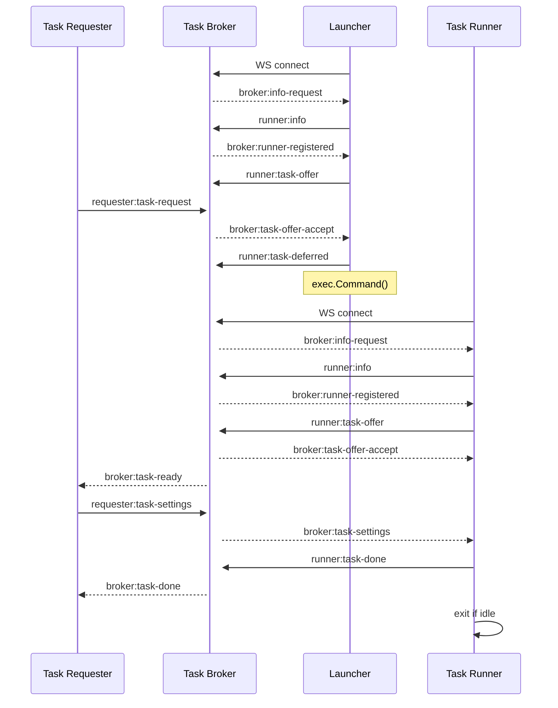
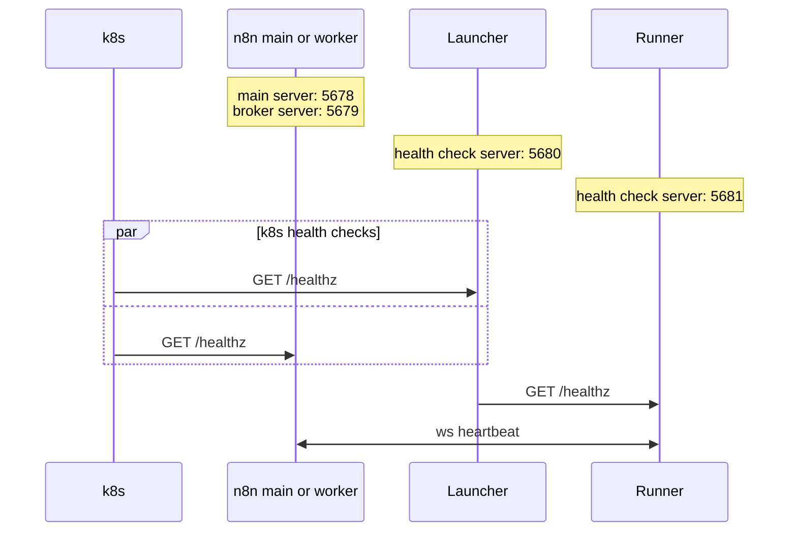

# KNOWLEDGE EXTRACT: github.com_n8n-io_task-runner-launcher_3675f84f
> **Extracted on:** 2026-04-01 09:18:34
> **Source:** D:/LongLeo/AI OS CORP/AI OS/system/security/QUARANTINE/KI-BATCH-20260331205007520108/github.com_n8n-io_task-runner-launcher_3675f84f

---

## File: `.gitignore`
```
.DS_Store
bin/*
!**/.gitkeep
config.json
coverage.html
coverage.out
```

## File: `.golangci.yml`
```yaml
version: "2"

run:
  tests: true
  timeout: 1m

linters:
  enable:
    - govet # correctness
    - errcheck # error handling
    - staticcheck # static analysis
    - gosec # security
    - revive # best practices

  settings:
    gosec:
      excludes:
        - G104 # disregard errors not requiring explicit handling
        - G204 # allow subprocess launching with validated config inputs

  exclusions:
    presets:
      - comments
      - std-error-handling
```

## File: `LICENSE.md`
```markdown
# License

Portions of this software are licensed as follows:

- Content of branches other than the main branch (i.e. "main") are not licensed.
- Source code files that contain ".ee." in their filename are NOT licensed under the Sustainable Use License.
  To use source code files that contain ".ee." in their filename you must hold a valid n8n Enterprise License
  specifically allowing you access to such source code files and as defined in "LICENSE_EE.md".
- All third party components incorporated into the n8n Software are licensed under the original license
  provided by the owner of the applicable component.
- Content outside of the above mentioned files or restrictions is available under the "Sustainable Use
  License" as defined below.

## Sustainable Use License

Version 1.0

### Acceptance

By using the software, you agree to all of the terms and conditions below.

### Copyright License

The licensor grants you a non-exclusive, royalty-free, worldwide, non-sublicensable, non-transferable license
to use, copy, distribute, make available, and prepare derivative works of the software, in each case subject
to the limitations below.

### Limitations

You may use or modify the software only for your own internal business purposes or for non-commercial or
personal use. You may distribute the software or provide it to others only if you do so free of charge for
non-commercial purposes. You may not alter, remove, or obscure any licensing, copyright, or other notices of
the licensor in the software. Any use of the licensor’s trademarks is subject to applicable law.

### Patents

The licensor grants you a license, under any patent claims the licensor can license, or becomes able to
license, to make, have made, use, sell, offer for sale, import and have imported the software, in each case
subject to the limitations and conditions in this license. This license does not cover any patent claims that
you cause to be infringed by modifications or additions to the software. If you or your company make any
written claim that the software infringes or contributes to infringement of any patent, your patent license
for the software granted under these terms ends immediately. If your company makes such a claim, your patent
license ends immediately for work on behalf of your company.

### Notices

You must ensure that anyone who gets a copy of any part of the software from you also gets a copy of these
terms. If you modify the software, you must include in any modified copies of the software a prominent notice
stating that you have modified the software.

### No Other Rights

These terms do not imply any licenses other than those expressly granted in these terms.

### Termination

If you use the software in violation of these terms, such use is not licensed, and your license will
automatically terminate. If the licensor provides you with a notice of your violation, and you cease all
violation of this license no later than 30 days after you receive that notice, your license will be reinstated
retroactively. However, if you violate these terms after such reinstatement, any additional violation of these
terms will cause your license to terminate automatically and permanently.

### No Liability

As far as the law allows, the software comes as is, without any warranty or condition, and the licensor will
not be liable to you for any damages arising out of these terms or the use or nature of the software, under
any kind of legal claim.

### Definitions

The “licensor” is the entity offering these terms.

The “software” is the software the licensor makes available under these terms, including any portion of it.

“You” refers to the individual or entity agreeing to these terms.

“Your company” is any legal entity, sole proprietorship, or other kind of organization that you work for, plus
all organizations that have control over, are under the control of, or are under common control with that
organization. Control means ownership of substantially all the assets of an entity, or the power to direct its
management and policies by vote, contract, or otherwise. Control can be direct or indirect.

“Your license” is the license granted to you for the software under these terms.

“Use” means anything you do with the software requiring your license.

“Trademark” means trademarks, service marks, and similar rights.
```

## File: `LICENSE_EE.md`
```markdown
# The n8n Enterprise License (the “Enterprise License”)

Copyright (c) 2022-present n8n GmbH.

With regard to the n8n Software:

This software and associated documentation files (the "Software") may only be used in production, if
you (and any entity that you represent) hold a valid n8n Enterprise license corresponding to your
usage. Subject to the foregoing sentence, you are free to modify this Software and publish patches
to the Software. You agree that n8n and/or its licensors (as applicable) retain all right, title and
interest in and to all such modifications and/or patches, and all such modifications and/or patches
may only be used, copied, modified, displayed, distributed, or otherwise exploited with a valid n8n
Enterprise license for the corresponding usage. Notwithstanding the foregoing, you may copy and
modify the Software for development and testing purposes, without requiring a subscription. You
agree that n8n and/or its licensors (as applicable) retain all right, title and interest in and to
all such modifications. You are not granted any other rights beyond what is expressly stated herein.
Subject to the foregoing, it is forbidden to copy, merge, publish, distribute, sublicense, and/or
sell the Software.

THE SOFTWARE IS PROVIDED "AS IS", WITHOUT WARRANTY OF ANY KIND, EXPRESS OR IMPLIED, INCLUDING BUT
NOT LIMITED TO THE WARRANTIES OF MERCHANTABILITY, FITNESS FOR A PARTICULAR PURPOSE AND
NONINFRINGEMENT. IN NO EVENT SHALL THE AUTHORS OR COPYRIGHT HOLDERS BE LIABLE FOR ANY CLAIM, DAMAGES
OR OTHER LIABILITY, WHETHER IN AN ACTION OF CONTRACT, TORT OR OTHERWISE, ARISING FROM, OUT OF OR IN
CONNECTION WITH THE SOFTWARE OR THE USE OR OTHER DEALINGS IN THE SOFTWARE.

For all third party components incorporated into the n8n Software, those components are licensed
under the original license provided by the owner of the applicable component.
```

## File: `Makefile`
```
build:
	go build -o bin cmd/launcher/main.go
	@echo "Binary built at: $(shell pwd)/bin/main"

check: lint
	go fmt ./...
	go vet ./...

lintfix:
	golangci-lint run --fix

fmt:
	go fmt ./...

fmt-check:
	@if [ -n "$$(go fmt ./...)" ]; then \
		echo "Found unformatted Go files. Please run 'make fmt'"; \
		exit 1; \
	fi

lint:
	golangci-lint run

run: build
	./bin/main javascript

run-all: build
	./bin/main javascript python

test:
	go test -race ./...

test-verbose:
	go test -race -v ./...

test-coverage:
	go test -race -coverprofile=coverage.out ./...
	go tool cover -html=coverage.out -o coverage.html
	open coverage.html

.PHONY: build check lint lintfix fmt fmt-check run run-all test test-verbose test-coverage
```

## File: `README.md`
```markdown
# task-runner-launcher

[](https://codecov.io/gh/n8n-io/task-runner-launcher)

CLI utility to launch an [n8n task runner](https://docs.n8n.io/hosting/configuration/task-runners/) in `external` mode. The launcher's purpose is to minimize resource use by launching a runner on demand, i.e. only when no runner is available and when a task is ready for pickup. It also makes sure the runner stays responsive and recovers from crashes.

```
./task-runner-launcher javascript
2024/11/29 13:37:46 INFO  [launcher:js] Starting launcher goroutine...
2024/11/29 13:37:46 DEBUG [launcher:js] Changed into working directory
2024/11/29 13:37:46 DEBUG [launcher:js] Prepared env vars for runner
2024/11/29 13:37:46 INFO  [launcher:js] Waiting for task broker to be ready...
2024/11/29 13:37:46 DEBUG [launcher:js] Task broker is ready
2024/11/29 13:37:46 DEBUG [launcher:js] Fetched grant token for launcher
2024/11/29 13:37:46 DEBUG [launcher:js] Launcher ID: fc6c24b9f764ae55
2024/11/29 13:37:46 DEBUG [launcher:js] Connected: ws://127.0.0.1:5679/runners/_ws?id=fc6c24b9f764ae55
2024/11/29 13:37:46 DEBUG [launcher:js] <- Received message `broker:inforequest`
2024/11/29 13:37:46 DEBUG [launcher:js] -> Sent message `runner:info`
2024/11/29 13:37:46 DEBUG [launcher:js] <- Received message `broker:runnerregistered`
2024/11/29 13:37:46 DEBUG [launcher:js] -> Sent message `runner:taskoffer` for offer ID `5990b980a04945bd`
2024/11/29 13:37:46 INFO  [launcher:js] Waiting for launcher's task offer to be accepted...
```

## Sections

- [Setup](../../../core/security/QUARANTINE/vetted/repos/claude_code_templates/cli_tool/components/skills/scientific/qiskit/references/setup.md) - how to set up the launcher in a production environment
- [Development](../../../core/security/QUARANTINE/vetted/repos/llm_lean_log/docs/development.md) - how to set up a development environment to work on the launcher
- [Release](../../../core/security/QUARANTINE/vetted/repos/claude_code_templates/cli_tool/components/commands/git/release.md) - how to release a new version of the launcher
- [Lifecycle](lifecycle.md) - how the launcher works
```

## File: `SECURITY.md`
```markdown
## Reporting a Vulnerability

Please report (suspected) security vulnerabilities to **[security@n8n.io](mailto:security@n8n.io)**. You will receive a response from
us within 48 hours. If the issue is confirmed, we will release a patch as soon as possible depending on complexity but historically within a few days.
```

## File: `go.mod`
```
module task-runner-launcher

go 1.25.8

require (
	github.com/getsentry/sentry-go v0.35.2
	github.com/gorilla/websocket v1.5.3
	github.com/sethvargo/go-envconfig v1.1.0
	github.com/stretchr/testify v1.8.4
)

require (
	github.com/davecgh/go-spew v1.1.1 // indirect
	github.com/kr/text v0.2.0 // indirect
	github.com/pmezard/go-difflib v1.0.0 // indirect
	golang.org/x/sys v0.18.0 // indirect
	golang.org/x/text v0.14.0 // indirect
	gopkg.in/yaml.v3 v3.0.1 // indirect
)
```

## File: `go.sum`
```
github.com/creack/pty v1.1.9/go.mod h1:oKZEueFk5CKHvIhNR5MUki03XCEU+Q6VDXinZuGJ33E=
github.com/davecgh/go-spew v1.1.1 h1:vj9j/u1bqnvCEfJOwUhtlOARqs3+rkHYY13jYWTU97c=
github.com/davecgh/go-spew v1.1.1/go.mod h1:J7Y8YcW2NihsgmVo/mv3lAwl/skON4iLHjSsI+c5H38=
github.com/getsentry/sentry-go v0.35.2 h1:jKuujpRwa8FFRYMIwwZpu83Xh0voll9bmvyc6310WBM=
github.com/getsentry/sentry-go v0.35.2/go.mod h1:mdL49ixwT2yi57k5eh7mpnDyPybixPzlzEJFu0Z76QA=
github.com/go-errors/errors v1.4.2 h1:J6MZopCL4uSllY1OfXM374weqZFFItUbrImctkmUxIA=
github.com/go-errors/errors v1.4.2/go.mod h1:sIVyrIiJhuEF+Pj9Ebtd6P/rEYROXFi3BopGUQ5a5Og=
github.com/google/go-cmp v0.6.0 h1:ofyhxvXcZhMsU5ulbFiLKl/XBFqE1GSq7atu8tAmTRI=
github.com/google/go-cmp v0.6.0/go.mod h1:17dUlkBOakJ0+DkrSSNjCkIjxS6bF9zb3elmeNGIjoY=
github.com/gorilla/websocket v1.5.3 h1:saDtZ6Pbx/0u+bgYQ3q96pZgCzfhKXGPqt7kZ72aNNg=
github.com/gorilla/websocket v1.5.3/go.mod h1:YR8l580nyteQvAITg2hZ9XVh4b55+EU/adAjf1fMHhE=
github.com/kr/pretty v0.3.0 h1:WgNl7dwNpEZ6jJ9k1snq4pZsg7DOEN8hP9Xw0Tsjwk0=
github.com/kr/pretty v0.3.0/go.mod h1:640gp4NfQd8pI5XOwp5fnNeVWj67G7CFk/SaSQn7NBk=
github.com/kr/text v0.2.0 h1:5Nx0Ya0ZqY2ygV366QzturHI13Jq95ApcVaJBhpS+AY=
github.com/kr/text v0.2.0/go.mod h1:eLer722TekiGuMkidMxC/pM04lWEeraHUUmBw8l2grE=
github.com/pingcap/errors v0.11.4 h1:lFuQV/oaUMGcD2tqt+01ROSmJs75VG1ToEOkZIZ4nE4=
github.com/pingcap/errors v0.11.4/go.mod h1:Oi8TUi2kEtXXLMJk9l1cGmz20kV3TaQ0usTwv5KuLY8=
github.com/pkg/errors v0.9.1 h1:FEBLx1zS214owpjy7qsBeixbURkuhQAwrK5UwLGTwt4=
github.com/pkg/errors v0.9.1/go.mod h1:bwawxfHBFNV+L2hUp1rHADufV3IMtnDRdf1r5NINEl0=
github.com/pmezard/go-difflib v1.0.0 h1:4DBwDE0NGyQoBHbLQYPwSUPoCMWR5BEzIk/f1lZbAQM=
github.com/pmezard/go-difflib v1.0.0/go.mod h1:iKH77koFhYxTK1pcRnkKkqfTogsbg7gZNVY4sRDYZ/4=
github.com/rogpeppe/go-internal v1.8.0 h1:FCbCCtXNOY3UtUuHUYaghJg4y7Fd14rXifAYUAtL9R8=
github.com/rogpeppe/go-internal v1.8.0/go.mod h1:WmiCO8CzOY8rg0OYDC4/i/2WRWAB6poM+XZ2dLUbcbE=
github.com/sethvargo/go-envconfig v1.1.0 h1:cWZiJxeTm7AlCvzGXrEXaSTCNgip5oJepekh/BOQuog=
github.com/sethvargo/go-envconfig v1.1.0/go.mod h1:JLd0KFWQYzyENqnEPWWZ49i4vzZo/6nRidxI8YvGiHw=
github.com/stretchr/testify v1.8.4 h1:CcVxjf3Q8PM0mHUKJCdn+eZZtm5yQwehR5yeSVQQcUk=
github.com/stretchr/testify v1.8.4/go.mod h1:sz/lmYIOXD/1dqDmKjjqLyZ2RngseejIcXlSw2iwfAo=
go.uber.org/goleak v1.3.0 h1:2K3zAYmnTNqV73imy9J1T3WC+gmCePx2hEGkimedGto=
go.uber.org/goleak v1.3.0/go.mod h1:CoHD4mav9JJNrW/WLlf7HGZPjdw8EucARQHekz1X6bE=
golang.org/x/sys v0.18.0 h1:DBdB3niSjOA/O0blCZBqDefyWNYveAYMNF1Wum0DYQ4=
golang.org/x/sys v0.18.0/go.mod h1:/VUhepiaJMQUp4+oa/7Zr1D23ma6VTLIYjOOTFZPUcA=
golang.org/x/text v0.14.0 h1:ScX5w1eTa3QqT8oi6+ziP7dTV1S2+ALU0bI+0zXKWiQ=
golang.org/x/text v0.14.0/go.mod h1:18ZOQIKpY8NJVqYksKHtTdi31H5itFRjB5/qKTNYzSU=
gopkg.in/check.v1 v0.0.0-20161208181325-20d25e280405/go.mod h1:Co6ibVJAznAaIkqp8huTwlJQCZ016jof/cbN4VW5Yz0=
gopkg.in/check.v1 v1.0.0-20201130134442-10cb98267c6c h1:Hei/4ADfdWqJk1ZMxUNpqntNwaWcugrBjAiHlqqRiVk=
gopkg.in/check.v1 v1.0.0-20201130134442-10cb98267c6c/go.mod h1:JHkPIbrfpd72SG/EVd6muEfDQjcINNoR0C8j2r3qZ4Q=
gopkg.in/yaml.v3 v3.0.1 h1:fxVm/GzAzEWqLHuvctI91KS9hhNmmWOoWu0XTYJS7CA=
gopkg.in/yaml.v3 v3.0.1/go.mod h1:K4uyk7z7BCEPqu6E+C64Yfv1cQ7kz7rIZviUmN+EgEM=
```

## File: `cmd/launcher/main.go`
```go
package main

import (
	"flag"
	"fmt"
	"os"
	"sync"
	"task-runner-launcher/internal/commands"
	"task-runner-launcher/internal/config"
	"task-runner-launcher/internal/errorreporting"
	"task-runner-launcher/internal/http"
	"task-runner-launcher/internal/logs"

	"github.com/sethvargo/go-envconfig"
)

func main() {
	flag.Usage = func() {
		fmt.Printf("Usage: %s [runner-type(s)]\n", os.Args[0])
		flag.PrintDefaults()
	}

	if len(os.Args) < 2 {
		os.Stderr.WriteString("Missing runner-type argument(s)\n")
		flag.Usage()
		os.Exit(1)
	}

	runnerTypes := os.Args[1:]

	launcherConfig, err := config.LoadLauncherConfig(runnerTypes, envconfig.OsLookuper())
	if err != nil {
		logs.Errorf("Failed to load config: %v", err)
		os.Exit(1)
	}

	errorreporting.Init(launcherConfig.BaseConfig.Sentry)
	defer errorreporting.Close()

	http.InitHealthCheckServer(launcherConfig.BaseConfig.HealthCheckServerPort)

	var wg sync.WaitGroup

	for _, runnerType := range runnerTypes {
		wg.Add(1)
		go func(rt string) {
			defer wg.Done()

			logLevel := logs.ParseLevel(launcherConfig.BaseConfig.LogLevel)
			logPrefix := logs.GetLauncherPrefix(runnerType)
			logger := logs.NewLogger(logLevel, logPrefix)

			cmd := commands.NewLaunchCommand(logger)
			if err := cmd.Execute(launcherConfig, rt); err != nil {
				logger.Errorf("Failed to execute `launch` command: %v", err)
			}
		}(runnerType)
	}

	wg.Wait()
}
```

## File: `docs/development.md`
```markdown
# Development

To set up a development environment, follow these steps:

1. Install Go >=1.25.8, [`golangci-lint`](https://golangci-lint.run/welcome/install/) >= 2.4.0 and `make`.

2. Clone this repository and create a [config file](../../../core/security/QUARANTINE/vetted/repos/claude_code_templates/cli_tool/components/skills/scientific/qiskit/references/setup.md#config-file).

```sh
git clone https://github.com/n8n-io/task-runner-launcher
cd task-runner-launcher
touch config.json && echo '<json-config-content>' > config.json
sudo mv config.json /etc/n8n-task-runners.json
```

Alternatively, use this environment variable to specify the config file path:

```sh
export N8N_RUNNERS_CONFIG_PATH=/path/to/your/config.json
```

3. Make your changes.

4. Build launcher:

```sh
make build
```

5. Start n8n >= 1.69.0:

```sh
export N8N_RUNNERS_ENABLED=true
export N8N_RUNNERS_MODE=external
export N8N_RUNNERS_AUTH_TOKEN=test
pnpm start
```

6. Start launcher:

```sh
export N8N_RUNNERS_AUTH_TOKEN=test
make run
```

> [!TIP]
> You can use `N8N_RUNNERS_LAUNCHER_LOG_LEVEL=debug` for granular logging and `NO_COLOR=1` to disable color output.
```

## File: `docs/lifecycle.md`
```markdown
# Lifecycle

## Summary

The purpose of the launcher is to minimize resource use by launching a runner on demand. 

To do so, the launcher impersonates a task runner until a task is ready for pickup, then it launches a runner to run the task, and after the runner has automatically shut down, the launcher will re-launch a runner once the next task is ready for pickup. The launcher follows this cycle independently for every runner type (i.e., language) configured to run.

## Step by step

Once the launcher is started, it connects to the n8n instance via HTTP and then via websocket, registers itself as a runner with the task broker, and sends the task broker a non-expiring offer to run a task.

This flow is called the **handshake**. The handshake will complete only when a task needs to be run, i.e. only once the task broker sends the launcher (registered as a runner) the broker's acceptance of the launcher's offer to run a task.

The launcher itself cannot run a task, so once the launcher receives an acceptance from the broker, the launcher requests the broker to defer the task, disconnects from the task broker, and launches a task runner as a separate process.

This runner will follow the regular flow, i.e. connect to the main instance, register itself with the task broker, and send the task broker expiring offers to run tasks. The broker will match one of those offers to the pending (deferred) task, and so the task broker will send the runner the task to run.

The runner will receive and complete the task and return the result. By now only the runner is connected with the task broker, so when the next task comes in, the runner will receive and complete the next task. Once the runner has been idle for long enough, the runner will automatically shut down, prompting the launcher to perform the handshake again. Later on, when the next task comes in, the launcher will complete the handshake and the cycle will repeat.

### Sequence diagram


```

## File: `docs/release.md`
```markdown
# Release

1. Publish a [GitHub release](https://github.com/n8n-io/task-runner-launcher/releases/new) with a new git tag following semver. The [`release` workflow](../.github/workflows/release.yml) will build binaries for arm64 and amd64 and upload them to the release in the [releases page](https://github.com/n8n-io/task-runner-launcher/releases).

2. Update the `LAUNCHER_VERSION` argument in the main repository:

- `docker/images/runners/Dockerfile`
- `docker/images/runners/Dockerfile.distroless`
```

## File: `docs/setup.md`
```markdown
# Setup

To set up the launcher:

1. Download the latest launcher binary from the [releases page](https://github.com/n8n-io/task-runner-launcher/releases).

2. Create a [config file](#config-file) on the host and make it accessible to the launcher.

3. Configure [environment variables](#environment-variables).

4. Deploy the launcher as a sidecar container to an n8n main or worker instance, setting the launcher to manage one or multiple runner types.

```sh
./task-runner-launcher javascript # or
./task-runner-launcher javascript python
```

5. Ensure your orchestrator (e.g. k8s) performs regular liveness checks on both launcher and task broker.

- The launcher exposes a health check endpoint at `/healthz` on port `5680`, configurable via `N8N_RUNNERS_LAUNCHER_HEALTH_CHECK_PORT`.
- The task broker exposes a health check endpoint at `/healthz` on port `5679`, configurable via `N8N_RUNNERS_BROKER_PORT`.

<br>



## Config file

The launcher reads its config file from `/etc/n8n-task-runners.json` by default, or from the file path specified by the `N8N_RUNNERS_CONFIG_PATH` environment variable.

For an example, refer to the [config file](https://github.com/n8n-io/n8n/blob/master/docker/images/runners/n8n-task-runners.json) used in the [`n8nio/runners`](https://hub.docker.com/r/n8nio/runners) Docker image.


| Property       | Description                                                                                                             |
| --------------- | ----------------------------------------------------------------------------------------------------------------------- |
| `runner-type`   | Type of task runner, e.g. `javascript` or `python`. The launcher can manage only one runner per type.                   |
| `workdir`       | Path where the task runner's `command` will run.                                                                                          |
| `command`       | Command to start the task runner.                                                                                       |
| `args`          | Args and flags to use with `command`.                                                                                           |
| `health-check-server-port` | Port for the runner's health check server. When a single runner is configured, this is optional and defaults to `5681`. When multiple runners are configured, this is required and must be unique per runner.
| `allowed-env`   | Env vars that the launcher will pass through from its own environment to the runner. See [environment variables](#environment-variables).
| `env-overrides` | Env vars that the launcher will set directly on the runner. See [environment variables](#environment-variables).

## Environment variables

It is required to pass `N8N_RUNNERS_AUTH_TOKEN` to the launcher and to the n8n instance. This token will allow the launcher to authenticate with the n8n instance and to obtain a grant tokens for every runner it manages. All other env vars are optional and are listed in the [n8n docs](https://docs.n8n.io/hosting/configuration/environment-variables/task-runners).

For any environment variable, you can append `_FILE` to specify a file path to read a value from. For example: `N8N_RUNNERS_AUTH_TOKEN_FILE=/path/to/auth-token.txt`

The launcher can pass env vars to task runners in two ways, as specified in the [config file](#config-file):

| Source | Description | Purpose |
|--------|-------------|------------|
| `allowed-env` | Env vars filtered from the launcher's own environment | Passing env vars common to all runner types |
| `env-overrides` | Env vars set by the launcher directly on the runner, with precedence over `allowed-env` | Passing env vars specific to a single runner type |

Exceptionally, these four env vars cannot be disallowed or overridden:

- `N8N_RUNNERS_TASK_BROKER_URI`
- `N8N_RUNNERS_GRANT_TOKEN`
- `N8N_RUNNERS_HEALTH_CHECK_SERVER_ENABLED=true`
- `N8N_RUNNERS_HEALTH_CHECK_SERVER_PORT`
```

## File: `internal/commands/launch.go`
```go
package commands

import (
	"context"
	"errors"
	"fmt"
	"os"
	"os/exec"
	"sync"
	"task-runner-launcher/internal/config"
	"task-runner-launcher/internal/env"
	"task-runner-launcher/internal/errs"
	"task-runner-launcher/internal/http"
	"task-runner-launcher/internal/logs"
	"task-runner-launcher/internal/ws"
	"time"
)

type Command interface {
	Execute() error
}

type LaunchCommand struct {
	logger *logs.Logger
}

func NewLaunchCommand(logger *logs.Logger) *LaunchCommand {
	return &LaunchCommand{logger: logger}
}

func (c *LaunchCommand) Execute(launcherConfig *config.LauncherConfig, runnerType string) error {
	c.logger.Info("Starting launcher goroutine...")

	baseConfig := launcherConfig.BaseConfig
	runnerConfig := launcherConfig.RunnerConfigs[runnerType]

	// 1. change into working directory

	if err := os.Chdir(runnerConfig.WorkDir); err != nil {
		return fmt.Errorf("failed to chdir into configured dir (%s): %w", runnerConfig.WorkDir, err)
	}

	c.logger.Debugf("Changed into working directory: %s", runnerConfig.WorkDir)

	// 2. prepare env vars to pass to runner

	runnerEnv := env.PrepareRunnerEnv(baseConfig, runnerConfig, c.logger)
	runnerServerURI := fmt.Sprintf("http://%s:%s", baseConfig.RunnerHealthCheckServerHost, runnerConfig.HealthCheckServerPort)

	for {
		// 3. check until task broker is ready

		if err := http.CheckUntilBrokerReady(baseConfig.TaskBrokerURI, c.logger); err != nil {
			return fmt.Errorf("encountered error while waiting for broker to be ready: %w", err)
		}

		// 4. fetch grant token for launcher

		launcherGrantToken, err := http.FetchGrantToken(baseConfig.TaskBrokerURI, baseConfig.AuthToken)
		if err != nil {
			return fmt.Errorf("failed to fetch grant token for launcher: %w", err)
		}

		c.logger.Debug("Fetched grant token for launcher")

		// 5. connect to main and wait for task offer to be accepted

		handshakeCfg := ws.HandshakeConfig{
			TaskType:            runnerConfig.RunnerType,
			TaskBrokerServerURI: launcherConfig.BaseConfig.TaskBrokerURI,
			GrantToken:          launcherGrantToken,
		}

		err = ws.Handshake(handshakeCfg, c.logger)
		switch {
		case errors.Is(err, errs.ErrServerDown):
			c.logger.Warn("Task broker is down, launcher will try to reconnect...")
			time.Sleep(time.Second * 5)
			continue // back to checking until broker ready
		case err != nil:
			return fmt.Errorf("handshake failed: %w", err)
		}

		// 6. fetch grant token for runner

		runnerGrantToken, err := http.FetchGrantToken(baseConfig.TaskBrokerURI, baseConfig.AuthToken)
		if err != nil {
			return fmt.Errorf("failed to fetch grant token for runner: %w", err)
		}

		c.logger.Debug("Fetched grant token for runner")

		runnerEnv = append(runnerEnv, fmt.Sprintf("N8N_RUNNERS_GRANT_TOKEN=%s", runnerGrantToken))

		// 8. launch runner

		c.logger.Debug("Task ready for pickup, launching runner...")
		c.logger.Debugf("Command: %s", runnerConfig.Command)
		c.logger.Debugf("Args: %v", runnerConfig.Args)

		ctx, cancelHealthMonitor := context.WithCancel(context.Background())
		var wg sync.WaitGroup

		cmd := exec.CommandContext(ctx, runnerConfig.Command, runnerConfig.Args...)
		cmd.Env = runnerEnv
		runnerPrefix := logs.GetRunnerPrefix(runnerType)
		logLevel := logs.ParseLevel(launcherConfig.BaseConfig.LogLevel)
		cmd.Stdout, cmd.Stderr = logs.GetRunnerWriters(logLevel, runnerPrefix)

		if err := cmd.Start(); err != nil {
			cancelHealthMonitor()
			return fmt.Errorf("failed to start runner process: %w", err)
		}

		go http.ManageRunnerHealth(ctx, cmd, runnerServerURI, &wg, c.logger)

		err = cmd.Wait()
		if err != nil && err.Error() == "signal: killed" {
			c.logger.Warn("Unresponsive runner process was terminated")
		} else if err != nil {
			c.logger.Errorf("Runner process exited with error: %v", err)
		} else {
			c.logger.Info("Runner process exited on idle timeout")
		}
		cancelHealthMonitor()

		wg.Wait()

		// next runner will need to fetch a new grant token
		runnerEnv = env.Clear(runnerEnv, env.EnvVarGrantToken)
	}
}
```

## File: `internal/config/config.go`
```go
package config

import (
	"context"
	"encoding/json"
	"errors"
	"fmt"
	"os"
	"strconv"
	"task-runner-launcher/internal/errs"
	"task-runner-launcher/internal/logs"

	"github.com/sethvargo/go-envconfig"
)

const (
	// EnvVarHealthCheckPort is the env var for the port for the launcher's health check server.
	EnvVarHealthCheckPort = "N8N_RUNNERS_LAUNCHER_HEALTH_CHECK_PORT"
)

// LauncherConfig holds the full configuration for the launcher.
type LauncherConfig struct {
	BaseConfig    *BaseConfig
	RunnerConfigs map[string]*RunnerConfig
}

// BaseConfig holds the configuration for the launcher, excluding runner configs.
type BaseConfig struct {
	// LogLevel is the log level for the launcher. Default: `info`.
	LogLevel string `env:"N8N_RUNNERS_LAUNCHER_LOG_LEVEL, default=info"`

	// AuthToken is the auth token sent by the launcher to the task broker in
	// exchange for a single-use grant token, later passed to the runner.
	AuthToken string `env:"N8N_RUNNERS_AUTH_TOKEN, required"`

	// AutoShutdownTimeout is how long (in seconds) a runner may be idle for
	// before automatically shutting down, until later relaunched.
	AutoShutdownTimeout string `env:"N8N_RUNNERS_AUTO_SHUTDOWN_TIMEOUT, default=15"`

	// TaskTimeout is the max time (in seconds) a task may run for before it is
	// aborted.
	TaskTimeout string `env:"N8N_RUNNERS_TASK_TIMEOUT, default=60"`

	// TaskBrokerURI is the URI of the task broker server.
	TaskBrokerURI string `env:"N8N_RUNNERS_TASK_BROKER_URI, default=http://127.0.0.1:5679"`

	// HealthCheckServerPort is the port for the launcher's health check server.
	HealthCheckServerPort string `env:"N8N_RUNNERS_LAUNCHER_HEALTH_CHECK_PORT, default=5680"`

	// RunnerHealthCheckServerHost is the host for all runners' health check servers.
	RunnerHealthCheckServerHost string `env:"N8N_RUNNERS_HEALTH_CHECK_SERVER_HOST, default=127.0.0.1"`

	// ConfigPath is the path to the runners config file. Default: `/etc/n8n-task-runners.json`.
	ConfigPath string `env:"N8N_RUNNERS_CONFIG_PATH, default=/etc/n8n-task-runners.json"`

	// Sentry is the Sentry config for the launcher, a subset of what is defined in:
	// https://docs.sentry.io/platforms/go/configuration/options/
	Sentry *SentryConfig
}

type SentryConfig struct {
	IsEnabled      bool
	Dsn            string `env:"SENTRY_DSN"` // If unset, Sentry will be disabled.
	Release        string `env:"N8N_VERSION, default=unknown"`
	Environment    string `env:"ENVIRONMENT, default=unknown"`
	DeploymentName string `env:"DEPLOYMENT_NAME, default=unknown"`
}

// RunnerConfig holds the configuration for a single task runner.
type RunnerConfig struct {
	// Type of task runner, e.g. "javascript" or "python".
	RunnerType string `json:"runner-type"`

	// Path to dir containing the runner binary.
	WorkDir string `json:"workdir"`

	// Command to start runner.
	Command string `json:"command"`

	// Arguments for command, currently path to runner entrypoint.
	Args []string `json:"args"`

	// Port for the runner's health check server.
	// When a single runner is configured, this is optional and defaults to 5681.
	// When multiple runners are configured, this is required and must be unique per runner.
	HealthCheckServerPort string `json:"health-check-server-port,omitempty"`

	// Env vars for the launcher to pass from its own environment to the runner.
	AllowedEnv []string `json:"allowed-env"`

	// Env vars for the launcher to set directly on the runner.
	EnvOverrides map[string]string `json:"env-overrides"`
}

// LoadLauncherConfig loads the launcher's base config from the launcher's environment and
// loads runner configs from the config file specified by N8N_RUNNERS_CONFIG_PATH.
func LoadLauncherConfig(runnerTypes []string, baseLookuper envconfig.Lookuper) (*LauncherConfig, error) {
	ctx := context.Background()

	var baseConfig BaseConfig
	if err := envconfig.ProcessWith(ctx, &envconfig.Config{
		Target:   &baseConfig,
		Lookuper: NewLauncherLookuper(baseLookuper),
	}); err != nil {
		return nil, err
	}

	var cfgErrs []error

	if err := validateURL(baseConfig.TaskBrokerURI, "N8N_RUNNERS_TASK_BROKER_URI"); err != nil {
		cfgErrs = append(cfgErrs, err)
	}

	timeoutInt, err := strconv.Atoi(baseConfig.AutoShutdownTimeout)
	if err != nil {
		cfgErrs = append(cfgErrs, errs.ErrNonIntegerAutoShutdownTimeout)
	} else if timeoutInt < 0 {
		cfgErrs = append(cfgErrs, errs.ErrNegativeAutoShutdownTimeout)
	}

	if port, err := strconv.Atoi(baseConfig.HealthCheckServerPort); err != nil || port <= 0 || port >= 65536 {
		cfgErrs = append(cfgErrs, fmt.Errorf("%s must be a valid port number", EnvVarHealthCheckPort))
	}

	if baseConfig.Sentry.Dsn != "" {
		if err := validateURL(baseConfig.Sentry.Dsn, "SENTRY_DSN"); err != nil {
			cfgErrs = append(cfgErrs, err)
		} else {
			baseConfig.Sentry.IsEnabled = true
		}
	}

	// runners

	runnerConfigs, err := readLauncherConfigFile(baseConfig.ConfigPath, runnerTypes)
	if err != nil {
		cfgErrs = append(cfgErrs, err)
	}

	if len(cfgErrs) > 0 {
		return nil, errors.Join(cfgErrs...)
	}

	return &LauncherConfig{
		BaseConfig:    &baseConfig,
		RunnerConfigs: runnerConfigs,
	}, nil
}

// readLauncherConfigFile reads the config file at the specified path and
// returns the runner config(s) for the requested runner type(s).
func readLauncherConfigFile(configPath string, runnerTypes []string) (map[string]*RunnerConfig, error) {
	// #nosec G304 -- configPath is controlled by system administrator via environment variable
	data, err := os.ReadFile(configPath)
	if err != nil {
		return nil, fmt.Errorf("failed to open config file at %s: %v", configPath, err)
	}

	var fileConfig struct {
		TaskRunners []RunnerConfig `json:"task-runners"`
	}
	if err := json.Unmarshal(data, &fileConfig); err != nil {
		return nil, fmt.Errorf("failed to parse config file at %s: %w", configPath, err)
	}

	taskRunnersNum := len(fileConfig.TaskRunners)

	if taskRunnersNum == 0 {
		return nil, fmt.Errorf("config file at %s contains no task runners", configPath)
	}

	runnerConfigs := make(map[string]*RunnerConfig)
	for _, runnerType := range runnerTypes {
		found := false
		for _, runnerConfig := range fileConfig.TaskRunners {
			if runnerConfig.RunnerType == runnerType {
				runnerConfigs[runnerType] = &runnerConfig
				found = true
				break
			}
		}
		if !found {
			return nil, fmt.Errorf("config file at %s does not contain requested runner type: %s", configPath, runnerType)
		}
	}

	if len(runnerConfigs) == 1 {
		for _, config := range runnerConfigs {
			if config.HealthCheckServerPort == "" {
				config.HealthCheckServerPort = "5681"
			}
		}
	} else {
		for runnerType, config := range runnerConfigs {
			if config.HealthCheckServerPort == "" {
				return nil, fmt.Errorf("runner %s: health-check-server-port is required with multiple runners", runnerType)
			}
		}
	}

	if err := validateRunnerPorts(runnerConfigs); err != nil {
		return nil, err
	}

	if taskRunnersNum == 1 {
		logs.Debug("Loaded config file with a single runner config")
	} else {
		logs.Debugf("Loaded config file with %d runner configs", taskRunnersNum)
	}

	return runnerConfigs, nil
}

func validateRunnerPorts(runnerConfigs map[string]*RunnerConfig) error {
	reservedPorts := map[string]string{
		"5678": "n8n main server",
		"5679": "n8n broker server",
		"5680": "launcher health check server",
	}

	usedPorts := make(map[string]string)

	for runnerType, config := range runnerConfigs {
		port := config.HealthCheckServerPort

		if port, err := strconv.Atoi(port); err != nil || port <= 0 || port >= 65536 {
			return fmt.Errorf("runner %s: health-check-server-port must be a valid port number", runnerType)
		}

		if service, exists := reservedPorts[port]; exists {
			return fmt.Errorf("runner %s: health-check-server-port %s conflicts with %s", runnerType, port, service)
		}

		if existingRunner, exists := usedPorts[port]; exists {
			return fmt.Errorf("runners %s and %s cannot use the same health-check-server-port %s", existingRunner, runnerType, port)
		}

		usedPorts[port] = runnerType
	}

	return nil
}
```

## File: `internal/config/config_test.go`
```go
package config

import (
	"os"
	"path/filepath"
	"testing"

	"github.com/sethvargo/go-envconfig"
	"github.com/stretchr/testify/assert"
	"github.com/stretchr/testify/require"
)

func TestLoadConfig(t *testing.T) {
	testConfigPath := filepath.Join(t.TempDir(), "testconfig.json")

	validConfigContent := `{
		"task-runners": [{
			"runner-type": "javascript",
			"workdir": "/test/dir",
			"command": "node",
			"args": ["/test/start.js"],
			"allowed-env": ["PATH", "NODE_ENV"]
		}]
	}`

	tests := []struct {
		name          string
		configContent string
		envVars       map[string]string
		runnerType    string
		expectedError bool
		errorMsg      string
	}{
		{
			name:          "valid configuration",
			configContent: validConfigContent,
			envVars: map[string]string{
				"N8N_RUNNERS_AUTH_TOKEN":      "test-token",
				"N8N_RUNNERS_TASK_BROKER_URI": "http://localhost:5679",
				"N8N_RUNNERS_CONFIG_PATH":     testConfigPath,
				"SENTRY_DSN":                  "https://test@sentry.io/123",
			},
			runnerType:    "javascript",
			expectedError: false,
		},
		{
			name:          "valid configuration",
			configContent: validConfigContent,
			envVars: map[string]string{
				"N8N_RUNNERS_AUTH_TOKEN":      "test-token",
				"N8N_RUNNERS_TASK_BROKER_URI": "http://127.0.0.1:5679",
				"N8N_RUNNERS_CONFIG_PATH":     testConfigPath,
				"SENTRY_DSN":                  "https://test@sentry.io/123",
			},
			runnerType:    "javascript",
			expectedError: false,
		},
	}

	for _, tt := range tests {
		t.Run(tt.name, func(t *testing.T) {
			err := os.WriteFile(testConfigPath, []byte(tt.configContent), 0600)
			require.NoError(t, err, "Failed to write test config file")

			lookuper := envconfig.MapLookuper(tt.envVars)
			cfg, err := LoadLauncherConfig([]string{"javascript"}, lookuper)

			if tt.expectedError {
				assert.Error(t, err)
				assert.Contains(t, err.Error(), tt.errorMsg)
				assert.Nil(t, cfg)
			} else {
				assert.NoError(t, err)
				assert.NotNil(t, cfg)
			}
		})
	}
}

func TestConfigFileErrors(t *testing.T) {
	testConfigPath := filepath.Join(t.TempDir(), "testconfig.json")

	tests := []struct {
		name          string
		configContent string
		expectedError string
		envVars       map[string]string
	}{
		{
			name:          "invalid JSON in config file",
			configContent: "invalid json",
			expectedError: "failed to parse config file",
			envVars: map[string]string{
				"N8N_RUNNERS_AUTH_TOKEN":      "test-token",
				"N8N_RUNNERS_TASK_BROKER_URI": "http://localhost:5679",
				"N8N_RUNNERS_CONFIG_PATH":     testConfigPath,
			},
		},
		{
			name: "empty task runners array",
			configContent: `{
				"task-runners": []
			}`,
			expectedError: "contains no task runners",
			envVars: map[string]string{
				"N8N_RUNNERS_AUTH_TOKEN":      "test-token",
				"N8N_RUNNERS_TASK_BROKER_URI": "http://localhost:5679",
				"N8N_RUNNERS_CONFIG_PATH":     testConfigPath,
			},
		},
		{
			name: "runner type not found",
			configContent: `{
				"task-runners": [{
					"runner-type": "python",
					"workdir": "/test/dir",
					"command": "python",
					"args": ["/test/start.py"],
					"allowed-env": ["PATH", "PYTHONPATH"]
				}]
			}`,
			expectedError: "does not contain requested runner type: javascript",
			envVars: map[string]string{
				"N8N_RUNNERS_AUTH_TOKEN":      "test-token",
				"N8N_RUNNERS_TASK_BROKER_URI": "http://localhost:5679",
				"N8N_RUNNERS_CONFIG_PATH":     testConfigPath,
			},
		},
	}

	for _, tt := range tests {
		t.Run(tt.name, func(t *testing.T) {
			if tt.configContent != "" {
				err := os.WriteFile(testConfigPath, []byte(tt.configContent), 0600)
				require.NoError(t, err, "Failed to write test config file")
			}

			lookuper := envconfig.MapLookuper(tt.envVars)
			cfg, err := LoadLauncherConfig([]string{"javascript"}, lookuper)

			assert.Error(t, err)
			assert.Contains(t, err.Error(), tt.expectedError)
			assert.Nil(t, cfg)
		})
	}
}

func TestValidateRunnerPorts(t *testing.T) {
	tests := []struct {
		name          string
		runnerConfigs map[string]*RunnerConfig
		expectedError string
	}{
		{
			name: "valid unique ports",
			runnerConfigs: map[string]*RunnerConfig{
				"javascript": {HealthCheckServerPort: "5681"},
				"python":     {HealthCheckServerPort: "5682"},
			},
			expectedError: "",
		},
		{
			name: "duplicate ports",
			runnerConfigs: map[string]*RunnerConfig{
				"javascript": {HealthCheckServerPort: "5681"},
				"python":     {HealthCheckServerPort: "5681"},
			},
			expectedError: "cannot use the same health-check-server-port",
		},
		{
			name: "reserved port conflict",
			runnerConfigs: map[string]*RunnerConfig{
				"javascript": {HealthCheckServerPort: "5679"},
			},
			expectedError: "conflicts with n8n broker server",
		},
		{
			name: "invalid port number",
			runnerConfigs: map[string]*RunnerConfig{
				"javascript": {HealthCheckServerPort: "not-a-port"},
			},
			expectedError: "must be a valid port number",
		},
		{
			name: "port out of range",
			runnerConfigs: map[string]*RunnerConfig{
				"javascript": {HealthCheckServerPort: "70000"},
			},
			expectedError: "must be a valid port number",
		},
	}

	for _, tt := range tests {
		t.Run(tt.name, func(t *testing.T) {
			err := validateRunnerPorts(tt.runnerConfigs)
			if tt.expectedError == "" {
				assert.NoError(t, err)
			} else {
				assert.Error(t, err)
				assert.Contains(t, err.Error(), tt.expectedError)
			}
		})
	}
}

func TestBackwardsCompatibilityPortDefaults(t *testing.T) {
	tests := []struct {
		name          string
		configContent string
		runnerTypes   []string
		expectError   bool
		expectedPorts map[string]string
	}{
		{
			name: "single runner gets default port",
			configContent: `{
				"task-runners": [{
					"runner-type": "javascript",
					"workdir": "/test",
					"command": "node",
					"args": ["test.js"]
				}]
			}`,
			runnerTypes: []string{"javascript"},
			expectedPorts: map[string]string{
				"javascript": "5681",
			},
		},
		{
			name: "multiple runners require explicit ports",
			configContent: `{
				"task-runners": [
					{
						"runner-type": "javascript",
						"workdir": "/test",
						"command": "node",
						"args": ["test.js"]
					},
					{
						"runner-type": "python", 
						"workdir": "/test",
						"command": "python",
						"args": ["test.py"]
					}
				]
			}`,
			runnerTypes: []string{"javascript", "python"},
			expectError: true,
		},
	}

	for _, tt := range tests {
		t.Run(tt.name, func(t *testing.T) {
			testConfigPath := filepath.Join(t.TempDir(), "test-config.json")
			err := os.WriteFile(testConfigPath, []byte(tt.configContent), 0600)
			require.NoError(t, err)

			configs, err := readLauncherConfigFile(testConfigPath, tt.runnerTypes)

			if tt.expectError {
				assert.Error(t, err)
			} else {
				assert.NoError(t, err)
				for runnerType, expectedPort := range tt.expectedPorts {
					assert.Equal(t, expectedPort, configs[runnerType].HealthCheckServerPort)
				}
			}
		})
	}
}
```

## File: `internal/config/lookuper.go`
```go
package config

import (
	"os"
	"strings"

	"github.com/sethvargo/go-envconfig"
)

type LauncherLookuper struct {
	baseLookuper envconfig.Lookuper
}

func NewLauncherLookuper(baseLookuper envconfig.Lookuper) *LauncherLookuper {
	return &LauncherLookuper{baseLookuper: baseLookuper}
}

func (l *LauncherLookuper) Lookup(key string) (string, bool) {
	fileKey := key + "_FILE"
	if filePath, ok := l.baseLookuper.Lookup(fileKey); ok {
		// #nosec G304 -- filePath is controlled by system administrator via environment variable
		content, err := os.ReadFile(filePath)
		if err != nil {
			return "", false
		}

		return strings.TrimRight(string(content), "\n\r"), true
	}

	return l.baseLookuper.Lookup(key)
}
```

## File: `internal/config/lookuper_test.go`
```go
package config

import (
	"maps"
	"os"
	"path/filepath"
	"testing"

	"github.com/sethvargo/go-envconfig"
	"github.com/stretchr/testify/assert"
	"github.com/stretchr/testify/require"
)

func TestFileLookuper(t *testing.T) {
	tests := []struct {
		name          string
		envVars       map[string]string
		fileContent   map[string]string // filepath -> content
		lookupKey     string
		expectedValue string
		expectedFound bool
	}{
		{
			name: "reads from _FILE when it exists",
			envVars: map[string]string{
				"AUTH_TOKEN_FILE": "/tmp/secret.txt",
			},
			fileContent: map[string]string{
				"/tmp/secret.txt": "my-secret-token",
			},
			lookupKey:     "AUTH_TOKEN",
			expectedValue: "my-secret-token",
			expectedFound: true,
		},
		{
			name: "trims trailing newlines from file content",
			envVars: map[string]string{
				"AUTH_TOKEN_FILE": "/tmp/secret.txt",
			},
			fileContent: map[string]string{
				"/tmp/secret.txt": "my-secret-token\n",
			},
			lookupKey:     "AUTH_TOKEN",
			expectedValue: "my-secret-token",
			expectedFound: true,
		},
		{
			name: "trims multiple trailing newlines",
			envVars: map[string]string{
				"AUTH_TOKEN_FILE": "/tmp/secret.txt",
			},
			fileContent: map[string]string{
				"/tmp/secret.txt": "my-secret-token\n\n\r\n",
			},
			lookupKey:     "AUTH_TOKEN",
			expectedValue: "my-secret-token",
			expectedFound: true,
		},
		{
			name: "preserves internal newlines",
			envVars: map[string]string{
				"MULTI_LINE_FILE": "/tmp/multi.txt",
			},
			fileContent: map[string]string{
				"/tmp/multi.txt": "line1\nline2\nline3\n",
			},
			lookupKey:     "MULTI_LINE",
			expectedValue: "line1\nline2\nline3",
			expectedFound: true,
		},
		{
			name: "falls back to direct env var when _FILE doesn't exist",
			envVars: map[string]string{
				"AUTH_TOKEN": "direct-value",
			},
			lookupKey:     "AUTH_TOKEN",
			expectedValue: "direct-value",
			expectedFound: true,
		},
		{
			name: "_FILE takes precedence over direct env var",
			envVars: map[string]string{
				"AUTH_TOKEN":      "direct-value",
				"AUTH_TOKEN_FILE": "/tmp/secret.txt",
			},
			fileContent: map[string]string{
				"/tmp/secret.txt": "file-value",
			},
			lookupKey:     "AUTH_TOKEN",
			expectedValue: "file-value",
			expectedFound: true,
		},
		{
			name:          "returns not found when neither exists",
			envVars:       map[string]string{},
			lookupKey:     "AUTH_TOKEN",
			expectedValue: "",
			expectedFound: false,
		},
		{
			name: "returns not found when file doesn't exist",
			envVars: map[string]string{
				"AUTH_TOKEN_FILE": "/tmp/nonexistent.txt",
			},
			lookupKey:     "AUTH_TOKEN",
			expectedValue: "",
			expectedFound: false,
		},
		{
			name: "handles empty file content",
			envVars: map[string]string{
				"EMPTY_FILE": "/tmp/empty.txt",
			},
			fileContent: map[string]string{
				"/tmp/empty.txt": "",
			},
			lookupKey:     "EMPTY",
			expectedValue: "",
			expectedFound: true,
		},
	}

	for _, tt := range tests {
		t.Run(tt.name, func(t *testing.T) {
			tempDir := t.TempDir()

			updatedEnvVars := make(map[string]string)
			maps.Copy(updatedEnvVars, tt.envVars)

			for filePath, content := range tt.fileContent {
				tempFile := filepath.Join(tempDir, filepath.Base(filePath))
				err := os.WriteFile(tempFile, []byte(content), 0600)
				require.NoError(t, err)

				for key, path := range updatedEnvVars {
					if path == filePath {
						updatedEnvVars[key] = tempFile
					}
				}
			}

			baseLookuper := envconfig.MapLookuper(updatedEnvVars)
			lancherLookuper := NewLauncherLookuper(baseLookuper)

			value, found := lancherLookuper.Lookup(tt.lookupKey)

			assert.Equal(t, tt.expectedFound, found, "found mismatch")
			if tt.expectedFound {
				assert.Equal(t, tt.expectedValue, value, "value mismatch")
			}
		})
	}
}
```

## File: `internal/config/validate_url.go`
```go
package config

import (
	"fmt"
	"net/url"
)

func validateURL(urlStr string, urlName string) error {
	if urlStr == "" {
		return fmt.Errorf("%s must be a valid URL but is empty", urlName)
	}

	u, err := url.Parse(urlStr)

	if err != nil {
		return fmt.Errorf("%s must be a valid URL: %w", urlName, err)
	}

	if u.Scheme != "http" && u.Scheme != "https" {
		return fmt.Errorf("%s must use http:// or https:// scheme", urlName)
	}

	return nil
}
```

## File: `internal/config/validate_url_test.go`
```go
package config

import (
	"testing"

	"github.com/stretchr/testify/assert"
)

func TestValidateURL(t *testing.T) {
	tests := []struct {
		name        string
		url         string
		fieldName   string
		expectError bool
		errorMsg    string
	}{
		{
			name:        "valid http URL",
			url:         "http://localhost:5679",
			fieldName:   "test_field",
			expectError: false,
		},
		{
			name:        "valid https URL",
			url:         "https://example.com",
			fieldName:   "test_field",
			expectError: false,
		},
		{
			name:        "scheme-less localhost",
			url:         "localhost:5679",
			fieldName:   "test_field",
			expectError: true,
			errorMsg:    "must use http:// or https:// scheme",
		},
		{
			name:        "invalid URL",
			url:         "http:// invalid url",
			fieldName:   "test_field",
			expectError: true,
			errorMsg:    "must be a valid URL",
		},
		{
			name:        "empty URL",
			url:         "",
			fieldName:   "test_field",
			expectError: true,
			errorMsg:    "must be a valid URL but is empty",
		},
	}

	for _, tt := range tests {
		t.Run(tt.name, func(t *testing.T) {
			err := validateURL(tt.url, tt.fieldName)

			if tt.expectError {
				assert.Error(t, err)
				assert.Contains(t, err.Error(), tt.errorMsg)
			} else {
				assert.NoError(t, err)
			}
		})
	}
}
```

## File: `internal/errorreporting/sentry.go`
```go
package errorreporting

import (
	"os"
	"task-runner-launcher/internal/config"
	"task-runner-launcher/internal/logs"
	"time"

	"github.com/getsentry/sentry-go"
)

var (
	sentryInit  = sentry.Init
	sentryFlush = sentry.Flush
	osExit      = os.Exit
)

// Init initializes the Sentry client using given configuration.
// If SENTRY_DSN env var is not set, Sentry will be disabled.
func Init(sentryCfg *config.SentryConfig) {
	if !sentryCfg.IsEnabled {
		return
	}

	logs.Debug("Initializing Sentry")

	err := sentryInit(sentry.ClientOptions{
		Dsn:           sentryCfg.Dsn,
		ServerName:    sentryCfg.DeploymentName,
		Release:       sentryCfg.Release,
		Environment:   sentryCfg.Environment,
		Debug:         false,
		EnableTracing: false,
	})

	if err != nil {
		logs.Errorf("Sentry failed to initialize: %v", err)
		osExit(1)
	}

	logs.Debug("Initialized Sentry")
}

func Close() {
	sentryFlush(2 * time.Second)
}
```

## File: `internal/errorreporting/sentry_test.go`
```go
package errorreporting

import (
	"errors"
	"task-runner-launcher/internal/config"
	"testing"
	"time"

	"github.com/getsentry/sentry-go"
	"github.com/stretchr/testify/assert"
)

func TestInit(t *testing.T) {
	tests := []struct {
		name           string
		config         *config.SentryConfig
		expectInit     bool
		expectPanic    bool
		mockSentryInit func(options sentry.ClientOptions) error
	}{
		{
			name: "should not initialize when disabled",
			config: &config.SentryConfig{
				IsEnabled: false,
			},
			expectInit: false,
		},
		{
			name: "should initialize with valid config",
			config: &config.SentryConfig{
				IsEnabled:      true,
				Dsn:            "https://test@sentry.io/123",
				DeploymentName: "test-deployment",
				Release:        "1.0.0",
				Environment:    "test-environment",
			},
			expectInit: true,
			mockSentryInit: func(options sentry.ClientOptions) error {
				assert.Equal(t, "https://test@sentry.io/123", options.Dsn)
				assert.Equal(t, "test-deployment", options.ServerName)
				assert.Equal(t, "1.0.0", options.Release)
				assert.Equal(t, "test-environment", options.Environment)
				assert.False(t, options.Debug)
				assert.False(t, options.EnableTracing)
				return nil
			},
		},
		{
			name: "should handle initialization error",
			config: &config.SentryConfig{
				IsEnabled: true,
				Dsn:       "invalid-dsn",
			},
			expectInit:  true,
			expectPanic: true,
			mockSentryInit: func(_ sentry.ClientOptions) error {
				return errors.New("oh no")
			},
		},
	}

	for _, tt := range tests {
		t.Run(tt.name, func(t *testing.T) {
			if tt.expectPanic {
				originalOsExit := osExit
				defer func() { osExit = originalOsExit }()
				exitCalled := false
				osExit = func(code int) {
					exitCalled = true
					assert.Equal(t, 1, code)
				}

				Init(tt.config)
				assert.True(t, exitCalled, "expected os.Exit to be called")
			} else {
				Init(tt.config)
			}
		})
	}
}

func TestClose(t *testing.T) {
	flushCalled := false
	expectedDuration := 2 * time.Second

	sentryFlush = func(timeout time.Duration) bool {
		flushCalled = true
		assert.Equal(t, expectedDuration, timeout)
		return true
	}

	Close()
	assert.True(t, flushCalled, "expected sentry.Flush to be called")
}
```

## File: `internal/errs/errs.go`
```go
package errs

import "errors"

var (
	// ErrServerDown is returned when the task broker server is down.
	ErrServerDown = errors.New("task broker server is down")

	// ErrWsMsgTooLarge is returned when the websocket message is too large for
	// the launcher's websocket buffer.
	ErrWsMsgTooLarge = errors.New("websocket message too large for buffer - please increase buffer size")

	ErrNonIntegerAutoShutdownTimeout = errors.New("invalid auto-shutdown timeout - N8N_RUNNERS_AUTO_SHUTDOWN_TIMEOUT must be a valid integer")

	// ErrNegativeAutoShutdownTimeout is returned when the auto shutdown timeout is a negative integer.
	ErrNegativeAutoShutdownTimeout = errors.New("negative auto-shutdown timeout - N8N_RUNNERS_AUTO_SHUTDOWN_TIMEOUT must be >= 0")
)
```

## File: `internal/http/check_until_broker_ready.go`
```go
package http

import (
	"fmt"
	"net/http"
	"task-runner-launcher/internal/logs"
	"task-runner-launcher/internal/retry"
	"time"
)

func sendHealthRequest(taskBrokerURI string) (*http.Response, error) {
	url := fmt.Sprintf("%s/healthz", taskBrokerURI)

	client := &http.Client{
		Timeout: 5 * time.Second,
	}

	req, err := http.NewRequest("GET", url, nil)
	if err != nil {
		return nil, err
	}

	return client.Do(req)
}

// CheckUntilBrokerReady checks forever until the task broker is ready, i.e.
// In case of long-running migrations, readiness may take a long time.
// Returns nil when ready.
func CheckUntilBrokerReady(taskBrokerURI string, logger *logs.Logger) error {
	logger.Info("Waiting for task broker to be ready...")

	healthCheck := func() (string, error) {
		resp, err := sendHealthRequest(taskBrokerURI)
		if err != nil {
			return "", fmt.Errorf("task broker readiness check failed with error: %w", err)
		}
		defer resp.Body.Close()

		if resp.StatusCode != http.StatusOK {
			return "", fmt.Errorf("task broker readiness check failed with status code: %d", resp.StatusCode)
		}

		return "", nil
	}

	if _, err := retry.UnlimitedRetry("readiness-check", healthCheck); err != nil {
		return err
	}

	logger.Debug("Task broker is ready")

	return nil
}
```

## File: `internal/http/check_until_broker_ready_test.go`
```go
package http

import (
	"context"
	"net/http"
	"net/http/httptest"
	"task-runner-launcher/internal/logs"
	"testing"
	"time"

	"github.com/stretchr/testify/assert"
	"github.com/stretchr/testify/require"
)

func TestCheckUntilBrokerReadyHappyPath(t *testing.T) {
	tests := []struct {
		name          string
		serverFn      func(http.ResponseWriter, *http.Request, int)
		maxReqs       int
		expectedError error
		timeout       time.Duration
	}{
		{
			name: "success on first try",
			serverFn: func(w http.ResponseWriter, _ *http.Request, _ int) {
				w.WriteHeader(http.StatusOK)
			},
			maxReqs: 1,
			timeout: 100 * time.Millisecond,
		},
	}

	for _, tt := range tests {
		t.Run(tt.name, func(t *testing.T) {
			requestCount := 0
			srv := httptest.NewServer(http.HandlerFunc(func(w http.ResponseWriter, r *http.Request) {
				requestCount++
				tt.serverFn(w, r, requestCount)
			}))
			defer srv.Close()

			ctx, cancel := context.WithTimeout(context.Background(), tt.timeout)
			defer cancel()

			done := make(chan error)
			go func() {
				logger := logs.NewLogger(logs.InfoLevel, "")
				done <- CheckUntilBrokerReady(srv.URL, logger)
			}()

			select {
			case err := <-done:
				if tt.expectedError == nil {
					assert.NoError(t, err, "Expected no error")
				} else {
					assert.EqualError(t, err, tt.expectedError.Error(), "Unexpected error")
				}
				assert.LessOrEqual(t, requestCount, tt.maxReqs, "Too many requests made")

			case <-ctx.Done():
				t.Error("test timed out")
			}
		})
	}
}

func TestCheckUntilBrokerReadyErrors(t *testing.T) {
	tests := []struct {
		name    string
		handler func(w http.ResponseWriter, r *http.Request)
	}{
		{
			name:    "error - closed server",
			handler: func(_ http.ResponseWriter, _ *http.Request) {},
		},
		{
			name: "error - bad status code",
			handler: func(w http.ResponseWriter, _ *http.Request) {
				w.WriteHeader(http.StatusServiceUnavailable)
			},
		},
	}

	for _, tt := range tests {
		t.Run(tt.name, func(t *testing.T) {
			srv := httptest.NewServer(http.HandlerFunc(tt.handler))
			if tt.name == "error - closed server" {
				srv.Close()
			} else {
				defer srv.Close()
			}

			// CheckUntilBrokerReady retries forever, so set up
			// - context timeout to show retry loop keeps running without returning
			// - channel to catch any unexpected early returns
			// - goroutine to prevent this infinite retries from blocking tests
			ctx, cancel := context.WithTimeout(context.Background(), 100*time.Millisecond)
			defer cancel()

			brokerUnexpectedlyReady := make(chan error)
			go func() {
				logger := logs.NewLogger(logs.InfoLevel, "")
				brokerUnexpectedlyReady <- CheckUntilBrokerReady(srv.URL, logger)
			}()

			select {
			case <-ctx.Done():
				// expected timeout
			case err := <-brokerUnexpectedlyReady:
				assert.Fail(t, "Expected timeout, got %v", err)
			}
		})
	}
}

func TestSendReadinessRequest(t *testing.T) {
	tests := []struct {
		name           string
		serverResponse int
		expectedError  bool
	}{
		{
			name:           "success with 200 OK",
			serverResponse: http.StatusOK,
			expectedError:  false,
		},
		{
			name:           "failure with 500 Internal Server Error",
			serverResponse: http.StatusInternalServerError,
			expectedError:  false,
		},
		{
			name:           "failure with 503 Service Unavailable",
			serverResponse: http.StatusServiceUnavailable,
			expectedError:  false,
		},
	}

	for _, tt := range tests {
		t.Run(tt.name, func(t *testing.T) {
			srv := httptest.NewServer(http.HandlerFunc(func(w http.ResponseWriter, r *http.Request) {
				assert.Equal(t, http.MethodGet, r.Method, "Unexpected HTTP method")
				assert.Equal(t, "/healthz", r.URL.Path, "Unexpected request path")
				w.WriteHeader(tt.serverResponse)
			}))
			defer srv.Close()

			resp, err := sendHealthRequest(srv.URL)

			if !tt.expectedError {
				require.NoError(t, err, "Unexpected error making request")
				require.NotNil(t, resp, "Response should not be nil")
				defer resp.Body.Close()
				assert.Equal(t, tt.serverResponse, resp.StatusCode, "Unexpected status code")
			} else {
				assert.Error(t, err, "Expected an error")
			}
		})
	}
}
```

## File: `internal/http/fetch_grant_token.go`
```go
package http

import (
	"bytes"
	"encoding/json"
	"fmt"
	"net/http"
	"task-runner-launcher/internal/retry"
)

type grantTokenResponse struct {
	Data struct {
		Token string `json:"token"`
	} `json:"data"`
}

func sendGrantTokenRequest(taskBrokerServerURI, authToken string) (string, error) {
	url := fmt.Sprintf("%s/runners/auth", taskBrokerServerURI)

	payload := map[string]string{"token": authToken}
	payloadBytes, err := json.Marshal(payload)
	if err != nil {
		return "", fmt.Errorf("failed to marshal grant token request: %w", err)
	}

	req, err := http.NewRequest("POST", url, bytes.NewBuffer(payloadBytes))
	if err != nil {
		return "", fmt.Errorf("failed to create grant token request: %w", err)
	}
	req.Header.Set("Content-Type", "application/json")

	client := &http.Client{}
	resp, err := client.Do(req)
	if err != nil {
		return "", err
	}
	defer resp.Body.Close()

	if resp.StatusCode != http.StatusOK {
		return "", fmt.Errorf("request to fetch grant token received status code %d", resp.StatusCode)
	}

	var tokenResp grantTokenResponse
	if err := json.NewDecoder(resp.Body).Decode(&tokenResp); err != nil {
		return "", fmt.Errorf("failed to decode grant token response: %w", err)
	}

	return tokenResp.Data.Token, nil
}

// FetchGrantToken exchanges the launcher's auth token for a single-use grant
// token from the task broker. In case the task broker is temporarily
// unavailable, this exchange is retried a limited number of times.
func FetchGrantToken(taskBrokerServerURI, authToken string) (string, error) {
	grantTokenFetch := func() (string, error) {
		token, err := sendGrantTokenRequest(taskBrokerServerURI, authToken)
		if err != nil {
			return "", fmt.Errorf("failed to fetch grant token: %w", err)
		}
		return token, nil
	}

	token, err := retry.LimitedRetry("grant-token-fetch", grantTokenFetch)

	if err != nil {
		return "", fmt.Errorf("exhausted retries to fetch grant token: %w", err)
	}

	return token, nil
}
```

## File: `internal/http/fetch_grant_token_test.go`
```go
package http

import (
	"encoding/json"
	"net/http"
	"net/http/httptest"
	"task-runner-launcher/internal/retry"
	"testing"
	"time"

	"github.com/stretchr/testify/assert"
	"github.com/stretchr/testify/require"
)

func init() {
	retry.DefaultMaxRetryTime = 50 * time.Millisecond
	retry.DefaultMaxRetries = 3
	retry.DefaultWaitTimeBetweenRetries = 10 * time.Millisecond
}

func TestFetchGrantToken(t *testing.T) {
	tests := []struct {
		name          string
		serverURL     string
		authToken     string
		serverFn      func(w http.ResponseWriter, r *http.Request, t *testing.T)
		wantErr       bool
		errorContains string
	}{
		{
			name:      "successful request",
			authToken: "test-token",
			serverFn: func(w http.ResponseWriter, _ *http.Request, t *testing.T) {
				w.Header().Set("Content-Type", "application/json")
				w.WriteHeader(http.StatusOK)
				err := json.NewEncoder(w).Encode(map[string]interface{}{
					"data": map[string]string{
						"token": "test-grant-token",
					},
				})
				require.NoError(t, err, "Failed to encode response")
			},
		},
		{
			name:      "invalid response json",
			authToken: "test-token",
			serverFn: func(w http.ResponseWriter, _ *http.Request, t *testing.T) {
				w.Header().Set("Content-Type", "application/json")
				w.WriteHeader(http.StatusOK)
				_, err := w.Write([]byte("invalid json"))
				require.NoError(t, err, "Failed to write response")
			},
			wantErr:       true,
			errorContains: "failed to decode grant token response",
		},
		{
			name:      "server error",
			authToken: "test-token",
			serverFn: func(w http.ResponseWriter, _ *http.Request, _ *testing.T) {
				w.WriteHeader(http.StatusInternalServerError)
			},
			wantErr:       true,
			errorContains: "status code 500",
		},
		{
			name:      "verify request body",
			authToken: "test-auth-token",
			serverFn: func(w http.ResponseWriter, r *http.Request, t *testing.T) {
				var body struct {
					Token string `json:"token"`
				}
				err := json.NewDecoder(r.Body).Decode(&body)
				require.NoError(t, err, "Failed to decode request body")
				assert.Equal(t, "test-auth-token", body.Token, "Unexpected auth token")
				assert.Equal(t, "application/json", r.Header.Get("Content-Type"), "Unexpected Content-Type header")

				w.Header().Set("Content-Type", "application/json")
				w.WriteHeader(http.StatusOK)
				err = json.NewEncoder(w).Encode(map[string]interface{}{
					"data": map[string]string{
						"token": "test-grant-token",
					},
				})
				require.NoError(t, err, "Failed to encode response")
			},
		},
	}

	for _, tt := range tests {
		t.Run(tt.name, func(t *testing.T) {
			srv := httptest.NewServer(http.HandlerFunc(func(w http.ResponseWriter, r *http.Request) {
				tt.serverFn(w, r, t)
			}))
			defer srv.Close()

			token, err := FetchGrantToken(srv.URL, tt.authToken)

			if tt.wantErr {
				assert.Error(t, err, "Expected an error")
				assert.Contains(t, err.Error(), tt.errorContains, "Error message mismatch")
				assert.Empty(t, token, "Token should be empty on error")
			} else {
				assert.NoError(t, err, "Unexpected error")
				assert.NotEmpty(t, token, "Token should not be empty")
			}
		})
	}
}

func TestFetchGrantTokenInvalidURL(t *testing.T) {
	token, err := FetchGrantToken("not-a-valid-url", "test-token")

	assert.Error(t, err, "Expected error for invalid URL")
	assert.Empty(t, token, "Token should be empty for invalid URL")
}

func TestFetchGrantTokenRetry(t *testing.T) {
	tryCount := 0
	srv := httptest.NewServer(http.HandlerFunc(func(w http.ResponseWriter, _ *http.Request) {
		tryCount++
		if tryCount < 2 {
			w.WriteHeader(http.StatusInternalServerError)
			return
		}
		w.Header().Set("Content-Type", "application/json")
		w.WriteHeader(http.StatusOK)
		err := json.NewEncoder(w).Encode(map[string]interface{}{
			"data": map[string]string{
				"token": "test-grant-token",
			},
		})
		require.NoError(t, err, "Failed to encode response")
	}))
	defer srv.Close()

	token, err := FetchGrantToken(srv.URL, "test-token")

	assert.NoError(t, err, "Unexpected error after retry")
	assert.NotEmpty(t, token, "Expected non-empty token after retry")
	assert.Equal(t, 2, tryCount, "Expected exactly 2 attempts")
}

func TestFetchGrantTokenConnectionFailure(t *testing.T) {
	invalidServerURL := "http://localhost:1"

	token, err := FetchGrantToken(invalidServerURL, "test-token")

	assert.Error(t, err, "Expected error for connection failure")
	assert.Contains(t, err.Error(), "connection refused", "Unexpected error message")
	assert.Empty(t, token, "Token should be empty for failed connection")
}
```

## File: `internal/http/healthcheck_server.go`
```go
package http

import (
	"encoding/json"
	"fmt"
	"net"
	"net/http"
	"task-runner-launcher/internal/logs"
	"time"
)

const (
	healthCheckPath = "/healthz"
	readTimeout     = 1 * time.Second
	writeTimeout    = 1 * time.Second
)

// InitHealthCheckServer creates and starts the launcher's health check server
// exposing `/healthz` at the given port, running in a goroutine.
func InitHealthCheckServer(port string) {
	srv := newHealthCheckServer(port)
	logs.Infof("Starting launcher's health check server at port %s", port)
	go func() {
		if err := srv.ListenAndServe(); err != nil {
			errMsg := "Health check server failed to start"
			if opErr, ok := err.(*net.OpError); ok && opErr.Op == "listen" {
				errMsg = fmt.Sprintf("%s: Port %s is already in use", errMsg, srv.Addr)
			} else {
				errMsg = fmt.Sprintf("%s: %s", errMsg, err)
			}
			logs.Error(errMsg)
			return
		}
	}()
}

func newHealthCheckServer(port string) *http.Server {
	mux := http.NewServeMux()
	mux.HandleFunc(healthCheckPath, handleHealthCheck)

	return &http.Server{
		Addr:         fmt.Sprintf(":%s", port),
		Handler:      mux,
		ReadTimeout:  readTimeout,
		WriteTimeout: writeTimeout,
	}
}

func handleHealthCheck(w http.ResponseWriter, r *http.Request) {
	if r.Method != http.MethodGet {
		w.WriteHeader(http.StatusMethodNotAllowed)
		return
	}

	w.Header().Set("Content-Type", "application/json")

	res := struct {
		Status string `json:"status"`
	}{Status: "ok"}

	if err := json.NewEncoder(w).Encode(res); err != nil {
		logs.Errorf("Failed to encode health check response: %v", err)
		w.WriteHeader(http.StatusInternalServerError)
		return
	}
}
```

## File: `internal/http/healthcheck_server_test.go`
```go
package http

import (
	"encoding/json"
	"fmt"
	"net/http"
	"net/http/httptest"
	"testing"

	"github.com/stretchr/testify/assert"
	"github.com/stretchr/testify/require"
)

func TestHealthCheckHandler(t *testing.T) {
	tests := []struct {
		name           string
		method         string
		expectedStatus int
		wantBody       bool
	}{
		{
			name:           "GET request returns 200 and status ok",
			method:         http.MethodGet,
			expectedStatus: http.StatusOK,
			wantBody:       true,
		},
		{
			name:           "POST request returns 405 and status not allowed",
			method:         http.MethodPost,
			expectedStatus: http.StatusMethodNotAllowed,
			wantBody:       false,
		},
	}

	for _, tt := range tests {
		t.Run(tt.name, func(t *testing.T) {
			req := httptest.NewRequest(tt.method, "/healthz", nil)
			w := httptest.NewRecorder()

			handleHealthCheck(w, req)

			assert.Equal(t, tt.expectedStatus, w.Code, "unexpected status code")

			if tt.wantBody {
				var response struct {
					Status string `json:"status"`
				}

				err := json.NewDecoder(w.Body).Decode(&response)
				require.NoError(t, err, "failed to decode response body")

				assert.Equal(t, "ok", response.Status, "unexpected status in response")
				assert.Equal(t, "application/json", w.Header().Get("Content-Type"), "unexpected Content-Type header")
			}
		})
	}
}

func TestHealthCheckHandlerEncodingError(t *testing.T) {
	req := httptest.NewRequest(http.MethodGet, "/healthz", nil)

	failingWriter := &failingWriter{
		headers: http.Header{},
	}
	handleHealthCheck(failingWriter, req)

	assert.Equal(t, http.StatusInternalServerError, failingWriter.statusCode,
		"unexpected status code for encoding error")
}

type failingWriter struct {
	statusCode int
	headers    http.Header
}

func (w *failingWriter) Header() http.Header {
	return w.headers
}

func (w *failingWriter) Write([]byte) (int, error) {
	return 0, fmt.Errorf("encoding error")
}

func (w *failingWriter) WriteHeader(statusCode int) {
	w.statusCode = statusCode
}

func TestNewHealthCheckServer(t *testing.T) {
	server := newHealthCheckServer("5680")

	require.NotNil(t, server, "server should not be nil")

	assert.Equal(t, ":5680", server.Addr, "unexpected server address")
	assert.Equal(t, readTimeout, server.ReadTimeout, "unexpected read timeout")
	assert.Equal(t, writeTimeout, server.WriteTimeout, "unexpected write timeout")
}
```

## File: `internal/http/manage_runner_health.go`
```go
package http

import (
	"context"
	"fmt"
	"net/http"
	"os/exec"
	"sync"
	"task-runner-launcher/internal/logs"
	"time"
)

var (
	// healthCheckTimeout is the timeout (in seconds) for the launcher's health
	// check request to the runner.
	healthCheckTimeout = 5 * time.Second

	// healthCheckInterval is the interval (in seconds) at which the launcher
	// sends a health check request to the runner.
	healthCheckInterval = 10 * time.Second

	// healthCheckMaxFailures is the max number of times a runner can be found
	// unresponsive before the launcher terminates the runner.
	healthCheckMaxFailures = 6

	// initialDelay is the time (in seconds) to wait before sending the first
	// health check request, to account for the runner's startup time.
	initialDelay = 3 * time.Second
)

// HealthStatus represents the possible states of runner health monitoring
type HealthStatus int

const (
	// StatusHealthy indicates the runner is responding to health checks
	StatusHealthy HealthStatus = iota
	// StatusUnhealthy indicates the runner has failed too many health checks
	StatusUnhealthy
	// StatusMonitoringCancelled indicates monitoring was cancelled via context
	StatusMonitoringCancelled
)

// healthCheckResult contains the result of health monitoring
type healthCheckResult struct {
	Status HealthStatus
}

// sendRunnerHealthCheckRequest sends a request to the runner's health check endpoint.
// Returns `nil` if the health check succeeds, or an error if it fails.
func sendRunnerHealthCheckRequest(runnerServerURI string) error {
	url := fmt.Sprintf("%s/healthz", runnerServerURI)

	client := &http.Client{
		Timeout: healthCheckTimeout,
	}

	resp, err := client.Get(url)
	if err != nil {
		return fmt.Errorf("failed to send health check request to runner: %w", err)
	}
	defer resp.Body.Close()

	if resp.StatusCode != http.StatusOK {
		return fmt.Errorf("runner health check returned status code %d", resp.StatusCode)
	}

	return nil
}

func monitorRunnerHealth(
	ctx context.Context,
	runnerServerURI string,
	wg *sync.WaitGroup,
	logger *logs.Logger,
) chan healthCheckResult {
	logger.Debug("Started monitoring runner health")
	resultChan := make(chan healthCheckResult, 1)

	wg.Add(1)
	go func() {
		defer wg.Done()
		defer close(resultChan)

		time.Sleep(initialDelay)

		failureCount := 0
		ticker := time.NewTicker(healthCheckInterval)
		defer ticker.Stop()

		for {
			select {
			case <-ctx.Done():
				logger.Debug("Stopped monitoring runner health")
				resultChan <- healthCheckResult{Status: StatusMonitoringCancelled}
				return

			case <-ticker.C:
				if err := sendRunnerHealthCheckRequest(runnerServerURI); err != nil {
					failureCount++
					logger.Warnf("Found runner unresponsive (%d/%d)", failureCount, healthCheckMaxFailures)
					if failureCount >= healthCheckMaxFailures {
						resultChan <- healthCheckResult{Status: StatusUnhealthy}
						return
					}
				} else {
					logger.Debug("Found runner healthy")
					failureCount = 0
				}
			}
		}
	}()

	return resultChan
}

// ManageRunnerHealth monitors runner health and terminates it if unhealthy.
func ManageRunnerHealth(
	ctx context.Context,
	cmd *exec.Cmd,
	runnerServerURI string,
	wg *sync.WaitGroup,
	logger *logs.Logger,
) {
	resultChan := monitorRunnerHealth(ctx, runnerServerURI, wg, logger)

	go func() {
		result := <-resultChan
		switch result.Status {
		case StatusUnhealthy:
			logger.Warn("Found runner unresponsive too many times, terminating runner...")
			if err := cmd.Process.Kill(); err != nil {
				panic(fmt.Errorf("failed to terminate unhealthy runner process: %v", err))
			}
		case StatusMonitoringCancelled:
			// On cancellation via context, CommandContext will terminate the process, so no action.
		}
	}()
}
```

## File: `internal/http/manage_runner_health_test.go`
```go
package http

import (
	"context"
	"net/http"
	"net/http/httptest"
	"os/exec"
	"sync"
	"syscall"
	"task-runner-launcher/internal/logs"
	"testing"
	"time"

	"github.com/stretchr/testify/assert"
	"github.com/stretchr/testify/require"
)

func init() {
	healthCheckTimeout = 20 * time.Millisecond
	healthCheckInterval = 10 * time.Millisecond
	initialDelay = 5 * time.Millisecond
	healthCheckMaxFailures = 2
}

func TestSendRunnerHealthCheckRequest(t *testing.T) {
	tests := []struct {
		name           string
		serverResponse int
		serverDelay    time.Duration
		expectError    bool
	}{
		{
			name:           "successful health check",
			serverResponse: http.StatusOK,
			expectError:    false,
		},
		{
			name:           "unhealthy response",
			serverResponse: http.StatusServiceUnavailable,
			expectError:    true,
		},
		{
			name:           "timeout failure",
			serverResponse: http.StatusOK,
			serverDelay:    healthCheckTimeout * 2,
			expectError:    true,
		},
	}

	for _, tt := range tests {
		t.Run(tt.name, func(t *testing.T) {
			srv := httptest.NewServer(http.HandlerFunc(func(w http.ResponseWriter, _ *http.Request) {
				if tt.serverDelay > 0 {
					time.Sleep(tt.serverDelay)
				}
				w.WriteHeader(tt.serverResponse)
			}))
			defer srv.Close()

			err := sendRunnerHealthCheckRequest(srv.URL)

			if tt.expectError {
				assert.Error(t, err, "expected error but got nil")
			} else {
				assert.NoError(t, err, "unexpected error")
			}
		})
	}
}

func TestMonitorRunnerHealth(t *testing.T) {
	tests := []struct {
		name           string
		serverFn       http.HandlerFunc
		expectedStatus HealthStatus
		timeout        time.Duration
	}{
		{
			name: "healthy runner",
			serverFn: func(w http.ResponseWriter, _ *http.Request) {
				w.WriteHeader(http.StatusOK)
			},
			expectedStatus: StatusMonitoringCancelled,
			timeout:        200 * time.Millisecond,
		},
		{
			name: "unhealthy runner",
			serverFn: func(w http.ResponseWriter, _ *http.Request) {
				w.WriteHeader(http.StatusServiceUnavailable)
			},
			expectedStatus: StatusUnhealthy,
			timeout:        500 * time.Millisecond,
		},
		{
			name: "alternating health status",
			serverFn: func() http.HandlerFunc {
				isHealthy := true
				return func(w http.ResponseWriter, _ *http.Request) {
					if isHealthy {
						w.WriteHeader(http.StatusOK)
					} else {
						w.WriteHeader(http.StatusServiceUnavailable)
					}
					isHealthy = !isHealthy
				}
			}(),
			expectedStatus: StatusMonitoringCancelled,
			timeout:        200 * time.Millisecond,
		},
	}

	for _, tt := range tests {
		t.Run(tt.name, func(t *testing.T) {
			srv := httptest.NewServer(tt.serverFn)
			defer srv.Close()

			ctx, cancel := context.WithTimeout(context.Background(), tt.timeout)
			defer cancel()

			var wg sync.WaitGroup
			logger := logs.NewLogger(logs.InfoLevel, "")
			resultChan := monitorRunnerHealth(ctx, srv.URL, &wg, logger)

			result := <-resultChan
			assert.Equal(t, tt.expectedStatus, result.Status, "unexpected health status")

			wg.Wait()
		})
	}
}

func TestManageRunnerHealth(t *testing.T) {
	tests := []struct {
		name       string
		serverFn   http.HandlerFunc
		expectKill bool
	}{
		{
			name: "healthy runner not killed",
			serverFn: func(w http.ResponseWriter, _ *http.Request) {
				w.WriteHeader(http.StatusOK)
			},
			expectKill: false,
		},
		{
			name: "unhealthy runner killed",
			serverFn: func(w http.ResponseWriter, _ *http.Request) {
				w.WriteHeader(http.StatusServiceUnavailable)
			},
			expectKill: true,
		},
	}

	for _, tt := range tests {
		t.Run(tt.name, func(t *testing.T) {
			srv := httptest.NewServer(tt.serverFn)
			defer srv.Close()

			cmd := exec.Command("sleep", "60")
			require.NoError(t, cmd.Start(), "Failed to start long-running dummy process")

			done := make(chan error) // to help monitor process state
			go func() {
				done <- cmd.Wait()
			}()

			var wg sync.WaitGroup
			ctx, cancel := context.WithTimeout(context.Background(), 100*time.Millisecond)
			defer cancel()

			logger := logs.NewLogger(logs.InfoLevel, "")
			ManageRunnerHealth(ctx, cmd, srv.URL, &wg, logger)

			// For a healthy runner, we wait long enough for 3 health checks to pass.
			// For an unhealthy runner, we wait long enough for 2 health checks to
			// fail and then trigger kill. This sleep ensures we do not check runner
			// health too early, i.e. before monitoring can detect unhealthy status.
			time.Sleep(healthCheckInterval * time.Duration(healthCheckMaxFailures+1))

			// check if monitored process was killed or kept as expected
			select {
			case <-done:
				assert.True(t, tt.expectKill, "Process was killed but should have been left running")

			case <-time.After(100 * time.Millisecond):
				if tt.expectKill {
					err := cmd.Process.Signal(syscall.Signal(0))
					assert.Error(t, err, "Expected process to be killed but it was still running")
					if err == nil {
						assert.NoError(t, cmd.Process.Kill(), "Failed to kill process during cleanup")
					}
				}
			}

			wg.Wait()
		})
	}
}

func TestContextCancellation(t *testing.T) {
	srv := httptest.NewServer(http.HandlerFunc(func(w http.ResponseWriter, _ *http.Request) {
		w.WriteHeader(http.StatusOK)
	}))
	defer srv.Close()

	ctx, cancel := context.WithCancel(context.Background())
	var wg sync.WaitGroup
	logger := logs.NewLogger(logs.InfoLevel, "")

	resultChan := monitorRunnerHealth(ctx, srv.URL, &wg, logger)

	time.Sleep(20 * time.Millisecond) // short-lived until context is cancelled
	cancel()

	result := <-resultChan
	assert.Equal(t, StatusMonitoringCancelled, result.Status, "unexpected status after context cancellation")

	wg.Wait()
}
```

## File: `internal/logs/logger.go`
```go
package logs

import (
	"fmt"
	"log"
	"os"
	"strings"
)

type Level int

const (
	DebugLevel Level = iota
	InfoLevel
	WarnLevel
	ErrorLevel
)

var levelMap = map[string]Level{
	"debug": DebugLevel,
	"info":  InfoLevel,
	"warn":  WarnLevel,
	"error": ErrorLevel,
}

var levelNames = map[Level]string{
	DebugLevel: "DEBUG",
	InfoLevel:  "INFO",
	WarnLevel:  "WARN",
	ErrorLevel: "ERROR",
}

func (l Level) String() string {
	return levelNames[l]
}

var (
	ColorReset  = "\033[0m"
	ColorRed    = "\033[31m"
	ColorYellow = "\033[33m"
	ColorBlue   = "\033[34m"
	ColorCyan   = "\033[36m"
)

func Init() {
	if os.Getenv("NO_COLOR") != "" {
		ColorReset = ""
		ColorRed = ""
		ColorYellow = ""
		ColorBlue = ""
		ColorCyan = ""
	}
}

var abbreviations = map[string]string{
	"javascript": "js",
	"python":     "py",
}

// GetLauncherPrefix returns the formatted prefix for launcher logs
func GetLauncherPrefix(runnerType string) string {
	if abbr, ok := abbreviations[runnerType]; ok {
		return fmt.Sprintf("[launcher:%s] ", abbr)
	}

	return fmt.Sprintf("[launcher:%s] ", runnerType)
}

// GetRunnerPrefix returns the formatted prefix for runner logs
func GetRunnerPrefix(runnerType string) string {
	if abbr, ok := abbreviations[runnerType]; ok {
		return fmt.Sprintf("[runner:%s] ", abbr)
	}

	return fmt.Sprintf("[runner:%s] ", runnerType)
}

// ------------------------
//         logger
// ------------------------

type Logger struct {
	debug  *log.Logger
	info   *log.Logger
	warn   *log.Logger
	err    *log.Logger
	level  Level
	prefix string
}

func NewLogger(level Level, prefix string) *Logger {
	return &Logger{
		debug:  log.New(os.Stdout, "", log.LstdFlags),
		info:   log.New(os.Stdout, "", log.LstdFlags),
		warn:   log.New(os.Stdout, "", log.LstdFlags),
		err:    log.New(os.Stderr, "", log.LstdFlags),
		level:  level,
		prefix: prefix,
	}
}

var logger = NewLogger(InfoLevel, "")

func (l *Logger) Debug(msg string) {
	if l.level <= DebugLevel {
		l.debug.Printf("%sDEBUG %s%s%s", ColorCyan, l.prefix, msg, ColorReset)
	}
}

func (l *Logger) Debugf(msg string, xs ...any) {
	if l.level <= DebugLevel {
		l.debug.Printf(fmt.Sprintf("%sDEBUG %s%s%s", ColorCyan, l.prefix, msg, ColorReset), xs...)
	}
}

func (l *Logger) Info(msg string) {
	if l.level <= InfoLevel {
		l.info.Printf("%sINFO  %s%s%s", ColorBlue, l.prefix, msg, ColorReset)
	}
}

func (l *Logger) Infof(msg string, xs ...any) {
	if l.level <= InfoLevel {
		l.info.Printf(fmt.Sprintf("%sINFO  %s%s%s", ColorBlue, l.prefix, msg, ColorReset), xs...)
	}
}

func (l *Logger) Warn(msg string) {
	if l.level <= WarnLevel {
		l.warn.Printf("%sWARN  %s%s%s", ColorYellow, l.prefix, msg, ColorReset)
	}
}

func (l *Logger) Warnf(msg string, xs ...any) {
	if l.level <= WarnLevel {
		l.warn.Printf(fmt.Sprintf("%sWARN %s%s%s", ColorYellow, l.prefix, msg, ColorReset), xs...)
	}
}

func (l *Logger) Error(msg string) {
	if l.level <= ErrorLevel {
		l.warn.Printf("%sERROR %s%s%s", ColorRed, l.prefix, msg, ColorReset)
	}
}

func (l *Logger) Errorf(msg string, xs ...any) {
	if l.level <= ErrorLevel {
		l.err.Printf(fmt.Sprintf("%sERROR %s%s%s", ColorRed, l.prefix, msg, ColorReset), xs...)
	}
}

// ------------------------
//          API
// ------------------------

func ParseLevel(level string) Level {
	if lvl, ok := levelMap[strings.ToLower(level)]; ok {
		return lvl
	}

	return InfoLevel
}

func Debug(msg string) {
	logger.Debug(msg)
}

func Debugf(msg string, xs ...any) {
	logger.Debugf(msg, xs...)
}

func Info(msg string) {
	logger.Info(msg)
}

func Infof(msg string, xs ...any) {
	logger.Infof(msg, xs...)
}

func Warn(v string) {
	logger.Warn(v)
}

func Warnf(format string, xs ...any) {
	logger.Warnf(format, xs...)
}

func Error(msg string) {
	logger.Error(msg)
}

func Errorf(msg string, xs ...any) {
	logger.Errorf(msg, xs...)
}
```

## File: `internal/logs/logger_test.go`
```go
package logs

import (
	"bytes"
	"log"
	"os"
	"testing"

	"github.com/stretchr/testify/assert"
)

type logTest struct {
	name           string
	level          Level
	logFunc        func(string)
	logFuncf       func(string, ...interface{})
	message        string
	args           []interface{}
	expectedOutput string
	shouldLog      bool
}

func captureTestOutput(_ *testing.T, test logTest) string {
	var buf bytes.Buffer
	logger.debug = log.New(&buf, "", log.LstdFlags)
	logger.info = log.New(&buf, "", log.LstdFlags)
	logger.warn = log.New(&buf, "", log.LstdFlags)
	logger.err = log.New(&buf, "", log.LstdFlags)
	logger.level = test.level

	if test.args != nil {
		test.logFuncf(test.message, test.args...)
	} else {
		test.logFunc(test.message)
	}

	return buf.String()
}

func runLogTests(t *testing.T, tests []logTest) {
	for _, tt := range tests {
		t.Run(tt.name, func(t *testing.T) {
			output := captureTestOutput(t, tt)

			if tt.shouldLog {
				assert.Contains(t, output, tt.expectedOutput, "Log output should contain expected message")
			} else {
				assert.Empty(t, output, "Log output should be empty")
			}
		})
	}
}

func TestDebugLogs(t *testing.T) {
	tests := []logTest{
		{
			name:           "debug level logs debug message",
			level:          DebugLevel,
			logFunc:        Debug,
			message:        "test debug message",
			expectedOutput: "DEBUG test debug message",
			shouldLog:      true,
		},
		{
			name:           "info level does not log debug message",
			level:          InfoLevel,
			logFunc:        Debug,
			message:        "test debug message",
			expectedOutput: "",
			shouldLog:      false,
		},
		{
			name:           "debug level logs formatted debug message",
			level:          DebugLevel,
			logFuncf:       Debugf,
			message:        "test debug %s",
			args:           []interface{}{"formatted"},
			expectedOutput: "DEBUG test debug formatted",
			shouldLog:      true,
		},
	}

	runLogTests(t, tests)
}

func TestInfoLogs(t *testing.T) {
	tests := []logTest{
		{
			name:           "debug level logs info message",
			level:          DebugLevel,
			logFunc:        Info,
			message:        "test info message",
			expectedOutput: "INFO  test info message",
			shouldLog:      true,
		},
		{
			name:           "info level logs info message",
			level:          InfoLevel,
			logFunc:        Info,
			message:        "test info message",
			expectedOutput: "INFO  test info message",
			shouldLog:      true,
		},
		{
			name:           "warn level does not log info message",
			level:          WarnLevel,
			logFunc:        Info,
			message:        "test info message",
			expectedOutput: "",
			shouldLog:      false,
		},
		{
			name:           "info level logs formatted info message",
			level:          InfoLevel,
			logFuncf:       Infof,
			message:        "test info %s",
			args:           []interface{}{"formatted"},
			expectedOutput: "INFO  test info formatted",
			shouldLog:      true,
		},
	}

	runLogTests(t, tests)
}

func TestWarnLogs(t *testing.T) {
	tests := []logTest{
		{
			name:           "debug level logs warn message",
			level:          DebugLevel,
			logFunc:        Warn,
			message:        "test warn message",
			expectedOutput: "WARN  test warn message",
			shouldLog:      true,
		},
		{
			name:           "warn level logs warn message",
			level:          WarnLevel,
			logFunc:        Warn,
			message:        "test warn message",
			expectedOutput: "WARN  test warn message",
			shouldLog:      true,
		},
		{
			name:           "error level does not log warn message",
			level:          ErrorLevel,
			logFunc:        Warn,
			message:        "test  warn message",
			expectedOutput: "",
			shouldLog:      false,
		},
		{
			name:           "warn level logs formatted warn message",
			level:          WarnLevel,
			logFuncf:       Warnf,
			message:        "test warn %s",
			args:           []interface{}{"formatted"},
			expectedOutput: "WARN test warn formatted",
			shouldLog:      true,
		},
	}

	runLogTests(t, tests)
}

func TestErrorLogs(t *testing.T) {
	tests := []logTest{
		{
			name:           "debug level logs error message",
			level:          DebugLevel,
			logFunc:        Error,
			message:        "test error message",
			expectedOutput: "ERROR test error message",
			shouldLog:      true,
		},
		{
			name:           "error level logs error message",
			level:          ErrorLevel,
			logFunc:        Error,
			message:        "test error message",
			expectedOutput: "ERROR test error message",
			shouldLog:      true,
		},
		{
			name:           "error level logs formatted error message",
			level:          ErrorLevel,
			logFuncf:       Errorf,
			message:        "test error %s",
			args:           []interface{}{"formatted"},
			expectedOutput: "ERROR test error formatted",
			shouldLog:      true,
		},
	}

	runLogTests(t, tests)
}

func TestColorDisabling(t *testing.T) {
	origReset := ColorReset
	origRed := ColorRed
	origYellow := ColorYellow
	origBlue := ColorBlue
	origCyan := ColorCyan

	os.Setenv("NO_COLOR", "1")
	defer os.Unsetenv("NO_COLOR")

	Init()

	assert.Empty(t, ColorReset, "ColorReset should be empty when NO_COLOR is set")
	assert.Empty(t, ColorRed, "ColorRed should be empty when NO_COLOR is set")
	assert.Empty(t, ColorYellow, "ColorYellow should be empty when NO_COLOR is set")
	assert.Empty(t, ColorBlue, "ColorBlue should be empty when NO_COLOR is set")
	assert.Empty(t, ColorCyan, "ColorCyan should be empty when NO_COLOR is set")

	ColorReset = origReset
	ColorRed = origRed
	ColorYellow = origYellow
	ColorBlue = origBlue
	ColorCyan = origCyan
}

func TestGetLauncherPrefix(t *testing.T) {
	tests := []struct {
		name       string
		runnerType string
		expected   string
	}{
		{
			name:       "javascript abbreviation",
			runnerType: "javascript",
			expected:   "[launcher:js] ",
		},
		{
			name:       "python abbreviation",
			runnerType: "python",
			expected:   "[launcher:py] ",
		},
		{
			name:       "unknown runner type uses raw name",
			runnerType: "rust",
			expected:   "[launcher:rust] ",
		},
		{
			name:       "custom runner type",
			runnerType: "custom-runner",
			expected:   "[launcher:custom-runner] ",
		},
	}

	for _, tt := range tests {
		t.Run(tt.name, func(t *testing.T) {
			result := GetLauncherPrefix(tt.runnerType)
			assert.Equal(t, tt.expected, result)
		})
	}
}

func TestGetRunnerPrefix(t *testing.T) {
	tests := []struct {
		name       string
		runnerType string
		expected   string
	}{
		{
			name:       "javascript abbreviation",
			runnerType: "javascript",
			expected:   "[runner:js] ",
		},
		{
			name:       "python abbreviation",
			runnerType: "python",
			expected:   "[runner:py] ",
		},
		{
			name:       "unknown runner type uses raw name",
			runnerType: "go",
			expected:   "[runner:go] ",
		},
		{
			name:       "custom runner type",
			runnerType: "my-custom-runner",
			expected:   "[runner:my-custom-runner] ",
		},
	}

	for _, tt := range tests {
		t.Run(tt.name, func(t *testing.T) {
			result := GetRunnerPrefix(tt.runnerType)
			assert.Equal(t, tt.expected, result)
		})
	}
}
```

## File: `internal/logs/runner_writers.go`
```go
package logs

import (
	"bufio"
	"io"
	"log"
	"os"
	"strings"
)

// RunnerWriter wraps runner output with timestamps and prefixes.
type RunnerWriter struct {
	writer   *log.Logger
	prefix   string
	color    string
	level    Level
	minLevel Level
}

// NewRunnerWriter creates a new wrapper for runner output.
func NewRunnerWriter(w io.Writer, prefix string, color string, level Level, minLevel Level) *RunnerWriter {
	return &RunnerWriter{
		writer:   log.New(w, "", log.LstdFlags),
		prefix:   prefix,
		level:    level,
		color:    color,
		minLevel: minLevel,
	}
}

// Write implements `io.Writer` and adds color, timestamp, level and a prefix to each line.
func (w *RunnerWriter) Write(p []byte) (n int, err error) {
	if w.level < w.minLevel {
		return len(p), nil
	}

	scanner := bufio.NewScanner(strings.NewReader(string(p)))

	for scanner.Scan() {
		line := scanner.Text()
		if strings.TrimSpace(line) == "" {
			continue
		}
		w.writer.Printf("%s%s %s%s%s", w.color, w.level, w.prefix, line, ColorReset)
	}

	if err := scanner.Err(); err != nil {
		return 0, err
	}

	return len(p), nil
}

// GetRunnerWriters returns configured `stdout` and `stderr` writers with a custom prefix.
func GetRunnerWriters(minLevel Level, prefix string) (stdout io.Writer, stderr io.Writer) {
	stdout = NewRunnerWriter(os.Stdout, prefix, ColorCyan, DebugLevel, minLevel)
	stderr = NewRunnerWriter(os.Stderr, prefix, ColorRed, ErrorLevel, minLevel)

	return stdout, stderr
}
```

## File: `internal/logs/runner_writers_test.go`
```go
package logs

import (
	"bytes"
	"io"
	"testing"

	"github.com/stretchr/testify/assert"
	"github.com/stretchr/testify/require"
)

func TestRunnerWriter(t *testing.T) {
	tests := []struct {
		name          string
		input         string
		prefix        string
		color         string
		level         Level
		minLevel      Level
		expectedParts []string
		skipParts     []string
	}{
		{
			name:     "writes single line with correct format",
			input:    "test message",
			prefix:   "[Test] ",
			color:    ColorBlue,
			level:    InfoLevel,
			minLevel: DebugLevel,
			expectedParts: []string{
				ColorBlue,
				"INFO",
				"[Test] ",
				"test message",
				ColorReset,
			},
		},
		{
			name:          "skips messages below min log level",
			input:         "test message",
			prefix:        "[Test] ",
			color:         ColorBlue,
			level:         DebugLevel,
			minLevel:      InfoLevel,
			expectedParts: []string{},
			skipParts: []string{
				ColorBlue,
				"DEBUG",
				"[Test] ",
				"test message",
				ColorReset,
			},
		},
		{
			name:     "handles multiple lines",
			input:    "line1\nline2\nline3",
			prefix:   "[Runner] ",
			color:    ColorCyan,
			level:    DebugLevel,
			minLevel: DebugLevel,
			expectedParts: []string{
				"[Runner] line1",
				"[Runner] line2",
				"[Runner] line3",
			},
		},
		{
			name:     "skips empty lines",
			input:    "line1\n\n\nline2",
			prefix:   "[Test] ",
			color:    ColorBlue,
			level:    InfoLevel,
			minLevel: DebugLevel,
			expectedParts: []string{
				"[Test] line1",
				"[Test] line2",
			},
			skipParts: []string{
				"[Test] \n\n\n",
			},
		},
		{
			name:     "respects whitespace in message",
			input:    "  indented message  ",
			prefix:   "[Test] ",
			color:    ColorCyan,
			level:    DebugLevel,
			minLevel: DebugLevel,
			expectedParts: []string{
				"[Test]   indented message  ",
			},
		},
	}

	for _, tt := range tests {
		t.Run(tt.name, func(t *testing.T) {
			var buf bytes.Buffer
			writer := NewRunnerWriter(&buf, tt.prefix, tt.color, tt.level, tt.minLevel)

			n, err := writer.Write([]byte(tt.input))
			assert.NoError(t, err, "RunnerWriter.Write() should not return an error")
			assert.Equal(t, len(tt.input), n, "RunnerWriter.Write() should return correct number of bytes written")

			output := buf.String()

			for _, part := range tt.expectedParts {
				assert.Contains(t, output, part, "Output should contain expected part")
			}

			for _, part := range tt.skipParts {
				assert.NotContains(t, output, part, "Output should not contain skipped part")
			}
		})
	}
}

func TestGetRunnerWriters(t *testing.T) {
	prefix := "[runner:js] "
	stdout, stderr := GetRunnerWriters(DebugLevel, prefix)

	assert.NotNil(t, stdout, "GetRunnerWriters() stdout should not be nil")
	assert.NotNil(t, stderr, "GetRunnerWriters() stderr should not be nil")
	assert.NotEqual(t, stdout, stderr, "GetRunnerWriters() stdout and stderr should be different writers")

	// verify `stdout` and `stderr` implement `io.Writer`
	_ = io.Writer(stdout)
	_ = io.Writer(stderr)
}

func TestGetRunnerWritersWithDifferentTypes(t *testing.T) {
	GetRunnerWriters(DebugLevel, "[runner:js] ")
	GetRunnerWriters(DebugLevel, "[runner:py] ")

	var jsBuf, pyBuf bytes.Buffer
	jsWriter := NewRunnerWriter(&jsBuf, "[runner:js] ", ColorCyan, DebugLevel, DebugLevel)
	pyWriter := NewRunnerWriter(&pyBuf, "[runner:py] ", ColorCyan, DebugLevel, DebugLevel)

	_, err := jsWriter.Write([]byte("test message"))
	require.NoError(t, err)
	_, err = pyWriter.Write([]byte("test message"))
	require.NoError(t, err)

	jsOutput := jsBuf.String()
	pyOutput := pyBuf.String()

	assert.Contains(t, jsOutput, "[runner:js]", "JavaScript runner should have correct prefix")
	assert.Contains(t, pyOutput, "[runner:py]", "Python runner should have correct prefix")
	assert.NotEqual(t, jsOutput, pyOutput, "Different runner types should have different output")
}
```

## File: `internal/retry/retry.go`
```go
package retry

import (
	"fmt"
	"task-runner-launcher/internal/logs"
	"time"
)

var (
	DefaultMaxRetryTime           = 60 * time.Second
	DefaultMaxRetries             = 100
	DefaultWaitTimeBetweenRetries = 5 * time.Second
)

type retryConfig struct {
	// MaxRetryTime is the max time (in seconds) to retry for before giving up.
	// Set to 0 for infinite retry time.
	MaxRetryTime time.Duration

	// MaxAttempts is the max number of retry attempts before giving up.
	// Set to 0 for infinite retries.
	MaxAttempts int

	// WaitTimeBetweenRetries is the time (in seconds) to wait between retries.
	WaitTimeBetweenRetries time.Duration
}

func retry[T any](operationName string, operationFn func() (T, error), cfg retryConfig) (T, error) {
	var lastErr error
	var zero T
	startTime := time.Now()
	attempt := 1

	for {
		if cfg.MaxRetryTime > 0 && time.Since(startTime) > cfg.MaxRetryTime {
			return zero, fmt.Errorf(
				"gave up retrying operation `%s` on reaching max retry time %v, last error: %w",
				operationName,
				cfg.MaxRetryTime,
				lastErr,
			)
		}

		if cfg.MaxAttempts > 0 && attempt > cfg.MaxAttempts {
			return zero, fmt.Errorf(
				"gave up retrying operation `%s` on reaching max retry attempts %d, last error: %w",
				operationName,
				cfg.MaxAttempts,
				lastErr,
			)
		}

		result, err := operationFn()
		if err == nil {
			return result, nil
		}

		lastErr = err
		logs.Debugf("Attempt %d for operation `%s` failed, error: %v", attempt, operationName, err)
		attempt++

		time.Sleep(cfg.WaitTimeBetweenRetries)
	}
}

// UnlimitedRetry retries an operation forever.
func UnlimitedRetry[T any](operationName string, operationFn func() (T, error)) (T, error) {
	return retry(operationName, operationFn, retryConfig{
		MaxRetryTime:           0,
		MaxAttempts:            0,
		WaitTimeBetweenRetries: DefaultWaitTimeBetweenRetries,
	})
}

// LimitedRetry retries an operation until max retry time or until max attempts.
func LimitedRetry[T any](operationName string, operationFn func() (T, error)) (T, error) {
	return retry(operationName, operationFn, retryConfig{
		MaxRetryTime:           DefaultMaxRetryTime,
		MaxAttempts:            DefaultMaxRetries,
		WaitTimeBetweenRetries: DefaultWaitTimeBetweenRetries,
	})
}
```

## File: `internal/retry/retry_test.go`
```go
package retry

import (
	"errors"
	"testing"
	"time"

	"github.com/stretchr/testify/assert"
)

func setRetryTimings(t *testing.T) func() {
	t.Helper()
	origMaxRetryTime := DefaultMaxRetryTime
	origMaxRetries := DefaultMaxRetries
	origWaitTime := DefaultWaitTimeBetweenRetries

	DefaultMaxRetryTime = 100 * time.Millisecond
	DefaultMaxRetries = 3
	DefaultWaitTimeBetweenRetries = 10 * time.Millisecond

	return func() {
		DefaultMaxRetryTime = origMaxRetryTime
		DefaultMaxRetries = origMaxRetries
		DefaultWaitTimeBetweenRetries = origWaitTime
	}
}

func TestUnlimitedRetry(t *testing.T) {
	restoreFn := setRetryTimings(t)
	defer restoreFn()

	tests := []struct {
		name          string
		operationFn   func() (string, error)
		expectedCalls int
		expectError   bool
		expectedValue string
	}{
		{
			name: "succeeds on first try",
			operationFn: func() (string, error) {
				return "success", nil
			},
			expectedCalls: 1,
			expectedValue: "success",
			expectError:   false,
		},
		{
			name: "succeeds after multiple retries",
			operationFn: (func() func() (string, error) {
				count := 0
				return func() (string, error) {
					count++
					if count < 3 {
						return "", errors.New("temporary error")
					}
					return "success after retries", nil
				}
			})(),
			expectedCalls: 3,
			expectedValue: "success after retries",
			expectError:   false,
		},
	}

	for _, tt := range tests {
		t.Run(tt.name, func(t *testing.T) {
			callCount := 0
			trackedFn := func() (string, error) {
				callCount++
				return tt.operationFn()
			}

			result, err := UnlimitedRetry("test-operation", trackedFn)

			if tt.expectError {
				assert.Error(t, err)
			} else {
				assert.NoError(t, err)
			}

			assert.Equal(t, tt.expectedValue, result)
			assert.Equal(t, tt.expectedCalls, callCount)
		})
	}
}

func TestLimitedRetry(t *testing.T) {
	restoreFn := setRetryTimings(t)
	defer restoreFn()

	tests := []struct {
		name          string
		operationFn   func() (string, error)
		expectedCalls int
		expectError   bool
		expectedValue string
	}{
		{
			name: "succeeds on first try",
			operationFn: func() (string, error) {
				return "success", nil
			},
			expectedCalls: 1,
			expectedValue: "success",
			expectError:   false,
		},
		{
			name: "succeeds within retry limits",
			operationFn: (func() func() (string, error) {
				count := 0
				return func() (string, error) {
					count++
					if count < 3 {
						return "", errors.New("dummy error")
					}
					return "success after retries", nil
				}
			})(),
			expectedCalls: 3,
			expectedValue: "success after retries",
			expectError:   false,
		},
		{
			name: "fails after max attempts",
			operationFn: func() (string, error) {
				return "", errors.New("persistent error")
			},
			expectedCalls: DefaultMaxRetries,
			expectError:   true,
			expectedValue: "",
		},
		{
			name: "fails after max retry time",
			operationFn: func() (string, error) {
				time.Sleep(DefaultMaxRetryTime + time.Second)
				return "", errors.New("timeout error")
			},
			expectedCalls: 1,
			expectError:   true,
			expectedValue: "",
		},
	}

	for _, tt := range tests {
		t.Run(tt.name, func(t *testing.T) {
			callCount := 0
			trackedFn := func() (string, error) {
				callCount++
				return tt.operationFn()
			}

			result, err := LimitedRetry("test-operation", trackedFn)

			if tt.expectError {
				assert.Error(t, err)
			} else {
				assert.NoError(t, err)
			}

			assert.Equal(t, tt.expectedValue, result)
			assert.Equal(t, tt.expectedCalls, callCount)
		})
	}
}

func TestRetryConfiguration(t *testing.T) {
	tests := []struct {
		name string
		cfg  retryConfig
		fn   func() (string, error)
		want error
	}{
		{
			name: "respects custom max retry time",
			cfg: retryConfig{
				MaxRetryTime:           100 * time.Millisecond,
				MaxAttempts:            0,
				WaitTimeBetweenRetries: time.Millisecond,
			},
			fn: func() (string, error) {
				return "", errors.New("error")
			},
			want: errors.New("gave up retrying operation `test` on reaching max retry time 100ms, last error: error"),
		},
		{
			name: "respects custom max attempts",
			cfg: retryConfig{
				MaxRetryTime:           0,
				MaxAttempts:            2,
				WaitTimeBetweenRetries: time.Millisecond,
			},
			fn: func() (string, error) {
				return "", errors.New("error")
			},
			want: errors.New("gave up retrying operation `test` on reaching max retry attempts 2, last error: error"),
		},
	}

	for _, tt := range tests {
		t.Run(tt.name, func(t *testing.T) {
			_, err := retry("test", tt.fn, tt.cfg)
			assert.Error(t, err)
			assert.Equal(t, tt.want.Error(), err.Error())
		})
	}
}

func TestRetryWithDifferentTypes(t *testing.T) {
	t.Run("works with string", func(t *testing.T) {
		result, err := UnlimitedRetry("string-operation", func() (string, error) {
			return "test", nil
		})

		assert.NoError(t, err)
		assert.Equal(t, "test", result)
	})

	t.Run("works with int", func(t *testing.T) {
		result, err := UnlimitedRetry("int-operation", func() (int, error) {
			return 123, nil
		})

		assert.NoError(t, err)
		assert.Equal(t, 123, result)
	})

	type testStruct struct {
		value string
	}

	t.Run("works with struct", func(t *testing.T) {
		result, err := UnlimitedRetry("struct-operation", func() (testStruct, error) {
			return testStruct{value: "test"}, nil
		})

		assert.NoError(t, err)
		assert.Equal(t, "test", result.value)
	})
}
```

## File: `internal/ws/handshake.go`
```go
package ws

import (
	"crypto/rand"
	"encoding/hex"
	"fmt"
	"net/url"
	"task-runner-launcher/internal/errs"
	"task-runner-launcher/internal/logs"

	"github.com/gorilla/websocket"
)

const (
	msgRunnerInfo             = "runner:info"
	msgRunnerTaskOffer        = "runner:taskoffer"
	msgRunnerTaskDeferred     = "runner:taskdeferred"
	msgBrokerInfoRequest      = "broker:inforequest"
	msgBrokerRunnerRegistered = "broker:runnerregistered"
	msgBrokerTaskOfferAccept  = "broker:taskofferaccept"
)

type message struct {
	Type     string   `json:"type"`
	Types    []string `json:"types,omitempty"`    // for runner:info
	Name     string   `json:"name,omitempty"`     // for runner:info
	TaskType string   `json:"taskType,omitempty"` // for runner:taskoffer
	OfferID  string   `json:"offerId,omitempty"`  // for runner:taskoffer
	ValidFor int      `json:"validFor,omitempty"` // for runner:taskoffer
	TaskID   string   `json:"taskId,omitempty"`   // for broker:taskofferaccept
}

type HandshakeConfig struct {
	TaskType            string
	TaskBrokerServerURI string
	GrantToken          string
}

func validateConfig(cfg HandshakeConfig) error {
	if cfg.TaskType == "" {
		return fmt.Errorf("runner type is missing")
	}

	if cfg.TaskBrokerServerURI == "" {
		return fmt.Errorf("task broker URI is missing")
	}

	if cfg.GrantToken == "" {
		return fmt.Errorf("grant token is missing")
	}

	return nil
}

func buildWebsocketURL(taskBrokerServerURI, runnerID string) (*url.URL, error) {
	u, err := url.Parse(taskBrokerServerURI)
	if err != nil {
		return nil, fmt.Errorf("invalid task broker URI: %w", err)
	}

	if u.RawQuery != "" {
		return nil, fmt.Errorf("task broker URI must have no query params")
	}

	u.Scheme = "ws"
	u.Path = "/runners/_ws"

	q := u.Query()
	q.Set("id", runnerID)
	u.RawQuery = q.Encode()

	return u, nil
}

func connectToWebsocket(wsURL *url.URL, grantToken string, logger *logs.Logger) (*websocket.Conn, error) {
	reqHeader := map[string][]string{
		"Authorization": {fmt.Sprintf("Bearer %s", grantToken)},
	}

	dialer := websocket.Dialer{
		ReadBufferSize:  512,
		WriteBufferSize: 512,
	}

	wsConn, _, err := dialer.Dial(wsURL.String(), reqHeader)
	if err != nil {
		return nil, fmt.Errorf("websocket connection failed: %w", err)
	}

	logger.Debugf("Connected: %s", wsURL.String())

	return wsConn, nil
}

func randomID() string {
	b := make([]byte, 8)
	_, _ = rand.Read(b)
	return hex.EncodeToString(b)
}

func isWsCloseError(err error) bool {
	_, ok := err.(*websocket.CloseError)
	return ok
}

// Handshake is the flow where the launcher connects via websocket with task broker,
// registers, sends a non-expiring task offer, and receives the accept for that
// offer. Note that the handshake completes only once this task offer is accepted,
// which may take time.
func Handshake(cfg HandshakeConfig, logger *logs.Logger) error {
	if err := validateConfig(cfg); err != nil {
		return fmt.Errorf("received invalid handshake config: %w", err)
	}

	runnerID := randomID()
	logger.Debugf("Launcher ID: %s", runnerID)

	wsURL, err := buildWebsocketURL(cfg.TaskBrokerServerURI, runnerID)
	if err != nil {
		return fmt.Errorf("failed to build websocket URL: %w", err)
	}

	wsConn, err := connectToWebsocket(wsURL, cfg.GrantToken, logger)
	if err != nil {
		return err
	}

	errReceived := make(chan error)
	handshakeComplete := make(chan struct{})

	go func() {
		defer close(errReceived)

		for {
			var msg message
			err := wsConn.ReadJSON(&msg)
			if err != nil {
				switch {
				case isWsCloseError(err):
					errReceived <- errs.ErrServerDown
				case err == websocket.ErrReadLimit:
					errReceived <- errs.ErrWsMsgTooLarge
				default:
					errReceived <- fmt.Errorf("failed to read ws message: %w", err)
				}
				return
			}

			logger.Debugf("<- Received message `%s`", msg.Type)

			switch msg.Type {
			case msgBrokerInfoRequest:
				msg := message{
					Type:  msgRunnerInfo,
					Types: []string{cfg.TaskType},
					Name:  fmt.Sprintf("launcher-%s", cfg.TaskType),
				}
				if err := wsConn.WriteJSON(msg); err != nil {
					errReceived <- fmt.Errorf("failed to send runner info: %w", err)
					return
				}

				logger.Debugf("-> Sent message `%s`", msg.Type)

			case msgBrokerRunnerRegistered:
				msg := message{
					Type:     msgRunnerTaskOffer,
					TaskType: cfg.TaskType,
					OfferID:  randomID(),
					ValidFor: -1, // non-expiring offer
				}

				if err := wsConn.WriteJSON(msg); err != nil {
					errReceived <- fmt.Errorf("failed to send task offer: %w", err)
					return
				}

				logger.Debugf("-> Sent message `%s` for offer ID `%s`", msg.Type, msg.OfferID)
				logger.Info("Waiting for launcher's task offer to be accepted...")

			case msgBrokerTaskOfferAccept:
				msg := message{
					Type:   msgRunnerTaskDeferred,
					TaskID: msg.TaskID,
				}

				if err := wsConn.WriteJSON(msg); err != nil {
					errReceived <- fmt.Errorf("failed to defer task: %w", err)
					return
				}

				logger.Debugf("-> Sent message `%s` for task ID `%s`", msg.Type, msg.TaskID)

				wsConn.Close() // disregard close error, handshake already completed

				logger.Debugf("Disconnected: %s", wsURL.String())

				close(handshakeComplete)

				return
			}
		}
	}()

	select {
	case err := <-errReceived:
		wsConn.Close()
		return err
	case <-handshakeComplete:
		logger.Debug("Runner's task offer was accepted")
		return nil
	}
}
```

## File: `internal/ws/handshake_test.go`
```go
package ws

import (
	"errors"
	"net/http"
	"net/http/httptest"
	"strings"
	"task-runner-launcher/internal/errs"
	"task-runner-launcher/internal/logs"
	"testing"
	"time"

	"github.com/gorilla/websocket"
	"github.com/stretchr/testify/assert"
	"github.com/stretchr/testify/require"
)

var upgrader = websocket.Upgrader{
	ReadBufferSize:  512,
	WriteBufferSize: 512,
}

func TestHandshake(t *testing.T) {
	tests := []struct {
		name          string
		config        HandshakeConfig
		handlerFunc   func(*testing.T, *websocket.Conn)
		expectedError string
	}{
		{
			name: "successful handshake",
			config: HandshakeConfig{
				TaskType:            "javascript",
				TaskBrokerServerURI: "http://localhost",
				GrantToken:          "test-token",
			},
			handlerFunc: func(t *testing.T, conn *websocket.Conn) {
				err := conn.WriteJSON(message{Type: msgBrokerInfoRequest})
				require.NoError(t, err, "Failed to write `broker:inforequest`")

				var msg message
				require.NoError(t, conn.ReadJSON(&msg), "Failed to read `runner:info`")
				assert.Equal(t, msgRunnerInfo, msg.Type, "Unexpected message type")
				assert.Equal(t, "launcher-javascript", msg.Name, "Unexpected name")
				assert.Equal(t, []string{"javascript"}, msg.Types, "Unexpected types")

				err = conn.WriteJSON(message{Type: msgBrokerRunnerRegistered})
				require.NoError(t, err, "Failed to write `broker:runnerregistered`")

				require.NoError(t, conn.ReadJSON(&msg), "Failed to read `runner:taskoffer`")
				assert.Equal(t, msgRunnerTaskOffer, msg.Type, "Unexpected message type")
				assert.Equal(t, "javascript", msg.TaskType, "Unexpected task type")
				assert.Equal(t, -1, msg.ValidFor, "Unexpected ValidFor value")

				err = conn.WriteJSON(message{
					Type:   msgBrokerTaskOfferAccept,
					TaskID: "test-task-id",
				})
				require.NoError(t, err, "Failed to write `broker:taskofferaccept`")

				require.NoError(t, conn.ReadJSON(&msg), "Failed to read `runner:taskdeferred`")
				assert.Equal(t, msgRunnerTaskDeferred, msg.Type, "Unexpected message type")
				assert.Equal(t, "test-task-id", msg.TaskID, "Unexpected task ID")
			},
		},
		{
			name: "missing task type",
			config: HandshakeConfig{
				TaskBrokerServerURI: "http://localhost",
				GrantToken:          "test-token",
			},
			expectedError: "runner type is missing",
		},
		{
			name: "missing broker URI",
			config: HandshakeConfig{
				TaskType:   "javascript",
				GrantToken: "test-token",
			},
			expectedError: "task broker URI is missing",
		},
		{
			name: "missing grant token",
			config: HandshakeConfig{
				TaskType:            "javascript",
				TaskBrokerServerURI: "http://localhost",
			},
			expectedError: "grant token is missing",
		},
		{
			name: "invalid broker URI",
			config: HandshakeConfig{
				TaskType:            "javascript",
				TaskBrokerServerURI: "://invalid",
				GrantToken:          "test-token",
			},
			expectedError: "invalid task broker URI",
		},
		{
			name: "broker URI with query params",
			config: HandshakeConfig{
				TaskType:            "javascript",
				TaskBrokerServerURI: "http://localhost?param=value",
				GrantToken:          "test-token",
			},
			expectedError: "task broker URI must have no query params",
		},
		{
			name: "server closes connection",
			config: HandshakeConfig{
				TaskType:            "javascript",
				TaskBrokerServerURI: "http://localhost",
				GrantToken:          "test-token",
			},
			handlerFunc: func(_ *testing.T, conn *websocket.Conn) {
				conn.Close()
			},
			expectedError: errs.ErrServerDown.Error(),
		},
	}

	for _, tt := range tests {
		t.Run(tt.name, func(t *testing.T) {
			if tt.handlerFunc != nil {
				server := httptest.NewServer(http.HandlerFunc(func(w http.ResponseWriter, r *http.Request) {
					authHeader := r.Header.Get("Authorization")
					expectedAuth := "Bearer " + tt.config.GrantToken
					if authHeader != expectedAuth {
						t.Errorf("Expected Authorization header %q, got %q", expectedAuth, authHeader)
					}

					if !strings.HasPrefix(r.URL.Path, "/runners/_ws") {
						t.Errorf("Expected URL path to start with /runners/_ws, got %s", r.URL.Path)
					}

					conn, err := upgrader.Upgrade(w, r, nil)
					require.NoError(t, err, "Failed to upgrade connection")
					defer conn.Close()

					tt.handlerFunc(t, conn)
				}))
				defer server.Close()

				tt.config.TaskBrokerServerURI = "http://" + server.Listener.Addr().String()
			}

			logger := logs.NewLogger(logs.InfoLevel, "")
			err := Handshake(tt.config, logger)

			if tt.expectedError != "" {
				assert.Error(t, err)
				assert.Contains(t, err.Error(), tt.expectedError)
			} else {
				assert.NoError(t, err)
			}
		})
	}
}

func TestRandomID(t *testing.T) {
	seen := make(map[string]bool)
	iterations := 1000

	for i := 0; i < iterations; i++ {
		id := randomID()
		assert.Len(t, id, 16, "Unexpected ID length")
		assert.False(t, seen[id], "Generated duplicate ID: %s", id)
		seen[id] = true
	}
}

func TestIsWsCloseError(t *testing.T) {
	tests := []struct {
		name     string
		err      error
		expected bool
	}{
		{
			name:     "websocket close error",
			err:      &websocket.CloseError{Code: websocket.CloseNormalClosure},
			expected: true,
		},
		{
			name:     "other error",
			err:      errors.New("error other than websocket close error"),
			expected: false,
		},
		{
			name:     "nil error",
			err:      nil,
			expected: false,
		},
	}

	for _, tt := range tests {
		t.Run(tt.name, func(t *testing.T) {
			result := isWsCloseError(tt.err)
			assert.Equal(t, tt.expected, result, "Unexpected result for isWsCloseError")
		})
	}
}

func TestHandshakeTimeout(t *testing.T) {
	srv := httptest.NewServer(http.HandlerFunc(func(w http.ResponseWriter, r *http.Request) {
		conn, err := upgrader.Upgrade(w, r, nil)
		require.NoError(t, err, "Failed to upgrade connection")
		defer conn.Close()

		err = conn.WriteJSON(message{Type: msgBrokerInfoRequest})
		require.NoError(t, err, "Failed to write `broker:inforequest`")

		var msg message
		require.NoError(t, conn.ReadJSON(&msg), "Failed to read `runner:info`")

		err = conn.WriteJSON(message{Type: msgBrokerRunnerRegistered})
		require.NoError(t, err, "Failed to write `broker:runnerregistered`")

		time.Sleep(100 * time.Millisecond) // instead of sending `broker:taskofferaccept`, trigger a timeout
	}))
	defer srv.Close()

	done := make(chan error)
	go func() {
		logger := logs.NewLogger(logs.InfoLevel, "")
		done <- Handshake(HandshakeConfig{
			TaskType:            "javascript",
			TaskBrokerServerURI: "http://" + srv.Listener.Addr().String(),
			GrantToken:          "test-token",
		}, logger)
	}()

	select {
	case err := <-done:
		assert.Error(t, err, "Expected timeout error")
	case <-time.After(200 * time.Millisecond):
		t.Error("Test timed out")
	}
}
```

