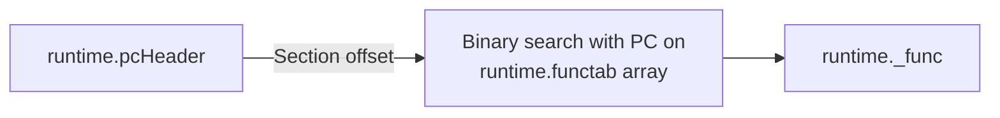
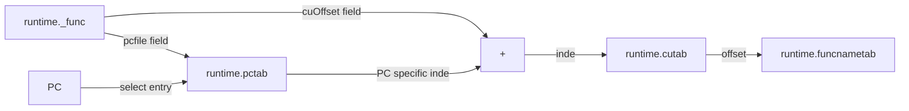
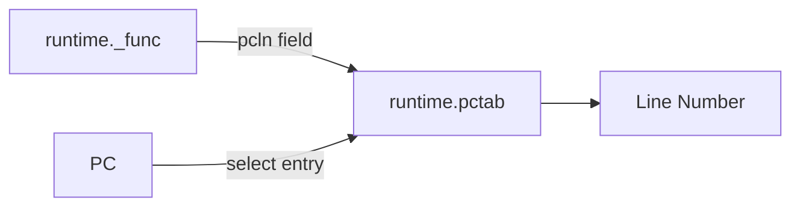
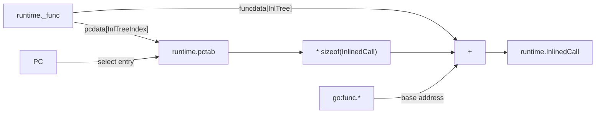

# KNOWLEDGE EXTRACT: github.com_open-telemetry_opentelemetry-ebpf-profiler_5caddd47
> **Extracted on:** 2026-04-01 09:23:38
> **Source:** D:/LongLeo/AI OS CORP/AI OS/system/security/QUARANTINE/KI-BATCH-20260331205007520175/github.com_open-telemetry_opentelemetry-ebpf-profiler_5caddd47

---

## File: `.codespellignore`
```
ba
crate
fo
mapp
opne
optimyze
prevEnd
```

## File: `.codespellrc`
```
# https://github.com/codespell-project/codespell
[codespell]
builtin = clear,rare,informal
check-filenames =
check-hidden =
ignore-words = .codespellignore
ignore-regex = \b[a-z]+[A-Z][a-zA-Z0-9]*\b|\b[a-z_]+_[a-z_]+\b|\b0x[0-9a-fA-F]+\b|^\s*(package|import|use|include|#include)\s
interactive = 0
skip = .git,AUTHORS.md,go.mod,go.sum,LICENSES,zydis,tools.mod,tools.sum
uri-ignore-words-list = *
```

## File: `.dockerignore`
```
.cache
.git
go
tools/coredump/gdb-sysroot
tools/coredump/modulecache
```

## File: `.gitignore`
```
*.o
*.d
*.pb.go
.cache
/.idea
/go
ebpf-profiler
ci-kernels
# Ignore target directory
target/*

# auto-generated bin files
cmd/otelcol-ebpf-profiler/*.go
cmd/otelcol-ebpf-profiler/go.mod
cmd/otelcol-ebpf-profiler/go.sum
otelcol-ebpf-profiler
```

## File: `.golangci.yml`
```yaml
version: "2"

formatters:
  enable:
    - gofmt
    - goimports
  settings:
    gofmt:
      # simplify code: gofmt with `-s` option, true by default
      simplify: true
    goimports:
      # put imports beginning with prefix after 3rd-party packages;
      # it's a comma-separated list of prefixes
      local-prefixes:
        - github.com/open-telemetry/opentelemetry-ebpf-profiler

run:
  timeout: 10m
  build-tags:
    - integration
    - linux

linters:
  default: all
  disable:
    # Disabled because of
    #   - too many non-sensical warnings
    #   - not relevant for us
    #   - false positives
    #
    # "might be worth fixing" means we should investigate/fix in the mid term
    - containedctx # might be worth fixing
    - contextcheck # might be worth fixing
    - cyclop
    - depguard
    - dupword
    - durationcheck # might be worth fixing
    - err113
    - errcheck
    - errorlint # might be worth fixing
    - exhaustive
    - exhaustruct
    - forbidigo
    - forcetypeassert # might be worth fixing
    - funlen
    - funcorder
    - gochecknoglobals
    - gochecknoinits
    - gocognit
    - goconst
    - gocyclo
    - godot
    - godox # complains about TODO etc
    - gomoddirectives
    - gosmopolitan
    - inamedparam
    - interfacebloat
    - ireturn
    - maintidx
    - makezero
    - mnd
    - nestif
    - nilerr # might be worth fixing
    - nilnil
    - nlreturn
    - noctx # might be worth fixing
    - nonamedreturns
    - paralleltest
    - protogetter
    - sqlclosecheck # might be worth fixing
    - staticcheck
    - tagalign
    - tagliatelle
    - testableexamples # might be worth fixing
    - testpackage
    - tparallel # might be worth fixing
    - thelper
    - varnamelen
    - wastedassign
    - wsl
    - wrapcheck
    - prealloc # CI failure with golangci 2.10.1, worth fixing
    # we don't want to change code to Go 1.22+ yet
    - intrange
    - copyloopvar

  exclusions:
    paths:
      - design-docs
      - doc
      - LICENSES
      - target
      - go

  settings:
    goconst:
      min-len: 2
      min-occurrences: 2
    gocritic:
      enabled-tags:
        - diagnostic
        - experimental
        - opinionated
        - performance
        - style
      disabled-checks:
        - dupImport # https://github.com/go-critic/go-critic/issues/845
        - ifElseChain
        - whyNoLint
        - sloppyReassign
        - uncheckedInlineErr # experimental rule with high false positive rate.
        - importShadow # shadow of imported package
    gocyclo:
      min-complexity: 15
    gosec:
      excludes:
        - G103 # unsafe calls should be audited
        - G115 # integer overflow
        - G204 # subprocess launched with variable
        - G301 # directory permissions
        - G302 # file permissions
        - G304 # potential file inclusion via variable
    govet:
      enable-all: true
      disable:
        - fieldalignment
        - unsafeptr
      settings:
        printf: # analyzer name, run `go tool vet help` to see all analyzers
          funcs: # run `go tool vet help printf` to see available settings for `printf` analyzer
            - debug,debugf,debugln
            - error,errorf,errorln
            - fatal,fatalf,fataln
            - info,infof,infoln
            - log,logf,logln
            - warn,warnf,warnln
            - print,printf,println,sprint,sprintf,sprintln,fprint,fprintf,fprintln
    lll:
      line-length: 100
      tab-width: 4
    misspell:
      locale: US
      ignore-rules:
        - rela
    revive:
      rules:
        - name: unexported-naming
          disabled: true
```

## File: `AUTHORS.md`
```markdown
## Open-Source contributors

For contributors statistics that occurred after the profiling agent was open sourced, please refer to [the GitHub statistics](https://github.com/open-telemetry/opentelemetry-ebpf-profiler/graphs/contributors).

## Pre-OSS Optimyze/Elastic contributors

- [@amannocci](https://github.com/amannocci)
- [@athre0z](https://github.com/athre0z)
- [@cauemarcondes](https://github.com/cauemarcondes)
- [@christos68k](https://github.com/christos68k)
- [@danielmitterdorfer](https://github.com/danielmitterdorfer)
- [@dmathieu](https://github.com/dmathieu)
- [@fabled](https://github.com/fabled)
- [@florianl](https://github.com/florianl)
- [@inge4pres](https://github.com/inge4pres)
- [@iogbole](https://github.com/iogbole)
- [@jbcrail](https://github.com/jbcrail)
- [@joerowell](https://github.com/joerowell)
- [@kruskall](https://github.com/kruskall)
- [@mejofi](https://github.com/mejofi)
- [@reakaleek](https://github.com/reakaleek)
- [@rockdaboot](https://github.com/rockdaboot)
- [@sboomsma](https://github.com/sboomsma)
- [@SeanHeelan](https://github.com/SeanHeelan)
- [@thomasdullien](https://github.com/thomasdullien)
- [@v1v](https://github.com/v1v)
- [@vikmik](https://github.com/vikmik)
```

## File: `CONTRIBUTING.md`
```markdown
# Contributing to opentelemetry-ebpf-profiler

The Profiling special interest group (SIG) meets regularly. See the
OpenTelemetry
[community](https://github.com/open-telemetry/community)
repo for information on this and other SIGs.

## Community

See the [public meeting
notes](https://docs.google.com/document/d/19UqPPPlGE83N37MhS93uRlxsP1_wGxQ33Qv6CDHaEp0/edit#heading=h.4rdgawyis2hd)
for a summary description of past meetings.

See the [calendar
group](https://groups.google.com/a/opentelemetry.io/g/calendar-profiling) to
get invited to meetings.

See the [#otel-profiles](https://cloud-native.slack.com/archives/C03J794L0BV)
slack channel for discussions and questions.

## Pre-requisites

- Linux (5.4+ for x86-64, 5.5+ for ARM64) with eBPF enabled (the profiler currently only runs on Linux)
- Go as specified in [go.mod](https://github.com/open-telemetry/opentelemetry-ebpf-profiler/blob/main/go.mod)
- docker
- Rust as specified in [Cargo.toml](https://github.com/open-telemetry/opentelemetry-ebpf-profiler/blob/main/Cargo.toml)

## Development

You can view and edit the source code by cloning this repository:

```sh
git clone https://github.com/open-telemetry/opentelemetry-ebpf-profiler
```

Run `make test` to run the tests instead of `go test`.


## Pull Requests

### How to Send Pull Requests

Everyone is welcome to contribute code to `opentelemetry-ebpf-profiler` via
GitHub pull requests (PRs).

To create a new PR, fork the project in GitHub and clone the upstream
repo:

```sh
git clone https://github.com/open-telemetry/opentelemetry-ebpf-profiler
```

This will put the project in `opentelemetry-ebpf-profiler` in
current working directory.

Enter the newly created directory and add your fork as a new remote:

```sh
git remote add <YOUR_FORK> git@github.com:<YOUR_GITHUB_USERNAME>/opentelemetry-ebpf-profiler
```

Check out a new branch, make modifications, run linters and tests, and push the
branch to your fork:

```sh
git checkout -b <YOUR_BRANCH_NAME>
# edit files
# update changelog
git add -p
git commit
git push <YOUR_FORK> <YOUR_BRANCH_NAME>
```

Open a pull request against the main `opentelemetry-ebpf-profiler` repo.

Avoid rebasing and force-pushing to your branch to facilitate reviewing the
pull request.
Rewriting Git history makes it difficult to keep track of iterations during
code review.
All pull requests are squashed to a single commit upon merge to `main`.

### How to Receive Comments

* If the PR is not ready for review, please put `[WIP]` in the title,
	tag it as `work-in-progress`, or mark it as
	[`draft`](https://github.blog/2019-02-14-introducing-draft-pull-requests/).
* Make sure CLA is signed and CI is clear.

### How to Get PRs Merged

A PR is considered **ready to merge** when:

* It has received two qualified approvals[^1].

	This is not enforced through automation, but needs to be validated by the
	maintainer merging.
	* PRs introducing changes that have already been discussed and consensus
		reached only need one qualified approval. The discussion and resolution
		needs to be linked to the PR.

* All feedback has been addressed.
	* All PR comments and suggestions are resolved.
	* All GitHub Pull Request reviews with a status of "Request changes" have
		been addressed. Another review by the objecting reviewer with a different
		status can be submitted to clear the original review, or the review can be
		dismissed by a [Maintainer] when the issues from the original review have
		been addressed.
	* Any comments or reviews that cannot be resolved between the PR author and
		reviewers can be submitted to the community [Approver]s and [Maintainer]s
		during the weekly SIG meeting. If consensus is reached among the
		[Approver]s and [Maintainer]s during the SIG meeting the objections to the
		PR may be dismissed or resolved or the PR closed by a [Maintainer].
	* Any substantive changes to the PR require existing Approval reviews be
		cleared unless the approver explicitly states that their approval persists
		across changes. This includes changes resulting from other feedback.
		[Approver]s and [Maintainer]s can help in clearing reviews and they should
		be consulted if there are any questions.

* The PR branch is up to date with the base branch it is merging into.
	* To ensure this does not block the PR, it should be configured to allow
		maintainers to update it.

* It has been open for review for at least one working day. This gives people
	reasonable time to review.

* All required GitHub workflows have succeeded.
* Urgent fix can take exception as long as it has been actively communicated
	among [Maintainer]s.

Any [Maintainer] can merge the PR once the above criteria have been met.

[^1]: A qualified approval is a GitHub Pull Request review with "Approve"
	status from an OpenTelemetry Profiler [Approver] or [Maintainer].

## Membership, Roles, and Responsibilities

See the [OpenTelemetry membership
guide](https://github.com/open-telemetry/community/blob/main/guides/contributor/membership.md)
for information on how to become a member of the OpenTelemetry organization and
the different roles available. In addition to the roles listed there we also
have a Profiler-specific role: code owners.

### Becoming a Code Owner

A Code Owner is responsible for a component (typically a language interpreter) within the
OpenTelemetry eBPF Profiler, as indicated by the [CODEOWNERS
file](https://github.com/open-telemetry/opentelemetry-ebpf-profiler/blob/main/.github/CODEOWNERS).
That responsibility includes maintaining the component, triaging and
responding to issues, and reviewing pull requests.

Sometimes the component may be in need of a new or additional Code Owner.
A few reasons this situation may arise would be:

- The existing Code Owners are actively looking for more help.
- A previous Code Owner stepped down.
- An existing Code Owner has become unresponsive.
- The component was never assigned a Code Owner.

Code Ownership does not have to be a full-time job. If you can find a couple
hours to help out on a recurring basis, please consider pursuing Code Ownership.

#### Requirements

If you would like to help and become a Code Owner you must meet the following
requirements:

1. [Be a member of the OpenTelemetry
organization.](https://github.com/open-telemetry/community/blob/main/guides/contributor/membership.md#member)
2. (Code Owner Discretion) It is best to have resolved an issue related to the
component, contributed directly to the component, and/or review component PRs.
How much interaction with the component is required before becoming a Code Owner
is up to any existing Code Owners.

Code Ownership is ultimately up to the judgment of the existing Code Owners and
eBPF Profiler Maintainers. Meeting the above requirements is not a guarantee to
be granted Code Ownership.

#### How to become a Code Owner

To become a Code Owner, add your GitHub username to the
[CODEOWNERS](.github/CODEOWNERS)] file with an entry for all files related to
the component code. Be sure to tag the existing Code Owners, if any, within
the PR to ensure they receive a notification.

### Maintainers

- [Christos Kalkanis](https://github.com/christos68k), Elastic
- [Dmitry Filimonov](https://github.com/petethepig), Pyroscope/Grafana
- [Felix Geisendörfer](https://github.com/felixge), Datadog
- [Timo Teräs](https://github.com/fabled)

For more information about the maintainer role, see the [community repository](https://github.com/open-telemetry/community/blob/main/guides/contributor/membership.md#maintainer).

### Approvers

- [Damien Mathieu](https://github.com/dmathieu), Elastic
- [Florian Lehner](https://github.com/florianl), Elastic
- [Joel Höner](https://github.com/athre0z)
- [Roger Coll](https://github.com/rogercoll), Elastic
- [Tim Rühsen](https://github.com/rockdaboot)

For more information about the approver role, see the [community repository](https://github.com/open-telemetry/community/blob/main/guides/contributor/membership.md#approver).

### Become an Approver or a Maintainer

See the [community membership document in OpenTelemetry community
repo](https://github.com/open-telemetry/community/blob/main/guides/contributor/membership.md).

[Approver]: #approvers
[Maintainer]: #maintainers
```

## File: `Cargo.toml`
```
# Rust workspace. Allows command like `cargo test` to work anywhere within the
# repo and ensures that all components use the same dependency versions
# (global Cargo.lock).

[workspace]
members = [
    "rust-crates/symblib",
    "rust-crates/symblib-capi",
]
resolver = "2"

[workspace.package]
version = "0.0.0"
rust-version = "1.88.0"
license = "Apache-2.0"

[profile.release]
lto = "thin"
codegen-units = 1
panic = "abort"
opt-level = 3
strip = "debuginfo"

[profile.release-unstripped]
inherits = "release"
strip = false
debug = 1

[profile.release-with-asserts]
inherits = "release-unstripped"
overflow-checks = true
debug-assertions = true

[profile.test]
opt-level = 1 # default of 0 is annoyingly slow

[workspace.dependencies]
argh = "0.1"
base64 = "0.22.0"
cpp_demangle = "0.5"
fallible-iterator = "0.3"
flate2 = "1"
memmap2 = "0.9.0"
native-tls = "0.2"
prost = "0.14.0"
prost-build = "0.14.0"
rustc-demangle = "0.1"
serde_json = "1"
sha2 = "0.11"
tempfile = "3"
thiserror = "2"
zstd = "0.13.0"
zydis = "4.1.1"

[workspace.dependencies.gimli]
version = "0.33.0"
default-features = false
features = ["std", "endian-reader", "fallible-iterator"]

[workspace.dependencies.intervaltree]
version = "0.2"
default-features = false
features = ["std"]

[workspace.dependencies.lru]
version = "0.16.0"
default-features = false

[workspace.dependencies.object]
version = "0.39.0"
default-features = false
features = ["std", "read_core", "elf", "macho", "unaligned"]

[workspace.dependencies.smallvec]
version = "1"
features = ["const_new", "union", "const_generics", "write"]
```

## File: `Dockerfile`
```
FROM debian:trixie-20251208-slim@sha256:e711a7b30ec1261130d0a121050b4ed81d7fb28aeabcf4ea0c7876d4e9f5aca2

WORKDIR /agent

RUN dpkg --add-architecture amd64 && dpkg --add-architecture arm64

# cross_debian_arch: amd64 or arm64
# cross_pkg_arch: x86-64 or aarch64
RUN cross_debian_arch=$(uname -m | sed -e 's/aarch64/amd64/'  -e 's/x86_64/arm64/'); \
    cross_pkg_arch=$(uname -m | sed -e 's/aarch64/x86-64/' -e 's/x86_64/aarch64/'); \
    apt-get update -y && \
    apt-get dist-upgrade -y && \
    apt-get install -y --no-install-recommends --no-install-suggests \
        curl wget make git cmake unzip libc6-dev g++ gcc pkgconf \
        llvm-17 clang-17 clang-format-17 ca-certificates \
        gcc-${cross_pkg_arch}-linux-gnu libc6-${cross_debian_arch}-cross \
        musl-dev:amd64 musl-dev:arm64 && \
    apt-get clean autoclean && \
    apt-get autoremove --yes

COPY go.mod /tmp/go.mod
# Extract Go version from go.mod
RUN GO_VERSION=$(grep -oPm1 '^go \K([[:digit:].]+)' /tmp/go.mod) && \
    GOARCH=$(uname -m) && if [ "$GOARCH" = "x86_64" ]; then GOARCH=amd64; elif [ "$GOARCH" = "aarch64" ]; then GOARCH=arm64; fi && \
    wget -qO- https://golang.org/dl/go${GO_VERSION}.linux-${GOARCH}.tar.gz | tar -C /usr/local -xz

# Set Go environment variables
ENV GOPATH="/agent/go"
ENV GOCACHE="/agent/.cache"
ENV PATH="/usr/local/go/bin:$PATH"

# gRPC dependencies
RUN go install google.golang.org/protobuf/cmd/protoc-gen-go@v1.31.0
RUN go install google.golang.org/grpc/cmd/protoc-gen-go-grpc@v1.3.0

RUN                                                                                \
  PB_URL="https://github.com/protocolbuffers/protobuf/releases/download/v24.4/";   \
  PB_FILE="protoc-24.4-linux-x86_64.zip";                                      \
  INSTALL_DIR="/usr/local";                                                        \
                                                                                   \
  wget -nv "$PB_URL/$PB_FILE"                                                       \
    && unzip "$PB_FILE" -d "$INSTALL_DIR" 'bin/*' 'include/*'                      \
    && chmod +xr "$INSTALL_DIR/bin/protoc"                                         \
    && find "$INSTALL_DIR/include" -type d -exec chmod +x {} \;                    \
    && find "$INSTALL_DIR/include" -type f -exec chmod +r {} \;                    \
    && rm "$PB_FILE"

# Append to /etc/profile for login shells
RUN echo 'export PATH="/usr/local/go/bin:$PATH"' >> /etc/profile
RUN echo 'export PATH="/agent/go/bin:$PATH"' >> /etc/profile

ENTRYPOINT ["/bin/bash", "-l", "-c"]
```

## File: `LICENSE`
```
                                 Apache License
                           Version 2.0, January 2004
                        http://www.apache.org/licenses/

   TERMS AND CONDITIONS FOR USE, REPRODUCTION, AND DISTRIBUTION

   1. Definitions.

      "License" shall mean the terms and conditions for use, reproduction,
      and distribution as defined by Sections 1 through 9 of this document.

      "Licensor" shall mean the copyright owner or entity authorized by
      the copyright owner that is granting the License.

      "Legal Entity" shall mean the union of the acting entity and all
      other entities that control, are controlled by, or are under common
      control with that entity. For the purposes of this definition,
      "control" means (i) the power, direct or indirect, to cause the
      direction or management of such entity, whether by contract or
      otherwise, or (ii) ownership of fifty percent (50%) or more of the
      outstanding shares, or (iii) beneficial ownership of such entity.

      "You" (or "Your") shall mean an individual or Legal Entity
      exercising permissions granted by this License.

      "Source" form shall mean the preferred form for making modifications,
      including but not limited to software source code, documentation
      source, and configuration files.

      "Object" form shall mean any form resulting from mechanical
      transformation or translation of a Source form, including but
      not limited to compiled object code, generated documentation,
      and conversions to other media types.

      "Work" shall mean the work of authorship, whether in Source or
      Object form, made available under the License, as indicated by a
      copyright notice that is included in or attached to the work
      (an example is provided in the Appendix below).

      "Derivative Works" shall mean any work, whether in Source or Object
      form, that is based on (or derived from) the Work and for which the
      editorial revisions, annotations, elaborations, or other modifications
      represent, as a whole, an original work of authorship. For the purposes
      of this License, Derivative Works shall not include works that remain
      separable from, or merely link (or bind by name) to the interfaces of,
      the Work and Derivative Works thereof.

      "Contribution" shall mean any work of authorship, including
      the original version of the Work and any modifications or additions
      to that Work or Derivative Works thereof, that is intentionally
      submitted to Licensor for inclusion in the Work by the copyright owner
      or by an individual or Legal Entity authorized to submit on behalf of
      the copyright owner. For the purposes of this definition, "submitted"
      means any form of electronic, verbal, or written communication sent
      to the Licensor or its representatives, including but not limited to
      communication on electronic mailing lists, source code control systems,
      and issue tracking systems that are managed by, or on behalf of, the
      Licensor for the purpose of discussing and improving the Work, but
      excluding communication that is conspicuously marked or otherwise
      designated in writing by the copyright owner as "Not a Contribution."

      "Contributor" shall mean Licensor and any individual or Legal Entity
      on behalf of whom a Contribution has been received by Licensor and
      subsequently incorporated within the Work.

   2. Grant of Copyright License. Subject to the terms and conditions of
      this License, each Contributor hereby grants to You a perpetual,
      worldwide, non-exclusive, no-charge, royalty-free, irrevocable
      copyright license to reproduce, prepare Derivative Works of,
      publicly display, publicly perform, sublicense, and distribute the
      Work and such Derivative Works in Source or Object form.

   3. Grant of Patent License. Subject to the terms and conditions of
      this License, each Contributor hereby grants to You a perpetual,
      worldwide, non-exclusive, no-charge, royalty-free, irrevocable
      (except as stated in this section) patent license to make, have made,
      use, offer to sell, sell, import, and otherwise transfer the Work,
      where such license applies only to those patent claims licensable
      by such Contributor that are necessarily infringed by their
      Contribution(s) alone or by combination of their Contribution(s)
      with the Work to which such Contribution(s) was submitted. If You
      institute patent litigation against any entity (including a
      cross-claim or counterclaim in a lawsuit) alleging that the Work
      or a Contribution incorporated within the Work constitutes direct
      or contributory patent infringement, then any patent licenses
      granted to You under this License for that Work shall terminate
      as of the date such litigation is filed.

   4. Redistribution. You may reproduce and distribute copies of the
      Work or Derivative Works thereof in any medium, with or without
      modifications, and in Source or Object form, provided that You
      meet the following conditions:

      (a) You must give any other recipients of the Work or
          Derivative Works a copy of this License; and

      (b) You must cause any modified files to carry prominent notices
          stating that You changed the files; and

      (c) You must retain, in the Source form of any Derivative Works
          that You distribute, all copyright, patent, trademark, and
          attribution notices from the Source form of the Work,
          excluding those notices that do not pertain to any part of
          the Derivative Works; and

      (d) If the Work includes a "NOTICE" text file as part of its
          distribution, then any Derivative Works that You distribute must
          include a readable copy of the attribution notices contained
          within such NOTICE file, excluding those notices that do not
          pertain to any part of the Derivative Works, in at least one
          of the following places: within a NOTICE text file distributed
          as part of the Derivative Works; within the Source form or
          documentation, if provided along with the Derivative Works; or,
          within a display generated by the Derivative Works, if and
          wherever such third-party notices normally appear. The contents
          of the NOTICE file are for informational purposes only and
          do not modify the License. You may add Your own attribution
          notices within Derivative Works that You distribute, alongside
          or as an addendum to the NOTICE text from the Work, provided
          that such additional attribution notices cannot be construed
          as modifying the License.

      You may add Your own copyright statement to Your modifications and
      may provide additional or different license terms and conditions
      for use, reproduction, or distribution of Your modifications, or
      for any such Derivative Works as a whole, provided Your use,
      reproduction, and distribution of the Work otherwise complies with
      the conditions stated in this License.

   5. Submission of Contributions. Unless You explicitly state otherwise,
      any Contribution intentionally submitted for inclusion in the Work
      by You to the Licensor shall be under the terms and conditions of
      this License, without any additional terms or conditions.
      Notwithstanding the above, nothing herein shall supersede or modify
      the terms of any separate license agreement you may have executed
      with Licensor regarding such Contributions.

   6. Trademarks. This License does not grant permission to use the trade
      names, trademarks, service marks, or product names of the Licensor,
      except as required for reasonable and customary use in describing the
      origin of the Work and reproducing the content of the NOTICE file.

   7. Disclaimer of Warranty. Unless required by applicable law or
      agreed to in writing, Licensor provides the Work (and each
      Contributor provides its Contributions) on an "AS IS" BASIS,
      WITHOUT WARRANTIES OR CONDITIONS OF ANY KIND, either express or
      implied, including, without limitation, any warranties or conditions
      of TITLE, NON-INFRINGEMENT, MERCHANTABILITY, or FITNESS FOR A
      PARTICULAR PURPOSE. You are solely responsible for determining the
      appropriateness of using or redistributing the Work and assume any
      risks associated with Your exercise of permissions under this License.

   8. Limitation of Liability. In no event and under no legal theory,
      whether in tort (including negligence), contract, or otherwise,
      unless required by applicable law (such as deliberate and grossly
      negligent acts) or agreed to in writing, shall any Contributor be
      liable to You for damages, including any direct, indirect, special,
      incidental, or consequential damages of any character arising as a
      result of this License or out of the use or inability to use the
      Work (including but not limited to damages for loss of goodwill,
      work stoppage, computer failure or malfunction, or any and all
      other commercial damages or losses), even if such Contributor
      has been advised of the possibility of such damages.

   9. Accepting Warranty or Additional Liability. While redistributing
      the Work or Derivative Works thereof, You may choose to offer,
      and charge a fee for, acceptance of support, warranty, indemnity,
      or other liability obligations and/or rights consistent with this
      License. However, in accepting such obligations, You may act only
      on Your own behalf and on Your sole responsibility, not on behalf
      of any other Contributor, and only if You agree to indemnify,
      defend, and hold each Contributor harmless for any liability
      incurred by, or claims asserted against, such Contributor by reason
      of your accepting any such warranty or additional liability.

   END OF TERMS AND CONDITIONS

   APPENDIX: How to apply the Apache License to your work.

      To apply the Apache License to your work, attach the following
      boilerplate notice, with the fields enclosed by brackets "[]"
      replaced with your own identifying information. (Don't include
      the brackets!)  The text should be enclosed in the appropriate
      comment syntax for the file format. We also recommend that a
      file or class name and description of purpose be included on the
      same "printed page" as the copyright notice for easier
      identification within third-party archives.

   Copyright [yyyy] [name of copyright owner]

   Licensed under the Apache License, Version 2.0 (the "License");
   you may not use this file except in compliance with the License.
   You may obtain a copy of the License at

       http://www.apache.org/licenses/LICENSE-2.0

   Unless required by applicable law or agreed to in writing, software
   distributed under the License is distributed on an "AS IS" BASIS,
   WITHOUT WARRANTIES OR CONDITIONS OF ANY KIND, either express or implied.
   See the License for the specific language governing permissions and
   limitations under the License.
```

## File: `Makefile`
```
.PHONY: all all-common clean ebpf generate generate-collector test test-deps \
	test-junit protobuf docker-image agent legal integration-test-binaries \
	codespell lint ebpf-profiler format format-ebpf format-go pprof-execs \
	pprof_1_23 pprof_1_24 pprof_1_24_cgo otelcol-ebpf-profiler \
	rust-components rust-targets rust-tests vanity-import-check vanity-import-fix \
	otel-from-tree otel-from-lib

SHELL := /usr/bin/env bash

# Detect native architecture and translate to GOARCH.
NATIVE_ARCH := $(shell uname -m)
ifeq ($(NATIVE_ARCH),x86_64)
NATIVE_ARCH := amd64
else ifneq (,$(filter $(NATIVE_ARCH),aarch64 arm64))
NATIVE_ARCH := arm64
else
$(error Unsupported architecture: $(NATIVE_ARCH))
endif

# Valid values are: amd64, arm64.
TARGET_ARCH ?= $(NATIVE_ARCH)
ifeq ($(TARGET_ARCH),arm64)
ARCH_PREFIX := aarch64
else ifeq ($(TARGET_ARCH),amd64)
ARCH_PREFIX := x86_64
else
$(error Unsupported architecture: $(TARGET_ARCH))
endif

export TARGET_ARCH
export CGO_ENABLED = 0
export GOARCH = $(TARGET_ARCH)
export CC = $(ARCH_PREFIX)-linux-gnu-gcc
export OBJCOPY = $(ARCH_PREFIX)-linux-gnu-objcopy

BRANCH = $(shell git rev-parse --abbrev-ref HEAD | tr -d '-' | tr '[:upper:]' '[:lower:]')
COMMIT_SHORT_SHA = $(shell git rev-parse --short=8 HEAD)

VERSION ?= v0.0.0
BUILD_TIMESTAMP ?= $(shell date +%s)
REVISION ?= $(BRANCH)-$(COMMIT_SHORT_SHA)

LDFLAGS := -X go.opentelemetry.io/ebpf-profiler/vc.version=$(VERSION) \
	-X go.opentelemetry.io/ebpf-profiler/vc.revision=$(REVISION) \
	-X go.opentelemetry.io/ebpf-profiler/vc.buildTimestamp=$(BUILD_TIMESTAMP) \
	-extldflags=-static

GO_TAGS := osusergo,netgo
EBPF_FLAGS :=

GO_FLAGS := -buildvcs=false -ldflags="$(LDFLAGS)"
GO_TOOLS := -modfile=tools.mod

MAKEFLAGS += -j$(shell nproc)

JUNIT_OUT_DIR ?= /tmp/testresults

all: ebpf-profiler

# Removes the go build cache and binaries in the current project
clean:
	@go clean -cache -i
	@$(MAKE) -s -C support/ebpf clean
	@chmod -Rf u+w go/ || true
	@rm -rf go .cache support/*.test interpreter/golabels/integrationtests/pprof_1_*
	@rm -f otelcol-ebpf-profiler cmd/otelcol-ebpf-profiler/{*.go,go.mod,go.sum} || true
	@cargo clean

generate:
	GOARCH=$(NATIVE_ARCH) go generate ./...
	(cd support && ./generate.sh)

ebpf: generate
	$(MAKE) $(EBPF_FLAGS) -C support/ebpf

generate-collector:
	GOARCH=$(NATIVE_ARCH) go tool $(GO_TOOLS) builder \
		--skip-compilation=true \
		--config cmd/otelcol-ebpf-profiler/manifest.yaml \
		--output-path cmd/otelcol-ebpf-profiler

ebpf-profiler: ebpf
	go build $(GO_FLAGS) -tags $(GO_TAGS)

otelcol-ebpf-profiler: ebpf generate-collector
	cd cmd/otelcol-ebpf-profiler/ && go build $(GO_FLAGS) -tags "$(GO_TAGS)" -o ../../$@ 

# Sets opentelemetry collector modules to be pulled from local source tree.
# This command allows you to make changes to your local checkout of otel core and build
# the collector against those changes without having to push to github.
# The workflow is:
#
# 1. Hack on changes in core (assumed to be checked out in ../opentelemetry-collector from this directory)
# 2. Run `make otel-from-tree` (only need to run it once to remap go modules)
# 3. You can now build collector and it will use your local otel core changes.
# 4. Before committing/pushing your changes, undo by running `make otel-from-lib`.
otel-from-tree:
	./cmd/otelcol-ebpf-profiler/otel-from-tree.sh

# Removes local opentelemetry-collector replaces from manifest.yaml.
# (Undoes otel-from-tree.)
otel-from-lib:
	./cmd/otelcol-ebpf-profiler/otel-from-lib.sh

rust-targets:
	rustup target add $(ARCH_PREFIX)-unknown-linux-musl

rust-components: rust-targets
	RUSTFLAGS="--remap-path-prefix $(PWD)=/" cargo build --lib --release --target $(ARCH_PREFIX)-unknown-linux-musl

rust-tests: rust-targets
	cargo test

lint: generate vanity-import-check pprof-execs
	$(MAKE) lint -C support/ebpf
	go tool $(GO_TOOLS) golangci-lint config verify
	# tools/coredump tests require CGO_ENABLED
	CGO_ENABLED=1 go tool $(GO_TOOLS) golangci-lint run --max-issues-per-linter -1 --max-same-issues -1

format: format-go format-ebpf

format-go:
	go tool $(GO_TOOLS) golangci-lint fmt

format-ebpf:
	$(MAKE) format -C support/ebpf

vanity-import-check:
	go tool $(GO_TOOLS) porto --skip-dirs "^(LICENSES|go|target).*" --include-internal -l . || ( echo "(run: make vanity-import-fix)"; exit 1 )

vanity-import-fix: $(PORTO)
	go tool $(GO_TOOLS) porto --skip-dirs "^(LICENSES|go|target).*" --include-internal -w .

test: generate ebpf test-deps
	# tools/coredump tests build ebpf C-code using CGO to test it against coredumps
	CGO_ENABLED=1 go test $(GO_FLAGS) -tags $(GO_TAGS) ./...

test-junit: generate ebpf test-deps
	mkdir -p $(JUNIT_OUT_DIR)
	CGO_ENABLED=1 go tool $(GO_TOOLS) gotestsum --junitfile $(JUNIT_OUT_DIR)/junit.xml -- $(GO_FLAGS) -tags $(GO_TAGS) ./...

TESTDATA_DIRS:= \
	nativeunwind/elfunwindinfo/testdata \
	libpf/pfelf/testdata \
	reporter/testdata

test-deps:
	$(foreach testdata_dir, $(TESTDATA_DIRS), \
		($(MAKE) -C "$(testdata_dir)") || exit ; \
	)

TEST_INTEGRATION_BINARY_DIRS := tracer processmanager/ebpf support interpreter/golabels/integrationtests

pprof-execs: pprof_1_23 pprof_1_24 pprof_1_24_cgo pprof_1_24_cgo_pie pprof_stable pprof_stable_cgo pprof_stable_cgo_pie

pprof_1_23:
	CGO_ENABLED=0 GOTOOLCHAIN=go1.23.7 go test -C ./interpreter/golabels/integrationtests/pprof -c -trimpath -tags $(GO_TAGS),nocgo,integration -o ./../$@

pprof_1_24:
	CGO_ENABLED=0 GOTOOLCHAIN=go1.24.6 go test -C ./interpreter/golabels/integrationtests/pprof -c -trimpath -tags $(GO_TAGS),nocgo,integration -o ./../$@

pprof_1_24_cgo:
	CGO_ENABLED=1 GOTOOLCHAIN=go1.24.6 go test -C ./interpreter/golabels/integrationtests/pprof -c -ldflags '-extldflags "-static"' -trimpath -tags $(GO_TAGS),withcgo,integration -o ./../$@

pprof_1_24_cgo_pie:
	CGO_ENABLED=1 GOTOOLCHAIN=go1.24.6 go test -C ./interpreter/golabels/integrationtests/pprof -c -ldflags '-extldflags "-static"' -trimpath -buildmode=pie -tags $(GO_TAGS),withcgo,integration -o ./../$@

pprof_stable:
	CGO_ENABLED=0 go test -C ./interpreter/golabels/integrationtests/pprof -c -trimpath -tags $(GO_TAGS),nocgo,integration -o ./../$@

pprof_stable_cgo:
	CGO_ENABLED=1 go test -C ./interpreter/golabels/integrationtests/pprof -c -ldflags '-extldflags "-static"' -trimpath -tags $(GO_TAGS),withcgo,integration -o ./../$@

pprof_stable_cgo_pie:
	CGO_ENABLED=1 go test -C ./interpreter/golabels/integrationtests/pprof -c -ldflags '-extldflags "-static"' -trimpath -buildmode=pie -tags $(GO_TAGS),withcgo,integration -o ./../$@

integration-test-binaries: generate ebpf pprof-execs
	$(foreach test_name, $(TEST_INTEGRATION_BINARY_DIRS), \
		(go test -ldflags='-extldflags=-static' -trimpath -c \
			-tags $(GO_TAGS),static_build,integration \
			-o ./support/$(subst /,_,$(test_name)).test \
			./$(test_name)) || exit ; \
	)

docker-image:
	docker build -t otel/opentelemetry-ebpf-profiler-dev -f Dockerfile .

agent:
	./tools/docker-agent-build.sh "$(TARGET_ARCH)" "$(VERSION)" "$(REVISION)" "$(BUILD_TIMESTAMP)"

legal:
	go tool $(GO_TOOLS) go-licenses save --force . --save_path=LICENSES

codespell:
	@codespell
```

## File: `README.md`
```markdown
# Introduction

This repository implements a whole-system, cross-language profiler for Linux via
eBPF.

## Core features and strengths

- Implements the [Alpha OTel Profiles signal](https://github.com/open-telemetry/opentelemetry-proto/pull/775)
- Very low CPU and memory overhead (1% CPU and 250MB memory are our upper limits
  in testing and the agent typically manages to stay way below that)
- Support for native C/C++ executables without the need for DWARF debug
  information (by leveraging `.eh_frame` data as described in
  [US11604718B1](https://patents.google.com/patent/US11604718B1/en?inventor=thomas+dullien&oq=thomas+dullien))
- Support profiling of system libraries **without frame pointers** and **without
  debug symbols on the host**.
- Support for mixed stacktraces between runtimes - stacktraces go from Kernel
  space through unmodified system libraries all the way into high-level
  languages.
- Support for native code (C/C++, Rust, Zig, Go, etc. without debug symbols on
  host)
- Support for a broad set of HLLs, like Hotspot JVM, Python, Ruby, PHP, Node.JS,
  V8, Perl, Erlang and .NET.
- 100% non-intrusive: there's no need to load agents or libraries into the
  processes that are being profiled.
- No need for any reconfiguration, instrumentation or restarts of HLL
  interpreters and VMs: the agent supports unwinding each of the supported
  languages in the default configuration.
- ARM64 support for all unwinders except .NET.
- Support for native `inline frames`, which provide insights into compiler
  optimizations and offer a higher precision of function call chains.

## Building

We have integrated the profiler into the [OTel Collector](https://opentelemetry.io/docs/collector/) as a receiver,
and this is the [supported configuration](https://github.com/open-telemetry/opentelemetry-collector-releases/tree/main/distributions/otelcol-ebpf-profiler) going forward.

To aid with development, testing and debugging, we also offer a standalone profiling agent binary named `ebpf-profiler`,
and a local build of an OTel Collector profiling receiver binary (`otelcol-ebpf-profiler`). These binaries are not
supported in any way, can be dropped in the future and should not be deployed in production.

## Platform Requirements
The agent can be built with the provided make targets. Docker is required for containerized builds, and both amd64 and arm64 architectures are supported.

 For **Linux**, the following steps apply:
  1. Build the agent for your current machine's architecture:
     ```sh
     make agent
     ```
     Or `make debug-agent` for debug build.
  2. To cross-compile for a different architecture (e.g. arm64):
     ```sh
     make agent TARGET_ARCH=arm64
     ```
The resulting binary will be named `ebpf-profiler` in the current directory.

## Other OSes
Since the profiler is Linux-only, macOS and Windows users need to set up a Linux VM to build and run the agent. Ensure the appropriate architecture is specified if using cross-compilation. Use the same make targets as above after the Linux environment is configured in the VM.

## Supported Linux kernel version

[7ddc23ea](https://github.com/open-telemetry/opentelemetry-ebpf-profiler/commit/7ddc23ea135a2e00fffc17850ab90534e9b63108) is the last commit with support for 4.19. Changes after this commit may require a minimal Linux kernel version of 5.4.

### Updating the supported Linux kernel version

The project maintains its minimum supported kernel version in line with the lowest kernel version currently provided by actively maintained major Linux distributions, which include Debian stable, Red Hat Enterprise Linux, Ubuntu LTS, Amazon Linux and SUSE Linux. The minimum requirement may be increased when all such distributions no longer ship a specific kernel version. This approach enables the codebase to utilize newer eBPF features and avoids the need to maintain compatibility shims for obsolete kernels.

It should be noted that certain distributions incorporate eBPF features from newer kernels into their supported versions. When this occurs, the distribution's stated kernel version does not accurately reflect its true eBPF capabilities and will not prevent us from increasing the minimum supported version. On such kernels, the `no-kernel-version-check` configuration option can be used to bypass the checks and allow the profiler to execute.

## Alternative Build (Without Docker)
You can build the agent without Docker by directly installing the dependencies listed in the Dockerfile. Once dependencies are set up, simply run:
```sh
make
```
or
```sh
make debug
```
This will build the profiler natively on your machine.

## Building `otelcol-ebpf-profiler` locally (Without Docker)
You can build the local `otelcol-ebpf-profiler` binary by running:
```sh
make otelcol-ebpf-profiler
```
or to cross-compile for a different architecture (e.g. arm64):
```sh
make otelcol-ebpf-profiler TARGET_ARCH=arm64
```

See [local.example.yml](https://github.com/open-telemetry/opentelemetry-ebpf-profiler/blob/main/cmd/otelcol-ebpf-profiler/local.example.yaml) for an example configuration.

## Running

You can start the agent with the following command:

```sh
sudo ./ebpf-profiler -collection-agent=127.0.0.1:11000 -disable-tls
```

To start the OTel Collector profiling receiver, run:
```sh
sudo ./otelcol-ebpf-profiler --feature-gates=+service.profilesSupport --config cmd/otelcol-ebpf-profiler/local.example.yaml
```

The agent comes with a functional but work-in-progress / evolving implementation
of the recently released Alpha OTel Profiles [signal](https://github.com/open-telemetry/opentelemetry-proto/pull/775).

The agent loads the eBPF program and its maps, starts unwinding and reports
captured traces to the backend.

## Open Source Backends
As the OTel Profiles signal is still in development, mature production-ready
backends have yet to emerge. To speed up development and experimentation, Elastic
has open-sourced a desktop application named [devfiler](https://github.com/elastic/devfiler)
that reimplements the backend (collection, data storage, symbolization and UI)
portion of the eBPF profiler. Note that devfiler is not a real production backend
and should not be used as such. It is solely aimed at testing, experimentation and development.

## Development

To understand how this project works and learn more about profiling, check out [Profiling internals](doc/internals.md)

# Legal

## Licensing Information

This project is licensed under the Apache License 2.0 (Apache-2.0).
[Apache License 2.0](LICENSE)

The eBPF source code is licensed under the GPL 2.0 license.
[GPL 2.0](support/ebpf/LICENSE)

## Licenses of dependencies

To display a summary of the dependencies' licenses:
```sh
make legal
```
```

## File: `VERSIONING.md`
```markdown
# Versioning Policy
This document outlines the versioning strategy for the OpenTelemetry eBPF Profiler project.

# Development Status
This project is currently under active development. As such, users should be aware that significant changes, including breaking API modifications, may occur at any time.

# Automatic Version Tagging
Automatic version tags are generated on a monthly basis to reflect ongoing development progress.

# Versioning Scheme
This project adheres to [Semantic Versioning 2](https://semver.org/spec/v2.0.0.html).

Major Version Zero (0.y.z): While the project is in its initial development phase, the major version will remain 0. Anything MAY change at any time. The public API SHOULD NOT be considered stable. Users are advised to exercise caution and expect potential breaking changes without prior notice during this phase.

# Automatic Tag Format
The format for automatically generated tags currently follows v0.0.x, where x represents the year followed by the week number.

## Example:

- `v0.0.202501` would indicate the first week of 2025.

- `v0.0.202515` would indicate the fifteenth week of 2025.
```

## File: `cli_flags.go`
```go
// Copyright The OpenTelemetry Authors
// SPDX-License-Identifier: Apache-2.0

package main

import (
	"flag"
	"fmt"
	"os"
	"time"

	"github.com/peterbourgon/ff/v3"

	"go.opentelemetry.io/ebpf-profiler/collector/config"
	"go.opentelemetry.io/ebpf-profiler/internal/controller"
	"go.opentelemetry.io/ebpf-profiler/tracer"
)

const (
	// Default values for CLI flags
	defaultArgSamplesPerSecond    = 20
	defaultArgReporterInterval    = 5.0 * time.Second
	defaultArgReporterJitter      = 0.2
	defaultArgMonitorInterval     = 5.0 * time.Second
	defaultClockSyncInterval      = 3 * time.Minute
	defaultProbabilisticThreshold = tracer.ProbabilisticThresholdMax
	defaultProbabilisticInterval  = 1 * time.Minute
	defaultArgSendErrorFrames     = false
	defaultOffCPUThreshold        = 0
	defaultEnvVarsValue           = ""

	// This is the X in 2^(n + x) where n is the default hardcoded map size value
	defaultArgMapScaleFactor = 0
)

// Help strings for command line arguments
var (
	noKernelVersionCheckHelp = "Disable checking kernel version for eBPF support. " +
		"Use at your own risk, to run the agent on older kernels with backported eBPF features."
	copyrightHelp      = "Show copyright and short license text."
	collAgentAddrHelp  = "The collection agent address in the format of host:port."
	verboseModeHelp    = "Enable verbose logging and debugging capabilities."
	tracersHelp        = "Comma-separated list of interpreter tracers to include."
	mapScaleFactorHelp = fmt.Sprintf("Scaling factor for eBPF map sizes. "+
		"Every increase by 1 doubles the map size. Increase if you see eBPF map size errors. "+
		"Default is %d corresponding to 4GB of executable address space, max is %d.",
		defaultArgMapScaleFactor, config.MaxArgMapScaleFactor)
	disableTLSHelp             = "Disable encryption for data in transit."
	bpfVerifierLogLevelHelp    = "Log level of the eBPF verifier output (0,1,2). Default is 0."
	versionHelp                = "Show version."
	probabilisticThresholdHelp = fmt.Sprintf("If set to a value between 1 and %d will enable "+
		"probabilistic profiling: "+
		"every probabilistic-interval a random number between 0 and %d is "+
		"chosen. If the given probabilistic-threshold is greater than this "+
		"random number, the agent will collect profiles from this system for "+
		"the duration of the interval.",
		tracer.ProbabilisticThresholdMax-1, tracer.ProbabilisticThresholdMax-1)
	probabilisticIntervalHelp = "Time interval for which probabilistic profiling will be " +
		"enabled or disabled."
	pprofHelp            = "Listening address (e.g. localhost:6060) to serve pprof information."
	samplesPerSecondHelp = "Set the frequency (in Hz) of stack trace sampling."
	reporterIntervalHelp = "Set the reporter's interval in seconds."
	reporterJitterHelp   = fmt.Sprintf("Set the jitter applied to the reporter's interval as a fraction. "+
		"Valid values are in the range [0..1]. "+
		"Default is %.1f.",
		defaultArgReporterJitter)
	monitorIntervalHelp   = "Set the monitor interval in seconds."
	clockSyncIntervalHelp = "Set the sync interval with the realtime clock. " +
		"If zero, monotonic-realtime clock sync will be performed once, " +
		"on agent startup, but not periodically."
	sendErrorFramesHelp = "Send error frames (devfiler only, breaks Kibana)"
	sendIdleFramesHelp  = "Unwind and report idle states of the Linux kernel."
	offCPUThresholdHelp = fmt.Sprintf("The probability for an off-cpu event being recorded. "+
		"Valid values are in the range [0..1]. 0 disables off-cpu profiling. "+
		"Default is %d.",
		defaultOffCPUThreshold)
	envVarsHelp = "Comma separated list of environment variables that will be reported with the" +
		"captured profiling samples."
	probeLinkHelper = "Attach a probe to a symbol of an executable. " +
		"Expected format: probe_type:target[:symbol]. probe_type can be kprobe, kretprobe, uprobe, or uretprobe."
	loadProbeHelper = "Load generic eBPF program that can be attached externally to " +
		"various user or kernel space hooks."
)

// Package-scope variable, so that conditionally compiled other components can refer
// to the same flagset.

func parseArgs() (*controller.Config, error) {
	var args controller.Config

	fs := flag.NewFlagSet("ebpf-profiler", flag.ExitOnError)

	// Please keep the parameters ordered alphabetically in the source-code.
	fs.UintVar(&args.BPFVerifierLogLevel, "bpf-log-level", 0, bpfVerifierLogLevelHelp)

	fs.StringVar(&args.CollAgentAddr, "collection-agent", "", collAgentAddrHelp)
	fs.BoolVar(&args.Copyright, "copyright", false, copyrightHelp)

	fs.BoolVar(&args.DisableTLS, "disable-tls", false, disableTLSHelp)

	fs.UintVar(&args.MapScaleFactor, "map-scale-factor",
		defaultArgMapScaleFactor, mapScaleFactorHelp)

	fs.DurationVar(&args.MonitorInterval, "monitor-interval", defaultArgMonitorInterval,
		monitorIntervalHelp)

	fs.DurationVar(&args.ClockSyncInterval, "clock-sync-interval", defaultClockSyncInterval,
		clockSyncIntervalHelp)

	fs.BoolVar(&args.NoKernelVersionCheck, "no-kernel-version-check", false,
		noKernelVersionCheckHelp)

	fs.StringVar(&args.PprofAddr, "pprof", "", pprofHelp)

	fs.DurationVar(&args.ProbabilisticInterval, "probabilistic-interval",
		defaultProbabilisticInterval, probabilisticIntervalHelp)
	fs.UintVar(&args.ProbabilisticThreshold, "probabilistic-threshold",
		defaultProbabilisticThreshold, probabilisticThresholdHelp)

	fs.DurationVar(&args.ReporterInterval, "reporter-interval", defaultArgReporterInterval,
		reporterIntervalHelp)
	fs.Float64Var(&args.ReporterJitter, "reporter-jitter", defaultArgReporterJitter,
		reporterJitterHelp)

	fs.IntVar(&args.SamplesPerSecond, "samples-per-second", defaultArgSamplesPerSecond,
		samplesPerSecondHelp)

	fs.BoolVar(&args.SendErrorFrames, "send-error-frames", defaultArgSendErrorFrames,
		sendErrorFramesHelp)
	fs.BoolVar(&args.SendIdleFrames, "send-idle-frames", false, sendIdleFramesHelp)

	fs.StringVar(&args.Tracers, "t", "all", "Shorthand for -tracers.")
	fs.StringVar(&args.Tracers, "tracers", "all", tracersHelp)

	fs.BoolVar(&args.VerboseMode, "v", false, "Shorthand for -verbose.")
	fs.BoolVar(&args.VerboseMode, "verbose", false, verboseModeHelp)
	fs.BoolVar(&args.Version, "version", false, versionHelp)

	fs.Float64Var(&args.OffCPUThreshold, "off-cpu-threshold",
		defaultOffCPUThreshold, offCPUThresholdHelp)

	fs.StringVar(&args.IncludeEnvVars, "env-vars", defaultEnvVarsValue, envVarsHelp)

	fs.Func("probe-link", probeLinkHelper, func(link string) error {
		args.ProbeLinks = append(args.ProbeLinks, link)
		return nil
	})

	fs.BoolVar(&args.LoadProbe, "load-probe", false, loadProbeHelper)

	fs.Usage = func() {
		fs.PrintDefaults()
	}

	args.Fs = fs

	args.ErrorMode = config.PropagateError

	return &args, ff.Parse(fs, os.Args[1:],
		ff.WithEnvVarPrefix("OTEL_PROFILING_AGENT"),
		ff.WithConfigFileFlag("config"),
		ff.WithConfigFileParser(ff.PlainParser),
		// This will ignore configuration file (only) options that the current HA
		// does not recognize.
		ff.WithIgnoreUndefined(true),
		ff.WithAllowMissingConfigFile(true),
	)
}
```

## File: `go.mod`
```
module go.opentelemetry.io/ebpf-profiler

// NOTE:
// This go.mod is NOT used to build any official binary.
// To see the builder manifests used for official binaries,
// check https://github.com/open-telemetry/opentelemetry-collector-releases
//
// For the OpenTelemetry eBPF Profiler distribution specifically, see
// https://github.com/open-telemetry/opentelemetry-collector-releases/tree/main/distributions/otelcol-ebpf-profiler

go 1.25.0

require (
	github.com/aws/aws-sdk-go-v2 v1.41.5
	github.com/aws/aws-sdk-go-v2/config v1.32.13
	github.com/aws/aws-sdk-go-v2/service/s3 v1.97.3
	github.com/cilium/ebpf v0.21.0
	github.com/elastic/go-freelru v0.16.0
	github.com/elastic/go-perf v0.0.0-20260224073651-af0ee0c731b7
	github.com/google/uuid v1.6.0
	github.com/klauspost/compress v1.18.5
	github.com/mdlayher/kobject v0.0.0-20200520190114-19ca17470d7d
	github.com/minio/sha256-simd v1.0.1
	github.com/open-telemetry/sig-profiling/tools/profcheck v0.0.0-20260303084341-52f633d434c9
	github.com/peterbourgon/ff/v3 v3.4.0
	github.com/stretchr/testify v1.11.1
	github.com/zeebo/xxh3 v1.1.0
	go.opentelemetry.io/collector/component v1.54.0
	go.opentelemetry.io/collector/confmap/xconfmap v0.148.0
	go.opentelemetry.io/collector/consumer/consumertest v0.148.0
	go.opentelemetry.io/collector/consumer/xconsumer v0.148.0
	go.opentelemetry.io/collector/pdata v1.54.0
	go.opentelemetry.io/collector/pdata/pprofile v0.148.0
	go.opentelemetry.io/collector/receiver v1.54.0
	go.opentelemetry.io/collector/receiver/receivertest v0.148.0
	go.opentelemetry.io/collector/receiver/xreceiver v0.148.0
	go.opentelemetry.io/otel v1.42.0
	go.opentelemetry.io/otel/metric v1.42.0
	go.opentelemetry.io/proto/otlp/profiles/v1development v0.3.0
	go.uber.org/zap/exp v0.3.0
	golang.org/x/arch v0.25.0
	golang.org/x/exp v0.0.0-20260312153236-7ab1446f8b90
	golang.org/x/mod v0.34.0
	golang.org/x/sync v0.20.0
	golang.org/x/sys v0.42.0
	google.golang.org/grpc v1.79.3
	google.golang.org/protobuf v1.36.11
)

require (
	github.com/aws/aws-sdk-go-v2/aws/protocol/eventstream v1.7.8 // indirect
	github.com/aws/aws-sdk-go-v2/credentials v1.19.13 // indirect
	github.com/aws/aws-sdk-go-v2/feature/ec2/imds v1.18.21 // indirect
	github.com/aws/aws-sdk-go-v2/internal/configsources v1.4.21 // indirect
	github.com/aws/aws-sdk-go-v2/internal/endpoints/v2 v2.7.21 // indirect
	github.com/aws/aws-sdk-go-v2/internal/ini v1.8.6 // indirect
	github.com/aws/aws-sdk-go-v2/internal/v4a v1.4.22 // indirect
	github.com/aws/aws-sdk-go-v2/service/internal/accept-encoding v1.13.7 // indirect
	github.com/aws/aws-sdk-go-v2/service/internal/checksum v1.9.13 // indirect
	github.com/aws/aws-sdk-go-v2/service/internal/presigned-url v1.13.21 // indirect
	github.com/aws/aws-sdk-go-v2/service/internal/s3shared v1.19.21 // indirect
	github.com/aws/aws-sdk-go-v2/service/signin v1.0.9 // indirect
	github.com/aws/aws-sdk-go-v2/service/sso v1.30.14 // indirect
	github.com/aws/aws-sdk-go-v2/service/ssooidc v1.35.18 // indirect
	github.com/aws/aws-sdk-go-v2/service/sts v1.41.10 // indirect
	github.com/aws/smithy-go v1.24.2 // indirect
	github.com/cespare/xxhash/v2 v2.3.0 // indirect
	github.com/davecgh/go-spew v1.1.2-0.20180830191138-d8f796af33cc // indirect
	github.com/go-logr/logr v1.4.3 // indirect
	github.com/go-logr/stdr v1.2.2 // indirect
	github.com/go-viper/mapstructure/v2 v2.5.0 // indirect
	github.com/gobwas/glob v0.2.3 // indirect
	github.com/google/go-cmp v0.7.0 // indirect
	github.com/hashicorp/go-version v1.8.0 // indirect
	github.com/josharian/native v1.1.0 // indirect
	github.com/jsimonetti/rtnetlink/v2 v2.0.3 // indirect
	github.com/json-iterator/go v1.1.12 // indirect
	github.com/klauspost/cpuid/v2 v2.2.10 // indirect
	github.com/knadh/koanf/maps v0.1.2 // indirect
	github.com/knadh/koanf/providers/confmap v1.0.0 // indirect
	github.com/knadh/koanf/v2 v2.3.3 // indirect
	github.com/mdlayher/netlink v1.7.2 // indirect
	github.com/mdlayher/socket v0.5.1 // indirect
	github.com/mitchellh/copystructure v1.2.0 // indirect
	github.com/mitchellh/reflectwalk v1.0.2 // indirect
	github.com/modern-go/concurrent v0.0.0-20180306012644-bacd9c7ef1dd // indirect
	github.com/modern-go/reflect2 v1.0.3-0.20250322232337-35a7c28c31ee // indirect
	github.com/pmezard/go-difflib v1.0.1-0.20181226105442-5d4384ee4fb2 // indirect
	go.opentelemetry.io/auto/sdk v1.2.1 // indirect
	go.opentelemetry.io/collector/component/componenttest v0.148.0 // indirect
	go.opentelemetry.io/collector/confmap v1.54.0 // indirect
	go.opentelemetry.io/collector/consumer v1.54.0 // indirect
	go.opentelemetry.io/collector/consumer/consumererror v0.148.0 // indirect
	go.opentelemetry.io/collector/featuregate v1.54.0 // indirect
	go.opentelemetry.io/collector/internal/componentalias v0.148.0 // indirect
	go.opentelemetry.io/collector/pipeline v1.54.0 // indirect
	go.opentelemetry.io/otel/sdk v1.42.0 // indirect
	go.opentelemetry.io/otel/sdk/metric v1.42.0 // indirect
	go.opentelemetry.io/otel/trace v1.42.0 // indirect
	go.opentelemetry.io/proto/otlp v1.10.0 // indirect
	go.uber.org/multierr v1.11.0 // indirect
	go.uber.org/zap v1.27.1 // indirect
	go.yaml.in/yaml/v3 v3.0.4 // indirect
	golang.org/x/net v0.51.0 // indirect
	golang.org/x/text v0.34.0 // indirect
	google.golang.org/genproto/googleapis/rpc v0.0.0-20260209200024-4cfbd4190f57 // indirect
	gopkg.in/yaml.v3 v3.0.1 // indirect
)
```

## File: `go.sum`
```
github.com/aws/aws-sdk-go-v2 v1.41.5 h1:dj5kopbwUsVUVFgO4Fi5BIT3t4WyqIDjGKCangnV/yY=
github.com/aws/aws-sdk-go-v2 v1.41.5/go.mod h1:mwsPRE8ceUUpiTgF7QmQIJ7lgsKUPQOUl3o72QBrE1o=
github.com/aws/aws-sdk-go-v2/aws/protocol/eventstream v1.7.8 h1:eBMB84YGghSocM7PsjmmPffTa+1FBUeNvGvFou6V/4o=
github.com/aws/aws-sdk-go-v2/aws/protocol/eventstream v1.7.8/go.mod h1:lyw7GFp3qENLh7kwzf7iMzAxDn+NzjXEAGjKS2UOKqI=
github.com/aws/aws-sdk-go-v2/config v1.32.13 h1:5KgbxMaS2coSWRrx9TX/QtWbqzgQkOdEa3sZPhBhCSg=
github.com/aws/aws-sdk-go-v2/config v1.32.13/go.mod h1:8zz7wedqtCbw5e9Mi2doEwDyEgHcEE9YOJp6a8jdSMY=
github.com/aws/aws-sdk-go-v2/credentials v1.19.13 h1:mA59E3fokBvyEGHKFdnpNNrvaR351cqiHgRg+JzOSRI=
github.com/aws/aws-sdk-go-v2/credentials v1.19.13/go.mod h1:yoTXOQKea18nrM69wGF9jBdG4WocSZA1h38A+t/MAsk=
github.com/aws/aws-sdk-go-v2/feature/ec2/imds v1.18.21 h1:NUS3K4BTDArQqNu2ih7yeDLaS3bmHD0YndtA6UP884g=
github.com/aws/aws-sdk-go-v2/feature/ec2/imds v1.18.21/go.mod h1:YWNWJQNjKigKY1RHVJCuupeWDrrHjRqHm0N9rdrWzYI=
github.com/aws/aws-sdk-go-v2/internal/configsources v1.4.21 h1:Rgg6wvjjtX8bNHcvi9OnXWwcE0a2vGpbwmtICOsvcf4=
github.com/aws/aws-sdk-go-v2/internal/configsources v1.4.21/go.mod h1:A/kJFst/nm//cyqonihbdpQZwiUhhzpqTsdbhDdRF9c=
github.com/aws/aws-sdk-go-v2/internal/endpoints/v2 v2.7.21 h1:PEgGVtPoB6NTpPrBgqSE5hE/o47Ij9qk/SEZFbUOe9A=
github.com/aws/aws-sdk-go-v2/internal/endpoints/v2 v2.7.21/go.mod h1:p+hz+PRAYlY3zcpJhPwXlLC4C+kqn70WIHwnzAfs6ps=
github.com/aws/aws-sdk-go-v2/internal/ini v1.8.6 h1:qYQ4pzQ2Oz6WpQ8T3HvGHnZydA72MnLuFK9tJwmrbHw=
github.com/aws/aws-sdk-go-v2/internal/ini v1.8.6/go.mod h1:O3h0IK87yXci+kg6flUKzJnWeziQUKciKrLjcatSNcY=
github.com/aws/aws-sdk-go-v2/internal/v4a v1.4.22 h1:rWyie/PxDRIdhNf4DzRk0lvjVOqFJuNnO8WwaIRVxzQ=
github.com/aws/aws-sdk-go-v2/internal/v4a v1.4.22/go.mod h1:zd/JsJ4P7oGfUhXn1VyLqaRZwPmZwg44Jf2dS84Dm3Y=
github.com/aws/aws-sdk-go-v2/service/internal/accept-encoding v1.13.7 h1:5EniKhLZe4xzL7a+fU3C2tfUN4nWIqlLesfrjkuPFTY=
github.com/aws/aws-sdk-go-v2/service/internal/accept-encoding v1.13.7/go.mod h1:x0nZssQ3qZSnIcePWLvcoFisRXJzcTVvYpAAdYX8+GI=
github.com/aws/aws-sdk-go-v2/service/internal/checksum v1.9.13 h1:JRaIgADQS/U6uXDqlPiefP32yXTda7Kqfx+LgspooZM=
github.com/aws/aws-sdk-go-v2/service/internal/checksum v1.9.13/go.mod h1:CEuVn5WqOMilYl+tbccq8+N2ieCy0gVn3OtRb0vBNNM=
github.com/aws/aws-sdk-go-v2/service/internal/presigned-url v1.13.21 h1:c31//R3xgIJMSC8S6hEVq+38DcvUlgFY0FM6mSI5oto=
github.com/aws/aws-sdk-go-v2/service/internal/presigned-url v1.13.21/go.mod h1:r6+pf23ouCB718FUxaqzZdbpYFyDtehyZcmP5KL9FkA=
github.com/aws/aws-sdk-go-v2/service/internal/s3shared v1.19.21 h1:ZlvrNcHSFFWURB8avufQq9gFsheUgjVD9536obIknfM=
github.com/aws/aws-sdk-go-v2/service/internal/s3shared v1.19.21/go.mod h1:cv3TNhVrssKR0O/xxLJVRfd2oazSnZnkUeTf6ctUwfQ=
github.com/aws/aws-sdk-go-v2/service/s3 v1.97.3 h1:HwxWTbTrIHm5qY+CAEur0s/figc3qwvLWsNkF4RPToo=
github.com/aws/aws-sdk-go-v2/service/s3 v1.97.3/go.mod h1:uoA43SdFwacedBfSgfFSjjCvYe8aYBS7EnU5GZ/YKMM=
github.com/aws/aws-sdk-go-v2/service/signin v1.0.9 h1:QKZH0S178gCmFEgst8hN0mCX1KxLgHBKKY/CLqwP8lg=
github.com/aws/aws-sdk-go-v2/service/signin v1.0.9/go.mod h1:7yuQJoT+OoH8aqIxw9vwF+8KpvLZ8AWmvmUWHsGQZvI=
github.com/aws/aws-sdk-go-v2/service/sso v1.30.14 h1:GcLE9ba5ehAQma6wlopUesYg/hbcOhFNWTjELkiWkh4=
github.com/aws/aws-sdk-go-v2/service/sso v1.30.14/go.mod h1:WSvS1NLr7JaPunCXqpJnWk1Bjo7IxzZXrZi1QQCkuqM=
github.com/aws/aws-sdk-go-v2/service/ssooidc v1.35.18 h1:mP49nTpfKtpXLt5SLn8Uv8z6W+03jYVoOSAl/c02nog=
github.com/aws/aws-sdk-go-v2/service/ssooidc v1.35.18/go.mod h1:YO8TrYtFdl5w/4vmjL8zaBSsiNp3w0L1FfKVKenZT7w=
github.com/aws/aws-sdk-go-v2/service/sts v1.41.10 h1:p8ogvvLugcR/zLBXTXrTkj0RYBUdErbMnAFFp12Lm/U=
github.com/aws/aws-sdk-go-v2/service/sts v1.41.10/go.mod h1:60dv0eZJfeVXfbT1tFJinbHrDfSJ2GZl4Q//OSSNAVw=
github.com/aws/smithy-go v1.24.2 h1:FzA3bu/nt/vDvmnkg+R8Xl46gmzEDam6mZ1hzmwXFng=
github.com/aws/smithy-go v1.24.2/go.mod h1:YE2RhdIuDbA5E5bTdciG9KrW3+TiEONeUWCqxX9i1Fc=
github.com/cespare/xxhash/v2 v2.3.0 h1:UL815xU9SqsFlibzuggzjXhog7bL6oX9BbNZnL2UFvs=
github.com/cespare/xxhash/v2 v2.3.0/go.mod h1:VGX0DQ3Q6kWi7AoAeZDth3/j3BFtOZR5XLFGgcrjCOs=
github.com/cilium/ebpf v0.21.0 h1:4dpx1J/B/1apeTmWBH5BkVLayHTkFrMovVPnHEk+l3k=
github.com/cilium/ebpf v0.21.0/go.mod h1:1kHKv6Kvh5a6TePP5vvvoMa1bclRyzUXELSs272fmIQ=
github.com/davecgh/go-spew v1.1.0/go.mod h1:J7Y8YcW2NihsgmVo/mv3lAwl/skON4iLHjSsI+c5H38=
github.com/davecgh/go-spew v1.1.1/go.mod h1:J7Y8YcW2NihsgmVo/mv3lAwl/skON4iLHjSsI+c5H38=
github.com/davecgh/go-spew v1.1.2-0.20180830191138-d8f796af33cc h1:U9qPSI2PIWSS1VwoXQT9A3Wy9MM3WgvqSxFWenqJduM=
github.com/davecgh/go-spew v1.1.2-0.20180830191138-d8f796af33cc/go.mod h1:J7Y8YcW2NihsgmVo/mv3lAwl/skON4iLHjSsI+c5H38=
github.com/elastic/go-freelru v0.16.0 h1:gG2HJ1WXN2tNl5/p40JS/l59HjvjRhjyAa+oFTRArYs=
github.com/elastic/go-freelru v0.16.0/go.mod h1:bSdWT4M0lW79K8QbX6XY2heQYSCqD7THoYf82pT/H3I=
github.com/elastic/go-perf v0.0.0-20260224073651-af0ee0c731b7 h1:fGi5uudj7m5O1RgQl+bSZmwlqvuUMEi97X7TzWBOMGk=
github.com/elastic/go-perf v0.0.0-20260224073651-af0ee0c731b7/go.mod h1:ucTo2u8JvFyIPQOaRlX7aVF0d3wwmF1dy/PVp5GUHZI=
github.com/go-logr/logr v1.2.2/go.mod h1:jdQByPbusPIv2/zmleS9BjJVeZ6kBagPoEUsqbVz/1A=
github.com/go-logr/logr v1.4.3 h1:CjnDlHq8ikf6E492q6eKboGOC0T8CDaOvkHCIg8idEI=
github.com/go-logr/logr v1.4.3/go.mod h1:9T104GzyrTigFIr8wt5mBrctHMim0Nb2HLGrmQ40KvY=
github.com/go-logr/stdr v1.2.2 h1:hSWxHoqTgW2S2qGc0LTAI563KZ5YKYRhT3MFKZMbjag=
github.com/go-logr/stdr v1.2.2/go.mod h1:mMo/vtBO5dYbehREoey6XUKy/eSumjCCveDpRre4VKE=
github.com/go-quicktest/qt v1.101.1-0.20240301121107-c6c8733fa1e6 h1:teYtXy9B7y5lHTp8V9KPxpYRAVA7dozigQcMiBust1s=
github.com/go-quicktest/qt v1.101.1-0.20240301121107-c6c8733fa1e6/go.mod h1:p4lGIVX+8Wa6ZPNDvqcxq36XpUDLh42FLetFU7odllI=
github.com/go-viper/mapstructure/v2 v2.5.0 h1:vM5IJoUAy3d7zRSVtIwQgBj7BiWtMPfmPEgAXnvj1Ro=
github.com/go-viper/mapstructure/v2 v2.5.0/go.mod h1:oJDH3BJKyqBA2TXFhDsKDGDTlndYOZ6rGS0BRZIxGhM=
github.com/gobwas/glob v0.2.3 h1:A4xDbljILXROh+kObIiy5kIaPYD8e96x1tgBhUI5J+Y=
github.com/gobwas/glob v0.2.3/go.mod h1:d3Ez4x06l9bZtSvzIay5+Yzi0fmZzPgnTbPcKjJAkT8=
github.com/golang/protobuf v1.5.4 h1:i7eJL8qZTpSEXOPTxNKhASYpMn+8e5Q6AdndVa1dWek=
github.com/golang/protobuf v1.5.4/go.mod h1:lnTiLA8Wa4RWRcIUkrtSVa5nRhsEGBg48fD6rSs7xps=
github.com/google/go-cmp v0.2.0/go.mod h1:oXzfMopK8JAjlY9xF4vHSVASa0yLyX7SntLO5aqRK0M=
github.com/google/go-cmp v0.3.1/go.mod h1:8QqcDgzrUqlUb/G2PQTWiueGozuR1884gddMywk6iLU=
github.com/google/go-cmp v0.4.0/go.mod h1:v8dTdLbMG2kIc/vJvl+f65V22dbkXbowE6jgT/gNBxE=
github.com/google/go-cmp v0.4.1/go.mod h1:v8dTdLbMG2kIc/vJvl+f65V22dbkXbowE6jgT/gNBxE=
github.com/google/go-cmp v0.7.0 h1:wk8382ETsv4JYUZwIsn6YpYiWiBsYLSJiTsyBybVuN8=
github.com/google/go-cmp v0.7.0/go.mod h1:pXiqmnSA92OHEEa9HXL2W4E7lf9JzCmGVUdgjX3N/iU=
github.com/google/gofuzz v1.0.0/go.mod h1:dBl0BpW6vV/+mYPU4Po3pmUjxk6FQPldtuIdl/M65Eg=
github.com/google/uuid v1.6.0 h1:NIvaJDMOsjHA8n1jAhLSgzrAzy1Hgr+hNrb57e+94F0=
github.com/google/uuid v1.6.0/go.mod h1:TIyPZe4MgqvfeYDBFedMoGGpEw/LqOeaOT+nhxU+yHo=
github.com/hashicorp/go-version v1.8.0 h1:KAkNb1HAiZd1ukkxDFGmokVZe1Xy9HG6NUp+bPle2i4=
github.com/hashicorp/go-version v1.8.0/go.mod h1:fltr4n8CU8Ke44wwGCBoEymUuxUHl09ZGVZPK5anwXA=
github.com/josharian/native v1.1.0 h1:uuaP0hAbW7Y4l0ZRQ6C9zfb7Mg1mbFKry/xzDAfmtLA=
github.com/josharian/native v1.1.0/go.mod h1:7X/raswPFr05uY3HiLlYeyQntB6OO7E/d2Cu7qoaN2w=
github.com/jsimonetti/rtnetlink v0.0.0-20190606172950-9527aa82566a/go.mod h1:Oz+70psSo5OFh8DBl0Zv2ACw7Esh6pPUphlvZG9x7uw=
github.com/jsimonetti/rtnetlink v0.0.0-20200117123717-f846d4f6c1f4/go.mod h1:WGuG/smIU4J/54PblvSbh+xvCZmpJnFgr3ds6Z55XMQ=
github.com/jsimonetti/rtnetlink/v2 v2.0.3 h1:Jcp7GTnTPepoUAJ9+LhTa7ZiebvNS56T1GtlEUaPNFE=
github.com/jsimonetti/rtnetlink/v2 v2.0.3/go.mod h1:atIkksp/9fqtf6rpAw45JnttnP2gtuH9X88WPfWfS9A=
github.com/json-iterator/go v1.1.12 h1:PV8peI4a0ysnczrg+LtxykD8LfKY9ML6u2jnxaEnrnM=
github.com/json-iterator/go v1.1.12/go.mod h1:e30LSqwooZae/UwlEbR2852Gd8hjQvJoHmT4TnhNGBo=
github.com/klauspost/compress v1.18.5 h1:/h1gH5Ce+VWNLSWqPzOVn6XBO+vJbCNGvjoaGBFW2IE=
github.com/klauspost/compress v1.18.5/go.mod h1:cwPg85FWrGar70rWktvGQj8/hthj3wpl0PGDogxkrSQ=
github.com/klauspost/cpuid/v2 v2.2.10 h1:tBs3QSyvjDyFTq3uoc/9xFpCuOsJQFNPiAhYdw2skhE=
github.com/klauspost/cpuid/v2 v2.2.10/go.mod h1:hqwkgyIinND0mEev00jJYCxPNVRVXFQeu1XKlok6oO0=
github.com/knadh/koanf/maps v0.1.2 h1:RBfmAW5CnZT+PJ1CVc1QSJKf4Xu9kxfQgYVQSu8hpbo=
github.com/knadh/koanf/maps v0.1.2/go.mod h1:npD/QZY3V6ghQDdcQzl1W4ICNVTkohC8E73eI2xW4yI=
github.com/knadh/koanf/providers/confmap v1.0.0 h1:mHKLJTE7iXEys6deO5p6olAiZdG5zwp8Aebir+/EaRE=
github.com/knadh/koanf/providers/confmap v1.0.0/go.mod h1:txHYHiI2hAtF0/0sCmcuol4IDcuQbKTybiB1nOcUo1A=
github.com/knadh/koanf/v2 v2.3.3 h1:jLJC8XCRfLC7n4F+ZKKdBsbq1bfXTpuFhf4L7t94D94=
github.com/knadh/koanf/v2 v2.3.3/go.mod h1:gRb40VRAbd4iJMYYD5IxZ6hfuopFcXBpc9bbQpZwo28=
github.com/kr/pretty v0.3.1 h1:flRD4NNwYAUpkphVc1HcthR4KEIFJ65n8Mw5qdRn3LE=
github.com/kr/pretty v0.3.1/go.mod h1:hoEshYVHaxMs3cyo3Yncou5ZscifuDolrwPKZanG3xk=
github.com/kr/text v0.2.0 h1:5Nx0Ya0ZqY2ygV366QzturHI13Jq95ApcVaJBhpS+AY=
github.com/kr/text v0.2.0/go.mod h1:eLer722TekiGuMkidMxC/pM04lWEeraHUUmBw8l2grE=
github.com/mdlayher/kobject v0.0.0-20200520190114-19ca17470d7d h1:JmrZTpS0GAyMV4ZQVVH/AS0Y6r2PbnYNSRUuRX+HOLA=
github.com/mdlayher/kobject v0.0.0-20200520190114-19ca17470d7d/go.mod h1:+SexPO1ZvdbbWUdUnyXEWv3+4NwHZjKhxOmQqHY4Pqc=
github.com/mdlayher/netlink v0.0.0-20190409211403-11939a169225/go.mod h1:eQB3mZE4aiYnlUsyGGCOpPETfdQq4Jhsgf1fk3cwQaA=
github.com/mdlayher/netlink v1.0.0/go.mod h1:KxeJAFOFLG6AjpyDkQ/iIhxygIUKD+vcwqcnu43w/+M=
github.com/mdlayher/netlink v1.1.0/go.mod h1:H4WCitaheIsdF9yOYu8CFmCgQthAPIWZmcKp9uZHgmY=
github.com/mdlayher/netlink v1.7.2 h1:/UtM3ofJap7Vl4QWCPDGXY8d3GIY2UGSDbK+QWmY8/g=
github.com/mdlayher/netlink v1.7.2/go.mod h1:xraEF7uJbxLhc5fpHL4cPe221LI2bdttWlU+ZGLfQSw=
github.com/mdlayher/socket v0.5.1 h1:VZaqt6RkGkt2OE9l3GcC6nZkqD3xKeQLyfleW/uBcos=
github.com/mdlayher/socket v0.5.1/go.mod h1:TjPLHI1UgwEv5J1B5q0zTZq12A/6H7nKmtTanQE37IQ=
github.com/minio/sha256-simd v1.0.1 h1:6kaan5IFmwTNynnKKpDHe6FWHohJOHhCPchzK49dzMM=
github.com/minio/sha256-simd v1.0.1/go.mod h1:Pz6AKMiUdngCLpeTL/RJY1M9rUuPMYujV5xJjtbRSN8=
github.com/mitchellh/copystructure v1.2.0 h1:vpKXTN4ewci03Vljg/q9QvCGUDttBOGBIa15WveJJGw=
github.com/mitchellh/copystructure v1.2.0/go.mod h1:qLl+cE2AmVv+CoeAwDPye/v+N2HKCj9FbZEVFJRxO9s=
github.com/mitchellh/reflectwalk v1.0.2 h1:G2LzWKi524PWgd3mLHV8Y5k7s6XUvT0Gef6zxSIeXaQ=
github.com/mitchellh/reflectwalk v1.0.2/go.mod h1:mSTlrgnPZtwu0c4WaC2kGObEpuNDbx0jmZXqmk4esnw=
github.com/modern-go/concurrent v0.0.0-20180228061459-e0a39a4cb421/go.mod h1:6dJC0mAP4ikYIbvyc7fijjWJddQyLn8Ig3JB5CqoB9Q=
github.com/modern-go/concurrent v0.0.0-20180306012644-bacd9c7ef1dd h1:TRLaZ9cD/w8PVh93nsPXa1VrQ6jlwL5oN8l14QlcNfg=
github.com/modern-go/concurrent v0.0.0-20180306012644-bacd9c7ef1dd/go.mod h1:6dJC0mAP4ikYIbvyc7fijjWJddQyLn8Ig3JB5CqoB9Q=
github.com/modern-go/reflect2 v1.0.2/go.mod h1:yWuevngMOJpCy52FWWMvUC8ws7m/LJsjYzDa0/r8luk=
github.com/modern-go/reflect2 v1.0.3-0.20250322232337-35a7c28c31ee h1:W5t00kpgFdJifH4BDsTlE89Zl93FEloxaWZfGcifgq8=
github.com/modern-go/reflect2 v1.0.3-0.20250322232337-35a7c28c31ee/go.mod h1:yWuevngMOJpCy52FWWMvUC8ws7m/LJsjYzDa0/r8luk=
github.com/open-telemetry/sig-profiling/tools/profcheck v0.0.0-20260303084341-52f633d434c9 h1:3NStK3r8FVhXbU0qkVz/DpPQlaoLLgLHJOAMKyDX4WM=
github.com/open-telemetry/sig-profiling/tools/profcheck v0.0.0-20260303084341-52f633d434c9/go.mod h1:KRO+Rec0+KycN1CrIP/6Pu0xOraPhbahCbL36i8FkfM=
github.com/peterbourgon/ff/v3 v3.4.0 h1:QBvM/rizZM1cB0p0lGMdmR7HxZeI/ZrBWB4DqLkMUBc=
github.com/peterbourgon/ff/v3 v3.4.0/go.mod h1:zjJVUhx+twciwfDl0zBcFzl4dW8axCRyXE/eKY9RztQ=
github.com/pmezard/go-difflib v1.0.0/go.mod h1:iKH77koFhYxTK1pcRnkKkqfTogsbg7gZNVY4sRDYZ/4=
github.com/pmezard/go-difflib v1.0.1-0.20181226105442-5d4384ee4fb2 h1:Jamvg5psRIccs7FGNTlIRMkT8wgtp5eCXdBlqhYGL6U=
github.com/pmezard/go-difflib v1.0.1-0.20181226105442-5d4384ee4fb2/go.mod h1:iKH77koFhYxTK1pcRnkKkqfTogsbg7gZNVY4sRDYZ/4=
github.com/rogpeppe/go-internal v1.14.1 h1:UQB4HGPB6osV0SQTLymcB4TgvyWu6ZyliaW0tI/otEQ=
github.com/rogpeppe/go-internal v1.14.1/go.mod h1:MaRKkUm5W0goXpeCfT7UZI6fk/L7L7so1lCWt35ZSgc=
github.com/stretchr/objx v0.1.0/go.mod h1:HFkY916IF+rwdDfMAkV7OtwuqBVzrE8GR6GFx+wExME=
github.com/stretchr/testify v1.3.0/go.mod h1:M5WIy9Dh21IEIfnGCwXGc5bZfKNJtfHm1UVUgZn+9EI=
github.com/stretchr/testify v1.11.1 h1:7s2iGBzp5EwR7/aIZr8ao5+dra3wiQyKjjFuvgVKu7U=
github.com/stretchr/testify v1.11.1/go.mod h1:wZwfW3scLgRK+23gO65QZefKpKQRnfz6sD981Nm4B6U=
github.com/zeebo/assert v1.3.0 h1:g7C04CbJuIDKNPFHmsk4hwZDO5O+kntRxzaUoNXj+IQ=
github.com/zeebo/assert v1.3.0/go.mod h1:Pq9JiuJQpG8JLJdtkwrJESF0Foym2/D9XMU5ciN/wJ0=
github.com/zeebo/xxh3 v1.1.0 h1:s7DLGDK45Dyfg7++yxI0khrfwq9661w9EN78eP/UZVs=
github.com/zeebo/xxh3 v1.1.0/go.mod h1:IisAie1LELR4xhVinxWS5+zf1lA4p0MW4T+w+W07F5s=
go.opentelemetry.io/auto/sdk v1.2.1 h1:jXsnJ4Lmnqd11kwkBV2LgLoFMZKizbCi5fNZ/ipaZ64=
go.opentelemetry.io/auto/sdk v1.2.1/go.mod h1:KRTj+aOaElaLi+wW1kO/DZRXwkF4C5xPbEe3ZiIhN7Y=
go.opentelemetry.io/collector/component v1.54.0 h1:LvtX0Tzz18n44OrUFVk77N1FNsejfWJqztB28hrmDM8=
go.opentelemetry.io/collector/component v1.54.0/go.mod h1:yUMBYsySY/sDcXm8kOzEoZxt+JLdala6hxzSW0npOxY=
go.opentelemetry.io/collector/component/componenttest v0.148.0 h1:tBXJWmy2X6KD8S0QU2YZa2zYBqP+IycSM4iOtwDD2pA=
go.opentelemetry.io/collector/component/componenttest v0.148.0/go.mod h1:1c1+6mZOmI0raoya5vA/X0F+fawEjNS6tCEs5xLATtA=
go.opentelemetry.io/collector/confmap v1.54.0 h1:RUoxQ4uAYHTI57GfHh61D00tTQsXm9T88ozrAiicByc=
go.opentelemetry.io/collector/confmap v1.54.0/go.mod h1:mQxG8bk0IWIt9gbWMvzE+cRkOuCuzbzkNGBq2YJ4wNM=
go.opentelemetry.io/collector/confmap/xconfmap v0.148.0 h1:UW8MX5VlKJf67x4Et7J9kPwP9Rv4VSmJ+UUpgRcb//c=
go.opentelemetry.io/collector/confmap/xconfmap v0.148.0/go.mod h1:4qTMr3V0uSXXac9wVs/UD5fIqRKw5yIl58+Vjsc6RHM=
go.opentelemetry.io/collector/consumer v1.54.0 h1:RGGtUN+GbkV1px3T6XdUHmgJ+ldJ1hAHdesFzW/wgL0=
go.opentelemetry.io/collector/consumer v1.54.0/go.mod h1:1PC6XINTL9DdT1bwvfMdHE72EB4RWU/WcPemUrhqKN8=
go.opentelemetry.io/collector/consumer/consumererror v0.148.0 h1:lKVkNWBeRXG41lHBf5KzA9oErRZifx6qTd9erAFfEkE=
go.opentelemetry.io/collector/consumer/consumererror v0.148.0/go.mod h1:N/UppmtknIdzpEiy3xirH1EiBEBOqKqD77NCyNi2Rbc=
go.opentelemetry.io/collector/consumer/consumertest v0.148.0 h1:ms0HtWMj17tI1Yds0hSuUI5QYpNEqd11AAhwIoUY2HE=
go.opentelemetry.io/collector/consumer/consumertest v0.148.0/go.mod h1:wScw/OzKkf/ZzJn4ToI30OoI1kJiY16WNrcFToXSzK0=
go.opentelemetry.io/collector/consumer/xconsumer v0.148.0 h1:m3b9rY7CLD5Pcge6sSKHIT3OlcPN6xqYsdtVs9oJ528=
go.opentelemetry.io/collector/consumer/xconsumer v0.148.0/go.mod h1:bG+Wz6xmIBl/gHzq1sqvksWXqTLuTX17Wo//zIsdZpw=
go.opentelemetry.io/collector/featuregate v1.54.0 h1:ufo5Hy4Co9pcHVg24hyanm8qFG3TkkYbVyQXPVAbwDc=
go.opentelemetry.io/collector/featuregate v1.54.0/go.mod h1:PS7zY/zaCb28EqciePVwRHVhc3oKortTFXsi3I6ee4g=
go.opentelemetry.io/collector/internal/componentalias v0.148.0 h1:Y6MftNIZSzOr47TTj6A2z2UR3IwbeG46sAQshicGtDg=
go.opentelemetry.io/collector/internal/componentalias v0.148.0/go.mod h1:uwKzfehzwRgHxdHgFXYSBHNBeWSSqsqQYGWr5fk08G0=
go.opentelemetry.io/collector/internal/testutil v0.148.0 h1:3Z9hperte3vSmbBTYeNndoEUICICrNz8hzx+v0FYXBQ=
go.opentelemetry.io/collector/internal/testutil v0.148.0/go.mod h1:Jkjs6rkqs973LqgZ0Fe3zrokQRKULYXPIf4HuqStiEE=
go.opentelemetry.io/collector/pdata v1.54.0 h1:3LharKb792cQ3VrUGxd3IcpWwfu3ST+GSTU382jVz1s=
go.opentelemetry.io/collector/pdata v1.54.0/go.mod h1:+MqC3VVOv/EX9YVFUo+mI4F0YmwJ+fXBYwjmu+mRiZ8=
go.opentelemetry.io/collector/pdata/pprofile v0.148.0 h1:MgrNZmqwhZGfiYwcKKtM/iXgTZqqvG5dUphriRXMZHU=
go.opentelemetry.io/collector/pdata/pprofile v0.148.0/go.mod h1:MTTMnZPqWX1S/rBDatU0W19udlycBkWuzVV5qnemHdc=
go.opentelemetry.io/collector/pdata/testdata v0.148.0 h1:yzakPuFgoKK8WcrlhyYHLMLA/kLScQKGsXkIgwieAQ8=
go.opentelemetry.io/collector/pdata/testdata v0.148.0/go.mod h1:2rFvxm8qwd3nlO90FtJw6ZGAjt+bLndxmQuJaMO9kfQ=
go.opentelemetry.io/collector/pipeline v1.54.0 h1:jYlCkdFLITVBdeB+IGS07zXWywEgvT3Ky46vdKKT+Ks=
go.opentelemetry.io/collector/pipeline v1.54.0/go.mod h1:RD90NG3Jbk965Xaqym3JyHkuol4uZJjQVUkD9ddXJIs=
go.opentelemetry.io/collector/receiver v1.54.0 h1:2e9o+eihZ/nJnzVj5JAcJ+VQ653HcZRiT127qBZRqa8=
go.opentelemetry.io/collector/receiver v1.54.0/go.mod h1:xFZnvYTBjdi9iS/d/UUXzss4h311mLsZliQFQXk4o/k=
go.opentelemetry.io/collector/receiver/receivertest v0.148.0 h1:Fu+B4jCqgZVZmhsKBz3tcgimFryR6TRAK2D5VGLD2Xc=
go.opentelemetry.io/collector/receiver/receivertest v0.148.0/go.mod h1:K8dMDMEggEg6jB688VOHutivOGEEZ20FJGe4jV9RtWU=
go.opentelemetry.io/collector/receiver/xreceiver v0.148.0 h1:u66Zi3udD9RMRiNOsZzsVcUjRwqJEK+5LV76Ry9l3K0=
go.opentelemetry.io/collector/receiver/xreceiver v0.148.0/go.mod h1:jyHxf8SOfH48ZXb32IS3vPbVYDinsLlZYQddyrveqMg=
go.opentelemetry.io/otel v1.42.0 h1:lSQGzTgVR3+sgJDAU/7/ZMjN9Z+vUip7leaqBKy4sho=
go.opentelemetry.io/otel v1.42.0/go.mod h1:lJNsdRMxCUIWuMlVJWzecSMuNjE7dOYyWlqOXWkdqCc=
go.opentelemetry.io/otel/metric v1.42.0 h1:2jXG+3oZLNXEPfNmnpxKDeZsFI5o4J+nz6xUlaFdF/4=
go.opentelemetry.io/otel/metric v1.42.0/go.mod h1:RlUN/7vTU7Ao/diDkEpQpnz3/92J9ko05BIwxYa2SSI=
go.opentelemetry.io/otel/sdk v1.42.0 h1:LyC8+jqk6UJwdrI/8VydAq/hvkFKNHZVIWuslJXYsDo=
go.opentelemetry.io/otel/sdk v1.42.0/go.mod h1:rGHCAxd9DAph0joO4W6OPwxjNTYWghRWmkHuGbayMts=
go.opentelemetry.io/otel/sdk/metric v1.42.0 h1:D/1QR46Clz6ajyZ3G8SgNlTJKBdGp84q9RKCAZ3YGuA=
go.opentelemetry.io/otel/sdk/metric v1.42.0/go.mod h1:Ua6AAlDKdZ7tdvaQKfSmnFTdHx37+J4ba8MwVCYM5hc=
go.opentelemetry.io/otel/trace v1.42.0 h1:OUCgIPt+mzOnaUTpOQcBiM/PLQ/Op7oq6g4LenLmOYY=
go.opentelemetry.io/otel/trace v1.42.0/go.mod h1:f3K9S+IFqnumBkKhRJMeaZeNk9epyhnCmQh/EysQCdc=
go.opentelemetry.io/proto/otlp v1.10.0 h1:IQRWgT5srOCYfiWnpqUYz9CVmbO8bFmKcwYxpuCSL2g=
go.opentelemetry.io/proto/otlp v1.10.0/go.mod h1:/CV4QoCR/S9yaPj8utp3lvQPoqMtxXdzn7ozvvozVqk=
go.opentelemetry.io/proto/otlp/profiles/v1development v0.3.0 h1:ZQs05qo3Yh4KUHeVH6v89xErwmsvgA/cLX2/w5Ikp+k=
go.opentelemetry.io/proto/otlp/profiles/v1development v0.3.0/go.mod h1:3iiRVKaCfVo0UI1ZaSMm5WbCBbINRqVlD9SUmvyBNrY=
go.opentelemetry.io/proto/slim/otlp v1.10.0 h1:iR97Vs/ZDR+y9TfuP9b1XBtdPWeC+OMslIBmhcLU7jM=
go.opentelemetry.io/proto/slim/otlp v1.10.0/go.mod h1:lV9250stpjYLPNA5viFabIgP2QlUGRT1GdTgAf8SIUk=
go.opentelemetry.io/proto/slim/otlp/collector/profiles/v1development v0.3.0 h1:RUF5rO0hAlgiJt1fzQVzcVs3vZVNHIcMLgOgG4rWNcQ=
go.opentelemetry.io/proto/slim/otlp/collector/profiles/v1development v0.3.0/go.mod h1:I89cynRj8y+383o7tEQVg2SVA6SRgDVIouWPUVXjx0U=
go.opentelemetry.io/proto/slim/otlp/profiles/v1development v0.3.0 h1:CQvJSldHRUN6Z8jsUeYv8J0lXRvygALXIzsmAeCcZE0=
go.opentelemetry.io/proto/slim/otlp/profiles/v1development v0.3.0/go.mod h1:xSQ+mEfJe/GjK1LXEyVOoSI1N9JV9ZI923X5kup43W4=
go.uber.org/goleak v1.3.0 h1:2K3zAYmnTNqV73imy9J1T3WC+gmCePx2hEGkimedGto=
go.uber.org/goleak v1.3.0/go.mod h1:CoHD4mav9JJNrW/WLlf7HGZPjdw8EucARQHekz1X6bE=
go.uber.org/multierr v1.11.0 h1:blXXJkSxSSfBVBlC76pxqeO+LN3aDfLQo+309xJstO0=
go.uber.org/multierr v1.11.0/go.mod h1:20+QtiLqy0Nd6FdQB9TLXag12DsQkrbs3htMFfDN80Y=
go.uber.org/zap v1.27.1 h1:08RqriUEv8+ArZRYSTXy1LeBScaMpVSTBhCeaZYfMYc=
go.uber.org/zap v1.27.1/go.mod h1:GB2qFLM7cTU87MWRP2mPIjqfIDnGu+VIO4V/SdhGo2E=
go.uber.org/zap/exp v0.3.0 h1:6JYzdifzYkGmTdRR59oYH+Ng7k49H9qVpWwNSsGJj3U=
go.uber.org/zap/exp v0.3.0/go.mod h1:5I384qq7XGxYyByIhHm6jg5CHkGY0nsTfbDLgDDlgJQ=
go.yaml.in/yaml/v3 v3.0.4 h1:tfq32ie2Jv2UxXFdLJdh3jXuOzWiL1fo0bu/FbuKpbc=
go.yaml.in/yaml/v3 v3.0.4/go.mod h1:DhzuOOF2ATzADvBadXxruRBLzYTpT36CKvDb3+aBEFg=
golang.org/x/arch v0.25.0 h1:qnk6Ksugpi5Bz32947rkUgDt9/s5qvqDPl/gBKdMJLE=
golang.org/x/arch v0.25.0/go.mod h1:0X+GdSIP+kL5wPmpK7sdkEVTt2XoYP0cSjQSbZBwOi8=
golang.org/x/crypto v0.0.0-20190308221718-c2843e01d9a2/go.mod h1:djNgcEr1/C05ACkg1iLfiJU5Ep61QUkGW8qpdssI0+w=
golang.org/x/exp v0.0.0-20260312153236-7ab1446f8b90 h1:jiDhWWeC7jfWqR9c/uplMOqJ0sbNlNWv0UkzE0vX1MA=
golang.org/x/exp v0.0.0-20260312153236-7ab1446f8b90/go.mod h1:xE1HEv6b+1SCZ5/uscMRjUBKtIxworgEcEi+/n9NQDQ=
golang.org/x/mod v0.34.0 h1:xIHgNUUnW6sYkcM5Jleh05DvLOtwc6RitGHbDk4akRI=
golang.org/x/mod v0.34.0/go.mod h1:ykgH52iCZe79kzLLMhyCUzhMci+nQj+0XkbXpNYtVjY=
golang.org/x/net v0.0.0-20190311183353-d8887717615a/go.mod h1:t9HGtf8HONx5eT2rtn7q6eTqICYqUVnKs3thJo3Qplg=
golang.org/x/net v0.0.0-20190827160401-ba9fcec4b297/go.mod h1:z5CRVTTTmAJ677TzLLGU+0bjPO0LkuOLi4/5GtJWs/s=
golang.org/x/net v0.0.0-20191007182048-72f939374954/go.mod h1:z5CRVTTTmAJ677TzLLGU+0bjPO0LkuOLi4/5GtJWs/s=
golang.org/x/net v0.0.0-20200202094626-16171245cfb2/go.mod h1:z5CRVTTTmAJ677TzLLGU+0bjPO0LkuOLi4/5GtJWs/s=
golang.org/x/net v0.51.0 h1:94R/GTO7mt3/4wIKpcR5gkGmRLOuE/2hNGeWq/GBIFo=
golang.org/x/net v0.51.0/go.mod h1:aamm+2QF5ogm02fjy5Bb7CQ0WMt1/WVM7FtyaTLlA9Y=
golang.org/x/sync v0.20.0 h1:e0PTpb7pjO8GAtTs2dQ6jYa5BWYlMuX047Dco/pItO4=
golang.org/x/sync v0.20.0/go.mod h1:9xrNwdLfx4jkKbNva9FpL6vEN7evnE43NNNJQ2LF3+0=
golang.org/x/sys v0.0.0-20190215142949-d0b11bdaac8a/go.mod h1:STP8DvDyc/dI5b8T5hshtkjS+E42TnysNCUPdjciGhY=
golang.org/x/sys v0.0.0-20190312061237-fead79001313/go.mod h1:h1NjWce9XRLGQEsW7wpKNCjG9DtNlClVuFLEZdDNbEs=
golang.org/x/sys v0.0.0-20190411185658-b44545bcd369/go.mod h1:h1NjWce9XRLGQEsW7wpKNCjG9DtNlClVuFLEZdDNbEs=
golang.org/x/sys v0.0.0-20190826190057-c7b8b68b1456/go.mod h1:h1NjWce9XRLGQEsW7wpKNCjG9DtNlClVuFLEZdDNbEs=
golang.org/x/sys v0.0.0-20191008105621-543471e840be/go.mod h1:h1NjWce9XRLGQEsW7wpKNCjG9DtNlClVuFLEZdDNbEs=
golang.org/x/sys v0.0.0-20200202164722-d101bd2416d5/go.mod h1:h1NjWce9XRLGQEsW7wpKNCjG9DtNlClVuFLEZdDNbEs=
golang.org/x/sys v0.42.0 h1:omrd2nAlyT5ESRdCLYdm3+fMfNFE/+Rf4bDIQImRJeo=
golang.org/x/sys v0.42.0/go.mod h1:4GL1E5IUh+htKOUEOaiffhrAeqysfVGipDYzABqnCmw=
golang.org/x/text v0.3.0/go.mod h1:NqM8EUOU14njkJ3fqMW+pc6Ldnwhi/IjpwHt7yyuwOQ=
golang.org/x/text v0.34.0 h1:oL/Qq0Kdaqxa1KbNeMKwQq0reLCCaFtqu2eNuSeNHbk=
golang.org/x/text v0.34.0/go.mod h1:homfLqTYRFyVYemLBFl5GgL/DWEiH5wcsQ5gSh1yziA=
golang.org/x/xerrors v0.0.0-20191204190536-9bdfabe68543/go.mod h1:I/5z698sn9Ka8TeJc9MKroUUfqBBauWjQqLJ2OPfmY0=
gonum.org/v1/gonum v0.16.0 h1:5+ul4Swaf3ESvrOnidPp4GZbzf0mxVQpDCYUQE7OJfk=
gonum.org/v1/gonum v0.16.0/go.mod h1:fef3am4MQ93R2HHpKnLk4/Tbh/s0+wqD5nfa6Pnwy4E=
google.golang.org/genproto/googleapis/rpc v0.0.0-20260209200024-4cfbd4190f57 h1:mWPCjDEyshlQYzBpMNHaEof6UX1PmHcaUODUywQ0uac=
google.golang.org/genproto/googleapis/rpc v0.0.0-20260209200024-4cfbd4190f57/go.mod h1:j9x/tPzZkyxcgEFkiKEEGxfvyumM01BEtsW8xzOahRQ=
google.golang.org/grpc v1.79.3 h1:sybAEdRIEtvcD68Gx7dmnwjZKlyfuc61Dyo9pGXXkKE=
google.golang.org/grpc v1.79.3/go.mod h1:KmT0Kjez+0dde/v2j9vzwoAScgEPx/Bw1CYChhHLrHQ=
google.golang.org/protobuf v1.36.11 h1:fV6ZwhNocDyBLK0dj+fg8ektcVegBBuEolpbTQyBNVE=
google.golang.org/protobuf v1.36.11/go.mod h1:HTf+CrKn2C3g5S8VImy6tdcUvCska2kB7j23XfzDpco=
gopkg.in/check.v1 v0.0.0-20161208181325-20d25e280405/go.mod h1:Co6ibVJAznAaIkqp8huTwlJQCZ016jof/cbN4VW5Yz0=
gopkg.in/check.v1 v1.0.0-20201130134442-10cb98267c6c h1:Hei/4ADfdWqJk1ZMxUNpqntNwaWcugrBjAiHlqqRiVk=
gopkg.in/check.v1 v1.0.0-20201130134442-10cb98267c6c/go.mod h1:JHkPIbrfpd72SG/EVd6muEfDQjcINNoR0C8j2r3qZ4Q=
gopkg.in/yaml.v3 v3.0.1 h1:fxVm/GzAzEWqLHuvctI91KS9hhNmmWOoWu0XTYJS7CA=
gopkg.in/yaml.v3 v3.0.1/go.mod h1:K4uyk7z7BCEPqu6E+C64Yfv1cQ7kz7rIZviUmN+EgEM=
```

## File: `main.go`
```go
// Copyright The OpenTelemetry Authors
// SPDX-License-Identifier: Apache-2.0

package main

import (
	"context"
	"fmt"
	"log/slog"
	"net/http"

	//nolint:gosec
	_ "net/http/pprof"
	"os"
	"os/signal"

	"golang.org/x/sys/unix"

	"go.opentelemetry.io/ebpf-profiler/internal/controller"
	"go.opentelemetry.io/ebpf-profiler/metrics"
	"go.opentelemetry.io/ebpf-profiler/reporter"
	"go.opentelemetry.io/ebpf-profiler/times"
	"go.opentelemetry.io/ebpf-profiler/vc"
	"go.opentelemetry.io/otel/metric/noop"

	"go.opentelemetry.io/ebpf-profiler/internal/log"
)

// Short copyright / license text for eBPF code
var copyright = `Copyright The OpenTelemetry Authors.

For the eBPF code loaded by Universal Profiling Agent into the kernel,
the following license applies (GPLv2 only). You can obtain a copy of the GPLv2 code at:
https://go.opentelemetry.io/ebpf-profiler/tree/main/support/ebpf

This program is free software; you can redistribute it and/or modify
it under the terms of the GNU General Public License version 2 only,
as published by the Free Software Foundation;

This program is distributed in the hope that it will be useful,
but WITHOUT ANY WARRANTY; without even the implied warranty of
MERCHANTABILITY or FITNESS FOR A PARTICULAR PURPOSE.  See the
GNU General Public License for more details:

https://www.gnu.org/licenses/old-licenses/gpl-2.0.en.html
`

type exitCode int

const (
	exitSuccess exitCode = 0
	exitFailure exitCode = 1

	// Go 'flag' package calls os.Exit(2) on flag parse errors, if ExitOnError is set
	exitParseError exitCode = 2
)

func main() {
	os.Exit(int(mainWithExitCode()))
}

func mainWithExitCode() exitCode {
	cfg, err := parseArgs()
	if err != nil {
		log.Errorf("Failure to parse arguments: %v", err)
		return exitParseError
	}

	if cfg.Copyright {
		fmt.Print(copyright)
		return exitSuccess
	}

	if cfg.Version {
		fmt.Printf("%s\n", vc.Version())
		return exitSuccess
	}

	if cfg.VerboseMode {
		log.SetLevel(slog.LevelDebug)
		// Dump the arguments in debug mode.
		cfg.Dump()
	}

	if err = cfg.Validate(); err != nil {
		log.Error(err)
		return exitFailure
	}

	// Context to drive main goroutine and the Tracer monitors.
	ctx, mainCancel := signal.NotifyContext(context.Background(),
		unix.SIGINT, unix.SIGTERM, unix.SIGABRT)
	defer mainCancel()

	if cfg.PprofAddr != "" {
		go func() {
			//nolint:gosec
			if err = http.ListenAndServe(cfg.PprofAddr, nil); err != nil {
				log.Errorf("Serving pprof on %s failed: %s", cfg.PprofAddr, err)
			}
		}()
	}

	intervals := times.New(cfg.ReporterInterval,
		cfg.MonitorInterval, cfg.ProbabilisticInterval)

	metrics.Start(noop.Meter{})

	rep, err := reporter.NewOTLP(&reporter.Config{
		Name:                   os.Args[0],
		Version:                vc.Version(),
		CollAgentAddr:          cfg.CollAgentAddr,
		DisableTLS:             cfg.DisableTLS,
		MaxRPCMsgSize:          32 << 20, // 32 MiB
		MaxGRPCRetries:         5,
		GRPCOperationTimeout:   intervals.GRPCOperationTimeout(),
		GRPCStartupBackoffTime: intervals.GRPCStartupBackoffTime(),
		GRPCConnectionTimeout:  intervals.GRPCConnectionTimeout(),
		ReportInterval:         intervals.ReportInterval(),
		ReportJitter:           cfg.ReporterJitter,
		SamplesPerSecond:       cfg.SamplesPerSecond,
	})
	if err != nil {
		log.Error(err)
		return exitFailure
	}
	cfg.Reporter = rep

	log.Infof("Starting OTEL profiling agent %s (revision %s, build timestamp %s)",
		vc.Version(), vc.Revision(), vc.BuildTimestamp())

	ctlr := controller.New(cfg)
	err = ctlr.Start(ctx)
	if err != nil {
		return failure("Failed to start agent controller: %v", err)
	}
	defer ctlr.Shutdown()

	// Block waiting for a signal to indicate the program should terminate
	<-ctx.Done()

	log.Info("Exiting ...")
	return exitSuccess
}

func failure(msg string, args ...any) exitCode {
	log.Errorf(msg, args...)
	return exitFailure
}
```

## File: `tools.mod`
```
module go.opentelemetry.io/ebpf-profiler

go 1.25.0

tool (
	github.com/golangci/golangci-lint/v2/cmd/golangci-lint
	github.com/google/go-licenses/v2
	github.com/jcchavezs/porto/cmd/porto
	go.opentelemetry.io/collector/cmd/builder
	gotest.tools/gotestsum
)

require (
	github.com/aws/aws-sdk-go-v2 v1.41.5
	github.com/aws/aws-sdk-go-v2/config v1.32.13
	github.com/aws/aws-sdk-go-v2/service/s3 v1.97.3
	github.com/cilium/ebpf v0.21.0
	github.com/elastic/go-freelru v0.16.0
	github.com/elastic/go-perf v0.0.0-20260224073651-af0ee0c731b7
	github.com/google/uuid v1.6.0
	github.com/klauspost/compress v1.18.5
	github.com/mdlayher/kobject v0.0.0-20200520190114-19ca17470d7d
	github.com/minio/sha256-simd v1.0.1
	github.com/open-telemetry/sig-profiling/tools/profcheck v0.0.0-20260303084341-52f633d434c9
	github.com/peterbourgon/ff/v3 v3.4.0
	github.com/stretchr/testify v1.11.1
	github.com/zeebo/xxh3 v1.1.0
	go.opentelemetry.io/collector/component v1.54.0
	go.opentelemetry.io/collector/confmap/xconfmap v0.148.0
	go.opentelemetry.io/collector/consumer/consumertest v0.148.0
	go.opentelemetry.io/collector/consumer/xconsumer v0.148.0
	go.opentelemetry.io/collector/pdata v1.54.0
	go.opentelemetry.io/collector/pdata/pprofile v0.148.0
	go.opentelemetry.io/collector/receiver v1.54.0
	go.opentelemetry.io/collector/receiver/receivertest v0.148.0
	go.opentelemetry.io/collector/receiver/xreceiver v0.148.0
	go.opentelemetry.io/otel v1.42.0
	go.opentelemetry.io/otel/metric v1.42.0
	go.opentelemetry.io/proto/otlp/profiles/v1development v0.3.0
	go.uber.org/zap/exp v0.3.0
	golang.org/x/arch v0.25.0
	golang.org/x/exp v0.0.0-20260312153236-7ab1446f8b90
	golang.org/x/mod v0.34.0
	golang.org/x/sync v0.20.0
	golang.org/x/sys v0.42.0
	google.golang.org/grpc v1.79.3
	google.golang.org/protobuf v1.36.11
)

require (
	4d63.com/gocheckcompilerdirectives v1.3.0 // indirect
	4d63.com/gochecknoglobals v0.2.2 // indirect
	codeberg.org/chavacava/garif v0.2.0 // indirect
	codeberg.org/polyfloyd/go-errorlint v1.9.0 // indirect
	dev.gaijin.team/go/exhaustruct/v4 v4.0.0 // indirect
	dev.gaijin.team/go/golib v0.6.0 // indirect
	github.com/4meepo/tagalign v1.4.3 // indirect
	github.com/Abirdcfly/dupword v0.1.7 // indirect
	github.com/AdminBenni/iota-mixing v1.0.0 // indirect
	github.com/AlwxSin/noinlineerr v1.0.5 // indirect
	github.com/Antonboom/errname v1.1.1 // indirect
	github.com/Antonboom/nilnil v1.1.1 // indirect
	github.com/Antonboom/testifylint v1.6.4 // indirect
	github.com/BurntSushi/toml v1.6.0 // indirect
	github.com/Djarvur/go-err113 v0.1.1 // indirect
	github.com/Masterminds/semver/v3 v3.4.0 // indirect
	github.com/MirrexOne/unqueryvet v1.5.4 // indirect
	github.com/OpenPeeDeeP/depguard/v2 v2.2.1 // indirect
	github.com/alecthomas/chroma/v2 v2.23.1 // indirect
	github.com/alecthomas/go-check-sumtype v0.3.1 // indirect
	github.com/alexkohler/nakedret/v2 v2.0.6 // indirect
	github.com/alexkohler/prealloc v1.1.0 // indirect
	github.com/alfatraining/structtag v1.0.0 // indirect
	github.com/alingse/asasalint v0.0.11 // indirect
	github.com/alingse/nilnesserr v0.2.0 // indirect
	github.com/ashanbrown/forbidigo/v2 v2.3.0 // indirect
	github.com/ashanbrown/makezero/v2 v2.1.0 // indirect
	github.com/aws/aws-sdk-go-v2/aws/protocol/eventstream v1.7.8 // indirect
	github.com/aws/aws-sdk-go-v2/credentials v1.19.13 // indirect
	github.com/aws/aws-sdk-go-v2/feature/ec2/imds v1.18.21 // indirect
	github.com/aws/aws-sdk-go-v2/internal/configsources v1.4.21 // indirect
	github.com/aws/aws-sdk-go-v2/internal/endpoints/v2 v2.7.21 // indirect
	github.com/aws/aws-sdk-go-v2/internal/ini v1.8.6 // indirect
	github.com/aws/aws-sdk-go-v2/internal/v4a v1.4.22 // indirect
	github.com/aws/aws-sdk-go-v2/service/internal/accept-encoding v1.13.7 // indirect
	github.com/aws/aws-sdk-go-v2/service/internal/checksum v1.9.13 // indirect
	github.com/aws/aws-sdk-go-v2/service/internal/presigned-url v1.13.21 // indirect
	github.com/aws/aws-sdk-go-v2/service/internal/s3shared v1.19.21 // indirect
	github.com/aws/aws-sdk-go-v2/service/signin v1.0.9 // indirect
	github.com/aws/aws-sdk-go-v2/service/sso v1.30.14 // indirect
	github.com/aws/aws-sdk-go-v2/service/ssooidc v1.35.18 // indirect
	github.com/aws/aws-sdk-go-v2/service/sts v1.41.10 // indirect
	github.com/aws/smithy-go v1.24.2 // indirect
	github.com/aymanbagabas/go-osc52/v2 v2.0.1 // indirect
	github.com/beorn7/perks v1.0.1 // indirect
	github.com/bitfield/gotestdox v0.2.2 // indirect
	github.com/bkielbasa/cyclop v1.2.3 // indirect
	github.com/blizzy78/varnamelen v0.8.0 // indirect
	github.com/bombsimon/wsl/v4 v4.7.0 // indirect
	github.com/bombsimon/wsl/v5 v5.6.0 // indirect
	github.com/breml/bidichk v0.3.3 // indirect
	github.com/breml/errchkjson v0.4.1 // indirect
	github.com/butuzov/ireturn v0.4.0 // indirect
	github.com/butuzov/mirror v1.3.0 // indirect
	github.com/catenacyber/perfsprint v0.10.1 // indirect
	github.com/ccojocar/zxcvbn-go v1.0.4 // indirect
	github.com/cespare/xxhash/v2 v2.3.0 // indirect
	github.com/charithe/durationcheck v0.0.11 // indirect
	github.com/charmbracelet/colorprofile v0.2.3-0.20250311203215-f60798e515dc // indirect
	github.com/charmbracelet/lipgloss v1.1.0 // indirect
	github.com/charmbracelet/x/ansi v0.10.1 // indirect
	github.com/charmbracelet/x/cellbuf v0.0.13-0.20250311204145-2c3ea96c31dd // indirect
	github.com/charmbracelet/x/term v0.2.1 // indirect
	github.com/ckaznocha/intrange v0.3.1 // indirect
	github.com/curioswitch/go-reassign v0.3.0 // indirect
	github.com/daixiang0/gci v0.13.7 // indirect
	github.com/dave/dst v0.27.3 // indirect
	github.com/davecgh/go-spew v1.1.2-0.20180830191138-d8f796af33cc // indirect
	github.com/denis-tingaikin/go-header v0.5.0 // indirect
	github.com/dlclark/regexp2 v1.11.5 // indirect
	github.com/dnephin/pflag v1.0.7 // indirect
	github.com/ettle/strcase v0.2.0 // indirect
	github.com/fatih/color v1.19.0 // indirect
	github.com/fatih/structtag v1.2.0 // indirect
	github.com/firefart/nonamedreturns v1.0.6 // indirect
	github.com/fsnotify/fsnotify v1.9.0 // indirect
	github.com/fzipp/gocyclo v0.6.0 // indirect
	github.com/ghostiam/protogetter v0.3.20 // indirect
	github.com/go-critic/go-critic v0.14.3 // indirect
	github.com/go-logr/logr v1.4.3 // indirect
	github.com/go-logr/stdr v1.2.2 // indirect
	github.com/go-toolsmith/astcast v1.1.0 // indirect
	github.com/go-toolsmith/astcopy v1.1.0 // indirect
	github.com/go-toolsmith/astequal v1.2.0 // indirect
	github.com/go-toolsmith/astfmt v1.1.0 // indirect
	github.com/go-toolsmith/astp v1.1.0 // indirect
	github.com/go-toolsmith/strparse v1.1.0 // indirect
	github.com/go-toolsmith/typep v1.1.0 // indirect
	github.com/go-viper/mapstructure/v2 v2.5.0 // indirect
	github.com/go-xmlfmt/xmlfmt v1.1.3 // indirect
	github.com/gobwas/glob v0.2.3 // indirect
	github.com/godoc-lint/godoc-lint v0.11.2 // indirect
	github.com/gofrs/flock v0.13.0 // indirect
	github.com/golang/groupcache v0.0.0-20210331224755-41bb18bfe9da // indirect
	github.com/golang/protobuf v1.5.4 // indirect
	github.com/golangci/asciicheck v0.5.0 // indirect
	github.com/golangci/dupl v0.0.0-20250308024227-f665c8d69b32 // indirect
	github.com/golangci/go-printf-func-name v0.1.1 // indirect
	github.com/golangci/gofmt v0.0.0-20250106114630-d62b90e6713d // indirect
	github.com/golangci/golangci-lint/v2 v2.11.4 // indirect
	github.com/golangci/golines v0.15.0 // indirect
	github.com/golangci/misspell v0.8.0 // indirect
	github.com/golangci/plugin-module-register v0.1.2 // indirect
	github.com/golangci/revgrep v0.8.0 // indirect
	github.com/golangci/swaggoswag v0.0.0-20250504205917-77f2aca3143e // indirect
	github.com/golangci/unconvert v0.0.0-20250410112200-a129a6e6413e // indirect
	github.com/google/go-cmp v0.7.0 // indirect
	github.com/google/go-licenses/v2 v2.0.1 // indirect
	github.com/google/licenseclassifier/v2 v2.0.0 // indirect
	github.com/google/shlex v0.0.0-20191202100458-e7afc7fbc510 // indirect
	github.com/gordonklaus/ineffassign v0.2.0 // indirect
	github.com/gostaticanalysis/analysisutil v0.7.1 // indirect
	github.com/gostaticanalysis/comment v1.5.0 // indirect
	github.com/gostaticanalysis/forcetypeassert v0.2.0 // indirect
	github.com/gostaticanalysis/nilerr v0.1.2 // indirect
	github.com/hashicorp/go-immutable-radix/v2 v2.1.0 // indirect
	github.com/hashicorp/go-version v1.8.0 // indirect
	github.com/hashicorp/golang-lru/v2 v2.0.7 // indirect
	github.com/hashicorp/hcl v1.0.0 // indirect
	github.com/hexops/gotextdiff v1.0.3 // indirect
	github.com/inconshreveable/mousetrap v1.1.0 // indirect
	github.com/jcchavezs/porto v0.7.0 // indirect
	github.com/jgautheron/goconst v1.8.2 // indirect
	github.com/jingyugao/rowserrcheck v1.1.1 // indirect
	github.com/jjti/go-spancheck v0.6.5 // indirect
	github.com/josharian/native v1.1.0 // indirect
	github.com/json-iterator/go v1.1.12 // indirect
	github.com/julz/importas v0.2.0 // indirect
	github.com/karamaru-alpha/copyloopvar v1.2.2 // indirect
	github.com/kisielk/errcheck v1.10.0 // indirect
	github.com/kkHAIKE/contextcheck v1.1.6 // indirect
	github.com/klauspost/cpuid/v2 v2.2.10 // indirect
	github.com/knadh/koanf/maps v0.1.2 // indirect
	github.com/knadh/koanf/parsers/yaml v1.1.0 // indirect
	github.com/knadh/koanf/providers/confmap v1.0.0 // indirect
	github.com/knadh/koanf/providers/env/v2 v2.0.0 // indirect
	github.com/knadh/koanf/providers/file v1.2.1 // indirect
	github.com/knadh/koanf/providers/fs v1.0.0 // indirect
	github.com/knadh/koanf/v2 v2.3.3 // indirect
	github.com/kulti/thelper v0.7.1 // indirect
	github.com/kunwardeep/paralleltest v1.0.15 // indirect
	github.com/lasiar/canonicalheader v1.1.2 // indirect
	github.com/ldez/exptostd v0.4.5 // indirect
	github.com/ldez/gomoddirectives v0.8.0 // indirect
	github.com/ldez/grignotin v0.10.1 // indirect
	github.com/ldez/structtags v0.6.1 // indirect
	github.com/ldez/tagliatelle v0.7.2 // indirect
	github.com/ldez/usetesting v0.5.0 // indirect
	github.com/leonklingele/grouper v1.1.2 // indirect
	github.com/lucasb-eyer/go-colorful v1.2.0 // indirect
	github.com/macabu/inamedparam v0.2.0 // indirect
	github.com/magiconair/properties v1.8.6 // indirect
	github.com/manuelarte/embeddedstructfieldcheck v0.4.0 // indirect
	github.com/manuelarte/funcorder v0.5.0 // indirect
	github.com/maratori/testableexamples v1.0.1 // indirect
	github.com/maratori/testpackage v1.1.2 // indirect
	github.com/matoous/godox v1.1.0 // indirect
	github.com/mattn/go-colorable v0.1.14 // indirect
	github.com/mattn/go-isatty v0.0.20 // indirect
	github.com/mattn/go-runewidth v0.0.16 // indirect
	github.com/matttproud/golang_protobuf_extensions v1.0.1 // indirect
	github.com/mdlayher/netlink v1.7.2 // indirect
	github.com/mdlayher/socket v0.5.1 // indirect
	github.com/mgechev/revive v1.15.0 // indirect
	github.com/mitchellh/copystructure v1.2.0 // indirect
	github.com/mitchellh/go-homedir v1.1.0 // indirect
	github.com/mitchellh/mapstructure v1.5.0 // indirect
	github.com/mitchellh/reflectwalk v1.0.2 // indirect
	github.com/modern-go/concurrent v0.0.0-20180306012644-bacd9c7ef1dd // indirect
	github.com/modern-go/reflect2 v1.0.3-0.20250322232337-35a7c28c31ee // indirect
	github.com/moricho/tparallel v0.3.2 // indirect
	github.com/muesli/termenv v0.16.0 // indirect
	github.com/nakabonne/nestif v0.3.1 // indirect
	github.com/nishanths/exhaustive v0.12.0 // indirect
	github.com/nishanths/predeclared v0.2.2 // indirect
	github.com/nunnatsa/ginkgolinter v0.23.0 // indirect
	github.com/otiai10/copy v1.14.0 // indirect
	github.com/pelletier/go-toml v1.9.5 // indirect
	github.com/pelletier/go-toml/v2 v2.2.4 // indirect
	github.com/pmezard/go-difflib v1.0.1-0.20181226105442-5d4384ee4fb2 // indirect
	github.com/prometheus/client_golang v1.12.1 // indirect
	github.com/prometheus/client_model v0.2.0 // indirect
	github.com/prometheus/common v0.32.1 // indirect
	github.com/prometheus/procfs v0.7.3 // indirect
	github.com/quasilyte/go-ruleguard v0.4.5 // indirect
	github.com/quasilyte/go-ruleguard/dsl v0.3.23 // indirect
	github.com/quasilyte/gogrep v0.5.0 // indirect
	github.com/quasilyte/regex/syntax v0.0.0-20210819130434-b3f0c404a727 // indirect
	github.com/quasilyte/stdinfo v0.0.0-20220114132959-f7386bf02567 // indirect
	github.com/raeperd/recvcheck v0.2.0 // indirect
	github.com/rivo/uniseg v0.4.7 // indirect
	github.com/rogpeppe/go-internal v1.14.1 // indirect
	github.com/ryancurrah/gomodguard v1.4.1 // indirect
	github.com/ryanrolds/sqlclosecheck v0.6.0 // indirect
	github.com/sanposhiho/wastedassign/v2 v2.1.0 // indirect
	github.com/santhosh-tekuri/jsonschema/v6 v6.0.2 // indirect
	github.com/sashamelentyev/interfacebloat v1.1.0 // indirect
	github.com/sashamelentyev/usestdlibvars v1.29.0 // indirect
	github.com/securego/gosec/v2 v2.24.8-0.20260309165252-619ce2117e08 // indirect
	github.com/sergi/go-diff v1.2.0 // indirect
	github.com/sirupsen/logrus v1.9.4 // indirect
	github.com/sivchari/containedctx v1.0.3 // indirect
	github.com/sonatard/noctx v0.5.1 // indirect
	github.com/sourcegraph/go-diff v0.7.0 // indirect
	github.com/spf13/afero v1.15.0 // indirect
	github.com/spf13/cast v1.5.0 // indirect
	github.com/spf13/cobra v1.10.2 // indirect
	github.com/spf13/jwalterweatherman v1.1.0 // indirect
	github.com/spf13/pflag v1.0.10 // indirect
	github.com/spf13/viper v1.12.0 // indirect
	github.com/ssgreg/nlreturn/v2 v2.2.1 // indirect
	github.com/stbenjam/no-sprintf-host-port v0.3.1 // indirect
	github.com/stretchr/objx v0.5.2 // indirect
	github.com/subosito/gotenv v1.4.1 // indirect
	github.com/tetafro/godot v1.5.4 // indirect
	github.com/timakin/bodyclose v0.0.0-20241222091800-1db5c5ca4d67 // indirect
	github.com/timonwong/loggercheck v0.11.0 // indirect
	github.com/tomarrell/wrapcheck/v2 v2.12.0 // indirect
	github.com/tommy-muehle/go-mnd/v2 v2.5.1 // indirect
	github.com/ultraware/funlen v0.2.0 // indirect
	github.com/ultraware/whitespace v0.2.0 // indirect
	github.com/uudashr/gocognit v1.2.1 // indirect
	github.com/uudashr/iface v1.4.1 // indirect
	github.com/xen0n/gosmopolitan v1.3.0 // indirect
	github.com/xo/terminfo v0.0.0-20220910002029-abceb7e1c41e // indirect
	github.com/yagipy/maintidx v1.0.0 // indirect
	github.com/yeya24/promlinter v0.3.0 // indirect
	github.com/ykadowak/zerologlint v0.1.5 // indirect
	gitlab.com/bosi/decorder v0.4.2 // indirect
	go-simpler.org/musttag v0.14.0 // indirect
	go-simpler.org/sloglint v0.11.1 // indirect
	go.augendre.info/arangolint v0.4.0 // indirect
	go.augendre.info/fatcontext v0.9.0 // indirect
	go.opencensus.io v0.24.0 // indirect
	go.opentelemetry.io/auto/sdk v1.2.1 // indirect
	go.opentelemetry.io/collector/cmd/builder v0.148.0 // indirect
	go.opentelemetry.io/collector/component/componenttest v0.148.0 // indirect
	go.opentelemetry.io/collector/confmap v1.54.0 // indirect
	go.opentelemetry.io/collector/consumer v1.54.0 // indirect
	go.opentelemetry.io/collector/consumer/consumererror v0.148.0 // indirect
	go.opentelemetry.io/collector/featuregate v1.54.0 // indirect
	go.opentelemetry.io/collector/internal/componentalias v0.148.0 // indirect
	go.opentelemetry.io/collector/pipeline v1.54.0 // indirect
	go.opentelemetry.io/otel/sdk v1.42.0 // indirect
	go.opentelemetry.io/otel/sdk/metric v1.42.0 // indirect
	go.opentelemetry.io/otel/trace v1.42.0 // indirect
	go.opentelemetry.io/proto/otlp v1.10.0 // indirect
	go.uber.org/multierr v1.11.0 // indirect
	go.uber.org/zap v1.27.1 // indirect
	go.yaml.in/yaml/v3 v3.0.4 // indirect
	golang.org/x/exp/typeparams v0.0.0-20260209203927-2842357ff358 // indirect
	golang.org/x/net v0.52.0 // indirect
	golang.org/x/term v0.41.0 // indirect
	golang.org/x/text v0.35.0 // indirect
	golang.org/x/tools v0.43.0 // indirect
	google.golang.org/genproto/googleapis/rpc v0.0.0-20260209200024-4cfbd4190f57 // indirect
	gopkg.in/ini.v1 v1.67.0 // indirect
	gopkg.in/yaml.v2 v2.4.0 // indirect
	gopkg.in/yaml.v3 v3.0.1 // indirect
	gotest.tools/gotestsum v1.13.0 // indirect
	honnef.co/go/tools v0.7.0 // indirect
	k8s.io/klog/v2 v2.90.1 // indirect
	mvdan.cc/gofumpt v0.9.2 // indirect
	mvdan.cc/unparam v0.0.0-20251027182757-5beb8c8f8f15 // indirect
)
```

## File: `tools.sum`
```
4d63.com/gocheckcompilerdirectives v1.3.0 h1:Ew5y5CtcAAQeTVKUVFrE7EwHMrTO6BggtEj8BZSjZ3A=
4d63.com/gocheckcompilerdirectives v1.3.0/go.mod h1:ofsJ4zx2QAuIP/NO/NAh1ig6R1Fb18/GI7RVMwz7kAY=
4d63.com/gochecknoglobals v0.2.2 h1:H1vdnwnMaZdQW/N+NrkT1SZMTBmcwHe9Vq8lJcYYTtU=
4d63.com/gochecknoglobals v0.2.2/go.mod h1:lLxwTQjL5eIesRbvnzIP3jZtG140FnTdz+AlMa+ogt0=
cloud.google.com/go v0.26.0/go.mod h1:aQUYkXzVsufM+DwF1aE+0xfcU+56JwCaLick0ClmMTw=
cloud.google.com/go v0.34.0/go.mod h1:aQUYkXzVsufM+DwF1aE+0xfcU+56JwCaLick0ClmMTw=
cloud.google.com/go v0.38.0/go.mod h1:990N+gfupTy94rShfmMCWGDn0LpTmnzTp2qbd1dvSRU=
cloud.google.com/go v0.44.1/go.mod h1:iSa0KzasP4Uvy3f1mN/7PiObzGgflwredwwASm/v6AU=
cloud.google.com/go v0.44.2/go.mod h1:60680Gw3Yr4ikxnPRS/oxxkBccT6SA1yMk63TGekxKY=
cloud.google.com/go v0.45.1/go.mod h1:RpBamKRgapWJb87xiFSdk4g1CME7QZg3uwTez+TSTjc=
cloud.google.com/go v0.46.3/go.mod h1:a6bKKbmY7er1mI7TEI4lsAkts/mkhTSZK8w33B4RAg0=
cloud.google.com/go v0.50.0/go.mod h1:r9sluTvynVuxRIOHXQEHMFffphuXHOMZMycpNR5e6To=
cloud.google.com/go v0.52.0/go.mod h1:pXajvRH/6o3+F9jDHZWQ5PbGhn+o8w9qiu/CffaVdO4=
cloud.google.com/go v0.53.0/go.mod h1:fp/UouUEsRkN6ryDKNW/Upv/JBKnv6WDthjR6+vze6M=
cloud.google.com/go v0.54.0/go.mod h1:1rq2OEkV3YMf6n/9ZvGWI3GWw0VoqH/1x2nd8Is/bPc=
cloud.google.com/go v0.56.0/go.mod h1:jr7tqZxxKOVYizybht9+26Z/gUq7tiRzu+ACVAMbKVk=
cloud.google.com/go v0.57.0/go.mod h1:oXiQ6Rzq3RAkkY7N6t3TcE6jE+CIBBbA36lwQ1JyzZs=
cloud.google.com/go v0.62.0/go.mod h1:jmCYTdRCQuc1PHIIJ/maLInMho30T/Y0M4hTdTShOYc=
cloud.google.com/go v0.65.0/go.mod h1:O5N8zS7uWy9vkA9vayVHs65eM1ubvY4h553ofrNHObY=
cloud.google.com/go/bigquery v1.0.1/go.mod h1:i/xbL2UlR5RvWAURpBYZTtm/cXjCha9lbfbpx4poX+o=
cloud.google.com/go/bigquery v1.3.0/go.mod h1:PjpwJnslEMmckchkHFfq+HTD2DmtT67aNFKH1/VBDHE=
cloud.google.com/go/bigquery v1.4.0/go.mod h1:S8dzgnTigyfTmLBfrtrhyYhwRxG72rYxvftPBK2Dvzc=
cloud.google.com/go/bigquery v1.5.0/go.mod h1:snEHRnqQbz117VIFhE8bmtwIDY80NLUZUMb4Nv6dBIg=
cloud.google.com/go/bigquery v1.7.0/go.mod h1://okPTzCYNXSlb24MZs83e2Do+h+VXtc4gLoIoXIAPc=
cloud.google.com/go/bigquery v1.8.0/go.mod h1:J5hqkt3O0uAFnINi6JXValWIb1v0goeZM77hZzJN/fQ=
cloud.google.com/go/datastore v1.0.0/go.mod h1:LXYbyblFSglQ5pkeyhO+Qmw7ukd3C+pD7TKLgZqpHYE=
cloud.google.com/go/datastore v1.1.0/go.mod h1:umbIZjpQpHh4hmRpGhH4tLFup+FVzqBi1b3c64qFpCk=
cloud.google.com/go/pubsub v1.0.1/go.mod h1:R0Gpsv3s54REJCy4fxDixWD93lHJMoZTyQ2kNxGRt3I=
cloud.google.com/go/pubsub v1.1.0/go.mod h1:EwwdRX2sKPjnvnqCa270oGRyludottCI76h+R3AArQw=
cloud.google.com/go/pubsub v1.2.0/go.mod h1:jhfEVHT8odbXTkndysNHCcx0awwzvfOlguIAii9o8iA=
cloud.google.com/go/pubsub v1.3.1/go.mod h1:i+ucay31+CNRpDW4Lu78I4xXG+O1r/MAHgjpRVR+TSU=
cloud.google.com/go/storage v1.0.0/go.mod h1:IhtSnM/ZTZV8YYJWCY8RULGVqBDmpoyjwiyrjsg+URw=
cloud.google.com/go/storage v1.5.0/go.mod h1:tpKbwo567HUNpVclU5sGELwQWBDZ8gh0ZeosJ0Rtdos=
cloud.google.com/go/storage v1.6.0/go.mod h1:N7U0C8pVQ/+NIKOBQyamJIeKQKkZ+mxpohlUTyfDhBk=
cloud.google.com/go/storage v1.8.0/go.mod h1:Wv1Oy7z6Yz3DshWRJFhqM/UCfaWIRTdp0RXyy7KQOVs=
cloud.google.com/go/storage v1.10.0/go.mod h1:FLPqc6j+Ki4BU591ie1oL6qBQGu2Bl/tZ9ullr3+Kg0=
codeberg.org/chavacava/garif v0.2.0 h1:F0tVjhYbuOCnvNcU3YSpO6b3Waw6Bimy4K0mM8y6MfY=
codeberg.org/chavacava/garif v0.2.0/go.mod h1:P2BPbVbT4QcvLZrORc2T29szK3xEOlnl0GiPTJmEqBQ=
codeberg.org/polyfloyd/go-errorlint v1.9.0 h1:VkdEEmA1VBpH6ecQoMR4LdphVI3fA4RrCh2an7YmodI=
codeberg.org/polyfloyd/go-errorlint v1.9.0/go.mod h1:GPRRu2LzVijNn4YkrZYJfatQIdS+TrcK8rL5Xs24qw8=
dev.gaijin.team/go/exhaustruct/v4 v4.0.0 h1:873r7aNneqoBB3IaFIzhvt2RFYTuHgmMjoKfwODoI1Y=
dev.gaijin.team/go/exhaustruct/v4 v4.0.0/go.mod h1:aZ/k2o4Y05aMJtiux15x8iXaumE88YdiB0Ai4fXOzPI=
dev.gaijin.team/go/golib v0.6.0 h1:v6nnznFTs4bppib/NyU1PQxobwDHwCXXl15P7DV5Zgo=
dev.gaijin.team/go/golib v0.6.0/go.mod h1:uY1mShx8Z/aNHWDyAkZTkX+uCi5PdX7KsG1eDQa2AVE=
dmitri.shuralyov.com/gpu/mtl v0.0.0-20190408044501-666a987793e9/go.mod h1:H6x//7gZCb22OMCxBHrMx7a5I7Hp++hsVxbQ4BYO7hU=
github.com/4meepo/tagalign v1.4.3 h1:Bnu7jGWwbfpAie2vyl63Zup5KuRv21olsPIha53BJr8=
github.com/4meepo/tagalign v1.4.3/go.mod h1:00WwRjiuSbrRJnSVeGWPLp2epS5Q/l4UEy0apLLS37c=
github.com/Abirdcfly/dupword v0.1.7 h1:2j8sInznrje4I0CMisSL6ipEBkeJUJAmK1/lfoNGWrQ=
github.com/Abirdcfly/dupword v0.1.7/go.mod h1:K0DkBeOebJ4VyOICFdppB23Q0YMOgVafM0zYW0n9lF4=
github.com/AdminBenni/iota-mixing v1.0.0 h1:Os6lpjG2dp/AE5fYBPAA1zfa2qMdCAWwPMCgpwKq7wo=
github.com/AdminBenni/iota-mixing v1.0.0/go.mod h1:i4+tpAaB+qMVIV9OK3m4/DAynOd5bQFaOu+2AhtBCNY=
github.com/AlwxSin/noinlineerr v1.0.5 h1:RUjt63wk1AYWTXtVXbSqemlbVTb23JOSRiNsshj7TbY=
github.com/AlwxSin/noinlineerr v1.0.5/go.mod h1:+QgkkoYrMH7RHvcdxdlI7vYYEdgeoFOVjU9sUhw/rQc=
github.com/Antonboom/errname v1.1.1 h1:bllB7mlIbTVzO9jmSWVWLjxTEbGBVQ1Ff/ClQgtPw9Q=
github.com/Antonboom/errname v1.1.1/go.mod h1:gjhe24xoxXp0ScLtHzjiXp0Exi1RFLKJb0bVBtWKCWQ=
github.com/Antonboom/nilnil v1.1.1 h1:9Mdr6BYd8WHCDngQnNVV0b554xyisFioEKi30sksufQ=
github.com/Antonboom/nilnil v1.1.1/go.mod h1:yCyAmSw3doopbOWhJlVci+HuyNRuHJKIv6V2oYQa8II=
github.com/Antonboom/testifylint v1.6.4 h1:gs9fUEy+egzxkEbq9P4cpcMB6/G0DYdMeiFS87UiqmQ=
github.com/Antonboom/testifylint v1.6.4/go.mod h1:YO33FROXX2OoUfwjz8g+gUxQXio5i9qpVy7nXGbxDD4=
github.com/BurntSushi/toml v0.3.1/go.mod h1:xHWCNGjB5oqiDr8zfno3MHue2Ht5sIBksp03qcyfWMU=
github.com/BurntSushi/toml v1.6.0 h1:dRaEfpa2VI55EwlIW72hMRHdWouJeRF7TPYhI+AUQjk=
github.com/BurntSushi/toml v1.6.0/go.mod h1:ukJfTF/6rtPPRCnwkur4qwRxa8vTRFBF0uk2lLoLwho=
github.com/BurntSushi/xgb v0.0.0-20160522181843-27f122750802/go.mod h1:IVnqGOEym/WlBOVXweHU+Q+/VP0lqqI8lqeDx9IjBqo=
github.com/Djarvur/go-err113 v0.1.1 h1:eHfopDqXRwAi+YmCUas75ZE0+hoBHJ2GQNLYRSxao4g=
github.com/Djarvur/go-err113 v0.1.1/go.mod h1:IaWJdYFLg76t2ihfflPZnM1LIQszWOsFDh2hhhAVF6k=
github.com/Masterminds/semver/v3 v3.4.0 h1:Zog+i5UMtVoCU8oKka5P7i9q9HgrJeGzI9SA1Xbatp0=
github.com/Masterminds/semver/v3 v3.4.0/go.mod h1:4V+yj/TJE1HU9XfppCwVMZq3I84lprf4nC11bSS5beM=
github.com/MirrexOne/unqueryvet v1.5.4 h1:38QOxShO7JmMWT+eCdDMbcUgGCOeJphVkzzRgyLJgsQ=
github.com/MirrexOne/unqueryvet v1.5.4/go.mod h1:fs9Zq6eh1LRIhsDIsxf9PONVUjYdFHdtkHIgZdJnyPU=
github.com/OpenPeeDeeP/depguard/v2 v2.2.1 h1:vckeWVESWp6Qog7UZSARNqfu/cZqvki8zsuj3piCMx4=
github.com/OpenPeeDeeP/depguard/v2 v2.2.1/go.mod h1:q4DKzC4UcVaAvcfd41CZh0PWpGgzrVxUYBlgKNGquUo=
github.com/alecthomas/assert/v2 v2.11.0 h1:2Q9r3ki8+JYXvGsDyBXwH3LcJ+WK5D0gc5E8vS6K3D0=
github.com/alecthomas/assert/v2 v2.11.0/go.mod h1:Bze95FyfUr7x34QZrjL+XP+0qgp/zg8yS+TtBj1WA3k=
github.com/alecthomas/chroma/v2 v2.23.1 h1:nv2AVZdTyClGbVQkIzlDm/rnhk1E9bU9nXwmZ/Vk/iY=
github.com/alecthomas/chroma/v2 v2.23.1/go.mod h1:NqVhfBR0lte5Ouh3DcthuUCTUpDC9cxBOfyMbMQPs3o=
github.com/alecthomas/go-check-sumtype v0.3.1 h1:u9aUvbGINJxLVXiFvHUlPEaD7VDULsrxJb4Aq31NLkU=
github.com/alecthomas/go-check-sumtype v0.3.1/go.mod h1:A8TSiN3UPRw3laIgWEUOHHLPa6/r9MtoigdlP5h3K/E=
github.com/alecthomas/repr v0.5.2 h1:SU73FTI9D1P5UNtvseffFSGmdNci/O6RsqzeXJtP0Qs=
github.com/alecthomas/repr v0.5.2/go.mod h1:Fr0507jx4eOXV7AlPV6AVZLYrLIuIeSOWtW57eE/O/4=
github.com/alecthomas/template v0.0.0-20160405071501-a0175ee3bccc/go.mod h1:LOuyumcjzFXgccqObfd/Ljyb9UuFJ6TxHnclSeseNhc=
github.com/alecthomas/template v0.0.0-20190718012654-fb15b899a751/go.mod h1:LOuyumcjzFXgccqObfd/Ljyb9UuFJ6TxHnclSeseNhc=
github.com/alecthomas/units v0.0.0-20151022065526-2efee857e7cf/go.mod h1:ybxpYRFXyAe+OPACYpWeL0wqObRcbAqCMya13uyzqw0=
github.com/alecthomas/units v0.0.0-20190717042225-c3de453c63f4/go.mod h1:ybxpYRFXyAe+OPACYpWeL0wqObRcbAqCMya13uyzqw0=
github.com/alecthomas/units v0.0.0-20190924025748-f65c72e2690d/go.mod h1:rBZYJk541a8SKzHPHnH3zbiI+7dagKZ0cgpgrD7Fyho=
github.com/alexkohler/nakedret/v2 v2.0.6 h1:ME3Qef1/KIKr3kWX3nti3hhgNxw6aqN5pZmQiFSsuzQ=
github.com/alexkohler/nakedret/v2 v2.0.6/go.mod h1:l3RKju/IzOMQHmsEvXwkqMDzHHvurNQfAgE1eVmT40Q=
github.com/alexkohler/prealloc v1.1.0 h1:cKGRBqlXw5iyQGLYhrXrDlcHxugXpTq4tQ5c91wkf8M=
github.com/alexkohler/prealloc v1.1.0/go.mod h1:fT39Jge3bQrfA7nPMDngUfvUbQGQeJyGQnR+913SCig=
github.com/alfatraining/structtag v1.0.0 h1:2qmcUqNcCoyVJ0up879K614L9PazjBSFruTB0GOFjCc=
github.com/alfatraining/structtag v1.0.0/go.mod h1:p3Xi5SwzTi+Ryj64DqjLWz7XurHxbGsq6y3ubePJPus=
github.com/alingse/asasalint v0.0.11 h1:SFwnQXJ49Kx/1GghOFz1XGqHYKp21Kq1nHad/0WQRnw=
github.com/alingse/asasalint v0.0.11/go.mod h1:nCaoMhw7a9kSJObvQyVzNTPBDbNpdocqrSP7t/cW5+I=
github.com/alingse/nilnesserr v0.2.0 h1:raLem5KG7EFVb4UIDAXgrv3N2JIaffeKNtcEXkEWd/w=
github.com/alingse/nilnesserr v0.2.0/go.mod h1:1xJPrXonEtX7wyTq8Dytns5P2hNzoWymVUIaKm4HNFg=
github.com/ashanbrown/forbidigo/v2 v2.3.0 h1:OZZDOchCgsX5gvToVtEBoV2UWbFfI6RKQTir2UZzSxo=
github.com/ashanbrown/forbidigo/v2 v2.3.0/go.mod h1:5p6VmsG5/1xx3E785W9fouMxIOkvY2rRV9nMdWadd6c=
github.com/ashanbrown/makezero/v2 v2.1.0 h1:snuKYMbqosNokUKm+R6/+vOPs8yVAi46La7Ck6QYSaE=
github.com/ashanbrown/makezero/v2 v2.1.0/go.mod h1:aEGT/9q3S8DHeE57C88z2a6xydvgx8J5hgXIGWgo0MY=
github.com/aws/aws-sdk-go-v2 v1.41.5 h1:dj5kopbwUsVUVFgO4Fi5BIT3t4WyqIDjGKCangnV/yY=
github.com/aws/aws-sdk-go-v2 v1.41.5/go.mod h1:mwsPRE8ceUUpiTgF7QmQIJ7lgsKUPQOUl3o72QBrE1o=
github.com/aws/aws-sdk-go-v2/aws/protocol/eventstream v1.7.8 h1:eBMB84YGghSocM7PsjmmPffTa+1FBUeNvGvFou6V/4o=
github.com/aws/aws-sdk-go-v2/aws/protocol/eventstream v1.7.8/go.mod h1:lyw7GFp3qENLh7kwzf7iMzAxDn+NzjXEAGjKS2UOKqI=
github.com/aws/aws-sdk-go-v2/config v1.32.13 h1:5KgbxMaS2coSWRrx9TX/QtWbqzgQkOdEa3sZPhBhCSg=
github.com/aws/aws-sdk-go-v2/config v1.32.13/go.mod h1:8zz7wedqtCbw5e9Mi2doEwDyEgHcEE9YOJp6a8jdSMY=
github.com/aws/aws-sdk-go-v2/credentials v1.19.13 h1:mA59E3fokBvyEGHKFdnpNNrvaR351cqiHgRg+JzOSRI=
github.com/aws/aws-sdk-go-v2/credentials v1.19.13/go.mod h1:yoTXOQKea18nrM69wGF9jBdG4WocSZA1h38A+t/MAsk=
github.com/aws/aws-sdk-go-v2/feature/ec2/imds v1.18.21 h1:NUS3K4BTDArQqNu2ih7yeDLaS3bmHD0YndtA6UP884g=
github.com/aws/aws-sdk-go-v2/feature/ec2/imds v1.18.21/go.mod h1:YWNWJQNjKigKY1RHVJCuupeWDrrHjRqHm0N9rdrWzYI=
github.com/aws/aws-sdk-go-v2/internal/configsources v1.4.21 h1:Rgg6wvjjtX8bNHcvi9OnXWwcE0a2vGpbwmtICOsvcf4=
github.com/aws/aws-sdk-go-v2/internal/configsources v1.4.21/go.mod h1:A/kJFst/nm//cyqonihbdpQZwiUhhzpqTsdbhDdRF9c=
github.com/aws/aws-sdk-go-v2/internal/endpoints/v2 v2.7.21 h1:PEgGVtPoB6NTpPrBgqSE5hE/o47Ij9qk/SEZFbUOe9A=
github.com/aws/aws-sdk-go-v2/internal/endpoints/v2 v2.7.21/go.mod h1:p+hz+PRAYlY3zcpJhPwXlLC4C+kqn70WIHwnzAfs6ps=
github.com/aws/aws-sdk-go-v2/internal/ini v1.8.6 h1:qYQ4pzQ2Oz6WpQ8T3HvGHnZydA72MnLuFK9tJwmrbHw=
github.com/aws/aws-sdk-go-v2/internal/ini v1.8.6/go.mod h1:O3h0IK87yXci+kg6flUKzJnWeziQUKciKrLjcatSNcY=
github.com/aws/aws-sdk-go-v2/internal/v4a v1.4.22 h1:rWyie/PxDRIdhNf4DzRk0lvjVOqFJuNnO8WwaIRVxzQ=
github.com/aws/aws-sdk-go-v2/internal/v4a v1.4.22/go.mod h1:zd/JsJ4P7oGfUhXn1VyLqaRZwPmZwg44Jf2dS84Dm3Y=
github.com/aws/aws-sdk-go-v2/service/internal/accept-encoding v1.13.7 h1:5EniKhLZe4xzL7a+fU3C2tfUN4nWIqlLesfrjkuPFTY=
github.com/aws/aws-sdk-go-v2/service/internal/accept-encoding v1.13.7/go.mod h1:x0nZssQ3qZSnIcePWLvcoFisRXJzcTVvYpAAdYX8+GI=
github.com/aws/aws-sdk-go-v2/service/internal/checksum v1.9.13 h1:JRaIgADQS/U6uXDqlPiefP32yXTda7Kqfx+LgspooZM=
github.com/aws/aws-sdk-go-v2/service/internal/checksum v1.9.13/go.mod h1:CEuVn5WqOMilYl+tbccq8+N2ieCy0gVn3OtRb0vBNNM=
github.com/aws/aws-sdk-go-v2/service/internal/presigned-url v1.13.21 h1:c31//R3xgIJMSC8S6hEVq+38DcvUlgFY0FM6mSI5oto=
github.com/aws/aws-sdk-go-v2/service/internal/presigned-url v1.13.21/go.mod h1:r6+pf23ouCB718FUxaqzZdbpYFyDtehyZcmP5KL9FkA=
github.com/aws/aws-sdk-go-v2/service/internal/s3shared v1.19.21 h1:ZlvrNcHSFFWURB8avufQq9gFsheUgjVD9536obIknfM=
github.com/aws/aws-sdk-go-v2/service/internal/s3shared v1.19.21/go.mod h1:cv3TNhVrssKR0O/xxLJVRfd2oazSnZnkUeTf6ctUwfQ=
github.com/aws/aws-sdk-go-v2/service/s3 v1.97.3 h1:HwxWTbTrIHm5qY+CAEur0s/figc3qwvLWsNkF4RPToo=
github.com/aws/aws-sdk-go-v2/service/s3 v1.97.3/go.mod h1:uoA43SdFwacedBfSgfFSjjCvYe8aYBS7EnU5GZ/YKMM=
github.com/aws/aws-sdk-go-v2/service/signin v1.0.9 h1:QKZH0S178gCmFEgst8hN0mCX1KxLgHBKKY/CLqwP8lg=
github.com/aws/aws-sdk-go-v2/service/signin v1.0.9/go.mod h1:7yuQJoT+OoH8aqIxw9vwF+8KpvLZ8AWmvmUWHsGQZvI=
github.com/aws/aws-sdk-go-v2/service/sso v1.30.14 h1:GcLE9ba5ehAQma6wlopUesYg/hbcOhFNWTjELkiWkh4=
github.com/aws/aws-sdk-go-v2/service/sso v1.30.14/go.mod h1:WSvS1NLr7JaPunCXqpJnWk1Bjo7IxzZXrZi1QQCkuqM=
github.com/aws/aws-sdk-go-v2/service/ssooidc v1.35.18 h1:mP49nTpfKtpXLt5SLn8Uv8z6W+03jYVoOSAl/c02nog=
github.com/aws/aws-sdk-go-v2/service/ssooidc v1.35.18/go.mod h1:YO8TrYtFdl5w/4vmjL8zaBSsiNp3w0L1FfKVKenZT7w=
github.com/aws/aws-sdk-go-v2/service/sts v1.41.10 h1:p8ogvvLugcR/zLBXTXrTkj0RYBUdErbMnAFFp12Lm/U=
github.com/aws/aws-sdk-go-v2/service/sts v1.41.10/go.mod h1:60dv0eZJfeVXfbT1tFJinbHrDfSJ2GZl4Q//OSSNAVw=
github.com/aws/smithy-go v1.24.2 h1:FzA3bu/nt/vDvmnkg+R8Xl46gmzEDam6mZ1hzmwXFng=
github.com/aws/smithy-go v1.24.2/go.mod h1:YE2RhdIuDbA5E5bTdciG9KrW3+TiEONeUWCqxX9i1Fc=
github.com/aymanbagabas/go-osc52/v2 v2.0.1 h1:HwpRHbFMcZLEVr42D4p7XBqjyuxQH5SMiErDT4WkJ2k=
github.com/aymanbagabas/go-osc52/v2 v2.0.1/go.mod h1:uYgXzlJ7ZpABp8OJ+exZzJJhRNQ2ASbcXHWsFqH8hp8=
github.com/beorn7/perks v0.0.0-20180321164747-3a771d992973/go.mod h1:Dwedo/Wpr24TaqPxmxbtue+5NUziq4I4S80YR8gNf3Q=
github.com/beorn7/perks v1.0.0/go.mod h1:KWe93zE9D1o94FZ5RNwFwVgaQK1VOXiVxmqh+CedLV8=
github.com/beorn7/perks v1.0.1 h1:VlbKKnNfV8bJzeqoa4cOKqO6bYr3WgKZxO8Z16+hsOM=
github.com/beorn7/perks v1.0.1/go.mod h1:G2ZrVWU2WbWT9wwq4/hrbKbnv/1ERSJQ0ibhJ6rlkpw=
github.com/bitfield/gotestdox v0.2.2 h1:x6RcPAbBbErKLnapz1QeAlf3ospg8efBsedU93CDsnE=
github.com/bitfield/gotestdox v0.2.2/go.mod h1:D+gwtS0urjBrzguAkTM2wodsTQYFHdpx8eqRJ3N+9pY=
github.com/bkielbasa/cyclop v1.2.3 h1:faIVMIGDIANuGPWH031CZJTi2ymOQBULs9H21HSMa5w=
github.com/bkielbasa/cyclop v1.2.3/go.mod h1:kHTwA9Q0uZqOADdupvcFJQtp/ksSnytRMe8ztxG8Fuo=
github.com/blizzy78/varnamelen v0.8.0 h1:oqSblyuQvFsW1hbBHh1zfwrKe3kcSj0rnXkKzsQ089M=
github.com/blizzy78/varnamelen v0.8.0/go.mod h1:V9TzQZ4fLJ1DSrjVDfl89H7aMnTvKkApdHeyESmyR7k=
github.com/bombsimon/wsl/v4 v4.7.0 h1:1Ilm9JBPRczjyUs6hvOPKvd7VL1Q++PL8M0SXBDf+jQ=
github.com/bombsimon/wsl/v4 v4.7.0/go.mod h1:uV/+6BkffuzSAVYD+yGyld1AChO7/EuLrCF/8xTiapg=
github.com/bombsimon/wsl/v5 v5.6.0 h1:4z+/sBqC5vUmSp1O0mS+czxwH9+LKXtCWtHH9rZGQL8=
github.com/bombsimon/wsl/v5 v5.6.0/go.mod h1:Uqt2EfrMj2NV8UGoN1f1Y3m0NpUVCsUdrNCdet+8LvU=
github.com/breml/bidichk v0.3.3 h1:WSM67ztRusf1sMoqH6/c4OBCUlRVTKq+CbSeo0R17sE=
github.com/breml/bidichk v0.3.3/go.mod h1:ISbsut8OnjB367j5NseXEGGgO/th206dVa427kR8YTE=
github.com/breml/errchkjson v0.4.1 h1:keFSS8D7A2T0haP9kzZTi7o26r7kE3vymjZNeNDRDwg=
github.com/breml/errchkjson v0.4.1/go.mod h1:a23OvR6Qvcl7DG/Z4o0el6BRAjKnaReoPQFciAl9U3s=
github.com/butuzov/ireturn v0.4.0 h1:+s76bF/PfeKEdbG8b54aCocxXmi0wvYdOVsWxVO7n8E=
github.com/butuzov/ireturn v0.4.0/go.mod h1:ghI0FrCmap8pDWZwfPisFD1vEc56VKH4NpQUxDHta70=
github.com/butuzov/mirror v1.3.0 h1:HdWCXzmwlQHdVhwvsfBb2Au0r3HyINry3bDWLYXiKoc=
github.com/butuzov/mirror v1.3.0/go.mod h1:AEij0Z8YMALaq4yQj9CPPVYOyJQyiexpQEQgihajRfI=
github.com/catenacyber/perfsprint v0.10.1 h1:u7Riei30bk46XsG8nknMhKLXG9BcXz3+3tl/WpKm0PQ=
github.com/catenacyber/perfsprint v0.10.1/go.mod h1:DJTGsi/Zufpuus6XPGJyKOTMELe347o6akPvWG9Zcsc=
github.com/ccojocar/zxcvbn-go v1.0.4 h1:FWnCIRMXPj43ukfX000kvBZvV6raSxakYr1nzyNrUcc=
github.com/ccojocar/zxcvbn-go v1.0.4/go.mod h1:3GxGX+rHmueTUMvm5ium7irpyjmm7ikxYFOSJB21Das=
github.com/census-instrumentation/opencensus-proto v0.2.1/go.mod h1:f6KPmirojxKA12rnyqOA5BBL4O983OfeGPqjHWSTneU=
github.com/cespare/xxhash/v2 v2.1.1/go.mod h1:VGX0DQ3Q6kWi7AoAeZDth3/j3BFtOZR5XLFGgcrjCOs=
github.com/cespare/xxhash/v2 v2.1.2/go.mod h1:VGX0DQ3Q6kWi7AoAeZDth3/j3BFtOZR5XLFGgcrjCOs=
github.com/cespare/xxhash/v2 v2.3.0 h1:UL815xU9SqsFlibzuggzjXhog7bL6oX9BbNZnL2UFvs=
github.com/cespare/xxhash/v2 v2.3.0/go.mod h1:VGX0DQ3Q6kWi7AoAeZDth3/j3BFtOZR5XLFGgcrjCOs=
github.com/charithe/durationcheck v0.0.11 h1:g1/EX1eIiKS57NTWsYtHDZ/APfeXKhye1DidBcABctk=
github.com/charithe/durationcheck v0.0.11/go.mod h1:x5iZaixRNl8ctbM+3B2RrPG5t856TxRyVQEnbIEM2X4=
github.com/charmbracelet/colorprofile v0.2.3-0.20250311203215-f60798e515dc h1:4pZI35227imm7yK2bGPcfpFEmuY1gc2YSTShr4iJBfs=
github.com/charmbracelet/colorprofile v0.2.3-0.20250311203215-f60798e515dc/go.mod h1:X4/0JoqgTIPSFcRA/P6INZzIuyqdFY5rm8tb41s9okk=
github.com/charmbracelet/lipgloss v1.1.0 h1:vYXsiLHVkK7fp74RkV7b2kq9+zDLoEU4MZoFqR/noCY=
github.com/charmbracelet/lipgloss v1.1.0/go.mod h1:/6Q8FR2o+kj8rz4Dq0zQc3vYf7X+B0binUUBwA0aL30=
github.com/charmbracelet/x/ansi v0.10.1 h1:rL3Koar5XvX0pHGfovN03f5cxLbCF2YvLeyz7D2jVDQ=
github.com/charmbracelet/x/ansi v0.10.1/go.mod h1:3RQDQ6lDnROptfpWuUVIUG64bD2g2BgntdxH0Ya5TeE=
github.com/charmbracelet/x/cellbuf v0.0.13-0.20250311204145-2c3ea96c31dd h1:vy0GVL4jeHEwG5YOXDmi86oYw2yuYUGqz6a8sLwg0X8=
github.com/charmbracelet/x/cellbuf v0.0.13-0.20250311204145-2c3ea96c31dd/go.mod h1:xe0nKWGd3eJgtqZRaN9RjMtK7xUYchjzPr7q6kcvCCs=
github.com/charmbracelet/x/term v0.2.1 h1:AQeHeLZ1OqSXhrAWpYUtZyX1T3zVxfpZuEQMIQaGIAQ=
github.com/charmbracelet/x/term v0.2.1/go.mod h1:oQ4enTYFV7QN4m0i9mzHrViD7TQKvNEEkHUMCmsxdUg=
github.com/chzyer/logex v1.1.10/go.mod h1:+Ywpsq7O8HXn0nuIou7OrIPyXbp3wmkHB+jjWRnGsAI=
github.com/chzyer/readline v0.0.0-20180603132655-2972be24d48e/go.mod h1:nSuG5e5PlCu98SY8svDHJxuZscDgtXS6KTTbou5AhLI=
github.com/chzyer/test v0.0.0-20180213035817-a1ea475d72b1/go.mod h1:Q3SI9o4m/ZMnBNeIyt5eFwwo7qiLfzFZmjNmxjkiQlU=
github.com/cilium/ebpf v0.21.0 h1:4dpx1J/B/1apeTmWBH5BkVLayHTkFrMovVPnHEk+l3k=
github.com/cilium/ebpf v0.21.0/go.mod h1:1kHKv6Kvh5a6TePP5vvvoMa1bclRyzUXELSs272fmIQ=
github.com/ckaznocha/intrange v0.3.1 h1:j1onQyXvHUsPWujDH6WIjhyH26gkRt/txNlV7LspvJs=
github.com/ckaznocha/intrange v0.3.1/go.mod h1:QVepyz1AkUoFQkpEqksSYpNpUo3c5W7nWh/s6SHIJJk=
github.com/client9/misspell v0.3.4/go.mod h1:qj6jICC3Q7zFZvVWo7KLAzC3yx5G7kyvSDkc90ppPyw=
github.com/cncf/udpa/go v0.0.0-20191209042840-269d4d468f6f/go.mod h1:M8M6+tZqaGXZJjfX53e64911xZQV5JYwmTeXPW+k8Sc=
github.com/cpuguy83/go-md2man/v2 v2.0.6/go.mod h1:oOW0eioCTA6cOiMLiUPZOpcVxMig6NIQQ7OS05n1F4g=
github.com/curioswitch/go-reassign v0.3.0 h1:dh3kpQHuADL3cobV/sSGETA8DOv457dwl+fbBAhrQPs=
github.com/curioswitch/go-reassign v0.3.0/go.mod h1:nApPCCTtqLJN/s8HfItCcKV0jIPwluBOvZP+dsJGA88=
github.com/daixiang0/gci v0.13.7 h1:+0bG5eK9vlI08J+J/NWGbWPTNiXPG4WhNLJOkSxWITQ=
github.com/daixiang0/gci v0.13.7/go.mod h1:812WVN6JLFY9S6Tv76twqmNqevN0pa3SX3nih0brVzQ=
github.com/dave/dst v0.27.3 h1:P1HPoMza3cMEquVf9kKy8yXsFirry4zEnWOdYPOoIzY=
github.com/dave/dst v0.27.3/go.mod h1:jHh6EOibnHgcUW3WjKHisiooEkYwqpHLBSX1iOBhEyc=
github.com/dave/jennifer v1.7.1 h1:B4jJJDHelWcDhlRQxWeo0Npa/pYKBLrirAQoTN45txo=
github.com/dave/jennifer v1.7.1/go.mod h1:nXbxhEmQfOZhWml3D1cDK5M1FLnMSozpbFN/m3RmGZc=
github.com/davecgh/go-spew v1.1.0/go.mod h1:J7Y8YcW2NihsgmVo/mv3lAwl/skON4iLHjSsI+c5H38=
github.com/davecgh/go-spew v1.1.1/go.mod h1:J7Y8YcW2NihsgmVo/mv3lAwl/skON4iLHjSsI+c5H38=
github.com/davecgh/go-spew v1.1.2-0.20180830191138-d8f796af33cc h1:U9qPSI2PIWSS1VwoXQT9A3Wy9MM3WgvqSxFWenqJduM=
github.com/davecgh/go-spew v1.1.2-0.20180830191138-d8f796af33cc/go.mod h1:J7Y8YcW2NihsgmVo/mv3lAwl/skON4iLHjSsI+c5H38=
github.com/denis-tingaikin/go-header v0.5.0 h1:SRdnP5ZKvcO9KKRP1KJrhFR3RrlGuD+42t4429eC9k8=
github.com/denis-tingaikin/go-header v0.5.0/go.mod h1:mMenU5bWrok6Wl2UsZjy+1okegmwQ3UgWl4V1D8gjlY=
github.com/dlclark/regexp2 v1.11.5 h1:Q/sSnsKerHeCkc/jSTNq1oCm7KiVgUMZRDUoRu0JQZQ=
github.com/dlclark/regexp2 v1.11.5/go.mod h1:DHkYz0B9wPfa6wondMfaivmHpzrQ3v9q8cnmRbL6yW8=
github.com/dnephin/pflag v1.0.7 h1:oxONGlWxhmUct0YzKTgrpQv9AUA1wtPBn7zuSjJqptk=
github.com/dnephin/pflag v1.0.7/go.mod h1:uxE91IoWURlOiTUIA8Mq5ZZkAv3dPUfZNaT80Zm7OQE=
github.com/elastic/go-freelru v0.16.0 h1:gG2HJ1WXN2tNl5/p40JS/l59HjvjRhjyAa+oFTRArYs=
github.com/elastic/go-freelru v0.16.0/go.mod h1:bSdWT4M0lW79K8QbX6XY2heQYSCqD7THoYf82pT/H3I=
github.com/elastic/go-perf v0.0.0-20260224073651-af0ee0c731b7 h1:fGi5uudj7m5O1RgQl+bSZmwlqvuUMEi97X7TzWBOMGk=
github.com/elastic/go-perf v0.0.0-20260224073651-af0ee0c731b7/go.mod h1:ucTo2u8JvFyIPQOaRlX7aVF0d3wwmF1dy/PVp5GUHZI=
github.com/envoyproxy/go-control-plane v0.9.0/go.mod h1:YTl/9mNaCwkRvm6d1a2C3ymFceY/DCBVvsKhRF0iEA4=
github.com/envoyproxy/go-control-plane v0.9.1-0.20191026205805-5f8ba28d4473/go.mod h1:YTl/9mNaCwkRvm6d1a2C3ymFceY/DCBVvsKhRF0iEA4=
github.com/envoyproxy/go-control-plane v0.9.4/go.mod h1:6rpuAdCZL397s3pYoYcLgu1mIlRU8Am5FuJP05cCM98=
github.com/envoyproxy/protoc-gen-validate v0.1.0/go.mod h1:iSmxcyjqTsJpI2R4NaDN7+kN2VEUnK/pcBlmesArF7c=
github.com/ettle/strcase v0.2.0 h1:fGNiVF21fHXpX1niBgk0aROov1LagYsOwV/xqKDKR/Q=
github.com/ettle/strcase v0.2.0/go.mod h1:DajmHElDSaX76ITe3/VHVyMin4LWSJN5Z909Wp+ED1A=
github.com/fatih/color v1.19.0 h1:Zp3PiM21/9Ld6FzSKyL5c/BULoe/ONr9KlbYVOfG8+w=
github.com/fatih/color v1.19.0/go.mod h1:zNk67I0ZUT1bEGsSGyCZYZNrHuTkJJB+r6Q9VuMi0LE=
github.com/fatih/structtag v1.2.0 h1:/OdNE99OxoI/PqaW/SuSK9uxxT3f/tcSZgon/ssNSx4=
github.com/fatih/structtag v1.2.0/go.mod h1:mBJUNpUnHmRKrKlQQlmCrh5PuhftFbNv8Ys4/aAZl94=
github.com/firefart/nonamedreturns v1.0.6 h1:vmiBcKV/3EqKY3ZiPxCINmpS431OcE1S47AQUwhrg8E=
github.com/firefart/nonamedreturns v1.0.6/go.mod h1:R8NisJnSIpvPWheCq0mNRXJok6D8h7fagJTF8EMEwCo=
github.com/frankban/quicktest v1.14.3 h1:FJKSZTDHjyhriyC81FLQ0LY93eSai0ZyR/ZIkd3ZUKE=
github.com/frankban/quicktest v1.14.3/go.mod h1:mgiwOwqx65TmIk1wJ6Q7wvnVMocbUorkibMOrVTHZps=
github.com/fsnotify/fsnotify v1.9.0 h1:2Ml+OJNzbYCTzsxtv8vKSFD9PbJjmhYF14k/jKC7S9k=
github.com/fsnotify/fsnotify v1.9.0/go.mod h1:8jBTzvmWwFyi3Pb8djgCCO5IBqzKJ/Jwo8TRcHyHii0=
github.com/fzipp/gocyclo v0.6.0 h1:lsblElZG7d3ALtGMx9fmxeTKZaLLpU8mET09yN4BBLo=
github.com/fzipp/gocyclo v0.6.0/go.mod h1:rXPyn8fnlpa0R2csP/31uerbiVBugk5whMdlyaLkLoA=
github.com/ghostiam/protogetter v0.3.20 h1:oW7OPFit2FxZOpmMRPP9FffU4uUpfeE/rEdE1f+MzD0=
github.com/ghostiam/protogetter v0.3.20/go.mod h1:FjIu5Yfs6FT391m+Fjp3fbAYJ6rkL/J6ySpZBfnODuI=
github.com/go-critic/go-critic v0.14.3 h1:5R1qH2iFeo4I/RJU8vTezdqs08Egi4u5p6vOESA0pog=
github.com/go-critic/go-critic v0.14.3/go.mod h1:xwntfW6SYAd7h1OqDzmN6hBX/JxsEKl5up/Y2bsxgVQ=
github.com/go-gl/glfw v0.0.0-20190409004039-e6da0acd62b1/go.mod h1:vR7hzQXu2zJy9AVAgeJqvqgH9Q5CA+iKCZ2gyEVpxRU=
github.com/go-gl/glfw/v3.3/glfw v0.0.0-20191125211704-12ad95a8df72/go.mod h1:tQ2UAYgL5IevRw8kRxooKSPJfGvJ9fJQFa0TUsXzTg8=
github.com/go-gl/glfw/v3.3/glfw v0.0.0-20200222043503-6f7a984d4dc4/go.mod h1:tQ2UAYgL5IevRw8kRxooKSPJfGvJ9fJQFa0TUsXzTg8=
github.com/go-kit/kit v0.8.0/go.mod h1:xBxKIO96dXMWWy0MnWVtmwkA9/13aqxPnvrjFYMA2as=
github.com/go-kit/kit v0.9.0/go.mod h1:xBxKIO96dXMWWy0MnWVtmwkA9/13aqxPnvrjFYMA2as=
github.com/go-kit/log v0.1.0/go.mod h1:zbhenjAZHb184qTLMA9ZjW7ThYL0H2mk7Q6pNt4vbaY=
github.com/go-logfmt/logfmt v0.3.0/go.mod h1:Qt1PoO58o5twSAckw1HlFXLmHsOX5/0LbT9GBnD5lWE=
github.com/go-logfmt/logfmt v0.4.0/go.mod h1:3RMwSq7FuexP4Kalkev3ejPJsZTpXXBr9+V4qmtdjCk=
github.com/go-logfmt/logfmt v0.5.0/go.mod h1:wCYkCAKZfumFQihp8CzCvQ3paCTfi41vtzG1KdI/P7A=
github.com/go-logr/logr v1.2.0/go.mod h1:jdQByPbusPIv2/zmleS9BjJVeZ6kBagPoEUsqbVz/1A=
github.com/go-logr/logr v1.2.2/go.mod h1:jdQByPbusPIv2/zmleS9BjJVeZ6kBagPoEUsqbVz/1A=
github.com/go-logr/logr v1.4.3 h1:CjnDlHq8ikf6E492q6eKboGOC0T8CDaOvkHCIg8idEI=
github.com/go-logr/logr v1.4.3/go.mod h1:9T104GzyrTigFIr8wt5mBrctHMim0Nb2HLGrmQ40KvY=
github.com/go-logr/stdr v1.2.2 h1:hSWxHoqTgW2S2qGc0LTAI563KZ5YKYRhT3MFKZMbjag=
github.com/go-logr/stdr v1.2.2/go.mod h1:mMo/vtBO5dYbehREoey6XUKy/eSumjCCveDpRre4VKE=
github.com/go-quicktest/qt v1.101.1-0.20240301121107-c6c8733fa1e6 h1:teYtXy9B7y5lHTp8V9KPxpYRAVA7dozigQcMiBust1s=
github.com/go-quicktest/qt v1.101.1-0.20240301121107-c6c8733fa1e6/go.mod h1:p4lGIVX+8Wa6ZPNDvqcxq36XpUDLh42FLetFU7odllI=
github.com/go-stack/stack v1.8.0/go.mod h1:v0f6uXyyMGvRgIKkXu+yp6POWl0qKG85gN/melR3HDY=
github.com/go-task/slim-sprig/v3 v3.0.0 h1:sUs3vkvUymDpBKi3qH1YSqBQk9+9D/8M2mN1vB6EwHI=
github.com/go-task/slim-sprig/v3 v3.0.0/go.mod h1:W848ghGpv3Qj3dhTPRyJypKRiqCdHZiAzKg9hl15HA8=
github.com/go-toolsmith/astcast v1.1.0 h1:+JN9xZV1A+Re+95pgnMgDboWNVnIMMQXwfBwLRPgSC8=
github.com/go-toolsmith/astcast v1.1.0/go.mod h1:qdcuFWeGGS2xX5bLM/c3U9lewg7+Zu4mr+xPwZIB4ZU=
github.com/go-toolsmith/astcopy v1.1.0 h1:YGwBN0WM+ekI/6SS6+52zLDEf8Yvp3n2seZITCUBt5s=
github.com/go-toolsmith/astcopy v1.1.0/go.mod h1:hXM6gan18VA1T/daUEHCFcYiW8Ai1tIwIzHY6srfEAw=
github.com/go-toolsmith/astequal v1.0.3/go.mod h1:9Ai4UglvtR+4up+bAD4+hCj7iTo4m/OXVTSLnCyTAx4=
github.com/go-toolsmith/astequal v1.1.0/go.mod h1:sedf7VIdCL22LD8qIvv7Nn9MuWJruQA/ysswh64lffQ=
github.com/go-toolsmith/astequal v1.2.0 h1:3Fs3CYZ1k9Vo4FzFhwwewC3CHISHDnVUPC4x0bI2+Cw=
github.com/go-toolsmith/astequal v1.2.0/go.mod h1:c8NZ3+kSFtFY/8lPso4v8LuJjdJiUFVnSuU3s0qrrDY=
github.com/go-toolsmith/astfmt v1.1.0 h1:iJVPDPp6/7AaeLJEruMsBUlOYCmvg0MoCfJprsOmcco=
github.com/go-toolsmith/astfmt v1.1.0/go.mod h1:OrcLlRwu0CuiIBp/8b5PYF9ktGVZUjlNMV634mhwuQ4=
github.com/go-toolsmith/astp v1.1.0 h1:dXPuCl6u2llURjdPLLDxJeZInAeZ0/eZwFJmqZMnpQA=
github.com/go-toolsmith/astp v1.1.0/go.mod h1:0T1xFGz9hicKs8Z5MfAqSUitoUYS30pDMsRVIDHs8CA=
github.com/go-toolsmith/pkgload v1.2.2 h1:0CtmHq/02QhxcF7E9N5LIFcYFsMR5rdovfqTtRKkgIk=
github.com/go-toolsmith/pkgload v1.2.2/go.mod h1:R2hxLNRKuAsiXCo2i5J6ZQPhnPMOVtU+f0arbFPWCus=
github.com/go-toolsmith/strparse v1.0.0/go.mod h1:YI2nUKP9YGZnL/L1/DLFBfixrcjslWct4wyljWhSRy8=
github.com/go-toolsmith/strparse v1.1.0 h1:GAioeZUK9TGxnLS+qfdqNbA4z0SSm5zVNtCQiyP2Bvw=
github.com/go-toolsmith/strparse v1.1.0/go.mod h1:7ksGy58fsaQkGQlY8WVoBFNyEPMGuJin1rfoPS4lBSQ=
github.com/go-toolsmith/typep v1.1.0 h1:fIRYDyF+JywLfqzyhdiHzRop/GQDxxNhLGQ6gFUNHus=
github.com/go-toolsmith/typep v1.1.0/go.mod h1:fVIw+7zjdsMxDA3ITWnH1yOiw1rnTQKCsF/sk2H/qig=
github.com/go-viper/mapstructure/v2 v2.5.0 h1:vM5IJoUAy3d7zRSVtIwQgBj7BiWtMPfmPEgAXnvj1Ro=
github.com/go-viper/mapstructure/v2 v2.5.0/go.mod h1:oJDH3BJKyqBA2TXFhDsKDGDTlndYOZ6rGS0BRZIxGhM=
github.com/go-xmlfmt/xmlfmt v1.1.3 h1:t8Ey3Uy7jDSEisW2K3somuMKIpzktkWptA0iFCnRUWY=
github.com/go-xmlfmt/xmlfmt v1.1.3/go.mod h1:aUCEOzzezBEjDBbFBoSiya/gduyIiWYRP6CnSFIV8AM=
github.com/gobwas/glob v0.2.3 h1:A4xDbljILXROh+kObIiy5kIaPYD8e96x1tgBhUI5J+Y=
github.com/gobwas/glob v0.2.3/go.mod h1:d3Ez4x06l9bZtSvzIay5+Yzi0fmZzPgnTbPcKjJAkT8=
github.com/godoc-lint/godoc-lint v0.11.2 h1:Bp0FkJWoSdNsBikdNgIcgtaoo+xz6I/Y9s5WSBQUeeM=
github.com/godoc-lint/godoc-lint v0.11.2/go.mod h1:iVpGdL1JCikNH2gGeAn3Hh+AgN5Gx/I/cxV+91L41jo=
github.com/gofrs/flock v0.13.0 h1:95JolYOvGMqeH31+FC7D2+uULf6mG61mEZ/A8dRYMzw=
github.com/gofrs/flock v0.13.0/go.mod h1:jxeyy9R1auM5S6JYDBhDt+E2TCo7DkratH4Pgi8P+Z0=
github.com/gogo/protobuf v1.1.1/go.mod h1:r8qH/GZQm5c6nD/R0oafs1akxWv10x8SbQlK7atdtwQ=
github.com/golang/glog v0.0.0-20160126235308-23def4e6c14b/go.mod h1:SBH7ygxi8pfUlaOkMMuAQtPIUF8ecWP5IEl/CR7VP2Q=
github.com/golang/groupcache v0.0.0-20190702054246-869f871628b6/go.mod h1:cIg4eruTrX1D+g88fzRXU5OdNfaM+9IcxsU14FzY7Hc=
github.com/golang/groupcache v0.0.0-20191227052852-215e87163ea7/go.mod h1:cIg4eruTrX1D+g88fzRXU5OdNfaM+9IcxsU14FzY7Hc=
github.com/golang/groupcache v0.0.0-20200121045136-8c9f03a8e57e/go.mod h1:cIg4eruTrX1D+g88fzRXU5OdNfaM+9IcxsU14FzY7Hc=
github.com/golang/groupcache v0.0.0-20210331224755-41bb18bfe9da h1:oI5xCqsCo564l8iNU+DwB5epxmsaqB+rhGL0m5jtYqE=
github.com/golang/groupcache v0.0.0-20210331224755-41bb18bfe9da/go.mod h1:cIg4eruTrX1D+g88fzRXU5OdNfaM+9IcxsU14FzY7Hc=
github.com/golang/mock v1.1.1/go.mod h1:oTYuIxOrZwtPieC+H1uAHpcLFnEyAGVDL/k47Jfbm0A=
github.com/golang/mock v1.2.0/go.mod h1:oTYuIxOrZwtPieC+H1uAHpcLFnEyAGVDL/k47Jfbm0A=
github.com/golang/mock v1.3.1/go.mod h1:sBzyDLLjw3U8JLTeZvSv8jJB+tU5PVekmnlKIyFUx0Y=
github.com/golang/mock v1.4.0/go.mod h1:UOMv5ysSaYNkG+OFQykRIcU/QvvxJf3p21QfJ2Bt3cw=
github.com/golang/mock v1.4.1/go.mod h1:UOMv5ysSaYNkG+OFQykRIcU/QvvxJf3p21QfJ2Bt3cw=
github.com/golang/mock v1.4.3/go.mod h1:UOMv5ysSaYNkG+OFQykRIcU/QvvxJf3p21QfJ2Bt3cw=
github.com/golang/mock v1.4.4/go.mod h1:l3mdAwkq5BuhzHwde/uurv3sEJeZMXNpwsxVWU71h+4=
github.com/golang/protobuf v1.2.0/go.mod h1:6lQm79b+lXiMfvg/cZm0SGofjICqVBUtrP5yJMmIC1U=
github.com/golang/protobuf v1.3.1/go.mod h1:6lQm79b+lXiMfvg/cZm0SGofjICqVBUtrP5yJMmIC1U=
github.com/golang/protobuf v1.3.2/go.mod h1:6lQm79b+lXiMfvg/cZm0SGofjICqVBUtrP5yJMmIC1U=
github.com/golang/protobuf v1.3.3/go.mod h1:vzj43D7+SQXF/4pzW/hwtAqwc6iTitCiVSaWz5lYuqw=
github.com/golang/protobuf v1.3.4/go.mod h1:vzj43D7+SQXF/4pzW/hwtAqwc6iTitCiVSaWz5lYuqw=
github.com/golang/protobuf v1.3.5/go.mod h1:6O5/vntMXwX2lRkT1hjjk0nAC1IDOTvTlVgjlRvqsdk=
github.com/golang/protobuf v1.4.0-rc.1/go.mod h1:ceaxUfeHdC40wWswd/P6IGgMaK3YpKi5j83Wpe3EHw8=
github.com/golang/protobuf v1.4.0-rc.1.0.20200221234624-67d41d38c208/go.mod h1:xKAWHe0F5eneWXFV3EuXVDTCmh+JuBKY0li0aMyXATA=
github.com/golang/protobuf v1.4.0-rc.2/go.mod h1:LlEzMj4AhA7rCAGe4KMBDvJI+AwstrUpVNzEA03Pprs=
github.com/golang/protobuf v1.4.0-rc.4.0.20200313231945-b860323f09d0/go.mod h1:WU3c8KckQ9AFe+yFwt9sWVRKCVIyN9cPHBJSNnbL67w=
github.com/golang/protobuf v1.4.0/go.mod h1:jodUvKwWbYaEsadDk5Fwe5c77LiNKVO9IDvqG2KuDX0=
github.com/golang/protobuf v1.4.1/go.mod h1:U8fpvMrcmy5pZrNK1lt4xCsGvpyWQ/VVv6QDs8UjoX8=
github.com/golang/protobuf v1.4.2/go.mod h1:oDoupMAO8OvCJWAcko0GGGIgR6R6ocIYbsSw735rRwI=
github.com/golang/protobuf v1.4.3/go.mod h1:oDoupMAO8OvCJWAcko0GGGIgR6R6ocIYbsSw735rRwI=
github.com/golang/protobuf v1.5.0/go.mod h1:FsONVRAS9T7sI+LIUmWTfcYkHO4aIWwzhcaSAoJOfIk=
github.com/golang/protobuf v1.5.2/go.mod h1:XVQd3VNwM+JqD3oG2Ue2ip4fOMUkwXdXDdiuN0vRsmY=
github.com/golang/protobuf v1.5.4 h1:i7eJL8qZTpSEXOPTxNKhASYpMn+8e5Q6AdndVa1dWek=
github.com/golang/protobuf v1.5.4/go.mod h1:lnTiLA8Wa4RWRcIUkrtSVa5nRhsEGBg48fD6rSs7xps=
github.com/golangci/asciicheck v0.5.0 h1:jczN/BorERZwK8oiFBOGvlGPknhvq0bjnysTj4nUfo0=
github.com/golangci/asciicheck v0.5.0/go.mod h1:5RMNAInbNFw2krqN6ibBxN/zfRFa9S6tA1nPdM0l8qQ=
github.com/golangci/dupl v0.0.0-20250308024227-f665c8d69b32 h1:WUvBfQL6EW/40l6OmeSBYQJNSif4O11+bmWEz+C7FYw=
github.com/golangci/dupl v0.0.0-20250308024227-f665c8d69b32/go.mod h1:NUw9Zr2Sy7+HxzdjIULge71wI6yEg1lWQr7Evcu8K0E=
github.com/golangci/go-printf-func-name v0.1.1 h1:hIYTFJqAGp1iwoIfsNTpoq1xZAarogrvjO9AfiW3B4U=
github.com/golangci/go-printf-func-name v0.1.1/go.mod h1:Es64MpWEZbh0UBtTAICOZiB+miW53w/K9Or/4QogJss=
github.com/golangci/gofmt v0.0.0-20250106114630-d62b90e6713d h1:viFft9sS/dxoYY0aiOTsLKO2aZQAPT4nlQCsimGcSGE=
github.com/golangci/gofmt v0.0.0-20250106114630-d62b90e6713d/go.mod h1:ivJ9QDg0XucIkmwhzCDsqcnxxlDStoTl89jDMIoNxKY=
github.com/golangci/golangci-lint/v2 v2.11.4 h1:GK+UlZBN5y7rh2PBnHA93XLSX6RaF7uhzJQ3JwU1wuA=
github.com/golangci/golangci-lint/v2 v2.11.4/go.mod h1:ODQDCASMA3VqfZYIbbQLpTRTzV7O/vjmIRF6u8NyFwI=
github.com/golangci/golines v0.15.0 h1:Qnph25g8Y1c5fdo1X7GaRDGgnMHgnxh4Gk4VfPTtRx0=
github.com/golangci/golines v0.15.0/go.mod h1:AZjXd23tbHMpowhtnGlj9KCNsysj72aeZVVHnVcZx10=
github.com/golangci/misspell v0.8.0 h1:qvxQhiE2/5z+BVRo1kwYA8yGz+lOlu5Jfvtx2b04Jbg=
github.com/golangci/misspell v0.8.0/go.mod h1:WZyyI2P3hxPY2UVHs3cS8YcllAeyfquQcKfdeE9AFVg=
github.com/golangci/plugin-module-register v0.1.2 h1:e5WM6PO6NIAEcij3B053CohVp3HIYbzSuP53UAYgOpg=
github.com/golangci/plugin-module-register v0.1.2/go.mod h1:1+QGTsKBvAIvPvoY/os+G5eoqxWn70HYDm2uvUyGuVw=
github.com/golangci/revgrep v0.8.0 h1:EZBctwbVd0aMeRnNUsFogoyayvKHyxlV3CdUA46FX2s=
github.com/golangci/revgrep v0.8.0/go.mod h1:U4R/s9dlXZsg8uJmaR1GrloUr14D7qDl8gi2iPXJH8k=
github.com/golangci/swaggoswag v0.0.0-20250504205917-77f2aca3143e h1:ai0EfmVYE2bRA5htgAG9r7s3tHsfjIhN98WshBTJ9jM=
github.com/golangci/swaggoswag v0.0.0-20250504205917-77f2aca3143e/go.mod h1:Vrn4B5oR9qRwM+f54koyeH3yzphlecwERs0el27Fr/s=
github.com/golangci/unconvert v0.0.0-20250410112200-a129a6e6413e h1:gD6P7NEo7Eqtt0ssnqSJNNndxe69DOQ24A5h7+i3KpM=
github.com/golangci/unconvert v0.0.0-20250410112200-a129a6e6413e/go.mod h1:h+wZwLjUTJnm/P2rwlbJdRPZXOzaT36/FwnPnY2inzc=
github.com/google/btree v0.0.0-20180813153112-4030bb1f1f0c/go.mod h1:lNA+9X1NB3Zf8V7Ke586lFgjr2dZNuvo3lPJSGZ5JPQ=
github.com/google/btree v1.0.0/go.mod h1:lNA+9X1NB3Zf8V7Ke586lFgjr2dZNuvo3lPJSGZ5JPQ=
github.com/google/go-cmp v0.2.0/go.mod h1:oXzfMopK8JAjlY9xF4vHSVASa0yLyX7SntLO5aqRK0M=
github.com/google/go-cmp v0.3.0/go.mod h1:8QqcDgzrUqlUb/G2PQTWiueGozuR1884gddMywk6iLU=
github.com/google/go-cmp v0.3.1/go.mod h1:8QqcDgzrUqlUb/G2PQTWiueGozuR1884gddMywk6iLU=
github.com/google/go-cmp v0.4.0/go.mod h1:v8dTdLbMG2kIc/vJvl+f65V22dbkXbowE6jgT/gNBxE=
github.com/google/go-cmp v0.4.1/go.mod h1:v8dTdLbMG2kIc/vJvl+f65V22dbkXbowE6jgT/gNBxE=
github.com/google/go-cmp v0.5.0/go.mod h1:v8dTdLbMG2kIc/vJvl+f65V22dbkXbowE6jgT/gNBxE=
github.com/google/go-cmp v0.5.1/go.mod h1:v8dTdLbMG2kIc/vJvl+f65V22dbkXbowE6jgT/gNBxE=
github.com/google/go-cmp v0.5.2/go.mod h1:v8dTdLbMG2kIc/vJvl+f65V22dbkXbowE6jgT/gNBxE=
github.com/google/go-cmp v0.5.3/go.mod h1:v8dTdLbMG2kIc/vJvl+f65V22dbkXbowE6jgT/gNBxE=
github.com/google/go-cmp v0.5.4/go.mod h1:v8dTdLbMG2kIc/vJvl+f65V22dbkXbowE6jgT/gNBxE=
github.com/google/go-cmp v0.5.5/go.mod h1:v8dTdLbMG2kIc/vJvl+f65V22dbkXbowE6jgT/gNBxE=
github.com/google/go-cmp v0.5.8/go.mod h1:17dUlkBOakJ0+DkrSSNjCkIjxS6bF9zb3elmeNGIjoY=
github.com/google/go-cmp v0.7.0 h1:wk8382ETsv4JYUZwIsn6YpYiWiBsYLSJiTsyBybVuN8=
github.com/google/go-cmp v0.7.0/go.mod h1:pXiqmnSA92OHEEa9HXL2W4E7lf9JzCmGVUdgjX3N/iU=
github.com/google/go-licenses/v2 v2.0.1 h1:ti+9bi5o7DKbeeg5eBb/uZTgsaPNoJaLCh93cRcXsW8=
github.com/google/go-licenses/v2 v2.0.1/go.mod h1:efibo0EDNGkau6AIMOViGW+rTNPudhxX9rCxtfw5zKE=
github.com/google/go-replayers/httpreplay v1.2.0 h1:VM1wEyyjaoU53BwrOnaf9VhAyQQEEioJvFYxYcLRKzk=
github.com/google/go-replayers/httpreplay v1.2.0/go.mod h1:WahEFFZZ7a1P4VM1qEeHy+tME4bwyqPcwWbNlUI1Mcg=
github.com/google/gofuzz v1.0.0/go.mod h1:dBl0BpW6vV/+mYPU4Po3pmUjxk6FQPldtuIdl/M65Eg=
github.com/google/licenseclassifier/v2 v2.0.0 h1:1Y57HHILNf4m0ABuMVb6xk4vAJYEUO0gDxNpog0pyeA=
github.com/google/licenseclassifier/v2 v2.0.0/go.mod h1:cOjbdH0kyC9R22sdQbYsFkto4NGCAc+ZSwbeThazEtM=
github.com/google/martian v2.1.0+incompatible h1:/CP5g8u/VJHijgedC/Legn3BAbAaWPgecwXBIDzw5no=
github.com/google/martian v2.1.0+incompatible/go.mod h1:9I4somxYTbIHy5NJKHRl3wXiIaQGbYVAs8BPL6v8lEs=
github.com/google/martian/v3 v3.0.0/go.mod h1:y5Zk1BBys9G+gd6Jrk0W3cC1+ELVxBWuIGO+w/tUAp0=
github.com/google/martian/v3 v3.3.2 h1:IqNFLAmvJOgVlpdEBiQbDc2EwKW77amAycfTuWKdfvw=
github.com/google/martian/v3 v3.3.2/go.mod h1:oBOf6HBosgwRXnUGWUB05QECsc6uvmMiJ3+6W4l/CUk=
github.com/google/pprof v0.0.0-20181206194817-3ea8567a2e57/go.mod h1:zfwlbNMJ+OItoe0UupaVj+oy1omPYYDuagoSzA8v9mc=
github.com/google/pprof v0.0.0-20190515194954-54271f7e092f/go.mod h1:zfwlbNMJ+OItoe0UupaVj+oy1omPYYDuagoSzA8v9mc=
github.com/google/pprof v0.0.0-20191218002539-d4f498aebedc/go.mod h1:ZgVRPoUq/hfqzAqh7sHMqb3I9Rq5C59dIz2SbBwJ4eM=
github.com/google/pprof v0.0.0-20200212024743-f11f1df84d12/go.mod h1:ZgVRPoUq/hfqzAqh7sHMqb3I9Rq5C59dIz2SbBwJ4eM=
github.com/google/pprof v0.0.0-20200229191704-1ebb73c60ed3/go.mod h1:ZgVRPoUq/hfqzAqh7sHMqb3I9Rq5C59dIz2SbBwJ4eM=
github.com/google/pprof v0.0.0-20200430221834-fc25d7d30c6d/go.mod h1:ZgVRPoUq/hfqzAqh7sHMqb3I9Rq5C59dIz2SbBwJ4eM=
github.com/google/pprof v0.0.0-20200708004538-1a94d8640e99/go.mod h1:ZgVRPoUq/hfqzAqh7sHMqb3I9Rq5C59dIz2SbBwJ4eM=
github.com/google/pprof v0.0.0-20260115054156-294ebfa9ad83 h1:z2ogiKUYzX5Is6zr/vP9vJGqPwcdqsWjOt+V8J7+bTc=
github.com/google/pprof v0.0.0-20260115054156-294ebfa9ad83/go.mod h1:MxpfABSjhmINe3F1It9d+8exIHFvUqtLIRCdOGNXqiI=
github.com/google/renameio v0.1.0/go.mod h1:KWCgfxg9yswjAJkECMjeO8J8rahYeXnNhOm40UhjYkI=
github.com/google/shlex v0.0.0-20191202100458-e7afc7fbc510 h1:El6M4kTTCOh6aBiKaUGG7oYTSPP8MxqL4YI3kZKwcP4=
github.com/google/shlex v0.0.0-20191202100458-e7afc7fbc510/go.mod h1:pupxD2MaaD3pAXIBCelhxNneeOaAeabZDe5s4K6zSpQ=
github.com/google/uuid v1.1.2/go.mod h1:TIyPZe4MgqvfeYDBFedMoGGpEw/LqOeaOT+nhxU+yHo=
github.com/google/uuid v1.6.0 h1:NIvaJDMOsjHA8n1jAhLSgzrAzy1Hgr+hNrb57e+94F0=
github.com/google/uuid v1.6.0/go.mod h1:TIyPZe4MgqvfeYDBFedMoGGpEw/LqOeaOT+nhxU+yHo=
github.com/googleapis/gax-go/v2 v2.0.4/go.mod h1:0Wqv26UfaUD9n4G6kQubkQ+KchISgw+vpHVxEJEs9eg=
github.com/googleapis/gax-go/v2 v2.0.5/go.mod h1:DWXyrwAJ9X0FpwwEdw+IPEYBICEFu5mhpdKc/us6bOk=
github.com/gordonklaus/ineffassign v0.2.0 h1:Uths4KnmwxNJNzq87fwQQDDnbNb7De00VOk9Nu0TySs=
github.com/gordonklaus/ineffassign v0.2.0/go.mod h1:TIpymnagPSexySzs7F9FnO1XFTy8IT3a59vmZp5Y9Lw=
github.com/gostaticanalysis/analysisutil v0.7.1 h1:ZMCjoue3DtDWQ5WyU16YbjbQEQ3VuzwxALrpYd+HeKk=
github.com/gostaticanalysis/analysisutil v0.7.1/go.mod h1:v21E3hY37WKMGSnbsw2S/ojApNWb6C1//mXO48CXbVc=
github.com/gostaticanalysis/comment v1.4.2/go.mod h1:KLUTGDv6HOCotCH8h2erHKmpci2ZoR8VPu34YA2uzdM=
github.com/gostaticanalysis/comment v1.5.0 h1:X82FLl+TswsUMpMh17srGRuKaaXprTaytmEpgnKIDu8=
github.com/gostaticanalysis/comment v1.5.0/go.mod h1:V6eb3gpCv9GNVqb6amXzEUX3jXLVK/AdA+IrAMSqvEc=
github.com/gostaticanalysis/forcetypeassert v0.2.0 h1:uSnWrrUEYDr86OCxWa4/Tp2jeYDlogZiZHzGkWFefTk=
github.com/gostaticanalysis/forcetypeassert v0.2.0/go.mod h1:M5iPavzE9pPqWyeiVXSFghQjljW1+l/Uke3PXHS6ILY=
github.com/gostaticanalysis/nilerr v0.1.2 h1:S6nk8a9N8g062nsx63kUkF6AzbHGw7zzyHMcpu52xQU=
github.com/gostaticanalysis/nilerr v0.1.2/go.mod h1:A19UHhoY3y8ahoL7YKz6sdjDtduwTSI4CsymaC2htPA=
github.com/gostaticanalysis/testutil v0.3.1-0.20210208050101-bfb5c8eec0e4/go.mod h1:D+FIZ+7OahH3ePw/izIEeH5I06eKs1IKI4Xr64/Am3M=
github.com/gostaticanalysis/testutil v0.5.0 h1:Dq4wT1DdTwTGCQQv3rl3IvD5Ld0E6HiY+3Zh0sUGqw8=
github.com/gostaticanalysis/testutil v0.5.0/go.mod h1:OLQSbuM6zw2EvCcXTz1lVq5unyoNft372msDY0nY5Hs=
github.com/hashicorp/go-immutable-radix/v2 v2.1.0 h1:CUW5RYIcysz+D3B+l1mDeXrQ7fUvGGCwJfdASSzbrfo=
github.com/hashicorp/go-immutable-radix/v2 v2.1.0/go.mod h1:hgdqLXA4f6NIjRVisM1TJ9aOJVNRqKZj+xDGF6m7PBw=
github.com/hashicorp/go-uuid v1.0.3 h1:2gKiV6YVmrJ1i2CKKa9obLvRieoRGviZFL26PcT/Co8=
github.com/hashicorp/go-uuid v1.0.3/go.mod h1:6SBZvOh/SIDV7/2o3Jml5SYk/TvGqwFJ/bN7x4byOro=
github.com/hashicorp/go-version v1.2.1/go.mod h1:fltr4n8CU8Ke44wwGCBoEymUuxUHl09ZGVZPK5anwXA=
github.com/hashicorp/go-version v1.8.0 h1:KAkNb1HAiZd1ukkxDFGmokVZe1Xy9HG6NUp+bPle2i4=
github.com/hashicorp/go-version v1.8.0/go.mod h1:fltr4n8CU8Ke44wwGCBoEymUuxUHl09ZGVZPK5anwXA=
github.com/hashicorp/golang-lru v0.5.0/go.mod h1:/m3WP610KZHVQ1SGc6re/UDhFvYD7pJ4Ao+sR/qLZy8=
github.com/hashicorp/golang-lru v0.5.1/go.mod h1:/m3WP610KZHVQ1SGc6re/UDhFvYD7pJ4Ao+sR/qLZy8=
github.com/hashicorp/golang-lru/v2 v2.0.7 h1:a+bsQ5rvGLjzHuww6tVxozPZFVghXaHOwFs4luLUK2k=
github.com/hashicorp/golang-lru/v2 v2.0.7/go.mod h1:QeFd9opnmA6QUJc5vARoKUSoFhyfM2/ZepoAG6RGpeM=
github.com/hashicorp/hcl v1.0.0 h1:0Anlzjpi4vEasTeNFn2mLJgTSwt0+6sfsiTG8qcWGx4=
github.com/hashicorp/hcl v1.0.0/go.mod h1:E5yfLk+7swimpb2L/Alb/PJmXilQ/rhwaUYs4T20WEQ=
github.com/hexops/gotextdiff v1.0.3 h1:gitA9+qJrrTCsiCl7+kh75nPqQt1cx4ZkudSTLoUqJM=
github.com/hexops/gotextdiff v1.0.3/go.mod h1:pSWU5MAI3yDq+fZBTazCSJysOMbxWL1BSow5/V2vxeg=
github.com/ianlancetaylor/demangle v0.0.0-20181102032728-5e5cf60278f6/go.mod h1:aSSvb/t6k1mPoxDqO4vJh6VOCGPwU4O0C2/Eqndh1Sc=
github.com/inconshreveable/mousetrap v1.1.0 h1:wN+x4NVGpMsO7ErUn/mUI3vEoE6Jt13X2s0bqwp9tc8=
github.com/inconshreveable/mousetrap v1.1.0/go.mod h1:vpF70FUmC8bwa3OWnCshd2FqLfsEA9PFc4w1p2J65bw=
github.com/jcchavezs/porto v0.7.0 h1:VncK84yxV7QZD4GdvoslzjnieSuruztGxLCmFi/Eu28=
github.com/jcchavezs/porto v0.7.0/go.mod h1:tQ1cJ85cNzzZg/58VuZWOLbmrjcH1wPxkWgeBjvOq5o=
github.com/jgautheron/goconst v1.8.2 h1:y0XF7X8CikZ93fSNT6WBTb/NElBu9IjaY7CCYQrCMX4=
github.com/jgautheron/goconst v1.8.2/go.mod h1:A0oxgBCHy55NQn6sYpO7UdnA9p+h7cPtoOZUmvNIako=
github.com/jingyugao/rowserrcheck v1.1.1 h1:zibz55j/MJtLsjP1OF4bSdgXxwL1b+Vn7Tjzq7gFzUs=
github.com/jingyugao/rowserrcheck v1.1.1/go.mod h1:4yvlZSDb3IyDTUZJUmpZfm2Hwok+Dtp+nu2qOq+er9c=
github.com/jjti/go-spancheck v0.6.5 h1:lmi7pKxa37oKYIMScialXUK6hP3iY5F1gu+mLBPgYB8=
github.com/jjti/go-spancheck v0.6.5/go.mod h1:aEogkeatBrbYsyW6y5TgDfihCulDYciL1B7rG2vSsrU=
github.com/josharian/native v1.1.0 h1:uuaP0hAbW7Y4l0ZRQ6C9zfb7Mg1mbFKry/xzDAfmtLA=
github.com/josharian/native v1.1.0/go.mod h1:7X/raswPFr05uY3HiLlYeyQntB6OO7E/d2Cu7qoaN2w=
github.com/jpillora/backoff v1.0.0/go.mod h1:J/6gKK9jxlEcS3zixgDgUAsiuZ7yrSoa/FX5e0EB2j4=
github.com/jsimonetti/rtnetlink v0.0.0-20190606172950-9527aa82566a/go.mod h1:Oz+70psSo5OFh8DBl0Zv2ACw7Esh6pPUphlvZG9x7uw=
github.com/jsimonetti/rtnetlink v0.0.0-20200117123717-f846d4f6c1f4 h1:nwOc1YaOrYJ37sEBrtWZrdqzK22hiJs3GpDmP3sR2Yw=
github.com/jsimonetti/rtnetlink v0.0.0-20200117123717-f846d4f6c1f4/go.mod h1:WGuG/smIU4J/54PblvSbh+xvCZmpJnFgr3ds6Z55XMQ=
github.com/jsimonetti/rtnetlink/v2 v2.0.1 h1:xda7qaHDSVOsADNouv7ukSuicKZO7GgVUCXxpaIEIlM=
github.com/jsimonetti/rtnetlink/v2 v2.0.1/go.mod h1:7MoNYNbb3UaDHtF8udiJo/RH6VsTKP1pqKLUTVCvToE=
github.com/json-iterator/go v1.1.6/go.mod h1:+SdeFBvtyEkXs7REEP0seUULqWtbJapLOCVDaaPEHmU=
github.com/json-iterator/go v1.1.10/go.mod h1:KdQUCv79m/52Kvf8AW2vK1V8akMuk1QjK/uOdHXbAo4=
github.com/json-iterator/go v1.1.11/go.mod h1:KdQUCv79m/52Kvf8AW2vK1V8akMuk1QjK/uOdHXbAo4=
github.com/json-iterator/go v1.1.12 h1:PV8peI4a0ysnczrg+LtxykD8LfKY9ML6u2jnxaEnrnM=
github.com/json-iterator/go v1.1.12/go.mod h1:e30LSqwooZae/UwlEbR2852Gd8hjQvJoHmT4TnhNGBo=
github.com/jstemmer/go-junit-report v0.0.0-20190106144839-af01ea7f8024/go.mod h1:6v2b51hI/fHJwM22ozAgKL4VKDeJcHhJFhtBdhmNjmU=
github.com/jstemmer/go-junit-report v0.9.1/go.mod h1:Brl9GWCQeLvo8nXZwPNNblvFj/XSXhF0NWZEnDohbsk=
github.com/julienschmidt/httprouter v1.2.0/go.mod h1:SYymIcj16QtmaHHD7aYtjjsJG7VTCxuUUipMqKk8s4w=
github.com/julienschmidt/httprouter v1.3.0/go.mod h1:JR6WtHb+2LUe8TCKY3cZOxFyyO8IZAc4RVcycCCAKdM=
github.com/julz/importas v0.2.0 h1:y+MJN/UdL63QbFJHws9BVC5RpA2iq0kpjrFajTGivjQ=
github.com/julz/importas v0.2.0/go.mod h1:pThlt589EnCYtMnmhmRYY/qn9lCf/frPOK+WMx3xiJY=
github.com/karamaru-alpha/copyloopvar v1.2.2 h1:yfNQvP9YaGQR7VaWLYcfZUlRP2eo2vhExWKxD/fP6q0=
github.com/karamaru-alpha/copyloopvar v1.2.2/go.mod h1:oY4rGZqZ879JkJMtX3RRkcXRkmUvH0x35ykgaKgsgJY=
github.com/kisielk/errcheck v1.10.0 h1:Lvs/YAHP24YKg08LA8oDw2z9fJVme090RAXd90S+rrw=
github.com/kisielk/errcheck v1.10.0/go.mod h1:kQxWMMVZgIkDq7U8xtG/n2juOjbLgZtedi0D+/VL/i8=
github.com/kisielk/gotool v1.0.0/go.mod h1:XhKaO+MFFWcvkIS/tQcRk01m1F5IRFswLeQ+oQHNcck=
github.com/kkHAIKE/contextcheck v1.1.6 h1:7HIyRcnyzxL9Lz06NGhiKvenXq7Zw6Q0UQu/ttjfJCE=
github.com/kkHAIKE/contextcheck v1.1.6/go.mod h1:3dDbMRNBFaq8HFXWC1JyvDSPm43CmE6IuHam8Wr0rkg=
github.com/klauspost/compress v1.18.5 h1:/h1gH5Ce+VWNLSWqPzOVn6XBO+vJbCNGvjoaGBFW2IE=
github.com/klauspost/compress v1.18.5/go.mod h1:cwPg85FWrGar70rWktvGQj8/hthj3wpl0PGDogxkrSQ=
github.com/klauspost/cpuid/v2 v2.2.10 h1:tBs3QSyvjDyFTq3uoc/9xFpCuOsJQFNPiAhYdw2skhE=
github.com/klauspost/cpuid/v2 v2.2.10/go.mod h1:hqwkgyIinND0mEev00jJYCxPNVRVXFQeu1XKlok6oO0=
github.com/knadh/koanf/maps v0.1.2 h1:RBfmAW5CnZT+PJ1CVc1QSJKf4Xu9kxfQgYVQSu8hpbo=
github.com/knadh/koanf/maps v0.1.2/go.mod h1:npD/QZY3V6ghQDdcQzl1W4ICNVTkohC8E73eI2xW4yI=
github.com/knadh/koanf/parsers/yaml v1.1.0 h1:3ltfm9ljprAHt4jxgeYLlFPmUaunuCgu1yILuTXRdM4=
github.com/knadh/koanf/parsers/yaml v1.1.0/go.mod h1:HHmcHXUrp9cOPcuC+2wrr44GTUB0EC+PyfN3HZD9tFg=
github.com/knadh/koanf/providers/confmap v1.0.0 h1:mHKLJTE7iXEys6deO5p6olAiZdG5zwp8Aebir+/EaRE=
github.com/knadh/koanf/providers/confmap v1.0.0/go.mod h1:txHYHiI2hAtF0/0sCmcuol4IDcuQbKTybiB1nOcUo1A=
github.com/knadh/koanf/providers/env/v2 v2.0.0 h1:Ad5H3eun722u+FvchiIcEIJZsZ2M6oxCkgZfWN5B5KY=
github.com/knadh/koanf/providers/env/v2 v2.0.0/go.mod h1:1g01PE+Ve1gBfWNNw2wmULRP0tc8RJrjn5p2N/jNCIc=
github.com/knadh/koanf/providers/file v1.2.1 h1:bEWbtQwYrA+W2DtdBrQWyXqJaJSG3KrP3AESOJYp9wM=
github.com/knadh/koanf/providers/file v1.2.1/go.mod h1:bp1PM5f83Q+TOUu10J/0ApLBd9uIzg+n9UgthfY+nRA=
github.com/knadh/koanf/providers/fs v1.0.0 h1:tvn4MrduLgdOSUqqEHULUuIcELXf6xDOpH8GUErpYaY=
github.com/knadh/koanf/providers/fs v1.0.0/go.mod h1:FksHET+xXFNDozvj8ZCdom54OnZ6eGKJtC5FhZJKx/8=
github.com/knadh/koanf/v2 v2.3.3 h1:jLJC8XCRfLC7n4F+ZKKdBsbq1bfXTpuFhf4L7t94D94=
github.com/knadh/koanf/v2 v2.3.3/go.mod h1:gRb40VRAbd4iJMYYD5IxZ6hfuopFcXBpc9bbQpZwo28=
github.com/konsorten/go-windows-terminal-sequences v1.0.1/go.mod h1:T0+1ngSBFLxvqU3pZ+m/2kptfBszLMUkC4ZK/EgS/cQ=
github.com/konsorten/go-windows-terminal-sequences v1.0.3/go.mod h1:T0+1ngSBFLxvqU3pZ+m/2kptfBszLMUkC4ZK/EgS/cQ=
github.com/kr/logfmt v0.0.0-20140226030751-b84e30acd515/go.mod h1:+0opPa2QZZtGFBFZlji/RkVcI2GknAs/DXo4wKdlNEc=
github.com/kr/pretty v0.1.0/go.mod h1:dAy3ld7l9f0ibDNOQOHHMYYIIbhfbHSm3C4ZsoJORNo=
github.com/kr/pretty v0.3.1 h1:flRD4NNwYAUpkphVc1HcthR4KEIFJ65n8Mw5qdRn3LE=
github.com/kr/pretty v0.3.1/go.mod h1:hoEshYVHaxMs3cyo3Yncou5ZscifuDolrwPKZanG3xk=
github.com/kr/pty v1.1.1/go.mod h1:pFQYn66WHrOpPYNljwOMqo10TkYh1fy3cYio2l3bCsQ=
github.com/kr/text v0.1.0/go.mod h1:4Jbv+DJW3UT/LiOwJeYQe1efqtUx/iVham/4vfdArNI=
github.com/kr/text v0.2.0 h1:5Nx0Ya0ZqY2ygV366QzturHI13Jq95ApcVaJBhpS+AY=
github.com/kr/text v0.2.0/go.mod h1:eLer722TekiGuMkidMxC/pM04lWEeraHUUmBw8l2grE=
github.com/kulti/thelper v0.7.1 h1:fI8QITAoFVLx+y+vSyuLBP+rcVIB8jKooNSCT2EiI98=
github.com/kulti/thelper v0.7.1/go.mod h1:NsMjfQEy6sd+9Kfw8kCP61W1I0nerGSYSFnGaxQkcbs=
github.com/kunwardeep/paralleltest v1.0.15 h1:ZMk4Qt306tHIgKISHWFJAO1IDQJLc6uDyJMLyncOb6w=
github.com/kunwardeep/paralleltest v1.0.15/go.mod h1:di4moFqtfz3ToSKxhNjhOZL+696QtJGCFe132CbBLGk=
github.com/lasiar/canonicalheader v1.1.2 h1:vZ5uqwvDbyJCnMhmFYimgMZnJMjwljN5VGY0VKbMXb4=
github.com/lasiar/canonicalheader v1.1.2/go.mod h1:qJCeLFS0G/QlLQ506T+Fk/fWMa2VmBUiEI2cuMK4djI=
github.com/ldez/exptostd v0.4.5 h1:kv2ZGUVI6VwRfp/+bcQ6Nbx0ghFWcGIKInkG/oFn1aQ=
github.com/ldez/exptostd v0.4.5/go.mod h1:QRjHRMXJrCTIm9WxVNH6VW7oN7KrGSht69bIRwvdFsM=
github.com/ldez/gomoddirectives v0.8.0 h1:JqIuTtgvFC2RdH1s357vrE23WJF2cpDCPFgA/TWDGpk=
github.com/ldez/gomoddirectives v0.8.0/go.mod h1:jutzamvZR4XYJLr0d5Honycp4Gy6GEg2mS9+2YX3F1Q=
github.com/ldez/grignotin v0.10.1 h1:keYi9rYsgbvqAZGI1liek5c+jv9UUjbvdj3Tbn5fn4o=
github.com/ldez/grignotin v0.10.1/go.mod h1:UlDbXFCARrXbWGNGP3S5vsysNXAPhnSuBufpTEbwOas=
github.com/ldez/structtags v0.6.1 h1:bUooFLbXx41tW8SvkfwfFkkjPYvFFs59AAMgVg6DUBk=
github.com/ldez/structtags v0.6.1/go.mod h1:YDxVSgDy/MON6ariaxLF2X09bh19qL7MtGBN5MrvbdY=
github.com/ldez/tagliatelle v0.7.2 h1:KuOlL70/fu9paxuxbeqlicJnCspCRjH0x8FW+NfgYUk=
github.com/ldez/tagliatelle v0.7.2/go.mod h1:PtGgm163ZplJfZMZ2sf5nhUT170rSuPgBimoyYtdaSI=
github.com/ldez/usetesting v0.5.0 h1:3/QtzZObBKLy1F4F8jLuKJiKBjjVFi1IavpoWbmqLwc=
github.com/ldez/usetesting v0.5.0/go.mod h1:Spnb4Qppf8JTuRgblLrEWb7IE6rDmUpGvxY3iRrzvDQ=
github.com/leonklingele/grouper v1.1.2 h1:o1ARBDLOmmasUaNDesWqWCIFH3u7hoFlM84YrjT3mIY=
github.com/leonklingele/grouper v1.1.2/go.mod h1:6D0M/HVkhs2yRKRFZUoGjeDy7EZTfFBE9gl4kjmIGkA=
github.com/lucasb-eyer/go-colorful v1.2.0 h1:1nnpGOrhyZZuNyfu1QjKiUICQ74+3FNCN69Aj6K7nkY=
github.com/lucasb-eyer/go-colorful v1.2.0/go.mod h1:R4dSotOR9KMtayYi1e77YzuveK+i7ruzyGqttikkLy0=
github.com/macabu/inamedparam v0.2.0 h1:VyPYpOc10nkhI2qeNUdh3Zket4fcZjEWe35poddBCpE=
github.com/macabu/inamedparam v0.2.0/go.mod h1:+Pee9/YfGe5LJ62pYXqB89lJ+0k5bsR8Wgz/C0Zlq3U=
github.com/magiconair/properties v1.8.6 h1:5ibWZ6iY0NctNGWo87LalDlEZ6R41TqbbDamhfG/Qzo=
github.com/magiconair/properties v1.8.6/go.mod h1:y3VJvCyxH9uVvJTWEGAELF3aiYNyPKd5NZ3oSwXrF60=
github.com/manuelarte/embeddedstructfieldcheck v0.4.0 h1:3mAIyaGRtjK6EO9E73JlXLtiy7ha80b2ZVGyacxgfww=
github.com/manuelarte/embeddedstructfieldcheck v0.4.0/go.mod h1:z8dFSyXqp+fC6NLDSljRJeNQJJDWnY7RoWFzV3PC6UM=
github.com/manuelarte/funcorder v0.5.0 h1:llMuHXXbg7tD0i/LNw8vGnkDTHFpTnWqKPI85Rknc+8=
github.com/manuelarte/funcorder v0.5.0/go.mod h1:Yt3CiUQthSBMBxjShjdXMexmzpP8YGvGLjrxJNkO2hA=
github.com/maratori/testableexamples v1.0.1 h1:HfOQXs+XgfeRBJ+Wz0XfH+FHnoY9TVqL6Fcevpzy4q8=
github.com/maratori/testableexamples v1.0.1/go.mod h1:XE2F/nQs7B9N08JgyRmdGjYVGqxWwClLPCGSQhXQSrQ=
github.com/maratori/testpackage v1.1.2 h1:ffDSh+AgqluCLMXhM19f/cpvQAKygKAJXFl9aUjmbqs=
github.com/maratori/testpackage v1.1.2/go.mod h1:8F24GdVDFW5Ew43Et02jamrVMNXLUNaOynhDssITGfc=
github.com/matoous/godox v1.1.0 h1:W5mqwbyWrwZv6OQ5Z1a/DHGMOvXYCBP3+Ht7KMoJhq4=
github.com/matoous/godox v1.1.0/go.mod h1:jgE/3fUXiTurkdHOLT5WEkThTSuE7yxHv5iWPa80afs=
github.com/matryer/is v1.4.0 h1:sosSmIWwkYITGrxZ25ULNDeKiMNzFSr4V/eqBQP0PeE=
github.com/matryer/is v1.4.0/go.mod h1:8I/i5uYgLzgsgEloJE1U6xx5HkBQpAZvepWuujKwMRU=
github.com/mattn/go-colorable v0.1.14 h1:9A9LHSqF/7dyVVX6g0U9cwm9pG3kP9gSzcuIPHPsaIE=
github.com/mattn/go-colorable v0.1.14/go.mod h1:6LmQG8QLFO4G5z1gPvYEzlUgJ2wF+stgPZH1UqBm1s8=
github.com/mattn/go-isatty v0.0.20 h1:xfD0iDuEKnDkl03q4limB+vH+GxLEtL/jb4xVJSWWEY=
github.com/mattn/go-isatty v0.0.20/go.mod h1:W+V8PltTTMOvKvAeJH7IuucS94S2C6jfK/D7dTCTo3Y=
github.com/mattn/go-runewidth v0.0.16 h1:E5ScNMtiwvlvB5paMFdw9p4kSQzbXFikJ5SQO6TULQc=
github.com/mattn/go-runewidth v0.0.16/go.mod h1:Jdepj2loyihRzMpdS35Xk/zdY8IAYHsh153qUoGf23w=
github.com/matttproud/golang_protobuf_extensions v1.0.1 h1:4hp9jkHxhMHkqkrB3Ix0jegS5sx/RkqARlsWZ6pIwiU=
github.com/matttproud/golang_protobuf_extensions v1.0.1/go.mod h1:D8He9yQNgCq6Z5Ld7szi9bcBfOoFv/3dc6xSMkL2PC0=
github.com/mdlayher/kobject v0.0.0-20200520190114-19ca17470d7d h1:JmrZTpS0GAyMV4ZQVVH/AS0Y6r2PbnYNSRUuRX+HOLA=
github.com/mdlayher/kobject v0.0.0-20200520190114-19ca17470d7d/go.mod h1:+SexPO1ZvdbbWUdUnyXEWv3+4NwHZjKhxOmQqHY4Pqc=
github.com/mdlayher/netlink v0.0.0-20190409211403-11939a169225/go.mod h1:eQB3mZE4aiYnlUsyGGCOpPETfdQq4Jhsgf1fk3cwQaA=
github.com/mdlayher/netlink v1.0.0/go.mod h1:KxeJAFOFLG6AjpyDkQ/iIhxygIUKD+vcwqcnu43w/+M=
github.com/mdlayher/netlink v1.1.0/go.mod h1:H4WCitaheIsdF9yOYu8CFmCgQthAPIWZmcKp9uZHgmY=
github.com/mdlayher/netlink v1.7.2 h1:/UtM3ofJap7Vl4QWCPDGXY8d3GIY2UGSDbK+QWmY8/g=
github.com/mdlayher/netlink v1.7.2/go.mod h1:xraEF7uJbxLhc5fpHL4cPe221LI2bdttWlU+ZGLfQSw=
github.com/mdlayher/socket v0.5.1 h1:VZaqt6RkGkt2OE9l3GcC6nZkqD3xKeQLyfleW/uBcos=
github.com/mdlayher/socket v0.5.1/go.mod h1:TjPLHI1UgwEv5J1B5q0zTZq12A/6H7nKmtTanQE37IQ=
github.com/mgechev/revive v1.15.0 h1:vJ0HzSBzfNyPbHKolgiFjHxLek9KUijhqh42yGoqZ8Q=
github.com/mgechev/revive v1.15.0/go.mod h1:LlAKO3QQe9OJ0pVZzI2GPa8CbXGZ/9lNpCGvK4T/a8A=
github.com/minio/sha256-simd v1.0.1 h1:6kaan5IFmwTNynnKKpDHe6FWHohJOHhCPchzK49dzMM=
github.com/minio/sha256-simd v1.0.1/go.mod h1:Pz6AKMiUdngCLpeTL/RJY1M9rUuPMYujV5xJjtbRSN8=
github.com/mitchellh/copystructure v1.2.0 h1:vpKXTN4ewci03Vljg/q9QvCGUDttBOGBIa15WveJJGw=
github.com/mitchellh/copystructure v1.2.0/go.mod h1:qLl+cE2AmVv+CoeAwDPye/v+N2HKCj9FbZEVFJRxO9s=
github.com/mitchellh/go-homedir v1.1.0 h1:lukF9ziXFxDFPkA1vsr5zpc1XuPDn/wFntq5mG+4E0Y=
github.com/mitchellh/go-homedir v1.1.0/go.mod h1:SfyaCUpYCn1Vlf4IUYiD9fPX4A5wJrkLzIz1N1q0pr0=
github.com/mitchellh/mapstructure v1.5.0 h1:jeMsZIYE/09sWLaz43PL7Gy6RuMjD2eJVyuac5Z2hdY=
github.com/mitchellh/mapstructure v1.5.0/go.mod h1:bFUtVrKA4DC2yAKiSyO/QUcy7e+RRV2QTWOzhPopBRo=
github.com/mitchellh/reflectwalk v1.0.2 h1:G2LzWKi524PWgd3mLHV8Y5k7s6XUvT0Gef6zxSIeXaQ=
github.com/mitchellh/reflectwalk v1.0.2/go.mod h1:mSTlrgnPZtwu0c4WaC2kGObEpuNDbx0jmZXqmk4esnw=
github.com/modern-go/concurrent v0.0.0-20180228061459-e0a39a4cb421/go.mod h1:6dJC0mAP4ikYIbvyc7fijjWJddQyLn8Ig3JB5CqoB9Q=
github.com/modern-go/concurrent v0.0.0-20180306012644-bacd9c7ef1dd h1:TRLaZ9cD/w8PVh93nsPXa1VrQ6jlwL5oN8l14QlcNfg=
github.com/modern-go/concurrent v0.0.0-20180306012644-bacd9c7ef1dd/go.mod h1:6dJC0mAP4ikYIbvyc7fijjWJddQyLn8Ig3JB5CqoB9Q=
github.com/modern-go/reflect2 v0.0.0-20180701023420-4b7aa43c6742/go.mod h1:bx2lNnkwVCuqBIxFjflWJWanXIb3RllmbCylyMrvgv0=
github.com/modern-go/reflect2 v1.0.1/go.mod h1:bx2lNnkwVCuqBIxFjflWJWanXIb3RllmbCylyMrvgv0=
github.com/modern-go/reflect2 v1.0.2/go.mod h1:yWuevngMOJpCy52FWWMvUC8ws7m/LJsjYzDa0/r8luk=
github.com/modern-go/reflect2 v1.0.3-0.20250322232337-35a7c28c31ee h1:W5t00kpgFdJifH4BDsTlE89Zl93FEloxaWZfGcifgq8=
github.com/modern-go/reflect2 v1.0.3-0.20250322232337-35a7c28c31ee/go.mod h1:yWuevngMOJpCy52FWWMvUC8ws7m/LJsjYzDa0/r8luk=
github.com/moricho/tparallel v0.3.2 h1:odr8aZVFA3NZrNybggMkYO3rgPRcqjeQUlBBFVxKHTI=
github.com/moricho/tparallel v0.3.2/go.mod h1:OQ+K3b4Ln3l2TZveGCywybl68glfLEwFGqvnjok8b+U=
github.com/muesli/termenv v0.16.0 h1:S5AlUN9dENB57rsbnkPyfdGuWIlkmzJjbFf0Tf5FWUc=
github.com/muesli/termenv v0.16.0/go.mod h1:ZRfOIKPFDYQoDFF4Olj7/QJbW60Ol/kL1pU3VfY/Cnk=
github.com/mwitkow/go-conntrack v0.0.0-20161129095857-cc309e4a2223/go.mod h1:qRWi+5nqEBWmkhHvq77mSJWrCKwh8bxhgT7d/eI7P4U=
github.com/mwitkow/go-conntrack v0.0.0-20190716064945-2f068394615f/go.mod h1:qRWi+5nqEBWmkhHvq77mSJWrCKwh8bxhgT7d/eI7P4U=
github.com/nakabonne/nestif v0.3.1 h1:wm28nZjhQY5HyYPx+weN3Q65k6ilSBxDb8v5S81B81U=
github.com/nakabonne/nestif v0.3.1/go.mod h1:9EtoZochLn5iUprVDmDjqGKPofoUEBL8U4Ngq6aY7OE=
github.com/nishanths/exhaustive v0.12.0 h1:vIY9sALmw6T/yxiASewa4TQcFsVYZQQRUQJhKRf3Swg=
github.com/nishanths/exhaustive v0.12.0/go.mod h1:mEZ95wPIZW+x8kC4TgC+9YCUgiST7ecevsVDTgc2obs=
github.com/nishanths/predeclared v0.2.2 h1:V2EPdZPliZymNAn79T8RkNApBjMmVKh5XRpLm/w98Vk=
github.com/nishanths/predeclared v0.2.2/go.mod h1:RROzoN6TnGQupbC+lqggsOlcgysk3LMK/HI84Mp280c=
github.com/nunnatsa/ginkgolinter v0.23.0 h1:x3o4DGYOWbBMP/VdNQKgSj+25aJKx2Pe6lHr8gBcgf8=
github.com/nunnatsa/ginkgolinter v0.23.0/go.mod h1:9qN1+0akwXEccwV1CAcCDfcoBlWXHB+ML9884pL4SZ4=
github.com/onsi/ginkgo/v2 v2.28.1 h1:S4hj+HbZp40fNKuLUQOYLDgZLwNUVn19N3Atb98NCyI=
github.com/onsi/ginkgo/v2 v2.28.1/go.mod h1:CLtbVInNckU3/+gC8LzkGUb9oF+e8W8TdUsxPwvdOgE=
github.com/onsi/gomega v1.39.1 h1:1IJLAad4zjPn2PsnhH70V4DKRFlrCzGBNrNaru+Vf28=
github.com/onsi/gomega v1.39.1/go.mod h1:hL6yVALoTOxeWudERyfppUcZXjMwIMLnuSfruD2lcfg=
github.com/open-telemetry/sig-profiling/tools/profcheck v0.0.0-20260303084341-52f633d434c9 h1:3NStK3r8FVhXbU0qkVz/DpPQlaoLLgLHJOAMKyDX4WM=
github.com/open-telemetry/sig-profiling/tools/profcheck v0.0.0-20260303084341-52f633d434c9/go.mod h1:KRO+Rec0+KycN1CrIP/6Pu0xOraPhbahCbL36i8FkfM=
github.com/otiai10/copy v1.2.0/go.mod h1:rrF5dJ5F0t/EWSYODDu4j9/vEeYHMkc8jt0zJChqQWw=
github.com/otiai10/copy v1.14.0 h1:dCI/t1iTdYGtkvCuBG2BgR6KZa83PTclw4U5n2wAllU=
github.com/otiai10/copy v1.14.0/go.mod h1:ECfuL02W+/FkTWZWgQqXPWZgW9oeKCSQ5qVfSc4qc4w=
github.com/otiai10/curr v0.0.0-20150429015615-9b4961190c95/go.mod h1:9qAhocn7zKJG+0mI8eUu6xqkFDYS2kb2saOteoSB3cE=
github.com/otiai10/curr v1.0.0/go.mod h1:LskTG5wDwr8Rs+nNQ+1LlxRjAtTZZjtJW4rMXl6j4vs=
github.com/otiai10/mint v1.3.0/go.mod h1:F5AjcsTsWUqX+Na9fpHb52P8pcRX2CI6A3ctIT91xUo=
github.com/otiai10/mint v1.3.1/go.mod h1:/yxELlJQ0ufhjUwhshSj+wFjZ78CnZ48/1wtmBH1OTc=
github.com/otiai10/mint v1.5.1 h1:XaPLeE+9vGbuyEHem1JNk3bYc7KKqyI/na0/mLd/Kks=
github.com/otiai10/mint v1.5.1/go.mod h1:MJm72SBthJjz8qhefc4z1PYEieWmy8Bku7CjcAqyUSM=
github.com/pelletier/go-toml v1.9.5 h1:4yBQzkHv+7BHq2PQUZF3Mx0IYxG7LsP222s7Agd3ve8=
github.com/pelletier/go-toml v1.9.5/go.mod h1:u1nR/EPcESfeI/szUZKdtJ0xRNbUoANCkoOuaOx1Y+c=
github.com/pelletier/go-toml/v2 v2.2.4 h1:mye9XuhQ6gvn5h28+VilKrrPoQVanw5PMw/TB0t5Ec4=
github.com/pelletier/go-toml/v2 v2.2.4/go.mod h1:2gIqNv+qfxSVS7cM2xJQKtLSTLUE9V8t9Stt+h56mCY=
github.com/peterbourgon/ff/v3 v3.4.0 h1:QBvM/rizZM1cB0p0lGMdmR7HxZeI/ZrBWB4DqLkMUBc=
github.com/peterbourgon/ff/v3 v3.4.0/go.mod h1:zjJVUhx+twciwfDl0zBcFzl4dW8axCRyXE/eKY9RztQ=
github.com/pkg/errors v0.8.0/go.mod h1:bwawxfHBFNV+L2hUp1rHADufV3IMtnDRdf1r5NINEl0=
github.com/pkg/errors v0.8.1/go.mod h1:bwawxfHBFNV+L2hUp1rHADufV3IMtnDRdf1r5NINEl0=
github.com/pkg/errors v0.9.1/go.mod h1:bwawxfHBFNV+L2hUp1rHADufV3IMtnDRdf1r5NINEl0=
github.com/pmezard/go-difflib v1.0.0/go.mod h1:iKH77koFhYxTK1pcRnkKkqfTogsbg7gZNVY4sRDYZ/4=
github.com/pmezard/go-difflib v1.0.1-0.20181226105442-5d4384ee4fb2 h1:Jamvg5psRIccs7FGNTlIRMkT8wgtp5eCXdBlqhYGL6U=
github.com/pmezard/go-difflib v1.0.1-0.20181226105442-5d4384ee4fb2/go.mod h1:iKH77koFhYxTK1pcRnkKkqfTogsbg7gZNVY4sRDYZ/4=
github.com/prometheus/client_golang v0.9.1/go.mod h1:7SWBe2y4D6OKWSNQJUaRYU/AaXPKyh/dDVn+NZz0KFw=
github.com/prometheus/client_golang v1.0.0/go.mod h1:db9x61etRT2tGnBNRi70OPL5FsnadC4Ky3P0J6CfImo=
github.com/prometheus/client_golang v1.7.1/go.mod h1:PY5Wy2awLA44sXw4AOSfFBetzPP4j5+D6mVACh+pe2M=
github.com/prometheus/client_golang v1.11.0/go.mod h1:Z6t4BnS23TR94PD6BsDNk8yVqroYurpAkEiz0P2BEV0=
github.com/prometheus/client_golang v1.12.1 h1:ZiaPsmm9uiBeaSMRznKsCDNtPCS0T3JVDGF+06gjBzk=
github.com/prometheus/client_golang v1.12.1/go.mod h1:3Z9XVyYiZYEO+YQWt3RD2R3jrbd179Rt297l4aS6nDY=
github.com/prometheus/client_model v0.0.0-20180712105110-5c3871d89910/go.mod h1:MbSGuTsp3dbXC40dX6PRTWyKYBIrTGTE9sqQNg2J8bo=
github.com/prometheus/client_model v0.0.0-20190129233127-fd36f4220a90/go.mod h1:xMI15A0UPsDsEKsMN9yxemIoYk6Tm2C1GtYGdfGttqA=
github.com/prometheus/client_model v0.0.0-20190812154241-14fe0d1b01d4/go.mod h1:xMI15A0UPsDsEKsMN9yxemIoYk6Tm2C1GtYGdfGttqA=
github.com/prometheus/client_model v0.2.0 h1:uq5h0d+GuxiXLJLNABMgp2qUWDPiLvgCzz2dUR+/W/M=
github.com/prometheus/client_model v0.2.0/go.mod h1:xMI15A0UPsDsEKsMN9yxemIoYk6Tm2C1GtYGdfGttqA=
github.com/prometheus/common v0.4.1/go.mod h1:TNfzLD0ON7rHzMJeJkieUDPYmFC7Snx/y86RQel1bk4=
github.com/prometheus/common v0.10.0/go.mod h1:Tlit/dnDKsSWFlCLTWaA1cyBgKHSMdTB80sz/V91rCo=
github.com/prometheus/common v0.26.0/go.mod h1:M7rCNAaPfAosfx8veZJCuw84e35h3Cfd9VFqTh1DIvc=
github.com/prometheus/common v0.32.1 h1:hWIdL3N2HoUx3B8j3YN9mWor0qhY/NlEKZEaXxuIRh4=
github.com/prometheus/common v0.32.1/go.mod h1:vu+V0TpY+O6vW9J44gczi3Ap/oXXR10b+M/gUGO4Hls=
github.com/prometheus/procfs v0.0.0-20181005140218-185b4288413d/go.mod h1:c3At6R/oaqEKCNdg8wHV1ftS6bRYblBhIjjI8uT2IGk=
github.com/prometheus/procfs v0.0.2/go.mod h1:TjEm7ze935MbeOT/UhFTIMYKhuLP4wbCsTZCD3I8kEA=
github.com/prometheus/procfs v0.1.3/go.mod h1:lV6e/gmhEcM9IjHGsFOCxxuZ+z1YqCvr4OA4YeYWdaU=
github.com/prometheus/procfs v0.6.0/go.mod h1:cz+aTbrPOrUb4q7XlbU9ygM+/jj0fzG6c1xBZuNvfVA=
github.com/prometheus/procfs v0.7.3 h1:4jVXhlkAyzOScmCkXBTOLRLTz8EeU+eyjrwB/EPq0VU=
github.com/prometheus/procfs v0.7.3/go.mod h1:cz+aTbrPOrUb4q7XlbU9ygM+/jj0fzG6c1xBZuNvfVA=
github.com/quasilyte/go-ruleguard v0.4.5 h1:AGY0tiOT5hJX9BTdx/xBdoCubQUAE2grkqY2lSwvZcA=
github.com/quasilyte/go-ruleguard v0.4.5/go.mod h1:Vl05zJ538vcEEwu16V/Hdu7IYZWyKSwIy4c88Ro1kRE=
github.com/quasilyte/go-ruleguard/dsl v0.3.23 h1:lxjt5B6ZCiBeeNO8/oQsegE6fLeCzuMRoVWSkXC4uvY=
github.com/quasilyte/go-ruleguard/dsl v0.3.23/go.mod h1:KeCP03KrjuSO0H1kTuZQCWlQPulDV6YMIXmpQss17rU=
github.com/quasilyte/gogrep v0.5.0 h1:eTKODPXbI8ffJMN+W2aE0+oL0z/nh8/5eNdiO34SOAo=
github.com/quasilyte/gogrep v0.5.0/go.mod h1:Cm9lpz9NZjEoL1tgZ2OgeUKPIxL1meE7eo60Z6Sk+Ng=
github.com/quasilyte/regex/syntax v0.0.0-20210819130434-b3f0c404a727 h1:TCg2WBOl980XxGFEZSS6KlBGIV0diGdySzxATTWoqaU=
github.com/quasilyte/regex/syntax v0.0.0-20210819130434-b3f0c404a727/go.mod h1:rlzQ04UMyJXu/aOvhd8qT+hvDrFpiwqp8MRXDY9szc0=
github.com/quasilyte/stdinfo v0.0.0-20220114132959-f7386bf02567 h1:M8mH9eK4OUR4lu7Gd+PU1fV2/qnDNfzT635KRSObncs=
github.com/quasilyte/stdinfo v0.0.0-20220114132959-f7386bf02567/go.mod h1:DWNGW8A4Y+GyBgPuaQJuWiy0XYftx4Xm/y5Jqk9I6VQ=
github.com/raeperd/recvcheck v0.2.0 h1:GnU+NsbiCqdC2XX5+vMZzP+jAJC5fht7rcVTAhX74UI=
github.com/raeperd/recvcheck v0.2.0/go.mod h1:n04eYkwIR0JbgD73wT8wL4JjPC3wm0nFtzBnWNocnYU=
github.com/rivo/uniseg v0.2.0/go.mod h1:J6wj4VEh+S6ZtnVlnTBMWIodfgj8LQOQFoIToxlJtxc=
github.com/rivo/uniseg v0.4.7 h1:WUdvkW8uEhrYfLC4ZzdpI2ztxP1I582+49Oc5Mq64VQ=
github.com/rivo/uniseg v0.4.7/go.mod h1:FN3SvrM+Zdj16jyLfmOkMNblXMcoc8DfTHruCPUcx88=
github.com/rogpeppe/go-internal v1.3.0/go.mod h1:M8bDsm7K2OlrFYOpmOWEs/qY81heoFRclV5y23lUDJ4=
github.com/rogpeppe/go-internal v1.14.1 h1:UQB4HGPB6osV0SQTLymcB4TgvyWu6ZyliaW0tI/otEQ=
github.com/rogpeppe/go-internal v1.14.1/go.mod h1:MaRKkUm5W0goXpeCfT7UZI6fk/L7L7so1lCWt35ZSgc=
github.com/russross/blackfriday/v2 v2.1.0/go.mod h1:+Rmxgy9KzJVeS9/2gXHxylqXiyQDYRxCVz55jmeOWTM=
github.com/ryancurrah/gomodguard v1.4.1 h1:eWC8eUMNZ/wM/PWuZBv7JxxqT5fiIKSIyTvjb7Elr+g=
github.com/ryancurrah/gomodguard v1.4.1/go.mod h1:qnMJwV1hX9m+YJseXEBhd2s90+1Xn6x9dLz11ualI1I=
github.com/ryanrolds/sqlclosecheck v0.6.0 h1:pEyL9okISdg1F1SEpJNlrEotkTGerv5BMk7U4AG0eVg=
github.com/ryanrolds/sqlclosecheck v0.6.0/go.mod h1:xyX16hsDaCMXHrMJ3JMzGf5OpDfHTOTTQrT7HOFUmeU=
github.com/sanposhiho/wastedassign/v2 v2.1.0 h1:crurBF7fJKIORrV85u9UUpePDYGWnwvv3+A96WvwXT0=
github.com/sanposhiho/wastedassign/v2 v2.1.0/go.mod h1:+oSmSC+9bQ+VUAxA66nBb0Z7N8CK7mscKTDYC6aIek4=
github.com/santhosh-tekuri/jsonschema/v6 v6.0.2 h1:KRzFb2m7YtdldCEkzs6KqmJw4nqEVZGK7IN2kJkjTuQ=
github.com/santhosh-tekuri/jsonschema/v6 v6.0.2/go.mod h1:JXeL+ps8p7/KNMjDQk3TCwPpBy0wYklyWTfbkIzdIFU=
github.com/sashamelentyev/interfacebloat v1.1.0 h1:xdRdJp0irL086OyW1H/RTZTr1h/tMEOsumirXcOJqAw=
github.com/sashamelentyev/interfacebloat v1.1.0/go.mod h1:+Y9yU5YdTkrNvoX0xHc84dxiN1iBi9+G8zZIhPVoNjQ=
github.com/sashamelentyev/usestdlibvars v1.29.0 h1:8J0MoRrw4/NAXtjQqTHrbW9NN+3iMf7Knkq057v4XOQ=
github.com/sashamelentyev/usestdlibvars v1.29.0/go.mod h1:8PpnjHMk5VdeWlVb4wCdrB8PNbLqZ3wBZTZWkrpZZL8=
github.com/securego/gosec/v2 v2.24.8-0.20260309165252-619ce2117e08 h1:AoLtJX4WUtZkhhUUMFy3GgecAALp/Mb4S1iyQOA2s0U=
github.com/securego/gosec/v2 v2.24.8-0.20260309165252-619ce2117e08/go.mod h1:+XLCJiRE95ga77XInNELh2M6zQP+PdqiT9Zpm0D9Wpk=
github.com/sergi/go-diff v1.1.0/go.mod h1:STckp+ISIX8hZLjrqAeVduY0gWCT9IjLuqbuNXdaHfM=
github.com/sergi/go-diff v1.2.0 h1:XU+rvMAioB0UC3q1MFrIQy4Vo5/4VsRDQQXHsEya6xQ=
github.com/sergi/go-diff v1.2.0/go.mod h1:STckp+ISIX8hZLjrqAeVduY0gWCT9IjLuqbuNXdaHfM=
github.com/shurcooL/go v0.0.0-20180423040247-9e1955d9fb6e/go.mod h1:TDJrrUr11Vxrven61rcy3hJMUqaf/CLWYhHNPmT14Lk=
github.com/shurcooL/go-goon v0.0.0-20170922171312-37c2f522c041/go.mod h1:N5mDOmsrJOB+vfqUK+7DmDyjhSLIIBnXo9lvZJj3MWQ=
github.com/sirupsen/logrus v1.2.0/go.mod h1:LxeOpSwHxABJmUn/MG1IvRgCAasNZTLOkJPxbbu5VWo=
github.com/sirupsen/logrus v1.4.2/go.mod h1:tLMulIdttU9McNUspp0xgXVQah82FyeX6MwdIuYE2rE=
github.com/sirupsen/logrus v1.6.0/go.mod h1:7uNnSEd1DgxDLC74fIahvMZmmYsHGZGEOFrfsX/uA88=
github.com/sirupsen/logrus v1.9.4 h1:TsZE7l11zFCLZnZ+teH4Umoq5BhEIfIzfRDZ1Uzql2w=
github.com/sirupsen/logrus v1.9.4/go.mod h1:ftWc9WdOfJ0a92nsE2jF5u5ZwH8Bv2zdeOC42RjbV2g=
github.com/sivchari/containedctx v1.0.3 h1:x+etemjbsh2fB5ewm5FeLNi5bUjK0V8n0RB+Wwfd0XE=
github.com/sivchari/containedctx v1.0.3/go.mod h1:c1RDvCbnJLtH4lLcYD/GqwiBSSf4F5Qk0xld2rBqzJ4=
github.com/sonatard/noctx v0.5.1 h1:wklWg9c9ZYugOAk7qG4yP4PBrlQsmSLPTvW1K4PRQMs=
github.com/sonatard/noctx v0.5.1/go.mod h1:64XdbzFb18XL4LporKXp8poqZtPKbCrqQ402CV+kJas=
github.com/sourcegraph/go-diff v0.7.0 h1:9uLlrd5T46OXs5qpp8L/MTltk0zikUGi0sNNyCpA8G0=
github.com/sourcegraph/go-diff v0.7.0/go.mod h1:iBszgVvyxdc8SFZ7gm69go2KDdt3ag071iBaWPF6cjs=
github.com/spf13/afero v1.15.0 h1:b/YBCLWAJdFWJTN9cLhiXXcD7mzKn9Dm86dNnfyQw1I=
github.com/spf13/afero v1.15.0/go.mod h1:NC2ByUVxtQs4b3sIUphxK0NioZnmxgyCrfzeuq8lxMg=
github.com/spf13/cast v1.5.0 h1:rj3WzYc11XZaIZMPKmwP96zkFEnnAmV8s6XbB2aY32w=
github.com/spf13/cast v1.5.0/go.mod h1:SpXXQ5YoyJw6s3/6cMTQuxvgRl3PCJiyaX9p6b155UU=
github.com/spf13/cobra v1.10.2 h1:DMTTonx5m65Ic0GOoRY2c16WCbHxOOw6xxezuLaBpcU=
github.com/spf13/cobra v1.10.2/go.mod h1:7C1pvHqHw5A4vrJfjNwvOdzYu0Gml16OCs2GRiTUUS4=
github.com/spf13/jwalterweatherman v1.1.0 h1:ue6voC5bR5F8YxI5S67j9i582FU4Qvo2bmqnqMYADFk=
github.com/spf13/jwalterweatherman v1.1.0/go.mod h1:aNWZUN0dPAAO/Ljvb5BEdw96iTZ0EXowPYD95IqWIGo=
github.com/spf13/pflag v1.0.5/go.mod h1:McXfInJRrz4CZXVZOBLb0bTZqETkiAhM9Iw0y3An2Bg=
github.com/spf13/pflag v1.0.9/go.mod h1:McXfInJRrz4CZXVZOBLb0bTZqETkiAhM9Iw0y3An2Bg=
github.com/spf13/pflag v1.0.10 h1:4EBh2KAYBwaONj6b2Ye1GiHfwjqyROoF4RwYO+vPwFk=
github.com/spf13/pflag v1.0.10/go.mod h1:McXfInJRrz4CZXVZOBLb0bTZqETkiAhM9Iw0y3An2Bg=
github.com/spf13/viper v1.12.0 h1:CZ7eSOd3kZoaYDLbXnmzgQI5RlciuXBMA+18HwHRfZQ=
github.com/spf13/viper v1.12.0/go.mod h1:b6COn30jlNxbm/V2IqWiNWkJ+vZNiMNksliPCiuKtSI=
github.com/ssgreg/nlreturn/v2 v2.2.1 h1:X4XDI7jstt3ySqGU86YGAURbxw3oTDPK9sPEi6YEwQ0=
github.com/ssgreg/nlreturn/v2 v2.2.1/go.mod h1:E/iiPB78hV7Szg2YfRgyIrk1AD6JVMTRkkxBiELzh2I=
github.com/stbenjam/no-sprintf-host-port v0.3.1 h1:AyX7+dxI4IdLBPtDbsGAyqiTSLpCP9hWRrXQDU4Cm/g=
github.com/stbenjam/no-sprintf-host-port v0.3.1/go.mod h1:ODbZesTCHMVKthBHskvUUexdcNHAQRXk9NpSsL8p/HQ=
github.com/stretchr/objx v0.1.0/go.mod h1:HFkY916IF+rwdDfMAkV7OtwuqBVzrE8GR6GFx+wExME=
github.com/stretchr/objx v0.1.1/go.mod h1:HFkY916IF+rwdDfMAkV7OtwuqBVzrE8GR6GFx+wExME=
github.com/stretchr/objx v0.4.0/go.mod h1:YvHI0jy2hoMjB+UWwv71VJQ9isScKT/TqJzVSSt89Yw=
github.com/stretchr/objx v0.5.0/go.mod h1:Yh+to48EsGEfYuaHDzXPcE3xhTkx73EhmCGUpEOglKo=
github.com/stretchr/objx v0.5.2 h1:xuMeJ0Sdp5ZMRXx/aWO6RZxdr3beISkG5/G/aIRr3pY=
github.com/stretchr/objx v0.5.2/go.mod h1:FRsXN1f5AsAjCGJKqEizvkpNtU+EGNCLh3NxZ/8L+MA=
github.com/stretchr/testify v1.2.2/go.mod h1:a8OnRcib4nhh0OaRAV+Yts87kKdq0PP7pXfy6kDkUVs=
github.com/stretchr/testify v1.3.0/go.mod h1:M5WIy9Dh21IEIfnGCwXGc5bZfKNJtfHm1UVUgZn+9EI=
github.com/stretchr/testify v1.4.0/go.mod h1:j7eGeouHqKxXV5pUuKE4zz7dFj8WfuZ+81PSLYec5m4=
github.com/stretchr/testify v1.7.1/go.mod h1:6Fq8oRcR53rry900zMqJjRRixrwX3KX962/h/Wwjteg=
github.com/stretchr/testify v1.8.0/go.mod h1:yNjHg4UonilssWZ8iaSj1OCr/vHnekPRkoO+kdMU+MU=
github.com/stretchr/testify v1.8.1/go.mod h1:w2LPCIKwWwSfY2zedu0+kehJoqGctiVI29o6fzry7u4=
github.com/stretchr/testify v1.11.1 h1:7s2iGBzp5EwR7/aIZr8ao5+dra3wiQyKjjFuvgVKu7U=
github.com/stretchr/testify v1.11.1/go.mod h1:wZwfW3scLgRK+23gO65QZefKpKQRnfz6sD981Nm4B6U=
github.com/subosito/gotenv v1.4.1 h1:jyEFiXpy21Wm81FBN71l9VoMMV8H8jG+qIK3GCpY6Qs=
github.com/subosito/gotenv v1.4.1/go.mod h1:ayKnFf/c6rvx/2iiLrJUk1e6plDbT3edrFNGqEflhK0=
github.com/tenntenn/modver v1.0.1 h1:2klLppGhDgzJrScMpkj9Ujy3rXPUspSjAcev9tSEBgA=
github.com/tenntenn/modver v1.0.1/go.mod h1:bePIyQPb7UeioSRkw3Q0XeMhYZSMx9B8ePqg6SAMGH0=
github.com/tenntenn/text/transform v0.0.0-20200319021203-7eef512accb3 h1:f+jULpRQGxTSkNYKJ51yaw6ChIqO+Je8UqsTKN/cDag=
github.com/tenntenn/text/transform v0.0.0-20200319021203-7eef512accb3/go.mod h1:ON8b8w4BN/kE1EOhwT0o+d62W65a6aPw1nouo9LMgyY=
github.com/tetafro/godot v1.5.4 h1:u1ww+gqpRLiIA16yF2PV1CV1n/X3zhyezbNXC3E14Sg=
github.com/tetafro/godot v1.5.4/go.mod h1:eOkMrVQurDui411nBY2FA05EYH01r14LuWY/NrVDVcU=
github.com/timakin/bodyclose v0.0.0-20241222091800-1db5c5ca4d67 h1:9LPGD+jzxMlnk5r6+hJnar67cgpDIz/iyD+rfl5r2Vk=
github.com/timakin/bodyclose v0.0.0-20241222091800-1db5c5ca4d67/go.mod h1:mkjARE7Yr8qU23YcGMSALbIxTQ9r9QBVahQOBRfU460=
github.com/timonwong/loggercheck v0.11.0 h1:jdaMpYBl+Uq9mWPXv1r8jc5fC3gyXx4/WGwTnnNKn4M=
github.com/timonwong/loggercheck v0.11.0/go.mod h1:HEAWU8djynujaAVX7QI65Myb8qgfcZ1uKbdpg3ZzKl8=
github.com/tomarrell/wrapcheck/v2 v2.12.0 h1:H/qQ1aNWz/eeIhxKAFvkfIA+N7YDvq6TWVFL27Of9is=
github.com/tomarrell/wrapcheck/v2 v2.12.0/go.mod h1:AQhQuZd0p7b6rfW+vUwHm5OMCGgp63moQ9Qr/0BpIWo=
github.com/tommy-muehle/go-mnd/v2 v2.5.1 h1:NowYhSdyE/1zwK9QCLeRb6USWdoif80Ie+v+yU8u1Zw=
github.com/tommy-muehle/go-mnd/v2 v2.5.1/go.mod h1:WsUAkMJMYww6l/ufffCD3m+P7LEvr8TnZn9lwVDlgzw=
github.com/ultraware/funlen v0.2.0 h1:gCHmCn+d2/1SemTdYMiKLAHFYxTYz7z9VIDRaTGyLkI=
github.com/ultraware/funlen v0.2.0/go.mod h1:ZE0q4TsJ8T1SQcjmkhN/w+MceuatI6pBFSxxyteHIJA=
github.com/ultraware/whitespace v0.2.0 h1:TYowo2m9Nfj1baEQBjuHzvMRbp19i+RCcRYrSWoFa+g=
github.com/ultraware/whitespace v0.2.0/go.mod h1:XcP1RLD81eV4BW8UhQlpaR+SDc2givTvyI8a586WjW8=
github.com/uudashr/gocognit v1.2.1 h1:CSJynt5txTnORn/DkhiB4mZjwPuifyASC8/6Q0I/QS4=
github.com/uudashr/gocognit v1.2.1/go.mod h1:acaubQc6xYlXFEMb9nWX2dYBzJ/bIjEkc1zzvyIZg5Q=
github.com/uudashr/iface v1.4.1 h1:J16Xl1wyNX9ofhpHmQ9h9gk5rnv2A6lX/2+APLTo0zU=
github.com/uudashr/iface v1.4.1/go.mod h1:pbeBPlbuU2qkNDn0mmfrxP2X+wjPMIQAy+r1MBXSXtg=
github.com/xen0n/gosmopolitan v1.3.0 h1:zAZI1zefvo7gcpbCOrPSHJZJYA9ZgLfJqtKzZ5pHqQM=
github.com/xen0n/gosmopolitan v1.3.0/go.mod h1:rckfr5T6o4lBtM1ga7mLGKZmLxswUoH1zxHgNXOsEt4=
github.com/xo/terminfo v0.0.0-20220910002029-abceb7e1c41e h1:JVG44RsyaB9T2KIHavMF/ppJZNG9ZpyihvCd0w101no=
github.com/xo/terminfo v0.0.0-20220910002029-abceb7e1c41e/go.mod h1:RbqR21r5mrJuqunuUZ/Dhy/avygyECGrLceyNeo4LiM=
github.com/yagipy/maintidx v1.0.0 h1:h5NvIsCz+nRDapQ0exNv4aJ0yXSI0420omVANTv3GJM=
github.com/yagipy/maintidx v1.0.0/go.mod h1:0qNf/I/CCZXSMhsRsrEPDZ+DkekpKLXAJfsTACwgXLk=
github.com/yeya24/promlinter v0.3.0 h1:JVDbMp08lVCP7Y6NP3qHroGAO6z2yGKQtS5JsjqtoFs=
github.com/yeya24/promlinter v0.3.0/go.mod h1:cDfJQQYv9uYciW60QT0eeHlFodotkYZlL+YcPQN+mW4=
github.com/ykadowak/zerologlint v0.1.5 h1:Gy/fMz1dFQN9JZTPjv1hxEk+sRWm05row04Yoolgdiw=
github.com/ykadowak/zerologlint v0.1.5/go.mod h1:KaUskqF3e/v59oPmdq1U1DnKcuHokl2/K1U4pmIELKg=
github.com/yuin/goldmark v1.1.25/go.mod h1:3hX8gzYuyVAZsxl0MRgGTJEmQBFcNTphYh9decYSb74=
github.com/yuin/goldmark v1.1.27/go.mod h1:3hX8gzYuyVAZsxl0MRgGTJEmQBFcNTphYh9decYSb74=
github.com/yuin/goldmark v1.1.32/go.mod h1:3hX8gzYuyVAZsxl0MRgGTJEmQBFcNTphYh9decYSb74=
github.com/yuin/goldmark v1.2.1/go.mod h1:3hX8gzYuyVAZsxl0MRgGTJEmQBFcNTphYh9decYSb74=
github.com/yuin/goldmark v1.3.5/go.mod h1:mwnBkeHKe2W/ZEtQ+71ViKU8L12m81fl3OWwC1Zlc8k=
github.com/yuin/goldmark v1.4.1/go.mod h1:mwnBkeHKe2W/ZEtQ+71ViKU8L12m81fl3OWwC1Zlc8k=
github.com/yuin/goldmark v1.4.13/go.mod h1:6yULJ656Px+3vBD8DxQVa3kxgyrAnzto9xy5taEt/CY=
github.com/zeebo/assert v1.3.0 h1:g7C04CbJuIDKNPFHmsk4hwZDO5O+kntRxzaUoNXj+IQ=
github.com/zeebo/assert v1.3.0/go.mod h1:Pq9JiuJQpG8JLJdtkwrJESF0Foym2/D9XMU5ciN/wJ0=
github.com/zeebo/xxh3 v1.1.0 h1:s7DLGDK45Dyfg7++yxI0khrfwq9661w9EN78eP/UZVs=
github.com/zeebo/xxh3 v1.1.0/go.mod h1:IisAie1LELR4xhVinxWS5+zf1lA4p0MW4T+w+W07F5s=
gitlab.com/bosi/decorder v0.4.2 h1:qbQaV3zgwnBZ4zPMhGLW4KZe7A7NwxEhJx39R3shffo=
gitlab.com/bosi/decorder v0.4.2/go.mod h1:muuhHoaJkA9QLcYHq4Mj8FJUwDZ+EirSHRiaTcTf6T8=
go-simpler.org/assert v0.9.0 h1:PfpmcSvL7yAnWyChSjOz6Sp6m9j5lyK8Ok9pEL31YkQ=
go-simpler.org/assert v0.9.0/go.mod h1:74Eqh5eI6vCK6Y5l3PI8ZYFXG4Sa+tkr70OIPJAUr28=
go-simpler.org/musttag v0.14.0 h1:XGySZATqQYSEV3/YTy+iX+aofbZZllJaqwFWs+RTtSo=
go-simpler.org/musttag v0.14.0/go.mod h1:uP8EymctQjJ4Z1kUnjX0u2l60WfUdQxCwSNKzE1JEOE=
go-simpler.org/sloglint v0.11.1 h1:xRbPepLT/MHPTCA6TS/wNfZrDzkGvCCqUv4Bdwc3H7s=
go-simpler.org/sloglint v0.11.1/go.mod h1:2PowwiCOK8mjiF+0KGifVOT8ZsCNiFzvfyJeJOIt8MQ=
go.augendre.info/arangolint v0.4.0 h1:xSCZjRoS93nXazBSg5d0OGCi9APPLNMmmLrC995tR50=
go.augendre.info/arangolint v0.4.0/go.mod h1:l+f/b4plABuFISuKnTGD4RioXiCCgghv2xqst/xOvAA=
go.augendre.info/fatcontext v0.9.0 h1:Gt5jGD4Zcj8CDMVzjOJITlSb9cEch54hjRRlN3qDojE=
go.augendre.info/fatcontext v0.9.0/go.mod h1:L94brOAT1OOUNue6ph/2HnwxoNlds9aXDF2FcUntbNw=
go.opencensus.io v0.21.0/go.mod h1:mSImk1erAIZhrmZN+AvHh14ztQfjbGwt4TtuofqLduU=
go.opencensus.io v0.22.0/go.mod h1:+kGneAE2xo2IficOXnaByMWTGM9T73dGwxeWcUqIpI8=
go.opencensus.io v0.22.2/go.mod h1:yxeiOL68Rb0Xd1ddK5vPZ/oVn4vY4Ynel7k9FzqtOIw=
go.opencensus.io v0.22.3/go.mod h1:yxeiOL68Rb0Xd1ddK5vPZ/oVn4vY4Ynel7k9FzqtOIw=
go.opencensus.io v0.22.4/go.mod h1:yxeiOL68Rb0Xd1ddK5vPZ/oVn4vY4Ynel7k9FzqtOIw=
go.opencensus.io v0.24.0 h1:y73uSU6J157QMP2kn2r30vwW1A2W2WFwSCGnAVxeaD0=
go.opencensus.io v0.24.0/go.mod h1:vNK8G9p7aAivkbmorf4v+7Hgx+Zs0yY+0fOtgBfjQKo=
go.opentelemetry.io/auto/sdk v1.2.1 h1:jXsnJ4Lmnqd11kwkBV2LgLoFMZKizbCi5fNZ/ipaZ64=
go.opentelemetry.io/auto/sdk v1.2.1/go.mod h1:KRTj+aOaElaLi+wW1kO/DZRXwkF4C5xPbEe3ZiIhN7Y=
go.opentelemetry.io/collector/cmd/builder v0.148.0 h1:a8mxjU7wyD1Qh9lj0UEfsNRL1/S1/yRDFuGkHIGlwbk=
go.opentelemetry.io/collector/cmd/builder v0.148.0/go.mod h1:pFwU1tJbcpfD+K37IsTboMQ5jsgPBj8nhtkXpO+1WLE=
go.opentelemetry.io/collector/component v1.54.0 h1:LvtX0Tzz18n44OrUFVk77N1FNsejfWJqztB28hrmDM8=
go.opentelemetry.io/collector/component v1.54.0/go.mod h1:yUMBYsySY/sDcXm8kOzEoZxt+JLdala6hxzSW0npOxY=
go.opentelemetry.io/collector/component/componenttest v0.148.0 h1:tBXJWmy2X6KD8S0QU2YZa2zYBqP+IycSM4iOtwDD2pA=
go.opentelemetry.io/collector/component/componenttest v0.148.0/go.mod h1:1c1+6mZOmI0raoya5vA/X0F+fawEjNS6tCEs5xLATtA=
go.opentelemetry.io/collector/confmap v1.54.0 h1:RUoxQ4uAYHTI57GfHh61D00tTQsXm9T88ozrAiicByc=
go.opentelemetry.io/collector/confmap v1.54.0/go.mod h1:mQxG8bk0IWIt9gbWMvzE+cRkOuCuzbzkNGBq2YJ4wNM=
go.opentelemetry.io/collector/confmap/xconfmap v0.148.0 h1:UW8MX5VlKJf67x4Et7J9kPwP9Rv4VSmJ+UUpgRcb//c=
go.opentelemetry.io/collector/confmap/xconfmap v0.148.0/go.mod h1:4qTMr3V0uSXXac9wVs/UD5fIqRKw5yIl58+Vjsc6RHM=
go.opentelemetry.io/collector/consumer v1.54.0 h1:RGGtUN+GbkV1px3T6XdUHmgJ+ldJ1hAHdesFzW/wgL0=
go.opentelemetry.io/collector/consumer v1.54.0/go.mod h1:1PC6XINTL9DdT1bwvfMdHE72EB4RWU/WcPemUrhqKN8=
go.opentelemetry.io/collector/consumer/consumererror v0.148.0 h1:lKVkNWBeRXG41lHBf5KzA9oErRZifx6qTd9erAFfEkE=
go.opentelemetry.io/collector/consumer/consumererror v0.148.0/go.mod h1:N/UppmtknIdzpEiy3xirH1EiBEBOqKqD77NCyNi2Rbc=
go.opentelemetry.io/collector/consumer/consumertest v0.148.0 h1:ms0HtWMj17tI1Yds0hSuUI5QYpNEqd11AAhwIoUY2HE=
go.opentelemetry.io/collector/consumer/consumertest v0.148.0/go.mod h1:wScw/OzKkf/ZzJn4ToI30OoI1kJiY16WNrcFToXSzK0=
go.opentelemetry.io/collector/consumer/xconsumer v0.148.0 h1:m3b9rY7CLD5Pcge6sSKHIT3OlcPN6xqYsdtVs9oJ528=
go.opentelemetry.io/collector/consumer/xconsumer v0.148.0/go.mod h1:bG+Wz6xmIBl/gHzq1sqvksWXqTLuTX17Wo//zIsdZpw=
go.opentelemetry.io/collector/featuregate v1.54.0 h1:ufo5Hy4Co9pcHVg24hyanm8qFG3TkkYbVyQXPVAbwDc=
go.opentelemetry.io/collector/featuregate v1.54.0/go.mod h1:PS7zY/zaCb28EqciePVwRHVhc3oKortTFXsi3I6ee4g=
go.opentelemetry.io/collector/internal/componentalias v0.148.0 h1:Y6MftNIZSzOr47TTj6A2z2UR3IwbeG46sAQshicGtDg=
go.opentelemetry.io/collector/internal/componentalias v0.148.0/go.mod h1:uwKzfehzwRgHxdHgFXYSBHNBeWSSqsqQYGWr5fk08G0=
go.opentelemetry.io/collector/internal/testutil v0.148.0 h1:3Z9hperte3vSmbBTYeNndoEUICICrNz8hzx+v0FYXBQ=
go.opentelemetry.io/collector/internal/testutil v0.148.0/go.mod h1:Jkjs6rkqs973LqgZ0Fe3zrokQRKULYXPIf4HuqStiEE=
go.opentelemetry.io/collector/pdata v1.54.0 h1:3LharKb792cQ3VrUGxd3IcpWwfu3ST+GSTU382jVz1s=
go.opentelemetry.io/collector/pdata v1.54.0/go.mod h1:+MqC3VVOv/EX9YVFUo+mI4F0YmwJ+fXBYwjmu+mRiZ8=
go.opentelemetry.io/collector/pdata/pprofile v0.148.0 h1:MgrNZmqwhZGfiYwcKKtM/iXgTZqqvG5dUphriRXMZHU=
go.opentelemetry.io/collector/pdata/pprofile v0.148.0/go.mod h1:MTTMnZPqWX1S/rBDatU0W19udlycBkWuzVV5qnemHdc=
go.opentelemetry.io/collector/pdata/testdata v0.148.0 h1:yzakPuFgoKK8WcrlhyYHLMLA/kLScQKGsXkIgwieAQ8=
go.opentelemetry.io/collector/pdata/testdata v0.148.0/go.mod h1:2rFvxm8qwd3nlO90FtJw6ZGAjt+bLndxmQuJaMO9kfQ=
go.opentelemetry.io/collector/pipeline v1.54.0 h1:jYlCkdFLITVBdeB+IGS07zXWywEgvT3Ky46vdKKT+Ks=
go.opentelemetry.io/collector/pipeline v1.54.0/go.mod h1:RD90NG3Jbk965Xaqym3JyHkuol4uZJjQVUkD9ddXJIs=
go.opentelemetry.io/collector/receiver v1.54.0 h1:2e9o+eihZ/nJnzVj5JAcJ+VQ653HcZRiT127qBZRqa8=
go.opentelemetry.io/collector/receiver v1.54.0/go.mod h1:xFZnvYTBjdi9iS/d/UUXzss4h311mLsZliQFQXk4o/k=
go.opentelemetry.io/collector/receiver/receivertest v0.148.0 h1:Fu+B4jCqgZVZmhsKBz3tcgimFryR6TRAK2D5VGLD2Xc=
go.opentelemetry.io/collector/receiver/receivertest v0.148.0/go.mod h1:K8dMDMEggEg6jB688VOHutivOGEEZ20FJGe4jV9RtWU=
go.opentelemetry.io/collector/receiver/xreceiver v0.148.0 h1:u66Zi3udD9RMRiNOsZzsVcUjRwqJEK+5LV76Ry9l3K0=
go.opentelemetry.io/collector/receiver/xreceiver v0.148.0/go.mod h1:jyHxf8SOfH48ZXb32IS3vPbVYDinsLlZYQddyrveqMg=
go.opentelemetry.io/otel v1.42.0 h1:lSQGzTgVR3+sgJDAU/7/ZMjN9Z+vUip7leaqBKy4sho=
go.opentelemetry.io/otel v1.42.0/go.mod h1:lJNsdRMxCUIWuMlVJWzecSMuNjE7dOYyWlqOXWkdqCc=
go.opentelemetry.io/otel/metric v1.42.0 h1:2jXG+3oZLNXEPfNmnpxKDeZsFI5o4J+nz6xUlaFdF/4=
go.opentelemetry.io/otel/metric v1.42.0/go.mod h1:RlUN/7vTU7Ao/diDkEpQpnz3/92J9ko05BIwxYa2SSI=
go.opentelemetry.io/otel/sdk v1.42.0 h1:LyC8+jqk6UJwdrI/8VydAq/hvkFKNHZVIWuslJXYsDo=
go.opentelemetry.io/otel/sdk v1.42.0/go.mod h1:rGHCAxd9DAph0joO4W6OPwxjNTYWghRWmkHuGbayMts=
go.opentelemetry.io/otel/sdk/metric v1.42.0 h1:D/1QR46Clz6ajyZ3G8SgNlTJKBdGp84q9RKCAZ3YGuA=
go.opentelemetry.io/otel/sdk/metric v1.42.0/go.mod h1:Ua6AAlDKdZ7tdvaQKfSmnFTdHx37+J4ba8MwVCYM5hc=
go.opentelemetry.io/otel/trace v1.42.0 h1:OUCgIPt+mzOnaUTpOQcBiM/PLQ/Op7oq6g4LenLmOYY=
go.opentelemetry.io/otel/trace v1.42.0/go.mod h1:f3K9S+IFqnumBkKhRJMeaZeNk9epyhnCmQh/EysQCdc=
go.opentelemetry.io/proto/otlp v1.10.0 h1:IQRWgT5srOCYfiWnpqUYz9CVmbO8bFmKcwYxpuCSL2g=
go.opentelemetry.io/proto/otlp v1.10.0/go.mod h1:/CV4QoCR/S9yaPj8utp3lvQPoqMtxXdzn7ozvvozVqk=
go.opentelemetry.io/proto/otlp/profiles/v1development v0.3.0 h1:ZQs05qo3Yh4KUHeVH6v89xErwmsvgA/cLX2/w5Ikp+k=
go.opentelemetry.io/proto/otlp/profiles/v1development v0.3.0/go.mod h1:3iiRVKaCfVo0UI1ZaSMm5WbCBbINRqVlD9SUmvyBNrY=
go.opentelemetry.io/proto/slim/otlp v1.10.0 h1:iR97Vs/ZDR+y9TfuP9b1XBtdPWeC+OMslIBmhcLU7jM=
go.opentelemetry.io/proto/slim/otlp v1.10.0/go.mod h1:lV9250stpjYLPNA5viFabIgP2QlUGRT1GdTgAf8SIUk=
go.opentelemetry.io/proto/slim/otlp/collector/profiles/v1development v0.3.0 h1:RUF5rO0hAlgiJt1fzQVzcVs3vZVNHIcMLgOgG4rWNcQ=
go.opentelemetry.io/proto/slim/otlp/collector/profiles/v1development v0.3.0/go.mod h1:I89cynRj8y+383o7tEQVg2SVA6SRgDVIouWPUVXjx0U=
go.opentelemetry.io/proto/slim/otlp/profiles/v1development v0.3.0 h1:CQvJSldHRUN6Z8jsUeYv8J0lXRvygALXIzsmAeCcZE0=
go.opentelemetry.io/proto/slim/otlp/profiles/v1development v0.3.0/go.mod h1:xSQ+mEfJe/GjK1LXEyVOoSI1N9JV9ZI923X5kup43W4=
go.uber.org/goleak v1.3.0 h1:2K3zAYmnTNqV73imy9J1T3WC+gmCePx2hEGkimedGto=
go.uber.org/goleak v1.3.0/go.mod h1:CoHD4mav9JJNrW/WLlf7HGZPjdw8EucARQHekz1X6bE=
go.uber.org/multierr v1.11.0 h1:blXXJkSxSSfBVBlC76pxqeO+LN3aDfLQo+309xJstO0=
go.uber.org/multierr v1.11.0/go.mod h1:20+QtiLqy0Nd6FdQB9TLXag12DsQkrbs3htMFfDN80Y=
go.uber.org/zap v1.27.1 h1:08RqriUEv8+ArZRYSTXy1LeBScaMpVSTBhCeaZYfMYc=
go.uber.org/zap v1.27.1/go.mod h1:GB2qFLM7cTU87MWRP2mPIjqfIDnGu+VIO4V/SdhGo2E=
go.uber.org/zap/exp v0.3.0 h1:6JYzdifzYkGmTdRR59oYH+Ng7k49H9qVpWwNSsGJj3U=
go.uber.org/zap/exp v0.3.0/go.mod h1:5I384qq7XGxYyByIhHm6jg5CHkGY0nsTfbDLgDDlgJQ=
go.yaml.in/yaml/v3 v3.0.4 h1:tfq32ie2Jv2UxXFdLJdh3jXuOzWiL1fo0bu/FbuKpbc=
go.yaml.in/yaml/v3 v3.0.4/go.mod h1:DhzuOOF2ATzADvBadXxruRBLzYTpT36CKvDb3+aBEFg=
golang.org/x/arch v0.25.0 h1:qnk6Ksugpi5Bz32947rkUgDt9/s5qvqDPl/gBKdMJLE=
golang.org/x/arch v0.25.0/go.mod h1:0X+GdSIP+kL5wPmpK7sdkEVTt2XoYP0cSjQSbZBwOi8=
golang.org/x/crypto v0.0.0-20180904163835-0709b304e793/go.mod h1:6SG95UA2DQfeDnfUPMdvaQW0Q7yPrPDi9nlGo2tz2b4=
golang.org/x/crypto v0.0.0-20190308221718-c2843e01d9a2/go.mod h1:djNgcEr1/C05ACkg1iLfiJU5Ep61QUkGW8qpdssI0+w=
golang.org/x/crypto v0.0.0-20190510104115-cbcb75029529/go.mod h1:yigFU9vqHzYiE8UmvKecakEJjdnWj3jj499lnFckfCI=
golang.org/x/crypto v0.0.0-20190605123033-f99c8df09eb5/go.mod h1:yigFU9vqHzYiE8UmvKecakEJjdnWj3jj499lnFckfCI=
golang.org/x/crypto v0.0.0-20191011191535-87dc89f01550/go.mod h1:yigFU9vqHzYiE8UmvKecakEJjdnWj3jj499lnFckfCI=
golang.org/x/crypto v0.0.0-20200622213623-75b288015ac9/go.mod h1:LzIPMQfyMNhhGPhUkYOs5KpL4U8rLKemX1yGLhDgUto=
golang.org/x/crypto v0.0.0-20210921155107-089bfa567519/go.mod h1:GvvjBRRGRdwPK5ydBHafDWAxML/pGHZbMvKqRZ5+Abc=
golang.org/x/crypto v0.13.0/go.mod h1:y6Z2r+Rw4iayiXXAIxJIDAJ1zMW4yaTpebo8fPOliYc=
golang.org/x/crypto v0.14.0/go.mod h1:MVFd36DqK4CsrnJYDkBA3VC4m2GkXAM0PvzMCn4JQf4=
golang.org/x/exp v0.0.0-20190121172915-509febef88a4/go.mod h1:CJ0aWSM057203Lf6IL+f9T1iT9GByDxfZKAQTCR3kQA=
golang.org/x/exp v0.0.0-20190306152737-a1d7652674e8/go.mod h1:CJ0aWSM057203Lf6IL+f9T1iT9GByDxfZKAQTCR3kQA=
golang.org/x/exp v0.0.0-20190510132918-efd6b22b2522/go.mod h1:ZjyILWgesfNpC6sMxTJOJm9Kp84zZh5NQWvqDGG3Qr8=
golang.org/x/exp v0.0.0-20190829153037-c13cbed26979/go.mod h1:86+5VVa7VpoJ4kLfm080zCjGlMRFzhUhsZKEZO7MGek=
golang.org/x/exp v0.0.0-20191030013958-a1ab85dbe136/go.mod h1:JXzH8nQsPlswgeRAPE3MuO9GYsAcnJvJ4vnMwN/5qkY=
golang.org/x/exp v0.0.0-20191129062945-2f5052295587/go.mod h1:2RIsYlXP63K8oxa1u096TMicItID8zy7Y6sNkU49FU4=
golang.org/x/exp v0.0.0-20191227195350-da58074b4299/go.mod h1:2RIsYlXP63K8oxa1u096TMicItID8zy7Y6sNkU49FU4=
golang.org/x/exp v0.0.0-20200119233911-0405dc783f0a/go.mod h1:2RIsYlXP63K8oxa1u096TMicItID8zy7Y6sNkU49FU4=
golang.org/x/exp v0.0.0-20200207192155-f17229e696bd/go.mod h1:J/WKrq2StrnmMY6+EHIKF9dgMWnmCNThgcyBT1FY9mM=
golang.org/x/exp v0.0.0-20200224162631-6cc2880d07d6/go.mod h1:3jZMyOhIsHpP37uCMkUooju7aAi5cS1Q23tOzKc+0MU=
golang.org/x/exp v0.0.0-20260312153236-7ab1446f8b90 h1:jiDhWWeC7jfWqR9c/uplMOqJ0sbNlNWv0UkzE0vX1MA=
golang.org/x/exp v0.0.0-20260312153236-7ab1446f8b90/go.mod h1:xE1HEv6b+1SCZ5/uscMRjUBKtIxworgEcEi+/n9NQDQ=
golang.org/x/exp/typeparams v0.0.0-20220428152302-39d4317da171/go.mod h1:AbB0pIl9nAr9wVwH+Z2ZpaocVmF5I4GyWCDIsVjR0bk=
golang.org/x/exp/typeparams v0.0.0-20230203172020-98cc5a0785f9/go.mod h1:AbB0pIl9nAr9wVwH+Z2ZpaocVmF5I4GyWCDIsVjR0bk=
golang.org/x/exp/typeparams v0.0.0-20260209203927-2842357ff358 h1:qWFG1Dj7TBjOjOvhEOkmyGPVoquqUKnIU0lEVLp8xyk=
golang.org/x/exp/typeparams v0.0.0-20260209203927-2842357ff358/go.mod h1:4Mzdyp/6jzw9auFDJ3OMF5qksa7UvPnzKqTVGcb04ms=
golang.org/x/image v0.0.0-20190227222117-0694c2d4d067/go.mod h1:kZ7UVZpmo3dzQBMxlp+ypCbDeSB+sBbTgSJuh5dn5js=
golang.org/x/image v0.0.0-20190802002840-cff245a6509b/go.mod h1:FeLwcggjj3mMvU+oOTbSwawSJRM1uh48EjtB4UJZlP0=
golang.org/x/lint v0.0.0-20181026193005-c67002cb31c3/go.mod h1:UVdnD1Gm6xHRNCYTkRU2/jEulfH38KcIWyp/GAMgvoE=
golang.org/x/lint v0.0.0-20190227174305-5b3e6a55c961/go.mod h1:wehouNa3lNwaWXcvxsM5YxQ5yQlVC4a0KAMCusXpPoU=
golang.org/x/lint v0.0.0-20190301231843-5614ed5bae6f/go.mod h1:UVdnD1Gm6xHRNCYTkRU2/jEulfH38KcIWyp/GAMgvoE=
golang.org/x/lint v0.0.0-20190313153728-d0100b6bd8b3/go.mod h1:6SW0HCj/g11FgYtHlgUYUwCkIfeOF89ocIRzGO/8vkc=
golang.org/x/lint v0.0.0-20190409202823-959b441ac422/go.mod h1:6SW0HCj/g11FgYtHlgUYUwCkIfeOF89ocIRzGO/8vkc=
golang.org/x/lint v0.0.0-20190909230951-414d861bb4ac/go.mod h1:6SW0HCj/g11FgYtHlgUYUwCkIfeOF89ocIRzGO/8vkc=
golang.org/x/lint v0.0.0-20190930215403-16217165b5de/go.mod h1:6SW0HCj/g11FgYtHlgUYUwCkIfeOF89ocIRzGO/8vkc=
golang.org/x/lint v0.0.0-20191125180803-fdd1cda4f05f/go.mod h1:5qLYkcX4OjUUV8bRuDixDT3tpyyb+LUpUlRWLxfhWrs=
golang.org/x/lint v0.0.0-20200130185559-910be7a94367/go.mod h1:3xt1FjdF8hUf6vQPIChWIBhFzV8gjjsPE/fR3IyQdNY=
golang.org/x/lint v0.0.0-20200302205851-738671d3881b/go.mod h1:3xt1FjdF8hUf6vQPIChWIBhFzV8gjjsPE/fR3IyQdNY=
golang.org/x/mobile v0.0.0-20190312151609-d3739f865fa6/go.mod h1:z+o9i4GpDbdi3rU15maQ/Ox0txvL9dWGYEHz965HBQE=
golang.org/x/mobile v0.0.0-20190719004257-d2bd2a29d028/go.mod h1:E/iHnbuqvinMTCcRqshq8CkpyQDoeVncDDYHnLhea+o=
golang.org/x/mod v0.0.0-20190513183733-4bf6d317e70e/go.mod h1:mXi4GBBbnImb6dmsKGUJ2LatrhH/nqhxcFungHvyanc=
golang.org/x/mod v0.1.0/go.mod h1:0QHyrYULN0/3qlju5TqG8bIK38QM8yzMo5ekMj3DlcY=
golang.org/x/mod v0.1.1-0.20191105210325-c90efee705ee/go.mod h1:QqPTAvyqsEbceGzBzNggFXnrqF1CaUcvgkdR5Ot7KZg=
golang.org/x/mod v0.1.1-0.20191107180719-034126e5016b/go.mod h1:QqPTAvyqsEbceGzBzNggFXnrqF1CaUcvgkdR5Ot7KZg=
golang.org/x/mod v0.2.0/go.mod h1:s0Qsj1ACt9ePp/hMypM3fl4fZqREWJwdYDEqhRiZZUA=
golang.org/x/mod v0.3.0/go.mod h1:s0Qsj1ACt9ePp/hMypM3fl4fZqREWJwdYDEqhRiZZUA=
golang.org/x/mod v0.4.1/go.mod h1:s0Qsj1ACt9ePp/hMypM3fl4fZqREWJwdYDEqhRiZZUA=
golang.org/x/mod v0.4.2/go.mod h1:s0Qsj1ACt9ePp/hMypM3fl4fZqREWJwdYDEqhRiZZUA=
golang.org/x/mod v0.6.0-dev.0.20220106191415-9b9b3d81d5e3/go.mod h1:3p9vT2HGsQu2K1YbXdKPJLVgG5VJdoTa1poYQBtP1AY=
golang.org/x/mod v0.6.0-dev.0.20220419223038-86c51ed26bb4/go.mod h1:jJ57K6gSWd91VN4djpZkiMVwK6gcyfeH4XE8wZrZaV4=
golang.org/x/mod v0.8.0/go.mod h1:iBbtSCu2XBx23ZKBPSOrRkjjQPZFPuis4dIYUhu/chs=
golang.org/x/mod v0.12.0/go.mod h1:iBbtSCu2XBx23ZKBPSOrRkjjQPZFPuis4dIYUhu/chs=
golang.org/x/mod v0.13.0/go.mod h1:hTbmBsO62+eylJbnUtE2MGJUyE7QWk4xUqPFrRgJ+7c=
golang.org/x/mod v0.34.0 h1:xIHgNUUnW6sYkcM5Jleh05DvLOtwc6RitGHbDk4akRI=
golang.org/x/mod v0.34.0/go.mod h1:ykgH52iCZe79kzLLMhyCUzhMci+nQj+0XkbXpNYtVjY=
golang.org/x/net v0.0.0-20180724234803-3673e40ba225/go.mod h1:mL1N/T3taQHkDXs73rZJwtUhF3w3ftmwwsq0BUmARs4=
golang.org/x/net v0.0.0-20180826012351-8a410e7b638d/go.mod h1:mL1N/T3taQHkDXs73rZJwtUhF3w3ftmwwsq0BUmARs4=
golang.org/x/net v0.0.0-20181114220301-adae6a3d119a/go.mod h1:mL1N/T3taQHkDXs73rZJwtUhF3w3ftmwwsq0BUmARs4=
golang.org/x/net v0.0.0-20190108225652-1e06a53dbb7e/go.mod h1:mL1N/T3taQHkDXs73rZJwtUhF3w3ftmwwsq0BUmARs4=
golang.org/x/net v0.0.0-20190213061140-3a22650c66bd/go.mod h1:mL1N/T3taQHkDXs73rZJwtUhF3w3ftmwwsq0BUmARs4=
golang.org/x/net v0.0.0-20190311183353-d8887717615a/go.mod h1:t9HGtf8HONx5eT2rtn7q6eTqICYqUVnKs3thJo3Qplg=
golang.org/x/net v0.0.0-20190404232315-eb5bcb51f2a3/go.mod h1:t9HGtf8HONx5eT2rtn7q6eTqICYqUVnKs3thJo3Qplg=
golang.org/x/net v0.0.0-20190501004415-9ce7a6920f09/go.mod h1:t9HGtf8HONx5eT2rtn7q6eTqICYqUVnKs3thJo3Qplg=
golang.org/x/net v0.0.0-20190503192946-f4e77d36d62c/go.mod h1:t9HGtf8HONx5eT2rtn7q6eTqICYqUVnKs3thJo3Qplg=
golang.org/x/net v0.0.0-20190603091049-60506f45cf65/go.mod h1:HSz+uSET+XFnRR8LxR5pz3Of3rY3CfYBVs4xY44aLks=
golang.org/x/net v0.0.0-20190613194153-d28f0bde5980/go.mod h1:z5CRVTTTmAJ677TzLLGU+0bjPO0LkuOLi4/5GtJWs/s=
golang.org/x/net v0.0.0-20190620200207-3b0461eec859/go.mod h1:z5CRVTTTmAJ677TzLLGU+0bjPO0LkuOLi4/5GtJWs/s=
golang.org/x/net v0.0.0-20190628185345-da137c7871d7/go.mod h1:z5CRVTTTmAJ677TzLLGU+0bjPO0LkuOLi4/5GtJWs/s=
golang.org/x/net v0.0.0-20190724013045-ca1201d0de80/go.mod h1:z5CRVTTTmAJ677TzLLGU+0bjPO0LkuOLi4/5GtJWs/s=
golang.org/x/net v0.0.0-20190827160401-ba9fcec4b297/go.mod h1:z5CRVTTTmAJ677TzLLGU+0bjPO0LkuOLi4/5GtJWs/s=
golang.org/x/net v0.0.0-20191007182048-72f939374954/go.mod h1:z5CRVTTTmAJ677TzLLGU+0bjPO0LkuOLi4/5GtJWs/s=
golang.org/x/net v0.0.0-20191209160850-c0dbc17a3553/go.mod h1:z5CRVTTTmAJ677TzLLGU+0bjPO0LkuOLi4/5GtJWs/s=
golang.org/x/net v0.0.0-20200114155413-6afb5195e5aa/go.mod h1:z5CRVTTTmAJ677TzLLGU+0bjPO0LkuOLi4/5GtJWs/s=
golang.org/x/net v0.0.0-20200202094626-16171245cfb2/go.mod h1:z5CRVTTTmAJ677TzLLGU+0bjPO0LkuOLi4/5GtJWs/s=
golang.org/x/net v0.0.0-20200222125558-5a598a2470a0/go.mod h1:z5CRVTTTmAJ677TzLLGU+0bjPO0LkuOLi4/5GtJWs/s=
golang.org/x/net v0.0.0-20200226121028-0de0cce0169b/go.mod h1:z5CRVTTTmAJ677TzLLGU+0bjPO0LkuOLi4/5GtJWs/s=
golang.org/x/net v0.0.0-20200301022130-244492dfa37a/go.mod h1:z5CRVTTTmAJ677TzLLGU+0bjPO0LkuOLi4/5GtJWs/s=
golang.org/x/net v0.0.0-20200324143707-d3edc9973b7e/go.mod h1:qpuaurCH72eLCgpAm/N6yyVIVM9cpaDIP3A8BGJEC5A=
golang.org/x/net v0.0.0-20200501053045-e0ff5e5a1de5/go.mod h1:qpuaurCH72eLCgpAm/N6yyVIVM9cpaDIP3A8BGJEC5A=
golang.org/x/net v0.0.0-20200506145744-7e3656a0809f/go.mod h1:qpuaurCH72eLCgpAm/N6yyVIVM9cpaDIP3A8BGJEC5A=
golang.org/x/net v0.0.0-20200513185701-a91f0712d120/go.mod h1:qpuaurCH72eLCgpAm/N6yyVIVM9cpaDIP3A8BGJEC5A=
golang.org/x/net v0.0.0-20200520182314-0ba52f642ac2/go.mod h1:qpuaurCH72eLCgpAm/N6yyVIVM9cpaDIP3A8BGJEC5A=
golang.org/x/net v0.0.0-20200625001655-4c5254603344/go.mod h1:/O7V0waA8r7cgGh81Ro3o1hOxt32SMVPicZroKQ2sZA=
golang.org/x/net v0.0.0-20200707034311-ab3426394381/go.mod h1:/O7V0waA8r7cgGh81Ro3o1hOxt32SMVPicZroKQ2sZA=
golang.org/x/net v0.0.0-20200822124328-c89045814202/go.mod h1:/O7V0waA8r7cgGh81Ro3o1hOxt32SMVPicZroKQ2sZA=
golang.org/x/net v0.0.0-20201021035429-f5854403a974/go.mod h1:sp8m0HH+o8qH0wwXwYZr8TS3Oi6o0r6Gce1SSxlDquU=
golang.org/x/net v0.0.0-20201110031124-69a78807bb2b/go.mod h1:sp8m0HH+o8qH0wwXwYZr8TS3Oi6o0r6Gce1SSxlDquU=
golang.org/x/net v0.0.0-20210226172049-e18ecbb05110/go.mod h1:m0MpNAwzfU5UDzcl9v0D8zg8gWTRqZa9RBIspLL5mdg=
golang.org/x/net v0.0.0-20210405180319-a5a99cb37ef4/go.mod h1:p54w0d4576C0XHj96bSt6lcn1PtDYWL6XObtHCRCNQM=
golang.org/x/net v0.0.0-20210525063256-abc453219eb5/go.mod h1:9nx3DQGgdP8bBQD5qxJ1jj9UTztislL4KSBs9R2vV5Y=
golang.org/x/net v0.0.0-20211015210444-4f30a5c0130f/go.mod h1:9nx3DQGgdP8bBQD5qxJ1jj9UTztislL4KSBs9R2vV5Y=
golang.org/x/net v0.0.0-20220722155237-a158d28d115b/go.mod h1:XRhObCWvk6IyKnWLug+ECip1KBveYUHfp+8e9klMJ9c=
golang.org/x/net v0.6.0/go.mod h1:2Tu9+aMcznHK/AK1HMvgo6xiTLG5rD5rZLDS+rp2Bjs=
golang.org/x/net v0.10.0/go.mod h1:0qNGK6F8kojg2nk9dLZ2mShWaEBan6FAoqfSigmmuDg=
golang.org/x/net v0.15.0/go.mod h1:idbUs1IY1+zTqbi8yxTbhexhEEk5ur9LInksu6HrEpk=
golang.org/x/net v0.16.0/go.mod h1:NxSsAGuq816PNPmqtQdLE42eU2Fs7NoRIZrHJAlaCOE=
golang.org/x/net v0.52.0 h1:He/TN1l0e4mmR3QqHMT2Xab3Aj3L9qjbhRm78/6jrW0=
golang.org/x/net v0.52.0/go.mod h1:R1MAz7uMZxVMualyPXb+VaqGSa3LIaUqk0eEt3w36Sw=
golang.org/x/oauth2 v0.0.0-20180821212333-d2e6202438be/go.mod h1:N/0e6XlmueqKjAGxoOufVs8QHGRruUQn6yWY3a++T0U=
golang.org/x/oauth2 v0.0.0-20190226205417-e64efc72b421/go.mod h1:gOpvHmFTYa4IltrdGE7lF6nIHvwfUNPOp7c8zoXwtLw=
golang.org/x/oauth2 v0.0.0-20190604053449-0f29369cfe45/go.mod h1:gOpvHmFTYa4IltrdGE7lF6nIHvwfUNPOp7c8zoXwtLw=
golang.org/x/oauth2 v0.0.0-20191202225959-858c2ad4c8b6/go.mod h1:gOpvHmFTYa4IltrdGE7lF6nIHvwfUNPOp7c8zoXwtLw=
golang.org/x/oauth2 v0.0.0-20200107190931-bf48bf16ab8d/go.mod h1:gOpvHmFTYa4IltrdGE7lF6nIHvwfUNPOp7c8zoXwtLw=
golang.org/x/oauth2 v0.0.0-20210514164344-f6687ab2804c/go.mod h1:KelEdhl1UZF7XfJ4dDtk6s++YSgaE7mD/BuKKDLBl4A=
golang.org/x/sync v0.0.0-20180314180146-1d60e4601c6f/go.mod h1:RxMgew5VJxzue5/jJTE5uejpjVlOe/izrB70Jof72aM=
golang.org/x/sync v0.0.0-20181108010431-42b317875d0f/go.mod h1:RxMgew5VJxzue5/jJTE5uejpjVlOe/izrB70Jof72aM=
golang.org/x/sync v0.0.0-20181221193216-37e7f081c4d4/go.mod h1:RxMgew5VJxzue5/jJTE5uejpjVlOe/izrB70Jof72aM=
golang.org/x/sync v0.0.0-20190227155943-e225da77a7e6/go.mod h1:RxMgew5VJxzue5/jJTE5uejpjVlOe/izrB70Jof72aM=
golang.org/x/sync v0.0.0-20190423024810-112230192c58/go.mod h1:RxMgew5VJxzue5/jJTE5uejpjVlOe/izrB70Jof72aM=
golang.org/x/sync v0.0.0-20190911185100-cd5d95a43a6e/go.mod h1:RxMgew5VJxzue5/jJTE5uejpjVlOe/izrB70Jof72aM=
golang.org/x/sync v0.0.0-20200317015054-43a5402ce75a/go.mod h1:RxMgew5VJxzue5/jJTE5uejpjVlOe/izrB70Jof72aM=
golang.org/x/sync v0.0.0-20200625203802-6e8e738ad208/go.mod h1:RxMgew5VJxzue5/jJTE5uejpjVlOe/izrB70Jof72aM=
golang.org/x/sync v0.0.0-20201020160332-67f06af15bc9/go.mod h1:RxMgew5VJxzue5/jJTE5uejpjVlOe/izrB70Jof72aM=
golang.org/x/sync v0.0.0-20201207232520-09787c993a3a/go.mod h1:RxMgew5VJxzue5/jJTE5uejpjVlOe/izrB70Jof72aM=
golang.org/x/sync v0.0.0-20210220032951-036812b2e83c/go.mod h1:RxMgew5VJxzue5/jJTE5uejpjVlOe/izrB70Jof72aM=
golang.org/x/sync v0.0.0-20220722155255-886fb9371eb4/go.mod h1:RxMgew5VJxzue5/jJTE5uejpjVlOe/izrB70Jof72aM=
golang.org/x/sync v0.1.0/go.mod h1:RxMgew5VJxzue5/jJTE5uejpjVlOe/izrB70Jof72aM=
golang.org/x/sync v0.3.0/go.mod h1:FU7BRWz2tNW+3quACPkgCx/L+uEAv1htQ0V83Z9Rj+Y=
golang.org/x/sync v0.4.0/go.mod h1:FU7BRWz2tNW+3quACPkgCx/L+uEAv1htQ0V83Z9Rj+Y=
golang.org/x/sync v0.20.0 h1:e0PTpb7pjO8GAtTs2dQ6jYa5BWYlMuX047Dco/pItO4=
golang.org/x/sync v0.20.0/go.mod h1:9xrNwdLfx4jkKbNva9FpL6vEN7evnE43NNNJQ2LF3+0=
golang.org/x/sys v0.0.0-20180830151530-49385e6e1522/go.mod h1:STP8DvDyc/dI5b8T5hshtkjS+E42TnysNCUPdjciGhY=
golang.org/x/sys v0.0.0-20180905080454-ebe1bf3edb33/go.mod h1:STP8DvDyc/dI5b8T5hshtkjS+E42TnysNCUPdjciGhY=
golang.org/x/sys v0.0.0-20181116152217-5ac8a444bdc5/go.mod h1:STP8DvDyc/dI5b8T5hshtkjS+E42TnysNCUPdjciGhY=
golang.org/x/sys v0.0.0-20190215142949-d0b11bdaac8a/go.mod h1:STP8DvDyc/dI5b8T5hshtkjS+E42TnysNCUPdjciGhY=
golang.org/x/sys v0.0.0-20190312061237-fead79001313/go.mod h1:h1NjWce9XRLGQEsW7wpKNCjG9DtNlClVuFLEZdDNbEs=
golang.org/x/sys v0.0.0-20190411185658-b44545bcd369/go.mod h1:h1NjWce9XRLGQEsW7wpKNCjG9DtNlClVuFLEZdDNbEs=
golang.org/x/sys v0.0.0-20190412213103-97732733099d/go.mod h1:h1NjWce9XRLGQEsW7wpKNCjG9DtNlClVuFLEZdDNbEs=
golang.org/x/sys v0.0.0-20190422165155-953cdadca894/go.mod h1:h1NjWce9XRLGQEsW7wpKNCjG9DtNlClVuFLEZdDNbEs=
golang.org/x/sys v0.0.0-20190502145724-3ef323f4f1fd/go.mod h1:h1NjWce9XRLGQEsW7wpKNCjG9DtNlClVuFLEZdDNbEs=
golang.org/x/sys v0.0.0-20190507160741-ecd444e8653b/go.mod h1:h1NjWce9XRLGQEsW7wpKNCjG9DtNlClVuFLEZdDNbEs=
golang.org/x/sys v0.0.0-20190606165138-5da285871e9c/go.mod h1:h1NjWce9XRLGQEsW7wpKNCjG9DtNlClVuFLEZdDNbEs=
golang.org/x/sys v0.0.0-20190624142023-c5567b49c5d0/go.mod h1:h1NjWce9XRLGQEsW7wpKNCjG9DtNlClVuFLEZdDNbEs=
golang.org/x/sys v0.0.0-20190726091711-fc99dfbffb4e/go.mod h1:h1NjWce9XRLGQEsW7wpKNCjG9DtNlClVuFLEZdDNbEs=
golang.org/x/sys v0.0.0-20190826190057-c7b8b68b1456/go.mod h1:h1NjWce9XRLGQEsW7wpKNCjG9DtNlClVuFLEZdDNbEs=
golang.org/x/sys v0.0.0-20191001151750-bb3f8db39f24/go.mod h1:h1NjWce9XRLGQEsW7wpKNCjG9DtNlClVuFLEZdDNbEs=
golang.org/x/sys v0.0.0-20191008105621-543471e840be/go.mod h1:h1NjWce9XRLGQEsW7wpKNCjG9DtNlClVuFLEZdDNbEs=
golang.org/x/sys v0.0.0-20191204072324-ce4227a45e2e/go.mod h1:h1NjWce9XRLGQEsW7wpKNCjG9DtNlClVuFLEZdDNbEs=
golang.org/x/sys v0.0.0-20191228213918-04cbcbbfeed8/go.mod h1:h1NjWce9XRLGQEsW7wpKNCjG9DtNlClVuFLEZdDNbEs=
golang.org/x/sys v0.0.0-20200106162015-b016eb3dc98e/go.mod h1:h1NjWce9XRLGQEsW7wpKNCjG9DtNlClVuFLEZdDNbEs=
golang.org/x/sys v0.0.0-20200113162924-86b910548bc1/go.mod h1:h1NjWce9XRLGQEsW7wpKNCjG9DtNlClVuFLEZdDNbEs=
golang.org/x/sys v0.0.0-20200122134326-e047566fdf82/go.mod h1:h1NjWce9XRLGQEsW7wpKNCjG9DtNlClVuFLEZdDNbEs=
golang.org/x/sys v0.0.0-20200202164722-d101bd2416d5/go.mod h1:h1NjWce9XRLGQEsW7wpKNCjG9DtNlClVuFLEZdDNbEs=
golang.org/x/sys v0.0.0-20200212091648-12a6c2dcc1e4/go.mod h1:h1NjWce9XRLGQEsW7wpKNCjG9DtNlClVuFLEZdDNbEs=
golang.org/x/sys v0.0.0-20200223170610-d5e6a3e2c0ae/go.mod h1:h1NjWce9XRLGQEsW7wpKNCjG9DtNlClVuFLEZdDNbEs=
golang.org/x/sys v0.0.0-20200302150141-5c8b2ff67527/go.mod h1:h1NjWce9XRLGQEsW7wpKNCjG9DtNlClVuFLEZdDNbEs=
golang.org/x/sys v0.0.0-20200323222414-85ca7c5b95cd/go.mod h1:h1NjWce9XRLGQEsW7wpKNCjG9DtNlClVuFLEZdDNbEs=
golang.org/x/sys v0.0.0-20200331124033-c3d80250170d/go.mod h1:h1NjWce9XRLGQEsW7wpKNCjG9DtNlClVuFLEZdDNbEs=
golang.org/x/sys v0.0.0-20200501052902-10377860bb8e/go.mod h1:h1NjWce9XRLGQEsW7wpKNCjG9DtNlClVuFLEZdDNbEs=
golang.org/x/sys v0.0.0-20200511232937-7e40ca221e25/go.mod h1:h1NjWce9XRLGQEsW7wpKNCjG9DtNlClVuFLEZdDNbEs=
golang.org/x/sys v0.0.0-20200515095857-1151b9dac4a9/go.mod h1:h1NjWce9XRLGQEsW7wpKNCjG9DtNlClVuFLEZdDNbEs=
golang.org/x/sys v0.0.0-20200523222454-059865788121/go.mod h1:h1NjWce9XRLGQEsW7wpKNCjG9DtNlClVuFLEZdDNbEs=
golang.org/x/sys v0.0.0-20200615200032-f1bc736245b1/go.mod h1:h1NjWce9XRLGQEsW7wpKNCjG9DtNlClVuFLEZdDNbEs=
golang.org/x/sys v0.0.0-20200625212154-ddb9806d33ae/go.mod h1:h1NjWce9XRLGQEsW7wpKNCjG9DtNlClVuFLEZdDNbEs=
golang.org/x/sys v0.0.0-20200803210538-64077c9b5642/go.mod h1:h1NjWce9XRLGQEsW7wpKNCjG9DtNlClVuFLEZdDNbEs=
golang.org/x/sys v0.0.0-20200930185726-fdedc70b468f/go.mod h1:h1NjWce9XRLGQEsW7wpKNCjG9DtNlClVuFLEZdDNbEs=
golang.org/x/sys v0.0.0-20201119102817-f84b799fce68/go.mod h1:h1NjWce9XRLGQEsW7wpKNCjG9DtNlClVuFLEZdDNbEs=
golang.org/x/sys v0.0.0-20210124154548-22da62e12c0c/go.mod h1:h1NjWce9XRLGQEsW7wpKNCjG9DtNlClVuFLEZdDNbEs=
golang.org/x/sys v0.0.0-20210330210617-4fbd30eecc44/go.mod h1:h1NjWce9XRLGQEsW7wpKNCjG9DtNlClVuFLEZdDNbEs=
golang.org/x/sys v0.0.0-20210423082822-04245dca01da/go.mod h1:h1NjWce9XRLGQEsW7wpKNCjG9DtNlClVuFLEZdDNbEs=
golang.org/x/sys v0.0.0-20210510120138-977fb7262007/go.mod h1:oPkhp1MJrh7nUepCBck5+mAzfO9JrbApNNgaTdGDITg=
golang.org/x/sys v0.0.0-20210603081109-ebe580a85c40/go.mod h1:oPkhp1MJrh7nUepCBck5+mAzfO9JrbApNNgaTdGDITg=
golang.org/x/sys v0.0.0-20210615035016-665e8c7367d1/go.mod h1:oPkhp1MJrh7nUepCBck5+mAzfO9JrbApNNgaTdGDITg=
golang.org/x/sys v0.0.0-20211019181941-9d821ace8654/go.mod h1:oPkhp1MJrh7nUepCBck5+mAzfO9JrbApNNgaTdGDITg=
golang.org/x/sys v0.0.0-20211105183446-c75c47738b0c/go.mod h1:oPkhp1MJrh7nUepCBck5+mAzfO9JrbApNNgaTdGDITg=
golang.org/x/sys v0.0.0-20220114195835-da31bd327af9/go.mod h1:oPkhp1MJrh7nUepCBck5+mAzfO9JrbApNNgaTdGDITg=
golang.org/x/sys v0.0.0-20220520151302-bc2c85ada10a/go.mod h1:oPkhp1MJrh7nUepCBck5+mAzfO9JrbApNNgaTdGDITg=
golang.org/x/sys v0.0.0-20220722155257-8c9f86f7a55f/go.mod h1:oPkhp1MJrh7nUepCBck5+mAzfO9JrbApNNgaTdGDITg=
golang.org/x/sys v0.5.0/go.mod h1:oPkhp1MJrh7nUepCBck5+mAzfO9JrbApNNgaTdGDITg=
golang.org/x/sys v0.6.0/go.mod h1:oPkhp1MJrh7nUepCBck5+mAzfO9JrbApNNgaTdGDITg=
golang.org/x/sys v0.8.0/go.mod h1:oPkhp1MJrh7nUepCBck5+mAzfO9JrbApNNgaTdGDITg=
golang.org/x/sys v0.12.0/go.mod h1:oPkhp1MJrh7nUepCBck5+mAzfO9JrbApNNgaTdGDITg=
golang.org/x/sys v0.13.0/go.mod h1:oPkhp1MJrh7nUepCBck5+mAzfO9JrbApNNgaTdGDITg=
golang.org/x/sys v0.42.0 h1:omrd2nAlyT5ESRdCLYdm3+fMfNFE/+Rf4bDIQImRJeo=
golang.org/x/sys v0.42.0/go.mod h1:4GL1E5IUh+htKOUEOaiffhrAeqysfVGipDYzABqnCmw=
golang.org/x/term v0.0.0-20201126162022-7de9c90e9dd1/go.mod h1:bj7SfCRtBDWHUb9snDiAeCFNEtKQo2Wmx5Cou7ajbmo=
golang.org/x/term v0.0.0-20210927222741-03fcf44c2211/go.mod h1:jbD1KX2456YbFQfuXm/mYQcufACuNUgVhRMnK/tPxf8=
golang.org/x/term v0.5.0/go.mod h1:jMB1sMXY+tzblOD4FWmEbocvup2/aLOaQEp7JmGp78k=
golang.org/x/term v0.8.0/go.mod h1:xPskH00ivmX89bAKVGSKKtLOWNx2+17Eiy94tnKShWo=
golang.org/x/term v0.12.0/go.mod h1:owVbMEjm3cBLCHdkQu9b1opXd4ETQWc3BhuQGKgXgvU=
golang.org/x/term v0.13.0/go.mod h1:LTmsnFJwVN6bCy1rVCoS+qHT1HhALEFxKncY3WNNh4U=
golang.org/x/term v0.41.0 h1:QCgPso/Q3RTJx2Th4bDLqML4W6iJiaXFq2/ftQF13YU=
golang.org/x/term v0.41.0/go.mod h1:3pfBgksrReYfZ5lvYM0kSO0LIkAl4Yl2bXOkKP7Ec2A=
golang.org/x/text v0.0.0-20170915032832-14c0d48ead0c/go.mod h1:NqM8EUOU14njkJ3fqMW+pc6Ldnwhi/IjpwHt7yyuwOQ=
golang.org/x/text v0.3.0/go.mod h1:NqM8EUOU14njkJ3fqMW+pc6Ldnwhi/IjpwHt7yyuwOQ=
golang.org/x/text v0.3.1-0.20180807135948-17ff2d5776d2/go.mod h1:NqM8EUOU14njkJ3fqMW+pc6Ldnwhi/IjpwHt7yyuwOQ=
golang.org/x/text v0.3.2/go.mod h1:bEr9sfX3Q8Zfm5fL9x+3itogRgK3+ptLWKqgva+5dAk=
golang.org/x/text v0.3.3/go.mod h1:5Zoc/QRtKVWzQhOtBMvqHzDpF6irO9z98xDceosuGiQ=
golang.org/x/text v0.3.6/go.mod h1:5Zoc/QRtKVWzQhOtBMvqHzDpF6irO9z98xDceosuGiQ=
golang.org/x/text v0.3.7/go.mod h1:u+2+/6zg+i71rQMx5EYifcz6MCKuco9NR6JIITiCfzQ=
golang.org/x/text v0.7.0/go.mod h1:mrYo+phRRbMaCq/xk9113O4dZlRixOauAjOtrjsXDZ8=
golang.org/x/text v0.9.0/go.mod h1:e1OnstbJyHTd6l/uOt8jFFHp6TRDWZR/bV3emEE/zU8=
golang.org/x/text v0.13.0/go.mod h1:TvPlkZtksWOMsz7fbANvkp4WM8x/WCo/om8BMLbz+aE=
golang.org/x/text v0.35.0 h1:JOVx6vVDFokkpaq1AEptVzLTpDe9KGpj5tR4/X+ybL8=
golang.org/x/text v0.35.0/go.mod h1:khi/HExzZJ2pGnjenulevKNX1W67CUy0AsXcNubPGCA=
golang.org/x/time v0.0.0-20181108054448-85acf8d2951c/go.mod h1:tRJNPiyCQ0inRvYxbN9jk5I+vvW/OXSQhTDSoE431IQ=
golang.org/x/time v0.0.0-20190308202827-9d24e82272b4/go.mod h1:tRJNPiyCQ0inRvYxbN9jk5I+vvW/OXSQhTDSoE431IQ=
golang.org/x/time v0.0.0-20191024005414-555d28b269f0/go.mod h1:tRJNPiyCQ0inRvYxbN9jk5I+vvW/OXSQhTDSoE431IQ=
golang.org/x/tools v0.0.0-20180917221912-90fa682c2a6e/go.mod h1:n7NCudcB/nEzxVGmLbDWY5pfWTLqBcC2KZ6jyYvM4mQ=
golang.org/x/tools v0.0.0-20190114222345-bf090417da8b/go.mod h1:n7NCudcB/nEzxVGmLbDWY5pfWTLqBcC2KZ6jyYvM4mQ=
golang.org/x/tools v0.0.0-20190226205152-f727befe758c/go.mod h1:9Yl7xja0Znq3iFh3HoIrodX9oNMXvdceNzlUR8zjMvY=
golang.org/x/tools v0.0.0-20190311212946-11955173bddd/go.mod h1:LCzVGOaR6xXOjkQ3onu1FJEFr0SW1gC7cKk1uF8kGRs=
golang.org/x/tools v0.0.0-20190312151545-0bb0c0a6e846/go.mod h1:LCzVGOaR6xXOjkQ3onu1FJEFr0SW1gC7cKk1uF8kGRs=
golang.org/x/tools v0.0.0-20190312170243-e65039ee4138/go.mod h1:LCzVGOaR6xXOjkQ3onu1FJEFr0SW1gC7cKk1uF8kGRs=
golang.org/x/tools v0.0.0-20190425150028-36563e24a262/go.mod h1:RgjU9mgBXZiqYHBnxXauZ1Gv1EHHAz9KjViQ78xBX0Q=
golang.org/x/tools v0.0.0-20190506145303-2d16b83fe98c/go.mod h1:RgjU9mgBXZiqYHBnxXauZ1Gv1EHHAz9KjViQ78xBX0Q=
golang.org/x/tools v0.0.0-20190524140312-2c0ae7006135/go.mod h1:RgjU9mgBXZiqYHBnxXauZ1Gv1EHHAz9KjViQ78xBX0Q=
golang.org/x/tools v0.0.0-20190606124116-d0a3d012864b/go.mod h1:/rFqwRUd4F7ZHNgwSSTFct+R/Kf4OFW1sUzUTQQTgfc=
golang.org/x/tools v0.0.0-20190621195816-6e04913cbbac/go.mod h1:/rFqwRUd4F7ZHNgwSSTFct+R/Kf4OFW1sUzUTQQTgfc=
golang.org/x/tools v0.0.0-20190628153133-6cdbf07be9d0/go.mod h1:/rFqwRUd4F7ZHNgwSSTFct+R/Kf4OFW1sUzUTQQTgfc=
golang.org/x/tools v0.0.0-20190816200558-6889da9d5479/go.mod h1:b+2E5dAYhXwXZwtnZ6UAqBI28+e2cm9otk0dWdXHAEo=
golang.org/x/tools v0.0.0-20190911174233-4f2ddba30aff/go.mod h1:b+2E5dAYhXwXZwtnZ6UAqBI28+e2cm9otk0dWdXHAEo=
golang.org/x/tools v0.0.0-20191012152004-8de300cfc20a/go.mod h1:b+2E5dAYhXwXZwtnZ6UAqBI28+e2cm9otk0dWdXHAEo=
golang.org/x/tools v0.0.0-20191113191852-77e3bb0ad9e7/go.mod h1:b+2E5dAYhXwXZwtnZ6UAqBI28+e2cm9otk0dWdXHAEo=
golang.org/x/tools v0.0.0-20191115202509-3a792d9c32b2/go.mod h1:b+2E5dAYhXwXZwtnZ6UAqBI28+e2cm9otk0dWdXHAEo=
golang.org/x/tools v0.0.0-20191119224855-298f0cb1881e/go.mod h1:b+2E5dAYhXwXZwtnZ6UAqBI28+e2cm9otk0dWdXHAEo=
golang.org/x/tools v0.0.0-20191125144606-a911d9008d1f/go.mod h1:b+2E5dAYhXwXZwtnZ6UAqBI28+e2cm9otk0dWdXHAEo=
golang.org/x/tools v0.0.0-20191130070609-6e064ea0cf2d/go.mod h1:b+2E5dAYhXwXZwtnZ6UAqBI28+e2cm9otk0dWdXHAEo=
golang.org/x/tools v0.0.0-20191216173652-a0e659d51361/go.mod h1:TB2adYChydJhpapKDTa4BR/hXlZSLoq2Wpct/0txZ28=
golang.org/x/tools v0.0.0-20191227053925-7b8e75db28f4/go.mod h1:TB2adYChydJhpapKDTa4BR/hXlZSLoq2Wpct/0txZ28=
golang.org/x/tools v0.0.0-20200117161641-43d50277825c/go.mod h1:TB2adYChydJhpapKDTa4BR/hXlZSLoq2Wpct/0txZ28=
golang.org/x/tools v0.0.0-20200122220014-bf1340f18c4a/go.mod h1:TB2adYChydJhpapKDTa4BR/hXlZSLoq2Wpct/0txZ28=
golang.org/x/tools v0.0.0-20200130002326-2f3ba24bd6e7/go.mod h1:TB2adYChydJhpapKDTa4BR/hXlZSLoq2Wpct/0txZ28=
golang.org/x/tools v0.0.0-20200204074204-1cc6d1ef6c74/go.mod h1:TB2adYChydJhpapKDTa4BR/hXlZSLoq2Wpct/0txZ28=
golang.org/x/tools v0.0.0-20200207183749-b753a1ba74fa/go.mod h1:TB2adYChydJhpapKDTa4BR/hXlZSLoq2Wpct/0txZ28=
golang.org/x/tools v0.0.0-20200212150539-ea181f53ac56/go.mod h1:TB2adYChydJhpapKDTa4BR/hXlZSLoq2Wpct/0txZ28=
golang.org/x/tools v0.0.0-20200224181240-023911ca70b2/go.mod h1:TB2adYChydJhpapKDTa4BR/hXlZSLoq2Wpct/0txZ28=
golang.org/x/tools v0.0.0-20200227222343-706bc42d1f0d/go.mod h1:TB2adYChydJhpapKDTa4BR/hXlZSLoq2Wpct/0txZ28=
golang.org/x/tools v0.0.0-20200304193943-95d2e580d8eb/go.mod h1:o4KQGtdN14AW+yjsvvwRTJJuXz8XRtIHtEnmAXLyFUw=
golang.org/x/tools v0.0.0-20200312045724-11d5b4c81c7d/go.mod h1:o4KQGtdN14AW+yjsvvwRTJJuXz8XRtIHtEnmAXLyFUw=
golang.org/x/tools v0.0.0-20200329025819-fd4102a86c65/go.mod h1:Sl4aGygMT6LrqrWclx+PTx3U+LnKx/seiNR+3G19Ar8=
golang.org/x/tools v0.0.0-20200331025713-a30bf2db82d4/go.mod h1:Sl4aGygMT6LrqrWclx+PTx3U+LnKx/seiNR+3G19Ar8=
golang.org/x/tools v0.0.0-20200501065659-ab2804fb9c9d/go.mod h1:EkVYQZoAsY45+roYkvgYkIh4xh/qjgUK9TdY2XT94GE=
golang.org/x/tools v0.0.0-20200512131952-2bc93b1c0c88/go.mod h1:EkVYQZoAsY45+roYkvgYkIh4xh/qjgUK9TdY2XT94GE=
golang.org/x/tools v0.0.0-20200515010526-7d3b6ebf133d/go.mod h1:EkVYQZoAsY45+roYkvgYkIh4xh/qjgUK9TdY2XT94GE=
golang.org/x/tools v0.0.0-20200618134242-20370b0cb4b2/go.mod h1:EkVYQZoAsY45+roYkvgYkIh4xh/qjgUK9TdY2XT94GE=
golang.org/x/tools v0.0.0-20200724022722-7017fd6b1305/go.mod h1:njjCfa9FT2d7l9Bc6FUM5FLjQPp3cFF28FI3qnDFljA=
golang.org/x/tools v0.0.0-20200729194436-6467de6f59a7/go.mod h1:njjCfa9FT2d7l9Bc6FUM5FLjQPp3cFF28FI3qnDFljA=
golang.org/x/tools v0.0.0-20200804011535-6c149bb5ef0d/go.mod h1:njjCfa9FT2d7l9Bc6FUM5FLjQPp3cFF28FI3qnDFljA=
golang.org/x/tools v0.0.0-20200825202427-b303f430e36d/go.mod h1:njjCfa9FT2d7l9Bc6FUM5FLjQPp3cFF28FI3qnDFljA=
golang.org/x/tools v0.1.1-0.20210205202024-ef80cdb6ec6d/go.mod h1:9bzcO0MWcOuT0tm1iBGzDVPshzfwoVvREIui8C+MHqU=
golang.org/x/tools v0.1.1-0.20210302220138-2ac05c832e1a/go.mod h1:9bzcO0MWcOuT0tm1iBGzDVPshzfwoVvREIui8C+MHqU=
golang.org/x/tools v0.1.1/go.mod h1:o0xws9oXOQQZyjljx8fwUC0k7L1pTE6eaCbjGeHmOkk=
golang.org/x/tools v0.1.10/go.mod h1:Uh6Zz+xoGYZom868N8YTex3t7RhtHDBrE8Gzo9bV56E=
golang.org/x/tools v0.1.12/go.mod h1:hNGJHUnrk76NpqgfD5Aqm5Crs+Hm0VOH/i9J2+nxYbc=
golang.org/x/tools v0.6.0/go.mod h1:Xwgl3UAJ/d3gWutnCtw505GrjyAbvKui8lOU390QaIU=
golang.org/x/tools v0.13.0/go.mod h1:HvlwmtVNQAhOuCjW7xxvovg8wbNq7LwfXh/k7wXUl58=
golang.org/x/tools v0.14.0/go.mod h1:uYBEerGOWcJyEORxN+Ek8+TT266gXkNlHdJBwexUsBg=
golang.org/x/tools v0.43.0 h1:12BdW9CeB3Z+J/I/wj34VMl8X+fEXBxVR90JeMX5E7s=
golang.org/x/tools v0.43.0/go.mod h1:uHkMso649BX2cZK6+RpuIPXS3ho2hZo4FVwfoy1vIk0=
golang.org/x/tools/go/expect v0.1.1-deprecated h1:jpBZDwmgPhXsKZC6WhL20P4b/wmnpsEAGHaNy0n/rJM=
golang.org/x/tools/go/expect v0.1.1-deprecated/go.mod h1:eihoPOH+FgIqa3FpoTwguz/bVUSGBlGQU67vpBeOrBY=
golang.org/x/tools/go/packages/packagestest v0.1.1-deprecated h1:1h2MnaIAIXISqTFKdENegdpAgUXz6NrPEsbIeWaBRvM=
golang.org/x/tools/go/packages/packagestest v0.1.1-deprecated/go.mod h1:RVAQXBGNv1ib0J382/DPCRS/BPnsGebyM1Gj5VSDpG8=
golang.org/x/xerrors v0.0.0-20190717185122-a985d3407aa7/go.mod h1:I/5z698sn9Ka8TeJc9MKroUUfqBBauWjQqLJ2OPfmY0=
golang.org/x/xerrors v0.0.0-20191011141410-1b5146add898/go.mod h1:I/5z698sn9Ka8TeJc9MKroUUfqBBauWjQqLJ2OPfmY0=
golang.org/x/xerrors v0.0.0-20191204190536-9bdfabe68543/go.mod h1:I/5z698sn9Ka8TeJc9MKroUUfqBBauWjQqLJ2OPfmY0=
golang.org/x/xerrors v0.0.0-20200804184101-5ec99f83aff1/go.mod h1:I/5z698sn9Ka8TeJc9MKroUUfqBBauWjQqLJ2OPfmY0=
gonum.org/v1/gonum v0.16.0 h1:5+ul4Swaf3ESvrOnidPp4GZbzf0mxVQpDCYUQE7OJfk=
gonum.org/v1/gonum v0.16.0/go.mod h1:fef3am4MQ93R2HHpKnLk4/Tbh/s0+wqD5nfa6Pnwy4E=
google.golang.org/api v0.4.0/go.mod h1:8k5glujaEP+g9n7WNsDg8QP6cUVNI86fCNMcbazEtwE=
google.golang.org/api v0.7.0/go.mod h1:WtwebWUNSVBH/HAw79HIFXZNqEvBhG+Ra+ax0hx3E3M=
google.golang.org/api v0.8.0/go.mod h1:o4eAsZoiT+ibD93RtjEohWalFOjRDx6CVaqeizhEnKg=
google.golang.org/api v0.9.0/go.mod h1:o4eAsZoiT+ibD93RtjEohWalFOjRDx6CVaqeizhEnKg=
google.golang.org/api v0.13.0/go.mod h1:iLdEw5Ide6rF15KTC1Kkl0iskquN2gFfn9o9XIsbkAI=
google.golang.org/api v0.14.0/go.mod h1:iLdEw5Ide6rF15KTC1Kkl0iskquN2gFfn9o9XIsbkAI=
google.golang.org/api v0.15.0/go.mod h1:iLdEw5Ide6rF15KTC1Kkl0iskquN2gFfn9o9XIsbkAI=
google.golang.org/api v0.17.0/go.mod h1:BwFmGc8tA3vsd7r/7kR8DY7iEEGSU04BFxCo5jP/sfE=
google.golang.org/api v0.18.0/go.mod h1:BwFmGc8tA3vsd7r/7kR8DY7iEEGSU04BFxCo5jP/sfE=
google.golang.org/api v0.19.0/go.mod h1:BwFmGc8tA3vsd7r/7kR8DY7iEEGSU04BFxCo5jP/sfE=
google.golang.org/api v0.20.0/go.mod h1:BwFmGc8tA3vsd7r/7kR8DY7iEEGSU04BFxCo5jP/sfE=
google.golang.org/api v0.22.0/go.mod h1:BwFmGc8tA3vsd7r/7kR8DY7iEEGSU04BFxCo5jP/sfE=
google.golang.org/api v0.24.0/go.mod h1:lIXQywCXRcnZPGlsd8NbLnOjtAoL6em04bJ9+z0MncE=
google.golang.org/api v0.28.0/go.mod h1:lIXQywCXRcnZPGlsd8NbLnOjtAoL6em04bJ9+z0MncE=
google.golang.org/api v0.29.0/go.mod h1:Lcubydp8VUV7KeIHD9z2Bys/sm/vGKnG1UHuDBSrHWM=
google.golang.org/api v0.30.0/go.mod h1:QGmEvQ87FHZNiUVJkT14jQNYJ4ZJjdRF23ZXz5138Fc=
google.golang.org/appengine v1.1.0/go.mod h1:EbEs0AVv82hx2wNQdGPgUI5lhzA/G0D9YwlJXL52JkM=
google.golang.org/appengine v1.4.0/go.mod h1:xpcJRLb0r/rnEns0DIKYYv+WjYCduHsrkT7/EB5XEv4=
google.golang.org/appengine v1.5.0/go.mod h1:xpcJRLb0r/rnEns0DIKYYv+WjYCduHsrkT7/EB5XEv4=
google.golang.org/appengine v1.6.1/go.mod h1:i06prIuMbXzDqacNJfV5OdTW448YApPu5ww/cMBSeb0=
google.golang.org/appengine v1.6.5/go.mod h1:8WjMMxjGQR8xUklV/ARdw2HLXBOI7O7uCIDZVag1xfc=
google.golang.org/appengine v1.6.6/go.mod h1:8WjMMxjGQR8xUklV/ARdw2HLXBOI7O7uCIDZVag1xfc=
google.golang.org/genproto v0.0.0-20180817151627-c66870c02cf8/go.mod h1:JiN7NxoALGmiZfu7CAH4rXhgtRTLTxftemlI0sWmxmc=
google.golang.org/genproto v0.0.0-20190307195333-5fe7a883aa19/go.mod h1:VzzqZJRnGkLBvHegQrXjBqPurQTc5/KpmUdxsrq26oE=
google.golang.org/genproto v0.0.0-20190418145605-e7d98fc518a7/go.mod h1:VzzqZJRnGkLBvHegQrXjBqPurQTc5/KpmUdxsrq26oE=
google.golang.org/genproto v0.0.0-20190425155659-357c62f0e4bb/go.mod h1:VzzqZJRnGkLBvHegQrXjBqPurQTc5/KpmUdxsrq26oE=
google.golang.org/genproto v0.0.0-20190502173448-54afdca5d873/go.mod h1:VzzqZJRnGkLBvHegQrXjBqPurQTc5/KpmUdxsrq26oE=
google.golang.org/genproto v0.0.0-20190801165951-fa694d86fc64/go.mod h1:DMBHOl98Agz4BDEuKkezgsaosCRResVns1a3J2ZsMNc=
google.golang.org/genproto v0.0.0-20190819201941-24fa4b261c55/go.mod h1:DMBHOl98Agz4BDEuKkezgsaosCRResVns1a3J2ZsMNc=
google.golang.org/genproto v0.0.0-20190911173649-1774047e7e51/go.mod h1:IbNlFCBrqXvoKpeg0TB2l7cyZUmoaFKYIwrEpbDKLA8=
google.golang.org/genproto v0.0.0-20191108220845-16a3f7862a1a/go.mod h1:n3cpQtvxv34hfy77yVDNjmbRyujviMdxYliBSkLhpCc=
google.golang.org/genproto v0.0.0-20191115194625-c23dd37a84c9/go.mod h1:n3cpQtvxv34hfy77yVDNjmbRyujviMdxYliBSkLhpCc=
google.golang.org/genproto v0.0.0-20191216164720-4f79533eabd1/go.mod h1:n3cpQtvxv34hfy77yVDNjmbRyujviMdxYliBSkLhpCc=
google.golang.org/genproto v0.0.0-20191230161307-f3c370f40bfb/go.mod h1:n3cpQtvxv34hfy77yVDNjmbRyujviMdxYliBSkLhpCc=
google.golang.org/genproto v0.0.0-20200115191322-ca5a22157cba/go.mod h1:n3cpQtvxv34hfy77yVDNjmbRyujviMdxYliBSkLhpCc=
google.golang.org/genproto v0.0.0-20200122232147-0452cf42e150/go.mod h1:n3cpQtvxv34hfy77yVDNjmbRyujviMdxYliBSkLhpCc=
google.golang.org/genproto v0.0.0-20200204135345-fa8e72b47b90/go.mod h1:GmwEX6Z4W5gMy59cAlVYjN9JhxgbQH6Gn+gFDQe2lzA=
google.golang.org/genproto v0.0.0-20200212174721-66ed5ce911ce/go.mod h1:55QSHmfGQM9UVYDPBsyGGes0y52j32PQ3BqQfXhyH3c=
google.golang.org/genproto v0.0.0-20200224152610-e50cd9704f63/go.mod h1:55QSHmfGQM9UVYDPBsyGGes0y52j32PQ3BqQfXhyH3c=
google.golang.org/genproto v0.0.0-20200228133532-8c2c7df3a383/go.mod h1:55QSHmfGQM9UVYDPBsyGGes0y52j32PQ3BqQfXhyH3c=
google.golang.org/genproto v0.0.0-20200305110556-506484158171/go.mod h1:55QSHmfGQM9UVYDPBsyGGes0y52j32PQ3BqQfXhyH3c=
google.golang.org/genproto v0.0.0-20200312145019-da6875a35672/go.mod h1:55QSHmfGQM9UVYDPBsyGGes0y52j32PQ3BqQfXhyH3c=
google.golang.org/genproto v0.0.0-20200331122359-1ee6d9798940/go.mod h1:55QSHmfGQM9UVYDPBsyGGes0y52j32PQ3BqQfXhyH3c=
google.golang.org/genproto v0.0.0-20200430143042-b979b6f78d84/go.mod h1:55QSHmfGQM9UVYDPBsyGGes0y52j32PQ3BqQfXhyH3c=
google.golang.org/genproto v0.0.0-20200511104702-f5ebc3bea380/go.mod h1:55QSHmfGQM9UVYDPBsyGGes0y52j32PQ3BqQfXhyH3c=
google.golang.org/genproto v0.0.0-20200515170657-fc4c6c6a6587/go.mod h1:YsZOwe1myG/8QRHRsmBRE1LrgQY60beZKjly0O1fX9U=
google.golang.org/genproto v0.0.0-20200526211855-cb27e3aa2013/go.mod h1:NbSheEEYHJ7i3ixzK3sjbqSGDJWnxyFXZblF3eUsNvo=
google.golang.org/genproto v0.0.0-20200618031413-b414f8b61790/go.mod h1:jDfRM7FcilCzHH/e9qn6dsT145K34l5v+OpcnNgKAAA=
google.golang.org/genproto v0.0.0-20200729003335-053ba62fc06f/go.mod h1:FWY/as6DDZQgahTzZj3fqbO1CbirC29ZNUFHwi0/+no=
google.golang.org/genproto v0.0.0-20200804131852-c06518451d9c/go.mod h1:FWY/as6DDZQgahTzZj3fqbO1CbirC29ZNUFHwi0/+no=
google.golang.org/genproto v0.0.0-20200825200019-8632dd797987/go.mod h1:FWY/as6DDZQgahTzZj3fqbO1CbirC29ZNUFHwi0/+no=
google.golang.org/genproto/googleapis/rpc v0.0.0-20260209200024-4cfbd4190f57 h1:mWPCjDEyshlQYzBpMNHaEof6UX1PmHcaUODUywQ0uac=
google.golang.org/genproto/googleapis/rpc v0.0.0-20260209200024-4cfbd4190f57/go.mod h1:j9x/tPzZkyxcgEFkiKEEGxfvyumM01BEtsW8xzOahRQ=
google.golang.org/grpc v1.19.0/go.mod h1:mqu4LbDTu4XGKhr4mRzUsmM4RtVoemTSY81AxZiDr8c=
google.golang.org/grpc v1.20.1/go.mod h1:10oTOabMzJvdu6/UiuZezV6QK5dSlG84ov/aaiqXj38=
google.golang.org/grpc v1.21.1/go.mod h1:oYelfM1adQP15Ek0mdvEgi9Df8B9CZIaU1084ijfRaM=
google.golang.org/grpc v1.23.0/go.mod h1:Y5yQAOtifL1yxbo5wqy6BxZv8vAUGQwXBOALyacEbxg=
google.golang.org/grpc v1.25.1/go.mod h1:c3i+UQWmh7LiEpx4sFZnkU36qjEYZ0imhYfXVyQciAY=
google.golang.org/grpc v1.26.0/go.mod h1:qbnxyOmOxrQa7FizSgH+ReBfzJrCY1pSN7KXBS8abTk=
google.golang.org/grpc v1.27.0/go.mod h1:qbnxyOmOxrQa7FizSgH+ReBfzJrCY1pSN7KXBS8abTk=
google.golang.org/grpc v1.27.1/go.mod h1:qbnxyOmOxrQa7FizSgH+ReBfzJrCY1pSN7KXBS8abTk=
google.golang.org/grpc v1.28.0/go.mod h1:rpkK4SK4GF4Ach/+MFLZUBavHOvF2JJB5uozKKal+60=
google.golang.org/grpc v1.29.1/go.mod h1:itym6AZVZYACWQqET3MqgPpjcuV5QH3BxFS3IjizoKk=
google.golang.org/grpc v1.30.0/go.mod h1:N36X2cJ7JwdamYAgDz+s+rVMFjt3numwzf/HckM8pak=
google.golang.org/grpc v1.31.0/go.mod h1:N36X2cJ7JwdamYAgDz+s+rVMFjt3numwzf/HckM8pak=
google.golang.org/grpc v1.33.2/go.mod h1:JMHMWHQWaTccqQQlmk3MJZS+GWXOdAesneDmEnv2fbc=
google.golang.org/grpc v1.79.3 h1:sybAEdRIEtvcD68Gx7dmnwjZKlyfuc61Dyo9pGXXkKE=
google.golang.org/grpc v1.79.3/go.mod h1:KmT0Kjez+0dde/v2j9vzwoAScgEPx/Bw1CYChhHLrHQ=
google.golang.org/protobuf v0.0.0-20200109180630-ec00e32a8dfd/go.mod h1:DFci5gLYBciE7Vtevhsrf46CRTquxDuWsQurQQe4oz8=
google.golang.org/protobuf v0.0.0-20200221191635-4d8936d0db64/go.mod h1:kwYJMbMJ01Woi6D6+Kah6886xMZcty6N08ah7+eCXa0=
google.golang.org/protobuf v0.0.0-20200228230310-ab0ca4ff8a60/go.mod h1:cfTl7dwQJ+fmap5saPgwCLgHXTUD7jkjRqWcaiX5VyM=
google.golang.org/protobuf v1.20.1-0.20200309200217-e05f789c0967/go.mod h1:A+miEFZTKqfCUM6K7xSMQL9OKL/b6hQv+e19PK+JZNE=
google.golang.org/protobuf v1.21.0/go.mod h1:47Nbq4nVaFHyn7ilMalzfO3qCViNmqZ2kzikPIcrTAo=
google.golang.org/protobuf v1.22.0/go.mod h1:EGpADcykh3NcUnDUJcl1+ZksZNG86OlYog2l/sGQquU=
google.golang.org/protobuf v1.23.0/go.mod h1:EGpADcykh3NcUnDUJcl1+ZksZNG86OlYog2l/sGQquU=
google.golang.org/protobuf v1.23.1-0.20200526195155-81db48ad09cc/go.mod h1:EGpADcykh3NcUnDUJcl1+ZksZNG86OlYog2l/sGQquU=
google.golang.org/protobuf v1.24.0/go.mod h1:r/3tXBNzIEhYS9I1OUVjXDlt8tc493IdKGjtUeSXeh4=
google.golang.org/protobuf v1.25.0/go.mod h1:9JNX74DMeImyA3h4bdi1ymwjUzf21/xIlbajtzgsN7c=
google.golang.org/protobuf v1.26.0-rc.1/go.mod h1:jlhhOSvTdKEhbULTjvd4ARK9grFBp09yW+WbY/TyQbw=
google.golang.org/protobuf v1.26.0/go.mod h1:9q0QmTI4eRPtz6boOQmLYwt+qCgq0jsYwAQnmE0givc=
google.golang.org/protobuf v1.36.11 h1:fV6ZwhNocDyBLK0dj+fg8ektcVegBBuEolpbTQyBNVE=
google.golang.org/protobuf v1.36.11/go.mod h1:HTf+CrKn2C3g5S8VImy6tdcUvCska2kB7j23XfzDpco=
gopkg.in/alecthomas/kingpin.v2 v2.2.6/go.mod h1:FMv+mEhP44yOT+4EoQTLFTRgOQ1FBLkstjWtayDeSgw=
gopkg.in/check.v1 v0.0.0-20161208181325-20d25e280405/go.mod h1:Co6ibVJAznAaIkqp8huTwlJQCZ016jof/cbN4VW5Yz0=
gopkg.in/check.v1 v1.0.0-20180628173108-788fd7840127/go.mod h1:Co6ibVJAznAaIkqp8huTwlJQCZ016jof/cbN4VW5Yz0=
gopkg.in/check.v1 v1.0.0-20190902080502-41f04d3bba15/go.mod h1:Co6ibVJAznAaIkqp8huTwlJQCZ016jof/cbN4VW5Yz0=
gopkg.in/check.v1 v1.0.0-20201130134442-10cb98267c6c h1:Hei/4ADfdWqJk1ZMxUNpqntNwaWcugrBjAiHlqqRiVk=
gopkg.in/check.v1 v1.0.0-20201130134442-10cb98267c6c/go.mod h1:JHkPIbrfpd72SG/EVd6muEfDQjcINNoR0C8j2r3qZ4Q=
gopkg.in/errgo.v2 v2.1.0/go.mod h1:hNsd1EY+bozCKY1Ytp96fpM3vjJbqLJn88ws8XvfDNI=
gopkg.in/ini.v1 v1.67.0 h1:Dgnx+6+nfE+IfzjUEISNeydPJh9AXNNsWbGP9KzCsOA=
gopkg.in/ini.v1 v1.67.0/go.mod h1:pNLf8WUiyNEtQjuu5G5vTm06TEv9tsIgeAvK8hOrP4k=
gopkg.in/yaml.v2 v2.2.1/go.mod h1:hI93XBmqTisBFMUTm0b8Fm+jr3Dg1NNxqwp+5A1VGuI=
gopkg.in/yaml.v2 v2.2.2/go.mod h1:hI93XBmqTisBFMUTm0b8Fm+jr3Dg1NNxqwp+5A1VGuI=
gopkg.in/yaml.v2 v2.2.4/go.mod h1:hI93XBmqTisBFMUTm0b8Fm+jr3Dg1NNxqwp+5A1VGuI=
gopkg.in/yaml.v2 v2.2.5/go.mod h1:hI93XBmqTisBFMUTm0b8Fm+jr3Dg1NNxqwp+5A1VGuI=
gopkg.in/yaml.v2 v2.3.0/go.mod h1:hI93XBmqTisBFMUTm0b8Fm+jr3Dg1NNxqwp+5A1VGuI=
gopkg.in/yaml.v2 v2.4.0 h1:D8xgwECY7CYvx+Y2n4sBz93Jn9JRvxdiyyo8CTfuKaY=
gopkg.in/yaml.v2 v2.4.0/go.mod h1:RDklbk79AGWmwhnvt/jBztapEOGDOx6ZbXqjP6csGnQ=
gopkg.in/yaml.v3 v3.0.0-20200313102051-9f266ea9e77c/go.mod h1:K4uyk7z7BCEPqu6E+C64Yfv1cQ7kz7rIZviUmN+EgEM=
gopkg.in/yaml.v3 v3.0.1 h1:fxVm/GzAzEWqLHuvctI91KS9hhNmmWOoWu0XTYJS7CA=
gopkg.in/yaml.v3 v3.0.1/go.mod h1:K4uyk7z7BCEPqu6E+C64Yfv1cQ7kz7rIZviUmN+EgEM=
gotest.tools/gotestsum v1.13.0 h1:+Lh454O9mu9AMG1APV4o0y7oDYKyik/3kBOiCqiEpRo=
gotest.tools/gotestsum v1.13.0/go.mod h1:7f0NS5hFb0dWr4NtcsAsF0y1kzjEFfAil0HiBQJE03Q=
gotest.tools/v3 v3.5.2 h1:7koQfIKdy+I8UTetycgUqXWSDwpgv193Ka+qRsmBY8Q=
gotest.tools/v3 v3.5.2/go.mod h1:LtdLGcnqToBH83WByAAi/wiwSFCArdFIUV/xxN4pcjA=
honnef.co/go/tools v0.0.0-20190102054323-c2f93a96b099/go.mod h1:rf3lG4BRIbNafJWhAfAdb/ePZxsR/4RtNHQocxwk9r4=
honnef.co/go/tools v0.0.0-20190106161140-3f1c8253044a/go.mod h1:rf3lG4BRIbNafJWhAfAdb/ePZxsR/4RtNHQocxwk9r4=
honnef.co/go/tools v0.0.0-20190418001031-e561f6794a2a/go.mod h1:rf3lG4BRIbNafJWhAfAdb/ePZxsR/4RtNHQocxwk9r4=
honnef.co/go/tools v0.0.0-20190523083050-ea95bdfd59fc/go.mod h1:rf3lG4BRIbNafJWhAfAdb/ePZxsR/4RtNHQocxwk9r4=
honnef.co/go/tools v0.0.1-2019.2.3/go.mod h1:a3bituU0lyd329TUQxRnasdCoJDkEUEAqEt0JzvZhAg=
honnef.co/go/tools v0.0.1-2020.1.3/go.mod h1:X/FiERA/W4tHapMX5mGpAtMSVEeEUOyHaw9vFzvIQ3k=
honnef.co/go/tools v0.0.1-2020.1.4/go.mod h1:X/FiERA/W4tHapMX5mGpAtMSVEeEUOyHaw9vFzvIQ3k=
honnef.co/go/tools v0.7.0 h1:w6WUp1VbkqPEgLz4rkBzH/CSU6HkoqNLp6GstyTx3lU=
honnef.co/go/tools v0.7.0/go.mod h1:pm29oPxeP3P82ISxZDgIYeOaf9ta6Pi0EWvCFoLG2vc=
k8s.io/klog/v2 v2.90.1 h1:m4bYOKall2MmOiRaR1J+We67Do7vm9KiQVlT96lnHUw=
k8s.io/klog/v2 v2.90.1/go.mod h1:y1WjHnz7Dj687irZUWR/WLkLc5N1YHtjLdmgWjndZn0=
mvdan.cc/gofumpt v0.9.2 h1:zsEMWL8SVKGHNztrx6uZrXdp7AX8r421Vvp23sz7ik4=
mvdan.cc/gofumpt v0.9.2/go.mod h1:iB7Hn+ai8lPvofHd9ZFGVg2GOr8sBUw1QUWjNbmIL/s=
mvdan.cc/unparam v0.0.0-20251027182757-5beb8c8f8f15 h1:ssMzja7PDPJV8FStj7hq9IKiuiKhgz9ErWw+m68e7DI=
mvdan.cc/unparam v0.0.0-20251027182757-5beb8c8f8f15/go.mod h1:4M5MMXl2kW6fivUT6yRGpLLPNfuGtU2Z0cPvFquGDYU=
rsc.io/binaryregexp v0.2.0/go.mod h1:qTv7/COck+e2FymRvadv62gMdZztPaShugOCi3I+8D8=
rsc.io/quote/v3 v3.1.0/go.mod h1:yEA65RcK8LyAZtP9Kv3t0HmxON59tX3rD+tICJqUlj0=
rsc.io/sampler v1.3.0/go.mod h1:T1hPZKmBbMNahiBKFy5HrXp6adAjACjK9JXDnKaTXpA=
```

## File: `LICENSES/github.com/cespare/xxhash/v2/LICENSE.txt`
```
Copyright (c) 2016 Caleb Spare

MIT License

Permission is hereby granted, free of charge, to any person obtaining
a copy of this software and associated documentation files (the
"Software"), to deal in the Software without restriction, including
without limitation the rights to use, copy, modify, merge, publish,
distribute, sublicense, and/or sell copies of the Software, and to
permit persons to whom the Software is furnished to do so, subject to
the following conditions:

The above copyright notice and this permission notice shall be
included in all copies or substantial portions of the Software.

THE SOFTWARE IS PROVIDED "AS IS", WITHOUT WARRANTY OF ANY KIND,
EXPRESS OR IMPLIED, INCLUDING BUT NOT LIMITED TO THE WARRANTIES OF
MERCHANTABILITY, FITNESS FOR A PARTICULAR PURPOSE AND
NONINFRINGEMENT. IN NO EVENT SHALL THE AUTHORS OR COPYRIGHT HOLDERS BE
LIABLE FOR ANY CLAIM, DAMAGES OR OTHER LIABILITY, WHETHER IN AN ACTION
OF CONTRACT, TORT OR OTHERWISE, ARISING FROM, OUT OF OR IN CONNECTION
WITH THE SOFTWARE OR THE USE OR OTHER DEALINGS IN THE SOFTWARE.
```

## File: `LICENSES/github.com/cilium/ebpf/LICENSE`
```
MIT License

Copyright (c) 2017 Nathan Sweet
Copyright (c) 2018, 2019 Cloudflare
Copyright (c) 2019 Authors of Cilium

Permission is hereby granted, free of charge, to any person obtaining a copy
of this software and associated documentation files (the "Software"), to deal
in the Software without restriction, including without limitation the rights
to use, copy, modify, merge, publish, distribute, sublicense, and/or sell
copies of the Software, and to permit persons to whom the Software is
furnished to do so, subject to the following conditions:

The above copyright notice and this permission notice shall be included in all
copies or substantial portions of the Software.

THE SOFTWARE IS PROVIDED "AS IS", WITHOUT WARRANTY OF ANY KIND, EXPRESS OR
IMPLIED, INCLUDING BUT NOT LIMITED TO THE WARRANTIES OF MERCHANTABILITY,
FITNESS FOR A PARTICULAR PURPOSE AND NONINFRINGEMENT. IN NO EVENT SHALL THE
AUTHORS OR COPYRIGHT HOLDERS BE LIABLE FOR ANY CLAIM, DAMAGES OR OTHER
LIABILITY, WHETHER IN AN ACTION OF CONTRACT, TORT OR OTHERWISE, ARISING FROM,
OUT OF OR IN CONNECTION WITH THE SOFTWARE OR THE USE OR OTHER DEALINGS IN THE
SOFTWARE.
```

## File: `LICENSES/github.com/elastic/go-freelru/LICENSE`
```
                                 Apache License
                           Version 2.0, January 2004
                        http://www.apache.org/licenses/

   TERMS AND CONDITIONS FOR USE, REPRODUCTION, AND DISTRIBUTION

   1. Definitions.

      "License" shall mean the terms and conditions for use, reproduction,
      and distribution as defined by Sections 1 through 9 of this document.

      "Licensor" shall mean the copyright owner or entity authorized by
      the copyright owner that is granting the License.

      "Legal Entity" shall mean the union of the acting entity and all
      other entities that control, are controlled by, or are under common
      control with that entity. For the purposes of this definition,
      "control" means (i) the power, direct or indirect, to cause the
      direction or management of such entity, whether by contract or
      otherwise, or (ii) ownership of fifty percent (50%) or more of the
      outstanding shares, or (iii) beneficial ownership of such entity.

      "You" (or "Your") shall mean an individual or Legal Entity
      exercising permissions granted by this License.

      "Source" form shall mean the preferred form for making modifications,
      including but not limited to software source code, documentation
      source, and configuration files.

      "Object" form shall mean any form resulting from mechanical
      transformation or translation of a Source form, including but
      not limited to compiled object code, generated documentation,
      and conversions to other media types.

      "Work" shall mean the work of authorship, whether in Source or
      Object form, made available under the License, as indicated by a
      copyright notice that is included in or attached to the work
      (an example is provided in the Appendix below).

      "Derivative Works" shall mean any work, whether in Source or Object
      form, that is based on (or derived from) the Work and for which the
      editorial revisions, annotations, elaborations, or other modifications
      represent, as a whole, an original work of authorship. For the purposes
      of this License, Derivative Works shall not include works that remain
      separable from, or merely link (or bind by name) to the interfaces of,
      the Work and Derivative Works thereof.

      "Contribution" shall mean any work of authorship, including
      the original version of the Work and any modifications or additions
      to that Work or Derivative Works thereof, that is intentionally
      submitted to Licensor for inclusion in the Work by the copyright owner
      or by an individual or Legal Entity authorized to submit on behalf of
      the copyright owner. For the purposes of this definition, "submitted"
      means any form of electronic, verbal, or written communication sent
      to the Licensor or its representatives, including but not limited to
      communication on electronic mailing lists, source code control systems,
      and issue tracking systems that are managed by, or on behalf of, the
      Licensor for the purpose of discussing and improving the Work, but
      excluding communication that is conspicuously marked or otherwise
      designated in writing by the copyright owner as "Not a Contribution."

      "Contributor" shall mean Licensor and any individual or Legal Entity
      on behalf of whom a Contribution has been received by Licensor and
      subsequently incorporated within the Work.

   2. Grant of Copyright License. Subject to the terms and conditions of
      this License, each Contributor hereby grants to You a perpetual,
      worldwide, non-exclusive, no-charge, royalty-free, irrevocable
      copyright license to reproduce, prepare Derivative Works of,
      publicly display, publicly perform, sublicense, and distribute the
      Work and such Derivative Works in Source or Object form.

   3. Grant of Patent License. Subject to the terms and conditions of
      this License, each Contributor hereby grants to You a perpetual,
      worldwide, non-exclusive, no-charge, royalty-free, irrevocable
      (except as stated in this section) patent license to make, have made,
      use, offer to sell, sell, import, and otherwise transfer the Work,
      where such license applies only to those patent claims licensable
      by such Contributor that are necessarily infringed by their
      Contribution(s) alone or by combination of their Contribution(s)
      with the Work to which such Contribution(s) was submitted. If You
      institute patent litigation against any entity (including a
      cross-claim or counterclaim in a lawsuit) alleging that the Work
      or a Contribution incorporated within the Work constitutes direct
      or contributory patent infringement, then any patent licenses
      granted to You under this License for that Work shall terminate
      as of the date such litigation is filed.

   4. Redistribution. You may reproduce and distribute copies of the
      Work or Derivative Works thereof in any medium, with or without
      modifications, and in Source or Object form, provided that You
      meet the following conditions:

      (a) You must give any other recipients of the Work or
          Derivative Works a copy of this License; and

      (b) You must cause any modified files to carry prominent notices
          stating that You changed the files; and

      (c) You must retain, in the Source form of any Derivative Works
          that You distribute, all copyright, patent, trademark, and
          attribution notices from the Source form of the Work,
          excluding those notices that do not pertain to any part of
          the Derivative Works; and

      (d) If the Work includes a "NOTICE" text file as part of its
          distribution, then any Derivative Works that You distribute must
          include a readable copy of the attribution notices contained
          within such NOTICE file, excluding those notices that do not
          pertain to any part of the Derivative Works, in at least one
          of the following places: within a NOTICE text file distributed
          as part of the Derivative Works; within the Source form or
          documentation, if provided along with the Derivative Works; or,
          within a display generated by the Derivative Works, if and
          wherever such third-party notices normally appear. The contents
          of the NOTICE file are for informational purposes only and
          do not modify the License. You may add Your own attribution
          notices within Derivative Works that You distribute, alongside
          or as an addendum to the NOTICE text from the Work, provided
          that such additional attribution notices cannot be construed
          as modifying the License.

      You may add Your own copyright statement to Your modifications and
      may provide additional or different license terms and conditions
      for use, reproduction, or distribution of Your modifications, or
      for any such Derivative Works as a whole, provided Your use,
      reproduction, and distribution of the Work otherwise complies with
      the conditions stated in this License.

   5. Submission of Contributions. Unless You explicitly state otherwise,
      any Contribution intentionally submitted for inclusion in the Work
      by You to the Licensor shall be under the terms and conditions of
      this License, without any additional terms or conditions.
      Notwithstanding the above, nothing herein shall supersede or modify
      the terms of any separate license agreement you may have executed
      with Licensor regarding such Contributions.

   6. Trademarks. This License does not grant permission to use the trade
      names, trademarks, service marks, or product names of the Licensor,
      except as required for reasonable and customary use in describing the
      origin of the Work and reproducing the content of the NOTICE file.

   7. Disclaimer of Warranty. Unless required by applicable law or
      agreed to in writing, Licensor provides the Work (and each
      Contributor provides its Contributions) on an "AS IS" BASIS,
      WITHOUT WARRANTIES OR CONDITIONS OF ANY KIND, either express or
      implied, including, without limitation, any warranties or conditions
      of TITLE, NON-INFRINGEMENT, MERCHANTABILITY, or FITNESS FOR A
      PARTICULAR PURPOSE. You are solely responsible for determining the
      appropriateness of using or redistributing the Work and assume any
      risks associated with Your exercise of permissions under this License.

   8. Limitation of Liability. In no event and under no legal theory,
      whether in tort (including negligence), contract, or otherwise,
      unless required by applicable law (such as deliberate and grossly
      negligent acts) or agreed to in writing, shall any Contributor be
      liable to You for damages, including any direct, indirect, special,
      incidental, or consequential damages of any character arising as a
      result of this License or out of the use or inability to use the
      Work (including but not limited to damages for loss of goodwill,
      work stoppage, computer failure or malfunction, or any and all
      other commercial damages or losses), even if such Contributor
      has been advised of the possibility of such damages.

   9. Accepting Warranty or Additional Liability. While redistributing
      the Work or Derivative Works thereof, You may choose to offer,
      and charge a fee for, acceptance of support, warranty, indemnity,
      or other liability obligations and/or rights consistent with this
      License. However, in accepting such obligations, You may act only
      on Your own behalf and on Your sole responsibility, not on behalf
      of any other Contributor, and only if You agree to indemnify,
      defend, and hold each Contributor harmless for any liability
      incurred by, or claims asserted against, such Contributor by reason
      of your accepting any such warranty or additional liability.

   END OF TERMS AND CONDITIONS

   APPENDIX: How to apply the Apache License to your work.

      To apply the Apache License to your work, attach the following
      boilerplate notice, with the fields enclosed by brackets "[]"
      replaced with your own identifying information. (Don't include
      the brackets!)  The text should be enclosed in the appropriate
      comment syntax for the file format. We also recommend that a
      file or class name and description of purpose be included on the
      same "printed page" as the copyright notice for easier
      identification within third-party archives.

   Copyright [yyyy] [name of copyright owner]

   Licensed under the Apache License, Version 2.0 (the "License");
   you may not use this file except in compliance with the License.
   You may obtain a copy of the License at

       http://www.apache.org/licenses/LICENSE-2.0

   Unless required by applicable law or agreed to in writing, software
   distributed under the License is distributed on an "AS IS" BASIS,
   WITHOUT WARRANTIES OR CONDITIONS OF ANY KIND, either express or implied.
   See the License for the specific language governing permissions and
   limitations under the License.
```

## File: `LICENSES/github.com/elastic/go-freelru/NOTICE`
```
Go LRU Hashmap
Copyright 2022 Elasticsearch B.V.
```

## File: `LICENSES/github.com/elastic/go-perf/LICENSE`
```
Copyright (c) 2009 The Go Authors. All rights reserved.

Redistribution and use in source and binary forms, with or without
modification, are permitted provided that the following conditions are
met:

   * Redistributions of source code must retain the above copyright
notice, this list of conditions and the following disclaimer.
   * Redistributions in binary form must reproduce the above
copyright notice, this list of conditions and the following disclaimer
in the documentation and/or other materials provided with the
distribution.
   * Neither the name of Google Inc. nor the names of its
contributors may be used to endorse or promote products derived from
this software without specific prior written permission.

THIS SOFTWARE IS PROVIDED BY THE COPYRIGHT HOLDERS AND CONTRIBUTORS
"AS IS" AND ANY EXPRESS OR IMPLIED WARRANTIES, INCLUDING, BUT NOT
LIMITED TO, THE IMPLIED WARRANTIES OF MERCHANTABILITY AND FITNESS FOR
A PARTICULAR PURPOSE ARE DISCLAIMED. IN NO EVENT SHALL THE COPYRIGHT
OWNER OR CONTRIBUTORS BE LIABLE FOR ANY DIRECT, INDIRECT, INCIDENTAL,
SPECIAL, EXEMPLARY, OR CONSEQUENTIAL DAMAGES (INCLUDING, BUT NOT
LIMITED TO, PROCUREMENT OF SUBSTITUTE GOODS OR SERVICES; LOSS OF USE,
DATA, OR PROFITS; OR BUSINESS INTERRUPTION) HOWEVER CAUSED AND ON ANY
THEORY OF LIABILITY, WHETHER IN CONTRACT, STRICT LIABILITY, OR TORT
(INCLUDING NEGLIGENCE OR OTHERWISE) ARISING IN ANY WAY OUT OF THE USE
OF THIS SOFTWARE, EVEN IF ADVISED OF THE POSSIBILITY OF SUCH DAMAGE.
```

## File: `LICENSES/github.com/google/uuid/LICENSE`
```
Copyright (c) 2009,2014 Google Inc. All rights reserved.

Redistribution and use in source and binary forms, with or without
modification, are permitted provided that the following conditions are
met:

   * Redistributions of source code must retain the above copyright
notice, this list of conditions and the following disclaimer.
   * Redistributions in binary form must reproduce the above
copyright notice, this list of conditions and the following disclaimer
in the documentation and/or other materials provided with the
distribution.
   * Neither the name of Google Inc. nor the names of its
contributors may be used to endorse or promote products derived from
this software without specific prior written permission.

THIS SOFTWARE IS PROVIDED BY THE COPYRIGHT HOLDERS AND CONTRIBUTORS
"AS IS" AND ANY EXPRESS OR IMPLIED WARRANTIES, INCLUDING, BUT NOT
LIMITED TO, THE IMPLIED WARRANTIES OF MERCHANTABILITY AND FITNESS FOR
A PARTICULAR PURPOSE ARE DISCLAIMED. IN NO EVENT SHALL THE COPYRIGHT
OWNER OR CONTRIBUTORS BE LIABLE FOR ANY DIRECT, INDIRECT, INCIDENTAL,
SPECIAL, EXEMPLARY, OR CONSEQUENTIAL DAMAGES (INCLUDING, BUT NOT
LIMITED TO, PROCUREMENT OF SUBSTITUTE GOODS OR SERVICES; LOSS OF USE,
DATA, OR PROFITS; OR BUSINESS INTERRUPTION) HOWEVER CAUSED AND ON ANY
THEORY OF LIABILITY, WHETHER IN CONTRACT, STRICT LIABILITY, OR TORT
(INCLUDING NEGLIGENCE OR OTHERWISE) ARISING IN ANY WAY OUT OF THE USE
OF THIS SOFTWARE, EVEN IF ADVISED OF THE POSSIBILITY OF SUCH DAMAGE.
```

## File: `LICENSES/github.com/hashicorp/go-version/CHANGELOG.md`
```markdown
# 1.7.0 (May 24, 2024)

ENHANCEMENTS:

- Remove `reflect` dependency ([#91](https://github.com/hashicorp/go-version/pull/91))
- Implement the `database/sql.Scanner` and `database/sql/driver.Value` interfaces for `Version` ([#133](https://github.com/hashicorp/go-version/pull/133))

INTERNAL:

- [COMPLIANCE] Add Copyright and License Headers ([#115](https://github.com/hashicorp/go-version/pull/115))
- [COMPLIANCE] Update MPL-2.0 LICENSE ([#105](https://github.com/hashicorp/go-version/pull/105))
- Bump actions/cache from 3.0.11 to 3.2.5 ([#116](https://github.com/hashicorp/go-version/pull/116))
- Bump actions/checkout from 3.2.0 to 3.3.0 ([#111](https://github.com/hashicorp/go-version/pull/111))
- Bump actions/upload-artifact from 3.1.1 to 3.1.2 ([#112](https://github.com/hashicorp/go-version/pull/112))
- GHA Migration ([#103](https://github.com/hashicorp/go-version/pull/103))
- github: Pin external GitHub Actions to hashes ([#107](https://github.com/hashicorp/go-version/pull/107))
- SEC-090: Automated trusted workflow pinning (2023-04-05) ([#124](https://github.com/hashicorp/go-version/pull/124))
- update readme ([#104](https://github.com/hashicorp/go-version/pull/104))

# 1.6.0 (June 28, 2022)

FEATURES:

- Add `Prerelease` function to `Constraint` to return true if the version includes a prerelease field ([#100](https://github.com/hashicorp/go-version/pull/100))

# 1.5.0 (May 18, 2022)

FEATURES:

- Use `encoding` `TextMarshaler` & `TextUnmarshaler` instead of JSON equivalents ([#95](https://github.com/hashicorp/go-version/pull/95))
- Add JSON handlers to allow parsing from/to JSON ([#93](https://github.com/hashicorp/go-version/pull/93))

# 1.4.0 (January 5, 2022)

FEATURES:

 - Introduce `MustConstraints()` ([#87](https://github.com/hashicorp/go-version/pull/87))
 - `Constraints`: Introduce `Equals()` and `sort.Interface` methods ([#88](https://github.com/hashicorp/go-version/pull/88))

# 1.3.0 (March 31, 2021)

Please note that CHANGELOG.md does not exist in the source code prior to this release.

FEATURES:
 - Add `Core` function to return a version without prerelease or metadata ([#85](https://github.com/hashicorp/go-version/pull/85))

# 1.2.1 (June 17, 2020)

BUG FIXES:
 - Prevent `Version.Equal` method from panicking on `nil` encounter ([#73](https://github.com/hashicorp/go-version/pull/73))

# 1.2.0 (April 23, 2019)

FEATURES:
 - Add `GreaterThanOrEqual` and `LessThanOrEqual` helper methods ([#53](https://github.com/hashicorp/go-version/pull/53))

# 1.1.0 (Jan 07, 2019)

FEATURES:
 - Add `NewSemver` constructor ([#45](https://github.com/hashicorp/go-version/pull/45))

# 1.0.0 (August 24, 2018)

Initial release.
```

## File: `LICENSES/github.com/hashicorp/go-version/LICENSE`
```
Copyright IBM Corp. 2014, 2025

Mozilla Public License, version 2.0

1. Definitions

1.1. “Contributor”

     means each individual or legal entity that creates, contributes to the
     creation of, or owns Covered Software.

1.2. “Contributor Version”

     means the combination of the Contributions of others (if any) used by a
     Contributor and that particular Contributor’s Contribution.

1.3. “Contribution”

     means Covered Software of a particular Contributor.

1.4. “Covered Software”

     means Source Code Form to which the initial Contributor has attached the
     notice in Exhibit A, the Executable Form of such Source Code Form, and
     Modifications of such Source Code Form, in each case including portions
     thereof.

1.5. “Incompatible With Secondary Licenses”
     means

     a. that the initial Contributor has attached the notice described in
        Exhibit B to the Covered Software; or

     b. that the Covered Software was made available under the terms of version
        1.1 or earlier of the License, but not also under the terms of a
        Secondary License.

1.6. “Executable Form”

     means any form of the work other than Source Code Form.

1.7. “Larger Work”

     means a work that combines Covered Software with other material, in a separate
     file or files, that is not Covered Software.

1.8. “License”

     means this document.

1.9. “Licensable”

     means having the right to grant, to the maximum extent possible, whether at the
     time of the initial grant or subsequently, any and all of the rights conveyed by
     this License.

1.10. “Modifications”

     means any of the following:

     a. any file in Source Code Form that results from an addition to, deletion
        from, or modification of the contents of Covered Software; or

     b. any new file in Source Code Form that contains any Covered Software.

1.11. “Patent Claims” of a Contributor

      means any patent claim(s), including without limitation, method, process,
      and apparatus claims, in any patent Licensable by such Contributor that
      would be infringed, but for the grant of the License, by the making,
      using, selling, offering for sale, having made, import, or transfer of
      either its Contributions or its Contributor Version.

1.12. “Secondary License”

      means either the GNU General Public License, Version 2.0, the GNU Lesser
      General Public License, Version 2.1, the GNU Affero General Public
      License, Version 3.0, or any later versions of those licenses.

1.13. “Source Code Form”

      means the form of the work preferred for making modifications.

1.14. “You” (or “Your”)

      means an individual or a legal entity exercising rights under this
      License. For legal entities, “You” includes any entity that controls, is
      controlled by, or is under common control with You. For purposes of this
      definition, “control” means (a) the power, direct or indirect, to cause
      the direction or management of such entity, whether by contract or
      otherwise, or (b) ownership of more than fifty percent (50%) of the
      outstanding shares or beneficial ownership of such entity.


2. License Grants and Conditions

2.1. Grants

     Each Contributor hereby grants You a world-wide, royalty-free,
     non-exclusive license:

     a. under intellectual property rights (other than patent or trademark)
        Licensable by such Contributor to use, reproduce, make available,
        modify, display, perform, distribute, and otherwise exploit its
        Contributions, either on an unmodified basis, with Modifications, or as
        part of a Larger Work; and

     b. under Patent Claims of such Contributor to make, use, sell, offer for
        sale, have made, import, and otherwise transfer either its Contributions
        or its Contributor Version.

2.2. Effective Date

     The licenses granted in Section 2.1 with respect to any Contribution become
     effective for each Contribution on the date the Contributor first distributes
     such Contribution.

2.3. Limitations on Grant Scope

     The licenses granted in this Section 2 are the only rights granted under this
     License. No additional rights or licenses will be implied from the distribution
     or licensing of Covered Software under this License. Notwithstanding Section
     2.1(b) above, no patent license is granted by a Contributor:

     a. for any code that a Contributor has removed from Covered Software; or

     b. for infringements caused by: (i) Your and any other third party’s
        modifications of Covered Software, or (ii) the combination of its
        Contributions with other software (except as part of its Contributor
        Version); or

     c. under Patent Claims infringed by Covered Software in the absence of its
        Contributions.

     This License does not grant any rights in the trademarks, service marks, or
     logos of any Contributor (except as may be necessary to comply with the
     notice requirements in Section 3.4).

2.4. Subsequent Licenses

     No Contributor makes additional grants as a result of Your choice to
     distribute the Covered Software under a subsequent version of this License
     (see Section 10.2) or under the terms of a Secondary License (if permitted
     under the terms of Section 3.3).

2.5. Representation

     Each Contributor represents that the Contributor believes its Contributions
     are its original creation(s) or it has sufficient rights to grant the
     rights to its Contributions conveyed by this License.

2.6. Fair Use

     This License is not intended to limit any rights You have under applicable
     copyright doctrines of fair use, fair dealing, or other equivalents.

2.7. Conditions

     Sections 3.1, 3.2, 3.3, and 3.4 are conditions of the licenses granted in
     Section 2.1.


3. Responsibilities

3.1. Distribution of Source Form

     All distribution of Covered Software in Source Code Form, including any
     Modifications that You create or to which You contribute, must be under the
     terms of this License. You must inform recipients that the Source Code Form
     of the Covered Software is governed by the terms of this License, and how
     they can obtain a copy of this License. You may not attempt to alter or
     restrict the recipients’ rights in the Source Code Form.

3.2. Distribution of Executable Form

     If You distribute Covered Software in Executable Form then:

     a. such Covered Software must also be made available in Source Code Form,
        as described in Section 3.1, and You must inform recipients of the
        Executable Form how they can obtain a copy of such Source Code Form by
        reasonable means in a timely manner, at a charge no more than the cost
        of distribution to the recipient; and

     b. You may distribute such Executable Form under the terms of this License,
        or sublicense it under different terms, provided that the license for
        the Executable Form does not attempt to limit or alter the recipients’
        rights in the Source Code Form under this License.

3.3. Distribution of a Larger Work

     You may create and distribute a Larger Work under terms of Your choice,
     provided that You also comply with the requirements of this License for the
     Covered Software. If the Larger Work is a combination of Covered Software
     with a work governed by one or more Secondary Licenses, and the Covered
     Software is not Incompatible With Secondary Licenses, this License permits
     You to additionally distribute such Covered Software under the terms of
     such Secondary License(s), so that the recipient of the Larger Work may, at
     their option, further distribute the Covered Software under the terms of
     either this License or such Secondary License(s).

3.4. Notices

     You may not remove or alter the substance of any license notices (including
     copyright notices, patent notices, disclaimers of warranty, or limitations
     of liability) contained within the Source Code Form of the Covered
     Software, except that You may alter any license notices to the extent
     required to remedy known factual inaccuracies.

3.5. Application of Additional Terms

     You may choose to offer, and to charge a fee for, warranty, support,
     indemnity or liability obligations to one or more recipients of Covered
     Software. However, You may do so only on Your own behalf, and not on behalf
     of any Contributor. You must make it absolutely clear that any such
     warranty, support, indemnity, or liability obligation is offered by You
     alone, and You hereby agree to indemnify every Contributor for any
     liability incurred by such Contributor as a result of warranty, support,
     indemnity or liability terms You offer. You may include additional
     disclaimers of warranty and limitations of liability specific to any
     jurisdiction.

4. Inability to Comply Due to Statute or Regulation

   If it is impossible for You to comply with any of the terms of this License
   with respect to some or all of the Covered Software due to statute, judicial
   order, or regulation then You must: (a) comply with the terms of this License
   to the maximum extent possible; and (b) describe the limitations and the code
   they affect. Such description must be placed in a text file included with all
   distributions of the Covered Software under this License. Except to the
   extent prohibited by statute or regulation, such description must be
   sufficiently detailed for a recipient of ordinary skill to be able to
   understand it.

5. Termination

5.1. The rights granted under this License will terminate automatically if You
     fail to comply with any of its terms. However, if You become compliant,
     then the rights granted under this License from a particular Contributor
     are reinstated (a) provisionally, unless and until such Contributor
     explicitly and finally terminates Your grants, and (b) on an ongoing basis,
     if such Contributor fails to notify You of the non-compliance by some
     reasonable means prior to 60 days after You have come back into compliance.
     Moreover, Your grants from a particular Contributor are reinstated on an
     ongoing basis if such Contributor notifies You of the non-compliance by
     some reasonable means, this is the first time You have received notice of
     non-compliance with this License from such Contributor, and You become
     compliant prior to 30 days after Your receipt of the notice.

5.2. If You initiate litigation against any entity by asserting a patent
     infringement claim (excluding declaratory judgment actions, counter-claims,
     and cross-claims) alleging that a Contributor Version directly or
     indirectly infringes any patent, then the rights granted to You by any and
     all Contributors for the Covered Software under Section 2.1 of this License
     shall terminate.

5.3. In the event of termination under Sections 5.1 or 5.2 above, all end user
     license agreements (excluding distributors and resellers) which have been
     validly granted by You or Your distributors under this License prior to
     termination shall survive termination.

6. Disclaimer of Warranty

   Covered Software is provided under this License on an “as is” basis, without
   warranty of any kind, either expressed, implied, or statutory, including,
   without limitation, warranties that the Covered Software is free of defects,
   merchantable, fit for a particular purpose or non-infringing. The entire
   risk as to the quality and performance of the Covered Software is with You.
   Should any Covered Software prove defective in any respect, You (not any
   Contributor) assume the cost of any necessary servicing, repair, or
   correction. This disclaimer of warranty constitutes an essential part of this
   License. No use of  any Covered Software is authorized under this License
   except under this disclaimer.

7. Limitation of Liability

   Under no circumstances and under no legal theory, whether tort (including
   negligence), contract, or otherwise, shall any Contributor, or anyone who
   distributes Covered Software as permitted above, be liable to You for any
   direct, indirect, special, incidental, or consequential damages of any
   character including, without limitation, damages for lost profits, loss of
   goodwill, work stoppage, computer failure or malfunction, or any and all
   other commercial damages or losses, even if such party shall have been
   informed of the possibility of such damages. This limitation of liability
   shall not apply to liability for death or personal injury resulting from such
   party’s negligence to the extent applicable law prohibits such limitation.
   Some jurisdictions do not allow the exclusion or limitation of incidental or
   consequential damages, so this exclusion and limitation may not apply to You.

8. Litigation

   Any litigation relating to this License may be brought only in the courts of
   a jurisdiction where the defendant maintains its principal place of business
   and such litigation shall be governed by laws of that jurisdiction, without
   reference to its conflict-of-law provisions. Nothing in this Section shall
   prevent a party’s ability to bring cross-claims or counter-claims.

9. Miscellaneous

   This License represents the complete agreement concerning the subject matter
   hereof. If any provision of this License is held to be unenforceable, such
   provision shall be reformed only to the extent necessary to make it
   enforceable. Any law or regulation which provides that the language of a
   contract shall be construed against the drafter shall not be used to construe
   this License against a Contributor.


10. Versions of the License

10.1. New Versions

      Mozilla Foundation is the license steward. Except as provided in Section
      10.3, no one other than the license steward has the right to modify or
      publish new versions of this License. Each version will be given a
      distinguishing version number.

10.2. Effect of New Versions

      You may distribute the Covered Software under the terms of the version of
      the License under which You originally received the Covered Software, or
      under the terms of any subsequent version published by the license
      steward.

10.3. Modified Versions

      If you create software not governed by this License, and you want to
      create a new license for such software, you may create and use a modified
      version of this License if you rename the license and remove any
      references to the name of the license steward (except to note that such
      modified license differs from this License).

10.4. Distributing Source Code Form that is Incompatible With Secondary Licenses
      If You choose to distribute Source Code Form that is Incompatible With
      Secondary Licenses under the terms of this version of the License, the
      notice described in Exhibit B of this License must be attached.

Exhibit A - Source Code Form License Notice

      This Source Code Form is subject to the
      terms of the Mozilla Public License, v.
      2.0. If a copy of the MPL was not
      distributed with this file, You can
      obtain one at
      http://mozilla.org/MPL/2.0/.

If it is not possible or desirable to put the notice in a particular file, then
You may include the notice in a location (such as a LICENSE file in a relevant
directory) where a recipient would be likely to look for such a notice.

You may add additional accurate notices of copyright ownership.

Exhibit B - “Incompatible With Secondary Licenses” Notice

      This Source Code Form is “Incompatible
      With Secondary Licenses”, as defined by
      the Mozilla Public License, v. 2.0.

```

## File: `LICENSES/github.com/hashicorp/go-version/README.md`
```markdown
# Versioning Library for Go


[](https://pkg.go.dev/github.com/hashicorp/go-version)

go-version is a library for parsing versions and version constraints,
and verifying versions against a set of constraints. go-version
can sort a collection of versions properly, handles prerelease/beta
versions, can increment versions, etc.

Versions used with go-version must follow [SemVer](http://semver.org/).

## Installation and Usage

Package documentation can be found on
[Go Reference](https://pkg.go.dev/github.com/hashicorp/go-version).

Installation can be done with a normal `go get`:

```
$ go get github.com/hashicorp/go-version
```

#### Version Parsing and Comparison

```go
v1, err := version.NewVersion("1.2")
v2, err := version.NewVersion("1.5+metadata")

// Comparison example. There is also GreaterThan, Equal, and just
// a simple Compare that returns an int allowing easy >=, <=, etc.
if v1.LessThan(v2) {
    fmt.Printf("%s is less than %s", v1, v2)
}
```

#### Version Constraints

```go
v1, err := version.NewVersion("1.2")

// Constraints example.
constraints, err := version.NewConstraint(">= 1.0, < 1.4")
if constraints.Check(v1) {
	fmt.Printf("%s satisfies constraints %s", v1, constraints)
}
```

#### Version Sorting

```go
versionsRaw := []string{"1.1", "0.7.1", "1.4-beta", "1.4", "2"}
versions := make([]*version.Version, len(versionsRaw))
for i, raw := range versionsRaw {
    v, _ := version.NewVersion(raw)
    versions[i] = v
}

// After this, the versions are properly sorted
sort.Sort(version.Collection(versions))
```

## Issues and Contributing

If you find an issue with this library, please report an issue. If you'd
like, we welcome any contributions. Fork this library and submit a pull
request.
```

## File: `LICENSES/github.com/hashicorp/go-version/constraint.go`
```go
// Copyright IBM Corp. 2014, 2025
// SPDX-License-Identifier: MPL-2.0

package version

import (
	"fmt"
	"regexp"
	"sort"
	"strings"
	"sync"
)

var (
	constraintRegexp     *regexp.Regexp
	constraintRegexpOnce sync.Once
)

func getConstraintRegexp() *regexp.Regexp {
	constraintRegexpOnce.Do(func() {
		// This heavy lifting only happens the first time this function is called
		constraintRegexp = regexp.MustCompile(fmt.Sprintf(
			`^\s*(%s)\s*(%s)\s*$`,
			`<=|>=|!=|~>|<|>|=|`,
			VersionRegexpRaw,
		))
	})
	return constraintRegexp
}

// Constraint represents a single constraint for a version, such as
// ">= 1.0".
type Constraint struct {
	f        constraintFunc
	op       operator
	check    *Version
	original string
}

func (c *Constraint) Equals(con *Constraint) bool {
	return c.op == con.op && c.check.Equal(con.check)
}

// Constraints is a slice of constraints. We make a custom type so that
// we can add methods to it.
type Constraints []*Constraint

type constraintFunc func(v, c *Version) bool

type constraintOperation struct {
	op operator
	f  constraintFunc
}

// NewConstraint will parse one or more constraints from the given
// constraint string. The string must be a comma-separated list of
// constraints.
func NewConstraint(v string) (Constraints, error) {
	vs := strings.Split(v, ",")
	result := make([]*Constraint, len(vs))
	for i, single := range vs {
		c, err := parseSingle(single)
		if err != nil {
			return nil, err
		}

		result[i] = c
	}

	return Constraints(result), nil
}

// MustConstraints is a helper that wraps a call to a function
// returning (Constraints, error) and panics if error is non-nil.
func MustConstraints(c Constraints, err error) Constraints {
	if err != nil {
		panic(err)
	}

	return c
}

// Check tests if a version satisfies all the constraints.
func (cs Constraints) Check(v *Version) bool {
	for _, c := range cs {
		if !c.Check(v) {
			return false
		}
	}

	return true
}

// Equals compares Constraints with other Constraints
// for equality. This may not represent logical equivalence
// of compared constraints.
// e.g. even though '>0.1,>0.2' is logically equivalent
// to '>0.2' it is *NOT* treated as equal.
//
// Missing operator is treated as equal to '=', whitespaces
// are ignored and constraints are sorted before comparison.
func (cs Constraints) Equals(c Constraints) bool {
	if len(cs) != len(c) {
		return false
	}

	// make copies to retain order of the original slices
	left := make(Constraints, len(cs))
	copy(left, cs)
	sort.Stable(left)
	right := make(Constraints, len(c))
	copy(right, c)
	sort.Stable(right)

	// compare sorted slices
	for i, con := range left {
		if !con.Equals(right[i]) {
			return false
		}
	}

	return true
}

func (cs Constraints) Len() int {
	return len(cs)
}

func (cs Constraints) Less(i, j int) bool {
	if cs[i].op < cs[j].op {
		return true
	}
	if cs[i].op > cs[j].op {
		return false
	}

	return cs[i].check.LessThan(cs[j].check)
}

func (cs Constraints) Swap(i, j int) {
	cs[i], cs[j] = cs[j], cs[i]
}

// Returns the string format of the constraints
func (cs Constraints) String() string {
	csStr := make([]string, len(cs))
	for i, c := range cs {
		csStr[i] = c.String()
	}

	return strings.Join(csStr, ",")
}

// Check tests if a constraint is validated by the given version.
func (c *Constraint) Check(v *Version) bool {
	return c.f(v, c.check)
}

// Prerelease returns true if the version underlying this constraint
// contains a prerelease field.
func (c *Constraint) Prerelease() bool {
	return len(c.check.Prerelease()) > 0
}

func (c *Constraint) String() string {
	return c.original
}

func parseSingle(v string) (*Constraint, error) {
	matches := getConstraintRegexp().FindStringSubmatch(v)
	if matches == nil {
		return nil, fmt.Errorf("malformed constraint: %s", v)
	}

	check, err := NewVersion(matches[2])
	if err != nil {
		return nil, err
	}

	var cop constraintOperation
	switch matches[1] {
	case "=":
		cop = constraintOperation{op: equal, f: constraintEqual}
	case "!=":
		cop = constraintOperation{op: notEqual, f: constraintNotEqual}
	case ">":
		cop = constraintOperation{op: greaterThan, f: constraintGreaterThan}
	case "<":
		cop = constraintOperation{op: lessThan, f: constraintLessThan}
	case ">=":
		cop = constraintOperation{op: greaterThanEqual, f: constraintGreaterThanEqual}
	case "<=":
		cop = constraintOperation{op: lessThanEqual, f: constraintLessThanEqual}
	case "~>":
		cop = constraintOperation{op: pessimistic, f: constraintPessimistic}
	default:
		cop = constraintOperation{op: equal, f: constraintEqual}
	}

	return &Constraint{
		f:        cop.f,
		op:       cop.op,
		check:    check,
		original: v,
	}, nil
}

func prereleaseCheck(v, c *Version) bool {
	switch vPre, cPre := v.Prerelease() != "", c.Prerelease() != ""; {
	case cPre && vPre:
		// A constraint with a pre-release can only match a pre-release version
		// with the same base segments.
		return v.equalSegments(c)

	case !cPre && vPre:
		// A constraint without a pre-release can only match a version without a
		// pre-release.
		return false

	case cPre && !vPre:
		// OK, except with the pessimistic operator
	case !cPre && !vPre:
		// OK
	}
	return true
}

//-------------------------------------------------------------------
// Constraint functions
//-------------------------------------------------------------------

type operator rune

const (
	equal            operator = '='
	notEqual         operator = '≠'
	greaterThan      operator = '>'
	lessThan         operator = '<'
	greaterThanEqual operator = '≥'
	lessThanEqual    operator = '≤'
	pessimistic      operator = '~'
)

func constraintEqual(v, c *Version) bool {
	return v.Equal(c)
}

func constraintNotEqual(v, c *Version) bool {
	return !v.Equal(c)
}

func constraintGreaterThan(v, c *Version) bool {
	return prereleaseCheck(v, c) && v.Compare(c) == 1
}

func constraintLessThan(v, c *Version) bool {
	return prereleaseCheck(v, c) && v.Compare(c) == -1
}

func constraintGreaterThanEqual(v, c *Version) bool {
	return prereleaseCheck(v, c) && v.Compare(c) >= 0
}

func constraintLessThanEqual(v, c *Version) bool {
	return prereleaseCheck(v, c) && v.Compare(c) <= 0
}

func constraintPessimistic(v, c *Version) bool {
	// Using a pessimistic constraint with a pre-release, restricts versions to pre-releases
	if !prereleaseCheck(v, c) || (c.Prerelease() != "" && v.Prerelease() == "") {
		return false
	}

	// If the version being checked is naturally less than the constraint, then there
	// is no way for the version to be valid against the constraint
	if v.LessThan(c) {
		return false
	}
	// We'll use this more than once, so grab the length now so it's a little cleaner
	// to write the later checks
	cs := len(c.segments)

	// If the version being checked has less specificity than the constraint, then there
	// is no way for the version to be valid against the constraint
	if cs > len(v.segments) {
		return false
	}

	// Check the segments in the constraint against those in the version. If the version
	// being checked, at any point, does not have the same values in each index of the
	// constraints segments, then it cannot be valid against the constraint.
	for i := 0; i < c.si-1; i++ {
		if v.segments[i] != c.segments[i] {
			return false
		}
	}

	// Check the last part of the segment in the constraint. If the version segment at
	// this index is less than the constraints segment at this index, then it cannot
	// be valid against the constraint
	if c.segments[cs-1] > v.segments[cs-1] {
		return false
	}

	// If nothing has rejected the version by now, it's valid
	return true
}
```

## File: `LICENSES/github.com/hashicorp/go-version/constraint_test.go`
```go
// Copyright IBM Corp. 2014, 2025
// SPDX-License-Identifier: MPL-2.0

package version

import (
	"fmt"
	"reflect"
	"sort"
	"testing"
)

func TestNewConstraint(t *testing.T) {
	cases := []struct {
		input string
		count int
		err   bool
	}{
		{">= 1.2", 1, false},
		{"1.0", 1, false},
		{">= 1.x", 0, true},
		{">= 1.2, < 1.0", 2, false},

		// Out of bounds
		{"11387778780781445675529500000000000000000", 0, true},
	}

	for _, tc := range cases {
		v, err := NewConstraint(tc.input)
		if tc.err && err == nil {
			t.Fatalf("expected error for input: %s", tc.input)
		} else if !tc.err && err != nil {
			t.Fatalf("error for input %s: %s", tc.input, err)
		}

		if len(v) != tc.count {
			t.Fatalf("input: %s\nexpected len: %d\nactual: %d",
				tc.input, tc.count, len(v))
		}
	}
}

func TestConstraintCheck(t *testing.T) {
	cases := []struct {
		constraint string
		version    string
		check      bool
	}{
		{">= 1.0, < 1.2", "1.1.5", true},
		{"< 1.0, < 1.2", "1.1.5", false},
		{"= 1.0", "1.1.5", false},
		{"= 1.0", "1.0.0", true},
		{"1.0", "1.0.0", true},
		{"~> 1.0", "2.0", false},
		{"~> 1.0", "1.1", true},
		{"~> 1.0", "1.2.3", true},
		{"~> 1.0.0", "1.2.3", false},
		{"~> 1.0.0", "1.0.7", true},
		{"~> 1.0.0", "1.1.0", false},
		{"~> 1.0.7", "1.0.4", false},
		{"~> 1.0.7", "1.0.7", true},
		{"~> 1.0.7", "1.0.8", true},
		{"~> 1.0.7", "1.0.7.5", true},
		{"~> 1.0.7", "1.0.6.99", false},
		{"~> 1.0.7", "1.0.8.0", true},
		{"~> 1.0.9.5", "1.0.9.5", true},
		{"~> 1.0.9.5", "1.0.9.4", false},
		{"~> 1.0.9.5", "1.0.9.6", true},
		{"~> 1.0.9.5", "1.0.9.5.0", true},
		{"~> 1.0.9.5", "1.0.9.5.1", true},
		{"~> 2.0", "2.1.0-beta", false},
		{"~> 2.1.0-a", "2.2.0", false},
		{"~> 2.1.0-a", "2.1.0", false},
		{"~> 2.1.0-a", "2.1.0-beta", true},
		{"~> 2.1.0-a", "2.2.0-alpha", false},
		{"> 2.0", "2.1.0-beta", false},
		{">= 2.1.0-a", "2.1.0-beta", true},
		{">= 2.1.0-a", "2.1.1-beta", false},
		{">= 2.0.0", "2.1.0-beta", false},
		{">= 2.1.0-a", "2.1.1", true},
		{">= 2.1.0-a", "2.1.1-beta", false},
		{">= 2.1.0-a", "2.1.0", true},
		{"<= 2.1.0-a", "2.0.0", true},
	}

	for _, tc := range cases {
		c, err := NewConstraint(tc.constraint)
		if err != nil {
			t.Fatalf("err: %s", err)
		}

		v, err := NewVersion(tc.version)
		if err != nil {
			t.Fatalf("err: %s", err)
		}

		actual := c.Check(v)
		expected := tc.check
		if actual != expected {
			t.Fatalf("Version: %s\nConstraint: %s\nExpected: %#v",
				tc.version, tc.constraint, expected)
		}
	}
}

func TestConstraintPrerelease(t *testing.T) {
	cases := []struct {
		constraint string
		prerelease bool
	}{
		{"= 1.0", false},
		{"= 1.0-beta", true},
		{"~> 2.1.0", false},
		{"~> 2.1.0-dev", true},
		{"> 2.0", false},
		{">= 2.1.0-a", true},
	}

	for _, tc := range cases {
		c, err := parseSingle(tc.constraint)
		if err != nil {
			t.Fatalf("err: %s", err)
		}

		actual := c.Prerelease()
		expected := tc.prerelease
		if actual != expected {
			t.Fatalf("Constraint: %s\nExpected: %#v",
				tc.constraint, expected)
		}
	}
}

func TestConstraintEqual(t *testing.T) {
	cases := []struct {
		leftConstraint  string
		rightConstraint string
		expectedEqual   bool
	}{
		{
			"0.0.1",
			"0.0.1",
			true,
		},
		{ // whitespaces
			" 0.0.1 ",
			"0.0.1",
			true,
		},
		{ // equal op implied
			"=0.0.1 ",
			"0.0.1",
			true,
		},
		{ // version difference
			"=0.0.1",
			"=0.0.2",
			false,
		},
		{ // operator difference
			">0.0.1",
			"=0.0.1",
			false,
		},
		{ // different order
			">0.1.0, <=1.0.0",
			"<=1.0.0, >0.1.0",
			true,
		},
	}

	for _, tc := range cases {
		leftCon, err := NewConstraint(tc.leftConstraint)
		if err != nil {
			t.Fatalf("err: %s", err)
		}
		rightCon, err := NewConstraint(tc.rightConstraint)
		if err != nil {
			t.Fatalf("err: %s", err)
		}

		actual := leftCon.Equals(rightCon)
		if actual != tc.expectedEqual {
			t.Fatalf("Constraints: %s vs %s\nExpected: %t\nActual: %t",
				tc.leftConstraint, tc.rightConstraint, tc.expectedEqual, actual)
		}
	}
}

func TestConstraint_sort(t *testing.T) {
	cases := []struct {
		constraint          string
		expectedConstraints string
	}{
		{
			">= 0.1.0,< 1.12",
			"< 1.12,>= 0.1.0",
		},
		{
			"< 1.12,>= 0.1.0",
			"< 1.12,>= 0.1.0",
		},
		{
			"< 1.12,>= 0.1.0,0.2.0",
			"< 1.12,0.2.0,>= 0.1.0",
		},
		{
			">1.0,>0.1.0,>0.3.0,>0.2.0",
			">0.1.0,>0.2.0,>0.3.0,>1.0",
		},
	}

	for i, tc := range cases {
		t.Run(fmt.Sprintf("%d", i), func(t *testing.T) {
			c, err := NewConstraint(tc.constraint)
			if err != nil {
				t.Fatalf("err: %s", err)
			}

			sort.Sort(c)

			actual := c.String()

			if !reflect.DeepEqual(actual, tc.expectedConstraints) {
				t.Fatalf("unexpected order\nexpected: %#v\nactual: %#v",
					tc.expectedConstraints, actual)
			}
		})
	}
}

func TestConstraintsString(t *testing.T) {
	cases := []struct {
		constraint string
		result     string
	}{
		{">= 1.0, < 1.2", ""},
		{"~> 1.0.7", ""},
	}

	for _, tc := range cases {
		c, err := NewConstraint(tc.constraint)
		if err != nil {
			t.Fatalf("err: %s", err)
		}

		actual := c.String()
		expected := tc.result
		if expected == "" {
			expected = tc.constraint
		}

		if actual != expected {
			t.Fatalf("Constraint: %s\nExpected: %#v\nActual: %s",
				tc.constraint, expected, actual)
		}
	}
}
```

## File: `LICENSES/github.com/hashicorp/go-version/go.mod`
```
module github.com/hashicorp/go-version
```

## File: `LICENSES/github.com/hashicorp/go-version/version.go`
```go
// Copyright IBM Corp. 2014, 2025
// SPDX-License-Identifier: MPL-2.0

package version

import (
	"database/sql/driver"
	"fmt"
	"regexp"
	"strconv"
	"strings"
	"sync"
)

// The compiled regular expression used to test the validity of a version.
var (
	versionRegexp     *regexp.Regexp
	versionRegexpOnce sync.Once
	semverRegexp      *regexp.Regexp
	semverRegexpOnce  sync.Once
)

func getVersionRegexp() *regexp.Regexp {
	versionRegexpOnce.Do(func() {
		versionRegexp = regexp.MustCompile("^" + VersionRegexpRaw + "$")
	})
	return versionRegexp
}

func getSemverRegexp() *regexp.Regexp {
	semverRegexpOnce.Do(func() {
		semverRegexp = regexp.MustCompile("^" + SemverRegexpRaw + "$")
	})
	return semverRegexp
}

// The raw regular expression string used for testing the validity
// of a version.
const (
	VersionRegexpRaw string = `v?([0-9]+(\.[0-9]+)*?)` +
		`(-([0-9]+[0-9A-Za-z\-~]*(\.[0-9A-Za-z\-~]+)*)|(-?([A-Za-z\-~]+[0-9A-Za-z\-~]*(\.[0-9A-Za-z\-~]+)*)))?` +
		`(\+([0-9A-Za-z\-~]+(\.[0-9A-Za-z\-~]+)*))?` +
		`?`

	// SemverRegexpRaw requires a separator between version and prerelease
	SemverRegexpRaw string = `v?([0-9]+(\.[0-9]+)*?)` +
		`(-([0-9]+[0-9A-Za-z\-~]*(\.[0-9A-Za-z\-~]+)*)|(-([A-Za-z\-~]+[0-9A-Za-z\-~]*(\.[0-9A-Za-z\-~]+)*)))?` +
		`(\+([0-9A-Za-z\-~]+(\.[0-9A-Za-z\-~]+)*))?` +
		`?`
)

// Version represents a single version.
type Version struct {
	metadata string
	pre      string
	segments []int64
	si       int
	original string
}

// NewVersion parses the given version and returns a new
// Version.
func NewVersion(v string) (*Version, error) {
	return newVersion(v, getVersionRegexp())
}

// NewSemver parses the given version and returns a new
// Version that adheres strictly to SemVer specs
// https://semver.org/
func NewSemver(v string) (*Version, error) {
	return newVersion(v, getSemverRegexp())
}

func newVersion(v string, pattern *regexp.Regexp) (*Version, error) {
	matches := pattern.FindStringSubmatch(v)
	if matches == nil {
		return nil, fmt.Errorf("malformed version: %s", v)
	}
	segmentsStr := strings.Split(matches[1], ".")
	segments := make([]int64, len(segmentsStr))
	for i, str := range segmentsStr {
		val, err := strconv.ParseInt(str, 10, 64)
		if err != nil {
			return nil, fmt.Errorf(
				"error parsing version: %s", err)
		}

		segments[i] = val
	}

	// Even though we could support more than three segments, if we
	// got less than three, pad it with 0s. This is to cover the basic
	// default usecase of semver, which is MAJOR.MINOR.PATCH at the minimum
	for i := len(segments); i < 3; i++ {
		segments = append(segments, 0)
	}

	pre := matches[7]
	if pre == "" {
		pre = matches[4]
	}

	return &Version{
		metadata: matches[10],
		pre:      pre,
		segments: segments,
		si:       len(segmentsStr),
		original: v,
	}, nil
}

// Must is a helper that wraps a call to a function returning (*Version, error)
// and panics if error is non-nil.
func Must(v *Version, err error) *Version {
	if err != nil {
		panic(err)
	}

	return v
}

// Compare compares this version to another version. This
// returns -1, 0, or 1 if this version is smaller, equal,
// or larger than the other version, respectively.
//
// If you want boolean results, use the LessThan, Equal,
// GreaterThan, GreaterThanOrEqual or LessThanOrEqual methods.
func (v *Version) Compare(other *Version) int {
	// A quick, efficient equality check
	if v.String() == other.String() {
		return 0
	}

	// If the segments are the same, we must compare on prerelease info
	if v.equalSegments(other) {
		preSelf := v.Prerelease()
		preOther := other.Prerelease()
		if preSelf == "" && preOther == "" {
			return 0
		}
		if preSelf == "" {
			return 1
		}
		if preOther == "" {
			return -1
		}

		return comparePrereleases(preSelf, preOther)
	}

	segmentsSelf := v.Segments64()
	segmentsOther := other.Segments64()
	// Get the highest specificity (hS), or if they're equal, just use segmentSelf length
	lenSelf := len(segmentsSelf)
	lenOther := len(segmentsOther)
	hS := lenSelf
	if lenSelf < lenOther {
		hS = lenOther
	}
	// Compare the segments
	// Because a constraint could have more/less specificity than the version it's
	// checking, we need to account for a lopsided or jagged comparison
	for i := 0; i < hS; i++ {
		if i > lenSelf-1 {
			// This means Self had the lower specificity
			// Check to see if the remaining segments in Other are all zeros
			if !allZero(segmentsOther[i:]) {
				// if not, it means that Other has to be greater than Self
				return -1
			}
			break
		} else if i > lenOther-1 {
			// this means Other had the lower specificity
			// Check to see if the remaining segments in Self are all zeros -
			if !allZero(segmentsSelf[i:]) {
				// if not, it means that Self has to be greater than Other
				return 1
			}
			break
		}
		lhs := segmentsSelf[i]
		rhs := segmentsOther[i]
		if lhs == rhs {
			continue
		} else if lhs < rhs {
			return -1
		}
		// Otherwise, rhs was > lhs, they're not equal
		return 1
	}

	// if we got this far, they're equal
	return 0
}

func (v *Version) equalSegments(other *Version) bool {
	segmentsSelf := v.Segments64()
	segmentsOther := other.Segments64()

	if len(segmentsSelf) != len(segmentsOther) {
		return false
	}
	for i, v := range segmentsSelf {
		if v != segmentsOther[i] {
			return false
		}
	}
	return true
}

func allZero(segs []int64) bool {
	for _, s := range segs {
		if s != 0 {
			return false
		}
	}
	return true
}

func comparePart(preSelf string, preOther string) int {
	if preSelf == preOther {
		return 0
	}

	var selfInt int64
	selfNumeric := true
	selfInt, err := strconv.ParseInt(preSelf, 10, 64)
	if err != nil {
		selfNumeric = false
	}

	var otherInt int64
	otherNumeric := true
	otherInt, err = strconv.ParseInt(preOther, 10, 64)
	if err != nil {
		otherNumeric = false
	}

	// if a part is empty, we use the other to decide
	if preSelf == "" {
		if otherNumeric {
			return -1
		}
		return 1
	}

	if preOther == "" {
		if selfNumeric {
			return 1
		}
		return -1
	}

	if selfNumeric && !otherNumeric {
		return -1
	} else if !selfNumeric && otherNumeric {
		return 1
	} else if !selfNumeric && !otherNumeric && preSelf > preOther {
		return 1
	} else if selfInt > otherInt {
		return 1
	}

	return -1
}

func comparePrereleases(v string, other string) int {
	// the same pre release!
	if v == other {
		return 0
	}

	// split both pre releases for analyse their parts
	selfPreReleaseMeta := strings.Split(v, ".")
	otherPreReleaseMeta := strings.Split(other, ".")

	selfPreReleaseLen := len(selfPreReleaseMeta)
	otherPreReleaseLen := len(otherPreReleaseMeta)

	biggestLen := otherPreReleaseLen
	if selfPreReleaseLen > otherPreReleaseLen {
		biggestLen = selfPreReleaseLen
	}

	// loop for parts to find the first difference
	for i := 0; i < biggestLen; i = i + 1 {
		partSelfPre := ""
		if i < selfPreReleaseLen {
			partSelfPre = selfPreReleaseMeta[i]
		}

		partOtherPre := ""
		if i < otherPreReleaseLen {
			partOtherPre = otherPreReleaseMeta[i]
		}

		compare := comparePart(partSelfPre, partOtherPre)
		// if parts are equals, continue the loop
		if compare != 0 {
			return compare
		}
	}

	return 0
}

// Core returns a new version constructed from only the MAJOR.MINOR.PATCH
// segments of the version, without prerelease or metadata.
func (v *Version) Core() *Version {
	segments := v.Segments64()
	segmentsOnly := fmt.Sprintf("%d.%d.%d", segments[0], segments[1], segments[2])
	return Must(NewVersion(segmentsOnly))
}

// Equal tests if two versions are equal.
func (v *Version) Equal(o *Version) bool {
	if v == nil || o == nil {
		return v == o
	}

	return v.Compare(o) == 0
}

// GreaterThan tests if this version is greater than another version.
func (v *Version) GreaterThan(o *Version) bool {
	return v.Compare(o) > 0
}

// GreaterThanOrEqual tests if this version is greater than or equal to another version.
func (v *Version) GreaterThanOrEqual(o *Version) bool {
	return v.Compare(o) >= 0
}

// LessThan tests if this version is less than another version.
func (v *Version) LessThan(o *Version) bool {
	return v.Compare(o) < 0
}

// LessThanOrEqual tests if this version is less than or equal to another version.
func (v *Version) LessThanOrEqual(o *Version) bool {
	return v.Compare(o) <= 0
}

// Metadata returns any metadata that was part of the version
// string.
//
// Metadata is anything that comes after the "+" in the version.
// For example, with "1.2.3+beta", the metadata is "beta".
func (v *Version) Metadata() string {
	return v.metadata
}

// Prerelease returns any prerelease data that is part of the version,
// or blank if there is no prerelease data.
//
// Prerelease information is anything that comes after the "-" in the
// version (but before any metadata). For example, with "1.2.3-beta",
// the prerelease information is "beta".
func (v *Version) Prerelease() string {
	return v.pre
}

// Segments returns the numeric segments of the version as a slice of ints.
//
// This excludes any metadata or pre-release information. For example,
// for a version "1.2.3-beta", segments will return a slice of
// 1, 2, 3.
func (v *Version) Segments() []int {
	segmentSlice := make([]int, len(v.segments))
	for i, v := range v.segments {
		segmentSlice[i] = int(v)
	}
	return segmentSlice
}

// Segments64 returns the numeric segments of the version as a slice of int64s.
//
// This excludes any metadata or pre-release information. For example,
// for a version "1.2.3-beta", segments will return a slice of
// 1, 2, 3.
func (v *Version) Segments64() []int64 {
	result := make([]int64, len(v.segments))
	copy(result, v.segments)
	return result
}

// String returns the full version string included pre-release
// and metadata information.
//
// This value is rebuilt according to the parsed segments and other
// information. Therefore, ambiguities in the version string such as
// prefixed zeroes (1.04.0 => 1.4.0), `v` prefix (v1.0.0 => 1.0.0), and
// missing parts (1.0 => 1.0.0) will be made into a canonicalized form
// as shown in the parenthesized examples.
func (v *Version) String() string {
	return string(v.bytes())
}

func (v *Version) bytes() []byte {
	var buf []byte
	for i, s := range v.segments {
		if i > 0 {
			buf = append(buf, '.')
		}
		buf = strconv.AppendInt(buf, s, 10)
	}

	if v.pre != "" {
		buf = append(buf, '-')
		buf = append(buf, v.pre...)
	}

	if v.metadata != "" {
		buf = append(buf, '+')
		buf = append(buf, v.metadata...)
	}

	return buf
}

// Original returns the original parsed version as-is, including any
// potential whitespace, `v` prefix, etc.
func (v *Version) Original() string {
	return v.original
}

// UnmarshalText implements encoding.TextUnmarshaler interface.
func (v *Version) UnmarshalText(b []byte) error {
	temp, err := NewVersion(string(b))
	if err != nil {
		return err
	}

	*v = *temp

	return nil
}

// MarshalText implements encoding.TextMarshaler interface.
func (v *Version) MarshalText() ([]byte, error) {
	return []byte(v.String()), nil
}

// Scan implements the sql.Scanner interface.
func (v *Version) Scan(src interface{}) error {
	switch src := src.(type) {
	case string:
		return v.UnmarshalText([]byte(src))
	case nil:
		return nil
	default:
		return fmt.Errorf("cannot scan %T as Version", src)
	}
}

// Value implements the driver.Valuer interface.
func (v *Version) Value() (driver.Value, error) {
	return v.String(), nil
}
```

## File: `LICENSES/github.com/hashicorp/go-version/version_collection.go`
```go
// Copyright IBM Corp. 2014, 2025
// SPDX-License-Identifier: MPL-2.0

package version

// Collection is a type that implements the sort.Interface interface
// so that versions can be sorted.
type Collection []*Version

func (v Collection) Len() int {
	return len(v)
}

func (v Collection) Less(i, j int) bool {
	return v[i].LessThan(v[j])
}

func (v Collection) Swap(i, j int) {
	v[i], v[j] = v[j], v[i]
}
```

## File: `LICENSES/github.com/hashicorp/go-version/version_collection_test.go`
```go
// Copyright IBM Corp. 2014, 2025
// SPDX-License-Identifier: MPL-2.0

package version

import (
	"reflect"
	"sort"
	"testing"
)

func TestCollection(t *testing.T) {
	versionsRaw := []string{
		"1.1.1",
		"1.0",
		"1.2",
		"2",
		"0.7.1",
	}

	versions := make([]*Version, len(versionsRaw))
	for i, raw := range versionsRaw {
		v, err := NewVersion(raw)
		if err != nil {
			t.Fatalf("err: %s", err)
		}

		versions[i] = v
	}

	sort.Sort(Collection(versions))

	actual := make([]string, len(versions))
	for i, v := range versions {
		actual[i] = v.String()
	}

	expected := []string{
		"0.7.1",
		"1.0.0",
		"1.1.1",
		"1.2.0",
		"2.0.0",
	}

	if !reflect.DeepEqual(actual, expected) {
		t.Fatalf("bad: %#v", actual)
	}
}
```

## File: `LICENSES/github.com/hashicorp/go-version/version_test.go`
```go
// Copyright IBM Corp. 2014, 2025
// SPDX-License-Identifier: MPL-2.0

package version

import (
	"encoding/json"
	"fmt"
	"reflect"
	"testing"
)

func TestNewVersion(t *testing.T) {
	cases := []struct {
		version string
		err     bool
	}{
		{"", true},
		{"1.2.3", false},
		{"1.0", false},
		{"1", false},
		{"1.2.beta", true},
		{"1.21.beta", true},
		{"foo", true},
		{"1.2-5", false},
		{"1.2-beta.5", false},
		{"\n1.2", true},
		{"1.2.0-x.Y.0+metadata", false},
		{"1.2.0-x.Y.0+metadata-width-hyphen", false},
		{"1.2.3-rc1-with-hyphen", false},
		{"1.2.3.4", false},
		{"1.2.0.4-x.Y.0+metadata", false},
		{"1.2.0.4-x.Y.0+metadata-width-hyphen", false},
		{"1.2.0-X-1.2.0+metadata~dist", false},
		{"1.2.3.4-rc1-with-hyphen", false},
		{"1.2.3.4", false},
		{"v1.2.3", false},
		{"foo1.2.3", true},
		{"1.7rc2", false},
		{"v1.7rc2", false},
		{"1.0-", false},
	}

	for _, tc := range cases {
		_, err := NewVersion(tc.version)
		if tc.err && err == nil {
			t.Fatalf("expected error for version: %q", tc.version)
		} else if !tc.err && err != nil {
			t.Fatalf("error for version %q: %s", tc.version, err)
		}
	}
}

func TestNewSemver(t *testing.T) {
	cases := []struct {
		version string
		err     bool
	}{
		{"", true},
		{"1.2.3", false},
		{"1.0", false},
		{"1", false},
		{"1.2.beta", true},
		{"1.21.beta", true},
		{"foo", true},
		{"1.2-5", false},
		{"1.2-beta.5", false},
		{"\n1.2", true},
		{"1.2.0-x.Y.0+metadata", false},
		{"1.2.0-x.Y.0+metadata-width-hyphen", false},
		{"1.2.3-rc1-with-hyphen", false},
		{"1.2.3.4", false},
		{"1.2.0.4-x.Y.0+metadata", false},
		{"1.2.0.4-x.Y.0+metadata-width-hyphen", false},
		{"1.2.0-X-1.2.0+metadata~dist", false},
		{"1.2.3.4-rc1-with-hyphen", false},
		{"1.2.3.4", false},
		{"v1.2.3", false},
		{"foo1.2.3", true},
		{"1.7rc2", true},
		{"v1.7rc2", true},
		{"1.0-", true},
	}

	for _, tc := range cases {
		_, err := NewSemver(tc.version)
		if tc.err && err == nil {
			t.Fatalf("expected error for version: %q", tc.version)
		} else if !tc.err && err != nil {
			t.Fatalf("error for version %q: %s", tc.version, err)
		}
	}
}

func TestCore(t *testing.T) {
	cases := []struct {
		v1 string
		v2 string
	}{
		{"1.2.3", "1.2.3"},
		{"2.3.4-alpha1", "2.3.4"},
		{"3.4.5alpha1", "3.4.5"},
		{"1.2.3-2", "1.2.3"},
		{"4.5.6-beta1+meta", "4.5.6"},
		{"5.6.7.1.2.3", "5.6.7"},
	}

	for _, tc := range cases {
		v1, err := NewVersion(tc.v1)
		if err != nil {
			t.Fatalf("error for version %q: %s", tc.v1, err)
		}
		v2, err := NewVersion(tc.v2)
		if err != nil {
			t.Fatalf("error for version %q: %s", tc.v2, err)
		}

		actual := v1.Core()
		expected := v2

		if !reflect.DeepEqual(actual, expected) {
			t.Fatalf("expected: %s\nactual: %s", expected, actual)
		}
	}
}

func TestVersionCompare(t *testing.T) {
	cases := []struct {
		v1       string
		v2       string
		expected int
	}{
		{"1.2.3", "1.4.5", -1},
		{"1.2-beta", "1.2-beta", 0},
		{"1.2", "1.1.4", 1},
		{"1.2", "1.2-beta", 1},
		{"1.2+foo", "1.2+beta", 0},
		{"v1.2", "v1.2-beta", 1},
		{"v1.2+foo", "v1.2+beta", 0},
		{"v1.2.3.4", "v1.2.3.4", 0},
		{"v1.2.0.0", "v1.2", 0},
		{"v1.2.0.0.1", "v1.2", 1},
		{"v1.2", "v1.2.0.0", 0},
		{"v1.2", "v1.2.0.0.1", -1},
		{"v1.2.0.0", "v1.2.0.0.1", -1},
		{"v1.2.3.0", "v1.2.3.4", -1},
		{"1.7rc2", "1.7rc1", 1},
		{"1.7rc2", "1.7", -1},
		{"1.2.0", "1.2.0-X-1.2.0+metadata~dist", 1},
	}

	for _, tc := range cases {
		v1, err := NewVersion(tc.v1)
		if err != nil {
			t.Fatalf("err: %s", err)
		}

		v2, err := NewVersion(tc.v2)
		if err != nil {
			t.Fatalf("err: %s", err)
		}

		actual := v1.Compare(v2)
		expected := tc.expected
		if actual != expected {
			t.Fatalf(
				"%s <=> %s\nexpected: %d\nactual: %d",
				tc.v1, tc.v2,
				expected, actual)
		}
	}
}

func TestVersionCompare_versionAndSemver(t *testing.T) {
	cases := []struct {
		versionRaw string
		semverRaw  string
		expected   int
	}{
		{"0.0.2", "0.0.2", 0},
		{"1.0.2alpha", "1.0.2-alpha", 0},
		{"v1.2+foo", "v1.2+beta", 0},
		{"v1.2", "v1.2+meta", 0},
		{"1.2", "1.2-beta", 1},
		{"v1.2", "v1.2-beta", 1},
		{"1.2.3", "1.4.5", -1},
		{"v1.2", "v1.2.0.0.1", -1},
		{"v1.0.3-", "v1.0.3", -1},
	}

	for _, tc := range cases {
		ver, err := NewVersion(tc.versionRaw)
		if err != nil {
			t.Fatalf("err: %s", err)
		}

		semver, err := NewSemver(tc.semverRaw)
		if err != nil {
			t.Fatalf("err: %s", err)
		}

		actual := ver.Compare(semver)
		if actual != tc.expected {
			t.Fatalf(
				"%s <=> %s\nexpected: %d\n actual: %d",
				tc.versionRaw, tc.semverRaw, tc.expected, actual,
			)
		}
	}
}

func TestVersionEqual_nil(t *testing.T) {
	mustVersion := func(v string) *Version {
		ver, err := NewVersion(v)
		if err != nil {
			t.Fatal(err)
		}
		return ver
	}
	cases := []struct {
		leftVersion  *Version
		rightVersion *Version
		expected     bool
	}{
		{mustVersion("1.0.0"), nil, false},
		{nil, mustVersion("1.0.0"), false},
		{nil, nil, true},
	}

	for _, tc := range cases {
		given := tc.leftVersion.Equal(tc.rightVersion)
		if given != tc.expected {
			t.Fatalf("expected Equal to nil to be %t", tc.expected)
		}
	}
}

func TestComparePreReleases(t *testing.T) {
	cases := []struct {
		v1       string
		v2       string
		expected int
	}{
		{"1.2-beta.2", "1.2-beta.2", 0},
		{"1.2-beta.1", "1.2-beta.2", -1},
		{"1.2-beta.2", "1.2-beta.11", -1},
		{"3.2-alpha.1", "3.2-alpha", 1},
		{"1.2-beta.2", "1.2-beta.1", 1},
		{"1.2-beta.11", "1.2-beta.2", 1},
		{"1.2-beta", "1.2-beta.3", -1},
		{"1.2-alpha", "1.2-beta.3", -1},
		{"1.2-beta", "1.2-alpha.3", 1},
		{"3.0-alpha.3", "3.0-rc.1", -1},
		{"3.0-alpha3", "3.0-rc1", -1},
		{"3.0-alpha.1", "3.0-alpha.beta", -1},
		{"5.4-alpha", "5.4-alpha.beta", 1},
		{"v1.2-beta.2", "v1.2-beta.2", 0},
		{"v1.2-beta.1", "v1.2-beta.2", -1},
		{"v3.2-alpha.1", "v3.2-alpha", 1},
		{"v3.2-rc.1-1-g123", "v3.2-rc.2", 1},
	}

	for _, tc := range cases {
		v1, err := NewVersion(tc.v1)
		if err != nil {
			t.Fatalf("err: %s", err)
		}

		v2, err := NewVersion(tc.v2)
		if err != nil {
			t.Fatalf("err: %s", err)
		}

		actual := v1.Compare(v2)
		expected := tc.expected
		if actual != expected {
			t.Fatalf(
				"%s <=> %s\nexpected: %d\nactual: %d",
				tc.v1, tc.v2,
				expected, actual)
		}
	}
}

func TestVersionMetadata(t *testing.T) {
	cases := []struct {
		version  string
		expected string
	}{
		{"1.2.3", ""},
		{"1.2-beta", ""},
		{"1.2.0-x.Y.0", ""},
		{"1.2.0-x.Y.0+metadata", "metadata"},
		{"1.2.0-metadata-1.2.0+metadata~dist", "metadata~dist"},
	}

	for _, tc := range cases {
		v, err := NewVersion(tc.version)
		if err != nil {
			t.Fatalf("err: %s", err)
		}

		actual := v.Metadata()
		expected := tc.expected
		if actual != expected {
			t.Fatalf("expected: %s\nactual: %s", expected, actual)
		}
	}
}

func TestVersionPrerelease(t *testing.T) {
	cases := []struct {
		version  string
		expected string
	}{
		{"1.2.3", ""},
		{"1.2-beta", "beta"},
		{"1.2.0-x.Y.0", "x.Y.0"},
		{"1.2.0-7.Y.0", "7.Y.0"},
		{"1.2.0-x.Y.0+metadata", "x.Y.0"},
		{"1.2.0-metadata-1.2.0+metadata~dist", "metadata-1.2.0"},
		{"17.03.0-ce", "ce"}, // zero-padded fields
	}

	for _, tc := range cases {
		v, err := NewVersion(tc.version)
		if err != nil {
			t.Fatalf("err: %s", err)
		}

		actual := v.Prerelease()
		expected := tc.expected
		if actual != expected {
			t.Fatalf("expected: %s\nactual: %s", expected, actual)
		}
	}
}

func TestVersionSegments(t *testing.T) {
	cases := []struct {
		version  string
		expected []int
	}{
		{"1.2.3", []int{1, 2, 3}},
		{"1.2-beta", []int{1, 2, 0}},
		{"1-x.Y.0", []int{1, 0, 0}},
		{"1.2.0-x.Y.0+metadata", []int{1, 2, 0}},
		{"1.2.0-metadata-1.2.0+metadata~dist", []int{1, 2, 0}},
		{"17.03.0-ce", []int{17, 3, 0}}, // zero-padded fields
	}

	for _, tc := range cases {
		v, err := NewVersion(tc.version)
		if err != nil {
			t.Fatalf("err: %s", err)
		}

		actual := v.Segments()
		expected := tc.expected
		if !reflect.DeepEqual(actual, expected) {
			t.Fatalf("expected: %#v\nactual: %#v", expected, actual)
		}
	}
}

func TestVersionSegments64(t *testing.T) {
	cases := []struct {
		version  string
		expected []int64
	}{
		{"1.2.3", []int64{1, 2, 3}},
		{"1.2-beta", []int64{1, 2, 0}},
		{"1-x.Y.0", []int64{1, 0, 0}},
		{"1.2.0-x.Y.0+metadata", []int64{1, 2, 0}},
		{"1.4.9223372036854775807", []int64{1, 4, 9223372036854775807}},
	}

	for _, tc := range cases {
		v, err := NewVersion(tc.version)
		if err != nil {
			t.Fatalf("err: %s", err)
		}

		actual := v.Segments64()
		expected := tc.expected
		if !reflect.DeepEqual(actual, expected) {
			t.Fatalf("expected: %#v\nactual: %#v", expected, actual)
		}

		{
			expected := actual[0]
			actual[0]++
			actual = v.Segments64()
			if actual[0] != expected {
				t.Fatalf("Segments64 is mutable")
			}
		}
	}
}

func TestJsonMarshal(t *testing.T) {
	cases := []struct {
		version string
		err     bool
	}{
		{"1.2.3", false},
		{"1.2.0-x.Y.0+metadata", false},
		{"1.2.0-x.Y.0+metadata-width-hyphen", false},
		{"1.2.3-rc1-with-hyphen", false},
		{"1.2.3.4", false},
		{"1.2.0.4-x.Y.0+metadata", false},
		{"1.2.0.4-x.Y.0+metadata-width-hyphen", false},
		{"1.2.0-X-1.2.0+metadata~dist", false},
		{"1.2.3.4-rc1-with-hyphen", false},
		{"1.2.3.4", false},
	}

	for _, tc := range cases {
		v, err1 := NewVersion(tc.version)
		if err1 != nil {
			t.Fatalf("error for version %q: %s", tc.version, err1)
		}

		parsed, err2 := json.Marshal(v)
		if err2 != nil {
			t.Fatalf("error marshaling version %q: %s", tc.version, err2)
		}
		result := string(parsed)
		expected := fmt.Sprintf("%q", tc.version)
		if result != expected && !tc.err {
			t.Fatalf("Error marshaling unexpected marshaled content: result=%q expected=%q", result, expected)
		}
	}
}

func TestJsonUnmarshal(t *testing.T) {
	cases := []struct {
		version string
		err     bool
	}{
		{"1.2.3", false},
		{"1.2.0-x.Y.0+metadata", false},
		{"1.2.0-x.Y.0+metadata-width-hyphen", false},
		{"1.2.3-rc1-with-hyphen", false},
		{"1.2.3.4", false},
		{"1.2.0.4-x.Y.0+metadata", false},
		{"1.2.0.4-x.Y.0+metadata-width-hyphen", false},
		{"1.2.0-X-1.2.0+metadata~dist", false},
		{"1.2.3.4-rc1-with-hyphen", false},
		{"1.2.3.4", false},
	}

	for _, tc := range cases {
		expected, err1 := NewVersion(tc.version)
		if err1 != nil {
			t.Fatalf("err: %s", err1)
		}

		actual := &Version{}
		err2 := json.Unmarshal([]byte(fmt.Sprintf("%q", tc.version)), actual)
		if err2 != nil {
			t.Fatalf("error unmarshaling version: %s", err2)
		}
		if !reflect.DeepEqual(actual, expected) {
			t.Fatalf("error unmarshaling, unexpected object content: actual=%q expected=%q", actual, expected)
		}
	}
}

func TestVersionString(t *testing.T) {
	cases := [][]string{
		{"1.2.3", "1.2.3"},
		{"1.2-beta", "1.2.0-beta"},
		{"1.2.0-x.Y.0", "1.2.0-x.Y.0"},
		{"1.2.0-x.Y.0+metadata", "1.2.0-x.Y.0+metadata"},
		{"1.2.0-metadata-1.2.0+metadata~dist", "1.2.0-metadata-1.2.0+metadata~dist"},
		{"17.03.0-ce", "17.3.0-ce"}, // zero-padded fields
	}

	for _, tc := range cases {
		v, err := NewVersion(tc[0])
		if err != nil {
			t.Fatalf("err: %s", err)
		}

		actual := v.String()
		expected := tc[1]
		if actual != expected {
			t.Fatalf("expected: %s\nactual: %s", expected, actual)
		}
		if actual := v.Original(); actual != tc[0] {
			t.Fatalf("expected original: %q\nactual: %q", tc[0], actual)
		}
	}
}

func TestEqual(t *testing.T) {
	cases := []struct {
		v1       string
		v2       string
		expected bool
	}{
		{"1.2.3", "1.4.5", false},
		{"1.2-beta", "1.2-beta", true},
		{"1.2", "1.1.4", false},
		{"1.2", "1.2-beta", false},
		{"1.2+foo", "1.2+beta", true},
		{"v1.2", "v1.2-beta", false},
		{"v1.2+foo", "v1.2+beta", true},
		{"v1.2.3.4", "v1.2.3.4", true},
		{"v1.2.0.0", "v1.2", true},
		{"v1.2.0.0.1", "v1.2", false},
		{"v1.2", "v1.2.0.0", true},
		{"v1.2", "v1.2.0.0.1", false},
		{"v1.2.0.0", "v1.2.0.0.1", false},
		{"v1.2.3.0", "v1.2.3.4", false},
		{"1.7rc2", "1.7rc1", false},
		{"1.7rc2", "1.7", false},
		{"1.2.0", "1.2.0-X-1.2.0+metadata~dist", false},
	}

	for _, tc := range cases {
		v1, err := NewVersion(tc.v1)
		if err != nil {
			t.Fatalf("err: %s", err)
		}

		v2, err := NewVersion(tc.v2)
		if err != nil {
			t.Fatalf("err: %s", err)
		}

		actual := v1.Equal(v2)
		expected := tc.expected
		if actual != expected {
			t.Fatalf(
				"%s <=> %s\nexpected: %t\nactual: %t",
				tc.v1, tc.v2,
				expected, actual)
		}
	}
}

func TestGreaterThan(t *testing.T) {
	cases := []struct {
		v1       string
		v2       string
		expected bool
	}{
		{"1.2.3", "1.4.5", false},
		{"1.2-beta", "1.2-beta", false},
		{"1.2", "1.1.4", true},
		{"1.2", "1.2-beta", true},
		{"1.2+foo", "1.2+beta", false},
		{"v1.2", "v1.2-beta", true},
		{"v1.2+foo", "v1.2+beta", false},
		{"v1.2.3.4", "v1.2.3.4", false},
		{"v1.2.0.0", "v1.2", false},
		{"v1.2.0.0.1", "v1.2", true},
		{"v1.2", "v1.2.0.0", false},
		{"v1.2", "v1.2.0.0.1", false},
		{"v1.2.0.0", "v1.2.0.0.1", false},
		{"v1.2.3.0", "v1.2.3.4", false},
		{"1.7rc2", "1.7rc1", true},
		{"1.7rc2", "1.7", false},
		{"1.2.0", "1.2.0-X-1.2.0+metadata~dist", true},
	}

	for _, tc := range cases {
		v1, err := NewVersion(tc.v1)
		if err != nil {
			t.Fatalf("err: %s", err)
		}

		v2, err := NewVersion(tc.v2)
		if err != nil {
			t.Fatalf("err: %s", err)
		}

		actual := v1.GreaterThan(v2)
		expected := tc.expected
		if actual != expected {
			t.Fatalf(
				"%s > %s\nexpected: %t\nactual: %t",
				tc.v1, tc.v2,
				expected, actual)
		}
	}
}

func TestLessThan(t *testing.T) {
	cases := []struct {
		v1       string
		v2       string
		expected bool
	}{
		{"1.2.3", "1.4.5", true},
		{"1.2-beta", "1.2-beta", false},
		{"1.2", "1.1.4", false},
		{"1.2", "1.2-beta", false},
		{"1.2+foo", "1.2+beta", false},
		{"v1.2", "v1.2-beta", false},
		{"v1.2+foo", "v1.2+beta", false},
		{"v1.2.3.4", "v1.2.3.4", false},
		{"v1.2.0.0", "v1.2", false},
		{"v1.2.0.0.1", "v1.2", false},
		{"v1.2", "v1.2.0.0", false},
		{"v1.2", "v1.2.0.0.1", true},
		{"v1.2.0.0", "v1.2.0.0.1", true},
		{"v1.2.3.0", "v1.2.3.4", true},
		{"1.7rc2", "1.7rc1", false},
		{"1.7rc2", "1.7", true},
		{"1.2.0", "1.2.0-X-1.2.0+metadata~dist", false},
	}

	for _, tc := range cases {
		v1, err := NewVersion(tc.v1)
		if err != nil {
			t.Fatalf("err: %s", err)
		}

		v2, err := NewVersion(tc.v2)
		if err != nil {
			t.Fatalf("err: %s", err)
		}

		actual := v1.LessThan(v2)
		expected := tc.expected
		if actual != expected {
			t.Fatalf(
				"%s < %s\nexpected: %t\nactual: %t",
				tc.v1, tc.v2,
				expected, actual)
		}
	}
}

func TestGreaterThanOrEqual(t *testing.T) {
	cases := []struct {
		v1       string
		v2       string
		expected bool
	}{
		{"1.2.3", "1.4.5", false},
		{"1.2-beta", "1.2-beta", true},
		{"1.2", "1.1.4", true},
		{"1.2", "1.2-beta", true},
		{"1.2+foo", "1.2+beta", true},
		{"v1.2", "v1.2-beta", true},
		{"v1.2+foo", "v1.2+beta", true},
		{"v1.2.3.4", "v1.2.3.4", true},
		{"v1.2.0.0", "v1.2", true},
		{"v1.2.0.0.1", "v1.2", true},
		{"v1.2", "v1.2.0.0", true},
		{"v1.2", "v1.2.0.0.1", false},
		{"v1.2.0.0", "v1.2.0.0.1", false},
		{"v1.2.3.0", "v1.2.3.4", false},
		{"1.7rc2", "1.7rc1", true},
		{"1.7rc2", "1.7", false},
		{"1.2.0", "1.2.0-X-1.2.0+metadata~dist", true},
	}

	for _, tc := range cases {
		v1, err := NewVersion(tc.v1)
		if err != nil {
			t.Fatalf("err: %s", err)
		}

		v2, err := NewVersion(tc.v2)
		if err != nil {
			t.Fatalf("err: %s", err)
		}

		actual := v1.GreaterThanOrEqual(v2)
		expected := tc.expected
		if actual != expected {
			t.Fatalf(
				"%s >= %s\nexpected: %t\nactual: %t",
				tc.v1, tc.v2,
				expected, actual)
		}
	}
}

func TestLessThanOrEqual(t *testing.T) {
	cases := []struct {
		v1       string
		v2       string
		expected bool
	}{
		{"1.2.3", "1.4.5", true},
		{"1.2-beta", "1.2-beta", true},
		{"1.2", "1.1.4", false},
		{"1.2", "1.2-beta", false},
		{"1.2+foo", "1.2+beta", true},
		{"v1.2", "v1.2-beta", false},
		{"v1.2+foo", "v1.2+beta", true},
		{"v1.2.3.4", "v1.2.3.4", true},
		{"v1.2.0.0", "v1.2", true},
		{"v1.2.0.0.1", "v1.2", false},
		{"v1.2", "v1.2.0.0", true},
		{"v1.2", "v1.2.0.0.1", true},
		{"v1.2.0.0", "v1.2.0.0.1", true},
		{"v1.2.3.0", "v1.2.3.4", true},
		{"1.7rc2", "1.7rc1", false},
		{"1.7rc2", "1.7", true},
		{"1.2.0", "1.2.0-X-1.2.0+metadata~dist", false},
	}

	for _, tc := range cases {
		v1, err := NewVersion(tc.v1)
		if err != nil {
			t.Fatalf("err: %s", err)
		}

		v2, err := NewVersion(tc.v2)
		if err != nil {
			t.Fatalf("err: %s", err)
		}

		actual := v1.LessThanOrEqual(v2)
		expected := tc.expected
		if actual != expected {
			t.Fatalf(
				"%s <= %s\nexpected: %t\nactual: %t",
				tc.v1, tc.v2,
				expected, actual)
		}
	}
}

func BenchmarkVersionString(b *testing.B) {
	v, _ := NewVersion("3.4.5-rc1+meta")
	_ = v.String()

	b.ResetTimer()
	b.ReportAllocs()
	for i := 0; i < b.N; i++ {
		_ = v.String()
	}
}

func BenchmarkCompareVersionV1(b *testing.B) {
	v, _ := NewVersion("3.4.5")

	b.ResetTimer()
	b.ReportAllocs()
	for i := 0; i < b.N; i++ {
		v.Compare(v)
	}
}

func BenchmarkVersionCompareV2(b *testing.B) {
	v, _ := NewVersion("1.2.3")
	o, _ := NewVersion("v1.2.3.4")

	b.ResetTimer()
	b.ReportAllocs()
	for i := 0; i < b.N; i++ {
		v.Compare(o)
	}
}
```

## File: `LICENSES/github.com/josharian/native/license`
```
Copyright 2020 Josh Bleecher Snyder

Permission is hereby granted, free of charge, to any person obtaining a copy of this software and associated documentation files (the "Software"), to deal in the Software without restriction, including without limitation the rights to use, copy, modify, merge, publish, distribute, sublicense, and/or sell copies of the Software, and to permit persons to whom the Software is furnished to do so, subject to the following conditions:

The above copyright notice and this permission notice shall be included in all copies or substantial portions of the Software.

THE SOFTWARE IS PROVIDED "AS IS", WITHOUT WARRANTY OF ANY KIND, EXPRESS OR IMPLIED, INCLUDING BUT NOT LIMITED TO THE WARRANTIES OF MERCHANTABILITY, FITNESS FOR A PARTICULAR PURPOSE AND NONINFRINGEMENT. IN NO EVENT SHALL THE AUTHORS OR COPYRIGHT HOLDERS BE LIABLE FOR ANY CLAIM, DAMAGES OR OTHER LIABILITY, WHETHER IN AN ACTION OF CONTRACT, TORT OR OTHERWISE, ARISING FROM, OUT OF OR IN CONNECTION WITH THE SOFTWARE OR THE USE OR OTHER DEALINGS IN THE SOFTWARE.
```

## File: `LICENSES/github.com/json-iterator/go/LICENSE`
```
MIT License

Copyright (c) 2016 json-iterator

Permission is hereby granted, free of charge, to any person obtaining a copy
of this software and associated documentation files (the "Software"), to deal
in the Software without restriction, including without limitation the rights
to use, copy, modify, merge, publish, distribute, sublicense, and/or sell
copies of the Software, and to permit persons to whom the Software is
furnished to do so, subject to the following conditions:

The above copyright notice and this permission notice shall be included in all
copies or substantial portions of the Software.

THE SOFTWARE IS PROVIDED "AS IS", WITHOUT WARRANTY OF ANY KIND, EXPRESS OR
IMPLIED, INCLUDING BUT NOT LIMITED TO THE WARRANTIES OF MERCHANTABILITY,
FITNESS FOR A PARTICULAR PURPOSE AND NONINFRINGEMENT. IN NO EVENT SHALL THE
AUTHORS OR COPYRIGHT HOLDERS BE LIABLE FOR ANY CLAIM, DAMAGES OR OTHER
LIABILITY, WHETHER IN AN ACTION OF CONTRACT, TORT OR OTHERWISE, ARISING FROM,
OUT OF OR IN CONNECTION WITH THE SOFTWARE OR THE USE OR OTHER DEALINGS IN THE
SOFTWARE.
```

## File: `LICENSES/github.com/klauspost/cpuid/v2/LICENSE`
```
The MIT License (MIT)

Copyright (c) 2015 Klaus Post

Permission is hereby granted, free of charge, to any person obtaining a copy
of this software and associated documentation files (the "Software"), to deal
in the Software without restriction, including without limitation the rights
to use, copy, modify, merge, publish, distribute, sublicense, and/or sell
copies of the Software, and to permit persons to whom the Software is
furnished to do so, subject to the following conditions:

The above copyright notice and this permission notice shall be included in all
copies or substantial portions of the Software.

THE SOFTWARE IS PROVIDED "AS IS", WITHOUT WARRANTY OF ANY KIND, EXPRESS OR
IMPLIED, INCLUDING BUT NOT LIMITED TO THE WARRANTIES OF MERCHANTABILITY,
FITNESS FOR A PARTICULAR PURPOSE AND NONINFRINGEMENT. IN NO EVENT SHALL THE
AUTHORS OR COPYRIGHT HOLDERS BE LIABLE FOR ANY CLAIM, DAMAGES OR OTHER
LIABILITY, WHETHER IN AN ACTION OF CONTRACT, TORT OR OTHERWISE, ARISING FROM,
OUT OF OR IN CONNECTION WITH THE SOFTWARE OR THE USE OR OTHER DEALINGS IN THE
SOFTWARE.

```

## File: `LICENSES/github.com/mdlayher/kobject/LICENSE.md`
```markdown
MIT License
===========

Copyright (C) 2017 Matt Layher

Permission is hereby granted, free of charge, to any person obtaining a copy of this software and associated documentation files (the "Software"), to deal in the Software without restriction, including without limitation the rights to use, copy, modify, merge, publish, distribute, sublicense, and/or sell copies of the Software, and to permit persons to whom the Software is furnished to do so, subject to the following conditions:

The above copyright notice and this permission notice shall be included in all copies or substantial portions of the Software.

THE SOFTWARE IS PROVIDED "AS IS", WITHOUT WARRANTY OF ANY KIND, EXPRESS OR IMPLIED, INCLUDING BUT NOT LIMITED TO THE WARRANTIES OF MERCHANTABILITY, FITNESS FOR A PARTICULAR PURPOSE AND NONINFRINGEMENT. IN NO EVENT SHALL THE AUTHORS OR COPYRIGHT HOLDERS BE LIABLE FOR ANY CLAIM, DAMAGES OR OTHER LIABILITY, WHETHER IN AN ACTION OF CONTRACT, TORT OR OTHERWISE, ARISING FROM, OUT OF OR IN CONNECTION WITH THE SOFTWARE OR THE USE OR OTHER DEALINGS IN THE SOFTWARE.
```

## File: `LICENSES/github.com/mdlayher/netlink/LICENSE.md`
```markdown
# MIT License

Copyright (C) 2016-2022 Matt Layher

Permission is hereby granted, free of charge, to any person obtaining a copy of this software and associated documentation files (the "Software"), to deal in the Software without restriction, including without limitation the rights to use, copy, modify, merge, publish, distribute, sublicense, and/or sell copies of the Software, and to permit persons to whom the Software is furnished to do so, subject to the following conditions:

The above copyright notice and this permission notice shall be included in all copies or substantial portions of the Software.

THE SOFTWARE IS PROVIDED "AS IS", WITHOUT WARRANTY OF ANY KIND, EXPRESS OR IMPLIED, INCLUDING BUT NOT LIMITED TO THE WARRANTIES OF MERCHANTABILITY, FITNESS FOR A PARTICULAR PURPOSE AND NONINFRINGEMENT. IN NO EVENT SHALL THE AUTHORS OR COPYRIGHT HOLDERS BE LIABLE FOR ANY CLAIM, DAMAGES OR OTHER LIABILITY, WHETHER IN AN ACTION OF CONTRACT, TORT OR OTHERWISE, ARISING FROM, OUT OF OR IN CONNECTION WITH THE SOFTWARE OR THE USE OR OTHER DEALINGS IN THE SOFTWARE.
```

## File: `LICENSES/github.com/mdlayher/socket/LICENSE.md`
```markdown
# MIT License

Copyright (C) 2021 Matt Layher

Permission is hereby granted, free of charge, to any person obtaining a copy of this software and associated documentation files (the "Software"), to deal in the Software without restriction, including without limitation the rights to use, copy, modify, merge, publish, distribute, sublicense, and/or sell copies of the Software, and to permit persons to whom the Software is furnished to do so, subject to the following conditions:

The above copyright notice and this permission notice shall be included in all copies or substantial portions of the Software.

THE SOFTWARE IS PROVIDED "AS IS", WITHOUT WARRANTY OF ANY KIND, EXPRESS OR IMPLIED, INCLUDING BUT NOT LIMITED TO THE WARRANTIES OF MERCHANTABILITY, FITNESS FOR A PARTICULAR PURPOSE AND NONINFRINGEMENT. IN NO EVENT SHALL THE AUTHORS OR COPYRIGHT HOLDERS BE LIABLE FOR ANY CLAIM, DAMAGES OR OTHER LIABILITY, WHETHER IN AN ACTION OF CONTRACT, TORT OR OTHERWISE, ARISING FROM, OUT OF OR IN CONNECTION WITH THE SOFTWARE OR THE USE OR OTHER DEALINGS IN THE SOFTWARE.
```

## File: `LICENSES/github.com/minio/sha256-simd/LICENSE`
```

                                 Apache License
                           Version 2.0, January 2004
                        http://www.apache.org/licenses/

   TERMS AND CONDITIONS FOR USE, REPRODUCTION, AND DISTRIBUTION

   1. Definitions.

      "License" shall mean the terms and conditions for use, reproduction,
      and distribution as defined by Sections 1 through 9 of this document.

      "Licensor" shall mean the copyright owner or entity authorized by
      the copyright owner that is granting the License.

      "Legal Entity" shall mean the union of the acting entity and all
      other entities that control, are controlled by, or are under common
      control with that entity. For the purposes of this definition,
      "control" means (i) the power, direct or indirect, to cause the
      direction or management of such entity, whether by contract or
      otherwise, or (ii) ownership of fifty percent (50%) or more of the
      outstanding shares, or (iii) beneficial ownership of such entity.

      "You" (or "Your") shall mean an individual or Legal Entity
      exercising permissions granted by this License.

      "Source" form shall mean the preferred form for making modifications,
      including but not limited to software source code, documentation
      source, and configuration files.

      "Object" form shall mean any form resulting from mechanical
      transformation or translation of a Source form, including but
      not limited to compiled object code, generated documentation,
      and conversions to other media types.

      "Work" shall mean the work of authorship, whether in Source or
      Object form, made available under the License, as indicated by a
      copyright notice that is included in or attached to the work
      (an example is provided in the Appendix below).

      "Derivative Works" shall mean any work, whether in Source or Object
      form, that is based on (or derived from) the Work and for which the
      editorial revisions, annotations, elaborations, or other modifications
      represent, as a whole, an original work of authorship. For the purposes
      of this License, Derivative Works shall not include works that remain
      separable from, or merely link (or bind by name) to the interfaces of,
      the Work and Derivative Works thereof.

      "Contribution" shall mean any work of authorship, including
      the original version of the Work and any modifications or additions
      to that Work or Derivative Works thereof, that is intentionally
      submitted to Licensor for inclusion in the Work by the copyright owner
      or by an individual or Legal Entity authorized to submit on behalf of
      the copyright owner. For the purposes of this definition, "submitted"
      means any form of electronic, verbal, or written communication sent
      to the Licensor or its representatives, including but not limited to
      communication on electronic mailing lists, source code control systems,
      and issue tracking systems that are managed by, or on behalf of, the
      Licensor for the purpose of discussing and improving the Work, but
      excluding communication that is conspicuously marked or otherwise
      designated in writing by the copyright owner as "Not a Contribution."

      "Contributor" shall mean Licensor and any individual or Legal Entity
      on behalf of whom a Contribution has been received by Licensor and
      subsequently incorporated within the Work.

   2. Grant of Copyright License. Subject to the terms and conditions of
      this License, each Contributor hereby grants to You a perpetual,
      worldwide, non-exclusive, no-charge, royalty-free, irrevocable
      copyright license to reproduce, prepare Derivative Works of,
      publicly display, publicly perform, sublicense, and distribute the
      Work and such Derivative Works in Source or Object form.

   3. Grant of Patent License. Subject to the terms and conditions of
      this License, each Contributor hereby grants to You a perpetual,
      worldwide, non-exclusive, no-charge, royalty-free, irrevocable
      (except as stated in this section) patent license to make, have made,
      use, offer to sell, sell, import, and otherwise transfer the Work,
      where such license applies only to those patent claims licensable
      by such Contributor that are necessarily infringed by their
      Contribution(s) alone or by combination of their Contribution(s)
      with the Work to which such Contribution(s) was submitted. If You
      institute patent litigation against any entity (including a
      cross-claim or counterclaim in a lawsuit) alleging that the Work
      or a Contribution incorporated within the Work constitutes direct
      or contributory patent infringement, then any patent licenses
      granted to You under this License for that Work shall terminate
      as of the date such litigation is filed.

   4. Redistribution. You may reproduce and distribute copies of the
      Work or Derivative Works thereof in any medium, with or without
      modifications, and in Source or Object form, provided that You
      meet the following conditions:

      (a) You must give any other recipients of the Work or
          Derivative Works a copy of this License; and

      (b) You must cause any modified files to carry prominent notices
          stating that You changed the files; and

      (c) You must retain, in the Source form of any Derivative Works
          that You distribute, all copyright, patent, trademark, and
          attribution notices from the Source form of the Work,
          excluding those notices that do not pertain to any part of
          the Derivative Works; and

      (d) If the Work includes a "NOTICE" text file as part of its
          distribution, then any Derivative Works that You distribute must
          include a readable copy of the attribution notices contained
          within such NOTICE file, excluding those notices that do not
          pertain to any part of the Derivative Works, in at least one
          of the following places: within a NOTICE text file distributed
          as part of the Derivative Works; within the Source form or
          documentation, if provided along with the Derivative Works; or,
          within a display generated by the Derivative Works, if and
          wherever such third-party notices normally appear. The contents
          of the NOTICE file are for informational purposes only and
          do not modify the License. You may add Your own attribution
          notices within Derivative Works that You distribute, alongside
          or as an addendum to the NOTICE text from the Work, provided
          that such additional attribution notices cannot be construed
          as modifying the License.

      You may add Your own copyright statement to Your modifications and
      may provide additional or different license terms and conditions
      for use, reproduction, or distribution of Your modifications, or
      for any such Derivative Works as a whole, provided Your use,
      reproduction, and distribution of the Work otherwise complies with
      the conditions stated in this License.

   5. Submission of Contributions. Unless You explicitly state otherwise,
      any Contribution intentionally submitted for inclusion in the Work
      by You to the Licensor shall be under the terms and conditions of
      this License, without any additional terms or conditions.
      Notwithstanding the above, nothing herein shall supersede or modify
      the terms of any separate license agreement you may have executed
      with Licensor regarding such Contributions.

   6. Trademarks. This License does not grant permission to use the trade
      names, trademarks, service marks, or product names of the Licensor,
      except as required for reasonable and customary use in describing the
      origin of the Work and reproducing the content of the NOTICE file.

   7. Disclaimer of Warranty. Unless required by applicable law or
      agreed to in writing, Licensor provides the Work (and each
      Contributor provides its Contributions) on an "AS IS" BASIS,
      WITHOUT WARRANTIES OR CONDITIONS OF ANY KIND, either express or
      implied, including, without limitation, any warranties or conditions
      of TITLE, NON-INFRINGEMENT, MERCHANTABILITY, or FITNESS FOR A
      PARTICULAR PURPOSE. You are solely responsible for determining the
      appropriateness of using or redistributing the Work and assume any
      risks associated with Your exercise of permissions under this License.

   8. Limitation of Liability. In no event and under no legal theory,
      whether in tort (including negligence), contract, or otherwise,
      unless required by applicable law (such as deliberate and grossly
      negligent acts) or agreed to in writing, shall any Contributor be
      liable to You for damages, including any direct, indirect, special,
      incidental, or consequential damages of any character arising as a
      result of this License or out of the use or inability to use the
      Work (including but not limited to damages for loss of goodwill,
      work stoppage, computer failure or malfunction, or any and all
      other commercial damages or losses), even if such Contributor
      has been advised of the possibility of such damages.

   9. Accepting Warranty or Additional Liability. While redistributing
      the Work or Derivative Works thereof, You may choose to offer,
      and charge a fee for, acceptance of support, warranty, indemnity,
      or other liability obligations and/or rights consistent with this
      License. However, in accepting such obligations, You may act only
      on Your own behalf and on Your sole responsibility, not on behalf
      of any other Contributor, and only if You agree to indemnify,
      defend, and hold each Contributor harmless for any liability
      incurred by, or claims asserted against, such Contributor by reason
      of your accepting any such warranty or additional liability.

   END OF TERMS AND CONDITIONS

   APPENDIX: How to apply the Apache License to your work.

      To apply the Apache License to your work, attach the following
      boilerplate notice, with the fields enclosed by brackets "[]"
      replaced with your own identifying information. (Don't include
      the brackets!)  The text should be enclosed in the appropriate
      comment syntax for the file format. We also recommend that a
      file or class name and description of purpose be included on the
      same "printed page" as the copyright notice for easier
      identification within third-party archives.

   Copyright [yyyy] [name of copyright owner]

   Licensed under the Apache License, Version 2.0 (the "License");
   you may not use this file except in compliance with the License.
   You may obtain a copy of the License at

       http://www.apache.org/licenses/LICENSE-2.0

   Unless required by applicable law or agreed to in writing, software
   distributed under the License is distributed on an "AS IS" BASIS,
   WITHOUT WARRANTIES OR CONDITIONS OF ANY KIND, either express or implied.
   See the License for the specific language governing permissions and
   limitations under the License.
```

## File: `LICENSES/github.com/modern-go/concurrent/LICENSE`
```
                                 Apache License
                           Version 2.0, January 2004
                        http://www.apache.org/licenses/

   TERMS AND CONDITIONS FOR USE, REPRODUCTION, AND DISTRIBUTION

   1. Definitions.

      "License" shall mean the terms and conditions for use, reproduction,
      and distribution as defined by Sections 1 through 9 of this document.

      "Licensor" shall mean the copyright owner or entity authorized by
      the copyright owner that is granting the License.

      "Legal Entity" shall mean the union of the acting entity and all
      other entities that control, are controlled by, or are under common
      control with that entity. For the purposes of this definition,
      "control" means (i) the power, direct or indirect, to cause the
      direction or management of such entity, whether by contract or
      otherwise, or (ii) ownership of fifty percent (50%) or more of the
      outstanding shares, or (iii) beneficial ownership of such entity.

      "You" (or "Your") shall mean an individual or Legal Entity
      exercising permissions granted by this License.

      "Source" form shall mean the preferred form for making modifications,
      including but not limited to software source code, documentation
      source, and configuration files.

      "Object" form shall mean any form resulting from mechanical
      transformation or translation of a Source form, including but
      not limited to compiled object code, generated documentation,
      and conversions to other media types.

      "Work" shall mean the work of authorship, whether in Source or
      Object form, made available under the License, as indicated by a
      copyright notice that is included in or attached to the work
      (an example is provided in the Appendix below).

      "Derivative Works" shall mean any work, whether in Source or Object
      form, that is based on (or derived from) the Work and for which the
      editorial revisions, annotations, elaborations, or other modifications
      represent, as a whole, an original work of authorship. For the purposes
      of this License, Derivative Works shall not include works that remain
      separable from, or merely link (or bind by name) to the interfaces of,
      the Work and Derivative Works thereof.

      "Contribution" shall mean any work of authorship, including
      the original version of the Work and any modifications or additions
      to that Work or Derivative Works thereof, that is intentionally
      submitted to Licensor for inclusion in the Work by the copyright owner
      or by an individual or Legal Entity authorized to submit on behalf of
      the copyright owner. For the purposes of this definition, "submitted"
      means any form of electronic, verbal, or written communication sent
      to the Licensor or its representatives, including but not limited to
      communication on electronic mailing lists, source code control systems,
      and issue tracking systems that are managed by, or on behalf of, the
      Licensor for the purpose of discussing and improving the Work, but
      excluding communication that is conspicuously marked or otherwise
      designated in writing by the copyright owner as "Not a Contribution."

      "Contributor" shall mean Licensor and any individual or Legal Entity
      on behalf of whom a Contribution has been received by Licensor and
      subsequently incorporated within the Work.

   2. Grant of Copyright License. Subject to the terms and conditions of
      this License, each Contributor hereby grants to You a perpetual,
      worldwide, non-exclusive, no-charge, royalty-free, irrevocable
      copyright license to reproduce, prepare Derivative Works of,
      publicly display, publicly perform, sublicense, and distribute the
      Work and such Derivative Works in Source or Object form.

   3. Grant of Patent License. Subject to the terms and conditions of
      this License, each Contributor hereby grants to You a perpetual,
      worldwide, non-exclusive, no-charge, royalty-free, irrevocable
      (except as stated in this section) patent license to make, have made,
      use, offer to sell, sell, import, and otherwise transfer the Work,
      where such license applies only to those patent claims licensable
      by such Contributor that are necessarily infringed by their
      Contribution(s) alone or by combination of their Contribution(s)
      with the Work to which such Contribution(s) was submitted. If You
      institute patent litigation against any entity (including a
      cross-claim or counterclaim in a lawsuit) alleging that the Work
      or a Contribution incorporated within the Work constitutes direct
      or contributory patent infringement, then any patent licenses
      granted to You under this License for that Work shall terminate
      as of the date such litigation is filed.

   4. Redistribution. You may reproduce and distribute copies of the
      Work or Derivative Works thereof in any medium, with or without
      modifications, and in Source or Object form, provided that You
      meet the following conditions:

      (a) You must give any other recipients of the Work or
          Derivative Works a copy of this License; and

      (b) You must cause any modified files to carry prominent notices
          stating that You changed the files; and

      (c) You must retain, in the Source form of any Derivative Works
          that You distribute, all copyright, patent, trademark, and
          attribution notices from the Source form of the Work,
          excluding those notices that do not pertain to any part of
          the Derivative Works; and

      (d) If the Work includes a "NOTICE" text file as part of its
          distribution, then any Derivative Works that You distribute must
          include a readable copy of the attribution notices contained
          within such NOTICE file, excluding those notices that do not
          pertain to any part of the Derivative Works, in at least one
          of the following places: within a NOTICE text file distributed
          as part of the Derivative Works; within the Source form or
          documentation, if provided along with the Derivative Works; or,
          within a display generated by the Derivative Works, if and
          wherever such third-party notices normally appear. The contents
          of the NOTICE file are for informational purposes only and
          do not modify the License. You may add Your own attribution
          notices within Derivative Works that You distribute, alongside
          or as an addendum to the NOTICE text from the Work, provided
          that such additional attribution notices cannot be construed
          as modifying the License.

      You may add Your own copyright statement to Your modifications and
      may provide additional or different license terms and conditions
      for use, reproduction, or distribution of Your modifications, or
      for any such Derivative Works as a whole, provided Your use,
      reproduction, and distribution of the Work otherwise complies with
      the conditions stated in this License.

   5. Submission of Contributions. Unless You explicitly state otherwise,
      any Contribution intentionally submitted for inclusion in the Work
      by You to the Licensor shall be under the terms and conditions of
      this License, without any additional terms or conditions.
      Notwithstanding the above, nothing herein shall supersede or modify
      the terms of any separate license agreement you may have executed
      with Licensor regarding such Contributions.

   6. Trademarks. This License does not grant permission to use the trade
      names, trademarks, service marks, or product names of the Licensor,
      except as required for reasonable and customary use in describing the
      origin of the Work and reproducing the content of the NOTICE file.

   7. Disclaimer of Warranty. Unless required by applicable law or
      agreed to in writing, Licensor provides the Work (and each
      Contributor provides its Contributions) on an "AS IS" BASIS,
      WITHOUT WARRANTIES OR CONDITIONS OF ANY KIND, either express or
      implied, including, without limitation, any warranties or conditions
      of TITLE, NON-INFRINGEMENT, MERCHANTABILITY, or FITNESS FOR A
      PARTICULAR PURPOSE. You are solely responsible for determining the
      appropriateness of using or redistributing the Work and assume any
      risks associated with Your exercise of permissions under this License.

   8. Limitation of Liability. In no event and under no legal theory,
      whether in tort (including negligence), contract, or otherwise,
      unless required by applicable law (such as deliberate and grossly
      negligent acts) or agreed to in writing, shall any Contributor be
      liable to You for damages, including any direct, indirect, special,
      incidental, or consequential damages of any character arising as a
      result of this License or out of the use or inability to use the
      Work (including but not limited to damages for loss of goodwill,
      work stoppage, computer failure or malfunction, or any and all
      other commercial damages or losses), even if such Contributor
      has been advised of the possibility of such damages.

   9. Accepting Warranty or Additional Liability. While redistributing
      the Work or Derivative Works thereof, You may choose to offer,
      and charge a fee for, acceptance of support, warranty, indemnity,
      or other liability obligations and/or rights consistent with this
      License. However, in accepting such obligations, You may act only
      on Your own behalf and on Your sole responsibility, not on behalf
      of any other Contributor, and only if You agree to indemnify,
      defend, and hold each Contributor harmless for any liability
      incurred by, or claims asserted against, such Contributor by reason
      of your accepting any such warranty or additional liability.

   END OF TERMS AND CONDITIONS

   APPENDIX: How to apply the Apache License to your work.

      To apply the Apache License to your work, attach the following
      boilerplate notice, with the fields enclosed by brackets "[]"
      replaced with your own identifying information. (Don't include
      the brackets!)  The text should be enclosed in the appropriate
      comment syntax for the file format. We also recommend that a
      file or class name and description of purpose be included on the
      same "printed page" as the copyright notice for easier
      identification within third-party archives.

   Copyright [yyyy] [name of copyright owner]

   Licensed under the Apache License, Version 2.0 (the "License");
   you may not use this file except in compliance with the License.
   You may obtain a copy of the License at

       http://www.apache.org/licenses/LICENSE-2.0

   Unless required by applicable law or agreed to in writing, software
   distributed under the License is distributed on an "AS IS" BASIS,
   WITHOUT WARRANTIES OR CONDITIONS OF ANY KIND, either express or implied.
   See the License for the specific language governing permissions and
   limitations under the License.
```

## File: `LICENSES/github.com/modern-go/reflect2/LICENSE`
```
                                 Apache License
                           Version 2.0, January 2004
                        http://www.apache.org/licenses/

   TERMS AND CONDITIONS FOR USE, REPRODUCTION, AND DISTRIBUTION

   1. Definitions.

      "License" shall mean the terms and conditions for use, reproduction,
      and distribution as defined by Sections 1 through 9 of this document.

      "Licensor" shall mean the copyright owner or entity authorized by
      the copyright owner that is granting the License.

      "Legal Entity" shall mean the union of the acting entity and all
      other entities that control, are controlled by, or are under common
      control with that entity. For the purposes of this definition,
      "control" means (i) the power, direct or indirect, to cause the
      direction or management of such entity, whether by contract or
      otherwise, or (ii) ownership of fifty percent (50%) or more of the
      outstanding shares, or (iii) beneficial ownership of such entity.

      "You" (or "Your") shall mean an individual or Legal Entity
      exercising permissions granted by this License.

      "Source" form shall mean the preferred form for making modifications,
      including but not limited to software source code, documentation
      source, and configuration files.

      "Object" form shall mean any form resulting from mechanical
      transformation or translation of a Source form, including but
      not limited to compiled object code, generated documentation,
      and conversions to other media types.

      "Work" shall mean the work of authorship, whether in Source or
      Object form, made available under the License, as indicated by a
      copyright notice that is included in or attached to the work
      (an example is provided in the Appendix below).

      "Derivative Works" shall mean any work, whether in Source or Object
      form, that is based on (or derived from) the Work and for which the
      editorial revisions, annotations, elaborations, or other modifications
      represent, as a whole, an original work of authorship. For the purposes
      of this License, Derivative Works shall not include works that remain
      separable from, or merely link (or bind by name) to the interfaces of,
      the Work and Derivative Works thereof.

      "Contribution" shall mean any work of authorship, including
      the original version of the Work and any modifications or additions
      to that Work or Derivative Works thereof, that is intentionally
      submitted to Licensor for inclusion in the Work by the copyright owner
      or by an individual or Legal Entity authorized to submit on behalf of
      the copyright owner. For the purposes of this definition, "submitted"
      means any form of electronic, verbal, or written communication sent
      to the Licensor or its representatives, including but not limited to
      communication on electronic mailing lists, source code control systems,
      and issue tracking systems that are managed by, or on behalf of, the
      Licensor for the purpose of discussing and improving the Work, but
      excluding communication that is conspicuously marked or otherwise
      designated in writing by the copyright owner as "Not a Contribution."

      "Contributor" shall mean Licensor and any individual or Legal Entity
      on behalf of whom a Contribution has been received by Licensor and
      subsequently incorporated within the Work.

   2. Grant of Copyright License. Subject to the terms and conditions of
      this License, each Contributor hereby grants to You a perpetual,
      worldwide, non-exclusive, no-charge, royalty-free, irrevocable
      copyright license to reproduce, prepare Derivative Works of,
      publicly display, publicly perform, sublicense, and distribute the
      Work and such Derivative Works in Source or Object form.

   3. Grant of Patent License. Subject to the terms and conditions of
      this License, each Contributor hereby grants to You a perpetual,
      worldwide, non-exclusive, no-charge, royalty-free, irrevocable
      (except as stated in this section) patent license to make, have made,
      use, offer to sell, sell, import, and otherwise transfer the Work,
      where such license applies only to those patent claims licensable
      by such Contributor that are necessarily infringed by their
      Contribution(s) alone or by combination of their Contribution(s)
      with the Work to which such Contribution(s) was submitted. If You
      institute patent litigation against any entity (including a
      cross-claim or counterclaim in a lawsuit) alleging that the Work
      or a Contribution incorporated within the Work constitutes direct
      or contributory patent infringement, then any patent licenses
      granted to You under this License for that Work shall terminate
      as of the date such litigation is filed.

   4. Redistribution. You may reproduce and distribute copies of the
      Work or Derivative Works thereof in any medium, with or without
      modifications, and in Source or Object form, provided that You
      meet the following conditions:

      (a) You must give any other recipients of the Work or
          Derivative Works a copy of this License; and

      (b) You must cause any modified files to carry prominent notices
          stating that You changed the files; and

      (c) You must retain, in the Source form of any Derivative Works
          that You distribute, all copyright, patent, trademark, and
          attribution notices from the Source form of the Work,
          excluding those notices that do not pertain to any part of
          the Derivative Works; and

      (d) If the Work includes a "NOTICE" text file as part of its
          distribution, then any Derivative Works that You distribute must
          include a readable copy of the attribution notices contained
          within such NOTICE file, excluding those notices that do not
          pertain to any part of the Derivative Works, in at least one
          of the following places: within a NOTICE text file distributed
          as part of the Derivative Works; within the Source form or
          documentation, if provided along with the Derivative Works; or,
          within a display generated by the Derivative Works, if and
          wherever such third-party notices normally appear. The contents
          of the NOTICE file are for informational purposes only and
          do not modify the License. You may add Your own attribution
          notices within Derivative Works that You distribute, alongside
          or as an addendum to the NOTICE text from the Work, provided
          that such additional attribution notices cannot be construed
          as modifying the License.

      You may add Your own copyright statement to Your modifications and
      may provide additional or different license terms and conditions
      for use, reproduction, or distribution of Your modifications, or
      for any such Derivative Works as a whole, provided Your use,
      reproduction, and distribution of the Work otherwise complies with
      the conditions stated in this License.

   5. Submission of Contributions. Unless You explicitly state otherwise,
      any Contribution intentionally submitted for inclusion in the Work
      by You to the Licensor shall be under the terms and conditions of
      this License, without any additional terms or conditions.
      Notwithstanding the above, nothing herein shall supersede or modify
      the terms of any separate license agreement you may have executed
      with Licensor regarding such Contributions.

   6. Trademarks. This License does not grant permission to use the trade
      names, trademarks, service marks, or product names of the Licensor,
      except as required for reasonable and customary use in describing the
      origin of the Work and reproducing the content of the NOTICE file.

   7. Disclaimer of Warranty. Unless required by applicable law or
      agreed to in writing, Licensor provides the Work (and each
      Contributor provides its Contributions) on an "AS IS" BASIS,
      WITHOUT WARRANTIES OR CONDITIONS OF ANY KIND, either express or
      implied, including, without limitation, any warranties or conditions
      of TITLE, NON-INFRINGEMENT, MERCHANTABILITY, or FITNESS FOR A
      PARTICULAR PURPOSE. You are solely responsible for determining the
      appropriateness of using or redistributing the Work and assume any
      risks associated with Your exercise of permissions under this License.

   8. Limitation of Liability. In no event and under no legal theory,
      whether in tort (including negligence), contract, or otherwise,
      unless required by applicable law (such as deliberate and grossly
      negligent acts) or agreed to in writing, shall any Contributor be
      liable to You for damages, including any direct, indirect, special,
      incidental, or consequential damages of any character arising as a
      result of this License or out of the use or inability to use the
      Work (including but not limited to damages for loss of goodwill,
      work stoppage, computer failure or malfunction, or any and all
      other commercial damages or losses), even if such Contributor
      has been advised of the possibility of such damages.

   9. Accepting Warranty or Additional Liability. While redistributing
      the Work or Derivative Works thereof, You may choose to offer,
      and charge a fee for, acceptance of support, warranty, indemnity,
      or other liability obligations and/or rights consistent with this
      License. However, in accepting such obligations, You may act only
      on Your own behalf and on Your sole responsibility, not on behalf
      of any other Contributor, and only if You agree to indemnify,
      defend, and hold each Contributor harmless for any liability
      incurred by, or claims asserted against, such Contributor by reason
      of your accepting any such warranty or additional liability.

   END OF TERMS AND CONDITIONS

   APPENDIX: How to apply the Apache License to your work.

      To apply the Apache License to your work, attach the following
      boilerplate notice, with the fields enclosed by brackets "[]"
      replaced with your own identifying information. (Don't include
      the brackets!)  The text should be enclosed in the appropriate
      comment syntax for the file format. We also recommend that a
      file or class name and description of purpose be included on the
      same "printed page" as the copyright notice for easier
      identification within third-party archives.

   Copyright [yyyy] [name of copyright owner]

   Licensed under the Apache License, Version 2.0 (the "License");
   you may not use this file except in compliance with the License.
   You may obtain a copy of the License at

       http://www.apache.org/licenses/LICENSE-2.0

   Unless required by applicable law or agreed to in writing, software
   distributed under the License is distributed on an "AS IS" BASIS,
   WITHOUT WARRANTIES OR CONDITIONS OF ANY KIND, either express or implied.
   See the License for the specific language governing permissions and
   limitations under the License.
```

## File: `LICENSES/github.com/peterbourgon/ff/v3/LICENSE`
```
                                 Apache License
                           Version 2.0, January 2004
                        http://www.apache.org/licenses/

   TERMS AND CONDITIONS FOR USE, REPRODUCTION, AND DISTRIBUTION

   1. Definitions.

      "License" shall mean the terms and conditions for use, reproduction,
      and distribution as defined by Sections 1 through 9 of this document.

      "Licensor" shall mean the copyright owner or entity authorized by
      the copyright owner that is granting the License.

      "Legal Entity" shall mean the union of the acting entity and all
      other entities that control, are controlled by, or are under common
      control with that entity. For the purposes of this definition,
      "control" means (i) the power, direct or indirect, to cause the
      direction or management of such entity, whether by contract or
      otherwise, or (ii) ownership of fifty percent (50%) or more of the
      outstanding shares, or (iii) beneficial ownership of such entity.

      "You" (or "Your") shall mean an individual or Legal Entity
      exercising permissions granted by this License.

      "Source" form shall mean the preferred form for making modifications,
      including but not limited to software source code, documentation
      source, and configuration files.

      "Object" form shall mean any form resulting from mechanical
      transformation or translation of a Source form, including but
      not limited to compiled object code, generated documentation,
      and conversions to other media types.

      "Work" shall mean the work of authorship, whether in Source or
      Object form, made available under the License, as indicated by a
      copyright notice that is included in or attached to the work
      (an example is provided in the Appendix below).

      "Derivative Works" shall mean any work, whether in Source or Object
      form, that is based on (or derived from) the Work and for which the
      editorial revisions, annotations, elaborations, or other modifications
      represent, as a whole, an original work of authorship. For the purposes
      of this License, Derivative Works shall not include works that remain
      separable from, or merely link (or bind by name) to the interfaces of,
      the Work and Derivative Works thereof.

      "Contribution" shall mean any work of authorship, including
      the original version of the Work and any modifications or additions
      to that Work or Derivative Works thereof, that is intentionally
      submitted to Licensor for inclusion in the Work by the copyright owner
      or by an individual or Legal Entity authorized to submit on behalf of
      the copyright owner. For the purposes of this definition, "submitted"
      means any form of electronic, verbal, or written communication sent
      to the Licensor or its representatives, including but not limited to
      communication on electronic mailing lists, source code control systems,
      and issue tracking systems that are managed by, or on behalf of, the
      Licensor for the purpose of discussing and improving the Work, but
      excluding communication that is conspicuously marked or otherwise
      designated in writing by the copyright owner as "Not a Contribution."

      "Contributor" shall mean Licensor and any individual or Legal Entity
      on behalf of whom a Contribution has been received by Licensor and
      subsequently incorporated within the Work.

   2. Grant of Copyright License. Subject to the terms and conditions of
      this License, each Contributor hereby grants to You a perpetual,
      worldwide, non-exclusive, no-charge, royalty-free, irrevocable
      copyright license to reproduce, prepare Derivative Works of,
      publicly display, publicly perform, sublicense, and distribute the
      Work and such Derivative Works in Source or Object form.

   3. Grant of Patent License. Subject to the terms and conditions of
      this License, each Contributor hereby grants to You a perpetual,
      worldwide, non-exclusive, no-charge, royalty-free, irrevocable
      (except as stated in this section) patent license to make, have made,
      use, offer to sell, sell, import, and otherwise transfer the Work,
      where such license applies only to those patent claims licensable
      by such Contributor that are necessarily infringed by their
      Contribution(s) alone or by combination of their Contribution(s)
      with the Work to which such Contribution(s) was submitted. If You
      institute patent litigation against any entity (including a
      cross-claim or counterclaim in a lawsuit) alleging that the Work
      or a Contribution incorporated within the Work constitutes direct
      or contributory patent infringement, then any patent licenses
      granted to You under this License for that Work shall terminate
      as of the date such litigation is filed.

   4. Redistribution. You may reproduce and distribute copies of the
      Work or Derivative Works thereof in any medium, with or without
      modifications, and in Source or Object form, provided that You
      meet the following conditions:

      (a) You must give any other recipients of the Work or
          Derivative Works a copy of this License; and

      (b) You must cause any modified files to carry prominent notices
          stating that You changed the files; and

      (c) You must retain, in the Source form of any Derivative Works
          that You distribute, all copyright, patent, trademark, and
          attribution notices from the Source form of the Work,
          excluding those notices that do not pertain to any part of
          the Derivative Works; and

      (d) If the Work includes a "NOTICE" text file as part of its
          distribution, then any Derivative Works that You distribute must
          include a readable copy of the attribution notices contained
          within such NOTICE file, excluding those notices that do not
          pertain to any part of the Derivative Works, in at least one
          of the following places: within a NOTICE text file distributed
          as part of the Derivative Works; within the Source form or
          documentation, if provided along with the Derivative Works; or,
          within a display generated by the Derivative Works, if and
          wherever such third-party notices normally appear. The contents
          of the NOTICE file are for informational purposes only and
          do not modify the License. You may add Your own attribution
          notices within Derivative Works that You distribute, alongside
          or as an addendum to the NOTICE text from the Work, provided
          that such additional attribution notices cannot be construed
          as modifying the License.

      You may add Your own copyright statement to Your modifications and
      may provide additional or different license terms and conditions
      for use, reproduction, or distribution of Your modifications, or
      for any such Derivative Works as a whole, provided Your use,
      reproduction, and distribution of the Work otherwise complies with
      the conditions stated in this License.

   5. Submission of Contributions. Unless You explicitly state otherwise,
      any Contribution intentionally submitted for inclusion in the Work
      by You to the Licensor shall be under the terms and conditions of
      this License, without any additional terms or conditions.
      Notwithstanding the above, nothing herein shall supersede or modify
      the terms of any separate license agreement you may have executed
      with Licensor regarding such Contributions.

   6. Trademarks. This License does not grant permission to use the trade
      names, trademarks, service marks, or product names of the Licensor,
      except as required for reasonable and customary use in describing the
      origin of the Work and reproducing the content of the NOTICE file.

   7. Disclaimer of Warranty. Unless required by applicable law or
      agreed to in writing, Licensor provides the Work (and each
      Contributor provides its Contributions) on an "AS IS" BASIS,
      WITHOUT WARRANTIES OR CONDITIONS OF ANY KIND, either express or
      implied, including, without limitation, any warranties or conditions
      of TITLE, NON-INFRINGEMENT, MERCHANTABILITY, or FITNESS FOR A
      PARTICULAR PURPOSE. You are solely responsible for determining the
      appropriateness of using or redistributing the Work and assume any
      risks associated with Your exercise of permissions under this License.

   8. Limitation of Liability. In no event and under no legal theory,
      whether in tort (including negligence), contract, or otherwise,
      unless required by applicable law (such as deliberate and grossly
      negligent acts) or agreed to in writing, shall any Contributor be
      liable to You for damages, including any direct, indirect, special,
      incidental, or consequential damages of any character arising as a
      result of this License or out of the use or inability to use the
      Work (including but not limited to damages for loss of goodwill,
      work stoppage, computer failure or malfunction, or any and all
      other commercial damages or losses), even if such Contributor
      has been advised of the possibility of such damages.

   9. Accepting Warranty or Additional Liability. While redistributing
      the Work or Derivative Works thereof, You may choose to offer,
      and charge a fee for, acceptance of support, warranty, indemnity,
      or other liability obligations and/or rights consistent with this
      License. However, in accepting such obligations, You may act only
      on Your own behalf and on Your sole responsibility, not on behalf
      of any other Contributor, and only if You agree to indemnify,
      defend, and hold each Contributor harmless for any liability
      incurred by, or claims asserted against, such Contributor by reason
      of your accepting any such warranty or additional liability.

   END OF TERMS AND CONDITIONS

   APPENDIX: How to apply the Apache License to your work.

      To apply the Apache License to your work, attach the following
      boilerplate notice, with the fields enclosed by brackets "{}"
      replaced with your own identifying information. (Don't include
      the brackets!)  The text should be enclosed in the appropriate
      comment syntax for the file format. We also recommend that a
      file or class name and description of purpose be included on the
      same "printed page" as the copyright notice for easier
      identification within third-party archives.

   Copyright {yyyy} {name of copyright owner}

   Licensed under the Apache License, Version 2.0 (the "License");
   you may not use this file except in compliance with the License.
   You may obtain a copy of the License at

       http://www.apache.org/licenses/LICENSE-2.0

   Unless required by applicable law or agreed to in writing, software
   distributed under the License is distributed on an "AS IS" BASIS,
   WITHOUT WARRANTIES OR CONDITIONS OF ANY KIND, either express or implied.
   See the License for the specific language governing permissions and
   limitations under the License.
```

## File: `LICENSES/github.com/zeebo/xxh3/LICENSE`
```
BSD 2-Clause License

Copyright (c) 2012-2014, Yann Collet
Copyright (c) 2019, Jeff Wendling
All rights reserved.

xxHash Library

Redistribution and use in source and binary forms, with or without modification,
are permitted provided that the following conditions are met:

* Redistributions of source code must retain the above copyright notice, this
  list of conditions and the following disclaimer.

* Redistributions in binary form must reproduce the above copyright notice, this
  list of conditions and the following disclaimer in the documentation and/or
  other materials provided with the distribution.

THIS SOFTWARE IS PROVIDED BY THE COPYRIGHT HOLDERS AND CONTRIBUTORS "AS IS" AND
ANY EXPRESS OR IMPLIED WARRANTIES, INCLUDING, BUT NOT LIMITED TO, THE IMPLIED
WARRANTIES OF MERCHANTABILITY AND FITNESS FOR A PARTICULAR PURPOSE ARE
DISCLAIMED. IN NO EVENT SHALL THE COPYRIGHT HOLDER OR CONTRIBUTORS BE LIABLE FOR
ANY DIRECT, INDIRECT, INCIDENTAL, SPECIAL, EXEMPLARY, OR CONSEQUENTIAL DAMAGES
(INCLUDING, BUT NOT LIMITED TO, PROCUREMENT OF SUBSTITUTE GOODS OR SERVICES;
LOSS OF USE, DATA, OR PROFITS; OR BUSINESS INTERRUPTION) HOWEVER CAUSED AND ON
ANY THEORY OF LIABILITY, WHETHER IN CONTRACT, STRICT LIABILITY, OR TORT
(INCLUDING NEGLIGENCE OR OTHERWISE) ARISING IN ANY WAY OUT OF THE USE OF THIS
SOFTWARE, EVEN IF ADVISED OF THE POSSIBILITY OF SUCH DAMAGE.
```

## File: `LICENSES/go.opentelemetry.io/collector/consumer/LICENSE`
```

                                 Apache License
                           Version 2.0, January 2004
                        http://www.apache.org/licenses/

   TERMS AND CONDITIONS FOR USE, REPRODUCTION, AND DISTRIBUTION

   1. Definitions.

      "License" shall mean the terms and conditions for use, reproduction,
      and distribution as defined by Sections 1 through 9 of this document.

      "Licensor" shall mean the copyright owner or entity authorized by
      the copyright owner that is granting the License.

      "Legal Entity" shall mean the union of the acting entity and all
      other entities that control, are controlled by, or are under common
      control with that entity. For the purposes of this definition,
      "control" means (i) the power, direct or indirect, to cause the
      direction or management of such entity, whether by contract or
      otherwise, or (ii) ownership of fifty percent (50%) or more of the
      outstanding shares, or (iii) beneficial ownership of such entity.

      "You" (or "Your") shall mean an individual or Legal Entity
      exercising permissions granted by this License.

      "Source" form shall mean the preferred form for making modifications,
      including but not limited to software source code, documentation
      source, and configuration files.

      "Object" form shall mean any form resulting from mechanical
      transformation or translation of a Source form, including but
      not limited to compiled object code, generated documentation,
      and conversions to other media types.

      "Work" shall mean the work of authorship, whether in Source or
      Object form, made available under the License, as indicated by a
      copyright notice that is included in or attached to the work
      (an example is provided in the Appendix below).

      "Derivative Works" shall mean any work, whether in Source or Object
      form, that is based on (or derived from) the Work and for which the
      editorial revisions, annotations, elaborations, or other modifications
      represent, as a whole, an original work of authorship. For the purposes
      of this License, Derivative Works shall not include works that remain
      separable from, or merely link (or bind by name) to the interfaces of,
      the Work and Derivative Works thereof.

      "Contribution" shall mean any work of authorship, including
      the original version of the Work and any modifications or additions
      to that Work or Derivative Works thereof, that is intentionally
      submitted to Licensor for inclusion in the Work by the copyright owner
      or by an individual or Legal Entity authorized to submit on behalf of
      the copyright owner. For the purposes of this definition, "submitted"
      means any form of electronic, verbal, or written communication sent
      to the Licensor or its representatives, including but not limited to
      communication on electronic mailing lists, source code control systems,
      and issue tracking systems that are managed by, or on behalf of, the
      Licensor for the purpose of discussing and improving the Work, but
      excluding communication that is conspicuously marked or otherwise
      designated in writing by the copyright owner as "Not a Contribution."

      "Contributor" shall mean Licensor and any individual or Legal Entity
      on behalf of whom a Contribution has been received by Licensor and
      subsequently incorporated within the Work.

   2. Grant of Copyright License. Subject to the terms and conditions of
      this License, each Contributor hereby grants to You a perpetual,
      worldwide, non-exclusive, no-charge, royalty-free, irrevocable
      copyright license to reproduce, prepare Derivative Works of,
      publicly display, publicly perform, sublicense, and distribute the
      Work and such Derivative Works in Source or Object form.

   3. Grant of Patent License. Subject to the terms and conditions of
      this License, each Contributor hereby grants to You a perpetual,
      worldwide, non-exclusive, no-charge, royalty-free, irrevocable
      (except as stated in this section) patent license to make, have made,
      use, offer to sell, sell, import, and otherwise transfer the Work,
      where such license applies only to those patent claims licensable
      by such Contributor that are necessarily infringed by their
      Contribution(s) alone or by combination of their Contribution(s)
      with the Work to which such Contribution(s) was submitted. If You
      institute patent litigation against any entity (including a
      cross-claim or counterclaim in a lawsuit) alleging that the Work
      or a Contribution incorporated within the Work constitutes direct
      or contributory patent infringement, then any patent licenses
      granted to You under this License for that Work shall terminate
      as of the date such litigation is filed.

   4. Redistribution. You may reproduce and distribute copies of the
      Work or Derivative Works thereof in any medium, with or without
      modifications, and in Source or Object form, provided that You
      meet the following conditions:

      (a) You must give any other recipients of the Work or
          Derivative Works a copy of this License; and

      (b) You must cause any modified files to carry prominent notices
          stating that You changed the files; and

      (c) You must retain, in the Source form of any Derivative Works
          that You distribute, all copyright, patent, trademark, and
          attribution notices from the Source form of the Work,
          excluding those notices that do not pertain to any part of
          the Derivative Works; and

      (d) If the Work includes a "NOTICE" text file as part of its
          distribution, then any Derivative Works that You distribute must
          include a readable copy of the attribution notices contained
          within such NOTICE file, excluding those notices that do not
          pertain to any part of the Derivative Works, in at least one
          of the following places: within a NOTICE text file distributed
          as part of the Derivative Works; within the Source form or
          documentation, if provided along with the Derivative Works; or,
          within a display generated by the Derivative Works, if and
          wherever such third-party notices normally appear. The contents
          of the NOTICE file are for informational purposes only and
          do not modify the License. You may add Your own attribution
          notices within Derivative Works that You distribute, alongside
          or as an addendum to the NOTICE text from the Work, provided
          that such additional attribution notices cannot be construed
          as modifying the License.

      You may add Your own copyright statement to Your modifications and
      may provide additional or different license terms and conditions
      for use, reproduction, or distribution of Your modifications, or
      for any such Derivative Works as a whole, provided Your use,
      reproduction, and distribution of the Work otherwise complies with
      the conditions stated in this License.

   5. Submission of Contributions. Unless You explicitly state otherwise,
      any Contribution intentionally submitted for inclusion in the Work
      by You to the Licensor shall be under the terms and conditions of
      this License, without any additional terms or conditions.
      Notwithstanding the above, nothing herein shall supersede or modify
      the terms of any separate license agreement you may have executed
      with Licensor regarding such Contributions.

   6. Trademarks. This License does not grant permission to use the trade
      names, trademarks, service marks, or product names of the Licensor,
      except as required for reasonable and customary use in describing the
      origin of the Work and reproducing the content of the NOTICE file.

   7. Disclaimer of Warranty. Unless required by applicable law or
      agreed to in writing, Licensor provides the Work (and each
      Contributor provides its Contributions) on an "AS IS" BASIS,
      WITHOUT WARRANTIES OR CONDITIONS OF ANY KIND, either express or
      implied, including, without limitation, any warranties or conditions
      of TITLE, NON-INFRINGEMENT, MERCHANTABILITY, or FITNESS FOR A
      PARTICULAR PURPOSE. You are solely responsible for determining the
      appropriateness of using or redistributing the Work and assume any
      risks associated with Your exercise of permissions under this License.

   8. Limitation of Liability. In no event and under no legal theory,
      whether in tort (including negligence), contract, or otherwise,
      unless required by applicable law (such as deliberate and grossly
      negligent acts) or agreed to in writing, shall any Contributor be
      liable to You for damages, including any direct, indirect, special,
      incidental, or consequential damages of any character arising as a
      result of this License or out of the use or inability to use the
      Work (including but not limited to damages for loss of goodwill,
      work stoppage, computer failure or malfunction, or any and all
      other commercial damages or losses), even if such Contributor
      has been advised of the possibility of such damages.

   9. Accepting Warranty or Additional Liability. While redistributing
      the Work or Derivative Works thereof, You may choose to offer,
      and charge a fee for, acceptance of support, warranty, indemnity,
      or other liability obligations and/or rights consistent with this
      License. However, in accepting such obligations, You may act only
      on Your own behalf and on Your sole responsibility, not on behalf
      of any other Contributor, and only if You agree to indemnify,
      defend, and hold each Contributor harmless for any liability
      incurred by, or claims asserted against, such Contributor by reason
      of your accepting any such warranty or additional liability.

   END OF TERMS AND CONDITIONS

   APPENDIX: How to apply the Apache License to your work.

      To apply the Apache License to your work, attach the following
      boilerplate notice, with the fields enclosed by brackets "[]"
      replaced with your own identifying information. (Don't include
      the brackets!)  The text should be enclosed in the appropriate
      comment syntax for the file format. We also recommend that a
      file or class name and description of purpose be included on the
      same "printed page" as the copyright notice for easier
      identification within third-party archives.

   Copyright [yyyy] [name of copyright owner]

   Licensed under the Apache License, Version 2.0 (the "License");
   you may not use this file except in compliance with the License.
   You may obtain a copy of the License at

       http://www.apache.org/licenses/LICENSE-2.0

   Unless required by applicable law or agreed to in writing, software
   distributed under the License is distributed on an "AS IS" BASIS,
   WITHOUT WARRANTIES OR CONDITIONS OF ANY KIND, either express or implied.
   See the License for the specific language governing permissions and
   limitations under the License.
```

## File: `LICENSES/go.opentelemetry.io/collector/consumer/xconsumer/LICENSE`
```

                                 Apache License
                           Version 2.0, January 2004
                        http://www.apache.org/licenses/

   TERMS AND CONDITIONS FOR USE, REPRODUCTION, AND DISTRIBUTION

   1. Definitions.

      "License" shall mean the terms and conditions for use, reproduction,
      and distribution as defined by Sections 1 through 9 of this document.

      "Licensor" shall mean the copyright owner or entity authorized by
      the copyright owner that is granting the License.

      "Legal Entity" shall mean the union of the acting entity and all
      other entities that control, are controlled by, or are under common
      control with that entity. For the purposes of this definition,
      "control" means (i) the power, direct or indirect, to cause the
      direction or management of such entity, whether by contract or
      otherwise, or (ii) ownership of fifty percent (50%) or more of the
      outstanding shares, or (iii) beneficial ownership of such entity.

      "You" (or "Your") shall mean an individual or Legal Entity
      exercising permissions granted by this License.

      "Source" form shall mean the preferred form for making modifications,
      including but not limited to software source code, documentation
      source, and configuration files.

      "Object" form shall mean any form resulting from mechanical
      transformation or translation of a Source form, including but
      not limited to compiled object code, generated documentation,
      and conversions to other media types.

      "Work" shall mean the work of authorship, whether in Source or
      Object form, made available under the License, as indicated by a
      copyright notice that is included in or attached to the work
      (an example is provided in the Appendix below).

      "Derivative Works" shall mean any work, whether in Source or Object
      form, that is based on (or derived from) the Work and for which the
      editorial revisions, annotations, elaborations, or other modifications
      represent, as a whole, an original work of authorship. For the purposes
      of this License, Derivative Works shall not include works that remain
      separable from, or merely link (or bind by name) to the interfaces of,
      the Work and Derivative Works thereof.

      "Contribution" shall mean any work of authorship, including
      the original version of the Work and any modifications or additions
      to that Work or Derivative Works thereof, that is intentionally
      submitted to Licensor for inclusion in the Work by the copyright owner
      or by an individual or Legal Entity authorized to submit on behalf of
      the copyright owner. For the purposes of this definition, "submitted"
      means any form of electronic, verbal, or written communication sent
      to the Licensor or its representatives, including but not limited to
      communication on electronic mailing lists, source code control systems,
      and issue tracking systems that are managed by, or on behalf of, the
      Licensor for the purpose of discussing and improving the Work, but
      excluding communication that is conspicuously marked or otherwise
      designated in writing by the copyright owner as "Not a Contribution."

      "Contributor" shall mean Licensor and any individual or Legal Entity
      on behalf of whom a Contribution has been received by Licensor and
      subsequently incorporated within the Work.

   2. Grant of Copyright License. Subject to the terms and conditions of
      this License, each Contributor hereby grants to You a perpetual,
      worldwide, non-exclusive, no-charge, royalty-free, irrevocable
      copyright license to reproduce, prepare Derivative Works of,
      publicly display, publicly perform, sublicense, and distribute the
      Work and such Derivative Works in Source or Object form.

   3. Grant of Patent License. Subject to the terms and conditions of
      this License, each Contributor hereby grants to You a perpetual,
      worldwide, non-exclusive, no-charge, royalty-free, irrevocable
      (except as stated in this section) patent license to make, have made,
      use, offer to sell, sell, import, and otherwise transfer the Work,
      where such license applies only to those patent claims licensable
      by such Contributor that are necessarily infringed by their
      Contribution(s) alone or by combination of their Contribution(s)
      with the Work to which such Contribution(s) was submitted. If You
      institute patent litigation against any entity (including a
      cross-claim or counterclaim in a lawsuit) alleging that the Work
      or a Contribution incorporated within the Work constitutes direct
      or contributory patent infringement, then any patent licenses
      granted to You under this License for that Work shall terminate
      as of the date such litigation is filed.

   4. Redistribution. You may reproduce and distribute copies of the
      Work or Derivative Works thereof in any medium, with or without
      modifications, and in Source or Object form, provided that You
      meet the following conditions:

      (a) You must give any other recipients of the Work or
          Derivative Works a copy of this License; and

      (b) You must cause any modified files to carry prominent notices
          stating that You changed the files; and

      (c) You must retain, in the Source form of any Derivative Works
          that You distribute, all copyright, patent, trademark, and
          attribution notices from the Source form of the Work,
          excluding those notices that do not pertain to any part of
          the Derivative Works; and

      (d) If the Work includes a "NOTICE" text file as part of its
          distribution, then any Derivative Works that You distribute must
          include a readable copy of the attribution notices contained
          within such NOTICE file, excluding those notices that do not
          pertain to any part of the Derivative Works, in at least one
          of the following places: within a NOTICE text file distributed
          as part of the Derivative Works; within the Source form or
          documentation, if provided along with the Derivative Works; or,
          within a display generated by the Derivative Works, if and
          wherever such third-party notices normally appear. The contents
          of the NOTICE file are for informational purposes only and
          do not modify the License. You may add Your own attribution
          notices within Derivative Works that You distribute, alongside
          or as an addendum to the NOTICE text from the Work, provided
          that such additional attribution notices cannot be construed
          as modifying the License.

      You may add Your own copyright statement to Your modifications and
      may provide additional or different license terms and conditions
      for use, reproduction, or distribution of Your modifications, or
      for any such Derivative Works as a whole, provided Your use,
      reproduction, and distribution of the Work otherwise complies with
      the conditions stated in this License.

   5. Submission of Contributions. Unless You explicitly state otherwise,
      any Contribution intentionally submitted for inclusion in the Work
      by You to the Licensor shall be under the terms and conditions of
      this License, without any additional terms or conditions.
      Notwithstanding the above, nothing herein shall supersede or modify
      the terms of any separate license agreement you may have executed
      with Licensor regarding such Contributions.

   6. Trademarks. This License does not grant permission to use the trade
      names, trademarks, service marks, or product names of the Licensor,
      except as required for reasonable and customary use in describing the
      origin of the Work and reproducing the content of the NOTICE file.

   7. Disclaimer of Warranty. Unless required by applicable law or
      agreed to in writing, Licensor provides the Work (and each
      Contributor provides its Contributions) on an "AS IS" BASIS,
      WITHOUT WARRANTIES OR CONDITIONS OF ANY KIND, either express or
      implied, including, without limitation, any warranties or conditions
      of TITLE, NON-INFRINGEMENT, MERCHANTABILITY, or FITNESS FOR A
      PARTICULAR PURPOSE. You are solely responsible for determining the
      appropriateness of using or redistributing the Work and assume any
      risks associated with Your exercise of permissions under this License.

   8. Limitation of Liability. In no event and under no legal theory,
      whether in tort (including negligence), contract, or otherwise,
      unless required by applicable law (such as deliberate and grossly
      negligent acts) or agreed to in writing, shall any Contributor be
      liable to You for damages, including any direct, indirect, special,
      incidental, or consequential damages of any character arising as a
      result of this License or out of the use or inability to use the
      Work (including but not limited to damages for loss of goodwill,
      work stoppage, computer failure or malfunction, or any and all
      other commercial damages or losses), even if such Contributor
      has been advised of the possibility of such damages.

   9. Accepting Warranty or Additional Liability. While redistributing
      the Work or Derivative Works thereof, You may choose to offer,
      and charge a fee for, acceptance of support, warranty, indemnity,
      or other liability obligations and/or rights consistent with this
      License. However, in accepting such obligations, You may act only
      on Your own behalf and on Your sole responsibility, not on behalf
      of any other Contributor, and only if You agree to indemnify,
      defend, and hold each Contributor harmless for any liability
      incurred by, or claims asserted against, such Contributor by reason
      of your accepting any such warranty or additional liability.

   END OF TERMS AND CONDITIONS

   APPENDIX: How to apply the Apache License to your work.

      To apply the Apache License to your work, attach the following
      boilerplate notice, with the fields enclosed by brackets "[]"
      replaced with your own identifying information. (Don't include
      the brackets!)  The text should be enclosed in the appropriate
      comment syntax for the file format. We also recommend that a
      file or class name and description of purpose be included on the
      same "printed page" as the copyright notice for easier
      identification within third-party archives.

   Copyright [yyyy] [name of copyright owner]

   Licensed under the Apache License, Version 2.0 (the "License");
   you may not use this file except in compliance with the License.
   You may obtain a copy of the License at

       http://www.apache.org/licenses/LICENSE-2.0

   Unless required by applicable law or agreed to in writing, software
   distributed under the License is distributed on an "AS IS" BASIS,
   WITHOUT WARRANTIES OR CONDITIONS OF ANY KIND, either express or implied.
   See the License for the specific language governing permissions and
   limitations under the License.
```

## File: `LICENSES/go.opentelemetry.io/collector/featuregate/LICENSE`
```

                                 Apache License
                           Version 2.0, January 2004
                        http://www.apache.org/licenses/

   TERMS AND CONDITIONS FOR USE, REPRODUCTION, AND DISTRIBUTION

   1. Definitions.

      "License" shall mean the terms and conditions for use, reproduction,
      and distribution as defined by Sections 1 through 9 of this document.

      "Licensor" shall mean the copyright owner or entity authorized by
      the copyright owner that is granting the License.

      "Legal Entity" shall mean the union of the acting entity and all
      other entities that control, are controlled by, or are under common
      control with that entity. For the purposes of this definition,
      "control" means (i) the power, direct or indirect, to cause the
      direction or management of such entity, whether by contract or
      otherwise, or (ii) ownership of fifty percent (50%) or more of the
      outstanding shares, or (iii) beneficial ownership of such entity.

      "You" (or "Your") shall mean an individual or Legal Entity
      exercising permissions granted by this License.

      "Source" form shall mean the preferred form for making modifications,
      including but not limited to software source code, documentation
      source, and configuration files.

      "Object" form shall mean any form resulting from mechanical
      transformation or translation of a Source form, including but
      not limited to compiled object code, generated documentation,
      and conversions to other media types.

      "Work" shall mean the work of authorship, whether in Source or
      Object form, made available under the License, as indicated by a
      copyright notice that is included in or attached to the work
      (an example is provided in the Appendix below).

      "Derivative Works" shall mean any work, whether in Source or Object
      form, that is based on (or derived from) the Work and for which the
      editorial revisions, annotations, elaborations, or other modifications
      represent, as a whole, an original work of authorship. For the purposes
      of this License, Derivative Works shall not include works that remain
      separable from, or merely link (or bind by name) to the interfaces of,
      the Work and Derivative Works thereof.

      "Contribution" shall mean any work of authorship, including
      the original version of the Work and any modifications or additions
      to that Work or Derivative Works thereof, that is intentionally
      submitted to Licensor for inclusion in the Work by the copyright owner
      or by an individual or Legal Entity authorized to submit on behalf of
      the copyright owner. For the purposes of this definition, "submitted"
      means any form of electronic, verbal, or written communication sent
      to the Licensor or its representatives, including but not limited to
      communication on electronic mailing lists, source code control systems,
      and issue tracking systems that are managed by, or on behalf of, the
      Licensor for the purpose of discussing and improving the Work, but
      excluding communication that is conspicuously marked or otherwise
      designated in writing by the copyright owner as "Not a Contribution."

      "Contributor" shall mean Licensor and any individual or Legal Entity
      on behalf of whom a Contribution has been received by Licensor and
      subsequently incorporated within the Work.

   2. Grant of Copyright License. Subject to the terms and conditions of
      this License, each Contributor hereby grants to You a perpetual,
      worldwide, non-exclusive, no-charge, royalty-free, irrevocable
      copyright license to reproduce, prepare Derivative Works of,
      publicly display, publicly perform, sublicense, and distribute the
      Work and such Derivative Works in Source or Object form.

   3. Grant of Patent License. Subject to the terms and conditions of
      this License, each Contributor hereby grants to You a perpetual,
      worldwide, non-exclusive, no-charge, royalty-free, irrevocable
      (except as stated in this section) patent license to make, have made,
      use, offer to sell, sell, import, and otherwise transfer the Work,
      where such license applies only to those patent claims licensable
      by such Contributor that are necessarily infringed by their
      Contribution(s) alone or by combination of their Contribution(s)
      with the Work to which such Contribution(s) was submitted. If You
      institute patent litigation against any entity (including a
      cross-claim or counterclaim in a lawsuit) alleging that the Work
      or a Contribution incorporated within the Work constitutes direct
      or contributory patent infringement, then any patent licenses
      granted to You under this License for that Work shall terminate
      as of the date such litigation is filed.

   4. Redistribution. You may reproduce and distribute copies of the
      Work or Derivative Works thereof in any medium, with or without
      modifications, and in Source or Object form, provided that You
      meet the following conditions:

      (a) You must give any other recipients of the Work or
          Derivative Works a copy of this License; and

      (b) You must cause any modified files to carry prominent notices
          stating that You changed the files; and

      (c) You must retain, in the Source form of any Derivative Works
          that You distribute, all copyright, patent, trademark, and
          attribution notices from the Source form of the Work,
          excluding those notices that do not pertain to any part of
          the Derivative Works; and

      (d) If the Work includes a "NOTICE" text file as part of its
          distribution, then any Derivative Works that You distribute must
          include a readable copy of the attribution notices contained
          within such NOTICE file, excluding those notices that do not
          pertain to any part of the Derivative Works, in at least one
          of the following places: within a NOTICE text file distributed
          as part of the Derivative Works; within the Source form or
          documentation, if provided along with the Derivative Works; or,
          within a display generated by the Derivative Works, if and
          wherever such third-party notices normally appear. The contents
          of the NOTICE file are for informational purposes only and
          do not modify the License. You may add Your own attribution
          notices within Derivative Works that You distribute, alongside
          or as an addendum to the NOTICE text from the Work, provided
          that such additional attribution notices cannot be construed
          as modifying the License.

      You may add Your own copyright statement to Your modifications and
      may provide additional or different license terms and conditions
      for use, reproduction, or distribution of Your modifications, or
      for any such Derivative Works as a whole, provided Your use,
      reproduction, and distribution of the Work otherwise complies with
      the conditions stated in this License.

   5. Submission of Contributions. Unless You explicitly state otherwise,
      any Contribution intentionally submitted for inclusion in the Work
      by You to the Licensor shall be under the terms and conditions of
      this License, without any additional terms or conditions.
      Notwithstanding the above, nothing herein shall supersede or modify
      the terms of any separate license agreement you may have executed
      with Licensor regarding such Contributions.

   6. Trademarks. This License does not grant permission to use the trade
      names, trademarks, service marks, or product names of the Licensor,
      except as required for reasonable and customary use in describing the
      origin of the Work and reproducing the content of the NOTICE file.

   7. Disclaimer of Warranty. Unless required by applicable law or
      agreed to in writing, Licensor provides the Work (and each
      Contributor provides its Contributions) on an "AS IS" BASIS,
      WITHOUT WARRANTIES OR CONDITIONS OF ANY KIND, either express or
      implied, including, without limitation, any warranties or conditions
      of TITLE, NON-INFRINGEMENT, MERCHANTABILITY, or FITNESS FOR A
      PARTICULAR PURPOSE. You are solely responsible for determining the
      appropriateness of using or redistributing the Work and assume any
      risks associated with Your exercise of permissions under this License.

   8. Limitation of Liability. In no event and under no legal theory,
      whether in tort (including negligence), contract, or otherwise,
      unless required by applicable law (such as deliberate and grossly
      negligent acts) or agreed to in writing, shall any Contributor be
      liable to You for damages, including any direct, indirect, special,
      incidental, or consequential damages of any character arising as a
      result of this License or out of the use or inability to use the
      Work (including but not limited to damages for loss of goodwill,
      work stoppage, computer failure or malfunction, or any and all
      other commercial damages or losses), even if such Contributor
      has been advised of the possibility of such damages.

   9. Accepting Warranty or Additional Liability. While redistributing
      the Work or Derivative Works thereof, You may choose to offer,
      and charge a fee for, acceptance of support, warranty, indemnity,
      or other liability obligations and/or rights consistent with this
      License. However, in accepting such obligations, You may act only
      on Your own behalf and on Your sole responsibility, not on behalf
      of any other Contributor, and only if You agree to indemnify,
      defend, and hold each Contributor harmless for any liability
      incurred by, or claims asserted against, such Contributor by reason
      of your accepting any such warranty or additional liability.

   END OF TERMS AND CONDITIONS

   APPENDIX: How to apply the Apache License to your work.

      To apply the Apache License to your work, attach the following
      boilerplate notice, with the fields enclosed by brackets "[]"
      replaced with your own identifying information. (Don't include
      the brackets!)  The text should be enclosed in the appropriate
      comment syntax for the file format. We also recommend that a
      file or class name and description of purpose be included on the
      same "printed page" as the copyright notice for easier
      identification within third-party archives.

   Copyright [yyyy] [name of copyright owner]

   Licensed under the Apache License, Version 2.0 (the "License");
   you may not use this file except in compliance with the License.
   You may obtain a copy of the License at

       http://www.apache.org/licenses/LICENSE-2.0

   Unless required by applicable law or agreed to in writing, software
   distributed under the License is distributed on an "AS IS" BASIS,
   WITHOUT WARRANTIES OR CONDITIONS OF ANY KIND, either express or implied.
   See the License for the specific language governing permissions and
   limitations under the License.
```

## File: `LICENSES/go.opentelemetry.io/collector/pdata/LICENSE`
```

                                 Apache License
                           Version 2.0, January 2004
                        http://www.apache.org/licenses/

   TERMS AND CONDITIONS FOR USE, REPRODUCTION, AND DISTRIBUTION

   1. Definitions.

      "License" shall mean the terms and conditions for use, reproduction,
      and distribution as defined by Sections 1 through 9 of this document.

      "Licensor" shall mean the copyright owner or entity authorized by
      the copyright owner that is granting the License.

      "Legal Entity" shall mean the union of the acting entity and all
      other entities that control, are controlled by, or are under common
      control with that entity. For the purposes of this definition,
      "control" means (i) the power, direct or indirect, to cause the
      direction or management of such entity, whether by contract or
      otherwise, or (ii) ownership of fifty percent (50%) or more of the
      outstanding shares, or (iii) beneficial ownership of such entity.

      "You" (or "Your") shall mean an individual or Legal Entity
      exercising permissions granted by this License.

      "Source" form shall mean the preferred form for making modifications,
      including but not limited to software source code, documentation
      source, and configuration files.

      "Object" form shall mean any form resulting from mechanical
      transformation or translation of a Source form, including but
      not limited to compiled object code, generated documentation,
      and conversions to other media types.

      "Work" shall mean the work of authorship, whether in Source or
      Object form, made available under the License, as indicated by a
      copyright notice that is included in or attached to the work
      (an example is provided in the Appendix below).

      "Derivative Works" shall mean any work, whether in Source or Object
      form, that is based on (or derived from) the Work and for which the
      editorial revisions, annotations, elaborations, or other modifications
      represent, as a whole, an original work of authorship. For the purposes
      of this License, Derivative Works shall not include works that remain
      separable from, or merely link (or bind by name) to the interfaces of,
      the Work and Derivative Works thereof.

      "Contribution" shall mean any work of authorship, including
      the original version of the Work and any modifications or additions
      to that Work or Derivative Works thereof, that is intentionally
      submitted to Licensor for inclusion in the Work by the copyright owner
      or by an individual or Legal Entity authorized to submit on behalf of
      the copyright owner. For the purposes of this definition, "submitted"
      means any form of electronic, verbal, or written communication sent
      to the Licensor or its representatives, including but not limited to
      communication on electronic mailing lists, source code control systems,
      and issue tracking systems that are managed by, or on behalf of, the
      Licensor for the purpose of discussing and improving the Work, but
      excluding communication that is conspicuously marked or otherwise
      designated in writing by the copyright owner as "Not a Contribution."

      "Contributor" shall mean Licensor and any individual or Legal Entity
      on behalf of whom a Contribution has been received by Licensor and
      subsequently incorporated within the Work.

   2. Grant of Copyright License. Subject to the terms and conditions of
      this License, each Contributor hereby grants to You a perpetual,
      worldwide, non-exclusive, no-charge, royalty-free, irrevocable
      copyright license to reproduce, prepare Derivative Works of,
      publicly display, publicly perform, sublicense, and distribute the
      Work and such Derivative Works in Source or Object form.

   3. Grant of Patent License. Subject to the terms and conditions of
      this License, each Contributor hereby grants to You a perpetual,
      worldwide, non-exclusive, no-charge, royalty-free, irrevocable
      (except as stated in this section) patent license to make, have made,
      use, offer to sell, sell, import, and otherwise transfer the Work,
      where such license applies only to those patent claims licensable
      by such Contributor that are necessarily infringed by their
      Contribution(s) alone or by combination of their Contribution(s)
      with the Work to which such Contribution(s) was submitted. If You
      institute patent litigation against any entity (including a
      cross-claim or counterclaim in a lawsuit) alleging that the Work
      or a Contribution incorporated within the Work constitutes direct
      or contributory patent infringement, then any patent licenses
      granted to You under this License for that Work shall terminate
      as of the date such litigation is filed.

   4. Redistribution. You may reproduce and distribute copies of the
      Work or Derivative Works thereof in any medium, with or without
      modifications, and in Source or Object form, provided that You
      meet the following conditions:

      (a) You must give any other recipients of the Work or
          Derivative Works a copy of this License; and

      (b) You must cause any modified files to carry prominent notices
          stating that You changed the files; and

      (c) You must retain, in the Source form of any Derivative Works
          that You distribute, all copyright, patent, trademark, and
          attribution notices from the Source form of the Work,
          excluding those notices that do not pertain to any part of
          the Derivative Works; and

      (d) If the Work includes a "NOTICE" text file as part of its
          distribution, then any Derivative Works that You distribute must
          include a readable copy of the attribution notices contained
          within such NOTICE file, excluding those notices that do not
          pertain to any part of the Derivative Works, in at least one
          of the following places: within a NOTICE text file distributed
          as part of the Derivative Works; within the Source form or
          documentation, if provided along with the Derivative Works; or,
          within a display generated by the Derivative Works, if and
          wherever such third-party notices normally appear. The contents
          of the NOTICE file are for informational purposes only and
          do not modify the License. You may add Your own attribution
          notices within Derivative Works that You distribute, alongside
          or as an addendum to the NOTICE text from the Work, provided
          that such additional attribution notices cannot be construed
          as modifying the License.

      You may add Your own copyright statement to Your modifications and
      may provide additional or different license terms and conditions
      for use, reproduction, or distribution of Your modifications, or
      for any such Derivative Works as a whole, provided Your use,
      reproduction, and distribution of the Work otherwise complies with
      the conditions stated in this License.

   5. Submission of Contributions. Unless You explicitly state otherwise,
      any Contribution intentionally submitted for inclusion in the Work
      by You to the Licensor shall be under the terms and conditions of
      this License, without any additional terms or conditions.
      Notwithstanding the above, nothing herein shall supersede or modify
      the terms of any separate license agreement you may have executed
      with Licensor regarding such Contributions.

   6. Trademarks. This License does not grant permission to use the trade
      names, trademarks, service marks, or product names of the Licensor,
      except as required for reasonable and customary use in describing the
      origin of the Work and reproducing the content of the NOTICE file.

   7. Disclaimer of Warranty. Unless required by applicable law or
      agreed to in writing, Licensor provides the Work (and each
      Contributor provides its Contributions) on an "AS IS" BASIS,
      WITHOUT WARRANTIES OR CONDITIONS OF ANY KIND, either express or
      implied, including, without limitation, any warranties or conditions
      of TITLE, NON-INFRINGEMENT, MERCHANTABILITY, or FITNESS FOR A
      PARTICULAR PURPOSE. You are solely responsible for determining the
      appropriateness of using or redistributing the Work and assume any
      risks associated with Your exercise of permissions under this License.

   8. Limitation of Liability. In no event and under no legal theory,
      whether in tort (including negligence), contract, or otherwise,
      unless required by applicable law (such as deliberate and grossly
      negligent acts) or agreed to in writing, shall any Contributor be
      liable to You for damages, including any direct, indirect, special,
      incidental, or consequential damages of any character arising as a
      result of this License or out of the use or inability to use the
      Work (including but not limited to damages for loss of goodwill,
      work stoppage, computer failure or malfunction, or any and all
      other commercial damages or losses), even if such Contributor
      has been advised of the possibility of such damages.

   9. Accepting Warranty or Additional Liability. While redistributing
      the Work or Derivative Works thereof, You may choose to offer,
      and charge a fee for, acceptance of support, warranty, indemnity,
      or other liability obligations and/or rights consistent with this
      License. However, in accepting such obligations, You may act only
      on Your own behalf and on Your sole responsibility, not on behalf
      of any other Contributor, and only if You agree to indemnify,
      defend, and hold each Contributor harmless for any liability
      incurred by, or claims asserted against, such Contributor by reason
      of your accepting any such warranty or additional liability.

   END OF TERMS AND CONDITIONS

   APPENDIX: How to apply the Apache License to your work.

      To apply the Apache License to your work, attach the following
      boilerplate notice, with the fields enclosed by brackets "[]"
      replaced with your own identifying information. (Don't include
      the brackets!)  The text should be enclosed in the appropriate
      comment syntax for the file format. We also recommend that a
      file or class name and description of purpose be included on the
      same "printed page" as the copyright notice for easier
      identification within third-party archives.

   Copyright [yyyy] [name of copyright owner]

   Licensed under the Apache License, Version 2.0 (the "License");
   you may not use this file except in compliance with the License.
   You may obtain a copy of the License at

       http://www.apache.org/licenses/LICENSE-2.0

   Unless required by applicable law or agreed to in writing, software
   distributed under the License is distributed on an "AS IS" BASIS,
   WITHOUT WARRANTIES OR CONDITIONS OF ANY KIND, either express or implied.
   See the License for the specific language governing permissions and
   limitations under the License.
```

## File: `LICENSES/go.opentelemetry.io/collector/pdata/pprofile/LICENSE`
```

                                 Apache License
                           Version 2.0, January 2004
                        http://www.apache.org/licenses/

   TERMS AND CONDITIONS FOR USE, REPRODUCTION, AND DISTRIBUTION

   1. Definitions.

      "License" shall mean the terms and conditions for use, reproduction,
      and distribution as defined by Sections 1 through 9 of this document.

      "Licensor" shall mean the copyright owner or entity authorized by
      the copyright owner that is granting the License.

      "Legal Entity" shall mean the union of the acting entity and all
      other entities that control, are controlled by, or are under common
      control with that entity. For the purposes of this definition,
      "control" means (i) the power, direct or indirect, to cause the
      direction or management of such entity, whether by contract or
      otherwise, or (ii) ownership of fifty percent (50%) or more of the
      outstanding shares, or (iii) beneficial ownership of such entity.

      "You" (or "Your") shall mean an individual or Legal Entity
      exercising permissions granted by this License.

      "Source" form shall mean the preferred form for making modifications,
      including but not limited to software source code, documentation
      source, and configuration files.

      "Object" form shall mean any form resulting from mechanical
      transformation or translation of a Source form, including but
      not limited to compiled object code, generated documentation,
      and conversions to other media types.

      "Work" shall mean the work of authorship, whether in Source or
      Object form, made available under the License, as indicated by a
      copyright notice that is included in or attached to the work
      (an example is provided in the Appendix below).

      "Derivative Works" shall mean any work, whether in Source or Object
      form, that is based on (or derived from) the Work and for which the
      editorial revisions, annotations, elaborations, or other modifications
      represent, as a whole, an original work of authorship. For the purposes
      of this License, Derivative Works shall not include works that remain
      separable from, or merely link (or bind by name) to the interfaces of,
      the Work and Derivative Works thereof.

      "Contribution" shall mean any work of authorship, including
      the original version of the Work and any modifications or additions
      to that Work or Derivative Works thereof, that is intentionally
      submitted to Licensor for inclusion in the Work by the copyright owner
      or by an individual or Legal Entity authorized to submit on behalf of
      the copyright owner. For the purposes of this definition, "submitted"
      means any form of electronic, verbal, or written communication sent
      to the Licensor or its representatives, including but not limited to
      communication on electronic mailing lists, source code control systems,
      and issue tracking systems that are managed by, or on behalf of, the
      Licensor for the purpose of discussing and improving the Work, but
      excluding communication that is conspicuously marked or otherwise
      designated in writing by the copyright owner as "Not a Contribution."

      "Contributor" shall mean Licensor and any individual or Legal Entity
      on behalf of whom a Contribution has been received by Licensor and
      subsequently incorporated within the Work.

   2. Grant of Copyright License. Subject to the terms and conditions of
      this License, each Contributor hereby grants to You a perpetual,
      worldwide, non-exclusive, no-charge, royalty-free, irrevocable
      copyright license to reproduce, prepare Derivative Works of,
      publicly display, publicly perform, sublicense, and distribute the
      Work and such Derivative Works in Source or Object form.

   3. Grant of Patent License. Subject to the terms and conditions of
      this License, each Contributor hereby grants to You a perpetual,
      worldwide, non-exclusive, no-charge, royalty-free, irrevocable
      (except as stated in this section) patent license to make, have made,
      use, offer to sell, sell, import, and otherwise transfer the Work,
      where such license applies only to those patent claims licensable
      by such Contributor that are necessarily infringed by their
      Contribution(s) alone or by combination of their Contribution(s)
      with the Work to which such Contribution(s) was submitted. If You
      institute patent litigation against any entity (including a
      cross-claim or counterclaim in a lawsuit) alleging that the Work
      or a Contribution incorporated within the Work constitutes direct
      or contributory patent infringement, then any patent licenses
      granted to You under this License for that Work shall terminate
      as of the date such litigation is filed.

   4. Redistribution. You may reproduce and distribute copies of the
      Work or Derivative Works thereof in any medium, with or without
      modifications, and in Source or Object form, provided that You
      meet the following conditions:

      (a) You must give any other recipients of the Work or
          Derivative Works a copy of this License; and

      (b) You must cause any modified files to carry prominent notices
          stating that You changed the files; and

      (c) You must retain, in the Source form of any Derivative Works
          that You distribute, all copyright, patent, trademark, and
          attribution notices from the Source form of the Work,
          excluding those notices that do not pertain to any part of
          the Derivative Works; and

      (d) If the Work includes a "NOTICE" text file as part of its
          distribution, then any Derivative Works that You distribute must
          include a readable copy of the attribution notices contained
          within such NOTICE file, excluding those notices that do not
          pertain to any part of the Derivative Works, in at least one
          of the following places: within a NOTICE text file distributed
          as part of the Derivative Works; within the Source form or
          documentation, if provided along with the Derivative Works; or,
          within a display generated by the Derivative Works, if and
          wherever such third-party notices normally appear. The contents
          of the NOTICE file are for informational purposes only and
          do not modify the License. You may add Your own attribution
          notices within Derivative Works that You distribute, alongside
          or as an addendum to the NOTICE text from the Work, provided
          that such additional attribution notices cannot be construed
          as modifying the License.

      You may add Your own copyright statement to Your modifications and
      may provide additional or different license terms and conditions
      for use, reproduction, or distribution of Your modifications, or
      for any such Derivative Works as a whole, provided Your use,
      reproduction, and distribution of the Work otherwise complies with
      the conditions stated in this License.

   5. Submission of Contributions. Unless You explicitly state otherwise,
      any Contribution intentionally submitted for inclusion in the Work
      by You to the Licensor shall be under the terms and conditions of
      this License, without any additional terms or conditions.
      Notwithstanding the above, nothing herein shall supersede or modify
      the terms of any separate license agreement you may have executed
      with Licensor regarding such Contributions.

   6. Trademarks. This License does not grant permission to use the trade
      names, trademarks, service marks, or product names of the Licensor,
      except as required for reasonable and customary use in describing the
      origin of the Work and reproducing the content of the NOTICE file.

   7. Disclaimer of Warranty. Unless required by applicable law or
      agreed to in writing, Licensor provides the Work (and each
      Contributor provides its Contributions) on an "AS IS" BASIS,
      WITHOUT WARRANTIES OR CONDITIONS OF ANY KIND, either express or
      implied, including, without limitation, any warranties or conditions
      of TITLE, NON-INFRINGEMENT, MERCHANTABILITY, or FITNESS FOR A
      PARTICULAR PURPOSE. You are solely responsible for determining the
      appropriateness of using or redistributing the Work and assume any
      risks associated with Your exercise of permissions under this License.

   8. Limitation of Liability. In no event and under no legal theory,
      whether in tort (including negligence), contract, or otherwise,
      unless required by applicable law (such as deliberate and grossly
      negligent acts) or agreed to in writing, shall any Contributor be
      liable to You for damages, including any direct, indirect, special,
      incidental, or consequential damages of any character arising as a
      result of this License or out of the use or inability to use the
      Work (including but not limited to damages for loss of goodwill,
      work stoppage, computer failure or malfunction, or any and all
      other commercial damages or losses), even if such Contributor
      has been advised of the possibility of such damages.

   9. Accepting Warranty or Additional Liability. While redistributing
      the Work or Derivative Works thereof, You may choose to offer,
      and charge a fee for, acceptance of support, warranty, indemnity,
      or other liability obligations and/or rights consistent with this
      License. However, in accepting such obligations, You may act only
      on Your own behalf and on Your sole responsibility, not on behalf
      of any other Contributor, and only if You agree to indemnify,
      defend, and hold each Contributor harmless for any liability
      incurred by, or claims asserted against, such Contributor by reason
      of your accepting any such warranty or additional liability.

   END OF TERMS AND CONDITIONS

   APPENDIX: How to apply the Apache License to your work.

      To apply the Apache License to your work, attach the following
      boilerplate notice, with the fields enclosed by brackets "[]"
      replaced with your own identifying information. (Don't include
      the brackets!)  The text should be enclosed in the appropriate
      comment syntax for the file format. We also recommend that a
      file or class name and description of purpose be included on the
      same "printed page" as the copyright notice for easier
      identification within third-party archives.

   Copyright [yyyy] [name of copyright owner]

   Licensed under the Apache License, Version 2.0 (the "License");
   you may not use this file except in compliance with the License.
   You may obtain a copy of the License at

       http://www.apache.org/licenses/LICENSE-2.0

   Unless required by applicable law or agreed to in writing, software
   distributed under the License is distributed on an "AS IS" BASIS,
   WITHOUT WARRANTIES OR CONDITIONS OF ANY KIND, either express or implied.
   See the License for the specific language governing permissions and
   limitations under the License.
```

## File: `LICENSES/go.opentelemetry.io/ebpf-profiler/LICENSE`
```
                                 Apache License
                           Version 2.0, January 2004
                        http://www.apache.org/licenses/

   TERMS AND CONDITIONS FOR USE, REPRODUCTION, AND DISTRIBUTION

   1. Definitions.

      "License" shall mean the terms and conditions for use, reproduction,
      and distribution as defined by Sections 1 through 9 of this document.

      "Licensor" shall mean the copyright owner or entity authorized by
      the copyright owner that is granting the License.

      "Legal Entity" shall mean the union of the acting entity and all
      other entities that control, are controlled by, or are under common
      control with that entity. For the purposes of this definition,
      "control" means (i) the power, direct or indirect, to cause the
      direction or management of such entity, whether by contract or
      otherwise, or (ii) ownership of fifty percent (50%) or more of the
      outstanding shares, or (iii) beneficial ownership of such entity.

      "You" (or "Your") shall mean an individual or Legal Entity
      exercising permissions granted by this License.

      "Source" form shall mean the preferred form for making modifications,
      including but not limited to software source code, documentation
      source, and configuration files.

      "Object" form shall mean any form resulting from mechanical
      transformation or translation of a Source form, including but
      not limited to compiled object code, generated documentation,
      and conversions to other media types.

      "Work" shall mean the work of authorship, whether in Source or
      Object form, made available under the License, as indicated by a
      copyright notice that is included in or attached to the work
      (an example is provided in the Appendix below).

      "Derivative Works" shall mean any work, whether in Source or Object
      form, that is based on (or derived from) the Work and for which the
      editorial revisions, annotations, elaborations, or other modifications
      represent, as a whole, an original work of authorship. For the purposes
      of this License, Derivative Works shall not include works that remain
      separable from, or merely link (or bind by name) to the interfaces of,
      the Work and Derivative Works thereof.

      "Contribution" shall mean any work of authorship, including
      the original version of the Work and any modifications or additions
      to that Work or Derivative Works thereof, that is intentionally
      submitted to Licensor for inclusion in the Work by the copyright owner
      or by an individual or Legal Entity authorized to submit on behalf of
      the copyright owner. For the purposes of this definition, "submitted"
      means any form of electronic, verbal, or written communication sent
      to the Licensor or its representatives, including but not limited to
      communication on electronic mailing lists, source code control systems,
      and issue tracking systems that are managed by, or on behalf of, the
      Licensor for the purpose of discussing and improving the Work, but
      excluding communication that is conspicuously marked or otherwise
      designated in writing by the copyright owner as "Not a Contribution."

      "Contributor" shall mean Licensor and any individual or Legal Entity
      on behalf of whom a Contribution has been received by Licensor and
      subsequently incorporated within the Work.

   2. Grant of Copyright License. Subject to the terms and conditions of
      this License, each Contributor hereby grants to You a perpetual,
      worldwide, non-exclusive, no-charge, royalty-free, irrevocable
      copyright license to reproduce, prepare Derivative Works of,
      publicly display, publicly perform, sublicense, and distribute the
      Work and such Derivative Works in Source or Object form.

   3. Grant of Patent License. Subject to the terms and conditions of
      this License, each Contributor hereby grants to You a perpetual,
      worldwide, non-exclusive, no-charge, royalty-free, irrevocable
      (except as stated in this section) patent license to make, have made,
      use, offer to sell, sell, import, and otherwise transfer the Work,
      where such license applies only to those patent claims licensable
      by such Contributor that are necessarily infringed by their
      Contribution(s) alone or by combination of their Contribution(s)
      with the Work to which such Contribution(s) was submitted. If You
      institute patent litigation against any entity (including a
      cross-claim or counterclaim in a lawsuit) alleging that the Work
      or a Contribution incorporated within the Work constitutes direct
      or contributory patent infringement, then any patent licenses
      granted to You under this License for that Work shall terminate
      as of the date such litigation is filed.

   4. Redistribution. You may reproduce and distribute copies of the
      Work or Derivative Works thereof in any medium, with or without
      modifications, and in Source or Object form, provided that You
      meet the following conditions:

      (a) You must give any other recipients of the Work or
          Derivative Works a copy of this License; and

      (b) You must cause any modified files to carry prominent notices
          stating that You changed the files; and

      (c) You must retain, in the Source form of any Derivative Works
          that You distribute, all copyright, patent, trademark, and
          attribution notices from the Source form of the Work,
          excluding those notices that do not pertain to any part of
          the Derivative Works; and

      (d) If the Work includes a "NOTICE" text file as part of its
          distribution, then any Derivative Works that You distribute must
          include a readable copy of the attribution notices contained
          within such NOTICE file, excluding those notices that do not
          pertain to any part of the Derivative Works, in at least one
          of the following places: within a NOTICE text file distributed
          as part of the Derivative Works; within the Source form or
          documentation, if provided along with the Derivative Works; or,
          within a display generated by the Derivative Works, if and
          wherever such third-party notices normally appear. The contents
          of the NOTICE file are for informational purposes only and
          do not modify the License. You may add Your own attribution
          notices within Derivative Works that You distribute, alongside
          or as an addendum to the NOTICE text from the Work, provided
          that such additional attribution notices cannot be construed
          as modifying the License.

      You may add Your own copyright statement to Your modifications and
      may provide additional or different license terms and conditions
      for use, reproduction, or distribution of Your modifications, or
      for any such Derivative Works as a whole, provided Your use,
      reproduction, and distribution of the Work otherwise complies with
      the conditions stated in this License.

   5. Submission of Contributions. Unless You explicitly state otherwise,
      any Contribution intentionally submitted for inclusion in the Work
      by You to the Licensor shall be under the terms and conditions of
      this License, without any additional terms or conditions.
      Notwithstanding the above, nothing herein shall supersede or modify
      the terms of any separate license agreement you may have executed
      with Licensor regarding such Contributions.

   6. Trademarks. This License does not grant permission to use the trade
      names, trademarks, service marks, or product names of the Licensor,
      except as required for reasonable and customary use in describing the
      origin of the Work and reproducing the content of the NOTICE file.

   7. Disclaimer of Warranty. Unless required by applicable law or
      agreed to in writing, Licensor provides the Work (and each
      Contributor provides its Contributions) on an "AS IS" BASIS,
      WITHOUT WARRANTIES OR CONDITIONS OF ANY KIND, either express or
      implied, including, without limitation, any warranties or conditions
      of TITLE, NON-INFRINGEMENT, MERCHANTABILITY, or FITNESS FOR A
      PARTICULAR PURPOSE. You are solely responsible for determining the
      appropriateness of using or redistributing the Work and assume any
      risks associated with Your exercise of permissions under this License.

   8. Limitation of Liability. In no event and under no legal theory,
      whether in tort (including negligence), contract, or otherwise,
      unless required by applicable law (such as deliberate and grossly
      negligent acts) or agreed to in writing, shall any Contributor be
      liable to You for damages, including any direct, indirect, special,
      incidental, or consequential damages of any character arising as a
      result of this License or out of the use or inability to use the
      Work (including but not limited to damages for loss of goodwill,
      work stoppage, computer failure or malfunction, or any and all
      other commercial damages or losses), even if such Contributor
      has been advised of the possibility of such damages.

   9. Accepting Warranty or Additional Liability. While redistributing
      the Work or Derivative Works thereof, You may choose to offer,
      and charge a fee for, acceptance of support, warranty, indemnity,
      or other liability obligations and/or rights consistent with this
      License. However, in accepting such obligations, You may act only
      on Your own behalf and on Your sole responsibility, not on behalf
      of any other Contributor, and only if You agree to indemnify,
      defend, and hold each Contributor harmless for any liability
      incurred by, or claims asserted against, such Contributor by reason
      of your accepting any such warranty or additional liability.

   END OF TERMS AND CONDITIONS

   APPENDIX: How to apply the Apache License to your work.

      To apply the Apache License to your work, attach the following
      boilerplate notice, with the fields enclosed by brackets "[]"
      replaced with your own identifying information. (Don't include
      the brackets!)  The text should be enclosed in the appropriate
      comment syntax for the file format. We also recommend that a
      file or class name and description of purpose be included on the
      same "printed page" as the copyright notice for easier
      identification within third-party archives.

   Copyright [yyyy] [name of copyright owner]

   Licensed under the Apache License, Version 2.0 (the "License");
   you may not use this file except in compliance with the License.
   You may obtain a copy of the License at

       http://www.apache.org/licenses/LICENSE-2.0

   Unless required by applicable law or agreed to in writing, software
   distributed under the License is distributed on an "AS IS" BASIS,
   WITHOUT WARRANTIES OR CONDITIONS OF ANY KIND, either express or implied.
   See the License for the specific language governing permissions and
   limitations under the License.
```

## File: `LICENSES/go.opentelemetry.io/otel/LICENSE`
```
                                 Apache License
                           Version 2.0, January 2004
                        http://www.apache.org/licenses/

   TERMS AND CONDITIONS FOR USE, REPRODUCTION, AND DISTRIBUTION

   1. Definitions.

      "License" shall mean the terms and conditions for use, reproduction,
      and distribution as defined by Sections 1 through 9 of this document.

      "Licensor" shall mean the copyright owner or entity authorized by
      the copyright owner that is granting the License.

      "Legal Entity" shall mean the union of the acting entity and all
      other entities that control, are controlled by, or are under common
      control with that entity. For the purposes of this definition,
      "control" means (i) the power, direct or indirect, to cause the
      direction or management of such entity, whether by contract or
      otherwise, or (ii) ownership of fifty percent (50%) or more of the
      outstanding shares, or (iii) beneficial ownership of such entity.

      "You" (or "Your") shall mean an individual or Legal Entity
      exercising permissions granted by this License.

      "Source" form shall mean the preferred form for making modifications,
      including but not limited to software source code, documentation
      source, and configuration files.

      "Object" form shall mean any form resulting from mechanical
      transformation or translation of a Source form, including but
      not limited to compiled object code, generated documentation,
      and conversions to other media types.

      "Work" shall mean the work of authorship, whether in Source or
      Object form, made available under the License, as indicated by a
      copyright notice that is included in or attached to the work
      (an example is provided in the Appendix below).

      "Derivative Works" shall mean any work, whether in Source or Object
      form, that is based on (or derived from) the Work and for which the
      editorial revisions, annotations, elaborations, or other modifications
      represent, as a whole, an original work of authorship. For the purposes
      of this License, Derivative Works shall not include works that remain
      separable from, or merely link (or bind by name) to the interfaces of,
      the Work and Derivative Works thereof.

      "Contribution" shall mean any work of authorship, including
      the original version of the Work and any modifications or additions
      to that Work or Derivative Works thereof, that is intentionally
      submitted to Licensor for inclusion in the Work by the copyright owner
      or by an individual or Legal Entity authorized to submit on behalf of
      the copyright owner. For the purposes of this definition, "submitted"
      means any form of electronic, verbal, or written communication sent
      to the Licensor or its representatives, including but not limited to
      communication on electronic mailing lists, source code control systems,
      and issue tracking systems that are managed by, or on behalf of, the
      Licensor for the purpose of discussing and improving the Work, but
      excluding communication that is conspicuously marked or otherwise
      designated in writing by the copyright owner as "Not a Contribution."

      "Contributor" shall mean Licensor and any individual or Legal Entity
      on behalf of whom a Contribution has been received by Licensor and
      subsequently incorporated within the Work.

   2. Grant of Copyright License. Subject to the terms and conditions of
      this License, each Contributor hereby grants to You a perpetual,
      worldwide, non-exclusive, no-charge, royalty-free, irrevocable
      copyright license to reproduce, prepare Derivative Works of,
      publicly display, publicly perform, sublicense, and distribute the
      Work and such Derivative Works in Source or Object form.

   3. Grant of Patent License. Subject to the terms and conditions of
      this License, each Contributor hereby grants to You a perpetual,
      worldwide, non-exclusive, no-charge, royalty-free, irrevocable
      (except as stated in this section) patent license to make, have made,
      use, offer to sell, sell, import, and otherwise transfer the Work,
      where such license applies only to those patent claims licensable
      by such Contributor that are necessarily infringed by their
      Contribution(s) alone or by combination of their Contribution(s)
      with the Work to which such Contribution(s) was submitted. If You
      institute patent litigation against any entity (including a
      cross-claim or counterclaim in a lawsuit) alleging that the Work
      or a Contribution incorporated within the Work constitutes direct
      or contributory patent infringement, then any patent licenses
      granted to You under this License for that Work shall terminate
      as of the date such litigation is filed.

   4. Redistribution. You may reproduce and distribute copies of the
      Work or Derivative Works thereof in any medium, with or without
      modifications, and in Source or Object form, provided that You
      meet the following conditions:

      (a) You must give any other recipients of the Work or
          Derivative Works a copy of this License; and

      (b) You must cause any modified files to carry prominent notices
          stating that You changed the files; and

      (c) You must retain, in the Source form of any Derivative Works
          that You distribute, all copyright, patent, trademark, and
          attribution notices from the Source form of the Work,
          excluding those notices that do not pertain to any part of
          the Derivative Works; and

      (d) If the Work includes a "NOTICE" text file as part of its
          distribution, then any Derivative Works that You distribute must
          include a readable copy of the attribution notices contained
          within such NOTICE file, excluding those notices that do not
          pertain to any part of the Derivative Works, in at least one
          of the following places: within a NOTICE text file distributed
          as part of the Derivative Works; within the Source form or
          documentation, if provided along with the Derivative Works; or,
          within a display generated by the Derivative Works, if and
          wherever such third-party notices normally appear. The contents
          of the NOTICE file are for informational purposes only and
          do not modify the License. You may add Your own attribution
          notices within Derivative Works that You distribute, alongside
          or as an addendum to the NOTICE text from the Work, provided
          that such additional attribution notices cannot be construed
          as modifying the License.

      You may add Your own copyright statement to Your modifications and
      may provide additional or different license terms and conditions
      for use, reproduction, or distribution of Your modifications, or
      for any such Derivative Works as a whole, provided Your use,
      reproduction, and distribution of the Work otherwise complies with
      the conditions stated in this License.

   5. Submission of Contributions. Unless You explicitly state otherwise,
      any Contribution intentionally submitted for inclusion in the Work
      by You to the Licensor shall be under the terms and conditions of
      this License, without any additional terms or conditions.
      Notwithstanding the above, nothing herein shall supersede or modify
      the terms of any separate license agreement you may have executed
      with Licensor regarding such Contributions.

   6. Trademarks. This License does not grant permission to use the trade
      names, trademarks, service marks, or product names of the Licensor,
      except as required for reasonable and customary use in describing the
      origin of the Work and reproducing the content of the NOTICE file.

   7. Disclaimer of Warranty. Unless required by applicable law or
      agreed to in writing, Licensor provides the Work (and each
      Contributor provides its Contributions) on an "AS IS" BASIS,
      WITHOUT WARRANTIES OR CONDITIONS OF ANY KIND, either express or
      implied, including, without limitation, any warranties or conditions
      of TITLE, NON-INFRINGEMENT, MERCHANTABILITY, or FITNESS FOR A
      PARTICULAR PURPOSE. You are solely responsible for determining the
      appropriateness of using or redistributing the Work and assume any
      risks associated with Your exercise of permissions under this License.

   8. Limitation of Liability. In no event and under no legal theory,
      whether in tort (including negligence), contract, or otherwise,
      unless required by applicable law (such as deliberate and grossly
      negligent acts) or agreed to in writing, shall any Contributor be
      liable to You for damages, including any direct, indirect, special,
      incidental, or consequential damages of any character arising as a
      result of this License or out of the use or inability to use the
      Work (including but not limited to damages for loss of goodwill,
      work stoppage, computer failure or malfunction, or any and all
      other commercial damages or losses), even if such Contributor
      has been advised of the possibility of such damages.

   9. Accepting Warranty or Additional Liability. While redistributing
      the Work or Derivative Works thereof, You may choose to offer,
      and charge a fee for, acceptance of support, warranty, indemnity,
      or other liability obligations and/or rights consistent with this
      License. However, in accepting such obligations, You may act only
      on Your own behalf and on Your sole responsibility, not on behalf
      of any other Contributor, and only if You agree to indemnify,
      defend, and hold each Contributor harmless for any liability
      incurred by, or claims asserted against, such Contributor by reason
      of your accepting any such warranty or additional liability.

   END OF TERMS AND CONDITIONS

   APPENDIX: How to apply the Apache License to your work.

      To apply the Apache License to your work, attach the following
      boilerplate notice, with the fields enclosed by brackets "[]"
      replaced with your own identifying information. (Don't include
      the brackets!)  The text should be enclosed in the appropriate
      comment syntax for the file format. We also recommend that a
      file or class name and description of purpose be included on the
      same "printed page" as the copyright notice for easier
      identification within third-party archives.

   Copyright [yyyy] [name of copyright owner]

   Licensed under the Apache License, Version 2.0 (the "License");
   you may not use this file except in compliance with the License.
   You may obtain a copy of the License at

       http://www.apache.org/licenses/LICENSE-2.0

   Unless required by applicable law or agreed to in writing, software
   distributed under the License is distributed on an "AS IS" BASIS,
   WITHOUT WARRANTIES OR CONDITIONS OF ANY KIND, either express or implied.
   See the License for the specific language governing permissions and
   limitations under the License.

--------------------------------------------------------------------------------

Copyright 2009 The Go Authors.

Redistribution and use in source and binary forms, with or without
modification, are permitted provided that the following conditions are
met:

   * Redistributions of source code must retain the above copyright
notice, this list of conditions and the following disclaimer.
   * Redistributions in binary form must reproduce the above
copyright notice, this list of conditions and the following disclaimer
in the documentation and/or other materials provided with the
distribution.
   * Neither the name of Google LLC nor the names of its
contributors may be used to endorse or promote products derived from
this software without specific prior written permission.

THIS SOFTWARE IS PROVIDED BY THE COPYRIGHT HOLDERS AND CONTRIBUTORS
"AS IS" AND ANY EXPRESS OR IMPLIED WARRANTIES, INCLUDING, BUT NOT
LIMITED TO, THE IMPLIED WARRANTIES OF MERCHANTABILITY AND FITNESS FOR
A PARTICULAR PURPOSE ARE DISCLAIMED. IN NO EVENT SHALL THE COPYRIGHT
OWNER OR CONTRIBUTORS BE LIABLE FOR ANY DIRECT, INDIRECT, INCIDENTAL,
SPECIAL, EXEMPLARY, OR CONSEQUENTIAL DAMAGES (INCLUDING, BUT NOT
LIMITED TO, PROCUREMENT OF SUBSTITUTE GOODS OR SERVICES; LOSS OF USE,
DATA, OR PROFITS; OR BUSINESS INTERRUPTION) HOWEVER CAUSED AND ON ANY
THEORY OF LIABILITY, WHETHER IN CONTRACT, STRICT LIABILITY, OR TORT
(INCLUDING NEGLIGENCE OR OTHERWISE) ARISING IN ANY WAY OUT OF THE USE
OF THIS SOFTWARE, EVEN IF ADVISED OF THE POSSIBILITY OF SUCH DAMAGE.
```

## File: `LICENSES/go.opentelemetry.io/otel/metric/LICENSE`
```
                                 Apache License
                           Version 2.0, January 2004
                        http://www.apache.org/licenses/

   TERMS AND CONDITIONS FOR USE, REPRODUCTION, AND DISTRIBUTION

   1. Definitions.

      "License" shall mean the terms and conditions for use, reproduction,
      and distribution as defined by Sections 1 through 9 of this document.

      "Licensor" shall mean the copyright owner or entity authorized by
      the copyright owner that is granting the License.

      "Legal Entity" shall mean the union of the acting entity and all
      other entities that control, are controlled by, or are under common
      control with that entity. For the purposes of this definition,
      "control" means (i) the power, direct or indirect, to cause the
      direction or management of such entity, whether by contract or
      otherwise, or (ii) ownership of fifty percent (50%) or more of the
      outstanding shares, or (iii) beneficial ownership of such entity.

      "You" (or "Your") shall mean an individual or Legal Entity
      exercising permissions granted by this License.

      "Source" form shall mean the preferred form for making modifications,
      including but not limited to software source code, documentation
      source, and configuration files.

      "Object" form shall mean any form resulting from mechanical
      transformation or translation of a Source form, including but
      not limited to compiled object code, generated documentation,
      and conversions to other media types.

      "Work" shall mean the work of authorship, whether in Source or
      Object form, made available under the License, as indicated by a
      copyright notice that is included in or attached to the work
      (an example is provided in the Appendix below).

      "Derivative Works" shall mean any work, whether in Source or Object
      form, that is based on (or derived from) the Work and for which the
      editorial revisions, annotations, elaborations, or other modifications
      represent, as a whole, an original work of authorship. For the purposes
      of this License, Derivative Works shall not include works that remain
      separable from, or merely link (or bind by name) to the interfaces of,
      the Work and Derivative Works thereof.

      "Contribution" shall mean any work of authorship, including
      the original version of the Work and any modifications or additions
      to that Work or Derivative Works thereof, that is intentionally
      submitted to Licensor for inclusion in the Work by the copyright owner
      or by an individual or Legal Entity authorized to submit on behalf of
      the copyright owner. For the purposes of this definition, "submitted"
      means any form of electronic, verbal, or written communication sent
      to the Licensor or its representatives, including but not limited to
      communication on electronic mailing lists, source code control systems,
      and issue tracking systems that are managed by, or on behalf of, the
      Licensor for the purpose of discussing and improving the Work, but
      excluding communication that is conspicuously marked or otherwise
      designated in writing by the copyright owner as "Not a Contribution."

      "Contributor" shall mean Licensor and any individual or Legal Entity
      on behalf of whom a Contribution has been received by Licensor and
      subsequently incorporated within the Work.

   2. Grant of Copyright License. Subject to the terms and conditions of
      this License, each Contributor hereby grants to You a perpetual,
      worldwide, non-exclusive, no-charge, royalty-free, irrevocable
      copyright license to reproduce, prepare Derivative Works of,
      publicly display, publicly perform, sublicense, and distribute the
      Work and such Derivative Works in Source or Object form.

   3. Grant of Patent License. Subject to the terms and conditions of
      this License, each Contributor hereby grants to You a perpetual,
      worldwide, non-exclusive, no-charge, royalty-free, irrevocable
      (except as stated in this section) patent license to make, have made,
      use, offer to sell, sell, import, and otherwise transfer the Work,
      where such license applies only to those patent claims licensable
      by such Contributor that are necessarily infringed by their
      Contribution(s) alone or by combination of their Contribution(s)
      with the Work to which such Contribution(s) was submitted. If You
      institute patent litigation against any entity (including a
      cross-claim or counterclaim in a lawsuit) alleging that the Work
      or a Contribution incorporated within the Work constitutes direct
      or contributory patent infringement, then any patent licenses
      granted to You under this License for that Work shall terminate
      as of the date such litigation is filed.

   4. Redistribution. You may reproduce and distribute copies of the
      Work or Derivative Works thereof in any medium, with or without
      modifications, and in Source or Object form, provided that You
      meet the following conditions:

      (a) You must give any other recipients of the Work or
          Derivative Works a copy of this License; and

      (b) You must cause any modified files to carry prominent notices
          stating that You changed the files; and

      (c) You must retain, in the Source form of any Derivative Works
          that You distribute, all copyright, patent, trademark, and
          attribution notices from the Source form of the Work,
          excluding those notices that do not pertain to any part of
          the Derivative Works; and

      (d) If the Work includes a "NOTICE" text file as part of its
          distribution, then any Derivative Works that You distribute must
          include a readable copy of the attribution notices contained
          within such NOTICE file, excluding those notices that do not
          pertain to any part of the Derivative Works, in at least one
          of the following places: within a NOTICE text file distributed
          as part of the Derivative Works; within the Source form or
          documentation, if provided along with the Derivative Works; or,
          within a display generated by the Derivative Works, if and
          wherever such third-party notices normally appear. The contents
          of the NOTICE file are for informational purposes only and
          do not modify the License. You may add Your own attribution
          notices within Derivative Works that You distribute, alongside
          or as an addendum to the NOTICE text from the Work, provided
          that such additional attribution notices cannot be construed
          as modifying the License.

      You may add Your own copyright statement to Your modifications and
      may provide additional or different license terms and conditions
      for use, reproduction, or distribution of Your modifications, or
      for any such Derivative Works as a whole, provided Your use,
      reproduction, and distribution of the Work otherwise complies with
      the conditions stated in this License.

   5. Submission of Contributions. Unless You explicitly state otherwise,
      any Contribution intentionally submitted for inclusion in the Work
      by You to the Licensor shall be under the terms and conditions of
      this License, without any additional terms or conditions.
      Notwithstanding the above, nothing herein shall supersede or modify
      the terms of any separate license agreement you may have executed
      with Licensor regarding such Contributions.

   6. Trademarks. This License does not grant permission to use the trade
      names, trademarks, service marks, or product names of the Licensor,
      except as required for reasonable and customary use in describing the
      origin of the Work and reproducing the content of the NOTICE file.

   7. Disclaimer of Warranty. Unless required by applicable law or
      agreed to in writing, Licensor provides the Work (and each
      Contributor provides its Contributions) on an "AS IS" BASIS,
      WITHOUT WARRANTIES OR CONDITIONS OF ANY KIND, either express or
      implied, including, without limitation, any warranties or conditions
      of TITLE, NON-INFRINGEMENT, MERCHANTABILITY, or FITNESS FOR A
      PARTICULAR PURPOSE. You are solely responsible for determining the
      appropriateness of using or redistributing the Work and assume any
      risks associated with Your exercise of permissions under this License.

   8. Limitation of Liability. In no event and under no legal theory,
      whether in tort (including negligence), contract, or otherwise,
      unless required by applicable law (such as deliberate and grossly
      negligent acts) or agreed to in writing, shall any Contributor be
      liable to You for damages, including any direct, indirect, special,
      incidental, or consequential damages of any character arising as a
      result of this License or out of the use or inability to use the
      Work (including but not limited to damages for loss of goodwill,
      work stoppage, computer failure or malfunction, or any and all
      other commercial damages or losses), even if such Contributor
      has been advised of the possibility of such damages.

   9. Accepting Warranty or Additional Liability. While redistributing
      the Work or Derivative Works thereof, You may choose to offer,
      and charge a fee for, acceptance of support, warranty, indemnity,
      or other liability obligations and/or rights consistent with this
      License. However, in accepting such obligations, You may act only
      on Your own behalf and on Your sole responsibility, not on behalf
      of any other Contributor, and only if You agree to indemnify,
      defend, and hold each Contributor harmless for any liability
      incurred by, or claims asserted against, such Contributor by reason
      of your accepting any such warranty or additional liability.

   END OF TERMS AND CONDITIONS

   APPENDIX: How to apply the Apache License to your work.

      To apply the Apache License to your work, attach the following
      boilerplate notice, with the fields enclosed by brackets "[]"
      replaced with your own identifying information. (Don't include
      the brackets!)  The text should be enclosed in the appropriate
      comment syntax for the file format. We also recommend that a
      file or class name and description of purpose be included on the
      same "printed page" as the copyright notice for easier
      identification within third-party archives.

   Copyright [yyyy] [name of copyright owner]

   Licensed under the Apache License, Version 2.0 (the "License");
   you may not use this file except in compliance with the License.
   You may obtain a copy of the License at

       http://www.apache.org/licenses/LICENSE-2.0

   Unless required by applicable law or agreed to in writing, software
   distributed under the License is distributed on an "AS IS" BASIS,
   WITHOUT WARRANTIES OR CONDITIONS OF ANY KIND, either express or implied.
   See the License for the specific language governing permissions and
   limitations under the License.

--------------------------------------------------------------------------------

Copyright 2009 The Go Authors.

Redistribution and use in source and binary forms, with or without
modification, are permitted provided that the following conditions are
met:

   * Redistributions of source code must retain the above copyright
notice, this list of conditions and the following disclaimer.
   * Redistributions in binary form must reproduce the above
copyright notice, this list of conditions and the following disclaimer
in the documentation and/or other materials provided with the
distribution.
   * Neither the name of Google LLC nor the names of its
contributors may be used to endorse or promote products derived from
this software without specific prior written permission.

THIS SOFTWARE IS PROVIDED BY THE COPYRIGHT HOLDERS AND CONTRIBUTORS
"AS IS" AND ANY EXPRESS OR IMPLIED WARRANTIES, INCLUDING, BUT NOT
LIMITED TO, THE IMPLIED WARRANTIES OF MERCHANTABILITY AND FITNESS FOR
A PARTICULAR PURPOSE ARE DISCLAIMED. IN NO EVENT SHALL THE COPYRIGHT
OWNER OR CONTRIBUTORS BE LIABLE FOR ANY DIRECT, INDIRECT, INCIDENTAL,
SPECIAL, EXEMPLARY, OR CONSEQUENTIAL DAMAGES (INCLUDING, BUT NOT
LIMITED TO, PROCUREMENT OF SUBSTITUTE GOODS OR SERVICES; LOSS OF USE,
DATA, OR PROFITS; OR BUSINESS INTERRUPTION) HOWEVER CAUSED AND ON ANY
THEORY OF LIABILITY, WHETHER IN CONTRACT, STRICT LIABILITY, OR TORT
(INCLUDING NEGLIGENCE OR OTHERWISE) ARISING IN ANY WAY OUT OF THE USE
OF THIS SOFTWARE, EVEN IF ADVISED OF THE POSSIBILITY OF SUCH DAMAGE.
```

## File: `LICENSES/go.uber.org/multierr/LICENSE.txt`
```
Copyright (c) 2017-2021 Uber Technologies, Inc.

Permission is hereby granted, free of charge, to any person obtaining a copy
of this software and associated documentation files (the "Software"), to deal
in the Software without restriction, including without limitation the rights
to use, copy, modify, merge, publish, distribute, sublicense, and/or sell
copies of the Software, and to permit persons to whom the Software is
furnished to do so, subject to the following conditions:

The above copyright notice and this permission notice shall be included in
all copies or substantial portions of the Software.

THE SOFTWARE IS PROVIDED "AS IS", WITHOUT WARRANTY OF ANY KIND, EXPRESS OR
IMPLIED, INCLUDING BUT NOT LIMITED TO THE WARRANTIES OF MERCHANTABILITY,
FITNESS FOR A PARTICULAR PURPOSE AND NONINFRINGEMENT. IN NO EVENT SHALL THE
AUTHORS OR COPYRIGHT HOLDERS BE LIABLE FOR ANY CLAIM, DAMAGES OR OTHER
LIABILITY, WHETHER IN AN ACTION OF CONTRACT, TORT OR OTHERWISE, ARISING FROM,
OUT OF OR IN CONNECTION WITH THE SOFTWARE OR THE USE OR OTHER DEALINGS IN
THE SOFTWARE.
```

## File: `LICENSES/golang.org/x/arch/LICENSE`
```
Copyright 2015 The Go Authors.

Redistribution and use in source and binary forms, with or without
modification, are permitted provided that the following conditions are
met:

   * Redistributions of source code must retain the above copyright
notice, this list of conditions and the following disclaimer.
   * Redistributions in binary form must reproduce the above
copyright notice, this list of conditions and the following disclaimer
in the documentation and/or other materials provided with the
distribution.
   * Neither the name of Google LLC nor the names of its
contributors may be used to endorse or promote products derived from
this software without specific prior written permission.

THIS SOFTWARE IS PROVIDED BY THE COPYRIGHT HOLDERS AND CONTRIBUTORS
"AS IS" AND ANY EXPRESS OR IMPLIED WARRANTIES, INCLUDING, BUT NOT
LIMITED TO, THE IMPLIED WARRANTIES OF MERCHANTABILITY AND FITNESS FOR
A PARTICULAR PURPOSE ARE DISCLAIMED. IN NO EVENT SHALL THE COPYRIGHT
OWNER OR CONTRIBUTORS BE LIABLE FOR ANY DIRECT, INDIRECT, INCIDENTAL,
SPECIAL, EXEMPLARY, OR CONSEQUENTIAL DAMAGES (INCLUDING, BUT NOT
LIMITED TO, PROCUREMENT OF SUBSTITUTE GOODS OR SERVICES; LOSS OF USE,
DATA, OR PROFITS; OR BUSINESS INTERRUPTION) HOWEVER CAUSED AND ON ANY
THEORY OF LIABILITY, WHETHER IN CONTRACT, STRICT LIABILITY, OR TORT
(INCLUDING NEGLIGENCE OR OTHERWISE) ARISING IN ANY WAY OUT OF THE USE
OF THIS SOFTWARE, EVEN IF ADVISED OF THE POSSIBILITY OF SUCH DAMAGE.
```

## File: `LICENSES/golang.org/x/exp/constraints/LICENSE`
```
Copyright 2009 The Go Authors.

Redistribution and use in source and binary forms, with or without
modification, are permitted provided that the following conditions are
met:

   * Redistributions of source code must retain the above copyright
notice, this list of conditions and the following disclaimer.
   * Redistributions in binary form must reproduce the above
copyright notice, this list of conditions and the following disclaimer
in the documentation and/or other materials provided with the
distribution.
   * Neither the name of Google LLC nor the names of its
contributors may be used to endorse or promote products derived from
this software without specific prior written permission.

THIS SOFTWARE IS PROVIDED BY THE COPYRIGHT HOLDERS AND CONTRIBUTORS
"AS IS" AND ANY EXPRESS OR IMPLIED WARRANTIES, INCLUDING, BUT NOT
LIMITED TO, THE IMPLIED WARRANTIES OF MERCHANTABILITY AND FITNESS FOR
A PARTICULAR PURPOSE ARE DISCLAIMED. IN NO EVENT SHALL THE COPYRIGHT
OWNER OR CONTRIBUTORS BE LIABLE FOR ANY DIRECT, INDIRECT, INCIDENTAL,
SPECIAL, EXEMPLARY, OR CONSEQUENTIAL DAMAGES (INCLUDING, BUT NOT
LIMITED TO, PROCUREMENT OF SUBSTITUTE GOODS OR SERVICES; LOSS OF USE,
DATA, OR PROFITS; OR BUSINESS INTERRUPTION) HOWEVER CAUSED AND ON ANY
THEORY OF LIABILITY, WHETHER IN CONTRACT, STRICT LIABILITY, OR TORT
(INCLUDING NEGLIGENCE OR OTHERWISE) ARISING IN ANY WAY OUT OF THE USE
OF THIS SOFTWARE, EVEN IF ADVISED OF THE POSSIBILITY OF SUCH DAMAGE.
```

## File: `LICENSES/golang.org/x/net/LICENSE`
```
Copyright 2009 The Go Authors.

Redistribution and use in source and binary forms, with or without
modification, are permitted provided that the following conditions are
met:

   * Redistributions of source code must retain the above copyright
notice, this list of conditions and the following disclaimer.
   * Redistributions in binary form must reproduce the above
copyright notice, this list of conditions and the following disclaimer
in the documentation and/or other materials provided with the
distribution.
   * Neither the name of Google LLC nor the names of its
contributors may be used to endorse or promote products derived from
this software without specific prior written permission.

THIS SOFTWARE IS PROVIDED BY THE COPYRIGHT HOLDERS AND CONTRIBUTORS
"AS IS" AND ANY EXPRESS OR IMPLIED WARRANTIES, INCLUDING, BUT NOT
LIMITED TO, THE IMPLIED WARRANTIES OF MERCHANTABILITY AND FITNESS FOR
A PARTICULAR PURPOSE ARE DISCLAIMED. IN NO EVENT SHALL THE COPYRIGHT
OWNER OR CONTRIBUTORS BE LIABLE FOR ANY DIRECT, INDIRECT, INCIDENTAL,
SPECIAL, EXEMPLARY, OR CONSEQUENTIAL DAMAGES (INCLUDING, BUT NOT
LIMITED TO, PROCUREMENT OF SUBSTITUTE GOODS OR SERVICES; LOSS OF USE,
DATA, OR PROFITS; OR BUSINESS INTERRUPTION) HOWEVER CAUSED AND ON ANY
THEORY OF LIABILITY, WHETHER IN CONTRACT, STRICT LIABILITY, OR TORT
(INCLUDING NEGLIGENCE OR OTHERWISE) ARISING IN ANY WAY OUT OF THE USE
OF THIS SOFTWARE, EVEN IF ADVISED OF THE POSSIBILITY OF SUCH DAMAGE.
```

## File: `LICENSES/golang.org/x/sync/errgroup/LICENSE`
```
Copyright 2009 The Go Authors.

Redistribution and use in source and binary forms, with or without
modification, are permitted provided that the following conditions are
met:

   * Redistributions of source code must retain the above copyright
notice, this list of conditions and the following disclaimer.
   * Redistributions in binary form must reproduce the above
copyright notice, this list of conditions and the following disclaimer
in the documentation and/or other materials provided with the
distribution.
   * Neither the name of Google LLC nor the names of its
contributors may be used to endorse or promote products derived from
this software without specific prior written permission.

THIS SOFTWARE IS PROVIDED BY THE COPYRIGHT HOLDERS AND CONTRIBUTORS
"AS IS" AND ANY EXPRESS OR IMPLIED WARRANTIES, INCLUDING, BUT NOT
LIMITED TO, THE IMPLIED WARRANTIES OF MERCHANTABILITY AND FITNESS FOR
A PARTICULAR PURPOSE ARE DISCLAIMED. IN NO EVENT SHALL THE COPYRIGHT
OWNER OR CONTRIBUTORS BE LIABLE FOR ANY DIRECT, INDIRECT, INCIDENTAL,
SPECIAL, EXEMPLARY, OR CONSEQUENTIAL DAMAGES (INCLUDING, BUT NOT
LIMITED TO, PROCUREMENT OF SUBSTITUTE GOODS OR SERVICES; LOSS OF USE,
DATA, OR PROFITS; OR BUSINESS INTERRUPTION) HOWEVER CAUSED AND ON ANY
THEORY OF LIABILITY, WHETHER IN CONTRACT, STRICT LIABILITY, OR TORT
(INCLUDING NEGLIGENCE OR OTHERWISE) ARISING IN ANY WAY OUT OF THE USE
OF THIS SOFTWARE, EVEN IF ADVISED OF THE POSSIBILITY OF SUCH DAMAGE.
```

## File: `LICENSES/golang.org/x/sys/unix/LICENSE`
```
Copyright 2009 The Go Authors.

Redistribution and use in source and binary forms, with or without
modification, are permitted provided that the following conditions are
met:

   * Redistributions of source code must retain the above copyright
notice, this list of conditions and the following disclaimer.
   * Redistributions in binary form must reproduce the above
copyright notice, this list of conditions and the following disclaimer
in the documentation and/or other materials provided with the
distribution.
   * Neither the name of Google LLC nor the names of its
contributors may be used to endorse or promote products derived from
this software without specific prior written permission.

THIS SOFTWARE IS PROVIDED BY THE COPYRIGHT HOLDERS AND CONTRIBUTORS
"AS IS" AND ANY EXPRESS OR IMPLIED WARRANTIES, INCLUDING, BUT NOT
LIMITED TO, THE IMPLIED WARRANTIES OF MERCHANTABILITY AND FITNESS FOR
A PARTICULAR PURPOSE ARE DISCLAIMED. IN NO EVENT SHALL THE COPYRIGHT
OWNER OR CONTRIBUTORS BE LIABLE FOR ANY DIRECT, INDIRECT, INCIDENTAL,
SPECIAL, EXEMPLARY, OR CONSEQUENTIAL DAMAGES (INCLUDING, BUT NOT
LIMITED TO, PROCUREMENT OF SUBSTITUTE GOODS OR SERVICES; LOSS OF USE,
DATA, OR PROFITS; OR BUSINESS INTERRUPTION) HOWEVER CAUSED AND ON ANY
THEORY OF LIABILITY, WHETHER IN CONTRACT, STRICT LIABILITY, OR TORT
(INCLUDING NEGLIGENCE OR OTHERWISE) ARISING IN ANY WAY OUT OF THE USE
OF THIS SOFTWARE, EVEN IF ADVISED OF THE POSSIBILITY OF SUCH DAMAGE.
```

## File: `LICENSES/golang.org/x/text/LICENSE`
```
Copyright 2009 The Go Authors.

Redistribution and use in source and binary forms, with or without
modification, are permitted provided that the following conditions are
met:

   * Redistributions of source code must retain the above copyright
notice, this list of conditions and the following disclaimer.
   * Redistributions in binary form must reproduce the above
copyright notice, this list of conditions and the following disclaimer
in the documentation and/or other materials provided with the
distribution.
   * Neither the name of Google LLC nor the names of its
contributors may be used to endorse or promote products derived from
this software without specific prior written permission.

THIS SOFTWARE IS PROVIDED BY THE COPYRIGHT HOLDERS AND CONTRIBUTORS
"AS IS" AND ANY EXPRESS OR IMPLIED WARRANTIES, INCLUDING, BUT NOT
LIMITED TO, THE IMPLIED WARRANTIES OF MERCHANTABILITY AND FITNESS FOR
A PARTICULAR PURPOSE ARE DISCLAIMED. IN NO EVENT SHALL THE COPYRIGHT
OWNER OR CONTRIBUTORS BE LIABLE FOR ANY DIRECT, INDIRECT, INCIDENTAL,
SPECIAL, EXEMPLARY, OR CONSEQUENTIAL DAMAGES (INCLUDING, BUT NOT
LIMITED TO, PROCUREMENT OF SUBSTITUTE GOODS OR SERVICES; LOSS OF USE,
DATA, OR PROFITS; OR BUSINESS INTERRUPTION) HOWEVER CAUSED AND ON ANY
THEORY OF LIABILITY, WHETHER IN CONTRACT, STRICT LIABILITY, OR TORT
(INCLUDING NEGLIGENCE OR OTHERWISE) ARISING IN ANY WAY OUT OF THE USE
OF THIS SOFTWARE, EVEN IF ADVISED OF THE POSSIBILITY OF SUCH DAMAGE.
```

## File: `LICENSES/google.golang.org/genproto/googleapis/rpc/status/LICENSE`
```

                                 Apache License
                           Version 2.0, January 2004
                        http://www.apache.org/licenses/

   TERMS AND CONDITIONS FOR USE, REPRODUCTION, AND DISTRIBUTION

   1. Definitions.

      "License" shall mean the terms and conditions for use, reproduction,
      and distribution as defined by Sections 1 through 9 of this document.

      "Licensor" shall mean the copyright owner or entity authorized by
      the copyright owner that is granting the License.

      "Legal Entity" shall mean the union of the acting entity and all
      other entities that control, are controlled by, or are under common
      control with that entity. For the purposes of this definition,
      "control" means (i) the power, direct or indirect, to cause the
      direction or management of such entity, whether by contract or
      otherwise, or (ii) ownership of fifty percent (50%) or more of the
      outstanding shares, or (iii) beneficial ownership of such entity.

      "You" (or "Your") shall mean an individual or Legal Entity
      exercising permissions granted by this License.

      "Source" form shall mean the preferred form for making modifications,
      including but not limited to software source code, documentation
      source, and configuration files.

      "Object" form shall mean any form resulting from mechanical
      transformation or translation of a Source form, including but
      not limited to compiled object code, generated documentation,
      and conversions to other media types.

      "Work" shall mean the work of authorship, whether in Source or
      Object form, made available under the License, as indicated by a
      copyright notice that is included in or attached to the work
      (an example is provided in the Appendix below).

      "Derivative Works" shall mean any work, whether in Source or Object
      form, that is based on (or derived from) the Work and for which the
      editorial revisions, annotations, elaborations, or other modifications
      represent, as a whole, an original work of authorship. For the purposes
      of this License, Derivative Works shall not include works that remain
      separable from, or merely link (or bind by name) to the interfaces of,
      the Work and Derivative Works thereof.

      "Contribution" shall mean any work of authorship, including
      the original version of the Work and any modifications or additions
      to that Work or Derivative Works thereof, that is intentionally
      submitted to Licensor for inclusion in the Work by the copyright owner
      or by an individual or Legal Entity authorized to submit on behalf of
      the copyright owner. For the purposes of this definition, "submitted"
      means any form of electronic, verbal, or written communication sent
      to the Licensor or its representatives, including but not limited to
      communication on electronic mailing lists, source code control systems,
      and issue tracking systems that are managed by, or on behalf of, the
      Licensor for the purpose of discussing and improving the Work, but
      excluding communication that is conspicuously marked or otherwise
      designated in writing by the copyright owner as "Not a Contribution."

      "Contributor" shall mean Licensor and any individual or Legal Entity
      on behalf of whom a Contribution has been received by Licensor and
      subsequently incorporated within the Work.

   2. Grant of Copyright License. Subject to the terms and conditions of
      this License, each Contributor hereby grants to You a perpetual,
      worldwide, non-exclusive, no-charge, royalty-free, irrevocable
      copyright license to reproduce, prepare Derivative Works of,
      publicly display, publicly perform, sublicense, and distribute the
      Work and such Derivative Works in Source or Object form.

   3. Grant of Patent License. Subject to the terms and conditions of
      this License, each Contributor hereby grants to You a perpetual,
      worldwide, non-exclusive, no-charge, royalty-free, irrevocable
      (except as stated in this section) patent license to make, have made,
      use, offer to sell, sell, import, and otherwise transfer the Work,
      where such license applies only to those patent claims licensable
      by such Contributor that are necessarily infringed by their
      Contribution(s) alone or by combination of their Contribution(s)
      with the Work to which such Contribution(s) was submitted. If You
      institute patent litigation against any entity (including a
      cross-claim or counterclaim in a lawsuit) alleging that the Work
      or a Contribution incorporated within the Work constitutes direct
      or contributory patent infringement, then any patent licenses
      granted to You under this License for that Work shall terminate
      as of the date such litigation is filed.

   4. Redistribution. You may reproduce and distribute copies of the
      Work or Derivative Works thereof in any medium, with or without
      modifications, and in Source or Object form, provided that You
      meet the following conditions:

      (a) You must give any other recipients of the Work or
          Derivative Works a copy of this License; and

      (b) You must cause any modified files to carry prominent notices
          stating that You changed the files; and

      (c) You must retain, in the Source form of any Derivative Works
          that You distribute, all copyright, patent, trademark, and
          attribution notices from the Source form of the Work,
          excluding those notices that do not pertain to any part of
          the Derivative Works; and

      (d) If the Work includes a "NOTICE" text file as part of its
          distribution, then any Derivative Works that You distribute must
          include a readable copy of the attribution notices contained
          within such NOTICE file, excluding those notices that do not
          pertain to any part of the Derivative Works, in at least one
          of the following places: within a NOTICE text file distributed
          as part of the Derivative Works; within the Source form or
          documentation, if provided along with the Derivative Works; or,
          within a display generated by the Derivative Works, if and
          wherever such third-party notices normally appear. The contents
          of the NOTICE file are for informational purposes only and
          do not modify the License. You may add Your own attribution
          notices within Derivative Works that You distribute, alongside
          or as an addendum to the NOTICE text from the Work, provided
          that such additional attribution notices cannot be construed
          as modifying the License.

      You may add Your own copyright statement to Your modifications and
      may provide additional or different license terms and conditions
      for use, reproduction, or distribution of Your modifications, or
      for any such Derivative Works as a whole, provided Your use,
      reproduction, and distribution of the Work otherwise complies with
      the conditions stated in this License.

   5. Submission of Contributions. Unless You explicitly state otherwise,
      any Contribution intentionally submitted for inclusion in the Work
      by You to the Licensor shall be under the terms and conditions of
      this License, without any additional terms or conditions.
      Notwithstanding the above, nothing herein shall supersede or modify
      the terms of any separate license agreement you may have executed
      with Licensor regarding such Contributions.

   6. Trademarks. This License does not grant permission to use the trade
      names, trademarks, service marks, or product names of the Licensor,
      except as required for reasonable and customary use in describing the
      origin of the Work and reproducing the content of the NOTICE file.

   7. Disclaimer of Warranty. Unless required by applicable law or
      agreed to in writing, Licensor provides the Work (and each
      Contributor provides its Contributions) on an "AS IS" BASIS,
      WITHOUT WARRANTIES OR CONDITIONS OF ANY KIND, either express or
      implied, including, without limitation, any warranties or conditions
      of TITLE, NON-INFRINGEMENT, MERCHANTABILITY, or FITNESS FOR A
      PARTICULAR PURPOSE. You are solely responsible for determining the
      appropriateness of using or redistributing the Work and assume any
      risks associated with Your exercise of permissions under this License.

   8. Limitation of Liability. In no event and under no legal theory,
      whether in tort (including negligence), contract, or otherwise,
      unless required by applicable law (such as deliberate and grossly
      negligent acts) or agreed to in writing, shall any Contributor be
      liable to You for damages, including any direct, indirect, special,
      incidental, or consequential damages of any character arising as a
      result of this License or out of the use or inability to use the
      Work (including but not limited to damages for loss of goodwill,
      work stoppage, computer failure or malfunction, or any and all
      other commercial damages or losses), even if such Contributor
      has been advised of the possibility of such damages.

   9. Accepting Warranty or Additional Liability. While redistributing
      the Work or Derivative Works thereof, You may choose to offer,
      and charge a fee for, acceptance of support, warranty, indemnity,
      or other liability obligations and/or rights consistent with this
      License. However, in accepting such obligations, You may act only
      on Your own behalf and on Your sole responsibility, not on behalf
      of any other Contributor, and only if You agree to indemnify,
      defend, and hold each Contributor harmless for any liability
      incurred by, or claims asserted against, such Contributor by reason
      of your accepting any such warranty or additional liability.

   END OF TERMS AND CONDITIONS

   APPENDIX: How to apply the Apache License to your work.

      To apply the Apache License to your work, attach the following
      boilerplate notice, with the fields enclosed by brackets "[]"
      replaced with your own identifying information. (Don't include
      the brackets!)  The text should be enclosed in the appropriate
      comment syntax for the file format. We also recommend that a
      file or class name and description of purpose be included on the
      same "printed page" as the copyright notice for easier
      identification within third-party archives.

   Copyright [yyyy] [name of copyright owner]

   Licensed under the Apache License, Version 2.0 (the "License");
   you may not use this file except in compliance with the License.
   You may obtain a copy of the License at

       http://www.apache.org/licenses/LICENSE-2.0

   Unless required by applicable law or agreed to in writing, software
   distributed under the License is distributed on an "AS IS" BASIS,
   WITHOUT WARRANTIES OR CONDITIONS OF ANY KIND, either express or implied.
   See the License for the specific language governing permissions and
   limitations under the License.
```

## File: `LICENSES/google.golang.org/grpc/LICENSE`
```

                                 Apache License
                           Version 2.0, January 2004
                        http://www.apache.org/licenses/

   TERMS AND CONDITIONS FOR USE, REPRODUCTION, AND DISTRIBUTION

   1. Definitions.

      "License" shall mean the terms and conditions for use, reproduction,
      and distribution as defined by Sections 1 through 9 of this document.

      "Licensor" shall mean the copyright owner or entity authorized by
      the copyright owner that is granting the License.

      "Legal Entity" shall mean the union of the acting entity and all
      other entities that control, are controlled by, or are under common
      control with that entity. For the purposes of this definition,
      "control" means (i) the power, direct or indirect, to cause the
      direction or management of such entity, whether by contract or
      otherwise, or (ii) ownership of fifty percent (50%) or more of the
      outstanding shares, or (iii) beneficial ownership of such entity.

      "You" (or "Your") shall mean an individual or Legal Entity
      exercising permissions granted by this License.

      "Source" form shall mean the preferred form for making modifications,
      including but not limited to software source code, documentation
      source, and configuration files.

      "Object" form shall mean any form resulting from mechanical
      transformation or translation of a Source form, including but
      not limited to compiled object code, generated documentation,
      and conversions to other media types.

      "Work" shall mean the work of authorship, whether in Source or
      Object form, made available under the License, as indicated by a
      copyright notice that is included in or attached to the work
      (an example is provided in the Appendix below).

      "Derivative Works" shall mean any work, whether in Source or Object
      form, that is based on (or derived from) the Work and for which the
      editorial revisions, annotations, elaborations, or other modifications
      represent, as a whole, an original work of authorship. For the purposes
      of this License, Derivative Works shall not include works that remain
      separable from, or merely link (or bind by name) to the interfaces of,
      the Work and Derivative Works thereof.

      "Contribution" shall mean any work of authorship, including
      the original version of the Work and any modifications or additions
      to that Work or Derivative Works thereof, that is intentionally
      submitted to Licensor for inclusion in the Work by the copyright owner
      or by an individual or Legal Entity authorized to submit on behalf of
      the copyright owner. For the purposes of this definition, "submitted"
      means any form of electronic, verbal, or written communication sent
      to the Licensor or its representatives, including but not limited to
      communication on electronic mailing lists, source code control systems,
      and issue tracking systems that are managed by, or on behalf of, the
      Licensor for the purpose of discussing and improving the Work, but
      excluding communication that is conspicuously marked or otherwise
      designated in writing by the copyright owner as "Not a Contribution."

      "Contributor" shall mean Licensor and any individual or Legal Entity
      on behalf of whom a Contribution has been received by Licensor and
      subsequently incorporated within the Work.

   2. Grant of Copyright License. Subject to the terms and conditions of
      this License, each Contributor hereby grants to You a perpetual,
      worldwide, non-exclusive, no-charge, royalty-free, irrevocable
      copyright license to reproduce, prepare Derivative Works of,
      publicly display, publicly perform, sublicense, and distribute the
      Work and such Derivative Works in Source or Object form.

   3. Grant of Patent License. Subject to the terms and conditions of
      this License, each Contributor hereby grants to You a perpetual,
      worldwide, non-exclusive, no-charge, royalty-free, irrevocable
      (except as stated in this section) patent license to make, have made,
      use, offer to sell, sell, import, and otherwise transfer the Work,
      where such license applies only to those patent claims licensable
      by such Contributor that are necessarily infringed by their
      Contribution(s) alone or by combination of their Contribution(s)
      with the Work to which such Contribution(s) was submitted. If You
      institute patent litigation against any entity (including a
      cross-claim or counterclaim in a lawsuit) alleging that the Work
      or a Contribution incorporated within the Work constitutes direct
      or contributory patent infringement, then any patent licenses
      granted to You under this License for that Work shall terminate
      as of the date such litigation is filed.

   4. Redistribution. You may reproduce and distribute copies of the
      Work or Derivative Works thereof in any medium, with or without
      modifications, and in Source or Object form, provided that You
      meet the following conditions:

      (a) You must give any other recipients of the Work or
          Derivative Works a copy of this License; and

      (b) You must cause any modified files to carry prominent notices
          stating that You changed the files; and

      (c) You must retain, in the Source form of any Derivative Works
          that You distribute, all copyright, patent, trademark, and
          attribution notices from the Source form of the Work,
          excluding those notices that do not pertain to any part of
          the Derivative Works; and

      (d) If the Work includes a "NOTICE" text file as part of its
          distribution, then any Derivative Works that You distribute must
          include a readable copy of the attribution notices contained
          within such NOTICE file, excluding those notices that do not
          pertain to any part of the Derivative Works, in at least one
          of the following places: within a NOTICE text file distributed
          as part of the Derivative Works; within the Source form or
          documentation, if provided along with the Derivative Works; or,
          within a display generated by the Derivative Works, if and
          wherever such third-party notices normally appear. The contents
          of the NOTICE file are for informational purposes only and
          do not modify the License. You may add Your own attribution
          notices within Derivative Works that You distribute, alongside
          or as an addendum to the NOTICE text from the Work, provided
          that such additional attribution notices cannot be construed
          as modifying the License.

      You may add Your own copyright statement to Your modifications and
      may provide additional or different license terms and conditions
      for use, reproduction, or distribution of Your modifications, or
      for any such Derivative Works as a whole, provided Your use,
      reproduction, and distribution of the Work otherwise complies with
      the conditions stated in this License.

   5. Submission of Contributions. Unless You explicitly state otherwise,
      any Contribution intentionally submitted for inclusion in the Work
      by You to the Licensor shall be under the terms and conditions of
      this License, without any additional terms or conditions.
      Notwithstanding the above, nothing herein shall supersede or modify
      the terms of any separate license agreement you may have executed
      with Licensor regarding such Contributions.

   6. Trademarks. This License does not grant permission to use the trade
      names, trademarks, service marks, or product names of the Licensor,
      except as required for reasonable and customary use in describing the
      origin of the Work and reproducing the content of the NOTICE file.

   7. Disclaimer of Warranty. Unless required by applicable law or
      agreed to in writing, Licensor provides the Work (and each
      Contributor provides its Contributions) on an "AS IS" BASIS,
      WITHOUT WARRANTIES OR CONDITIONS OF ANY KIND, either express or
      implied, including, without limitation, any warranties or conditions
      of TITLE, NON-INFRINGEMENT, MERCHANTABILITY, or FITNESS FOR A
      PARTICULAR PURPOSE. You are solely responsible for determining the
      appropriateness of using or redistributing the Work and assume any
      risks associated with Your exercise of permissions under this License.

   8. Limitation of Liability. In no event and under no legal theory,
      whether in tort (including negligence), contract, or otherwise,
      unless required by applicable law (such as deliberate and grossly
      negligent acts) or agreed to in writing, shall any Contributor be
      liable to You for damages, including any direct, indirect, special,
      incidental, or consequential damages of any character arising as a
      result of this License or out of the use or inability to use the
      Work (including but not limited to damages for loss of goodwill,
      work stoppage, computer failure or malfunction, or any and all
      other commercial damages or losses), even if such Contributor
      has been advised of the possibility of such damages.

   9. Accepting Warranty or Additional Liability. While redistributing
      the Work or Derivative Works thereof, You may choose to offer,
      and charge a fee for, acceptance of support, warranty, indemnity,
      or other liability obligations and/or rights consistent with this
      License. However, in accepting such obligations, You may act only
      on Your own behalf and on Your sole responsibility, not on behalf
      of any other Contributor, and only if You agree to indemnify,
      defend, and hold each Contributor harmless for any liability
      incurred by, or claims asserted against, such Contributor by reason
      of your accepting any such warranty or additional liability.

   END OF TERMS AND CONDITIONS

   APPENDIX: How to apply the Apache License to your work.

      To apply the Apache License to your work, attach the following
      boilerplate notice, with the fields enclosed by brackets "[]"
      replaced with your own identifying information. (Don't include
      the brackets!)  The text should be enclosed in the appropriate
      comment syntax for the file format. We also recommend that a
      file or class name and description of purpose be included on the
      same "printed page" as the copyright notice for easier
      identification within third-party archives.

   Copyright [yyyy] [name of copyright owner]

   Licensed under the Apache License, Version 2.0 (the "License");
   you may not use this file except in compliance with the License.
   You may obtain a copy of the License at

       http://www.apache.org/licenses/LICENSE-2.0

   Unless required by applicable law or agreed to in writing, software
   distributed under the License is distributed on an "AS IS" BASIS,
   WITHOUT WARRANTIES OR CONDITIONS OF ANY KIND, either express or implied.
   See the License for the specific language governing permissions and
   limitations under the License.
```

## File: `LICENSES/google.golang.org/grpc/NOTICE.txt`
```
Copyright 2014 gRPC authors.

Licensed under the Apache License, Version 2.0 (the "License");
you may not use this file except in compliance with the License.
You may obtain a copy of the License at

    http://www.apache.org/licenses/LICENSE-2.0

Unless required by applicable law or agreed to in writing, software
distributed under the License is distributed on an "AS IS" BASIS,
WITHOUT WARRANTIES OR CONDITIONS OF ANY KIND, either express or implied.
See the License for the specific language governing permissions and
limitations under the License.
```

## File: `LICENSES/google.golang.org/protobuf/LICENSE`
```
Copyright (c) 2018 The Go Authors. All rights reserved.

Redistribution and use in source and binary forms, with or without
modification, are permitted provided that the following conditions are
met:

   * Redistributions of source code must retain the above copyright
notice, this list of conditions and the following disclaimer.
   * Redistributions in binary form must reproduce the above
copyright notice, this list of conditions and the following disclaimer
in the documentation and/or other materials provided with the
distribution.
   * Neither the name of Google Inc. nor the names of its
contributors may be used to endorse or promote products derived from
this software without specific prior written permission.

THIS SOFTWARE IS PROVIDED BY THE COPYRIGHT HOLDERS AND CONTRIBUTORS
"AS IS" AND ANY EXPRESS OR IMPLIED WARRANTIES, INCLUDING, BUT NOT
LIMITED TO, THE IMPLIED WARRANTIES OF MERCHANTABILITY AND FITNESS FOR
A PARTICULAR PURPOSE ARE DISCLAIMED. IN NO EVENT SHALL THE COPYRIGHT
OWNER OR CONTRIBUTORS BE LIABLE FOR ANY DIRECT, INDIRECT, INCIDENTAL,
SPECIAL, EXEMPLARY, OR CONSEQUENTIAL DAMAGES (INCLUDING, BUT NOT
LIMITED TO, PROCUREMENT OF SUBSTITUTE GOODS OR SERVICES; LOSS OF USE,
DATA, OR PROFITS; OR BUSINESS INTERRUPTION) HOWEVER CAUSED AND ON ANY
THEORY OF LIABILITY, WHETHER IN CONTRACT, STRICT LIABILITY, OR TORT
(INCLUDING NEGLIGENCE OR OTHERWISE) ARISING IN ANY WAY OUT OF THE USE
OF THIS SOFTWARE, EVEN IF ADVISED OF THE POSSIBILITY OF SUCH DAMAGE.
```

## File: `asm/amd/.gitignore`
```
testdata/fuzz
```

## File: `asm/amd/insn.go`
```go
// Copyright The OpenTelemetry Authors
// SPDX-License-Identifier: Apache-2.0

package amd // import "go.opentelemetry.io/ebpf-profiler/asm/amd"
import (
	"bytes"

	"go.opentelemetry.io/ebpf-profiler/libpf"
	"golang.org/x/arch/x86/x86asm"
)

// https://www.felixcloutier.com/x86/endbr64
var opcodeEndBr64 = []byte{0xf3, 0x0f, 0x1e, 0xfa}

// DecodeSkippable decodes an instruction that we don't care much about and are going to skip,
// as golang.org/x/arch/x86/x86asm fails to decode it.
// The second returned argument is the size of the decoded instruction to skip.
func DecodeSkippable(code []byte) (ok bool, size int) {
	switch {
	case bytes.HasPrefix(code, opcodeEndBr64):
		return true, len(opcodeEndBr64)
	default:
		return false, 0
	}
}

// FindExternalJump decodes every instruction in the sym function and searches for
// a relative jump outside itself - to an address not covered by the sym.
// FindExternalJump returns the destination address of the relative jump outside the function or 0.
func FindExternalJump(code []byte, f *libpf.Symbol) (libpf.Address, error) {
	var (
		err  error
		inst x86asm.Inst
		rip  = int64(f.Address)
	)
	for len(code) > 0 {
		if ok, l := DecodeSkippable(code); ok {
			inst = x86asm.Inst{Op: x86asm.NOP, Len: l}
		} else {
			inst, err = x86asm.Decode(code, 64)
			if err != nil {
				return 0, err
			}
		}
		rip += int64(inst.Len)
		code = code[inst.Len:]
		if !isJump(inst.Op) {
			continue
		}
		if rel, ok := inst.Args[0].(x86asm.Rel); !ok {
			continue
		} else {
			dst := rip + int64(rel)
			if dst >= int64(f.Address) && dst < int64(f.Address)+int64(f.Size) {
				continue
			}
			return libpf.Address(dst), nil
		}
	}
	return 0, nil
}

func isJump(op x86asm.Op) bool {
	switch op {
	case x86asm.JA,
		x86asm.JAE,
		x86asm.JB,
		x86asm.JBE,
		x86asm.JCXZ,
		x86asm.JE,
		x86asm.JECXZ,
		x86asm.JG,
		x86asm.JGE,
		x86asm.JL,
		x86asm.JLE,
		x86asm.JMP,
		x86asm.JNE,
		x86asm.JNO,
		x86asm.JNP,
		x86asm.JNS,
		x86asm.JO,
		x86asm.JP,
		x86asm.JRCXZ,
		x86asm.JS:
		return true
	default:
		return false
	}
}
```

## File: `asm/amd/insn_test.go`
```go
// Copyright The OpenTelemetry Authors
// SPDX-License-Identifier: Apache-2.0

package amd

import (
	"testing"

	"github.com/stretchr/testify/assert"
)

func TestEndBr64(t *testing.T) {
	res, n := DecodeSkippable([]byte{0xF3, 0x0F, 0x1E, 0xFA})
	assert.True(t, res)
	assert.Equal(t, 4, n)

	res, _ = DecodeSkippable([]byte{})
	assert.False(t, res)
}
```

## File: `asm/amd/interpreter.go`
```go
// Copyright The OpenTelemetry Authors
// SPDX-License-Identifier: Apache-2.0

package amd // import "go.opentelemetry.io/ebpf-profiler/asm/amd"

import (
	"fmt"
	"io"
	"math"

	"go.opentelemetry.io/ebpf-profiler/asm/expression"
	"golang.org/x/arch/x86/x86asm"
)

type CodeBlock struct {
	Address expression.Expression
	Code    []byte
}

type Interpreter struct {
	Regs        Registers
	code        []byte
	CodeAddress expression.Expression
	pc          int
}

func NewInterpreter() *Interpreter {
	it := &Interpreter{}
	it.initRegs()
	return it
}

func NewInterpreterWithCode(code []byte) *Interpreter {
	it := &Interpreter{code: code, CodeAddress: expression.Named("code address")}
	it.initRegs()
	return it
}

func (i *Interpreter) PC() int {
	return i.pc
}

func (i *Interpreter) ResetCode(code []byte, address expression.Expression) {
	i.code = code
	i.CodeAddress = address
	i.pc = 0
}

func (i *Interpreter) Loop() (x86asm.Inst, error) {
	return i.LoopWithBreak(func(x86asm.Inst) bool { return false })
}

func (i *Interpreter) LoopWithBreak(breakLoop func(op x86asm.Inst) bool) (x86asm.Inst, error) {
	prev := x86asm.Inst{}
	for {
		op, err := i.Step()
		if err != nil {
			return prev, err
		}
		if breakLoop(op) {
			return op, nil
		}
		prev = op
	}
}

func (i *Interpreter) Step() (x86asm.Inst, error) {
	if len(i.code) == 0 {
		return x86asm.Inst{}, io.EOF
	}
	var inst x86asm.Inst
	var err error
	if ok, instLen := DecodeSkippable(i.code); ok {
		inst = x86asm.Inst{Op: x86asm.NOP, Len: instLen}
	} else {
		inst, err = x86asm.Decode(i.code, 64)
		if err != nil {
			return inst, fmt.Errorf("at 0x%x : %v", i.pc, err)
		}
	}
	i.pc += inst.Len
	i.code = i.code[inst.Len:]
	i.Regs.setX86asm(x86asm.RIP, expression.Add(i.CodeAddress, expression.Imm(uint64(i.pc))))
	switch inst.Op {
	case x86asm.ADD:
		if dst, ok := inst.Args[0].(x86asm.Reg); ok {
			left := i.Regs.GetX86(dst)
			switch src := inst.Args[1].(type) {
			case x86asm.Imm:
				right := expression.Imm(uint64(src))
				i.Regs.setX86asm(dst, expression.Add(left, right))
			case x86asm.Reg:
				right := i.Regs.GetX86(src)
				i.Regs.setX86asm(dst, expression.Add(left, right))
			case x86asm.Mem:
				right := i.MemArg(src)
				right = expression.MemWithSegment(src.Segment, right, inst.MemBytes)
				i.Regs.setX86asm(dst, expression.Add(left, right))
			}
		}
	case x86asm.SHL:
		if dst, ok := inst.Args[0].(x86asm.Reg); ok {
			if src, imm := inst.Args[1].(x86asm.Imm); imm {
				v := expression.Multiply(
					i.Regs.GetX86(dst),
					expression.Imm(uint64(math.Pow(2, float64(src)))),
				)
				i.Regs.setX86asm(dst, v)
			}
		}
	case x86asm.MOV, x86asm.MOVZX, x86asm.MOVSXD, x86asm.MOVSX:
		if dst, ok := inst.Args[0].(x86asm.Reg); ok {
			switch src := inst.Args[1].(type) {
			case x86asm.Imm:
				i.Regs.setX86asm(dst, expression.Imm(uint64(src)))
			case x86asm.Reg:
				i.Regs.setX86asm(dst, i.Regs.GetX86(src))
			case x86asm.Mem:
				var v expression.Expression
				if src.Base == x86asm.RIP {
					// For RIP-relative, the address is RIP + displacement.
					// RIP points to the already updated next instruction.
					v = expression.Add(i.Regs.GetX86(x86asm.RIP), expression.Imm(uint64(src.Disp)))
				} else {
					v = i.MemArg(src)
				}
				dataSizeBits := inst.DataSize

				v = expression.MemWithSegment(src.Segment, v, inst.MemBytes)
				if inst.Op == x86asm.MOVSXD || inst.Op == x86asm.MOVSX {
					v = expression.SignExtend(v, dataSizeBits)
				} else {
					v = expression.ZeroExtend(v, dataSizeBits)
				}
				i.Regs.setX86asm(dst, v)
			}
		}
	case x86asm.XOR:
		if dst, ok := inst.Args[0].(x86asm.Reg); ok {
			if src, reg := inst.Args[1].(x86asm.Reg); reg {
				if src == dst {
					i.Regs.setX86asm(dst, expression.Imm(0))
				}
			}
		}
	case x86asm.AND:
		if dst, ok := inst.Args[0].(x86asm.Reg); ok {
			if src, imm := inst.Args[1].(x86asm.Imm); imm {
				if src == 3 { // todo other cases
					i.Regs.setX86asm(dst, expression.ZeroExtend(i.Regs.GetX86(dst), 2))
				}
			}
		}
	case x86asm.LEA:
		if dst, ok := inst.Args[0].(x86asm.Reg); ok {
			if src, mem := inst.Args[1].(x86asm.Mem); mem {
				v := i.MemArg(src)
				i.Regs.setX86asm(dst, v)
			}
		}
	default:
	}
	return inst, nil
}

func (i *Interpreter) MemArg(src x86asm.Mem) expression.Expression {
	vs := make([]expression.Expression, 0, 3)
	if src.Disp != 0 {
		vs = append(vs, expression.Imm(uint64(src.Disp)))
	}
	if src.Base != 0 {
		vs = append(vs, i.Regs.GetX86(src.Base))
	}
	if src.Index != 0 {
		v := expression.Multiply(
			i.Regs.GetX86(src.Index),
			expression.Imm(uint64(src.Scale)),
		)
		vs = append(vs, v)
	}
	v := expression.Add(vs...)
	return v
}

func (i *Interpreter) initRegs() {
	for j := range len(i.Regs.regs) {
		i.Regs.regs[j] = expression.Named(Reg(j).String())
	}
}
```

## File: `asm/amd/interpreter_test.go`
```go
// Copyright The OpenTelemetry Authors
// SPDX-License-Identifier: Apache-2.0

package amd

import (
	"io"
	"testing"

	"github.com/stretchr/testify/assert"
	"github.com/stretchr/testify/require"
	"go.opentelemetry.io/ebpf-profiler/asm/expression"
	"golang.org/x/arch/x86/x86asm"
)

func BenchmarkPythonInterpreter(b *testing.B) {
	for b.Loop() {
		testPythonInterpreter(b)
	}
}

func TestPythonInterpreter(t *testing.T) {
	testPythonInterpreter(t)
}

func testPythonInterpreter(t testing.TB) {
	// 00010000 	4D 89 F2 	mov 	r10, r14
	// 00010003 	45 0F B6 36 	movzx 	r14d, byte ptr [r14]
	// 00010007 	48 8D 05 2D B3 35 00 	lea 	rax, [rip + 0x35b32d]
	// 0001000E 	4C 8B 6C 24 08 	mov 	r13, qword ptr [rsp + 8]
	// 00010013 	48 89 C1 	mov 	rcx, rax
	// 00010016 	48 89 44 24 10 	mov 	qword ptr [rsp + 0x10], rax
	// 0001001B 	45 0F B6 5A 01 	movzx 	r11d, byte ptr [r10 + 1]
	// 00010020 	41 0F B6 C6 	movzx 	eax, r14b
	// 00010024 	48 8B 04 C1 	mov 	rax, qword ptr [rcx + rax*8]
	// 00010028 	FF E0 	jmp 	rax
	code := []byte{
		0x4d, 0x89, 0xf2, 0x45, 0x0f, 0xb6, 0x36, 0x48, 0x8d, 0x05, 0x2d, 0xb3, 0x35,
		0x00, 0x4c, 0x8b, 0x6c, 0x24, 0x08, 0x48, 0x89, 0xc1, 0x48, 0x89, 0x44, 0x24,
		0x10, 0x45, 0x0f, 0xb6, 0x5a, 0x01, 0x41, 0x0f, 0xb6, 0xc6, 0x48, 0x8b, 0x04,
		0xc1, 0xff, 0xe0,
	}
	it := NewInterpreterWithCode(code)
	it.CodeAddress = expression.Imm(0x8AF05)
	r14 := it.Regs.Get(R14)
	_, err := it.Loop()
	if err == nil || err != io.EOF {
		t.Fatal(err)
	}
	actual := it.Regs.Get(RAX)
	expected := expression.Mem(
		expression.Add(
			expression.Multiply(
				expression.ZeroExtend8(expression.Mem1(r14)),
				expression.Imm(8),
			),
			expression.NewImmediateCapture("switch table"),
		),
		8,
	)
	if !actual.Match(expected) {
		t.Fatal()
	}
}

func TestRecoverSwitchCase(t *testing.T) {
	blocks := []CodeBlock{
		{
			Address: expression.Imm(0x3310E3),
			// 003310E3 	48 8B 44 24 20 	mov 	rax, qword ptr [rsp + 0x20]
			// 003310E8 	48 89 18 	mov 	qword ptr [rax], rbx
			// 003310EB 	49 83 C2 02 	add 	r10, 2
			// 003310EF 	44 89 E0 	mov 	eax, r12d
			// 003310F2 	83 E0 03 	and 	eax, 3
			// 003310F5 	31 DB 	xor 	ebx, ebx
			// 003310F7 	41 F6 C4 04 	test 	r12b, 4
			// 003310FB 	4C 89 74 24 10 	mov 	qword ptr [rsp + 0x10], r14
			// 00331100 	74 08 	je 	0x33110a
			Code: []byte{
				0x48, 0x8b, 0x44, 0x24, 0x20, 0x48, 0x89, 0x18, 0x49,
				0x83, 0xc2, 0x02, 0x44, 0x89, 0xe0, 0x83, 0xe0, 0x03, 0x31, 0xdb,
				0x41, 0xf6, 0xc4, 0x04, 0x4c, 0x89, 0x74, 0x24, 0x10, 0x74, 0x08,
			},
		},
		{
			Address: expression.Imm(0x33110a),
			// 0033110A 	4D 89 DC 	mov 	r12, r11
			// 0033110D 	4D 8D 47 F8 	lea 	r8, [r15 - 8]
			// 00331111 	4C 89 7C 24 60 	mov 	qword ptr [rsp + 0x60], r15
			// 00331116 	4D 8B 7F F8 	mov 	r15, qword ptr [r15 - 8]
			// 0033111A 	48 8B 0D 87 06 17 01 	mov 	rcx, qword ptr [rip + 0x1170687]
			// 00331121 	89 C0 	mov 	eax, eax
			// 00331123 	48 8D 15 02 E7 C0 00 	lea 	rdx, [rip + 0xc0e702]
			// 0033112A 	48 63 04 82 	movsxd 	rax, dword ptr [rdx + rax*4]
			// 0033112E 	48 01 D0 	add 	rax, rdx
			// 00331131 	4C 89 D5 	mov 	rbp, r10
			// 00331134 	4D 89 C5 	mov 	r13, r8
			// 00331137 	FF E0 	jmp 	rax
			Code: []byte{
				0x4d, 0x89, 0xdc, 0x4d, 0x8d, 0x47, 0xf8, 0x4c, 0x89, 0x7c, 0x24,
				0x60, 0x4d, 0x8b, 0x7f, 0xf8, 0x48, 0x8b, 0x0d, 0x87, 0x06, 0x17,
				0x01, 0x89, 0xc0, 0x48, 0x8d, 0x15, 0x02, 0xe7, 0xc0, 0x00, 0x48,
				0x63, 0x04, 0x82, 0x48, 0x01, 0xd0, 0x4c, 0x89, 0xd5, 0x4d, 0x89,
				0xc5, 0xff, 0xe0,
			},
		},
	}
	it := NewInterpreter()
	initR12 := it.Regs.Get(R12)
	it.ResetCode(blocks[0].Code, blocks[0].Address)
	_, err := it.Loop()
	require.ErrorIs(t, err, io.EOF)

	expected := expression.ZeroExtend(initR12, 2)
	assertEval(t, it.Regs.Get(RAX), expected)
	it.ResetCode(blocks[1].Code, blocks[1].Address)
	_, err = it.Loop()
	require.ErrorIs(t, err, io.EOF)
	table := expression.NewImmediateCapture("table")
	base := expression.NewImmediateCapture("base")
	expected = expression.Add(
		expression.SignExtend(
			expression.Mem(
				expression.Add(
					expression.Multiply(
						expression.ZeroExtend(initR12, 2),
						expression.Imm(4),
					),
					table,
				),
				4,
			),
			64,
		),
		base,
	)
	assertEval(t, it.Regs.Get(RAX), expected)
	assert.EqualValues(t, 0xf3f82c, table.CapturedValue())
	assert.EqualValues(t, 0xf3f82c, base.CapturedValue())
}

func assertEval(t *testing.T, left, right expression.Expression) {
	if !left.Match(right) {
		assert.Failf(t, "failed to eval %s to %s", left.DebugString(), right.DebugString())
		t.Logf("left  %s", left.DebugString())
		t.Logf("right %s", right.DebugString())
	}
}

func FuzzInterpreter(f *testing.F) {
	f.Fuzz(func(_ *testing.T, code []byte) {
		i := NewInterpreterWithCode(code)
		_, _ = i.Loop()
	})
}

func TestMoveSignExtend(t *testing.T) {
	i := NewInterpreterWithCode([]byte{
		// 00000000 	B8 01 00 00 00 	mov 	eax, 1
		// 00000005 	8B 40 04 	mov 	eax, dword ptr [rax + 4]
		// 00000008 	B8 02 00 00 00 	mov 	eax, 2
		// 0000000D 	48 0F B6 40 04 	movzx 	rax, byte ptr [rax + 4]
		// 00000012 	B8 03 00 00 00 	mov 	eax, 3
		// 00000017 	48 0F BF 40 04 	movsx 	rax, word ptr [rax + 4]
		0xB8, 0x01, 0x00, 0x00, 0x00, 0x8B, 0x40, 0x04,
		0xB8, 0x02, 0x00, 0x00, 0x00, 0x48, 0x0F, 0xB6,
		0x40, 0x04, 0xB8, 0x03, 0x00, 0x00, 0x00, 0x48,
		0x0F, 0xBF, 0x40, 0x04,
	})
	_, err := i.Loop()
	require.ErrorIs(t, err, io.EOF)
	pattern := expression.SignExtend(expression.Mem(expression.Imm(7), 2), 64)
	require.True(t, i.Regs.Get(RAX).Match(pattern))
}

func TestRIPRelativeAddressing(t *testing.T) {
	// Test case: mov 0x10512121(%rip),%rcx
	code := []byte{
		0x48, 0x8b, 0xd, 0x21, 0x21, 0x51, 0x10, // mov    0x10512121(%rip),%rcx        # 16561fa8 <runtime.tlsg@@Base+0x16561fa8>
		0x64, 0x48, 0x8b, 0x1, // mov    %fs:(%rcx),%rax
		0x48, 0x39, 0x60, 0x8, // cmp    %rsp,0x8(%rax)
		0x77, 0x5, // ja     604fe96 <runtime.stackcheck.abi0@@Base+0x16>
		0xe8, 0xca, 0xff, 0xff, 0xff, // call   604fe60 <runtime.abort.abi0@@Base>
		0x48, 0x3b, 0x20, // cmp    (%rax),%rsp
		0x77, 0x5, // ja     604fea0 <runtime.stackcheck.abi0@@Base+0x20>
		0xe8, 0xc0, 0xff, 0xff, 0xff, // call   604fe60 <runtime.abort.abi0@@Base>
		0xc3, 0xcc, 0xcc, 0xcc, 0xcc, 0xcc, 0xcc, 0xcc, 0xcc, 0xcc, 0xcc,
		0xcc, 0xcc, 0xcc, 0xcc, 0xcc, 0xcc, 0xcc, 0xcc, 0xcc, 0xcc, 0xcc,
		0xcc, 0xcc, 0xcc, 0xcc, 0xcc, 0xcc, 0xcc, 0xcc, 0xcc, 0xcc,
	}

	interp := NewInterpreter()
	baseAddr := expression.Imm(0x604fe80)
	interp.ResetCode(code, baseAddr)

	// Execute the first instruction (mov 0x10512121(%rip),%rcx)
	inst, err := interp.Step()
	require.NoError(t, err, "Failed to execute first instruction")
	require.Equal(t, x86asm.MOV, inst.Op, "Expected MOV instruction")

	// Verify that the instruction was decoded correctly with RIP-relative addressing
	memArg, ok := inst.Args[1].(x86asm.Mem)
	require.True(t, ok, "Expected Mem argument")
	require.Equal(t, x86asm.RIP, memArg.Base, "Expected RIP as base register")
	require.Equal(t, int64(0x10512121), memArg.Disp, "Expected displacement 0x10512121")

	// Check that RCX contains a memory expression with RIP-relative address
	rcxVal := interp.Regs.GetX86(x86asm.RCX)

	// The effective address should be: base_addr + instruction_length + displacement
	// base_addr = 0x604fe80, instruction_length = 7, displacement = 0x10512121
	expectedAddr := expression.Add(
		baseAddr,
		expression.Imm(7),
		expression.Imm(0x10512121),
	)
	expectedExpr := expression.ZeroExtend(expression.Mem(expectedAddr, 8), 64)

	assertEval(t, rcxVal, expectedExpr)
}
```

## File: `asm/amd/regs_state.go`
```go
// Copyright The OpenTelemetry Authors
// SPDX-License-Identifier: Apache-2.0

package amd // import "go.opentelemetry.io/ebpf-profiler/asm/amd"

import (
	"fmt"

	"go.opentelemetry.io/ebpf-profiler/asm/expression"
	"golang.org/x/arch/x86/x86asm"
)

type Registers struct {
	regs [int(registersCount)]expression.Expression
}

type regEntry struct {
	idx  Reg
	bits int
}
type Reg uint8

const (
	_ Reg = iota
	RAX
	RCX
	RDX
	RBX
	RSP
	RBP
	RSI
	RDI
	R8
	R9
	R10
	R11
	R12
	R13
	R14
	R15
	RIP
	registersCount
)

var regNames = [...]string{
	RAX: "RAX",
	RCX: "RCX",
	RDX: "RDX",
	RBX: "RBX",
	RSP: "RSP",
	RBP: "RBP",
	RSI: "RSI",
	RDI: "RDI",
	R8:  "R8",
	R9:  "R9",
	R10: "R10",
	R11: "R11",
	R12: "R12",
	R13: "R13",
	R14: "R14",
	R15: "R15",
	RIP: "RIP",
}

func (r Reg) String() string {
	i := int(r)
	if r == 0 || i >= len(regNames) || regNames[i] == "" {
		return fmt.Sprintf("Reg(%d)", i)
	}
	return regNames[i]
}

func regMappingFor(reg x86asm.Reg) regEntry {
	switch reg {
	case x86asm.AL:
		return regEntry{idx: RAX, bits: 8}
	case x86asm.CL:
		return regEntry{idx: RCX, bits: 8}
	case x86asm.DL:
		return regEntry{idx: RDX, bits: 8}
	case x86asm.BL:
		return regEntry{idx: RBX, bits: 8}
	case x86asm.SPB:
		return regEntry{idx: RSP, bits: 8}
	case x86asm.BPB:
		return regEntry{idx: RBP, bits: 8}
	case x86asm.SIB:
		return regEntry{idx: RSI, bits: 8}
	case x86asm.DIB:
		return regEntry{idx: RDI, bits: 8}
	case x86asm.R8B:
		return regEntry{idx: R8, bits: 8}
	case x86asm.R9B:
		return regEntry{idx: R9, bits: 8}
	case x86asm.R10B:
		return regEntry{idx: R10, bits: 8}
	case x86asm.R11B:
		return regEntry{idx: R11, bits: 8}
	case x86asm.R12B:
		return regEntry{idx: R12, bits: 8}
	case x86asm.R13B:
		return regEntry{idx: R13, bits: 8}
	case x86asm.R14B:
		return regEntry{idx: R14, bits: 8}
	case x86asm.R15B:
		return regEntry{idx: R15, bits: 8}
	case x86asm.AX:
		return regEntry{idx: RAX, bits: 16}
	case x86asm.CX:
		return regEntry{idx: RCX, bits: 16}
	case x86asm.DX:
		return regEntry{idx: RDX, bits: 16}
	case x86asm.BX:
		return regEntry{idx: RBX, bits: 16}
	case x86asm.SP:
		return regEntry{idx: RSP, bits: 16}
	case x86asm.BP:
		return regEntry{idx: RBP, bits: 16}
	case x86asm.SI:
		return regEntry{idx: RSI, bits: 16}
	case x86asm.DI:
		return regEntry{idx: RDI, bits: 16}
	case x86asm.R8W:
		return regEntry{idx: R8, bits: 16}
	case x86asm.R9W:
		return regEntry{idx: R9, bits: 16}
	case x86asm.R10W:
		return regEntry{idx: R10, bits: 16}
	case x86asm.R11W:
		return regEntry{idx: R11, bits: 16}
	case x86asm.R12W:
		return regEntry{idx: R12, bits: 16}
	case x86asm.R13W:
		return regEntry{idx: R13, bits: 16}
	case x86asm.R14W:
		return regEntry{idx: R14, bits: 16}
	case x86asm.R15W:
		return regEntry{idx: R15, bits: 16}
	case x86asm.EAX:
		return regEntry{idx: RAX, bits: 32}
	case x86asm.ECX:
		return regEntry{idx: RCX, bits: 32}
	case x86asm.EDX:
		return regEntry{idx: RDX, bits: 32}
	case x86asm.EBX:
		return regEntry{idx: RBX, bits: 32}
	case x86asm.ESP:
		return regEntry{idx: RSP, bits: 32}
	case x86asm.EBP:
		return regEntry{idx: RBP, bits: 32}
	case x86asm.ESI:
		return regEntry{idx: RSI, bits: 32}
	case x86asm.EDI:
		return regEntry{idx: RDI, bits: 32}
	case x86asm.R8L:
		return regEntry{idx: R8, bits: 32}
	case x86asm.R9L:
		return regEntry{idx: R9, bits: 32}
	case x86asm.R10L:
		return regEntry{idx: R10, bits: 32}
	case x86asm.R11L:
		return regEntry{idx: R11, bits: 32}
	case x86asm.R12L:
		return regEntry{idx: R12, bits: 32}
	case x86asm.R13L:
		return regEntry{idx: R13, bits: 32}
	case x86asm.R14L:
		return regEntry{idx: R14, bits: 32}
	case x86asm.R15L:
		return regEntry{idx: R15, bits: 32}
	case x86asm.RAX:
		return regEntry{idx: RAX, bits: 64}
	case x86asm.RCX:
		return regEntry{idx: RCX, bits: 64}
	case x86asm.RDX:
		return regEntry{idx: RDX, bits: 64}
	case x86asm.RBX:
		return regEntry{idx: RBX, bits: 64}
	case x86asm.RSP:
		return regEntry{idx: RSP, bits: 64}
	case x86asm.RBP:
		return regEntry{idx: RBP, bits: 64}
	case x86asm.RSI:
		return regEntry{idx: RSI, bits: 64}
	case x86asm.RDI:
		return regEntry{idx: RDI, bits: 64}
	case x86asm.R8:
		return regEntry{idx: R8, bits: 64}
	case x86asm.R9:
		return regEntry{idx: R9, bits: 64}
	case x86asm.R10:
		return regEntry{idx: R10, bits: 64}
	case x86asm.R11:
		return regEntry{idx: R11, bits: 64}
	case x86asm.R12:
		return regEntry{idx: R12, bits: 64}
	case x86asm.R13:
		return regEntry{idx: R13, bits: 64}
	case x86asm.R14:
		return regEntry{idx: R14, bits: 64}
	case x86asm.R15:
		return regEntry{idx: R15, bits: 64}
	case x86asm.RIP:
		return regEntry{idx: RIP, bits: 64}
	default:
		return regEntry{idx: 0, bits: 64}
	}
}

func (r *Registers) setX86asm(reg x86asm.Reg, v expression.Expression) {
	e := regMappingFor(reg)
	if e.bits != 64 {
		v = expression.ZeroExtend(v, e.bits)
	}
	r.regs[e.idx] = v
}

// GetX86 returns the expression.Expression value associated with the given x86asm.Reg, with
// appropriate zero-extension if necessary.
func (r *Registers) GetX86(reg x86asm.Reg) expression.Expression {
	e := regMappingFor(reg)
	res := r.regs[e.idx]
	if e.bits != 64 {
		res = expression.ZeroExtend(res, e.bits)
	}
	return res
}

// Get returns the expression.Expression value associated with the given Reg register
func (r *Registers) Get(reg Reg) expression.Expression {
	if int(reg) >= len(r.regs) {
		return r.regs[0]
	}
	return r.regs[int(reg)]
}
```

## File: `asm/amd/tls.go`
```go
// Copyright The OpenTelemetry Authors
// SPDX-License-Identifier: Apache-2.0

package amd // import "go.opentelemetry.io/ebpf-profiler/asm/amd"

import (
	"fmt"

	e "go.opentelemetry.io/ebpf-profiler/asm/expression"
	"go.opentelemetry.io/ebpf-profiler/libpf/pfelf"
	npsr "go.opentelemetry.io/ebpf-profiler/nopanicslicereader"
	"golang.org/x/arch/x86/x86asm"
)

// ExtractTLSOffset scans through x86_64 assembly code looking for MOV instructions
// that access Thread Local Storage (TLS) via the FS segment register.
// It handles three common patterns:
//  1. Direct FS-relative addressing: MOV reg, FS:[offset]
//  2. Register-based addressing: MOV $offset, reg; MOV reg, FS:(reg)
//  3. RIP-relative addressing: MOV 0x...(RIP), reg; MOV reg, FS:(reg)
//
// The function returns the TLS offset found, or an error if no valid pattern is detected.
// For RIP-relative addressing, the file parameter can be provided to resolve memory references.
// If file is nil, RIP-relative memory dereferencing will be skipped.
func ExtractTLSOffset(code []byte, codeAddress uint64, file *pfelf.File) (int32, error) {
	offset := e.NewImmediateCapture("offset")
	it := NewInterpreterWithCode(code)
	it.CodeAddress = e.Imm(codeAddress)

	for {
		op, err := it.Step()
		if err != nil {
			break
		}
		if op.Op != x86asm.MOV {
			continue
		}
		mem, ok := op.Args[1].(x86asm.Mem)
		if !ok || mem.Segment != x86asm.FS {
			continue
		}
		// Pattern 1: Direct FS-relative addressing
		// Example: MOV rax, FS:[0xfffffffffffffff8]
		if mem.Base == 0 {
			return validateTLSOffset(int32(mem.Disp))
		}
		// Pattern 2 & 3: Register-based or RIP-relative addressing
		// Example: MOV $0xfffffffffffffff8, rcx; MOV rax, FS:(rcx)
		// or: MOV 0x40b9af9(RIP), rcx; MOV rax, FS:(rcx)
		// The interpreter handles RIP-relative addressing transparently,
		// resolving it to a virtual memory address.
		actual := it.Regs.GetX86(mem.Base)
		if actual.Match(offset) {
			return validateTLSOffset(int32(offset.CapturedValue()))
		}
		// Pattern 3 continued: If the register value is a memory reference,
		// read from the file to resolve it
		if file != nil {
			addr := e.NewImmediateCapture("addr")
			if actual.Match(e.Mem8(addr)) {
				valueBytes, err := file.VirtualMemory(int64(addr.CapturedValue()), 8, 8)
				if err != nil {
					continue
				}
				// Read the 8-byte value as int64 (little-endian)
				value := int64(npsr.Uint64(valueBytes, 0))
				return validateTLSOffset(int32(value))
			}
		}
	}
	return 0, fmt.Errorf("could not find FS-relative MOV instruction with valid TLS offset")
}

// validateTLSOffset ensures that the extracted offset is within some boundaries.
func validateTLSOffset(offset int32) (int32, error) {
	// In theory all 32 bits can be used to represent the offset.
	// But usually this is not the case.
	// For more see https://www.akkadia.org/drepper/tls.pdf
	if (offset < 0 && offset > -4096) || (offset > 0 && offset < 4096) {
		return offset, nil
	}
	return 0, fmt.Errorf("could not find valid FS-relative MOV instruction")
}
```

## File: `asm/amd/tls_test.go`
```go
// Copyright The OpenTelemetry Authors
// SPDX-License-Identifier: Apache-2.0

package amd // import "go.opentelemetry.io/ebpf-profiler/asm/amd"

import (
	"testing"

	"github.com/stretchr/testify/assert"
	"github.com/stretchr/testify/require"
)

func TestExtractTLSOffset(t *testing.T) {
	testdata := []struct {
		name          string
		code          []byte
		baseAddr      uint64
		expected      int32
		expectedError string
	}{
		{
			name: "Python 3.13 x86_64 direct FS access with negative offset",
			code: []byte{
				0xf3, 0x0f, 0x1e, 0xfa, // endbr64
				0x64, 0x48, 0x8b, 0x04, 0x25, 0xf8, 0xff, 0xff, 0xff, // mov rax, QWORD PTR fs:[0xfffffffffffffff8]
				0xc3, // ret
			},
			baseAddr: 0x1000,
			expected: -8, // 0xfffffffffffffff8 as signed int32 = -8
		},
		{
			name: "Python 3.13 x86_64 direct FS access with small positive offset",
			code: []byte{
				0xf3, 0x0f, 0x1e, 0xfa, // endbr64
				0x64, 0x48, 0x8b, 0x04, 0x25, 0x10, 0x00, 0x00, 0x00, // mov rax, QWORD PTR fs:[0x10]
				0xc3, // ret
			},
			baseAddr: 0x1000,
			expected: 16, // 0x10
		},
		{
			name: "Python 3.13 x86_64 FS access offset 0x20",
			code: []byte{
				0x64, 0x48, 0x8b, 0x04, 0x25, 0x20, 0x00, 0x00, 0x00, // mov rax, QWORD PTR fs:[0x20]
				0x48, 0x85, 0xc0, // test rax, rax
				0xc3, // ret
			},
			baseAddr: 0x2000,
			expected: 32, // 0x20
		},
		{
			name: "Python 3.13 x86_64 FS access offset -0x10",
			code: []byte{
				0xf3, 0x0f, 0x1e, 0xfa, // endbr64
				0x64, 0x48, 0x8b, 0x14, 0x25, 0xf0, 0xff, 0xff, 0xff, // mov rdx, QWORD PTR fs:[0xfffffffffffffff0]
				0x48, 0x89, 0xd0, // mov rax, rdx
				0xc3, // ret
			},
			baseAddr: 0x3000,
			expected: -16, // 0xfffffffffffffff0 as signed int32 = -16
		},
		{
			name: "no FS-relative MOV found",
			code: []byte{
				0xf3, 0x0f, 0x1e, 0xfa, // endbr64
				0x48, 0x8b, 0x04, 0x25, 0x10, 0x00, 0x00, 0x00, // mov rax, QWORD PTR [0x10] (no FS prefix)
				0xc3, // ret
			},
			baseAddr:      0x1000,
			expectedError: "could not find FS-relative MOV instruction",
		},
		{
			name: "offset out of range (too large)",
			code: []byte{
				0x64, 0x48, 0x8b, 0x04, 0x25, 0x00, 0x20, 0x00, 0x00, // mov rax, QWORD PTR fs:[0x2000]
				0xc3, // ret
			},
			baseAddr:      0x1000,
			expectedError: "could not find valid FS-relative MOV instruction",
		},
		{
			name:          "empty code",
			code:          []byte{},
			baseAddr:      0x1000,
			expectedError: "could not find FS-relative MOV instruction",
		},
		{
			name: "multiple instructions before FS access",
			code: []byte{
				0xf3, 0x0f, 0x1e, 0xfa, // endbr64
				0x48, 0x83, 0xec, 0x08, // sub rsp, 8
				0x48, 0x89, 0x5c, 0x24, 0x00, // mov [rsp], rbx
				0x64, 0x48, 0x8b, 0x04, 0x25, 0x08, 0x00, 0x00, 0x00, // mov rax, QWORD PTR fs:[0x8]
				0x48, 0x85, 0xc0, // test rax, rax
				0xc3, // ret
			},
			baseAddr: 0x5000,
			expected: 8,
		},
	}

	for _, td := range testdata {
		t.Run(td.name, func(t *testing.T) {
			offset, err := ExtractTLSOffset(td.code, td.baseAddr, nil)
			if td.expectedError != "" {
				require.Error(t, err)
				require.Contains(t, err.Error(), td.expectedError)
			} else {
				require.NoError(t, err)
				assert.Equal(t, td.expected, offset)
			}
		})
	}
}
```

## File: `asm/arm/helpers.go`
```go
// Copyright The OpenTelemetry Authors
// SPDX-License-Identifier: Apache-2.0

package arm // import "go.opentelemetry.io/ebpf-profiler/asm/arm"

import (
	"fmt"
	"strconv"
	"strings"

	"go.opentelemetry.io/ebpf-profiler/stringutil"
	aa "golang.org/x/arch/arm64/arm64asm"
)

// Xreg2num converts arm64asm Reg or RegSP X0...X30 and W0...W30 register enum into a register
// number. X0/W0 return 0, X1/W1 return 1, etc.
func Xreg2num(arg any) (int, bool) {
	var ndx aa.Reg
	switch reg := arg.(type) {
	case aa.Reg:
		ndx = reg
	case aa.RegSP:
		ndx = aa.Reg(reg)
	case aa.RegExtshiftAmount:
		// Similar to other instructions, fields of RegExtshiftAmount are not exported.
		// https://github.com/golang/go/issues/51517
		n, ok := DecodeRegister(arg.(aa.RegExtshiftAmount).String())
		if !ok {
			return 0, false
		}
		ndx = n
	default:
		return 0, false
	}

	switch {
	case ndx >= aa.X0 && ndx <= aa.X30:
		return int(ndx - aa.X0), true
	case ndx >= aa.W0 && ndx <= aa.W30:
		return int(ndx - aa.W0), true
	}

	return 0, false
}

// DecodeRegister converts the result of calling Reg.String()
// into the initial register's value.
func DecodeRegister(reg string) (aa.Reg, bool) {
	const maxRegister = uint64(aa.V31)

	// This function is essentially just the inverse
	// of https://cs.opensource.google/go/x/arch/+/fc48f9fe:arm64/arm64asm/inst.go;l=335
	length := len(reg)
	if length == 0 {
		return 0, false
	}

	// WZR and XZR don't have a value.
	if reg == "WZR" || reg == "XZR" {
		return 0, false
	}

	// The special case is having a string containing Reg(%d).
	if length > 3 && reg[0:2] == "Reg" {
		val, err := strconv.ParseUint(reg[3:length-1], 10, 64)
		if err != nil {
			return 0, false
		}
		if val > maxRegister {
			return 0, false
		}
		return aa.Reg(val), true
	}

	// Otherwise, we want to strip out the
	// leading character only if the
	// character is one of a few.
	var regOffset uint64
	switch reg[0] {
	case 'W':
		regOffset = uint64(aa.W0)
	case 'X':
		regOffset = uint64(aa.X0)
	case 'B':
		regOffset = uint64(aa.B0)
	case 'H':
		regOffset = uint64(aa.H0)
	case 'S':
		regOffset = uint64(aa.S0)
	case 'D':
		regOffset = uint64(aa.D0)
	case 'Q':
		regOffset = uint64(aa.Q0)
	case 'V':
		regOffset = uint64(aa.V0)
	default:
		return 0, false
	}

	val, err := strconv.ParseUint(reg[1:], 10, 64)
	if err != nil {
		return 0, false
	}

	res := val + regOffset
	if res > maxRegister {
		return 0, false
	}
	return aa.Reg(res), true
}

// DecodeImmediate converts an arm64asm Arg of immediate type to it's value.
func DecodeImmediate(arg aa.Arg) (int64, bool) {
	switch val := arg.(type) {
	case aa.Imm:
		return int64(val.Imm), true
	case aa.PCRel:
		return int64(val), true
	case aa.MemImmediate:
		// The MemImmediate layout changes quite
		// a bit depending on its mode.
		var fields [2]string
		// All of the strings we are formatted in the following way:
		// 1) They all (except 1) contain a comma
		// 2) They all (except 1) have the offset as the second parameter.
		// The exception is aa.AddrOffset when the offset is 0.
		n := stringutil.SplitN(val.String(), ",", fields[:])
		if n == 0 || n > 2 {
			// This is a failure case
			return 0, false
		}

		if n == 1 {
			// This should happen only if we have an AddrOffset where there's
			// a 0 offset. See
			// https://cs.opensource.google/go/x/arch/+/fc48f9fe:arm64/arm64asm/inst.go;l=515
			return 0, true
		}

		// In all other cases we want to split the string around the comma and
		// extract the second number. Note that the string will start with a #
		// in all but one case (namely, AddrPostReg).
		pos := strings.Index(fields[1], "#")
		if pos == -1 {
			// We have a string that looks like this:
			// [%s], %s
			// Note that the second %s here is the print
			// format from a register. Annoyingly this isn't a
			// register type, so we have to unwind it manually
			reg, ok := DecodeRegister(fields[1])
			if !ok {
				return 0, false
			}
			// The Go disassembler always adds X0 here.
			// See https://cs.opensource.google/go/x/arch/+/fc48f9fe:arm64/arm64asm/inst.go;l=526
			return int64(reg - aa.X0), true
		}

		// Otherwise all of the strings end with a ], so we just parse
		// the string before that.
		endIndex := strings.Index(fields[1], "]")
		// The strings are base 10 encoded
		out, err := strconv.ParseInt(fields[1][pos+1:endIndex], 10, 64)
		if err != nil {
			return 0, false
		}
		return out, true

	case aa.ImmShift:
		// Sadly, ImmShift{} does not have public fields.
		// https://github.com/golang/go/issues/51517
		var imm int64
		n, err := fmt.Sscanf(val.String(), "#%v", &imm)
		if err != nil || n != 1 {
			return 0, false
		}
		return imm, true
	}

	return 0, false
}
```

## File: `asm/arm/tls.go`
```go
// Copyright The OpenTelemetry Authors
// SPDX-License-Identifier: Apache-2.0

package arm // import "go.opentelemetry.io/ebpf-profiler/asm/arm"

import (
	"fmt"

	"go.opentelemetry.io/ebpf-profiler/libpf"
	"go.opentelemetry.io/ebpf-profiler/libpf/pfelf"
	aa "golang.org/x/arch/arm64/arm64asm"
)

// branchTarget represents a branch target to be analyzed
type branchTarget struct {
	addr  uint64
	depth int
}

// ExtractTLSOffset extracts the TLS offset by analyzing ARM64 assembly code.
// It looks for the pattern: MRS Xn, TPIDR_EL0 followed by ADD Xn, Xn, #offset or LDR [Xn, #offset].
func ExtractTLSOffset(code []byte, baseAddr uint64, ef *pfelf.File) (int32, error) {
	const maxDepth = 5
	const maxIterations = 100

	// Work queue for branches to follow
	queue := []branchTarget{{addr: baseAddr, depth: 0}}
	visited := make(map[uint64]bool)

	iterations := 0
	foundMRS := false

	for len(queue) > 0 && iterations < maxIterations {
		iterations++

		// Pop from queue
		current := queue[0]
		queue = queue[1:]

		// Check if already visited or depth exceeded
		if visited[current.addr] || current.depth > maxDepth {
			continue
		}
		visited[current.addr] = true

		var codeToAnalyze []byte
		var codeBaseAddr uint64

		if current.addr == baseAddr {
			codeToAnalyze = code
			codeBaseAddr = baseAddr
		} else {
			targetCode := make([]byte, 256)
			err := ef.GetRemoteMemory().Read(libpf.Address(current.addr), targetCode)
			if err != nil {
				continue
			}
			codeToAnalyze = targetCode
			codeBaseAddr = current.addr
		}

		var tpReg int

		for offs := 0; offs < len(codeToAnalyze)-4; offs += 4 {
			inst, err := aa.Decode(codeToAnalyze[offs:])
			if err != nil {
				continue
			}

			// Check for MRS Xn, TPIDR_EL0 (system register S3_3_C13_C0_2)
			if inst.Op == aa.MRS && inst.Args[1].String() == "S3_3_C13_C0_2" {
				reg, ok := Xreg2num(inst.Args[0])
				if !ok {
					continue
				}
				tpReg = reg
				foundMRS = true

				// Look ahead for ADD or LDR using this register
				for j := offs + 4; j < len(codeToAnalyze)-4 && j < offs+64; j += 4 {
					nextInst, err := aa.Decode(codeToAnalyze[j:])
					if err != nil {
						continue
					}

					// Check for ADD Xd, Xn, #imm
					if nextInst.Op == aa.ADD {
						destReg, destOk := Xreg2num(nextInst.Args[0])
						srcReg, srcOk := Xreg2num(nextInst.Args[1])
						imm, immOk := DecodeImmediate(nextInst.Args[2])

						if destOk && srcOk && immOk && srcReg == tpReg {
							if imm > 0 && imm < 0x1000 {
								return validateTLSOffset(int32(imm))
							}
							// Track the new register holding TP+offset
							tpReg = destReg
						}
					}

					// Check for LDR Xm, [Xn, #imm]
					if nextInst.Op == aa.LDR {
						// Args[1] is MemImmediate
						if mem, ok := nextInst.Args[1].(aa.MemImmediate); ok {
							baseReg, regOk := Xreg2num(mem.Base)
							imm, immOk := DecodeImmediate(mem)

							if regOk && immOk && baseReg == tpReg {
								if imm > 0 && imm < 0x1000 {
									return validateTLSOffset(int32(imm))
								}
							}
						}
					}
				}
			}

			// Check for unconditional branch and add to queue
			if inst.Op == aa.B {
				if pcrel, ok := inst.Args[0].(aa.PCRel); ok {
					targetAddr := int64(codeBaseAddr) + int64(offs) + int64(pcrel)

					if targetAddr > 0 && targetAddr < 0x100000000 && !visited[uint64(targetAddr)] {
						queue = append(queue, branchTarget{
							addr:  uint64(targetAddr),
							depth: current.depth + 1,
						})
					}
				}
			}
		}

		// If we found MRS in this block but no valid offset, continue to next block
		if foundMRS {
			// We found MRS but didn't return, meaning no valid offset was found in this block
			// Continue with other blocks in the queue
			continue
		}
	}

	if !foundMRS {
		return 0, fmt.Errorf("could not find MRS TPIDR_EL0 instruction")
	}
	return 0, fmt.Errorf("found MRS TPIDR_EL0 but no matching ADD/LDR with TLS offset")
}

// validateTLSOffset ensures that the extracted offset is within some boundaries.
func validateTLSOffset(offset int32) (int32, error) {
	// In theory all 32 bits can be used to represent the offset.
	// But usually this is not the case.
	// For more see https://github.com/ARM-software/abi-aa/blob/main/aaelf64/aaelf64.rst
	if (offset < 0 && offset > -4096) || (offset > 0 && offset < 4096) {
		return offset, nil
	}
	return 0, fmt.Errorf("could not find valid FS-relative MOV instruction")
}
```

## File: `asm/arm/tls_test.go`
```go
// Copyright The OpenTelemetry Authors
// SPDX-License-Identifier: Apache-2.0

package arm

import (
	"testing"

	"github.com/stretchr/testify/assert"
	"github.com/stretchr/testify/require"
)

func TestExtractTLSOffset(t *testing.T) {
	testdata := []struct {
		name          string
		code          []byte
		baseAddr      uint64
		expected      int32
		expectedError string
	}{
		{
			name: "Python 3.13 ARM64 MRS followed by ADD",
			code: []byte{
				// MRS X0, TPIDR_EL0  (S3_3_C13_C0_2)
				0x40, 0xd0, 0x3b, 0xd5,
				// ADD X0, X0, #0x10
				0x00, 0x40, 0x00, 0x91,
				// RET
				0xc0, 0x03, 0x5f, 0xd6,
			},
			baseAddr: 0x1000,
			expected: 16, // offset 0x10
		},
		{
			name: "Python 3.13 ARM64 MRS followed by LDR",
			code: []byte{
				// MRS X1, TPIDR_EL0
				0x41, 0xd0, 0x3b, 0xd5,
				// LDR X0, [X1, #0x20]
				0x20, 0x10, 0x40, 0xf9,
				// RET
				0xc0, 0x03, 0x5f, 0xd6,
			},
			baseAddr: 0x2000,
			expected: 32, // offset 0x20
		},
		{
			name: "Python 3.13 ARM64 MRS with intermediate register",
			code: []byte{
				// MRS X2, TPIDR_EL0
				0x42, 0xd0, 0x3b, 0xd5,
				// ADD X3, X2, #0x50
				0x43, 0x40, 0x01, 0x91,
				// LDR X0, [X3, #0x8]
				0x60, 0x04, 0x40, 0xf9,
				// RET
				0xc0, 0x03, 0x5f, 0xd6,
			},
			baseAddr: 0x3000,
			expected: 80, // offset 0x50 from ADD
		},
		{
			name: "Python 3.13 ARM64 MRS with multiple operations",
			code: []byte{
				// MRS X8, TPIDR_EL0
				0x48, 0xd0, 0x3b, 0xd5,
				// ADD X8, X8, #0x100
				0x08, 0x01, 0x04, 0x91,
				// LDR X0, [X8]
				0x00, 0x01, 0x40, 0xf9,
				// RET
				0xc0, 0x03, 0x5f, 0xd6,
			},
			baseAddr: 0x4000,
			expected: 256, // offset 0x100
		},
		{
			name: "no MRS TPIDR_EL0 found",
			code: []byte{
				// MRS X0, SP_EL0 (different system register)
				0x00, 0x41, 0x38, 0xd5,
				// RET
				0xc0, 0x03, 0x5f, 0xd6,
			},
			baseAddr:      0x1000,
			expectedError: "could not find MRS TPIDR_EL0 instruction",
		},
		{
			name: "MRS found but no matching ADD/LDR",
			code: []byte{
				// MRS X0, TPIDR_EL0
				0x40, 0xd0, 0x3b, 0xd5,
				// MOV X1, X0 (not ADD or LDR with offset)
				0x01, 0x00, 0x00, 0xaa,
				// RET
				0xc0, 0x03, 0x5f, 0xd6,
			},
			baseAddr:      0x2000,
			expectedError: "found MRS TPIDR_EL0 but no matching ADD/LDR with TLS offset",
		},
		{
			name: "offset too large (out of valid range)",
			code: []byte{
				// MRS X0, TPIDR_EL0
				0x40, 0xd0, 0x3b, 0xd5,
				// ADD X0, X0, #0x1000 (too large, outside valid range < 0x1000)
				0x00, 0x00, 0x40, 0x91,
				// RET
				0xc0, 0x03, 0x5f, 0xd6,
			},
			baseAddr:      0x3000,
			expectedError: "found MRS TPIDR_EL0 but no matching ADD/LDR with TLS offset",
		},
		{
			name:          "empty code",
			code:          []byte{},
			baseAddr:      0x1000,
			expectedError: "could not find MRS TPIDR_EL0 instruction",
		},
		{
			name: "LDR with immediate offset 0x18",
			code: []byte{
				// MRS X10, TPIDR_EL0
				0x4a, 0xd0, 0x3b, 0xd5,
				// LDR X9, [X10, #0x18]
				0x49, 0x0d, 0x40, 0xf9,
				// MOV X0, X9
				0xe0, 0x03, 0x09, 0xaa,
				// RET
				0xc0, 0x03, 0x5f, 0xd6,
			},
			baseAddr: 0x5000,
			expected: 24, // offset 0x18
		},
	}

	for _, td := range testdata {
		t.Run(td.name, func(t *testing.T) {
			offset, err := ExtractTLSOffset(td.code, td.baseAddr, nil)
			if td.expectedError != "" {
				require.Error(t, err)
				require.Contains(t, err.Error(), td.expectedError)
			} else {
				require.NoError(t, err)
				assert.Equal(t, td.expected, offset)
			}
		})
	}
}
```

## File: `asm/expression/add.go`
```go
// Copyright The OpenTelemetry Authors
// SPDX-License-Identifier: Apache-2.0

package expression // import "go.opentelemetry.io/ebpf-profiler/asm/expression"

func Add(vs ...Expression) Expression {
	oss := make(operands, 0, len(vs)+1)
	v := uint64(0)
	for _, it := range vs {
		if o, ok := it.(*op); ok && o.typ == opAdd {
			for _, jit := range o.operands {
				if imm, immOk := jit.(*immediate); immOk {
					v += imm.Value
				} else {
					oss = append(oss, jit)
				}
			}
		} else {
			if imm, immOk := it.(*immediate); immOk {
				v += imm.Value
			} else {
				oss = append(oss, it)
			}
		}
	}
	if len(oss) == 0 {
		return Imm(v)
	}
	if v != 0 {
		oss = append(oss, Imm(v))
	}
	if len(oss) == 1 {
		return oss[0]
	}
	return newOp(opAdd, oss)
}
```

## File: `asm/expression/capture.go`
```go
// Copyright The OpenTelemetry Authors
// SPDX-License-Identifier: Apache-2.0

package expression // import "go.opentelemetry.io/ebpf-profiler/asm/expression"

var _ Expression = &ImmediateCapture{}

func NewImmediateCapture(name string) *ImmediateCapture {
	return &ImmediateCapture{
		name: name,
	}
}

type ImmediateCapture struct {
	name          string
	capturedValue immediate
}

func (v *ImmediateCapture) CapturedValue() uint64 {
	return v.capturedValue.Value
}

func (v *ImmediateCapture) DebugString() string {
	return "@" + v.name
}

func (v *ImmediateCapture) Match(_ Expression) bool {
	return false
}
```

## File: `asm/expression/expression.go`
```go
// Copyright The OpenTelemetry Authors
// SPDX-License-Identifier: Apache-2.0

package expression // import "go.opentelemetry.io/ebpf-profiler/asm/expression"
import "sort"

// Expression is an interface representing a 64-bit size value. It can be immediate
type Expression interface {
	// Match compares this Expression value against a pattern Expression.
	// The order of the arguments matters: a.Match(b) or b.Match(a) may
	// produce different results. The intended order The pattern should be passed as
	// an argument, not the other way around.
	// It returns true if the values are considered equal or compatible according to
	// the type-specific rules:
	// - For operations (add, mul): checks if operation types and operands match
	// - For immediate: checks if values are equal and extracts value into a ImmediateCapture
	// - For mem references: checks if segments and addresses match
	// - For extend operations: checks if sizes and inner values match
	// - For named: checks if they are pointing to the same object instance.
	// - For ImmediateCapture: matches nothing - see immediate
	Match(pattern Expression) bool
	DebugString() string
}

type operands []Expression

func (os *operands) Match(other operands) bool {
	if len(*os) != len(other) {
		return false
	}
	sort.Sort(sortedOperands(*os))
	sort.Sort(sortedOperands(other))
	for i := 0; i < len(*os); i++ {
		if !(*os)[i].Match(other[i]) {
			return false
		}
	}
	return true
}

type sortedOperands operands

func (s sortedOperands) Len() int {
	return len(s)
}

func (s sortedOperands) Less(i, j int) bool {
	o1 := cmpOrder(s[i])
	o2 := cmpOrder(s[j])
	return o1 < o2
}

func (s sortedOperands) Swap(i, j int) {
	s[i], s[j] = s[j], s[i]
}

func cmpOrder(u Expression) int {
	switch u.(type) {
	case *mem:
		return 1
	case *op:
		return 2
	case *named:
		return 3
	case *ImmediateCapture:
		return 4
	case *immediate:
		return 5
	default:
		return 0
	}
}
```

## File: `asm/expression/expression_test.go`
```go
// Copyright The OpenTelemetry Authors
// SPDX-License-Identifier: Apache-2.0

package expression

import (
	"testing"

	"github.com/stretchr/testify/require"
)

func TestExpression(t *testing.T) {
	t.Run("add sort-summ-immediate", func(t *testing.T) {
		v := Named("v")
		require.Equal(t, Add(v, Imm(14)), Add(Imm(1), Imm(3), Imm(1), v, Imm(9)))
	})

	t.Run("named match", func(t *testing.T) {
		n := Named("v")
		require.True(t, n.Match(n))
		require.False(t, n.Match(Imm(239)))
	})

	t.Run("add 0", func(t *testing.T) {
		v := Named("v")
		require.Equal(t, v, Add(Imm(0), v))
	})

	t.Run("add nested", func(t *testing.T) {
		s1 := Named("s1")
		s2 := Named("s2")
		s3 := Named("s3")
		performAssertions := func(e Expression) {
			opp, ok := e.(*op)
			require.True(t, ok)
			require.Len(t, opp.operands, 3)
			require.Contains(t, opp.operands, s1)
			require.Contains(t, opp.operands, s2)
			require.Contains(t, opp.operands, s3)
		}
		performAssertions(Add(Add(s1, s3), s2))
		performAssertions(Add(Add(s1, s3), s2))
	})

	t.Run("add opt", func(t *testing.T) {
		v := Named("v")
		require.Equal(t, Add(Add(Imm(2), v), Imm(7)), Add(v, Imm(9)))
	})

	t.Run("add 1 element", func(t *testing.T) {
		require.Equal(t, Add(Imm(2)), Imm(2))
	})

	t.Run("mul immediate", func(t *testing.T) {
		v := Named("v")
		require.Equal(t, Multiply(v, Imm(27)), Multiply(Imm(1), Imm(3), Imm(1), v, Imm(9)))
	})

	t.Run("mul 1", func(t *testing.T) {
		v := Named("v")

		require.Equal(t, v, Multiply(Imm(1), v))
	})

	t.Run("mul add", func(t *testing.T) {
		v1 := Named("v1")
		v2 := Named("v2")
		v3 := Named("v3")
		require.Equal(t, Add(Multiply(v1, v3), Multiply(v2, v3)), Multiply(Add(v1, v2), v3))
	})

	t.Run("op order", func(t *testing.T) {
		v := Named("v")
		v2 := Mem8(Named("v2"))
		require.True(t, Multiply(v, v2).Match(Multiply(v2, v)))
	})

	t.Run("mul order", func(t *testing.T) {
		v := Named("v")

		var a Expression = &op{opMul, []Expression{v, Imm(239)}}
		require.Equal(t, a, Multiply(Imm(239), v))
	})

	t.Run("mul 0", func(t *testing.T) {
		v := Named("v")

		require.Equal(t, Imm(0), Multiply(Imm(0), Imm(3), Imm(1), v, Imm(9)))
	})

	t.Run("extend nested", func(t *testing.T) {
		v := Named("v")

		require.Equal(t, ZeroExtend(v, 7), ZeroExtend(ZeroExtend(v, 7), 7))
	})

	t.Run("extend nested smaller", func(t *testing.T) {
		v := Named("v")

		require.Equal(t, ZeroExtend(v, 5), ZeroExtend(ZeroExtend(v, 7), 5))
	})
	t.Run("extend nested smaller", func(t *testing.T) {
		v := Named("v")

		require.Equal(t, ZeroExtend(v, 5), ZeroExtend(ZeroExtend(v, 5), 7))
	})

	t.Run("extend 0", func(t *testing.T) {
		require.Equal(t, Imm(0), ZeroExtend(Named("v1"), 0))
	})

	t.Run("nested extend ", func(t *testing.T) {
		v1 := Named("v1")
		require.Equal(t, ZeroExtend(v1, 8), ZeroExtend(ZeroExtend(v1, 8), 8))
	})
}
```

## File: `asm/expression/extend.go`
```go
// Copyright The OpenTelemetry Authors
// SPDX-License-Identifier: Apache-2.0

package expression // import "go.opentelemetry.io/ebpf-profiler/asm/expression"
import (
	"fmt"
	"math"
)

var _ Expression = &extend{}

func SignExtend(v Expression, bits int) Expression {
	return &extend{v, bits, true}
}

func ZeroExtend32(v Expression) Expression {
	return ZeroExtend(v, 32)
}

func ZeroExtend8(v Expression) Expression {
	return ZeroExtend(v, 8)
}

func ZeroExtend(v Expression, bits int) Expression {
	if bits >= 64 {
		bits = 64
	}
	c := &extend{
		v:    v,
		bits: bits,
	}
	if c.bits == 0 {
		return Imm(0)
	}
	if c.bits == 64 {
		return c.v
	}
	switch typed := c.v.(type) {
	case *immediate:
		return Imm(typed.Value & c.MaxValue())
	case *extend:
		if typed.sign {
			return c
		}
		if typed.bits <= c.bits {
			return typed
		}
		return &extend{typed.v, c.bits, false}
	default:
		return c
	}
}

type extend struct {
	v    Expression
	bits int
	sign bool
}

func (c *extend) MaxValue() uint64 {
	if c.bits >= 64 || c.sign {
		return math.MaxUint64
	}
	return 1<<c.bits - 1
}

func (c *extend) Match(pattern Expression) bool {
	switch typedPattern := pattern.(type) {
	case *extend:
		return typedPattern.bits == c.bits &&
			typedPattern.sign == c.sign &&
			c.v.Match(typedPattern.v)
	default:
		return false
	}
}

func (c *extend) DebugString() string {
	s := "zero"
	if c.sign {
		s = "sign"
	}
	return fmt.Sprintf("%s-extend(%s, %d bits)", s, c.v.DebugString(), c.bits)
}
```

## File: `asm/expression/imm.go`
```go
// Copyright The OpenTelemetry Authors
// SPDX-License-Identifier: Apache-2.0

package expression // import "go.opentelemetry.io/ebpf-profiler/asm/expression"
import "fmt"

var zero Expression = &immediate{0}
var one Expression = &immediate{1}

func Imm(v uint64) Expression {
	switch v {
	case 0:
		return zero
	case 1:
		return one
	default:
		return &immediate{v}
	}
}

type immediate struct {
	Value uint64
}

func (v *immediate) MaxValue() uint64 {
	return v.Value
}

func (v *immediate) DebugString() string {
	return fmt.Sprintf("0x%x", v.Value)
}

func (v *immediate) Match(pattern Expression) bool {
	switch typedPattern := pattern.(type) {
	case *immediate:
		return v.Value == typedPattern.Value
	case *ImmediateCapture:
		typedPattern.capturedValue = *v
		return true
	default:
		return false
	}
}
```

## File: `asm/expression/mem.go`
```go
// Copyright The OpenTelemetry Authors
// SPDX-License-Identifier: Apache-2.0

package expression // import "go.opentelemetry.io/ebpf-profiler/asm/expression"

import (
	"fmt"

	"golang.org/x/arch/x86/x86asm"
)

var _ Expression = &mem{}

func MemWithSegment8(segment x86asm.Reg, at Expression) Expression {
	return MemWithSegment(segment, at, 8)
}

func MemWithSegment(segment x86asm.Reg, at Expression, sizeBytes int) Expression {
	return &mem{at: at, segment: segment, sizeBytes: sizeBytes}
}

func Mem8(at Expression) Expression {
	return Mem(at, 8)
}

func Mem1(at Expression) Expression {
	return Mem(at, 1)
}

func Mem(at Expression, sizeBytes int) Expression {
	return &mem{at: at, segment: 0, sizeBytes: sizeBytes}
}

type mem struct {
	segment   x86asm.Reg
	at        Expression
	sizeBytes int
}

func (v *mem) DebugString() string {
	if v.segment == 0 {
		return fmt.Sprintf("[%s : %d bits]", v.at.DebugString(), v.sizeBytes*8)
	}
	return fmt.Sprintf("[%s : %s : %d bits]", v.segment, v.at.DebugString(), v.sizeBytes*8)
}

func (v *mem) Match(pattern Expression) bool {
	switch typedPattern := pattern.(type) {
	case *mem:
		if v.segment != typedPattern.segment {
			return false
		}
		return v.at.Match(typedPattern.at)
	default:
		return false
	}
}
```

## File: `asm/expression/mul.go`
```go
// Copyright The OpenTelemetry Authors
// SPDX-License-Identifier: Apache-2.0

package expression // import "go.opentelemetry.io/ebpf-profiler/asm/expression"

func Multiply(vs ...Expression) Expression {
	oss := make(operands, 0, len(vs)+1)
	v := uint64(1)
	for _, it := range vs {
		if it == zero {
			return zero
		}
		if it == one {
			continue
		}
		if imm, immOk := it.(*immediate); immOk {
			v *= imm.Value
		} else {
			oss = append(oss, it)
		}
	}
	if len(oss) == 0 {
		return Imm(v)
	}
	if v != 1 {
		oss = append(oss, Imm(v))
	}
	if len(oss) == 1 {
		return oss[0]
	}

	if len(oss) == 2 {
		if a, ok := oss[0].(*op); ok && a.typ == opAdd {
			var res []Expression
			for _, ait := range a.operands {
				res = append(res, Multiply(ait, oss[1]))
			}
			return Add(res...)
		}
	}

	return newOp(opMul, oss)
}
```

## File: `asm/expression/named.go`
```go
// Copyright The OpenTelemetry Authors
// SPDX-License-Identifier: Apache-2.0

package expression // import "go.opentelemetry.io/ebpf-profiler/asm/expression"

var _ Expression = &named{}

func Named(name string) Expression {
	return &named{
		name: name,
	}
}

type named struct {
	name string
}

func (v *named) DebugString() string {
	return "@" + v.name
}

func (v *named) Match(pattern Expression) bool {
	return pattern == v
}
```

## File: `asm/expression/op.go`
```go
// Copyright The OpenTelemetry Authors
// SPDX-License-Identifier: Apache-2.0

package expression // import "go.opentelemetry.io/ebpf-profiler/asm/expression"

import (
	"fmt"
	"strings"
)

type opType int

const (
	_ opType = iota
	opAdd
	opMul
)

type op struct {
	typ      opType
	operands operands
}

func newOp(typ opType, operands operands) Expression {
	res := &op{typ: typ, operands: operands}

	return res
}

func (o *op) Match(pattern Expression) bool {
	switch typedPattern := pattern.(type) {
	case *op:
		if o.typ != typedPattern.typ ||
			len(o.operands) != len(typedPattern.operands) {
			return false
		}
		return o.operands.Match(typedPattern.operands)
	default:
		return false
	}
}

func (o *op) DebugString() string {
	ss := make([]string, len(o.operands))
	for i := range o.operands {
		ss[i] = o.operands[i].DebugString()
	}
	sep := ""
	switch o.typ {
	case opAdd:
		sep = "+"
	case opMul:
		sep = "*"
	}
	return fmt.Sprintf("( %s )", strings.Join(ss, sep))
}
```

## File: `cmd/otelcol-ebpf-profiler/README.md`
```markdown
# `otelcol-ebpf-profiler` test binary

This folder contains the sources for the `otelcol-ebpf-profiler` test binary. This binary is intended for internal **TEST PURPOSES ONLY**. The source files in this folder are **NOT** the ones used to build any official OpenTelemetry Collector releases.
Check [open-telemetry/opentelemetry-collector-releases](https://github.com/open-telemetry/opentelemetry-collector-releases) for the official releases. Check the [**`otelcol-ebpf-profiler` folder**](https://github.com/open-telemetry/opentelemetry-collector-releases/tree/main/distributions/otelcol-ebpf-profiler) on that repository for the official Collector core manifest.
```

## File: `cmd/otelcol-ebpf-profiler/local.example.yaml`
```yaml
# Sample OpenTelemetry Collector configuration running the profiling receiver and
# exporting the corresponding profiles to the http://127.0.0.1:11000 OTLP
# endpoint. Note that the service.profilesSupport feature gate must be enabled
# (e.g. using --feature-gates=+service.profilesSupport CLI argument)
#
# The profiling receiver requires elevated privileges because it relies on
# low-level OS instrumentation (e.g. eBPF, or ptrace). On Linux, this means
# running the Collector as root (sudo) or granting specific capabilities such
# as CAP_SYS_ADMIN, CAP_PERFMON, and/or CAP_BPF, as well as access to /proc.
#
# When running in containers or Kubernetes:
#   - hostPID: true
#   - privileged: true or explicitly adding the required Linux capabilities
#   - mounting kernel-related filesystems (e.g. /sys, /proc) as needed
receivers:
  profiling:

exporters:
  otlp/local:
    # equivalent to -collection-agent deprecated cli flag
    endpoint: http://127.0.0.1:11000
    # equivalent to -disable-tls deprecated cli flag
    tls:
      insecure: true
      insecure_skip_verify: true


service:
  telemetry:
    logs:
      level: info
      # equivalent to -verbose_mode deprecated cli flag
      # level: debug
    # metrics:
    #   level: detailed
    #   readers:
    #     - pull:
    #         exporter:
    #           prometheus:
    #             host: '0.0.0.0'
    #             port: 8888
  pipelines:
    profiles:
      receivers: [profiling]
      exporters: [otlp/local]
```

## File: `cmd/otelcol-ebpf-profiler/manifest.yaml`
```yaml
# NOTE:
# This builder configuration is NOT used to build any official binary.
# To see the builder manifests used for official binaries,
# check https://github.com/open-telemetry/opentelemetry-collector-releases
#
# For the OpenTelemetry Collector Core official distribution sources, check
# https://github.com/open-telemetry/opentelemetry-collector-releases/tree/main/distributions/otelcol-ebpf-profiler

dist:
  module: go.opentelemetry.io/ebpf-profiler/cmd/otelcol-ebpf-profiler
  name: otelcol-ebpf-profiler
  description: Local OpenTelemetry Collector binary, testing only.
  version: dev

receivers:
  - gomod: go.opentelemetry.io/collector/receiver/otlpreceiver v0.148.0
  - gomod: go.opentelemetry.io/ebpf-profiler v0.0.202613
    import: go.opentelemetry.io/ebpf-profiler/collector

exporters:
  - gomod: go.opentelemetry.io/collector/exporter/debugexporter v0.148.0
  - gomod: go.opentelemetry.io/collector/exporter/otlpexporter v0.148.0
  - gomod: go.opentelemetry.io/collector/exporter/otlphttpexporter v0.148.0

providers:
  - gomod: go.opentelemetry.io/collector/confmap/provider/envprovider v1.54.0
  - gomod: go.opentelemetry.io/collector/confmap/provider/fileprovider v1.54.0
  - gomod: go.opentelemetry.io/collector/confmap/provider/yamlprovider v1.54.0

replaces:
  - go.opentelemetry.io/ebpf-profiler => ../../
```

## File: `cmd/otelcol-ebpf-profiler/otel-from-lib.sh`
```bash
#!/usr/bin/env bash

set -euo pipefail

echo "Removing local opentelemetry-collector replaces from manifest.yaml"

if ! grep -q "# START otel-from-tree" cmd/otelcol-ebpf-profiler/manifest.yaml; then
    echo "otel-from-tree not currently applied. Nothing to revert."
    exit 0
fi

sed -i '/# START otel-from-tree/,$d' cmd/otelcol-ebpf-profiler/manifest.yaml
echo "Local replaces removed. Collector will use published opentelemetry-collector modules."
```

## File: `cmd/otelcol-ebpf-profiler/otel-from-tree.sh`
```bash
#!/usr/bin/env bash

set -euo pipefail

# Use COLLECTOR_PATH if set, otherwise default to ../../../opentelemetry-collector
COLLECTOR_PATH="${COLLECTOR_PATH:-../../../opentelemetry-collector}"

echo "Adding local opentelemetry-collector replaces to manifest.yaml"
echo "Using collector path: $COLLECTOR_PATH"

if grep -q "# START otel-from-tree" cmd/otelcol-ebpf-profiler/manifest.yaml; then
    echo "otel-from-tree already applied. Run 'make otel-from-lib' first to revert."
    exit 1
fi

echo "  # START otel-from-tree - Do not edit below this line" >> cmd/otelcol-ebpf-profiler/manifest.yaml

grep -E "gomod: go.opentelemetry.io/collector/" cmd/otelcol-ebpf-profiler/manifest.yaml | \
    sed -E 's/.*gomod: ([^ ]+) .*/\1/' | \
    sort -u | \
    while read -r module; do
        subpath=${module#go.opentelemetry.io/collector}
        echo "  - ${module} => ${COLLECTOR_PATH}${subpath}" >> cmd/otelcol-ebpf-profiler/manifest.yaml
    done

echo "Local replaces added. You can now build with local opentelemetry-collector changes."
```

## File: `collector/controller_options.go`
```go
// Copyright The OpenTelemetry Authors
// SPDX-License-Identifier: Apache-2.0

package collector // import "go.opentelemetry.io/ebpf-profiler/collector"

import (
	"go.opentelemetry.io/collector/consumer/xconsumer"
	"go.opentelemetry.io/ebpf-profiler/reporter"
)

type Option interface {
	apply(*controllerOption) *controllerOption
}

type controllerOption struct {
	executableReporter reporter.ExecutableReporter
	reporterFactory    func(cfg *reporter.Config, nextConsumer xconsumer.Profiles) (reporter.Reporter, error)
	onShutdown         func() error
}

type optFunc func(*controllerOption) *controllerOption

func (f optFunc) apply(c *controllerOption) *controllerOption { return f(c) }

// WithExecutableReporter is a function that allows to configure a ExecutableReporter.
func WithExecutableReporter(executableReporter reporter.ExecutableReporter) Option {
	return optFunc(func(option *controllerOption) *controllerOption {
		option.executableReporter = executableReporter
		return option
	})
}

// WithOnShutdown is a function that allows to configure a function to be called when the controller is shutdown.
func WithOnShutdown(onShutdown func() error) Option {
	return optFunc(func(option *controllerOption) *controllerOption {
		option.onShutdown = onShutdown
		return option
	})
}

// WithReporterFactory is a function that allows to define a custom collector reporter factory.
// If reporterFactory is not set, the default reporter will be used (reporter.NewCollector).
func WithReporterFactory(reporterFactory func(cfg *reporter.Config, nextConsumer xconsumer.Profiles) (reporter.Reporter, error)) Option {
	return optFunc(func(option *controllerOption) *controllerOption {
		option.reporterFactory = reporterFactory
		return option
	})
}
```

## File: `collector/controller_options_test.go`
```go
// Copyright The OpenTelemetry Authors
// SPDX-License-Identifier: Apache-2.0

package collector // import "go.opentelemetry.io/ebpf-profiler/collector"

import (
	"reflect"
	"testing"

	"github.com/stretchr/testify/require"
	"go.opentelemetry.io/collector/consumer/xconsumer"
	"go.opentelemetry.io/ebpf-profiler/reporter"
)

func TestWithExecutableReporter(t *testing.T) {
	executableReporter := &executableReporterTest{}
	option := WithExecutableReporter(executableReporter)
	require.Equal(t, executableReporter, option.apply(&controllerOption{}).executableReporter)
}

// empty struct that implements the ExecutableReporter interface
type executableReporterTest struct{}

func (e *executableReporterTest) ReportExecutable(args *reporter.ExecutableMetadata) {}

func TestWithOnShutdown(t *testing.T) {
	onShutdown := func() error { return nil }
	option := WithOnShutdown(onShutdown)
	require.Equal(
		t,
		reflect.ValueOf(onShutdown).Pointer(),
		reflect.ValueOf(option.apply(&controllerOption{}).onShutdown).Pointer())
}

func TestWithReporterFactory(t *testing.T) {
	reporterFactory := func(cfg *reporter.Config, nextConsumer xconsumer.Profiles) (reporter.Reporter, error) {
		return nil, nil
	}
	option := WithReporterFactory(reporterFactory)
	require.Equal(
		t,
		reflect.ValueOf(reporterFactory).Pointer(),
		reflect.ValueOf(option.apply(&controllerOption{}).reporterFactory).Pointer())
}
```

## File: `collector/factory.go`
```go
// Copyright The OpenTelemetry Authors
// SPDX-License-Identifier: Apache-2.0

package collector // import "go.opentelemetry.io/ebpf-profiler/collector"

import (
	"errors"
	"time"

	"go.opentelemetry.io/collector/component"
	"go.opentelemetry.io/collector/receiver"
	"go.opentelemetry.io/collector/receiver/xreceiver"

	"go.opentelemetry.io/ebpf-profiler/collector/config"
)

var (
	typeStr = component.MustNewType("profiling")

	errInvalidConfig = errors.New("invalid config")
)

// NewFactory creates a factory for the receiver.
func NewFactory() receiver.Factory {
	return xreceiver.NewFactory(
		typeStr,
		defaultConfig,
		xreceiver.WithProfiles(BuildProfilesReceiver(), component.StabilityLevelAlpha))
}

func defaultConfig() component.Config {
	return &config.Config{
		ReporterInterval:       5 * time.Second,
		ReporterJitter:         0.2,
		MonitorInterval:        5 * time.Second,
		SamplesPerSecond:       20,
		ProbabilisticInterval:  1 * time.Minute,
		ProbabilisticThreshold: 100,
		Tracers:                "all",
		ClockSyncInterval:      3 * time.Minute,
		MaxGRPCRetries:         5,
		MaxRPCMsgSize:          32 << 20, // 32 MiB,
		ErrorMode:              config.PropagateError,
	}
}
```

## File: `collector/factory_linux.go`
```go
// Copyright The OpenTelemetry Authors
// SPDX-License-Identifier: Apache-2.0

//go:build linux && (amd64 || arm64)

package collector // import "go.opentelemetry.io/ebpf-profiler/collector"

import (
	"context"
	"log/slog"

	"go.opentelemetry.io/collector/component"
	"go.opentelemetry.io/collector/consumer/xconsumer"
	"go.opentelemetry.io/collector/receiver"
	"go.opentelemetry.io/collector/receiver/xreceiver"
	"go.opentelemetry.io/ebpf-profiler/collector/config"
	"go.opentelemetry.io/ebpf-profiler/collector/internal"
	"go.opentelemetry.io/ebpf-profiler/internal/controller"
	"go.opentelemetry.io/ebpf-profiler/internal/log"
	"go.uber.org/zap/exp/zapslog"
)

func BuildProfilesReceiver(options ...Option) xreceiver.CreateProfilesFunc {
	return func(ctx context.Context,
		rs receiver.Settings,
		baseCfg component.Config,
		nextConsumer xconsumer.Profiles,
	) (xreceiver.Profiles, error) {
		log.SetLogger(*slog.New(zapslog.NewHandler(rs.Logger.Core())))

		cfg, ok := baseCfg.(*config.Config)
		if !ok {
			return nil, errInvalidConfig
		}

		controllerOption := &controllerOption{}
		for _, option := range options {
			controllerOption = option.apply(controllerOption)
		}

		controlerCfg := &controller.Config{
			Config:             *cfg,
			ExecutableReporter: controllerOption.executableReporter,
			ReporterFactory:    controllerOption.reporterFactory,
			OnShutdown:         controllerOption.onShutdown,
		}

		return internal.NewController(controlerCfg, rs, nextConsumer)
	}
}
```

## File: `collector/factory_others.go`
```go
// Copyright The OpenTelemetry Authors
// SPDX-License-Identifier: Apache-2.0

//go:build !(linux && (amd64 || arm64))

package collector // import "go.opentelemetry.io/ebpf-profiler/collector"

import (
	"context"
	"errors"

	"go.opentelemetry.io/collector/component"
	"go.opentelemetry.io/collector/consumer/xconsumer"
	"go.opentelemetry.io/collector/receiver"
	"go.opentelemetry.io/collector/receiver/xreceiver"
)

func BuildProfilesReceiver(options ...Option) xreceiver.CreateProfilesFunc {
	return func(_ context.Context,
		_ receiver.Settings,
		_ component.Config,
		_ xconsumer.Profiles,
	) (xreceiver.Profiles, error) {
		return nil, errors.New("profiling receiver is only supported on Linux and arm64 or amd64")

	}
}
```

## File: `collector/factory_test.go`
```go
// Copyright The OpenTelemetry Authors
// SPDX-License-Identifier: Apache-2.0

package collector

import (
	"testing"

	"github.com/stretchr/testify/require"
	"go.opentelemetry.io/collector/component"
	"go.opentelemetry.io/collector/consumer/consumertest"
	"go.opentelemetry.io/collector/receiver/receivertest"
)

func TestNewFactory(t *testing.T) {
	f := NewFactory()
	require.NotNil(t, f)
}

func TestCreateProfilesReceiver(t *testing.T) {
	for _, tt := range []struct {
		name   string
		config component.Config

		wantError error
	}{
		{
			name:   "Default config",
			config: defaultConfig(),
		},
		{
			name:      "Nil config",
			wantError: errInvalidConfig,
		},
	} {
		t.Run(tt.name, func(t *testing.T) {
			t.Parallel()
			typ, err := component.NewType("ProfilesReceiver")
			require.NoError(t, err)
			_, err = BuildProfilesReceiver()(
				t.Context(),
				receivertest.NewNopSettings(typ),
				tt.config,
				consumertest.NewNop(),
			)
			require.ErrorIs(t, err, tt.wantError)
		})
	}
}
```

## File: `collector/start_test.go`
```go
// Copyright The OpenTelemetry Authors
// SPDX-License-Identifier: Apache-2.0

//go:build linux && (amd64 || arm64)

package collector

import (
	"context"
	"fmt"
	"testing"

	"github.com/stretchr/testify/require"
	"go.opentelemetry.io/collector/component"
	"go.opentelemetry.io/collector/component/componenttest"
	"go.opentelemetry.io/collector/consumer/consumertest"
	"go.opentelemetry.io/collector/consumer/xconsumer"
	"go.opentelemetry.io/collector/receiver/receivertest"

	"go.opentelemetry.io/ebpf-profiler/collector/config"
	"go.opentelemetry.io/ebpf-profiler/libpf"
	"go.opentelemetry.io/ebpf-profiler/reporter"
	"go.opentelemetry.io/ebpf-profiler/reporter/samples"
)

// dummyReporter is a no-op reporter for testing.
type dummyReporter struct{}

func (d *dummyReporter) Start(context.Context) error                                  { return fmt.Errorf("dummy error") }
func (d *dummyReporter) Stop()                                                        {}
func (d *dummyReporter) ReportTraceEvent(*libpf.Trace, *samples.TraceEventMeta) error { return nil }

// TestStartErrorMode tests the error_mode config option on controller Start().
// dummyReporter.Start() always returns an error to simulate startup failure.
func TestStartErrorMode(t *testing.T) {
	dummyFactory := func(_ *reporter.Config, _ xconsumer.Profiles) (reporter.Reporter, error) {
		return &dummyReporter{}, nil
	}

	for _, tt := range []struct {
		name      string
		errorMode config.ErrorMode
		wantErr   bool
	}{
		{
			name:      "propagate returns error",
			errorMode: config.PropagateError,
			wantErr:   true,
		},
		{
			name:      "ignore returns nil",
			errorMode: config.IgnoreError,
			wantErr:   false,
		},
	} {
		t.Run(tt.name, func(t *testing.T) {
			cfg := defaultConfig().(*config.Config)
			cfg.ErrorMode = tt.errorMode
			cfg.NoKernelVersionCheck = true

			typ, err := component.NewType("test")
			require.NoError(t, err)

			recv, err := BuildProfilesReceiver(
				WithReporterFactory(dummyFactory),
			)(
				t.Context(),
				receivertest.NewNopSettings(typ),
				cfg,
				consumertest.NewNop(),
			)
			require.NoError(t, err)

			err = recv.Start(t.Context(), componenttest.NewNopHost())
			if tt.wantErr {
				require.Error(t, err)
			} else {
				require.NoError(t, err)
			}
		})
	}
}
```

## File: `collector/config/config.go`
```go
// Copyright The OpenTelemetry Authors
// SPDX-License-Identifier: Apache-2.0

package config // import "go.opentelemetry.io/ebpf-profiler/collector/config"

import (
	"errors"
	"fmt"
	"runtime"
	"strings"
	"time"

	"go.opentelemetry.io/ebpf-profiler/internal/linux"
	"go.opentelemetry.io/ebpf-profiler/tracer"
)

const (
	// 1TB of executable address space
	MaxArgMapScaleFactor = 8
)

// ErrorMode controls how the profiler receiver handles startup errors.
type ErrorMode string

const (
	// IgnoreError means startup errors are logged but not returned to the collector.
	IgnoreError ErrorMode = "ignore"
	// PropagateError means startup errors are returned to the collector (default).
	PropagateError ErrorMode = "propagate"
)

func (e *ErrorMode) UnmarshalText(text []byte) error {
	str := ErrorMode(strings.ToLower(string(text)))
	switch str {
	case IgnoreError, PropagateError:
		*e = str
		return nil
	default:
		return fmt.Errorf("unknown error mode %q", str)
	}
}

// Config is the configuration for the collector.
type Config struct {
	ReporterInterval       time.Duration `mapstructure:"reporter_interval"`
	ReporterJitter         float64       `mapstructure:"reporter_jitter"`
	MonitorInterval        time.Duration `mapstructure:"monitor_interval"`
	SamplesPerSecond       int           `mapstructure:"samples_per_second"`
	ProbabilisticInterval  time.Duration `mapstructure:"probabilistic_interval"`
	ProbabilisticThreshold uint          `mapstructure:"probabilistic_threshold"`
	Tracers                string        `mapstructure:"tracers"`
	ClockSyncInterval      time.Duration `mapstructure:"clock_sync_interval"`
	SendErrorFrames        bool          `mapstructure:"send_error_frames"`
	SendIdleFrames         bool          `mapstructure:"send_idle_frames"`
	VerboseMode            bool          `mapstructure:"verbose_mode"`
	OffCPUThreshold        float64       `mapstructure:"off_cpu_threshold"`
	IncludeEnvVars         string        `mapstructure:"include_env_vars"`
	ProbeLinks             []string      `mapstructure:"probe_links"`
	LoadProbe              bool          `mapstructure:"load_probe"`
	MapScaleFactor         uint          `mapstructure:"map_scale_factor"`
	BPFVerifierLogLevel    uint          `mapstructure:"bpf_verifier_log_level"`
	NoKernelVersionCheck   bool          `mapstructure:"no_kernel_version_check"`
	MaxGRPCRetries         uint32        `mapstructure:"max_grpc_retries"`
	MaxRPCMsgSize          int           `mapstructure:"max_rpc_msg_size"`
	ErrorMode              ErrorMode     `mapstructure:"error_mode"`
}

// Validate validates the config.
// This is automatically called by the config parser as it implements the xconfmap.Validator interface.
func (cfg *Config) Validate() error {
	if cfg.ErrorMode != IgnoreError && cfg.ErrorMode != PropagateError {
		return fmt.Errorf("unknown error mode %q", cfg.ErrorMode)
	}

	if cfg.SamplesPerSecond < 1 {
		return fmt.Errorf("invalid sampling frequency: %d", cfg.SamplesPerSecond)
	}

	if cfg.MapScaleFactor > MaxArgMapScaleFactor {
		return fmt.Errorf(
			"eBPF map scaling factor %d exceeds limit (max: %d)",
			cfg.MapScaleFactor, MaxArgMapScaleFactor,
		)
	}

	if cfg.BPFVerifierLogLevel > 2 {
		return fmt.Errorf("invalid eBPF verifier log level: %d", cfg.BPFVerifierLogLevel)
	}

	if cfg.ProbabilisticInterval < 1*time.Minute || cfg.ProbabilisticInterval > 5*time.Minute {
		return errors.New(
			"invalid argument for probabilistic-interval: use " +
				"a duration between 1 and 5 minutes",
		)
	}

	if cfg.ProbabilisticThreshold < 1 ||
		cfg.ProbabilisticThreshold > tracer.ProbabilisticThresholdMax {
		return fmt.Errorf(
			"invalid argument for probabilistic-threshold. Value "+
				"should be between 1 and %d",
			tracer.ProbabilisticThresholdMax,
		)
	}

	if cfg.OffCPUThreshold < 0.0 || cfg.OffCPUThreshold > 1.0 {
		return errors.New(
			"invalid argument for off-cpu-threshold. The value " +
				"should be in the range [0..1]. 0 disables off-cpu profiling")
	}

	if cfg.ReporterJitter < 0.0 || cfg.ReporterJitter > 1.0 {
		return errors.New(
			"invalid argument for reporter-jitter. The value " +
				"should be in the range [0..1]. 0 disables jitter")
	}

	if !cfg.NoKernelVersionCheck {
		major, minor, patch, err := linux.GetCurrentKernelVersion()
		if err != nil {
			return fmt.Errorf("failed to get kernel version: %v", err)
		}

		var minMajor, minMinor uint32
		switch runtime.GOARCH {
		case "amd64":
			minMajor, minMinor = 5, 2
		case "arm64":
			// Older ARM64 kernel versions have broken bpf_probe_read.
			// https://github.com/torvalds/linux/commit/6ae08ae3dea2cfa03dd3665a3c8475c2d429ef47
			minMajor, minMinor = 5, 5
		default:
			return fmt.Errorf("unsupported architecture: %s", runtime.GOARCH)
		}

		if major < minMajor || (major == minMajor && minor < minMinor) {
			return fmt.Errorf("host Agent requires kernel version "+
				"%d.%d or newer but got %d.%d.%d", minMajor, minMinor, major, minor, patch)
		}
	}

	return nil
}
```

## File: `collector/config/config_test.go`
```go
// Copyright The OpenTelemetry Authors
// SPDX-License-Identifier: Apache-2.0

package config // import "go.opentelemetry.io/ebpf-profiler/collector/config"

import (
	"testing"
	"time"

	"github.com/stretchr/testify/require"
	"go.opentelemetry.io/collector/confmap/xconfmap"
)

// validConfig returns a config with valid defaults for testing.
func validConfig() *Config {
	return &Config{
		SamplesPerSecond:       20,
		ProbabilisticInterval:  1 * time.Minute,
		ProbabilisticThreshold: 100,
		NoKernelVersionCheck:   true,
	}
}

func TestValidate(t *testing.T) {
	cfg := &Config{
		SamplesPerSecond: 0,
		ErrorMode:        PropagateError,
	}
	err := xconfmap.Validate(cfg)
	require.Error(t, err)
	require.Equal(t, "invalid sampling frequency: 0", err.Error())
}

func TestUnmarshalText(t *testing.T) {
	for _, tt := range []struct {
		name    string
		input   string
		want    ErrorMode
		wantErr bool
	}{
		{
			name:  "ignore",
			input: "ignore",
			want:  IgnoreError,
		},
		{
			name:  "propagate",
			input: "propagate",
			want:  PropagateError,
		},
		{
			name:  "case insensitive",
			input: "IGNORE",
			want:  IgnoreError,
		},
		{
			name:    "invalid value",
			input:   "INVALID",
			wantErr: true,
		},
	} {
		t.Run(tt.name, func(t *testing.T) {
			var e ErrorMode
			err := e.UnmarshalText([]byte(tt.input))
			if tt.wantErr {
				require.Error(t, err)
				return
			}
			require.NoError(t, err)
			require.Equal(t, tt.want, e)
		})
	}
}

func TestValidateErrorMode(t *testing.T) {
	for _, tt := range []struct {
		name      string
		errorMode ErrorMode
		want      ErrorMode
		wantErr   bool
	}{
		{
			name:      "empty error mode is invalid",
			errorMode: "",
			wantErr:   true,
		},
		{
			name:      "ignore is valid",
			errorMode: IgnoreError,
			want:      IgnoreError,
		},
		{
			name:      "propagate is valid",
			errorMode: PropagateError,
			want:      PropagateError,
		},
		{
			name:      "invalid error mode",
			errorMode: "INVALID",
			wantErr:   true,
		},
	} {
		t.Run(tt.name, func(t *testing.T) {
			cfg := validConfig()
			cfg.ErrorMode = tt.errorMode
			err := xconfmap.Validate(cfg)
			if tt.wantErr {
				require.Error(t, err)
				return
			}
			require.NoError(t, err)
			require.Equal(t, tt.want, cfg.ErrorMode)
		})
	}
}
```

## File: `collector/internal/controller.go`
```go
// Copyright The OpenTelemetry Authors
// SPDX-License-Identifier: Apache-2.0

package internal // import "go.opentelemetry.io/ebpf-profiler/collector/internal"

import (
	"context"

	"go.opentelemetry.io/collector/component"
	"go.opentelemetry.io/collector/consumer/xconsumer"
	"go.opentelemetry.io/collector/receiver"
	"go.opentelemetry.io/ebpf-profiler/collector/config"
	"go.opentelemetry.io/ebpf-profiler/internal/controller"
	"go.opentelemetry.io/ebpf-profiler/internal/log"
	"go.opentelemetry.io/ebpf-profiler/metrics"
	"go.opentelemetry.io/ebpf-profiler/reporter"
	"go.opentelemetry.io/ebpf-profiler/times"
	"go.opentelemetry.io/ebpf-profiler/vc"
)

const (
	ctrlName = "go.opentelemetry.io/ebpf-profiler"
)

// Controller is a bridge between the Collector's [receiverprofiles.Profiles]
// interface and our [internal.Controller].
type Controller struct {
	ctlr       *controller.Controller
	onShutdown func() error
	errorMode  config.ErrorMode
}

func NewController(cfg *controller.Config, rs receiver.Settings,
	nextConsumer xconsumer.Profiles,
) (*Controller, error) {
	intervals := times.New(cfg.ReporterInterval,
		cfg.MonitorInterval, cfg.ProbabilisticInterval)

	if cfg.ReporterFactory == nil {
		cfg.ReporterFactory = func(cfg *reporter.Config, nextConsumer xconsumer.Profiles) (reporter.Reporter, error) {
			return reporter.NewCollector(cfg, nextConsumer)
		}
	}

	rep, err := cfg.ReporterFactory(&reporter.Config{
		Name:                   ctrlName,
		Version:                vc.Version(),
		MaxRPCMsgSize:          cfg.MaxRPCMsgSize,
		MaxGRPCRetries:         cfg.MaxGRPCRetries,
		GRPCOperationTimeout:   intervals.GRPCOperationTimeout(),
		GRPCStartupBackoffTime: intervals.GRPCStartupBackoffTime(),
		GRPCConnectionTimeout:  intervals.GRPCConnectionTimeout(),
		ReportInterval:         intervals.ReportInterval(),
		ReportJitter:           cfg.ReporterJitter,
		SamplesPerSecond:       cfg.SamplesPerSecond,
	}, nextConsumer)
	if err != nil {
		return nil, err
	}
	cfg.Reporter = rep

	// Provide internal metrics via the collectors telemetry.
	meter := rs.MeterProvider.Meter(ctrlName)
	metrics.Start(meter)

	return &Controller{
		onShutdown: cfg.OnShutdown,
		ctlr:       controller.New(cfg),
		errorMode:  cfg.ErrorMode,
	}, nil
}

// Start starts the receiver.
func (c *Controller) Start(ctx context.Context, _ component.Host) error {
	if err := c.ctlr.Start(ctx); err != nil {
		if c.errorMode == config.IgnoreError {
			c.ctlr.Shutdown()
			log.Errorf("eBPF profiler receiver failed, continuing without profiling: %v", err)
			return nil
		}
		return err
	}
	return nil
}

// Shutdown stops the receiver.
func (c *Controller) Shutdown(_ context.Context) error {
	c.ctlr.Shutdown()
	if c.onShutdown != nil {
		return c.onShutdown()
	}
	return nil
}
```

## File: `design-docs/README.md`
```markdown
Profiling agent design documents
================================

This directory contains design documents that discuss major additions of changes
to the profiling agent's architecture.

### When to write a design document?

Invoking the design document process can be beneficial if

- you are proposing changes that have significant impact on multiple
  sub-components of the profiling agent.
- you are proposing a major addition and want to make sure that it will
  actually be accepted upstream the way that you plan to implement it without
  writing the code first (and thus risking need for major reworks later).
- your proposed changes require a significant amount of context to understand
  for reviewers. A short design document can help to clarify the current state
  and the state that you'd like to move towards in these cases.
- you'd like to incrementally apply reworks over the course of multiple
  PRs, to provide extra context for reviewers to understand what the end
  goal is supposed to look like. In simpler cases that can also be achieved
  with a tracking issue.

The above are guidelines: there is no hard rule on when a design document is
necessary. When in doubt, please feel free to create an issue and quickly outline
what you want to do in order to clarify whether a document is needed or not!

### Creating a New Document

- Create a new git branch forking from latest `main`
- Create a directory in the `design-docs` folder
  - The directory name should follow a format like `00000-my-doc-title`
  - The intention for creating a directory per document is to allow bundling
    media (images, diagrams, drawings) with the document
  - The 5 digit number is included to make it easy to spot recent documents and
    to order the documents by their recentness when viewed in the GitHub UI
  - When initially writing the document, the ID is set to `00000`
- Copy one of the templates for design documents from the (`00000-templates`)[./00000-templates]
  directory into into the newly created directory, naming it `README.md`
- Write the design document by following the instructions in the template
- Once reaching draft quality, create a draft PR
  - Add the `design-document` label
  - Include a link to the rendered document. GitHub hides away the ability to
    properly view rendered documents behind multiple clicks, so adding a direct
    link spares others some work. After creating the PR, this link can be
    obtained by clicking "Files changed", searching the `README.md` file,
    clicking the three dots on the right, selecting "View file" and then
    switching the current view to track your branch via the drop-down to the
    left of the file path. The last step ensures that the link automatically
    tracks updates when you push fixup commits later.
- Rename the directory according to the PR ID that was allocated, e.g. if the
  allocated PR ID is 1234 then `00000-my-doc-title` becomes
  `01234-my-doc-title`
- Once you're happy with the state of the document:
    - Mark the PR as ready for review and tag at least 2 maintainers for review
    - Additional people who should be aware of the document but whose review
      isn't mandatory can be notified by mentioning their username in the PR's
      description as `CC @username`
```

## File: `design-docs/00000-example-docs/README.md`
```markdown
This directory contains two old design documents from times before the agent
was donated to OTel and open-sourced in the process. The documents are provided
primarily as examples of how a design document can be structured.
```

## File: `design-docs/00000-example-docs/02612-process-manager-fileid-pid-split/README.md`
```markdown
> [!IMPORTANT]
>
> This document is from Elastic times and precedes the open-sourcing of the
> profiling agent. It is provided as an example of what a design document
> could look like. Many of the links had to be removed because the original
> git history of the profiling agent had to be erased for legal reasons when
> it was open-sourced.

Process Manager: Move Per-FileID Info Into Dedicated Manager
============================================================

## Meta

- **Author(s)**: Joel Höner
- **Start Date**: Jul 13, 2022
- **Goal End Date**: Jul 29, 2022
- **Primary Reviewers**: Christos Kalkanis, Florian Lehner

## Problem

The process manager in the host agent mixes up multiple related but still
distinct concerns in a single type. It manages both information that is kept per
process ID (PID) as well as information kept per file ID. The entanglement makes
consistency expectations between the different information being stored harder
to fathom. The per-file-ID information being stored additionally has
underdocumented and inconsistent lifetimes, with part of the information being
stored in append-only maps (inserted and kept forever), while other information
is reference-counted. The reference counting for the latter is mixed in with the
other business logic of the process manager without any form of abstraction.

## Success Criteria

- Clear separation of per-PID and per-file-ID information in two separate
  managers
- Clear and consistent lifetime for all per-file-ID information being managed
- Clearly communicate mutability/constness of the data being stored
- New manager must not call back into the PM that owns it
    - We have too many circle-references already

## Scope

- This document is concerned only with first splitting the per-file-ID
  information storage and management out from the process manager and improving
  on how it is managed
- Improvements on any of the per-PID information within the process manager are
  not in scope

## Context

In the following sections we'll start by taking inventory of the per-file-ID
information that is currently being stored in the process manager, its use,
lifetime and mutability.

### The `interpreterData` map

The [`interpreterData` map][interpreter-data-field] serves as a cache of
per-executable interpreter data ([`interpreter.Data`][interpreter-data-struct].

[interpreter-data-field]: #
[interpreter-data-struct]: #

When a new mapping is reported, it is used to quickly determine whether we have
already previously concluded that the `FileID` associated with the new mapping is
definitely not an interpreter [by checking for a `nil` record in
`interpreterData`][interpreter-data-check]. If this is not the case (either no
entry exists or the entry is non-`nil`), the [`pm.interpreterLoader` array] is
[walked][array-walking], asking each interpreter unwinder to attempt to detect
whether they want to handle the file. If an interpreter unwinder detects the
file as being supported by them, we store the corresponding helper information
that the interpreter extracted in the `interpreterData` map. If the search for a
suitable interpreter unwinder is exhausted unsuccessfully, we instead store
`nil`.

[interpreter-data-check]: #
[`pm.interpreterLoader` array]: #
[array-walking]: #

The map is inserted into in `attachInterpreter` via the following
call-chains:

- [`ProcNewMapping`](#) → [`handleNewInterpreter`](#) → [`attachInterpreter`](#)
  - [`ProcNewMapping`](#) → [`handleNewInterpreter`](#) → go [`handleNewInterpreterRetry`](#) → [`attachInterpreter`](#)

The map is read in:

- [`attachInterpreter`](#)
- [`handleNewInterpreter`](#)

Records are never deleted from this map, nor are records that were inserted ever
mutated.

### The `fileIDInfo` map

The [`fileIDInfo` map] is harder to reason about. Its main purpose is to store
the information required to delete all information for a given FileID from the
two BPF maps `stack_delta_page_to_info` and `exe_id_to_%d_stack_deltas`.

[`fileIDInfo` map]: #

It further stores information about gaps in the unwinding information of
executables which is passed to [`interpreter.New`]. The information is currently
only consumed by the V8 unwinder that uses it to find the pre-compiled JIT block
within the binary.

[`interpreter.New`]: #

Entries in the map are managed via reference counting: incrementing the RC is
performed mixed into the business logic of the process manager ([link
1][rc-inc-1], [link 2][rc-inc-2]) while decrementing the RC is performed in the
[`decreaseReferenceCount`][rc-dec] function.

[rc-inc-1]: #
[rc-inc-2]: #
[rc-dec]: #

Entries are inserted into the `fileIDInfo` map in either
[`ProcNewMapping`][file-id-info-insert-1] or
[`AddSynthIntervalData`][file-id-info-insert-2]. In `ProcNewMapping`, if a
record for a file ID already existed previously, we instead just increase the
RC. `AddSynthIntervalData`, on the other hand, errors out when passed a file ID
that is already known. [`ProcNewMapping`][file-id-info-insert-1] is the typical
code-path taken in the majority of executables whereas
[`AddSynthIntervalData`][file-id-info-insert-2] is more of an edge-case; it
provides the ability to override unwinding information for executable with
broken `.eh_frame` sections. It's currently only used for `[vdso]` handling on
aarch64.

[file-id-info-insert-1]: #
[file-id-info-insert-2]: #

The value to be stored in the map -- for both code paths -- is returned from the
[`loadDeltas`][load-deltas-return] function. [`loadDeltas`][load-deltas-return]
loads unwinding information into the `stack_delta_page_to_info` and
`exe_id_to_%d_stack_deltas` BPF maps and then returns a newly created instance
of the [`fileIDInfo` struct][file-id-info-struct].

[load-deltas-return]: #
[file-id-info-struct]: #

The reference counter can be decreased via the following code-paths:

- [`ProcExit`](#) → [`deletePIDAddress`](#) → [`decreaseReferenceCounter`](#)
- [`ProcMunmap`](#) → [`deletePIDAddress`](#) → [`decreaseReferenceCounter`](#)

In `deletePIDAddress`, once the RC reaches 0, the information from the
map is used to remove entries corresponding to the FileID from the BPF
maps ([link 1](#), [link 2](#)) and then also the entry itself from the
`fileIDInfo` map.

The map is read using the following code-paths:

- [`New`](#) → [`collectInterpreterMetrics`](#) → anonymous spawned goroutine
- [`ProcExit`](#) → [`deletePIDAddress`](#) → [`decreaseReferenceCounter`](#)
- [`ProcMunmap`](#) → [`deletePIDAddress`](#) → [`decreaseReferenceCounter`](#)
- [`ProcNewMapping`](#)

With the exception of the reference counter field, entries in this map
are never mutated after insertion.

### The `unwindInfoIndex` map

[The `unwindInfoIndex` map][unwind-info-index] and the `unwind_info_array` BPF
map that it is tethered with provide deduplication of
[`UnwindInfo`][unwind-info-struct] records in the `exe_id_to_%d_stack_deltas`
BPF map. The map in Go assigns each unique `UnwindInfo` the `uint16` index of
the corresponding information in the BPF map. It is both read and written
exclusively from [`getUnwindInfoIndex`][get-unwind-info-func]. Entries are only
appended and then never deleted.

[unwind-info-index]: #
[unwind-info-struct]: #
[get-unwind-info-func]: #

Call-chains:

- [`ProcNewMapping`](#) → [`loadDeltas`](#) → [`getUnwindInfoIndex`](#)
- [`AddSynthIntervalData`](#) → [`loadDeltas`](#) → [`getUnwindInfoIndex`](#)

Because the map is exclusively used as a helper for deduplicating data
in the per-file-ID maps, I suggest moving into the new manager as well.

### The `stackdeltaprovider` field

The [`stackdeltaprovider` field][stackdeltaprovider-field] is used exclusively
to [construct the data that is then stored in the `fileIDInfo`
map][construct-data-for-fileidinfo] and the associated BPF maps. Because the SDP
is concerned only with per-file-ID information, we should move this field to the
new manager as well.

[stackdeltaprovider-field]: #
[construct-data-for-fileidinfo]: #

### The `interpreterLoaders` field

The `interpreterLoaders` field is used to [populate the data][populate-data-1]
in the `fileIDInfo` map if it doesn't exist yet. The field and [the constructor
logic for populating it][populate-data-2] should be moved to the new manager.

[populate-data-1]: #
[populate-data-2]: #

### The `FileIDMapper` field

`FileIDMapper` is a public field of the process manager. It provides
functionality for setting and getting the mapping from user-mode to
kernel-mode file IDs and is [implemented as an LRU](#).
The implementation is swappable to simplify testing.

Entries are read in:

- [`ProcessManager.ConvertTrace`](#)
- [`ebpf.reportNewMapping`](#)

Entries are added in:

- [`ebpf.getKernelStack`](#)
- [`elfinfo.getELFInfoForFile`](#)

Entities are never explicitly deleted. Instead, they are
garbage-collected by falling out of the LRU. It is unclear what the
intended behavior is when binaries that are still loaded in a process
fall out of the LRU. Converting traces for such binaries will no longer
be possible.

The field stores per-file-ID information and should probably be moved as
well. However, being public, swapable for testing, and mutated remotely
complicates this considerably. The actual implementation of the mapper
is already abstracted behind a dedicated type and doesn't introduce a
lot of complexity into the PM code itself, so I suggest leaving it where
it is for the moment. Consolidating it into the new manager might be
desirable at a later point in time but is declared out of scope for this
document.

## Proposed Solution

### New Manager Design

This section makes concrete suggestions for the design of the new manager.

#### Lifetime Management

The two main maps `interpreterData` and `fileIDInfo` discussed in the previous
chapter currently have diverging lifetimes: one is append-only whereas the other
one uses reference counting. In order to merge the two and to make the lifetime
of per-file-ID information easier to reason about, it is desirable to move them
towards a common lifetime. There are multiple possible strategies to pursue
here.

##### All Append-Only

In this strategy we merge both maps and manage them according to an append-only
lifetime: entries that are added once will never be released.

While this strategy worked reasonably well for `interpreterData`, it is doubtful
that it is desirable to also apply it to `fileIDInfo` and the connected BPF
maps: the amount of memory required to store it is significantly higher. On
systems that build and execute a lot of executables on the fly (e.g. wasmtime
runtime with the dylib loader) we'd quickly run out of memory.

##### All Reference-Counted

In this variant, we merge the maps and manage both of them via
reference-counting. While it entails a bit more complexity in the new manager's
internals, it ensures that no memory is being leaked regardless of the workload.

For `fileIDInfo` the lifetime remains unchanged. For the `interpreterData`
information the logic changes slightly when compared to the previous append-only
approach: the per-executable interpreter information is lost once the last
interpreter running it exits. In a workload that spawns a lot of very
short-lived interpreter processes in sequence, this might increase the amount of
cycles spent on re-gathering the interpreter data.

As an optional extension to combat this, we could refrain from removing objects
whose RC reaches 0 immediately. Instead, we store a timestamp of when the RC
reached 0. A goroutine then periodically cleans all entries that have been at RC
= 0 for more than N seconds. Lookup and deletion methods will pretend that
objects with RC = 0 do not exist whereas insertion methods will pick up the
dying object and revive it by incrementing the RC.

It is unclear whether the overhead introduced by these additional
`interpreter.Loader` calls is substantial. `fileIDInfo` has the same lifetime
management already and – from intuition – would appear to be more expensive to
re-create than the interpreter data: it requires reading stack-deltas from disk,
decompressing them and inserting them into the BPF maps.

We could also consider storing the per-executable interpreter information on
disk as well.

##### Keep Maps and Lifetime Separate

This is the simplest variant to implement, but it also reduces the opportunities
for internal simplification significantly. If we keep their lifetime separate,
we'll have to add accessors to read from and write to each respective map
individually.

##### Author's Preference

My preference is managing all information with reference counting. I suggest
going without the delayed deletion approach first to keep things simple. If this
turns out to be a performance problem in practice, it should be reasonably easy
to extend the system as required.

##### Decisions

The reviewers agreed with the author's preference.

#### Public Interface

```go
type ExecutableInfo struct {
  // Data holds per-executable interpreter information if the file ID that this
  // instance belongs to was previously identified as an interpreter. Otherwise,
  // this field is nil.
  Data interpreter.Data
  // Gaps contains information about large gaps in the unwinding information.
  Gaps []libpf.Range
  // [elided: various private fields required to keep track of RC and BPF map entries]
}

type executableInfoManagerState struct {
   info map[FileID]ExecutableInfo
   unwindInfoIndex map[sdtypes.UnwindInfo]uint16
   sdp StackDeltaProvider
   ebpf EbpfHandler
   opener interpreter.ResourceOpener
   numStackDeltaMapPages uint64
}

type ExecutableInfoManager struct {
  state xsync.RWMutex[executableInfoManagerState]
}

// Alias to keep the definitions below short. Not to be included in the actual code.
type EIM = ExecutableInfoManager;

// New creates a new instance of the executable info manager.
func New(sdp StackDeltaProvider, ebpf EbpfHandler, opener interpreter.ResourceOpener) *EIM;

// AddOrIncRef either adds information about an executable to the internal cache (when first
// encountering it) or increments the reference count if the executable is already known.
// The memory mapping and PID are only borrowed in order to allow interpreter loaders to read
// memory (e.g. to determine the version or to resolve other per-executable information).
func (mgr *EIM) AddOrIncRef(mapping *Mapping, pid util.PID) (*ExecutableInfo, error);

// AddSynth adds synthetic interval data to the manager. A call to this function must
// precede all `AddOrIncRef` calls for the same file ID, otherwise an error is returned.
func (mgr *EIM) AddSynth(fileID host.FileID, data sdtypes.IntervalData) error;

// Get retrieves information about an executable. If the executable isn't known, nil is
// returned instead.
func (mgr *EIM) Get(fileID FileID) *ExecutableInfo;

// RemoveOrDecRef decrements the reference counter of the file being tracked. Once the RC
// reaches zero, information about the file is removed from the manager.
func (mgr *EIM) RemoveOrDecRef(fileID FileID) error;

// UpdateMetricSummary updates the metrics in the given map.
func (mgr *EIM) UpdateMetricSummary(summary map[metrics.MetricID]metrics.MetricValue);
```

The suggested interface here assumes that we went with the consolidated
ref-counting approach for lifetime management. Should we decide to go with a
different approach, this will have to be reworked.

The ref-counting semantics are intentionally exposed in the public interface:
callers must understand them; otherwise it might be tempting to ask why not to
only call `Add` once and check existence via `Get`.

All function-, type- and field-names are suggestions and up for debate.

#### Ownership of the New Manager

The instance of the new manager will be owned by the process manager in the form
of a private struct field. The code continues to live in the `processmanager`
package, although in a different file: `execinfomanager.go`.

#### BPF Map Management

The responsibility for managing the following per-file-ID BPF maps is
transferred to the new manager:

- `stack_delta_page_to_info`
- `exe_id_to_%d_stack_deltas`
- `unwind_info_array`

#### BPF Map Documentation

BPF maps pose a bit of a challenge with regards to where and how to document
them. They are always public to all code and their ownership situation can be
intransparent. In essence, they can be reasoned about as if they were public
fields of the type that manages them. Consequently, this might also be a way
forward in documenting them: on the type that manages them, as if they were
public fields.

We should document what with and by whom the maps are populated and whether
other code is allowed to mutate them or not. In this particular case, the maps
are managed exclusively by the new manager and other code can only read from the
maps.

#### Locking

The new manager is locked internally and public methods can be called from an
arbitrary amount of different threads at the same time. A global `xsync.RWMutex`
is used to lock all fields. It is acquired and released in all public functions;
internal helpers that need access to the manager’s state rely on their caller
for locking by taking an `*executableInfoManagerState` argument. If applicable,
they can also be directly implemented as having the state struct as the
receiver.

#### Metrics

The `numStackDeltaMapPages` metric is concerned with keeping count of the size
of per-file-ID BPF maps and should thus be moved to the new manager.  The
responsibility for reporting metric information of various fields that were
moved into the new manager is transferred as well.

#### Moving Code

Multiple methods of the process manager are exclusively concerned with
per-file-ID information:

- `AddSynthIntervalData`
- `loadDeltas`
- `getUnwindInfoIndex` (only called from `loadDeltas`)
- `calculateMergeOpcode` (only called from `loadDeltas`)
- `decreaseReferenceCounter`

These will be moved to the new manager in their entirety.

### Porting Process

#### Option #1

- Copy per-file-ID maps to separate type
- Create methods for all code-snippets that essentially – as far as possible –
  contain exact copies of the code that previously lived in the process manager
    - Will produce a lot of bogus methods with questionable names and semantics
    - It however allows reviewers to easily tell whether code is equivalent
- Remove per-file-ID maps from process manager, replacing them with an instance
  of the new manager
- Replacing the previously extracted code snippets with corresponding method
  calls
- Get that reviewed & merged
- Unify the two maps in the new manager and move towards the new proposed public
  interface
- Get that reviewed & merged

#### Option #2

- Implement a manager with the public interface documented in this document
  immediately
    - Duplicate all required helper functions and fields
    - Place a lot of comments that help explaining where code was pasted from,
      how it was changed and where new code was added
    - Get that reviewed and approved as a draft, but don’t actually merge it
      into `main` yet
- Port PM to use the new manager, replacing and deleting all previously
  duplicated code
- Get that reviewed, approved and then merged

#### Author’s Preference

This is going to be a bit of a challenge to review either way: even when going
with Option #1, there will still be one rather large commit to consolidate the
lifetimes of the two maps and to move towards the new interface. There’s also a
chance that all the bogus methods created to factor out the code snippets from
PM might actually make things harder to review instead of aiding with it,
because reviewers will now also have to check on how these snippet-methods are
called. I thus have a slight preference for Option #2, but will leave it to the
reviewers to decide which variant they prefer.

#### Decision

The reviewers either agreed with the preference for Option #2 or didn’t have a
preference at all. The port will be conducted using Option #2.
```

## File: `design-docs/00000-example-docs/04359-remove-bpf-hashing/README.md`
```markdown
> [!IMPORTANT]
>
> This document is from Elastic times and precedes the open-sourcing of the
> profiling agent. It is provided as an example of what a design document
> could look like. Many of the links had to be removed because the original
> git history of the profiling agent had to be erased for legal reasons when
> it was open-sourced.

HA: remove BPF hashing
======================

# Meta

- **Author(s)**: Joel Höner
- **Start Date**: 9. Nov 2023
- **Goal End Date**: 5. Dec 2023
- **Primary Reviewers**: Christos Kalkanis, Timo Teräs

## Abstract

Our host agent uses a relatively complex data processing pipeline that enriches,
aggregates and reshapes raw traces into the format expected by the collector.
Statistics show that a significant portion of this complexity might be
unwarranted. Upcoming features further change some important requirements for
the system as a whole. This document proposes a rapid simplification of the
BPF ↔ user-mode communication portion of the pipeline.

## Context

The relevant portion of our trace aggregation in the host agent currently looks
roughly like this:


> [!NOTE]
>
> Kernel stack transfer is not included here because it will remain unchanged.

## Problem

The BPF and `tracehandler` portions of this pipeline are complex pieces
of code that have already cost multiple engineers a lot of time to reason about
whenever they need to be changed.

The majority of the complexity arises from the fact that our BPF code transfers
traces and counts separately, but `tracehandler` needs to transfer information
from the trace over to the count updates that it sends out. The count updates from
BPF are essentially just `(BPFHash, Count)` tuples, but `reporter` expects count
updates to be annotated with thread-, container- and pod name. BPF sends the
information required to infer these values with the trace instead of the count.

For `tracehandler` this means that it has to keep a cache of `(BPFHash,
TraceMeta)` mappings in order to make sure that it always has the required
information for the outgoing count updates. Moreover, it cannot make any
assumptions about the trace info already being present when corresponding counts
arrive, so it must support deferring count updates until the trace info for them
arrives.

BPF currently uses 5 different BPF maps with different lifetimes and aggregation
behaviors. Maintaining the cache from `BPFHash` to `TraceMeta` further needs to
be implemented very efficiently to not eat up too much memory, so we're
currently using a hand-rolled, domain-specific LRU implementation for this.
This all adds up to a non-trivial amount of complexity.

Another problem with this approach is that all information that is present in
the trace must also be part of the BPF hash. This in turn means that every
high-cardinality field that we add to the trace diminishes the efficiency of the
aggregation that occurs in the BPF maps.

### Aggregation is rare already

Testing with real-world applications has shown that it's pretty rare for an
entry in `hash_to_count` to ever have a count >1 within the 5 second interval
that we use for the BPF ↔ user-mode communication. Inserting into and removing
from a hash map is quite a bit more work than simply sending a perf event that
is mmap'ed into user-land. Particularly for traces with the "symbolize this now"
flag this is currently rather wasteful because we even send an additional perf
event to force the map to be read and cleared immediately.

Trace resends via `hash_to_trace` are additionally suppressed via the
`known_traces` map that is tethered to `hashMapperCache` in `tracehandler`. This
suppresses the resend for ~45% of traces. We can monitor this rate for all
profiling agent deployments globally:


While ~45% might seem like a significant chunk on first glance, any caching
scheme must always be evaluated in the context of:

- what the cost of just redoing the work all the time would be
- the number of cycles burned in vain on the cache lookup itself when cache misses occur
- the cost of maintaining the cache

The complex system with traces being split across multiple maps is in place in
large parts **just to support this caching scheme**, and without it we could go
with a much simpler approach (detailed in ["Proposed
Solution"](#proposed-solution)).

In this simpler scheme, the cost of just resending the whole trace is a 0.3 -
2.5 KiB `memcpy` and, for a percentage of traces, a syscall to fetch the kernel
portion of the trace. The cache lookup in the existing system involves two
passes through hashing functions[^2] that will in all likelihood be slower than
an actual `memcpy`[^3], though perhaps not slower than a syscall.

With that context in mind, ~45% aren't really all that good anymore. In 55% of
cases we will pay the price of the hashing **plus** the cost of sending the
trace.

[^2]: First our custom hashing function, then putting the hash through whatever
      hash function the kernel uses for their hash maps.
[^3]: Even heavily SIMDed hash functions like XXH3 are typically [quite a bit
      slower] than a `memcpy`, and our custom hash function is very basic scalar
      code. Also see ["Cost of memcpy" section](#cost-of-memcpy).

[quite a bit slower]: https://github.com/rurban/smhasher

### Upcoming features

There are two upcoming features that may increase the cardinality of the BPF
trace significantly. Increased cardinality in turn further reduces the chance of
two traces being aggregated under one BPF hash.

#### Nanosecond timestamps

Christos' planned change towards nanosecond precision timestamps will require
recording the timestamp in kernel-mode. Previously the timestamp was not part of
the BPF trace and was added once it arrived in user-mode. This worked reasonably
well for second precision timestamps, but will definitely not transfer to
nanosecond precision.

Assuming that we'd implement that by adding a timestamp field to the trace
and included that in the trace, this will almost guarantee that every BPF trace
is now be unique for all but a synthetic load that puts all cores into an
infinite loop.

For this particular problem, there's an alternative route where we'd switch
`hash_to_count` to a per-CPU `nanotime_to_hash` map and let user-space do
aggregation/counting of events (in this case, hashes). This is what Christos
actually prototyped. This requires fewer changes at the cost of adding more
complexity to the existing system.

#### APM integration

We're currently working on integration between the APM and profiling products.
To allow associating profiling traces with APM traces, we need to read the APM
transaction-, span-, and trace IDs that were active while we collected each
trace.

The APM IDs are randomly generated and particularly the spans and their IDs
typically only last for a few milliseconds. This is thus very similar to the
problem with the nanosecond timestamps: if we just include them in the BPF trace
hash, that will make it exceedingly unlikely that any aggregation takes place.

Other than with the nanosecond precision timestamps, this problem will only
affect deployments that actually use the APM integration feature.

## Success Criteria

The primary goal is to unlock adding new high-cardinality fields to the trace in
the future without too much effort and without having to worry about constantly
deteriorating performance with every added field.

A secondary goal is to achieve the primary goal without adding even more
complexity. In fact, preferably we use the opportunity to shed some.

The changes further cannot put the host agent over the 1% CPU usage barrier.

## Scope

In scope:

  - trace processing in BPF, tracer, and tracehandler

Not in scope:

  - any breaking changes to the reporter or the network protocol
  - changing the user mode hash (tackled in separate document)
  - experiments with per-frame (instead of per-trace) caching

## Proposed Solution

Remove BPF hashing and aggregation entirely and just resend the whole trace in a
perf event or BPF ring buffer for every sample that we unwind.

Because with this approach all information is directly present in the event,
`tracehandler` no longer needs to keep a mapping from BPF hashes to trace meta
information. Worries about whether traces or counts arrive first become
irrelevant. `tracehandler`'s job is essentially reduced to just keeping track of
which traces were already previously reported to the collector and splitting
counts and traces.

The caches that still need to be kept are reduced to:

- `bpfTraceCache: BPFHash → UMHash`
  - Suppresses unnecessary trace conversion
  - Roughly comparable to the previous `hashMapperCache` (and `known_traces`)
  - Pure performance optimization: not actually strictly required with this approach
- `umTraceCache: UMHash → Void`
  - Suppress trace resend to the collector
  - Equivalent to previous `traceCache`

The following diagram shows the portion of the trace aggregation pipeline that
was previously introduced in the ["Context"](#context) section, but with the
suggested changes applied.


### Kernel memory napkin math

Some basic math on this suggests that we'll actually need significantly less
kernel memory to be able to keep the same amount of traces in memory as with the
current approach.

The following uses the map sizes that the host agent dynamically allocated on my
10 core VM. The buffers in both implementations should scale linearly with the
number of cores, so the concrete core counts do not impact the ratio between
both approaches.

<center>

| Map               | Key Size | Value Size | # Entries |
| ----------------- | -------- | ---------- | --------- |
| hash_to_framelist | 16       | 272        | 0x4000    |
| hash_to_trace     | 8        | 40         | 0x800     |
| hash_to_count     | 8        | 4          | 0x800     |
| known_traces      | 8        | 1          | 0x10000   |

</center>

```
(16+272)*0x4000
   + (8+40)*0x800
   + (8+4)*0x800
   + (8+1)*0x10000
   ≈ 5304 KiB
```

> [!NOTE]
>
> The above ignores the per-record memory overhead that the individual data
> structures have. For example the hash map will have to store the hashes
> somewhere, so the actual memory overhead  will likely be a bit higher than
> calculated here.

With the proposed solution, we only have one map.

| Map          | Key Size | Value Size             | # Entries                          |
| ------------ | -------- | ---------------------- | ---------------------------------- |
| trace_events | 0        | `sizeof(Trace)` = 2216 | `ncpu * freq * max_buf_secs` = 200 |

```
2216 * 200 ≈ 432 KiB
```

The above selects the buffer size to allow storing traces of maximum length with
all cores maxed out for 1 second. I expect that we'll read the buffers multiple
times per second to ensure timely interpreter symbolization, so this should be a
reasonable amount of slack to overcome small system hick-ups. We could also
easily ensure space for a 5 second period and still stay way below the current
memory footprint.

### Proof of Concept

During my OnWeek project in Oct 2023 I prototyped the proposed approach on the
[`joel/no-bpf-hashes`] branch and the results look quite promising. It looks
like we can achieve the same or better performance than the existing approach
while at the same time getting rid of a major piece of complexity. The prototype
also still works on our oldest supported kernel version (Linux 4.15).

The diff stats for the prototype currently look like this:

```
Showing 26 changed files with 283 additions and 3,179 deletions.
```

In the process I however also discovered some challenges that we'll discuss
in the following section.

[`joel/no-bpf-hashes`]: #

## Detailed change proposals

### Abolish hash maps, embrace ring buffers

This is the core of this design document: I suggest that we stop hashing traces
in BPF and instead resend both meta information and the frame list for every
event. This eliminates the need for the `hash_to_count`, `hash_to_trace` and
`known_traces` maps. The existing `report_events` that is currently used for
both communicating PID events and forcing immediate map reads in UM (via
`ha_symbolization_needed`) will now only be concerned with PID events. All that
we need is one new perf event buffer `trace_events` that all trace events are
sent through:

`<code block embedding removed: git history no longer exists>`

Perf events are essentially per-CPU ring-buffers. The events don't have to be
copied into user-mode memory: the ring buffer is `mmapped` into the UM
process[^1].

Since we're currently only suppressing about 45% of trace resends anyway, we
don't expect the overhead of this to be massive. Hashing and splitting the trace
across multiple hash maps is definitely more expensive than just sending a perf
event. With the existing system we are paying the price of caching itself plus
the price of resending the trace for the 55% of cases where the cache is missed.

[^1]: [`perf_event_open`] manual page, CTRL+F for "MMAP layout" headline

[`perf_event_open`]: https://www.man7.org/linux/man-pages/man2/perf_event_open.2.html

I was originally worried that copying the events to Go heap and the
corresponding GC pressure would be an issue, but testing with the prototype
shows that this was unwarranted: the corresponding code barely shows up in the
profiler (see ["Cost of memcpy" section](#cost-of-memcpy)).

We're also doing 45% more syscalls to retrieve the kernel half of our traces
with the new approach. Just like the `memcpy`, this also largely turned out to
be a non-issue: in the prototype we only spend about 0.92% of CPU cycles on this
([pprof profile](./prototype-option-2-ghidra-workload.pprof)). This is likely at
least in part because only a fraction of traces actually have kernel traces
associated with them.

What did turn out to be an issue, however, is that we're now waking user-mode a
lot more frequently than we used with the old approach. The old HA only forces
an immediate read in UM when:

- the trace is not previously known. This eliminates about ~45% of wakes.
- the unwinder sets `ha_symbolization_needed`. This eliminates 100% of wakes
  that aren't due to PID events in a pure native workload and a noticeable chunk
  in mixed workloads.

This essentially means that we're waking from our `epoll` call that waits for
perf events a lot more frequently than before. The kernel itself seems to be
pretty good at handling this kind of wake efficiently, but the Go runtime isn't.
With all other optimizations suggested in this document (minus the ones in the
following "options" sections) applied, this almost doubles the CPU time that the
host agent is consuming in the average case. For interpreter workloads the
difference is not so significant. In the profile we're observing a slight (but
by no means deal-breaking) increase of time spent in `epoll` and a massive
increase of time spent in the goroutine scheduler.

There are a number of possible routes that we can pursue to reduce the overhead
from constant waking. We'll discuss each one in the following sub-sections.

> [!IMPORTANT]
>
> We recently learned that there is a bug with event inhibition that causes
> the "symbolize this now" events to not actually be delivered as intended.
>
> This likely explains why the previous approach was more performant even in
> heavy interpreter workloads despite the fact that the new approach should
> intuitively perform better here: constantly reading and clearing multiple maps
> really shouldn't be faster than reading events from shared memory and bumping
> atomics. Under a heavy interpreter load the amount of waking should be about
> the same between both variants if inhibition is released correctly.
>
> We did some experiments and confirmed that fixing the issue to restore the
> code's intended behavior indeed increases CPU usage significantly. However, we
> also noticed that interpreter symbolization clearly worked pretty well
> **despite this being broken for years now**, so we converged towards simply
> keeping the inhibition bug in place for the moment.

#### Option 1: perf event buffer with event counting watermarks

Perf event buffers support a feature called "watermarks". This essentially
allows us to specify a minimum number of either events or bytes in the buffer
before `epoll` will wake our process. Cilium defaults this to "1 byte". Setting
up watermarks to a size where they only wake us about 4 times per second per
core when all cores are maxed eliminates the overhead entirely.

However, there are some issues with this approach that we'd need to get around:

1) **The frequency at which we read events becomes unpredictable.**\
   On a system that is almost completely idle, it might take minutes to ever
   reach the watermark. If a user opts out of fair scheduling by pinning their
   application to a fixed list of cores, the frequency will also vary from core
   to core.
2) **Cilium's BPF library only supports the byte-based watermarks.**\
   The length of our trace event can vary wildly depending on workload, so a
   byte-size based watermark intensifies problem 1 even more: the reporting
   frequency will additionally depend on the stack trace length.

We can get around this by:

1) **teaching Cilium to use the watermark variant that counts events.**\
   I have already implemented this to make sure that the kernel actually accepts
   it with the BPF event kind. It's only a few lines of diff and works as expected.
   It should be easy to get this merged upstream if we want.
2) **sending empty dummy traces when we interrupted the idle process.**\
   It's easy to forget that we have that option because we generally tend to
   think of our BPF code as only being invoked when the CPU is under load, but
   that is not actually the case. We get called at a constant frequency
   regardless of the workload; we just immediately bail out when we [detect that
   we're in the idle process][idle-check]. We could change this code path to
   always send an empty dummy record and thus ensure that our watermark is
   reached in a predictable and timely manner.

[idle-check]: #

#### Option 2: polling the perf event buffer

The Cilium BPF library currently [always does an `epoll`][cilium-epoll] to get
notified about whether a watermark has been reached before attempting to read
from the ring. However, this is not actually required to safely read from the
buffer: it's also perfectly sound to just try to read and see if it contains
some data. Data access is synchronized with atomics. The Rust BPF library, for
example, supports this (and in fact offers it as the default way).

Cilium currently doesn't provide a function to do that, but we can quite easily
add one. All the error prone logic for correctly reading and updating the
atomics is in place already;we mostly just need to call their existing
functions without doing an epoll first. I also implemented that variant in the
prototype and it works great. This in turn allows us to just read from our perf
event buffers at a constant frequency.

The drawback here is that we're paying a certain constant overhead from polling.
However, in my experiments with a 250ms polling frequency, this is essentially
negligible. On the positive side, the HA CPU usage will be very consistent
regardless of the workload.

I measured this to be ever so slightly slower than the current regular host agent
on a completely idle system (~32 minutes wall time):


And a bit more efficient on a system under a heavy mixed HotSpot/native workload
(~5 minutes wall time):


`pf-host-agent` is the prototype HA, `pf-normal` is a HA built from latest
`main` as of writing. Ignore the CPU percentage and look at the core seconds
under "TIME+". One additional core second in 32 minutes of wall time in the idle
case seems perfectly acceptable to me.

[cilium-epoll]: https://github.com/cilium/ebpf/blob/da24e832beede03ec73966c7b92748d370c1937d/perf/reader.go#L354C7-L354C7

#### Option 3: option 2 + 80% watermarks

We could extend option 2 by additionally setting a very high byte-based
watermark (e.g. 80% of the buffer size) and additionally `epoll` on that to
ensure that our buffer doesn't run full while we are sleeping between timer
ticks. This would potentially allow us to use a much smaller perf event buffer
while still having relatively high confidence that it never runs over while we
are sleeping.

#### Option 4: BPF ring buffers

While perf event buffers have one ring buffer per core, BPF ring buffers are
shared between all cores. This has the obvious benefit that user-mode will
always just have to manually poll a single mmap'ed ring or `epoll` on a single
file descriptor (instead of `num_cpu` FDs). This is beneficial for both
approaches: the overhead is constant and doesn't linearly scale with core count
as it does with perf event buffers.

BPF ring buffers further allow the BPF code to decide whether it wants to wake
user-land on each message sent via `BPF_RB_NO_WAKEUP` and `BPF_RB_FORCE_WAKEUP`
flags. It can further query the buffer fill status via `bpf_ringbuf_query`. This
essentially allows us to implement whatever custom waking schema that we want,
and later switching or refining the approach would be quite easy.

The drawback here is that BPF ring buffers were only added in kernel 5.8. I ran
a few queries on our HA metrics cluster and we still have about 3% of customers
running kernels that are older than that. It's further possible that certain
features (like waking and inspecting the buffer state from BPF) were added in
even newer kernel versions. If there is reviewer preference towards exploring
this approach further, I'd be happy to research this in more detail.

#### Option 5: option 2 or 4 + early wakes for interpreter frames

Option 2 and 4 can both optionally be extended to allow for early wake-ups that
ensure timely user-mode symbolization of interpreter frames. Examples for factors
that might request an early read could be (simply quoting Timo's suggestions):

- if it's long living process, and we know the VM is unlikely to overwrite
  memory structures, we could just throttle to send this event once every few
  seconds per PID at maximum
- if it's new process, or the VM is known to be potentially overwriting things,
  wakeup every frame as needed
- have per-VM type, or per-{PID,framedata} LRU to throttle sending the wakeup

**With option 2** we'd simply have to leave the old "send an event to the PID
event perf buffer for early flush" mechanism in place. Instead of flushing the
old BPF hash maps it'd cause an early read of the perf event buffers.

**With option 4** we could set the flag argument on `bpf_ringbuf_output` to
`BPF_RB_FORCE_WAKEUP` to force a wake-up in user-mode.

#### Author's preference

My preference is option 2. Option 3 and 5 can be considered optional
improvements to option 2 that we may or may not apply later.

Option 1 seems like a bit of a hack that introduces mental complexity while
providing no upside at all compared to option 2.

Option 4 is also excellent and what I'd like to see us using in the future, but
I'm not sure whether we're willing to kick out 3% of customers. I suspect that
we'll discover that particularly the big corporate customers that are waiting
for on-prem might be running older kernels.

Starting with option 2 now and migrating to option 4 maybe a year down the line
should not present a huge amount of work, so this is my preference.

#### Decision

Reviewers agreed with the author's preference.

### Replace `hashmapperlru` with `freelru`

The hand-rolled `hashmapperlru` mostly exists because we had to persistently
store various string fields (comm, pod name, container name) of the trace that
need to be transferred over to the count updates while maintaining high memory
efficiency with string interning.

The remaining LRUs in `tracehandler` no longer need to store any strings or
other heap allocated objects: both keys and values are either just hashes or
`libpf.Void`. Since we always just resend everything in the new approach,
there's also no chance that we'll ever have to add back any such field in the
LRU when we add more fields later.

Pod and container name are currently still part of the UM hash. They are not
sent from kernel directly, but derived from the PID. Since the names cannot
change after process start, there is no need to worry about them changing
and having to invalidate caches because of that.

We can thus retire our complicated custom LRU implementation and replace it with
the generic `freelru` without sacrificing memory efficiency.

**Validated in prototype:** yes\
**Independent issue:** no

### Frame list in `per_cpu_record`

During unwinding the frame list is currently chunked and temporarily stored in
the dedicated BPF map `per_cpu_frame_list`:

`<code block embedding removed: git history no longer exists>`

I honestly have no idea why we are doing this even in the current approach: it
adds quite a bit of complexity to both the "push" function and the trace hashing
code. As far as I can tell there doesn't seem to be any technical limitation
that would require this chunking even on old kernels.

I suggest that we simply add the frame list to our existing [`Trace`] struct, in
struct-of-array columnar representation:

```c
typedef struct Trace {
   // [...] (existing meta-data fields omitted)

   struct {
      FileID file_ids[MAX_FRAME_UNWINDS];
      u64 addr_or_lines[MAX_FRAME_UNWINDS];
      u8 kinds[MAX_FRAME_UNWINDS];
   } frames;
} Trace;
```

Columnar representation is chosen to reduce alignment bytes. The alternative of
an `__attribute__((packed))` `Frame` type and array-of-struct was considered,
but turned out to not be supported by CGo: it ignores the attribute and ends up
accessing memory incorrectly.

The `Trace` instances live in [`PerCPURecord`] and was previously already used
to store trace meta-information. The proposed change thus simply consolidates
the two maps into one.

**Validated in prototype:** yes\
**Independent issue:** yes, but simpler to do in main PR

[`Trace`]: #
[`PerCPURecord`]: #

### Move container- and pod name lookup into `tracehandler`

The lookup for container- and pod names currently happens in
`ProcessManager.ConverTrace`:

`<code block embedding removed: git history no longer exists>`

The BPF trace only contains the PID, not the actual container- and pod name. To
have both of these available when sending out the count, we thus need to move
the lookup to `tracehandler`. `tracehandler` can then pass the names that it
looked up to `ConvertTrace` for new traces and skip trace conversion for known
ones.

**Validated in prototype:** yes\
**Independent issue:** no

### Extended container- and pod name caching

Moving the call to tracehandler means that we'll now be doing these lookups more
often than before. Previously we'd only call into `containermetadata` when a
trace wasn't present in `hashMapperCache` and needed conversion, now we'll be
doing it for every trace.

`containermetadata` has caching in place already:

`<code block embedding removed: git history no longer exists>`

But that cache is only hit after looking up the file identifier. The `Sprintf`
and the `stat` syscall originating in `libpf.GetOnDiskFileIdentifier` eat a
noticeable amount of CPU time.

It wasn't immediately obvious to me why this indirection via the file identifier
is taken instead of simply using the PID as the key, but the [comments on the PR
that added the cache][pid-reuse] shed light on that: it's meant to provide
resilience against PID reuse.

We essentially have three options here:

1) Accept a slight increase in cycles burned: about 3-5%.
2) Add a second, short lived `PID → (PodName, ContainerName)` cache in
   `tracehandler`. This is the route that I pursued in the prototype. A 256
   entry cache with a lifetime of 1 minute did the job.
3) Reduce resilience against PID reuse and change the key of the existing cache
   to be PID based, but add a timeout on the LRU.

**Author's preference:** I'd like to give option 3 a try: I suspect that it
should do the job nicely without the need for added complexity from a new layer
of caching. No strong opinion on this, though.

**Validated in prototype:** yes (option 1 and 2)\
**Independent issue:** yes

[pid-reuse]: #

#### Improvements on newer kernels

Kernel versions v4.18+ actually have a function `bpf_get_current_cgroup_id` that
we could use to obtain a unique ID that is guaranteed not to be reused:

https://github.com/torvalds/linux/blob/9b6de136b5f0158c60844f85286a593cb70fb364/include/linux/kernfs.h#L217-L221

I believe the inode ID corresponds to the directory node in `/sys/fs/cgroup`. To
my knowledge there is no way to open a file descriptor from an inode ID, so we'll
still have to keep our existing logic based on PIDs to read the container info.
The ID could only serve as a better cache key.

### BPF trace hashing in UM

#### Hash inputs

We're no longer hashing traces within BPF, but we still need to construct a hash
for the LRU that suppresses repeated trace conversion. However, if we continue
to just have all fields of the BPF trace into this, we'll suffer the same
diminishing returns of caching efficiency with every high-cardinality field that
we add as discussed in the [Problems](#problems) section.

Since the purpose of the hash is now only to avoid repeatedly doing user-mode
symbolization for the same trace (and no longer to keep a unique mapping to
other existing and upcoming meta-fields like NS timestamp or APM info), we can
reduce the hash input to just the frame list, COMM, kernel stack ID, and PID.
The PID still needs to be included because the frame list can contain per-PID
identifiers.

**Validated in prototype:** no\
**Independent issue:** no (unless we start without a trace translation cache)

#### Hash algorithm

BPF is currently using a hand-rolled, custom hashing scheme. The scheme was
chosen primarily for simplicity and is likely neither the fastest, nor the most
collision resistant function imaginable. We already have XXH3 as a dependency
anyway, so I suggest that we just use that. It's very fast and provides a pretty
reasonable output distribution.

**Validated in prototype:** yes\
**Independent issue:** no (unless we start without a trace translation cache)

### Row-based trace record in UM

We're currently using a columnar (struct of array) representation for the frames
in `host.Trace`:

`<code block embedding removed: git history no longer exists>`

As far as I can tell, there's no upside to this at all. Allocating space for a
trace will in fact take 4 allocs whereas with a row-based (array of struct)
implementation we'd only need 2. Initializing and accessing it is more
cumbersome and requires more bound-checks.

I suggest that we switch the frames to array-of-struct representation.

This suggestion is largely independent of the goals in this document, except
that with the new approach we're allocating more `host.Trace` instances: that's
why I'm mentioning it here.

**Validated in prototype:** yes\
**Independent issue:** yes

## Alternatives considered

### Perf buffer with just `(hash, meta_field_a, ...)`

This would keep most of the existing maps in place and only replace
`hash_to_count` with a perf event buffers that transfers e.g. `(hash,
nano_timestamp, apm_span_id, ...)` tuples. We'd continue hashing the
low-cardinality portion of the trace and send the high-cardinality fields with
the trace events. The intuition for this approach is that we could avoid
unnecessary `memcpy`s at the cost of keeping most of the complexity.

The idea was abandoned because we realized that the price of the memcpy is more
or less negligible (see ["Cost of `memcpy`"](#cost-of-memcpy) section), so
paying the extra complexity and maintenance effort of the more complex solution
seemed like a bad trade-off. This variant would also have required dealing with
the same complications as the [proposed solution](#proposed-solution) in
addition to that.

## Misc remarks

### Cost of `memcpy`

Since the new approach resends the whole trace all the time, intuitively we tend
to assume that the suggested approach must come with a hefty amount of CPU
cycles spend in `memcpy`. The wish to avoid `memcpy` was brought up by multiple
reviewers, and I myself also assumed this to be a bottle-neck when starting this
experiment.

Fortunately we can remedy these worries quite easily by profiling the prototype
host agent. The following profile is the result of a heavy mixed HotSpot/native
workload, letting Ghidra analyze the entire `devfiler` executable (29 MiB):


The [`parseRawTrace`] function is responsible for hashing, allocating and
copying the BPF trace into Go heap. We can see that the whole function only
accounts for roughly 1.61% of execution time. 0.23% of that are spent in XXH3
hashing, 1.15% in memory allocation.

Funnily (or sadly) enough, the internal allocs in the timer that is used for
polling the perf buffer is actually about equally expensive as copying and
hashing the whole trace.

[`parseRawTrace`]: #
[original location]: #
```

## File: `design-docs/00000-templates/long-form-design-doc-template.md`
```markdown
Long-Form Design Doc Template
=============================

> [!NOTE]
>
> This template is intended for use when a long-form design document is
> necessary. A document using this template should provide sufficient high level
> context to understand the problem as well as detailed proposals with supporting
> data.

# Meta

- **Author(s)**: Name of the author(s)
- **Start Date**: Start date of the design doc
- **Goal End Date**: Intended end date for the design process
- **Primary Reviewers**: A list of at least two primary reviewers

# Abstract

A reasonably concise abstract so that a reader can get an idea of what
the document is about.

# Introduction

A good introduction into the problem that we are trying to solve. This
introduction should not assume much background knowledge from the
reader, but also not re-hash everything from ground up; when any
external documentation can be referenced, this should be given
preference over re-hashing things. The introduction should have the
following sections

## Context

Present ideas, dependencies, systems and general context referred to in
the doc.

### Constraints

Document any relevant constraints that any/all solutions must adhere to.
Try to be as explicit as possible here, as constraints that are obvious
to you may be less so to another reader.

As an example, when working on a task that relates to the eBPF tracers
there are a number of constraints that come into play depending on the
kernel version one wants to support. In this case it would be
appropriate to list each of these constraints, and the kernel versions
they are relevant to.

### Related (Sub-)Problems

If there is a set of sub-problems that need to be explained, and
possibly solved, as part of one or more of your solutions it can make
sense to address them up-front and independently. Include solutions to
such problems here as well, if appropriate.

## Problem Statement

What the problem is, why the problem exists, why do we need to solve it.

**For particularly significant tasks where it is important to solicit
feedback as early as possible it often makes sense to write this section
and the success criteria first. This allows for feedback to be solicited
before writing the rest of the document, in order to ensure everyone is
on the same page before major time investment.**

## Success Criteria

By far the main pitfall in many design docs is not clearly defining what
"success" means. This sometimes can lead the author to meander into
less-important areas, or ignore an important aspect completely. This can
also lead the reviewers to be on a completely different line of thought,
orthogonal to the doc.

This section is more or less what defines the outline and then sets the
stage for the sections/subsections of the document. It's a reality
check that allows the authors and the reviewers to agree on the basis
for the design, and how it should be reviewed. It should help to make
sure everybody is focused on the same thing.

Usually this should be presented as a concise series of bullet points.

## Scope

This expands on the "success criteria", but helps to clear up possible
confusion about what the design doc is about and is not about. It's
usually extremely short, a few bullet points. The most useful info here
is usually "XYZ is not in scope" to avoid ambiguity. This ensures we
don't make incorrect assumptions when reading the doc

# Proposed Solution(s)

Ideally, there should be more than one proposed solution. The document
should list the various solutions, and then go into some depth about
their drawbacks and advantages.

Something to watch out for here is a situation where a problem has N
sub-problems, each with their own M alternative solutions. In that case
it is usually unnecessary, and unreadable, to enumerate all possible
$N \cdot M$ permutations. Assuming it is feasible, outline the possible
solutions to each sub-problem separately, and present a very limited
number of combined solutions, if any.

## Author's Preferred Solution

After presenting the merits of each solution, you should ideally give a
hint as to what your preferred option is, and why. This achieves 2
goals:

-   It ensures solutions are evaluated against each other, despite
    having pros and cons that are not easily comparable. Discussing this
    can provide helpful context to the reader.
-   Writing a justification is a good reality-check, ensuring the design
    doc achieves its goal and provides enough information to make a
    decision.


In case you do not have a preferred solution: to help the reader, you
can describe an appropriate thought process for comparing solutions:

-   Which pros/cons are more important than others?
-   What features or constraints are more important?

We have a finite time/energy budget for assessing designs and providing
this information will help you and the reviewers to prioritize.

# Testing Strategy

Document here how the solution itself will be tested, as well as how the
solution may impact the testability of other components that make use of
it.

The testability of a component itself, as well as its impact on the
testability of other components that make use of it, are important
factors to weigh when choosing between alternate solutions. If it is the
case that your proposed solutions differ in terms of how testable they
are then it may make sense to lift this section into the proposed
solutions, and repeat it for each.

## Testing of Proposed Solution Itself

Outline how the proposed solution will be unit tested and integration
tested. For many implementations this is straightforward and obvious,
but not always. If there are likely to be any difficulties in testing
the solution then outline them here, as well as solutions, if any.

## Impact on Testing of Other Systems/Components

Discuss whether or not the proposed solution will impact the testability
of systems that make use of it, and how. For example, if the solution
involves producing a component that would be difficult to mock out for
the purposes of testing something that makes use of it, then explain
that here.

# Plan to Acquire Missing Data (Optional)

Plan to acquire missing data. Often, some data is missing to properly
evaluate the advantages and disadvantages, and this section details what
data needs to be gotten and how.

# Decision

When all the data is there, a "Decision" section which details what
solution was decided on.
```

## File: `design-docs/00000-templates/short-form-design-doc-template.md`
```markdown
Short-Form Design Doc Template
==============================

> [!NOTE]
>
> This template is intended to propose problems and solutions for which a
> fully fledged design document is likely not necessary. A document made from
> this template will have less high level context and detail than a long-form
> document.

# Meta

- **Author(s)**: Name of the author(s)
- **Start Date**: Start date of the design doc
- **Goal End Date**: Intended end date for the design process
- **Primary Reviewers**: A list of at least two primary reviewers

# Problem

Clearly describe the problem.

# Success Criteria

By far the main pitfall in many design docs is not clearly defining what
"success" means. This sometimes can lead the author to meander into
less-important areas, or ignore an important aspect completely. This can
also lead the reviewers to be on a completely different line of thought,
orthogonal to the doc.

This section is more or less what defines the outline and then sets the
stage for the sections/subsections of the document. It's a reality
check that allows the authors and the reviewers to agree on the basis
for the design, and how it should be reviewed. It should help to make
sure everybody is focused on the same thing.

Usually this should be presented as a concise series of bullet points.

## Scope

This expands on the "success criteria", but helps to clear up possible
confusion about what the design doc is about and is not about. It's
usually extremely short, a few bullet points. The most useful info here
is usually "XYZ is not in scope" to avoid ambiguity. This ensures we
don't make incorrect assumptions when reading the doc

# Proposed Solution

A proposed solution for the problem. Even though this is a short-form
design document you must still provide enough information to allow the
reviewers to understand and assess what you are proposing.
```

## File: `design-docs/00001-off-cpu-profiling/README.md`
```markdown
Off-CPU Profiling
=============================

# Meta

- **Author(s)**: Florian Lehner
- **Start Date**: 2024-06-01
- **Goal End Date**: 2024-10-31
- **Primary Reviewers**: https://github.com/orgs/open-telemetry/teams/ebpf-profiler-maintainers

# Abstract

The OTel Profiling Agent, while effective for on-CPU profiling, faces limitations in identifying
application blockages that introduce latency.

```mermaid
gantt
     dateFormat SSS
     axisFormat %L
     title Database query of 100ms
     section Thread Execution
     On-CPU: on, 0, 20ms
     Off-CPU: after on, 80ms
```


Latency impact example[^1].

To address this, the OTel Profiling Agent should extend its capabilities to include off-CPU
profiling. By combining on-CPU and off-CPU profiling, the OTel Profiling Agent can provide a more
comprehensive understanding of application and system performance. This enables identifying
bottlenecks and optimization for resource utilization, which leads to reduced energy consumption
and a smaller environmental footprint.

# Scope

This document focuses on the hook points and the additional value that off-CPU profiling can provide
to the OTel Profiling Agent.

## Success criteria

The OTel Profiling Agent should be extended in a way, that existing profiling and stack unwinding
capabilities are reused to enable off-CPU profiling. Off-CPU profiling should be an optional
feature, that can be enabled additional to sampling based on-CPU profiling.

## Non-success criteria

Off-CPU profiling is not a replacement for dedicated disk I/O, memory allocation, network I/O, lock
contention or other specific performance topics. It can just be the indicator to investigate further
into dedicated areas.

Visualization and analysis of the off-CPU profiling information as well as correlating this data
with on-CPU profiling information is not within the scope of this proposal.

# Proposal

The OTel Profiling Agent is a sampling based profiler that utilizes the perf subsystem as entry
point for frequent stack unwinding. By default a sampling frequency of [20Hz](https://github.com/open-telemetry/opentelemetry-ebpf-profiler/blob/dd0c20701b191975d6c13408c92d7fed637119da/cli_flags.go#L24)
is used.

The eBPF program [`perf_event/native_tracer_entry`](https://github.com/open-telemetry/opentelemetry-ebpf-profiler/blob/dd0c20701b191975d6c13408c92d7fed637119da/support/ebpf/native_stack_trace.ebpf.c#L860C6-L860C36)
is the entry program that starts the stack unwinding. To do so, it collects information like the
data stored in the CPU registers before starting the stack unwinding routine via tail calls. The
tail call destinations for the stack unwinding, like [`perf_event/unwind_native`](https://github.com/open-telemetry/opentelemetry-ebpf-profiler/blob/dd0c20701b191975d6c13408c92d7fed637119da/support/ebpf/native_stack_trace.ebpf.c#L751),
are generic eBPF programs that should be repurposed for off-CPU profiling.

In the following proposal options are evaluated to use additional hooks as entry points for stack
unwinding in order to enable off-CPU profiling capabilities.

With tracepoints and kprobes the Linux kernel provides two mechanisms for instrumentation that allow
to monitor and analyze the behavior of the system. To keep the impact of the profiling minimal
tracepoints are preferred over kprobes, as the former are more performant and statically defined in
the Linux kernel code.

A potential list of all possible tracepoints in the scope of the Linux kernel scheduler can be
retrieved with `sudo bpftrace -l 'tracepoint:sched*'`. While most of these potential tracepoints in
the Linux kernel scheduler are specific to a process, kernel or other event, this proposal focuses
on generic scheduler tracepoints.

## Technical background

It is the schedulers responsibility in the Linux kernel, to manage tasks[^2] and provide tasks with
CPU resources. In this concept [__schedule()](https://github.com/torvalds/linux/blob/5be63fc19fcaa4c236b307420483578a56986a37/kernel/sched/core.c#L6398)
is the central function that takes and provides CPU resources to tasks and does the CPU context
switch.

## Risks

All the following proposed options face the same common challenge, that it is possible to overload
the system by profiling every scheduling event. All proposed options mitigate this risk by

1. Ignoring the schedulers idle task.
2. Use a sampling approach to reduce the number of profiled scheduling events. The exact amount of
   sampling should be configurable.

The OTel Profiling Agent is using a technique that can be described as "lazy loading". Every time
the eBPF program of the OTel Profiling Agent [encounters a PID that is unknown](https://github.com/open-telemetry/opentelemetry-ebpf-profiler/blob/dd0c20701b191975d6c13408c92d7fed637119da/support/ebpf/native_stack_trace.ebpf.c#L845-L846),
it informs the user space component about this new process. The entry hook for off-CPU profiling
will also have to do this check, and inform the user space component, using the existing mechanism
and inhibition strategy. If performance issues in this existing mechanism are noticed, the inhibition
algorithm should be revisited and updated.

## Option A

Attach stack unwinding functionality to the tracepoint `tracepoint:sched:sched_switch`. This
tracepoint is called every time the Linux kernel scheduler takes resources from a task before
assigning these resources to another task.

Similar to the eBPF program [`perf_event/native_tracer_entry`](https://github.com/open-telemetry/opentelemetry-ebpf-profiler/blob/dd0c20701b191975d6c13408c92d7fed637119da/support/ebpf/native_stack_trace.ebpf.c#L860C6-L860C36)
a new eBPF program of type `tracepoint` needs to be written, that can act as entry point and tail
call into the generic stack unwinding routines.

### Concept
The following [bpftrace](https://github.com/bpftrace/bpftrace) script showcases Option A:
```bash
#!/usr/bin/env bpftrace

tracepoint:sched:sched_switch
{
    if (tid == 0) {
        // Skip the idle task
        return
    }
    if (rand % 100 > 3 ) {
        // Overload prevention - make sure only 3% of scheduling events are profiled
        return
    }

    printf("PID %d is taken off from CPU\n", pid);
    printf("%s", ustack());
    printf("\n");
}
```

## Option B

Use a two step method to not only get stack information but also record for how long tasks were
taken off from CPU.

In a first step use the tracepoint `tracepoint:sched:sched_switch` to record which task was taken
off from CPU and a timestamp. In a second hook at `kprobe:finish_task_switch.isra.0` check if the
task was seen before. If the task was seen before in the tracepoint, calculate the time the task was
off CPU and unwind the stack. Only the second step should tail call into further stack unwinding
routines, similar to [`perf_event/native_tracer_entry`](https://github.com/open-telemetry/opentelemetry-ebpf-profiler/blob/dd0c20701b191975d6c13408c92d7fed637119da/support/ebpf/native_stack_trace.ebpf.c#L860C6-L860C36).
To communicate tasks between the two hooks a `BPF_MAP_TYPE_LRU_HASH` eBPF map should be used with
the return of `bpf_get_current_pid_tgid()` as key and the timestamp in nanoseconds as value.

### Concept
The following [bpftrace](https://github.com/bpftrace/bpftrace) script showcases Option B:
```bash
#!/usr/bin/env bpftrace

tracepoint:sched:sched_switch
{
    if (tid == 0) {
        // Skip the idle task
        return
    }
    if (rand % 100 > 3 ) {
        // Overload prevention - make sure only 3% of scheduling events are profiled
        return
    }
    @task[tid] = nsecs;
}

kprobe:finish_task_switch.isra.0
/@task[tid]/
{
    $off_start = @task[tid];
    delete(@task[tid]);
    printf("PID %d was off CPU for %d nsecs\n", pid, nsecs - $off_start);
    printf("%s", ustack());
    printf("\n");
}
```

## Sampling vs. Aggregation

Both proposed options leverage sampling techniques for off-CPU profiling. While aggregation in the
eBPF space can potentially reduce performance overhead by communicating only aggregated data to the
user space component, it introduces additional complexity in managing the data. Additionally it can
be more challenging to analyze the aggregated data effectively, as it requires careful consideration
of aggregation techniques.
As the architecture of the stack unwinding routines in the OTel Profiling Agent are focused on a
sampling approach, the proposed options follow this idea.

## Limitations

Both proposed options focus on events of the Linux kernel scheduler. Resulting data therefore is
limited to events triggered by the Linux kernel scheduler. Scheduling events of language specific
and language internal schedulers, like the Go runtime scheduler, are not covered by the proposed
general approach.

# Author's preference

My preference is Option B, as it provides latency information additional to off-CPU stack traces,
which is crucial for latency analysis.

Option B might be a bit more complex, as it utilizes two hooks along with an eBPF map for keeping
state across these two hooks, compared to Option A with a single hook on
`tracepoint:sched:sched_switch`. The additional hook on `kprobe:finish_task_switch` for Option B
might also introduce some latency, as kprobes are less performant than tracepoints. But the latency
information along with the off-CPU stack trace justify these drawbacks from my point of view.

As both options are attaching to very frequently called scheduler events, they face the same risks.
Mitigating these risks with the [described approaches](#risks) is essential.

# Decision

In https://github.com/open-telemetry/opentelemetry-ebpf-profiler/pull/144 it was agreed to go
forward with Option B.

[^1]: Inspired by `Systems Performance` by Brendan Gregg, Figure 1.3 `Disk I/O latency example`.
[^2]: The scheduler does not know about the concept of processes and process groups and treats
everything as a task.
```

## File: `design-docs/00002-custom-labels/README.md`
```markdown
Custom Labels
=============

# Meta

- **Author(s)**: Tommy Reilly
- **Start Date**: 2025-05-15
- **Goal End Date**: 2025-06-15
- **Primary Reviewers**: Florian Lehner, Timo Teräs, Brennan Vincent

# Problem

Sometimes understanding performance issues is hard because there's no way to dissect hotspots by attributes that aren't visible in the program structure. For instance in a database that uses a generic query execution path to execute all queries you may want to see how much CPU cycles are on behalf of internal queries vs external queries, or you might want to see which user is doing the most queries. This requires attaching metadata to each sample. In Go this is typically done with pprof labels and pprof data can be split out by different values of these labels (example: https://www.polarsignals.com/blog/posts/2021/04/13/demystifying-pprof-labels-with-go).

In addition to pprof labels more examples of where custom labels could be used (out of the box only pprof labels are supported, these theoretical use cases are only intended to help understand the design space better).

- Trace IDs for supporting queries of CPU resources used by a particular traceid
- Runtime metadata like "goid" so that CPU resources associated by a particular Goroutine can be discerned
- Arbitrary application/workload specific metadata like user, client or query

This design doc describes how we can surface Go pprof labels in the OTel profiler and lays the groundwork for doing similar things for other languages but how languages besides Go are supported is beyond the scope of this document.

# Success criteria

- Any native language unwinder should be able to add custom labels to each sample, ie it should not be Go specific even if Go is the initial target
- Custom labels should have its own trace type for enable/disable purposes even though it is technically not an unwinder
- When disabled custom labels has little to no impact on performance or memory usage of the profiler
- Custom labels should be limited so that even if a program has thousands of eligible labels the number supported is reasonably small (mostly enforced by eBPF itself)
- Custom labels should be short and have fixed memory overhead
- The custom labels should be made available to the reporter backend but otherwise it should be left up to implementers what to do with them

# Scope

The initial proposal will only deal with Go pprof labels which are just string/string key/value pairs, more custom labels for Go or other languages may be added in the future. The initial proposal is to get up to 10 labels in best effort fashion, if any eBPF errors occur there may be fewer labels and there is no proposed mechanism for deciding which labels to grab. Even though the OTel proto allows arbitrary types for the value the initial implementation will be scoped to just strings.

# Proposed Solution

The solution we propose is to add support for 10 64 byte custom labels associated with each sample with 16 bytes for the label key and 48 bytes for the label value. These will be stored in the Trace struct with the stack frame information for each sample so each Trace will be 640 bytes larger than before.

In Go 1.23 and lower labels are stored in a map so its non-deterministic which labels are read from the program, in Go 1.24+ the labels are stored in a list sorted by their keys so it will be first come first serve which labels are extracted. If the labels key or value is larger than 16/48 bytes they will be truncated. No effort is made to validate the strings from a UTF8 perspective.
```

## File: `design-docs/159-collector-api/README.md`
```markdown
# Public API to run the agent as a collector receiver

## Meta

- **Author(s)**: @dmathieu
- **Start Date**: September 18 2024
- **Goal End Date**:
- **Primary Reviewers**: @open-telemetry/ebpf-profiler-maintainers

## Problem

As we move forward with the OpenTelemetry Collector being able to handle
profiles, we also want the profiling agent to be able to run as a collector
receiver.
See [PR #87](https://github.com/open-telemetry/opentelemetry-ebpf-profiler/pull/87)

We also intend to provide a collector distribution that will bundle the agent,
which most folks will want to use.

To support use cases where a custom built distribution is needed, we must provide
a stable public API that allows for a receiver to be built and integrated in a distribution.

This design document aims to describe the public API we will be exposing.

## Success Criteria

We define a clear and concise public API for building custom distributions of the collector with ebpf profiling enabled.

### Scope

This document describes what the API will look like.

Like any other receiver (see the
[filelogreceiver](https://pkg.go.dev/github.com/open-telemetry/opentelemetry-collector-contrib/receiver/filelogreceiver)
as an example), there is a single method we need to expose: `NewFactory`, which
returns a [receiver
Factory](https://pkg.go.dev/go.opentelemetry.io/collector/receiver#Factory)
that can handle profiles.

Since the scope of this API is so small, the main question is in which package
the API should be located.

## Proposed Solutions

We will expose the `NewFactory` method as part of a `collector` package within
the ebpf repository, meaning importing and using it will be as follows:

```golang
package main

import (
	"github.com/open-telemetry/opentelemetry-ebpf-profiler/collector"
)

func main() {
	factory := collector.NewFactory()
	// Use the factory
}
```

The intent behind making the factory behind a subpackage as opposed to the root
package of the repository is to provide a better separation of concerns between
packages.

This subpackage would not be its own module. Since the vision is that the agent
should always run as a collector receiver, doing so is probably unnecessary.

## Alternatives

Having the receiver in the root package:

```golang
package main

import (
	agent "github.com/open-telemetry/opentelemetry-ebpf-profiler"
)

func main() {
	factory := agent.NewFactory()
	// Use the factory
}
```

This approach would have the advantage of clarifying that the factory is the
root of the agent running as a collector receiver.
```

## File: `doc/KNOWN_KERNEL_LIMITATIONS.md`
```markdown
Known limitations
=================
The Linux kernel is constantly evolving and so is eBPF. To be able to load our eBPF code with older kernel versions we have to write code to avoid some limitations. This file documents the restrictions we ran into while writing the code.

Number of tracepoints
---------------------
Affects kernel < 4.15.

There was a limit of 1 eBPF program per tracepoint/kprobe.
This limit no longer holds and was removed with commit [e87c6bc3852b981e71c757be20771546ce9f76f3](https://git.kernel.org/pub/scm/linux/kernel/git/torvalds/linux.git/commit/?id=e87c6bc3852b981e71c757be20771546ce9f76f3).


Kernel version check
--------------------
Affects kernel < 5.0.

As part of the verification of eBPF programs, the `kern_version` attribute was checked and it needed to match with the currently running kernel version.
This check was removed with commit [6c4fc209fcf9d27efbaa48368773e4d2bfbd59aa](https://git.kernel.org/pub/scm/linux/kernel/git/torvalds/linux.git/commit/?id=6c4fc209fcf9d27efbaa48368773e4d2bfbd59aa).


eBPF instruction limit
----------------------
Affects kernel < 5.2.

The number of eBPF instructions per program was limited to 4096 instructions.
This limit was raised to 1 million eBPF instructions with commit [c04c0d2b968ac45d6ef020316808ef6c82325a82](https://git.kernel.org/pub/scm/linux/kernel/git/torvalds/linux.git/commit/?id=c04c0d2b968ac45d6ef020316808ef6c82325a82).


eBPF inner arrays (map-in-map) must be of same size
---------------------------------------------------
Affects kernel < 5.10.

This restriction was removed with commit[4a8f87e60f6db40e640f1db555d063b2c4dea5f1](https://git.kernel.org/pub/scm/linux/kernel/git/torvalds/linux.git/commit/?id=4a8f87e60f6db40e640f1db555d063b2c4dea5f1).
```

## File: `doc/gopclntab.md`
```markdown
The `gopclntab` format
======================

All Go executables come with additional data sections that provide a plethora of
useful information meant to be used by Go's runtime. The information remains
present even for fully static and stripped executables and is thus very valuable
because it allows us to symbolize and unwind production executables. 

This data is present for all Go target platforms, but this document's scope is
narrowed to Linux ELF executables. The format changed with Go version 1.2, 1.16,
1.18 and 1.20. This document only discusses versions >= 1.16. Some mentions of
details for older versions are made when they are known.

## Reader and writer implementations

Multiple different readers and writers for the `.gopclntab` format exist.

- Readers
  - Go runtime: [`runtime`][runtime]
  - Go standard library: [`debug/gosym`][dbg-gosym]
  - Host agent's elfgopclntab.go
- Writers
  - cgo's linker: [`cmd/link/internal/ld`][cgo-linker]

[cgo-linker]: https://github.com/golang/go/blob/go1.20.6/src/cmd/link/internal/ld/pcln.go
[dbg-gosym]: https://pkg.go.dev/debug/gosym
[runtime]: https://github.com/golang/go/blob/go1.20.6/src/runtime

With the exception of the Go runtime and the linker, none of the other
implementations support parsing inline information. The linker code tends to be
the most readable implementation of the format.

## Data location

The majority of information lives in an ELF section called `.gopclntab`.
Depending on the build process and linker it can also be called
`.data.rel.ro.gopclntab`. Some other information (`go:func:*` and `moduledata`)
are simply mixed into regular data sections. The presence of an ELF section to
mark the location of `.gopclntab` is typical even in stripped executables, but
by no means required. The section can additionally be marked with
`runtime.pclntab`-`runtime.epclntab` `LOCAL` ELF symbols.

Aggressively stripped executables won't have either. A portable alternative that
works regardless of whether the executable is stripped or not is to simply scan
the whole executable for the magic bytes that introduce the gopclntab header.

## Encoding

For the most part the `gopclntab` information uses machine-native encoding for
structs and fields. The Go runtime essentially just creates pointers with Go 
structure types to read the data when it is needed, removing the need for any
decoding/unmarshalling. Any integers are thus stored in the native byte order
of the executable's architecture. Any pointer is sized according to the target
architecture's pointer size.

The following sections use C++ structures and types to represent the data layout
because their field layout and alignment rules are well-defined.

## Header

The `.gopclntab` section starts with 7 bytes whose meaning has remained the same
for all Go versions >= 1.2. They are also encoded the same regardless of target
architecture. The byte order in which the magic is stored is used to infer the
endianness of the executable. The order and offsets of the remaining fields
depend on the magic. All `uintptr` fields are offsets relative to the start of
the `.gopclntab` section.

**Go v1.20 `.gopclntab` header format**
```c++
struct runtime_pcHeader {
  uint32_t magic;            // See "Version" section.
  uint8_t pad[2];            // Zero.
  uint8_t minLC;             // Aka "quantum". Pointer alignment.
  uint8_t ptrSize;           // Pointer size: 4 or 8
  int64_t nfunc;             // Number of entries in the function table.
  unsigned nfiles;           // Number of entries in the file table.
  uintptr_t textStart;       // Base address for text section references.
  uintptr_t funcnameOffset;  // Offset to function name region.
  uintptr_t cuOffset;        // Offset to compilation unit table region.
  uintptr_t filetabOffset;   // Offset to file name region.
  uintptr_t pctabOffset;     // Offset to PC data region.
  uintptr_t pclnOffset;      // Offset to function data region.
};
```

The `textStart` field does not necessarily point to the first byte of the
`.text` section and might be preceded by libc functions. It points to the first
Go generated function.

**Magic version map**

|        Magic | Go version |
|-------------:|------------|
| `0xFFFFFFF1` | 1.20       |
| `0xFFFFFFF0` | 1.18       |
| `0xFFFFFFFA` | 1.16       |
| `0xFFFFFFFB` | 1.2        |

**References**

- https://github.com/golang/go/blob/go1.20.6/src/runtime/symtab.go#L414
- https://github.com/golang/go/blob/go1.20.6/src/cmd/link/internal/ld/pcln.go#L217

## Function table

**Internal name:** `runtime.funcdata`

The function table starts with an `nfunc` sized array of `runtime.functab`
records that map PCs to offsets within the `runtime.funcdata` region. Each such
offset points to a `runtime._func` record.

**Struct that maps PCs to `runtime._func` records (Go >= 1.18)**
```c++
struct runtime_functab {
  uint32_t entryoff; // First byte of function code relative to textStart.
  uint32_t funcoff;  // Offset relative to the function data region start.
}
```

**Struct that maps PCs to `runtime._func` records (Go < 1.18)**
```c++
struct runtime_functab {
  uintptr_t entry;   // First byte of function code. Absolute pointer.
  uintptr_t funcoff; // Offset relative to the function data region start.
};
```

The `runtime._func` struct provides a large amount of information about each
top-level (non-inlined) Go function in the executable. The `pcdata` and
`funcdata` arrays can contain optional additional information. The meaning of
the values are determined by their respective array index.

**Go v1.18+ `runtime._func` structure**
```c++
struct runtime__func {
  uint32_t entryOff;    // First byte of function code relative to textStart.
  int32_t nameOff;      // Function name (runtime.funcnametab offset).
  int32_t args;         // Number of arguments.
  uint32_t deferreturn; // Information about `defer` statements (?).
  uint32_t pcsp;        // PC<->stack delta mappings (runtime.pcdata offset)
  uint32_t pcfile;      // PC<->CU file index mappings (runtime.pcdata offset)
  uint32_t pcln;        // PC<->Line number mappings (runtime.pcdata offset)
  uint32_t npcdata;     // Number of dynamic PC data offsets.
  uint32_t cuOffset;    // Base index of the CU (runtime.cutab index)
  int32_t startLine;    // Line number of the first declaration character (Go v1.20+)
  uint8_t funcID;       // Function ID (only set for certain RT funcs, otherwise 0)
  uint8_t flag;         // Unknown flags.
  uint8_t _[1];         // Padding.
  uint8_t nfuncdata;    // Number of dynamic `go:func.*` offsets.

  // Pseudo-fields (data following immediately after)
  uint32_t pcdata[npcdata]; // `runtime.pcdata` offsets.
  uint32_t funcdata[nfuncdata]; // `go:func.*` offsets (Go >= v1.18).
  uintptr_t funcdata[nfuncdata]; // Absolute pointers (Go < v1.18).
};
```

**Go v1.20 pcdata and funcdata indices**
```go
const (
    PCDATA_UnsafePoint   = 0
    PCDATA_StackMapIndex = 1
    PCDATA_InlTreeIndex  = 2
    PCDATA_ArgLiveIndex  = 3

    FUNCDATA_ArgsPointerMaps    = 0
    FUNCDATA_LocalsPointerMaps  = 1
    FUNCDATA_StackObjects       = 2
    FUNCDATA_InlTree            = 3
    FUNCDATA_OpenCodedDeferInfo = 4
    FUNCDATA_ArgInfo            = 5
    FUNCDATA_ArgLiveInfo        = 6
    FUNCDATA_WrapInfo           = 7
)
```

**References**

- https://github.com/golang/go/blob/go1.16.15/src/runtime/symtab.go#L500
- https://github.com/golang/go/blob/go1.20.6/src/runtime/symtab.go#L582
- https://github.com/golang/go/blob/go1.16.15/src/runtime/runtime2.go#L822
- https://github.com/golang/go/blob/go1.18.10/src/runtime/runtime2.go#L859
- https://github.com/golang/go/blob/go1.20.6/src/runtime/runtime2.go#L882
- https://github.com/golang/go/blob/go1.20.6/src/cmd/link/internal/ld/pcln.go#L541
- https://github.com/golang/go/blob/go1.20.6/src/cmd/link/internal/ld/pcln.go#L616
- https://github.com/golang/go/blob/go1.20.6/src/cmd/link/internal/ld/pcln.go#L637
- https://github.com/golang/go/blob/go1.20.6/src/cmd/internal/objabi/funcdata.go
- https://github.com/golang/go/blob/go1.20.6/src/runtime/symtab.go#L316-L335

## Function name table

**Internal name:** `runtime.funcnametab`

The function name table is a region within `.gopclntab` that stores the names of
all Go functions in the executable.

**Go v1.2 - v1.15**: The table starts with an `nfunc` sized `uint32` array that
maps function indices to offsets relative to the function name table. Each such
offset points to one of the null terminated strings that follow the offset
array.

**Go v1.16+**: The table is a concatenation of null terminated strings.
Function names are no longer referred to by index but by their byte offset in
the function name table.

**References**

- https://github.com/golang/go/blob/go1.20.6/src/cmd/link/internal/ld/pcln.go#L288

## Compilation unit table

**Internal name:** `runtime.cutab`

The compilation unit (CU) table is single big `uint32` array. Each index within
this array is an offset relative to the start of the function name table region.
The array is addressed by adding two indices: one that marks the beginning of a
CU within the larger array and a second one that determines the nth file
associated with that CU.

The CU table was newly added in Go v1.16.

**References**

- https://github.com/golang/go/blob/go1.20.6/src/cmd/link/internal/ld/pcln.go#L447

## PC data table

**Internal name:** `runtime.pctab`

The PC data table is a concatenation of a large amount of PC data "programs"
that, when evaluated, produces a monotonic sequence of 1..n `(pc_offs,
i32_value)` tuples. These sequences are typically used to map program counters
to a value. The PC offsets are relative to `funcdata.entryOff`. The purpose of
`i32_value` is decided by the field that references it. For example the PC
sequence referenced by `runtime._func`'s `pcln` field produces line number
mappings.

PC data sequences are encoded as a repetition of two variable length integers.
The first integer is signed (zig-zag encoding) and specifies the delta to add to
the previous value to compute the next one. The initial value is always -1. The
second field is an unsigned integer that specifies the PC delta to add to the
previous program counter. A value offset of `0` marks the end of a PC sequence.

**Example `pcln` PC data sequence and decoding**
```asm
.gopclntab:A63BE  DCB 0x22   ; val:      0x10
.gopclntab:A63BF  DCB 0x01   ; pc_delta: 0x04
.gopclntab:A63C0  DCB 0x02   ; val:      0x11
.gopclntab:A63C1  DCB 0x01   ; pc_delta: 0x08
.gopclntab:A63C2  DCB 0x02   ; val:      0x12
.gopclntab:A63C3  DCB 0x02   ; pc_delta: 0x10
.gopclntab:A63C4  DCB 0x00   ; <end of sequence>
```

**References**

- https://github.com/golang/go/blob/go1.16.15/src/cmd/internal/objfile/goobj.go#L284

## Module data

**Internal name:** `runtime.firstmoduledata`

`runtime.moduledata` is essentially a bigger version of `runtime.pcHeader`. It
stores all the information that `runtime.pcHeader` has, and more. Go versions >=
1.18 address dynamic function data with offsets relative to the start of the
`go:func.*` region and this offset is not present anywhere else.

Other than the PC header, the module info does not have a canonical, intended
way of locating it. It lives somewhere in the middle of the regular data
sections. An ELF symbol `runtime.firstmoduledata` exists, but it is marked as
`LOCAL` and thus removed during stripping. The struct's layout varies a lot
between different Go versions, though at least it is always the same for all
versions with the same magic.

Fortunately enough, the module data always starts with a pointer to the PC
header. Scanning all data sections for this pointer will always locate the
module data. Thanks to the duplicated information between both structs (e.g.
filetab location) we can perform additional sanity checks to weed out
false-detects. The approach is inspired by what Stephen Eckels describes in his
blog article (see [Further Reading](#further-reading)).

```c++
struct runtime_moduledata {
  runtime_pcHeader *pcHeader;
  slice<uint8_t> funcnametab;
  slice<uint32_t> cutab;
  slice<uint8_t> filetab;
  slice<uint8_t> pctab;
  slice<uint8_t> pclntable;
  slice<runtime_functab> ftab;
  uintptr_t findfunctab;
  uintptr_t minpc;
  uintptr_t maxpc;
  uintptr_t text;
  uintptr_t etext;
  uintptr_t noptrdata;
  uintptr_t enoptrdata;
  uintptr_t data;
  uintptr_t edata;
  uintptr_t bss;
  uintptr_t ebss;
  uintptr_t noptrbss;
  uintptr_t enoptrbss;
  uintptr_t covctrs;
  uintptr_t ecovctrs;
  uintptr_t end;
  uintptr_t gcdata;
  uintptr_t gcbss;
  uintptr_t types;
  uintptr_t etypes;
  uintptr_t rodata;
  uintptr_t gofunc; // <- that's what we need!
  slice<runtime_textsect> textsectmap;
  slice<int32_t> typelinks;
  slice<runtime_itab*> itablinks;
  slice<runtime_ptabEntry> ptab;
  string pluginpath;
  slice<runtime_modulehash> pkghashes;
  string modulename;
  slice<runtime_modulehash> modulehashes;
  uint8_t hasmain;
  runtime_bitvector gcdatamask;
  runtime_bitvector gcbssmask;
  void *typemap;
  bool bad;
  runtime_moduledata *next;
};
```

<details>
  <summary>Definitions for basic runtime types</summary>

```c++
template<typename T>
struct slice {
  T* ptr;
  size_t len;
  size_t cap;
};

struct string {
  uint8_t *str;
  int64_t len;
};

struct runtime_bitvector {
  int32_t n;
  uint8_t *bytedata;
};
```

</details>

**References**

- https://github.com/golang/go/blob/go1.18.10/src/runtime/symtab.go#L415
- https://github.com/golang/go/blob/go1.20.6/src/runtime/symtab.go#L434

## Inline instance information

Inline information is obtained by reading `runtime._func.funcdata[FUNCDATA_InlTree]`
to locate the base offset of the inline tree for the function and then using the
`runtime._func.pcdata[PCDATA_InlTreeIndex]` PC data sequence to locate the correct
index within that inline tree for any given PC in the function. This index is 
then multiplied by the size of the `runtime.inlinedCall` structure and added to the
base offset to produce the address of the `inlinedCall` instance for any given PC.

**Go v1.16 - v1.18 `runtime.inlinedCall` structure**
```c++
struct runtime_inlinedCall {
  int16_t parent;
  uint8_t funcID;
  uint8_t _;
  int32_t file;
  int32_t line;
  int32_t func_;
  int32_t parentPc;
};
```

**Go v1.20+ `runtime.inlinedCall` structure**
```c++
struct runtime_inlinedCall {
  uint8_t funcID;
  uint8_t _[3];
  int32_t nameOff;
  int32_t parentPc;
  int32_t startLine;
};
```

**References**

- https://github.com/golang/go/blob/go1.18.10/src/runtime/symtab.go#L1172
- https://github.com/golang/go/blob/go1.20.6/src/runtime/symtab.go#L1208

## Lookup paths

This section provides some examples on what structures need to be traversed to
locate various function information. This omits details like relative offsets
that depend on data from the header or moduledata to keep complexity manageable.

### Locating `runtime._func` for a PC


### Resolving file names for a function



### Resolving line numbers



### Resolving inline information



## Further Reading

- https://www.mandiant.com/resources/blog/golang-internals-symbol-recovery
- https://docs.google.com/document/d/1lyPIbmsYbXnpNj57a261hgOYVpNRcgydurVQIyZOz_o/pub
```

## File: `doc/internals.md`
```markdown
# Profiling internals

> **Note:** This project is still under development. Components, APIs, and behaviors may or already have changed.

This a Go application that is deployed to all machines customers
wish to profile. It collects, processes and pushes observed stack traces and
related meta-information to a backend collector.

## Concepts

### File IDs

A file ID uniquely identifies an executable, kernel or script language source
file.

File IDs for native applications are created by taking the SHA256 checksum of a
file's head, tail, and size, then truncating the hash digest to 16 bytes (128
bits):

```
Input  ← Concat(File[:4096], File[-4096:], BigEndianUInt64(Len(File)))
Digest ← SHA256(Input)
FileID ← Digest[:16]
```

File IDs for script and JIT languages are created in an interpreter-specific
fashion.

File IDs for Linux kernels are calculated by taking the FNV128 hash of their GNU
build ID.

### Stack unwinding

Stack unwinding is the process of recovering the list of function calls that
lead execution to the point in the program at which the profiler interrupted it.

How stacks are unwound varies depending on whether a thread is running native,
JITed or interpreted code, but the basic idea is always the same: every language
that supports arbitrarily nested function calls needs a way to keep track of
which function it needs to return to after the current function completes. Our
unwinder uses that same information to repeatedly determine the caller until we
reach the thread's entry point.

In simplified pseudo-code:

```
pc ← interrupted_process.cpu.pc
sp ← interrupted_process.cpu.sp

while !is_entry_point(pc):
    file_id, start_addr, interp_type ← file_id_at_pc(pc)
    push_frame(interp_type, file_id, pc - start_addr)
    unwinder ← unwinder_for_interp(interp_type)
    pc, sp ← unwinder.next_frame(pc, sp)
```

### Symbolization

Symbolization is the process of assigning source line information to the raw
addresses extracted during stack unwinding.

For script and JIT languages that always have symbol information available on
the customer machines, the host agent is responsible for symbolizing frames.

For native code the symbolization occurs in the backend. Stack frames are sent
as file IDs and the offset within the file and the symbolization service is then
responsible for assigning the correct function name, source file and lines in
the background. Symbols for open-source software installed from OS package repos
are pulled in from our global symbolization infrastructure and symbols for
private executables can be manually uploaded by the customer.

The primary reason for doing native symbolization in the backend is that native
executables in production will often be stripped. Asking the customer to deploy
symbols to production would be both wasteful in terms of disk usage and also a
major friction point in initial adoption.

### Stack trace representation

We have two major representations for our stack traces.

The raw trace format produced by our BPF unwinders:

https://github.com/open-telemetry/opentelemetry-ebpf-profiler/blob/0945fe628da5c4854d55dd95e5dc4b4cf46a3c76/host/host.go#L60-L66

The final format produced after additional processing in user-land:

https://github.com/open-telemetry/opentelemetry-ebpf-profiler/blob/0945fe628da5c4854d55dd95e5dc4b4cf46a3c76/libpf/libpf.go#L458-L463

The two might look rather similar at first glance, but there are some important differences:

- the BPF variant uses truncated 64-bit file IDs to save precious kernel memory
- for interpreter frames the BPF variant uses the file ID and line number fields to store
  more or less arbitrary interpreter-specific data that is needed by the user-mode code to
  conduct symbolization

A third trace representation exists within our network protocol, but it essentially
just a deduplicated, compressed representation of the user-land trace format.

### Trace hashing

In profiling it is common to see the same trace many times. Traces can be up to
128 entries long, and repeatedly symbolizing and sending the same traces over the
network would be very wasteful. We use trace hashing to avoid this. Different
hashing schemes are used for the BPF and user-mode trace representations. Multiple
64 bit hashes can end up being mapped to the same 128 bit hash, but *not* vice-versa.

**User-land trace hash (128 bit)**

```
H(frames_user_kernel)
```

## User-land sub-components

### Tracer

The tracer is a central user-land component that loads and attaches our BPF
programs to their corresponding BPF probes during startup and then continues to
serve as the primary event pump for BPF <-> user-land communication. It further
instantiates and owns other important subcomponents like the process manager.

### Trace handler

The trace handler is responsible for converting traces from the BPF format to
the user-space format. It receives raw traces [tracer](#tracer), converts them
to the user-space format and then sends them on to the [reporter](#reporter).
The majority of the conversion logic happens via a call into the process
manager's [`ConvertTrace`] function.

Since converting and enriching BPF-format traces is not a cheap operation, the
trace handler is also responsible for keeping a cache (mapping) of trace hashes:
from 64bit BPF hash to the user-space 128bit hash.

[`ConvertTrace`]: https://github.com/open-telemetry/opentelemetry-ebpf-profiler/blob/0945fe628da5c4854d55dd95e5dc4b4cf46a3c76/processmanager/manager.go#L208

### Reporter

The reporter receives traces and trace counts in the user-mode format from the
[trace handler](#trace-handler), converts them to the gRPC representation and
then sends them out to a backend collector.

It also receives additional meta-information (such as [metrics](./../metrics/metrics.json) and [host metadata](./..hostmetadata/hostmetadata.json))
which it also converts and sends out to a backend collector over gRPC.

The reporter does not offer strong guarantees regarding reliability of
network operations and may drop data at any point, an "eventual consistency"
model.

### Process manager

The process manager receives process creation/termination events from
[tracer](#tracer) and is responsible for making available any information to the
BPF code that it needs to conduct unwinding. It maintains a map of the
executables mapped into each process, loads stack unwinding deltas for native
modules and creates interpreter handlers for each memory mapping that belongs to
a supported language interpreter.

During trace conversion the process manager is further responsible for routing
symbolization requests to the correct interpreter handlers.

### Interpreter handlers

Each interpreted or JITed language that we support has a corresponding type that
implements the interpreter handler interface. It is responsible for:

- detecting the interpreter's version and structure layouts
- placing information that the corresponding BPF interpreter unwinder needs into BPF maps
- translating interpreter frames from the BPF format to the user-land format by symbolizing them

### Stack delta provider

Unwinding the stack of native executables compiled without frame pointers
requires stack deltas. These deltas are essentially a mapping from each PC in an
executable to instructions describing how to find the caller and how to adjust
the unwinder machine state in preparation of locating the next frame. Typically
these instructions consist of a register that is used as a base address and an
offset (delta) that needs to be added to it -- hence the name. The stack delta
provider is responsible for analyzing executables and creating stack deltas for
them.

For most native executables, we rely on the information present in `.eh_frame`.
`.eh_frame` was originally meant only for C++ exception unwinding, but it has
since been repurposed for stack unwinding in general. Even applications written
in many other native languages like C, Zig or Rust will typically come with
`.eh_frame`.

One important exception to this general pattern is Go. As of writing, Go
executables do not come with `.eh_frame` sections unless they are built with CGo
enabled. Even with CGo the `.eh_frame` section will only contain information for
a small subset of functions that are either written in C/C++ or part of the CGo
runtime. For Go executables we extract the stack delta information from the
Go-specific section called `.gopclntab`. In-depth documentation on the format is
available in [a separate document](gopclntab.md)).

## BPF components

The BPF portion of the host agent implements the actual stack unwinding. It uses
the eBPF virtual machine to execute our code directly in the Linux kernel. The
components are implemented in BPF C and live in the
[`opentelemetry-ebpf-profiler/support/ebpf`](./../support/ebpf) directory.

### Limitations

BPF programs must adhere to various restrictions imposed by the verifier. Many
of these limitations are significantly relaxed in newer kernel versions, but we
still have to stick to the old limits because we wish to continue supporting
older kernels.

The minimum supported Linux kernel versions are
- 5.4 for amd64/x86_64
- 5.5 for arm64/aarch64

The most notable limitations are the following two:

- **4096 instructions per program**\
  A single BPF program can consist of a maximum of 4096 instructions, otherwise
  older kernels will refuse to load it. Since BPF does not allow for loops, they
  instead need to be unrolled.
- **32 tail-calls**\
  Linux allows BPF programs to do a tail-call to another BPF program. A tail
  call is essentially a `jmp` into another BPF program, ending execution of the
  current handler and starting a new one. This allows us to circumvent the 4096
  instruction limit a bit by doing a tail-call before we run into the limit.
  There's a maximum of 32 tail calls that a BPF program can do.

These limitations mean that we generally try to prepare as much work as possible
in user-land and then only do the minimal work necessary within BPF. We can only
use $O(\log{n})$ algorithms at worst and try to stick with $O(1)$ for most things.
All processing that cannot be implemented like this must be delegated to
user-land. As a general rule of thumb, anything that needs more than 32
iterations in a loop is out of the question for BPF.

### Unwinders

Unwinding always begins in [`native_tracer_entry`]. This entry point for our
tracer starts by reading the register state of the thread that we just
interrupted and initializes the [`PerCPURecord`] structure. The per-CPU record
persists data between tail-calls of the same unwinder invocation. The unwinder's
current `PC`, `SP` etc. values are initialized from register values.

After the initial setup the entry point consults a BPF map that is maintained
by the user-land portion of the agent to determine which interpreter unwinder
is responsible for unwinding the code at `PC`. If a record for the memory
region is found, we then tail-call to the corresponding interpreter unwinder.

Each interpreter unwinder has their own BPF program. The interpreter unwinders
typically have an unrolled main loop where they try to unwind as many frames for
that interpreter as they can without going over the instruction limit. After
each iteration the unwinders will typically check whether the current PC value
still belongs to the current unwinder and tail-call to the right unwinder
otherwise.

When an unwinder detects that we've reached the last frame in the trace,
unwinding is terminated with a tail call to [`unwind_stop`]. For most traces
this call will happen in the native unwinder, since even JITed languages
usually call through a few layers of native C/C++ code before entering the VM.
We detect the end of a trace by heuristically marking certain functions with
`PROG_UNWIND_STOP` in the BPF maps prepared by user-land. `unwind_stop` then
sends the completed BPF trace to user-land.

If any frame in the trace requires symbolization in user-mode, we additionally
send a BPF event to request an expedited read from user-land. For all other
traces user-land will simply read and then clear this map on a timer.

[`native_tracer_entry`]: https://github.com/open-telemetry/opentelemetry-ebpf-profiler/blob/0945fe628da5c4854d55dd95e5dc4b4cf46a3c76/support/ebpf/native_stack_trace.ebpf.c#L875
[`PerCPURecord`]: https://github.com/open-telemetry/opentelemetry-ebpf-profiler/blob/0945fe628da5c4854d55dd95e5dc4b4cf46a3c76/support/ebpf/types.h#L576
[`unwind_stop`]: https://github.com/open-telemetry/opentelemetry-ebpf-profiler/blob/0945fe628da5c4854d55dd95e5dc4b4cf46a3c76/support/ebpf/interpreter_dispatcher.ebpf.c#L125

### PID events

The BPF components are responsible for notifying user-land about new and exiting
processes. An event about a new process is produced when we first interrupt it
with the unwinders. Events about exiting processes are created with a
`sched_process_free` tracepoint. In both cases the BPF code sends a perf event to
notify user-land. We also re-report a PID if we detect execution in previously
unknown memory region to prompt re-scan of the mappings. Finally, the profiler
can also profile processes whose main thread exits, leaving other threads running.

## Network protocol

All collected information is reported to a backend collector via a push-based,
stateless, one-way gRPC [protocol](https://github.com/open-telemetry/opentelemetry-proto/pull/534).

All data to be transmitted is stored in bounded FIFO queues (ring buffers). Old
data is overwritten when the queues fill up (e.g. due to a lagging or offline
backend collector). There is no explicit reliability or redundancy (besides
retries internal to gRPC) and the assumption is that data will be resent
(eventually consistent).

## Trace processing pipeline

The host agent contains an internal pipeline that incrementally processes the
raw traces that are produced by the BPF unwinders, enriches them with additional
information (e.g. symbols for interpreter frames and container info), deduplicates
known traces and combines trace counts that occurred in the same update period.

The traces produced in BPF start out with the information shown in the following
diagram.

<details>
<summary>Note: please read this if you wish to update the diagrams</summary>

The diagrams in this section were created via draw.io. The SVGs can be loaded
into draw.io for editing. When you're done, make sure to export via
<kbd>File</kbd> -> <kbd>Export As</kbd> -> <kbd>SVG</kbd> and then select
a zoom level of 200%. If you simply save the diagram via <kbd>CTRL+S</kbd>,
it won't fill the whole width of the documentation page. Also make sure that
"Include a copy of my diagram" remains ticked to keep the diagram editable.

</details>


Our backend collector expects to receive trace information in a normalized and
enriched format. This diagram below is relatively close to the data-structures
that are actually sent over the network, minus the batching and domain-specific
deduplication that we apply prior to sending it out.


The diagram below provides a detailed overview on how the various components of
the host agent interact to transform raw traces into the network format. It
is focused around our data structures and how data flows through them. Dotted
lines represent indirect interaction with data structures, solid ones correspond
to code flow. "UM" is short for "user mode".


## Testing strategy

The host agent code is tested with three test suites:

- **Go unit tests**\
  Functionality of individual functions and types is tested with regular Go unit
  tests. This works great for the user-land portion of the agent, but is unable
  to test any of the unwinding logic and BPF interaction.
- **coredump test suite**\
  The coredump test suite (`tools/coredump`) we compile the whole BPF unwinder
  code into a user-mode executable, then use the information from a coredump to
  simulate a realistic environment to test the unwinder code in. The coredump
  suite essentially implements all required BPF helper functions in user-space,
  reading memory and thread contexts from the coredump. The resulting traces are
  then compared to a frame list in a JSON file, serving as regression tests.
- **BPF integration tests**\
  A special build of the host agent with the `integration` tag is created that
  enables specialized test cases that actually load BPF tracers into the kernel.
  These test cases require root privileges and thus cannot be part of the
  regular unit test suite. The test cases focus on covering the interaction and
  communication of BPF with user-mode code, as well as testing that our BPF code
  passes the BPF verifier. Our CI builds the integration test executable once and
  then executes it on a wide range of different Linux kernel versions via qemu.

## Probabilistic profiling

Probabilistic profiling allows you to reduce storage costs by collecting a representative
sample of profiling data. This method decreases storage costs with a visibility trade-off,
as not all Profiling Host Agents will have profile collection enabled at all times.

Profiling Events linearly correlate with the probabilistic profiling value. The lower the value,
the fewer events are collected.

### Configure probabilistic profiling

To configure probabilistic profiling, set the `-probabilistic-threshold` and `-probabilistic-interval` options.

Set the `-probabilistic-threshold` option to a unsigned integer between 1 and 99 to enable
 probabilistic profiling. At every probabilistic interval, a random number between 0 and 99 is chosen.
 If the probabilistic threshold that you've set is greater than this random number, the agent collects
 profiles from this system for the duration of the interval. The default value is 100.

Set the `-probabilistic-interval` option to a time duration to define the time interval for which
probabilistic profiling is either enabled or disabled. The default value is 1 minute.

### Example

The following example shows how to configure the profiling agent with a threshold of 50 and an interval of 2 minutes and 30 seconds:
```bash
sudo ./ebpf-profiler -probabilistic-threshold=50 -probabilistic-interval=2m30s
```
```

## File: `host/host.go`
```go
// Copyright The OpenTelemetry Authors
// SPDX-License-Identifier: Apache-2.0

// Package host implements types and methods specific to interacting with eBPF maps.
package host // import "go.opentelemetry.io/ebpf-profiler/host"

import (
	"encoding/binary"
	"fmt"

	"go.opentelemetry.io/ebpf-profiler/libpf"
)

// FileID is used for unique identifiers for files, and is required to be 64-bits
// due to the constraints imposed by the eBPF maps, unlike the larger FileID used
// outside the host agent.
type FileID uint64

// FileIDFromBytes parses a byte slice into the internal data representation for a file ID.
func FileIDFromBytes(b []byte) (FileID, error) {
	if len(b) != 8 {
		return FileID(0), fmt.Errorf("invalid length for bytes '%v': %d", b, len(b))
	}
	return FileID(binary.BigEndian.Uint64(b[0:8])), nil
}

func (fid FileID) StringNoQuotes() string {
	return fmt.Sprintf("%016x%016x", uint64(fid), uint64(fid))
}

// FileIDFromLibpf truncates a libpf.FileID to be a host.FileID.
func FileIDFromLibpf(id libpf.FileID) FileID {
	return FileID(id.Hi())
}
```

## File: `internal/controller/config.go`
```go
package controller // import "go.opentelemetry.io/ebpf-profiler/internal/controller"

import (
	"flag"
	"fmt"

	"go.opentelemetry.io/ebpf-profiler/internal/log"

	"go.opentelemetry.io/collector/consumer/xconsumer"
	"go.opentelemetry.io/ebpf-profiler/collector/config"
	"go.opentelemetry.io/ebpf-profiler/reporter"
)

type Config struct {
	config.Config
	CollAgentAddr string
	Copyright     bool
	DisableTLS    bool
	PprofAddr     string
	Version       bool

	ExecutableReporter reporter.ExecutableReporter
	OnShutdown         func() error

	// If ReporterFactory is set, it will be used to create a Reporter and set it as the Reporter field.
	// Either ReporterFactory or Reporter must be set. If both are set, ReporterFactory will be used.
	ReporterFactory func(cfg *reporter.Config, nextConsumer xconsumer.Profiles) (reporter.Reporter, error)
	Reporter        reporter.Reporter

	Fs *flag.FlagSet
}

// Dump visits all flag sets, and dumps them all to debug
// Used for verbose mode logging.
func (cfg *Config) Dump() {
	log.Debug("Config:")
	cfg.Fs.VisitAll(func(f *flag.Flag) {
		log.Debug(fmt.Sprintf("%s: %v", f.Name, f.Value))
	})
}

// Validate runs validations on the provided configuration, and returns errors
// if invalid values were provided.
func (cfg *Config) Validate() error {
	return cfg.Config.Validate()
}
```

## File: `internal/controller/controller.go`
```go
package controller // import "go.opentelemetry.io/ebpf-profiler/internal/controller"

import (
	"context"
	"fmt"
	"math"
	"strings"
	"sync"
	"time"

	"go.opentelemetry.io/ebpf-profiler/internal/linux"
	"go.opentelemetry.io/ebpf-profiler/internal/log"

	"go.opentelemetry.io/ebpf-profiler/libpf"
	"go.opentelemetry.io/ebpf-profiler/metrics"
	"go.opentelemetry.io/ebpf-profiler/reporter"
	"go.opentelemetry.io/ebpf-profiler/times"
	"go.opentelemetry.io/ebpf-profiler/tracer"
	tracertypes "go.opentelemetry.io/ebpf-profiler/tracer/types"
)

const MiB = 1 << 20

// Controller is an instance that runs, manages and stops the agent.
type Controller struct {
	config   *Config
	reporter reporter.Reporter
	tracer   *tracer.Tracer

	shutdownOnceFn sync.Once
	cancelFunc     context.CancelFunc
}

// New creates a new controller
// The controller can set global configurations (such as the eBPF syscalls) on
// setup. So there should only ever be one running.
func New(cfg *Config) *Controller {
	c := &Controller{
		config:   cfg,
		reporter: cfg.Reporter,
	}

	return c
}

// Start starts the controller
// The controller should only be started once.
//
// Lifecycle note:
// This controller is expected to be started by the OpenTelemetry Collector
// service. If Start returns an error (for example, if StartMapMonitors fails),
// collector startup is aborted and the collector will immediately invoke
// Shutdown on all started services.
//
// In other words, partial initialization performed by Start does not require
// explicit cleanup on error here: the collector guarantees that Shutdown(ctx)
// will be called as part of its startup error handling path.
//
// See:
// https://github.com/open-telemetry/opentelemetry-collector/blob/v0.144.0/otelcol/collector.go#L258-L260
func (c *Controller) Start(ctx context.Context) error {
	if err := linux.ProbeBPFSyscall(); err != nil {
		return fmt.Errorf("failed to probe eBPF syscall: %w", err)
	}

	intervals := times.New(c.config.ReporterInterval, c.config.MonitorInterval,
		c.config.ProbabilisticInterval)

	ctx, c.cancelFunc = context.WithCancel(ctx)

	// Start periodic synchronization with the realtime clock
	times.StartRealtimeSync(ctx, c.config.ClockSyncInterval)

	log.Debugf("Determining tracers to include")
	includeTracers, err := tracertypes.Parse(c.config.Tracers)
	if err != nil {
		return fmt.Errorf("failed to parse the included tracers: %w", err)
	}

	err = c.reporter.Start(ctx)
	if err != nil {
		return fmt.Errorf("failed to start reporter: %w", err)
	}

	envVars := libpf.Set[string]{}
	for envVar := range strings.SplitSeq(c.config.IncludeEnvVars, ",") {
		envVar = strings.TrimSpace(envVar)
		if envVar != "" {
			envVars[envVar] = libpf.Void{}
		}
	}

	// Load the eBPF code and map definitions
	trc, err := tracer.NewTracer(ctx, &tracer.Config{
		TraceReporter:          c.reporter,
		Intervals:              intervals,
		IncludeTracers:         includeTracers,
		FilterErrorFrames:      !c.config.SendErrorFrames,
		FilterIdleFrames:       !c.config.SendIdleFrames,
		SamplesPerSecond:       c.config.SamplesPerSecond,
		MapScaleFactor:         int(c.config.MapScaleFactor),
		KernelVersionCheck:     !c.config.NoKernelVersionCheck,
		VerboseMode:            c.config.VerboseMode,
		BPFVerifierLogLevel:    uint32(c.config.BPFVerifierLogLevel),
		ProbabilisticInterval:  c.config.ProbabilisticInterval,
		ProbabilisticThreshold: c.config.ProbabilisticThreshold,
		OffCPUThreshold:        uint32(c.config.OffCPUThreshold * float64(math.MaxUint32)),
		IncludeEnvVars:         envVars,
		ProbeLinks:             c.config.ProbeLinks,
		LoadProbe:              c.config.LoadProbe,
		ExecutableReporter:     c.config.ExecutableReporter,
	})
	if err != nil {
		return fmt.Errorf("failed to load eBPF tracer: %w", err)
	}
	c.tracer = trc
	log.Info("eBPF tracer loaded")

	now := time.Now()

	trc.StartPIDEventProcessor(ctx)

	metrics.Add(metrics.IDProcPIDStartupMs, metrics.MetricValue(time.Since(now).Milliseconds()))
	log.Debug("Completed initial PID listing")

	// Attach our tracer to the perf event
	if err := trc.AttachTracer(); err != nil {
		return fmt.Errorf("failed to attach to perf event: %w", err)
	}
	log.Info("Attached tracer program")

	if c.config.OffCPUThreshold > 0.0 {
		if err := trc.StartOffCPUProfiling(); err != nil {
			return fmt.Errorf("failed to start off-cpu profiling: %v", err)
		}
		log.Infof("Enabled off-cpu profiling with p=%f", c.config.OffCPUThreshold)
	}

	if len(c.config.ProbeLinks) > 0 {
		if err := trc.AttachProbes(c.config.ProbeLinks); err != nil {
			return fmt.Errorf("failed to attach probes: %v", err)
		}
		log.Info("Attached probes")
	}

	if c.config.ProbabilisticThreshold < tracer.ProbabilisticThresholdMax {
		trc.StartProbabilisticProfiling(ctx)
		log.Info("Enabled probabilistic profiling")
	} else {
		if err := trc.EnableProfiling(); err != nil {
			return fmt.Errorf("failed to enable perf events: %w", err)
		}
	}

	if err := trc.AttachSchedMonitor(); err != nil {
		return fmt.Errorf("failed to attach scheduler monitor: %w", err)
	}

	// This log line is used in our system tests to verify if that the agent has started.
	// So if you change this log line update also the system test.
	log.Info("Attached sched monitor")

	if err := c.startTraceHandling(ctx, trc); err != nil {
		return fmt.Errorf("failed to start trace handling: %w", err)
	}

	return nil
}

// Shutdown stops the controller
func (c *Controller) Shutdown() {
	c.shutdownOnceFn.Do(func() {
		log.Info("Stop processing ...")
		if c.cancelFunc != nil {
			c.cancelFunc()
		}

		if c.reporter != nil {
			c.reporter.Stop()
		}

		if c.tracer != nil {
			c.tracer.Close()
		}
	})
}

func (c *Controller) startTraceHandling(ctx context.Context, trc *tracer.Tracer) error {
	// Spawn monitors for the various result maps
	traceCh := make(chan *libpf.EbpfTrace)

	if err := trc.StartMapMonitors(ctx, traceCh); err != nil {
		return fmt.Errorf("failed to start map monitors: %v", err)
	}

	go func() {
		// Poll the output channels
		for {
			select {
			case trace := <-traceCh:
				if trace != nil {
					trc.HandleTrace(trace)
				}
			case <-trc.Done():
				log.Errorf("Shutting down controller due to unrecoverable tracer error")
				c.Shutdown()
				return
			case <-ctx.Done():
				return
			}
		}
	}()

	return nil
}
```

## File: `internal/linux/probe_linux.go`
```go
//go:build linux

// Copyright The OpenTelemetry Authors
// SPDX-License-Identifier: Apache-2.0

package linux // import "go.opentelemetry.io/ebpf-profiler/internal/linux"

import (
	"bytes"
	"errors"
	"fmt"
	"sync"

	"golang.org/x/sys/unix"
)

type kernelVersion struct {
	major, minor, patch uint32
}

var getKernelVersion = sync.OnceValues(func() (kernelVersion, error) {
	var uname unix.Utsname
	if err := unix.Uname(&uname); err != nil {
		return kernelVersion{}, err
	}
	var major, minor, patch uint32
	_, _ = fmt.Fscanf(bytes.NewReader(uname.Release[:]), "%d.%d.%d", &major, &minor, &patch)
	return kernelVersion{major: major, minor: minor, patch: patch}, nil
})

// ProbeBPFSyscall checks if the syscall EBPF is available on the system.
func ProbeBPFSyscall() error {
	_, _, errNo := unix.Syscall(unix.SYS_BPF, uintptr(unix.BPF_PROG_TYPE_UNSPEC), uintptr(0), 0)
	if errNo == unix.ENOSYS {
		return errors.New("eBPF syscall is not available on your system")
	}
	return nil
}

// GetCurrentKernelVersion returns the major, minor and patch version of the kernel of the host
// from the utsname struct.
func GetCurrentKernelVersion() (major, minor, patch uint32, err error) {
	v, err := getKernelVersion()
	return v.major, v.minor, v.patch, err
}
```

## File: `internal/linux/probe_other.go`
```go
//go:build !linux

// Copyright The OpenTelemetry Authors
// SPDX-License-Identifier: Apache-2.0

package linux // import "go.opentelemetry.io/ebpf-profiler/internal/linux"

import (
	"fmt"
	"runtime"
)

// ProbeBPFSyscall checks if the syscall EBPF is available on the system.
func ProbeBPFSyscall() error {
	return fmt.Errorf("eBPF is not available on your system %s", runtime.GOOS)
}

// GetCurrentKernelVersion returns an error for OS other than linux.
func GetCurrentKernelVersion() (_, _, _ uint32, err error) {
	return 0, 0, 0, fmt.Errorf("kernel version detection is not supported on %s",
		runtime.GOOS)
}
```

## File: `internal/log/logging.go`
```go
package log // import "go.opentelemetry.io/ebpf-profiler/internal/log"

import (
	"context"
	"fmt"
	"log/slog"
	"os"
	"sync/atomic"
)

// programLevel controls the minimum log level for all loggers.
var programLevel = new(slog.LevelVar) // Info by default

// globalLogger holds a reference to the [slog.Logger] used within
// go.opentelemetry.io/ebpf-profiler.
//
// The default logger logs to stderr which is backed by the standard `log.Logger`
// interface. This logger will show messages at the Info Level.
var globalLogger = func() *atomic.Pointer[slog.Logger] {
	l := slog.New(slog.NewTextHandler(os.Stderr, &slog.HandlerOptions{
		Level: programLevel,
	}))

	p := new(atomic.Pointer[slog.Logger])
	p.Store(l)
	return p
}()

// SetLogger sets the global logger to l while respecting programLevel's log
// level. When default logger is overridden, SetLevel has no effect.
func SetLogger(l slog.Logger) {
	globalLogger.Store(&l)
}

// SetLevel dynamically changes the logger's log level, excluding
// those set via SetLogger.
func SetLevel(level slog.Level) {
	programLevel.Set(level)
}

// getLogger returns the global logger.
func getLogger() *slog.Logger {
	return globalLogger.Load()
}

// Infof logs informational messages about the general state of the profiler.
// This function is a wrapper around the structured slog-based logger,
// formatting the message as a string for backward compatibility with
// previous unstructured logging.
func Infof(msg string, keysAndValues ...any) {
	if getLogger().Enabled(context.Background(), slog.LevelInfo) {
		getLogger().Info(fmt.Sprintf(msg, keysAndValues...))
	}
}

// Info logs informational messages about the general state of the profiler.
// This is a wrapper around Infof for convenience.
func Info(msg string) {
	if getLogger().Enabled(context.Background(), slog.LevelInfo) {
		getLogger().Info(msg)
	}
}

// Errorf logs error messages about exceptional states of the profiler.
// This wrapper formats structured log data into a string message for
// backward compatibility with older unstructured logs.
func Errorf(msg string, keysAndValues ...any) {
	if getLogger().Enabled(context.Background(), slog.LevelError) {
		getLogger().Error(fmt.Sprintf(msg, keysAndValues...))
	}
}

// Error logs error messages about exceptional states of the profiler.
// This is a wrapper around Errorf for convenience.
func Error(msg error) {
	if getLogger().Enabled(context.Background(), slog.LevelError) {
		getLogger().Error(msg.Error())
	}
}

// Debugf logs detailed debugging information about internal profiler behavior.
// This wrapper converts structured log data into a string message for
// backward compatibility with older unstructured logs.
func Debugf(msg string, keysAndValues ...any) {
	if getLogger().Enabled(context.Background(), slog.LevelDebug) {
		getLogger().Debug(fmt.Sprintf(msg, keysAndValues...))
	}
}

// Debug logs detailed debugging information about internal profiler behavior.
// This is a wrapper around Debugf for convenience.
func Debug(msg string) {
	if getLogger().Enabled(context.Background(), slog.LevelDebug) {
		getLogger().Debug(msg)
	}
}

// Warnf logs warnings in the profiler — not errors, but likely more important
// than informational messages. This wrapper preserves backward compatibility
// by string-formatting structured log data.
func Warnf(msg string, keysAndValues ...any) {
	if getLogger().Enabled(context.Background(), slog.LevelWarn) {
		getLogger().Warn(fmt.Sprintf(msg, keysAndValues...))
	}
}

// Warn logs warnings in the profiler — not errors, but likely more important
// than informational messages. This is a wrapper around Warnf for convenience.
func Warn(msg string) {
	if getLogger().Enabled(context.Background(), slog.LevelWarn) {
		getLogger().Warn(msg)
	}
}
```

## File: `interpreter/instancestubs.go`
```go
// Copyright The OpenTelemetry Authors
// SPDX-License-Identifier: Apache-2.0

package interpreter // import "go.opentelemetry.io/ebpf-profiler/interpreter"

import (
	"go.opentelemetry.io/ebpf-profiler/libc"
	"go.opentelemetry.io/ebpf-profiler/libpf"
	"go.opentelemetry.io/ebpf-profiler/metrics"
	"go.opentelemetry.io/ebpf-profiler/process"
	"go.opentelemetry.io/ebpf-profiler/reporter"
)

// InstanceStubs provides empty implementations of Instance hooks that are
// not mandatory for a Instance implementation.
type InstanceStubs struct {
}

func (is *InstanceStubs) SynchronizeMappings(EbpfHandler, reporter.ExecutableReporter,
	process.Process, []process.Mapping) error {
	return nil
}

func (is *InstanceStubs) UpdateLibcInfo(EbpfHandler, libpf.PID, libc.LibcInfo) error {
	return nil
}

func (is *InstanceStubs) Symbolize(libpf.EbpfFrame, *libpf.Frames, libpf.FrameMapping) error {
	return ErrMismatchInterpreterType
}

func (is *InstanceStubs) GetAndResetMetrics() ([]metrics.Metric, error) {
	return []metrics.Metric{}, nil
}

func (is *InstanceStubs) ReleaseResources() error {
	return nil
}
```

## File: `interpreter/loaderinfo.go`
```go
// Copyright The OpenTelemetry Authors
// SPDX-License-Identifier: Apache-2.0

package interpreter // import "go.opentelemetry.io/ebpf-profiler/interpreter"

import (
	"fmt"

	"go.opentelemetry.io/ebpf-profiler/host"
	"go.opentelemetry.io/ebpf-profiler/libpf"
	"go.opentelemetry.io/ebpf-profiler/libpf/pfelf"
	"go.opentelemetry.io/ebpf-profiler/util"
)

// LoaderInfo contains information about an ELF that is passed to
// the interpreter loaders.
type LoaderInfo struct {
	// fileID is the FileID of the ELF file.
	fileID host.FileID
	// elfRef provides a cached access to the ELF file.
	elfRef *pfelf.Reference
}

// NewLoaderInfo returns a populated LoaderInfo struct.
func NewLoaderInfo(fileID host.FileID, elfRef *pfelf.Reference) *LoaderInfo {
	return &LoaderInfo{
		fileID: fileID,
		elfRef: elfRef,
	}
}

// GetELF returns and caches a *pfelf.File for this LoaderInfo.
func (i *LoaderInfo) GetELF() (*pfelf.File, error) {
	return i.elfRef.GetELF()
}

// GetSymbolAsRanges returns the normalized virtual address ranges for the named symbol
func (i *LoaderInfo) GetSymbolAsRanges(symbol libpf.SymbolName) ([]util.Range, error) {
	ef, err := i.GetELF()
	if err != nil {
		return nil, err
	}
	sym, err := ef.LookupSymbol(symbol)
	if err != nil {
		return nil, fmt.Errorf("symbol '%v' not found: %w", symbol, err)
	}
	start := uint64(sym.Address)
	return []util.Range{{
		Start: start,
		End:   start + sym.Size},
	}, nil
}

// FileID returns the fileID  element of the LoaderInfo struct.
func (i *LoaderInfo) FileID() host.FileID {
	return i.fileID
}

// FileName returns the fileName  element of the LoaderInfo struct.
func (i *LoaderInfo) FileName() string {
	return i.elfRef.FileName()
}
```

## File: `interpreter/multi.go`
```go
// Copyright The OpenTelemetry Authors
// SPDX-License-Identifier: Apache-2.0

package interpreter // import "go.opentelemetry.io/ebpf-profiler/interpreter"

import (
	"errors"

	"go.opentelemetry.io/ebpf-profiler/internal/log"
	"go.opentelemetry.io/ebpf-profiler/libc"
	"go.opentelemetry.io/ebpf-profiler/libpf"
	"go.opentelemetry.io/ebpf-profiler/metrics"
	"go.opentelemetry.io/ebpf-profiler/process"
	"go.opentelemetry.io/ebpf-profiler/remotememory"
	"go.opentelemetry.io/ebpf-profiler/reporter"
)

// MultiData implements the Data interface for multiple interpreters.
type MultiData struct {
	interpreters []Data
}

// NewMultiData creates a new MultiData instance from multiple Data instances.
func NewMultiData(interpreters []Data) *MultiData {
	return &MultiData{
		interpreters: interpreters,
	}
}

// Attach attaches all interpreters and returns a MultiInstance.
func (m *MultiData) Attach(ebpf EbpfHandler, pid libpf.PID, bias libpf.Address,
	rm remotememory.RemoteMemory,
) (Instance, error) {
	var instances []Instance
	var errs []error

	for _, data := range m.interpreters {
		instance, err := data.Attach(ebpf, pid, bias, rm)
		if err != nil {
			errs = append(errs, err)
			continue
		}
		if instance != nil {
			instances = append(instances, instance)
		}
	}

	err := errors.Join(errs...)
	if len(instances) == 0 {
		// Either all interpreters returned nil instances without error (e.g., not ready yet)
		// in which case return nil, nil (valid state) otherwise return combined error.
		return nil, err
	}

	// We got at least one valid instance, log any errors that occurred
	if err != nil {
		log.Errorf("Errors occurred while attaching interpreters: %v", err)
	}

	return NewMultiInstance(instances), nil
}

// Unload unloads all interpreters.
func (m *MultiData) Unload(ebpf EbpfHandler) {
	for _, data := range m.interpreters {
		data.Unload(ebpf)
	}
}

// MultiInstance implements the Instance interface for multiple interpreters.
type MultiInstance struct {
	instances []Instance
}

// NewMultiInstance creates a new MultiInstance from multiple Instance instances.
func NewMultiInstance(instances []Instance) *MultiInstance {
	return &MultiInstance{
		instances: instances,
	}
}

// Detach detaches all interpreter instances.
func (m *MultiInstance) Detach(ebpf EbpfHandler, pid libpf.PID) error {
	var errs []error
	for _, instance := range m.instances {
		if err := instance.Detach(ebpf, pid); err != nil {
			errs = append(errs, err)
		}
	}
	return errors.Join(errs...)
}

// SynchronizeMappings synchronizes mappings for all interpreter instances.
func (m *MultiInstance) SynchronizeMappings(ebpf EbpfHandler,
	exeReporter reporter.ExecutableReporter, pr process.Process, mappings []process.Mapping,
) error {
	var errs []error
	for _, instance := range m.instances {
		if err := instance.SynchronizeMappings(ebpf, exeReporter, pr, mappings); err != nil {
			errs = append(errs, err)
		}
	}
	return errors.Join(errs...)
}

// UpdateLibcInfo updates libc info for all interpreter instances.
func (m *MultiInstance) UpdateLibcInfo(ebpf EbpfHandler, pid libpf.PID, info libc.LibcInfo) error {
	var errs []error
	for _, instance := range m.instances {
		if err := instance.UpdateLibcInfo(ebpf, pid, info); err != nil {
			errs = append(errs, err)
		}
	}
	return errors.Join(errs...)
}

// Symbolize tries to symbolize the frame with each interpreter instance until one succeeds.
func (m *MultiInstance) Symbolize(ef libpf.EbpfFrame, frames *libpf.Frames, mapping libpf.FrameMapping) error {
	// Try each interpreter in order
	for _, instance := range m.instances {
		err := instance.Symbolize(ef, frames, mapping)
		if err != ErrMismatchInterpreterType {
			return err
		}
	}
	return ErrMismatchInterpreterType
}

// GetAndResetMetrics collects metrics from all interpreter instances.
func (m *MultiInstance) GetAndResetMetrics() ([]metrics.Metric, error) {
	var allMetrics []metrics.Metric
	var errs []error

	for _, instance := range m.instances {
		metrics, err := instance.GetAndResetMetrics()
		if err != nil {
			errs = append(errs, err)
			continue
		}
		allMetrics = append(allMetrics, metrics...)
	}

	return allMetrics, errors.Join(errs...)
}

func (m *MultiInstance) ReleaseResources() error {
	var errs []error
	for _, instance := range m.instances {
		err := instance.ReleaseResources()
		if err != nil {
			errs = append(errs, err)
		}
	}
	return errors.Join(errs...)
}
```

## File: `interpreter/types.go`
```go
// Copyright The OpenTelemetry Authors
// SPDX-License-Identifier: Apache-2.0

package interpreter // import "go.opentelemetry.io/ebpf-profiler/interpreter"

import (
	"errors"
	"unsafe"

	"go.opentelemetry.io/ebpf-profiler/host"
	"go.opentelemetry.io/ebpf-profiler/libc"
	"go.opentelemetry.io/ebpf-profiler/libpf"
	"go.opentelemetry.io/ebpf-profiler/lpm"
	"go.opentelemetry.io/ebpf-profiler/metrics"
	"go.opentelemetry.io/ebpf-profiler/process"
	"go.opentelemetry.io/ebpf-profiler/remotememory"
	"go.opentelemetry.io/ebpf-profiler/reporter"
	"go.opentelemetry.io/ebpf-profiler/util"
)

const (
	// LruFunctionCacheSize is the LRU size for caching functions for an interpreter.
	// This should reflect the number of hot functions that are seen often in a trace.
	LruFunctionCacheSize = 1024
)

var (
	// UnknownSourceFile is the source file name to use when the real one is not available
	UnknownSourceFile = libpf.Intern("<unknown>")

	// AnonymousFunction is the name to be used when a function is anonymous.
	AnonymousFunctionName = libpf.Intern("<anonymous>")

	// TopLevelFunctionName is the name to be used when a function does not have a name,
	// but we can deduce that it is at the highest possible scope (e.g for top-level PHP code)
	TopLevelFunctionName = libpf.Intern("<top-level>")

	// UnknownFunction is the name to be used when a function name is not known.
	UnknownFunctionName = libpf.Intern("<unknown>")

	ErrMismatchInterpreterType = errors.New("mismatched interpreter type")
)

// The following function Loader and interfaces Data and Instance work together
// as an abstraction to support language specific eBPF unwinding and host agent side symbolization
// of frames.
//
// Functionality for these interfaces is divided as follows:
//
//  1. Loader is responsible for recognizing if the given mapping/ELF DSO matches by name,
//     and later by content, to an interpreter supported by the specific implementation.
//     If yes, it returns Data for this specific DSO. The Loader loads and checks data
//     from given ELF DSO. The intent is to load needed symbols and keep their addresses
//     relative to the file virtual address space. It can also load static data from the
//     DSO, such as the exact interpreter version string or number. All this is returned
//     in a data structure that implements Data interface.
//
//  2. Data is the interface to operate on per-ELF DSO data. ProcessManager receives this
//     interface from the Loader, and stores it in a map to cache them by FileID. That is,
//     each ELF DSO is probed by the Loaders only the first time it is seen. The returned
//     Data is then reused for all other processes using the same ELF DSO without need to
//     extract information from it by the loader.
//
//     The Attach method will populate the needed eBPF maps with the pre-parsed data from
//     the Data and PID specific AttachData. E.g. it can calculate the target memory addresses
//     by adding the file virtual address from cached Data and the process AttachData mapping
//     "bias". If additional per-PID structures need to be maintained it can instantiate new
//     Instance structures for those. Finally an Instance interface is returned: either to
//     the per-PID Instance structure, or if no per-PID data is kept, the main Data structure
//     can also implement this interface.
//
//  3. Instance is the interface to operate on per-PID data. This interface
//     is tracked by the ProcessManager by PID and the mapped-at-address.
//
//     The ProcessManager will delegate frame symbolization to this interface,
//     and it will also call this interface's Detach to clean up eBPF maps release any
//     per-PID resource held.
//
// The split of Data and Instance and the way the methods signatures are designed (passing ebpfMaps
// and pid) allows an interpreter implementation to keep just per-ELF information (when the xxxData
// implements both interfaces) or additionally track per-PID information (separate data types for
// the Data and Instance).
//
// Data (and Instance) should generally match one eBPF tracer implementation. However, it is
// possible to have several Loaders that would return same type of Data. For example,
// xxInterpreter 2 and xxInterpreter 3 can likely be unwound by the same unwinding strategy but
// perhaps the symbol names or the way to extract introspection data is different. Or perhaps we
// need to hard code different well known offsets in the xxData. It allows then to still
// share the Data and Instance code between these versions.

// EbpfHandler provides the functionality for interpreters to interact with eBPF maps.
type EbpfHandler interface {
	// UpdateInterpreterOffsets adds the given offsetRanges to the eBPF map interpreter_offsets.
	UpdateInterpreterOffsets(ebpfProgIndex uint16, fileID host.FileID,
		offsetRanges []util.Range) error

	// UpdateProcData adds the given interpreter data to the named eBPF map.
	UpdateProcData(typ libpf.InterpreterType, pid libpf.PID, data unsafe.Pointer) error

	// DeleteProcData removes any data from the named eBPF map.
	DeleteProcData(typ libpf.InterpreterType, pid libpf.PID) error

	// UpdatePidInterpreterMapping updates the eBPF map pid_page_to_mapping_info
	// to call given interpreter unwinder.
	UpdatePidInterpreterMapping(libpf.PID, lpm.Prefix, uint8, host.FileID, uint64) error

	// DeletePidInterpreterMapping removes the element specified by pid, prefix
	// rom the eBPF map pid_page_to_mapping_info.
	DeletePidInterpreterMapping(libpf.PID, lpm.Prefix) error
}

// Loader is a function to detect and load data from given interpreter ELF file.
// ProcessManager will call each configured Loader in order to see if additional handling and data
// is needed to unwind interpreter frames.
//
// A Loader can return one of the following value combinations:
//
//   - `nil, nil`, indicating that it didn't detect the interpreter to belong to it
//   - `data, nil`, indicating that it wants to handle the executable
//   - `nil, error`, indicating that a permanent failure occurred during interpreter detection
type Loader func(ebpf EbpfHandler, info *LoaderInfo) (Data, error)

// Data is the interface to operate on per-ELF DSO data.
type Data interface {
	// Attach checks if the given dso is supported, and loads the information
	// of it to the ebpf maps.
	Attach(ebpf EbpfHandler, pid libpf.PID, bias libpf.Address, rm remotememory.RemoteMemory) (
		Instance, error)

	// Unload can undo any allocations or eBPF entries the Loader function created
	Unload(ebpf EbpfHandler)
}

// Instance is the interface to operate on per-PID data.
type Instance interface {
	// Detach removes any information from the ebpf maps. The pid is given as argument so
	// simple interpreters can use the global Data also as the Instance implementation.
	Detach(ebpf EbpfHandler, pid libpf.PID) error

	// SynchronizeMappings is called when the processmanager has reread process memory
	// mappings. Interpreters not needing to process these events can simply ignore them
	// by just returning a nil.
	SynchronizeMappings(ebpf EbpfHandler, exeReporter reporter.ExecutableReporter,
		pr process.Process, mappings []process.Mapping) error

	// UpdateLibcInfo is called when the process C-library related
	// introspection data has been updated.
	UpdateLibcInfo(ebpf EbpfHandler, pid libpf.PID, info libc.LibcInfo) error

	// Symbolize converts one ebpf frame to one or more (if inlining was expanded) libpf.Frame.
	// The 'mapping' is set only when symbolizing native frames.
	// The resulting libpf.Frame values are appended to frames.
	Symbolize(ef libpf.EbpfFrame, frames *libpf.Frames, mapping libpf.FrameMapping) error

	// GetAndResetMetrics collects the metrics from the Instance and resets
	// the counters to their initial value.
	GetAndResetMetrics() ([]metrics.Metric, error)

	// Release resources that are used to symbolize a stack.
	ReleaseResources() error
}
```

## File: `interpreter/apmint/apmint.go`
```go
// Copyright The OpenTelemetry Authors
// SPDX-License-Identifier: Apache-2.0

// Package apmint implements a pseudo interpreter handler that detects APM agent
// libraries, establishes socket connections with them and notifies them about
// the stack traces that we collected for their process. This allows the APM
// agent to associate stack traces with APM traces / transactions / spans.
package apmint // import "go.opentelemetry.io/ebpf-profiler/interpreter/apmint"

import (
	"encoding/hex"
	"errors"
	"fmt"
	"regexp"
	"unsafe"

	"go.opentelemetry.io/ebpf-profiler/internal/log"

	"go.opentelemetry.io/ebpf-profiler/interpreter"
	"go.opentelemetry.io/ebpf-profiler/libpf"
	"go.opentelemetry.io/ebpf-profiler/libpf/pfelf"
	"go.opentelemetry.io/ebpf-profiler/libpf/pfunsafe"
	"go.opentelemetry.io/ebpf-profiler/remotememory"
	"go.opentelemetry.io/ebpf-profiler/support"
)

const (
	// serviceNameMaxLength defines the maximum allowed length of service names.
	serviceNameMaxLength = 128
	// serviceEnvMaxLength defines the maximum allowed length of service environments.
	serviceEnvMaxLength = 128
	// socketPathMaxLength defines the maximum length of the APM agent socket path.
	socketPathMaxLength = 1024

	// procStorageExport defines the name of the process storage ELF export.
	procStorageExport = "elastic_apm_profiling_correlation_process_storage_v1"
	// tlsExport defines the name of the thread info TLS export.
	tlsExport = "elastic_apm_profiling_correlation_tls_v1"
)

var dsoRegex = regexp.MustCompile(`.*/elastic-jvmti-linux-([\w-]*)\.so`)

// apmProcessStorage represents a subset of the information present in the
// APM process storage.
//
// https://github.com/elastic/apm/blob/bd5fa9c1/specs/agents/universal-profiling-integration.md#process-storage-layout
//
//nolint:lll
type apmProcessStorage struct {
	ServiceName     string
	TraceSocketPath string
}

// Loader implements interpreter.Loader.
func Loader(_ interpreter.EbpfHandler, info *interpreter.LoaderInfo) (interpreter.Data, error) {
	if !isPotentialAgentLib(info.FileName()) {
		return nil, nil
	}

	ef, err := info.GetELF()
	if err != nil {
		return nil, err
	}

	// Resolve process storage symbol.
	procStorageSym, err := ef.LookupSymbol(procStorageExport)
	if err != nil {
		if errors.Is(err, libpf.ErrSymbolNotFound) {
			// APM<->profiling integration not supported by agent.
			return nil, nil
		}

		return nil, err
	}
	if procStorageSym.Size != 8 {
		return nil, fmt.Errorf("process storage export has wrong size %d", procStorageSym.Size)
	}

	var tlsDescElfAddr libpf.Address
	if err = ef.VisitTLSRelocations(func(r pfelf.ElfReloc, symName string) bool {
		if symName == tlsExport {
			tlsDescElfAddr = libpf.Address(r.Off)
			return false
		}
		return true
	}); err != nil {
		return nil, errors.New(fmt.Sprintf("failed to visit TLS descriptor: %v", err))
	}

	if tlsDescElfAddr == 0 {
		return nil, errors.New("failed to locate TLS descriptor")
	}

	log.Debugf("APM integration TLS descriptor offset: 0x%08X", tlsDescElfAddr)

	return &data{
		tlsDescElfAddr:   tlsDescElfAddr,
		procStorageElfVA: libpf.Address(procStorageSym.Address),
	}, nil
}

type data struct {
	tlsDescElfAddr   libpf.Address
	procStorageElfVA libpf.Address
}

var _ interpreter.Data = &data{}

func (d data) String() string {
	return "APM integration"
}

func (d data) Attach(ebpf interpreter.EbpfHandler, pid libpf.PID,
	bias libpf.Address, rm remotememory.RemoteMemory,
) (interpreter.Instance, error) {
	procStorage, err := readProcStorage(rm, bias+d.procStorageElfVA)
	if err != nil {
		return nil, fmt.Errorf("failed to read APM correlation process storage: %s", err)
	}

	// Read TLS offset from the TLS descriptor.
	tlsOffset := rm.Uint64(bias + d.tlsDescElfAddr + 8)
	procInfo := support.ApmIntProcInfo{Offset: tlsOffset}
	if err = ebpf.UpdateProcData(libpf.APMInt, pid, unsafe.Pointer(&procInfo)); err != nil {
		return nil, err
	}

	// Establish socket connection with the agent.
	socket, err := openAPMAgentSocket(pid, procStorage.TraceSocketPath)
	if err != nil {
		if err2 := ebpf.DeleteProcData(libpf.APMInt, pid); err2 != nil {
			log.Errorf("Failed to remove APM information for PID %d: %v", pid, err2)
		}
		return nil, fmt.Errorf("failed to open APM agent socket: %v", err)
	}

	log.Debugf("PID %d apm.service.name: %s, trace socket: %s",
		pid, procStorage.ServiceName, procStorage.TraceSocketPath)

	return &Instance{
		serviceName: procStorage.ServiceName,
		socket:      socket,
	}, nil
}

func (d data) Unload(_ interpreter.EbpfHandler) {
}

type Instance struct {
	serviceName string
	socket      *apmAgentSocket
	interpreter.InstanceStubs
}

var _ interpreter.Instance = &Instance{}

// Detach implements the interpreter.Instance interface.
func (i *Instance) Detach(ebpf interpreter.EbpfHandler, pid libpf.PID) error {
	return ebpf.DeleteProcData(libpf.APMInt, pid)
}

// NotifyAPMAgent sends out collected traces to the connected APM agent.
func (i *Instance) NotifyAPMAgent(
	pid libpf.PID, rawTrace *libpf.EbpfTrace, umTraceHash libpf.TraceHash, count uint16,
) {
	if rawTrace.APMTransactionID == libpf.InvalidAPMSpanID || i.socket == nil {
		return
	}

	log.Debugf("Reporting %dx trace hash %s -> TX %s for PID %d",
		count, umTraceHash.StringNoQuotes(),
		hex.EncodeToString(rawTrace.APMTransactionID[:]), pid)

	msg := traceCorrMsg{
		MessageType:      1,
		MinorVersion:     1,
		APMTraceID:       rawTrace.APMTraceID,
		APMTransactionID: rawTrace.APMTransactionID,
		StackTraceID:     umTraceHash,
		Count:            count,
	}

	if err := i.socket.SendMessage(msg.Serialize()); err != nil {
		log.Debugf("Failed to send trace mappings to APM agent: %v", err)
	}
}

// APMServiceName returns the service name advertised by the APM agent.
func (i *Instance) APMServiceName() string {
	return i.serviceName
}

// isPotentialAgentLib checks whether the given path looks like a Java APM agent library.
func isPotentialAgentLib(path string) bool {
	return dsoRegex.MatchString(path)
}

// nextString reads the next `utf8-str` from memory and updates addr accordingly.
//
// https://github.com/elastic/apm/blob/bd5fa9c1/specs/agents/universal-profiling-integration.md#general-memory-layout
//
//nolint:lll
func nextString(rm remotememory.RemoteMemory, addr *libpf.Address, maxLen int) (string, error) {
	length := int(rm.Uint32(*addr))
	*addr += 4

	if length == 0 {
		return "", nil
	}

	if length > maxLen {
		return "", fmt.Errorf("APM string length %d exceeds maximum length of %d", length, maxLen)
	}

	raw := make([]byte, length)
	if _, err := rm.ReadAt(raw, int64(*addr)); err != nil {
		return "", errors.New("failed to read memory")
	}

	*addr += libpf.Address(length)
	return pfunsafe.ToString(raw), nil
}

// readProcStorage reads the APM process storage from memory.
//
// https://github.com/elastic/apm/blob/bd5fa9c1/specs/agents/universal-profiling-integration.md#process-storage-layout
//
//nolint:lll
func readProcStorage(
	rm remotememory.RemoteMemory,
	procStorageAddr libpf.Address,
) (*apmProcessStorage, error) {
	readPtr := rm.Ptr(procStorageAddr)
	if readPtr == 0 {
		return nil, errors.New("failed to read Java agent process state pointer")
	}

	// Skip `layout-minor-version` field: not relevant until values != 1 exist.
	// The specification guarantees that the struct can only be extended by adding
	// new fields after the old ones.
	readPtr += 2

	serviceName, err := nextString(rm, &readPtr, serviceNameMaxLength)
	if err != nil {
		return nil, err
	}

	// Currently not used by us.
	_, err = nextString(rm, &readPtr, serviceEnvMaxLength)
	if err != nil {
		return nil, err
	}

	socketPath, err := nextString(rm, &readPtr, socketPathMaxLength)
	if err != nil {
		return nil, err
	}

	return &apmProcessStorage{
		ServiceName:     serviceName,
		TraceSocketPath: socketPath,
	}, nil
}
```

## File: `interpreter/apmint/socket.go`
```go
// Copyright The OpenTelemetry Authors
// SPDX-License-Identifier: Apache-2.0

package apmint // import "go.opentelemetry.io/ebpf-profiler/interpreter/apmint"

import (
	"bufio"
	"bytes"
	"encoding/binary"
	"errors"
	"fmt"
	"io/fs"
	"os"
	"path"
	"path/filepath"
	"strconv"
	"strings"
	"syscall"

	"golang.org/x/sys/unix"

	"go.opentelemetry.io/ebpf-profiler/libpf"
	"go.opentelemetry.io/ebpf-profiler/libpf/xsync"
	"go.opentelemetry.io/ebpf-profiler/stringutil"
)

// sendSocket is the shared, unbound socket that we use for communication with
// all agents. It is initialized once when the first APM agent shows up and then
// never closed until HA exit.
var sendSocket xsync.Once[int]

// apmAgentSocket represents a unix socket connection to an APM agent.
type apmAgentSocket struct {
	addr unix.SockaddrUnix
}

// openAPMAgentSocket opens the APM unix socket in the given PID's root filesystem.
//
// This method never blocks.
func openAPMAgentSocket(pid libpf.PID, socketPath string) (*apmAgentSocket, error) {
	// Ensure that the socket path can't escape our root.
	socketPath = filepath.Clean(socketPath)
	for part := range strings.SplitSeq(socketPath, "/") {
		if part == ".." {
			return nil, errors.New("socket path escapes root")
		}
	}

	// Prepend root system to ensure that this also works with containerized apps.
	socketPath = path.Join("/proc", strconv.Itoa(int(pid)), "root", socketPath)

	// Read effective UID/GID of the APM agent process.
	euid, egid, err := readProcessOwner(pid)
	if err != nil {
		return nil, fmt.Errorf("failed to determine owner of APM process: %v", err)
	}

	// Stat socket and check whether the APM agent process is allowed to access it.
	stat, err := os.Stat(socketPath)
	if err != nil {
		return nil, errors.New("failed to stat file")
	}
	unixStat, ok := stat.Sys().(*syscall.Stat_t)
	if !ok || unixStat == nil {
		return nil, errors.New("failed to get unix stat object from stat")
	}
	if stat.Mode().Type() != fs.ModeSocket {
		return nil, errors.New("file is not a socket")
	}

	userMayAccess := stat.Mode()&unix.S_IWUSR == unix.S_IWUSR && unixStat.Uid == euid
	groupMayAccess := stat.Mode()&unix.S_IWGRP == unix.S_IWGRP && unixStat.Gid == egid
	anyoneMayAccess := stat.Mode()&unix.S_IWOTH == unix.S_IWOTH
	if euid != 0 && !anyoneMayAccess && !userMayAccess && !groupMayAccess {
		return nil, errors.New("APM process does not have perms to open socket")
	}

	return &apmAgentSocket{addr: unix.SockaddrUnix{Name: socketPath}}, nil
}

// SendMessage tries sending the given datagram to the APM agent.
//
// This function intentionally never blocks. If the agent's receive buffer is
// full or the socket was closed, an error is returned and the message is
// discarded.
func (s *apmAgentSocket) SendMessage(msg []byte) error {
	fd, err := sendSocket.GetOrInit(func() (int, error) {
		return unix.Socket(unix.AF_UNIX, unix.SOCK_DGRAM, 0)
	})
	if err != nil {
		return fmt.Errorf("failed to create global send socket: %v", err)
	}

	return unix.Sendto(*fd, msg, unix.MSG_DONTWAIT, &s.addr)
}

// traceCorrMsg represents a trace correlation socket message.
//
// https://github.com/elastic/apm/blob/bd5fa9c1/specs/agents/universal-profiling-integration.md#cpu-profiler-trace-correlation-message
//
//nolint:lll
type traceCorrMsg struct {
	MessageType      uint16
	MinorVersion     uint16
	APMTraceID       libpf.APMTraceID
	APMTransactionID libpf.APMTransactionID
	StackTraceID     libpf.TraceHash
	Count            uint16
}

func (m *traceCorrMsg) Serialize() []byte {
	var buf bytes.Buffer
	_ = binary.Write(&buf, binary.LittleEndian, m.MessageType)
	_ = binary.Write(&buf, binary.LittleEndian, m.MinorVersion)
	_, _ = buf.Write(m.APMTraceID[:])
	_, _ = buf.Write(m.APMTransactionID[:])
	_, _ = buf.Write(m.StackTraceID.Bytes())
	_ = binary.Write(&buf, binary.LittleEndian, m.Count)
	return buf.Bytes()
}

// readProcessOwner reads the effective UID and GID of the target process.
func readProcessOwner(pid libpf.PID) (euid, egid uint32, err error) {
	statusFd, err := os.Open(fmt.Sprintf("/proc/%d/status", pid))
	if err != nil {
		return 0, 0, fmt.Errorf("failed to open process status: %v", err)
	}
	defer statusFd.Close()

	scanner := bufio.NewScanner(statusFd)
	found := 0
	for scanner.Scan() {
		line := scanner.Text()
		if strings.HasPrefix(line, "Uid:") {
			euid, err = parseUIDGIDLine(line)
			if err != nil {
				return 0, 0, err
			}
			found++
		} else if strings.HasPrefix(line, "Gid:") {
			egid, err = parseUIDGIDLine(line)
			if err != nil {
				return 0, 0, err
			}
			found++
		}
	}
	if scanner.Err() != nil {
		return 0, 0, fmt.Errorf("failed to read process status: %v", err)
	}

	if found != 2 {
		return 0, 0, errors.New("either euid or egid are missing")
	}

	return euid, egid, nil
}

// parseUIDGIDLine parses the "Uid:" and "Gid:" lines in /proc/$/status.
func parseUIDGIDLine(line string) (uint32, error) {
	var fields [5]string
	if stringutil.FieldsN(line, fields[:]) != 5 {
		return 0, fmt.Errorf("unexpedted `Uid` line layout: %s", line)
	}

	// Fields: real, effective, saved, FS UID
	eid, err := strconv.ParseUint(fields[2], 10, 32)
	if err != nil {
		return 0, fmt.Errorf("failed to parse uid/gid int: %v", err)
	}

	return uint32(eid), nil
}
```

## File: `interpreter/beam/beam.go`
```go
// Copyright The OpenTelemetry Authors
// SPDX-License-Identifier: Apache-2.0

package beam // import "go.opentelemetry.io/ebpf-profiler/interpreter/beam"

// BEAM VM Unwinder support code

// The BEAM VM is an interpreter for Erlang, as well as several other languages
// that share the same bytecode, such as Elixir and Gleam.

import (
	"fmt"
	"regexp"
	"strconv"
	"strings"
	"unsafe"

	"github.com/elastic/go-freelru"
	"go.opentelemetry.io/ebpf-profiler/internal/log"
	"go.opentelemetry.io/ebpf-profiler/libpf/hash"
	"go.opentelemetry.io/ebpf-profiler/libpf/pfunsafe"
	npsr "go.opentelemetry.io/ebpf-profiler/nopanicslicereader"

	"go.opentelemetry.io/ebpf-profiler/interpreter"
	"go.opentelemetry.io/ebpf-profiler/libpf"
	"go.opentelemetry.io/ebpf-profiler/lpm"
	"go.opentelemetry.io/ebpf-profiler/process"
	"go.opentelemetry.io/ebpf-profiler/remotememory"
	"go.opentelemetry.io/ebpf-profiler/reporter"
	"go.opentelemetry.io/ebpf-profiler/support"
)

var (
	// regex for matching the process name
	beamRegex                      = regexp.MustCompile(`(^|\/)beam\.smp`)
	_         interpreter.Data     = &beamData{}
	_         interpreter.Instance = &beamInstance{}
)

type beamData struct {
	otpRelease          uint8
	ertsVersion         string
	theActiveCodeIndex  libpf.Address
	r                   libpf.Address
	beamNormalExit      libpf.Address
	ertsFrameLayout     uint64
	ertsAtomTable       uint64
	etpPtrMask          uint64
	etpHeaderSubtagMask uint64
	etpHeapBitsSubtag   uint64
	// Sizes and offsets BEAM internal structs we need to traverse
	vmStructs struct {
		// ranges
		// https://github.com/erlang/otp/blob/OTP-27.2.4/erts/emulator/beam/beam_ranges.c#L56-L61
		ranges struct {
			sizeOf uint8
		}

		// BeamCodeHeader
		// https://github.com/erlang/otp/blob/OTP-27.2.4/erts/emulator/beam/beam_code.h#L56-L125
		beamCodeHeader struct {
			sizeOf, numFunctions, lineTable, functions uint8
		}

		// ErtsCodeInfo
		// https://github.com/erlang/otp/blob/OTP-27.2.4/erts/emulator/beam/code_ix.h#L104-L123
		ertsCodeInfo struct {
			sizeOf, mfa uint8
		}

		// ErtsCodeMFA
		// https://github.com/erlang/otp/blob/OTP-27.2.4/erts/emulator/beam/code_ix.h#L87-L95
		ertsCodeMfa struct {
			sizeOf, module, function, arity uint8
		}

		// BeamCodeLineTab
		// https://github.com/erlang/otp/blob/OTP-27.2.4/erts/emulator/beam/beam_code.h#L130-L138
		beamCodeLineTab struct {
			sizeOf, fnamePtr, locSize, locTab, funcTab uint8
		}

		// IndexTable
		// https://github.com/erlang/otp/blob/OTP-27.2.4/erts/emulator/beam/index.h#L39-L47
		indexTable struct {
			segTable uint8
		}

		// Atom
		// https://github.com/erlang/otp/blob/OTP-27.2.4/erts/emulator/beam/atom.h#L48-L54
		// In OTP 28, we need to look it up as a binary:
		// https://github.com/erlang/otp/blob/OTP-28.0.2/erts/emulator/beam/atom.h#L50-L59
		atom struct {
			len, name uint8
			u         struct {
				bin uint8
			}
		}

		// ErlHeapBits
		// https://github.com/erlang/otp/blob/OTP-28.0.2/erts/emulator/beam/erl_bits.h#L149-L154
		erlHeapBits struct {
			data uint8
		}
	}
}

type beamMfa struct {
	module   uint32
	function uint32
	arity    uint32
}

type beamInstance struct {
	interpreter.InstanceStubs

	pid          libpf.PID
	data         *beamData
	rm           remotememory.RemoteMemory
	rangesPtr    libpf.Address
	atomTable    libpf.Address
	atomCache    *freelru.LRU[uint32, libpf.String]
	mfaNameCache *freelru.LRU[beamMfa, libpf.String]
	stringCache  *freelru.LRU[libpf.Address, libpf.String]

	// prefixes is indexed by the prefix added to ebpf maps (to be cleaned up) to its generation
	prefixes map[lpm.Prefix]uint32
	// mappingGeneration is the current generation (so old entries can be pruned)
	mappingGeneration uint32
}

func Loader(ebpf interpreter.EbpfHandler, info *interpreter.LoaderInfo) (interpreter.Data, error) {
	matches := beamRegex.FindStringSubmatch(info.FileName())
	if matches == nil {
		return nil, nil
	}

	ef, err := info.GetELF()
	if err != nil {
		return nil, err
	}

	_, otpReleaseString, err := ef.SymbolData("etp_otp_release", 4)
	if err != nil {
		return nil, fmt.Errorf("failed to read OTP release: %v", err)
	}
	// Slice off the null-terminator before parsing
	otpRelease, err := strconv.ParseUint(string(otpReleaseString[:len(otpReleaseString)-1]), 10, 32)
	if err != nil || otpRelease > 255 {
		return nil, fmt.Errorf("Invalid OTP Release: %v", otpReleaseString)
	}

	_, ertsVersion, err := ef.SymbolData("etp_erts_version", 64)
	if err != nil {
		return nil, fmt.Errorf("failed to read ERTS version: %v", err)
	}

	// "r" symbol is from:
	// https://github.com/erlang/otp/blob/OTP-27.2.4/erts/emulator/beam/beam_ranges.c#L62
	// TODO: We want to avoid reading static symbols to find the address of r here,
	// because it would be removed if the binary is stripped, but it seems that's the only
	// way to get it currently. If possible, we should get it exported in erl_etp.c
	var r libpf.Symbol
	ef.VisitSymbols(func(sym libpf.Symbol) bool {
		if sym.Name == "r" {
			r = sym
			return false
		} else {
			return true
		}
	})
	if r.Name != "r" {
		return nil, fmt.Errorf("symbol 'r' not found")
	}

	// "the_active_code_index" symbol is from:
	// https://github.com/erlang/otp/blob/OTP-27.2.4/erts/emulator/beam/code_ix.c#L46
	codeIndex, _, err := ef.SymbolData("the_active_code_index", 4)
	if err != nil {
		return nil, fmt.Errorf("symbol 'the_active_code_index' not found: %v", err)
	}

	// "erts_atom_table" symbol is from:
	// https://github.com/erlang/otp/blob/OTP-27.2.4/erts/emulator/beam/atom.c#L35
	atomTable, _, err := ef.SymbolData("erts_atom_table", 128)
	if err != nil {
		return nil, fmt.Errorf("symbol 'erts_atom_table' not found: %v", err)
	}

	// "etp_ptr_mask" symbol is from:
	// https://github.com/erlang/otp/blob/OTP-27.2.4/erts/emulator/beam/erl_etp.c#L82-L85
	_, etpPtrMask, err := ef.SymbolData("etp_ptr_mask", 8)
	if err != nil {
		return nil, fmt.Errorf("symbol 'etp_ptr_mask' not found: %v", err)
	}

	// "etp_header_subtag_mask" is from:
	// https://github.com/erlang/otp/blob/OTP-28.0.2/erts/emulator/beam/erl_etp.c#L132
	_, etpHeaderSubtagMask, err := ef.SymbolData("etp_header_subtag_mask", 8)
	if err != nil {
		return nil, fmt.Errorf("symbol 'etp_header_subtag_mask' not found: %v", err)
	}

	// "etp_heap_bits_subtag" is from:
	// https://github.com/erlang/otp/blob/OTP-28.0.2/erts/emulator/beam/erl_etp.c#L108
	_, etpHeapBitsSubtag, err := ef.SymbolData("etp_heap_bits_subtag", 8)
	if err != nil {
		return nil, fmt.Errorf("symbol 'etp_heap_bits_subtag' not found: %v", err)
	}

	// "beam_normal_exit" symbol is from:
	// https://github.com/erlang/otp/blob/OTP-27.2.4/erts/emulator/beam/jit/beam_jit_main.cpp#L54
	beamNormalExit, _, err := ef.SymbolData("beam_normal_exit", 8)
	if err != nil {
		return nil, fmt.Errorf("symbol 'beam_normal_exit' not found: %v", err)
	}

	d := &beamData{
		otpRelease:          uint8(otpRelease),
		ertsVersion:         string(ertsVersion[:len(ertsVersion)-1]),
		theActiveCodeIndex:  libpf.Address(codeIndex.Address),
		r:                   libpf.Address(r.Address),
		beamNormalExit:      libpf.Address(beamNormalExit.Address),
		ertsAtomTable:       uint64(atomTable.Address),
		etpPtrMask:          npsr.Uint64(etpPtrMask, 0),
		etpHeaderSubtagMask: npsr.Uint64(etpHeaderSubtagMask, 0),
		etpHeapBitsSubtag:   npsr.Uint64(etpHeapBitsSubtag, 0),
	}

	// If erts_frame_layout is not defined, it means that frame pointers are not supported,
	// so use 0 to signify that they're not enabled since that shouldn't be a real offset.
	erts_frame_layout_symbol, _, err := ef.SymbolData("erts_frame_layout", 8)
	if err == nil {
		d.ertsFrameLayout = uint64(erts_frame_layout_symbol.Address)
	} else {
		d.ertsFrameLayout = 0
	}

	vms := &d.vmStructs

	// These values are the same on OTP releases 27.2.4 and 28.0.2.
	vms.ranges.sizeOf = 32
	vms.beamCodeHeader.numFunctions = 0
	vms.beamCodeHeader.lineTable = 72
	vms.ertsCodeInfo.sizeOf = 40
	vms.ertsCodeInfo.mfa = 16
	vms.ertsCodeMfa.sizeOf = 24
	vms.ertsCodeMfa.module = 0
	vms.ertsCodeMfa.function = 8
	vms.ertsCodeMfa.arity = 16
	vms.beamCodeLineTab.sizeOf = 32
	vms.beamCodeLineTab.fnamePtr = 0
	vms.beamCodeLineTab.locSize = 8
	vms.beamCodeLineTab.locTab = 16
	vms.beamCodeLineTab.funcTab = 24
	vms.indexTable.segTable = 120
	vms.atom.len = 24
	vms.erlHeapBits.data = 16

	switch d.otpRelease {
	case 27:
		vms.beamCodeHeader.sizeOf = 144
		vms.beamCodeHeader.functions = 136
		vms.atom.name = 32
	case 28:
		vms.beamCodeHeader.sizeOf = 160
		vms.beamCodeHeader.functions = 152
		vms.atom.u.bin = 32
	default:
		return d, fmt.Errorf("unsupported OTP version for BEAM interpreter: %d", d.otpRelease)
	}

	return d, nil
}

func (d *beamData) String() string {
	return fmt.Sprintf("BEAM OTP %d, ERTS %s", d.otpRelease, d.ertsVersion)
}

func hashMFA(key beamMfa) uint32 {
	mfhash := uint32(hash.Uint64(uint64(key.module)<<32 | uint64(key.function)))
	return uint32(hash.Uint64(uint64(mfhash)<<32 | uint64(key.arity)))
}

func (d *beamData) Attach(ebpf interpreter.EbpfHandler, pid libpf.PID, bias libpf.Address, rm remotememory.RemoteMemory) (interpreter.Instance, error) {
	log.Debugf("BEAM attaching, OTP %d, ERTS %s, bias: 0x%x", d.otpRelease, d.ertsVersion, bias)

	data := support.BEAMProcInfo{
		R:                     uint64(bias + d.r),
		The_active_code_index: uint64(bias + d.theActiveCodeIndex),
		Beam_normal_exit:      uint64(bias + d.beamNormalExit),
		Ranges_sizeof:         uint8(d.vmStructs.ranges.sizeOf),
	}

	// If this value is zero, it means that frame pointer support is not included in the runtime binary
	if d.ertsFrameLayout != 0 {
		ertsFrameLayout := rm.Uint64(bias + libpf.Address(d.ertsFrameLayout))
		// https://github.com/erlang/otp/blob/OTP-27.2.4/erts/emulator/beam/erl_vm.h#L68-L73
		data.Frame_pointers_enabled = ertsFrameLayout == 1
	}

	if err := ebpf.UpdateProcData(libpf.BEAM, pid, unsafe.Pointer(&data)); err != nil {
		return nil, err
	}

	atomCache, err := freelru.New[uint32, libpf.String](
		interpreter.LruFunctionCacheSize, hash.Uint32)
	if err != nil {
		return nil, err
	}

	mfaNameCache, err := freelru.New[beamMfa, libpf.String](
		interpreter.LruFunctionCacheSize, hashMFA)
	if err != nil {
		return nil, err
	}

	stringCache, err := freelru.New[libpf.Address, libpf.String](
		interpreter.LruFunctionCacheSize, libpf.Address.Hash32)
	if err != nil {
		return nil, err
	}

	return &beamInstance{
		pid:          pid,
		data:         d,
		rm:           rm,
		prefixes:     make(map[lpm.Prefix]uint32),
		rangesPtr:    bias + libpf.Address(d.r),
		atomTable:    bias + libpf.Address(d.ertsAtomTable),
		atomCache:    atomCache,
		mfaNameCache: mfaNameCache,
		stringCache:  stringCache,
	}, nil
}

func (d *beamData) Unload(_ interpreter.EbpfHandler) {
}

func (i *beamInstance) SynchronizeMappings(ebpf interpreter.EbpfHandler, _ reporter.ExecutableReporter, pr process.Process, mappings []process.Mapping) error {
	pid := pr.PID()
	i.mappingGeneration++
	for idx := range mappings {
		m := &mappings[idx]
		if !m.IsExecutable() || !m.IsAnonymous() {
			continue
		}

		// Just assume all anonymous and executable mappings are BEAM for now
		log.Debugf("Enabling BEAM for %#x/%#x", m.Vaddr, m.Length)

		prefixes, err := lpm.CalculatePrefixList(m.Vaddr, m.Vaddr+m.Length)
		if err != nil {
			return fmt.Errorf("new anonymous mapping lpm failure %#x/%#x", m.Vaddr, m.Length)
		}

		for _, prefix := range prefixes {
			_, exists := i.prefixes[prefix]
			if !exists {
				err := ebpf.UpdatePidInterpreterMapping(pid, prefix, support.ProgUnwindBEAM, 0, 0)
				if err != nil {
					return err
				}
			}
			i.prefixes[prefix] = i.mappingGeneration
		}
	}

	// Remove prefixes not seen
	for prefix, generation := range i.prefixes {
		if generation == i.mappingGeneration {
			continue
		}
		log.Debugf("Delete BEAM prefix %#v", prefix)
		_ = ebpf.DeletePidInterpreterMapping(pid, prefix)
		delete(i.prefixes, prefix)
	}

	return nil
}

func (i *beamInstance) Detach(interpreter.EbpfHandler, libpf.PID) error {
	return nil
}

func (i *beamInstance) Symbolize(ef libpf.EbpfFrame, frames *libpf.Frames, _ libpf.FrameMapping) error {
	if !ef.Type().IsInterpType(libpf.BEAM) {
		return interpreter.ErrMismatchInterpreterType
	}
	pc := libpf.Address(ef.Data())
	codeHeader := libpf.Address(ef.Variable(0))

	functionIndex, mfa, err := i.findMFA(pc, codeHeader)
	if err != nil {
		return err
	}

	var mfaName libpf.String
	if value, ok := i.mfaNameCache.Get(mfa); ok {
		mfaName = value
	} else {
		moduleName, err := i.lookupAtom(mfa.module)
		if err != nil {
			return err
		}
		functionName, err := i.lookupAtom(mfa.function)
		if err != nil {
			return err
		}

		if strings.HasPrefix(moduleName.String(), "Elixir.") {
			// This is an Elixir module, so format the function using Elixir syntax (without the "Elixir." prefix)
			mfaName = libpf.Intern(fmt.Sprintf("%s.%s/%d", moduleName.String()[7:], functionName, mfa.arity))
		} else {
			// Assume it's Erlang and format it using Erlang syntax
			mfaName = libpf.Intern(fmt.Sprintf("%s:%s/%d", moduleName, functionName, mfa.arity))
		}

		i.mfaNameCache.Add(mfa, mfaName)
	}

	fileName, lineNumber, err := i.findFileLocation(codeHeader, functionIndex, pc)
	if err == nil {
		log.Debugf("BEAM Found function %s at %s:%d", mfaName, fileName, lineNumber)
		frames.Append(&libpf.Frame{
			Type:         libpf.BEAMFrame,
			FunctionName: mfaName,
			SourceFile:   fileName,
			SourceLine:   libpf.SourceLineno(lineNumber),
		})
	} else {
		log.Debugf("BEAM Found function %s", mfaName)
		frames.Append(&libpf.Frame{
			Type:         libpf.BEAMFrame,
			FunctionName: mfaName,
		})
	}

	return nil
}

func (i *beamInstance) findMFA(pc libpf.Address, codeHeader libpf.Address) (functionIndex uint64, mfa beamMfa, err error) {
	vms := i.data.vmStructs

	numFunctions := i.rm.Uint32(codeHeader + libpf.Address(vms.beamCodeHeader.numFunctions))
	functions := codeHeader + libpf.Address(vms.beamCodeHeader.functions)

	// This buffer is used to load the start and end pointers for the memory
	// ranges as we binary-search for the correct MFA entry in the codeHeader
	// based on whether the PC falls before, after, or within the mid range.
	// Based on the implementation here:
	// https://github.com/erlang/otp/blob/OTP-27.2.4/erts/etc/unix/etp-commands.in#L1343
	midBuffer := make([]byte, 16)

	ertsCodeInfo := libpf.Address(0)
	lowIdx := uint64(0)
	highIdx := uint64(numFunctions) - 1
	for lowIdx < highIdx {
		midIdx := lowIdx + (highIdx-lowIdx)/2
		err := i.rm.Read(functions+libpf.Address(midIdx*8), midBuffer)
		if err != nil {
			return 0, beamMfa{}, fmt.Errorf("BEAM unable to read codeHeader.functions[%d] for codeHeader 0x%x", midIdx, codeHeader)
		}
		midStart := npsr.Ptr(midBuffer, 0)
		midEnd := npsr.Ptr(midBuffer, 8)
		if pc < midStart {
			highIdx = midIdx
		} else if pc >= midEnd {
			lowIdx = midIdx + 1
		} else {
			ertsCodeInfo = midStart
			functionIndex = midIdx

			data := make([]byte, vms.ertsCodeMfa.sizeOf)
			err = i.rm.Read(ertsCodeInfo+libpf.Address(vms.ertsCodeInfo.mfa), data)
			if err != nil {
				return 0, beamMfa{}, fmt.Errorf("BEAM unable to look up MFA at for ertsCodeInfo 0x%x", ertsCodeInfo)
			}
			mfa.module = npsr.Uint32(data, uint(vms.ertsCodeMfa.module))
			mfa.function = npsr.Uint32(data, uint(vms.ertsCodeMfa.function))
			mfa.arity = npsr.Uint32(data, uint(vms.ertsCodeMfa.arity))

			return functionIndex, mfa, nil
		}
	}

	return 0, beamMfa{}, fmt.Errorf("BEAM unable to find the MFA for PC 0x%x in expected code range", pc)
}

func (i *beamInstance) findFileLocation(codeHeader libpf.Address, functionIndex uint64, pc libpf.Address) (fileName libpf.String, lineNumber uint64, err error) {
	vms := i.data.vmStructs

	lineTable := i.rm.Ptr(codeHeader + libpf.Address(vms.beamCodeHeader.lineTable))
	functionTable := lineTable + libpf.Address(vms.beamCodeLineTab.funcTab)

	lineRange := make([]byte, 16)
	err = i.rm.Read(functionTable+libpf.Address(8*functionIndex), lineRange)
	if err != nil {
		return libpf.NullString, 0, fmt.Errorf("BEAM failed to read function table info")
	}
	lineLow := npsr.Ptr(lineRange, 0)
	lineHigh := npsr.Ptr(lineRange, 8)

	// This buffer is used to load the start and end pointers for the memory
	// ranges as we binary-search for the correct line number from the start of
	// the MFA entry in the codeHeader based on whether the PC falls before,
	// after, or within the mid range.
	// Based on the implementation here:
	// https://github.com/erlang/otp/blob/OTP-27.2.4/erts/etc/unix/etp-commands.in#L1269
	lineMidBuffer := make([]byte, 16)
	// We need to align the lineMid values on 8-byte address boundaries
	bitmask := libpf.Address(^(uint64(0xf)))
	for lineHigh > lineLow {
		lineMid := lineLow + ((lineHigh-lineLow)/2)&bitmask
		err := i.rm.Read(lineMid, lineMidBuffer)
		if err != nil {
			return libpf.NullString, 0, fmt.Errorf("BEAM failed to read line table")
		}
		if pc < npsr.Ptr(lineMidBuffer, 0) {
			lineHigh = lineMid
		} else if pc < npsr.Ptr(lineMidBuffer, 8) {
			firstLine := i.rm.Ptr(functionTable)
			locIndex := uint32((lineMid - firstLine) / 8)
			lineTab := make([]byte, vms.beamCodeLineTab.sizeOf)
			err = i.rm.Read(lineTable, lineTab)
			if err != nil {
				return libpf.NullString, 0, fmt.Errorf("BEAM failed to read line table info")
			}
			locSize := npsr.Uint32(lineTab, uint(vms.beamCodeLineTab.locSize))
			locTab := npsr.Ptr(lineTab, uint(vms.beamCodeLineTab.locTab))
			locAddr := locTab + libpf.Address(locSize*locIndex)
			loc := uint64(0)
			if locSize == 2 {
				loc = uint64(i.rm.Uint16(locAddr))
			} else {
				loc = uint64(i.rm.Uint32(locAddr))
			}
			fnameIndex := loc >> 24
			fileNamePtr := i.rm.Ptr(lineTable) + libpf.Address(8*fnameIndex)
			fileName = i.readErlangString(i.rm.Ptr(fileNamePtr), 256)

			return fileName, loc & ((1 << 24) - 1), nil
		} else {
			lineLow = lineMid + 8
		}
	}

	return libpf.NullString, 0, fmt.Errorf("BEAM unable to find file and line number")
}

func (i *beamInstance) lookupAtom(index uint32) (libpf.String, error) {
	if value, ok := i.atomCache.Get(index); ok {
		return value, nil
	}

	vms := i.data.vmStructs

	segTable := i.rm.Ptr(i.atomTable + libpf.Address(vms.indexTable.segTable))
	segment := i.rm.Ptr(segTable + libpf.Address(8*(index>>16)))
	entry := i.rm.Ptr(segment + libpf.Address(8*((index>>6)&0x3FF)))

	len := i.rm.Uint16(entry + libpf.Address(vms.atom.len))

	name := make([]byte, len)
	switch i.data.otpRelease {
	case 27:
		err := i.rm.Read(i.rm.Ptr(entry+libpf.Address(vms.atom.name)), name)
		if err != nil {
			return libpf.NullString, fmt.Errorf("BEAM Unable to lookup atom with index %d: %v", index, err)
		}
	case 28:
		// Implementation based on https://github.com/erlang/otp/blob/OTP-28.0.2/erts/etc/unix/etp-commands.in#L657-L674
		unboxed := i.rm.Ptr(entry+libpf.Address(vms.atom.u.bin)) & libpf.Address(i.data.etpPtrMask)

		subtag := i.rm.Uint64(unboxed) & uint64(i.data.etpHeaderSubtagMask)
		if subtag == uint64(i.data.etpHeapBitsSubtag) {
			err := i.rm.Read(unboxed+libpf.Address(vms.erlHeapBits.data), name)
			if err != nil {
				return libpf.NullString, fmt.Errorf("BEAM Unable to lookup atom with index %d (ErlHeapBits tag): %v", index, err)
			}
		} else {
			return libpf.NullString, fmt.Errorf("BEAM Unable to lookup atom with index %d: expected boxed value subtag 0x%x, found 0x%x", index, i.data.etpHeapBitsSubtag, subtag)
		}
	}

	nameString := libpf.Intern(pfunsafe.ToString(name))
	i.atomCache.Add(index, nameString)
	return nameString, nil
}

func (i *beamInstance) readErlangString(eterm libpf.Address, maxLength uint64) libpf.String {
	if value, ok := i.stringCache.Get(eterm); ok {
		return value
	}

	result := strings.Builder{}
	length := uint64(0)

	// TODO: Get this exported if possible in erl_etp.c
	// https://github.com/erlang/otp/blob/OTP-27.2.4/erts/etc/unix/etp-commands.in#L5326
	etp_nil := libpf.Address(0x3B)

	for eterm != etp_nil && length < maxLength {
		charAddr := eterm & libpf.Address(i.data.etpPtrMask)
		charValue := i.rm.Uint64(charAddr)
		char := uint8(charValue >> 4)
		result.WriteByte(char)
		length++
		nextAddr := libpf.Address((eterm & libpf.Address(i.data.etpPtrMask)) + 8)
		eterm = libpf.Address(i.rm.Uint64(nextAddr))
	}

	if length > maxLength {
		result.WriteString("...")
	}

	value := libpf.Intern(result.String())
	i.stringCache.Add(eterm, value)

	return value
}
```

## File: `interpreter/dotnet/cachingreader.go`
```go
// Copyright The OpenTelemetry Authors
// SPDX-License-Identifier: Apache-2.0

package dotnet // import "go.opentelemetry.io/ebpf-profiler/interpreter/dotnet"

import (
	"io"
)

// CachingReader allows reading data from the remote process using io.ReadByte and
// io.Reader interfaces. It provides also simple cache.
type cachingReader struct {
	// r is the ReaderAt from which we are reading the data from
	r io.ReaderAt
	// buf contains all data read from the target process
	buf []byte
	// addr is the target offset to continue reading from
	addr int64
	// i is the index to the buf[] byte which is to be returned next in ReadByte()
	i int
}

// ReadByte implements io.ByteReader interface to do cached single byte reads.
func (cr *cachingReader) ReadByte() (byte, error) {
	// Readahead to buffer if needed
	if cr.i >= len(cr.buf) {
		cr.i = 0
		_, err := cr.r.ReadAt(cr.buf, cr.addr)
		if err != nil {
			return 0, err
		}
		cr.addr += int64(len(cr.buf))
	}
	// Return byte from buffer
	b := cr.buf[cr.i]
	cr.i++
	return b, nil
}

// Skip consumes numBytes without copying them
func (cr *cachingReader) Skip(numBytes int) {
	if cr.i+numBytes < len(cr.buf) {
		cr.i += numBytes
		return
	}
	numBytes -= len(cr.buf) - cr.i
	cr.i = len(cr.buf)
	cr.addr += int64(numBytes)
}

// Read implements io.Reader interface to read from the target.
func (cr *cachingReader) Read(buf []byte) (int, error) {
	offs := 0
	if cr.i < len(cr.buf) {
		// Read from the cache
		cache := cr.buf[cr.i:]
		if len(cache) > len(buf) {
			cache = cache[:len(buf)]
		}
		copy(buf, cache)
		offs = len(cache)
		cr.i += len(cache)
		if len(buf) == len(cache) {
			return offs, nil
		}
	}

	// Satisfy rest of the read directly
	n, err := cr.r.ReadAt(buf[offs:], cr.addr)
	return offs + n, err
}

// Reader returns a cachingReader to read and record data from given start.
func newCachingReader(r io.ReaderAt, addr int64, cacheSize int) *cachingReader {
	return &cachingReader{
		r:    r,
		addr: addr,
		i:    cacheSize,
		buf:  make([]byte, cacheSize),
	}
}
```

## File: `interpreter/dotnet/data.go`
```go
// Copyright The OpenTelemetry Authors
// SPDX-License-Identifier: Apache-2.0

package dotnet // import "go.opentelemetry.io/ebpf-profiler/interpreter/dotnet"

import (
	"encoding/json"
	"errors"
	"fmt"
	"strconv"
	"unsafe"

	"go.opentelemetry.io/ebpf-profiler/internal/log"

	"github.com/elastic/go-freelru"

	"go.opentelemetry.io/ebpf-profiler/interpreter"
	"go.opentelemetry.io/ebpf-profiler/libpf"
	"go.opentelemetry.io/ebpf-profiler/libpf/pfunsafe"
	"go.opentelemetry.io/ebpf-profiler/libpf/xsync"
	"go.opentelemetry.io/ebpf-profiler/remotememory"
	"go.opentelemetry.io/ebpf-profiler/support"
)

// dotnetCdacHeader is the Dotnet CDAC header
// https://github.com/dotnet/runtime/blob/v10.0.2/docs/design/datacontracts/contract-descriptor.md
type dotnetCdacHeader struct {
	magic     uint64
	flags     uint32
	descrSize uint32
	descrPtr  uint64
	dataCount uint32
	pad0      uint32
	dataPtr   uint64
}

// globalVar is a helper type to decode a Global definition from CDAC JSON contract
// https://github.com/dotnet/runtime/blob/v10.0.2/docs/design/datacontracts/data_descriptor.md#global-values
type globalVar uint64

func (gv *globalVar) UnmarshalJSON(b []byte) error {
	var fields []string
	if err := json.Unmarshal(b, &fields); err != nil {
		return err
	}
	if len(fields) < 2 {
		return errors.New("unknown global var format")
	}

	switch fields[1] {
	case "uint8", "uint16", "uint32", "uint64":
		val, err := strconv.ParseUint(fields[0], 0, 64)
		if err != nil {
			return err
		}
		*gv = globalVar(val)
	default:
		return fmt.Errorf("unexpected global var type: %v", fields[1])
	}
	return nil
}

// dotnetCdac reflects the Dotnet JSON contract descriptor data, and contains
// the fields from CDAC that we currently need.
type dotnetCdac struct {
	Types struct {
		// https://github.com/dotnet/runtime/blob/v7.0.15/src/coreclr/vm/lockedrangelist.h#L12
		lockedRangeList struct {
			SizeOf uint
		}
		// https://github.com/dotnet/runtime/blob/v7.0.15/src/coreclr/vm/codeman.h#L612
		RangeSection struct {
			RangeBegin    uint
			RangeEndOpen  uint
			next          uint // old dotnet6/7 (different from NextForDelete in CDAC)
			Flags         uint
			HeapList      uint
			R2RModule     uint
			RangeList     uint
			NextForDelete uint
			SizeOf        uint `json:"!"`
		}
		// https://github.com/dotnet/runtime/blob/v8.0.4/src/coreclr/vm/loaderallocator.hpp#L44
		CodeRangeMapRangeList struct {
			// https://github.com/dotnet/runtime/blob/v8.0.4/src/coreclr/vm/loaderallocator.hpp#L180
			RangeListType uint
		}
		// https://github.com/dotnet/runtime/blob/v7.0.15/src/coreclr/vm/codeman.h#L466
		CodeHeapListNode struct {
			Next         uint
			StartAddress uint
			EndAddress   uint
			MapBase      uint
			HeaderMap    uint
			SizeOf       uint `json:"!"`
		}
		// https://github.com/dotnet/runtime/blob/v7.0.15/src/coreclr/vm/codeman.h#L131-L135
		// NOTE: USE_INDIRECT_CODEHEADER is defined on architectures we care about, and this
		// really reflects the struct _hpRealCodeHdr.
		RealCodeHeader struct {
			DebugInfo  uint
			MethodDesc uint
			SizeOf     uint
		}
		// https://github.com/dotnet/runtime/blob/v7.0.15/src/coreclr/vm/method.hpp#L193
		// https://github.com/dotnet/runtime/blob/v7.0.15/src/coreclr/vm/method.hpp#L1670
		MethodDesc struct {
			Flags3AndTokenRemainder uint
			ChunkIndex              uint
			Flags                   uint
			SizeOf                  uint `json:"!"`
		}
		// https://github.com/dotnet/runtime/blob/v7.0.15/src/coreclr/vm/method.hpp#L2163
		// https://github.com/dotnet/runtime/blob/v7.0.15/src/coreclr/vm/method.hpp#L2344
		MethodDescChunk struct {
			MethodTable        uint
			FlagsAndTokenRange uint
			SizeOf             uint `json:"!"`
		}
		// https://github.com/dotnet/runtime/blob/v7.0.15/src/coreclr/vm/methodtable.h#L518
		// https://github.com/dotnet/runtime/blob/v7.0.15/src/coreclr/vm/methodtable.h#L3548
		MethodTable struct {
			Module uint
		}
		// https://github.com/dotnet/runtime/blob/v7.0.15/src/coreclr/vm/ceeload.h#L601
		Module struct {
			SimpleName uint
			Path       uint // used to calculate the private SimpleName field
		}
		// https://github.com/dotnet/runtime/blob/v7.0.15/src/coreclr/inc/patchpointinfo.h#L176-L190
		PatchpointInfo struct {
			SizeOf         uint `json:"!"`
			NumberOfLocals uint
		}
		// https://github.com/dotnet/runtime/blob/v7.0.15/src/coreclr/vm/stubmgr.h#L204
		StubManager struct {
			SizeOf uint `json:"!"`
		}
		// https://github.com/dotnet/runtime/blob/v7.0.15/src/coreclr/vm/stubmgr.h#L402
		PrecodeStubManager struct {
			StubPrecodeRangeList  uint
			FixupPrecodeRangeList uint
		}
		// https://github.com/dotnet/runtime/blob/v7.0.15/src/coreclr/vm/virtualcallstub.h#L721-L768
		VirtualCallStubManager struct {
			Next uint
		}
	}

	Globals struct {
		MethodDescTokenRemainderBitCount globalVar
		MethodDescAlignment              globalVar
	}

	Contracts struct {
		ExecutionManager uint
	}

	// The additional data not present in CDAC that we track or synthesize.

	// https://github.com/dotnet/runtime/blob/v7.0.15/src/coreclr/debug/ee/dactable.cpp#L81
	dacTable struct {
		// https://github.com/dotnet/runtime/blob/v7.0.15/src/coreclr/inc/dacvars.h#L78
		ExecutionManagerCodeRangeList uint
		PrecodeStubManager            uint
		StubLinkStubManager           uint
		ThunkHeapStubManager          uint
		DelegateInvokeStubManager     uint
		VirtualCallStubManagerManager uint
	}

	calculated struct {
		MethodDescChunkTokenRangeMask uint16
		MethodDescTokenRemainderMask  uint16
	}
}

type dotnetData struct {
	// version contains the version
	version uint32

	// dacTableAddr contains the ELF symbol 'g_dacTable' value
	// https://github.com/dotnet/runtime/blob/v7.0.15/src/coreclr/debug/ee/dactable.cpp#L80-L81
	dacTableAddr libpf.SymbolValue

	// cdacDescAddr contains the ELF symbol 'DotNetRuntimeContractDescriptor' value
	// https://github.com/dotnet/runtime/blob/v10.0.2/docs/design/datacontracts/contract-descriptor.md
	cdacDescAddr libpf.SymbolValue

	// method to walk range sections
	walkRangeSectionsMethod func(i *dotnetInstance, ebpf interpreter.EbpfHandler,
		pid libpf.PID) error

	// Once protected dotnetCdac
	xsync.Once[dotnetCdac]
}

func (d *dotnetData) String() string {
	ver := d.version
	return fmt.Sprintf("dotnet %d.%d.%d", (ver>>24)&0xff, (ver>>16)&0xff, ver&0xffff)
}

func (d *dotnetData) Attach(ebpf interpreter.EbpfHandler, pid libpf.PID, bias libpf.Address,
	rm remotememory.RemoteMemory,
) (interpreter.Instance, error) {
	log.Debugf("Attach PID %d, bias %x", pid, bias)

	addrToMethod, err := freelru.New[libpf.Address, *dotnetMethod](interpreter.LruFunctionCacheSize,
		libpf.Address.Hash32)
	if err != nil {
		return nil, err
	}

	procInfo := support.DotnetProcInfo{
		Version: d.version,
	}
	if err = ebpf.UpdateProcData(libpf.Dotnet, pid, unsafe.Pointer(&procInfo)); err != nil {
		return nil, err
	}

	return &dotnetInstance{
		d:              d,
		rm:             rm,
		bias:           bias,
		ranges:         make(map[libpf.Address]dotnetRangeSection),
		moduleToPEInfo: make(map[libpf.Address]*peInfo),
		addrToMethod:   addrToMethod,
	}, nil
}

func (d *dotnetData) Unload(_ interpreter.EbpfHandler) {
}

func (d *dotnetData) newVMData(rm remotememory.RemoteMemory, bias libpf.Address) (dotnetCdac, error) {
	cdac := dotnetCdac{}
	vms := &cdac.Types

	// Addresses
	cdac.Contracts.ExecutionManager = 1
	cdac.dacTable.ExecutionManagerCodeRangeList = 0x0
	vms.RealCodeHeader.DebugInfo = 0x0
	vms.StubManager.SizeOf = 0x10

	// Introspection data present in CDAC starting dotnet 10
	if d.version < dotnetVer(10, 0, 0) {
		// Slot numbers
		cdac.dacTable.StubLinkStubManager = 0xa
		cdac.dacTable.ThunkHeapStubManager = 0xb

		vms.RangeSection.RangeBegin = 0x0
		vms.RangeSection.RangeEndOpen = 0x8

		vms.CodeHeapListNode.Next = 0x0
		vms.CodeHeapListNode.StartAddress = 0x10
		vms.CodeHeapListNode.EndAddress = 0x18
		vms.CodeHeapListNode.MapBase = 0x20
		vms.CodeHeapListNode.HeaderMap = 0x28
		vms.CodeHeapListNode.SizeOf = 0x30

		vms.RealCodeHeader.MethodDesc = 0x18 // NOTE: 0x20 if FEATURE_GDBJIT

		// NOTE: MethodDesc layout is quite different if _DEBUG build
		cdac.Globals.MethodDescAlignment = 0x8
		vms.MethodDesc.Flags3AndTokenRemainder = 0x0
		vms.MethodDesc.ChunkIndex = 0x2
		vms.MethodDesc.Flags = 0x6
		vms.MethodDesc.SizeOf = 0x8

		vms.MethodDescChunk.MethodTable = 0
		vms.MethodDescChunk.FlagsAndTokenRange = 0x12
		vms.MethodDescChunk.SizeOf = 0x18

		vms.MethodTable.Module = 0x18 // NOTE: 0x20 if _DEBUG build
	}

	// Version specific introspection data
	switch d.version >> 24 {
	case 6, 7:
		cdac.dacTable.DelegateInvokeStubManager = 0xe
		vms.RangeSection.next = 0x18
		vms.RangeSection.Flags = 0x28
		vms.RangeSection.HeapList = 0x30
		vms.RangeSection.R2RModule = 0x30
		vms.RangeSection.SizeOf = 0x38
		d.walkRangeSectionsMethod = (*dotnetInstance).walkRangeSectionList
	case 8, 9:
		cdac.Globals.MethodDescTokenRemainderBitCount = 12
		vms.RangeSection.Flags = 0x10
		vms.RangeSection.R2RModule = 0x20
		vms.RangeSection.HeapList = 0x28
		vms.RangeSection.RangeList = 0x30
		vms.RangeSection.SizeOf = 0x38
		vms.Module.SimpleName = 0x108
		fallthrough
	case 10:
		vms.CodeRangeMapRangeList.RangeListType = 0x120
		vms.PatchpointInfo.SizeOf = 32
		vms.PatchpointInfo.NumberOfLocals = 8
		d.walkRangeSectionsMethod = (*dotnetInstance).walkRangeSectionMap
	}

	switch d.version >> 24 {
	case 6:
		cdac.Globals.MethodDescTokenRemainderBitCount = 14
		vms.Module.SimpleName = 0x8
		vms.PatchpointInfo.SizeOf = 20
		vms.PatchpointInfo.NumberOfLocals = 0
	case 7:
		cdac.Globals.MethodDescTokenRemainderBitCount = 13
		// Module inherits from ModuleBase with quite a bit of data
		// see: https://github.com/dotnet/runtime/pull/71271
		vms.Module.SimpleName = 0x100
		// PatchpointInfo was adjusted in:
		// https://github.com/dotnet/runtime/pull/65196
		// https://github.com/dotnet/runtime/pull/61712
		vms.PatchpointInfo.SizeOf = 32
		vms.PatchpointInfo.NumberOfLocals = 8
		// PrecodeStubManager is useful in dotnet7 only
		cdac.dacTable.PrecodeStubManager = 0x9
		vms.lockedRangeList.SizeOf = 0x120
		vms.PrecodeStubManager.StubPrecodeRangeList = vms.StubManager.SizeOf
		vms.PrecodeStubManager.FixupPrecodeRangeList = vms.StubManager.SizeOf +
			vms.lockedRangeList.SizeOf
		cdac.dacTable.VirtualCallStubManagerManager = 0xf
		vms.VirtualCallStubManager.Next = 0x6e8
	case 8:
		cdac.dacTable.VirtualCallStubManagerManager = 0xe
		vms.VirtualCallStubManager.Next = 0x268
	case 10:
		cdac.dacTable.StubLinkStubManager = 0xa
	}

	if d.cdacDescAddr != libpf.SymbolValueInvalid {
		var hdr dotnetCdacHeader
		if err := rm.Read(libpf.Address(d.cdacDescAddr)+bias, pfunsafe.FromPointer(&hdr)); err != nil {
			return dotnetCdac{}, err
		}
		if hdr.magic != 0x0043414443434e44 || hdr.descrSize > 64*1024 {
			return dotnetCdac{}, fmt.Errorf("invalid cdac header: magic=%x, size=%d",
				hdr.magic, hdr.descrSize)
		}
		jsonData := make([]byte, hdr.descrSize)
		if err := rm.Read(libpf.Address(hdr.descrPtr), jsonData); err != nil {
			return dotnetCdac{}, err
		}
		if err := json.Unmarshal(jsonData, &cdac); err != nil {
			return dotnetCdac{}, err
		}

		// Synthesize missing data
		if vms.Module.SimpleName == 0 {
			vms.Module.SimpleName = vms.Module.Path - 8
		}
		if vms.CodeHeapListNode.SizeOf == 0 {
			vms.CodeHeapListNode.SizeOf = vms.CodeHeapListNode.HeaderMap + 8
		}
		if vms.RangeSection.RangeList == 0 {
			vms.RangeSection.RangeList = vms.RangeSection.HeapList + 8
		}
		if vms.RangeSection.SizeOf == 0 {
			vms.RangeSection.SizeOf = vms.RangeSection.NextForDelete
		}
	}
	vms.RealCodeHeader.SizeOf = vms.RealCodeHeader.MethodDesc + 8

	// Calculated masks
	cdac.calculated.MethodDescTokenRemainderMask = (1 << cdac.Globals.MethodDescTokenRemainderBitCount) - 1
	cdac.calculated.MethodDescChunkTokenRangeMask = (1 << (24 - cdac.Globals.MethodDescTokenRemainderBitCount)) - 1

	return cdac, nil
}
```

## File: `interpreter/dotnet/dotnet.go`
```go
// Copyright The OpenTelemetry Authors
// SPDX-License-Identifier: Apache-2.0

package dotnet // import "go.opentelemetry.io/ebpf-profiler/interpreter/dotnet"

// Microsoft .Net Unwinder support code

// The Microsoft dotnet is formally specified in ECMA-335. For the main references see:
//nolint:lll
// sources  https://github.com/dotnet/runtime/
// ECMA-335 https://www.ecma-international.org/wp-content/uploads/ECMA-335_6th_edition_june_2012.pdf
// R2RFMT   https://github.com/dotnet/runtime/blob/v8.0.0/docs/design/coreclr/botr/readytorun-format.md

// The dotnet runtime sources uses specific termionology. And there is also documentation
// about the internals. Find below useful resources to get started with the runtime:
//  https://github.com/dotnet/runtime/blob/v8.0.0/docs/project/glossary.md
//  https://github.com/dotnet/runtime/blob/v8.0.0/docs/design/coreclr/botr/README.md
//  https://github.com/dotnet/runtime/blob/v8.0.0/docs/design/coreclr/botr/clr-abi.md
//  https://github.com/dotnet/runtime/tree/v8.0.0/docs/design/specs

// To understand the ECMA specification better, the following blog series was useful:
//  https://www.red-gate.com/simple-talk/blogs/anatomy-of-a-net-assembly-pe-headers/
//  https://www.red-gate.com/simple-talk/blogs/anatomy-of-a-net-assembly-clr-metadata-1/
//  https://www.red-gate.com/simple-talk/blogs/anatomy-of-a-net-assembly-clr-metadata-2/
//  https://www.red-gate.com/simple-talk/blogs/anatomy-of-a-net-assembly-clr-metadata-3/
//  https://www.red-gate.com/simple-talk/blogs/anatomy-of-a-net-assembly-methods/

// On Windows x64, the standard Windows error handling is used. Originally, this was also
// used on Linux. The complicated details are at:
// https://docs.microsoft.com/en-us/cpp/build/exception-handling-x64?view=msvc-160
// Fortunately, since dotnet5 this was adjusted that frame pointer frame chains are always
// preserved on Linux. See: https://github.com/dotnet/runtime/issues/4651

// Dotnet core itself implements stack unwinding of remote dotnet process by something
// called "Data Access Component" or DAC. It is build of the dotnet vm in special mode
// (macro DACCESS_COMPILE is defined) where it supports directly reading the classes/structures
// from remote process. The DAC DSO needs to always match the dotnet VM of the target process.
// So e.g. on Windows it can automatically detect the version on attach, and even download
// the DAC from Microsoft. Though, typically on every dotnet framework install the DAC is
// also installed along with the dotnet VM.
// Due to this approach, there is no real introspection data available. There has been some
// talk to have an "Universal DAC" where one .DLL could support any target VM. If this gets
// implemented, the dotnet VM will likely start shipping introspection data we can use also.

// Our strategy currently is as follows:
//  1. inspect the dotnet to find the mmapped PE DLL executable code and the JIT areas along
//     with its metadata maps. insert this into ebpf pid_page mappings.
//  2. just use standard frame pointer unwinding in ebpf, and also locate the JIT function
//     code header to get access to debug data and method descriptors
//  3. in the host agent, the debug data and method descriptors are resolved and mapped to
//     PE (.dll) FileID, Method index, and the IL code offset (JIT code), or the PE FileID
//     and Relative Virtual Address (RVA) (Ready to Run code)
//  4. symbolizer can then map the above data to source code file and line
//  5. we explicitly do not support debug features such as Edit-and-Continue, or other
//     external manipulation to the files (e.g. via ICorProfile API)

// The dotnet runtime has had various features come and go, and this explains some of them.
// NGEN        Native Image Generator. Conceptually this was intended to be run on the server
//             executing the code to pre-compile everything (not as part of build, but as part
//             of deployment). It is now removed from the code base since dotnet7.
// R2R         Ready to Run. This feature embeds precompiled native code along with the IL
//             to the PE .dll files during build. It is intended to reduce startup overhead.
//             R2R compiled methods often will still be replaced by JIT optimized methods.
// NativeAOT   Native AOT will build statically linked native executable. It includes all
//             dotnet code, coreclr and the runtime. Everything is statically compiled and
//             there is no JIT nor IL code included in the executable. Also dotnet framework
//             is not needed to run this binary. There are various limitations on what kind
//             of code is supported. Currently not supported by this interpreter code.

// The dotnet runtime has numerous compile-time FEATURE_* macros to enable or disable
// some specific functionality. Fortunately, practically all of them are fixed in the build
// based on CPU architecture, OS and dotnet version. This code assumes official build with
// the default build-time featureset, but comments are added where such assumptions are made.

// We currently make the following build feature assumptions:
// _DEBUG                        Is assumed off. High overhead. Not enabled on production builds.
// FEATURE_GDBJIT                Is assumed off. It has high overhead. And is enabled on some
//                               specific custom builds only.
// FEATURE_PREJIT                Is assumed off. It was specific to NGEN support, and was not
//                               enabled on builds we support.
// FEATURE_ON_STACK_REPLACEMENT  Assume on. Enabled always on x64 and arm64.

// Additional references:
//   https://mattwarren.org/2019/01/21/Stackwalking-in-the-.NET-Runtime/
//   https://github.com/dotnet/diagnostics/tree/v8.0.505301/documentation
//   https://github.com/dotnet/runtime/blob/v8.0.0/docs/design/specs/PortablePdb-Metadata.md
//   https://github.com/dotnet/runtime/blob/v8.0.0/docs/design/coreclr/botr/readytorun-format.md

// Known issues (due to dotnet runtime limitations):
// - Large methods are not handled correctly (and fail to symbolize)
//   see: https://github.com/dotnet/runtime/issues/93550
// - Inlining information is not available in default configuration
//   see: https://github.com/dotnet/runtime/issues/96473
// - Line numbers for Release built modules are inaccurate
//   see: https://github.com/dotnet/runtime/issues/96473#issuecomment-1890383639

// TODO:
// - more coredump testcases
// - support On-Stack-Replacement (OSR): if OSR happened, currently a duplicate frame is shown
// - support for loaded IL code without backing PE DLL: Reflection.Emit, Assembly.Load(byte[])

import (
	"fmt"
	"regexp"
	"strconv"

	"go.opentelemetry.io/ebpf-profiler/internal/log"

	"go.opentelemetry.io/ebpf-profiler/interpreter"
)

const (
	// dumpDebugInfo enables extra analysis for debug info.
	// Useful for development and bug finding. But the amount of logs
	// is so much that this is to be enabled on developer build if needed.
	dumpDebugInfo = false

	// maxBoundsSize is the maximum size of boundary debug info (for a method)
	// that we accept as valid. This is to prevent OOM situation.
	maxBoundsSize = 16 * 1024
)

var (
	// regex for the core language runtime
	dotnetRegex = regexp.MustCompile(`/(\d+)\.(\d+).(\d+)/libcoreclr.so$`)

	// compiler check to make sure the needed interfaces are satisfied
	_ interpreter.Data     = &dotnetData{}
	_ interpreter.Instance = &dotnetInstance{}
)

// dotnetVer encodes the x.y.z version to single uint32
func dotnetVer(x, y, z uint32) uint32 {
	return (x << 24) + (y << 16) + z
}

func Loader(_ interpreter.EbpfHandler, info *interpreter.LoaderInfo) (interpreter.Data, error) {
	// The dotnet DSOs are in a directory with the version such as:
	// /usr/lib/dotnet/shared/Microsoft.NETCore.App/6.0.25/libcoreclr.so
	// It is possible to find the version also from the .so itself, but
	// it requires loading the RODATA and doing a string search.
	matches := dotnetRegex.FindStringSubmatch(info.FileName())
	if matches == nil {
		return nil, nil
	}
	major, _ := strconv.ParseUint(matches[1], 10, 32)
	minor, _ := strconv.ParseUint(matches[2], 10, 32)
	release, _ := strconv.ParseUint(matches[3], 10, 32)
	version := dotnetVer(uint32(major), uint32(minor), uint32(release))

	// dotnet8 requires additional support for RangeSectionMap and MethodDesc updates
	if version < dotnetVer(6, 0, 0) || version >= dotnetVer(11, 0, 0) {
		return nil, fmt.Errorf("dotnet version %d.%d.%d not supported",
			major, minor, release)
	}

	ef, err := info.GetELF()
	if err != nil {
		return nil, err
	}

	addr, err := ef.LookupSymbolAddress("g_dacTable")
	if err != nil {
		return nil, err
	}

	// cdac is optional and present starting dotnet9
	cdac, _ := ef.LookupSymbolAddress("DotNetRuntimeContractDescriptor")

	log.Debugf("Dotnet DAC table at %x, CDAC header at %x", addr, cdac)

	d := &dotnetData{
		version:      version,
		dacTableAddr: addr,
		cdacDescAddr: cdac,
	}
	return d, nil
}
```

## File: `interpreter/dotnet/instance.go`
```go
// Copyright The OpenTelemetry Authors
// SPDX-License-Identifier: Apache-2.0

package dotnet // import "go.opentelemetry.io/ebpf-profiler/interpreter/dotnet"

import (
	"fmt"
	"slices"
	"strings"
	"sync/atomic"

	"go.opentelemetry.io/ebpf-profiler/internal/log"
	"go.opentelemetry.io/ebpf-profiler/support"

	"github.com/elastic/go-freelru"

	"go.opentelemetry.io/ebpf-profiler/host"
	"go.opentelemetry.io/ebpf-profiler/interpreter"
	"go.opentelemetry.io/ebpf-profiler/libpf"
	"go.opentelemetry.io/ebpf-profiler/lpm"
	"go.opentelemetry.io/ebpf-profiler/metrics"
	npsr "go.opentelemetry.io/ebpf-profiler/nopanicslicereader"
	"go.opentelemetry.io/ebpf-profiler/process"
	"go.opentelemetry.io/ebpf-profiler/remotememory"
	"go.opentelemetry.io/ebpf-profiler/reporter"
	"go.opentelemetry.io/ebpf-profiler/successfailurecounter"
	"go.opentelemetry.io/ebpf-profiler/util"
)

// dotnet internal constants which have not changed through the current
// git repository life time, and are unlikely to change.
const (
	// MethodDesc's method classification as defined in:
	// https://github.com/dotnet/runtime/blob/v7.0.15/src/coreclr/vm/method.hpp#L93
	mcIL = iota
	mcFCall
	mcNDirect
	mcEEImpl
	mcArray
	mcInstantiated
	mcComInterop
	mcDynamic
	mdcClassificationMask = 7

	// enum RangeSectionFlags
	// https://github.com/dotnet/runtime/blob/v7.0.15/src/coreclr/vm/codeman.h#L628
	rangeSectionCodeHeap = 2
	// https://github.com/dotnet/runtime/blob/v8.0.4/src/coreclr/vm/codeman.h#L664
	rangeSectionRangelist = 4
)

var methodClassficationName = []string{
	mcIL:           "method",
	mcFCall:        "fcall",
	mcNDirect:      "ndirect",
	mcEEImpl:       "eeimpl",
	mcArray:        "array",
	mcInstantiated: "instantiated",
	mcComInterop:   "cominterop",
	mcDynamic:      "dynamic",
}

// non-JIT code / stub types
const (
	// according to dotnet8 enum StubCodeBlockKind
	// https://github.com/dotnet/runtime/blob/v8.0.4/src/coreclr/vm/codeman.h#L97
	codeStubUnknown = iota
	codeStubJump
	codeStubPrecode
	codeStubDynamicHelper
	codeStubStubPrecode
	codeStubFixupPrecode
	codeStubVirtualCallDispatch
	codeStubVirtualCallResolve
	codeStubVirtualCallLookup
	codeStubVirtualCallVtable

	// additional entries from dotnet6 and dotnet7
	codeStubLink
	codeStubThunkHeap
	codeStubDelegateInvoke
	codeStubVirtualCallCacheEntry

	// synthetic entries
	codeDynamic
	codeReadyToRun

	// keep these in sync with the dotnet_tracer.c
	codeJIT      = 0x1f
	codeFlagLeaf = 0x80
)

var codeName = []string{
	codeStubJump:                "jump",
	codeStubPrecode:             "precode",
	codeStubDynamicHelper:       "dynamic helper",
	codeStubStubPrecode:         "stub precode",
	codeStubFixupPrecode:        "fixup precode",
	codeStubVirtualCallDispatch: "VC/dispatch",
	codeStubVirtualCallResolve:  "VC/resolve",
	codeStubVirtualCallLookup:   "VC/lookup",
	codeStubVirtualCallVtable:   "VC/vtable",

	codeStubLink:                  "link",
	codeStubThunkHeap:             "thunk",
	codeStubDelegateInvoke:        "delegate",
	codeStubVirtualCallCacheEntry: "VC/cache",
	codeDynamic:                   "dynamic",
}

// dotnetMapping reflects mapping of PE file to process.
type dotnetMapping struct {
	start, end uint64
	info       *peInfo
}

type dotnetRangeSection struct {
	prefixes []lpm.Prefix
}

type dotnetInstance struct {
	interpreter.InstanceStubs

	// Symbolization metrics
	successCount atomic.Uint64
	failCount    atomic.Uint64

	// d is the interpreter data from dotnet (shared between processes)
	d *dotnetData
	// rm is used to access the remote process memory
	rm remotememory.RemoteMemory
	// bias is the ELF DSO load bias
	bias libpf.Address

	// Internal class instance pointers
	codeRangeListPtr                 libpf.Address
	precodeStubManagerPtr            libpf.Address
	stubLinkStubManagerPtr           libpf.Address
	thunkHeapStubManagerPtr          libpf.Address
	delegateInvokeStubManagerPtr     libpf.Address
	virtualCallStubManagerManagerPtr libpf.Address

	// mappings contains the PE mappings to process memory space. Multiple individual
	// consecutive process.Mappings may be merged to one mapping per PE file.
	mappings []dotnetMapping

	ranges map[libpf.Address]dotnetRangeSection

	rangeSectionSeen map[libpf.Address]libpf.Void

	// moduleToPEInfo maps Module* to it's peInfo. Since a dotnet instance will have
	// limited number of PE files mapped in, this is a map instead of a LRU.
	moduleToPEInfo map[libpf.Address]*peInfo

	addrToMethod *freelru.LRU[libpf.Address, *dotnetMethod]
}

// appendStubFrame appends a stub frame of given type
func (i *dotnetInstance) appendStubFrame(frames *libpf.Frames, codeType uint) {
	frames.Append(&libpf.Frame{
		Type:         libpf.DotnetFrame,
		FunctionName: libpf.Intern("[stub: " + codeName[codeType] + "]"),
	})
}

// addRange inserts a known memory mapping along with the needed data of it to ebpf maps
func (i *dotnetInstance) addRange(ebpf interpreter.EbpfHandler, pid libpf.PID,
	lowAddress, highAddress, mapBase libpf.Address, stubTypeOrHdrMap uint64,
) {
	// Inform the unwinder about this range
	prefixes, err := lpm.CalculatePrefixList(uint64(lowAddress), uint64(highAddress))
	if err != nil {
		log.Debugf("Failed to calculate lpm: %v", err)
		return
	}

	// Known stub types that have no stack frame
	switch stubTypeOrHdrMap {
	case codeStubPrecode, codeStubFixupPrecode, codeStubLink, codeStubThunkHeap,
		codeStubDelegateInvoke, codeStubVirtualCallVtable:
		stubTypeOrHdrMap |= codeFlagLeaf
	}

	unwinder := uint8(support.ProgUnwindDotnet)
	if i.d.Get().Contracts.ExecutionManager >= 2 {
		unwinder = support.ProgUnwindDotnet10
	}

	rs := dotnetRangeSection{
		prefixes: prefixes,
	}
	i.ranges[lowAddress] = rs

	for _, prefix := range rs.prefixes {
		err := ebpf.UpdatePidInterpreterMapping(pid, prefix, unwinder,
			host.FileID(stubTypeOrHdrMap), uint64(mapBase))
		if err != nil {
			log.Debugf("Failed to update interpreter mapping: %v", err)
		}
	}
}

// walkRangeList processes stub ranges from a RangeList
func (i *dotnetInstance) walkRangeList(ebpf interpreter.EbpfHandler, pid libpf.PID,
	headPtr libpf.Address, codeType uint,
) {
	// This hardcodes the layout of RangeList, Range and RangeListBlock from
	// https://github.com/dotnet/runtime/blob/v7.0.15/src/coreclr/inc/utilcode.h#L3556-L3579
	const numRangesInBlock = 10
	const rangeSize = 3 * 8
	blockSize := uint(numRangesInBlock*rangeSize + 8)
	block := make([]byte, blockSize)

	flagLeaf := uint(0)
	stubName := codeName[codeType]
	log.Debugf("Found %s stub range list head at %x", stubName, headPtr)
	blockNum := 0
	for blockPtr := headPtr + 0x8; blockPtr != 0; blockNum++ {
		if err := i.rm.Read(blockPtr, block); err != nil {
			log.Debugf("Failed to read %s stub range block %d: %v",
				stubName, blockNum, err)
			return
		}
		for index := range uint(numRangesInBlock) {
			startAddr := npsr.Ptr(block, index*rangeSize)
			endAddr := npsr.Ptr(block, index*rangeSize+8)
			id := npsr.Ptr(block, index*rangeSize+16)
			if startAddr == 0 || endAddr == 0 || id == 0 {
				return
			}
			if _, ok := i.ranges[startAddr]; ok {
				continue
			}
			log.Debugf("pid %d: %s: %d/%d: rangeList %x-%x id %x",
				pid, stubName, blockNum, index, startAddr, endAddr, id)
			i.addRange(ebpf, pid, startAddr, endAddr, startAddr, uint64(codeType|flagLeaf))
		}
		blockPtr = npsr.Ptr(block, numRangesInBlock*rangeSize)
	}
}

// addRangeSection processes a RangeSection structure and calls addRange as needed
func (i *dotnetInstance) addRangeSection(ebpf interpreter.EbpfHandler, pid libpf.PID,
	rangeSection []byte) error {
	// Extract interesting fields
	vms := &i.d.Get().Types
	lowAddress := npsr.Ptr(rangeSection, vms.RangeSection.RangeBegin)
	highAddress := npsr.Ptr(rangeSection, vms.RangeSection.RangeEndOpen)
	flags := npsr.Uint32(rangeSection, vms.RangeSection.Flags)
	if _, ok := i.ranges[lowAddress]; ok {
		return nil
	}

	// Check for stub RangeList (dotnet8+)
	if vms.RangeSection.RangeList != 0 && flags&rangeSectionRangelist != 0 {
		rangeListPtr := npsr.Ptr(rangeSection, vms.RangeSection.RangeList)
		stubKind := i.rm.Uint32(rangeListPtr +
			libpf.Address(vms.CodeRangeMapRangeList.RangeListType))
		log.Debugf("%x-%x flags:%x  rangeListPtr %#x, type %d",
			lowAddress, highAddress, flags,
			rangeListPtr, stubKind)
		i.addRange(ebpf, pid, lowAddress, highAddress, lowAddress, uint64(stubKind))
	}

	// Determine and parse the heapListOrZapModule content
	// https://github.com/dotnet/runtime/blob/v7.0.15/src/coreclr/vm/codeman.h#L640-L645
	if flags&rangeSectionCodeHeap != 0 {
		// heapListOrZapModule points to a heap list
		heapList := make([]byte, vms.CodeHeapListNode.SizeOf)
		heapListPtr := npsr.Ptr(rangeSection, vms.RangeSection.HeapList)

		if err := i.rm.Read(heapListPtr, heapList); err != nil {
			log.Debugf("Failed to read heapList at %#x", heapListPtr)
			return err
		}
		mapBase := npsr.Ptr(heapList, vms.CodeHeapListNode.MapBase)
		hdrMap := npsr.Ptr(heapList, vms.CodeHeapListNode.HeaderMap)
		heapListPtr = npsr.Ptr(heapList, vms.CodeHeapListNode.Next)
		heapStart := npsr.Ptr(heapList, vms.CodeHeapListNode.StartAddress)
		heapEnd := npsr.Ptr(heapList, vms.CodeHeapListNode.EndAddress)

		log.Debugf("%x-%x flags:%x  heap: next:%x %x-%x mapBase: %x headerMap: %x",
			lowAddress, highAddress, flags,
			heapListPtr, heapStart, heapEnd, mapBase, hdrMap)

		i.addRange(ebpf, pid, lowAddress, highAddress, mapBase, uint64(hdrMap))
	} else {
		// heapListOrZapModule points to a Module.
		modulePtr := npsr.Ptr(rangeSection, vms.RangeSection.R2RModule)
		// Find the memory mapping area for this module, and establish mapping from
		// Module* to the PE. This precaches the mapping for R2R modules and avoids
		// some remote memory reads.
		info, err := i.getPEInfoByAddress(uint64(lowAddress))
		if err != nil {
			return nil
		}
		i.moduleToPEInfo[modulePtr] = info
		log.Debugf("%x-%x flags:%x  module: %x -> %s",
			lowAddress, highAddress, flags,
			modulePtr, info.simpleName)
		i.addRange(ebpf, pid, lowAddress, highAddress, lowAddress, codeReadyToRun)
	}

	return nil
}

// walkRangeSectionList adds all RangeSections in a list (dotnet6 and dotnet7)
func (i *dotnetInstance) walkRangeSectionList(ebpf interpreter.EbpfHandler, pid libpf.PID) error {
	vms := &i.d.Get().Types
	rangeSection := make([]byte, vms.RangeSection.SizeOf)
	// walk the RangeSection list
	ptr := i.rm.Ptr(i.codeRangeListPtr)
	for ptr != 0 {
		if err := i.rm.Read(ptr, rangeSection); err != nil {
			return err
		}
		if err := i.addRangeSection(ebpf, pid, rangeSection); err != nil {
			return err
		}
		ptr = npsr.Ptr(rangeSection, vms.RangeSection.next)
	}
	return nil
}

// walkRangeSectionMapFragments walks a RangeSectionMap::RangeSectionFragment list and processes
// the RangeSections from it.
func (i *dotnetInstance) walkRangeSectionMapFragments(ebpf interpreter.EbpfHandler, pid libpf.PID,
	fragmentPtr libpf.Address,
) error {
	// https://github.com/dotnet/runtime/blob/v8.0.4/src/coreclr/vm/codeman.h#L974
	vms := &i.d.Get().Types
	fragment := make([]byte, 4*8)
	rangeSection := make([]byte, vms.RangeSection.SizeOf)
	for fragmentPtr != 0 {
		if err := i.rm.Read(fragmentPtr, fragment); err != nil {
			return fmt.Errorf("failed to read fragment: %v", err)
		}
		// Remove collectible bit
		fragmentPtr = npsr.Ptr(fragment, 0) &^ 1
		rangeSectionPtr := npsr.Ptr(fragment, 24)
		if _, ok := i.rangeSectionSeen[rangeSectionPtr]; ok {
			continue
		}
		i.rangeSectionSeen[rangeSectionPtr] = libpf.Void{}

		if err := i.rm.Read(rangeSectionPtr, rangeSection); err != nil {
			return fmt.Errorf("failed to read range section: %v", err)
		}
		if err := i.addRangeSection(ebpf, pid, rangeSection); err != nil {
			return err
		}
	}
	return nil
}

// walkRangeSectionMapLevel walks recursively a level index of a RangeSectionMap.
func (i *dotnetInstance) walkRangeSectionMapLevel(ebpf interpreter.EbpfHandler, pid libpf.PID,
	levelMapPtr libpf.Address, level uint,
) error {
	// https://github.com/dotnet/runtime/blob/v8.0.4/src/coreclr/vm/codeman.h#L999-L1002
	const maxLevel = 5
	const entriesInLevel = 256
	levelPointers := make([]byte, entriesInLevel*8)

	if err := i.rm.Read(levelMapPtr, levelPointers); err != nil {
		return fmt.Errorf("failed to read section level: %v", err)
	}
	for index := uint(0); index < uint(len(levelPointers)); index += 8 {
		// mask out collectible bit
		ptr := npsr.Ptr(levelPointers, index) &^ 1
		if ptr == 0 {
			continue
		}
		if level < maxLevel {
			if err := i.walkRangeSectionMapLevel(ebpf, pid, ptr, level+1); err != nil {
				return err
			}
		} else {
			if err := i.walkRangeSectionMapFragments(ebpf, pid, ptr); err != nil {
				return err
			}
		}
	}
	return nil
}

// walkRangeSectionMap processes a dotnet8 RangeSectionMap to enumerate all RangeSections
func (i *dotnetInstance) walkRangeSectionMap(ebpf interpreter.EbpfHandler, pid libpf.PID) error {
	i.rangeSectionSeen = make(map[libpf.Address]libpf.Void)
	err := i.walkRangeSectionMapLevel(ebpf, pid, i.codeRangeListPtr, 1)
	i.rangeSectionSeen = nil
	return err
}

func (i *dotnetInstance) getPEInfoByAddress(addressInModule uint64) (*peInfo, error) {
	idx, ok := slices.BinarySearchFunc(i.mappings, addressInModule,
		func(m dotnetMapping, addr uint64) int {
			if addr < m.start {
				return 1
			}
			if addr >= m.end {
				return -1
			}
			return 0
		})
	if !ok {
		return nil, fmt.Errorf("failed to find mapping for address %x", addressInModule)
	}

	mapping := &i.mappings[idx]
	return mapping.info, nil
}

func (i *dotnetInstance) getPEInfoByModulePtr(modulePtr libpf.Address) (*peInfo, error) {
	if info, ok := i.moduleToPEInfo[modulePtr]; ok {
		return info, nil
	}

	// If the Module does not have R2R executable code and we have not seen it yet,
	// we fallback to finding the PE info. The strategy is to read the SimpleName
	// member which is a pointer inside the memory mapped location of the PE .dll.
	// Read that and locate the memory mapping to get the PE info.
	vms := &i.d.Get().Types
	simpleNamePtr := i.rm.Ptr(modulePtr + libpf.Address(vms.Module.SimpleName))
	if simpleNamePtr == 0 {
		return nil, fmt.Errorf("module at %x, does not have name", modulePtr)
	}

	info, err := i.getPEInfoByAddress(uint64(simpleNamePtr))
	if err != nil {
		return nil, err
	}
	i.moduleToPEInfo[modulePtr] = info
	return info, nil
}

func (i *dotnetInstance) readMethod(methodDescPtr libpf.Address, debugInfoPtr libpf.Address) (*dotnetMethod, error) {
	cdac := i.d.Get()
	vms := &cdac.Types

	// Extract MethodDesc data
	methodDesc := make([]byte, vms.MethodDesc.SizeOf)
	if err := i.rm.Read(methodDescPtr, methodDesc); err != nil {
		return nil, err
	}

	tokenRemainder := npsr.Uint16(methodDesc, vms.MethodDesc.Flags3AndTokenRemainder)
	tokenRemainder &= cdac.calculated.MethodDescTokenRemainderMask
	chunkIndex := npsr.Uint8(methodDesc, vms.MethodDesc.ChunkIndex)
	classification := npsr.Uint16(methodDesc, vms.MethodDesc.Flags) & mdcClassificationMask

	// Calculate the offset to the owning MethodDescChunk structure
	// https://github.com/dotnet/runtime/blob/main/src/coreclr/vm/method.hpp#L2321-L2328
	methodDescChunkPtr := methodDescPtr -
		libpf.Address(chunkIndex)*libpf.Address(cdac.Globals.MethodDescAlignment) -
		libpf.Address(vms.MethodDescChunk.SizeOf)

	log.Debugf("method @%x: classification '%v', tokenRemainder %x, chunkIndex %x -> chunkPtr %x",
		methodClassficationName[classification], methodDescPtr,
		tokenRemainder, chunkIndex, methodDescChunkPtr)

	// Read the MethodDescChunk
	methodDescChunk := make([]byte, vms.MethodDescChunk.SizeOf)
	if err := i.rm.Read(methodDescChunkPtr, methodDescChunk); err != nil {
		return nil, err
	}
	methodTablePtr := npsr.Ptr(methodDescChunk, vms.MethodDescChunk.MethodTable)
	tokenRange := npsr.Uint16(methodDescChunk, vms.MethodDescChunk.FlagsAndTokenRange)
	tokenRange &= cdac.calculated.MethodDescChunkTokenRangeMask

	// Merge the MethodDesc and MethodDescChunk bits of Token value
	// https://github.com/dotnet/runtime/blob/main/src/coreclr/vm/method.hpp#L76-L80
	index := uint32(tokenRange)<<cdac.Globals.MethodDescTokenRemainderBitCount + uint32(tokenRemainder)
	log.Debugf("methodchunk @%x: methodTablePtr %x: tokenRange %d, tokenRemainder %d -> index %d",
		methodDescChunkPtr, methodTablePtr, tokenRange, tokenRemainder, index)

	// Extract the loader module from the associated MethodTable
	// https://github.com/dotnet/runtime/blob/release/8.0/src/coreclr/vm/methodtable.cpp#L369-L383
	// FIXME: The dotnet runtime handles generic and array method differently.
	// Investigate if this needs adjustments to create correct method indexes.
	loaderModulePtr := i.rm.Ptr(methodTablePtr + libpf.Address(vms.MethodTable.Module))
	module, err := i.getPEInfoByModulePtr(loaderModulePtr)
	if err != nil {
		return nil, err
	}

	method := &dotnetMethod{
		classification: classification,
		index:          index,
		module:         module,
	}
	if debugInfoPtr != 0 {
		if err := method.readDebugInfo(newCachingReader(i.rm, int64(debugInfoPtr),
			1024), cdac); err != nil {
			log.Debugf("debug info reading failed: %v", err)
		}
	}
	return method, nil
}

func (i *dotnetInstance) getMethod(codeHeaderPtr libpf.Address) (*dotnetMethod, error) {
	if method, ok := i.addrToMethod.Get(codeHeaderPtr); ok {
		return method, nil
	}

	vms := i.d.Get().Types
	codeHeader := make([]byte, vms.RealCodeHeader.SizeOf)
	if err := i.rm.Read(codeHeaderPtr, codeHeader); err != nil {
		return nil, err
	}

	debugInfoPtr := npsr.Ptr(codeHeader, vms.RealCodeHeader.DebugInfo)
	methodDescPtr := npsr.Ptr(codeHeader, vms.RealCodeHeader.MethodDesc)
	method, err := i.readMethod(methodDescPtr, debugInfoPtr)
	if err != nil {
		return nil, err
	}

	i.addrToMethod.Add(codeHeaderPtr, method)
	return method, nil
}

func (i *dotnetInstance) Detach(ebpf interpreter.EbpfHandler, pid libpf.PID) error {
	return ebpf.DeleteProcData(libpf.Dotnet, pid)
}

func (i *dotnetInstance) getDacSlot(slot uint) libpf.Address {
	// dotnet6 records everything as RVAs and starting dotnet7 they are pointers
	// see: https://github.com/dotnet/runtime/pull/68065
	dacTable := i.bias + libpf.Address(i.d.dacTableAddr)
	if i.d.version>>24 == 6 {
		slotPtr := dacTable + libpf.Address(slot*4)
		if rva := i.rm.Uint32(slotPtr); rva != 0 {
			return i.bias + libpf.Address(rva)
		}
	} else {
		slotPtr := dacTable + libpf.Address(slot*8)
		if ptr := i.rm.Ptr(slotPtr); ptr != 0 {
			return ptr
		}
	}
	return 0
}

func (i *dotnetInstance) getDacSlotPtr(slot uint) libpf.Address {
	ptr := i.getDacSlot(slot)
	if ptr == 0 {
		return 0
	}
	return i.rm.Ptr(ptr)
}

func (i *dotnetInstance) SynchronizeMappings(ebpf interpreter.EbpfHandler,
	exeReporter reporter.ExecutableReporter, pr process.Process,
	mappings []process.Mapping,
) error {
	// get introspection data
	cdac, err := i.d.GetOrInit(func() (dotnetCdac, error) { return i.d.newVMData(i.rm, i.bias) })
	if err != nil {
		return err
	}

	// find pointer to codeRangeList if needed
	vms := &cdac.Types
	if i.codeRangeListPtr == 0 {
		i.codeRangeListPtr = i.getDacSlot(cdac.dacTable.ExecutionManagerCodeRangeList)
		if i.codeRangeListPtr == 0 {
			// This is normal state if we attached to the process before
			// the dotnet runtime has initialized itself fully.
			log.Debugf("Dotnet DAC table is not yet initialized at %x", i.d.dacTableAddr)
			return nil
		}
		log.Debugf("Found code range list head at %x", i.codeRangeListPtr)
	}
	if i.precodeStubManagerPtr == 0 && cdac.dacTable.PrecodeStubManager != 0 {
		i.precodeStubManagerPtr = i.getDacSlotPtr(cdac.dacTable.PrecodeStubManager)
	}
	if i.stubLinkStubManagerPtr == 0 && cdac.dacTable.StubLinkStubManager != 0 {
		i.stubLinkStubManagerPtr = i.getDacSlotPtr(cdac.dacTable.StubLinkStubManager)
	}
	if i.thunkHeapStubManagerPtr == 0 && cdac.dacTable.ThunkHeapStubManager != 0 {
		i.thunkHeapStubManagerPtr = i.getDacSlotPtr(cdac.dacTable.ThunkHeapStubManager)
	}
	if i.delegateInvokeStubManagerPtr == 0 && cdac.dacTable.DelegateInvokeStubManager != 0 {
		i.delegateInvokeStubManagerPtr = i.getDacSlotPtr(cdac.dacTable.DelegateInvokeStubManager)
	}
	if i.virtualCallStubManagerManagerPtr == 0 && cdac.dacTable.VirtualCallStubManagerManager != 0 {
		i.virtualCallStubManagerManagerPtr = i.getDacSlotPtr(
			cdac.dacTable.VirtualCallStubManagerManager)
	}

	// Collect PE files
	dotnetMappings := []dotnetMapping{}
	var prevKey util.OnDiskFileIdentifier
	var prevMaxVA uint64
	for idx := range mappings {
		m := &mappings[idx]
		// Some dotnet .dll files do not get executable mappings at all
		if m.IsAnonymous() {
			continue
		}
		if !strings.HasSuffix(m.Path.String(), ".dll") {
			continue
		}

		// Does this extend the previous mapping
		if prevKey == m.GetOnDiskFileIdentifier() && m.Vaddr < prevMaxVA {
			dotnetMappings[len(dotnetMappings)-1].end = m.Vaddr + m.Length
			continue
		}
		prevKey = m.GetOnDiskFileIdentifier()

		// Inspect the PE
		info := globalPeCache.Get(pr, m)
		if info.err != nil {
			return info.err
		}

		log.Debugf("%v -> %v guid %v", m.Path, info.simpleName, info.guid)

		exeReporter.ReportExecutable(&reporter.ExecutableMetadata{
			MappingFile: info.mapping.Value().File,
			Process:     pr,
			Mapping:     m,
		})

		dotnetMappings = append(dotnetMappings, dotnetMapping{
			start: m.Vaddr,
			end:   m.Vaddr + m.Length,
			info:  info,
		})
		prevMaxVA = m.Vaddr + uint64(info.sizeOfImage)
	}

	// mappings are in sorted order
	i.mappings = dotnetMappings

	for _, m := range dotnetMappings {
		log.Debugf("mapped %x-%x %s", m.start, m.end, m.info.simpleName)
	}

	if err := i.d.walkRangeSectionsMethod(i, ebpf, pr.PID()); err != nil {
		log.Infof("Failed to walk code ranges: %v", err)
	}
	if i.precodeStubManagerPtr != 0 {
		if vms.PrecodeStubManager.StubPrecodeRangeList != 0 {
			rangeListPtr := i.precodeStubManagerPtr +
				libpf.Address(vms.PrecodeStubManager.StubPrecodeRangeList)
			i.walkRangeList(ebpf, pr.PID(), rangeListPtr, codeStubPrecode)
		}
		if vms.PrecodeStubManager.FixupPrecodeRangeList != 0 {
			rangeListPtr := i.precodeStubManagerPtr +
				libpf.Address(vms.PrecodeStubManager.FixupPrecodeRangeList)
			i.walkRangeList(ebpf, pr.PID(), rangeListPtr, codeStubFixupPrecode)
		}
	}
	if i.stubLinkStubManagerPtr != 0 {
		rangeListPtr := i.stubLinkStubManagerPtr + libpf.Address(vms.StubManager.SizeOf)
		i.walkRangeList(ebpf, pr.PID(), rangeListPtr, codeStubLink)
	}
	if i.thunkHeapStubManagerPtr != 0 {
		rangeListPtr := i.thunkHeapStubManagerPtr + libpf.Address(vms.StubManager.SizeOf)
		i.walkRangeList(ebpf, pr.PID(), rangeListPtr, codeStubThunkHeap)
	}
	if i.delegateInvokeStubManagerPtr != 0 {
		rangeListPtr := i.delegateInvokeStubManagerPtr + libpf.Address(vms.StubManager.SizeOf)
		i.walkRangeList(ebpf, pr.PID(), rangeListPtr, codeStubDelegateInvoke)
	}
	if i.virtualCallStubManagerManagerPtr != 0 && vms.VirtualCallStubManager.Next != 0 {
		managerPtr := i.virtualCallStubManagerManagerPtr + libpf.Address(vms.StubManager.SizeOf)
		managerPtr = i.rm.Ptr(managerPtr)
		for num := 0; managerPtr != 0 && num < 10; num++ {
			rangeListPtr := managerPtr + libpf.Address(vms.StubManager.SizeOf)

			// This hard codes the virtual call range list member order at:
			// https://github.com/dotnet/runtime/blob/v7.0.15/src/coreclr/vm/virtualcallstub.h#L437
			// https://github.com/dotnet/runtime/blob/v8.0.4/src/coreclr/vm/virtualcallstub.h#L338
			switch i.d.version >> 24 {
			case 7:
				i.walkRangeList(ebpf, pr.PID(), rangeListPtr, codeStubVirtualCallLookup)

				rangeListPtr += libpf.Address(vms.lockedRangeList.SizeOf)
				i.walkRangeList(ebpf, pr.PID(), rangeListPtr, codeStubVirtualCallResolve)

				rangeListPtr += libpf.Address(vms.lockedRangeList.SizeOf)
				i.walkRangeList(ebpf, pr.PID(), rangeListPtr, codeStubVirtualCallDispatch)

				rangeListPtr += libpf.Address(vms.lockedRangeList.SizeOf)
				i.walkRangeList(ebpf, pr.PID(), rangeListPtr, codeStubVirtualCallCacheEntry)

				rangeListPtr += libpf.Address(vms.lockedRangeList.SizeOf)
				i.walkRangeList(ebpf, pr.PID(), rangeListPtr, codeStubVirtualCallVtable)
			case 8:
				i.walkRangeList(ebpf, pr.PID(), rangeListPtr, codeStubVirtualCallCacheEntry)
			}

			managerPtr = i.rm.Ptr(managerPtr + libpf.Address(vms.VirtualCallStubManager.Next))
		}
	}
	return nil
}

func (i *dotnetInstance) GetAndResetMetrics() ([]metrics.Metric, error) {
	addrToMethodStats := i.addrToMethod.ResetMetrics()

	return []metrics.Metric{
		{
			ID:    metrics.IDDotnetSymbolizationSuccesses,
			Value: metrics.MetricValue(i.successCount.Swap(0)),
		},
		{
			ID:    metrics.IDDotnetSymbolizationFailures,
			Value: metrics.MetricValue(i.failCount.Swap(0)),
		},
		{
			ID:    metrics.IDDotnetAddrToMethodHit,
			Value: metrics.MetricValue(addrToMethodStats.Hits),
		},
		{
			ID:    metrics.IDDotnetAddrToMethodMiss,
			Value: metrics.MetricValue(addrToMethodStats.Misses),
		},
	}, nil
}

func (i *dotnetInstance) Symbolize(ef libpf.EbpfFrame, frames *libpf.Frames, _ libpf.FrameMapping) error {
	if !ef.Type().IsInterpType(libpf.Dotnet) {
		return interpreter.ErrMismatchInterpreterType
	}

	sfCounter := successfailurecounter.New(&i.successCount, &i.failCount)
	defer sfCounter.DefaultToFailure()

	codeHeaderAndType := ef.Variable(0)
	subframeType := uint(codeHeaderAndType & 0x1f)
	codeHeaderPtr := libpf.Address(codeHeaderAndType >> 5)
	pcOffset := uint32(ef.Data())

	switch subframeType {
	case codeReadyToRun:
		// Ready to Run (Non-JIT) frame running directly code from a PE file
		module, err := i.getPEInfoByAddress(uint64(codeHeaderPtr))
		if err != nil {
			return err
		}
		// The Line ID is the Relative Virtual Address (RVA) within the PE file where
		// PC is executing:
		// - on non-leaf frames, it is the return address
		// - on leaf frames, it is the address after the CALL machine opcode
		frames.Append(&libpf.Frame{
			Type:            libpf.DotnetFrame,
			AddressOrLineno: libpf.AddressOrLineno(pcOffset),
			FunctionName:    module.resolveR2RMethodName(pcOffset),
			SourceFile:      module.simpleName,
			Mapping:         module.mapping,
		})
	case codeJIT:
		// JITted frame in anonymous mapping
		method, err := i.getMethod(codeHeaderPtr)
		if err != nil {
			return err
		}
		if method.index == 0 || method.classification == mcDynamic {
			i.appendStubFrame(frames, codeDynamic)
			break
		}

		ilOffset := method.mapPCOffsetToILOffset(pcOffset, ef.Flags().ReturnAddress())

		// The Line ID format is:
		//  4 bits  Set to 0xf to indicate JIT frame.
		// 28 bits  Method index
		// 32 bits  IL offset within that method. On non-leaf frames, it is
		//          pointing to CALL instruction if the debug info was accurate.
		lineID := libpf.AddressOrLineno(0xf0000000+method.index)<<32 +
			libpf.AddressOrLineno(ilOffset)
		methodName := method.module.resolveMethodName(method.index)
		frames.Append(&libpf.Frame{
			Type:            libpf.DotnetFrame,
			AddressOrLineno: lineID,
			SourceFile:      method.module.simpleName,
			FunctionName:    methodName,
			FunctionOffset:  ilOffset,
			Mapping:         method.module.mapping,
		})
	default:
		// Stub code
		i.appendStubFrame(frames, subframeType)
	}

	sfCounter.ReportSuccess()
	return nil
}
```

## File: `interpreter/dotnet/method.go`
```go
// Copyright The OpenTelemetry Authors
// SPDX-License-Identifier: Apache-2.0

package dotnet // import "go.opentelemetry.io/ebpf-profiler/interpreter/dotnet"

import (
	"bytes"
	"encoding/binary"
	"fmt"

	"go.opentelemetry.io/ebpf-profiler/internal/log"

	npsr "go.opentelemetry.io/ebpf-profiler/nopanicslicereader"
)

type dotnetMethod struct {
	// module is the PE DLL defining this method
	module *peInfo
	// boundInfo is the extracted boundary debug information from coreclr vm.
	boundsInfo []byte
	// methodIndex is the index to MethodDef metadata table defining this method.
	index uint32
	// classification is the coreclr vm categorization of the method type.
	classification uint16
}

// dotnet internal constants which have not changed through the current
// git repository life time, and are unlikely to change.
const (
	// Debug Info boundary info mapping types, as defined in:
	// https://github.com/dotnet/runtime/blob/v7.0.15/src/coreclr/inc/cordebuginfo.h#L16
	mappingTypeNoMapping = -1
	mappingTypeProlog    = -2
	mappingTypeEpilog    = -3
	mappingTypeMaxValue  = mappingTypeEpilog

	// Debug Info Boundary info's Source Type valid mask
	// https://github.com/dotnet/runtime/blob/v7.0.15/src/coreclr/inc/cordebuginfo.h#L41
	sourceTypeCallInstruction = 0x10

	// CLR internal debug info flags
	// https://github.com/dotnet/runtime/blob/v7.0.15/src/coreclr/vm/debuginfostore.cpp#L458
	extraDebugInfoPatchPoint = 0x01
	extraDebugInfoRich       = 0x02
)

func (m *dotnetMethod) mapPCOffsetToILOffset(pcOffset uint32, findCall bool) uint32 {
	// FIXME: should there be a small LRU for these?

	// NOTE: The dotnet coreclr optimizing JIT (used when the module is built in Release
	// configuration) does not currently generate reliably DebugInfo. Most importantly
	// it is missing CALL_INSTRUCTION mapping. It seems to generate only best effort
	// STACK_EMPTY mappings which gives only very coarse PC-to-IL mappings. The "wrong
	// line numbers" issue affects also dotnet coreclr itself. See also:
	//   https://github.com/dotnet/runtime/issues/96473#issuecomment-1890383639
	//   https://dotnetdocs.ir/Post/47/wrong-exception-line-number-in-stack-trace-in-release-mode
	r := bytes.NewReader(m.boundsInfo)
	nr := nibbleReader{ByteReader: r}
	numEntries := nr.Uint32()

	log.Debugf("finding method index=%d, pcOffset=%d, callCall=%v, numEntries=%v",
		m.index, pcOffset, findCall, numEntries)

	// Decode Bounds Info portion of DebugInfo
	// https://github.com/dotnet/runtime/blob/main/src/coreclr/vm/debuginfostore.cpp#L289-L310
	nativeOffset := uint32(0)
	ilOffset := uint32(0)
	lastCallILOffset := uint32(0)
	for i := range numEntries {
		nativeOffset += nr.Uint32()
		if findCall && nativeOffset >= pcOffset {
			// If finding call site, always return lastCallILOffset.
			// This will be zero if there are no CALL_INSTRUCTION boundary info.
			log.Debugf("  returning %#x as last call site (next entry's native offset %d)",
				lastCallILOffset, nativeOffset)
			return lastCallILOffset
		} else if nativeOffset > pcOffset {
			log.Debugf("  returning %#x (next entry's native offset %d)",
				ilOffset, nativeOffset)
			return ilOffset
		}

		// Ignore the special value for IL offset. The prolog and epilog values
		// are often emitted for same native offset together with the IL offset.
		// This allows epilog to point to the actual IL ret instruction.
		encodedILOffset := int32(nr.Uint32()) + mappingTypeMaxValue
		if encodedILOffset >= 0 {
			ilOffset = uint32(encodedILOffset)
		}
		sourceFlags := nr.Uint32()
		if sourceFlags&sourceTypeCallInstruction != 0 {
			lastCallILOffset = ilOffset
		}

		// NOTE: _DEBUG builds could have a 0xA nibble to identify row change.
		log.Debugf(" %3d, native %3d -> IL %#03x, sourceFlags %#x",
			i, nativeOffset, ilOffset, sourceFlags)
	}
	return uint32(0)
}

func (m *dotnetMethod) dumpBounds() {
	r := bytes.NewReader(m.boundsInfo)
	nr := nibbleReader{ByteReader: r}
	numEntries := nr.Uint32()

	log.Debugf("dumping method index=%d, numEntries=%v", m.index, numEntries)

	// Decode Bounds Info portion of DebugInfo
	// https://github.com/dotnet/runtime/blob/main/src/coreclr/vm/debuginfostore.cpp#L289-L310
	nativeOffset := uint32(0)
	for i := range numEntries {
		nativeOffset += nr.Uint32()
		ilOffset := uint32(int32(nr.Uint32()) + mappingTypeMaxValue)
		sourceFlags := nr.Uint32()
		// NOTE: _DEBUG builds could have a 0xA nibble to identify row change.

		log.Debugf(" %3d, native %3d -> IL %#03x, sourceFlags %#x",
			i, nativeOffset, ilOffset, sourceFlags)
	}
}

func dumpRichDebugInfo(richInfo []byte) {
	nr := nibbleReader{ByteReader: bytes.NewReader(richInfo)}
	numInlineTree := nr.Uint32()
	numRichOffsets := nr.Uint32()
	log.Debugf("debug info: rich debug %d bytes, %d inlines, %d offsets",
		len(richInfo), numInlineTree, numRichOffsets)

	// Decode Rich Debug info's Inline Tree Nodes
	// https://github.com/dotnet/runtime/blob/main/src/coreclr/vm/debuginfostore.cpp#L404-L429
	var ilOffset, child, sibling int32
	for range numInlineTree {
		ptr := nr.Ptr()
		ilOffset += nr.Int32()
		child += nr.Int32()
		sibling += nr.Int32()
		log.Debugf("  il %03d child %d sibling %x handle %x",
			ilOffset, child, sibling, ptr)
	}

	// Decode Rich Debug info's Offset Mappings
	// https://github.com/dotnet/runtime/blob/main/src/coreclr/vm/debuginfostore.cpp#L431-L456
	nativeOffset := uint32(0)
	ilOffset = 0
	inlinee := int32(0)
	for range numRichOffsets {
		nativeOffset += nr.Uint32()
		inlinee += nr.Int32()
		ilOffset += nr.Int32()
		sourceFlags := nr.Uint32()
		log.Debugf("  native %d IL %x inlinee %d flags %x",
			nativeOffset, ilOffset, inlinee, sourceFlags)
	}
}

// Read and parse the dotnet coreclr DebugInfo structure
// https://github.com/dotnet/runtime/blob/main/src/coreclr/vm/debuginfostore.cpp#L711
func (m *dotnetMethod) readDebugInfo(r *cachingReader, cdac *dotnetCdac) error {
	// The Flags byte is optional depending on build options. Namely FEATURE_ON_STACK_REPLACEMENT
	// enables it always, which is always enabled for x86 and arm64.
	// https://github.com/dotnet/runtime/blob/main/src/coreclr/vm/codeman.cpp#L3786-L3804
	flags, err := r.ReadByte()
	if err != nil {
		return fmt.Errorf("failed to read flags: %w", err)
	}
	if flags&^(extraDebugInfoPatchPoint|extraDebugInfoRich) != 0 {
		return fmt.Errorf("flags (%#x) not supported", flags)
	}
	if flags&extraDebugInfoPatchPoint != 0 {
		// skip PatchpointInfo
		// https://github.com/dotnet/runtime/blob/main/src/coreclr/vm/debuginfostore.cpp#L741-L746
		// https://github.com/dotnet/runtime/blob/v7.0.15/src/coreclr/inc/patchpointinfo.h#L29-L35
		vms := &cdac.Types
		patchpointInfo := make([]byte, vms.PatchpointInfo.SizeOf)
		if _, err = r.Read(patchpointInfo); err != nil {
			return fmt.Errorf("failed to read patchpoint info: %w", err)
		}
		numLocals := npsr.Uint32(patchpointInfo, vms.PatchpointInfo.NumberOfLocals)
		r.Skip(int(numLocals * 4))
		log.Debugf("debug info: skipped patchpoint info with %d locals", numLocals)
	}
	if flags&extraDebugInfoRich != 0 {
		// https://github.com/dotnet/runtime/blob/main/src/coreclr/vm/debuginfostore.cpp#L748-L754
		// export COMPlus_RichDebugInfo=1 (to enable generation of this information)
		lengthBytes := make([]byte, 4)
		if _, err = r.Read(lengthBytes); err != nil {
			return fmt.Errorf("failed to read rich debug: %w", err)
		}

		length := binary.LittleEndian.Uint32(lengthBytes)
		if dumpDebugInfo {
			richInfo := make([]byte, length)
			_, err = r.Read(richInfo)
			if err != nil {
				return fmt.Errorf("failed to read rich debug: %w", err)
			}
			dumpRichDebugInfo(richInfo)
		} else {
			r.Skip(int(length))
		}
		// FIXME: implement support for RichDebugInfo to decode inlining info
		// In dotnet7, the RichDebugInfo was added back as experimental opt-in
		// feature, but mentioning the format may change.
		//   https://github.com/dotnet/runtime/pull/71263
		// We have open issue to make the RichDebugInfo usable for profilers:
		//   https://github.com/dotnet/runtime/issues/96473
	}

	// Decode the DebugInfo header
	// https://github.com/dotnet/runtime/blob/main/src/coreclr/vm/debuginfostore.cpp#L759-L765
	nr := nibbleReader{ByteReader: r}
	numBytesBounds := nr.Uint32()
	numBytesVars := nr.Uint32()
	nr.AlignToBytes()
	if err := nr.Error(); err != nil {
		return fmt.Errorf("failed to read bounds header: %w", err)
	}
	log.Debugf("debug info: bounds size %d, vars size %d", numBytesBounds, numBytesVars)
	if numBytesBounds > maxBoundsSize {
		return fmt.Errorf("boundary debug info size %d is too large", numBytesBounds)
	}

	// Extract the boundary information blob
	m.boundsInfo = make([]byte, numBytesBounds)
	if _, err := r.Read(m.boundsInfo); err != nil {
		m.boundsInfo = nil
		return fmt.Errorf("failed to read bounds: %w", err)
	}
	if dumpDebugInfo {
		m.dumpBounds()
	}
	return nil
}
```

## File: `interpreter/dotnet/nativereader.go`
```go
// Copyright The OpenTelemetry Authors
// SPDX-License-Identifier: Apache-2.0

package dotnet // import "go.opentelemetry.io/ebpf-profiler/interpreter/dotnet"

import (
	"encoding/binary"
	"fmt"
	"io"
)

const (
	nativeTableBlockSize = uint32(16)
	nativeTableBlockMask = nativeTableBlockSize - 1
)

// Ready-to-Run Native Format Reader
// https://github.com/dotnet/runtime/blob/v8.0.0/src/coreclr/vm/nativeformatreader.h
type nativeReader struct {
	io.ReaderAt
}

// UintFixed reads a fixed size integer of 'n' bytes at position offs.
func (nr *nativeReader) UintFixed(offs int64, n int) (value uint32, newOffs int64, err error) {
	var d [4]byte
	_, err = nr.ReadAt(d[0:n], offs)
	return binary.LittleEndian.Uint32(d[:]), offs + int64(n), err
}

// Uint decodes one Native encoded Unsigned integer at position offs.
// https://github.com/dotnet/runtime/blob/v8.0.0/src/coreclr/vm/nativeformatreader.h#L104
func (nr *nativeReader) Uint(offs int64) (value uint32, newOffs int64, err error) {
	var data [4]byte
	if _, err = nr.ReadAt(data[0:1], offs); err != nil {
		return 0, offs, err
	}
	var more uint8
	switch {
	case data[0]&0x01 == 0:
		return uint32(data[0] >> 1), offs + 1, nil
	case data[0]&0x02 == 0:
		more = 1
	case data[0]&0x04 == 0:
		more = 2
	case data[0]&0x08 == 0:
		more = 3
	case data[0]&0x10 == 0:
		return nr.UintFixed(offs+1, 4)
	default:
		return 0, offs, fmt.Errorf("invalid native uint format byte %#02x", data[0])
	}
	_, err = nr.ReadAt(data[1:more+1], offs+1)
	return binary.LittleEndian.Uint32(data[:]) >> (more + 1), offs + int64(more) + 1, err
}

// decodeBlock handles one bit of native sparse array block walking.
func (nr *nativeReader) decodeBlock(offset int64, index, bitMask uint32,
	cb func(uint32, int64) error) error {
	if bitMask == 0 {
		return cb(index, offset)
	}

	val, nextOffset, err := nr.Uint(offset)
	if err != nil {
		return err
	}
	if val&1 != 0 {
		// Left entry valid, recurse with bit not set.
		err = nr.decodeBlock(nextOffset, index, bitMask>>1, cb)
		if err != nil {
			return err
		}
	}
	if val&2 != 0 {
		// Right entry valid, recurse with bit set.
		err = nr.decodeBlock(offset+int64(val>>2), index|bitMask, bitMask>>1, cb)
		if err != nil {
			return err
		}
	}
	if val&3 == 0 && val < 0x40 {
		// Special entry: only the entry encoded in "val" entry is present.
		// And a special tombstone meaning no entry in this block if the "val"
		// is larger than block.
		err = nr.decodeBlock(nextOffset, (index&^nativeTableBlockMask)|(val>>2), 0, cb)
		if err != nil {
			return err
		}
	}
	return nil
}

// WalkTable enumerates all entries in a sparse "Native Table". The R2RFMT does not document the
// format, there is just a TODO placeholder item. The code to lookup an item in a NativeTable
// is at: https://github.com/dotnet/runtime/blob/v8.0.0/src/coreclr/vm/nativeformatreader.h#L370
func (nr *nativeReader) WalkTable(cb func(uint32, int64) error) error {
	header, baseOffset, err := nr.Uint(0)
	if err != nil {
		return err
	}
	entrySize := int(0)
	switch header & 3 {
	case 0:
		entrySize = 1
	case 1:
		entrySize = 2
	default:
		entrySize = 4
	}
	numElems := header >> 2

	indexOffset := baseOffset
	for i := uint32(0); i < numElems; i += nativeTableBlockSize {
		var blockOffset uint32
		blockOffset, indexOffset, err = nr.UintFixed(indexOffset, entrySize)
		if err != nil {
			return err
		}
		err = nr.decodeBlock(baseOffset+int64(blockOffset), i, nativeTableBlockSize>>1, cb)
		if err != nil {
			return err
		}
	}
	return nil
}
```

## File: `interpreter/dotnet/nativereader_test.go`
```go
// Copyright The OpenTelemetry Authors
// SPDX-License-Identifier: Apache-2.0

package dotnet

import (
	"bytes"
	"encoding/hex"
	"testing"

	"github.com/stretchr/testify/assert"
	"github.com/stretchr/testify/require"
)

func TestNativeReader(t *testing.T) {
	testCases := []struct {
		data     string
		expected uint32
	}{
		{"18", 12},
		{"a10f", 1000},
	}

	for _, test := range testCases {
		t.Run(test.data, func(t *testing.T) {
			data, err := hex.DecodeString(test.data)
			require.NoError(t, err, "Hex decoding failed")

			decoder := nativeReader{
				ReaderAt: bytes.NewReader(data),
			}
			value, _, err := decoder.Uint(0)
			require.NoError(t, err, "Error")
			assert.Equal(t, test.expected, value, "Wrong native decoding")
		})
	}
}
```

## File: `interpreter/dotnet/nibblereader.go`
```go
// Copyright The OpenTelemetry Authors
// SPDX-License-Identifier: Apache-2.0

package dotnet // import "go.opentelemetry.io/ebpf-profiler/interpreter/dotnet"

import (
	"errors"
	"io"
)

// nibbleReader provides the interface to read nibble encoded data as implemented in
// https://github.com/dotnet/runtime/blob/v7.0.15/src/coreclr/inc/nibblestream.h#L188
type nibbleReader struct {
	io.ByteReader

	cachedNibble uint8

	err error
}

func (nr *nibbleReader) Error() error {
	return nr.err
}

func (nr *nibbleReader) AlignToBytes() {
	nr.cachedNibble = 0
}

// ReadNibble reads one nibble from the stream.
// https://github.com/dotnet/runtime/blob/v7.0.15/src/coreclr/inc/nibblestream.h#L213
func (nr *nibbleReader) ReadNibble() uint8 {
	if nr.err != nil {
		return 0
	}
	if nr.cachedNibble != 0 {
		nibble := nr.cachedNibble & 0xf
		nr.cachedNibble = 0
		return nibble
	}

	b, err := nr.ReadByte()
	if err != nil {
		nr.err = err
		return 0
	}

	// Lower nibble first
	nibble := b & 0xf
	nr.cachedNibble = 0xf0 | (b >> 4)
	return nibble
}

// Uint32 reads one nibble encoded 32-bit unsigned integer.
// https://github.com/dotnet/runtime/blob/v7.0.15/src/coreclr/inc/nibblestream.h#L250
func (nr *nibbleReader) Uint32() uint32 {
	val := uint32(0)
	for range 11 {
		n := nr.ReadNibble()
		val = (val << 3) + uint32(n&0x7)
		if n&0x8 == 0 {
			return val
		}
	}
	nr.err = errors.New("corrupt nibble data")
	return 0
}

// Int32 reads one nibble encoded 32-bit signed integer.
// https://github.com/dotnet/runtime/blob/v7.0.15/src/coreclr/inc/nibblestream.h#L292
func (nr *nibbleReader) Int32() int32 {
	raw := nr.Uint32()
	val := int32(raw >> 1)
	if raw&1 != 0 {
		val = -val
	}
	return val
}

// Ptr reads one raw pointer value.
// https://github.com/dotnet/runtime/blob/v7.0.15/src/coreclr/inc/nibblestream.h#L307
// https://github.com/dotnet/runtime/blob/v7.0.15/src/coreclr/vm/debuginfostore.cpp#L224
func (nr *nibbleReader) Ptr() uint64 {
	val := uint64(0)
	for i := 0; i < 64; i += 4 {
		n := nr.ReadNibble()
		val |= uint64(n) << i
	}
	return val
}
```

## File: `interpreter/dotnet/nibblereader_test.go`
```go
// Copyright The OpenTelemetry Authors
// SPDX-License-Identifier: Apache-2.0

package dotnet

import (
	"bytes"
	"encoding/hex"
	"testing"

	"github.com/stretchr/testify/assert"
	"github.com/stretchr/testify/require"
)

func TestNibbleReader(t *testing.T) {
	testCases := []struct {
		data     string
		expected uint32
	}{
		// https://github.com/dotnet/runtime/blob/v7.0.15/src/coreclr/inc/nibblestream.h#L32-L46
		{"00", 0},
		{"71", 1},
		{"07", 7},
		{"09", 8},
		{"19", 9},
		{"7f", 63},
		{"8900", 64}, // incorrect example in dotnet code
		{"8901", 65}, // incorrect example in dotnet code
		{"ff07", 511},
		{"8908", 512},
		{"8918", 513},
	}

	for _, test := range testCases {
		t.Run(test.data, func(t *testing.T) {
			data, err := hex.DecodeString(test.data)
			require.NoError(t, err, "Hex decoding failed")

			decoder := nibbleReader{
				ByteReader: bytes.NewReader(data),
			}
			value := decoder.Uint32()
			require.NoError(t, decoder.Error(), "Error")
			assert.Equal(t, test.expected, value, "Wrong nibble decoding")
		})
	}
}
```

## File: `interpreter/dotnet/pe.go`
```go
// Copyright The OpenTelemetry Authors
// SPDX-License-Identifier: Apache-2.0

package dotnet // import "go.opentelemetry.io/ebpf-profiler/interpreter/dotnet"

import (
	"bytes"
	"debug/pe"
	"encoding/binary"
	"errors"
	"fmt"
	"io"
	"os"
	"path"
	"slices"
	"sort"
	"sync/atomic"
	"time"

	"github.com/elastic/go-freelru"

	"go.opentelemetry.io/ebpf-profiler/libpf"
	"go.opentelemetry.io/ebpf-profiler/libpf/pfunsafe"
	"go.opentelemetry.io/ebpf-profiler/libpf/readatbuf"
	"go.opentelemetry.io/ebpf-profiler/process"
	"go.opentelemetry.io/ebpf-profiler/util"
)

const (
	// Maximum size of the LRU cache holding the executables' PE information.
	peInfoCacheSize = 16384

	// TTL of entries in the LRU cache holding the executables' PE information.
	peInfoCacheTTL = 6 * time.Hour
)

// OptionalHeader32 is the IMAGE_OPTIONAL_HEADER32 without its Magic or DataDirectory
// https://learn.microsoft.com/en-us/windows/win32/api/winnt/ns-winnt-image_optional_header32
type OptionalHeader32 struct {
	MajorLinkerVersion          uint8
	MinorLinkerVersion          uint8
	SizeOfCode                  uint32
	SizeOfInitializedData       uint32
	SizeOfUninitializedData     uint32
	AddressOfEntryPoint         uint32
	BaseOfCode                  uint32
	BaseOfData                  uint32
	ImageBase                   uint32
	SectionAlignment            uint32
	FileAlignment               uint32
	MajorOperatingSystemVersion uint16
	MinorOperatingSystemVersion uint16
	MajorImageVersion           uint16
	MinorImageVersion           uint16
	MajorSubsystemVersion       uint16
	MinorSubsystemVersion       uint16
	Win32VersionValue           uint32
	SizeOfImage                 uint32
	SizeOfHeaders               uint32
	CheckSum                    uint32
	Subsystem                   uint16
	DllCharacteristics          uint16
	SizeOfStackReserve          uint32
	SizeOfStackCommit           uint32
	SizeOfHeapReserve           uint32
	SizeOfHeapCommit            uint32
	LoaderFlags                 uint32
	NumberOfRvaAndSizes         uint32
}

// OptionalHeader64 is the IMAGE_OPTIONAL_HEADER64 without its Magic or DataDirectory
// https://learn.microsoft.com/en-us/windows/win32/api/winnt/ns-winnt-image_optional_header64
type OptionalHeader64 struct {
	MajorLinkerVersion          uint8
	MinorLinkerVersion          uint8
	SizeOfCode                  uint32
	SizeOfInitializedData       uint32
	SizeOfUninitializedData     uint32
	AddressOfEntryPoint         uint32
	BaseOfCode                  uint32
	ImageBase                   uint64
	SectionAlignment            uint32
	FileAlignment               uint32
	MajorOperatingSystemVersion uint16
	MinorOperatingSystemVersion uint16
	MajorImageVersion           uint16
	MinorImageVersion           uint16
	MajorSubsystemVersion       uint16
	MinorSubsystemVersion       uint16
	Win32VersionValue           uint32
	SizeOfImage                 uint32
	SizeOfHeaders               uint32
	CheckSum                    uint32
	Subsystem                   uint16
	DllCharacteristics          uint16
	SizeOfStackReserve          uint64
	SizeOfStackCommit           uint64
	SizeOfHeapReserve           uint64
	SizeOfHeapCommit            uint64
	LoaderFlags                 uint32
	NumberOfRvaAndSizes         uint32
}

// CLIHeader is the ECMA-335 II.25.3.3 CLI header
type CLIHeader struct {
	SizeOfHeader            uint32
	MajorRuntimeVersion     uint16
	MinorRuntimeVersion     uint16
	MetaData                pe.DataDirectory
	Flags                   uint32
	EntryPointToken         uint32
	Resources               pe.DataDirectory
	StrongNameSignature     pe.DataDirectory
	CodeManagerTable        pe.DataDirectory
	VTableFixups            pe.DataDirectory
	ExportAddressTableJumps pe.DataDirectory
	ManagedNativeHeader     pe.DataDirectory
}

const (
	// The image contains native code.
	// ECMA-335 II.25.3.3.1 Runtime flags
	// R2RFMT "PE Headers and CLI Headers"
	comimageFlagsILLibrary = 0x04

	// R2R RuntimeFunctions section identifier
	r2rSectionRuntimeFunctions = 102
	// R2R MethodDefEntryPoints section identifier
	r2rSectionMethodDefEntryPoints = 103
)

// ReadyToRunHeader is the R2RFMT READYTORUN_HEADER + READYTORUN_CORE_HEADER
type ReadyToRunHeader struct {
	Signature    uint32
	MajorVersion uint16
	MinorVersion uint16
	Flags        uint32
	NumSections  uint32
}

// ReadyToRunSection is the R2RFMT READYTORUN_SECTION
type ReadyToRunSection struct {
	Type    uint32
	Section pe.DataDirectory
}

// ReadyToRunRuntimeFunction is the R2RFMT RUNTIME_FUNCTION for x86_64
type ReadyToRunRuntimeFunction struct {
	StartRVA uint32
	EndRVA   uint32
	GCInfo   uint32
}

// MetadataRoot is the ECMA-335 II.24.2.1 Metadata root (non-variable length header)
type MetadataRoot struct {
	Signature    uint32
	MajorVersion uint16
	MinorVersion uint16
	Reserved     uint32
	Length       uint32
}

// StreamHeader is the ECMA-335 II.24.2.2 Stream header (non-variable length header)
type StreamHeader struct {
	Offset uint32
	Size   uint32
}

// table* variables are ECMA-335 II.22 defined Metadata table numbers
const (
	tableModule                 = 0x00
	tableTypeRef                = 0x01
	tableTypeDef                = 0x02
	tableFieldPtr               = 0x03
	tableField                  = 0x04
	tableMethodPtr              = 0x05
	tableMethodDef              = 0x06
	tableParam                  = 0x08
	tableInterfaceImpl          = 0x09
	tableMemberRef              = 0x0a
	tableConstant               = 0x0b
	tableCustomAttribute        = 0x0c
	tableFieldMarshal           = 0x0d
	tableDeclSecurity           = 0x0e
	tableClassLayout            = 0x0f
	tableFieldLayout            = 0x10
	tableStandAloneSig          = 0x11
	tableEventMap               = 0x12
	tableEvent                  = 0x14
	tablePropertyMap            = 0x15
	tableProperty               = 0x17
	tableMethodSemantics        = 0x18
	tableMethodImpl             = 0x19
	tableModuleRef              = 0x1a
	tableTypeSpec               = 0x1b
	tableImplMap                = 0x1c
	tableFieldRVA               = 0x1d
	tableAssembly               = 0x20
	tableAssemblyProcessor      = 0x21
	tableAssemblyOS             = 0x22
	tableAssemblyRef            = 0x23
	tableAssemblyRefProcessor   = 0x24
	tableAssemblyRefOS          = 0x25
	tableFile                   = 0x26
	tableExportedType           = 0x27
	tableManifestResource       = 0x28
	tableNestedClass            = 0x29
	tableGenericParam           = 0x2a
	tableMethodSpec             = 0x2b
	tableGenericParamConstraint = 0x2c
)

// peTypeSpec is the information we need to store from a TypeDef entry for symbolization
type peTypeSpec struct {
	namespaceIdx   uint32
	typeNameIdx    uint32
	methodIdx      uint32
	enclosingClass uint32
}

// peMethodSpec is the information we need to store from a MethodDef entry for symbolization
type peMethodSpec struct {
	methodNameIdx uint32
	startRVA      uint32
}

// index* variables are the index key types used as metadata table column values.
// These are internal to our code.
const (
	// Indexes to heap as defined in ECMA-335 II.24.2.[345]
	indexString = iota
	indexGUID
	indexBlob
	// Coded indexes as defined in ECMA-335 II.24.2.6
	indexResolutionScope
	indexTypeDefOrRef
	indexMethodDefOrRef
	indexMemberRefParent
	indexHasConstant
	indexHasCustomAttribute
	indexCustomAttributeType
	indexHasFieldMarshal
	indexHasDeclSecurity
	indexHasSemantics
	indexMemberForwarded
	indexImplementation
	// Indexes to ECMA-335 II.22 defined tables
	indexTypeDef
	indexField
	indexMethodDef
	indexParam
	indexEvent
	indexProperty
	indexModuleRef
	indexCount
)

// peInfo is the information we need to cache from a Dotnet PE file for symbolization
type peInfo struct {
	err          error
	lastModified int64
	mapping      libpf.FrameMapping
	simpleName   libpf.String
	guid         string
	typeSpecs    []peTypeSpec
	methodSpecs  []peMethodSpec
	sizeOfImage  uint32

	// strings contains the preloaded strings from dotnet string heap.
	// If this consumes too much memory, this could be converted to LRU and on-demand
	// populated by reading the strings from attached process memory.
	strings map[uint32]libpf.String
}

// peParser contains the needed data when reading and parsing the dotnet data from a PE file.
type peParser struct {
	info    *peInfo
	headers []byte

	io.ReaderAt
	io.ReadSeeker

	peBase int64

	err error

	nt       pe.FileHeader
	cli      pe.DataDirectory
	sections []pe.SectionHeader32

	indexSizes [indexCount]int
	tableRows  [64]uint32

	dotnetTables  io.ReadSeeker
	dotnetStrings io.ReaderAt
	dotnetGUID    io.ReaderAt

	r2rFunctions io.ReadSeeker
}

func (pp *peParser) parseMZ() error {
	// ECMA-335 II.25.2.1 "MS-DOS header" has additional requirements for this header.

	// The first 96 contains the MZ header
	if pp.headers[0] != 'M' || pp.headers[1] != 'Z' {
		return fmt.Errorf("invalid MZ header: %x", pp.headers[0:2])
	}

	// PE signature offset
	signoff := int64(binary.LittleEndian.Uint32(pp.headers[0x3c:]))
	if signoff >= int64(len(pp.headers)-4) {
		return fmt.Errorf("invalid PE offset: %x", signoff)
	}

	if !bytes.Equal(pp.headers[signoff:signoff+4], []byte{'P', 'E', 0, 0}) {
		return fmt.Errorf("invalid PE magic: %x", pp.headers[signoff:signoff+4])
	}
	pp.peBase = signoff + 4
	return nil
}

func (pp *peParser) parsePE() error {
	// ECMA-335 II.25.2.2 "PE File header" defines this
	_, _ = pp.Seek(pp.peBase, io.SeekStart)
	if err := binary.Read(pp, binary.LittleEndian, &pp.nt); err != nil {
		return err
	}

	// According to ECMA-335 the Machine should be always IMAGE_FILE_MACHINE_I386.
	// R2RFMT "PE Headers and CLI Headers", Machine is set to platform for which
	// Ready to Run code has been generated.
	switch pp.nt.Machine {
	case pe.IMAGE_FILE_MACHINE_AMD64,
		pe.IMAGE_FILE_MACHINE_I386, // According to ECMA spec always this
		0xfd1d:                     // Seen on dotnet internal .dlls
		// ok
	default:
		return fmt.Errorf("unrecognized PE machine: %#x", pp.nt.Machine)
	}
	return nil
}

func (pp *peParser) parseOptionalHeader() error {
	// ECMA-335 II.25.2.3 "PE optional header" defines requirements for this header
	if _, err := pp.Seek(pp.peBase+int64(binary.Size(pp.nt)), io.SeekStart); err != nil {
		return err
	}

	var magic uint16
	if err := binary.Read(pp, binary.LittleEndian, &magic); err != nil {
		return err
	}

	// ECMA-335 II.25.2.3.1 requires always a PE32 (0x10b) header, but the dotnet clr
	// internal PE files have actually a PE32+ header.
	var numDirectories, sizeHeaders uint32
	switch magic {
	case 0x10b: // PE32
		var opt32 OptionalHeader32
		if err := binary.Read(pp, binary.LittleEndian, &opt32); err != nil {
			return err
		}
		sizeHeaders = opt32.SizeOfHeaders
		numDirectories = opt32.NumberOfRvaAndSizes
		pp.info.sizeOfImage = opt32.SizeOfImage
	case 0x20b: // PE32+ (PE64)
		var opt64 OptionalHeader64
		if err := binary.Read(pp, binary.LittleEndian, &opt64); err != nil {
			return err
		}
		sizeHeaders = opt64.SizeOfHeaders
		numDirectories = opt64.NumberOfRvaAndSizes
		pp.info.sizeOfImage = opt64.SizeOfImage
	default:
		return fmt.Errorf("invalid optional header magic: %x", magic)
	}
	if sizeHeaders > uint32(len(pp.headers)) {
		return fmt.Errorf("invalid header size: %d", sizeHeaders)
	}
	if numDirectories < 0x10 {
		return fmt.Errorf("invalid unmber of data directories: %d", numDirectories)
	}

	// ECMA-335 II.25.2.3.3 "PE header data directories" defines the data directory
	// indexes. Slot 14 is the "CLI Header" data directory entry.
	if _, err := pp.Seek(14*int64(binary.Size(pe.DataDirectory{})), io.SeekCurrent); err != nil {
		return err
	}
	if err := binary.Read(pp, binary.LittleEndian, &pp.cli); err != nil {
		return err
	}

	pp.sections = make([]pe.SectionHeader32, pp.nt.NumberOfSections)
	if _, err := pp.Seek(int64(numDirectories-15)*int64(binary.Size(pe.DataDirectory{})),
		io.SeekCurrent); err != nil {
		return err
	}

	if err := binary.Read(pp, binary.LittleEndian, pp.sections); err != nil {
		return err
	}

	// Check sections headers that they look sane to the extent we care
	for index, section := range pp.sections {
		if section.VirtualSize >= 0x10000000 {
			return fmt.Errorf("section %d, virtual size is huge (%#x)",
				index, section.VirtualSize)
		}
		if section.VirtualAddress >= 0x10000000 {
			return fmt.Errorf("section %d, relative virtual address (RVA) is huge (%#x)",
				index, section.VirtualAddress)
		}
	}

	return nil
}

// getRVASectionReader() find the PE Section containing the requested DataDirectory and
// creates a SectionReader for the range. This is done by searching for the matching
// PE Section mapping and converting the Relative Virtual Address (RVA) to file offset.
func (pp *peParser) getRVASectionReader(dd pe.DataDirectory) (*io.SectionReader, error) {
	for _, s := range pp.sections {
		if dd.VirtualAddress >= s.VirtualAddress &&
			dd.VirtualAddress+dd.Size <= s.VirtualAddress+s.VirtualSize {
			return io.NewSectionReader(pp.ReaderAt,
				int64(dd.VirtualAddress)-int64(s.VirtualAddress)+int64(s.PointerToRawData),
				int64(dd.Size)), nil
		}
	}
	return nil, fmt.Errorf("unable to find section for data at %#x-%#x",
		dd.VirtualAddress, dd.VirtualAddress+dd.Size)
}

func roundUp(value, alignment uint32) uint32 {
	return (value + alignment - 1) &^ (alignment - 1)
}

func (pp *peParser) parseR2RMethodDefs(table pe.DataDirectory) error {
	r, err := pp.getRVASectionReader(table)
	if err != nil {
		return err
	}
	nr := nativeReader{ReaderAt: r}
	prevIndex := uint32(0)
	prevRVA := uint32(0)

	// The ready-to-run MethodDefs table is a lookup table indexed with MethodDef index,
	// and the data contains R2R RuntimeFunction table index (among other things).
	// The callback will get monotonic MethodDef index, and monotonic startRVA.
	return nr.WalkTable(func(index uint32, offset int64) error {
		id, _, err := nr.Uint(offset)
		if err != nil {
			return err
		}
		// The entry decoding is from:
		// https://github.com/dotnet/runtime/blob/v8.0.0/src/coreclr/vm/readytoruninfo.cpp#L1181
		if id&1 != 0 {
			id >>= 2
		} else {
			id >>= 1
		}
		// id is index to the RuntimeFunctions table.
		// Read the Function start address.
		var f ReadyToRunRuntimeFunction
		_, err = pp.r2rFunctions.Seek(int64(id*uint32(binary.Size(f))), io.SeekStart)
		if err != nil {
			return err
		}
		if err := binary.Read(pp.r2rFunctions, binary.LittleEndian, &f); err != nil {
			return err
		}
		// Shift by one, so that the methods without r2r implementation can
		// be inserted in-between valid RVAs
		startRVA := f.StartRVA << 1
		if startRVA < prevRVA {
			return fmt.Errorf("non-monotonic R2R code RVA: %x < %x",
				startRVA, prevRVA)
		}
		prevRVA = startRVA
		for i := prevIndex + 1; i < index; i++ {
			pp.info.methodSpecs[i].startRVA = startRVA - 1
		}
		// Record the Start RVA
		pp.info.methodSpecs[index].startRVA = startRVA
		prevIndex = index
		return nil
	})
}

// parseR2R reads the Read-To-Run data directory needed for symbolization
func (pp *peParser) parseR2R(hdr pe.DataDirectory) error {
	var r2r ReadyToRunHeader

	r, err := pp.getRVASectionReader(hdr)
	if err != nil {
		return err
	}
	if err = binary.Read(r, binary.LittleEndian, &r2r); err != nil {
		return err
	}
	if r2r.Signature != 0x00525452 {
		return nil
	}
	// Walk the Sections. See R2RFMT READYTORUN_SECTION. The array is
	// sorted by section Type to allow binary search.
	for i := uint32(0); i < r2r.NumSections; i++ {
		var s ReadyToRunSection
		if err = binary.Read(r, binary.LittleEndian, &s); err != nil {
			return err
		}
		switch s.Type {
		case r2rSectionRuntimeFunctions:
			pp.r2rFunctions, err = pp.getRVASectionReader(s.Section)
			if err != nil {
				return err
			}
		case r2rSectionMethodDefEntryPoints:
			return pp.parseR2RMethodDefs(s.Section)
		}
	}
	return nil
}

func (pp *peParser) parseCLI() error {
	r, err := pp.getRVASectionReader(pp.cli)
	if err != nil {
		return err
	}

	// Read the data from ECMA-335 II.25.3.3 CLI header
	var cliHeader CLIHeader
	if err = binary.Read(r, binary.LittleEndian, &cliHeader); err != nil {
		return err
	}

	// Read and parse the data from ECMA-335 II.24.2.1 Metadata root
	var metadataRoot MetadataRoot
	r, err = pp.getRVASectionReader(cliHeader.MetaData)
	if err != nil {
		return err
	}
	if err = binary.Read(r, binary.LittleEndian, &metadataRoot); err != nil {
		return err
	}
	if metadataRoot.Signature != 0x424A5342 {
		return fmt.Errorf("invalid metadata signature %#x", metadataRoot.Signature)
	}
	if _, err = r.Seek(int64(roundUp(metadataRoot.Length, 4)+2), io.SeekCurrent); err != nil {
		return err
	}

	var numStreams uint16
	if err = binary.Read(r, binary.LittleEndian, &numStreams); err != nil {
		return err
	}
	for i := uint16(0); i < numStreams; i++ {
		// Read and parse the ECMA-335 II.24.2.2 Stream header
		var hdr StreamHeader
		var nameBuf [32]byte
		if err = binary.Read(r, binary.LittleEndian, &hdr); err != nil {
			return err
		}
		name := nameBuf[:]
		for j := 0; j < len(name); j += 4 {
			block := nameBuf[j : j+4]
			if _, err = r.Read(block); err != nil {
				return err
			}
			if n := bytes.IndexByte(block, 0); n >= 0 {
				name = nameBuf[:j+n]
				break
			}
		}
		switch pfunsafe.ToString(name) {
		case "#Strings":
			// ECMA-335 II.24.2.3 #Strings heap
			pp.dotnetStrings = io.NewSectionReader(r, int64(hdr.Offset), int64(hdr.Size))
		case "#GUID":
			// ECMA-335 II.24.2.5 #GUID heap
			pp.dotnetGUID = io.NewSectionReader(r, int64(hdr.Offset), int64(hdr.Size))
		case "#~":
			// ECMA-335 II.24.2.6 #~ stream
			pp.dotnetTables = io.NewSectionReader(r, int64(hdr.Offset), int64(hdr.Size))
		}
	}

	if err = pp.parseTables(); err != nil {
		return err
	}

	// Check for R2R header
	if cliHeader.Flags&comimageFlagsILLibrary != 0 {
		if err = pp.parseR2R(cliHeader.ManagedNativeHeader); err != nil {
			return err
		}
	}

	return nil
}

func (pp *peParser) readDotnetString(offs uint32) libpf.String {
	// Read a string from the ECMA-335 II.24.2.3 #Strings heap
	if offs == 0 {
		return libpf.NullString
	}

	// Zero terminated string. Assume maximum length of 1024 bytes.
	// But read it in small chunks to make good use of the readatbuf.
	var str [1024]byte
	chunkSize := 128
	for i := 0; i < len(str); i += chunkSize {
		chunk := str[i : i+chunkSize]
		n, err := pp.dotnetStrings.ReadAt(chunk, int64(offs)+int64(i))
		if n == 0 && err != nil {
			return libpf.NullString
		}

		zeroIdx := bytes.IndexByte(chunk[:n], 0)
		if zeroIdx >= 0 {
			return libpf.Intern(pfunsafe.ToString(str[:i+zeroIdx]))
		}
	}

	// Likely broken string.
	return libpf.NullString
}

func (pp *peParser) readDotnetGUID(offs uint32) string {
	// Read a GUID from the ECMA-335 II.24.2.5 #GUID heap
	if offs == 0 {
		return ""
	}

	var guid [16]byte
	if _, err := pp.dotnetGUID.ReadAt(guid[:], int64(offs-1)*16); err != nil {
		return ""
	}

	// Format as a GUID string
	return fmt.Sprintf("%08x-%04x-%04x-%04x-%012x",
		binary.LittleEndian.Uint32(guid[:4]),
		binary.LittleEndian.Uint16(guid[4:6]),
		binary.LittleEndian.Uint16(guid[6:8]),
		guid[8:10],
		guid[10:])
}

func (pp *peParser) preloadString(heapIndex uint32) {
	// String index is well known empty string
	if heapIndex == 0 {
		return
	}
	// Check if already loaded
	if _, ok := pp.info.strings[heapIndex]; ok {
		return
	}
	pp.info.strings[heapIndex] = pp.readDotnetString(heapIndex)
}

func (pp *peParser) skipDotnetBytes(n int) {
	if n == 0 || pp.err != nil {
		return
	}
	_, pp.err = pp.dotnetTables.Seek(int64(n), io.SeekCurrent)
}

func (pp *peParser) readDotnetIndex(kind int) uint32 {
	if pp.err != nil {
		return 0
	}
	switch pp.indexSizes[kind] {
	case 2:
		var value uint16
		if pp.err = binary.Read(pp.dotnetTables, binary.LittleEndian, &value); pp.err != nil {
			return 0
		}
		return uint32(value)
	case 4:
		var value uint32
		if pp.err = binary.Read(pp.dotnetTables, binary.LittleEndian, &value); pp.err != nil {
			return 0
		}
		return value
	}
	pp.err = fmt.Errorf("tried to read index (%d) value with invalid size (%d)",
		kind, pp.indexSizes[kind])
	return 0
}

// parseModuleTable parses an ECMA-335 II.22.30 Module table
func (pp *peParser) parseModuleTable() {
	// Generation  a 2-byte value, reserved, shall be zero
	// Name        an index into the String heap
	// Mvid        an index into the Guid heap; differs between two versions of the same module
	// EncID       an index into the Guid heap; reserved, shall be zero
	// EncBaseID   an index into the Guid heap; reserved, shall be zero
	for i := uint32(0); i < pp.tableRows[tableModule]; i++ {
		pp.skipDotnetBytes(2)
		nameIdx := pp.readDotnetIndex(indexString)
		guidIdx := pp.readDotnetIndex(indexGUID)
		pp.skipDotnetBytes(2 * pp.indexSizes[indexGUID])

		pp.info.simpleName = pp.readDotnetString(nameIdx)
		pp.info.guid = pp.readDotnetGUID(guidIdx)
	}
}

// preloadTypeSpecStrings preload the strings for given TypeDef entry
func (pp *peParser) preloadTypeSpecStrings(spec *peTypeSpec) {
	if spec.methodIdx < pp.tableRows[tableMethodDef] {
		pp.preloadString(spec.namespaceIdx)
		pp.preloadString(spec.typeNameIdx)
	}
}

// parseTypeDef parses an ECMA-335 II.22.37 TypeDef table
func (pp *peParser) parseTypeDef() {
	// Flags          a 4-byte bitmask of type TypeAttributes, §II.23.1.15
	// TypeName       an index into the String heap
	// TypeNamespace  an index into the String heap
	// Extends        a TypeDefOrRef (§II.24.2.6) coded index
	// FieldList      an index into the Field table; first Fields owned by this Type
	// MethodList     an index into the MethodDef table; first Method owned by this Type

	specs := make([]peTypeSpec, 0, pp.tableRows[tableTypeDef])

	// NOTE: We could probably not load the rows where MethodList is same as the next
	// entry as it is a type without Methods. We also do lookups from symbolization
	// via binary search using the methodIdx field. However, the NestedClass table
	// will contain direct indexes to this table, so we would need to record the index
	// or do the elimination later during the load - so perhaps its not worth while.

	prevEntry := peTypeSpec{}
	for i := uint32(0); i < pp.tableRows[tableTypeDef]; i++ {
		pp.skipDotnetBytes(4)
		typeNameIdx := pp.readDotnetIndex(indexString)
		namespaceIdx := pp.readDotnetIndex(indexString)
		pp.skipDotnetBytes(pp.indexSizes[indexTypeDefOrRef] + pp.indexSizes[indexField])
		methodIdx := pp.readDotnetIndex(indexMethodDef)

		if prevEntry.methodIdx != methodIdx {
			pp.preloadTypeSpecStrings(&prevEntry)
		}

		prevEntry = peTypeSpec{
			namespaceIdx: namespaceIdx,
			typeNameIdx:  typeNameIdx,
			methodIdx:    methodIdx,
		}
		specs = append(specs, prevEntry)
	}
	pp.preloadTypeSpecStrings(&specs[len(specs)-1])

	pp.info.typeSpecs = specs
}

// parseMethodDef parses the ECMA-335 II.22.26 MethodDef table
func (pp *peParser) parseMethodDef() {
	// RVA        a 4-byte constant
	// ImplFlags  a 2-byte bitmask of type MethodImplAttributes, §II.23.1.10
	// Flags      a 2-byte bitmask of type MethodAttributes, §II.23.1.10
	// Name       an index into the String heap
	// Signature  an index into the Blob heap
	// ParamList  an index into the Param table

	specs := make([]peMethodSpec, 0, pp.tableRows[tableMethodDef])

	for i := uint32(0); i < pp.tableRows[tableMethodDef]; i++ {
		pp.skipDotnetBytes(4 + 2 + 2)
		nameIdx := pp.readDotnetIndex(indexString)
		pp.skipDotnetBytes(pp.indexSizes[indexBlob] + pp.indexSizes[indexParam])

		pp.preloadString(nameIdx)
		specs = append(specs, peMethodSpec{methodNameIdx: nameIdx})
	}
	pp.info.methodSpecs = specs
}

// parseNestedClass parses the ECMA-335 II.22.32 NestedClass table
func (pp *peParser) parseNestedClass() {
	// NestedClass     an index into the TypeDef table
	// EnclosingClass  an index into the TypeDef table

	numTypeDefs := uint32(len(pp.info.typeSpecs))

	for i := uint32(0); i < pp.tableRows[tableNestedClass]; i++ {
		nestedClass := pp.readDotnetIndex(indexTypeDef)
		enclosingClass := pp.readDotnetIndex(indexTypeDef)
		if nestedClass <= 0 || nestedClass > numTypeDefs ||
			enclosingClass <= 0 || enclosingClass > numTypeDefs {
			// Invalid indexes
			pp.err = fmt.Errorf("invalid NestedClass row %d: indexes (%d/%d) vs. %d typedefs",
				i, nestedClass, enclosingClass, numTypeDefs)
			return
		}
		pp.info.typeSpecs[nestedClass-1].enclosingClass = enclosingClass
	}
}

// getHeapSize returns the heap size depending if its large or not
func getHeapSize(isLarge bool) int {
	if isLarge {
		return 4
	}
	return 2
}

// getIndexSize calculates the encoded index size given its tag bit size and indexes
// refer to ECMA-335 II.24.2.6 portion about "coded index" on the details.
func (pp *peParser) getIndexSize(tagBits int, indexes []uint) int {
	maxRows := uint32(0)
	for _, index := range indexes {
		if pp.tableRows[index] > maxRows {
			maxRows = pp.tableRows[index]
		}
	}
	if maxRows >= uint32(1<<(16-tagBits)) {
		return 4
	}
	return 2
}

func (pp *peParser) parseTables() error {
	// Parse the ECMA-335 II.24.2.6 #~ stream

	var tablesHeader struct {
		Reserved0    uint32
		MajorVersion uint8
		MinorVersion uint8
		HeapSizes    uint8
		Reserved1    uint8
		Valid        uint64
		Sorted       uint64
		// Rows[] entry for each Valid bit
		// Tables
	}
	r := pp.dotnetTables
	if err := binary.Read(r, binary.LittleEndian, &tablesHeader); err != nil {
		return err
	}
	for i := range 64 {
		if tablesHeader.Valid&(1<<i) == 0 {
			continue
		}
		if err := binary.Read(r, binary.LittleEndian, &pp.tableRows[i]); err != nil {
			return err
		}
	}
	if pp.tableRows[tableModule] != 1 {
		return fmt.Errorf("number of Modules (%d) is unexpected", pp.tableRows[0])
	}

	pp.info.strings = map[uint32]libpf.String{}

	// Precalculate the column sizes we need to know
	pp.indexSizes[indexString] = getHeapSize(tablesHeader.HeapSizes&0x1 != 0)
	pp.indexSizes[indexGUID] = getHeapSize(tablesHeader.HeapSizes&0x2 != 0)
	pp.indexSizes[indexBlob] = getHeapSize(tablesHeader.HeapSizes&0x4 != 0)

	pp.indexSizes[indexResolutionScope] = pp.getIndexSize(2,
		[]uint{tableModule, tableModuleRef, tableAssemblyRef, tableTypeRef})
	pp.indexSizes[indexTypeDefOrRef] = pp.getIndexSize(2,
		[]uint{tableTypeDef, tableTypeRef, tableTypeSpec})
	pp.indexSizes[indexMethodDefOrRef] = pp.getIndexSize(1, []uint{tableMethodDef, tableMemberRef})
	pp.indexSizes[indexMemberRefParent] = pp.getIndexSize(3,
		[]uint{tableTypeDef, tableTypeRef, tableModuleRef, tableMethodDef, tableTypeSpec})
	pp.indexSizes[indexHasConstant] = pp.getIndexSize(2,
		[]uint{tableField, tableParam, tableProperty})
	pp.indexSizes[indexHasCustomAttribute] = pp.getIndexSize(5,
		[]uint{tableMethodDef, tableField, tableTypeRef, tableTypeDef, tableParam,
			tableInterfaceImpl, tableMemberRef, tableModule, tableDeclSecurity,
			tableProperty, tableEvent, tableStandAloneSig, tableModuleRef,
			tableTypeSpec, tableAssembly, tableAssemblyRef, tableFile, tableExportedType,
			tableManifestResource, tableGenericParam, tableGenericParamConstraint,
			tableMethodSpec})
	pp.indexSizes[indexCustomAttributeType] = pp.getIndexSize(3,
		[]uint{tableMethodDef, tableMemberRef})
	pp.indexSizes[indexHasFieldMarshal] = pp.getIndexSize(1, []uint{tableField, tableParam})
	pp.indexSizes[indexHasDeclSecurity] = pp.getIndexSize(2, []uint{tableTypeDef, tableMethodDef,
		tableAssembly})
	pp.indexSizes[indexHasSemantics] = pp.getIndexSize(1, []uint{tableEvent, tableProperty})
	pp.indexSizes[indexMemberForwarded] = pp.getIndexSize(1, []uint{tableField, tableMethodDef})
	pp.indexSizes[indexImplementation] = pp.getIndexSize(2, []uint{tableFile, tableAssemblyRef,
		tableExportedType})

	pp.indexSizes[indexTypeDef] = pp.getIndexSize(0, []uint{tableTypeDef})
	pp.indexSizes[indexField] = pp.getIndexSize(0, []uint{tableField})
	pp.indexSizes[indexMethodDef] = pp.getIndexSize(0, []uint{tableMethodDef})
	pp.indexSizes[indexParam] = pp.getIndexSize(0, []uint{tableParam})
	pp.indexSizes[indexEvent] = pp.getIndexSize(0, []uint{tableEvent})
	pp.indexSizes[indexProperty] = pp.getIndexSize(0, []uint{tableProperty})
	pp.indexSizes[indexModuleRef] = pp.getIndexSize(0, []uint{tableModuleRef})

	// Each table is follows in sequence. Parse the ones we need.
	for tableIndex, rowCount := range pp.tableRows {
		if rowCount == 0 {
			continue
		}

		var rowSize int
		switch tableIndex {
		case tableModule:
			pp.parseModuleTable()
		case tableTypeRef:
			// an ECMA-335 II.22.38 TypeRef table
			// ResolutionScope  a ResolutionScope (§II.24.2.6) coded index
			// TypeName         an index into the String heap
			// TypeNamespace    an index into the String heap
			rowSize = 2*pp.indexSizes[indexString] + pp.indexSizes[indexResolutionScope]
		case tableTypeDef:
			pp.parseTypeDef()
		case tableFieldPtr:
			// Undocumented in ECMA.
			rowSize = pp.indexSizes[indexField]
		case tableField:
			// an ECMA-335 II.22.15 Field table
			// Flags      a 2-byte bitmask of type FieldAttributes, §II.23.1.5
			// Name       an index into the String heap
			// Signature  an index into the Blob heap
			rowSize = 2 + pp.indexSizes[indexString] + pp.indexSizes[indexBlob]
		case tableMethodDef:
			pp.parseMethodDef()
		case tableParam:
			// an ECMA-335 II.22.33 Param table
			// Flags     a 2-byte bitmask of type ParamAttributes, §II.23.1.13
			// Sequence  a 2-byte constant
			// Name      an index into the String heap
			rowSize = 2 + 2 + pp.indexSizes[indexString]
		case tableInterfaceImpl:
			// an ECMA-335 II.22.23 InterfaceImpl table
			// Class      an index into the TypeDef table
			// Interface  a TypeDefOrRef (§II.24.2.6) coded index
			rowSize = pp.indexSizes[indexTypeDef] + pp.indexSizes[indexTypeDefOrRef]
		case tableMemberRef:
			// an ECMA-335 II.22.25 MemberRef table
			// Class      a MemberRefParent (§II.24.2.6) coded index
			// Name       an index into the String heap
			// Signature  an index into the Blob heap
			rowSize = pp.indexSizes[indexMemberRefParent] + pp.indexSizes[indexString] +
				pp.indexSizes[indexBlob]
		case tableConstant:
			// an ECMA-335 II.22.9 Constant table
			// Type     a 1-byte constant, followed by a 1-byte padding zero
			// Padding  a 1-byte padding zero
			// Parent   a HasConstant (§II.24.2.6) coded index
			// Value    an index into the Blob heap
			rowSize = 2 + pp.indexSizes[indexHasConstant] + pp.indexSizes[indexBlob]
		case tableCustomAttribute:
			// an ECMA-335 II.22.34 CustomAttribute table
			// Parent  an associated HasCustomAttribute (§II.24.2.6) coded index
			// Type    a CustomAttributeType (§II.24.2.6) coded index
			// Value   an index into the Blob heap
			rowSize = pp.indexSizes[indexHasCustomAttribute] +
				pp.indexSizes[indexCustomAttributeType] +
				pp.indexSizes[indexBlob]
		case tableFieldMarshal:
			// an ECMA-335 II.22.17 FieldMarshal table
			// Parent      a HasFieldMarshal (§II.24.2.6) coded index
			// NativeType  an index into the Blob heap
			rowSize = pp.indexSizes[indexHasFieldMarshal] + pp.indexSizes[indexBlob]
		case tableDeclSecurity:
			// an ECMA-335 II.22.11 DeclSecurity table
			// Action         a 2-byte value
			// Parent         a HasDeclSecurity (§II.24.2.6) coded index
			// PermissionSet  an index into the Blob heap
			rowSize = 2 + pp.indexSizes[indexHasDeclSecurity] + pp.indexSizes[indexBlob]
		case tableClassLayout:
			// an ECMA-335 II.22.8 ClassLayout table
			// PackingSize  a 2-byte constant
			// ClassSize    a 4-byte constant
			// Parent       an index into the TypeDef table
			rowSize = 6 + pp.indexSizes[indexTypeDef]
		case tableFieldLayout:
			// an ECMA-335 II.22.16 FieldLayout table
			// Offset  a 4-byte constant
			// FIeld   an index into the Field table
			rowSize = 4 + pp.indexSizes[indexField]
		case tableStandAloneSig:
			// an ECMA-335 II.22.36 StandAloneSig table
			// Offset  an index into the Blob heap
			rowSize = pp.indexSizes[indexBlob]
		case tableEventMap:
			// an ECMA-335 II.22.12 EventMap table
			// Parent     an index into the TypeDef table
			// EventList  an index into the Event table
			rowSize = pp.indexSizes[indexTypeDef] + pp.indexSizes[indexEvent]
		case tableEvent:
			// an ECMA-335 II.22.13 Event table
			// EventFlags  a 2-byte bitmask of type EventAttributes, §II.23.1.4
			// Name        an index into the String heap
			// EventType   a TypeDefOrRef (§II.24.2.6) coded index
			rowSize = 2 + pp.indexSizes[indexString] + pp.indexSizes[indexTypeDefOrRef]
		case tablePropertyMap:
			// an ECMA-335 II.22.35 PropertyMap table
			// Parent        an index into the TypeDef table
			// PropertyList  an index into the Property table
			rowSize = pp.indexSizes[indexTypeDef] + pp.indexSizes[indexProperty]
		case tableProperty:
			// an ECMA-335 II.22.34 Property table
			// Flags  a 2-byte bitmask of type PropertyAttributes, §II.23.1.14
			// Name   an index into the String heap
			// Type   an index into the Blob heap
			rowSize = 2 + pp.indexSizes[indexString] + pp.indexSizes[indexBlob]
		case tableMethodSemantics:
			// an ECMA-335 II.22.18 MethodSemantics table
			// Semantics    a 2-byte bitmask of type MethodSemanticsAttributes, §II.23.1.12
			// Method       an index into the MethodDef table
			// Association  a HasSemantics (§II.24.2.6) coded index
			rowSize = 2 + pp.indexSizes[indexMethodDef] + pp.indexSizes[indexHasSemantics]
		case tableMethodImpl:
			// an ECMA-335 II.22.27 MethodImpl table
			// Class              an index into the TypeDef table
			// MethodBody         a MethodDefOrRef (§II.24.2.6) coded index
			// MethodDeclaration  a MethodDefOrRef (§II.24.2.6) coded index
			rowSize = pp.indexSizes[indexTypeDef] + 2*pp.indexSizes[indexMethodDefOrRef]
		case tableModuleRef:
			// an ECMA-335 II.22.31 ModuleRef table
			// Name  an index into the String heap
			rowSize = pp.indexSizes[indexString]
		case tableTypeSpec:
			// an ECMA-335 II.22.39 TypeSpec table
			// Signature  an index into the Blob heap
			rowSize = pp.indexSizes[indexBlob]
		case tableImplMap:
			// an ECMA-335 II.22.22 ImplMap table
			// MappingFlags     a 2-byte bitmask of type PInvokeAttributes, §23.1.8
			// MemberForwarded  a MemberForwarded (§II.24.2.6) coded index
			// ImportName       an index into the String heap
			// ImportScope      an index into the ModuleRef table
			rowSize = 2 + pp.indexSizes[indexMemberForwarded] + pp.indexSizes[indexString] +
				pp.indexSizes[indexModuleRef]
		case tableFieldRVA:
			// an ECMA-335 II.22.18 FieldRVA table
			// RVA    4-byte constant
			// Field  an index into Field table
			rowSize = 4 + pp.indexSizes[indexField]
		case tableAssembly:
			// an ECMA-335 II.22.2 Assembly table
			// HashAlgId       a 4-byte constant of type AssemblyHashAlgorithm, §II.23.1.1
			// MajorVersion    a 2-byte constant
			// MinorVersion    a 2-byte constant
			// BuildNumber     a 2-byte constant
			// RevisionNumber  a 2-byte constant
			// Flags           a 4-byte bitmask of type AssemblyFlags, §II.23.1.2
			// PublicKey       an index into the Blob heap
			// Name            an index into the String heap
			// Culture         an index into the String heap
			rowSize = 16 + pp.indexSizes[indexBlob] + 2*pp.indexSizes[indexString]
		case tableAssemblyProcessor, tableAssemblyOS,
			tableAssemblyRefProcessor, tableAssemblyRefOS:
			// an ECMA-335 II.22.4 AssemblyProcessor table
			// an ECMA-335 II.22.3 AssemblyOS table
			// an ECMA-335 II.22.7 AssemblyRefProcessor table
			// an ECMA-335 II.22.6 AssemblyRefOS table
			// should not be emitted into any PE file
			return fmt.Errorf("metadata table %x should not be in PE", tableIndex)
		case tableAssemblyRef:
			// an ECMA-335 II.22.5 AssemblyRef table
			// MajorVersion      a 2-byte constant
			// MinorVersion      a 2-byte constant
			// BuildNumber       a 2-byte constant
			// RevisionNumber    a 2-byte constant
			// Flags             a 4-byte bitmask of type AssemblyFlags, §II.23.1.2
			// PublicKeyOrToken  an index into the Blob heap (public key or author token)
			// Name              an index into the String heap
			// Culture           an index into the String heap
			// HashValue         an index into the Blob heap
			rowSize = 12 + 2*pp.indexSizes[indexBlob] + 2*pp.indexSizes[indexString]
		case tableFile:
			// an ECMA-335 II.22.19 File table
			// Flags      a 4-byte bitmask of type FileAttributes, §II.23.1.6
			// Name       an index into the String heap
			// HashValue  an index into the Blob heap
			rowSize = 4 + pp.indexSizes[indexBlob] + pp.indexSizes[indexString]
		case tableExportedType:
			// an ECMA-335 II.22.14 ExportedType table
			// Flags           a 4-byte bitmask of type TypeAttributes, §II.23.1.15
			// TypeDefId       a 4-byte index into a TypeDef table
			// TypeName        an index into the String heap
			// TypeNamespace   an index into the String heap
			// Implementation  an Implementation (§II.24.2.6) coded index
			rowSize = 8 + 2*pp.indexSizes[indexString] + pp.indexSizes[indexImplementation]
		case tableManifestResource:
			// an ECMA-335 II.22.24 ManifestResource table
			// Offset          a 4-byte constant
			// Flags           a 4-byte bitmask of type ManifestResourceAttributes, §II.23.1.9
			// Name            an index into the String heap
			// Implementation  an Implementation (§II.24.2.6) coded index
			rowSize = 8 + pp.indexSizes[indexString] + pp.indexSizes[indexImplementation]
		case tableNestedClass:
			pp.parseNestedClass()
		default:
			// Support up to NestedClass which is the last table we care
			if tableIndex > tableNestedClass {
				break
			}
			return fmt.Errorf("metadata table %x not implemented", tableIndex)
		}

		if rowSize != 0 {
			pp.skipDotnetBytes(rowSize * int(rowCount))
		}

		if pp.err != nil {
			return fmt.Errorf("metadata table parsing failed: %w", pp.err)
		}
	}

	return nil
}

func (pp *peParser) parse() error {
	var err error

	// Rest of the code reads the file using RVAs and section mappings
	// Use caching file reader
	if pp.ReaderAt, err = readatbuf.New(pp.ReaderAt, 4096, 4); err != nil {
		return err
	}
	// Dotnet requires currently all headers to fit into 4K
	pp.headers = make([]byte, 4096)
	if _, err = pp.ReadAt(pp.headers, 0); err != nil {
		return fmt.Errorf("failed to read PE header: %v", err)
	}
	pp.ReadSeeker = bytes.NewReader(pp.headers)
	if err = pp.parseMZ(); err != nil {
		return err
	}
	if err = pp.parsePE(); err != nil {
		return err
	}
	if err = pp.parseOptionalHeader(); err != nil {
		return err
	}
	return pp.parseCLI()
}

func (pi *peInfo) resolveMethodName(methodIdx uint32) libpf.String {
	idx := sort.Search(len(pi.typeSpecs), func(idx int) bool {
		return pi.typeSpecs[idx].methodIdx > methodIdx
	}) - 1
	if methodIdx == 0 || methodIdx > uint32(len(pi.methodSpecs)) || idx < 0 {
		return libpf.Intern(fmt.Sprintf("<invalid method index %d/%d>",
			methodIdx, len(pi.methodSpecs)))
	}

	typeSpec := &pi.typeSpecs[idx]
	typeName := pi.strings[typeSpec.typeNameIdx].String()
	for typeSpec.enclosingClass != 0 {
		enclosingSpec := &pi.typeSpecs[typeSpec.enclosingClass-1]
		typeName = fmt.Sprintf("%s/%s", pi.strings[enclosingSpec.typeNameIdx], typeName)
		typeSpec = enclosingSpec
	}
	methodName := pi.strings[pi.methodSpecs[methodIdx-1].methodNameIdx]
	if typeSpec.namespaceIdx != 0 {
		return libpf.Intern(fmt.Sprintf("%s.%s.%s",
			pi.strings[typeSpec.namespaceIdx],
			typeName, methodName))
	}
	return libpf.Intern(fmt.Sprintf("%s.%s", typeName, methodName))
}

func (pi *peInfo) resolveR2RMethodName(pcRVA uint32) libpf.String {
	idx, ok := slices.BinarySearchFunc(pi.methodSpecs, pcRVA<<1,
		func(methodspec peMethodSpec, pcRVA uint32) int {
			if pcRVA < methodspec.startRVA {
				return 1
			}
			if pcRVA > methodspec.startRVA {
				return -1
			}
			return 0
		})
	if !ok {
		idx--
	}
	return pi.resolveMethodName(uint32(idx + 1))
}

func (pi *peInfo) parse(r io.ReaderAt) error {
	pp := peParser{
		ReaderAt: r,
		info:     pi,
	}
	err := pp.parse()
	if err != nil {
		return err
	}
	return nil
}

type peCache struct {
	// peInfoCacheHit
	peInfoCacheHit  atomic.Uint64
	peInfoCacheMiss atomic.Uint64

	// elfInfoCache provides a cache to quickly retrieve the PE info and fileID for a particular
	// executable. It caches results based on iNode number and device ID. Locked LRU.
	peInfoCache *freelru.LRU[util.OnDiskFileIdentifier, *peInfo]
}

func (pc *peCache) init() {
	peInfoCache, err := freelru.New[util.OnDiskFileIdentifier, *peInfo](peInfoCacheSize,
		util.OnDiskFileIdentifier.Hash32)
	if err != nil {
		panic(fmt.Errorf("unable to create peInfoCache: %v", err))
	}
	peInfoCache.SetLifetime(peInfoCacheTTL)
	pc.peInfoCache = peInfoCache
}

func (pc *peCache) Get(pr process.Process, mapping *process.Mapping) *peInfo {
	key := mapping.GetOnDiskFileIdentifier()
	lastModified := pr.GetMappingFileLastModified(mapping)
	if info, ok := pc.peInfoCache.Get(key); ok && info.lastModified == lastModified {
		// Cached data ok
		pc.peInfoCacheHit.Add(1)
		return info
	}

	// Slow path, calculate all the data and update cache
	pc.peInfoCacheMiss.Add(1)

	file, err := pr.OpenMappingFile(mapping)
	if err != nil {
		info := &peInfo{err: err}
		if !errors.Is(err, os.ErrNotExist) {
			pc.peInfoCache.Add(key, info)
		}
		return info
	}
	defer file.Close()

	fileID, err := pr.CalculateMappingFileID(mapping)
	if err != nil {
		return &peInfo{err: err}
	}

	info := &peInfo{
		lastModified: lastModified,
	}
	info.err = info.parse(file)
	if info.err == nil {
		mf := libpf.NewFrameMappingFile(libpf.FrameMappingFileData{
			FileID:     fileID,
			FileName:   libpf.Intern(path.Base(mapping.Path.String())),
			GnuBuildID: info.guid,
		})
		info.mapping = libpf.NewFrameMapping(libpf.FrameMappingData{
			File: mf,
		})
	}
	pc.peInfoCache.Add(key, info)
	return info
}

var globalPeCache peCache

func init() {
	globalPeCache.init()
}
```

## File: `interpreter/go/go.go`
```go
// Copyright The OpenTelemetry Authors
// SPDX-License-Identifier: Apache-2.0

package golang // import "go.opentelemetry.io/ebpf-profiler/interpreter/go"

import (
	"fmt"
	"sync/atomic"

	"go.opentelemetry.io/ebpf-profiler/interpreter"
	"go.opentelemetry.io/ebpf-profiler/libpf"
	"go.opentelemetry.io/ebpf-profiler/metrics"
	"go.opentelemetry.io/ebpf-profiler/nativeunwind/elfunwindinfo"
	"go.opentelemetry.io/ebpf-profiler/remotememory"
	"go.opentelemetry.io/ebpf-profiler/successfailurecounter"
)

var (
	// compiler check to make sure the needed interfaces are satisfied
	_ interpreter.Data     = &goData{}
	_ interpreter.Instance = &goInstance{}
)

type goData struct {
	refs atomic.Int32

	version string

	pclntab *elfunwindinfo.Gopclntab
}

type goInstance struct {
	interpreter.InstanceStubs

	// Go symbolization metrics
	successCount atomic.Uint64
	failCount    atomic.Uint64

	d *goData
}

func Loader(_ interpreter.EbpfHandler, info *interpreter.LoaderInfo) (
	interpreter.Data, error) {
	ef, err := info.GetELF()
	if err != nil {
		return nil, err
	}
	goVersion, err := ef.GoVersion()
	if goVersion == "" || err != nil {
		return nil, err
	}

	pclntab, err := elfunwindinfo.NewGopclntab(ef)
	if pclntab == nil {
		return nil, err
	}

	g := &goData{
		version: goVersion,
		pclntab: pclntab,
	}
	g.refs.Store(1)
	return g, nil
}

func (g *goData) unref() {
	if g.refs.Add(-1) == 0 {
		_ = g.pclntab.Close()
	}
}

func (g *goData) String() string {
	return "Golang symbolizer " + g.version
}

func (g *goData) Attach(_ interpreter.EbpfHandler, _ libpf.PID,
	_ libpf.Address, _ remotememory.RemoteMemory) (interpreter.Instance, error) {
	g.refs.Add(1)
	return &goInstance{d: g}, nil
}

func (g *goData) Unload(_ interpreter.EbpfHandler) {
	g.unref()
}

func (g *goInstance) GetAndResetMetrics() ([]metrics.Metric, error) {
	return []metrics.Metric{
		{
			ID:    metrics.IDGoSymbolizationSuccess,
			Value: metrics.MetricValue(g.successCount.Swap(0)),
		},
		{
			ID:    metrics.IDGoSymbolizationFailure,
			Value: metrics.MetricValue(g.failCount.Swap(0)),
		},
	}, nil
}

func (g *goInstance) Detach(_ interpreter.EbpfHandler, _ libpf.PID) error {
	g.d.unref()
	return nil
}

func (g *goInstance) Symbolize(ef libpf.EbpfFrame, frames *libpf.Frames, mapping libpf.FrameMapping) error {
	if !ef.Type().IsInterpType(libpf.Native) {
		return interpreter.ErrMismatchInterpreterType
	}

	sfCounter := successfailurecounter.New(&g.successCount, &g.failCount)
	defer sfCounter.DefaultToFailure()

	address := ef.Data()
	sourceFile, lineNo, fn := g.d.pclntab.Symbolize(uintptr(address))
	if fn == "" {
		return fmt.Errorf("failed to symbolize 0x%x", address)
	}
	// See comment about return address handling in ProcessManager.convertFrame
	if ef.Flags().ReturnAddress() {
		address--
	}
	frames.Append(&libpf.Frame{
		Type:            libpf.GoFrame,
		AddressOrLineno: libpf.AddressOrLineno(address),
		Mapping:         mapping,
		FunctionName:    libpf.Intern(fn),
		SourceFile:      libpf.Intern(sourceFile),
		SourceLine:      libpf.SourceLineno(lineNo),
	})
	sfCounter.ReportSuccess()
	return nil
}

func (g *goInstance) ReleaseResources() error {
	return g.d.pclntab.SetDontNeed()
}
```

## File: `interpreter/go/go_test.go`
```go
package golang

import (
	"os"
	"runtime"
	"strings"
	"testing"

	"go.opentelemetry.io/ebpf-profiler/host"
	"go.opentelemetry.io/ebpf-profiler/interpreter"
	"go.opentelemetry.io/ebpf-profiler/libpf"
	"go.opentelemetry.io/ebpf-profiler/libpf/pfelf"
	"go.opentelemetry.io/ebpf-profiler/process"
	"go.opentelemetry.io/ebpf-profiler/remotememory"
)

func BenchmarkGolang(b *testing.B) {
	pc, _, _, ok := runtime.Caller(1)
	if !ok {
		b.Fatal("Failed to get PC from runtime")
	}
	fn := runtime.FuncForPC(pc)
	exec, err := os.Executable()
	if err != nil {
		b.Fatalf("Failed to get the executable: %v", err)
	}

	libpfPID := libpf.PID(os.Getpid())
	pid := process.New(libpfPID, libpfPID)

	elfRef := pfelf.NewReference(exec, pid)
	hostFileID, err := host.FileIDFromBytes([]byte{0xAA, 0x55, 0xAA, 0x55, 0xAA, 0x55, 0xAA, 0x55})
	if err != nil {
		b.Fatalf("Failed to create hostID: %v", err)
	}
	loaderInfo := interpreter.NewLoaderInfo(hostFileID, elfRef)
	rm := remotememory.NewProcessVirtualMemory(libpfPID)

	b.ReportAllocs()
	for b.Loop() {
		gD, err := Loader(nil, loaderInfo)
		if err != nil {
			b.Fatalf("Failed to create loader: %v", err)
		}

		gI, err := gD.Attach(nil, libpfPID, 0x0, rm)
		if err != nil {
			b.Fatalf("Failed to create instance: %v", err)
		}

		frames := libpf.Frames{}
		ef := libpf.NewEbpfFrame(libpf.NativeFrame, 0, 1, uint64(pc))
		ef[1] = uint64(hostFileID)

		if err := gI.Symbolize(ef, &frames, libpf.FrameMapping{}); err != nil {
			b.Fatalf("Failed to symbolize 0x%x: %v", pc, err)
		}

		if len(frames) != 1 {
			b.Fatalf("Expected a single entry but got %d", len(frames))
		}
		for _, uniqueFrame := range frames {
			f := uniqueFrame.Value()
			// The returned anonymous function has the suffic 'func1'.
			// Therefore check only for a matching prefix.
			if !strings.HasPrefix(f.FunctionName.String(), fn.Name()) {
				b.Fatalf("Expected '%s()' but got '%s()'", fn, f.FunctionName)
			}
		}
	}
}
```

## File: `interpreter/golabels/golabels.go`
```go
// Copyright The OpenTelemetry Authors
// SPDX-License-Identifier: Apache-2.0

package golabels // import "go.opentelemetry.io/ebpf-profiler/interpreter/golabels"

import (
	"errors"
	"fmt"
	"go/version"
	"unsafe"

	"go.opentelemetry.io/ebpf-profiler/internal/log"

	"go.opentelemetry.io/ebpf-profiler/interpreter"
	"go.opentelemetry.io/ebpf-profiler/libpf"
	"go.opentelemetry.io/ebpf-profiler/remotememory"
	"go.opentelemetry.io/ebpf-profiler/support"
)

type data struct {
	goVersion string
	offsets   support.GoLabelsOffsets
	interpreter.InstanceStubs
}

var errDecodeSymbol = errors.New("failed to decode symbol")

func (d *data) String() string {
	return "Golang labels " + d.goVersion
}

func (d *data) Attach(ebpf interpreter.EbpfHandler, pid libpf.PID,
	_ libpf.Address, _ remotememory.RemoteMemory,
) (interpreter.Instance, error) {
	if err := ebpf.UpdateProcData(libpf.GoLabels, pid, unsafe.Pointer(&d.offsets)); err != nil {
		return nil, err
	}

	return d, nil
}

func (d *data) Detach(ebpf interpreter.EbpfHandler, pid libpf.PID) error {
	return ebpf.DeleteProcData(libpf.GoLabels, pid)
}

func (d *data) Unload(_ interpreter.EbpfHandler) {}

func Loader(_ interpreter.EbpfHandler, info *interpreter.LoaderInfo) (interpreter.Data, error) {
	file, err := info.GetELF()
	if err != nil {
		return nil, err
	}
	goVersion, err := file.GoVersion()
	if err != nil {
		return nil, err
	}
	if goVersion == "" {
		log.Debugf("file %s is not a Go binary", info.FileName())
		return nil, nil
	}

	if version.Compare(goVersion, "go1.27") >= 0 {
		return nil, fmt.Errorf("unsupported Go version %s (need >= 1.13 and <= 1.26)", goVersion)
	}

	log.Debugf("file %s detected as go version %s", info.FileName(), goVersion)

	offsets := getOffsets(goVersion)
	tlsOffset, err := extractTLSGOffset(file)
	switch {
	case errors.Is(err, libpf.ErrSymbolNotFound):
		return nil, fmt.Errorf("failed to lookup symbol in %s: %v", info.FileName(), err)
	case errors.Is(err, errDecodeSymbol):
		log.Warnf("In %s: %v", info.FileName(), err)
	case errors.Is(err, nil):
		// Nothing to do - just continue
	default:
		return nil, fmt.Errorf("failed to extract TLS offset: %w", err)
	}
	offsets.Tls_offset = tlsOffset

	return &data{
		goVersion: goVersion,
		offsets:   offsets,
	}, nil
}
```

## File: `interpreter/golabels/runtime_data.go`
```go
// Copyright The OpenTelemetry Authors
// SPDX-License-Identifier: Apache-2.0

package golabels // import "go.opentelemetry.io/ebpf-profiler/interpreter/golabels"

import (
	"go/version"

	"go.opentelemetry.io/ebpf-profiler/support"
)

// Offsets come from DWARF debug information, use tools/gooffsets to extract them.
// However since DWARF information can be stripped we record them here.
// TODO: Should we look for DWARF information to support new versions
// automatically when available?
func getOffsets(vers string) support.GoLabelsOffsets {
	offsets := support.GoLabelsOffsets{
		// https://github.com/golang/go/blob/80e2e474b8d9124d03b744f/src/runtime/runtime2.go#L410
		M_offset: 48,
		// https://github.com/golang/go/blob/80e2e474b8d9124d03b744f/src/runtime/runtime2.go#L541
		Curg: 192,
		// https://github.com/golang/go/blob/80e2e474b8d9124d03b744f/src/runtime/runtime2.go#L483
		Labels: 0,
		// https://github.com/golang/go/blob/6885bad7dd86880be6929c0/src/runtime/map.go#L112
		Hmap_count: 0,
		// https://github.com/golang/go/blob/6885bad7dd86880be6929c0/src/runtime/map.go#L114
		Hmap_log2_bucket_count: 0,
		// https://github.com/golang/go/blob/6885bad7dd86880be6929c0/src/runtime/map.go#L118
		Hmap_buckets: 0,
	}

	// Version enforcement takes place in the Loader function.
	if version.Compare(vers, "go1.26") >= 0 {
		offsets.Curg = 184
		offsets.Labels = 352
		return offsets
	} else if version.Compare(vers, "go1.25") >= 0 {
		offsets.Curg = 184
		offsets.Labels = 344
		return offsets
	} else if version.Compare(vers, "go1.24") >= 0 {
		offsets.Labels = 352
		return offsets
	}

	// These are the same for all versions but we have to leave them zero for 1.24+ detection.
	offsets.Hmap_log2_bucket_count = 9
	offsets.Hmap_buckets = 16
	if version.Compare(vers, "go1.23") >= 0 {
		offsets.Labels = 352
	} else if version.Compare(vers, "go1.21") >= 0 {
		offsets.Labels = 344
	} else if version.Compare(vers, "go1.17") >= 0 {
		offsets.Labels = 360
	} else {
		offsets.Labels = 344
	}
	return offsets
}
```

## File: `interpreter/golabels/tls_amd64.go`
```go
//go:build amd64

// Copyright The OpenTelemetry Authors
// SPDX-License-Identifier: Apache-2.0

package golabels // import "go.opentelemetry.io/ebpf-profiler/interpreter/golabels"

import (
	"fmt"

	"go.opentelemetry.io/ebpf-profiler/asm/amd"
	"go.opentelemetry.io/ebpf-profiler/libpf"
	"go.opentelemetry.io/ebpf-profiler/libpf/pfelf"
	"go.opentelemetry.io/ebpf-profiler/nativeunwind/elfunwindinfo"
)

// Most normal amd64 Go binaries use -8 as offset into TLS space for
// storing the current g but "static" binaries it ends up as -80. There
// may be dynamic relocating going on so just read it from a known
// symbol if possible.
func extractTLSGOffset(f *pfelf.File) (int32, error) {
	pclntab, err := elfunwindinfo.NewGopclntab(f)
	if err != nil {
		return 0, err
	}
	defer pclntab.Close()

	symbolName := "runtime.stackcheck"

	// Dump of assembler code for function runtime.stackcheck:
	// 0x0000000000470080 <+0>:     mov    %fs:0xfffffffffffffff8,%rax
	// Binaries built with -buildmode=pie have a different assembly code for stackcheck with 2 movs:
	//  0x00000000007ec320 <+0>:	mov    $0xfffffffffffffff8,%rcx
	//  0x00000000007ec327 <+7>:	mov    %fs:(%rcx),%rax
	// In some binaries offset is stored relative to RIP:
	// 0x000000000017e34c0 <+0>: 	mov    0x40b9af9(%rip),%rcx        # 589cfc0 <runtime.tlsg@@Base+0x589cfc0>
	// 0x000000000017e34c7 <+7>:	mov    %fs:(%rcx),%rax
	sym, err := pclntab.LookupSymbol(libpf.SymbolName(symbolName))
	if err != nil {
		return 0, err
	}

	sz := int(min(sym.Size, 128))
	code, err := f.VirtualMemory(int64(sym.Address), sz, sz)
	if err != nil {
		return 0, err
	}

	offset, err := amd.ExtractTLSOffset(code, uint64(sym.Address), f)
	if err != nil {
		return -8, fmt.Errorf("symbol '%s': %w", symbolName, errDecodeSymbol)
	}
	return offset, nil
}
```

## File: `interpreter/golabels/tls_arm64.go`
```go
//go:build arm64

// Copyright The OpenTelemetry Authors
// SPDX-License-Identifier: Apache-2.0

package golabels // import "go.opentelemetry.io/ebpf-profiler/interpreter/golabels"

import (
	"fmt"

	"go.opentelemetry.io/ebpf-profiler/asm/arm"
	"go.opentelemetry.io/ebpf-profiler/libpf"
	"go.opentelemetry.io/ebpf-profiler/libpf/pfelf"
	"go.opentelemetry.io/ebpf-profiler/nativeunwind/elfunwindinfo"
	"golang.org/x/arch/arm64/arm64asm"
)

// https://github.com/golang/go/blob/6885bad7dd86880be/src/runtime/tls_arm64.s#L11
//
//	Gets compiled into:
//	0x000000000007f260 <+0>:     adrp    x27, 0x1c2000 <runtime.mheap_+101440>
//	0x000000000007f264 <+4>:     ldrsb   x0, [x27, #284]
//	0x000000000007f268 <+8>:     cbz     x0, 0x7f278 <runtime.load_g+24>
//	0x000000000007f26c <+12>:    mrs     x0, tpidr_el0
//	0x000000000007f270 <+16>:    mov     x27, #0x30                      // #48
//	0x000000000007f274 <+20>:    ldr     x28, [x0, x27]
//	0x000000000007f278 <+24>:    ret
//
// And, when compiled with -buildmode=pie:
//
//	0x00000000000c2290 <+0>:	adrp	x27, 0x2ca000 <runtime.itabTableInit+3072>
//	0x00000000000c2294 <+4>:	ldrsb	x0, [x27, #1766]
//	0x00000000000c2298 <+8>:	cbz	x0, 0xc22ac <runtime.load_g+28>
//	0x00000000000c229c <+12>:	mrs	x0, tpidr_el0
//	0x00000000000c22a0 <+16>:	movz	x27, #0x0, lsl #16
//	0x00000000000c22a4 <+20>:	movk	x27, #0x10
//	0x00000000000c22a8 <+24>:	ldr	x28, [x0, x27]
//	0x00000000000c22ac <+28>:	ret
func extractTLSGOffset(f *pfelf.File) (int32, error) {
	iscgo, err := f.IsCgoEnabled()
	if err != nil || !iscgo {
		return 0, err
	}

	pclntab, err := elfunwindinfo.NewGopclntab(f)
	if err != nil {
		return 0, err
	}
	defer pclntab.Close()

	symbolName := "runtime.load_g.abi0"
	sym, err := pclntab.LookupSymbol(libpf.SymbolName(symbolName))
	if err != nil {
		// Use runtime.load_g as backup, if we can not identify
		// runtime.load_g.abi0. This can happen, if runtime.load_g.abi0
		// is inlined into runtime.load_g.
		symbolName := "runtime.load_g"
		sym, err = pclntab.LookupSymbol(libpf.SymbolName(symbolName))
		if err != nil {
			return 0, err
		}
	}
	b, err := f.VirtualMemory(int64(sym.Address), 32, 32)
	if err != nil {
		return 0, err
	}
	for ; len(b) > 0; b = b[4:] {
		i, err := arm64asm.Decode(b)
		if err != nil {
			return 0, err
		}
		switch i.Op {
		case arm64asm.MOV:
			imm, ok := i.Args[1].(arm64asm.Imm64)
			if ok {
				return int32(imm.Imm), nil
			}
		case arm64asm.MOVK:
			// when compiled with -buildmode=pie, mov instruction is split into two instructions: movz and movk
			// movz is used to zero the register and set bits 16-31, while movk is used to set the lower 16 bits:
			// movz x27, #0x0, lsl #16
			// movk x27, #0x10
			// For now, we'll just decode the immediate value from the movk instruction since the one from the movz
			// instruction seems to always be 0.
			imm, ok := arm.DecodeImmediate(i.Args[1])
			if ok {
				return int32(imm), nil
			}
		}
	}
	return 0, fmt.Errorf("symbol '%s': %w", symbolName, errDecodeSymbol)
}
```

## File: `interpreter/golabels/integrationtests/.gitignore`
```
pprof_1_*
pprof_stable*
```

## File: `interpreter/golabels/integrationtests/golabels_integration_test.go`
```go
//go:build integration && linux

// Copyright The OpenTelemetry Authors
// SPDX-License-Identifier: Apache-2.0

package integrationtests

import (
	"context"
	_ "embed"
	"log/slog"
	"math"
	"os"
	"os/exec"
	"runtime/debug"
	"strings"
	"sync"
	"testing"
	"time"

	"github.com/stretchr/testify/require"
	"go.opentelemetry.io/ebpf-profiler/internal/log"
	"go.opentelemetry.io/ebpf-profiler/libpf"
	"go.opentelemetry.io/ebpf-profiler/metrics"
	"go.opentelemetry.io/ebpf-profiler/tracer"
	tracertypes "go.opentelemetry.io/ebpf-profiler/tracer/types"
	"go.opentelemetry.io/otel/metric/noop"
)

var (
	//go:embed pprof_1_23
	pprof_1_23 []byte

	//go:embed pprof_1_24
	pprof_1_24 []byte

	//go:embed pprof_1_24_cgo
	pprof_1_24_cgo []byte

	//go:embed pprof_1_24_cgo_pie
	pprof_1_24_cgo_pie []byte

	//go:embed pprof_stable
	pprof_stable []byte

	//go:embed pprof_stable_cgo
	pprof_stable_cgo []byte

	//go:embed pprof_stable_cgo_pie
	pprof_stable_cgo_pie []byte
)

type mockIntervals struct{}

func (mockIntervals) MonitorInterval() time.Duration       { return 1 * time.Second }
func (mockIntervals) TracePollInterval() time.Duration     { return 250 * time.Millisecond }
func (mockIntervals) PIDCleanupInterval() time.Duration    { return 1 * time.Second }
func (mockIntervals) ExecutableUnloadDelay() time.Duration { return 1 * time.Second }

func isRoot() bool {
	return os.Geteuid() == 0
}

func Test_Golabels(t *testing.T) {
	if !isRoot() {
		t.Skip("root privileges required")
	}

	tests := map[string]struct {
		bin []byte
	}{
		"pprof_1_23":           {bin: pprof_1_23},
		"pprof_1_24":           {bin: pprof_1_24},
		"pprof_1_24_cgo":       {bin: pprof_1_24_cgo},
		"pprof_1_24_cgo_pie":   {bin: pprof_1_24_cgo_pie},
		"pprof_stable":         {bin: pprof_stable},
		"pprof_stable_cgo":     {bin: pprof_stable_cgo},
		"pprof_stable_cgo_pie": {bin: pprof_stable_cgo_pie},
	}

	for name, tc := range tests {
		t.Run(name, func(t *testing.T) {
			exe, err := os.CreateTemp(t.TempDir(), name)
			require.NoError(t, err)
			defer os.Remove(exe.Name())

			_, err = exe.Write(tc.bin)
			require.NoError(t, err)
			require.NoError(t, exe.Close())
			require.NoError(t, os.Chmod(exe.Name(), 0o755))

			ctx, cancel := context.WithCancel(t.Context())
			defer cancel()

			debug.SetTraceback("all")
			metrics.Start(noop.Meter{})

			enabledTracers, _ := tracertypes.Parse("")
			enabledTracers.Enable(tracertypes.Labels)
			enabledTracers.Enable(tracertypes.GoTracer)

			log.SetLevel(slog.LevelDebug)
			trc, err := tracer.NewTracer(ctx, &tracer.Config{
				Intervals:              &mockIntervals{},
				IncludeTracers:         enabledTracers,
				SamplesPerSecond:       20,
				ProbabilisticInterval:  100,
				ProbabilisticThreshold: 100,
				OffCPUThreshold:        uint32(math.MaxUint32 / 100),
				VerboseMode:            true,
			})
			require.NoError(t, err)
			defer trc.Close()

			trc.StartPIDEventProcessor(ctx)
			require.NoError(t, trc.AttachTracer())

			t.Log("Attached tracer program")
			require.NoError(t, trc.EnableProfiling())
			require.NoError(t, trc.AttachSchedMonitor())

			traceCh := make(chan *libpf.EbpfTrace)
			require.NoError(t, trc.StartMapMonitors(ctx, traceCh))

			wg := sync.WaitGroup{}
			wg.Add(1)
			go func() {
				defer wg.Done()
				err := exec.CommandContext(ctx, exe.Name()).Run()
				select {
				case <-ctx.Done():
					t.Log("Test program cancelled (run complete)")
					select {
					case <-trc.Done():
						t.Error("map monitoring ended with unrecoverable errors")
					default:
					}
				default:
					// Normal exit. We failed to capture frames.
					require.NoError(t, err)
					cancel()
					// For now, let's also panic. This allows to see
					// the backtrace what the tracer is doing.
					panic("failed to capture golabel frames")
				}
			}()

			ok := false
			for trace := range traceCh {
				if trace == nil {
					continue
				}
				if len(trace.CustomLabels) > 0 {
					hits := 0
					for ks, vs := range trace.CustomLabels {
						k := ks.String()
						v := vs.String()
						if strings.HasPrefix(k, "l1") {
							require.Len(t, v, 22)
							require.True(t, strings.HasPrefix(v, "label1"))
							hits |= (1 << 0)
						} else if strings.HasPrefix(k, "l2") {
							require.Len(t, v, 30)
							require.True(t, strings.HasPrefix(v, "label2"))
							hits |= (1 << 1)
						} else if strings.HasPrefix(k, "l3") {
							require.Len(t, v, 47)
							require.True(t, strings.HasPrefix(v, "label3"))
							hits |= (1 << 2)
						}
					}
					if hits == (1<<0 | 1<<1 | 1<<2) {
						t.Log("All labels received")
						ok = true
						cancel()
						break
					}
				}
			}
			t.Log("Exiting test case")
			require.True(t, ok, "golabels not received")
			wg.Wait()
		})
	}
}
```

## File: `interpreter/golabels/integrationtests/pprof/busy_nocgo.go`
```go
//go:build nocgo && linux

// Copyright The OpenTelemetry Authors
// SPDX-License-Identifier: Apache-2.0

package pprof // import "go.opentelemetry.io/ebpf-profiler/interpreter/golabels/integrationtests/pprof"

//go:noinline
func busyFunc() {
}
```

## File: `interpreter/golabels/integrationtests/pprof/busy_other.go`
```go
//go:build !nocgo && !withcgo

// Copyright The OpenTelemetry Authors
// SPDX-License-Identifier: Apache-2.0

//nolint:lll
package pprof // import "go.opentelemetry.io/ebpf-profiler/interpreter/golabels/integrationtests/pprof"

//go:noinline
func busyFunc() {
}
```

## File: `interpreter/golabels/integrationtests/pprof/busy_withcgo.go`
```go
//go:build withcgo && linux

// Copyright The OpenTelemetry Authors
// SPDX-License-Identifier: Apache-2.0

package pprof // import "go.opentelemetry.io/ebpf-profiler/interpreter/golabels/integrationtests/pprof"

/*
#include <stdio.h>

void cgofunc() {
	volatile int counter = 0;
	while (counter < 1000000) {
		counter++;
	}
}
*/
import "C"

//go:noinline
func busyFunc() {
	C.cgofunc()
}
```

## File: `interpreter/golabels/integrationtests/pprof/go.mod`
```
module go.opentelemetry.io/ebpf-profiler/interpreter/golabels/integrationtests/pprof

go 1.23.7
```

## File: `interpreter/golabels/integrationtests/pprof/pprof_test.go`
```go
// Copyright The OpenTelemetry Authors
// SPDX-License-Identifier: Apache-2.0

package pprof // import "go.opentelemetry.io/ebpf-profiler/interpreter/golabels/integrationtests/pprof"

import (
	"context"
	"math/rand"
	"runtime/debug"
	"runtime/pprof"
	"testing"
	"time"
)

//nolint:gosec
func randomString(n int) string {
	letters := []rune("abcdefghijklmnopqrstuvwxyzABCDEFGHIJKLMNOPQRSTUVWXYZ0123456789")
	s := make([]rune, n)
	for i := range s {
		s[i] = letters[rand.Intn(len(letters))]
	}
	return string(s)
}

func setPprofLabels(t *testing.T, ctx context.Context, cookie string, busyFunc func()) {
	t.Helper()
	labels := pprof.Labels(
		"l1"+cookie, "label1"+randomString(16),
		"l2"+cookie, "label2"+randomString(24),
		"l3"+cookie, "label3"+randomString(48))

	ctx, _ = context.WithTimeout(ctx, 10*time.Second)
	pprof.Do(ctx, labels, func(context.Context) {
		// To not completely saturate CPU and keep profiler starved,
		// burn CPU in cycles of about 500ms busy, 1 second sleep.
		for {
			for startTime := time.Now(); time.Since(startTime) < 500*time.Millisecond; {
				// CPU go burr on purpose.
				busyFunc()
				if ctx.Err() != nil {
					return
				}
			}

			select {
			case <-ctx.Done():
				return
			case <-time.After(time.Second):
				break
			}
		}
	})
}

// TestPprof ...
func TestPprof(t *testing.T) {
	buildInfo, ok := debug.ReadBuildInfo()
	if !ok {
		t.Fatalf("Failed to get build info")
	}

	withCGO := false
	for _, setting := range buildInfo.Settings {
		if setting.Key == "CGO_ENABLED" {
			withCGO = true
		}
	}
	t.Logf("%s - CGo is enabled: %t", buildInfo.GoVersion, withCGO)

	cookie := buildInfo.GoVersion

	setPprofLabels(t, context.TODO(), cookie, busyFunc)
}
```

## File: `interpreter/hotspot/data.go`
```go
// Copyright The OpenTelemetry Authors
// SPDX-License-Identifier: Apache-2.0

package hotspot // import "go.opentelemetry.io/ebpf-profiler/interpreter/hotspot"

import (
	"bytes"
	"encoding/binary"
	"errors"
	"fmt"
	"io"
	"reflect"
	"strings"

	"go.opentelemetry.io/ebpf-profiler/internal/log"

	"github.com/elastic/go-freelru"

	"go.opentelemetry.io/ebpf-profiler/interpreter"
	"go.opentelemetry.io/ebpf-profiler/libpf"
	"go.opentelemetry.io/ebpf-profiler/libpf/pfelf"
	"go.opentelemetry.io/ebpf-profiler/libpf/xsync"
	"go.opentelemetry.io/ebpf-profiler/lpm"
	npsr "go.opentelemetry.io/ebpf-profiler/nopanicslicereader"
	"go.opentelemetry.io/ebpf-profiler/remotememory"
)

// hotspotIntrospectionTable contains the resolved ELF symbols for an introspection table
type hotspotIntrospectionTable struct {
	skipBaseDref               bool
	base, stride               libpf.Address
	typeOffset, fieldOffset    libpf.Address
	valueOffset, addressOffset libpf.Address
}

// resolveSymbols resolves the ELF symbols of the introspection table
func (it *hotspotIntrospectionTable) resolveSymbols(ef *pfelf.File, symNames []string) error {
	symVals := make([]libpf.Address, len(symNames))
	for i, s := range symNames {
		if s == "" {
			continue
		}
		addr, err := ef.LookupSymbolAddress(libpf.SymbolName(s))
		if err != nil {
			return fmt.Errorf("symbol '%v' not found: %w", s, err)
		}
		symVals[i] = libpf.Address(addr)
	}

	it.base, it.stride = symVals[0], symVals[1]
	it.typeOffset, it.fieldOffset = symVals[2], symVals[3]
	it.valueOffset, it.addressOffset = symVals[4], symVals[5]
	return nil
}

// hotspotVMData contains static information from one HotSpot build (libjvm.so).
// It mostly is limited to the introspection data (class sizes and field offsets) and
// the version.
type hotspotVMData struct {
	// err is the permanent error if introspection data is not supported
	err error

	// version is the JDK numeric version. Used in some places to make version specific
	// adjustments to the unwinding process.
	version uint32

	// versionStr is the Hotspot build version string, and can contain additional
	// details such as the distribution name and patch level.
	versionStr string

	// unsigned5X is the number of exclusion bytes used in UNSIGNED5 encoding
	unsigned5X uint8

	// nmethodUsesOffsets is set if the nmethod code start/end and deoptimize handler
	// are offsets (instead of pointers)
	nmethodUsesOffsets uint8

	// vmStructs reflects the HotSpot introspection data we want to extract
	// from the runtime. It is filled using golang reflection (the struct and
	// field names are used to find the data from the JVM). Thus the structs
	// here are following the JVM naming convention.
	//
	// The comments of .Sizeof like ">xxx" are to signify the size range of the JVM
	// C++ class  and thus the expected value of .Sizeof member. This is mainly to
	// indicate the classes for which uint8 is not enough to hold the offset values
	// for the eBPF code.
	//nolint:lll
	vmStructs struct {
		AbstractVMVersion struct {
			Release         libpf.Address `name:"_s_vm_release"`
			MajorVersion    libpf.Address `name:"_vm_major_version"`
			MinorVersion    libpf.Address `name:"_vm_minor_version"`
			SecurityVersion libpf.Address `name:"_vm_security_version"`
			BuildNumber     libpf.Address `name:"_vm_build_number"`
		} `name:"Abstract_VM_Version"`
		JdkVersion struct {
			Current libpf.Address `name:"_current"`
		} `name:"JDK_Version"`
		CodeBlob struct {
			Sizeof              uint
			Name                uint `name:"_name"`
			FrameCompleteOffset uint `name:"_frame_complete_offset"`
			FrameSize           uint `name:"_frame_size"`
			// JDK -8: offset, JDK 9+: pointers, JDK 23+: offset
			CodeBegin uint `name:"_code_begin,_code_offset"`
			CodeEnd   uint `name:"_code_end,_data_offset"`
			// Needed for JDK23+ for layout calculation
			Size uint `name:"_size"`
			// JDK25+: the metadata is inside mutable data
			RelocationSize  uint `name:"_relocation_size"`
			MutableDataSize uint `name:"_mutable_data_size"`
			MutableData     uint `name:"_mutable_data"`
		}
		CodeCache struct {
			Heap      libpf.Address `name:"_heap"`
			Heaps     libpf.Address `name:"_heaps"`
			HighBound libpf.Address `name:"_high_bound"`
			LowBound  libpf.Address `name:"_low_bound"`
		}
		CodeHeap struct {
			Sizeof          uint
			Log2SegmentSize uint `name:"_log2_segment_size"`
			Memory          uint `name:"_memory"`
			Segmap          uint `name:"_segmap"`
		}
		ConstantPool struct {
			Sizeof              uint
			PoolHolder          uint `name:"_pool_holder"`
			SourceFileNameIndex uint `name:"_source_file_name_index"`
		} `name:"ConstantPool,constantPoolOopDesc"`
		ConstMethod struct {
			Sizeof    uint
			Constants uint `name:"_constants"`
			CodeSize  uint `name:"_code_size"`
			// JDK21+: ConstMethod._flags is now a struct with another _flags field
			// https://github.com/openjdk/jdk/commit/316d303c1da550c9589c9be56b65650964e3886b
			Flags          uint `name:"_flags,_flags._flags"`
			NameIndex      uint `name:"_name_index"`
			SignatureIndex uint `name:"_signature_index"`
		} `name:"ConstMethod,constMethodOopDesc"`
		// JDK9-15 structure
		GenericGrowableArray struct {
			Len uint `name:"_len"`
		}
		// JDK16 structure
		GrowableArrayBase struct {
			Len uint `name:"_len"`
		}
		GrowableArrayInt struct {
			Sizeof uint
			Data   uint `name:"_data"`
		} `name:"GrowableArray<int>"`
		HeapBlock struct {
			Sizeof uint
		}
		InstanceKlass struct { // .Sizeof >400
			Sizeof              uint
			SourceFileNameIndex uint `name:"_source_file_name_index"`
			SourceFileName      uint `name:"_source_file_name"` // JDK -7 only
		} `name:"InstanceKlass,instanceKlass"`
		Klass struct { // .Sizeof >200
			Sizeof uint
			Name   uint `name:"_name"`
		}
		Method struct {
			ConstMethod uint `name:"_constMethod"`
		} `name:"Method,methodOopDesc"`
		Nmethod struct { // .Sizeof >256
			Sizeof                   uint
			CompileID                uint `name:"_compile_id"`
			MetadataOffset           uint `name:"_metadata_offset,_oops_offset"`
			ScopesPcsOffset          uint `name:"_scopes_pcs_offset"`
			DependenciesOffset       uint `name:"_dependencies_offset"`             // JDK -22 only
			ImmutableData            uint `name:"_immutable_data"`                  // JDK 23+ only
			ImmutableDataSize        uint `name:"_immutable_data_size"`             // JDK 23+ only
			ImmutableDataRefCountOff uint `name:"_immutable_data_ref_count_offset"` // JDK 26+ only
			OrigPcOffset             uint `name:"_orig_pc_offset"`
			DeoptimizeOffset         uint `name:"_deoptimize_offset,_deopt_handler_offset,_deopt_handler_begin,_deopt_handler_entry_offset"`
			Method                   uint `name:"_method"`
			ScopesDataOffset         uint `name:"_scopes_data_offset,_scopes_data_begin"`
		} `name:"nmethod,CompiledMethod"`
		OopDesc struct {
			Sizeof uint
		} `name:"oopDesc"`
		PcDesc struct {
			Sizeof            uint
			PcOffset          uint `name:"_pc_offset"`
			ScopeDecodeOffset uint `name:"_scope_decode_offset"`
		}
		StubRoutines struct {
			Sizeof   uint                     // not needed, just keep this out of CatchAll
			CatchAll map[string]libpf.Address `name:"*"`
		}
		Symbol struct {
			Sizeof            uint
			Body              uint `name:"_body"`
			Length            uint `name:"_length"`
			LengthAndRefcount uint `name:"_length_and_refcount"`
		}
		VirtualSpace struct {
			HighBoundary uint `name:"_high_boundary"`
			LowBoundary  uint `name:"_low_boundary"`
		}
	}
}

// fieldByJavaName searches obj for a field by its JVM name using the struct tags.
func fieldByJavaName(obj reflect.Value, fieldName string) reflect.Value {
	var catchAll reflect.Value

	objType := obj.Type()
	for i := 0; i < obj.NumField(); i++ {
		objField := objType.Field(i)
		if nameTag, ok := objField.Tag.Lookup("name"); ok {
			for javaName := range strings.SplitSeq(nameTag, ",") {
				if fieldName == javaName {
					return obj.Field(i)
				}
				if javaName == "*" {
					catchAll = obj.Field(i)
				}
			}
		}
		if fieldName == objField.Name {
			return obj.Field(i)
		}
	}

	return catchAll
}

// parseIntrospection loads and parses HotSpot introspection tables. It will then fill in
// hotspotData.vmStructs using reflection to gather the offsets and sizes
// we are interested about.
func (vmd *hotspotVMData) parseIntrospection(it *hotspotIntrospectionTable,
	rm remotememory.RemoteMemory, loadBias libpf.Address,
) error {
	stride := libpf.Address(rm.Uint64(it.stride + loadBias))
	typeOffs := uint(rm.Uint64(it.typeOffset + loadBias))
	addrOffs := uint(rm.Uint64(it.addressOffset + loadBias))
	fieldOffs := uint(rm.Uint64(it.fieldOffset + loadBias))
	valOffs := uint(rm.Uint64(it.valueOffset + loadBias))
	base := it.base + loadBias

	if !it.skipBaseDref {
		base = rm.Ptr(base)
	}

	if base == 0 || stride == 0 {
		return fmt.Errorf("bad introspection table data (%#x / %d)", base, stride)
	}

	// Parse the introspection table
	e := make([]byte, stride)
	vm := reflect.ValueOf(&vmd.vmStructs).Elem()
	for addr := base; true; addr += stride {
		if err := rm.Read(addr, e); err != nil {
			return err
		}

		typeNamePtr := npsr.Ptr(e, typeOffs)
		if typeNamePtr == 0 {
			break
		}

		typeName := rm.String(typeNamePtr)
		f := fieldByJavaName(vm, typeName)
		if !f.IsValid() {
			continue
		}

		// If parsing the Types table, we have sizes. Otherwise, we are
		// parsing offsets for fields.
		fieldName := "Sizeof"
		if it.fieldOffset != 0 {
			fieldNamePtr := npsr.Ptr(e, fieldOffs)
			fieldName = rm.String(fieldNamePtr)
			if fieldName == "" || fieldName[0] != '_' {
				continue
			}
		}

		f = fieldByJavaName(f, fieldName)
		if !f.IsValid() {
			continue
		}

		value := uint64(npsr.Ptr(e, addrOffs))
		if value != 0 {
			// We just resolved a const pointer. Adjust it by loadBias
			// to get a globally cacheable unrelocated virtual address.
			value -= uint64(loadBias)
			log.Debugf("JVM %v.%v = @ %x", typeName, fieldName, value)
		} else {
			// Literal value
			value = npsr.Uint64(e, valOffs)
			log.Debugf("JVM %v.%v = %v", typeName, fieldName, value)
		}

		switch f.Kind() {
		case reflect.Uint64, reflect.Uint, reflect.Uintptr:
			f.SetUint(value)
		case reflect.Map:
			if f.IsNil() {
				// maps need explicit init (nil is invalid)
				f.Set(reflect.MakeMap(f.Type()))
			}

			castedValue := reflect.ValueOf(value).Convert(f.Type().Elem())
			f.SetMapIndex(reflect.ValueOf(fieldName), castedValue)
		default:
			panic(fmt.Sprintf("bug: unexpected field type in vmStructs: %v", f.Kind()))
		}
	}
	return nil
}

type hotspotData struct {
	// ELF symbols needed for the introspection data
	typePtrs, structPtrs, jvmciStructPtrs hotspotIntrospectionTable

	// Once protected hotspotVMData
	xsync.Once[hotspotVMData]
}

func (d *hotspotData) newUnsigned5Decoder(r io.ByteReader) *unsigned5Decoder {
	return &unsigned5Decoder{
		r: r,
		x: d.Get().unsigned5X,
	}
}

func (d *hotspotData) String() string {
	if vmd := d.Get(); vmd != nil {
		return fmt.Sprintf("Java HotSpot VM %d.%d.%d+%d (%v)",
			(vmd.version>>24)&0xff, (vmd.version>>16)&0xff,
			(vmd.version>>8)&0xff, vmd.version&0xff,
			vmd.versionStr)
	}
	return "<unintrospected JVM>"
}

// Attach loads to the ebpf program the needed pointers and sizes to unwind given hotspot process.
// As the hotspot unwinder depends on the native unwinder, a part of the cleanup is done by the
// process manager and not the corresponding Detach() function of hotspot objects.
func (d *hotspotData) Attach(_ interpreter.EbpfHandler, _ libpf.PID, bias libpf.Address,
	rm remotememory.RemoteMemory,
) (ii interpreter.Instance, err error) {
	// Each function has four symbols: source filename, class name,
	// method name and signature. However, most of them are shared across
	// different methods, so assume about 2 unique symbols per function.
	addrToSymbol, err := freelru.New[libpf.Address, libpf.String](2*interpreter.LruFunctionCacheSize,
		libpf.Address.Hash32)
	if err != nil {
		return nil, err
	}
	addrToMethod, err := freelru.New[libpf.Address, *hotspotMethod](interpreter.LruFunctionCacheSize,
		libpf.Address.Hash32)
	if err != nil {
		return nil, err
	}
	addrToJITInfo, err := freelru.New[libpf.Address, *hotspotJITInfo](interpreter.LruFunctionCacheSize,
		libpf.Address.Hash32)
	if err != nil {
		return nil, err
	}
	// In total there are about 100 to 200 intrinsics. We don't expect to encounter
	// everyone single one. So we use a small cache size here than LruFunctionCacheSize.
	addrToStubName, err := freelru.New[libpf.Address, libpf.String](128, libpf.Address.Hash32)
	if err != nil {
		return nil, err
	}

	return &hotspotInstance{
		d:              d,
		rm:             rm,
		bias:           bias,
		addrToSymbol:   addrToSymbol,
		addrToMethod:   addrToMethod,
		addrToJITInfo:  addrToJITInfo,
		addrToStubName: addrToStubName,
		prefixes:       libpf.Set[lpm.Prefix]{},
		stubs:          xsync.NewRWMutex(map[libpf.Address]StubRoutine{}),
	}, nil
}

func (d *hotspotData) Unload(_ interpreter.EbpfHandler) {
}

// locateJvmciVMStructs attempts to heuristically locate the JVMCI VM structs by
// searching for references to the string `Klass_vtable_start_offset`. In all JVM
// versions >= 9.0, this corresponds to the first entry in the VM structs:
//
// https://github.com/openjdk/jdk/blob/jdk-9%2B181/hotspot/src/share/vm/jvmci/vmStructs_jvmci.cpp#L48
// https://github.com/openjdk/jdk/blob/jdk-22%2B10/src/hotspot/share/jvmci/vmStructs_jvmci.cpp#L49
//
//nolint:lll
func locateJvmciVMStructs(ef *pfelf.File) (libpf.Address, error) {
	const maxDataReadSize = 1 * 1024 * 1024   // seen in practice: 192 KiB
	const maxRodataReadSize = 4 * 1024 * 1024 // seen in practice: 753 KiB

	rodataSec := ef.Section(".rodata")
	if rodataSec == nil {
		return 0, errors.New("unable to find `.rodata` section")
	}

	rodata, err := rodataSec.Data(maxRodataReadSize)
	if err != nil {
		return 0, err
	}

	offs := bytes.Index(rodata, []byte("Klass_vtable_start_offset"))
	if offs == -1 {
		return 0, errors.New("unable to find string for heuristic")
	}

	ptr := rodataSec.Addr + uint64(offs)
	ptrEncoded := make([]byte, 8)
	binary.LittleEndian.PutUint64(ptrEncoded, ptr)

	dataSec := ef.Section(".data")
	if dataSec == nil {
		return 0, errors.New("unable to find `.data` section")
	}

	data, err := dataSec.Data(maxDataReadSize)
	if err != nil {
		return 0, err
	}

	offs = bytes.Index(data, ptrEncoded)
	if offs == -1 {
		return 0, errors.New("unable to find string pointer")
	}

	// 8 in the expression below is what we'd usually read from
	// gHotSpotVMStructEntryFieldNameOffset. This value unfortunately lives in
	// BSS, so we have no choice but to hard-code it. Fortunately enough this
	// offset hasn't changed since at least JDK 9.
	return libpf.Address(dataSec.Addr + uint64(offs) - 8), nil
}

// forEachItem walks the given struct reflection fields recursively, and calls the visitor
// function for each field item with it's value and name. This does not work with recursively
// linked structs, and is intended currently to be ran with the Hotspot's vmStructs struct only.
// Catch-all fields are ignored and skipped.
func forEachItem(prefix string, t reflect.Value, visitor func(reflect.Value, string) error) error {
	if prefix != "" {
		prefix += "."
	}
	for i := 0; i < t.NumField(); i++ {
		val := t.Field(i)
		fieldName := prefix + t.Type().Field(i).Name
		switch val.Kind() {
		case reflect.Struct:
			if err := forEachItem(fieldName, val, visitor); err != nil {
				return err
			}
		case reflect.Uint, reflect.Uint32, reflect.Uint64, reflect.Uintptr:
			if err := visitor(val, fieldName); err != nil {
				return err
			}
		case reflect.Map:
			continue
		default:
			panic("unsupported type")
		}
	}
	return nil
}

// newVMData will read introspection data from remote process and return hotspotVMData
func (d *hotspotData) newVMData(rm remotememory.RemoteMemory, bias libpf.Address) (
	hotspotVMData, error,
) {
	// Initialize the data with non-zero values so it's easy to check that
	// everything got loaded (some fields will get zero values)
	vmd := hotspotVMData{}
	_ = forEachItem("", reflect.ValueOf(&vmd.vmStructs).Elem(),
		func(item reflect.Value, _ string) error {
			item.SetUint(^uint64(0))
			return nil
		})

	// First load the sizes of the classes
	if err := vmd.parseIntrospection(&d.typePtrs, rm, bias); err != nil {
		return vmd, err
	}
	// And the field offsets and static values
	if err := vmd.parseIntrospection(&d.structPtrs, rm, bias); err != nil {
		return vmd, err
	}
	if d.jvmciStructPtrs.base != 0 {
		if err := vmd.parseIntrospection(&d.jvmciStructPtrs, rm, bias); err != nil {
			return vmd, err
		}
	}

	// Failures after this point are permanent
	vms := &vmd.vmStructs
	var major, minor, security uint32
	if vms.JdkVersion.Current != ^libpf.Address(0) {
		// JDK8 and earlier do not export all Abstract_VM_Version fields
		jdkVersion := rm.Uint32(vms.JdkVersion.Current + bias)
		major = jdkVersion & 0xff
		minor = (jdkVersion >> 8) & 0xff
		security = (jdkVersion >> 16) & 0xff
		vms.AbstractVMVersion.MajorVersion = 0
		vms.AbstractVMVersion.MinorVersion = 0
		vms.AbstractVMVersion.SecurityVersion = 0
	} else {
		// JDK22+ no longer exports JDK_Version
		major = rm.Uint32(vms.AbstractVMVersion.MajorVersion + bias)
		minor = rm.Uint32(vms.AbstractVMVersion.MinorVersion + bias)
		security = rm.Uint32(vms.AbstractVMVersion.SecurityVersion + bias)
		vms.JdkVersion.Current = 0
	}
	build := rm.Uint32(vms.AbstractVMVersion.BuildNumber + bias)

	vmd.version = major<<24 + minor<<16 + security<<8 + build
	vmd.versionStr = rm.StringPtr(vms.AbstractVMVersion.Release + bias)

	// Check minimum supported version. JDK 7-22 supported.
	// Assume newer JDK works if the needed symbols are found.
	if major < 7 {
		vmd.err = fmt.Errorf("JVM version %d.%d.%d+%d (minimum is 7)",
			major, minor, security, build)
		return vmd, nil
	}

	if vms.ConstantPool.SourceFileNameIndex != ^uint(0) {
		// JDK15: Use ConstantPool.SourceFileNameIndex
		vms.InstanceKlass.SourceFileNameIndex = 0
		vms.InstanceKlass.SourceFileName = 0
	} else if vms.InstanceKlass.SourceFileNameIndex != ^uint(0) {
		// JDK8-14: Use InstanceKlass.SourceFileNameIndex
		vms.ConstantPool.SourceFileNameIndex = 0
		vms.InstanceKlass.SourceFileName = 0
	} else {
		// JDK7: File name is direct Symbol*, adjust offsets with OopDesc due
		// to the base pointer type changes
		vms.InstanceKlass.SourceFileName += vms.OopDesc.Sizeof
		if vms.Klass.Name != ^uint(0) {
			vms.Klass.Name += vms.OopDesc.Sizeof
		}
		vms.ConstantPool.SourceFileNameIndex = 0
		vms.InstanceKlass.SourceFileNameIndex = 0
	}

	// JDK-8: Only single CodeCache Heap, some CodeBlob and Nmethod changes
	if vms.CodeCache.Heap != ^libpf.Address(0) {
		// Validate values that can be missing
		vms.CodeCache.Heaps = 0
		vms.CodeCache.HighBound = 0
		vms.CodeCache.LowBound = 0
		vmd.nmethodUsesOffsets = 1
	} else {
		// Reset the compatibility symbols not needed
		vms.CodeCache.Heap = 0
	}

	// JDK12+: Use Symbol.Length_and_refcount for Symbol.Length
	if vms.Symbol.LengthAndRefcount != ^uint(0) {
		// The symbol _length was merged and renamed to _symbol_length_and_refcount.
		// Calculate the _length offset from it.
		vms.Symbol.Length = vms.Symbol.LengthAndRefcount + 2
	} else {
		// Reset the non-used symbols so the check below does not fail
		vms.Symbol.LengthAndRefcount = 0
	}

	// JDK16: use GenericGrowableArray as in JDK9-15 case
	if vms.GrowableArrayBase.Len != ^uint(0) {
		vms.GenericGrowableArray.Len = vms.GrowableArrayBase.Len
	} else {
		// Reset the non-used symbols so the check below does not fail
		vms.GrowableArrayBase.Len = 0
	}

	// JDK20+: UNSIGNED5 encoding change (since 20.0.15)
	// https://github.com/openjdk/jdk20u/commit/8d3399bf5f354931b0c62d2ed8095e554be71680
	if vmd.version >= 0x1400000f {
		vmd.unsigned5X = 1
	}

	// JDK23+21+: nmethod metadata layout changed completely
	// https://github.com/openjdk/jdk/commit/bdcc2400db63e604d76f9b5bd3c876271743f69f
	if vms.Nmethod.ImmutableData != ^uint(0) {
		vms.Nmethod.DependenciesOffset = 0
		vmd.nmethodUsesOffsets = 1
	} else if vms.Nmethod.DependenciesOffset != ^uint(0) {
		vms.Nmethod.ImmutableData = 0
		vms.Nmethod.ImmutableDataSize = 0
	}

	// JDK25+: metadata is inside mutable data
	if vms.CodeBlob.MutableData != ^uint(0) {
		vms.Nmethod.MetadataOffset = 0
	} else if vms.Nmethod.MetadataOffset != ^uint(0) {
		vms.CodeBlob.MutableData = 0
		vms.CodeBlob.MutableDataSize = 0
		vms.CodeBlob.RelocationSize = 0
	}

	// JDK26+: immutable data has a ref count trailer; not present prior to JDK26
	if vms.Nmethod.ImmutableDataRefCountOff == ^uint(0) {
		vms.Nmethod.ImmutableDataRefCountOff = 0
	}

	// Check that all symbols got loaded from JVM introspection data
	err := forEachItem("", reflect.ValueOf(&vmd.vmStructs).Elem(),
		func(item reflect.Value, name string) error {
			switch item.Kind() {
			case reflect.Uint, reflect.Uint64, reflect.Uintptr:
				if item.Uint() != ^uint64(0) {
					return nil
				}
			case reflect.Uint32:
				if item.Uint() != uint64(^uint32(0)) {
					return nil
				}
			}
			return fmt.Errorf("JVM symbol '%v' not found", name)
		})
	if err != nil {
		vmd.err = err
		return vmd, nil
	}

	if vms.Symbol.Sizeof > 32 {
		// Additional sanity for Symbol.Sizeof which normally is
		// just 8 byte or so. The getSymbol() hard codes the first read
		// as 128 bytes and it needs to be more than this.
		vmd.err = fmt.Errorf("JVM Symbol.Sizeof value %d", vms.Symbol.Sizeof)
		return vmd, nil
	}

	// Verify that all struct fields are within limits
	structs := reflect.ValueOf(&vmd.vmStructs).Elem()
	for i := 0; i < structs.NumField(); i++ {
		klass := structs.Field(i)
		sizeOf := klass.FieldByName("Sizeof")
		if !sizeOf.IsValid() {
			continue
		}
		maxOffset := sizeOf.Uint()
		for j := 0; j < klass.NumField(); j++ {
			field := klass.Field(j)
			if field.Kind() == reflect.Map {
				continue
			}

			if field.Uint() > maxOffset {
				vmd.err = fmt.Errorf("%s.%s offset %v is larger than class size %v",
					structs.Type().Field(i).Name,
					klass.Type().Field(j).Name,
					field.Uint(), maxOffset)
				return vmd, nil
			}
		}
	}

	return vmd, nil
}

func newHotspotData(filename string, ef *pfelf.File) (interpreter.Data, error) {
	d := &hotspotData{}
	err := d.structPtrs.resolveSymbols(ef,
		[]string{
			"gHotSpotVMStructs",
			"gHotSpotVMStructEntryArrayStride",
			"gHotSpotVMStructEntryTypeNameOffset",
			"gHotSpotVMStructEntryFieldNameOffset",
			"gHotSpotVMStructEntryOffsetOffset",
			"gHotSpotVMStructEntryAddressOffset",
		})
	if err != nil {
		return nil, err
	}

	err = d.typePtrs.resolveSymbols(ef,
		[]string{
			"gHotSpotVMTypes",
			"gHotSpotVMTypeEntryArrayStride",
			"gHotSpotVMTypeEntryTypeNameOffset",
			"",
			"gHotSpotVMTypeEntrySizeOffset",
			"",
		})
	if err != nil {
		return nil, err
	}

	if ptr, err := locateJvmciVMStructs(ef); err == nil {
		// Everything except for the base pointer is identical.
		d.jvmciStructPtrs = d.structPtrs
		d.jvmciStructPtrs.base = ptr
		d.jvmciStructPtrs.skipBaseDref = true
	} else {
		log.Warnf("%s: unable to read JVMCI VM structs: %v", filename, err)
	}

	return d, nil
}
```

## File: `interpreter/hotspot/demangle.go`
```go
// Copyright The OpenTelemetry Authors
// SPDX-License-Identifier: Apache-2.0

package hotspot // import "go.opentelemetry.io/ebpf-profiler/interpreter/hotspot"

import (
	"io"
	"strings"
)

// javaBaseTypes maps a basic type signature character to the full type name
var javaBaseTypes = map[byte]string{
	'B': "byte",
	'C': "char",
	'D': "double",
	'F': "float",
	'I': "int",
	'J': "long",
	'S': "short",
	'V': "void",
	'Z': "boolean",
}

// demangleJavaTypeSignature demangles a JavaTypeSignature
func demangleJavaTypeSignature(signature string, sb io.StringWriter) string {
	var i, numArr int
	for i = 0; i < len(signature) && signature[i] == '['; i++ {
		numArr++
	}
	if i >= len(signature) {
		return ""
	}

	typeChar := signature[i]
	i++

	if typeChar == 'L' {
		end := strings.IndexByte(signature, ';')
		if end < 0 {
			return ""
		}
		_, _ = sb.WriteString(strings.ReplaceAll(signature[i:end], "/", "."))
		i = end + 1
	} else if typeStr, ok := javaBaseTypes[typeChar]; ok {
		_, _ = sb.WriteString(typeStr)
	}

	for numArr > 0 {
		_, _ = sb.WriteString("[]")
		numArr--
	}

	if len(signature) > i {
		return signature[i:]
	}
	return ""
}

// demangleJavaSignature demangles a JavaTypeSignature
func demangleJavaMethod(klass, method, signature string) string {
	var sb strings.Builder

	// Name format is specified in
	//  - Java Virtual Machine Specification (JVMS)
	//    https://docs.oracle.com/javase/specs/jvms/se14/jvms14.pdf
	//  - Java Language Specification (JLS)
	//    https://docs.oracle.com/javase/specs/jls/se13/jls13.pdf
	//
	// see: JVMS §4.2 (name encoding), §4.3 (signature descriptors)
	//      JLS §13.1 (name encoding)
	//
	// Scala has additional internal transformations which are not
	// well defined, and have changed between Scala versions.

	// Signature looks like "(argumentsSignatures)returnValueSignature"
	// Check for the parenthesis first.
	end := strings.IndexByte(signature, ')')
	if end < 0 || signature[0] != '(' {
		return ""
	}

	left := demangleJavaTypeSignature(signature[end+1:], &sb)
	if left != "" {
		return ""
	}
	sb.WriteRune(' ')
	sb.WriteString(strings.ReplaceAll(klass, "/", "."))
	sb.WriteRune('.')
	sb.WriteString(method)
	sb.WriteRune('(')
	left = signature[1:end]
	for left != "" {
		left = demangleJavaTypeSignature(left, &sb)
		if left == "" {
			break
		}
		sb.WriteString(", ")
	}
	sb.WriteRune(')')

	return sb.String()
}
```

## File: `interpreter/hotspot/demangle_test.go`
```go
// Copyright The OpenTelemetry Authors
// SPDX-License-Identifier: Apache-2.0

package hotspot

import (
	"testing"

	"github.com/stretchr/testify/assert"
)

func TestJavaDemangling(t *testing.T) {
	cases := []struct {
		klass, method, signature, demangled string
	}{
		{"java/lang/Object", "<init>", "()V",
			"void java.lang.Object.<init>()"},
		{"java/lang/StringLatin1", "equals", "([B[B)Z",
			"boolean java.lang.StringLatin1.equals(byte[], byte[])"},
		{"java/util/zip/ZipUtils", "CENSIZ", "([BI)J",
			"long java.util.zip.ZipUtils.CENSIZ(byte[], int)"},
		{"java/util/regex/Pattern$BmpCharProperty", "match",
			"(Ljava/util/regex/Matcher;ILjava/lang/CharSequence;)Z",
			"boolean java.util.regex.Pattern$BmpCharProperty.match" +
				"(java.util.regex.Matcher, int, java.lang.CharSequence)"},
		{"java/lang/AbstractStringBuilder", "appendChars", "(Ljava/lang/String;II)V",
			"void java.lang.AbstractStringBuilder.appendChars" +
				"(java.lang.String, int, int)"},
		{"foo/test", "bar", "([)J", "long foo.test.bar()"},
	}

	for _, c := range cases {
		demangled := demangleJavaMethod(c.klass, c.method, c.signature)
		assert.Equal(t, c.demangled, demangled)
	}
}
```

## File: `interpreter/hotspot/hotspot.go`
```go
// Copyright The OpenTelemetry Authors
// SPDX-License-Identifier: Apache-2.0

package hotspot // import "go.opentelemetry.io/ebpf-profiler/interpreter/hotspot"

// Java HotSpot Unwinder support code (works also with Scala using HotSpot)

//nolint:lll
// The code here and in hotspot_tracer.ebpf.c is based on the Java Serviceability Agent (SA) code,
// and the Java DTrace helper code (libjvm_db). Additional insight is taken from
// https://github.com/jvm-profiling-tools/async-profiler/ unwinding parts, as well as various other
// online resources.
//
// Hotspot libjvm.so provides several tables of introspection data (such as the C++ class field
// offsets, struct sizes, etc.). These tables are accessed using several sets of exported symbols.
// The data from these tables is read and used to introspect the in-process JVM data structures.
// However, some additional assumptions are done e.g. the data type of each field, and the some
// aspects of the Interpreter stack layout. Some documentation about this introspection data is
// available at:
//   https://hg.openjdk.java.net/jdk-updates/jdk14u/file/default/src/hotspot/share/runtime/vmStructs.hpp
//   https://hg.openjdk.java.net/jdk-updates/jdk14u/file/default/src/hotspot/share/runtime/vmStructs.cpp
//
// The main references are available at (libjvm_db.c being the main source):
//   https://hg.openjdk.java.net/jdk-updates/jdk14u/file/default/src/java.base/solaris/native/libjvm_db/libjvm_db.c
//   https://hg.openjdk.java.net/jdk-updates/jdk14u/file/default/src/hotspot/cpu/x86/frame_x86.cpp
//   https://hg.openjdk.java.net/jdk-updates/jdk14u/file/default/src/hotspot/os_cpu/linux_x86/thread_linux_x86.cpp
//   https://hg.openjdk.java.net/jdk-updates/jdk14u/file/default/src/hotspot/share/prims/forte.cpp
//   https://github.com/jvm-profiling-tools/async-profiler/blob/master/src/profiler.cpp#L280
//   https://github.com/jvm-profiling-tools/async-profiler/blob/master/src/stackFrame_x64.cpp
//   https://docs.oracle.com/javase/specs/
//
// In effect, the code here duplicates the Hotspot SA code in simple standalone manner that is
// portable across several JDK versions. Additional handling of certain states is done based
// on external resources, so this code should be faster, more portable and accurate than
// the Hotspot SA, or other tools.
//
// Notes about JDK changes (other than differences in introspection data values) which affect
// unwinding (incomplete list). The list items are changes done between the release major versions.
//
//  JDK7 - Tested ok
//   - renamed multiple C++ class names: methodOopDesc -> Method, constMethodOopDesc -> ConstMethod, etc.
//   - due to the above some pointers are not including the sizeof OopDesc, and need to be explicitly added
//   - InstanceKlass._source_file_name (Symbol*) -> _source_file_name_index
//   - nmethod._oops_offset renamed to _metadata_offset
//  JDK8 - Tested ok
//   - Interpreter stack frame layout changed (BCP offset by one machine word)
//   - CodeBlob: _code_offset separated to _code_begin and _code_end
//   - CodeCache: _heap -> _heaps,  global CodeCache boundaries added
//   - CompiledMethod: split off from nmethod
//   - nmethod._scopes_data_offset -> CompiledMethod._scopes_data_begin
//   - nmethod._method -> CompiledMethod._method
//   - nmethod._deoptimize_offset -> CompiledMethod._deopt_handler_begin
//   - Modules introduced (but no introspection data to access those)
//   - Abstract_VM_Version._vm_security_version exported
//  JDK9 - Tested ok
//  JDK10 - Tested ok
//  JDK11 - Reference, works
//   - Symbol.{_length, _refcount} merged to Symbol._length_and_refcount
//  JDK12 - Tested ok
//   - CompiledMethod smaller, nmethod shifted, works OK
//  JDK13 - Tested ok
//   - nmethod smaller, some members shifted, works OK
//  JDK14 - Tested ok
//   - InstanceKlass.Source_file_name_index moved to ConstantPool
//  JDK15 - Tested ok
//   - GenericGrowableArray renamed to GrowableArrayBase
//  JDK16 - Tested ok
//  JDK17 - Tested ok
//  JDK18 - Tested ok
//  JDK19 - Tested ok
//   - Excluding zero byte from UNSIGNED5 encoding output
//  JDK20 - Tested ok
//  JDK21 - Tested ok
//   - JDK_Version removed from introspection data
//  JDK22 - Tested ok
//   - nmethod scopes etc. immutable data split to separate data area
//  JDK23 - Tested ok
//  JDK24 - Tested ok
//   - nmethod metadata moved to codeblob mutable data area
//  JDK25 - Tested ok
//  JDK26 - Tested ok
//   - nmethod._deopt_handler_offset renamed to _deopt_handler_entry_offset
//   - immutable_data now has ref count trailer (_immutable_data_ref_count_offset)
//
// NOTE: Ahead-Of-Time compilation (AOT) is NOT SUPPORTED. The main complication is that, the AOT
// ELF files are mapped directly to the program virtual space, and contain the code to execute.
// This causes the functions to not be in the Java CodeCache and be invisible for the unwinder.
//
// NOTE: Compressed oops is a feature of HotSpot that reduces the size of pointers to Java objects
// on the heap in many cases (see https://wiki.openjdk.org/display/HotSpot/CompressedOops for more
// details). It is turned on by default for heap sizes smaller than 32GB. However, the unwinder
// is not affected by compressed oops as we don't process objects on the Java heap.
//
// The approach is that code here will read the introspection data tables once for each JVM file
// and configure the important field offsets to eBPF via HotspotProcInfo. The eBPF code will then
// have enough data to unwind any HotSpot function via the JVM debug data. On each frame, the eBPF
// code will store four variables: 1. frame subtype, 2. a pointer, 3. a cookie, and 4. rip/bcp
// delta. The pointer is nmethod* (for JIT frames) or Method* (for Interpreted frames).
//
// Once the frame is received in this module's Symbolize function, the code will read additional
// data from the target process at given pointer. The "cookie" is also used to verify that the data
// at given pointer is still describing the same method as during the eBPF capture time. The read
// data is then further parsed, pointers there are followed by reading additional data as needed.
// Caching is done where possible to avoid reads from the target process via syscalls to reduce CPU
// overhead. Finally there should be enough data to produce symbolized frames.
//
// The above approach is selected because the process of symbolizing a JVM Method requires unbounded
// loops to parse the lineNumber tables and cannot be done in the eBPF code. The implication is that
// the frame values are specific to the process (as it has a pointer in it). Meaning the Trace IDs
// will be different if there's multiple VM instances running same Java application. But the overhead
// is not huge here. This also has the implication that in the very unlikely even of two different
// JVM instances producing identical trace (highly unlikely due to ASLR and the address cookie) the
// count aggregation might incorrectly produce wrong expansion. However, it's more likely that there
// will be trace hash collision due to other factors where the same issue would happen.

import (
	"regexp"

	"go.opentelemetry.io/ebpf-profiler/internal/log"

	"go.opentelemetry.io/ebpf-profiler/interpreter"
)

var (
	// The following regex is intended to match the HotSpot libjvm.so
	libjvmRegex = regexp.MustCompile(`.*/libjvm\.so`)

	// Match Java Hidden Class identifier and the replacement string
	hiddenClassRegex = regexp.MustCompile(`\+0x[0-9a-f]{16}`)
	hiddenClassMask  = "+<hidden>"

	_ interpreter.Data     = &hotspotData{}
	_ interpreter.Instance = &hotspotInstance{}
)

// Loader is the main function for ProcessManager to recognize and hook the HotSpot
// libjvm for enabling JVM unwinding and symbolization.
func Loader(_ interpreter.EbpfHandler, info *interpreter.LoaderInfo) (interpreter.Data, error) {
	if !libjvmRegex.MatchString(info.FileName()) {
		return nil, nil
	}

	log.Debugf("HotSpot inspecting %v", info.FileName())
	ef, err := info.GetELF()
	if err != nil {
		return nil, err
	}
	return newHotspotData(info.FileName(), ef)
}
```

## File: `interpreter/hotspot/instance.go`
```go
// Copyright The OpenTelemetry Authors
// SPDX-License-Identifier: Apache-2.0

package hotspot // import "go.opentelemetry.io/ebpf-profiler/interpreter/hotspot"

import (
	"encoding/binary"
	"errors"
	"fmt"
	"hash/fnv"
	"io"
	"runtime"
	"sync/atomic"
	"unsafe"

	"go.opentelemetry.io/ebpf-profiler/internal/log"

	"github.com/elastic/go-freelru"

	"go.opentelemetry.io/ebpf-profiler/host"
	"go.opentelemetry.io/ebpf-profiler/interpreter"
	"go.opentelemetry.io/ebpf-profiler/libpf"
	"go.opentelemetry.io/ebpf-profiler/libpf/pfunsafe"
	"go.opentelemetry.io/ebpf-profiler/libpf/xsync"
	"go.opentelemetry.io/ebpf-profiler/lpm"
	"go.opentelemetry.io/ebpf-profiler/metrics"
	npsr "go.opentelemetry.io/ebpf-profiler/nopanicslicereader"
	"go.opentelemetry.io/ebpf-profiler/process"
	"go.opentelemetry.io/ebpf-profiler/remotememory"
	"go.opentelemetry.io/ebpf-profiler/reporter"
	"go.opentelemetry.io/ebpf-profiler/successfailurecounter"
	"go.opentelemetry.io/ebpf-profiler/support"
	"go.opentelemetry.io/ebpf-profiler/util"
)

// heapRange contains info for an individual heap.
type heapRange struct {
	codeStart, codeEnd     libpf.Address
	segmapStart, segmapEnd libpf.Address
}

// heapInfo contains info about all HotSpot heaps.
type heapInfo struct {
	segmentShift uint32
	ranges       []heapRange
}

type jitArea struct {
	start, end libpf.Address
	codeStart  libpf.Address
	tsid       uint64
}

// hotspotInstance contains information about one running HotSpot instance (pid)
type hotspotInstance struct {
	interpreter.InstanceStubs

	// Hotspot symbolization metrics
	successCount atomic.Uint64
	failCount    atomic.Uint64

	// d is the interpreter data from jvm.so (shared between processes)
	d *hotspotData

	// rm is used to access the remote process memory
	rm remotememory.RemoteMemory

	// bias is the ELF DSO load bias
	bias libpf.Address

	// prefixes is list of LPM prefixes added to ebpf maps (to be cleaned up)
	prefixes libpf.Set[lpm.Prefix]

	// addrToSymbol maps a JVM class Symbol address to it's string value
	addrToSymbol *freelru.LRU[libpf.Address, libpf.String]

	// addrToMethod maps a JVM class Method to a hotspotMethod which caches
	// the needed data from it.
	addrToMethod *freelru.LRU[libpf.Address, *hotspotMethod]

	// addrToJitInfo maps a JVM class nmethod to a hotspotJITInfo which caches
	// the needed data from it.
	addrToJITInfo *freelru.LRU[libpf.Address, *hotspotJITInfo]

	// addrToStubName maps a stub address to its name identifier.
	addrToStubName *freelru.LRU[libpf.Address, libpf.String]

	// mainMappingsInserted stores whether the heap areas and proc data are already populated.
	mainMappingsInserted bool

	// heapAreas stores the top-level JIT areas based on the Java heaps.
	heapAreas []jitArea

	// stubs stores all known stub routine regions.
	stubs xsync.RWMutex[map[libpf.Address]StubRoutine]
}

func (d *hotspotInstance) GetAndResetMetrics() ([]metrics.Metric, error) {
	addrToSymbolStats := d.addrToSymbol.ResetMetrics()
	addrToMethodStats := d.addrToMethod.ResetMetrics()
	addrToJITInfoStats := d.addrToJITInfo.ResetMetrics()
	addrToStubNameStats := d.addrToStubName.ResetMetrics()

	return []metrics.Metric{
		{
			ID:    metrics.IDHotspotSymbolizationSuccesses,
			Value: metrics.MetricValue(d.successCount.Swap(0)),
		},
		{
			ID:    metrics.IDHotspotSymbolizationFailures,
			Value: metrics.MetricValue(d.failCount.Swap(0)),
		},
		{
			ID:    metrics.IDHotspotAddrToSymbolHit,
			Value: metrics.MetricValue(addrToSymbolStats.Hits),
		},
		{
			ID:    metrics.IDHotspotAddrToSymbolMiss,
			Value: metrics.MetricValue(addrToSymbolStats.Misses),
		},
		{
			ID:    metrics.IDHotspotAddrToSymbolAdd,
			Value: metrics.MetricValue(addrToSymbolStats.Inserts),
		},
		{
			ID:    metrics.IDHotspotAddrToSymbolDel,
			Value: metrics.MetricValue(addrToSymbolStats.Removals),
		},
		{
			ID:    metrics.IDHotspotAddrToMethodHit,
			Value: metrics.MetricValue(addrToMethodStats.Hits),
		},
		{
			ID:    metrics.IDHotspotAddrToMethodMiss,
			Value: metrics.MetricValue(addrToMethodStats.Misses),
		},
		{
			ID:    metrics.IDHotspotAddrToMethodAdd,
			Value: metrics.MetricValue(addrToMethodStats.Inserts),
		},
		{
			ID:    metrics.IDHotspotAddrToMethodDel,
			Value: metrics.MetricValue(addrToMethodStats.Removals),
		},
		{
			ID:    metrics.IDHotspotAddrToJITInfoHit,
			Value: metrics.MetricValue(addrToJITInfoStats.Hits),
		},
		{
			ID:    metrics.IDHotspotAddrToJITInfoMiss,
			Value: metrics.MetricValue(addrToJITInfoStats.Misses),
		},
		{
			ID:    metrics.IDHotspotAddrToJITInfoAdd,
			Value: metrics.MetricValue(addrToJITInfoStats.Inserts),
		},
		{
			ID:    metrics.IDHotspotAddrToJITInfoDel,
			Value: metrics.MetricValue(addrToJITInfoStats.Removals),
		},
		{
			ID:    metrics.IDHotspotAddrToStubNameIDHit,
			Value: metrics.MetricValue(addrToStubNameStats.Hits),
		},
		{
			ID:    metrics.IDHotspotAddrToStubNameIDMiss,
			Value: metrics.MetricValue(addrToStubNameStats.Misses),
		},
		{
			ID:    metrics.IDHotspotAddrToStubNameIDAdd,
			Value: metrics.MetricValue(addrToStubNameStats.Inserts),
		},
		{
			ID:    metrics.IDHotspotAddrToStubNameIDDel,
			Value: metrics.MetricValue(addrToStubNameStats.Removals),
		},
	}, nil
}

// getSymbol extracts a class Symbol value from the given address in the target JVM process
func (d *hotspotInstance) getSymbol(addr libpf.Address) libpf.String {
	if value, ok := d.addrToSymbol.Get(addr); ok {
		return value
	}
	vms := d.d.Get().vmStructs

	// Read the symbol length and readahead bytes in attempt to avoid second
	// system call to read the target string. 128 is chosen arbitrarily as "hopefully
	// good enough"; this value can be increased if it turns out to be necessary.
	var buf [128]byte
	if d.rm.Read(addr, buf[:]) != nil {
		return libpf.NullString
	}
	symLen := npsr.Uint16(buf[:], vms.Symbol.Length)
	if symLen == 0 {
		return libpf.NullString
	}

	// Always allocate the string separately so it does not hold the backing
	// buffer that might be larger than needed
	tmp := make([]byte, symLen)
	copy(tmp, buf[vms.Symbol.Body:])
	if vms.Symbol.Body+uint(symLen) > uint(len(buf)) {
		prefixLen := uint(len(buf[vms.Symbol.Body:]))
		if d.rm.Read(addr+libpf.Address(vms.Symbol.Body+prefixLen), tmp[prefixLen:]) != nil {
			return libpf.NullString
		}
	}
	s := pfunsafe.ToString(tmp)
	if !util.IsValidString(s) {
		log.Debugf("Extracted Hotspot symbol is invalid at 0x%x '%v'", addr, tmp)
		return libpf.NullString
	}
	value := libpf.Intern(s)
	d.addrToSymbol.Add(addr, value)
	return value
}

// getPoolSymbol reads a class ConstantPool value from given index, and reads the
// symbol value it is referencing
func (d *hotspotInstance) getPoolSymbol(addr libpf.Address, ndx uint16) libpf.String {
	// Zero index is not valid
	if ndx == 0 {
		return libpf.NullString
	}

	vms := &d.d.Get().vmStructs
	offs := libpf.Address(vms.ConstantPool.Sizeof) + 8*libpf.Address(ndx)
	cpoolVal := d.rm.Ptr(addr + offs)
	// The lowest bit is reserved by JVM to indicate if the value has been
	// resolved or not. The values see should be always resolved.
	// Just ignore the bit as it's meaning has changed between JDK versions.
	return d.getSymbol(cpoolVal &^ 1)
}

// getStubName read the stub name from the code blob at given address and generates a ID.
func (d *hotspotInstance) getStubName(ripOrBci uint32, addr libpf.Address) libpf.String {
	if value, ok := d.addrToStubName.Get(addr); ok {
		return value
	}
	vms := &d.d.Get().vmStructs
	constStubNameAddr := d.rm.Ptr(addr + libpf.Address(vms.CodeBlob.Name))
	stubName := d.rm.String(constStubNameAddr)

	a := d.rm.Ptr(addr+libpf.Address(vms.CodeBlob.CodeBegin)) + libpf.Address(ripOrBci)
	stubs := d.stubs.RLock()
	for _, stub := range *stubs {
		if stub.start <= a && stub.end > a {
			stubName = fmt.Sprintf("%s [%s]", stubName, stub.name)
			break
		}
	}
	d.stubs.RUnlock(&stubs)
	name := libpf.Intern(stubName)
	d.addrToStubName.Add(addr, name)
	return name
}

// getMethod reads and returns the interesting data from "class Method" at given address
func (d *hotspotInstance) getMethod(addr libpf.Address, _ uint32) (*hotspotMethod, error) {
	if value, ok := d.addrToMethod.Get(addr); ok {
		return value, nil
	}
	vms := &d.d.Get().vmStructs
	constMethodAddr := d.rm.Ptr(addr + libpf.Address(vms.Method.ConstMethod))
	constMethod := make([]byte, vms.ConstMethod.Sizeof)
	if err := d.rm.Read(constMethodAddr, constMethod); err != nil {
		return nil, fmt.Errorf("invalid ConstMethod ptr: %v", err)
	}

	cpoolAddr := npsr.Ptr(constMethod, vms.ConstMethod.Constants)
	cpool := make([]byte, vms.ConstantPool.Sizeof)
	if err := d.rm.Read(cpoolAddr, cpool); err != nil {
		return nil, fmt.Errorf("invalid ConstantPool ptr: %v", err)
	}

	instanceKlassAddr := npsr.Ptr(cpool, vms.ConstantPool.PoolHolder)
	instanceKlass := make([]byte, vms.InstanceKlass.Sizeof)
	if err := d.rm.Read(instanceKlassAddr, instanceKlass); err != nil {
		return nil, fmt.Errorf("invalid PoolHolder ptr: %v", err)
	}

	var sourceFileName libpf.String
	switch {
	case vms.ConstantPool.SourceFileNameIndex != 0:
		// JDK15
		sourceFileName = d.getPoolSymbol(cpoolAddr,
			npsr.Uint16(cpool, vms.ConstantPool.SourceFileNameIndex))
	case vms.InstanceKlass.SourceFileNameIndex != 0:
		// JDK8-14
		sourceFileName = d.getPoolSymbol(cpoolAddr,
			npsr.Uint16(instanceKlass, vms.InstanceKlass.SourceFileNameIndex))
	default:
		// JDK7
		sourceFileName = d.getSymbol(
			npsr.Ptr(instanceKlass, vms.InstanceKlass.SourceFileName))
	}
	klassName := d.getSymbol(npsr.Ptr(instanceKlass, vms.Klass.Name)).String()
	methodName := d.getPoolSymbol(cpoolAddr, npsr.Uint16(constMethod,
		vms.ConstMethod.NameIndex))
	signature := d.getPoolSymbol(cpoolAddr, npsr.Uint16(constMethod,
		vms.ConstMethod.SignatureIndex))

	if sourceFileName == libpf.NullString {
		// Java and Scala can autogenerate lambdas which have no source
		// information available. The HotSpot VM backtraces displays
		// "Unknown Source" as the filename for these.
		sourceFileName = interpreter.UnknownSourceFile

		// Java 15 introduced "Hidden Classes" via JEP 371. These class names
		// contain pointers. Mask the pointers to reduce cardinality.
		klassName = hiddenClassRegex.ReplaceAllString(klassName, hiddenClassMask)
	}

	// Synthesize a FileID that is unique to this Class/Method that can be
	// used as "CodeObjectID" value in the trace as frames FileID.
	// Keep the sourcefileName there to start with, and add klass name, method
	// name, byte code and the JVM presentation of the source line table.
	h := fnv.New128a()
	_, _ = h.Write([]byte(sourceFileName.String()))
	_, _ = h.Write([]byte(klassName))
	_, _ = h.Write([]byte(methodName.String()))
	_, _ = h.Write([]byte(signature.String()))

	// Read the byte code for CodeObjectID
	bytecodeSize := npsr.Uint16(constMethod, vms.ConstMethod.CodeSize)
	byteCode := make([]byte, bytecodeSize)
	err := d.rm.Read(constMethodAddr+libpf.Address(vms.ConstMethod.Sizeof), byteCode)
	if err != nil {
		return nil, fmt.Errorf("invalid ByteCode ptr: %v", err)
	}

	_, _ = h.Write(byteCode)

	var lineTable []byte
	startLine := ^uint32(0)
	// NOTE: ConstMethod.Flags is either u16 or u32 depending on JVM version. Since we
	//       only care about flags in the first byte and only operate on little endian
	//       architectures we can get away with reading it as u8 either way.
	if npsr.Uint8(constMethod, vms.ConstMethod.Flags)&ConstMethod_has_linenumber_table != 0 {
		// The line number table size is not known ahead of time. It is delta compressed,
		// so read it once using buffered read to capture it fully. Get also the smallest
		// line number present as the function start line number - this is not perfect
		// as it's the first line for which code was generated. Usually one or few lines
		// after the actual function definition line. The Byte Code Index (BCI) is just
		// used for additional method ID hash input.
		var pcLineEntry [4]byte
		var curBci, curLine uint32
		err = nil
		r := newRecordingReader(d.rm, int64(constMethodAddr)+int64(vms.ConstMethod.Sizeof)+
			int64(bytecodeSize), 256)
		dec := d.d.newUnsigned5Decoder(r)
		for err == nil {
			if curLine > 0 && curLine < startLine {
				startLine = curLine
			}
			err = dec.decodeLineTableEntry(&curBci, &curLine)

			// The BCI and line numbers are read from the target memory in the custom
			// format, but the .class file LineNumberTable is big-endian encoded
			// {
			//   u2 start_pc, line_number;
			// } line_number_table[line_number_table_length]
			//
			// This hashes the line_number_table in .class file format, so if we
			// ever start indexing .class/.java files to match methods to real source
			// file IDs, we can produce the hash in the indexer without additional
			// transformations needed.
			binary.BigEndian.PutUint16(pcLineEntry[0:2], uint16(curBci))
			binary.BigEndian.PutUint16(pcLineEntry[2:4], uint16(curLine))
			_, _ = h.Write(pcLineEntry[:])
		}

		// If EOF encountered, the table was processed successfully.
		if err == io.EOF {
			lineTable = r.GetBuffer()
		}
	}
	if startLine == ^uint32(0) {
		startLine = 0
	}
	// Finalize CodeObjectID generation
	objectID, err := libpf.FileIDFromBytes(h.Sum(nil))
	if err != nil {
		return nil, fmt.Errorf("failed to create a code object ID: %v", err)
	}

	demangledName := demangleJavaMethod(klassName, methodName.String(), signature.String())
	sym := &hotspotMethod{
		sourceFileName: sourceFileName,
		objectID:       objectID,
		methodName:     libpf.Intern(demangledName),
		bytecodeSize:   bytecodeSize,
		lineTable:      lineTable,
		startLineNo:    uint16(startLine),
	}
	d.addrToMethod.Add(addr, sym)
	return sym, nil
}

// getJITInfo reads and returns the interesting data from "class nmethod" at given address
func (d *hotspotInstance) getJITInfo(addr libpf.Address, addrCheck uint32) (
	*hotspotJITInfo, error,
) {
	// Each JIT-ted function is contained in a "class nmethod" (derived from CodeBlob,
	// and CompiledMethod [JDK22 and earlier]).
	//
	// see: src/hotspot/share/code/compiledMethod.hpp
	//      src/hotspot/share/code/nmethod.hpp
	//
	// scopes_data is a list of descriptors that lists the method and
	//   it's Byte Code Index (BCI) activations for the scope
	// scopes_pcs is a look up table to map RIP to scope_data
	// metadata is the array that maps scope_data method indices to "class Method"

	const maxMetadataSize = 1024 * 1024

	if jit, ok := d.addrToJITInfo.Get(addr); ok {
		if jit.compileID == addrCheck {
			return jit, nil
		}
	}
	vmd := d.d.Get()
	vms := &vmd.vmStructs
	nmethod := make([]byte, vms.Nmethod.Sizeof)
	if err := d.rm.Read(addr, nmethod); err != nil {
		return nil, fmt.Errorf("invalid nmethod ptr: %v", err)
	}

	// Since the Java VM might decide recompile or free the JITted nmethods
	// we use the nmethod._compile_id (global running number to identify JIT
	// method) to uniquely identify that we are using the right data here
	// vs. when the pointer was captured by eBPF.
	compileID := npsr.Uint32(nmethod, vms.Nmethod.CompileID)
	if compileID != addrCheck {
		return nil, errors.New("JIT info evicted since eBPF snapshot")
	}

	method, err := d.getMethod(npsr.Ptr(nmethod, vms.Nmethod.Method), 0)
	if err != nil {
		return nil, fmt.Errorf("failed to get JIT Method: %v", err)
	}

	// Finally read the associated debug information for this method
	var jit *hotspotJITInfo
	if vmd.version < 0x17000000 {
		// JDK22 and earlier
		//
		// Layout of important bits in such 'class nmethod' pointer is:
		// [class CodeBlob fields]
		// [class CompiledMethod fields]
		// [class nmethod fields]
		// ...
		// [JIT_code]		@ this + CodeBlob._code_start
		// ...
		// [metadata]		@ this + nmethod._metadata_offset	\ these three
		// [scopes_data]	@ CompiledMethod._scopes_data_begin	| arrays we need
		// [scopes_pcs]		@ this + nmethod._scopes_pcs_offset	/ for inlining info
		// [dependencies]	@ this + nmethod._dependencies_offset
		// ...
		var scopesDataOff libpf.Address
		metadataOff := npsr.PtrDiff32(nmethod, vms.Nmethod.MetadataOffset)
		if vmd.nmethodUsesOffsets != 0 {
			scopesDataOff = npsr.PtrDiff32(nmethod, vms.Nmethod.ScopesDataOffset)
		} else {
			scopesDataOff = npsr.Ptr(nmethod, vms.Nmethod.ScopesDataOffset) - addr
		}
		scopesPcsOff := npsr.PtrDiff32(nmethod, vms.Nmethod.ScopesPcsOffset)
		depsOff := npsr.PtrDiff32(nmethod, vms.Nmethod.DependenciesOffset)

		if metadataOff > scopesDataOff || scopesDataOff > scopesPcsOff || scopesPcsOff > depsOff {
			return nil, fmt.Errorf("unexpected nmethod layout: %v <= %v <= %v <= %v",
				metadataOff, scopesDataOff, scopesPcsOff, depsOff)
		}
		metadataSize := depsOff - metadataOff
		if metadataSize >= maxMetadataSize {
			return nil, fmt.Errorf("unreasonably large metadata data region: %d bytes",
				metadataSize)
		}
		scopesData := make([]byte, metadataSize)
		if err := d.rm.Read(addr+metadataOff, scopesData); err != nil {
			return nil, fmt.Errorf("invalid nmethod metadata: %v", err)
		}

		// Buffer is read starting from metadataOff, so adjust accordingly
		scopesDataOff -= metadataOff
		scopesPcsOff -= metadataOff

		jit = &hotspotJITInfo{
			compileID:  compileID,
			method:     method,
			metadata:   scopesData[:scopesDataOff],
			scopesData: scopesData[scopesDataOff:scopesPcsOff],
			scopesPcs:  scopesData[scopesPcsOff:],
		}
	} else {
		// JDK23 and later
		//
		// Each JIT-ted function is contained in a "class nmethod" (derived from CodeBlob).
		//
		// Layout of important bits in such 'class nmethod' pointer is:
		// [class CodeBlob fields]
		// [class nmethod fields]
		//   address		_immutable_data
		// ...
		// [JIT_code]		@ this + CodeBlob._code_start
		// ...
		// [metadata]		@ this + CodeBlob._code_end + nmethod._metadata_offset (JDK -24)
		// [metadata]		@ CodeBlob._mutable_data + CodeBlob._relocation_size   (JDK 25+)
		//
		// [scopes_data]	@ _immutable_data + nmethod._scopes_data_begin	\ arrays we need
		// [scopes_pcs]		@ _immutable_data + nmethod._scopes_pcs_offset	/ for inlining info
		// [speculations]	@ _immutable_data + nmethod._speculations_offset
		// [end]		    @ _immutable_data + nmethod._immutable_data_size
		// [end]            @ _immutable_data + min(_immutable_data_size, _immutable_data_ref_count_offset)  (JDK 26+)
		// ...
		// speculations presence depends on JDK build, and is not used. Instead the scopes
		// end is determined from immutable data size.

		var metadataPtr, metadataSize libpf.Address
		if vms.CodeBlob.MutableData != 0 {
			relocationSize := npsr.PtrDiff32(nmethod, vms.CodeBlob.RelocationSize)
			mutableDataSize := npsr.PtrDiff32(nmethod, vms.CodeBlob.MutableDataSize)
			metadataPtr = npsr.Ptr(nmethod, vms.CodeBlob.MutableData) + relocationSize
			metadataSize = mutableDataSize - relocationSize
		} else {
			metadataOff := npsr.PtrDiff32(nmethod, vms.CodeBlob.CodeEnd) +
				npsr.PtrDiff16(nmethod, vms.Nmethod.MetadataOffset)
			metadataPtr = addr + metadataOff
			// Actually the metadata only spans to `_jvmci_data_offset`, but that field isn't exposed
			// through VMstructs, and the codeblob size is the next boundary after that.
			metadataSize = npsr.PtrDiff32(nmethod, vms.CodeBlob.Size) - metadataOff
		}

		scopesPcsOff := npsr.PtrDiff32(nmethod, vms.Nmethod.ScopesPcsOffset)
		scopesDataOff := npsr.PtrDiff32(nmethod, vms.Nmethod.ScopesDataOffset)
		immutableDataPtr := npsr.Ptr(nmethod, vms.Nmethod.ImmutableData)
		immutableDataSize := npsr.Uint32(nmethod, vms.Nmethod.ImmutableDataSize)

		// JDK26+: immutable data ends at ref_count offset, not at immutable_data_size
		if vms.Nmethod.ImmutableDataRefCountOff != 0 {
			immutableDataRefCountOff := npsr.Uint32(nmethod, vms.Nmethod.ImmutableDataRefCountOff)
			if immutableDataRefCountOff < immutableDataSize {
				immutableDataSize = immutableDataRefCountOff
			}
		}

		if immutableDataSize >= maxMetadataSize {
			return nil, fmt.Errorf("unreasonably large immutable data region: %d bytes",
				immutableDataSize)
		}
		if scopesPcsOff > scopesDataOff || scopesDataOff > libpf.Address(immutableDataSize) {
			return nil, fmt.Errorf("unexpected immutable data layout: %v, %v, %v",
				scopesDataOff, scopesPcsOff, immutableDataSize)
		}
		if metadataSize >= maxMetadataSize {
			return nil, fmt.Errorf("unreasonably large nmethod metadata: %v",
				metadataSize)
		}

		metadata := make([]byte, metadataSize)
		if err := d.rm.Read(metadataPtr, metadata); err != nil {
			return nil, fmt.Errorf("invalid nmethod metadata ptr: %v", err)
		}

		// Since the beginning of immutable data is not needed, adjust to not read it
		immutableDataPtr += scopesPcsOff
		immutableDataSize -= uint32(scopesPcsOff)
		scopesDataOff -= scopesPcsOff
		scopesPcsOff = 0

		immutableData := make([]byte, immutableDataSize)
		if err := d.rm.Read(immutableDataPtr, immutableData); err != nil {
			return nil, fmt.Errorf("invalid immutable_data ptr: %v", err)
		}

		jit = &hotspotJITInfo{
			compileID:  compileID,
			method:     method,
			metadata:   metadata,
			scopesPcs:  immutableData[scopesPcsOff:scopesDataOff],
			scopesData: immutableData[scopesDataOff:],
		}
	}

	d.addrToJITInfo.Add(addr, jit)
	return jit, nil
}

// Detach removes all information regarding a given process from the eBPF maps.
func (d *hotspotInstance) Detach(ebpf interpreter.EbpfHandler, pid libpf.PID) error {
	var err error
	if d.mainMappingsInserted {
		err = ebpf.DeleteProcData(libpf.HotSpot, pid)
	}

	for prefix := range d.prefixes {
		if err2 := ebpf.DeletePidInterpreterMapping(pid, prefix); err2 != nil {
			err = errors.Join(err,
				fmt.Errorf("failed to remove page 0x%x/%d: %v",
					prefix.Key, prefix.Length, err2))
		}
	}

	if err != nil {
		return fmt.Errorf("failed to detach hotspotInstance from PID %d: %v",
			pid, err)
	}
	return nil
}

// gatherHeapInfo collects information about HotSpot heaps.
func (d *hotspotInstance) gatherHeapInfo(vmd *hotspotVMData) (*heapInfo, error) {
	info := &heapInfo{}

	// Determine the location of heap pointers
	var heapPtrAddr libpf.Address
	var numHeaps uint32

	vms := &vmd.vmStructs
	rm := d.rm
	if vms.CodeCache.Heap != 0 {
		// JDK -8: one fixed CodeHeap through fixed pointer
		numHeaps = 1
		heapPtrAddr = vms.CodeCache.Heap + d.bias
	} else {
		// JDK 9-: CodeHeap through _heaps array
		heaps := make([]byte, vms.GrowableArrayInt.Sizeof)
		if err := rm.Read(rm.Ptr(vms.CodeCache.Heaps+d.bias), heaps); err != nil {
			return nil, fmt.Errorf("fail to read heap array: %v", err)
		}
		// Read numHeaps
		numHeaps = npsr.Uint32(heaps, vms.GenericGrowableArray.Len)

		heapPtrAddr = npsr.Ptr(heaps, vms.GrowableArrayInt.Data)
		if numHeaps == 0 || heapPtrAddr == 0 {
			// The heaps are not yet initialized
			return nil, nil
		}
	}

	// Get and sanity check the number of heaps
	if numHeaps < 1 || numHeaps > 16 {
		return nil, fmt.Errorf("bad hotspot heap count (%v)", numHeaps)
	}

	// Extract the heap pointers
	heap := make([]byte, vms.CodeHeap.Sizeof)
	heapPtrs := make([]byte, 8*numHeaps)
	if err := rm.Read(heapPtrAddr, heapPtrs); err != nil {
		return nil, fmt.Errorf("fail to read heap array values: %v", err)
	}

	// Extract each heap structure individually
	for ndx := uint32(0); ndx < numHeaps; ndx++ {
		heapPtr := npsr.Ptr(heapPtrs, uint(ndx*8))
		if heapPtr == 0 {
			// JVM is not initialized yet. Retry later.
			return nil, nil
		}
		if err := rm.Read(heapPtr, heap); err != nil {
			return nil, fmt.Errorf("fail to read heap pointer %d: %v", ndx, err)
		}

		// The segment shift is same for all heaps. So record it for the process only.
		info.segmentShift = npsr.Uint32(heap, vms.CodeHeap.Log2SegmentSize)

		// The LowBoundary and HighBoundary describe the mapping that was reserved
		// with mmap(PROT_NONE). The actual mapping that is committed memory is in
		// VirtualSpace.{Low,High}. However, since we are just following pointers we
		// really care about the maximum values which do not change.
		rng := heapRange{
			codeStart:   npsr.Ptr(heap, vms.CodeHeap.Memory+vms.VirtualSpace.LowBoundary),
			codeEnd:     npsr.Ptr(heap, vms.CodeHeap.Memory+vms.VirtualSpace.HighBoundary),
			segmapStart: npsr.Ptr(heap, vms.CodeHeap.Segmap+vms.VirtualSpace.LowBoundary),
			segmapEnd:   npsr.Ptr(heap, vms.CodeHeap.Segmap+vms.VirtualSpace.HighBoundary),
		}

		// Hook the memory area for HotSpot unwinder
		if rng.codeStart == 0 || rng.codeEnd == 0 {
			return nil, nil
		}

		info.ranges = append(info.ranges, rng)
	}

	return info, nil
}

// addJitArea inserts an entry into the PID<->interpreter BPF map.
func (d *hotspotInstance) addJitArea(ebpf interpreter.EbpfHandler,
	pid libpf.PID, area jitArea,
) error {
	prefixes, err := lpm.CalculatePrefixList(uint64(area.start), uint64(area.end))
	if err != nil {
		return fmt.Errorf("LPM prefix calculation error for %x-%x", area.start, area.end)
	}

	for _, prefix := range prefixes {
		if _, exists := d.prefixes[prefix]; exists {
			continue
		}

		if err = ebpf.UpdatePidInterpreterMapping(pid, prefix,
			support.ProgUnwindHotspot, host.FileID(area.tsid),
			uint64(area.codeStart)); err != nil {
			return fmt.Errorf(
				"failed to insert LPM entry for pid %d, page 0x%x/%d: %v",
				pid, prefix.Key, prefix.Length, err)
		}

		d.prefixes[prefix] = libpf.Void{}
	}

	log.Debugf("HotSpot jitArea: pid: %d, code %x-%x tsid: %x (%d tries)",
		pid, area.start, area.end, area.tsid, len(prefixes))

	return nil
}

// populateMainMappings populates all important BPF map entries that are available
// immediately after interpreter startup (once VM structs becomes available). This
// allows the BPF code to start unwinding even if some more detailed information
// about e.g. stub routines is not yet available.
func (d *hotspotInstance) populateMainMappings(vmd *hotspotVMData,
	ebpf interpreter.EbpfHandler, pid libpf.PID,
) error {
	if d.mainMappingsInserted {
		// Already populated: nothing to do here.
		return nil
	}

	heap, err := d.gatherHeapInfo(vmd)
	if err != nil {
		return err
	}
	if heap == nil || len(heap.ranges) == 0 {
		return nil
	}

	// Construct and insert heap areas.
	for _, rng := range heap.ranges {
		tsid := (uint64(rng.segmapStart) & support.HSTSIDSegMapMask) << support.HSTSIDSegMapBit

		area := jitArea{
			start:     rng.codeStart,
			end:       rng.codeEnd,
			codeStart: rng.codeStart,
			tsid:      tsid,
		}

		if err = d.addJitArea(ebpf, pid, area); err != nil {
			return err
		}

		d.heapAreas = append(d.heapAreas, area)
	}

	// JDK9+ frame has new 'mirror' slot which offsets the BCP slot
	newBcpSlot := uint8(0)
	if vmd.version >= 0x09000000 {
		newBcpSlot = 1
	}

	// Set up the main eBPF info structure.
	vms := &vmd.vmStructs
	procInfo := support.HotspotProcInfo{
		Nmethod_deopt_offset:   uint16(vms.Nmethod.DeoptimizeOffset),
		Nmethod_compileid:      uint16(vms.Nmethod.CompileID),
		Nmethod_orig_pc_offset: uint16(vms.Nmethod.OrigPcOffset),
		Codeblob_name:          uint8(vms.CodeBlob.Name),
		Codeblob_codestart:     uint8(vms.CodeBlob.CodeBegin),
		Codeblob_codeend:       uint8(vms.CodeBlob.CodeEnd),
		Codeblob_framecomplete: uint8(vms.CodeBlob.FrameCompleteOffset),
		Codeblob_framesize:     uint8(vms.CodeBlob.FrameSize),
		Cmethod_size:           uint8(vms.ConstMethod.Sizeof),
		Heapblock_size:         uint8(vms.HeapBlock.Sizeof),
		Method_constmethod:     uint8(vms.Method.ConstMethod),
		Jvm_version:            uint8(vmd.version >> 24),
		Segment_shift:          uint8(heap.segmentShift),
		Nmethod_uses_offsets:   vmd.nmethodUsesOffsets,
		New_bcp_slot:           newBcpSlot,
	}

	if vms.CodeCache.LowBound == 0 {
		// JDK-8 has only one heap, use its bounds
		procInfo.Codecache_start = uint64(heap.ranges[0].codeStart)
		procInfo.Codecache_end = uint64(heap.ranges[0].codeEnd)
	} else {
		// JDK9+ the VM tracks it separately
		procInfo.Codecache_start = uint64(d.rm.Ptr(vms.CodeCache.LowBound + d.bias))
		procInfo.Codecache_end = uint64(d.rm.Ptr(vms.CodeCache.HighBound + d.bias))
	}

	if err = ebpf.UpdateProcData(libpf.HotSpot, pid, unsafe.Pointer(&procInfo)); err != nil {
		return err
	}

	d.mainMappingsInserted = true
	return nil
}

// updateStubMappings adds new stub routines that are not yet tracked in our
// stubs map and, if necessary on the architecture, inserts unwinding instructions
// for them in the PID mappings BPF map.
func (d *hotspotInstance) updateStubMappings(vmd *hotspotVMData,
	ebpf interpreter.EbpfHandler, pid libpf.PID,
) {
	allStubs := findStubBounds(vmd, d.bias, d.rm)

	stubs := d.stubs.WLock()
	defer d.stubs.WUnlock(&stubs)

	for _, stub := range allStubs {
		if _, exists := (*stubs)[stub.start]; exists {
			continue
		}

		(*stubs)[stub.start] = stub

		// Separate stub areas are only required on ARM64.
		if runtime.GOARCH != "arm64" {
			continue
		}

		// Find corresponding heap jitArea.
		var stubHeapArea *jitArea
		for i := range d.heapAreas {
			heapArea := &d.heapAreas[i]
			if stub.start >= heapArea.start && stub.end <= heapArea.end {
				stubHeapArea = heapArea
				break
			}
		}
		if stubHeapArea == nil {
			log.Warnf("Unable to find heap for stub: pid = %d, stub.start = 0x%x",
				pid, stub.start)
			continue
		}

		// Create and insert a jitArea for the stub.
		stubArea, err := jitAreaForStubArm64(&stub, stubHeapArea, d.rm)
		if err != nil {
			log.Warnf("Failed to create JIT area for stub (pid = %d, stub.start = 0x%x): %v",
				pid, stub.start, err)
			continue
		}
		if err = d.addJitArea(ebpf, pid, stubArea); err != nil {
			log.Warnf("Failed to insert JIT area for stub (pid = %d, stub.start = 0x%x): %v",
				pid, stub.start, err)
			continue
		}
	}
}

func (d *hotspotInstance) SynchronizeMappings(ebpf interpreter.EbpfHandler,
	_ reporter.ExecutableReporter, pr process.Process, _ []process.Mapping,
) error {
	vmd, err := d.d.GetOrInit(func() (hotspotVMData, error) { return d.d.newVMData(d.rm, d.bias) })
	if err != nil {
		return err
	}

	// Check for permanent errors
	if vmd.err != nil {
		return vmd.err
	}

	// Populate main mappings, if not done previously.
	pid := pr.PID()
	err = d.populateMainMappings(vmd, ebpf, pid)
	if err != nil {
		return err
	}
	if !d.mainMappingsInserted {
		// Not ready yet: try later.
		return nil
	}

	d.updateStubMappings(vmd, ebpf, pid)

	return nil
}

// Symbolize interpreters Hotspot eBPF uwinder given data containing target
// process address and translates it to decorated frames expanding any inlined
// frames to multiple new frames.
func (d *hotspotInstance) Symbolize(ef libpf.EbpfFrame, frames *libpf.Frames, _ libpf.FrameMapping) error {
	if !ef.Type().IsInterpType(libpf.HotSpot) {
		return interpreter.ErrMismatchInterpreterType
	}

	// Extract the HotSpot frame bitfields from the file and line variables
	ptr := libpf.Address(ef.Variable(0))
	subtype := uint32(ef.Variable(1)>>60) & 0xf
	ripOrBci := uint32(ef.Variable(1)>>32) & 0x0fffffff
	ptrCheck := uint32(ef.Variable(1))

	var err error
	sfCounter := successfailurecounter.New(&d.successCount, &d.failCount)
	defer sfCounter.DefaultToFailure()

	switch uint8(subtype) {
	case support.FrameHotspotStub, support.FrameHotspotVtable:
		// These are stub frames that may or may not be interesting
		// to be seen in the trace.
		stubName := d.getStubName(ripOrBci, ptr)
		frames.Append(&libpf.Frame{
			Type:         libpf.HotSpotFrame,
			FunctionName: stubName,
		})
	case support.FrameHotspotInterpreter:
		method, err1 := d.getMethod(ptr, ptrCheck)
		if err1 != nil {
			return err1
		}
		method.symbolize(ripOrBci, d, frames)
	case support.FrameHotspotNative:
		jitinfo, err1 := d.getJITInfo(ptr, ptrCheck)
		if err1 != nil {
			return err1
		}
		err = jitinfo.symbolize(int32(ripOrBci), d, frames)
	default:
		return fmt.Errorf("hotspot frame subtype %v is not supported", subtype)
	}

	if err != nil {
		return err
	}
	sfCounter.ReportSuccess()
	return nil
}
```

## File: `interpreter/hotspot/instance_test.go`
```go
// Copyright The OpenTelemetry Authors
// SPDX-License-Identifier: Apache-2.0

package hotspot

import (
	"bytes"
	"encoding/binary"
	"fmt"
	"strings"
	"sync"
	"testing"

	"github.com/stretchr/testify/assert"
	"github.com/stretchr/testify/require"
	"go.opentelemetry.io/ebpf-profiler/libpf"
	"go.opentelemetry.io/ebpf-profiler/remotememory"
)

func TestJavaSymbolExtraction(t *testing.T) {
	id := hotspotData{}
	vmd, _ := id.GetOrInit(func() (hotspotVMData, error) {
		vmd := hotspotVMData{}
		vmd.vmStructs.Symbol.Length = 2
		vmd.vmStructs.Symbol.Body = 4
		return vmd, nil
	})

	maxLength := 1024
	sym := make([]byte, vmd.vmStructs.Symbol.Body+uint(maxLength))
	rd := bytes.NewReader(sym)
	rm := remotememory.RemoteMemory{ReaderAt: rd}

	instance, err := id.Attach(nil, 0, 0, rm)
	require.NoError(t, err, "symbol cache failed")
	ii := instance.(*hotspotInstance)

	str := strings.Repeat("a", maxLength)
	copy(sym[vmd.vmStructs.Symbol.Body:], str)
	for i := 0; i <= maxLength; i++ {
		binary.LittleEndian.PutUint16(sym[vmd.vmStructs.Symbol.Length:], uint16(i))
		got := ii.getSymbol(0)
		assert.Equal(t, str[:i], got.String(), "symbol length %d mismatched read", i)
		ii.addrToSymbol.Purge()
	}
}

// TestStubsMapRace verifies there is no data race on concurrent
// read and write access to d.stubs.
func TestStubsMapRace(t *testing.T) {
	const (
		fieldName      = 0
		fieldCodeBegin = 8
	)

	const (
		codeBeginAddr = 0x1000
		numStubs      = 50
		stubSpacing   = 128
		// based on value defined in findStubBounds() in stubs.go
		maxStubLen = 8 * 1024
		blobName   = "StubCode"
	)

	const (
		slotsBase  = 16
		slotsEnd   = slotsBase + numStubs*8
		nameBase   = slotsEnd
		codeBase   = 1024
		bufSize    = codeBase + numStubs*stubSpacing + maxStubLen
		iterations = 500
	)

	buf := make([]byte, bufSize)
	binary.LittleEndian.PutUint64(buf[fieldName:], nameBase)
	binary.LittleEndian.PutUint64(buf[fieldCodeBegin:], codeBeginAddr)
	copy(buf[nameBase:], blobName)

	catchAll := make(map[string]libpf.Address, numStubs)
	for i := range numStubs {
		slot := libpf.Address(slotsBase + i*8)
		stubAddr := uint64(codeBase + i*stubSpacing)
		binary.LittleEndian.PutUint64(buf[slot:], stubAddr)
		catchAll[fmt.Sprintf("_stub_%d", i)] = slot
	}

	rd := bytes.NewReader(buf)
	rm := remotememory.RemoteMemory{ReaderAt: rd}

	id := hotspotData{}
	vmd, _ := id.GetOrInit(func() (hotspotVMData, error) {
		vmd := hotspotVMData{}
		vmd.vmStructs.CodeBlob.Name = fieldName
		vmd.vmStructs.CodeBlob.CodeBegin = fieldCodeBegin
		vmd.vmStructs.StubRoutines.CatchAll = catchAll
		return vmd, nil
	})

	instance, err := id.Attach(nil, 0, 0, rm)
	require.NoError(t, err)
	ii := instance.(*hotspotInstance)

	var wg sync.WaitGroup
	wg.Add(2)
	go func() {
		defer wg.Done()
		for range iterations {
			ii.updateStubMappings(vmd, nil, 0)
		}
	}()
	go func() {
		defer wg.Done()
		for range iterations {
			ii.addrToStubName.Purge()
			ii.getStubName(0, 0)
		}
	}()

	wg.Wait()
}
```

## File: `interpreter/hotspot/method.go`
```go
// Copyright The OpenTelemetry Authors
// SPDX-License-Identifier: Apache-2.0

package hotspot // import "go.opentelemetry.io/ebpf-profiler/interpreter/hotspot"

import (
	"bytes"
	"fmt"

	"go.opentelemetry.io/ebpf-profiler/libpf"
	npsr "go.opentelemetry.io/ebpf-profiler/nopanicslicereader"
)

// Constants for the JVM internals that have never changed
const ConstMethod_has_linenumber_table = 0x0001

// hotspotMethod contains symbolization information for one Java method. It caches
// information from Hotspot class Method, the connected class ConstMethod, and
// chasing the pointers in the ConstantPool and other dynamic parts.
type hotspotMethod struct {
	sourceFileName libpf.String
	objectID       libpf.FileID
	methodName     libpf.String
	bytecodeSize   uint16
	startLineNo    uint16
	lineTable      []byte
}

// Symbolize generates symbolization information for given hotspot method and
// a Byte Code Index (BCI)
func (m *hotspotMethod) symbolize(bci uint32, ii *hotspotInstance, frames *libpf.Frames) {
	// Make sure the BCI is within the method range
	if bci >= uint32(m.bytecodeSize) {
		bci = 0
	}

	dec := ii.d.newUnsigned5Decoder(bytes.NewReader(m.lineTable))
	lineNo := dec.mapByteCodeIndexToLine(bci)
	functionOffset := uint32(0)
	if lineNo > uint32(m.startLineNo) {
		functionOffset = lineNo - uint32(m.startLineNo)
	}

	frames.Append(&libpf.Frame{
		Type:            libpf.HotSpotFrame,
		AddressOrLineno: libpf.AddressOrLineno(bci),
		FunctionName:    m.methodName,
		SourceFile:      m.sourceFileName,
		SourceLine:      libpf.SourceLineno(lineNo),
		FunctionOffset:  functionOffset,
	})
}

// hotspotJITInfo contains symbolization and debug information for one JIT compiled
// method or JVM internal stub/function. The main JVM class it extracts the data
// from is class nmethod, and it caches the connected class Method and inlining info.
type hotspotJITInfo struct {
	// compileID is the global unique id (running number) for this code blob
	compileID uint32
	// method contains the Java method data for this JITted instance of it
	method *hotspotMethod
	// scopesPcs contains PC (RIP) to inlining scope mapping information
	scopesPcs []byte
	// scopesData contains information about inlined scopes
	scopesData []byte
	// metadata is the object addresses for the scopes data
	metadata []byte
}

// Symbolize parses JIT method inlining data and fills in symbolization information
// for each inlined method for given RIP.
func (ji *hotspotJITInfo) symbolize(ripDelta int32, ii *hotspotInstance,
	frames *libpf.Frames) error {
	//nolint:lll
	// Unfortunately the data structures read here are not well documented in the JVM
	// source, but for reference implementation you can look:
	// https://hg.openjdk.java.net/jdk-updates/jdk14u/file/default/src/java.base/solaris/native/libjvm_db/libjvm_db.c
	// Search for the functions: get_real_pc(), pc_desc_at(), scope_desc_at() and scopeDesc_chain().

	// Conceptually, the JIT inlining information is kept in scopes_data as a linked
	// list of [ nextScope, methodIndex, byteCodeOffset ] triplets. The innermost scope
	// is resolved by looking it up from a table based on RIP (delta from function start).

	// Loop through the scopes_pcs table to map rip_delta to proper scope.
	// It seems that the first entry is usually [-1, <entry_scope> ] pair,
	// so the below loop needs to handle negative pc_deltas correctly.
	bestPCDelta := int32(-2)
	scopeOff := uint32(0)
	vms := &ii.d.Get().vmStructs
	for i := uint(0); i < uint(len(ji.scopesPcs)); i += vms.PcDesc.Sizeof {
		pcDelta := int32(npsr.Uint32(ji.scopesPcs, i+vms.PcDesc.PcOffset))
		if pcDelta >= bestPCDelta && pcDelta <= ripDelta {
			bestPCDelta = pcDelta
			scopeOff = npsr.Uint32(ji.scopesPcs, i+vms.PcDesc.ScopeDecodeOffset)
			if pcDelta == ripDelta {
				// Exact match of RIP to PC. Stop search.
				// We could also record here that the symbolization
				// result is "accurate"
				break
			}
		}
	}

	if scopeOff == 0 {
		// It is possible that there is no debug info, or no scope information,
		// for the given RIP. In this case we can provide the method name
		// from the metadata.
		ji.method.symbolize(0, ii, frames)
		return nil
	}

	// Found scope data. Expand the inlined scope information from it.
	var err error
	maxScopeOff := uint32(len(ji.scopesData))
	for scopeOff != 0 && scopeOff < maxScopeOff {
		// Keep track of the current scope offset, and use it as the next maximum
		// offset. This makes sure the scope offsets decrease monotonically and
		// this loop terminates. It has been verified empirically for this assumption
		// to hold true, and it would be also very difficult for the JVM to generate
		// forward references due to the variable length encoding used.
		maxScopeOff = scopeOff

		// The scope data is three unsigned5 encoded integers
		r := ii.d.newUnsigned5Decoder(bytes.NewReader(ji.scopesData[scopeOff:]))
		scopeOff, err = r.getUint()
		if err != nil {
			return fmt.Errorf("failed to read next scope offset: %v", err)
		}
		methodIdx, err := r.getUint()
		if err != nil {
			return fmt.Errorf("failed to read method index: %v", err)
		}
		byteCodeIndex, err := r.getUint()
		if err != nil {
			return fmt.Errorf("failed to read bytecode index: %v", err)
		}

		if byteCodeIndex > 0 {
			// Analysis shows that the BCI stored in the scopes data
			// is one larger than the BCI used by Interpreter or by
			// the lookup tables. This is probably a bug in the JVM.
			byteCodeIndex--
		}

		if methodIdx != 0 {
			methodPtr := npsr.Ptr(ji.metadata, 8*uint(methodIdx-1))
			method, err := ii.getMethod(methodPtr, 0)
			if err != nil {
				return err
			}
			method.symbolize(byteCodeIndex, ii, frames)
		}
	}
	return nil
}
```

## File: `interpreter/hotspot/recordingreader.go`
```go
// Copyright The OpenTelemetry Authors
// SPDX-License-Identifier: Apache-2.0

package hotspot // import "go.opentelemetry.io/ebpf-profiler/interpreter/hotspot"

import (
	"io"
)

// RecordingReader allows reading data from the remote process using io.ReadByte interface.
// It provides basic buffering by reading memory in pieces of 'chunk' bytes and it also
// records all read memory in a backing buffer to be later stored as a whole.
type RecordingReader struct {
	// reader is the ReaderAt from which we are reading the data from
	reader io.ReaderAt
	// buf contains all data read from the target process
	buf []byte
	// offs is the offset to continue reading from
	offs int64
	// i is the index to the buf[] byte which is to be returned next in ReadByte()
	i int
	// chunk is the number of bytes to read from target process when mora data is needed
	chunk int
}

// ReadByte implements io.ByteReader interface to read memory single byte at a time.
func (rr *RecordingReader) ReadByte() (byte, error) {
	// Readahead to buffer if needed
	if rr.i >= len(rr.buf) {
		buf := make([]byte, len(rr.buf)+rr.chunk)
		copy(buf, rr.buf)
		_, err := rr.reader.ReadAt(buf[len(rr.buf):], rr.offs)
		if err != nil {
			return 0, err
		}
		rr.offs += int64(rr.chunk)
		rr.buf = buf
	}
	// Return byte from buffer
	b := rr.buf[rr.i]
	rr.i++
	return b, nil
}

// GetBuffer returns all the data so far as a single slice.
func (rr *RecordingReader) GetBuffer() []byte {
	return rr.buf[0:rr.i]
}

// newRecordingReader returns a RecordingReader to read and record data from given start.
func newRecordingReader(reader io.ReaderAt, offs int64, chunkSize uint) *RecordingReader {
	return &RecordingReader{
		reader: reader,
		offs:   offs,
		chunk:  int(chunkSize),
	}
}
```

## File: `interpreter/hotspot/recordingreader_test.go`
```go
// Copyright The OpenTelemetry Authors
// SPDX-License-Identifier: Apache-2.0

package hotspot

import (
	"bytes"
	"testing"

	"github.com/stretchr/testify/assert"
	"github.com/stretchr/testify/require"
)

func TestRecordingReader(t *testing.T) {
	data := []byte{0x01, 0x02, 0x03, 0x04, 0x05, 0x06, 0x07, 0x08}

	rr := newRecordingReader(bytes.NewReader(data), 0, 2)
	for i := 0; i < len(data)-1; i++ {
		b, err := rr.ReadByte()
		require.NoError(t, err)
		assert.Equal(t, data[i], b)
	}
	assert.Len(t, rr.GetBuffer(), len(data)-1)
}
```

## File: `interpreter/hotspot/stubs.go`
```go
// Copyright The OpenTelemetry Authors
// SPDX-License-Identifier: Apache-2.0

package hotspot // import "go.opentelemetry.io/ebpf-profiler/interpreter/hotspot"

import (
	"encoding/binary"
	"fmt"
	"runtime"
	"slices"
	"strings"

	"go.opentelemetry.io/ebpf-profiler/asm/arm"
	"go.opentelemetry.io/ebpf-profiler/libpf"
	"go.opentelemetry.io/ebpf-profiler/remotememory"
	"go.opentelemetry.io/ebpf-profiler/support"
	aa "golang.org/x/arch/arm64/arm64asm"

	"go.opentelemetry.io/ebpf-profiler/internal/log"
)

// nextAligned aligns a pointer up, to the next multiple of align.
func nextAligned(ptr libpf.Address, align uint64) libpf.Address {
	return (ptr + libpf.Address(align)) & ^(libpf.Address(align) - 1)
}

// StubRoutine marks a logical function within the StubRoutines blob.
type StubRoutine struct {
	name       string
	start, end libpf.Address
}

func compareStubRoutine(a, b StubRoutine) int {
	if a.start < b.start {
		return -1
	}
	if a.start > b.start {
		return 1
	}
	// Secondary ordering by name to ensure that we produce deterministic
	// results even in the presence of stub aliases (same start address).
	return strings.Compare(a.name, b.name)
}

// findStubBounds heuristically determines the bounds of individual functions
// within the larger StubRoutines blobs. We receive pointers for most of the
// stubs from VM structs / JVMCI VM structs, but not the lengths.
//
// This function first collects all routines and sorts them by start address.
// The start of the next stub is then taken as the maximum length of the current
// stub. This works great for most cases, but some functions are missing in VM
// structs (and would thus be assigned to the previous stub), and the last
// function doesn't have anything following it to serve as a boundary.
//
// To handle these edge-cases, we additionally do a sweep for NOP instructions
// that are used as padding between subroutines. One might be inclined to rely
// on this NOP heuristic only, but it's not sufficient alone either: the
// previous stub function might have the perfect length for the next one to
// not need alignment. Also in some cases the JVM devs omitted/forgot to insert
// the padding. The two heuristics combined, however, yield reliable results.
func findStubBounds(vmd *hotspotVMData, bias libpf.Address,
	rm remotememory.RemoteMemory,
) []StubRoutine {
	const CodeAlign = 64
	const MaxStubLen = 8 * 1024

	stubs := make([]StubRoutine, 0, 64)
	for field, addr := range vmd.vmStructs.StubRoutines.CatchAll {
		if strings.Contains(field, "_table_") {
			continue
		}

		// Not all stubs are generated for all architectures.
		entry := rm.Ptr(addr + bias)
		if entry == 0 {
			continue
		}

		stubs = append(stubs, StubRoutine{
			name:  strings.TrimPrefix(field, "_"),
			start: entry,
			end:   0, // filled in later
		})
	}

	slices.SortFunc(stubs, compareStubRoutine)

	filtered := make([]StubRoutine, 0, len(stubs))
	for i := 0; i < len(stubs); i++ {
		cur := &stubs[i]

		// Some stubs reuse the code from another stub. Skip elements until
		// we detected the next stub that doesn't occupy the same address.
		for i < len(stubs) {
			if i != len(stubs)-1 {
				// Beginning of next element marks the maximum length of the
				// previous one.
				next := &stubs[i+1]
				cur.end = next.start
			} else {
				// Last element: assume max length and let the disassembler
				// heuristic below deal with that case.
				cur.end = cur.start + MaxStubLen - 1
			}

			if cur.start == cur.end {
				i++
			} else {
				break
			}
		}

		// Sweep for stub function boundary.
		heuristicEnd := libpf.Address(0)
	NopHeuristic:
		for p := nextAligned(cur.start, CodeAlign); p < cur.start+MaxStubLen; p += CodeAlign {
			const NopARM4 = 0xD503201F
			const NopAMD64 = 0x90

			block := make([]byte, CodeAlign)
			if err := rm.Read(p-CodeAlign, block); err != nil {
				continue
			}

			// Last function in each stub is followed by zeros.
			if libpf.SliceAllEqual(block, 0) {
				heuristicEnd = p
				break NopHeuristic
			}

			// Other functions are separated by NOPs.
			switch runtime.GOARCH {
			case "arm64": //nolint:goconst
				if binary.LittleEndian.Uint32(block[len(block)-4:]) == NopARM4 {
					heuristicEnd = p
					break NopHeuristic
				}
			case "amd64":
				if block[len(block)-1] == NopAMD64 {
					heuristicEnd = p
					break NopHeuristic
				}
			default:
				panic("unexpected architecture")
			}
		}

		// Pick the minimum of both heuristics as length.
		if heuristicEnd != 0 {
			cur.end = min(cur.end, heuristicEnd)
		}

		if cur.end-cur.start > MaxStubLen {
			log.Debugf("Unable to determine length for JVM stub %s", cur.name)
			continue
		}

		filtered = append(filtered, *cur)
	}

	return filtered
}

// analyzeStubArm64 disassembles the first 16 instructions of an ARM64 stub in
// an attempt to detect whether it has a frame or needs an SP offset.
//
// Examples of cases currently handled by this function:
//
// Stack frame setup (checkcast_arraycopy_uninit):
// >>> STP  X29, X30, [SP,#-0x10]!
// >>> MOV  X29, SP
//
// Stack alloc without frame via mutating STP variant (sha256_implCompress):
// >>> STP  D8, D9, [SP,#-0x20]!
//
// Stack alloc with SUB after a few instructions (ghash_processBlocks_wide):
// >>> CMP   X3, #8
// >>> B.LT  loc_4600
// >>> SUB   SP, SP, #0x40
func analyzeStubArm64(rm remotememory.RemoteMemory, addr libpf.Address) (
	hasFrame bool, spOffs int64, err error,
) {
	code := make([]byte, 64)
	if err := rm.Read(addr, code); err != nil {
		return false, 0, err
	}

Outer:
	for offs := 0; offs < len(code); offs += 4 {
		insn, err := aa.Decode(code[offs : offs+4])
		if err != nil {
			return false, 0, fmt.Errorf("failed to decode instruction: %v", err)
		}

		const SP = aa.RegSP(aa.SP)

		switch insn.Op {
		case aa.STP:
			if insn.Args[0] == aa.X29 && insn.Args[1] == aa.X30 {
				// Assume this is a frame pointer setup.
				return true, 0, nil
			}

			if arg, ok := insn.Args[2].(aa.MemImmediate); ok {
				if arg.Base != SP {
					continue
				}
				if arg.Mode != aa.AddrPostIndex && arg.Mode != aa.AddrPreIndex {
					continue
				}
				imm, ok := arm.DecodeImmediate(arg)
				if !ok {
					continue
				}

				spOffs += imm
			}
		case aa.SUB:
			for _, arg := range insn.Args[:2] {
				if arg, ok := arg.(aa.RegSP); !ok || arg != SP {
					continue Outer
				}
			}
			imm, ok := arm.DecodeImmediate(insn.Args[2])
			if !ok {
				continue
			}

			spOffs -= imm
		}
	}

	return false, spOffs, nil
}

// jitAreaForStubArm64 synthesizes a jitArea for an ARM64 stub routine.
//
// We currently don't make any attempts to generate extra areas for the pro-
// and epilogues of the functions and (incorrectly) assume the SP deltas for
// the duration of the whole function. We expect it to be sufficiently rare
// that sampling catches the pro/epilogues that it isn't really worth special
// casing this any further.
func jitAreaForStubArm64(stub *StubRoutine, heap *jitArea,
	rm remotememory.RemoteMemory,
) (jitArea, error) {
	var hasFrame bool
	var spOffs int64
	if stub.name == "call_stub_return_address" {
		// Special-case: this is not an actual individual stub function,
		// but rather a pointer into the middle of the call stub.
		hasFrame = true
	} else {
		var err error
		hasFrame, spOffs, err = analyzeStubArm64(rm, stub.start)
		if err != nil {
			return jitArea{}, fmt.Errorf("failed to analyze stub: %v", err)
		}
	}

	tsid := heap.tsid | 1<<support.HSTSIDIsStubBit
	if hasFrame {
		tsid |= 1 << support.HSTSIDHasFrameBit
	} else {
		sd := uint64(-spOffs) / support.HSTSIDStackDeltaScale
		tsid |= sd << support.HSTSIDStackDeltaBit
	}

	return jitArea{
		start:     stub.start,
		end:       stub.end,
		codeStart: heap.codeStart,
		tsid:      tsid,
	}, nil
}
```

## File: `interpreter/hotspot/unsigned5.go`
```go
// Copyright The OpenTelemetry Authors
// SPDX-License-Identifier: Apache-2.0

package hotspot // import "go.opentelemetry.io/ebpf-profiler/interpreter/hotspot"

import (
	"fmt"
	"io"
)

// unsigned5Decoder is a decoder for UNSIGNED5 based byte streams.
type unsigned5Decoder struct {
	// r is the byte reader interface to read from
	r io.ByteReader

	// x is the number of exclusion bytes in encoding (JDK20+)
	x uint8
}

// getUint decodes one "standard" J2SE Pack200 UNSIGNED5 number
func (d *unsigned5Decoder) getUint() (uint32, error) {
	const L = uint8(192)
	x := d.x
	r := d.r

	ch, err := r.ReadByte()
	if err != nil {
		return 0, err
	}
	if ch < x {
		return 0, fmt.Errorf("byte %#x is in excluded range", ch)
	}

	sum := uint32(ch - x)
	for shift := 6; ch >= L && shift < 30; shift += 6 {
		ch, err = r.ReadByte()
		if err != nil {
			return 0, err
		}
		if ch < x {
			return 0, fmt.Errorf("byte %#x is in excluded range", ch)
		}
		sum += uint32(ch-x) << shift
	}
	return sum, nil
}

// getSigned decodes one signed number
func (d *unsigned5Decoder) getSigned() (int32, error) {
	val, err := d.getUint()
	if err != nil {
		return 0, err
	}
	return int32(val>>1) ^ -int32(val&1), nil
}

// decodeLineTableEntry incrementally parses one line-table entry consisting of the source
// line number and a byte code index (BCI) from the decoder. The delta encoded line
// table format is specific to HotSpot VM which compresses the unpacked class file line
// tables during class loading.
func (d *unsigned5Decoder) decodeLineTableEntry(bci, line *uint32) error {
	b, err := d.r.ReadByte()
	if err != nil {
		return fmt.Errorf("failed to read line table: %v", err)
	}
	switch b {
	case 0x00: // End-of-Stream
		return io.EOF
	case 0xff: // Escape for long deltas
		val, err := d.getSigned()
		if err != nil {
			return fmt.Errorf("failed to read byte code index delta: %v", err)
		}
		*bci += uint32(val)
		val, err = d.getSigned()
		if err != nil {
			return fmt.Errorf("failed to read line number delta: %v", err)
		}
		*line += uint32(val)
	default: // Short encoded delta
		*bci += uint32(b >> 3)
		*line += uint32(b & 7)
	}
	return nil
}

// mapByteCodeIndexToLine decodes a line table to map a given Byte Code Index (BCI)
// to a line number
func (d *unsigned5Decoder) mapByteCodeIndexToLine(bci uint32) uint32 {
	// The line numbers array is a short array of 2-tuples [start_pc, line_number].
	// Not necessarily sorted. Encoded as delta-encoded numbers.
	var curBci, curLine, bestBci, bestLine uint32

	for d.decodeLineTableEntry(&curBci, &curLine) == nil {
		if curBci == bci {
			return curLine
		}
		if curBci >= bestBci && curBci < bci {
			bestBci = curBci
			bestLine = curLine
		}
	}
	return bestLine
}
```

## File: `interpreter/hotspot/unsigned5_test.go`
```go
// Copyright The OpenTelemetry Authors
// SPDX-License-Identifier: Apache-2.0

package hotspot

import (
	"bytes"
	"io"
	"testing"

	"github.com/stretchr/testify/assert"
	"github.com/stretchr/testify/require"
)

// TestJavaLineNumbers tests that the Hotspot delta encoded line table decoding works.
// The set here is an actually table extracting from JVM. It is fairly easy to encode
// these numbers if needed, but we don't need to generate them currently for anything.
func TestJavaLineNumbers(t *testing.T) {
	bciLine := []struct {
		bci, line uint32
	}{
		{0, 478},
		{5, 479},
		{9, 480},
		{19, 481},
		{26, 482},
		{33, 483},
		{47, 490},
		{50, 485},
		{52, 486},
		{58, 490},
		{61, 488},
		{63, 489},
		{68, 491},
	}

	decoder := unsigned5Decoder{
		r: bytes.NewReader([]byte{
			255, 0, 252, 11, 41, 33, 81, 57, 57, 119,
			255, 6, 9, 17, 52, 255, 6, 3, 17, 42, 0}),
	}

	var bci, line uint32
	for i := range bciLine {
		err := decoder.decodeLineTableEntry(&bci, &line)
		require.NoError(t, err)
		assert.Equal(t, bciLine[i].bci, bci)
		assert.Equal(t, bciLine[i].line, line)
	}
	err := decoder.decodeLineTableEntry(&bci, &line)
	assert.ErrorIs(t, err, io.EOF, "line table not empty at end")
}
```

## File: `interpreter/nodev8/v8.go`
```go
// Copyright The OpenTelemetry Authors
// SPDX-License-Identifier: Apache-2.0

package nodev8 // import "go.opentelemetry.io/ebpf-profiler/interpreter/nodev8"

// Google V8 JavaScript Virtual Machine unwinder
//
// The code here is based to some extent on llnode (https://github.com/nodejs/llnode/)
// which is LLVM debugging extensions for node.js. A lot of additional insight is
// taken from V8 sources as it seems not many are doing things like this :)
//
// Core unwinding of frames is simple, as all the generated code uses frame pointers,
// and all the interesting data is directly via FP. This and collection of the related
// per-frame data is done in the eBPF code. See v8_tracer.ebpf.c for more details.
//
// The V8 generated code we are interested in resides in various locations:
//
//  1. Most of the on-the-fly code is in anonymous r-xp mappings. When V8 plugin is
//     attached. It will assume all such mappings are V8 code, and will install
//     PID page map entries for them on demand.
//
//  2. Pregenerated and bundled ("snapshot") code. That is nodejs build system
//     precompiles the support libraries, and bundles them as blob in the LOAD segment.
//     This is recognized as being a large gap in stack deltas (area without any
//     stack delta data) near the snapshot code. This area is hooked into using
//     the interpreter ranges mechanism.
//
// For the introspection data the V8 build generates a number of v8dbg_* symbols in
// the main binary. This has been always on for nodejs, and enabled also for chrome
// recently. These are generated by the gen-postmortem-metadata.py script using
// a heuristic analyzing the source. Unfortunately, this has caused the metadata to
// be incomplete, and have some symbols removed accidentally. So various fallback
// methods to get all relevant introspection data are needed.
//
// As minimal crash course, it is good to now that V8 uses Tagged machine words to
// represent practically all things. The two main to know about are the pointer
// to heap object (value looks like xxxxx01) and small integer (SMI) (the tag is
// like xxxxxx0; on 64-bit machines the value is 32-bits and located on the high
// bits, so it's more like xxxxxxxx00000000). All of the tag masks, values and
// shifts are in the introspection data - however, these are assumed fixed for
// the time being to generate faster and smaller code.
//
// Further all "heap objects" have basic runtime information including the object
// type Tag which can be used to identify the object type at the address.
//
// The object hierarchy and member names have changed over history quite a bit, but
// since V8 7.0 it seems to be a bit more stable. Also, the analysis is based on
// the Turbofan system where javascript is compiled first to bytecode and then to
// native code as needed. Earlier V8 used to always compile to native code and is
// quite a different thing.
//
// The basic tree of how we "chase" data from a stack frame (V8 7.8) is something like:
// Stack Frame
//  |- frame type (available in stub frames)
//  |- bytecode offset (for interpreted code)
//  \- JSFunction
//     |- Code
//     |  |- source_position_table
//     |  |    maps RIP to source code location
//     |  \- deoptimization_data
//     |       contains inlined function and on-stack-replacement, etc.
//     \- SharedFunctionInfo
//        |- name_or_scope_info (String or ScopeInfo)
//        |    as String, it should just contain the function name
//        |    as ScopeInfo (normal case), it contains the file name, and the
//        |       location of this scope along with other details.
//        |- function_data
//        |    can be BytecodeArray, interpreter.Data, UncompiledFunctionData, WASM data etc.
//        \- script_or_debug_info
//             as Script, it contains the text source code
//             as DebugInfo, there is also debug info available
//
// The basic info via introspection is normally just from the SharedFunctionInfo's
// ScopeInfo and Script. Those can be used to construct the function's name, source
// filename and location of the definition. Unfortunately the layout of ScopeInfo
// is highly volatile and does not have introspection data, thus a heuristic is
// used to grab the information from it.
// The Code object line tables further contain inlining information, together with
// the DeoptimizationData array.

// NodeJS options of interest:
// --turbo-profiling      force line info generation
// --no-turbo-inlining    disable inlining code in JIT functions
// --jitless              disable JITting
//
// NodeJS   V8 (possibly patched)
// 12.0.y   7.4.288
// 12.9.y   7.6.303
// 12.11.y  7.7.299
// 12.16.y  7.8.279
// 13.0.y   7.8.279
// 13.2.y   7.9.317
//          V8 8.1.0+ is supported by the host agent.
// 14.0.y   8.1.307
// 14.5.y   8.3.110
// 14.6.y   8.4.371
// 16.0.y   9.0.257    earliest supported version for arm64
// 16.4.y   9.1.269
// 16.6.y   9.2.230
// 16.11.y  9.4.19
// 18.9.y   10.2.154
// 20.1.y   11.3.244
// 21.1.y   11.8.172
// 22.0.y   12.4.254
// 23.0.y   12.9.202

// LIMITATIONS:
//  - Line number information is not always available. The V8 generates the LineNumber
//    information on demand (when the application first needs a backtrace), and the
//    NodeJS keeps some of the actual code in "External Strings" which are not easily
//    extractable. In practice, since node 16 the line numbers are usually available,
//    and in node 14 the line numbers usually available for user code (but not builtins).
//  - WebAssembly seems to have different frame format and data. Not supported yet.
//  - Asynchronous stack traces are not built
//    see: https://v8.dev/blog/fast-async
//         https://thecodebarbarian.com/async-stack-traces-in-node-js-12
//    The problem is that when "await" blocks, it will yield in coroutine manner,
//    and schedules deferred execution via microtask queue. This effectively,
//    means that the caller no longer on stack. The async callers need to be tracked
//    by explicitly walking the waiting microtask links. Native code is at:
//      src/inspector/v8-stack-trace-impl.cc: AsyncStackTrace::capture
//  - Line numbers from code in the embedded pre-compiled blob are not extracted.
//    (The PC is in code segment, and the corresponding JSFunction is in heap and it's
//     non trivial to get the PC delta.)

// Some source code references for further reading:
//   for upstream reference to build backtrace function names,
//     see: v8/src/objects/stack-frame-info.cc: AppendMethodCall().
//   for the extraction of the data from frame info,
//     see: v8/src/execution/messages.cc, class JSStackFrame impl.
//   for the building of frame info:
//     see: v8/src/execution/isolate.cc
//      - FrameArray::AppendJSFrame calls
//      - AppendJavaScriptFrame calls
//      - CaptureStackTrace function
//      - NeedsSourcePositionsForProfiling to determine when location information is generated
//   for the extraction of data from stack:
//     see: v8/src/execution/frames.cc
//      - *Frame::Summarize() methods
//      - InnerPointerToCodeCache::GetCacheEntry - RIP to Code mapping
//      - StackFrame::ComputeType
//   for generic RIP to Code object mapping
//     see: v8/src/heap/heap.cc:
//     - Heap::GcSafeFindCodeForInnerPointer
//        * InstructionStream::TryLookupCode lookups from embedded blob (requires
//          non-exposed internals)
//        * code_lo_space()->FindPage() for large page mappings
//        * Page::FromAddress() for standard heap page mappings
//     see: v8/src/objects/code.cc,h
//      - if Code object is known, can use instructions_start etc
//    for extracting the inlined functions from compiled code:
//     see: v8/src/deoptimizer/deoptimizer.cc, TranslatedState class and helpers
//      - TranslatedState::Init for decoding

import (
	"bytes"
	"errors"
	"fmt"
	"io"
	"reflect"
	"regexp"
	"sort"
	"strings"
	"sync/atomic"
	"unsafe"

	"go.opentelemetry.io/ebpf-profiler/internal/log"

	"github.com/elastic/go-freelru"

	"go.opentelemetry.io/ebpf-profiler/interpreter"
	"go.opentelemetry.io/ebpf-profiler/libpf"
	"go.opentelemetry.io/ebpf-profiler/libpf/pfelf"
	"go.opentelemetry.io/ebpf-profiler/libpf/pfunsafe"
	"go.opentelemetry.io/ebpf-profiler/lpm"
	"go.opentelemetry.io/ebpf-profiler/metrics"
	"go.opentelemetry.io/ebpf-profiler/nativeunwind/elfunwindinfo"
	npsr "go.opentelemetry.io/ebpf-profiler/nopanicslicereader"
	"go.opentelemetry.io/ebpf-profiler/process"
	"go.opentelemetry.io/ebpf-profiler/remotememory"
	"go.opentelemetry.io/ebpf-profiler/reporter"
	"go.opentelemetry.io/ebpf-profiler/successfailurecounter"
	"go.opentelemetry.io/ebpf-profiler/support"
	"go.opentelemetry.io/ebpf-profiler/util"
)

const (
	// Use build-time constants for the HeapObject/SMI Tags for code size and speed.
	// They are unlikely to change, and likely require larger modifications on change.
	SmiTag            = support.V8SmiTag
	SmiTagMask        = support.V8SmiTagMask
	SmiTagShift       = support.V8SmiTagShift
	SmiValueShift     = support.V8SmiValueShift
	HeapObjectTag     = support.V8HeapObjectTag
	HeapObjectTagMask = support.V8HeapObjectTagMask

	// The largest possible identifier for V8 frame type (marker)
	MaxFrameType = 64

	// The maximum fixed table size we accept to read. An arbitrarily selected
	// value to avoid huge malloc that could cause OOM crash.
	maximumFixedTableSize = 512 * 1024

	// lruSourceFileCacheSize is the LRU size for caching source files for an interpreter.
	// This should reflect the number of hot source files that are seen often in a trace.
	lruSourceFileCacheSize = 128

	// lruMapTypeCacheSize is the LRU size for caching the Map.InstanceType field.
	lruMapTypeCacheSize = 32

	// The native pointer size in bytes for 64-bit architectures
	pointerSize = 8
)

var (
	// regex for the interpreter executable or shared library
	v8Regex = regexp.MustCompile(`^(?:.*/)?(?:node|nsolid)(\d+)?$|^(?:.*/)libnode\.so(\.\d+)?$`)

	// the source file entry for unknown code blobs
	unknownSource = &v8Source{fileName: interpreter.UnknownSourceFile}

	// compiler check to make sure the needed interfaces are satisfied
	_ interpreter.Data     = &v8Data{}
	_ interpreter.Instance = &v8Instance{}
)

//nolint:lll
type v8Data struct {
	// vmStructs reflects the V8 internal class names and the offsets of named fields.
	// The V8 name is in the tag 'name' if it differs from our Go name.
	vmStructs struct {
		Fixed struct {
			// https://chromium.googlesource.com/v8/v8.git/+/refs/tags/9.2.230.1/tools/gen-postmortem-metadata.py#83
			// https://chromium.googlesource.com/v8/v8.git/+/refs/tags/9.2.230.1/include/v8-internal.h#38
			HeapObjectTagMask uint32
			SmiTagMask        uint32
			HeapObjectTag     uint16
			SmiTag            uint16 `zero:""`
			SmiShiftSize      uint16

			// https://chromium.googlesource.com/v8/v8.git/+/refs/tags/9.2.230.1/include/v8-internal.h#261
			FirstNonstringType uint16
			// https://chromium.googlesource.com/v8/v8.git/+/refs/tags/9.2.230.1/include/v8-internal.h#219
			StringEncodingMask uint16
			// https://chromium.googlesource.com/v8/v8.git/+/refs/tags/9.2.230.1/src/objects/instance-type.h#26
			StringRepresentationMask uint16
			SeqStringTag             uint16 `zero:""`
			ConsStringTag            uint16
			OneByteStringTag         uint16
			TwoByteStringTag         uint16 `zero:""`
			SlicedStringTag          uint16
			ThinStringTag            uint16

			// https://chromium.googlesource.com/v8/v8.git/+/ca3ef3fdf13f75475bcc964d7d79f5f7c66ea312/tools/gen-postmortem-metadata.py#82
			FirstJSFunctionType uint16
			LastJSFunctionType  uint16
		} `name:""`

		// https://chromium.googlesource.com/v8/v8.git/+/refs/tags/9.2.230.1/tools/gen-postmortem-metadata.py#182
		FramePointer struct {
			// https://chromium.googlesource.com/v8/v8.git/+/refs/tags/9.2.230.1/src/execution/frame-constants.h#70
			Function uint8 `name:"off_fp_function"`
			// https://chromium.googlesource.com/v8/v8.git/+/refs/tags/9.2.230.1/src/execution/frame-constants.h#118
			Context uint8 `name:"off_fp_context"`
			// https://chromium.googlesource.com/v8/v8.git/+/refs/tags/9.2.230.1/src/execution/frame-constants.h#332
			BytecodeArray uint8 `name:"off_fp_bytecode_array"`
			// https://chromium.googlesource.com/v8/v8.git/+/refs/tags/9.2.230.1/src/execution/frame-constants.h#334
			BytecodeOffset uint8 `name:"off_fp_bytecode_offset"`
		} `name:""`

		// https://chromium.googlesource.com/v8/v8.git/+/refs/tags/9.2.230.1/tools/gen-postmortem-metadata.py#195
		ScopeInfoIndex struct {
			// https://chromium.googlesource.com/v8/v8.git/+/refs/tags/9.2.230.1/src/objects/scope-info.h#258
			FirstVars uint8 `name:"scopeinfo_idx_first_vars"`
			// https://chromium.googlesource.com/v8/v8.git/+/refs/tags/9.2.230.1/src/objects/scope-info.h#247
			NContextLocals uint8 `name:"scopeinfo_idx_ncontextlocals"`
		} `name:""`

		// submitted upstream: https://chromium-review.googlesource.com/c/v8/v8/+/3902524
		DeoptimizationDataIndex struct {
			// https://chromium.googlesource.com/v8/v8.git/+/refs/tags/9.2.230.1/src/objects/code.h#912
			InlinedFunctionCount      uint8 `name:"DeoptimizationDataInlinedFunctionCountIndex"`
			LiteralArray              uint8 `name:"DeoptimizationDataLiteralArrayIndex"`
			SharedFunctionInfo        uint8 `name:"DeoptimizationDataSharedFunctionInfoIndex" zero:""`
			SharedFunctionInfoWrapper uint8 `name:"DeoptimizationDataSharedFunctionInfoWrapperIndex" zero:""`
			InliningPositions         uint8 `name:"DeoptimizationDataInliningPositionsIndex"`
		} `name:""`

		// https://chromium.googlesource.com/v8/v8.git/+/refs/tags/9.2.230.1/src/objects/code-kind.h#18
		CodeKind struct {
			// https://chromium.googlesource.com/v8/v8.git/+/refs/tags/9.2.230.1/src/objects/code.h#526
			// https://chromium.googlesource.com/v8/v8.git/+/refs/tags/9.5.2/tools/gen-postmortem-metadata.py#94
			FieldMask  uint32 `name:"CodeKindFieldMask" zero:""`
			FieldShift uint8  `name:"CodeKindFieldShift" zero:""`
			// https://chromium.googlesource.com/v8/v8.git/+/refs/tags/9.2.230.1/src/objects/code-kind.h#18
			// https://chromium.googlesource.com/v8/v8.git/+/refs/tags/9.5.2/tools/gen-postmortem-metadata.py#101
			Baseline uint8 `name:"CodeKindBaseline"`
		} `name:""`

		// https://chromium.googlesource.com/v8/v8.git/+/refs/tags/9.2.230.1/tools/gen-postmortem-metadata.py#341
		// https://chromium.googlesource.com/v8/v8.git/+/refs/tags/9.2.230.1/src/execution/frames.h#95
		FrameType struct {
			ArgumentsAdaptorFrame                       uint8
			BaselineFrame                               uint8
			BuiltinContinuationFrame                    uint8
			BuiltinExitFrame                            uint8
			BuiltinFrame                                uint8
			CWasmEntryFrame                             uint8
			ConstructEntryFrame                         uint8
			ConstructFrame                              uint8
			EntryFrame                                  uint8
			ExitFrame                                   uint8
			InternalFrame                               uint8
			InterpretedFrame                            uint8
			JavaScriptBuiltinContinuationFrame          uint8
			JavaScriptBuiltinContinuationWithCatchFrame uint8
			JavaScriptFrame                             uint8
			JsToWasmFrame                               uint8
			NativeFrame                                 uint8
			OptimizedFrame                              uint8
			StubFrame                                   uint8
			WasmCompileLazyFrame                        uint8
			WasmCompiledFrame                           uint8
			WasmExitFrame                               uint8
			WasmInterpreterEntryFrame                   uint8
			WasmToJsFrame                               uint8
		} `name:"frametype"`

		// https://chromium.googlesource.com/v8/v8.git/+/refs/tags/9.2.230.1/tools/gen-postmortem-metadata.py#709
		// https://chromium.googlesource.com/v8/v8.git/+/refs/tags/9.2.230.1/src/objects/instance-type.h#75
		Type struct {
			BaselineData              uint16 `name:"BaselineData__BASELINE_DATA_TYPE" zero:""`
			ByteArray                 uint16 `name:"ByteArray__BYTE_ARRAY_TYPE"`
			BytecodeArray             uint16 `name:"BytecodeArray__BYTECODE_ARRAY_TYPE"`
			Code                      uint16 `name:"Code__CODE_TYPE"`
			CodeWrapper               uint16 `name:"CodeWrapper__CODE_WRAPPER_TYPE" zero:""`
			FixedArray                uint16 `name:"FixedArray__FIXED_ARRAY_TYPE"`
			WeakFixedArray            uint16 `name:"WeakFixedArray__WEAK_FIXED_ARRAY_TYPE"`
			TrustedByteArray          uint16 `name:"TrustedByteArray__TRUSTED_BYTE_ARRAY_TYPE" zero:""`
			TrustedFixedArray         uint16 `name:"TrustedFixedArray__TRUSTED_FIXED_ARRAY_TYPE" zero:""`
			TrustedWeakFixedArray     uint16 `name:"TrustedFixedArray__TRUSTED_WEAK_FIXED_ARRAY_TYPE" zero:""`
			ProtectedFixedArray       uint16 `name:"ProtectedFixedArray__PROTECTED_FIXED_ARRAY_TYPE" zero:""`
			JSFunction                uint16 `name:"JSFunction__JS_FUNCTION_TYPE"`
			Map                       uint16 `name:"Map__MAP_TYPE"`
			Script                    uint16 `name:"Script__SCRIPT_TYPE"`
			ScopeInfo                 uint16 `name:"ScopeInfo__SCOPE_INFO_TYPE"`
			SharedFunctionInfo        uint16 `name:"SharedFunctionInfo__SHARED_FUNCTION_INFO_TYPE"`
			SharedFunctionInfoWrapper uint16 `name:"SharedFunctionInfoWrapper__SHARED_FUNCTION_INFO_WRAPPER_TYPE" zero:""`
		} `name:"type"`

		// https://chromium.googlesource.com/v8/v8.git/+/refs/tags/12.9.202.28/src/objects/shared-function-info.h#835
		SharedFunctionInfoWrapper struct {
			SharedFunctionInfo uint16 `name:"shared_info__Tagged_SharedFunctionInfo_" zero:""`
		}

		// https://chromium.googlesource.com/v8/v8.git/+/refs/tags/9.2.230.1/src/objects/heap-object.tq#7
		HeapObject struct {
			Map uint16 `name:"map__Map" zero:""`
		}

		// https://chromium.googlesource.com/v8/v8.git/+/refs/tags/9.2.230.1/src/objects/map.tq#37
		Map struct {
			InstanceType uint16 `name:"instance_type__uint16_t"`
		}

		// https://chromium.googlesource.com/v8/v8.git/+/refs/tags/9.2.230.1/src/objects/fixed-array.tq#7
		FixedArrayBase struct {
			Length uint16 `name:"length__SMI"`
		}

		// https://chromium.googlesource.com/v8/v8.git/+/refs/tags/9.2.230.1/src/objects/fixed-array.tq#14
		FixedArray struct {
			Data uint16 `name:"data__uintptr_t"`
		}

		// https://chromium.googlesource.com/v8/v8.git/+/refs/tags/9.2.230.1/src/objects/string.tq#10
		String struct {
			Length uint16 `name:"length__int32_t"`
		}

		// https://chromium.googlesource.com/v8/v8.git/+/refs/tags/9.2.230.1/src/objects/string.tq#108
		SeqOneByteString struct {
			Chars uint16 `name:"chars__char"`
		}

		// https://chromium.googlesource.com/v8/v8.git/+/refs/tags/9.2.230.1/src/objects/string.tq#114
		SeqTwoByteString struct {
			Chars uint16 `name:"chars__char"`
		}

		// https://chromium.googlesource.com/v8/v8.git/+/refs/tags/9.2.230.1/src/objects/string.tq#37
		ConsString struct {
			First  uint16 `name:"first__String"`
			Second uint16 `name:"second__String"`
		}

		// https://chromium.googlesource.com/v8/v8.git/+/refs/tags/9.2.230.1/src/objects/string.tq#129
		ThinString struct {
			Actual uint16 `name:"actual__String"`
		}

		// https://chromium.googlesource.com/v8/v8.git/+/refs/tags/9.2.230.1/src/objects/js-function.tq#23
		JSFunction struct {
			Code               uint16 `name:"code__Code,code__Tagged_Code_"`
			SharedFunctionInfo uint16 `name:"shared__SharedFunctionInfo"`
		}

		// https://chromium.googlesource.com/v8/v8.git/+/refs/tags/9.2.230.1/src/objects/code.h#467
		Code struct {
			DeoptimizationData  uint16 `name:"deoptimization_data__FixedArray,deoptimization_data__Tagged_FixedArray_"`
			SourcePositionTable uint16 `name:"source_position_table__ByteArray,source_position_table__Tagged_ByteArray_"`
			InstructionStart    uint16 `name:"instruction_start__uintptr_t,instruction_start__Address"`
			InstructionSize     uint16 `name:"instruction_size__int"`
			Flags               uint16 `name:"flags__uint32_t"`
		}

		// https://chromium.googlesource.com/v8/v8.git/+/refs/tags/12.9.202.28/src/objects/deoptimization-data.h#266
		DeoptimizationData struct {
			ProtectedFixedArray bool
			TrustedFixedArray   bool
			FixedArray          bool
		}

		// https://chromium.googlesource.com/v8/v8.git/+/refs/tags/12.9.202.28/src/objects/bytecode-array-inl.h#116
		SourcePositionTable struct {
			TrustedByteArray bool
			ByteArray        bool
		}

		// https://chromium.googlesource.com/v8/v8.git/+/refs/tags/9.2.230.1/src/objects/shared-function-info.tq#57
		SharedFunctionInfo struct {
			NameOrScopeInfo   uint16 `name:"name_or_scope_info__Object,name_or_scope_info__Tagged_Object_,name_or_scope_info__Tagged_NameOrScopeInfoT_"`
			FunctionData      uint16 `name:"function_data__Object,function_data__Tagged_Object_"`
			ScriptOrDebugInfo uint16 `name:"script_or_debug_info__Object,script_or_debug_info__HeapObject,script__Tagged_HeapObject_"`
		}

		// https://chromium.googlesource.com/v8/v8.git/+/refs/tags/9.2.230.1/src/objects/shared-function-info.tq#19
		BaselineData struct {
			Data uint16 `name:"data__Object" zero:""`
		}

		// https://chromium.googlesource.com/v8/v8.git/+/refs/tags/9.2.230.1/src/objects/code.tq#7
		BytecodeArray struct {
			SourcePositionTable uint16 `name:"source_position_table__Object,source_position_table__Tagged_HeapObject_"`
			Data                uint16 `name:"data__uintptr_t"`
		}

		// https://chromium.googlesource.com/v8/v8.git/+/refs/tags/9.2.230.1/src/objects/scope-info.h#41
		// https://chromium.googlesource.com/v8/v8.git/+/refs/tags/9.2.230.1/tools/gen-postmortem-metadata.py#39
		// The bool type indicates it's a parent relation type symbol.
		ScopeInfo struct {
			HeapObject bool
		}

		// class DeoptimizationLiteralArray introduced in V8 9.8.23
		// https://chromium.googlesource.com/v8/v8.git/+/refs/tags/10.2.154.1/src/objects/code.h#1090
		DeoptimizationLiteralArray struct {
			WeakFixedArray        bool
			TrustedWeakFixedArray bool
		}

		// https://chromium.googlesource.com/v8/v8.git/+/refs/tags/9.2.230.1/src/objects/script.tq#18
		Script struct {
			Name     uint16 `name:"name__Object"`
			LineEnds uint16 `name:"line_ends__Object"`
			Source   uint16 `name:"source__Object"`
		}
	}

	// snapshotRange is the LOAD segment area where V8 Snapshot code blob is
	snapshotRange util.Range

	// version contains the V8 version
	version uint32

	// bytecodeSizes contains the V8 bytecode length data
	bytecodeSizes []byte

	// bytecodeCount is the number of bytecode opcodes
	bytecodeCount uint8

	// frametypeToName caches frametype's name
	frametypeToName [MaxFrameType]libpf.String
}

type v8Instance struct {
	interpreter.InstanceStubs

	// Symbolization metrics
	successCount atomic.Uint64
	failCount    atomic.Uint64

	d  *v8Data
	rm remotememory.RemoteMemory

	// addrToString maps a V8 string object address to a Go string literal
	addrToString *freelru.LRU[libpf.Address, libpf.String]
	addrToSFI    *freelru.LRU[libpf.Address, *v8SFI]
	addrToCode   *freelru.LRU[libpf.Address, *v8Code]
	addrToSource *freelru.LRU[libpf.Address, *v8Source]
	addrToType   *freelru.LRU[libpf.Address, uint16]

	// mappings is indexed by the Mapping to its generation
	mappings map[process.Mapping]*uint32
	// prefixes is indexed by the prefix added to ebpf maps (to be cleaned up) to its generation
	prefixes map[lpm.Prefix]*uint32
	// mappingGeneration is the current generation (so old entries can be pruned)
	mappingGeneration uint32
}

// v8Source caches the data we need from V8 class Source
type v8Source struct {
	lineTable []uint32
	fileName  libpf.String
}

// v8Code caches the data we need from V8 class Code
type v8Code struct {
	sfi                 *v8SFI
	isBaseline          bool
	codeDeltaToPosition map[uint32]sourcePosition
	codePositionTable   []byte
	inliningSFIs        []byte
	inliningPositions   []byte
	cookie              uint32
}

// v8SFI caches the data we need from V8 class SharedFunctionInfo
type v8SFI struct {
	source                *v8Source
	bytecodeDeltaSeen     libpf.Set[uint32]
	bytecodePositionTable []byte
	bytecode              []byte
	funcName              libpf.String
	funcStartLine         libpf.SourceLineno
	funcStartPos          int
	funcEndPos            int
	bytecodeLength        uint32
}

func (i *v8Instance) Detach(ebpf interpreter.EbpfHandler, pid libpf.PID) error {
	err := ebpf.DeleteProcData(libpf.V8, pid)
	for prefix := range i.prefixes {
		if err2 := ebpf.DeletePidInterpreterMapping(pid, prefix); err2 != nil {
			err = errors.Join(err,
				fmt.Errorf("failed to remove page 0x%x/%d: %v",
					prefix.Key, prefix.Length, err2))
		}
	}
	if err != nil {
		return fmt.Errorf("failed to detach v8Instance from PID %d: %v",
			pid, err)
	}
	return nil
}

func (i *v8Instance) SynchronizeMappings(ebpf interpreter.EbpfHandler,
	_ reporter.ExecutableReporter, pr process.Process, mappings []process.Mapping,
) error {
	pid := pr.PID()
	i.mappingGeneration++
	for idx := range mappings {
		m := &mappings[idx]
		if !m.IsExecutable() || !m.IsAnonymous() {
			continue
		}

		if _, exists := i.mappings[*m]; exists {
			*i.mappings[*m] = i.mappingGeneration
			continue
		}

		// Generate a new uint32 pointer which is shared for mapping and the prefixes it owns
		// so updating the mapping above will reflect to prefixes also.
		mappingGeneration := i.mappingGeneration
		i.mappings[*m] = &mappingGeneration

		// Just assume all anonymous and executable mappings are V8 for now
		log.Debugf("Enabling V8 for %#x/%#x", m.Vaddr, m.Length)

		prefixes, err := lpm.CalculatePrefixList(m.Vaddr, m.Vaddr+m.Length)
		if err != nil {
			return fmt.Errorf("new anonymous mapping lpm failure %#x/%#x", m.Vaddr, m.Length)
		}

		for _, prefix := range prefixes {
			_, exists := i.prefixes[prefix]
			if !exists {
				err := ebpf.UpdatePidInterpreterMapping(pid, prefix, support.ProgUnwindV8, 0, 0)
				if err != nil {
					return err
				}
			}
			i.prefixes[prefix] = &mappingGeneration
		}
	}

	// Remove prefixes not seen
	for prefix, generationPtr := range i.prefixes {
		if *generationPtr == i.mappingGeneration {
			continue
		}
		log.Debugf("Delete V8 prefix %#v", prefix)
		_ = ebpf.DeletePidInterpreterMapping(pid, prefix)
		delete(i.prefixes, prefix)
	}
	for m, generationPtr := range i.mappings {
		if *generationPtr == i.mappingGeneration {
			continue
		}
		log.Debugf("Disabling V8 for %#x/%#x", m.Vaddr, m.Length)
		delete(i.mappings, m)
	}

	return nil
}

func (i *v8Instance) GetAndResetMetrics() ([]metrics.Metric, error) {
	addrToStringStats := i.addrToString.ResetMetrics()
	addrToSFIStats := i.addrToSFI.ResetMetrics()
	addrToCodeStats := i.addrToCode.ResetMetrics()
	addrToSourceStats := i.addrToSource.ResetMetrics()

	return []metrics.Metric{
		{
			ID:    metrics.IDV8SymbolizationSuccess,
			Value: metrics.MetricValue(i.successCount.Swap(0)),
		},
		{
			ID:    metrics.IDV8SymbolizationFailure,
			Value: metrics.MetricValue(i.failCount.Swap(0)),
		},
		{
			ID:    metrics.IDV8AddrToStringHit,
			Value: metrics.MetricValue(addrToStringStats.Hits),
		},
		{
			ID:    metrics.IDV8AddrToStringMiss,
			Value: metrics.MetricValue(addrToStringStats.Misses),
		},
		{
			ID:    metrics.IDV8AddrToStringAdd,
			Value: metrics.MetricValue(addrToStringStats.Inserts),
		},
		{
			ID:    metrics.IDV8AddrToStringDel,
			Value: metrics.MetricValue(addrToStringStats.Removals),
		},
		{
			ID:    metrics.IDV8AddrToSFIHit,
			Value: metrics.MetricValue(addrToSFIStats.Hits),
		},
		{
			ID:    metrics.IDV8AddrToSFIMiss,
			Value: metrics.MetricValue(addrToSFIStats.Misses),
		},
		{
			ID:    metrics.IDV8AddrToSFIAdd,
			Value: metrics.MetricValue(addrToSFIStats.Inserts),
		},
		{
			ID:    metrics.IDV8AddrToSFIDel,
			Value: metrics.MetricValue(addrToSFIStats.Removals),
		},
		{
			ID:    metrics.IDV8AddrToFuncHit,
			Value: metrics.MetricValue(addrToCodeStats.Hits),
		},
		{
			ID:    metrics.IDV8AddrToFuncMiss,
			Value: metrics.MetricValue(addrToCodeStats.Misses),
		},
		{
			ID:    metrics.IDV8AddrToFuncAdd,
			Value: metrics.MetricValue(addrToCodeStats.Inserts),
		},
		{
			ID:    metrics.IDV8AddrToFuncDel,
			Value: metrics.MetricValue(addrToCodeStats.Removals),
		},
		{
			ID:    metrics.IDV8AddrToSourceHit,
			Value: metrics.MetricValue(addrToSourceStats.Hits),
		},
		{
			ID:    metrics.IDV8AddrToSourceMiss,
			Value: metrics.MetricValue(addrToSourceStats.Misses),
		},
		{
			ID:    metrics.IDV8AddrToSourceAdd,
			Value: metrics.MetricValue(addrToSourceStats.Inserts),
		},
		{
			ID:    metrics.IDV8AddrToSourceDel,
			Value: metrics.MetricValue(addrToSourceStats.Removals),
		},
	}, nil
}

// v8Ver encodes the x.y.z version to single uint32
func v8Ver(x, y, z uint32) uint32 {
	return (x << 24) + (y << 16) + z
}

// isSMI tests if the machine word is a V8 SMI (SMall Integer)
func isSMI(val uint64) bool {
	return val&SmiTagMask == SmiTag
}

// decideSMI extracts the integer value from a SMI. Returns zero for bad tag.
func decodeSMI(val uint64) uint32 {
	if !isSMI(val) {
		return 0
	}
	return uint32(val >> SmiValueShift)
}

// isHeapObject tests if the given address is a valid tagged pointer
func isHeapObject(val libpf.Address) bool {
	return val&HeapObjectTagMask == HeapObjectTag
}

// symbolizeMarkerFrame symbolizes and adds to trace a V8 stub frame
func (i *v8Instance) symbolizeMarkerFrame(marker uint64, frames *libpf.Frames) error {
	if marker >= MaxFrameType {
		return fmt.Errorf("v8 tracer returned invalid marker: %d", marker)
	}

	stubName := i.d.frametypeToName[marker]
	if stubName == libpf.NullString {
		name := "V8::UnknownFrame"
		frameTypesType := reflect.TypeOf(&i.d.vmStructs.FrameType).Elem()
		frameTypesValue := reflect.ValueOf(&i.d.vmStructs.FrameType).Elem()
		for i := 0; i < frameTypesValue.NumField(); i++ {
			if frameTypesValue.Field(i).Uint() == marker {
				name = "V8::" + frameTypesType.Field(i).Name
				break
			}
		}
		stubName = libpf.Intern(name)
		i.d.frametypeToName[marker] = stubName
	}

	frames.Append(&libpf.Frame{
		Type:         libpf.V8Frame,
		FunctionName: stubName,
	})
	return nil
}

// getObjectAddrAndType validates tagged pointer and reads its object tag.
// On return, the actual address and its type tag are returned, or an error.
func (i *v8Instance) getObjectAddrAndType(taggedPtr libpf.Address) (libpf.Address, uint16, error) {
	vms := &i.d.vmStructs
	if !isHeapObject(taggedPtr) {
		return 0, 0, fmt.Errorf("%#x is not a tagged pointer", taggedPtr)
	}
	addr := taggedPtr &^ HeapObjectTagMask
	taggedMapAddr := i.rm.Ptr(addr + libpf.Address(vms.HeapObject.Map))
	if taggedMapAddr == 0 || !isHeapObject(taggedMapAddr) {
		return 0, 0, fmt.Errorf("object map for %#x is not a valid heap pointer", taggedPtr)
	}

	if instanceType, ok := i.addrToType.Get(taggedMapAddr); ok {
		return addr, instanceType, nil
	}

	mapAddr := taggedMapAddr &^ HeapObjectTagMask
	instanceType := i.rm.Uint16(mapAddr + libpf.Address(vms.Map.InstanceType))
	if instanceType != 0 {
		i.addrToType.Add(taggedMapAddr, instanceType)
	}
	return addr, instanceType, nil
}

// getTypedObject checks the object's type, and returns its address or error.
func (i *v8Instance) getTypedObject(taggedPtr libpf.Address, expectedType uint16) (
	libpf.Address, error,
) {
	addr, tag, err := i.getObjectAddrAndType(taggedPtr)
	if err != nil {
		return 0, err
	}
	if tag != expectedType {
		return 0, fmt.Errorf("%#x instance is %#x, but expected %#x", addr, tag, expectedType)
	}
	return addr, nil
}

// readObjectPtr reads an object pointer, and parses it as a HeapObject pointer.
func (i *v8Instance) readObjectPtr(addr libpf.Address) (libpf.Address, uint16, error) {
	return i.getObjectAddrAndType(i.rm.Ptr(addr))
}

// readTypedObjectPtr reads an object pointer and makes sure it is a HeapObject of expected type
func (i *v8Instance) readTypedObjectPtr(addr libpf.Address, expectedType uint16) (
	libpf.Address, error,
) {
	addr, tag, err := i.readObjectPtr(addr)
	if err != nil {
		return 0, err
	}
	if tag != expectedType {
		return 0, fmt.Errorf("%#x instance is %#x, but expected %#x", addr, tag, expectedType)
	}
	return addr, nil
}

// extractString reads string from given address. If the object type tag is given, the pointer
// can be tagged or not. Zero tag can be used to first read and validate the string tag, in this
// case the pointer is expected to be in the tagged format.
// The extracted string can be large (e.g. entire files of source code), and is extracted in
// fragments. Some V8 string representations (e.g. ConsString) is naturally fragmented, but this
// code will also internally split long continuous string literals to fragments to avoid large
// memory usage.
func (i *v8Instance) extractString(ptr libpf.Address, tag uint16, cb func(string) error) error {
	var err error

	vms := &i.d.vmStructs
	if tag == 0 {
		ptr, tag, err = i.getObjectAddrAndType(ptr)
		if err != nil {
			return err
		}
	}

	if tag >= vms.Fixed.FirstNonstringType {
		return fmt.Errorf("not a string at %#x, tag is %#x", ptr, tag)
	}

	switch tag & vms.Fixed.StringRepresentationMask {
	case vms.Fixed.SeqStringTag:
		length := i.rm.Uint32(ptr + libpf.Address(vms.String.Length))
		switch tag & vms.Fixed.StringEncodingMask {
		case vms.Fixed.OneByteStringTag:
			bufSz := min(uint32(16*1024), length)
			buf := make([]byte, bufSz)
			for offs := uint32(0); offs < length; offs += bufSz {
				if length-offs < bufSz {
					buf = buf[0 : length-offs]
				}
				err = i.rm.Read(ptr+
					libpf.Address(vms.SeqOneByteString.Chars)+
					libpf.Address(offs),
					buf)
				if err != nil {
					return err
				}
				if err = cb(pfunsafe.ToString(buf)); err != nil {
					return err
				}
			}
		case vms.Fixed.TwoByteStringTag:
			return errors.New("two byte string not supported")
		default:
			return fmt.Errorf("unsupported encoding: %#x", tag)
		}
	case vms.Fixed.ConsStringTag:
		if err = i.extractStringPtr(ptr+libpf.Address(vms.ConsString.First),
			cb); err != nil {
			return err
		}
		if err = i.extractStringPtr(ptr+libpf.Address(vms.ConsString.Second),
			cb); err != nil {
			return err
		}
	case vms.Fixed.ThinStringTag:
		return i.extractStringPtr(ptr+libpf.Address(vms.ThinString.Actual), cb)
	default:
		return fmt.Errorf("unsupported string tag %#x", tag&vms.Fixed.StringRepresentationMask)
	}
	return nil
}

func (i *v8Instance) extractStringPtr(ptr libpf.Address, cb func(string) error) error {
	return i.extractString(i.rm.Ptr(ptr), 0, cb)
}

// getString extracts and caches a small string object from given address.
func (i *v8Instance) getString(ptr libpf.Address, tag uint16) (libpf.String, error) {
	taggedPtr := ptr | HeapObjectTag
	if value, ok := i.addrToString.Get(taggedPtr); ok {
		return value, nil
	}

	str := ""
	err := i.extractString(ptr, tag, func(fragment string) error {
		// 1kB maximum for file, function and class names
		if len(str)+len(fragment) >= 1024 {
			return fmt.Errorf("string too long (at least %d+%d)",
				len(str), len(fragment))
		}
		str += fragment
		return nil
	})
	if err != nil {
		return libpf.NullString, err
	}
	if str != "" && !util.IsValidString(str) {
		return libpf.NullString, fmt.Errorf("invalid string at 0x%x", ptr)
	}

	value := libpf.Intern(str)
	i.addrToString.Add(taggedPtr, value)
	return value, nil
}

// getStringPtr reads a V8 string pointer and dereferences it.
func (i *v8Instance) getStringPtr(ptr libpf.Address) (libpf.String, error) {
	return i.getString(i.rm.Ptr(ptr), 0)
}

// analyzeScopeInfo reads and heuristically analyzes V8 ScopeInfo data. It tries to
// extract the function name, and its start and end line.
func (i *v8Instance) analyzeScopeInfo(ptr libpf.Address) (name libpf.String,
	startPos, endPos int,
) {
	vms := &i.d.vmStructs
	var data libpf.Address
	if vms.ScopeInfo.HeapObject {
		// ScopeInfo is HeapObject based (since V8 9.1.71)
		data = ptr + libpf.Address(vms.HeapObject.Map+pointerSize)
	} else {
		// ScopeInfo is FixedArray based (before V8 9.1.71)
		data = ptr + libpf.Address(vms.FixedArray.Data)
	}

	// The maximum number of 'slots' inspected. Based on assumptions on what
	// data can be in the array before function name and line numbers. The exact
	// number varies V8 version to version. Counting the actual slot number
	// would require tracking lot of V8 bitfields that have changed a lot, see:
	//nolint:lll
	// https://chromium.googlesource.com/v8/v8.git/+/refs/tags/9.2.230.1/src/objects/scope-info.tq#50
	const numSlots = 16
	const slotSize = pointerSize
	slotData := make([]byte, numSlots*slotSize)
	if err := i.rm.Read(data, slotData); err != nil {
		return libpf.NullString, 0, 0
	}

	// Skip reserved slots and the context locals
	ndx := int(vms.ScopeInfoIndex.FirstVars)
	ndx += 2 * int(decodeSMI(npsr.Uint64(slotData,
		uint(vms.ScopeInfoIndex.NContextLocals)*slotSize)))

	name = libpf.NullString
	prev := uint64(HeapObjectTag)
	for ; ndx < numSlots; ndx++ {
		cur := npsr.Uint64(slotData, uint(ndx*slotSize))
		if name == libpf.NullString && isHeapObject(libpf.Address(cur)) {
			// Just try getting the string ignoring errors and
			// assume that first valid string is the function name
			name, _ = i.getString(libpf.Address(cur), 0)
		}
		if isSMI(cur) && isSMI(prev) {
			// Assume that two numbers (first one lower than the second)
			// is the start/end position pair. This also follows after
			// function name, so break when found.
			startPos = int(decodeSMI(prev))
			endPos = int(decodeSMI(cur))
			if startPos < endPos {
				return name, startPos, endPos
			}
		}
		prev = cur
	}
	return name, 0, 0
}

// readFixedTable reads the data of a FixedArray object.
func (i *v8Instance) readFixedTable(addr libpf.Address, itemSize, maxItems uint32) ([]byte, error) {
	vms := &i.d.vmStructs

	numItems := decodeSMI(i.rm.Uint64(addr + libpf.Address(vms.FixedArrayBase.Length)))
	if maxItems != 0 && numItems > maxItems {
		numItems = maxItems
	}

	size := numItems * itemSize
	if size == 0 || size >= maximumFixedTableSize {
		return nil, fmt.Errorf("fixed table size: %d", size)
	}

	data := make([]byte, size)
	err := i.rm.Read(addr+libpf.Address(vms.FixedArray.Data), data)
	if err != nil {
		return nil, fmt.Errorf("fixed table: %w", err)
	}

	return data, nil
}

// readFixedTablePtr read the data of a FixedArray object.
func (i *v8Instance) readFixedTablePtr(taggedPtr libpf.Address, tag uint16,
	itemSize, maxItems uint32,
) ([]byte, error) {
	addr, err := i.readTypedObjectPtr(taggedPtr, tag)
	if err != nil {
		return nil, err
	}
	return i.readFixedTable(addr, itemSize, maxItems)
}

// getSource reads and caches needed V8 Source object data.
func (i *v8Instance) getSource(addr libpf.Address) *v8Source {
	if value, ok := i.addrToSource.Get(addr); ok {
		return value
	}

	vms := &i.d.vmStructs

	var err error
	src := &v8Source{}
	src.fileName, _ = i.getStringPtr(addr + libpf.Address(vms.Script.Name))
	if vms.Script.LineEnds != 0 {
		// First read the LineEnds directly if available
		var data []byte
		data, err = i.readFixedTablePtr(
			addr+libpf.Address(vms.Script.LineEnds),
			vms.Type.FixedArray, 8, 0)
		log.Debugf("Reading LineEnds: %d: %v", len(data), err)
		if err == nil {
			lines := make([]uint32, len(data)/8)
			for i := range lines {
				val := npsr.Uint64(data, uint(i*8))
				lines[i] = decodeSMI(val)
			}
			src.lineTable = lines
		}
	}
	if src.lineTable == nil {
		// Try reading the full source to calculate line ends
		ends := make([]uint32, 0, 100)
		prev := byte(0)
		fragStart := 0
		err = i.extractStringPtr(addr+libpf.Address(vms.Script.Source),
			func(fragment string) error {
				for i := 0; i < len(fragment); i++ {
					ch := fragment[i]
					if ch == '\r' || (ch == '\n' && prev != '\r') {
						ends = append(ends, uint32(fragStart+i))
					}
					prev = ch
				}
				fragStart += len(fragment)
				return nil
			})
		log.Debugf("Reading Source: %d lines: %v", len(ends), err)
		if err == nil && len(ends) > 0 {
			src.lineTable = ends
		}
	}

	i.addrToSource.Add(addr, src)
	return src
}

// getSFI reads and caches needed V8 SharedFunctionInfo object data.
func (i *v8Instance) getSFI(taggedPtr libpf.Address) (*v8SFI, error) {
	if value, ok := i.addrToSFI.Get(taggedPtr); ok {
		return value, nil
	}

	vms := &i.d.vmStructs
	addr, err := i.getTypedObject(taggedPtr, vms.Type.SharedFunctionInfo)
	if err != nil {
		return nil, fmt.Errorf("failed to read SFI: %w", err)
	}

	// Read the function name
	nosAddr, nosType, err := i.readObjectPtr(addr +
		libpf.Address(vms.SharedFunctionInfo.NameOrScopeInfo))
	if err != nil {
		return nil, err
	}
	sfi := &v8SFI{
		source:            unknownSource,
		bytecodeDeltaSeen: make(libpf.Set[uint32]),
	}
	switch {
	case nosType == vms.Type.ScopeInfo:
		sfi.funcName, sfi.funcStartPos, sfi.funcEndPos = i.analyzeScopeInfo(nosAddr)
	case nosType < vms.Fixed.FirstNonstringType:
		sfi.funcName, err = i.getString(nosAddr, nosType)
	}
	if err != nil {
		sfi.funcName = libpf.Intern(fmt.Sprintf("<%s>", err))
	}
	if sfi.funcName == libpf.NullString {
		sfi.funcName = interpreter.AnonymousFunctionName
	}

	// Function data
	//nolint:lll
	// https://chromium.googlesource.com/v8/v8.git/+/refs/tags/9.2.230.1/src/objects/shared-function-info.cc#76
	fdAddr, fdType, _ := i.readObjectPtr(addr + libpf.Address(vms.SharedFunctionInfo.FunctionData))
	switch fdType {
	case vms.Type.BaselineData:
		fdAddr, fdType, _ = i.readObjectPtr(fdAddr + libpf.Address(vms.BaselineData.Data))
	case vms.Type.Code:
		// DeoptimizationData is really Bytecode for Baseline code
		fdAddr, fdType, _ = i.readObjectPtr(fdAddr + libpf.Address(vms.Code.DeoptimizationData))
	}
	if fdType == vms.Type.BytecodeArray {
		length := decodeSMI(i.rm.Uint64(fdAddr + libpf.Address(vms.FixedArrayBase.Length)))
		sfi.bytecodeLength = length
		if length > 0 && length < 512*1024 && vms.BytecodeArray.Data != 0 {
			log.Debugf("Bytecode available, %d bytes", length)
			sfi.bytecode = make([]byte, length)
			err = i.rm.Read(fdAddr+libpf.Address(vms.BytecodeArray.Data), sfi.bytecode)
			if err != nil {
				return nil, err
			}
		} else {
			log.Debugf("Bytecode, %d bytes, not available", length)
		}
		sfi.bytecodePositionTable, err = i.readFixedTablePtr(
			fdAddr+libpf.Address(vms.BytecodeArray.SourcePositionTable),
			vms.Type.ByteArray, 1, 0)
		log.Debugf("Bytecode positions: %d bytes: %v", len(sfi.bytecodePositionTable), err)
	}

	// Script
	sodiAddr, sodiType, _ := i.readObjectPtr(addr +
		libpf.Address(vms.SharedFunctionInfo.ScriptOrDebugInfo))
	if sodiType == vms.Type.Script {
		sfi.source = i.getSource(sodiAddr)
		if sfi.funcStartPos != sfi.funcEndPos {
			sfi.funcStartLine, _ = mapPositionToLine(sfi.source.lineTable, int32(sfi.funcStartPos))
		}
	}

	log.Debugf("SFI %#x: name: %v, start/end: %v/%v, file/line: %v:%v, #sourceLines: %d",
		taggedPtr, sfi.funcName, sfi.funcStartPos, sfi.funcEndPos,
		sfi.source.fileName, sfi.funcStartLine, len(sfi.source.lineTable))

	i.addrToSFI.Add(taggedPtr, sfi)
	return sfi, nil
}

// readCode reads and caches needed V8 Code object data.
func (i *v8Instance) readCode(taggedPtr libpf.Address, cookie uint32, sfi *v8SFI) (*v8Code, error) {
	vms := &i.d.vmStructs

	codeAddr, err := i.getTypedObject(taggedPtr, vms.Type.Code)
	if err != nil {
		return nil, fmt.Errorf("code pointer read: %v", err)
	}

	// Read the class Code contained data up to the largest offset we need
	// This follows the layout described in vms.Code:
	// https://chromium.googlesource.com/v8/v8.git/+/refs/tags/9.2.230.1/src/objects/code.h#467
	codeSize := vms.Code.Flags + 4
	code := make([]byte, codeSize)
	err = i.rm.Read(codeAddr, code)
	if err != nil {
		return nil, fmt.Errorf("code object read: %v", err)
	}

	// Code Kind
	codeFlags := npsr.Uint32(code, uint(vms.Code.Flags))
	codeKind := uint8((codeFlags & vms.CodeKind.FieldMask) >> vms.CodeKind.FieldShift)

	// Read in full source position tables
	sourcePositionPtr := npsr.Ptr(code, uint(vms.Code.SourcePositionTable))
	if vms.SourcePositionTable.TrustedByteArray {
		sourcePositionPtr, err = i.getTypedObject(sourcePositionPtr, vms.Type.TrustedByteArray)
	} else {
		sourcePositionPtr, err = i.getTypedObject(sourcePositionPtr, vms.Type.ByteArray)
	}
	if err != nil {
		return nil, fmt.Errorf("code source position pointer read: %v", err)
	}
	codePositionTable, err := i.readFixedTable(sourcePositionPtr, 1, 0)
	if err != nil {
		return nil, fmt.Errorf("code source position table read: %v", err)
	}

	// Baseline Code does not have deoptimization data
	if codeKind == vms.CodeKind.Baseline {
		if sfi == nil {
			return nil, errors.New("baseline function without SFI")
		}

		log.Debugf("Baseline Code %#x read: posSize: %v, cookie: %x",
			codeAddr, len(codePositionTable), cookie)

		v8code := &v8Code{
			codeDeltaToPosition: make(map[uint32]sourcePosition),
			sfi:                 sfi,
			isBaseline:          true,
			codePositionTable:   codePositionTable,
			cookie:              cookie,
		}
		i.addrToCode.Add(taggedPtr, v8code)
		return v8code, nil
	}

	// Read the deoptimization data
	deoptimizationDataPtr := npsr.Ptr(code, uint(vms.Code.DeoptimizationData))
	if vms.DeoptimizationData.ProtectedFixedArray {
		deoptimizationDataPtr, err = i.getTypedObject(deoptimizationDataPtr, vms.Type.ProtectedFixedArray)
	} else if vms.DeoptimizationData.TrustedFixedArray {
		deoptimizationDataPtr, err = i.getTypedObject(deoptimizationDataPtr, vms.Type.TrustedFixedArray)
	} else {
		deoptimizationDataPtr, err = i.getTypedObject(deoptimizationDataPtr, vms.Type.FixedArray)
	}
	if err != nil {
		return nil, fmt.Errorf("deoptimization data pointer read: %v", err)
	}
	// We don't have metadata for TrustedFixedArray (at least as of 12.3.219),
	// but for now the layout is the same as FixedArray, so it's fine if what follows
	// assumes FixedArray.
	numItemsNeeded := uint32(vms.DeoptimizationDataIndex.InliningPositions + 1)
	deoptimizationData, err := i.readFixedTable(deoptimizationDataPtr, pointerSize, numItemsNeeded)
	if err != nil {
		return nil, fmt.Errorf("deoptimization pointer read: %v", err)
	}
	if len(deoptimizationData) < pointerSize*int(numItemsNeeded) {
		return nil, fmt.Errorf("DeoptimizationData array length too small: %d",
			len(deoptimizationData))
	}

	if sfi == nil {
		// Read the Code's SFI
		var sfiPtr libpf.Address
		if vms.DeoptimizationDataIndex.SharedFunctionInfoWrapper != 0 {
			sfiWrapperPtr := npsr.Ptr(deoptimizationData,
				uint(vms.DeoptimizationDataIndex.SharedFunctionInfoWrapper*pointerSize))
			sfiWrapperPtr, err = i.getTypedObject(sfiWrapperPtr, vms.Type.SharedFunctionInfoWrapper)
			if err != nil {
				return nil, fmt.Errorf("sfi wrapper pointer read: %w", err)
			}

			sfiWrapperSize := vms.SharedFunctionInfoWrapper.SharedFunctionInfo + pointerSize
			sfiWrapper := make([]byte, sfiWrapperSize)
			if err = i.rm.Read(sfiWrapperPtr, sfiWrapper); err != nil {
				return nil, fmt.Errorf("sfi wrapper read: %w", err)
			}
			sfiPtr = npsr.Ptr(sfiWrapper, uint(vms.SharedFunctionInfoWrapper.SharedFunctionInfo))
		} else {
			sfiPtr = npsr.Ptr(deoptimizationData,
				uint(vms.DeoptimizationDataIndex.SharedFunctionInfo*pointerSize))
		}
		sfi, err = i.getSFI(sfiPtr)
		if err != nil {
			return nil, fmt.Errorf("getSFI: %w", err)
		}
	}

	// Read the Code's deoptimization data
	numSFI := decodeSMI(npsr.Uint64(deoptimizationData,
		uint(vms.DeoptimizationDataIndex.InlinedFunctionCount*pointerSize)))

	var inliningSFIs, inliningPositions []byte
	if numSFI > 0 {
		// The first numSFI entries of literal array are the pointers for
		// inlined function's SFI structures
		expectedTag := vms.Type.FixedArray
		if vms.DeoptimizationLiteralArray.TrustedWeakFixedArray {
			expectedTag = vms.Type.TrustedWeakFixedArray
		} else if vms.DeoptimizationLiteralArray.WeakFixedArray {
			expectedTag = vms.Type.WeakFixedArray
		}
		literalArrayPtr := npsr.Ptr(deoptimizationData,
			uint(vms.DeoptimizationDataIndex.LiteralArray*pointerSize))
		literalArrayPtr, err = i.getTypedObject(literalArrayPtr, expectedTag)
		if err != nil {
			return nil, fmt.Errorf("literal array pointer read: %v", err)
		}

		inliningSFIs, err = i.readFixedTable(literalArrayPtr, pointerSize, numSFI)
		if err != nil {
			return nil, fmt.Errorf("literal array data read: %v", err)
		}

		// Read the complete inlining positions structure
		inliningPositionsPtr := npsr.Ptr(deoptimizationData,
			uint(vms.DeoptimizationDataIndex.InliningPositions*pointerSize))
		inliningPositionsPtr, err = i.getTypedObject(inliningPositionsPtr, vms.Type.ByteArray)
		if err != nil {
			return nil, fmt.Errorf("inlining position pointer read: %v", err)
		}
		inliningPositions, err = i.readFixedTable(inliningPositionsPtr, 1, 0)
		if err != nil {
			return nil, fmt.Errorf("inlining position data read: %v", err)
		}
	}

	log.Debugf("Code %#x read: posSize: %v, sfiSize: %v, inlineSize: %v cookie: %x",
		codeAddr, len(codePositionTable), len(inliningSFIs),
		len(inliningPositions), cookie)

	v8code := &v8Code{
		codeDeltaToPosition: make(map[uint32]sourcePosition),
		sfi:                 sfi,
		codePositionTable:   codePositionTable,
		inliningSFIs:        inliningSFIs,
		inliningPositions:   inliningPositions,
		cookie:              cookie,
	}
	i.addrToCode.Add(taggedPtr, v8code)
	return v8code, nil
}

// getCode reads and caches needed V8 Code object data from a Code pointer.
func (i *v8Instance) getCode(taggedPtr libpf.Address, cookie uint32) (*v8Code, error) {
	if code, ok := i.addrToCode.Get(taggedPtr); ok {
		if code.cookie == cookie {
			return code, nil
		}
		i.addrToCode.Remove(taggedPtr)
	}
	return i.readCode(taggedPtr, cookie, nil)
}

// getCodeFromJSFunction reads and caches needed V8 Code object data from a JSFunction pointer.
func (i *v8Instance) getCodeFromJSFunc(taggedPtr libpf.Address, cookie uint32) (*v8Code, error) {
	if code, ok := i.addrToCode.Get(taggedPtr); ok {
		if code.cookie == cookie {
			return code, nil
		}
		i.addrToCode.Remove(taggedPtr)
	}

	vms := &i.d.vmStructs
	jsfuncAddr := taggedPtr &^ HeapObjectTagMask

	// Read needed JSFunction object data
	jsfuncSize := max(vms.JSFunction.SharedFunctionInfo, vms.JSFunction.Code) + pointerSize
	jsfunc := make([]byte, jsfuncSize)
	err := i.rm.Read(jsfuncAddr, jsfunc)
	if err != nil {
		return nil, fmt.Errorf("jsfunc object read: %v", err)
	}

	sfi, err := i.getSFI(npsr.Ptr(jsfunc, uint(vms.JSFunction.SharedFunctionInfo)))
	if err != nil {
		return nil, fmt.Errorf("getSFI: %w", err)
	}

	// Chase and read the Code object
	codeTaggedPtr := npsr.Ptr(jsfunc, uint(vms.JSFunction.Code))
	return i.readCode(codeTaggedPtr, cookie, sfi)
}

// decodeUVLQ reads and decodes one unsigned Variable Length Quantity
// https://chromium.googlesource.com/v8/v8.git/+/refs/tags/9.2.230.1/src/base/vlq.h#104
func decodeUVLQ(r io.ByteReader) (uint64, error) {
	// Base-128 or variable-length decoding.
	// MSB indicates if there's more bytes to be read or not.
	decoded := uint64(0)
	for shift := 0; true; shift += 7 {
		cur, err := r.ReadByte()
		if err != nil {
			return 0, err
		}
		decoded |= uint64(cur&0x7f) << shift
		if cur&0x80 == 0 {
			break
		}
	}
	return decoded, nil
}

// decodeVLQ reads and decodes one signed Variable Length Quantity
// https://chromium.googlesource.com/v8/v8.git/+/refs/tags/9.2.230.1/src/base/vlq.h#110
// https://chromium.googlesource.com/v8/v8.git/+/refs/tags/9.2.230.1/src/codegen/source-position-table.cc#90
//
//nolint:lll
func decodeVLQ(r io.ByteReader) (int64, error) {
	decoded, err := decodeUVLQ(r)
	if err != nil {
		return 0, err
	}
	// Sign decoding: LSB determines sign
	return int64((decoded >> 1) ^ -(decoded & 1)), nil
}

// https://chromium.googlesource.com/v8/v8.git/+/refs/tags/9.2.230.1/src/codegen/source-position.h#145
//
// sourcePositition a native V8 datatype defined as a bitfield with following bits:
//
//	is_external       1 bit
//	IF is_external {
//	  external_line   20 bits
//	  external_file   10 bits
//	} ELSE {
//	  script_offset   30 bits
//	}
//	inlining_id       16 bits
//
//nolint:lll
type sourcePosition uint64

func (pos sourcePosition) isExternal() bool {
	return pos&1 == 1
}

func (pos sourcePosition) inliningID() uint16 {
	return uint16(pos >> 31)
}

func (pos sourcePosition) scriptOffset() int32 {
	if pos.isExternal() {
		return 0
	}
	return int32((pos >> 1) & ((1 << 30) - 1))
}

// decodePosition walks the given position table to find the value matching 'delta'.
// This maps a byte/native code 'delta' to a source code position (byte offset).
func decodePosition(table []byte, delta uint64) sourcePosition {
	// Logically the position table consists of lines with number pairs:
	// (code position, source position) and is sorted monotonically by the
	// code position. The actual stored zigzag value for both entries the
	// delta from previous entry.

	r := bytes.NewReader(table)
	//nolint:lll
	// Initialize implicit base values:
	// https://chromium.googlesource.com/v8/v8.git/+/refs/tags/9.2.230.1/src/codegen/source-position-table.h#26
	// https://chromium.googlesource.com/v8/v8.git/+/refs/tags/9.2.230.1/src/common/globals.h#480
	codePos := int64(-1)
	sourcePos := int64(0)
	for {
		codeDelta, err := decodeVLQ(r)
		if err != nil {
			if err == io.EOF {
				return sourcePosition(sourcePos)
			}
			return 1
		}
		if codeDelta >= 0 {
			codePos += codeDelta
		} else {
			codePos -= codeDelta + 1
		}

		// Stop when we find a code position greater than the one we are looking for
		if codePos > int64(delta) {
			return sourcePosition(sourcePos)
		}

		sourceDelta, err := decodeVLQ(r)
		if err != nil {
			return 1
		}
		sourcePos += sourceDelta
	}
}

// mapPositionToLine maps a file position (byte offset) to a line number and column
// number. This is done against a table containing offsets where each line ends.
func mapPositionToLine(lineEnds []uint32, pos int32) (libpf.SourceLineno, libpf.SourceColumn) {
	if len(lineEnds) == 0 || pos < 0 {
		return 0, 0
	}
	// Use binary search to locate the line number
	index := sort.Search(len(lineEnds), func(ndx int) bool {
		return lineEnds[ndx] >= uint32(pos)
	})

	// Calculate column: position - start of line
	// The start of line is the end of previous line + 1 (or 0 for first line)
	var lineStart uint32
	if index > 0 {
		lineStart = lineEnds[index-1] + 1
	}

	column := uint32(pos) - lineStart

	return libpf.SourceLineno(index + 1), libpf.SourceColumn(column)
}

// scriptOffsetToLine maps a sourcePosition to a line and column number in the corresponding source
func (sfi *v8SFI) scriptOffsetToLine(position sourcePosition) (libpf.SourceLineno, libpf.SourceColumn) {
	scriptOffset := position.scriptOffset()
	// The scriptOffset is offset by one, to make kNoSourcePosition zero.
	//nolint:lll
	// https://chromium.googlesource.com/v8/v8.git/+/refs/tags/9.2.230.1/src/codegen/source-position.h#93
	if scriptOffset == 0 {
		return sfi.funcStartLine, 0
	}
	return mapPositionToLine(sfi.source.lineTable, scriptOffset-1)
}

// appendFrame adds a new frame to frames.
func (i *v8Instance) appendFrame(frames *libpf.Frames, sfi *v8SFI, lineNo libpf.SourceLineno, column libpf.SourceColumn) {
	funcOffset := uint32(0)
	if lineNo > sfi.funcStartLine {
		funcOffset = uint32(lineNo - sfi.funcStartLine)
	}
	frames.Append(&libpf.Frame{
		Type:           libpf.V8Frame,
		FunctionName:   sfi.funcName,
		SourceFile:     sfi.source.fileName,
		SourceLine:     lineNo,
		SourceColumn:   column,
		FunctionOffset: funcOffset,
	})
}

var externalFunctionTag = libpf.Intern("<external-file>")

// generateNativeFrame and conditionally symbolizes a native frame.
func (i *v8Instance) generateNativeFrame(sourcePos sourcePosition, sfi *v8SFI,
	frames *libpf.Frames,
) {
	if sourcePos.isExternal() {
		frames.Append(&libpf.Frame{
			Type:         libpf.V8Frame,
			FunctionName: externalFunctionTag,
		})
		return
	}

	lineNo, column := sfi.scriptOffsetToLine(sourcePos)
	i.appendFrame(frames, sfi, lineNo, column)
}

// appendBytecodeFrame symbolizes and records to a trace a Bytecode based frame.
func (i *v8Instance) appendBytecodeFrame(sfi *v8SFI, delta uint64, frames *libpf.Frames) {
	sourcePos := decodePosition(sfi.bytecodePositionTable, delta)
	lineNo, column := sfi.scriptOffsetToLine(sourcePos)
	i.appendFrame(frames, sfi, lineNo, column)
}

// symbolizeSFI symbolizes and records to a trace a SharedFunctionInfo based frame.
func (i *v8Instance) symbolizeSFI(pointer libpf.Address, delta uint64, frames *libpf.Frames) error {
	vms := &i.d.vmStructs
	sfi, err := i.getSFI(pointer)
	if err != nil {
		return fmt.Errorf("getSFI: %w", err)
	}

	// Adjust the bytecode pointer as needed
	//nolint:lll
	// https://chromium.googlesource.com/v8/v8.git/+/refs/tags/9.2.230.1/src/execution/frames.cc#1793
	bytecodeDelta := int64(delta & support.V8LineDeltaMask)
	bytecodeDelta -= int64(vms.BytecodeArray.Data) - HeapObjectTag
	if bytecodeDelta < 0 {
		// Should not be happening
		bytecodeDelta = 0
	} else if bytecodeDelta >= int64(sfi.bytecodeLength) {
		// Invalid value
		bytecodeDelta = 0xffffffff
	}
	i.appendBytecodeFrame(sfi, uint64(bytecodeDelta), frames)
	return nil
}

// getBytecodeLength decodes the length at the start of bytecode array
func (d *v8Data) readBytecodeLength(r *bytes.Reader) int {
	// Bytecode has one optional scaling prefix opcode, followed with the meaningful opcode.
	//nolint:lll
	// The list of these opcodes is at:
	// https://chromium.googlesource.com/v8/v8.git/+/refs/tags/9.2.230.1/src/interpreter/bytecodes.h#46
	opcode, err := r.ReadByte()
	if err != nil {
		return 0
	}

	// The scaling opcodes have not changed since V8 6.8.141. So hard code them here.
	//nolint:lll
	// Map scaling opcodes to their offset in the decoding table:
	// https://chromium.googlesource.com/v8/v8.git/+/refs/tags/9.2.230.1/src/interpreter/bytecodes.h#612
	// https://chromium.googlesource.com/v8/v8.git/+/refs/tags/9.2.230.1/src/interpreter/bytecodes.h#892
	scaleOffset := uint(0)
	switch opcode {
	case 0x00, 0x02: // Wide, DebugBreakWide
		scaleOffset = uint(d.bytecodeCount)
	case 0x01, 0x03: // ExtraWide, DebugBreakExtraWide
		scaleOffset = 2 * uint(d.bytecodeCount)
	}

	prefixSize := 0
	if scaleOffset != 0 {
		prefixSize = 1
		opcode, err = r.ReadByte()
		if err != nil {
			return -1
		}
	}

	// Get the length from kBytecodeSizes
	//nolint:lll
	// https://chromium.googlesource.com/v8/v8.git/+/refs/tags/9.2.230.1/src/interpreter/bytecodes.h#893
	if opcode <= 0x03 && opcode > d.bytecodeCount {
		// Invalid opcode
		return -1
	}
	opcodeLength := int(d.bytecodeSizes[scaleOffset+uint(opcode)])
	if _, err := r.Seek(int64(opcodeLength)-1, io.SeekCurrent); err != nil {
		return -1
	}

	return prefixSize + opcodeLength
}

// mapBaselineCodeOffsetToBytecode decodes a Baseline PC offset into Bytecode offset
func (i *v8Instance) mapBaselineCodeOffsetToBytecode(code *v8Code, pcDelta uint32) uint32 {
	d := i.d
	if d.bytecodeSizes == nil || code.sfi.bytecode == nil || code.codePositionTable == nil {
		// Use the zero offset to report function start if needed data is not available.
		return 0
	}

	//nolint:lll
	// The algorithm to do the mapping:
	// https://chromium.googlesource.com/v8/v8.git/+/refs/tags/9.2.230.1/src/baseline/bytecode-offset-iterator.h#45
	// The baseline position table is a series of unsigned VLQs:
	// https://chromium.googlesource.com/v8/v8.git/+/refs/tags/9.2.230.1/src/baseline/bytecode-offset-iterator.h#78
	// https://chromium.googlesource.com/v8/v8.git/+/refs/tags/9.2.230.1/src/base/vlq.h#104
	pcReader := bytes.NewReader(code.codePositionTable)
	pcOffset := uint64(0)
	bytecodeReader := bytes.NewReader(code.sfi.bytecode)
	bytecodeOffset := uint32(0)

	for {
		pcLen, err := decodeUVLQ(pcReader)
		if err != nil {
			return 0
		}
		pcOffset += pcLen
		if pcOffset > uint64(pcDelta) {
			return bytecodeOffset
		}

		bytecodeLen := d.readBytecodeLength(bytecodeReader)
		if bytecodeLen <= 0 {
			// Invalid opcode, or end of bytecode
			return 0
		}
		bytecodeOffset += uint32(bytecodeLen)
	}
}

// symbolizeBaselineCode symbolizes and records to a trace a Baseline Code based frame.
func (i *v8Instance) symbolizeBaselineCode(code *v8Code, delta uint32, frames *libpf.Frames) {
	bytecodeDelta, ok := code.codeDeltaToPosition[delta]
	if !ok {
		// Decode bytecode delta and memoize it
		bytecodeDelta = sourcePosition(i.mapBaselineCodeOffsetToBytecode(code, delta))
		code.codeDeltaToPosition[delta] = bytecodeDelta
	}
	i.appendBytecodeFrame(code.sfi, uint64(bytecodeDelta), frames)
}

// symbolizeCode symbolizes and records to a trace a Code based frame.
func (i *v8Instance) symbolizeCode(code *v8Code, delta uint64, returnAddress bool,
	frames *libpf.Frames,
) error {
	var err error
	sfi := code.sfi
	delta &= support.V8LineDeltaMask

	// This is a native PC delta and points to the instruction after
	// the call function. Adjust to get the CALL instruction.
	if returnAddress && delta > 0 {
		delta--
	}

	if code.isBaseline {
		i.symbolizeBaselineCode(code, uint32(delta), frames)
		return nil
	}

	// Memoize the delta to position mapping to improve speed. We can't just
	// fully skip inlining handling as it may expand this frame to multiple ones.
	sourcePos, deltaSeen := code.codeDeltaToPosition[uint32(delta)]
	if !deltaSeen {
		sourcePos = decodePosition(code.codePositionTable, delta)
		code.codeDeltaToPosition[uint32(delta)] = sourcePos
	}

	for sourcePos.inliningID() != 0 {
		// struct SourcePosition {
		//   uint64_t value_;
		// };
		// struct InliningPosition {
		//   SourcePosition position = SourcePosition::Unknown();
		//   int inlined_function_id;
		// };

		sizeofInliningPosition := uint(16)
		inliningID := sourcePos.inliningID()
		itemOff := uint(inliningID-1) * sizeofInliningPosition
		funcID := npsr.Int32(code.inliningPositions, itemOff+8)
		inlinedSFI := sfi
		if funcID >= 0 {
			sfiPtr := npsr.Ptr(code.inliningSFIs, uint(funcID)*pointerSize)
			inlinedSFI, err = i.getSFI(sfiPtr)
			if err != nil {
				return fmt.Errorf("failed to get inlined SFI: %w", err)
			}
		}
		i.generateNativeFrame(sourcePos, inlinedSFI, frames)

		sourcePos = sourcePosition(npsr.Uint64(code.inliningPositions, itemOff))
		if sourcePos.inliningID() > inliningID {
			// This should not happen. The inliningIDs seen should be
			// monotonically decreasing.
			return fmt.Errorf("inlining ID is not monotonically decreasing (%v <= %v)",
				sourcePos.inliningID(), inliningID)
		}
	}
	i.generateNativeFrame(sourcePos, sfi, frames)

	return nil
}

func (i *v8Instance) Symbolize(ef libpf.EbpfFrame, frames *libpf.Frames, _ libpf.FrameMapping) error {
	if !ef.Type().IsInterpType(libpf.V8) {
		return interpreter.ErrMismatchInterpreterType
	}

	sfCounter := successfailurecounter.New(&i.successCount, &i.failCount)
	defer sfCounter.DefaultToFailure()

	pointerAndType := libpf.Address(ef.Variable(0))
	deltaOrMarker := uint64(ef.Variable(1))
	subframeType := pointerAndType & support.V8FileTypeMask
	pointer := pointerAndType&^support.V8FileTypeMask | HeapObjectTag

	var err error
	switch subframeType {
	case support.V8FileTypeMarker:
		// This is a stub V8 frame, with deltaOrMarker containing the marker.
		// Convert the V8 build specific marker ID to a static ID and symbolize
		// that if needed.
		err = i.symbolizeMarkerFrame(deltaOrMarker, frames)
	case support.V8FileTypeByteCode, support.V8FileTypeNativeSFI:
		err = i.symbolizeSFI(pointer, deltaOrMarker, frames)
	case support.V8FileTypeNativeCode, support.V8FileTypeNativeJSFunc:
		var code *v8Code
		codeCookie := uint32(deltaOrMarker & support.V8LineCookieMask >> support.V8LineCookieShift)
		if subframeType == support.V8FileTypeNativeCode {
			code, err = i.getCode(pointer, codeCookie)
		} else {
			code, err = i.getCodeFromJSFunc(pointer, codeCookie)
		}
		if err == nil {
			err = i.symbolizeCode(code, deltaOrMarker, ef.Flags().ReturnAddress(), frames)
		}
	default:
		err = fmt.Errorf("unsupported frame type %#x", subframeType)
	}
	if err != nil {
		// TODO: emit error frame
		return err
	}

	sfCounter.ReportSuccess()
	return nil
}

func (d *v8Data) String() string {
	ver := d.version
	return fmt.Sprintf("V8 %d.%d.%d", (ver>>24)&0xff, (ver>>16)&0xff, ver&0xffff)
}

// mapFramePointerOffset converts the frame pointer offset in bytes to eBPF used
// word offset relative to the number of slots read
func mapFramePointerOffset(relBytes uint8) uint8 {
	slotOffset := int(support.V8FpContextSize) + int(int8(relBytes))
	if slotOffset < 0 || slotOffset > support.V8FpContextSize-pointerSize {
		return support.V8FpContextSize
	}
	return uint8(slotOffset)
}

func (d *v8Data) Attach(ebpf interpreter.EbpfHandler, pid libpf.PID, _ libpf.Address,
	rm remotememory.RemoteMemory,
) (interpreter.Instance, error) {
	vms := &d.vmStructs

	// Starting V8 11.1.204 the instruction/code start is a pointer field instead
	// of offset where the code starts.
	codeInstructionsIsPointer := uint8(0)
	if d.version >= v8Ver(11, 1, 204) {
		codeInstructionsIsPointer = 1
	}

	data := support.V8ProcInfo{
		Version: d.version,

		Fp_marker:          mapFramePointerOffset(vms.FramePointer.Context),
		Fp_function:        mapFramePointerOffset(vms.FramePointer.Function),
		Fp_bytecode_offset: mapFramePointerOffset(vms.FramePointer.BytecodeOffset),

		Type_JSFunction_first:   vms.Fixed.FirstJSFunctionType,
		Type_JSFunction_last:    vms.Fixed.LastJSFunctionType,
		Type_Code:               vms.Type.Code,
		Type_SharedFunctionInfo: vms.Type.SharedFunctionInfo,

		Off_HeapObject_map:    uint8(vms.HeapObject.Map),
		Off_Map_instancetype:  uint8(vms.Map.InstanceType),
		Off_JSFunction_code:   uint8(vms.JSFunction.Code),
		Off_JSFunction_shared: uint8(vms.JSFunction.SharedFunctionInfo),

		Code_instructions_is_pointer: codeInstructionsIsPointer,
		Off_Code_instruction_start:   uint8(vms.Code.InstructionStart),
		Off_Code_instruction_size:    uint8(vms.Code.InstructionSize),
		Off_Code_flags:               uint8(vms.Code.Flags),

		Codekind_shift:    vms.CodeKind.FieldShift,
		Codekind_mask:     uint8(vms.CodeKind.FieldMask),
		Codekind_baseline: vms.CodeKind.Baseline,
	}
	if err := ebpf.UpdateProcData(libpf.V8, pid, unsafe.Pointer(&data)); err != nil {
		return nil, err
	}

	addrToString, err := freelru.New[libpf.Address, libpf.String](
		interpreter.LruFunctionCacheSize, libpf.Address.Hash32)
	if err != nil {
		return nil, err
	}
	addrToCode, err := freelru.New[libpf.Address, *v8Code](interpreter.LruFunctionCacheSize,
		libpf.Address.Hash32)
	if err != nil {
		return nil, err
	}
	addrToSFI, err := freelru.New[libpf.Address, *v8SFI](interpreter.LruFunctionCacheSize,
		libpf.Address.Hash32)
	if err != nil {
		return nil, err
	}
	addrToSource, err := freelru.New[libpf.Address, *v8Source](lruSourceFileCacheSize,
		libpf.Address.Hash32)
	if err != nil {
		return nil, err
	}
	addrToType, err := freelru.New[libpf.Address, uint16](lruMapTypeCacheSize,
		libpf.Address.Hash32)
	if err != nil {
		return nil, err
	}

	return &v8Instance{
		d:            d,
		rm:           rm,
		mappings:     make(map[process.Mapping]*uint32),
		prefixes:     make(map[lpm.Prefix]*uint32),
		addrToString: addrToString,
		addrToCode:   addrToCode,
		addrToSFI:    addrToSFI,
		addrToSource: addrToSource,
		addrToType:   addrToType,
	}, nil
}

func (d *v8Data) Unload(_ interpreter.EbpfHandler) {
}

func (d *v8Data) readIntrospectionData(ef *pfelf.File) error {
	// Read the variables from the pfelf.File so we avoid failures if the process
	// exists during extraction of the introspection data.
	rm := ef.GetRemoteMemory()

	// Enumerate all symbols we are interested in
	vms := &d.vmStructs
	vmVal := reflect.ValueOf(vms).Elem()
	vmType := reflect.TypeOf(vms).Elem()
	for i := 0; i < vmVal.NumField(); i++ {
		classVal := vmVal.Field(i)
		classType := vmType.Field(i)
		className := classType.Name
		prefix := "v8dbg_"
		if nameTag, ok := classType.Tag.Lookup("name"); ok {
			className = nameTag
			if nameTag != "" {
				prefix += className + "_"
			}
		} else {
			prefix += "class_" + className + "__"
		}

		for j := 0; j < classVal.NumField(); j++ {
			memberType := classVal.Type().Field(j)
			memberVal := classVal.Field(j)

			memberName := memberType.Name
			if nameTag, ok := memberType.Tag.Lookup("name"); ok {
				memberName = nameTag
			}

			for n := range strings.SplitSeq(memberName, ",") {
				s := prefix + n
				if memberVal.Kind() == reflect.Bool {
					s = "v8dbg_parent_" + className + "__" + memberName
				}
				addr, err := ef.LookupSymbolAddress(libpf.SymbolName(s))
				if err != nil {
					log.Debugf("V8: %s = not found", s)
					if classType.Name == "FrameType" {
						memberVal.SetUint(^uint64(0))
					}
					continue
				}
				if memberVal.Kind() == reflect.Bool {
					log.Debugf("V8: %s exists", s)
					memberVal.SetBool(true)
				} else {
					val := rm.Uint32(libpf.Address(addr))
					log.Debugf("V8: %s = %#x", s, val)
					memberVal.SetUint(uint64(val))
				}
				break
			}
		}
	}

	// Add some defaults when needed
	if d.version >= v8Ver(11, 9, 0) {
		// the class hierarchy changed: HeapObject no longer
		// derives from Object. This confuses gen-postmortem-metadata.py
		// and it no longer emits class hierarchy information correctly.
		// But ScopeInfo indeed still derives from HeapObject, so just set
		// that manually here.
		vms.ScopeInfo.HeapObject = true
	}
	if d.version >= v8Ver(12, 5, 0) && !vms.DeoptimizationData.FixedArray &&
		!vms.DeoptimizationData.TrustedFixedArray {
		vms.DeoptimizationData.ProtectedFixedArray = true
	} else if d.version >= v8Ver(12, 3, 0) && !vms.DeoptimizationData.FixedArray {
		// DeoptimizationData changed base type to TrustedFixedArray, which doesn't have metadata.
		vms.DeoptimizationData.TrustedFixedArray = true
	}
	if d.version >= v8Ver(12, 4, 0) && !vms.SourcePositionTable.ByteArray {
		// SourcePositionTable changed base type to TrustedByteArray, which doesn't have metadata.
		vms.SourcePositionTable.TrustedByteArray = true
	}

	if vms.FramePointer.BytecodeArray == 0 {
		// Not available before V8 9.5.2
		if d.version >= v8Ver(8, 7, 198) {
			vms.FramePointer.BytecodeArray = vms.FramePointer.Function - 2*pointerSize
		} else {
			vms.FramePointer.BytecodeArray = vms.FramePointer.Function - 1*pointerSize
		}
	}
	if vms.FramePointer.BytecodeOffset == 0 {
		// Not available before V8 9.5.2
		vms.FramePointer.BytecodeOffset = vms.FramePointer.BytecodeArray - pointerSize
	}
	if vms.Fixed.FirstJSFunctionType == 0 {
		//nolint:lll
		// The V8 InstaceTypes tags are defined at:
		//   https://chromium.googlesource.com/v8/v8.git/+/refs/tags/9.2.230.1/src/objects/instance-type.h#124
		// which in turn is generated from the data at:
		//   https://chromium.googlesource.com/v8/v8.git/+/refs/tags/9.2.230.1/tools/v8heapconst.py#175
		// Since V8 9.0.14 the JSFunction is no longer a final class, but has several
		// classes inheriting form it. The only way to check for the inheritance is to
		// know which InstaceType tags belong to the range.
		numJSFuncTypes := uint16(1)
		switch {
		case d.version >= v8Ver(9, 6, 138):
			// Class constructor special case
			//nolint:lll
			// https://chromium.googlesource.com/v8/v8.git/+/1cd7a5822374a49ab6767185e69119d0d3076840
			numJSFuncTypes = 15
		case d.version >= v8Ver(9, 0, 14):
			// Several constructor special cases added
			//nolint:lll
			// https://chromium.googlesource.com/v8/v8.git/+/624030e975cb4384f877b65070b4e650a6acb1ef
			numJSFuncTypes = 14
		}
		vms.Fixed.FirstJSFunctionType = vms.Type.JSFunction
		vms.Fixed.LastJSFunctionType = vms.Fixed.FirstJSFunctionType + numJSFuncTypes - 1
	}
	if vms.JSFunction.Code == 0 {
		if d.version >= v8Ver(11, 7, 368) {
			vms.JSFunction.Code = vms.JSFunction.SharedFunctionInfo - pointerSize
		} else {
			// At least back to V8 8.4
			vms.JSFunction.Code = vms.JSFunction.SharedFunctionInfo + 3*pointerSize
		}
	}
	if vms.Code.InstructionSize != 0 {
		if vms.Code.SourcePositionTable == 0 {
			if vms.Type.CodeWrapper != 0 {
				// An extra pointer-sized variable for "code wrapper" was introduced
				// between `InstructionStart` and `PositionTable`, so the offset here becomes
				// 3 instead of 2.
				vms.Code.SourcePositionTable = vms.Code.InstructionStart - 3*pointerSize
			} else {
				// At least back to V8 8.4
				vms.Code.SourcePositionTable = vms.Code.InstructionSize - 2*pointerSize
			}
		}
		if vms.Code.Flags == 0 {
			// Back to V8 8.8.172
			vms.Code.Flags = vms.Code.InstructionSize + 2*4 // 2*sizeof(int)
		}
	} else if vms.Code.SourcePositionTable != 0 {
		// Likely V8 11.x where the Code postmortem data was accidentally deleted
		if vms.Code.DeoptimizationData == 0 {
			vms.Code.DeoptimizationData = vms.Code.SourcePositionTable - pointerSize
		}
		if vms.Code.InstructionStart == 0 {
			vms.Code.InstructionStart = vms.Code.SourcePositionTable + 2*pointerSize
		}
		if vms.Code.Flags == 0 {
			vms.Code.Flags = vms.Code.InstructionStart + pointerSize
		}
		if vms.Code.InstructionSize == 0 {
			vms.Code.InstructionSize = vms.Code.Flags + 4
			if d.version < v8Ver(11, 4, 59) {
				// V8 starting 11.1.x Code has kBuiltinIdOffset and kKindSpecificFlagsOffset
				// which changed again in 11.4.59 when these were removed in commit
				// cb8be519f0add9b7 "[code] Merge kind_specific_flags with flags"
				vms.Code.InstructionSize += 2 + 2
			}
		}
	}

	if vms.Code.DeoptimizationData == 0 && vms.Code.SourcePositionTable != 0 {
		// Used unconditionally, pending patch for V8 to export this
		// At least back to V8 7.2
		vms.Code.DeoptimizationData = vms.Code.SourcePositionTable - pointerSize
	}
	if vms.Script.Source == 0 {
		// At least back to V8 8.4
		vms.Script.Source = vms.Script.Name - pointerSize
	}
	if vms.BytecodeArray.SourcePositionTable == 0 {
		// Lost in V8 9.4
		vms.BytecodeArray.SourcePositionTable = vms.FixedArrayBase.Length + 3*pointerSize
	}
	if vms.BytecodeArray.Data == 0 {
		// At least back to V8 8.4 (16 = 3*int32 + uint16)
		vms.BytecodeArray.Data = vms.BytecodeArray.SourcePositionTable + pointerSize + 14
	}
	if vms.DeoptimizationDataIndex.InlinedFunctionCount == 0 {
		vms.DeoptimizationDataIndex.InlinedFunctionCount = 1
	}
	if vms.DeoptimizationDataIndex.LiteralArray == 0 {
		val := vms.DeoptimizationDataIndex.InlinedFunctionCount + 1
		vms.DeoptimizationDataIndex.LiteralArray = val
	}
	if vms.DeoptimizationDataIndex.SharedFunctionInfo == 0 &&
		vms.DeoptimizationDataIndex.SharedFunctionInfoWrapper == 0 {
		vms.DeoptimizationDataIndex.SharedFunctionInfo = 6
	}
	if vms.DeoptimizationDataIndex.InliningPositions == 0 {
		val := vms.DeoptimizationDataIndex.SharedFunctionInfo + 1
		vms.DeoptimizationDataIndex.InliningPositions = val
	}
	if vms.CodeKind.Baseline == 0 {
		if d.version >= v8Ver(9, 0, 240) {
			// Back to V8 9.0.240, and metadata available after that
			vms.CodeKind.FieldMask = 0xf
			vms.CodeKind.FieldShift = 0
			vms.CodeKind.Baseline = 11
		} else {
			// Leave mask and shift to zero, and set baseline to something
			// so that the Baseline code is never triggered.
			vms.CodeKind.Baseline = 0xff
		}
	}
	if vms.BaselineData.Data == 0 && vms.CodeKind.FieldMask != 0 {
		// Unfortunately no metadata currently. Has been static.
		vms.BaselineData.Data = vms.HeapObject.Map + 2*pointerSize
	}

	if vms.SharedFunctionInfo.FunctionData == 0 {
		// No metadata as of v8 242fa685d0c4eb07b27a167157e3b5c8cc70c244 --
		// note that RELEASE_ACQUIRE_ACCESSORS(SharedFunctionInfo, function_data, Tagged<Object>,
		//                          kFunctionDataOffset)
		// was removed from shared-function-info-inl.h .
		// Anyway, the way this works is changing with V8_SANDBOX,
		// but Node doesn't turn that on,
		// so we can probably get away with just hardcoding it for now.
		vms.SharedFunctionInfo.FunctionData = 8
	}
	if d.version >= v8Ver(12, 5, 0) {
		// This changed in f6c936e836b4d8ffafe790bcc3586f2ba5ffcf74
		vms.DeoptimizationLiteralArray.TrustedWeakFixedArray = true
	} else if d.version >= v8Ver(11, 9, 0) {
		// This had been WeakFixedArray for a very long time,
		// but we lost the metadata in 0698c376801dcde939850b7ad0b55c7459c83f4d.
		vms.DeoptimizationLiteralArray.WeakFixedArray = true
	}

	for i := 0; i < vmVal.NumField(); i++ {
		classVal := vmVal.Field(i)
		classType := vmType.Field(i)
		for j := 0; j < classVal.NumField(); j++ {
			memberType := classVal.Type().Field(j)
			memberVal := classVal.Field(j)
			log.Debugf("V8: %s::%s = %#x", classType.Name, memberType.Name, memberVal.Interface())
			if memberVal.Kind() == reflect.Bool || memberVal.Uint() != 0 {
				continue
			}
			if _, ok := memberType.Tag.Lookup("zero"); !ok {
				return fmt.Errorf("failed to get introspection data for %s.%s",
					classType.Name, memberType.Name)
			}
		}
	}

	return nil
}

func locateSnapshotArea(ef *pfelf.File, syms relevantSymbols) util.Range {
	sym := syms.DefaultSnapshotBlob
	if sym == nil {
		return util.Range{}
	}
	addr := sym.Address

	// If there is a big stack delta soon after v8::internal::Snapshot::DefaultSnapshotBlob()
	// assume it is the V8 snapshot data.
	eft, err := elfunwindinfo.NewEhFrameTable(ef)
	if err != nil {
		return util.Range{}
	}
	ndx, err := eft.LookupIndex(libpf.Address(addr))
	if err != nil {
		return util.Range{}
	}

	for prevEnd := uintptr(addr); prevEnd-uintptr(addr) < 1024; ndx++ {
		fde, err := eft.DecodeIndex(ndx)
		if err != nil {
			return util.Range{}
		}
		// Check that there is a large gap.
		if fde.PCBegin-prevEnd > 512*1024 {
			log.Debugf("located snapshot area: %#x - %#x", prevEnd, fde.PCBegin)
			return util.Range{
				Start: uint64(prevEnd),
				End:   uint64(fde.PCBegin),
			}
		}
		prevEnd = fde.PCBegin + fde.PCRange
	}
	return util.Range{}
}

type relevantSymbols struct {
	DefaultSnapshotBlob *libpf.Symbol
	BytecodeSizes       *libpf.Symbol
}

const (
	defaultSnapshotBlobSymbol libpf.SymbolName = "_ZN2v88internal8Snapshot19DefaultSnapshotBlobEv"
	bytecodeSizesSymbol       libpf.SymbolName = "_ZN2v88internal11interpreter9Bytecodes14kBytecodeSizesE"
)

// scanForRelevantSymbols gets the symbols needed for Node unwinding
// by scanning the symtab.
func scanForRelevantSymbols(ef *pfelf.File) (relevantSymbols, error) {
	rv := relevantSymbols{}
	err := ef.VisitSymbols(func(sym libpf.Symbol) bool {
		if sym.Name == defaultSnapshotBlobSymbol {
			rv.DefaultSnapshotBlob = &sym
		}
		if sym.Name == bytecodeSizesSymbol {
			rv.BytecodeSizes = &sym
		}
		return rv.DefaultSnapshotBlob == nil || rv.BytecodeSizes == nil
	})
	if err != nil {
		return relevantSymbols{}, err
	}
	return rv, nil
}

// lookupRelevantSymbols tries to get the symbols needed for Node unwinding.
// It first tries using the DT_GNU_HASH mechanism to look them up as dynamic symbols.
//
// If this doesn't work (which we know to be true for Node v24.11.1 and above,
// see: https://github.com/nodejs/node/pull/56290)
// then fall back to scanning for them in the symtab.
func lookupRelevantSymbols(ef *pfelf.File) (relevantSymbols, error) {
	rv := relevantSymbols{}
	sym, err := ef.LookupSymbol(defaultSnapshotBlobSymbol)
	if errors.Is(err, libpf.ErrSymbolNotFound) {
		// If the first one failed, they are probably all going to fail.
		// Scan instead.
		return scanForRelevantSymbols(ef)
	}
	// Match historic behavior: keep going, even if we can't get the snapshot blob.
	// (TODO: Figure out when/why this can happen)
	if err != nil {
		log.Warnf("Couldn't get V8 DefaultSnapshotBlob: %v", err)
	} else {
		rv.DefaultSnapshotBlob = sym
	}
	// If the first one succeeded, they should all succeed, so keep
	// using `ef.LookupSymbol`.
	sym, err = ef.LookupSymbol(bytecodeSizesSymbol)
	if err != nil {
		// As above, keep going to match historic behavior (why?)
		log.Warnf("Couldn't get V8 BytecodeSizes: %v", err)
	} else {
		rv.BytecodeSizes = sym
	}
	return rv, nil
}

func Loader(ebpf interpreter.EbpfHandler, info *interpreter.LoaderInfo) (interpreter.Data, error) {
	if !v8Regex.MatchString(info.FileName()) {
		return nil, nil
	}

	ef, err := info.GetELF()
	if err != nil {
		return nil, err
	}

	var vers [3]uint32
	for i, sym := range []string{"major", "minor", "build"} {
		// Resolve and read "v8::internal::Versions::XXXXXX_E"
		var val []byte
		sym = fmt.Sprintf("_ZN2v88internal7Version6%s_E", sym)
		_, val, err = ef.SymbolData(libpf.SymbolName(sym), 4)
		if err != nil {
			return nil, fmt.Errorf("unable to read '%s': %v", sym, err)
		}
		vers[i] = npsr.Uint32(val, 0)
	}

	version := vers[0]*0x1000000 + vers[1]*0x10000 + vers[2]
	log.Debugf("V8 version %v.%v.%v", vers[0], vers[1], vers[2])
	if vers[0] > 0xff || vers[1] > 0xff || vers[2] > 0xffff || version < 0x080100 {
		return nil, fmt.Errorf("version %v.%v.%v of V8 is not supported (minimum is 8.1.0)",
			vers[0], vers[1], vers[2])
	}

	syms, err := lookupRelevantSymbols(ef)
	if err != nil {
		return nil, err
	}
	d := &v8Data{
		version:       version,
		snapshotRange: locateSnapshotArea(ef, syms),
	}

	sym := syms.BytecodeSizes
	if sym != nil && sym.Size%3 == 0 && sym.Size < 3*256 {
		// Symbol v8::internal::interpreter::Bytecodes::kBytecodeSizes:
		// static const uint8_t Bytecodes::kBytecodeSizes[3][kBytecodeCount];
		log.Debugf("V8: bytecode sizes at %x, length %d, %d opcodes",
			sym.Address, sym.Size, sym.Size/3)
		d.bytecodeSizes = make([]byte, sym.Size)
		d.bytecodeCount = uint8(sym.Size / 3)
		if _, err = ef.ReadVirtualMemory(d.bytecodeSizes, int64(sym.Address)); err != nil {
			return nil, fmt.Errorf("unable to read bytecode sizes: %v", err)
		}
		for _, opcodeLength := range d.bytecodeSizes {
			// Check for valid opcode size. Largest seen so far is 17 bytes.
			if opcodeLength <= 0 || opcodeLength >= 32 {
				log.Debugf("V8: invalid bytecode opcode size: %d", opcodeLength)
				d.bytecodeSizes = nil
				d.bytecodeCount = 0
				break
			}
		}
	}

	// load introspection data
	if err = d.readIntrospectionData(ef); err != nil {
		return nil, err
	}

	vms := &d.vmStructs
	if vms.Fixed.HeapObjectTag != HeapObjectTag ||
		vms.Fixed.HeapObjectTagMask != HeapObjectTagMask ||
		vms.Fixed.SmiTag != SmiTag || vms.Fixed.SmiTagMask != SmiTagMask ||
		vms.Fixed.SmiShiftSize != SmiValueShift-SmiTagShift {
		return nil, errors.New("incompatible tagging scheme")
	}

	if mapFramePointerOffset(vms.FramePointer.Context) >= support.V8FpContextSize ||
		mapFramePointerOffset(vms.FramePointer.Function) >= support.V8FpContextSize ||
		mapFramePointerOffset(vms.FramePointer.BytecodeOffset) >= support.V8FpContextSize {
		return nil, fmt.Errorf("incompatible framepointer offsets (%d/%d/%d)",
			vms.FramePointer.Context, vms.FramePointer.Function,
			vms.FramePointer.BytecodeOffset)
	}

	if d.snapshotRange.Start != 0 {
		if err = ebpf.UpdateInterpreterOffsets(support.ProgUnwindV8, info.FileID(),
			[]util.Range{d.snapshotRange}); err != nil {
			return nil, err
		}
	}

	return d, nil
}
```

## File: `interpreter/nodev8/v8_test.go`
```go
// Copyright The OpenTelemetry Authors
// SPDX-License-Identifier: Apache-2.0

package nodev8 // import "go.opentelemetry.io/ebpf-profiler/interpreter/nodev8"

import (
	"testing"

	"github.com/stretchr/testify/assert"
)

func TestRegexs(t *testing.T) {
	shouldMatch := []string{
		"node",
		"node8",
		"./node",
		"/foo/bar/node",
		"./foo/bar/node",
		"nsolid",
		"nsolid8",
		"./nsolid",
		"/foo/bar/nsolid",
		"./foo/bar/nsolid",
		"./libnode.so",
		"/lib/libnode.so.12",
	}
	for _, s := range shouldMatch {
		assert.True(t, v8Regex.MatchString(s), "regex %s should match %s",
			v8Regex.String(), s)
	}

	shouldNotMatch := []string{
		"node-foo",
		"./nsolid-bar",
		"/lib/libnodetest.so",
		"/lib/libnode.so.1.2.3.4.5",
		"node-nsolid",
	}
	for _, s := range shouldNotMatch {
		assert.False(t, v8Regex.MatchString(s), "regex %s should not match %s",
			v8Regex.String(), s)
	}
}
```

## File: `interpreter/perl/data.go`
```go
// Copyright The OpenTelemetry Authors
// SPDX-License-Identifier: Apache-2.0

package perl // import "go.opentelemetry.io/ebpf-profiler/interpreter/perl"

import (
	"fmt"

	"github.com/elastic/go-freelru"
	"go.opentelemetry.io/ebpf-profiler/internal/log"

	"go.opentelemetry.io/ebpf-profiler/interpreter"
	"go.opentelemetry.io/ebpf-profiler/libpf"
	"go.opentelemetry.io/ebpf-profiler/libpf/pfelf"
	"go.opentelemetry.io/ebpf-profiler/remotememory"
	"go.opentelemetry.io/ebpf-profiler/support"
)

type perlData struct {
	// vmStructs reflects the Perl internal class names and the offsets of named field
	// The struct names are based on the Perl C "struct name", the alternate typedef seen
	// mostly in code is in parenthesis.
	vmStructs struct {
		// interpreter struct (PerlInterpreter) is defined in intrpvar.h via macro trickery
		// https://github.com/Perl/perl5/blob/v5.32.0/intrpvar.h
		interpreter struct {
			curcop       uint
			curstackinfo uint
		}
		// stackinfo struct (PERL_SI) is defined in cop.h
		// https://github.com/Perl/perl5/blob/v5.32.0/cop.h#L1037-L1055
		stackinfo struct {
			si_cxstack uint
			si_next    uint
			si_cxix    uint
			si_type    uint
		}
		// context struct (PERL_CONTEXT) is defined in cop.h
		// https://github.com/Perl/perl5/blob/v5.32.0/cop.h#L878-L884
		context struct {
			cx_type       uint
			blk_oldcop    uint
			blk_sub_retop uint
			blk_sub_cv    uint
			sizeof        uint
		}
		// cop struct (COP), a "control op" is defined in cop.h
		// https://github.com/Perl/perl5/blob/v5.32.0/cop.h#L397-L424
		cop struct {
			cop_line uint
			cop_file uint
			sizeof   uint
		}
		// sv struct (SV) is "Scalar Value", the generic "base" for all
		// perl variants, and is horrendously cast to other types as needed.
		// https://github.com/Perl/perl5/blob/v5.32.0/sv.h#L233-L236
		sv struct {
			sv_any   uint
			sv_flags uint
			svu_gp   uint
			svu_hash uint
			sizeof   uint
		}
		// xpvcv struct (XPVCV) is "Code Value object" (the data PV points to)
		// https://github.com/Perl/perl5/blob/v5.32.0/cv.h#L13-L16
		xpvcv struct {
			xcv_flags uint
			xcv_gv    uint
		}
		// xpvgv struct (XPVGV) is "Glob Value object" (the data GV points to)
		// https://github.com/Perl/perl5/blob/v5.32.0/sv.h#L571-L575
		xpvgv struct {
			xivu_namehek uint
			xgv_stash    uint
		}
		// xpvhv struct (XPVHV) is a "Hash Value" (that is the Hash struct)
		// https://github.com/Perl/perl5/blob/v5.32.0/hv.h#L135-L140
		xpvhv struct {
			xhv_max uint
		}
		// xpvhv_with_aux is the successor of XPVHV starting in Perl 5.36.
		// https://github.com/Perl/perl5/blob/v5.36.0/hv.h#L149-L155
		xpvhv_with_aux struct {
			xpvhv_aux uint
		}
		// xpvhv_aux struct is the Hash ancillary data structure
		// https://github.com/Perl/perl5/blob/v5.32.0/hv.h#L108-L128
		xpvhv_aux struct {
			xhv_name_u     uint
			xhv_name_count uint
			sizeof         uint
			pointer_size   uint
		}
		// gp struct (GP) is apparently "Glob Private", essentially a function definition
		// https://github.com/Perl/perl5/blob/v5.32.0/gv.h#L11-L24
		gp struct {
			gp_egv uint
		}
		// hek struct (HEK) is "Hash Entry Key", a hash/len/key triplet
		// https://github.com/Perl/perl5/blob/v5.32.0/hv.h#L44-L57
		hek struct {
			hek_len uint
			hek_key uint
		}
	}

	// stateAddr is the address of the Perl state address (TSD or global)
	stateAddr libpf.SymbolValue

	// version contains the Perl version
	version uint32

	// stateInTSD is set if the we have state TSD key address
	stateInTSD bool
}

func (d *perlData) String() string {
	ver := d.version
	return fmt.Sprintf("Perl %d.%d.%d", (ver>>16)&0xff, (ver>>8)&0xff, ver&0xff)
}

func (d *perlData) Attach(_ interpreter.EbpfHandler, _ libpf.PID, bias libpf.Address,
	rm remotememory.RemoteMemory,
) (interpreter.Instance, error) {
	addrToHEK, err := freelru.New[libpf.Address, libpf.String](interpreter.LruFunctionCacheSize,
		libpf.Address.Hash32)
	if err != nil {
		return nil, err
	}

	addrToCOP, err := freelru.New[copKey, *perlCOP](interpreter.LruFunctionCacheSize*8,
		hashCOPKey)
	if err != nil {
		return nil, err
	}

	addrToGV, err := freelru.New[libpf.Address, libpf.String](
		interpreter.LruFunctionCacheSize, libpf.Address.Hash32)
	if err != nil {
		return nil, err
	}

	return &perlInstance{
		d:         d,
		rm:        rm,
		bias:      bias,
		addrToHEK: addrToHEK,
		addrToCOP: addrToCOP,
		addrToGV:  addrToGV,
	}, nil
}

func (d *perlData) Unload(_ interpreter.EbpfHandler) {
}

func newData(ebpf interpreter.EbpfHandler, info *interpreter.LoaderInfo,
	ef *pfelf.File,
) (*perlData, error) {
	// The version is encoded in these globals since Perl 5.15.0.
	// https://github.com/Perl/perl5/blob/v5.32.0/perl.h#L4745-L4754
	var verBytes [3]byte
	for i, sym := range []libpf.SymbolName{"PL_revision", "PL_version", "PL_subversion"} {
		addr, err := ef.LookupSymbolAddress(sym)
		if err == nil {
			_, err = ef.ReadVirtualMemory(verBytes[i:i+1], int64(addr))
		}
		if err != nil {
			return nil, fmt.Errorf("perl symbol '%s': %v", sym, err)
		}
	}

	version := perlVersion(verBytes[0], verBytes[1], verBytes[2])
	log.Debugf("Perl version %v.%v.%v", verBytes[0], verBytes[1], verBytes[2])

	// Currently tested and supported 5.28.x - 5.42.x.
	// Could possibly support older Perl versions somewhere back to 5.14-5.20, by just
	// checking the introspection offset validity. 5.14 had major rework for internals.
	// And 5.18 had some HV related changes.
	minVer := perlVersion(5, 28, 0)
	maxVer := perlVersion(5, 43, 0)
	if version < minVer || version >= maxVer {
		return nil, fmt.Errorf("unsupported Perl %d.%d.%d (need >= %d.%d and < %d.%d)",
			verBytes[0], verBytes[1], verBytes[2],
			(minVer>>16)&0xff, (minVer>>8)&0xff,
			(maxVer>>16)&0xff, (maxVer>>8)&0xff)
	}

	// "PL_thr_key" contains the TSD key since Perl 5.15.2
	// https://github.com/Perl/perl5/blob/v5.32.0/perlvars.h#L45
	stateInTSD := true
	var curcopAddr, cursiAddr libpf.SymbolValue
	stateAddr, err := ef.LookupSymbolAddress("PL_thr_key")
	if err != nil {
		// If Perl is built without threading support, this symbol is not found.
		// Fallback to using the global interpreter state.
		curcopAddr, err = ef.LookupSymbolAddress("PL_curcop")
		if err != nil {
			return nil, fmt.Errorf("perl %x: PL_curcop not found: %v", version, err)
		}
		cursiAddr, err = ef.LookupSymbolAddress("PL_curstackinfo")
		if err != nil {
			return nil, fmt.Errorf("perl %x: PL_curstackinfo not found: %v", version, err)
		}
		stateInTSD = false
		stateAddr = min(curcopAddr, cursiAddr)
	}

	// Perl_runops_standard is the main loop since Perl 5.6.0 (1999)
	// https://github.com/Perl/perl5/blob/v5.32.0/run.c#L37
	// Also Perl_runops_debug exists which is used when the perl debugger is
	// active, but this is not supported currently.
	interpRanges, err := info.GetSymbolAsRanges("Perl_runops_standard")
	if err != nil {
		return nil, err
	}

	d := &perlData{
		version:    version,
		stateAddr:  stateAddr,
		stateInTSD: stateInTSD,
	}

	// Perl does not provide introspection data, hard code the struct field
	// offsets based on detected version. Some values can be fairly easily
	// calculated from the struct definitions, but some are looked up by
	// using gdb and getting the field offset directly from debug data.
	vms := &d.vmStructs
	if stateInTSD {
		if version >= perlVersion(5, 34, 0) {
			// For Perl 5.34 PerlInterpreter changed and so did its offsets.
			vms.interpreter.curcop = 0xd0
			vms.interpreter.curstackinfo = 0xe0
		} else {
			vms.interpreter.curcop = 0xe0
			vms.interpreter.curstackinfo = 0xf0
		}
	} else {
		vms.interpreter.curcop = uint(curcopAddr - stateAddr)
		vms.interpreter.curstackinfo = uint(cursiAddr - stateAddr)
	}
	vms.stackinfo.si_cxstack = 0x08
	vms.stackinfo.si_next = 0x18
	vms.stackinfo.si_cxix = 0x20
	vms.stackinfo.si_type = 0x28
	vms.context.cx_type = 0
	vms.context.blk_oldcop = 0x10
	vms.context.blk_sub_retop = 0x30
	vms.context.blk_sub_cv = 0x40
	vms.context.sizeof = 0x60
	vms.cop.cop_line = 0x24
	vms.cop.cop_file = 0x30
	vms.cop.sizeof = 0x50
	vms.sv.sv_any = 0x0
	vms.sv.sv_flags = 0xc
	vms.sv.svu_gp = 0x10
	vms.sv.svu_hash = 0x10
	vms.sv.sizeof = 0x18
	vms.xpvcv.xcv_flags = 0x5c
	vms.xpvcv.xcv_gv = 0x38
	vms.xpvgv.xivu_namehek = 0x20
	vms.xpvgv.xgv_stash = 0x28
	vms.xpvhv.xhv_max = 0x18
	vms.xpvhv_aux.xhv_name_u = 0x0
	vms.xpvhv_aux.xhv_name_count = 0x1c
	vms.xpvhv_aux.sizeof = 0x38
	vms.xpvhv_aux.pointer_size = 0x8
	vms.gp.gp_egv = 0x38
	vms.hek.hek_len = 0x4
	vms.hek.hek_key = 0x8

	if version >= perlVersion(5, 32, 0) {
		vms.stackinfo.si_type = 0x2c
		vms.context.blk_sub_cv = 0x48
		vms.context.sizeof = 0x68
		vms.cop.sizeof = 0x58
	}

	if version >= perlVersion(5, 35, 0) {
		vms.xpvhv_with_aux.xpvhv_aux = 0x20
	}

	if version >= perlVersion(5, 40, 0) {
		vms.xpvhv_aux.sizeof = 0x70
	}

	if err = ebpf.UpdateInterpreterOffsets(support.ProgUnwindPerl,
		info.FileID(), interpRanges); err != nil {
		return nil, err
	}

	return d, nil
}
```

## File: `interpreter/perl/instance.go`
```go
// Copyright The OpenTelemetry Authors
// SPDX-License-Identifier: Apache-2.0

package perl // import "go.opentelemetry.io/ebpf-profiler/interpreter/perl"

import (
	"errors"
	"fmt"
	"sync/atomic"
	"unsafe"

	"github.com/elastic/go-freelru"
	"github.com/zeebo/xxh3"
	"go.opentelemetry.io/ebpf-profiler/internal/log"

	"go.opentelemetry.io/ebpf-profiler/interpreter"
	"go.opentelemetry.io/ebpf-profiler/libc"
	"go.opentelemetry.io/ebpf-profiler/libpf"
	"go.opentelemetry.io/ebpf-profiler/libpf/pfunsafe"
	"go.opentelemetry.io/ebpf-profiler/metrics"
	npsr "go.opentelemetry.io/ebpf-profiler/nopanicslicereader"
	"go.opentelemetry.io/ebpf-profiler/remotememory"
	"go.opentelemetry.io/ebpf-profiler/successfailurecounter"
	"go.opentelemetry.io/ebpf-profiler/support"
	"go.opentelemetry.io/ebpf-profiler/util"
)

type perlInstance struct {
	interpreter.InstanceStubs

	// Symbolization metrics
	successCount atomic.Uint64
	failCount    atomic.Uint64

	d    *perlData
	rm   remotememory.RemoteMemory
	bias libpf.Address

	// addrToHEK maps a PERL Hash Element Key (string with hash) to a Go string
	addrToHEK *freelru.LRU[libpf.Address, libpf.String]

	// addrToCOP maps a PERL Control OP (COP) structure to a perlCOP which caches data from it
	addrToCOP *freelru.LRU[copKey, *perlCOP]

	// addrToGV maps a PERL Glob Value (GV) aka "symbol" to its name string
	addrToGV *freelru.LRU[libpf.Address, libpf.String]

	// hekLen is the largest number we did see in the last reporting interval for hekLen
	// in getHEK.
	hekLen atomic.Uint32

	// procInfoInserted tracks whether we've already inserted process info into BPF maps.
	procInfoInserted bool
}

// perlCOP contains information about Perl Control OPS structure
type perlCOP struct {
	sourceFileName libpf.String
	line           libpf.AddressOrLineno
}

// copKey is used as cache key for Perl Control OPS structures.
type copKey struct {
	copAddr  libpf.Address
	funcName libpf.String
}

// hashCopKey returns a 32 bits hash of the input.
// It's main purpose is to hash keys for caching perlCOP values.
func hashCOPKey(k copKey) uint32 {
	h := k.copAddr.Hash()
	return uint32(h ^ xxh3.HashString128(k.funcName.String()).Lo)
}

func (i *perlInstance) UpdateLibcInfo(ebpf interpreter.EbpfHandler, pid libpf.PID,
	libcInfo libc.LibcInfo) error {
	// Perl requires TSDInfo to access thread state. If stateInTSD is true,
	// we need valid TSDInfo to proceed. If it's false, we can proceed without it.
	// Since UpdateLibcInfo may be called multiple times as LibcInfo is collected
	// from multiple DSOs, we should only insert proc data when we have what we need.
	d := i.d
	if d.stateInTSD && !libcInfo.HasTSDInfo() {
		// We need TSDInfo but don't have it yet, wait for another call
		return nil
	}

	// If we've already inserted proc info, don't do it again
	if i.procInfoInserted {
		return nil
	}

	stateInTSD := uint8(0)
	if d.stateInTSD {
		stateInTSD = 1
	}
	vms := &d.vmStructs
	data := support.PerlProcInfo{
		Version:    d.version,
		StateAddr:  uint64(d.stateAddr) + uint64(i.bias),
		StateInTSD: stateInTSD,
		TsdInfo:    libcInfo.TSDInfo,

		Interpreter_curcop:       uint16(vms.interpreter.curcop),
		Interpreter_curstackinfo: uint16(vms.interpreter.curstackinfo),

		Si_cxstack: uint8(vms.stackinfo.si_cxstack),
		Si_next:    uint8(vms.stackinfo.si_next),
		Si_cxix:    uint8(vms.stackinfo.si_cxix),
		Si_type:    uint8(vms.stackinfo.si_type),

		Context_type:          uint8(vms.context.cx_type),
		Context_blk_oldcop:    uint8(vms.context.blk_oldcop),
		Context_blk_sub_retop: uint8(vms.context.blk_sub_retop),
		Context_blk_sub_cv:    uint8(vms.context.blk_sub_cv),
		Context_sizeof:        uint8(vms.context.sizeof),

		Sv_flags:  uint8(vms.sv.sv_flags),
		Sv_any:    uint8(vms.sv.sv_any),
		Svu_gp:    uint8(vms.sv.svu_gp),
		Xcv_flags: uint8(vms.xpvcv.xcv_flags),
		Xcv_gv:    uint8(vms.xpvcv.xcv_gv),
		Gp_egv:    uint8(vms.gp.gp_egv),
	}

	err := ebpf.UpdateProcData(libpf.Perl, pid, unsafe.Pointer(&data))
	if err != nil {
		return err
	}

	i.procInfoInserted = true
	return nil
}

func (i *perlInstance) Detach(ebpf interpreter.EbpfHandler, pid libpf.PID) error {
	if !i.procInfoInserted {
		return nil
	}
	return ebpf.DeleteProcData(libpf.Perl, pid)
}

func (i *perlInstance) GetAndResetMetrics() ([]metrics.Metric, error) {
	addrToHEKStats := i.addrToHEK.ResetMetrics()
	addrToCOPStats := i.addrToCOP.ResetMetrics()
	addrToGVStats := i.addrToGV.ResetMetrics()

	return []metrics.Metric{
		{
			ID:    metrics.IDPerlSymbolizationSuccess,
			Value: metrics.MetricValue(i.successCount.Swap(0)),
		},
		{
			ID:    metrics.IDPerlSymbolizationFailure,
			Value: metrics.MetricValue(i.failCount.Swap(0)),
		},
		{
			ID:    metrics.IDPerlAddrToHEKHit,
			Value: metrics.MetricValue(addrToHEKStats.Hits),
		},
		{
			ID:    metrics.IDPerlAddrToHEKMiss,
			Value: metrics.MetricValue(addrToHEKStats.Misses),
		},
		{
			ID:    metrics.IDPerlAddrToHEKAdd,
			Value: metrics.MetricValue(addrToHEKStats.Inserts),
		},
		{
			ID:    metrics.IDPerlAddrToHEKDel,
			Value: metrics.MetricValue(addrToHEKStats.Removals),
		},
		{
			ID:    metrics.IDPerlAddrToCOPHit,
			Value: metrics.MetricValue(addrToCOPStats.Hits),
		},
		{
			ID:    metrics.IDPerlAddrToCOPMiss,
			Value: metrics.MetricValue(addrToCOPStats.Misses),
		},
		{
			ID:    metrics.IDPerlAddrToCOPAdd,
			Value: metrics.MetricValue(addrToCOPStats.Inserts),
		},
		{
			ID:    metrics.IDPerlAddrToCOPDel,
			Value: metrics.MetricValue(addrToCOPStats.Removals),
		},
		{
			ID:    metrics.IDPerlAddrToGVHit,
			Value: metrics.MetricValue(addrToGVStats.Hits),
		},
		{
			ID:    metrics.IDPerlAddrToGVMiss,
			Value: metrics.MetricValue(addrToGVStats.Misses),
		},
		{
			ID:    metrics.IDPerlAddrToGVAdd,
			Value: metrics.MetricValue(addrToGVStats.Inserts),
		},
		{
			ID:    metrics.IDPerlAddrToGVDel,
			Value: metrics.MetricValue(addrToGVStats.Removals),
		},
		{
			ID:    metrics.IDPerlHekLen,
			Value: metrics.MetricValue(i.hekLen.Swap(0)),
		},
	}, nil
}

func (i *perlInstance) getHEK(addr libpf.Address) (libpf.String, error) {
	if addr == 0 {
		return libpf.NullString, errors.New("null hek pointer")
	}
	if value, ok := i.addrToHEK.Get(addr); ok {
		return value, nil
	}
	vms := &i.d.vmStructs

	var buf [hekLenLimit]byte

	// Read the Hash Element Key (HEK) length and readahead bytes in
	// attempt to avoid second system call to read the target string.
	// 128 is chosen arbitrarily as "hopefully good enough"; this value can
	// be increased if it turns out to be necessary.
	const hekInitialRead = 128
	if err := i.rm.Read(addr, buf[:hekInitialRead]); err != nil {
		return libpf.NullString, err
	}
	hekLen := npsr.Uint32(buf[:], vms.hek.hek_len)

	// For our better understanding and future improvement we track the maximum value we get for
	// hekLen and report it.
	util.AtomicUpdateMaxUint32(&i.hekLen, hekLen)

	if hekSize := uint32(vms.hek.hek_key) + hekLen; hekSize > hekInitialRead {
		if hekSize > hekLenLimit {
			return libpf.NullString, fmt.Errorf("hek too large (%d)", hekLen)
		}
		if err := i.rm.Read(addr+hekInitialRead, buf[hekInitialRead:]); err != nil {
			return libpf.NullString, err
		}
	}

	s := pfunsafe.ToString(buf[vms.hek.hek_key : vms.hek.hek_key+uint(hekLen)])
	if !util.IsValidString(s) {
		log.Debugf("Extracted invalid hek string at 0x%x '%v'", addr, []byte(s))
		return libpf.NullString, fmt.Errorf("extracted invalid hek string at 0x%x", addr)
	}
	value := libpf.Intern(s)
	i.addrToHEK.Add(addr, value)

	return value, nil
}

func (i *perlInstance) getHVName(hvAddr libpf.Address) (libpf.String, error) {
	if hvAddr == 0 {
		return libpf.NullString, nil
	}
	vms := &i.d.vmStructs
	hv := make([]byte, vms.sv.sizeof)
	if err := i.rm.Read(hvAddr, hv); err != nil {
		return libpf.NullString, err
	}
	hvFlags := npsr.Uint32(hv, vms.sv.sv_flags)
	if hvFlags&SVt_MASK != SVt_PVHV {
		return libpf.NullString, errors.New("not a HV")
	}

	xpvhvAddr := npsr.Ptr(hv, vms.sv.sv_any)
	xpvhvAux := make([]byte, vms.xpvhv_aux.sizeof)
	if i.d.version < perlVersion(5, 35, 0) {
		// The aux structure is at the end of the array. Calculate its address.
		arrayAddr := npsr.Ptr(hv, vms.sv.svu_hash)
		end := i.rm.Uint64(xpvhvAddr + libpf.Address(vms.xpvhv.xhv_max))
		xpvhvAuxAddr := arrayAddr + libpf.Address((end+1)*uint64(vms.xpvhv_aux.pointer_size))
		if err := i.rm.Read(xpvhvAuxAddr, xpvhvAux); err != nil {
			return libpf.NullString, err
		}
	} else {
		// In Perl 5.36.x.XPVHV got replaced with xpvhv_with_aux to hold this information.
		// https://github.com/Perl/perl5/commit/94ee6ed79dbca73d0345b745534477e4017fb990
		if err := i.rm.Read(xpvhvAddr+libpf.Address(vms.xpvhv_with_aux.xpvhv_aux),
			xpvhvAux); err != nil {
			return libpf.NullString, err
		}
	}

	nameCount := npsr.Int32(xpvhvAux, vms.xpvhv_aux.xhv_name_count)
	hekAddr := npsr.Ptr(xpvhvAux, vms.xpvhv_aux.xhv_name_u)
	// A non-zero name count here implies that the
	// GV belongs to a symbol table that has been
	// altered in some way (Perl calls this a Stash, see
	// https://www.perlmonks.org/?node=perlguts#Stashes_and_Globs for more).
	//
	// Stashes can be manipulated directly from Perl code, but it
	// can also happen during normal operation and it messes with the layout of HVs.
	// The exact link for this behavior is here:
	// https://github.com/Perl/perl5/blob/v5.32.0/hv.h#L114
	if nameCount > 0 {
		// When xhv_name_count > 0, it points to a HEK** array and the
		// first element is the name.
		hekAddr = i.rm.Ptr(hekAddr)
	} else if nameCount < 0 {
		// When xhv_name_count < 0, it points to a HEK** array and the
		// second element is the name.
		hekAddr = i.rm.Ptr(hekAddr + libpf.Address(vms.xpvhv_aux.pointer_size))
	}

	return i.getHEK(hekAddr)
}

func (i *perlInstance) getGV(gvAddr libpf.Address, nameOnly bool) (libpf.String, error) {
	if gvAddr == 0 {
		return libpf.NullString, nil
	}
	if value, ok := i.addrToGV.Get(gvAddr); ok {
		return value, nil
	}

	vms := &i.d.vmStructs

	// Follow the GV's "body" pointer to get the function name
	xpvgvAddr := i.rm.Ptr(gvAddr + libpf.Address(vms.sv.sv_any))
	hekAddr := i.rm.Ptr(xpvgvAddr + libpf.Address(vms.xpvgv.xivu_namehek))
	value, err := i.getHEK(hekAddr)
	if err != nil {
		return libpf.NullString, err
	}

	if !nameOnly && value != libpf.NullString {
		stashAddr := i.rm.Ptr(xpvgvAddr + libpf.Address(vms.xpvgv.xgv_stash))
		packageName, err := i.getHVName(stashAddr)
		if err != nil {
			return libpf.NullString, err
		}

		// Build the qualified name
		if packageName == libpf.NullString {
			// per Perl_gv_fullname4
			value = libpf.Intern("__ANON__::" + value.String())
		} else {
			value = libpf.Intern(packageName.String() + "::" + value.String())
		}
	}

	i.addrToGV.Add(gvAddr, value)
	return value, nil
}

// getCOP reads and caches a Control OP from remote interpreter.
// On success, the COP is returned. On error, the error.
func (i *perlInstance) getCOP(copAddr libpf.Address, funcName libpf.String) (
	*perlCOP, error,
) {
	key := copKey{
		copAddr:  copAddr,
		funcName: funcName,
	}
	if value, ok := i.addrToCOP.Get(key); ok {
		return value, nil
	}

	vms := &i.d.vmStructs
	cop := make([]byte, vms.cop.sizeof)
	if err := i.rm.Read(copAddr, cop); err != nil {
		return nil, err
	}

	var sourceFileName string
	if i.d.stateInTSD {
		// cop_file is a pointer to nul terminated string
		sourceFileAddr := npsr.Ptr(cop, vms.cop.cop_file)
		sourceFileName = i.rm.String(sourceFileAddr)
	} else {
		// cop_file is a pointer to GV
		sourceFileGVAddr := npsr.Ptr(cop, vms.cop.cop_file)
		gvName, err := i.getGV(sourceFileGVAddr, true)
		if err == nil && len(gvName.String()) <= 2 {
			err = fmt.Errorf("sourcefile gv length too small (%d)", len(gvName.String()))
		}
		if err != nil {
			return nil, err
		}
		sourceFileName = gvName.String()[2:]
	}
	if !util.IsValidString(sourceFileName) {
		log.Debugf("Extracted invalid source file name '%v'", []byte(sourceFileName))
		return nil, errors.New("extracted invalid source file name")
	}

	line := npsr.Uint32(cop, vms.cop.cop_line)

	c := &perlCOP{
		sourceFileName: libpf.Intern(sourceFileName),
		line:           libpf.AddressOrLineno(line),
	}
	i.addrToCOP.Add(key, c)
	return c, nil
}

func (i *perlInstance) Symbolize(ef libpf.EbpfFrame, frames *libpf.Frames, _ libpf.FrameMapping) error {
	if !ef.Type().IsInterpType(libpf.Perl) {
		return interpreter.ErrMismatchInterpreterType
	}

	sfCounter := successfailurecounter.New(&i.successCount, &i.failCount)
	defer sfCounter.DefaultToFailure()

	functionName := interpreter.TopLevelFunctionName
	if gvAddr := libpf.Address(ef.Variable(0)); gvAddr != 0 {
		var err error
		if functionName, err = i.getGV(gvAddr, false); err != nil {
			return fmt.Errorf("failed to get Perl GV %x: %v", gvAddr, err)
		}
	}
	copAddr := libpf.Address(ef.Variable(1))
	cop, err := i.getCOP(copAddr, functionName)
	if err != nil {
		return fmt.Errorf("failed to get Perl COP %x: %v", copAddr, err)
	}

	// Since the COP contains all the data without extra work, just always
	// send the symbolization information.
	frames.Append(&libpf.Frame{
		Type:         libpf.PerlFrame,
		FunctionName: functionName,
		SourceFile:   cop.sourceFileName,
		SourceLine:   libpf.SourceLineno(cop.line),
	})
	sfCounter.ReportSuccess()
	return nil
}
```

## File: `interpreter/perl/perl.go`
```go
// Copyright The OpenTelemetry Authors
// SPDX-License-Identifier: Apache-2.0

package perl // import "go.opentelemetry.io/ebpf-profiler/interpreter/perl"

// Perl interpreter unwinder

// Start by reading the 'perlguts illustrated' it is really helpful on explaining
// the Perl VM internal implementation:
//   https://github.com/rurban/illguts/blob/master/illguts.pdf
//
// Additional recommended reading from the Perl manuals:
//   https://perldoc.perl.org/perlguts#Dynamic-Scope-and-the-Context-Stack
//   https://perldoc.perl.org/perlinterp#OP-TREES
//   https://perldoc.perl.org/perlcall
//   https://perldoc.perl.org/perlxs

// It is said that reading Perl code makes your eyes bleed.
// I say reading Perl interpreter code with all the unsafe casting,
// and unions makes your brains bleed. -tt

// Perl uses a SV (Scalar Value) as the base "variant" type for all Perl VM
// variables. It can be a one of various different types, but we are mostly
// interested about CV (Code Value), GV (Glob Value, aka. symbol name), and
// HV (Hash Value). Typically the only difference between e.g. SV and CV is
// only that the pointer is of different types, and casts between these structs
// are done if the type code shows the cast is ok.
//
// Much of the extra data is behind the "any" or "variant" pointer. Typically
// named XPVxV (where 'x' changes, so XPVCV for CV). Other types may have another
// additional pointer in the base 'SV' too, like the HV and GV. Bulk of the code
// is just following these pointers (ensuring right types). Please refer to the
// Perlguts illustrated for the relationships.
//
// See the perl_tracer.ebpf.c for more detailed unwinding explanation.
// The tracer will send the 'EGV' (effective GV, aka canonical symbol name) and
// the 'COP' for each frame. This code will stringify the EGV to a full qualified
// symbol name, and extract the source file/line from the COP. The EGV is null for
// the bottom frame which is the global file scope (not inside a function).
//
// Unfortunately, it is not possible to extract file/line where some function is
// defined. The observant may note that the 'struct gp' which is the symbol definition
// holds source file name and line number of its "first definition". But this refers
// either to the closing '}' of the sub definition, or the line of the object
// reference creation ... both of which are not useful for us. It really seems to
// not be possible to get a function's start line.

import (
	"debug/elf"
	"regexp"
	"slices"

	"go.opentelemetry.io/ebpf-profiler/interpreter"
)

const (
	// Scalar Value types (SVt)
	// https://github.com/Perl/perl5/blob/v5.32.0/sv.h#L132-L166
	SVt_MASK uint32 = 0x1f
	SVt_PVHV uint32 = 12

	// Arbitrary string length limit to make sure we don't panic with out-of-memory
	hekLenLimit = 0x10000
)

var (
	// regex for the interpreter executable
	perlRegex    = regexp.MustCompile(`^(?:.*/)?perl$`)
	libperlRegex = regexp.MustCompile(`^(?:.*/)?libperl\.so[^/]*$`)

	// compiler check to make sure the needed interfaces are satisfied
	_ interpreter.Data     = &perlData{}
	_ interpreter.Instance = &perlInstance{}
)

// perlVersion revision, version and subversion to a single uitn32 with the full version
func perlVersion(revision, version, subversion byte) uint32 {
	return uint32(revision)*0x10000 + uint32(version)*0x100 + uint32(subversion)
}

func Loader(ebpf interpreter.EbpfHandler, info *interpreter.LoaderInfo) (interpreter.Data, error) {
	mainDSO := false
	if !libperlRegex.MatchString(info.FileName()) {
		mainDSO = true
		if !perlRegex.MatchString(info.FileName()) {
			return nil, nil
		}
	}

	ef, err := info.GetELF()
	if err != nil {
		return nil, err
	}

	if mainDSO {
		var needed []string
		needed, err = ef.DynString(elf.DT_NEEDED)
		if err != nil {
			return nil, err
		}
		if slices.ContainsFunc(needed, libperlRegex.MatchString) {
			// 'perl' linked with 'libperl'. The beef is in the library,
			// so do not try to inspect the shim main binary.
			return nil, nil
		}
	}

	return newData(ebpf, info, ef)
}
```

## File: `interpreter/php/decode_aarch64.go`
```go
// Copyright The OpenTelemetry Authors
// SPDX-License-Identifier: Apache-2.0

package php // import "go.opentelemetry.io/ebpf-profiler/interpreter/php"

import (
	"errors"
	"fmt"

	"go.opentelemetry.io/ebpf-profiler/asm/arm"
	"go.opentelemetry.io/ebpf-profiler/libpf"
	aa "golang.org/x/arch/arm64/arm64asm"
)

// retrieveZendVMKindARM reads the code blob and recovers
// the type of the PHP VM that is used by this process.
func retrieveZendVMKindARM(code []byte) (uint, error) {
	// Here we need to decode assembly that looks like this:
	//
	// mov w0, ## constant
	// ret
	//
	// This means all we need to do is look at movs into w0

	// If the implementation isn't as described above, we should bail out. This could happen if the
	// implementation of zend_vm_kind changes. We thus only allow two instructions to be processed.
	maxOffs := min(len(code), 8)

	for offs := 0; offs < maxOffs; offs += 4 {
		inst, err := aa.Decode(code[offs:])
		if err != nil {
			return 0, fmt.Errorf("could not decode instruction at %d"+
				"in the given code blob", offs)
		}

		// We only care about writes into w0
		dest, ok := arm.Xreg2num(inst.Args[0])
		if dest != 0 || !ok {
			continue
		}

		if inst.Op == aa.MOV {
			val, ok := arm.DecodeImmediate(inst.Args[1])
			if !ok {
				break
			}
			if val > ZEND_VM_KIND_HYBRID {
				return 0, fmt.Errorf("zend_vm_kind has an invalid value %d", val)
			}
			return uint(val), nil
		}
	}

	// If we haven't already returned then clearly we're in an error state.
	return 0, errors.New("did not find a mov into w0 in the given code blob")
}

// retrieveExecuteExJumpLabelAddressARM reads the code blob and returns
// the address of the jump label for any JIT code called from execute_ex. Since all JIT
// code is ultimately called from execute_ex, this is the same as returning the return address
// for all JIT code.
func retrieveExecuteExJumpLabelAddressARM(
	code []byte, addrBase libpf.SymbolValue) (libpf.SymbolValue, error) {
	// Here we're looking for the first unrestricted jump in the execute_ex function
	// The reasons for this are given in the php8 unwinding document, but essentially we
	// heuristically found out that the php JIT code gets jumped into using GCC's "labels as
	// values" feature
	//
	// In assembly terms this looks something like this:
	//
	// xxx - 4: ...
	// xxx    : br x0
	// xxx + 4: ...     <---- This is the return address we care about.
	//
	// The heuristic is that the first br we encounter is the jump to the JIT code. This is because
	// (in theory) the first unrestricted goto in the php interpreter loop is the jump to the
	// handler for the particular zend_op.
	//
	// NOTE: we can't strengthen this check by also checking the register: PHP is __meant__ to store
	// the handler pointer in x28, but this is routinely and systematically ignored by compilers.

	for offs := 0; offs < len(code); offs += 4 {
		inst, err := aa.Decode(code[offs:])
		if err != nil {
			return libpf.SymbolValueInvalid,
				fmt.Errorf("could not decode the instruction at %d"+
					"in the given code blob", offs)
		}

		// We only care about br instructions
		if inst.Op == aa.BR && offs+4 < len(code) {
			// The length check is enough to make sure this is
			// a valid address.
			return libpf.SymbolValue(offs+4) + addrBase, nil
		}
	}
	return libpf.SymbolValueInvalid, errors.New("did not find a BR in the given code blob")
}

// retrieveJITBufferPtrARM reads the code blob and returns a pointer to the JIT buffer used by
// PHP (called "dasm_buf" in the PHP source).
func retrieveJITBufferPtrARM(code []byte, addrBase libpf.SymbolValue) (
	dasmBuf libpf.SymbolValue, dasmSize libpf.SymbolValue, err error) {
	// The code for recovering the JIT buffer is a little bit more involved on ARM than on x86.
	//
	// The idea is still the same: we're looking for a ldr into x0 in preparation for a function
	// call. Unfortunately, the Go disassembler makes it hard to do this sort of thing, so we need
	// to track the offsets by hand so that we can recover the address.
	//
	// For example, this is a likely assembly snippet:
	//
	// adrp x1, 0xfffff55aa000
	// add  x1, x1, #0xf8
	// ...
	// ldr x0, [x1, #840]
	// ldr x1, [x1, #850]
	//
	// Given that x0 depends on x1 we need to track the instructions
	// that are issued and then produce the correct offset at the end.
	//
	// We also assume that the first BL we encounter is the one we care about.
	// This is because the first call inside zend_jit_protect is a call to mprotect.
	var regOffset [32]int64

	bufRetVal := libpf.SymbolValueInvalid
	sizeRetVal := libpf.SymbolValueInvalid

	for offs := 0; offs < len(code); offs += 4 {
		inst, err := aa.Decode(code[offs:])
		if err != nil {
			return libpf.SymbolValueInvalid,
				libpf.SymbolValueInvalid,
				fmt.Errorf("could not decode instruction at %d"+
					"in the given code blob", offs)
		}

		if inst.Op == aa.BL && bufRetVal != libpf.SymbolValueInvalid &&
			sizeRetVal != libpf.SymbolValueInvalid {
			return bufRetVal, sizeRetVal, nil
		}

		// We only care about writes into xn/wn registers.
		dest, ok := arm.Xreg2num(inst.Args[0])
		if !ok {
			continue
		}

		switch inst.Op {
		case aa.ADD:
			a2, ok := arm.DecodeImmediate(inst.Args[2])
			if !ok {
				break
			}

			regOffset[dest] += a2
		case aa.ADRP:
			// The offset here is a PCRel, so we
			// can just recover it directly
			// Note that GDB lies to you here: it will give you
			// a different value in the ASM listing compared to the
			// disassembler
			a2, ok := arm.DecodeImmediate(inst.Args[1])
			if !ok {
				break
			}

			// The instruction specifies that this value needs to
			// shifted about before being added to the PC.
			pc := int64(addrBase) + int64(offs)
			regOffset[dest] = ((pc + a2) >> 12) << 12
		case aa.LDR:
			m, ok := inst.Args[1].(aa.MemImmediate)
			if !ok {
				break
			}

			val, ok := arm.DecodeImmediate(m)
			if !ok {
				break
			}

			src, ok := arm.Xreg2num(m.Base)
			if !ok {
				break
			}

			// If we're writing to x0/x1 then these are potentially interesting
			// values for us, so we'll recover them
			switch dest {
			case 0:
				bufRetVal = libpf.SymbolValue(regOffset[src] + val)
			case 1:
				sizeRetVal = libpf.SymbolValue(regOffset[src] + val)
			}
		}
	}

	return libpf.SymbolValueInvalid, libpf.SymbolValueInvalid,
		errors.New("did not find a BL instruction in the given code blob")
}
```

## File: `interpreter/php/decode_test.go`
```go
// Copyright The OpenTelemetry Authors
// SPDX-License-Identifier: Apache-2.0

package php

import (
	"debug/elf"
	"testing"

	"github.com/stretchr/testify/assert"
	"github.com/stretchr/testify/require"
	"go.opentelemetry.io/ebpf-profiler/libpf"
)

func TestRetrieveZendVMKind(t *testing.T) {
	testdata := []struct {
		code     []byte
		machine  elf.Machine
		expected uint
	}{
		{
			code: []byte{
				0xF3, 0x0F, 0x1E, 0xFA, // 	endbr64
				0xB8, 0x04, 0x00, 0x00, 0x00, // 	mov 	eax, 4
				0xC3, // 	ret
			},
			machine:  elf.EM_X86_64,
			expected: 4,
		}, {
			code: []byte{
				0x80, 0x00, 0x80, 0x52, // mov     w0,  #0x4
				0xc0, 0x03, 0x5f, 0xd6, // ret
			},
			machine:  elf.EM_AARCH64,
			expected: 4,
		},
	}
	for _, td := range testdata {
		var res uint
		var err error
		switch td.machine {
		case elf.EM_AARCH64:
			res, err = retrieveZendVMKindARM(td.code)
		case elf.EM_X86_64:
			res, err = retrieveZendVMKindX86(td.code)
		}
		require.NoError(t, err)
		assert.Equal(t, td.expected, res)
	}
}

func TestRetrieveExecuteExJumpLabelAddress(t *testing.T) {
	testdata := []struct {
		code        []byte
		codeAddress libpf.SymbolValue
		machine     elf.Machine
		expected    libpf.SymbolValue
	}{
		{
			code: []byte{
				// 387090:  f3 0f 1e fa              endbr64
				// 387094:  55                       push   ebp
				// 387095:  48                       dec    eax
				// 387096:  89 e5                    mov    ebp,  esp
				// 387098:  41                       inc    ecx
				// 387099:  55                       push   ebp
				// 38709a:  41                       inc    ecx
				// 38709b:  54                       push   esp
				// 38709c:  53                       push   ebx
				// 38709d:  48                       dec    eax
				// 38709e:  81 ec 88 00 00 00        sub    esp,  0x88
				// 3870a4:  64 48                    fs dec eax
				// 3870a6:  8b 04 25 28 00 00 00     mov    eax,  DWORD PTR [eiz*1+0x28]
				// 3870ad:  48                       dec    eax
				// 3870ae:  89 45 d8                 mov    DWORD PTR [ebp-0x28],  eax
				// 3870b1:  31 c0                    xor    eax,  eax
				// 3870b3:  4c                       dec    esp
				// 3870b4:  89 75 b8                 mov    DWORD PTR [ebp-0x48],  esi
				// 3870b7:  49                       dec    ecx
				// 3870b8:  89 fe                    mov    esi,  edi
				// 3870ba:  4c                       dec    esp
				// 3870bb:  89 7d b0                 mov    DWORD PTR [ebp-0x50],  edi
				// 3870be:  48                       dec    eax
				// 3870bf:  85 ff                    test   edi,  edi
				// 3870c1:  74 30                    je     0x3870f3
				// 3870c3:  4c                       dec    esp
				// 3870c4:  8b 3f                    mov    edi,  DWORD PTR [edi]
				// 3870c6:  48                       dec    eax
				// 3870c7:  8d 05 f3 4d 21 00        lea    eax,  ds:0x214df3
				// 3870cd:  0f b6 80 16 02 00 00     movzx  eax,  BYTE PTR [eax+0x216]
				// 3870d4:  84 c0                    test   al,  al
				// 3870d6:  0f 85 ec 28 00 00        jne    0x3899c8
				// 3870dc:  48                       dec    eax
				// 3870dd:  8d 1d dd 4d 21 00        lea    ebx,  ds:0x214ddd
				// 3870e3:  48                       dec    eax
				// 3870e4:  39 ab 30 02 00 00        cmp    DWORD PTR [ebx+0x230],  ebp
				// 3870ea:  0f 83 4c e7 d9 ff        jae    0x12583c
				// 3870f0:  41                       inc    ecx
				// 3870f1:  ff 27                    jmp    DWORD PTR [edi]
				// 3870f3:  48                       dec    eax       // <<<<
				// 3870f4:  8d 05 06 01 1e 00        lea    eax,  ds:0x1e0106
				// 3870fa:  66 0f ef c0              pxor   xmm0,  xmm0
				// 3870fe:  c7 05 c0 5a 21 00 95 0d 00 00    mov    DWORD PTR ds:0x215ac0,  0xd95
				// 387108:  48                       dec    eax
				// 387109:  8d 7d b0                 lea    edi,  [ebp-0x50]
				// 38710c:  48                       dec    eax
				// 38710d:  89                       .byte 0x89
				// 38710e:  05                       .byte 0x5
				// 38710f:  bd                       .byte 0xbd
				0xf3, 0x0f, 0x1e, 0xfa, 0x55, 0x48, 0x89, 0xe5, 0x41, 0x55, 0x41, 0x54,
				0x53, 0x48, 0x81, 0xec, 0x88, 0x00, 0x00, 0x00, 0x64, 0x48, 0x8b, 0x04,
				0x25, 0x28, 0x00, 0x00, 0x00, 0x48, 0x89, 0x45, 0xd8, 0x31, 0xc0, 0x4c,
				0x89, 0x75, 0xb8, 0x49, 0x89, 0xfe, 0x4c, 0x89, 0x7d, 0xb0, 0x48, 0x85,
				0xff, 0x74, 0x30, 0x4c, 0x8b, 0x3f, 0x48, 0x8d, 0x05, 0xf3, 0x4d, 0x21,
				0x00, 0x0f, 0xb6, 0x80, 0x16, 0x02, 0x00, 0x00, 0x84, 0xc0, 0x0f, 0x85,
				0xec, 0x28, 0x00, 0x00, 0x48, 0x8d, 0x1d, 0xdd, 0x4d, 0x21, 0x00, 0x48,
				0x39, 0xab, 0x30, 0x02, 0x00, 0x00, 0x0f, 0x83, 0x4c, 0xe7, 0xd9, 0xff,
				0x41, 0xff, 0x27, 0x48, 0x8d, 0x05, 0x06, 0x01, 0x1e, 0x00, 0x66, 0x0f,
				0xef, 0xc0, 0xc7, 0x05, 0xc0, 0x5a, 0x21, 0x00, 0x95, 0x0d, 0x00, 0x00,
				0x48, 0x8d, 0x7d, 0xb0, 0x48, 0x89, 0x05, 0xbd,
			},
			codeAddress: 0x387090,
			machine:     elf.EM_X86_64,
			expected:    0x3870f3,
		},
		{
			code: []byte{
				//4e4824:        d10243ff         sub     sp,  sp,  #0x90
				//4e4828:        d00058c1         adrp    x1,  0xffe000
				//4e482c:        f9477c21         ldr     x1,  [x1,  #3832]
				//4e4830:        a9047bfd         stp     x29,  x30,  [sp,  #64]
				//4e4834:        910103fd         add     x29,  sp,  #0x40
				//4e4838:        a90553f3         stp     x19,  x20,  [sp,  #80]
				//4e483c:        a9065bf5         stp     x21,  x22,  [sp,  #96]
				//4e4840:        f9400022         ldr     x2,  [x1]
				//4e4844:        f81f83a2         stur    x2,  [x29,  #-8]
				//4e4848:        d2800002         mov     x2,  #0x0                        // #0
				//4e484c:        a93defbc         stp     x28,  x27,  [x29,  #-40]
				//4e4850:        aa0003fb         mov     x27,  x0
				//4e4854:        b40001e0         cbz     x0,  0x4e4890
				//4e4858:        f00058c1         adrp    x1,  0xfff000
				//4e485c:        f940e021         ldr     x1,  [x1,  #448]
				//4e4860:        f940001c         ldr     x28,  [x0]
				//4e4864:        91085820         add     x0,  x1,  #0x216
				//4e4868:        08dffc00         ldarb   w0,  [x0]
				//4e486c:        72001c1f         tst     w0,  #0xff
				//4e4870:        54014321         b.ne    0x4e70d4  // b.any
				//4e4874:        f00058d3         adrp    x19,  0xfff000
				//4e4878:        f940e273         ldr     x19,  [x19,  #448]
				//4e487c:        f9411a60         ldr     x0,  [x19,  #560]
				//4e4880:        eb1d001f         cmp     x0,  x29
				//4e4884:        5405c5e2         b.cs    0x4f0140  // b.hs,  b.nlast
				//4e4888:        f9400380         ldr     x0,  [x28]
				//4e488c:        d61f0000         br      x0
				//4e4890:        f00058c3         adrp    x3,  0xfff000 // <<<<
				//4e4894:        f9459863         ldr     x3,  [x3,  #2864]
				//4e4898:        f00059e4         adrp    x4,  0x1023000
				//4e489c:        91224080         add     x0,  x4,  #0x890
				//4e48a0:        90000002         adrp    x2,  0x4e4000
				0xff, 0x43, 0x02, 0xd1, 0xc1, 0x58, 0x00, 0xd0, 0x21, 0x7c, 0x47, 0xf9, 0xfd, 0x7b,
				0x04, 0xa9, 0xfd, 0x03, 0x01, 0x91, 0xf3, 0x53, 0x05, 0xa9, 0xf5, 0x5b, 0x06, 0xa9,
				0x22, 0x00, 0x40, 0xf9, 0xa2, 0x83, 0x1f, 0xf8, 0x02, 0x00, 0x80, 0xd2, 0xbc, 0xef,
				0x3d, 0xa9, 0xfb, 0x03, 0x00, 0xaa, 0xe0, 0x01, 0x00, 0xb4, 0xc1, 0x58, 0x00, 0xf0,
				0x21, 0xe0, 0x40, 0xf9, 0x1c, 0x00, 0x40, 0xf9, 0x20, 0x58, 0x08, 0x91, 0x00, 0xfc,
				0xdf, 0x08, 0x1f, 0x1c, 0x00, 0x72, 0x21, 0x43, 0x01, 0x54, 0xd3, 0x58, 0x00, 0xf0,
				0x73, 0xe2, 0x40, 0xf9, 0x60, 0x1a, 0x41, 0xf9, 0x1f, 0x00, 0x1d, 0xeb, 0xe2, 0xc5,
				0x05, 0x54, 0x80, 0x03, 0x40, 0xf9, 0x00, 0x00, 0x1f, 0xd6, 0xc3, 0x58, 0x00, 0xf0,
				0x63, 0x98, 0x45, 0xf9, 0xe4, 0x59, 0x00, 0xf0, 0x80, 0x40, 0x22, 0x91, 0x02, 0x00,
				0x00, 0x90,
			},
			machine:     elf.EM_AARCH64,
			codeAddress: 0x4e4824,
			expected:    0x4e4890,
		},
	}
	for _, td := range testdata {
		var res libpf.SymbolValue
		var err error
		switch td.machine {
		case elf.EM_X86_64:
			res, err = retrieveExecuteExJumpLabelAddressX86(td.code, td.codeAddress)
		case elf.EM_AARCH64:
			res, err = retrieveExecuteExJumpLabelAddressARM(td.code, td.codeAddress)
		}
		require.NoError(t, err)
		assert.Equal(t, td.expected, res)
	}
}

func TestRetrieveJITBufferPtr(t *testing.T) {
	testdata := []struct {
		code         []byte
		machine      elf.Machine
		codeAddress  libpf.SymbolValue
		expectedBuf  libpf.SymbolValue
		expectedSize libpf.SymbolValue
	}{
		{
			code: []byte{
				// 000CC930 	F3 0F 1E FA 	endbr64
				// 000CC934 	48 F7 05 99 7E 03 00 20 01 00 00
				//					test 	qword ptr [rip + 0x37e99], 0x120
				// 000CC93F 	74 07 	je 	0xcc948
				// 000CC941 	C3 	ret
				// 000CC942 	66 0F 1F 44 00 00 	nop 	word ptr [rax + rax]
				// 000CC948 	55 	push 	rbp
				// 000CC949 	BA 03 00 00 00 	mov 	edx, 3
				// 000CC94E 	48 89 E5 	mov 	rbp, rsp
				// 000CC951 	53 	push 	rbx
				// 000CC952 	48 83 EC 08 	sub 	rsp, 8
				// 000CC956 	48 8B 35 9B 84 03 00 	mov 	rsi, qword ptr [rip + 0x3849b] <<
				// 000CC95D 	48 8B 3D AC 84 03 00 	mov 	rdi, qword ptr [rip + 0x384ac] <<
				// 000CC964 	E8 E7 B9 F4 FF 	call 	0x18350
				// 000CC969 	85 C0 	test 	eax, eax
				// 000CC96B 	75 0B 	jne 	0xcc978
				0xf3, 0x0f, 0x1e, 0xfa, 0x48, 0xf7, 0x05, 0x99, 0x7e, 0x03, 0x00,
				0x20, 0x01, 0x00, 0x00, 0x74, 0x07, 0xc3, 0x66, 0x0f, 0x1f, 0x44,
				0x00, 0x00, 0x55, 0xba, 0x03, 0x00, 0x00, 0x00, 0x48, 0x89, 0xe5,
				0x53, 0x48, 0x83, 0xec, 0x08, 0x48, 0x8b, 0x35, 0x9b, 0x84, 0x03,
				0x00, 0x48, 0x8b, 0x3d, 0xac, 0x84, 0x03, 0x00, 0xe8, 0xe7, 0xb9,
				0xf4, 0xff, 0x85, 0xc0, 0x75, 0x0b,
			},
			machine:      elf.EM_X86_64,
			codeAddress:  0xcc930,
			expectedBuf:  0x104e10,
			expectedSize: 0x104df8,
		},
		{
			code: []byte{
				//146720:        900005e1         adrp    x1,  0x202000
				//146724:        91048021         add     x1,  x1,  #0x120
				//146728:        d2802400         mov     x0,  #0x120                      // #288
				//14672c:        f9400c22         ldr     x2,  [x1,  #24]
				//146730:        ea00005f         tst     x2,  x0
				//146734:        54000040         b.eq    0x14673c  // b.none
				//146738:        d65f03c0         ret
				//14673c:        a9be7bfd         stp     x29,  x30,  [sp,  #-32]!
				//146740:        52800062         mov     w2,  #0x3                        // #3
				//146744:        910003fd         mov     x29,  sp
				//146748:        f941a820         ldr     x0,  [x1,  #848] // <<<<
				//14674c:        f943a021         ldr     x1,  [x1,  #1856] // <<<<
				//146750:        97fb1360         bl      0xb4d0
				//146754:        35000060         cbnz    w0,  0x146760
				//146758:        a8c27bfd         ldp     x29,  x30,  [sp],  #32
				//14675c:        d65f03c0         ret
				0xe1, 0x05, 0x00, 0x90, 0x21, 0x80, 0x04, 0x91, 0x00, 0x24, 0x80, 0xd2, 0x22, 0x0c,
				0x40, 0xf9, 0x5f, 0x00, 0x00, 0xea, 0x40, 0x00, 0x00, 0x54, 0xc0, 0x03, 0x5f, 0xd6,
				0xfd, 0x7b, 0xbe, 0xa9, 0x62, 0x00, 0x80, 0x52, 0xfd, 0x03, 0x00, 0x91, 0x20, 0xa8,
				0x41, 0xf9, 0x21, 0xa0, 0x43, 0xf9, 0x60, 0x13, 0xfb, 0x97, 0x60, 0x00, 0x00, 0x35,
				0xfd, 0x7b, 0xc2, 0xa8, 0xc0, 0x03, 0x5f, 0xd6,
			},
			machine:      elf.EM_AARCH64,
			codeAddress:  0x146720,
			expectedBuf:  0x202470,
			expectedSize: 0x202860,
		},
	}
	for _, td := range testdata {
		var buf libpf.SymbolValue
		var sz libpf.SymbolValue
		var err error
		switch td.machine {
		case elf.EM_AARCH64:
			buf, sz, err = retrieveJITBufferPtrARM(td.code, td.codeAddress)
		case elf.EM_X86_64:
			buf, sz, err = retrieveJITBufferPtrx86(td.code, td.codeAddress)
		}
		require.NoError(t, err)
		assert.Equal(t, td.expectedBuf, buf)
		assert.Equal(t, td.expectedSize, sz)
	}
}
```

## File: `interpreter/php/decode_x86.go`
```go
// Copyright The OpenTelemetry Authors
// SPDX-License-Identifier: Apache-2.0

package php // import "go.opentelemetry.io/ebpf-profiler/interpreter/php"

import (
	"errors"

	"go.opentelemetry.io/ebpf-profiler/asm/amd"
	e "go.opentelemetry.io/ebpf-profiler/asm/expression"
	"go.opentelemetry.io/ebpf-profiler/libpf"
	"golang.org/x/arch/x86/x86asm"
)

// retrieveZendVMKindX86. This function reads the code blob and recovers
// the type of the PHP VM that is used by this process.
func retrieveZendVMKindX86(code []byte) (uint, error) {
	it := amd.NewInterpreterWithCode(code)
	_, err := it.LoopWithBreak(func(op x86asm.Inst) bool {
		return op.Op == x86asm.RET
	})
	if err != nil {
		return 0, err
	}
	res := it.Regs.Get(amd.RAX)
	imm := e.NewImmediateCapture("imm")
	if res.Match(imm) {
		return uint(imm.CapturedValue()), nil
	}
	return 0, errors.New("failed to decode zend_vm_kind")
}

// retrieveExecuteExJumpLabelAddressX86 reads the code blob and returns
// the address of the return address for any JIT code called from execute_ex. Since all JIT
// code is ultimately called from execute_ex, this is the same as returning the return address
// for all JIT code.
func retrieveExecuteExJumpLabelAddressX86(code []byte, addrBase libpf.SymbolValue) (
	libpf.SymbolValue, error) {
	it := amd.NewInterpreterWithCode(code)
	it.CodeAddress = e.Imm(uint64(addrBase))
	_, err := it.LoopWithBreak(func(op x86asm.Inst) bool {
		return op.Op == x86asm.JMP
	})
	if err != nil {
		return 0, err
	}
	res := it.Regs.Get(amd.RIP)
	imm := e.NewImmediateCapture("imm")
	if res.Match(imm) {
		return libpf.SymbolValue(imm.CapturedValue()), nil
	}
	return libpf.SymbolValueInvalid, errors.New("failed to decode execute_ex")
}

// retrieveJITBufferPtrx86 reads the code blob and returns a pointer
// to the JIT buffer used by PHP (called "dasm_buf" in the PHP source).
func retrieveJITBufferPtrx86(code []byte, addrBase libpf.SymbolValue) (
	dasmBuf libpf.SymbolValue, dasmSize libpf.SymbolValue, err error) {
	it := amd.NewInterpreterWithCode(code)
	it.CodeAddress = e.Imm(uint64(addrBase))
	_, err = it.LoopWithBreak(func(op x86asm.Inst) bool {
		return op.Op == x86asm.CALL
	})
	if err != nil {
		return 0, 0, err
	}
	rdi := e.NewImmediateCapture("rdi")
	rsi := e.NewImmediateCapture("rsi")
	if it.Regs.Get(amd.RDI).Match(e.Mem8(rdi)) &&
		it.Regs.Get(amd.RSI).Match(e.Mem8(rsi)) {
		rdiValue := libpf.SymbolValue(rdi.CapturedValue())
		rsiValue := libpf.SymbolValue(rsi.CapturedValue())
		return rdiValue, rsiValue, nil
	}
	return libpf.SymbolValueInvalid, libpf.SymbolValueInvalid,
		errors.New("failed to recover jit buffer")
}
```

## File: `interpreter/php/instance.go`
```go
// Copyright The OpenTelemetry Authors
// SPDX-License-Identifier: Apache-2.0

package php // import "go.opentelemetry.io/ebpf-profiler/interpreter/php"

import (
	"errors"
	"fmt"
	"sync/atomic"

	"go.opentelemetry.io/ebpf-profiler/internal/log"

	"github.com/elastic/go-freelru"

	"go.opentelemetry.io/ebpf-profiler/interpreter"
	"go.opentelemetry.io/ebpf-profiler/libpf"
	"go.opentelemetry.io/ebpf-profiler/metrics"
	npsr "go.opentelemetry.io/ebpf-profiler/nopanicslicereader"
	"go.opentelemetry.io/ebpf-profiler/remotememory"
	"go.opentelemetry.io/ebpf-profiler/successfailurecounter"
	"go.opentelemetry.io/ebpf-profiler/util"
)

const (
	// zend_function.type definitions from PHP sources
	ZEND_USER_FUNCTION = (1 << 1)
	ZEND_EVAL_CODE     = (1 << 2)

	// This is used to check if the symbolized frame belongs to
	// top-level code.
	// From https://github.com/php/php-src/blob/PHP-8.0/Zend/zend_compile.h#L542
	ZEND_CALL_TOP_CODE = (1<<17 | 1<<16)
)

// phpFunction contains the information we cache for a corresponding
// PHP interpreter's zend_function structure.
type phpFunction struct {
	// name is the extracted name
	name libpf.String

	// sourceFileName is the extracted filename field
	sourceFileName libpf.String

	// lineStart is the first source code line for this function
	lineStart uint32
}

type phpInstance struct {
	interpreter.InstanceStubs

	// PHP symbolization metrics
	successCount atomic.Uint64
	failCount    atomic.Uint64
	// Failure count for finding the return address in execute_ex
	vmRTCount atomic.Uint64

	d  *phpData
	rm remotememory.RemoteMemory

	// addrToFunction maps a PHP Function object to a phpFunction which caches
	// the needed data from it.
	addrToFunction *freelru.LRU[libpf.Address, *phpFunction]
}

func (i *phpInstance) Detach(ebpf interpreter.EbpfHandler, pid libpf.PID) error {
	return ebpf.DeleteProcData(libpf.PHP, pid)
}

func (i *phpInstance) GetAndResetMetrics() ([]metrics.Metric, error) {
	addrToFuncStats := i.addrToFunction.ResetMetrics()

	return []metrics.Metric{
		{
			ID:    metrics.IDPHPSymbolizationSuccess,
			Value: metrics.MetricValue(i.successCount.Swap(0)),
		},
		{
			ID:    metrics.IDPHPSymbolizationFailure,
			Value: metrics.MetricValue(i.failCount.Swap(0)),
		},
		{
			ID:    metrics.IDPHPAddrToFuncHit,
			Value: metrics.MetricValue(addrToFuncStats.Hits),
		},
		{
			ID:    metrics.IDPHPAddrToFuncMiss,
			Value: metrics.MetricValue(addrToFuncStats.Misses),
		},
		{
			ID:    metrics.IDPHPAddrToFuncAdd,
			Value: metrics.MetricValue(addrToFuncStats.Inserts),
		},
		{
			ID:    metrics.IDPHPAddrToFuncDel,
			Value: metrics.MetricValue(addrToFuncStats.Removals),
		},
		{
			ID:    metrics.IDPHPFailedToFindReturnAddress,
			Value: metrics.MetricValue(i.vmRTCount.Swap(0)),
		},
	}, nil
}

func (i *phpInstance) getFunction(addr libpf.Address, typeInfo uint32) (*phpFunction, error) {
	if addr == 0 {
		return nil, errors.New("failed to read code object: null pointer")
	}
	if value, ok := i.addrToFunction.Get(addr); ok {
		return value, nil
	}

	vms := &i.d.vmStructs
	fobj := make([]byte, vms.zend_function.Sizeof)
	if err := i.rm.Read(addr, fobj); err != nil {
		return nil, fmt.Errorf("failed to read function object: %v", err)
	}

	// Parse the zend_function structure
	ftype := npsr.Uint8(fobj, uint(vms.zend_function.common_type))
	fname := i.rm.String(npsr.Ptr(fobj, uint(vms.zend_function.common_funcname)) +
		vms.zend_string.val)

	if fname != "" && !util.IsValidString(fname) {
		log.Debugf("Extracted invalid PHP function name at 0x%x '%v'", addr, []byte(fname))
		fname = ""
	}

	functionName := libpf.Intern(fname)
	if functionName == libpf.NullString {
		// If we're at the top-most scope then we can display that information.
		if typeInfo&ZEND_CALL_TOP_CODE > 0 {
			functionName = interpreter.TopLevelFunctionName
		} else {
			functionName = interpreter.UnknownFunctionName
		}
	}

	sourceFileName := ""
	lineStart := uint32(0)
	switch ftype {
	case ZEND_USER_FUNCTION, ZEND_EVAL_CODE:
		sourceAddr := npsr.Ptr(fobj, vms.zend_function.op_array_filename)
		sourceFileName = i.rm.String(sourceAddr + vms.zend_string.val)
		if !util.IsValidString(sourceFileName) {
			log.Debugf("Extracted invalid PHP source file name at 0x%x '%v'",
				addr, []byte(sourceFileName))
			sourceFileName = ""
		}

		if ftype == ZEND_EVAL_CODE {
			functionName = evalCodeFunctionName
			// To avoid duplication we get rid of the filename
			// It'll look something like "eval'd code", so no
			// information is lost here.
			sourceFileName = ""
		}

		lineStart = npsr.Uint32(fobj, vms.zend_function.op_array_linestart)
	}

	pf := &phpFunction{
		name:           functionName,
		sourceFileName: libpf.Intern(sourceFileName),
		lineStart:      lineStart,
	}
	i.addrToFunction.Add(addr, pf)
	return pf, nil
}

func (i *phpInstance) Symbolize(ef libpf.EbpfFrame, frames *libpf.Frames, _ libpf.FrameMapping) error {
	// With Symbolize() in opcacheInstance there is a dedicated function to symbolize JITTed
	// PHP frames. But as we also attach phpInstance to PHP processes with JITTed frames, we
	// use this function to symbolize all PHP frames, as the process to do so is the same.
	if !ef.Type().IsInterpType(libpf.PHP) &&
		!ef.Type().IsInterpType(libpf.PHPJIT) {
		return interpreter.ErrMismatchInterpreterType
	}

	sfCounter := successfailurecounter.New(&i.successCount, &i.failCount)
	defer sfCounter.DefaultToFailure()

	funcPtr := libpf.Address(ef.Variable(0))
	// We pack type info and the line number into linenos
	typeInfo := uint32(ef.Variable(1) >> 32)
	line := uint32(ef.Variable(1))

	f, err := i.getFunction(funcPtr, typeInfo)
	if err != nil {
		return fmt.Errorf("failed to get php function %x: %v", funcPtr, err)
	}

	funcOff := uint32(0)
	if f.lineStart != 0 && f.lineStart <= line {
		funcOff = line - f.lineStart
	}

	frames.Append(&libpf.Frame{
		Type:           libpf.PHPFrame,
		FunctionName:   f.name,
		SourceFile:     f.sourceFileName,
		SourceLine:     libpf.SourceLineno(line),
		FunctionOffset: funcOff,
	})

	sfCounter.ReportSuccess()
	return nil
}
```

## File: `interpreter/php/opcache.go`
```go
// Copyright The OpenTelemetry Authors
// SPDX-License-Identifier: Apache-2.0

package php // import "go.opentelemetry.io/ebpf-profiler/interpreter/php"

//nolint:lll
// PHP8+ JIT compiler unwinder.
// This file contains the code necessary for unwinding PHP code that has been JIT compiled.
//
// TL;DR: This file exists just to provide the PHP unwinder with the right PIDPages for JIT'd code.
// Everything else in interpreterphp works as expected for unwinding this code.
//
// It turns out that the PHP JIT compiler is a little bit strange compared to other JIT compilers
// (e.g V8) because of the unique limitations of the PHP compiler (or, rather, over 20 years of
// organic code growth).
//
// If you want to understand how the PHP JIT compiler actually works, there's no substitute
// for reading the PHP source code documents. In particular, these are useful:
//
// 1) https://github.com/php/php-src/blob/PHP-8.0/ext/opcache/jit/zend_jit.h
// 2) https://github.com/php/php-src/blob/PHP-8.0/ext/opcache/jit/zend_jit.c (if you have a while)
//
// It might also be useful to know how Zend Extensions work (or, at least be aware of their existence)
// It turns out the way these have been structured implies almost everything you need to know about
// why the JIT compiler is the way it is. This is a useful resource for understanding them
// https://www.phpinternalsbook.com/php7/extensions_design/zend_extensions.html
//
// The PHP JIT compiler uses dynasm for the actual JITing portion of the code. The informal
// tutorial is really good, you should read it (https://corsix.github.io/dynasm-doc/tutorial.html)
// You don't need to understand how Dynasm actually works for understanding this code, but it
// still might be useful for other projects.
//
// Before we begin it's illustrative to understand how PHP works internally.
// PHP belongs to the class of interpreted languages that use bytecode: each PHP function is
// decomposed into a sequence of bytecode instructions that are then executed by the PHP interpreter.
// These instructions are known as zend_ops in the Zend compiler, and their internal structure
// looks like this:
//  struct _zend_op {
//     const void *handler;
//     znode_op op1;
//     znode_op op2;
//     znode_op result;
//     ....
//  };
//
// Here the "handler" member is a pointer to some function that is executed when the
// zend_op is evaluated. Typically this is a PHP function of some kind that has already been
// pre-built.  You can imagine this as a function pointer to some function that
// accepts two arguments and produces a singular result. Note that znode_ops can refer to other _zend_ops,
// which allows you to build a AST.
// A good resource on this (with far more detail, if you need it) is
// https://www.npopov.com/2017/04/14/PHP-7-Virtual-machine.html
//
// The way that the JIT compiler works is that it replaces the handler pointer with the address
// of some JIT'd code.
// In other words, there's some code somewhere that does something like this:
//              my_op->handler = &some_function;
// (Or, exactly, this: https://github.com/php/php-src/blob/PHP-8.0/ext/opcache/jit/zend_jit.c#L427)
// This means that when the zend_op is evaluated native code is used
// rather than the PHP function, which enables the code to be much faster.
//
// The implication of this is that the PHP unwinder doesn't actually need to be changed at all (beyond a few offsets)
// since the executor_globals is still the primary point of execution[1]. This means that all we have to do
// is tell the eBPF code to unwind PHP when JIT'd code is encountered.
//
// However, getting the JIT memory regions inside the base PHP interpreter is difficult.
// It turns out that PHP's JIT compiler is a bit strange: the memory for the JIT'd code lives inside a
// Zend extension called the OPCache.
//
// As justification: older versions of PHP (e.g before PHP 5.5) had a problem: each time a script was executed
// the script needed to be parsed into opcodes, compiled on the virtual machine and then
// executed. This is rather inefficient for frequently called scripts: so, PHP 5.5 introduced
// the OPcache, which caches frequently used scripts and the corresponding opcodes.
// It turns out that the makers of the Zend engine reasoned that if you wanted the JIT you'd also want the Opcache.
//
// It's natural to ask where the Opcache lives in memory. Since PHP supports
// both thread and process-level parallelism, this memory needs to be shared across all PHP
// processes. This means that the Opcache doesn't live in any single processes memory; it's actually
// allocated in shared memory.
//
// The implication of this are:
// a) JIT'd code lives in shared memory, which means that all of the process-local work that the host-agent normally does doesn't really apply for PHP.
// b) The PHP JIT doesn't even live in the same shared object as the PHP interpreter, so we can't
//    find the JIT information from the PHP interpreter.
// c) Even if we could, PHP hides symbols by default and so recovering the relevant information isn't easy in this form[2].
//
// Note that we also can't use the approach used in the V8 interpreter
// because the JIT'd PHP code doesn't ever get loaded as an anonymous mapping (the JIT region is just
// marked as executable and it's never loaded into the executable directly).
// In a sense this is more like how the Hotspot Interpreter works.
//
// The solution for this problem we use here is to resolve the OPcache mapping for the PHP process.
// The reasons for this are:
// a) The OPcache contains symbols for the externally-exposed JIT functions.
// b) At least one of those functions sets a both a pointer to the JIT memory and a variable
//    that contains the size of the buffer.
// c) The OPcache is the shared object that actually allocates the memory: when the OPcache extension
//    is initialized the memory is allocated. This also just makes everything a bit neater.
//
// This means that we can inform the eBPF code that the PHP unwinder should be used whenever JIT'd PHP code is encountered.
//
// The design of this interpreter is therefore as follows: we don't do _any_ PHP unwinding in
// this interpreter at all. This interpreter is solely meant to allow the PHP unwinder to be triggered
// when appropriate. This means that the interpreter is really basic compared to all of the other
// interpreters.
//
// Footnotes:
// (1) In different modes there are other approaches that you can use to do this sort of unwinding. For example, in Debug mode the Zend compiler stores
//     information about each JIT'd frames in a jit_globals structure. This is probably really useful if the client is running in Debug mode (or if they've
//     compiled PHP with HAVE_GDB enabled or similar) but this isn't guaranteed to work across all deployments (whereas this version should).
// (2) The original version (i.e pre-PR) code tried to do this. You can (in theory) walk the module registry that PHP provides to find the JIT info at runtime
//     and then you can do this all inside interpreterphp. However, this turned out to be really complicated, brittle and less efficient than this approach (there were
//     far more memory reads from the particular process during the initial loading than with this approach).
// (3) Note that this code should also work with PHP's thread-safe resource management mechanism. Since the JIT buffer is shared across all processes anyway clients who
//     use the TSRM shouldn't encounter any issues here. There are other uncommon ways to build PHP, but these also shouldn't affect how this code works.

import (
	"debug/elf"
	"encoding/binary"
	"errors"
	"fmt"
	"regexp"

	"go.opentelemetry.io/ebpf-profiler/internal/log"

	"go.opentelemetry.io/ebpf-profiler/interpreter"
	"go.opentelemetry.io/ebpf-profiler/libpf"
	"go.opentelemetry.io/ebpf-profiler/libpf/pfelf"
	"go.opentelemetry.io/ebpf-profiler/lpm"
	"go.opentelemetry.io/ebpf-profiler/process"
	"go.opentelemetry.io/ebpf-profiler/remotememory"
	"go.opentelemetry.io/ebpf-profiler/reporter"
	"go.opentelemetry.io/ebpf-profiler/support"
	"go.opentelemetry.io/ebpf-profiler/util"
)

var (
	// Regex from the opcache.
	opcacheRegex = regexp.MustCompile(`^(?:.*/)?opcache\.so$`)
	// Make sure that the needed interfaces are satisfied
	_ interpreter.Data     = &opcacheData{}
	_ interpreter.Instance = &opcacheInstance{}
)

type opcacheData struct {
	version uint32

	// dasmBuf is the address of the shared memory that is used for the JIT'd code.
	// This is defined here:
	// https://github.com/php/php-src/blob/PHP-8.0/ext/opcache/jit/zend_jit.c#L103
	dasmBufPtr libpf.Address

	// dasmSize is the size of the JIT buffer.
	// This is defined here:
	// https://github.com/php/php-src/blob/PHP-8.0/ext/opcache/jit/zend_jit.c#L107
	dasmSizePtr libpf.Address
}

type opcacheInstance struct {
	interpreter.InstanceStubs

	// d is the interpreter data from opcache.so (shared between processes)
	d *opcacheData

	// rm is used to access the remote process memory
	rm remotememory.RemoteMemory

	// bias is the load bias
	bias libpf.Address

	// prefixes is the list of LPM prefixes added to ebpf maps (to be cleaned up)
	prefixes []lpm.Prefix
}

func (i *opcacheInstance) Detach(ebpf interpreter.EbpfHandler, pid libpf.PID) error {
	// Here we just remove the entries relating to the mappings for the
	// JIT's memory
	var err error

	for _, prefix := range i.prefixes {
		if err2 := ebpf.DeletePidInterpreterMapping(pid, prefix); err2 != nil {
			err = errors.Join(err, fmt.Errorf("failed to remove page 0x%x/%d: %w",
				prefix.Key, prefix.Length, err2))
		}
	}

	if err != nil {
		return fmt.Errorf("failed to detach opcacheInstance from PID %d: %w",
			pid, err)
	}

	return nil
}

func (i *opcacheInstance) SynchronizeMappings(ebpf interpreter.EbpfHandler,
	_ reporter.ExecutableReporter, pr process.Process, _ []process.Mapping,
) error {
	if i.prefixes != nil {
		// Already attached
		return nil
	}

	dasmBufVal := make([]byte, 8)
	dasmSizeVal := make([]byte, 8)
	if err := i.rm.Read(i.d.dasmBufPtr+i.bias, dasmBufVal); err != nil {
		return nil
	}
	if err := i.rm.Read(i.d.dasmSizePtr+i.bias, dasmSizeVal); err != nil {
		return nil
	}

	dasmBuf := binary.LittleEndian.Uint64(dasmBufVal)
	dasmSize := binary.LittleEndian.Uint64(dasmBufVal)
	if dasmBuf == 0 || dasmSize == 0 {
		// This is the normal path if JIT is not enabled, or we try to
		// attach before JIT engine is initialized.
		return nil
	}

	prefixes, err := lpm.CalculatePrefixList(dasmBuf, dasmBuf+dasmSize)
	if err != nil {
		log.Debugf("Producing prefixes failed: %v", err)
		return err
	}

	pid := pr.PID()
	i.prefixes = prefixes
	for _, prefix := range prefixes {
		err = ebpf.UpdatePidInterpreterMapping(pid, prefix, support.ProgUnwindPHP, 0, 0)
		if err != nil {
			return err
		}
	}
	return nil
}

func (d *opcacheData) String() string {
	ver := d.version
	return fmt.Sprintf("Opcache %d.%d.%d", (ver>>16)&0xff, (ver>>8)&0xff, ver&0xff)
}

func (d *opcacheData) Attach(_ interpreter.EbpfHandler, _ libpf.PID, bias libpf.Address,
	rm remotememory.RemoteMemory,
) (interpreter.Instance, error) {
	return &opcacheInstance{
		d:    d,
		rm:   rm,
		bias: bias,
	}, nil
}

func (d *opcacheData) Unload(_ interpreter.EbpfHandler) {
}

func determineOPCacheVersion(ef *pfelf.File) (uint32, error) {
	// In contrast to interpreterphp, the opcache actually contains
	// a really straightforward way to recover the version. As the opcache
	// is a Zend extension, it has to provide a version, which just so
	// happens to be the PHP version.
	//
	// The way this function works is as follows.
	// Each zend_extension in PHP looks something like this:
	//
	// Courtesy of https://github.com/php/php-src/blob/PHP-8.0/Zend/zend_extensions.h#L77,
	// but the structure's layout hasn't changed in 20+ years
	//
	// struct _zend_extension {
	//   char *name;
	//   char *version;
	//   ...
	// };
	//
	// Now normally this could be anything: anyone can write a zend extension.
	// However, for the opcache in particular this is exactly the PHP version:
	//
	// https://github.com/php/php-src/blob/PHP-8.0/ext/opcache/ZendAccelerator.c#L4994
	//
	// ZEND_EXT_API zend_extension zend_extension_entry = {
	//          ACCELERATOR_PRODUCT_NAME,
	//          PHP_VERSION,
	//            ...
	// };
	//
	// Since the version is the PHP_VERSION, we can just recover the version by reading
	// the second pointer in the struct and parsing that. This has been the case since
	// PHP 7.0, which is good enough.

	moduleExtension, err := ef.LookupSymbolAddress("zend_extension_entry")
	if err != nil {
		return 0, fmt.Errorf("could not find zend_extension_entry: %w", err)
	}

	// The version string is the second pointer of this structure
	rm := ef.GetRemoteMemory()
	versionString := rm.StringPtr(libpf.Address(moduleExtension + 8))
	if versionString == "" || !util.IsValidString(versionString) {
		return 0, fmt.Errorf("extension entry PHP version invalid at 0x%x",
			moduleExtension)
	}

	// We should now have a string that contains the exact right version.
	return versionExtract(versionString)
}

// getOpcacheJITInfo retrieves the starting address and the size of the JIT buffer.
// If these cannot be found then (libpf.SymbolValueInvalid, 0, error)
// will be returned.
func getOpcacheJITInfo(ef *pfelf.File) (dasmBuf, dasmSize libpf.Address, err error) {
	// This function works by disassembling a particular exported function and
	// using that to recover the relevant information.
	// The steps are as follows:
	// a) Disassemble zend_jit_unprotect.
	// b) Recover the address of dasm_buf and the size of the buffer.
	// Note: zend_jit_unprotect was chosen because it immediately calls mprotect with
	// dasm_buf as the first parameter, which should be in a register for both x86-64
	// and ARM64.

	// We should only need 64 bytes, since this should be early in the instruction sequence.
	sym, code, err := ef.SymbolData("zend_jit_unprotect", 64)
	if err != nil {
		return 0, 0, fmt.Errorf("unable to read 'zend_jit_unprotect': %w", err)
	}
	var (
		dasmBufPtr  libpf.SymbolValue
		dasmSizePtr libpf.SymbolValue
	)
	switch ef.Machine {
	case elf.EM_AARCH64:
		dasmBufPtr, dasmSizePtr, err = retrieveJITBufferPtrARM(code, sym.Address)
	case elf.EM_X86_64:
		dasmBufPtr, dasmSizePtr, err = retrieveJITBufferPtrx86(code, sym.Address)
	default:
		return 0, 0, fmt.Errorf("unsupported machine type: %s", ef.Machine)
	}
	if err != nil {
		return 0, 0, fmt.Errorf("failed to extract DASM pointers: %w", err)
	}
	if dasmBufPtr == libpf.SymbolValueInvalid || dasmBufPtr%4 != 0 {
		return 0, 0, fmt.Errorf("dasmBufPtr %#x is invalid", dasmBufPtr)
	}
	if dasmSizePtr == libpf.SymbolValueInvalid || dasmSizePtr%4 != 0 {
		return 0, 0, fmt.Errorf("bad dasmSizePtr %#x is invalid", dasmSizePtr)
	}
	return libpf.Address(dasmBufPtr), libpf.Address(dasmSizePtr), nil
}

func OpcacheLoader(_ interpreter.EbpfHandler, info *interpreter.LoaderInfo) (
	interpreter.Data, error,
) {
	if !opcacheRegex.MatchString(info.FileName()) {
		return nil, nil
	}

	ef, err := info.GetELF()
	if err != nil {
		return nil, fmt.Errorf("could not get ELF: %w", err)
	}

	// Determine PHP version first
	version, err := determineOPCacheVersion(ef)
	if err != nil {
		return nil, err
	}

	// Expect PHP 8+ for proper JIT support
	if version < phpVersion(8, 0, 0) {
		return nil, nil
	}

	// Extract location from where to read dasm buffer
	dasmBufPtr, dasmSizePtr, err := getOpcacheJITInfo(ef)
	if err != nil {
		return nil, err
	}

	// We only load the JIT buffer address in Attach: this is because
	// we might need to spin on the buffer being available.
	pid := &opcacheData{
		version:     version,
		dasmBufPtr:  dasmBufPtr,
		dasmSizePtr: dasmSizePtr,
	}

	return pid, nil
}
```

## File: `interpreter/php/php.go`
```go
// Copyright The OpenTelemetry Authors
// SPDX-License-Identifier: Apache-2.0

package php // import "go.opentelemetry.io/ebpf-profiler/interpreter/php"

import (
	"bytes"
	"debug/elf"
	"errors"
	"fmt"
	"regexp"
	"strconv"
	"unsafe"

	"go.opentelemetry.io/ebpf-profiler/internal/log"

	"github.com/elastic/go-freelru"

	"go.opentelemetry.io/ebpf-profiler/interpreter"
	"go.opentelemetry.io/ebpf-profiler/libpf"
	"go.opentelemetry.io/ebpf-profiler/libpf/pfelf"
	"go.opentelemetry.io/ebpf-profiler/libpf/pfunsafe"
	"go.opentelemetry.io/ebpf-profiler/remotememory"
	"go.opentelemetry.io/ebpf-profiler/support"
)

const (
	// This is used to check if the VM mode is the default one
	// From https://github.com/php/php-src/blob/PHP-8.0/Zend/zend_vm_opcodes.h#L29
	ZEND_VM_KIND_HYBRID = (1 << 2)
)

const (
	// maxPHPRODataSize is the maximum PHP RO Data segment size to scan
	// (currently the largest seen is about 9M)
	maxPHPRODataSize = 16 * 1024 * 1024
)

var (
	// evalCodeFunctionName is a placeholder name to show that code has been evaluated
	// using eval in PHP.
	evalCodeFunctionName = libpf.Intern("<eval'd code>")

	// regex for the interpreter executable
	phpRegex = regexp.MustCompile(`.*/php(-cgi|-fpm)?[0-9.]*$|^php(-cgi|-fpm)?[0-9.]*$` +
		`|.*/libphp.*\.so$`)
	versionMatch = regexp.MustCompile(`^(\d+)\.(\d+)\.(\d+)`)

	// compiler check to make sure the needed interfaces are satisfied
	_ interpreter.Data     = &phpData{}
	_ interpreter.Instance = &phpInstance{}
)

func phpVersion(major, minor, release uint32) uint32 {
	return major*0x10000 + minor*0x100 + release
}

type phpData struct {
	version uint32

	// egAddr is the `executor_globals` symbol value which is needed by the eBPF
	// program to build php backtraces.
	egAddr libpf.Address

	// rtAddr is the `return address` for the JIT code (in Hybrid mode).
	// This is described in more detail in the PHP unwinding doc,
	// but the short description is that PHP call stacks don't always
	// store return addresses.
	rtAddr libpf.Address

	// vmStructs reflects the PHP internal class names and the offsets of named field
	vmStructs struct {
		// https://github.com/php/php-src/blob/PHP-7.4/Zend/zend_globals.h#L135
		zend_executor_globals struct {
			current_execute_data uint
		}
		// https://github.com/php/php-src/blob/PHP-7.4/Zend/zend_compile.h#L503
		zend_execute_data struct {
			opline, function  uint8
			this_type_info    uint8
			prev_execute_data uint8
		}
		// https://github.com/php/php-src/blob/PHP-7.4/Zend/zend_compile.h#L483
		zend_function struct {
			common_type, common_funcname          uint8
			op_array_filename, op_array_linestart uint
			Sizeof                                uint
		}
		// https://github.com/php/php-src/blob/PHP-7.4/Zend/zend_types.h#L235
		zend_string struct {
			val libpf.Address
		}
		// https://github.com/php/php-src/blob/PHP-7.4/Zend/zend_compile.h#L136
		zend_op struct {
			lineno uint8
		}
	}
}

func (d *phpData) String() string {
	ver := d.version
	return fmt.Sprintf("PHP %d.%d.%d", (ver>>16)&0xff, (ver>>8)&0xff, ver&0xff)
}

func (d *phpData) Attach(ebpf interpreter.EbpfHandler, pid libpf.PID, bias libpf.Address,
	rm remotememory.RemoteMemory,
) (interpreter.Instance, error) {
	addrToFunction, err := freelru.New[libpf.Address, *phpFunction](interpreter.LruFunctionCacheSize,
		libpf.Address.Hash32)
	if err != nil {
		return nil, err
	}

	vms := &d.vmStructs
	data := support.PHPProcInfo{
		Current_execute_data: uint64(d.egAddr+bias) +
			uint64(vms.zend_executor_globals.current_execute_data),
		Jit_return_address:                  uint64(d.rtAddr + bias),
		Zend_execute_data_function:          vms.zend_execute_data.function,
		Zend_execute_data_opline:            vms.zend_execute_data.opline,
		Zend_execute_data_prev_execute_data: vms.zend_execute_data.prev_execute_data,
		Zend_execute_data_this_type_info:    vms.zend_execute_data.this_type_info,
		Zend_function_type:                  vms.zend_function.common_type,
		Zend_op_lineno:                      vms.zend_op.lineno,
	}
	if err := ebpf.UpdateProcData(libpf.PHP, pid, unsafe.Pointer(&data)); err != nil {
		return nil, err
	}

	instance := &phpInstance{
		d:              d,
		rm:             rm,
		addrToFunction: addrToFunction,
	}

	// If we failed to find the return address we need to increment
	// the value here. This happens once per interpreter instance,
	// but tracking it will help debugging later.
	if d.rtAddr == 0 && d.version >= phpVersion(8, 0, 0) {
		instance.vmRTCount.Store(1)
	}

	return instance, nil
}

func (d *phpData) Unload(_ interpreter.EbpfHandler) {
}

func versionExtract(rodata string) (uint32, error) {
	matches := versionMatch.FindStringSubmatch(rodata)
	if matches == nil {
		return 0, errors.New("no valid PHP version string found")
	}

	major, _ := strconv.ParseUint(matches[1], 10, 32)
	minor, _ := strconv.ParseUint(matches[2], 10, 32)
	release, _ := strconv.ParseUint(matches[3], 10, 32)
	return phpVersion(uint32(major), uint32(minor), uint32(release)), nil
}

func determinePHPVersion(ef *pfelf.File) (uint32, error) {
	// There is no ideal way to get the PHP version. This just searches
	// for a known string with the version number from .rodata.
	if ef.ROData == nil {
		return 0, errors.New("no RO data")
	}

	needle := []byte("X-Powered-By: PHP/")
	for _, segment := range ef.ROData {
		rodata, err := segment.Data(maxPHPRODataSize)
		if err != nil {
			return 0, err
		}
		idx := bytes.Index(rodata, needle)
		if idx < 0 {
			continue
		}

		idx += len(needle)
		zeroIdx := bytes.IndexByte(rodata[idx:], 0)
		if zeroIdx < 0 {
			continue
		}
		version, err := versionExtract(pfunsafe.ToString(rodata[idx : idx+zeroIdx]))
		if err != nil {
			continue
		}
		return version, nil
	}

	return 0, errors.New("no segment contained X-Powered-By")
}

func recoverExecuteExJumpLabelAddress(ef *pfelf.File) (libpf.SymbolValue, error) {
	// This function recovers the return address for JIT'd PHP code by
	// disassembling the execute_ex function. This is entirely heuristic and
	// described in some detail in the PHP8 unwinding document in the "disassembling
	// execute_ex" section. This is only useful for PHP8+

	// Zend/zend_vm_execute.h: execute_ex(zend_execute_data *ex) is the main VM
	// executor function, has been such at least since PHP7.0. This is guaranteed
	// to be the vm executor function in PHP JIT'd code, since the JIT is (currently)
	// inoperable with overridden execute_ex's

	// The address we care about varies from being 47 bytes in to about 107 bytes in,
	// so we'll cap at 128 bytes. This might need to be adjusted up in future.
	sym, code, err := ef.SymbolData("execute_ex", 128)
	if err != nil {
		return libpf.SymbolValueInvalid,
			fmt.Errorf("unable to read 'execute_ex': %w", err)
	}
	var returnAddress libpf.SymbolValue
	switch ef.Machine {
	case elf.EM_AARCH64:
		returnAddress, err = retrieveExecuteExJumpLabelAddressARM(code, sym.Address)
	case elf.EM_X86_64:
		returnAddress, err = retrieveExecuteExJumpLabelAddressX86(code, sym.Address)
	default:
		return returnAddress, fmt.Errorf("unsupported architecture: %s", ef.Machine)
	}
	if err != nil {
		return libpf.SymbolValueInvalid,
			fmt.Errorf("reading the return address from execute_ex failed (%w)",
				err)
	}

	return returnAddress, nil
}

func determineVMKind(ef *pfelf.File) (uint, error) {
	// This function recovers the PHP VM mode from the PHP binary
	// This is a compile-time configuration option that configures
	// how the PHP VM calls functions. This is only useful for PHP8+

	// This is a publicly exposed function in PHP that returns the VM type
	// This has been implemented in PHP since at least 7.2

	// We should only need around 32 bytes here, since this function should be
	// really short (e.g a mov and a ret).
	_, code, err := ef.SymbolData("zend_vm_kind", 64)
	if err != nil {
		return 0, fmt.Errorf("unable to read 'zend_vm_kind': %w", err)
	}
	var vmKind uint
	switch ef.Machine {
	case elf.EM_AARCH64:
		vmKind, err = retrieveZendVMKindARM(code)
	case elf.EM_X86_64:
		vmKind, err = retrieveZendVMKindX86(code)
	default:
		return 0, fmt.Errorf("unsupported architecture: %s", ef.Machine)
	}
	if err != nil {
		return 0, fmt.Errorf("an error occurred decoding zend_vm_kind: %w", err)
	}
	return vmKind, nil
}

func Loader(ebpf interpreter.EbpfHandler, info *interpreter.LoaderInfo) (interpreter.Data, error) {
	if !phpRegex.MatchString(info.FileName()) {
		return nil, nil
	}

	ef, err := info.GetELF()
	if err != nil {
		return nil, err
	}

	version, err := determinePHPVersion(ef)
	if err != nil {
		return nil, err
	}

	// Only tested on PHP7.3-PHP8.4. Other similar versions probably only require
	// tweaking the offsets.
	minVer, maxVer := phpVersion(7, 3, 0), phpVersion(8, 5, 0)
	if version < minVer || version >= maxVer {
		return nil, fmt.Errorf("PHP version %d.%d.%d (need >= %d.%d and < %d.%d)",
			(version>>16)&0xff, (version>>8)&0xff, version&0xff,
			(minVer>>16)&0xff, (minVer>>8)&0xff,
			(maxVer>>16)&0xff, (maxVer>>8)&0xff)
	}

	egAddr, err := ef.LookupSymbolAddress("executor_globals")
	if err != nil {
		return nil, fmt.Errorf("PHP %x: executor_globals not found: %v", version, err)
	}

	// Zend/zend_vm_execute.h: execute_ex(zend_execute_data *ex) is the main VM
	// executor function, has been such at least since PHP7.0.
	interpRanges, err := info.GetSymbolAsRanges("execute_ex")
	if err != nil {
		return nil, err
	}

	// If the version is PHP8+ we need to be able to
	// potentially unwind JIT code. For now we need to recover
	// the return address and check that hybrid mode is used. This is the
	// default mode (there are others but they should be rarely used in production)
	// Note that if there is an error in the block below then unwinding will produce
	// incomplete stack unwindings if the JIT compiler is used.
	rtAddr := libpf.SymbolValueInvalid
	if version >= phpVersion(8, 0, 0) {
		var vmKind uint
		vmKind, err = determineVMKind(ef)
		if err != nil {
			log.Debugf("PHP version %x: an error occurred while determining "+
				"the VM kind (%v)",
				version, err)
		} else if vmKind == ZEND_VM_KIND_HYBRID {
			rtAddr, err = recoverExecuteExJumpLabelAddress(ef)
			if err != nil {
				log.Debugf("PHP version %x: an error occurred while determining "+
					"the return address for execute_ex: (%v)", version, err)
			}
		}
	}
	pid := &phpData{
		version: version,
		egAddr:  libpf.Address(egAddr),
		rtAddr:  libpf.Address(rtAddr),
	}

	// PHP does not provide introspection data, hard code the struct field
	// offsets based on detected version. Some values can be fairly easily
	// calculated from the struct definitions, but some are looked up by
	// using gdb and getting the field offset directly from debug data.
	vms := &pid.vmStructs
	vms.zend_executor_globals.current_execute_data = 488
	vms.zend_execute_data.opline = 0
	vms.zend_execute_data.function = 24
	vms.zend_execute_data.this_type_info = 40
	vms.zend_execute_data.prev_execute_data = 48
	vms.zend_function.common_type = 0
	vms.zend_function.common_funcname = 8
	vms.zend_function.op_array_filename = 128
	vms.zend_function.op_array_linestart = 136
	// Note: the sizeof here isn't actually the sizeof the
	// zend_function object. This is set to 168
	// primarily for efficiency reasons, since we
	// need at most 168 bytes.
	vms.zend_function.Sizeof = 168
	vms.zend_string.val = 24
	vms.zend_op.lineno = 24
	switch {
	case version >= phpVersion(8, 4, 0):
		vms.zend_function.op_array_filename = 168
		vms.zend_function.op_array_linestart = 176
		vms.zend_function.Sizeof = 184
	case version >= phpVersion(8, 3, 0):
		vms.zend_function.op_array_filename = 144
		vms.zend_function.op_array_linestart = 152
	case version >= phpVersion(8, 2, 0):
		vms.zend_function.op_array_filename = 152
		vms.zend_function.op_array_linestart = 160
	case version >= phpVersion(8, 0, 0):
		vms.zend_function.op_array_filename = 144
		vms.zend_function.op_array_linestart = 152
	case version >= phpVersion(7, 4, 0):
		vms.zend_function.op_array_filename = 136
		vms.zend_function.op_array_linestart = 144
	}

	if err = ebpf.UpdateInterpreterOffsets(support.ProgUnwindPHP,
		info.FileID(), interpRanges); err != nil {
		return nil, err
	}

	return pid, nil
}
```

## File: `interpreter/php/php_test.go`
```go
// Copyright The OpenTelemetry Authors
// SPDX-License-Identifier: Apache-2.0

package php

import (
	"testing"

	"github.com/stretchr/testify/assert"
)

func TestPHPRegexs(t *testing.T) {
	shouldMatch := []string{"php", "./php", "/foo/bar/php", "./foo/bar/php", "php-fpm", "php-cgi7",
		"/usr/lib/apache2/modules/libphp.so", "/libphp.so",
		"/usr/lib/apache2/modules/libphp5.so", "/libphp5.so",
		"/usr/lib/apache2/modules/libphp8.1.so", "/libphp8.1.so"}
	for _, s := range shouldMatch {
		assert.True(t, phpRegex.MatchString(s), "PHP regex %s should match %s",
			phpRegex.String(), s)
	}

	shouldNotMatch := []string{"foophp", "ph p", "ph/p", "php-bar",
		"/usr/lib/apache2/modules/libphp8.1-so", "libphp-so", "/libphp.soap"}
	for _, s := range shouldNotMatch {
		assert.False(t, phpRegex.MatchString(s), "PHP regex %s should not match %s",
			phpRegex.String(), s)
	}
}

func TestVersionExtract(t *testing.T) {
	tests := map[string]struct {
		given       string
		expected    uint32
		expectError bool
	}{
		"7.x":          {given: "7.4.19", expected: phpVersion(7, 4, 19), expectError: false},
		"8.x":          {given: "8.2.7", expected: phpVersion(8, 2, 7), expectError: false},
		"double-digit": {given: "8.0.27", expected: phpVersion(8, 0, 27), expectError: false},
		"suffix": {
			given:       "8.1.2-1ubuntu2.14",
			expected:    phpVersion(8, 1, 2),
			expectError: false,
		},
		"no-release":   {given: "7.4", expected: 0, expectError: true},
		"trailing-dot": {given: "8.0.", expected: 0, expectError: true},
		"only-major":   {given: "8", expected: 0, expectError: true},
	}

	for name, test := range tests {
		t.Run(name, func(t *testing.T) {
			v, err := versionExtract(test.given)
			assert.Equal(t, test.expected, v)
			if test.expectError {
				assert.Error(t, err, "Expected error, received no error")
			} else {
				assert.NoError(t, err, "Expected no error, received error: %v", err)
			}
		})
	}
}
```

## File: `interpreter/python/amd64_decode.go`
```go
// Copyright The OpenTelemetry Authors
// SPDX-License-Identifier: Apache-2.0

package python // import "go.opentelemetry.io/ebpf-profiler/interpreter/python"

import (
	"fmt"

	"go.opentelemetry.io/ebpf-profiler/asm/amd"
	e "go.opentelemetry.io/ebpf-profiler/asm/expression"
	"go.opentelemetry.io/ebpf-profiler/libpf"
	"golang.org/x/arch/x86/x86asm"
)

func decodeStubArgumentAMD64(
	code []byte,
	codeAddress, memBase uint64,
) (
	libpf.SymbolValue, error,
) {
	it := amd.NewInterpreterWithCode(code)
	it.CodeAddress = e.Imm(codeAddress)
	_, err := it.LoopWithBreak(func(op x86asm.Inst) bool {
		return op.Op == x86asm.JMP || op.Op == x86asm.CALL
	})
	if err != nil {
		return 0, err
	}
	answer, err := evaluateStubAnswerAMD64(it.Regs.Get(amd.RDI), memBase)
	if err != nil {
		return 0, err
	}
	return libpf.SymbolValue(answer), err
}

func evaluateStubAnswerAMD64(res e.Expression, memBase uint64) (uint64, error) {
	answer := e.NewImmediateCapture("answer")
	if res.Match(e.ZeroExtend32(e.Mem8(answer))) {
		return answer.CapturedValue(), nil
	}
	if res.Match(
		e.Add(
			e.Mem8(e.NewImmediateCapture("mem")),
			answer,
		),
	) {
		return memBase + answer.CapturedValue(), nil
	}
	if res.Match(
		e.ZeroExtend32(
			e.Mem8(
				e.Add(
					e.Mem8(e.NewImmediateCapture("mem")),
					answer,
				),
			),
		),
	) {
		return memBase + answer.CapturedValue(), nil
	}
	if res.Match(answer) {
		return answer.CapturedValue(), nil
	}
	return 0, fmt.Errorf("not found %s", res.DebugString())
}
```

## File: `interpreter/python/arm64_decode.go`
```go
// Copyright The OpenTelemetry Authors
// SPDX-License-Identifier: Apache-2.0

package python // import "go.opentelemetry.io/ebpf-profiler/interpreter/python"

import (
	"go.opentelemetry.io/ebpf-profiler/asm/arm"
	"go.opentelemetry.io/ebpf-profiler/libpf"
	aa "golang.org/x/arch/arm64/arm64asm"
)

// decodeStubArgumentARM64 disassembles arm64 code and decodes the assumed value
// of requested argument.
func decodeStubArgumentARM64(code []byte,
	addrBase libpf.SymbolValue) libpf.SymbolValue {
	const argNumber uint8 = 0
	// The concept is to track the latest load offset for all X0..X30 registers.
	// These registers are used as the function arguments. Once the first branch
	// instruction (function call/tail jump) is found, the state of the requested
	// argument register's offset is inspected and returned if found.
	// It is seen often that the load with offset happens to intermediate register
	// first, and is later moved to the argument register. Because of this, the
	// tracking requires extra effort between register moves etc.

	// PyEval_ReleaseLock (Amazon Linux /usr/lib64/libpython3.7m.so.1.0):
	// ADRP X0, .+0x148000
	// LDR X1, [X0,#1960]
	// ADD X2, X1, #0x5d8		1. X2's regOffset is 0x5d8 (the value we want)
	// LDR X0, [X2]			2. The argument register is loaded via X2
	// B .+0xfffffffffffffe88

	// PyGILState_GetThisThreadState (Amazon Linux /usr/lib64/libpython3.7m.so.1.0):
	// ADRP X0, .+0x251000
	// LDR X2, [X0,#1960]
	// LDR X1, [X2,#1512]
	// CBZ X1, .+0xc
	// ADD X0, X2, #0x5f0		1. X0's regOffset gets 0x5f0
	// B .+0xfffffffffffb92b4

	// PyGILState_GetThisThreadState (Debian 11 /usr/bin/python3):
	// ADRP X0, #0x907000
	// ADD  X2, X0, #0x880
	// ADD  X3, X2, #0x10
	// LDR  X1, [X2,#0x260]
	// CBZ  X1, loc_4740BC
	// LDR  W0, [X3,#0x25C] ; key
	// B    .pthread_getspecific

	// Storage for load offsets for each Xn register
	var regOffset [32]int64
	retValue := libpf.SymbolValueInvalid

	for offs := 0; offs < len(code); offs += 4 {
		inst, err := aa.Decode(code[offs:])
		if err != nil {
			return libpf.SymbolValueInvalid
		}
		if inst.Op == aa.B {
			return retValue
		}

		// Interested only on commands modifying Xn
		dest, ok := arm.Xreg2num(inst.Args[0])
		if !ok {
			continue
		}

		instOffset := int64(0)
		instRetval := libpf.SymbolValueInvalid
		switch inst.Op {
		case aa.ADD:
			a2, ok := arm.DecodeImmediate(inst.Args[2])
			if !ok {
				break
			}
			instOffset = a2
			instRetval = addrBase + libpf.SymbolValue(a2)
		case aa.LDR:
			m, ok := inst.Args[1].(aa.MemImmediate)
			if !ok {
				break
			}
			src, ok := arm.Xreg2num(m.Base)
			if !ok {
				break
			}
			imm, ok := arm.DecodeImmediate(inst.Args[1])
			if !ok {
				break
			}
			// FIXME: addressing mode not taken into account
			// because m.imm is not public, but needed.
			instRetval = addrBase + libpf.SymbolValue(regOffset[src]+imm)
		}
		regOffset[dest] = instOffset
		if dest == int(argNumber) {
			retValue = instRetval
		}
	}

	return libpf.SymbolValueInvalid
}
```

## File: `interpreter/python/decode_test.go`
```go
// Copyright The OpenTelemetry Authors
// SPDX-License-Identifier: Apache-2.0

//nolint:lll
package python

import (
	"testing"

	"github.com/stretchr/testify/assert"
	"github.com/stretchr/testify/require"
	"go.opentelemetry.io/ebpf-profiler/libpf"
)

func TestAnalyzeArm64Stubs(t *testing.T) {
	val := decodeStubArgumentARM64(
		[]byte{
			0x40, 0x0a, 0x00, 0x90, 0x01, 0xd4, 0x43, 0xf9,
			0x22, 0x60, 0x17, 0x91, 0x40, 0x00, 0x40, 0xf9,
			0xa2, 0xff, 0xff, 0x17},
		0)
	assert.Equal(t, libpf.SymbolValue(1496), val, "PyEval_ReleaseLock stub test")

	val = decodeStubArgumentARM64(
		[]byte{
			0x80, 0x12, 0x00, 0xb0, 0x02, 0xd4, 0x43, 0xf9,
			0x41, 0xf4, 0x42, 0xf9, 0x61, 0x00, 0x00, 0xb4,
			0x40, 0xc0, 0x17, 0x91, 0xad, 0xe4, 0xfe, 0x17},
		0)
	assert.Equal(t, libpf.SymbolValue(1520), val, "PyGILState_GetThisThreadState test")

	// Python 3.10.12 on ARM64 Nix
	val = decodeStubArgumentARM64(
		[]byte{
			0x40, 0x1a, 0x00, 0xd0, // adrp	x0, 0xffffa0eff000 <mknodat@got.plt>
			0x00, 0xa0, 0x46, 0xf9, // ldr	x0, [x0, #3392]
			0x01, 0x28, 0x41, 0xf9, // ldr	x1, [x0, #592]
			0x61, 0x00, 0x00, 0xb4, // cbz	x1, 0xffffa0bb53c8 <PyGILState_GetThisThreadState+24>
			0x00, 0x5c, 0x42, 0xb9, // ldr	w0, [x0, #604]
			0x93, 0x20, 0xff, 0x17, // b	0xffffa0b7d610 <pthread_getspecific@plt>
			0x00, 0x00, 0x80, 0xd2, // mov	x0, #0x0
			0xc0, 0x03, 0x5f, 0xd6, // ret
		},
		0)
	assert.Equal(t, libpf.SymbolValue(604), val, "PyGILState_GetThisThreadState test")
}

func BenchmarkDecodeAmd64(b *testing.B) {
	for b.Loop() {
		code := []byte{
			0xf3, 0x0f, 0x1e, 0xfa, // 1bbba0: endbr64
			0x48, 0x83, 0x3d, 0x74, 0x90, 0x1e, 0x00, // 1bbba4: cmp    QWORD PTR [rip+0x1e9074],0x0        # 3a4c20 <_PyRuntime+0x240>
			0x00,       // 1bbbab:
			0x74, 0x0b, // 1bbbac: je     1bbbb9 <PyGILState_GetThisThreadState+0x19>
			0x8b, 0x3d, 0x78, 0x90, 0x1e, 0x00, // 1bbbae: mov    edi,DWORD PTR [rip+0x1e9078]        # 3a4c2c <_PyRuntime+0x24c>
			0xe9, 0xe7, 0xea, 0xe9, 0xff, // 1bbbb4: jmp    5a6a0 <pthread_getspecific@plt>
		}
		rip := uint64(0x1bbba0)
		val, _ := decodeStubArgumentAMD64(code, rip, 0)
		if val != 0x3a4c2c {
			b.Fail()
		}
	}
}

func TestAmd64DecodeStub(t *testing.T) {
	testdata := []struct {
		name          string
		code          []byte
		rip           uint64
		memBase       uint64
		expected      uint64
		expectedError string
	}{
		{
			name: "3.10.16 gcc12 enable-optimizations disable-shared",
			code: []byte{
				0xf3, 0x0f, 0x1e, 0xfa, // 1bbba0: endbr64
				0x48, 0x83, 0x3d, 0x74, 0x90, 0x1e, 0x00, // 1bbba4: cmp    QWORD PTR [rip+0x1e9074],0x0        # 3a4c20 <_PyRuntime+0x240>
				0x00,       // 1bbbab:
				0x74, 0x0b, // 1bbbac: je     1bbbb9 <PyGILState_GetThisThreadState+0x19>
				0x8b, 0x3d, 0x78, 0x90, 0x1e, 0x00, // 1bbbae: mov    edi,DWORD PTR [rip+0x1e9078]        # 3a4c2c <_PyRuntime+0x24c>
				0xe9, 0xe7, 0xea, 0xe9, 0xff, // 1bbbb4: jmp    5a6a0 <pthread_getspecific@plt>
			},
			rip:      0x1bbba0,
			expected: 0x3a4c2c,
		},
		{
			name: "3.10.16 gcc12 disable-optimizations disable-shared",
			code: []byte{
				0xf3, 0x0f, 0x1e, 0xfa, // 172e50: endbr64
				0x48, 0x83, 0x3d, 0x04, 0xef, 0x24, 0x00, // 172e54: cmp    QWORD PTR [rip+0x24ef04],0x0        # 3c1d60 <_PyRuntime+0x240>
				0x00,       // 172e5b:
				0x74, 0x12, // 172e5c: je     172e70 <PyGILState_GetThisThreadState+0x20>
				0x48, 0x8d, 0x3d, 0x03, 0xef, 0x24, 0x00, // 172e5e: lea    rdi,[rip+0x24ef03]        # 3c1d68 <_PyRuntime+0x248>
				0xe9, 0x86, 0x1e, 0x01, 0x00, // 172e65: jmp    184cf0 <PyThread_tss_get>
			},
			rip:      0x172e50,
			expected: 0x3c1d68,
		},
		{
			name: "3.10.16 clang16 disable-optimizations enabled-shared",
			code: []byte{
				0x48, 0x8b, 0x05, 0x99, 0x70, 0x16, 0x00, // 1adc90: mov    rax,QWORD PTR [rip+0x167099]        # 314d30 <_PyRuntime@@Base-0x33668>
				0x48, 0x83, 0xb8, 0x40, 0x02, 0x00, 0x00, // 1adc97: cmp    QWORD PTR [rax+0x240],0x0
				0x00,       // 1adc9e:
				0x74, 0x11, // 1adc9f: je     1adcb2 <PyGILState_GetThisThreadState+0x22>
				0xbf, 0x48, 0x02, 0x00, 0x00, // 1adca1: mov    edi,0x248
				0x48, 0x03, 0x3d, 0x83, 0x70, 0x16, 0x00, // 1adca6: add    rdi,QWORD PTR [rip+0x167083]        # 314d30 <_PyRuntime@@Base-0x33668>
				0xe9, 0x2e, 0x41, 0xeb, 0xff, // 1adcad: jmp    61de0 <PyThread_tss_get@plt>
			},
			rip:      0x1adc90,
			memBase:  0xcafe0000,
			expected: 0xcafe0248,
		},
		{
			name: "3.12.8 gcc12 disable-optimizations enabled-shared",
			code: []byte{
				0xf3, 0x0f, 0x1e, 0xfa, // 2e25d0: endbr64
				0x48, 0x8b, 0x05, 0x25, 0x27, 0x27, 0x00, // 2e25d4: mov    rax,QWORD PTR [rip+0x272725]        # 554d00 <_PyRuntime@@Base-0x1004e0>
				0x53,                                     // 2e25db: push   rbx
				0x48, 0x8d, 0x98, 0x08, 0x06, 0x00, 0x00, // 2e25dc: lea    rbx,[rax+0x608]
				0x48, 0x89, 0xdf, // 2e25e3: mov    rdi,rbx
				0xe8, 0x95, 0x78, 0xe2, 0xff, // 2e25e6: call   109e80 <PyThread_tss_is_created@plt>
			},
			rip:      0x2e25d0,
			expected: 0x608 + 0xef00000,
			memBase:  0xef00000,
		},
		{
			name: "3.10.16 clang18 enable-optimizations enabled-shared",
			code: []byte{
				0x48, 0x8b, 0x05, 0xd9, 0x80, 0x31, 0x00, // cac50: mov    rax,QWORD PTR [rip+0x3180d9]        # 3e2d30 <_PyRuntime@@Base-0x32c28>
				0x48, 0x83, 0xb8, 0x40, 0x02, 0x00, 0x00, // cac57: cmp    QWORD PTR [rax+0x240],0x0
				0x00,       // cac5e:
				0x74, 0x0b, // cac5f: je     cac6c <PyGILState_GetThisThreadState+0x1c>
				0x8b, 0xb8, 0x4c, 0x02, 0x00, 0x00, // cac61: mov    edi,DWORD PTR [rax+0x24c]
				0xe9, 0x24, 0x55, 0xf9, 0xff, // cac67: jmp    60190 <pthread_getspecific@plt>
			},
			rip:      0xcac50,
			expected: 0x24c + 0xef00000,
			memBase:  0xef00000,
		},
		{
			name: "3.10.16 clang18 enable-optimizations disable-shared",
			code: []byte{
				0x48, 0x83, 0x3d, 0x98, 0xc5, 0x36, 0x00, // 92000: cmp    QWORD PTR [rip+0x36c598],0x0        # 3fe5a0 <_PyRuntime+0x240>
				0x00,       // 92007:
				0x74, 0x0b, // 92008: je     92015 <PyGILState_GetThisThreadState+0x15>
				0x8b, 0x3d, 0x9c, 0xc5, 0x36, 0x00, // 9200a: mov    edi,DWORD PTR [rip+0x36c59c]        # 3fe5ac <_PyRuntime+0x24c>
				0xe9, 0x4b, 0x70, 0xfc, 0xff, // 92010: jmp    59060 <pthread_getspecific@plt>
			},
			rip:      0x92000,
			expected: 0x3fe5ac,
		},
		{
			name: "3.10.16 clang16 disable-optimizations disable-shared",
			code: []byte{
				0x48, 0x8d, 0x05, 0x69, 0x19, 0x21, 0x00, // 129bc0: lea    rax,[rip+0x211969]        # 33b530 <_PyRuntime>
				0x48, 0x83, 0xb8, 0x40, 0x02, 0x00, 0x00, // 129bc7: cmp    QWORD PTR [rax+0x240],0x0
				0x00,       // 129bce:
				0x74, 0x11, // 129bcf: je     129be2 <PyGILState_GetThisThreadState+0x22>
				0xbf, 0x48, 0x02, 0x00, 0x00, // 129bd1: mov    edi,0x248
				0x48, 0x03, 0x3d, 0x53, 0x03, 0x1e, 0x00, // 129bd6: add    rdi,QWORD PTR [rip+0x1e0353]        # 309f30 <_DYNAMIC+0x328>
				0xe9, 0x8e, 0xec, 0x00, 0x00, // 129bdd: jmp    138870 <PyThread_tss_get>
			},
			rip:      0x129bc0,
			expected: 0x248,
		},
		{
			name: "3.12.8 clang16 disable-optimizations disable-shared",
			code: []byte{
				0x53,                         // 2a20d0: push   rbx
				0xbb, 0x08, 0x06, 0x00, 0x00, // 2a20d1: mov    ebx,0x608
				0x48, 0x03, 0x1d, 0x0b, 0x1e, 0x25, 0x00, // 2a20d6: add    rbx,QWORD PTR [rip+0x251e0b]        # 4f3ee8 <_DYNAMIC+0x368>
				0x48, 0x89, 0xdf, // 2a20dd: mov    rdi,rbx
				0xe8, 0x7b, 0x41, 0x01, 0x00, // 2a20e0: call   2b6260 <PyThread_tss_is_created>
			},
			rip:      0x2a20d0,
			expected: 0x608,
		},
		{
			name: "3.10.16 clang16 disable-optimizations enabled-shared",
			code: []byte{
				0xf3, 0x0f, 0x1e, 0xfa, // 2079c0: endbr64
				0x48, 0x8b, 0x05, 0x65, 0x03, 0x18, 0x00, // 2079c4: mov    rax,QWORD PTR [rip+0x180365]        # 387d30 <_PyRuntime@@Base-0x34950>
				0x48, 0x83, 0xb8, 0x40, 0x02, 0x00, 0x00, // 2079cb: cmp    QWORD PTR [rax+0x240],0x0
				0x00,       // 2079d2:
				0x74, 0x13, // 2079d3: je     2079e8 <PyGILState_GetThisThreadState+0x28>
				0x48, 0x8d, 0xb8, 0x48, 0x02, 0x00, 0x00, // 2079d5: lea    rdi,[rax+0x248]
				0xe9, 0x8f, 0x1f, 0xe6, 0xff, // 2079dc: jmp    69970 <PyThread_tss_get@plt>
			},
			rip:      0x2079c0,
			expected: 0x248,
		},
		{
			name: "3.12.8 gcc12 disable-optimizations disable-shared",
			code: []byte{
				0xf3, 0x0f, 0x1e, 0xfa, // 2eb960: endbr64
				0x53,                                     // 2eb964: push   rbx
				0x48, 0x8d, 0x1d, 0xbc, 0x21, 0x37, 0x00, // 2eb965: lea    rbx,[rip+0x3721bc]        # 65db28 <_PyRuntime+0x608>
				0x48, 0x89, 0xdf, // 2eb96c: mov    rdi,rbx
				0xe8, 0x0c, 0x7f, 0x01, 0x00, // 2eb96f: call   303880 <PyThread_tss_is_created>
			},
			rip:      0x2eb960,
			expected: 0x65db28,
		},
		{
			name: "3.10.16 gcc12 enable-optimizations enabled-shared",
			code: []byte{
				0xf3, 0x0f, 0x1e, 0xfa, // 1c03c0: endbr64
				0x48, 0x8b, 0x05, 0x5d, 0x69, 0x1b, 0x00, // 1c03c4: mov    rax,QWORD PTR [rip+0x1b695d]        # 376d28 <_PyRuntime@@Base-0x32758>
				0x48, 0x83, 0xb8, 0x40, 0x02, 0x00, 0x00, // 1c03cb: cmp    QWORD PTR [rax+0x240],0x0
				0x00,       // 1c03d2:
				0x74, 0x0b, // 1c03d3: je     1c03e0 <PyGILState_GetThisThreadState+0x20>
				0x8b, 0xb8, 0x4c, 0x02, 0x00, 0x00, // 1c03d5: mov    edi,DWORD PTR [rax+0x24c]
				0xe9, 0x10, 0xb4, 0xe9, 0xff, // 1c03db: jmp    5b7f0 <pthread_getspecific@plt>
			},
			rip:      0x1c03c0,
			expected: 0x24c,
		},
		{
			name:          "empty code",
			code:          nil,
			expectedError: "EOF",
		},
		{
			name: "no call/jump instructions found",
			code: []byte{
				0x48, 0xC7, 0xC7, 0xEF, 0xEF, 0xEF, 0x00, // mov rdi, 0xefefef
			},
			expectedError: "EOF",
		},
		{
			name: "bad instruction",
			code: []byte{
				0x48, 0xC7, 0xC7, 0xEF, 0xEF, 0xEF, 0x00, // mov rdi, 0xefefef
				0xea, // :shrug:
			},
			expectedError: "at 0x7",
		},
		{
			name: "synthetic lea scale index",
			code: []byte{
				0x48, 0xC7, 0xC0, 0xFE, 0xCA, 0x00, 0x00, // 	mov 	rax, 0xcafe
				0xBB, 0x00, 0x00, 0x00, 0x6E, // 	mov 	ebx, 0x6e000000
				0x67, 0x48, 0x8D, 0x7C, 0x43, 0x07, // 	lea 	rdi, [ebx + eax*2 + 7]
				0xE8, 0xFB, 0xFF, 0xFF, 0xFF, //	call 	0x12
			},
			expected: 0xCAFE*2 + 0x6E000000 + 7,
		},
		{
			name: "synthetic lea edi, ... scale index",
			code: []byte{
				0xB8, 0xEF, 0x00, 0x00, 0x00, // mov 	eax, 0xef
				0xBB, 0x2A, 0x00, 0x00, 0x00, // mov 	ebx, 0x2a
				0x67, 0x8D, 0x7C, 0x43, 0x07, // lea 	edi, [ebx + eax*2 + 7]
				0xEB, 0xEF, // jmp 	0
			},
			expected: 0xEF*2 + 0x2a + 7,
		},
	}

	for _, td := range testdata {
		t.Run(td.name, func(t *testing.T) {
			val, err := decodeStubArgumentAMD64(
				td.code,
				td.rip,
				td.memBase,
			)
			if td.expectedError != "" {
				require.Error(t, err)
				require.Contains(t, err.Error(), td.expectedError)
			} else {
				require.NoError(t, err)
			}
			assert.Equal(t, td.expected, uint64(val))
		})
	}
}

func FuzzDecodeAmd(f *testing.F) {
	f.Fuzz(func(_ *testing.T, code []byte, rip uint64) {
		_, err := decodeStubArgumentAMD64(code, rip, 0)
		if err != nil {
			return
		}
	})
}
```

## File: `interpreter/python/python.go`
```go
// Copyright The OpenTelemetry Authors
// SPDX-License-Identifier: Apache-2.0

package python // import "go.opentelemetry.io/ebpf-profiler/interpreter/python"

import (
	"bytes"
	"debug/elf"
	"encoding/hex"
	"errors"
	"fmt"
	"io"
	"reflect"
	"regexp"
	"slices"
	"strconv"
	"strings"
	"sync/atomic"
	"unsafe"

	"github.com/elastic/go-freelru"

	"go.opentelemetry.io/ebpf-profiler/asm/amd"
	"go.opentelemetry.io/ebpf-profiler/asm/arm"
	"go.opentelemetry.io/ebpf-profiler/internal/log"
	"go.opentelemetry.io/ebpf-profiler/interpreter"
	"go.opentelemetry.io/ebpf-profiler/libc"
	"go.opentelemetry.io/ebpf-profiler/libpf"
	"go.opentelemetry.io/ebpf-profiler/libpf/pfelf"
	"go.opentelemetry.io/ebpf-profiler/metrics"
	"go.opentelemetry.io/ebpf-profiler/nativeunwind/elfunwindinfo"
	npsr "go.opentelemetry.io/ebpf-profiler/nopanicslicereader"
	"go.opentelemetry.io/ebpf-profiler/remotememory"
	"go.opentelemetry.io/ebpf-profiler/successfailurecounter"
	"go.opentelemetry.io/ebpf-profiler/support"
	"go.opentelemetry.io/ebpf-profiler/util"
)

// The following regexs are intended to match either a path to a Python binary or
// library.
var (
	pythonRegex    = regexp.MustCompile(`^(?:.*/)?python(\d)\.(\d+)(d|m|dm)?$`)
	libpythonRegex = regexp.MustCompile(`^(?:.*/)?libpython(\d)\.(\d+)[^/]*`)
)

// pythonVer builds a version number from readable numbers
func pythonVer(major, minor uint16) uint16 {
	return major*0x100 + minor
}

//nolint:lll
type pythonData struct {
	version uint16

	autoTLSKey libpf.SymbolValue

	// For Python 3.13+: staticTLSOffset stores the TLS offset for direct TLS access
	// extracted from assembly analysis.
	staticTLSOffset int64

	noneStruct libpf.SymbolValue

	// vmStructs reflects the Python Interpreter introspection data we want
	// need to extract data from the runtime. The fields are named as they are
	// in the Python code. Eventually some of these fields will be read from
	// the Python introspection data, and matched using the reflection names.
	vmStructs struct {
		// https://github.com/python/cpython/blob/deaf509e8fc6e0363bd6f26d52ad42f976ec42f2/Include/cpython/object.h#L148
		PyTypeObject struct {
			BasicSize libpf.Address `name:"tp_basicsize"`
			Members   libpf.Address `name:"tp_members"`
		}
		// https://github.com/python/cpython/blob/deaf509e8fc6e0363bd6f26d52ad42f976ec42f2/Include/structmember.h#L18
		PyMemberDef struct {
			Sizeof libpf.Address
			Name   uint `name:"name"`
			Offset uint `name:"offset"`
		}
		// https://github.com/python/cpython/blob/deaf509e8fc6e0363bd6f26d52ad42f976ec42f2/Include/cpython/unicodeobject.h#L72
		PyASCIIObject struct {
			Data uint `name:"data"`
		}
		PyCodeObject struct {
			Sizeof         uint
			ArgCount       uint `name:"co_argcount"`
			KwOnlyArgCount uint `name:"co_kwonlyargcount"`
			Flags          uint `name:"co_flags"`
			FirstLineno    uint `name:"co_firstlineno"`
			Filename       uint `name:"co_filename"`
			Name           uint `name:"co_name"`
			Lnotab         uint `name:"co_lnotab"`
			Linetable      uint `name:"co_linetable"` // Python 3.10+
			QualName       uint `name:"co_qualname"`  // Python 3.11+
		}
		// https://github.com/python/cpython/blob/deaf509e8fc6e0363bd6f26d52ad42f976ec42f2/Include/object.h#L109
		PyVarObject struct {
			ObSize uint `name:"ob_size"`
		}
		PyBytesObject struct {
			Sizeof uint
		}
		// https://github.com/python/cpython/blob/deaf509e8fc6e0363bd6f26d52ad42f976ec42f2/Include/cpython/pystate.h#L82
		PyThreadState struct {
			Frame uint `name:"frame"`
		}
		PyFrameObject struct {
			Back        uint `name:"f_back"`
			Code        uint `name:"f_code"`
			LastI       uint `name:"f_lasti"`
			EntryMember uint // field depends on python version
			EntryVal    uint // value depends on python version
		}
		// https://github.com/python/cpython/blob/deaf509e8fc6e0363bd6f26d52ad42f976ec42f2/Include/cpython/pystate.h#L38
		PyCFrame struct {
			CurrentFrame uint `name:"current_frame"`
		}
	}
}

var _ interpreter.Data = &pythonData{}

func (d *pythonData) String() string {
	return fmt.Sprintf("Python %d.%d", d.version>>8, d.version&0xff)
}

func (d *pythonData) Attach(_ interpreter.EbpfHandler, _ libpf.PID, bias libpf.Address,
	rm remotememory.RemoteMemory,
) (interpreter.Instance, error) {
	addrToCodeObject, err := freelru.New[libpf.Address, *pythonCodeObject](interpreter.LruFunctionCacheSize,
		libpf.Address.Hash32)
	if err != nil {
		return nil, err
	}

	i := &pythonInstance{
		d:                d,
		rm:               rm,
		bias:             bias,
		addrToCodeObject: addrToCodeObject,
	}

	switch {
	case d.version >= pythonVer(3, 11):
		i.getFuncOffset = walkLocationTable
	case d.version == pythonVer(3, 10):
		i.getFuncOffset = walkLineTable
	default:
		i.getFuncOffset = mapByteCodeIndexToLine
	}

	return i, nil
}

func (d *pythonData) Unload(_ interpreter.EbpfHandler) {
}

// pythonCodeObject contains the information we cache for a corresponding
// Python interpreter's PyCodeObject structures.
type pythonCodeObject struct {
	// As of Python 3.10 elements of PyCodeObject have changed and so we need
	// to handle them differently. To be able to do so we keep track of the python version.
	version uint16

	// name is the extracted co_name (the unqualified method or function name)
	name libpf.String

	// sourceFileName is the extracted co_filename field
	sourceFileName libpf.String

	// For Python version < 3.10 lineTable is the extracted co_lnotab, and contains the
	// "bytecode index" to "line number" mapping data.
	// For Python version >= 3.10 lineTable is the extracted co_linetable.
	lineTable []byte

	// firstLineNo is the extracted co_firstlineno field, and contains the line
	// number where the method definition in source code starts
	firstLineNo uint32

	// ebpfChecksum is the simple hash of few PyCodeObject fields sent from eBPF
	// to verify that the data we extracted from remote process is still valid
	ebpfChecksum uint32
}

// readVarint returns a variable length encoded unsigned integer from a location table entry.
func readVarint(r io.ByteReader) uint32 {
	val := uint32(0)
	b := byte(0x40)
	for shift := 0; b&0x40 != 0; shift += 6 {
		var err error
		b, err = r.ReadByte()
		if err != nil || b&0x80 != 0 {
			return 0
		}
		val |= uint32(b&0x3f) << shift
	}
	return val
}

// readSignedVarint returns a variable length encoded signed integer from a location table entry.
func readSignedVarint(r io.ByteReader) int32 {
	uval := readVarint(r)
	if uval&1 != 0 {
		return -int32(uval >> 1)
	}
	return int32(uval >> 1)
}

// walkLocationTable implements the algorithm to read entries from the location table.
// This was introduced in Python 3.11.
// https://github.com/python/cpython/blob/deaf509e8fc6e0363bd6f26d52ad42f976ec42f2/Objects/locations.md
//
//nolint:lll
func walkLocationTable(m *pythonCodeObject, bci uint32) uint32 {
	r := bytes.NewReader(m.lineTable)
	curI := uint32(0)
	line := int32(0)
	for curI <= bci {
		firstByte, err := r.ReadByte()
		if err != nil || firstByte&0x80 == 0 {
			log.Debugf("first byte: sync lost (%x) or error: %v",
				firstByte, err)
			return 0
		}

		code := (firstByte >> 3) & 15
		curI += uint32(firstByte&7) + 1

		// Handle the 16 possible different codes known as _PyCodeLocationInfoKind.
		//nolint:lll
		// https://github.com/python/cpython/blob/deaf509e8fc6e0363bd6f26d52ad42f976ec42f2/Include/cpython/code.h#L219
		switch code {
		case 0, 1, 2, 3, 4, 5, 6, 7, 8, 9:
			// PY_CODE_LOCATION_INFO_SHORT does not hold line information.
			_, _ = r.ReadByte()
		case 10, 11, 12:
			// PY_CODE_LOCATION_INFO_ONE_LINE embeds the line information in the code
			// follows two bytes containing new columns.
			line += int32(code - 10)
			_, _ = r.ReadByte()
			_, _ = r.ReadByte()
		case 13:
			// PY_CODE_LOCATION_INFO_NO_COLUMNS
			line += readSignedVarint(r)
		case 14:
			// PY_CODE_LOCATION_INFO_LONG
			line += readSignedVarint(r)
			_ = readVarint(r)
			_ = readVarint(r)
			_ = readVarint(r)
		case 15:
			// PY_CODE_LOCATION_INFO_NONE does not hold line information
			line = -1
		default:
			log.Debugf("Unexpected PyCodeLocationInfoKind %d", code)
			return 0
		}
	}
	if line < 0 {
		line = 0
	}
	return uint32(line)
}

// walkLineTable implements the algorithm to walk the line number table that was introduced
// with Python 3.10. While firstLineNo still holds the line number of the function, the line
// number table extends this information with the offset into this function.
func walkLineTable(m *pythonCodeObject, addrq uint32) uint32 {
	// The co_linetab format is specified in python Objects/lnotab_notes.txt
	if addrq == 0 {
		return 0
	}
	lineTable := m.lineTable
	var line, start, end uint32
	for i := 0; i < len(lineTable)/2; i += 2 {
		sDelta := lineTable[i]
		lDelta := int8(lineTable[i+1])
		if lDelta == 0 {
			end += uint32(sDelta)
			continue
		}
		start = end
		end = start + uint32(sDelta)
		if lDelta == -128 {
			// A line delta of -128 is a special indicator mentioned in
			// Objects/lnotab_notes.txt and indicates an invalid line number.
			continue
		}
		line += uint32(lDelta)
		if end == start {
			continue
		}
		if end > addrq {
			return line
		}
	}
	return 0
}

func mapByteCodeIndexToLine(m *pythonCodeObject, bci uint32) uint32 {
	// The co_lntab format is specified in python Objects/lnotab_notes.txt
	lineno := uint32(0)
	addr := uint(0)
	// The lnotab length is checked to be even before it's extracted in getCodeObject()
	lnotab := m.lineTable
	for i := 0; i < len(lnotab); i += 2 {
		addr += uint(lnotab[i])
		if addr > uint(bci) {
			return lineno
		}
		lineno += uint32(lnotab[i+1])
		if lnotab[i+1] >= 0x80 {
			lineno -= 0x100
		}
	}
	return lineno
}

// getFuncOffsetFunc provides functionality to return a function offset from a PyCodeObject
type getFuncOffsetFunc func(m *pythonCodeObject, bci uint32) uint32

type pythonInstance struct {
	interpreter.InstanceStubs

	// Python symbolization metrics
	successCount atomic.Uint64
	failCount    atomic.Uint64

	d    *pythonData
	rm   remotememory.RemoteMemory
	bias libpf.Address

	// addrToCodeObject maps a Python Code object to a pythonCodeObject which caches
	// the needed data from it.
	addrToCodeObject *freelru.LRU[libpf.Address, *pythonCodeObject]

	// getFuncOffset provides fast access in order to get the function offset for different
	// Python interpreter versions.
	getFuncOffset getFuncOffsetFunc

	// procInfoInserted tracks whether we've already inserted process info into BPF maps.
	procInfoInserted bool
}

var _ interpreter.Instance = &pythonInstance{}

func (p *pythonInstance) GetAndResetMetrics() ([]metrics.Metric, error) {
	addrToCodeObjectStats := p.addrToCodeObject.ResetMetrics()

	return []metrics.Metric{
		{
			ID:    metrics.IDPythonSymbolizationSuccesses,
			Value: metrics.MetricValue(p.successCount.Swap(0)),
		},
		{
			ID:    metrics.IDPythonSymbolizationFailures,
			Value: metrics.MetricValue(p.failCount.Swap(0)),
		},
		{
			ID:    metrics.IDPythonAddrToCodeObjectHit,
			Value: metrics.MetricValue(addrToCodeObjectStats.Hits),
		},
		{
			ID:    metrics.IDPythonAddrToCodeObjectMiss,
			Value: metrics.MetricValue(addrToCodeObjectStats.Misses),
		},
		{
			ID:    metrics.IDPythonAddrToCodeObjectAdd,
			Value: metrics.MetricValue(addrToCodeObjectStats.Inserts),
		},
		{
			ID:    metrics.IDPythonAddrToCodeObjectDel,
			Value: metrics.MetricValue(addrToCodeObjectStats.Removals),
		},
	}, nil
}

func (p *pythonInstance) UpdateLibcInfo(ebpf interpreter.EbpfHandler, pid libpf.PID,
	libcInfo libc.LibcInfo) error {
	d := p.d

	// If we don't have a static TLS offset (Python < 3.13 or extraction failed),
	// we need TSDInfo to access thread state via pthread_getspecific.
	// Since UpdateLibcInfo may be called multiple times as LibcInfo is collected
	// from multiple DSOs, wait until we have TSDInfo before inserting proc data.
	if d.staticTLSOffset == 0 && !libcInfo.HasTSDInfo() {
		return nil
	}

	// Prevent duplicate inserts
	if p.procInfoInserted {
		return nil
	}

	vm := &d.vmStructs

	cdata := support.PyProcInfo{
		AutoTLSKeyAddr: uint64(d.autoTLSKey) + uint64(p.bias),
		Version:        d.version,
		Tls_offset:     int16(d.staticTLSOffset),
		TsdInfo:        libcInfo.TSDInfo,

		PyThreadState_frame:            uint8(vm.PyThreadState.Frame),
		PyCFrame_current_frame:         uint8(vm.PyCFrame.CurrentFrame),
		PyFrameObject_f_back:           uint8(vm.PyFrameObject.Back),
		PyFrameObject_f_code:           uint8(vm.PyFrameObject.Code),
		PyFrameObject_f_lasti:          uint8(vm.PyFrameObject.LastI),
		PyFrameObject_entry_member:     uint8(vm.PyFrameObject.EntryMember),
		PyFrameObject_entry_val:        uint8(vm.PyFrameObject.EntryVal),
		PyCodeObject_co_argcount:       uint8(vm.PyCodeObject.ArgCount),
		PyCodeObject_co_kwonlyargcount: uint8(vm.PyCodeObject.KwOnlyArgCount),
		PyCodeObject_co_flags:          uint8(vm.PyCodeObject.Flags),
		PyCodeObject_co_firstlineno:    uint8(vm.PyCodeObject.FirstLineno),
		PyCodeObject_sizeof:            uint8(vm.PyCodeObject.Sizeof),
	}
	if d.noneStruct != libpf.SymbolValue(0) {
		cdata.NoneStructAddr = uint64(d.noneStruct) + uint64(p.bias)
	}
	if d.version >= pythonVer(3, 11) && d.version < pythonVer(3, 13) {
		// During python 3.11 and 3.12 the PyThreadState.frame points to a _PyCFrame object:
		// from https://github.com/python/cpython/commit/f291404a802d6a1bc50f817c7a26ff3ac9a199ff
		// to   https://github.com/python/cpython/commit/006e44f9502308ec3d14424ad8bd774046f2be8e
		cdata.Frame_is_cframe = 1
	}
	if d.version >= pythonVer(3, 11) {
		cdata.Lasti_is_codeunit = 1
	}

	err := ebpf.UpdateProcData(libpf.Python, pid, unsafe.Pointer(&cdata))
	if err != nil {
		return err
	}

	p.procInfoInserted = true
	return err
}

func (p *pythonInstance) Detach(ebpf interpreter.EbpfHandler, pid libpf.PID) error {
	if !p.procInfoInserted {
		return nil
	}

	err := ebpf.DeleteProcData(libpf.Python, pid)
	if err != nil {
		return fmt.Errorf("failed to detach pythonInstance from PID %d: %v",
			pid, err)
	}
	return nil
}

// frozenNameToFileName convert special Python file names into real file names.
// Return the new file name or the unchanged input if it wasn't a frozen file name
// or the format was not as expected.
//
// Examples seen regularly with python3.7 and python3.8:
//
//	"<frozen importlib._bootstrap>" --> "_bootstrap.py"
//	"<frozen importlib._bootstrap_external>" --> "_bootstrap_external.py"
func frozenNameToFileName(sourceFileName string) (string, error) {
	if !strings.HasPrefix(sourceFileName, "<frozen ") {
		return sourceFileName, nil
	}

	if sourceFileName[len(sourceFileName)-1] != '>' {
		return "", fmt.Errorf("missing terminator in frozen file '%s'", sourceFileName)
	}

	b := strings.LastIndexByte(sourceFileName, '.') + 1
	if b == 0 {
		b = 8 // advance to file name, starting after '<frozen '
	}

	fName := sourceFileName[b : len(sourceFileName)-1]
	if fName == "" {
		return "", fmt.Errorf("unexpected empty frozen file '%s'", sourceFileName)
	}

	return fName + ".py", nil
}

func (p *pythonInstance) getCodeObject(addr libpf.Address,
	ebpfChecksum uint32,
) (*pythonCodeObject, error) {
	if addr == 0 {
		return nil, errors.New("failed to read code object: null pointer")
	}
	if value, ok := p.addrToCodeObject.Get(addr); ok {
		m := value
		if m.ebpfChecksum == ebpfChecksum {
			return m, nil
		}
	}

	vms := &p.d.vmStructs
	cobj := make([]byte, vms.PyCodeObject.Sizeof)
	if err := p.rm.Read(addr, cobj); err != nil {
		return nil, fmt.Errorf("failed to read code object: %v", err)
	}

	// Parse the PyCodeObject structure
	firstLineNo := npsr.Uint32(cobj, vms.PyCodeObject.FirstLineno)
	argCount := npsr.Uint32(cobj, vms.PyCodeObject.ArgCount)
	kwonlyArgCount := npsr.Uint32(cobj, vms.PyCodeObject.KwOnlyArgCount)
	flags := npsr.Uint32(cobj, vms.PyCodeObject.Flags)
	data := libpf.Address(vms.PyASCIIObject.Data)

	var lineInfoPtr libpf.Address
	if p.d.version < pythonVer(3, 10) {
		lineInfoPtr = npsr.Ptr(cobj, vms.PyCodeObject.Lnotab)
	} else {
		lineInfoPtr = npsr.Ptr(cobj, vms.PyCodeObject.Linetable)
	}

	var name string
	if vms.PyCodeObject.QualName != 0 {
		name = p.rm.String(data + npsr.Ptr(cobj, vms.PyCodeObject.QualName))
	}
	if name == "" {
		name = p.rm.String(data + npsr.Ptr(cobj, vms.PyCodeObject.Name))
	}
	if !util.IsValidString(name) {
		log.Debugf("Extracted invalid Python method/function name at 0x%x '%v'",
			addr, []byte(name))
		return nil, fmt.Errorf("extracted invalid Python method/function name from address 0x%x",
			addr)
	}

	sourcePath := p.rm.String(data + npsr.Ptr(cobj, vms.PyCodeObject.Filename))
	sourceFileName := ""

	// Correct frozen files to be displayed correctly in the UI
	sourceFileName, err := frozenNameToFileName(sourcePath)
	if err != nil {
		sourceFileName = sourcePath
	}
	if !util.IsValidString(sourceFileName) {
		log.Debugf("Extracted invalid Python source file name at 0x%x '%v'",
			addr, []byte(sourceFileName))
		return nil, fmt.Errorf("extracted invalid Python source file name from address 0x%x",
			addr)
	}

	ebpfChecksumCalculated := (argCount << 25) + (kwonlyArgCount << 18) +
		(flags << 10) + firstLineNo
	if ebpfChecksum != ebpfChecksumCalculated {
		return nil, fmt.Errorf("read code object was stale: %x != %x",
			ebpfChecksum, ebpfChecksumCalculated)
	}

	lineTableSize := p.rm.Uint64(lineInfoPtr + libpf.Address(vms.PyVarObject.ObSize))
	if lineTableSize >= 0x10000 || (p.d.version < pythonVer(3, 11) && lineTableSize&1 != 0) {
		return nil, fmt.Errorf("invalid line table size (%v)", lineTableSize)
	}
	lineTable := make([]byte, lineTableSize)
	err = p.rm.Read(lineInfoPtr+libpf.Address(vms.PyBytesObject.Sizeof)-1, lineTable)
	if err != nil {
		return nil, fmt.Errorf("failed to read line table: %v", err)
	}

	pco := &pythonCodeObject{
		version:        p.d.version,
		name:           libpf.Intern(name),
		sourceFileName: libpf.Intern(sourceFileName),
		firstLineNo:    firstLineNo,
		lineTable:      lineTable,
		ebpfChecksum:   ebpfChecksum,
	}
	p.addrToCodeObject.Add(addr, pco)
	return pco, nil
}

func (p *pythonInstance) Symbolize(ef libpf.EbpfFrame, frames *libpf.Frames, _ libpf.FrameMapping) error {
	if !ef.Type().IsInterpType(libpf.Python) {
		return interpreter.ErrMismatchInterpreterType
	}

	// Extract the Python frame bitfields from the file and line variables
	ptr := libpf.Address(ef.Variable(0))
	lastI := uint32(ef.Variable(1)>>32) & 0x0fffffff
	objectID := uint32(ef.Variable(1))

	sfCounter := successfailurecounter.New(&p.successCount, &p.failCount)
	defer sfCounter.DefaultToFailure()

	// Extract and symbolize
	m, err := p.getCodeObject(ptr, objectID)
	if err != nil {
		return fmt.Errorf("failed to get python object %x: %v", objectID, err)
	}

	functionOffset := p.getFuncOffset(m, lastI)
	frames.Append(&libpf.Frame{
		Type:           libpf.PythonFrame,
		FunctionName:   m.name,
		SourceFile:     m.sourceFileName,
		SourceLine:     libpf.SourceLineno(m.firstLineNo + functionOffset),
		FunctionOffset: functionOffset,
	})

	sfCounter.ReportSuccess()
	return nil
}

// fieldByPythonName searches obj for a field by its Python name using the struct tags.
func fieldByPythonName(obj reflect.Value, fieldName string) reflect.Value {
	objType := obj.Type()
	for i := 0; i < obj.NumField(); i++ {
		objField := objType.Field(i)
		if nameTag, ok := objField.Tag.Lookup("name"); ok {
			for name := range strings.SplitSeq(nameTag, ",") {
				if name == fieldName {
					return obj.Field(i)
				}
			}
		}
		if fieldName == objField.Name {
			return obj.Field(i)
		}
	}
	return reflect.Value{}
}

func (d *pythonData) readIntrospectionData(ef *pfelf.File, symbol libpf.SymbolName,
	vmObj any,
) error {
	typeData, err := ef.LookupSymbolAddress(symbol)
	if err != nil {
		return fmt.Errorf("symbol '%s' not found", symbol)
	}
	rm := ef.GetRemoteMemory()
	vms := &d.vmStructs
	typedataAddress := libpf.Address(typeData)
	reflection := reflect.ValueOf(vmObj).Elem()
	if f := reflection.FieldByName("Sizeof"); f.IsValid() {
		size := rm.Uint64(typedataAddress + vms.PyTypeObject.BasicSize)
		f.SetUint(size)
	}

	membersPtr := rm.Ptr(typedataAddress + vms.PyTypeObject.Members)
	if membersPtr == 0 {
		return nil
	}

	for addr := membersPtr; true; addr += vms.PyMemberDef.Sizeof {
		memberName := rm.StringPtr(addr + libpf.Address(vms.PyMemberDef.Name))
		if memberName == "" {
			break
		}
		if f := fieldByPythonName(reflection, memberName); f.IsValid() {
			offset := rm.Uint32(addr + libpf.Address(vms.PyMemberDef.Offset))
			f.SetUint(uint64(offset))
		}
	}
	return nil
}

// getTLSOffsetFromAssembly extracts the TLS offset by analyzing the assembly code
// of _PyThreadState_GetCurrent which directly accesses _Py_tss_tstate.
// This works when the TLS variable exists but isn't exported in the symbol table.
func getTLSOffsetFromAssembly(ef *pfelf.File) (int64, error) {
	funcName := "_PyThreadState_GetCurrent"
	sym, code, err := ef.SymbolData(libpf.SymbolName(funcName), 512)
	if err != nil {
		return 0, fmt.Errorf("could not read %s: %v", funcName, err)
	}

	var offset int32
	switch ef.Machine {
	case elf.EM_AARCH64:
		offset, err = arm.ExtractTLSOffset(code, uint64(sym.Address), ef)
	case elf.EM_X86_64:
		offset, err = amd.ExtractTLSOffset(code, uint64(sym.Address), nil)
	default:
		return 0, fmt.Errorf("unsupported architecture for assembly analysis: %v",
			ef.Machine)
	}

	if err != nil {
		return 0, fmt.Errorf("could not extract TLS offset from %s: %v", funcName, err)
	}

	return int64(offset), nil
}

// decodeStub will resolve a given symbol, extract the code for it, and analyze
// the code to resolve specified argument parameter to the first jump/call.
func decodeStub(ef *pfelf.File, memoryBase libpf.SymbolValue,
	symbolName libpf.SymbolName,
) (libpf.SymbolValue, error) {
	// Read and decode the code for the symbol
	sym, code, err := ef.SymbolData(symbolName, 64)
	if err != nil {
		return libpf.SymbolValueInvalid, fmt.Errorf("unable to read '%s': %v",
			symbolName, err)
	}
	var value libpf.SymbolValue
	switch ef.Machine {
	case elf.EM_AARCH64:
		value, err = decodeStubArgumentARM64(code, memoryBase), nil
	case elf.EM_X86_64:
		value, err = decodeStubArgumentAMD64(code, uint64(sym.Address), uint64(memoryBase))
	default:
		return libpf.SymbolValueInvalid, fmt.Errorf("unsupported arch %s", ef.Machine.String())
	}

	// Sanity check the value range and alignment
	if err != nil || value%4 != 0 {
		return libpf.SymbolValueInvalid, fmt.Errorf("decode stub %s 0x%x %s failed (0x%x):  %v",
			symbolName, sym.Address, hex.Dump(code), value, err)
	}
	// If base symbol (_PyRuntime) is not provided, accept any found value.
	if memoryBase == 0 && value != 0 {
		return value, nil
	}
	// Check that the found value is within reasonable distance from the given symbol.
	if value > memoryBase && value < memoryBase+4096 {
		return value, nil
	}
	return libpf.SymbolValueInvalid, fmt.Errorf("decode stub %s 0x%x %s failed (0x%x)",
		symbolName, sym.Address, hex.Dump(code), value)
}

func Loader(ebpf interpreter.EbpfHandler, info *interpreter.LoaderInfo) (interpreter.Data, error) {
	mainDSO := false
	matches := libpythonRegex.FindStringSubmatch(info.FileName())
	if matches == nil {
		mainDSO = true
		matches = pythonRegex.FindStringSubmatch(info.FileName())
		if matches == nil {
			return nil, nil
		}
	}

	ef, err := info.GetELF()
	if err != nil {
		return nil, err
	}

	if mainDSO {
		var needed []string
		needed, err = ef.DynString(elf.DT_NEEDED)
		if err != nil {
			return nil, err
		}
		if slices.ContainsFunc(needed, libpythonRegex.MatchString) {
			// 'python' linked with 'libpython'. The beef is in the library,
			// so do not try to inspect the shim main binary.
			return nil, nil
		}
	}

	var pyruntimeAddr, autoTLSKey libpf.SymbolValue
	major, _ := strconv.ParseUint(matches[1], 10, 16)
	minor, _ := strconv.ParseUint(matches[2], 10, 16)
	version := pythonVer(uint16(major), uint16(minor))

	minVer := pythonVer(3, 6)
	maxVer := pythonVer(3, 14)
	if version < minVer || version > maxVer {
		return nil, fmt.Errorf("unsupported Python %d.%d (need >= %d.%d and <= %d.%d)",
			major, minor,
			(minVer>>8)&0xff, minVer&0xff,
			(maxVer>>8)&0xff, maxVer&0xff)
	}

	if version >= pythonVer(3, 7) {
		if pyruntimeAddr, err = ef.LookupSymbolAddress("_PyRuntime"); err != nil {
			return nil, fmt.Errorf("_PyRuntime not defined: %v", err)
		}
	}

	// Calls first: PyThread_tss_get(autoTSSKey)
	autoTLSKey, err = decodeStub(ef, pyruntimeAddr, "PyGILState_GetThisThreadState")
	if autoTLSKey == libpf.SymbolValueInvalid {
		return nil, fmt.Errorf("unable to resolve autoTLSKey %v", err)
	}
	if version >= pythonVer(3, 7) && autoTLSKey%8 == 0 {
		// On Python 3.7+, the call is to PyThread_tss_get, but can get optimized to
		// call directly pthread_getspecific. So we might be finding the address
		// for "Py_tss_t" or "pthread_key_t" depending on call target.
		// Technically it would be best to resolve the jmp/call destination, but
		// finding the jump slot name requires fairly complex plt relocation parsing.
		// Instead this assumes that the TLS key address should be addr%8==4. This
		// is because Py_tss_t consists of two "int" types and we want the latter.
		// The first "int" is guaranteed to be aligned to 8, because in struct _PyRuntime
		// it follows a pointer field.
		autoTLSKey += 4
	}

	interpRanges, err := findInterpreterRanges(info, ef)
	if err != nil {
		return nil, err
	}

	// Python 3.13+ uses direct TLS variable _Py_tss_tstate instead of pthread_getspecific.
	var staticTLSOffset int64
	if version >= pythonVer(3, 13) {
		var err error
		staticTLSOffset, err = getTLSOffsetFromAssembly(ef)
		if err != nil {
			log.Warnf("Failed to extract TLS offset: %v", err)
		}
	}

	pd := &pythonData{
		version:         version,
		autoTLSKey:      autoTLSKey,
		staticTLSOffset: staticTLSOffset,
	}
	vms := &pd.vmStructs

	if version >= pythonVer(3, 13) {
		// CPython commit 7199584ac8632eab57612f595a7162ab8d2ebbc0 makes
		// `f_executable` (referred to here as `f_code` in most places) point to
		// `Py_None` for the top level frame that's entered from the C side,
		// while before it was pointing to the trampoline, which was a valid
		// code object.
		//
		// `Py_None` obviously is not a valid code object, and if we try to
		// decode it we get bad names / lines tables, so we need to identify
		// this case, and stop unwinding on the eBPF side.
		//
		// Detecting `Py_None` is quite simple, it's the address of the exported
		// `_Py_NoneStruct` symbol, so we get that address here and pass it to
		// eBPF, so it knows when to stop.
		if pd.noneStruct, err = ef.LookupSymbolAddress("_Py_NoneStruct"); err != nil {
			return nil, fmt.Errorf("_Py_NoneStruct not defined: %v", err)
		}
	}

	// Introspection data not available for these structures
	vms.PyTypeObject.BasicSize = 32
	vms.PyTypeObject.Members = 240
	vms.PyMemberDef.Name = 0
	vms.PyMemberDef.Offset = 16
	vms.PyMemberDef.Sizeof = 40

	vms.PyASCIIObject.Data = 48
	vms.PyVarObject.ObSize = 16
	vms.PyThreadState.Frame = 24

	switch version {
	case pythonVer(3, 11):
		// Starting with 3.11 we no longer can extract needed information from
		// PyFrameObject. In addition PyFrameObject was replaced with _PyInterpreterFrame.
		// The following offsets come from _PyInterpreterFrame but we continue to use
		// PyFrameObject as the structure name, since the struct elements serve the same
		// function as before.
		vms.PyFrameObject.Code = 32
		vms.PyFrameObject.LastI = 56       // _Py_CODEUNIT *prev_instr
		vms.PyFrameObject.Back = 48        // struct _PyInterpreterFrame *previous
		vms.PyFrameObject.EntryMember = 68 // bool is_entry
		vms.PyFrameObject.EntryVal = 1     // true, from stdbool.h
		// frame got removed in PyThreadState but we can use cframe instead.
		vms.PyThreadState.Frame = 56
		vms.PyCFrame.CurrentFrame = 8
	case pythonVer(3, 12):
		// Entry frame detection changed due to the shim frame
		// https://github.com/python/cpython/commit/1e197e63e21f77b102ff2601a549dda4b6439455
		vms.PyFrameObject.Code = 0
		vms.PyFrameObject.LastI = 56       // _Py_CODEUNIT *prev_instr
		vms.PyFrameObject.Back = 8         // struct _PyInterpreterFrame *previous
		vms.PyFrameObject.EntryMember = 70 // char owner
		vms.PyFrameObject.EntryVal = 3     // enum _frameowner, FRAME_OWNED_BY_CSTACK
		vms.PyThreadState.Frame = 56
		vms.PyCFrame.CurrentFrame = 0
		vms.PyASCIIObject.Data = 40
	case pythonVer(3, 13):
		vms.PyFrameObject.Code = 0
		vms.PyFrameObject.LastI = 56       // _Py_CODEUNIT *prev_instr
		vms.PyFrameObject.Back = 8         // struct _PyInterpreterFrame *previous
		vms.PyFrameObject.EntryMember = 70 // char owner
		vms.PyFrameObject.EntryVal = 3     // enum _frameowner, FRAME_OWNED_BY_CSTACK
		vms.PyThreadState.Frame = 72
		// Current frame is not used anymore, see commit 006e44f9 in the CPython repo:
		// they removed one level of indirection.
		vms.PyCFrame.CurrentFrame = 0
		vms.PyASCIIObject.Data = 40
	case pythonVer(3, 14):
		// Python 3.14 underwent significant structural changes
		// _PyInterpreterFrame structure:
		//   - f_executable at offset 0 (instead of f_code)
		//   - previous at offset 8
		//   - instr_ptr at offset 56 (instead of prev_instr)
		//   - owner at offset 74
		// PyThreadState: current_frame at offset 72
		vms.PyFrameObject.Code = 0         // f_executable in _PyInterpreterFrame
		vms.PyFrameObject.LastI = 56       // instr_ptr (changed from prev_instr)
		vms.PyFrameObject.Back = 8         // struct _PyInterpreterFrame *previous
		vms.PyFrameObject.EntryMember = 74 // char owner
		vms.PyFrameObject.EntryVal = 3     // enum _frameowner, FRAME_OWNED_BY_CSTACK
		vms.PyThreadState.Frame = 72       // current_frame in _ts structure
		// Current frame is not used anymore (removed in 3.13)
		vms.PyCFrame.CurrentFrame = 0
		vms.PyASCIIObject.Data = 40
	}

	// Read the introspection data from objects types that have it
	if err := pd.readIntrospectionData(ef, "PyCode_Type", &vms.PyCodeObject); err != nil {
		return nil, err
	}
	if err := pd.readIntrospectionData(ef, "PyFrame_Type", &vms.PyFrameObject); err != nil {
		return nil, err
	}
	if err := pd.readIntrospectionData(ef, "PyBytes_Type", &vms.PyBytesObject); err != nil {
		return nil, err
	}

	if err := ebpf.UpdateInterpreterOffsets(support.ProgUnwindPython, info.FileID(),
		interpRanges); err != nil {
		return nil, err
	}

	return pd, nil
}

func findInterpreterRanges(info *interpreter.LoaderInfo, ef *pfelf.File,
) (interpRanges []util.Range, err error) {
	// The Python main interpreter loop history in CPython git is:
	//
	//nolint:lll
	// 87af12bff33 v3.11 2022-02-15 _PyEval_EvalFrameDefault(PyThreadState*,_PyInterpreterFrame*,int)
	// ae0a2b75625 v3.10 2021-06-25 _PyEval_EvalFrameDefault(PyThreadState*,_interpreter_frame*,int)
	// 0b72b23fb0c v3.9  2020-03-12 _PyEval_EvalFrameDefault(PyThreadState*,PyFrameObject*,int)
	// 3cebf938727 v3.6  2016-09-05 _PyEval_EvalFrameDefault(PyFrameObject*,int)
	// 49fd7fa4431 v3.0  2006-04-21 PyEval_EvalFrameEx(PyFrameObject*,int)
	var interp *libpf.Symbol
	var code []byte
	const maxCodeSize = 128 * 1024 // observed ~65k in the wild
	if interp, code, err = ef.SymbolData("_PyEval_EvalFrameDefault", maxCodeSize); err != nil {
		interp, code, err = ef.SymbolData("PyEval_EvalFrameEx", maxCodeSize)
	}
	if err != nil {
		return nil, errors.New("no _PyEval_EvalFrameDefault/PyEval_EvalFrameEx symbol found")
	}
	interpRanges = make([]util.Range, 0, 2)
	interpRanges = append(interpRanges, util.Range{
		Start: uint64(interp.Address),
		End:   uint64(interp.Address) + interp.Size,
	})
	coldRange, err := findColdRange(ef, code, interp)
	if err != nil {
		log.Errorf("failed to recover python ranges %s: %s", info.FileName(), err.Error())
	}
	if coldRange != (util.Range{}) {
		interpRanges = append(interpRanges, coldRange)
	}
	return interpRanges, nil
}

// findColdRange finds a relative jump from the _PyEval_EvalFrameDefault outside itself
// (to _PyEval_EvalFrameDefault.cold symbol) and then recovers the range of the .cold
// symbol using an instance of elfunwindinfo.EhFrameTable.
// findColdRange returns the util.Range of the `.cold` symbol or an empty util.Range
// https://github.com/open-telemetry/opentelemetry-ebpf-profiler/issues/416
func findColdRange(ef *pfelf.File, code []byte, interp *libpf.Symbol) (util.Range, error) {
	if ef.Machine != elf.EM_X86_64 {
		return util.Range{}, nil
	}
	dst, err := amd.FindExternalJump(code, interp)
	if err != nil || dst == 0 {
		return util.Range{}, err
	}
	t, err := elfunwindinfo.NewEhFrameTable(ef)
	if err != nil {
		return util.Range{}, err
	}
	fde, err := t.LookupFDE(dst)
	if err != nil {
		return util.Range{}, err
	}
	return util.Range{
		Start: uint64(fde.PCBegin),
		End:   uint64(fde.PCBegin + fde.PCRange),
	}, nil
}
```

## File: `interpreter/python/python_test.go`
```go
// Copyright The OpenTelemetry Authors
// SPDX-License-Identifier: Apache-2.0

package python

import (
	"regexp"
	"testing"

	"github.com/stretchr/testify/assert"
)

func TestFrozenNameToFileName(t *testing.T) {
	tests := map[string]struct {
		frozen    string
		expect    string
		expectErr bool
	}{
		"Frozen": {
			frozen: "<frozen _bootstrap>",
			expect: "_bootstrap.py",
		},
		"Frozen subdir": {
			frozen: "<frozen importlib._bootstrap>",
			expect: "_bootstrap.py",
		},
		"Frozen broken": {
			frozen:    "<frozen _bootstrap",
			expectErr: true,
		},
		"Frozen empty": {
			frozen:    "<frozen >",
			expectErr: true,
		},
		"empty": {
			frozen: "",
			expect: "",
		},
	}

	for name, testcase := range tests {
		t.Run(name, func(t *testing.T) {
			out, err := frozenNameToFileName(testcase.frozen)

			if (err != nil) != testcase.expectErr {
				t.Fatalf("Unexpected error return")
			}

			if out != testcase.expect {
				t.Fatalf("'%s' does not match expected output '%s'", out, testcase.expect)
			}
		})
	}
}

func TestPythonRegexs(t *testing.T) {
	shouldMatch := map[*regexp.Regexp][]string{
		pythonRegex: {
			"python3.6", "./python3.6", "/foo/bar/python3.6", "./foo/bar/python3.6",
			"python3.7", "./python3.7", "/foo/bar/python3.7", "./foo/bar/python3.7"},
		libpythonRegex: {
			"libpython3.6", "./libpython3.6", "/foo/bar/libpython3.6",
			"./foo/bar/libpython3.6", "/foo/bar/libpython3.6.so.1",
			"/usr/lib64/libpython3.6m.so.1.0",
			"libpython3.7", "./libpython3.7", "/foo/bar/libpython3.7",
			"./foo/bar/libpython3.7", "/foo/bar/libpython3.7.so.1",
			"/foo/bar/libpython3.7m.so.1"},
	}

	for regex, strings := range shouldMatch {
		for _, s := range strings {
			assert.Truef(t, regex.MatchString(s),
				"%s should match: %v", regex.String(), s)
		}
	}

	shouldNotMatch := map[*regexp.Regexp][]string{
		pythonRegex: {
			"foopython3.6", "pyt hon3.6", "pyth/on3.6", "python",
			"foopython3.7", "pyt hon3.7", "pyth/on3.7", "python"},
		libpythonRegex: {
			"foolibpython3.6", "lib python3.6", "lib/python3.6",
			"foolibpython3.7", "lib python3.7", "lib/python3.7"},
	}

	for regex, strings := range shouldNotMatch {
		for _, s := range strings {
			assert.Falsef(t, regex.MatchString(s),
				"%v should not match: %v", regex.String(), s)
		}
	}
}
```

## File: `interpreter/ruby/ec.go`
```go
// Copyright The OpenTelemetry Authors
// SPDX-License-Identifier: Apache-2.0

package ruby // import "go.opentelemetry.io/ebpf-profiler/interpreter/ruby"

import (
	"debug/elf"
	"fmt"

	"go.opentelemetry.io/ebpf-profiler/asm/amd"
	"go.opentelemetry.io/ebpf-profiler/asm/arm"
	"go.opentelemetry.io/ebpf-profiler/internal/log"
	"go.opentelemetry.io/ebpf-profiler/libpf"
	"go.opentelemetry.io/ebpf-profiler/libpf/pfelf"
)

// extractEcTLSOffset extracts the direct TP-relative TLS offset for ruby_current_ec
// by disassembling rb_current_ec_noinline. This is used for statically-linked Ruby
// binaries where TLS descriptors are not available.
//
// The function uses the same TLS extraction infrastructure as Python 3.13+
// (asm/amd.ExtractTLSOffset and asm/arm.ExtractTLSOffset).
func extractEcTLSOffset(ef *pfelf.File) (int64, error) {
	symbolName := libpf.SymbolName("rb_current_ec_noinline")
	sym, code, err := ef.SymbolData(symbolName, 2048)
	if err != nil {
		// Fallback: try VisitSymbols for binaries with local symbols not in .dynsym
		sym = &libpf.Symbol{}
		found := false
		if visitErr := ef.VisitSymbols(func(s libpf.Symbol) bool {
			if s.Name == symbolName {
				data, readErr := ef.VirtualMemory(int64(s.Address), int(s.Size), 2048)
				if readErr != nil {
					log.Errorf("Failed to read memory for %s: %v", symbolName, readErr)
				} else {
					code = data
					sym.Address = s.Address
					found = true
				}
				return false
			}
			return true
		}); visitErr != nil {
			return 0, fmt.Errorf("failed to visit symbols: %w", visitErr)
		}
		if !found {
			return 0, fmt.Errorf("symbol %s not found", symbolName)
		}
	}

	if len(code) < 4 {
		return 0, fmt.Errorf("%s function too small (%d bytes)", symbolName, len(code))
	}

	var offset int32
	switch ef.Machine {
	case elf.EM_X86_64:
		offset, err = amd.ExtractTLSOffset(code, uint64(sym.Address), nil)
	case elf.EM_AARCH64:
		offset, err = arm.ExtractTLSOffset(code, uint64(sym.Address), ef)
	default:
		return 0, fmt.Errorf("unsupported architecture: %s", ef.Machine)
	}
	if err != nil {
		return 0, fmt.Errorf("failed to extract TLS offset from %s: %w", symbolName, err)
	}

	return int64(offset), nil
}
```

## File: `interpreter/ruby/ec_test.go`
```go
// Copyright The OpenTelemetry Authors
// SPDX-License-Identifier: Apache-2.0

package ruby

import (
	"debug/elf"
	"testing"

	"github.com/stretchr/testify/assert"
	"github.com/stretchr/testify/require"
	"go.opentelemetry.io/ebpf-profiler/asm/amd"
	"go.opentelemetry.io/ebpf-profiler/asm/arm"
)

func TestExtractEcTLSOffset(t *testing.T) {
	tests := map[string]struct {
		machine elf.Machine
		code    []byte
		offset  int32
	}{
		// rb_current_ec_noinline for statically-linked ruby 4.0 on x86_64:
		//   mov %fs:0xffffffffffffff88,%rax
		//   ret
		"ruby 4.0 static / x86_64": {
			machine: elf.EM_X86_64,
			code: []byte{
				0x64, 0x48, 0x8b, 0x04, 0x25, 0x88, 0xff, 0xff, 0xff,
				0xc3,
			},
			offset: -120,
		},
		// rb_current_ec_noinline for statically-linked ruby 3.4.7 on x86_64:
		//   mov %fs:0xfffffffffffffff8,%rax
		//   ret
		"ruby 3.4.7 static / x86_64": {
			machine: elf.EM_X86_64,
			code: []byte{
				0x64, 0x48, 0x8b, 0x04, 0x25, 0xf8, 0xff, 0xff, 0xff,
				0xc3,
			},
			offset: -8,
		},
		// rb_current_ec_noinline for statically-linked ruby 3.4.7 on aarch64:
		//   mrs     x0, tpidr_el0
		//   add     x0, x0, #0x0, lsl #12
		//   add     x0, x0, #0x38
		//   ldr     x0, [x0]
		//   ret
		"ruby 3.4.7 static / aarch64": {
			machine: elf.EM_AARCH64,
			code: []byte{
				0x40, 0xd0, 0x3b, 0xd5, // mrs     x0, tpidr_el0
				0x00, 0x00, 0x40, 0x91, // add     x0, x0, #0x0, lsl #12
				0x00, 0xe0, 0x00, 0x91, // add     x0, x0, #0x38
				0x00, 0x00, 0x40, 0xf9, // ldr     x0, [x0]
				0xc0, 0x03, 0x5f, 0xd6, // ret
			},
			offset: 56,
		},
	}

	for name, tc := range tests {
		t.Run(name, func(t *testing.T) {
			var offset int32
			var err error
			switch tc.machine {
			case elf.EM_X86_64:
				offset, err = amd.ExtractTLSOffset(tc.code, 0, nil)
			case elf.EM_AARCH64:
				offset, err = arm.ExtractTLSOffset(tc.code, 0, nil)
			}
			require.NoError(t, err)
			assert.Equal(t, tc.offset, offset, "wrong ruby EC TLS offset")
		})
	}
}
```

## File: `interpreter/ruby/flags.go`
```go
// Copyright The OpenTelemetry Authors
// SPDX-License-Identifier: Apache-2.0

package ruby // import "go.opentelemetry.io/ebpf-profiler/interpreter/ruby"

// Various used ruby ushift constants
// calculates them here based on RUBY_FL_USHIFT, copying their logic
const (
	// https://github.com/ruby/ruby/blob/1d1529629ce1550fad19c2d9410c4bf4995230d2/include/ruby/internal/fl_type.h#L158
	RUBY_FL_USHIFT = 12

	RUBY_FL_USER0 = 1 << (RUBY_FL_USHIFT + 0)
	// https://github.com/ruby/ruby/blob/1d1529629ce1550fad19c2d9410c4bf4995230d2/include/ruby/internal/fl_type.h#L323-L324
	RUBY_FL_USER1 = 1 << (RUBY_FL_USHIFT + 1)

	// Used for computing embed array flag
	RUBY_FL_USER3 = 1 << (RUBY_FL_USHIFT + 3)
	RUBY_FL_USER4 = 1 << (RUBY_FL_USHIFT + 4)
	RUBY_FL_USER5 = 1 << (RUBY_FL_USHIFT + 5)
	RUBY_FL_USER6 = 1 << (RUBY_FL_USHIFT + 6)
	RUBY_FL_USER7 = 1 << (RUBY_FL_USHIFT + 7)
	RUBY_FL_USER8 = 1 << (RUBY_FL_USHIFT + 8)
	RUBY_FL_USER9 = 1 << (RUBY_FL_USHIFT + 9)

	// https://github.com/ruby/ruby/blob/8836f26efa7a6deb0ef8b3f253d8d53d04d43152/include/ruby/internal/core/rarray.h#L102
	RARRAY_EMBED_FLAG = RUBY_FL_USER1

	// https://github.com/ruby/ruby/blob/8836f26efa7a6deb0ef8b3f253d8d53d04d43152/include/ruby/internal/core/rarray.h#L114-L115
	RARRAY_EMBED_LEN_MASK = RUBY_FL_USER9 | RUBY_FL_USER8 | RUBY_FL_USER7 | RUBY_FL_USER6 |
		RUBY_FL_USER5 | RUBY_FL_USER4 | RUBY_FL_USER3

	// RARRAY_EMBED_LEN_SHIFT
	// https://github.com/ruby/ruby/blob/8836f26efa7a6deb0ef8b3f253d8d53d04d43152/include/ruby/internal/core/rarray.h#L122-L125
	RARRAY_EMBED_LEN_SHIFT = RUBY_FL_USHIFT + 3
)
```

## File: `interpreter/ruby/ruby.go`
```go
// Copyright The OpenTelemetry Authors
// SPDX-License-Identifier: Apache-2.0

package ruby // import "go.opentelemetry.io/ebpf-profiler/interpreter/ruby"

import (
	"encoding/binary"
	"errors"
	"fmt"
	"math/bits"
	"regexp"
	"runtime"
	"strconv"
	"strings"
	"sync"
	"sync/atomic"
	"unsafe"

	"go.opentelemetry.io/ebpf-profiler/internal/log"

	"github.com/elastic/go-freelru"

	"go.opentelemetry.io/ebpf-profiler/interpreter"
	"go.opentelemetry.io/ebpf-profiler/libpf"
	"go.opentelemetry.io/ebpf-profiler/libpf/pfelf"
	"go.opentelemetry.io/ebpf-profiler/libpf/pfunsafe"
	"go.opentelemetry.io/ebpf-profiler/metrics"
	npsr "go.opentelemetry.io/ebpf-profiler/nopanicslicereader"
	"go.opentelemetry.io/ebpf-profiler/remotememory"
	"go.opentelemetry.io/ebpf-profiler/successfailurecounter"
	"go.opentelemetry.io/ebpf-profiler/support"
	"go.opentelemetry.io/ebpf-profiler/util"
)

const (
	// addrToStringSize is the LRU size for caching Ruby VM addresses to Ruby strings.
	addrToStringSize = 1024

	// rubyInsnInfoSizeLimit defines the limit up to which we will allocate memory for the
	// binary search algorithm to get the line number.
	rubyInsnInfoSizeLimit = 1 * 1024 * 1024
)

//nolint:lll
const (
	// RUBY_T_ICLASS
	// https://github.com/ruby/ruby/blob/c149708018135595b2c19c5f74baf9475674f394/include/ruby/internal/value_type.h#L138
	rubyTIClass = 0x1c

	// RUBY_T_STRING
	// https://github.com/ruby/ruby/blob/c149708018135595b2c19c5f74baf9475674f394/include/ruby/internal/value_type.h#L117
	rubyTString = 0x5

	// RUBY_T_ARRAY
	// https://github.com/ruby/ruby/blob/c149708018135595b2c19c5f74baf9475674f394/include/ruby/internal/value_type.h#L119
	rubyTArray = 0x7

	// RUBY_T_MASK
	// https://github.com/ruby/ruby/blob/c149708018135595b2c19c5f74baf9475674f394/include/ruby/internal/value_type.h#L142
	rubyTMask = 0x1f

	// RSTRING_NOEMBED
	// https://github.com/ruby/ruby/blob/5445e0435260b449decf2ac16f9d09bae3cafe72/include/ruby/ruby.h#L978
	// https://github.com/ruby/ruby/blob/5445e0435260b449decf2ac16f9d09bae3cafe72/include/ruby/ruby.h#L855
	// 1 << 13
	rstringNoEmbed = RUBY_FL_USER1

	// RARRAY_EMBED_FLAG
	rarrayEmbed = RUBY_FL_USER1

	// PATHOBJ_REALPATH
	// https://github.com/ruby/ruby/blob/3185786874315ab4f1cfcc73c3d1b14613452905/vm_core.h#L343
	pathObjRealPathIdx = 1

	// ISEQ_TYPE_METHOD
	// https://github.com/ruby/ruby/blob/v3_4_5/vm_core.h#L380
	iseqTypeMethod = 1

	// RUBY_ID_SCOPE_SHIFT = 4
	// https://github.com/ruby/ruby/blob/797a4115bbb249c4f5f11e1b4bacba7781c68cee/template/id.h.tmpl#L30
	rubyIdScopeShift = 4

	// ID_ENTRY_UNIT
	// https://github.com/ruby/ruby/blob/v3_4_5/symbol.c#L77
	idEntryUnit = uint64(512)

	// ID_ENTRY_SIZE
	// https://github.com/ruby/ruby/blob/980e18496e1aafc642b199d24c81ab4a8afb3abb/symbol.c#L93
	idEntrySize = uint64(2)

	// https://github.com/ruby/ruby/blob/20cda200d3ce092571d0b5d342dadca69636cb0f/gc/default/default.c#L438-L443
	rubyGcModeNone       = 0
	rubyGcModeMarking    = 1
	rubyGcModeSweeping   = 2
	rubyGcModeCompacting = 3
)

var (
	// regex to identify the Ruby interpreter shared library
	libRubyRegex = regexp.MustCompile(`^(?:.*/)?libruby(?:-.*)?\.so\.(\d+)\.(\d+)\.(\d+)$`)
	// regex to identify a statically-linked Ruby binary
	binRubyRegex = regexp.MustCompile(`^(?:.*/)?(?:bin/)?ruby$`)
	// regex to extract a version from a string
	rubyVersionRegex = regexp.MustCompile(`^(\d+)\.(\d+)\.(\d+)$`)

	unknownCfunc     = libpf.Intern("<unknown cfunc>")
	cfuncDummyFile   = libpf.Intern("<cfunc>")
	rubyGcFrame      = libpf.Intern("(garbage collection)")
	rubyGcRunning    = libpf.Intern("(running)")
	rubyGcMarking    = libpf.Intern("(marking)")
	rubyGcSweeping   = libpf.Intern("(sweeping)")
	rubyGcCompacting = libpf.Intern("(compacting)")
	rubyGcDummyFile  = libpf.Intern("<gc>")
	// compiler check to make sure the needed interfaces are satisfied
	_ interpreter.Data     = &rubyData{}
	_ interpreter.Instance = &rubyInstance{}
)

//nolint:lll
type rubyData struct {
	// currentCtxPtr is the `ruby_current_execution_context_ptr` symbol value which is needed by the
	// eBPF program to build ruby backtraces.
	currentCtxPtr libpf.Address

	// Address to the ruby_current_ec variable in TLS, as an offset from tpbase
	currentEcTpBaseTlsOffset libpf.Address

	// For statically-linked ruby, the direct TP-relative offset to ruby_current_ec
	// extracted from disassembly of rb_current_ec_noinline
	staticTLSOffset int64

	// Address to global symbols, for id to string mappings
	globalSymbolsAddr libpf.Address
	// version of the currently used Ruby interpreter.
	// major*0x10000 + minor*0x100 + release (e.g. 3.0.1 -> 0x30001)
	version uint32

	// this is compiled into ruby (id.h.tmpl) as a template and needed for symbolizing
	// c function frames
	lastOpId uint64

	// Flag for detecting singletons, can vary by version
	rubyFlSingleton libpf.Address

	// Is it possible to read the classpath
	hasClassPath bool

	// Is it possible to read objspace information
	hasObjspace bool

	// Is it possible to read the global symbol table (to symbolize cfuncs)
	hasGlobalSymbols bool

	// vmStructs reflects the Ruby internal names and offsets of named fields.
	vmStructs struct {
		// rb_execution_context_struct
		// https://github.com/ruby/ruby/blob/5445e0435260b449decf2ac16f9d09bae3cafe72/vm_core.h#L843
		execution_context_struct struct {
			vm_stack, vm_stack_size, cfp, thread_ptr uint8
		}

		// https://github.com/ruby/ruby/blob/v3_4_5/vm_core.h#L1108
		thread_struct struct {
			vm uint8
		}

		// https://github.com/ruby/ruby/blob/v3_4_5/vm_core.h#L666
		vm_struct struct {
			gc_objspace uint16
		}

		// https://github.com/ruby/ruby/blob/v3_4_5/gc/default/default.c#L445
		objspace struct {
			flags         uint8
			size_of_flags uint8
		}

		// rb_control_frame_struct
		// https://github.com/ruby/ruby/blob/5445e0435260b449decf2ac16f9d09bae3cafe72/vm_core.h#L760
		control_frame_struct struct {
			pc, iseq, ep                 uint8
			size_of_control_frame_struct uint8
		}

		// rb_iseq_struct
		// https://github.com/ruby/ruby/blob/5445e0435260b449decf2ac16f9d09bae3cafe72/vm_core.h#L456
		iseq_struct struct {
			body uint8
		}

		// rb_iseq_constant_body
		// https://github.com/ruby/ruby/blob/5445e0435260b449decf2ac16f9d09bae3cafe72/vm_core.h#L311
		iseq_constant_body struct {
			iseq_type, encoded, size, location, insn_info_body, insn_info_size, succ_index_table uint8
			local_iseq, size_of_iseq_constant_body                                               uint16
		}

		// rb_iseq_location_struct
		// https://github.com/ruby/ruby/blob/5445e0435260b449decf2ac16f9d09bae3cafe72/vm_core.h#L272
		iseq_location_struct struct {
			pathobj, base_label, label   uint8
			size_of_iseq_location_struct uint8
		}

		// succ_index_table_struct
		// https://github.com/ruby/ruby/blob/5445e0435260b449decf2ac16f9d09bae3cafe72/iseq.c#L3420
		succ_index_table_struct struct {
			small_block_ranks, block_bits, succ_part, succ_dict_block uint8
			size_of_succ_dict_block                                   uint8
		}

		// iseq_insn_info_entry
		// https://github.com/ruby/ruby/blob/4e0a512972cdcbfcd5279f1a2a81ba342ed75b6e/iseq.h#L212
		iseq_insn_info_entry struct {
			position, line_no                                               uint8
			size_of_position, size_of_line_no, size_of_iseq_insn_info_entry uint8
		}

		// RBasic
		// https://github.com/ruby/ruby/blob/d5c05585923bca11f07ff19edccd1f8e67620610/include/ruby/internal/core/rbasic.h#L110
		rbasic_struct struct {
			flags, klass uint8
		}

		// RString
		// https://github.com/ruby/ruby/blob/5445e0435260b449decf2ac16f9d09bae3cafe72/include/ruby/ruby.h#L988
		// https://github.com/ruby/ruby/blob/86ac17efde6cf98903513cac2538b15fc4ac80b2/include/ruby/internal/core/rstring.h#L196
		rstring_struct struct {
			// NOTE: starting with Ruby 3.1 the `as.ary` field is now `as.embed.ary`
			as_heap_ptr, as_ary uint8
		}

		// RArray
		// https://github.com/ruby/ruby/blob/5445e0435260b449decf2ac16f9d09bae3cafe72/include/ruby/ruby.h#L1048
		rarray_struct struct {
			as_heap_ptr, as_ary uint8
			size_of_rarray      uint8
		}

		// size_of_immediate_table holds the size of the macro IMMEDIATE_TABLE_SIZE as defined in
		// https://github.com/ruby/ruby/blob/5445e0435260b449decf2ac16f9d09bae3cafe72/iseq.c#L3418
		size_of_immediate_table uint8

		// size_of_value holds the size of the macro VALUE as defined in
		// https://github.com/ruby/ruby/blob/5445e0435260b449decf2ac16f9d09bae3cafe72/vm_core.h#L1136
		size_of_value uint8

		// rb_ractor_struct
		// https://github.com/ruby/ruby/blob/5ce0d2aa354eb996cb3ca9bb944f880ff6acfd57/ractor_core.h#L82
		rb_ractor_struct struct {
			running_ec uint16
		}

		// rb_callable_method_entry_struct
		// https://github.com/ruby/ruby/blob/fd59ac6410d0cc93a8baaa42df77491abdb2e9b6/method.h#L63-L69
		rb_method_entry_struct struct {
			flags, defined_class, def, owner uint8
		}

		// rb_method_definition_struct
		// https://github.com/ruby/ruby/blob/fd59ac6410d0cc93a8baaa42df77491abdb2e9b6/method.h#L180
		rb_method_definition_struct struct {
			method_type, body, original_id uint8
		}

		// rb_method_iseq_struct
		// https://github.com/ruby/ruby/blob/fd59ac6410d0cc93a8baaa42df77491abdb2e9b6/method.h#L135
		rb_method_iseq_struct struct {
			iseqptr uint8
		}

		// RClass_and_rb_classext_t
		// https://github.com/ruby/ruby/blob/fd59ac6410d0cc93a8baaa42df77491abdb2e9b6/internal/class.h#L146
		rclass_and_rb_classext_t struct {
			classext uint8
		}

		// rb_classext_struct
		// https://github.com/ruby/ruby/blob/fd59ac6410d0cc93a8baaa42df77491abdb2e9b6/internal/class.h#L79
		rb_classext_struct struct {
			classpath, as_singleton_class_attached_object uint8
		}

		// rb_symbols_t
		// https://github.com/ruby/ruby/blob/v3_4_7/symbol.h#L61-L66
		rb_symbols_t struct {
			ids uint8
		}
	}
}

func rubyVersion(major, minor, release uint32) uint32 {
	return major*0x10000 + minor*0x100 + release
}

func (r *rubyData) String() string {
	ver := r.version
	return fmt.Sprintf("Ruby %d.%d.%d", (ver>>16)&0xff, (ver>>8)&0xff, ver&0xff)
}

func (r *rubyData) Attach(ebpf interpreter.EbpfHandler, pid libpf.PID, bias libpf.Address,
	rm remotememory.RemoteMemory,
) (interpreter.Instance, error) {
	var tlsOffset int64
	if r.staticTLSOffset != 0 {
		// For statically-linked ruby, use the direct TP-relative offset
		// extracted from disassembly of rb_current_ec_noinline.
		tlsOffset = r.staticTLSOffset
	} else if r.currentEcTpBaseTlsOffset != 0 {
		// Read TLS offset from the TLS descriptor.
		tlsOffset = int64(rm.Uint64(bias + r.currentEcTpBaseTlsOffset + 8))
	}

	cdata := support.RubyProcInfo{
		Version: r.version,

		Current_ctx_ptr:              uint64(r.currentCtxPtr + bias),
		Current_ec_tpbase_tls_offset: tlsOffset,

		Vm_stack:      r.vmStructs.execution_context_struct.vm_stack,
		Vm_stack_size: r.vmStructs.execution_context_struct.vm_stack_size,
		Cfp:           r.vmStructs.execution_context_struct.cfp,

		Pc:                           r.vmStructs.control_frame_struct.pc,
		Iseq:                         r.vmStructs.control_frame_struct.iseq,
		Ep:                           r.vmStructs.control_frame_struct.ep,
		Size_of_control_frame_struct: r.vmStructs.control_frame_struct.size_of_control_frame_struct,
		Thread_ptr:                   r.vmStructs.execution_context_struct.thread_ptr,

		Thread_vm:    r.vmStructs.thread_struct.vm,
		Has_objspace: r.hasObjspace,
		Vm_objspace:  r.vmStructs.vm_struct.gc_objspace,

		Objspace_flags:         r.vmStructs.objspace.flags,
		Objspace_size_of_flags: r.vmStructs.objspace.size_of_flags,

		Body:           r.vmStructs.iseq_struct.body,
		Cme_method_def: r.vmStructs.rb_method_entry_struct.def,

		Size_of_value: r.vmStructs.size_of_value,

		Running_ec: r.vmStructs.rb_ractor_struct.running_ec,
	}

	if err := ebpf.UpdateProcData(libpf.Ruby, pid, unsafe.Pointer(&cdata)); err != nil {
		return nil, err
	}

	addrToString, err := freelru.New[libpf.Address, libpf.String](addrToStringSize,
		libpf.Address.Hash32)
	if err != nil {
		return nil, err
	}

	return &rubyInstance{
		r:                 r,
		rm:                rm,
		globalSymbolsAddr: r.globalSymbolsAddr + bias,
		addrToString:      addrToString,
		memPool: sync.Pool{
			New: func() any {
				buf := make([]byte, 512)
				return &buf
			},
		},
	}, nil
}

func (r *rubyData) Unload(_ interpreter.EbpfHandler) {
}

// rubyIseq stores information extracted from a iseq_constant_body struct.
type rubyIseq struct {
	// sourceFileName is the extracted filename field
	sourceFileName libpf.String

	// label
	label libpf.String

	// base_label
	baseLabel libpf.String

	// methodName is the optional method name for this iseq
	// only present on CME-based iseq
	methodName libpf.String

	// line of code in source file for this instruction sequence
	line libpf.SourceLineno
}

type rubyInstance struct {
	interpreter.InstanceStubs

	// Ruby symbolization metrics
	successCount atomic.Uint64
	failCount    atomic.Uint64

	r  *rubyData
	rm remotememory.RemoteMemory

	// lastId is a cached copy index of the final entry in the global symbol table
	lastId uint32
	// globalSymbolsAddr is the offset of the global symbol table, for looking up ruby symbolic ids
	globalSymbolsAddr libpf.Address

	// addrToString maps an address to an extracted Ruby String from this address.
	addrToString *freelru.LRU[libpf.Address, libpf.String]

	// memPool provides pointers to byte arrays for efficient memory reuse.
	memPool sync.Pool

	// maxSize is the largest number we did see in the last reporting interval for size
	// in getRubyLineNo.
	maxSize atomic.Uint32
}

func (r *rubyInstance) Detach(ebpf interpreter.EbpfHandler, pid libpf.PID) error {
	return ebpf.DeleteProcData(libpf.Ruby, pid)
}

// readRubyArrayDataPtr obtains the data pointer of a Ruby array (RArray).
//
// https://github.com/ruby/ruby/blob/95aff2146/include/ruby/internal/core/rarray.h#L87
func (r *rubyInstance) readRubyArrayDataPtr(addr libpf.Address) (libpf.Address, error) {
	flags := r.rm.Ptr(addr)
	if flags&rubyTMask != rubyTArray {
		return 0, fmt.Errorf("object at 0x%08X is not an array", addr)
	}

	vms := &r.r.vmStructs
	if flags&rarrayEmbed == rarrayEmbed {
		return addr + libpf.Address(vms.rarray_struct.as_ary), nil
	}

	p := r.rm.Ptr(addr + libpf.Address(vms.rarray_struct.as_heap_ptr))
	if p != 0 {
		return 0, fmt.Errorf("heap pointer of array at 0x%08X is 0", addr)
	}

	return addr, nil
}

// readPathObjRealPath reads the realpath field from a Ruby iseq pathobj.
//
// Path objects are represented as either a Ruby string (RString) or a
// Ruby arrays (RArray) with 2 entries. The first field contains a relative
// path, the second one an absolute one. All Ruby types start with an RBasic
// object that contains a type tag that we can use to determine what variant
// we're dealing with.
//
// https://github.com/ruby/ruby/blob/4e0a51297/iseq.c#L217
// https://github.com/ruby/ruby/blob/95aff2146/vm_core.h#L267
// https://github.com/ruby/ruby/blob/95aff2146/vm_core.h#L283
// https://github.com/ruby/ruby/blob/7127f39ba/vm_core.h#L321-L321
func (r *rubyInstance) readPathObjRealPath(addr libpf.Address) (string, error) {
	flags := r.rm.Ptr(addr)
	switch flags & rubyTMask {
	case rubyTString:
		return r.readRubyString(addr)
	case rubyTArray:
		vms := &r.r.vmStructs
		arrData, e := r.readRubyArrayDataPtr(addr)
		if e != nil {
			return "", e
		}

		// Read contiguous pointer values into a buffer to be more efficient
		dataBytes := make([]byte, 2*vms.size_of_value)
		if err := r.rm.Read(arrData, dataBytes); err != nil {
			return "", fmt.Errorf("failed to read array data bytes: %v", err)
		}

		var relTag, absTag uint64
		relVal := npsr.Ptr(dataBytes, 0)
		absVal := npsr.Ptr(dataBytes, uint(vms.size_of_value))
		if absVal != 0 {
			absTag = uint64(r.rm.Ptr(absVal)) & uint64(rubyTMask)
		}

		var candidate libpf.Address
		if absVal != 0 && absTag == uint64(rubyTString) {
			candidate = absVal
		} else if relVal != 0 {
			relTag = uint64(r.rm.Ptr(relVal)) & uint64(rubyTMask)
			if relTag == uint64(rubyTString) {
				candidate = relVal
			}
		} else {
			return "", fmt.Errorf("pathobj array has no string entries: relTag=0x%x absTag=0x%x", relTag, absTag)
		}

		return r.readRubyString(candidate)
	default:
		return "", fmt.Errorf("unexpected pathobj type tag: 0x%X", flags&rubyTMask)
	}
}

// readRubyString extracts a Ruby string from the given addr.
//
// 2.5.0: https://github.com/ruby/ruby/blob/4e0a51297/include/ruby/ruby.h#L1004
// 3.0.0: https://github.com/ruby/ruby/blob/48b94b791/include/ruby/internal/core/rstring.h#L73
func (r *rubyInstance) readRubyString(addr libpf.Address) (string, error) {
	flags := r.rm.Ptr(addr)
	if flags&rubyTMask != rubyTString {
		return "", fmt.Errorf("object at 0x%08X is not a string", addr)
	}

	var str string
	vms := &r.r.vmStructs
	if flags&rstringNoEmbed == rstringNoEmbed {
		str = r.rm.StringPtr(addr + libpf.Address(vms.rstring_struct.as_heap_ptr))
	} else {
		str = r.rm.String(addr + libpf.Address(vms.rstring_struct.as_ary))
	}

	r.addrToString.Add(addr, libpf.Intern(str))
	return str, nil
}

type StringReader = func(address libpf.Address) (string, error)

// getStringCached retrieves a string from cache or reads and inserts it if it's missing.
func (r *rubyInstance) getStringCached(addr libpf.Address, reader StringReader) (
	libpf.String, error,
) {
	if value, ok := r.addrToString.Get(addr); ok {
		return value, nil
	}

	str, err := reader(addr)
	if err != nil {
		return libpf.NullString, err
	}
	if !util.IsValidString(str) {
		log.Debugf("Extracted invalid string from Ruby at 0x%x '%v'[len=%d]",
			addr, unsafe.Slice(unsafe.StringData(str), min(len(str), 128)), len(str))
		return libpf.NullString, fmt.Errorf("extracted invalid Ruby string from address 0x%x", addr)
	}

	val := libpf.Intern(str)
	r.addrToString.Add(addr, val)
	return val, err
}

// rubyPopcount64 is a helper macro.
// Ruby makes use of __builtin_popcount intrinsics. These builtin intrinsics are not available
// here so we use the equivalent function of the Go standard library.
// https://github.com/ruby/ruby/blob/48b94b791997881929c739c64f95ac30f3fd0bb9/internal/bits.h#L408
func rubyPopcount64(in uint64) uint32 {
	return uint32(bits.OnesCount64(in))
}

// smallBlockRankGet is a helper macro.
// https://github.com/ruby/ruby/blob/5445e0435260b449decf2ac16f9d09bae3cafe72/iseq.c#L3432
func smallBlockRankGet(v uint64, i uint32) uint32 {
	if i == 0 {
		return 0
	}
	return uint32((v >> ((i - 1) * 9))) & 0x1ff
}

// immBlockRankGet is a helper macro.
// https://github.com/ruby/ruby/blob/5445e0435260b449decf2ac16f9d09bae3cafe72/iseq.c#L3430
func immBlockRankGet(v uint64, i uint32) uint32 {
	tmp := v >> (i * 7)
	return uint32(tmp) & 0x7f
}

// getObsoleteRubyLineNo implements a binary search algorithm to get the line number for a position.
//
// Implementation according to Ruby:
// https://github.com/ruby/ruby/blob/4e0a512972cdcbfcd5279f1a2a81ba342ed75b6e/iseq.c#L1254-L1295
func (r *rubyInstance) getObsoleteRubyLineNo(iseqBody libpf.Address,
	pos, size uint32,
) (uint32, error) {
	vms := &r.r.vmStructs
	sizeOfEntry := uint32(vms.iseq_insn_info_entry.size_of_iseq_insn_info_entry)

	ptr := r.rm.Ptr(iseqBody + libpf.Address(vms.iseq_constant_body.insn_info_body))
	syncPoolData := r.memPool.Get().(*[]byte)
	if syncPoolData == nil {
		return 0, errors.New("failed to get memory from sync pool")
	}
	if uint32(len(*syncPoolData)) < size*sizeOfEntry {
		// make sure the data we want to write into blob fits in
		*syncPoolData = make([]byte, size*sizeOfEntry)
	}
	defer func() {
		// Reset memory and return it for reuse.
		for i := uint32(0); i < size*sizeOfEntry; i++ {
			(*syncPoolData)[i] = 0x0
		}
		r.memPool.Put(syncPoolData)
	}()
	blob := (*syncPoolData)[:size*sizeOfEntry]

	// Read the table with multiple iseq_insn_info_entry entries only once for the binary search.
	if err := r.rm.Read(ptr, blob); err != nil {
		return 0, fmt.Errorf("failed to read line table for binary search: %v", err)
	}

	var blobPos uint32
	var entryPos, entryLine uint32
	right := size - 1
	left := uint32(1)

	posOffset := uint32(vms.iseq_insn_info_entry.position)
	posSize := uint32(vms.iseq_insn_info_entry.size_of_position)
	lineNoOffset := uint32(vms.iseq_insn_info_entry.line_no)
	lineNoSize := uint32(vms.iseq_insn_info_entry.size_of_line_no)

	for left <= right {
		index := left + (right-left)/2

		blobPos = index * sizeOfEntry

		entryPos = binary.LittleEndian.Uint32(
			blob[blobPos+posOffset : blobPos+posOffset+posSize])
		entryLine = binary.LittleEndian.Uint32(
			blob[blobPos+lineNoOffset : blobPos+lineNoOffset+lineNoSize])

		if entryPos == pos {
			return entryLine, nil
		}

		if entryPos < pos {
			left = index + 1
			continue
		}
		right = index - 1
	}

	if left >= size {
		blobPos = (size - 1) * sizeOfEntry
		return binary.LittleEndian.Uint32(
			blob[blobPos+lineNoOffset : blobPos+lineNoOffset+lineNoSize]), nil
	}

	blobPos = left * sizeOfEntry
	entryPos = binary.LittleEndian.Uint32(blob[blobPos+posOffset : blobPos+posOffset+posSize])

	if entryPos > pos {
		blobPos = (left - 1) * sizeOfEntry
		return binary.LittleEndian.Uint32(
			blob[blobPos+lineNoOffset : blobPos+lineNoOffset+lineNoSize]), nil
	}
	return binary.LittleEndian.Uint32(
		blob[blobPos+lineNoOffset : blobPos+lineNoOffset+lineNoSize]), nil
}

// getRubyLineNo extracts the line number information from the given instruction sequence body and
// Ruby VM program counter.
// Starting with Ruby version 2.6.0 [0] Ruby no longer stores the information about the line number
// in a struct field but encodes them in a succinct data structure [1].
// For the lookup of the line number in this data structure getRubyLineNo follows the naming and
// implementation of the Ruby internal function succ_index_lookup [2].
//
// [0] https://github.com/ruby/ruby/commit/83262f24896abeaf1977c8837cbefb1b27040bef
// [1] https://en.wikipedia.org/wiki/Succinct_data_structure
// [2] https://github.com/ruby/ruby/blob/5445e0435260b449decf2ac16f9d09bae3cafe72/iseq.c#L3500-L3517
func (r *rubyInstance) getRubyLineNo(iseqBody libpf.Address, pc uint64) (uint32, error) {
	vms := &r.r.vmStructs

	// Read the struct iseq_constant_body only once.
	blob := make([]byte, vms.iseq_constant_body.size_of_iseq_constant_body)
	if err := r.rm.Read(iseqBody, blob); err != nil {
		return 0, fmt.Errorf("failed to read iseq_constant_body: %v", err)
	}

	offsetEncoded := vms.iseq_constant_body.encoded
	iseqEncoded := binary.LittleEndian.Uint64(blob[offsetEncoded : offsetEncoded+8])

	offsetSize := vms.iseq_constant_body.insn_info_size
	size := binary.LittleEndian.Uint32(blob[offsetSize : offsetSize+4])

	// For our better understanding and future improvement we track the maximum value we get for
	// size and report it.
	util.AtomicUpdateMaxUint32(&r.maxSize, size)

	// https://github.com/ruby/ruby/blob/5445e0435260b449decf2ac16f9d09bae3cafe72/iseq.c#L1678
	if size == 0 {
		return 0, errors.New("failed to read size")
	}
	if size == 1 {
		offsetBody := vms.iseq_constant_body.insn_info_body
		lineNo := binary.LittleEndian.Uint32(blob[offsetBody : offsetBody+4])
		return lineNo, nil
	}
	if size > rubyInsnInfoSizeLimit {
		// When reading the value for size we don't have a way to validate this returned
		// value. To make sure we don't accept any arbitrary number we set here a limit of
		// 1MB.
		// Returning 0 here is not the correct line number at this point. But we let the
		// rest of the symbolization process unwind the frame and get the file name. This
		// way we can provide partial results.
		return 0, nil
	}

	// To get the line number iseq_encoded is subtracted from pc. This result also represents the
	// size of the current instruction sequence. If the calculated size of the instruction sequence
	// is greater than the value in iseq_encoded we don't report this pc to user space.
	//
	//nolint:lll
	// https://github.com/ruby/ruby/blob/5445e0435260b449decf2ac16f9d09bae3cafe72/vm_backtrace.c#L47-L48
	pos := (pc - iseqEncoded) / uint64(vms.size_of_value)
	if pos != 0 {
		pos--
	}

	// Ruby 2.6 changed the way of storing line numbers with [0]. As we still want to get
	// the line number information for older Ruby versions, we have this special
	// handling here.
	//
	// [0] https://github.com/ruby/ruby/commit/83262f24896abeaf1977c8837cbefb1b27040bef
	if r.r.version < 0x20600 {
		return r.getObsoleteRubyLineNo(iseqBody, uint32(pos), size)
	}

	offsetSuccTable := vms.iseq_constant_body.succ_index_table
	succIndexTable := binary.LittleEndian.Uint64(blob[offsetSuccTable : offsetSuccTable+8])

	if succIndexTable == 0 {
		// https://github.com/ruby/ruby/blob/5445e0435260b449decf2ac16f9d09bae3cafe72/iseq.c#L1686
		return 0, errors.New("failed to get table with line information")
	}

	// https://github.com/ruby/ruby/blob/5445e0435260b449decf2ac16f9d09bae3cafe72/iseq.c#L3500-L3517
	var tableIndex uint32
	if pos < uint64(vms.size_of_immediate_table) {
		i := int(pos / 9)
		j := int(pos % 9)
		immPart := r.rm.Uint64(libpf.Address(succIndexTable) +
			libpf.Address(i*int(vms.size_of_value)))
		if immPart == 0 {
			return 0, errors.New("failed to read immPart")
		}
		tableIndex = immBlockRankGet(immPart, uint32(j))
	} else {
		blockIndex := uint32((pos - uint64(vms.size_of_immediate_table)) / 512)
		blockOffset := libpf.Address(blockIndex *
			uint32(vms.succ_index_table_struct.size_of_succ_dict_block))

		rank := r.rm.Uint32(libpf.Address(succIndexTable) +
			libpf.Address(vms.succ_index_table_struct.succ_part) + blockOffset)
		if rank == 0 {
			return 0, errors.New("failed to read rank")
		}

		blockBitIndex := uint32((pos - uint64(vms.size_of_immediate_table)) % 512)
		smallBlockIndex := blockBitIndex / 64
		smallBlockOffset := libpf.Address(smallBlockIndex * uint32(vms.size_of_value))

		smallBlockRanks := r.rm.Uint64(libpf.Address(succIndexTable) + blockOffset +
			libpf.Address(vms.succ_index_table_struct.succ_part+
				vms.succ_index_table_struct.small_block_ranks))
		if smallBlockRanks == 0 {
			return 0, errors.New("failed to read smallBlockRanks")
		}

		smallBlockPopcount := smallBlockRankGet(smallBlockRanks, smallBlockIndex)

		blockBits := r.rm.Uint64(libpf.Address(succIndexTable) + blockOffset +
			libpf.Address(vms.succ_index_table_struct.succ_part+
				vms.succ_index_table_struct.block_bits) + smallBlockOffset)
		if blockBits == 0 {
			return 0, errors.New("failed to read blockBits")
		}
		popCnt := rubyPopcount64((blockBits << (63 - blockBitIndex%64)))

		tableIndex = rank + smallBlockPopcount + popCnt
	}
	tableIndex--

	offsetBody := vms.iseq_constant_body.insn_info_body
	lineNoAddr := binary.LittleEndian.Uint64(blob[offsetBody : offsetBody+8])
	if lineNoAddr == 0 {
		return 0, errors.New("failed to read lineNoAddr")
	}

	lineNo := r.rm.Uint32(libpf.Address(lineNoAddr) +
		libpf.Address(tableIndex*uint32(vms.iseq_insn_info_entry.size_of_iseq_insn_info_entry)))
	if lineNo == 0 {
		return 0, errors.New("failed to read lineNo")
	}
	return lineNo, nil
}

// Aims to implement the same logic as rb_profile_frame_classpath
// https://github.com/ruby/ruby/blob/v3_4_7/vm_backtrace.c#L1906
func (r *rubyInstance) readClassName(classAddr libpf.Address) (libpf.String, bool, error) {
	var classPath libpf.String
	var classpathPtr libpf.Address
	var singleton bool
	var err error

	// Read the rbasic + rclass_ext + classpath + value to buffer entire object + classpath pointer
	// do one large, buffered read rather than many small reads.
	dataBytes := make([]byte, r.r.vmStructs.rclass_and_rb_classext_t.classext+r.r.vmStructs.rb_classext_struct.classpath+r.r.vmStructs.size_of_value)
	if err := r.rm.Read(classAddr, dataBytes); err != nil {
		return classPath, singleton, err
	}

	classFlags := npsr.Ptr(dataBytes, 0)
	classMask := classFlags & rubyTMask

	classpathPtr = npsr.Ptr(dataBytes, uint(r.r.vmStructs.rclass_and_rb_classext_t.classext+r.r.vmStructs.rb_classext_struct.classpath))
	if classMask == rubyTIClass {
		//https://github.com/ruby/ruby/blob/b627532/vm_backtrace.c#L1931-L1933

		if klassAddr := npsr.Ptr(dataBytes, uint(r.r.vmStructs.rbasic_struct.klass)); klassAddr != 0 {
			classpathPtr = r.rm.Ptr(klassAddr + libpf.Address(r.r.vmStructs.rclass_and_rb_classext_t.classext+r.r.vmStructs.rb_classext_struct.classpath))
		}
	} else if classFlags&r.r.rubyFlSingleton != 0 {
		// https://github.com/ruby/ruby/blob/b62753246eba4940f82a81736fc09b6517fa3965/internal/class.h#L528
		// https://github.com/ruby/ruby/blob/b62753246eba4940f82a81736fc09b6517fa3965/vm_backtrace.c#L1934-L1937
		singleton = true
		// From these ruby macros:
		// #define RCLASS_ATTACHED_OBJECT(c) (RCLASS_EXT_PRIME(c)->as.singleton_class.attached_object)
		// #define RCLASS_EXT_PRIME(c) (&((struct RClass_and_rb_classext_t*)(c))->classext)
		singletonObject := npsr.Ptr(dataBytes, uint(r.r.vmStructs.rclass_and_rb_classext_t.classext+r.r.vmStructs.rb_classext_struct.as_singleton_class_attached_object))
		classpathPtr = r.rm.Ptr(singletonObject + libpf.Address(r.r.vmStructs.rclass_and_rb_classext_t.classext+r.r.vmStructs.rb_classext_struct.classpath))

		// TODO (dalehamel) in future PR handle anonymous classes and modules
		// If it is neither a class nor a module, we need to follow more complex logic
		// https://github.com/ruby/ruby/blob/b627532/vm_backtrace.c#L1936-L1937 (see rb_class2name)
	}

	// NB we currently only doing the "happy path" where there is a classpath, and not
	// handling the anonymous case or weird module cases yet.
	// https://github.com/ruby/ruby/blob/v3_4_7/variable.c#L373 (rb_class_path)
	// only this "happy path" is supported, the fallback and checking for real_object
	// is not yet implemented
	// https://github.com/ruby/ruby/blob/v3_4_7/variable.c#L352-L356 (rb_tmp_class_path)
	if classpathPtr != 0 {
		classPath, err = r.getStringCached(classpathPtr, r.readRubyString)
		if err != nil {
			return libpf.NullString, singleton, fmt.Errorf("unable to read classpath string %x %v", classpathPtr, err)
		}
	}

	return classPath, singleton, nil
}

// Aims to mimic the logic of id2str, which ultimately calls this
// https://github.com/ruby/ruby/blob/v3_4_5/symbol.c#L450-L499
func (r *rubyInstance) id2str(originalId uint64) (libpf.String, error) {
	var symbolName libpf.String
	var err error

	vms := &r.r.vmStructs

	serial := originalId
	if originalId > r.r.lastOpId {
		serial = originalId >> rubyIdScopeShift
	}

	if serial > uint64(r.lastId) {
		// First try synchronizing the value in case it is uninitialized or was updated, then check again
		r.lastId = r.rm.Uint32(r.globalSymbolsAddr)
		if serial > uint64(r.lastId) {
			return libpf.NullString, fmt.Errorf("invalid serial %d, greater than last id %d", serial, r.lastId)
		}
	}

	ids := r.rm.Ptr(r.globalSymbolsAddr + libpf.Address(vms.rb_symbols_t.ids))
	idx := serial / idEntryUnit

	flags := r.rm.Uint64(ids)

	var idsPtr libpf.Address
	var idsLen uint64

	// Handle embedded arrays
	// https://github.com/ruby/ruby/blob/8836f26efa7a6deb0ef8b3f253d8d53d04d43152/include/ruby/internal/core/rarray.h#L297-L307
	if (flags & RARRAY_EMBED_FLAG) > 0 {
		log.Debugf("Handling embedded array with shift")
		// It is embedded, so just get the offset of as.ary
		idsPtr = r.rm.Ptr(ids + libpf.Address(vms.rarray_struct.as_ary))

		// Get the length from the flags
		// https://github.com/ruby/ruby/blob/8836f26efa7a6deb0ef8b3f253d8d53d04d43152/include/ruby/internal/core/rarray.h#L240-L242
		idsLen = uint64((flags & RARRAY_EMBED_LEN_MASK) >> RARRAY_EMBED_LEN_SHIFT)
	} else {
		dataBytes := make([]byte, vms.rarray_struct.size_of_rarray)
		if err := r.rm.Read(ids, dataBytes); err != nil {
			return libpf.NullString, fmt.Errorf("failed to id table heap rarray data, %v", err)
		}
		idsPtr = npsr.Ptr(dataBytes, uint(vms.rarray_struct.as_heap_ptr))
		idsLen = npsr.Uint64(dataBytes, uint(vms.rarray_struct.as_ary))
	}

	if idx > idsLen {
		return libpf.NullString, fmt.Errorf("invalid idx %d, number of ids %d", idx, idsLen)
	}

	array := r.rm.Ptr(idsPtr + libpf.Address(idx*uint64(vms.size_of_value)))
	arrayPtr := r.rm.Ptr(array + libpf.Address(vms.rarray_struct.as_heap_ptr))

	flags = r.rm.Uint64(array + +libpf.Address(vms.rbasic_struct.flags))
	if (flags & RARRAY_EMBED_FLAG) > 0 {
		log.Debugf("Handling embedded array (2 levels) with shift")
		arrayPtr = r.rm.Ptr(array + libpf.Address(vms.rarray_struct.as_ary))
	}
	offset := (serial % idEntryUnit) * idEntrySize
	stringPtr := r.rm.Ptr(arrayPtr + libpf.Address(offset*uint64(vms.size_of_value)))

	symbolName, err = r.getStringCached(stringPtr, r.readRubyString)
	if err != nil {
		log.Errorf("Unable to read string %v", err)
	}

	return symbolName, err
}

func (r *rubyInstance) readIseqBody(iseqBody, pc libpf.Address, frameAddrType uint8) (*rubyIseq, error) {
	vms := &r.r.vmStructs

	// Read contiguous pointer values into a buffer to be more efficient
	dataBytes := make([]byte, vms.iseq_location_struct.size_of_iseq_location_struct)
	if err := r.rm.Read(iseqBody+libpf.Address(vms.iseq_constant_body.location), dataBytes); err != nil {
		return &rubyIseq{}, fmt.Errorf("failed to read iseq location data, %v", err)
	}

	sourceFileNamePtr := npsr.Ptr(dataBytes, uint(vms.iseq_location_struct.pathobj))
	sourceFileName, err := r.getStringCached(sourceFileNamePtr, r.readPathObjRealPath)
	if err != nil {
		log.Debugf("Failed to get source file name %v", err)
	}

	iseqLabelPtr := npsr.Ptr(dataBytes, uint(vms.iseq_location_struct.label))
	iseqLabel, err := r.getStringCached(iseqLabelPtr, r.readRubyString)
	if err != nil {
		log.Debugf("Failed to get source label (iseq@0x%08x) %d, %v", iseqBody, frameAddrType, err)
		return &rubyIseq{}, err
	}

	iseqBaseLabelPtr := npsr.Ptr(dataBytes, uint(vms.iseq_location_struct.base_label))
	iseqBaseLabel, err := r.getStringCached(iseqBaseLabelPtr, r.readRubyString)
	if err != nil {
		log.Debugf("Failed to get source base label (iseq@0x%08x) %d, %v", iseqBody, frameAddrType, err)
		return &rubyIseq{}, err
	}

	// Body used for for qualified method label is indirect, need to do: iseq body -> local iseq -> iseq body
	// https://github.com/ruby/ruby/blob/v3_4_5/vm_backtrace.c#L1943
	// https://github.com/ruby/ruby/blob/v3_4_5/iseq.c#L1426
	localIseqPtr := r.rm.Ptr(iseqBody + libpf.Address(vms.iseq_constant_body.local_iseq))
	iseqLocalBody := r.rm.Ptr(localIseqPtr + libpf.Address(vms.iseq_struct.body))

	// Check iseq body type to see if it is a method before trying to read it
	// https://github.com/ruby/ruby/blob/v3_4_5/iseq.c#L1428-L1430
	iseqType := r.rm.Uint32(iseqLocalBody + libpf.Address(vms.iseq_constant_body.iseq_type))

	var methodName libpf.String
	if iseqType == iseqTypeMethod {
		methodNamePtr := r.rm.Ptr(iseqLocalBody +
			libpf.Address(vms.iseq_constant_body.location+vms.iseq_location_struct.base_label))
		methodName, err = r.getStringCached(methodNamePtr, r.readRubyString)
		if err != nil {
			log.Warnf("Unable to find local method name on iseq method (%d) (iseq@0x%08x) %v", iseqType, iseqBody, err)
		}
	}

	return &rubyIseq{
		label:          iseqLabel,
		baseLabel:      iseqBaseLabel,
		methodName:     methodName,
		sourceFileName: sourceFileName,
	}, nil
}

func (r *rubyInstance) Symbolize(ef libpf.EbpfFrame, frames *libpf.Frames, _ libpf.FrameMapping) error {
	if !ef.Type().IsInterpType(libpf.Ruby) {
		return interpreter.ErrMismatchInterpreterType
	}
	sfCounter := successfailurecounter.New(&r.successCount, &r.failCount)
	defer sfCounter.DefaultToFailure()

	var err error
	var iseqBody libpf.Address
	var classPath, methodName, fullLabel, sourceFile libpf.String
	var sourceLine libpf.SourceLineno
	var singleton bool
	var cframe bool
	var cme bool

	vms := &r.r.vmStructs
	frameAddr := libpf.Address(ef.Data())
	frameAddrType := uint8(ef.Variable(0))

	pc := libpf.Address(ef.Variable(1))
	cfpIseq := libpf.Address(ef.Variable(2))

	switch frameAddrType {
	case support.RubyFrameTypeCmeCfunc:
		cme = true
		cframe = true
		methodDefinition := r.rm.Ptr(frameAddr + libpf.Address(vms.rb_method_entry_struct.def))
		if methodDefinition == 0 {
			return fmt.Errorf("Unable to read method definition for cfunc")
		}

		originalId := r.rm.Uint64(methodDefinition + libpf.Address(vms.rb_method_definition_struct.original_id))

		if r.r.hasGlobalSymbols {
			methodName, err = r.id2str(originalId)
			if err != nil {
				return err
			}
		} else {
			methodName = unknownCfunc
		}
	case support.RubyFrameTypeCmeIseq:
		cme = true

		methodDefinition := r.rm.Ptr(frameAddr + libpf.Address(vms.rb_method_entry_struct.def))
		if methodDefinition == 0 {
			return fmt.Errorf("Unable to read method definition for CME")
		}

		methodBody := r.rm.Ptr(methodDefinition + libpf.Address(vms.rb_method_definition_struct.body))
		if methodBody == 0 {
			return fmt.Errorf("unable to read method body for CME")
		}

		iseqBody = r.rm.Ptr(methodBody + libpf.Address(vms.rb_method_iseq_struct.iseqptr+vms.iseq_struct.body))

		if iseqBody == 0 {
			return fmt.Errorf("unable to read iseq body for CME")
		}

	case support.RubyFrameTypeIseq:
		iseqBody = libpf.Address(frameAddr)
	case support.RubyFrameTypeGc:
		gcMode := frameAddr
		var gcModeStr libpf.String
		switch gcMode {
		case rubyGcModeNone:
			gcModeStr = rubyGcRunning
		case rubyGcModeMarking:
			gcModeStr = rubyGcMarking
		case rubyGcModeSweeping:
			gcModeStr = rubyGcSweeping
		case rubyGcModeCompacting:
			gcModeStr = rubyGcCompacting
		default:
			gcModeStr = libpf.Intern(fmt.Sprintf("(unknown gc mode %d)", gcMode))
		}

		frames.Append(&libpf.Frame{
			Type:         libpf.RubyFrame,
			FunctionName: gcModeStr,
			SourceFile:   rubyGcDummyFile,
			SourceLine:   0,
		})

		// Push a common "garbage collection" frame to nest
		// different GC modes under
		frames.Append(&libpf.Frame{
			Type:         libpf.RubyFrame,
			FunctionName: rubyGcFrame,
			SourceFile:   rubyGcDummyFile,
			SourceLine:   0,
		})
		return nil
	default:
		return fmt.Errorf("Unable to get CME or ISEQ from frame address (%d)", frameAddrType)
	}

	if cme && r.r.hasClassPath {
		classDefinition := r.rm.Ptr(frameAddr + libpf.Address(vms.rb_method_entry_struct.defined_class))
		classPath, singleton, err = r.readClassName(classDefinition)
		if err != nil {
			// Failing to read the class name is not a fatal error, keep going with just the method name
			// and provide an incomplete label rather than nothing at all.
			log.Errorf("Failed to read class name for cme (%d): %v", frameAddrType, err)
		}
	}

	// cframe get the method name from the global ID table
	// iseq-based calls from here share common logic to compute their full label
	// so we gather their requirements here
	if cframe {
		fullLabel = qualifiedMethodName(classPath, methodName, singleton)
		sourceFile = cfuncDummyFile
	} else {
		// The Ruby VM program counter that was extracted from the current call frame is embedded in
		// the Linenos field, and we use the iseq address passed in to decode it
		lineNo, err := r.getRubyLineNo(cfpIseq, uint64(pc))
		if err != nil {
			lineNo = 0
			log.Warnf("RubySymbolizer: Failed to get line number (%d) %v", frameAddrType, err)
		}
		iseq, err := r.readIseqBody(iseqBody, pc, frameAddrType)
		if err != nil {
			return err
		}
		sourceFile = iseq.sourceFileName
		sourceLine = libpf.SourceLineno(lineNo)

		fullLabel = profileFrameFullLabel(classPath, iseq.label, iseq.baseLabel, iseq.methodName, singleton, cframe)

		if fullLabel == libpf.NullString {
			// If it failed to symbolize at all, create a dummy value that includes the
			// flags for debugging purposes.
			// Most often this is only hit if the process died before we could read memory
			fullLabel = libpf.Intern(fmt.Sprintf("<unknown function %d>", frameAddrType))
		}
	}
	frames.Append(&libpf.Frame{
		Type:         libpf.RubyFrame,
		FunctionName: fullLabel,
		SourceFile:   sourceFile,
		SourceLine:   sourceLine,
	})
	sfCounter.ReportSuccess()
	return nil
}

// qualified_method_name, translated into golang
// https://github.com/ruby/ruby/blob/v3_4_7/vm_backtrace.c#L1947
func qualifiedMethodName(classPath, methodName libpf.String, singleton bool) libpf.String {
	if methodName == libpf.NullString {
		return methodName
	}

	if classPath == libpf.NullString {
		return methodName
	}

	classPathStr := classPath.String()
	methodNameStr := methodName.String()

	var joinByte byte = '#'
	if singleton {
		joinByte = '.'
	}

	var builder strings.Builder
	builder.Grow(len(classPathStr) + 1 + len(methodNameStr))
	builder.WriteString(classPathStr)
	builder.WriteByte(joinByte)
	builder.WriteString(methodNameStr)

	return libpf.Intern(builder.String())
}

// rb_profile_frame_full_label, translated into golang
// https://github.com/ruby/ruby/blob/v3_4_7/vm_backtrace.c#L1975
func profileFrameFullLabel(classPath, label, baseLabel, methodName libpf.String, singleton, cframe bool) libpf.String {
	qualified := qualifiedMethodName(classPath, methodName, singleton)

	if cframe {
		return qualified
	}

	if qualified == libpf.NullString || qualified == baseLabel {
		return label
	}

	labelStr := label.String()
	baseLabelStr := baseLabel.String()
	labelLength := len(labelStr)
	baseLabelLength := len(baseLabelStr)
	prefixLen := max(
		// Ensure prefixLen doesn't exceed label length (defensive programming)
		labelLength-baseLabelLength, 0)

	if prefixLen > labelLength {
		prefixLen = labelLength
	}

	qualifiedStr := qualified.String()

	if prefixLen == 0 && qualifiedStr == "" {
		return libpf.NullString
	}

	var builder strings.Builder
	builder.Grow(prefixLen + len(qualifiedStr))
	if prefixLen > 0 {
		builder.WriteString(labelStr[:prefixLen])
	}
	builder.WriteString(qualifiedStr)
	profileLabel := builder.String()

	if len(profileLabel) == 0 {
		return libpf.NullString
	}

	// Get the prefix from label and concatenate with qualifiedMethodName
	return libpf.Intern(profileLabel)
}

func (r *rubyInstance) GetAndResetMetrics() ([]metrics.Metric, error) {
	addrToStringStats := r.addrToString.ResetMetrics()

	return []metrics.Metric{
		{
			ID:    metrics.IDRubySymbolizationSuccess,
			Value: metrics.MetricValue(r.successCount.Swap(0)),
		},
		{
			ID:    metrics.IDRubySymbolizationFailure,
			Value: metrics.MetricValue(r.failCount.Swap(0)),
		},
		{
			ID:    metrics.IDRubyAddrToStringHit,
			Value: metrics.MetricValue(addrToStringStats.Hits),
		},
		{
			ID:    metrics.IDRubyAddrToStringMiss,
			Value: metrics.MetricValue(addrToStringStats.Misses),
		},
		{
			ID:    metrics.IDRubyAddrToStringAdd,
			Value: metrics.MetricValue(addrToStringStats.Inserts),
		},
		{
			ID:    metrics.IDRubyAddrToStringDel,
			Value: metrics.MetricValue(addrToStringStats.Removals),
		},
		{
			ID:    metrics.IDRubyMaxSize,
			Value: metrics.MetricValue(r.maxSize.Swap(0)),
		},
	}, nil
}

// determineRubyVersion looks for the symbol ruby_version and extracts version
// information from its value.
func determineRubyVersion(ef *pfelf.File) (uint32, error) {
	_, memory, err := ef.SymbolData("ruby_version", 64)
	if err != nil {
		return 0, fmt.Errorf("unable to read 'ruby_version': %v", err)
	}

	versionString := strings.TrimRight(pfunsafe.ToString(memory), "\x00")
	matches := rubyVersionRegex.FindStringSubmatch(versionString)
	if len(matches) < 3 {
		return 0, fmt.Errorf("failed to parse version string: '%s'", versionString)
	}
	major, _ := strconv.ParseUint(matches[1], 10, 32)
	minor, _ := strconv.ParseUint(matches[2], 10, 32)
	release, _ := strconv.ParseUint(matches[3], 10, 32)

	return rubyVersion(uint32(major), uint32(minor), uint32(release)), nil
}

func Loader(ebpf interpreter.EbpfHandler, info *interpreter.LoaderInfo) (interpreter.Data, error) {
	isBinRuby := binRubyRegex.MatchString(info.FileName())
	if !libRubyRegex.MatchString(info.FileName()) && !isBinRuby {
		return nil, nil
	}

	ef, err := info.GetELF()
	if err != nil {
		return nil, err
	}

	version, err := determineRubyVersion(ef)
	if err != nil {
		return nil, err
	}

	// Reason for lowest supported version:
	// - Ruby 2.5 is still commonly used at time of writing this code.
	//   https://www.jetbrains.com/lp/devecosystem-2020/ruby/
	// Reason for maximum supported version 4.0.x:
	// - Ruby 4.0 was released December 2025 with ZJIT and redesigned Ractor Port API
	minVer, maxVer := rubyVersion(2, 5, 0), rubyVersion(4, 1, 0)
	if version < minVer || version >= maxVer {
		return nil, fmt.Errorf("unsupported Ruby %d.%d.%d (need >= %d.%d.%d and <= %d.%d.%d)",
			(version>>16)&0xff, (version>>8)&0xff, version&0xff,
			(minVer>>16)&0xff, (minVer>>8)&0xff, minVer&0xff,
			(maxVer>>16)&0xff, (maxVer>>8)&0xff, maxVer&0xff)
	}

	log.Debugf("Ruby %d.%d.%d detected", (version>>16)&0xff, (version>>8)&0xff, version&0xff)

	// Before Ruby 2.5 the symbol ruby_current_thread was used for the current execution
	// context but got replaced in [0] with ruby_current_execution_context_ptr.
	// With [1] the Ruby internal execution model changed and the symbol
	// ruby_current_execution_context_ptr was removed. Therefore we need to lookup different
	// symbols depending on the version.
	// [0] https://github.com/ruby/ruby/commit/837fd5e494731d7d44786f29e7d6e8c27029806f
	// [1] https://github.com/ruby/ruby/commit/79df14c04b452411b9d17e26a398e491bca1a811
	currentCtxSymbol := libpf.SymbolName("ruby_single_main_ractor")
	if version < rubyVersion(3, 0, 0) {
		currentCtxSymbol = "ruby_current_execution_context_ptr"
	}

	var globalSymbols libpf.SymbolValue
	var currentEcTpBaseTlsOffset libpf.Address
	var interpRanges []util.Range

	globalSymbolsName := libpf.SymbolName("ruby_global_symbols")
	if version < rubyVersion(2, 7, 0) {
		globalSymbolsName = libpf.SymbolName("global_symbols")
	}

	// rb_vm_exec is used to execute the Ruby frames in the Ruby VM and is called within
	// ruby_run_node  which is the main executor function since Ruby v1.9.0
	// https://github.com/ruby/ruby/blob/587e6800086764a1b7c959976acef33e230dccc2/main.c#L47
	interpSymbolName := libpf.SymbolName("rb_vm_exec")
	if version < rubyVersion(2, 6, 0) {
		interpSymbolName = libpf.SymbolName("ruby_exec_node")
	}

	rubyCurrentEcTlsSymbol := "ruby_current_ec"
	var currentEcSymbolAddress libpf.SymbolValue

	currentEcSymbolName := libpf.SymbolName(rubyCurrentEcTlsSymbol)

	log.Debugf("Ruby %d.%d.%d detected, looking for currentCtxPtr=%q, currentEcSymbol=%q",
		(version>>16)&0xff, (version>>8)&0xff, version&0xff, currentCtxSymbol, currentEcSymbolName)

	// Symbol discovery strategy:
	// - Ruby < 3.0.4: Uses currentCtxPtr (global/ractor-based execution context)
	// - Ruby >= 3.0.4: Uses currentEcSymbol (TLS-based execution context via ruby_current_ec)
	// When direct lookup fails, VisitSymbols scans all symbols as fallback.
	// eBPF selects the appropriate method based on version at runtime.
	currentCtxPtr, err := ef.LookupSymbolAddress(currentCtxSymbol)
	if err != nil {
		log.Debugf("Direct lookup of %v failed: %v, will try fallback", currentCtxSymbol, err)
	}

	interpRanges, err = info.GetSymbolAsRanges(interpSymbolName)
	if err != nil {
		log.Debugf("Direct lookup of %v failed: %v, will try fallback", interpSymbolName, err)
	}

	globalSymbols, err = ef.LookupSymbolAddress(globalSymbolsName)
	if err != nil {
		log.Debugf("Direct lookup of %v failed: %v, will try fallback", globalSymbolsName, err)
	}

	if err = ef.VisitSymbols(func(s libpf.Symbol) bool {
		if len(interpRanges) > 0 && currentEcSymbolAddress != 0 && currentCtxPtr != 0 && globalSymbols != libpf.SymbolValueInvalid {
			return false
		}
		if s.Name == currentEcSymbolName {
			currentEcSymbolAddress = s.Address
		}
		if s.Name == currentCtxSymbol {
			currentCtxPtr = s.Address
		}
		if s.Name == globalSymbolsName {
			globalSymbols = s.Address
		}
		if len(interpRanges) == 0 && s.Name == interpSymbolName {
			interpRanges = []util.Range{{
				Start: uint64(s.Address),
				End:   uint64(s.Address) + s.Size,
			}}
		}
		return true
	}); err != nil {
		log.Warnf("failed to visit symbols: %v", err)
	}

	// NOTE for ruby 3.3.0+, if ruby is stripped, we have no way of locating
	// ruby_current_ec TLS symbol.
	// We could potentially add a fallback for this in the future, but for now
	// only unstripped ruby is supported. Many distro supplied rubies are stripped.
	if err = ef.VisitTLSRelocations(func(r pfelf.ElfReloc, symName string) bool {
		if symName == rubyCurrentEcTlsSymbol ||
			libpf.SymbolValue(r.Addend) == currentEcSymbolAddress {
			currentEcTpBaseTlsOffset = libpf.Address(r.Off)
			return false
		}
		return true
	}); err != nil {
		log.Warnf("failed to locate TLS descriptor: %v", err)
	}

	// For statically-linked ruby, extract the direct TP-relative offset from
	// rb_current_ec_noinline disassembly. This is the same pattern Python 3.13+
	// uses for _PyThreadState_GetCurrent.
	var staticTLSOffset int64
	if isBinRuby {
		offset, ecErr := extractEcTLSOffset(ef)
		if ecErr != nil {
			log.Warnf("failed to extract EC TLS offset for static ruby: %v", ecErr)
		} else {
			staticTLSOffset = offset
		}
	}

	log.Debugf("Discovered EC tls tpbase offset %x, static tls offset %d, fallback ctx %x, interp ranges: %v, global symbols: %x",
		currentEcTpBaseTlsOffset, staticTLSOffset, currentCtxPtr, interpRanges, globalSymbols)

	rid := &rubyData{
		version:                  version,
		currentEcTpBaseTlsOffset: libpf.Address(currentEcTpBaseTlsOffset),
		staticTLSOffset:          staticTLSOffset,
		currentCtxPtr:            libpf.Address(currentCtxPtr),
		hasGlobalSymbols:         globalSymbols != 0,
		globalSymbolsAddr:        libpf.Address(globalSymbols),
	}

	vms := &rid.vmStructs
	switch {
	case version < rubyVersion(3, 3, 0):
		rid.hasClassPath = false
	case version < rubyVersion(3, 4, 0):
		rid.hasClassPath = true
		rid.rubyFlSingleton = libpf.Address(RUBY_FL_USER0)

		vms.rclass_and_rb_classext_t.classext = 32
		vms.rb_classext_struct.as_singleton_class_attached_object = 96
		vms.rb_classext_struct.classpath = 120
	case version >= rubyVersion(4, 0, 0) && version < rubyVersion(4, 1, 0):
		rid.hasClassPath = true
		rid.rubyFlSingleton = libpf.Address(RUBY_FL_USER1)

		vms.rclass_and_rb_classext_t.classext = 24
		vms.rb_classext_struct.as_singleton_class_attached_object = 112
		vms.rb_classext_struct.classpath = 128
	default:
		rid.hasClassPath = true
		rid.rubyFlSingleton = libpf.Address(RUBY_FL_USER1)

		vms.rclass_and_rb_classext_t.classext = 32
		vms.rb_classext_struct.as_singleton_class_attached_object = 96
		vms.rb_classext_struct.classpath = 120
	}

	switch {
	case version < rubyVersion(2, 6, 0):
		rid.lastOpId = 166
	case version < rubyVersion(2, 7, 0):
		rid.lastOpId = 164
	case version < rubyVersion(3, 1, 0):
		rid.lastOpId = 168
	case version < rubyVersion(3, 4, 0):
		rid.lastOpId = 169
	case version < rubyVersion(3, 5, 0):
		rid.lastOpId = 170
	case version < rubyVersion(4, 1, 0):
		rid.lastOpId = 171
	default:
		rid.lastOpId = 170
	}

	// Ruby does not provide introspection data, hard code the struct field offsets. Some
	// values can be fairly easily calculated from the struct definitions, but some are
	// looked up by using gdb and getting the field offset directly from debug data.
	vms.execution_context_struct.vm_stack = 0
	vms.execution_context_struct.vm_stack_size = 8
	vms.execution_context_struct.cfp = 16
	vms.execution_context_struct.thread_ptr = 48

	vms.thread_struct.vm = 32

	// objspace address varies a lot by ruby version since it is deep in the vm struct.
	// Here only specific versions are supported for ruby 3.1.0+, as versions older
	// than this fail to compile with modern toolchains making it difficult to
	// verify their offsets.
	rid.hasObjspace = false
	switch {
	case version < rubyVersion(3, 1, 0):
	case version < rubyVersion(3, 2, 0):
		rid.hasObjspace = true
		if runtime.GOARCH == "amd64" {
			vms.vm_struct.gc_objspace = 1104
		} else {
			vms.vm_struct.gc_objspace = 1128
		}
		vms.objspace.flags = 16
	case version < rubyVersion(3, 3, 0):
		rid.hasObjspace = true
		if runtime.GOARCH == "amd64" {
			vms.vm_struct.gc_objspace = 1128
		} else {
			vms.vm_struct.gc_objspace = 1152
		}
		vms.objspace.flags = 16
	case version < rubyVersion(3, 4, 0):
		rid.hasObjspace = true
		if runtime.GOARCH == "amd64" {
			vms.vm_struct.gc_objspace = 1304
		} else {
			vms.vm_struct.gc_objspace = 1320
		}
		vms.objspace.flags = 16
	case version >= rubyVersion(4, 0, 0) && version < rubyVersion(4, 1, 0):
		rid.hasObjspace = true
		if runtime.GOARCH == "amd64" {
			vms.vm_struct.gc_objspace = 1248
		} else {
			vms.vm_struct.gc_objspace = 1272
		}
		vms.objspace.flags = 28
	default:
		rid.hasObjspace = true
		vms.objspace.flags = 20
		if runtime.GOARCH == "amd64" {
			vms.vm_struct.gc_objspace = 1296
		} else {
			vms.vm_struct.gc_objspace = 1320
		}
	}

	vms.objspace.size_of_flags = 4

	vms.control_frame_struct.pc = 0
	vms.control_frame_struct.iseq = 16
	vms.control_frame_struct.ep = 32
	switch {
	case version < rubyVersion(2, 6, 0):
		vms.control_frame_struct.size_of_control_frame_struct = 48
	case version < rubyVersion(3, 1, 0):
		// With Ruby 2.6 the field bp was added to rb_control_frame_t
		// https://github.com/ruby/ruby/commit/ed935aa5be0e5e6b8d53c3e7d76a9ce395dfa18b
		vms.control_frame_struct.size_of_control_frame_struct = 56
	case version < rubyVersion(3, 3, 0):
		// 3.1 adds new jit_return field at the end.
		// https://github.com/ruby/ruby/commit/9d8cc01b758f9385bd4c806f3daff9719e07faa0
		vms.control_frame_struct.size_of_control_frame_struct = 64
	default:
		// 3.3+ bp field was removed
		// https://github.com/ruby/ruby/commit/f302e725e10ae05e613e2c24cae0741f65f2db91
		vms.control_frame_struct.size_of_control_frame_struct = 56
	}
	vms.iseq_struct.body = 16

	vms.iseq_constant_body.iseq_type = 0
	vms.iseq_constant_body.size = 4
	vms.iseq_constant_body.encoded = 8
	vms.iseq_constant_body.location = 64
	vms.iseq_constant_body.local_iseq = 168
	switch {
	case version < rubyVersion(2, 6, 0):
		vms.iseq_constant_body.insn_info_body = 112
		vms.iseq_constant_body.insn_info_size = 200
		vms.iseq_constant_body.succ_index_table = 144
		vms.iseq_constant_body.local_iseq = 176
		vms.iseq_constant_body.size_of_iseq_constant_body = 288
	case version < rubyVersion(3, 2, 0):
		vms.iseq_constant_body.insn_info_body = 120
		vms.iseq_constant_body.insn_info_size = 136
		vms.iseq_constant_body.succ_index_table = 144
		vms.iseq_constant_body.local_iseq = 176
		vms.iseq_constant_body.size_of_iseq_constant_body = 312
	case version < rubyVersion(3, 3, 0):
		vms.iseq_constant_body.insn_info_body = 112
		vms.iseq_constant_body.insn_info_size = 128
		vms.iseq_constant_body.succ_index_table = 136
		vms.iseq_constant_body.local_iseq = 168
		vms.iseq_constant_body.size_of_iseq_constant_body = 320
	case version >= rubyVersion(3, 4, 0) && version < rubyVersion(3, 5, 0):
		vms.iseq_constant_body.insn_info_body = 112
		vms.iseq_constant_body.insn_info_size = 128
		vms.iseq_constant_body.succ_index_table = 136
		vms.iseq_constant_body.local_iseq = 168
		vms.iseq_constant_body.size_of_iseq_constant_body = 352
	case version >= rubyVersion(4, 0, 0) && version < rubyVersion(4, 1, 0):
		// Ruby 4.0+ has different struct layout due to JIT refactoring
		// and other internal changes.
		vms.iseq_constant_body.insn_info_body = 112
		vms.iseq_constant_body.insn_info_size = 128
		vms.iseq_constant_body.succ_index_table = 136
		vms.iseq_constant_body.local_iseq = 176
		// The JIT fields at the end of the struct get added if you have rustc installed or are otherwise build config dependent.
		// 304 is the size without them and the "common" size regardless of config.
		// It is safer to set this to the smaller value, especially since the highest field we actually access is much lower
		vms.iseq_constant_body.size_of_iseq_constant_body = 304
	default: // 3.3.x and 3.5.x have the same values
		vms.iseq_constant_body.insn_info_body = 112
		vms.iseq_constant_body.insn_info_size = 128
		vms.iseq_constant_body.succ_index_table = 136
		vms.iseq_constant_body.local_iseq = 168
		vms.iseq_constant_body.size_of_iseq_constant_body = 344
	}

	// These three are assumed to be contiguous, so they can be read by
	// npsr above. If this ever changes, the code needs to be adapted.
	vms.iseq_location_struct.pathobj = 0
	vms.iseq_location_struct.base_label = 8
	vms.iseq_location_struct.label = 16
	vms.iseq_location_struct.size_of_iseq_location_struct = 24

	switch {
	case version < rubyVersion(2, 6, 0):
		vms.iseq_insn_info_entry.position = 0
		vms.iseq_insn_info_entry.size_of_position = 4
		vms.iseq_insn_info_entry.line_no = 4
		vms.iseq_insn_info_entry.size_of_line_no = 4
		vms.iseq_insn_info_entry.size_of_iseq_insn_info_entry = 12
	case version < rubyVersion(3, 1, 0):
		// The position field was removed from this struct with
		// https://github.com/ruby/ruby/commit/295838e6eb1d063c64f7cde5bbbd13c7768908fd
		vms.iseq_insn_info_entry.position = 0
		vms.iseq_insn_info_entry.size_of_position = 0
		vms.iseq_insn_info_entry.line_no = 0
		vms.iseq_insn_info_entry.size_of_line_no = 4
		vms.iseq_insn_info_entry.size_of_iseq_insn_info_entry = 8
	default:
		// https://github.com/ruby/ruby/commit/0a36cab1b53646062026c3181117fad73802baf4
		vms.iseq_insn_info_entry.position = 0
		vms.iseq_insn_info_entry.size_of_position = 0
		vms.iseq_insn_info_entry.line_no = 0
		vms.iseq_insn_info_entry.size_of_line_no = 4
		vms.iseq_insn_info_entry.size_of_iseq_insn_info_entry = 12
	}
	if version < rubyVersion(3, 2, 0) {
		vms.rstring_struct.as_ary = 16
	} else {
		vms.rstring_struct.as_ary = 24
	}

	vms.rbasic_struct.flags = 0
	vms.rbasic_struct.klass = 8
	vms.rstring_struct.as_heap_ptr = 24

	vms.rarray_struct.as_ary = 16
	vms.rarray_struct.as_heap_ptr = 32
	vms.rarray_struct.size_of_rarray = 40

	vms.succ_index_table_struct.small_block_ranks = 8
	vms.succ_index_table_struct.block_bits = 16
	vms.succ_index_table_struct.succ_part = 48
	vms.succ_index_table_struct.size_of_succ_dict_block = 80
	vms.size_of_immediate_table = 54

	vms.size_of_value = 8

	vms.rb_method_entry_struct.flags = 0
	vms.rb_method_entry_struct.defined_class = 8
	vms.rb_method_entry_struct.def = 16
	vms.rb_method_entry_struct.owner = 32

	vms.rb_method_definition_struct.method_type = 0
	vms.rb_method_definition_struct.body = 8
	vms.rb_method_definition_struct.original_id = 32
	vms.rb_method_iseq_struct.iseqptr = 0

	vms.rb_symbols_t.ids = 16

	if version >= rubyVersion(3, 0, 0) {
		if version >= rubyVersion(4, 0, 0) {
			// Ruby 4.0+ redesigned rb_ractor_sync with Port-based API.
			// Offsets determined via GDB analysis of rb_ractor_struct.
			if runtime.GOARCH == "amd64" {
				vms.rb_ractor_struct.running_ec = 0x138
			} else {
				vms.rb_ractor_struct.running_ec = 0x148
			}
		} else if version >= rubyVersion(3, 3, 0) {
			if runtime.GOARCH == "amd64" {
				vms.rb_ractor_struct.running_ec = 0x180
			} else {
				vms.rb_ractor_struct.running_ec = 0x190
			}
		} else {
			if runtime.GOARCH == "amd64" {
				vms.rb_ractor_struct.running_ec = 0x208
			} else {
				vms.rb_ractor_struct.running_ec = 0x218
			}
		}
	}

	if err = ebpf.UpdateInterpreterOffsets(support.ProgUnwindRuby, info.FileID(),
		interpRanges); err != nil {
		return nil, err
	}

	return rid, nil
}
```

## File: `interpreter/ruby/ruby_test.go`
```go
// Copyright The OpenTelemetry Authors
// SPDX-License-Identifier: Apache-2.0

package ruby // import "go.opentelemetry.io/ebpf-profiler/interpreter/ruby"

import (
	"testing"

	"go.opentelemetry.io/ebpf-profiler/libpf"

	"github.com/stretchr/testify/assert"
)

func TestRubyRegex(t *testing.T) {
	tests := []struct {
		name    string
		input   string
		match   bool
		major   string
		minor   string
		release string
	}{
		{
			name:    "single_digit_version",
			input:   "libruby.so.3.2.1",
			match:   true,
			major:   "3",
			minor:   "2",
			release: "1",
		},
		{
			// https://github.com/ruby/ruby/releases/tag/v3_3_10
			name:    "multi_digit_release",
			input:   "libruby.so.3.3.10",
			match:   true,
			major:   "3",
			minor:   "3",
			release: "10",
		},
		{
			name:    "with_path",
			input:   "/usr/lib/libruby.so.3.3.10",
			match:   true,
			major:   "3",
			minor:   "3",
			release: "10",
		},
		{
			name:    "with_suffix",
			input:   "libruby-3.2.so.3.2.1",
			match:   true,
			major:   "3",
			minor:   "2",
			release: "1",
		},
		{
			name:  "no_match",
			input: "libpython.so.3.9",
			match: false,
		},
	}

	for _, tt := range tests {
		t.Run(tt.name, func(t *testing.T) {
			matches := libRubyRegex.FindStringSubmatch(tt.input)
			if !tt.match {
				assert.Nil(t, matches)
				return
			}
			if assert.NotNil(t, matches) {
				assert.Equal(t, tt.major, matches[1])
				assert.Equal(t, tt.minor, matches[2])
				assert.Equal(t, tt.release, matches[3])
			}
		})
	}
}

func TestRubyVersionRegex(t *testing.T) {
	tests := []struct {
		name    string
		input   string
		match   bool
		major   string
		minor   string
		release string
	}{
		{
			name:    "single_digit_version",
			input:   "3.2.1",
			match:   true,
			major:   "3",
			minor:   "2",
			release: "1",
		},
		{
			name:    "multi_digit_release",
			input:   "3.3.10",
			match:   true,
			major:   "3",
			minor:   "3",
			release: "10",
		},
		{
			name:  "no_match_partial",
			input: "3.9",
			match: false,
		},
	}

	for _, tt := range tests {
		t.Run(tt.name, func(t *testing.T) {
			matches := rubyVersionRegex.FindStringSubmatch(tt.input)
			if !tt.match {
				assert.Nil(t, matches)
				return
			}
			if assert.NotNil(t, matches) {
				assert.Equal(t, tt.major, matches[1])
				assert.Equal(t, tt.minor, matches[2])
				assert.Equal(t, tt.release, matches[3])
			}
		})
	}
}

func TestQualifiedMethodName(t *testing.T) {
	tests := []struct {
		name       string
		classPath  string
		methodName string
		singleton  bool
		expected   string
	}{
		{
			name:       "no_class_not_singleton",
			classPath:  "",
			methodName: "foo",
			singleton:  false,
			expected:   "foo",
		},
		{
			name:       "class_not_singleton",
			classPath:  "ClassA",
			methodName: "foo",
			singleton:  false,
			expected:   "ClassA#foo",
		},
		{
			name:       "class_with_singleton",
			classPath:  "ClassA",
			methodName: "foo",
			singleton:  true,
			expected:   "ClassA.foo",
		},
		{
			name:       "empty_returns_empty",
			classPath:  "",
			methodName: "",
			singleton:  false,
			expected:   "",
		},
	}

	for _, tt := range tests {
		t.Run(tt.name, func(t *testing.T) {
			qualified := qualifiedMethodName(libpf.Intern(tt.classPath), libpf.Intern(tt.methodName), tt.singleton)
			assert.Equal(t, libpf.Intern(tt.expected), qualified)
		})
	}
}

func TestProfileFrameFullLabel(t *testing.T) {
	tests := []struct {
		name       string
		classPath  string
		label      string
		baseLabel  string
		methodName string
		singleton  bool
		expected   string
	}{
		{
			name:       "no_class_uses_label",
			classPath:  "",
			label:      "block in foo",
			baseLabel:  "foo",
			methodName: "foo",
			singleton:  false,
			expected:   "block in foo",
		},
		{
			name:       "no_method_uses_label",
			classPath:  "",
			label:      "block in foo",
			baseLabel:  "foo",
			methodName: "",
			singleton:  false,
			expected:   "block in foo",
		},
		{
			name:       "no_class_no_base_label_no_method_uses_label",
			classPath:  "",
			label:      "block in foo",
			baseLabel:  "",
			methodName: "",
			singleton:  false,
			expected:   "block in foo",
		},
		{
			name:       "class_uses_label_prefix",
			classPath:  "ClassA",
			label:      "block in foo",
			baseLabel:  "foo",
			methodName: "foo",
			singleton:  false,
			expected:   "block in ClassA#foo",
		},
		{
			name:       "class_uses_label_prefix_singleton",
			classPath:  "ClassA",
			label:      "block in foo",
			baseLabel:  "foo",
			methodName: "foo",
			singleton:  true,
			expected:   "block in ClassA.foo",
		},
	}

	for _, tt := range tests {
		t.Run(tt.name, func(t *testing.T) {
			fullLabel := profileFrameFullLabel(libpf.Intern(tt.classPath), libpf.Intern(tt.label), libpf.Intern(tt.baseLabel), libpf.Intern(tt.methodName), tt.singleton, false)
			assert.Equal(t, libpf.Intern(tt.expected), fullLabel)
		})
	}
}
```

## File: `kallsyms/kallsyms.go`
```go
// Copyright The OpenTelemetry Authors
// SPDX-License-Identifier: Apache-2.0

// Package kallsyms provides functionality for reading /proc/kallsyms
// and using it to symbolize kernel addresses.
package kallsyms // import "go.opentelemetry.io/ebpf-profiler/kallsyms"

import (
	"bufio"
	"bytes"
	"context"
	"errors"
	"fmt"
	"io"
	"os"
	"path"
	"slices"
	"sort"
	"strconv"
	"strings"
	"sync/atomic"
	"time"
	"unsafe"

	"github.com/mdlayher/kobject"
	"go.opentelemetry.io/ebpf-profiler/internal/log"

	"go.opentelemetry.io/ebpf-profiler/libpf"
	"go.opentelemetry.io/ebpf-profiler/libpf/pfelf"
	"go.opentelemetry.io/ebpf-profiler/libpf/pfunsafe"
	"go.opentelemetry.io/ebpf-profiler/stringutil"
)

// Kernel is the internal name for "module" containing the built-in symbols
const Kernel = "vmlinux"

// pointerBits is the number of bits for pointer. Used to validate data
// from the kernel kallsyms file.
const pointerBits = int(unsafe.Sizeof(libpf.Address(0)) * 8)

// sysModule is the sysfs path for module metadata
const sysModule = "/sys/module"

var ErrSymbolPermissions = errors.New("unable to read kallsyms addresses - check capabilities")

var ErrNoModule = errors.New("module not found")

var ErrNoSymbol = errors.New("symbol not found")

var ErrModuleStub = errors.New("symbols are not available yet - retry later")

// symbol is the per-symbol structure. The size should be minimal as
// a typical installation has 100k-200k kernel symbols.
type symbol struct {
	// offset is the symbol offset from the Module start address
	offset uint32
	// index is the offset to the symbol name within the Module names slice
	index uint32
}

func compareSymbol(a, b symbol) int {
	return int(int64(b.offset) - int64(a.offset))
}

// Module contains symbols and metadata for one kernel module.
type Module struct {
	start libpf.Address
	end   libpf.Address
	mtime int64
	stub  bool

	mapping libpf.FrameMapping

	names   []byte
	symbols []symbol
}

func compareModule(a, b Module) int {
	if a.start > b.start {
		return -1
	}
	if a.start < b.start {
		return 1
	}
	return 0
}

// Symbolizer provides the main API for reading, updating and querying
// the kernel symbols.
type Symbolizer struct {
	modules atomic.Value

	reloadModules chan libpf.Void
	reloadSymbols chan libpf.Void
}

// NewSymbolizer creates and returns a new kallsyms symbolizer and loads
// the initial 'kallsymbols'.
func NewSymbolizer() (*Symbolizer, error) {
	s := &Symbolizer{
		reloadModules: make(chan libpf.Void, 1),
		reloadSymbols: make(chan libpf.Void, 1),
	}
	if err := s.loadKallsyms(); err != nil {
		return nil, err
	}
	return s, nil
}

// addName appends the 'name' to the module's string slice, and returns
// an index suitable for storing in the `symbol` struct.
func (m *Module) addName(name string) uint32 {
	index := len(m.names)
	// Cap the length to 255 bytes so it fits a byte. Longest seen
	// symbol so far is 83 bytes.
	l := min(len(name), 255)
	m.names = append(m.names, byte(l))
	m.names = append(m.names, unsafe.Slice(unsafe.StringData(name), l)...)
	return uint32(index)
}

// setStub makes this module a stub entry for given module name.
func (m *Module) setStub(name string) {
	m.names = make([]byte, 0, len(name))
	m.addName(name)
	m.stub = true
}

// bytesAt recovers a []byte representation of the string at `index`
// received from previous `addName` call.
func (m *Module) bytesAt(index uint32) []byte {
	i := int(index)
	l := int(m.names[i])
	return m.names[i+1 : i+1+l]
}

// stringAt recovers the string at `index` received from previous `addName` call.
func (m *Module) stringAt(index uint32) string {
	return pfunsafe.ToString(m.bytesAt(index))
}

// parseSysfsUint reads a kernel module specific attribute from sysfs.
func parseSysfsUint(mod, knob string) (uint64, error) {
	text, err := os.ReadFile(path.Join(sysModule, mod, knob))
	if err != nil {
		return 0, err
	}
	return strconv.ParseUint(strings.Trim(pfunsafe.ToString(text), "\n"), 0, pointerBits)
}

// loadModuleMetadata is the function to load module bounds and fileID data.
// Overridable for the test suite. Returns true if the metadata was loaded
// successfully.
var loadModuleMetadata = func(m *Module, name string, oldMtime int64) bool {
	if name == "bpf" {
		// Kernel reports the BPF JIT symbols as part of 'bpf' module.
		// There is no metadata available.
		return true
	}

	// Determine notes location and module size
	notesFile := "/sys/kernel/notes"
	if name != Kernel {
		info, err := os.Stat(path.Join(sysModule, name))
		if err != nil {
			return false
		}
		m.mtime = info.ModTime().UnixMilli()
		if m.mtime == oldMtime {
			return false
		}

		notesFile = path.Join(sysModule, name, "notes/.note.gnu.build-id")
		addr, err := parseSysfsUint(name, "sections/.text")
		if err != nil {
			return false
		}
		size, err := parseSysfsUint(name, "coresize")
		if err != nil {
			return false
		}
		m.start = libpf.Address(addr)
		m.end = m.start + libpf.Address(size)
	} else {
		// No need to reload kernel symbols
		if m.mtime == 1 {
			return false
		}
		m.mtime = 1
	}

	// Require at least 16 bytes of BuildID to ensure there is enough entropy for a FileID.
	// 16 bytes could happen when --build-id=md5 is passed to `ld`. This would imply a custom
	// kernel.
	fileID := libpf.UnknownKernelFileID
	buildID, err := pfelf.GetBuildIDFromNotesFile(notesFile)
	if err == nil && len(buildID) >= 16 {
		fileID = libpf.FileIDFromKernelBuildID(buildID)
	}
	m.mapping = libpf.NewFrameMapping(libpf.FrameMappingData{
		File: libpf.NewFrameMappingFile(libpf.FrameMappingFileData{
			FileID:     fileID,
			FileName:   libpf.Intern(name),
			GnuBuildID: buildID,
		}),
	})
	return true
}

// finish will finalize the Module. The 'symbols' slice is sorted, and
// a fallback fileID is synthesized if buildID is not available.
func (m *Module) finish() {
	if m.end == 0 || m.end == ^libpf.Address(0) {
		// Synthesize the end address at last symbol rounded up to page size
		// because it could not be reliably determined.
		lastSymbol := m.start + libpf.Address(m.symbols[len(m.symbols)-1].offset)
		m.end = (lastSymbol + 4095) & ^libpf.Address(4095)
	}
	slices.SortFunc(m.symbols, compareSymbol)
}

func (m *Module) Name() string {
	return m.stringAt(0)
}

func (m *Module) Start() libpf.Address {
	return m.start
}

func (m *Module) End() libpf.Address {
	return m.end
}

func (m *Module) Mapping() libpf.FrameMapping {
	return m.mapping
}

// LookupSymbolByAddress resolves the `pc` address to the function and offset from it.
// On error, an empty string with zero offset is returned.
func (m *Module) LookupSymbolByAddress(pc libpf.Address) (funcName string, offset uint, err error) {
	if m.stub {
		return "", 0, ErrModuleStub
	}
	pcOffs := uint32(pc - m.start)
	symIdx, _ := slices.BinarySearchFunc(m.symbols, symbol{offset: pcOffs}, compareSymbol)
	if symIdx >= len(m.symbols) {
		return "", 0, ErrNoSymbol
	}
	sym := &m.symbols[symIdx]
	symName := m.stringAt(sym.index)
	return symName, uint(pcOffs - sym.offset), nil
}

// LookupSymbol finds a symbol with 'name' from the Module.
func (m *Module) LookupSymbol(name string) (libpf.Address, error) {
	for _, sym := range m.symbols {
		if m.stringAt(sym.index) == name {
			return m.start + libpf.Address(sym.offset), nil
		}
	}
	return 0, ErrNoSymbol
}

// LookupSymbolsByPrefix finds all symbols with the given prefix in from the Module.
func (m *Module) LookupSymbolsByPrefix(prefix string) []*libpf.Symbol {
	res := make([]*libpf.Symbol, 0, 8)
	for _, sym := range m.symbols {
		symName := m.stringAt(sym.index)
		if strings.HasPrefix(symName, prefix) {
			symAddr := m.start + libpf.Address(sym.offset)
			res = append(res, &libpf.Symbol{
				Name:    libpf.SymbolName(symName),
				Address: libpf.SymbolValue(symAddr),
			})
		}
	}
	return res
}

// updateSymbolsFrom parses /proc/kallsyms format data from the reader 'r'.
// If possible the data from previous reads is reused to avoid allocations.
// The Symbolizer internal state is updated only if the input data is parsed
// successfully.
func (s *Symbolizer) updateSymbolsFrom(r io.Reader) error {
	var mod *Module
	var curName string
	var syms []symbol
	var names []byte

	noSymbols := true
	modules, _ := s.modules.Load().([]Module)

	// The kallsyms symbol order is the following:
	// 1. kernel symbols (from compressed kallsyms)
	// 2. kernel arch symbols (if any)
	// 3. module symbols (grouped by module from all loaded modules)
	// 4. module symbols ftrace cloned from __init section
	//    (all __init symbols ftrace traced during module load)
	// 5. bpf module symbols (dynamically generated from JITted bpf programs)
	//
	// We load the per-module symbols from group #3 in one go. We also generally
	// do not care about the symbols in group #4 as they are only the __init
	// symbols after they have been freed. Trying to use these symbols is
	// problematic:
	// 1. the symbol data is normally not present at all
	// 2. they are used during init only (getting traces with them is unlikely)
	// 3. after the __init data is freed, the same VMA range can be reused for
	//    another newly loaded module. deciding afterwards if it was the now
	//    released __init symbol or the newly loaded module code is non-trivial.
	// 4. loading these symbols means we would have potentially overlapping symbols.
	//
	// For the above reasons, it is better to just ignore these ftrace cloned
	// __init symbols. This is done with the 'seen' set to avoid loading symbols
	// for a module if has been already processed.
	seen := make(libpf.Set[string])

	// Allocate buffers which should be able to hold the symbol data
	// from the vmlinux main image (or large modules on reloads) without
	// resizing based on normal distribution kernel. These are later
	// cloned to the exact size needed, so these are stack allocated.

	// The modules (typical systems have 200-300)
	mods := make([]Module, 0, 400)
	if len(modules) == 0 {
		// - 2.5MB for symbol names
		// - 100k symbols
		names = make([]byte, 0, 3*1024*1024)
		syms = make([]symbol, 0, 128*1024)
	} else {
		// - 0.5MB for symbol names (e.g. i915 needs 400k)
		// - 64k symbols (e.g. i915 has 12k symbols)
		names = make([]byte, 0, 512*1024)
		syms = make([]symbol, 0, 64*1024)

		// Copy the static symbols here. The kallsyms often starts
		// with symbols not within kernel .text, and the logic below
		// would not correctly detect already seen kernel symbols.
		for _, mod := range modules {
			if mod.Name() == Kernel {
				mods = append(mods, mod)
				seen[Kernel] = libpf.Void{}
				break
			}
		}
	}

	for scanner := bufio.NewScanner(r); scanner.Scan(); {
		// Avoid heap allocation by not using scanner.Text().
		// NOTE: The underlying bytes will change with the next call to scanner.Scan(),
		// so make sure to not keep any references after the end of the loop iteration.
		line := pfunsafe.ToString(scanner.Bytes())

		// Avoid heap allocations here - do not use strings.FieldsN()
		var fields [4]string
		nFields := stringutil.FieldsN(line, fields[:])
		if nFields < 3 {
			return fmt.Errorf("unexpected line in kallsyms: '%s'", line)
		}

		// Skip non-text symbols, see 'man nm'.
		// Special case for 'etext', which can be of type `D` (data) in some kernels.
		if strings.IndexByte("TtVvWw", fields[1][0]) == -1 && fields[2] != "_etext" {
			continue
		}

		address, err := strconv.ParseUint(fields[0], 16, pointerBits)
		if err != nil {
			return fmt.Errorf("failed to parse address value: '%s'", fields[0])
		}
		if address != 0 {
			noSymbols = false
		}

		moduleName := Kernel
		if fields[3] != "" {
			moduleName = fields[3]
			if moduleName[0] != '[' && moduleName[len(moduleName)-1] != ']' {
				return fmt.Errorf("failed to parse module name: '%s'", moduleName)
			}
			moduleName = moduleName[1 : len(moduleName)-1]
		}

		if curName != moduleName {
			if curName == Kernel && noSymbols {
				return ErrSymbolPermissions
			}
			if mod != nil && len(mod.symbols) > 0 {
				// Update the working buffers from potentially reallocated
				// slices to avoid continuous reallocations.
				names = mod.names[0:0]
				syms = mod.symbols[0:0]
				// Clone a copy of the data to the module so that it does not
				// overlap with the working buffer, and is sized exactly the
				// needed size.
				mod.names = bytes.Clone(mod.names)
				mod.symbols = slices.Clone(mod.symbols)
				mod.finish()
				// Update seen map with the cloned module name string so
				// it does not get overwritten later on.
				seen[mod.Name()] = libpf.Void{}
			}
			mod = nil

			if _, ok := seen[moduleName]; !ok {
				var oldMod *Module
				var oldMtime int64
				newMod := Module{
					end:     ^libpf.Address(0),
					symbols: syms[0:0],
					names:   names[0:0],
				}
				if moduleName != "bpf" {
					oldMod, _ = getModuleByAddress(modules, libpf.Address(address))
					if oldMod != nil && !oldMod.stub && oldMod.Name() == moduleName {
						oldMtime = oldMod.mtime
					} else {
						oldMod = nil
					}
				}
				if loadModuleMetadata(&newMod, moduleName, oldMtime) {
					// Module metadata was updated. Parse this module symbols.
					mods = append(mods, newMod)
					mod = &mods[len(mods)-1]
					mod.addName(moduleName)
					curName = mod.Name()
				} else if oldMod != nil {
					// Reuse the existing module data if any.
					mods = append(mods, *oldMod)
					curName = oldMod.Name()
				}
			}
		}

		if mod == nil {
			continue
		}

		switch fields[2] {
		case "_stext", "_text":
			if mod.start == 0 {
				mod.start = libpf.Address(address)
			}
		case "_etext":
			if mod.end == ^libpf.Address(0) {
				mod.end = libpf.Address(address)
			}
		case "_sinittext", "_einittext":
		default:
			if mod.start == 0 {
				mod.start = libpf.Address(address)
			}
			if addr := libpf.Address(address); addr >= mod.start && addr < mod.end {
				// Add symbol to the module symbols
				mod.symbols = append(mod.symbols, symbol{
					offset: uint32(addr - mod.start),
					index:  mod.addName(fields[2]),
				})
			}
		}
	}
	if mod != nil {
		mod.finish()
	}
	if noSymbols {
		return ErrSymbolPermissions
	}
	slices.SortFunc(mods, compareModule)

	// Heap allocate the exact amount needed. This also makes the initial
	// buffer stack allocated.
	s.modules.Store(slices.Clone(mods))
	return nil
}

// loadKallsyms will reload kernel symbols. This function can run concurrently with
// module and symbol lookups. The reload result is visible atomically after success.
func (s *Symbolizer) loadKallsyms() error {
	file, err := os.Open("/proc/kallsyms")
	if err != nil {
		return fmt.Errorf("unable to open kallsyms: %v", err)
	}
	defer file.Close()

	return s.updateSymbolsFrom(file)
}

var nonsyfsModules = libpf.Set[string]{
	Kernel: libpf.Void{},
	"bpf":  libpf.Void{},
}

// loadModules will reload module metadata.
func (s *Symbolizer) loadModules() (bool, error) {
	dir, err := os.Open(sysModule)
	if err != nil {
		return false, err
	}
	defer dir.Close()

	needReloadSymbols := false
	modules, _ := s.modules.Load().([]Module)
	mods := make([]Module, 0, 400)

	// Copy the modules not present in sysfs
	for _, mod := range modules {
		if _, ok := nonsyfsModules[mod.Name()]; ok {
			mods = append(mods, mod)
		}
	}

	// Scan sysfs for current module listing and its metadata
	for {
		dirEntries, err := dir.ReadDir(64)
		if err != nil {
			if errors.Is(err, io.EOF) {
				break
			}
			return false, err
		}
		for _, dirEnt := range dirEntries {
			if !dirEnt.IsDir() {
				continue
			}

			moduleName := dirEnt.Name()
			curMod := Module{}
			if !loadModuleMetadata(&curMod, moduleName, 0) {
				// sysfs contains directories also for statically built
				// kernel modules. Ignore these.
				continue
			}

			oldMod, _ := getModuleByAddress(modules, curMod.start)
			if oldMod != nil && oldMod.Name() == moduleName && oldMod.mtime == curMod.mtime {
				// Reuse the old module
				mods = append(mods, *oldMod)
			} else {
				// Create a stub module without symbols
				curMod.setStub(moduleName)
				mods = append(mods, curMod)
				needReloadSymbols = true
			}
		}
	}

	slices.SortFunc(mods, compareModule)
	// Heap allocate the exact amount needed. This also makes the initial
	// buffer stack allocated.
	s.modules.Store(slices.Clone(mods))

	return needReloadSymbols, nil
}

// reloadWorker is the goroutine handling the reloads of the kallsyms.
func (s *Symbolizer) reloadWorker(ctx context.Context, kobjectClient *kobject.Client) {
	noTimeout := make(<-chan time.Time)
	nextKallsymsReload := noTimeout
	nextModulesReload := noTimeout
	for {
		select {
		case <-s.reloadModules:
			// Just trigger reloading of modules with small delay to batch
			// potentially multiple module loads.
			if nextModulesReload == noTimeout {
				nextModulesReload = time.After(100 * time.Millisecond)
			}
		case <-nextModulesReload:
			if reloadSymbols, err := s.loadModules(); err == nil {
				log.Debugf("Kernel modules metadata reloaded, new symbols: %v", reloadSymbols)
				nextModulesReload = noTimeout
				if reloadSymbols && nextKallsymsReload == noTimeout {
					nextKallsymsReload = time.After(time.Minute)
				}
			} else {
				log.Warnf("Failed to reload kernel modules metadata: %v", err)
				nextModulesReload = time.After(10 * time.Second)
			}
		case <-s.reloadSymbols:
			// Just trigger reloading of symbols with small delay to batch
			// potentially multiple module loads.
			if nextKallsymsReload == noTimeout {
				nextKallsymsReload = time.After(100 * time.Millisecond)
			}
		case <-nextKallsymsReload:
			if err := s.loadKallsyms(); err == nil {
				log.Debugf("Kernel symbols reloaded")
				nextKallsymsReload = noTimeout
			} else {
				log.Warnf("Failed to reload kernel symbols: %v", err)
				nextKallsymsReload = time.After(time.Minute)
			}
		case <-ctx.Done():
			// Terminate also the kobject poller thread
			_ = kobjectClient.Close()
			return
		}
	}
}

// pollKobjectClient listens for kernel kobject events to reload kallsyms when needed.
func (s *Symbolizer) pollKobjectClient(_ context.Context, kobjectClient *kobject.Client) {
	for {
		event, err := kobjectClient.Receive()
		if err != nil {
			return
		}
		if event.Subsystem == "module" {
			log.Debugf("Kernel modules changed")
			// Notify worker thread without blocking
			select {
			case s.reloadModules <- libpf.Void{}:
			default:
			}
		}
	}
}

// Reload will trigger asynchronous update of modules and symbols.
func (s *Symbolizer) StartMonitor(ctx context.Context) error {
	kobjectClient, err := kobject.New()
	if err != nil {
		return fmt.Errorf("failed to create kobject netlink socket: %v", err)
	}
	go s.reloadWorker(ctx, kobjectClient)
	go s.pollKobjectClient(ctx, kobjectClient)
	return nil
}

// Reload triggers a non-blocking reload and update of Symbolizer
// with the recent information of /proc/kallsyms.
func (s *Symbolizer) Reload() {
	select {
	case s.reloadSymbols <- libpf.Void{}:
	default:
	}
}

// getModuleByAddress is a helper to find a Module from the sorted 'modules'
// slice matching the address 'pc'.
func getModuleByAddress(modules []Module, pc libpf.Address) (*Module, error) {
	modIdx := sort.Search(len(modules), func(i int) bool {
		return pc >= modules[i].start
	})
	if modIdx >= len(modules) {
		return nil, ErrNoModule
	}
	m := &modules[modIdx]
	if pc < m.start || pc >= m.end {
		return nil, ErrNoModule
	}
	return m, nil
}

// GetModuleByAddress finds the Module containing the address 'pc'.
func (s *Symbolizer) GetModuleByAddress(pc libpf.Address) (*Module, error) {
	return getModuleByAddress(s.modules.Load().([]Module), pc)
}

// GetModuleByAddress finds the Module containing the module 'module'.
func (s *Symbolizer) GetModuleByName(module string) (*Module, error) {
	modules := s.modules.Load().([]Module)
	for i := range modules {
		kmod := &modules[i]
		if kmod.Name() == module {
			return kmod, nil
		}
	}
	return nil, ErrNoModule
}
```

## File: `kallsyms/kallsyms_test.go`
```go
// Copyright The OpenTelemetry Authors
// SPDX-License-Identifier: Apache-2.0

package kallsyms

import (
	"io"
	"strings"
	"testing"

	"go.opentelemetry.io/ebpf-profiler/libpf"

	"github.com/stretchr/testify/assert"
	"github.com/stretchr/testify/require"
)

func assertSymbol(t *testing.T, s *Symbolizer, pc libpf.Address,
	eModName, eFuncName string, eOffset uint) {
	kmod, err := s.GetModuleByAddress(pc)
	if assert.NoError(t, err) && assert.Equal(t, kmod.Name(), eModName) {
		funcName, offset, err := kmod.LookupSymbolByAddress(pc)
		if assert.NoError(t, err) {
			assert.Equal(t, eFuncName, funcName)
			assert.Equal(t, eOffset, offset)
		}
	}
}

func TestKallSyms(t *testing.T) {
	// override the metadata loading to avoid mixing data from running system
	loadModuleMetadata = func(_ *Module, _ string, _ int64) bool { return true }

	s := &Symbolizer{}

	err := s.updateSymbolsFrom(strings.NewReader(`0000000000000000 t pvh_start_xen
0000000000000000 T _stext
0000000000000000 T _text
0000000000000000 T startup_64
0000000000000000 T __pfx___startup_64
0000000000000000 T _etext`))
	assert.Equal(t, ErrSymbolPermissions, err)

	err = s.updateSymbolsFrom(strings.NewReader(`0000000000000000 A __per_cpu_start
0000000000001000 A cpu_debug_store
0000000000002000 A irq_stack_backing_store
ffffffffb5000000 t pvh_start_xen
ffffffffb5000000 T _stext
ffffffffb5000000 T _text
ffffffffb5000123 T startup_64
ffffffffb5000180 T __pfx___startup_64
ffffffffb5000190 T __startup_64
ffffffffb5000460 T __pfx_startup_64_setup_gdt_idt
ffffffffb5000470 T startup_64_setup_gdt_idt
ffffffffb5001000 T __pfx___traceiter_initcall_level
ffffffffb6000000 T _etext
ffffffffc03cc610 t perf_trace_xfs_attr_list_class	[xfs]
ffffffffc03cc770 t perf_trace_xfs_perag_class	[xfs]
ffffffffc03cc8b0 t perf_trace_xfs_inodegc_worker	[xfs]
ffffffffc03cc9d0 t perf_trace_xfs_fs_class	[xfs]
ffffffffc03ccb20 t perf_trace_xfs_inodegc_shrinker_scan	[xfs]`))
	require.NoError(t, err)

	_, err = s.GetModuleByName("foo")
	assert.Equal(t, err, ErrNoModule)

	_, err = s.GetModuleByAddress(0x1010)
	assert.Equal(t, err, ErrNoModule)

	_, err = s.GetModuleByAddress(0xffffffffffff0000)
	assert.Equal(t, err, ErrNoModule)

	assertSymbol(t, s, 0xffffffffb5000470, Kernel, "startup_64_setup_gdt_idt", 0)
	assertSymbol(t, s, 0xffffffffc03cc610, "xfs", "perf_trace_xfs_attr_list_class", 0)
	assertSymbol(t, s, 0xffffffffc03cc610+1, "xfs", "perf_trace_xfs_attr_list_class", 1)

	err = s.updateSymbolsFrom(strings.NewReader(`0000000000000000 A __per_cpu_start
0000000000001000 A cpu_debug_store
0000000000002000 A irq_stack_backing_store
ffffffffb5000000 t pvh_start_xen
ffffffffb5000000 T _stext
ffffffffb5000000 T _text
ffffffffb5000123 T startup_64
ffffffffb5000180 T __pfx___startup_64
ffffffffb5000190 T __startup_64
ffffffffb5000460 T __pfx_startup_64_setup_gdt_idt
ffffffffb5000470 T startup_64_setup_gdt_idt
ffffffffb5001000 T __pfx___traceiter_initcall_level
ffffffffb6000000 T _etext
ffffffffc13cc610 t perf_trace_xfs_attr_list_class	[xfs]
ffffffffc13cc770 t perf_trace_xfs_perag_class	[xfs]
ffffffffc13cc8b0 t perf_trace_xfs_inodegc_worker	[xfs]
ffffffffc13cc9d0 t perf_trace_xfs_fs_class	[xfs]
ffffffffc13ccb20 t perf_trace_xfs_inodegc_shrinker_scan	[xfs]
ffffffffc1400000 t foo	[foo]
ffffffffc13fcb20 t init_xfs_fs	[xfs]`))
	require.NoError(t, err)

	_, err = s.GetModuleByAddress(0xffffffffc03cc610 + 1)
	assert.Equal(t, ErrNoModule, err)

	_, err = s.GetModuleByAddress(0xffffffffc13fcb20)
	assert.Equal(t, ErrNoModule, err)

	assertSymbol(t, s, 0xffffffffb5000470, "vmlinux", "startup_64_setup_gdt_idt", 0)
	assertSymbol(t, s, 0xffffffffc13cc610+1, "xfs", "perf_trace_xfs_attr_list_class", 1)
}

func BenchmarkSort(b *testing.B) {
	r := strings.NewReader(`0000000000000000 A __per_cpu_start
0000000000001000 A cpu_debug_store
0000000000002000 A irq_stack_backing_store
ffffffffb5000000 t pvh_start_xen
ffffffffb5000000 T _stext
ffffffffb5000000 T _text
ffffffffb5000123 T startup_64
ffffffffb5000180 T __pfx___startup_64
ffffffffb5000190 T __startup_64
ffffffffb5000460 T __pfx_startup_64_setup_gdt_idt
ffffffffb5000470 T startup_64_setup_gdt_idt
ffffffffb5001000 T __pfx___traceiter_initcall_level
ffffffffb6000000 T _etext
ffffffffc13cc610 t perf_trace_xfs_attr_list_class	[xfs]
ffffffffc13cc770 t perf_trace_xfs_perag_class	[xfs]
ffffffffc13cc8b0 t perf_trace_xfs_inodegc_worker	[xfs]
ffffffffc13cc9d0 t perf_trace_xfs_fs_class	[xfs]
ffffffffc13ccb20 t perf_trace_xfs_inodegc_shrinker_scan	[xfs]
ffffffffc1400000 t foo	[foo]
ffffffffc13fcb20 t init_xfs_fs	[xfs]`)

	s := &Symbolizer{}

	for b.Loop() {
		r.Seek(0, io.SeekStart)
		if err := s.updateSymbolsFrom(r); err != nil {
			b.Fail()
		}
	}

}
```

## File: `libc/assembly_decode_aarch64.go`
```go
// Copyright The OpenTelemetry Authors
// SPDX-License-Identifier: Apache-2.0

package libc // import "go.opentelemetry.io/ebpf-profiler/libc"

import (
	"errors"
	"fmt"

	"go.opentelemetry.io/ebpf-profiler/asm/arm"
	aa "golang.org/x/arch/arm64/arm64asm"
)

func getAnalyzersARM() []Analyzer {
	return []Analyzer{
		{"tls_set", analyzeTLSSetARM},
	}
}

// analyzeTLSSetARM looks at the assembly of the `tls_set` function in the
// kernel in order to compute the offset of `tp_value` into `task_struct`.
func analyzeTLSSetARM(code []byte) (uint32, error) {
	// This tries to extract offset of thread.uw.tp_value relative to
	// struct task_struct. The code analyzed comes from:
	// linux/arch/arm64/kernel/ptrace.c: tls_set(struct task_struct *target, ...) {
	// [...]
	//  unsigned long tls = target->thread.uw.tp_value;
	//
	// Anyalysis is based on the fact that 'target' is in X0 at the start, and early
	// in the assembly there is a direct load via this pointer. Because of reduced
	// instruction set, the pointer often gets moved to another register before the
	// load we are interested, so the arg []bool tracks which register is currently
	// holding the tracked pointer. Once a proper load is matched, the offset is
	// extracted from it.

	// Start tracking of X0
	var arg [32]bool
	arg[0] = true

	for offs := 0; offs < len(code); offs += 4 {
		inst, err := aa.Decode(code[offs:])
		if err != nil {
			break
		}
		if inst.Op == aa.B {
			break
		}

		switch inst.Op {
		case aa.MOV:
			// Track register moves
			destReg, ok := arm.Xreg2num(inst.Args[0])
			if !ok {
				continue
			}
			if srcReg, ok := arm.Xreg2num(inst.Args[1]); ok {
				arg[destReg] = arg[srcReg]
			}
		case aa.LDR:
			// Track loads with offset of the argument pointer we care
			m, ok := inst.Args[1].(aa.MemImmediate)
			if !ok {
				continue
			}
			var srcReg int
			if srcReg, ok = arm.Xreg2num(m.Base); !ok || !arg[srcReg] {
				continue
			}
			// FIXME: m.imm is not public, but should be.
			// https://github.com/golang/go/issues/51517
			imm, ok := arm.DecodeImmediate(m)
			if !ok {
				return 0, err
			}
			// Quick sanity check. Per example, the offset should
			// be under 4k. But allow some leeway.
			if imm < 64 || imm >= 65536 {
				return 0, fmt.Errorf("detected tpbase %#x looks invalid", imm)
			}
			return uint32(imm), nil
		default:
			// Reset register state if something unsupported happens on it
			if destReg, ok := arm.Xreg2num(inst.Args[0]); ok {
				arg[destReg] = false
			}
		}
	}

	return 0, errors.New("tp base not found")
}
```

## File: `libc/assembly_decode_test.go`
```go
// Copyright The OpenTelemetry Authors
// SPDX-License-Identifier: Apache-2.0

package libc

import (
	"debug/elf"
	"testing"

	"github.com/stretchr/testify/assert"
)

func TestFSBase(t *testing.T) {
	testCases := map[string]struct {
		machine  elf.Machine
		funcName string
		code     []byte
		fsBase   uint32
	}{
		"gcc recent": {
			machine:  elf.EM_X86_64,
			funcName: "aout_dump_debugregs",
			// kernels 4.19 -> 5.6 with gcc 8.3 -> 10.0
			//
			// 31 c0                                     xor eax,eax
			// 45 31 c0                                  xor r8d,r8d
			// 41 ba 02 00 00 00                         mov r10d,0x2
			// 65 4c 8b 0c 25 45 23 01 00                mov r9,QWORD PTR gs:0x12345
			// 49 8b 94 c1 de 0c 00 00                   mov rdx,QWORD PTR [r9+rax*8+0xcde]
			code: []byte{
				0x0f, 0x1f, 0x44, 0x00, 0x00, // 5-byte nop from kernel ftrace infrastructure
				0x31, 0xc0,
				0x45, 0x31, 0xc0,
				0x41, 0xba, 0x02, 0x00, 0x00, 0x00,
				0x65, 0x4c, 0x8b, 0x0c, 0x25, 0x45, 0x23, 0x01, 0x00,
				0x49, 0x8b, 0x94, 0xc1, 0xde, 0x0c, 0x00, 0x00,
			},
			fsBase: 3278,
		},
		"GKE clang9": {
			machine:  elf.EM_X86_64,
			funcName: "aout_dump_debugregs",
			//nolint:lll
			// Linux version 4.19.112+ (builder@c9d55aaf8a8b) (Chromium OS 9.0_pre361749_p20190714-r4 clang version 9.0.0 (/var/cache/chromeos-cache/distfiles/host/egit-src/llvm-project c11de5eada2decd0a495ea02676b6f4838cd54fb) (based on LLVM 9.0.0svn)) #1 SMP Tue Dec 29 13:50:37 PST 2020
			//
			// 55                            push   rbp
			// 48 89 e5                      mov    rbp,rsp
			// 65 48 8b 04 25 00 4d 01 00    mov    rax,QWORD PTR gs:0x14d00
			// 48 8b 90 78 0a 00 00          mov    rdx,QWORD PTR [rax+0xa78]
			code: []byte{
				0x55,
				0x48, 0x89, 0xe5,
				0x65, 0x48, 0x8b, 0x04, 0x25, 0x00, 0x4d, 0x01, 0x00,
				0x48, 0x8b, 0x90, 0x78, 0x0a, 0x00, 0x00,
			},
			fsBase: 2664,
		},
		"Amazon linux": {
			machine:  elf.EM_X86_64,
			funcName: "aout_dump_debugregs",
			// Kernel 4.14, gcc 7.3
			//
			// 31 c0                                     xor eax,eax
			// 31 f6                                     xor esi,esi
			// 41 b9 02 00 00 00                         mov r9d,0x2
			// 65 4c 8b 04 25 56 34 02 00                mov r8,QWORD PTR gs:0x23456
			// 49 8b 94 c0 ea 0d 00 00                   mov rdx,QWORD PTR [r8+rax*8+0xdea]
			code: []byte{
				0x31, 0xc0,
				0x31, 0xf6,
				0x41, 0xb9, 0x02, 0x00, 0x00, 0x00,
				0x65, 0x4c, 0x8b, 0x04, 0x25, 0x56, 0x34, 0x02, 0x00,
				0x49, 0x8b, 0x94, 0xc0, 0xea, 0x0d, 0x00, 0x00,
			},
			fsBase: 3546,
		},
		"Ubuntu Bionic": {
			machine:  elf.EM_X86_64,
			funcName: "aout_dump_debugregs",
			// kernel 4.15, gcc 7.5
			//
			// 55                                        push rbp
			// 31 c0                                     xor eax,eax
			// 31 f6                                     xor esi,esi
			// 41 b9 02 00 00 00                         mov r9d,0x2
			// 48 89 e5                                  mov rbp,rsp
			// 65 4c 8b 04 25 34 12 00 00                mov r8,QWORD PTR gs:0x1234
			// 49 8b 94 c0 aa 0a 00 00                   mov rdx,QWORD PTR [r8+rax*8+0xaaa]
			code: []byte{
				0x55,
				0x31, 0xc0,
				0x31, 0xf6,
				0x41, 0xb9, 0x02, 0x00, 0x00, 0x00,
				0x48, 0x89, 0xe5,
				0x65, 0x4c, 0x8b, 0x04, 0x25, 0x34, 0x12, 0x00, 0x00,
				0x49, 0x8b, 0x94, 0xc0, 0xaa, 0x0a, 0x00, 0x00,
			},
			fsBase: 2714,
		},
		"Ubuntu Focal Fossa (AWS)": {
			machine:  elf.EM_X86_64,
			funcName: "aout_dump_debugregs",
			// kernel 5.4.0-1029-aws
			//
			// 55                                           push   rbp
			// 31 c0                                        xor    eax,eax
			// 45 31 c0                                     xor    r8d,r8d
			// 41 ba 02 00 00 00                            mov    r10d,0x2
			// 65 4c 8b 0c 25 c0 6b 01 00                   mov    r9,QWORD PTR gs:0x16bc0
			// 48 89 e5                                     mov    rbp,rsp
			// 49 8b 94 c1 38 13 00 00                      mov    rdx,QWORD PTR [r9+rax*8+0x1338]
			code: []byte{
				0x55,
				0x31, 0xc0,
				0x45, 0x31, 0xc0,
				0x41, 0xba, 0x02, 0x00, 0x00, 0x00,
				0x65, 0x4c, 0x8b, 0x0c, 0x25, 0xc0, 0x6b, 0x01, 0x00,
				0x48, 0x89, 0xe5,
				0x49, 0x8b, 0x94, 0xc1, 0x38, 0x13, 0x00, 0x00,
			},
			fsBase: 4904,
		},
		"RHEL / gcc 4.8.5-39": {
			machine:  elf.EM_X86_64,
			funcName: "aout_dump_debugregs",
			// from booking.com
			// 55                           push   rbp
			// be 10 00 00 00               mov    esi,0x10
			// 31 c0                        xor    eax,eax
			// 65 48 8b 14 25 80 5c 01 00   mov    rdx,QWORD PTR gs:0x15c80
			// 4c 8d 8a c0 12 00 00         lea    r9,[rdx+0x12c0]
			// 45 31 c0                     xor    r8d,r8d
			// 41 ba 02 00 00 00            mov    r10d,0x2
			// 48 89 e5                     mov    rbp,rsp
			// 49 8b 54 c1 38               mov    rdx,QWORD PTR [r9+rax*8+0x38]
			// 48 85 d2                     test   rdx,rdx
			code: []byte{
				0x55,
				0xbe, 0x10, 0x00, 0x00, 0x00,
				0x31, 0xc0,
				0x65, 0x48, 0x8b, 0x14, 0x25, 0x80, 0x5c, 0x01, 0x00,
				0x4c, 0x8d, 0x8a, 0xc0, 0x12, 0x00, 0x00,
				0x45, 0x31, 0xc0,
				0x41, 0xba, 0x02, 0x00, 0x00, 0x00,
				0x48, 0x89, 0xe5,
				0x49, 0x8b, 0x54, 0xc1, 0x38,
				0x48, 0x85, 0xd2,
			},
			fsBase: 4840,
		},
		"AL / Kernel 5.10+": {
			machine:  elf.EM_X86_64,
			funcName: "x86_fsbase_write_task",
			// Extracted from Alpine Linux (kernel 5.10+), but should be similar on all
			// kernels 4.20+ due to x86-64 calling conventions.
			//
			// 48 89 b7 2a 0f 00 00         mov    QWORD PTR [rdi+0xf2a],rsi
			code: []byte{
				0x48, 0x89, 0xb7, 0x2a, 0x0f, 0x00, 0x00,
			},
			fsBase: 3882,
		},
		"tls_set / arm64": {
			machine:  elf.EM_AARCH64,
			funcName: "tls_set",
			// HINT #0x22
			// MOV X9, X30
			// NOP
			// HINT #0x19
			// STP X29, X30, [SP,#-64]!
			// MRS X1, S3_0_C4_C1_0
			// MOV X29, SP
			// STP X21, X22, [SP,#32]
			// MOV X21, X0				1. Register X0 moved to X21
			// LDR X0, [X1,#1816]
			// STR X0, [SP,#56]
			// MOV X0, #0x0
			// LDR X1, [X21,#3440]			2. #3440 is the offset we want
			code: []byte{
				0x5f, 0x24, 0x03, 0xd5, 0xe9, 0x03, 0x1e, 0xaa,
				0x1f, 0x20, 0x03, 0xd5, 0x3f, 0x23, 0x03, 0xd5,
				0xfd, 0x7b, 0xbc, 0xa9, 0x01, 0x41, 0x38, 0xd5,
				0xfd, 0x03, 0x00, 0x91, 0xf5, 0x5b, 0x02, 0xa9,
				0xf5, 0x03, 0x00, 0xaa, 0x20, 0x8c, 0x43, 0xf9,
				0xe0, 0x1f, 0x00, 0xf9, 0x00, 0x00, 0x80, 0xd2,
				0xa1, 0xba, 0x46, 0xf9, 0xe1, 0x1b, 0x00, 0xf9,
				0x83, 0x01, 0x00, 0x34, 0xf3, 0x53, 0x01, 0xa9,
			},
			fsBase: 3440,
		},
		"Alpine 3.18.4 EC2 / arm64": {
			machine:  elf.EM_AARCH64,
			funcName: "tls_set",
			// HINT #0x19
			// STP X29, X30, [SP,#-96]!
			// MRS X6, S3_0_C4_C1_0
			// MOV X29, SP
			// STP X19, X20, [SP,#16]
			// MOV X20, X0
			// MOV W19, W3
			// STP X21, X22, [SP,#32]
			// MOV W21, W2
			// MOV X22, X4
			// STR X23, [SP,#48]
			// MOV X23, X5
			// LDR X0, [X6,#1896]
			// STR X0, [SP,#88]
			// MOV X0, #0x0
			// STP XZR, XZR, [SP,#72]
			// LDR X3, [X20,#3632]
			code: []byte{
				0x3f, 0x23, 0x03, 0xd5, 0xfd, 0x7b, 0xba, 0xa9,
				0x06, 0x41, 0x38, 0xd5, 0xfd, 0x03, 0x00, 0x91,
				0xf3, 0x53, 0x01, 0xa9, 0xf4, 0x03, 0x00, 0xaa,
				0xf3, 0x03, 0x03, 0x2a, 0xf5, 0x5b, 0x02, 0xa9,
				0xf5, 0x03, 0x02, 0x2a, 0xf6, 0x03, 0x04, 0xaa,
				0xf7, 0x1b, 0x00, 0xf9, 0xf7, 0x03, 0x05, 0xaa,
				0xc0, 0xb4, 0x43, 0xf9, 0xe0, 0x2f, 0x00, 0xf9,
				0x00, 0x00, 0x80, 0xd2, 0xff, 0xff, 0x04, 0xa9,
				0x83, 0x1a, 0x47, 0xf9, 0xe3, 0x27, 0x00, 0xf9,
			},
			fsBase: 3632,
		},
		"Linux 6.5.11 compiled with LLVM-17": {
			//nolint:lll
			// https://git.kernel.org/pub/scm/linux/kernel/git/stable/linux.git/commit/?h=v6.5.11&id=799441832db16b99e400ccbec55db801e6992819
			machine:  elf.EM_AARCH64,
			funcName: "tls_set",
			code: []byte{
				0x3f, 0x23, 0x03, 0xd5, // paciasp
				0xff, 0x83, 0x01, 0xd1, // sub	sp, sp, #0x60
				0xfd, 0x7b, 0x03, 0xa9, // stp	x29, x30, [sp, #48]
				0xf6, 0x57, 0x04, 0xa9, // stp	x22, x21, [sp, #64]
				0xf4, 0x4f, 0x05, 0xa9, // stp	x20, x19, [sp, #80]
				0xfd, 0xc3, 0x00, 0x91, // add	x29, sp, #0x30
				0x08, 0x41, 0x38, 0xd5, // mrs	x8, sp_el0
				0xf5, 0x03, 0x05, 0xaa, // mov	x21, x5
				0x08, 0x31, 0x45, 0xf9, // ldr	x8, [x8, #2656]
				0xf4, 0x03, 0x04, 0xaa, // mov	x20, x4
				0xf3, 0x03, 0x00, 0xaa, // mov	x19, x0
				0xa8, 0x83, 0x1f, 0xf8, // stur	x8, [x29, #-8]
				0x08, 0x98, 0x45, 0xf9, // ldr	x8, [x0, #2864]
				0xe8, 0xff, 0x01, 0xa9, // stp	x8, xzr, [sp, #24]
				0x1f, 0x20, 0x03, 0xd5, // nop
				0x63, 0x02, 0x00, 0x34, // cbz	w3, 0x1c630
			},
			fsBase: 2864,
		},
	}

	for name, test := range testCases {
		t.Run(name, func(t *testing.T) {
			var analyzers []Analyzer
			switch test.machine {
			case elf.EM_X86_64:
				analyzers = getAnalyzersX86()
			case elf.EM_AARCH64:
				analyzers = getAnalyzersARM()
			}
			if analyzers == nil {
				t.Skip("tests not available on this platform")
			}
			for _, a := range analyzers {
				if a.FunctionName != test.funcName {
					continue
				}
				fsBase, err := a.Analyze(test.code)
				if assert.NoError(t, err) {
					assert.Equal(t, test.fsBase, fsBase, "Wrong fsbase extraction")
				}
				return
			}
			t.Errorf("no extractor for '%s'", test.funcName)
		})
	}
}
```

## File: `libc/assembly_decode_x86.go`
```go
// Copyright The OpenTelemetry Authors
// SPDX-License-Identifier: Apache-2.0

package libc // import "go.opentelemetry.io/ebpf-profiler/libc"

import (
	"bytes"
	"encoding/binary"
	"errors"

	"go.opentelemetry.io/ebpf-profiler/asm/amd"
	e "go.opentelemetry.io/ebpf-profiler/asm/expression"
	"golang.org/x/arch/x86/x86asm"
)

func getAnalyzersX86() []Analyzer {
	return []Analyzer{
		{"x86_fsbase_write_task", analyzefsbaseWriteTaskX86},
		{"aout_dump_debugregs", analyzeAoutDumpDebugregsX86},
	}
}

// analyzeAoutDumpDebugregsX86 looks at the assembly of the `aout_dump_debugregs` function in the
// kernel in order to compute the offset of `fsbase` into `task_struct`.
func analyzeAoutDumpDebugregsX86(code []byte) (uint32, error) {
	if len(code) == 0 {
		return 0, errors.New("empty code blob passed to getFSBaseOffset")
	}
	it := amd.NewInterpreterWithCode(code)
	offset := e.NewImmediateCapture("offset")
	expected := e.Mem8(
		e.Add(
			e.MemWithSegment8(x86asm.GS, e.NewImmediateCapture("")),
			offset,
		),
	)
	for {
		op, err := it.Step()
		if err != nil {
			return 0, err
		}
		if op.Op != x86asm.MOV {
			continue
		}
		dst, ok := op.Args[0].(x86asm.Reg)
		if !ok {
			continue
		}
		actual := it.Regs.GetX86(dst)
		if actual.Match(expected) {
			res := int64(offset.CapturedValue()) - 2*8
			if res < 0 || res > 256*1024 {
				return 0, errors.New("failed to determine offset of fsbase")
			}
			return uint32(res), nil
		}
	}
}

// analyzefsbaseWriteTaskX86 looks at the assembly of the function x86_fsbase_write_task which
// is ideal because it only writes the argument to the fsbase function. We can get the fsbase
// offset directly from the assembly here. Available since kernel version 4.20.
func analyzefsbaseWriteTaskX86(code []byte) (uint32, error) {
	// Supported sequences (might be surrounded be additional code for the WARN_ONCE):
	//
	// 1) Alpine Linux (kernel 5.10+)
	//    48 89 b7 XX XX XX XX 	mov    %rsi,0xXXXXXXXX(%rdi)

	// No need to disassemble here, as it's highly unlikely the below machine code
	// matching approach would fail. Indeed, x86-64 calling conventions ensure that:
	// * %rdi is a pointer to a `task_struct` (first parameter)
	// * %rsi == fsbase value (second parameter)
	// the x86_fsbase_write_task function simply sets that task (from the first parameter) fsbase to
	// be equal to the second parameter.
	// See https://elixir.bootlin.com/linux/latest/source/arch/x86/kernel/process_64.c#L466
	idx := bytes.Index(code, []byte{0x48, 0x89, 0xb7})
	if idx == -1 || idx+7 > len(code) {
		return 0, errors.New("unexpected x86_fsbase_write_task (mov not found)")
	}
	offset := binary.LittleEndian.Uint32(code[idx+3:])
	return offset, nil
}
```

## File: `libc/libc.go`
```go
// Copyright The OpenTelemetry Authors
// SPDX-License-Identifier: Apache-2.0

package libc // import "go.opentelemetry.io/ebpf-profiler/libc"

import (
	"debug/elf"
	"fmt"
	"regexp"

	"go.opentelemetry.io/ebpf-profiler/libpf/pfelf"
	"go.opentelemetry.io/ebpf-profiler/support"
)

type TSDInfo = support.TSDInfo
type DTVInfo = support.DTVInfo

// LibcInfo contains introspection information extracted from the C-library
type LibcInfo struct {
	// TSDInfo is the TSDInfo extracted for this C-library
	TSDInfo TSDInfo
	// DTVInfo contains DTV (Dynamic Thread Vector) introspection data for accessing
	// TLS variables when TLS descriptors are not available
	DTVInfo DTVInfo
}

// IsEqual checks if two LibcInfo instances are equal
func (l LibcInfo) IsEqual(other LibcInfo) bool {
	return l.TSDInfo == other.TSDInfo && l.DTVInfo == other.DTVInfo
}

// Merge fills in empty fields of the receiver with corresponding values from other.
// Fields already populated in the receiver are not overwritten.
func (l *LibcInfo) Merge(other LibcInfo) {
	// If other has TSDInfo and this instance does not, take it
	if l.TSDInfo == (TSDInfo{}) {
		l.TSDInfo = other.TSDInfo
	}

	// If other has DTVInfo and this instance does not, take it
	if l.DTVInfo == (DTVInfo{}) {
		l.DTVInfo = other.DTVInfo
	}
}

// HasTSDInfo returns true if the LibcInfo contains valid TSD information.
// TSDInfo is considered valid when the Multiplier field is non-zero.
func (l LibcInfo) HasTSDInfo() bool {
	return l.TSDInfo.Multiplier != 0
}

// HasDTVInfo returns true if the LibcInfo contains valid DTV information.
// DTVInfo is considered valid when the Multiplier field is non-zero.
func (l LibcInfo) HasDTVInfo() bool {
	return l.DTVInfo.Multiplier != 0
}

var (
	// regex for the libc
	libcRegex = regexp.MustCompile(`.*/(ld-musl|ld-linux|libc|libpthread)([-.].*)?\.so`)
)

// IsPotentialLibcDSO determines if the DSO filename potentially contains libc code
func IsPotentialLibcDSO(filename string) bool {
	return libcRegex.MatchString(filename)
}

func ExtractLibcInfo(ef *pfelf.File) (*LibcInfo, error) {
	info := &LibcInfo{}

	tsdinfo, tsdErr := extractTSDInfo(ef)
	if tsdErr == nil {
		info.TSDInfo = tsdinfo
	}

	dtvinfo, dtvErr := extractDTVInfo(ef)
	if dtvErr == nil {
		info.DTVInfo = dtvinfo
	}

	// Return an error only if both extractions failed.
	if tsdErr != nil && dtvErr != nil {
		return nil, fmt.Errorf("TSD: %s; DTV: %s", tsdErr, dtvErr)
	}

	return info, nil
}

// This code analyzes the C-library provided POSIX defined function which is used
// to read thread-specific data (TSD):
//   void *pthread_getspecific(pthread_key_t key);
//
// The actual symbol and its location is C-library specific:
//
// LIBC			DSO			Symbol
// musl/alpine		ld-musl-$ARCH.so.1	pthread_getspecific
// musl/generic		libc.musl-$ARCH.so.1	pthread_getspecific
// glibc/new		libc.so.6		__pthread_getspecific
// glibc/old		libpthread.so.0		__pthread_getspecific

// musl:
// http://git.musl-libc.org/cgit/musl/tree/src/internal/pthread_impl.h?h=v1.2.3#n49
// http://git.musl-libc.org/cgit/musl/tree/src/thread/pthread_getspecific.c?h=v1.2.3#n4
//
// struct pthread {
//   ...
//   void **tsd;
//   ...
// };
//
// The implementation is just "return self->tsd[key];". We do the same.

// glibc:
// https://sourceware.org/git/?p=glibc.git;a=blob;f=nptl/descr.h;hb=c804cd1c00ad#l307
// https://sourceware.org/git/?p=glibc.git;a=blob;f=nptl/pthread_getspecific.c;hb=c804cd1c00ad#l23
//
// struct pthread {
//   ...
//   struct pthread_key_data {
//     uintptr_t seq;
//     void *data;
//   } specific_1stblock[PTHREAD_KEY_2NDLEVEL_SIZE];
//   struct pthread_key_data *specific[PTHREAD_KEY_1STLEVEL_SIZE];
//   ...
// }
//
// The 1st block is special cased for keys smaller than PTHREAD_KEY_2NDLEVEL_SIZE.
// We also assume we don't see large keys, and support only the small key case.
// Further both x86_64 and arm64 disassembler assume that small key code is the
// main code flow (as in, any conditional jumps are not followed).
//
// Reading the value is basically "return self->specific_1stblock[key].data;"

// extractTSDInfo extracts the introspection data for pthread thread specific data.
func extractTSDInfo(ef *pfelf.File) (TSDInfo, error) {
	_, code, err := ef.SymbolData("__pthread_getspecific", 2048)
	if err != nil {
		_, code, err = ef.SymbolData("pthread_getspecific", 2048)
		if err != nil {
			return TSDInfo{}, fmt.Errorf("unable to read 'pthread_getspecific': %s", err)
		}
	}
	if len(code) < 8 {
		return TSDInfo{}, fmt.Errorf("getspecific function size is %d", len(code))
	}

	var info TSDInfo
	switch ef.Machine {
	case elf.EM_AARCH64:
		info, err = extractTSDInfoARM(code)
	case elf.EM_X86_64:
		info, err = extractTSDInfoX86(code)
	default:
		return TSDInfo{}, fmt.Errorf("unsupported arch %s", ef.Machine.String())
	}
	if err != nil {
		return TSDInfo{}, fmt.Errorf("failed to extract getspecific data: %s", err)
	}
	return info, nil
}

// extractDTVInfo extracts the introspection data for the DTV to access TLS vars
func extractDTVInfo(ef *pfelf.File) (DTVInfo, error) {
	var info DTVInfo
	_, code, err := ef.SymbolData("__tls_get_addr", 2048)
	if err != nil {
		// If the symbol is not exported, this is not a critical error.
		// Callers can check HasDTVInfo() to determine if DTV data is available.
		return info, nil
	}

	if len(code) < 8 {
		return info, fmt.Errorf("__tls_get_addr function size is %d", len(code))
	}

	switch ef.Machine {
	case elf.EM_AARCH64:
		info, err = extractDTVInfoARM(code)
	case elf.EM_X86_64:
		info, err = extractDTVInfoX86(code)
	default:
		return info, fmt.Errorf("unsupported arch %s", ef.Machine.String())
	}
	if err != nil {
		return info, fmt.Errorf("failed to extract DTV data: %s", err)
	}
	return info, nil
}
```

## File: `libc/libc_aarch64.go`
```go
// Copyright The OpenTelemetry Authors
// SPDX-License-Identifier: Apache-2.0

package libc // import "go.opentelemetry.io/ebpf-profiler/libc"

import (
	"errors"
	"fmt"

	"go.opentelemetry.io/ebpf-profiler/asm/arm"
	"go.opentelemetry.io/ebpf-profiler/stringutil"
	aa "golang.org/x/arch/arm64/arm64asm"
)

const (
	Unspec int = iota
	TSDBase
	TSDElementBase
	TSDIndex
	TSDValue
	TSDConstant
)

type regState struct {
	status     int
	offset     int64
	multiplier int
	indirect   bool
}

func extractTSDInfoARM(code []byte) (TSDInfo, error) {
	// This tries to extract offsetof(struct pthread, tsd).
	// The analyzed code is pthread_getspecific, and should work on glibc and musl.
	// See test cases for example assembly. The strategy is to find "MRS xx, tpidr_el0"
	// instruction as loading something relative to "struct pthread". It is
	// then tracked against first argument to find the exact offset and multiplier
	// to address the TSD array.

	// Start tracking of X0
	var regs [32]regState

	regs[0].status = TSDIndex
	regs[0].multiplier = 1
	resetReg := int(-1)

	for offs := 0; offs < len(code); offs += 4 {
		if resetReg >= 0 {
			// Reset register state if something unsupported happens on it
			regs[resetReg] = regState{status: Unspec}
		}

		inst, err := aa.Decode(code[offs:])
		if err != nil {
			continue
		}
		if inst.Op == aa.RET {
			break
		}

		destReg, ok := arm.Xreg2num(inst.Args[0])
		if !ok {
			continue
		}

		resetReg = destReg
		switch inst.Op {
		case aa.MOV:
			switch val := inst.Args[1].(type) {
			case aa.Imm64:
				regs[destReg] = regState{
					status:     TSDConstant,
					offset:     int64(val.Imm),
					multiplier: 1,
				}
			case aa.Imm:
				regs[destReg] = regState{
					status:     TSDConstant,
					offset:     int64(val.Imm),
					multiplier: 1,
				}
			default:
				// Track register moves
				srcReg, ok := arm.Xreg2num(inst.Args[1])
				if !ok {
					continue
				}
				regs[destReg] = regs[srcReg]
			}
		case aa.MRS:
			// MRS X1, S3_3_C13_C0_2
			if inst.Args[1].String() == "S3_3_C13_C0_2" {
				regs[destReg] = regState{
					status:     TSDBase,
					multiplier: 1,
				}
			}
		case aa.LDUR:
			// LDUR X1, [X1,#-88]
			m, ok := inst.Args[1].(aa.MemImmediate)
			if !ok {
				continue
			}
			srcReg, ok := arm.Xreg2num(m.Base)
			if !ok {
				continue
			}
			if regs[srcReg].status == TSDBase {
				imm, ok := arm.DecodeImmediate(m)
				if !ok {
					continue
				}
				regs[destReg] = regState{
					status:     TSDBase,
					offset:     regs[srcReg].offset + imm,
					multiplier: regs[srcReg].multiplier,
					indirect:   true,
				}
			} else {
				continue
			}
		case aa.LDR:
			switch m := inst.Args[1].(type) {
			case aa.MemExtend:
				// LDR X0, [X1,W0,UXTW #3]
				srcReg, ok := arm.Xreg2num(m.Base)
				if !ok {
					continue
				}
				srcIndex, ok := arm.Xreg2num(m.Index)
				if !ok {
					continue
				}
				if regs[srcReg].status == TSDBase && regs[srcIndex].status == TSDIndex {
					regs[destReg] = regState{
						status:     TSDValue,
						offset:     regs[srcReg].offset + (regs[srcIndex].offset << m.Amount),
						multiplier: regs[srcReg].multiplier << m.Amount,
						indirect:   regs[srcReg].indirect,
					}
				} else {
					continue
				}
			case aa.MemImmediate:
				// ldr x0, [x2, #8]
				srcReg, ok := arm.Xreg2num(m.Base)
				if !ok {
					continue
				}
				if regs[srcReg].status == TSDElementBase {
					i, ok := arm.DecodeImmediate(m)
					if !ok {
						continue
					}
					regs[destReg] = regState{
						status:     TSDValue,
						offset:     regs[srcReg].offset + i,
						multiplier: regs[srcReg].multiplier,
						indirect:   regs[srcReg].indirect,
					}
				} else {
					continue
				}
			}
		case aa.UBFIZ:
			// UBFIZ X0, X1, #4, #32
			srcReg, ok := arm.Xreg2num(inst.Args[1])
			if !ok {
				continue
			}
			if regs[srcReg].status == TSDIndex {
				i, ok := inst.Args[2].(aa.Imm)
				if !ok {
					continue
				}
				regs[destReg] = regState{
					status:     TSDIndex,
					offset:     regs[srcReg].offset << i.Imm,
					multiplier: regs[srcReg].multiplier << i.Imm,
				}
			}
		case aa.ADD:
			srcReg, ok := arm.Xreg2num(inst.Args[1])
			if !ok {
				continue
			}
			switch a2 := inst.Args[2].(type) {
			case aa.ImmShift:
				i, ok := arm.DecodeImmediate(a2)
				if !ok {
					continue
				}
				regs[destReg] = regs[srcReg]
				regs[destReg].offset += i
			case aa.RegExtshiftAmount:
				regStr := inst.Args[2].String()
				shift := int(0)
				var fields [2]string
				if stringutil.SplitN(regStr, ",", fields[:]) == 2 {
					regStr = fields[0]
					n, err := fmt.Sscanf(fields[1], " LSL #%v", &shift)
					if n != 1 || err != nil {
						n, err := fmt.Sscanf(fields[1], " UXTW #%v", &shift)
						if n != 1 || err != nil {
							continue
						}
					}
				}
				reg, ok := arm.DecodeRegister(regStr)
				if !ok {
					continue
				}
				srcReg2, ok := arm.Xreg2num(reg)
				if !ok {
					continue
				}
				if regs[srcReg].status == TSDBase && regs[srcReg2].status == TSDIndex {
					regs[destReg] = regState{
						status:     TSDElementBase,
						offset:     regs[srcReg].offset + regs[srcReg2].offset<<shift,
						multiplier: regs[srcReg2].multiplier << shift,
						indirect:   regs[srcReg].indirect,
					}
				} else if regs[srcReg].status == TSDConstant && regs[srcReg2].status == TSDIndex {
					regs[destReg] = regState{
						status:     TSDIndex,
						offset:     regs[srcReg].offset + regs[srcReg2].offset<<shift,
						multiplier: regs[srcReg2].multiplier << shift,
					}
				} else {
					continue
				}
			}
		case aa.SUB:
			srcReg, ok := arm.Xreg2num(inst.Args[1])
			if !ok {
				continue
			}
			if regs[srcReg].status != Unspec {
				i, ok := arm.DecodeImmediate(inst.Args[2])
				if !ok {
					continue
				}
				regs[destReg] = regs[srcReg]
				regs[destReg].offset -= i
			} else {
				continue
			}
		case aa.CMP, aa.CBZ:
			// Opcode with no affect on first argument.
			// Noop to exit switch without default continue.
		default:
			continue
		}
		resetReg = -1
	}

	if regs[0].status != TSDValue {
		return TSDInfo{}, errors.New("libc data not found")
	}

	indirect := uint8(0)
	if regs[0].indirect {
		indirect = 1
	}
	return TSDInfo{
		Offset:     int16(regs[0].offset),
		Multiplier: uint8(regs[0].multiplier),
		Indirect:   indirect,
	}, nil
}

func extractDTVInfoARM(code []byte) (DTVInfo, error) {
	// Track register states similar to extractTSDInfoARM
	var regs [32]regState

	dtvOffset := int16(0)
	entryWidth := uint32(0)
	resetReg := int(-1)

	// Scan entire function
	for offs := 0; offs < len(code); offs += 4 {
		if offs+4 > len(code) {
			break
		}

		if resetReg >= 0 {
			// Reset register state if something unsupported happens on it
			regs[resetReg] = regState{status: Unspec}
		}

		inst, err := aa.Decode(code[offs:])
		if err != nil {
			continue
		}
		if inst.Op == aa.RET {
			break
		}

		destReg, ok := arm.Xreg2num(inst.Args[0])
		if !ok {
			continue
		}

		resetReg = destReg
		switch inst.Op {
		case aa.MOV:
			// Track register moves
			srcReg, ok := arm.Xreg2num(inst.Args[1])
			if !ok {
				continue
			}
			regs[destReg] = regs[srcReg]

		case aa.MRS:
			// MRS X1, S3_3_C13_C0_2 (tpidr_el0)
			if inst.Args[1].String() == "S3_3_C13_C0_2" {
				regs[destReg] = regState{
					status:     TSDBase, // Reuse TSDBase to mean thread pointer
					multiplier: 1,
				}
			}

		case aa.LDUR:
			// LDUR X1, [X1,#-8]
			m, ok := inst.Args[1].(aa.MemImmediate)
			if !ok {
				continue
			}
			srcReg, ok := arm.Xreg2num(m.Base)
			if !ok {
				continue
			}
			if regs[srcReg].status == TSDBase {
				imm, ok := arm.DecodeImmediate(m)
				if !ok {
					continue
				}
				// This is loading the DTV pointer from thread pointer
				dtvOffset = int16(imm & 0xFFFF)
				regs[destReg] = regState{
					status:     TSDElementBase, // DTV pointer
					offset:     imm,
					multiplier: 1,
				}
			} else {
				continue
			}

		case aa.LDR:
			if len(inst.Args) < 2 {
				continue
			}
			switch m := inst.Args[1].(type) {
			case aa.MemImmediate:
				// ldr x1, [x1, #0] or ldr x1, [x1]
				srcReg, ok := arm.Xreg2num(m.Base)
				if !ok {
					continue
				}
				if regs[srcReg].status == TSDBase {
					// Loading DTV pointer from thread pointer
					imm, ok := arm.DecodeImmediate(m)
					if !ok {
						imm = 0
					}
					dtvOffset = int16(imm & 0xFFFF)
					regs[destReg] = regState{
						status:     TSDElementBase, // DTV pointer
						offset:     imm,
						multiplier: 1,
					}
				} else {
					continue
				}

			case aa.MemExtend:
				// ldr x1, [x1, x2, lsl #3]
				srcReg, ok := arm.Xreg2num(m.Base)
				if !ok {
					continue
				}
				if regs[srcReg].status == TSDElementBase {
					// This is indexing into the DTV array
					if m.Amount > 0 {
						entryWidth = uint32(1 << m.Amount)
					}
				}
			}

		case aa.LSL:
			// lsl x3, x3, #4
			if len(inst.Args) >= 3 {
				if imm, ok := inst.Args[2].(aa.Imm); ok {
					entryWidth = uint32(1 << imm.Imm)
				}
			}

		case aa.CMP, aa.CBZ, aa.CMN:
			// Opcode with no affect on first argument.
			// Noop to exit switch without default continue.

		default:
			continue
		}
		resetReg = -1
	}

	return DTVInfo{
		Offset:     dtvOffset,
		Multiplier: uint8(entryWidth),
		Indirect:   1,
	}, nil
}
```

## File: `libc/libc_test.go`
```go
// Copyright The OpenTelemetry Authors
// SPDX-License-Identifier: Apache-2.0

package libc // import "go.opentelemetry.io/ebpf-profiler/libc"

import (
	"bytes"
	"debug/elf"
	"encoding/binary"
	"testing"

	"github.com/stretchr/testify/assert"
	"github.com/stretchr/testify/require"

	"go.opentelemetry.io/ebpf-profiler/libpf/pfelf"
)

func TestExtractTSDInfo(t *testing.T) {
	testCases := map[string]struct {
		machine elf.Machine
		code    []byte
		info    TSDInfo
	}{
		"musl 1.2.3 / Alpine 3.16 / arm64": {
			machine: elf.EM_AARCH64,
			code: []byte{
				0x41, 0xd0, 0x3b, 0xd5, // mrs   x1, tpidr_el0
				0x21, 0x80, 0x5a, 0xf8, // ldur  x1, [x1, #-88]
				0x20, 0x58, 0x60, 0xf8, // ldr   x0, [x1, w0, uxtw #3]
				0xc0, 0x03, 0x5f, 0xd6, // ret
			},
			info: TSDInfo{
				Offset:     -88,
				Multiplier: 8,
				Indirect:   1,
			},
		},
		"glibc 2.35 / Fedora 36 / arm64": {
			machine: elf.EM_AARCH64,
			code: []byte{
				0x5f, 0x24, 0x03, 0xd5, // bti     c
				0xe1, 0x03, 0x00, 0x2a, // mov     w1, w0
				0x1f, 0x7c, 0x00, 0x71, // cmp     w0, #0x1f
				0x48, 0x02, 0x00, 0x54, // b.hi    85bb4 <__pthread_getspecific+0x54>
				0x20, 0x7c, 0x7c, 0xd3, // ubfiz   x0, x1, #4, #32
				0x42, 0xd0, 0x3b, 0xd5, // mrs     x2, tpidr_el0
				0x00, 0xc0, 0x1a, 0xd1, // sub     x0, x0, #0x6b0
				0x42, 0x00, 0x00, 0x8b, // add     x2, x2, x0
				0x40, 0x04, 0x40, 0xf9, // ldr     x0, [x2, #8]
				0x40, 0x01, 0x00, 0xb4, // cbz     x0, 85bac <__pthread_getspecific+0x4c>
				0x21, 0x7c, 0x7c, 0xd3, // ubfiz   x1, x1, #4, #32
				0xe3, 0x08, 0x00, 0xd0, // adrp    x3, 1a3000 <intr+0x60>
				0x63, 0x40, 0x0a, 0x91, // add     x3, x3, #0x290
				0x44, 0x00, 0x40, 0xf9, // ldr     x4, [x2]
				0x61, 0x68, 0x61, 0xf8, // ldr     x1, [x3, x1]
				0x3f, 0x00, 0x04, 0xeb, // cmp     x1, x4
				0x41, 0x00, 0x00, 0x54, // b.ne    85ba8 <__pthread_getspecific+0x48>
				0xc0, 0x03, 0x5f, 0xd6, // ret
				// code skipped handling keys >0x1f
			},
			info: TSDInfo{
				Offset:     -0x6b0 + 8,
				Multiplier: 0x10,
			},
		},
		"glibc 2.33 / Fedora 34 / arm64": {
			machine: elf.EM_AARCH64,
			code: []byte{
				0x5f, 0x24, 0x03, 0xd5, // bti     c
				0xe1, 0x03, 0x00, 0x2a, // mov     w1, w0
				0x1f, 0x7c, 0x00, 0x71, // cmp     w0, #0x1f
				0x48, 0x02, 0x00, 0x54, // b.hi    fb94 <__pthread_getspecific+0x54>  // b.pmore
				0x40, 0xd0, 0x3b, 0xd5, // mrs     x0, tpidr_el0
				0x22, 0x44, 0x00, 0x11, // add     w2, w1, #0x11
				0x00, 0x40, 0x1e, 0xd1, // sub     x0, x0, #0x790
				0x02, 0x10, 0x02, 0x8b, // add     x2, x0, x2, lsl #4
				0x40, 0x04, 0x40, 0xf9, // ldr     x0, [x2, #8]
				0x00, 0x01, 0x00, 0xb4, // cbz     x0, fb84 <__pthread_getspecific+0x44>
				0x21, 0x7c, 0x7c, 0xd3, // ubfiz   x1, x1, #4, #32
				0x03, 0x01, 0x00, 0xb0, // adrp    x3, 30000 <__nptl_nthreads>
				0x63, 0x80, 0x01, 0x91, // add     x3, x3, #0x60
				0x44, 0x00, 0x40, 0xf9, // ldr     x4, [x2]
				0x61, 0x68, 0x61, 0xf8, // ldr     x1, [x3, x1]
				0x3f, 0x00, 0x04, 0xeb, // cmp     x1, x4
				0x41, 0x00, 0x00, 0x54, // b.ne    fb88 <__pthread_getspecific+0x48>  // b.any
				0xc0, 0x03, 0x5f, 0xd6, // ret
				// code skipped handling keys >0x1f
			},
			info: TSDInfo{
				Offset:     -0x790 + (0x11 << 4) + 8,
				Multiplier: 0x10,
			},
		},
		"musl 1.2.3 / Alpine 3.16 / x86_64": {
			machine: elf.EM_X86_64,
			code: []byte{
				// mov    %fs:0x0,%rax
				// mov    0x80(%rax),%rax
				// mov    %edi,%edi
				// mov    (%rax,%rdi,8),%rax
				// ret
				0x64, 0x48, 0x8b, 0x04, 0x25, 0x00, 0x00, 0x00,
				0x00, 0x48, 0x8b, 0x80, 0x80, 0x00, 0x00, 0x00,
				0x89, 0xff, 0x48, 0x8b, 0x04, 0xf8, 0xc3,
			},
			info: TSDInfo{
				Offset:     0x80,
				Multiplier: 0x8,
				Indirect:   1,
			},
		},
		"musl 1.1.24 / Alpine 3.12 / x86_64": {
			machine: elf.EM_X86_64,
			code: []byte{
				// mov    %fs:0x0,%rax
				// mov    0x88(%rax),%rax
				// mov    %edi,%edi
				// mov    (%rax,%rdi,8),%rax
				// ret
				0x64, 0x48, 0x8b, 0x04, 0x25, 0x00, 0x00, 0x00,
				0x00, 0x48, 0x8b, 0x80, 0x88, 0x00, 0x00, 0x00,
				0x89, 0xff, 0x48, 0x8b, 0x04, 0xf8, 0xc3,
			},
			info: TSDInfo{
				Offset:     0x88,
				Multiplier: 0x8,
				Indirect:   1,
			},
		},
		"glibc 2.32 / Fedora 33 / x86_64": {
			machine: elf.EM_X86_64,
			code: []byte{
				// endbr64
				// cmp    $0x1f,%edi
				// ja     10bf0 <__pthread_getspecific+0x40>
				// lea    0x31(%rdi),%eax
				// shl    $0x4,%rax      # <- 0x31<<4 = 0x310, <<4 = *0x10
				// mov    %fs:0x10,%rdx
				// add    %rdx,%rax
				// mov    0x8(%rax),%r8  # <- +8
				// test   %r8,%r8
				// je     10beb <__pthread_getspecific+0x3b>
				// mov    %edi,%edi
				// lea    0xc4c2(%rip),%rdx # 1d0a0 <__GI___pthread_keys>
				// mov    (%rax),%rsi
				// shl    $0x4,%rdi
				// cmp    %rsi,(%rdx,%rdi,1)
				// jne    10c20 <__pthread_getspecific+0x70>
				// mov    %r8,%rax
				// retq
				// code skipped for handling keys >0x1f
				0xf3, 0x0f, 0x1e, 0xfa, 0x83, 0xff, 0x1f, 0x77,
				0x37, 0x8d, 0x47, 0x31, 0x48, 0xc1, 0xe0, 0x04,
				0x64, 0x48, 0x8b, 0x14, 0x25, 0x10, 0x00, 0x00,
				0x00, 0x48, 0x01, 0xd0, 0x4c, 0x8b, 0x40, 0x08,
				0x4d, 0x85, 0xc0, 0x74, 0x16, 0x89, 0xff, 0x48,
				0x8d, 0x15, 0xc2, 0xc4, 0x00, 0x00, 0x48, 0x8b,
				0x30, 0x48, 0xc1, 0xe7, 0x04, 0x48, 0x39, 0x34,
				0x3a, 0x75, 0x35, 0x4c, 0x89, 0xc0, 0xc3,
			},
			info: TSDInfo{
				Offset:     0x310 + 8,
				Multiplier: 0x10,
			},
		},
		"glibc 2.35  / Fedora 36 / x86_64": {
			machine: elf.EM_X86_64,
			code: []byte{
				// endbr64
				// cmp    $0x1f,%edi
				// ja     92a40 <__pthread_getspecific@GLIBC_2.2.5+0x40>
				// mov    %edi,%eax
				// add    $0x31,%rax
				// shl    $0x4,%rax
				// add    %fs:0x10,%rax
				// mov    0x8(%rax),%rdx
				// test   %rdx,%rdx
				// je     92a78 <__pthread_getspecific@GLIBC_2.2.5+0x78>
				// mov    %edi,%edi
				// lea    0x167b92(%rip),%rcx
				// mov    (%rax),%rsi
				// shl    $0x4,%rdi
				// cmp    %rsi,(%rcx,%rdi,1)
				// jne    92a70 <__pthread_getspecific@GLIBC_2.2.5+0x70>
				// mov    %rdx,%rax
				// ret
				// code skipped for handling keys >0x1f
				0xf3, 0x0f, 0x1e, 0xfa, 0x83, 0xff, 0x1f, 0x77,
				0x37, 0x89, 0xf8, 0x48, 0x83, 0xc0, 0x31, 0x48,
				0xc1, 0xe0, 0x04, 0x64, 0x48, 0x03, 0x04, 0x25,
				0x10, 0x00, 0x00, 0x00, 0x48, 0x8b, 0x50, 0x08,
				0x48, 0x85, 0xd2, 0x74, 0x53, 0x89, 0xff, 0x48,
				0x8d, 0x0d, 0x92, 0x7b, 0x16, 0x00, 0x48, 0x8b,
				0x30, 0x48, 0xc1, 0xe7, 0x04, 0x48, 0x39, 0x34,
				0x39, 0x75, 0x35, 0x48, 0x89, 0xd0, 0xc3,
			},
			info: TSDInfo{
				Offset:     0x310 + 8,
				Multiplier: 0x10,
			},
		},
		"glibc 2.38 / Fedora 39 / arm64": {
			machine: elf.EM_AARCH64,
			code: []byte{
				0x3f, 0x23, 0x03, 0xd5, // paciasp
				0xfd, 0x7b, 0xbf, 0xa9, // stp     x29, x30, [sp, #-16]!
				0xe1, 0x03, 0x00, 0x2a, // mov     w1, w0
				0xfd, 0x03, 0x00, 0x91, // mov     x29, sp
				0x1f, 0x7c, 0x00, 0x71, // cmp     w0, #0x1f
				// b.hi    91d98 <__pthread_getspecific@GLIBC_2.17+0x58>  // b.pmore
				0x28, 0x02, 0x00, 0x54,
				// mov     x0, #0xfffffffffffff9d0         // #-1584
				0xe0, 0xc5, 0x80, 0x92,
				0x42, 0xd0, 0x3b, 0xd5, // mrs     x2, tpidr_el0
				0x00, 0x50, 0x21, 0x8b, // add     x0, x0, w1, uxtw #4
				0x42, 0x00, 0x00, 0x8b, // add     x2, x2, x0
				0x40, 0x04, 0x40, 0xf9, // ldr     x0, [x2, #8]
				// cbz     x0, 91dcc <__pthread_getspecific@GLIBC_2.17+0x8c>
				0x00, 0x03, 0x00, 0xb4,
				0x21, 0x7c, 0x7c, 0xd3, // ubfiz   x1, x1, #4, #32
				0x83, 0x09, 0x00, 0xb0, // adrp    x3, 1c2000 <initial+0x198>
				0x63, 0x40, 0x17, 0x91, // add     x3, x3, #0x5d0
				0x44, 0x00, 0x40, 0xf9, // ldr     x4, [x2]
				0x61, 0x68, 0x61, 0xf8, // ldr     x1, [x3, x1]
				0x3f, 0x00, 0x04, 0xeb, // cmp     x1, x4
				// b.ne    91dc8 <__pthread_getspecific@GLIBC_2.17+0x88>  // b.any
				0x01, 0x02, 0x00, 0x54,
				0xfd, 0x7b, 0xc1, 0xa8, // ldp     x29, x30, [sp], #16
				0xbf, 0x23, 0x03, 0xd5, // autiasp
				0xc0, 0x03, 0x5f, 0xd6, // ret
				// code skipped handling keys >0x1f
			},
			info: TSDInfo{
				Offset:     -1584 + 8,
				Multiplier: 16,
			},
		},
		"booking coredump glibc": {
			machine: elf.EM_X86_64,
			code: []byte{
				0x83, 0xff, 0x1f, 0x77, 0x49, 0x89, 0xf8, 0x48, 0x83, 0xc0, 0x30, 0x48,
				0xc1, 0xe0, 0x04, 0x64, 0x48, 0x8b, 0x14, 0x25, 0x10, 0x00, 0x00, 0x00,
				0x48, 0x8d, 0x54, 0x02, 0x10, 0x48, 0x8b, 0x42, 0x08, 0x48, 0x85, 0xc0,
				0x74, 0x1a, 0x89, 0xff, 0x48, 0x8d, 0x0d, 0x61, 0xaa, 0x20, 0x00, 0x48,
				0xc1, 0xe7, 0x04, 0x48, 0x8b, 0x34, 0x39, 0x48, 0x39, 0x32, 0x75, 0x07,
				0xf3, 0xc3,
			},
			info: TSDInfo{
				Offset:     0x310 + 8,
				Multiplier: 0x10,
			},
		},
	}

	for name, test := range testCases {
		t.Run(name, func(t *testing.T) {
			var info TSDInfo
			var err error
			switch test.machine {
			case elf.EM_X86_64:
				info, err = extractTSDInfoX86(test.code)
			case elf.EM_AARCH64:
				info, err = extractTSDInfoARM(test.code)
			}
			if assert.NoError(t, err) {
				assert.Equal(t, test.info, info, "Wrong TSD info extraction")
			}
		})
	}
}

func TestExtractDTVOffset(t *testing.T) {
	testCases := map[string]struct {
		machine elf.Machine
		code    []byte
		info    DTVInfo
	}{
		"glibc 2.36 / debian 12 / x86_64": {
			machine: elf.EM_X86_64,
			code: []byte{
				// mov    %fs:0x8,%rdx
				// mov    0x1fc48(%rip),%rax        # 0x7ffff7ffe0b8 <_rtld_global+4248>
				// cmp    %rax,(%rdx)
				// jne    0x7ffff7fde48b <__tls_get_addr+43>
				// mov    (%rdi),%rax
				// shl    $0x4,%rax
				// mov    (%rdx,%rax,1),%rax
				// cmp    $0xffffffffffffffff,%rax
				// je     0x7ffff7fde48b <__tls_get_addr+43>
				// add    0x8(%rdi),%rax
				// ret
				// push   %rbp
				// mov    %rsp,%rbp
				// and    $0xfffffffffffffff0,%rsp
				// call   0x7ffff7fdbd40 <__tls_get_addr_slow>
				// mov    %rbp,%rsp
				// pop    %rbp
				// ret
				0x64, 0x48, 0x8b, 0x14, 0x25, 0x08, 0x00, 0x00, 0x00,
				0x48, 0x8b, 0x05, 0x48, 0xfc, 0x01, 0x00,
				0x48, 0x39, 0x02,
				0x75, 0x16,
				0x48, 0x8b, 0x07,
				0x48, 0xc1, 0xe0, 0x04,
				0x48, 0x8b, 0x04, 0x02,
				0x48, 0x83, 0xf8, 0xff,
				0x74, 0x05,
				0x48, 0x03, 0x47, 0x08,
				0xc3,
				0x55,
				0x48, 0x89, 0xe5,
				0x48, 0x83, 0xe4, 0xf0,
				0xe8, 0xa8, 0xd8, 0xff, 0xff,
				0x48, 0x89, 0xec,
				0x5d,
				0xc3,
			},
			info: DTVInfo{
				Offset:     8,
				Multiplier: 16,
				Indirect:   0,
			},
		},
		"glibc 2.32 / Fedora 33 / x86_64": {
			machine: elf.EM_X86_64,
			code: []byte{
				// endbr64
				// mov    %fs:0x8,%rdx
				// mov    0x1394c(%rip),%rax        # 0x7f48d90c2ff0 <_rtld_local+4080>
				// cmp    %rax,(%rdx)
				// jne    0x7f48d90af6bf <__tls_get_addr+47>
				// mov    (%rdi),%rax
				// shl    $0x4,%rax
				// mov    (%rdx,%rax,1),%rax
				// cmp    $0xffffffffffffffff,%rax
				// je     0x7f48d90af6bf <__tls_get_addr+47>
				// add    0x8(%rdi),%rax
				// ret
				// push   %rbp
				// mov    %rsp,%rbp
				// and    $0xfffffffffffffff0,%rsp
				// call   0x7f48d90a9ed0 <__tls_get_addr_slow>
				// mov    %rbp,%rsp
				// pop    %rbp
				// ret
				0xf3, 0x0f, 0x1e, 0xfa,
				0x64, 0x48, 0x8b, 0x14, 0x25, 0x08, 0x00, 0x00, 0x00,
				0x48, 0x8b, 0x05, 0x4c, 0x39, 0x01, 0x00,
				0x48, 0x39, 0x02,
				0x75, 0x16,
				0x48, 0x8b, 0x07,
				0x48, 0xc1, 0xe0, 0x04,
				0x48, 0x8b, 0x04, 0x02,
				0x48, 0x83, 0xf8, 0xff,
				0x74, 0x05,
				0x48, 0x03, 0x47, 0x08,
				0xc3,
				0x55,
				0x48, 0x89, 0xe5,
				0x48, 0x83, 0xe4, 0xf0,
				0xe8, 0x04, 0xa8, 0xff, 0xff,
				0x48, 0x89, 0xec,
				0x5d,
				0xc3,
			},
			info: DTVInfo{
				Offset:     8,
				Multiplier: 16,
				Indirect:   0,
			},
		},
		"musl 1.2.5 / alpine 3.22.2 / x86_64": {
			machine: elf.EM_X86_64,
			code: []byte{
				// mov    %fs:0x0,%rax
				// mov    (%rdi),%rcx
				// mov    0x8(%rax),%rdx
				// mov    0x8(%rdi),%rax
				// add    (%rdx,%rcx,8),%rax
				// ret
				0x64, 0x48, 0x8b, 0x04, 0x25, 0x00, 0x00, 0x00, 0x00,
				0x48, 0x8b, 0x0f,
				0x48, 0x8b, 0x50, 0x08,
				0x48, 0x8b, 0x47, 0x08,
				0x48, 0x03, 0x04, 0xca,
				0xc3,
			},
			info: DTVInfo{
				Offset:     8,
				Multiplier: 8,
				Indirect:   1,
			},
		},
		"musl 1.1.5 / alpine 3.1 / x86_64": {
			machine: elf.EM_X86_64,
			code: []byte{
				// mov    %fs:0x0,%rax
				// mov    0x8(%rax),%rax
				// mov    (%rdi),%rdx
				// cmp    %rdx,(%rax)
				// jae    0x7f824da49ef3 <__tls_get_addr+26>
				// jmpq   0x7f824da191d5
				// mov    (%rax,%rdx,8),%rax
				// add    0x8(%rdi),%rax
				// retq
				0x64, 0x48, 0x8b, 0x04, 0x25, 0x00, 0x00, 0x00, 0x00,
				0x48, 0x8b, 0x40, 0x08,
				0x48, 0x8b, 0x17,
				0x48, 0x39, 0x10,
				0x73, 0x05,
				0xe9, 0xe2, 0xf2, 0xfc, 0xff,
				0x48, 0x8b, 0x04, 0xd0,
				0x48, 0x03, 0x47, 0x08,
				0xc3,
			},
			info: DTVInfo{
				Offset:     8,
				Multiplier: 8,
				Indirect:   1,
			},
		},
		"glibc 2.39 / ubuntu 24.04 / aarch64": {
			machine: elf.EM_AARCH64,
			code: []byte{
				0x41, 0xd0, 0x3b, 0xd5, // mrs     x1, tpidr_el0
				0xfd, 0x7b, 0xbf, 0xa9, // stp     x29, x30, [sp, #-16]!
				0x83, 0x01, 0x00, 0xb0, // adrp    x3, 0xfffff7fff000 <_rtld_global+4096>
				0xfd, 0x03, 0x00, 0x91, // mov     x29, sp
				0x63, 0x00, 0x05, 0x91, // add     x3, x3, #0x140
				0x21, 0x00, 0x40, 0xf9, // ldr     x1, [x1]
				0x64, 0x00, 0x40, 0xf9, // ldr     x4, [x3]
				0x25, 0x00, 0x40, 0xf9, // ldr     x5, [x1]
				0xbf, 0x00, 0x04, 0xeb, // cmp     x5, x4
				0x41, 0x01, 0x00, 0x54, // b.ne    0xfffff7fce2bc <__GI___tls_get_addr+76>  // b.any
				0x03, 0x00, 0x40, 0xf9, // ldr     x3, [x0]
				0x63, 0xec, 0x7c, 0xd3, // lsl     x3, x3, #4
				0x23, 0x68, 0x63, 0xf8, // ldr     x3, [x1, x3]
				0x7f, 0x04, 0x00, 0xb1, // cmn     x3, #0x1
				0x00, 0x01, 0x00, 0x54, // b.eq    0xfffff7fce2c8 <__GI___tls_get_addr+88>  // b.none
				0x00, 0x04, 0x40, 0xf9, // ldr     x0, [x0, #8]
				0xfd, 0x7b, 0xc1, 0xa8, // ldp     x29, x30, [sp], #16
				0x60, 0x00, 0x00, 0x8b, // add     x0, x3, x0
				0xc0, 0x03, 0x5f, 0xd6, // ret
				0x61, 0xfc, 0xdf, 0xc8, // ldar    x1, [x3]
				0xfd, 0x7b, 0xc1, 0xa8, // ldp     x29, x30, [sp], #16
				0xd3, 0xff, 0xff, 0x17, // b       0xfffff7fce210 <update_get_addr>
				0xfd, 0x7b, 0xc1, 0xa8, // ldp     x29, x30, [sp], #16
				0x02, 0x00, 0x80, 0xd2, // mov     x2, #0x0                        // #0
				0xa9, 0xfc, 0xff, 0x17, // b       0xfffff7fcd574 <tls_get_addr_tail>

			},
			info: DTVInfo{
				Offset:     0,
				Multiplier: 16,
				Indirect:   1,
			},
		},
		"glibc / Fedora 39 / aarch64": {
			machine: elf.EM_AARCH64,
			code: []byte{
				0x5f, 0x24, 0x03, 0xd5, // bti     c
				0x41, 0xd0, 0x3b, 0xd5, // mrs     x1, tpidr_el0
				0x3f, 0x23, 0x03, 0xd5, // paciasp
				0xfd, 0x7b, 0xbf, 0xa9, // stp     x29, x30, [sp, #-16]!
				0x83, 0x01, 0x00, 0xb0, // adrp    x3, 0xeebc52855000 <_rtld_local+4096>
				0x63, 0x40, 0x05, 0x91, // add     x3, x3, #0x150
				0xfd, 0x03, 0x00, 0x91, // mov     x29, sp
				0x21, 0x00, 0x40, 0xf9, // ldr     x1, [x1]
				0x63, 0x00, 0x40, 0xf9, // ldr     x3, [x3]
				0x24, 0x00, 0x40, 0xf9, // ldr     x4, [x1]
				0x9f, 0x00, 0x03, 0xeb, // cmp     x4, x3
				0x61, 0x01, 0x00, 0x54, // b.ne    0xeebc52824278 <__GI___tls_get_addr+88>  // b.any
				0x03, 0x00, 0x40, 0xf9, // ldr     x3, [x0]
				0x63, 0xec, 0x7c, 0xd3, // lsl     x3, x3, #4
				0x23, 0x68, 0x63, 0xf8, // ldr     x3, [x1, x3]
				0x7f, 0x04, 0x00, 0xb1, // cmn     x3, #0x1
				0x20, 0x01, 0x00, 0x54, // b.eq    0xeebc52824284 <__GI___tls_get_addr+100>  // b.none
				0x00, 0x04, 0x40, 0xf9, // ldr     x0, [x0, #8]
				0xfd, 0x7b, 0xc1, 0xa8, // ldp     x29, x30, [sp], #16
				0xbf, 0x23, 0x03, 0xd5, // autiasp
				0x60, 0x00, 0x00, 0x8b, // add     x0, x3, x0
				0xc0, 0x03, 0x5f, 0xd6, // ret
				0xfd, 0x7b, 0xc1, 0xa8, // ldp     x29, x30, [sp], #16
				0xbf, 0x23, 0x03, 0xd5, // autiasp
				0xcc, 0xff, 0xff, 0x17, // b       0xeebc528241b0 <update_get_addr>
				0xfd, 0x7b, 0xc1, 0xa8, // ldp     x29, x30, [sp], #16
				0xbf, 0x23, 0x03, 0xd5, // autiasp
				0x02, 0x00, 0x80, 0xd2, // mov     x2, #0x0                        // #0
				0x70, 0xfc, 0xff, 0x17, // b       0xeebc52823450 <tls_get_addr_tail>
			},
			info: DTVInfo{
				Offset:     0,
				Multiplier: 16,
				Indirect:   1,
			},
		},
		"glibc / Fedora 33 / aarch64": {
			machine: elf.EM_AARCH64,
			code: []byte{
				0x5f, 0x24, 0x03, 0xd5, //bti     c
				0x41, 0xd0, 0x3b, 0xd5, //mrs     x1, tpidr_el0
				0x62, 0x01, 0x00, 0xf0, //adrp    x2, 0xf58e5fcc1000 <_rtld_local+4072>
				0x43, 0x60, 0x40, 0xf9, //ldr     x3, [x2, #192]
				0x21, 0x00, 0x40, 0xf9, //ldr     x1, [x1]
				0x24, 0x00, 0x40, 0xf9, //ldr     x4, [x1]
				0x9f, 0x00, 0x03, 0xeb, //cmp     x4, x3
				0x21, 0x01, 0x00, 0x54, //b.ne    0xf58e5fc921e0 <__GI___tls_get_addr+64>  // b.any
				0x03, 0x00, 0x40, 0xf9, //ldr     x3, [x0]
				0x63, 0xec, 0x7c, 0xd3, //lsl     x3, x3, #4
				0x23, 0x68, 0x63, 0xf8, //ldr     x3, [x1, x3]
				0x7f, 0x04, 0x00, 0xb1, //cmn     x3, #0x1
				0xa0, 0x00, 0x00, 0x54, //b.eq    0xf58e5fc921e4 <__GI___tls_get_addr+68>  // b.none
				0x00, 0x04, 0x40, 0xf9, //ldr     x0, [x0, #8]
				0x60, 0x00, 0x00, 0x8b, //add     x0, x3, x0
				0xc0, 0x03, 0x5f, 0xd6, //ret
				0xd4, 0xff, 0xff, 0x17, //b       0xf58e5fc92130 <update_get_addr>
				0x02, 0x00, 0x80, 0xd2, //mov     x2, #0x0                        // #0
				0x7e, 0xfc, 0xff, 0x17, //b       0xf58e5fc913e0 <tls_get_addr_tail>
			},
			info: DTVInfo{
				Offset:     0,
				Multiplier: 16,
				Indirect:   1,
			},
		},

		"musl 1.2.5 / alpine 3.22 / aarch64": { // same as alpine 3.13, oldest on dockerhub
			machine: elf.EM_AARCH64,
			code: []byte{
				0x02, 0x00, 0x40, 0xa9, // ldp     x2, x0, [x0]
				0x41, 0xd0, 0x3b, 0xd5, // mrs     x1, tpidr_el0
				0x21, 0x80, 0x5f, 0xf8, // ldur    x1, [x1, #-8]
				0x21, 0x78, 0x62, 0xf8, // ldr     x1, [x1, x2, lsl #3]
				0x20, 0x00, 0x00, 0x8b, // add     x0, x1, x0
				0xc0, 0x03, 0x5f, 0xd6, // ret
			},
			info: DTVInfo{
				Offset:     -8,
				Multiplier: 8,
				Indirect:   1,
			},
		},
	}

	for name, test := range testCases {
		t.Run(name, func(t *testing.T) {
			var info DTVInfo
			var err error
			switch test.machine {
			case elf.EM_X86_64:
				info, err = extractDTVInfoX86(test.code)
			case elf.EM_AARCH64:
				info, err = extractDTVInfoARM(test.code)
			}
			if assert.NoError(t, err) {
				assert.Equal(t, test.info, info)
			}
		})
	}
}

// buildTestELF creates a minimal 64-bit ELF binary with the given dynamic symbols.
// Each symbol maps to its corresponding code byte slice. The resulting ELF has a
// SysV hash table so pfelf.File can resolve symbols via LookupSymbol/SymbolData.
func buildTestELF(t *testing.T, machine elf.Machine, symbols map[string][]byte) *pfelf.File {
	t.Helper()

	// Layout: ELF header | Phdr[0] PT_LOAD | Phdr[1] PT_DYNAMIC |
	//         strtab | symtab | hash | dyntab | code...
	//
	// Everything lives in one PT_LOAD segment starting at vaddr 0.
	const vaddr = uint64(0x1000)

	// Build string table: \0 then each symbol name \0-terminated
	var strtab bytes.Buffer
	strtab.WriteByte(0) // index 0 = empty string
	nameOffsets := make(map[string]uint32)
	for name := range symbols {
		nameOffsets[name] = uint32(strtab.Len())
		strtab.WriteString(name)
		strtab.WriteByte(0)
	}

	// Build symbol table: Sym64[0] is always null, then one per symbol
	numSyms := 1 + len(symbols)
	symtab := make([]elf.Sym64, numSyms)
	// Symbol index 0 is reserved (STN_UNDEF)

	// We'll fill in addresses after we know the code layout
	symOrder := make([]string, 0, len(symbols))
	for name := range symbols {
		symOrder = append(symOrder, name)
	}

	// sysvHash computes the ELF SysV hash for a symbol name.
	sysvHash := func(s string) uint32 {
		h := uint32(0)
		for _, c := range []byte(s) {
			h = 16*h + uint32(c)
			h ^= h >> 24 & 0xf0
		}
		return h & 0xfffffff
	}

	// Build SysV hash table
	// nbucket = numSyms, nchain = numSyms (simple 1:1 mapping)
	nbucket := uint32(numSyms)
	nchain := uint32(numSyms)

	// Now compute sizes for layout
	ehdrSize := int(binary.Size(elf.Header64{}))
	phdrSize := int(binary.Size(elf.Prog64{}))
	numPhdrs := 2

	strtabOff := ehdrSize + phdrSize*numPhdrs
	symtabOff := strtabOff + strtab.Len()
	hashOff := symtabOff + numSyms*int(binary.Size(elf.Sym64{}))
	hashSize := int(4 + 4 + 4*int(nbucket) + 4*int(nchain)) // nbucket, nchain, buckets, chains
	dynOff := hashOff + hashSize
	dynSize := int(4 * binary.Size(elf.Dyn64{})) // STRTAB, SYMTAB, HASH, NULL
	codeOff := dynOff + dynSize

	// Place code for each symbol
	codeOffsets := make(map[string]int)
	offset := codeOff
	for _, name := range symOrder {
		codeOffsets[name] = offset
		offset += len(symbols[name])
	}
	totalSize := offset

	// Fill in symbol table entries
	for i, name := range symOrder {
		idx := i + 1 // skip null symbol at index 0
		symtab[idx] = elf.Sym64{
			Name:  nameOffsets[name],
			Info:  byte(elf.STB_GLOBAL)<<4 | byte(elf.STT_FUNC),
			Other: byte(elf.STV_DEFAULT),
			Shndx: 1, // non-zero = defined
			Value: vaddr + uint64(codeOffsets[name]),
			Size:  uint64(len(symbols[name])),
		}
	}

	// Build SysV hash: simple bucket[hash % nbucket] = sym_index, chain = 0
	hashBuf := make([]byte, hashSize)
	binary.LittleEndian.PutUint32(hashBuf[0:], nbucket)
	binary.LittleEndian.PutUint32(hashBuf[4:], nchain)
	bucketsStart := 8
	chainsStart := bucketsStart + 4*int(nbucket)

	// Initialize all buckets and chains to 0 (STN_UNDEF)
	for i, name := range symOrder {
		symIdx := uint32(i + 1)
		h := sysvHash(name)
		bucket := h % nbucket
		bucketOff := bucketsStart + 4*int(bucket)
		existing := binary.LittleEndian.Uint32(hashBuf[bucketOff:])
		if existing == 0 {
			binary.LittleEndian.PutUint32(hashBuf[bucketOff:], symIdx)
		} else {
			// Chain from existing
			cur := existing
			for {
				chainOff := chainsStart + 4*int(cur)
				next := binary.LittleEndian.Uint32(hashBuf[chainOff:])
				if next == 0 {
					binary.LittleEndian.PutUint32(hashBuf[chainOff:], symIdx)
					break
				}
				cur = next
			}
		}
	}

	// Build dynamic table
	dynEntries := []elf.Dyn64{
		{Tag: int64(elf.DT_STRTAB), Val: vaddr + uint64(strtabOff)},
		{Tag: int64(elf.DT_SYMTAB), Val: vaddr + uint64(symtabOff)},
		{Tag: int64(elf.DT_HASH), Val: vaddr + uint64(hashOff)},
		{Tag: int64(elf.DT_NULL), Val: 0},
	}

	// Assemble the ELF
	buf := make([]byte, totalSize)

	// ELF header
	hdr := elf.Header64{
		Ident:     [16]byte{0x7f, 'E', 'L', 'F', byte(elf.ELFCLASS64), byte(elf.ELFDATA2LSB), byte(elf.EV_CURRENT)},
		Type:      uint16(elf.ET_DYN),
		Machine:   uint16(machine),
		Version:   uint32(elf.EV_CURRENT),
		Entry:     vaddr + uint64(codeOff),
		Phoff:     uint64(ehdrSize),
		Ehsize:    uint16(ehdrSize),
		Phentsize: uint16(phdrSize),
		Phnum:     uint16(numPhdrs),
	}
	binary.Encode(buf[0:], binary.LittleEndian, &hdr)

	// Program headers
	phLoad := elf.Prog64{
		Type:   uint32(elf.PT_LOAD),
		Flags:  uint32(elf.PF_R | elf.PF_X),
		Off:    0,
		Vaddr:  vaddr,
		Paddr:  vaddr,
		Filesz: uint64(totalSize),
		Memsz:  uint64(totalSize),
		Align:  0x1000,
	}
	binary.Encode(buf[ehdrSize:], binary.LittleEndian, &phLoad)

	phDyn := elf.Prog64{
		Type:   uint32(elf.PT_DYNAMIC),
		Flags:  uint32(elf.PF_R),
		Off:    uint64(dynOff),
		Vaddr:  vaddr + uint64(dynOff),
		Paddr:  vaddr + uint64(dynOff),
		Filesz: uint64(dynSize),
		Memsz:  uint64(dynSize),
		Align:  8,
	}
	binary.Encode(buf[ehdrSize+phdrSize:], binary.LittleEndian, &phDyn)

	// String table
	copy(buf[strtabOff:], strtab.Bytes())

	// Symbol table
	for i, sym := range symtab {
		binary.Encode(buf[symtabOff+i*int(binary.Size(elf.Sym64{})):], binary.LittleEndian, &sym)
	}

	// Hash table
	copy(buf[hashOff:], hashBuf)

	// Dynamic table
	for i, dyn := range dynEntries {
		binary.Encode(buf[dynOff+i*int(binary.Size(elf.Dyn64{})):], binary.LittleEndian, &dyn)
	}

	// Code sections
	for _, name := range symOrder {
		copy(buf[codeOffsets[name]:], symbols[name])
	}

	ef, err := pfelf.NewFile(bytes.NewReader(buf), 0, false)
	require.NoError(t, err)
	return ef
}

// TestExtractLibcInfoIndependence verifies that TSD and DTV extraction are
// independent: failure to extract one should not prevent extraction of the other.
// This is a regression test for a bug where ExtractLibcInfo would bail out
// entirely if extractTSDInfo failed, even when __tls_get_addr was available
// (e.g., in ld-linux.so which exports __tls_get_addr but not pthread_getspecific).
func TestExtractLibcInfoIndependence(t *testing.T) {
	// glibc 2.36 / debian 12 / x86_64 __tls_get_addr machine code
	tlsGetAddrCode := []byte{
		0x64, 0x48, 0x8b, 0x14, 0x25, 0x08, 0x00, 0x00, 0x00,
		0x48, 0x8b, 0x05, 0x48, 0xfc, 0x01, 0x00,
		0x48, 0x39, 0x02,
		0x75, 0x16,
		0x48, 0x8b, 0x07,
		0x48, 0xc1, 0xe0, 0x04,
		0x48, 0x8b, 0x04, 0x02,
		0x48, 0x83, 0xf8, 0xff,
		0x74, 0x05,
		0x48, 0x03, 0x47, 0x08,
		0xc3,
	}

	// Build a minimal ELF with ONLY __tls_get_addr (no pthread_getspecific).
	// This simulates ld-linux.so which exports __tls_get_addr but not the
	// pthread_getspecific symbol.
	ef := buildTestELF(t, elf.EM_X86_64, map[string][]byte{
		"__tls_get_addr": tlsGetAddrCode,
	})

	// Call ExtractLibcInfo — previously this would return (nil, err) because
	// extractTSDInfo failed first and short-circuited the DTV extraction.
	info, err := ExtractLibcInfo(ef)

	// Should succeed (no error) because DTV extraction works even though TSD fails.
	assert.NoError(t, err)
	require.NotNil(t, info, "ExtractLibcInfo should return non-nil LibcInfo")

	// TSD should be empty (no pthread_getspecific symbol)
	assert.False(t, info.HasTSDInfo(), "should not have TSD info")

	// DTV should be populated from __tls_get_addr
	assert.True(t, info.HasDTVInfo(), "should have DTV info from __tls_get_addr")
	assert.Equal(t, int16(8), info.DTVInfo.Offset)
	assert.Equal(t, uint8(16), info.DTVInfo.Multiplier)
}

func TestLibcInfoIsEqual(t *testing.T) {
	testCases := map[string]struct {
		left        LibcInfo
		right       LibcInfo
		expectEqual bool
	}{
		"empty libcinfos are equal": {
			left:        LibcInfo{},
			right:       LibcInfo{},
			expectEqual: true,
		},
		"nested values are equal": {
			left: LibcInfo{
				TSDInfo{
					Offset:     8,
					Multiplier: 8,
					Indirect:   1,
				},
				DTVInfo{
					Offset:     -8,
					Multiplier: 16,
					Indirect:   0,
				},
			},
			right: LibcInfo{
				TSDInfo{
					Offset:     8,
					Multiplier: 8,
					Indirect:   1,
				},
				DTVInfo{
					Offset:     -8,
					Multiplier: 16,
					Indirect:   0,
				},
			},
			expectEqual: true,
		},
		"nested values are not equal": {
			left: LibcInfo{
				TSDInfo{},
				DTVInfo{
					Offset:     -8,
					Multiplier: 16,
					Indirect:   0,
				},
			},
			right: LibcInfo{
				TSDInfo{
					Offset:     8,
					Multiplier: 8,
					Indirect:   1,
				},
				DTVInfo{},
			},
			expectEqual: false,
		},
	}

	for name, test := range testCases {
		t.Run(name, func(t *testing.T) {
			assert.Equal(t, test.expectEqual, test.left.IsEqual(test.right))
		})
	}
}

func TestLibcInfoMerge(t *testing.T) {
	testCases := map[string]struct {
		left     LibcInfo
		right    LibcInfo
		expected LibcInfo
	}{
		"non-empty TSD values are accumulated from other": {
			left: LibcInfo{},
			right: LibcInfo{
				TSDInfo{
					Offset:     8,
					Multiplier: 8,
					Indirect:   1,
				},
				DTVInfo{},
			},
			expected: LibcInfo{
				TSDInfo{
					Offset:     8,
					Multiplier: 8,
					Indirect:   1,
				},
				DTVInfo{},
			},
		},
		"non-empty DTV values are accumulated from other": {
			left: LibcInfo{},
			right: LibcInfo{
				TSDInfo{},
				DTVInfo{
					Offset:     -8,
					Multiplier: 16,
					Indirect:   0,
				},
			},
			expected: LibcInfo{
				TSDInfo{},
				DTVInfo{
					Offset:     -8,
					Multiplier: 16,
					Indirect:   0,
				},
			},
		},
		"non-empty TSD values are accumulated from other, with DTV already set": {
			left: LibcInfo{
				TSDInfo{},
				DTVInfo{
					Offset:     -8,
					Multiplier: 16,
					Indirect:   0,
				},
			},
			right: LibcInfo{
				TSDInfo{
					Offset:     8,
					Multiplier: 8,
					Indirect:   1,
				},
				DTVInfo{},
			},
			expected: LibcInfo{
				TSDInfo{
					Offset:     8,
					Multiplier: 8,
					Indirect:   1,
				},
				DTVInfo{
					Offset:     -8,
					Multiplier: 16,
					Indirect:   0,
				},
			},
		},
		"non-empty DTV values are accumulated from other, with TSD already set": {
			left: LibcInfo{
				TSDInfo{
					Offset:     8,
					Multiplier: 8,
					Indirect:   1,
				},
				DTVInfo{},
			},
			right: LibcInfo{
				TSDInfo{},
				DTVInfo{
					Offset:     -8,
					Multiplier: 16,
					Indirect:   0,
				},
			},
			expected: LibcInfo{
				TSDInfo{
					Offset:     8,
					Multiplier: 8,
					Indirect:   1,
				},
				DTVInfo{
					Offset:     -8,
					Multiplier: 16,
					Indirect:   0,
				},
			},
		},

		// This is not expected to actually happen, but we want to be clear
		// that values already present, if not empty, are kept and not reset
		"non-empty values are ignored if already set": {
			left: LibcInfo{
				TSDInfo{
					Offset:     8,
					Multiplier: 8,
					Indirect:   1,
				},
				DTVInfo{
					Offset:     -8,
					Multiplier: 16,
					Indirect:   0,
				},
			},
			right: LibcInfo{
				TSDInfo{
					Offset:     16,
					Multiplier: 16,
					Indirect:   0,
				},
				DTVInfo{
					Offset:     8,
					Multiplier: 16,
					Indirect:   1,
				},
			},
			expected: LibcInfo{
				TSDInfo{
					Offset:     8,
					Multiplier: 8,
					Indirect:   1,
				},
				DTVInfo{
					Offset:     -8,
					Multiplier: 16,
					Indirect:   0,
				},
			},
		},
	}

	for name, test := range testCases {
		t.Run(name, func(t *testing.T) {
			merged := test.left
			merged.Merge(test.right)
			assert.True(t, test.expected.IsEqual(merged))
		})
	}
}
```

## File: `libc/libc_x86.go`
```go
// Copyright The OpenTelemetry Authors
// SPDX-License-Identifier: Apache-2.0

package libc // import "go.opentelemetry.io/ebpf-profiler/libc"

import (
	"errors"

	"go.opentelemetry.io/ebpf-profiler/asm/amd"
	e "go.opentelemetry.io/ebpf-profiler/asm/expression"
	"golang.org/x/arch/x86/x86asm"
)

func extractTSDInfoX86(code []byte) (TSDInfo, error) {
	it := amd.NewInterpreterWithCode(code)
	key := it.Regs.Get(amd.RDI)
	_, err := it.LoopWithBreak(func(op x86asm.Inst) bool {
		return op.Op == x86asm.RET
	})
	if err != nil {
		return TSDInfo{}, err
	}
	res := it.Regs.Get(amd.RAX)
	var (
		multiplier  = e.NewImmediateCapture("multiplier")
		multiplier2 = e.NewImmediateCapture("multiplier2")
		offset      = e.NewImmediateCapture("offset")
	)

	expected := e.Mem8(
		e.Add(
			e.Mem8(
				e.Add(
					e.MemWithSegment8(x86asm.FS, e.Imm(0)),
					offset,
				),
			),
			e.Multiply(
				e.ZeroExtend32(key),
				multiplier),
		),
	)
	if res.Match(expected) {
		return TSDInfo{
			Offset:     int16(offset.CapturedValue()),
			Multiplier: uint8(multiplier.CapturedValue()),
			Indirect:   1,
		}, nil
	}
	expected = e.Mem8(
		e.Add(
			e.MemWithSegment8(x86asm.FS, e.Imm(0x10)),
			e.Multiply(e.ZeroExtend32(key), multiplier),
			offset,
		),
	)
	if res.Match(expected) {
		return TSDInfo{
			Offset:     int16(offset.CapturedValue()),
			Multiplier: uint8(multiplier.CapturedValue()),
			Indirect:   0,
		}, nil
	}
	expected = e.Mem8(
		e.Add(
			e.MemWithSegment8(x86asm.FS, e.Imm(0x10)),
			e.Multiply(
				e.ZeroExtend32(e.Add(key, multiplier2)),
				multiplier,
			),
			offset,
		),
	)
	if res.Match(expected) {
		return TSDInfo{
			Offset: int16(multiplier.CapturedValue()*multiplier2.CapturedValue() +
				offset.CapturedValue()),
			Multiplier: uint8(multiplier.CapturedValue()),
			Indirect:   0,
		}, nil
	}
	return TSDInfo{}, errors.New("could not extract tsdInfo amd")
}

// extractDTVInfoX86 analyzes __tls_get_addr to find the DTV offset from FS base
func extractDTVInfoX86(code []byte) (DTVInfo, error) {
	it := amd.NewInterpreterWithCode(code)

	// __tls_get_addr takes a tlsIndex struct in RDI
	tlsIndex := it.Regs.Get(amd.RDI)
	moduleId := e.Mem8(tlsIndex)
	tlsOffset := e.Mem8(e.Add(tlsIndex, e.Imm(8)))

	// Execute until RET
	_, err := it.LoopWithBreak(func(op x86asm.Inst) bool {
		return op.Op == x86asm.RET
	})
	if err != nil {
		return DTVInfo{}, err
	}

	result := it.Regs.Get(amd.RAX)

	// Capture variables
	var (
		dtvOffset  = e.NewImmediateCapture("dtvOffset")
		entryWidth = e.NewImmediateCapture("entryWidth")
	)

	// Pattern 1: glibc - Direct DTV access
	expected := e.Add(
		e.Mem8(
			e.Add(
				e.MemWithSegment8(x86asm.FS, dtvOffset),
				e.Multiply(moduleId, entryWidth),
			),
		),
		tlsOffset,
	)

	if result.Match(expected) {
		return DTVInfo{
			Offset:     int16(dtvOffset.CapturedValue() & 0xFFFF),
			Multiplier: uint8(entryWidth.CapturedValue()),
			Indirect:   0,
		}, nil
	}

	// Pattern 2: musl - The thread pointer itself might be represented differently
	// Since FS:0 is the thread pointer, and DTV is at offset from it
	threadPtr := e.MemWithSegment8(x86asm.FS, e.Imm(0))
	dtvPtr := e.Mem8(e.Add(threadPtr, dtvOffset))

	expected = e.Add(
		tlsOffset,
		e.Mem8(
			e.Add(
				dtvPtr,
				e.Multiply(moduleId, entryWidth),
			),
		),
	)

	if result.Match(expected) {
		return DTVInfo{
			Offset:     int16(dtvOffset.CapturedValue() & 0xFFFF),
			Multiplier: uint8(entryWidth.CapturedValue()),
			Indirect:   1,
		}, nil
	}

	// Pattern 3: Reverse addition order
	expected = e.Add(
		e.Mem8(
			e.Add(
				dtvPtr,
				e.Multiply(moduleId, entryWidth),
			),
		),
		tlsOffset,
	)

	if result.Match(expected) {
		return DTVInfo{
			Offset:     int16(dtvOffset.CapturedValue() & 0xFFFF),
			Multiplier: uint8(entryWidth.CapturedValue()),
			Indirect:   1,
		}, nil
	}

	// Pattern 4: Maybe the scale is encoded in the memory operand differently
	// Try without explicit multiply
	expected = e.Add(
		tlsOffset,
		e.Mem8(
			e.Add(
				e.Mem8(e.Add(threadPtr, dtvOffset)),
				e.Multiply(e.ZeroExtend32(moduleId), entryWidth),
			),
		),
	)

	if result.Match(expected) {
		return DTVInfo{
			Offset:     int16(dtvOffset.CapturedValue() & 0xFFFF),
			Multiplier: uint8(entryWidth.CapturedValue()),
			Indirect:   1,
		}, nil
	}

	return DTVInfo{}, errors.New("could not extract DTV info: no matching pattern found")
}
```

## File: `libc/tpbase.go`
```go
// Copyright The OpenTelemetry Authors
// SPDX-License-Identifier: Apache-2.0

// tpbase implements disassembly analysis functions to extract needed data for
// the Thread Pointer Base value handling. Code to analyze several Linux Kernel
// architecture specific functions exist to extract offset of the TPBase value
// relative to the 'struct task_struct'. This is needed to support Thread Local
// Storage access in eBPF.

package libc // import "go.opentelemetry.io/ebpf-profiler/libc"

import (
	"fmt"
	"runtime"
)

func GetTpBaseAnalyzers() ([]Analyzer, error) {
	switch runtime.GOARCH {
	case "amd64":
		return getAnalyzersX86(), nil
	case "arm64":
		return getAnalyzersARM(), nil
	default:
		return nil, fmt.Errorf("unsupported architecture: %s", runtime.GOARCH)
	}
}

type Analyzer struct {
	// FunctionName is the kernel function which can be analyzed
	FunctionName string

	// Analyze can inspect the kernel function mentioned above for the Thread Pointer Base
	Analyze func([]byte) (uint32, error)
}
```

## File: `libpf/address.go`
```go
// Copyright The OpenTelemetry Authors
// SPDX-License-Identifier: Apache-2.0

package libpf // import "go.opentelemetry.io/ebpf-profiler/libpf"

import "go.opentelemetry.io/ebpf-profiler/libpf/hash"

// Address represents an address, or offset within a process
type Address uintptr

// Hash32 returns a 32 bits hash of the input.
// It's main purpose is to be used as key for caching.
func (adr Address) Hash32() uint32 {
	return uint32(adr.Hash())
}

// Hash returns a 64 bits hash of the input.
func (adr Address) Hash() uint64 {
	return hash.Uint64(uint64(adr))
}
```

## File: `libpf/apm.go`
```go
// Copyright The OpenTelemetry Authors
// SPDX-License-Identifier: Apache-2.0

package libpf // import "go.opentelemetry.io/ebpf-profiler/libpf"

type APMSpanID [8]byte
type APMTraceID [16]byte
type APMTransactionID = APMSpanID

var InvalidAPMSpanID = APMSpanID{0, 0, 0, 0, 0, 0, 0, 0}
var InvalidAPMTraceID = APMTraceID{0, 0, 0, 0, 0, 0, 0, 0, 0, 0, 0, 0, 0, 0, 0, 0}
```

## File: `libpf/convenience.go`
```go
// Copyright The OpenTelemetry Authors
// SPDX-License-Identifier: Apache-2.0

package libpf // import "go.opentelemetry.io/ebpf-profiler/libpf"

import (
	"math/rand/v2"
	"time"

	"go.opentelemetry.io/ebpf-profiler/internal/log"
)

// AddJitter adds +/- jitter (jitter is [0..1]) to baseDuration
func AddJitter(baseDuration time.Duration, jitter float64) time.Duration {
	if jitter < 0.0 || jitter > 1.0 {
		log.Errorf("Jitter (%f) out of range [0..1].", jitter)
		return baseDuration
	}
	//nolint:gosec
	result := time.Duration((1 + jitter - 2*jitter*rand.Float64()) * float64(baseDuration))
	// Clamp to baseDuration to prevent panic in time.Ticker.Reset with d <= 0.
	// With jitter close to 1.0, float arithmetic can produce values that truncate to 0.
	if result < 1 {
		return baseDuration
	}
	return result
}
```

## File: `libpf/convenience_test.go`
```go
// Copyright The OpenTelemetry Authors
// SPDX-License-Identifier: Apache-2.0

package libpf

import (
	"testing"
	"time"

	"go.opentelemetry.io/ebpf-profiler/util"

	"github.com/stretchr/testify/assert"
)

func TestIsValidString(t *testing.T) {
	tests := map[string]struct {
		input    []byte
		expected bool
	}{
		"empty":                    {input: []byte{}, expected: false},
		"control sequences":        {input: []byte{0x0, 0x1, 0x2, 0x3}, expected: false},
		"record separator":         {input: []byte{0x1E}, expected: false},
		"leading NULL":             {input: []byte{0x00, 'h', 'e', 'l', 'l', 'o'}, expected: false},
		"leading whitespace":       {input: []byte{'\t', 'h', 'e', 'l', 'l', 'o'}, expected: false},
		"trailing whitespace":      {input: []byte{'h', 'e', 'l', 'l', 'o', '\t'}, expected: false},
		"middle whitespace":        {input: []byte{'h', 'e', 'l', '\t', 'l', 'o'}, expected: false},
		"single word":              {input: []byte{'h', 'e', 'l', 'l', 'o'}, expected: true},
		"0xFF":                     {input: []byte{0xFF}, expected: false},
		"path":                     {input: []byte("/lib/foo/bar.so@64:123!"), expected: true},
		"日本語":                      {input: []byte("日本語"), expected: true},
		"emoji":                    {input: []byte{0xF0, 0x9F, 0x98, 0x8E}, expected: true},
		"invalid UTF-8 sequence 1": {input: []byte{0xE0, 0x76, 0x90}, expected: false},
		"invalid UTF-8 sequence 2": {input: []byte{0x80, 0x8F, 0x75}, expected: false},
	}

	for name, testcase := range tests {
		t.Run(name, func(t *testing.T) {
			assert.Equal(t, testcase.expected, util.IsValidString(string(testcase.input)))
		})
	}
}

func TestAddJitter(t *testing.T) {
	baseDuration := 5 * time.Second

	t.Run("never produces zero or negative duration", func(t *testing.T) {
		// Test with jitter values including edge case near 1.0
		jitterValues := []float64{0.2, 0.5, 0.9, 0.99, 1.0}
		for _, jitter := range jitterValues {
			for range 1000 {
				result := AddJitter(baseDuration, jitter)
				assert.Greater(t, result, time.Duration(0),
					"jitter=%f produced non-positive duration", jitter)
			}
		}
	})

	t.Run("result is within expected range for normal jitter", func(t *testing.T) {
		jitter := 0.2
		minExpected := time.Duration(float64(baseDuration) * (1 - jitter))
		maxExpected := time.Duration(float64(baseDuration) * (1 + jitter))

		for range 1000 {
			result := AddJitter(baseDuration, jitter)
			assert.GreaterOrEqual(t, result, minExpected)
			assert.LessOrEqual(t, result, maxExpected)
		}
	})

	t.Run("jitter of 0.0 returns baseDuration exactly", func(t *testing.T) {
		result := AddJitter(baseDuration, 0.0)
		assert.Equal(t, baseDuration, result)
	})
}
```

## File: `libpf/fileid.go`
```go
// Copyright The OpenTelemetry Authors
// SPDX-License-Identifier: Apache-2.0

package libpf // import "go.opentelemetry.io/ebpf-profiler/libpf"

import (
	"bytes"
	"encoding"
	"encoding/base64"
	"encoding/binary"
	"fmt"
	"hash/fnv"
	"io"
	"math"
	"os"

	sha256 "github.com/minio/sha256-simd"
	"go.opentelemetry.io/ebpf-profiler/libpf/basehash"
)

// FileID is used for unique identifiers for files
type FileID struct {
	basehash.Hash128
}

// UnknownKernelFileID is used as 128-bit FileID when the host agent isn't able to derive a FileID
// for a kernel frame.
var UnknownKernelFileID = NewFileID(math.MaxUint64-2, math.MaxUint64-2)

func NewFileID(hi, lo uint64) FileID {
	return FileID{basehash.New128(hi, lo)}
}

// FileIDFromBytes parses a byte slice into the internal data representation for a file ID.
func FileIDFromBytes(b []byte) (FileID, error) {
	// We need to check for nil since byte slice fields in protobuf messages can be optional.
	// Until improved message validation and deserialization is added, this check will prevent
	// panics.
	if b == nil {
		return FileID{}, nil
	}
	h, err := basehash.New128FromBytes(b)
	if err != nil {
		return FileID{}, err
	}
	return FileID{h}, nil
}

// FileIDFromString parses a hexadecimal notation of a file ID into the internal data
// representation.
func FileIDFromString(s string) (FileID, error) {
	hash128, err := basehash.New128FromString(s)
	if err != nil {
		return FileID{}, err
	}
	return FileID{hash128}, nil
}

// FileIDFromBase64 converts a base64url encoded file ID into its binary representation.
// We store binary fields as keywords as base64 URL encoded strings.
// But when retrieving binary fields, ES sends them as base64 STD encoded strings.
func FileIDFromBase64(s string) (FileID, error) {
	data, err := base64.RawURLEncoding.DecodeString(s) // allows - and _ in input
	if err != nil {
		// ES uses StdEncoding when marshaling binary fields
		data, err = base64.RawStdEncoding.DecodeString(s) // allows + and / in input
		if err != nil {
			return FileID{}, fmt.Errorf("failed to decode to fileID %s: %v", s, err)
		}
	}
	if len(data) != 16 {
		return FileID{}, fmt.Errorf("unexpected input size (expected 16 bytes): %d",
			len(data))
	}
	return FileIDFromBytes(data)
}

// Hash32 returns a 32 bits hash of the input.
// It's main purpose is to be used as key for caching.
func (f FileID) Hash32() uint32 {
	return uint32(f.Hi())
}

func (f FileID) Equal(other FileID) bool {
	return f.Hash128.Equal(other.Hash128)
}

func (f FileID) Less(other FileID) bool {
	return f.Hash128.Less(other.Hash128)
}

// Compare returns an integer comparing two hashes lexicographically.
// The result will be 0 if f == other, -1 if f < other, and +1 if f > other.
func (f FileID) Compare(other FileID) int {
	return f.Hash128.Compare(other.Hash128)
}

// Swapped creates a new FileID with swapped high and low part. This function is its own inverse,
// so it can be used for the opposite operation. This is mostly used to connect Linux kernel
// module and its debug file build IDs. This provides 2 properties:
//   - FileIDs must be different between kernel files and their debug files.
//   - A kernel FileID (debug and non-debug) must only depend on its GNU BuildID (see
//     FileIDFromKernelBuildID), and can always be computed in the Host Agent or during indexing
//     without external information.
func (f FileID) Swapped() FileID {
	// Reverse high and low.
	return NewFileID(f.Lo(), f.Hi())
}

// Compile-time interface checks
var _ encoding.TextUnmarshaler = (*FileID)(nil)
var _ encoding.TextMarshaler = (*FileID)(nil)

// FileIDFromExecutableReader hashes portions of the contents of the reader in order to
// generate a system-independent identifier. The file is expected to be an executable
// file (ELF or PE) where the header and footer has enough data to make the file unique.
//
// *** WARNING ***
// ANY CHANGE IN BEHAVIOR CAN EASILY BREAK OUR INFRASTRUCTURE, POSSIBLY MAKING THE ENTIRETY
// OF THE DEBUG INDEX OR FRAME METADATA WORTHLESS (BREAKING BACKWARDS COMPATIBILITY).
func FileIDFromExecutableReader(reader io.ReadSeeker) (FileID, error) {
	h := sha256.New()

	// Hash algorithm: SHA256 of the following:
	// 1) 4 KiB header:
	//    ELF: should cover the program headers, and usually the GNU Build ID (if present)
	//         plus other sections.
	//    PE/dotnet: section headers, and typically also the build GUID.
	// 2) 4 KiB trailer: ELF: in practice, should cover the ELF section headers, as well as the
	//    contents of the debug link and other sections.
	// 3) File length (8 bytes, big-endian). Just for paranoia: ELF files can be appended to
	//    without restrictions, so it feels a bit too easy to produce valid ELF files that would
	//    produce identical hashes using only 1) and 2).

	// 1) Hash header
	_, err := io.Copy(h, io.LimitReader(reader, 4096))
	if err != nil {
		return FileID{}, fmt.Errorf("failed to hash file header: %v", err)
	}

	var size int64
	size, err = reader.Seek(0, io.SeekEnd)
	if err != nil {
		return FileID{}, fmt.Errorf("failed to seek end of file: %v", err)
	}

	// 2) Hash trailer
	// This will double-hash some data if the file is < 8192 bytes large. Oh well - better keep
	// it simple since the logic is customer-facing.
	tailBytes := min(size, 4096)
	_, err = reader.Seek(-tailBytes, io.SeekEnd)
	if err != nil {
		return FileID{}, fmt.Errorf("failed to seek file trailer: %v", err)
	}

	_, err = io.Copy(h, reader)
	if err != nil {
		return FileID{}, fmt.Errorf("failed to hash file trailer: %v", err)
	}

	// 3) Hash length
	lengthArray := make([]byte, 8)
	binary.BigEndian.PutUint64(lengthArray, uint64(size))
	_, err = io.Copy(h, bytes.NewReader(lengthArray))
	if err != nil {
		return FileID{}, fmt.Errorf("failed to hash file length: %v", err)
	}

	return FileIDFromBytes(h.Sum(nil)[0:16])
}

// FileIDFromExecutableFile opens an executable file and calculates the FileID for it.
// The caller is responsible pre-validate it as an executable file and that the algorithm
// described in FileIDFromExecutableReader is suitable.
func FileIDFromExecutableFile(fileName string) (FileID, error) {
	f, err := os.Open(fileName)
	if err != nil {
		return FileID{}, err
	}
	defer f.Close()

	return FileIDFromExecutableReader(f)
}

// FileIDFromKernelBuildID returns the FileID of a kernel image or module, which consists
// of a hash of its GNU BuildID in hex string form.
// The hashing step is to ensure that the FileID remains an opaque concept to the end user.
func FileIDFromKernelBuildID(buildID string) FileID {
	h := fnv.New128a()
	_, _ = h.Write([]byte(buildID))
	// Cannot fail, ignore error.
	fileID, _ := FileIDFromBytes(h.Sum(nil))
	return fileID
}
```

## File: `libpf/fileid_test.go`
```go
// Copyright The OpenTelemetry Authors
// SPDX-License-Identifier: Apache-2.0

package libpf

import (
	"bytes"
	"fmt"
	"testing"

	"github.com/stretchr/testify/assert"
	"github.com/stretchr/testify/require"
)

func TestFileIDSprintf(t *testing.T) {
	origID, err := FileIDFromString("600DCAFE4A110000F2BF38C493F5FB92")
	require.NoError(t, err)

	marshaled := fmt.Sprintf("%d", origID)
	//nolint:goconst
	expected := "{6921411395851452416 17491761894677412754}"
	assert.Equal(t, expected, marshaled)

	marshaled = fmt.Sprintf("%s", origID)
	expected = "{%!s(uint64=6921411395851452416) %!s(uint64=17491761894677412754)}"
	assert.Equal(t, expected, marshaled)

	marshaled = fmt.Sprintf("%v", origID)
	expected = "{6921411395851452416 17491761894677412754}"
	assert.Equal(t, expected, marshaled)

	marshaled = fmt.Sprintf("%#v", origID)
	expected = "0x600dcafe4a110000f2bf38c493f5fb92"
	assert.Equal(t, expected, marshaled)

	fileID := NewFileID(5705163814651576546, 12305932466601883523)

	marshaled = fmt.Sprintf("%x", fileID)
	expected = "4f2cd0431db840e2aac77460f5c07783"
	assert.Equal(t, expected, marshaled)

	marshaled = fmt.Sprintf("%X", fileID)
	expected = "4F2CD0431DB840E2AAC77460F5C07783"
	assert.Equal(t, expected, marshaled)

	marshaled = fmt.Sprintf("%#x", fileID)
	expected = "0x4f2cd0431db840e2aac77460f5c07783"
	assert.Equal(t, expected, marshaled)

	marshaled = fmt.Sprintf("%#X", fileID)
	expected = "0x4F2CD0431DB840E2AAC77460F5C07783"
	assert.Equal(t, expected, marshaled)
}

func TestFileIDMarshal(t *testing.T) {
	origID, err := FileIDFromString("600DCAFE4A110000F2BF38C493F5FB92")
	require.NoError(t, err)

	// Test (Un)MarshalJSON
	var data []byte
	data, err = origID.MarshalJSON()
	require.NoError(t, err)

	marshaled := string(data)
	expected := "\"600dcafe4a110000f2bf38c493f5fb92\""
	assert.Equal(t, expected, marshaled)

	var jsonID FileID
	err = jsonID.UnmarshalJSON(data)
	require.NoError(t, err)
	assert.Equal(t, jsonID, origID)

	// Test (Un)MarshalText
	data, err = origID.MarshalText()
	require.NoError(t, err)

	marshaled = string(data)
	expected = "600dcafe4a110000f2bf38c493f5fb92"
	assert.Equal(t, expected, marshaled)

	var textID FileID
	err = textID.UnmarshalText(data)
	require.NoError(t, err)
	assert.Equal(t, origID, textID)
}

func TestInvalidFileIDs(t *testing.T) {
	// 15 characters
	_, err := FileIDFromString("600DCAFE4A11000")
	require.Error(t, err)

	// Non-hex characters
	_, err = FileIDFromString("600DCAFE4A11000G")
	require.Error(t, err)
}

func TestFileIDFromBase64(t *testing.T) {
	expected := NewFileID(0x12345678124397ff, 0x87654321877484a8)
	fileIDURLEncoded := "EjRWeBJDl_-HZUMhh3SEqA"
	fileIDStdEncoded := "EjRWeBJDl/+HZUMhh3SEqA"

	actual, err := FileIDFromBase64(fileIDURLEncoded)
	require.NoError(t, err)
	assert.Equal(t, expected, actual)

	actual, err = FileIDFromBase64(fileIDStdEncoded)
	require.NoError(t, err)
	assert.Equal(t, expected, actual)
}

func TestFileIDBase64(t *testing.T) {
	expected := "EjRWeBJDl_WHZUMhh3SEng"
	fileID := NewFileID(0x12345678124397f5, 0x876543218774849e)

	assert.Equal(t, expected, fileID.Base64())
}

func TestFileIDFromExecutableReader(t *testing.T) {
	tests := map[string]struct {
		data []byte
		id   FileID
	}{
		"ELF file": {
			data: []byte{0x7F, 'E', 'L', 'F', 0x00, 0x01, 0x2, 0x3, 0x4},
			id:   NewFileID(0xcaf6e5907166ac76, 0xeef618e5f7f59cd9),
		},
	}

	for name, testcase := range tests {
		t.Run(name, func(t *testing.T) {
			fileID, err := FileIDFromExecutableReader(bytes.NewReader(testcase.data))
			require.NoError(t, err, "Failed to calculate executable ID")
			assert.Equal(t, fileID, testcase.id)
		})
	}
}

func TestFileIDFromKernelBuildID(t *testing.T) {
	buildID := "f8e1cf0f60558098edaec164ac7749df"
	fileID := FileIDFromKernelBuildID(buildID)
	expectedFileID, _ := FileIDFromString("026a2d6a60ee6b4eb8ec85adf2e76f4d")
	assert.Equal(t, expectedFileID, fileID)
}

func TestFileIDSwapped(t *testing.T) {
	fileID, _ := FileIDFromString("026a2d6a60ee6b4eb8ec85adf2e76f4d")
	toggled := fileID.Swapped()
	expectedFileID, _ := FileIDFromString("b8ec85adf2e76f4d026a2d6a60ee6b4e")
	assert.Equal(t, expectedFileID, toggled)
}
```

## File: `libpf/frameflags.go`
```go
// Copyright The OpenTelemetry Authors
// SPDX-License-Identifier: Apache-2.0

package libpf // import "go.opentelemetry.io/ebpf-profiler/libpf"

import (
	"go.opentelemetry.io/ebpf-profiler/support"
)

// FrameFlags defines the flags of an ebpf frame.
type FrameFlags uint8

func (ff FrameFlags) Error() bool {
	return ff&support.FrameFlagError != 0
}

func (ff FrameFlags) ReturnAddress() bool {
	return ff&support.FrameFlagReturnAddress != 0
}

func (ff FrameFlags) PIDSpecific() bool {
	return ff&support.FrameFlagPidSpecific != 0
}
```

## File: `libpf/frametype.go`
```go
// Copyright The OpenTelemetry Authors
// SPDX-License-Identifier: Apache-2.0

package libpf // import "go.opentelemetry.io/ebpf-profiler/libpf"

import (
	"go.opentelemetry.io/ebpf-profiler/support"
)

// FrameType defines the type of frame. This usually corresponds to the interpreter type that
// emitted it, but can additionally contain meta-information like error frames.
//
// A frame type can represent one of the following things:
//
//   - A successfully unwound frame. This is represented simply as the `InterpreterType` ID.
//   - A partial (non-critical failure), indicated by ORing the `InterpreterType` ID with
//     the error bit.
//   - A fatal failure that caused further unwinding to be aborted. This is indicated using the
//     special value support.FrameMarkerAbort (0xFF). It thus also contains the error bit, but
//     does not fit into the `InterpreterType` enum.
type FrameType uint8

// Convenience shorthands to create various frame types.
//
// Code should not compare against the constants below directly, but instead use the provided
// methods to query the required information (IsError, Interpreter, ...) to improve forward
// compatibility and clarify intentions.
const (
	// UnknownFrame indicates a frame of an unknown interpreter.
	// Typically an error frame not associated with an interpreter.
	UnknownFrame FrameType = support.FrameMarkerUnknown
	// PHPFrame identifies PHP interpreter frames.
	PHPFrame FrameType = support.FrameMarkerPHP
	// PHPJITFrame identifies PHP JIT interpreter frames.
	PHPJITFrame FrameType = support.FrameMarkerPHPJIT
	// PythonFrame identifies the Python interpreter frames.
	PythonFrame FrameType = support.FrameMarkerPython
	// NativeFrame identifies native frames.
	NativeFrame FrameType = support.FrameMarkerNative
	// KernelFrame identifies kernel frames.
	KernelFrame FrameType = support.FrameMarkerKernel
	// HotSpotFrame identifies Java HotSpot VM frames.
	HotSpotFrame FrameType = support.FrameMarkerHotSpot
	// RubyFrame identifies the Ruby interpreter frames.
	RubyFrame FrameType = support.FrameMarkerRuby
	// PerlFrame identifies the Perl interpreter frames.
	PerlFrame FrameType = support.FrameMarkerPerl
	// V8Frame identifies the V8 interpreter frames.
	V8Frame FrameType = support.FrameMarkerV8
	// DotnetFrame identifies the Dotnet interpreter frames.
	DotnetFrame FrameType = support.FrameMarkerDotnet
	// GoFrame identifies Go frames.
	GoFrame FrameType = support.FrameMarkerGo
	// BEAMFrame identifies the BEAM interpreter frames.
	BEAMFrame FrameType = support.FrameMarkerBEAM
)

const (
	abortFrameName = "abort-marker"

	errorBit = 0x80

	abortFrame = errorBit | UnknownFrame
)

func FrameTypeFromString(name string) FrameType {
	if name == abortFrameName {
		return abortFrame
	}
	return InterpreterTypeFromString(name).Frame()
}

// Interpreter returns the interpreter that produced the frame.
func (ty FrameType) Interpreter() InterpreterType {
	return InterpreterType(ty &^ errorBit)
}

// IsInterpType checks whether the frame type belongs to the given interpreter.
func (ty FrameType) IsInterpType(ity InterpreterType) bool {
	return ity == ty.Interpreter()
}

// Error adds the error bit into the frame type.
func (ty FrameType) Error() FrameType {
	return ty | errorBit
}

// IsError checks whether the frame is an error frame.
func (ty FrameType) IsError() bool {
	return ty&errorBit != 0
}

// IsAbort checks whether the frame is an abort frame.
func (ty FrameType) IsAbort() bool {
	return ty == abortFrame
}

// String implements the Stringer interface.
func (ty FrameType) String() string {
	switch ty {
	case abortFrame:
		return abortFrameName
	default:
		interp := ty.Interpreter()
		return interp.String()
	}
}
```

## File: `libpf/frametype_test.go`
```go
// Copyright The OpenTelemetry Authors
// SPDX-License-Identifier: Apache-2.0

package libpf

import (
	"testing"

	"github.com/stretchr/testify/require"
)

func TestFrameTypeFromString(t *testing.T) {
	// Simple check whether all FrameType values can be converted to string and back.
	for _, ft := range []FrameType{
		UnknownFrame, PHPFrame, PythonFrame, NativeFrame, KernelFrame, HotSpotFrame, RubyFrame,
		PerlFrame, V8Frame, DotnetFrame} {
		t.Run(ft.String(), func(t *testing.T) {
			name := ft.String()
			result := FrameTypeFromString(name)
			require.Equal(t, ft, result)
		})
	}
}
```

## File: `libpf/generics.go`
```go
// Copyright The OpenTelemetry Authors
// SPDX-License-Identifier: Apache-2.0

package libpf // import "go.opentelemetry.io/ebpf-profiler/libpf"

// Set is a convenience alias for a map with a `Void` key.
type Set[T comparable] map[T]Void

// ToSlice converts the Set keys into a slice.
func (s Set[T]) ToSlice() []T {
	slice := make([]T, 0, len(s))
	for item := range s {
		slice = append(slice, item)
	}
	return slice
}

// MapKeysToSlice creates a slice from a map's keys.
func MapKeysToSlice[K comparable, V any](m map[K]V) []K {
	slice := make([]K, 0, len(m))
	for key := range m {
		slice = append(slice, key)
	}
	return slice
}

// MapKeysToSet creates a set from a map's keys.
func MapKeysToSet[K comparable, V any](m map[K]V) Set[K] {
	set := make(Set[K], len(m))
	for key := range m {
		set[key] = Void{}
	}
	return set
}

// SliceAllEqual checks whether all items in a slice have a given value.
func SliceAllEqual[T comparable](s []T, value T) bool {
	for _, item := range s {
		if item != value {
			return false
		}
	}

	return true
}
```

## File: `libpf/interpretertype.go`
```go
// Copyright The OpenTelemetry Authors
// SPDX-License-Identifier: Apache-2.0

package libpf // import "go.opentelemetry.io/ebpf-profiler/libpf"

import "go.opentelemetry.io/ebpf-profiler/support"

// InterpreterType variables can hold one of the interpreter type values defined below.
type InterpreterType int

const (
	// UnknownInterp signifies that the interpreter is unknown.
	UnknownInterp InterpreterType = support.FrameMarkerUnknown
	// PHP identifies the PHP interpreter.
	PHP InterpreterType = support.FrameMarkerPHP
	// PHPJIT identifies PHP JIT processes.
	PHPJIT InterpreterType = support.FrameMarkerPHPJIT
	// Python identifies the Python interpreter.
	Python InterpreterType = support.FrameMarkerPython
	// Native identifies native code.
	Native InterpreterType = support.FrameMarkerNative
	// Kernel identifies kernel code.
	Kernel InterpreterType = support.FrameMarkerKernel
	// HotSpot identifies the Java HotSpot VM.
	HotSpot InterpreterType = support.FrameMarkerHotSpot
	// Ruby identifies the Ruby interpreter.
	Ruby InterpreterType = support.FrameMarkerRuby
	// Perl identifies the Perl interpreter.
	Perl InterpreterType = support.FrameMarkerPerl
	// V8 identifies the V8 interpreter.
	V8 InterpreterType = support.FrameMarkerV8
	// Dotnet identifies the Dotnet interpreter.
	Dotnet InterpreterType = support.FrameMarkerDotnet
	// Go identifies Go code.
	Go InterpreterType = support.FrameMarkerGo
	// BEAM identifies the BEAM interpreter.
	BEAM InterpreterType = support.FrameMarkerBEAM
)

// Pseudo-interpreters without a corresponding frame type.
const (
	// pseudoInterpreterStart marks the start of the pseudo interpreter ID space.
	pseudoInterpreterStart InterpreterType = 0x100

	// APMInt identifies the pseudo-interpreter for the APM integration.
	APMInt InterpreterType = 0x100

	// Go identifies the pseudo-interpreter for Go custom labels support.
	GoLabels InterpreterType = 0x101
)

// Frame converts the interpreter type into the corresponding frame type.
func (i InterpreterType) Frame() FrameType {
	if i >= pseudoInterpreterStart {
		return UnknownFrame
	}

	return FrameType(i)
}

var interpreterTypeToString = map[InterpreterType]string{
	UnknownInterp: "unknown",
	PHP:           "php",
	// OTel SemConv does not differentiate between jitted code and interpreted code.
	PHPJIT:   "php",
	Python:   "cpython",
	Native:   "native",
	Kernel:   "kernel",
	HotSpot:  "jvm",
	Ruby:     "ruby",
	Perl:     "perl",
	V8:       "v8js",
	Dotnet:   "dotnet",
	BEAM:     "beam",
	APMInt:   "apm-integration",
	Go:       "go",
	GoLabels: "go-labels",
}

var stringToInterpreterType = make(map[string]InterpreterType, len(interpreterTypeToString))

func init() {
	for k, v := range interpreterTypeToString {
		if k == PHPJIT {
			continue
		}
		stringToInterpreterType[v] = k
	}
}

func InterpreterTypeFromString(name string) InterpreterType {
	if result, ok := stringToInterpreterType[name]; ok {
		return result
	}
	return UnknownInterp
}

// String converts the frame type int to the related string value to be displayed in the UI.
func (i InterpreterType) String() string {
	if result, ok := interpreterTypeToString[i]; ok {
		return result
	}
	//nolint:goconst
	return "<invalid>"
}
```

## File: `libpf/libpf.go`
```go
// Copyright The OpenTelemetry Authors
// SPDX-License-Identifier: Apache-2.0

package libpf // import "go.opentelemetry.io/ebpf-profiler/libpf"

// UnixTime64 represents nanoseconds since epoch.
type UnixTime64 uint64

// AddressOrLineno represents a line number in an interpreted file or an offset into
// a native file.
type AddressOrLineno uint64

// Void allows to use maps as sets without memory allocation for the values.
// From the "Go Programming Language":
//
//	The struct type with no fields is called the empty struct, written struct{}. It has size zero
//	and carries no information but may be useful nonetheless. Some Go programmers
//	use it instead of bool as the value type of a map that represents a set, to emphasize
//	that only the keys are significant, but the space saving is marginal and the syntax more
//	cumbersome, so we generally avoid it.
type Void struct{}

// SourceLineno represents a line number within a source file. It is intended to be used for the
// source line numbers associated with offsets in native code, or for source line numbers in
// interpreted code.
type SourceLineno uint64

// SourceColumn represents a column number within a source file line. It is intended to be used
// for the source column numbers in interpreted code.
type SourceColumn uint64

// Origin determines the source of a trace.
type Origin int
```

## File: `libpf/libpf_test.go`
```go
// Copyright The OpenTelemetry Authors
// SPDX-License-Identifier: Apache-2.0

package libpf

import (
	"testing"

	"github.com/stretchr/testify/assert"
)

func TestTraceType(t *testing.T) {
	tests := []struct {
		ty     FrameType
		isErr  bool
		interp InterpreterType
		str    string
	}{
		{
			ty:     abortFrame,
			isErr:  true,
			interp: UnknownInterp,
			str:    "abort-marker",
		},
		{
			ty:     PythonFrame,
			isErr:  false,
			interp: Python,
			str:    "cpython",
		},
		{
			ty:     NativeFrame.Error(),
			isErr:  true,
			interp: Native,
			str:    "native",
		},
	}

	for _, test := range tests {
		assert.Equal(t, test.isErr, test.ty.IsError())
		assert.Equal(t, test.interp, test.ty.Interpreter())
		assert.Equal(t, test.str, test.ty.String())
	}
}
```

## File: `libpf/pid.go`
```go
package libpf // import "go.opentelemetry.io/ebpf-profiler/libpf"

import (
	"fmt"
)

// PID represent Unix Process ID (pid_t)
type PID uint32

func (p PID) Hash32() uint32 {
	return uint32(p)
}

// PIDTID encodes a process id and a thread id
type PIDTID uint64

func (pt PIDTID) PID() PID {
	return PID(pt >> 32)
}

func (pt PIDTID) TID() PID {
	return PID(pt & 0xFFFFFFFF)
}

func (pt PIDTID) String() string {
	return fmt.Sprintf("PID: %v TID: %v", pt.PID(), pt.TID())
}
```

## File: `libpf/string.go`
```go
// Copyright The OpenTelemetry Authors
// SPDX-License-Identifier: Apache-2.0

package libpf // import "go.opentelemetry.io/ebpf-profiler/libpf"

import (
	"unique"
)

// String is an interned string. This is a wrapper for unique.Handle[string],
// but provides String() to be usable as printf, and also treats the default
// initializer as the empty string.
type String struct {
	value unique.Handle[string]
}

var NullString = String{unique.Handle[string]{}}

func Intern(str string) String {
	if str == "" {
		return NullString
	}
	return String{unique.Make(str)}
}

func (s String) String() string {
	if s == NullString {
		return ""
	}
	return s.value.Value()
}
```

## File: `libpf/symbol.go`
```go
// Copyright The OpenTelemetry Authors
// SPDX-License-Identifier: Apache-2.0

package libpf // import "go.opentelemetry.io/ebpf-profiler/libpf"

import (
	"errors"
)

// ErrSymbolNotFound is returned when the requested symbol was not found.
var ErrSymbolNotFound = errors.New("symbol not found")

// SymbolValue represents the value associated with a symbol, e.g. either an
// offset or an absolute address
type SymbolValue uint64

// SymbolName represents the name of a symbol
type SymbolName string

// SymbolValueInvalid is the value returned by SymbolMap functions when symbol was not found.
const SymbolValueInvalid = SymbolValue(0)

// SymbolNameUnknown is the value returned by SymbolMap functions when address has no symbol info.
const SymbolNameUnknown = ""

// Symbol represents the name of a symbol
type Symbol struct {
	Name    SymbolName
	Address SymbolValue
	Size    uint64
}
```

## File: `libpf/trace.go`
```go
// Copyright The OpenTelemetry Authors
// SPDX-License-Identifier: Apache-2.0

package libpf // import "go.opentelemetry.io/ebpf-profiler/libpf"

import (
	"unique"
)

// FrameMappingFileData represents a backing file for a memory mapping.
type FrameMappingFileData struct {
	// FileID is the hash of the file.
	FileID FileID
	// FileName is the base filename of the executable.
	FileName String
	// GnuBuildID is the GNU build ID from .note.gnu.build-id, if any.
	GnuBuildID string
	// GoBuildID is the Go build ID from .note.go.buildid, if any.
	GoBuildID string
}

// FrameMappingFile is an interned FrameMappingFileData reference.
type FrameMappingFile struct {
	value unique.Handle[FrameMappingFileData]
}

// NewFrameMappingFile interns given FrameMappingFileData.
func NewFrameMappingFile(data FrameMappingFileData) FrameMappingFile {
	return FrameMappingFile{value: unique.Make(data)}
}

// Value returns the dereferences FrameMappingFileData.
func (fmf FrameMappingFile) Value() FrameMappingFileData {
	return fmf.value.Value()
}

// FrameMappingData contains file backed mapping data.
type FrameMappingData struct {
	// File is a reference to data about the backing file.
	File FrameMappingFile
	// Start contains the mapping start address (file virtual address).
	Start Address
	// End contains the mapping end address (file virtual address).
	End Address
	// FileOffset is the offset within the file for this mapping.
	FileOffset uint64
}

// FrameMapping is an interned FrameMappingData reference.
type FrameMapping struct {
	value unique.Handle[FrameMappingData]
}

// NewFrameMapping interns given FrameMappingData.
func NewFrameMapping(data FrameMappingData) FrameMapping {
	return FrameMapping{value: unique.Make(data)}
}

// Valid determines if the FrameMapping is valid.
func (fmf FrameMapping) Valid() bool {
	return fmf != FrameMapping{}
}

// Value returns the dereferenced FrameMappingData.
// This can be done only if it the FrameMapping is Valid.
func (fmf FrameMapping) Value() FrameMappingData {
	return fmf.value.Value()
}

// Frame represents one frame in a stack trace.
type Frame struct {
	// Type is the frame type.
	Type FrameType
	// FunctionOffset is the line offset from function start line for the frame.
	FunctionOffset uint32
	// FunctionName is the name of the function for the frame.
	FunctionName String
	// SourceFile is the source code file name for the frame.
	SourceFile String
	// SourceLine is the source code level line number of this frame.
	SourceLine SourceLineno
	// SourceColumn is the source code level column number of this frame.
	SourceColumn SourceColumn
	// An address in ELF VA space (native frame) or line number (interpreted frame).
	AddressOrLineno AddressOrLineno
	// Mapping is a reference to the mapping data to which this Frame corresponds to.
	// Available only for frames executing on a file backed memory mapping.
	Mapping FrameMapping
}

// Frames is a list of interned frames.
type Frames []unique.Handle[Frame]

// Append interns and appends a frame to the slice of frames.
func (frames *Frames) Append(frame *Frame) {
	*frames = append(*frames, unique.Make(*frame))
}

// Trace represents a stack trace.
type Trace struct {
	Frames       Frames
	Hash         TraceHash
	CustomLabels map[String]String
}

// EbpfTrace represents a stack trace from Ebpf code.
type EbpfTrace struct {
	Comm             String
	ProcessName      String
	ExecutablePath   String
	ContainerID      String
	KTime            int64
	PID              PID
	TID              PID
	Origin           Origin
	OffTime          int64 // Time a task was off-cpu in nanoseconds.
	APMTraceID       APMTraceID
	APMTransactionID APMTransactionID
	CPU              int
	NumFrames        int
	EnvVars          map[String]String
	CustomLabels     map[String]String
	KernelFrames     Frames
	FrameData        []uint64
	FrameDataBuf     [3072]uint64
}

type EbpfFrame []uint64

// The below code must match ebpf tracemgmt.h frame_header() layout.

// NewEbpfFrame creates a new EbpfFrame slice with given header information.
// Typically used for testing only.
func NewEbpfFrame(ty FrameType, ff FrameFlags, l uint8, data uint64) []uint64 {
	val := uint64(ty) << 60
	val |= uint64(ff) << 56
	val |= uint64(l) << 52
	ef := make([]uint64, l)
	ef[0] = val | data
	return ef
}

func (f EbpfFrame) Type() FrameType {
	return FrameType(f[0] >> 60)
}

func (f EbpfFrame) Flags() FrameFlags {
	return FrameFlags((f[0] >> 56) & 0xf)
}

func (f EbpfFrame) Length() uint8 {
	return uint8(f[0]>>52) & 0xf
}

func (f EbpfFrame) Data() uint64 {
	return uint64(f[0]) & 0xfffffffffffff
}

func (f EbpfFrame) Variable(ndx int) uint64 {
	return f[ndx+1]
}
```

## File: `libpf/tracehash.go`
```go
// Copyright The OpenTelemetry Authors
// SPDX-License-Identifier: Apache-2.0

package libpf // import "go.opentelemetry.io/ebpf-profiler/libpf"

import (
	"encoding"
	"encoding/base64"

	"go.opentelemetry.io/ebpf-profiler/libpf/basehash"
)

// TraceHash represents the unique hash of a trace
type TraceHash struct {
	basehash.Hash128
}

func NewTraceHash(hi, lo uint64) TraceHash {
	return TraceHash{basehash.New128(hi, lo)}
}

// TraceHashFromBytes parses a byte slice of a trace hash into the internal data representation.
func TraceHashFromBytes(b []byte) (TraceHash, error) {
	h, err := basehash.New128FromBytes(b)
	if err != nil {
		return TraceHash{}, err
	}
	return TraceHash{h}, nil
}

func (h TraceHash) Equal(other TraceHash) bool {
	return h.Hash128.Equal(other.Hash128)
}

func (h TraceHash) Less(other TraceHash) bool {
	return h.Hash128.Less(other.Hash128)
}

// EncodeTo encodes the hash into the base64 encoded representation
// and stores it in the provided destination byte array.
// The length of the destination must be at least EncodedLen().
func (h TraceHash) EncodeTo(dst []byte) {
	base64.RawURLEncoding.Encode(dst, h.Bytes())
}

// EncodedLen returns the length of the hash's base64 representation.
func (TraceHash) EncodedLen() int {
	// TraceHash is 16 bytes long, the base64 representation is one base64 byte per 6 bits.
	return ((16)*8)/6 + 1
}

// Hash32 returns a 32 bits hash of the input.
// It's main purpose is to be used for LRU caching.
func (h TraceHash) Hash32() uint32 {
	return uint32(h.Lo())
}

// Compile-time interface checks
var _ encoding.TextUnmarshaler = (*TraceHash)(nil)
var _ encoding.TextMarshaler = (*TraceHash)(nil)
```

## File: `libpf/tracehash_test.go`
```go
// Copyright The OpenTelemetry Authors
// SPDX-License-Identifier: Apache-2.0

package libpf

import (
	"fmt"
	"testing"

	"github.com/stretchr/testify/assert"
	"github.com/stretchr/testify/require"
)

func TestTraceHashSprintf(t *testing.T) {
	origHash := NewTraceHash(0x0001C03F8D6B8520, 0xEDEAEEA9460BEEBB)

	marshaled := fmt.Sprintf("%d", origHash)
	//nolint:goconst
	expected := "{492854164817184 17143777342331285179}"
	assert.Equal(t, expected, marshaled)

	marshaled = fmt.Sprintf("%s", origHash)
	expected = "{%!s(uint64=492854164817184) %!s(uint64=17143777342331285179)}"
	assert.Equal(t, expected, marshaled)

	marshaled = fmt.Sprintf("%v", origHash)
	//nolint:goconst
	expected = "{492854164817184 17143777342331285179}"
	assert.Equal(t, expected, marshaled)

	marshaled = fmt.Sprintf("%#v", origHash)
	expected = "0x1c03f8d6b8520edeaeea9460beebb"
	assert.Equal(t, expected, marshaled)

	// Values were chosen to test non-zero-padded output
	traceHash := NewTraceHash(42, 100)

	marshaled = fmt.Sprintf("%x", traceHash)
	expected = "2a0000000000000064"
	assert.Equal(t, expected, marshaled)

	marshaled = fmt.Sprintf("%X", traceHash)
	expected = "2A0000000000000064"
	assert.Equal(t, expected, marshaled)

	marshaled = fmt.Sprintf("%#x", traceHash)
	expected = "0x2a0000000000000064"
	assert.Equal(t, expected, marshaled)

	marshaled = fmt.Sprintf("%#X", traceHash)
	expected = "0x2A0000000000000064"
	assert.Equal(t, expected, marshaled)
}

func TestTraceHashMarshal(t *testing.T) {
	origHash := NewTraceHash(0x600DF00D, 0xF00D600D)

	// Test (Un)MarshalJSON
	data, err := origHash.MarshalJSON()
	require.NoError(t, err)

	marshaled := string(data)
	expected := "\"00000000600df00d00000000f00d600d\""
	assert.Equal(t, expected, marshaled)

	var jsonHash TraceHash
	err = jsonHash.UnmarshalJSON(data)
	require.NoError(t, err)
	assert.Equal(t, origHash, jsonHash)

	// Test (Un)MarshalText
	data, err = origHash.MarshalText()
	require.NoError(t, err)

	marshaled = string(data)
	expected = "00000000600df00d00000000f00d600d"
	assert.Equal(t, expected, marshaled)

	var textHash TraceHash
	err = textHash.UnmarshalText(data)
	require.NoError(t, err)
	assert.Equal(t, origHash, textHash)
}
```

## File: `libpf/basehash/basehash.go`
```go
// Copyright The OpenTelemetry Authors
// SPDX-License-Identifier: Apache-2.0

// Package basehash provides basic types to implement hash identifiers.
package basehash // import "go.opentelemetry.io/ebpf-profiler/libpf/basehash"

import (
	"fmt"
	"strconv"
	"strings"
)

// In a variety of different places the profiling agent identifies files or traces with
// an identifier. This identifier consists of two 64-bit integers on the database
// layer, but is really a 128-bit hash.
//
// At the moment, most of the eBPF infrastructure that the profiling agent contains still
// uses 64-bit hashes.
//
// In order to have a good migration path for 64-bit hashes to 128-bit hashes,
// the code defines a "base type" called baseHash of 64 bits here, along with
// various methods for marshaling/unmarshaling to JSON and regular string here.
//
// Hopefully, when the rest of the code is ready, upgrading the types here to
// a struct that contains two uint64s should be easy.

const lowerHex = "0123456789abcdef"
const upperHex = "0123456789ABCDEF"

func putUint64AsHex(n uint64, b []byte, mapping string) {
	b[0] = mapping[(n>>60)&0x0F]
	b[1] = mapping[(n>>56)&0x0F]
	b[2] = mapping[(n>>52)&0x0F]
	b[3] = mapping[(n>>48)&0x0F]
	b[4] = mapping[(n>>44)&0x0F]
	b[5] = mapping[(n>>40)&0x0F]
	b[6] = mapping[(n>>36)&0x0F]
	b[7] = mapping[(n>>32)&0x0F]
	b[8] = mapping[(n>>28)&0x0F]
	b[9] = mapping[(n>>24)&0x0F]
	b[10] = mapping[(n>>20)&0x0F]
	b[11] = mapping[(n>>16)&0x0F]
	b[12] = mapping[(n>>12)&0x0F]
	b[13] = mapping[(n>>8)&0x0F]
	b[14] = mapping[(n>>4)&0x0F]
	b[15] = mapping[n&0x0F]
}

// putUint64AsLowerHex encodes a uint64 into b as a lowercase hexadecimal.
func putUint64AsLowerHex(n uint64, b []byte) {
	putUint64AsHex(n, b, lowerHex)
}

// putUint64AsUpperHex encodes a uint64 into b as an uppercase hexadecimal.
func putUint64AsUpperHex(n uint64, b []byte) {
	putUint64AsHex(n, b, upperHex)
}

func uint64ToString(n uint64) string {
	return strconv.FormatUint(n, 10)
}

func uint64ToGob(n uint64, ch rune) string {
	return fmt.Sprintf("%%!%c(uint64=%s)", ch, uint64ToString(n))
}

func uint64ToLowerHex(n uint64) string {
	return strconv.FormatUint(n, 16)
}

func uint64ToUpperHex(n uint64) string {
	return strings.ToUpper(strconv.FormatUint(n, 16))
}

// These marshaling helper methods assist the Go compiler with inlining while
// still improving readability.
func marshalIdentifierTo(hi, lo uint64, b []byte) {
	putUint64AsLowerHex(hi, b[0:16])
	putUint64AsLowerHex(lo, b[16:32])
}

func marshalQuotedIdentifierTo(hi, lo uint64, b []byte) {
	b[0] = '"'
	marshalIdentifierTo(hi, lo, b[1:])
	b[33] = '"'
}

func marshalIdentifier(hi, lo uint64) []byte {
	buf := make([]byte, 32)
	marshalIdentifierTo(hi, lo, buf)
	return buf
}

func marshalQuotedIdentifier(hi, lo uint64) []byte {
	buf := make([]byte, 34)
	marshalQuotedIdentifierTo(hi, lo, buf)
	return buf
}
```

## File: `libpf/basehash/hash128.go`
```go
// Copyright The OpenTelemetry Authors
// SPDX-License-Identifier: Apache-2.0

package basehash // import "go.opentelemetry.io/ebpf-profiler/libpf/basehash"

import (
	"encoding"
	"encoding/base64"
	"encoding/binary"
	"encoding/json"
	"fmt"
	"strconv"
	"strings"

	"github.com/google/uuid"
)

// Hash128 represents a uint128 using two uint64s.
//
// hi represents the most significant 64 bits and lo represents the least
// significant 64 bits.
type Hash128 struct { //nolint:recvcheck
	hi uint64
	lo uint64
}

func (h Hash128) ToUUIDString() string {
	// The following can't fail: we are guaranteed to get a slice of the correct length.
	id, _ := uuid.FromBytes(h.Bytes())
	return id.String()
}

// Base64 returns the base64 FileID representation for inclusion into JSON payloads.
func (h Hash128) Base64() string {
	return base64.RawURLEncoding.EncodeToString(h.Bytes())
}

func New128(hi, lo uint64) Hash128 {
	return Hash128{hi, lo}
}

// New128FromBytes returns a Hash128 given by the bytes in b.
func New128FromBytes(b []byte) (Hash128, error) {
	if len(b) != 16 {
		return Hash128{}, fmt.Errorf("invalid length for bytes: %d", len(b))
	}
	h := Hash128{}
	h.hi = binary.BigEndian.Uint64(b[0:8])
	h.lo = binary.BigEndian.Uint64(b[8:16])
	return h, nil
}

// New128FromString returns a Hash128 given by the characters in s.
func New128FromString(s string) (Hash128, error) {
	// The Hash128 Format prefixes the string with "0x" for some given formatter.
	s = strings.TrimPrefix(s, "0x")
	// In the UUID representation the hash string contains "-".
	s = strings.ReplaceAll(s, "-", "")
	if len(s) != 32 {
		return Hash128{}, fmt.Errorf("invalid length for string '%s': %d", s, len(s))
	}
	hi, err := strconv.ParseUint(s[0:16], 16, 64)
	if err != nil {
		return Hash128{}, err
	}
	lo, err := strconv.ParseUint(s[16:32], 16, 64)
	if err != nil {
		return Hash128{}, err
	}
	return New128(hi, lo), nil
}

// Less reports whether h is less than other.
//
// The order defined here must be the same as the one used in "SELECT ... FOR UPDATE" queries,
// otherwise DB deadlocks may occur on concurrent updates, hence the casts to int64.
func (h Hash128) Less(other Hash128) bool {
	return int64(h.hi) < int64(other.hi) ||
		(h.hi == other.hi && int64(h.lo) < int64(other.lo))
}

func (h Hash128) Equal(other Hash128) bool {
	return h.hi == other.hi && h.lo == other.lo
}

func (h Hash128) IsZero() bool {
	return h.hi == 0 && h.lo == 0
}

// Compare returns an integer comparing two hashes lexicographically.
// The result will be 0 if h == other, -1 if h < other, and +1 if h > other.
func (h Hash128) Compare(other Hash128) int {
	if int64(h.hi) < int64(other.hi) {
		return -1
	}
	if int64(h.hi) > int64(other.hi) {
		return 1
	}
	if int64(h.lo) < int64(other.lo) {
		return -1
	}
	if int64(h.lo) > int64(other.lo) {
		return 1
	}
	return 0
}

// copyBytes copies the byte slice representation of a Hash128 into b.
func (h Hash128) copyBytes(b []byte) []byte {
	binary.BigEndian.PutUint64(b[0:8], h.hi)
	binary.BigEndian.PutUint64(b[8:16], h.lo)
	return b
}

// Bytes returns a byte slice representation of a Hash128.
func (h Hash128) Bytes() []byte {
	return h.copyBytes(make([]byte, 16))
}

// Format implements fmt.Formatter.
//
// It accepts the formats 'd' (decimal), 'v' (value), 'x'
// (lowercase hexadecimal), and 'X' (uppercase hexadecimal).
//
// Also supported is a subset of the package fmt's format
// flags, including '#' for leading zero in hexadecimal.
//
// For any unsupported format, the value will be serialized
// using the gob codec.
func (h Hash128) Format(s fmt.State, ch rune) {
	if s.Flag('#') {
		if ch == 'x' || ch == 'v' {
			_, _ = s.Write([]byte("0x"))
			_, _ = s.Write([]byte(uint64ToLowerHex(h.hi)))
			buf := make([]byte, 16)
			putUint64AsLowerHex(h.lo, buf)
			_, _ = s.Write(buf)
			return
		}

		if ch == 'X' {
			_, _ = s.Write([]byte("0x"))
			_, _ = s.Write([]byte(uint64ToUpperHex(h.hi)))
			buf := make([]byte, 16)
			putUint64AsUpperHex(h.lo, buf)
			_, _ = s.Write(buf)
			return
		}
	}

	if ch == 'x' {
		_, _ = s.Write([]byte(uint64ToLowerHex(h.hi)))
		buf := make([]byte, 16)
		putUint64AsLowerHex(h.lo, buf)
		_, _ = s.Write(buf)
		return
	}

	if ch == 'X' {
		_, _ = s.Write([]byte(uint64ToUpperHex(h.hi)))
		buf := make([]byte, 16)
		putUint64AsUpperHex(h.lo, buf)
		_, _ = s.Write(buf)
		return
	}

	if ch == 'd' || ch == 'v' {
		fmt.Fprintf(s, "{%d %d}", h.hi, h.lo)
		return
	}

	fmt.Fprintf(s, "{%s %s}", uint64ToGob(h.hi, ch), uint64ToGob(h.lo, ch))
}

func (h Hash128) StringNoQuotes() string {
	return string(marshalIdentifier(h.hi, h.lo))
}

func (h Hash128) Words() (hi, lo uint64) {
	return h.hi, h.lo
}

func (h Hash128) MarshalJSON() ([]byte, error) {
	return marshalQuotedIdentifier(h.hi, h.lo), nil
}

func (h *Hash128) UnmarshalJSON(b []byte) error {
	if len(b) != 34 {
		return fmt.Errorf("invalid length for bytes: %d", len(b))
	}
	hash128, err := New128FromString(string(b)[1:33])
	if err != nil {
		return err
	}
	h.hi = hash128.hi
	h.lo = hash128.lo
	return nil
}

// MarshalText implements the encoding.TextMarshaler interface, so we can
// marshal (from JSON) a map using a Hash128 as a key
func (h Hash128) MarshalText() ([]byte, error) {
	// Implements the encoding.TextMarshaler interface, so we can
	// marshal (from JSON) a map using a Hash128 as a key
	return marshalIdentifier(h.hi, h.lo), nil
}

// UnmarshalText implements the encoding.TextUnmarshaler interface, so we can
// unmarshal (from JSON) a map using a Hash128 as a key
func (h *Hash128) UnmarshalText(text []byte) error {
	// Implements the encoding.TextUnmarshaler interface, so we can
	// unmarshal (from JSON) a map using a Hash128 as a key
	hash128, err := New128FromString(string(text))
	if err != nil {
		return err
	}
	h.hi = hash128.hi
	h.lo = hash128.lo
	return nil
}

// Hi returns the high 64 bits
func (h Hash128) Hi() uint64 {
	return h.hi
}

// Lo returns the low 64 bits
func (h Hash128) Lo() uint64 {
	return h.lo
}

// PutBytes16 writes the 16 bytes into the provided array pointer.
func (h Hash128) PutBytes16(b *[16]byte) {
	// The following can't fail since the length is 16 bytes
	_ = h.copyBytes(b[0:16])
}

// Compile-time interface checks
var _ fmt.Formatter = (*Hash128)(nil)

var _ encoding.TextUnmarshaler = (*Hash128)(nil)
var _ encoding.TextMarshaler = (*Hash128)(nil)

var _ json.Marshaler = (*Hash128)(nil)
var _ json.Unmarshaler = (*Hash128)(nil)
```

## File: `libpf/basehash/hash128_test.go`
```go
// Copyright The OpenTelemetry Authors
// SPDX-License-Identifier: Apache-2.0

package basehash

import (
	"fmt"
	"math"
	"testing"

	"github.com/stretchr/testify/assert"
	"github.com/stretchr/testify/require"
)

func TestFromBytes(t *testing.T) {
	_, err := New128FromBytes(nil)
	require.Error(t, err)

	b := []byte{}
	_, err = New128FromBytes(b)
	require.Error(t, err)

	b = []byte{1}
	_, err = New128FromBytes(b)
	require.Error(t, err)

	b = []byte{0, 1, 2, 3, 4, 5, 6, 7}
	_, err = New128FromBytes(b)
	require.Error(t, err)

	b = []byte{0, 1, 2, 3, 4, 5, 6, 7, 8, 9, 10, 11, 12, 13, 14, 15}
	hash, err := New128FromBytes(b)
	require.NoError(t, err)
	assert.Equal(t, New128(0x01020304050607, 0x08090A0B0C0D0E0F), hash)
}

func TestEqual(t *testing.T) {
	hash := New128(0xDEC0DE, 0xC0FFEE)

	assert.True(t, hash.Equal(New128(0xDEC0DE, 0xC0FFEE)))
	assert.False(t, hash.Equal(New128(0xDEC0DE, 0)))
	assert.False(t, hash.Equal(New128(0, 0xC0FFEE)))
	assert.False(t, hash.Equal(New128(0xDECADE, 0xCAFE)))
}

func TestLess(t *testing.T) {
	// left.hi == right.hi and left.lo < right.lo
	a, b := New128(0, 1), New128(0, 2)
	assert.True(t, a.Less(b))

	// left.hi == right.hi and left.lo > right.lo
	c, d := New128(0, 2), New128(0, 1)
	assert.False(t, c.Less(d))

	// left.hi == right.hi and left.lo == right.lo
	e, f := New128(0, 2), New128(0, 2)
	assert.False(t, e.Less(f))

	// left.hi < right.hi
	g, h := New128(0, 0), New128(1, 1)
	assert.True(t, g.Less(h))

	// left.hi > right.hi
	i, j := New128(1, 1), New128(0, 0)
	assert.False(t, i.Less(j))
}

func TestIsZero(t *testing.T) {
	assert.True(t, New128(0, 0).IsZero())
	assert.False(t, New128(5550100, 0).IsZero())
	assert.False(t, New128(0, 5550100).IsZero())
	assert.False(t, New128(5550100, 5550100).IsZero())
}

func TestBytes(t *testing.T) {
	testCases := []struct {
		name     string
		hash     Hash128
		expected []byte
	}{
		{
			name:     "Zero hash",
			hash:     New128(0, 0),
			expected: make([]byte, 16),
		},
		{
			name:     "Non-zero hash",
			hash:     New128(0xDEC0DE, 0xC0FFEE),
			expected: []byte{0, 0, 0, 0, 0, 0xDE, 0xC0, 0xDE, 0, 0, 0, 0, 0, 0xC0, 0xFF, 0xEE},
		},
		{
			name:     "Non-zero low bits",
			hash:     New128(0, 0xC0FFEE),
			expected: []byte{0, 0, 0, 0, 0, 0, 0, 0, 0, 0, 0, 0, 0, 0xC0, 0xFF, 0xEE},
		},
		{
			name: "Max uint64",
			hash: New128(math.MaxUint64, math.MaxUint64),
			expected: []byte{
				0xFF, 0xFF, 0xFF, 0xFF, 0xFF, 0xFF, 0xFF, 0xFF,
				0xFF, 0xFF, 0xFF, 0xFF, 0xFF, 0xFF, 0xFF, 0xFF,
			},
		},
	}

	for _, tc := range testCases {
		t.Run(tc.name, func(t *testing.T) {
			assert.Equal(t, tc.expected, tc.hash.Bytes())
		})
	}
}

func TestPutBytes16(t *testing.T) {
	var b [16]byte
	hash := New128(0x0011223344556677, 0x8899AABBCCDDEEFF)
	hash.PutBytes16(&b)

	expected := []byte{
		0x00, 0x11, 0x22, 0x33,
		0x44, 0x55, 0x66, 0x77,
		0x88, 0x99, 0xAA, 0xBB,
		0xCC, 0xDD, 0xEE, 0xFF,
	}

	assert.Equal(t, expected, hash.Bytes())
}

func TestHash128Format(t *testing.T) {
	h, _ := New128FromBytes([]byte{
		0x00, 0x11, 0x22, 0x33,
		0x44, 0x55, 0x66, 0x77,
		0x88, 0x99, 0xAA, 0xBB,
		0xCC, 0xDD, 0xEE, 0xFF})

	tests := map[string]struct {
		formatter string
		expected  string
	}{
		"v":  {formatter: "%v", expected: "{4822678189205111 9843086184167632639}"},
		"d":  {formatter: "%d", expected: "{4822678189205111 9843086184167632639}"},
		"x":  {formatter: "%x", expected: "112233445566778899aabbccddeeff"},
		"X":  {formatter: "%X", expected: "112233445566778899AABBCCDDEEFF"},
		"#v": {formatter: "%#v", expected: "0x112233445566778899aabbccddeeff"},
		"#x": {formatter: "%#x", expected: "0x112233445566778899aabbccddeeff"},
		"#X": {formatter: "%#X", expected: "0x112233445566778899AABBCCDDEEFF"},
	}

	for name, test := range tests {
		t.Run(name, func(t *testing.T) {
			output := fmt.Sprintf(test.formatter, h)
			assert.Equal(t, test.expected, output)
		})
	}
}

func TestHash128StringNoQuotes(t *testing.T) {
	id := New128(0x0011223344556677, 0x8899AABBCCDDEEFF)
	assert.Equal(t, "00112233445566778899aabbccddeeff", id.StringNoQuotes())
}

func TestNew128FromString(t *testing.T) {
	tests := map[string]struct {
		stringRepresentation string
		expected             Hash128
		err                  error
	}{
		"hex": {stringRepresentation: "97b7371e9fc83bc7b9ab5ee193a98020",
			expected: Hash128{hi: 10932267225134414791, lo: 13378891440972202016}},
		"hex with prefix": {stringRepresentation: "0x97b7371e9fc83bc7b9ab5ee193a98020",
			expected: Hash128{hi: 10932267225134414791, lo: 13378891440972202016}},
		"uuid": {stringRepresentation: "97b7371e-9fc8-3bc7-b9ab-5ee193a98020",
			expected: Hash128{hi: 10932267225134414791, lo: 13378891440972202016}},
	}

	for name, tc := range tests {
		t.Run(name, func(t *testing.T) {
			got, err := New128FromString(tc.stringRepresentation)
			require.ErrorIs(t, err, tc.err)
			assert.Equal(t, tc.expected, got)
		})
	}
}
```

## File: `libpf/hash/hash.go`
```go
// Copyright The OpenTelemetry Authors
// SPDX-License-Identifier: Apache-2.0

// Package hash provides the same hash primitives as used by the eBPF.
// This file should be kept in sync with the eBPF tracemgmt.h.
package hash // import "go.opentelemetry.io/ebpf-profiler/libpf/hash"

// Uint32 computes a hash of a 32-bit uint using the finalizer function for Murmur.
// 32-bit via https://en.wikipedia.org/wiki/MurmurHash#Algorithm
func Uint32(x uint32) uint32 {
	x ^= x >> 16
	x *= 0x85ebca6b
	x ^= x >> 13
	x *= 0xc2b2ae35
	x ^= x >> 16
	return x
}

// Uint64 computes a hash of a 64-bit uint using the finalizer function for Murmur3
// Via https://lemire.me/blog/2018/08/15/fast-strongly-universal-64-bit-hashing-everywhere/
func Uint64(x uint64) uint64 {
	x ^= x >> 33
	x *= 0xff51afd7ed558ccd
	x ^= x >> 33
	x *= 0xc4ceb9fe1a85ec53
	x ^= x >> 33
	return x
}
```

## File: `libpf/hash/hash_test.go`
```go
// Copyright The OpenTelemetry Authors
// SPDX-License-Identifier: Apache-2.0

package hash

import (
	"math"
	"testing"

	"github.com/stretchr/testify/assert"
)

func TestUint64(t *testing.T) {
	tests := map[string]struct {
		input  uint64
		expect uint64
	}{
		"0":          {input: 0, expect: 0},
		"1":          {input: 1, expect: 12994781566227106604},
		"uint16 max": {input: uint64(math.MaxUint16), expect: 6444452806975366496},
		"uint32 max": {input: uint64(math.MaxUint32), expect: 14731816277868330182},
		"uint64 max": {input: math.MaxUint64, expect: 7256831767414464289},
	}

	for name, testcase := range tests {
		t.Run(name, func(t *testing.T) {
			result := Uint64(testcase.input)
			assert.Equal(t, testcase.expect, result)
		})
	}
}

func TestUint32(t *testing.T) {
	tests := map[string]struct {
		input  uint32
		expect uint32
	}{
		"0":          {input: 0, expect: 0},
		"1":          {input: 1, expect: 1364076727},
		"uint16 max": {input: uint32(math.MaxUint16), expect: 2721820263},
		"uint32 max": {input: math.MaxUint32, expect: 2180083513},
	}

	for name, testcase := range tests {
		t.Run(name, func(t *testing.T) {
			result := Uint32(testcase.input)
			assert.Equal(t, testcase.expect, result)
		})
	}
}
```

## File: `libpf/pfelf/addressmapper.go`
```go
// Copyright The OpenTelemetry Authors
// SPDX-License-Identifier: Apache-2.0

// package pfelf implements functions for processing of ELF files and extracting data from
// them. This file provides a cacheable file offset to virtual address mapping.
package pfelf // import "go.opentelemetry.io/ebpf-profiler/libpf/pfelf"

import (
	"debug/elf"
	"os"
)

// addressMapperPHDR contains the Program Header fields we need to cache for mapping
// file offsets to virtual addresses.
type addressMapperPHDR struct {
	offset uint64
	vaddr  uint64
	filesz uint64
}

// AddressMapper contains minimal information about PHDRs needed for address mapping
type AddressMapper struct {
	phdrs []addressMapperPHDR
}

var pageSizeMinusOne = uint64(os.Getpagesize()) - 1

// FileOffsetToVirtualAddress attempts to convert an on-disk file offset to the
// ELF virtual address where it would be mapped by default.
func (am *AddressMapper) FileOffsetToVirtualAddress(fileOffset uint64) (uint64, bool) {
	for _, p := range am.phdrs {
		//nolint:lll
		// fileOffset may not correspond to any file offset present in the ELF program headers.
		// Indeed, mmap alignment constraints may have forced the ELF loader to start a segment
		// mapping before the actual start of the ELF LOAD segment. Because of this, we must
		// perform the alignment logic on the offsets from the ELF program headers before comparing
		// them to the fileOffset.
		// Both [1] the kernel and [2] glibc (during dynamic linking) use the system page size when
		// performing the alignment. Here we must replicate the same logic, hoping that no ELF
		// loaders would do things differently (one could use a greater multiple of the page size
		// when the ELF allows it, for example when p_align > pageSize).
		// [1]: https://elixir.bootlin.com/linux/v5.10/source/fs/binfmt_elf.c#L367
		// [2]: https://github.com/bminor/glibc/blob/99468ed45f5a58f584bab60364af937eb6f8afda/elf/dl-load.c#L1159
		alignedOffset := p.offset &^ pageSizeMinusOne

		// Check if the offset corresponds to the current segment
		if fileOffset >= alignedOffset && fileOffset < p.offset+p.filesz {
			// Return the page-aligned Vaddr
			return p.vaddr - (p.offset - fileOffset), true
		}
	}
	return 0, false
}

// NewAddressMapper returns an address mapper for given ELF File
func (f *File) GetAddressMapper() AddressMapper {
	phdrs := make([]addressMapperPHDR, 0, 1)
	for _, p := range f.Progs {
		if p.Type != elf.PT_LOAD || p.Flags&elf.PF_X == 0 {
			continue
		}
		phdrs = append(phdrs, addressMapperPHDR{
			offset: p.ProgHeader.Off,
			vaddr:  p.ProgHeader.Vaddr,
			filesz: p.ProgHeader.Filesz,
		})
	}
	return AddressMapper{phdrs: phdrs}
}
```

## File: `libpf/pfelf/addressmapper_test.go`
```go
// Copyright The OpenTelemetry Authors
// SPDX-License-Identifier: Apache-2.0

package pfelf

import (
	"os"
	"testing"

	"github.com/stretchr/testify/assert"
	"github.com/stretchr/testify/require"
	"go.opentelemetry.io/ebpf-profiler/testsupport"
)

func assertFileToVA(t *testing.T, mapper AddressMapper, fileAddress, virtualAddress uint64) {
	mappedAddress, ok := mapper.FileOffsetToVirtualAddress(fileAddress)
	assert.True(t, ok)
	assert.Equal(t, virtualAddress, mappedAddress)
}

func TestAddressMapper(t *testing.T) {
	debugExePath, err := testsupport.WriteTestExecutable2()
	require.NoError(t, err)
	defer os.Remove(debugExePath)

	ef, err := Open(debugExePath)
	require.NoError(t, err)

	mapper := ef.GetAddressMapper()
	assertFileToVA(t, mapper, 0x1000, 0x401000)
	assertFileToVA(t, mapper, 0x1010, 0x401010)
}
```

## File: `libpf/pfelf/elfopener.go`
```go
// Copyright The OpenTelemetry Authors
// SPDX-License-Identifier: Apache-2.0

// package pfelf implements functions for processing of ELF files and extracting data from
// them. This file implements an interface to open ELF files from arbitrary location with name.

package pfelf // import "go.opentelemetry.io/ebpf-profiler/libpf/pfelf"

// ELFOpener is the interface to open ELF files from arbitrary location with given filename.
//
// Implementations must be safe to be called from different threads simultaneously.
type ELFOpener interface {
	OpenELF(string) (*File, error)
}

// SystemOpener implements ELFOpener by opening files from file system
type systemOpener struct{}

func (systemOpener) OpenELF(file string) (*File, error) {
	return Open(file)
}

var SystemOpener systemOpener
```

## File: `libpf/pfelf/file.go`
```go
// Copyright The OpenTelemetry Authors
// SPDX-License-Identifier: Apache-2.0

// package pfelf implements functions for processing of ELF files and extracting data from
// them. This file implements an independent ELF parser from debug.elf with different usage:
//   - optimized for speed (and supports only ELF files for current CPU architecture)
//   - loads only portions of the ELF really needed and accessed (minimizing CPU/RSS)
//   - can handle partial ELF files without sections present
//   - implements fast symbol lookup using gnu/sysv hashes
//   - coredump notes parsing

// The Executable and Linking Format (ELF) specification is available at:
//   https://refspecs.linuxfoundation.org/elf/elf.pdf
//
// Other extensions we support are not well documented, but the following blog posts
// contain useful information about them:
//   - DT_GNU_HASH symbol index:  https://flapenguin.me/elf-dt-gnu-hash
//   - NT_FILE coredump mappings: https://www.gabriel.urdhr.fr/2015/05/29/core-file/

package pfelf // import "go.opentelemetry.io/ebpf-profiler/libpf/pfelf"

import (
	"bytes"
	"debug/buildinfo"
	"debug/elf"
	"errors"
	"fmt"
	"hash/crc32"
	"io"
	"path/filepath"
	"runtime"
	"runtime/debug"
	"slices"
	"syscall"
	"unsafe"

	"go.opentelemetry.io/ebpf-profiler/internal/log"

	"go.opentelemetry.io/ebpf-profiler/libpf"
	"go.opentelemetry.io/ebpf-profiler/libpf/pfelf/internal/mmap"
	"go.opentelemetry.io/ebpf-profiler/libpf/pfunsafe"
	"go.opentelemetry.io/ebpf-profiler/remotememory"
)

const (
	// maxBytesSmallSection is the maximum section size for small libpf
	// parsed sections (e.g. notes and debug link)
	maxBytesSmallSection = 4 * 1024

	// maxBytesLargeSection is the maximum section size for large libpf
	// parsed sections (e.g. symbol tables and string tables; libxul
	// has about 4MB .dynstr)
	maxBytesLargeSection = 16 * 1024 * 1024
)

// List of public errors.
var (
	// ErrNotELF is returned when the file is not an ELF file.
	ErrNotELF = errors.New("not an ELF file")
)

// File represents an open ELF file
type File struct {
	// closer is called internally when resources for this File are to be released
	closer io.Closer

	// elfReader is the ReadAt implementation used for this File
	elfReader io.ReaderAt

	// ehFrame is a pointer to the PT_GNU_EH_FRAME segment of the ELF
	ehFrame *Prog

	// loadData is a slice of pointers to the PT_LOAD data segments of the ELF.
	loadData []*Prog

	// ROData is a slice of pointers to the read-only data segments of the ELF
	// These are sorted so that segments marked as "read" appear before those
	// marked as "read-execute"
	ROData []*Prog

	// Progs contains the program header
	Progs []Prog

	// Sections contains the program sections if loaded
	Sections []Section

	// neededIndexes contains the string tab indexes for DT_NEEDED tags
	neededIndexes []int64

	// neededIndexes contains the string tab index for DT_SONAME tag (or 0)
	soNameIndex int64

	// elfHeader is the ELF file header
	elfHeader elf.Header64

	// gnuHash contains the DT_GNU_HASH header address and data
	gnuHash struct {
		addr   int64
		header gnuHashHeader
	}

	// sysvHash contains the DT_HASH (SYS-V hash) header address and data
	sysvHash struct {
		addr   int64
		header sysvHashHeader
	}

	// stringsAddr is the virtual address for string table from the Dynamic section
	stringsAddr int64

	// symbolAddr is the virtual address for symbol table from the Dynamic section
	symbolsAddr int64

	// bias is the load bias for ELF files inside core dump
	bias libpf.Address

	// InsideCore indicates that this ELF is mapped from a coredump ELF
	InsideCore bool

	// Fields to mimic elf.debug
	Type    elf.Type
	Machine elf.Machine
	Entry   uint64

	// Path to the debuglink exe,
	// or empty if none exists
	debuglinkPath string
	// Whether we have checked for a debuglink
	debuglinkChecked bool

	// Contains the Go build information if present
	goBuildInfo *debug.BuildInfo
}

var (
	_ io.ReaderAt = &File{}
	_ io.ReaderAt = &Section{}
	_ io.ReaderAt = &Prog{}
)

// sysvHashHeader is the ELF DT_HASH section header
type sysvHashHeader struct {
	numBuckets uint32
	numSymbols uint32
}

// gnuHashHeader is the ELF DT_GNU_HASH section header
type gnuHashHeader struct {
	numBuckets   uint32
	symbolOffset uint32
	bloomSize    uint32
	bloomShift   uint32
}

// Prog represents a program header, and data associated with it
type Prog struct {
	elf.ProgHeader

	// elfReader is the same ReadAt as used for the File
	elfReader io.ReaderAt
}

// Section represents a section header, and data associated with it
type Section struct {
	elf.SectionHeader

	// elfReader is the same ReadAt as used for the File
	elfReader io.ReaderAt
}

// Open opens the named file using os.Open and prepares it for use as an ELF binary.
func Open(name string) (*File, error) {
	f, err := mmap.Open(name)
	if err != nil {
		return nil, err
	}

	ff, err := newFile(f, f, 0, false)
	if err != nil {
		_ = f.Close()
		return nil, err
	}
	return ff, nil
}

// Close closes the File.
func (f *File) Close() (err error) {
	if f.closer != nil {
		err = f.closer.Close()
		f.closer = nil
	}
	return err
}

// NewFile creates a new ELF file object that borrows the given reader.
func NewFile(r io.ReaderAt, loadAddress uint64, hasMusl bool) (*File, error) {
	return newFile(r, nil, loadAddress, hasMusl)
}

func newFile(r io.ReaderAt, closer io.Closer,
	loadAddress uint64, hasMusl bool,
) (*File, error) {
	f := &File{
		elfReader:  r,
		InsideCore: loadAddress != 0,
		closer:     closer,
	}

	hdr := &f.elfHeader
	if _, err := r.ReadAt(pfunsafe.FromPointer(hdr), 0); err != nil {
		return nil, err
	}
	if !bytes.Equal(hdr.Ident[0:4], []byte{0x7f, 'E', 'L', 'F'}) {
		return nil, ErrNotELF
	}
	if elf.Class(hdr.Ident[elf.EI_CLASS]) != elf.ELFCLASS64 ||
		elf.Data(hdr.Ident[elf.EI_DATA]) != elf.ELFDATA2LSB ||
		elf.Version(hdr.Ident[elf.EI_VERSION]) != elf.EV_CURRENT {
		return nil, fmt.Errorf("unsupported ELF file: %v", hdr.Ident)
	}

	// fill the Machine and Type fields
	f.Machine = elf.Machine(hdr.Machine)
	f.Type = elf.Type(hdr.Type)
	f.Entry = hdr.Entry

	// if number of program headers is 0 this is likely not the ELF file we
	// are interested in
	if hdr.Phnum == 0 {
		return nil, fmt.Errorf("ELF with zero Program headers (type: %v)", hdr.Type)
	}

	progs := make([]elf.Prog64, hdr.Phnum)
	if _, err := r.ReadAt(pfunsafe.FromSlice(progs), int64(hdr.Phoff)); err != nil {
		return nil, err
	}

	f.Progs = make([]Prog, hdr.Phnum)
	virtualBase := ^uint64(0)
	numROData := 0
	numLoad := 0
	for i, ph := range progs {
		p := &f.Progs[i]
		p.ProgHeader = elf.ProgHeader{
			Type:   elf.ProgType(ph.Type),
			Flags:  elf.ProgFlag(ph.Flags),
			Off:    ph.Off,
			Vaddr:  ph.Vaddr,
			Paddr:  ph.Paddr,
			Filesz: ph.Filesz,
			Memsz:  ph.Memsz,
			Align:  ph.Align,
		}
		p.elfReader = r

		if p.Type == elf.PT_LOAD {
			if p.Vaddr < virtualBase {
				virtualBase = p.Vaddr
			}
			if p.isRoData() {
				numROData++
			}
			numLoad++
		}
	}
	f.loadData = make([]*Prog, 0, numLoad)
	f.ROData = make([]*Prog, 0, numROData)
	for i := range progs {
		p := &f.Progs[i]
		if p.Type == elf.PT_LOAD {
			f.loadData = append(f.loadData, p)
			if p.isRoData() {
				f.ROData = append(f.ROData, p)
			}
		}
	}

	if loadAddress != 0 {
		// Calculate the bias for coredump files
		f.bias = libpf.Address(loadAddress - virtualBase)
	}

	// We sort the ROData so that we preferentially access those that are marked
	// as "read" before we access those that are written as "read-execute"
	slices.SortFunc(f.ROData, func(a, b *Prog) int {
		// The &'s here are just in case one segment has PF_MASK_PROC set
		return int(a.Flags&(elf.PF_R|elf.PF_X)) - int(b.Flags&(elf.PF_R|elf.PF_X))
	})

	for i := range f.Progs {
		p := &f.Progs[i]
		if p.Filesz <= 0 {
			continue
		}
		switch p.ProgHeader.Type {
		case elf.PT_DYNAMIC:
			rdr, err := p.DataReader(maxBytesLargeSection)
			if err != nil {
				continue
			}
			var dyn elf.Dyn64
			var bias int64
			if !hasMusl {
				// glibc adjusts the PT_DYNAMIC table to contain
				// the mapped virtual addresses. Convert them back
				// to file virtual addresses.
				bias = int64(f.bias)
			}
			for {
				if _, err := rdr.Read(pfunsafe.FromPointer(&dyn)); err != nil {
					break
				}
				adjustedVal := int64(dyn.Val)
				if adjustedVal >= bias {
					adjustedVal -= bias
				}
				switch elf.DynTag(dyn.Tag) {
				case elf.DT_NEEDED:
					f.neededIndexes = append(f.neededIndexes, int64(dyn.Val))
				case elf.DT_SONAME:
					f.soNameIndex = int64(dyn.Val)
				case elf.DT_HASH:
					f.sysvHash.addr = adjustedVal
				case elf.DT_STRTAB:
					f.stringsAddr = adjustedVal
				case elf.DT_SYMTAB:
					f.symbolsAddr = adjustedVal
				case elf.DT_GNU_HASH:
					f.gnuHash.addr = adjustedVal
				}
			}
		case elf.PT_GNU_EH_FRAME:
			f.ehFrame = p
		}
	}

	return f, nil
}

// getString extracts a null terminated string from an ELF string table
func getString(section []byte, start int) (string, bool) {
	if start < 0 || start >= len(section) {
		return "", false
	}
	slen := bytes.IndexByte(section[start:], 0)
	if slen < 0 {
		return "", false
	}
	return string(section[start : start+slen]), true
}

// NoMmapCloser is a no-op io.Closer which is returned from Take() when
// the File is not memory mapped.
type NoMmapCloser libpf.Void

// Close implements io.Closer interface.
func (_ NoMmapCloser) Close() error {
	return nil
}

// Take takes a reference on the backing mmapped data. This allows callers to
// keep slices returned by Section.Data() and Prog.Data() after File has been
// GCd. The returned Close() will release the reference on data.
func (f *File) Take() io.Closer {
	if mapping, ok := f.elfReader.(*mmap.ReaderAt); ok {
		return mapping.Take()
	}
	return NoMmapCloser{}
}

// LoadSections loads the ELF file sections
func (f *File) LoadSections() error {
	if f.InsideCore {
		// Do not look at section headers from ELF inside a coredump. Most
		// notably musl c-library can reuse the section headers area for
		// memory allocator, and this would return garbage.
		return errors.New("section headers are not available for ELF inside coredump")
	}
	if f.Sections != nil {
		// Already loaded.
		return nil
	}

	hdr := &f.elfHeader
	if hdr.Shnum == 0 {
		// No sections. Nothing to do.
		return nil
	}
	if hdr.Shnum > 0 && hdr.Shstrndx >= hdr.Shnum {
		return fmt.Errorf("invalid ELF section string table index (%d / %d)",
			hdr.Shstrndx, hdr.Shnum)
	}

	// Load section headers
	sections := make([]elf.Section64, hdr.Shnum)
	if _, err := f.elfReader.ReadAt(pfunsafe.FromSlice(sections), int64(hdr.Shoff)); err != nil {
		return err
	}

	f.Sections = make([]Section, hdr.Shnum)
	for i, sh := range sections {
		s := &f.Sections[i]
		s.SectionHeader = elf.SectionHeader{
			Type:      elf.SectionType(sh.Type),
			Flags:     elf.SectionFlag(sh.Flags),
			Addr:      sh.Addr,
			Offset:    sh.Off,
			Size:      sh.Size,
			Link:      sh.Link,
			Info:      sh.Info,
			Addralign: sh.Addralign,
			Entsize:   sh.Entsize,
			FileSize:  sh.Size,
		}
		s.elfReader = f.elfReader
	}

	// Load the section name string table
	strsh := f.Sections[hdr.Shstrndx]
	strtab, err := strsh.Data(maxBytesLargeSection)
	if err != nil {
		return err
	}
	for i := range f.Sections {
		sh := &f.Sections[i]
		var ok bool
		sh.Name, ok = getString(strtab, int(sections[i].Name))
		if !ok {
			return fmt.Errorf("bad section name index (section %d, index %d/%d)",
				i, sections[i].Name, len(strtab))
		}
	}

	return nil
}

// Section returns a section with the given name, or nil if no such section exists.
func (f *File) Section(name string) *Section {
	if f.InsideCore {
		return nil
	}
	if err := f.LoadSections(); err != nil {
		f.InsideCore = true
		return nil
	}
	for i := range f.Sections {
		s := &f.Sections[i]
		if s.Name == name {
			return s
		}
	}
	return nil
}

// findVirtualAddressProg determines the Prog header containing the virtual address.
func (f *File) findVirtualAddressProg(addr uint64) *Prog {
	// Search for the Program header that contains the start address.
	for _, ph := range f.loadData {
		if addr >= ph.Vaddr && addr < ph.Vaddr+ph.Memsz {
			return ph
		}
	}
	return nil
}

// VirtualMemory returns a slice for the request data at a virtual address.
// The slice may point to mmapped data or be a newly allocated slice.
// The maxSize is the limit for allocating the memory from heap.
func (f *File) VirtualMemory(addr int64, sz, maxSize int) ([]byte, error) {
	if sz == 0 {
		return nil, nil
	}
	if ph := f.findVirtualAddressProg(uint64(addr)); ph != nil {
		offset := addr - int64(ph.Vaddr)
		if offset+int64(sz) <= int64(ph.Filesz) {
			if mapping, ok := ph.elfReader.(*mmap.ReaderAt); ok {
				return mapping.Subslice(int(ph.Off)+int(offset), sz)
			}
		}
		if sz > maxSize {
			return nil, fmt.Errorf("virtual memory area too large (%d) to copy", sz)
		}
		buf := make([]byte, sz)
		n, err := ph.ReadAt(buf, offset)
		return buf[:n], err
	}
	return nil, fmt.Errorf("no matching segment for 0x%x", uint64(addr))
}

// SymbolData returns the data associated with given dynamic symbol.
// The backing mmapped data is returned if possible, otherwise a maximum of
// maxCopy bytes of the symbol data will read to newly allocated buffer.
func (f *File) SymbolData(name libpf.SymbolName, maxCopy int) (*libpf.Symbol, []byte, error) {
	sym, err := f.LookupSymbol(name)
	if err != nil {
		return nil, nil, err
	}
	symSize := int(sym.Size)
	if symSize > maxCopy {
		// Truncate read size if not memory mapped data.
		if _, ok := f.elfReader.(*mmap.ReaderAt); !ok {
			symSize = maxCopy
		}
	}
	data, err := f.VirtualMemory(int64(sym.Address), symSize, maxCopy)
	return sym, data, err
}

// ReadVirtualMemory reads bytes from given virtual address
func (f *File) ReadVirtualMemory(p []byte, addr int64) (int, error) {
	if len(p) == 0 {
		return 0, nil
	}
	if ph := f.findVirtualAddressProg(uint64(addr)); ph != nil {
		return ph.ReadAt(p, addr-int64(ph.Vaddr))
	}
	return 0, fmt.Errorf("no matching segment for 0x%x", uint64(addr))
}

// EHFrame constructs a Program header with the EH Frame sections
func (f *File) EHFrame() (*Prog, error) {
	if f.ehFrame == nil {
		return nil, errors.New("no PT_GNU_EH_FRAME tag found")
	}
	// Find matching PT_LOAD segment
	p := f.ehFrame
	for i := range f.Progs {
		ph := &f.Progs[i]
		if ph.Type != elf.PT_LOAD || p.Vaddr < ph.Vaddr ||
			p.Vaddr >= ph.Vaddr+ph.Filesz {
			continue
		}
		// Normally the LOAD segment contains .rodata, .eh_frame_hdr
		// and .eh_frame. Craft a subset segment that contains the data
		// from start of the PT_GNU_EH_FRAME start until end of the LOAD
		// segment.
		offs := p.Vaddr - ph.Vaddr
		return &Prog{
			ProgHeader: elf.ProgHeader{
				Type:   ph.Type,
				Flags:  ph.Flags,
				Off:    ph.Off + offs,
				Vaddr:  ph.Vaddr + offs,
				Paddr:  ph.Paddr + offs,
				Filesz: ph.Filesz - offs,
				Memsz:  ph.Memsz - offs,
				Align:  ph.Align,
			},
			elfReader: f.elfReader,
		}, nil
	}
	return nil, errors.New("no PT_LOAD segment for PT_GNU_EH_FRAME found")
}

// GetGoBuildID returns the Go BuildID if present
func (f *File) GetGoBuildID() (string, error) {
	s := f.Section(".note.go.buildid")
	if s == nil {
		s = f.Section(".notes")
	}
	if s == nil {
		return "", ErrNoBuildID
	}
	data, err := s.Data(maxBytesSmallSection)
	if err != nil {
		return "", err
	}

	return getGoBuildIDFromNotes(data)
}

// GetBuildID returns the ELF BuildID if present
func (f *File) GetBuildID() (string, error) {
	s := f.Section(".note.gnu.build-id")
	if s == nil {
		s = f.Section(".notes")
	}
	if s == nil {
		return "", ErrNoBuildID
	}
	data, err := s.Data(maxBytesSmallSection)
	if err != nil {
		return "", err
	}
	runtime.KeepAlive(f)
	return getBuildIDFromNotes(data)
}

// GoVersion returns the Go version if present and empty string otherwise. This will delegate
// to buildinfo.Read for any binaries where IsGolang is true which will scan the binary with
// debug/elf. This will incur additional CPU/IO overhead but the libpf.readbufat buffer and
// OS file buffers should ameliorate most of that.
func (f *File) GoVersion() (string, error) {
	if f.goBuildInfo != nil {
		return f.goBuildInfo.GoVersion, nil
	}
	if !f.IsGolang() {
		return "", nil
	}
	bi, err := buildinfo.Read(f.elfReader)
	if err != nil {
		return "", err
	}
	f.goBuildInfo = bi

	return bi.GoVersion, nil
}

func (f *File) IsCgoEnabled() (bool, error) {
	_, err := f.GoVersion()
	if err != nil {
		return false, err
	}
	for _, kv := range f.goBuildInfo.Settings {
		if kv.Key == "CGO_ENABLED" {
			return kv.Value == "1", nil
		}
	}
	// On some platforms GCO_ENABLED might be missing b/c they don't support
	// CGO at all.
	return false, nil
}

// DebuglinkFileName returns the debug file linked by .gnu_debuglink if any
func (f *File) DebuglinkFileName(elfFilePath string, elfOpener ELFOpener) string {
	if f.debuglinkChecked {
		return f.debuglinkPath
	}
	file, path := f.OpenDebugLink(elfFilePath, elfOpener)
	if file != nil {
		_ = file.Close()
	}
	return path
}

type ElfReloc *elf.Rela64

// VisitTLSDescriptors visits all TLS relocations and provides the relocation
// for the TLS symbol, as well as a best-effort string for the symbol's name
// it continues until the visitor returns false
func (f *File) VisitTLSRelocations(visitor func(ElfReloc, string) bool) error {
	var err error
	if err = f.LoadSections(); err != nil {
		return err
	}

	for i := range f.Sections {
		section := &f.Sections[i]
		// NOTE: SHT_REL is not relevant for the archs that we care about
		if section.Type == elf.SHT_RELA {
			cont, err := f.visitTLSDescriptorsForSection(visitor, section)
			if err != nil {
				return err
			}
			if !cont {
				return nil
			}
		}
	}

	return nil
}

func (f *File) visitTLSDescriptorsForSection(visitor func(ElfReloc, string) bool,
	relaSection *Section,
) (bool, error) {
	if relaSection.Link > uint32(len(f.Sections)) {
		return false, errors.New("rela section link is out-of-bounds")
	}
	if relaSection.Link == 0 {
		return false, errors.New("rela section link is empty")
	}
	if relaSection.Size > maxBytesLargeSection {
		return false, fmt.Errorf("relocation section too big (%d bytes)", relaSection.Size)
	}
	if relaSection.Size%uint64(unsafe.Sizeof(elf.Rela64{})) != 0 {
		return false, errors.New("relocation section size isn't multiple of rela64 struct")
	}

	symtabSection := &f.Sections[relaSection.Link]
	if symtabSection.Link > uint32(len(f.Sections)) {
		return false, errors.New("symtab link is out-of-bounds")
	}
	if symtabSection.Size%uint64(unsafe.Sizeof(elf.Sym64{})) != 0 {
		return false, errors.New("symbol section size isn't multiple of sym64 struct")
	}

	strtabSection := &f.Sections[symtabSection.Link]
	if strtabSection.Size > maxBytesLargeSection {
		return false, fmt.Errorf("string table too big (%d bytes)", strtabSection.Size)
	}

	strtabData, err := strtabSection.Data(uint(strtabSection.Size))
	if err != nil {
		return false, fmt.Errorf("failed to read string table: %w", err)
	}

	relaData, err := relaSection.Data(uint(relaSection.Size))
	if err != nil {
		return false, fmt.Errorf("failed to read relocation section: %w", err)
	}

	relaSz := int(unsafe.Sizeof(elf.Rela64{}))
	for i := 0; i < len(relaData); i += relaSz {
		rela := (*elf.Rela64)(unsafe.Pointer(&relaData[i]))

		ty := rela.Info & 0xffff
		if !(f.Machine == elf.EM_AARCH64 && elf.R_AARCH64(ty) == elf.R_AARCH64_TLSDESC) &&
			!(f.Machine == elf.EM_X86_64 && elf.R_X86_64(ty) == elf.R_X86_64_TLSDESC) {
			continue
		}

		sym := elf.Sym64{}
		symSz := int64(unsafe.Sizeof(sym))
		symNo := int64(rela.Info >> 32)
		n, err := symtabSection.ReadAt(pfunsafe.FromPointer(&sym), symNo*symSz)
		if err != nil || n != int(symSz) {
			return false, fmt.Errorf("failed to read relocation symbol: %w", err)
		}

		symStr, ok := getString(strtabData, int(sym.Name))
		if !ok {
			return false, errors.New("failed to get relocation name string")
		}

		if !visitor(rela, symStr) {
			return false, nil
		}
	}
	runtime.KeepAlive(f)

	return true, nil
}

// GetDebugLink reads and parses the .gnu_debuglink section.
// If the link does not exist then ErrNoDebugLink is returned.
func (f *File) GetDebugLink() (linkName string, crc int32, err error) {
	note := f.Section(".gnu_debuglink")
	if note == nil {
		return "", 0, ErrNoDebugLink
	}

	d, err := note.Data(maxBytesSmallSection)
	if err != nil {
		return "", 0, fmt.Errorf("could not read link: %w", ErrNoDebugLink)
	}
	runtime.KeepAlive(f)
	return ParseDebugLink(d)
}

// OpenDebugLink tries to locate and open the corresponding debug ELF for this DSO.
func (f *File) OpenDebugLink(elfFilePath string, elfOpener ELFOpener) (
	debugELF *File, debugFile string,
) {
	f.debuglinkChecked = true
	// Get the debug link
	linkName, linkCRC32, err := f.GetDebugLink()
	if err != nil {
		// Treat missing or corrupt tag as soft error.
		return
	}

	// Try to find the debug file
	executablePath := filepath.Dir(elfFilePath)
	for _, debugPath := range []string{"/usr/lib/debug/"} {
		debugFile = filepath.Join(debugPath, executablePath, linkName)
		debugELF, err = elfOpener.OpenELF(debugFile)
		if err != nil {
			continue
		}
		fileCRC32, err := debugELF.CRC32()
		if err != nil || fileCRC32 != linkCRC32 {
			_ = debugELF.Close()
			continue
		}
		f.debuglinkPath = debugFile
		return debugELF, debugFile
	}
	return
}

// CRC32 calculates the .gnu_debuglink compatible CRC-32 of the ELF file
func (f *File) CRC32() (int32, error) {
	h := crc32.NewIEEE()
	sr := io.NewSectionReader(f.elfReader, 0, 1<<63-1)
	if _, err := io.Copy(h, sr); err != nil {
		return 0, fmt.Errorf("unable to compute CRC32: %v (failed copy)", err)
	}
	return int32(h.Sum32()), nil
}

// isRoData determine if this program header is read-only data.
func (ph *Prog) isRoData() bool {
	if ph.Type != elf.PT_LOAD {
		return false
	}
	andFlags := ph.Flags & (elf.PF_R | elf.PF_W | elf.PF_X)
	return andFlags == elf.PF_R || andFlags == (elf.PF_R|elf.PF_X)
}

// ReadAt implements the io.ReaderAt interface
func (ph *Prog) ReadAt(p []byte, off int64) (n int, err error) {
	// First load as much as possible from the disk
	if uint64(off) < ph.Filesz {
		end := int(min(int64(len(p)), int64(ph.Filesz)-off))
		n, err = ph.elfReader.ReadAt(p[0:end], int64(ph.Off)+off)
		if n == 0 && errors.Is(err, syscall.EFAULT) {
			// Read zeroes from sparse file holes
			for i := range p[0:end] {
				p[i] = 0
			}
			n = end
		}
		if n != end || err != nil {
			return n, err
		}
		off += int64(n)
	}

	// The gap between Filesz and Memsz is allocated by dynamic loader as
	// anonymous pages, and zero initialized. Read zeroes from this area.
	if n < len(p) && uint64(off) < ph.Memsz {
		end := int(min(int64(len(p)-n), int64(ph.Memsz)-off))
		for i := range p[n : n+end] {
			p[i] = 0
		}
		n += end
	}

	if n != len(p) {
		return n, io.EOF
	}
	return n, nil
}

// Open returns a new ReadSeeker reading the ELF program body.
func (ph *Prog) Open() io.ReadSeeker {
	return io.NewSectionReader(ph, 0, 1<<63-1)
}

// Data loads the whole program header referenced data, and returns it as slice.
func (ph *Prog) Data(maxSize uint) ([]byte, error) {
	if mapping, ok := ph.elfReader.(*mmap.ReaderAt); ok {
		return mapping.Subslice(int(ph.Off), int(ph.Filesz))
	}

	// Fallback option if the file is not mmapped.
	if ph.Filesz > uint64(maxSize) {
		return nil, fmt.Errorf("segment size %d is too large", ph.Filesz)
	}
	p := make([]byte, ph.Filesz)
	_, err := ph.ReadAt(p, 0)
	return p, err
}

// DataReader loads the whole program header referenced data, and returns reader to it.
func (ph *Prog) DataReader(maxSize uint) (io.Reader, error) {
	p, err := ph.Data(maxSize)
	if err != nil {
		return nil, err
	}
	return bytes.NewReader(p), nil
}

// ReadAt implements the io.ReaderAt interface
func (sh *Section) ReadAt(p []byte, off int64) (n int, err error) {
	if off < 0 || uint64(off) >= sh.FileSize {
		return 0, io.EOF
	}
	truncated := false
	if uint64(off)+uint64(len(p)) > sh.FileSize {
		p = p[:sh.FileSize-uint64(off)]
		truncated = true
	}
	n, err = sh.elfReader.ReadAt(p, off+int64(sh.Offset))
	if err == nil && truncated {
		err = io.EOF
	}
	return n, err
}

// Data loads the whole section header referenced data, and returns it as a slice.
func (sh *Section) Data(maxSize uint) ([]byte, error) {
	if sh.Flags&elf.SHF_COMPRESSED != 0 {
		return nil, errors.New("compressed sections not supported")
	}

	if mapping, ok := sh.elfReader.(*mmap.ReaderAt); ok {
		return mapping.Subslice(int(sh.Offset), int(sh.FileSize))
	}

	// Fallback option if the file is not mmapped.
	if sh.FileSize > uint64(maxSize) {
		return nil, fmt.Errorf("section size %d is too large", sh.FileSize)
	}
	p := make([]byte, sh.FileSize)
	_, err := sh.ReadAt(p, 0)
	return p, err
}

// SetDontNeed sets the flag MADV_DONTNEED on the mmapped data.
func (f *File) SetDontNeed() {
	if mapping, ok := f.elfReader.(*mmap.ReaderAt); ok {
		if err := mapping.SetMadvDontNeed(); err != nil {
			log.Errorf("Failed to set MADV_DONTNEED: %v", err)
		}
	}
}

// ReadAt reads bytes from given virtual address
func (f *File) ReadAt(p []byte, addr int64) (int, error) {
	return f.ReadVirtualMemory(p, addr)
}

// GetRemoteMemory returns RemoteMemory interface for the core dump
func (f *File) GetRemoteMemory() remotememory.RemoteMemory {
	return remotememory.RemoteMemory{
		ReaderAt: f,
		Bias:     f.bias,
	}
}

// readAndMatchSymbol reads symbol table data expecting given symbol
func (f *File) readAndMatchSymbol(n uint32, name libpf.SymbolName) (libpf.Symbol, bool) {
	var sym elf.Sym64

	// Read symbol descriptor and expected name
	symSz := int64(unsafe.Sizeof(sym))
	if _, err := f.ReadVirtualMemory(pfunsafe.FromPointer(&sym),
		f.symbolsAddr+int64(n)*symSz); err != nil {
		return libpf.Symbol{}, false
	}
	slen := len(name)
	sname, err := f.VirtualMemory(f.stringsAddr+int64(sym.Name), slen+1, maxBytesSmallSection)
	if err != nil {
		return libpf.Symbol{}, false
	}

	// Verify that name matches
	if sname[slen] != 0 || pfunsafe.ToString(sname[:slen]) != string(name) {
		return libpf.Symbol{}, false
	}

	return libpf.Symbol{
		Name:    name,
		Address: libpf.SymbolValue(sym.Value),
		Size:    sym.Size,
	}, true
}

// calcGNUHash calculates a GNU symbol hash
func calcGNUHash(s libpf.SymbolName) uint32 {
	h := uint32(5381)
	for _, c := range []byte(s) {
		h += h*32 + uint32(c)
	}
	return h
}

// calcSysvHash calculates a sysv symbol hash
func calcSysvHash(s libpf.SymbolName) uint32 {
	h := uint32(0)
	for _, c := range []byte(s) {
		h = 16*h + uint32(c)
		h ^= h >> 24 & 0xf0
	}
	return h & 0xfffffff
}

// LookupSymbol searches for a given symbol in the ELF
func (f *File) LookupSymbol(symbol libpf.SymbolName) (*libpf.Symbol, error) {
	if f.gnuHash.addr != 0 {
		// Standard DT_GNU_HASH lookup code follows. Please check the DT_GNU_HASH
		// blog link (on top of this file) for details how this works.
		hdr := &f.gnuHash.header
		if hdr.numBuckets == 0 {
			if _, err := f.ReadVirtualMemory(pfunsafe.FromPointer(hdr), f.gnuHash.addr); err != nil {
				return nil, err
			}
			if hdr.numBuckets == 0 || hdr.bloomSize == 0 {
				return nil, errors.New("DT_GNU_HASH corrupt")
			}
		}
		ptrSize := int64(unsafe.Sizeof(uint(0)))
		ptrSizeBits := uint32(8 * ptrSize)

		// First check the Bloom filter if the symbol exists in the hash table or not.
		var bloom uint
		h := calcGNUHash(symbol)
		offs := f.gnuHash.addr + int64(unsafe.Sizeof(gnuHashHeader{}))
		if _, err := f.ReadVirtualMemory(pfunsafe.FromPointer(&bloom), offs+
			ptrSize*int64((h/ptrSizeBits)%hdr.bloomSize)); err != nil {
			return nil, err
		}
		mask := uint(1)<<(h%ptrSizeBits) |
			uint(1)<<((h>>hdr.bloomShift)%ptrSizeBits)
		if bloom&mask != mask {
			return nil, libpf.ErrSymbolNotFound
		}

		// Read the initial symbol index to start looking from
		offs += int64(hdr.bloomSize) * int64(unsafe.Sizeof(bloom))
		var i uint32
		if _, err := f.ReadVirtualMemory(pfunsafe.FromPointer(&i),
			offs+4*int64(h%hdr.numBuckets)); err != nil {
			return nil, err
		}
		if i == 0 {
			return nil, libpf.ErrSymbolNotFound
		}

		// Search the hash bucket
		offs += int64(4*hdr.numBuckets + 4*(i-hdr.symbolOffset))
		h |= 1
		for {
			var h2 uint32
			if _, err := f.ReadVirtualMemory(pfunsafe.FromPointer(&h2), offs); err != nil {
				return nil, err
			}
			// Do a full match of the symbol if the symbol hash matches
			if h == h2|1 {
				if s, ok := f.readAndMatchSymbol(i, symbol); ok {
					return &s, nil
				}
			}
			// Was this last entry in the bucket?
			if h2&1 != 0 {
				break
			}
			offs += 4
			i++
		}
	} else if f.sysvHash.addr != 0 {
		// Normal ELF symbol lookup. Refer to ELF spec, part 2 "Hash Table" (2-19)
		hdr := &f.sysvHash.header
		if hdr.numBuckets == 0 {
			if _, err := f.ReadVirtualMemory(pfunsafe.FromPointer(hdr), f.sysvHash.addr); err != nil {
				return nil, err
			}
			if hdr.numBuckets == 0 {
				return nil, errors.New("DT_HASH corrupt")
			}
		}
		var i uint32
		offs := f.sysvHash.addr + int64(unsafe.Sizeof(*hdr))
		h := calcSysvHash(symbol)
		bucket := int64(h % hdr.numBuckets)
		if _, err := f.ReadVirtualMemory(pfunsafe.FromPointer(&i), offs+4*bucket); err != nil {
			return nil, err
		}
		offs += 4 * int64(hdr.numBuckets)
		for i != 0 && i < hdr.numSymbols {
			if s, ok := f.readAndMatchSymbol(i, symbol); ok {
				return &s, nil
			}
			if _, err := f.ReadVirtualMemory(pfunsafe.FromPointer(&i), offs+4*int64(i)); err != nil {
				return nil, err
			}
		}
	} else {
		return nil, errors.New("symbol hash not present")
	}

	return nil, libpf.ErrSymbolNotFound
}

// LookupSymbol searches for a given symbol in the ELF
func (f *File) LookupSymbolAddress(symbol libpf.SymbolName) (libpf.SymbolValue, error) {
	s, err := f.LookupSymbol(symbol)
	if err != nil {
		return libpf.SymbolValueInvalid, err
	}
	return s.Address, nil
}

// visitSymbolTable visits all symbols in the given symbol table.
func (f *File) visitSymbolTable(name string, visitor func(libpf.Symbol) bool) error {
	symTab := f.Section(name)
	if symTab == nil {
		return fmt.Errorf("failed to read %v: section not present", name)
	}
	if symTab.Link >= uint32(len(f.Sections)) {
		return fmt.Errorf("failed to read %v strtab: link %v out of range",
			name, symTab.Link)
	}
	strTab := f.Sections[symTab.Link]
	strs, err := strTab.Data(maxBytesLargeSection)
	if err != nil {
		return fmt.Errorf("failed to read %v: %v", strTab.Name, err)
	}
	syms, err := symTab.Data(maxBytesLargeSection)
	if err != nil {
		return fmt.Errorf("failed to read %v: %v", name, err)
	}

	symSz := int(unsafe.Sizeof(elf.Sym64{}))
	for i := 0; i < len(syms); i += symSz {
		sym := (*elf.Sym64)(unsafe.Pointer(&syms[i]))
		if name, ok := getString(strs, int(sym.Name)); ok {
			if !visitor(libpf.Symbol{
				Name:    libpf.SymbolName(name),
				Address: libpf.SymbolValue(sym.Value),
				Size:    sym.Size,
			}) {
				break
			}
		}
	}
	runtime.KeepAlive(f)
	return nil
}

// VisitSymbols iterates through the symbol table until visitor returns false.
func (f *File) VisitSymbols(visitor func(libpf.Symbol) bool) error {
	return f.visitSymbolTable(".symtab", visitor)
}

// VisitDynamicSymbols iterates through the dynamic symbol table until visitor returns false.
func (f *File) VisitDynamicSymbols(visitor func(libpf.Symbol) bool) error {
	return f.visitSymbolTable(".dynsym", visitor)
}

// DynString returns the strings listed for the given tag in the file's dynamic
// program header.
func (f *File) DynString(tag elf.DynTag) ([]string, error) {
	var indexes []int64
	switch tag {
	case elf.DT_NEEDED:
		indexes = f.neededIndexes
	case elf.DT_SONAME:
		indexes = []int64{f.soNameIndex}
	case elf.DT_RPATH, elf.DT_RUNPATH:
		return nil, fmt.Errorf("unsupported tag %v", tag)
	default:
		return nil, fmt.Errorf("non-string-valued tag %v", tag)
	}

	rm := f.GetRemoteMemory()
	dynStrings := make([]string, 0, len(indexes))
	for _, ndx := range indexes {
		strAddr := libpf.Address(f.stringsAddr + ndx)
		dynStrings = append(dynStrings, rm.String(strAddr))
	}
	return dynStrings, nil
}

// IsGolang determines if this ELF is a Golang executable
func (f *File) IsGolang() bool {
	return f.Section(".go.buildinfo") != nil || f.Section(".gopclntab") != nil
}
```

## File: `libpf/pfelf/file_test.go`
```go
// Copyright The OpenTelemetry Authors
// SPDX-License-Identifier: Apache-2.0

package pfelf

import (
	"go/version"
	"os"
	"os/exec"
	"runtime"
	"strings"
	"testing"

	"github.com/stretchr/testify/assert"
	"github.com/stretchr/testify/require"
	"go.opentelemetry.io/ebpf-profiler/testsupport"

	"go.opentelemetry.io/ebpf-profiler/libpf"
)

func getPFELF(path string, t *testing.T) *File {
	file, err := Open(path)
	assert.NoError(t, err)
	return file
}

func TestGnuHash(t *testing.T) {
	assert.Equal(t, uint32(0x00001505), calcGNUHash(""))
	assert.Equal(t, uint32(0x156b2bb8), calcGNUHash("printf"))
	assert.Equal(t, uint32(0x7c967e3f), calcGNUHash("exit"))
	assert.Equal(t, uint32(0xbac212a0), calcGNUHash("syscall"))
}

func lookupSymbolAddress(ef *File, name libpf.SymbolName) libpf.SymbolValue {
	val, _ := ef.LookupSymbolAddress(name)
	return val
}

func TestPFELFSymbols(t *testing.T) {
	exePath, err := testsupport.WriteSharedLibrary()
	require.NoError(t, err)
	defer os.Remove(exePath)

	ef, err := Open(exePath)
	require.NoError(t, err)
	defer ef.Close()

	// Test GNU hash lookup
	assert.Equal(t, libpf.SymbolValue(0x1000), lookupSymbolAddress(ef, "func"))
	assert.Equal(t, libpf.SymbolValueInvalid, lookupSymbolAddress(ef, "not_existent"))

	// Test SYSV lookup
	ef.gnuHash.addr = 0
	assert.Equal(t, libpf.SymbolValue(0x1000), lookupSymbolAddress(ef, "func"))
	assert.Equal(t, libpf.SymbolValueInvalid, lookupSymbolAddress(ef, "not_existent"))
}

func TestPFELFSections(t *testing.T) {
	elfFile, err := Open("testdata/fixed-address")
	require.NoError(t, err)
	defer elfFile.Close()

	// The fixed-address test executable has a section named `.coffee_section` at address 0xC0FFEE0
	sh := elfFile.Section(".coffee_section")
	if assert.NotNil(t, sh) {
		assert.Equal(t, ".coffee_section", sh.Name)
		assert.Equal(t, uint64(0xC0FFEE0), sh.Addr)

		// Try to find a section that does not exist
		sh = elfFile.Section(".tea_section")
		assert.Nil(t, sh)
	}
}

func testPFELFIsGolang(t *testing.T, filename string, isGoExpected bool) {
	ef := getPFELF(filename, t)
	defer ef.Close()
	assert.Equal(t, isGoExpected, ef.IsGolang())
}

func TestPFELFIsGolang(t *testing.T) {
	testPFELFIsGolang(t, "testdata/go-binary", true)
	testPFELFIsGolang(t, "testdata/without-debug-syms", false)
}

func TestGoVersion(t *testing.T) {
	ef := getPFELF("testdata/go-binary", t)
	defer ef.Close()

	vers, err := ef.GoVersion()
	require.NoError(t, err)
	assert.GreaterOrEqual(t, version.Compare(vers, "go1.23.6"), 0)

	testEF := getPFELF("/proc/self/exe", t)
	defer testEF.Close()
	testVersion, err := testEF.GoVersion()
	require.NoError(t, err)
	assert.Equal(t, runtime.Version(), testVersion)
}

func TestGetGoBuildID(t *testing.T) {
	ef := getPFELF("testdata/go-binary", t)
	defer ef.Close()

	buildID, err := ef.GetGoBuildID()
	require.NoError(t, err)
	out, err := exec.Command("go", "tool", "buildid", "testdata/go-binary").Output()
	require.NoError(t, err)
	expectedBuildID := strings.TrimRight(string(out), "\n")
	assert.Equal(t, expectedBuildID, buildID)
}
```

## File: `libpf/pfelf/machine_amd64.go`
```go
//go:build amd64

// Copyright The OpenTelemetry Authors
// SPDX-License-Identifier: Apache-2.0

package pfelf // import "go.opentelemetry.io/ebpf-profiler/libpf/pfelf"

import "debug/elf"

const CurrentMachine = elf.EM_X86_64
```

## File: `libpf/pfelf/machine_arm64.go`
```go
//go:build arm64

// Copyright The OpenTelemetry Authors
// SPDX-License-Identifier: Apache-2.0

package pfelf // import "go.opentelemetry.io/ebpf-profiler/libpf/pfelf"

import "debug/elf"

const CurrentMachine = elf.EM_AARCH64
```

## File: `libpf/pfelf/pfelf.go`
```go
// Copyright The OpenTelemetry Authors
// SPDX-License-Identifier: Apache-2.0

// package pfelf implements functions for processing of ELF files and extracting data from
// them. This file provides convenience functions for golang debug/elf standard library.
package pfelf // import "go.opentelemetry.io/ebpf-profiler/libpf/pfelf"

import (
	"bytes"
	"encoding/binary"
	"encoding/hex"
	"errors"
	"fmt"
	"io"
	"os"
	"strings"
)

var ErrNoDebugLink = errors.New("no debug link")

// ParseDebugLink parses the name and CRC32 of the debug info file from the provided section data.
// Error is returned if the data is malformed.
func ParseDebugLink(data []byte) (linkName string, crc32 int32, err error) {
	strEnd := bytes.IndexByte(data, 0)
	if strEnd < 0 {
		return "", 0, errors.New("malformed debug link, not zero terminated")
	}
	linkName = strings.ToValidUTF8(string(data[:strEnd]), "")

	strEnd++
	// The link contains 0 to 3 bytes of padding after the null character, CRC32 is 32-bit aligned
	crc32StartIdx := strEnd + ((4 - (strEnd & 3)) & 3)
	if crc32StartIdx+4 > len(data) {
		return "", 0, fmt.Errorf("malformed debug link, no CRC32 (len %v, start index %v)",
			len(data), crc32StartIdx)
	}

	linkCRC32 := binary.LittleEndian.Uint32(data[crc32StartIdx : crc32StartIdx+4])

	return linkName, int32(linkCRC32), nil
}

var ErrNoBuildID = errors.New("no build ID")

// getGoBuildIDFromNotes returns the Go build ID from an ELF notes section data.
func getGoBuildIDFromNotes(notes []byte) (string, error) {
	// Identify the Go Build ID with ELF_NOTE_GOBUILDID_TAG (0x4).
	buildID, found, err := getNoteString(notes, "Go", 0x4)
	if err != nil {
		return "", fmt.Errorf("could not determine BuildID: %v", err)
	}
	if !found {
		return "", ErrNoBuildID
	}
	return buildID, nil
}

// GetBuildIDFromNotesFile returns the build ID contained in a file with the format of an ELF notes
// section.
func GetBuildIDFromNotesFile(filePath string) (string, error) {
	file, err := os.Open(filePath)
	if err != nil {
		return "", fmt.Errorf("could not open %s: %w", filePath, err)
	}
	defer file.Close()
	data, err := io.ReadAll(file)
	if err != nil {
		return "", fmt.Errorf("could not read %s: %w", filePath, err)
	}
	return getBuildIDFromNotes(data)
}

// getBuildIDFromNotes returns the build ID from an ELF notes section data.
func getBuildIDFromNotes(notes []byte) (string, error) {
	// 0x3 is the "Build ID" type. Not sure where this is standardized.
	buildID, found, err := getNoteHexString(notes, "GNU", 0x3)
	if err != nil {
		return "", fmt.Errorf("could not determine BuildID: %v", err)
	}
	if !found {
		return "", ErrNoBuildID
	}
	return buildID, nil
}

// getNoteDescBytes returns the bytes contents of an ELF note from a note section, as described
// in the ELF standard in Figure 2-3.
func getNoteDescBytes(sectionBytes []byte, name string, noteType uint32) (
	noteBytes []byte, found bool, err error) {
	// The data stored inside ELF notes is made of one or multiple structs, containing the
	// following fields:
	// 	- namesz	// 32-bit, size of "name"
	// 	- descsz	// 32-bit, size of "desc"
	// 	- type		// 32-bit - 0x3 in case of a BuildID, 0x100 in case of build salt
	// 	- name		// namesz bytes, null terminated
	// 	- desc		// descsz bytes, binary data: the actual contents of the note
	// Because of this structure, the information of the build id starts at the 17th byte.

	// Null terminated string
	nameBytes := append([]byte(name), 0x0)
	noteTypeBytes := make([]byte, 4)

	binary.LittleEndian.PutUint32(noteTypeBytes, noteType)
	noteHeader := append(noteTypeBytes, nameBytes...) //nolint:gocritic

	// Try to find the note in the section
	idx := bytes.Index(sectionBytes, noteHeader)
	if idx == -1 {
		return nil, false, nil
	}
	if idx < 4 { // there needs to be room for descsz
		return nil, false, errors.New("could not read note data size")
	}

	idxDataStart := idx + len(noteHeader)
	idxDataStart += (4 - (idxDataStart & 3)) & 3 // data is 32bit-aligned, round up

	// read descsz and compute the last index of the note data
	dataSize := binary.LittleEndian.Uint32(sectionBytes[idx-4 : idx])
	idxDataEnd := uint64(idxDataStart) + uint64(dataSize)

	// Check sanity (84 is totally arbitrary, as we only use it for Linux ID and (Go) Build ID)
	if idxDataEnd > uint64(len(sectionBytes)) || dataSize > 84 {
		return nil, false, fmt.Errorf(
			"non-sensical note: %d start index: %d, %v end index %d, size %d, section size %d",
			idx, idxDataStart, noteHeader, idxDataEnd, dataSize, len(sectionBytes))
	}
	return sectionBytes[idxDataStart:idxDataEnd], true, nil
}

// getNoteHexString returns the hex string contents of an ELF note from a note section, as described
// in the ELF standard in Figure 2-3.
func getNoteHexString(sectionBytes []byte, name string, noteType uint32) (
	noteHexString string, found bool, err error) {
	noteBytes, found, err := getNoteDescBytes(sectionBytes, name, noteType)
	if err != nil {
		return "", false, err
	}
	if !found {
		return "", false, nil
	}
	return hex.EncodeToString(noteBytes), true, nil
}

func getNoteString(sectionBytes []byte, name string, noteType uint32) (
	noteString string, found bool, err error) {
	noteBytes, found, err := getNoteDescBytes(sectionBytes, name, noteType)
	if err != nil {
		return "", false, err
	}
	if !found {
		return "", false, nil
	}
	return string(noteBytes), true, nil
}
```

## File: `libpf/pfelf/pfelf_test.go`
```go
// Copyright The OpenTelemetry Authors
// SPDX-License-Identifier: Apache-2.0

package pfelf_test

import (
	"encoding/hex"
	"testing"

	"github.com/stretchr/testify/assert"
	"github.com/stretchr/testify/require"

	"go.opentelemetry.io/ebpf-profiler/libpf/pfelf"
)

func TestGetBuildIDFromNotesFile(t *testing.T) {
	buildID, err := pfelf.GetBuildIDFromNotesFile("testdata/the_notorious_build_id")
	require.NoError(t, err)
	assert.Equal(t, hex.EncodeToString([]byte("_notorious_build_id_")), buildID)
}
```

## File: `libpf/pfelf/reference.go`
```go
// Copyright The OpenTelemetry Authors
// SPDX-License-Identifier: Apache-2.0

// package pfelf implements functions for processing of ELF files and extracting data from
// them. This file implements Reference which opens and caches a File on demand.

package pfelf // import "go.opentelemetry.io/ebpf-profiler/libpf/pfelf"

// Reference is a reference to an ELF file which is loaded and cached on demand.
type Reference struct {
	// Interface to open ELF files as needed
	ELFOpener

	// fileName is the full path of the ELF to open.
	fileName string

	// elfFile contains the cached ELF file
	elfFile *File
}

// NewReference returns a new Reference
func NewReference(fileName string, elfOpener ELFOpener) *Reference {
	return &Reference{fileName: fileName, ELFOpener: elfOpener}
}

// FileName returns the file name associated with this Reference
func (ref *Reference) FileName() string {
	return ref.fileName
}

// GetELF returns the File to access this File and keeps it cached. The
// caller of this functions must not Close the File.
func (ref *Reference) GetELF() (*File, error) {
	var err error
	if ref.elfFile == nil {
		ref.elfFile, err = ref.OpenELF(ref.fileName)
	}
	return ref.elfFile, err
}

// Close closes the File if it has been opened earlier.
func (ref *Reference) Close() {
	if ref.elfFile != nil {
		_ = ref.elfFile.Close()
		ref.elfFile = nil
	}
}
```

## File: `libpf/pfelf/internal/mmap/mmap.go`
```go
// Package mmap is inspired by golang.org/x/exp/mmap with
// additional functionality.
package mmap // import "go.opentelemetry.io/ebpf-profiler/libpf/pfelf/internal/mmap"

import (
	"errors"
	"fmt"
	"io"
	"os"
	"runtime"
	"sync/atomic"
	"syscall"
	"unsafe"
)

// ReaderAt reads a memory-mapped file.
//
// Like any io.ReaderAt, clients can execute parallel ReadAt calls, but it is
// not safe to call Close and reading methods concurrently.
type ReaderAt struct {
	// refCount is the number of references
	refCount atomic.Int32

	data []byte
}

// Take takes a reference on the data
func (r *ReaderAt) Take() io.Closer {
	r.refCount.Add(1)
	return r
}

// Close closes the reader.
func (r *ReaderAt) Close() error {
	// Drop reference
	if r.refCount.Add(-1) > 0 {
		return nil
	}
	// No more references - unmap data
	if r.data == nil {
		return nil
	} else if len(r.data) == 0 {
		r.data = nil
		return nil
	}
	data := r.data
	r.data = nil
	runtime.SetFinalizer(r, nil)
	return syscall.Munmap(data)
}

// Len returns the length of the underlying memory-mapped file.
func (r *ReaderAt) Len() int {
	return len(r.data)
}

// At returns the byte at index i.
func (r *ReaderAt) At(i int) byte {
	return r.data[i]
}

// ReadAt implements the io.ReaderAt interface.
func (r *ReaderAt) ReadAt(p []byte, off int64) (int, error) {
	if r.data == nil {
		return 0, errors.New("mmap: closed")
	}
	if off < 0 || int64(len(r.data)) < off {
		return 0, fmt.Errorf("mmap: invalid ReadAt offset %d", off)
	}
	n := copy(p, r.data[off:])
	if n < len(p) {
		return n, io.EOF
	}
	return n, nil
}

// Subslice returns a subset of the mmapped backed data.
func (r *ReaderAt) Subslice(offset, length int) ([]byte, error) {
	if offset+length > r.Len() {
		return nil, fmt.Errorf("requested data %x-%x exceeds %x: %w",
			offset, offset+length, r.Len(), io.EOF)
	}
	return unsafe.Slice((*byte)(unsafe.Pointer(&r.data[offset])), length), nil
}

// Open memory-maps the named file for reading.
func Open(filename string) (*ReaderAt, error) {
	f, err := os.Open(filename)
	if err != nil {
		return nil, err
	}
	defer f.Close()
	fi, err := f.Stat()
	if err != nil {
		return nil, err
	}

	size := fi.Size()
	if size == 0 {
		// Treat (size == 0) as a special case, avoiding the syscall, since
		// "man 2 mmap" says "the length... must be greater than 0".
		//
		// As we do not call syscall.Mmap, there is no need to call
		// runtime.SetFinalizer to enforce a balancing syscall.Munmap.
		return &ReaderAt{
			data: make([]byte, 0),
		}, nil
	}
	if size < 0 {
		return nil, fmt.Errorf("mmap: file %q has negative size", filename)
	}
	if size != int64(int(size)) {
		return nil, fmt.Errorf("mmap: file %q is too large", filename)
	}

	data, err := syscall.Mmap(int(f.Fd()), 0, int(size), syscall.PROT_READ, syscall.MAP_SHARED)
	if err != nil {
		return nil, err
	}

	r := &ReaderAt{data: data}
	r.refCount.Store(1)
	runtime.SetFinalizer(r, (*ReaderAt).Close)
	r.setRandom()
	return r, nil
}
```

## File: `libpf/pfelf/internal/mmap/mmap_linux.go`
```go
//go:build linux

// Package mmap is inspired by golang.org/x/exp/mmap with
// additional functionality.
package mmap // import "go.opentelemetry.io/ebpf-profiler/libpf/pfelf/internal/mmap"

import "syscall"

func (r *ReaderAt) SetMadvDontNeed() error {
	return syscall.Madvise(r.data, syscall.MADV_DONTNEED)
}

func (r *ReaderAt) setRandom() error {
	return syscall.Madvise(r.data, syscall.MADV_RANDOM)
}
```

## File: `libpf/pfelf/internal/mmap/mmap_others.go`
```go
//go:build !linux

// Package mmap is inspired by golang.org/x/exp/mmap with
// additional functionality.
package mmap // import "go.opentelemetry.io/ebpf-profiler/libpf/pfelf/internal/mmap"

func (r *ReaderAt) SetMadvDontNeed() error {
	return nil
}

func (r *ReaderAt) setRandom() error {
	return nil
}
```

## File: `libpf/pfelf/internal/mmap/mmap_test.go`
```go
package mmap_test

import (
	"fmt"
	"io"
	"os"
	"testing"

	"github.com/stretchr/testify/assert"
	"github.com/stretchr/testify/require"
	"go.opentelemetry.io/ebpf-profiler/libpf/pfelf/internal/mmap"
)

func TestMmap_Subslice(t *testing.T) {
	f, err := os.CreateTemp(t.TempDir(), t.Name()+".testfile")
	require.NoError(t, err)
	defer os.Remove(f.Name())

	// Write some testData into the file.
	testData := []byte("data-for-the-test")
	fmt.Fprintf(f, "%s", testData)

	mf, err := mmap.Open(f.Name())
	require.NoError(t, err)
	defer mf.Close()

	t.Run("invalid subslice", func(t *testing.T) {
		// Try to access data out of scope from the data
		// in the backing file.
		_, err := mf.Subslice(1024, 1024)
		assert.ErrorIs(t, err, io.EOF)
	})

	t.Run("valid subslice", func(t *testing.T) {
		// Try to access data out within the scope of
		// len(testData).
		res, err := mf.Subslice(9, 8)
		if assert.NoError(t, err) {
			assert.Equal(t, res, testData[9:])
		}
	})
}
```

## File: `libpf/pfelf/testdata/.gitignore`
```
*-debug-syms
fixed-address
the_notorious_build_id
kernel-image
ubuntu-kernel-image
go-binary
separate-debug-file
```

## File: `libpf/pfelf/testdata/Makefile`
```
.PHONY: all

CC ?= cc
OBJCOPY ?= objcopy

BINARIES=fixed-address \
	go-binary \
	the_notorious_build_id \
	without-debug-syms

all: $(BINARIES)

clean:
	rm -f $(BINARIES)

without-debug-syms: test.c
	$(CC) $< -s -o $@

fixed-address: fixed-address.c fixed-address.ld
	# The following command will likely print a warning (about a missing -T option), which should be ignored.
	# Removing the warning would require passing a fully-fledged linker script to bypass gcc's default.
	$(CC) $^ -o $@

# Write an ELF notes file with a build ID
the_notorious_build_id:
	# \x04\x00\x00\x00: little endian for 4: the length of "GNU" + null character
	# \x14\x00\x00\x00: little endian for 20: the length of "_notorious_build_id_"
	# \x03\x00\x00\x00: little endian for 0x3 (Build ID note)
	bash -c "echo -en 'somedata\x04\x00\x00\x00\x14\x00\x00\x00\x03\x00\x00\x00GNU\x00_notorious_build_id_\x00somedata' > $@"

go-binary: gotest.go
	go build -o go-binary -ldflags "-w -s" gotest.go

```

## File: `libpf/pfelf/testdata/fixed-address.c`
```c
// Copyright The OpenTelemetry Authors
// SPDX-License-Identifier: Apache-2.0

__attribute__((section(".coffee_section")))
int function_at_fixed_address(void) {
    return 0;
}

int main(int argc, char *argv[]) {
	return 0;
}
```

## File: `libpf/pfelf/testdata/fixed-address.ld`
```
SECTIONS
{
    . = 0xC0FFEE0;
    .coffee_section : {}
}
```

## File: `libpf/pfelf/testdata/gotest.go`
```go
package main

func main() {
}
```

## File: `libpf/pfelf/testdata/test.c`
```c
#ifndef LINUX_VERSION
#define LINUX_VERSION ""
#endif

const char* version=LINUX_VERSION; // LINUX_VERSION

int main(int argc, char *argv[]) {
	return 0;
}
```

## File: `libpf/pfunsafe/slices.go`
```go
package pfunsafe // import "go.opentelemetry.io/ebpf-profiler/libpf/pfunsafe"

import "unsafe"

// FromPointer converts a Go struct pointer to []byte to read data into
// data must be a non-nil pointer to a struct
func FromPointer[T any](data *T) []byte {
	if data == nil {
		// unsafe.Slice panics anyway, but, under race sanitizer it fails to panic
		// and throws instead of panic, which fails unit tests, so we panic explicitly
		panic("data must not be nil")
	}
	return unsafe.Slice(
		(*byte)(unsafe.Pointer(data)),
		int(unsafe.Sizeof(*data)),
	)
}

// FromSlice converts a Go slice to []byte to read data into
func FromSlice[T any](data []T) []byte {
	if len(data) == 0 {
		return nil
	}
	return unsafe.Slice(
		(*byte)(unsafe.Pointer(&data[0])),
		len(data)*int(unsafe.Sizeof(data[0])),
	)
}

// ToString converts a byte slice into a string without a heap allocation.
// Be aware that the byte slice and the string share the same memory - which makes
// the string mutable.
func ToString(b []byte) string {
	return unsafe.String(unsafe.SliceData(b), len(b))
}
```

## File: `libpf/pfunsafe/slices_test.go`
```go
package pfunsafe

import (
	"testing"

	"github.com/stretchr/testify/assert"
)

func TestSliceFromPointer(t *testing.T) {
	s := 0xcafebabe
	p := &s
	actual := FromPointer(p)
	assert.Equal(t, []byte{0xbe, 0xba, 0xfe, 0xca, 0x0, 0x0, 0x0, 0x0}, actual)
	assert.Panics(t, func() {
		p = nil
		FromPointer(p)
	})
}

func TestSliceFromSlice(t *testing.T) {
	s := []uint64{0xcafebabe, 0xdeadbeef}
	actual := FromSlice(s)
	expected := []byte{
		0xbe, 0xba, 0xfe, 0xca, 0x0, 0x0, 0x0, 0x0,
		0xef, 0xbe, 0xad, 0xde, 0x0, 0x0, 0x0, 0x0,
	}
	assert.Equal(t, expected, actual)
	assert.NotPanics(t, func() {
		s = nil
		actual = FromSlice(s)
		expected = nil
		assert.Equal(t, expected, actual)
		s = []uint64{}
		actual = FromSlice(s)
		assert.Equal(t, expected, actual)
	})
}

func TestByteSlice2String(t *testing.T) {
	var b [4]byte
	s := ToString(b[:1]) // create s with length 1 and a 0 byte inside
	assert.Equal(t, "\x00", s)

	b[0] = 'a'
	assert.Equal(t, "a", s)
}
```

## File: `libpf/readatbuf/readatbuf.go`
```go
// Copyright The OpenTelemetry Authors
// SPDX-License-Identifier: Apache-2.0

// readatbuf providers wrappers adding caching to types that implement the `ReaderAt` interface.

package readatbuf // import "go.opentelemetry.io/ebpf-profiler/libpf/readatbuf"

import (
	"errors"
	"fmt"
	"io"

	lru "github.com/elastic/go-freelru"

	"go.opentelemetry.io/ebpf-profiler/libpf/hash"
)

// page represents a cached region from the underlying reader.
type page struct {
	// data contains the data cached from a previous read.
	data []byte
	// eof determines whether we encountered an EOF when reading the page originally.
	eof bool
}

// Statistics contains statistics about cache efficiency.
type Statistics struct {
	Hits      uint64
	Misses    uint64
	Evictions uint64
}

// Reader implements buffering for random access reads via the `ReaderAt` interface.
type Reader struct {
	inner        io.ReaderAt
	cache        *lru.LRU[uint, page]
	pageSize     uint
	stats        Statistics
	sparePageBuf []byte
}

func HashUInt(v uint) uint32 {
	return uint32(hash.Uint64(uint64(v)))
}

// New creates a new buffered reader supporting random access. The pageSize argument decides the
// size of each region (page) tracked in the cache. cacheSize defines the maximum number of pages
// to cache.
func New(inner io.ReaderAt, pageSize, cacheSize uint) (reader *Reader, err error) {
	if pageSize == 0 {
		return nil, errors.New("pageSize cannot be zero")
	}
	if cacheSize == 0 {
		return nil, errors.New("cacheSize cannot be zero")
	}

	reader = &Reader{
		inner:    inner,
		pageSize: pageSize,
	}

	reader.cache, err = lru.New[uint, page](uint32(cacheSize), HashUInt)
	if err != nil {
		return nil, fmt.Errorf("failed to create internal cache: %w", err)
	}

	reader.cache.SetOnEvict(func(_ uint, page page) {
		reader.stats.Evictions++
		// For EOF pages, the slice might have been truncated. However, all slices were originally
		// allocated with page size. Thus, we can expand them back to their original size. Perhaps
		// counter-intuitively, Go's slice bounds-checking doesn't limit by the length, but by the
		// capacity.
		reader.sparePageBuf = page.data[:pageSize]
	})

	return
}

// InvalidateCache flushes the internal cache. Resets the statistics.
func (reader *Reader) InvalidateCache() {
	reader.cache.Purge()
	reader.stats = Statistics{}
}

// Statistics returns statistics about cache efficiency.
func (reader *Reader) Statistics() Statistics {
	return reader.stats
}

// ReadAt implements the `ReaderAt` interface.
func (reader *Reader) ReadAt(p []byte, off int64) (int, error) {
	if off < 0 {
		return 0, fmt.Errorf("negative offset value %d given", off)
	}

	// If reading large amounts of data, skip the cache and use inner ReadAt
	// directly. This avoids a single read to trash the whole cache.
	// When using underlying os.File this also reduces the number of syscalls
	// made as the caching logic would split this to ReadAt call per page.
	if uint(len(p)) > reader.pageSize*3/2 {
		return reader.inner.ReadAt(p, off)
	}

	writeOffset := uint(0)
	remaining := uint(len(p))
	skipOffset := uint(off) % reader.pageSize
	pageIdx := uint(off) / reader.pageSize

	for remaining > 0 {
		data, eof, err := reader.getOrReadPage(pageIdx)
		if err != nil {
			return int(writeOffset), err
		}
		if skipOffset > uint(len(data)) {
			return 0, io.EOF
		}

		copyLen := min(remaining, uint(len(data))-skipOffset)
		copy(p[writeOffset:][:copyLen], data[skipOffset:][:copyLen])

		skipOffset = 0
		pageIdx++
		writeOffset += copyLen
		remaining -= copyLen

		if eof {
			if remaining == 0 {
				// While there was an EOF in the chunk read, the user buffer was small enough to
				// not have caused it.
				break
			}

			// The read is incomplete.
			return int(writeOffset), io.EOF
		}
	}

	return int(writeOffset), nil
}

func (reader *Reader) getOrReadPage(pageIdx uint) (data []byte, eof bool, err error) {
	if cachedPage, exists := reader.cache.Get(pageIdx); exists {
		// Data is cached: serve from there.
		reader.stats.Hits++
		return cachedPage.data, cachedPage.eof, nil
	}

	reader.stats.Misses++

	var buffer []byte
	if reader.sparePageBuf != nil {
		// If present, reuse the spare page from previous evictions.
		buffer = reader.sparePageBuf
		reader.sparePageBuf = nil
	} else {
		// Otherwise, allocate a fresh one.
		buffer = make([]byte, reader.pageSize)
	}

	// Read from the underlying reader.
	n, err := reader.inner.ReadAt(buffer, int64(pageIdx*reader.pageSize))
	if err != nil {
		// We speculatively read more than the original caller asked us to, so running into
		// EOF is actually expected for us.
		if err == io.EOF {
			buffer = buffer[:n]
			eof = true
		} else {
			return nil, false, err
		}
	}

	if !eof && uint(n) < reader.pageSize {
		return nil, false, errors.New("failed to read whole page")
	}

	reader.cache.Add(pageIdx, page{data: buffer, eof: eof})
	return buffer, eof, nil
}
```

## File: `libpf/readatbuf/readatbuf_test.go`
```go
// Copyright The OpenTelemetry Authors
// SPDX-License-Identifier: Apache-2.0

package readatbuf_test

import (
	"bytes"
	"io"
	"testing"

	"github.com/stretchr/testify/require"
	"go.opentelemetry.io/ebpf-profiler/libpf/readatbuf"
	"go.opentelemetry.io/ebpf-profiler/testsupport"
)

func testVariant(t *testing.T, fileSize, granularity, cacheSize uint) {
	file := testsupport.GenerateTestInputFile(255, fileSize)
	rawReader := bytes.NewReader(file)
	cachingReader, err := readatbuf.New(rawReader, granularity, cacheSize)
	require.NoError(t, err)
	testsupport.ValidateReadAtWrapperTransparency(t, 10000, file, cachingReader)
}

func TestCaching(t *testing.T) {
	testVariant(t, 1024, 64, 1)
	testVariant(t, 1346, 11, 55)
	testVariant(t, 889, 34, 111)
}

func TestOutOfBoundsTail(t *testing.T) {
	buf := bytes.NewReader([]byte{0, 1, 2, 3, 4, 5, 6, 7})
	r, err := readatbuf.New(buf, 5, 10)
	require.NoError(t, err)
	b := make([]byte, 1)
	for i := range int64(32) {
		_, err = r.ReadAt(b, i)
		if i > 7 {
			require.ErrorIs(t, err, io.EOF)
		} else {
			require.NoError(t, err)
		}
	}
}
```

## File: `libpf/xsync/doc.go`
```go
// Copyright The OpenTelemetry Authors
// SPDX-License-Identifier: Apache-2.0

// Package xsync provides thin wrappers around locking primitives in an effort towards better
// documenting the relationship between locks and the data they protect.
package xsync // import "go.opentelemetry.io/ebpf-profiler/libpf/xsync"
```

## File: `libpf/xsync/once.go`
```go
// Copyright The OpenTelemetry Authors
// SPDX-License-Identifier: Apache-2.0

package xsync // import "go.opentelemetry.io/ebpf-profiler/libpf/xsync"

import (
	"sync"
	"sync/atomic"
)

// NOTE: synchronization logic closely borrowed from sync.Once

// Once is a lock that ensures that some data is initialized exactly once.
//
// Does not need explicit construction: simply do Once[MyType]{}.
type Once[T any] struct {
	done atomic.Bool
	mu   sync.Mutex
	data T
}

// GetOrInit the data protected by this lock.
//
// If the init function fails, the error is returned and the data is still
// considered to be uninitialized. The init function will then be called
// again on the next GetOrInit call. Only one thread will ever call init
// at the same time.
func (l *Once[T]) GetOrInit(init func() (T, error)) (*T, error) {
	if !l.done.Load() {
		// Outlined slow-path to allow inlining of the fast-path.
		return l.initSlow(init)
	}

	return &l.data, nil
}

func (l *Once[T]) initSlow(init func() (T, error)) (*T, error) {
	l.mu.Lock()
	defer l.mu.Unlock()

	// Contending call might have initialized while we waited for the lock.
	if l.done.Load() {
		return &l.data, nil
	}

	var err error
	l.data, err = init()
	if err != nil {
		return nil, err
	}

	l.done.Store(true)
	return &l.data, err
}

// Get the previously initialized value.
//
// If the Once is not yet initialized, nil is returned.
func (l *Once[T]) Get() *T {
	if !l.done.Load() {
		return nil
	}

	return &l.data
}
```

## File: `libpf/xsync/once_test.go`
```go
// Copyright The OpenTelemetry Authors
// SPDX-License-Identifier: Apache-2.0

package xsync_test

import (
	"errors"
	"strconv"
	"sync"
	"sync/atomic"
	"testing"
	"time"

	"github.com/stretchr/testify/assert"

	"go.opentelemetry.io/ebpf-profiler/libpf/xsync"
)

func TestOnceLock(t *testing.T) {
	attempt := 0 // intentionally not atomic
	once := xsync.Once[string]{}
	someError := errors.New("oh no")
	numOk := atomic.Uint32{}
	wg := sync.WaitGroup{}

	assert.Nil(t, once.Get())

	for range 32 {

		wg.Go(func() {
			val, err := once.GetOrInit(func() (string, error) {
				if attempt == 3 {
					time.Sleep(25 * time.Millisecond)
					return strconv.Itoa(attempt), nil
				}

				attempt++
				return "", someError
			})

			switch err {
			case someError:
				assert.Nil(t, val)
			case nil:
				numOk.Add(1)
				assert.Equal(t, "3", *val)
			default:
				assert.Fail(t, "unreachable")
			}

		})
	}

	wg.Wait()
	assert.Equal(t, "3", *once.Get())
	assert.Equal(t, uint32(32-3), numOk.Load())
}
```

## File: `libpf/xsync/rwlock.go`
```go
// Copyright The OpenTelemetry Authors
// SPDX-License-Identifier: Apache-2.0

package xsync // import "go.opentelemetry.io/ebpf-profiler/libpf/xsync"

import "sync"

// RWMutex is a thin wrapper around sync.RWMutex that hides away the data it protects to ensure it's
// not accidentally accessed without actually holding the lock.
//
// The design is inspired by how Rust implement its locks.
//
// Given Go's weak type system it's not able to provide perfect safety, but it at least clearly
// communicates to developers exactly which resources are protected by which lock without having to
// sift through documentation (or code, if documentation doesn't exist).
//
// To better demonstrate how this abstraction helps to avoid mistakes, consider the following
// example struct implementing an object manager of some sort:
//
//	type ID uint64
//
//	type SomeObject struct {
//		// ...
//	}
//
//	type ObjectManager struct {
//		objects map[ID]*SomeObject
//	}
//
//	func (mgr *ObjectManager) AddObject(id ID, obj *SomeObject) {
//		mgr.objects[id] = obj
//	}
//
//	func (mgr *ObjectManager) RemoveObject(id ID) {
//		delete(mgr.objects, id)
//	}
//
//	func (mgr *ObjectManager) GetObject(id ID) *SomeObject {
//		x := mgr.objects[id]
//		return x
//	}
//
// Now you want to rework the public interface of ObjectManager to be thread-safe. The perhaps most
// obvious solution would be to just add `mu sync.RWMutex` to ObjectManager and lock it immediately
// when entering each public function:
//
//	type ID uint64
//
//	type SomeObject struct {
//		// ...
//	}
//
//	type ObjectManager struct {
//		mu      sync.RWMutex
//		objects map[ID]*SomeObject
//	}
//
//	func (mgr *ObjectManager) AddObject(id ID, obj *SomeObject) {
//		mgr.mu.Lock()
//		mgr.mu.Unlock() // <- oh no, forgot to write `defer`!
//		mgr.objects[id] = obj
//	}
//
//	func (mgr *ObjectManager) RemoveObject(id ID) {
//		// oh no, forgot to take the lock entirely!
//		delete(mgr.objects, id)
//	}
//
//	func (mgr *ObjectManager) GetObject(id ID) *SomeObject {
//		mgr.mu.RLock()
//		defer mgr.mu.RUnlock()
//		return mgr.objects[id]
//	}
//
// Unfortunately, we made two mistakes in our implementation. The code will however likely still
// pass all kinds of tests, simply because it's very hard to write tests that detect race
// conditions in tests.
//
// Now, the same thing using xsync.RWMutex instead:
//
//	type ID uint64
//
//	type SomeObject struct {
//		// ...
//	}
//
//	type ObjectManager struct {
//		objects xsync.RWMutex[map[ID]*SomeObject]
//	}
//
//	func (mgr *ObjectManager) AddObject(id ID, obj *SomeObject) {
//		var *SomeObject objects := mgr.objects.RLock()
//		mgr.objects.RUnlock(&objects) // <- oh no, forgot to write `defer`!
//		objects[id] = obj             // <- will immediately crash in tests
//		                              //    because `RUnlock` set our pointer to `nil`
//	}
//
//	func (mgr *ObjectManager) RemoveObject(id ID) {
//		// oh no, forgot to take the lock entirely! With xsync.RWMutex, this won't
//		// compile: there simply is no direct pointer to the protected data that we
//		// could use to accidentally access shared data without going through calling
//		// `RLock`/`WLock` first.
//		delete(mgr.objects, id)
//	}
//
//	func (mgr *ObjectManager) GetObject(id ID) *SomeObject {
//		objects := mgr.mu.RLock()
//		defer mgr.mu.RUnlock(&objects)
//		return mgr.objects[id]
//	}
type RWMutex[T any] struct {
	guarded T
	mutex   sync.RWMutex
}

// NewRWMutex creates a new read-write mutex.
func NewRWMutex[T any](guarded T) RWMutex[T] {
	return RWMutex[T]{
		guarded: guarded,
	}
}

// RLock locks the mutex for reading, returning a pointer to the protected data.
//
// The caller **must not** write to the data pointed to by the returned pointer.
//
// Further, the caller **must not** let the returned pointer leak out of the scope of the function
// where it was originally created, except for temporarily borrowing it to other functions. The
// caller must make sure that callees never save this pointer anywhere.
func (mtx *RWMutex[T]) RLock() *T {
	mtx.mutex.RLock()
	return &mtx.guarded
}

// RUnlock unlocks the mutex after previously being locked by RLock.
//
// Pass a reference to the pointer returned from RLock here to ensure it is invalidated.
func (mtx *RWMutex[T]) RUnlock(ref **T) {
	*ref = nil
	mtx.mutex.RUnlock()
}

// WLock locks the mutex for writing, returning a pointer to the protected data.
//
// The caller **must not** let the returned pointer leak out of the scope of the function where it
// was originally created, except for temporarily borrowing it to other functions. The caller must
// make sure that callees never save this pointer anywhere.
func (mtx *RWMutex[T]) WLock() *T {
	mtx.mutex.Lock()
	return &mtx.guarded
}

// WUnlock unlocks the mutex after previously being locked by WLock.
//
// Pass a reference to the pointer returned from WLock here to ensure it is invalidated.
func (mtx *RWMutex[T]) WUnlock(ref **T) {
	*ref = nil
	mtx.mutex.Unlock()
}
```

## File: `libpf/xsync/rwlock_test.go`
```go
// Copyright The OpenTelemetry Authors
// SPDX-License-Identifier: Apache-2.0

package xsync_test

import (
	"bytes"
	"sync/atomic"
	"testing"

	"github.com/stretchr/testify/assert"
	"go.opentelemetry.io/ebpf-profiler/libpf/xsync"
)

type SharedResourceMutable struct {
	somethingThatNeedsLocking uint64
}

type SharedResource struct {
	mutable                                    xsync.RWMutex[SharedResourceMutable]
	atomicStateThatDoesntNeedAdditionalLocking atomic.Uint64
}

func TestRWMutex(t *testing.T) {
	// Data is split into two halves: the portion that needs locking and the portion that is either
	// constant or intrinsically synchronized (e.g. atomics).
	sharedResource := SharedResource{
		mutable: xsync.NewRWMutex(SharedResourceMutable{
			somethingThatNeedsLocking: 891723,
		}),
		atomicStateThatDoesntNeedAdditionalLocking: atomic.Uint64{},
	}

	mutable := sharedResource.mutable.RLock()
	mutable.somethingThatNeedsLocking += 123
	sharedResource.mutable.RUnlock(&mutable)
	// RUnlock zeros the reference to make sure we can't accidentally use it after unlocking.
	assert.Nil(t, mutable)
}

func TestRWMutex_ReferenceType(t *testing.T) {
	buf := bytes.NewBufferString("hello")

	b := xsync.NewRWMutex(buf.Bytes())
	mutable := b.WLock()
	*mutable = append(*mutable, []byte("world")...)
	b.WUnlock(&mutable)

	afterMutation := b.RLock()
	defer b.RUnlock(&afterMutation)
	assert.Equal(t, *afterMutation, []byte("helloworld"))
}

func ExampleRWMutex_WLock() {
	m := xsync.NewRWMutex(uint64(0))
	p := m.WLock()
	*p = 123
	// Copy the reference, defeating the pointer invalidation in `WUnlock. Do NOT do this.
	p2 := p
	m.WUnlock(&p)

	// We can incorrectly still write the data without holding the actual lock:
	*p2 = 345
}

func TestRWMutex_CrashOnUseAfterUnlock(t *testing.T) {
	m := xsync.NewRWMutex(uint64(0))
	p := m.WLock()
	*p = 123
	m.WUnlock(&p)

	assert.Panics(t, func() {
		*p = 345
	})
}
```

## File: `log/logging.go`
```go
// Package log provides a public logging interface for go.opentelemetry.io/ebpf-profiler.
package log // import "go.opentelemetry.io/ebpf-profiler/log"

import (
	"go.opentelemetry.io/ebpf-profiler/internal/log"
)

var (
	// SetLevel configures the log level for the profiler's internal logger.
	SetLevel = log.SetLevel
	// SetLogger configures the profiler's internal logger.
	SetLogger = log.SetLogger
)
```

## File: `lpm/lpm.go`
```go
// Copyright The OpenTelemetry Authors
// SPDX-License-Identifier: Apache-2.0

// lpm package provides helpers for calculating prefix lists from ranges
package lpm // import "go.opentelemetry.io/ebpf-profiler/lpm"

import (
	"fmt"
	"math/bits"
)

// Prefix stores the Key and its according Length for a LPM entry.
type Prefix struct {
	Key    uint64
	Length uint32
}

// getRightmostSetBit returns a value that has exactly one bit, the rightmost bit of the given x.
func getRightmostSetBit(x uint64) uint64 {
	return (x & (-x))
}

// CalculatePrefixList calculates and returns a set of keys that cover the interval for the given
// range from start to end, with the 'end' not being included.
// Longest-Prefix-Matching (LPM) tries structure their keys according to the most significant bits.
// This also means a prefix defines how many of the significant bits are checked for a lookup in
// this trie. The `keys` and `keyBits` returned by this algorithm reflect this. While the list of
// `keys` holds the smallest number of keys that are needed to cover the given interval from `start`
// to `end`. And `keyBits` holds the information how many most significant bits are set for a
// particular `key`.
//
// The following algorithm divides the interval from start to end into a number of non overlapping
// `keys`. Where each `key` covers a range with a length that is specified with `keyBits` and where
// only a single bit is set in `keyBits`. In the LPM trie structure the `keyBits` define the minimum
// length of the prefix to look up this element with a key.
//
// Example for an interval from 10 to 22:
// .............
// ^         ^
// 10        20
//
// In the first round of the loop the binary representation of 10 is 0b1010. So rmb will result in
// 2 (0b10). The sum of both is smaller than 22, so 10 will be the first key (a) and the loop will
// continue.
// aa...........
// ^         ^
// 10        20
//
// Then the sum of 12 (0b1100) with a rmb of 4 (0b100) will result in 16 and is still smaller than
// 22.
// aabbbb.......
// ^         ^
// 10        20
//
// The sum of the previous key and its keyBits result in the next key (c) 16 (0b10000). Its rmb is
// also 16 (0b10000) and therefore the sum is larger than 22. So to not exceed the given end of the
// interval rmb needs to be divided by two and becomes 8 (0b1000). As the sum of 16 and 8 still is
// larger than 22, 8 needs to be divided by two again and becomes 4 (0b100).
// aabbbbcccc...
// ^         ^
// 10        20
//
// The next key (d) is 20 (0b10100) and its rmb 4 (0b100). As the sum of both is larger than 22
// the rmb needs to be divided by two again so it becomes 2 (0b10). And so we have the last key
// to cover the range.
// aabbbbccccdd.
// ^         ^
// 10        20
//
// So to cover the range from 10 to 22 four different keys, 10, 12, 16 and 20 are needed.
func CalculatePrefixList(start, end uint64) ([]Prefix, error) {
	if end <= start {
		return nil, fmt.Errorf("can't build LPM prefixes from end (%d) <= start (%d)",
			end, start)
	}

	// Calculate the exact size of list.
	listSize := 0
	for currentVal := start; currentVal < end; currentVal += calculateRmb(currentVal, end) {
		listSize++
	}

	list := make([]Prefix, listSize)

	idx := 0
	for currentVal := start; currentVal < end; idx++ {
		rmb := calculateRmb(currentVal, end)
		list[idx].Key = currentVal
		list[idx].Length = uint32(1 + bits.LeadingZeros64(rmb))
		currentVal += rmb
	}

	return list, nil
}

func calculateRmb(currentVal, end uint64) uint64 {
	rmb := getRightmostSetBit(currentVal)
	for currentVal+rmb > end {
		rmb >>= 1
	}
	return rmb
}
```

## File: `lpm/lpm_test.go`
```go
//go:build !integration

// Copyright The OpenTelemetry Authors
// SPDX-License-Identifier: Apache-2.0

package lpm

import (
	"testing"

	"github.com/stretchr/testify/assert"
	"github.com/stretchr/testify/require"
)

func TestGetRightmostSetBit(t *testing.T) {
	tests := map[string]struct {
		input    uint64
		expected uint64
	}{
		"1":   {input: 0b1, expected: 0b1},
		"2":   {input: 0b10, expected: 0b10},
		"3":   {input: 0b11, expected: 0b1},
		"160": {input: 0b10100000, expected: 0b100000},
	}

	for name, test := range tests {
		t.Run(name, func(t *testing.T) {
			output := getRightmostSetBit(test.input)
			assert.Equal(t, test.expected, output)
		})
	}
}

func TestCalculatePrefixList(t *testing.T) {
	tests := map[string]struct {
		start  uint64
		end    uint64
		err    bool
		expect []Prefix
	}{
		"4k to 0": {start: 4096, end: 0, err: true},
		"10 to 22": {start: 0b1010, end: 0b10110,
			expect: []Prefix{{0b1010, 63}, {0b1100, 62}, {0b10000, 62},
				{0b10100, 63}}},
		"4k to 16k": {start: 4096, end: 16384,
			expect: []Prefix{{0x1000, 52}, {0x2000, 51}}},
		"0x55ff3f68a000 to 0x55ff3f740000": {start: 0x55ff3f68a000, end: 0x55ff3f740000,
			expect: []Prefix{{0x55ff3f68a000, 51}, {0x55ff3f68c000, 50},
				{0x55ff3f690000, 48}, {0x55ff3f6a0000, 47},
				{0x55ff3f6c0000, 46}, {0x55ff3f700000, 46}}},
		"0x7f5b6ef4f000 to 0x7f5b6ef5d000": {start: 0x7f5b6ef4f000, end: 0x7f5b6ef5d000,
			expect: []Prefix{{0x7f5b6ef4f000, 52}, {0x7f5b6ef50000, 49},
				{0x7f5b6ef58000, 50}, {0x7f5b6ef5c000, 52}}},
	}

	for name, test := range tests {
		t.Run(name, func(t *testing.T) {
			prefixes, err := CalculatePrefixList(test.start, test.end)
			if test.err {
				require.Error(t, err)
				return
			}
			require.NoError(t, err)
			assert.Equal(t, test.expect, prefixes)
		})
	}
}
```

## File: `maccess/maccess.go`
```go
// Copyright The OpenTelemetry Authors
// SPDX-License-Identifier: Apache-2.0

// Package maccess provides functionality to check if a certain bug in
// copy_from_user_nofault is patched.
//
// There were issues with the Linux kernel function copy_from_user_nofault that
// caused systems to freeze. These issues were fixed with the following patch:
// https://git.kernel.org/pub/scm/linux/kernel/git/torvalds/linux.git/commit/?id=d319f344561de23e810515d109c7278919bff7b0
//
//nolint:lll
package maccess // import "go.opentelemetry.io/ebpf-profiler/maccess"
```

## File: `maccess/maccess_amd64.go`
```go
//go:build amd64

// Copyright The OpenTelemetry Authors
// SPDX-License-Identifier: Apache-2.0

package maccess // import "go.opentelemetry.io/ebpf-profiler/maccess"

import (
	"bytes"
	"encoding/binary"
	"errors"
)

// CopyFromUserNoFaultIsPatched tries to find a relative jump instruction in codeblob
// and returns true if this jump based on faultyFuncAddr points to newCheckFuncAddr.
func CopyFromUserNoFaultIsPatched(codeblob []byte,
	faultyFuncAddr uint64, newCheckFuncAddr uint64) (bool, error) {
	if len(codeblob) == 0 {
		return false, errors.New("empty code blob")
	}
	if newCheckFuncAddr == 0 {
		return false, errors.New("nmi_uaccess_okay function not found")
	}

	for i := 0; i < len(codeblob); {
		idx, offset := getRelativeOffset(codeblob[i:])
		if idx < 0 {
			break
		}

		// Sanity check:
		// Check whether this is a call to `nmi_uaccess_okay`.
		// The offset in a relative jump instruction is relative to the start of the next
		// instruction (i+idx+5).
		if faultyFuncAddr+uint64(i)+uint64(idx)+uint64(offset)+5 == newCheckFuncAddr {
			return true, nil
		}

		// Start looking for the next relative jump instruction in codeblob after the
		// current finding.
		i += idx + 1
	}
	return false, nil
}

// getRelativeOffset looks for the E8 call instruction in codeblob and returns the index at which
// this instruction was found first and the relative offset value from this instruction.
func getRelativeOffset(codeblob []byte) (idx int, offset int32) {
	idx = bytes.Index(codeblob, []byte{0xe8})
	if idx == -1 || idx+5 > len(codeblob) {
		return -1, 0
	}
	tmp := binary.LittleEndian.Uint32(codeblob[idx+1:])
	return idx, int32(tmp)
}
```

## File: `maccess/maccess_amd64_test.go`
```go
//go:build amd64

// Copyright The OpenTelemetry Authors
// SPDX-License-Identifier: Apache-2.0

package maccess

import (
	"testing"

	"github.com/stretchr/testify/assert"
)

//nolint:lll
var codeblobs = map[string]struct {
	code                    []byte
	copyFromUserNofaultAddr uint64
	nmiUaccessOkayAddr      uint64
	isPatched               bool
}{
	"Debian - 6.1.0-13-amd64": {
		isPatched:               true,
		copyFromUserNofaultAddr: 18446744072414051808, // 0xffffffff81283de0
		nmiUaccessOkayAddr:      18446744072411965904, // 0xffffffff810869d0
		code: []byte{
			0xe8, 0x1b, 0xd4, 0xde, 0xff, //             call   ffffffff81071200 <__fentry__>
			0x48, 0xb8, 0x00, 0xf0, 0xff, 0xff, 0xff, // movabs $0x7ffffffff000,%rax
			0x7f, 0x00, 0x00,
			0x48, 0x39, 0xd0, //                         cmp    %rdx,%rax
			0x73, 0x0c, //                               jae    ffffffff81283e00 <copy_from_user_nofault+0x20>
			0x48, 0xc7, 0xc0, 0xf2, 0xff, 0xff, 0xff, // mov    $0xfffffffffffffff2,%rax
			0xe9, 0xc0, 0xdd, 0xb7, 0x00, //             jmp    ffffffff81e01bc0 <__x86_return_thunk>
			0x48, 0x29, 0xd0, //                         sub    %rdx,%rax
			0x41, 0x55, //                               push   %r13
			0x41, 0x54, //                               push   %r12
			0x55,             //                         push   %rbp
			0x48, 0x89, 0xf5, //                         mov    %rsi,%rbp
			0x53,             //                         push   %rbx
			0x48, 0x89, 0xd3, //                         mov    %rdx,%rbx
			0x48, 0x39, 0xf0, //                         cmp    %rsi,%rax
			0x72, 0x52, //                               jb     ffffffff81283e66 <copy_from_user_nofault+0x86>
			0x49, 0x89, 0xfd, //                         mov    %rdi,%r13
			0xe8, 0xb4, 0x2b, 0xe0, 0xff, //             call   ffffffff810869d0 <nmi_uaccess_okay>
			0x84, 0xc0, //                               test   %al,%al
			0x74, 0x46, //                               je     ffffffff81283e66 <copy_from_user_nofault+0x86>
		},
	},
	"Amazon Linux - 6.1.56-82.125.amzn2023.x86_64": {
		isPatched:               true,
		copyFromUserNofaultAddr: 18446744071581352080, // 0xffffffff81264090
		nmiUaccessOkayAddr:      18446744071579331344, // 0xffffffff81076b10
		code: []byte{
			0xe8, 0x6b, 0xe1, 0xdf, 0xff, //             call   0xffffffff81062200
			0x48, 0xb8, 0x00, 0xf0, 0xff, 0xff, 0xff, // movabs $0x7ffffffff000,%rax
			0x7f, 0x00, 0x00,
			0x48, 0x39, 0xc2, //                         cmp    %rax,%rdx
			0x76, 0x0c, //                               jbe    0xffffffff812640b0
			0x48, 0xc7, 0xc0, 0xf2, 0xff, 0xff, 0xff, // mov    $0xfffffffffffffff2,%rax
			0xe9, 0x90, 0xea, 0xb9, 0x00, //             jmp    0xffffffff81e02b40
			0x48, 0x29, 0xd0, //                         sub    %rdx,%rax
			0x41, 0x55, //                               push   %r13
			0x41, 0x54, //                               push   %r12
			0x55,             //                         push   %rbp
			0x48, 0x89, 0xf5, //                         mov    %rsi,%rbp
			0x53,             //                         push   %rbx
			0x48, 0x89, 0xd3, //                         mov    %rdx,%rbx
			0x48, 0x39, 0xc6, //                         cmp    %rax,%rsi
			0x77, 0x52, //                               ja     0xffffffff81264116
			0x49, 0x89, 0xfd, //                         mov    %rdi,%r13
			0xe8, 0x44, 0x2a, 0xe1, 0xff, //             call   0xffffffff81076b10
			0x84, 0xc0, //                               test   %al,%al
			0x74, 0x46, //                               je     0xffffffff81264116
		},
	},
	"Debian - 5.19.0": {
		// https://snapshot.debian.org/archive/debian/20230501T024743Z/pool/main/l/linux/linux-image-5.19.0-0.deb11.2-cloud-amd64-dbg_5.19.11-1~bpo11%2B1_amd64.deb
		isPatched:               false,
		nmiUaccessOkayAddr:      18446744071579334128, // 0xffffffff810775f0
		copyFromUserNofaultAddr: 18446744071581280176, // 0xffffffff812527b0
		code: []byte{
			0xe8, 0x0b, 0x07, 0xe1, 0xff, //             call   ffffffff81062ec0 <__fentry__>
			0x48, 0xb8, 0x00, 0xf0, 0xff, 0xff, 0xff, // movabs $0x7ffffffff000,%rax
			0x7f, 0x00, 0x00,
			0x48, 0x39, 0xc2, //                         cmp    %rax,%rdx
			0x76, 0x0c, //                               jbe    ffffffff812527d0 <copy_from_user_nofault+0x20>
			0x48, 0xc7, 0xc0, 0xf2, 0xff, 0xff, 0xff, // mov    $0xfffffffffffffff2,%rax
			0xe9, 0x30, 0xf4, 0x9a, 0x00, //             jmp    ffffffff81c01c00 <__x86_return_thunk>
			0x48, 0x29, 0xd0, //                         sub    %rdx,%rax
			0x41, 0x55, //                               push   %r13
			0x49, 0x89, 0xf5, //                         mov    %rsi,%r13
			0x41, 0x54, //                               push   %r12
			0x55,             //                         push   %rbp
			0x53,             //                         push   %rbx
			0x48, 0x89, 0xd3, //                         mov    %rdx,%rbx
			0x48, 0x39, 0xc6, //                         cmp    %rax,%rsi
			0x76, 0x12, //                               jbe    ffffffff812527f6 <copy_from_user_nofault+0x46>
			0x5b,                                     // pop    %rbx
			0x48, 0xc7, 0xc0, 0xf2, 0xff, 0xff, 0xff, // mov    $0xfffffffffffffff2,%rax
			0x5d,       //                               pop    %rbp
			0x41, 0x5c, //                               pop    %r12
			0x41, 0x5d, //                               pop    %r13
		},
	},
}

func TestGetJumpInCopyFromUserNoFault(t *testing.T) {
	for name, test := range codeblobs {
		t.Run(name, func(t *testing.T) {
			isPatched, err := CopyFromUserNoFaultIsPatched(test.code,
				test.copyFromUserNofaultAddr, test.nmiUaccessOkayAddr)
			if assert.NoError(t, err) {
				assert.Equal(t, test.isPatched, isPatched)
			}
		})
	}
}
```

## File: `maccess/maccess_arm64.go`
```go
//go:build arm64

// Copyright The OpenTelemetry Authors
// SPDX-License-Identifier: Apache-2.0

package maccess // import "go.opentelemetry.io/ebpf-profiler/maccess"

import (
	"errors"

	"go.opentelemetry.io/ebpf-profiler/asm/arm"
	aa "golang.org/x/arch/arm64/arm64asm"
)

// Various constants to mark or check for a specific step.
const (
	stepNone = 0         // No instruction marker
	stepMov  = 1 << iota // Marker for the MOV instruction
	stepCmp              // Marker for the CMP instruction
	stepB                // Marker for the B instruction
)

// CopyFromUserNoFaultIsPatched looks for a set of assembly instructions, that indicate
// that copy_from_user_nofault was patched.
// nmi_uaccess_okay, that was added with [0] to check memory access, is a specific function
// for x86 and returns always TRUE [1] on other architectures like arm64. So the compiler
// optimizes this function as the result of the function is known at compile time.
//
// [0] https://git.kernel.org/pub/scm/linux/kernel/git/torvalds/linux.git/commit/?id=d319f344561de23e810515d109c7278919bff7b0
// [1] https://github.com/torvalds/linux/blob/8bc9e6515183935fa0cccaf67455c439afe4982b/include/asm-generic/tlb.h#L26
//
//nolint:lll
func CopyFromUserNoFaultIsPatched(codeblob []byte, _, _ uint64) (bool, error) {
	if len(codeblob) == 0 {
		return false, errors.New("empty code blob")
	}

	// With the patch [0] of copy_from_user_nofault, access_ok() got replaced with __access_ok() [1].
	// __access_ok() is an inlined function and returns '(size <= limit) && (addr <= (limit - size))' [2].
	// This function tries to identify the following sequence of instructions in the codeblob:
	// MOV X2, #0x1000000000000
	// CMP X19, X2
	// B HI, .+0x14
	// SUB X2, X2, X19
	//
	// [0] https://git.kernel.org/pub/scm/linux/kernel/git/torvalds/linux.git/commit/?id=d319f344561de23e810515d109c7278919bff7b0
	// [1] https://github.com/torvalds/linux/blob/1c41041124bd14dd6610da256a3da4e5b74ce6b1/include/asm-generic/access_ok.h#L20-L41
	// [2] https://github.com/torvalds/linux/blob/1c41041124bd14dd6610da256a3da4e5b74ce6b1/include/asm-generic/access_ok.h#L40

	// In the set of expected assembly instructions, one argument register is used by all instructions.
	var trackedReg = -1
	// Statemachine to keep track of the previously encountered and expected instructions.
	var expectedInstructionTracker = stepNone

	for offs := 0; offs < len(codeblob); offs += 4 {
		inst, err := aa.Decode(codeblob[offs:])
		if err != nil {
			break
		}
		switch inst.Op {
		case aa.MOV:
			// Check if an immediate 64-bit value is moved as part of the instruction.
			// From the instruction '(size <= limit) && (addr <= (limit - size))', limit comes
			// down to TASK_SIZE_MAX, which is usually TASK_SIZE, and is known at compile time.
			if v, ok := inst.Args[1].(aa.Imm64); !ok {
				continue
			} else if ok && v.Imm == 0xfffffffffffffff2 {
				// If the immediate value is -EFAULT, ignore this move instruction.
				// -EFAULT is the returned error code by copy_from_user_nofault for
				// error cases.
				continue
			}

			if r, ok := inst.Args[0].(aa.Reg); ok {
				if regN, ok := arm.Xreg2num(r); ok &&
					expectedInstructionTracker == stepNone {
					trackedReg = regN
					expectedInstructionTracker ^= stepMov
					continue
				}
			}
			// Reset trackers as the immediate value is not moved into a register
			// as expected.
			trackedReg = -1
			expectedInstructionTracker = stepNone
		case aa.CMP:
			if regN, ok := arm.Xreg2num(inst.Args[0]); ok &&
				expectedInstructionTracker&stepMov == stepMov {
				if trackedReg == regN {
					expectedInstructionTracker ^= stepCmp
					continue
				}
			}
			if regN, ok := arm.Xreg2num(inst.Args[1]); ok {
				if trackedReg == regN {
					expectedInstructionTracker ^= stepCmp
					continue
				}
			}
			// trackedReg is not used in the CMP instruction.
			trackedReg = -1
			expectedInstructionTracker = stepNone
		case aa.B:
			if cond, ok := inst.Args[0].(aa.Cond); ok &&
				expectedInstructionTracker&(stepMov|stepCmp) == (stepMov|stepCmp) {
				if cond.Value == 8 {
					// Conditional branching with flag check: C = 1 & Z = 0
					// This is expected after a CMP instruction, which sets flags
					// - Z
					//   1 if CMP result is zero, indicating an equal result.
					//   0 otherwise
					// - C
					//   1 if CMP results in carry condition, like unsigned overflow
					//   0 otherwise
					expectedInstructionTracker ^= stepB
					continue
				}
			}
			// trackedReg is not used in the B instruction.
			trackedReg = -1
			expectedInstructionTracker = stepNone
		case aa.SUB:
			// If the minuend of the subtraction is trackedReg, copy_from_user_nofault seems
			// to be patched.
			if regN, ok := arm.Xreg2num(inst.Args[1]); ok {
				if trackedReg == regN && expectedInstructionTracker == (stepMov|stepCmp|stepB) {
					return true, nil
				}
			}
			// trackedReg is not used in the SUB instruction.
			trackedReg = -1
			expectedInstructionTracker = stepNone
		case aa.TBNZ:
			// Safeguard:
			// In unpatched versions of copy_from_user_nofault the 'Test bit and Branch if Nonzero'
			// instruction can be found. This instruction originates from the inlined call of
			// access_ok(). In patched versions of copy_from_user_nofault, access_ok() got replaced
			// with __access_ok().
			return false, nil
		default:
			trackedReg = -1
			expectedInstructionTracker = stepNone
		}
	}

	return false, nil
}
```

## File: `maccess/maccess_arm64_test.go`
```go
//go:build arm64

// Copyright The OpenTelemetry Authors
// SPDX-License-Identifier: Apache-2.0

package maccess

import (
	"testing"

	"github.com/stretchr/testify/assert"
)

//nolint:lll
var codeblobs = map[string]struct {
	code      []byte
	isPatched bool
}{
	"Debian - 6.1.0-13-arm64": {
		isPatched: true,
		code: []byte{
			0x1f, 0x20, 0x03, 0xd5, // nop
			0x1f, 0x20, 0x03, 0xd5, // nop
			0x3f, 0x23, 0x03, 0xd5, // paciasp
			0xfd, 0x7b, 0xbd, 0xa9, // stp	x29, x30, [sp, #-48]!
			0xfd, 0x03, 0x00, 0x91, // mov	x29, sp
			0xf3, 0x53, 0x01, 0xa9, // stp	x19, x20, [sp, #16]
			0xf4, 0x03, 0x01, 0xaa, // mov	x20, x1
			0x21, 0x00, 0xe0, 0xd2, // mov	x1, #0x1000000000000       	// #281474976710656
			0x5f, 0x00, 0x01, 0xeb, // cmp	x2, x1
			0xa8, 0x00, 0x00, 0x54, // b.hi	ffff8000082b1508 <copy_from_user_nofault+0x38>  // b.pmore
			0x21, 0x00, 0x02, 0xcb, // sub	x1, x1, x2
			0xf3, 0x03, 0x02, 0xaa, // mov	x19, x2
			0x9f, 0x02, 0x01, 0xeb, // cmp	x20, x1
			0xc9, 0x00, 0x00, 0x54, // b.ls	ffff8000082b151c <copy_from_user_nofault+0x4c>  // b.plast
			0xf3, 0x53, 0x41, 0xa9, // ldp	x19, x20, [sp, #16]
			0xa0, 0x01, 0x80, 0x92, // mov	x0, #0xfffffffffffffff2    	// #-14
		},
	},
	"Amazon Linux - 6.1.59-84.139.amzn2023.aarch64": {
		isPatched: true,
		code: []byte{
			0xe9, 0x03, 0x1e, 0xaa, // MOV X9, X30
			0x1f, 0x20, 0x03, 0xd5, // NOP
			0x3f, 0x23, 0x03, 0xd5, // HINT #0x19
			0xfd, 0x7b, 0xbd, 0xa9, // STP X29, X30, [SP,#-48]!
			0xfd, 0x03, 0x00, 0x91, // MOV X29, SP
			0xf3, 0x53, 0x01, 0xa9, // STP X19, X20, [SP,#16]
			0xf3, 0x03, 0x02, 0xaa, // MOV X19, X2
			0x22, 0x00, 0xe0, 0xd2, // MOV X2, #0x1000000000000
			0x7f, 0x02, 0x02, 0xeb, // CMP X19, X2
			0xa8, 0x00, 0x00, 0x54, // B HI, .+0x14
			0x42, 0x00, 0x13, 0xcb, // SUB X2, X2, X19
			0xf4, 0x03, 0x01, 0xaa, // MOV X20, X1
			0x3f, 0x00, 0x02, 0xeb, // CMP X1, X2
			0xc9, 0x00, 0x00, 0x54, // B LS, .+0x18
			0xa0, 0x01, 0x80, 0x92, // MOV X0, #0xfffffffffffffff2
			0xf3, 0x53, 0x41, 0xa9, // LDP X19, X20, [SP,#16]
		},
	},
	"Debian - 5.19.0": {
		// https://snapshot.debian.org/archive/debian/20230501T024743Z/pool/main/l/linux/linux-image-5.19.0-0.deb11.2-cloud-arm64-dbg_5.19.11-1~bpo11%2B1_arm64.deb
		isPatched: false,
		code: []byte{
			0x1f, 0x20, 0x03, 0xd5, // nop
			0x1f, 0x20, 0x03, 0xd5, // nop
			0x3f, 0x23, 0x03, 0xd5, // paciasp
			0xfd, 0x7b, 0xbd, 0xa9, // stp	x29, x30, [sp, #-48]!
			0x03, 0x41, 0x38, 0xd5, // mrs	x3, sp_el0
			0xfd, 0x03, 0x00, 0x91, // mov	x29, sp
			0xf3, 0x53, 0x01, 0xa9, // stp	x19, x20, [sp, #16]
			0xf3, 0x03, 0x01, 0xaa, // mov	x19, x1
			0xf4, 0x03, 0x02, 0xaa, // mov	x20, x2
			0xf5, 0x5b, 0x02, 0xa9, // stp	x21, x22, [sp, #32]
			0xf5, 0x03, 0x00, 0xaa, // mov	x21, x0
			0x64, 0x2c, 0x40, 0xb9, // ldr	w4, [x3, #44]
			0x44, 0x05, 0xa8, 0x37, // tbnz	w4, #21, ffff80000829eb98 <copy_from_user_nofault+0xd8>
			0x60, 0x00, 0x40, 0xf9, // ldr	x0, [x3]
			0x1f, 0x00, 0x06, 0x72, // tst	w0, #0x4000000
			0xe1, 0x04, 0x00, 0x54, // b.ne	ffff80000829eb98 <copy_from_user_nofault+0xd8>  // b.any
		},
	},
	"Linux 6.5.11 compiled with LLVM-17": {
		// https://git.kernel.org/pub/scm/linux/kernel/git/stable/linux.git/commit/?h=v6.5.11&id=799441832db16b99e400ccbec55db801e6992819
		isPatched: true,
		code: []byte{
			0x5f, 0x24, 0x03, 0xd5, // bti c
			0x29, 0x00, 0xe0, 0xd2, // mov	x9, #0x1000000000000    // =281474976710656
			0xa8, 0x01, 0x80, 0x92, // mov	x8, #-0xe               // =-14
			0x5f, 0x00, 0x09, 0xeb, // cmp	x2, x9
			0xe8, 0x02, 0x00, 0x54, // b.hi	0x2227b8 <.text+0x2127b8>
			0x29, 0x01, 0x02, 0xcb, // sub	x9, x9, x2
			0x3f, 0x01, 0x01, 0xeb, // cmp	x9, x1
			0x83, 0x02, 0x00, 0x54, // b.lo	0x2227b8 <.text+0x2127b8>
			0x3f, 0x23, 0x03, 0xd5, // paciasp
			0xfd, 0x7b, 0xbe, 0xa9, // stp	x29, x30, [sp, #-0x20]!
			0xf3, 0x0b, 0x00, 0xf9, // str	x19, [sp, #0x10]
			0xfd, 0x03, 0x00, 0x91, // mov	x29, sp
			0x13, 0x41, 0x38, 0xd5, // mrs	x19, SP_EL0
			0x68, 0xae, 0x48, 0xb9, // ldr	w8, [x19, #0x8ac]
			0x08, 0x05, 0x00, 0x11, // add	w8, w8, #0x1
			0x68, 0xae, 0x08, 0xb9, // str	w8, [x19, #0x8ac]
		},
	},
}

func TestGetJumpInCopyFromUserNoFault(t *testing.T) {
	for name, test := range codeblobs {
		name := name
		test := test
		t.Run(name, func(t *testing.T) {
			isPatched, err := CopyFromUserNoFaultIsPatched(test.code, 0, 0)
			if assert.NoError(t, err) {
				assert.Equal(t, test.isPatched, isPatched)
			}
		})
	}
}
```

## File: `metrics/doc.go`
```go
// Copyright The OpenTelemetry Authors
// SPDX-License-Identifier: Apache-2.0

/*
Package metrics contains the code for reporting metrics.

# Directory Structure

The current directory structure looks like

	metrics
	├── doc.go          // this file
	├── genids/
	│   └── main.go     // tool to generate Go code from metrics.json
	├── ids.go          // autogenerated metric IDs
	├── metrics.go      // implement Add() and AddSlice()
	├── metrics_test.go // tests the metrics package
	├── metrics.json    // list of known metrics
	└── types.go        // definitions of Metric, MetricID, MetricValue
*/
package metrics // import "go.opentelemetry.io/ebpf-profiler/metrics"
```

## File: `metrics/ids.go`
```go
// Code generated from metrics.json. DO NOT EDIT.

package metrics

// To add a new metric append an entry to metrics.json. ONLY APPEND !
// Then run 'make generate' from the top directory.

// Below are the different metric IDs that we currently implement.
const (

	// Leave out the 0 value. It's an indication of not explicitly initialized variables.
	IDInvalid = 0

	// Number of calls to interpreter unwinding in dispatch_interpreters()
	IDUnwindCallInterpreter = 8

	// Unwind attempts since the previous check
	IDUnwindNativeAttempts = 10

	// Unwound frames since the previous check
	IDUnwindNativeFrames = 11

	// Number of times MAX_FRAME_UNWINDS has been exceeded in unwind_next_frame()
	IDUnwindErrStackLengthExceeded = 12

	// Number of failed range searches within 20 steps in get_stack_delta()
	IDUnwindNativeErrLookupTextSection = 13

	// Number of failures to get stack_unwind_info from big_stack_deltas in get_stack_delta()
	IDUnwindNativeErrLookupIterations = 14

	// Number of failures to get stack_unwind_info from big_stack_deltas in get_stack_delta()
	IDUnwindNativeErrLookupRange = 15

	// Number of kernel addresses passed to get_text_section()
	IDUnwindNativeErrKernelAddress = 16

	// Number of failures to find the text section in get_text_section()
	IDUnwindNativeErrWrongTextSection = 17

	// Number of failures due to PC == 0 in unwind_next_frame()
	IDUnwindErrZeroPC = 18

	// Number of attempted python unwinds
	IDUnwindPythonAttempts = 19

	// Number of unwound python frames
	IDUnwindPythonFrames = 20

	// Number of failures to read from pyinfo->pyThreadStateCurrentAddr
	IDUnwindPythonErrBadPyThreadStateCurrentAddr = 21

	// Number of PyThreadState being 0x0
	IDUnwindPythonErrZeroThreadState = 22

	// Number of failures to read from the TLS
	IDUnwindErrBadTLSAddr = 24

	// Number of failures to get the TLS base in tls_get_base()
	IDUnwindErrBadTPBaseAddr = 26

	// Number of failures to read PyThreadState.frame in unwind_python()
	IDUnwindPythonErrBadThreadStateFrameAddr = 27

	// Number of NULL code objects found in process_python_frame()
	IDUnwindPythonZeroFrameCodeObject = 30

	// Number of failures to get code object's argcount in process_python_frame()
	IDUnwindPythonErrBadCodeObjectArgCountAddr = 36

	// The number of executables loaded to eBPF maps
	IDNumExeIDLoadedToEBPF = 43

	// Current size of the hash map pid_page_to_mapping_info
	IDHashmapPidPageToMappingInfo = 44

	// Number of invalid stack deltas in the native unwinder
	IDUnwindNativeErrStackDeltaInvalid = 47

	// Number of times unwind_stop is called without a trace
	IDErrEmptyStack = 48

	// Number of attempted Hotspot frame unwinds
	IDUnwindHotspotAttempts = 50

	// Number of unwound Hotspot frames
	IDUnwindHotspotFrames = 51

	// Number of failures to get hotspot codeblob address (no heap or bad segmap)
	IDUnwindHotspotErrNoCodeblob = 52

	// Number of failures to get codeblob data
	IDUnwindHotspotErrInvalidCodeblob = 53

	// Number of failures to unwind interpreter due to invalid FP
	IDUnwindHotspotErrInterpreterFP = 54

	// Number of successfully symbolized python frames
	IDPythonSymbolizationSuccesses = 55

	// Number of Python frames that failed symbolization
	IDPythonSymbolizationFailures = 56

	// Number of successfully symbolized hotspot frames
	IDHotspotSymbolizationSuccesses = 57

	// Number of Hotspot frames that failed symbolization
	IDHotspotSymbolizationFailures = 58

	// Number of times that PC hold a value smaller than 0x1000
	IDUnwindNativeSmallPC = 59

	// Number of lost perf events in the communication between kernel and user space (report_events)
	IDPerfEventLost = 67

	// Number of stop stack deltas in the native unwinder (success)
	IDUnwindNativeStackDeltaStop = 68

	// Number of times failure to read PC from unwound stack (invalid stack delta)
	IDUnwindNativeErrPCRead = 69

	// Number of times that a lookup of a inner map for stack deltas failed
	IDUnwindNativeErrLookupStackDeltaInnerMap = 70

	// Number of times that a lookup of the outer map for stack deltas failed
	IDUnwindNativeErrLookupStackDeltaOuterMap = 71

	// Number of times the bpf helper failed to get the current comm of the task
	IDErrBPFCurrentComm = 75

	// Number of attempted PHP unwinds
	IDUnwindPHPAttempts = 76

	// Number of unwound PHP frames
	IDUnwindPHPFrames = 77

	// Number of failures to read PHP current execute data pointer
	IDUnwindPHPErrBadCurrentExecuteData = 78

	// Number of failures to read PHP execute data contents
	IDUnwindPHPErrBadZendExecuteData = 79

	// Number of failures to read PHP zend function contents
	IDUnwindPHPErrBadZendFunction = 80

	// Number of failures to read PHP zend opline contents
	IDUnwindPHPErrBadZendOpline = 81

	// Number of LRU hits for kernel symbols
	IDKernelFallbackSymbolLRUHit = 82

	// Number of LRU mises for kernel symbols
	IDKernelFallbackSymbolLRUMiss = 83

	// Number of cache hits for ELF information
	IDELFInfoCacheHit = 84

	// Number of cache misses for ELF information
	IDELFInfoCacheMiss = 85

	// Number of successfully symbolized PHP frames
	IDPHPSymbolizationSuccess = 86

	// Number of PHP frames that failed symbolization
	IDPHPSymbolizationFailure = 87

	// Number of cache hits for Python AddrToCodeObject
	IDPythonAddrToCodeObjectHit = 88

	// Number of cache misses for Python AddrToCodeObject
	IDPythonAddrToCodeObjectMiss = 89

	// Number of cache hits for Hotspot AddrToSymbol
	IDHotspotAddrToSymbolHit = 90

	// Number of cache misses for Hotspot AddrToSymbol
	IDHotspotAddrToSymbolMiss = 91

	// Number of cache hits for Hotspot AddrToMethod
	IDHotspotAddrToMethodHit = 92

	// Number of cache misses for Hotspot AddrToMethod
	IDHotspotAddrToMethodMiss = 93

	// Number of cache hits for Hotspot AddrToJITInfo
	IDHotspotAddrToJITInfoHit = 94

	// Number of cache misses for Hotspot AddrToJITInfo
	IDHotspotAddrToJITInfoMiss = 95

	// Number of cache hits for PHP AddrToFunc
	IDPHPAddrToFuncHit = 96

	// Number of cache misses for PHP AddrToFunc
	IDPHPAddrToFuncMiss = 97

	// Number of times a perf event was received without data (report_events)
	IDPerfEventNoData = 101

	// Number of times a perf event read failed (report_events)
	IDPerfEventReadError = 102

	// Number of successfully symbolized Ruby frames
	IDRubySymbolizationSuccess = 106

	// Number of Ruby frames that failed symbolization
	IDRubySymbolizationFailure = 107

	// Number of attempted Ruby unwinds
	IDUnwindRubyAttempts = 108

	// Number of unwound Ruby frames
	IDUnwindRubyFrames = 109

	// Number of cache hits for Ruby AddrToString
	IDRubyAddrToStringHit = 112

	// Number of cache misses for Ruby AddrToString
	IDRubyAddrToStringMiss = 113

	// Number of attempted perl unwinds
	IDUnwindPerlAttempts = 115

	// Number of unwound perl frames
	IDUnwindPerlFrames = 116

	// Number of failures to read perl TLS info
	IDUnwindPerlTLS = 117

	// Number of failures to read perl stack info
	IDUnwindPerlReadStackInfo = 118

	// Number of failures to read perl context stack entry
	IDUnwindPerlReadContextStackEntry = 119

	// Number of failures to resolve perl EGV
	IDUnwindPerlResolveEGV = 120

	// Number of successfully symbolized Perl frames
	IDPerlSymbolizationSuccess = 121

	// Number of Perl frames that failed symbolization
	IDPerlSymbolizationFailure = 122

	// Number of cache hits for Perl AddrToHEK
	IDPerlAddrToHEKHit = 123

	// Number of cache misses for Perl AddrToHEK
	IDPerlAddrToHEKMiss = 124

	// Number of cache hits for Perl AddrToCOP
	IDPerlAddrToCOPHit = 125

	// Number of cache misses for Perl AddrToCOP
	IDPerlAddrToCOPMiss = 126

	// Number of cache hits for Perl AddrToGV
	IDPerlAddrToGVHit = 127

	// Number of cache misses for Perl AddrToGV
	IDPerlAddrToGVMiss = 128

	// Number of failures to unwind because return address was not found with heuristic
	IDUnwindHotspotErrInvalidRA = 130

	// Current size of the unwind info array
	IDUnwindInfoArraySize = 133

	// Current size of the stack delta pages hash map
	IDHashmapNumStackDeltaPages = 134

	// Number of attempted V8 unwinds
	IDUnwindV8Attempts = 136

	// Number of unwound V8 frames
	IDUnwindV8Frames = 137

	// Number of failures to read V8 frame pointer data
	IDUnwindV8ErrBadFP = 138

	// Number of failures to read V8 Code/JSFunction object
	IDUnwindV8ErrBadJSFunc = 139

	// Number of failures to read V8 Code object
	IDUnwindV8ErrBadCode = 140

	// Number of successfully symbolized V8 frames
	IDV8SymbolizationSuccess = 141

	// Number of V8 frames that failed symbolization
	IDV8SymbolizationFailure = 142

	// Number of cache hits for V8 strings
	IDV8AddrToStringHit = 143

	// Number of cache misses for V8 strings
	IDV8AddrToStringMiss = 144

	// Number of cache hits for V8 SharedFunctionInfo
	IDV8AddrToSFIHit = 145

	// Number of cache misses for V8 SharedFunctionInfo
	IDV8AddrToSFIMiss = 146

	// Number of cache hits for V8 Code/JSFunction
	IDV8AddrToFuncHit = 147

	// Number of cache misses for V8 Code/JSFunction
	IDV8AddrToFuncMiss = 148

	// Number of cache hits for V8 Source
	IDV8AddrToSourceHit = 149

	// Number of cache misses for V8 Source
	IDV8AddrToSourceMiss = 150

	// Number of cache hits for Hotspot AddrToStubNameID
	IDHotspotAddrToStubNameIDHit = 151

	// Number of cache misses for Hotspot AddrToStubNameID
	IDHotspotAddrToStubNameIDMiss = 152

	// Number of times reading /proc/<PID> as it does not exist anymore
	IDErrProcNotExist = 156

	// Number of times process exits while reading /proc/<PID>
	IDErrProcESRCH = 157

	// Number of times reading /proc/<PID> failed due to missing permission
	IDErrProcPerm = 158

	// Number of added cache elements for Perl AddrToHEK
	IDPerlAddrToHEKAdd = 161

	// Number of deleted cache elements for Perl AddrToHEK
	IDPerlAddrToHEKDel = 162

	// Number of added cache elements for Perl AddrToCOP
	IDPerlAddrToCOPAdd = 163

	// Number of deleted cache elements for Perl AddrToCOP
	IDPerlAddrToCOPDel = 164

	// Number of added cache elements for Perl AddrToGV
	IDPerlAddrToGVAdd = 165

	// Number of deleted cache elementes Perl AddrToGV
	IDPerlAddrToGVDel = 166

	// Number of added cache elements for Hotspot AddrToSymbol
	IDHotspotAddrToSymbolAdd = 167

	// Number of deleted cache elements for Hotspot AddrToSymbol
	IDHotspotAddrToSymbolDel = 168

	// Number of added cache elements for Hotspot AddrToMethod
	IDHotspotAddrToMethodAdd = 169

	// Number of deleted cache elements for Hotspot AddrToMethod
	IDHotspotAddrToMethodDel = 170

	// Number of added cache elements for Hotspot AddrToJITInfo
	IDHotspotAddrToJITInfoAdd = 171

	// Number of deleted cache elements for Hotspot AddrToJITInfo
	IDHotspotAddrToJITInfoDel = 172

	// Number of added cache elements for Hotspot AddrToStubNameID
	IDHotspotAddrToStubNameIDAdd = 173

	// Number of deleted cache elements for Hotspot AddrToStubNameID
	IDHotspotAddrToStubNameIDDel = 174

	// Number of added cache elements for PHP AddrToFunc
	IDPHPAddrToFuncAdd = 175

	// Number of deleted cache elements for PHP AddrToFunc
	IDPHPAddrToFuncDel = 176

	// Number of added cache elements for Python AddrToCodeObject
	IDPythonAddrToCodeObjectAdd = 177

	// Number of deleted cache elements for Python AddrToCodeObject
	IDPythonAddrToCodeObjectDel = 178

	// Number of added cache elements for Ruby AddrToString
	IDRubyAddrToStringAdd = 181

	// Number of deleted cache elements for Ruby AddrToString
	IDRubyAddrToStringDel = 182

	// Number of added cache elements for V8 strings
	IDV8AddrToStringAdd = 183

	// Number of deleted cache elements for V8 strings
	IDV8AddrToStringDel = 184

	// Number of added cache elements for V8 SharedFunctionInfo
	IDV8AddrToSFIAdd = 185

	// Number of deleted cache elements for V8 SharedFunctionInfo
	IDV8AddrToSFIDel = 186

	// Number of added cache elements for V8 Code/JSFunction
	IDV8AddrToFuncAdd = 187

	// Number of deleted cache elements for V8 Code/JSFunction
	IDV8AddrToFuncDel = 188

	// Number of added cache elements for V8 Source
	IDV8AddrToSourceAdd = 189

	// Number of deleted cache elements for V8 Source
	IDV8AddrToSourceDel = 190

	// Number of times we failed to update reported_pids
	IDReportedPIDsErr = 191

	// Maximum number of size that was requested within the last reporting interval
	IDRubyMaxSize = 192

	// Maximum number of hekLen that was requested within the last reporting interval
	IDPerlHekLen = 193

	// Number of times frame unwinding failed because of LR == 0
	IDUnwindNativeLr0 = 194

	// Number of times updating an element in unwindInfoArray failed
	IDUnwindInfoArrayUpdate = 195

	// Number of times updating an element in exeIDToStackDeltas failed
	IDExeIDToStackDeltasUpdate = 196

	// Number of times updating an element in stackDeltaPageToInfo failed
	IDStackDeltaPageToInfoUpdate = 198

	// Number of times deleting an element from stackDeltaPageToInfo failed
	IDStackDeltaPageToInfoDelete = 199

	// Number of times updating an element in pidPageToMappingInfo failed
	IDPidPageToMappingInfoUpdate = 200

	// Number of times deleting an element from pidPageToMappingInfo failed
	IDPidPageToMappingInfoDelete = 201

	// Number of times the stack delta provider failed to extract stack deltas
	IDStackDeltaProviderExtractionError = 204

	// Number of cache hits in tracehandler trace cache by UM hash
	IDTraceCacheHit = 205

	// Number of cache misses in tracehandler trace cache by UM hash
	IDTraceCacheMiss = 206

	// Number of /proc/PID/maps process attempts
	IDNumProcAttempts = 207

	// Number of times finding the return address in the interpreter loop failed for PHP 8+.
	IDPHPFailedToFindReturnAddress = 208

	// Number of times we encountered frame sizes larger than the supported maximum
	IDHotspotUnsupportedFrameSize = 209

	// Number of new PID events (report_events)
	IDNumProcNew = 213

	// Number of exit PID events (report_events)
	IDNumProcExit = 214

	// Number of unknown PC events (report_events)
	IDNumUnknownPC = 215

	// Max /proc/PID/maps parse time for a single collection interval, in microseconds
	IDMaxProcParseUsec = 218

	// Time spent processing /proc/PID/maps on startup, in milliseconds
	IDProcPIDStartupMs = 219

	// Total /proc/PID/maps parse time for a single collection interval, in microseconds
	IDTotalProcParseUsec = 220

	// Number of generic PID events (report_events)
	IDNumGenericPID = 226

	// Number of times we failed to update pid_events
	IDPIDEventsErr = 227

	// Number of failures to read _PyCFrame.current_frame in unwind_python()
	IDUnwindPythonErrBadCFrameFrameAddr = 228

	// Number of times stack unwinding was stopped to not hit the limit of tail calls
	IDMaxTailCalls = 229

	// Indicates if probabilistic profiling is enabled or disabled: 1 profiling is enabled, -1 profiling is disabled.
	IDProbProfilingStatus = 230

	// Interval in seconds for which probabilistic profiling will be enabled or disabled.
	IDProbProfilingInterval = 231

	// Number of times enabling a perf event hook failed
	IDPerfEventEnableErr = 232

	// Number of times disabling a perf event hook failed
	IDPerfEventDisableErr = 233

	// Number of times we didn't find an entry for this process in the Python process info array
	IDUnwindPythonErrNoProcInfo = 234

	// Number of failures to read autoTLSkey
	IDUnwindPythonErrBadAutoTlsKeyAddr = 235

	// Number of failures to read the thread state pointer from TLD
	IDUnwindPythonErrReadThreadStateAddr = 236

	// Number of failures to determine the base address for thread-specific data
	IDUnwindPythonErrReadTsdBase = 237

	// Number of times we didn't find an entry for this process in the Ruby process info array
	IDUnwindRubyErrNoProcInfo = 238

	// Number of failures to read the stack pointer from the Ruby context
	IDUnwindRubyErrReadStackPtr = 239

	// Number of failures to read the size of the VM stack from the Ruby context
	IDUnwindRubyErrReadStackSize = 240

	// Number of failures to read the control frame pointer from the Ruby context
	IDUnwindRubyErrReadCfp = 241

	// Number of failures to read the expression path from the Ruby frame
	IDUnwindRubyErrReadEp = 242

	// Number of failures to read the instruction sequence body
	IDUnwindRubyErrReadIseqBody = 243

	// Number of times the unwind instructions requested LR unwinding mid-trace
	IDUnwindNativeErrLrUnwindingMidTrace = 246

	// Number of failures to read the kernel-mode registers
	IDUnwindNativeErrReadKernelModeRegs = 247

	// Number of failures to read the IRQ stack link
	IDUnwindNativeErrChaseIrqStackLink = 248

	// Number of times we didn't find an entry for this process in the V8 process info array
	IDUnwindV8ErrNoProcInfo = 249

	// Number of times an unwind_info_array index was invalid
	IDUnwindNativeErrBadUnwindInfoIndex = 250

	// Number of times batch updating elements in exeIDToStackDeltas failed
	IDExeIDToStackDeltasBatchUpdate = 251

	// Number of times batch updating elements in stackDeltaPageToInfo failed
	IDStackDeltaPageToInfoBatchUpdate = 252

	// Number of times batch deleting elements from pidPageToMappingInfo failed
	IDPidPageToMappingInfoBatchDelete = 253

	// Number of times the Hotspot unwind instructions requested LR unwinding mid-trace
	IDUnwindHotspotErrLrUnwindingMidTrace = 256

	// Number of failures to get TSD base for APM correlation
	IDUnwindApmIntErrReadTsdBase = 257

	// Number of failures read the APM correlation pointer
	IDUnwindApmIntErrReadCorrBufPtr = 258

	// Number of failures read the APM correlation buffer
	IDUnwindApmIntErrReadCorrBuf = 259

	// Number of successful reads of APM correlation info
	IDUnwindApmIntReadSuccesses = 260

	// Number of attempted dotnet unwinds
	IDUnwindDotnetAttempts = 261

	// Number of unwound dotnet frames
	IDUnwindDotnetFrames = 262

	// Number of times we didn't find an entry for this process in the dotnet process info array
	IDUnwindDotnetErrNoProcInfo = 263

	// Number of failures to read dotnet frame pointer data
	IDUnwindDotnetErrBadFP = 264

	// Number of failures to read dotnet CodeHeader
	IDUnwindDotnetErrCodeHeader = 265

	// Number of failures to unwind dotnet frame due to large code size
	IDUnwindDotnetErrCodeTooLarge = 266

	// Number of successfully symbolized dotnet frames
	IDDotnetSymbolizationSuccesses = 267

	// Number of dotnet frames that failed symbolization
	IDDotnetSymbolizationFailures = 268

	// Number of cache hits for dotnet AddrToMethod
	IDDotnetAddrToMethodHit = 269

	// Number of cache misses for dotnet AddrToMethod
	IDDotnetAddrToMethodMiss = 270

	// Number of times the stack delta provider succeeded to extract stack deltas
	IDStackDeltaProviderSuccess = 271

	// Number of lost trace events in the communication between kernel and user space (trace_events)
	IDTraceEventLost = 272

	// Number of times a trace event was received without data (trace_events)
	IDTraceEventNoData = 273

	// Number of times a trace event read failed (trace_events)
	IDTraceEventReadError = 274

	// Number of parsing errors seen during processing /proc/<PID>/maps
	IDErrProcParse = 275

	// Number of successfully symbolized Go frames
	IDGoSymbolizationSuccess = 276

	// Number of Go frames that failed symbolization
	IDGoSymbolizationFailure = 277

	// Number of attempts to read Go custom labels
	IDUnwindGoLabelsAttempts = 278

	// Number of failures reading Go custom labels
	IDUnwindGoLabelsFailures = 279

	// Number of invalid instruction sequences sequence
	IDUnwindRubyErrInvalidIseq = 280

	// Number of failures to read the Ruby method definition
	IDUnwindRubyErrReadMethodDef = 281

	// Number of failures to read the Ruby method type
	IDUnwindRubyErrReadMethodType = 282

	// Number of failures to read the Ruby svar while finding CME
	IDUnwindRubyErrReadSvar = 283

	// Number of failures to read the Ruby rbasic flags
	IDUnwindRubyErrReadRbasicFlags = 284

	// Number of failed attempts to read a CME by exceeding max EP checks
	IDUnwindRubyErrCmeMaxEp = 285

	// max number of ID values, keep this as *last entry*
	IDMax = 286
)
```

## File: `metrics/metrics.go`
```go
// Copyright The OpenTelemetry Authors
// SPDX-License-Identifier: Apache-2.0

package metrics // import "go.opentelemetry.io/ebpf-profiler/metrics"

import (
	"bytes"
	"context"
	_ "embed"
	"encoding/json"
	"fmt"
	"sync"
	"time"

	"go.opentelemetry.io/ebpf-profiler/internal/log"

	"go.opentelemetry.io/otel/metric"
)

var (
	// prevTimestamp holds the timestamp of the buffered metrics
	prevTimestamp uint32

	// metricsBuffer buffers the metricsBuffer for the timestamp assigned to prevTimestamp
	metricsBuffer = make([]Metric, IDMax)

	// metricIDSet is a bitvector used for fast membership operations, to avoid reporting
	// the same metric ID multiple times in the same batch
	metricIDSet = make([]uint64, 1+(IDMax/64))

	// nMetrics is the number of the current entries in metricsBuffer
	nMetrics int

	// mutex serializes the concurrent calls to AddSlice()
	mutex sync.RWMutex

	//go:embed metrics.json
	metricsJSON []byte

	// Used in fallback checks, e.g. to avoid sending "counters" with 0 values
	metricTypes map[MetricID]MetricType

	// OTel metric instrumentation
	counters = map[MetricID]metric.Int64Counter{}
	gauges   = map[MetricID]metric.Int64Gauge{}
)

func Start(meter metric.Meter) {
	defs := GetDefinitions()
	metricTypes = make(map[MetricID]MetricType, len(defs))
	for _, md := range defs {
		if md.Obsolete || md.Field == "" {
			continue
		}
		metricTypes[md.ID] = md.Type
		switch typ := md.Type; typ {
		case MetricTypeCounter:
			counter, err := meter.Int64Counter(md.Field,
				metric.WithDescription(md.Description),
				metric.WithUnit(md.Unit))
			if err != nil {
				log.Errorf("Creating Int64Counter: %v", err)
				continue
			}
			counters[md.ID] = counter
		case MetricTypeGauge:
			gauge, err := meter.Int64Gauge(md.Field,
				metric.WithDescription(md.Description),
				metric.WithUnit(md.Unit))
			if err != nil {
				log.Errorf("Creating Int64Gauge: %v", err)
				continue
			}
			gauges[md.ID] = gauge
		default:
			panic(fmt.Sprintf("Unknown metric type: %v", typ))
		}
	}
}

// report converts and reports collected metrics via OTel metrics.
// Allow for report to be overridden in the test.
var report = func() {
	ctx := context.Background()
	for i := range nMetrics {
		metric := metricsBuffer[i]
		switch typ := metricTypes[metric.ID]; typ {
		case MetricTypeCounter:
			if counter, ok := counters[metric.ID]; ok {
				counter.Add(ctx, int64(metric.Value))
			}
		case MetricTypeGauge:
			if gauge, ok := gauges[metric.ID]; ok {
				gauge.Record(ctx, int64(metric.Value))
			}
		}
	}
	nMetrics = 0
	for idx := range metricIDSet {
		metricIDSet[idx] = 0
	}
}

// AddSlice takes a slice of metrics from a metric provider.
// The function buffers the metrics and returns immediately.
//
// Here we collect all metrics until the timestamp changes.
// We then call report() to report all metrics from the previous timestamp.
//
//	|----------------- 1s period -------------|
//	|--+--------------------------+-----------|--+--......
//	|                          |              |
//	report(),AddSlice(ID1)     |              |
//	                           AddSlice(ID2)  |
//	                                          |
//	                                          report(),AddSlice(ID1)
//
// This ensures that the buffered metrics from the previous timestamp are sent
// with the correctly assigned TSMetric.Timestamp.
func AddSlice(newMetrics []Metric) {
	now := uint32(time.Now().Unix())

	mutex.Lock()
	defer mutex.Unlock()

	if prevTimestamp != now && nMetrics > 0 {
		report()
	}
	prevTimestamp = now

	if newMetrics == nil {
		return
	}

	for _, metric := range newMetrics {
		if metric.ID <= IDInvalid || metric.ID >= IDMax {
			log.Errorf("Metric value %d out of range [%d,%d]- needs investigation",
				metric.ID, IDInvalid+1, IDMax-1)
			continue
		}

		if _, ok := metricTypes[metric.ID]; !ok {
			log.Warnf("Invalid metric id %d, skipping", metric.ID)
			continue
		}

		if metric.Value == 0 && metricTypes[metric.ID] == MetricTypeCounter {
			continue
		}

		idx := metric.ID / 64
		mask := uint64(1) << (metric.ID % 64)
		// Metric IDs 1-7 correspond to CPU/IO/Agent metrics and are scheduled
		// for collection every second. This increases the probability that they will
		// be collected more than once a second, which would trigger this warning.
		// TODO: Remove this when metrics are reworked
		if metricIDSet[idx]&mask > 0 {
			if metric.ID > 7 {
				log.Warnf("Metric ID %d:%v reported multiple times", metric.ID, metric.Value)
			}
			continue
		}

		if nMetrics >= len(metricsBuffer) {
			// Should not happen
			log.Errorf("AddSlice capped reporting to %d metrics - needs investigation",
				len(metricsBuffer))
			continue
		}

		metricIDSet[idx] |= mask
		metricsBuffer[nMetrics].ID = metric.ID
		metricsBuffer[nMetrics].Value = metric.Value
		nMetrics++
	}
}

// Add takes a single metric (id and value) from a metric provider.
// The function buffers the metric and returns immediately.
func Add(id MetricID, value MetricValue) {
	AddSlice([]Metric{{id, value}})
}

// There are two corner cases that we ignore on purpose to simplify the usage.
// We currently don't run into these two cases, likely we never do.
//
// 1. We *only* collect metrics with large intervals. Let's say we collect only once per hour.
//    In this (very special) case, periodiccaller ensures that we report and see the metrics in
//    the storage/UI as soon as a new hour begins. Users who accesses the metrics would likely
//    assume exactly that.
//    Currently, we collect different metrics at 1s intervals.
//
// 2. In case we stop the 'sub package' metrics, we would report the last metrics at least
//    one second later instead of leaving them in the buffer.
//    Currently, we don't stop metric reporting while running host agent.
//    If we do, we possibly don't care for 1s more or less of reported data.
//
// If these assumptions change, we can address that by regularly calling AddSlice() with
// an empty slice. Code can be found in commit 1d01d1ff841891010afaf8d64d4c21a05f19d168
// and earlier.

// GetDefinitions returns the metric definitions from the embedded metrics.json file.
func GetDefinitions() []MetricDefinition {
	var defs []MetricDefinition

	dec := json.NewDecoder(bytes.NewReader(metricsJSON))
	dec.DisallowUnknownFields()

	err := dec.Decode(&defs)
	if err != nil {
		panic(fmt.Sprintf("extracting definitions from metrics.json: %v", err))
	}
	for i, d := range defs {
		if d.Field == "" && d.ID != 0 {
			panic(fmt.Sprintf("metric %d: missing required field", i))
		}
	}
	return defs
}
```

## File: `metrics/metrics.json`
```json
[
  {
    "description": "Leave out the 0 value. It's an indication of not explicitly initialized variables.",
    "type": "counter",
    "name": "Invalid",
    "field": "",
    "id": 0
  },
  {
    "obsolete": true,
    "description": "CPU Usage: values are 0-100%",
    "type": "gauge",
    "name": "CPUUsage",
    "field": "host.cpu.usage",
    "unit": "percent",
    "id": 1
  },
  {
    "obsolete": true,
    "description": "I/O Throughput: values are bytes/s",
    "type": "gauge",
    "name": "IOThroughput",
    "field": "host.io.throughput",
    "unit": "byte",
    "id": 2
  },
  {
    "obsolete": true,
    "description": "I/O Duration: values are 'weighted # of milliseconds doing I/O'",
    "type": "gauge",
    "name": "IODuration",
    "field": "host.io.duration",
    "unit": "ms",
    "id": 3
  },
  {
    "obsolete": true,
    "description": "Absolute number of goroutines when the metric was collected.",
    "type": "gauge",
    "name": "AgentGoRoutines",
    "field": "agent.goroutines",
    "id": 4
  },
  {
    "obsolete": true,
    "description": "Absolute number in bytes of allocated heap objects of the agent.",
    "type": "gauge",
    "name": "AgentHeapAlloc",
    "field": "agent.heap.alloc",
    "unit": "byte",
    "id": 5
  },
  {
    "obsolete": true,
    "description": "Difference to previous user CPU time of the agent in Milliseconds.",
    "type": "counter",
    "name": "AgentUTime",
    "field": "agent.time.cpu.user",
    "unit": "ms",
    "id": 6
  },
  {
    "obsolete": true,
    "description": "Difference to previous system CPU time of the agent in Milliseconds.",
    "type": "counter",
    "name": "AgentSTime",
    "field": "agent.time.cpu.sys",
    "unit": "ms",
    "id": 7
  },
  {
    "description": "Number of calls to interpreter unwinding in dispatch_interpreters()",
    "type": "counter",
    "name": "UnwindCallInterpreter",
    "field": "bpf.interpreter.calls",
    "id": 8
  },
  {
    "obsolete": true,
    "description": "Number of failures to call interpreter unwinding in dispatch_interpreters()",
    "type": "counter",
    "name": "UnwindErrCallInterpreter",
    "id": 9,
    "field": "unwind.err.call.interpreter"
  },
  {
    "description": "Unwind attempts since the previous check",
    "type": "counter",
    "name": "UnwindNativeAttempts",
    "field": "bpf.native.attempts",
    "id": 10
  },
  {
    "description": "Unwound frames since the previous check",
    "type": "counter",
    "name": "UnwindNativeFrames",
    "field": "bpf.native.frames",
    "id": 11
  },
  {
    "description": "Number of times MAX_FRAME_UNWINDS has been exceeded in unwind_next_frame()",
    "type": "counter",
    "name": "UnwindErrStackLengthExceeded",
    "field": "bpf.errors.stack_length_exceeded",
    "id": 12
  },
  {
    "description": "Number of failed range searches within 20 steps in get_stack_delta()",
    "type": "counter",
    "name": "UnwindNativeErrLookupTextSection",
    "field": "bpf.native.errors.lookup_text_section",
    "id": 13
  },
  {
    "description": "Number of failures to get stack_unwind_info from big_stack_deltas in get_stack_delta()",
    "type": "counter",
    "name": "UnwindNativeErrLookupIterations",
    "field": "bpf.native.errors.lookup_iterations",
    "id": 14
  },
  {
    "description": "Number of failures to get stack_unwind_info from big_stack_deltas in get_stack_delta()",
    "type": "counter",
    "name": "UnwindNativeErrLookupRange",
    "field": "bpf.native.errors.lookup_range",
    "id": 15
  },
  {
    "description": "Number of kernel addresses passed to get_text_section()",
    "type": "counter",
    "name": "UnwindNativeErrKernelAddress",
    "field": "bpf.native.errors.kernel_address",
    "id": 16
  },
  {
    "description": "Number of failures to find the text section in get_text_section()",
    "type": "counter",
    "name": "UnwindNativeErrWrongTextSection",
    "field": "bpf.native.errors.wrong_text_section",
    "id": 17
  },
  {
    "description": "Number of failures due to PC == 0 in unwind_next_frame()",
    "type": "counter",
    "name": "UnwindErrZeroPC",
    "field": "bpf.errors.zero_pc",
    "id": 18
  },
  {
    "description": "Number of attempted python unwinds",
    "type": "counter",
    "name": "UnwindPythonAttempts",
    "field": "bpf.python.attempts",
    "id": 19
  },
  {
    "description": "Number of unwound python frames",
    "type": "counter",
    "name": "UnwindPythonFrames",
    "field": "bpf.python.frames",
    "id": 20
  },
  {
    "description": "Number of failures to read from pyinfo->pyThreadStateCurrentAddr",
    "type": "counter",
    "name": "UnwindPythonErrBadPyThreadStateCurrentAddr",
    "field": "bpf.python.errors.bad_py_thread_state_current_addr",
    "id": 21
  },
  {
    "description": "Number of PyThreadState being 0x0",
    "type": "counter",
    "name": "UnwindPythonErrZeroThreadState",
    "field": "bpf.python.errors.zero_thread_state",
    "id": 22
  },
  {
    "obsolete": true,
    "description": "Number of failures to read the autoTLSkey address",
    "type": "counter",
    "name": "UnwindPythonErrBadAutoTLSKeyAddr",
    "id": 23,
    "field": "unwind.python.err.bad.auto.tls.key.addr"
  },
  {
    "description": "Number of failures to read from the TLS",
    "type": "counter",
    "name": "UnwindErrBadTLSAddr",
    "field": "bpf.errors.bad_tls_addr",
    "id": 24
  },
  {
    "obsolete": true,
    "description": "Number of failures to lookup the fsbase offset in tls_get_base()",
    "type": "counter",
    "name": "UnwindErrLookupFSBaseOffset",
    "id": 25,
    "field": "unwind.err.lookup.fs.base.offset"
  },
  {
    "description": "Number of failures to get the TLS base in tls_get_base()",
    "type": "counter",
    "name": "UnwindErrBadTPBaseAddr",
    "field": "bpf.errors.bad_tp_base_addr",
    "id": 26
  },
  {
    "description": "Number of failures to read PyThreadState.frame in unwind_python()",
    "type": "counter",
    "name": "UnwindPythonErrBadThreadStateFrameAddr",
    "field": "bpf.python.errors.bad_thread_state_frame_addr",
    "id": 27
  },
  {
    "obsolete": true,
    "description": "Number of failures to read PyFrameObject->f_back in walk_python_stack()",
    "type": "counter",
    "name": "UnwindPythonErrBadFrameObjectBackAddr",
    "field": "bpf.python.errors.bad_frame_object_back_addr",
    "id": 28
  },
  {
    "obsolete": true,
    "description": "Number of failures to read PyFrameObject->f_code in process_python_frame()",
    "type": "counter",
    "name": "UnwindPythonErrBadFrameCodeObjectAddr",
    "field": "bpf.python.errors.bad_frame_code_object_addr",
    "id": 29
  },
  {
    "description": "Number of NULL code objects found in process_python_frame()",
    "type": "counter",
    "name": "UnwindPythonZeroFrameCodeObject",
    "field": "bpf.python.zero_frame_code_object",
    "id": 30
  },
  {
    "obsolete": true,
    "description": "Number of code objects with no filename in process_python_frame()",
    "type": "counter",
    "name": "UnwindPythonErrBadCodeObjectFilenameAddr",
    "id": 31,
    "field": "unwind.python.err.bad.code.object.filename.addr"
  },
  {
    "obsolete": true,
    "description": "Number of failures to zero out filename in process_python_frame()",
    "type": "counter",
    "name": "UnwindPythonErrBadZeroFileAddr",
    "id": 32,
    "field": "unwind.python.err.bad.zero.file.addr"
  },
  {
    "obsolete": true,
    "description": "Number of failures to get the file ID in process_python_frame()",
    "type": "counter",
    "name": "UnwindPythonErrBadFilenameAddr",
    "id": 33,
    "field": "unwind.python.err.bad.filename.addr"
  },
  {
    "obsolete": true,
    "description": "Number of failures to get the file ID in process_python_frame()",
    "type": "counter",
    "name": "UnwindPythonErrNoFileID",
    "id": 34,
    "field": "unwind.python.err.no.file.id"
  },
  {
    "obsolete": true,
    "description": "Number of failures to get the last instruction address in process_python_frame()",
    "type": "counter",
    "name": "UnwindPythonErrBadFrameLastInstructionAddr",
    "field": "bpf.python.errors.bad_frame_last_instruction_addr",
    "id": 35
  },
  {
    "description": "Number of failures to get code object's argcount in process_python_frame()",
    "type": "counter",
    "name": "UnwindPythonErrBadCodeObjectArgCountAddr",
    "field": "bpf.python.errors.bad_code_object_arg_count_addr",
    "id": 36
  },
  {
    "obsolete": true,
    "description": "Number of failures to get code object's kwonlyargcount in process_python_frame()",
    "type": "counter",
    "name": "UnwindPythonErrBadCodeObjectKWOnlyArgCountAddr",
    "field": "bpf.python.errors.bad_code_object_kw_only_arg_count_addr",
    "id": 37
  },
  {
    "obsolete": true,
    "description": "Number of failures to get code object's flags in process_python_frame()",
    "type": "counter",
    "name": "UnwindPythonErrBadCodeObjectFlagsAddr",
    "field": "bpf.python.errors.bad_code_object_flags_addr",
    "id": 38
  },
  {
    "obsolete": true,
    "description": "Number of failures to get code object's first line number in process_python_frame()",
    "type": "counter",
    "name": "UnwindPythonErrBadCodeObjectFirstLineNumberAddr",
    "field": "bpf.python.errors.bad_code_object_first_line_number_addr",
    "id": 39
  },
  {
    "obsolete": true,
    "description": "Current size of the hash map mmap_monitor",
    "type": "gauge",
    "name": "HashmapMmapMonitor",
    "id": 40,
    "field": "hashmap.mmap.monitor"
  },
  {
    "obsolete": true,
    "description": "Current size of the hash map mmap_executable",
    "type": "gauge",
    "name": "HashmapMmapExecutable",
    "id": 41,
    "field": "hashmap.mmap.executable"
  },
  {
    "obsolete": true,
    "description": "Current size of the hash map mprotect_executable",
    "type": "gauge",
    "name": "HashmapMprotectExecutable",
    "id": 42,
    "field": "hashmap.mprotect.executable"
  },
  {
    "description": "The number of executables loaded to eBPF maps",
    "type": "gauge",
    "name": "NumExeIDLoadedToEBPF",
    "field": "agent.num_exe_id_loaded_to_ebpf",
    "id": 43
  },
  {
    "description": "Current size of the hash map pid_page_to_mapping_info",
    "type": "gauge",
    "name": "HashmapPidPageToMappingInfo",
    "field": "agent.hashmap_pid_page_to_mapping_info.size",
    "id": 44
  },
  {
    "obsolete": true,
    "description": "Number of failures to create hash for a trace in update_trace_count()",
    "type": "counter",
    "name": "ErrHashTrace",
    "field": "bpf.errors.hash_trace",
    "id": 45
  },
  {
    "obsolete": true,
    "description": "Number of failures to report new frames",
    "type": "counter",
    "name": "ErrReportNewFrames",
    "field": "bpf.errors.report_new_frames",
    "id": 46
  },
  {
    "description": "Number of invalid stack deltas in the native unwinder",
    "type": "counter",
    "name": "UnwindNativeErrStackDeltaInvalid",
    "field": "bpf.native.errors.stack_delta_invalid",
    "id": 47
  },
  {
    "description": "Number of times unwind_stop is called without a trace",
    "type": "counter",
    "name": "ErrEmptyStack",
    "field": "bpf.errors.empty_stack",
    "id": 48
  },
  {
    "obsolete": true,
    "description": "Current size of the hash map pycodeobject_to_fileid",
    "type": "gauge",
    "name": "HashmapPyCodeObjectToFileID",
    "field": "agent.hashmap_py_code_object_to_file_id.size",
    "id": 49
  },
  {
    "description": "Number of attempted Hotspot frame unwinds",
    "type": "counter",
    "name": "UnwindHotspotAttempts",
    "field": "bpf.hotspot.attempts",
    "id": 50
  },
  {
    "description": "Number of unwound Hotspot frames",
    "type": "counter",
    "name": "UnwindHotspotFrames",
    "field": "bpf.hotspot.frames",
    "id": 51
  },
  {
    "description": "Number of failures to get hotspot codeblob address (no heap or bad segmap)",
    "type": "counter",
    "name": "UnwindHotspotErrNoCodeblob",
    "field": "bpf.hotspot.errors.no_codeblob",
    "id": 52
  },
  {
    "description": "Number of failures to get codeblob data",
    "type": "counter",
    "name": "UnwindHotspotErrInvalidCodeblob",
    "field": "bpf.hotspot.errors.invalid_codeblob",
    "id": 53
  },
  {
    "description": "Number of failures to unwind interpreter due to invalid FP",
    "type": "counter",
    "name": "UnwindHotspotErrInterpreterFP",
    "field": "bpf.hotspot.errors.interpreter_fp",
    "id": 54
  },
  {
    "description": "Number of successfully symbolized python frames",
    "type": "counter",
    "name": "PythonSymbolizationSuccesses",
    "field": "agent.python.symbolization.successes",
    "id": 55
  },
  {
    "description": "Number of Python frames that failed symbolization",
    "type": "counter",
    "name": "PythonSymbolizationFailures",
    "field": "agent.python.symbolization.failures",
    "id": 56
  },
  {
    "description": "Number of successfully symbolized hotspot frames",
    "type": "counter",
    "name": "HotspotSymbolizationSuccesses",
    "field": "agent.hotspot.symbolization.successes",
    "id": 57
  },
  {
    "description": "Number of Hotspot frames that failed symbolization",
    "type": "counter",
    "name": "HotspotSymbolizationFailures",
    "field": "agent.hotspot.symbolization.failures",
    "id": 58
  },
  {
    "description": "Number of times that PC hold a value smaller than 0x1000",
    "type": "counter",
    "name": "UnwindNativeSmallPC",
    "field": "bpf.native.small_pc",
    "id": 59
  },
  {
    "obsolete": true,
    "description": "Indicator for whether the exeMetadata queue has been overwritten",
    "type": "counter",
    "name": "ExeMetadataOverwrite",
    "field": "agent.overwrites.exe_metadata",
    "id": 60
  },
  {
    "obsolete": true,
    "description": "Indicator for whether the countsForTraces queue has been overwritten",
    "type": "counter",
    "name": "CountsForTracesOverwrite",
    "field": "agent.overwrites.counts_for_traces",
    "id": 61
  },
  {
    "obsolete": true,
    "description": "Indicator for whether the metrics queue has been overwritten",
    "type": "counter",
    "name": "MetricsOverwrite",
    "field": "agent.overwrites.metrics",
    "id": 62
  },
  {
    "obsolete": true,
    "description": "Indicator for whether the framesForTraces queue has been overwritten",
    "type": "counter",
    "name": "FramesForTracesOverwrite",
    "field": "agent.overwrites.frames_for_traces",
    "id": 63
  },
  {
    "obsolete": true,
    "description": "Indicator for whether the frameMetadata queue has been overwritten",
    "type": "counter",
    "name": "FrameMetadataOverwrite",
    "field": "agent.overwrites.frame_metadata",
    "id": 64
  },
  {
    "obsolete": true,
    "description": "Indicator for whether the hostMetadata queue has been overwritten",
    "type": "counter",
    "name": "HostMetadataOverwrite",
    "field": "agent.overwrites.host_metadata",
    "id": 65
  },
  {
    "obsolete": true,
    "description": "Indicator for whether the fallbackSymbols queue has been overwritten",
    "type": "counter",
    "name": "FallbackSymbolsOverwrite",
    "field": "agent.overwrites.fallback_symbols",
    "id": 66
  },
  {
    "description": "Number of lost perf events in the communication between kernel and user space (report_events)",
    "type": "counter",
    "name": "PerfEventLost",
    "field": "agent.errors.perf_event_lost",
    "id": 67
  },
  {
    "description": "Number of stop stack deltas in the native unwinder (success)",
    "type": "counter",
    "name": "UnwindNativeStackDeltaStop",
    "field": "bpf.native.stack_delta_stop",
    "id": 68
  },
  {
    "description": "Number of times failure to read PC from unwound stack (invalid stack delta)",
    "type": "counter",
    "name": "UnwindNativeErrPCRead",
    "field": "bpf.native.errors.pc_read",
    "id": 69
  },
  {
    "description": "Number of times that a lookup of a inner map for stack deltas failed",
    "type": "counter",
    "name": "UnwindNativeErrLookupStackDeltaInnerMap",
    "field": "bpf.native.errors.lookup_stack_delta_inner_map",
    "id": 70
  },
  {
    "description": "Number of times that a lookup of the outer map for stack deltas failed",
    "type": "counter",
    "name": "UnwindNativeErrLookupStackDeltaOuterMap",
    "field": "bpf.native.errors.lookup_stack_delta_outer_map",
    "id": 71
  },
  {
    "obsolete": true,
    "description": "Number of times a PID maps file cannot be read as /proc/<PID> folder does not exist anymore",
    "type": "counter",
    "name": "ErrProcPIDRead",
    "id": 72,
    "field": "err.proc.pid.read"
  },
  {
    "obsolete": true,
    "description": "Number of times that the deletion of entries from hash_to_framelist failed",
    "type": "counter",
    "name": "ErrHashToFrameListDelete",
    "field": "agent.errors.hash_to_frame_list_delete",
    "id": 73
  },
  {
    "obsolete": true,
    "description": "Number of times that the lookup of entries from hash_to_framelist failed",
    "type": "counter",
    "name": "ErrHashToFrameListLookup",
    "field": "agent.errors.hash_to_frame_list_lookup",
    "id": 74
  },
  {
    "description": "Number of times the bpf helper failed to get the current comm of the task",
    "type": "counter",
    "name": "ErrBPFCurrentComm",
    "field": "bpf.errors.bpf_current_comm",
    "id": 75
  },
  {
    "description": "Number of attempted PHP unwinds",
    "type": "counter",
    "name": "UnwindPHPAttempts",
    "field": "bpf.php.attempts",
    "id": 76
  },
  {
    "description": "Number of unwound PHP frames",
    "type": "counter",
    "name": "UnwindPHPFrames",
    "field": "bpf.php.frames",
    "id": 77
  },
  {
    "description": "Number of failures to read PHP current execute data pointer",
    "type": "counter",
    "name": "UnwindPHPErrBadCurrentExecuteData",
    "field": "bpf.php.errors.bad_current_execute_data",
    "id": 78
  },
  {
    "description": "Number of failures to read PHP execute data contents",
    "type": "counter",
    "name": "UnwindPHPErrBadZendExecuteData",
    "field": "bpf.php.errors.bad_zend_execute_data",
    "id": 79
  },
  {
    "description": "Number of failures to read PHP zend function contents",
    "type": "counter",
    "name": "UnwindPHPErrBadZendFunction",
    "field": "bpf.php.errors.bad_zend_function",
    "id": 80
  },
  {
    "description": "Number of failures to read PHP zend opline contents",
    "type": "counter",
    "name": "UnwindPHPErrBadZendOpline",
    "field": "bpf.php.errors.bad_zend_opline",
    "id": 81
  },
  {
    "description": "Number of LRU hits for kernel symbols",
    "type": "counter",
    "name": "KernelFallbackSymbolLRUHit",
    "field": "agent.kernel.fallback_symbol_lru.hits",
    "id": 82
  },
  {
    "description": "Number of LRU mises for kernel symbols",
    "type": "counter",
    "name": "KernelFallbackSymbolLRUMiss",
    "field": "agent.kernel.fallback_symbol_lru.misses",
    "id": 83
  },
  {
    "description": "Number of cache hits for ELF information",
    "type": "counter",
    "name": "ELFInfoCacheHit",
    "field": "agent.elf_info_cache.hits",
    "id": 84
  },
  {
    "description": "Number of cache misses for ELF information",
    "type": "counter",
    "name": "ELFInfoCacheMiss",
    "field": "agent.elf_info_cache.misses",
    "id": 85
  },
  {
    "description": "Number of successfully symbolized PHP frames",
    "type": "counter",
    "name": "PHPSymbolizationSuccess",
    "field": "agent.php.symbolization.successes",
    "id": 86
  },
  {
    "description": "Number of PHP frames that failed symbolization",
    "type": "counter",
    "name": "PHPSymbolizationFailure",
    "field": "agent.php.symbolization.failures",
    "id": 87
  },
  {
    "description": "Number of cache hits for Python AddrToCodeObject",
    "type": "counter",
    "name": "PythonAddrToCodeObjectHit",
    "field": "agent.python.addr_to_code_object.hits",
    "id": 88
  },
  {
    "description": "Number of cache misses for Python AddrToCodeObject",
    "type": "counter",
    "name": "PythonAddrToCodeObjectMiss",
    "field": "agent.python.addr_to_code_object.misses",
    "id": 89
  },
  {
    "description": "Number of cache hits for Hotspot AddrToSymbol",
    "type": "counter",
    "name": "HotspotAddrToSymbolHit",
    "field": "agent.hotspot.addr_to_symbol.hits",
    "id": 90
  },
  {
    "description": "Number of cache misses for Hotspot AddrToSymbol",
    "type": "counter",
    "name": "HotspotAddrToSymbolMiss",
    "field": "agent.hotspot.addr_to_symbol.misses",
    "id": 91
  },
  {
    "description": "Number of cache hits for Hotspot AddrToMethod",
    "type": "counter",
    "name": "HotspotAddrToMethodHit",
    "field": "agent.hotspot.addr_to_method.hits",
    "id": 92
  },
  {
    "description": "Number of cache misses for Hotspot AddrToMethod",
    "type": "counter",
    "name": "HotspotAddrToMethodMiss",
    "field": "agent.hotspot.addr_to_method.misses",
    "id": 93
  },
  {
    "description": "Number of cache hits for Hotspot AddrToJITInfo",
    "type": "counter",
    "name": "HotspotAddrToJITInfoHit",
    "field": "agent.hotspot.addr_to_jit_info.hits",
    "id": 94
  },
  {
    "description": "Number of cache misses for Hotspot AddrToJITInfo",
    "type": "counter",
    "name": "HotspotAddrToJITInfoMiss",
    "field": "agent.hotspot.addr_to_jit_info.misses",
    "id": 95
  },
  {
    "description": "Number of cache hits for PHP AddrToFunc",
    "type": "counter",
    "name": "PHPAddrToFuncHit",
    "field": "agent.php.addr_to_func.hits",
    "id": 96
  },
  {
    "description": "Number of cache misses for PHP AddrToFunc",
    "type": "counter",
    "name": "PHPAddrToFuncMiss",
    "field": "agent.php.addr_to_func.misses",
    "id": 97
  },
  {
    "obsolete": true,
    "description": "Current size in bytes of the local interval cache",
    "type": "gauge",
    "name": "LocalIntervalCacheSize",
    "field": "agent.local_interval_cache.size",
    "unit": "byte",
    "id": 98
  },
  {
    "obsolete": true,
    "description": "Number of cache hits of the local interval cache",
    "type": "counter",
    "name": "LocalIntervalCacheHit",
    "field": "agent.local_interval_cache.hits",
    "id": 99
  },
  {
    "obsolete": true,
    "description": "Number of cache misses of the local interval cache",
    "type": "counter",
    "name": "LocalIntervalCacheMiss",
    "field": "agent.local_interval_cache.misses",
    "id": 100
  },
  {
    "description": "Number of times a perf event was received without data (report_events)",
    "type": "counter",
    "name": "PerfEventNoData",
    "field": "agent.errors.perf_event_no_data",
    "id": 101
  },
  {
    "description": "Number of times a perf event read failed (report_events)",
    "type": "counter",
    "name": "PerfEventReadError",
    "field": "agent.errors.perf_event_read_error",
    "id": 102
  },
  {
    "obsolete": true,
    "description": "Indicates if probabilistic sampling is en- or disabled. 1 sampling is enabled  - see ebpf.probSampleEnable. -1 sampling is disabled - see ebpf.probSampleDisable.",
    "type": "gauge",
    "name": "ProbSampleStatus",
    "id": 103,
    "field": "prob.sample.status"
  },
  {
    "obsolete": true,
    "description": "Number of times the cache for pre-to-post conversion trace hashes was hit.",
    "type": "counter",
    "name": "HashMapperCacheHit",
    "id": 104,
    "field": "hash.mapper.cache.hit"
  },
  {
    "obsolete": true,
    "description": "Number of times the cache for pre-to-post conversion trace hashes was missed.",
    "type": "counter",
    "name": "HashMapperCacheMiss",
    "id": 105,
    "field": "hash.mapper.cache.miss"
  },
  {
    "description": "Number of successfully symbolized Ruby frames",
    "type": "counter",
    "name": "RubySymbolizationSuccess",
    "field": "agent.ruby.symbolization.successes",
    "id": 106
  },
  {
    "description": "Number of Ruby frames that failed symbolization",
    "type": "counter",
    "name": "RubySymbolizationFailure",
    "field": "agent.ruby.symbolization.failures",
    "id": 107
  },
  {
    "description": "Number of attempted Ruby unwinds",
    "type": "counter",
    "name": "UnwindRubyAttempts",
    "field": "bpf.ruby.attempts",
    "id": 108
  },
  {
    "description": "Number of unwound Ruby frames",
    "type": "counter",
    "name": "UnwindRubyFrames",
    "field": "bpf.ruby.frames",
    "id": 109
  },
  {
    "obsolete": true,
    "description": "Number of cache hits for Ruby IseqBodyPCToFunction",
    "type": "counter",
    "name": "RubyIseqBodyPCHit",
    "field": "agent.ruby.iseq_body_pc.hits",
    "id": 110
  },
  {
    "obsolete": true,
    "description": "Number of cache misses for Ruby IseqBodyPCToFunction",
    "type": "counter",
    "name": "RubyIseqBodyPCMiss",
    "field": "agent.ruby.iseq_body_pc.misses",
    "id": 111
  },
  {
    "description": "Number of cache hits for Ruby AddrToString",
    "type": "counter",
    "name": "RubyAddrToStringHit",
    "field": "agent.ruby.addr_to_string.hits",
    "id": 112
  },
  {
    "description": "Number of cache misses for Ruby AddrToString",
    "type": "counter",
    "name": "RubyAddrToStringMiss",
    "field": "agent.ruby.addr_to_string.misses",
    "id": 113
  },
  {
    "obsolete": true,
    "description": "Number of times a pre-conversion hash has not been present in the traceHashMapper used by the traceHandler",
    "type": "counter",
    "name": "TraceHashMapperMissingEntry",
    "id": 114,
    "field": "trace.hash.mapper.missing.entry"
  },
  {
    "description": "Number of attempted perl unwinds",
    "type": "counter",
    "name": "UnwindPerlAttempts",
    "field": "bpf.perl.attempts",
    "id": 115
  },
  {
    "description": "Number of unwound perl frames",
    "type": "counter",
    "name": "UnwindPerlFrames",
    "field": "bpf.perl.frames",
    "id": 116
  },
  {
    "description": "Number of failures to read perl TLS info",
    "type": "counter",
    "name": "UnwindPerlTLS",
    "field": "bpf.perl.errors.tls",
    "id": 117
  },
  {
    "description": "Number of failures to read perl stack info",
    "type": "counter",
    "name": "UnwindPerlReadStackInfo",
    "field": "bpf.perl.errors.read_stack_info",
    "id": 118
  },
  {
    "description": "Number of failures to read perl context stack entry",
    "type": "counter",
    "name": "UnwindPerlReadContextStackEntry",
    "field": "bpf.perl.errors.read_context_stack_entry",
    "id": 119
  },
  {
    "description": "Number of failures to resolve perl EGV",
    "type": "counter",
    "name": "UnwindPerlResolveEGV",
    "field": "bpf.perl.errors.resolve_egv",
    "id": 120
  },
  {
    "description": "Number of successfully symbolized Perl frames",
    "type": "counter",
    "name": "PerlSymbolizationSuccess",
    "field": "agent.perl.symbolization.successes",
    "id": 121
  },
  {
    "description": "Number of Perl frames that failed symbolization",
    "type": "counter",
    "name": "PerlSymbolizationFailure",
    "field": "agent.perl.symbolization.failures",
    "id": 122
  },
  {
    "description": "Number of cache hits for Perl AddrToHEK",
    "type": "counter",
    "name": "PerlAddrToHEKHit",
    "field": "agent.perl.addr_to_hek.hits",
    "id": 123
  },
  {
    "description": "Number of cache misses for Perl AddrToHEK",
    "type": "counter",
    "name": "PerlAddrToHEKMiss",
    "field": "agent.perl.addr_to_hek.misses",
    "id": 124
  },
  {
    "description": "Number of cache hits for Perl AddrToCOP",
    "type": "counter",
    "name": "PerlAddrToCOPHit",
    "field": "agent.perl.addr_to_cop.hits",
    "id": 125
  },
  {
    "description": "Number of cache misses for Perl AddrToCOP",
    "type": "counter",
    "name": "PerlAddrToCOPMiss",
    "field": "agent.perl.addr_to_cop.misses",
    "id": 126
  },
  {
    "description": "Number of cache hits for Perl AddrToGV",
    "type": "counter",
    "name": "PerlAddrToGVHit",
    "field": "agent.perl.addr_to_gv.hits",
    "id": 127
  },
  {
    "description": "Number of cache misses for Perl AddrToGV",
    "type": "counter",
    "name": "PerlAddrToGVMiss",
    "field": "agent.perl.addr_to_gv.misses",
    "id": 128
  },
  {
    "obsolete": true,
    "description": "Number of failures to unwind because PC is outside matched codeblob code range",
    "type": "counter",
    "name": "UnwindHotspotErrPCOutsideCodeblobCode",
    "id": 129,
    "field": "unwind.hotspot.err.pc.outside.codeblob.code"
  },
  {
    "description": "Number of failures to unwind because return address was not found with heuristic",
    "type": "counter",
    "name": "UnwindHotspotErrInvalidRA",
    "field": "bpf.hotspot.errors.invalid_ra",
    "id": 130
  },
  {
    "obsolete": true,
    "description": "Number of cache hits in tracehandler trace cache by BPF hash",
    "type": "counter",
    "name": "KnownTracesHit",
    "field": "bpf.known_traces.hits",
    "id": 131
  },
  {
    "obsolete": true,
    "description": "Number of cache misses in tracehandler trace cache by BPF hash",
    "type": "counter",
    "name": "KnownTracesMiss",
    "field": "bpf.known_traces.misses",
    "id": 132
  },
  {
    "description": "Current size of the unwind info array",
    "type": "gauge",
    "name": "UnwindInfoArraySize",
    "field": "agent.unwind_info_array.size",
    "id": 133
  },
  {
    "description": "Current size of the stack delta pages hash map",
    "type": "gauge",
    "name": "HashmapNumStackDeltaPages",
    "field": "agent.stack_delta_pages.size",
    "id": 134
  },
  {
    "obsolete": true,
    "description": "Number of elements zapped from known traces",
    "type": "counter",
    "name": "KnownTracesZapCount",
    "id": 135,
    "field": "known.traces.zap.count"
  },
  {
    "description": "Number of attempted V8 unwinds",
    "type": "counter",
    "name": "UnwindV8Attempts",
    "field": "bpf.v8.attempts",
    "id": 136
  },
  {
    "description": "Number of unwound V8 frames",
    "type": "counter",
    "name": "UnwindV8Frames",
    "field": "bpf.v8.frames",
    "id": 137
  },
  {
    "description": "Number of failures to read V8 frame pointer data",
    "type": "counter",
    "name": "UnwindV8ErrBadFP",
    "field": "bpf.v8.errors.bad_fp",
    "id": 138
  },
  {
    "description": "Number of failures to read V8 Code/JSFunction object",
    "type": "counter",
    "name": "UnwindV8ErrBadJSFunc",
    "field": "bpf.v8.errors.bad_js_func",
    "id": 139
  },
  {
    "description": "Number of failures to read V8 Code object",
    "type": "counter",
    "name": "UnwindV8ErrBadCode",
    "field": "bpf.v8.errors.bad_code",
    "id": 140
  },
  {
    "description": "Number of successfully symbolized V8 frames",
    "type": "counter",
    "name": "V8SymbolizationSuccess",
    "field": "agent.v8.symbolization.successes",
    "id": 141
  },
  {
    "description": "Number of V8 frames that failed symbolization",
    "type": "counter",
    "name": "V8SymbolizationFailure",
    "field": "agent.v8.symbolization.failures",
    "id": 142
  },
  {
    "description": "Number of cache hits for V8 strings",
    "type": "counter",
    "name": "V8AddrToStringHit",
    "field": "agent.v8.addr_to_string.hits",
    "id": 143
  },
  {
    "description": "Number of cache misses for V8 strings",
    "type": "counter",
    "name": "V8AddrToStringMiss",
    "field": "agent.v8.addr_to_string.misses",
    "id": 144
  },
  {
    "description": "Number of cache hits for V8 SharedFunctionInfo",
    "type": "counter",
    "name": "V8AddrToSFIHit",
    "field": "agent.v8.addr_to_sfi.hits",
    "id": 145
  },
  {
    "description": "Number of cache misses for V8 SharedFunctionInfo",
    "type": "counter",
    "name": "V8AddrToSFIMiss",
    "field": "agent.v8.addr_to_sfi.misses",
    "id": 146
  },
  {
    "description": "Number of cache hits for V8 Code/JSFunction",
    "type": "counter",
    "name": "V8AddrToFuncHit",
    "field": "agent.v8.addr_to_func.hits",
    "id": 147
  },
  {
    "description": "Number of cache misses for V8 Code/JSFunction",
    "type": "counter",
    "name": "V8AddrToFuncMiss",
    "field": "agent.v8.addr_to_func.misses",
    "id": 148
  },
  {
    "description": "Number of cache hits for V8 Source",
    "type": "counter",
    "name": "V8AddrToSourceHit",
    "field": "agent.v8.addr_to_source.hits",
    "id": 149
  },
  {
    "description": "Number of cache misses for V8 Source",
    "type": "counter",
    "name": "V8AddrToSourceMiss",
    "field": "agent.v8.addr_to_source.misses",
    "id": 150
  },
  {
    "description": "Number of cache hits for Hotspot AddrToStubNameID",
    "type": "counter",
    "name": "HotspotAddrToStubNameIDHit",
    "field": "agent.hotspot.addr_to_stub_name_id.hits",
    "id": 151
  },
  {
    "description": "Number of cache misses for Hotspot AddrToStubNameID",
    "type": "counter",
    "name": "HotspotAddrToStubNameIDMiss",
    "field": "agent.hotspot.addr_to_stub_name_id.misses",
    "id": 152
  },
  {
    "obsolete": true,
    "description": "Outgoing total RPC byte count (payload, uncompressed)",
    "type": "counter",
    "name": "RPCBytesOutCount",
    "field": "agent.rpc_bytes_out",
    "unit": "byte",
    "id": 153
  },
  {
    "obsolete": true,
    "description": "Incoming total RPC byte count (payload, uncompressed)",
    "type": "counter",
    "name": "RPCBytesInCount",
    "field": "agent.rpc_bytes_in",
    "unit": "byte",
    "id": 154
  },
  {
    "obsolete": true,
    "description": "Number of times reading /proc/<PID> failed due to missing text section",
    "type": "counter",
    "name": "ErrProcNoTextSec",
    "field": "agent.errors.proc_no_text_section",
    "id": 155
  },
  {
    "description": "Number of times reading /proc/<PID> as it does not exist anymore",
    "type": "counter",
    "name": "ErrProcNotExist",
    "field": "agent.errors.proc_not_exists",
    "id": 156
  },
  {
    "description": "Number of times process exits while reading /proc/<PID>",
    "type": "counter",
    "name": "ErrProcESRCH",
    "field": "agent.errors.proc_esrch",
    "id": 157
  },
  {
    "description": "Number of times reading /proc/<PID> failed due to missing permission",
    "type": "counter",
    "name": "ErrProcPerm",
    "field": "agent.errors.proc_perm",
    "id": 158
  },
  {
    "obsolete": true,
    "description": "Number of deferred trace updates",
    "type": "counter",
    "name": "TraceNumDeferred",
    "field": "agent.trace_num_deferred",
    "id": 159
  },
  {
    "obsolete": true,
    "description": "Current size of the trace handler / hashmapperlru string intern table",
    "type": "gauge",
    "name": "HashMapperInternTableSize",
    "field": "agent.hash_mapper_intern_table.size",
    "id": 160
  },
  {
    "description": "Number of added cache elements for Perl AddrToHEK",
    "type": "counter",
    "name": "PerlAddrToHEKAdd",
    "field": "agent.perl.addr_to_hek.add",
    "id": 161
  },
  {
    "description": "Number of deleted cache elements for Perl AddrToHEK",
    "type": "counter",
    "name": "PerlAddrToHEKDel",
    "field": "agent.perl.addr_to_hek.del",
    "id": 162
  },
  {
    "description": "Number of added cache elements for Perl AddrToCOP",
    "type": "counter",
    "name": "PerlAddrToCOPAdd",
    "field": "agent.perl.addr_to_cop.add",
    "id": 163
  },
  {
    "description": "Number of deleted cache elements for Perl AddrToCOP",
    "type": "counter",
    "name": "PerlAddrToCOPDel",
    "field": "agent.perl.addr_to_cop.del",
    "id": 164
  },
  {
    "description": "Number of added cache elements for Perl AddrToGV",
    "type": "counter",
    "name": "PerlAddrToGVAdd",
    "field": "agent.perl.addr_to_gv.add",
    "id": 165
  },
  {
    "description": "Number of deleted cache elementes Perl AddrToGV",
    "type": "counter",
    "name": "PerlAddrToGVDel",
    "field": "agent.perl.addr_to_gv.del",
    "id": 166
  },
  {
    "description": "Number of added cache elements for Hotspot AddrToSymbol",
    "type": "counter",
    "name": "HotspotAddrToSymbolAdd",
    "field": "agent.hotspot.addr_to_symbol.add",
    "id": 167
  },
  {
    "description": "Number of deleted cache elements for Hotspot AddrToSymbol",
    "type": "counter",
    "name": "HotspotAddrToSymbolDel",
    "field": "agent.hotspot.addr_to_symbol.del",
    "id": 168
  },
  {
    "description": "Number of added cache elements for Hotspot AddrToMethod",
    "type": "counter",
    "name": "HotspotAddrToMethodAdd",
    "field": "agent.hotspot.addr_to_method.add",
    "id": 169
  },
  {
    "description": "Number of deleted cache elements for Hotspot AddrToMethod",
    "type": "counter",
    "name": "HotspotAddrToMethodDel",
    "field": "agent.hotspot.addr_to_method.del",
    "id": 170
  },
  {
    "description": "Number of added cache elements for Hotspot AddrToJITInfo",
    "type": "counter",
    "name": "HotspotAddrToJITInfoAdd",
    "field": "agent.hotspot.addr_to_jit_info.add",
    "id": 171
  },
  {
    "description": "Number of deleted cache elements for Hotspot AddrToJITInfo",
    "type": "counter",
    "name": "HotspotAddrToJITInfoDel",
    "field": "agent.hotspot.addr_to_jit_info.del",
    "id": 172
  },
  {
    "description": "Number of added cache elements for Hotspot AddrToStubNameID",
    "type": "counter",
    "name": "HotspotAddrToStubNameIDAdd",
    "field": "agent.hotspot.addr_to_stub_name.add",
    "id": 173
  },
  {
    "description": "Number of deleted cache elements for Hotspot AddrToStubNameID",
    "type": "counter",
    "name": "HotspotAddrToStubNameIDDel",
    "field": "agent.hotspot.addr_to_stub_name.del",
    "id": 174
  },
  {
    "description": "Number of added cache elements for PHP AddrToFunc",
    "type": "counter",
    "name": "PHPAddrToFuncAdd",
    "field": "agent.php.addr_to_func.add",
    "id": 175
  },
  {
    "description": "Number of deleted cache elements for PHP AddrToFunc",
    "type": "counter",
    "name": "PHPAddrToFuncDel",
    "field": "agent.php.addr_to_func.del",
    "id": 176
  },
  {
    "description": "Number of added cache elements for Python AddrToCodeObject",
    "type": "counter",
    "name": "PythonAddrToCodeObjectAdd",
    "field": "agent.python.addr_to_code_object.add",
    "id": 177
  },
  {
    "description": "Number of deleted cache elements for Python AddrToCodeObject",
    "type": "counter",
    "name": "PythonAddrToCodeObjectDel",
    "field": "agent.python.addr_to_code_object.del",
    "id": 178
  },
  {
    "obsolete": true,
    "description": "Number of added cache elements for Ruby IseqBodyPCToFunction",
    "type": "counter",
    "name": "RubyIseqBodyPCAdd",
    "field": "agent.ruby.iseq_body_pc.add",
    "id": 179
  },
  {
    "obsolete": true,
    "description": "Number of deleted cache elements for Ruby IseqBodyPCToFunction",
    "type": "counter",
    "name": "RubyIseqBodyPCDel",
    "field": "agent.ruby.iseq_body_pc.del",
    "id": 180
  },
  {
    "description": "Number of added cache elements for Ruby AddrToString",
    "type": "counter",
    "name": "RubyAddrToStringAdd",
    "field": "agent.ruby.addr_to_string.add",
    "id": 181
  },
  {
    "description": "Number of deleted cache elements for Ruby AddrToString",
    "type": "counter",
    "name": "RubyAddrToStringDel",
    "field": "agent.ruby.addr_to_string.del",
    "id": 182
  },
  {
    "description": "Number of added cache elements for V8 strings",
    "type": "counter",
    "name": "V8AddrToStringAdd",
    "field": "agent.v8.addr_to_string.add",
    "id": 183
  },
  {
    "description": "Number of deleted cache elements for V8 strings",
    "type": "counter",
    "name": "V8AddrToStringDel",
    "field": "agent.v8.addr_to_string.del",
    "id": 184
  },
  {
    "description": "Number of added cache elements for V8 SharedFunctionInfo",
    "type": "counter",
    "name": "V8AddrToSFIAdd",
    "field": "agent.v8.addr_to_sfi.add",
    "id": 185
  },
  {
    "description": "Number of deleted cache elements for V8 SharedFunctionInfo",
    "type": "counter",
    "name": "V8AddrToSFIDel",
    "field": "agent.v8.addr_to_sfi.del",
    "id": 186
  },
  {
    "description": "Number of added cache elements for V8 Code/JSFunction",
    "type": "counter",
    "name": "V8AddrToFuncAdd",
    "field": "agent.v8.addr_to_func.add",
    "id": 187
  },
  {
    "description": "Number of deleted cache elements for V8 Code/JSFunction",
    "type": "counter",
    "name": "V8AddrToFuncDel",
    "field": "agent.v8.addr_to_func.del",
    "id": 188
  },
  {
    "description": "Number of added cache elements for V8 Source",
    "type": "counter",
    "name": "V8AddrToSourceAdd",
    "field": "agent.v8.addr_to_source.add",
    "id": 189
  },
  {
    "description": "Number of deleted cache elements for V8 Source",
    "type": "counter",
    "name": "V8AddrToSourceDel",
    "field": "agent.v8.addr_to_source.del",
    "id": 190
  },
  {
    "description": "Number of times we failed to update reported_pids",
    "type": "counter",
    "name": "ReportedPIDsErr",
    "field": "bpf.errors.reported_pids",
    "id": 191
  },
  {
    "description": "Maximum number of size that was requested within the last reporting interval",
    "type": "counter",
    "name": "RubyMaxSize",
    "field": "agent.ruby.max_size",
    "id": 192
  },
  {
    "description": "Maximum number of hekLen that was requested within the last reporting interval",
    "type": "counter",
    "name": "PerlHekLen",
    "field": "agent.perl.hek_len",
    "id": 193
  },
  {
    "description": "Number of times frame unwinding failed because of LR == 0",
    "type": "counter",
    "name": "UnwindNativeLr0",
    "field": "bpf.native.errors.lr0",
    "id": 194
  },
  {
    "description": "Number of times updating an element in unwindInfoArray failed",
    "type": "counter",
    "name": "UnwindInfoArrayUpdate",
    "field": "agent.errors.unwind_info_array_update",
    "id": 195
  },
  {
    "description": "Number of times updating an element in exeIDToStackDeltas failed",
    "type": "counter",
    "name": "ExeIDToStackDeltasUpdate",
    "field": "agent.errors.exe_id_to_stack_deltas_update",
    "id": 196
  },
  {
    "obsolete": true,
    "description": "Number of times deleting an element from exeIDToStackDeltas failed",
    "type": "counter",
    "name": "ExeIDToStackDeltasDelete",
    "field": "agent.errors.exe_id_to_stack_deltas_delete",
    "id": 197
  },
  {
    "description": "Number of times updating an element in stackDeltaPageToInfo failed",
    "type": "counter",
    "name": "StackDeltaPageToInfoUpdate",
    "field": "agent.errors.stack_delta_page_to_info_update",
    "id": 198
  },
  {
    "description": "Number of times deleting an element from stackDeltaPageToInfo failed",
    "type": "counter",
    "name": "StackDeltaPageToInfoDelete",
    "field": "agent.errors.stack_delta_page_to_info_delete",
    "id": 199
  },
  {
    "description": "Number of times updating an element in pidPageToMappingInfo failed",
    "type": "counter",
    "name": "PidPageToMappingInfoUpdate",
    "field": "agent.errors.pid_page_to_mapping_info_update",
    "id": 200
  },
  {
    "description": "Number of times deleting an element from pidPageToMappingInfo failed",
    "type": "counter",
    "name": "PidPageToMappingInfoDelete",
    "field": "agent.errors.pid_page_to_mapping_info_delete",
    "id": 201
  },
  {
    "obsolete": true,
    "description": "Number of cache hits in the stack delta provider",
    "type": "counter",
    "name": "StackDeltaProviderCacheHit",
    "field": "agent.stack_delta_provider_cache.hits",
    "id": 202
  },
  {
    "obsolete": true,
    "description": "Number of cache misses in the stack delta provider",
    "type": "counter",
    "name": "StackDeltaProviderCacheMiss",
    "field": "agent.stack_delta_provider_cache.misses",
    "id": 203
  },
  {
    "description": "Number of times the stack delta provider failed to extract stack deltas",
    "type": "counter",
    "name": "StackDeltaProviderExtractionError",
    "field": "agent.errors.stack_delta_provider_extraction",
    "id": 204
  },
  {
    "description": "Number of cache hits in tracehandler trace cache by UM hash",
    "type": "counter",
    "name": "TraceCacheHit",
    "field": "agent.trace_cache.hits",
    "id": 205
  },
  {
    "description": "Number of cache misses in tracehandler trace cache by UM hash",
    "type": "counter",
    "name": "TraceCacheMiss",
    "field": "agent.trace_cache.misses",
    "id": 206
  },
  {
    "description": "Number of /proc/PID/maps process attempts",
    "type": "counter",
    "name": "NumProcAttempts",
    "field": "agent.num_proc_attempts",
    "id": 207
  },
  {
    "description": "Number of times finding the return address in the interpreter loop failed for PHP 8+.",
    "type": "counter",
    "name": "PHPFailedToFindReturnAddress",
    "field": "agent.php.errors.failed_to_find_return_address",
    "id": 208
  },
  {
    "description": "Number of times we encountered frame sizes larger than the supported maximum",
    "type": "counter",
    "name": "HotspotUnsupportedFrameSize",
    "field": "bpf.hotspot.errors.unsupported_frame_size",
    "id": 209
  },
  {
    "obsolete": true,
    "description": "Number of lost perf events in the communication between kernel and user space (report_munmap_events)",
    "type": "counter",
    "name": "PerfEventLostMunmap",
    "id": 210,
    "field": "perf_event.lost.munmap"
  },
  {
    "obsolete": true,
    "description": "Number of times a perf event was received without data (report_munmap_events)",
    "type": "counter",
    "name": "PerfEventNoDataMunmap",
    "id": 211,
    "field": "perf_event.no.data.munmap"
  },
  {
    "obsolete": true,
    "description": "Number of times a perf event read failed (report_munmap_events)",
    "type": "counter",
    "name": "PerfEventReadErrorMunmap",
    "id": 212,
    "field": "perf_event.read.error.munmap"
  },
  {
    "description": "Number of new PID events (report_events)",
    "type": "counter",
    "name": "NumProcNew",
    "field": "bpf.num_proc_new",
    "id": 213
  },
  {
    "description": "Number of exit PID events (report_events)",
    "type": "counter",
    "name": "NumProcExit",
    "field": "bpf.num_proc_exit",
    "id": 214
  },
  {
    "description": "Number of unknown PC events (report_events)",
    "type": "counter",
    "name": "NumUnknownPC",
    "field": "bpf.num_unknown_pc",
    "id": 215
  },
  {
    "obsolete": true,
    "description": "Number of symbolize trace events (report_events)",
    "type": "counter",
    "name": "NumSymbolizeTrace",
    "field": "bpf.num_symbolize_trace",
    "id": 216
  },
  {
    "obsolete": true,
    "description": "Number of munmap events (report_munmap_events)",
    "type": "counter",
    "name": "NumMunmapEvent",
    "id": 217,
    "field": "num.munmap.event"
  },
  {
    "description": "Max /proc/PID/maps parse time for a single collection interval, in microseconds",
    "type": "counter",
    "name": "MaxProcParseUsec",
    "field": "agent.max_proc_parse.us",
    "unit": "micros",
    "id": 218
  },
  {
    "description": "Time spent processing /proc/PID/maps on startup, in milliseconds",
    "type": "counter",
    "name": "ProcPIDStartupMs",
    "field": "agent.time.proc_pid_startup",
    "unit": "ms",
    "id": 219
  },
  {
    "description": "Total /proc/PID/maps parse time for a single collection interval, in microseconds",
    "type": "counter",
    "name": "TotalProcParseUsec",
    "field": "agent.time.total_proc_parse",
    "unit": "micros",
    "id": 220
  },
  {
    "obsolete": true,
    "description": "Number of kubernetes client queries.",
    "type": "counter",
    "name": "KubernetesClientQuery",
    "field": "agent.kubernetes_client_query",
    "id": 221
  },
  {
    "obsolete": true,
    "description": "Number of docker client queries.",
    "type": "counter",
    "name": "DockerClientQuery",
    "field": "agent.docker_client_query",
    "id": 222
  },
  {
    "obsolete": true,
    "description": "Number of containerd client queries.",
    "type": "counter",
    "name": "ContainerdClientQuery",
    "field": "agent.containerd_client_query",
    "id": 223
  },
  {
    "obsolete": true,
    "description": "Time spent between parsing the eBPF maps to collect traces and counts, in milliseconds",
    "type": "counter",
    "name": "MonitorHashMapsIntervalMs",
    "unit": "ms",
    "id": 224,
    "field": "monitor.hash.maps.interval.ms"
  },
  {
    "obsolete": true,
    "description": "Number of eBPF trace/count collection operations",
    "type": "counter",
    "name": "NumMonitorHashMaps",
    "field": "agent.num_monitor_hash_maps",
    "id": 225
  },
  {
    "description": "Number of generic PID events (report_events)",
    "type": "counter",
    "name": "NumGenericPID",
    "field": "agent.num_generic_pid",
    "id": 226
  },
  {
    "description": "Number of times we failed to update pid_events",
    "type": "counter",
    "name": "PIDEventsErr",
    "field": "bpf.errors.pid_events",
    "id": 227
  },
  {
    "description": "Number of failures to read _PyCFrame.current_frame in unwind_python()",
    "type": "counter",
    "name": "UnwindPythonErrBadCFrameFrameAddr",
    "field": "bpf.python.errors.bad_cframe_frame_addr",
    "id": 228
  },
  {
    "description": "Number of times stack unwinding was stopped to not hit the limit of tail calls",
    "type": "counter",
    "name": "MaxTailCalls",
    "field": "bpf.tail_calls_max",
    "id": 229
  },
  {
    "description": "Indicates if probabilistic profiling is enabled or disabled: 1 profiling is enabled, -1 profiling is disabled.",
    "type": "gauge",
    "name": "ProbProfilingStatus",
    "id": 230,
    "field": "prob.profiling.status"
  },
  {
    "description": "Interval in seconds for which probabilistic profiling will be enabled or disabled.",
    "type": "counter",
    "name": "ProbProfilingInterval",
    "id": 231,
    "unit": "s",
    "field": "prob.profiling.interval"
  },
  {
    "description": "Number of times enabling a perf event hook failed",
    "type": "counter",
    "name": "PerfEventEnableErr",
    "id": 232,
    "field": "perf_event.enable.err"
  },
  {
    "description": "Number of times disabling a perf event hook failed",
    "type": "counter",
    "name": "PerfEventDisableErr",
    "id": 233,
    "field": "perf_event.disable.err"
  },
  {
    "description": "Number of times we didn't find an entry for this process in the Python process info array",
    "type": "counter",
    "name": "UnwindPythonErrNoProcInfo",
    "field": "bpf.python.errors.no_proc_info",
    "id": 234
  },
  {
    "description": "Number of failures to read autoTLSkey",
    "type": "counter",
    "name": "UnwindPythonErrBadAutoTlsKeyAddr",
    "field": "bpf.python.errors.bad_auto_tls_key_addr",
    "id": 235
  },
  {
    "description": "Number of failures to read the thread state pointer from TLD",
    "type": "counter",
    "name": "UnwindPythonErrReadThreadStateAddr",
    "field": "bpf.python.errors.read_thread_state_addr",
    "id": 236
  },
  {
    "description": "Number of failures to determine the base address for thread-specific data",
    "type": "counter",
    "name": "UnwindPythonErrReadTsdBase",
    "field": "bpf.python.errors.read_tsd_base",
    "id": 237
  },
  {
    "description": "Number of times we didn't find an entry for this process in the Ruby process info array",
    "type": "counter",
    "name": "UnwindRubyErrNoProcInfo",
    "field": "bpf.ruby.errors.no_proc_info",
    "id": 238
  },
  {
    "description": "Number of failures to read the stack pointer from the Ruby context",
    "type": "counter",
    "name": "UnwindRubyErrReadStackPtr",
    "field": "bpf.ruby.errors.read_stack_ptr",
    "id": 239
  },
  {
    "description": "Number of failures to read the size of the VM stack from the Ruby context",
    "type": "counter",
    "name": "UnwindRubyErrReadStackSize",
    "field": "bpf.ruby.errors.read_stack_size",
    "id": 240
  },
  {
    "description": "Number of failures to read the control frame pointer from the Ruby context",
    "type": "counter",
    "name": "UnwindRubyErrReadCfp",
    "field": "bpf.ruby.errors.read_cfp",
    "id": 241
  },
  {
    "description": "Number of failures to read the expression path from the Ruby frame",
    "type": "counter",
    "name": "UnwindRubyErrReadEp",
    "field": "bpf.ruby.errors.read_ep",
    "id": 242
  },
  {
    "description": "Number of failures to read the instruction sequence body",
    "type": "counter",
    "name": "UnwindRubyErrReadIseqBody",
    "field": "bpf.ruby.errors.read_iseq_body",
    "id": 243
  },
  {
    "description": "Number of failures to read the instruction sequence encoded size",
    "obsolete": true,
    "type": "counter",
    "name": "UnwindRubyErrReadIseqEncoded",
    "field": "bpf.ruby.errors.read_iseq_encoded",
    "id": 244
  },
  {
    "description": "Number of failures to read the instruction sequence size",
    "obsolete": true,
    "type": "counter",
    "name": "UnwindRubyErrReadIseqSize",
    "field": "bpf.ruby.errors.read_iseq_size",
    "id": 245
  },
  {
    "description": "Number of times the unwind instructions requested LR unwinding mid-trace",
    "type": "counter",
    "name": "UnwindNativeErrLrUnwindingMidTrace",
    "field": "bpf.native.errors.lr_unwinding_mid_trace",
    "id": 246
  },
  {
    "description": "Number of failures to read the kernel-mode registers",
    "type": "counter",
    "name": "UnwindNativeErrReadKernelModeRegs",
    "field": "bpf.native.errors.read_kernel_mode_regs",
    "id": 247
  },
  {
    "description": "Number of failures to read the IRQ stack link",
    "type": "counter",
    "name": "UnwindNativeErrChaseIrqStackLink",
    "field": "bpf.native.errors.chase_irq_stack_link",
    "id": 248
  },
  {
    "description": "Number of times we didn't find an entry for this process in the V8 process info array",
    "type": "counter",
    "name": "UnwindV8ErrNoProcInfo",
    "field": "bpf.v8.errors.no_proc_info",
    "id": 249
  },
  {
    "description": "Number of times an unwind_info_array index was invalid",
    "type": "counter",
    "name": "UnwindNativeErrBadUnwindInfoIndex",
    "field": "bpf.native.errors.bad_unwind_info_index",
    "id": 250
  },
  {
    "description": "Number of times batch updating elements in exeIDToStackDeltas failed",
    "type": "counter",
    "name": "ExeIDToStackDeltasBatchUpdate",
    "field": "agent.errors.exe_id_to_stack_deltas_batch_update",
    "id": 251
  },
  {
    "description": "Number of times batch updating elements in stackDeltaPageToInfo failed",
    "type": "counter",
    "name": "StackDeltaPageToInfoBatchUpdate",
    "field": "agent.errors.stack_delta_page_to_info_batch_update",
    "id": 252
  },
  {
    "description": "Number of times batch deleting elements from pidPageToMappingInfo failed",
    "type": "counter",
    "name": "PidPageToMappingInfoBatchDelete",
    "field": "agent.errors.pid_page_to_mapping_info_batch_delete",
    "id": 253
  },
  {
    "obsolete": true,
    "description": "Outgoing total RPC byte count (on-the-wire, compressed)",
    "type": "counter",
    "name": "WireBytesOutCount",
    "field": "agent.wire_bytes_out",
    "unit": "byte",
    "id": 254
  },
  {
    "obsolete": true,
    "description": "Incoming total RPC byte count (on-the-wire, compressed)",
    "type": "counter",
    "name": "WireBytesInCount",
    "field": "agent.wire_bytes_in",
    "unit": "byte",
    "id": 255
  },
  {
    "description": "Number of times the Hotspot unwind instructions requested LR unwinding mid-trace",
    "type": "counter",
    "name": "UnwindHotspotErrLrUnwindingMidTrace",
    "field": "bpf.hotspot.errors.lr_unwinding_mid_trace",
    "id": 256
  },
  {
    "description": "Number of failures to get TSD base for APM correlation",
    "type": "counter",
    "name": "UnwindApmIntErrReadTsdBase",
    "field": "bpf.apmint.errors.read_tsd_base",
    "id": 257
  },
  {
    "description": "Number of failures read the APM correlation pointer",
    "type": "counter",
    "name": "UnwindApmIntErrReadCorrBufPtr",
    "field": "bpf.apmint.errors.read_corr_buf_ptr",
    "id": 258
  },
  {
    "description": "Number of failures read the APM correlation buffer",
    "type": "counter",
    "name": "UnwindApmIntErrReadCorrBuf",
    "field": "bpf.apmint.errors.read_corr_buf",
    "id": 259
  },
  {
    "description": "Number of successful reads of APM correlation info",
    "type": "counter",
    "name": "UnwindApmIntReadSuccesses",
    "field": "bpf.apmint.read.successes",
    "id": 260
  },
  {
    "description": "Number of attempted dotnet unwinds",
    "type": "counter",
    "name": "UnwindDotnetAttempts",
    "field": "bpf.dotnet.attempts",
    "id": 261
  },
  {
    "description": "Number of unwound dotnet frames",
    "type": "counter",
    "name": "UnwindDotnetFrames",
    "field": "bpf.dotnet.frames",
    "id": 262
  },
  {
    "description": "Number of times we didn't find an entry for this process in the dotnet process info array",
    "type": "counter",
    "name": "UnwindDotnetErrNoProcInfo",
    "field": "bpf.dotnet.errors.no_proc_info",
    "id": 263
  },
  {
    "description": "Number of failures to read dotnet frame pointer data",
    "type": "counter",
    "name": "UnwindDotnetErrBadFP",
    "field": "bpf.dotnet.errors.bad_fp",
    "id": 264
  },
  {
    "description": "Number of failures to read dotnet CodeHeader",
    "type": "counter",
    "name": "UnwindDotnetErrCodeHeader",
    "field": "bpf.dotnet.errors.code_header",
    "id": 265
  },
  {
    "description": "Number of failures to unwind dotnet frame due to large code size",
    "type": "counter",
    "name": "UnwindDotnetErrCodeTooLarge",
    "field": "bpf.dotnet.errors.code_too_large",
    "id": 266
  },
  {
    "description": "Number of successfully symbolized dotnet frames",
    "type": "counter",
    "name": "DotnetSymbolizationSuccesses",
    "field": "agent.dotnet.symbolization.successes",
    "id": 267
  },
  {
    "description": "Number of dotnet frames that failed symbolization",
    "type": "counter",
    "name": "DotnetSymbolizationFailures",
    "field": "agent.dotnet.symbolization.failures",
    "id": 268
  },
  {
    "description": "Number of cache hits for dotnet AddrToMethod",
    "type": "counter",
    "name": "DotnetAddrToMethodHit",
    "field": "agent.dotnet.addr_to_method.hits",
    "id": 269
  },
  {
    "description": "Number of cache misses for dotnet AddrToMethod",
    "type": "counter",
    "name": "DotnetAddrToMethodMiss",
    "field": "agent.dotnet.addr_to_method.misses",
    "id": 270
  },
  {
    "description": "Number of times the stack delta provider succeeded to extract stack deltas",
    "type": "counter",
    "name": "StackDeltaProviderSuccess",
    "field": "agent.stack_delta_extraction.success",
    "id": 271
  },
  {
    "description": "Number of lost trace events in the communication between kernel and user space (trace_events)",
    "type": "counter",
    "name": "TraceEventLost",
    "field": "agent.errors.trace_event_lost",
    "id": 272
  },
  {
    "description": "Number of times a trace event was received without data (trace_events)",
    "type": "counter",
    "name": "TraceEventNoData",
    "field": "agent.errors.trace_event_no_data",
    "id": 273
  },
  {
    "description": "Number of times a trace event read failed (trace_events)",
    "type": "counter",
    "name": "TraceEventReadError",
    "field": "agent.errors.trace_event_read_error",
    "id": 274
  },
  {
    "description": "Number of parsing errors seen during processing /proc/<PID>/maps",
    "type": "counter",
    "name": "ErrProcParse",
    "field": "agent.errors.proc_parse",
    "id": 275
  },
  {
    "description": "Number of successfully symbolized Go frames",
    "type": "counter",
    "name": "GoSymbolizationSuccess",
    "field": "agent.go.symbolization.successes",
    "id": 276
  },
  {
    "description": "Number of Go frames that failed symbolization",
    "type": "counter",
    "name": "GoSymbolizationFailure",
    "field": "agent.go.symbolization.failures",
    "id": 277
  },
  {
    "description": "Number of attempts to read Go custom labels",
    "type": "counter",
    "name": "UnwindGoLabelsAttempts",
    "field": "bpf.golabels.attempts",
    "id": 278
  },
  {
    "description": "Number of failures reading Go custom labels",
    "type": "counter",
    "name": "UnwindGoLabelsFailures",
    "field": "bpf.golabels.errors",
    "id": 279
  },
  {
    "description": "Number of invalid instruction sequences sequence",
    "type": "counter",
    "name": "UnwindRubyErrInvalidIseq",
    "field": "bpf.ruby.errors.invalid_iseq",
    "id": 280
  },
  {
    "description": "Number of failures to read the Ruby method definition",
    "type": "counter",
    "name": "UnwindRubyErrReadMethodDef",
    "field": "bpf.ruby.errors.read_method_def",
    "id": 281
  },
  {
    "description": "Number of failures to read the Ruby method type",
    "type": "counter",
    "name": "UnwindRubyErrReadMethodType",
    "field": "bpf.ruby.errors.read_method_type",
    "id": 282
  },
  {
    "description": "Number of failures to read the Ruby svar while finding CME",
    "type": "counter",
    "name": "UnwindRubyErrReadSvar",
    "field": "bpf.ruby.errors.read_svar",
    "id": 283
  },
  {
    "description": "Number of failures to read the Ruby rbasic flags",
    "type": "counter",
    "name": "UnwindRubyErrReadRbasicFlags",
    "field": "bpf.ruby.errors.read_rbasic_flags",
    "id": 284
  },
  {
    "description": "Number of failed attempts to read a CME by exceeding max EP checks",
    "type": "counter",
    "name": "UnwindRubyErrCmeMaxEp",
    "field": "bpf.ruby.errors.read_cme_max_ep",
    "id": 285
  }
]
```

## File: `metrics/metrics_test.go`
```go
// Copyright The OpenTelemetry Authors
// SPDX-License-Identifier: Apache-2.0

package metrics

import (
	"testing"

	"github.com/stretchr/testify/assert"
	"go.opentelemetry.io/otel/metric/noop"
)

// TestMetrics
func TestMetrics(t *testing.T) {
	// NOP report to avoid timing-based interference.
	report = func() {}

	inputMetrics := []Metric{
		{IDELFInfoCacheHit, MetricValue(33)},
		{IDELFInfoCacheMiss, MetricValue(55)},
		{IDErrProcESRCH, MetricValue(66)},
		{IDErrProcNotExist, MetricValue(20)},
		{IDUnwindCallInterpreter, MetricValue(0)},
	}

	meter := noop.NewMeterProvider().Meter("test")
	Start(meter)

	AddSlice(inputMetrics[0:2])                    // 33, 55
	Add(inputMetrics[1].ID, inputMetrics[1].Value) // 55, dropped
	Add(inputMetrics[2].ID, inputMetrics[2].Value) // 66
	AddSlice(inputMetrics[3:4])                    // 20
	Add(inputMetrics[0].ID, inputMetrics[0].Value) // 33, dropped
	AddSlice(inputMetrics[1:3])                    // 55, 66 dropped
	AddSlice(inputMetrics[2:5])                    // 66 dropped, 20 dropped, 0 dropped
	// Drop counter with 0 value as we don't expect it to appear in output
	inputMetrics = inputMetrics[:4]

	outputMetrics := make([]Metric, nMetrics)
	for j := range nMetrics {
		outputMetrics[j].ID = metricsBuffer[j].ID
		outputMetrics[j].Value = metricsBuffer[j].Value
	}
	assert.Equal(t, inputMetrics, outputMetrics)
}

func TestGetDefinitions(t *testing.T) {
	defs := GetDefinitions()
	assert.Greater(t, len(defs), 1)
}
```

## File: `metrics/types.go`
```go
// Copyright The OpenTelemetry Authors
// SPDX-License-Identifier: Apache-2.0

package metrics // import "go.opentelemetry.io/ebpf-profiler/metrics"

// Create ids.go from metrics.json
//go:generate go run genids/main.go metrics.json ids.go

// MetricID is the type for metric IDs.
type MetricID uint16

// MetricValue is the type for metric values.
type MetricValue int64

// Metric is the type for a metric id/value pair.
type Metric struct {
	ID    MetricID
	Value MetricValue
}

// Summary helps summarizing metrics of the same ID from different sources before
// processing it further.
type Summary map[MetricID]MetricValue

type MetricDefinition struct {
	ID          MetricID   `json:"id"`
	Type        MetricType `json:"type"`
	Description string     `json:"description"`
	Name        string     `json:"name"`
	Field       string     `json:"field"`
	Unit        string     `json:"unit"`
	Obsolete    bool       `json:"obsolete"`
}

type MetricType string

const (
	MetricTypeGauge   MetricType = "gauge"
	MetricTypeCounter MetricType = "counter"
)
```

## File: `metrics/genids/main.go`
```go
// Copyright The OpenTelemetry Authors
// SPDX-License-Identifier: Apache-2.0

package main

import (
	"bytes"
	"encoding/json"
	"fmt"
	"os"
)

type metricDef struct {
	Description string `json:"description"`
	MetricType  string `json:"type"`
	Name        string `json:"name"`
	FieldName   string `json:"field"`
	ID          uint32 `json:"id"`
	Obsolete    bool   `json:"obsolete"`
}

func main() {
	if len(os.Args) < 3 {
		fmt.Fprintf(os.Stderr, "Usage: %s <metrics.json> <output.go>\n", os.Args[0])
		os.Exit(1)
	}

	input, err := os.ReadFile(os.Args[1])
	if err != nil {
		fmt.Fprintf(os.Stderr, "Error reading %s: %v", os.Args[1], err)
		os.Exit(1)
	}

	var metricDefs []metricDef
	if err = json.Unmarshal(input, &metricDefs); err != nil {
		fmt.Fprintf(os.Stderr, "Error unmarshaling: %v", err)
		os.Exit(1)
	}

	var output bytes.Buffer
	output.WriteString(
		"// Code generated from metrics.json. DO NOT EDIT.\n" +
			"\n" +
			"package metrics\n" +
			"\n" +
			"// To add a new metric append an entry to metrics.json. ONLY APPEND !\n" +
			"// Then run 'make generate' from the top directory.\n" +
			"\n" +
			"// Below are the different metric IDs that we currently implement.\n" +
			"const (\n")

	for _, m := range metricDefs {
		if m.Obsolete {
			continue
		}

		output.WriteString(
			fmt.Sprintf("\n\t// %s\n\tID%s = %d\n",
				m.Description, m.Name, m.ID))
	}

	output.WriteString(
		"\n\t// max number of ID values, keep this as *last entry*\n" +
			fmt.Sprintf("\tIDMax = %d\n)\n", len(metricDefs)))

	if err = os.WriteFile(os.Args[2], output.Bytes(), 0o600); err != nil {
		fmt.Fprintf(os.Stderr, "Error: %v", err)
		os.Exit(1)
	}
}
```

## File: `nativeunwind/stackdeltaprovider.go`
```go
// Copyright The OpenTelemetry Authors
// SPDX-License-Identifier: Apache-2.0

package nativeunwind // import "go.opentelemetry.io/ebpf-profiler/nativeunwind"

import (
	"go.opentelemetry.io/ebpf-profiler/libpf/pfelf"
	sdtypes "go.opentelemetry.io/ebpf-profiler/nativeunwind/stackdeltatypes"
)

type Statistics struct {
	// Number of times of successful extractions.
	Success uint64

	// Number of times extracting stack deltas failed.
	ExtractionErrors uint64
}

// StackDeltaProvider defines an interface for types that provide access to the stack deltas from
// executables.
type StackDeltaProvider interface {
	// GetIntervalStructuresForFile inspects a single executable and extracts data that is needed
	// to rebuild the stack for traces of this executable.
	GetIntervalStructuresForFile(elfRef *pfelf.Reference, interval *sdtypes.IntervalData) error

	// GetAndResetStatistics returns the internal statistics for this provider and resets all
	// values to 0.
	GetAndResetStatistics() Statistics
}
```

## File: `nativeunwind/elfunwindinfo/README.md`
```markdown
# Extracting stack deltas from DWARF

The code in this directory is responsible for extracting stack deltas from the
DWARF information in executables or their debug symbols.

## What are stack deltas?

In order to unwind native stack frames if the frame pointer has been omitted, it
is necessary to locate the "top of the function frame" when given a RIP. This is
usually at some offset from the current stack pointer RSP - the stack pointer can
vary throughout the function by pushing arguments to called functions etc.

In short, for every RIP in a given binary, there is an associated value that can
provide the "top" of the function frame, e.g. the address where the return
address is stored, if added to RSP. We call this value 'stack delta'.

## From where can we obtain stack deltas?

The "safest" way to obtain them would be to perform a full disassembly and then
to track the stack pointer accordingly. This would deal with hand-written code
where the compiler cannot generate debug information etc.

This is too time-consuming to develop at the moment. As a stopgap, it turns out
that modern ELF executables (e.g. those compiled in the last few years) have all
the necessary information to obtain the stack deltas in the `.eh_frame` section;
it is placed there to enable stack unwinding for C++ exceptions. This is very
useful for us.

## How do we obtain stack deltas from the `.eh_frame` section?

The section is in almost the same format as the `.debug_frame` section in the
debugging symbols. The DWARF format is optimized to both minimize the necessary
storage as well as supporting 20+ different CPU architectures; the solution in
DWARF is a fairly involved bytecode format and a small VM that allows the
calculation of the stack delta given an address.

Fortunately the `.eh_frame` can contain only a fraction of DWARF commands, so
we implement that ourselves to parse efficiently the stack deltas, and other
needed information such RBP location in CFA to recover it.

## Future work?

The `.eh_frame` section is often buggy, not all compilers generate it, and there
are many other problems with it. The approach (disassemble & reconstruct)
discussed above was implemented by researchers; the following presentation gives
a good overview of the challenges and problems of working with DWARF (as well
as references to papers that validate unwind tables etc.)

https://entropy2018.sciencesconf.org/data/nardelli.pdf

```

## File: `nativeunwind/elfunwindinfo/elfehframe.go`
```go
// Copyright The OpenTelemetry Authors
// SPDX-License-Identifier: Apache-2.0

package elfunwindinfo // import "go.opentelemetry.io/ebpf-profiler/nativeunwind/elfunwindinfo"

import (
	"bytes"
	"debug/elf"
	"encoding/hex"
	"errors"
	"fmt"
	"unsafe"

	lru "github.com/elastic/go-freelru"
	"go.opentelemetry.io/ebpf-profiler/internal/log"

	"go.opentelemetry.io/ebpf-profiler/libpf/hash"
	"go.opentelemetry.io/ebpf-profiler/libpf/pfelf"
	sdtypes "go.opentelemetry.io/ebpf-profiler/nativeunwind/stackdeltatypes"
	"go.opentelemetry.io/ebpf-profiler/support"
)

const (
	// Most files have single CIE, and all FDEs use that. But multiple CIEs are needed
	// in some cases. E.g. glibc has 4 CIEs. 16 was chosen to be generous and make sure
	// CIEs would not need to be reparsed.
	cieCacheSize = 16

	// Maximum bytes in .eh_frame (xul has about 16M)
	maxBytesEHFrame = 64 * 1024 * 1024
)

// errUnexpectedType is used internally to detect inconsistent FDE/CIE types
var errUnexpectedType = errors.New("unexpected FDE/CIE type")

// errEmptyEntry is used internally to report FDEs/CIEs of length 0.
var errEmptyEntry = errors.New("FDE/CIE empty")

// ehframeHooks interface provides hooks for filtering and debugging eh_frame parsing
type ehframeHooks interface {
	// fdeUnsorted is called if FDE entries from unsorted area are found.
	fdeUnsorted()
	// fdeHook is called for each FDE. Returns false if the FDE should be filtered out.
	fdeHook(cie *cieInfo, fde *fdeInfo, deltas *sdtypes.StackDeltaArray) bool
	// deltaHook is called for each stack delta found
	deltaHook(ip uintptr, regs *vmRegs, delta sdtypes.StackDelta)
	// golangHook is called if .gopclntab is found to report its coverage
	golangHook(start, end uintptr)
}

// uleb128 is the data type for unsigned little endian base-128 encoded number
type uleb128 uint64

// sleb128 is the data type for signed little endian base-128 encoded number
type sleb128 int64

// DWARF Call Frame Instructions
// http://dwarfstd.org/doc/DWARF5.pdf §6.4.2
// https://refspecs.linuxfoundation.org/LSB_5.0.0/LSB-Core-generic/LSB-Core-generic/dwarfext.html
type cfaOpcode uint8

const (
	cfaNop                  cfaOpcode = 0x00
	cfaSetLoc               cfaOpcode = 0x01
	cfaAdvanceLoc1          cfaOpcode = 0x02
	cfaAdvanceLoc2          cfaOpcode = 0x03
	cfaAdvanceLoc4          cfaOpcode = 0x04
	cfaOffsetExtended       cfaOpcode = 0x05
	cfaRestoreExtended      cfaOpcode = 0x06
	cfaUndefined            cfaOpcode = 0x07
	cfaSameValue            cfaOpcode = 0x08
	cfaRegister             cfaOpcode = 0x09
	cfaRememberState        cfaOpcode = 0x0a
	cfaRestoreState         cfaOpcode = 0x0b
	cfaDefCfa               cfaOpcode = 0x0c
	cfaDefCfaRegister       cfaOpcode = 0x0d
	cfaDefCfaOffset         cfaOpcode = 0x0e
	cfaDefCfaExpression     cfaOpcode = 0x0f
	cfaExpression           cfaOpcode = 0x10
	cfaOffsetExtendedSf     cfaOpcode = 0x11
	cfaDefCfaSf             cfaOpcode = 0x12
	cfaDefCfaOffsetSf       cfaOpcode = 0x13
	cfaValOffset            cfaOpcode = 0x14
	cfaValOffsetSf          cfaOpcode = 0x15
	cfaValExpression        cfaOpcode = 0x16
	cfaGNUWindowSave        cfaOpcode = 0x2d
	cfaGNUArgsSize          cfaOpcode = 0x2e
	cfaGNUNegOffsetExtended cfaOpcode = 0x2f
	cfaAdvanceLoc           cfaOpcode = 0x40
	cfaOffset               cfaOpcode = 0x80
	cfaRestore              cfaOpcode = 0xc0
	cfaHighOpcodeMask       cfaOpcode = 0xc0
	cfaHighOpcodeValueMask  cfaOpcode = 0x3f
)

// DWARF Expression Opcodes
// http://dwarfstd.org/doc/DWARF5.pdf §2.5, §7.7.1
// The subset needed for normal .eh_frame handling
type expressionOpcode uint8

const (
	opDeref      expressionOpcode = 0x06
	opConstU     expressionOpcode = 0x10
	opConstS     expressionOpcode = 0x11
	opRot        expressionOpcode = 0x17
	opAnd        expressionOpcode = 0x1a
	opMul        expressionOpcode = 0x1e
	opPlus       expressionOpcode = 0x22
	opPlusUConst expressionOpcode = 0x23
	opShl        expressionOpcode = 0x24
	opGE         expressionOpcode = 0x2a
	opNE         expressionOpcode = 0x2e
	opLit0       expressionOpcode = 0x30
	opBReg0      expressionOpcode = 0x70
)

type dwarfExpression struct {
	opcode   expressionOpcode
	operand1 uleb128
	operand2 uleb128
}

// DWARF Exception Header Encoding
// https://refspecs.linuxfoundation.org/LSB_5.0.0/LSB-Core-generic/LSB-Core-generic/dwarfext.html
type encoding uint8

const (
	encFormatNative  encoding = 0x00
	encFormatLeb128  encoding = 0x01
	encFormatData2   encoding = 0x02
	encFormatData4   encoding = 0x03
	encFormatData8   encoding = 0x04
	encFormatMask    encoding = 0x07
	encSignedMask    encoding = 0x08
	encAdjustAbs     encoding = 0x00
	encAdjustPcRel   encoding = 0x10
	encAdjustTextRel encoding = 0x20
	encAdjustDataRel encoding = 0x30
	encAdjustFuncRel encoding = 0x40
	encAdjustAligned encoding = 0x50
	encAdjustMask    encoding = 0x70
	encIndirect      encoding = 0x80
	encOmit          encoding = 0xff
)

// Exception Frame Header (.eh_frame_hdr section)
// https://refspecs.linuxfoundation.org/LSB_5.0.0/LSB-Core-generic/LSB-Core-generic/ehframechpt.html
type ehFrameHdr struct {
	version       uint8
	ehFramePtrEnc encoding
	fdeCountEnc   encoding
	tableEnc      encoding
	// Continued with the following:
	// ehFramePtr    ptr{ehFramePtrEnc}
	// fdeCount      ptr{ehFramePtrEnc}
	// searchTable   [fdeCount]struct {
	//	startIp ptr{tableEnc}
	//	fdeAddr ptr{tableEnc}
	// }
}

// reader provides read access to the Exception Frame section and the virtual address base.
type reader struct {
	debugFrame bool

	data  []byte
	pos   uintptr
	end   uintptr
	vaddr uintptr
}

// hasData checks if the reader is still in valid state
func (r *reader) hasData() bool {
	return r.pos < r.end
}

// isValid checks if the reader is still in valid state
func (r *reader) isValid() bool {
	return r.pos <= r.end
}

// get gets a pointer for n bytes of data, and advances the current position
func (r *reader) get(n uintptr) unsafe.Pointer {
	pos := r.pos
	r.pos += n
	if !r.isValid() {
		// Return valid pointer to zero data of up to 8-bytes so the
		// following accessors can dereference the return value.
		// If an overread happened, it is detected at the end of parsing
		// an block with isValid() call to see if r.pos is still within
		// correct bounds.
		v := uint64(0)
		return unsafe.Pointer(&v)
	}
	return unsafe.Pointer(&r.data[pos])
}

// u8 reads one unsigned byte
func (r *reader) u8() uint8 {
	return *(*uint8)(r.get(1))
}

// u16 reads one unsigned 16-bit word
func (r *reader) u16() uint16 {
	return *(*uint16)(r.get(2))
}

// u32 reads one unsigned 32-bit word
func (r *reader) u32() uint32 {
	return *(*uint32)(r.get(4))
}

// u64 reads one unsigned 64-bit word
func (r *reader) u64() uint64 {
	return *(*uint64)(r.get(8))
}

// uleb reads one unsigned little endian base-128 encoded value
func (r *reader) uleb() uleb128 {
	b := uint8(0x80)
	val := uleb128(0)
	for shift := 0; b&0x80 != 0; shift += 7 {
		b = r.u8()
		val |= uleb128(b&0x7f) << shift
	}
	return val
}

// sleb reads one signed little endian base-128 encoded value
func (r *reader) sleb() sleb128 {
	b := uint8(0x80)
	val := sleb128(0)
	shift := 0
	for ; b&0x80 != 0; shift += 7 {
		b = r.u8()
		val |= sleb128(b&0x7f) << shift
	}
	if b&0x40 != 0 {
		// Sign extend
		val |= sleb128(-1) << shift
	}
	return val
}

// str reads one zero-terminated string value
func (r *reader) str() []byte {
	cur := r.pos
	end := r.pos
	for r.data[end] != 0 {
		end++
	}
	r.pos = end + 1
	return r.data[cur:end]
}

// bytes reads one n-length byte array value
func (r *reader) bytes(num uintptr) []byte {
	cur := r.pos
	end := r.pos + num
	r.pos = end
	if !r.isValid() {
		return nil
	}
	return r.data[cur:end]
}

// expression reads one DWARF expression, and normalizes it in the sense that
// opcodes are returned in indexable slice and each opcode with operand is
// adjusted to it's basic value with operand separated. The concept is to allow
// pattern matching expression with opcodes sequences.
func (r *reader) expression() ([]dwarfExpression, error) {
	blen := uintptr(r.uleb())
	data := r.bytes(blen)
	if data == nil {
		return nil, errors.New("expression data missing")
	}
	ed := reader{
		data: data,
		end:  blen,
	}
	expr := make([]dwarfExpression, 0, 8)
	for ed.hasData() {
		op := expressionOpcode(ed.u8())
		switch {
		case op >= opLit0 && op <= opLit0+31:
			expr = append(expr, dwarfExpression{
				opcode:   opLit0,
				operand1: uleb128(op - opLit0),
			})
		case op >= opBReg0 && op <= opBReg0+31:
			expr = append(expr, dwarfExpression{
				opcode:   opBReg0,
				operand1: uleb128(op - opBReg0),
				operand2: uleb128(ed.sleb()),
			})
		case op == opConstU, op == opPlusUConst:
			expr = append(expr, dwarfExpression{
				opcode:   op,
				operand1: ed.uleb(),
			})
		case op == opConstS:
			expr = append(expr, dwarfExpression{
				opcode:   op,
				operand1: uleb128(ed.sleb()),
			})
		case op == opDeref, op >= opRot && op <= opNE:
			expr = append(expr, dwarfExpression{opcode: op})
		default:
			return nil, fmt.Errorf("unsupported expression: %s",
				hex.EncodeToString(data))
		}
	}
	return expr, nil
}

// ptr reads one pointer value encoded with enc encoding
func (r *reader) ptr(enc encoding) (uintptr, error) {
	if enc == encOmit {
		return 0, nil
	}
	pos := r.pos
	var val uintptr
	switch enc & (encFormatMask | encSignedMask) {
	case encFormatData2:
		val = uintptr(r.u16())
	case encFormatData4:
		val = uintptr(r.u32())
	case encFormatData8, encFormatNative, encFormatData8 | encSignedMask:
		val = uintptr(r.u64())
	case encFormatData2 | encSignedMask:
		val = uintptr(int64(*(*int16)(r.get(2))))
	case encFormatData4 | encSignedMask:
		val = uintptr(int64(*(*int32)(r.get(4))))
	default:
		return 0, fmt.Errorf("unsupported format encoding %#02x", enc)
	}

	switch enc & encAdjustMask {
	case encAdjustAbs:
	case encAdjustPcRel:
		val += pos + r.vaddr
	case encAdjustDataRel:
		val += r.vaddr
	default:
		return 0, fmt.Errorf("unsupported adjust encoding %#02x", enc)
	}

	if enc&encIndirect != 0 {
		return 0, fmt.Errorf("unsupported indirect encoding %#02x", enc)
	}

	return val, nil
}

// cieInfo describes the contents of one Common Information Entry (CIE)
type cieInfo struct {
	dataAlign       sleb128
	codeAlign       uleb128
	regRA           uleb128
	enc             encoding
	ldsaEnc         encoding
	hasAugmentation bool
	isSignalHandler bool

	// initialState is the virtual machine state after running CIE opcodes
	initialState vmRegs
}

// fdeInfo contains one Frame Description Entry (FDE)
type fdeInfo struct {
	ciePos  uint64
	ipLen   uintptr
	ipStart uintptr
}

const (
	// extensions values used internally
	regUndefined       uleb128 = 128
	regCFA             uleb128 = 129
	regCFAVal          uleb128 = 130
	regSame            uleb128 = 131
	regExprPLT         uleb128 = 256
	regExprRegDeref    uleb128 = 257
	regExprRegRegDeref uleb128 = 258
	regExprReg         uleb128 = 259
)

// sigretCodeMap contains the per-machine trampoline to call rt_sigreturn syscall.
// This is needed to detect signal trampoline functions as the .eh_frame often
// does not contain the proper unwind info due to various reasons.
//
//nolint:lll
var sigretCodeMap = map[elf.Machine][]byte{
	elf.EM_AARCH64: {
		// https://git.kernel.org/pub/scm/linux/kernel/git/torvalds/linux.git/tree/arch/arm64/kernel/vdso/sigreturn.S?h=v6.4#n71
		// https://git.musl-libc.org/cgit/musl/tree/src/signal/aarch64/restore.s?h=v1.2.4#n9
		// movz x8, #0x8b
		0x68, 0x11, 0x80, 0xd2,
		// svc  #0x0
		0x01, 0x00, 0x00, 0xd4,
	},
	elf.EM_X86_64: {
		// https://sourceware.org/git/?p=glibc.git;a=blob;f=sysdeps/unix/sysv/linux/x86_64/libc_sigaction.c;h=afdce87381228f0cf32fa9fa6c8c4efa5179065c;hb=a704fd9a133bfb10510e18702f48a6a9c88dbbd5#l80
		// https://git.musl-libc.org/cgit/musl/tree/src/signal/x86_64/restore.s?h=v1.2.4#n6
		// mov $0xf,%rax
		0x48, 0xc7, 0xc0, 0x0f, 0x00, 0x00, 0x00,
		// syscall
		0x0f, 0x05,
	},
}

// vmReg describes the register unwinding state in dwarf virtual machine
type vmReg struct {
	arch elf.Machine
	// reg is the register or extension base to use
	reg uleb128
	// off is the offset to add to the base
	off sleb128
}

// makeOff encodes four 16-bit integers into vmReg.off field to be used as expression parameters
func makeOff(a, b, c, d int16) sleb128 {
	return sleb128((uleb128(uint16(a)) << 48) + (uleb128(uint16(b)) << 32) +
		(uleb128(uint16(c)) << 16) + uleb128(uint16(d)))
}

// splitOff undoes makeOff and splits the vmReg.off to 16-bit integers
func splitOff(off sleb128) (a, b, c, d int16) {
	return int16(off >> 48), int16(off >> 32), int16(off >> 16), int16(off)
}

// getCFARegName converts internally used register descriptions into a string
func getCFARegName(reg uleb128) string {
	switch reg {
	case regCFA:
		return "c"
	case regCFAVal:
		return "&c"
	case regUndefined:
		return "u"
	case regSame:
		return "s"
	default:
		return fmt.Sprintf("r%d", reg)
	}
}

// getRegName converts register index to a string describing the register
func getRegName(arch elf.Machine, reg uleb128) string {
	switch {
	case reg >= regUndefined:
		return getCFARegName(reg)
	case arch == elf.EM_AARCH64:
		return getRegNameARM(reg)
	case arch == elf.EM_X86_64:
		return getRegNameX86(reg)
	default:
		log.Errorf("Unexpected register index value: %d", reg)
		return fmt.Sprintf("unk%d", reg)
	}
}

// String will format the unwinding rule for 'reg' as a string
func (reg *vmReg) String() string {
	if reg.reg < regExprPLT {
		name := getRegName(reg.arch, reg.reg)
		if reg.off == 0 {
			return name
		}
		return fmt.Sprintf("%s%+d", name, reg.off)
	}
	switch reg.reg {
	case regExprPLT:
		return "plt"
	case regExprReg:
		a, _, b, _ := splitOff(reg.off)
		return fmt.Sprintf("%s%+d", getRegName(reg.arch, uleb128(a)), b)
	case regExprRegDeref:
		a, _, b, c := splitOff(reg.off)
		return fmt.Sprintf("*(%s%+d)%+d",
			getRegName(reg.arch, uleb128(a)), b, c)
	case regExprRegRegDeref:
		a, b, c, d := splitOff(reg.off)
		return fmt.Sprintf("*(%s+8*%s+%d)%+d",
			getRegName(reg.arch, uleb128(a)), getRegName(reg.arch, uleb128(b)), c, d)
	default:
		return "?"
	}
}

// expression recognizes the argument expression and sets the vmReg value to it
func (reg *vmReg) expression(expr []dwarfExpression) error {
	reg.reg = regUndefined
	reg.off = 0

	// Support is included for few selected expression
	switch {
	case matchExpression(expr, []expressionOpcode{
		opBReg0, opBReg0, opLit0, opAnd,
		opLit0, opGE, opLit0, opShl, opPlus,
	}):
		// Assume this sequence is the PLT expression generated by GCC,
		// regardless of the operand values
		reg.reg = regExprPLT
	case matchExpression(expr, []expressionOpcode{opBReg0}):
		// Register dereference expression (seen for registers in SSE vectorized code)
		reg.reg = regExprReg
		reg.off = makeOff(int16(expr[0].operand1), 0, int16(expr[0].operand2), 0)
	case matchExpression(expr, []expressionOpcode{opBReg0, opDeref}):
		// Register dereference expression (seen for CFA in SSE vectorized code)
		reg.reg = regExprRegDeref
		reg.off = makeOff(int16(expr[0].operand1), 0, int16(expr[0].operand2), 0)
	case matchExpression(expr, []expressionOpcode{opBReg0, opDeref, opPlusUConst}):
		// Register dereference expression (seen in openssl libcrypto)
		reg.reg = regExprRegDeref
		reg.off = makeOff(int16(expr[0].operand1), 0, int16(expr[0].operand2),
			int16(expr[2].operand1))
	case matchExpression(expr, []expressionOpcode{
		opBReg0, opBReg0, opLit0, opMul,
		opPlus, opDeref, opPlusUConst,
	}) &&
		expr[1].operand2 == 0 && expr[2].operand1 == 8:
		// Register + register dereference expression (seen in openssl libcrypto)
		reg.reg = regExprRegRegDeref
		reg.off = makeOff(
			int16(expr[0].operand1), int16(expr[1].operand1),
			int16(expr[0].operand2), int16(expr[6].operand1))
	default:
		return fmt.Errorf("DWARF expression unmatched: %x", expr)
	}
	return nil
}

// vmRegs contains the dwarf virtual machine registers we track
type vmRegs struct {
	arch elf.Machine
	cfa  vmReg
	// generic (platform independent) DWARF registers for frame pointer
	// and return address access
	fp, ra vmReg
}

// reg returns the address to vmReg description of the given numeric register
func (regs *vmRegs) reg(ndx uleb128) *vmReg {
	switch regs.arch {
	case elf.EM_AARCH64:
		return regs.regARM(ndx)
	case elf.EM_X86_64:
		return regs.regX86(ndx)
	default:
		return nil
	}
}

// state is the virtual machine state which can execute exception handler opcodes
type state struct {
	// cie is the CIE being currently processed
	cie *cieInfo
	// loc is the current location (RIP)
	loc uintptr
	// cur is the current state of the virtual machine
	cur vmRegs
	// stash is the implicit stack of register states for remember/restore opcodes
	stack [2]vmRegs
	// stackNdx is the current stack nesting level for remember/restore opcodes
	stackNdx int
}

// advance increments current virtual address by given delta and code alignment
func (st *state) advance(delta int) {
	st.loc += uintptr(delta * int(st.cie.codeAlign))
}

// rule assign an unwinding rule for given register 'reg'
func (st *state) rule(reg, baseReg uleb128, off sleb128) {
	r := st.cur.reg(reg)
	if r != nil {
		r.reg = baseReg
		r.off = off * st.cie.dataAlign
	}
}

// restore assigns given numeric register it's original value after CIE opcodes
func (st *state) restore(reg uleb128) {
	if to := st.cur.reg(reg); to != nil {
		*to = *st.cie.initialState.reg(reg)
	}
}

// matchExpression compares if the opcodes of expr match the template given
func matchExpression(expr []dwarfExpression, template []expressionOpcode) bool {
	if len(expr) != len(template) {
		return false
	}
	for i := range expr {
		if expr[i].opcode != template[i] {
			return false
		}
	}
	return true
}

// step executes the EH virtual opcodes until a new virtual address is encountered
// or end of opcodes is reached.
func (st *state) step(r *reader) error {
	var err error

	for r.hasData() {
		opcode := cfaOpcode(r.u8())
		operand := uint8(0)

		// If the high opcode bits are set, the upper bits are opcode
		// and the lower bits is operand.
		if opcode&cfaHighOpcodeMask != 0 {
			operand = uint8(opcode & cfaHighOpcodeValueMask)
			opcode &= cfaHighOpcodeMask
		}

		// Handle the opcode
		switch opcode {
		case cfaNop:
			// Nothing to do!
		case cfaSetLoc:
			st.loc, err = r.ptr(st.cie.enc)
			return err
		case cfaAdvanceLoc1:
			st.advance(int(r.u8()))
			return nil
		case cfaAdvanceLoc2:
			st.advance(int(r.u16()))
			return nil
		case cfaAdvanceLoc4:
			st.advance(int(r.u32()))
			return nil
		case cfaOffsetExtended:
			st.rule(r.uleb(), regCFA, sleb128(r.uleb()))
		case cfaRestoreExtended:
			st.restore(r.uleb())
		case cfaUndefined:
			st.rule(r.uleb(), regUndefined, 0)
		case cfaSameValue:
			st.rule(r.uleb(), regSame, 0)
		case cfaRegister:
			st.rule(r.uleb(), r.uleb(), 0)
		case cfaRememberState:
			if st.stackNdx >= len(st.stack) {
				return fmt.Errorf("dwarf stack overflow at %x",
					st.loc)
			}
			st.stack[st.stackNdx] = st.cur
			st.stackNdx++
		case cfaRestoreState:
			if st.stackNdx == 0 {
				return fmt.Errorf("dwarf stack underflow at %x",
					st.loc)
			}
			st.stackNdx--
			st.cur = st.stack[st.stackNdx]
		case cfaDefCfa:
			st.cur.cfa.reg = r.uleb()
			st.cur.cfa.off = sleb128(r.uleb())
		case cfaDefCfaRegister:
			st.cur.cfa.reg = r.uleb()
		case cfaDefCfaOffset:
			st.cur.cfa.off = sleb128(r.uleb())
		case cfaDefCfaExpression:
			expr, err := r.expression()
			if err == nil {
				err = st.cur.cfa.expression(expr)
			}
			if err != nil {
				log.Debugf("DWARF expression error (CFA): %v", err)
			}
		case cfaExpression:
			reg := r.uleb()
			expr, err := r.expression()
			if r := st.cur.reg(reg); err == nil && r != nil {
				err = r.expression(expr)
				if err != nil && reg == x86RegRBP {
					log.Debugf("DWARF expression error (RBP): %v", err)
				}
			}
		case cfaOffsetExtendedSf:
			st.rule(r.uleb(), regCFA, r.sleb())
		case cfaDefCfaSf:
			st.cur.cfa.reg = r.uleb()
			st.cur.cfa.off = r.sleb() * st.cie.dataAlign
		case cfaDefCfaOffsetSf:
			st.cur.cfa.off = r.sleb() * st.cie.dataAlign
		case cfaValOffset:
			st.rule(r.uleb(), regCFAVal, sleb128(r.uleb()))
		case cfaValOffsetSf:
			st.rule(r.uleb(), regCFAVal, r.sleb())
		case cfaValExpression:
			// Not really supported, just mark the register undefined
			st.rule(r.uleb(), regUndefined, 0)
			r.pos += uintptr(r.uleb())
		case cfaGNUWindowSave:
			// No handling needed
		case cfaGNUArgsSize:
			// TODO: support this. It means there's callee removed
			// arguments in the stack. Fortunately, it seems that
			// RBP is often used as CFA base in these case, so this
			// likely is does not need further support.
			// At least glibc built libstdc++.so.6.0.25 had these.
			r.uleb()
		case cfaGNUNegOffsetExtended:
			st.rule(r.uleb(), regCFA, -r.sleb())
		case cfaAdvanceLoc:
			st.advance(int(operand))
			return nil
		case cfaOffset:
			st.rule(uleb128(operand), regCFA, sleb128(r.uleb()))
		case cfaRestore:
			st.restore(uleb128(operand))
		default:
			return fmt.Errorf("DWARF opcode %#02x not implemented",
				opcode)
		}
	}
	return nil
}

// parseHDR parses the common part of CIE and FDE blocks
// http://dwarfstd.org/doc/DWARF5.pdf §6.4.1
// https://refspecs.linuxfoundation.org/LSB_5.0.0/LSB-Core-generic/LSB-Core-generic/ehframechpt.html
func (r *reader) parseHDR(expectCIE bool) (hlen, ciePos uint64, err error) {
	var idPos, cieMarker uint64
	pos := r.pos
	hlen = uint64(r.u32())
	if hlen == 0 {
		return 4, 0, errEmptyEntry
	}
	if hlen < 0xfffffff0 {
		// Normal 32-bit dwarf
		hlen += 4
		idPos = uint64(r.pos)
		ciePos = uint64(r.u32())
		cieMarker = 0xffffffff
	} else if hlen == 0xffffffff {
		// 64-bit dwarf
		hlen = r.u64()
		hlen += 4 + 8
		idPos = uint64(r.pos)
		ciePos = r.u64()
		cieMarker = 0xffffffffffffffff
	} else {
		return 0, 0, fmt.Errorf("unsupported initial length %#x", hlen)
	}
	r.end = pos + uintptr(hlen)
	if r.end > uintptr(len(r.data)) {
		return 0, 0, fmt.Errorf("CIE/FDE extends beyond end at %#x", r.pos)
	}
	if !r.debugFrame {
		// In .eh_frame's the CIE marker pointer value is zero
		cieMarker = 0
	}
	isCIE := ciePos == cieMarker
	if isCIE != expectCIE {
		return hlen, 0, fmt.Errorf("CIE/FDE %#x: %w", ciePos, errUnexpectedType)
	}
	if !isCIE {
		if !r.debugFrame {
			// In .eh_frame, the FDE pointer is relative to its header position,
			// not to the start of section.
			ciePos = idPos - ciePos
		}
		if ciePos >= uint64(len(r.data)) {
			return 0, 0, fmt.Errorf("FDE starts beyond end at %#x", ciePos)
		}
	}
	return hlen, ciePos, nil
}

// parseCIE reads and processes one Common Information Entry
// http://dwarfstd.org/doc/DWARF5.pdf §6.4.1
// https://refspecs.linuxfoundation.org/LSB_5.0.0/LSB-Core-generic/LSB-Core-generic/ehframechpt.html
func (r *reader) parseCIE(cie *cieInfo) error {
	_, _, err := r.parseHDR(true)
	if err != nil {
		return err
	}

	ver := r.u8()
	if ver != 1 && ver != 3 && ver != 4 {
		return fmt.Errorf("CIE version %d not supported", ver)
	}

	*cie = cieInfo{
		enc:     encFormatNative | encAdjustAbs,
		ldsaEnc: encFormatNative | encAdjustAbs,
	}

	augmentation := r.str()

	if ver == 4 {
		// CIE version 4 adds two new fields we don't make use of yet. But we need to
		// read them so the rest of the data is aligned correctly.

		// Skip the address_size field
		r.u8()
		// Skip the segment_selector_size field
		r.u8()
	}

	cie.codeAlign = r.uleb()
	cie.dataAlign = r.sleb()
	if ver == 1 {
		cie.regRA = uleb128(r.u8())
	} else {
		cie.regRA = r.uleb()
	}

	// A zero length string indicates that no augmentation data is present.
	if len(augmentation) > 0 {
		// Parse rest of CIE header based on augmentation string
		if augmentation[0] != 'z' {
			return fmt.Errorf("too old augmentation string '%s'", augmentation)
		}
		r.uleb()
		cie.hasAugmentation = true

		for _, ch := range string(augmentation[1:]) {
			switch ch {
			case 'L':
				cie.ldsaEnc = encoding(r.u8())
			case 'R':
				cie.enc = encoding(r.u8())
			case 'P':
				// remove the indirect as it's not supported, but we
				// don't use the result here anyway
				enc := encoding(r.u8()) &^ encIndirect
				if _, err = r.ptr(enc); err != nil {
					return err
				}
			case 'S':
				cie.isSignalHandler = true
			default:
				return fmt.Errorf("unsupported augmentation string '%s'",
					augmentation)
			}
		}
	}

	if !r.isValid() {
		return errors.New("CIE not valid after header")
	}
	return err
}

// getUnwindInfo generates the needed unwind information from the register set
func (regs *vmRegs) getUnwindInfo(allowGenericRegisters bool) sdtypes.UnwindInfo {
	var info sdtypes.UnwindInfo
	switch regs.arch {
	case elf.EM_AARCH64:
		info = regs.getUnwindInfoARM()
	case elf.EM_X86_64:
		info = regs.getUnwindInfoX86()
	default:
		panic(fmt.Sprintf("architecture %d is not supported", regs.arch))
	}
	if !allowGenericRegisters && info.Flags&support.UnwindFlagLeafOnly != 0 {
		return sdtypes.UnwindInfoInvalid
	}
	return info
}

// newVMRegs initializes vmRegs structure for given architecture
func newVMRegs(arch elf.Machine) vmRegs {
	switch arch {
	case elf.EM_AARCH64:
		return newVMRegsARM()
	case elf.EM_X86_64:
		return newVMRegsX86()
	default:
		panic(fmt.Sprintf("architecture %d is not supported", arch))
	}
}

// isSignalTrampoline matches a given FDE against well known signal return handler
// code sequence.
func isSignalTrampoline(efCode *pfelf.File, fde *fdeInfo) bool {
	sigretCode, ok := sigretCodeMap[efCode.Machine]
	if !ok {
		return false
	}
	if fde.ipLen != uintptr(len(sigretCode)) {
		return false
	}
	fdeCode, err := efCode.VirtualMemory(int64(fde.ipStart), len(sigretCode), 64)
	if err != nil {
		return false
	}
	return bytes.Equal(fdeCode, sigretCode)
}

// parses first fields of FDE, specifically PC Begin, PC Range
func parsesFDEHeader(r *reader, efm elf.Machine, ipStart uintptr,
	cieCache *lru.LRU[uint64, *cieInfo],
) (fdeLen uint64, fde fdeInfo, info *cieInfo, err error) {
	// Parse FDE header
	fdeID := r.pos
	fde = fdeInfo{}
	fdeLen, fde.ciePos, err = r.parseHDR(false)
	if err != nil {
		// parseHDR returns unconditionally the CIE/FDE entry length.
		// Also return the size here. This is to allow walkFDEs to use
		// this function and skip CIEs.
		return fdeLen, fde, nil, err
	}

	// Calculate CIE location, and get and cache the CIE data
	cie, ok := cieCache.Get(fde.ciePos)
	if !ok {
		cr := *r
		cr.pos = uintptr(fde.ciePos)

		cie = &cieInfo{}
		if err = cr.parseCIE(cie); err != nil {
			return 0, fde, nil, fmt.Errorf("CIE %#x failed: %v", fde.ciePos, err)
		}

		// initialize vmRegs from initialState - these can be used by restore
		// opcode during initial CIE run
		cie.initialState = newVMRegs(efm)

		// Run CIE initial opcodes
		st := state{
			cie: cie,
			cur: newVMRegs(efm),
		}
		if err = st.step(&cr); err != nil {
			return 0, fde, nil, err
		}
		if !cr.isValid() {
			return 0, fde, nil, fmt.Errorf("CIE %x parsing failed", fde.ciePos)
		}
		cie.initialState = st.cur
		cieCache.Add(fde.ciePos, cie)
	}

	// Parse rest of FDE structure (CIE dependent part)

	fde.ipStart, err = r.ptr(cie.enc)
	if err != nil {
		return 0, fde, nil, err
	}
	if ipStart != 0 && fde.ipStart != ipStart {
		return 0, fde, nil, fmt.Errorf(
			"FDE ipStart (%x) not matching search table FDE ipStart (%x)",
			fde.ipStart, ipStart)
	}
	if cie.enc&encIndirect != 0 {
		fde.ipLen, err = r.ptr(cie.enc)
	} else {
		fde.ipLen, err = r.ptr(cie.enc & (encFormatMask | encSignedMask))
	}
	if err != nil {
		return 0, fde, nil, err
	}

	if cie.hasAugmentation {
		r.pos += uintptr(r.uleb())
	}
	if !r.isValid() {
		return 0, fde, nil, fmt.Errorf("FDE %x not valid after header", fdeID)
	}
	return fdeLen, fde, cie, nil
}

// parseFDE reads and processes one Frame Description Entry and returns the size of
// the CIE/FDE entry, and amends the intervals to deltas table.
// The FDE format is described in:
// http://dwarfstd.org/doc/DWARF5.pdf §6.4.1
// https://refspecs.linuxfoundation.org/LSB_5.0.0/LSB-Core-generic/LSB-Core-generic/ehframechpt.html
func (ee *elfExtractor) parseFDE(r *reader, ef *pfelf.File, ipStart uintptr,
	cieCache *lru.LRU[uint64, *cieInfo], sorted bool,
) (size uintptr, err error) {
	// Parse FDE header
	fdeID := r.pos
	fdeLen, fde, cie, err := parsesFDEHeader(r, ef.Machine, ipStart, cieCache)
	if err != nil {
		return uintptr(fdeLen), err
	}
	st := state{cie: cie, cur: cie.initialState}

	// Process the FDE opcodes
	if !ee.hooks.fdeHook(st.cie, &fde, ee.deltas) {
		return uintptr(fdeLen), nil
	}
	st.loc = fde.ipStart
	if st.cie.isSignalHandler || isSignalTrampoline(ee.file, &fde) {
		delta := sdtypes.StackDelta{
			Address: uint64(st.loc),
			Hints:   sdtypes.UnwindHintKeep,
			Info:    sdtypes.UnwindInfoSignal,
		}
		ee.hooks.deltaHook(st.loc, &st.cur, delta)
		ee.deltas.AddEx(delta, sorted)
	} else {
		hint := sdtypes.UnwindHintKeep
		for r.hasData() {
			ip := st.loc
			if err := st.step(r); err != nil {
				return 0, err
			}
			delta := sdtypes.StackDelta{
				Address: uint64(ip),
				Hints:   hint,
				Info:    st.cur.getUnwindInfo(ee.allowGenericRegs),
			}
			ee.hooks.deltaHook(ip, &st.cur, delta)
			ee.deltas.AddEx(delta, sorted)
			sorted = true
			hint = sdtypes.UnwindHintNone
		}

		delta := sdtypes.StackDelta{
			Address: uint64(st.loc),
			Hints:   hint,
			Info:    st.cur.getUnwindInfo(ee.allowGenericRegs),
		}
		ee.deltas.AddEx(delta, sorted)

		if !r.isValid() {
			return 0, fmt.Errorf("FDE %x parsing failed", fdeID)
		}
	}

	// Add end-of-function stop delta. This might later get removed if there is
	// another function starting on this address.
	ee.deltas.AddEx(sdtypes.StackDelta{
		Address: uint64(fde.ipStart + fde.ipLen),
		Hints:   sdtypes.UnwindHintEnd,
		Info:    sdtypes.UnwindInfoInvalid,
	}, sorted)

	return uintptr(fdeLen), nil
}

// elfRegion is a reference to a region within an ELF file. Such a region reference can be
// constructed from either an ELF section or an ELF program header.
type elfRegion struct {
	data  []byte
	vaddr uintptr
}

// reader creates a `reader` for this ELF region.
func (ref *elfRegion) reader(pos uintptr, debugFrame bool) reader {
	return reader{
		debugFrame: debugFrame,
		data:       ref.data,
		pos:        pos,
		end:        uintptr(len(ref.data)),
		vaddr:      ref.vaddr,
	}
}

// elfRegionFromSection checks whether a given ELF section looks valid and has data, then
// creating a elfRegion for it. Otherwise, returns `nil`.
func elfRegionFromSection(sec *pfelf.Section) *elfRegion {
	if sec == nil || sec.Type == elf.SHT_NOBITS {
		return nil
	}

	data, err := sec.Data(maxBytesEHFrame)
	if err != nil {
		return nil
	}

	return &elfRegion{
		data:  data,
		vaddr: uintptr(sec.Addr),
	}
}

// validateEhFrameHdr checks whether the given `.eh_frame_hdr` section is in a format that we
// support for parsing, returning a pointer to the header struct. Otherwise, returns `nil`.
func validateEhFrameHdr(ehFrameHdrSec *elfRegion) *ehFrameHdr {
	if ehFrameHdrSec == nil {
		return nil
	}

	if uintptr(len(ehFrameHdrSec.data)) < unsafe.Sizeof(ehFrameHdr{}) {
		return nil
	}

	// If the header version is not what we expect, we can't reasonably expect to be able to
	// parse the eh_frame section.
	h := (*ehFrameHdr)(unsafe.Pointer(&ehFrameHdrSec.data[0]))
	if h.version != 1 {
		return nil
	}

	// If the binary search table is in an unsupported format or omitted, we just ignore it
	// and go with the same approach as if the header wasn't present at all.
	if h.tableEnc != encAdjustDataRel+encSignedMask+encFormatData4 {
		return nil
	}

	return h
}

// findEhSections attempts multiple different methods of locating the .eh_frame_hdr and .eh_frame
// ELF sections.
func findEhSections(ef *pfelf.File) (
	ehFrameHdrSec *elfRegion, ehFrameSec *elfRegion, err error,
) {
	ehFrameHdrSize := unsafe.Sizeof(ehFrameHdr{})

	// Attempt to find .eh_frame{,_hdr} via their section header. This should work for the majority
	// of well-behaved ELF binaries.
	ehFrameSec = elfRegionFromSection(ef.Section(".eh_frame"))
	ehFrameHdrSec = elfRegionFromSection(ef.Section(".eh_frame_hdr"))

	// Validate whether we can use the eh_frame_hdr section.
	if hdr := validateEhFrameHdr(ehFrameHdrSec); hdr == nil {
		ehFrameHdrSec = nil
	}

	// If we at least have the eh_frame section now, we can early-exit. The code below is a bit
	// more wobbly, so it's better to proceed without the header than to risk having to go with
	// the fallback.
	if ehFrameSec != nil {
		return ehFrameHdrSec, ehFrameSec, nil
	}

	// Attempt to locate the eh_frame section via the program headers. This is here to support
	// coredump binaries and other ELF files that have the section headers stripped.
	prog, err := ef.EHFrame()
	if err != nil {
		log.Debugf("No PT_GNU_EH_FRAME dynamic tag: %v", err)
		return nil, nil, nil
	}

	data, err := prog.Data(maxBytesEHFrame)
	if err != nil {
		return nil, nil, err
	}

	if uintptr(len(data)) < ehFrameHdrSize {
		return nil, nil, fmt.Errorf(
			"located ELF region is too small to be a valid eh_frame header (%d bytes)", len(data))
	}

	ehFrameHdrSec = &elfRegion{
		data:  data,
		vaddr: uintptr(prog.Vaddr),
	}

	// Validate .eh_frame_hdr section.
	if hdr := validateEhFrameHdr(ehFrameHdrSec); hdr == nil {
		// There is no DWARF tag for the eh_frame section, just for the header. If the header
		// is not in a suitable format, we thus can't do a linear sweep of the FDEs, simply because
		// we have no idea where the actual list of FDEs starts. Thus, we pretend that the section
		// doesn't exist at all here.
		return nil, nil, errors.New("no suitable way to parsing eh_frame found")
	}

	ehFrameSec = &elfRegion{
		data:  data[ehFrameHdrSize:],
		vaddr: ehFrameHdrSec.vaddr + ehFrameHdrSize,
	}

	// Some binaries only have the header, but no actual eh_frame section. This is, for example,
	// the case with cranelift generated binaries in coredumps, because they don't have the
	// eh_frame section in a PT_LOAD region.
	if len(data) == 0 {
		return nil, nil, errors.New("the eh_frame section is empty")
	}

	return ehFrameHdrSec, ehFrameSec, nil
}

// walkBinSearchTable parses FDEs by following all references in the binary search table in the
// `.eh_frame_hdr` section.
func (ee *elfExtractor) walkBinSearchTable(ef *pfelf.File, ehFrameHdrSec *elfRegion,
	ehFrameSec *elfRegion,
) error {
	t, err := newEhFrameTableFromSections(ehFrameHdrSec, ehFrameSec, ef.Machine)
	if err != nil {
		return err
	}
	r := t.entryAt(0)
	for f := uintptr(0); f < t.fdeCount; f++ {
		ipStart, fr, entryErr := t.decodeEntry(&r)
		if entryErr != nil {
			return entryErr
		}
		_, err = ee.parseFDE(&fr, ef, ipStart, t.cieCache, f > 0)
		if err != nil && !errors.Is(err, errEmptyEntry) {
			return fmt.Errorf("failed to parse FDE: %v", err)
		}
	}
	return nil
}

// walkFDEs walks .debug_frame or .eh_frame section, and processes it for stack deltas.
func (ee *elfExtractor) walkFDEs(ef *pfelf.File, ehFrameSec *elfRegion, debugFrame bool) error {
	var err error

	cieCache, err := lru.New[uint64, *cieInfo](cieCacheSize, hashUint64)
	if err != nil {
		return err
	}

	ee.hooks.fdeUnsorted()

	// Walk the section, and process each FDE it contains
	var entryLen uintptr
	for f := uintptr(0); f < uintptr(len(ehFrameSec.data)); f += entryLen {
		fr := ehFrameSec.reader(f, debugFrame)
		entryLen, err = ee.parseFDE(&fr, ef, 0, cieCache, false)
		if err != nil && !errors.Is(err, errUnexpectedType) && !errors.Is(err, errEmptyEntry) {
			return fmt.Errorf("failed to parse FDE %#x: %v", f, err)
		}
		if entryLen == 0 {
			return fmt.Errorf("failed to parse FDE %#x: internal error", f)
		}
	}

	return nil
}

func hashUint64(u uint64) uint32 {
	return uint32(hash.Uint64(u))
}

// parseEHFrame parses the .eh_frame DWARF info, extracting stack deltas.
func (ee *elfExtractor) parseEHFrame() error {
	ehFrameHdrSec, ehFrameSec, err := findEhSections(ee.file)
	if err != nil {
		return fmt.Errorf("failed to get EH sections: %w", err)
	}

	if ehFrameSec == nil {
		// No eh_frame section being present at all is not an error -- there's simply no data for
		// us to parse present.
		return nil
	}

	if ehFrameHdrSec != nil {
		// If we have both the header and the actual eh_frame section, walk the FDEs via the
		// binary search table. Because the binary search table is ordered, this spares us from
		// having to sort the FDEs later.
		return ee.walkBinSearchTable(ee.file, ehFrameHdrSec, ehFrameSec)
	}

	// Otherwise, manually walk the FDEs.
	return ee.walkFDEs(ee.file, ehFrameSec, false)
}

// parseDebugFrame parses the .debug_frame DWARF info, extracting stack deltas.
func (ee *elfExtractor) parseDebugFrame(ef *pfelf.File) error {
	debugFrameSection := elfRegionFromSection(ef.Section(".debug_frame"))
	if debugFrameSection == nil {
		return nil
	}

	return ee.walkFDEs(ef, debugFrameSection, true)
}
```

## File: `nativeunwind/elfunwindinfo/elfehframe_aarch64.go`
```go
// Copyright The OpenTelemetry Authors
// SPDX-License-Identifier: Apache-2.0

package elfunwindinfo // import "go.opentelemetry.io/ebpf-profiler/nativeunwind/elfunwindinfo"

// ARM64 specific code for handling DWARF / stack delta extraction.
// The filename ends with `_aarch64` instead of `_arm64`, so that the code
// can be taken into account regardless of the target build platform.

import (
	"bytes"
	"debug/elf"
	"fmt"

	sdtypes "go.opentelemetry.io/ebpf-profiler/nativeunwind/stackdeltatypes"
	"go.opentelemetry.io/ebpf-profiler/support"
	"golang.org/x/arch/arm64/arm64asm"
)

const (
	// Aarch64 ABI
	armRegX0  uleb128 = 0
	armRegX1  uleb128 = 1
	armRegX2  uleb128 = 2
	armRegX3  uleb128 = 3
	armRegX4  uleb128 = 4
	armRegX5  uleb128 = 5
	armRegX6  uleb128 = 6
	armRegX7  uleb128 = 7
	armRegX8  uleb128 = 8
	armRegX9  uleb128 = 9
	armRegX10 uleb128 = 10
	armRegX11 uleb128 = 11
	armRegX12 uleb128 = 12
	armRegX13 uleb128 = 13
	armRegX14 uleb128 = 14
	armRegX15 uleb128 = 15
	armRegX16 uleb128 = 16
	armRegX17 uleb128 = 17
	armRegX18 uleb128 = 18
	armRegX19 uleb128 = 19
	armRegX20 uleb128 = 20
	armRegX21 uleb128 = 21
	armRegX22 uleb128 = 22
	armRegX23 uleb128 = 23
	armRegX24 uleb128 = 24
	armRegX25 uleb128 = 25
	armRegX26 uleb128 = 26
	armRegX27 uleb128 = 27
	armRegX28 uleb128 = 28
	armRegFP  uleb128 = 29
	armRegLR  uleb128 = 30
	armRegSP  uleb128 = 31
	armRegPC  uleb128 = 32

	armLastReg uleb128 = iota
)

// newVMRegsARM initializes the vmRegs structure for aarch64.
func newVMRegsARM() vmRegs {
	return vmRegs{
		arch: elf.EM_AARCH64,
		cfa:  vmReg{arch: elf.EM_AARCH64, reg: regUndefined},
		fp:   vmReg{arch: elf.EM_AARCH64, reg: regSame},
		ra:   vmReg{arch: elf.EM_AARCH64, reg: regSame},
	}
}

// getRegNameARM converts register index to a string describing the register
func getRegNameARM(reg uleb128) string {
	switch reg {
	case armRegFP:
		return "fp"
	case armRegLR:
		return "lr"
	case armRegSP:
		return "sp"
	case armRegPC:
		return "pc"
	default:
		if reg < armLastReg {
			return fmt.Sprintf("x%d", reg)
		}
		return fmt.Sprintf("?%d", reg)
	}
}

// regARM returns the address to ARM specific register in vmRegs
func (regs *vmRegs) regARM(ndx uleb128) *vmReg {
	switch ndx {
	case armRegFP:
		return &regs.fp
	case armRegLR:
		return &regs.ra
	default:
		return nil
	}
}

// getUnwindInfo ARM specific part
func (regs *vmRegs) getUnwindInfoARM() sdtypes.UnwindInfo {
	// Is CFA valid?
	// Not sure if this ever occurs on ARM64, it's been observed that the
	// initial CFA opcodes setup CFA to SP.
	if regs.cfa.reg == regUndefined {
		return sdtypes.UnwindInfoStop
	}

	// Undefined RA (aka X30/LR) marks entry point / end-of-stack functions.
	if regs.ra.reg == regUndefined {
		return sdtypes.UnwindInfoStop
	}

	var info sdtypes.UnwindInfo

	// Determine unwind info for stack pointer (CFA)
	// For ARM64, the Analyser output indicated only simple (no deref) register
	// (usually FP and SP, but sometimes x12 as in qpdldecode) based expressions
	// are used for CFA.
	switch regs.cfa.reg {
	case armRegFP:
		info.BaseReg = support.UnwindRegFp
		info.Param = int32(regs.cfa.off)
	case armRegSP:
		info.BaseReg = support.UnwindRegSp
		info.Param = int32(regs.cfa.off)
	}

	// Determine unwind info for return address
	// In order to not increase the EBPF stack deltas map, FP opcode is used
	// to hold RA unwinding information.
	switch regs.ra.reg {
	case regSame:
		// for ARM64:
		// 1) the link register is loaded with RA prior to the call (one can assume
		//    it is valid for a sequence of prolog instructions, prior to its value
		//    being stored into the stack)
		// 2) the link register is restored from the stack (one can assume it is
		//    valid for a sequence of instructions in the function prolog - prior to
		//    the ret instruction itself)
		// thus, the assumption - use UnwindRegLr to instruct native stack unwinder
		// to load RA from link register
		// This is either prolog or epilog sequence, read RA from link register.
		info.AuxBaseReg = support.UnwindRegLr
		info.AuxParam = 0
	case regCFA:
		info.AuxBaseReg = support.UnwindRegCfa
		info.AuxParam = int32(regs.ra.off)
	}
	if regs.ra.reg != regSame && regs.fp.reg == regs.ra.reg && regs.fp.off+8 == regs.ra.off {
		info.Flags |= support.UnwindFlagFrame
	}

	return info
}

func detectEntryARM(code []byte) int {
	// Refer to test cases for the seen assembly dumps.
	// Both, on GLIBC and MUSL there is no FDE for the entry code. This code tries
	// to match both. The main difference is that glibc uses BL (Branch with Link)
	// or a proper function call to maintain frame, and musl uses B (Branch) or
	// a jump so the entry is not seen on traces.

	// Match the prolog for clearing LR/FP
	if len(code) < 32 ||
		!bytes.Equal(code[:8], []byte{0x1d, 0x00, 0x80, 0xd2, 0x1e, 0x00, 0x80, 0xd2}) {
		return 0
	}

	// Search for the second B or BL
	numBranch := 0
	for pos := 8; pos < len(code); pos += 4 {
		inst, err := arm64asm.Decode(code[pos:])
		if err != nil {
			return 0
		}
		switch inst.Op {
		case arm64asm.ADD, arm64asm.ADRP, arm64asm.AND, arm64asm.LDR,
			arm64asm.MOV, arm64asm.MOVK, arm64asm.MOVZ:
			// nop, allowed instruction
		case arm64asm.B, arm64asm.BL:
			numBranch++
			if numBranch == 2 {
				return pos + 4
			}
		default:
			return 0
		}
	}
	return 0
}
```

## File: `nativeunwind/elfunwindinfo/elfehframe_test.go`
```go
// Copyright The OpenTelemetry Authors
// SPDX-License-Identifier: Apache-2.0

package elfunwindinfo

import (
	"testing"

	"go.opentelemetry.io/ebpf-profiler/libpf/pfelf"
	sdtypes "go.opentelemetry.io/ebpf-profiler/nativeunwind/stackdeltatypes"
	"go.opentelemetry.io/ebpf-profiler/support"

	"github.com/stretchr/testify/assert"
	"github.com/stretchr/testify/require"
)

type ehtester struct {
	t     *testing.T
	res   map[uintptr]sdtypes.UnwindInfo
	found int
}

func (e *ehtester) fdeUnsorted() {
}

func (e *ehtester) fdeHook(cie *cieInfo, fde *fdeInfo, _ *sdtypes.StackDeltaArray) bool {
	e.t.Logf("FDE ciePos %x, ip %x...%x, ipLen %d (enc %x, cf %d, df %d, ra %d)",
		fde.ciePos, fde.ipStart, fde.ipStart+fde.ipLen, fde.ipLen,
		cie.enc, cie.codeAlign, cie.dataAlign, cie.regRA)
	e.t.Logf("   LOC           CFA          rbp   ra")
	return true
}

func (e *ehtester) deltaHook(ip uintptr, regs *vmRegs, delta sdtypes.StackDelta) {
	e.t.Logf("%016x %-12s %-5s %s",
		ip,
		regs.cfa.String(),
		regs.fp.String(),
		regs.ra.String())
	if expected, ok := e.res[ip]; ok {
		assert.Equal(e.t, expected, delta.Info)
		e.found++
	}
}

func (e *ehtester) golangHook(_, _ uintptr) {
}

func genDelta(baseReg uint8, cfa, rbp int32) sdtypes.UnwindInfo {
	res := sdtypes.UnwindInfo{
		BaseReg: baseReg,
		Param:   cfa,
	}
	if rbp != 0 {
		res.AuxBaseReg = support.UnwindRegCfa
		res.AuxParam = -rbp
	}
	return res
}

func deltaRSP(cfa, rbp int32) sdtypes.UnwindInfo {
	return genDelta(support.UnwindRegSp, cfa, rbp)
}

func deltaRBP(cfa, rbp int32) sdtypes.UnwindInfo {
	return genDelta(support.UnwindRegFp, cfa, rbp)
}

func TestEhFrame(t *testing.T) {
	tests := map[string]struct {
		elfFile string
		// Some selected stack delta matches to verify that the ehframe
		// machine is working correctly.
		res map[uintptr]sdtypes.UnwindInfo
	}{
		// test.so is openssl libcrypto.so.1.1's stripped to contain only .eh_frame and
		// .eh_frame_hdr. The current ELF is imported from Alpine Linux
		// openssl-1.1.1g-r0 package's libcrypto.so.1.1:
		//   objcopy -j .eh_frame -j .eh_frame_hdr /lib/libcrypto.so.1.1 test.so
		"libcrypto": {elfFile: "testdata/test.so",
			res: map[uintptr]sdtypes.UnwindInfo{
				0x07631f: deltaRSP(8, 0),
				0x07a0d4: deltaRSP(160, 24),
				0x07b1ec: deltaRSP(8, 0),
				0x088e72: deltaRSP(64, 48),
				0x0a89d9: deltaRBP(16, 16),
				0x0b2ad4: deltaRBP(8, 24),
				0x1c561f: deltaRSP(2160, 48),
			}},
		// schrodinger-libpython3.8.so.1.0 is a stripped version containing only .eh_frame and
		// .eh_frame_hdr from /exports/schrodinger/internal/lib/libpython3.8.so.1.0 - see PF-1538.
		//   objcopy -j .eh_frame -j .eh_frame_hdr /lib/libcrypto.so.1.1 test.so
		"schrodinger-libpython": {elfFile: "testdata/schrodinger-libpython3.8.so.1.0",
			res: map[uintptr]sdtypes.UnwindInfo{
				0x6f805:  deltaRSP(80, 48),
				0x7077c:  deltaRSP(24, 0),
				0x83194:  deltaRSP(64, 16),
				0x954b4:  deltaRSP(48, 48),
				0xc8b9e:  deltaRSP(112, 48),
				0xd2f5e:  deltaRSP(56, 48),
				0xf01cf:  deltaRSP(24, 24),
				0x1a87b2: deltaRSP(40, 40),
				0x23f555: deltaRSP(56, 48),
			}},
	}

	for name, test := range tests {
		t.Run(name, func(t *testing.T) {
			ef, err := pfelf.Open(test.elfFile)
			require.NoError(t, err)
			defer ef.Close()

			tester := ehtester{t, test.res, 0}
			ee := elfExtractor{
				file:   ef,
				deltas: &sdtypes.StackDeltaArray{},
				hooks:  &tester,
			}
			err = ee.parseEHFrame()
			require.NoError(t, err)
			assert.Equal(t, len(test.res), tester.found)
		})
	}
}

func TestParseCIE(t *testing.T) {
	tests := map[string]struct {
		data       []byte
		expected   *cieInfo
		debugFrame bool
	}{
		// Call frame information example for version 4.
		// http://dwarfstd.org/doc/DWARF5.pdf Table D.5 "Call frame information example"
		"cie 4": {
			debugFrame: true,
			expected: &cieInfo{
				dataAlign: sleb128(-4),
				codeAlign: uleb128(4),
				regRA:     uleb128(8),
			},
			data: []byte{36, 0, 0, 0, // length
				255, 255, 255, 255, // CIE_id
				4,        // version
				0,        // augmentation
				4,        // address size
				0,        // segment size
				4,        // code_alignment_factor
				124,      // data_alignment_factor
				8,        // R8 is the return address
				12, 7, 0, // CFA = [R7]+0
				8, 0, // R0 not modified
				7, 1, // R1 scratch
				7, 2, // R2 scratch
				7, 3, // R3 scratch
				8, 4, // R4 preserve
				8, 5, // R5 preserve
				8, 6, // R6 preserve
				8, 7, // R7 preserve
				9, 8, 1, // R8 is in R1
				0, // DW_CFA_nop
				0, // DW_CFA_nop
				0, // DW_CFA_nop
			},
		},
	}

	for name, tc := range tests {
		t.Run(name, func(t *testing.T) {
			fakeReader := &reader{
				debugFrame: tc.debugFrame,
				data:       tc.data,
				end:        uintptr(len(tc.data)),
			}
			extracted := &cieInfo{}
			err := fakeReader.parseCIE(extracted)
			require.NoError(t, err)
			assert.Equal(t, tc.expected, extracted)
		})
	}
}
```

## File: `nativeunwind/elfunwindinfo/elfehframe_x86.go`
```go
// Copyright The OpenTelemetry Authors
// SPDX-License-Identifier: Apache-2.0

package elfunwindinfo // import "go.opentelemetry.io/ebpf-profiler/nativeunwind/elfunwindinfo"

// x86-64 specific code for handling DWARF / stack delta extraction.
// The filename ends with `_x86` instead of `_amd64`, so that the code
// can be taken into account regardless of the target build platform.

import (
	"bytes"
	"debug/elf"
	"fmt"

	sdtypes "go.opentelemetry.io/ebpf-profiler/nativeunwind/stackdeltatypes"
	"go.opentelemetry.io/ebpf-profiler/support"
	"golang.org/x/arch/x86/x86asm"
)

const (
	// x86_64 abi (https://refspecs.linuxbase.org/elf/x86_64-abi-0.99.pdf, page 57)
	x86RegRAX uleb128 = 0
	x86RegRDX uleb128 = 1
	x86RegRCX uleb128 = 2
	x86RegRBX uleb128 = 3
	x86RegRSI uleb128 = 4
	x86RegRDI uleb128 = 5
	x86RegRBP uleb128 = 6
	x86RegRSP uleb128 = 7
	x86RegR8  uleb128 = 8
	x86RegR9  uleb128 = 9
	x86RegR10 uleb128 = 10
	x86RegR11 uleb128 = 11
	x86RegR12 uleb128 = 12
	x86RegR13 uleb128 = 13
	x86RegR14 uleb128 = 14
	x86RegR15 uleb128 = 15
	x86RegRIP uleb128 = 16

	x86LastReg uleb128 = iota
)

// newVMRegsX86 initializes the vmRegs structure for X86_64.
func newVMRegsX86() vmRegs {
	return vmRegs{
		arch: elf.EM_X86_64,
		cfa:  vmReg{arch: elf.EM_X86_64, reg: regUndefined},
		fp:   vmReg{arch: elf.EM_X86_64, reg: regUndefined},
		ra:   vmReg{arch: elf.EM_X86_64, reg: regUndefined},
	}
}

// getRegNameX86 converts register index to a string describing x86 register
func getRegNameX86(reg uleb128) string {
	switch reg {
	case x86RegRAX:
		return "rax"
	case x86RegRDX:
		return "rdx"
	case x86RegRCX:
		return "rcx"
	case x86RegRBX:
		return "rbx"
	case x86RegRSI:
		return "rsi"
	case x86RegRDI:
		return "rdi"
	case x86RegRBP:
		return "rbp"
	case x86RegRSP:
		return "rsp"
	default:
		if reg < x86LastReg {
			return fmt.Sprintf("r%d", reg)
		}
		return fmt.Sprintf("?%d", reg)
	}
}

// regX86 returns the address to x86 specific register in vmRegs
func (regs *vmRegs) regX86(ndx uleb128) *vmReg {
	switch ndx {
	case x86RegRBP:
		return &regs.fp
	case x86RegRIP:
		return &regs.ra
	default:
		return nil
	}
}

func getUnwinderRegX86(reg uleb128) uint8 {
	switch reg {
	case x86RegRAX:
		return support.UnwindRegX86RAX
	case x86RegR9:
		return support.UnwindRegX86R9
	case x86RegR11:
		return support.UnwindRegX86R11
	case x86RegR15:
		return support.UnwindRegX86R15
	case x86RegRBP:
		return support.UnwindRegFp
	case x86RegRSP:
		return support.UnwindRegSp
	case x86RegRIP:
		return support.UnwindRegPc
	case regCFA:
		return support.UnwindRegCfa
	default:
		return support.UnwindRegInvalid
	}
}

// getUnwindInfo x86 specific part
func (regs *vmRegs) getUnwindInfoX86() sdtypes.UnwindInfo {
	// Is CFA and RIP (return address) valid?
	if regs.cfa.reg == regUndefined || regs.ra.reg == regUndefined {
		return sdtypes.UnwindInfoStop
	}

	// Is RA popped out from stack?
	if regs.ra.reg == regCFA && regs.cfa.reg == x86RegRSP && regs.cfa.off+regs.ra.off < 0 {
		// It depends on context if this is INVALID or STOP. As this catch the musl
		// thread start __clone function, treat this as STOP. Seeing the INVALID
		// condition in samples is statistically unlikely.
		return sdtypes.UnwindInfoStop
	}
	// Filter invalid RSP based CFAs
	if regs.cfa.reg == x86RegRSP && regs.cfa.off == 0 {
		return sdtypes.UnwindInfoInvalid
	}

	// The CFI allows having Return Address (RA) be recoverable via an expression,
	// but the eBPF currently supports the ABI standard RA=CFA-8 only. Verify that
	// we are not in any weird hand woven assembly which is not supported.
	if regs.ra.reg != regCFA || regs.ra.off != -8 {
		return sdtypes.UnwindInfoInvalid
	}

	info := sdtypes.UnwindInfo{}

	// Determine unwind info for frame pointer
	switch regs.fp.reg {
	case regCFA:
		// Check that RBP is between CFA and stack top
		if regs.cfa.reg != x86RegRSP || (regs.fp.off < 0 && regs.fp.off >= -regs.cfa.off) {
			info.AuxBaseReg = support.UnwindRegCfa
			info.AuxParam = int32(regs.fp.off)
		}
	case regExprReg:
		// expression: RBP+offrbp
		if r, _, offrbp, _ := splitOff(regs.fp.off); uleb128(r) == x86RegRBP {
			info.AuxBaseReg = support.UnwindRegFp
			info.AuxParam = int32(offrbp)
		}
	}

	// Determine unwind info for stack pointer
	switch regs.cfa.reg {
	case x86RegRBP, x86RegRSP:
		info.BaseReg = getUnwinderRegX86(regs.cfa.reg)
		info.Param = int32(regs.cfa.off)
	case x86RegRAX, x86RegR9, x86RegR11, x86RegR15:
		// openssl libcrypto has handwritten assembly that use these registers
		// as the CFA directly. These function do not call other code that would
		// trash the register, so allow these for libcrypto.
		info.Flags |= support.UnwindFlagLeafOnly
		info.BaseReg = getUnwinderRegX86(regs.cfa.reg)
		info.Param = int32(regs.cfa.off)
	case regExprPLT:
		info.Flags |= support.UnwindFlagCommand
		info.Param = support.UnwindCommandPLT
	case regExprRegDeref:
		reg, _, off, off2 := splitOff(regs.cfa.off)
		if param, ok := sdtypes.PackDerefParam(int32(off), int32(off2)); ok {
			switch uleb128(reg) {
			case x86RegRBP, x86RegRSP:
				// GCC SSE vectorized functions
				// OpenSSL assembly using SSE/AVX
				info.Flags |= support.UnwindFlagDerefCfa
				info.BaseReg = getUnwinderRegX86(uleb128(reg))
				info.Param = param
			}
		}
	}
	if info.Flags&support.UnwindFlagCommand == 0 && info.BaseReg == support.UnwindRegInvalid {
		return sdtypes.UnwindInfoInvalid
	}
	return info
}

func detectEntryX86(code []byte) int {
	// Refer to test cases for the actual assembly code seen.
	// On glibc, the entry has FDE. No fixup is needed.
	// On musl, the entry has no FDE, or possibly has an FDE covering part of it.
	// Detect the musl case and return entry.

	// Expected pattern originating from https://git.musl-libc.org/cgit/musl/tree/arch/x86_64/crt_arch.h:
	//   xor    %rbp,%rbp
	//   mov    %rsp,%rdi
	//   lea    <offset>(%rip),%rsi
	//   and    $0xfffffffffffffff0,%rsp
	//   call   <offset>
	//   ... (more instructions)
	//   jmp    <offset>

	// Match the assembly exactly except the LEA call offset
	if len(code) < 32 ||
		!bytes.Equal(code[:9], []byte{0x48, 0x31, 0xed, 0x48, 0x89, 0xe7, 0x48, 0x8d, 0x35}) ||
		!bytes.Equal(code[13:22], []byte{0x48, 0x83, 0xe4, 0xf0, 0xe8, 0x00, 0x00, 0x00, 0x00}) {
		return 0
	}

	// Decode the second portion and allow whitelisted opcodes finding the JMP
	for pos := 22; pos < len(code); {
		inst, err := x86asm.Decode(code[pos:], 64)
		if err != nil {
			return 0
		}
		switch inst.Op {
		case x86asm.MOV, x86asm.LEA, x86asm.XOR:
			pos += inst.Len
		case x86asm.JMP:
			return pos + inst.Len
		default:
			return 0
		}
	}
	return 0
}
```

## File: `nativeunwind/elfunwindinfo/elfehframetable.go`
```go
// Copyright The OpenTelemetry Authors
// SPDX-License-Identifier: Apache-2.0

package elfunwindinfo // import "go.opentelemetry.io/ebpf-profiler/nativeunwind/elfunwindinfo"

import (
	"debug/elf"
	"errors"
	"fmt"
	"sort"
	"unsafe"

	lru "github.com/elastic/go-freelru"
	"go.opentelemetry.io/ebpf-profiler/libpf"
	"go.opentelemetry.io/ebpf-profiler/libpf/pfelf"
)

type FDE struct {
	PCBegin uintptr
	PCRange uintptr
}

type EhFrameTable struct {
	fdeCount       uintptr
	tableStartPos  uintptr
	tableEntrySize int
	tableEnc       encoding
	ehFrameHdrSec  *elfRegion
	ehFrameSec     *elfRegion
	efm            elf.Machine

	// cieCache holds the CIEs decoded so far. This is the only piece that is
	// not concurrent safe, and could be made into a sync lru if needed.
	cieCache *lru.LRU[uint64, *cieInfo]
}

// NewEhFrameTable creates a new EhFrameTable from the given pfelf.File.
// The returned EhFrameTable is not concurrent safe.
func NewEhFrameTable(ef *pfelf.File) (*EhFrameTable, error) {
	ehFrameHdrSec, ehFrameSec, err := findEhSections(ef)
	if err != nil {
		return nil, fmt.Errorf("failed to get EH sections: %w", err)
	}
	if ehFrameSec == nil {
		return nil, errors.New(".eh_frame not found")
	}
	if ehFrameHdrSec == nil {
		return nil, errors.New(".eh_frame_hdr not found")
	}
	return newEhFrameTableFromSections(ehFrameHdrSec, ehFrameSec, ef.Machine)
}

// LookupFDE performs a binary search in .eh_frame_hdr for an FDE covering the given addr.
func (e *EhFrameTable) LookupIndex(addr libpf.Address) (int, error) {
	idx := sort.Search(e.count(), func(idx int) bool {
		r := e.entryAt(idx)
		ipStart, _ := r.ptr(e.tableEnc) // ignoring error, check bounds later
		return ipStart > uintptr(addr)
	})
	if idx <= 0 {
		return -1, errors.New("FDE not found")
	}
	return idx - 1, nil
}

// DecodeIndex decodes an FDE based on the search table index.
func (e *EhFrameTable) DecodeIndex(idx int) (FDE, error) {
	ipStart, fr, entryErr := e.decodeEntryAt(idx)
	if entryErr != nil {
		return FDE{}, entryErr
	}
	_, fde, _, err := parsesFDEHeader(&fr, e.efm, ipStart, e.cieCache)
	if err != nil {
		return FDE{}, err
	}
	return FDE{
		PCBegin: fde.ipStart,
		PCRange: fde.ipLen,
	}, nil
}

// LookupFDE performs a binary search in .eh_frame_hdr for an FDE covering the given addr.
func (e *EhFrameTable) LookupFDE(addr libpf.Address) (FDE, error) {
	idx, err := e.LookupIndex(addr)
	if err != nil {
		return FDE{}, err
	}
	fde, err := e.DecodeIndex(idx)
	if err != nil {
		return FDE{}, err
	}
	if uintptr(addr) < fde.PCBegin || uintptr(addr) >= fde.PCBegin+fde.PCRange {
		return FDE{}, errors.New("FDE not found")
	}
	return fde, nil
}

func newEhFrameTableFromSections(ehFrameHdrSec *elfRegion,
	ehFrameSec *elfRegion, efm elf.Machine,
) (hp *EhFrameTable, err error) {
	hdr := (*ehFrameHdr)(unsafe.Pointer(&ehFrameHdrSec.data[0]))

	r := ehFrameHdrSec.reader(unsafe.Sizeof(ehFrameHdr{}), false)
	if _, err = r.ptr(hdr.ehFramePtrEnc); err != nil {
		return nil, err
	}
	fdeCount, err := r.ptr(hdr.fdeCountEnc)
	if err != nil {
		return nil, err
	}
	cieCache, err := lru.New[uint64, *cieInfo](cieCacheSize, hashUint64)
	if err != nil {
		return nil, err
	}
	return &EhFrameTable{
		fdeCount:       fdeCount,
		tableStartPos:  r.pos,
		tableEntrySize: formatLen(hdr.tableEnc) * 2,
		tableEnc:       hdr.tableEnc,
		ehFrameHdrSec:  ehFrameHdrSec,
		ehFrameSec:     ehFrameSec,
		efm:            efm,
		cieCache:       cieCache,
	}, nil
}

// returns FDE count
func (e *EhFrameTable) count() int {
	return int(e.fdeCount)
}

// entryAt returns a reader for the binary search table at given index.
func (e *EhFrameTable) entryAt(idx int) reader {
	return e.ehFrameHdrSec.reader(e.tableStartPos+uintptr(e.tableEntrySize*idx), false)
}

// decodeEntry decodes one entry of the binary search table from the reader.
func (e *EhFrameTable) decodeEntry(r *reader) (ipStart uintptr, fr reader, err error) {
	ipStart, err = r.ptr(e.tableEnc)
	if err != nil {
		return 0, reader{}, err
	}
	var fdeAddr uintptr
	fdeAddr, err = r.ptr(e.tableEnc)
	if err != nil {
		return 0, reader{}, err
	}
	if fdeAddr < e.ehFrameSec.vaddr {
		return 0, reader{}, fmt.Errorf("FDE %#x before section start %#x",
			fdeAddr, e.ehFrameSec.vaddr)
	}
	fr = e.ehFrameSec.reader(fdeAddr-e.ehFrameSec.vaddr, false)
	return ipStart, fr, err
}

// decodeEntryAt decodes the entry from given index.
func (e *EhFrameTable) decodeEntryAt(idx int) (ipStart uintptr, fr reader, err error) {
	r := e.entryAt(idx)
	return e.decodeEntry(&r)
}

// formatLen returns the length of a field encoded with enc encoding.
func formatLen(enc encoding) int {
	switch enc & encFormatMask {
	case encFormatData2:
		return 2
	case encFormatData4:
		return 4
	case encFormatData8, encFormatNative:
		return 8
	default:
		return 0
	}
}
```

## File: `nativeunwind/elfunwindinfo/elfehframetable_test.go`
```go
// Copyright The OpenTelemetry Authors
// SPDX-License-Identifier: Apache-2.0

package elfunwindinfo

import (
	"fmt"
	"testing"

	"github.com/stretchr/testify/require"
	"go.opentelemetry.io/ebpf-profiler/libpf"
)

func TestLookupFDE(t *testing.T) {
	checks := []struct {
		at       uintptr
		expected FDE
	}{
		{at: 0x0, expected: FDE{}},
		{at: 0x840, expected: FDE{}},
		{at: 0x850, expected: FDE{PCBegin: 0x850, PCRange: 0x10}},
		{at: 0x855, expected: FDE{PCBegin: 0x850, PCRange: 0x10}},
		{at: 0x859, expected: FDE{PCBegin: 0x850, PCRange: 0x10}},
		{at: 0x860, expected: FDE{PCBegin: 0x860, PCRange: 0x68}},
		{at: 0x865, expected: FDE{PCBegin: 0x860, PCRange: 0x68}},
		{at: 0x8c7, expected: FDE{PCBegin: 0x860, PCRange: 0x68}},
		{at: 0x8c8, expected: FDE{}},
		{at: 0x8c9, expected: FDE{}},
		{at: 0x8cf, expected: FDE{}},
		{at: 0x8d0, expected: FDE{PCBegin: 0x8d0, PCRange: 0x11f}},
		{at: 0x8d3, expected: FDE{PCBegin: 0x8d0, PCRange: 0x11f}},
		{at: 0x9ee, expected: FDE{PCBegin: 0x8d0, PCRange: 0x11f}},
		{at: 0x9ef, expected: FDE{}},
		{at: 0x9f0, expected: FDE{PCBegin: 0x9f0, PCRange: 0x2b}},
		{at: 0x9f1, expected: FDE{PCBegin: 0x9f0, PCRange: 0x2b}},
		{at: 0xa1a, expected: FDE{PCBegin: 0x9f0, PCRange: 0x2b}},
		{at: 0xa1b, expected: FDE{}},
		{at: 0xa1c, expected: FDE{}},
		{at: 0xb1f, expected: FDE{}},
		{at: 0xb20, expected: FDE{PCBegin: 0xb20, PCRange: 0x65}},
		{at: 0xb32, expected: FDE{PCBegin: 0xb20, PCRange: 0x65}},
		{at: 0xb84, expected: FDE{PCBegin: 0xb20, PCRange: 0x65}},
		{at: 0xb85, expected: FDE{}},
		{at: 0xb90, expected: FDE{PCBegin: 0xb90, PCRange: 0x2}},
		{at: 0xb91, expected: FDE{PCBegin: 0xb90, PCRange: 0x2}},
		{at: 0xb92, expected: FDE{}},
		{at: 0xb93, expected: FDE{}},
		{at: 0x1000, expected: FDE{}},
		{at: 0xcafe000, expected: FDE{}},
	}
	elf, err := getUsrBinPfelf()
	require.NoError(t, err)
	t.Cleanup(func() {
		err = elf.Close()
		require.NoError(t, err)
	})
	e, err := NewEhFrameTable(elf)
	require.NoError(t, err)
	for _, check := range checks {
		t.Run(fmt.Sprintf("%x", check.at), func(t *testing.T) {
			actual, err := e.LookupFDE(libpf.Address(check.at))
			if check.expected == (FDE{}) {
				require.Error(t, err)
			} else {
				require.NoError(t, err)
				require.Equal(t, check.expected, actual)
			}
		})
	}
}
```

## File: `nativeunwind/elfunwindinfo/elfgopclntab.go`
```go
// Copyright The OpenTelemetry Authors
// SPDX-License-Identifier: Apache-2.0

// This implements Go 1.2+ .pclntab symbol parsing as defined
// in http://golang.org/s/go12symtab. The Golang runtime implementation of
// this is in go/src/runtime/symtab.go, but unfortunately it is not exported.

package elfunwindinfo // import "go.opentelemetry.io/ebpf-profiler/nativeunwind/elfunwindinfo"

import (
	"bytes"
	"debug/elf"
	"encoding/binary"
	"errors"
	"fmt"
	"go/version"
	"io"
	"sort"
	"strings"
	"unsafe"

	"go.opentelemetry.io/ebpf-profiler/libpf"
	"go.opentelemetry.io/ebpf-profiler/libpf/pfelf"
	"go.opentelemetry.io/ebpf-profiler/libpf/pfunsafe"
	sdtypes "go.opentelemetry.io/ebpf-profiler/nativeunwind/stackdeltatypes"
	"go.opentelemetry.io/ebpf-profiler/support"
)

// Go runtime functions for which we should not attempt to unwind further
var goFunctionsStopDelta = map[string]*sdtypes.UnwindInfo{
	"runtime.mstart": &sdtypes.UnwindInfoStop, // topmost for the go runtime main stacks
	"runtime.goexit": &sdtypes.UnwindInfoStop, // return address in all goroutine stacks

	// stack switch functions that would need special handling for further unwinding.
	// See PF-1101.
	"runtime.mcall":       &sdtypes.UnwindInfoStop,
	"runtime.systemstack": &sdtypes.UnwindInfoStop,

	// signal return frame
	"runtime.sigreturn":            &sdtypes.UnwindInfoSignal,
	"runtime.sigreturn__sigaction": &sdtypes.UnwindInfoSignal,
}

const (
	// maximum pclntab (or rodata segment) size to inspect. The .gopclntab is
	// often huge. Host agent binaries have about 32M .rodata, so allow for more.
	maxBytesGoPclntab = 128 * 1024 * 1024

	// internally used gopclntab version
	goInvalid = 0
	go1_2     = 2
	go1_16    = 16
	go1_18    = 18
	go1_20    = 20

	// Offset of the text field in moduledata struct for Go 1.16+
	// https://github.com/golang/go/blob/release-branch.go1.16/src/runtime/symtab.go#L370
	textOffset = 22 * 8
	// section name for the module data for Go 1.26+
	moduleDataSectionName = ".go.module"
)

func goMagicToVersion(magic uint32) uint8 {
	// pclntab header magic bytes identifying Go version
	switch magic {
	case 0xfffffffb: // Go 1.2
		return go1_2
	case 0xfffffffa: // Go 1.16
		return go1_16
	case 0xfffffff0: // Go 1.18
		return go1_18
	case 0xfffffff1: // Go 1.20
		return go1_20
	default:
		return goInvalid
	}
}

// pclntabHeader is the Golang pclntab header structure
type pclntabHeader struct {
	// magic is one of the magicGo1_xx constants identifying the version
	magic uint32
	// pad is unused and is needed for alignment
	pad uint16
	// quantum is the CPU instruction size alignment (e.g. 1 for x86, 4 for arm)
	quantum uint8
	// ptrSize is the CPU pointer size in bytes
	ptrSize uint8
	// numFuncs is the number of function definitions to follow
	numFuncs uint64
}

// pclntabHeader116 is the Golang pclntab header structure starting Go 1.16
// structural definition of this is found in go/src/runtime/symtab.go as pcHeader
type pclntabHeader116 struct {
	pclntabHeader
	nfiles         uint
	funcnameOffset uintptr
	cuOffset       uintptr
	filetabOffset  uintptr
	pctabOffset    uintptr
	pclnOffset     uintptr
}

// pclntabHeader118 is the Golang pclntab header structure starting Go 1.18
// structural definition of this is found in go/src/runtime/symtab.go as pcHeader
type pclntabHeader118 struct {
	pclntabHeader
	nfiles         uint
	textStart      uintptr
	funcnameOffset uintptr
	cuOffset       uintptr
	filetabOffset  uintptr
	pctabOffset    uintptr
	pclnOffset     uintptr
}

// pclntabFuncMap is the Golang function symbol table map entry
type pclntabFuncMap struct {
	pc      uintptr
	funcOff uintptr
}

// pclntabFuncMap118 is the Golang function symbol table map entry for Go 1.18+.
type pclntabFuncMap118 struct {
	pc      uint32
	funcOff uint32
}

// pclntabFunc is the common portion of the Golang function definition.
type pclntabFunc struct {
	// The actual data is preceded with the function start PC value, which is
	// a pointer (pre-Go1.18) or fixed 32-bit offset from .text start (Go1.18+).
	// startPc                   uintptr | uint32
	nameOff, argsSize, frameSize int32
	pcspOff, pcfileOff, pclnOff  int32
	nfuncData, npcData           int32
}

// pcval describes a Program Counter (pc) and a value (val) associated with it,
// as well as the slice containing the full pcval data. The meaning of the value
// depends on which table is being processed. It can signify the Stack Delta in
// bytes, the source filename index, or the source line number.
type pcval struct {
	ptr     []byte
	pcStart uint
	pcEnd   uint
	val     int32
	quantum uint8
}

// PclntabHeaderSize returns the minimal pclntab header size.
func PclntabHeaderSize() int {
	return int(unsafe.Sizeof(pclntabHeader{}))
}

// pclntabHeaderSignature returns a byte slice that can be
// used to verify if some bytes represent a valid pclntab header.
func pclntabHeaderSignature(arch elf.Machine) []byte {
	var quantum byte

	switch arch {
	case elf.EM_X86_64:
		quantum = 0x1
	case elf.EM_AARCH64:
		quantum = 0x4
	}

	//  - the first byte is ignored and not included in this signature
	//    as it is different per Go version (see magicGo1_XX)
	//  - next three bytes are 0xff (shared on magicGo1_XX)
	//  - pad is zero (two bytes)
	//  - quantum depends on the architecture
	//  - ptrSize is 8 for 64 bit systems (arm64 and amd64)

	return []byte{0xff, 0xff, 0xff, 0x00, 0x00, quantum, 0x08}
}

func newPcval(data []byte, pc uint, quantum uint8) pcval {
	p := pcval{
		ptr:     data,
		pcEnd:   pc,
		val:     -1,
		quantum: quantum,
	}
	p.step()
	return p
}

// getInt reads one zig-zag encoded integer
func (p *pcval) getInt() uint32 {
	var v, shift uint32
	for {
		if len(p.ptr) == 0 {
			return 0
		}
		b := p.ptr[0]
		p.ptr = p.ptr[1:]
		v |= (uint32(b) & 0x7F) << shift
		if b&0x80 == 0 {
			break
		}
		shift += 7
	}
	return v
}

// step executes one line of the pcval table. Returns true on success.
func (p *pcval) step() bool {
	if len(p.ptr) == 0 || p.ptr[0] == 0 {
		return false
	}
	p.pcStart = p.pcEnd
	d := p.getInt()
	if d&1 != 0 {
		d = ^(d >> 1)
	} else {
		d >>= 1
	}
	p.val += int32(d)
	p.pcEnd += uint(p.getInt()) * uint(p.quantum)
	return true
}

// getInt32 gets a 32-bit integer from the data slice at offset with bounds checking
func getInt32(data []byte, offset int) int {
	if offset < 0 || offset+4 > len(data) {
		return -1
	}
	return int(*(*int32)(unsafe.Pointer(&data[offset])))
}

// getString returns a string from the data slice at given offset.
func getString(data []byte, offset int) string {
	if offset < 0 || offset > len(data) {
		return ""
	}
	zeroIdx := bytes.IndexByte(data[offset:], 0)
	if zeroIdx < 0 {
		return ""
	}
	return pfunsafe.ToString(data[offset : offset+zeroIdx])
}

// searchGoPclntab uses heuristic to find the gopclntab from RO data.
func searchGoPclntab(ef *pfelf.File) ([]byte, error) {
	// The sections headers are not available for coredump testing, because they are
	// not inside any PT_LOAD segment. And in the case ofwhere they might be available
	// because of alignment they are likely not usable, e.g. the musl C-library will
	// reuse that area via malloc.
	//
	// Go does emit "runtime.pclntab" and "runtime.epclntab" symbols of the .gopclntab
	// too, but these are not dynamic, and we'd need the full symbol table from
	// the .symtab section to get them. This means that these symbols are not present
	// in the symbol hash table, nor in the .dynsym symbol table available via dynamic
	// section.
	//
	// So the only thing that works for ELF files inside core dump files is to use
	// a heuristic to find the .gopclntab from the RO data segment based on its header.

	signature := pclntabHeaderSignature(ef.Machine)

	for i := range ef.Progs {
		p := &ef.Progs[i]
		// Search for the .rodata (read-only) and .data.rel.ro (read-write which gets
		// turned into read-only after relocations handling via GNU_RELRO header).
		if p.Type != elf.PT_LOAD || p.Flags&elf.PF_X == elf.PF_X || p.Flags&elf.PF_R != elf.PF_R {
			continue
		}

		// Skip segments that are too small anyway.
		if p.Filesz < uint64(PclntabHeaderSize()) {
			continue
		}

		var data []byte
		var err error
		if data, err = p.Data(maxBytesGoPclntab); err != nil {
			return nil, err
		}

		for i := 1; i < len(data)-PclntabHeaderSize(); i += 8 {
			// Search for something looking like a valid pclntabHeader header
			// Ignore the first byte on bytes.Index (differs on magicGo1_XXX)
			n := bytes.Index(data[i:], signature)
			if n < 0 {
				break
			}
			i += n - 1

			// Check the 'magic' against supported list, and if valid, use this
			// location as the .gopclntab base. Otherwise, continue just search
			// for next candidate location.
			hdr := (*pclntabHeader)(unsafe.Pointer(&data[i]))
			if goMagicToVersion(hdr.magic) != goInvalid {
				return data[i:], nil
			}
		}
	}

	return nil, nil
}

// extractGoPclntab extracts the .gopclntab data from a given pfelf.File.
func extractGoPclntab(ef *pfelf.File) (data []byte, err error) {
	if ef.InsideCore {
		// Section tables not available. Use heuristic. Ignore errors as
		// this might not be a Go binary.
		data, _ = searchGoPclntab(ef)
	} else if s := ef.Section(".gopclntab"); s != nil {
		// Load the .gopclntab via section if available.
		if data, err = s.Data(maxBytesGoPclntab); err != nil {
			return nil, fmt.Errorf("failed to load .gopclntab section: %v", err)
		}
	} else if s := ef.Section(".go.buildinfo"); s != nil {
		// This looks like Go binary. Lookup the runtime.pclntab symbols,
		// as the .gopclntab section is not available on PIE binaries.
		// A full symbol table read is needed as these are not dynamic symbols.
		// Consequently these symbols might be unavailable on a stripped binary.
		var start, end libpf.SymbolValue
		ef.VisitSymbols(func(sym libpf.Symbol) bool {
			if sym.Name == "runtime.pclntab" {
				start = sym.Address
			} else if sym.Name == "runtime.epclntab" {
				end = sym.Address
			}
			return start == 0 || end == 0
		})
		if start == 0 || end == 0 {
			// It seems the Go binary was stripped. So we use the heuristic approach
			// to get the stack deltas.
			if data, err = searchGoPclntab(ef); err != nil {
				return nil, fmt.Errorf("failed to search .gopclntab: %v", err)
			}
		} else {
			if start >= end {
				return nil, fmt.Errorf("invalid .gopclntab symbols: %v-%v", start, end)
			}
			data, err = ef.VirtualMemory(int64(start), int(end-start), maxBytesGoPclntab)
			if err != nil {
				return nil, fmt.Errorf("failed to load .gopclntab via symbols: %v", err)
			}
		}
	}
	return data, nil
}

// Gopclntab is the API for extracting data from .gopclntab
type Gopclntab struct {
	dataRef     io.Closer
	setDontNeed func()

	data      []byte
	textStart uintptr
	numFuncs  int

	version     uint8
	quantum     uint8
	ptrSize     uint8
	funSize     uint8
	funcMapSize uint8

	// These are read-only byte slices to various areas within .gopclntab
	// (subslices of data []byte). Since 'data' a slice returned by pfelf.File
	// it can be allocated or mmapped read-only data. To keep memory usage
	// and GC stress minimal the returned strings (symbol and file names) refer
	// to this data directly (via unsafe.String).
	functab, funcdata, funcnametab, filetab, pctab, cutab []byte
}

// LookupSymbol searches for a given symbol in .gopclntab.
func (g *Gopclntab) LookupSymbol(symbol libpf.SymbolName) (*libpf.Symbol, error) {
	symString := string(symbol)
	for i := 0; i < g.numFuncs; i++ {
		_, funcOff := g.getFuncMapEntry(i)
		pc, fun := g.getFunc(funcOff)
		if fun == nil {
			continue
		}
		name := getString(g.funcnametab, int(fun.nameOff))
		if name == symString {
			nextPc, _ := g.getFuncMapEntry(i + 1)
			size := uint64(nextPc - pc)

			return &libpf.Symbol{
				Name:    symbol,
				Address: libpf.SymbolValue(pc),
				Size:    size,
			}, nil
		}
	}
	return nil, libpf.ErrSymbolNotFound
}

// NewGopclntab parses and returns the parsed data for further operations.
func NewGopclntab(ef *pfelf.File) (*Gopclntab, error) {
	data, err := extractGoPclntab(ef)
	if data == nil {
		return nil, err
	}
	defer ef.SetDontNeed()

	hdrSize := uintptr(PclntabHeaderSize())
	dataLen := uintptr(len(data))
	if dataLen < hdrSize {
		return nil, fmt.Errorf(".gopclntab is too short (%v)", len(data))
	}

	hdr := (*pclntabHeader)(unsafe.Pointer(&data[0]))
	g := &Gopclntab{
		data:        data,
		version:     goMagicToVersion(hdr.magic),
		quantum:     hdr.quantum,
		ptrSize:     hdr.ptrSize,
		funSize:     hdr.ptrSize + uint8(unsafe.Sizeof(pclntabFunc{})),
		funcMapSize: hdr.ptrSize * 2,
		numFuncs:    int(hdr.numFuncs),
	}
	if g.version == goInvalid || hdr.pad != 0 || hdr.ptrSize != 8 {
		return nil, fmt.Errorf(".gopclntab header: %x, %x, %x", hdr.magic, hdr.pad, hdr.ptrSize)
	}

	switch g.version {
	case go1_2:
		functabEnd := int(hdrSize) + g.numFuncs*int(g.funcMapSize) + int(hdr.ptrSize)
		filetabOffset := getInt32(data, functabEnd)
		numSourceFiles := getInt32(data, filetabOffset)
		if filetabOffset == 0 || numSourceFiles == 0 {
			return nil, fmt.Errorf(".gopclntab corrupt (filetab 0x%x, nfiles %d)",
				filetabOffset, numSourceFiles)
		}
		g.functab = data[hdrSize:filetabOffset]
		g.cutab = data[filetabOffset:]
		g.pctab = data
		g.funcnametab = data
		g.funcdata = data
		g.filetab = data
	case go1_16:
		hdrSize = unsafe.Sizeof(pclntabHeader116{})
		if dataLen < hdrSize {
			return nil, fmt.Errorf(".gopclntab is too short (%v)", len(data))
		}
		hdr116 := (*pclntabHeader116)(unsafe.Pointer(&data[0]))
		if dataLen < hdr116.funcnameOffset || dataLen < hdr116.cuOffset ||
			dataLen < hdr116.filetabOffset || dataLen < hdr116.pctabOffset ||
			dataLen < hdr116.pclnOffset {
			return nil, fmt.Errorf(".gopclntab is corrupt (%x, %x, %x, %x, %x)",
				hdr116.funcnameOffset, hdr116.cuOffset,
				hdr116.filetabOffset, hdr116.pctabOffset,
				hdr116.pclnOffset)
		}
		g.funcnametab = data[hdr116.funcnameOffset:]
		g.cutab = data[hdr116.cuOffset:]
		g.filetab = data[hdr116.filetabOffset:]
		g.pctab = data[hdr116.pctabOffset:]
		g.functab = data[hdr116.pclnOffset:]
		g.funcdata = g.functab
	case go1_18, go1_20:
		hdrSize = unsafe.Sizeof(pclntabHeader118{})
		if dataLen < hdrSize {
			return nil, fmt.Errorf(".gopclntab is too short (%v)", dataLen)
		}
		hdr118 := (*pclntabHeader118)(unsafe.Pointer(&data[0]))
		if dataLen < hdr118.funcnameOffset || dataLen < hdr118.cuOffset ||
			dataLen < hdr118.filetabOffset || dataLen < hdr118.pctabOffset ||
			dataLen < hdr118.pclnOffset {
			return nil, fmt.Errorf(".gopclntab is corrupt (%x, %x, %x, %x, %x)",
				hdr118.funcnameOffset, hdr118.cuOffset,
				hdr118.filetabOffset, hdr118.pctabOffset,
				hdr118.pclnOffset)
		}
		g.funcnametab = data[hdr118.funcnameOffset:]
		g.cutab = data[hdr118.cuOffset:]
		g.filetab = data[hdr118.filetabOffset:]
		g.pctab = data[hdr118.pctabOffset:]
		g.functab = data[hdr118.pclnOffset:]
		g.funcdata = g.functab
		g.textStart = hdr118.textStart
		if g.textStart == 0 {
			// Starting from Go 1.26, textStart address in pclntab is always set to 0.
			// Therefore we need to get it from either `runtime.text` symbol or moduledata.
			// Note that it does not always match the address of `.text` section
			// (for example with cgo binaries or when built with -linkmode=external).
			g.textStart, err = findTextStart(ef)
			if err != nil {
				return nil, fmt.Errorf("failed to find text start: %w", err)
			}
		}
		// With the change of the type of the first field of _func in Go 1.18, this
		// value is now hard coded.
		//
		//nolint:lll
		// See https://github.com/golang/go/blob/6df0957060b1315db4fd6a359eefc3ee92fcc198/src/debug/gosym/pclntab.go#L376-L382
		g.funcMapSize = 2 * 4
		g.funSize = 4 + uint8(unsafe.Sizeof(pclntabFunc{}))
	}
	g.dataRef = ef.Take()
	g.setDontNeed = ef.SetDontNeed

	return g, nil
}

// SetDontNeed gives advice about further use of memory.
func (g *Gopclntab) SetDontNeed() error {
	g.setDontNeed()
	return nil
}

// Close releases the pfelf Data reference taken.
func (g *Gopclntab) Close() error {
	return g.dataRef.Close()
}

// getFuncMapEntry returns the entry at 'index' from the gopclntab function lookup map.
func (g *Gopclntab) getFuncMapEntry(index int) (pc, funcOff uintptr) {
	if g.version >= go1_18 {
		//nolint:lll
		// See: https://github.com/golang/go/blob/6df0957060b1315db4fd6a359eefc3ee92fcc198/src/debug/gosym/pclntab.go#L401-L413
		fmap := (*pclntabFuncMap118)(unsafe.Pointer(&g.functab[index*int(g.funcMapSize)]))
		return g.textStart + uintptr(fmap.pc), uintptr(fmap.funcOff)
	} else {
		fmap := (*pclntabFuncMap)(unsafe.Pointer(&g.functab[index*int(g.funcMapSize)]))
		return fmap.pc, fmap.funcOff
	}
}

// getFunc returns the gopclntab function data and its start address.
func (g *Gopclntab) getFunc(funcOff uintptr) (uintptr, *pclntabFunc) {
	// Get the function data
	if uintptr(len(g.funcdata)) < funcOff+uintptr(g.funSize) {
		return 0, nil
	}
	var pc uintptr
	if g.version >= go1_18 {
		pc = g.textStart + uintptr(*(*uint32)(unsafe.Pointer(&g.funcdata[funcOff])))
		funcOff += 4
	} else {
		pc = *(*uintptr)(unsafe.Pointer(&g.funcdata[funcOff]))
		funcOff += uintptr(g.ptrSize)
	}
	return pc, (*pclntabFunc)(unsafe.Pointer(&g.funcdata[funcOff]))
}

// getPcval returns the pcval table at given offset with 'startPc' as the pc start value.
func (g *Gopclntab) getPcval(offs int32, startPc uint) pcval {
	return newPcval(g.pctab[int(offs):], startPc, g.quantum)
}

// mapPcval steps the given pcval table until matching PC is found and returns the value.
func (g *Gopclntab) mapPcval(offs int32, startPc, pc uint) (int32, bool) {
	p := g.getPcval(offs, startPc)
	for pc >= p.pcEnd {
		if ok := p.step(); !ok {
			return 0, false
		}
	}
	return p.val, true
}

// Symbolize returns the file, line and function information for given PC
func (g *Gopclntab) Symbolize(pc uintptr) (sourceFile string, line uint, funcName string) {
	// Binary search for the matching go function maps entry. The search
	// lambda makes 'sort.Search' return the first entry that is larger
	// than the pc. Thus -1 is needed to get index for the first entry
	// which is equal or less than pc. The gopclntab has an extra entry in
	// the end to indicate the end of Go code, use that to determine
	// if the pc is higher than any Go function address.
	index := sort.Search(g.numFuncs+1, func(i int) bool {
		funcPc, _ := g.getFuncMapEntry(i)
		return funcPc > pc
	}) - 1
	if index >= g.numFuncs || index < 0 {
		return "", 0, ""
	}

	mapPc, funcOff := g.getFuncMapEntry(index)
	funcPc, fun := g.getFunc(funcOff)
	if fun == nil || mapPc != funcPc {
		return "", 0, ""
	}

	funcName = getString(g.funcnametab, int(fun.nameOff))
	if fun.pcfileOff != 0 {
		if fileIndex, ok := g.mapPcval(fun.pcfileOff, uint(funcPc), uint(pc)); ok {
			if g.version >= go1_16 {
				fileIndex += fun.npcData
			}
			sourceFile = getString(g.filetab, getInt32(g.cutab, 4*int(fileIndex)))
		}
	}
	if fun.pclnOff != 0 {
		lineNo, _ := g.mapPcval(fun.pclnOff, uint(funcPc), uint(pc))
		line = uint(lineNo)
	}
	return sourceFile, line, funcName
}

func findTextStart(ef *pfelf.File) (uintptr, error) {
	// Get textstart from moduledata
	// Starting from Go 1.26, moduledata has its own `.go.module` section.
	// Since this function is expected to be called only for Go 1.26+ binaries,
	// we can expect that the section exists and error out if it does not.
	moduleDataSection := ef.Section(moduleDataSectionName)
	if moduleDataSection == nil || moduleDataSection.Type == elf.SHT_NOBITS {
		return 0, errors.New("could not find .go.module section or it is empty")
	}

	var textBytes [8]byte
	_, err := moduleDataSection.ReadAt(textBytes[:], textOffset)
	if err != nil {
		return 0, fmt.Errorf("could not read .go.module section at offset %v: %w", textOffset, err)
	}

	return uintptr(binary.LittleEndian.Uint64(textBytes[:])), nil
}

type strategy int

const (
	strategyUnknown strategy = iota
	strategyFramePointer
	strategyDeltasWithFrame
	strategyDeltasWithoutFrame
)

// noFPSourceSuffixes lists the go runtime source files that call assembly code
// which trashes RBP. These source files need to use explicit SP delta so that
// RBP can be recovered, and be then further used for frame pointer based unwinding.
// This lists the most notable problem cases from Go runtime.
// TODO(tteras) Go Runtime files calling internal.bytealg.Index* may need to be added here.
var noFPSourceSuffixes = []string{
	"/src/crypto/sha1/sha1.go",
	"/src/crypto/sha256/sha256.go",
	"/src/crypto/sha512/sha512.go",
	"/src/crypto/elliptic/p256_asm.go",
	"/src/internal/cpu/cpu_arm64.go",
	"/src/internal/cpu/cpu_x86.go",
	"golang.org/x/crypto/curve25519/curve25519_amd64.go",
	"golang.org/x/crypto/chacha20poly1305/chacha20poly1305_amd64.go",
}

// getSourceFileStrategy categorizes sourceFile's unwinding strategy based on its name
func getSourceFileStrategy(arch elf.Machine, sourceFile string, defaultStrategy strategy) strategy {
	switch arch {
	case elf.EM_X86_64:
		// Most of the assembly code needs explicit SP delta as they do not
		// create stack frame. Do not recover RBP as it is not modified.
		if strings.HasSuffix(sourceFile, ".s") {
			return strategyDeltasWithoutFrame
		}
		// Check for the Go source files needing SP delta unwinding to recover RBP
		for _, suffix := range noFPSourceSuffixes {
			if strings.HasSuffix(sourceFile, suffix) {
				return strategyDeltasWithFrame
			}
		}
		return defaultStrategy
	default:
		return defaultStrategy
	}
}

// parseX86pclntabFunc extracts interval information from x86_64 based pclntabFunc.
func parseX86pclntabFunc(deltas *sdtypes.StackDeltaArray, p pcval, s strategy) error {
	hints := sdtypes.UnwindHintKeep
	for ok := true; ok; ok = p.step() {
		info := sdtypes.UnwindInfo{
			BaseReg: support.UnwindRegSp,
			Param:   p.val + 8,
		}
		if s == strategyDeltasWithFrame && info.Param >= 16 {
			info.AuxBaseReg = support.UnwindRegCfa
			info.AuxParam = -16
		}
		deltas.Add(sdtypes.StackDelta{
			Address: uint64(p.pcStart),
			Hints:   hints,
			Info:    info,
		})
		hints = sdtypes.UnwindHintNone
	}
	return nil
}

// parseArm64pclntabFunc extracts interval information from ARM64 based pclntabFunc.
func parseArm64pclntabFunc(deltas *sdtypes.StackDeltaArray, p pcval, s strategy) error {
	hint := sdtypes.UnwindHintKeep
	for ok := true; ok; ok = p.step() {
		var info sdtypes.UnwindInfo
		if p.val == 0 {
			// Return instruction, function prologue or leaf function body: unwind via LR.
			info = sdtypes.UnwindInfoLR
		} else {
			// Regular basic block in the function body: unwind via SP.
			info = sdtypes.UnwindInfo{
				// Unwind via SP offset.
				BaseReg: support.UnwindRegSp,
				Param:   p.val,
			}
			if s == strategyDeltasWithFrame {
				// On ARM64, the previous LR value is stored to top-of-stack.
				info.AuxBaseReg = support.UnwindRegSp
				info.AuxParam = 0
			}
		}

		deltas.Add(sdtypes.StackDelta{
			Address: uint64(p.pcStart),
			Hints:   hint,
			Info:    info,
		})

		hint = sdtypes.UnwindHintNone
	}

	return nil
}

// Parse Golang .gopclntab spdelta tables and try to produce minified intervals
// by using large frame pointer ranges when possible
func (ee *elfExtractor) parseGoPclntab() error {
	g, err := NewGopclntab(ee.file)
	if g == nil || err != nil {
		return err
	}
	defer g.Close()

	// Go uses frame-pointers by default since Go 1.7, but unfortunately
	// it is not necessarily available when in code from non-Golang source
	// files, such as the assembly, of the Go runtime.
	// Since Golang binaries are huge statically compiled executables and
	// would fill up our precious kernel delta maps fast, the strategy is to
	// create deltastack maps for non-Go source files only, and otherwise
	// cover the vast majority with "use frame pointer" stack delta.
	sourceStrategy := make(map[int]strategy)

	// Get target machine architecture for the ELF file
	arch := ee.file.Machine
	defaultStrategy := strategyFramePointer
	var parsePclntab func(deltas *sdtypes.StackDeltaArray, p pcval, s strategy) error

	switch arch {
	case elf.EM_X86_64:
		parsePclntab = parseX86pclntabFunc
	case elf.EM_AARCH64:
		parsePclntab = parseArm64pclntabFunc
		// Go 1.20 and earlier did not maintain frame pointers properly on arm64.
		// This was fixed for Go 1.21 and later in:
		// https://github.com/golang/go/commit/a41a29ad19c25c3475a65b7265fcad870d954c2a
		switch g.version {
		case go1_2, go1_16, go1_18:
			// Magic indicates old Go with broken arm64 frame pointers
			defaultStrategy = strategyDeltasWithFrame
		case go1_20:
			// Ambiguous regarding if frame pointer is kept correctly.
			// Take the slow path of resolving Go version.
			goVer, err := ee.file.GoVersion()
			if err != nil || version.Compare(goVer, "go1.21rc1") < 0 {
				defaultStrategy = strategyDeltasWithFrame
			}
		}
	default:
		return fmt.Errorf("unsupported ELF architecture (%x)", arch)
	}

	// Iterate the golang PC to function lookup table (sorted by PC)
	for i := 0; i < g.numFuncs; i++ {
		mapPc, funcOff := g.getFuncMapEntry(i)
		funcPc, fun := g.getFunc(funcOff)
		if fun == nil || mapPc != funcPc {
			return fmt.Errorf(".gopclntab func %v descriptor is invalid (pc %x/%x)",
				i, mapPc, funcPc)
		}

		// First, check for functions with special handling.
		funcName := getString(g.funcnametab, int(fun.nameOff))
		if info, found := goFunctionsStopDelta[funcName]; found {
			ee.deltas.Add(sdtypes.StackDelta{
				Address: uint64(funcPc),
				Info:    *info,
			})
			continue
		}

		// Use source file to determine strategy if possible, and default
		// to using frame pointers in the unlikely case of no file info
		fileStrategy := defaultStrategy
		if fun.pcfileOff != 0 {
			p := g.getPcval(fun.pcfileOff, uint(funcPc))
			fileIndex := int(p.val)
			if g.version >= go1_16 {
				fileIndex += int(fun.npcData)
			}

			// Determine strategy
			fileStrategy = sourceStrategy[fileIndex]
			if fileStrategy == strategyUnknown {
				sourceFile := getString(g.filetab, getInt32(g.cutab, 4*fileIndex))
				fileStrategy = getSourceFileStrategy(arch, sourceFile, defaultStrategy)
				sourceStrategy[fileIndex] = fileStrategy
			}
		}

		if fileStrategy == strategyFramePointer {
			// Use stack frame-pointer delta
			ee.deltas.Add(sdtypes.StackDelta{
				Address: uint64(funcPc),
				Info:    sdtypes.UnwindInfoFramePointer,
			})
			continue
		}

		if fun.pcspOff == 0 {
			// Some functions don't have PCSP info: skip them.
			continue
		}

		// Generate stack deltas as the information is available
		if len(g.pctab) < int(fun.pcspOff) {
			return fmt.Errorf(".gopclntab func %v pcscOff (%d) is invalid",
				i, fun.pcspOff)
		}
		p := g.getPcval(fun.pcspOff, uint(funcPc))
		if err := parsePclntab(ee.deltas, p, fileStrategy); err != nil {
			return err
		}
	}

	// Filter out .gopclntab info from other sources
	start, _ := g.getFuncMapEntry(0)
	end, _ := g.getFuncMapEntry(g.numFuncs)
	ee.hooks.golangHook(start, end)

	// Add end of code indicator
	ee.deltas.Add(sdtypes.StackDelta{
		Address: uint64(end),
		Info:    sdtypes.UnwindInfoInvalid,
	})

	return nil
}
```

## File: `nativeunwind/elfunwindinfo/elfgopclntab_test.go`
```go
// Copyright The OpenTelemetry Authors
// SPDX-License-Identifier: Apache-2.0

package elfunwindinfo

import (
	"debug/elf"
	"testing"

	"go.opentelemetry.io/ebpf-profiler/libpf"
	"go.opentelemetry.io/ebpf-profiler/libpf/pfelf"
	sdtypes "go.opentelemetry.io/ebpf-profiler/nativeunwind/stackdeltatypes"

	"github.com/stretchr/testify/assert"
	"github.com/stretchr/testify/require"
)

// Go 1.2 spec Appendix: PC-Value Table Encoding example
func TestPcval(t *testing.T) {
	res := []struct {
		val int32
		pc  uint
	}{
		{0, 0x2019},
		{32, 0x206b},
		{40, 0x206d},
		{48, 0x2073},
		{40, 0x2074},
		{32, 0x209b},
		{0, 0x209c},
	}
	data := []byte{
		0x02, 0x19, 0x40, 0x52, 0x10, 0x02, 0x10, 0x06,
		0x0f, 0x01, 0x0f, 0x27, 0x3f, 0x01, 0x00}
	p := newPcval(data, 0x2000, 1)
	i := 0
	for ok := true; ok; ok = p.step() {
		t.Logf("Pcval %d, %x", p.val, p.pcEnd)
		assert.Equal(t, res[i].val, p.val)
		assert.Equal(t, res[i].pc, p.pcEnd)
		i++
	}
	assert.Equal(t, len(res), i)
}

// Pcval with sequence that would result in out-of-bound read
func TestPcvalInvalid(_ *testing.T) {
	data := []byte{0x81}
	p := newPcval(data, 0x2000, 1)
	for p.step() {
	}
}

// Some strategy tests
func TestGoStrategy(t *testing.T) {
	res := []struct {
		file   string
		result strategy
	}{
		{"foo.go", strategyFramePointer},
		{"foo.s", strategyDeltasWithoutFrame},
		{"go/src/crypto/elliptic/p256_asm.go", strategyDeltasWithFrame},
	}
	for _, x := range res {
		s := getSourceFileStrategy(elf.EM_X86_64, x.file, strategyFramePointer)
		assert.Equal(t, x.result, s)
	}
}

func TestParseGoPclntab(t *testing.T) {
	tests := map[string]struct {
		elfFile string
	}{
		// helloworld is a very basic Go binary without special build flags.
		"regular Go binary":       {elfFile: "testdata/helloworld"},
		"regular ARM64 Go binary": {elfFile: "testdata/helloworld.arm64"},
		// helloworld.pie is a Go binary that is build with PIE enabled.
		"PIE Go binary": {elfFile: "testdata/helloworld.pie"},
		// helloworld.stripped.pie is a Go binary that is build with PIE enabled and all debug
		// information stripped.
		"stripped PIE Go binary": {elfFile: "testdata/helloworld.stripped.pie"},
	}

	for name, test := range tests {
		t.Run(name, func(t *testing.T) {
			ef, err := pfelf.Open(test.elfFile)
			require.NoError(t, err)

			ee := elfExtractor{
				file:   ef,
				hooks:  &extractionFilter{},
				deltas: &sdtypes.StackDeltaArray{},
			}
			err = ee.parseGoPclntab()
			require.NoError(t, err)
			assert.NotEmpty(t, *ee.deltas)
		})
	}
}

func TestTextStart(t *testing.T) {
	ef, err := pfelf.Open("testdata/helloworld.linkexternal")
	require.NoError(t, err)
	defer ef.Close()

	var runtimeTextAddr uintptr
	ef.VisitSymbols(func(sym libpf.Symbol) bool {
		if sym.Name == "runtime.text" {
			runtimeTextAddr = uintptr(sym.Address)
			return false
		}
		return true
	})
	require.NotZero(t, runtimeTextAddr)

	g, err := NewGopclntab(ef)
	require.NoError(t, err)
	require.NotNil(t, g)
	defer g.Close()

	require.Equal(t, runtimeTextAddr, g.textStart)

	// stripped binary should have the same text start
	efStripped, err := pfelf.Open("testdata/helloworld.linkexternal.stripped")
	require.NoError(t, err)
	defer efStripped.Close()
	gStripped, err := NewGopclntab(efStripped)
	require.NoError(t, err)
	require.NotNil(t, gStripped)
	defer gStripped.Close()

	require.Equal(t, runtimeTextAddr, gStripped.textStart)
}
```

## File: `nativeunwind/elfunwindinfo/stackdeltaextraction.go`
```go
// Copyright The OpenTelemetry Authors
// SPDX-License-Identifier: Apache-2.0

package elfunwindinfo // import "go.opentelemetry.io/ebpf-profiler/nativeunwind/elfunwindinfo"

import (
	"debug/elf"
	"fmt"
	"strings"

	"go.opentelemetry.io/ebpf-profiler/libpf/pfelf"
	sdtypes "go.opentelemetry.io/ebpf-profiler/nativeunwind/stackdeltatypes"
)

const (
	// Some DSOs have few limited .eh_frame FDEs (e.g. PLT), and additional
	// FDEs are in .debug_frame or external debug file. This controls how many
	// intervals are needed to not follow .gnu_debuglink.
	numIntervalsToOmitDebugLink = 20
)

// extractionFilter is used to filter in .eh_frame data when a better source
// is available (.gopclntab).
type extractionFilter struct {
	// start and end contains the virtual address block of code which
	// should be excluded from .eh_frame extraction.
	start, end uintptr

	// entryStart and entryEnd contain the virtual address for the entry
	// stub code with synthesized stack deltas.
	entryStart, entryEnd uintptr

	// entryPending is true if the entry stub stack delta has not been added.
	entryPending bool

	// ehFrames is true if .eh_frame stack deltas are found
	ehFrames bool

	// golangFrames is true if .gopclntab stack deltas are found
	golangFrames bool

	// unsortedFrames is set if stack deltas from unsorted source are found
	unsortedFrames bool
}

var _ ehframeHooks = &extractionFilter{}

// addEntryDeltas generates the entry stub stack deltas.
func (f *extractionFilter) addEntryDeltas(deltas *sdtypes.StackDeltaArray) {
	deltas.AddEx(sdtypes.StackDelta{
		Address: uint64(f.entryStart),
		Hints:   sdtypes.UnwindHintKeep,
		Info:    sdtypes.UnwindInfoStop,
	}, !f.unsortedFrames)
	deltas.Add(sdtypes.StackDelta{
		Address: uint64(f.entryEnd),
		Info:    sdtypes.UnwindInfoInvalid,
	})
	f.ehFrames = true
	f.entryPending = false
}

func (f *extractionFilter) fdeUnsorted() {
	f.unsortedFrames = true
}

// fdeHook filters out .eh_frame data that is superseded by .gopclntab data
func (f *extractionFilter) fdeHook(_ *cieInfo, fde *fdeInfo, deltas *sdtypes.StackDeltaArray) bool {
	// Drop FDEs inside the gopclntab area
	if f.start <= fde.ipStart && fde.ipStart+fde.ipLen <= f.end {
		return false
	}
	// Seems .debug_frame sometimes has broken FDEs for zero address
	if f.unsortedFrames && fde.ipStart == 0 {
		return false
	}
	// Insert entry stub deltas to their sorted position.
	if f.entryPending && fde.ipStart >= f.entryStart {
		f.addEntryDeltas(deltas)
	}
	// Drop FDEs overlapping with the detected entry stub.
	if fde.ipStart+fde.ipLen > f.entryStart && f.entryEnd >= fde.ipStart {
		return false
	}
	// This is here to set the flag only when we have collected at least
	// one stack delta from the relevant source.
	f.ehFrames = true
	return true
}

// deltaHook is a stub to satisfy ehframeHooks interface
func (f *extractionFilter) deltaHook(uintptr, *vmRegs, sdtypes.StackDelta) {
}

// golangHook reports the .gopclntab area
func (f *extractionFilter) golangHook(start, end uintptr) {
	f.start = start
	f.end = end
	f.golangFrames = true
}

// elfExtractor is the main context for parsing stack deltas from an ELF
type elfExtractor struct {
	ref  *pfelf.Reference
	file *pfelf.File

	hooks ehframeHooks

	deltas *sdtypes.StackDeltaArray

	// allowGenericRegs enables generation of unwinding using specific general purpose
	// registers as CFA base. This is possible for code that does not call into other
	// functions that would trash these registers (we cannot recover these registers
	// during unwind). This is currently enabled for openssl libcrypto only.
	allowGenericRegs bool
}

func (ee *elfExtractor) extractDebugDeltas() (err error) {
	// Attempt finding the associated debug information file with .debug_frame,
	// but ignore errors if it's not available; many production systems
	// do not intentionally have debug packages installed.
	debugELF, _ := ee.file.OpenDebugLink(ee.ref.FileName(), ee.ref)
	if debugELF != nil {
		err = ee.parseDebugFrame(debugELF)
		_ = debugELF.Close()
	}
	return err
}

func isLibCrypto(elfFile *pfelf.File) bool {
	if name, err := elfFile.DynString(elf.DT_SONAME); err == nil && len(name) == 1 {
		// Allow generic register CFA for openssl libcrypto
		return strings.HasPrefix(name[0], "libcrypto.so.")
	}
	return false
}

// Extract takes a filename for a modern ELF file that is accessible
// and provides the stack delta intervals in the interval parameter
func Extract(filename string, interval *sdtypes.IntervalData) error {
	elfRef := pfelf.NewReference(filename, pfelf.SystemOpener)
	defer elfRef.Close()
	return ExtractELF(elfRef, interval)
}

// detectEntryCode matches machine code for known entry stubs, and detects its length.
func detectEntryCode(machine elf.Machine, code []byte) int {
	switch machine {
	case elf.EM_X86_64:
		return detectEntryX86(code)
	case elf.EM_AARCH64:
		return detectEntryARM(code)
	default:
		return 0
	}
}

// detectEntry loads the entry stub from the ELF DSO entry and matches it.
func detectEntry(ef *pfelf.File) int {
	if ef.Entry == 0 {
		return 0
	}

	// Typically 52-80 bytes, allow for a bit of variance
	code, err := ef.VirtualMemory(int64(ef.Entry), 128, 128)
	if err != nil {
		return 0
	}
	return detectEntryCode(ef.Machine, code)
}

// ExtractELF takes a pfelf.Reference and provides the stack delta
// intervals for it in the interval parameter.
func ExtractELF(elfRef *pfelf.Reference, interval *sdtypes.IntervalData) error {
	elfFile, err := elfRef.GetELF()
	if err != nil {
		return err
	}
	return extractFile(elfFile, elfRef, interval)
}

// extractFile extracts the elfFile stack deltas and uses the optional elfRef to resolve
// debug link references if needed.
func extractFile(elfFile *pfelf.File, elfRef *pfelf.Reference,
	interval *sdtypes.IntervalData) (err error) {
	// Parse the stack deltas from the ELF
	filter := extractionFilter{}
	deltas := sdtypes.StackDeltaArray{}
	ee := elfExtractor{
		ref:              elfRef,
		file:             elfFile,
		deltas:           &deltas,
		hooks:            &filter,
		allowGenericRegs: isLibCrypto(elfFile),
	}

	if entryLength := detectEntry(elfFile); entryLength != 0 {
		filter.entryStart = uintptr(elfFile.Entry)
		filter.entryEnd = filter.entryStart + uintptr(entryLength)
		filter.entryPending = true
	}

	if err = ee.parseGoPclntab(); err != nil {
		return fmt.Errorf("failure to parse golang stack deltas: %v", err)
	}
	if err = ee.parseEHFrame(); err != nil {
		return fmt.Errorf("failure to parse eh_frame stack deltas: %v", err)
	}
	if err = ee.parseDebugFrame(elfFile); err != nil {
		return fmt.Errorf("failure to parse debug_frame stack deltas: %v", err)
	}
	if ee.ref != nil && len(deltas) < numIntervalsToOmitDebugLink {
		// There is only few stack deltas. See if we find the .gnu_debuglink
		// debug information for additional .debug_frame stack deltas.
		if err = ee.extractDebugDeltas(); err != nil {
			return fmt.Errorf("failure to parse debug stack deltas: %v", err)
		}
	}
	if filter.entryPending {
		filter.addEntryDeltas(ee.deltas)
	}

	// If multiple sources were merged, sort them.
	if filter.unsortedFrames || (filter.ehFrames && filter.golangFrames) {
		deltas.Sort()

		dedup := deltas[0:0]
		for i := 0; i < len(deltas); i++ {
			dedup.Add(deltas[i])
		}
		deltas = dedup
	}

	*interval = sdtypes.IntervalData{
		Deltas: deltas,
	}
	return nil
}
```

## File: `nativeunwind/elfunwindinfo/stackdeltaextraction_test.go`
```go
// Copyright The OpenTelemetry Authors
// SPDX-License-Identifier: Apache-2.0

package elfunwindinfo

import (
	"bytes"
	"debug/elf"
	"encoding/base64"
	"testing"

	"github.com/stretchr/testify/assert"
	"github.com/stretchr/testify/require"
	"go.opentelemetry.io/ebpf-profiler/libpf/pfelf"
	sdtypes "go.opentelemetry.io/ebpf-profiler/nativeunwind/stackdeltatypes"
)

// Base64-encoded data from /usr/bin/volname on a stock debian box, the smallest
// 64-bit executable on my system (about 6k).
var usrBinVolname = `f0VMRgIBAQAAAAAAAAAAAAMAPgABAAAA8AkAAAAAAABAAAAAAAAAADgRAAAAAAAAAAAAAEAAOAAJ
AEAAGwAaAAYAAAAFAAAAQAAAAAAAAABAAAAAAAAAAEAAAAAAAAAA+AEAAAAAAAD4AQAAAAAAAAgA
AAAAAAAAAwAAAAQAAAA4AgAAAAAAADgCAAAAAAAAOAIAAAAAAAAcAAAAAAAAABwAAAAAAAAAAQAA
AAAAAAABAAAABQAAAAAAAAAAAAAAAAAAAAAAAAAAAAAAAAAAAFQNAAAAAAAAVA0AAAAAAAAAACAA
AAAAAAEAAAAGAAAAgA0AAAAAAACADSAAAAAAAIANIAAAAAAAkAIAAAAAAACwAgAAAAAAAAAAIAAA
AAAAAgAAAAYAAACYDQAAAAAAAJgNIAAAAAAAmA0gAAAAAADAAQAAAAAAAMABAAAAAAAACAAAAAAA
AAAEAAAABAAAAFQCAAAAAAAAVAIAAAAAAABUAgAAAAAAAEQAAAAAAAAARAAAAAAAAAAEAAAAAAAA
AFDldGQEAAAA+AsAAAAAAAD4CwAAAAAAAPgLAAAAAAAAPAAAAAAAAAA8AAAAAAAAAAQAAAAAAAAA
UeV0ZAYAAAAAAAAAAAAAAAAAAAAAAAAAAAAAAAAAAAAAAAAAAAAAAAAAAAAAAAAAEAAAAAAAAABS
5XRkBAAAAIANAAAAAAAAgA0gAAAAAACADSAAAAAAAIACAAAAAAAAgAIAAAAAAAABAAAAAAAAAC9s
aWI2NC9sZC1saW51eC14ODYtNjQuc28uMgAEAAAAEAAAAAEAAABHTlUAAAAAAAIAAAAGAAAAIAAA
AAQAAAAUAAAAAwAAAEdOVQCSX5P2bs4LXU0AZhU77QH4cIow5gIAAAATAAAAAQAAAAYAAAAAAQAA
AAAAAgAAAAATAAAAOfKLHAAAAAAAAAAAAAAAAAAAAAAAAAAAAAAAAAAAAACeAAAAIAAAAAAAAAAA
AAAAAAAAAAAAAACBAAAAEgAAAAAAAAAAAAAAAAAAAAAAAAB9AAAAEgAAAAAAAAAAAAAAAAAAAAAA
AAAuAAAAEgAAAAAAAAAAAAAAAAAAAAAAAAA4AAAAEgAAAAAAAAAAAAAAAAAAAAAAAABcAAAAEgAA
AAAAAAAAAAAAAAAAAAAAAABJAAAAEgAAAAAAAAAAAAAAAAAAAAAAAACMAAAAEgAAAAAAAAAAAAAA
AAAAAAAAAAC6AAAAIAAAAAAAAAAAAAAAAAAAAAAAAAAdAAAAEgAAAAAAAAAAAAAAAAAAAAAAAAAL
AAAAEgAAAAAAAAAAAAAAAAAAAAAAAABpAAAAEgAAAAAAAAAAAAAAAAAAAAAAAAAnAAAAEgAAAAAA
AAAAAAAAAAAAAAAAAADJAAAAIAAAAAAAAAAAAAAAAAAAAAAAAAAYAAAAEgAAAAAAAAAAAAAAAAAA
AAAAAABOAAAAEgAAAAAAAAAAAAAAAAAAAAAAAADdAAAAIAAAAAAAAAAAAAAAAAAAAAAAAABuAAAA
IgAAAAAAAAAAAAAAAAAAAAAAAABiAAAAEQAYACAQIAAAAAAACAAAAAAAAAAAbGliYy5zby42AF9f
cHJpbnRmX2NoawBleGl0AHNldGxvY2FsZQBwZXJyb3IAZGNnZXR0ZXh0AF9fc3RhY2tfY2hrX2Zh
aWwAcmVhZABfX2ZwcmludGZfY2hrAGxzZWVrAHN0ZGVycgBvcGVuAF9fY3hhX2ZpbmFsaXplAGJp
bmR0ZXh0ZG9tYWluAF9fbGliY19zdGFydF9tYWluAF9JVE1fZGVyZWdpc3RlclRNQ2xvbmVUYWJs
ZQBfX2dtb25fc3RhcnRfXwBfSnZfUmVnaXN0ZXJDbGFzc2VzAF9JVE1fcmVnaXN0ZXJUTUNsb25l
VGFibGUAR0xJQkNfMi4zLjQAR0xJQkNfMi40AEdMSUJDXzIuMi41AAAAAAAAAgACAAIAAwACAAIA
AgAAAAIABAACAAIAAAACAAQAAAACAAIAAAAAAAAAAQADAAEAAAAQAAAAAAAAAHQZaQkAAAQA9wAA
ABAAAAAUaWkNAAADAAMBAAAQAAAAdRppCQAAAgANAQAAAAAAAIANIAAAAAAACAAAAAAAAADwCgAA
AAAAAIgNIAAAAAAACAAAAAAAAACwCgAAAAAAAAgQIAAAAAAACAAAAAAAAAAIECAAAAAAAHAPIAAA
AAAABgAAAAEAAAAAAAAAAAAAAHgPIAAAAAAABgAAAAIAAAAAAAAAAAAAAIAPIAAAAAAABgAAAAMA
AAAAAAAAAAAAAIgPIAAAAAAABgAAAAQAAAAAAAAAAAAAAJAPIAAAAAAABgAAAAUAAAAAAAAAAAAA
AJgPIAAAAAAABgAAAAYAAAAAAAAAAAAAAKAPIAAAAAAABgAAAAcAAAAAAAAAAAAAAKgPIAAAAAAA
BgAAAAgAAAAAAAAAAAAAALAPIAAAAAAABgAAAAkAAAAAAAAAAAAAALgPIAAAAAAABgAAAAoAAAAA
AAAAAAAAAMAPIAAAAAAABgAAAAsAAAAAAAAAAAAAAMgPIAAAAAAABgAAAAwAAAAAAAAAAAAAANAP
IAAAAAAABgAAAA0AAAAAAAAAAAAAANgPIAAAAAAABgAAAA4AAAAAAAAAAAAAAOAPIAAAAAAABgAA
AA8AAAAAAAAAAAAAAOgPIAAAAAAABgAAABAAAAAAAAAAAAAAAPAPIAAAAAAABgAAABEAAAAAAAAA
AAAAAPgPIAAAAAAABgAAABIAAAAAAAAAAAAAACAQIAAAAAAABQAAABMAAAAAAAAAAAAAAEiD7AhI
iwVtByAASIXAdAL/0EiDxAjDAP81CgcgAP8lDAcgAA8fQAD/JRIHIABmkP8lEgcgAGaQ/yUSByAA
ZpD/JRIHIABmkP8lEgcgAGaQ/yUSByAAZpD/JSIHIABmkP8lIgcgAGaQ/yUiByAAZpD/JSIHIABm
kP8lKgcgAGaQ/yUqByAAZpD/JTIHIABmkAAAAAAAAAAAVVNIifVIjTUKAwAAifu/BgAAAEiD7Dhk
SIsEJSgAAABIiUQkKDHA6JT///9IjT2sAgAA6Fj///9IjTWmAgAASI09mQIAAOhN////g/sCdQZI
i30I6zb/y0iNPXUCAAB0K0iNNY8CAAAx/7oFAAAA6Cz///9Iiz3VBiAASInCvgEAAAAxwOhe////
6ysx9jHA6Dv///+D+P+Jw3UlSI01dAIAADH/ugUAAADo8f7//0iJx+gh////vwEAAADoH////zHS
viiAAACJx+jh/v///8B0yUiNbCQHuiAAAACJ30iJ7ujR/v///8B0sUiNNS0CAAAxwEiJ6r8BAAAA
6Mf+//8xwEiLTCQoZEgzDCUoAAAAdAXokP7//0iDxDhbXcOQMe1JidFeSIniSIPk8FBUTI0FigEA
AEiNDRMBAABIjT28/v///xWOBSAA9A8fRAAASI096QUgAEiNBekFIABVSCn4SInlSIP4DnYVSIsF
LgUgAEiFwHQJXf/gZg8fRAAAXcMPH0AAZi4PH4QAAAAAAEiNPakFIABIjTWiBSAAVUgp/kiJ5UjB
/gNIifBIweg/SAHGSNH+dBhIiwVhBSAASIXAdAxd/+BmDx+EAAAAAABdww8fQABmLg8fhAAAAAAA
gD1xBSAAAHUnSIM9NwUgAABVSInldAxIiz06BSAA6O39///oSP///13GBUgFIAAB88MPH0AAZi4P
H4QAAAAAAEiNPZkCIABIgz8AdQvpXv///2YPH0QAAEiLBckEIABIhcB06VVIieX/0F3pQP///0FX
QVZBif9BVUFUTI0lTgIgAFVIjS1OAiAAU0mJ9kmJ1Uwp5UiD7AhIwf0D6Of8//9Ihe10IDHbDx+E
AAAAAABMiepMifZEif9B/xTcSIPDAUg53XXqSIPECFtdQVxBXUFeQV/DkGYuDx+EAAAAAADzwwAA
SIPsCEiDxAjDAAAAAQACAC9kZXYvY2Ryb20AZWplY3QAL3Vzci9zaGFyZS9sb2NhbGUAdXNhZ2U6
IHZvbG5hbWUgWzxkZXZpY2UtZmlsZT5dCgB2b2xuYW1lACUzMi4zMnMKAAEbAzs8AAAABgAAAFj8
//+IAAAAaPz//7AAAADY/P//yAAAAPj9//9YAAAAKP////gAAACY////QAEAAAAAAAAUAAAAAAAA
AAF6UgABeBABGwwHCJABBxAUAAAAHAAAAJj9//8rAAAAAAAAAAAAAAAUAAAAAAAAAAF6UgABeBAB
GwwHCJABAAAkAAAAHAAAAMj7//8QAAAAAA4QRg4YSg8LdwiAAD8aOyozJCIAAAAAFAAAAEQAAACw
+///aAAAAAAAAAAAAAAALAAAAFwAAAAI/P//HwEAAABBDhCGAkEOGIMDVQ5QAwUBDhhBDhBBDggA
AAAAAAAARAAAAIwAAAAo/v//ZQAAAABCDhCPAkIOGI4DRQ4gjQRCDiiMBUgOMIYGSA44gwdNDkBy
DjhBDjBBDihCDiBCDhhCDhBCDggAFAAAANQAAABQ/v//AgAAAAAAAAAAAAAAAAAAAAAAAAAAAAAA
AAAAAAAAAAAAAAAAAAAAAAAAAAAAAAAAAAAAAAAAAAAAAAAA8AoAAAAAAACwCgAAAAAAAAAAAAAA
AAAAAQAAAAAAAAABAAAAAAAAAAwAAAAAAAAAOAgAAAAAAAANAAAAAAAAAJQLAAAAAAAAGQAAAAAA
AACADSAAAAAAABsAAAAAAAAACAAAAAAAAAAaAAAAAAAAAIgNIAAAAAAAHAAAAAAAAAAIAAAAAAAA
APX+/28AAAAAmAIAAAAAAAAFAAAAAAAAAKAEAAAAAAAABgAAAAAAAADAAgAAAAAAAAoAAAAAAAAA
GQEAAAAAAAALAAAAAAAAABgAAAAAAAAAFQAAAAAAAAAAAAAAAAAAAAMAAAAAAAAAWA8gAAAAAAAH
AAAAAAAAACgGAAAAAAAACAAAAAAAAAAQAgAAAAAAAAkAAAAAAAAAGAAAAAAAAAAeAAAAAAAAAAgA
AAAAAAAA+///bwAAAAABAAAIAAAAAP7//28AAAAA6AUAAAAAAAD///9vAAAAAAEAAAAAAAAA8P//
bwAAAAC6BQAAAAAAAPn//28AAAAAAwAAAAAAAAAAAAAAAAAAAAAAAAAAAAAAAAAAAAAAAAAAAAAA
AAAAAAAAAAAAAAAAAAAAAAAAAAAAAAAAAAAAAAAAAAAAAAAAAAAAAAAAAAAAAAAAAAAAAJgNIAAA
AAAAAAAAAAAAAAAAAAAAAAAAAAAAAAAAAAAAAAAAAAAAAAAAAAAAAAAAAAAAAAAAAAAAAAAAAAAA
AAAAAAAAAAAAAAAAAAAAAAAAAAAAAAAAAAAAAAAAAAAAAAAAAAAAAAAAAAAAAAAAAAAAAAAAAAAA
AAAAAAAAAAAAAAAAAAAAAAAAAAAAAAAAAAAAAAAAAAAAAAAAAAAAAAAAAAAAAAAAAAAAAAAAAAAA
CBAgAAAAAAA1ZjkzZjY2ZWNlMGI1ZDRkMDA2NjE1M2JlZDAxZjg3MDhhMzBlNi5kZWJ1ZwAAAAAF
PtqRAC5zaHN0cnRhYgAuaW50ZXJwAC5ub3RlLkFCSS10YWcALm5vdGUuZ251LmJ1aWxkLWlkAC5n
bnUuaGFzaAAuZHluc3ltAC5keW5zdHIALmdudS52ZXJzaW9uAC5nbnUudmVyc2lvbl9yAC5yZWxh
LmR5bgAuaW5pdAAucGx0AC5wbHQuZ290AC50ZXh0AC5maW5pAC5yb2RhdGEALmVoX2ZyYW1lX2hk
cgAuZWhfZnJhbWUALmluaXRfYXJyYXkALmZpbmlfYXJyYXkALmpjcgAuZHluYW1pYwAuZGF0YQAu
YnNzAC5nbnVfZGVidWdsaW5rAAAAAAAAAAAAAAAAAAAAAAAAAAAAAAAAAAAAAAAAAAAAAAAAAAAA
AAAAAAAAAAAAAAAAAAAAAAAAAAAAAAAAAAALAAAAAQAAAAIAAAAAAAAAOAIAAAAAAAA4AgAAAAAA
ABwAAAAAAAAAAAAAAAAAAAABAAAAAAAAAAAAAAAAAAAAEwAAAAcAAAACAAAAAAAAAFQCAAAAAAAA
VAIAAAAAAAAgAAAAAAAAAAAAAAAAAAAABAAAAAAAAAAAAAAAAAAAACEAAAAHAAAAAgAAAAAAAAB0
AgAAAAAAAHQCAAAAAAAAJAAAAAAAAAAAAAAAAAAAAAQAAAAAAAAAAAAAAAAAAAA0AAAA9v//bwIA
AAAAAAAAmAIAAAAAAACYAgAAAAAAACQAAAAAAAAABQAAAAAAAAAIAAAAAAAAAAAAAAAAAAAAPgAA
AAsAAAACAAAAAAAAAMACAAAAAAAAwAIAAAAAAADgAQAAAAAAAAYAAAABAAAACAAAAAAAAAAYAAAA
AAAAAEYAAAADAAAAAgAAAAAAAACgBAAAAAAAAKAEAAAAAAAAGQEAAAAAAAAAAAAAAAAAAAEAAAAA
AAAAAAAAAAAAAABOAAAA////bwIAAAAAAAAAugUAAAAAAAC6BQAAAAAAACgAAAAAAAAABQAAAAAA
AAACAAAAAAAAAAIAAAAAAAAAWwAAAP7//28CAAAAAAAAAOgFAAAAAAAA6AUAAAAAAABAAAAAAAAA
AAYAAAABAAAACAAAAAAAAAAAAAAAAAAAAGoAAAAEAAAAAgAAAAAAAAAoBgAAAAAAACgGAAAAAAAA
EAIAAAAAAAAFAAAAAAAAAAgAAAAAAAAAGAAAAAAAAAB0AAAAAQAAAAYAAAAAAAAAOAgAAAAAAAA4
CAAAAAAAABcAAAAAAAAAAAAAAAAAAAAEAAAAAAAAAAAAAAAAAAAAegAAAAEAAAAGAAAAAAAAAFAI
AAAAAAAAUAgAAAAAAAAQAAAAAAAAAAAAAAAAAAAAEAAAAAAAAAAQAAAAAAAAAH8AAAABAAAABgAA
AAAAAABgCAAAAAAAAGAIAAAAAAAAaAAAAAAAAAAAAAAAAAAAAAgAAAAAAAAAAAAAAAAAAACIAAAA
AQAAAAYAAAAAAAAA0AgAAAAAAADQCAAAAAAAAMICAAAAAAAAAAAAAAAAAAAQAAAAAAAAAAAAAAAA
AAAAjgAAAAEAAAAGAAAAAAAAAJQLAAAAAAAAlAsAAAAAAAAJAAAAAAAAAAAAAAAAAAAABAAAAAAA
AAAAAAAAAAAAAJQAAAABAAAAAgAAAAAAAACgCwAAAAAAAKALAAAAAAAAWAAAAAAAAAAAAAAAAAAA
AAQAAAAAAAAAAAAAAAAAAACcAAAAAQAAAAIAAAAAAAAA+AsAAAAAAAD4CwAAAAAAADwAAAAAAAAA
AAAAAAAAAAAEAAAAAAAAAAAAAAAAAAAAqgAAAAEAAAACAAAAAAAAADgMAAAAAAAAOAwAAAAAAAAc
AQAAAAAAAAAAAAAAAAAACAAAAAAAAAAAAAAAAAAAALQAAAAOAAAAAwAAAAAAAACADSAAAAAAAIAN
AAAAAAAACAAAAAAAAAAAAAAAAAAAAAgAAAAAAAAACAAAAAAAAADAAAAADwAAAAMAAAAAAAAAiA0g
AAAAAACIDQAAAAAAAAgAAAAAAAAAAAAAAAAAAAAIAAAAAAAAAAgAAAAAAAAAzAAAAAEAAAADAAAA
AAAAAJANIAAAAAAAkA0AAAAAAAAIAAAAAAAAAAAAAAAAAAAACAAAAAAAAAAAAAAAAAAAANEAAAAG
AAAAAwAAAAAAAACYDSAAAAAAAJgNAAAAAAAAwAEAAAAAAAAGAAAAAAAAAAgAAAAAAAAAEAAAAAAA
AACDAAAAAQAAAAMAAAAAAAAAWA8gAAAAAABYDwAAAAAAAKgAAAAAAAAAAAAAAAAAAAAIAAAAAAAA
AAgAAAAAAAAA2gAAAAEAAAADAAAAAAAAAAAQIAAAAAAAABAAAAAAAAAQAAAAAAAAAAAAAAAAAAAA
CAAAAAAAAAAAAAAAAAAAAOAAAAAIAAAAAwAAAAAAAAAgECAAAAAAABAQAAAAAAAAEAAAAAAAAAAA
AAAAAAAAACAAAAAAAAAAAAAAAAAAAADlAAAAAQAAAAAAAAAAAAAAAAAAAAAAAAAQEAAAAAAAADQA
AAAAAAAAAAAAAAAAAAABAAAAAAAAAAAAAAAAAAAAAQAAAAMAAAAAAAAAAAAAAAAAAAAAAAAARBAA
AAAAAAD0AAAAAAAAAAAAAAAAAAAAAQAAAAAAAAAAAAAAAAAAAA==`

var firstDeltas = sdtypes.StackDeltaArray{
	{Address: 0x850, Hints: sdtypes.UnwindHintKeep,
		Info: deltaRSP(16, 0)},
	{Address: 0x856, Info: deltaRSP(24, 0)},
	{Address: 0x860, Hints: sdtypes.UnwindHintKeep, Info: deltaRSP(8, 0)},
	{Address: 0x8d1, Info: deltaRSP(16, 16)},
	{Address: 0x8d2, Info: deltaRSP(24, 16)},
	{Address: 0x8e7, Info: deltaRSP(80, 16)},
}

func getUsrBinPfelf() (*pfelf.File, error) {
	buffer, err := base64.StdEncoding.DecodeString(usrBinVolname)
	if err != nil {
		return nil, err
	}
	return pfelf.NewFile(bytes.NewReader(buffer), 0, false)
}

func TestExtractStackDeltasFromFilename(t *testing.T) {
	elf, err := getUsrBinPfelf()
	require.NoError(t, err)

	var data sdtypes.IntervalData
	err = extractFile(elf, nil, &data)
	require.NoError(t, err)
	for _, delta := range data.Deltas {
		t.Logf("%#v", delta)
	}
	require.Equal(t, data.Deltas[:len(firstDeltas)], firstDeltas)
}

func TestEntryDetection(t *testing.T) {
	testCases := map[string]struct {
		machine elf.Machine
		code    []byte
		len     int
	}{
		"musl 1.2.5 / x86_64": {
			machine: elf.EM_X86_64,
			code: []byte{
				// 1. assembly code from crt_arch.h (no FDE at all):
				// 48 31 ed             xor    %rbp,%rbp
				// 48 89 e7             mov    %rsp,%rdi
				// 48 8d 35 b2 c2 00 00 lea    0xc2b2(%rip),%rsi
				// 48 83 e4 f0          and    $0xfffffffffffffff0,%rsp
				// e8 00 00 00 00       call   0x4587
				// 2. followed with C code from [r]crt1.c (maybe with FDE):
				// 8b 37                mov    (%rdi),%esi
				// 48 8d 57 08          lea    0x8(%rdi),%rdx
				// 4c 8d 05 d0 62 00 00 lea    0x62d0(%rip),%r8
				// 45 31 c9             xor    %r9d,%r9d
				// 48 8d 0d 62 fa ff ff lea    -0x59e(%rip),%rcx
				// 48 8d 3d 8b fa ff ff lea    -0x575(%rip),%rdi
				// e9 76 fa ff ff       jmp    0x4020 <__libc_start_main@plt>
				0x48, 0x31, 0xed, 0x48, 0x89, 0xe7, 0x48, 0x8d,
				0x35, 0xb2, 0xc2, 0x00, 0x00, 0x48, 0x83, 0xe4,
				0xf0, 0xe8, 0x00, 0x00, 0x00, 0x00, 0x8b, 0x37,
				0x48, 0x8d, 0x57, 0x08, 0x4c, 0x8d, 0x05, 0xd0,
				0x62, 0x00, 0x00, 0x45, 0x31, 0xc9, 0x48, 0x8d,
				0x0d, 0x62, 0xfa, 0xff, 0xff, 0x48, 0x8d, 0x3d,
				0x8b, 0xfa, 0xff, 0xff, 0xe9, 0x76, 0xfa, 0xff,
				0xff,
			},
			len: 57,
		},
		"musl 1.2.5 / arm64": {
			machine: elf.EM_AARCH64,
			code: []byte{
				// 1. assembly code from crt_arch.h (no FDE):
				// mov	x29, #0x0
				// mov	x30, #0x0
				// mov	x0, sp
				// adrp	x1, 0x1f000
				// add	x1, x1, #0x7d0
				// and	sp, x0, #0xfffffffffffffff0
				// b	0x413c
				// 2. followed with C code from [r]crt1.c (no FDE):
				// mov	x2, x0
				// mov	x5, #0x0
				// adrp	x4, 0x1f000
				// ldr	x4, [x4, #3928]
				// ldr	x1, [x2], #8
				// adrp	x3, 0x1f000
				// ldr	x3, [x3, #4080]
				// adrp	x0, 0x1f000
				// ldr	x0, [x0, #4072]
				// b	0x35a0 <__libc_start_main@plt>
				0x1d, 0x00, 0x80, 0xd2, 0x1e, 0x00, 0x80, 0xd2,
				0xe0, 0x03, 0x00, 0x91, 0xc1, 0x00, 0x00, 0xf0,
				0x21, 0x40, 0x1f, 0x91, 0x1f, 0xec, 0x9c, 0x92,
				0x01, 0x00, 0x00, 0x14, 0xe2, 0x03, 0x00, 0xaa,
				0x05, 0x00, 0x80, 0xd2, 0xc3, 0x00, 0x00, 0xf0,
				0x84, 0xac, 0x47, 0xf9, 0x41, 0x84, 0x40, 0xf8,
				0xc3, 0x00, 0x00, 0xf0, 0x63, 0xf8, 0x47, 0xf9,
				0xc0, 0x00, 0x00, 0xf0, 0x00, 0xf4, 0x47, 0xf9,
				0x10, 0xfd, 0xff, 0x17,
			},
			len: 68,
		},
		"glibc 2.31 / arm64": {
			machine: elf.EM_AARCH64,
			code: []byte{
				// mov	x29, #0x0
				// mov	x30, #0x0
				// mov	x5, x0
				// ldr	x1, [sp]
				// add	x2, sp, #0x8
				// mov	x6, sp
				// adrp	x0, 0x11000
				// ldr	x0, [x0, #4064]
				// adrp	x3, 0x11000
				// ldr	x3, [x3, #4056]
				// adrp	x4, 0x11000
				// ldr	x4, [x4, #4008]
				// bl	0xa90 <__libc_start_main@plt>
				// bl	0xae0 <abort@plt>
				0x1d, 0x00, 0x80, 0xd2, 0x1e, 0x00, 0x80, 0xd2,
				0xe5, 0x03, 0x00, 0xaa, 0xe1, 0x03, 0x40, 0xf9,
				0xe2, 0x23, 0x00, 0x91, 0xe6, 0x03, 0x00, 0x91,
				0x80, 0x00, 0x00, 0xb0, 0x00, 0xf0, 0x47, 0xf9,
				0x83, 0x00, 0x00, 0xb0, 0x63, 0xec, 0x47, 0xf9,
				0x84, 0x00, 0x00, 0xb0, 0x84, 0xd4, 0x47, 0xf9,
				0xab, 0xff, 0xff, 0x97, 0xbe, 0xff, 0xff, 0x97,
			},
			len: 56,
		},
		"glibc 2.35 / arm64": {
			machine: elf.EM_AARCH64,
			code: []byte{
				// mov	x29, #0x0
				// mov	x30, #0x0
				// mov	x5, x0
				// ldr	x1, [sp]
				// add	x2, sp, #0x8
				// mov	x6, sp
				// movz	x0, #0x0, lsl #48
				// movk	x0, #0x0, lsl #32
				// movk	x0, #0xb9, lsl #16
				// movk	x0, #0x1f90
				// movz	x3, #0x0, lsl #48
				// movk	x3, #0x0, lsl #32
				// movk	x3, #0x236, lsl #16
				// movk	x3, #0x65d0
				// movz	x4, #0x0, lsl #48
				// movk	x4, #0x0, lsl #32
				// movk	x4, #0x236, lsl #16
				// movk	x4, #0x6650
				// bl	0xb614e0 <__libc_start_main@plt>
				// bl	0xb61460 <abort@plt>
				0x1d, 0x00, 0x80, 0xd2, 0x1e, 0x00, 0x80, 0xd2,
				0xe5, 0x03, 0x00, 0xaa, 0xe1, 0x03, 0x40, 0xf9,
				0xe2, 0x23, 0x00, 0x91, 0xe6, 0x03, 0x00, 0x91,
				0x00, 0x00, 0xe0, 0xd2, 0x00, 0x00, 0xc0, 0xf2,
				0x20, 0x17, 0xa0, 0xf2, 0x00, 0xf2, 0x83, 0xf2,
				0x03, 0x00, 0xe0, 0xd2, 0x03, 0x00, 0xc0, 0xf2,
				0xc3, 0x46, 0xa0, 0xf2, 0x03, 0xba, 0x8c, 0xf2,
				0x04, 0x00, 0xe0, 0xd2, 0x04, 0x00, 0xc0, 0xf2,
				0xc4, 0x46, 0xa0, 0xf2, 0x04, 0xca, 0x8c, 0xf2,
				0x7d, 0x1c, 0xff, 0x97, 0x5c, 0x1c, 0xff, 0x97,
			},
			len: 80,
		},
	}

	for name, test := range testCases {
		t.Run(name, func(t *testing.T) {
			entryLen := detectEntryCode(test.machine, test.code)
			assert.Equal(t, test.len, entryLen)
		})
	}
}
```

## File: `nativeunwind/elfunwindinfo/stackdeltaprovider.go`
```go
// Copyright The OpenTelemetry Authors
// SPDX-License-Identifier: Apache-2.0

package elfunwindinfo // import "go.opentelemetry.io/ebpf-profiler/nativeunwind/elfunwindinfo"

import (
	"errors"
	"fmt"
	"os"
	"sync/atomic"

	"go.opentelemetry.io/ebpf-profiler/libpf/pfelf"
	"go.opentelemetry.io/ebpf-profiler/nativeunwind"
	sdtypes "go.opentelemetry.io/ebpf-profiler/nativeunwind/stackdeltatypes"
)

// ELFStackDeltaProvider extracts stack deltas from ELF executables available
// via the pfelf.File interface.
type ELFStackDeltaProvider struct {
	// Metrics
	successCount         atomic.Uint64
	extractionErrorCount atomic.Uint64
}

// Compile time check that the ELFStackDeltaProvider implements its interface correctly.
var _ nativeunwind.StackDeltaProvider = (*ELFStackDeltaProvider)(nil)

// NewStackDeltaProvider creates a stack delta provider using the ELF eh_frame extraction.
func NewStackDeltaProvider() nativeunwind.StackDeltaProvider {
	return &ELFStackDeltaProvider{}
}

// GetIntervalStructuresForFile builds the stack delta information for a single executable.
func (provider *ELFStackDeltaProvider) GetIntervalStructuresForFile(elfRef *pfelf.Reference,
	interval *sdtypes.IntervalData) error {
	err := ExtractELF(elfRef, interval)
	if err != nil {
		if !errors.Is(err, os.ErrNotExist) {
			provider.extractionErrorCount.Add(1)
		}
		return fmt.Errorf("failed to extract stack deltas from %s: %w",
			elfRef.FileName(), err)
	}
	provider.successCount.Add(1)
	return nil
}

func (provider *ELFStackDeltaProvider) GetAndResetStatistics() nativeunwind.Statistics {
	return nativeunwind.Statistics{
		Success:          provider.successCount.Swap(0),
		ExtractionErrors: provider.extractionErrorCount.Swap(0),
	}
}
```

## File: `nativeunwind/elfunwindinfo/testdata/.gitignore`
```
helloworld
helloworld.pie
helloworld.stripped.pie
helloworld.arm64
helloworld.linkexternal
helloworld.linkexternal.stripped
```

## File: `nativeunwind/elfunwindinfo/testdata/Makefile`
```
.PHONY: all

BINARIES=helloworld \
	helloworld.pie \
	helloworld.stripped.pie \
	helloworld.arm64 \
	helloworld.linkexternal \
	helloworld.linkexternal.stripped

# Use the default go executable if it is not specified otherwise.
GO_BINARY ?= go

all: $(BINARIES)

clean:
	rm -f $(BINARIES)

helloworld:
	$(GO_BINARY) build -o $@ helloworld.go

helloworld.pie:
	$(GO_BINARY) build -buildmode=pie -o $@ helloworld.go

helloworld.stripped.pie:
	$(GO_BINARY) build -buildmode=pie -ldflags="-s -w" -o $@ helloworld.go

helloworld.arm64:
	GOARCH=arm64 $(GO_BINARY) build -o $@ helloworld.go

helloworld.linkexternal:
	CGO_ENABLED=1 GOTOOLCHAIN=go1.26rc2 $(GO_BINARY) build -ldflags="-linkmode=external" -o $@ helloworld.go

helloworld.linkexternal.stripped: helloworld.linkexternal
	objcopy -S $< $@
```

## File: `nativeunwind/elfunwindinfo/testdata/helloworld.go`
```go
// Copyright The OpenTelemetry Authors
// SPDX-License-Identifier: Apache-2.0

package main

import "fmt"

func sayHi() {
	fmt.Println("Hello World")
}

func main() {
	sayHi()
}
```

## File: `nativeunwind/stackdeltatypes/stackdeltatypes.go`
```go
// Copyright The OpenTelemetry Authors
// SPDX-License-Identifier: Apache-2.0

// Package stackdeltatypes provides types used to represent stack delta information as constructed
// by `nativeunwind.GetIntervalStructures` This information is a post-processed form of the
// stack delta information that is used in all relevant packages.
package stackdeltatypes // import "go.opentelemetry.io/ebpf-profiler/nativeunwind/stackdeltatypes"

import (
	"slices"

	"go.opentelemetry.io/ebpf-profiler/support"
)

const (
	// MinimumGap determines the minimum number of alignment bytes needed
	// in order to keep the created STOP stack delta between functions
	MinimumGap = 15

	// UnwindHintNone indicates that no flags are set.
	UnwindHintNone uint8 = 0
	// UnwindHintKeep flags important intervals that should not be removed
	// (e.g. has CALL/SYSCALL assembly opcode, or is part of function prologue)
	UnwindHintKeep uint8 = 1
	// UnwindHintEnd indicates end-of-function delta.
	UnwindHintEnd uint8 = 2
)

// UnwindInfo contains the data needed to unwind PC, SP and FP
type UnwindInfo = support.UnwindInfo

// UnwindInfoInvalid is the stack delta info indicating invalid or unsupported PC.
var UnwindInfoInvalid = UnwindInfo{Flags: support.UnwindFlagCommand,
	Param: support.UnwindCommandInvalid}

// UnwindInfoStop is the stack delta info indicating root function of a stack.
var UnwindInfoStop = UnwindInfo{Flags: support.UnwindFlagCommand,
	Param: support.UnwindCommandStop}

// UnwindInfoSignal is the stack delta info indicating signal return frame.
var UnwindInfoSignal = UnwindInfo{Flags: support.UnwindFlagCommand,
	Param: support.UnwindCommandSignal}

// UnwindInfoFramePointer contains the description to unwind a frame pointer frame.
var UnwindInfoFramePointer = UnwindInfo{Flags: support.UnwindFlagCommand,
	Param: support.UnwindCommandFramePointer,
}

// UnwindInfoLR contains the description to unwind ARM64 function without a frame (LR only)
var UnwindInfoLR = UnwindInfo{
	BaseReg:    support.UnwindRegSp,
	AuxBaseReg: support.UnwindRegLr,
}

// StackDelta defines the start address for the delta interval, along with
// the unwind information.
type StackDelta struct {
	Address uint64
	Hints   uint8
	Info    UnwindInfo
}

// StackDeltaArray defines an address space where consecutive entries establish
// intervals for the stack deltas
type StackDeltaArray []StackDelta

// IntervalData contains everything that a userspace agent needs to have
// to populate eBPF maps for the kernel-space native unwinder to do its job:
type IntervalData struct {
	// Deltas contains all stack deltas for a single binary.
	// Two consecutive entries describe an interval.
	Deltas StackDeltaArray
}

// AddEx adds a new stack delta to the array.
func (deltas *StackDeltaArray) AddEx(delta StackDelta, sorted bool) {
	num := len(*deltas)
	if delta.Info.Flags&support.UnwindFlagCommand != 0 {
		// FP information is invalid/unused for command opcodes.
		// But DWARF info often leaves bogus data there, so resetting it
		// reduces the number of unique Info contents generated.
		delta.Info = UnwindInfo{
			Flags: support.UnwindFlagCommand,
			Param: delta.Info.Param,
		}
	}
	if num > 0 && sorted {
		prev := &(*deltas)[num-1]
		if prev.Hints&UnwindHintEnd != 0 && prev.Address+MinimumGap >= delta.Address {
			// The previous opcode is end-of-function marker, and
			// the gap is not large. Reduce deltas by overwriting it.
			if num <= 1 || (*deltas)[num-2].Info != delta.Info {
				*prev = delta
				return
			}
			// The delta before end-of-function marker is same as
			// what is being inserted now. Overwrite that.
			prev = &(*deltas)[num-2]
			*deltas = (*deltas)[:num-1]
		}
		if prev.Info == delta.Info {
			prev.Hints |= delta.Hints & UnwindHintKeep
			return
		}
		if prev.Address == delta.Address {
			*prev = delta
			return
		}
	}
	*deltas = append(*deltas, delta)
}

// Add adds a new stack delta from a sorted source.
func (deltas *StackDeltaArray) Add(delta StackDelta) {
	deltas.AddEx(delta, true)
}

// compareStackDelta implements the comparison logic for slices.SortFunc.
// It must return:
// -1 if a should come before b (a < b)
// 0 if a and b are considered equal
// 1 if a should come after b (a > b)
func compareStackDelta(a, b StackDelta) int {
	// 1. Primary Key: Address (uint64)
	if a.Address < b.Address {
		return -1
	}
	if a.Address > b.Address {
		return 1
	}
	if a.Info.BaseReg < b.Info.BaseReg {
		return -1
	}
	if a.Info.AuxBaseReg > b.Info.AuxBaseReg {
		return 1
	}
	if a.Info.Param < b.Info.Param {
		return -1
	}
	if a.Info.Param > b.Info.Param {
		return 1
	}
	return 0
}

// Sort sorts the stack deltas.
func (deltas *StackDeltaArray) Sort() {
	slices.SortFunc(*deltas, compareStackDelta)
}

// PackDerefParam compresses pre- and post-dereference parameters to single value
func PackDerefParam(preDeref, postDeref int32) (int32, bool) {
	if postDeref < 0 || postDeref > 0x20 ||
		postDeref%support.UnwindDerefMultiplier != 0 {
		return 0, false
	}
	return preDeref + postDeref/support.UnwindDerefMultiplier, true
}

// UnpackDerefParam splits the pre- and post-dereference parameters from single value
func UnpackDerefParam(param int32) (preDeref, postDeref int32) {
	return param &^ support.UnwindDerefMask,
		(param & support.UnwindDerefMask) * support.UnwindDerefMultiplier
}
```

## File: `nopanicslicereader/nopanicslicereader.go`
```go
// Copyright The OpenTelemetry Authors
// SPDX-License-Identifier: Apache-2.0

// nopanicslicereader provides little convenience utilities to read "native" endian
// values from a slice at given offset. Zeroes are returned on out of bounds access
// instead of panic.
package nopanicslicereader // import "go.opentelemetry.io/ebpf-profiler/nopanicslicereader"

import (
	"encoding/binary"

	"go.opentelemetry.io/ebpf-profiler/libpf"
)

// Uint8 reads one 8-bit unsigned integer from given byte slice offset
func Uint8(b []byte, offs uint) uint8 {
	if offs+1 > uint(len(b)) {
		return 0
	}
	return b[offs]
}

// Uint16 reads one 16-bit unsigned integer from given byte slice offset
func Uint16(b []byte, offs uint) uint16 {
	if offs+2 > uint(len(b)) {
		return 0
	}
	return binary.LittleEndian.Uint16(b[offs:])
}

// Uint32 reads one 32-bit unsigned integer from given byte slice offset
func Uint32(b []byte, offs uint) uint32 {
	if offs+4 > uint(len(b)) {
		return 0
	}
	return binary.LittleEndian.Uint32(b[offs:])
}

// Int32 reads one 32-bit signed integer from given byte slice offset
func Int32(b []byte, offs uint) int32 {
	if offs+4 > uint(len(b)) {
		return 0
	}
	return int32(binary.LittleEndian.Uint32(b[offs:]))
}

// Uint64 reads one 64-bit unsigned integer from given byte slice offset
func Uint64(b []byte, offs uint) uint64 {
	if offs+8 > uint(len(b)) {
		return 0
	}
	return binary.LittleEndian.Uint64(b[offs:])
}

// Ptr reads one native sized pointer from given byte slice offset
func Ptr(b []byte, offs uint) libpf.Address {
	return libpf.Address(Uint64(b, offs))
}

// PtrDiff16 reads one 16-bit unsigned integer from given byte slice offset
// and returns it as an address
func PtrDiff16(b []byte, offs uint) libpf.Address {
	return libpf.Address(Uint16(b, offs))
}

// PtrDiff32 reads one 32-bit unsigned integer from given byte slice offset
// and returns it as an address
func PtrDiff32(b []byte, offs uint) libpf.Address {
	return libpf.Address(Uint32(b, offs))
}
```

## File: `nopanicslicereader/nopanicslicereader_test.go`
```go
// Copyright The OpenTelemetry Authors
// SPDX-License-Identifier: Apache-2.0

package nopanicslicereader

import (
	"testing"

	"go.opentelemetry.io/ebpf-profiler/libpf"

	"github.com/stretchr/testify/assert"
)

func TestSliceReader(t *testing.T) {
	data := []byte{0x01, 0x02, 0x03, 0x04, 0x05, 0x06, 0x07, 0x08}
	assert.Equal(t, uint16(0x0403), Uint16(data, 2))
	assert.Equal(t, uint16(0), Uint16(data, 7))
	assert.Equal(t, uint32(0x04030201), Uint32(data, 0))
	assert.Equal(t, uint32(0), Uint32(data, 100))
	assert.Equal(t, uint64(0x0807060504030201), Uint64(data, 0))
	assert.Equal(t, uint64(0), Uint64(data, 1))
	assert.Equal(t, libpf.Address(0x0807060504030201), Ptr(data, 0))
	assert.Equal(t, libpf.Address(0x08070605), PtrDiff32(data, 4))
}
```

## File: `pacmask/pacmask_arm64.go`
```go
//go:build arm64

// Copyright The OpenTelemetry Authors
// SPDX-License-Identifier: Apache-2.0

package pacmask // import "go.opentelemetry.io/ebpf-profiler/pacmask"

import (
	"math/rand/v2"
)

// PACIA is an "intrinsic" for the A64 `pacia` instruction.
//
// Given a pointer, a modifier and the secret key stored in a system register
// that isn't visible to EL0 (user-mode), it computes a tag that is inserted
// into the pointer. The bits within the pointer where the tag is stored are
// ignored during address translation. If the hardware doesn't support PAC, the
// `ptr` argument is returned untouched. `ptr` needs to be aligned to 8 bytes.
func PACIA(ptr, modifier uint64) uint64

// GetPACMask determines the mask of where the PAC tag is located in a code
// pointer on ARM64. On architectures != ARM64, this function returns `0`.
//
// The PAC mask varies depending on kernel configs like `CONFIG_ARM64_VA_BITS`
// and `CONFIG_ARM64_MTE`, so we have to determine it dynamically.
func GetPACMask() uint64 {
	// The official [1] way to retrieve the PAC mask on Linux is using ptrace
	// and the `PTRACE_GETREGSET` method. However, since a program cannot debug
	// itself, we'd have to spawn a process, attach for debugging, read the
	// register set and then dispose of that process. Because using `ptrace`
	// without a good reason is probably not exactly something that cloud
	// customers would love us for, this function uses a different approach.
	//
	// The alternative approach generates random 64 bit values with the lower 32
	// bits randomized, asking the CPU to "sign" them with PAC bits. From the
	// signed "pointer", we then remove the 32 bits of randomness from the
	// bottom, leaving us with just the PAC tag bits set by the `pacia`
	// instruction. Repeating this sufficiently often, always ANDing the result
	// with the previous values, after a few iterations, we're statistically
	// pretty much guaranteed to set all bits that belong to the mask.
	//
	// With 32 iterations, assuming 4 PAC bits and an even hash distribution in
	// the PAC bits, the chance for this to work out fine should be:
	//
	//               (1 - 0.5 ** 32) ** 4 = 0.9999999990686774
	//
	// With 64 iterations, IEEE floats are no longer able to express the odds,
	// rounding to `1.0`.
	//
	// [1]: https://www.kernel.org/doc/html/latest/arm64/pointer-authentication.html

	var mask uint64
	for i := 0; i < 64; i++ {
		// The stack pointer on aarch64 needs to be aligned to 8 bytes at all
		// times. The `<< 3` ensures that this is always the case for our fake
		// pointers that will temporarily be placed as a fake stack pointer.
		probe := uint64(rand.Uint32() << 3) //nolint:gosec
		modifier := rand.Uint64()           //nolint:gosec
		probeWithPAC := PACIA(probe, modifier)
		mask |= probeWithPAC & ^uint64(0xFFFF_FFFF)
	}

	return mask
}
```

## File: `pacmask/pacmask_arm64.s`
```
//go:build arm64

// func PACIA(ptr, modifier uint64) uint64;
//
// This particular implementation of this intrinsic uses the `paciasp`
// instruction rather than the actual `pacia` instruction, even if that makes
// the implementation more complex due to the required register shuffling. The
// reason here is that `paciasp` is encoded in a space that was previously a
// `nop`, meaning that it is backward compatible to devices without PAC support.
// This isn't the case for the more generic `pacia` instruction.
TEXT ·PACIA(SB),$0-16
	// Backup original LR and SP.
	MOVD	LR, R1
	MOVD	RSP, R2

	// Move `ptr` into LR
	MOVD	ptr+0(FP), LR

	// Move `modifier` into SP.
	MOVD	modifier+8(FP), R0
	MOVD	R0, RSP

	// `PACIASP` instruction. Go assembler doesn't support it yet.
	WORD 	$0xD503233F

	// Temporarily place PAC'ed LR into X0, since the stack ptr isn't restored, yet.
	MOVD	LR, R0

	// Restore original SP and LR.
	MOVD	R2, RSP
	MOVD	R1, LR

	// Place the return value on stack.
	MOVD	R0, r1+16(FP)

	RET
```

## File: `pacmask/pacmask_other.go`
```go
//go:build !arm64

// Copyright The OpenTelemetry Authors
// SPDX-License-Identifier: Apache-2.0

package pacmask // import "go.opentelemetry.io/ebpf-profiler/pacmask"

// GetPACMask always returns 0 on this platform.
func GetPACMask() uint64 {
	return 0
}
```

## File: `periodiccaller/periodiccaller.go`
```go
// Copyright The OpenTelemetry Authors
// SPDX-License-Identifier: Apache-2.0

// Package periodiccaller allows periodic calls of functions.
package periodiccaller // import "go.opentelemetry.io/ebpf-profiler/periodiccaller"

import (
	"context"
	"time"

	"go.opentelemetry.io/ebpf-profiler/libpf"
)

// Start starts a timer that calls <callback> every <interval> until the <ctx> is canceled.
func Start(ctx context.Context, interval time.Duration, callback func()) func() {
	ticker := time.NewTicker(interval)
	go func() {
		defer ticker.Stop()

		for {
			select {
			case <-ticker.C:
				callback()
			case <-ctx.Done():
				return
			}
		}
	}()

	return ticker.Stop
}

// CallbackFunc is a function that can be triggered periodically or manually.
// The manualTrigger parameter indicates whether the callback was triggered manually (true)
// or by the periodic timer (false). The return value signals whether the periodic caller
// should continue (true) or stop (false).
type CallbackFunc func(manualTrigger bool) bool

// StartWithManualTrigger starts a timer goroutine that calls <callback> every
// <interval> until the <ctx> is canceled or <callback> returns false.
// The 'trigger' channel can be used to trigger callback immediately.
func StartWithManualTrigger(ctx context.Context, interval time.Duration,
	trigger chan bool, callback CallbackFunc) func() {
	ticker := time.NewTicker(interval)
	go func() {
		defer ticker.Stop()

		for {
			select {
			case <-ticker.C:
				if ret := callback(false); !ret {
					return
				}
			case <-trigger:
				if ret := callback(true); !ret {
					return
				}
			case <-ctx.Done():
				return
			}
		}
	}()

	return ticker.Stop
}

// StartWithJitter starts a timer that calls <callback> every <baseDuration+jitter>
// until the <ctx> is canceled. <jitter>, [0..1], is used to add +/- jitter
// to <baseDuration> at every iteration of the timer.
func StartWithJitter(ctx context.Context, baseDuration time.Duration, jitter float64,
	callback func()) func() {
	ticker := time.NewTicker(libpf.AddJitter(baseDuration, jitter))
	go func() {
		defer ticker.Stop()

		for {
			select {
			case <-ticker.C:
				callback()
			case <-ctx.Done():
				return
			}
			ticker.Reset(libpf.AddJitter(baseDuration, jitter))
		}
	}()

	return ticker.Stop
}
```

## File: `periodiccaller/periodiccaller_test.go`
```go
// Copyright The OpenTelemetry Authors
// SPDX-License-Identifier: Apache-2.0

// Package periodiccaller allows periodic calls of functions.
package periodiccaller

import (
	"context"
	"fmt"
	"os"
	"runtime"
	"strings"
	"sync"
	"sync/atomic"
	"testing"
	"time"

	"github.com/stretchr/testify/assert"
	"github.com/stretchr/testify/require"
)

// fetchStackRecords returns all stacks from all Go routines.
func fetchStackRecords(t *testing.T) []runtime.StackRecord {
	t.Helper()

	// Explicit GC call to make sure stopped Go routines are cleaned up.
	runtime.GC()

	var n int
	var ok bool
	sr := make([]runtime.StackRecord, os.Getpagesize())
	for {
		n, ok = runtime.GoroutineProfile(sr)
		if !ok {
			// Grow sr
			sr = append(sr, make([]runtime.StackRecord, os.Getpagesize())...)
			continue
		}
		return sr[:n]
	}
}

// isSelfOrRuntime returns true if stack is from self or a Go runtime internal stack.
func isSelfOrRuntime(t *testing.T, stack *[32]uintptr, self string) bool {
	t.Helper()
	isRuntimeOnly := true
	for _, pc := range stack {
		f := runtime.FuncForPC(pc)
		if f != nil {
			funcName := f.Name()

			if funcName == self {
				return true
			}
			// Go runtime specific filters
			if !strings.HasPrefix(funcName, "runtime.") &&
				!strings.HasPrefix(funcName, "runtime/") &&
				!strings.HasPrefix(funcName, "testing.") &&
				!strings.HasPrefix(funcName, "internal/runtime") &&
				funcName != "main.main" {
				isRuntimeOnly = false
			}
		}
	}
	return isRuntimeOnly
}

// checkForGoRoutineLeaks calls panic if Go routines are still running
func checkForGoRoutineLeaks(t *testing.T) {
	t.Helper()

	rpc := make([]uintptr, 1)
	m := runtime.Callers(1, rpc)
	if m < 1 {
		t.Fatal("could not determine selfFrame")
	}
	selfFrame, _ := runtime.CallersFrames(rpc).Next()
	sr := fetchStackRecords(t)

	leakedGoRoutines := make([]int, 0)
	for i := range sr {
		if isSelfOrRuntime(t, &sr[i].Stack0, selfFrame.Func.Name()) {
			continue
		}
		leakedGoRoutines = append(leakedGoRoutines, i)
	}

	if len(leakedGoRoutines) != 0 {
		for _, j := range leakedGoRoutines {
			for _, k := range sr[j].Stack() {
				t.Logf("%s\n", runtime.FuncForPC(k).Name())
			}
			t.Log("")
		}
		panic(fmt.Sprintf("Got %d leaked Go routines", len(leakedGoRoutines)))
	}
}

func TestCheckForGoRoutineLeaks(t *testing.T) {
	ctx, cancel := context.WithCancel(t.Context())
	defer cancel()

	var wg sync.WaitGroup
	wg.Add(1)
	go func() {
		wg.Done()
		// Block further processing.
		<-ctx.Done()
	}()

	// Enforce wait to make sure the Go routine exists.
	wg.Wait()

	defer func() {
		r := recover()
		// checkForGoRoutineLeaks is expected to panic.
		require.NotNil(t, r)
	}()

	checkForGoRoutineLeaks(t)
}

// TestPeriodicCaller tests periodic calling for all exported periodiccaller functions
func TestPeriodicCaller(t *testing.T) {
	defer checkForGoRoutineLeaks(t)
	interval := 10 * time.Millisecond
	trigger := make(chan bool)

	tests := map[string]func(context.Context, func()) func(){
		"Start": func(ctx context.Context, cb func()) func() {
			return Start(ctx, interval, cb)
		},
		"StartWithJitter": func(ctx context.Context, cb func()) func() {
			return StartWithJitter(ctx, interval, 0.2, cb)
		},
		"StartWithManualTrigger": func(ctx context.Context, cb func()) func() {
			return StartWithManualTrigger(ctx, interval, trigger, func(bool) bool {
				cb()
				return true
			})
		},
	}

	for name, testFunc := range tests {
		t.Run(name, func(t *testing.T) {
			ctx, cancel := context.WithTimeout(t.Context(), 1*time.Second)

			done := make(chan bool)
			var counter atomic.Int32

			stop := testFunc(ctx, func() {
				result := counter.Load()
				if result < 2 {
					result = counter.Add(1)
					if result == 2 {
						// done after 2 calls
						done <- true
					}
				}
			})

			// We expect the timer to stop after 2 calls to the callback function
			select {
			case <-done:
				result := counter.Load()
				assert.Equal(t, int32(2), result)
			case <-ctx.Done():
				// Timeout
				assert.Failf(t, "timeout (%s) - periodiccaller not working", name)
			}

			cancel()
			stop()
		})
	}
}

// TestPeriodicCallerCancellation tests the cancellation functionality for all
// exported periodiccaller functions
func TestPeriodicCallerCancellation(t *testing.T) {
	defer checkForGoRoutineLeaks(t)
	interval := 1 * time.Millisecond
	trigger := make(chan bool)

	tests := map[string]func(context.Context, func()) func(){
		"Start": func(ctx context.Context, cb func()) func() {
			return Start(ctx, interval, cb)
		},
		"StartWithJitter": func(ctx context.Context, cb func()) func() {
			return StartWithJitter(ctx, interval, 0.2, cb)
		},
		"StartWithManualTrigger": func(ctx context.Context, cb func()) func() {
			return StartWithManualTrigger(ctx, interval, trigger, func(bool) bool {
				cb()
				return true
			})
		},
	}

	for name, testFunc := range tests {
		t.Run(name, func(t *testing.T) {
			ctx, cancel := context.WithTimeout(t.Context(), 10*time.Millisecond)

			executions := make(chan struct{}, 20)
			stop := testFunc(ctx, func() {
				executions <- struct{}{}
			})

			// wait until timeout occurred
			<-ctx.Done()

			// give callback time to execute, if cancellation didn't work
			time.Sleep(10 * time.Millisecond)

			assert.NotEmpty(t, executions)
			assert.Less(t, len(executions), 12)

			cancel()
			stop()
		})
	}
}

// TestPeriodicCallerManualTrigger tests periodic calling with manual trigger
func TestPeriodicCallerManualTrigger(t *testing.T) {
	defer checkForGoRoutineLeaks(t)
	// Number of manual triggers
	numTrigger := int32(5)
	// This should be something larger than time taken to execute triggers
	interval := 10 * time.Second
	ctx, cancel := context.WithTimeout(t.Context(), interval)
	defer cancel()

	var counter atomic.Int32
	trigger := make(chan bool)
	done := make(chan bool)

	stop := StartWithManualTrigger(ctx, interval, trigger, func(manualTrigger bool) bool {
		require.True(t, manualTrigger)
		n := counter.Add(1)
		if n == int32(numTrigger) {
			done <- true
		}
		return true
	})
	defer stop()

	for range numTrigger {
		trigger <- true
	}
	<-done
	assert.Equal(t, counter.Load(), numTrigger)
}

// TestPeriodicCallerSelfStop tests periodic calling with self stoppage
func TestPeriodicCallerSelfStop(t *testing.T) {
	defer checkForGoRoutineLeaks(t)
	// Number of iterations we allow the callback to be called
	numIters := int32(5)

	// This should be something larger than time taken to execute this test
	timeout := time.After(10 * time.Second)

	var counter atomic.Int32
	trigger := make(chan bool)
	done := make(chan bool, 1)

	stop := StartWithManualTrigger(t.Context(), 1*time.Millisecond, trigger,
		func(manualTrigger bool) bool {
			n := counter.Add(1)
			if n == int32(numIters) {
				done <- true
				return false
			}
			return true
		})
	defer stop()

	select {
	case <-timeout:
		assert.Fail(t, "timeout - periodiccaller not working")
	case <-done:
	}

	assert.Equal(t, numIters, counter.Load())
}
```

## File: `process/coredump.go`
```go
// Copyright The OpenTelemetry Authors
// SPDX-License-Identifier: Apache-2.0

// This file implements Process interface to access coredump ELF files.

// For NT_FILE coredump mappings: https://www.gabriel.urdhr.fr/2015/05/29/core-file/

package process // import "go.opentelemetry.io/ebpf-profiler/process"

import (
	"bytes"
	"debug/elf"
	"encoding/binary"
	"errors"
	"fmt"
	"hash/fnv"
	"io"
	"strings"
	"sync/atomic"
	"unsafe"

	"go.opentelemetry.io/ebpf-profiler/libpf"
	"go.opentelemetry.io/ebpf-profiler/libpf/pfelf"
	"go.opentelemetry.io/ebpf-profiler/libpf/pfunsafe"
)

const (
	// maxNotesSection is the maximum section size for notes.
	maxNotesSection = 16 * 1024 * 1024
)

// CoredumpProcess implements Process interface to ELF coredumps.
type CoredumpProcess struct {
	*pfelf.File

	// files contains coredump's files by name.
	files map[string]*CoredumpFile

	// pid is the original PID from which the coredump was generated.
	pid libpf.PID

	// fname is the the short name of the executable file that was running when the coredump was generated.
	fname libpf.String

	// machineData contains the parsed machine data.
	machineData MachineData

	// mappings contains the parsed mappings.
	mappings []Mapping

	// threadInfo contains the parsed thread info.
	threadInfo []ThreadInfo

	// execPhdrPtr points to the main executable's program headers.
	execPhdrPtr libpf.Address

	// hasMusl is set if musl c-library is detected in this coredump. This
	// is needed when opening ELF inside coredump as musl and glibc have
	// differences how they handle the dynamic table.
	hasMusl bool
}

var _ Process = &CoredumpProcess{}

// CoredumpMapping describes a file backed mapping in a coredump.
type CoredumpMapping struct {
	// Prog points to the corresponding PT_LOAD segment.
	Prog *pfelf.Prog
	// File is the backing file for this mapping.
	File *CoredumpFile
	// FileOffset is the offset in the original backing file.
	FileOffset uint64
}

// CoredumpFile contains information about a file mapped into a coredump.
type CoredumpFile struct {
	// parent is the Coredump inside which this file is.
	parent *CoredumpProcess
	// inode is the synthesized inode for this file.
	inode uint64
	// Name is the mapped file's name.
	Name libpf.String
	// Mappings contains mappings regarding this file.
	Mappings []CoredumpMapping
	// Base is the virtual address where this file is loaded.
	Base uint64
}

// ELF64 Note header.
type Note64 struct {
	Namesz, Descsz, Type uint32
}

const (
	NAMESPACE_CORE  = "CORE\x00"
	NAMESPACE_LINUX = "LINUX\x00"

	NT_AUXV         elf.NType = 6
	NT_FILE         elf.NType = 0x46494c45
	NT_ARM_TLS      elf.NType = 0x401
	NT_ARM_PAC_MASK elf.NType = 0x406

	AT_PHDR         = 3
	AT_SYSINFO_EHDR = 33
)

// getAlignedBytes returns 'size' bytes from source slice, and progresses the
// source slice by 'size' aligned to next 4 byte boundary. Used to parse notes.
func getAlignedBytes(rdr io.Reader, size uint32) ([]byte, error) {
	if size == 0 {
		return []byte{}, nil
	}
	alignedSize := (size + 3) &^ 3
	buf := make([]byte, alignedSize)
	if n, err := rdr.Read(buf); n != int(alignedSize) || err != nil {
		return nil, err
	}
	return buf[:size], nil
}

// OpenCoredump opens the named file as a coredump.
func OpenCoredump(name string) (*CoredumpProcess, error) {
	f, err := pfelf.Open(name)
	if err != nil {
		return nil, err
	}
	return OpenCoredumpFile(f)
}

// vaddrMappings is internally used during parsing of coredump structures.
// It's the value of a map indexed with mapping virtual address, and contains the data
// needed to associate data from different coredump data structures to proper internals.
type vaddrMappings struct {
	// prog is the ELF PT_LOAD Program header for this virtual address.
	prog *pfelf.Prog

	// mappingIndex is the mapping's index in processState.Mappings.
	mappingIndex int
}

// OpenCoredumpFile opens the given `pfelf.File` as a coredump.
//
// Ownership of the file is transferred. Closing the coredump closes the underlying file as well.
func OpenCoredumpFile(f *pfelf.File) (*CoredumpProcess, error) {
	cd := &CoredumpProcess{
		File:       f,
		files:      make(map[string]*CoredumpFile),
		mappings:   make([]Mapping, 0, len(f.Progs)),
		threadInfo: make([]ThreadInfo, 0, 8),
	}
	cd.machineData.Machine = cd.Machine

	vaddrToMappings := make(map[uint64]vaddrMappings)

	// First pass of program headers: get PT_LOAD base addresses. The PT_NOTE header is usually
	// before the PT_LOAD ones, so this needs to be done first.
	for i := range f.Progs {
		p := &f.Progs[i]
		if p.Type == elf.PT_LOAD && p.Flags != 0 {
			m := Mapping{
				Vaddr:  p.Vaddr,
				Length: p.Memsz,
				Flags:  p.Flags,
			}
			vaddrToMappings[p.Vaddr] = vaddrMappings{
				prog:         p,
				mappingIndex: len(cd.mappings),
			}
			cd.mappings = append(cd.mappings, m)
		}
	}
	// Parse the coredump specific PT_NOTE program headers we are interested about.
	for i := range f.Progs {
		p := &f.Progs[i]
		if p.Filesz <= 0 {
			continue
		}
		if p.ProgHeader.Type != elf.PT_NOTE {
			continue
		}
		rdr, err := p.DataReader(maxNotesSection)
		if err != nil {
			return nil, err
		}
		var note Note64
		for {
			// Read the note header (name and size lengths), followed by reading
			// their contents. This code advances the position in 'rdr' and should
			// be kept together to parse the notes correctly.
			if _, err = rdr.Read(pfunsafe.FromPointer(&note)); err != nil {
				break
			}
			var nameBytes, desc []byte
			if nameBytes, err = getAlignedBytes(rdr, note.Namesz); err != nil {
				break
			}
			if desc, err = getAlignedBytes(rdr, note.Descsz); err != nil {
				break
			}

			// Parse the note if we are interested in it (skip others).
			name := string(nameBytes)
			ty := elf.NType(note.Type)
			if name == NAMESPACE_CORE {
				switch ty {
				case NT_AUXV:
					cd.parseAuxVector(desc, vaddrToMappings)
				case elf.NT_PRPSINFO:
					err = cd.parseProcessInfo(desc)
				case elf.NT_PRSTATUS:
					err = cd.parseProcessStatus(desc)
				case NT_FILE:
					err = cd.parseMappings(desc, vaddrToMappings)
				}
			} else if name == NAMESPACE_LINUX {
				switch ty {
				case NT_ARM_PAC_MASK:
					err = cd.parseArmPacMask(desc)
				case NT_ARM_TLS:
					err = cd.parseArmTLS(desc)
				}
			}

			if err != nil {
				break
			}
		}
		if err != io.EOF {
			return nil, err
		}
	}

	return cd, nil
}

// MainExecutable gets the file path from the mappings of the main executable.
func (cd *CoredumpProcess) MainExecutable() string {
	if cd.execPhdrPtr == 0 {
		return ""
	}

	for _, file := range cd.files {
		for _, mapping := range file.Mappings {
			if cd.execPhdrPtr >= libpf.Address(mapping.Prog.Vaddr) &&
				cd.execPhdrPtr <= libpf.Address(mapping.Prog.Vaddr+mapping.Prog.Memsz) {
				return file.Name.String()
			}
		}
	}

	return ""
}

// PID implements the Process interface.
func (cd *CoredumpProcess) PID() libpf.PID {
	return cd.pid
}

// GetMachineData implements the Process interface.
func (cd *CoredumpProcess) GetMachineData() MachineData {
	return cd.machineData
}

func (cd *CoredumpProcess) GetProcessMeta(_ MetaConfig) ProcessMeta {
	return ProcessMeta{}
}

func (cd *CoredumpProcess) GetExe() (libpf.String, error) {
	return cd.fname, nil
}

// GetMappings implements the Process interface.
func (cd *CoredumpProcess) GetMappings() ([]Mapping, uint32, error) {
	return cd.mappings, 0, nil
}

// GetThreadInfo implements the Process interface.
func (cd *CoredumpProcess) GetThreads() ([]ThreadInfo, error) {
	return cd.threadInfo, nil
}

// OpenMappingFile implements the Process interface.
func (cd *CoredumpProcess) OpenMappingFile(_ *Mapping) (ReadAtCloser, error) {
	// Coredumps do not contain the original backing files.
	return nil, errors.New("coredump does not support opening backing file")
}

// GetMappingFileLastModified implements the Process interface.
func (cd *CoredumpProcess) GetMappingFileLastModified(_ *Mapping) int64 {
	return 0
}

// CalculateMappingFileID implements the Process interface.
func (cd *CoredumpProcess) CalculateMappingFileID(m *Mapping) (libpf.FileID, error) {
	// It is not possible to calculate the real FileID as the section headers
	// are likely missing. So just return a synthesized FileID.
	vaddr := make([]byte, 8)
	binary.LittleEndian.PutUint64(vaddr, m.Vaddr)

	h := fnv.New128a()
	_, _ = h.Write(vaddr)
	_, _ = h.Write([]byte(m.Path.String()))
	return libpf.FileIDFromBytes(h.Sum(nil))
}

// OpenELF implements the ELFOpener and Process interfaces.
func (cd *CoredumpProcess) OpenELF(path string) (*pfelf.File, error) {
	// Fallback to directly returning the data from coredump. This comes with caveats:
	//
	// - The process of loading an ELF binary into memory discards any program regions not marked
	//   as `PT_LOAD`. This means that we won't be able to read sections like `.debug_lines`.
	// - The section table present in memory is typically broken.
	// - Writable data sections won't be in their original state.
	//
	// This essentially means that, during the test run, the HA code is presented with an
	// environment that diverges from the environment it operates in when running on a real system
	// where the original ELF file is available on disk. However, in order to allow keeping around
	// our old test cases from times when we didn't yet bundle the original executables with our
	// tests, we allow this fallback.

	if file, ok := cd.files[path]; ok {
		return file.OpenELF()
	}
	return nil, fmt.Errorf("ELF file `%s` not found", path)
}

// Global inode counter to generate unique inode for each coredump file
var curInode atomic.Uint64

// getFile returns (creating if needed) a matching CoredumpFile for given file name.
func (cd *CoredumpProcess) getFile(name string) *CoredumpFile {
	if cf, ok := cd.files[name]; ok {
		return cf
	}
	if strings.Contains(name, "/ld-musl-") {
		cd.hasMusl = true
	}
	cf := &CoredumpFile{
		parent: cd,
		inode:  curInode.Add(1),
		Name:   libpf.Intern(name),
	}
	cd.files[name] = cf
	return cf
}

// FileMappingHeader64 is the header for CORE/NT_FILE note.
type FileMappingHeader64 struct {
	Entries  uint64
	PageSize uint64
}

// FileMappingEntry64 is the per-mapping data header in CORE/NT_FILE note.
type FileMappingEntry64 struct {
	Start, End, FileOffset uint64
}

// parseMappings processes a CORE/NT_FILE note with the description of memory mappings.
func (cd *CoredumpProcess) parseMappings(desc []byte,
	vaddrToMappings map[uint64]vaddrMappings) error {
	hdrSize := uint64(unsafe.Sizeof(FileMappingHeader64{}))
	entrySize := uint64(unsafe.Sizeof(FileMappingEntry64{}))

	if uint64(len(desc)) < hdrSize {
		return errors.New("too small NT_FILE section")
	}
	hdr := (*FileMappingHeader64)(unsafe.Pointer(&desc[0]))
	offs := hdrSize + hdr.Entries*entrySize
	// Check that we have at least data for the headers, and a zero terminator
	// byte for each of the per-entry filenames.
	if uint64(len(desc)) < offs+hdr.Entries {
		return errors.New("too small NT_FILE section")
	}
	strs := desc[offs:]
	for i := uint64(0); i < hdr.Entries; i++ {
		entry := (*FileMappingEntry64)(unsafe.Pointer(&desc[hdrSize+i*entrySize]))
		fnlen := bytes.IndexByte(strs, 0)
		if fnlen < 0 {
			return fmt.Errorf("corrupt NT_FILE: no filename #%d", i+1)
		}

		path := trimMappingPath(string(strs[:fnlen]))
		cf := cd.getFile(path)

		// In some cases, more than one entry with FO == 0 can exist. This occurs if the first
		// section is smaller than a memory page. It is then mapped again as a prefix for the next
		// section, presumably to allow the kernel to keep things on-demand paged. We thus pick the
		// smallest `Start`.
		if entry.FileOffset == 0 && (cf.Base == 0 || entry.Start < cf.Base) {
			cf.Base = entry.Start
		}

		if m, ok := vaddrToMappings[entry.Start]; ok {
			cm := CoredumpMapping{
				Prog:       m.prog,
				File:       cf,
				FileOffset: entry.FileOffset * hdr.PageSize,
			}
			cf.Mappings = append(cf.Mappings, cm)

			mapping := &cd.mappings[m.mappingIndex]
			mapping.Path = cf.Name
			mapping.FileOffset = entry.FileOffset * hdr.PageSize
			// Synthesize non-zero device and inode indicating this is a filebacked mapping.
			mapping.Device = 1
			mapping.Inode = cf.inode
		} else {
			// This file backed mapping is not in the coredump LOAD tables
			// Likely a executable mapping excluded by core_filter. Construct
			// the mappings assuming R+X.
			cd.mappings = append(cd.mappings, Mapping{
				Vaddr:      entry.Start,
				Length:     entry.End - entry.Start,
				Flags:      elf.PF_R + elf.PF_X,
				FileOffset: entry.FileOffset * hdr.PageSize,
				Device:     1,
				Inode:      cf.inode,
				Path:       cf.Name,
			})
		}
		strs = strs[fnlen+1:]
	}
	return nil
}

// parseAuxVector processes a CORE/NT_AUXV note.
func (cd *CoredumpProcess) parseAuxVector(desc []byte, vaddrToMappings map[uint64]vaddrMappings) {
	for i := 0; i+16 <= len(desc); i += 16 {
		value := binary.LittleEndian.Uint64(desc[i+8:])
		switch binary.LittleEndian.Uint64(desc[i:]) {
		case AT_SYSINFO_EHDR:
			m, ok := vaddrToMappings[value]
			if !ok {
				continue
			}

			vm := &cd.mappings[m.mappingIndex]
			vm.Inode = vdsoInode
			vm.Path = VdsoPathName

			cf := cd.getFile(vm.Path.String())
			cm := CoredumpMapping{
				Prog: m.prog,
				File: cf,
			}
			cf.Mappings = append(cf.Mappings, cm)

		case AT_PHDR:
			cd.execPhdrPtr = libpf.Address(value)
		}
	}
}

// PrpsInfo64 is the 64-bit NT_PRPSINFO note header.
type PrpsInfo64 struct {
	State  uint8
	Sname  uint8
	Zombie uint8
	Nice   uint8
	Gap    uint32
	Flags  uint64
	UID    uint32
	GID    uint32
	PID    uint32
	PPID   uint32
	PGRP   uint32
	SID    uint32
	FName  [16]byte
	Args   [80]byte
}

// parseProcessInfo processes a CORE/NT_PRPSINFO note.
func (cd *CoredumpProcess) parseProcessInfo(desc []byte) error {
	if len(desc) == int(unsafe.Sizeof(PrpsInfo64{})) {
		info := (*PrpsInfo64)(unsafe.Pointer(&desc[0]))
		cd.pid = libpf.PID(info.PID)
		cd.fname = libpf.Intern(pfunsafe.ToString(info.FName[:]))
		return nil
	}
	return fmt.Errorf("unsupported NT_PRPSINFO size: %d", len(desc))
}

// parseProcessStatus processes a CORE/NT_PRSTATUS note.
func (cd *CoredumpProcess) parseProcessStatus(desc []byte) error {
	// The corresponding struct definition can be found here:
	// https://github.com/torvalds/linux/blob/49d766f3a0e4/include/linux/elfcore.h#L48
	//
	// This code just extracts the few bits we are interested in. Because the
	// structure varies depending on platform, and we don't want the ELF parser
	// to only be able to decode the structure for the host architecture, we
	// manually hardcode the struct offsets for each relevant platform instead
	// of e.g. using CGO to cast it into a pointer.
	//
	// The offsets were calculated by running `pahole elf_prstatus` on a machine
	// with the corresponding architecture and then pasting the inferred struct
	// size and field offsets.

	var sizeof, regStart, regEnd int
	switch cd.Machine {
	case elf.EM_X86_64:
		sizeof = 336
		regStart = 112
		regEnd = 328
	case elf.EM_AARCH64:
		sizeof = 392
		regStart = 112
		regEnd = 384
	default:
		return fmt.Errorf("unsupported machine: %v", cd.Machine)
	}

	if len(desc) != sizeof {
		return fmt.Errorf("unsupported NT_PRSTATUS size: %d", len(desc))
	}

	ts := ThreadInfo{
		LWP:    binary.LittleEndian.Uint32(desc[32:]),
		GPRegs: desc[regStart:regEnd],
	}
	if cd.Machine == elf.EM_X86_64 {
		// Coredump GPRegs on x86_64 is actually "struct user_regs_struct" with
		// "struct pt_regs" followed by the segment register data. The fs_base
		// is the segment register at index 21.
		// See: "struct user_regs_struct" in linux/arch/x86/include/asm/user_64.h for the layout.
		ts.TPBase = binary.LittleEndian.Uint64(ts.GPRegs[21*8:])
	}
	cd.threadInfo = append(cd.threadInfo, ts)

	return nil
}

// parseArmPacMask parses the ARM64 specific section containing the PAC masks.
func (cd *CoredumpProcess) parseArmPacMask(desc []byte) error {
	// https://github.com/torvalds/linux/blob/1d1df41c5a33/arch/arm64/include/uapi/asm/ptrace.h#L250

	if len(desc) != 16 {
		return fmt.Errorf("unexpected aarch pauth section size %d, expected 16", len(desc))
	}

	cd.machineData.DataPACMask = binary.LittleEndian.Uint64(desc[0:8])
	cd.machineData.CodePACMask = binary.LittleEndian.Uint64(desc[8:16])

	return nil
}

// parseArmTLS parses the ARM specific section containing the TLS base address.
func (cd *CoredumpProcess) parseArmTLS(desc []byte) error {
	if len(desc) < 8 {
		return fmt.Errorf("unexpected aarch tls section size %d, expected at least 8", len(desc))
	}

	numThreads := len(cd.threadInfo)
	if numThreads == 0 {
		return errors.New("unexpected aarch tls section before NT_PRSTATUS")
	}

	// The TLS notes are interleaved between NT_PRSTATUS notes, so
	// this fixes up the TPBase of latest seen thread.
	cd.threadInfo[numThreads-1].TPBase = binary.LittleEndian.Uint64(desc)

	return nil
}

// ReadAt reads a file inside a core dump from given file offset.
func (cf *CoredumpFile) ReadAt(p []byte, addr int64) (int, error) {
	if len(p) == 0 {
		return 0, nil
	}
	addrEnd := uint64(addr) + uint64(len(p))
	for _, cm := range cf.Mappings {
		if uint64(addr) >= cm.FileOffset &&
			addrEnd <= cm.FileOffset+cm.Prog.Filesz {
			return cm.Prog.ReadAt(p, addr-int64(cm.FileOffset))
		}
	}
	return 0, fmt.Errorf("core does not have data for file '%s' at 0x%x",
		cf.Name, addr)
}

// OpenELF opens the CoredumpFile as an ELF.
//
// The returned `pfelf.File` is borrowing the coredump file. Closing it will not close the
// underlying CoredumpFile.
func (cf *CoredumpFile) OpenELF() (*pfelf.File, error) {
	return pfelf.NewFile(cf, cf.Base, cf.parent.hasMusl)
}
```

## File: `process/debug_amd64.go`
```go
//go:build linux && amd64

// Copyright The OpenTelemetry Authors
// SPDX-License-Identifier: Apache-2.0

package process // import "go.opentelemetry.io/ebpf-profiler/process"

import (
	"debug/elf"
	"encoding/binary"
	"fmt"
)

func (sp *ptraceProcess) getThreadInfo(tid int) (ThreadInfo, error) {
	prStatus := make([]byte, 28*8)
	if err := ptraceGetRegset(tid, int(elf.NT_PRSTATUS), prStatus); err != nil {
		return ThreadInfo{}, fmt.Errorf("failed to get LWP %d thread info: %v", tid, err)
	}
	return ThreadInfo{
		LWP:    uint32(tid),
		GPRegs: prStatus,
		TPBase: binary.LittleEndian.Uint64(prStatus[21*8:]),
	}, nil
}
```

## File: `process/debug_arm64.go`
```go
//go:build linux && arm64

// Copyright The OpenTelemetry Authors
// SPDX-License-Identifier: Apache-2.0

package process // import "go.opentelemetry.io/ebpf-profiler/process"

import (
	"debug/elf"
	"encoding/binary"
	"fmt"
)

func (sp *ptraceProcess) GetMachineData() MachineData {
	pacMask := make([]byte, 16)
	_ = ptraceGetRegset(int(sp.pid), int(NT_ARM_PAC_MASK), pacMask)

	return MachineData{
		Machine:     elf.EM_AARCH64,
		DataPACMask: binary.LittleEndian.Uint64(pacMask[0:8]),
		CodePACMask: binary.LittleEndian.Uint64(pacMask[8:16]),
	}
}

func (sp *ptraceProcess) getThreadInfo(tid int) (ThreadInfo, error) {
	prStatus := make([]byte, 35*8)
	if err := ptraceGetRegset(tid, int(elf.NT_PRSTATUS), prStatus); err != nil {
		return ThreadInfo{}, fmt.Errorf("failed to get LWP %d thread info: %v", tid, err)
	}
	// Treat TLS base reading error as non-fatal
	armTLS := make([]byte, 8)
	_ = ptraceGetRegset(tid, int(NT_ARM_TLS), armTLS)

	return ThreadInfo{
		LWP:    uint32(tid),
		GPRegs: prStatus,
		TPBase: binary.LittleEndian.Uint64(armTLS),
	}, nil
}
```

## File: `process/debug_linux.go`
```go
//go:build linux

// Copyright The OpenTelemetry Authors
// SPDX-License-Identifier: Apache-2.0

package process // import "go.opentelemetry.io/ebpf-profiler/process"

import (
	"fmt"
	"os"
	"runtime"
	"strconv"
	"unsafe"

	"golang.org/x/sys/unix"

	"go.opentelemetry.io/ebpf-profiler/libpf"
	"go.opentelemetry.io/ebpf-profiler/remotememory"
)

type ptraceProcess struct {
	systemProcess
}

var _ Process = &ptraceProcess{}

func ptraceGetRegset(tid, regset int, data []byte) error {
	iovec := unix.Iovec{
		Base: &data[0],
		Len:  uint64(len(data)),
	}
	_, _, errno := unix.RawSyscall6(unix.SYS_PTRACE, unix.PTRACE_GETREGSET,
		uintptr(tid), uintptr(regset), uintptr(unsafe.Pointer(&iovec)), 0, 0)
	if errno != 0 {
		return fmt.Errorf("ptrace GETREGSET failed with errno %d", errno)
	}

	return nil
}

// NewPtrace attaches the calling goroutine to the target PID using unix
// PTrace API. The goroutine is locked to a system thread due to the PTrace
// API requirements.
// WARNING: All usage of Process interface to this implementation should be
// from one goroutine. If this is not sufficient in future, the implementation
// should be refactored to pass all requests via a proxy goroutine through
// channels so that the kernel requirements are fulfilled.
func NewPtrace(pid libpf.PID) (Process, error) {
	// Lock this goroutine to the OS thread. It is ptrace API requirement
	// that all ptrace calls must come from same thread.
	runtime.LockOSThread()

	sp := &ptraceProcess{}
	sp.pid = pid
	sp.remoteMemory = remotememory.RemoteMemory{ReaderAt: sp}
	if err := sp.attach(); err != nil {
		runtime.UnlockOSThread()
		return nil, err
	}
	return sp, nil
}

func (sp *ptraceProcess) GetThreads() ([]ThreadInfo, error) {
	tidFiles, err := os.ReadDir(fmt.Sprintf("/proc/%d/task", sp.pid))
	if err != nil {
		return nil, err
	}

	threadInfo := make([]ThreadInfo, 0, len(tidFiles))

	ti, err := sp.getThreadInfo(int(sp.pid))
	if err != nil {
		return nil, err
	}
	threadInfo = append(threadInfo, ti)

	for _, tidFile := range tidFiles {
		if !tidFile.IsDir() {
			continue
		}
		tidNum, err := strconv.ParseInt(tidFile.Name(), 10, 32)
		if err != nil {
			continue
		}
		tid := int(tidNum)
		// The main thread is handled separately above.
		if tid == int(sp.pid) {
			continue
		}
		// Attach to the thread so the state can be queried.
		if err = unix.PtraceAttach(tid); err != nil {
			continue
		}
		status := unix.WaitStatus(0)
		_, _ = unix.Wait4(tid, &status, 0, nil)
		ti, err = sp.getThreadInfo(tid)
		_ = unix.PtraceDetach(tid)
		if err != nil {
			return nil, err
		}
		threadInfo = append(threadInfo, ti)
	}
	return threadInfo, nil
}

func (sp *ptraceProcess) attach() error {
	// Attach the main thread
	// Per ptrace API, this will send a SIGSTOP to the process
	// and suspend the whole process. However, the stopping happens
	// asynchronously and needs to be wait for.
	if err := unix.PtraceAttach(int(sp.pid)); err != nil {
		return err
	}

	// Synchronize with process stop.
	status := unix.WaitStatus(0)
	_, _ = unix.Wait4(int(sp.pid), &status, 0, nil)

	return nil
}

func (sp *ptraceProcess) ReadAt(p []byte, off int64) (n int, err error) {
	return unix.PtracePeekText(int(sp.pid), uintptr(off), p)
}

func (sp *ptraceProcess) Close() error {
	err := unix.PtraceDetach(int(sp.pid))
	runtime.UnlockOSThread()
	return err
}
```

## File: `process/debug_other.go`
```go
//go:build !linux

// Copyright The OpenTelemetry Authors
// SPDX-License-Identifier: Apache-2.0

package process // import "go.opentelemetry.io/ebpf-profiler/process"

import (
	"fmt"
	"runtime"

	"go.opentelemetry.io/ebpf-profiler/libpf"
)

// NewPtrace is the stub implementation, allowing to compile the process
// package on non linux systems, always failing at runtime with an error if used.
func NewPtrace(_ libpf.PID) (Process, error) {
	return nil, fmt.Errorf("unsupported os %s", runtime.GOOS)
}
```

## File: `process/process.go`
```go
// Copyright The OpenTelemetry Authors
// SPDX-License-Identifier: Apache-2.0

package process // import "go.opentelemetry.io/ebpf-profiler/process"

import (
	"bufio"
	"bytes"
	"debug/elf"
	"errors"
	"fmt"
	"io"
	"os"
	"path"
	"regexp"
	"strconv"
	"strings"
	"sync"

	"go.opentelemetry.io/ebpf-profiler/internal/log"
	"golang.org/x/sys/unix"

	"go.opentelemetry.io/ebpf-profiler/libpf"
	"go.opentelemetry.io/ebpf-profiler/libpf/pfelf"
	"go.opentelemetry.io/ebpf-profiler/libpf/pfunsafe"
	"go.opentelemetry.io/ebpf-profiler/remotememory"
	"go.opentelemetry.io/ebpf-profiler/stringutil"
)

// GetMappings returns this error when no mappings can be extracted.
var ErrNoMappings = errors.New("no mappings")

const (
	containerSource = "[0-9a-f]{64}"
	taskSource      = "[0-9a-f]{32}-\\d+"
)

//nolint:lll
var (
	// expLine matches a line in the /proc/<pid>/cgroup file. It has a submatch for the last element (path), which contains the container ID. Supports both cgroup v1 and v2.
	expLine = regexp.MustCompile(`^\d+:[^:]*:(.+)$`)

	// Inspired from https://github.com/DataDog/dd-otel-host-profiler/blob/1e50a36d4c3a8a87f0cc828f37b48455ec436e55/containermetadata/container.go#L32-L47 with the following changes to handle unit tests in process_test.go:
	// - support prefix after `scope` to handle "0::/system.slice/docker-b1eba9dfaeba29d8b80532a574a03ea3cac29384327f339c26da13649e2120df.scope/init"
	// - remove uuidSource to doesn't match "0::/user.slice/user-1000.slice/user@1000.service/app.slice/app-org.gnome.Terminal.slice/vte-spawn-868f9513-eee8-457d-8e36-1b37ae8ae622.scope"
	expContainerID = regexp.MustCompile(fmt.Sprintf(`(%s|%s)(?:\.scope)?(?:/[a-z]+)?$`, containerSource, taskSource))
)

// systemProcess provides an implementation of the Process interface for a
// process that is currently running on this machine.
type systemProcess struct {
	pid libpf.PID
	tid libpf.PID

	mainThreadExit bool
	remoteMemory   remotememory.RemoteMemory

	fileToMapping map[string]*Mapping
}

var _ Process = &systemProcess{}

var bufPool sync.Pool

// mappingParseBufferSize defines the initial buffer size used to store lines from
// /proc/PID/maps during parsing of mappings.

const mappingParseBufferSize = 256

func init() {
	bufPool = sync.Pool{
		New: func() any {
			buf := make([]byte, mappingParseBufferSize)
			return &buf
		},
	}
}

// New returns an object with Process interface accessing it
func New(pid, tid libpf.PID) Process {
	return &systemProcess{
		pid:          pid,
		tid:          tid,
		remoteMemory: remotememory.NewProcessVirtualMemory(pid),
	}
}

func (sp *systemProcess) PID() libpf.PID {
	return sp.pid
}

func (sp *systemProcess) GetMachineData() MachineData {
	return MachineData{Machine: pfelf.CurrentMachine}
}

func (sp *systemProcess) GetExe() (libpf.String, error) {
	str, err := os.Readlink(fmt.Sprintf("/proc/%d/exe", sp.pid))
	if err != nil {
		return libpf.NullString, err
	}
	return libpf.Intern(str), nil
}

func (sp *systemProcess) GetProcessMeta(cfg MetaConfig) ProcessMeta {
	var processName libpf.String
	exePath, _ := sp.GetExe()
	if name, err := os.ReadFile(fmt.Sprintf("/proc/%d/comm", sp.pid)); err == nil {
		processName = libpf.Intern(pfunsafe.ToString(name))
	}

	var envVarMap map[libpf.String]libpf.String
	if len(cfg.IncludeEnvVars) > 0 {
		if envVars, err := os.ReadFile(fmt.Sprintf("/proc/%d/environ", sp.pid)); err == nil {
			envVarMap = make(map[libpf.String]libpf.String, len(cfg.IncludeEnvVars))
			// environ has environment variables separated by a null byte (hex: 00)
			for envVar := range strings.SplitSeq(pfunsafe.ToString(envVars), "\000") {
				var fields [2]string
				if stringutil.SplitN(envVar, "=", fields[:]) < 2 {
					continue
				}
				if _, ok := cfg.IncludeEnvVars[fields[0]]; ok {
					envVarMap[libpf.Intern(fields[0])] = libpf.Intern(fields[1])
				}
			}
		}
	}

	containerID, err := extractContainerID(sp.pid)
	if err != nil {
		log.Debugf("Failed extracting containerID for %d: %v", sp.pid, err)
	}
	return ProcessMeta{
		Name:         processName,
		Executable:   exePath,
		ContainerID:  containerID,
		EnvVariables: envVarMap,
	}
}

// parseContainerID parses cgroup v1 and v2 container IDs
func parseContainerID(cgroupFile io.Reader) libpf.String {
	scanner := bufio.NewScanner(cgroupFile)
	buf := make([]byte, 512)
	// Providing a predefined buffer overrides the internal buffer that Scanner uses (4096 bytes).
	// We can do that and also set a maximum allocation size on the following call.
	// With a maximum of 4096 characters path in the kernel, 8192 should be fine here. We don't
	// expect lines in /proc/<PID>/cgroup to be longer than that.
	scanner.Buffer(buf, 8192)
	for scanner.Scan() {
		b := scanner.Bytes()
		if bytes.Equal(b, []byte("0::/")) {
			continue // Skip a common case
		}
		line := pfunsafe.ToString(b)
		m := expLine.FindStringSubmatchIndex(line)
		if len(m) == 4 {
			sub := line[m[2]:m[3]]
			if parts := expContainerID.FindStringSubmatchIndex(sub); len(parts) == 4 {
				return libpf.Intern(sub[parts[2]:parts[3]])
			}
		}
		log.Debugf("Could not extract container ID from line: %s", line)
	}

	// No containerID could be extracted
	return libpf.NullString
}

// extractContainerID returns the containerID for pid (supports both cgroup v1 and v2)
func extractContainerID(pid libpf.PID) (libpf.String, error) {
	cgroupFile, err := os.Open(fmt.Sprintf("/proc/%d/cgroup", pid))
	if err != nil {
		return libpf.NullString, err
	}
	defer cgroupFile.Close()

	return parseContainerID(cgroupFile), nil
}

func trimMappingPath(path string) string {
	// Trim the deleted indication from the path.
	// See path_with_deleted in linux/fs/d_path.c
	path = strings.TrimSuffix(path, " (deleted)")
	if path == "/dev/zero" {
		// Some JIT engines map JIT area from /dev/zero
		// make it anonymous.
		return ""
	}
	return path
}

func parseMappings(mapsFile io.Reader) ([]Mapping, uint32, error) {
	numParseErrors := uint32(0)
	mappings := make([]Mapping, 0, 32)
	scanner := bufio.NewScanner(mapsFile)
	scanBuf := bufPool.Get().(*[]byte)
	if scanBuf == nil {
		return mappings, 0, errors.New("failed to get memory from sync pool")
	}
	defer func() {
		// Reset memory and return it for reuse.
		for j := 0; j < len(*scanBuf); j++ {
			(*scanBuf)[j] = 0x0
		}
		bufPool.Put(scanBuf)
	}()

	scanner.Buffer(*scanBuf, 8192)
	for scanner.Scan() {
		var fields [6]string
		var addrs [2]string
		var devs [2]string

		line := pfunsafe.ToString(scanner.Bytes())
		if stringutil.FieldsN(line, fields[:]) < 5 {
			numParseErrors++
			continue
		}
		if stringutil.SplitN(fields[0], "-", addrs[:]) < 2 {
			numParseErrors++
			continue
		}

		mapsFlags := fields[1]
		if len(mapsFlags) < 3 {
			numParseErrors++
			continue
		}
		flags := elf.ProgFlag(0)
		if mapsFlags[0] == 'r' {
			flags |= elf.PF_R
		}
		if mapsFlags[1] == 'w' {
			flags |= elf.PF_W
		}
		if mapsFlags[2] == 'x' {
			flags |= elf.PF_X
		}

		// Ignore non-readable and non-executable mappings
		if flags&(elf.PF_R|elf.PF_X) == 0 {
			continue
		}
		inode, err := strconv.ParseUint(fields[4], 10, 64)
		if err != nil {
			log.Debugf("inode: failed to convert %s to uint64: %v", fields[4], err)
			numParseErrors++
			continue
		}

		if stringutil.SplitN(fields[3], ":", devs[:]) < 2 {
			numParseErrors++
			continue
		}
		major, err := strconv.ParseUint(devs[0], 16, 64)
		if err != nil {
			log.Debugf("major device: failed to convert %s to uint64: %v", devs[0], err)
			numParseErrors++
			continue
		}
		minor, err := strconv.ParseUint(devs[1], 16, 64)
		if err != nil {
			log.Debugf("minor device: failed to convert %s to uint64: %v", devs[1], err)
			numParseErrors++
			continue
		}
		device := major<<8 + minor

		var path libpf.String
		if inode == 0 {
			if fields[5] == "[vdso]" {
				// Map to something filename looking with synthesized inode
				path = VdsoPathName
				device = 0
				inode = vdsoInode
			} else if fields[5] == "" {
				// This is an anonymous mapping, keep it
			} else {
				// Ignore other mappings that are invalid, non-existent or are special pseudo-files
				continue
			}
		} else {
			path = libpf.Intern(trimMappingPath(fields[5]))
		}

		vaddr, err := strconv.ParseUint(addrs[0], 16, 64)
		if err != nil {
			log.Debugf("vaddr: failed to convert %s to uint64: %v", addrs[0], err)
			numParseErrors++
			continue
		}
		vend, err := strconv.ParseUint(addrs[1], 16, 64)
		if err != nil {
			log.Debugf("vend: failed to convert %s to uint64: %v", addrs[1], err)
			numParseErrors++
			continue
		}
		length := vend - vaddr

		fileOffset, err := strconv.ParseUint(fields[2], 16, 64)
		if err != nil {
			log.Debugf("fileOffset: failed to convert %s to uint64: %v", fields[2], err)
			numParseErrors++
			continue
		}

		mappings = append(mappings, Mapping{
			Vaddr:      vaddr,
			Length:     length,
			Flags:      flags,
			FileOffset: fileOffset,
			Device:     device,
			Inode:      inode,
			Path:       path,
		})
	}
	return mappings, numParseErrors, scanner.Err()
}

// GetMappings will process the mappings file from proc. Additionally,
// a reverse map from mapping filename to a Mapping node is built to allow
// OpenELF opening ELF files using the corresponding proc map_files entry.
// WARNING: This implementation does not support calling GetMappings
// concurrently with itself, or with OpenELF.
func (sp *systemProcess) GetMappings() ([]Mapping, uint32, error) {
	mapsFile, err := os.Open(fmt.Sprintf("/proc/%d/maps", sp.pid))
	if err != nil {
		return nil, 0, err
	}
	defer mapsFile.Close()

	mappings, numParseErrors, err := parseMappings(mapsFile)
	if err != nil {
		return mappings, numParseErrors, err
	}

	if len(mappings) == 0 {
		// We could test for main thread exit here by checking for zombie state
		// in /proc/sp.pid/stat but it's simpler to assume that this is the case
		// and try extracting mappings for a different thread. Since we stopped
		// processing /proc at agent startup, it's not possible that the agent
		// will sample a process without mappings
		log.Debugf("PID: %v main thread exit", sp.pid)
		sp.mainThreadExit = true

		if sp.pid == sp.tid {
			return mappings, numParseErrors, ErrNoMappings
		}

		log.Debugf("TID: %v extracting mappings", sp.tid)
		mapsFileAlt, err := os.Open(fmt.Sprintf("/proc/%d/task/%d/maps", sp.pid, sp.tid))
		// On all errors resulting from trying to get mappings from a different thread,
		// return ErrNoMappings which will keep the PID tracked in processmanager and
		// allow for a future iteration to try extracting mappings from a different thread.
		// This is done to deal with race conditions triggered by thread exits (we do not want
		// the agent to unload process metadata when a thread exits but the process is still
		// alive).
		if err != nil {
			return mappings, numParseErrors, ErrNoMappings
		}
		defer mapsFileAlt.Close()
		mappings, numParseErrors, err = parseMappings(mapsFileAlt)
		if err != nil || len(mappings) == 0 {
			return mappings, numParseErrors, ErrNoMappings
		}
	}

	fileToMapping := make(map[string]*Mapping)
	for idx := range mappings {
		m := &mappings[idx]
		if m.Path != libpf.NullString {
			fileToMapping[m.Path.String()] = m
		}
	}
	sp.fileToMapping = fileToMapping
	return mappings, numParseErrors, nil
}

func (sp *systemProcess) GetThreads() ([]ThreadInfo, error) {
	return nil, errors.New("not implemented")
}

func (sp *systemProcess) Close() error {
	return nil
}

func (sp *systemProcess) GetRemoteMemory() remotememory.RemoteMemory {
	return sp.remoteMemory
}

func (sp *systemProcess) extractMapping(m *Mapping) (*bytes.Reader, error) {
	data := make([]byte, m.Length)
	_, err := sp.remoteMemory.ReadAt(data, int64(m.Vaddr))
	if err != nil {
		return nil, fmt.Errorf("unable to extract mapping at %#x from PID %d",
			m.Vaddr, sp.pid)
	}
	return bytes.NewReader(data), nil
}

func (sp *systemProcess) getMappingFile(m *Mapping) string {
	if m.IsAnonymous() || m.IsVDSO() {
		return ""
	}
	if sp.mainThreadExit {
		// Neither /proc/sp.pid/map_files nor /proc/sp.pid/task/sp.tid/map_files
		// nor /proc/sp.pid/root exist if main thread has exited, so we use the
		// mapping path directly under the sp.tid root.
		rootPath := fmt.Sprintf("/proc/%v/task/%v/root", sp.pid, sp.tid)
		return path.Join(rootPath, m.Path.String())
	}
	return fmt.Sprintf("/proc/%v/map_files/%x-%x", sp.pid, m.Vaddr, m.Vaddr+m.Length)
}

func (sp *systemProcess) OpenMappingFile(m *Mapping) (ReadAtCloser, error) {
	filename := sp.getMappingFile(m)
	if filename == "" {
		return nil, errors.New("no backing file for anonymous memory")
	}
	return os.Open(filename)
}

func (sp *systemProcess) GetMappingFileLastModified(m *Mapping) int64 {
	filename := sp.getMappingFile(m)
	if filename != "" {
		var st unix.Stat_t
		if err := unix.Stat(filename, &st); err == nil {
			return st.Mtim.Nano()
		}
	}
	return 0
}

// vdsoFileID caches the VDSO FileID. This assumes there is single instance of
// VDSO for the system.
var vdsoFileID libpf.FileID

func (sp *systemProcess) CalculateMappingFileID(m *Mapping) (libpf.FileID, error) {
	if m.IsVDSO() {
		if vdsoFileID != (libpf.FileID{}) {
			return vdsoFileID, nil
		}
		vdso, err := sp.extractMapping(m)
		if err != nil {
			return libpf.FileID{}, fmt.Errorf("failed to extract VDSO: %v", err)
		}
		vdsoFileID, err = libpf.FileIDFromExecutableReader(vdso)
		return vdsoFileID, err
	}
	return libpf.FileIDFromExecutableFile(sp.getMappingFile(m))
}

func (sp *systemProcess) OpenELF(file string) (*pfelf.File, error) {
	// Always open via map_files as it can open deleted files if available.
	// No fallback is attempted:
	// - if the process exited, the fallback will error also (/proc/>PID> is gone)
	// - if the error is due to ELF content, same error will occur in both cases
	// - if the process unmapped the ELF, its data is no longer needed
	if m, ok := sp.fileToMapping[file]; ok {
		if m.IsVDSO() {
			vdso, err := sp.extractMapping(m)
			if err != nil {
				return nil, fmt.Errorf("failed to extract VDSO: %v", err)
			}
			return pfelf.NewFile(vdso, 0, false)
		}
		return pfelf.Open(sp.getMappingFile(m))
	}

	// Fall back to opening the file using the process specific root
	return pfelf.Open(path.Join("/proc", strconv.Itoa(int(sp.pid)), "root", file))
}
```

## File: `process/process_test.go`
```go
// Copyright The OpenTelemetry Authors
// SPDX-License-Identifier: Apache-2.0

package process

import (
	"debug/elf"
	"os"
	"runtime"
	"strings"
	"testing"

	"github.com/stretchr/testify/assert"
	"github.com/stretchr/testify/require"

	"go.opentelemetry.io/ebpf-profiler/libpf"
)

//nolint:lll
var testMappings = `55fe82710000-55fe8273c000 r--p 00000000 fd:01 1068432                    /tmp/usr_bin_seahorse
55fe8273c000-55fe827be000 r-xp 0002c000 fd:01 1068432                    /tmp/usr_bin_seahorse
55fe827be000-55fe82836000 r--p 000ae000 fd:01 1068432                    /tmp/usr_bin_seahorse
55fe82836000-55fe8283d000 r--p 00125000 fd:01 1068432                    /tmp/usr_bin_seahorse
55fe8283d000-55fe8283e000 rw-p 0012c000 fd:01 1068432                    /tmp/usr_bin_seahorse
7f63c8c3e000-7f63c8de0000 r-xp 00085000 08:01 1048922                    /tmp/usr_lib_x86_64-linux-gnu_libcrypto.so.1.1
7f63c8ebf000-7f63c8fef000 r-xp 0001c000 1fd:01 1075944                   /tmp/usr_lib_x86_64-linux-gnu_libopensc.so.6.0.0
7f63c8eef000-7f63c8fdf000 r-xp 0001c000 1fd:01
7f63c8eef000-7f63c8fdf000 r-xp 0001c000 1fd.01 1075944
7f63c8eef000-7f63c8fdf000 r- 0001c000 1fd:01 1075944
7f63c8eef000 r-xp 0001c000 1fd:01 1075944
7f8b929f0000-7f8b92a00000 r-xp 00000000 00:00 0 `

func TestParseMappings(t *testing.T) {
	mappings, numParseErrors, err := parseMappings(strings.NewReader(testMappings))
	require.NoError(t, err)
	require.Equal(t, uint32(4), numParseErrors)
	assert.NotNil(t, mappings)

	expected := []Mapping{
		{
			Vaddr:      0x55fe82710000,
			Device:     0xfd01,
			Flags:      elf.PF_R,
			Inode:      1068432,
			Length:     0x2c000,
			FileOffset: 0,
			Path:       libpf.Intern("/tmp/usr_bin_seahorse"),
		},
		{
			Vaddr:      0x55fe8273c000,
			Device:     0xfd01,
			Flags:      elf.PF_R + elf.PF_X,
			Inode:      1068432,
			Length:     0x82000,
			FileOffset: 0x2c000,
			Path:       libpf.Intern("/tmp/usr_bin_seahorse"),
		},
		{
			Vaddr:      0x55fe827be000,
			Device:     0xfd01,
			Flags:      elf.PF_R,
			Inode:      1068432,
			Length:     0x78000,
			FileOffset: 0xae000,
			Path:       libpf.Intern("/tmp/usr_bin_seahorse"),
		},
		{
			Vaddr:      0x55fe82836000,
			Device:     0xfd01,
			Flags:      elf.PF_R,
			Inode:      1068432,
			Length:     0x7000,
			FileOffset: 0x125000,
			Path:       libpf.Intern("/tmp/usr_bin_seahorse"),
		},
		{
			Vaddr:      0x55fe8283d000,
			Device:     0xfd01,
			Flags:      elf.PF_R + elf.PF_W,
			Inode:      1068432,
			Length:     0x1000,
			FileOffset: 0x12c000,
			Path:       libpf.Intern("/tmp/usr_bin_seahorse"),
		},
		{
			Vaddr:      0x7f63c8c3e000,
			Device:     0x0801,
			Flags:      elf.PF_R + elf.PF_X,
			Inode:      1048922,
			Length:     0x1A2000,
			FileOffset: 544768,
			Path:       libpf.Intern("/tmp/usr_lib_x86_64-linux-gnu_libcrypto.so.1.1"),
		},
		{
			Vaddr:      0x7f63c8ebf000,
			Device:     0x1fd01,
			Flags:      elf.PF_R + elf.PF_X,
			Inode:      1075944,
			Length:     0x130000,
			FileOffset: 114688,
			Path:       libpf.Intern("/tmp/usr_lib_x86_64-linux-gnu_libopensc.so.6.0.0"),
		},
		{
			Vaddr:      0x7f8b929f0000,
			Device:     0x0,
			Flags:      elf.PF_R + elf.PF_X,
			Inode:      0,
			Length:     0x10000,
			FileOffset: 0,
			Path:       libpf.NullString,
		},
	}
	assert.Equal(t, expected, mappings)
}

func TestNewPIDOfSelf(t *testing.T) {
	if runtime.GOOS != "linux" {
		t.Skipf("unsupported os %s", runtime.GOOS)
	}
	pid := libpf.PID(os.Getpid())
	pr := New(pid, pid)
	assert.NotNil(t, pr)

	mappings, numParseErrors, err := pr.GetMappings()
	require.NoError(t, err)
	require.Equal(t, uint32(0), numParseErrors)
	assert.NotEmpty(t, mappings)
}

//nolint:lll
func TestExtractContainerID(t *testing.T) {
	tests := []struct {
		line                string
		expectedContainerID string
	}{
		// cgroup v2
		{
			line:                "0::/kubepods.slice/kubepods-burstable.slice/kubepods-burstable-podf6f2d169_f2ae_4afa-95ed_06ff2ed6b288.slice/cri-containerd-b4d6d161c62525d726fa394b27df30e14f8ea5646313ada576b390de70cfc8cc.scope",
			expectedContainerID: "b4d6d161c62525d726fa394b27df30e14f8ea5646313ada576b390de70cfc8cc",
		},
		{
			line:                "0::/kubepods/besteffort/pod05e102bf-8744-4942-a241-9b6f07983a53/f52a212505a606972cf8614c3cb856539e71b77ecae33436c5ac442232fbacf8",
			expectedContainerID: "f52a212505a606972cf8614c3cb856539e71b77ecae33436c5ac442232fbacf8",
		},
		{
			line:                "0::/kubepods/besteffort/pod897277d4-5e6f-4999-a976-b8340e8d075e/crio-a4d6b686848a610472a2eed3ae20d4d64b6b4819feb9fdfc7fd7854deaf59ef3",
			expectedContainerID: "a4d6b686848a610472a2eed3ae20d4d64b6b4819feb9fdfc7fd7854deaf59ef3",
		},
		{
			line:                "0::/kubepods.slice/kubepods-besteffort.slice/kubepods-besteffort-pod4c9f1974_5c46_44c2_b42f_3bbf0e98eef9.slice/cri-containerd-bacb920470900725e0aa7d914fee5eb0854315448b024b6b8420ad8429c607ba.scope",
			expectedContainerID: "bacb920470900725e0aa7d914fee5eb0854315448b024b6b8420ad8429c607ba",
		},
		{
			line: "0::/user.slice/user-1000.slice/user@1000.service/app.slice/app-org.gnome.Terminal.slice/vte-spawn-868f9513-eee8-457d-8e36-1b37ae8ae622.scope",
		},
		{
			line: "0::/../../user.slice/user-501.slice/session-3.scope",
		},
		{
			line:                "0::/system.slice/docker-b1eba9dfaeba29d8b80532a574a03ea3cac29384327f339c26da13649e2120df.scope/init",
			expectedContainerID: "b1eba9dfaeba29d8b80532a574a03ea3cac29384327f339c26da13649e2120df",
		},
		// cgroup v1
		{
			line:                "11:memory:/kubepods/besteffort/poda9c80282-3f6b-4d5b-84d5-a137a6668011/ed89697807a981b82f6245ac3a13be232c1e13435d52bc3f53060d61babe1997",
			expectedContainerID: "ed89697807a981b82f6245ac3a13be232c1e13435d52bc3f53060d61babe1997",
		},
		{
			line:                "11:cpucpuacct:/system.slice/containerd.service/kubepods-besteffort-pod86811ae3_b633_4eb8_a508_e3eae190f6ce.slice:cri-containerd:da1bdd84c8b25938081afe48da7075e2a211d2b1a62e01c894b4e5f3ffab670a",
			expectedContainerID: "da1bdd84c8b25938081afe48da7075e2a211d2b1a62e01c894b4e5f3ffab670a",
		},
		{
			line:                "1:name=systemd:/kubepods.slice/kubepods-burstable.slice/kubepods-burstable-podf6f2d169_f2ae_4afa_95ed_06ff2ed6b288.slice/cri-containerd-b4d6d161c62525d726fa394b27df30e14f8ea5646313ada576b390de70cfc8cc.scope",
			expectedContainerID: "b4d6d161c62525d726fa394b27df30e14f8ea5646313ada576b390de70cfc8cc",
		},
	}

	for _, tc := range tests {
		t.Run(tc.expectedContainerID, func(t *testing.T) {
			reader := strings.NewReader(tc.line)
			gotContainerID := parseContainerID(reader)
			assert.Equal(t, tc.expectedContainerID, gotContainerID.String())
		})
	}
}
```

## File: `process/types.go`
```go
// Copyright The OpenTelemetry Authors
// SPDX-License-Identifier: Apache-2.0

// This file defines the interface to access a Process state.

package process // import "go.opentelemetry.io/ebpf-profiler/process"

import (
	"debug/elf"
	"io"
	"strings"

	"go.opentelemetry.io/ebpf-profiler/libpf"
	"go.opentelemetry.io/ebpf-profiler/libpf/pfelf"
	"go.opentelemetry.io/ebpf-profiler/remotememory"
	"go.opentelemetry.io/ebpf-profiler/util"
)

// VdsoPathName is the path to use for VDSO mappings.
var VdsoPathName = libpf.Intern("linux-vdso.1.so")

// vdsoInode is the synthesized inode number for VDSO mappings.
const vdsoInode = 50

// Mapping contains information about a memory mapping.
type Mapping struct {
	// Vaddr is the virtual memory start for this mapping.
	Vaddr uint64
	// Length is the length of the mapping.
	Length uint64
	// Flags contains the mapping flags and permissions.
	Flags elf.ProgFlag
	// FileOffset contains for file backed mappings the offset from the file start.
	FileOffset uint64
	// Device holds the device ID where the file is located.
	Device uint64
	// Inode holds the mapped file's inode number.
	Inode uint64
	// Path contains the file name for file backed mappings.
	Path libpf.String
}

func (m *Mapping) IsExecutable() bool {
	return m.Flags&elf.PF_X == elf.PF_X
}

func (m *Mapping) IsAnonymous() bool {
	return m.Path == libpf.NullString || m.IsMemFD()
}

func (m *Mapping) IsMemFD() bool {
	return strings.HasPrefix(m.Path.String(), "/memfd:")
}

func (m *Mapping) IsVDSO() bool {
	return m.Path == VdsoPathName
}

func (m *Mapping) GetOnDiskFileIdentifier() util.OnDiskFileIdentifier {
	return util.OnDiskFileIdentifier{
		DeviceID: m.Device,
		InodeNum: m.Inode,
	}
}

// ThreadInfo contains the information about a thread CPU state needed for unwinding.
type ThreadInfo struct {
	// TPBase contains the Thread Pointer Base value.
	TPBase uint64
	// GPRegs contains the CPU state (registers) for the thread.
	GPRegs []byte
	// LWP is the Light Weight Process ID (thread ID).
	LWP uint32
}

// MachineData contains machine specific information about the process.
type MachineData struct {
	// Machine is the Process Machine type.
	Machine elf.Machine
	// CodePACMask contains the PAC mask for code pointers. ARM64 specific, otherwise 0.
	CodePACMask uint64
	// DataPACMask contains the PAC mask for data pointers. ARM64 specific, otherwise 0.
	DataPACMask uint64
}

// ReadAtCloser combines the io.ReaderAt and io.Closer interfaces.
type ReadAtCloser interface {
	io.ReaderAt
	io.Closer
}

// MetaConfig provides options that influences gathering ProcessMeta.
type MetaConfig struct {
	// IncludeEnvVars holds a list of env vars that should be captured from the process.
	IncludeEnvVars libpf.Set[string]
}

// ProcessMeta contains metadata about a tracked process.
type ProcessMeta struct {
	// process name retrieved from /proc/PID/comm
	Name libpf.String
	// executable path retrieved from /proc/PID/exe
	Executable libpf.String
	// process env vars from /proc/PID/environ
	EnvVariables map[libpf.String]libpf.String
	// container ID retrieved from /proc/PID/cgroup
	ContainerID libpf.String
}

// Process is the interface to inspect ELF coredump/process.
// The current implementations do not allow concurrent access to this interface
// from different goroutines. As an exception the ELFOpener and the returned
// GetRemoteMemory object are safe for concurrent use.
type Process interface {
	// PID returns the process identifier.
	PID() libpf.PID

	// GetMachineData reads machine specific data from the target process.
	GetMachineData() MachineData

	// GetProcessMeta returns process specific metadata.
	GetProcessMeta(MetaConfig) ProcessMeta

	// GetExe returns the executable path of the process.
	GetExe() (libpf.String, error)

	// GetMappings reads and parses process memory mappings.
	GetMappings() ([]Mapping, uint32, error)

	// GetThreads reads the process thread states.
	GetThreads() ([]ThreadInfo, error)

	// GetRemoteMemory returns a remote memory reader accessing the target process.
	GetRemoteMemory() remotememory.RemoteMemory

	// OpenMappingFile returns ReadAtCloser accessing the backing file of the mapping.
	OpenMappingFile(*Mapping) (ReadAtCloser, error)

	// GetMappingFileLastModifed returns the timestamp when the backing file was last modified
	// or zero if an error occurs or mapping file is not accessible via filesystem.
	GetMappingFileLastModified(*Mapping) int64

	// CalculateMappingFileID calculates FileID of the backing file.
	CalculateMappingFileID(*Mapping) (libpf.FileID, error)

	io.Closer

	pfelf.ELFOpener
}
```

## File: `processmanager/helpers.go`
```go
// Copyright The OpenTelemetry Authors
// SPDX-License-Identifier: Apache-2.0

package processmanager // import "go.opentelemetry.io/ebpf-profiler/processmanager"

import (
	"go.opentelemetry.io/ebpf-profiler/reporter"
)

// executableReporterStub is a stub to implement reporter.ExecutableReporter which is used
// as the reporter by default. This can be overridden on at processmanager creation time.
type executableReporterStub struct{}

// ReportExecutable satisfies the reporter.ExecutableReporter interface.
func (er executableReporterStub) ReportExecutable(args *reporter.ExecutableMetadata) {
}

var _ reporter.ExecutableReporter = executableReporterStub{}
```

## File: `processmanager/manager.go`
```go
// Copyright The OpenTelemetry Authors
// SPDX-License-Identifier: Apache-2.0

// Package processmanager manages the loading and unloading of information related to processes.
package processmanager // import "go.opentelemetry.io/ebpf-profiler/processmanager"

import (
	"context"
	"errors"
	"fmt"
	"hash/fnv"
	"slices"
	"time"

	lru "github.com/elastic/go-freelru"
	"go.opentelemetry.io/ebpf-profiler/internal/log"

	"go.opentelemetry.io/ebpf-profiler/host"
	"go.opentelemetry.io/ebpf-profiler/interpreter"
	"go.opentelemetry.io/ebpf-profiler/interpreter/apmint"
	"go.opentelemetry.io/ebpf-profiler/libpf"
	"go.opentelemetry.io/ebpf-profiler/libpf/pfunsafe"
	"go.opentelemetry.io/ebpf-profiler/lpm"
	"go.opentelemetry.io/ebpf-profiler/metrics"
	"go.opentelemetry.io/ebpf-profiler/nativeunwind"
	"go.opentelemetry.io/ebpf-profiler/periodiccaller"
	pmebpf "go.opentelemetry.io/ebpf-profiler/processmanager/ebpfapi"
	eim "go.opentelemetry.io/ebpf-profiler/processmanager/execinfomanager"
	"go.opentelemetry.io/ebpf-profiler/reporter"
	"go.opentelemetry.io/ebpf-profiler/reporter/samples"
	"go.opentelemetry.io/ebpf-profiler/times"
	"go.opentelemetry.io/ebpf-profiler/tracer/types"
	"go.opentelemetry.io/ebpf-profiler/traceutil"
	"go.opentelemetry.io/ebpf-profiler/util"
)

const (
	// Maximum size of the LRU cache holding the executables' ELF information.
	elfInfoCacheSize = 16384

	// TTL of entries in the LRU cache holding the executables' ELF information.
	elfInfoCacheTTL = 6 * time.Hour

	// Maximum size of the LRU cache for frames.
	frameCacheSize = 16384

	// TTL of entries in the frame cache.
	frameCacheLifetime = 5 * time.Minute
)

// dummyPrefix is the LPM prefix installed to indicate the process is known
var dummyPrefix = lpm.Prefix{Key: 0, Length: 64}

var (
	errSymbolizationNotSupported = errors.New("symbolization not supported")
	// errPIDGone indicates that a process is no longer managed by the process manager.
	errPIDGone = errors.New("interpreter process gone")
)

// New creates a new ProcessManager which is responsible for keeping track of loading
// and unloading of symbols for processes.
func New(ctx context.Context, includeTracers types.IncludedTracers, monitorInterval time.Duration,
	executableUnloadDelay time.Duration, ebpf pmebpf.EbpfHandler, traceReporter reporter.TraceReporter,
	exeReporter reporter.ExecutableReporter, sdp nativeunwind.StackDeltaProvider,
	filterErrorFrames bool, includeEnvVars libpf.Set[string]) (*ProcessManager, error) {
	if exeReporter == nil {
		exeReporter = executableReporterStub{}
	}

	elfInfoCache, err := lru.New[util.OnDiskFileIdentifier, elfInfo](elfInfoCacheSize,
		util.OnDiskFileIdentifier.Hash32)
	if err != nil {
		return nil, fmt.Errorf("unable to create elfInfoCache: %v", err)
	}
	elfInfoCache.SetLifetime(elfInfoCacheTTL)

	frameCache, err := lru.New[frameCacheKey, libpf.Frames](frameCacheSize, hashFrameCacheKey)
	if err != nil {
		return nil, err
	}
	frameCache.SetLifetime(frameCacheLifetime)

	em, err := eim.NewExecutableInfoManager(sdp, ebpf, includeTracers)
	if err != nil {
		return nil, fmt.Errorf("unable to create ExecutableInfoManager: %v", err)
	}

	periodiccaller.Start(ctx, executableUnloadDelay, func() {
		err := em.CleanupUnused(executableUnloadDelay)
		if err != nil {
			log.Errorf("Failed to cleanup unused executables: %v", err)
		}
	})

	interpreters := make(map[libpf.PID]map[util.OnDiskFileIdentifier]interpreter.Instance)

	pm := &ProcessManager{
		interpreterTracerEnabled: em.NumInterpreterLoaders() > 0,
		eim:                      em,
		interpreters:             interpreters,
		exitEvents:               make(map[libpf.PID]times.KTime),
		pidToProcessInfo:         make(map[libpf.PID]*processInfo),
		ebpf:                     ebpf,
		elfInfoCache:             elfInfoCache,
		frameCache:               frameCache,
		traceReporter:            traceReporter,
		exeReporter:              exeReporter,
		metricsAddSlice:          metrics.AddSlice,
		filterErrorFrames:        filterErrorFrames,
		includeEnvVars:           includeEnvVars,
	}

	collectInterpreterMetrics(ctx, pm, monitorInterval)

	return pm, nil
}

// metricSummaryToSlice creates a metrics.Metric slice from a map of metric IDs to values.
func metricSummaryToSlice(summary metrics.Summary) []metrics.Metric {
	result := make([]metrics.Metric, 0, len(summary))
	for mID, mVal := range summary {
		result = append(result, metrics.Metric{ID: mID, Value: mVal})
	}
	return result
}

// updateMetricSummary gets the metrics from the provided interpreter instance and updates the
// provided summary by aggregating the new metrics into the summary.
// The caller is responsible to hold the lock on the interpreter.Instance to avoid race conditions.
func updateMetricSummary(ii interpreter.Instance, summary metrics.Summary) error {
	instanceMetrics, err := ii.GetAndResetMetrics()
	// Update metrics even if there was an error, because it's possible ii is a MultiInstance
	// and some of the instances may have returned metrics.
	for _, metric := range instanceMetrics {
		summary[metric.ID] += metric.Value
	}

	return err
}

// collectInterpreterMetrics starts a goroutine that periodically fetches and reports interpreter
// metrics.
func collectInterpreterMetrics(ctx context.Context, pm *ProcessManager,
	monitorInterval time.Duration,
) {
	periodiccaller.Start(ctx, monitorInterval, func() {
		pm.mu.RLock()
		defer pm.mu.RUnlock()

		summary := make(map[metrics.MetricID]metrics.MetricValue)

		for pid := range pm.interpreters {
			for addr, ii := range pm.interpreters[pid] {
				if err := updateMetricSummary(ii, summary); err != nil {
					log.Errorf("Failed to get/reset metrics for PID %d at 0x%x: %v",
						pid, addr, err)
				}
			}
		}

		summary[metrics.IDHashmapPidPageToMappingInfo] = metrics.MetricValue(pm.pidPageToMappingInfoSize)

		summary[metrics.IDELFInfoCacheHit] = metrics.MetricValue(pm.elfInfoCacheHit.Swap(0))
		summary[metrics.IDELFInfoCacheMiss] = metrics.MetricValue(pm.elfInfoCacheMiss.Swap(0))

		summary[metrics.IDTraceCacheHit] = metrics.MetricValue(pm.frameCacheHit.Swap(0))
		summary[metrics.IDTraceCacheMiss] = metrics.MetricValue(pm.frameCacheMiss.Swap(0))

		summary[metrics.IDErrProcNotExist] = metrics.MetricValue(pm.mappingStats.errProcNotExist.Swap(0))
		summary[metrics.IDErrProcESRCH] = metrics.MetricValue(pm.mappingStats.errProcESRCH.Swap(0))
		summary[metrics.IDErrProcPerm] = metrics.MetricValue(pm.mappingStats.errProcPerm.Swap(0))
		summary[metrics.IDNumProcAttempts] = metrics.MetricValue(pm.mappingStats.numProcAttempts.Swap(0))
		summary[metrics.IDMaxProcParseUsec] = metrics.MetricValue(pm.mappingStats.maxProcParseUsec.Swap(0))
		summary[metrics.IDTotalProcParseUsec] = metrics.MetricValue(pm.mappingStats.totalProcParseUsec.Swap(0))
		summary[metrics.IDErrProcParse] = metrics.MetricValue(pm.mappingStats.numProcParseErrors.Swap(0))

		mapsMetrics := pm.ebpf.CollectMetrics()
		for _, metric := range mapsMetrics {
			summary[metric.ID] = metric.Value
		}

		pm.eim.UpdateMetricSummary(summary)
		pm.metricsAddSlice(metricSummaryToSlice(summary))
	})
}

func (pm *ProcessManager) Close() {
}

func (pm *ProcessManager) symbolizeFrame(pid libpf.PID, data []uint64, frames *libpf.Frames, mapping libpf.FrameMapping) error {
	pm.mu.Lock()
	defer pm.mu.Unlock()

	if len(pm.interpreters[pid]) == 0 {
		return errPIDGone
	}

	for _, instance := range pm.interpreters[pid] {
		if err := instance.Symbolize(data, frames, mapping); err != nil {
			if errors.Is(err, interpreter.ErrMismatchInterpreterType) {
				// The interpreter type of instance did not match the type of frame.
				// So continue with the next interpreter instance for this PID.
				continue
			}
			return err
		}
		return nil
	}

	return fmt.Errorf("no matching interpreter instance (of len %d): %w",
		len(pm.interpreters[pid]), errSymbolizationNotSupported)
}

// convertFrame converts one host Frame to one or more libpf.Frames. It returns true
// if non-trivial cacheable conversion was done.
func (pm *ProcessManager) convertFrame(pid libpf.PID, ef libpf.EbpfFrame, dst *libpf.Frames) bool {
	switch ef.Type().Interpreter() {
	case libpf.UnknownInterp, libpf.Kernel:
		log.Errorf("Unexpected frame type 0x%02X (neither error nor usermode frame)",
			uint8(ef.Type()))
	case libpf.Native:
		fileID := host.FileID(ef.Variable(0))
		address := libpf.Address(ef.Data())

		// Locate mapping info for the frame.
		mapping := pm.findMappingForTrace(pid, fileID, address)

		// Attempt symbolization of native frames. It is best effort and
		// provides non-symbolized frames if no native symbolizer is active.
		if err := pm.symbolizeFrame(pid, ef, dst, mapping); err == nil {
			return true
		}

		// The BPF code classifies whether an address is a return address or not.
		// Return addresses are where execution resumes when returning to the stack
		// frame and point to the **next instruction** after the call instruction
		// that produced the frame.
		//
		// For these return addresses we subtract 1 from the address in order to
		// make it point into the call that precedes it: the instruction at the
		// return address may already be part of whatever code follows after the
		// call, and we want the return addresses to resolve to the call itself
		// during symbolization.
		//
		// Optimally we'd subtract the size of the call instruction here instead
		// of doing `- 1`, but disassembling backwards is quite difficult for
		// variable length instruction sets like X86.
		if ef.Flags().ReturnAddress() {
			address--
		}
		dst.Append(&libpf.Frame{
			Type:            ef.Type(),
			AddressOrLineno: libpf.AddressOrLineno(address),
			Mapping:         mapping,
		})
	default:
		err := pm.symbolizeFrame(pid, ef, dst, libpf.FrameMapping{})
		if err == nil {
			return true
		}
		log.Debugf("symbolization failed for PID %d, frame type %d: %v",
			pid, ef.Type(), err)
		dst.Append(&libpf.Frame{Type: ef.Type()})
	}
	return false
}

func (pm *ProcessManager) maybeNotifyAPMAgent(
	rawTrace *libpf.EbpfTrace, umTraceHash libpf.TraceHash, count uint16,
) string {
	pm.mu.RLock()
	// Keeping the lock until end of the function is needed because inner map can be modified
	// concurrently (by synchronizeMappings/newFrameMapping).
	defer pm.mu.RUnlock()
	pidInterp, ok := pm.interpreters[rawTrace.PID]
	if !ok {
		return ""
	}
	var serviceName string
	for _, mapping := range pidInterp {
		if apm, ok := mapping.(*apmint.Instance); ok {
			apm.NotifyAPMAgent(rawTrace.PID, rawTrace, umTraceHash, count)
			if serviceName != "" {
				log.Warnf("Overwriting APM service name from '%s' to '%s' for PID %d",
					serviceName,
					apm.APMServiceName(),
					rawTrace.PID)
			}
			// It's pretty unusual to have more than one APM agent in a
			// single process, but in case there is, just pick the last one.
			serviceName = apm.APMServiceName()
		}
	}

	return serviceName
}

func hashFrameCacheKey(fk frameCacheKey) uint32 {
	h := fnv.New32a()
	h.Write(pfunsafe.FromSlice(fk.data[:]))
	return h.Sum32()
}

// HandleTrace processes and reports the given host.Trace. This function
// is not re-entrant due to frameCache not being synced. If the tracer is
// later updated to distribute trace handling to goroutine pool, the caching
// strategy needs to be updated accordingly.
func (pm *ProcessManager) HandleTrace(bpfTrace *libpf.EbpfTrace) {
	meta := &samples.TraceEventMeta{
		Timestamp:      libpf.UnixTime64(times.KTime(bpfTrace.KTime).UnixNano()),
		Comm:           bpfTrace.Comm,
		PID:            bpfTrace.PID,
		TID:            bpfTrace.TID,
		APMServiceName: "", // filled in below
		CPU:            bpfTrace.CPU,
		ProcessName:    bpfTrace.ProcessName,
		ExecutablePath: bpfTrace.ExecutablePath,
		ContainerID:    bpfTrace.ContainerID,
		Origin:         bpfTrace.Origin,
		OffTime:        bpfTrace.OffTime,
		EnvVars:        bpfTrace.EnvVars,
	}

	pid := bpfTrace.PID
	kernelFramesLen := len(bpfTrace.KernelFrames)
	trace := &libpf.Trace{
		Frames:       make(libpf.Frames, kernelFramesLen, kernelFramesLen+bpfTrace.NumFrames),
		CustomLabels: bpfTrace.CustomLabels,
	}
	copy(trace.Frames, bpfTrace.KernelFrames)

	cacheMiss := uint64(0)
	cacheHit := uint64(0)

	for frames := libpf.EbpfFrame(bpfTrace.FrameData); len(frames) > 0; frames = frames[frames.Length():] {
		frame := frames[:frames.Length()]
		if frame.Flags().Error() {
			if !pm.filterErrorFrames {
				trace.Frames.Append(&libpf.Frame{
					Type:            frame.Type().Error(),
					AddressOrLineno: libpf.AddressOrLineno(frame.Data()),
				})
			}
			continue
		}

		oldLen := len(trace.Frames)
		key := frameCacheKey{}
		if frame.Flags().PIDSpecific() {
			key.pid = pid
		}
		copy(key.data[:], frame)
		if cached, ok := pm.frameCache.GetAndRefresh(key, frameCacheLifetime); ok {
			// Fast path
			cacheHit++
			trace.Frames = append(trace.Frames, cached...)
		} else {
			// Slow path: convert trace.
			if pm.convertFrame(pid, frame, &trace.Frames) {
				cacheMiss++
				pm.frameCache.Add(key, slices.Clone(trace.Frames[oldLen:len(trace.Frames)]))
			}
		}
	}
	if cacheMiss != 0 {
		pm.frameCacheMiss.Add(cacheMiss)
	}
	if cacheHit != 0 {
		pm.frameCacheHit.Add(cacheHit)
	}
	pm.mu.RLock()
	// Release resources that were used to symbolize this stack.
	for _, instance := range pm.interpreters[pid] {
		if err := instance.ReleaseResources(); err != nil {
			log.Warnf("Failed to release resources for %d: %v", pid, err)
		}
	}
	pm.mu.RUnlock()

	trace.Hash = traceutil.HashTrace(trace)
	meta.APMServiceName = pm.maybeNotifyAPMAgent(bpfTrace, trace.Hash, 1)

	if err := pm.traceReporter.ReportTraceEvent(trace, meta); err != nil {
		log.Errorf("Failed to report trace event: %v", err)
	}
}
```

## File: `processmanager/processinfo.go`
```go
// Copyright The OpenTelemetry Authors
// SPDX-License-Identifier: Apache-2.0

package processmanager // import "go.opentelemetry.io/ebpf-profiler/processmanager"

// This file is the only place that should access pidToProcessInfo.
// The map is used to synchronize state between eBPF maps and process
// manager. The access needs to stay here so the interaction between
// these two components can be audited to be consistent.

// The public functions in this file are restricted to be used from the
// HA/tracer and tools/coredump modules only.

import (
	"errors"
	"fmt"
	"os"
	"path"
	"slices"
	"sort"
	"syscall"
	"time"

	"go.opentelemetry.io/ebpf-profiler/internal/log"
	"golang.org/x/sys/unix"

	"go.opentelemetry.io/ebpf-profiler/host"
	"go.opentelemetry.io/ebpf-profiler/interpreter"
	"go.opentelemetry.io/ebpf-profiler/libc"
	"go.opentelemetry.io/ebpf-profiler/libpf"
	"go.opentelemetry.io/ebpf-profiler/libpf/pfelf"
	"go.opentelemetry.io/ebpf-profiler/lpm"
	"go.opentelemetry.io/ebpf-profiler/process"
	"go.opentelemetry.io/ebpf-profiler/reporter"
	"go.opentelemetry.io/ebpf-profiler/times"
	"go.opentelemetry.io/ebpf-profiler/util"
)

// isPIDLive checks if a PID belongs to a live process. It will never produce a false negative but
// may produce a false positive (e.g. due to permissions) in which case an error will also be
// returned.
func isPIDLive(pid libpf.PID) (bool, error) {
	// Check first with the kill syscall which is the fastest route.
	// A kill syscall with a 0 signal is documented to still do the check
	// whether the process exists: https://linux.die.net/man/2/kill
	err := unix.Kill(int(pid), 0)
	if err == nil {
		return true, nil
	}

	var errno unix.Errno
	if errors.As(err, &errno) {
		switch errno {
		case unix.ESRCH:
			return false, nil
		case unix.EPERM:
			// It seems that in some rare cases this check can fail with
			// a permission error. Fallback to a procfs check.
		default:
			return true, err
		}
	}

	path := fmt.Sprintf("/proc/%d/maps", pid)
	_, err = os.Stat(path)
	if err != nil && os.IsNotExist(err) {
		return false, nil
	}

	return true, err
}

// assignLibcInfo updates the LibcInfo for the Interpreters on given PID.
// Caller must hold pm.mu write lock.
func (pm *ProcessManager) assignLibcInfo(pid libpf.PID, libcInfo *libc.LibcInfo) {
	if libcInfo == nil {
		return
	}

	var newLibcInfo = *libcInfo
	info, ok := pm.pidToProcessInfo[pid]
	if !ok {
		// This is guaranteed not to happen since assignLibcInfo is always called after
		// pm.updatePidInformation - but to avoid a possible panic we just return here.
		return
	} else if info.libcInfo != nil {
		if info.libcInfo.IsEqual(newLibcInfo) {
			return
		} else {
			info.libcInfo.Merge(newLibcInfo)
			newLibcInfo = *info.libcInfo
		}
	}

	info.libcInfo = &newLibcInfo

	// Update the tsdInfo to interpreters that are already attached
	for _, instance := range pm.interpreters[pid] {
		if err := instance.UpdateLibcInfo(pm.ebpf, pid, newLibcInfo); err != nil {
			log.Errorf("Failed to update PID %v LibcInfo: %v",
				pid, err)
		}
	}
}

// getLibcInfo retrieves the LibcInfo of given PID
// Caller must hold pm.mu read lock.
func (pm *ProcessManager) getLibcInfo(pid libpf.PID) *libc.LibcInfo {
	if info, ok := pm.pidToProcessInfo[pid]; ok {
		return info.libcInfo
	}
	return nil
}

// getPidInformation gets or creates the Pid information for given PID.
//
// Caller must hold pm.mu write lock.
func (pm *ProcessManager) getPidInformation(pid libpf.PID, pr process.Process,
) *processInfo {
	if info, ok := pm.pidToProcessInfo[pid]; ok {
		return info
	}

	// Insert a dummy page into the eBPF map pid_page_to_mapping_info that provides the eBPF
	// a quick way to check if we know something about this particular process.
	if err := pm.ebpf.UpdatePidPageMappingInfo(pid, dummyPrefix, 0, 0); err != nil {
		return nil
	}

	info := &processInfo{
		meta:     pr.GetProcessMeta(process.MetaConfig{IncludeEnvVars: pm.includeEnvVars}),
		libcInfo: nil,
	}
	pm.pidToProcessInfo[pid] = info
	pm.pidPageToMappingInfoSize++
	return info
}

// assignInterpreter will update the interpreters maps with given interpreter.Instance.
// Caller is responsible to hold pm.mu write lock to avoid race conditions.
func (pm *ProcessManager) assignInterpreter(pid libpf.PID, key util.OnDiskFileIdentifier,
	instance interpreter.Instance,
) {
	if _, ok := pm.interpreters[pid]; !ok {
		// This is the very first interpreter entry for this process.
		// So we need to initialize the structure first.
		pm.interpreters[pid] = make(map[util.OnDiskFileIdentifier]interpreter.Instance)
	}
	pm.interpreters[pid][key] = instance
}

// handleNewInterpreter is called to process new executable memory mappings. It uses the
// process manager to attach to the process/memory mapping if it is discovered that the
// memory mapping corresponds with an interpreter.
//
// It is important to note that this function may spawn a new goroutine in order to retry
// attaching to the interpreter, if the first attach attempt fails. In this case, `nil` will still
// be returned and thus a `nil` return value does not mean the attach was successful. It means
// that the attach was successful OR a retry is underway.
//
// The caller is responsible to hold the ProcessManager lock to avoid race conditions.
func (pm *ProcessManager) handleNewInterpreter(pr process.Process, bias libpf.Address,
	oid util.OnDiskFileIdentifier, data interpreter.Data) error {
	// The same interpreter can be found multiple times under various different
	// circumstances. Check if this is already handled.
	pid := pr.PID()
	if _, ok := pm.interpreters[pid]; ok {
		if _, ok := pm.interpreters[pid][oid]; ok {
			return nil
		}
	}
	// Slow path: Interpreter detection or attachment needed
	instance, err := data.Attach(pm.ebpf, pid, bias, pr.GetRemoteMemory())
	if err != nil {
		return fmt.Errorf("failed to attach to %v in PID %v: %w",
			data, pid, err)
	}

	log.Debugf("Attached to %v interpreter in PID %v", data, pid)
	pm.assignInterpreter(pid, oid, instance)

	if libcInfo := pm.getLibcInfo(pid); libcInfo != nil {
		err = instance.UpdateLibcInfo(pm.ebpf, pid, *libcInfo)
		if err != nil {
			log.Errorf("Failed to update PID %v LibcInfo: %v", pid, err)
		}
	}

	return nil
}

func (pm *ProcessManager) getELFInfo(pr process.Process, mapping *process.Mapping,
	elfRef *pfelf.Reference,
) elfInfo {
	key := mapping.GetOnDiskFileIdentifier()
	lastModified := pr.GetMappingFileLastModified(mapping)
	if info, ok := pm.elfInfoCache.Get(key); ok && info.lastModified == lastModified {
		// Cached data ok
		pm.elfInfoCacheHit.Add(1)
		return info
	}

	// Slow path, calculate all the data and update cache
	pm.elfInfoCacheMiss.Add(1)

	info := elfInfo{
		lastModified: lastModified,
	}

	var fileID libpf.FileID
	ef, err := elfRef.GetELF()
	if err == nil {
		fileID, err = pr.CalculateMappingFileID(mapping)
	}
	if err != nil {
		info.err = err
		// It is possible that the process has exited, and the mapping
		// file cannot be opened. Do not cache these errors.
		if !errors.Is(err, os.ErrNotExist) {
			// Cache the other errors: not an ELF, ELF corrupt, etc.
			// to reduce opening it again and again.
			pm.elfInfoCache.Add(key, info)
		}
		return info
	}

	baseName := path.Base(mapping.Path.String())
	if baseName == "/" {
		// There are circumstances where there is no filename.
		// E.g. kernel module 'bpfilter_umh' before Linux 5.9-rc1 uses
		// fork_usermode_blob() and launches process with a blob without
		// filename mapped in as the executable.
		baseName = "<anonymous-blob>"
	}
	gnuBuildID, _ := ef.GetBuildID()
	goBuildID := ""
	if ef.IsGolang() {
		goBuildID, _ = ef.GetGoBuildID()
	}

	info.mappingFile = libpf.NewFrameMappingFile(libpf.FrameMappingFileData{
		FileID:     fileID,
		FileName:   libpf.Intern(baseName),
		GnuBuildID: gnuBuildID,
		GoBuildID:  goBuildID,
	})

	info.addressMapper = ef.GetAddressMapper()
	pm.elfInfoCache.Add(key, info)

	pm.exeReporter.ReportExecutable(&reporter.ExecutableMetadata{
		MappingFile:       info.mappingFile,
		Process:           pr,
		Mapping:           mapping,
		DebuglinkFileName: ef.DebuglinkFileName(elfRef.FileName(), elfRef),
	})

	return info
}

func (pm *ProcessManager) processNewMapping(pid libpf.PID, m *Mapping) uint64 {
	mf := m.FrameMapping.Value()

	// Update the eBPF maps with information about this mapping.
	prefixes, err := lpm.CalculatePrefixList(uint64(m.Vaddr), uint64(m.Vaddr+mf.End-mf.Start))
	if err != nil {
		log.Errorf("Failed to create LPM entries for PID %d: %v", pid, err)
		return 0
	}

	added := uint64(0)
	bias := uint64(m.Vaddr - mf.Start)
	fileID := uint64(host.FileIDFromLibpf(mf.File.Value().FileID))
	for _, prefix := range prefixes {
		if err = pm.ebpf.UpdatePidPageMappingInfo(pid, prefix, fileID, bias); err != nil {
			log.Errorf("Failed to update pid_page_to_mapping_info (pid: %d, page: 0x%x/%d): %v",
				pid, prefix.Key, prefix.Length, err)
			break
		}
		added++
	}
	return added
}

func (pm *ProcessManager) processRemovedMapping(pid libpf.PID, m *Mapping) uint64 {
	mf := m.FrameMapping.Value()
	prefixes, err := lpm.CalculatePrefixList(uint64(m.Vaddr), uint64(m.Vaddr+mf.End-mf.Start))
	if err != nil {
		log.Errorf("Failed to create LPM entries for PID %d: %v", pid, err)
		return 0
	}

	deleted, err := pm.ebpf.DeletePidPageMappingInfo(pid, prefixes)
	if err != nil {
		log.Errorf("Failed to delete mappings for PID %d: %v", pid, err)
	}

	fileID := host.FileIDFromLibpf(mf.File.Value().FileID)
	pm.eim.DecRef(fileID)
	return uint64(deleted)
}

// Caller is responsible to hold pm.mu write lock to avoid race conditions.
func (pm *ProcessManager) processRemovedInterpreters(pid libpf.PID,
	interpretersValid libpf.Set[util.OnDiskFileIdentifier]) {
	if !pm.interpreterTracerEnabled {
		return
	}

	if _, ok := pm.interpreters[pid]; !ok {
		return
	}

	for key, instance := range pm.interpreters[pid] {
		if _, ok := interpretersValid[key]; ok {
			continue
		}
		if err := instance.Detach(pm.ebpf, pid); err != nil {
			log.Errorf("Failed to unload interpreter for PID %d: %v",
				pid, err)
		}
		delete(pm.interpreters[pid], key)
	}

	if len(pm.interpreters[pid]) == 0 {
		// There are no longer any mapped interpreters in the process, therefore we can
		// remove the entry.
		delete(pm.interpreters, pid)
	}
}

var errInvalidVirtualAddress = errors.New("invalid ELF virtual address")

func (pm *ProcessManager) newFrameMapping(pr process.Process, m *process.Mapping) (libpf.FrameMapping, error) {
	elfRef := pfelf.NewReference(m.Path.String(), pr)
	defer elfRef.Close()

	info := pm.getELFInfo(pr, m, elfRef)
	if info.err != nil {
		// Unable to get the information. Most likely cause is that the
		// process has exited already and the mapping file is unavailable
		// or it is not an ELF file. Ignore these errors silently.
		if !errors.Is(info.err, os.ErrNotExist) && !errors.Is(info.err, pfelf.ErrNotELF) {
			log.Debugf("Failed to get ELF info for PID %d file %v: %v",
				pr.PID(), m.Path, info.err)
		}
		return libpf.FrameMapping{}, info.err
	}

	elfSpaceVA, ok := info.addressMapper.FileOffsetToVirtualAddress(m.FileOffset)
	if !ok {
		log.Debugf("Failed to map file offset of PID %d, file %s, offset %d",
			pr.PID(), m.Path, m.FileOffset)
		return libpf.FrameMapping{}, errInvalidVirtualAddress
	}

	fileID := host.FileIDFromLibpf(info.mappingFile.Value().FileID)
	ei, err := pm.eim.AddOrIncRef(fileID, elfRef)
	if err != nil {
		return libpf.FrameMapping{}, err
	}

	pm.mu.Lock()
	pm.assignLibcInfo(pr.PID(), ei.LibcInfo)
	if ei.Data != nil {
		bias := libpf.Address(m.Vaddr - elfSpaceVA)
		pm.handleNewInterpreter(pr, bias, m.GetOnDiskFileIdentifier(), ei.Data)
	}
	pm.mu.Unlock()

	return libpf.NewFrameMapping(libpf.FrameMappingData{
		File:       info.mappingFile,
		Start:      libpf.Address(elfSpaceVA),
		End:        libpf.Address(elfSpaceVA + m.Length),
		FileOffset: m.FileOffset,
	}), nil
}

func compareMapping(a, b Mapping) int {
	aFid := host.FileIDFromLibpf(a.FrameMapping.Value().File.Value().FileID)
	bFid := host.FileIDFromLibpf(b.FrameMapping.Value().File.Value().FileID)
	if aFid != bFid {
		if aFid < bFid {
			return -1
		}
		return 1
	}
	if a.Vaddr < b.Vaddr {
		return -1
	}
	if a.Vaddr > b.Vaddr {
		return 1
	}
	return 0
}

// synchronizeMappings synchronizes executable mappings for the given PID.
// This method will be called when a PID is first encountered or when the eBPF
// code encounters an address in an executable mapping that HA has no information
// on. Therefore, executable mapping synchronization takes place lazily on-demand,
// and map/unmap operations are not precisely tracked (reduce processing load).
// This means that at any point, we may have cached stale (or miss) executable
// mappings. The expectation is that stale mappings will disappear and new
// mappings cached at the next synchronization triggered by process exit or
// unknown address encountered.
//
// TODO: Periodic synchronization of mappings for every tracked PID.
func (pm *ProcessManager) synchronizeMappings(pr process.Process,
	processMappings []process.Mapping) bool {
	pid := pr.PID()

	// Get current executable name
	exe, err := pr.GetExe()
	if err != nil && !os.IsNotExist(err) {
		// The /proc/PID/exe returns "not exists" error also in
		// the case of main thread exit. Ignore it.
		log.Warnf("Failed to get executable of process %d: %v", pid, err)
	}

	pm.mu.Lock()
	info := pm.getPidInformation(pid, pr)
	if info == nil {
		pm.mu.Unlock()
		return false
	}
	// Check if process meta needs an update
	updateProcessMeta := exe != libpf.NullString && exe != info.meta.Executable

	// Get existing info
	oldMappings := info.mappings
	newProcess := len(info.mappings) == 0
	var numInterpreters int
	if intrp, ok := pm.interpreters[pid]; ok {
		numInterpreters = len(intrp)
	}
	pm.mu.Unlock()

	// Create a lookup map for the old mappings
	mpRemove := make(map[uint64]*Mapping, len(oldMappings))
	for idx := range oldMappings {
		m := &oldMappings[idx]
		mpRemove[uint64(m.Vaddr)] = m
	}

	// Generate the list of new processmanager mappings and interpreters.
	// Reuse existing mappings if possible.
	mappings := make([]Mapping, 0, len(processMappings))
	mpAdd := make([]*Mapping, 0, len(processMappings))
	interpretersValid := make(libpf.Set[util.OnDiskFileIdentifier], numInterpreters)
	for idx := range processMappings {
		m := &processMappings[idx]
		if !m.IsExecutable() || m.IsAnonymous() {
			continue
		}

		var fm libpf.FrameMapping
		if oldm, ok := mpRemove[m.Vaddr]; ok {
			if oldm.Length == m.Length && oldm.Device == m.Device && oldm.Inode == m.Inode {
				delete(mpRemove, m.Vaddr)
				fm = oldm.FrameMapping
			}
		}
		newMapping := false
		if !fm.Valid() {
			newMapping = true
			var err error
			fm, err = pm.newFrameMapping(pr, m)
			if err != nil {
				// newFrameMapping logged the message if needed
				continue
			}
		}

		key := m.GetOnDiskFileIdentifier()
		interpretersValid[key] = libpf.Void{}

		mappings = append(mappings, Mapping{
			Vaddr:        libpf.Address(m.Vaddr),
			Length:       m.Length,
			Device:       m.Device,
			Inode:        m.Inode,
			FrameMapping: fm,
		})
		if newMapping {
			mpAdd = append(mpAdd, &mappings[len(mappings)-1])
		}
	}

	// Detach removed interpreters and remove old mappings
	numChanges := uint64(0)
	for _, m := range mpRemove {
		numChanges += pm.processRemovedMapping(pid, m)
	}
	pm.pidPageToMappingInfoSize -= numChanges
	pm.mu.Lock()
	pm.processRemovedInterpreters(pid, interpretersValid)
	pm.mu.Unlock()

	// Add new mappings
	numChanges = 0
	for _, m := range mpAdd {
		numChanges += pm.processNewMapping(pid, m)
	}
	pm.pidPageToMappingInfoSize += numChanges

	// Update metadata of the process.
	var meta process.ProcessMeta
	if updateProcessMeta {
		meta = pr.GetProcessMeta(process.MetaConfig{IncludeEnvVars: pm.includeEnvVars})
	}

	// Sort and publish the new mappings and meta
	slices.SortFunc(mappings, compareMapping)
	pm.mu.Lock()
	info = pm.getPidInformation(pid, pr)
	if info != nil {
		info.mappings = mappings
		if updateProcessMeta {
			info.meta = meta
		}
	}
	interpreters := pm.interpreters[pid]
	pm.mu.Unlock()

	// Synchronize all interpreters with updated mappings
	for _, instance := range interpreters {
		err := instance.SynchronizeMappings(pm.ebpf, pm.exeReporter, pr, processMappings)
		if err != nil {
			if alive, _ := isPIDLive(pid); alive {
				log.Errorf("Failed to handle new anonymous mapping for PID %d: %v", pid, err)
			} else {
				log.Debugf("Failed to handle new anonymous mapping for PID %d: process exited",
					pid)
			}
		}
	}

	if len(mpAdd) > 0 || len(mpRemove) > 0 || len(interpreters) > 0 {
		log.Debugf("Added %v mappings, removed %v mappings for PID %v with %d interpreters",
			len(mpAdd), len(mpRemove), pid, len(interpreters))
	}
	return newProcess
}

// processPIDExit informs the ProcessManager that a process exited and no longer will be scheduled.
// exitKTime is stored for later processing in ProcessedUntil, when traces up to this time have been
// processed. There can be a race condition if we can not clean up the references for this process
// fast enough and this particular pid is reused again by the system.
func (pm *ProcessManager) processPIDExit(pid libpf.PID) {
	exitKTime := times.GetKTime()
	log.Debugf("- PID: %v", pid)

	var err error
	defer func() {
		if err != nil {
			log.Error(err)
		}
	}()
	defer pm.ebpf.RemoveReportedPID(pid)
	pm.mu.Lock()
	defer pm.mu.Unlock()

	info, pidExists := pm.pidToProcessInfo[pid]
	if !pidExists {
		log.Debugf("Skip process exit handling for unknown PID %d", pid)
		return
	}

	// processPIDExit may be called multiple times in short succession
	// for the same PID, don't update exitKTime if we've previously recorded it.
	if _, pidExitProcessed := pm.exitEvents[pid]; !pidExitProcessed {
		pm.exitEvents[pid] = exitKTime
	} else {
		log.Debugf("Skip duplicate process exit handling for PID %d", pid)
		return
	}

	// Delete all entries we have for this particular PID from pid_page_to_mapping_info.
	deleted, err2 := pm.ebpf.DeletePidPageMappingInfo(pid, []lpm.Prefix{dummyPrefix})
	if err2 != nil {
		err = errors.Join(err, fmt.Errorf("failed to delete dummy prefix for PID %d: %v",
			pid, err2))
	}
	pm.pidPageToMappingInfoSize -= uint64(deleted)

	for idx := range info.mappings {
		pm.processRemovedMapping(pid, &info.mappings[idx])
	}
	pm.processRemovedInterpreters(pid, libpf.Set[util.OnDiskFileIdentifier]{})
}

// SynchronizeProcess triggers ProcessManager to update its internal information
// about a process. This includes process exit information as well as changed memory mappings.
func (pm *ProcessManager) SynchronizeProcess(pr process.Process) {
	pid := pr.PID()
	log.Debugf("= PID: %v", pid)

	// Abort early if process is waiting for cleanup in ProcessedUntil
	pm.mu.Lock()
	_, ok := pm.exitEvents[pid]
	pm.mu.Unlock()

	if ok {
		log.Debugf("PID %v waiting for cleanup, aborting SynchronizeProcess", pid)
		pm.ebpf.RemoveReportedPID(pid)
		return
	}

	pm.mappingStats.numProcAttempts.Add(1)
	start := time.Now()
	mappings, numParseErrors, err := pr.GetMappings()
	elapsed := time.Since(start)
	pm.mappingStats.numProcParseErrors.Add(numParseErrors)

	if err != nil {
		if os.IsPermission(err) {
			// Ignore the synchronization completely in case of permission
			// error. This implies the process is still alive, but we cannot
			// inspect it. Exiting here keeps the PID in the eBPF maps so
			// we avoid a notification flood to resynchronize.
			pm.mappingStats.errProcPerm.Add(1)
			return
		}

		if errors.Is(err, process.ErrNoMappings) {
			// When no mappings can be extracted but the process is still alive,
			// do not trigger a process exit to avoid unloading process metadata.
			// As it's likely that a future iteration can extract mappings from a
			// different thread in the process, notify eBPF to enable further notifications.
			pm.ebpf.RemoveReportedPID(pid)
			return
		}

		// All other errors imply that the process has exited.
		if os.IsNotExist(err) {
			// Since listing /proc and opening files in there later is inherently racy,
			// we expect to lose the race sometimes and thus expect to hit os.IsNotExist.
			pm.mappingStats.errProcNotExist.Add(1)
		} else if e, ok := err.(*os.PathError); ok && e.Err == syscall.ESRCH {
			// If the process exits while reading its /proc/$PID/maps, the kernel will
			// return ESRCH. Handle it as if the process did not exist.
			pm.mappingStats.errProcESRCH.Add(1)
		}
		// Clean up, and notify eBPF.
		log.Debugf("removing pid due to mappings read error: %v", err)
		pm.processPIDExit(pid)
		return
	}

	util.AtomicUpdateMaxUint32(&pm.mappingStats.maxProcParseUsec, uint32(elapsed.Microseconds()))
	pm.mappingStats.totalProcParseUsec.Add(uint32(elapsed.Microseconds()))

	if pm.synchronizeMappings(pr, mappings) {
		log.Debugf("+ PID: %v", pid)
		// TODO: Fine-grained reported_pids handling (evaluate per-PID mapping
		// synchronization based on per-PID state such as time since last
		// synchronization). Currently we only remove a PID from reported_pids
		// if it's a new process and on process exit. This limits
		// the frequency of PID mapping synchronizations to PID lifetime in
		// reported_pids (which is dictated by REPORTED_PIDS_TIMEOUT in eBPF).

		// We're immediately removing a new PID from reported_pids, to cover
		// corner cases where processes load on startup in quick-succession
		// additional code (e.g. plugins, Asterisk).
		// Also see: Unified PID Events design doc
		pm.ebpf.RemoveReportedPID(pid)
	}
}

// CleanupPIDs executes a periodic synchronization of pidToProcessInfo table with system processes.
// NOTE: Exported only for tracer.
func (pm *ProcessManager) CleanupPIDs() {
	deadPids := make([]libpf.PID, 0, 16)

	pm.mu.RLock()
	for pid := range pm.pidToProcessInfo {
		if live, _ := isPIDLive(pid); !live {
			deadPids = append(deadPids, pid)
		}
	}
	pm.mu.RUnlock()

	for _, pid := range deadPids {
		pm.processPIDExit(pid)
	}

	if len(deadPids) > 0 {
		log.Debugf("Cleaned up %d dead PIDs", len(deadPids))
	}
}

// MetaForPID returns the process metadata for given PID.
func (pm *ProcessManager) MetaForPID(pid libpf.PID) process.ProcessMeta {
	pm.mu.RLock()
	defer pm.mu.RUnlock()
	if procInfo, ok := pm.pidToProcessInfo[pid]; ok {
		return procInfo.meta
	}
	return process.ProcessMeta{}
}

// findMappingForTrace locates the mapping for a given host trace.
func (pm *ProcessManager) findMappingForTrace(pid libpf.PID, fid host.FileID,
	addr libpf.Address) libpf.FrameMapping {
	var maps []Mapping

	pm.mu.RLock()
	if procInfo, ok := pm.pidToProcessInfo[pid]; ok {
		maps = procInfo.mappings
	}
	pm.mu.RUnlock()
	if maps == nil {
		return libpf.FrameMapping{}
	}

	// Binary search for the potentially matching 'maps' entry. The search
	// lambda makes 'sort.Search' return the first entry that is larger
	// than the fid/addr pair. Thus -1 is needed to get index for the first
	// entry which is equal or less than fid/addr pair.
	i := sort.Search(len(maps), func(i int) bool {
		entry := &maps[i]
		fm := entry.FrameMapping.Value()
		f := fm.File.Value()
		entryFid := host.FileIDFromLibpf(f.FileID)
		if entryFid != fid {
			return entryFid >= fid
		}
		return fm.Start >= addr
	}) - 1

	if i >= 0 {
		entry := &maps[i]
		fm := entry.FrameMapping.Value()
		f := fm.File.Value()
		entryFid := host.FileIDFromLibpf(f.FileID)
		// Validate that the candidate 'maps' entry is a true match.
		if entryFid == fid && fm.Start <= addr && addr < fm.End {
			return entry.FrameMapping
		}
	}
	return libpf.FrameMapping{}
}

func (pm *ProcessManager) ProcessedUntil(traceCaptureKTime times.KTime) {
	var err error
	defer func() {
		if err != nil {
			log.Error(err)
		}
	}()
	pm.mu.Lock()
	defer pm.mu.Unlock()

	nowKTime := times.GetKTime()
	log.Debugf("ProcessedUntil captureKT: %v latency: %v ms",
		traceCaptureKTime, (nowKTime-traceCaptureKTime)/1e6)

	for pid, pidExitKTime := range pm.exitEvents {
		if pidExitKTime > traceCaptureKTime {
			continue
		}

		log.Debugf("PID %v deleted", pid)
		delete(pm.pidToProcessInfo, pid)

		for _, instance := range pm.interpreters[pid] {
			if err2 := instance.Detach(pm.ebpf, pid); err2 != nil {
				err = errors.Join(err,
					fmt.Errorf("failed to handle interpreted process exit for PID %d: %v",
						pid, err2))
			}
		}
		delete(pm.interpreters, pid)
		delete(pm.exitEvents, pid)
		log.Debugf("PID %v exit latency %v ms", pid, (nowKTime-pidExitKTime)/1e6)
	}
}
```

## File: `processmanager/processinfo_test.go`
```go
package processmanager // import "go.opentelemetry.io/ebpf-profiler/processmanager"

import (
	"testing"

	"github.com/stretchr/testify/assert"
	"go.opentelemetry.io/ebpf-profiler/interpreter"
	"go.opentelemetry.io/ebpf-profiler/libc"
	"go.opentelemetry.io/ebpf-profiler/libpf"
	"go.opentelemetry.io/ebpf-profiler/util"
)

type TestInstance struct {
	interpreter.InstanceStubs
	info libc.LibcInfo
}

func (ti *TestInstance) UpdateLibcInfo(handler interpreter.EbpfHandler, pid libpf.PID, info libc.LibcInfo) error {
	ti.info = info
	return nil
}

func (ti *TestInstance) Detach(handler interpreter.EbpfHandler, pid libpf.PID) error {
	return nil
}

func TestAssignLibcInfoMergesLibcInfo(t *testing.T) {
	assert := assert.New(t)

	pid := libpf.PID(1)
	odid := util.OnDiskFileIdentifier{
		DeviceID: 1,
		InodeNum: 1,
	}

	interp := TestInstance{}

	pm := ProcessManager{
		interpreters: map[libpf.PID]map[util.OnDiskFileIdentifier]interpreter.Instance{
			pid: {
				odid: &interp,
			},
		},
		pidToProcessInfo: map[libpf.PID]*processInfo{
			pid: {},
		},
	}

	libcInfoWithTSD := libc.LibcInfo{
		libc.TSDInfo{
			Offset:     8,
			Multiplier: 8,
			Indirect:   0,
		},
		libc.DTVInfo{},
	}
	pm.assignLibcInfo(pid, &libcInfoWithTSD)

	assert.Equal(libcInfoWithTSD, interp.info)

	libcInfoWithDTV := libc.LibcInfo{
		libc.TSDInfo{},
		libc.DTVInfo{
			Offset:     -8,
			Multiplier: 16,
			Indirect:   1,
		},
	}

	merged := libcInfoWithTSD
	merged.Merge(libcInfoWithDTV)

	pm.assignLibcInfo(pid, &libcInfoWithDTV)
	assert.Equal(merged, interp.info)
	assert.Equal(libcInfoWithTSD.TSDInfo, interp.info.TSDInfo)
	assert.Equal(libcInfoWithDTV.DTVInfo, interp.info.DTVInfo)

	pm.assignLibcInfo(pid, &merged)
	assert.Equal(merged, interp.info)
	assert.Equal(libcInfoWithTSD.TSDInfo, interp.info.TSDInfo)
	assert.Equal(libcInfoWithDTV.DTVInfo, interp.info.DTVInfo)
}
```

## File: `processmanager/types.go`
```go
// Copyright The OpenTelemetry Authors
// SPDX-License-Identifier: Apache-2.0

package processmanager // import "go.opentelemetry.io/ebpf-profiler/processmanager"

import (
	"sync"
	"sync/atomic"

	lru "github.com/elastic/go-freelru"

	"go.opentelemetry.io/ebpf-profiler/interpreter"
	"go.opentelemetry.io/ebpf-profiler/libc"
	"go.opentelemetry.io/ebpf-profiler/libpf"
	"go.opentelemetry.io/ebpf-profiler/libpf/pfelf"
	"go.opentelemetry.io/ebpf-profiler/metrics"
	"go.opentelemetry.io/ebpf-profiler/process"
	pmebpf "go.opentelemetry.io/ebpf-profiler/processmanager/ebpfapi"
	eim "go.opentelemetry.io/ebpf-profiler/processmanager/execinfomanager"
	"go.opentelemetry.io/ebpf-profiler/reporter"
	"go.opentelemetry.io/ebpf-profiler/times"
	"go.opentelemetry.io/ebpf-profiler/util"
)

// elfInfo contains cached data from an executable needed for processing mappings.
// A negative cache entry may also be recorded with err set to indicate permanent
// error. This avoids inspection of non-ELF or corrupted files again and again.
type elfInfo struct {
	err           error
	lastModified  int64
	mappingFile   libpf.FrameMappingFile
	addressMapper pfelf.AddressMapper
}

// frameCacheKey is the LRU cache key for caching frames.
type frameCacheKey struct {
	// pid is the PID of the process if the frame had FRAME_FLAG_PID_SPECIFIC set
	pid libpf.PID
	// data is the frame data: frame header and the two first variable fields
	data [3]uint64
}

// ProcessManager is responsible for managing the events happening throughout the lifespan of a
// process.
type ProcessManager struct {
	// A mutex to synchronize access to internal data within this struct.
	mu sync.RWMutex

	// interpreterTracerEnabled indicates if at last one non-native tracer is loaded.
	interpreterTracerEnabled bool

	// eim stores per executable (file ID) information.
	eim *eim.ExecutableInfoManager

	// interpreters records the interpreter.Instance interface which contains hooks for
	// process exits, and various other situations needing interpreter specific attention.
	// The key of the first map is a process ID, while the key of the second map is
	// the unique on-disk identifier of the interpreter DSO.
	interpreters map[libpf.PID]map[util.OnDiskFileIdentifier]interpreter.Instance

	// pidToProcessInfo keeps track of the executable memory mappings.
	pidToProcessInfo map[libpf.PID]*processInfo

	// exitEvents records the pid exit time and is a list of pending exit events to be handled.
	exitEvents map[libpf.PID]times.KTime

	// ebpf contains the interface to manipulate ebpf maps
	ebpf pmebpf.EbpfHandler

	// elfInfoCacheHit
	elfInfoCacheHit  atomic.Uint64
	elfInfoCacheMiss atomic.Uint64

	// frame conversion
	frameCacheHit  atomic.Uint64
	frameCacheMiss atomic.Uint64

	// mappingStats are statistics for parsing process mappings
	mappingStats struct {
		errProcNotExist    atomic.Uint32
		errProcESRCH       atomic.Uint32
		errProcPerm        atomic.Uint32
		numProcAttempts    atomic.Uint32
		maxProcParseUsec   atomic.Uint32
		totalProcParseUsec atomic.Uint32
		numProcParseErrors atomic.Uint32
	}

	// elfInfoCache provides a cache to quickly retrieve the ELF info and fileID for a particular
	// executable. It caches results based on iNode number and device ID. Locked LRU.
	elfInfoCache *lru.LRU[util.OnDiskFileIdentifier, elfInfo]

	// frameCache stores mappings from BPF frame to the symbolized frames.
	// This allows avoiding the overhead of re-doing user-mode symbolization
	// of frames that we have recently seen already.
	frameCache *lru.LRU[frameCacheKey, libpf.Frames]

	// traceReporter is the interface to report traces
	traceReporter reporter.TraceReporter

	// exeReporter is the interface to report executables
	exeReporter reporter.ExecutableReporter

	// Reporting function which is used to report information to our backend.
	metricsAddSlice func([]metrics.Metric)

	// pidPageToMappingInfoSize reflects the current size of the eBPF hash map
	// pid_page_to_mapping_info.
	pidPageToMappingInfoSize uint64

	// filterErrorFrames determines whether error frames are dropped by `ConvertTrace`.
	filterErrorFrames bool

	// includeEnvVars holds a list of env vars that should be captured from processes
	includeEnvVars libpf.Set[string]
}

// Mapping represents an executable memory mapping of a process.
type Mapping struct {
	// Vaddr represents the starting virtual address of the mapping.
	Vaddr libpf.Address

	// Length is the length of the mapping
	Length uint64

	// Device number of the backing file
	Device uint64

	// Inode number of the backing file
	Inode uint64

	// FrameMapping data for this mapping.
	FrameMapping libpf.FrameMapping
}

// GetOnDiskFileIdentifier returns the OnDiskFileIdentifier for the mapping
func (m *Mapping) GetOnDiskFileIdentifier() util.OnDiskFileIdentifier {
	return util.OnDiskFileIdentifier{
		DeviceID: m.Device,
		InodeNum: m.Inode,
	}
}

// processInfo contains information about the executable mappings
// and Thread Specific Data of a process.
type processInfo struct {
	// process metadata, fixed for process lifetime (read-only)
	meta process.ProcessMeta
	// executable mappings sorted by FileID and mapping start address
	mappings []Mapping
	// C-library Thread Specific Data information
	libcInfo *libc.LibcInfo
}
```

## File: `processmanager/ebpf/asyncupdate.go`
```go
// Copyright The OpenTelemetry Authors
// SPDX-License-Identifier: Apache-2.0

package ebpf // import "go.opentelemetry.io/ebpf-profiler/processmanager/ebpf"

import (
	"context"
	"errors"
	"unsafe"

	cebpf "github.com/cilium/ebpf"
	"go.opentelemetry.io/ebpf-profiler/internal/log"

	"go.opentelemetry.io/ebpf-profiler/host"
)

// asyncMapUpdaterPool is a pool of goroutines for doing non-blocking updates
// to BPF maps of the "map-in-map" type.
//
// This is necessary because BPF map-in-map updates have an unusually high
// latency compared to updates on other map types. They aren't computationally
// expensive, but they cause the kernel to call `synchronize_rcu` to ensure
// that the map update is actually in place before returning to user-land:
//
// https://elixir.bootlin.com/linux/v6.6.2/source/kernel/bpf/syscall.c#L142
//
// In the simplest terms `synchronize_rcu` can be thought of like a 15-30ms
// sleep that ensures that a change in memory has propagated into the caches
// of all CPU cores. This means that any map-in-map update through the bpf
// syscall will always take about equally long to return, causing significant
// slowdown during startup.
//
// The use case in our profiling agent really doesn't need these strict sync
// guarantees; we are perfectly happy with the update being performed in an
// eventually consistent fashion. We achieve this by spawning N background
// workers and routing update requests based on the key that is supposed to
// be updated.
//
// The partitioned queue design was chosen over a work-stealing queue to ensure
// that updates on individual keys are executed in sequential order. If we
// didn't do this, it could happen that a previously enqueued and delayed
// deletion is executed after an insertion (that we want to persist) or vice
// versa.
type asyncMapUpdaterPool struct {
	workers []*asyncUpdateWorker
}

// newAsyncMapUpdaterPool creates a new worker pool
func newAsyncMapUpdaterPool(ctx context.Context,
	numWorkers, workerQueueCapacity int,
) *asyncMapUpdaterPool {
	pool := &asyncMapUpdaterPool{}
	for range numWorkers {
		queue := make(chan asyncMapInMapUpdate, workerQueueCapacity)
		worker := &asyncUpdateWorker{ctx: ctx, queue: queue}
		go worker.serve()
		pool.workers = append(pool.workers, worker)
	}
	return pool
}

// EnqueueUpdate routes a map update request to a worker in the pool.
//
// Update requests for the same file ID are guaranteed to always be routed to
// the same worker. An `inner` value of `nil` requests deletion. Ownership of
// the given `inner` map is transferred to the worker pool and `inner` is closed
// by the background worker after the update was executed.
func (p *asyncMapUpdaterPool) EnqueueUpdate(
	outer *cebpf.Map, fileID host.FileID, inner *cebpf.Map,
) {
	workerIdx := uint64(fileID) % uint64(len(p.workers))
	if err := p.workers[workerIdx].ctx.Err(); err != nil {
		// This spams integration tests
		log.Debugf("Skipping handling of %v: %v", fileID, err)
		return
	}
	p.workers[workerIdx].queue <- asyncMapInMapUpdate{
		Outer:  outer,
		FileID: fileID,
		Inner:  inner,
	}
}

// asyncMapInMapUpdate is an asynchronous update request for a map-in-map BPF map.
type asyncMapInMapUpdate struct {
	Outer  *cebpf.Map
	FileID host.FileID
	Inner  *cebpf.Map // nil = delete
}

// asyncUpdateWorker represents a worker in a newAsyncMapUpdaterPool.
type asyncUpdateWorker struct {
	ctx   context.Context
	queue chan asyncMapInMapUpdate
}

// serve is the main loop of an update worker.
func (w *asyncUpdateWorker) serve() {
WorkerLoop:
	for {
		var update asyncMapInMapUpdate
		select {
		case <-w.ctx.Done():
			break WorkerLoop
		case update = <-w.queue:
		}

		var err error
		if update.Inner == nil {
			err = update.Outer.Delete(unsafe.Pointer(&update.FileID))
		} else {
			fd := uint32(update.Inner.FD())
			err = update.Outer.Update(unsafe.Pointer(&update.FileID),
				unsafe.Pointer(&fd), cebpf.UpdateNoExist)
			err = errors.Join(err, update.Inner.Close())
		}

		if err != nil {
			log.Warnf("Outer map update failure: %v", err)
		}
	}

	// Shutting down: drain remaining queue capacity & close the inner maps.
	for {
		select {
		case update := <-w.queue:
			_ = update.Inner.Close()
		default:
			return
		}
	}
}
```

## File: `processmanager/ebpf/asyncupdate_integration_test.go`
```go
//go:build integration && linux

// Copyright The OpenTelemetry Authors
// SPDX-License-Identifier: Apache-2.0

package ebpf

import (
	"context"
	"testing"

	"github.com/cilium/ebpf"
	"golang.org/x/sync/errgroup"

	"go.opentelemetry.io/ebpf-profiler/host"
	"go.opentelemetry.io/ebpf-profiler/rlimit"
	"go.opentelemetry.io/ebpf-profiler/support"

	"github.com/stretchr/testify/require"
)

func prepareMapInMap(t *testing.T) *ebpf.Map {
	t.Helper()

	coll, err := support.LoadCollectionSpec()
	require.NoError(t, err)
	outerMapSpec := coll.Maps["exe_id_to_8_stack_deltas"]

	restoreRlimit, err := rlimit.MaximizeMemlock()
	require.NoError(t, err)
	defer restoreRlimit()

	outerMap, err := ebpf.NewMap(outerMapSpec)
	require.NoError(t, err)
	return outerMap
}

func TestAsyncMapUpdaterPool(t *testing.T) {
	ctx, cancel := context.WithCancel(t.Context())
	defer cancel()

	amup := newAsyncMapUpdaterPool(ctx, updatePoolWorkers, updatePoolQueueCap)

	outer := prepareMapInMap(t)
	defer outer.Close()

	defer func() {
		// If EnqueueUpdate() panics, recover() will return a non nil value.
		r := recover()
		require.Nil(t, r)
	}()

	g, _ := errgroup.WithContext(ctx)
	// For every worker start a Go routine that tries to send updates.
	for i := 0; i < updatePoolWorkers; i++ {
		g.Go(func() error {
			for j := 0; j < updatePoolQueueCap*42; j++ {
				// After some time, cancel the context to stop asyncUpdateWorker.
				if j%updatePoolQueueCap == 0 {
					cancel()
				}

				fileID := host.FileID(j)
				// Simulate a delete attempt for fileID after the worker context expired.
				amup.EnqueueUpdate(outer, fileID, nil)
			}
			return nil
		})
	}

	err := g.Wait()
	require.NoError(t, err)
}
```

## File: `processmanager/ebpf/ebpf.go`
```go
// Copyright The OpenTelemetry Authors
// SPDX-License-Identifier: Apache-2.0

package ebpf // import "go.opentelemetry.io/ebpf-profiler/processmanager/ebpf"

import (
	"context"
	"errors"
	"fmt"
	"math/bits"
	"reflect"
	"sync"
	"unsafe"

	cebpf "github.com/cilium/ebpf"
	"github.com/cilium/ebpf/features"
	"go.opentelemetry.io/ebpf-profiler/internal/log"
	"go.opentelemetry.io/ebpf-profiler/tracer/types"
	"golang.org/x/exp/constraints"
	"golang.org/x/sys/unix"

	"go.opentelemetry.io/ebpf-profiler/host"
	"go.opentelemetry.io/ebpf-profiler/libpf"
	"go.opentelemetry.io/ebpf-profiler/libpf/pfunsafe"
	"go.opentelemetry.io/ebpf-profiler/lpm"
	"go.opentelemetry.io/ebpf-profiler/metrics"
	sdtypes "go.opentelemetry.io/ebpf-profiler/nativeunwind/stackdeltatypes"
	"go.opentelemetry.io/ebpf-profiler/processmanager/ebpfapi"
	"go.opentelemetry.io/ebpf-profiler/rlimit"
	"go.opentelemetry.io/ebpf-profiler/support"
	"go.opentelemetry.io/ebpf-profiler/util"
)

const (
	// updatePoolWorkers decides how many background workers we spawn to
	// process map-in-map updates.
	updatePoolWorkers = 16
	// updatePoolQueueCap decides the work queue capacity of each worker.
	updatePoolQueueCap = 8
)

type ebpfMapsImpl struct {
	// Interpreter related eBPF maps
	InterpreterOffsets *cebpf.Map `name:"interpreter_offsets"`
	DotnetProcs        *cebpf.Map `name:"dotnet_procs"`
	PerlProcs          *cebpf.Map `name:"perl_procs"`
	PyProcs            *cebpf.Map `name:"py_procs"`
	HotspotProcs       *cebpf.Map `name:"hotspot_procs"`
	PhpProcs           *cebpf.Map `name:"php_procs"`
	RubyProcs          *cebpf.Map `name:"ruby_procs"`
	V8Procs            *cebpf.Map `name:"v8_procs"`
	BeamProcs          *cebpf.Map `name:"beam_procs"`
	ApmIntProcs        *cebpf.Map `name:"apm_int_procs"`
	GoLabelsProcs      *cebpf.Map `name:"go_labels_procs"`

	// Stackdelta and process related eBPF maps
	ExeIDToStackDeltaMaps []*cebpf.Map
	StackDeltaPageToInfo  *cebpf.Map `name:"stack_delta_page_to_info"`
	PidPageToMappingInfo  *cebpf.Map `name:"pid_page_to_mapping_info"`
	UnwindInfoArray       *cebpf.Map `name:"unwind_info_array"`
	ReportedPIDs          *cebpf.Map `name:"reported_pids"`

	// Template used to update the inner maps of ExeIDToStackDeltaMaps
	stackdeltaInnerMapTemplate *cebpf.MapSpec

	errCounterLock sync.Mutex
	errCounter     map[metrics.MetricID]int64

	hasGenericBatchOperations      bool
	hasGenericBatchLookupAndDelete bool
	hasLPMTrieBatchOperations      bool

	updateWorkers *asyncMapUpdaterPool
}

// Compile time check to make sure ebpfMapsImpl satisfies the interface .
var _ ebpfapi.EbpfHandler = &ebpfMapsImpl{}

// LoadMaps checks if the needed maps for the process manager are available
// and loads their references into a package-internal structure.
//
// It further spawns background workers for deferred map updates; the given
// context can be used to terminate them on shutdown.
func LoadMaps(ctx context.Context, includeTracers types.IncludedTracers,
	maps map[string]*cebpf.Map, stackdeltaInnerMapSpec *cebpf.MapSpec) (ebpfapi.EbpfHandler, error) {
	impl := &ebpfMapsImpl{
		stackdeltaInnerMapTemplate: stackdeltaInnerMapSpec,
	}
	impl.errCounter = make(map[metrics.MetricID]int64)

	implRefVal := reflect.ValueOf(impl).Elem()
	implRefType := reflect.TypeFor[ebpfMapsImpl]()
	for i := 0; i < implRefType.NumField(); i++ {
		fieldType := implRefType.Field(i)
		nameTag, ok := fieldType.Tag.Lookup("name")
		if !ok {
			continue
		}
		mapVal, ok := maps[nameTag]
		if !ok {
			if !types.IsMapEnabled(nameTag, includeTracers) {
				continue
			}
			return nil, fmt.Errorf("Map %v is not available", nameTag)
		}
		implRefVal.Field(i).Set(reflect.ValueOf(mapVal))
	}

	numBuckets := support.StackDeltaBucketLargest - support.StackDeltaBucketSmallest + 1
	impl.ExeIDToStackDeltaMaps = make([]*cebpf.Map, numBuckets)
	for i := support.StackDeltaBucketSmallest; i <= support.StackDeltaBucketLargest; i++ {
		deltasMapName := fmt.Sprintf("exe_id_to_%d_stack_deltas", i)
		deltasMap, ok := maps[deltasMapName]
		if !ok {
			return nil, fmt.Errorf("Map %v is not available", deltasMapName)
		}
		impl.ExeIDToStackDeltaMaps[i-support.StackDeltaBucketSmallest] = deltasMap
	}

	if err := probeBatchOperations(cebpf.Hash); err == nil {
		log.Infof("Supports generic eBPF map batch operations")
		impl.hasGenericBatchOperations = true
	}

	if err := probeBatchLookupAndDelete(cebpf.Hash); err == nil {
		log.Infof("Supports generic eBPF map batch lookup-and-delete")
		impl.hasGenericBatchLookupAndDelete = true
	}

	if err := probeBatchOperations(cebpf.LPMTrie); err == nil {
		log.Infof("Supports LPM trie eBPF map batch operations")
		impl.hasLPMTrieBatchOperations = true
	}

	impl.updateWorkers = newAsyncMapUpdaterPool(ctx, updatePoolWorkers, updatePoolQueueCap)

	return impl, nil
}

// UpdateInterpreterOffsets adds the given moduleRanges to the eBPF map interpreterOffsets.
func (impl *ebpfMapsImpl) UpdateInterpreterOffsets(ebpfProgIndex uint16, fileID host.FileID,
	offsetRanges []util.Range,
) error {
	key, value, err := ebpfapi.InterpreterOffsetKeyValue(ebpfProgIndex, fileID, offsetRanges)
	if err != nil {
		return err
	}
	if err := impl.InterpreterOffsets.Update(unsafe.Pointer(&key), unsafe.Pointer(&value),
		cebpf.UpdateAny); err != nil {
		// TODO: Used to be log.Fatalf, revisit if needed
		return fmt.Errorf("Failed to place interpreter range in map: %v", err)
	}

	return nil
}

// getInterpreterTypeMap returns the eBPF map for the given typ
// or an error if typ is not supported.
func (impl *ebpfMapsImpl) getInterpreterTypeMap(typ libpf.InterpreterType) (*cebpf.Map, error) {
	switch typ {
	case libpf.Dotnet:
		return impl.DotnetProcs, nil
	case libpf.Perl:
		return impl.PerlProcs, nil
	case libpf.Python:
		return impl.PyProcs, nil
	case libpf.HotSpot:
		return impl.HotspotProcs, nil
	case libpf.PHP:
		return impl.PhpProcs, nil
	case libpf.Ruby:
		return impl.RubyProcs, nil
	case libpf.V8:
		return impl.V8Procs, nil
	case libpf.BEAM:
		return impl.BeamProcs, nil
	case libpf.APMInt:
		return impl.ApmIntProcs, nil
	case libpf.GoLabels:
		return impl.GoLabelsProcs, nil
	default:
		return nil, fmt.Errorf("type %d is not (yet) supported", typ)
	}
}

// UpdateProcData adds the given PID specific data to the specified interpreter data eBPF map.
func (impl *ebpfMapsImpl) UpdateProcData(typ libpf.InterpreterType, pid libpf.PID,
	data unsafe.Pointer,
) error {
	log.Debugf("Loading symbol addresses into eBPF map for PID %d type %d",
		pid, typ)
	ebpfMap, err := impl.getInterpreterTypeMap(typ)
	if err != nil {
		return err
	}

	pid32 := uint32(pid)
	if err := ebpfMap.Update(unsafe.Pointer(&pid32), data, cebpf.UpdateAny); err != nil {
		if errors.Is(err, unix.E2BIG) {
			return fmt.Errorf("no more space in map %v", typ)
		}

		return fmt.Errorf("failed to add %v info: %s", typ, err)
	}
	return nil
}

// DeleteProcData removes the given PID specific data of the specified interpreter data eBPF map.
func (impl *ebpfMapsImpl) DeleteProcData(typ libpf.InterpreterType, pid libpf.PID) error {
	log.Debugf("Removing symbol addresses from eBPF map for PID %d type %d",
		pid, typ)
	ebpfMap, err := impl.getInterpreterTypeMap(typ)
	if err != nil {
		return err
	}

	pid32 := uint32(pid)
	if err := ebpfMap.Delete(unsafe.Pointer(&pid32)); err != nil {
		return fmt.Errorf("failed to remove info: %v", err)
	}
	return nil
}

// getPIDPage initializes a PIDPage instance.
func getPIDPage(pid libpf.PID, key uint64, length uint32) support.PIDPage {
	// pid_page_to_mapping_info is an LPM trie and expects the pid and page
	// to be in big endian format.
	return support.PIDPage{
		Pid:       bits.ReverseBytes32(uint32(pid)),
		Page:      bits.ReverseBytes64(key),
		PrefixLen: support.BitWidthPID + length,
	}
}

// getPIDPageFromPrefix initializes a PIDPage instance from a PID and lpm.Prefix.
func getPIDPageFromPrefix(pid libpf.PID, prefix lpm.Prefix) support.PIDPage {
	return getPIDPage(pid, prefix.Key, prefix.Length)
}

// UpdatePidInterpreterMapping updates the eBPF map pidPageToMappingInfo with the
// data required to call the correct interpreter unwinder for that memory region.
func (impl *ebpfMapsImpl) UpdatePidInterpreterMapping(pid libpf.PID, prefix lpm.Prefix,
	interpreterProgram uint8, fileID host.FileID, bias uint64,
) error {
	cKey := getPIDPageFromPrefix(pid, prefix)
	biasAndUnwindProgram, err := support.EncodeBiasAndUnwindProgram(bias, interpreterProgram)
	if err != nil {
		return err
	}

	cValue := support.PIDPageMappingInfo{
		File_id:                 uint64(fileID),
		Bias_and_unwind_program: biasAndUnwindProgram,
	}

	return impl.PidPageToMappingInfo.Update(unsafe.Pointer(&cKey), unsafe.Pointer(&cValue),
		cebpf.UpdateNoExist)
}

// DeletePidInterpreterMapping removes the element specified by pid, prefix and a corresponding
// mapping size from the eBPF map pidPageToMappingInfo. It is normally used when an
// interpreter process dies or a region that formerly required interpreter-based unwinding is no
// longer needed.
func (impl *ebpfMapsImpl) DeletePidInterpreterMapping(pid libpf.PID, prefix lpm.Prefix) error {
	cKey := getPIDPageFromPrefix(pid, prefix)
	return impl.PidPageToMappingInfo.Delete(unsafe.Pointer(&cKey))
}

// trackMapError is a wrapper to report issues with changes to eBPF maps.
func (impl *ebpfMapsImpl) trackMapError(id metrics.MetricID, err error) error {
	if err != nil {
		impl.errCounterLock.Lock()
		impl.errCounter[id]++
		impl.errCounterLock.Unlock()
	}
	return err
}

// CollectMetrics returns gathered errors for changes to eBPF maps.
func (impl *ebpfMapsImpl) CollectMetrics() []metrics.Metric {
	impl.errCounterLock.Lock()
	defer impl.errCounterLock.Unlock()

	counts := make([]metrics.Metric, 0, 7)
	for id, value := range impl.errCounter {
		counts = append(counts, metrics.Metric{
			ID:    id,
			Value: metrics.MetricValue(value),
		})
		// As we don't want to report metrics with zero values on the next call,
		// we delete the entries from the map instead of just resetting them.
		delete(impl.errCounter, id)
	}

	return counts
}

// poolPIDPage caches reusable heap-allocated PIDPage instances
// to avoid excessive heap allocations.
var poolPIDPage = sync.Pool{
	New: func() any {
		return new(support.PIDPage)
	},
}

// getPIDPagePooled returns a heap-allocated and initialized PIDPage instance.
// After usage, put the instance back into the pool with poolPIDPage.Put().
func getPIDPagePooled(pid libpf.PID, prefix lpm.Prefix) *support.PIDPage {
	cPIDPage := poolPIDPage.Get().(*support.PIDPage)
	*cPIDPage = getPIDPageFromPrefix(pid, prefix)
	return cPIDPage
}

// poolPIDPageMappingInfo caches reusable heap-allocated PIDPageMappingInfo instances
// to avoid excessive heap allocations.
var poolPIDPageMappingInfo = sync.Pool{
	New: func() any {
		return new(support.PIDPageMappingInfo)
	},
}

// getPIDPageMappingInfo returns a heap-allocated and initialized PIDPageMappingInfo instance.
// After usage, put the instance back into the pool with poolPIDPageMappingInfo.Put().
func getPIDPageMappingInfo(fileID, biasAndUnwindProgram uint64) *support.PIDPageMappingInfo {
	cInfo := poolPIDPageMappingInfo.Get().(*support.PIDPageMappingInfo)
	cInfo.File_id = fileID
	cInfo.Bias_and_unwind_program = biasAndUnwindProgram

	return cInfo
}

// probeMapOperations tests if the BPF syscall supports operations by running a supplied closure.
// It returns nil if batch operations are supported for mapType or an error otherwise.
func probeMapOperations[T constraints.Unsigned](mapType cebpf.MapType, probe func(*cebpf.Map, ptrCastMarshaler[T], ptrCastMarshaler[uint64]) error) error {
	restoreRlimit, err := rlimit.MaximizeMemlock()
	if err != nil {
		// In environment like github action runners, we can not adjust rlimit.
		// Therefore we just return false here and do not use batch operations.
		return fmt.Errorf("failed to adjust rlimit: %w", err)
	}
	defer restoreRlimit()

	updates := 5
	mapSpec := &cebpf.MapSpec{
		Type:       mapType,
		KeySize:    8,
		ValueSize:  8,
		MaxEntries: uint32(updates),
		Flags:      features.BPF_F_NO_PREALLOC,
	}

	if mapType == cebpf.Array {
		// KeySize for Array maps always needs to be 4.
		mapSpec.KeySize = 4
		// Array maps are always preallocated.
		mapSpec.Flags = 0
	}

	probeMap, err := cebpf.NewMap(mapSpec)
	if err != nil {
		return fmt.Errorf("failed to create %s map for batch probing: %v",
			mapType, err)
	}
	defer probeMap.Close()

	return probe(probeMap, generateSlice[T](updates), generateSlice[uint64](updates))
}

// probeBatchLookupAndDeleteInner is the inner check to be used by probeBatchLookupAndDelete.
func probeBatchLookupAndDeleteInner[T constraints.Unsigned](probeMap *cebpf.Map, keys ptrCastMarshaler[T], values ptrCastMarshaler[uint64]) error {
	n, err := probeMap.BatchUpdate(keys, values, nil)
	if err != nil {
		// Older kernel do not support batch operations on maps.
		// This is just fine and we return here.
		return err
	}

	if n != len(keys) {
		return fmt.Errorf("unexpected batch update return: expected %d but got %d",
			len(keys), n)
	}

	batchKeys := make([]T, 16)
	batchValues := make([]uint64, 16)

	n, err = probeMap.BatchLookupAndDelete(&cebpf.MapBatchCursor{}, batchKeys, batchValues, nil)
	if err != nil && !errors.Is(err, cebpf.ErrKeyNotExist) {
		return err
	}

	if n != len(keys) {
		return fmt.Errorf("unexpected batch lookup-and-delete return: expected %d but got %d",
			len(keys), n)
	}

	for i := range n {
		// Keys can come out of order, so we're checking them against returned values instead of input keys.
		if uint64(batchKeys[i]) != batchValues[i] {
			return fmt.Errorf("mismatched batch lookup-and-delete at index %d: expected %d but got %d",
				i, batchKeys[i], batchValues[i])
		}
	}

	return nil
}

// probeBatchLookupAndDelete tests if the BPF syscall supports batch lookup-and-delete operations.
// It returns nil if batch operations are supported for mapType or an error otherwise.
func probeBatchLookupAndDelete(mapType cebpf.MapType) error {
	if mapType == cebpf.Array {
		return probeMapOperations(mapType, probeBatchLookupAndDeleteInner[uint32])
	}

	return probeMapOperations(mapType, probeBatchLookupAndDeleteInner[uint64])
}

// probeBatchOperationsInner is the inner check to be used by probeBatchOperations.
func probeBatchOperationsInner[T constraints.Unsigned](probeMap *cebpf.Map, keys ptrCastMarshaler[T], values ptrCastMarshaler[uint64]) error {
	n, err := probeMap.BatchUpdate(keys, values, nil)
	if err != nil {
		// Older kernel do not support batch operations on maps.
		// This is just fine and we return here.
		return err
	}
	if n != len(keys) {
		return fmt.Errorf("unexpected batch update return: expected %d but got %d",
			len(keys), n)
	}

	// Remove the probe entries from the map.
	m, err := probeMap.BatchDelete(keys, nil)
	if err != nil {
		return err
	}
	if m != len(keys) {
		return fmt.Errorf("unexpected batch delete return: expected %d but got %d",
			len(keys), m)
	}
	return nil
}

// probeBatchOperations tests if the BPF syscall supports batch update and delete operations.
// It returns nil if batch operations are supported for mapType or an error otherwise.
func probeBatchOperations(mapType cebpf.MapType) error {
	if mapType == cebpf.Array {
		return probeMapOperations(mapType, probeBatchOperationsInner[uint32])
	}

	return probeMapOperations(mapType, probeBatchOperationsInner[uint64])
}

// getMapID returns the mapID number to use for given number of stack deltas.
func getMapID(numDeltas uint32) (uint16, error) {
	significantBits := 32 - bits.LeadingZeros32(numDeltas)
	if significantBits <= support.StackDeltaBucketSmallest {
		return support.StackDeltaBucketSmallest, nil
	}
	if significantBits > support.StackDeltaBucketLargest {
		return 0, fmt.Errorf("no map available for %d stack deltas", numDeltas)
	}
	return uint16(significantBits), nil
}

// getOuterMap is a helper function to select the correct outer map for
// storing the stack deltas based on the mapID.
func (impl *ebpfMapsImpl) getOuterMap(mapID uint16) *cebpf.Map {
	if mapID < support.StackDeltaBucketSmallest ||
		mapID > support.StackDeltaBucketLargest {
		return nil
	}
	return impl.ExeIDToStackDeltaMaps[mapID-support.StackDeltaBucketSmallest]
}

// RemoveReportedPID removes a PID from the reported_pids eBPF map. The kernel component will
// place a PID in this map before it reports it to Go for further processing.
func (impl *ebpfMapsImpl) RemoveReportedPID(pid libpf.PID) {
	key := uint32(pid)
	_ = impl.ReportedPIDs.Delete(unsafe.Pointer(&key))
}

// UpdateUnwindInfo writes UnwindInfo into the unwind info array at the given index
func (impl *ebpfMapsImpl) UpdateUnwindInfo(index uint16, value sdtypes.UnwindInfo) error {
	if uint32(index) >= impl.UnwindInfoArray.MaxEntries() {
		return fmt.Errorf("unwind info array full (%d/%d items)",
			index, impl.UnwindInfoArray.MaxEntries())
	}
	key := uint32(index)
	return impl.trackMapError(metrics.IDUnwindInfoArrayUpdate,
		impl.UnwindInfoArray.Update(unsafe.Pointer(&key), unsafe.Pointer(&value),
			cebpf.UpdateAny))
}

// UpdateExeIDToStackDeltas creates a nested map for fileID in the eBPF map exeIDTostack_deltas
// and inserts the elements of the deltas array in this nested map. Returns mapID or error.
func (impl *ebpfMapsImpl) UpdateExeIDToStackDeltas(fileID host.FileID,
	deltas []ebpfapi.StackDeltaEBPF) (
	uint16, error,
) {
	numDeltas := len(deltas)
	mapID, err := getMapID(uint32(numDeltas))
	if err != nil {
		return 0, err
	}
	outerMap := impl.getOuterMap(mapID)

	restoreRlimit, err := rlimit.MaximizeMemlock()
	if err != nil {
		return 0, fmt.Errorf("failed to increase rlimit: %v", err)
	}
	defer restoreRlimit()

	innerMapSpec := impl.stackdeltaInnerMapTemplate.Copy()
	// Set the name of the inner map for easier debugging and
	// set the MaxEntries depending on mapID.
	innerMapSpec.Name = fmt.Sprintf("exe_id_to_%d_stack_deltas_inner", mapID)
	innerMapSpec.MaxEntries = 1 << mapID

	innerMap, err := cebpf.NewMap(innerMapSpec)
	if err != nil {
		return 0, fmt.Errorf("failed to create inner map: %v", err)
	}
	defer func() {
		if err = innerMap.Close(); err != nil {
			log.Errorf("Failed to close FD of inner map for 0x%x: %v", fileID, err)
		}
	}()

	// We continue updating the inner map after enqueueing the update to the
	// outer map. Both the async update pool and our code below need an open
	// file descriptor to work, and we don't know which will complete first.
	// We thus clone the FD, transfer ownership of the clone to the update
	// pool and continue using our original FD whose lifetime is now no longer
	// tied to the FD used in the updater pool.
	innerMapCloned, err := innerMap.Clone()
	if err != nil {
		return 0, fmt.Errorf("failed to clone inner map: %v", err)
	}

	impl.updateWorkers.EnqueueUpdate(outerMap, fileID, innerMapCloned)

	if impl.hasGenericBatchOperations {
		innerKeys := make([]uint32, numDeltas)
		stackDeltas := make([]support.StackDelta, numDeltas)

		// Prepare values for batch update.
		for index, delta := range deltas {
			innerKeys[index] = uint32(index)
			stackDeltas[index].AddrLow = delta.AddressLow
			stackDeltas[index].UnwindInfo = delta.UnwindInfo
		}

		_, err := innerMap.BatchUpdate(
			ptrCastMarshaler[uint32](innerKeys),
			ptrCastMarshaler[support.StackDelta](stackDeltas),
			&cebpf.BatchOptions{Flags: uint64(cebpf.UpdateAny)})
		if err != nil {
			return 0, impl.trackMapError(metrics.IDExeIDToStackDeltasBatchUpdate,
				fmt.Errorf("failed to batch insert %d elements for 0x%x "+
					"into exeIDTostack_deltas: %v",
					numDeltas, fileID, err))
		}
		return mapID, nil
	}

	innerKey := uint32(0)
	stackDelta := support.StackDelta{}
	for index, delta := range deltas {
		stackDelta.AddrLow = delta.AddressLow
		stackDelta.UnwindInfo = delta.UnwindInfo
		innerKey = uint32(index)
		if err := innerMap.Update(unsafe.Pointer(&innerKey), unsafe.Pointer(&stackDelta),
			cebpf.UpdateAny); err != nil {
			return 0, impl.trackMapError(metrics.IDExeIDToStackDeltasUpdate, fmt.Errorf(
				"failed to insert element %d for 0x%x into exeIDTostack_deltas: %v",
				index, fileID, err))
		}
	}

	return mapID, nil
}

// DeleteExeIDToStackDeltas removes all eBPF stack delta entries for given fileID and mapID number.
func (impl *ebpfMapsImpl) DeleteExeIDToStackDeltas(fileID host.FileID, mapID uint16) error {
	outerMap := impl.getOuterMap(mapID)
	if outerMap == nil {
		return fmt.Errorf("invalid mapID %d", mapID)
	}

	// Deleting the entry from the outer maps deletes also the entries of the inner
	// map associated with this outer key.
	impl.updateWorkers.EnqueueUpdate(outerMap, fileID, nil)

	return nil
}

// UpdateStackDeltaPages adds fileID/page with given information to eBPF map. If the entry exists,
// it will return an error. Otherwise the key/value pairs will be appended to the hash.
func (impl *ebpfMapsImpl) UpdateStackDeltaPages(fileID host.FileID, numDeltasPerPage []uint16,
	mapID uint16, firstPageAddr uint64,
) error {
	firstDelta := uint32(0)
	keys := make([]support.StackDeltaPageKey, len(numDeltasPerPage))
	values := make([]support.StackDeltaPageInfo, len(numDeltasPerPage))

	// Prepare the key/value combinations that will be loaded.
	for pageNumber, numDeltas := range numDeltasPerPage {
		pageAddr := firstPageAddr + uint64(pageNumber)<<support.StackDeltaPageBits
		keys[pageNumber] = support.StackDeltaPageKey{
			FileID: uint64(fileID),
			Page:   pageAddr,
		}
		values[pageNumber] = support.StackDeltaPageInfo{
			FirstDelta: firstDelta,
			NumDeltas:  numDeltas,
			MapID:      mapID,
		}
		firstDelta += uint32(numDeltas)
	}

	if impl.hasGenericBatchOperations {
		_, err := impl.StackDeltaPageToInfo.BatchUpdate(
			ptrCastMarshaler[support.StackDeltaPageKey](keys),
			ptrCastMarshaler[support.StackDeltaPageInfo](values),
			&cebpf.BatchOptions{Flags: uint64(cebpf.UpdateNoExist)})
		return impl.trackMapError(metrics.IDStackDeltaPageToInfoBatchUpdate, err)
	}

	for index := range keys {
		if err := impl.trackMapError(metrics.IDStackDeltaPageToInfoUpdate,
			impl.StackDeltaPageToInfo.Update(unsafe.Pointer(&keys[index]),
				unsafe.Pointer(&values[index]), cebpf.UpdateNoExist)); err != nil {
			return err
		}
	}
	return nil
}

// DeleteStackDeltaPage removes the entry specified by fileID and page from the eBPF map.
func (impl *ebpfMapsImpl) DeleteStackDeltaPage(fileID host.FileID, page uint64) error {
	key := support.StackDeltaPageKey{
		FileID: uint64(fileID),
		Page:   page,
	}
	return impl.trackMapError(metrics.IDStackDeltaPageToInfoDelete,
		impl.StackDeltaPageToInfo.Delete(unsafe.Pointer(&key)))
}

// UpdatePidPageMappingInfo adds the pid and page combination with a corresponding fileID and
// bias as value to the eBPF map pid_page_to_mapping_info.
// Given a PID and a virtual address, the native unwinder can perform one lookup and obtain both
// the fileID of the text section that is mapped at this virtual address, and the offset into the
// text section that this page can be found at on disk.
// If the key/value pair already exists it will return an error.
func (impl *ebpfMapsImpl) UpdatePidPageMappingInfo(pid libpf.PID, prefix lpm.Prefix,
	fileID, bias uint64,
) error {
	biasAndUnwindProgram, err := support.EncodeBiasAndUnwindProgram(bias, support.ProgUnwindNative)
	if err != nil {
		return err
	}

	cKey := getPIDPagePooled(pid, prefix)
	defer poolPIDPage.Put(cKey)

	cValue := getPIDPageMappingInfo(fileID, biasAndUnwindProgram)
	defer poolPIDPageMappingInfo.Put(cValue)

	return impl.trackMapError(metrics.IDPidPageToMappingInfoUpdate,
		impl.PidPageToMappingInfo.Update(unsafe.Pointer(cKey), unsafe.Pointer(cValue),
			cebpf.UpdateNoExist))
}

// DeletePidPageMappingInfo removes the elements specified by prefixes from eBPF map
// pid_page_to_mapping_info and returns the number of elements removed.
func (impl *ebpfMapsImpl) DeletePidPageMappingInfo(pid libpf.PID, prefixes []lpm.Prefix) (int,
	error,
) {
	if impl.hasLPMTrieBatchOperations {
		deleted, err := impl.DeletePidPageMappingInfoBatch(pid, prefixes)
		if err != nil {
			// BatchDelete may return early and not run to completion. If that happens,
			// fall back to a single Delete pass to avoid leaking map entries.
			deleted2, _ := impl.DeletePidPageMappingInfoSingle(pid, prefixes)
			return (deleted + deleted2), err
		}
		return deleted, nil
	}
	return impl.DeletePidPageMappingInfoSingle(pid, prefixes)
}

func (impl *ebpfMapsImpl) DeletePidPageMappingInfoSingle(pid libpf.PID, prefixes []lpm.Prefix) (int,
	error,
) {
	cKey := &support.PIDPage{}
	var deleted int
	var combinedErrors error
	for _, prefix := range prefixes {
		*cKey = getPIDPageFromPrefix(pid, prefix)
		if err := impl.PidPageToMappingInfo.Delete(unsafe.Pointer(cKey)); err != nil {
			_ = impl.trackMapError(metrics.IDPidPageToMappingInfoDelete, err)
			combinedErrors = errors.Join(combinedErrors, err)
			continue
		}
		deleted++
	}
	return deleted, combinedErrors
}

func (impl *ebpfMapsImpl) DeletePidPageMappingInfoBatch(pid libpf.PID, prefixes []lpm.Prefix) (int,
	error,
) {
	// Prepare all keys based on the given prefixes.
	cKeys := make([]support.PIDPage, 0, len(prefixes))
	for _, prefix := range prefixes {
		cKeys = append(cKeys, getPIDPageFromPrefix(pid, prefix))
	}

	deleted, err := impl.PidPageToMappingInfo.BatchDelete(
		ptrCastMarshaler[support.PIDPage](cKeys), nil)
	return deleted, impl.trackMapError(metrics.IDPidPageToMappingInfoBatchDelete, err)
}

// LookupPidPageInformation returns the fileID and bias for a given pid and page combination from
// the eBPF map pid_page_to_mapping_info.
// So far this function is used only in tests.
func (impl *ebpfMapsImpl) LookupPidPageInformation(pid libpf.PID, page uint64) (host.FileID,
	uint64, error,
) {
	cKey := getPIDPage(pid, page, support.BitWidthPage)
	cValue := support.PIDPageMappingInfo{}
	if err := impl.PidPageToMappingInfo.Lookup(unsafe.Pointer(&cKey),
		unsafe.Pointer(&cValue)); err != nil {
		return host.FileID(0), 0, fmt.Errorf("failed to lookup page 0x%x for PID %d: %v",
			page, pid, err)
	}
	bias, _ := support.DecodeBiasAndUnwindProgram(cValue.Bias_and_unwind_program)
	return host.FileID(cValue.File_id), bias, nil
}

// SupportsGenericBatchOperations returns true if the kernel supports eBPF batch operations
// on hash and array maps.
func (impl *ebpfMapsImpl) SupportsGenericBatchOperations() bool {
	return impl.hasGenericBatchOperations
}

// SupportsGenericBatchLookupAndDelete returns true if the kernel supports eBPF batch
// lookup-and-delete operations on hash and array maps.
func (impl *ebpfMapsImpl) SupportsGenericBatchLookupAndDelete() bool {
	return impl.hasGenericBatchLookupAndDelete
}

// SupportsLPMTrieBatchOperations returns true if the kernel supports eBPF batch operations
// on LPM trie maps.
func (impl *ebpfMapsImpl) SupportsLPMTrieBatchOperations() bool {
	return impl.hasLPMTrieBatchOperations
}

// ptrCastMarshaler is a small wrapper type intended to be used with cilium's BatchUpdate and
// BackDelete functions.
//
// Usually cilium will send any slice passed to these functions through the standard library's
// binary.Write function. This not only uses reflection to inspect every single item in the slice,
// but also results in an avoidable copy.
//
// However, before cilium does this, it checks whether the type defines custom marshaling logic
// using the BinaryMarshaler interface. This type implements that interface and simply does an
// unsafe pointer cast, avoiding the reflection and allocation overhead entirely.
//
// Other than binary.Write this type does *NOT* perform *ANY* sanity checks. Users need to ensure
// that their T only contains primitive types, aliases of primitive types, or structs of them.
// Using a T that contains high-level Go types like slices, maps or pointers is undefined behavior.
type ptrCastMarshaler[T any] []T

func (r ptrCastMarshaler[T]) MarshalBinary() (data []byte, err error) {
	return pfunsafe.FromSlice(r), nil
}

// generateSlice returns a slice of type T and populates every value with its index.
func generateSlice[T constraints.Unsigned](num int) ptrCastMarshaler[T] {
	keys := make([]T, num)
	for k := range keys {
		keys[k] = T(k)
	}
	return keys
}
```

## File: `processmanager/ebpf/ebpf_integration_test.go`
```go
//go:build integration && linux

// Copyright The OpenTelemetry Authors
// SPDX-License-Identifier: Apache-2.0

package ebpf

import (
	"testing"

	cebpf "github.com/cilium/ebpf"

	"github.com/stretchr/testify/assert"
	"github.com/stretchr/testify/require"

	"go.opentelemetry.io/ebpf-profiler/libpf"
	"go.opentelemetry.io/ebpf-profiler/lpm"
	"go.opentelemetry.io/ebpf-profiler/rlimit"
	"go.opentelemetry.io/ebpf-profiler/support"
)

func loadTracers(t *testing.T) *ebpfMapsImpl {
	t.Helper()

	coll, err := support.LoadCollectionSpec()
	require.NoError(t, err)

	restoreRlimit, err := rlimit.MaximizeMemlock()
	require.NoError(t, err)
	defer restoreRlimit()

	pidPageToMappingInfo, err := cebpf.NewMap(coll.Maps["pid_page_to_mapping_info"])
	require.NoError(t, err)

	return &ebpfMapsImpl{
		PidPageToMappingInfo: pidPageToMappingInfo,
	}
}

func TestLPM(t *testing.T) {
	tests := map[string]struct {
		pid      libpf.PID
		page     uint64
		pageBits uint32
		rip      uint64
		fileID   uint64
		bias     uint64
	}{
		"direct": {pid: 1000, page: 0xAA55AA, pageBits: 64, rip: 0xAA55AA, fileID: 123, bias: 456},
		"random": {pid: 123, page: 0x500000, pageBits: 44, rip: 0x5a63b5, fileID: 456, bias: 789},
	}

	impl := loadTracers(t)

	for name, test := range tests {
		name := name
		test := test
		t.Run(name, func(t *testing.T) {
			prefix := lpm.Prefix{
				Key:    test.page,
				Length: test.pageBits,
			}
			err := impl.UpdatePidPageMappingInfo(test.pid, prefix, test.fileID, test.bias)
			require.NoError(t, err)

			fileID, bias, err := impl.LookupPidPageInformation(test.pid, test.rip)
			if assert.NoError(t, err) {
				assert.Equal(t, test.fileID, uint64(fileID))
				assert.Equal(t, test.bias, bias)
			}

			_, err = impl.DeletePidPageMappingInfo(test.pid, []lpm.Prefix{prefix})
			require.NoError(t, err)
		})
	}
}

func TestBatchOperations(t *testing.T) {
	for _, mapType := range []cebpf.MapType{cebpf.Hash, cebpf.Array, cebpf.LPMTrie} {
		t.Run(mapType.String(), func(t *testing.T) {
			err := probeBatchOperations(mapType)
			if err != nil {
				require.ErrorIs(t, err, cebpf.ErrNotSupported)
			}

			err = probeBatchLookupAndDelete(mapType)
			if err != nil {
				require.ErrorIs(t, err, cebpf.ErrNotSupported)
			}
		})
	}
}
```

## File: `processmanager/ebpf/ebpf_test.go`
```go
// Copyright The OpenTelemetry Authors
// SPDX-License-Identifier: Apache-2.0

package ebpf

import (
	"fmt"
	"testing"

	"github.com/stretchr/testify/assert"
	"github.com/stretchr/testify/require"

	"go.opentelemetry.io/ebpf-profiler/support"
)

func TestMapID(t *testing.T) {
	testCases := map[uint32]uint16{
		0:       8,
		1:       8,
		2:       8,
		0xFF:    8,  // 255
		0x100:   9,  // 256
		0x1FF:   9,  // 511
		0x200:   10, // 512
		0x3FF:   10, // 1023
		0x400:   11, // 1024
		0xFFFFF: 20, // 1048575 (2^20 - 1)
		(1 << support.StackDeltaBucketLargest) - 1: support.StackDeltaBucketLargest,
	}
	for numStackDeltas, expectedShift := range testCases {
		t.Run(fmt.Sprintf("deltas %d", numStackDeltas), func(t *testing.T) {
			shift, err := getMapID(numStackDeltas)
			require.NoError(t, err)
			assert.Equal(t, expectedShift, shift, "wrong map name for %d deltas",
				numStackDeltas)
		})
	}

	_, err := getMapID(1 << (support.StackDeltaBucketLargest + 1))
	require.Error(t, err)
}
```

## File: `processmanager/ebpfapi/ebpf.go`
```go
// Copyright The OpenTelemetry Authors
// SPDX-License-Identifier: Apache-2.0

package ebpfapi // import "go.opentelemetry.io/ebpf-profiler/processmanager/ebpfapi"

import (
	"fmt"

	"go.opentelemetry.io/ebpf-profiler/host"
	"go.opentelemetry.io/ebpf-profiler/interpreter"
	"go.opentelemetry.io/ebpf-profiler/libpf"
	"go.opentelemetry.io/ebpf-profiler/lpm"
	"go.opentelemetry.io/ebpf-profiler/metrics"
	"go.opentelemetry.io/ebpf-profiler/nativeunwind/stackdeltatypes"
	"go.opentelemetry.io/ebpf-profiler/support"
	"go.opentelemetry.io/ebpf-profiler/util"
)

// EbpfHandler provides the functionality to interact with eBPF maps.
type EbpfHandler interface {
	// Embed interpreter.EbpfHandler as subset of this interface.
	interpreter.EbpfHandler

	// RemoveReportedPID removes a PID from the reported_pids eBPF map.
	RemoveReportedPID(pid libpf.PID)

	// UpdateUnwindInfo writes UnwindInfo to given unwind info array index
	UpdateUnwindInfo(index uint16, info stackdeltatypes.UnwindInfo) error

	// UpdateExeIDToStackDeltas defines a function that updates the eBPF map exe_id_to_stack_deltas
	// for host.FileID with the elements of StackDeltaEBPF. It returns the mapID used.
	UpdateExeIDToStackDeltas(fileID host.FileID, deltas []StackDeltaEBPF) (uint16, error)

	// DeleteExeIDToStackDeltas defines a function that removes the entries from the outer eBPF
	// map exe_id_to_stack_deltas and its associated inner map entries.
	DeleteExeIDToStackDeltas(fileID host.FileID, mapID uint16) error

	// UpdateStackDeltaPages defines a function that updates the mapping in a eBPF map from
	// a FileID and page to its stack delta lookup information.
	UpdateStackDeltaPages(fileID host.FileID, numDeltasPerPage []uint16,
		mapID uint16, firstPageAddr uint64) error

	// DeleteStackDeltaPage defines a function that removes the element specified by fileID and page
	// from the eBPF map.
	DeleteStackDeltaPage(fileID host.FileID, page uint64) error

	// UpdatePidPageMappingInfo defines a function that updates the eBPF map
	// pid_page_to_mapping_info with the given pidAndPage and fileIDAndOffset encoded values
	// as key/value pair.
	UpdatePidPageMappingInfo(pid libpf.PID, prefix lpm.Prefix, fileID, bias uint64) error

	// DeletePidPageMappingInfo removes the elements specified by prefixes from eBPF map
	// pid_page_to_mapping_info and returns the number of elements removed.
	DeletePidPageMappingInfo(pid libpf.PID, prefixes []lpm.Prefix) (int, error)

	// CollectMetrics returns gathered errors for changes to eBPF maps.
	CollectMetrics() []metrics.Metric

	// SupportsGenericBatchOperations returns true if the kernel supports eBPF batch operations
	// on hash and array maps.
	SupportsGenericBatchOperations() bool

	// SupportsGenericBatchLookupAndDelete returns true if the kernel supports eBPF batch
	// lookup-and-delete operations on hash and array maps.
	SupportsGenericBatchLookupAndDelete() bool

	// SupportsLPMTrieBatchOperations returns true if the kernel supports eBPF batch operations
	// on LPM trie maps.
	SupportsLPMTrieBatchOperations() bool
}

func InterpreterOffsetKeyValue(ebpfProgIndex uint16, fileID host.FileID,
	offsetRanges []util.Range) (key uint64, value support.OffsetRange, err error) {
	rLen := len(offsetRanges)
	if rLen < 1 || rLen > 2 {
		return 0, support.OffsetRange{}, fmt.Errorf("invalid ranges %v", offsetRanges)
	}
	//  The keys of this map are executable-id-and-offset-into-text entries, and
	//  the offset_range associated with them gives the precise area in that page
	//  where the main interpreter loop is located. This is required to unwind
	//  nicely from native code into interpreted code.
	key = uint64(fileID)
	first := offsetRanges[0]
	value = support.OffsetRange{
		Lower_offset1: first.Start,
		Upper_offset1: first.End,
		Program_index: ebpfProgIndex,
	}
	if len(offsetRanges) == 2 {
		// Fields {lower,upper}_offset2 may be used to specify an optional second range
		// of an interpreter function. This may be useful if the interpreter function
		// consists of two non-contiguous memory ranges, which may happen due to Hot/Cold
		// split compiler optimization
		second := offsetRanges[1]
		value.Lower_offset2 = second.Start
		value.Upper_offset2 = second.End
	}
	return key, value, nil
}
```

## File: `processmanager/ebpfapi/types.go`
```go
// Copyright The OpenTelemetry Authors
// SPDX-License-Identifier: Apache-2.0

package ebpfapi // import "go.opentelemetry.io/ebpf-profiler/processmanager/ebpfapi"

// StackDeltaEBPF represents stack deltas preprocessed by the ProcessManager which are
// then loaded to the eBPF map. This is Go equivalent of 'struct StackDelta' in eBPF types.h.
// See the eBPF header file for details.
type StackDeltaEBPF struct {
	AddressLow uint16
	UnwindInfo uint16
}
```

## File: `processmanager/execinfomanager/manager.go`
```go
// Copyright The OpenTelemetry Authors
// SPDX-License-Identifier: Apache-2.0

package execinfomanager // import "go.opentelemetry.io/ebpf-profiler/processmanager/execinfomanager"

import (
	"errors"
	"fmt"
	"os"
	"time"

	lru "github.com/elastic/go-freelru"
	"go.opentelemetry.io/ebpf-profiler/internal/log"

	"go.opentelemetry.io/ebpf-profiler/host"
	"go.opentelemetry.io/ebpf-profiler/interpreter"
	"go.opentelemetry.io/ebpf-profiler/interpreter/apmint"
	"go.opentelemetry.io/ebpf-profiler/interpreter/beam"
	"go.opentelemetry.io/ebpf-profiler/interpreter/dotnet"
	golang "go.opentelemetry.io/ebpf-profiler/interpreter/go"
	"go.opentelemetry.io/ebpf-profiler/interpreter/golabels"
	"go.opentelemetry.io/ebpf-profiler/interpreter/hotspot"
	"go.opentelemetry.io/ebpf-profiler/interpreter/nodev8"
	"go.opentelemetry.io/ebpf-profiler/interpreter/perl"
	"go.opentelemetry.io/ebpf-profiler/interpreter/php"
	"go.opentelemetry.io/ebpf-profiler/interpreter/python"
	"go.opentelemetry.io/ebpf-profiler/interpreter/ruby"
	"go.opentelemetry.io/ebpf-profiler/libc"
	"go.opentelemetry.io/ebpf-profiler/libpf"
	"go.opentelemetry.io/ebpf-profiler/libpf/pfelf"
	"go.opentelemetry.io/ebpf-profiler/libpf/xsync"
	"go.opentelemetry.io/ebpf-profiler/metrics"
	"go.opentelemetry.io/ebpf-profiler/nativeunwind"
	sdtypes "go.opentelemetry.io/ebpf-profiler/nativeunwind/stackdeltatypes"
	pmebpf "go.opentelemetry.io/ebpf-profiler/processmanager/ebpfapi"
	"go.opentelemetry.io/ebpf-profiler/support"
	"go.opentelemetry.io/ebpf-profiler/tracer/types"
)

const (
	// deferredFileIDSize defines the maximum size of the deferredFileIDs LRU
	// cache that contains file IDs for which stack delta extraction is deferred
	// to avoid busy loops.
	deferredFileIDSize = 8192
	// TTL of entries in the deferredFileIDs LRU cache.
	deferredFileIDTimeout = 90 * time.Second
)

// ErrDeferredFileID indicates that handling of stack deltas for a file ID failed
// and should only be tried again at a later point.
var ErrDeferredFileID = errors.New("deferred FileID")

// ExecutableInfo stores information about an executable (ELF file).
type ExecutableInfo struct {
	// Data stores per-executable interpreter information if the file ID that this
	// instance belongs to was previously identified as an interpreter. Otherwise,
	// this field is nil.
	Data interpreter.Data
	// LibcInfo stores libc information if the executable is libc, otherwise nil.
	LibcInfo *libc.LibcInfo
}

// ExecutableInfoManager manages all per-executable (FileID) information that we require to
// perform our native and interpreter unwinding. Executable information is de-duplicated between
// processes and is kept around as long as there is at least one process that is known to have
// the corresponding FileID loaded (reference counting). Tracking loaded executables is left to
// the caller.
//
// The manager is synchronized internally and all public methods can be called from an arbitrary
// number of threads simultaneously.
//
// The manager is responsible for managing entries in the following BPF maps:
//
// - stack_delta_page_to_info
// - exe_id_to_%d_stack_deltas
// - unwind_info_array
// - interpreter_offsets
//
// All of these maps can be read by anyone, but are written to exclusively by this manager.
type ExecutableInfoManager struct {
	// sdp allows fetching stack deltas for executables.
	sdp nativeunwind.StackDeltaProvider

	// state bundles up all mutable state of the manager.
	state xsync.RWMutex[executableInfoManagerState]

	// deferredFileIDs caches file IDs for which stack delta extraction failed and
	// retrying extraction of stack deltas should be deferred for some time.
	deferredFileIDs *lru.SyncedLRU[host.FileID, libpf.Void]
}

// NewExecutableInfoManager creates a new instance of the executable info manager.
func NewExecutableInfoManager(
	sdp nativeunwind.StackDeltaProvider,
	ebpf pmebpf.EbpfHandler,
	includeTracers types.IncludedTracers,
) (*ExecutableInfoManager, error) {
	// Initialize interpreter loaders.
	interpreterLoaders := make([]interpreter.Loader, 0)
	if includeTracers.Has(types.PerlTracer) {
		interpreterLoaders = append(interpreterLoaders, perl.Loader)
	}
	if includeTracers.Has(types.PythonTracer) {
		interpreterLoaders = append(interpreterLoaders, python.Loader)
	}
	if includeTracers.Has(types.PHPTracer) {
		interpreterLoaders = append(interpreterLoaders, php.Loader, php.OpcacheLoader)
	}
	if includeTracers.Has(types.HotspotTracer) {
		interpreterLoaders = append(interpreterLoaders, hotspot.Loader)
	}
	if includeTracers.Has(types.RubyTracer) {
		interpreterLoaders = append(interpreterLoaders, ruby.Loader)
	}
	if includeTracers.Has(types.V8Tracer) {
		interpreterLoaders = append(interpreterLoaders, nodev8.Loader)
	}
	if includeTracers.Has(types.DotnetTracer) {
		interpreterLoaders = append(interpreterLoaders, dotnet.Loader)
	}
	if includeTracers.Has(types.GoTracer) {
		interpreterLoaders = append(interpreterLoaders, golang.Loader)
	}
	if includeTracers.Has(types.BEAMTracer) {
		interpreterLoaders = append(interpreterLoaders, beam.Loader)
	}

	interpreterLoaders = append(interpreterLoaders, apmint.Loader)
	if includeTracers.Has(types.Labels) {
		interpreterLoaders = append(interpreterLoaders, golabels.Loader)
	}

	deferredFileIDs, err := lru.NewSynced[host.FileID, libpf.Void](deferredFileIDSize,
		func(id host.FileID) uint32 { return uint32(id) })
	if err != nil {
		return nil, err
	}
	deferredFileIDs.SetLifetime(deferredFileIDTimeout)

	return &ExecutableInfoManager{
		sdp: sdp,
		state: xsync.NewRWMutex(executableInfoManagerState{
			interpreterLoaders: interpreterLoaders,
			executables:        map[host.FileID]*entry{},
			unusedExecutables:  map[host.FileID]time.Time{},
			unwindInfoIndex:    map[sdtypes.UnwindInfo]uint16{},
			ebpf:               ebpf,
		}),
		deferredFileIDs: deferredFileIDs,
	}, nil
}

// AddOrIncRef either adds information about an executable to the internal cache (when first
// encountering it) or increments the reference count if the executable is already known.
//
// The return value is copied instead of returning a pointer in order to spare us the use
// of getters and more complicated locking semantics.
func (mgr *ExecutableInfoManager) AddOrIncRef(fileID host.FileID,
	elfRef *pfelf.Reference,
) (ExecutableInfo, error) {
	if _, exists := mgr.deferredFileIDs.Get(fileID); exists {
		return ExecutableInfo{}, ErrDeferredFileID
	}
	var (
		intervalData sdtypes.IntervalData
		libcInfo     *libc.LibcInfo
		ref          mapRef
		err          error
	)

	// Fast path for executable info that is already present.
	state := mgr.state.WLock()
	info, ok := state.executables[fileID]
	if ok {
		defer mgr.state.WUnlock(&state)
		info.rc++
		if info.rc == 1 {
			delete(state.unusedExecutables, fileID)
		}
		return info.ExecutableInfo, nil
	}

	// Otherwise, gather interval data via SDP. This can take a while,
	// so we release the lock before doing this.
	mgr.state.WUnlock(&state)

	if err = mgr.sdp.GetIntervalStructuresForFile(elfRef, &intervalData); err != nil {
		if !errors.Is(err, os.ErrNotExist) {
			mgr.deferredFileIDs.Add(fileID, libpf.Void{})
		}
		return ExecutableInfo{}, fmt.Errorf("failed to extract interval data: %w", err)
	}
	if len(intervalData.Deltas) == 0 {
		ef, errx := elfRef.GetELF()
		if errx != nil {
			return ExecutableInfo{}, errx
		}
		intervalData = synthesizeIntervalData(ef)
	}

	// Also gather Libc info if applicable.
	if libc.IsPotentialLibcDSO(elfRef.FileName()) {
		if ef, errx := elfRef.GetELF(); errx == nil {
			libcInfo, _ = libc.ExtractLibcInfo(ef)
		}
	}

	// Re-take the lock and check whether another thread beat us to
	// inserting the data while we were waiting for the write lock.
	state = mgr.state.WLock()
	defer mgr.state.WUnlock(&state)
	if info, ok = state.executables[fileID]; ok {
		info.rc++
		if info.rc == 1 {
			delete(state.unusedExecutables, fileID)
		}
		return info.ExecutableInfo, nil
	}

	// Load the data into BPF maps.
	ref, err = state.loadDeltas(fileID, intervalData.Deltas)
	if err != nil {
		mgr.deferredFileIDs.Add(fileID, libpf.Void{})
		return ExecutableInfo{}, fmt.Errorf("failed to load deltas: %w", err)
	}

	// Create the LoaderInfo for interpreter detection
	loaderInfo := interpreter.NewLoaderInfo(fileID, elfRef)

	// Insert a corresponding record into our map.
	info = &entry{
		ExecutableInfo: ExecutableInfo{
			Data:     state.detectAndLoadInterpData(loaderInfo),
			LibcInfo: libcInfo,
		},
		mapRef: ref,
		rc:     1,
	}
	state.executables[fileID] = info

	return info.ExecutableInfo, nil
}

// DecRef decrements the reference counter of the executable being tracked.
func (mgr *ExecutableInfoManager) DecRef(fileID host.FileID) error {
	state := mgr.state.WLock()
	defer mgr.state.WUnlock(&state)

	info, ok := state.executables[fileID]
	if !ok {
		return fmt.Errorf("FileID %v is not known to ExecutableInfoManager", fileID)
	}

	if info.rc == 0 {
		// This should be unreachable.
		return errors.New("state corruption in ExecutableInfoManager: encountered 0 RC")
	}

	info.rc--

	if info.rc == 0 {
		state.unusedExecutables[fileID] = time.Now()
	}

	return nil
}

// CleanupUnused removes tracked executables for which reference counter has reached zero
// more than `age` ago. During cleanup information about the file is removed from the manager
// and the corresponding BPF maps.
func (mgr *ExecutableInfoManager) CleanupUnused(age time.Duration) error {
	state := mgr.state.WLock()
	defer mgr.state.WUnlock(&state)

	cutoff := time.Now().Add(-age)

	for fileID, unusedSince := range state.unusedExecutables {
		if unusedSince.After(cutoff) {
			continue
		}

		info, ok := state.executables[fileID]
		if !ok {
			return fmt.Errorf("FileID %v is in state.unusedExecutables, but not in state.executables", fileID)
		}

		if info.rc != 0 {
			return fmt.Errorf("FileID %v has rc=%d when zero is expected", fileID, info.rc)
		}

		if err := state.unloadDeltas(fileID, &info.mapRef); err != nil {
			return fmt.Errorf("failed remove fileID 0x%x from BPF maps: %w", fileID, err)
		}

		if info.Data != nil {
			info.Data.Unload(state.ebpf)
		}

		delete(state.executables, fileID)
		delete(state.unusedExecutables, fileID)
	}

	return nil
}

// NumInterpreterLoaders returns the number of interpreter loaders that are enabled.
func (mgr *ExecutableInfoManager) NumInterpreterLoaders() int {
	state := mgr.state.RLock()
	defer mgr.state.RUnlock(&state)
	return len(state.interpreterLoaders)
}

// UpdateMetricSummary updates the metrics in the given metric map.
func (mgr *ExecutableInfoManager) UpdateMetricSummary(summary metrics.Summary) {
	state := mgr.state.RLock()
	summary[metrics.IDNumExeIDLoadedToEBPF] = metrics.MetricValue(len(state.executables))
	summary[metrics.IDUnwindInfoArraySize] = metrics.MetricValue(len(state.unwindInfoIndex))
	summary[metrics.IDHashmapNumStackDeltaPages] = metrics.MetricValue(state.numStackDeltaMapPages)
	mgr.state.RUnlock(&state)

	deltaProviderStatistics := mgr.sdp.GetAndResetStatistics()
	summary[metrics.IDStackDeltaProviderSuccess] = metrics.MetricValue(deltaProviderStatistics.Success)
	summary[metrics.IDStackDeltaProviderExtractionError] = metrics.MetricValue(deltaProviderStatistics.ExtractionErrors)
}

type executableInfoManagerState struct {
	// interpreterLoaders is a list of instances of an interface that provide functionality
	// for loading the host agent support for a specific interpreter type.
	interpreterLoaders []interpreter.Loader

	// ebpf provides the interface to manipulate eBPF maps.
	ebpf pmebpf.EbpfHandler

	// executables is the primary mapping from file ID to executable information. Entries are
	// managed with reference counting and are synchronized with various eBPF maps:
	//
	// - stack_delta_page_to_info
	// - exe_id_to_%d_stack_deltas
	executables map[host.FileID]*entry

	// unusedExecutables is an additional mapping from file ID to the time when their reference
	// counter reached zero.
	unusedExecutables map[host.FileID]time.Time

	// unwindInfoIndex maps each unique UnwindInfo to its array index within the corresponding
	// BPF map. This serves for de-duplication purposes. Elements are never removed. Entries are
	// synchronized with the unwind_info_array eBPF map.
	unwindInfoIndex map[sdtypes.UnwindInfo]uint16

	// numStackDeltaMapPages tracks the current size of the corresponding eBPF map.
	numStackDeltaMapPages uint64
}

// detectAndLoadInterpData attempts to detect the given executable as an interpreter. If detection
// succeeds, it then loads additional per-interpreter data into the BPF maps and returns the
// interpreter data. If multiple loaders recognize the executable, it returns a MultiData instance.
func (state *executableInfoManagerState) detectAndLoadInterpData(
	loaderInfo *interpreter.LoaderInfo,
) interpreter.Data {
	var interpreterDatas []interpreter.Data //nolint:prealloc

	// Ask all interpreter loaders whether they want to handle this executable.
	for _, loader := range state.interpreterLoaders {
		data, err := loader(state.ebpf, loaderInfo)
		if err != nil {
			if errors.Is(err, os.ErrNotExist) {
				// Very common if the process exited when we tried to analyze it.
				log.Debugf("Failed to load %v (%#016x): file not found",
					loaderInfo.FileName(), loaderInfo.FileID())
			} else {
				log.Errorf("Failed to load %v (%#016x): %v",
					loaderInfo.FileName(), loaderInfo.FileID(), err)
			}
			// Continue checking other loaders even if one fails
			continue
		}
		if data == nil {
			continue
		}

		log.Debugf("Interpreter data %v for %v (%#016x)",
			data, loaderInfo.FileName(), loaderInfo.FileID())
		interpreterDatas = append(interpreterDatas, data)
	}

	// Return based on how many interpreters matched
	switch len(interpreterDatas) {
	case 0:
		return nil
	case 1:
		return interpreterDatas[0]
	default:
		// Multiple interpreters matched, create a MultiData
		log.Debugf("Multiple interpreters (%d) matched for %v (%#016x)",
			len(interpreterDatas), loaderInfo.FileName(), loaderInfo.FileID())
		return interpreter.NewMultiData(interpreterDatas)
	}
}

// loadDeltas converts the sdtypes.StackDelta to StackDeltaEBPF and passes that to
// the ebpf interface to be loaded to kernel maps. While converting the deltas, it
// also creates a list of all large gaps in the executable.
func (state *executableInfoManagerState) loadDeltas(
	fileID host.FileID,
	deltas []sdtypes.StackDelta,
) (mapRef, error) {
	numDeltas := len(deltas)
	if numDeltas == 0 {
		// If no deltas are extracted, cache the result but don't reserve memory in BPF maps.
		return mapRef{MapID: 0}, nil
	}

	firstPage := deltas[0].Address >> support.StackDeltaPageBits
	firstPageAddr := deltas[0].Address &^ support.StackDeltaPageMask
	lastPage := deltas[numDeltas-1].Address >> support.StackDeltaPageBits
	numPages := lastPage - firstPage + 1
	numDeltasPerPage := make([]uint16, numPages)

	// Index the unwind-info.
	var unwindInfo sdtypes.UnwindInfo
	ebpfDeltas := make([]pmebpf.StackDeltaEBPF, 0, numDeltas)
	for index, delta := range deltas {
		if unwindInfo.MergeOpcode != 0 {
			// This delta was merged in the previous iteration.
			unwindInfo.MergeOpcode = 0
			continue
		}
		unwindInfo = delta.Info
		if index+1 < len(deltas) {
			unwindInfo.MergeOpcode = calculateMergeOpcode(delta, deltas[index+1])
		}
		// Uses the new 'unwindInfo' with potentially updated MergeOpcode
		// here. In the end, it's only the unwindInfoIndex being different for
		// merged deltas.
		var unwindInfoIndex uint16
		unwindInfoIndex, err := state.getUnwindInfoIndex(unwindInfo)
		if err != nil {
			return mapRef{}, err
		}
		ebpfDeltas = append(ebpfDeltas, pmebpf.StackDeltaEBPF{
			AddressLow: uint16(delta.Address),
			UnwindInfo: unwindInfoIndex,
		})
		numDeltasPerPage[(delta.Address>>support.StackDeltaPageBits)-firstPage]++
	}

	// Update data to eBPF
	mapID, err := state.ebpf.UpdateExeIDToStackDeltas(fileID, ebpfDeltas)
	if err != nil {
		return mapRef{},
			fmt.Errorf("failed UpdateExeIDToStackDeltas for FileID %x: %v", fileID, err)
	}

	// Update stack delta pages
	if err = state.ebpf.UpdateStackDeltaPages(fileID, numDeltasPerPage, mapID,
		firstPageAddr); err != nil {
		_ = state.ebpf.DeleteExeIDToStackDeltas(fileID, mapID)
		return mapRef{},
			fmt.Errorf("failed UpdateStackDeltaPages for FileID %x: %v", fileID, err)
	}
	state.numStackDeltaMapPages += numPages

	return mapRef{
		MapID:     mapID,
		StartPage: firstPageAddr,
		NumPages:  uint32(numPages),
	}, nil
}

// calculateMergeOpcode calculates the merge opcode byte given two consecutive StackDeltas.
// Zero means no merging happened. Only small differences for address and the CFA delta
// are considered, in order to limit the amount of unique combinations generated.
func calculateMergeOpcode(delta, nextDelta sdtypes.StackDelta) uint8 {
	if delta.Info.Flags&support.UnwindFlagCommand != 0 {
		return 0
	}
	addrDiff := nextDelta.Address - delta.Address
	if addrDiff < 1 || addrDiff > 2 {
		return 0
	}
	if nextDelta.Info.BaseReg != delta.Info.BaseReg ||
		nextDelta.Info.AuxBaseReg != delta.Info.AuxBaseReg ||
		nextDelta.Info.AuxParam != delta.Info.AuxParam {
		return 0
	}
	paramDiff := nextDelta.Info.Param - delta.Info.Param
	switch paramDiff {
	case 8:
		return uint8(addrDiff)
	case -8:
		return uint8(addrDiff) | support.MergeOpcodeNegative
	}
	return 0
}

// getUnwindInfoIndex maps the given UnwindInfo to its eBPF array index. This can be direct
// encoding, or index to the unwind info array (new index is created if needed).
// See STACK_DELTA_COMMAND_FLAG for further explanation of the directly encoded unwind infos.
func (state *executableInfoManagerState) getUnwindInfoIndex(
	info sdtypes.UnwindInfo,
) (uint16, error) {
	if info.Flags&support.UnwindFlagCommand != 0 {
		return uint16(info.Param) | support.DeltaCommandFlag, nil
	}

	if index, ok := state.unwindInfoIndex[info]; ok {
		return index, nil
	}
	index := uint16(len(state.unwindInfoIndex))
	if err := state.ebpf.UpdateUnwindInfo(index, info); err != nil {
		return 0, fmt.Errorf("failed to insert unwind info #%d: %v", index, err)
	}
	state.unwindInfoIndex[info] = index
	return index, nil
}

// unloadDeltas removes information that was previously added by loadDeltas from our BPF maps.
func (state *executableInfoManagerState) unloadDeltas(
	fileID host.FileID,
	ref *mapRef,
) error {
	if ref.MapID == 0 {
		// Nothing to do: no data was inserted in the first place.
		return nil
	}

	// To avoid race conditions first remove the stack delta page mappings
	// which reference the stack delta data.
	var err error
	for i := uint64(0); i < uint64(ref.NumPages); i++ {
		pageAddr := ref.StartPage + i<<support.StackDeltaPageBits
		err = errors.Join(err, state.ebpf.DeleteStackDeltaPage(fileID, pageAddr))
	}

	state.numStackDeltaMapPages -= uint64(ref.NumPages)

	// Now remove the actual stack delta data after all references are removed.
	return errors.Join(err, state.ebpf.DeleteExeIDToStackDeltas(fileID, ref.MapID))
}

// entry is the type used in the EIM executable map.
type entry struct {
	// ExecutableInfo is the public portion of the EIM entry.
	ExecutableInfo
	// mapRef stores info for identifying associated data in BPF maps.
	mapRef mapRef
	// rc determines in how many processes this executable is currently loaded.
	rc uint64
}

// mapRef stores all info required to identify and remove
// all data for an executable from our BPF maps.
type mapRef struct {
	StartPage uint64
	NumPages  uint32
	MapID     uint16
}
```

## File: `processmanager/execinfomanager/synthdeltas.go`
```go
// Copyright The OpenTelemetry Authors
// SPDX-License-Identifier: Apache-2.0

package execinfomanager // import "go.opentelemetry.io/ebpf-profiler/processmanager/execinfomanager"

import (
	"debug/elf"

	aa "golang.org/x/arch/arm64/arm64asm"

	"go.opentelemetry.io/ebpf-profiler/asm/arm"
	"go.opentelemetry.io/ebpf-profiler/libpf"
	"go.opentelemetry.io/ebpf-profiler/libpf/pfelf"
	sdtypes "go.opentelemetry.io/ebpf-profiler/nativeunwind/stackdeltatypes"
	"go.opentelemetry.io/ebpf-profiler/support"
)

// regFP is the arm64 frame-pointer register (x29) number
const regFP = 29

// regLR is the arm64 link register (x30) number
const regLR = 30

// synthesizeIntervalData creates synthetic stack deltas if possible.
// Currently supported for ARM64 vDSO only.
func synthesizeIntervalData(ef *pfelf.File) sdtypes.IntervalData {
	if ef.Machine == elf.EM_AARCH64 {
		soname, err := ef.DynString(elf.DT_SONAME)
		if err == nil && soname[0] == "linux-vdso.so.1" {
			return createVDSOSyntheticRecordArm64(ef)
		}
	}
	return sdtypes.IntervalData{}
}

// createVDSOSyntheticRecordArm64 creates generated stack-delta records for ARM64 vDSO.
// ARM64 kernel vDSO does not have proper `.eh_frame` section, so we synthesize it here.
// This assumes LR based unwinding for most of the vDSO. Additionally the following
// synthetization is done:
//   - if matching STP/LDP is found within a dynamic symbol, an unwind rule with
//     is created and the frame size is extracted
//   - the sigreturn helper is detected and signal unwind info is associated for it
func createVDSOSyntheticRecordArm64(ef *pfelf.File) sdtypes.IntervalData {
	deltas := sdtypes.StackDeltaArray{}
	deltas = append(deltas, sdtypes.StackDelta{Address: 0, Info: sdtypes.UnwindInfoLR})
	_ = ef.VisitDynamicSymbols(func(sym libpf.Symbol) bool {
		addr := uint64(sym.Address)
		if sym.Name == "__kernel_rt_sigreturn" {
			deltas = append(
				deltas,
				sdtypes.StackDelta{Address: addr, Info: sdtypes.UnwindInfoSignal},
				sdtypes.StackDelta{Address: addr + sym.Size, Info: sdtypes.UnwindInfoLR},
			)
			return true
		}
		// Determine if LR is on stack
		code := make([]byte, sym.Size)
		if _, err := ef.ReadVirtualMemory(code, int64(sym.Address)); err != nil {
			return true
		}

		var frameStart uint64
		var frameSize int
		for offs := uint64(0); offs < sym.Size; offs += 4 {
			inst, err := aa.Decode(code[offs:])
			if err != nil {
				continue
			}
			switch inst.Op {
			case aa.RET:
				return true
			case aa.STP:
				if reg, ok := arm.Xreg2num(inst.Args[0]); !ok || reg != regFP {
					continue
				}
				if reg, ok := arm.Xreg2num(inst.Args[1]); !ok || reg != regLR {
					continue
				}
				imm, ok := arm.DecodeImmediate(inst.Args[2])
				if !ok {
					continue
				}
				imm = -imm
				if imm < 1024 {
					frameStart = offs + 4
					frameSize = int(imm)
				}
			case aa.LDP:
				if reg, ok := arm.Xreg2num(inst.Args[0]); !ok || reg != regFP {
					continue
				}
				if reg, ok := arm.Xreg2num(inst.Args[1]); !ok || reg != regLR {
					continue
				}
				if frameStart == 0 {
					return true
				}
				deltas = append(
					deltas,
					sdtypes.StackDelta{
						Address: addr + frameStart,
						Info: sdtypes.UnwindInfo{
							BaseReg:    support.UnwindRegFp,
							Param:      int32(frameSize),
							AuxBaseReg: support.UnwindRegFp,
							AuxParam:   8,
						},
					},
					sdtypes.StackDelta{Address: addr + offs + 4, Info: sdtypes.UnwindInfoLR},
				)
				frameStart = 0
			}
		}
		return true
	})
	deltas.Sort()

	return sdtypes.IntervalData{Deltas: deltas}
}
```

## File: `processmanager/execinfomanager/synthdeltas_test.go`
```go
// Copyright The OpenTelemetry Authors
// SPDX-License-Identifier: Apache-2.0

package execinfomanager // import "go.opentelemetry.io/ebpf-profiler/processmanager/execinfomanager"

import (
	"testing"

	"go.opentelemetry.io/ebpf-profiler/libpf/pfelf"
	sdtypes "go.opentelemetry.io/ebpf-profiler/nativeunwind/stackdeltatypes"
	"go.opentelemetry.io/ebpf-profiler/support"

	"github.com/stretchr/testify/require"
)

func TestVDSOArm64(t *testing.T) {
	frameSize16 := sdtypes.UnwindInfo{
		BaseReg:    support.UnwindRegFp,
		Param:      16,
		AuxBaseReg: support.UnwindRegFp,
		AuxParam:   8,
	}

	testCases := map[string]sdtypes.StackDeltaArray{
		"vdso.arch64.withframe": {
			{Address: 0, Info: sdtypes.UnwindInfoLR},
			{Address: 0x7d8, Info: frameSize16},
			{Address: 0x7e4, Info: sdtypes.UnwindInfoLR},
			{Address: 0x800, Info: frameSize16},
			{Address: 0x80c, Info: sdtypes.UnwindInfoLR},
			{Address: 0x8f8, Info: sdtypes.UnwindInfoSignal},
			{Address: 0x900, Info: sdtypes.UnwindInfoLR},
		},
	}

	for name, expected := range testCases {
		t.Run(name, func(t *testing.T) {
			ef, err := pfelf.Open("testdata/" + name)
			require.NoError(t, err)
			defer ef.Close()

			deltas := createVDSOSyntheticRecordArm64(ef)
			require.Equal(t, expected, deltas.Deltas, "vdso deltas wrong")
		})
	}
}
```

## File: `remotememory/remotememory.go`
```go
// Copyright The OpenTelemetry Authors
// SPDX-License-Identifier: Apache-2.0

// remotememory provides access to memory space of a process. The ReaderAt
// interface is used for the basic access, and various convenience functions are
// provided to help reading specific data types.
package remotememory // import "go.opentelemetry.io/ebpf-profiler/remotememory"

import (
	"bytes"
	"encoding/binary"
	"io"

	"go.opentelemetry.io/ebpf-profiler/libpf"
)

// RemoteMemory implements a set of convenience functions to access the remote memory
type RemoteMemory struct {
	io.ReaderAt
	// Bias is the adjustment for pointers (used to unrelocate pointers in coredump)
	Bias libpf.Address
}

// Valid determines if this RemoteMemory instance contains a valid reference to target process
func (rm RemoteMemory) Valid() bool {
	return rm.ReaderAt != nil
}

// Read fills slice p[] with data from remote memory at address addr
func (rm RemoteMemory) Read(addr libpf.Address, p []byte) error {
	_, err := rm.ReadAt(p, int64(addr))
	return err
}

// Ptr reads a native pointer from remote memory
func (rm RemoteMemory) Ptr(addr libpf.Address) libpf.Address {
	var buf [8]byte
	if rm.Read(addr, buf[:]) != nil {
		return 0
	}
	return libpf.Address(binary.LittleEndian.Uint64(buf[:])) - rm.Bias
}

// Uint8 reads an 8-bit unsigned integer from remote memory
func (rm RemoteMemory) Uint8(addr libpf.Address) uint8 {
	var buf [1]byte
	if rm.Read(addr, buf[:]) != nil {
		return 0
	}
	return buf[0]
}

// Uint16 reads a 16-bit unsigned integer from remote memory
func (rm RemoteMemory) Uint16(addr libpf.Address) uint16 {
	var buf [2]byte
	if rm.Read(addr, buf[:]) != nil {
		return 0
	}
	return binary.LittleEndian.Uint16(buf[:])
}

// Uint32 reads a 32-bit unsigned integer from remote memory
func (rm RemoteMemory) Uint32(addr libpf.Address) uint32 {
	var buf [4]byte
	if rm.Read(addr, buf[:]) != nil {
		return 0
	}
	return binary.LittleEndian.Uint32(buf[:])
}

// Uint64 reads a 64-bit unsigned integer from remote memory
func (rm RemoteMemory) Uint64(addr libpf.Address) uint64 {
	var buf [8]byte
	if rm.Read(addr, buf[:]) != nil {
		return 0
	}
	return binary.LittleEndian.Uint64(buf[:])
}

// String reads a zero terminated string from remote memory
func (rm RemoteMemory) String(addr libpf.Address) string {
	buf := make([]byte, 1024)
	n, err := rm.ReadAt(buf, int64(addr))
	if n == 0 || (err != nil && err != io.EOF) {
		return ""
	}
	buf = buf[:n]
	zeroIdx := bytes.IndexByte(buf, 0)
	if zeroIdx >= 0 {
		return string(buf[:zeroIdx])
	}
	if n != cap(buf) {
		return ""
	}

	bigBuf := make([]byte, 4096)
	copy(bigBuf, buf)
	n, err = rm.ReadAt(bigBuf[len(buf):], int64(addr)+int64(len(buf)))
	if n == 0 || (err != nil && err != io.EOF) {
		return ""
	}
	bigBuf = bigBuf[:len(buf)+n]
	zeroIdx = bytes.IndexByte(bigBuf, 0)
	if zeroIdx >= 0 {
		return string(bigBuf[:zeroIdx])
	}

	// Not a zero terminated string
	return ""
}

// StringPtr reads a zero terminate string by first dereferencing a string pointer
// from target memory
func (rm RemoteMemory) StringPtr(addr libpf.Address) string {
	addr = rm.Ptr(addr)
	if addr == 0 {
		return ""
	}
	return rm.String(addr)
}

// ProcessVirtualMemory implements ReaderAt by using process_vm_readv syscalls
// to read the remote memory.
type ProcessVirtualMemory struct {
	pid libpf.PID
}

// NewProcessVirtualMemory returns RemoteMemory with ProcessVirtualMemory as the underlying reader
func NewProcessVirtualMemory(pid libpf.PID) RemoteMemory {
	return RemoteMemory{ReaderAt: ProcessVirtualMemory{pid}}
}
```

## File: `remotememory/remotememory_linux.go`
```go
//go:build linux

// Copyright The OpenTelemetry Authors
// SPDX-License-Identifier: Apache-2.0

package remotememory // import "go.opentelemetry.io/ebpf-profiler/remotememory"

import (
	"fmt"

	"golang.org/x/sys/unix"
)

func (vm ProcessVirtualMemory) ReadAt(p []byte, off int64) (int, error) {
	numBytesWanted := len(p)
	if numBytesWanted == 0 {
		return 0, nil
	}
	localIov := []unix.Iovec{{Base: &p[0], Len: uint64(numBytesWanted)}}
	remoteIov := []unix.RemoteIovec{{Base: uintptr(off), Len: numBytesWanted}}
	numBytesRead, err := unix.ProcessVMReadv(int(vm.pid), localIov, remoteIov, 0)
	if err != nil {
		err = fmt.Errorf("failed to read PID %v at 0x%x: %w", vm.pid, off, err)
	} else if numBytesRead != numBytesWanted {
		err = fmt.Errorf("failed to read PID %v at 0x%x: got only %d of %d",
			vm.pid, off, numBytesRead, numBytesWanted)
	}
	return numBytesRead, err
}
```

## File: `remotememory/remotememory_other.go`
```go
//go:build !linux

// Copyright The OpenTelemetry Authors
// SPDX-License-Identifier: Apache-2.0

package remotememory // import "go.opentelemetry.io/ebpf-profiler/remotememory"

import (
	"fmt"
	"runtime"
)

// ReadAt is the stub implementation, allowing to compile the remotememory
// package on non linux systems, always failing at runtime with an error if used.
func (vm ProcessVirtualMemory) ReadAt(_ []byte, _ int64) (int, error) {
	return 0, fmt.Errorf("unsupported os %s", runtime.GOOS)
}
```

## File: `remotememory/remotememory_test.go`
```go
// Copyright The OpenTelemetry Authors
// SPDX-License-Identifier: Apache-2.0

package remotememory

import (
	"bytes"
	"errors"
	"os"
	"runtime"
	"syscall"
	"testing"
	"unsafe"

	"github.com/stretchr/testify/assert"
	"github.com/stretchr/testify/require"

	"go.opentelemetry.io/ebpf-profiler/libpf"
)

func RemoteMemTests(t *testing.T, rm RemoteMemory) {
	data := []byte{0x01, 0x02, 0x03, 0x04, 0x05, 0x06, 0x07, 0x08}
	dataPtr := libpf.Address(unsafe.Pointer(&data[0]))
	str := []byte("this is a string\x00")
	strPtr := libpf.Address(unsafe.Pointer(&str[0]))
	longStr := append(bytes.Repeat([]byte("long test string"), 4095/16), 0x00)
	longStrPtr := libpf.Address(unsafe.Pointer(&longStr[0]))

	foo := make([]byte, len(data))
	err := rm.Read(libpf.Address(unsafe.Pointer(&data)), foo)
	if errors.Is(err, syscall.ENOSYS) {
		t.Skipf("skipping due to error: %v", err)
	}
	require.NoError(t, err)
	assert.Equal(t, uint32(0x04030201), rm.Uint32(dataPtr))
	assert.Equal(t, libpf.Address(0x0807060504030201), rm.Ptr(dataPtr))
	assert.Equal(t, string(str[:len(str)-1]), rm.String(strPtr))
	assert.Equal(t, string(longStr[:len(longStr)-1]), rm.String(longStrPtr))
}

func TestProcessVirtualMemory(t *testing.T) {
	if runtime.GOOS != "linux" {
		t.Skipf("unsupported os %s", runtime.GOOS)
	}
	RemoteMemTests(t, NewProcessVirtualMemory(libpf.PID(os.Getpid())))
}
```

## File: `reporter/base_reporter.go`
```go
// Copyright The OpenTelemetry Authors
// SPDX-License-Identifier: Apache-2.0

package reporter // import "go.opentelemetry.io/ebpf-profiler/reporter"

import (
	"errors"
	"fmt"
	"time"

	"go.opentelemetry.io/ebpf-profiler/libpf"
	"go.opentelemetry.io/ebpf-profiler/libpf/xsync"
	"go.opentelemetry.io/ebpf-profiler/reporter/internal/pdata"
	"go.opentelemetry.io/ebpf-profiler/reporter/samples"
	"go.opentelemetry.io/ebpf-profiler/support"
)

// baseReporter encapsulates shared behavior between all the available reporters.
type baseReporter struct {
	cfg *Config

	// name is the ScopeProfile's name.
	name string

	// version is the ScopeProfile's version.
	version string

	// runLoop handles the run loop
	runLoop *runLoop

	// pdata holds the generator for the data being exported.
	pdata *pdata.Pdata

	// traceEvents stores reported trace events (trace metadata with frames and counts)
	traceEvents xsync.RWMutex[samples.TraceEventsTree]

	// collectionStartTime tracks when the current collection window started.
	// Initialized when Start() is called. The duration of the first profile may be
	// slightly overestimated as it includes tracer setup time before samples arrive.
	collectionStartTime time.Time
}

var errUnknownOrigin = errors.New("unknown trace origin")

func (b *baseReporter) Stop() {
	b.runLoop.Stop()
}

func (b *baseReporter) ReportTraceEvent(trace *libpf.Trace, meta *samples.TraceEventMeta) error {
	switch meta.Origin {
	case support.TraceOriginSampling:
	case support.TraceOriginOffCPU:
	case support.TraceOriginProbe:
	default:
		return fmt.Errorf("skip reporting trace for %d origin: %w", meta.Origin,
			errUnknownOrigin)
	}

	var extraMeta any
	if b.cfg.ExtraSampleAttrProd != nil {
		extraMeta = b.cfg.ExtraSampleAttrProd.CollectExtraSampleMeta(trace, meta)
	}

	key := samples.ResourceKey{
		APMServiceName: meta.APMServiceName,
		ContainerID:    meta.ContainerID,
		PID:            int64(meta.PID),
		ExecutablePath: meta.ExecutablePath,
	}

	eventsTree := b.traceEvents.WLock()
	defer b.traceEvents.WUnlock(&eventsTree)

	if _, exists := (*eventsTree)[key]; !exists {
		(*eventsTree)[key] = samples.ResourceToProfiles{
			EnvVars: meta.EnvVars,
			Events:  make(map[libpf.Origin]samples.SampleToEvents),
		}
	}

	rtp := (*eventsTree)[key]
	if _, exists := rtp.Events[meta.Origin]; !exists {
		rtp.Events[meta.Origin] = make(samples.SampleToEvents)
	}

	sampleKey := samples.SampleKey{
		Hash:      trace.Hash,
		Comm:      meta.Comm,
		TID:       int64(meta.TID),
		CPU:       int64(meta.CPU),
		ExtraMeta: extraMeta,
	}
	if events, exists := rtp.Events[meta.Origin][sampleKey]; exists {
		events.Timestamps = append(events.Timestamps, uint64(meta.Timestamp))
		events.OffTimes = append(events.OffTimes, meta.OffTime)
		return nil
	}

	rtp.Events[meta.Origin][sampleKey] = &samples.TraceEvents{
		Frames:     trace.Frames,
		Timestamps: []uint64{uint64(meta.Timestamp)},
		OffTimes:   []int64{meta.OffTime},
		Labels:     trace.CustomLabels,
	}
	return nil
}
```

## File: `reporter/base_reporter_test.go`
```go
// Copyright The OpenTelemetry Authors
// SPDX-License-Identifier: Apache-2.0

package reporter

import (
	"testing"
	"time"

	"github.com/stretchr/testify/assert"
	"github.com/stretchr/testify/require"

	"go.opentelemetry.io/ebpf-profiler/libpf"
	"go.opentelemetry.io/ebpf-profiler/libpf/xsync"
	"go.opentelemetry.io/ebpf-profiler/reporter/internal/pdata"
	"go.opentelemetry.io/ebpf-profiler/reporter/samples"
	"go.opentelemetry.io/ebpf-profiler/support"
)

// createTestBaseReporter creates a minimal baseReporter for testing purposes
func createTestBaseReporter(t *testing.T, cfg *Config) *baseReporter {
	t.Helper()

	if cfg == nil {
		cfg = &Config{
			Name:             "test-agent",
			Version:          "v1.0.0",
			SamplesPerSecond: 100,
		}
	}

	pdataInstance, err := pdata.New(cfg.SamplesPerSecond, cfg.ExtraSampleAttrProd)
	require.NoError(t, err)

	return &baseReporter{
		cfg:                 cfg,
		name:                cfg.Name,
		version:             cfg.Version,
		pdata:               pdataInstance,
		traceEvents:         xsync.NewRWMutex(make(samples.TraceEventsTree)),
		collectionStartTime: time.Now(),
	}
}

// TestBaseReporterGenerate tests the Generate method and validates the output
func TestBaseReporterGenerate(t *testing.T) {
	reporter := createTestBaseReporter(t, nil)

	trace1 := &libpf.Trace{
		Hash: libpf.NewTraceHash(0x0102030400000000, 0x0000000000000000),
		Frames: func() libpf.Frames {
			frames := make(libpf.Frames, 0, 3)
			frames.Append(&libpf.Frame{
				Type:            libpf.KernelFrame,
				AddressOrLineno: 0x1000,
				FunctionName:    libpf.Intern("kernel_entry"),
			})
			frames.Append(&libpf.Frame{
				Type:            libpf.NativeFrame,
				AddressOrLineno: 0x2000,
				FunctionName:    libpf.Intern("native_handler"),
			})
			frames.Append(&libpf.Frame{
				Type:            libpf.NativeFrame,
				AddressOrLineno: 0x3000,
				FunctionName:    libpf.Intern("app_function"),
			})
			return frames
		}(),
	}

	trace2 := &libpf.Trace{
		Hash: libpf.NewTraceHash(0x0506070800000000, 0x0000000000000000),
		Frames: func() libpf.Frames {
			frames := make(libpf.Frames, 0, 2)
			frames.Append(&libpf.Frame{
				Type:            libpf.NativeFrame,
				AddressOrLineno: 0x4000,
				FunctionName:    libpf.Intern("another_function"),
			})
			frames.Append(&libpf.Frame{
				Type:            libpf.NativeFrame,
				AddressOrLineno: 0x5000,
				FunctionName:    libpf.Intern("leaf_function"),
			})
			return frames
		}(),
	}

	now := time.Now()
	meta1 := &samples.TraceEventMeta{
		Timestamp:      libpf.UnixTime64(now.UnixNano()),
		Comm:           libpf.Intern("app1"),
		ProcessName:    libpf.Intern("app1"),
		ExecutablePath: libpf.Intern("/usr/bin/app1"),
		APMServiceName: "service1",
		ContainerID:    libpf.Intern("container-1"),
		PID:            1000,
		TID:            1001,
		CPU:            0,
		Origin:         support.TraceOriginSampling,
	}

	meta2 := &samples.TraceEventMeta{
		Timestamp:      libpf.UnixTime64(now.Add(time.Second).UnixNano()),
		Comm:           libpf.Intern("app2"),
		ProcessName:    libpf.Intern("app2"),
		ExecutablePath: libpf.Intern("/usr/bin/app2"),
		APMServiceName: "service2",
		ContainerID:    libpf.Intern("container-2"),
		PID:            2000,
		TID:            2001,
		CPU:            1,
		Origin:         support.TraceOriginOffCPU,
		OffTime:        5000000, // 5ms
	}

	err := reporter.ReportTraceEvent(trace1, meta1)
	require.NoError(t, err)

	err = reporter.ReportTraceEvent(trace2, meta2)
	require.NoError(t, err)

	// Get the trace events tree for generation
	eventsTreePtr := reporter.traceEvents.RLock()
	eventsTree := *eventsTreePtr
	reporter.traceEvents.RUnlock(&eventsTreePtr)

	// Generate profiles
	collectionStart := reporter.collectionStartTime
	collectionEnd := time.Now()
	profiles, err := reporter.pdata.Generate(
		eventsTree,
		reporter.name,
		reporter.version,
		collectionStart,
		collectionEnd,
	)

	// Validate the generation succeeded
	require.NoError(t, err)
	require.NotNil(t, profiles)

	// Validate profile structure
	assert.Greater(t, profiles.SampleCount(), 0,
		"Should have at least one sample")
	assert.Equal(t, 2, profiles.ResourceProfiles().Len(),
		"Should have exactly two resource profile")

	// Check that we have scope profiles
	resourceProfile := profiles.ResourceProfiles().At(0)
	assert.Equal(t, 1, resourceProfile.ScopeProfiles().Len(), 0,
		"Should have exactly one scope profile")

	// Verify scope profile metadata
	scopeProfile := resourceProfile.ScopeProfiles().At(0)
	assert.Equal(t, reporter.name, scopeProfile.Scope().Name())
	assert.Equal(t, reporter.version, scopeProfile.Scope().Version())

	// Verify profiles exist
	assert.Greater(t, scopeProfile.Profiles().Len(), 0,
		"Should have at least one profile")
}
```

## File: `reporter/collector_reporter.go`
```go
// Copyright The OpenTelemetry Authors
// SPDX-License-Identifier: Apache-2.0

package reporter // import "go.opentelemetry.io/ebpf-profiler/reporter"

import (
	"context"
	"time"

	"go.opentelemetry.io/collector/consumer/xconsumer"
	"go.opentelemetry.io/ebpf-profiler/internal/log"

	"go.opentelemetry.io/ebpf-profiler/libpf"
	"go.opentelemetry.io/ebpf-profiler/libpf/xsync"
	"go.opentelemetry.io/ebpf-profiler/reporter/internal/pdata"
	"go.opentelemetry.io/ebpf-profiler/reporter/samples"
)

// Assert that we implement the full Reporter interface.
var _ Reporter = (*CollectorReporter)(nil)

// CollectorReporter receives and transforms information to be Collector Collector compliant.
type CollectorReporter struct {
	*baseReporter

	nextConsumer xconsumer.Profiles
}

// NewCollector builds a new CollectorReporter
func NewCollector(cfg *Config, nextConsumer xconsumer.Profiles) (*CollectorReporter, error) {
	data, err := pdata.New(
		cfg.SamplesPerSecond,
		cfg.ExtraSampleAttrProd,
	)
	if err != nil {
		return nil, err
	}

	tree := make(samples.TraceEventsTree)

	return &CollectorReporter{
		baseReporter: &baseReporter{
			cfg:         cfg,
			name:        cfg.Name,
			version:     cfg.Version,
			pdata:       data,
			traceEvents: xsync.NewRWMutex(tree),
			runLoop: &runLoop{
				stopSignal: make(chan libpf.Void),
			},
		},
		nextConsumer: nextConsumer,
	}, nil
}

func (r *CollectorReporter) Start(ctx context.Context) error {
	r.collectionStartTime = time.Now()

	// Create a child context for reporting features
	ctx, cancelReporting := context.WithCancel(ctx)

	r.runLoop.Start(ctx, r.cfg.ReportInterval, r.cfg.ReportJitter, func() {
		if err := r.reportProfile(ctx); err != nil {
			log.Errorf("Request failed: %v", err)
		}
	}, func() {
		// Allow the GC to purge expired entries to avoid memory leaks.
		r.pdata.Purge()
	})

	// When Stop() is called and a signal to 'stop' is received, then:
	// - cancel the reporting functions currently running (using context)
	// - close the gRPC connection with collection-agent
	go func() {
		<-r.runLoop.stopSignal
		cancelReporting()
	}()

	return nil
}

// reportProfile creates and sends out a profile.
func (r *CollectorReporter) reportProfile(ctx context.Context) error {
	traceEventsPtr := r.traceEvents.WLock()
	reportedEvents := (*traceEventsPtr)
	newEvents := make(samples.TraceEventsTree)
	*traceEventsPtr = newEvents
	collectionEndTime := time.Now()
	collectionStartTime := r.collectionStartTime
	r.collectionStartTime = collectionEndTime
	r.traceEvents.WUnlock(&traceEventsPtr)

	profiles, err := r.pdata.Generate(reportedEvents, r.name, r.version,
		collectionStartTime, collectionEndTime)
	if err != nil {
		log.Errorf("pdata: %v", err)
		return nil
	}

	if profiles.SampleCount() == 0 {
		log.Debugf("Skip sending profile with no samples")
		return nil
	}

	return r.nextConsumer.ConsumeProfiles(ctx, profiles)
}
```

## File: `reporter/collector_reporter_test.go`
```go
// Copyright The OpenTelemetry Authors
// SPDX-License-Identifier: Apache-2.0

package reporter

import (
	"context"
	"errors"
	"sync/atomic"
	"testing"
	"time"

	"github.com/stretchr/testify/assert"
	"github.com/stretchr/testify/require"
	"go.opentelemetry.io/collector/consumer/xconsumer"
	"go.opentelemetry.io/collector/pdata/pprofile"

	"go.opentelemetry.io/ebpf-profiler/libpf"
	"go.opentelemetry.io/ebpf-profiler/reporter/samples"
	"go.opentelemetry.io/ebpf-profiler/support"
)

func TestCollectorReporterReportTraceEvent(t *testing.T) {
	for _, tt := range []struct {
		name   string
		trace  *libpf.Trace
		meta   *samples.TraceEventMeta
		nextFn xconsumer.ConsumeProfilesFunc
	}{
		{
			name:  "with no next consumer",
			trace: &libpf.Trace{},
			meta:  &samples.TraceEventMeta{},
		},
		{
			name:  "with a next consumer that succeeds",
			trace: &libpf.Trace{},
			meta:  &samples.TraceEventMeta{},
			nextFn: func(_ context.Context, _ pprofile.Profiles) error {
				return nil
			},
		},
		{
			name:  "with a next consumer that returns an error",
			trace: &libpf.Trace{},
			meta:  &samples.TraceEventMeta{},
			nextFn: func(_ context.Context, _ pprofile.Profiles) error {
				return errors.New("next consumer failed")
			},
		},
	} {
		t.Run(tt.name, func(t *testing.T) {
			var next xconsumer.Profiles

			if tt.nextFn != nil {
				var err error
				next, err = xconsumer.NewProfiles(tt.nextFn)
				require.NoError(t, err)
			}

			r, err := NewCollector(&Config{}, next)
			require.NoError(t, err)
			if err := r.ReportTraceEvent(tt.trace, tt.meta); err != nil &&
				!errors.Is(err, errUnknownOrigin) {
				t.Fatal(err)
			}
		})
	}
}

func TestCollectorReporterShutdown(t *testing.T) {
	var cancelled atomic.Bool
	consumerStarted := make(chan struct{})
	next, err := xconsumer.NewProfiles(func(ctx context.Context, _ pprofile.Profiles) error {
		close(consumerStarted)
		select {
		case <-ctx.Done():
			cancelled.Store(true)
			return nil
		}
	})
	require.NoError(t, err)

	r, err := NewCollector(&Config{
		ReportInterval: 10 * time.Millisecond,
	}, next)
	require.NoError(t, err)

	traceEventsPtr := r.traceEvents.WLock()
	tree := (*traceEventsPtr)
	tree[samples.ResourceKey{PID: 1}] = samples.ResourceToProfiles{Events: map[libpf.Origin]samples.SampleToEvents{
		support.TraceOriginProbe: {
			{}: {
				Frames: func() libpf.Frames {
					frames := make(libpf.Frames, 0, 1)
					frames.Append(&libpf.Frame{
						Type:            libpf.KernelFrame,
						AddressOrLineno: 0xef,
						FunctionName:    libpf.Intern("func1"),
					})
					return frames
				}(),
				Timestamps: []uint64{1, 2, 3, 4},
			},
		},
	}}
	r.traceEvents.WUnlock(&traceEventsPtr)

	ctx, cancelFn := context.WithCancel(t.Context())
	require.NoError(t, r.Start(ctx))
	// BLOCK until the consumer is actually running
	<-consumerStarted
	cancelFn()
	require.EventuallyWithT(t, func(collect *assert.CollectT) {
		assert.True(collect, cancelled.Load())
	}, 5*time.Second, 100*time.Millisecond, "consumer did not exit after context cancellation")
}
```

## File: `reporter/config.go`
```go
// Copyright The OpenTelemetry Authors
// SPDX-License-Identifier: Apache-2.0

package reporter // import "go.opentelemetry.io/ebpf-profiler/reporter"

import (
	"time"

	"google.golang.org/grpc"

	"go.opentelemetry.io/ebpf-profiler/reporter/samples"
)

type Config struct {
	// Name defines the name of the agent.
	Name string

	// Version defines the version of the agent.
	Version string

	// CollAgentAddr defines the destination of the backend connection.
	CollAgentAddr string

	// MaxRPCMsgSize defines the maximum size of a gRPC message.
	MaxRPCMsgSize int

	// Disable secure communication with Collection Agent.
	DisableTLS bool
	// samplesPerSecond defines the number of samples per second.
	SamplesPerSecond int

	// Number of connection attempts to the collector after which we give up retrying.
	MaxGRPCRetries uint32

	GRPCOperationTimeout   time.Duration
	GRPCStartupBackoffTime time.Duration
	GRPCConnectionTimeout  time.Duration
	ReportInterval         time.Duration
	ReportJitter           float64

	// gRPCInterceptor is the client gRPC interceptor, e.g., for sending gRPC metadata.
	GRPCClientInterceptor grpc.UnaryClientInterceptor

	// ExtraSampleAttrProd is an optional hook point for adding custom
	// attributes to samples.
	ExtraSampleAttrProd samples.SampleAttrProducer

	// GRPCDialOptions allows passing additional gRPC dial options when establishing
	// the connection to the collector. These options are appended after the default options.
	GRPCDialOptions []grpc.DialOption
}
```

## File: `reporter/iface.go`
```go
// Copyright The OpenTelemetry Authors
// SPDX-License-Identifier: Apache-2.0

package reporter // import "go.opentelemetry.io/ebpf-profiler/reporter"

import (
	"context"

	"go.opentelemetry.io/ebpf-profiler/libpf"
	"go.opentelemetry.io/ebpf-profiler/process"
	"go.opentelemetry.io/ebpf-profiler/reporter/samples"
)

// Reporter is the top-level interface implemented by a full reporter.
type Reporter interface {
	TraceReporter

	// Start starts the reporter in the background.
	//
	// If the reporter needs to perform a long-running starting operation then it
	// is recommended that Start() returns quickly and the long-running operation
	// is performed in the background.
	Start(context.Context) error

	// Stop triggers a graceful shutdown of the reporter.
	Stop()
}

type TraceReporter interface {
	// ReportTraceEvent accepts a trace event (trace metadata with frames)
	// and enqueues it for reporting to the backend.
	// If handling the trace event fails it returns an error.
	ReportTraceEvent(trace *libpf.Trace, meta *samples.TraceEventMeta) error
}

type ExecutableMetadata struct {
	// MappingFile is the reference to mapping file data.
	MappingFile libpf.FrameMappingFile

	// Process is the interface to the process holding the file.
	Process process.Process

	// Mapping is the process.Mapping file. Process.OpenMappingFile can be used
	// to open the file if needed.
	Mapping *process.Mapping

	// DebuglinkFileName is the path to the matching debug file
	// from the .gnu.debuglink, if any. The caller should
	// verify that the file in question matches the GnuBuildID of this executable.
	DebuglinkFileName string
}

// ExecutableReporter is an optional interface to allow uploading files. There is
// no implementation in opentelemetry-ebpf-profiler for this, but it is kept to
// support this functionality in other (non-tree) protocol implementations.
type ExecutableReporter interface {
	ReportExecutable(args *ExecutableMetadata)
}
```

## File: `reporter/otlp_reporter.go`
```go
// Copyright The OpenTelemetry Authors
// SPDX-License-Identifier: Apache-2.0

package reporter // import "go.opentelemetry.io/ebpf-profiler/reporter"

import (
	"context"
	"crypto/tls"
	"time"

	"go.opentelemetry.io/collector/pdata/pprofile/pprofileotlp"
	"go.opentelemetry.io/ebpf-profiler/internal/log"
	"google.golang.org/grpc"
	"google.golang.org/grpc/credentials"
	"google.golang.org/grpc/credentials/insecure"
	"google.golang.org/grpc/encoding/gzip"

	"go.opentelemetry.io/ebpf-profiler/libpf"
	"go.opentelemetry.io/ebpf-profiler/libpf/xsync"
	"go.opentelemetry.io/ebpf-profiler/reporter/internal/pdata"
	"go.opentelemetry.io/ebpf-profiler/reporter/samples"
)

// Assert that we implement the full Reporter interface.
var _ Reporter = (*OTLPReporter)(nil)

var gzipOption = grpc.UseCompressor(gzip.Name)

// OTLPReporter receives and transforms information to be OTLP/profiles compliant.
type OTLPReporter struct {
	*baseReporter

	// client for the connection to the receiver.
	client pprofileotlp.GRPCClient

	// To fill in the OTLP/profiles signal with the relevant information,
	// this structure holds in long-term storage information that might
	// be duplicated in other places but not accessible for OTLPReporter.

	// pkgGRPCOperationTimeout sets the time limit for GRPC requests.
	pkgGRPCOperationTimeout time.Duration
}

// NewOTLP returns a new instance of OTLPReporter
func NewOTLP(cfg *Config) (*OTLPReporter, error) {
	data, err := pdata.New(
		cfg.SamplesPerSecond,
		cfg.ExtraSampleAttrProd,
	)
	if err != nil {
		return nil, err
	}

	eventsTree := make(samples.TraceEventsTree)

	return &OTLPReporter{
		baseReporter: &baseReporter{
			cfg:         cfg,
			name:        cfg.Name,
			version:     cfg.Version,
			pdata:       data,
			traceEvents: xsync.NewRWMutex(eventsTree),
			runLoop: &runLoop{
				stopSignal: make(chan libpf.Void),
			},
		},
		pkgGRPCOperationTimeout: cfg.GRPCOperationTimeout,
		client:                  nil,
	}, nil
}

// Start sets up and manages the reporting connection to a OTLP backend.
func (r *OTLPReporter) Start(ctx context.Context) error {
	r.collectionStartTime = time.Now()

	// Create a child context for reporting features
	ctx, cancelReporting := context.WithCancel(ctx)

	// Establish the gRPC connection before going on, waiting for a response
	// from the collectionAgent endpoint.
	// Use grpc.WithBlock() in setupGrpcConnection() for this to work.
	otlpGrpcConn, err := waitGrpcEndpoint(ctx, r.cfg)
	if err != nil {
		cancelReporting()
		r.runLoop.Stop()
		return err
	}
	r.client = pprofileotlp.NewGRPCClient(otlpGrpcConn)

	r.runLoop.Start(ctx, r.cfg.ReportInterval, r.cfg.ReportJitter, func() {
		if err := r.reportOTLPProfile(ctx); err != nil {
			log.Errorf("Request failed: %v", err)
		}
	}, func() {
		// Allow the GC to purge expired entries to avoid memory leaks.
		r.pdata.Purge()
	})

	// When Stop() is called and a signal to 'stop' is received, then:
	// - cancel the reporting functions currently running (using context)
	// - close the gRPC connection with collection-agent
	go func() {
		<-r.runLoop.stopSignal
		cancelReporting()
		if err := otlpGrpcConn.Close(); err != nil {
			log.Errorf("Stopping connection of OTLP client client failed: %v", err)
		}
	}()

	return nil
}

// reportOTLPProfile creates and sends out an OTLP profile.
func (r *OTLPReporter) reportOTLPProfile(ctx context.Context) error {
	traceEventsPtr := r.traceEvents.WLock()
	reportedEvents := (*traceEventsPtr)
	newEvents := make(samples.TraceEventsTree)
	*traceEventsPtr = newEvents
	collectionEndTime := time.Now()
	collectionStartTime := r.collectionStartTime
	r.collectionStartTime = collectionEndTime
	r.traceEvents.WUnlock(&traceEventsPtr)

	profiles, err := r.pdata.Generate(reportedEvents, r.name, r.version,
		collectionStartTime, collectionEndTime)
	if err != nil {
		log.Errorf("pdata: %v", err)
		return nil
	}
	if profiles.SampleCount() == 0 {
		log.Debugf("Skip sending of OTLP profile with no samples")
		return nil
	}

	req := pprofileotlp.NewExportRequestFromProfiles(profiles)

	reqCtx, ctxCancel := context.WithTimeout(ctx, r.pkgGRPCOperationTimeout)
	defer ctxCancel()
	_, err = r.client.Export(reqCtx, req, gzipOption)
	return err
}

// waitGrpcEndpoint waits until the gRPC connection is established.
func waitGrpcEndpoint(ctx context.Context, cfg *Config) (*grpc.ClientConn, error) {
	// Sleep with a fixed backoff time added of +/- 20% jitter
	tick := time.NewTicker(libpf.AddJitter(cfg.GRPCStartupBackoffTime, 0.2))
	defer tick.Stop()

	var retries uint32
	for {
		if collAgentConn, err := setupGrpcConnection(ctx, cfg); err != nil {
			if retries >= cfg.MaxGRPCRetries {
				return nil, err
			}
			retries++

			log.Warnf(
				"Failed to setup gRPC connection (try %d of %d): %v",
				retries,
				cfg.MaxGRPCRetries,
				err,
			)
			select {
			case <-ctx.Done():
				return nil, ctx.Err()
			case <-tick.C:
				continue
			}
		} else {
			return collAgentConn, nil
		}
	}
}

// setupGrpcConnection sets up a gRPC connection instrumented with our auth interceptor
func setupGrpcConnection(parent context.Context, cfg *Config) (*grpc.ClientConn, error) {
	//nolint:staticcheck
	opts := []grpc.DialOption{
		grpc.WithBlock(),
		grpc.WithUnaryInterceptor(cfg.GRPCClientInterceptor),
		grpc.WithDefaultCallOptions(
			grpc.MaxCallRecvMsgSize(cfg.MaxRPCMsgSize),
			grpc.MaxCallSendMsgSize(cfg.MaxRPCMsgSize)),
		grpc.WithReturnConnectionError(),
	}

	if cfg.DisableTLS {
		opts = append(opts, grpc.WithTransportCredentials(insecure.NewCredentials()))
	} else {
		opts = append(opts,
			grpc.WithTransportCredentials(credentials.NewTLS(&tls.Config{
				// Support only TLS1.3+ with valid CA certificates
				MinVersion:         tls.VersionTLS13,
				InsecureSkipVerify: false,
			})))
	}

	opts = append(opts, cfg.GRPCDialOptions...)

	ctx, cancel := context.WithTimeout(parent, cfg.GRPCConnectionTimeout)
	defer cancel()
	//nolint:staticcheck
	return grpc.DialContext(ctx, cfg.CollAgentAddr, opts...)
}
```

## File: `reporter/runloop.go`
```go
// Copyright The OpenTelemetry Authors
// SPDX-License-Identifier: Apache-2.0

package reporter // import "go.opentelemetry.io/ebpf-profiler/reporter"

import (
	"context"
	"time"

	"go.opentelemetry.io/ebpf-profiler/libpf"
)

// runLoop implements the run loop for all reporters
type runLoop struct {
	// stopSignal is the stop signal for shutting down all background tasks.
	stopSignal chan libpf.Void
}

func (rl *runLoop) Start(ctx context.Context, reportInterval time.Duration, jitter float64,
	run, purge func()) {
	go func() {
		tick := time.NewTicker(reportInterval)
		defer tick.Stop()
		purgeTick := time.NewTicker(5 * time.Minute)
		defer purgeTick.Stop()

		for {
			select {
			case <-ctx.Done():
				return
			case <-rl.stopSignal:
				return
			case <-tick.C:
				run()
				tick.Reset(libpf.AddJitter(reportInterval, jitter))
			case <-purgeTick.C:
				purge()
			}
		}
	}()
}

func (rl *runLoop) Stop() {
	close(rl.stopSignal)
}
```

## File: `reporter/times.go`
```go
// Copyright The OpenTelemetry Authors
// SPDX-License-Identifier: Apache-2.0

package reporter // import "go.opentelemetry.io/ebpf-profiler/reporter"

import (
	"time"

	"go.opentelemetry.io/ebpf-profiler/times"
)

// Compile time check to make sure config.Times satisfies the interfaces.
var _ Times = (*times.Times)(nil)

// Times is a subset of config.IntervalsAndTimers.
type Times interface {
	ReportInterval() time.Duration
	GRPCConnectionTimeout() time.Duration
	GRPCOperationTimeout() time.Duration
	GRPCStartupBackoffTime() time.Duration
	GRPCAuthErrorDelay() time.Duration
}
```

## File: `reporter/internal/orderedset/ordered_set.go`
```go
package orderedset // import "go.opentelemetry.io/ebpf-profiler/reporter/internal/orderedset"

// OrderedSet is a set that keeps order of insertion.
type OrderedSet[T comparable] map[T]int32

// Add adds an element to the set and returns its index.
func (os OrderedSet[T]) Add(key T) int32 {
	idx, _ := os.AddWithCheck(key)
	return idx
}

// AddWithCheck adds an element to the set, returns its index and presence state.
func (os OrderedSet[T]) AddWithCheck(key T) (int32, bool) {
	if idx, exists := os[key]; exists {
		return idx, true
	}

	idx := int32(len(os))
	os[key] = idx
	return idx, false
}

// ToSlice returns the elements of the set as a slice, in insertion order.
func (os OrderedSet[T]) ToSlice() []T {
	ret := make([]T, len(os))
	for key, idx := range os {
		ret[idx] = key
	}

	return ret
}
```

## File: `reporter/internal/orderedset/ordered_set_test.go`
```go
package orderedset

import (
	"testing"

	"github.com/stretchr/testify/assert"
)

func TestOrderedSet(t *testing.T) {
	for _, tt := range []struct {
		name string
		set  OrderedSet[string]
		key  string

		wantSet    OrderedSet[string]
		wantIndex  int32
		wantExists bool
	}{
		{
			name: "with a value not yet in the string map",
			set:  OrderedSet[string]{},
			key:  "foo",

			wantIndex:  0,
			wantSet:    OrderedSet[string]{"foo": 0},
			wantExists: false,
		},
		{
			name: "with a duplicate value already in the string map",
			set:  OrderedSet[string]{"foo": 0, "bar": 1},
			key:  "bar",

			wantIndex:  1,
			wantSet:    OrderedSet[string]{"foo": 0, "bar": 1},
			wantExists: true,
		},
		{
			name: "with a non-duplicate value already in the string map",
			set:  OrderedSet[string]{"foo": 0},
			key:  "baz",

			wantIndex:  1,
			wantSet:    OrderedSet[string]{"foo": 0, "baz": 1},
			wantExists: false,
		},
	} {
		t.Run(tt.name, func(t *testing.T) {
			i, exists := tt.set.AddWithCheck(tt.key)
			assert.Equal(t, tt.wantIndex, i)
			assert.Equal(t, tt.wantSet, tt.set)
			assert.Equal(t, tt.wantExists, exists)
		})
	}
}
```

## File: `reporter/internal/pdata/generate.go`
```go
// Copyright The OpenTelemetry Authors
// SPDX-License-Identifier: Apache-2.0

package pdata // import "go.opentelemetry.io/ebpf-profiler/reporter/internal/pdata"

import (
	"fmt"
	"path/filepath"
	"time"

	"go.opentelemetry.io/collector/pdata/pcommon"
	"go.opentelemetry.io/collector/pdata/pprofile"
	"go.opentelemetry.io/ebpf-profiler/internal/log"
	"go.opentelemetry.io/otel/attribute"

	semconv "go.opentelemetry.io/otel/semconv/v1.37.0"

	"go.opentelemetry.io/ebpf-profiler/libpf"
	"go.opentelemetry.io/ebpf-profiler/reporter/internal/orderedset"
	"go.opentelemetry.io/ebpf-profiler/reporter/samples"
	"go.opentelemetry.io/ebpf-profiler/support"
)

const (
	ExecutableCacheLifetime = 1 * time.Hour
)

// Generate generates a pdata request out of internal profiles data, to be
// exported. The collectionStartTime and collectionEndTime define the time window
// during which the profiler was actively collecting samples.
func (p *Pdata) Generate(tree samples.TraceEventsTree,
	agentName, agentVersion string,
	collectionStartTime, collectionEndTime time.Time,
) (pprofile.Profiles, error) {
	profiles := pprofile.NewProfiles()
	dic := profiles.Dictionary()

	// Find oldest sample timestamp across all resources to handle buffered samples.
	adjustedStartTime := collectionStartTime
	for _, resourceToEvents := range tree {
		for _, traceEvents := range resourceToEvents.Events {
			for _, traceInfo := range traceEvents {
				for _, ts := range traceInfo.Timestamps {
					sampleTime := time.Unix(0, int64(ts))
					if sampleTime.Before(adjustedStartTime) {
						adjustedStartTime = sampleTime
					}
				}
			}
		}
	}
	if adjustedStartTime.Before(collectionStartTime) {
		log.Debugf("Adjusted profile start time backward by %v to include oldest sample",
			collectionStartTime.Sub(adjustedStartTime))
	}
	collectionStartTime = adjustedStartTime

	// Temporary helpers that will build the various tables in ProfilesDictionary.
	stringSet := make(orderedset.OrderedSet[string], 64)
	funcSet := make(orderedset.OrderedSet[funcInfo], 64)
	mappingSet := make(orderedset.OrderedSet[libpf.FrameMapping], 64)
	stackSet := make(orderedset.OrderedSet[stackInfo], 64)
	locationSet := make(orderedset.OrderedSet[locationInfo], 64)
	linkSet := make(orderedset.OrderedSet[linkInfo], 64)

	// By specification, the first element should be empty.
	stringSet.Add("")
	funcSet.Add(funcInfo{})
	mappingSet.Add(libpf.FrameMapping{})
	stackSet.Add(stackInfo{})
	locationSet.Add(locationInfo{})
	linkSet.Add(linkInfo{})

	dic.LinkTable().AppendEmpty()
	dic.MappingTable().AppendEmpty()
	dic.StackTable().AppendEmpty()
	dic.AttributeTable().AppendEmpty()
	dic.LocationTable().AppendEmpty()

	attrMgr := samples.NewAttrTableManager(stringSet, dic.AttributeTable())

	for resource, toEvents := range tree {
		if len(toEvents.Events) == 0 {
			continue
		}

		rp := profiles.ResourceProfiles().AppendEmpty()
		setResourceAttributes(rp.Resource().Attributes(), resource, toEvents.EnvVars)
		rp.SetSchemaUrl(semconv.SchemaURL)

		sp := rp.ScopeProfiles().AppendEmpty()
		sp.Scope().SetName(agentName)
		sp.Scope().SetVersion(agentVersion)
		sp.SetSchemaUrl(semconv.SchemaURL)

		for _, origin := range []libpf.Origin{
			support.TraceOriginSampling,
			support.TraceOriginOffCPU,
			support.TraceOriginProbe,
		} {
			if len(toEvents.Events[origin]) == 0 {
				// Do not append empty profiles.
				continue
			}

			prof := sp.Profiles().AppendEmpty()
			if err := p.setProfile(dic, attrMgr,
				stringSet, funcSet, mappingSet, stackSet, locationSet, linkSet,
				origin, toEvents.Events[origin], prof,
				collectionStartTime, collectionEndTime); err != nil {
				return profiles, err
			}
		}

	}

	// Populate the ProfilesDictionary tables.
	funcTable := dic.FunctionTable()
	funcTable.EnsureCapacity(len(funcSet))
	for range funcSet {
		funcTable.AppendEmpty()
	}
	for v, idx := range funcSet {
		f := funcTable.At(int(idx))
		f.SetNameStrindex(v.nameIdx)
		f.SetFilenameStrindex(v.fileNameIdx)
	}

	stringTable := dic.StringTable()
	stringTable.EnsureCapacity(len(stringSet))
	for _, val := range stringSet.ToSlice() {
		stringTable.Append(val)
	}

	return profiles, nil
}

// setProfile sets the data an OTLP profile with all collected samples up to
// this moment.
func (p *Pdata) setProfile(
	dic pprofile.ProfilesDictionary,
	attrMgr *samples.AttrTableManager,
	stringSet orderedset.OrderedSet[string],
	funcSet orderedset.OrderedSet[funcInfo],
	mappingSet orderedset.OrderedSet[libpf.FrameMapping],
	stackSet orderedset.OrderedSet[stackInfo],
	locationSet orderedset.OrderedSet[locationInfo],
	linkSet orderedset.OrderedSet[linkInfo],
	origin libpf.Origin,
	events samples.SampleToEvents,
	profile pprofile.Profile,
	collectionStartTime, collectionEndTime time.Time,
) error {
	st := profile.SampleType()
	switch origin {
	case support.TraceOriginSampling:
		profile.SetPeriod(1e9 / int64(p.samplesPerSecond))
		pt := profile.PeriodType()
		pt.SetTypeStrindex(stringSet.Add("cpu"))
		pt.SetUnitStrindex(stringSet.Add("nanoseconds"))

		st.SetTypeStrindex(stringSet.Add("samples"))
		st.SetUnitStrindex(stringSet.Add("count"))
	case support.TraceOriginOffCPU:
		st.SetTypeStrindex(stringSet.Add("off_cpu"))
		st.SetUnitStrindex(stringSet.Add("nanoseconds"))
	case support.TraceOriginProbe:
		st.SetTypeStrindex(stringSet.Add("events"))
		st.SetUnitStrindex(stringSet.Add("count"))
	default:
		// Should never happen
		return fmt.Errorf("generating profile for unsupported origin %d", origin)
	}

	for sampleKey, traceInfo := range events {
		sample := profile.Samples().AppendEmpty()

		sample.TimestampsUnixNano().FromRaw(traceInfo.Timestamps)
		if origin == support.TraceOriginOffCPU {
			sample.Values().Append(traceInfo.OffTimes...)
		}

		if sampleKey.SpanID != libpf.InvalidAPMSpanID &&
			sampleKey.TraceID != libpf.InvalidAPMTraceID {
			link, ok := linkSet.AddWithCheck(linkInfo{
				traceID: sampleKey.TraceID,
				spanID:  sampleKey.SpanID,
			})
			if !ok {
				l := dic.LinkTable().AppendEmpty()
				l.SetSpanID(pcommon.SpanID(sampleKey.SpanID))
				l.SetTraceID(pcommon.TraceID(sampleKey.TraceID))

			}
			sample.SetLinkIndex(link)
		}

		locationIndices := make([]int32, 0, len(traceInfo.Frames))
		// Walk every frame of the trace.
		for _, uniqueFrame := range traceInfo.Frames {
			frame := uniqueFrame.Value()
			locInfo := locationInfo{
				address:   uint64(frame.AddressOrLineno),
				frameType: frame.Type,
			}

			index, ok := mappingSet.AddWithCheck(frame.Mapping)
			if !ok {
				m := frame.Mapping.Value()
				mf := m.File.Value()

				mapping := dic.MappingTable().AppendEmpty()
				mapping.SetMemoryStart(uint64(m.Start))
				mapping.SetMemoryLimit(uint64(m.End))
				mapping.SetFileOffset(m.FileOffset)
				mapping.SetFilenameStrindex(stringSet.Add(mf.FileName.String()))

				attrMgr.AppendOptionalString(mapping.AttributeIndices(),
					semconv.ProcessExecutableBuildIDGNUKey,
					mf.GnuBuildID)
				attrMgr.AppendOptionalString(mapping.AttributeIndices(),
					semconv.ProcessExecutableBuildIDGoKey,
					mf.GoBuildID)
				attrMgr.AppendOptionalString(mapping.AttributeIndices(),
					semconv.ProcessExecutableBuildIDHtlhashKey,
					mf.FileID.StringNoQuotes())
			}
			locInfo.mappingIndex = index

			if frame.FunctionName != libpf.NullString || frame.SourceFile != libpf.NullString {
				// Store interpreted frame information as a Line message
				locInfo.hasLine = true
				locInfo.lineNumber = int64(frame.SourceLine)
				locInfo.columnNumber = int64(frame.SourceColumn)
				fi := funcInfo{
					nameIdx:     stringSet.Add(frame.FunctionName.String()),
					fileNameIdx: stringSet.Add(frame.SourceFile.String()),
				}
				locInfo.functionIndex = funcSet.Add(fi)
			}

			idx, exists := locationSet.AddWithCheck(locInfo)
			if !exists {
				// Add a new Location to the dictionary
				loc := dic.LocationTable().AppendEmpty()
				loc.SetAddress(locInfo.address)
				loc.SetMappingIndex(locInfo.mappingIndex)
				if locInfo.hasLine {
					line := loc.Lines().AppendEmpty()
					line.SetLine(locInfo.lineNumber)
					line.SetColumn(locInfo.columnNumber)
					line.SetFunctionIndex(locInfo.functionIndex)
				}
				attrMgr.AppendOptionalString(loc.AttributeIndices(),
					semconv.ProfileFrameTypeKey, locInfo.frameType.String())
			}
			locationIndices = append(locationIndices, idx)
		} // End per-frame processing

		stackIdx, exists := stackSet.AddWithCheck(stackInfo{
			locationIndicesHash: hashLocationIndices(locationIndices),
		})
		if !exists {
			// Add a new Stack to the dictionary
			stack := dic.StackTable().AppendEmpty()
			for _, locIdx := range locationIndices {
				stack.LocationIndices().Append(locIdx)
			}
		}
		sample.SetStackIndex(stackIdx)

		for key, value := range traceInfo.Labels {
			// Once https://github.com/open-telemetry/semantic-conventions/issues/2561
			// reached an agreement, use the actual OTel SemConv attribute.
			attrMgr.AppendOptionalString(
				sample.AttributeIndices(),
				attribute.Key("process.context.label."+key.String()),
				value.String())
		}

		attrMgr.AppendOptionalString(sample.AttributeIndices(),
			semconv.ThreadNameKey, sampleKey.Comm.String())
		attrMgr.AppendInt(sample.AttributeIndices(),
			semconv.ThreadIDKey, sampleKey.TID)
		attrMgr.AppendInt(sample.AttributeIndices(),
			semconv.CPULogicalNumberKey, int64(sampleKey.CPU))

		if p.ExtraSampleAttrProd != nil {
			extra := p.ExtraSampleAttrProd.ExtraSampleAttrs(attrMgr, sampleKey.ExtraMeta)
			sample.AttributeIndices().Append(extra...)
		}
	} // End sample processing

	log.Debugf("Reporting OTLP profile with %d samples", profile.Samples().Len())

	profile.SetDurationNano(uint64(collectionEndTime.Sub(collectionStartTime).Nanoseconds()))
	profile.SetTime(pcommon.Timestamp(collectionStartTime.UnixNano()))

	return nil
}

func setResourceAttributes(attrs pcommon.Map, resource samples.ResourceKey, envVars map[libpf.String]libpf.String) {
	if resource.APMServiceName != "" {
		attrs.PutStr(string(semconv.ServiceNameKey), resource.APMServiceName)
	}
	if resource.ContainerID != libpf.NullString {
		attrs.PutStr(string(semconv.ContainerIDKey), resource.ContainerID.String())
	}

	attrs.PutInt(string(semconv.ProcessPIDKey), resource.PID)

	if resource.ExecutablePath != libpf.NullString {
		attrs.PutStr(string(semconv.ProcessExecutablePathKey), resource.ExecutablePath.String())
		_, exeName := filepath.Split(resource.ExecutablePath.String())
		attrs.PutStr(string(semconv.ProcessExecutableNameKey), exeName)
	}

	for key, value := range envVars {
		attrs.PutStr("process.environment_variable."+key.String(), value.String())
	}
}
```

## File: `reporter/internal/pdata/generate_test.go`
```go
package pdata

import (
	"testing"
	"time"

	"github.com/stretchr/testify/assert"
	"github.com/stretchr/testify/require"
	"go.opentelemetry.io/collector/pdata/pcommon"
	"go.opentelemetry.io/collector/pdata/pprofile"
	"go.opentelemetry.io/collector/pdata/pprofile/pprofileotlp"
	v1profiles "go.opentelemetry.io/proto/otlp/profiles/v1development"
	"google.golang.org/protobuf/proto"

	"github.com/open-telemetry/sig-profiling/tools/profcheck"

	semconv "go.opentelemetry.io/otel/semconv/v1.37.0"

	"go.opentelemetry.io/ebpf-profiler/libpf"
	"go.opentelemetry.io/ebpf-profiler/reporter/internal/orderedset"
	"go.opentelemetry.io/ebpf-profiler/reporter/samples"
	"go.opentelemetry.io/ebpf-profiler/support"
)

var (
	// Test collection window: 60 second duration
	testCollectionStart = time.Unix(1000, 0)
	testCollectionEnd   = time.Unix(1060, 0)
	// Expected profile metadata based on collection window
	testProfileTime     = pcommon.Timestamp(testCollectionStart.UnixNano())
	testProfileDuration = uint64(testCollectionEnd.Sub(testCollectionStart).Nanoseconds())
)

// testGenerate is a helper that calls Generate with the standard test collection window
func testGenerate(p *Pdata, tree samples.TraceEventsTree, name, version string) (pprofile.Profiles, error) {
	return p.Generate(tree, name, version, testCollectionStart, testCollectionEnd)
}

func TestGetDummyMappingIndex(t *testing.T) {
	fileID := libpf.NewFileID(12345678, 12345678)
	for _, tt := range []struct {
		name       string
		mappingSet orderedset.OrderedSet[libpf.FileID]
		stringSet  orderedset.OrderedSet[string]
		fileID     libpf.FileID

		wantIndex        int32
		wantMappingSet   orderedset.OrderedSet[libpf.FileID]
		wantMappingTable []int32
		wantStringSet    orderedset.OrderedSet[string]
	}{
		{
			name: "with an index already in the file id mapping",
			mappingSet: orderedset.OrderedSet[libpf.FileID]{
				fileID: 42,
			},
			fileID:    fileID,
			wantIndex: 42,
			wantMappingSet: orderedset.OrderedSet[libpf.FileID]{
				fileID: 42,
			},
		},
		{
			name:       "with an index not yet in the file id mapping",
			mappingSet: orderedset.OrderedSet[libpf.FileID]{},
			stringSet:  orderedset.OrderedSet[string]{},
			fileID:     fileID,

			wantIndex: 0,
			wantMappingSet: orderedset.OrderedSet[libpf.FileID]{
				fileID: 0,
			},
			wantMappingTable: []int32{0},
			wantStringSet:    orderedset.OrderedSet[string]{"": 0, "process.executable.build_id.htlhash": 1},
		},
		{
			name: "with an index not yet in the file id mapping and a filename in the string table",

			mappingSet: orderedset.OrderedSet[libpf.FileID]{},
			stringSet:  orderedset.OrderedSet[string]{"": 42},
			fileID:     fileID,

			wantIndex: 0,
			wantMappingSet: orderedset.OrderedSet[libpf.FileID]{
				fileID: 0,
			},
			wantMappingTable: []int32{42},
			wantStringSet:    orderedset.OrderedSet[string]{"": 42, "process.executable.build_id.htlhash": 1},
		},
	} {
		t.Run(tt.name, func(t *testing.T) {
			mappingSet := tt.mappingSet
			stringSet := tt.stringSet
			dic := pprofile.NewProfilesDictionary()
			mgr := samples.NewAttrTableManager(stringSet, dic.AttributeTable())

			idx, exists := mappingSet.AddWithCheck(tt.fileID)
			if !exists {
				mapping := dic.MappingTable().AppendEmpty()
				mapping.SetFilenameStrindex(stringSet.Add(""))
				mgr.AppendOptionalString(mapping.AttributeIndices(),
					semconv.ProcessExecutableBuildIDHtlhashKey,
					tt.fileID.StringNoQuotes())
			}

			assert.Equal(t, tt.wantIndex, idx)
			assert.Equal(t, tt.wantMappingSet, mappingSet)
			assert.Equal(t, tt.wantStringSet, stringSet)

			require.Equal(t, len(tt.wantMappingTable), dic.MappingTable().Len())
			for i, v := range tt.wantMappingTable {
				mapp := dic.MappingTable().At(i)
				assert.Equal(t, v, mapp.FilenameStrindex())
			}
		})
	}
}

func newTestFrames(extraFrame bool) libpf.Frames {
	mapping := libpf.NewFrameMapping(libpf.FrameMappingData{
		File: libpf.NewFrameMappingFile(libpf.FrameMappingFileData{
			FileID: libpf.NewFileID(2, 3),
		}),
	})
	frames := make(libpf.Frames, 0, 5)
	frames.Append(&libpf.Frame{
		Type:            libpf.KernelFrame,
		AddressOrLineno: 0xef,
		FunctionName:    libpf.Intern("func1"),
		Mapping:         mapping,
	})
	frames.Append(&libpf.Frame{
		Type:            libpf.KernelFrame,
		AddressOrLineno: 0x1ef,
		FunctionName:    libpf.Intern("func2"),
		Mapping:         mapping,
	})
	frames.Append(&libpf.Frame{
		Type:            libpf.KernelFrame,
		AddressOrLineno: 0x2ef,
		FunctionName:    libpf.Intern("func3"),
		Mapping:         mapping,
	})
	frames.Append(&libpf.Frame{
		Type:            libpf.KernelFrame,
		AddressOrLineno: 0x3ef,
		FunctionName:    libpf.Intern("func4"),
		Mapping:         mapping,
	})
	frames.Append(&libpf.Frame{
		Type:            libpf.KernelFrame,
		AddressOrLineno: 0x4ef,
		FunctionName:    libpf.Intern("func5"),
		Mapping:         mapping,
	})

	if extraFrame {
		frames.Append(&libpf.Frame{
			Type:            libpf.KernelFrame,
			AddressOrLineno: 0x5ef,
			FunctionName:    libpf.Intern("func6"),
			Mapping:         mapping,
		})
	}
	return frames
}

func TestFunctionTableOrder(t *testing.T) {
	for _, tt := range []struct {
		name   string
		events map[libpf.Origin]samples.SampleToEvents

		wantFunctionTable        []string
		expectedResourceProfiles int
	}{
		{
			name:                     "no events",
			events:                   map[libpf.Origin]samples.SampleToEvents{},
			wantFunctionTable:        []string{""},
			expectedResourceProfiles: 0,
		}, {
			name:                     "single executable",
			expectedResourceProfiles: 1,
			events: map[libpf.Origin]samples.SampleToEvents{
				support.TraceOriginSampling: {
					{}: {
						Frames:     newTestFrames(false),
						Timestamps: []uint64{1, 2, 3, 4, 5},
					},
					samples.SampleKey{Hash: libpf.NewTraceHash(0, 1)}: {
						Frames:     newTestFrames(true),
						Timestamps: []uint64{6, 7, 8, 9, 10, 11},
					},
				},
			},
			wantFunctionTable: []string{
				"", "func1", "func2", "func3", "func4", "func5", "func6",
			},
		},
	} {
		t.Run(tt.name, func(t *testing.T) {
			d, err := New(100, nil)
			require.NoError(t, err)
			tree := make(samples.TraceEventsTree)
			if len(tt.events) > 0 {
				tree[samples.ResourceKey{PID: 1}] = samples.ResourceToProfiles{Events: tt.events}
			}
			res, _ := testGenerate(d, tree, tt.name, "version")
			require.Equal(t, tt.expectedResourceProfiles, res.ResourceProfiles().Len())
			if tt.expectedResourceProfiles == 0 {
				// Do not check elements of ResourceProfile if there is no expected
				// ResourceProfile.
				return
			}
			require.Equal(t, 1, res.ResourceProfiles().At(0).ScopeProfiles().Len())
			expectedProfiles := len(tt.events)
			require.Equal(t, expectedProfiles, res.ResourceProfiles().
				At(0).ScopeProfiles().
				At(0).Profiles().Len())
			if expectedProfiles == 0 {
				return
			}
			dic := res.Dictionary()
			require.Equal(t, len(tt.wantFunctionTable), dic.FunctionTable().Len())
			for i := 0; i < dic.FunctionTable().Len(); i++ {
				funcName := dic.StringTable().At(int(dic.FunctionTable().At(i).NameStrindex()))
				assert.Equal(t, tt.wantFunctionTable[i], funcName)
			}
		})
	}
}

func TestProfileDuration(t *testing.T) {
	mapping := libpf.NewFrameMapping(libpf.FrameMappingData{
		File: libpf.NewFrameMappingFile(libpf.FrameMappingFileData{
			FileID: libpf.NewFileID(1, 2),
		}),
	})

	for _, tt := range []struct {
		name             string
		tree             samples.TraceEventsTree
		expectedTime     pcommon.Timestamp
		expectedDuration uint64
	}{
		{
			name: "samples within collection window",
			tree: samples.TraceEventsTree{
				samples.ResourceKey{PID: 1}: samples.ResourceToProfiles{Events: map[libpf.Origin]samples.SampleToEvents{
					support.TraceOriginSampling: {
						{}: {
							// Timestamps within the collection window (1000-1060)
							Timestamps: []uint64{
								uint64(time.Unix(1010, 0).UnixNano()),
								uint64(time.Unix(1020, 0).UnixNano()),
								uint64(time.Unix(1030, 0).UnixNano()),
							},
						},
					},
				}},
				samples.ResourceKey{PID: 2}: samples.ResourceToProfiles{Events: map[libpf.Origin]samples.SampleToEvents{
					support.TraceOriginSampling: {
						{}: {
							Timestamps: []uint64{uint64(time.Unix(1040, 0).UnixNano())},
						},
					},
				}},
			},
			expectedTime:     testProfileTime,
			expectedDuration: testProfileDuration,
		},
		{
			name: "adjusted start time for buffered samples",
			tree: samples.TraceEventsTree{
				samples.ResourceKey{PID: 1}: samples.ResourceToProfiles{Events: map[libpf.Origin]samples.SampleToEvents{
					support.TraceOriginSampling: {
						{}: {
							Frames: newTestFrames(false),
							// Sample before collection start (990 vs 1000)
							Timestamps: []uint64{uint64(time.Unix(990, 0).UnixNano())},
						},
					},
				}},
			},
			expectedTime:     pcommon.Timestamp(time.Unix(990, 0).UnixNano()),
			expectedDuration: uint64(testCollectionEnd.Sub(time.Unix(990, 0)).Nanoseconds()),
		},
		{
			name: "adjusted across multiple containers",
			tree: samples.TraceEventsTree{
				samples.ResourceKey{PID: 1, ContainerID: libpf.Intern("container1")}: samples.ResourceToProfiles{Events: map[libpf.Origin]samples.SampleToEvents{
					support.TraceOriginSampling: {
						{}: {
							Frames: singleFrameTrace(libpf.GoFrame, mapping, 0x10, "func1", libpf.NullString, 1),
							// Oldest sample at 985
							Timestamps: []uint64{uint64(time.Unix(985, 0).UnixNano())},
						},
					},
				}},
				samples.ResourceKey{PID: 2, ContainerID: libpf.Intern("container2")}: samples.ResourceToProfiles{Events: map[libpf.Origin]samples.SampleToEvents{
					support.TraceOriginSampling: {
						{}: {
							Frames: singleFrameTrace(libpf.GoFrame, mapping, 0x20, "func2", libpf.NullString, 2),
							// Newer old sample at 995
							Timestamps: []uint64{uint64(time.Unix(995, 0).UnixNano())},
						},
					},
				}},
			},
			expectedTime:     pcommon.Timestamp(time.Unix(985, 0).UnixNano()),
			expectedDuration: uint64(testCollectionEnd.Sub(time.Unix(985, 0)).Nanoseconds()),
		},
	} {
		t.Run(tt.name, func(t *testing.T) {
			d, err := New(100, nil)
			require.NoError(t, err)

			res, err := testGenerate(d, tt.tree, tt.name, "version")
			require.NoError(t, err)

			for i := 0; i < res.ResourceProfiles().Len(); i++ {
				rp := res.ResourceProfiles().At(i)
				for j := 0; j < rp.ScopeProfiles().Len(); j++ {
					sp := rp.ScopeProfiles().At(j)
					for k := 0; k < sp.Profiles().Len(); k++ {
						profile := sp.Profiles().At(k)
						assert.Equal(t, tt.expectedTime, profile.Time())
						assert.Equal(t, tt.expectedDuration, profile.DurationNano())
					}
				}
			}
		})
	}
}

func TestGenerate_EmptyTree(t *testing.T) {
	d, err := New(100, nil)
	require.NoError(t, err)

	tree := make(samples.TraceEventsTree)
	profiles, err := testGenerate(d, tree, "agent", "v1")
	require.NoError(t, err)
	assert.Equal(t, 0, profiles.ResourceProfiles().Len())
}

func singleFrameTrace(ty libpf.FrameType, mapping libpf.FrameMapping,
	lineno libpf.AddressOrLineno, funcName string, sourceFile libpf.String,
	sourceLine libpf.SourceLineno,
) libpf.Frames {
	frames := make(libpf.Frames, 0, 1)
	frames.Append(&libpf.Frame{
		Type:            ty,
		AddressOrLineno: lineno,
		FunctionName:    libpf.Intern(funcName),
		SourceFile:      sourceFile,
		SourceLine:      sourceLine,
		Mapping:         mapping,
	})
	return frames
}

func TestGenerate_SingleContainerSingleOrigin(t *testing.T) {
	d, err := New(100, nil)
	require.NoError(t, err)

	funcName := "main"
	filePath := libpf.Intern("/bin/test")
	mapping := libpf.NewFrameMapping(libpf.FrameMappingData{
		File: libpf.NewFrameMappingFile(libpf.FrameMappingFileData{
			FileID:   libpf.NewFileID(1, 2),
			FileName: filePath,
		}),
	})

	resourceKey := samples.ResourceKey{
		ExecutablePath: filePath,
		PID:            123,
		APMServiceName: "svc",
		ContainerID:    libpf.Intern("container1"),
	}
	events := map[libpf.Origin]samples.SampleToEvents{
		support.TraceOriginSampling: {
			{}: &samples.TraceEvents{
				Frames: singleFrameTrace(libpf.GoFrame, mapping,
					0x10, funcName, filePath, 42),
				Timestamps: []uint64{uint64(time.Unix(1010, 0).UnixNano())},
			},
		},
	}
	tree := samples.TraceEventsTree{
		resourceKey: samples.ResourceToProfiles{
			EnvVars: map[libpf.String]libpf.String{
				libpf.Intern("FOO"): libpf.Intern("BAR"),
			},
			Events: events,
		},
	}

	profiles, err := testGenerate(d, tree, "agent", "v1")
	require.NoError(t, err)
	require.Equal(t, 1, profiles.ResourceProfiles().Len())
	rp := profiles.ResourceProfiles().At(0)
	val, _ := rp.Resource().Attributes().Get(string(semconv.ContainerIDKey))
	assert.Equal(t, "container1", val.Str())
	assert.Equal(t, semconv.SchemaURL, rp.SchemaUrl())
	require.Equal(t, 1, rp.ScopeProfiles().Len())
	sp := rp.ScopeProfiles().At(0)
	assert.Equal(t, "agent", sp.Scope().Name())
	assert.Equal(t, "v1", sp.Scope().Version())
	assert.Equal(t, semconv.SchemaURL, sp.SchemaUrl())
	require.Equal(t, 1, sp.Profiles().Len())
	prof := sp.Profiles().At(0)
	assert.Equal(t, testProfileTime, prof.Time())
	assert.Equal(t, testProfileDuration, prof.DurationNano())

	t.Run("Check environment variable attribute", func(t *testing.T) {
		rp := profiles.ResourceProfiles().At(0)
		val, exists := rp.Resource().Attributes().Get("process.environment_variable.FOO")
		assert.True(t, exists,
			"Attribute 'process.environment_variable.FOO' should be in the resource attributes")
		assert.Equal(t, "BAR", val.Str(),
			"Environment variable value 'BAR' should be in the resource attributes")
	})
}

func TestGenerate_MultipleOriginsAndContainers(t *testing.T) {
	d, err := New(100, nil)
	require.NoError(t, err)

	mapping := libpf.NewFrameMapping(libpf.FrameMappingData{
		File: libpf.NewFrameMappingFile(libpf.FrameMappingFileData{
			FileID:   libpf.NewFileID(5, 6),
			FileName: libpf.Intern("/bin/foo"),
		}),
	})
	exec := libpf.Intern("/bin/foo")
	frames := singleFrameTrace(libpf.PythonFrame, mapping, 0x20, "f", exec, 1)

	resourceKey1 := samples.ResourceKey{
		ExecutablePath: exec,
		ContainerID:    libpf.Intern("c1"),
	}
	events1 := map[libpf.Origin]samples.SampleToEvents{
		support.TraceOriginSampling: {
			{}: &samples.TraceEvents{
				Frames: frames,
				Timestamps: []uint64{
					uint64(time.Unix(1010, 0).UnixNano()),
					uint64(time.Unix(1020, 0).UnixNano()),
				},
			},
		},
		support.TraceOriginOffCPU: {
			{}: &samples.TraceEvents{
				Frames: frames,
				Timestamps: []uint64{
					uint64(time.Unix(1030, 0).UnixNano()),
					uint64(time.Unix(1040, 0).UnixNano()),
				},
				OffTimes: []int64{10, 20},
			},
		},
	}
	resourceKey2 := samples.ResourceKey{
		ExecutablePath: exec,
		ContainerID:    libpf.Intern("c2"),
	}
	events2 := map[libpf.Origin]samples.SampleToEvents{
		support.TraceOriginSampling: {
			{}: &samples.TraceEvents{
				Frames:     frames,
				Timestamps: []uint64{uint64(time.Unix(1050, 0).UnixNano())},
			},
		},
	}
	tree := samples.TraceEventsTree{
		resourceKey1: samples.ResourceToProfiles{Events: events1},
		resourceKey2: samples.ResourceToProfiles{Events: events2},
	}

	profiles, err := testGenerate(d, tree, "agent", "v2")
	require.NoError(t, err)
	require.Equal(t, 2, profiles.ResourceProfiles().Len())

	// Since map iteration order is not guaranteed, we need to check containers by their ID
	containerProfileCounts := make(map[string]int)
	for i := 0; i < profiles.ResourceProfiles().Len(); i++ {
		rp := profiles.ResourceProfiles().At(i)
		val, exists := rp.Resource().Attributes().Get(string(semconv.ContainerIDKey))
		require.True(t, exists)
		containerID := val.Str()
		sp := rp.ScopeProfiles().At(0)
		profileCount := sp.Profiles().Len()
		containerProfileCounts[containerID] = profileCount

		// All profiles should have the same duration and start time based on collection window
		for j := range profileCount {
			prof := sp.Profiles().At(j)
			assert.Equal(t, testProfileTime, prof.Time(),
				"profile %d in container %s", j, containerID)
			assert.Equal(t, testProfileDuration, prof.DurationNano(),
				"profile %d in container %s", j, containerID)
		}
	}

	// c1 has both origins, so 2 profiles
	assert.Equal(t, 2, containerProfileCounts["c1"])
	// c2 has only sampling, so 1 profile
	assert.Equal(t, 1, containerProfileCounts["c2"])
}

func TestGenerate_StringAndFunctionTablePopulation(t *testing.T) {
	d, err := New(100, nil)
	require.NoError(t, err)

	funcName := "myfunc"
	filePath := libpf.Intern("/bin/bar")
	mapping := libpf.NewFrameMapping(libpf.FrameMappingData{
		File: libpf.NewFrameMappingFile(libpf.FrameMappingFileData{
			FileID:   libpf.NewFileID(7, 8),
			FileName: filePath,
		}),
	})

	resourceKey := samples.ResourceKey{
		ExecutablePath: filePath,
		ContainerID:    libpf.Intern("c"),
	}
	events := map[libpf.Origin]samples.SampleToEvents{
		support.TraceOriginSampling: {
			{}: &samples.TraceEvents{
				Frames: singleFrameTrace(libpf.PythonFrame, mapping, 0x30,
					funcName, filePath, 123),
				Timestamps: []uint64{42},
			},
		},
	}
	tree := samples.TraceEventsTree{
		resourceKey: samples.ResourceToProfiles{Events: events},
	}

	profiles, err := testGenerate(d, tree, "agent", "v3")
	require.NoError(t, err)
	dic := profiles.Dictionary()
	// The string table should contain "" as first element, then function name and file path
	strs := dic.StringTable().At(0)
	assert.Contains(t, strs, "")
	// Convert StringSlice to a Go slice for assertion
	var stringTableSlice []string
	for i := 0; i < dic.StringTable().Len(); i++ {
		stringTableSlice = append(stringTableSlice, dic.StringTable().At(i))
	}
	assert.Contains(t, stringTableSlice, funcName)
	assert.Contains(t, stringTableSlice, filePath.String())
	// The function table should have the function name and file path indices set
	require.Equal(t, 2, dic.FunctionTable().Len())
	fn := dic.FunctionTable().At(1)
	assert.Equal(t, funcName, dic.StringTable().At(int(fn.NameStrindex())))
	assert.Equal(t, filePath.String(), dic.StringTable().At(int(fn.FilenameStrindex())))
}

func singleFrameNative(mappingFile libpf.FrameMappingFile, lineno libpf.AddressOrLineno,
	mappingStart, mappingEnd libpf.Address, mappingFileOffset uint64,
) libpf.Frames {
	frames := make(libpf.Frames, 0, 1)
	frames.Append(&libpf.Frame{
		Type:            libpf.NativeFrame,
		AddressOrLineno: lineno,
		Mapping: libpf.NewFrameMapping(libpf.FrameMappingData{
			Start:      mappingStart,
			End:        mappingEnd,
			FileOffset: mappingFileOffset,
			File:       mappingFile,
		}),
	})
	return frames
}

func TestGenerate_NativeFrame(t *testing.T) {
	d, err := New(100, nil)
	require.NoError(t, err)

	filePath := libpf.Intern("/usr/lib/libexample.so")
	mappingFile := libpf.NewFrameMappingFile(libpf.FrameMappingFileData{
		FileID:   libpf.NewFileID(9, 10),
		FileName: filePath,
	})

	resourceKey := samples.ResourceKey{
		ExecutablePath: filePath,
		PID:            789,
		ContainerID:    libpf.Intern("native_container"),
	}
	events := map[libpf.Origin]samples.SampleToEvents{
		support.TraceOriginSampling: {
			{
				Hash:   libpf.NewTraceHash(0, 1),
				Comm:   libpf.Intern("abc"),
				TID:    42,
				CPU:    73,
				SpanID: libpf.APMSpanID{0x0, 0x1, 0x2, 0x3, 0x4, 0x5, 0x6, 0x7},
				TraceID: libpf.APMTraceID{0x10, 0x11, 0x12, 0x13, 0x14, 0x15, 0x16, 0x17,
					0x20, 0x21, 0x22, 0x23, 0x24, 0x25, 0x26, 0x27},
			}: &samples.TraceEvents{
				Frames: singleFrameNative(mappingFile, 0x1000, 0x1000, 0x2000, 0x100),
				Timestamps: []uint64{
					uint64(time.Unix(1010, 0).UnixNano()),
					uint64(time.Unix(1020, 0).UnixNano()),
					uint64(time.Unix(1030, 0).UnixNano()),
				},
			},
		},
	}
	tree := samples.TraceEventsTree{
		resourceKey: samples.ResourceToProfiles{Events: events},
	}

	profiles, err := testGenerate(d, tree, "agent", "v1")
	require.NoError(t, err)
	require.Equal(t, 1, profiles.ResourceProfiles().Len())

	// Check resource profile attributes
	rp := profiles.ResourceProfiles().At(0)
	val, exists := rp.Resource().Attributes().Get(string(semconv.ContainerIDKey))
	require.True(t, exists)
	assert.Equal(t, "native_container", val.Str())

	// Check scope profile
	require.Equal(t, 1, rp.ScopeProfiles().Len())
	sp := rp.ScopeProfiles().At(0)
	assert.Equal(t, "agent", sp.Scope().Name())
	assert.Equal(t, "v1", sp.Scope().Version())

	// Check profile
	require.Equal(t, 1, sp.Profiles().Len())
	prof := sp.Profiles().At(0)
	assert.Equal(t, testProfileTime, prof.Time())
	assert.Equal(t, testProfileDuration, prof.DurationNano())

	// Verify profile contains one sample
	assert.Equal(t, 1, prof.Samples().Len())
	sample := prof.Samples().At(0)
	assert.Len(t, sample.Values().AsRaw(), 0)
	assert.Len(t, sample.TimestampsUnixNano().AsRaw(), 3)

	// Check that the mapping table contains our native frame mapping
	// (plus the dummy mapping at index 0)
	dic := profiles.Dictionary()
	assert.GreaterOrEqual(t, dic.MappingTable().Len(), 2,
		"Mapping table should have dummy mapping + native frame mapping")

	// Find the mapping for our native frame (not the dummy one at index 0)
	var nativeMapping pprofile.Mapping
	found := false
	for i := 1; i < dic.MappingTable().Len(); i++ { // Skip dummy mapping at index 0
		mapping := dic.MappingTable().At(i)
		if mapping.MemoryStart() == uint64(0x1000) {
			nativeMapping = mapping
			found = true
			break
		}
	}
	require.True(t, found, "Should find mapping for native frame")

	// Verify mapping details
	assert.Equal(t, uint64(0x1000), nativeMapping.MemoryStart())
	assert.Equal(t, uint64(0x2000), nativeMapping.MemoryLimit())
	assert.Equal(t, uint64(0x100), nativeMapping.FileOffset())

	// Verify the filename is correctly set in the mapping
	filenameStrIndex := nativeMapping.FilenameStrindex()
	filename := dic.StringTable().At(int(filenameStrIndex))
	assert.Equal(t, filePath.String(), filename)

	// For native frames, function information is not populated in the function table
	// since it's resolved by the backend. The function table should be empty.
	assert.Equal(t, 1, dic.FunctionTable().Len(),
		"Function table should be empty for native frames")

	// Verify SpanID and TraceID are set via Link
	linkIndex := sample.LinkIndex()
	assert.Greater(t, linkIndex, int32(0), "Sample should have a link set (index > 0, since 0 is dummy)")
	link := dic.LinkTable().At(int(linkIndex))
	expectedSpanID := pcommon.SpanID{0x0, 0x1, 0x2, 0x3, 0x4, 0x5, 0x6, 0x7}
	expectedTraceID := pcommon.TraceID{0x10, 0x11, 0x12, 0x13, 0x14, 0x15, 0x16, 0x17,
		0x20, 0x21, 0x22, 0x23, 0x24, 0x25, 0x26, 0x27}
	assert.Equal(t, expectedSpanID, link.SpanID())
	assert.Equal(t, expectedTraceID, link.TraceID())

	// Verify Comm, TID, and CPU are set in sample attributes
	attributeIndices := sample.AttributeIndices().AsRaw()
	assert.NotEmpty(t, attributeIndices, "Sample should have attributes")

	attributeTable := dic.AttributeTable()
	stringTable := dic.StringTable()

	foundComm := false
	foundTID := false
	foundCPU := false

	for _, attrIdx := range attributeIndices {
		attr := attributeTable.At(int(attrIdx))
		keyStrIdx := attr.KeyStrindex()
		key := stringTable.At(int(keyStrIdx))

		switch key {
		case string(semconv.ThreadNameKey):
			assert.Equal(t, "abc", attr.Value().Str())
			foundComm = true
		case string(semconv.ThreadIDKey):
			assert.Equal(t, int64(42), attr.Value().Int())
			foundTID = true
		case string(semconv.CPULogicalNumberKey):
			assert.Equal(t, int64(73), attr.Value().Int())
			foundCPU = true
		}
	}

	assert.True(t, foundComm, "Sample should have Comm attribute set")
	assert.True(t, foundTID, "Sample should have TID attribute set")
	assert.True(t, foundCPU, "Sample should have CPU attribute set")

}

func TestStackTableOrder(t *testing.T) {
	for _, tt := range []struct {
		name   string
		events map[libpf.Origin]samples.SampleToEvents

		wantStackTable           [][]int32
		expectedLocationTableLen int
	}{
		{
			name: "single stack",
			events: map[libpf.Origin]samples.SampleToEvents{
				support.TraceOriginSampling: {
					{}: {
						Frames:     newTestFrames(false),
						Timestamps: []uint64{1, 2, 3, 4, 5},
					},
				},
			},
			wantStackTable: [][]int32{
				nil, {1, 2, 3, 4, 5},
			},
			expectedLocationTableLen: 6,
		},
		{
			name: "multiple stacks",
			events: map[libpf.Origin]samples.SampleToEvents{
				support.TraceOriginSampling: {
					{}: {
						Frames:     newTestFrames(false),
						Timestamps: []uint64{1, 2, 3, 4, 5},
					},
				},
				// This test relies on an implementation detail for ordering of results:
				// it assumes that support.TraceOriginSampling events are processed first
				support.TraceOriginOffCPU: {
					samples.SampleKey{Hash: libpf.NewTraceHash(0, 1)}: {
						Frames:     newTestFrames(true),
						Timestamps: []uint64{7, 8, 9, 10, 11, 12},
					},
					samples.SampleKey{Hash: libpf.NewTraceHash(0, 2)}: {
						Frames:     newTestFrames(false),
						Timestamps: []uint64{13, 14, 15, 16, 17},
					},
				},
			},
			wantStackTable: [][]int32{
				nil,
				{1, 2, 3, 4, 5},
				{1, 2, 3, 4, 5, 6},
			},
			expectedLocationTableLen: 7,
		},
	} {
		t.Run(tt.name, func(t *testing.T) {
			d, err := New(100, nil)
			require.NoError(t, err)
			tree := make(samples.TraceEventsTree)
			tree[samples.ResourceKey{}] = samples.ResourceToProfiles{Events: tt.events}
			res, _ := testGenerate(d, tree, tt.name, "version")

			dic := res.Dictionary()

			require.Equal(t, tt.expectedLocationTableLen, dic.LocationTable().Len())
			require.Equal(t, len(tt.wantStackTable), dic.StackTable().Len())
			for i := 0; i < dic.StackTable().Len(); i++ {
				locationIndices := dic.StackTable().At(i).LocationIndices().AsRaw()
				assert.Equal(t, tt.wantStackTable[i], locationIndices)
			}
		})
	}
}

func TestGenerate_Validate(t *testing.T) {
	d, err := New(100, nil)
	require.NoError(t, err)

	funcName := "myfunc"
	filePath := libpf.Intern("/bin/bar")
	mapping := libpf.NewFrameMapping(libpf.FrameMappingData{
		File: libpf.NewFrameMappingFile(libpf.FrameMappingFileData{
			FileID:   libpf.NewFileID(7, 8),
			FileName: filePath,
		}),
	})

	resourceKey := samples.ResourceKey{
		ExecutablePath: filePath,
		ContainerID:    libpf.Intern("native_container"),
	}
	events := map[libpf.Origin]samples.SampleToEvents{
		support.TraceOriginSampling: {
			{
				Hash:   libpf.NewTraceHash(0, 1),
				Comm:   libpf.Intern("abc"),
				TID:    42,
				CPU:    73,
				SpanID: libpf.APMSpanID{0x0, 0x1, 0x2, 0x3, 0x4, 0x5, 0x6, 0x7},
				TraceID: libpf.APMTraceID{0x10, 0x11, 0x12, 0x13, 0x14, 0x15, 0x16, 0x17,
					0x20, 0x21, 0x22, 0x23, 0x24, 0x25, 0x26, 0x27},
			}: &samples.TraceEvents{
				Frames: singleFrameTrace(libpf.PythonFrame, mapping, 0x30,
					funcName, filePath, 123),
				Timestamps: []uint64{42},
			},
		},
	}
	tree := samples.TraceEventsTree{
		resourceKey: samples.ResourceToProfiles{Events: events},
	}

	profiles, err := testGenerate(d, tree, "agent", "v1")
	require.NoError(t, err)

	// We can not directly use ConformanceChecker on profiles,
	// so we first need to marshal and unmarshal the data
	// for the expected format.

	req := pprofileotlp.NewExportRequestFromProfiles(profiles)
	contents, err := req.MarshalProto()
	require.NoError(t, err)

	var data v1profiles.ProfilesData
	err = proto.Unmarshal(contents, &data)
	require.NoError(t, err)

	// Fix for protobuf unmarshaling for ConformanceChecker: The first attribute
	// table entry must have a nil Value,but protobuf unmarshaling creates a
	// non-nil but empty AnyValue. Explicitly set it to nil.
	if data.Dictionary != nil && len(data.Dictionary.AttributeTable) > 0 {
		firstAttr := data.Dictionary.AttributeTable[0]
		if firstAttr.KeyStrindex == 0 && firstAttr.UnitStrindex == 0 {
			firstAttr.Value = nil
		}
	}

	err = (profcheck.ConformanceChecker{
		CheckDictionaryDuplicates: true,
		CheckSampleTimestampShape: true}).Check(&data)
	require.NoError(t, err)
}
```

## File: `reporter/internal/pdata/helper.go`
```go
package pdata // import "go.opentelemetry.io/ebpf-profiler/reporter/internal/pdata"

import (
	"hash/fnv"

	"go.opentelemetry.io/ebpf-profiler/libpf"
	"go.opentelemetry.io/ebpf-profiler/libpf/pfunsafe"
)

// locationInfo is a helper used to deduplicate Locations.
type locationInfo struct {
	address       uint64
	mappingIndex  int32
	frameType     libpf.FrameType
	hasLine       bool
	lineNumber    int64
	columnNumber  int64
	functionIndex int32
}

// funcInfo is a helper used to deduplicate Functions.
type funcInfo struct {
	nameIdx     int32
	fileNameIdx int32
}

// stackInfo is a helper used to deduplicate Stacks.
type stackInfo struct {
	locationIndicesHash uint64
}

// hashLocationIndices computes a hash for a slice of location indices.
func hashLocationIndices(locationIndices []int32) uint64 {
	h := fnv.New64a()
	h.Write(pfunsafe.FromSlice(locationIndices))
	return h.Sum64()
}

// linkInfo is a helper used to deduplicate Links.
type linkInfo struct {
	spanID  libpf.APMSpanID
	traceID libpf.APMTraceID
}
```

## File: `reporter/internal/pdata/pdata.go`
```go
// Copyright The OpenTelemetry Authors
// SPDX-License-Identifier: Apache-2.0

package pdata // import "go.opentelemetry.io/ebpf-profiler/reporter/internal/pdata"

import (
	"go.opentelemetry.io/ebpf-profiler/reporter/samples"
)

// Pdata holds the cache for the data used to generate the events reporters
// will export when handling OTLP data.
type Pdata struct {
	// ExtraSampleAttrProd is an optional hook point for adding custom
	// attributes to samples.
	ExtraSampleAttrProd samples.SampleAttrProducer

	// samplesPerSecond is the number of samples per second.
	samplesPerSecond int
}

func New(samplesPerSecond int, extra samples.SampleAttrProducer) (*Pdata, error) {
	return &Pdata{
		samplesPerSecond:    samplesPerSecond,
		ExtraSampleAttrProd: extra,
	}, nil
}

// Purge purges all the expired data
func (p *Pdata) Purge() {
}
```

## File: `reporter/samples/attrmgr.go`
```go
// Copyright The OpenTelemetry Authors
// SPDX-License-Identifier: Apache-2.0

package samples // import "go.opentelemetry.io/ebpf-profiler/reporter/samples"

import (
	"fmt"

	"go.opentelemetry.io/collector/pdata/pcommon"
	"go.opentelemetry.io/collector/pdata/pprofile"
	"go.opentelemetry.io/otel/attribute"

	"go.opentelemetry.io/ebpf-profiler/libpf"
	"go.opentelemetry.io/ebpf-profiler/reporter/internal/orderedset"
)

// SampleAttrProducer provides a hook point to:
//
// - inspect each trace and its meta when it is enqueued in the reporter
// - produce extra meta info
// - attach extra attributes to the trace
type SampleAttrProducer interface {
	// CollectExtraSampleMeta gathers extra sample meta-info and returns it as
	// a pointer to a **hashable** struct.
	CollectExtraSampleMeta(trace *libpf.Trace, meta *TraceEventMeta) any

	// ExtraSampleAttrs is called when the reporter populates the Sample struct
	// before sending it out. Attributes returned from this function are added
	// as Sample attributes. `meta` receives the pointer that was returned from
	// CollectExtraSampleMeta.
	ExtraSampleAttrs(attrMgr *AttrTableManager, meta any) []int32
}

// AttrTableManager maintains index allocation and deduplication for attribute tables.
type AttrTableManager struct {
	// indices maps compound keys to the indices in the attribute table.
	indices map[string]int32

	// strSet to read and write strings from the string table
	strSet orderedset.OrderedSet[string]

	// attrTable being populated.
	attrTable pprofile.KeyValueAndUnitSlice
}

func NewAttrTableManager(strSet orderedset.OrderedSet[string], attrTable pprofile.KeyValueAndUnitSlice) *AttrTableManager {
	return &AttrTableManager{
		indices:   make(map[string]int32),
		strSet:    strSet,
		attrTable: attrTable,
	}
}

// AppendInt adds the index for the given integer attribute to an attribute index slice.
func (m *AttrTableManager) AppendInt(
	attrs pcommon.Int32Slice, key attribute.Key, value int64,
) {
	compound := fmt.Sprintf("%v_%d", key, value)
	m.appendAny(attrs, key, compound, value)
}

// AppendOptionalString adds the index for the given string attribute to an
// attribute index slice if it is non-empty.
func (m *AttrTableManager) AppendOptionalString(
	attrs pcommon.Int32Slice, key attribute.Key, value string,
) {
	if value == "" {
		return
	}

	compound := fmt.Sprintf("%v_%s", key, value)
	m.appendAny(attrs, key, compound, value)
}

func (m *AttrTableManager) appendAny(
	attrs pcommon.Int32Slice,
	key attribute.Key,
	compoundKey string,
	value any,
) {
	if attributeIndex, exists := m.indices[compoundKey]; exists {
		attrs.Append(attributeIndex)
		return
	}

	newIndex := int32(m.attrTable.Len())

	a := m.attrTable.AppendEmpty()
	a.SetKeyStrindex(m.strSet.Add(string(key)))

	switch v := value.(type) {
	case int64:
		a.Value().SetInt(v)
	case string:
		a.Value().SetStr(v)
	}
	m.indices[compoundKey] = newIndex
	attrs.Append(newIndex)
}
```

## File: `reporter/samples/attrmgr_test.go`
```go
// Copyright The OpenTelemetry Authors
// SPDX-License-Identifier: Apache-2.0

package samples

import (
	"testing"

	"github.com/stretchr/testify/assert"
	"github.com/stretchr/testify/require"

	"go.opentelemetry.io/collector/pdata/pcommon"
	"go.opentelemetry.io/collector/pdata/pprofile"
	"go.opentelemetry.io/ebpf-profiler/reporter/internal/orderedset"
	semconv "go.opentelemetry.io/otel/semconv/v1.34.0"
)

type attributeStruct struct {
	Key   string
	Value any
}

func TestAttrTableManager(t *testing.T) {
	tests := map[string]struct {
		k                      []ResourceKey
		expectedIndices        [][]int32
		expectedAttributeTable []attributeStruct
	}{
		"empty": {
			k: []ResourceKey{
				{
					APMServiceName: "",
					PID:            0,
				},
			},
			expectedIndices: [][]int32{{0}},
			expectedAttributeTable: []attributeStruct{
				{Key: "process.pid", Value: int64(0)},
			},
		},
		"duplicate": {
			k: []ResourceKey{
				{
					APMServiceName: "APMServiceName1",
					PID:            1234,
				},
				{
					APMServiceName: "APMServiceName1",
					PID:            1234,
				},
			},
			expectedIndices: [][]int32{{0, 1}, {0, 1}},
			expectedAttributeTable: []attributeStruct{
				{Key: "service.name", Value: "APMServiceName1"},
				{Key: "process.pid", Value: int64(1234)},
			},
		},
		"different": {
			k: []ResourceKey{
				{
					APMServiceName: "APMServiceName1",
					PID:            1234,
				},
				{
					APMServiceName: "APMServiceName2",
					PID:            6789,
				},
			},
			expectedIndices: [][]int32{{0, 1}, {2, 3}},
			expectedAttributeTable: []attributeStruct{
				{Key: "service.name", Value: "APMServiceName1"},
				{Key: "process.pid", Value: int64(1234)},
				{Key: "service.name", Value: "APMServiceName2"},
				{Key: "process.pid", Value: int64(6789)},
			},
		},
	}

	for name, tc := range tests {
		t.Run(name, func(t *testing.T) {
			strSet := orderedset.OrderedSet[string]{}
			attrTable := pprofile.NewKeyValueAndUnitSlice()
			mgr := NewAttrTableManager(strSet, attrTable)
			indices := make([][]int32, 0)
			for _, k := range tc.k {
				inner := pcommon.NewInt32Slice()
				mgr.AppendOptionalString(inner, semconv.ServiceNameKey, k.APMServiceName)
				mgr.AppendInt(inner, semconv.ProcessPIDKey, k.PID)
				indices = append(indices, inner.AsRaw())
			}

			require.Equal(t, tc.expectedIndices, indices)
			require.Equal(t, len(tc.expectedAttributeTable), attrTable.Len())
			strSlice := strSet.ToSlice()

			for i, v := range tc.expectedAttributeTable {
				attr := attrTable.At(i)
				assert.Equal(t, v.Key, strSlice[int(attr.KeyStrindex())])
				assert.Equal(t, v.Value, attr.Value().AsRaw())
			}
		})
	}
}
```

## File: `reporter/samples/samples.go`
```go
// Copyright The OpenTelemetry Authors
// SPDX-License-Identifier: Apache-2.0

package samples // import "go.opentelemetry.io/ebpf-profiler/reporter/samples"

import (
	"go.opentelemetry.io/ebpf-profiler/libpf"
)

type TraceEventMeta struct {
	Comm           libpf.String
	ProcessName    libpf.String
	ExecutablePath libpf.String
	ContainerID    libpf.String
	EnvVars        map[libpf.String]libpf.String
	APMServiceName string
	Timestamp      libpf.UnixTime64
	CPU            int
	Origin         libpf.Origin
	OffTime        int64
	PID, TID       libpf.PID
	SpanID         libpf.APMSpanID
	TraceID        libpf.APMTraceID
}

// TraceEvents holds known information about a trace.
type TraceEvents struct {
	Labels     map[libpf.String]libpf.String
	Frames     libpf.Frames
	Timestamps []uint64 // in nanoseconds
	OffTimes   []int64  // in nanoseconds
}

// TraceEventsTree stores samples and their related metadata in a tree-like
// structure optimized for the OTel Profiling protocol representation.
type TraceEventsTree map[ResourceKey]ResourceToProfiles

// ResourceToProfiles holds non-comparable information that belong to
// a resource as well as profiling event data of this resource.
type ResourceToProfiles struct {
	// EnvVars can not be part of ResourceKey as maps are not
	// comparable.
	EnvVars map[libpf.String]libpf.String

	// Events holds the actual profiling information.
	Events map[libpf.Origin]SampleToEvents
}

// SampleToEvents maps a unique trace hash with its meta data to
// trace events.
type SampleToEvents map[SampleKey]*TraceEvents

// ResourceKey is the deduplication key for samples that describes a unique
// resource. This **must always** contain all trace fields that aren't
// already part of the trace hash to ensure that we don't accidentally merge
// traces with different fields.
type ResourceKey struct {
	// ContainerID represents an extracted key from /proc/<PID>/cgroup.
	ContainerID libpf.String

	// Executable path is retrieved from /proc/PID/exe
	ExecutablePath libpf.String

	// APMServiceName is provided by the eBPF programs
	APMServiceName string

	PID int64
}

// SampleKey holds a unique trace hash and its dedicated meta data.
type SampleKey struct {
	// ExtraMeta stores extra meta info that may have been produced by a
	// `SampleAttrProducer` instance. May be nil.
	ExtraMeta any

	// Comm is provided by the eBPF programs
	Comm libpf.String

	Hash libpf.TraceHash

	TID int64
	CPU int64

	SpanID  libpf.APMSpanID
	TraceID libpf.APMTraceID
}
```

## File: `reporter/testdata/.gitignore`
```
test
```

## File: `reporter/testdata/Makefile`
```
.PHONY: all

CC ?= cc
CFLAGS = -Wl,--build-id

all: test

clean:
	rm -f test

test: test.c
	$(CC) $(CFLAGS) $< -g -o $@
```

## File: `reporter/testdata/test.c`
```c
// Copyright The OpenTelemetry Authors
// SPDX-License-Identifier: Apache-2.0

#include <unistd.h>

int main(int argc, char *argv[]) {
    // This process must not return (tests depend on it)
	return pause();
}
```

## File: `rlimit/rlimit.go`
```go
// Copyright The OpenTelemetry Authors
// SPDX-License-Identifier: Apache-2.0

package rlimit // import "go.opentelemetry.io/ebpf-profiler/rlimit"

import (
	"fmt"

	"golang.org/x/sys/unix"

	"go.opentelemetry.io/ebpf-profiler/internal/log"
)

// MaximizeMemlock updates the memlock resource limit to RLIM_INFINITY.
// It returns a function to reset the resource limit to its original value or an error.
func MaximizeMemlock() (func(), error) {
	var oldLimit unix.Rlimit
	tmpLimit := unix.Rlimit{
		Cur: unix.RLIM_INFINITY,
		Max: unix.RLIM_INFINITY,
	}

	if err := unix.Prlimit(0, unix.RLIMIT_MEMLOCK, &tmpLimit, &oldLimit); err != nil {
		return nil, fmt.Errorf("failed to set temporary rlimit: %w", err)
	}

	return func() {
		if err := unix.Setrlimit(unix.RLIMIT_MEMLOCK, &oldLimit); err != nil {
			// TODO: Used to be log.Fatalf, revisit with error propagation if needed
			log.Errorf("Failed to set old rlimit: %v", err)
		}
	}, nil
}
```

## File: `rust-crates/README.md`
```markdown
Rust components
===============

This directory contains the Rust components for symbolization of native traces.
They are built using the `cargo` build system. Please refer to the README
documents in the subdirectories for details.

## Source code documentation

> [!TIP]
>
> If you're trying to familiarize yourself with the codebase, this is heavily
> recommended. All the important documentation and `README`s are included into
> the rustdoc built documentation, and the generated doc is much more structured
> than what you'd get by just browsing through the repository.

The source code is extensively documented with `rustdoc`, which is invoked
through cargo.

```bash
# Build documentation for our Rust crates and open it in a browser window
cargo doc --document-private-items --workspace --open
```

By default, this will open the documentation for `symblib`.

## Import style

Whenever the name of a type or function that is being imported isn't necessarily
unique, we instead import the module that contains it and then use the module
name to qualify the access. This is essentially similar to how things are done
in Golang.

If the item being important has a very significant, unique name within the code-
base, it's also acceptable to import (`use`) that type directly and refer to it
without additional qualification.

<details>
<summary>Examples</summary>

There are many different modules that expose `File` and `Range` types. Import
the module instead and qualify the items with `module::item`.

```rust
use std::fs;
use symblib::objfile;

let a: fs::File = todo!();
let b: objfile::File = todo!();
```

```rust
use std::ops;
use symblib::symbfile;

let a: ops::Range<u64> = todo!();
let b: symbfile::Range = todo!();
```

`GoRuntimeInfo` is a very unique name that is unlikely to cause confusion even
without further qualification. Import item directly.

```rust
use symblib::gosym::GoRuntimeInfo;

let a: GoRuntimeInfo<'static> = todo!();
```

</details>
```

## File: `rust-crates/symb-proto/README.md`
```markdown
symbfile format
===============

`symbfile` is our custom file format for efficiently storing large amounts of
symbol information. A symbfile is a concatenation of length- and message-type
prefixed protobuf messages. The purpose of a symbfile is to provide a mapping
from each address in an executable to the corresponding function name, file name
and line number, including support for inline functions. One or more symbfiles
always describe just one executable. Recording associations of one or more
symbfiles with an executable (e.g. via a file hash) is left to other components.

We currently use two different symbol information representations:

- **Range based records ([`RangeV1`])**\
  These map an ELF virtual address range to symbol information and a `depth` integer that
  determines the depth within an inline chain. Inline chains are flattened into
  multiple overlapping range records. To determine the inline trace for any
  given address, the user would sweep though the whole symbfile and collect all
  ranges that contain the desired address and then order the resulting range
  records by their `depth` field. This presents the ground truth for symbol
  information.
- **Return pad records ([`ReturnPadV1`])**\
  These map a single address to the symbols of a full inline trace. We generate
  such records for each instruction following a `call`. The idea here is that
  when building stack traces all but the last frame will have addresses that
  point to such return addresses. Special casing these allows the symbolization
  service to proactively insert all symbols for all non-leaf frames which then
  massively reduces the amount of frames that need to be symbolized lazily.

While the symbfile format would generally also allow mixing both record types
into a single file, we currently always generate a separate symbfile per record
kind.

More details about the format itself can be found in the documentation comments
of the [protobuf definition][symbfile-proto].

[`RangeV1`]: ./symbfile.proto#L120
[`ReturnPadV1`]: ./symbfile.proto#L212
[symbfile-proto]: ./symbfile.proto

## REST API

Symbfiles are uploaded via a REST API. The `symbtool push-symbols` command
extracts and uploads at least two symbol files ("ranges" and "returnpads") to
the symbolization service via HTTP(S). The "ranges" files that contain non-leaf
frame symbol information are uploaded via `/api/symbols-ranges`. The "return
pads" files that contain leaf frame symbol information are uploaded via
`/api/symbols-returnpads`. Symbfiles may be split and uploaded in multiple
chunks (in separate HTTP requests) for improved load balancing in the presence
of multiple symbolizer services.

### File metadata (request)

While the binary file data forms the request body, the needed file metadata is
set as HTTP headers. We use the following HTTP headers:

| Header         | Description            | Example                                                                              |
| -------------- | ---------------------- | ------------------------------------------------------------------------------------ |
| FileID         | Base64 encoded FileID  | `FileID: d--nFqkSpJIXRFeHMp_Smg`                                                     |
| FilePart       | Part number 0..N-1     | `FilePart: 1`                                                                        |
| FileParts      | Number of parts N,     | `FileParts: 5`                                                                       |
| Content-Length | Length of body         | `Content-Length: 735912`                                                             |
| Authorization  | Contains an API key    | `Authorization: APIKey QzJqQ1Q0WUI1NlR0QVl4NTlZcXg6Y0xhcFN1S2tTSXlyTFlNTUloclJvdw==` |

### Response

The response to an upload request is JSON formatted.

A successful upload sets the HTTP status code to 200. The response body looks
like this

```json
{
  "success": true,
  "status": 200
}
```

In the failure case, the HTTP status code is 4xx or 5xx. The response body
explains the failure in greater detail, for example:

```json
{
  "success": false,
  "uuid": "f1ada52e-d705-423f-a1b0-fc054eb8900e",
  "error": {
    "Code": "1000",
    "Text": "Something went wrong on our side."
  },
  "status": 400
}
```

`uuid` allows logically connecting user reports and logs: error reports from
the user that contain the UUID allow finding the logs needed for
investigation and debugging.
```

## File: `rust-crates/symb-proto/symbfile.proto`
```
syntax = "proto3";
package symbfile;

// # General format
//
// The file starts with a magic byte sequence of "symbfile" (8 bytes).
// Following this magic, all further data is stored as protobuf messages
// that are prefixed with:
//
// - a variable-length integer indicating the length of the message
// - a variable-length integer indicating the message type
//
// The variable-length integers are encoded using the same algorithm as `uint32`
// in the protobuf wire protocol. The first message must always be of kind
// `Header`.
//
// # Example file
//
// ```text
// ┃ File offset    ┃ Contents                       ┃ Comment                             ┃
// ┣━━━━━━━━━━━━━━━━╋━━━━━━━━━━━━━━━━━━━━━━━━━━━━━━━━╋━━━━━━━━━━━━━━━━━━━━━━━━━━━━━━━━━━━━━┫
// ┃ [0x000, 0x008) ┃ "symbfile"                     ┃ File magic                          ┃
// ┃ [0x008, 0x009) ┃ 0x00                           ┃ Length of the empty header          ┃
// ┃ [0x009, 0x010) ┃ 0x01                           ┃ Message type = MT_HEADER            ┃
// ┃ [0x010, 0x011) ┃ 0x21                           ┃ Length of the next message          ┃
// ┃ [0x011, 0x012) ┃ 0x02                           ┃ Message type = MT_RANGE_V1          ┃
// ┃ [0x012, 0x033) ┃ [0x21 bytes of protobuf data]  ┃ Protobuf serialized RangeV1 message ┃
// ┃ [0x033, 0x035) ┃ 0x80, 0x03                     ┃ Length of the next message          ┃
// ┃ [0x035, 0x036) ┃ 0x02                           ┃ Message type = MT_RANGE_V1          ┃
// ┃ [0x036, 0x137) ┃ [0x101 bytes of protobuf data] ┃ Protobuf serialized RangeV1 message ┃
// ┃      EOF       ┃ N/A                            ┃ Parsing ends gracefully             ┃
// ```
//
// # Design goals
//
// - Size-efficiently store symbolization information in a format that can
//   efficiently (memory, compute) be ingested into a database.
// - Simple: should be able to implement a reader and writer in a day
// - Allow for lazy/streamed reading and insertion into our DB tables
//   - No forward references
//   - Preferably little state to be kept in memory during reading
// - Good compressibility with zstd
// - Paying some extra memory and computation overhead during writing is
//   acceptable if it improves compressibility or read performance
//   - Creating files doesn't have to be streamable
// - Good forward and backward compatibility
//   - Served by global service that will have a wide range of different
//     symbolizer versions asking it for symbols
//   - Symbol data can remain relevant for many years

// Header message. Currently empty.
message Header {}

// Defines the type of a message.
enum MessageType {
  // Sentinel value to ensure that an uninitialized field of this type can
  // be told from one initialized to the first valid value.
  MT_INVALID = 0;

  // The message is of type `Header`.
  MT_HEADER = 1;

  // The message is of type `RangeV1`.
  MT_RANGE_V1 = 2;

  // The message is of type `ReturnPadV1`.
  MT_RETURN_PAD_V1 = 3;

  // The message is of type `StringTableV1`.
  MT_STRING_TABLE_V1 = 4;
}

// Symbol information for a range of instructions.
//
// The ranges essentially represent a flattened interval tree of inline functions.
//
// Consider the following source file `main.c`:
//
// ```text
// 01 ┃ #include <stdio.h>
// 02 ┃ #include <stdlib.h>
// 03 ┃ #include <string.h>
// 04 ┃
// 05 ┃ int main() {
// 06 ┃   char* s = strdup("Hello, world!");
// 07 ┃   puts(s);
// 08 ┃   free(s);
// 09 ┃   return 0;
// 10 ┃ }
// ```
//
// Imagine the compiler optimized the binary as follows, inlining the `strdup`,
// `puts` and `free` functions into `main` and then additionally inlining `malloc`
// and `strcpy` into the `strdup` inline instance (thus transitively also into
// `main`).
//
// ```text
// Depth
// 2 ┃   [ malloc ][ strcpy ]
// 1 ┃  [ strdup             ] [ puts ] [ free ]
// 0 ┃ [ main                                       ]
// ━━╋━━━━━━━━━━━━━━━━━━━━━┷━━━━━━━━━━━━━━━━━━━━┷━━━━━ ELF VA
// 0x000                 0x100                0x200
// ```
//
// The corresponding `Range` records would look like this (arbitrary order):
//
// ```text
// ┃ elf VA ┃ length ┃ func    ┃ file              ┃ call line ┃ depth ┃
// ┣━━━━━━━━╋━━━━━━━━╋━━━━━━━━━╋━━━━━━━━━━━━━━━━━━━╋━━━━━━━━━━━╋━━━━━━━┫
// ┃ 0x0000 ┃ 0x0210 ┃ main    ┃ /home/bob/main.c  ┃         0 ┃     0 ┃
// ┃ 0x000A ┃ 0x0100 ┃ strdup  ┃ /lib/glibc/sdup.c ┃         6 ┃     1 ┃
// ┃ 0x0010 ┃ 0x0081 ┃ malloc  ┃ /lib/glibc/mm.c   ┃      1234 ┃     2 ┃
// ┃ 0x0010 ┃ 0x0073 ┃ strcpy  ┃ /lib/glibc/scpy.c ┃      1240 ┃     2 ┃
// ┃ 0x0110 ┃ 0x0084 ┃ puts    ┃ /lib/glibc/io.c   ┃         7 ┃     1 ┃
// ┃ 0x017C ┃ 0x006A ┃ free    ┃ /lib/glibc/io.c   ┃         8 ┃     1 ┃
// ```
message RangeV1 {
  // Start address of the instruction range, in ELF virtual address space.
  oneof elfVA {
    // Update ELF VA with an offset relative to the
    // previous range or return pad record's ELF VA.
    sint64 deltaElfVA = 1;

    // Set ELF VA to a new absolute value.
    uint64 setElfVA = 12;
  }

  // Length of the instruction sequence.
  uint64 length = 2;

  // Demangled name of the function.
  oneof func {
    string funcStr = 3;
    uint32 funcRef = 9;
  }

  // Source file that these instructions were generated from.
  oneof file {
    string fileStr = 4;
    uint32 fileRef = 10;
  }

  // Absolute line number of the call to the inline function. 0 if `depth` is 0.
  uint32 callLine = 5;

  // The file that issued the call to the inline function. 0 if `depth` is 0 or
  // the call file is equal to the file of the parent record record (`depth - 1`).
  oneof callFile {
    string callFileStr = 6;
    uint32 callFileRef = 11;
  }

  // Depth in the inline function tree, starting at 0 for the top-level function.
  uint32 depth = 7;

  // Line table for this executable range.
  LineTable lineTable = 8;
}

// Columnar array mapping range offsets to line numbers.
//
// The line table only contains information for ranges that aren't
// covered by other inline functions.
message LineTable {
  // Byte offset from the range start address.
  //
  // The first offset is encoded relative to the `elfVA` field of the containing
  // `RangeV1` struct, all following offsets are relative to the previous offset
  // (cumulative sum). The addresses constructed via the cumulative sum then
  // denote the start of a source line mapping range that either spans to the next
  // record or to the end of the range (`elfVa` + `length`).
  //
  // For example, the following range
  //
  // ```text
  // Range {
  //   elf_va: 0x123,
  //   length: 0x20,
  //   // [other fields omitted]
  //   lineTable: LineTable {
  //     offset: [0x3, 0x10],
  //     lineNumber: [10, 53],
  //   },
  // }
  // ```
  //
  // corresponds to the following table of address mappings:
  //
  // ```text
  // ┃ Range          ┃ Line number                                                ┃
  // ┣━━━━━━━━━━━━━━━━╋━━━━━━━━━━━━━━━━━━━━━━━━━━━━━━━━━━━━━━━━━━━━━━━━━━━━━━━━━━━━┫
  // ┃ [0x123..0x126) ┃ Unknown. Hole in table, likely covered by inline instances ┃
  // ┃ [0x126..0x136) ┃ Line 10                                                    ┃
  // ┃ [0x136..0x143) ┃ Line 53                                                    ┃
  // ```
  repeated uint32 offset = 1;

  // Line number in the source file.
  repeated uint32 lineNumber = 2;
}

// Information about an instruction that can serve as the next instruction after
// a call instruction. These are instructions that can show up as non-leaf
// frames in stack traces, which is why we special-case them.
//
// This message stores the whole inline function stack for the given address in
// a columnar fashion. The records are ordered by their depth in the inline
// stack in ascending order (top-level function is first).
message ReturnPadV1 {
  // Address of the return pad, in ELF virtual address space.
  //
  // This is the address of the instruction following a call, minus 1. This
  // offset is applied to be consistent with the addresses sent by the host
  // agent: because disassembling backwards is a hard problem, the host agent
  // simply subtracts 1 from the addresses of all non-leaf frames to indicate
  // that we want traces for the previous instruction.
  oneof elfVA {
    // Update ELF VA with an offset relative to the
    // previous range or return pad record's ELF VA.
    sint64 deltaElfVA = 1;

    // Set ELF VA to a new absolute value.
    uint64 setElfVA = 5;
  }

  // Name of the function.
  //
  // Reference into the string table.
  repeated uint32 func = 2;

  // Source file that these instructions were generated from.
  //
  // Reference into the string table.
  repeated uint32 file = 3;

  // Absolute source line number.
  //
  // This is the call line for the first n-1 records and the line
  // number corresponding to the return pad for the nth record.
  repeated uint32 line = 4;
}

// Replace the string lookup table in the reader.
message StringTableV1 {
  // New string table. String indices in other messages correspond to indices
  // in this array.
  repeated string strings = 1;
}
```

## File: `rust-crates/symblib/Cargo.toml`
```
[package]
name = "symblib"
edition = "2021"
version.workspace = true
rust-version.workspace = true
license.workspace = true

[dependencies]
base64.workspace = true
cpp_demangle.workspace = true
fallible-iterator.workspace = true
flate2.workspace = true
gimli.workspace = true
intervaltree.workspace = true
lru.workspace = true
memmap2.workspace = true
object.workspace = true
prost.workspace = true
rustc-demangle.workspace = true
sha2.workspace = true
smallvec.workspace = true
tempfile.workspace = true
thiserror.workspace = true
zstd.workspace = true
zydis.workspace = true

[build-dependencies]
prost-build.workspace = true
```

## File: `rust-crates/symblib/README.md`
```markdown
symblib
=======

`symblib` is our internal library whose purpose is to parse executables or
shared libraries containing debug information and to turn them into our
simplified symbfile symbol storage format.

## Symbol sources

libpf currently supports the following symbols sources:

| Source               | Function names | Source and line info | Inline info |
|----------------------|----------------|----------------------|-------------|
| ELF dynamic symbols  | yes            | not present          | not present |
| ELF static symbols   | yes            | not present          | not present |
| DWARF                | yes            | yes                  | yes         |
| Go runtime info      | yes            | partial[^1]          | partial[^1] |

[^1]: Extraction supported by our `symblib::gosym` module, but
      `symblib::symbconv::go` doesn't support translating them to our symbfile
      range format yet.

## Design philososphy

Debug symbol formats have a tendency to be very complex. At the same time, they
often force a reader to sift through large amounts of information that is not
relevant for symbolization.

### Debug symbol format parsing abstractions

To keep complexity reasonable, we write abstractions for each such complex format
that allow us to access the relevant portion of this data efficiently. For example,
the [`dwarf`] module provides a wrapper around the excellent but rather low-level
[`gimli`] DWARF parsing library that massively simplifies iterating over the symbols
that DWARF contains.

These abstractions all have the following qualities and design goals:

- **Use zero-copy parsing as much as possible**\
  Not only is this desirable for performance, but it also allows our memory usage
  to largely be independent of the executable size that we are parsing. It's not
  at all uncommon to see 5+ GiB debug build executables these days, and we don't
  want our symbolization tooling memory usage to scale linearly with executable
  size.
- **If allocations are necessary, ensure that they are bounded**\
  Sometimes it is necessary to maintain cache data structures to enable efficient
  parsing. If this is the case, make sure not to trust the executable and ensure
  that every allocation based on sizes from the executable are checked against
  upper bounds. We don't want a broken executable that claims to have MAX_INT
  sections to send us into OOM.
- **If large allocations are necessary, make them using `mmap`ed temp files**\
  Sometimes it's necessary to load executable regions into memory. For example,
  DWARF sections can be compressed in the executable, so we can't just parse them
  from an `mmap`ed executable directly. In these cases, we decompress the data
  into a temporary file and mmap it. This effectively has the performance of a
  regular allocation on a machine with enough memory while at the same time
  behaving gracefully on low-memory machines by simply swapping back and forth
  from disk where necessary.

Examples of such abstractions:

- The [`dwarf`] module abstracts over DWARF internals, exposing lazy, zero-copy
  symbol iterators.
- The [`objfile`] module exposes transparent decompression and relocation of
  executable sections via `mmap`ed temporary files.
- The [`gosym`] module implements parsing for Go's internal runtime structures
  and exposes them through lazy, zero-copy iterators.

### Debugging the debug format parsers

The debug information emitted by modern compilers is not nearly as well-tested
and maintained as the code that they are generating. It's not at all uncommon to
have at least partially broken debug info. The formats are also often very
complex and it's easy to accidentally do incorrect parsing in our code.

To simplify debugging and investigating such problems, we tend to have an internal
debugging sub-command for each symbol format abstraction in `symbtool`. For
example, the `dwarf` abstraction has a corresponding `dwarf` sub-command that in
turn has a `dump` sub-command that prints (and optionally filters) all info that
the format abstraction exposes in a format fit for human consumption.

### Range conversion

All debug symbol formats have their own and often slightly different idea of how
to represent line tables, function name mappings and inline function trees. To
unify the representations, we need to convert these internal representations into
our symbfile format.

For this purpose, we have the [`symbconv::RangeExtractor`] trait and one type
that implements it for each debug symbol format that we support. For example,
the `RangeExtractor` implementation for DWARF symbols is implemented on the
[`symbconv::dwarf::Extractor`] type.

We further have one range extractor implementation that allows merging the output
of multiple other range extractors based on priority and coverage maps:
[`symbconv::multi::Extractor`].

### Return pads

#### Motivation

In a perfect world, the range based symbols would be the only data that we need
for symbolization. However, in practice we have realized that the `_msearch`
queries that are necessary to make the symbol lookups would most likely be too
slow if we did them for every single frame that we want to symbolize.

We then made the following observations:

- in every stack trace, all[^all] frames except for the last one will always be a
  return address that follows a call
- only a small fraction of instructions in a typical executables are calls

Based on these observations, we came up with the idea to:

- let symbtool search all call instructions in the executable
- generate a return pad record with the complete inline-trace for each return
  address that follows the call
- insert these return pads eagerly when the executable is first seen, avoiding
  the need for `_msearch` range queries for 95%+ of frames that we encounter,
  instead allowing us to do much faster `_mget` point lookups

[^all]: Not actually entirely accurate: there are some exceptions like signal
        frames, but they are relatively rare and we currently don't handle them
        correctly.

#### Generation

To generate return pads, we need the following information:

- Range-based symbols as generated by [`symbconv::RangeExtractor`]
- The executable including the code sections. This may sound obvious, but in some
  cases such as split DWARF the executable is split into two files: one with an
  all-zero dummy code section and the debug info (to be stored for debugging)
  and one with the code but without debug info (to be deployed into production).
- Support for the object file format (e.g. ELF) and finding the code sections
  within them
- A [`disas::InstrDecoder`] implementation for the executable's architecture

This generally means that as long as the debug info format that you want to
support is somehow based on regular, native ELF executables on Linux, **you
do not have to worry about this and implementing range extraction should be
sufficient to also get return pad extraction support for free**.

## Error handling design

`symblib` uses strong-typed error handling. Each major sub-module defines their
own `Error` and `Result` types. These types are usually error `enums` that
explicitly list most common problems that can occur during usage and implement
the [`std::error::Error`] trait via the macros in the [`thiserror`] crate. The
idea here is to allow library users to detect and specifically handle particular
errors. Debug information in real-world executables is often partially broken,
so there's a lot of value to be able to still continue parsing for non-critical
errors.

In some cases where an error is produced by a third party library that we
abstract over, for example by the `object` library used in [`objfile`], errors
that we don't specifically care about are type erased into [`AnyError`]
(`Box<dyn Error>`) to avoid excessive error translation logic or leaking
`object` types from the abstraction.

[`thiserror`]: https://docs.rs/thiserror/latest/thiserror
[`std::error::Error`]: https://doc.rust-lang.org/std/error/trait.Error.html
```

## File: `rust-crates/symblib/build.rs`
```rust
// Copyright The OpenTelemetry Authors
// SPDX-License-Identifier: Apache-2.0

static PROTO: &str = "../symb-proto/symbfile.proto";

fn main() -> Result<(), Box<dyn std::error::Error>> {
    println!("cargo:rerun-if-changed={PROTO}");
    Ok(prost_build::compile_protos(
        &[PROTO],
        &["../symb-proto"],
    )?)
}
```

## File: `rust-crates/symblib/src/covmap.rs`
```rust
// Copyright The OpenTelemetry Authors
// SPDX-License-Identifier: Apache-2.0

//! Minimal coverage bitmap implementation.

use crate::{range_overlap, VirtAddr};
use std::num::NonZeroU64;
use std::{io, ops};

/// Coverage tracker for VA ranges.
#[derive(Debug)]
pub struct CovMap {
    range: ops::Range<VirtAddr>,
    scale: NonZeroU64,
    bit_vec: Vec<u8>,
}

impl CovMap {
    /// Allocate a new coverage map for the given address range.
    pub fn with_buckets(max_buckets: NonZeroU64, range: ops::Range<VirtAddr>) -> Self {
        let len = range.end.saturating_sub(range.start);
        let scale = (len / max_buckets.get()).max(1);
        Self::with_scale(NonZeroU64::new(scale).unwrap(), range)
    }

    /// Allocate a new coverage map with the given granularity (scale) in bytes.
    pub fn with_scale(scale: NonZeroU64, range: ops::Range<VirtAddr>) -> Self {
        let len = range.end.saturating_sub(range.start);
        let bit_scale = scale.get() * 8;
        let vec_len = len.div_ceil(bit_scale);

        Self {
            range,
            scale,
            bit_vec: vec![0; vec_len as usize],
        }
    }

    /// Returns the range covered by this map.
    pub fn map_range(&self) -> ops::Range<VirtAddr> {
        self.range.clone()
    }

    /// Mark the given range as covered.
    ///
    /// Updates to addresses outside the map's range are discarded.
    pub fn add_range(&mut self, rng: ops::Range<VirtAddr>) {
        let Some(bit_indices) = self.bit_indices_for_va_range(rng) else {
            return;
        };

        for offset in bit_indices {
            let byte = offset / 8;
            let bit = offset % 8;
            self.bit_vec[byte] |= 1 << bit;
        }
    }

    fn bit_indices_for_va_range(&self, rng: ops::Range<VirtAddr>) -> Option<ops::Range<usize>> {
        let Some(mut overlap) = range_overlap(&self.range, &rng) else {
            return None;
        };

        // Rebase to coverage map range.
        overlap.start -= self.range.start;
        overlap.end -= self.range.start;

        // Reduce resolution to scale.
        overlap.start /= self.scale.get();
        overlap.end = overlap.end.div_ceil(self.scale.get());

        Some(overlap.start as usize..overlap.end as usize)
    }

    /// Checks whether the given range is at least partially covered.
    pub fn range_partially_covered(&self, rng: ops::Range<VirtAddr>) -> bool {
        let Some(bit_indices) = self.bit_indices_for_va_range(rng) else {
            return false;
        };

        for offset in bit_indices {
            let byte_offs = offset / 8;
            let bit_offs = offset % 8;
            let byte = self.bit_vec[byte_offs];
            if byte & (1 << bit_offs) != 0 {
                return true;
            }
        }

        false
    }

    /// Prints a coverage map to the given output stream.
    ///
    /// Uses unicode braille characters for increased compactness.
    pub fn print_table(&self, mut out: impl io::Write) -> io::Result<()> {
        const CHARS_PER_LINE: usize = 80;

        writeln!(out, "Address    ┃ Coverage")?;
        writeln!(out, "━━━━━━━━━━━╋━{}", "━".repeat(CHARS_PER_LINE))?;

        for (chunk, i) in self.bit_vec.chunks(CHARS_PER_LINE).zip(0u64..) {
            let addr = self.range.start + i * 8 * self.scale.get() * CHARS_PER_LINE as u64;

            write!(out, "0x{:08x} ┃ ", addr)?;

            for block in chunk {
                // Unicode braille characters are constructed by adding an u8
                // where each bit corresponds to one of the 8 braille dots to
                // the char-code of the first braille char ('\u{2800}').
                let char_code = 0x2800u32 + *block as u32;
                write!(out, "{}", char::from_u32(char_code).unwrap())?;
            }

            writeln!(out)?;
        }

        Ok(())
    }
}

/// Error indicating that two segments overlap (not allowed).
#[derive(Debug, thiserror::Error)]
#[error("segments have overlap in range {0:?}")]
pub struct SegmentOverlapError(ops::Range<VirtAddr>);

macro_rules! impl_map_for_addr {
    ( $this:ident, $va:ident $(, $maybe_mut:tt)?  ) => {{
        // Fast path for 0..1 inner maps.
        match $this.maps.len() {
            0 => return None,
            1 if $this.maps[0].map_range().contains(&$va) =>
                return Some(&$($maybe_mut)* $this.maps[0]),
            1 => return None,
            _ => { /* continue below */ }
        }

        // More than one map: bsearch.
        match $this.maps.binary_search_by_key(&$va, |x| x.range.start) {
            // Exact match.
            Ok(idx) => Some(&$($maybe_mut)* $this.maps[idx]),

            // Inner map array is empty.
            Err(0) => None,

            // Either found somewhere within a map or outside valid range.
            Err(idx) => $this.maps[idx - 1]
                .map_range()
                .contains(&$va)
                .then_some(&$($maybe_mut)* $this.maps[idx - 1]),
        }
    }};
}

/// Coverage tracker for multiple non-overlapping VA ranges.
#[derive(Debug, Default)]
pub struct SegmentedCovMap {
    /// Inner maps ordered by start VA. Cannot overlap.
    maps: Vec<CovMap>,
}

impl SegmentedCovMap {
    /// Create an empty segmented coverage map.
    pub fn new() -> Self {
        Self::default()
    }

    /// Adds a new segment to the map.
    pub fn add_segment(&mut self, new: CovMap) -> Result<&mut Self, SegmentOverlapError> {
        for seg in &self.maps {
            if let Some(overlap) = range_overlap(&seg.map_range(), &new.map_range()) {
                return Err(SegmentOverlapError(overlap));
            }
        }

        self.maps.push(new);

        Ok(self)
    }

    /// Mark the given range as covered.
    ///
    /// The range is assigned to the segment containing `rng.start`. If the
    /// range spans more than one segment, the portion of the range that doesn't
    /// overlap with the range of the initial segment is discarded. This
    /// limitation is imposed to simplify the implementation and could be lifted
    /// later if necessary.
    pub fn add_range(&mut self, rng: ops::Range<VirtAddr>) {
        let Some(seg) = self.map_for_addr_mut(rng.start) else {
            return;
        };

        seg.add_range(rng)
    }

    /// Locates the inner map containing the given VA (mutable).
    fn map_for_addr_mut(&mut self, va: VirtAddr) -> Option<&mut CovMap> {
        impl_map_for_addr!(self, va, mut)
    }

    /// Locates the inner map containing the given VA.
    fn map_for_addr(&self, va: VirtAddr) -> Option<&CovMap> {
        impl_map_for_addr!(self, va)
    }

    /// Checks whether the given range is at least partially covered.
    ///
    /// Current implementation requires the range start to be contained in the
    /// map and won't assign coverage to more than one segment. If you submit a
    /// range that starts in segment A and then proceeds into segment B,
    /// coverage will only be assigned to segment A. This limitation is imposed
    /// to simplify the implementation and could be lifted later if necessary.
    pub fn range_partially_covered(&self, rng: ops::Range<VirtAddr>) -> bool {
        let Some(map) = self.map_for_addr(rng.start) else {
            return false;
        };

        map.range_partially_covered(rng)
    }
}

#[cfg(test)]
mod tests {
    use super::*;

    #[test]
    fn partial_cov_at_scale_1() {
        let scale = NonZeroU64::new(1).unwrap();
        let mut map = CovMap::with_scale(scale, 0x100..0x200);

        map.add_range(0x090..0x110); // A
        map.add_range(0x1A0..0x1E0); // B
        map.add_range(0x1A2..0x1EF); // C
        map.add_range(0x152..0x191); // D

        assert!(
            !map.range_partially_covered(0x92..0x94),
            "outside of map range and should not be included",
        );
        assert!(
            !map.range_partially_covered(0x80..0x100),
            "outside of map range and should not be included",
        );

        assert!(map.range_partially_covered(0x100..0x101), "inside A");
        assert!(map.range_partially_covered(0x90..0x101), "overlaps A");
        assert!(map.range_partially_covered(0x90..0x101), "overlaps A");

        for s in 0x1A0..0x1EF {
            assert!(
                !map.range_partially_covered(s..s),
                "empty range doesn't cover anything",
            );

            for l in 1..10 {
                assert!(
                    map.range_partially_covered(s..s + l),
                    "covered by either B or C",
                );
            }
        }

        assert!(!map.range_partially_covered(0x110..0x111), "just after A");
        assert!(!map.range_partially_covered(0x1EF..0x1F0), "just after C");
        assert!(!map.range_partially_covered(0x191..0x192), "just after D");
    }
}
```

## File: `rust-crates/symblib/src/dbglog.rs`
```rust
// Copyright The OpenTelemetry Authors
// SPDX-License-Identifier: Apache-2.0

//! Minimal debug logging support.
//!
//! If we end up needing more elaborate logging later, it is worth considering
//! switching to the `log` crate and a corresponding subscriber. However, for
//! our current needs this seemed overkill.

use std::sync::atomic::AtomicBool;

// Re-export to make the macro show up in this module in rustdoc.
pub use crate::debug;

/// Determines whether [`debug`] messages are actually printed or not.
pub static ENABLED: AtomicBool = AtomicBool::new(false);

/// Print to stderr if debug printing is enabled.
///
/// See [`eprintln`] documentation for usage.
#[macro_export]
macro_rules! debug {
    ( $($args:tt)* ) => {
        if $crate::dbglog::ENABLED.load(::std::sync::atomic::Ordering::Relaxed) {
            ::std::eprintln!( $($args)* );
        }
    }
}
```

## File: `rust-crates/symblib/src/demangle.rs`
```rust
// Copyright The OpenTelemetry Authors
// SPDX-License-Identifier: Apache-2.0

//! Cross-language symbol demangling.

use smallvec::SmallVec;
use std::borrow::Cow;

/// Strips disambiguation suffixes commonly appended to function clones.
///
/// Modern compilers frequently create specialized versions of functions that
/// factor in additional information from a call site, e.g. arguments that are
/// constants. The corresponding optimization passes append dot-prefixed suffixes
/// like `.isra.0` to the function name to disambiguate them from the regular
/// function instance.
///
/// binutils' demangler[1] will simply consider anything after a `.` to be a
/// clone suffix: this works because they only demangle Rust and C++ which
/// both won't otherwise ever have single dots within their name (only double-
/// dots). However, we also care about Go which DOES have regular dots but
/// otherwise doesn't have any prefix that allows clear separation from C
/// symbols with a clone suffix (e.g. `runtime.saveg`). We thus need to keep
/// a white-list of specific known clone suffixes instead, which might turn
/// out to be a bit of a maintenance burden.
///
/// [1]: https://github.com/bminor/binutils-gdb/blob/978042640c/libiberty/cp-demangle.c#L4043
///
/// The following shell command can be used to get a list of possible suffixes:
///
/// ```bash
/// llvm-readelf --syms ~devel/libxul.so.dbg | awk '{ print $8 }' |     \
//      rg --passthru -F '..' -r 'DOTDOT' | rg -F . |                   \
//      cut -d . -f 2- | tr '.' '\n' | sort | uniq -c | sort -nr
/// ```
fn strip_clone_suffixes(mut name: &str) -> &str {
    // Strip suffixes like ".llvm.9420829416740162726", ".constprop.0", etc.
    for suffix in &[".clone.", ".constprop.", ".llvm.", ".isra.", ".part."] {
        if let Some(pos) = name.rfind(suffix) {
            if name[pos + suffix.len()..]
                .chars()
                .take_while(|&x| x != '.')
                .all(|x| x.is_ascii_digit())
            {
                name = &name[..pos];
            }
        }
    }

    // Strip ".cold" suffix.
    if let Some(stripped) = name.strip_suffix(".cold") {
        name = stripped;
    }

    name
}

fn could_be_rust_symbol(name: &str) -> bool {
    // V0 mangling.
    if name.starts_with("_R") {
        return true;
    }

    // Legacy mangling: _ZN.*17h[a-zA-Z0-9]{16}E
    if name.starts_with("_ZN")
        && name.ends_with('E')
        && name.len() > 3 + 3 + 16 + 1
        && &name[name.len() - 3 - 16 - 1..][..3] == "17h"
        && name[name.len() - 16 - 1..][..16]
            .chars()
            .all(|x| x.is_ascii_hexdigit())
    {
        return true;
    }

    false
}

fn could_be_itanium_abi_cxx_symbol(name: &str) -> bool {
    // With the exception of MSVC, this is the C++ mangling format emitted
    // by essentially all modern C++ compilers.
    //
    // https://clang.llvm.org/doxygen/ItaniumMangle_8cpp_source.html
    // https://itanium-cxx-abi.github.io/cxx-abi/abi.html#mangling
    name.starts_with("_Z") || name.starts_with("___Z")
}

/// C++ name formatter dropping template arguments.
#[derive(Debug, Default)]
struct CxxFormatter {
    buf: String,
    stack: SmallVec<[cpp_demangle::DemangleNodeType; 32]>,
}

impl CxxFormatter {
    pub fn finalize(self) -> String {
        debug_assert!(self.stack.is_empty());
        self.buf
    }
}

impl cpp_demangle::DemangleWrite for CxxFormatter {
    fn push_demangle_node(&mut self, ty: cpp_demangle::DemangleNodeType) {
        self.stack.push(ty);
    }

    fn write_string(&mut self, s: &str) -> std::fmt::Result {
        if matches!(s, "<" | ">") {
            return Ok(());
        }

        use cpp_demangle::DemangleNodeType::TemplateArgs;
        if self.stack.iter().any(|&x| x == TemplateArgs) {
            return Ok(());
        }

        self.buf.push_str(s);

        Ok(())
    }

    fn pop_demangle_node(&mut self) {
        self.stack.pop();
    }
}

/// Demangles the given symbol name.
pub fn demangle(mut name: &str) -> Cow<'_, str> {
    name = strip_clone_suffixes(name);

    if could_be_rust_symbol(name) {
        if let Ok(demangler) = rustc_demangle::try_demangle(name) {
            // The alternate formatting using `#` suppresses the hash suffix.
            return Cow::Owned(format!("{:#}", demangler));
        };
    }

    if could_be_itanium_abi_cxx_symbol(name) {
        if let Ok(sym) = cpp_demangle::BorrowedSymbol::new(name.as_bytes()) {
            let mut formatter = CxxFormatter::default();
            let options = cpp_demangle::DemangleOptions::default();
            if let Ok(()) = sym.structured_demangle(&mut formatter, &options) {
                return Cow::Owned(formatter.finalize());
            }
        }
    }

    Cow::Borrowed(name)
}

#[cfg(test)]
mod tests {
    use super::*;

    #[test]
    fn c() {
        assert_eq!(demangle("blah.cold"), "blah");
        assert_eq!(demangle("blah.constprop.0.cold"), "blah");
        assert_eq!(demangle("blah"), "blah");
        assert_eq!(
            demangle("_RustIsNotTheOnlyLangWhoseSymbolsCanStartWith_R"),
            "_RustIsNotTheOnlyLangWhoseSymbolsCanStartWith_R",
        );
    }

    #[test]
    fn cxx() {
        let mangled = concat!(
            "_ZNSt3__111__introsortINS_12__debug_lessINS_6__lessIN14arrow_vendored4date9",
            "time_zoneES5_EEEEPS5_EEvT0_S9_T_NS_15iterator_traitsIS9_E15difference_typeE",
        );
        let demangled = concat!(
            "void std::__1::__introsort(arrow_vendored::date::time_zone*, ",
            "arrow_vendored::date::time_zone*, std::__1::__debug_less, ",
            "std::__1::iterator_traits::difference_type)",
        );
        assert_eq!(demangle(mangled), demangled);

        let mangled = concat!(
            "_ZN7mozilla3dom17Selection_BindingL8get_typeEP9JSContext",
            "N2JS6HandleIP8JSObjectEEPv19JSJitGetterCallArgs.cold",
        );
        let demangled = concat!(
            "mozilla::dom::Selection_Binding::get_type(",
            "JSContext*, JS::Handle, void*, JSJitGetterCallArgs)",
        );
        assert_eq!(demangle(mangled), demangled);

        let mangled = concat!(
            "_ZN5media13MojoDecryptor21DecryptAndDecodeVideoE13scoped_refptrINS_13Decoder",
            "BufferEERKN4base17RepeatingCallbackIFvNS_9Decryptor6StatusES1_INS_10VideoFrameEEEEE",
        );
        let demangled = concat!(
            "media::MojoDecryptor::DecryptAndDecodeVideo(",
            "scoped_refptr, base::RepeatingCallback const&)",
        );
        assert_eq!(demangle(mangled), demangled,);

        let mangled = concat!(
            "_ZN2js8HeapSlot4postEPNS_12NativeObjectENS0_",
            "4KindEjRKN2JS5ValueE.isra.0.cold",
        );
        let demangled = concat!(
            "js::HeapSlot::post(js::NativeObject*, js::HeapSlot::Kind, ",
            "unsigned int, JS::Value const&)"
        );
        assert_eq!(demangle(mangled), demangled);
    }

    #[test]
    fn rust() {
        let mangled = concat!(
            "_ZN50_$LT$$RF$mut$u20$W$u20$as$u20$core..fmt..Write",
            "$GT$10write_char17h40d2a72f9527ade5E.llvm.5999636307758439825",
        );
        assert_eq!(
            demangle(mangled),
            "<&mut W as core::fmt::Write>::write_char",
        );

        let mangled = concat!(
            "_ZN71_$LT$rustc_demangle..legacy..Demangle$u20",
            "$as$u20$core..fmt..Display$GT$3fmt17h48ee277748f854a8E",
        );
        assert_eq!(
            demangle(mangled),
            "<rustc_demangle::legacy::Demangle as core::fmt::Display>::fmt",
        );
    }

    #[test]
    fn go() {
        let names = &[
            "github.com/googleapis/gnostic/openapiv2..stmp_173",
            "runtime.(*mheap).grow",
            "runtime.cmpstring",
            "type..eq.k8s.io/api/core/v1.NodeSystemInfo",
            "go.opemtelemetry.io/ebpf-profiler/libpf.Max[go.shape.uint32_0]",
            concat!(
                "go.opentelemetry.io/ebpf-profiler/libpf.MapKeysToSlice",
                "[go.shape.uint32_0,go.shape.struct {}_1]"
            ),
            concat!(
                r#"type..eq.struct { APIVersion string "json:\"apiVersion,"#,
                r#"omitempty\""; Kind string "json:\"kind,omitempty\"" }"#,
            ),
            concat!(
                "go.opentelemetry.io/ebpf-profiler/libpf/xsync.(*RWMutex[go.shape.struct ",
                "{ go.opentelemetry.io/ebpf-profiler/processmanager/",
                "execinfomanager.interpreterLoaders []go.opentelemetry.io/ebpf-profiler/",
                "interpreter.Loader; go.opentelemetry.io/ebpf-profiler/",
                "processmanager/execinfomanager.ebpf go.opentelemetry.io/ebpf-profiler/",
                "processmanager/ebpf.EbpfHandler; ",
                "go.opentelemetry.io/ebpf-profiler/processmanager/",
                "execinfomanager.reporter go.opentelemetry.io/ebpf-profiler/",
                "interpreter.ReportFrameMetadataFunc; go.opentelemetry.io/ebpf-profiler/",
                "processmanager/execinfomanager.executables map[go.opentelemetry.io/",
                "ebpf-profiler/host.FileID]*go.opentelemetry.io/ebpf-profiler/",
                "processmanager/execinfomanager.entry; go.opentelemetry.io/ebpf-profiler/",
                "processmanager/execinfomanager.unwindInfoIndex ",
                "map[go.opentelemetry.io/ebpf-profiler/libpf/nativeunwind/stackdeltatypes.UnwindInfo",
                "]uint16; go.opentelemetry.io/ebpf-profiler/processmanager/",
                "execinfomanager.numStackDeltaMapPages uint64 }_0]).WUnlock"
            ),
        ];

        // Make sure that Go symbols are passed through untouched
        for &name in names {
            assert_eq!(demangle(name), name);
        }
    }
}
```

## File: `rust-crates/symblib/src/disas.rs`
```rust
// Copyright The OpenTelemetry Authors
// SPDX-License-Identifier: Apache-2.0

//! Minimal instruction disassembler implementation.

use crate::{AnyError, VirtAddr};
use fallible_iterator::FallibleIterator;
use std::iter;

/// Errors that can occur during instruction decoding.
#[non_exhaustive]
#[allow(missing_docs)]
#[derive(Debug, thiserror::Error)]
pub enum Error {
    #[error("Not enough bytes to decode the full instruction at {:#08X}", .0)]
    TruncatedInstruction(VirtAddr),

    #[error("Bytes at {:#08X} do not form a valid instruction", .0)]
    InvalidInstruction(VirtAddr),

    #[error(transparent)]
    Other(AnyError),
}

/// Trait for instruction decoders.
pub trait InstrDecoder {
    /// Decode one instruction and return information.
    fn decode(&self, addr: VirtAddr, buf: &[u8]) -> Result<InstrInfo, Error>;
}

/// Information about an instruction.
#[derive(Debug, Clone, PartialEq, Eq)]
pub struct InstrInfo {
    /// Virtual address of the instruction.
    pub addr: VirtAddr,

    /// Whether the instruction is a call or syscall.
    pub is_call: bool,

    /// Length of the instruction, in bytes.
    pub length: u8,
}

/// AMD64 (X86-64) instruction decoder.
///
/// Currently implemented using the Zydis library.
#[derive(Debug)]
pub struct Amd64InstrDecoder(zydis::Decoder);

impl Default for Amd64InstrDecoder {
    fn default() -> Self {
        Self(zydis::Decoder::new64())
    }
}

impl InstrDecoder for Amd64InstrDecoder {
    fn decode(&self, addr: VirtAddr, buf: &[u8]) -> Result<InstrInfo, Error> {
        use zydis::{Mnemonic as M, ZYAN_MODULE_ZYDIS};

        let insn = match self.0.decode_first::<zydis::NoOperands>(buf) {
            Ok(Some(insn)) => insn,
            Ok(None) => return Err(Error::TruncatedInstruction(addr)),
            Err(e) if e.module() == ZYAN_MODULE_ZYDIS => {
                return Err(Error::InvalidInstruction(addr))
            }
            Err(e) => return Err(Error::Other(Box::new(e))),
        };

        Ok(InstrInfo {
            addr,
            is_call: matches!(insn.mnemonic, M::CALL | M::SYSCALL | M::INT | M::INTO),
            length: insn.length,
        })
    }
}

/// ARM64 (aarch64) instruction decoder.
///
/// Currently a hand-rolled minimal decoder.
#[derive(Debug, Default)]
pub struct Aarch64InstrDecoder;

impl InstrDecoder for Aarch64InstrDecoder {
    fn decode(&self, addr: VirtAddr, buf: &[u8]) -> Result<InstrInfo, Error> {
        // For the few instructions that we care about, it's simple enough to
        // do the decoding ourselves, so that's what we're doing here.

        const BL: u32 = 0b10010100000000000000000000000000;
        const BL_MASK: u32 = 0b11111100000000000000000000000000;
        const BLR: u32 = 0b11010110001111110000000000000000;
        const BLR_MASK: u32 = 0b11111111111111111111110000011111;
        const SVC: u32 = 0b11010100000000000000000000000001;
        const SVC_MASK: u32 = 0b11111111111000000000000000011111;

        if buf.len() < 4 {
            return Err(Error::TruncatedInstruction(addr));
        }

        let insn = u32::from_le_bytes(buf[..4].try_into().unwrap());
        let is_bl = (insn & BL_MASK) == BL;
        let is_blr = (insn & BLR_MASK) == BLR;
        let is_svc = (insn & SVC_MASK) == SVC;

        Ok(InstrInfo {
            addr,
            is_call: is_bl || is_blr || is_svc,
            length: 4,
        })
    }
}

/// Creates an iterator decoding all instructions in the given buffer.
pub fn decode_all<'a, D: InstrDecoder + ?Sized + 'a>(
    decoder: &'a D,
    mut addr: VirtAddr,
    mut buf: &'a [u8],
) -> impl FallibleIterator<Item = InstrInfo, Error = Error> + 'a {
    fallible_iterator::convert(iter::from_fn(move || {
        if buf.is_empty() {
            return None;
        }

        let result = decoder.decode(addr, buf);

        if let Ok(insn) = &result {
            buf = &buf[insn.length as usize..];
            addr += insn.length as VirtAddr;
        }

        Some(result)
    }))
}

#[cfg(test)]
mod tests {
    use super::*;

    #[test]
    fn dec_all() {
        let dec = Amd64InstrDecoder::default();
        let mut iter = decode_all(&dec, 0x10, b"\xCC\x90\xE8\x11\x22\x33\x44");
        assert_eq!(
            iter.next().unwrap(),
            Some(InstrInfo {
                is_call: false,
                length: 1,
                addr: 0x10,
            })
        );
        assert_eq!(
            iter.next().unwrap(),
            Some(InstrInfo {
                is_call: false,
                length: 1,
                addr: 0x11,
            })
        );
        assert_eq!(
            iter.next().unwrap(),
            Some(InstrInfo {
                is_call: true,
                length: 5,
                addr: 0x12,
            })
        );
        assert_eq!(iter.next().unwrap(), None);
    }

    #[test]
    fn amd64() {
        let dec = Amd64InstrDecoder::default();
        assert!(matches!(
            dec.decode(0, b""),
            Err(Error::TruncatedInstruction(0))
        ));
        assert!(matches!(
            dec.decode(0, b"\xE9"),
            Err(Error::TruncatedInstruction(0))
        ));
        assert_eq!(
            dec.decode(0, b"\xE9\x00\x00\x00\x00").unwrap(),
            InstrInfo {
                addr: 0,
                length: 5,
                is_call: false
            }
        );
        assert_eq!(
            dec.decode(123, b"\xE8\x00\x00\x00\x00").unwrap(),
            InstrInfo {
                addr: 123,
                length: 5,
                is_call: true,
            }
        );
    }

    #[test]
    fn aarch64() {
        let dec = Aarch64InstrDecoder::default();
        assert!(matches!(
            dec.decode(0, b""),
            Err(Error::TruncatedInstruction(0))
        ));
        assert!(matches!(
            dec.decode(0, b"\xAA"),
            Err(Error::TruncatedInstruction(0))
        ));
        assert_eq!(
            dec.decode(33, b"\x00\x00\x3f\xd6").unwrap(),
            InstrInfo {
                addr: 33,
                is_call: true,
                length: 4,
            }
        );
        assert_eq!(
            dec.decode(44, b"\x8d\x04\x00\x94").unwrap(),
            InstrInfo {
                addr: 44,
                is_call: true,
                length: 4,
            }
        );
        assert_eq!(
            dec.decode(0, b"\x8d\x04\x00\x14").unwrap(),
            InstrInfo {
                addr: 0,
                is_call: false,
                length: 4,
            }
        );
        assert_eq!(
            dec.decode(0x123444, b"\x1f\x20\x03\xd5").unwrap(),
            InstrInfo {
                addr: 0x123444,
                is_call: false,
                length: 4,
            }
        );
    }
}
```

## File: `rust-crates/symblib/src/dwarf.rs`
```rust
// Copyright The OpenTelemetry Authors
// SPDX-License-Identifier: Apache-2.0

//! Abstraction for extracting information from object files with DWARF data.
//!
//! The main type here is [`Sections`], created via [`Sections::load`].

// Compiler complains about using the gimli constants in match patterns.
#![allow(non_upper_case_globals)]

use crate::{debug, objfile, AnyError, VirtAddr};
use fallible_iterator::FallibleIterator;
use gimli::{constants::*, AttributeValue as AV};
use lru::LruCache;
use smallvec::{smallvec, SmallVec};
use std::borrow::Cow;
use std::cell::RefCell;
use std::num::NonZeroU64;
use std::ops::Range;
use std::rc::Rc;
use std::{fmt, iter, mem, slice};

/// Shorthand for the [`gimli`] reader type that we use everywhere.
///
/// Until BE binaries come back into favor we simply hard-code LE at
/// compile time, getting rid of a ton of unnecessary branching.
type R<'dwarf> = gimli::EndianSlice<'dwarf, gimli::LittleEndian>;

/// Maximum number of compilation units to process per object file.
const MAX_COMP_UNITS: usize = 256 * 1024;

/// Maximum depth of an inline function tree.
const MAX_INLINE_DEPTH: usize = 64 * 1024;

/// Maximum size of the LRU cache for decoded units.
const UNIT_CACHE_SIZE: usize = 64;

/// Result type shorthand.
pub type Result<T = (), E = Error> = std::result::Result<T, E>;

/// Errors that can occur during DWARF parsing.
#[non_exhaustive]
#[allow(missing_docs)]
#[derive(Debug, thiserror::Error)]
pub enum Error {
    #[error("Reader currently doesn't support big endian binaries")]
    BigEndian,

    #[error("DWARF references a supplementary file but none was provided")]
    MissingSupplementaryInfo,

    #[error("Reference points to non-existing unit")]
    BadUnitRef,

    #[error("Reference points to invalid offset within a unit")]
    BadUnitOffset,

    #[error("Reference attribute has unexpected type")]
    BadRefAttrType,

    #[error("Language attribute has unexpected type")]
    BadLangAttrType,

    #[error("Found inline subroutine outside of an enclosing function")]
    InlineSubroutineOutsideFunction,

    #[error("DIE reference chain too long")]
    DieReferenceChainTooLong,

    #[error("Encountered an invalid line table reference")]
    BadLineTableReference,

    #[error("The call-file attribute is not a numeric index")]
    CallFileNotNumeric,

    #[error("The inline tree is too deep")]
    InlineTreeTooDeep,

    #[error("The input file has too many translation units")]
    UnitLimitExceeded,

    #[error("The supplementary debug file has another supplementary file (unsupported)")]
    RecursiveSupplementaryFile,

    #[error("File contains an invalid file index value `{}`", .0)]
    InvalidFileIndex(u64),

    #[error("File contains an invalid directory index value `{}`", .0)]
    InvalidDirectoryIndex(u64),

    #[error("Line table doesn't increase monotonically")]
    NonMonotonicLineTable,

    #[error("objfile error")]
    Objfile(#[from] objfile::Error),

    #[error(transparent)]
    Other(AnyError),
}

/// Conversion of [`gimli`] errors into ours.
///
/// We erase the type here to prevent leaking [`gimli`] library types into our
/// public interface. If code needs to special-case based on particular gimli
/// errors, we should instead lift them into custom error variants.
impl From<gimli::Error> for Error {
    fn from(e: gimli::Error) -> Self {
        Self::Other(Box::new(e))
    }
}

/// Collection of DWARF sections of an object file.
///
/// Implements lazy decoding of DWARF information from object files. This is
/// currently a higher-level abstraction over the `gimli` library.
pub struct Sections<'obj> {
    main: gimli::DwarfSections<Option<objfile::Section<'obj>>>,
    sup: Option<gimli::DwarfSections<Option<objfile::Section<'obj>>>>,
}

impl<'obj> Sections<'obj> {
    /// Reads the DWARF sections from the given object file.
    pub fn load(obj: &objfile::Reader<'obj>) -> Result<Self> {
        if !obj.is_little_endian() {
            return Err(Error::BigEndian);
        }

        Ok(Self {
            main: gimli::DwarfSections::load(|id| obj.load_section_reloc(id.name().as_bytes()))?,
            sup: None,
        })
    }

    /// Additionally load data from a supplementary object file.
    pub fn load_sup(&mut self, sup: &objfile::Reader<'obj>) -> Result {
        if !sup.is_little_endian() {
            return Err(Error::BigEndian);
        }

        self.sup = Some(gimli::DwarfSections::load(|id| {
            sup.load_section_reloc(id.name().as_bytes())
        })?);

        Ok(())
    }

    /// Collect a list of all translation units in the DWARF sections.
    pub fn units(&self) -> Result<Units<'_>> {
        // Create a borrowing DWARF instance from our owned one.
        fn borrow<'a>(section: &'a Option<objfile::Section<'a>>) -> R<'a> {
            let data = match section {
                Some(x) => x,
                None => &[][..],
            };

            R::new(data, gimli::LittleEndian)
        }

        let mut dwarf = self.main.borrow(borrow);
        if let Some(sup) = &self.sup {
            dwarf.set_sup(sup.borrow(borrow));
        }

        // Collect all units now. We later need this to quickly seek to
        // different units when we encounter cross-unit references.
        let main = collect_unit_headers(&dwarf)?;

        // Do the same for the supplementary file if present.
        let sup = match dwarf.sup() {
            Some(sup) => collect_unit_headers(sup)?,
            None => vec![],
        };

        let cache_size = UNIT_CACHE_SIZE
            .try_into()
            .expect("UNIT_CACHE_SIZE must be >0");

        let unit_cache = RefCell::new(LruCache::new(cache_size));

        Ok(Units {
            dwarf,
            main,
            sup,
            unit_cache,
        })
    }
}

/// Determines the location of a unit.
#[derive(Debug, Clone, Copy, PartialEq, Eq, Hash)]
enum UnitLocation {
    /// Unit lives in the main DWARF file.
    Main,

    /// Unit lives in the supplementary DWARF file.
    Sup,
}

/// Cached information about a unit.
struct CachedUnitInfo<'dwarf> {
    gimli_unit: gimli::Unit<R<'dwarf>>,
    loc: UnitLocation,
    producer: Option<R<'dwarf>>,
    language: Option<gimli::DwLang>,
}

impl<'dwarf> CachedUnitInfo<'dwarf> {
    fn from_gimli_unit(
        loc: UnitLocation,
        dwarf: &gimli::Dwarf<R<'dwarf>>,
        gimli_unit: gimli::Unit<R<'dwarf>>,
    ) -> Result<Self> {
        let mut die_iter = gimli_unit.entries();

        let mut producer = None;
        let mut language = None;

        if let Some(die) = die_iter.next_dfs()? {
            let attrs = die.attrs();
            for attr in attrs {
                match attr.name() {
                    DW_AT_producer => {
                        producer = Some(dwarf.attr_string(&gimli_unit, attr.value())?);
                    }
                    DW_AT_language => {
                        let AV::Language(lang) = attr.value() else {
                            return Err(Error::BadLangAttrType);
                        };

                        language = Some(lang);
                    }
                    _ => {}
                }
            }
        };

        Ok(Self {
            loc,
            gimli_unit,
            producer,
            language,
        })
    }
}

/// List of all translation units in both the main and the supplementary DWARF file.
///
/// Units can contain references to each other and this object serves as an
/// index that permits efficient lookups of other units for these cases.
pub struct Units<'dwarf> {
    /// Borrowed view into the DWARF sections held in the [`Sections`] object.
    dwarf: gimli::Dwarf<R<'dwarf>>,

    /// List of all unit headers in the main DWARF file.
    main: Vec<gimli::UnitHeader<R<'dwarf>>>,

    /// List of all unit headers in the supplementary DWARF file.
    ///
    /// Empty if no supplementary file is present.
    sup: Vec<gimli::UnitHeader<R<'dwarf>>>,

    /// Cache of decoded unit information.
    ///
    /// This significantly reduces the need to constantly re-decode units
    /// when resolving cross-unit references.
    unit_cache: RefCell<
        LruCache<
            /* key:   */ (UnitLocation, gimli::DebugInfoOffset),
            /* value: */ Rc<CachedUnitInfo<'dwarf>>,
        >,
    >,
}

impl<'dwarf> Units<'dwarf> {
    /// Iterate over all units in the main DWARF file.
    pub fn iter<'units>(&'units self) -> UnitIter<'dwarf, 'units> {
        UnitIter {
            all: self,
            iter: self.main.iter(),
        }
    }

    /// Locates the unit that contains the given offset into the `.debug_info` section.
    fn unit_for_offset<'units>(
        &'units self,
        location: UnitLocation,
        offset: gimli::DebugInfoOffset<usize>,
    ) -> Result<Option<Unit<'dwarf, 'units>>> {
        let headers = match location {
            UnitLocation::Main => &self.main,
            UnitLocation::Sup => &self.sup,
        };

        // Use binary search to locate the unit in question.
        let header = match headers.binary_search_by_key(&offset, unit_start) {
            // Exact match.
            Ok(idx) => Some(&headers[idx]),

            // Our unit array is empty.
            Err(0) => None,

            // Either found somewhere within a unit or outside of valid range.
            Err(idx) => {
                let matched = &headers[idx - 1];
                if unit_range(matched).contains(&offset) {
                    Some(matched)
                } else {
                    None
                }
            }
        };

        // Compare with the result of a dumb linear search when compiled in debug mode.
        // Both variants must be equivalent in all cases.
        debug_assert_eq!(
            header.map(|x| x as *const _),
            headers
                .iter()
                .find(|unit| unit_range(unit).contains(&offset))
                .map(|x| x as *const _)
        );

        match header {
            Some(header) => self.unit_for_header(location, header),
            None => Ok(None),
        }
    }

    /// Creates a new `Unit` object for the given unit header.
    fn unit_for_header<'units>(
        &'units self,
        location: UnitLocation,
        header: &'units gimli::UnitHeader<R<'dwarf>>,
    ) -> Result<Option<Unit<'dwarf, 'units>>> {
        let mut cache = self.unit_cache.borrow_mut();
        let cache_key = (location, unit_start(header));

        // Fast path: if we have the decoded unit info cached, just return it.
        if let Some(cached_info) = cache.get(&cache_key) {
            return Ok(Some(Unit {
                all: self,
                unit: cached_info.clone(),
            }));
        }

        // Slow path: decode unit info now and cache it for the next time.
        let dwarf = match location {
            UnitLocation::Main => &self.dwarf,
            UnitLocation::Sup => self.dwarf.sup().ok_or(Error::MissingSupplementaryInfo)?,
        };

        let unit_info = Rc::new(CachedUnitInfo::from_gimli_unit(
            location,
            dwarf,
            dwarf.unit(*header)?,
        )?);

        cache.put(cache_key, unit_info.clone());

        Ok(Some(Unit {
            all: self,
            unit: unit_info,
        }))
    }
}

/// Iterator over the translation units in a DWARF file.
///
/// Created using [`Units::iter`]. Continuing iteration on errors is well-
/// defined and guaranteed not to run into infinite loops: units with bad
/// headers will simply be skipped.
#[derive(Clone)]
pub struct UnitIter<'dwarf, 'units> {
    all: &'units Units<'dwarf>,
    iter: slice::Iter<'units, gimli::UnitHeader<R<'dwarf>>>,
}

impl<'dwarf, 'units> FallibleIterator for UnitIter<'dwarf, 'units> {
    type Item = Unit<'dwarf, 'units>;
    type Error = Error;

    fn next(&mut self) -> Result<Option<Self::Item>> {
        Ok(match self.iter.next() {
            Some(header) => match self.all.unit_for_header(UnitLocation::Main, header) {
                Ok(Some(unit)) => Some(unit),
                Ok(None) => unreachable!(),
                Err(e) => return Err(e),
            },
            None => None,
        })
    }

    fn size_hint(&self) -> (usize, Option<usize>) {
        self.iter.size_hint()
    }
}

/// Programming language this unit was compiled from.
///
/// This currently only maps languages that we need special casing for, mapping
/// all other languages to `[Self::Other]`. The DWARF language attribute also
/// contains the language "version", e.g. C11, but we current simplify this to
/// just the language.
#[derive(Debug, Clone, Copy, PartialEq, Eq, Hash)]
pub enum Lang {
    /// C.
    C,

    /// C++.
    Cxx,

    /// Go.
    Go,

    /// Rust.
    Rust,

    /// Language is known but currently not mapped in this enum type.
    Other,
}

/// References a translation unit in a DWARF section.
#[derive(Clone)]
pub struct Unit<'dwarf, 'units> {
    all: &'units Units<'dwarf>,
    unit: Rc<CachedUnitInfo<'dwarf>>,
}

impl fmt::Debug for Unit<'_, '_> {
    fn fmt(&self, f: &mut fmt::Formatter<'_>) -> fmt::Result {
        // We add the header length here to obtain the offset of the first DIE.
        let hdr_len = self.unit.gimli_unit.header.size_of_header();
        let offs = self.unit.gimli_unit.header.offset().to_debug_info_offset(&self.unit.gimli_unit.header);
        let offs = offs.expect("we don't inspect type sections").0 + hdr_len;

        let name = self.name().unwrap_or(Cow::Borrowed("<unnamed>"));
        let is_sup = self.unit.loc == UnitLocation::Sup;
        let loc = if is_sup { "sup::" } else { "" };
        write!(f, "Unit(\"{name}\" @ {loc}{offs:#08x})")
    }
}

impl<'dwarf, 'units> Unit<'dwarf, 'units> {
    /// Gets the correct DWARF object for the location of this unit.
    fn dwarf(&self) -> &'units gimli::Dwarf<R<'dwarf>> {
        match self.unit.loc {
            UnitLocation::Main => &self.all.dwarf,
            UnitLocation::Sup => self.all.dwarf.sup().expect(
                "bug: units with this location should not be constructed if there's no sup",
            ),
        }
    }

    /// Gets the name of the translation unit.
    pub fn name(&self) -> Option<Cow<'dwarf, str>> {
        self.unit.gimli_unit.name.map(|x| x.to_string_lossy())
    }

    /// Gets the producer (compiler) that created this unit.
    pub fn producer(&self) -> Option<Cow<'dwarf, str>> {
        self.unit.producer.map(|x| x.to_string_lossy())
    }

    /// Gets the programming language this unit was compiled from.
    pub fn language(&self) -> Option<Lang> {
        Some(match self.unit.language? {
            DW_LANG_C | DW_LANG_C89 | DW_LANG_C99 | DW_LANG_C11 | DW_LANG_C17 => Lang::C,
            DW_LANG_C_plus_plus
            | DW_LANG_C_plus_plus_03
            | DW_LANG_C_plus_plus_11
            | DW_LANG_C_plus_plus_14
            | DW_LANG_C_plus_plus_17
            | DW_LANG_C_plus_plus_20 => Lang::Cxx,
            DW_LANG_Rust => Lang::Rust,
            DW_LANG_Go => Lang::Go,
            _ => Lang::Other,
        })
    }

    /// Iterate over the PC ranges of this unit.
    pub fn ranges(&self) -> Result<RangeIter<'dwarf>> {
        Ok(RangeIter(self.dwarf().unit_ranges(&self.unit.gimli_unit)?))
    }

    /// Iterate over subprograms in this translation unit.
    pub fn subprograms<'unit>(&'unit self) -> SubprogramIter<'dwarf, 'units, 'unit> {
        SubprogramIter {
            unit: self,
            die_iter: self.unit.gimli_unit.entries(),
            next_mode: NextItemMode::Any,
        }
    }

    /// Construct an iterator over the line table.
    pub fn line_iter(&self) -> Option<LineIter<'dwarf, 'units>> {
        let line_program = self.unit.gimli_unit.line_program.as_ref()?.clone();
        Some(LineIter {
            unit: self.clone(),
            rows: line_program.rows(),
            state: LineTableIterState::Void,
        })
    }

    /// Resolves the given reference value.
    ///
    /// Currently supports the following [`AV`] types:
    /// - [`AV::UnitRef`]
    /// - [`AV::DebugInfoRef`]
    /// - [`AV::DebugInfoRefSup`]
    fn resolve_ref(
        &self,
        reference: AV<R<'dwarf>>,
    ) -> Result<(Unit<'dwarf, 'units>, gimli::UnitOffset<usize>)> {
        use UnitLocation as UL;

        // Determine file and offset from the attribute value type.
        let (location, offs) = match (self.unit.loc, reference) {
            // Reference within same CU. Simple case, do early exit.
            (_, AV::UnitRef(offs)) => return Ok((self.clone(), offs)),

            // Reference into another CU within this file.
            (location, AV::DebugInfoRef(offs)) => (location, offs),

            // Reference from the main DWARF into a CU in the supplementary file.
            (UL::Main, AV::DebugInfoRefSup(offs)) => (UL::Sup, offs),

            // Reference into the supplementary DWARF while already in the supplementary file.
            (UL::Sup, AV::DebugInfoRefSup(_)) => return Err(Error::RecursiveSupplementaryFile),

            // Any other attribute type is a violation of the specification.
            _ => return Err(Error::BadRefAttrType),
        };

        let Some(refd_unit) = self.all.unit_for_offset(location, offs)? else {
            return Err(Error::BadUnitRef);
        };
        let Some(offs) = offs.to_unit_offset(&refd_unit.unit.gimli_unit.header) else {
            return Err(Error::BadUnitOffset);
        };

        Ok((refd_unit, offs))
    }
}

/// Determines how the next item is selected.
#[derive(Debug, Copy, Clone)]
enum NextItemMode {
    /// Selects whatever DIE is next (depth-first search).
    Any,

    /// Selects the next sibling.
    SkipChildren,
}

/// Iterator over the subprograms in a [`Unit`].
///
/// Created via [`Unit::subprograms`].
#[derive(Clone)]
pub struct SubprogramIter<'dwarf, 'units, 'unit: 'units> {
    unit: &'unit Unit<'dwarf, 'units>,
    die_iter: gimli::EntriesCursor<'unit, R<'dwarf>>,
    next_mode: NextItemMode,
}

impl<'dwarf, 'units, 'unit: 'units> FallibleIterator for SubprogramIter<'dwarf, 'units, 'unit> {
    type Item = Subprogram<'dwarf, 'units>;
    type Error = Error;

    fn next(&mut self) -> Result<Option<Self::Item>> {
        // Note: this is not particularly efficient if the DWARF file doesn't
        // have sibling links. We might want to give the `Subprogram` instances
        // a link to this instance and have them send the offset that they
        // ended their iteration at, but that's not exactly trivial to do while
        // also not allocating anything (no `Arc<AtomicU64>`) and still
        // implementing `FallibleIterator` (can't return refs to `self`).

        loop {
            let die = 'found_die: {
                // Reset mode and skip children if we were asked to.
                if let NextItemMode::SkipChildren =
                    mem::replace(&mut self.next_mode, NextItemMode::Any)
                {
                    if let Some(sibling) = self.die_iter.next_sibling()? {
                        break 'found_die sibling;
                    }
                    // If no sibling was found, continue normal DFS.
                }

                match self.die_iter.next_dfs()? {
                    Some(x) => x,
                    None => return Ok(None),
                }
            };

            // Skip irrelevant records, but not their children: they might
            // contain records that we do care about.
            if !matches!(die.tag(), DW_TAG_subprogram | DW_TAG_entry_point) {
                continue;
            }

            // For the record types selected above, skip child nodes when this
            // iterator is woken up next time: they are either abstract or dealt
            // with by the `Subprogram` object that we yield here.
            self.next_mode = NextItemMode::SkipChildren;

            // Skip over abstract records (and their children).
            if die_is_abstract(die)? {
                continue;
            }

            // Still here? We have a relevant record that we want to yield.
            return Ok(Some(Subprogram {
                unit: self.unit.clone(),
                info: SubprogramInfo::from_die(0, self.unit.clone(), die)?,
                die_iter: self.die_iter.clone(),
            }));
        }
    }
}

/// Describes a top-level (non-inline) subprogram in the application.
pub struct Subprogram<'dwarf, 'units> {
    unit: Unit<'dwarf, 'units>,
    info: SubprogramInfo<'dwarf, 'units>,
    die_iter: gimli::EntriesCursor<'units, R<'dwarf>>,
}

impl<'dwarf, 'units> Subprogram<'dwarf, 'units> {
    /// Destructively extracts the [`SubprogramInfo`].
    pub fn into_info(self) -> SubprogramInfo<'dwarf, 'units> {
        self.info
    }

    /// Destructively iterate over both this subroutine and and all inline instances.
    ///
    /// TODO: impl IntoFallibleIterator instead?
    pub fn into_iter(
        self,
    ) -> impl FallibleIterator<Item = SubprogramInfo<'dwarf, 'units>, Error = Error> {
        let inline_iter = self.inline_instances();
        let self_iter = iter::once(Ok(self.into_info()));
        let self_iter = fallible_iterator::convert(self_iter);
        self_iter.chain(inline_iter)
    }

    /// Iterate over functions that have been inlined into this subroutine.
    pub fn inline_instances(&self) -> InlineInstanceIter<'dwarf, 'units> {
        InlineInstanceIter {
            unit: self.unit.clone(),
            die_iter: self.die_iter.clone(),
            tag_stack: smallvec![DW_TAG_subprogram],
            fn_tree_depth: 1,
            prev_depth: 0,
        }
    }
}

/// Iterator over the inline instances in a [`Subprogram`].
///
/// Created via [`Subprogram::inline_instances`].
pub struct InlineInstanceIter<'dwarf, 'units> {
    unit: Unit<'dwarf, 'units>,
    die_iter: gimli::EntriesCursor<'units, R<'dwarf>>,
    tag_stack: SmallVec<[DwTag; 64]>,
    fn_tree_depth: u64,
    prev_depth: isize,
}

impl<'dwarf, 'units> FallibleIterator for InlineInstanceIter<'dwarf, 'units> {
    type Item = SubprogramInfo<'dwarf, 'units>;
    type Error = Error;

    fn next(&mut self) -> Result<Option<Self::Item>> {
        fn tag_affects_depth(x: DwTag) -> bool {
            matches!(x, DW_TAG_subprogram | DW_TAG_inlined_subroutine)
        }

        loop {
            let Some(die) = self.die_iter.next_dfs()? else {
                return Ok(None);
            };
            let depth = die.depth() as isize;
            let depth_delta = depth - self.prev_depth;
            self.prev_depth = depth;

            // Remove as many levels as we have left behind, plus one since we
            // always push the current element even if it doesn't have children.
            self.fn_tree_depth -= (0..1 - depth_delta)
                .flat_map(|_| self.tag_stack.pop())
                .filter(|&x| tag_affects_depth(x))
                .count() as u64;

            if self.tag_stack.is_empty() {
                break Ok(None);
            }

            if self.tag_stack.len() + 1 > MAX_INLINE_DEPTH {
                return Err(Error::InlineTreeTooDeep);
            }

            self.tag_stack.push(die.tag());

            if !tag_affects_depth(die.tag()) {
                continue;
            }

            self.fn_tree_depth += 1;

            // Skip abstract DIEs -- they are instead caught via references
            // in concrete instances and have relative address ranges that
            // only make sense in that concrete context.
            if die_is_abstract(die)? {
                continue;
            }

            break Ok(Some(SubprogramInfo::from_die(
                self.fn_tree_depth - 1,
                self.unit.clone(),
                die,
            )?));
        }
    }
}

/// Common information for both top-level subroutines and inline instances.
pub struct SubprogramInfo<'dwarf, 'units> {
    fn_tree_depth: u64,
    name: Option<UnitAV<'dwarf, 'units>>,
    link_name: Option<UnitAV<'dwarf, 'units>>,
    call_file: Option<UnitAV<'dwarf, 'units>>,
    call_line: Option<NonZeroU64>,
    die_ranges: Option<gimli::RangeIter<R<'dwarf>>>,
}

impl fmt::Debug for SubprogramInfo<'_, '_> {
    fn fmt(&self, f: &mut fmt::Formatter<'_>) -> fmt::Result {
        write!(f, "SubprogramInfo(name = {:?})", self.name())
    }
}

impl<'dwarf, 'units> SubprogramInfo<'dwarf, 'units> {
    /// Returns the depth of this function in the inline tree.
    ///
    /// The outermost, top-level function has a depth of `0`.
    pub fn depth(&self) -> u64 {
        self.fn_tree_depth
    }

    /// Merge this instance with another, preferring entries from `self`.
    fn merge_from(&mut self, other: Self) {
        if self.name.is_none() {
            self.name = other.name;
        }
        if self.link_name.is_none() {
            self.link_name = other.link_name;
        }
        if self.die_ranges.is_none() {
            self.die_ranges = other.die_ranges;
        }
    }

    /// Extract required information from a DIE.
    fn from_die(
        fn_tree_depth: u64,
        unit: Unit<'dwarf, 'units>,
        die: &gimli::DebuggingInformationEntry<R<'dwarf>>,
    ) -> Result<Self> {
        Self::from_die_impl(fn_tree_depth, unit, die, 0)
    }

    fn from_die_impl(
        fn_tree_depth: u64,
        unit: Unit<'dwarf, 'units>,
        die: &gimli::DebuggingInformationEntry<R<'dwarf>>,
        recursion_depth: usize,
    ) -> Result<Self> {
        // Protect against theoretically-possible infinite reference loops (from abstract origins & specifications).
        // recursion_depth > 2 is very rare. > 3 is yet to be seen. Using > 4 for good measure.
        if recursion_depth > 4 {
            return Err(Error::DieReferenceChainTooLong);
        }

        // Iterate the attributes and pick what we need. This is faster than
        // calling `attr_value` for each attribute since this would internally
        // loop over all attributes for each call.
        let mut name = None;
        let mut link_name = None;
        let mut abstract_origin = None;
        let mut spec = None;
        let mut call_line = None;
        let mut call_file = None;
        let attrs = die.attrs();
        for attr in attrs {
            match attr.name() {
                // Reading is expensive: save unit + attribute value and decode lazily.
                DW_AT_name => name = Some(UnitAV(unit.clone(), attr.value())),
                DW_AT_linkage_name => link_name = Some(UnitAV(unit.clone(), attr.value())),
                DW_AT_call_file => call_file = Some(UnitAV(unit.clone(), attr.value())),

                // Reading is cheap: decode immediately.
                DW_AT_call_line => call_line = attr.value().udata_value(),
                DW_AT_abstract_origin => abstract_origin = Some(attr.value()),
                DW_AT_specification => spec = Some(attr.value()),

                // Ignore all other attribute types.
                _ => (),
            }
        }

        let mut info = SubprogramInfo {
            fn_tree_depth,
            name,
            link_name,
            call_file,
            call_line: call_line.and_then(NonZeroU64::new),
            die_ranges: Some(unit.dwarf().die_ranges(&unit.unit.gimli_unit, die)?),
        };

        // If an abstract origin or a specification are present, also recurse into these.
        // `merge_from` prefers properties from `self`, making sure that we use the most
        // concrete information for our current DIE.
        for ref_attr in abstract_origin.into_iter().chain(spec) {
            let (refd_unit, refd_offs) = unit.resolve_ref(ref_attr)?;
            let refd_die = refd_unit.unit.gimli_unit.entry(refd_offs)?;
            info.merge_from(Self::from_die_impl(
                fn_tree_depth,
                refd_unit.clone(),
                &refd_die,
                recursion_depth + 1,
            )?);
        }

        Ok(info)
    }

    /// Determine the name of this function.
    pub fn name(&self) -> Result<Option<Cow<'dwarf, str>>> {
        // Prefer the linkage name if it is present.
        if let Some(UnitAV(ref unit, av)) = self.link_name {
            let x = unit.dwarf().attr_string(&unit.unit.gimli_unit, av)?;
            return Ok(Some(x.to_string_lossy()));
        };

        // Fallback to regular name.
        if let Some(UnitAV(ref unit, av)) = self.name {
            // TODO: must merge with containing namespaces and modules
            let x = unit.dwarf().attr_string(&unit.unit.gimli_unit, av)?;
            let x = x.to_string_lossy();
            return Ok(Some(x));
        }

        Ok(None)
    }

    /// Destructively retrieve the DIE ranges for this routine.
    ///
    /// This consumes the range iterator on the first call, causing the next
    /// [`Self::take_ranges`] call to return [`None`]. This is a quirk that is
    /// required to work around gimli's DIE range iterator not implementing
    /// [`Clone`].
    pub fn take_ranges(&mut self) -> Option<RangeIter<'dwarf>> {
        self.die_ranges.take().map(RangeIter)
    }

    /// Reads the call file for this function, if present.
    pub fn call_file(&self) -> Result<Option<SourceFile<'dwarf>>> {
        let Some(UnitAV(ref unit, av)) = self.call_file else {
            return Ok(None);
        };
        let Some(ref line_program) = unit.unit.gimli_unit.line_program else {
            return Err(Error::BadLineTableReference);
        };
        let AV::FileIndex(file_idx) = av else {
            return Err(Error::CallFileNotNumeric);
        };

        Ok(Some(SourceFile::read_from_linetab(
            unit.clone(),
            line_program.header(),
            SourceFileId(file_idx),
        )?))
    }

    /// Reads the call line for this function, if present.
    pub fn call_line(&self) -> Option<NonZeroU64> {
        self.call_line
    }
}

/// Iterator yielding the PC ranges of a subroutine or inline instance.
///
/// Thin wrapper around the corresponding gimli type to prevent leaking gimli
/// types into the public interface of this module.
pub struct RangeIter<'dwarf>(gimli::RangeIter<R<'dwarf>>);

impl<'dwarf> FallibleIterator for RangeIter<'dwarf> {
    type Item = Range<VirtAddr>;
    type Error = Error;

    fn next(&mut self) -> Result<Option<Self::Item>> {
        Ok(self.0.next()?.map(|x| x.begin..x.end))
    }
}

/// Opaque ID that uniquely identifies a file within a unit.
///
/// TODO: should probably include unit offset to ensure global uniqueness?
#[derive(Debug, Eq, PartialEq, Ord, PartialOrd, Clone, Copy)]
pub struct SourceFileId(u64);

/// File in the DWARF line table.
#[derive(Debug, Clone, Eq, PartialEq)]
pub struct SourceFile<'dwarf> {
    /// Unique ID within a unit.
    pub id: SourceFileId,
    /// Directory component of the source path, if known.
    pub dir: Option<Cow<'dwarf, str>>,
    /// File name component of the source path.
    pub name: Cow<'dwarf, str>,
}

impl<'dwarf> fmt::Display for SourceFile<'dwarf> {
    fn fmt(&self, f: &mut fmt::Formatter<'_>) -> fmt::Result {
        let dir = self.dir.as_deref().unwrap_or("<unknown dir>");
        write!(f, "{}/{}", dir, self.name)
    }
}

impl<'dwarf> SourceFile<'dwarf> {
    fn read_from_linetab<'units>(
        unit: Unit<'dwarf, 'units>,
        header: &gimli::LineProgramHeader<R<'dwarf>>,
        id: SourceFileId,
    ) -> Result<Self> {
        let Some(file_entry) = header.file(id.0) else {
            return Err(Error::InvalidFileIndex(id.0));
        };

        let name_av = file_entry.path_name();
        let name_slice = unit.dwarf().attr_string(&unit.unit.gimli_unit, name_av)?;
        let name = name_slice.to_string_lossy();

        let Some(dir_av) = file_entry.directory(header) else {
            // `0` refers to the `DW_AT_compdir` attribute of the CU: if we
            // ended up here, this means that the CU does not have the compdir
            // attribute. I don't think that the DWARF spec permits that, but
            // we've seen it in mainstream executables, so we allow it anyway.
            if file_entry.directory_index() == 0 {
                return Ok(Self {
                    id,
                    dir: None,
                    name,
                });
            }

            return Err(Error::InvalidDirectoryIndex(file_entry.directory_index()));
        };

        let dir_slice = unit.dwarf().attr_string(&unit.unit.gimli_unit, dir_av)?;
        let dir = Some(dir_slice.to_string_lossy());

        Ok(Self { id, dir, name })
    }
}

/// Associates a PC range with a source file and line number.
#[derive(Debug, Clone, Eq, PartialEq)]
pub struct LineTableEntry<'dwarf> {
    /// PC range being described by this line table entry.
    pub rng: Range<VirtAddr>,
    /// Source file that corresponds to this range.
    pub file: SourceFile<'dwarf>,
    /// Line number within the source file, starting at `1`.
    pub line: Option<NonZeroU64>,
}

/// Internal state of [`LineIter`].
#[derive(Debug, Clone, Eq, PartialEq)]
enum LineTableIterState<'dwarf> {
    /// We are in the void between ranges.
    Void,
    /// We are within a line table range.
    InRange(LineTableEntry<'dwarf>),
}

impl<'dwarf> LineTableIterState<'dwarf> {
    /// Constructs a [`Self::InRange`] variant of this enum from a gimli row.
    pub fn from_row<'units>(
        unit: Unit<'dwarf, 'units>,
        header: &gimli::LineProgramHeader<R<'dwarf>>,
        row: &gimli::LineRow,
    ) -> Result<LineTableIterState<'dwarf>> {
        Ok(Self::InRange(LineTableEntry {
            file: SourceFile::read_from_linetab(unit, header, SourceFileId(row.file_index()))?,
            rng: row.address()..row.address(),
            line: row.line(),
        }))
    }

    /// Consume this instance, extracting the current entry.
    ///
    /// # Panics
    ///
    /// If currently in [`Self::Void`] state.
    pub fn unwrap_entry(self) -> LineTableEntry<'dwarf> {
        match self {
            Self::Void => panic!("attempted unwrapping void state as range"),
            Self::InRange(entry) => entry,
        }
    }
}

/// Iterator yielding all line table entries in a unit.
///
/// Constructed via [`Unit::line_iter`].
pub struct LineIter<'dwarf, 'units> {
    unit: Unit<'dwarf, 'units>,
    rows: gimli::LineRows<R<'dwarf>, gimli::IncompleteLineProgram<R<'dwarf>>>,
    state: LineTableIterState<'dwarf>,
}

impl<'dwarf, 'units> FallibleIterator for LineIter<'dwarf, 'units> {
    type Item = LineTableEntry<'dwarf>;
    type Error = Error;

    fn next(&mut self) -> Result<Option<Self::Item>> {
        use LineTableIterState::*;

        loop {
            let Some((header, row)) = self.rows.next_row()? else {
                // Line table exhausted: yield final record if we still have one stashed.
                return Ok(match mem::replace(&mut self.state, Void) {
                    Void => None,
                    InRange(entry) => Some(entry),
                });
            };

            let active = match (&mut self.state, row.end_sequence()) {
                // Sequence ends but we didn't even know that we are in one.
                (Void, true) => continue,

                // New sequence starts here: update state but don't yield anything.
                (Void, false) => {
                    self.state = LineTableIterState::from_row(self.unit.clone(), header, row)?;
                    continue;
                }

                // Sequence is ending and we're moving into the void.
                (state @ InRange { .. }, true) => {
                    let mut old_state = mem::replace(state, Void).unwrap_entry();
                    old_state.rng.end = row.address();
                    return Ok(Some(old_state));
                }

                // Sequence is ongoing: handle outside this match.
                (InRange(entry), false) => entry,
            };

            // DWARF5 [6.2.5]:
            // > Within a sequence, addresses and operation pointers may only increase.
            //
            // While this is clearly not permitted per specification, it is unfortunately
            // quite common in practice, so we have to handle it as graceful as possible.
            if active.rng.end > row.address() {
                debug!(
                    "Non-monotonic line table sequence (jumping from {:#08x} -> {:#08x})",
                    active.rng.end,
                    row.address()
                );

                let new = LineTableIterState::from_row(self.unit.clone(), header, row)?;
                let mut old = mem::replace(&mut self.state, new).unwrap_entry();

                // Since we have no idea where this would actually end we just
                // arbitrarily assume it to be 1 byte long.
                old.rng.end = old.rng.start + 1;

                return Ok(Some(old));
            }

            // Extend range.
            active.rng.end = row.address();

            // Neither line number nor the file changed: done here.
            if active.file.id == SourceFileId(row.file_index()) && active.line == row.line() {
                continue;
            }

            // Sequence is ongoing and something changed: create new record.
            let new_state = LineTableIterState::from_row(self.unit.clone(), header, row)?;
            debug_assert_ne!(&new_state, &self.state);
            let prev_state = mem::replace(&mut self.state, new_state);
            return Ok(Some(prev_state.unwrap_entry()));
        }
    }
}

/// Pair of an attribute value and the corresponding unit.
struct UnitAV<'dwarf, 'units>(Unit<'dwarf, 'units>, AV<R<'dwarf>>);

/// Unwraps the start offset of a unit into a generic [`usize`].
fn unit_start(unit: &gimli::UnitHeader<R<'_>>) -> gimli::DebugInfoOffset {
    unit.offset()
        .to_debug_info_offset(unit)
        .expect("we only collect non-type units")
}

/// Constructs the offset [`Range`] for a unit.
fn unit_range(unit: &gimli::UnitHeader<R<'_>>) -> Range<gimli::DebugInfoOffset> {
    let start = unit_start(unit);
    let end = gimli::DebugInfoOffset(start.0 + unit.length_including_self());
    start..end
}

/// Inspect the given DIE and determine whether it is an abstract record
/// that doesn't actually describe a location in the executable by itself.
fn die_is_abstract(die: &gimli::DebuggingInformationEntry<R<'_>>) -> Result<bool> {
    let attrs = die.attrs();
    for attr in attrs {
        match attr.name() {
            // DWARF 5 [3.3.8.1]:
            // > Any subroutine entry that contains a DW_AT_inline attribute
            // > whose value is other than DW_INL_not_inlined is known as an
            // > abstract instance root.
            DW_AT_inline => match attr.value() {
                AV::Inline(DW_INL_not_inlined) => (),
                AV::Inline(_) => return Ok(true),
                _ => (),
            },

            // DWARF 5 [2.13.1]:
            // > A debugging information entry that represents a non-defining or
            // > otherwise incomplete declaration of a program entity has a
            // > DW_AT_declaration attribute, which is a flag.
            DW_AT_declaration => {
                if let AV::Flag(true) = attr.value() {
                    return Ok(true);
                }
            }

            _ => (),
        }
    }

    Ok(false)
}

/// Collect list of all unit headers in a DWARF file.
fn collect_unit_headers<'obj>(
    dwarf: &gimli::Dwarf<R<'obj>>,
) -> Result<Vec<gimli::UnitHeader<R<'obj>>>> {
    let mut unit_iter = FallibleIterator::enumerate(dwarf.units());
    let mut units = Vec::with_capacity(unit_iter.size_hint().0);

    while let Some((i, unit)) = unit_iter.next()? {
        if i >= MAX_COMP_UNITS {
            return Err(Error::UnitLimitExceeded);
        }

        units.push(unit);
    }

    Ok(units)
}

#[cfg(test)]
mod tests {
    use super::*;
    use crate::{objfile, tests::testdata};

    #[test]
    fn inline() {
        let obj = objfile::File::load(&testdata("inline")).unwrap();
        let obj = obj.parse().unwrap();

        let dwarf = Sections::load(&obj).unwrap();
        let units = dwarf.units().unwrap();

        let mut unit_iter = units.iter();
        let inline_c = unit_iter.next().unwrap().unwrap();
        assert!(unit_iter.next().unwrap().is_none());

        assert_eq!(inline_c.name().unwrap(), "inline.c");
        assert_eq!(
            inline_c.producer().unwrap(),
            "GNU C17 12.2.0 -mlittle-endian -mabi=lp64 -g -O2 -fasynchronous-unwind-tables"
        );
        assert_eq!(inline_c.language().unwrap(), Lang::C);

        // Output `llvm-dwarfdump --debug-line`
        // ====================================
        //
        // include_directories[  0] = "/media/share/Development/prodfiler/libpf-rs/testdata"
        // file_names[  0]:
        //  name: "inline.c"
        //  dir_index: 0
        // file_names[  1]:
        //  name: "inline.c"
        //  dir_index: 0
        // file_names[  2]:
        //  name: "<built-in>"
        //  dir_index: 0
        //
        // Address            Line   Column File   ISA Discriminator Flags
        // ------------------ ------ ------ ------ --- ------------- -------------
        // 0x00000000000007a0      6     18      1   0             0  is_stmt
        // 0x00000000000007a0      7      3      1   0             0  is_stmt
        // 0x00000000000007b0     10     18      1   0             0  is_stmt
        // 0x00000000000007b0     11      3      1   0             0  is_stmt
        // 0x00000000000007b4     14     18      1   0             0  is_stmt
        // 0x00000000000007b4     15      3      1   0             0  is_stmt
        // 0x00000000000007c0     18     18      1   0             0  is_stmt
        // 0x00000000000007c0     19      3      1   0             0  is_stmt
        // 0x00000000000007c4     19      3      1   0             0  is_stmt end_sequence
        // 0x0000000000000640     38     21      1   0             0  is_stmt
        // 0x0000000000000640     39      3      1   0             0  is_stmt
        // 0x0000000000000640     38     21      1   0             0
        // 0x0000000000000648     39      3      1   0             0
        // 0x000000000000064c     40      3      1   0             0  is_stmt
        // 0x000000000000064c     34     12      1   0             0  is_stmt
        // 0x000000000000064c     35      3      1   0             0  is_stmt
        // 0x000000000000064c     30     12      1   0             0  is_stmt
        // 0x000000000000064c     31      3      1   0             0  is_stmt
        // 0x000000000000064c     26     12      1   0             0  is_stmt
        // 0x000000000000064c     27      3      1   0             0  is_stmt
        // 0x000000000000064c     22     12      1   0             0  is_stmt
        // 0x000000000000064c     23      3      1   0             0  is_stmt
        // 0x0000000000000658     41      1      1   0             0
        // 0x0000000000000664     41      1      1   0             0  end_sequence

        let actual_items: Vec<_> = inline_c.line_iter().unwrap().collect().unwrap();

        let expected_items = [
            (0x7a0..0x7a0, 6),
            (0x7a0..0x7b0, 7),
            (0x7b0..0x7b0, 10),
            (0x7b0..0x7b4, 11),
            (0x7b4..0x7b4, 14),
            (0x7b4..0x7c0, 15),
            (0x7c0..0x7c0, 18),
            (0x7c0..0x7c4, 19),
            // end_sequence
            (0x640..0x640, 38),
            (0x640..0x640, 39),
            (0x640..0x648, 38),
            (0x648..0x64c, 39),
            (0x64c..0x64c, 40),
            (0x64c..0x64c, 34),
            (0x64c..0x64c, 35),
            (0x64c..0x64c, 30),
            (0x64c..0x64c, 31),
            (0x64c..0x64c, 26),
            (0x64c..0x64c, 27),
            (0x64c..0x64c, 22),
            (0x64c..0x658, 23),
            (0x658..0x664, 41),
            // end_sequence
        ];

        assert_eq!(actual_items.len(), expected_items.len());

        let inline_c_path = "/media/share/Development/prodfiler/libpf-rs/testdata/inline.c";
        for (actual, expected) in iter::zip(actual_items, expected_items) {
            assert_eq!(actual.rng, expected.0, "range mismatch");
            assert_eq!(actual.line, NonZeroU64::new(expected.1), "line mismatch");
            assert_eq!(actual.file.id, SourceFileId(1), "file ID mismatch");
            assert_eq!(actual.file.to_string(), inline_c_path, "file path mismatch");
        }

        // Output `llvm-dwarfdump --debug-info`
        // ====================================
        //
        // NOTE: output manually filtered and re-indented to aid readability
        //
        // 0x000c: DW_TAG_compile_unit
        //           DW_AT_name                         ("inline.c")
        //           DW_AT_low_pc                       (0x0000000000000000)
        //            DW_AT_ranges	(0x0000000c
        //              [0x00000000000007a0, 0x00000000000007c4)
        //              [0x0000000000000640, 0x0000000000000664))
        // 0x0069:   DW_TAG_subprogram
        //             DW_AT_name                       ("main")
        //             DW_AT_low_pc                     (0x0000000000000640)
        //             DW_AT_high_pc                    (0x0000000000000664)
        // 0x008b:     DW_TAG_inlined_subroutine
        //               DW_AT_abstract_origin          (0x0000013a "a_inline")
        //               DW_AT_low_pc                   (0x000000000000064c)
        //               DW_AT_high_pc                  (0x0000000000000658)
        //               DW_AT_call_file                ("[...]/testdata/inline.c")
        //               DW_AT_call_line                (40)
        // 0x00b0:       DW_TAG_inlined_subroutine
        //                 DW_AT_abstract_origin        (0x00000144 "b_inline")
        //                 DW_AT_low_pc                 (0x000000000000064c)
        //                 DW_AT_high_pc                (0x0000000000000658)
        //                 DW_AT_call_file              ("[...]/testdata/inline.c")
        //                 DW_AT_call_line              (35)
        // 0x00cf:         DW_TAG_inlined_subroutine
        //                   DW_AT_abstract_origin      (0x0000014e "c_inline")
        //                   DW_AT_low_pc               (0x000000000000064c)
        //                   DW_AT_high_pc              (0x0000000000000658)
        //                   DW_AT_call_file            ("[...]/testdata/inline.c")
        //                   DW_AT_call_line            (31)
        // 0x00ee:           DW_TAG_inlined_subroutine
        //                     DW_AT_abstract_origin    (0x00000158 "d_inline")
        //                     DW_AT_low_pc             (0x000000000000064c)
        //                     DW_AT_high_pc            (0x0000000000000658)
        //                     DW_AT_call_file          ("[...]/testdata/inline.c")
        //                     DW_AT_call_line          (27)
        // 0x013a:   DW_TAG_subprogram
        //             DW_AT_name                       ("a_inline")
        //             DW_AT_inline                     (DW_INL_declared_inlined)
        // 0x0144:   DW_TAG_subprogram
        //             DW_AT_name                       ("b_inline")
        //             DW_AT_inline                     (DW_INL_declared_inlined)
        // 0x014e:   DW_TAG_subprogram
        //             DW_AT_name                       ("c_inline")
        //             DW_AT_inline                     (DW_INL_declared_inlined)
        // 0x0158:   DW_TAG_subprogram
        //             DW_AT_name                       ("d_inline")
        //             DW_AT_inline                     (DW_INL_declared_inlined)
        // 0x0162:   DW_TAG_subprogram
        //             DW_AT_name                       ("a")
        //             DW_AT_low_pc                     (0x00000000000007c0)
        //             DW_AT_high_pc                    (0x00000000000007c4)
        // 0x018e:   DW_TAG_subprogram
        //             DW_AT_name                       ("b")
        //             DW_AT_decl_file                  ("[...]/testdata/inline.c")
        //             DW_AT_low_pc                     (0x00000000000007b4)
        //             DW_AT_high_pc                    (0x00000000000007b8)
        // 0x01ba:   DW_TAG_subprogram
        //             DW_AT_name                       ("c")
        //             DW_AT_decl_file                  ("[...]/testdata/inline.c")
        //             DW_AT_low_pc                     (0x00000000000007b0)
        //             DW_AT_high_pc                    (0x00000000000007b4)
        // 0x01e6:   DW_TAG_subprogram
        //             DW_AT_name                       ("d")
        //             DW_AT_decl_file                  ("[...]/testdata/inline.c")
        //             DW_AT_low_pc                     (0x00000000000007a0)
        //             DW_AT_high_pc                    (0x00000000000007ac)
        // 0x0220:   DW_TAG_subprogram
        //             DW_AT_name                       ("__builtin_puts")
        //             DW_AT_declaration                (true)

        assert_eq!(inline_c.name().unwrap(), "inline.c");

        let unit_ranges: Vec<_> = inline_c.ranges().unwrap().collect().unwrap();
        assert_eq!(unit_ranges, [0x7a0..0x7c4, 0x640..0x664]);

        let mut sp_iter = inline_c.subprograms();

        // 0x0069
        let mut main = sp_iter.next().unwrap().unwrap();
        assert_eq!(main.info.depth(), 0);
        assert_eq!(main.info.name().unwrap().unwrap(), "main");
        assert!(main.info.call_line().is_none());
        assert!(main.info.call_file().unwrap().is_none());
        let rng: Vec<_> = main.info.take_ranges().unwrap().collect().unwrap();
        assert_eq!(rng, [0x640..0x664]);

        // 0x008b
        let mut main_ii = main.inline_instances();
        let mut a_inline = main_ii.next().unwrap().unwrap();
        assert_eq!(a_inline.depth(), 1);
        assert_eq!(a_inline.name().unwrap().unwrap(), "a_inline");
        assert_eq!(a_inline.call_line().unwrap().get(), 40);
        assert_eq!(a_inline.call_file().unwrap().unwrap().id, SourceFileId(1));
        assert_eq!(
            a_inline.call_file().unwrap().unwrap().to_string(),
            inline_c_path
        );
        let rng: Vec<_> = a_inline.take_ranges().unwrap().collect().unwrap();
        assert_eq!(rng, [0x64c..0x658]);

        // 0x00b0
        let b_inline = main_ii.next().unwrap().unwrap();
        assert_eq!(b_inline.name().unwrap().unwrap(), "b_inline");
        assert_eq!(b_inline.depth(), 2);

        // 0x00cf
        let b_inline = main_ii.next().unwrap().unwrap();
        assert_eq!(b_inline.name().unwrap().unwrap(), "c_inline");
        assert_eq!(b_inline.depth(), 3);

        // 0x00ee
        let b_inline = main_ii.next().unwrap().unwrap();
        assert_eq!(b_inline.name().unwrap().unwrap(), "d_inline");
        assert_eq!(b_inline.depth(), 4);

        assert!(main_ii.next().unwrap().is_none());

        // 0x013a..=0x0158 should be skipped due to being abstract (`DW_AT_inline`)

        // 0x0162
        let mut a = sp_iter.next().unwrap().unwrap();
        assert_eq!(a.info.depth(), 0);
        assert_eq!(a.info.name().unwrap().unwrap(), "a");
        assert!(a.info.call_line().is_none());
        assert!(a.info.call_file().unwrap().is_none());
        let rng: Vec<_> = a.info.take_ranges().unwrap().collect().unwrap();
        assert_eq!(rng, [0x7c0..0x7c4]);

        // 0x018e
        let b = sp_iter.next().unwrap().unwrap();
        assert_eq!(b.info.depth(), 0);
        assert_eq!(b.info.name().unwrap().unwrap(), "b");

        // 0x01ba
        let c = sp_iter.next().unwrap().unwrap();
        assert_eq!(c.info.depth(), 0);
        assert_eq!(c.info.name().unwrap().unwrap(), "c");

        // 0x01e6
        let d = sp_iter.next().unwrap().unwrap();
        assert_eq!(d.info.depth(), 0);
        assert_eq!(d.info.name().unwrap().unwrap(), "d");

        // 0x0220 should be skipped due to `DW_AT_declaration`

        assert!(sp_iter.next().unwrap().is_none());
    }
}
```

## File: `rust-crates/symblib/src/fileid.rs`
```rust
// Copyright The OpenTelemetry Authors
// SPDX-License-Identifier: Apache-2.0

//! Types for uniquely identifying files.

use base64::Engine;
use sha2::digest::FixedOutput;
use sha2::Digest as _;
use std::{fmt, fs, io, path};

/// Size of the head and tail blocks used for partially hashing ELF files.
const PARTIAL_HASH_SIZE: u64 = 4096;

/// Hash-based unique file identifier.
///
/// This ID is compatible with the file ID format that is calculated and sent
/// to the collection agent by our host agent.
///
/// https://github.com/open-telemetry/opentelemetry-ebpf-profiler/blob/cd3963/libpf/fileid.go#L124
#[repr(transparent)]
#[derive(PartialEq, Eq, Hash, Clone, Copy)]
pub struct FileId(u128);

impl FileId {
    /// Construct the ID from two  `u64`  halves.
    pub fn from_parts(hi: u64, lo: u64) -> Self {
        Self((hi as u128) << 64 | lo as u128)
    }

    /// Calculates the file ID for the file at the given path.
    pub fn from_path(path: &path::Path) -> io::Result<Self> {
        Self::from_stream(&fs::File::open(path)?)
    }

    /// Calculates the file ID from the given seekable stream.
    ///
    /// If this function succeeds, the stream is seeked back to the original
    /// position, otherwise the file position is undefined.
    pub fn from_stream(mut stream: impl io::Read + io::Seek) -> io::Result<Self> {
        let prev_pos = stream.seek(io::SeekFrom::End(0))?;
        let stream_len = stream.stream_position()?;
        let mut hasher = sha2::Sha256::new();

        // Hash first 4096 bytes.
        stream.seek(io::SeekFrom::Start(0))?;
        let mut buf = [0u8; 4096];
        let to_read = (PARTIAL_HASH_SIZE as usize).min(buf.len());
        let n = stream.read(&mut buf[..to_read])?;
        hasher.update(&buf[..n]);

        // Hash last 4096 bytes.
        let tail_start = stream_len.saturating_sub(PARTIAL_HASH_SIZE);
        stream.seek(io::SeekFrom::Start(tail_start))?;
        let to_read = (PARTIAL_HASH_SIZE as usize).min(buf.len());
        let n = stream.read(&mut buf[..to_read])?;
        hasher.update(&buf[..n]);

        // Hash length.
        hasher.update(u64::to_be_bytes(stream_len));

        stream.seek(io::SeekFrom::Start(prev_pos))?;

        let digest: [u8; 32] = hasher.finalize_fixed().into();
        let truncated: [u8; 16] = digest[..16].try_into().unwrap();
        Ok(Self(u128::from_be_bytes(truncated)))
    }

    /// Formats the ID in the base64 format used in our ES indices.
    pub fn format_es(&self) -> String {
        let mut out = String::with_capacity(128);
        ES_B64_ENGINE.encode_string(self.0.to_be_bytes(), &mut out);
        out
    }

    /// Try to parse a file ID in ES format.
    ///
    /// Returns `None` if the input is not a valid file ID.
    pub fn try_parse_es(text_repr: &str) -> Option<FileId> {
        let bytes = ES_B64_ENGINE.decode(text_repr).ok()?;
        let sized: [u8; 16] = bytes.try_into().ok()?;
        Some(Self(u128::from_be_bytes(sized)))
    }

    /// Formats the ID as a lower-case hexadecimal number.
    pub fn format_hex(&self) -> String {
        format!("{:032x}", self.0)
    }

    /// Try to parse a file ID from a string in hex format.
    pub fn try_parse_hex(text_repr: &str) -> Option<FileId> {
        let tmp = u128::from_str_radix(text_repr, 16).ok()?;
        Some(Self(tmp))
    }
}

/// base64 engine that en-/decodes in our ES base64 representation.
static ES_B64_ENGINE: base64::engine::GeneralPurpose = base64::engine::GeneralPurpose::new(
    &base64::alphabet::URL_SAFE,
    base64::engine::GeneralPurposeConfig::new()
        .with_encode_padding(false)
        .with_decode_padding_mode(base64::engine::DecodePaddingMode::Indifferent),
);

/// Debug formatting.
impl fmt::Debug for FileId {
    fn fmt(&self, f: &mut fmt::Formatter<'_>) -> fmt::Result {
        write!(f, "FileId({})", self.format_hex())
    }
}

/// Construct a file ID from an unsigned 128 bit integer.
impl From<u128> for FileId {
    fn from(value: u128) -> Self {
        Self(value)
    }
}

/// Get a file ID as a 128 bit integer.
impl From<FileId> for u128 {
    fn from(value: FileId) -> Self {
        value.0
    }
}

#[cfg(test)]
mod tests {
    use super::*;
    use crate::tests::testdata;

    #[test]
    fn hash_elf() {
        let id = FileId::from_path(&testdata("inline")).unwrap();
        assert_eq!(id, 0xc34f3585fca1b579fb458e827851a599.into());
        assert_eq!(id.format_hex(), "c34f3585fca1b579fb458e827851a599");
        assert_eq!(id.format_es(), "w081hfyhtXn7RY6CeFGlmQ");
    }

    #[test]
    fn hash_non_elf() {
        let zeros = &[0u8; 123];
        let mut cursor = io::Cursor::new(&zeros);
        let id = FileId::from_stream(&mut cursor).unwrap();
        assert_eq!(id, 0xf4c1e5fe2f28034fcceb0776ec00b125.into());
        assert_eq!(id.format_hex(), "f4c1e5fe2f28034fcceb0776ec00b125");
        assert_eq!(id.format_es(), "9MHl_i8oA0_M6wd27ACxJQ");
    }
}
```

## File: `rust-crates/symblib/src/lib.rs`
```rust
// Copyright The OpenTelemetry Authors
// SPDX-License-Identifier: Apache-2.0

#![doc = include_str!("../README.md")]
#![warn(missing_docs)]

pub mod covmap;
pub mod dbglog;
pub mod demangle;
pub mod disas;
pub mod dwarf;
pub mod fileid;
pub mod gosym;
pub mod objfile;
pub mod retpads;
pub mod symbconv;
pub mod symbfile;

/// Type-erased error type.
///
/// We primarily use this to hand out errors from third-party libraries where
/// lifting them into distinct error variants didn't make sense because no
/// consumer cares about differentiating between different error variants.
pub type AnyError = Box<dyn std::error::Error + Send + Sync>;

/// Virtual address in the ELF / mach-O address space.
pub type VirtAddr = u64;

/// Returns the overlap of two given ranges, or `None` if no overlap.
///
/// # Examples
///
/// ```
/// # use symblib::range_overlap;
/// assert_eq!(range_overlap(&(0..5), &(1..3)), Some(1..3));
/// assert_eq!(range_overlap(&(0..5), &(5..10)), None);
/// assert_eq!(range_overlap(&(0..5), &(4..10)), Some(4..5));
/// assert_eq!(range_overlap(&(4..10), &(0..5)), Some(4..5)); // order is irrelevant
/// assert_eq!(range_overlap(&(0..0), &(0..1)), None); // empty ranges can't overlap anything!
/// ```
pub fn range_overlap<T: Ord + Copy>(
    a: &std::ops::Range<T>,
    b: &std::ops::Range<T>,
) -> Option<std::ops::Range<T>> {
    let c = std::ops::Range {
        start: a.start.max(b.start),
        end: a.end.min(b.end),
    };

    if c.is_empty() {
        None
    } else {
        Some(c)
    }
}

#[cfg(test)]
mod tests {
    use std::path::PathBuf;

    /// Construct path for test files living in `./testdata`.
    pub fn testdata(name: &str) -> PathBuf {
        PathBuf::from(env!("CARGO_MANIFEST_DIR"))
            .join("testdata")
            .join(name)
    }

    // Get go testdata binaries
    pub fn go_testdata() -> Vec<PathBuf> {
        vec![
            testdata("go-1.20.14"),
            testdata("go-1.22.12"),
            testdata("go-1.24.0"),
        ]
    }
}
```

## File: `rust-crates/symblib/src/objfile.rs`
```rust
// Copyright The OpenTelemetry Authors
// SPDX-License-Identifier: Apache-2.0

//! High-level abstractions for working with large object files.

use crate::{AnyError, VirtAddr};

use std::io::Read as _;
use std::{fmt, fs, io, ops, path};

use flate2::read::ZlibDecoder;
use memmap2::{Mmap, MmapMut};
use object::{
    CompressionFormat, Object as _, ObjectSection as _, ObjectSegment as _, ObjectSymbol as _,
};
use zstd::stream::read::Decoder as ZstdDecoder;

/// Length of a GNU build ID.
const BUILD_ID_LEN: usize = 20;

/// Maximum size of a GNU debug link.
const MAX_DEBUG_LINK_LENGTH: usize = 4096;

/// Maximum size of an individual object section to keep in memory.
///
/// All sections where the decompressed representation is larger than this
/// constant are instead read into anonymous temporary files and  `mmap`ed.
const SWAP_THRESH: usize = 16 * 1024 * 1024;

/// Result type shorthand.
pub type Result<T = (), E = Error> = std::result::Result<T, E>;

/// Errors that can occur during object file parsing.
#[non_exhaustive]
#[allow(missing_docs)]
#[derive(Debug, thiserror::Error)]
pub enum Error {
    #[error("GNU alt link section is malformed")]
    MalformedGnuAltLink,

    #[error("Sections are compressed in an unsupported format")]
    UnsupportedCompressionFormat,

    #[error("Section uses an unsupported relocation encoding")]
    UnsupportedRelocEncoding,

    #[error("Section uses an unsupported relocation kind")]
    UnsupportedRelocKind,

    #[error("Section uses an unsupported relocation target")]
    UnsupportedRelocTarget,

    #[error("Section uses an unsupported relocation size")]
    UnsupportedRelocSize,

    #[error("Relocation offset is out of bounds for the section")]
    OutOfBoundsRelocOffset,

    #[error("Relocation contains an invalid symbol index")]
    BadSymbolIndex,

    #[error("Relocation contain an invalid section index")]
    BadSectionIndex,

    #[error("Object file is too big to be loaded")]
    FileTooBig,

    #[error("IO error")]
    IO(#[from] io::Error),

    #[error(transparent)]
    Other(AnyError),
}

/// Conversion of [`object`] errors into ours, with type erasure.
///
/// We erase the type here to prevent leaking [`object`] library types into our
/// public interface. If code needs to special-case based on particular [`object`]
/// errors, we should instead lift them into custom error variants.
impl From<object::Error> for Error {
    fn from(e: object::Error) -> Self {
        Self::Other(Box::new(e))
    }
}

/// Maps an object file or executable into memory.
///
/// This currently supports ELF and mach-O files. The backing file is `mmap`ed
/// to make reading more efficient. This currently uses the [`object`] library
/// to perform the actual heavy lifting, however this should be considered an
/// implementation detail.
pub struct File(Mmap);

impl File {
    /// Map the file at the given path into memory.
    pub fn load(path: &path::Path) -> Result<Self> {
        Self::load_file(&fs::File::open(path)?)
    }

    /// Map the given file into memory.
    pub fn load_file(file: &fs::File) -> Result<Self> {
        Ok(Self(unsafe { Mmap::map(file)? }))
    }

    /// Parse the header and create a reader.
    pub fn parse(&self) -> Result<Reader<'_>> {
        Ok(Reader(object::File::parse(&self.0[..])?))
    }
}

/// Provides read access to the data in an object file.
///
/// Created via [`File::parse`].
pub struct Reader<'obj>(object::File<'obj>);

impl<'obj> Reader<'obj> {
    /// Loads the section with the given name into memory.
    ///
    /// Depending on whether the section is compressed in the input file or not,
    /// this can be an expensive operation. Callers should store and retrieve
    /// the returned instance if it is needed more than once.
    pub fn load_section(&self, name: &[u8]) -> Result<Option<Section<'obj>>> {
        let Some(obj_sec) = self.0.section_by_name_bytes(name) else {
            return Ok(None);
        };

        Section::load_from_obj_section(&obj_sec).map(Some)
    }

    /// Like `[Self::load_section]`, but applies relocations if necessary.
    ///
    /// This currently only supports some basic relocation types that we have
    /// seen being applied to DWARF sections in the wild.
    pub fn load_section_reloc(&self, name: &[u8]) -> Result<Option<Section<'obj>>> {
        let Some(obj_sec) = self.0.section_by_name_bytes(name) else {
            return Ok(None);
        };

        let mut section = Section::load_from_obj_section(&obj_sec)?;

        // Don't apply relocations for executables. For ELF files, this
        // corresponds to `ET_EXEC`. We have previously learned the hard
        // way [1] that non-relocatable executables will sometimes come
        // with relocations that, when applied, will essentially relocate
        // the executable twice.
        //
        // [1]: https://go-review.googlesource.com/c/go/+/327009
        if self.0.kind() == object::ObjectKind::Executable {
            return Ok(Some(section));
        }

        // If there are no relocations for this section, we are done here.
        if obj_sec.relocations().next().is_none() {
            return Ok(Some(section));
        }

        // Make section data mutable so we can apply relocations.
        let section_data = section.data.make_mut()?;

        // Apply relocations.
        for (offset, reloc) in obj_sec.relocations() {
            if reloc.encoding() != object::RelocationEncoding::Generic {
                return Err(Error::UnsupportedRelocEncoding);
            }

            // `a` corresponds to `A` in `RelocationKind` documentation.
            let a = reloc.addend();

            // `p` corresponds to `P` in `RelocationKind` documentation.
            let p = match reloc.kind() {
                object::RelocationKind::Absolute => 0,
                object::RelocationKind::Relative => section.virt_addr.wrapping_add(offset),
                _ => return Err(Error::UnsupportedRelocKind),
            };

            // `s` corresponds to `S` in `RelocationKind` documentation.
            let s = match reloc.target() {
                object::RelocationTarget::Absolute => 0,

                object::RelocationTarget::Symbol(sym_idx) => {
                    let Ok(refd_sym) = self.0.symbol_by_index(sym_idx) else {
                        return Err(Error::BadSymbolIndex);
                    };

                    refd_sym.address()
                }

                object::RelocationTarget::Section(sec_idx) => {
                    let Ok(refd_sec) = self.0.section_by_index(sec_idx) else {
                        return Err(Error::BadSectionIndex);
                    };

                    refd_sec.address()
                }

                _ => return Err(Error::UnsupportedRelocTarget),
            };

            // Calculate relocation byte size via ceil division.
            let reloc_byte_size = (usize::from(reloc.size()) + 7) / 8;

            let Ok(offset) = usize::try_from(offset) else {
                return Err(Error::OutOfBoundsRelocOffset);
            };

            if section_data.len().saturating_sub(offset) < reloc_byte_size {
                return Err(Error::OutOfBoundsRelocOffset);
            }

            // Create slice for the data to be updated with the relocation.
            let reloc_buf = &mut section_data[offset..offset + reloc_byte_size];

            // The implicit addend is the original value at the location that
            // we are relocating. In ELF, this is decided from the section name
            // (`rela` => no implicit addend, `rel` => use implicit addend).
            let implicit_addend = match (reloc.has_implicit_addend(), reloc.size()) {
                (true, 32) => u32::from_le_bytes(reloc_buf.try_into().unwrap()) as u64,
                (true, 64) => u64::from_le_bytes(reloc_buf.try_into().unwrap()),
                (true, _) => return Err(Error::UnsupportedRelocSize),
                (false, _) => 0,
            };

            let relocated = implicit_addend
                .wrapping_add(s)
                .wrapping_add_signed(a)
                .wrapping_sub(p);

            match reloc.size() {
                32 => reloc_buf.copy_from_slice(&(relocated as u32).to_le_bytes()),
                64 => reloc_buf.copy_from_slice(&relocated.to_le_bytes()),
                _ => return Err(Error::UnsupportedRelocSize),
            }
        }

        Ok(Some(section))
    }

    /// Checks whether this file has little-endian byte-order.
    pub fn is_little_endian(&self) -> bool {
        self.0.is_little_endian()
    }

    /// Returns the architecture, or [`None`] if unknown.
    pub fn arch(&self) -> Option<Arch> {
        match self.0.architecture() {
            object::Architecture::Aarch64 => Some(Arch::Aarch64),
            object::Architecture::X86_64 => Some(Arch::X86_64),
            _ => None,
        }
    }

    /// Read the contents of the `.gnu_debugaltlink` section.
    pub fn gnu_debug_alt_link(&self) -> Result<Option<GnuDebugAltLink>> {
        GnuDebugAltLink::load_from_obj(self)
    }

    /// Creates a map of all memory mapped regions of the object file.
    pub fn memory_map<'reader>(&'reader self) -> Result<MemoryMap<'obj>> {
        // For ELF files, `.segments()` iterates over PT_LOAD program headers.
        // Load segments cannot be compressed, so we can always borrow them.
        let mut regions = Vec::new();
        for segment in self.0.segments() {
            regions.push(Section {
                prot: Protection::from_segment_flags(segment.flags()),
                virt_addr: segment.address(),
                virt_size: segment.size(),
                data: SectionData::Borrowed(segment.data()?),
            });
        }

        regions.sort_unstable_by_key(|x| x.virt_addr);

        Ok(MemoryMap(regions))
    }

    /// Find a symbol by name.
    ///
    /// Dynamic symbols are preferred over debug symbols. This currently does
    /// a linear search over all symbols.
    pub fn resolve_symbol(&self, name: &str) -> Option<Symbol<'_>> {
        self.0
            .dynamic_symbols()
            .chain(self.0.symbols())
            .find(|sym| sym.name().map_or(false, |x| x == name))
            .map(|sym| Symbol {
                name: sym.name().expect("validated in `find` step"),
                virt_addr: sym.address(),
                length: sym.size(),
            })
    }

    /// Iterate over function symbols in this executable.
    pub fn function_symbols(&self, source: SymbolSource) -> impl Iterator<Item = Symbol<'_>> {
        let iter = match source {
            SymbolSource::Debug => self.0.symbols(),
            SymbolSource::Dynamic => self.0.dynamic_symbols(),
        };

        iter.filter(|x| x.kind() == object::SymbolKind::Text)
            // Dynamic symbols with addr = 0 are imports. Also, compilers
            // often generate bogus debug symbol records at 0.
            .filter(|x| x.address() != 0)
            .filter(|x| x.size() != 0)
            .filter_map(|x| {
                Some(Symbol {
                    name: x.name().ok()?, // just skip non-utf8 symbols
                    virt_addr: x.address(),
                    length: x.size(),
                })
            })
    }
}

/// Information and raw data of an object file section.
///
/// This doesn't exactly correspond to an ELF section: we also use it to
/// represent memory regions described in program headers.
#[derive(Debug)]
pub struct Section<'obj> {
    virt_addr: VirtAddr,
    virt_size: u64,
    prot: Option<Protection>,
    data: SectionData<'obj>,
}

impl<'obj> Section<'obj> {
    /// Construction from an [`object::Section`].
    fn load_from_obj_section(obj_sec: &object::Section<'obj, '_>) -> Result<Self> {
        Ok(Section {
            virt_addr: obj_sec.address(),
            virt_size: obj_sec.size(),
            prot: None,
            data: SectionData::load_from_obj_sec(obj_sec)?,
        })
    }

    /// Returns the virtual address range of the section.
    pub fn va_range(&self) -> ops::Range<VirtAddr> {
        self.virt_addr..self.virt_addr + self.virt_size
    }

    /// Returns the virtual address of the first byte of this section.
    pub fn virt_addr(&self) -> VirtAddr {
        self.virt_addr
    }

    /// Returns the virtual size of the section.
    ///
    /// Can be larger than the actual data, padding must be assumed to be zeroed.
    pub fn virt_size(&self) -> u64 {
        self.virt_size
    }

    /// Returns the protection flags for this memory region.
    ///
    /// This is only available for sections from [`MemoryMap::iter`].
    pub fn protection(&self) -> Option<Protection> {
        self.prot
    }

    /// Tries borrowing the section data as a slice with `'obj` lifetime.
    ///
    /// This only works for sections where the data is not owned by the
    /// section thus has the larger `'obj` lifetime (instead of "`'self`").
    pub fn as_obj_slice(&self) -> Option<&'obj [u8]> {
        if let SectionData::Borrowed(slice) = self.data {
            Some(slice)
        } else {
            None
        }
    }
}

/// Allow using section objects where slices are expected.
impl<'obj> ops::Deref for Section<'obj> {
    type Target = [u8];

    fn deref(&self) -> &Self::Target {
        match &self.data {
            SectionData::Borrowed(x) => x,
            SectionData::InMemory(x) => &x[..],
            SectionData::Swapped(x) => &x[..],
        }
    }
}

/// Storage for object file sections.
pub enum SectionData<'obj> {
    /// Section was uncompressed in the input file and we simply kept a ref.
    Borrowed(&'obj [u8]),

    /// Section was originally compressed and we decompressed it into memory.
    InMemory(Vec<u8>),

    /// Section was originally compressed and we decompressed it into a
    /// memory-mapped temporary file.
    Swapped(MmapMut),
}

impl<'obj> SectionData<'obj> {
    /// Create [`Self::InMemory`] variant from a reader.
    fn read_into_memory(final_size: usize, mut reader: impl io::Read) -> Result<Self> {
        let mut mem_buf = Vec::with_capacity(final_size);
        reader.read_to_end(&mut mem_buf)?;
        Ok(SectionData::InMemory(mem_buf))
    }

    /// Create [`Self::Swapped`] variant from a reader.
    fn read_into_swap(mut reader: impl io::Read) -> Result<Self> {
        let mut file = tempfile::tempfile()?;
        io::copy(&mut reader, &mut file)?;
        let mmap = unsafe { MmapMut::map_mut(&file)? };
        Ok(SectionData::Swapped(mmap))
    }

    /// Creates a variant of the [`SectionData`] enum most appropriate for the
    /// given size.
    ///
    /// Uncompressed sections are handed out as a reference whereas compressed
    /// ones are either decoded into memory or into `mmap`ed temporary files
    /// based on their size.
    fn read_smart(final_size: usize, reader: impl io::Read) -> Result<Self> {
        if final_size >= SWAP_THRESH {
            Self::read_into_swap(reader)
        } else {
            Self::read_into_memory(final_size, reader)
        }
    }

    /// Load the data from the given [`object::Section`].
    fn load_from_obj_sec(sec: &object::Section<'obj, '_>) -> Result<Self> {
        let data = sec.compressed_data()?;

        // Ensure that the file fits into memory.
        let final_size: usize = data
            .uncompressed_size
            .try_into()
            .map_err(|_| Error::FileTooBig)?;

        let decoder: Box<dyn io::Read> = match data.format {
            CompressionFormat::Zlib => Box::new(ZlibDecoder::new(data.data)),
            CompressionFormat::Zstandard => Box::new(ZstdDecoder::new(data.data)?),
            CompressionFormat::None => return Ok(SectionData::Borrowed(data.data)),
            _ => return Err(Error::UnsupportedCompressionFormat),
        };

        // Still here? Compressed section: unpack it.
        let decoder = decoder.take(final_size as u64);
        Self::read_smart(final_size, decoder)
    }

    /// Builds a mutable reference to the section's data (CoW semantics).
    ///
    /// If the data was previously borrowed, the first call will force a copy;
    /// all consecutive calls will reuse the same buffer.
    pub fn make_mut(&mut self) -> Result<&mut [u8]> {
        let borrowed = match self {
            // Fast paths: underlying buffer is writable already.
            SectionData::InMemory(x) => return Ok(&mut x[..]),
            SectionData::Swapped(x) => return Ok(&mut x[..]),

            // Expensive case: we need to copy.
            SectionData::Borrowed(x) => x,
        };

        *self = Self::read_smart(borrowed.len(), borrowed)?;

        self.make_mut()
    }
}

impl<'obj> fmt::Debug for SectionData<'obj> {
    fn fmt(&self, f: &mut fmt::Formatter<'_>) -> fmt::Result {
        let (storage, len) = match self {
            Self::Borrowed(x) => ("borrowed", x.len()),
            Self::InMemory(x) => ("in-memory", x.len()),
            Self::Swapped(x) => ("mmapped", x.len()),
        };

        write!(f, "SectionData([{} bytes, {}])", len, storage)
    }
}

/// Represents a GNU build ID.
#[repr(transparent)]
#[derive(Copy, Clone, PartialEq, Eq, Hash)]
pub struct GnuBuildId(pub [u8; BUILD_ID_LEN]);

impl fmt::Debug for GnuBuildId {
    fn fmt(&self, f: &mut fmt::Formatter<'_>) -> fmt::Result {
        let hex: String = self.0.iter().map(|x| format!("{x:02X}")).collect();
        f.debug_tuple("GnuBuildId").field(&hex).finish()
    }
}

/// Parsed contents of the `.gnu_debugaltlink` section.
#[derive(Debug, Clone)]
pub struct GnuDebugAltLink {
    /// Relative or absolute path to the supplementary debug file.
    ///
    /// May contain non UTF-8 characters, hence represented as raw bytes.
    pub path: Vec<u8>,

    /// GNU build ID for the supplementary debug file.
    pub build_id: GnuBuildId,
}

impl GnuDebugAltLink {
    fn load_from_obj(obj: &Reader<'_>) -> Result<Option<Self>> {
        let Some(sec) = obj.load_section(b".gnu_debugaltlink")? else {
            return Ok(None);
        };

        let Some(end_of_path) = sec.iter().position(|&x| x == 0) else {
            return Err(Error::MalformedGnuAltLink);
        };
        if end_of_path > MAX_DEBUG_LINK_LENGTH {
            return Err(Error::MalformedGnuAltLink);
        }

        let path = sec[..end_of_path].to_owned();

        let build_id = GnuBuildId(
            sec[end_of_path + 1..]
                .try_into()
                .map_err(|_| Error::MalformedGnuAltLink)?,
        );

        Ok(Some(GnuDebugAltLink { build_id, path }))
    }
}

/// Provides quick lookups from virtual addresses to the corresponding object file region.
#[derive(Debug)]
pub struct MemoryMap<'obj>(Vec<Section<'obj>>);

impl<'obj> MemoryMap<'obj> {
    /// Finds the section for the given virtual address.
    pub fn section_for_addr(&self, addr: VirtAddr) -> Option<&Section<'obj>> {
        let idx = match self.0.binary_search_by_key(&addr, |x| x.virt_addr) {
            Ok(idx) => idx,
            Err(idx) => idx.checked_sub(1)?,
        };

        let region = self.0.get(idx)?;

        if region.virt_size > addr - region.virt_addr {
            Some(region)
        } else {
            None
        }
    }

    /// Returns a slice for the data at the given address.
    ///
    /// The returned slice might be shorter than the requested length if the
    /// section's virtual size is larger than the data backing it up. In these
    /// cases the caller can assume that the remaining bytes are zero.
    pub fn slice_for_addr(&self, addr: VirtAddr, length: u64) -> Option<&[u8]> {
        let section = self.section_for_addr(addr)?;
        let offset = addr - section.virt_addr();

        if offset.checked_add(length)? > section.virt_size() {
            // Outside of virtual section range: indicate via `None`.
            return None;
        }

        let start = offset as usize;
        let end = (start + length as usize).min(section.len());

        if start >= end {
            // Within virtual section range, but no actual data present:
            // indicate via empty slice.
            return Some(&[]);
        }

        Some(&section[start..end])
    }

    /// Iterate over all memory regions.
    pub fn iter(&self) -> std::slice::Iter<'_, Section<'obj>> {
        self.0.iter()
    }
}

/// Allows iterating the memory map via `&my_memory_map`.
impl<'map, 'obj> IntoIterator for &'map MemoryMap<'obj> {
    type Item = &'map Section<'obj>;
    type IntoIter = std::slice::Iter<'map, Section<'obj>>;

    fn into_iter(self) -> Self::IntoIter {
        self.iter()
    }
}

/// CPU architecture.
#[non_exhaustive]
#[derive(Debug, Copy, Clone, PartialEq, Eq, Hash)]
pub enum Arch {
    /// `aarch64` aka `arm64`.
    Aarch64,
    /// `x86_64` aka `amd64`.
    X86_64,
}

impl Arch {
    /// Minimum instruction alignment required by architecture.
    pub const fn min_code_align(self) -> u64 {
        match self {
            Arch::Aarch64 => 4,
            Arch::X86_64 => 1,
        }
    }
}

/// Specifies an object symbol source.
#[derive(Debug, Clone, Copy, PartialEq, Eq, Hash)]
pub enum SymbolSource {
    /// Debug symbol table (`.symtab`).
    Debug,

    /// Dynamic symbol table (`.dynsym`).
    Dynamic,
}

/// Memory access protection flags.
#[derive(Debug, Copy, Clone, PartialEq, Eq, Hash)]
pub struct Protection {
    /// Read permissions.
    pub r: bool,
    /// Write permissions.
    pub w: bool,
    /// Execute permissions.
    pub x: bool,
}

impl Protection {
    fn from_segment_flags(flags: object::SegmentFlags) -> Option<Self> {
        match flags {
            object::SegmentFlags::Elf { p_flags, .. } => Some(Self {
                r: p_flags & object::elf::PF_R != 0,
                w: p_flags & object::elf::PF_W != 0,
                x: p_flags & object::elf::PF_X != 0,
            }),
            object::SegmentFlags::MachO { maxprot, .. } => Some(Self {
                r: maxprot & object::macho::VM_PROT_READ != 0,
                w: maxprot & object::macho::VM_PROT_WRITE != 0,
                x: maxprot & object::macho::VM_PROT_EXECUTE != 0,
            }),
            _ => None,
        }
    }
}

/// Basic executable function symbol.
#[derive(Debug, Clone)]
pub struct Symbol<'a> {
    /// Function name. Might be mangled.
    pub name: &'a str,
    /// Start address of the function.
    pub virt_addr: VirtAddr,
    /// Length of the function.
    pub length: u64,
}

impl Symbol<'_> {
    /// Constructs the address range for the symbol.
    pub fn range(&self) -> ops::Range<VirtAddr> {
        self.virt_addr..self.virt_addr.saturating_add(self.length)
    }
}

#[cfg(test)]
mod tests {
    use super::*;
    use crate::tests::testdata;

    #[test]
    fn arch() {
        let obj = File::load(&testdata("inline")).unwrap();
        let reader = obj.parse().unwrap();
        assert_eq!(reader.arch(), Some(Arch::Aarch64));
    }

    #[test]
    fn uncompressed_section() {
        let obj = File::load(&testdata("inline")).unwrap();
        let reader = obj.parse().unwrap();
        let section = reader.load_section(b".debug_info").unwrap().unwrap();
        assert!(matches!(section.data, SectionData::Borrowed(_)));
        assert_eq!(section.virt_addr(), 0);
        assert_eq!(section.len(), 0x22c);

        let section = reader.load_section(b".text").unwrap().unwrap();
        assert_eq!(
            &section[..8],
            [0xFD, 0x7B, 0xBF, 0xA9, 0xFD, 0x03, 0x00, 0x91]
        );
    }

    #[test]
    fn compressed_section() {
        for file in ["inline-compressed-dwarf", "inline-compressed-dwarf-zstd"] {
            let obj = File::load(&testdata(file)).unwrap();
            let reader = obj.parse().unwrap();
            let section = reader.load_section(b".debug_info").unwrap().unwrap();
            assert!(matches!(section.data, SectionData::InMemory(_)));
            assert_eq!(section.virt_addr(), 0);
            assert_eq!(section.len(), 0x22c);
        }

        {
            let obj = File::load(&testdata("inline-big-fake-compressed-dwarf")).unwrap();
            let reader = obj.parse().unwrap();
            let section = reader.load_section(b".debug_info").unwrap().unwrap();
            assert!(matches!(section.data, SectionData::Swapped(_)));
            assert_eq!(section.virt_addr(), 0);
            assert_eq!(section.len(), 16 * 4 * 1024 * 1024);
            assert!(section.iter().all(|x| *x == 0x00));
        }
    }

    #[test]
    fn memory_map() {
        let obj = File::load(&testdata("inline")).unwrap();
        let reader = obj.parse().unwrap();
        let mem = reader.memory_map().unwrap();

        for addr in [0, 0x640, 0x650, 0x944 - 1] {
            let load_seg_1 = mem.section_for_addr(addr).unwrap();
            assert_eq!(load_seg_1.virt_addr(), 0);
            assert_eq!(load_seg_1.virt_size(), 0x944);
            assert_eq!(load_seg_1.len(), 0x944);
            assert_eq!(&load_seg_1[0x640..0x644], b"\xFD\x7B\xBF\xA9");
            assert_eq!(mem.slice_for_addr(0x640, 4).unwrap(), b"\xFD\x7B\xBF\xA9");
        }

        assert!(mem.section_for_addr(0x944).is_none());
        assert!(mem.section_for_addr(0x1fdc8 - 1).is_none());

        for addr in [0x1fdc8, 0x1fdc8 + 0x270, 0x1fdc8 + 0x278 - 1] {
            let load_seg_2 = mem.section_for_addr(addr).unwrap();
            assert_eq!(load_seg_2.virt_addr(), 0x1fdc8);
            assert_eq!(load_seg_2.virt_size(), 0x278);
            assert_eq!(load_seg_2.len(), 0x270);
        }

        // check truncation
        assert_eq!(mem.slice_for_addr(0x1fdc8 + 0x26c, 0x8).unwrap().len(), 4);
        assert_eq!(mem.slice_for_addr(0x1fdc8 + 0x270, 0x8).unwrap().len(), 0);
        assert!(mem.slice_for_addr(0x1fdc8 + 0x278, 0x8).is_none());
    }

    #[test]
    fn alt_link() {
        let obj = File::load(&testdata("inline-split-dwarf")).unwrap();
        let reader = obj.parse().unwrap();
        let alt_link = reader.gnu_debug_alt_link().unwrap().unwrap();

        #[rustfmt::skip]
        assert_eq!(
            alt_link.build_id,
            GnuBuildId([
                0x83, 0xFF, 0xD1, 0xE5, 0x5E, 0xB9, 0x9F, 0x9A, 0x41, 0xA0,
                0x77, 0xAD, 0xBC, 0x95, 0x09, 0x96, 0xBF, 0xB7, 0x93, 0x7F,
            ]),
        );

        assert_eq!(alt_link.path, b"meow");
    }
}
```

## File: `rust-crates/symblib/src/retpads.rs`
```rust
// Copyright The OpenTelemetry Authors
// SPDX-License-Identifier: Apache-2.0

//! Logic for generating return pads from a range symbfile and the executable.

use crate::{debug, disas, objfile, symbfile, AnyError, VirtAddr};
use fallible_iterator::FallibleIterator;
use intervaltree::{Element, IntervalTree};
use smallvec::{smallvec, SmallVec};
use std::{io, mem};

/// Result type shorthand.
pub type Result<T = (), E = Error> = std::result::Result<T, E>;

/// Errors that can occur during return pad generation.
#[non_exhaustive]
#[allow(missing_docs)]
#[derive(Debug, thiserror::Error)]
pub enum Error {
    #[error("Unsupported object file architecture")]
    UnsupportedArch,

    #[error("Unable to locate code section for disassembly")]
    TextSectionNotFound,

    #[error("Symbfile error: {}", .0)]
    Symbfile(#[from] symbfile::Error),

    #[error("Objfile error: {}", .0)]
    Objfile(#[from] objfile::Error),

    #[error("Disassembler error: {}", .0)]
    Disas(#[from] disas::Error),

    #[error(transparent)]
    Other(AnyError),
}

/// Special-casing for the Go start-of-stack function.
///
/// Go [manually pushes] a return address into their `runtime.goexit` function
/// onto the stack. This cannot be detected by our regular logic that merely
/// scans for call instructions and needs special handling.
///
/// On both ARM64 and AMD64 this function consists of only two instructions
/// and the manually calculated return address points to the second instruction.
///
/// [manually pushes]: https://github.com/golang/go/blob/a40404da7/src/runtime/proc.go#L4556
fn go_stack_start_special_case(
    mem: &objfile::MemoryMap<'_>,
    decoder: &dyn disas::InstrDecoder,
    sub_tree: &Vec<symbfile::Range>,
    mut visitor: impl FnMut(symbfile::ReturnPad) -> Result,
) -> Result {
    let outer_func = &sub_tree[0];

    if outer_func.func != "runtime.goexit" {
        return Ok(());
    }

    let Some(code) = mem.slice_for_addr(outer_func.elf_va, u64::from(outer_func.length)) else {
        debug!("Failed to read runtime.goexit memory");
        return Ok(());
    };

    let first_insn = match decoder.decode(outer_func.elf_va, code) {
        Ok(insn) => insn,
        Err(e) => {
            debug!("Failed to decode first instruction in runtime.goexit: {e:?}");
            return Ok(());
        }
    };

    visitor(symbfile::ReturnPad {
        elf_va: outer_func.elf_va + u64::from(first_insn.length) - 1,
        entries: smallvec![symbfile::ReturnPadEntry {
            func: outer_func.func.clone(),
            file: outer_func.file.clone(),
            line: None,
        }],
    })
}

fn process_tree(
    mem: &objfile::MemoryMap<'_>,
    decoder: &dyn disas::InstrDecoder,
    sub_tree: Vec<symbfile::Range>,
    mut visitor: impl FnMut(symbfile::ReturnPad) -> Result,
) -> Result<()> {
    go_stack_start_special_case(mem, decoder, &sub_tree, &mut visitor)?;

    // Collect return pads by disassembling all relevant code.
    let mut ret_pads = Vec::new();
    'outer: for range in &sub_tree {
        if range.depth != 0 {
            // The top level (depth = 0) ranges must cover the ranges of all
            // children. It is thus unnecessary to inspect the children here.
            // In fact, doing so would even be incorrect and result in duplicate
            // records to be inserted.
            continue;
        }

        let Some(code) = mem.slice_for_addr(range.elf_va, range.length as u64) else {
            debug!(
                "Unable to map {:x?} to code section, skipping.",
                range.va_range()
            );
            continue;
        };

        use disas::Error as DE;
        let mut instr_iter = disas::decode_all(decoder, range.elf_va, code);
        while let Some(instr) = match instr_iter.next() {
            Ok(x) => x,
            Err(DE::TruncatedInstruction(addr) | DE::InvalidInstruction(addr)) => {
                debug!("Unable to decode instruction @ {:#08X}", addr);
                continue 'outer;
            }
            Err(other) => return Err(Error::Disas(other)),
        } {
            if instr.is_call {
                let call_va = instr.addr;
                let ret_pad_va = instr.addr + instr.length as VirtAddr;
                ret_pads.push((call_va, ret_pad_va));
            }
        }
    }

    // If no return pads were found, we are done here.
    if ret_pads.is_empty() {
        return Ok(());
    }

    // Construct interval tree to allow for quick lookups of all inline
    // levels that belong to our return pads.
    let tree = IntervalTree::from_iter(sub_tree.into_iter().map(|rng| Element {
        range: rng.va_range(),
        value: rng,
    }));

    // Look up and emit inline trace for each return pad.
    'outer: for (call_va, ret_pad_va) in ret_pads {
        // Use the address of the call instruction to create the trace.
        let mut matches: Vec<_> = tree.query_point(call_va).collect();

        // Need to process matches in ascending depth order.
        matches.sort_unstable_by_key(|x| x.value.depth);

        let mut entries = SmallVec::new();
        let mut iter = matches.iter().peekable();
        while let Some(Element { value: cur, .. }) = iter.next() {
            let (file, line) = if let Some(Element { value: next, .. }) = iter.peek() {
                if cur.depth + 1 != next.depth {
                    debug!(
                        "Detected hole in inline chain for call @ {:#08X}, skipping",
                        call_va
                    );
                    continue 'outer;
                }

                // For the first n-1 non-leaf entries, use the call_X fields.
                (&next.call_file, next.call_line)
            } else {
                // For the leaf record, resolve the line using the line table.
                (&cur.file, cur.line_number_for_va(call_va))
            };

            entries.push(symbfile::ReturnPadEntry {
                func: cur.func.clone(),
                file: file.clone(),
                line,
            });
        }

        // If we didn't find any matches to construct a trace from,
        // then there is no point in writing a record.
        if entries.is_empty() {
            continue;
        }

        // Return pads are stored with a negative offset of 1 to be consistent
        // with the non-leaf addresses sent by the host agent. Check `proto/symbfile/symbfile.proto`
        // documentation for more information.
        visitor(symbfile::ReturnPad {
            elf_va: ret_pad_va - 1,
            entries,
        })?;
    }

    Ok(())
}

/// Extract return pads by combining the given ranges and the corresponding
/// executable, writing them into the given output stream in the form of a
/// return pad symbfile.
pub fn create_retpad_symbfile(
    exec_path: &std::path::Path,
    range_reader: impl io::Read,
    retpad_writer: impl io::Write,
) -> Result {
    let mut writer = symbfile::Writer::new(retpad_writer)?;

    let obj = objfile::File::load(exec_path)?;
    let obj = obj.parse()?;

    let ranges = symbfile::Reader::new(range_reader)?
        .filter_map(|msg| match msg {
            symbfile::Record::Range(range) => Ok(Some(range)),
            _other => Ok(None),
        })
        .map_err(Error::Symbfile);

    extract_retpads(&obj, ranges, |rp| writer.write(rp).map_err(Error::Symbfile))?;

    writer.finalize()?;
    Ok(())
}

/// Extract return pads by combining the given range file IO reader and
/// the corresponding executable.
///
/// The `visitor` callback is invoked for every return pad in the executable.
/// Returning an error will abort further execution and return early.
pub fn extract_retpads(
    executable: &objfile::Reader<'_>,
    mut ranges: impl FallibleIterator<Item = symbfile::Range, Error = Error>,
    mut visitor: impl FnMut(symbfile::ReturnPad) -> Result,
) -> Result {
    let mem = executable.memory_map()?;

    // Create type-erased instruction decoder.
    let decoder: Box<dyn disas::InstrDecoder> = match executable.arch() {
        Some(objfile::Arch::X86_64) => Box::<disas::Amd64InstrDecoder>::default(),
        Some(objfile::Arch::Aarch64) => Box::<disas::Aarch64InstrDecoder>::default(),
        None => return Err(Error::UnsupportedArch),
    };

    let mut tree_buf = Vec::new();
    while let Some(range) = ranges.next()? {
        // The symbfile range files contain the flattened inline tree in
        // pre-order depth-first search order. This means that to collect
        // all children of a particular sub-tree we simply need to check
        // whether the depth field returns to 0 at some point.
        if range.depth == 0 && !tree_buf.is_empty() {
            let sub_tree = mem::replace(&mut tree_buf, vec![range]);
            process_tree(&mem, &*decoder, sub_tree, &mut visitor)?;
        } else {
            tree_buf.push(range);
        }
    }

    // Process final batch.
    if !tree_buf.is_empty() {
        process_tree(&mem, &*decoder, tree_buf, &mut visitor)?;
    }

    Ok(())
}

#[cfg(test)]
mod tests {
    use super::*;
    use crate::tests::testdata;
    use std::fs::File;
    use std::io::{Seek as _, SeekFrom};

    #[test]
    fn translation() {
        let exec_path = testdata("inline-no-tco");
        let range_symbfile = File::open(testdata("inline-no-tco.ranges.symbfile")).unwrap();
        let mut retpad_symbfile = tempfile::tempfile().unwrap();
        create_retpad_symbfile(&exec_path, range_symbfile, &mut retpad_symbfile).unwrap();
        retpad_symbfile.seek(SeekFrom::Start(0)).unwrap();

        let mut reader = symbfile::Reader::new(retpad_symbfile).unwrap();

        // The message order in return pad symbfiles is undefined: read all and sort.
        let mut records = Vec::<symbfile::ReturnPad>::new();
        while let Some(msg) = reader.read().unwrap() {
            records.push(match msg {
                symbfile::Record::ReturnPad(pad) => pad,
                _ => panic!("unexpected record type"),
            });
        }
        records.sort_unstable_by_key(|x| x.elf_va);
        let mut record_iter = records.iter();

        // Reference data created by scrolling through disassembly in IDA,
        // looking for any calls in functions with DWARF info.

        // .text:000648 6A 00 00 94  BL    a
        // .text:00064C 00 00 00 90+ ADRL  X0, aHello ; "hello!"

        let a_call = record_iter.next().unwrap();
        let inline_file =
            Some("/media/share/Development/prodfiler/libpf-rs/testdata/inline.c".to_owned());
        assert_eq!(a_call.elf_va, 0x64c - 1);
        assert_eq!(a_call.entries.len(), 1);
        assert_eq!(a_call.entries[0].func, "main");
        assert_eq!(a_call.entries[0].file, inline_file.clone());
        assert_eq!(a_call.entries[0].line, Some(39));

        // .text:000654 F7 FF FF 97  BL    .puts
        // .text:000658 00 00 80 52  MOV   W0, #0
        let puts_call_in_main = record_iter.next().unwrap();
        assert_eq!(puts_call_in_main.elf_va, 0x658 - 1);
        assert_eq!(puts_call_in_main.entries.len(), 5);

        assert_eq!(puts_call_in_main.entries[0].func, "main");
        assert_eq!(puts_call_in_main.entries[0].file, inline_file.clone());
        assert_eq!(puts_call_in_main.entries[0].line, Some(40));

        assert_eq!(puts_call_in_main.entries[1].func, "a_inline");
        assert_eq!(puts_call_in_main.entries[1].file, inline_file.clone());
        assert_eq!(puts_call_in_main.entries[1].line, Some(35));

        assert_eq!(puts_call_in_main.entries[2].func, "b_inline");
        assert_eq!(puts_call_in_main.entries[2].file, inline_file.clone());
        assert_eq!(puts_call_in_main.entries[2].line, Some(31));

        assert_eq!(puts_call_in_main.entries[3].func, "c_inline");
        assert_eq!(puts_call_in_main.entries[3].file, inline_file.clone());
        assert_eq!(puts_call_in_main.entries[3].line, Some(27));

        assert_eq!(puts_call_in_main.entries[4].func, "d_inline");
        assert_eq!(puts_call_in_main.entries[4].file, inline_file.clone());
        assert_eq!(puts_call_in_main.entries[4].line, Some(23));

        // .text:0007B0 A0 FF FF 97  BL   .puts
        // .text:0007B4 FD 7B C1 A8  LDP  X29, X30, [SP+var_s0],#0x10
        let puts_call_in_d = record_iter.next().unwrap();
        assert_eq!(puts_call_in_d.elf_va, 0x7b4 - 1);
        assert_eq!(puts_call_in_d.entries.len(), 1);
        assert_eq!(puts_call_in_d.entries[0].func, "d");
        assert_eq!(puts_call_in_d.entries[0].file, inline_file.clone());
        assert_eq!(puts_call_in_d.entries[0].line, Some(7));

        // .text:0007C8 F6 FF FF 97  BL    d
        // .text:0007CC FD 7B C1 A8  LDP   X29, X30, [SP+var_s0],#0x10
        let d_call_in_c = record_iter.next().unwrap();
        assert_eq!(d_call_in_c.elf_va, 0x7cc - 1);
        assert_eq!(d_call_in_c.entries.len(), 1);
        assert_eq!(d_call_in_c.entries[0].func, "c");
        assert_eq!(d_call_in_c.entries[0].file, inline_file.clone());
        assert_eq!(d_call_in_c.entries[0].line, Some(11));

        // .text:00007DC F9 FF FF 97  BL    c
        // .text:00007E0 FD 7B C1 A8  LDP   X29, X30, [SP+var_s0],#0x10
        let c_call_in_b = record_iter.next().unwrap();
        assert_eq!(c_call_in_b.elf_va, 0x7e0 - 1);
        assert_eq!(c_call_in_b.entries.len(), 1);
        assert_eq!(c_call_in_b.entries[0].func, "b");
        assert_eq!(c_call_in_b.entries[0].file, inline_file.clone());
        assert_eq!(c_call_in_b.entries[0].line, Some(15));

        // .text:0007F8 F7 FF FF 97  BL    b
        // .text:0007FC FD 7B C1 A8  LDP   X29, X30, [SP+var_s0],#0x10
        let b_call_in_a = record_iter.next().unwrap();
        assert_eq!(b_call_in_a.elf_va, 0x7fc - 1);
        assert_eq!(b_call_in_a.entries.len(), 1);
        assert_eq!(b_call_in_a.entries[0].func, "a");
        assert_eq!(b_call_in_a.entries[0].file, inline_file.clone());
        assert_eq!(b_call_in_a.entries[0].line, Some(19));

        assert!(record_iter.next().is_none());
    }
}
```

## File: `rust-crates/symblib/src/gosym/errors.rs`
```rust
// Copyright The OpenTelemetry Authors
// SPDX-License-Identifier: Apache-2.0

use super::*;

/// Result type shorthand.
pub type Result<T = (), E = Error> = std::result::Result<T, E>;

/// Errors that can occur during parsing.
#[non_exhaustive]
#[allow(missing_docs)]
#[derive(Debug, thiserror::Error)]
pub enum Error {
    #[error("Unable to find gopclntab")]
    GopclntabNotFound,

    #[error("Unable to find module data")]
    ModuleDataNotFound,

    #[error("Unable to find code section (`.text`)")]
    CodeSectionNotFound,

    #[error("Unable to resolve the destination of the gofunc pointer")]
    BadGoFuncPtr,

    #[error("Found pointer to invalid memory")]
    InvalidPtr,

    #[error("Go symbols section is malformed")]
    MalformedGopclntab,

    #[error("Go version is not supported")]
    UnsupportedGoVersion,

    #[error("Inline index is malformed")]
    BadInlineIndex,

    #[error("File index is malformed")]
    BadFileIndex,

    #[error("Line number is malformed")]
    BadLineNumber,

    #[error("Unexpected end of file")]
    UnexpectedEof,

    #[error("Encountered non-utf8 string")]
    NonUtf8String,

    #[error("Variable length integer is too big")]
    VarIntTooLong,

    #[error("Unable to read section without copying")]
    CannotAvoidCopy,

    #[error("Reader currently doesn't support big endian binaries")]
    BigEndian,

    #[error("objfile error: {}", .0)]
    Objfile(#[from] objfile::Error),
}
```

## File: `rust-crates/symblib/src/gosym/mod.rs`
```rust
// Copyright The OpenTelemetry Authors
// SPDX-License-Identifier: Apache-2.0

//! Library for zero-copy decoding of Go runtime information.
//!
//! The format is documented in detail [here](https://github.com/open-telemetry/opentelemetry-ebpf-profiler/blob/c96e126866/doc/gopclntab.md).

// If we ever want to support building for 32 bit, we'd need get rid of all
// the `as usize` casts and instead do checked conversions. Removing this
// check would not result in any safety hazards, but parsing of executables
// that don't fit memory of 32 bit machines would fail in quite unintuitive
// ways and debug builds might panic due to integer overflows.
#[cfg(not(target_pointer_width = "64"))]
compile_error!("gosym currently assumes sizeof(usize) == 8");

mod errors;
pub use errors::*;
mod raw;

use crate::{objfile, symbconv, VirtAddr};
use fallible_iterator::FallibleIterator;
use std::ops::Range;

/// Decoder for Go runtime information.
#[derive(Debug)]
pub struct GoRuntimeInfo<'obj> {
    header: raw::Header,
    text_start: VirtAddr,
    func_name_table: raw::FuncNameTable<'obj>,
    pc_table: raw::PcTable<'obj>,
    cu_table: raw::CuTable<'obj>,
    func_table: raw::FuncTable<'obj>,
    file_name_table: raw::FileNameTable<'obj>,
    func_data: raw::FuncData<'obj>,
}

impl<'obj> GoRuntimeInfo<'obj> {
    /// Locate Go runtime information in the given object file.
    pub fn open(obj: &objfile::Reader<'obj>) -> Result<Self> {
        if !obj.is_little_endian() {
            return Err(Error::BigEndian);
        }

        // Locate `.gopclntab` section.
        let mem = obj.memory_map()?;
        let (gopclntab_va, gopclntab) = Self::find_gopclntab(obj, &mem)?;

        // Reader the header.
        let header = raw::Header::read(gopclntab)?;
        let gopclntab = raw::Reader::new(header, gopclntab_va, gopclntab);
        let offsets = raw::HeaderOffsets::new(gopclntab.clone())?;

        // Go versions older than 1.16 are currently not supported.
        if header.version < Version::V116 {
            return Err(Error::UnsupportedGoVersion);
        }

        // Go >= 1.18 uses offsets relative to `go:func.*` for function data
        // whereas older Go versions simply emit absolute pointers.
        let func_data = if header.version >= Version::V118 {
            raw::FuncData::GoFunc(Self::find_gofunc(
                obj,
                &mem,
                gopclntab_va,
                header,
                &offsets,
            )?)
        } else {
            raw::FuncData::Global(header, mem)
        };

        // Fall back to code section address if the text start isn't
        // available from the header or is 0.
        let text_start = match offsets.text_start {
            Some(start) if start != 0 => start,
            _ => obj.load_section(b".text")?
                .ok_or(Error::CodeSectionNotFound)?
                .virt_addr(),
        };

        // Create decoders for the various sub-regions of runtime info.
        Ok(Self {
            func_data,
            text_start,
            header,
            func_name_table: raw::FuncNameTable::new(&offsets, gopclntab.clone())?,
            file_name_table: raw::FileNameTable::new(&offsets, gopclntab.clone())?,
            func_table: raw::FuncTable::new(&offsets, gopclntab.clone())?,
            pc_table: raw::PcTable::new(&offsets, gopclntab.clone())?,
            cu_table: raw::CuTable::new(&offsets, gopclntab)?,
        })
    }

    /// Returns the Go runtime data version.
    pub fn version(&self) -> Version {
        self.header.version
    }

    /// Iterate over all top-level functions in the executable.    
    pub fn funcs<'rt>(&'rt self) -> Result<FuncIter<'rt, 'obj>> {
        Ok(FuncIter {
            rt: self,
            iter: self.func_table.index_iter()?,
        })
    }

    /// Locates the Go function containing the given virtual address.
    ///
    /// Returns:
    /// - `Ok(Some(Func))` if a function is found containing the address
    /// - `Ok(None)` if no function contains the address
    /// - `Err` if there was an error reading the function table
    pub fn find_func<'rt>(&'rt self, addr: VirtAddr) -> Result<Option<Func<'rt, 'obj>>> {
        Ok(self
            .func_table
            .func_by_addr(self.text_start, addr)?
            .map(|raw_func| Func {
                rt: self,
                raw: raw_func,
            }))
    }
}

/// Internal helpers.
impl<'obj> GoRuntimeInfo<'obj> {
    /// Locate the `go:func.*` memory region.
    fn find_gofunc(
        obj: &objfile::Reader<'obj>,
        mem: &objfile::MemoryMap<'obj>,
        gopclntab_va: VirtAddr,
        header: raw::Header,
        offsets: &raw::HeaderOffsets,
    ) -> Result<raw::Reader<'obj>> {
        // The region is pointed to only by the module data record, not by
        // the normal `.gopclntab` header. Need to locate module data first.
        let module_data = Self::find_module_data(obj, mem, gopclntab_va, header, &offsets)?;

        // NOTE: in newer Go versions there can be more than one module data
        //       record via the `next` field, but I'm not sure when this is
        //       used. Never seen it filled. Perhaps for Go shared libraries?

        let sec = mem
            .section_for_addr(module_data.go_func)
            .ok_or(Error::BadGoFuncPtr)?;
        let data = sec.as_obj_slice().ok_or(Error::CannotAvoidCopy)?;
        let offset = (module_data.go_func - sec.virt_addr()) as usize;
        let reader = raw::Reader::new(header, module_data.go_func, &data[offset..]);

        Ok(reader)
    }

    /// Locate the `.gopclntab` section.
    ///
    /// Uses section headers when present and falls back to an heuristic
    /// approach that scans for the known portions of the gopclntab header.
    fn find_gopclntab(
        obj: &objfile::Reader<'obj>,
        mem: &objfile::MemoryMap<'obj>,
    ) -> Result<(VirtAddr, &'obj [u8])> {
        // Try section headers first.
        for sec_name in [
            b".gopclntab".as_slice(),
            b".data.rel.ro.gopclntab".as_slice(),
        ] {
            if let Some(sec) = obj.load_section(sec_name)? {
                let data = sec.as_obj_slice().ok_or(Error::CannotAvoidCopy)?;
                return Ok((sec.virt_addr(), data));
            }
        }

        // Infer pointer size and quantum from architecture.
        let (ptr_size, quantum) = match obj.arch() {
            Some(objfile::Arch::X86_64) => (8, 1),
            Some(objfile::Arch::Aarch64) => (8, 4),
            None => return Err(Error::GopclntabNotFound),
        };

        // Scan all memory for header signature.
        for region in mem {
            // Scan with a stride of `ptr_size`: we expect the header
            // to be stored aligned to that at the very least.
            for (offs, window) in region.windows(8).enumerate().step_by(ptr_size.into()) {
                if &window[1..4] != b"\xFF\xFF\xFF" {
                    continue;
                }
                if &window[4..] != &[0, 0, quantum, ptr_size] {
                    continue;
                }
                if let Err(_) = Version::from_magic(window[..4].try_into().unwrap()) {
                    continue;
                }

                let va = region.virt_addr() + offs as u64;
                let slice = region.as_obj_slice().ok_or(Error::CannotAvoidCopy)?;
                let gopclntab = &slice[offs..];

                return Ok((va, gopclntab));
            }
        }

        Err(Error::GopclntabNotFound)
    }

    /// Locate and parse `runtime.firstmoduledata`.
    ///
    /// Uses object symbols when present and falls back to an heuristic
    /// approach that scans the executable for a known pattern if symbols
    /// aren't available.
    fn find_module_data(
        obj: &objfile::Reader<'_>,
        mem: &objfile::MemoryMap<'_>,
        gopclntab_va: VirtAddr,
        header: raw::Header,
        offsets: &raw::HeaderOffsets,
    ) -> Result<raw::ModuleData> {
        // Try via symbol lookup first. This is a `LOCAL` symbol that will
        // likely be stripped in most production executables, but it's worth
        // a try: the fallback path has to scan a lot of memory.
        if let Some(sym) = obj.resolve_symbol("runtime.firstmoduledata") {
            let sec = mem
                .section_for_addr(sym.virt_addr)
                .ok_or(Error::InvalidPtr)?;
            let slice = &sec[(sym.virt_addr - sec.virt_addr()) as usize..];
            let reader = raw::Reader::new(header, sym.virt_addr, slice);
            return raw::ModuleData::read(reader);
        }

        // No luck with symbols. Fall back to locating it via the pointer to
        // `.gopclntab` that it always starts with. Approach inspired by what
        // Stephen Eckels describes here:
        //
        // https://www.mandiant.com/resources/blog/golang-internals-symbol-recovery
        let needle = &gopclntab_va.to_le_bytes()[..header.ptr_size as usize];
        let expected_funcnametab = offsets.funcname_offset.0.wrapping_add(gopclntab_va);
        let expected_cutab = offsets.cutab_offset.0.wrapping_add(gopclntab_va);

        for region in mem {
            for (offs, window) in region
                .windows(needle.len())
                .enumerate()
                .step_by(header.ptr_size as usize)
            {
                if window != needle {
                    continue;
                }

                let addr = region.virt_addr().wrapping_add(offs as u64);
                let reader = raw::Reader::new(header, addr, &region[offs..]);
                let Ok(candidate) = raw::ModuleData::read(reader) else {
                    continue;
                };

                // Validate a few fields against gopclntab.
                if candidate.funcnametab != expected_funcnametab
                    || candidate.cutab != expected_cutab
                {
                    continue;
                }

                // Looking good!
                return Ok(candidate);
            }
        }

        Err(Error::ModuleDataNotFound)
    }
}

/// Version of the Go runtime information.
///
/// The data format usually stays the same for multiple Go versions.
/// We thus only list versions where significant changes occurred.
#[derive(Debug, Clone, Copy, PartialEq, Eq, PartialOrd, Ord)]
pub enum Version {
    /// Go v1.2 - v1.15.
    V12,
    /// Go 1.16 - v1.17.
    V116,
    /// Go 1.18 - 1.19.
    V118,
    /// Go 1.20 - latest as of writing.
    V120,
}

impl std::fmt::Display for Version {
    fn fmt(&self, f: &mut std::fmt::Formatter<'_>) -> std::fmt::Result {
        f.write_str(match self {
            Version::V12 => "v1.2",
            Version::V116 => "v1.16",
            Version::V118 => "v1.18",
            Version::V120 => "v1.20",
        })
    }
}

impl Version {
    fn from_magic(magic: [u8; 4]) -> Result<Version> {
        Ok(match &magic {
            b"\xFB\xFF\xFF\xFF" => Version::V12,
            b"\xFA\xFF\xFF\xFF" => Version::V116,
            b"\xF0\xFF\xFF\xFF" => Version::V118,
            b"\xF1\xFF\xFF\xFF" => Version::V120,
            _ => return Err(Error::UnsupportedGoVersion),
        })
    }
}

/// Iterator over all top-level functions in the executable.
pub struct FuncIter<'rt, 'obj> {
    rt: &'rt GoRuntimeInfo<'obj>,
    iter: raw::FuncIndexIter<'obj>,
}

impl<'rt, 'obj> FallibleIterator for FuncIter<'rt, 'obj> {
    type Item = Func<'rt, 'obj>;
    type Error = Error;

    fn next(&mut self) -> Result<Option<Self::Item>> {
        let Some(index_entry) = self.iter.next()? else {
            return Ok(None);
        };

        let raw = self.rt.func_table.func(index_entry.funcoff)?;
        Ok(Some(Func { rt: self.rt, raw }))
    }
}

/// Top-level function in the executable.
#[derive(Debug)]
pub struct Func<'rt, 'obj> {
    rt: &'rt GoRuntimeInfo<'obj>,
    raw: raw::Func<'obj>,
}

impl<'rt, 'obj> Func<'rt, 'obj> {
    /// Returns the start address of this function.
    pub fn start_addr(&self) -> VirtAddr {
        match self.raw.func_pc {
            raw::CodePtr::Addr(va) => va,
            raw::CodePtr::Offs(offs) => self.rt.text_start.wrapping_add(offs.0),
        }
    }

    /// Read the function name.
    pub fn name(&self) -> Result<&'obj str> {
        self.rt.func_name_table.name(self.raw.name)
    }

    /// Construct an iterator yielding mappings from PC to file names.
    pub fn file_mapping(&self) -> Result<PcFileIter<'rt, 'obj>> {
        Ok(PcFileIter {
            rt: self.rt,
            pc_base: self.start_addr(),
            cu_offset: self.raw.cu_offset,
            iter: self.rt.pc_table.pcdata(self.raw.pcfile)?,
        })
    }

    /// Construct an iterator yielding mappings from PC to line numbers.
    pub fn line_mapping(&self) -> Result<PcLineIter<'obj>> {
        Ok(PcLineIter {
            pc_base: self.start_addr(),
            iter: self.rt.pc_table.pcdata(self.raw.pcln)?,
        })
    }

    /// First line of the function definition.
    ///
    /// Only available for Go >= v1.20.
    pub fn start_line(&self) -> Option<u32> {
        self.raw.start_line
    }

    /// Construct an iterator yielding mappings from PC to the deepest inline
    /// function in the inline tree.
    ///
    /// You can then use [`InlinedCall::parent_pc`] to figure out the parents
    /// inline function (doing another pass through the inline mapping).
    pub fn inline_mapping(&self) -> Result<Option<InlineTreeIter<'rt, 'obj>>> {
        use raw::{FuncDataField::*, PcDataField::*};

        let Some(inline_tree) = self.raw.func_data(InlTree) else {
            return Ok(None);
        };
        let Some(index_pcdata) = self.raw.pc_data(InlTreeIndex) else {
            return Ok(None);
        };

        Ok(Some(InlineTreeIter {
            rt: self.rt,
            inline_tree,
            pc_base: self.start_addr(),
            iter: self.rt.pc_table.pcdata(index_pcdata)?,
        }))
    }
}

/// Iterator over mappings from PCs to the file name
/// that the code was generated from.
#[derive(Debug)]
pub struct PcFileIter<'rt, 'obj> {
    rt: &'rt GoRuntimeInfo<'obj>,
    pc_base: VirtAddr,
    cu_offset: raw::CuTabIndex,
    iter: raw::PcDataReader<'obj>,
}

impl<'rt, 'obj> FallibleIterator for PcFileIter<'rt, 'obj> {
    type Item = (Range<VirtAddr>, Option<&'obj str>);
    type Error = Error;

    fn next(&mut self) -> Result<Option<Self::Item>> {
        let Some((pc_offs, file_ref)) = self.iter.next()? else {
            return Ok(None);
        };

        let pc = range_rel2abs(self.pc_base, pc_offs);

        let cu_file_idx = match file_ref {
            i32::MIN..=-2 => return Err(Error::BadFileIndex),
            -1 => return Ok(Some((pc, None))),
            0..=i32::MAX => raw::CuTabIndex(file_ref as u32),
        };

        let offs = self
            .rt
            .cu_table
            .file_name_offset(self.cu_offset, cu_file_idx)?;

        let file = if offs != raw::FileNameOffset::INVALID {
            Some(self.rt.file_name_table.name(offs)?)
        } else {
            None
        };

        Ok(Some((pc, file)))
    }
}

/// Iterator over mappings from PCs to the line number
/// that the code was generated from.
#[derive(Debug)]
pub struct PcLineIter<'obj> {
    pc_base: VirtAddr,
    iter: raw::PcDataReader<'obj>,
}

impl<'obj> FallibleIterator for PcLineIter<'obj> {
    type Item = (Range<VirtAddr>, Option<u32>);
    type Error = Error;

    fn next(&mut self) -> Result<Option<Self::Item>> {
        let Some((pc_offs, raw_line)) = self.iter.next()? else {
            return Ok(None);
        };

        let pc = range_rel2abs(self.pc_base, pc_offs);

        let line = match raw_line {
            i32::MIN..=-2 | 0 => return Err(Error::BadLineNumber),
            -1 => None,
            0..=i32::MAX => Some(raw_line as u32),
        };

        Ok(Some((pc, line)))
    }
}

/// Iterator over mappings from PCs to inline calls.
#[derive(Debug)]
pub struct InlineTreeIter<'rt, 'obj> {
    rt: &'rt GoRuntimeInfo<'obj>,
    inline_tree: raw::FuncDataRef,
    pc_base: VirtAddr,
    iter: raw::PcDataReader<'obj>,
}

impl<'rt, 'obj> FallibleIterator for InlineTreeIter<'rt, 'obj> {
    type Item = (Range<VirtAddr>, Option<InlinedCall<'rt, 'obj>>);
    type Error = Error;

    fn next(&mut self) -> Result<Option<Self::Item>> {
        let Some((pc_offs, tree_idx)) = self.iter.next()? else {
            return Ok(None);
        };

        let pc = range_rel2abs(self.pc_base, pc_offs);

        let tree_idx = match tree_idx {
            i32::MIN..=-2 => return Err(Error::BadInlineIndex),
            -1 => return Ok(Some((pc, None))),
            0..=i32::MAX => raw::InlineTreeIndex(tree_idx as u32),
        };

        let call = InlinedCall {
            rt: self.rt,
            outer_fn_entry: self.pc_base,
            raw: self.rt.func_data.inlined_call(self.inline_tree, tree_idx)?,
        };

        Ok(Some((pc, Some(call))))
    }
}

/// Represents a function that got inlined into a top-level function.
#[derive(Debug)]
pub struct InlinedCall<'rt, 'obj> {
    rt: &'rt GoRuntimeInfo<'obj>,
    outer_fn_entry: VirtAddr,
    raw: raw::InlinedCall,
}

impl<'rt, 'obj> InlinedCall<'rt, 'obj> {
    /// Read the name of the function that got inlined.
    pub fn name(&self) -> Result<&'obj str> {
        self.rt.func_name_table.name(self.raw.name_offset)
    }

    /// Gets the first line number of the inlined function.
    ///
    /// Only available for Go >= 1.20.
    pub fn start_line(&self) -> Option<u32> {
        match &self.raw.info {
            raw::InlinedCallInfo::New { start_line, .. } => Some(*start_line),
            raw::InlinedCallInfo::Old { .. } => None,
        }
    }

    /// Gets the address of the next higher function in the inline chain.
    pub fn parent_pc(&self) -> VirtAddr {
        self.outer_fn_entry.wrapping_add(self.raw.parent_pc)
    }
}

/// Makes a relative PC offset range absolute.
fn range_rel2abs(base: VirtAddr, rng: Range<raw::TextStartOffset>) -> Range<VirtAddr> {
    Range {
        start: base.wrapping_add(rng.start.0),
        end: base.wrapping_add(rng.end.0),
    }
}

impl symbconv::PointResolver for GoRuntimeInfo<'_> {
    /// NOTE: this is currently doesn't support inline functions
    fn symbols_for_pc(&self, pc: VirtAddr) -> symbconv::Result<Vec<symbconv::ResolvedSymbol>> {
        let func = match self.find_func(pc) {
            Ok(Some(func)) => func,
            Ok(None) => return Ok(Vec::new()),
            Err(e) => return Err(symbconv::Error::Go(symbconv::go::Error::Gosym(e))),
        };

        let mut symbols = Vec::new();
        let mut source_file = None;
        let mut line_number = None;

        // For file mappings
        let mut file_iter = func
            .file_mapping()
            .map_err(|e| symbconv::Error::Go(symbconv::go::Error::Gosym(e)))?;
        while let Ok(Some((range, file))) = file_iter.next() {
            if range.contains(&VirtAddr::from(pc)) {
                source_file = Some(file.unwrap_or("<unknown>").into());
                break;
            }
        }

        // For line mappings
        let mut line_iter = func
            .line_mapping()
            .map_err(|e| symbconv::Error::Go(symbconv::go::Error::Gosym(e)))?;
        while let Ok(Some((range, line))) = line_iter.next() {
            if range.contains(&VirtAddr::from(pc)) {
                line_number = Some(line.unwrap_or(0));
                break;
            }
        }

        symbols.push(symbconv::ResolvedSymbol {
            start_addr: func.start_addr(),
            function_name: func.name().ok().map(|s| s.to_string()),
            file_name: source_file,
            line_number: line_number,
        });

        Ok(symbols)
    }
}
```

## File: `rust-crates/symblib/src/gosym/raw/mod.rs`
```rust
// Copyright The OpenTelemetry Authors
// SPDX-License-Identifier: Apache-2.0

//! Provides decoding of the raw data structures.

mod reader;
mod regions;
mod structs;
mod types;

// Re-export some stuff that is needed across all `raw` submodules.
use super::{Error, Result, Version};
use crate::VirtAddr;

pub use reader::*;
pub use regions::*;
pub use structs::*;
pub use types::*;
```

## File: `rust-crates/symblib/src/gosym/raw/reader.rs`
```rust
// Copyright The OpenTelemetry Authors
// SPDX-License-Identifier: Apache-2.0

//! Helpers for reading Go's data structures.

use super::*;
use std::collections::Bound;
use std::ffi::CStr;
use std::ops::RangeBounds;
use std::slice::SliceIndex;

/// Reader ("cursor") type for reading Go data structures.
#[derive(Clone)]
pub struct Reader<'obj> {
    header: Header,
    addr: VirtAddr,
    data: &'obj [u8],
}

/// Implements a read function for each given primitive integer type.
macro_rules! impl_read_prim {
    ( $($ty:ident),* ) => {$(
        #[doc=concat!("Reads the next `", stringify!($ty), "`.")]
        pub fn $ty(&mut self) -> Result<$ty> {
            let sz = std::mem::size_of::<$ty>();

            if self.data.len() < sz {
                return Err(Error::UnexpectedEof);
            }

            let r = self.data[..sz].try_into().unwrap();
            let v = $ty::from_le_bytes(r);

            self.skip(sz);

            Ok(v)
        }
    )*}
}

impl<'obj> Reader<'obj> {
    /// Create a new reader from a slice and a header.
    pub fn new(header: Header, addr: VirtAddr, data: &'obj [u8]) -> Self {
        Self { header, addr, data }
    }

    /// Creates a new reader for a region within this reader.
    pub fn sub_reader<T>(&self, rng: T) -> Result<Self>
    where
        T: Clone + RangeBounds<usize> + SliceIndex<[u8], Output = [u8]>,
    {
        let mut new = self.clone();

        new.data = new.data.get(rng.clone()).ok_or(Error::UnexpectedEof)?;

        let start_offset = match rng.start_bound() {
            Bound::Included(x) => *x,
            Bound::Excluded(_) => unreachable!("start bound cannot be excluded"),
            Bound::Unbounded => 0,
        };

        new.addr = new.addr.wrapping_add(start_offset as u64);

        Ok(new)
    }

    /// Skip `n` bytes.
    pub fn skip(&mut self, n: usize) -> &mut Self {
        self.data = &self.data[n.min(self.data.len())..];
        self.addr = self.addr.wrapping_add(n as u64);
        self
    }

    /// Align to next multiple of pointer size.
    pub fn align_up(&mut self) -> &mut Self {
        let dangling = self.addr as usize % self.ptr_size();
        if dangling != 0 {
            self.skip(self.ptr_size() - dangling);
        }
        self
    }

    impl_read_prim!(u8, u32, u64, i16);

    /// Read the next pointer-sized integer.
    pub fn uintptr(&mut self) -> Result<u64> {
        Ok(match self.header.ptr_size {
            4 => self.u32()? as u64,
            8 => self.u64()?,
            _ => unreachable!("pre-checked on construction"),
        })
    }

    /// Reads the next code pointer.
    pub fn code_ptr(&mut self) -> Result<CodePtr> {
        Ok(if self.version() >= Version::V118 {
            CodePtr::Offs(TextStartOffset(self.u32()? as u64))
        } else {
            CodePtr::Addr(self.uintptr()?.wrapping_mul(self.quantum() as u64))
        })
    }

    /// Read a zero-terminated string.
    pub fn str(&mut self) -> Result<&'obj str> {
        let str = CStr::from_bytes_until_nul(self.data)
            .map_err(|_| Error::UnexpectedEof)?
            .to_str()
            .map_err(|_| Error::NonUtf8String)?;
        self.skip(str.len() + 1);
        Ok(str)
    }

    /// Reads a variable-length encoded `u32`.
    pub fn var_u32(&mut self) -> Result<u32> {
        let mut v = 0;
        for shift in (0..=31).step_by(7) {
            let b = self.u8()? as u32;
            v |= (b & 0x7F) << shift;
            if b & 0x80 == 0 {
                if shift == 4 * 7 && b & 0b0111_0000 != 0 {
                    return Err(Error::VarIntTooLong);
                }
                return Ok(v);
            }
        }
        Err(Error::VarIntTooLong)
    }

    /// Reads a zig-zag variable-length encoded `i32`.
    pub fn var_i32(&mut self) -> Result<i32> {
        let zigzag = self.var_u32()? as i32;
        Ok(-(zigzag & 1) ^ (zigzag >> 1))
    }

    /// Returns true if the reader doesn't have any data left.
    pub fn is_empty(&self) -> bool {
        self.data.is_empty()
    }

    /// Gets the whole header.
    pub fn header(&self) -> Header {
        self.header
    }

    /// Gets the Go version.
    pub fn version(&self) -> Version {
        self.header.version
    }

    /// Gets the pointer size.
    pub fn ptr_size(&self) -> usize {
        self.header.ptr_size as usize
    }

    /// Gets the code pointer quantum.
    pub fn quantum(&self) -> usize {
        self.header.quantum as usize
    }
}

/// Custom debug impl to prevent printing huge byte arrays.
impl std::fmt::Debug for Reader<'_> {
    fn fmt(&self, f: &mut std::fmt::Formatter<'_>) -> std::fmt::Result {
        write!(f, "Reader({} bytes @ {:#08X})", self.data.len(), self.addr)
    }
}

#[cfg(test)]
mod tests {
    use super::*;

    static HEADER: Header = Header {
        version: Version::V120,
        quantum: 1,
        ptr_size: 8,
    };

    #[test]
    fn read_primitives() {
        let data: Vec<_> = (0..=0xff).collect();
        let mut reader = Reader::new(HEADER, 0, &data);
        assert_eq!(reader.u32().unwrap(), 0x03020100);
        assert_eq!(reader.u8().unwrap(), 0x04);
        assert_eq!(reader.skip(3).u64().unwrap(), 0xf0e0d0c0b0a0908);
    }

    #[test]
    fn sub_reader() {
        let data = b"\xAA\xBB\xCC\xDD\xEE\xFF";
        let all = Reader::new(HEADER, 0, data);

        {
            let mut sub = all.sub_reader(..2).unwrap();
            assert_eq!(sub.skip(1).u8().unwrap(), 0xBB);
            assert!(sub.is_empty());
        }

        {
            let mut sub = all.sub_reader(3..4).unwrap();
            assert_eq!(sub.u8().unwrap(), 0xDD);
            assert!(sub.is_empty());
        }

        {
            let mut sub = all.sub_reader(4..).unwrap();
            assert_eq!(sub.u8().unwrap(), 0xEE);
            assert_eq!(sub.u8().unwrap(), 0xFF);
            assert!(sub.is_empty());
        }

        for offs in (data.len() - 3)..(data.len() + 20) {
            assert!(all.sub_reader(offs..offs + 4).is_err(), "{offs}");
        }
    }

    #[test]
    fn var_u32() {
        let r = |x| Reader::new(HEADER, 0, x).var_u32();

        assert!(matches!(r(b"\xe5\x8e\xa6"), Err(Error::UnexpectedEof)));
        assert!(matches!(r(b""), Err(Error::UnexpectedEof)));
        assert!(matches!(r(b"\x95\x9a\xef\x3a"), Ok(123456789)));
        assert!(matches!(r(b"\xff\xff\xff\xff\x0f"), Ok(u32::MAX)));
        assert!(matches!(
            r(b"\xff\xff\xff\xff\x10"),
            Err(Error::VarIntTooLong)
        ));

        assert!(matches!(r(b"\x00"), Ok(0)));
        assert!(matches!(r(b"\x01"), Ok(1)));
        assert!(matches!(r(b"\x7f"), Ok(0x7f)));
        assert!(matches!(r(b"\x7f"), Ok(127)));
        assert!(matches!(r(b"\x80\x01"), Ok(128)));
        assert!(matches!(r(b"\x80\x01"), Ok(128)));
        assert!(matches!(r(b"\xff\x01"), Ok(255)));
        assert!(matches!(r(b"\x80\x02"), Ok(256)));
    }

    #[test]
    fn var_i32() {
        let r = |x| Reader::new(HEADER, 0, x).var_i32();

        assert!(matches!(r(b"\x00"), Ok(0)));
        assert!(matches!(r(b"\x01"), Ok(-1)));
        assert!(matches!(r(b"\x02"), Ok(1)));
        assert!(matches!(r(b"\x03"), Ok(-2)));
        assert!(matches!(r(b"\x04"), Ok(2)));
    }

    #[test]
    fn str() {
        // Valid string
        let mut reader = Reader::new(HEADER, 0, b"hello\x00\x11");
        assert_eq!(reader.str().unwrap(), "hello");
        assert_eq!(reader.u8().unwrap(), 0x11);
        assert!(reader.is_empty());

        // Unterminated string
        let mut reader = Reader::new(HEADER, 0, b"hello");
        assert!(matches!(reader.str(), Err(Error::UnexpectedEof)));

        // Bad UTF-8
        let mut reader = Reader::new(HEADER, 0, b"\xc3\x28\x00");
        assert!(matches!(reader.str(), Err(Error::NonUtf8String)));
    }
}
```

## File: `rust-crates/symblib/src/gosym/raw/regions.rs`
```rust
// Copyright The OpenTelemetry Authors
// SPDX-License-Identifier: Apache-2.0

//! Reference types for sub-regions of the Go runtime information.
//!
//! Most of these represent sub-regions of the `.gopclntab` section, but
//! there are some exceptions where data lives in other sections.

use super::*;
use crate::objfile;
use fallible_iterator::FallibleIterator;

/// Decoder for `.gopclntab`:`runtime.filetab`.
#[derive(Debug)]
pub struct FileNameTable<'obj>(Reader<'obj>);

impl<'obj> FileNameTable<'obj> {
    pub fn new(o: &HeaderOffsets, gopclntab: Reader<'obj>) -> Result<Self> {
        Ok(Self(gopclntab.sub_reader(o.filetab_offset.0 as usize..)?))
    }

    pub fn name(&self, offset: FileNameOffset) -> Result<&'obj str> {
        self.0.sub_reader(offset.0 as usize..)?.str()
    }
}

/// Decoder for `.gopclntab`:`runtime.cutab`.
#[derive(Debug)]
pub struct CuTable<'obj>(Reader<'obj>);

impl<'obj> CuTable<'obj> {
    pub fn new(o: &HeaderOffsets, gopclntab: Reader<'obj>) -> Result<Self> {
        gopclntab.sub_reader(o.cutab_offset.0 as usize..).map(Self)
    }

    pub fn file_name_offset(
        &self,
        cu_idx: CuTabIndex,
        fn_idx: CuTabIndex,
    ) -> Result<FileNameOffset> {
        let offs = (cu_idx.0 as u64 + fn_idx.0 as u64) * 4;
        self.0
            .sub_reader(offs as usize..)?
            .u32()
            .map(FileNameOffset)
    }
}

/// Decoder for `.gopclntab`:`runtime.funcnametab`.
#[derive(Debug)]
pub struct FuncNameTable<'obj>(Reader<'obj>);

impl<'obj> FuncNameTable<'obj> {
    pub fn new(o: &HeaderOffsets, gopclntab: Reader<'obj>) -> Result<Self> {
        gopclntab
            .sub_reader(o.funcname_offset.0 as usize..)
            .map(Self)
    }

    pub fn name(&self, offset: FuncNameOffset) -> Result<&'obj str> {
        self.0.sub_reader(offset.0 as usize..)?.str()
    }
}

/// Decoder for `.gopclntab`:`runtime.pctab`.
///
/// Note that while Go calls this a "table" it is actually just a
/// concatenation of `pcdata` sequences (see [`PcDataReader`]).
#[derive(Debug)]
pub struct PcTable<'obj>(Reader<'obj>);

impl<'obj> PcTable<'obj> {
    pub fn new(o: &HeaderOffsets, gopclntab: Reader<'obj>) -> Result<Self> {
        gopclntab.sub_reader(o.pctab_offset.0 as usize..).map(Self)
    }

    pub fn pcdata(&self, offset: PcTabOffset) -> Result<PcDataReader<'obj>> {
        self.0
            .sub_reader(offset.0 as usize..)
            .map(PcDataReader::new)
    }
}

/// Decoder for `.gopclntab`:`runtime.functab`.
///
/// `runtime.functab`, in this case, refers to the label with that name that
/// the linker emits, not the structure type with the same name.
#[derive(Debug)]
pub struct FuncTable<'obj> {
    reader: Reader<'obj>,
    num_funcs: u64,
}

impl<'obj> FuncTable<'obj> {
    pub fn new(o: &HeaderOffsets, gopclntab: Reader<'obj>) -> Result<Self> {
        Ok(Self {
            reader: gopclntab.sub_reader(o.pcln_offset.0 as usize..)?,
            num_funcs: o.num_funcs,
        })
    }

    pub fn index_iter(&self) -> Result<FuncIndexIter<'obj>> {
        let sz = FuncTabIndexEntry::size_of(self.reader.header());
        let reader = self.reader.sub_reader(..sz * self.num_funcs as usize)?;
        Ok(FuncIndexIter(reader))
    }

    pub fn func(&self, offs: FuncTabOffset) -> Result<Func<'obj>> {
        Func::read(self.reader.sub_reader(offs.0 as usize..)?)
    }

    // Look up function information for a virtual address using binary search.
    pub fn func_by_addr(&self, text_start: VirtAddr, addr: VirtAddr) -> Result<Option<Func<'obj>>> {
        let sz = FuncTabIndexEntry::size_of(self.reader.header());
        let mut left = 0;
        let mut right = self.num_funcs as usize * sz;

        while left < right {
            let mid = (left + (right - left) / 2) / sz * sz;
            let mut reader = self.reader.sub_reader(mid..)?;
            let entry = FuncTabIndexEntry::read(&mut reader)?;

            let entry_addr = match entry.entry {
                CodePtr::Addr(addr) => addr,
                CodePtr::Offs(offset) => text_start + offset.0,
            };

            if addr < entry_addr {
                right = mid;
            } else if mid + sz < right {
                let mut next_reader = self.reader.sub_reader(mid + sz..)?;
                let next_entry = FuncTabIndexEntry::read(&mut next_reader)?;
                let next_addr = match next_entry.entry {
                    CodePtr::Addr(addr) => addr,
                    CodePtr::Offs(offset) => text_start + offset.0,
                };

                if addr >= next_addr {
                    left = mid + sz;
                } else {
                    return Ok(Some(self.func(entry.funcoff)?));
                }
            } else {
                return Ok(Some(self.func(entry.funcoff)?));
            }
        }

        Ok(None)
    }
}

#[cfg(test)]
mod tests {
    use super::*;
    use crate::gosym::GoRuntimeInfo;
    use crate::tests::go_testdata;

    #[test]
    fn test_func_by_addr() -> Result<()> {
        for test_file in go_testdata() {
            let obj = objfile::File::load(&test_file)?;
            let obj = obj.parse()?;

            let runtime_info = GoRuntimeInfo::open(&obj)?;

            let text_start = obj.load_section(b".text")?.unwrap().virt_addr();

            for pc in (text_start..text_start + 0x10000).step_by(19) {
                let bin_search_result = runtime_info.find_func(pc).unwrap();

                let mut fn_iter = runtime_info.funcs().unwrap().peekable();
                let mut found = None;
                while let Some(func) = fn_iter.next().unwrap() {
                    let Some(next) = fn_iter.peek().unwrap() else {
                        break;
                    };

                    let pc_rng = func.start_addr()..next.start_addr();
                    if pc_rng.contains(&pc) {
                        found = Some(func);
                        break;
                    }
                }

                assert_eq!(
                    bin_search_result.map(|x| x.start_addr()),
                    found.map(|x| x.start_addr())
                );
            }
        }
        Ok(())
    }
}

/// Iterator over the index in `.gopclntab`:`runtime.functab`.
#[derive(Debug)]
pub struct FuncIndexIter<'obj>(Reader<'obj>);

impl FallibleIterator for FuncIndexIter<'_> {
    type Item = FuncTabIndexEntry;
    type Error = Error;

    fn next(&mut self) -> Result<Option<Self::Item>> {
        if self.0.is_empty() {
            return Ok(None);
        }

        FuncTabIndexEntry::read(&mut self.0).map(Some)
    }
}

/// Decoder for the `go:func.*` region.
#[derive(Debug)]
pub enum FuncData<'obj> {
    /// `go:func.*` references are absolute pointers (Go < 1.18).
    Global(Header, objfile::MemoryMap<'obj>),

    /// `go:func.*` references are relative to `gofunc` field in module data (Go >= 1.18).
    GoFunc(Reader<'obj>),
}

impl<'obj> FuncData<'obj> {
    fn mk_reader(&self, fdref: FuncDataRef) -> Result<Reader<'obj>> {
        match (fdref, self) {
            (FuncDataRef::Addr(abs), FuncData::Global(header, mem)) => {
                let sec = mem.section_for_addr(abs).ok_or(Error::InvalidPtr)?;
                let slice = sec.as_obj_slice().ok_or(Error::CannotAvoidCopy)?;
                let sub = &slice[abs as usize - sec.virt_addr() as usize..];
                Ok(Reader::new(*header, abs, sub))
            }
            (FuncDataRef::Offs(offs), FuncData::GoFunc(gofunc)) => {
                Ok(gofunc.sub_reader(offs.0 as usize..)?)
            }
            _ => unreachable!("bug: invalid addr/offs global/gofunc combination"),
        }
    }

    pub fn inlined_call(&self, tree: FuncDataRef, idx: InlineTreeIndex) -> Result<InlinedCall> {
        let mut reader = self.mk_reader(tree)?;
        let sz = InlinedCall::size_of(reader.header());
        reader.skip(idx.0 as usize * sz);
        InlinedCall::read(reader)
    }
}
```

## File: `rust-crates/symblib/src/gosym/raw/structs.rs`
```rust
// Copyright The OpenTelemetry Authors
// SPDX-License-Identifier: Apache-2.0

//! Decoding for Go's runtime data structures.
//
//! Types in this module are all concerned with each decoding a single data
//! structure. If one data structure contains references into another, this
//! is represented as an offset. Chasing offsets and following references
//! is left to the main module.

use super::*;
use fallible_iterator::FallibleIterator;
use std::ops::Range;

/// Minimal subset of the gopclntab header (`runtime.pcData`).
///
/// This contains all the fields that [`Reader`] needs to know how to read Go
/// specific types but not any more. The intention is to keep this type small
/// enough that we can pass it around in a register.
#[derive(Debug, Clone, Copy)]
pub struct Header {
    pub version: Version,
    pub quantum: u8,
    pub ptr_size: u8,
}

impl Header {
    pub fn read(sec: &[u8]) -> Result<Self> {
        // Check header: 4-byte magic, two zeros, pc quantum, pointer size.
        if sec.len() < 16 || sec[4] != 0 || sec[5] != 0 {
            return Err(Error::MalformedGopclntab);
        }

        let version = Version::from_magic(sec[..4].try_into().unwrap())?;

        // quantum and ptrSize are the same between 1.2, 1.16, and 1.18
        let quantum = sec[6];
        if !matches!(quantum, 1 | 2 | 4) {
            return Err(Error::MalformedGopclntab);
        }

        let ptr_size = sec[7];
        if !matches!(ptr_size, 4 | 8) {
            return Err(Error::MalformedGopclntab);
        }

        Ok(Header {
            version,
            quantum,
            ptr_size,
        })
    }
}

/// Rest of the `.gopclntab` header (`runtime.pcData`).
///
/// Excluding the portion that we already have via [`Header`].
#[derive(Debug)]
pub struct HeaderOffsets {
    pub num_funcs: u64,
    #[allow(dead_code)]
    pub num_files: u64,
    pub text_start: Option<VirtAddr>,
    pub funcname_offset: GopclntabOffset,
    pub cutab_offset: GopclntabOffset,
    pub filetab_offset: GopclntabOffset,
    pub pctab_offset: GopclntabOffset,
    pub pcln_offset: GopclntabOffset,
}

impl HeaderOffsets {
    pub fn new(mut r: Reader<'_>) -> Result<Self> {
        Ok(Self {
            num_funcs: r.skip(8).uintptr()?,
            num_files: r.uintptr()?,
            text_start: if r.version() >= Version::V118 {
                Some(r.uintptr()?)
            } else {
                None
            },
            funcname_offset: GopclntabOffset(r.uintptr()?),
            cutab_offset: GopclntabOffset(r.uintptr()?),
            filetab_offset: GopclntabOffset(r.uintptr()?),
            pctab_offset: GopclntabOffset(r.uintptr()?),
            pcln_offset: GopclntabOffset(r.uintptr()?),
        })
    }
}

/// Decoder for the `runtime.functab` structure.
///
/// <https://github.com/golang/go/blob/go1.16.15/src/runtime/symtab.go#L500>
/// <https://github.com/golang/go/blob/go1.20.6/src/runtime/symtab.go#L582>
#[derive(Debug)]
pub struct FuncTabIndexEntry {
    #[allow(dead_code)]
    pub entry: CodePtr,
    pub funcoff: FuncTabOffset,
}

impl FuncTabIndexEntry {
    pub fn size_of(h: Header) -> usize {
        if h.version >= Version::V118 {
            2 * 4
        } else {
            h.ptr_size as usize * 2
        }
    }

    pub fn read(r: &mut Reader<'_>) -> Result<Self> {
        Ok(Self {
            entry: r.code_ptr()?,
            funcoff: FuncTabOffset(if r.version() >= Version::V118 {
                r.u32()? as u64
            } else {
                r.uintptr()?
            }),
        })
    }
}

/// Index in the dynamic PC data array in [`Func`].
///
/// <https://github.com/golang/go/blob/go1.21rc3/src/internal/abi/symtab.go#L76>
#[allow(dead_code)]
#[derive(Debug, Clone, Copy, PartialEq, Eq)]
pub enum PcDataField {
    InlTreeIndex = 2,
}

/// Index in the dynamic func data array in [`Func`].
///
/// <https://github.com/golang/go/blob/go1.21rc3/src/internal/abi/symtab.go#L76>
#[allow(dead_code)]
#[derive(Debug, Clone, Copy, PartialEq, Eq)]
pub enum FuncDataField {
    InlTree = 3,
}

/// Decoder for the `runtime._func` structure.
///
/// <https://github.com/golang/go/blob/go1.16.15/src/runtime/runtime2.go#L822>
/// <https://github.com/golang/go/blob/go1.18.10/src/runtime/runtime2.go#L859>
/// <https://github.com/golang/go/blob/go1.20.6/src/runtime/runtime2.go#L882>
#[derive(Debug)]
pub struct Func<'obj> {
    pub func_pc: CodePtr,
    pub name: FuncNameOffset,
    pub pcfile: PcTabOffset,
    pub pcln: PcTabOffset,
    pub cu_offset: CuTabIndex,
    pub start_line: Option<u32>,
    pc_data: Reader<'obj>,
    func_data: Reader<'obj>,
}

impl<'obj> Func<'obj> {
    pub fn read(mut r: Reader<'obj>) -> Result<Self> {
        use Version as V;

        let func_pc = r.code_ptr()?;
        let name = FuncNameOffset(r.u32()?);
        let pcfile = PcTabOffset(r.skip(4 * 3).u32()?);
        let pcln = PcTabOffset(r.u32()?);
        let npcdata = r.u32()? as usize;
        let cu_offset = CuTabIndex(r.u32()?);

        let start_line = if r.version() >= V::V120 {
            Some(r.u32()?)
        } else {
            None
        };

        r.skip(3); // flags + func ID + pad byte

        let nfuncdata = r.u8()? as usize;

        let pc_data = r.sub_reader(..4 * npcdata)?;
        r.skip(4 * npcdata);

        let func_data_offs_sz = if r.version() >= V::V118 {
            4
        } else {
            // For older Go versions we need to account for pointer alignment.
            r.align_up();
            r.ptr_size()
        };

        Ok(Func {
            func_pc,
            name,
            pcfile,
            pcln,
            cu_offset,
            pc_data,
            start_line,
            func_data: r.sub_reader(..func_data_offs_sz * nfuncdata)?,
        })
    }

    pub fn pc_data(&self, n: PcDataField) -> Option<PcTabOffset> {
        let mut r = self.pc_data.sub_reader(4 * n as usize..).ok()?;
        r.u32().ok().filter(|x| *x != 0).map(PcTabOffset)
    }

    pub fn func_data(&self, n: FuncDataField) -> Option<FuncDataRef> {
        if self.func_data.version() >= Version::V118 {
            let mut r = self.func_data.sub_reader(4 * n as usize..).ok()?;
            let offs = GoFuncOffset(r.u32().ok()?);
            if offs != GoFuncOffset::INVALID {
                Some(FuncDataRef::Offs(offs))
            } else {
                None
            }
        } else {
            let psz = self.func_data.ptr_size();
            let mut r = self.func_data.sub_reader(psz * n as usize..).ok()?;
            let addr = r.uintptr().ok()?;
            if addr != 0 {
                Some(FuncDataRef::Addr(addr))
            } else {
                None
            }
        }
    }
}

/// Decoder for `runtime.inlinedCall`
///
/// <https://github.com/golang/go/blob/go1.18.10/src/runtime/symtab.go#L1172>
/// <https://github.com/golang/go/blob/go1.20.6/src/runtime/symtab.go#L1208>
#[derive(Debug)]
pub struct InlinedCall {
    /// Marker for special runtime functions.
    #[allow(dead_code)]
    pub func_id: FuncId,

    /// Position of an instruction whose source position is the call site (offset from entry)
    pub parent_pc: u64,

    /// Offset into `runtime.funcname` for named of called function.
    ///
    /// The comment in the Go source says it's relative to `pclntab`,
    /// but that's clearly incorrect.
    pub name_offset: FuncNameOffset,

    /// Version specific data.
    pub info: InlinedCallInfo,
}

impl InlinedCall {
    pub fn size_of(h: Header) -> usize {
        if h.version >= Version::V120 {
            16
        } else {
            20
        }
    }

    fn read_new(mut r: Reader<'_>) -> Result<Self> {
        let func_id = FuncId(r.u8()?);
        let name_offset = FuncNameOffset(r.skip(3 /* pad */).u32()?);
        let parent_pc = r.u32()? as u64;
        let start_line = r.u32()?;

        Ok(InlinedCall {
            func_id,
            parent_pc,
            name_offset,
            info: InlinedCallInfo::New { start_line },
        })
    }

    fn read_old(mut r: Reader<'_>) -> Result<Self> {
        let parent_idx = r.i16()?;
        let func_id = FuncId(r.u8()?);
        let file = CuTabIndex(r.skip(1 /* pad */).u32()?); // TODO: i32?
        let line = r.u32()?;
        let name_offset = FuncNameOffset(r.u32()?);
        let parent_pc = r.u32()? as u64;

        Ok(InlinedCall {
            func_id,
            parent_pc,
            name_offset,
            info: InlinedCallInfo::Old {
                parent_idx,
                file,
                line,
            },
        })
    }

    pub fn read(r: Reader<'_>) -> Result<Self> {
        if r.version() >= Version::V120 {
            Self::read_new(r)
        } else {
            Self::read_old(r)
        }
    }
}

/// Version specific portion of [`InlinedCall`].
#[derive(Debug)]
pub enum InlinedCallInfo {
    New {
        /// Line number of start of function (func keyword/TEXT directive).
        start_line: u32,
    },
    Old {
        /// Index of parent in the inline tree, or < 0.
        #[allow(dead_code)]
        parent_idx: i16,
        /// Per-CU file index for inlined call.
        #[allow(dead_code)]
        file: CuTabIndex,
        /// Line number of the call site.
        #[allow(dead_code)]
        line: u32,
    },
}

/// Decoder for data from `runtime.moduledata`.
///
/// <https://github.com/golang/go/blob/go1.18.10/src/runtime/symtab.go#L415>
/// <https://github.com/golang/go/blob/go1.20.6/src/runtime/symtab.go#L434>
#[derive(Debug)]
pub struct ModuleData {
    /// Address of the function name table.
    pub funcnametab: VirtAddr,
    /// Address of the CU table.
    pub cutab: VirtAddr,
    /// Start of the `go:func.*` region.
    pub go_func: VirtAddr,
}

impl ModuleData {
    /// Read module data from the given reader.
    pub fn read(r: Reader<'_>) -> Result<Self> {
        // offsetof(..) for funcnametab.ptr, cutab.ptr and gofunc fields
        let (funcnametab, cutab, go_func);

        match r.version() {
            Version::V118 => {
                funcnametab = 1 * r.ptr_size();
                cutab = 4 * r.ptr_size();
                go_func = 38 * r.ptr_size();
            }
            Version::V120 => {
                funcnametab = 1 * r.ptr_size();
                cutab = 4 * r.ptr_size();
                go_func = 40 * r.ptr_size();
            }
            _ => return Err(Error::UnsupportedGoVersion),
        }

        Ok(ModuleData {
            funcnametab: r.sub_reader(funcnametab..)?.uintptr()?,
            cutab: r.sub_reader(cutab..)?.uintptr()?,
            go_func: r.sub_reader(go_func..)?.uintptr()?,
        })
    }
}

/// Decoder for `pcdata` sequences within [`PcTable`].
///
/// <https://github.com/golang/go/blob/go1.16.15/src/cmd/internal/objfile/goobj.go#L284>
#[derive(Debug)]
pub struct PcDataReader<'obj> {
    reader: Option<Reader<'obj>>,
    pc_offset: TextStartOffset,
    value: i32,
    first: bool,
}

impl<'obj> PcDataReader<'obj> {
    pub fn new(r: Reader<'obj>) -> Self {
        PcDataReader {
            pc_offset: TextStartOffset(0),
            value: -1,
            first: true,
            reader: Some(r),
        }
    }
}

impl<'obj> FallibleIterator for PcDataReader<'obj> {
    type Item = (Range<TextStartOffset>, i32);
    type Error = Error;

    fn next(&mut self) -> Result<Option<Self::Item>> {
        let Some(reader) = self.reader.as_mut() else {
            return Ok(None);
        };

        let uv_delta = reader.var_i32()?;
        if uv_delta == 0 && !self.first {
            self.reader = None;
            return Ok(None);
        }
        self.value = self.value.wrapping_add(uv_delta);

        let pc_delta = reader.var_u32()? as u64;
        let pc_delta_scaled = pc_delta.wrapping_mul(reader.quantum() as u64);
        let prev_pc_offs = self.pc_offset;
        self.pc_offset.0 = prev_pc_offs.0.wrapping_add(pc_delta_scaled);

        self.first = false;
        Ok(Some((prev_pc_offs..self.pc_offset, self.value)))
    }
}
```

## File: `rust-crates/symblib/src/gosym/raw/types.rs`
```rust
// Copyright The OpenTelemetry Authors
// SPDX-License-Identifier: Apache-2.0

//! New-types for offsets and other integer types.
//!
//! In Go's runtime there are many different offset types that each need to be
//! added to a particular base address to calculate the final pointer. We have
//! a separate offset type for each such base address.

use crate::VirtAddr;

/// Offset within the `.gopclntab` section.
#[derive(Debug, Clone, Copy, PartialEq, Eq)]
pub struct GopclntabOffset(pub u64);

/// Offset within `runtime.funcnametab`.
#[derive(Debug, Clone, Copy, PartialEq, Eq)]
pub struct FuncNameOffset(pub u32);

/// Offset within `runtime.filetab`.
#[derive(Debug, Clone, Copy, PartialEq, Eq)]
pub struct FileNameOffset(pub u32);

impl FileNameOffset {
    pub const INVALID: Self = FileNameOffset(u32::MAX);
}

/// Offset within `runtime.functab`.
///
/// `u32` in versions >=1.18, `u64` in older ones. We simply widen it to
/// `u64` for all versions.
#[derive(Debug, Clone, Copy, PartialEq, Eq)]
pub struct FuncTabOffset(pub u64);

/// Offset within `go:func.*`.
#[derive(Debug, Clone, Copy, PartialEq, Eq)]
pub struct GoFuncOffset(pub u32);

impl GoFuncOffset {
    pub const INVALID: Self = GoFuncOffset(u32::MAX);
}

/// Function data reference, either relative or absolute.
#[derive(Debug, Clone, Copy, PartialEq, Eq)]
pub enum FuncDataRef {
    Addr(VirtAddr),
    Offs(GoFuncOffset),
}

/// Offset within `runtime.pctab`.
#[derive(Debug, Clone, Copy, PartialEq, Eq)]
pub struct PcTabOffset(pub u32);

/// Index within `runtime.cutab`.
#[derive(Debug, Clone, Copy, PartialEq, Eq)]
pub struct CuTabIndex(pub u32);

/// Virtual address offset relative to `text_start`.
///
/// This is usually stored as `u32`, but some code paths accumulate deltas
/// that in sum can then become larger than `u32`.
#[derive(Debug, Clone, Copy, PartialEq, Eq)]
pub struct TextStartOffset(pub u64);

/// Pointer to code, either relative or absolute.
#[derive(Debug, Clone, Copy, PartialEq, Eq)]
pub enum CodePtr {
    /// Absolute virtual address (Go versions >= 1.18).
    Addr(VirtAddr),

    /// Offset relative to text start (Go versions < 1.18).
    Offs(TextStartOffset),
}

/// Identifier for special internal Go functions.
#[derive(Debug, Clone, Copy, PartialEq, Eq)]
pub struct FuncId(pub u8);

/// Index within an inline tree.
#[derive(Debug, Clone, Copy, PartialEq, Eq)]
pub struct InlineTreeIndex(pub u32);
```

## File: `rust-crates/symblib/src/symbconv/go.rs`
```rust
// Copyright The OpenTelemetry Authors
// SPDX-License-Identifier: Apache-2.0

//! Translates Go symbols into symbfile ranges.
//!
//! This is currently still very basic and doesn't support inline functions
//! or constructing line tables.

use crate::{debug, gosym, objfile, symbfile, AnyError};
use fallible_iterator::FallibleIterator as _;

/// Result type shorthand.
pub type Result<T = (), E = Error> = std::result::Result<T, E>;

/// Errors that can occur during Go symbol extraction.
#[non_exhaustive]
#[allow(missing_docs)]
#[derive(Debug, thiserror::Error)]
pub enum Error {
    #[error("go metadata parsing error: {0}")]
    Gosym(#[from] gosym::Error),

    #[error("visitor returned an error: {0}")]
    Visitor(#[source] AnyError),

    #[error("line mapping failed with error: {0}")]
    GoSymbolBadLineMapping(#[source] AnyError),
}

/// Go symbol extraction statistics.
#[derive(Debug, Default)]
pub struct Stats {
    /// Functions that we succeeded extracting symbols from.
    pub funcs_ok: u64,

    /// Functions that we had to skip due to parsing errors.
    pub funcs_skipped: u64,

    /// Whether the executable was detected to be a Go executable.
    pub is_go_binary: bool,
}

/// `.gopclntab` symbol extractor.
pub struct Extractor<'obj>(&'obj objfile::Reader<'obj>);

impl<'obj> Extractor<'obj> {
    /// Create a new extractor.
    pub fn new(obj: &'obj objfile::Reader<'obj>) -> Self {
        Extractor(obj)
    }
}

impl<'obj> super::RangeExtractor for Extractor<'obj> {
    fn extract(&self, visitor: super::RangeVisitor<'_>) -> super::Result<Option<super::Stats>> {
        extract_ranges(self.0, visitor)
            .map(|x| Some(super::Stats::Go(x)))
            .map_err(super::Error::Go)
    }
}

fn find_func_end(func: &gosym::Func<'_, '_>) -> Result<Option<u64>> {
    let mut end: Option<u64> = None;
    let mut iter = func.line_mapping()?;
    loop {
        match iter.next()? {
            Some((rng, _)) => {
                if let Some(e) = end {
                    if rng.end < e {
                        continue;
                    }
                }
                end = Some(rng.end)
            }
            None => break,
        }
    }
    Ok(end)
}

fn extract_ranges(obj: &objfile::Reader<'_>, visitor: super::RangeVisitor<'_>) -> Result<Stats> {
    let mut stats = Stats::default();

    let go = match gosym::GoRuntimeInfo::open(obj) {
        Ok(x) => x,
        Err(gosym::Error::GopclntabNotFound) => return Ok(stats),
        Err(other) => return Err(other.into()),
    };

    stats.is_go_binary = true;

    let mut func_iter = go.funcs()?;
    while let Some(func) = func_iter.next()? {
        let end = match find_func_end(&func) {
            Ok(Some(e)) => e,
            Ok(None) => {
                debug!(
                    "WARN: unable to determine end of function ({})",
                    func.name()?
                );
                stats.funcs_skipped += 1;
                continue;
            }
            Err(Error::Gosym(gosym::Error::BadLineNumber)) => {
                // skip function once we hit a BadLineNumber error
                debug!("WARN: bad line number of function ({})", func.name()?);
                stats.funcs_skipped += 1;
                continue;
            }
            Err(e) => {
                return Err(Error::GoSymbolBadLineMapping(e.into()));
            }
        };

        let length = end.saturating_sub(func.start_addr());

        if length == 0 {
            debug!("WARN: zero function length ({})", func.name()?);
            stats.funcs_skipped += 1;
            continue;
        }

        // Pick first file and hope for the best. So far this has worked for
        // all samples that I've looked at. Even in the presence of inline
        // functions there will always be a prologue that has the file of the
        // outer function assigned to it.
        let file = func
            .file_mapping()?
            .find_map(|(_, name)| Ok(name.map(|x| x.to_owned())))?;

        let range = symbfile::Range {
            elf_va: func.start_addr(),
            length: length as _,
            func: func.name()?.to_owned(),
            file,
            call_file: None,
            call_line: None,
            depth: 0,
            line_table: Default::default(),
        };

        visitor(range).map_err(Error::Visitor)?;

        stats.funcs_ok += 1;
    }

    Ok(stats)
}

#[cfg(test)]
mod tests {
    use super::*;
    use crate::tests::go_testdata;

    #[test]
    fn test_extract_ranges() -> Result<(), AnyError> {
        for test_file in go_testdata() {
            let obj = objfile::File::load(&test_file)?;
            let obj = obj.parse()?;

            let mut ranges = Vec::new();
            let mut visitor = |range: symbfile::Range| -> Result<(), AnyError> {
                ranges.push(range);
                Ok(())
            };
            extract_ranges(&obj, &mut visitor)?;

            // Verify we got some ranges
            assert!(!ranges.is_empty());

            // Verify ranges contains the main function
            assert!(
                ranges.iter().any(|range| range.func == "main.main"
                    && range.file.is_some()
                    && range.file.as_ref().unwrap().ends_with("main.go")),
                "main.main not found in {:?}",
                test_file
            );

            // Verify ranges are valid
            for range in ranges {
                // Basic validity checks
                assert!(range.elf_va > 0);
                assert!(range.length > 0);
                assert!(!range.func.is_empty());
                assert!(range.file.is_some());
            }
        }
        Ok(())
    }
}
```

## File: `rust-crates/symblib/src/symbconv/mod.rs`
```rust
// Copyright The OpenTelemetry Authors
// SPDX-License-Identifier: Apache-2.0

//! Extract symbol info and convert it to [`symbfile`] format.

use crate::{objfile, symbfile, AnyError, VirtAddr};
use std::io;

/// Result type shorthand.
pub type Result<T = (), E = Error> = std::result::Result<T, E>;

/// Errors that can occur during symbol extraction.
#[non_exhaustive]
#[allow(missing_docs)]
#[derive(Debug, thiserror::Error)]
pub enum Error {
    #[error("symbfile: {0}")]
    Symbfile(#[from] symbfile::Error),

    #[error("objfile: {0}")]
    Objfile(#[from] objfile::Error),

    #[error("obj sym extraction: {0}")]
    Obj(#[source] AnyError),

    #[error("DWARF: {0}")]
    Dwarf(#[from] dwarf::Error),

    #[error("multi extractor: {0}")]
    Multi(#[from] multi::Error),

    #[error("Go: {0}")]
    Go(#[from] go::Error),
}

/// Callback processing ranges.
pub type RangeVisitor<'a> = &'a mut dyn FnMut(symbfile::Range) -> Result<(), AnyError>;

/// Extractor-specific statistics collected during symbol extraction.
#[derive(Debug)]
pub enum Stats {
    /// Go symbol extractor statistics.
    Go(go::Stats),
    /// DWARF symbol extractor statistics.
    Dwarf(dwarf::Stats),
    /// Multi symbol extractor statistics.
    Multi(multi::Stats),
}

/// Common interface for all range extractor.
///
/// A range extractor is a component that can extract mappings from address
/// ranges to symbols (function name, file name, line number, etc.).
pub trait RangeExtractor {
    /// Extract address ranges and their source-file mappings.
    ///
    /// The `visitor` callback is invoked for every range extracted from the
    /// executable. Returning an error will abort further execution and return
    /// early.
    ///
    /// Implementations that support inline function extraction must make sure
    /// that inline ranges (depth > 0) always immediately follow after the
    /// top-level (depth = 0) range.
    fn extract(&self, visitor: RangeVisitor<'_>) -> Result<Option<Stats>>;

    /// Extract address ranges and their source-file mappings and write them to
    /// an IO writer in range symbfile format.
    ///
    /// The caller should pass a buffered writer for performance reasons.
    fn extract_to_symbfile(&self, out: &mut dyn io::Write) -> Result<Option<Stats>> {
        let mut out = symbfile::Writer::new(out)?;
        let mut visitor = |range| {
            out.write(range)
                .map_err(|x| AnyError::from(Error::Symbfile(x)))
        };
        let stats = self.extract(&mut visitor)?;
        out.finalize()?;
        Ok(stats)
    }
}

/// Hold information about a symbol and its origin.
pub struct ResolvedSymbol {
    /// Start address of a symbol
    pub start_addr: VirtAddr,
    /// Function name associated with an address.
    pub function_name: Option<String>,
    /// File name that hold this function.
    pub file_name: Option<String>,
    /// Line number associated with this virtual address.
    pub line_number: Option<u32>,
}

/// Common interface to tesolve symbols for a specific program counter address.
pub trait PointResolver {
    /// Returns all symbols that match the given program counter address.
    ///
    /// The returned vector contains all resolved symbols at the given address,
    /// which can include both the direct function and any inline frames
    fn symbols_for_pc(&self, pc: VirtAddr) -> Result<Vec<ResolvedSymbol>>;
}

fn _assert_obj_safe(_: &dyn RangeExtractor) {}

pub mod dwarf;
pub mod go;
pub mod multi;
pub mod obj;
```

## File: `rust-crates/symblib/src/symbconv/multi.rs`
```rust
// Copyright The OpenTelemetry Authors
// SPDX-License-Identifier: Apache-2.0

//! Extract and combine symbols from multiple sources.

use super::{RangeExtractor, RangeVisitor};
use crate::covmap::{CovMap, SegmentedCovMap};
use crate::{objfile, range_overlap, VirtAddr};
use std::num::NonZeroU64;
use std::ops;

/// Result type shorthand.
pub type Result<T = (), E = Error> = std::result::Result<T, E>;

/// Errors that can occur during extraction from multiple sources.
#[non_exhaustive]
#[allow(missing_docs)]
#[derive(Debug, thiserror::Error)]
pub enum Error {
    #[error("object file has multiple overlapping code sections")]
    OverlappingCodeSections,

    #[error("all range extractors failed: {0:?}")]
    AllExtractorsFailed(Box<Vec<(String, super::Error)>>),

    #[error("objfile: {0}")]
    Objfile(#[from] objfile::Error),
}

/// Per extractor statistics.
#[derive(Debug)]
pub struct PerExtractorStats {
    /// Name of the extractor.
    pub name: String,

    /// Total number of ranges produced.
    pub ranges_produced: u64,

    /// Number of ranges that made it into the output file.
    pub ranges_accepted: u64,

    /// Number of ranges that were rejected because they were buggy or already covered.
    pub ranges_rejected: u64,

    /// Number of inline children not correctly following their parent root.
    pub unexpected_inline_children: u64,

    /// Extractor specific statistics (on success).
    pub stats: Option<super::Stats>,

    /// Extractor error (in case of failure).
    pub error: Option<super::Error>,
}

/// Combined statistics from all inner extractors.
#[derive(Debug, Default)]
pub struct Stats {
    /// Number of extractors that completed successful.
    pub extractors_succeeded: u64,

    /// Number of extractors that exited prematurely.
    pub extractors_failed: u64,

    /// Detailed per-extractor statistics.
    pub per_extractor: Vec<PerExtractorStats>,
}

impl Stats {
    /// Sum of all ranges accepted from all extractors.
    pub fn total_ranges_accepted(&self) -> u64 {
        self.per_extractor.iter().map(|x| x.ranges_accepted).sum()
    }
}

/// Extractor that combines the outputs from multiple other extractors.
///
/// The output of multiple range extractors are combined by keeping a
/// coverage map of ranges that were already emitted by previous extractors,
/// dropping any duplicate ranges. Extractors added earlier take precedence
/// over extractors added later.
pub struct Extractor<'inner> {
    inner: Vec<(String, Box<dyn RangeExtractor + Send + 'inner>)>,
    cov_map_scale: u64,
    code_sections: Vec<ops::Range<VirtAddr>>,
}

impl<'inner> Extractor<'inner> {
    /// Create a new multi range extractor.
    pub fn new(obj: &objfile::Reader<'_>) -> Result<Self> {
        Ok(Self {
            inner: vec![],
            cov_map_scale: obj.arch().map_or(1, |x| x.min_code_align()),
            code_sections: obj
                .memory_map()?
                .iter()
                .filter(|region| region.protection().map_or(false, |p| p.x))
                .map(objfile::Section::va_range)
                .collect(),
        })
    }

    /// Add a range extractor.
    ///
    /// Earlier entries take precedence over later ones.
    pub fn add(
        &mut self,
        name: impl Into<String>,
        extr: impl RangeExtractor + Send + 'inner,
    ) -> &mut Self {
        self.inner.push((name.into(), Box::new(extr)));
        self
    }
}

impl RangeExtractor for Extractor<'_> {
    fn extract(&self, visitor: RangeVisitor<'_>) -> super::Result<Option<super::Stats>> {
        let mut cov_map = SegmentedCovMap::new();
        let mut stats = Stats::default();
        let scale = NonZeroU64::new(self.cov_map_scale).expect("buggy coverage map scale");

        for sec in &self.code_sections {
            cov_map
                .add_segment(CovMap::with_scale(scale, sec.clone()))
                .map_err(|_| super::Error::Multi(Error::OverlappingCodeSections))?;
        }

        for (name, extractor) in &self.inner {
            let per_extr_stats = run_extractor(&mut cov_map, name.clone(), &**extractor, visitor);

            if per_extr_stats.error.is_some() {
                stats.extractors_failed += 1;
            } else {
                stats.extractors_succeeded += 1;
            }

            stats.per_extractor.push(per_extr_stats);
        }

        if stats.extractors_succeeded == 0 && stats.extractors_failed > 0 {
            let errors: Vec<_> = stats
                .per_extractor
                .into_iter()
                .filter_map(|x| Some((x.name, x.error?)))
                .collect();

            let error = Error::AllExtractorsFailed(Box::new(errors));
            return Err(super::Error::Multi(error));
        }

        Ok(Some(super::Stats::Multi(stats)))
    }
}

fn run_extractor(
    cov_map: &mut SegmentedCovMap,
    name: String,
    extractor: &dyn RangeExtractor,
    visitor: RangeVisitor<'_>,
) -> PerExtractorStats {
    let mut ranges_produced = 0;
    let mut ranges_rejected = 0;
    let mut ranges_accepted = 0;
    let mut unexpected_inline_children = 0;

    // Tracks the last accepted top-level (depth = 0) range. Used to also accept
    // the inline records following after the root even if the top-level
    // function already marked the whole range as covered.
    let mut accept_inline_for: Option<ops::Range<VirtAddr>> = None;

    let extr_result = extractor.extract(&mut |rng| {
        ranges_produced += 1;

        // Start of new top-level function? Consult coverage map.
        if rng.depth == 0 {
            if cov_map.range_partially_covered(rng.va_range()) {
                ranges_rejected += 1;
                accept_inline_for = None;
            } else {
                ranges_accepted += 1;
                accept_inline_for = Some(rng.va_range());
                cov_map.add_range(rng.va_range());
                visitor(rng)?;
            }

            return Ok(());
        }

        // Inline children: accept if we previously accepted the corresponding
        // top-level function range from this extractor.
        if let Some(accept_range) = &accept_inline_for {
            if range_overlap(accept_range, &rng.va_range()) != Some(rng.va_range()) {
                ranges_rejected += 1;
                unexpected_inline_children += 1;
                return Ok(());
            }

            ranges_accepted += 1;
            visitor(rng)?;
        } else {
            ranges_rejected += 1;
        }

        Ok(())
    });

    let (stats, error) = match extr_result {
        Ok(x) => (x, None),
        Err(e) => (None, Some(e)),
    };

    PerExtractorStats {
        name: name.clone(),
        ranges_produced,
        ranges_accepted,
        ranges_rejected,
        unexpected_inline_children,
        stats,
        error,
    }
}

#[cfg(test)]
mod tests {
    use super::*;
    use crate::tests::testdata;
    use crate::{symbconv, symbfile};
    use std::ops;

    #[test]
    fn empty() {
        let obj = objfile::File::load(&testdata("inline")).unwrap();
        let obj = obj.parse().unwrap();
        let multi = Extractor::new(&obj).unwrap();
        let stats = multi.extract(&mut |_| Ok(())).unwrap().unwrap();

        let symbconv::Stats::Multi(stats) = stats else {
            panic!("unexpected stats type produced");
        };

        assert!(stats.per_extractor.is_empty());
        assert_eq!(stats.extractors_failed, 0);
        assert_eq!(stats.extractors_succeeded, 0);
    }

    struct MockExtractor(Vec<(/* depth */ u32, ops::Range<VirtAddr>)>);

    impl RangeExtractor for MockExtractor {
        fn extract(&self, visitor: RangeVisitor<'_>) -> symbconv::Result<Option<symbconv::Stats>> {
            for (depth, va_range) in &self.0 {
                visitor(symbfile::Range {
                    elf_va: va_range.start,
                    length: (va_range.end - va_range.start).try_into().unwrap(),
                    func: "some_func".to_string(),
                    file: Some("some_file".to_string()),
                    call_file: None,
                    call_line: None,
                    depth: *depth,
                    line_table: Default::default(),
                })
                .unwrap();
            }

            Ok(None)
        }
    }

    #[test]
    fn multi() {
        let obj = objfile::File::load(&testdata("inline")).unwrap();
        let obj = obj.parse().unwrap();
        let code_sec = obj.load_section(b".text").unwrap().unwrap();
        let code_va = code_sec.virt_addr();

        let extr1 = MockExtractor(vec![
            (0, code_va + 0x10..code_va + 0x20), // A
            (1, code_va + 0x1A..code_va + 0x1F), // A1
            (2, code_va + 0x1C..code_va + 0x1F), // A2
            (2, code_va + 0xCC..code_va + 0xDD), // A3 (buggy inline range covered by root)
            (0, code_va + 0x30..code_va + 0x40), // B
            (0, code_va + 0x3A..code_va + 0x60), // C (partial overlap with B)
            (1, code_va + 0x40..code_va + 0x41), // C1
        ]);

        let extr2 = MockExtractor(vec![
            (0, code_va + 0x10..code_va + 0x20), // D (full overlaps A)
            (0, code_va + 0x50..code_va + 0x70), // E
            (0, code_va + 0x32..code_va + 0x3B), // F (partial overlap with B)
        ]);

        let mut multi = Extractor::new(&obj).unwrap();
        multi.add("extr1", extr1);
        multi.add("extr2", extr2);

        let mut emitted_ranges = Vec::new();
        let stats = multi
            .extract(&mut |rng| {
                emitted_ranges.push(rng);
                Ok(())
            })
            .unwrap()
            .unwrap();

        let symbconv::Stats::Multi(stats) = stats else {
            panic!("unexpected stats type produced");
        };

        assert_eq!(stats.extractors_succeeded, 2);
        assert_eq!(stats.extractors_failed, 0);

        let stats1 = &stats.per_extractor[0];
        assert_eq!(stats1.name, "extr1");
        assert_eq!(stats1.ranges_accepted, 4);
        assert_eq!(stats1.ranges_produced, 7);
        assert_eq!(stats1.ranges_rejected, 3);
        assert_eq!(stats1.unexpected_inline_children, 1);

        let stats2 = &stats.per_extractor[1];
        assert_eq!(stats2.name, "extr2");
        assert_eq!(stats2.ranges_accepted, 1);
        assert_eq!(stats2.ranges_produced, 3);
        assert_eq!(stats2.ranges_rejected, 2);
        assert_eq!(stats2.unexpected_inline_children, 0);

        assert_eq!(
            emitted_ranges.len() as u64,
            stats1.ranges_accepted + stats2.ranges_accepted
        );
    }
}
```

## File: `rust-crates/symblib/src/symbconv/obj.rs`
```rust
// Copyright The OpenTelemetry Authors
// SPDX-License-Identifier: Apache-2.0

//! Translates object file (e.g. ELF) symbols into a range symbfile.

use super::{Error, RangeExtractor, RangeVisitor, Result, Stats};
use crate::{demangle, objfile, symbfile};

/// Extracts ranges from object file symbols.
pub struct Extractor<'obj> {
    obj: &'obj objfile::Reader<'obj>,
    source: objfile::SymbolSource,
}

impl<'obj> Extractor<'obj> {
    /// Create a new object file symbol extractor.
    pub fn new(obj: &'obj objfile::Reader<'obj>, source: objfile::SymbolSource) -> Self {
        Self { obj, source }
    }
}

impl<'obj> RangeExtractor for Extractor<'obj> {
    fn extract(&self, visitor: RangeVisitor<'_>) -> Result<Option<Stats>> {
        for sym in self.obj.function_symbols(self.source) {
            let rng = obj_symbol_to_range(&sym);
            visitor(rng).map_err(Error::Obj)?;
        }

        Ok(None)
    }
}

/// Translate an object file symbol to a range.
fn obj_symbol_to_range(sym: &objfile::Symbol<'_>) -> symbfile::Range {
    symbfile::Range {
        elf_va: sym.virt_addr,
        length: sym.length as u32,
        func: demangle::demangle(sym.name).into_owned(),
        file: None,
        call_file: None,
        call_line: None,
        depth: 0,
        line_table: Default::default(),
    }
}
```

## File: `rust-crates/symblib/src/symbconv/dwarf/mod.rs`
```rust
// Copyright The OpenTelemetry Authors
// SPDX-License-Identifier: Apache-2.0

//! Translates DWARF data into a range symbfile.
//!
//! Input format: DWARF
//!
//! - Inline instance information is stored in a tree structure
//!   - Function name, inline hierarchy and inline call file + line
//! - Every tree node can have 0..n PC ranges
//! - Source lines and files are stored in a separate per-CU structure (line-table)
//!
//! Output format: symbfile
//!
//! - Flat list of records
//! - Depth is defined via an integer depth field
//! - Combines line table with inline tree
//! - Each record has only one range
//! - Each range's line table can only refer to a single source file
//! - If an inline instance contains instructions generated from multiple
//!   source files, it must be split every time the source file changes

mod rangetree;

use self::rangetree::*;
use crate::symbconv::RangeVisitor;
use crate::{debug, demangle, dwarf, range_overlap, symbfile, AnyError, VirtAddr};
use fallible_iterator::FallibleIterator;
use intervaltree::{Element, IntervalTree};
use smallvec::SmallVec;
use std::cell::RefCell;
use std::num::NonZeroU64;
use std::ops::Range;
use std::rc::Rc;

/// Maximum depth of an inline tree.
///
/// Various parts of this implementation use recursion. If we didn't restrict
/// the inline tree depth, we'd run at risk of running into stack overflows.
const MAX_INLINE_TREE_DEPTH: u64 = 256;

/// Errors that can occur during symbol translation.
#[non_exhaustive]
#[allow(missing_docs)]
#[derive(Debug, thiserror::Error)]
pub enum Error {
    #[error("Inline tree depth exceeds the maximum of {}", MAX_INLINE_TREE_DEPTH)]
    InlineTreeTooDeep,

    #[error("DWARF error: {}", .0)]
    Dwarf(#[from] dwarf::Error),

    #[error("symbfile error: {}", .0)]
    Symbfile(#[from] symbfile::Error),

    #[error("visitor error: {}", .0)]
    Visitor(#[source] AnyError),

    #[error(transparent)]
    Other(AnyError),
}

/// Result type shorthand.
type Result<T = (), E = Error> = std::result::Result<T, E>;

/// Maps a VA range to a source file and line.
#[derive(Debug, Clone)]
struct IntermediateLineTableEntry {
    pub rng: Range<VirtAddr>,
    pub file: String,
    pub line: u64,
}

/// Intermediate helper struct storing source lines for a VA range.
///
/// Other than in the final symbfile range struct, the line table in this
/// intermediate format can still contain lines from different source files.
#[derive(Debug)]
struct IntermediateRange<'dwarf, 'units> {
    pub info: Rc<dwarf::SubprogramInfo<'dwarf, 'units>>,
    pub line_table: RefCell<Vec<IntermediateLineTableEntry>>,
}

impl<'dwarf, 'units> IntermediateRange<'dwarf, 'units> {
    pub fn new(info: Rc<dwarf::SubprogramInfo<'dwarf, 'units>>) -> Self {
        Self {
            info,
            line_table: RefCell::new(Vec::new()),
        }
    }
}

/// Node format for our intermediate range tree.
///
/// Since DWARF nodes can have multiple ranges associated with them whereas
/// in our tree structure every node represents a single range, we duplicate
/// the node for each DWARF range. Because the multiple ranges of the DWARF
/// root node need to live somewhere as well, a synthetic root node spanning
/// the entire VA space from [`VirtAddr::MIN`] to [`VirtAddr::MAX`] is used.
#[derive(Debug)]
enum Node<'dwarf, 'units> {
    /// Synthetic root without any actual data.
    SynthRoot,

    /// Range with source-line information.
    Range(IntermediateRange<'dwarf, 'units>),
}

/// Constructs a subroutine tree with empty line tables.
fn collect_subroutine_tree<'dwarf, 'units>(
    sub: dwarf::Subprogram<'dwarf, 'units>,
) -> Result<RangeTree<Node<'dwarf, 'units>>> {
    let mut root = RangeTree {
        range: VirtAddr::MIN..VirtAddr::MAX,
        value: Node::SynthRoot,
        children: Vec::with_capacity(8),
    };

    let mut sub_iter = sub.into_iter();
    while let Some(mut i) = sub_iter.next()? {
        let Some(mut ranges) = i.take_ranges() else {
            continue;
        };
        if i.depth() > MAX_INLINE_TREE_DEPTH {
            return Err(Error::InlineTreeTooDeep);
        }

        // Insert one node for each range.
        let i = Rc::new(i);
        while let Some(range) = ranges.next()? {
            if range.start <= 1 {
                continue;
            }

            let Some(container) = root.find_match_at_depth_mut(i.depth(), range.clone()) else {
                continue;
            };

            container.children.push(RangeTree {
                range,
                value: Node::Range(IntermediateRange::new(i.clone())),
                children: Vec::with_capacity(8),
            });
        }
    }

    root.sort();

    Ok(root)
}

/// Checks whether any child has line info.
fn any_child_has_lines(node: &RangeTree<Node<'_, '_>>) -> bool {
    if let Node::Range(imr) = &node.value {
        if !imr.line_table.borrow().is_empty() {
            return true;
        }
    }

    node.children.iter().any(any_child_has_lines)
}

fn process_subroutine(
    unit_line_table: &IntervalTree<VirtAddr, (dwarf::SourceFile<'_>, Option<NonZeroU64>)>,
    sub: dwarf::Subprogram<'_, '_>,
    mut visitor: impl FnMut(symbfile::Range) -> Result,
) -> Result {
    let tree = collect_subroutine_tree(sub)?;

    if tree.children.is_empty() {
        return Ok(());
    }

    // Use the top-level view of the tree to assign line records.
    for node in tree.collect_top_level_ranges() {
        // Skip synthetic root nodes.
        let RangeTreeRef {
            range,
            value: Node::Range(imr),
            ..
        } = node
        else {
            continue;
        };

        let mut im_linetab = imr.line_table.borrow_mut();
        for line_record in unit_line_table.query(range.clone()) {
            let (ref file, Some(line)) = line_record.value else {
                // Skip records without line/file info.
                continue;
            };

            // Restrict range to the overlapping region with our node.
            let Some(overlap) = range_overlap(&line_record.range, &range) else {
                continue;
            };

            im_linetab.push(IntermediateLineTableEntry {
                rng: overlap,
                file: file.to_string(),
                line: line.get(),
            });
        }

        im_linetab.sort_unstable_by_key(|x| x.rng.start);
        im_linetab.dedup_by(|a, b| {
            let same_range = a.rng.start == b.rng.start;
            let same_line = a.line == b.line && a.file == b.file;
            same_range || same_line
        });
    }

    // With the line numbers assigned, now emit the ranges in symbfile format.
    for node in tree.iter_dfs() {
        let imr = match &node.value {
            Node::Range(imr) => imr,
            Node::SynthRoot => continue,
        };

        // If the function doesn't have a name, we can't really do anything
        // useful with it in symbolization. Skip.
        let Some(name) = imr.info.name()? else {
            continue;
        };

        let mut record = symbfile::Range {
            elf_va: node.range.start,
            length: (node.range.end - node.range.start) as _,
            func: demangle::demangle(&name).into_owned(),
            file: None,
            call_file: imr.info.call_file()?.map(|x| x.to_string()),
            call_line: imr.info.call_line().map(|x| x.get() as u32),
            depth: imr.info.depth() as _,
            line_table: SmallVec::new(),
        };

        let line_table = imr.line_table.borrow();

        for lte in line_table.iter() {
            if let Some(prev_file) = &record.file {
                // We should probably also split for holes in the line table
                // that aren't covered by inline instances, but computing this
                // is unfortunately rather expensive.

                if prev_file != &lte.file {
                    // File changed: split record.
                    let mut clone = record.clone();
                    clone.length = (lte.rng.start - record.elf_va) as u32;
                    visitor(clone)?;

                    record.elf_va = lte.rng.start;
                    record.length = (node.range.end - lte.rng.start) as u32;
                    record.line_table.clear();
                    record.file = Some(lte.file.clone());
                }
            } else {
                record.file = Some(lte.file.clone());
            }

            record.line_table.push(symbfile::LineTableEntry {
                offset: (lte.rng.start - record.elf_va) as _,
                line_number: lte.line as _,
            });
        }

        if !any_child_has_lines(node) {
            continue;
        }

        visitor(record)?;
    }

    Ok(())
}

fn process_unit(
    unit: dwarf::Unit<'_, '_>,
    mut visitor: impl FnMut(symbfile::Range) -> Result,
) -> Result {
    // If the line table is empty, we can't do anything useful with this unit. Skip.
    let Some(line_iter) = unit.line_iter() else {
        return Ok(());
    };

    // Construct an interval tree for fast lookups. We unfortunately have
    // to first collect it into a vector, then move it into the interval
    // tree because `line_iter` is a fallible iterator which cannot be used
    // to construct an interval tree directly.
    let line_table = IntervalTree::from_iter(
        line_iter
            .filter(|x| Ok(!x.rng.is_empty()))
            .map(|x| {
                Ok(Element {
                    range: x.rng,
                    value: (x.file, x.line),
                })
            })
            .collect::<Vec<_>>()?,
    );

    // Process all subroutines in the unit.
    let mut sr_iter = unit.subprograms();
    while let Some(routine) = sr_iter.next()? {
        process_subroutine(&line_table, routine, &mut visitor)?;
    }

    Ok(())
}

/// DWARF translation statistics.
#[derive(Debug, Default, PartialEq, Eq)]
pub struct Stats {
    /// Number of units that were successfully processed.
    pub units_ok: u64,

    /// Number of units that had to be skipped due to parsing issues.
    ///
    /// This includes units that were partially processed but encountered
    /// errors halfway through.
    pub units_broken: u64,
}

/// Extract address ranges and their source-file mapping from the given DWARF
/// sections.
fn extract_ranges(
    dw: &dwarf::Sections<'_>,
    mut visitor: impl FnMut(symbfile::Range) -> Result,
) -> Result<Stats> {
    let units = dw.units()?;
    let mut unit_iter = units.iter();
    let mut stats = Stats::default();

    loop {
        let unit = match unit_iter.next() {
            Ok(Some(unit)) => unit,
            Ok(None) => break,
            Err(e) => {
                debug!("Skipping unit with broken header: {:?}", e);
                stats.units_broken += 1;
                continue;
            }
        };

        debug!("Processing {:?}", &unit);
        match process_unit(unit, &mut visitor) {
            Ok(()) => stats.units_ok += 1,
            Err(e) => {
                debug!("Aborted unit processing due to error: {:?}", e);
                stats.units_broken += 1;
            }
        }
    }

    Ok(stats)
}

/// Extract symbol ranges from DWARF debug info.
pub struct Extractor<'dw, 'obj>(&'dw dwarf::Sections<'obj>);

impl<'dw, 'obj> Extractor<'dw, 'obj> {
    /// Create a new extractor.
    pub fn new(dw: &'dw dwarf::Sections<'obj>) -> Self {
        Self(dw)
    }
}

impl<'dw, 'obj> super::RangeExtractor for Extractor<'dw, 'obj> {
    fn extract(&self, visitor: RangeVisitor<'_>) -> super::Result<Option<super::Stats>> {
        let visitor_adapter = |range| visitor(range).map_err(Error::Visitor);
        extract_ranges(self.0, visitor_adapter)
            .map(|x| Some(super::Stats::Dwarf(x)))
            .map_err(super::Error::Dwarf)
    }
}

#[cfg(test)]
mod tests {
    use super::*;
    use crate::{
        dwarf, objfile,
        symbconv::{RangeExtractor as _, Stats as SymbconvStats},
        symbfile::{self, LineTableEntry},
        tests::testdata,
    };
    use std::io::{Seek, SeekFrom};

    #[test]
    fn inline() {
        let obj = objfile::File::load(&testdata("inline")).unwrap();
        let obj = obj.parse().unwrap();
        let dwarf = dwarf::Sections::load(&obj).unwrap();
        let mut out_file = tempfile::tempfile().unwrap();
        let extr = Extractor::new(&dwarf);
        let stats = extr.extract_to_symbfile(&mut out_file).unwrap();

        assert!(matches!(
            &stats,
            Some(SymbconvStats::Dwarf(Stats {
                units_ok: 1,
                units_broken: 0,
            })),
        ));

        out_file.seek(SeekFrom::Start(0)).unwrap();
        let mut reader = symbfile::Reader::new(out_file).unwrap();

        let mut rng: symbfile::Range = reader.read().unwrap().unwrap().unwrap_range();
        let src_file = "/media/share/Development/prodfiler/libpf-rs/testdata/inline.c";
        assert_eq!(rng.elf_va, 0x640);
        assert_eq!(rng.length, 0x664 - 0x640);
        assert_eq!(rng.func, "main");
        assert_eq!(rng.file.unwrap(), src_file,);
        assert_eq!(rng.call_line, None);
        assert_eq!(rng.call_file, None);
        assert_eq!(rng.depth, 0);

        // `symbtool dwarf -e inline dump` excerpt:
        //
        // [0x000640..0x000640) /media/share/Development/prodfiler/libpf-rs/testdata/inline.c:38
        // [0x000640..0x000640) /media/share/Development/prodfiler/libpf-rs/testdata/inline.c:39
        // [0x000640..0x000648) /media/share/Development/prodfiler/libpf-rs/testdata/inline.c:38
        // [0x000648..0x00064C) /media/share/Development/prodfiler/libpf-rs/testdata/inline.c:39
        // [...] (covered by inline instances)
        // [0x000658..0x000664) /media/share/Development/prodfiler/libpf-rs/testdata/inline.c:41

        assert_eq!(
            &rng.line_table[..],
            &[
                LineTableEntry {
                    offset: 0x640 - 0x640,
                    line_number: 38,
                },
                LineTableEntry {
                    offset: 0x648 - 0x640,
                    line_number: 39,
                },
                LineTableEntry {
                    offset: 0x658 - 0x640,
                    line_number: 41,
                },
            ]
        );

        rng = reader.read().unwrap().unwrap().unwrap_range();
        assert_eq!(rng.elf_va, 0x64c);
        assert_eq!(rng.length, 0x658 - 0x64c);
        assert_eq!(rng.depth, 1);
        assert_eq!(rng.func, "a_inline");
        assert_eq!(rng.call_file.unwrap(), src_file);
        assert_eq!(rng.call_line.unwrap(), 40);
        assert!(rng.line_table.is_empty());

        rng = reader.read().unwrap().unwrap().unwrap_range();
        assert_eq!(rng.elf_va, 0x64c);
        assert_eq!(rng.length, 0x658 - 0x64c);
        assert_eq!(rng.depth, 2);
        assert_eq!(rng.func, "b_inline");
        assert!(rng.line_table.is_empty());

        rng = reader.read().unwrap().unwrap().unwrap_range();
        assert_eq!(rng.elf_va, 0x64c);
        assert_eq!(rng.length, 0x658 - 0x64c);
        assert_eq!(rng.depth, 3);
        assert_eq!(rng.func, "c_inline");
        assert!(rng.line_table.is_empty());

        rng = reader.read().unwrap().unwrap().unwrap_range();
        assert_eq!(rng.elf_va, 0x64c);
        assert_eq!(rng.length, 0x658 - 0x64c);
        assert_eq!(rng.depth, 4);
        assert_eq!(rng.func, "d_inline");
        assert_eq!(
            &rng.line_table[..],
            &[LineTableEntry {
                offset: 0,
                line_number: 23,
            }]
        );

        rng = reader.read().unwrap().unwrap().unwrap_range();
        assert_eq!(rng.elf_va, 0x7c0);
        assert_eq!(rng.length, 0x7c4 - 0x7c0);
        assert_eq!(rng.depth, 0);
        assert_eq!(rng.func, "a");
        assert_eq!(
            &rng.line_table[..],
            &[LineTableEntry {
                offset: 0,
                line_number: 19,
            }]
        );

        // All same schema as `a` above: no need to repeat everything.
        rng = reader.read().unwrap().unwrap().unwrap_range();
        assert_eq!(rng.func, "b");
        rng = reader.read().unwrap().unwrap().unwrap_range();
        assert_eq!(rng.func, "c");
        rng = reader.read().unwrap().unwrap().unwrap_range();
        assert_eq!(rng.func, "d");

        assert!(reader.read().unwrap().is_none());
    }
}
```

## File: `rust-crates/symblib/src/symbconv/dwarf/rangetree.rs`
```rust
// Copyright The OpenTelemetry Authors
// SPDX-License-Identifier: Apache-2.0

use crate::VirtAddr;
use std::collections::VecDeque;
use std::{iter, ops};

/// References a sub-range of a tree node.
#[derive(Debug, Clone, PartialEq, Eq)]
pub struct RangeTreeRef<'tree, T> {
    /// Sub-range being referenced. Not empty.
    pub range: ops::Range<VirtAddr>,

    /// Depth of the referenced node within the tree.
    pub depth: usize,

    /// Reference to the value of the node.
    pub value: &'tree T,
}

/// Specialized range tree structure.
///
/// All children in each node must:
/// - not overlap with any other child
/// - not be empty
/// - be fully covered by the parent range
/// - be sorted ascending by range (start, end)
#[derive(Debug, Clone)]
pub struct RangeTree<T> {
    /// Range covered by this node. Must not be empty.
    pub range: ops::Range<VirtAddr>,

    /// Value associated with this node.
    pub value: T,

    /// List of child nodes.
    ///
    /// All children must be sub-ranges of [`Self::range`] and cannot
    /// overlap each other. The list must be sorted ascending by range
    /// start. Ranges that start at the same offset must be sorted by
    /// ascending range end.
    pub children: Vec<RangeTree<T>>,
}

impl<T> RangeTree<T> {
    /// Recursively sort children to arrive at the required ordering guarantees.
    pub fn sort(&mut self) {
        self.children
            .sort_unstable_by_key(|x| (x.range.start, x.range.end));

        for child in &mut self.children {
            child.sort();
        }
    }

    /// Collects a flat list of the most specific nodes covering each range.
    ///
    /// The most specific node is the deepest child node covering the range. If
    /// you imagine the tree to be represented as a flame graph projected into
    /// 3D space, this would essentially represent the view from the top.
    ///
    /// For example, the tree
    ///
    /// ```text
    /// Depth
    /// 2 ┃    [ malloc ][ strcpy ]
    /// 1 ┃ [ strdup                  ]      [ puts ]
    /// 0 ┃ [ main                                       ]
    /// ━━╋━━━━━━━━━━━━━━━━━━━━━┷━━━━━━━━━━━━━━━━━━━━┷━━━━━ VA
    /// 0x000                 0x100                0x200
    /// ```
    ///
    /// would result in this result to be returned:
    ///
    /// ```text
    ///    strdup                 strdup              main
    ///      ↓                      ↓                  ↓
    ///     [ ][ malloc ][ strcpy ][  ][main][ puts ][   ]
    /// ━━╋━━━━━━━━━━━━━━━━━━━━━┷━━━━━━━━━━━━━━━━━━━━┷━━━━━ VA
    /// 0x000                 0x100                0x200
    /// ```
    pub fn collect_top_level_ranges(&self) -> Vec<RangeTreeRef<'_, T>> {
        let mut out = Vec::with_capacity(128);
        self.collect_top_level_ranges_rec(&mut out, 0);
        out
    }

    fn collect_top_level_ranges_rec<'tree>(
        &'tree self,
        out: &mut Vec<RangeTreeRef<'tree, T>>,
        depth: usize,
    ) {
        out.push(RangeTreeRef {
            range: self.range.clone(),
            depth,
            value: &self.value,
        });

        for child in &self.children {
            let prev = out.last_mut().unwrap();
            debug_assert!(prev.range.end >= prev.range.start);
            debug_assert!(prev.range.end >= child.range.end);
            debug_assert!(child.range.start >= prev.range.start);

            // Truncate previous node: the child takes precedence.
            prev.range.end = child.range.start;

            // If the truncation caused the previous node to be empty, get rid of it.
            if prev.range.is_empty() {
                out.pop();
            }

            // Recurse into children.
            child.collect_top_level_ranges_rec(out, depth + 1);

            // If the child doesn't fully cover our range to end, insert ourself again.
            let prev = out.last().unwrap();
            if self.range.end > prev.range.end {
                out.push(RangeTreeRef {
                    range: prev.range.end..self.range.end,
                    depth,
                    value: &self.value,
                });
            } else {
                debug_assert_eq!(self.range.end, prev.range.end);
            }
        }
    }

    /// Finds the matching tree node at the given depth.
    pub fn find_match_at_depth_mut(
        &mut self,
        at_depth: u64,
        rng: ops::Range<VirtAddr>,
    ) -> Option<&mut RangeTree<T>> {
        fn is_sub_range(outer: &ops::Range<VirtAddr>, sub: &ops::Range<VirtAddr>) -> bool {
            sub.start >= outer.start && sub.end <= outer.end
        }

        if at_depth == 0 {
            return if is_sub_range(&self.range, &rng) {
                Some(self)
            } else {
                None
            };
        }

        let mut node = self;
        'outer: for depth in 1..=at_depth {
            for child in &mut node.children {
                if is_sub_range(&child.range, &rng) {
                    node = child;

                    if depth == at_depth {
                        return Some(node);
                    }

                    continue 'outer;
                }
            }

            break;
        }

        None
    }

    /// Iterate over the tree's items, in depth-first order.
    pub fn iter_dfs(&self) -> impl Iterator<Item = &Self> {
        let mut queue = VecDeque::from([self]);

        iter::from_fn(move || {
            let node = queue.pop_back()?;
            queue.extend(node.children.iter().rev());
            Some(node)
        })
    }
}

#[cfg(test)]
mod tests {
    use super::*;

    fn make_test_tree() -> RangeTree<i32> {
        RangeTree {
            range: 0x100..0x1000,
            value: 1,
            children: vec![
                RangeTree {
                    range: 0x200..0x300,
                    value: 2,
                    children: vec![],
                },
                RangeTree {
                    range: 0x400..0x700,
                    value: 3,
                    children: vec![],
                },
            ],
        }
    }

    #[test]
    fn fn_tree_node() {
        let tree = make_test_tree();

        let expected = [
            RangeTreeRef {
                range: 0x100..0x200,
                depth: 0,
                value: &1,
            },
            RangeTreeRef {
                range: 0x200..0x300,
                depth: 1,
                value: &2,
            },
            RangeTreeRef {
                range: 0x300..0x400,
                depth: 0,
                value: &1,
            },
            RangeTreeRef {
                range: 0x400..0x700,
                depth: 1,
                value: &3,
            },
            RangeTreeRef {
                range: 0x700..0x1000,
                depth: 0,
                value: &1,
            },
        ];

        let flat = tree.collect_top_level_ranges();
        assert_eq!(flat.len(), expected.len());
        for (actual, expected) in iter::zip(flat, expected) {
            assert_eq!(actual, expected);
        }
    }

    #[test]
    fn find_match_at_depth() {
        let mut tree = make_test_tree();

        let node = tree.find_match_at_depth_mut(0, 0x30..0x50);
        assert!(node.is_none());

        let node = tree.find_match_at_depth_mut(0, 0x110..0x150).unwrap();
        assert_eq!(node.value, 1);

        let node = tree.find_match_at_depth_mut(1, 0x210..0x250).unwrap();
        assert_eq!(node.value, 2);

        let node = tree.find_match_at_depth_mut(0, 0x200..0x300).unwrap();
        assert_eq!(node.value, 1);

        let node = tree.find_match_at_depth_mut(1, 0x200..0x300).unwrap();
        assert_eq!(node.value, 2);

        let node = tree.find_match_at_depth_mut(3, 0x200..0x300);
        assert!(node.is_none());

        let node = tree.find_match_at_depth_mut(0, 0x310..0x330).unwrap();
        assert_eq!(node.value, 1);
    }
}
```

## File: `rust-crates/symblib/src/symbfile/mod.rs`
```rust
// Copyright The OpenTelemetry Authors
// SPDX-License-Identifier: Apache-2.0

//! Implements the `symbfile` file format.
//!
//! For documentation about the file format, please refer to `proto/symbfile/symbfile.proto`.

pub mod proto;
pub mod read;
pub mod records;
mod strdedup;
pub mod write;

// Re-export core types on the main module.
pub use read::Reader;
pub use records::*;
pub use write::Writer;

/// Magic that every valid symbfile must start with.
const FILE_MAGIC: &[u8; 8] = b"symbfile";

/// Size of the persistent read/write buffer for protobuf messages.
const MSG_BUF_CAPACITY: usize = 4096;

/// Maximum size of an individual message.
const MAX_MSG_SIZE: u32 = 16 * 1024 * 1024; // 16 MiB

/// Maximum size of the string table before flushing it.
///
/// Must be smaller than [`MAX_MSG_SIZE`].
const STRING_TABLE_SIZE_FLUSH_THRESH: u32 = MAX_MSG_SIZE - 64 * 1024;

/// Maximum size of the internal message buffer in the writer.
///
/// This impacts how many messages can use the same string table before
/// being written out.
const WRITER_MSG_BUFFER_SIZE: usize = 64 * 1024 * 1024; // 64 MiB

/// Result type used throughout this module.
pub type Result<T = (), E = Error> = std::result::Result<T, E>;

/// Errors that can occur when reading or writing `symbfile`s.
#[non_exhaustive]
#[allow(missing_docs)]
#[derive(Debug, thiserror::Error)]
pub enum Error {
    #[error("Line-table is not sorted by `offset`")]
    LineTableNotSorted,

    #[error("File does not start with the expected magic")]
    InvalidMagic,

    #[error("Expected message type {:?} but got {:?}", .expected, .actual)]
    UnexpectedType {
        expected: proto::MessageType,
        // None = not known by our protobuf definition
        actual: Option<proto::MessageType>,
    },

    #[error("File kind with ID {} is unsupported by this implementation", .0)]
    UnsupportedKind(i32),

    #[error("Message type value is invalid")]
    InvalidMessageType,

    #[error("Message contains an invalid string table reference")]
    InvalidStringTableIndex,

    #[error("Message is missing a required field")]
    MissingRequiredField(&'static str),

    #[error("File ended prematurely in the middle of a message")]
    TruncatedMessage,

    #[error("Variable-length integer is too big")]
    VarIntTooLong,

    #[error("Message of size {} exceeds maximum of {}", .0, MAX_MSG_SIZE)]
    MaximumMsgSizeExceeded(u64),

    #[error("Not all arrays in a columnar struct-of-arrays have the same length")]
    ColumnLengthMismatch,

    #[error("Encountered relative value without an absolute value preceding it")]
    RelativeValueWithoutReference,

    #[error("IO error")]
    IO(#[from] std::io::Error),

    #[error("Encoding error")]
    Encoding(#[from] prost::EncodeError),

    #[error("Decoding error")]
    Decoding(#[from] prost::DecodeError),
}

#[cfg(test)]
mod tests {
    use super::*;

    fn make_test_range(seed: u64) -> Range {
        Range {
            elf_va: seed * 12,
            length: (seed % 1234) as u32,
            func: match seed % 2 {
                0 => "main".to_owned(),
                1 => "strlen".to_owned(),
                _ => unreachable!(),
            },
            file: match seed % 3 {
                0 => Some("main.c".to_owned()),
                1 => None,
                2 => Some("/usr/libc/slen.c".to_owned().to_owned()),
                _ => unreachable!(),
            },
            call_file: match seed % 3 {
                0 => None,
                1 => Some("foo.h".to_owned()),
                2 => Some("bar.c".to_owned()),
                _ => unreachable!(),
            },
            call_line: match seed % 133 {
                11 | 22 | 33 => None,
                other => Some(other as u32 + 1),
            },
            depth: (seed % 3) as u32,
            line_table: (0..seed % 31)
                .map(|i| LineTableEntry {
                    offset: (seed + i * (seed % 3)) as u32,
                    line_number: (i * (seed % 7) + 1) as u32,
                })
                .collect(),
        }
    }

    fn make_test_retpad(seed: u64) -> ReturnPad {
        ReturnPad {
            elf_va: (0x130 * seed) as u64,
            entries: (0..seed % 31 + 1)
                .map(|i| {
                    let file = match (seed ^ i) % 3 {
                        0 => "main.c",
                        1 => "hello.cc",
                        2 => "blah.go",
                        _ => unreachable!(),
                    };

                    let func = match (seed ^ i) % 4 {
                        0 => "main",
                        1 => "print_hello",
                        2 => "handle_error",
                        3 => "do_something",
                        _ => unreachable!(),
                    };

                    ReturnPadEntry {
                        func: func.to_owned(),
                        file: Some(file.to_owned()),
                        line: Some((i * (seed % 7)) as u32 + 1),
                    }
                })
                .collect(),
        }
    }

    #[test]
    fn round_trip() {
        let msgs: Vec<_> = (0..1000)
            .map(|i| {
                if (!i) % 3 > 0 {
                    Record::Range(make_test_range(i))
                } else {
                    Record::ReturnPad(make_test_retpad(i))
                }
            })
            .collect();

        let mut writer = Writer::new(Vec::new()).unwrap();
        for msg in &msgs {
            writer.write(msg.clone()).unwrap();
        }
        let buf = writer.finalize().unwrap();

        let mut reader = Reader::new(&buf[..]).unwrap();
        let mut expected_iter = msgs.iter();
        while let Some(msg) = reader.read().unwrap() {
            let expected = expected_iter.next().unwrap();
            assert_eq!(&msg, expected);
        }
    }
}
```

## File: `rust-crates/symblib/src/symbfile/proto.rs`
```rust
// Copyright The OpenTelemetry Authors
// SPDX-License-Identifier: Apache-2.0

//! Raw protobuf message definitions.

#![allow(missing_docs)]

// Simply include protobuf definitions generated by `build.rs`.
include!(concat!(env!("OUT_DIR"), "/symbfile.rs"));
```

## File: `rust-crates/symblib/src/symbfile/read.rs`
```rust
// Copyright The OpenTelemetry Authors
// SPDX-License-Identifier: Apache-2.0

//! Implements a reader for the `symbfile` file format.

use super::*;
use crate::symbfile::proto::MessageType;
use crate::VirtAddr;
use fallible_iterator::FallibleIterator;
use std::io;

/// Reader for the `symbfile` file format.
#[derive(Debug)]
pub struct Reader<I: io::Read> {
    inner: I,
    read_buf: Vec<u8>,
    string_table: Vec<String>,
    prev_elf_va: Option<VirtAddr>,
}

/// Calculate the absolute ELF VA from context and updating instructions.
///
/// This is a macro because despite having exactly the same signature, the
/// `ElfVa` types in return pads and ranges are distinct auto-generated types,
/// so a regular function couldn't abstract over both of them.
macro_rules! elf_va_rel2abs {
    ($this:expr, $record:expr) => {{
        let abs = match $record.elf_va {
            Some(ElfVa::SetElfVa(abs)) => abs,
            Some(ElfVa::DeltaElfVa(rel)) => $this
                .prev_elf_va
                .ok_or(Error::RelativeValueWithoutReference)?
                .wrapping_add_signed(rel),
            None => return Err(Error::MissingRequiredField("elf_va")),
        };

        $this.prev_elf_va = Some(abs);

        abs
    }};
}

impl<I: io::Read> Reader<I> {
    /// Create a new reader.
    ///
    /// It's strongly advised to pass a buffered reader.
    pub fn new(mut inner: I) -> Result<Self> {
        // Check magic.
        let mut magic = [0u8; FILE_MAGIC.len()];
        inner.read_exact(&mut magic)?;
        if &magic != FILE_MAGIC {
            return Err(Error::InvalidMagic);
        }

        // Read and validate header.
        let mut read_buf = Vec::with_capacity(MSG_BUF_CAPACITY);
        let Some((kind, len)) = read_msg_prefix(&mut inner)? else {
            return Err(Error::TruncatedMessage);
        };

        if kind != Some(MessageType::MtHeader) {
            return Err(Error::UnexpectedType {
                expected: MessageType::MtHeader,
                actual: kind,
            });
        }

        let _: proto::Header = read_msg(&mut inner, len, &mut read_buf)?;

        Ok(Self {
            inner,
            read_buf,
            string_table: Vec::new(),
            prev_elf_va: None,
        })
    }

    /// Read the next record from the symbfile.
    pub fn read(&mut self) -> Result<Option<Record>> {
        loop {
            let Some((kind, len)) = read_msg_prefix(&mut self.inner)? else {
                return Ok(None);
            };

            match kind {
                Some(MessageType::MtInvalid | MessageType::MtHeader) => {
                    return Err(Error::InvalidMessageType);
                }

                Some(MessageType::MtRangeV1) => {
                    let raw: proto::RangeV1 = read_msg(&mut self.inner, len, &mut self.read_buf)?;
                    let parsed = self.deserialize_range(raw)?;
                    return Ok(Some(Record::Range(parsed)));
                }

                Some(MessageType::MtReturnPadV1) => {
                    let raw: proto::ReturnPadV1 =
                        read_msg(&mut self.inner, len, &mut self.read_buf)?;
                    let parsed = self.deserialize_return_pad(raw)?;
                    return Ok(Some(Record::ReturnPad(parsed)));
                }

                Some(MessageType::MtStringTableV1) => {
                    let msg: proto::StringTableV1 =
                        read_msg(&mut self.inner, len, &mut self.read_buf)?;
                    self.string_table = msg.strings;
                }

                // Skip unsupported messages.
                #[allow(unreachable_patterns)]
                Some(_) | None => continue,
            }
        }
    }

    /// Convert a range in wire format into our higher-level format.
    pub fn deserialize_range(&mut self, range: proto::RangeV1) -> Result<Range> {
        let line_table = if let Some(lt) = range.line_table {
            if lt.offset.len() != lt.line_number.len() {
                return Err(Error::ColumnLengthMismatch);
            }

            let mut prev_offset = 0;
            lt.line_number
                .into_iter()
                .zip(lt.offset)
                .map(|(l, o)| {
                    let offset = prev_offset + o;
                    prev_offset += o;

                    LineTableEntry {
                        offset,
                        line_number: l,
                    }
                })
                .collect()
        } else {
            Default::default()
        };

        use proto::range_v1::{CallFile, ElfVa, File, Func};
        Ok(Range {
            elf_va: elf_va_rel2abs!(self, range),
            length: range.length as u32,
            func: match range.func {
                Some(Func::FuncRef(idx)) => self.str_by_idx(idx)?.to_owned(),
                Some(Func::FuncStr(s)) => s,
                None => return Err(Error::MissingRequiredField("func")),
            },
            file: match range.file {
                Some(File::FileRef(idx)) => Some(self.str_by_idx(idx)?.to_owned()),
                Some(File::FileStr(s)) => Some(s),
                None => None,
            },
            call_file: match range.call_file {
                Some(CallFile::CallFileRef(idx)) => Some(self.str_by_idx(idx)?.to_owned()),
                Some(CallFile::CallFileStr(s)) => Some(s),
                None => None,
            },
            call_line: if range.call_line == 0 {
                None
            } else {
                Some(range.call_line)
            },
            depth: range.depth,
            line_table,
        })
    }

    /// Convert a return pad in wire format into our higher-level format.
    fn deserialize_return_pad(&mut self, pad: proto::ReturnPadV1) -> Result<ReturnPad> {
        if pad.file.len() != pad.func.len() || pad.file.len() != pad.line.len() {
            return Err(Error::ColumnLengthMismatch);
        }

        use proto::return_pad_v1::ElfVa;
        Ok(ReturnPad {
            elf_va: elf_va_rel2abs!(self, pad),
            entries: pad
                .file
                .into_iter()
                .zip(pad.func)
                .zip(pad.line)
                .map(|((file, func), line)| {
                    let file = self.str_by_idx(file)?.to_owned();

                    Ok(ReturnPadEntry {
                        func: self.str_by_idx(func)?.to_owned(),
                        file: if file.is_empty() { None } else { Some(file) },
                        line: if line == 0 { None } else { Some(line) },
                    })
                })
                .collect::<Result<_, Error>>()?,
        })
    }

    /// Retrieve the given string table entry via its index.
    fn str_by_idx(&self, idx: u32) -> Result<&str> {
        let s = self
            .string_table
            .get(idx as usize)
            .ok_or(Error::InvalidStringTableIndex)?
            .as_str();
        Ok(s)
    }
}

/// Allow using the reader as an iterator.
impl<I: io::Read> FallibleIterator for Reader<I> {
    type Item = Record;
    type Error = Error;

    fn next(&mut self) -> Result<Option<Self::Item>, Self::Error> {
        self.read()
    }
}

/// Reads the var-int encoded message length and type.
fn read_msg_prefix(mut read: impl io::Read) -> Result<Option<(Option<MessageType>, u32)>> {
    let Some(length) = read_leb128(&mut read)? else {
        // EOF is fine here: the file ended after the previous message.
        return Ok(None);
    };

    if length > u64::from(MAX_MSG_SIZE) {
        return Err(Error::MaximumMsgSizeExceeded(length));
    }

    let Some(raw_kind) = read_leb128(&mut read)? else {
        return Err(Error::TruncatedMessage);
    };

    let kind: i32 = raw_kind.try_into().map_err(|_| Error::InvalidMessageType)?;

    Ok(Some((MessageType::try_from(kind).ok(), length as u32)))
}

/// Reads a protobuf message from the input stream,
/// using `buf` as a temporary buffer for decoding.
fn read_msg<M: prost::Message + Default>(
    mut read: impl io::Read,
    length: u32,
    buf: &mut Vec<u8>,
) -> Result<M> {
    buf.resize(length as usize, 0);

    match read.read_exact(&mut buf[..]) {
        Ok(_) => (),
        Err(e) if e.kind() == io::ErrorKind::UnexpectedEof => return Err(Error::TruncatedMessage),
        Err(e) => return Err(Error::IO(e)),
    };

    buf.shrink_to(MSG_BUF_CAPACITY);
    Ok(M::decode(&buf[..])?)
}

/// Read an ULEB-128 encoded variable-length integer.
///
/// If EOF is reached before reading the first byte, `Ok(None)` is returned.
/// If EOF is encountered in the middle of an incomplete var-int sequence,
/// a corresponding IO error is returned.
fn read_leb128(mut read: impl io::Read) -> Result<Option<u64>> {
    let mut result = 0;
    let mut shift = 0;
    let mut buf = [0u8];

    for i in 0..10 {
        match read.read_exact(&mut buf) {
            Ok(_) => (),
            Err(e) if i == 0 && e.kind() == io::ErrorKind::UnexpectedEof => return Ok(None),
            Err(e) => return Err(Error::IO(e)),
        }

        result |= ((buf[0] & 0x7F) as u64) << shift;

        if buf[0] & 0x80 == 0 {
            return Ok(Some(result));
        }

        shift += 7;
    }

    Err(Error::VarIntTooLong)
}

#[cfg(test)]
mod tests {
    use super::*;

    #[test]
    fn leb128() {
        // Test cases ported from Tim's Go implementation.
        assert!(matches!(
            read_leb128(&[0xE5, 0x8E, 0xA6][..]),
            Err(Error::IO(e)) if e.kind() == io::ErrorKind::UnexpectedEof,
        ));
        assert!(matches!(read_leb128(&[][..]), Ok(None),));
        assert!(matches!(
            read_leb128(&[0x95, 0x9a, 0xef, 0x3a][..]),
            Ok(Some(123456789)),
        ));
        assert!(matches!(
            read_leb128(&[0xff, 0xff, 0xff, 0xff, 0xff, 0xff, 0xff, 0xff, 0xff, 0x01][..]),
            Ok(Some(u64::MAX)),
        ));
        assert!(matches!(read_leb128(&[0x00][..]), Ok(Some(0))));
        assert!(matches!(read_leb128(&[0x01][..]), Ok(Some(1))));
        assert!(matches!(read_leb128(&[0x7f][..]), Ok(Some(0x7f))));
        assert!(matches!(read_leb128(&[0x7f][..]), Ok(Some(127))));
        assert!(matches!(read_leb128(&[0x80, 0x01][..]), Ok(Some(128))));
        assert!(matches!(read_leb128(&[0x80, 0x01][..]), Ok(Some(128))));
        assert!(matches!(read_leb128(&[0xff, 0x01][..]), Ok(Some(255))));
        assert!(matches!(read_leb128(&[0x80, 0x02][..]), Ok(Some(256))));
    }
}
```

## File: `rust-crates/symblib/src/symbfile/records.rs`
```rust
// Copyright The OpenTelemetry Authors
// SPDX-License-Identifier: Apache-2.0

//! Rust representation of the payload data in `symbfile` files.
//!
//! This is a higher-level, more idiomatic representation of the protobuf
//! messages, hiding away implementation details like strings getting replaced
//! with references into the line table, relative integer encodings and columnar
//! representations.

use crate::VirtAddr;

use smallvec::SmallVec;

/// [`Range`] or [`ReturnPad`] symbfile record.
#[derive(Debug, Clone, PartialEq, Eq)]
pub enum Record {
    /// Range symbol information.
    Range(Range),
    /// Point symbol information.
    ReturnPad(ReturnPad),
}

impl Record {
    /// Assume that the record is a range and unwrap it.
    ///
    /// # Panics
    ///
    /// If the record is not in fact a range.
    pub fn unwrap_range(self) -> Range {
        match self {
            Record::Range(range) => range,
            _ => panic!("tried to unwrap a non-range as a range"),
        }
    }
}

/// Create a [`Record`] from a [`Range`].
impl From<Range> for Record {
    fn from(x: Range) -> Self {
        Self::Range(x)
    }
}

/// Create a [`Record`] from a [`ReturnPad`].
impl From<ReturnPad> for Record {
    fn from(x: ReturnPad) -> Self {
        Self::ReturnPad(x)
    }
}

/// High-level representation of the [`RangeV1`] protobuf struct.
///
/// Please refer to [raw protobuf message][`RangeV1`] for more details.
///
/// [`RangeV1`]: super::proto::RangeV1
#[allow(missing_docs)]
#[derive(Debug, Clone, PartialEq, Eq)]
pub struct Range {
    /// Start address of the instruction range, in ELF virtual address space.
    pub elf_va: VirtAddr,
    /// Length of the instruction sequence.
    pub length: u32,
    /// Demangled name of the function.
    pub func: String,
    /// Source file that these instructions were generated from.
    pub file: Option<String>,
    /// The file that issued the call to the inline function. `None` if depth = 0
    /// or if the call file is equal to the file of the parent record record
    /// (depth - 1).
    pub call_file: Option<String>,
    /// Absolute line number of the call to the inline function. 0 if depth is 0.
    pub call_line: Option<u32>,
    /// Depth in the inline function tree, starting at 0 for the top-level function.
    pub depth: u32,
    /// Line table for this executable range.
    pub line_table: SmallVec<[LineTableEntry; 8]>,
}

impl Range {
    /// Construct a range from the `elf_va` and `length` fields.
    pub fn va_range(&self) -> std::ops::Range<VirtAddr> {
        self.elf_va..(self.elf_va.saturating_add(u64::from(self.length)))
    }

    /// Looks up the line number for the given virtual address.
    ///
    /// Note that the result of this method is only valid if you made sure that
    /// this range is the most concrete (highest depth) instance covering this
    /// range. For ranges that are covered by other inline instances, please
    /// refer to the `call_line` field in the `depth + 1` range instead.
    pub fn line_number_for_va(&self, va: VirtAddr) -> Option<u32> {
        let Some(max_offs) = va.checked_sub(self.elf_va) else {
            return None;
        };

        let mut line = None;
        for lte in &self.line_table {
            if lte.offset as VirtAddr > max_offs {
                break;
            }
            line = Some(lte.line_number);
        }

        line
    }
}

/// High-level representation of the [`LineTableEntry`] protobuf struct.
#[derive(Debug, Clone, Copy, PartialEq, Eq)]
pub struct LineTableEntry {
    /// Offset relative to [`Range::elf_va`].
    pub offset: u32,
    /// Line number in the source file.
    pub line_number: u32,
}

/// High-level representation of the [`ReturnPadV1`] protobuf struct.
///
/// Please refer to [raw protobuf message][`ReturnPadV1`] for more details.
///
/// [`ReturnPadV1`]: super::proto::ReturnPadV1
#[allow(missing_docs)]
#[derive(Debug, Clone, PartialEq, Eq)]
pub struct ReturnPad {
    /// Address of the return pad, in ELF virtual address space.
    pub elf_va: VirtAddr,

    /// Inline stack trace for the address.
    pub entries: SmallVec<[ReturnPadEntry; 4]>,
}

/// AoS representation of the [`ReturnPadV1`] columnar stack trace.
///
/// Please refer to the [raw protobuf message][`ReturnPadV1`] for details.
///
/// [`ReturnPadV1`]: super::proto::ReturnPadV1
#[allow(missing_docs)]
#[derive(Debug, Clone, PartialEq, Eq)]
pub struct ReturnPadEntry {
    /// Name of the function.
    pub func: String,
    /// Source file that these instructions were generated from.
    pub file: Option<String>,
    /// Absolute source line number.
    pub line: Option<u32>,
}

#[cfg(test)]
mod tests {
    use super::*;
    use smallvec::smallvec;

    #[test]
    fn line_number_lookup() {
        let range = Range {
            elf_va: 0x123,
            depth: 0,
            length: 0,
            func: "".into(),
            file: None,
            call_line: None,
            call_file: None,
            line_table: smallvec![
                LineTableEntry {
                    offset: 2,
                    line_number: 2,
                },
                LineTableEntry {
                    offset: 4,
                    line_number: 5,
                },
                LineTableEntry {
                    offset: 100,
                    line_number: 99,
                },
            ],
        };

        assert_eq!(range.line_number_for_va(0x123 - 1), None);
        assert_eq!(range.line_number_for_va(0x123 + 0), None);
        assert_eq!(range.line_number_for_va(0x123 + 1), None);
        assert_eq!(range.line_number_for_va(0x123 + 2), Some(2));
        assert_eq!(range.line_number_for_va(0x123 + 3), Some(2));
        assert_eq!(range.line_number_for_va(0x123 + 4), Some(5));
        assert_eq!(range.line_number_for_va(0x123 + 99), Some(5));
        assert_eq!(range.line_number_for_va(0x123 + 100), Some(99));
        assert_eq!(range.line_number_for_va(0x123 + 10000), Some(99));
    }
}
```

## File: `rust-crates/symblib/src/symbfile/strdedup.rs`
```rust
// Copyright The OpenTelemetry Authors
// SPDX-License-Identifier: Apache-2.0

//! Internal helper types for string table construction during writing.

use std::collections::HashMap;

/// Temporary index handed out while table is being built.
///
/// Values should be considered opaque / an implementation details.
pub type TempIdx = u32;

/// Index in the final table.
///
/// Values are indices into the final `Vec<String>` table.
pub type Idx = u32;

/// Translates temporary indices to the final ones.
#[derive(Debug)]
pub struct Mapper {
    /// Map of unique strings that should be inlined as strings.
    unique: HashMap<TempIdx, String>,

    /// Mapping from temporary to final index after removing unique strings.
    translation: HashMap<TempIdx, Idx>,

    /// Actual string table.
    table: Vec<String>,
}

impl Mapper {
    /// Translate a given temporary index to the final array position or return
    /// the string if it wasn't actually duplicated and should be inlined.
    ///
    /// This is a destructive action: unique strings are taken out of the table
    /// on the first call for their index.
    pub fn translate(&mut self, old_idx: TempIdx) -> Mapping {
        if let Some(unique) = self.unique.remove(&old_idx) {
            return Mapping::Unique(unique);
        }

        if let Some(new_idx) = self.translation.get(&old_idx) {
            return Mapping::Translate(*new_idx);
        }

        unreachable!("bug: invalid index passed to internal `translate` function")
    }

    /// Forces an entry into the string table even if it is unique.
    pub fn force_entry(&mut self, old_idx: TempIdx) -> Idx {
        match self.translate(old_idx) {
            // String was previously not in the table due to being unique: move.
            Mapping::Unique(s) => {
                let new_idx = self.table.len() as Idx;
                self.table.push(s);
                self.translation.insert(old_idx, new_idx);
                new_idx
            }

            // Entry exists already: just return new index.
            Mapping::Translate(idx) => idx,
        }
    }

    /// Consume the translator, returning the final table.
    pub fn into_table(self) -> Vec<String> {
        self.table
    }
}

#[derive(Debug, PartialEq, Eq)]
pub enum Mapping {
    /// String is unique within current sequence: inline it.
    Unique(String),

    /// Replace old index with the given new index.
    Translate(Idx),
}

/// Incrementally de-duplicates strings.
#[derive(Debug, Default)]
pub struct Builder {
    entries: HashMap<String, BuilderEntry>,
    size_estimate: usize,
    next_id: TempIdx,
}

impl Builder {
    /// Look up or construct the temporary ID for the given string.
    pub fn index_for_str(&mut self, s: String) -> TempIdx {
        match self.entries.get_mut(&s) {
            Some(entry) => {
                entry.count += 1;
                entry.id
            }
            None => {
                // 5 = maximum length of var-int u32
                self.size_estimate += 5 + s.len();
                let id = self.next_id;
                let entry = BuilderEntry { id, count: 1 };
                self.entries.insert(s, entry);
                self.next_id += 1;
                id
            }
        }
    }

    /// Estimated serialized size of the string table, in bytes.
    pub fn size_estimate(&self) -> usize {
        self.size_estimate
    }

    /// Consume the builder, constructing the final string table.
    pub fn build(self) -> Mapper {
        let (duped, unique): (Vec<_>, Vec<_>) =
            self.entries.into_iter().partition(|x| x.1.count > 1);

        let unique: HashMap<_, _> = unique
            .into_iter()
            .map(|entry| (entry.1.id, entry.0))
            .collect();

        let translation: HashMap<_, _> = duped
            .iter()
            .enumerate()
            .map(|(new_idx, entry)| (entry.1.id, new_idx as Idx))
            .collect();

        let table = duped.into_iter().map(|x| x.0).collect();

        Mapper {
            unique,
            translation,
            table,
        }
    }
}

#[derive(Debug)]
struct BuilderEntry {
    id: TempIdx,
    count: usize,
}

#[cfg(test)]
mod tests {
    use super::*;

    #[test]
    fn dedup() {
        let mut builder = Builder::default();

        let id_abc = builder.index_for_str("abc".into());
        let id_bcd = builder.index_for_str("bcd".into());
        assert_eq!(id_abc, builder.index_for_str("abc".into()));
        assert_ne!(id_abc, id_bcd);
        let id_xyz = builder.index_for_str("xyz".into());

        let mut mapper = builder.build();
        assert_eq!(mapper.translate(id_abc), Mapping::Translate(0));
        assert_eq!(mapper.force_entry(id_xyz), 1);
        assert_eq!(mapper.translate(id_bcd), Mapping::Unique("bcd".to_owned()));

        let table = mapper.into_table();
        assert_eq!(table, &["abc", "xyz"]);
    }
}
```

## File: `rust-crates/symblib/src/symbfile/write.rs`
```rust
// Copyright The OpenTelemetry Authors
// SPDX-License-Identifier: Apache-2.0

//! Implements a writer for the `symbfile` file format.

use super::*;
use crate::symbfile::proto::MessageType;
use crate::VirtAddr;
use std::{io, mem};

/// Writer for the `symbfile` file format.
#[derive(Debug)]
pub struct Writer<O: io::Write> {
    out: O,
    write_buf: Vec<u8>,
    string_table: strdedup::Builder,
    buffered_msgs: Vec<BufferedMsg>,
    prev_elf_va: Option<VirtAddr>,
}

/// Calculate either a relative or absolute ELF VA update.
///
/// This is a macro because despite having exactly the same signature, the
/// `ElfVa` types in return pads and ranges are distinct auto-generated types,
/// so a regular function couldn't abstract over both of them.
macro_rules! elf_va_abs2rel {
    ($this:expr, $record:expr) => {{
        match mem::replace(&mut $this.prev_elf_va, Some($record.elf_va)) {
            Some(prev) => {
                let i128_delta = $record.elf_va as i128 - prev as i128;
                let maybe_i64_delta: Result<i64, _> = i128_delta.try_into();

                // Jumps further away than 2^63 cannot be expressed as i64:
                // use absolute updates to represent such cases.
                if let Ok(delta) = maybe_i64_delta {
                    Some(ElfVa::DeltaElfVa(delta))
                } else {
                    Some(ElfVa::SetElfVa($record.elf_va))
                }
            }
            None => Some(ElfVa::SetElfVa($record.elf_va)),
        }
    }};
}

impl<O: io::Write> Writer<O> {
    /// Create a new writer that outputs into `out`.
    pub fn new(out: O) -> Result<Self> {
        let mut writer = Writer {
            out,
            write_buf: Vec::with_capacity(MSG_BUF_CAPACITY),
            string_table: strdedup::Builder::default(),
            buffered_msgs: Vec::new(),
            prev_elf_va: None,
        };

        writer.out.write_all(FILE_MAGIC)?;
        writer.write_msg(MessageType::MtHeader, proto::Header {})?;

        Ok(writer)
    }

    /// Write a record to the file.
    pub fn write(&mut self, record: impl Into<Record>) -> Result {
        let msg = match record.into() {
            Record::Range(record) => BufferedMsg::Range(self.serialize_range(record)?),
            Record::ReturnPad(pad) => BufferedMsg::ReturnPad(self.serialize_return_pad(pad)?),
        };

        self.buffered_msgs.push(msg);

        if self.string_table.size_estimate() >= STRING_TABLE_SIZE_FLUSH_THRESH as usize
            || self.buffered_msgs.len() * mem::size_of::<BufferedMsg>() >= WRITER_MSG_BUFFER_SIZE
        {
            self.flush_buffered_msgs()?;
        }

        Ok(())
    }

    /// Convert a high-level range to the wire format.
    fn serialize_range(&mut self, range: Range) -> Result<proto::RangeV1> {
        use proto::range_v1::{CallFile, ElfVa, File, Func};

        let line_table = if range.line_table.is_empty() {
            None
        } else {
            let mut columnar = proto::LineTable {
                offset: Vec::with_capacity(range.line_table.len()),
                line_number: Vec::with_capacity(range.line_table.len()),
            };

            let mut prev_offset = 0;
            for row in range.line_table {
                let offset_delta = row
                    .offset
                    .checked_sub(prev_offset)
                    .ok_or(Error::LineTableNotSorted)?;

                columnar.offset.push(offset_delta);
                columnar.line_number.push(row.line_number);

                prev_offset = row.offset;
            }

            debug_assert_eq!(columnar.offset.len(), columnar.line_number.len());

            Some(columnar)
        };

        // Transform the remaining data.
        Ok(proto::RangeV1 {
            elf_va: elf_va_abs2rel!(self, range),
            length: u64::from(range.length),
            func: Some(Func::FuncRef(self.string_table.index_for_str(range.func))),
            file: range
                .file
                .map(|x| File::FileRef(self.string_table.index_for_str(x))),
            call_line: range.call_line.unwrap_or(0),
            call_file: range
                .call_file
                .map(|x| CallFile::CallFileRef(self.string_table.index_for_str(x))),
            depth: range.depth,
            line_table,
        })
    }

    /// Convert a high-level return pad to the wire format.
    fn serialize_return_pad(&mut self, pad: ReturnPad) -> Result<proto::ReturnPadV1> {
        use proto::return_pad_v1::ElfVa;
        let mut return_pads = proto::ReturnPadV1 {
            elf_va: elf_va_abs2rel!(self, pad),
            func: Vec::with_capacity(pad.entries.len()),
            file: Vec::with_capacity(pad.entries.len()),
            line: Vec::with_capacity(pad.entries.len()),
        };

        for entry in pad.entries {
            return_pads
                .func
                .push(self.string_table.index_for_str(entry.func));
            return_pads.file.push(
                self.string_table
                    .index_for_str(entry.file.unwrap_or_default()),
            );
            return_pads.line.push(entry.line.unwrap_or_default());
        }

        Ok(return_pads)
    }

    /// Write out and clear the buffered messages and string table.
    fn flush_buffered_msgs(&mut self) -> Result {
        let mut translator = mem::take(&mut self.string_table).build();
        let mut msgs = mem::take(&mut self.buffered_msgs);

        // Fixing up the messages can still mutate the final string table, so
        // we have to do two passes through the array for fixup and sending.
        for buffered_msg in &mut msgs {
            match buffered_msg {
                BufferedMsg::Range(range) => Self::fix_up_range(&mut translator, range),
                BufferedMsg::ReturnPad(pad) => Self::fix_up_return_pad(&mut translator, pad),
            };
        }

        self.write_msg(
            MessageType::MtStringTableV1,
            proto::StringTableV1 {
                strings: translator.into_table(),
            },
        )?;

        for buffered_msg in msgs {
            match buffered_msg {
                BufferedMsg::Range(range) => self.write_msg(MessageType::MtRangeV1, range)?,
                BufferedMsg::ReturnPad(pad) => self.write_msg(MessageType::MtReturnPadV1, pad)?,
            };
        }

        Ok(())
    }

    fn fix_up_range(trans: &mut strdedup::Mapper, range: &mut proto::RangeV1) {
        use proto::range_v1::{CallFile, File, Func};
        use strdedup::Mapping::*;

        let Some(Func::FuncRef(func_idx)) = &mut range.func else {
            unreachable!("bug: non index func field")
        };
        range.func = match trans.translate(*func_idx) {
            Unique(x) => Some(Func::FuncStr(x)),
            Translate(x) => Some(Func::FuncRef(x)),
        };

        if let Some(file) = &mut range.file {
            let File::FileRef(file_idx) = file else {
                unreachable!("bug: non index file field")
            };
            *file = match trans.translate(*file_idx) {
                Unique(x) => File::FileStr(x),
                Translate(x) => File::FileRef(x),
            };
        }

        if let Some(call_file) = &mut range.call_file {
            let CallFile::CallFileRef(call_file_idx) = call_file else {
                unreachable!("bug: non index call_file field")
            };
            *call_file = match trans.translate(*call_file_idx) {
                Unique(x) => CallFile::CallFileStr(x),
                Translate(x) => CallFile::CallFileRef(x),
            };
        }
    }

    fn fix_up_return_pad(trans: &mut strdedup::Mapper, pad: &mut proto::ReturnPadV1) {
        for field in [&mut pad.func, &mut pad.file] {
            for item in field {
                *item = trans.force_entry(*item);
            }
        }
    }

    /// Finalize the file, flushing all remaining buffers.
    ///
    /// Returns the output stream once all buffers are flushed.
    pub fn finalize(mut self) -> Result<O> {
        self.flush_buffered_msgs()?;
        self.out.flush()?;
        Ok(self.out)
    }

    /// Gets an immutable reference to the underlying stream.
    pub fn stream_ref(&self) -> &O {
        &self.out
    }

    /// Write the given message to the output stream.
    ///
    /// `write_buf` is used as a temporary buffer to avoid unnecessarily
    /// allocating and freeing on every call.
    fn write_msg(&mut self, kind: MessageType, msg: impl prost::Message) -> Result {
        self.write_buf.clear();

        let encoded_len = msg.encoded_len();
        if encoded_len > MAX_MSG_SIZE as usize {
            return Err(Error::MaximumMsgSizeExceeded(encoded_len as u64));
        }

        prost::encode_length_delimiter(encoded_len, &mut self.write_buf)?;
        prost::encode_length_delimiter(kind as usize, &mut self.write_buf)?;
        msg.encode(&mut self.write_buf)?;
        self.out.write_all(&self.write_buf)?;

        // Make sure the write buffer doesn't stay huge if one message was big.
        self.write_buf.shrink_to(MSG_BUF_CAPACITY);

        Ok(())
    }
}

#[derive(Debug)]
enum BufferedMsg {
    Range(proto::RangeV1),
    ReturnPad(proto::ReturnPadV1),
}
```

## File: `rust-crates/symblib/testdata/Makefile`
```
.PHONY: inline inline-compressed-dwarf inline-split-dwarf inline-big-fake-compressed-dwarf \
	inline-no-tco clean inline-compressed-dwarf-zstd go-toolchains

all: inline inline-compressed-dwarf inline-split-dwarf inline-big-fake-compressed-dwarf \
	inline-no-tco inline-compressed-dwarf-zstd go-toolchains

inline: inline.c
	cc $< -o $@ -O2 -g

inline-no-tco: inline.c
	cc $< -o $@ -O2 -g -fno-omit-frame-pointer -fno-optimize-sibling-calls
	
inline-compressed-dwarf: inline
	objcopy --compress-debug-sections=zlib $< $@

inline-compressed-dwarf-zstd: inline
	objcopy --compress-debug-sections=zstd $< $@

inline-big-fake-compressed-dwarf: inline
	dd if=/dev/zero bs=4M count=16 of=/tmp/big-fake-dwarf
	# objcopy only supports compressing DWARF sections, not arbitrary ones,
	# so we swap a DWARF section here to work around that limitation
	objcopy --update-section .debug_info=/tmp/big-fake-dwarf $< $@
	objcopy --compress-debug-sections $@

inline-split-dwarf: inline
	cp inline inline-split-dwarf
	dwz -M meow -m inline-split-dwarf.dwp inline-split-dwarf inline-split-dwarf

go-toolchains:
	GOTOOLCHAIN=go1.20.14 go build -o go-1.20.14 main.go
	GOTOOLCHAIN=go1.22.12 go build -o go-1.22.12 main.go
	GOTOOLCHAIN=go1.24.0 go build -o go-1.24.0 main.go

clean:
	echo "not deleting anything: executables are meant to be kept under VC"
```

## File: `rust-crates/symblib/testdata/README.md`
```markdown
Executables here are intentionally kept in VC to allow tests to hard-code aspects like text 
section sizes and build IDs to validate their parsing.
```

## File: `rust-crates/symblib/testdata/go.mod`
```
module github.com/open-telemetry/opentelemetry-ebpf-profiler/rust-crates/symblib/testdata

go 1.20
```

## File: `rust-crates/symblib/testdata/inline.c`
```c
// Copyright The OpenTelemetry Authors
// SPDX-License-Identifier: Apache-2.0

#include <stdio.h>

#define NOINLINE __attribute__((noinline))
#define INLINE static inline __attribute__((always_inline))

NOINLINE int d() {
  printf("hello!\n");
}

NOINLINE int c() {
  d();
}

NOINLINE int b() {
  c();
}

NOINLINE int a() {
  b();
}

INLINE int d_inline() {
  printf("hello!\n");
}

INLINE int c_inline() {
  d_inline();
}

INLINE int b_inline() {
  c_inline();
}

INLINE int a_inline() {
  b_inline();
}

NOINLINE int main() {
  a();
  a_inline();
}
```

## File: `rust-crates/symblib/testdata/main.go`
```go
package main

import "fmt"

func main() {
	fmt.Println("Hello, 世界")
}
```

## File: `rust-crates/symblib-capi/.gitignore`
```
c/demo
go/go
```

## File: `rust-crates/symblib-capi/Cargo.toml`
```
[package]
name = "symblib-capi"
edition = "2021"
version.workspace = true
rust-version.workspace = true
license.workspace = true

[lib]
crate-type = ["staticlib"]

[dependencies]
symblib.path = "../symblib"

fallible-iterator.workspace = true
thiserror.workspace = true

[build-dependencies]
serde_json = "1.0.140"
```

## File: `rust-crates/symblib-capi/README.md`
```markdown
symblib C API
=============

This crate exposes the public core API of symblib as a C library.
```

## File: `rust-crates/symblib-capi/build.rs`
```rust
use std::{env, path::PathBuf, process::Command};

fn main() {
    // Fetch the cargo build manifest.
    let manifest_dir = env::var("CARGO_MANIFEST_DIR").unwrap();
    let output = Command::new("cargo")
        .args(&["metadata", "--format-version=1", "--no-deps"])
        .current_dir(&manifest_dir)
        .output()
        .expect("Failed to execute cargo metadata");

    if !output.status.success() {
        println!("cargo:warning=Failed to get cargo metadata");
        return;
    }

    let metadata: serde_json::Value =
        serde_json::from_slice(&output.stdout).expect("Failed to parse cargo metadata");

    let pkg_name = env::var("CARGO_PKG_NAME").unwrap();
    let packages = metadata["packages"].as_array().unwrap();
    let current_package = packages
        .iter()
        .find(|p| p["name"].as_str().unwrap() == pkg_name)
        .expect("Could not find current package in metadata");

    let targets = current_package["targets"].as_array().unwrap();
    let has_staticlib_target = targets.iter().any(|t| {
        let kinds = t["kind"].as_array().unwrap();
        kinds.iter().any(|k| k.as_str().unwrap() == "staticlib")
    });

    if !has_staticlib_target {
        return;
    }

    let target = match env::var("TARGET") {
        Ok(t) => t,
        Err(_) => return,
    };

    if !target.contains("-linux-musl") {
        return;
    }

    let out_dir = env::var("OUT_DIR").unwrap();

    // Get the target-libdir for the specified target
    // $(shell rustc --target $(RUST_TARGET) --print target-libdir)/self-contained/libunwind.a
    let output = Command::new("rustc")
        .args(&["--target", &target, "--print", "target-libdir"])
        .output()
        .expect("failed to execute rustc");

    if output.status.success() {
        let target_libdir_str = String::from_utf8_lossy(&output.stdout).trim().to_string();
        let libunwind_path = PathBuf::from(target_libdir_str)
            .join("self-contained")
            .join("libunwind.a");

        if libunwind_path.exists() {
            std::fs::copy(libunwind_path, format!("{}/libunwind.a", out_dir)).unwrap();

            println!("cargo:rustc-link-search=native={}", out_dir);
            println!("cargo:rustc-link-lib=static=unwind");
        } else {
            println!("cargo:warning={:?} does not exist", libunwind_path);
        }
    } else {
        println!("cargo:warning=failed to identify target-libdir for libunwind.a");
    }
}
```

## File: `rust-crates/symblib-capi/c/Makefile`
```
.PHONY: all clean run-demo

RUST_WORKSPACE_DIR = ../../..
TARGET_DIR = $(RUST_WORKSPACE_DIR)/target/release

all: demo

$(TARGET_DIR)/libsymblib_capi.so: ../src/*.rs
	cargo build --release --manifest-path $(RUST_WORKSPACE_DIR)/Cargo.toml

demo: symblib.h demo.c $(TARGET_DIR)/libsymblib_capi.so
	cc -g -I. -o $@ demo.c -L$(TARGET_DIR) -lsymblib_capi -ldl

run-demo: demo
	LD_LIBRARY_PATH=$(TARGET_DIR) ./demo

clean:
	cargo clean --manifest-path $(RUST_CRATE_DIR)/Cargo.toml
	rm -f demo
```

## File: `rust-crates/symblib-capi/c/demo.c`
```c
// Copyright The OpenTelemetry Authors
// SPDX-License-Identifier: Apache-2.0

#include <assert.h>
#include <stdio.h>
#include <stdlib.h>
#include <string.h>
#include <stdbool.h>
#include <inttypes.h>
#include "symblib.h"

// Example visitor callback for processing return pads
SymblibStatus retpad_visitor(void* user_data, const SymblibReturnPad* ret_pad) {
    printf("\nReturn pad at ELF VA: 0x%08" PRIx64 "\n", ret_pad->elf_va);

    // Iterate over each entry in the SymblibReturnPad
    for (size_t i = 0; i < ret_pad->entries.len; ++i) {
        SymblibReturnPadEntry* entry = &((SymblibReturnPadEntry*)ret_pad->entries.data)[i];
        printf("\tEntry %zu:\n", i);
        printf("\t\tFunction: %s\n", entry->func ? entry->func : "(null)");
        printf("\t\tFile: %s\n", entry->file ? entry->file : "(null)");
        printf("\t\tLine: %u\n", entry->line);
    }

    return 0;
}

// Example visitor callback for processing ranges
SymblibStatus range_visitor(void* user_data, const SymblibRange* range) {
    printf("\nSymbol range at ELF VA: 0x08%" PRIx64 "\n", range->elf_va);
    printf("\tFunction: %s\n", range->func);
    printf("\tFile: %s\n", range->file ? range->file : "(null)");
    printf("\tCall File: %s\n", range->call_file ? range->call_file : "(null)");
    printf("\tCall Line: %u\n", range->call_line);
    printf("\tDepth: %u\n", range->depth);
    printf("\tLine Table Length: %zu\n", range->line_table.len);

    // Submit the range to the return pad extractor.
    SymblibStatus err = symblib_retpadextr_submit(
        (SymblibRetPadExtractor*)user_data, range, retpad_visitor, NULL);
    if (err != SYMBLIB_OK) {
        fprintf(stderr, "Failed to submit range for extraction\n");
        return err;
    }

    return 0;
}

int main(int argc, const char** argv) {
    const char* executable;

    switch (argc) {
    case 0:
        return EXIT_FAILURE;
    case 1:
        // Use this binary.
        executable = argv[0];
        break;
    default:
        // Use user-passed file.
        executable = argv[1];
    }

    printf("Starting range extraction for executable: %s\n", executable);

    // Initialize the global return pad extractor.
    // We use it in the range extractor visitor.
    SymblibRetPadExtractor* extr = NULL;
    SymblibStatus err = symblib_retpadextr_new(executable, &extr);
    if (err != SYMBLIB_OK) {
        fprintf(stderr, "Failed to create global SymblibRetPadExtractor\n");
        return EXIT_FAILURE;
    }
    assert(extr != NULL);

    // Call the range extraction function with our visitor.
    err = symblib_rangeextr(executable, false, range_visitor, extr);
    if (err != SYMBLIB_OK) {
        fprintf(stderr, "Error during range extraction: %d\n", err);
        symblib_retpadextr_free(extr);
        return EXIT_FAILURE;
    }

    // Notify the return pad extractor that we're done.
    err = symblib_retpadextr_submit(extr, NULL, retpad_visitor, NULL);
    if (err != SYMBLIB_OK) {
        fprintf(stderr, "Failed to submit end-of-ranges marker\n");
        symblib_retpadextr_free(extr);
        return err;
    }

    printf("\nRange extraction completed successfully.\n");

    symblib_retpadextr_free(extr);
    return EXIT_SUCCESS;
}
```

## File: `rust-crates/symblib-capi/c/symblib.h`
```c
// Copyright The OpenTelemetry Authors
// SPDX-License-Identifier: Apache-2.0

#ifndef SYMBLIB_H
#define SYMBLIB_H

#include <stddef.h>
#include <stdint.h>
#include <stdbool.h>

#ifdef __cplusplus
extern "C" {
#endif

typedef enum SymblibStatus {
    SYMBLIB_OK = 0,
    SYMBLIB_ERR_IOMISC = 1,
    SYMBLIB_ERR_IOFILENOTFOUND = 2,
    SYMBLIB_ERR_OBJFILE = 3,
    SYMBLIB_ERR_DWARF = 4,
    SYMBLIB_ERR_SYMBCONV = 5,
    SYMBLIB_ERR_RETPAD = 6,
    SYMBLIB_ERR_BADUTF8 = 7,
    SYMBLIB_ERR_ALREADYCLOSED = 8,
} SymblibStatus;

// Opaque handle to a return pad extractor.
typedef struct SymblibRetPadExtractor SymblibRetPadExtractor;

// Rust managed string.
typedef const char* SymblibString;

// Array of objects.
typedef struct {
    // Pointer to the first item in the slice.
    //
    // May or may not be NULL if `len == 0`: don't rely on it.
    const void* data;

    // Number of entries in the slice.
    size_t len;
} SymblibSlice;

// Entry in the return pad inline trace.
//
// See symbfile.proto for details.
typedef struct {
    SymblibString func; // never null
    SymblibString file; // may be null
    uint32_t line;      // 0 = unknown
} SymblibReturnPadEntry;

// Symbol info for a return pad.
//
// See symbfile.proto for details.
typedef struct {
    uint64_t elf_va;
    SymblibSlice/*<SymblibReturnPadEntry>*/ entries;
} SymblibReturnPad;

// Symbol info for a PC range.
//
// See symbfile.proto for details.
typedef struct {
    uint64_t elf_va;
    uint32_t length;
    SymblibString func;
    SymblibString file;
    SymblibString call_file;
    uint32_t call_line;
    uint32_t depth;
    SymblibSlice/*<SymblibLineTableEntry>*/ line_table;
    // Omitted internal Rust-specific field rust_range
} SymblibRange;

// Entry in a range's line table.
//
// See symbfile.proto for details.
typedef struct {
    uint32_t offset;
    uint32_t line_number;
} SymblibLineTableEntry;

// Visitor callback for extracted ranges.
//
// The range is **borrowed** to the callee and the pointer is only valid for
// the duration of the visitor call. Returning an error will abort further
// execution and return early.
typedef SymblibStatus (*SymblibRangeVisitor)(void* user_data, const SymblibRange*);

// Visitor callback for return pads.
//
// The return pad is **borrowed** to the callee and the pointer is only valid
// for the duration of the visitor call. Returning an error will abort further
// execution and return early.
typedef SymblibStatus (*SymblibRetPadVisitor)(void* user_data, const SymblibReturnPad*);

// Extract ranges from an executable.
//
// This creates a range extractor with all supported debug symbol formats. The
// extractor is then run to completion and the visitor is invoked for every
// range that is found in the executable. The user_data pointer is passed to
// the visitor untouched and may be NULL.
extern SymblibStatus symblib_rangeextr(
    const char* executable,
    bool follow_alt_link,
    SymblibRangeVisitor visitor,
    void* user_data
);

// Create a new return pad extractor.
//
// The instance must be freed via a call to `symblib_retpadextr_free`.
extern SymblibStatus symblib_retpadextr_new(
    const char* executable,
    SymblibRetPadExtractor** extr
);

// Submit a new range to the return pad extractor.
//
// The callback may be invoked 0..n times for each range submitted. Processing
// is happening asynchronously in the background: there is no guarantee that
// the return pads passed to the visitor at each call correspond to the range
// that was just submitted.
//
// The user_data pointer is passed to the visitor untouched and may be NULL.
//
// Once all ranges have been submitted, call this function with a `NULL` range
// once to indicate this, forcing all remaining buffered return pads to be
// flushed.
extern SymblibStatus symblib_retpadextr_submit(
    SymblibRetPadExtractor* extr,
    const SymblibRange* range,
    SymblibRetPadVisitor visitor,
    void* user_data
);

// Frees a return pad extractor.
extern void symblib_retpadextr_free(SymblibRetPadExtractor* extr);

// Opaque handle to SymblibPointResolver.
typedef struct SymblibPointResolver SymblibPointResolver;

// Creates a new SymblibPointResolver.
extern SymblibStatus symblib_goruntime_new(
    const char* executable,
    SymblibPointResolver** runtime // out arg
);

// Frees a SymblibPointResolver.
extern void symblib_goruntime_free(SymblibPointResolver* runtime);

// Contains information about a symbol and its origin.
typedef struct SymblibResolvedSymbol {
    uint64_t start_addr;
    SymblibString function_name;
    SymblibString file_name;
    uint32_t line_number;
} SymblibResolvedSymbol;

// Enveloping struct that contains len number of symbols in data.
typedef struct SymblibSlice_SymblibResolvedSymbol {
    const SymblibResolvedSymbol* data;
    size_t len;
} SymblibSlice_SymblibResolvedSymbol;

// Single point lookup for pc using SymblibPointResolver.
SymblibStatus symblib_point_resolver_symbols_for_pc(
    const SymblibPointResolver* resolver,
    uint64_t pc,
    SymblibSlice_SymblibResolvedSymbol** symbols // out arg
);

// Frees a SymblibSlice_SymblibResolvedSymbol.
void symblib_slice_symblibresolved_symbol_free(
    SymblibSlice_SymblibResolvedSymbol* slice
);

#ifdef __cplusplus
}
#endif

#endif // SYMBLIB_H
```

## File: `rust-crates/symblib-capi/go/Makefile`
```
.PHONY: all clean

all:
	CGO_ENABLED=1 \
	go build \
	-mod=readonly \
	-ldflags='-linkmode external -extldflags=-static' \
	-trimpath \
	-tags 'static_build'


clean:
	go clean
```

## File: `rust-crates/symblib-capi/go/main.go`
```go
// Copyright The OpenTelemetry Authors
// SPDX-License-Identifier: Apache-2.0

package main

/*
#cgo LDFLAGS: ${SRCDIR}/../../../target/release/libsymblib_capi.a
#cgo CFLAGS: -g -Wall
#include "../c/symblib.h"
#include <stdlib.h>

// Declare wrapper functions for linking.
SymblibStatus rangeVisitorWrapper(void* user_data, SymblibRange* range);
SymblibStatus retPadVisitorWrapper(void* user_data, SymblibReturnPad* ret_pad);
*/
import "C"
import (
	"fmt"
	"os"
	"unsafe"
)

//export retPadVisitorWrapper
func retPadVisitorWrapper(_ unsafe.Pointer, retPadPtr *C.SymblibReturnPad) C.SymblibStatus {
	// Process the return pad data
	elfVA := uint64(retPadPtr.elf_va)
	entriesCount := int(retPadPtr.entries.len)
	fmt.Printf("Return Pad: ELF VA: 0x%x, Entries: %d\n", elfVA, entriesCount)

	return C.SYMBLIB_OK
}

//export rangeVisitorWrapper
func rangeVisitorWrapper(userData unsafe.Pointer, rangePtr *C.SymblibRange) C.SymblibStatus {
	elfVA := uint64(rangePtr.elf_va)
	length := uint32(rangePtr.length)
	file := C.GoString(rangePtr.file)
	// cgo transforms the field func in SymblibRange to _func
	// as func is a reserved keyword in Go.
	function := C.GoString(rangePtr._func)

	fmt.Printf("Range: ELF VA: 0x%x, Length: %d, Function: %s  File: %s\n",
		elfVA, length, function, file)

	return C.symblib_retpadextr_submit(
		(*C.SymblibRetPadExtractor)(userData),
		rangePtr,
		C.SymblibRetPadVisitor(C.retPadVisitorWrapper),
		nil,
	)
}

func mainWithExitCode() int {
	// For the purpose of demonstration symbolize the executable themselves.
	executablePath := C.CString(os.Args[0])
	defer C.free(unsafe.Pointer(executablePath))

	// Initialize the global return pad extractor.
	// We use it in the range extractor visitor.
	var extractor *C.SymblibRetPadExtractor

	//nolint:gocritic
	status := C.symblib_retpadextr_new(executablePath, &extractor)
	if status != C.SYMBLIB_OK {
		fmt.Fprintf(os.Stderr, "Failed to create return pad extractor: %d\n", status)
		return 1
	}
	defer C.symblib_retpadextr_free(extractor)

	// Call the range extraction function with our visitor.
	status = C.symblib_rangeextr(
		executablePath,
		C.bool(true),
		C.SymblibRangeVisitor(C.rangeVisitorWrapper),
		unsafe.Pointer(extractor),
	)
	if status != C.SYMBLIB_OK {
		fmt.Fprintf(os.Stderr, "Failed to extract ranges: %d\n", status)
		return 1
	}

	// Notify the return pad extractor that we're done.
	status = C.symblib_retpadextr_submit(extractor, nil,
		C.SymblibRetPadVisitor(C.retPadVisitorWrapper), nil)
	if status != C.SYMBLIB_OK {
		fmt.Fprintf(os.Stderr, "Failed to notify retpad extractor: %d\n", status)
		return 1
	}

	fmt.Println("Ranges extracted successfully")
	return 0
}

func main() {
	os.Exit(mainWithExitCode())
}
```

## File: `rust-crates/symblib-capi/src/ffislice.rs`
```rust
// Copyright The OpenTelemetry Authors
// SPDX-License-Identifier: Apache-2.0

use std::{marker::PhantomData, mem, ptr, slice};

/// Read-only, owned FFI-safe owned slice type.
///
/// The caller must ensure that `T` is FFI-safe (`#[repr(C)]`).
#[repr(C)]
#[derive(Debug)]
pub struct SymblibSlice<T> {
    /// Data pointer.
    ///
    /// May or may not be null for empty slices: don't rely on it.
    data: *mut T,

    /// Number of entries in the slice.
    len: usize,

    /// Make compiler print warnings if `T` isn't FFI-safe.
    _marker: PhantomData<T>,
}

impl<T> From<Vec<T>> for SymblibSlice<T> {
    fn from(vec: Vec<T>) -> Self {
        let mut s = vec.into_boxed_slice();
        let data = s.as_mut_ptr();
        let len = s.len();
        mem::forget(s);

        Self {
            data,
            len,
            _marker: PhantomData,
        }
    }
}

impl<T> From<SymblibSlice<T>> for Box<[T]> {
    fn from(s: SymblibSlice<T>) -> Self {
        unsafe {
            let std_slice = slice::from_raw_parts_mut(s.data, s.len);
            mem::forget(s);
            Box::<[T]>::from_raw(std_slice)
        }
    }
}

impl<T> From<SymblibSlice<T>> for Vec<T> {
    fn from(s: SymblibSlice<T>) -> Self {
        Vec::from(Box::<[T]>::from(s))
    }
}

impl<T> Drop for SymblibSlice<T> {
    fn drop(&mut self) {
        // Drop by converting to boxed slice and then dropping the slice.
        drop(Box::<[T]>::from(unsafe { ptr::read(self) }));
    }
}

unsafe impl<T: Send> Send for SymblibSlice<T> {}
```

## File: `rust-crates/symblib-capi/src/ffistr.rs`
```rust
// Copyright The OpenTelemetry Authors
// SPDX-License-Identifier: Apache-2.0

use std::ffi::{c_char, CString};
use std::{mem, ptr};

/// Read-only, nullable, owned FFI-safe string type.
#[derive(Debug)]
#[repr(transparent)]
pub struct SymblibString(*mut c_char);

impl From<Option<String>> for SymblibString {
    fn from(maybe_str: Option<String>) -> Self {
        match maybe_str {
            Some(s) => s.into(),
            None => SymblibString(ptr::null_mut()),
        }
    }
}

impl From<String> for SymblibString {
    fn from(x: String) -> Self {
        Self(unsafe { CString::from_vec_unchecked(x.into_bytes()).into_raw() })
    }
}

impl From<SymblibString> for Option<String> {
    fn from(maybe_str: SymblibString) -> Self {
        if maybe_str.0.is_null() {
            None
        } else {
            let cstr = unsafe { CString::from_raw(maybe_str.0) };
            mem::forget(maybe_str);
            Some(cstr.into_string().unwrap())
        }
    }
}

impl Drop for SymblibString {
    fn drop(&mut self) {
        if !self.0.is_null() {
            drop(unsafe { CString::from_raw(self.0 as _) });
            self.0 = ptr::null_mut();
        }
    }
}

unsafe impl Send for SymblibString {}
```

## File: `rust-crates/symblib-capi/src/gosym.rs`
```rust
// Copyright The OpenTelemetry Authors
// SPDX-License-Identifier: Apache-2.0

use crate::{FfiResult, StatusCode, SymblibPointResolver};
use std::ffi::{c_char, CStr};
use std::mem;
use std::path::Path;
use symblib::symbconv::{PointResolver, ResolvedSymbol, Result as SymconvResult};
use symblib::{gosym::GoRuntimeInfo, objfile};

pub struct SymblibGoRuntime {
    #[allow(unused)]
    obj: Box<objfile::File>,
    runtime: GoRuntimeInfo<'static>,
}

impl PointResolver for SymblibGoRuntime {
    fn symbols_for_pc(&self, pc: symblib::VirtAddr) -> SymconvResult<Vec<ResolvedSymbol>> {
        self.runtime.symbols_for_pc(pc)
    }
}

#[no_mangle]
pub unsafe extern "C" fn symblib_goruntime_new(
    executable: *const c_char,
    runtime: *mut *mut SymblibPointResolver,
) -> StatusCode {
    match goruntime_new_impl(executable, runtime) {
        Ok(()) => StatusCode::Ok,
        Err(e) => e,
    }
}

unsafe fn goruntime_new_impl(
    executable: *const c_char,
    runtime: *mut *mut SymblibPointResolver,
) -> FfiResult {
    let executable = CStr::from_ptr(executable)
        .to_str()
        .map(Path::new)
        .map_err(|_| StatusCode::BadUtf8)?;

    let obj = Box::new(objfile::File::load(executable)?);
    let obj_reader = obj.parse()?;
    let go_runtime = GoRuntimeInfo::open(&obj_reader)?;

    // Transmute away lifetime to allow for self-referential struct.
    let go_runtime: GoRuntimeInfo<'static> = mem::transmute(go_runtime);

    let resolver = SymblibGoRuntime {
        obj,
        runtime: go_runtime,
    };

    let point_resolver = Box::new(SymblibPointResolver::new(
        Box::new(resolver) as Box<dyn PointResolver + Send>
    ));
    *runtime = Box::into_raw(point_resolver);
    Ok(())
}

#[no_mangle]
pub unsafe extern "C" fn symblib_goruntime_free(runtime: *mut SymblibPointResolver) {
    if !runtime.is_null() {
        drop(Box::from_raw(runtime));
    }
}
```

## File: `rust-crates/symblib-capi/src/lib.rs`
```rust
// Copyright The OpenTelemetry Authors
// SPDX-License-Identifier: Apache-2.0

#![doc = include_str!("../README.md")]

mod ffislice;
mod ffistr;
mod gosym;
mod pointresolver;
mod rangeextr;
mod retpadextr;
mod status;

pub use ffislice::*;
pub use ffistr::*;
pub use gosym::*;
pub use pointresolver::*;
pub use rangeextr::*;
pub use retpadextr::*;
pub use status::*;
```

## File: `rust-crates/symblib-capi/src/pointresolver.rs`
```rust
// Copyright The OpenTelemetry Authors
// SPDX-License-Identifier: Apache-2.0

use crate::{StatusCode, SymblibSlice, SymblibString};
use symblib::symbconv;
use symblib::symbconv::PointResolver;
use symblib::VirtAddr;

#[repr(C)]
#[derive(Debug)]
pub struct SymblibResolvedSymbol {
    pub start_addr: VirtAddr,
    pub function_name: SymblibString,
    pub file_name: SymblibString, // may be empty
    pub line_number: u32,         // 0 = unknown
}

impl From<symbconv::ResolvedSymbol> for SymblibResolvedSymbol {
    fn from(sym: symbconv::ResolvedSymbol) -> Self {
        Self {
            start_addr: sym.start_addr,
            function_name: sym.function_name.into(),
            file_name: sym.file_name.unwrap_or("".to_string()).into(),
            line_number: sym.line_number.unwrap_or(0),
        }
    }
}

#[repr(C)]
pub struct SymblibPointResolver {
    inner: Box<dyn PointResolver + Send>,
}

impl SymblibPointResolver {
    pub fn new(resolver: Box<dyn PointResolver + Send>) -> Self {
        Self { inner: resolver }
    }
}

#[no_mangle]
pub extern "C" fn symblib_point_resolver_symbols_for_pc(
    resolver: &SymblibPointResolver,
    pc: VirtAddr,
    out_symbols: *mut *mut SymblibSlice<SymblibResolvedSymbol>,
) -> StatusCode {
    let symbols: Vec<_> = match resolver.inner.symbols_for_pc(pc) {
        Ok(syms) => syms.into_iter().map(Into::into).collect(),
        Err(e) => return StatusCode::from(e),
    };

    unsafe {
        *out_symbols = Box::into_raw(Box::new(symbols.into()));
    }
    StatusCode::Ok
}

#[no_mangle]
pub extern "C" fn symblib_slice_symblibresolved_symbol_free(
    slice: *mut SymblibSlice<SymblibResolvedSymbol>,
) {
    if !slice.is_null() {
        unsafe {
            drop(Box::from_raw(slice));
        }
    }
}
```

## File: `rust-crates/symblib-capi/src/rangeextr.rs`
```rust
// Copyright The OpenTelemetry Authors
// SPDX-License-Identifier: Apache-2.0

use super::{FfiResult, StatusCode, SymblibSlice, SymblibString};
use std::ffi::{c_char, c_void, CStr, OsString};
use std::os::unix::ffi::OsStringExt as _;
use std::path::{Path, PathBuf};
use symblib::objfile::{self, SymbolSource};
use symblib::symbconv::RangeExtractor as _;
use symblib::{dwarf, symbconv as sc, symbfile, VirtAddr};

/// Extract ranges from an executable.
///
/// This creates a [`symblib::symbconv::multi`] extractor with all supported
/// debug symbol formats registered with the following priority:
///
/// 1) DWARF
/// 2) Go symbols
/// 3) ELF debug symbols
/// 4) ELF dynamic symbols
///
/// This extractor is then run to completion and the visitor is invoked for
/// every range found in the executable. The user_data pointer is passed to
/// the visitor untouched and may be NULL.
#[no_mangle]
pub unsafe extern "C" fn symblib_rangeextr(
    executable: *const c_char,
    follow_alt_link: bool,
    visitor: SymblibRangeVisitor,
    user_data: *mut c_void,
) -> StatusCode {
    match rangeextr_impl(executable, follow_alt_link, visitor, user_data) {
        Ok(()) => StatusCode::Ok,
        Err(e) => e,
    }
}

unsafe fn rangeextr_impl(
    executable: *const c_char,
    follow_alt_link: bool,
    visitor: SymblibRangeVisitor,
    user_data: *mut c_void,
) -> FfiResult {
    assert!(!executable.is_null());

    let executable = Path::new(unsafe { CStr::from_ptr(executable).to_str()? });

    // Open and mmap main object file.
    let obj = objfile::File::load(executable)?;
    let obj_reader = obj.parse()?;

    // Resolve and use alt link, if requested by caller.
    let mut sup_obj_path: Option<PathBuf> = None;
    if follow_alt_link {
        sup_obj_path = match resolve_alt_link(executable, &obj_reader) {
            Ok(x) => x,
            Err(StatusCode::IoFileNotFound) => None,
            Err(other) => return Err(other),
        }
    }

    // Load DWARF sections.
    let mut dw = dwarf::Sections::load(&obj_reader)?;

    // If a supplementary path was found, load its data.
    let sup_obj;
    let sup_reader;
    if let Some(sup_obj_path) = sup_obj_path {
        sup_obj = objfile::File::load(&sup_obj_path)?;
        sup_reader = sup_obj.parse()?;
        dw.load_sup(&sup_reader)?;
    }

    let mut extr = sc::multi::Extractor::new(&obj_reader)?;
    extr.add("dwarf", sc::dwarf::Extractor::new(&dw));
    extr.add("go", sc::go::Extractor::new(&obj_reader));
    extr.add(
        "dbg-obj-sym",
        sc::obj::Extractor::new(&obj_reader, SymbolSource::Debug),
    );
    extr.add(
        "dyn-obj-sym",
        sc::obj::Extractor::new(&obj_reader, SymbolSource::Dynamic),
    );

    // Run the extractor with the user's callback.
    let result = extr.extract(&mut |rng| {
        let ffi_rng = SymblibRange::from(rng);
        match visitor(user_data, &ffi_rng) {
            StatusCode::Ok => Ok(()),
            code => Err(Box::new(code)),
        }
    });

    // Extract the error code from the visitor error branches.
    match result {
        Ok(_) => Ok(()),
        Err(
            sc::Error::Dwarf(sc::dwarf::Error::Visitor(v))
            | sc::Error::Go(sc::go::Error::Visitor(v))
            | sc::Error::Obj(v),
        ) => Err(v
            .downcast::<StatusCode>()
            .map(|x| *x)
            .unwrap_or(StatusCode::Symbconv)),
        Err(_) => Err(StatusCode::Symbconv),
    }
}

fn resolve_alt_link(exec_path: &Path, obj: &objfile::Reader) -> FfiResult<Option<PathBuf>> {
    let alt_link = obj.gnu_debug_alt_link()?;

    let Some(alt_link) = alt_link else {
        return Ok(None);
    };

    // Turn array of bytes into a proper path.
    let alt_path = OsString::from_vec(alt_link.path);
    let alt_path = PathBuf::from(alt_path);

    if alt_path.is_absolute() {
        return Ok(Some(alt_path));
    }

    Ok(Some(
        exec_path
            .canonicalize()?
            .parent()
            .expect("absolute file path should always have a parent")
            .join(&alt_path),
    ))
}

/// Visitor callback for extracted ranges.
///
/// The range is **borrowed** to the callee and the pointer is only valid for
/// the duration of the visitor call. Returning an error will abort further
/// execution and return early.
pub type SymblibRangeVisitor =
    unsafe extern "C" fn(user_data: *mut c_void, range: *const SymblibRange) -> StatusCode;

/// FFI-safe variant of [`symbfile::Range`].
#[repr(C)]
#[derive(Debug)]
pub struct SymblibRange {
    pub elf_va: VirtAddr,
    pub length: u32,
    pub func: SymblibString,      // never null
    pub file: SymblibString,      // may be null
    pub call_file: SymblibString, // may be null
    pub call_line: u32,           // 0 = unknown
    pub depth: u32,
    pub line_table: SymblibSlice<SymblibLineTableEntry>,

    // Internal, for return pad code use.
    pub(crate) rust_range: Box<symbfile::Range>,
}

impl From<symbfile::Range> for SymblibRange {
    fn from(rng: symbfile::Range) -> Self {
        let rust_range = Box::new(rng.clone());
        let table: Vec<SymblibLineTableEntry> =
            rng.line_table.into_iter().map(Into::into).collect();

        Self {
            elf_va: rng.elf_va,
            length: rng.length,
            func: rng.func.into(),
            file: rng.file.into(),
            call_file: rng.call_file.into(),
            call_line: rng.call_line.unwrap_or(0),
            depth: rng.depth,
            line_table: SymblibSlice::from(table),
            rust_range,
        }
    }
}

/// FFI-safe variant of [`symbfile::LineTableEntry`].
#[repr(C)]
#[derive(Debug)]
pub struct SymblibLineTableEntry {
    pub offset: u32,
    pub line_number: u32,
}

impl From<symbfile::LineTableEntry> for SymblibLineTableEntry {
    fn from(entry: symbfile::LineTableEntry) -> Self {
        Self {
            offset: entry.offset,
            line_number: entry.line_number,
        }
    }
}

#[cfg(test)]
mod tests {
    use super::*;
    use std::ptr;

    #[test]
    fn rangeextr() {
        let file = c"../symblib/testdata/inline";

        extern "C" fn visitor(_: *mut c_void, rng: *const SymblibRange) -> StatusCode {
            assert_ne!(rng, ptr::null());
            dbg!(unsafe { &*rng });
            StatusCode::Ok
        }

        assert_eq!(
            unsafe { symblib_rangeextr(file.as_ptr(), false, visitor, ptr::null_mut()) },
            StatusCode::Ok
        );
    }
}
```

## File: `rust-crates/symblib-capi/src/retpadextr.rs`
```rust
// Copyright The OpenTelemetry Authors
// SPDX-License-Identifier: Apache-2.0

//! Expose return pad generation to C.
//!
//! This currently uses a background thread to do the processing because that
//! is the easiest way to bridge the push-based range extraction API with
//! the pull-based iterator API consumed by the return pad generation code.
//! It may simplify things in the future if we were to rework the return pad
//! generation code to be push-based as well.

use super::{SymblibSlice, SymblibString};
use crate::{FfiResult, StatusCode, SymblibRange};
use fallible_iterator::{FallibleIterator, IteratorExt as _};
use std::ffi::{c_char, c_void, CStr};
use std::path::Path;
use std::sync::mpsc::TrySendError;
use std::thread::JoinHandle;
use std::{sync::mpsc, thread};
use symblib::{objfile, retpads, symbfile, VirtAddr};

/// Create a new return pad extractor.
///
/// The instance must be freed via a call to [`symblib_retpadextr_free`].
#[no_mangle]
pub unsafe extern "C" fn symblib_retpadextr_new(
    executable: *const c_char,
    extr: *mut *mut SymblibRetPadExtractor, // out arg
) -> StatusCode {
    match retpadextr_new_impl(executable, extr) {
        Ok(()) => StatusCode::Ok,
        Err(e) => e,
    }
}

unsafe fn retpadextr_new_impl(
    executable: *const c_char,
    extr: *mut *mut SymblibRetPadExtractor, // out arg
) -> FfiResult {
    assert!(!executable.is_null());
    let executable = CStr::from_ptr(executable)
        .to_str()
        .map(Path::new)
        .map_err(|_| StatusCode::BadUtf8)?;

    // Open and mmap main object file.
    let obj = objfile::File::load(Path::new(executable))?;
    let (range_tx, range_rx) = mpsc::sync_channel(128);
    let (ret_pad_tx, ret_pad_rx) = mpsc::sync_channel(128);

    let thread_handle = Some(thread::spawn(move || {
        extractor_thread(obj, range_rx, ret_pad_tx)
    }));

    *extr = Box::into_raw(Box::new(SymblibRetPadExtractor {
        thread_handle,
        ret_pad_rx,
        range_tx: Some(range_tx),
    }));

    Ok(())
}

fn extractor_thread(
    obj: objfile::File,
    range_rx: mpsc::Receiver<symbfile::Range>,
    ret_pad_tx: mpsc::SyncSender<SymblibReturnPad>,
) -> FfiResult {
    let obj_reader = obj.parse()?;

    let range_iter = range_rx
        .into_iter()
        .into_fallible()
        .map_err(|_| -> retpads::Error { unreachable!("source iterator is infallible") });

    retpads::extract_retpads(&obj_reader, range_iter, |ret_pad| {
        ret_pad_tx
            .send(SymblibReturnPad::from(ret_pad))
            .map_err(|_| retpads::Error::Other(std::io::Error::other("TODO").into()))
    })?;

    Ok(())
}

/// Visitor callback for symbol events.
///
/// The return pad is **borrowed** to the callee and the pointer is only valid
/// for the duration of the visitor call. Returning an error will abort further
/// execution and return early.
pub type RetPadVisitor =
    unsafe extern "C" fn(user_data: *mut c_void, ret_pad: *const SymblibReturnPad) -> StatusCode;

/// Submit a new range to the return pad extractor.
///
/// The callback may be invoked 0..n times for each range submitted. Processing
/// is happening asynchronously in the background: there is no guarantee that
/// the return pads passed to the visitor at each call correspond to the range
/// that was just submitted.
///
/// The user_data pointer is passed to the visitor untouched and may be `NULL`.
///
/// Once all ranges have been submitted, call this function with a `NULL` range
/// once to indicate this to force all remaining buffered return pads to be
/// flushed.
#[no_mangle]
pub unsafe extern "C" fn symblib_retpadextr_submit(
    extr: *mut SymblibRetPadExtractor,
    range: *const SymblibRange,
    visitor: RetPadVisitor,
    user_data: *mut c_void,
) -> StatusCode {
    match retpadextr_submit_impl(extr, range, visitor, user_data) {
        Ok(()) => StatusCode::Ok,
        Err(e) => e,
    }
}

unsafe fn retpadextr_submit_impl(
    extr: *mut SymblibRetPadExtractor,
    range: *const SymblibRange,
    visitor: RetPadVisitor,
    user_data: *mut c_void,
) -> FfiResult {
    assert!(!extr.is_null());
    let extr: &mut SymblibRetPadExtractor = &mut *extr;

    // Wrap visitor to make it rustier.
    let visitor = |rng: SymblibReturnPad| -> FfiResult {
        FfiResult::from(unsafe { visitor(user_data, &rng) })
    };

    // Communicate with the worker.
    if range.is_null() {
        // Null range indicates end of ranges: drop our range TX to notify the
        // worker thread that we're done here.
        drop(extr.range_tx.take());

        // Blockingly read back results until the thread drops the channel.
        extr.ret_pad_rx.iter().try_for_each(visitor)?;

        // Wait for thread to exit and retrieve the result.
        extr.thread_handle
            .take()
            .map(|x| x.join().unwrap(/* forward panic */))
            .transpose()?;
    } else {
        let Some(range_tx) = &extr.range_tx else {
            return Err(StatusCode::AlreadyClosed);
        };

        let mut range = symbfile::Range::clone(&(*range).rust_range);
        while let Err(e) = range_tx.try_send(range) {
            match e {
                TrySendError::Disconnected(_) => {
                    // TODO: can this even happen?
                    return Err(StatusCode::AlreadyClosed);
                }
                TrySendError::Full(returned) => {
                    // TX channel is clogged. Read back items from the output
                    // channel until the worker made progress.
                    extr.ret_pad_rx.try_iter().try_for_each(visitor)?;
                    std::thread::yield_now();
                    range = returned;
                }
            }
        }

        // Read as much as we can without blocking.
        extr.ret_pad_rx.try_iter().try_for_each(visitor)?;
    }

    Ok(())
}

/// Frees a return pad extractor.
#[no_mangle]
pub unsafe extern "C" fn symblib_retpadextr_free(extr: *mut SymblibRetPadExtractor) {
    let extr = Box::from_raw(extr);
    if let Some((handle, rx)) = extr.thread_handle.zip(extr.range_tx) {
        drop(rx);
        handle.join().unwrap(/* forward panic */).ok();
    }
}

/// Handle to a return pad extractor background thread.
///
/// Opaque to C.
#[repr(C)]
pub struct SymblibRetPadExtractor {
    thread_handle: Option<JoinHandle<FfiResult>>,
    range_tx: Option<mpsc::SyncSender<symbfile::Range>>,
    ret_pad_rx: mpsc::Receiver<SymblibReturnPad>,
}

/// FFI-safe variant of [`symbfile::ReturnPad`].
#[repr(C)]
#[derive(Debug)]
pub struct SymblibReturnPad {
    pub elf_va: VirtAddr,
    pub entries: SymblibSlice<SymblibReturnPadEntry>,
}

impl From<symbfile::ReturnPad> for SymblibReturnPad {
    fn from(pad: symbfile::ReturnPad) -> Self {
        let entries: Vec<SymblibReturnPadEntry> = pad.entries.into_iter().map(Into::into).collect();

        Self {
            elf_va: pad.elf_va,
            entries: entries.into(),
        }
    }
}

/// FFI-safe variant of [`symbfile::ReturnPadEntry`].
#[repr(C)]
#[derive(Debug)]
pub struct SymblibReturnPadEntry {
    pub func: SymblibString, // never null
    pub file: SymblibString, // may be null
    pub line: u32,           // 0 = unknown
}

impl From<symbfile::ReturnPadEntry> for SymblibReturnPadEntry {
    fn from(entry: symbfile::ReturnPadEntry) -> Self {
        Self {
            func: entry.func.into(),
            file: entry.file.into(),
            line: entry.line.unwrap_or(0),
        }
    }
}

#[cfg(test)]
mod tests {
    use super::*;
    use crate::*;
    use std::ptr;

    extern "C" fn retpad_visitor(
        user_data: *mut c_void,
        rng: *const SymblibReturnPad,
    ) -> StatusCode {
        assert!(user_data.is_null());
        assert!(!rng.is_null());
        dbg!(unsafe { &*rng });
        StatusCode::Ok
    }

    unsafe extern "C" fn rng_visitor(
        user_data: *mut c_void,
        rng: *const SymblibRange,
    ) -> StatusCode {
        let extr = user_data as *mut SymblibRetPadExtractor;
        symblib_retpadextr_submit(extr, rng, retpad_visitor, ptr::null_mut())
    }

    #[test]
    fn rng_retpad_extr_integration() {
        let file = c"../symblib/testdata/inline";

        let mut extr = ptr::null_mut();
        let mut status = unsafe { symblib_retpadextr_new(file.as_ptr(), &mut extr) };
        assert_eq!(status, StatusCode::Ok);

        status = unsafe { symblib_rangeextr(file.as_ptr(), false, rng_visitor, extr as _) };
        assert_eq!(status, StatusCode::Ok);

        let status = unsafe {
            symblib_retpadextr_submit(extr, ptr::null(), retpad_visitor, ptr::null_mut())
        };
        assert_eq!(status, StatusCode::Ok);

        unsafe {
            assert!((*extr).thread_handle.is_none());
            assert!((*extr).range_tx.is_none());
            assert_eq!((*extr).ret_pad_rx.iter().count(), 0);

            symblib_retpadextr_free(extr)
        }
    }
}
```

## File: `rust-crates/symblib-capi/src/status.rs`
```rust
// Copyright The OpenTelemetry Authors
// SPDX-License-Identifier: Apache-2.0

//! Defines FFI error codes and their conversion from Rust error types.

use std::io;
use symblib::{dwarf, gosym, objfile, retpads, symbconv};

pub type FfiResult<T = ()> = Result<T, StatusCode>;

/// Error codes exposed to the C API.
///
/// The errors that we are exposing are currently rather coarsely mapped.
/// In the future, it probably makes sense to expose sub-errors more granularly.
#[repr(C)]
#[derive(Debug, Clone, Copy, PartialEq, Eq, Hash, thiserror::Error)]
#[non_exhaustive]
pub enum StatusCode {
    #[error("OK: not actually an error")]
    Ok = 0,

    #[error("IO error")]
    IoMisc = 1,

    #[error("IO error: file not found")]
    IoFileNotFound = 2,

    #[error("Object file reading error")]
    Objfile = 3,

    #[error("DWARF reading error")]
    Dwarf = 4,

    #[error("Symbol conversion error")]
    Symbconv = 5,

    #[error("Return pad extraction error")]
    Retpad = 6,

    #[error("Invalid UTF-8")]
    BadUtf8 = 7,

    #[error("The channel was already closed in a previous call")]
    AlreadyClosed = 8,

    #[error("Point resolver error")]
    PointResolver = 9,
}

impl From<StatusCode> for FfiResult {
    fn from(code: StatusCode) -> Self {
        if code == StatusCode::Ok {
            Ok(())
        } else {
            Err(code)
        }
    }
}

impl From<FfiResult> for StatusCode {
    fn from(result: FfiResult) -> Self {
        match result {
            Ok(()) => StatusCode::Ok,
            Err(e) => e,
        }
    }
}

impl From<io::Error> for StatusCode {
    fn from(e: io::Error) -> Self {
        if e.kind() == io::ErrorKind::NotFound {
            StatusCode::IoFileNotFound
        } else {
            StatusCode::IoMisc
        }
    }
}

impl From<objfile::Error> for StatusCode {
    fn from(e: objfile::Error) -> Self {
        match e {
            objfile::Error::IO(io) => io.into(),
            _ => Self::Objfile,
        }
    }
}

impl From<dwarf::Error> for StatusCode {
    fn from(e: dwarf::Error) -> Self {
        match e {
            dwarf::Error::Objfile(x) => x.into(),
            _ => Self::Dwarf,
        }
    }
}

impl From<symbconv::Error> for StatusCode {
    fn from(e: symbconv::Error) -> Self {
        match e {
            symbconv::Error::Objfile(x) => x.into(),
            _ => Self::Symbconv,
        }
    }
}

impl From<symbconv::multi::Error> for StatusCode {
    fn from(e: symbconv::multi::Error) -> Self {
        symbconv::Error::Multi(e).into()
    }
}

impl From<std::str::Utf8Error> for StatusCode {
    fn from(_: std::str::Utf8Error) -> Self {
        Self::BadUtf8
    }
}

impl From<retpads::Error> for StatusCode {
    fn from(_: retpads::Error) -> Self {
        Self::Retpad
    }
}

impl From<gosym::Error> for StatusCode {
    fn from(_: gosym::Error) -> Self {
        StatusCode::Symbconv
    }
}
```

## File: `stringutil/stringutil.go`
```go
// Copyright The OpenTelemetry Authors
// SPDX-License-Identifier: Apache-2.0

package stringutil // import "go.opentelemetry.io/ebpf-profiler/stringutil"

import (
	"strings"
)

var asciiSpace = [256]uint8{'\t': 1, '\n': 1, '\v': 1, '\f': 1, '\r': 1, ' ': 1}

// FieldsN splits the string s around each instance of one or more consecutive space
// characters, filling f with substrings of s.
// If s contains more fields than n, the last element of f is set to the
// unparsed remainder of s starting with the first non-space character.
// f will stay untouched if s is empty or contains only white space.
// if n is greater than len(f), 0 is returned without doing any parsing.
//
// Apart from the mentioned differences, FieldsN is like an allocation-free strings.Fields.
func FieldsN(s string, f []string) int {
	n := len(f)
	si := 0
	for i := 0; i < n-1; i++ {
		// Find the start of the next field.
		for si < len(s) && asciiSpace[s[si]] != 0 {
			si++
		}
		fieldStart := si

		// Find the end of the field.
		for si < len(s) && asciiSpace[s[si]] == 0 {
			si++
		}
		if fieldStart >= si {
			return i
		}

		f[i] = s[fieldStart:si]
	}

	// Find the start of the next field.
	for si < len(s) && asciiSpace[s[si]] != 0 {
		si++
	}

	// Put the remainder of s as last element of f.
	if si < len(s) {
		f[n-1] = s[si:]
		return n
	}

	return n - 1
}

// SplitN splits the string around each instance of sep, filling f with substrings of s.
// If s contains more fields than n, the last element of f is set to the
// unparsed remainder of s starting with the first non-space character.
// f will stay untouched if s is empty or contains only white space.
// if n is greater than len(f), 0 is returned without doing any parsing.
//
// Apart from the mentioned differences, SplitN is like an allocation-free strings.SplitN.
func SplitN(s, sep string, f []string) int {
	n := len(f)
	i := 0
	for ; i < n-1 && s != ""; i++ {
		fieldEnd := strings.Index(s, sep)
		if fieldEnd < 0 {
			f[i] = s
			return i + 1
		}
		f[i] = s[:fieldEnd]
		s = s[fieldEnd+len(sep):]
	}

	// Put the remainder of s as last element of f.
	f[i] = s
	return i + 1
}
```

## File: `stringutil/stringutil_test.go`
```go
// Copyright The OpenTelemetry Authors
// SPDX-License-Identifier: Apache-2.0

package stringutil

import (
	"testing"

	"github.com/stretchr/testify/require"
)

func TestFieldsN(t *testing.T) {
	tests := map[string]struct {
		input     string
		expected  []string
		maxFields int
	}{
		"empty":          {"", []string{}, 2},
		"only spaces":    {"  ", []string{}, 2},
		"1 field":        {"111", []string{"111"}, 2},
		"1 field B":      {" 111", []string{"111"}, 2},
		"1 field C":      {"111 ", []string{"111"}, 2},
		"1 field D":      {" 111 ", []string{"111"}, 2},
		"2 fields":       {"111 222", []string{"111", "222"}, 2},
		"3 fields cap 2": {"111 222  333", []string{"111", "222  333"}, 2},
		"3 fields cap 3": {"111 222  333", []string{"111", "222", "333"}, 3},
		"4 fields cap 2": {"111 222  333 444", []string{"111", "222  333 444"}, 2},
	}

	for name, testcase := range tests {
		t.Run(name, func(t *testing.T) {
			var fields [4]string
			n := FieldsN(testcase.input, fields[:testcase.maxFields])
			require.Equal(t, testcase.expected, fields[:n])
		})
	}
}

func TestSplitN(t *testing.T) {
	tests := map[string]struct {
		input     string
		expected  []string
		maxFields int
	}{
		"empty":          {"", []string{""}, 2},
		"only sep":       {"-", []string{"", ""}, 2},
		"1 field":        {"111", []string{"111"}, 2},
		"2 fields B":     {"-111", []string{"", "111"}, 2},
		"2 fields C":     {"111-", []string{"111", ""}, 2},
		"3 fields A":     {"-111-", []string{"", "111", ""}, 3},
		"3 fields B":     {"111-222", []string{"111", "222"}, 3},
		"4 fields cap 3": {"111-222--333", []string{"111", "222", "-333"}, 3},
		"4 fields cap 4": {"111-222--333", []string{"111", "222", "", "333"}, 4},
		"5 fields cap 3": {"111-222--333-444", []string{"111", "222", "-333-444"}, 3},
	}

	for name, testcase := range tests {
		t.Run(name, func(t *testing.T) {
			var fields [4]string
			n := SplitN(testcase.input, "-", fields[:testcase.maxFields])
			require.Equal(t, testcase.expected, fields[:n])
		})
	}
}
```

## File: `successfailurecounter/successfailurecounter.go`
```go
// Copyright The OpenTelemetry Authors
// SPDX-License-Identifier: Apache-2.0

// successfailurecounter provides a wrapper to atomically increment success or failure counters.
//
// This package is **not** thread safe. Multiple increments to the same SuccessFailureCounter from
// different threads can result in incorrect counter results.
package successfailurecounter // import "go.opentelemetry.io/ebpf-profiler/successfailurecounter"

import (
	"sync/atomic"

	"go.opentelemetry.io/ebpf-profiler/internal/log"
)

// SuccessFailureCounter implements a wrapper to increment success or failure counters exactly once.
type SuccessFailureCounter struct {
	success, fail *atomic.Uint64
	sealed        bool
}

// New returns a SuccessFailureCounter that can be incremented exactly once.
func New(success, fail *atomic.Uint64) SuccessFailureCounter {
	return SuccessFailureCounter{success: success, fail: fail}
}

// ReportSuccess increments the success counter or logs an error otherwise.
func (sfc *SuccessFailureCounter) ReportSuccess() {
	if sfc.sealed {
		log.Errorf("Attempted to report success/failure status more than once.")
		return
	}
	sfc.success.Add(1)
	sfc.sealed = true
}

// ReportFailure increments the failure counter or logs an error otherwise.
func (sfc *SuccessFailureCounter) ReportFailure() {
	if sfc.sealed {
		log.Errorf("Attempted to report failure/success status more than once.")
		return
	}
	sfc.fail.Add(1)
	sfc.sealed = true
}

// DefaultToSuccess increments the success counter if no counter was updated before.
func (sfc *SuccessFailureCounter) DefaultToSuccess() {
	if !sfc.sealed {
		sfc.success.Add(1)
	}
}

// DefaultToFailure increments the failure counter if no counter was updated before.
func (sfc *SuccessFailureCounter) DefaultToFailure() {
	if !sfc.sealed {
		sfc.fail.Add(1)
	}
}
```

## File: `successfailurecounter/successfailurecounter_test.go`
```go
// Copyright The OpenTelemetry Authors
// SPDX-License-Identifier: Apache-2.0

package successfailurecounter

import (
	"sync/atomic"
	"testing"

	"github.com/stretchr/testify/assert"
)

func defaultToSuccess(t *testing.T, sfc SuccessFailureCounter, n int) {
	t.Helper()
	defer sfc.DefaultToSuccess()

	if n%2 == 0 {
		sfc.ReportSuccess()
	} else if n%3 == 0 {
		sfc.ReportFailure()
	}
}

func defaultToFailure(t *testing.T, sfc SuccessFailureCounter, n int) {
	t.Helper()
	defer sfc.DefaultToFailure()

	if n%2 == 0 {
		sfc.ReportSuccess()
	} else if n%3 == 0 {
		sfc.ReportFailure()
	}
}

func TestSuccessFailureCounter(t *testing.T) {
	tests := map[string]struct {
		call            func(*testing.T, SuccessFailureCounter, int)
		input           int
		expectedSucess  uint64
		expectedFailure uint64
	}{
		"default success - no report": {
			call:           defaultToSuccess,
			input:          1,
			expectedSucess: 1,
		},
		"default success - report success": {
			call:           defaultToSuccess,
			input:          2,
			expectedSucess: 1,
		},
		"default success - report failure": {
			call:            defaultToSuccess,
			input:           3,
			expectedFailure: 1,
		},
		"default failure - no report": {
			call:            defaultToFailure,
			input:           1,
			expectedFailure: 1,
		},
		"default failure - report success": {
			call:           defaultToFailure,
			input:          2,
			expectedSucess: 1,
		},
		"default failure - report failure": {
			call:            defaultToFailure,
			input:           3,
			expectedFailure: 1,
		},
	}

	for name, test := range tests {
		t.Run(name, func(t *testing.T) {
			var success, failure atomic.Uint64
			sfc := New(&success, &failure)
			test.call(t, sfc, test.input)
			assert.Equal(t, test.expectedSucess, success.Load())
			assert.Equal(t, test.expectedFailure, failure.Load())
		})
	}
}
```

## File: `support/.gitignore`
```
*.test
ebpf/tracer.ebpf.debug.amd64
ebpf/tracer.ebpf.debug.arm64
```

## File: `support/PYTHON_LINENO_RECOVERY_README.md`
```markdown
# Building a Backtrace for Python Code

Python code objects do not directly store the line number they are associated with. There
is a field `f_lineno` inside a `PyFrameObject`, but this only stores the line number if
tracing is activated. Instead, we can retrieve the bytecode offset of the current
instruction from the `f_lasti` field of the frame object. The code object then contains a
field called `co_lnotab`, which allows one to map from bytecode offsets to line numbers.
The process of mapping bytecode offsets to line numbers is described in
[this][lnotab-notes] file. Note that this representation may change between Python
versions. The code in this repository is written as of Python 3.7.1. 

In the interpreter, the `PyCode_Addr2Line` function provides an implementation of this
mapping. A python implementation can be found in Python's gdb [helpers][libpython].
Further information on code objects can be found [here][code objects].

## Difficulties in Determining the Correct Line Number

A potential edge case on mapping offsets to line numbers is mentioned in the
[notes][lnotab-notes] on tracing. It seems that if a function has an implicit return then
the offset for the opcodes associated with that return may map to a line number for Python
code that is not actually being executed. For example, in the notes this function is
presented (see the notes for the bytecode): 

```python
1: def f(a):
2:    while a:
3:       print(1)
4:       break
5:    else:
6:       print(2)
```

The opcode for returning from the function is generated and associated with line 6. If we
reach line 4 we then jump to the return opcode. At this point, if we attempt to map the
opcode to a line number we will incorrectly deduce that we are at line 6. Similarly, a
single opcode will be generated to break from the loop. It will be jumped to if `a` is
false on line 2, or by reaching line 4. If, say, `a` is false we jump to the `BREAK_LOOP`
opcode, but at this point if we try to determine the line number we will incorrectly
deduce that we are at line 4, not 2. 

I am not sure how to deal with such situations yet. It is possible that we can't, and
just have to accept that in these limited cases we may assign a frame to the wrong line 
number. 

## Mapping Bytecode Offsets to Line Numbers in Userspace

There appears to be no upper limit on the number of lines of code that a code object may
represent. Calculating line number information therefore requires a loop who's number of
iterations has a very large upper bound. In eBPF we can use tail-calls to get around the
size limit of 4906 instructions per program, but there is still an upper limit of 32 such
calls. 

Instead of trying to map the bytecode offset to a line number in the eBPF program it is
likely better to do it in userspace. The .pyc files associated with each Python source
file contain `PyCodeObject` instances, that in turn contain the `co_lnotab` tables that
we require to perform the mapping from bytecode offsets to line numbers. The `dis` module
provides functions for processing compiled Python code, so if we log the bytecode offsets
in kernel space we may be able to use functions from `dis` to recover the line number
information.

Given a .pyc file we can construct a code object using `dis`. Code objects can be nested,
so the code object for a module may contain code objects for classes, which in turn may
contain code objects for functions and so on. Thus we need the eBPF side of things to log
some piece of information that uniquely identifies the code object associated with the
bytecode offset it is logging. The `co_firstlineno` field of a `PyCodeObject` seems like a
good candidate for this. It provides the first source line number with which the code
object is associated. Unfortunately, it is not unique. For example, in the following code
there may be two code objects created, both that have a `co_firstlineno` value of 1. 

```python
def foo():
    for x in range(100):
       pass
```

The first code object will look as follows. It creates the function and associates it
with the correct name.

```
1 0 LOAD_CONST               0 (<code object foo at 0x7f3206e33ed0, file "test.py", line 1>)
  2 LOAD_CONST               1 ('foo')
  4 MAKE_FUNCTION            0
  6 STORE_NAME               0 (foo)
```

Another code object will then be created to provide the actual code of the function that
is referenced at the first opcode.

To get around the above issue, we identify code objects using a hash of several fields.
For the exact fields, see the Python tracer. At the moment the are `co_firstlineno`,
`co_argcount`, `co_kwonlyargcount` and `co_flags`.

Once we have found the correct code object, we can then generate a list of `(offset,
lineno)` pairs using the `dis.findlinestarts(code)` function. With this we can then
convert offsets to line numbers. In our real version we can build a multi-level map ahead
of time, to enable converting a `(filename, co_firstlineno, bytecode offset)` triple to a
line number.

[lnotab-notes]: https://github.com/python/cpython/blob/37788bc23f6f1ed0362b9b3b248daf296c024849/Objects/lnotab_notes.txt
[libpython]: https://github.com/python/cpython/blob/37788bc23f6f1ed0362b9b3b248daf296c024849/Tools/gdb/libpython.py#L642
[code objects]: https://leanpub.com/insidethepythonvirtualmachine/read#leanpub-auto-code-objects
```

## File: `support/README.md`
```markdown
This directory is intended for non-Go support functionality. For example, the
eBPF code and supporting Python scripts for bytecode offsets to line number
translation.

## Testing eBPF code on different kernel version
Via the following commands, you can run the eBPF loading tests on kernel version
5.4.276 or 6.12.16 respectively.
```
$ ./run-tests.sh 5.4.276
$ ./run-tests.sh 6.12.16
```
The script loads the provided eBPF code into the kernel in a virtual environment so that it does not affect your local environment.

## Requirements
The tests are built on top of the following dependencies. Make sure you have them installed beforehand.

 * qemu-system-x86
 * statically linked busybox

 ## Building a Custom Kernel Image
 Kernel images can be build with the script provided in `ci-kernels`. This directory contains also the basic configuration settings needed to enable eBPF features for the kernel image.

 ## Test a Custom Kernel Image
 By default `run-tests.sh` takes only the kernel version as argument. The script looks for the kernel image with the specified version in `ci-kernels`. As an alternative one can provide a directory to look for this kernel image via `KERN_DIR`.
 ```
 $ KERN_DIR=my-other-kernels/ ./run-tests.sh 5.4.276
 ```

 ## Manually Debugging a Custom Kernel Image
1. Compile eBPF and Go code
```
$ make ebpf
$ cd support
$ go test -c -tags integration ./...
```
2. Get [virtme](https://git.kernel.org/pub/scm/utils/kernel/virtme/virtme.git/) to run the environment
```
$ tmp_virtme="$(mktemp -d --suffix=-virtme)"
$ git clone -q https://git.kernel.org/pub/scm/utils/kernel/virtme/virtme.git "${tmp_virtme}"
```
3. Start the virtual environment for debugging with gdb:
```
$ ${tmp_virtme}/virtme-run --kimg  ci-kernels/linux-5.4.276.bz \
    --memory 4096M \
    --pwd \
    --script-sh "mount -t bpf bpf /sys/fs/bpf ; ./support.test -test.v" \
    --qemu-opts -append nokaslr -s
```
4. Start gdb in a second shell:
```
$ cd support
$ gdb
# Attach gdb to the running qemu process in the same directory:
(gdb) target remote localhost:1234
# Load source code:
(gdb) directory ./ci-kernels/_build/linux-5.4.276
# Load symbols for debugging:
(gdb) sym ./ci-kernels/_build/linux-5.4.276/vmlinux
# Set breakpoint at entry of eBPF verifier:
(gdb) break do_check
Breakpoint 1 at 0xffffffff81184460: file kernel/bpf/verifier.c, line 4105.
```
```

## File: `support/generate.sh`
```bash
#!/usr/bin/env bash

set -eu

# Put license header at the top of the file
cat <<EOF >types_gen.go
// Copyright The OpenTelemetry Authors
// SPDX-License-Identifier: Apache-2.0

EOF

# Generate Go definitions from C
go tool cgo -godefs types_def.go >> types_gen.go

# Properly format the generated code
go fmt .

# Set correct package path
sed -i 's/^package support$/package support \/\/ import "go.opentelemetry.io\/ebpf-profiler\/support"/' types_gen.go

if ! diff types_gen.go types.go; then
    echo "Auto generated and existing code differ, please review and update support/types.go"
    exit 1
fi

# Clean up temporary files
rm -rf _obj/ types_gen.go
```

## File: `support/helper.go`
```go
// Copyright The OpenTelemetry Authors
// SPDX-License-Identifier: Apache-2.0

// support maps the definitions from headers in the C world into a nice go way
package support // import "go.opentelemetry.io/ebpf-profiler/support"

import "fmt"

// EncodeBiasAndUnwindProgram encodes a bias_and_unwind_program value (for C.PIDPageMappingInfo)
// from a bias and unwind program values.
// This currently assumes a non-negative bias: this encoding may have to be changed if bias can be
// negative.
func EncodeBiasAndUnwindProgram(bias uint64,
	unwindProgram uint8) (uint64, error) {
	if (bias >> 56) > 0 {
		return 0, fmt.Errorf("unsupported bias value (too large): 0x%x", bias)
	}
	return bias | (uint64(unwindProgram) << 56), nil
}

// DecodeBiasAndUnwindProgram decodes the contents of the `bias_and_unwind_program` field in
// C.PIDPageMappingInfo and returns the corresponding bias and unwind program.
func DecodeBiasAndUnwindProgram(biasAndUnwindProgram uint64) (bias uint64, unwindProgram uint8) {
	bias = biasAndUnwindProgram & 0x00FFFFFFFFFFFFFF
	unwindProgram = uint8(biasAndUnwindProgram >> 56)
	return bias, unwindProgram
}
```

## File: `support/local-collector.sh`
```bash
#!/usr/bin/env bash
set -euo pipefail

# Check if COLLECTOR_PATH is set
if [ -z "${COLLECTOR_PATH:-}" ]; then
  echo "Error: COLLECTOR_PATH is not set"
  exit 1
fi

echo "Setting the local Collector to a local checkout at $COLLECTOR_PATH"

# Replace collector module dependencies with local paths
go list -m -u all | grep 'go\.opentelemetry\.io/collector' | while read -r line; do
  MODULE=$(echo "$line" | awk '{print $1}')
  REL_PATH=${MODULE#go.opentelemetry.io/collector/}
  LOCAL_PATH="$COLLECTOR_PATH/$REL_PATH"
  echo "Replacing $MODULE => $LOCAL_PATH"
  go mod edit -replace="$MODULE=$LOCAL_PATH"
done
```

## File: `support/run-tests.sh`
```bash
#!/usr/bin/env bash
# Test the current package under a different kernel.
# Requires qemu-system-$QEMU_ARCH and bluebox to be installed.

set -eu
set -o pipefail

qemu_arch="${QEMU_ARCH:-x86_64}"
color_green=$'\033[32m'
color_red=$'\033[31m'
color_default=$'\033[39m'

# Use sudo if /dev/kvm isn't accessible by the current user.
sudo=""
if [[ ! -r /dev/kvm || ! -w /dev/kvm ]]; then
  sudo="sudo"
fi
readonly sudo

readonly kernel_version="${1:-}"
if [[ -z "${kernel_version}" ]]; then
  echo "Expecting kernel version as first argument"
  exit 1
fi

readonly output="$(mktemp -d --suffix=-output)"
readonly kern_dir="${KERN_DIR:-ci-kernels}"

test -e "${kern_dir}/${kernel_version}/vmlinuz" || {
  echo "Failed to find kernel image ${kern_dir}/${kernel_version}/vmlinuz."
  exit 1
}

echo Generating initramfs
expected=0
bb_args=(-o "${output}/initramfs.cpio")
while IFS='' read -r -d '' line ; do
    bb_args+=(-e "${line}:-test.v")
    ((expected=expected+1))
done < <(find . -name '*.test' -print0)

additionalQemuArgs=""

supportKVM=$(grep -E 'vmx|svm' /proc/cpuinfo || true)
if [ ! "$supportKVM" ] && [ "$qemu_arch" = "$(uname -m)" ]; then
  additionalQemuArgs="-enable-kvm"
fi

case "$qemu_arch" in
    x86_64)
        additionalQemuArgs+=" -append console=ttyS0"
        bb_args+=(-a amd64)
        ;;
    aarch64)
        # Newer Linux kernels may fail to load with QEMU for arm64.
        # This issue has been addressed in QEMU 9.2+ by
        # https://github.com/qemu/qemu/commit/1505b651fdbd9af59a4a90876a62ae7ea2d4cd39.
        #
        # To test newer Linux kernels with older QEMU versions, a dedicated,
        # unaffected CPU should be set for the QEMU configuration.
        additionalQemuArgs+=" -machine virt -cpu cortex-a72"
        bb_args+=(-a arm64)
        ;;
esac

bluebox "${bb_args[@]}" || (echo "failed to generate initramfs"; exit 1)

echo Testing on "${kernel_version}"
$sudo qemu-system-${qemu_arch} ${additionalQemuArgs} \
	-nographic \
	-monitor none \
	-chardev stdio,id=char0,logfile="${output}/test.log",signal=off \
	-serial chardev:char0 \
	-no-user-config \
	-m 4G \
	-kernel "${kern_dir}/${kernel_version}/vmlinuz" \
	-initrd "${output}/initramfs.cpio"

# Qemu will produce an escape sequence that disables line-wrapping in the terminal,
# end result being truncated output. This restores line-wrapping after the fact.
if [ "$TERM" ]; then
  tput smam || true
fi

passes=$(grep -c "stdout: PASS" "${output}/test.log")

if [ "$passes" -ne "$expected" ]; then
  echo "Test ${color_red}failed${color_default} on ${kernel_version}"
  EXIT_CODE=1
else
  echo "Test ${color_green}successful${color_default} on ${kernel_version}"
  EXIT_CODE=0
fi

$sudo rm -rf "${output}"

exit $EXIT_CODE
```

## File: `support/support.go`
```go
// Copyright The OpenTelemetry Authors
// SPDX-License-Identifier: Apache-2.0

package support // import "go.opentelemetry.io/ebpf-profiler/support"

import (
	"bytes"

	cebpf "github.com/cilium/ebpf"
)

// LoadCollectionSpec is a wrapper around ebpf.LoadCollectionSpecFromReader and loads the eBPF
// Spec from the embedded file.
// We expect tracerData to hold all possible eBPF maps and programs.
func LoadCollectionSpec() (*cebpf.CollectionSpec, error) {
	return cebpf.LoadCollectionSpecFromReader(bytes.NewReader(tracerData))
}
```

## File: `support/support_amd64.go`
```go
//go:build amd64

// Copyright The OpenTelemetry Authors
// SPDX-License-Identifier: Apache-2.0

package support // import "go.opentelemetry.io/ebpf-profiler/support"

import (
	_ "embed"
)

//go:embed ebpf/tracer.ebpf.amd64
var tracerData []byte
```

## File: `support/support_arm64.go`
```go
//go:build arm64

// Copyright The OpenTelemetry Authors
// SPDX-License-Identifier: Apache-2.0

package support // import "go.opentelemetry.io/ebpf-profiler/support"

import (
	_ "embed"
)

//go:embed ebpf/tracer.ebpf.arm64
var tracerData []byte
```

## File: `support/support_others.go`
```go
//go:build !arm64 && !amd64

// Copyright The OpenTelemetry Authors
// SPDX-License-Identifier: Apache-2.0

package support // import "go.opentelemetry.io/ebpf-profiler/support"

// support_dummy.go satisfies build requirements where the eBPF tracers file does
// not exist.

var tracerData []byte
```

## File: `support/support_test.go`
```go
package support

import (
	"testing"
	"unsafe"

	"github.com/stretchr/testify/require"
)

func TestSizeOfCGoStruct(t *testing.T) {
	tests := []struct {
		// Name of Go wrapper struct
		name  string
		input uintptr
		want  uintptr
	}{
		{name: "ApmIntProcInfo", input: unsafe.Sizeof(ApmIntProcInfo{}),
			want: sizeof_ApmIntProcInfo},
		{name: "DotnetProcInfo", input: unsafe.Sizeof(DotnetProcInfo{}),
			want: sizeof_DotnetProcInfo},
		{name: "PHPProcInfo", input: unsafe.Sizeof(PHPProcInfo{}),
			want: sizeof_PHPProcInfo},
		{name: "RubyProcInfo", input: unsafe.Sizeof(RubyProcInfo{}),
			want: sizeof_RubyProcInfo},
	}
	for _, tt := range tests {
		t.Run(tt.name, func(t *testing.T) {
			require.Equalf(t, tt.want, tt.input,
				"unsafe.Sizeof(%v{}) = %v, want %v", tt.name, tt.input, tt.want)
		})
	}
}
```

## File: `support/types.go`
```go
// Copyright The OpenTelemetry Authors
// SPDX-License-Identifier: Apache-2.0

// Code generated by cmd/cgo -godefs; DO NOT EDIT.
// cgo -godefs types_def.go

package support // import "go.opentelemetry.io/ebpf-profiler/support"

import (
	"go.opentelemetry.io/ebpf-profiler/metrics"
)

const (
	FrameMarkerUnknown = 0x0
	FrameMarkerPython  = 0x1
	FrameMarkerNative  = 0x3
	FrameMarkerPHP     = 0x2
	FrameMarkerPHPJIT  = 0x9
	FrameMarkerKernel  = 0x4
	FrameMarkerHotSpot = 0x5
	FrameMarkerRuby    = 0x6
	FrameMarkerPerl    = 0x7
	FrameMarkerV8      = 0x8
	FrameMarkerDotnet  = 0xa
	FrameMarkerBEAM    = 0xc
	FrameMarkerGo      = 0xb
)

const (
	FrameFlagError         = 0x1
	FrameFlagReturnAddress = 0x2
	FrameFlagPidSpecific   = 0x4
)

const (
	ProgUnwindStop     = 0x0
	ProgUnwindNative   = 0x1
	ProgUnwindHotspot  = 0x2
	ProgUnwindPython   = 0x4
	ProgUnwindPHP      = 0x5
	ProgUnwindRuby     = 0x6
	ProgUnwindPerl     = 0x3
	ProgUnwindV8       = 0x7
	ProgUnwindDotnet   = 0x8
	ProgUnwindDotnet10 = 0x9
	ProgGoLabels       = 0xa
	ProgUnwindBEAM     = 0xb
)

const (
	DeltaCommandFlag = 0x8000

	MergeOpcodeNegative = 0x80
)

const (
	EventTypeGenericPID     = 0x1
	EventTypeReloadKallsyms = 0x2
)

const UnwindInfoMaxEntries = 0x4000

const (
	MetricIDBeginCumulative = 0x68
)

const (
	BitWidthPID  = 0x20
	BitWidthPage = 0x40
)

const (
	StackDeltaBucketSmallest = 0x8
	StackDeltaBucketLargest  = 0x17

	StackDeltaPageBits = 0x10
	StackDeltaPageMask = 0xffff
)

const (
	HSTSIDIsStubBit       = 0x3f
	HSTSIDHasFrameBit     = 0x3e
	HSTSIDStackDeltaBit   = 0x38
	HSTSIDStackDeltaMask  = 0x3f
	HSTSIDStackDeltaScale = 0x8
	HSTSIDSegMapBit       = 0x0
	HSTSIDSegMapMask      = 0xffffffffffffff
)

const (
	TraceOriginUnknown  = 0x0
	TraceOriginSampling = 0x1
	TraceOriginOffCPU   = 0x2
	TraceOriginProbe    = 0x3
)

type ApmSpanID [8]byte
type ApmTraceID [16]byte
type CustomLabel struct {
	Key [16]uint8
	Val [48]uint8
}
type CustomLabelsArray struct {
	Len    uint32
	Labels [10]CustomLabel
}
type Event struct {
	Type uint32
}
type OffsetRange struct {
	Lower_offset1 uint64
	Upper_offset1 uint64
	Lower_offset2 uint64
	Upper_offset2 uint64
	Program_index uint16
	Pad_cgo_0     [6]byte
}
type PIDPage struct {
	PrefixLen uint32
	Pid       uint32
	Page      uint64
}
type PIDPageMappingInfo struct {
	File_id                 uint64
	Bias_and_unwind_program uint64
}
type StackDelta struct {
	AddrLow    uint16
	UnwindInfo uint16
}
type StackDeltaPageInfo struct {
	FirstDelta uint32
	NumDeltas  uint16
	MapID      uint16
}
type StackDeltaPageKey struct {
	FileID uint64
	Page   uint64
}
type SystemAnalysis struct {
	Address   uint64
	Pid       uint32
	Code      [128]uint8
	Pad_cgo_0 [4]byte
}
type TSDInfo struct {
	Offset     int16
	Multiplier uint8
	Indirect   uint8
}
type DTVInfo struct {
	Offset     int16
	Multiplier uint8
	Indirect   uint8
}
type Trace struct {
	Pid                uint32
	Tid                uint32
	Ktime              uint64
	Comm               [16]uint8
	Apm_transaction_id [8]byte
	Apm_trace_id       [16]byte
	Custom_labels      CustomLabelsArray
	Frame_data_len     uint16
	Num_frames         uint16
	Num_kernel_frames  uint16
	Origin             uint32
	Offtime            uint64
	Frame_data         [3072]uint64
}
type UnwindInfo struct {
	Flags       uint8
	BaseReg     uint8
	AuxBaseReg  uint8
	MergeOpcode uint8
	Param       int32
	AuxParam    int32
}

type ApmIntProcInfo struct {
	Offset uint64
}
type BEAMProcInfo struct {
	Bias                   uint64
	R                      uint64
	The_active_code_index  uint64
	Beam_normal_exit       uint64
	Frame_pointers_enabled bool
	Ranges_sizeof          uint8
	Pad_cgo_0              [6]byte
}
type DotnetProcInfo struct {
	Version uint32
}
type GoLabelsOffsets struct {
	M_offset               uint32
	Curg                   uint32
	Labels                 uint32
	Hmap_count             uint32
	Hmap_log2_bucket_count uint32
	Hmap_buckets           uint32
	Tls_offset             int32
}
type HotspotProcInfo struct {
	Codecache_start        uint64
	Codecache_end          uint64
	Nmethod_deopt_offset   uint16
	Nmethod_compileid      uint16
	Nmethod_orig_pc_offset uint16
	Codeblob_name          uint8
	Codeblob_codestart     uint8
	Codeblob_codeend       uint8
	Codeblob_framecomplete uint8
	Codeblob_framesize     uint8
	Heapblock_size         uint8
	Method_constmethod     uint8
	Cmethod_size           uint8
	Jvm_version            uint8
	New_bcp_slot           uint8
	Segment_shift          uint8
	Nmethod_uses_offsets   uint8
	Pad_cgo_0              [6]byte
}
type PHPProcInfo struct {
	Current_execute_data                uint64
	Jit_return_address                  uint64
	Zend_execute_data_function          uint8
	Zend_execute_data_opline            uint8
	Zend_execute_data_prev_execute_data uint8
	Zend_execute_data_this_type_info    uint8
	Zend_function_type                  uint8
	Zend_op_lineno                      uint8
	Pad_cgo_0                           [2]byte
}
type PerlProcInfo struct {
	StateAddr                uint64
	Version                  uint32
	TsdInfo                  TSDInfo
	Interpreter_curcop       uint16
	Interpreter_curstackinfo uint16
	StateInTSD               uint8
	Si_cxstack               uint8
	Si_next                  uint8
	Si_cxix                  uint8
	Si_type                  uint8
	Context_type             uint8
	Context_blk_oldcop       uint8
	Context_blk_sub_retop    uint8
	Context_blk_sub_cv       uint8
	Context_sizeof           uint8
	Sv_flags                 uint8
	Sv_any                   uint8
	Svu_gp                   uint8
	Xcv_flags                uint8
	Xcv_gv                   uint8
	Gp_egv                   uint8
	Pad_cgo_0                [4]byte
}
type PyProcInfo struct {
	AutoTLSKeyAddr                 uint64
	NoneStructAddr                 uint64
	Version                        uint16
	Tls_offset                     int16
	TsdInfo                        TSDInfo
	PyThreadState_frame            uint8
	PyCFrame_current_frame         uint8
	PyFrameObject_f_back           uint8
	PyFrameObject_f_code           uint8
	PyFrameObject_f_lasti          uint8
	PyFrameObject_entry_member     uint8
	PyFrameObject_entry_val        uint8
	PyCodeObject_co_argcount       uint8
	PyCodeObject_co_kwonlyargcount uint8
	PyCodeObject_co_flags          uint8
	PyCodeObject_co_firstlineno    uint8
	PyCodeObject_sizeof            uint8
	Lasti_is_codeunit              uint8
	Frame_is_cframe                uint8
	Pad_cgo_0                      [2]byte
}
type RubyProcInfo struct {
	Version                      uint32
	Current_ec_tpbase_tls_offset int64
	Current_ctx_ptr              uint64
	Has_objspace                 bool
	Vm_stack                     uint8
	Vm_stack_size                uint8
	Cfp                          uint8
	Thread_ptr                   uint8
	Thread_vm                    uint8
	Vm_objspace                  uint16
	Objspace_flags               uint8
	Objspace_size_of_flags       uint8
	Pc                           uint8
	Iseq                         uint8
	Ep                           uint8
	Size_of_control_frame_struct uint8
	Body                         uint8
	Cme_method_def               uint8
	Size_of_value                uint8
	Running_ec                   uint16
	Pad_cgo_0                    [4]byte
}
type V8ProcInfo struct {
	Version                      uint32
	Type_JSFunction_first        uint16
	Type_JSFunction_last         uint16
	Type_Code                    uint16
	Type_SharedFunctionInfo      uint16
	Off_HeapObject_map           uint8
	Off_Map_instancetype         uint8
	Off_JSFunction_code          uint8
	Off_JSFunction_shared        uint8
	Code_instructions_is_pointer uint8
	Off_Code_instruction_start   uint8
	Off_Code_instruction_size    uint8
	Off_Code_flags               uint8
	Fp_marker                    uint8
	Fp_function                  uint8
	Fp_bytecode_offset           uint8
	Codekind_shift               uint8
	Codekind_mask                uint8
	Codekind_baseline            uint8
	Pad_cgo_0                    [2]byte
}

const (
	Sizeof_StackDelta = 0x4
	Sizeof_Trace      = 0x62d0

	sizeof_ApmIntProcInfo = 0x8
	sizeof_DotnetProcInfo = 0x4
	sizeof_PHPProcInfo    = 0x18
	sizeof_RubyProcInfo   = 0x30
)

const (
	UnwindRegInvalid uint8 = 0x0
	UnwindRegCfa     uint8 = 0x1
	UnwindRegPc      uint8 = 0x2
	UnwindRegSp      uint8 = 0x3
	UnwindRegFp      uint8 = 0x4
	UnwindRegLr      uint8 = 0x5
	UnwindRegX86RAX  uint8 = 0x6
	UnwindRegX86R9   uint8 = 0x7
	UnwindRegX86R11  uint8 = 0x8
	UnwindRegX86R15  uint8 = 0xa

	UnwindFlagCommand  uint8 = 0x1
	UnwindFlagFrame    uint8 = 0x2
	UnwindFlagLeafOnly uint8 = 0x4
	UnwindFlagDerefCfa uint8 = 0x8

	UnwindCommandInvalid      int32 = 0x0
	UnwindCommandStop         int32 = 0x1
	UnwindCommandPLT          int32 = 0x2
	UnwindCommandSignal       int32 = 0x3
	UnwindCommandFramePointer int32 = 0x4

	UnwindDerefMask       int32 = 0x7
	UnwindDerefMultiplier int32 = 0x8
)

const (
	FrameHotspotStub        = 0x0
	FrameHotspotVtable      = 0x1
	FrameHotspotInterpreter = 0x2
	FrameHotspotNative      = 0x3

	V8SmiTag            = 0x0
	V8SmiTagMask        = 0x1
	V8SmiTagShift       = 0x1
	V8SmiValueShift     = 0x20
	V8HeapObjectTag     = 0x1
	V8HeapObjectTagMask = 0x3

	V8FpContextSize = 0x40

	V8FileTypeMarker       = 0x0
	V8FileTypeByteCode     = 0x1
	V8FileTypeNativeSFI    = 0x2
	V8FileTypeNativeCode   = 0x3
	V8FileTypeNativeJSFunc = 0x4
	V8FileTypeMask         = 0x7

	V8LineCookieShift = 0x20
	V8LineCookieMask  = 0xffffffff00000000
	V8LineDeltaMask   = 0xffffffff

	RubyFrameTypeNone     = 0x0
	RubyFrameTypeCmeIseq  = 0x1
	RubyFrameTypeCmeCfunc = 0x2
	RubyFrameTypeIseq     = 0x3
	RubyFrameTypeGc       = 0x4
)

var MetricsTranslation = []metrics.MetricID{
	0x0:  metrics.IDUnwindCallInterpreter,
	0x1:  metrics.IDUnwindErrZeroPC,
	0x2:  metrics.IDUnwindErrStackLengthExceeded,
	0x3:  metrics.IDUnwindErrBadTLSAddr,
	0x4:  metrics.IDUnwindErrBadTPBaseAddr,
	0x5:  metrics.IDUnwindNativeAttempts,
	0x6:  metrics.IDUnwindNativeFrames,
	0x7:  metrics.IDUnwindNativeStackDeltaStop,
	0x8:  metrics.IDUnwindNativeErrLookupTextSection,
	0x9:  metrics.IDUnwindNativeErrLookupIterations,
	0xa:  metrics.IDUnwindNativeErrLookupRange,
	0xb:  metrics.IDUnwindNativeErrKernelAddress,
	0xc:  metrics.IDUnwindNativeErrWrongTextSection,
	0xe:  metrics.IDUnwindNativeErrPCRead,
	0x15: metrics.IDUnwindPythonAttempts,
	0x16: metrics.IDUnwindPythonFrames,
	0x17: metrics.IDUnwindPythonErrBadPyThreadStateCurrentAddr,
	0x18: metrics.IDUnwindPythonErrZeroThreadState,
	0x19: metrics.IDUnwindPythonErrBadThreadStateFrameAddr,
	0x1c: metrics.IDUnwindPythonZeroFrameCodeObject,
	0x1e: metrics.IDUnwindPythonErrBadCodeObjectArgCountAddr,
	0xd:  metrics.IDUnwindNativeErrStackDeltaInvalid,
	0x28: metrics.IDErrEmptyStack,
	0x29: metrics.IDUnwindHotspotAttempts,
	0x2a: metrics.IDUnwindHotspotFrames,
	0x2b: metrics.IDUnwindHotspotErrNoCodeblob,
	0x2c: metrics.IDUnwindHotspotErrInvalidCodeblob,
	0x2d: metrics.IDUnwindHotspotErrInterpreterFP,
	0x2f: metrics.IDUnwindHotspotErrLrUnwindingMidTrace,
	0x30: metrics.IDHotspotUnsupportedFrameSize,
	0x31: metrics.IDUnwindNativeSmallPC,
	0x32: metrics.IDUnwindNativeErrLookupStackDeltaInnerMap,
	0x33: metrics.IDUnwindNativeErrLookupStackDeltaOuterMap,
	0x34: metrics.IDErrBPFCurrentComm,
	0x22: metrics.IDUnwindPHPAttempts,
	0x23: metrics.IDUnwindPHPFrames,
	0x24: metrics.IDUnwindPHPErrBadCurrentExecuteData,
	0x25: metrics.IDUnwindPHPErrBadZendExecuteData,
	0x26: metrics.IDUnwindPHPErrBadZendFunction,
	0x27: metrics.IDUnwindPHPErrBadZendOpline,
	0x35: metrics.IDUnwindRubyAttempts,
	0x36: metrics.IDUnwindRubyFrames,
	0xf:  metrics.IDUnwindPerlAttempts,
	0x10: metrics.IDUnwindPerlFrames,
	0x11: metrics.IDUnwindPerlTLS,
	0x12: metrics.IDUnwindPerlReadStackInfo,
	0x13: metrics.IDUnwindPerlReadContextStackEntry,
	0x14: metrics.IDUnwindPerlResolveEGV,
	0x2e: metrics.IDUnwindHotspotErrInvalidRA,
	0x37: metrics.IDUnwindV8Attempts,
	0x38: metrics.IDUnwindV8Frames,
	0x39: metrics.IDUnwindV8ErrBadFP,
	0x3a: metrics.IDUnwindV8ErrBadJSFunc,
	0x3b: metrics.IDUnwindV8ErrBadCode,
	0x3d: metrics.IDReportedPIDsErr,
	0x3e: metrics.IDPIDEventsErr,
	0x3c: metrics.IDUnwindNativeLr0,
	0x3f: metrics.IDNumProcNew,
	0x40: metrics.IDNumProcExit,
	0x41: metrics.IDNumUnknownPC,
	0x42: metrics.IDNumGenericPID,
	0x43: metrics.IDUnwindPythonErrBadCFrameFrameAddr,
	0x44: metrics.IDMaxTailCalls,
	0x45: metrics.IDUnwindPythonErrNoProcInfo,
	0x46: metrics.IDUnwindPythonErrBadAutoTlsKeyAddr,
	0x47: metrics.IDUnwindPythonErrReadThreadStateAddr,
	0x48: metrics.IDUnwindPythonErrReadTsdBase,
	0x49: metrics.IDUnwindRubyErrNoProcInfo,
	0x4a: metrics.IDUnwindRubyErrReadStackPtr,
	0x4b: metrics.IDUnwindRubyErrReadStackSize,
	0x4c: metrics.IDUnwindRubyErrReadCfp,
	0x4d: metrics.IDUnwindRubyErrReadEp,
	0x4e: metrics.IDUnwindRubyErrReadIseqBody,
	0x51: metrics.IDUnwindNativeErrLrUnwindingMidTrace,
	0x52: metrics.IDUnwindNativeErrReadKernelModeRegs,
	0x53: metrics.IDUnwindNativeErrChaseIrqStackLink,
	0x54: metrics.IDUnwindV8ErrNoProcInfo,
	0x55: metrics.IDUnwindNativeErrBadUnwindInfoIndex,
	0x56: metrics.IDUnwindApmIntErrReadTsdBase,
	0x57: metrics.IDUnwindApmIntErrReadCorrBufPtr,
	0x58: metrics.IDUnwindApmIntErrReadCorrBuf,
	0x59: metrics.IDUnwindApmIntReadSuccesses,
	0x5a: metrics.IDUnwindDotnetAttempts,
	0x5b: metrics.IDUnwindDotnetFrames,
	0x5c: metrics.IDUnwindDotnetErrNoProcInfo,
	0x5d: metrics.IDUnwindDotnetErrBadFP,
	0x5e: metrics.IDUnwindDotnetErrCodeHeader,
	0x5f: metrics.IDUnwindDotnetErrCodeTooLarge,
	0x62: metrics.IDUnwindRubyErrInvalidIseq,
	0x63: metrics.IDUnwindRubyErrReadMethodDef,
	0x64: metrics.IDUnwindRubyErrReadMethodType,
	0x65: metrics.IDUnwindRubyErrReadSvar,
	0x66: metrics.IDUnwindRubyErrReadRbasicFlags,
	0x67: metrics.IDUnwindRubyErrCmeMaxEp,
}
```

## File: `support/types_def.go`
```go
//go:build ignore

// Copyright The OpenTelemetry Authors
// SPDX-License-Identifier: Apache-2.0

package support // import "go.opentelemetry.io/ebpf-profiler/support"

import (
	"go.opentelemetry.io/ebpf-profiler/metrics"
)

/*
#include "./ebpf/types.h"
#include "./ebpf/frametypes.h"
#include "./ebpf/v8_tracer.h"
*/
import "C"

const (
	FrameMarkerUnknown = C.FRAME_MARKER_UNKNOWN
	FrameMarkerPython  = C.FRAME_MARKER_PYTHON
	FrameMarkerNative  = C.FRAME_MARKER_NATIVE
	FrameMarkerPHP     = C.FRAME_MARKER_PHP
	FrameMarkerPHPJIT  = C.FRAME_MARKER_PHP_JIT
	FrameMarkerKernel  = C.FRAME_MARKER_KERNEL
	FrameMarkerHotSpot = C.FRAME_MARKER_HOTSPOT
	FrameMarkerRuby    = C.FRAME_MARKER_RUBY
	FrameMarkerPerl    = C.FRAME_MARKER_PERL
	FrameMarkerV8      = C.FRAME_MARKER_V8
	FrameMarkerDotnet  = C.FRAME_MARKER_DOTNET
	FrameMarkerBEAM    = C.FRAME_MARKER_BEAM
	FrameMarkerGo      = C.FRAME_MARKER_GO
)

const (
	FrameFlagError         = C.FRAME_FLAG_ERROR
	FrameFlagReturnAddress = C.FRAME_FLAG_RETURN_ADDRESS
	FrameFlagPidSpecific   = C.FRAME_FLAG_PID_SPECIFIC
)

const (
	ProgUnwindStop     = C.PROG_UNWIND_STOP
	ProgUnwindNative   = C.PROG_UNWIND_NATIVE
	ProgUnwindHotspot  = C.PROG_UNWIND_HOTSPOT
	ProgUnwindPython   = C.PROG_UNWIND_PYTHON
	ProgUnwindPHP      = C.PROG_UNWIND_PHP
	ProgUnwindRuby     = C.PROG_UNWIND_RUBY
	ProgUnwindPerl     = C.PROG_UNWIND_PERL
	ProgUnwindV8       = C.PROG_UNWIND_V8
	ProgUnwindDotnet   = C.PROG_UNWIND_DOTNET
	ProgUnwindDotnet10 = C.PROG_UNWIND_DOTNET10
	ProgGoLabels       = C.PROG_GO_LABELS
	ProgUnwindBEAM     = C.PROG_UNWIND_BEAM
)

const (
	DeltaCommandFlag = C.STACK_DELTA_COMMAND_FLAG

	MergeOpcodeNegative = C.MERGEOPCODE_NEGATIVE
)

const (
	EventTypeGenericPID     = C.EVENT_TYPE_GENERIC_PID
	EventTypeReloadKallsyms = C.EVENT_TYPE_RELOAD_KALLSYMS
)

const UnwindInfoMaxEntries = C.UNWIND_INFO_MAX_ENTRIES

const (
	MetricIDBeginCumulative = C.metricID_BeginCumulative
)

const (
	BitWidthPID  = C.BIT_WIDTH_PID
	BitWidthPage = C.BIT_WIDTH_PAGE
)

const (
	// StackDeltaBucket[Smallest|Largest] define the boundaries of the bucket sizes of the various
	// nested stack delta maps.
	StackDeltaBucketSmallest = C.STACK_DELTA_BUCKET_SMALLEST
	StackDeltaBucketLargest  = C.STACK_DELTA_BUCKET_LARGEST

	// StackDeltaPage[Bits|Mask] determine the paging size of stack delta map information
	StackDeltaPageBits = C.STACK_DELTA_PAGE_BITS
	StackDeltaPageMask = C.STACK_DELTA_PAGE_MASK
)

const (
	HSTSIDIsStubBit       = C.HS_TSID_IS_STUB_BIT
	HSTSIDHasFrameBit     = C.HS_TSID_HAS_FRAME_BIT
	HSTSIDStackDeltaBit   = C.HS_TSID_STACK_DELTA_BIT
	HSTSIDStackDeltaMask  = C.HS_TSID_STACK_DELTA_MASK
	HSTSIDStackDeltaScale = C.HS_TSID_STACK_DELTA_SCALE
	HSTSIDSegMapBit       = C.HS_TSID_SEG_MAP_BIT
	HSTSIDSegMapMask      = C.HS_TSID_SEG_MAP_MASK
)

const (
	TraceOriginUnknown  = C.TRACE_UNKNOWN
	TraceOriginSampling = C.TRACE_SAMPLING
	TraceOriginOffCPU   = C.TRACE_OFF_CPU
	TraceOriginProbe    = C.TRACE_PROBE
)

type ApmSpanID C.ApmSpanID
type ApmTraceID C.ApmTraceID
type CustomLabel C.CustomLabel
type CustomLabelsArray C.CustomLabelsArray
type Event C.Event
type OffsetRange C.OffsetRange
type PIDPage C.PIDPage
type PIDPageMappingInfo C.PIDPageMappingInfo
type StackDelta C.StackDelta
type StackDeltaPageInfo C.StackDeltaPageInfo
type StackDeltaPageKey C.StackDeltaPageKey
type SystemAnalysis C.SystemAnalysis
type TSDInfo C.TSDInfo
type DTVInfo C.DTVInfo
type Trace C.Trace
type UnwindInfo C.UnwindInfo

type ApmIntProcInfo C.ApmIntProcInfo
type BEAMProcInfo C.BEAMProcInfo
type DotnetProcInfo C.DotnetProcInfo
type GoLabelsOffsets C.GoLabelsOffsets
type HotspotProcInfo C.HotspotProcInfo
type PHPProcInfo C.PHPProcInfo
type PerlProcInfo C.PerlProcInfo
type PyProcInfo C.PyProcInfo
type RubyProcInfo C.RubyProcInfo
type V8ProcInfo C.V8ProcInfo

const (
	Sizeof_StackDelta = C.sizeof_StackDelta
	Sizeof_Trace      = C.sizeof_Trace

	sizeof_ApmIntProcInfo = C.sizeof_ApmIntProcInfo
	sizeof_DotnetProcInfo = C.sizeof_DotnetProcInfo
	sizeof_PHPProcInfo    = C.sizeof_PHPProcInfo
	sizeof_RubyProcInfo   = C.sizeof_RubyProcInfo
)

const (
	// Unwind register base values from the C header file
	UnwindRegInvalid uint8 = C.UNWIND_REG_INVALID
	UnwindRegCfa     uint8 = C.UNWIND_REG_CFA
	UnwindRegPc      uint8 = C.UNWIND_REG_PC
	UnwindRegSp      uint8 = C.UNWIND_REG_SP
	UnwindRegFp      uint8 = C.UNWIND_REG_FP
	UnwindRegLr      uint8 = C.UNWIND_REG_LR
	UnwindRegX86RAX  uint8 = C.UNWIND_REG_X86_RAX
	UnwindRegX86R9   uint8 = C.UNWIND_REG_X86_R9
	UnwindRegX86R11  uint8 = C.UNWIND_REG_X86_R11
	UnwindRegX86R15  uint8 = C.UNWIND_REG_X86_R15

	// UnwindFlag values from the C header file
	UnwindFlagCommand  uint8 = C.UNWIND_FLAG_COMMAND
	UnwindFlagFrame    uint8 = C.UNWIND_FLAG_FRAME
	UnwindFlagLeafOnly uint8 = C.UNWIND_FLAG_LEAF_ONLY
	UnwindFlagDerefCfa uint8 = C.UNWIND_FLAG_DEREF_CFA

	// UnwindCommands from the C header file
	UnwindCommandInvalid      int32 = C.UNWIND_COMMAND_INVALID
	UnwindCommandStop         int32 = C.UNWIND_COMMAND_STOP
	UnwindCommandPLT          int32 = C.UNWIND_COMMAND_PLT
	UnwindCommandSignal       int32 = C.UNWIND_COMMAND_SIGNAL
	UnwindCommandFramePointer int32 = C.UNWIND_COMMAND_FRAME_POINTER

	// UnwindDeref handling from the C header file
	UnwindDerefMask       int32 = C.UNWIND_DEREF_MASK
	UnwindDerefMultiplier int32 = C.UNWIND_DEREF_MULTIPLIER
)

const (
	// Hotspot specific
	FrameHotspotStub        = C.FRAME_HOTSPOT_STUB
	FrameHotspotVtable      = C.FRAME_HOTSPOT_VTABLE
	FrameHotspotInterpreter = C.FRAME_HOTSPOT_INTERPRETER
	FrameHotspotNative      = C.FRAME_HOTSPOT_NATIVE

	// V8 specific
	V8SmiTag            = C.V8_SmiTag
	V8SmiTagMask        = C.V8_SmiTagMask
	V8SmiTagShift       = C.V8_SmiTagShift
	V8SmiValueShift     = C.V8_SmiValueShift
	V8HeapObjectTag     = C.V8_HeapObjectTag
	V8HeapObjectTagMask = C.V8_HeapObjectTagMask

	V8FpContextSize = C.V8_FP_CONTEXT_SIZE

	V8FileTypeMarker       = C.V8_FILE_TYPE_MARKER
	V8FileTypeByteCode     = C.V8_FILE_TYPE_BYTECODE
	V8FileTypeNativeSFI    = C.V8_FILE_TYPE_NATIVE_SFI
	V8FileTypeNativeCode   = C.V8_FILE_TYPE_NATIVE_CODE
	V8FileTypeNativeJSFunc = C.V8_FILE_TYPE_NATIVE_JSFUNC
	V8FileTypeMask         = C.V8_FILE_TYPE_MASK

	V8LineCookieShift = C.V8_LINE_COOKIE_SHIFT
	V8LineCookieMask  = C.V8_LINE_COOKIE_MASK
	V8LineDeltaMask   = C.V8_LINE_DELTA_MASK

	RubyFrameTypeNone     = C.RUBY_FRAME_TYPE_NONE
	RubyFrameTypeCmeIseq  = C.RUBY_FRAME_TYPE_CME_ISEQ
	RubyFrameTypeCmeCfunc = C.RUBY_FRAME_TYPE_CME_CFUNC
	RubyFrameTypeIseq     = C.RUBY_FRAME_TYPE_ISEQ
	RubyFrameTypeGc       = C.RUBY_FRAME_TYPE_GC
)

var MetricsTranslation = []metrics.MetricID{
	C.metricID_UnwindCallInterpreter:                      metrics.IDUnwindCallInterpreter,
	C.metricID_UnwindErrZeroPC:                            metrics.IDUnwindErrZeroPC,
	C.metricID_UnwindErrStackLengthExceeded:               metrics.IDUnwindErrStackLengthExceeded,
	C.metricID_UnwindErrBadTSDAddr:                        metrics.IDUnwindErrBadTLSAddr,
	C.metricID_UnwindErrBadTPBaseAddr:                     metrics.IDUnwindErrBadTPBaseAddr,
	C.metricID_UnwindNativeAttempts:                       metrics.IDUnwindNativeAttempts,
	C.metricID_UnwindNativeFrames:                         metrics.IDUnwindNativeFrames,
	C.metricID_UnwindNativeStackDeltaStop:                 metrics.IDUnwindNativeStackDeltaStop,
	C.metricID_UnwindNativeErrLookupTextSection:           metrics.IDUnwindNativeErrLookupTextSection,
	C.metricID_UnwindNativeErrLookupIterations:            metrics.IDUnwindNativeErrLookupIterations,
	C.metricID_UnwindNativeErrLookupRange:                 metrics.IDUnwindNativeErrLookupRange,
	C.metricID_UnwindNativeErrKernelAddress:               metrics.IDUnwindNativeErrKernelAddress,
	C.metricID_UnwindNativeErrWrongTextSection:            metrics.IDUnwindNativeErrWrongTextSection,
	C.metricID_UnwindNativeErrPCRead:                      metrics.IDUnwindNativeErrPCRead,
	C.metricID_UnwindPythonAttempts:                       metrics.IDUnwindPythonAttempts,
	C.metricID_UnwindPythonFrames:                         metrics.IDUnwindPythonFrames,
	C.metricID_UnwindPythonErrBadPyThreadStateCurrentAddr: metrics.IDUnwindPythonErrBadPyThreadStateCurrentAddr,
	C.metricID_UnwindPythonErrZeroThreadState:             metrics.IDUnwindPythonErrZeroThreadState,
	C.metricID_UnwindPythonErrBadThreadStateFrameAddr:     metrics.IDUnwindPythonErrBadThreadStateFrameAddr,
	C.metricID_UnwindPythonZeroFrameCodeObject:            metrics.IDUnwindPythonZeroFrameCodeObject,
	C.metricID_UnwindPythonErrBadCodeObjectArgCountAddr:   metrics.IDUnwindPythonErrBadCodeObjectArgCountAddr,
	C.metricID_UnwindNativeErrStackDeltaInvalid:           metrics.IDUnwindNativeErrStackDeltaInvalid,
	C.metricID_ErrEmptyStack:                              metrics.IDErrEmptyStack,
	C.metricID_UnwindHotspotAttempts:                      metrics.IDUnwindHotspotAttempts,
	C.metricID_UnwindHotspotFrames:                        metrics.IDUnwindHotspotFrames,
	C.metricID_UnwindHotspotErrNoCodeblob:                 metrics.IDUnwindHotspotErrNoCodeblob,
	C.metricID_UnwindHotspotErrInvalidCodeblob:            metrics.IDUnwindHotspotErrInvalidCodeblob,
	C.metricID_UnwindHotspotErrInterpreterFP:              metrics.IDUnwindHotspotErrInterpreterFP,
	C.metricID_UnwindHotspotErrLrUnwindingMidTrace:        metrics.IDUnwindHotspotErrLrUnwindingMidTrace,
	C.metricID_UnwindHotspotUnsupportedFrameSize:          metrics.IDHotspotUnsupportedFrameSize,
	C.metricID_UnwindNativeSmallPC:                        metrics.IDUnwindNativeSmallPC,
	C.metricID_UnwindNativeErrLookupStackDeltaInnerMap:    metrics.IDUnwindNativeErrLookupStackDeltaInnerMap,
	C.metricID_UnwindNativeErrLookupStackDeltaOuterMap:    metrics.IDUnwindNativeErrLookupStackDeltaOuterMap,
	C.metricID_ErrBPFCurrentComm:                          metrics.IDErrBPFCurrentComm,
	C.metricID_UnwindPHPAttempts:                          metrics.IDUnwindPHPAttempts,
	C.metricID_UnwindPHPFrames:                            metrics.IDUnwindPHPFrames,
	C.metricID_UnwindPHPErrBadCurrentExecuteData:          metrics.IDUnwindPHPErrBadCurrentExecuteData,
	C.metricID_UnwindPHPErrBadZendExecuteData:             metrics.IDUnwindPHPErrBadZendExecuteData,
	C.metricID_UnwindPHPErrBadZendFunction:                metrics.IDUnwindPHPErrBadZendFunction,
	C.metricID_UnwindPHPErrBadZendOpline:                  metrics.IDUnwindPHPErrBadZendOpline,
	C.metricID_UnwindRubyAttempts:                         metrics.IDUnwindRubyAttempts,
	C.metricID_UnwindRubyFrames:                           metrics.IDUnwindRubyFrames,
	C.metricID_UnwindPerlAttempts:                         metrics.IDUnwindPerlAttempts,
	C.metricID_UnwindPerlFrames:                           metrics.IDUnwindPerlFrames,
	C.metricID_UnwindPerlTSD:                              metrics.IDUnwindPerlTLS,
	C.metricID_UnwindPerlReadStackInfo:                    metrics.IDUnwindPerlReadStackInfo,
	C.metricID_UnwindPerlReadContextStackEntry:            metrics.IDUnwindPerlReadContextStackEntry,
	C.metricID_UnwindPerlResolveEGV:                       metrics.IDUnwindPerlResolveEGV,
	C.metricID_UnwindHotspotErrInvalidRA:                  metrics.IDUnwindHotspotErrInvalidRA,
	C.metricID_UnwindV8Attempts:                           metrics.IDUnwindV8Attempts,
	C.metricID_UnwindV8Frames:                             metrics.IDUnwindV8Frames,
	C.metricID_UnwindV8ErrBadFP:                           metrics.IDUnwindV8ErrBadFP,
	C.metricID_UnwindV8ErrBadJSFunc:                       metrics.IDUnwindV8ErrBadJSFunc,
	C.metricID_UnwindV8ErrBadCode:                         metrics.IDUnwindV8ErrBadCode,
	C.metricID_ReportedPIDsErr:                            metrics.IDReportedPIDsErr,
	C.metricID_PIDEventsErr:                               metrics.IDPIDEventsErr,
	C.metricID_UnwindNativeLr0:                            metrics.IDUnwindNativeLr0,
	C.metricID_NumProcNew:                                 metrics.IDNumProcNew,
	C.metricID_NumProcExit:                                metrics.IDNumProcExit,
	C.metricID_NumUnknownPC:                               metrics.IDNumUnknownPC,
	C.metricID_NumGenericPID:                              metrics.IDNumGenericPID,
	C.metricID_UnwindPythonErrBadCFrameFrameAddr:          metrics.IDUnwindPythonErrBadCFrameFrameAddr,
	C.metricID_MaxTailCalls:                               metrics.IDMaxTailCalls,
	C.metricID_UnwindPythonErrNoProcInfo:                  metrics.IDUnwindPythonErrNoProcInfo,
	C.metricID_UnwindPythonErrBadAutoTlsKeyAddr:           metrics.IDUnwindPythonErrBadAutoTlsKeyAddr,
	C.metricID_UnwindPythonErrReadThreadStateAddr:         metrics.IDUnwindPythonErrReadThreadStateAddr,
	C.metricID_UnwindPythonErrReadTsdBase:                 metrics.IDUnwindPythonErrReadTsdBase,
	C.metricID_UnwindRubyErrNoProcInfo:                    metrics.IDUnwindRubyErrNoProcInfo,
	C.metricID_UnwindRubyErrReadStackPtr:                  metrics.IDUnwindRubyErrReadStackPtr,
	C.metricID_UnwindRubyErrReadStackSize:                 metrics.IDUnwindRubyErrReadStackSize,
	C.metricID_UnwindRubyErrReadCfp:                       metrics.IDUnwindRubyErrReadCfp,
	C.metricID_UnwindRubyErrReadEp:                        metrics.IDUnwindRubyErrReadEp,
	C.metricID_UnwindRubyErrReadIseqBody:                  metrics.IDUnwindRubyErrReadIseqBody,
	C.metricID_UnwindNativeErrLrUnwindingMidTrace:         metrics.IDUnwindNativeErrLrUnwindingMidTrace,
	C.metricID_UnwindNativeErrReadKernelModeRegs:          metrics.IDUnwindNativeErrReadKernelModeRegs,
	C.metricID_UnwindNativeErrChaseIrqStackLink:           metrics.IDUnwindNativeErrChaseIrqStackLink,
	C.metricID_UnwindV8ErrNoProcInfo:                      metrics.IDUnwindV8ErrNoProcInfo,
	C.metricID_UnwindNativeErrBadUnwindInfoIndex:          metrics.IDUnwindNativeErrBadUnwindInfoIndex,
	C.metricID_UnwindApmIntErrReadTsdBase:                 metrics.IDUnwindApmIntErrReadTsdBase,
	C.metricID_UnwindApmIntErrReadCorrBufPtr:              metrics.IDUnwindApmIntErrReadCorrBufPtr,
	C.metricID_UnwindApmIntErrReadCorrBuf:                 metrics.IDUnwindApmIntErrReadCorrBuf,
	C.metricID_UnwindApmIntReadSuccesses:                  metrics.IDUnwindApmIntReadSuccesses,
	C.metricID_UnwindDotnetAttempts:                       metrics.IDUnwindDotnetAttempts,
	C.metricID_UnwindDotnetFrames:                         metrics.IDUnwindDotnetFrames,
	C.metricID_UnwindDotnetErrNoProcInfo:                  metrics.IDUnwindDotnetErrNoProcInfo,
	C.metricID_UnwindDotnetErrBadFP:                       metrics.IDUnwindDotnetErrBadFP,
	C.metricID_UnwindDotnetErrCodeHeader:                  metrics.IDUnwindDotnetErrCodeHeader,
	C.metricID_UnwindDotnetErrCodeTooLarge:                metrics.IDUnwindDotnetErrCodeTooLarge,
	C.metricID_UnwindRubyErrInvalidIseq:                   metrics.IDUnwindRubyErrInvalidIseq,
	C.metricID_UnwindRubyErrReadMethodDef:                 metrics.IDUnwindRubyErrReadMethodDef,
	C.metricID_UnwindRubyErrReadMethodType:                metrics.IDUnwindRubyErrReadMethodType,
	C.metricID_UnwindRubyErrReadSvar:                      metrics.IDUnwindRubyErrReadSvar,
	C.metricID_UnwindRubyErrReadRbasicFlags:               metrics.IDUnwindRubyErrReadRbasicFlags,
	C.metricID_UnwindRubyErrCmeMaxEp:                      metrics.IDUnwindRubyErrCmeMaxEp,
}
```

## File: `support/ebpf/.clang-format`
```
BasedOnStyle:  LLVM
AlignAfterOpenBracket: AlwaysBreak
AllowShortFunctionsOnASingleLine: Inline
BinPackArguments: false
BinPackParameters: false
BraceWrapping:
  AfterFunction:   true
  SplitEmptyFunction: false
BreakBeforeBraces: Custom
BreakStringLiterals: false
ColumnLimit: 100
ConstructorInitializerAllOnOneLineOrOnePerLine: true
IndentPPDirectives: BeforeHash
AlignConsecutiveMacros: AcrossComments
AlignConsecutiveAssignments: AcrossComments
AllowShortCaseLabelsOnASingleLine: true
ContinuationIndentWidth: 2
KeepEmptyLinesAtTheStartOfBlocks: false
```

## File: `support/ebpf/LICENSE`
```

		    GNU GENERAL PUBLIC LICENSE
		       Version 2, June 1991

 Copyright (C) 1989, 1991 Free Software Foundation, Inc.
                       51 Franklin St, Fifth Floor, Boston, MA  02110-1301  USA
 Everyone is permitted to copy and distribute verbatim copies
 of this license document, but changing it is not allowed.

			    Preamble

  The licenses for most software are designed to take away your
freedom to share and change it.  By contrast, the GNU General Public
License is intended to guarantee your freedom to share and change free
software--to make sure the software is free for all its users.  This
General Public License applies to most of the Free Software
Foundation's software and to any other program whose authors commit to
using it.  (Some other Free Software Foundation software is covered by
the GNU Library General Public License instead.)  You can apply it to
your programs, too.

  When we speak of free software, we are referring to freedom, not
price.  Our General Public Licenses are designed to make sure that you
have the freedom to distribute copies of free software (and charge for
this service if you wish), that you receive source code or can get it
if you want it, that you can change the software or use pieces of it
in new free programs; and that you know you can do these things.

  To protect your rights, we need to make restrictions that forbid
anyone to deny you these rights or to ask you to surrender the rights.
These restrictions translate to certain responsibilities for you if you
distribute copies of the software, or if you modify it.

  For example, if you distribute copies of such a program, whether
gratis or for a fee, you must give the recipients all the rights that
you have.  You must make sure that they, too, receive or can get the
source code.  And you must show them these terms so they know their
rights.

  We protect your rights with two steps: (1) copyright the software, and
(2) offer you this license which gives you legal permission to copy,
distribute and/or modify the software.

  Also, for each author's protection and ours, we want to make certain
that everyone understands that there is no warranty for this free
software.  If the software is modified by someone else and passed on, we
want its recipients to know that what they have is not the original, so
that any problems introduced by others will not reflect on the original
authors' reputations.

  Finally, any free program is threatened constantly by software
patents.  We wish to avoid the danger that redistributors of a free
program will individually obtain patent licenses, in effect making the
program proprietary.  To prevent this, we have made it clear that any
patent must be licensed for everyone's free use or not licensed at all.

  The precise terms and conditions for copying, distribution and
modification follow.

		    GNU GENERAL PUBLIC LICENSE
   TERMS AND CONDITIONS FOR COPYING, DISTRIBUTION AND MODIFICATION

  0. This License applies to any program or other work which contains
a notice placed by the copyright holder saying it may be distributed
under the terms of this General Public License.  The "Program", below,
refers to any such program or work, and a "work based on the Program"
means either the Program or any derivative work under copyright law:
that is to say, a work containing the Program or a portion of it,
either verbatim or with modifications and/or translated into another
language.  (Hereinafter, translation is included without limitation in
the term "modification".)  Each licensee is addressed as "you".

Activities other than copying, distribution and modification are not
covered by this License; they are outside its scope.  The act of
running the Program is not restricted, and the output from the Program
is covered only if its contents constitute a work based on the
Program (independent of having been made by running the Program).
Whether that is true depends on what the Program does.

  1. You may copy and distribute verbatim copies of the Program's
source code as you receive it, in any medium, provided that you
conspicuously and appropriately publish on each copy an appropriate
copyright notice and disclaimer of warranty; keep intact all the
notices that refer to this License and to the absence of any warranty;
and give any other recipients of the Program a copy of this License
along with the Program.

You may charge a fee for the physical act of transferring a copy, and
you may at your option offer warranty protection in exchange for a fee.

  2. You may modify your copy or copies of the Program or any portion
of it, thus forming a work based on the Program, and copy and
distribute such modifications or work under the terms of Section 1
above, provided that you also meet all of these conditions:

    a) You must cause the modified files to carry prominent notices
    stating that you changed the files and the date of any change.

    b) You must cause any work that you distribute or publish, that in
    whole or in part contains or is derived from the Program or any
    part thereof, to be licensed as a whole at no charge to all third
    parties under the terms of this License.

    c) If the modified program normally reads commands interactively
    when run, you must cause it, when started running for such
    interactive use in the most ordinary way, to print or display an
    announcement including an appropriate copyright notice and a
    notice that there is no warranty (or else, saying that you provide
    a warranty) and that users may redistribute the program under
    these conditions, and telling the user how to view a copy of this
    License.  (Exception: if the Program itself is interactive but
    does not normally print such an announcement, your work based on
    the Program is not required to print an announcement.)

These requirements apply to the modified work as a whole.  If
identifiable sections of that work are not derived from the Program,
and can be reasonably considered independent and separate works in
themselves, then this License, and its terms, do not apply to those
sections when you distribute them as separate works.  But when you
distribute the same sections as part of a whole which is a work based
on the Program, the distribution of the whole must be on the terms of
this License, whose permissions for other licensees extend to the
entire whole, and thus to each and every part regardless of who wrote it.

Thus, it is not the intent of this section to claim rights or contest
your rights to work written entirely by you; rather, the intent is to
exercise the right to control the distribution of derivative or
collective works based on the Program.

In addition, mere aggregation of another work not based on the Program
with the Program (or with a work based on the Program) on a volume of
a storage or distribution medium does not bring the other work under
the scope of this License.

  3. You may copy and distribute the Program (or a work based on it,
under Section 2) in object code or executable form under the terms of
Sections 1 and 2 above provided that you also do one of the following:

    a) Accompany it with the complete corresponding machine-readable
    source code, which must be distributed under the terms of Sections
    1 and 2 above on a medium customarily used for software interchange; or,

    b) Accompany it with a written offer, valid for at least three
    years, to give any third party, for a charge no more than your
    cost of physically performing source distribution, a complete
    machine-readable copy of the corresponding source code, to be
    distributed under the terms of Sections 1 and 2 above on a medium
    customarily used for software interchange; or,

    c) Accompany it with the information you received as to the offer
    to distribute corresponding source code.  (This alternative is
    allowed only for noncommercial distribution and only if you
    received the program in object code or executable form with such
    an offer, in accord with Subsection b above.)

The source code for a work means the preferred form of the work for
making modifications to it.  For an executable work, complete source
code means all the source code for all modules it contains, plus any
associated interface definition files, plus the scripts used to
control compilation and installation of the executable.  However, as a
special exception, the source code distributed need not include
anything that is normally distributed (in either source or binary
form) with the major components (compiler, kernel, and so on) of the
operating system on which the executable runs, unless that component
itself accompanies the executable.

If distribution of executable or object code is made by offering
access to copy from a designated place, then offering equivalent
access to copy the source code from the same place counts as
distribution of the source code, even though third parties are not
compelled to copy the source along with the object code.

  4. You may not copy, modify, sublicense, or distribute the Program
except as expressly provided under this License.  Any attempt
otherwise to copy, modify, sublicense or distribute the Program is
void, and will automatically terminate your rights under this License.
However, parties who have received copies, or rights, from you under
this License will not have their licenses terminated so long as such
parties remain in full compliance.

  5. You are not required to accept this License, since you have not
signed it.  However, nothing else grants you permission to modify or
distribute the Program or its derivative works.  These actions are
prohibited by law if you do not accept this License.  Therefore, by
modifying or distributing the Program (or any work based on the
Program), you indicate your acceptance of this License to do so, and
all its terms and conditions for copying, distributing or modifying
the Program or works based on it.

  6. Each time you redistribute the Program (or any work based on the
Program), the recipient automatically receives a license from the
original licensor to copy, distribute or modify the Program subject to
these terms and conditions.  You may not impose any further
restrictions on the recipients' exercise of the rights granted herein.
You are not responsible for enforcing compliance by third parties to
this License.

  7. If, as a consequence of a court judgment or allegation of patent
infringement or for any other reason (not limited to patent issues),
conditions are imposed on you (whether by court order, agreement or
otherwise) that contradict the conditions of this License, they do not
excuse you from the conditions of this License.  If you cannot
distribute so as to satisfy simultaneously your obligations under this
License and any other pertinent obligations, then as a consequence you
may not distribute the Program at all.  For example, if a patent
license would not permit royalty-free redistribution of the Program by
all those who receive copies directly or indirectly through you, then
the only way you could satisfy both it and this License would be to
refrain entirely from distribution of the Program.

If any portion of this section is held invalid or unenforceable under
any particular circumstance, the balance of the section is intended to
apply and the section as a whole is intended to apply in other
circumstances.

It is not the purpose of this section to induce you to infringe any
patents or other property right claims or to contest validity of any
such claims; this section has the sole purpose of protecting the
integrity of the free software distribution system, which is
implemented by public license practices.  Many people have made
generous contributions to the wide range of software distributed
through that system in reliance on consistent application of that
system; it is up to the author/donor to decide if he or she is willing
to distribute software through any other system and a licensee cannot
impose that choice.

This section is intended to make thoroughly clear what is believed to
be a consequence of the rest of this License.

  8. If the distribution and/or use of the Program is restricted in
certain countries either by patents or by copyrighted interfaces, the
original copyright holder who places the Program under this License
may add an explicit geographical distribution limitation excluding
those countries, so that distribution is permitted only in or among
countries not thus excluded.  In such case, this License incorporates
the limitation as if written in the body of this License.

  9. The Free Software Foundation may publish revised and/or new versions
of the General Public License from time to time.  Such new versions will
be similar in spirit to the present version, but may differ in detail to
address new problems or concerns.

Each version is given a distinguishing version number.  If the Program
specifies a version number of this License which applies to it and "any
later version", you have the option of following the terms and conditions
either of that version or of any later version published by the Free
Software Foundation.  If the Program does not specify a version number of
this License, you may choose any version ever published by the Free Software
Foundation.

  10. If you wish to incorporate parts of the Program into other free
programs whose distribution conditions are different, write to the author
to ask for permission.  For software which is copyrighted by the Free
Software Foundation, write to the Free Software Foundation; we sometimes
make exceptions for this.  Our decision will be guided by the two goals
of preserving the free status of all derivatives of our free software and
of promoting the sharing and reuse of software generally.

			    NO WARRANTY

  11. BECAUSE THE PROGRAM IS LICENSED FREE OF CHARGE, THERE IS NO WARRANTY
FOR THE PROGRAM, TO THE EXTENT PERMITTED BY APPLICABLE LAW.  EXCEPT WHEN
OTHERWISE STATED IN WRITING THE COPYRIGHT HOLDERS AND/OR OTHER PARTIES
PROVIDE THE PROGRAM "AS IS" WITHOUT WARRANTY OF ANY KIND, EITHER EXPRESSED
OR IMPLIED, INCLUDING, BUT NOT LIMITED TO, THE IMPLIED WARRANTIES OF
MERCHANTABILITY AND FITNESS FOR A PARTICULAR PURPOSE.  THE ENTIRE RISK AS
TO THE QUALITY AND PERFORMANCE OF THE PROGRAM IS WITH YOU.  SHOULD THE
PROGRAM PROVE DEFECTIVE, YOU ASSUME THE COST OF ALL NECESSARY SERVICING,
REPAIR OR CORRECTION.

  12. IN NO EVENT UNLESS REQUIRED BY APPLICABLE LAW OR AGREED TO IN WRITING
WILL ANY COPYRIGHT HOLDER, OR ANY OTHER PARTY WHO MAY MODIFY AND/OR
REDISTRIBUTE THE PROGRAM AS PERMITTED ABOVE, BE LIABLE TO YOU FOR DAMAGES,
INCLUDING ANY GENERAL, SPECIAL, INCIDENTAL OR CONSEQUENTIAL DAMAGES ARISING
OUT OF THE USE OR INABILITY TO USE THE PROGRAM (INCLUDING BUT NOT LIMITED
TO LOSS OF DATA OR DATA BEING RENDERED INACCURATE OR LOSSES SUSTAINED BY
YOU OR THIRD PARTIES OR A FAILURE OF THE PROGRAM TO OPERATE WITH ANY OTHER
PROGRAMS), EVEN IF SUCH HOLDER OR OTHER PARTY HAS BEEN ADVISED OF THE
POSSIBILITY OF SUCH DAMAGES.

		     END OF TERMS AND CONDITIONS

	    How to Apply These Terms to Your New Programs

  If you develop a new program, and you want it to be of the greatest
possible use to the public, the best way to achieve this is to make it
free software which everyone can redistribute and change under these terms.

  To do so, attach the following notices to the program.  It is safest
to attach them to the start of each source file to most effectively
convey the exclusion of warranty; and each file should have at least
the "copyright" line and a pointer to where the full notice is found.

    <one line to give the program's name and a brief idea of what it does.>
    Copyright (C) <year>  <name of author>

    This program is free software; you can redistribute it and/or modify
    it under the terms of the GNU General Public License as published by
    the Free Software Foundation; either version 2 of the License, or
    (at your option) any later version.

    This program is distributed in the hope that it will be useful,
    but WITHOUT ANY WARRANTY; without even the implied warranty of
    MERCHANTABILITY or FITNESS FOR A PARTICULAR PURPOSE.  See the
    GNU General Public License for more details.

    You should have received a copy of the GNU General Public License
    along with this program; if not, write to the Free Software
    Foundation, Inc., 51 Franklin St, Fifth Floor, Boston, MA  02110-1301  USA


Also add information on how to contact you by electronic and paper mail.

If the program is interactive, make it output a short notice like this
when it starts in an interactive mode:

    Gnomovision version 69, Copyright (C) year name of author
    Gnomovision comes with ABSOLUTELY NO WARRANTY; for details type `show w'.
    This is free software, and you are welcome to redistribute it
    under certain conditions; type `show c' for details.

The hypothetical commands `show w' and `show c' should show the appropriate
parts of the General Public License.  Of course, the commands you use may
be called something other than `show w' and `show c'; they could even be
mouse-clicks or menu items--whatever suits your program.

You should also get your employer (if you work as a programmer) or your
school, if any, to sign a "copyright disclaimer" for the program, if
necessary.  Here is a sample; alter the names:

  Yoyodyne, Inc., hereby disclaims all copyright interest in the program
  `Gnomovision' (which makes passes at compilers) written by James Hacker.

  <signature of Ty Coon>, 1 April 1989
  Ty Coon, President of Vice

This General Public License does not permit incorporating your program into
proprietary programs.  If your program is a subroutine library, you may
consider it more useful to permit linking proprietary applications with the
library.  If this is what you want to do, use the GNU Library General
Public License instead of this License.
```

## File: `support/ebpf/Makefile`
```
SHELL ?= bash
BPF_CLANG ?= clang-17
BPF_LINK ?= llvm-link-17
STRIP ?= llvm-strip-17
LLC ?= llc-17
CLANG_FORMAT ?= clang-format-17

# Detect native architecture and translate to GOARCH.
NATIVE_ARCH := $(shell uname -m)
ifeq ($(NATIVE_ARCH),x86_64)
NATIVE_ARCH := amd64
else ifneq (,$(filter $(NATIVE_ARCH),aarch64 arm64))
NATIVE_ARCH := arm64
else
$(error Unsupported architecture: $(NATIVE_ARCH))
endif

# Use a placeholder like '.' or '/' as the new prefix.
REPRODUCIBLE_PREFIX := .

# Valid values: amd64, arm64.
TARGET_ARCH ?= $(NATIVE_ARCH)

TRACER_NAME ?= tracer.ebpf.$(TARGET_ARCH)

ifeq ($(TARGET_ARCH),arm64)
TARGET_FLAGS = -target aarch64-linux-gnu
else
TARGET_FLAGS = -target x86_64-linux-gnu
endif

# Use -g to generate the btf section in the resulting binary.
FLAGS=$(TARGET_FLAGS) -g \
	-fno-jump-tables \
	-nostdlib \
	-nostdinc \
	-ffreestanding \
	-O2 -emit-llvm -c $< \
	-Wall -Wextra -Werror \
	-Wno-address-of-packed-member \
	-Wno-unused-label \
	-Wno-sign-compare \
	-fno-stack-protector \
	-D__SOURCE_DATE_EPOCH__=0 \
	-std=gnu17 \
	-Xclang -fdebug-prefix-map=$(CURDIR)=$(REPRODUCIBLE_PREFIX) \
	-Xclang -fmacro-prefix-map=$(CURDIR)=$(REPRODUCIBLE_PREFIX)

SRCS := $(wildcard *.ebpf.c)
OBJS := $(SRCS:.c=.$(TARGET_ARCH).o)
DEPS := $(OBJS:.o=.d)

.DEFAULT_GOAL := all

all: $(TRACER_NAME)

amd64:
	$(MAKE) TARGET_ARCH=amd64

arm64:
	$(MAKE) TARGET_ARCH=arm64

errors.h: ../../tools/errors-codegen/errors.json
	go run ../../tools/errors-codegen/main.go bpf $@

%.ebpf.$(TARGET_ARCH).o: %.ebpf.c errors.h
	$(BPF_CLANG) $(FLAGS) -MMD -MP -o $@

$(TRACER_NAME): $(OBJS)
	$(BPF_LINK) $^ -o - | $(LLC) -march=bpf -mcpu=v2 -filetype=obj -o $@
	# With the compile flag -g not only the btf section is added to the
	# binary but also additional debug sections. As these debug sections
	# are not relevant for BPF and increase the binary size remove them here.
	$(STRIP) --strip-debug --enable-deterministic-archives $@
	@./print_instruction_count.sh $@

baseline: $(TRACER_NAME)
	cp $< $(TRACER_NAME).$@

bloatcheck: $(TRACER_NAME)
	python3 bloat-o-meter $(TRACER_NAME).baseline $(TRACER_NAME)

lint:
	$(CLANG_FORMAT) -Werror --dry-run -style=file *.[ch] ../../tools/coredump/*.[ch]

format:
	$(CLANG_FORMAT) -i -style=file *.[ch]

clean:
	rm -f *.o *.d

-include $(DEPS)
```

## File: `support/ebpf/beam_tracer.ebpf.c`
```c
#include "bpfdefs.h"
#include "tracemgmt.h"
#include "types.h"

// The number of frames to unwind per frame-unwinding eBPF program.
#define BEAM_FRAMES_PER_PROGRAM 8

// The max number of loops to unroll when searching for the correct CodeHeader.
// Should be log base 2 of a reasonable number of modules to binary-search through.
#define BEAM_CODE_HEADER_SEARCH_ITERATIONS 16

// The max number of loops to unroll when scanning the stack from for continuation pointers
#define BEAM_STACK_FRAME_SCAN_ITERATIONS 16

struct beam_procs_t {
  __uint(type, BPF_MAP_TYPE_HASH);
  __type(key, pid_t);
  __type(value, BEAMProcInfo);
  __uint(max_entries, 256);
} beam_procs SEC(".maps");

// We assume this Range struct is stable so we can read it all at once directly.
// If it were to change in the future, we'd need to change the way this struct is read.
// https://github.com/erlang/otp/blob/OTP-27.2.4/erts/emulator/beam/beam_ranges.c#L31-L34
typedef struct BEAMRangeEntry {
  u64 start;
  u64 end;
} BEAMRangeEntry;

// We assume this ranges struct will at least have these two values as the first two fields.
// That allows us to directly read them efficiently at once, but it could break in in the future.
// https://github.com/erlang/otp/blob/OTP-27.2.4/erts/emulator/beam/beam_ranges.c#L56-L61
typedef struct BEAMRangesInfo {
  u64 modules;
  u64 n;
} BEAMRangesInfo;

typedef struct BEAMRangesSearchCache {
  BEAMRangesInfo info;
  BEAMRangeEntry first, mid, last;
} BEAMRangesSearchCache;

static EBPF_INLINE ErrorCode push_beam(UnwindState *state, Trace *trace, u64 range_start)
{
  const u8 ra_flag = state->return_address ? FRAME_FLAG_RETURN_ADDRESS : 0;

  // `pc` is in the `current_range` CodeHeader
  u64 *data = push_frame(state, trace, FRAME_MARKER_BEAM, ra_flag, state->pc, 1);
  if (!data) {
    return false;
  }
  data[0] = range_start;
  return true;
}

static EBPF_INLINE ErrorCode
unwind_one_beam_frame(PerCPURecord *record, BEAMProcInfo *info, BEAMRangesSearchCache *ranges)
{
  UnwindState *state = &record->state;
  Trace *trace       = &record->trace;
  u64 pc             = state->pc;

  if (pc < ranges->first.start || pc > ranges->last.end) {
    return ERR_BEAM_PC_INVALID;
  }

  u64 low     = 0;
  u64 high    = ranges->info.n;
  u64 current = low + (high - low) / 2;

  BEAMRangeEntry current_range = ranges->mid;

  for (int i = 0; i < BEAM_CODE_HEADER_SEARCH_ITERATIONS; i++) {
    if (pc < current_range.start) {
      high = current;
    } else if (pc >= current_range.end) {
      low = current + 1;
    } else {
      break;
    }

    current = low + (high - low) / 2;

    u64 entry_ptr = ranges->info.modules + current * sizeof(BEAMRangeEntry);
    if (bpf_probe_read_user(&current_range, sizeof(BEAMRangeEntry), (void *)(entry_ptr))) {
      DEBUG_PRINT("beam: Failed to read current range");
      return ERR_BEAM_MODULES_READ_FAILURE;
    }
  }

  if (pc < current_range.start || pc >= current_range.end) {
    // Ran out of loop iterations without locating the correct range
    return ERR_BEAM_RANGE_SEARCH_EXHAUSTED;
  }

  if (!push_beam(state, trace, current_range.start)) {
    return ERR_STACK_LENGTH_EXCEEDED;
  }

  if (info->frame_pointers_enabled) {
    if (!unwinder_unwind_frame_pointer(state)) {
      DEBUG_PRINT("beam: invalid frame pointer");
      return ERR_BEAM_FRAME_POINTER_INVALID;
    }
  } else {
    for (int i = 0; i < BEAM_STACK_FRAME_SCAN_ITERATIONS; i++) {
      // Native stack is not supported on ARM due to 16-byte stack alignment hassle
      // r20 is used to store the stack pointer for JIT code to allow 8-bit alignment.
#if defined(__aarch64__)
      state->r20 += 8;
      bpf_probe_read_user(&state->pc, sizeof(state->pc), (void *)state->r20);
#else
      state->sp += 8;
      bpf_probe_read_user(&state->pc, sizeof(state->pc), (void *)state->sp);
#endif
      // On the stack, if the value is tagged as a header value, then that means it's actually a
      // continuation pointer.
      // https://github.com/erlang/otp/blob/OTP-27.2.4/erts/emulator/beam/erl_etp.c#L132
      // https://github.com/erlang/otp/blob/OTP-27.2.4/erts/emulator/beam/erl_etp.c#L133
      if ((state->pc & 0x03) == 0) {
        unwinder_mark_nonleaf_frame(state);
        break;
      }
    }

    // If we got here but the pc doesn't look like a continuation pointer, then it means we ran out
    // of loop unroll iterations.
    if ((state->pc & 0x03) != 0) {
      return ERR_BEAM_STACK_SCAN_EXHAUSTED;
    }
  }

  return ERR_OK;
}

// unwind_beam is the entry point for tracing when invoked from the native tracer
// or interpreter dispatcher. It does not reset the trace object and will append the
// BEAM stack frames to the trace object for the current CPU.
static EBPF_INLINE int unwind_beam(struct pt_regs *ctx)
{
  int unwinder    = PROG_UNWIND_STOP;
  ErrorCode error = ERR_OK;

  PerCPURecord *record = get_per_cpu_record();
  if (!record) {
    DEBUG_PRINT("beam: no PerCPURecord found");
    return -1;
  }

  Trace *trace       = &record->trace;
  UnwindState *state = &record->state;
  u32 pid            = trace->pid;

  BEAMProcInfo *info = bpf_map_lookup_elem(&beam_procs, &pid);

  if (!info) {
    DEBUG_PRINT("beam: no BEAMProcInfo for this pid");
    error = ERR_BEAM_NO_PROC_INFO;
    goto exit;
  }

  DEBUG_PRINT("==== unwind_beam %d, pc: 0x%llx ====", trace->num_frames, state->pc);

  // "the_active_code_index" symbol is from:
  // https://github.com/erlang/otp/blob/OTP-27.2.4/erts/emulator/beam/code_ix.c#L46
  u32 the_active_code_index;
  if (bpf_probe_read_user(
        &the_active_code_index, sizeof(u32), (void *)info->the_active_code_index)) {
    DEBUG_PRINT("beam: Failed to read the_active_code_index");
    error = ERR_BEAM_ACTIVE_CODE_INDEX_READ_FAILURE;
    goto exit;
  }

  // Index into the active static `r` variable using the currently-active code index
  // https://github.com/erlang/otp/blob/OTP-27.2.4/erts/emulator/beam/beam_ranges.c#L62
  u64 active_ranges = info->r + (the_active_code_index * info->ranges_sizeof);

  DEBUG_PRINT(
    "beam: r: %llx, the_active_code_index: %d, active_ranges: %llx",
    info->r,
    the_active_code_index,
    active_ranges);

  BEAMRangesSearchCache ranges;

  if (bpf_probe_read_user(&ranges.info, sizeof(BEAMRangesInfo), (void *)(active_ranges))) {
    DEBUG_PRINT("beam: Failed to read active ranges");
    error = ERR_BEAM_MODULES_READ_FAILURE;
    goto exit;
  }

  DEBUG_PRINT("beam: modules: %llx, n: %llu", ranges.info.modules, ranges.info.n);

  u64 entry_ptr = ranges.info.modules;
  if (bpf_probe_read_user(&ranges.first, sizeof(BEAMRangeEntry), (void *)(entry_ptr))) {
    DEBUG_PRINT("beam: Failed to read first range");
    error = ERR_BEAM_MODULES_READ_FAILURE;
    goto exit;
  }

  entry_ptr = ranges.info.modules + (ranges.info.n / 2) * sizeof(BEAMRangeEntry);
  if (bpf_probe_read_user(&ranges.mid, sizeof(BEAMRangeEntry), (void *)(entry_ptr))) {
    DEBUG_PRINT("beam: Failed to read middle range");
    error = ERR_BEAM_MODULES_READ_FAILURE;
    goto exit;
  }

  entry_ptr = ranges.info.modules + (ranges.info.n - 1) * sizeof(BEAMRangeEntry);
  if (bpf_probe_read_user(&ranges.last, sizeof(BEAMRangeEntry), (void *)(entry_ptr))) {
    DEBUG_PRINT("beam: Failed to read last range");
    error = ERR_BEAM_MODULES_READ_FAILURE;
    goto exit;
  }

  DEBUG_PRINT("beam: valid addresses 0x%llx - 0x%llx", ranges.first.start, ranges.last.end);

  for (int i = 0; i < BEAM_FRAMES_PER_PROGRAM; i++) {
    if (record->state.pc == info->beam_normal_exit) {
      unwinder = PROG_UNWIND_STOP;
      break;
    }

    error = unwind_one_beam_frame(record, info, &ranges);
    if (error) {
      break;
    }

    error = get_next_unwinder_after_native_frame(record, &unwinder);
    if (error || unwinder != PROG_UNWIND_BEAM) {
      break;
    }
  }

exit:
  state->unwind_error = error;
  tail_call(ctx, unwinder);
  DEBUG_PRINT("beam: tail call for next frame unwinder (%d) failed", unwinder);
  return -1;
}

MULTI_USE_FUNC(unwind_beam)
```

## File: `support/ebpf/bloat-o-meter`
```
#!/usr/bin/env python3
#
# Copyright 2004 Matt Mackall <mpm@selenic.com>
#
# Inspired by perl Bloat-O-Meter (c) 1997 by Andi Kleen
#
# This software may be used and distributed according to the terms
# of the GNU General Public License, incorporated herein by reference.

import sys, os

def usage():
    sys.stderr.write("usage: %s [-t] file1 file2 [-- <readelf options>]\n"
                        % sys.argv[0])
    sys.stderr.write("\t-t\tShow time spent on parsing/processing\n")
    sys.stderr.write("\t--\tPass additional parameters to readelf\n")
    sys.exit(1)

f1, f2 = (None, None)
flag_timing, dashes = (False, False)

for f in sys.argv[1:]:
    if f.startswith("-"):
        if f == "--": # sym_args
            dashes = True
            break
        if f == "-t": # timings
            flag_timing = True
    else:
        if not os.path.exists(f):
            sys.stderr.write("Error: file '%s' does not exist\n" % f)
            usage()
        if f1 is None:
            f1 = f
        elif f2 is None:
            f2 = f
        else:
            usage()
if flag_timing:
    import time
if f1 is None or f2 is None:
    usage()

sym_args = " ".join(sys.argv[3 + flag_timing + dashes:])
def getsizes(file):
    sym, alias = {}, {}
    for l in os.popen("readelf -W -s %s %s" % (sym_args, file)).readlines():
        l = l.strip()
        if not (len(l) and l[0].isdigit() and len(l.split()) == 8):
            continue
        num, value, size, typ, bind, vis, ndx, name = l.split()
        if ndx == "UND": continue # skip undefined
        if typ in ["SECTION", "FILES"]: continue # skip sections and files
        if "." in name: name = "static." + name.split(".")[0]
        value = int(value, 16)
        size = int(size, 16) if size.startswith('0x') else int(size)
        if vis == "DEFAULT" or bind == "GLOBAL":
            sym[name] = {"addr" : value, "insn" : size // 8 }
    return sym

if flag_timing:
    start_t1 = int(time.time() * 1e9)
old = getsizes(f1)
if flag_timing:
    end_t1 = int(time.time() * 1e9)
    start_t2 = int(time.time() * 1e9)
new = getsizes(f2)
if flag_timing:
    end_t2 = int(time.time() * 1e9)
    start_t3 = int(time.time() * 1e9)
grow, shrink, add, remove, up, down = 0, 0, 0, 0, 0, 0
delta, common = [], {}

for name in iter(old.keys()):
    if name in new:
        common[name] = 1

for name in old:
    if name not in common:
        remove += 1
        insn = old[name]["insn"]
        down += insn
        delta.append((-insn, name))

for name in new:
    if name not in common:
        add += 1
        insn = new[name]["insn"]
        up += insn
        delta.append((insn, name))

for name in common:
        d = new[name].get("insn", 0) - old[name].get("insn", 0)
        if d>0: grow, up = grow+1, up+d
        elif d<0: shrink, down = shrink+1, down-d
        else:
            continue
        delta.append((d, name))

delta.sort()
delta.reverse()
if flag_timing:
    end_t3 = int(time.time() * 1e9)

print("%-48s %7s %7s %+7s" % ("function", "old", "new", "delta"))
for d, n in delta:
    if d:
        old_insn = old.get(n, {}).get("insn", "-")
        new_insn = new.get(n, {}).get("insn", "-")
        print("%-48s %7s %7s %+7d" % (n, old_insn, new_insn, d))
print("-"*78)
total="(add/remove: %s/%s grow/shrink: %s/%s up/down: %s/%s)%%sTotal: %s insns"\
    % (add, remove, grow, shrink, up, -down, up-down)
print(total % (" "*(80-len(total))))
if flag_timing:
    print("\n%d/%d; %d Parse origin/new; processing nsecs" %
        (end_t1-start_t1, end_t2-start_t2, end_t3-start_t3))
    print("total nsecs: %d" % (end_t3-start_t1))
```

## File: `support/ebpf/bpfdefs.h`
```c
#ifndef OPTI_BPFDEFS_H
#define OPTI_BPFDEFS_H

#include "kernel.h"

// with_debug_output is declared in native_stack_trace.ebpf.c
extern u32 with_debug_output;

// UNUSED is a macro that marks a parameter or variable as intentionally unused.
// It prevents compiler warnings about unused variables while keeping them in the code.
#define UNUSED __attribute__((unused))

// BTF-style map definition macros from tools/lib/bpf/bpf_helpers.h
#define __uint(name, val)  int(*name)[val]
#define __type(name, val)  typeof(val) *name
#define __array(name, val) typeof(val) *name[]

#if defined(TESTING_COREDUMP)

  // BPF_RODATA_VAR declares a global variable in the .rodata section,
  // ensuring it's not optimized away by the compiler or linker.
  //
  // Arguments:
  //   _type: The data type of the variable (e.g., u32, int, struct my_config).
  //   _name: The name of the global variable.
  //   _value: The initial value for the variable.
  #define BPF_RODATA_VAR(_type, _name, _value) _type _name = _value;

  // tools/coredump uses CGO to build the eBPF code. Provide here the glue to
  // dispatch the BPF API to helpers implemented in ebpfhelpers.go.
  #define SEC(NAME)
  #define EBPF_INLINE

  #define printt(fmt, ...)      bpf_log(fmt, ##__VA_ARGS__)
  #define DEBUG_PRINT(fmt, ...) bpf_log(fmt, ##__VA_ARGS__)

// BPF helpers. Mostly stubs to dispatch the call to Go code with the context ID.
int bpf_tail_call(void *ctx, void *map, int index);
unsigned long long bpf_ktime_get_ns(void);
int bpf_get_current_comm(void *, int);
int bpf_perf_event_output(void *, void *, unsigned long long, void *, int);

static inline long bpf_probe_read_user(void *buf, u32 sz, const void *ptr)
{
  long __bpf_probe_read_user(u64, void *, u32, const void *);
  return __bpf_probe_read_user(__cgo_ctx->id, buf, sz, ptr);
}

static inline long bpf_probe_read_kernel(UNUSED void *buf, UNUSED u32 sz, UNUSED const void *ptr)
{
  return -1;
}

static inline u64 bpf_get_current_pid_tgid(void)
{
  return __cgo_ctx->id;
}

static inline void *bpf_map_lookup_elem(void *map, const void *key)
{
  void *__bpf_map_lookup_elem(u64, void *, const void *);
  return __bpf_map_lookup_elem(__cgo_ctx->id, map, key);
}

static inline int bpf_map_update_elem(
  UNUSED void *map, UNUSED const void *key, UNUSED const void *val, UNUSED u64 flags)
{
  return -1;
}

static inline int bpf_map_delete_elem(UNUSED void *map, UNUSED const void *key)
{
  return -1;
}

static inline long
bpf_get_stack(UNUSED void *ctx, UNUSED void *buf, UNUSED u32 size, UNUSED u64 flags)
{
  return -1;
}

#else // TESTING_COREDUMP

  // Native eBPF build

  // BPF_RODATA_VAR declares a global variable in the .rodata section,
  // ensuring it's not optimized away by the compiler or linker.
  //
  // Arguments:
  //   _type: The data type of the variable (e.g., u32, int, struct my_config).
  //   _name: The name of the global variable.
  //   _value: The initial value for the variable.
  #define BPF_RODATA_VAR(_type, _name, _value)                                                     \
    _type _name __attribute__((section(".rodata.var"), used)) = _value;

// definitions of bpf helper functions we need, as found in
// https://elixir.bootlin.com/linux/v4.11/source/samples/bpf/bpf_helpers.h

static void *(*bpf_map_lookup_elem)(void *map, void *key) = (void *)BPF_FUNC_map_lookup_elem;
static int (*bpf_map_update_elem)(void *map, void *key, void *value, u64 flags) = (void *)
  BPF_FUNC_map_update_elem;
static int (*bpf_map_delete_elem)(void *map, void *key) = (void *)BPF_FUNC_map_delete_elem;
static int (*bpf_probe_read)(void *dst, int size, const void *unsafe_ptr) = (void *)
  BPF_FUNC_probe_read;
static unsigned long long (*bpf_ktime_get_ns)(void)         = (void *)BPF_FUNC_ktime_get_ns;
static unsigned long long (*bpf_get_current_pid_tgid)(void) = (void *)BPF_FUNC_get_current_pid_tgid;
static int (*bpf_get_current_comm)(void *buf, int buf_size) = (void *)BPF_FUNC_get_current_comm;
static void (*bpf_tail_call)(void *ctx, void *map, int index) = (void *)BPF_FUNC_tail_call;
static unsigned long long (*bpf_get_current_task)(void)       = (void *)BPF_FUNC_get_current_task;
static int (*bpf_perf_event_output)(
  void *ctx, void *map, unsigned long long flags, void *data, int size) = (void *)
  BPF_FUNC_perf_event_output;
static long (*bpf_get_stack)(void *ctx, void *buf, u32 size, u64 flags) = (void *)
  BPF_FUNC_get_stack;
static unsigned long long (*bpf_get_prandom_u32)(void) = (void *)BPF_FUNC_get_prandom_u32;

__attribute__((format(printf, 1, 3))) static int (*bpf_trace_printk)(
  const char *fmt, int fmt_size, ...) = (void *)BPF_FUNC_trace_printk;

static long (*bpf_probe_read_user)(void *dst, int size, const void *unsafe_ptr) = (void *)
  BPF_FUNC_probe_read_user;
static long (*bpf_probe_read_kernel)(void *dst, int size, const void *unsafe_ptr) = (void *)
  BPF_FUNC_probe_read_kernel;

  // The sizeof in bpf_trace_printk() must include \0, else no output
  // is generated. The \n is not needed on 5.8+ kernels, but definitely on
  // 5.4 kernels.
  #define printt(fmt, ...)                                                                         \
    ({                                                                                             \
      const char ____fmt[] = fmt "\n";                                                             \
      bpf_trace_printk(____fmt, sizeof(____fmt), ##__VA_ARGS__);                                   \
    })

  #define DEBUG_PRINT(fmt, ...)                                                                    \
    ({                                                                                             \
      if (__builtin_expect(with_debug_output, 0)) {                                                \
        printt(fmt, ##__VA_ARGS__);                                                                \
      }                                                                                            \
    })

  // Sends `SIGTRAP` to the current task, killing it and capturing a coredump.
  //
  // Only use this in code paths that you expect to be hit by a very specific process that you
  // intend to debug. Placing it into frequently taken code paths might otherwise take down
  // important system processes like sshd or your window manager. For frequently taken cases,
  // prefer using the `DEBUG_CAPTURE_COREDUMP_IF_TGID` macro.
  //
  // This macro requires linking against kernel headers >= 5.6.
  #define DEBUG_CAPTURE_COREDUMP()                                                                 \
    ({                                                                                             \
      if (__builtin_expect(with_debug_output, 0)) {                                                \
        /* We don't define `bpf_send_signal_thread` globally because it requires a      */         \
        /* rather recent kernel (>= 5.6) and otherwise breaks builds of older versions. */         \
        long (*bpf_send_signal_thread)(u32 sig) = (void *)BPF_FUNC_send_signal_thread;             \
        bpf_send_signal_thread(SIGTRAP);                                                           \
      }                                                                                            \
    })

  // Like `DEBUG_CAPTURE_COREDUMP`, but only coredumps if the current task is a member of the
  // given thread group ID ("process").
  #define DEBUG_CAPTURE_COREDUMP_IF_TGID(tgid)                                                     \
    ({                                                                                             \
      if (__builtin_expect(with_debug_output, 0) && bpf_get_current_pid_tgid() >> 32 == (tgid)) {  \
        printt("coredumping process %d", (tgid));                                                  \
        long (*bpf_send_signal_thread)(u32 sig) = (void *)BPF_FUNC_send_signal_thread;             \
        bpf_send_signal_thread(SIGTRAP);                                                           \
      }                                                                                            \
    })

  // Definition of SEC as used by the Linux kernel in tools/lib/bpf/bpf_helpers.h for clang
  // compilations.
  #define SEC(name)                                                                                \
    _Pragma("GCC diagnostic push") _Pragma("GCC diagnostic ignored \"-Wignored-attributes\"")      \
      __attribute__((section(name), used)) _Pragma("GCC diagnostic pop")
  #define EBPF_INLINE __attribute__((__always_inline__))

#endif // !TESTING_COREDUMP

#define MIN(a, b) (((a) < (b)) ? (a) : (b))

#endif // OPTI_BPFDEFS_H
```

## File: `support/ebpf/dotnet_tracer.ebpf.c`
```c
// This file contains the code and map definitions for the Dotnet tracer
//
// Core unwinding of frames is simple, as all the generated code uses frame pointers,
// and all the interesting data is directly accessible via FP.
//
// See the host agent interpreter/dotnet/ for more references.

#include "bpfdefs.h"
#include "tracemgmt.h"
#include "types.h"

// The number of dotnet frames to unwind per frame-unwinding eBPF program.
#define DOTNET_FRAMES_PER_PROGRAM 6

// The number of dotnet10+ frames to unwind per frame-unwinding eBPF program.
#define DOTNET10_FRAMES_PER_PROGRAM 9

// The maximum dotnet frame length used in heuristic to validate FP
#define DOTNET_MAX_FRAME_LENGTH 8192

// Keep in sync with dotnet interpreter code
#define DOTNET_CODE_JIT       0x1f
#define DOTNET_CODE_FLAG_LEAF 0x80

// Map from dotnet process IDs to a structure containing addresses of variables
// we require in order to build the stack trace
struct dotnet_procs_t {
  __uint(type, BPF_MAP_TYPE_HASH);
  __type(key, pid_t);
  __type(value, DotnetProcInfo);
  __uint(max_entries, 1024);
} dotnet_procs SEC(".maps");

typedef ErrorCode (*find_code_start_f)(PerCPURecord *record, u64 pc, u64 *code_start);

// Nibble map tunables
// https://github.com/dotnet/runtime/blob/v7.0.15/src/coreclr/inc/nibblemapmacros.h
#define DOTNET_CODE_ALIGN             4
#define DOTNET_CODE_NIBBLES_PER_ENTRY 8  // 8nibbles * 4 bits/nibble = 32bit word
#define DOTNET_CODE_BYTES_PER_NIBBLE  32 // one nibble maps to 32 bytes of code
#define DOTNET_CODE_BYTES_PER_ENTRY   (DOTNET_CODE_BYTES_PER_NIBBLE * DOTNET_CODE_NIBBLES_PER_ENTRY)

// Find method code header using a dotnet coreclr "NibbleMap"
// Currently this technically could require an unbounded for loop to scan through the nibble map.
// The make things work in the eBPF the number of elements we parse are limited by the scratch
// buffer size. This needs to be in eBPF for the methods which may be Garbage Collected (typically
// short runtime generated IL code). If we start seeing "code too large" errors, we can also do
// this same lookup from the Host Agent because most generated code (especially large pieces) are
// currently not Garbage Collected by the runtime. Though, we have submitted also an enhancement
// request to fix the nibble map format to something sane, and this might get implemented.
// see: https://github.com/dotnet/runtime/issues/93550
static EBPF_INLINE ErrorCode dotnet_find_code_start(PerCPURecord *record, u64 pc, u64 *code_start)
{
  // This is an ebpf optimized implementation of EEJitManager::FindMethodCode()
  // https://github.com/dotnet/runtime/blob/v7.0.15/src/coreclr/vm/codeman.cpp#L4115
  // The support code setups the page mapping so that:
  //   text_section_base = pHp->mapBase (base address of the JIT area)
  //   text_section_id   = pHp->pHdrMap (pointer to the nibble map)
  const UnwindState *state          = &record->state;
  DotnetUnwindScratchSpace *scratch = &record->dotnetUnwindScratch;
  const int map_elements            = sizeof(scratch->map) / sizeof(scratch->map[0]) / 2;
  u64 pc_base                       = state->text_section_bias;
  u64 pc_delta                      = pc - pc_base;
  u64 map_start                     = state->text_section_id;

  DEBUG_PRINT(
    "dotnet:  --> find code start for %lx: pc_base %lx, map_start %lx",
    (unsigned long)pc_delta,
    (unsigned long)pc_base,
    (unsigned long)map_start);
  pc_delta &= ~(DOTNET_CODE_ALIGN - 1);

  // Read the nibble map data

  // Calculate read to offset based on map_start so that end of scratch->map corresponds to pc_delta
  long offs = (long)map_elements - pc_delta / DOTNET_CODE_BYTES_PER_ENTRY - 1;
  if (offs < 0) {
    // We can read full scratch buffer, adjust map_start so that last entry read corresponds
    // pc_delta
    map_start +=
      pc_delta / DOTNET_CODE_BYTES_PER_ENTRY * sizeof(u32) - sizeof(scratch->map) / 2 + sizeof(u32);
    offs = 0;
  }
  offs %= map_elements;
  if (bpf_probe_read_user(&scratch->map[offs], sizeof(scratch->map) / 2, (void *)map_start)) {
    goto bad_code_header;
  }

  // Determine if the first map entry contains the start region
  int pos = map_elements;
  u32 val = scratch->map[--pos];
  DEBUG_PRINT("dotnet:  --> find code start for %lx: first entry %x", (unsigned long)pc_delta, val);
  val >>= 28 - ((pc_delta / DOTNET_CODE_BYTES_PER_NIBBLE) % DOTNET_CODE_NIBBLES_PER_ENTRY) * 4;
  if (val != 0) {
    // Adjust pc_delta to beginning of the positioned nibble of 'val'
    pc_delta &= ~(DOTNET_CODE_BYTES_PER_NIBBLE - 1);
  } else {
    // Adjust delta to end of previous map entry
    pc_delta &= ~(DOTNET_CODE_BYTES_PER_ENTRY - 1);
    pc_delta -= DOTNET_CODE_BYTES_PER_NIBBLE;
    val = scratch->map[--pos];
    DEBUG_PRINT(
      "dotnet:  --> find code start for %lx: second entry %x", (unsigned long)pc_delta, val);

    // Find backwards the first non-zero entry as it marks function start
    // This is unrolled several times, so it needs to be minimal in size.
    // And currently this is the major limit for DOTNET_FRAMES_PER_PROGRAM.
    int orig_pos = pos;
    if (val == 0) {
      // pos is fixed to map_elements-2 at this point, and is even.
      // convert it from u32 to u64 offset
      int pos64 = (map_elements - 2) / 2;
      u64 val64 = scratch->map64[--pos64];

      // the loop iterations is number of u64 elements minus two:
      // - the last element special handled earlier
      // - the second last element which is preloaded immediately above
      for (int i = 0; i < map_elements / 2 - 2; i++) {
        if (val64 != 0) {
          break;
        }
        val64 = scratch->map64[--pos64];
      }
      // convert u64 offset back to u32 offset
      pos = pos64 * 2;
      // use the upper half entry if it is non-zero
      if (val64 >> 32 != 0) {
        val64 >>= 32;
        pos++;
      }
      val = val64;
    }

    // Adjust pc_delta based on how many iterations were done
    u64 pc_skipped = DOTNET_CODE_BYTES_PER_ENTRY * (orig_pos - pos);
    if (pc_delta < pc_skipped) {
      DEBUG_PRINT("dotnet: nibble map search went below pc_base");
      goto bad_code_header;
    }
    pc_delta -= pc_skipped;
    DEBUG_PRINT(
      "dotnet:  --> find code start for %lx: skipped %d, entry %x",
      (unsigned long)pc_delta,
      orig_pos - pos,
      val);
    if (val == 0) {
      increment_metric(metricID_UnwindDotnetErrCodeTooLarge);
      return ERR_DOTNET_CODE_TOO_LARGE;
    }
  }

  // Decode the code start info from the entry
  for (int i = 0; i < DOTNET_CODE_NIBBLES_PER_ENTRY; i++) {
    u8 nybble = val & 0xf;
    if (nybble != 0) {
      *code_start = pc_base + pc_delta + (nybble - 1) * DOTNET_CODE_ALIGN;
      DEBUG_PRINT(
        "dotnet:  --> pc_delta = %lx, val=%x, ret=%lx",
        (unsigned long)pc_delta,
        nybble,
        (unsigned long)*code_start);
      return ERR_OK;
    }
    val >>= 4;
    pc_delta -= DOTNET_CODE_BYTES_PER_NIBBLE;
  }

bad_code_header:
  DEBUG_PRINT("dotnet: not found");
  increment_metric(metricID_UnwindDotnetErrCodeHeader);
  return ERR_DOTNET_CODE_HEADER;
}

// Dotnet 10 nibble map constants and functions converted to macroes from:
// https://github.com/dotnet/runtime/blob/v10.0.2/src/coreclr/inc/nibblemapmacros.h
#define DOTNET10_LOG2_NIBBLE_SIZE       2
#define DOTNET10_LOG2_CODE_ALIGN        2
#define DOTNET10_LOG2_NIBBLES_PER_DWORD 3
#define DOTNET10_LOG2_BYTES_PER_BUCKET  (DOTNET10_LOG2_CODE_ALIGN + DOTNET10_LOG2_NIBBLES_PER_DWORD)
#define DOTNET10_NIBBLE_MASK            0xfu
#define DOTNET10_NIBBLE_SIZE            4
#define DOTNET10_NIBBLES_PER_DWORD      (2 * sizeof(u32)) // 8 (4-bit) nibbles per dword
#define DOTNET10_NIBBLES_PER_DWORD_MASK (DOTNET10_NIBBLES_PER_DWORD - 1) // 7
#define DOTNET10_BYTES_PER_BUCKET                                                                  \
  (DOTNET10_NIBBLES_PER_DWORD * (1 << DOTNET10_LOG2_CODE_ALIGN))       // 32 bytes per bucket
#define DOTNET10_MASK_BYTES_PER_BUCKET (DOTNET10_BYTES_PER_BUCKET - 1) // 31

#define DOTNET10_IS_POINTER(val) ((val & DOTNET10_NIBBLE_MASK) > 8)
#define DOTNET10_DECODE_POINTER(val)                                                               \
  ((val & ~DOTNET10_NIBBLE_MASK) + (((val & DOTNET10_NIBBLE_MASK) - 9) << 2))

#define DOTNET10_POS2SHIFTCOUNT(x)                                                                 \
  (u32)(                                                                                           \
    32 - DOTNET10_NIBBLE_SIZE -                                                                    \
    (((x) & DOTNET10_NIBBLES_PER_DWORD_MASK) << DOTNET10_LOG2_NIBBLE_SIZE))
#define DOTNET10_ADDR2POS(x) ((x) >> DOTNET10_LOG2_BYTES_PER_BUCKET)
#define DOTNET10_ADDR2OFFS(x)                                                                      \
  (u32)((((x) & DOTNET10_MASK_BYTES_PER_BUCKET) >> DOTNET10_LOG2_CODE_ALIGN) + 1)
#define DOTNET10_POSOFF2ADDR(pos, of)                                                              \
  (((pos) << DOTNET10_LOG2_BYTES_PER_BUCKET) + (((of)-1) << DOTNET10_LOG2_CODE_ALIGN))

static EBPF_INLINE ErrorCode dotnet10_find_code_start(PerCPURecord *record, u64 pc, u64 *code_start)
{
  // This is an ebpf optimized version of EECodeGenManager::FindMethodCode.
  // https://github.com/dotnet/runtime/blob/v10.0.2/src/coreclr/vm/codeman.cpp#L4434
  const UnwindState *state          = &record->state;
  DotnetUnwindScratchSpace *scratch = &record->dotnetUnwindScratch;
  u64 map_start                     = state->text_section_id;
  u64 pc_base                       = state->text_section_bias;
  u64 pc_delta                      = pc - pc_base;

  // map pc_delta to the nibble map position
  size_t startPos = DOTNET10_ADDR2POS(pc_delta);

  // #1 lookup DWORD representing current PC (and the preceding if possible)
  u32 *map_dst    = &scratch->map[1];
  scratch->map[0] = 0;
  if (startPos >> DOTNET10_LOG2_NIBBLES_PER_DWORD) {
    // not first entry: adjust to read th preceding and current PC entry
    map_start += sizeof(u32) * ((startPos >> DOTNET10_LOG2_NIBBLES_PER_DWORD) - 1);
    map_dst = &scratch->map[0];
  }
  if (bpf_probe_read_user(map_dst, sizeof(u32[2]), (void *)map_start)) {
    goto bad_code_header;
  }

  u32 val = scratch->map[1];
  if (val) {
    // #2 if DWORD is a pointer, calculate code start from it
    DEBUG_PRINT("dotnet10: --> pc_delta %lx: first entry %x", (unsigned long)pc_delta, val);
    if (DOTNET10_IS_POINTER(val)) {
      goto decode_pointer;
    }

    // #3 check if corresponding nibble is initialized and points to an equal or earlier address
    val >>= DOTNET10_POS2SHIFTCOUNT(startPos);
    u8 offset = DOTNET10_ADDR2OFFS(pc_delta); // this is the offset inside the bucket + 1
    u8 nibble = val & DOTNET10_NIBBLE_MASK;
    if (nibble && nibble <= offset) {
      goto decode_nibble;
    }
    // #4 other preceding nibbles
    val >>= DOTNET10_NIBBLE_SIZE;
    if (val) {
      startPos--;
      goto decode_nibble_map;
    }
  }

  // #5.1 read previous DWORD
  startPos = ((startPos >> DOTNET10_LOG2_NIBBLES_PER_DWORD) << DOTNET10_LOG2_NIBBLES_PER_DWORD) - 1;
  val      = scratch->map[0];
  DEBUG_PRINT("dotnet10: --> pc_delta %lx: prev entry %x", (unsigned long)pc_delta, val);
  if (!val) {
    goto bad_code_header;
  }

  // #5.2 either DWORD is a pointer
  if (DOTNET10_IS_POINTER(val)) {
  decode_pointer:
    *code_start = pc_base + DOTNET10_DECODE_POINTER(val);
    DEBUG_PRINT("dotnet10: --> find code start via pointer %lx", (unsigned long)*code_start);
    return ERR_OK;
  }

  // #5.4 or contains a nibble map
decode_nibble_map:
  for (int i = 0; i < DOTNET10_NIBBLES_PER_DWORD - 1; i++) {
    if (val & DOTNET10_NIBBLE_MASK) {
      break;
    }
    val >>= DOTNET10_NIBBLE_SIZE;
    startPos--;
  }
decode_nibble:
  *code_start = pc_base + DOTNET10_POSOFF2ADDR(startPos, val & DOTNET10_NIBBLE_MASK);
  DEBUG_PRINT("dotnet10: --> find code start via nibble %lx", (unsigned long)*code_start);
  return ERR_OK;

bad_code_header:
  DEBUG_PRINT("dotnet10: --> code start not found");
  increment_metric(metricID_UnwindDotnetErrCodeHeader);
  return ERR_DOTNET_CODE_HEADER;
}

// Record a Dotnet frame
static EBPF_INLINE ErrorCode push_dotnet(
  UnwindState *state, Trace *trace, u64 code_header_ptr, u64 pc_offset, bool return_address)
{
  const u8 ra_flag = return_address ? FRAME_FLAG_RETURN_ADDRESS : 0;

  u64 *data =
    push_frame(state, trace, FRAME_MARKER_DOTNET, FRAME_FLAG_PID_SPECIFIC | ra_flag, pc_offset, 1);
  if (!data) {
    return ERR_STACK_LENGTH_EXCEEDED;
  }
  data[0] = code_header_ptr;
  return ERR_OK;
}

// Unwind one dotnet frame
static EBPF_INLINE ErrorCode
unwind_one_dotnet_frame(PerCPURecord *record, find_code_start_f find_code_start)
{
  UnwindState *state = &record->state;
  Trace *trace       = &record->trace;
  u64 regs[2], sp = state->sp, fp = state->fp, pc = state->pc;
  bool return_address = state->return_address;

  // All dotnet frames have frame pointer. Check that the FP looks valid.
  DEBUG_PRINT(
    "dotnet: pc: %lx, sp: %lx, fp: %lx", (unsigned long)pc, (unsigned long)sp, (unsigned long)fp);

  if (fp < sp || fp >= sp + DOTNET_MAX_FRAME_LENGTH) {
    DEBUG_PRINT(
      "dotnet: frame pointer too far off %lx / %lx", (unsigned long)fp, (unsigned long)sp);
    increment_metric(metricID_UnwindDotnetErrBadFP);
    return ERR_DOTNET_BAD_FP;
  }

  // Default to R2R/stub code_start.
  u64 type            = state->text_section_id;
  u64 code_start      = state->text_section_bias;
  u64 code_header_ptr = pc;

  unwinder_mark_nonleaf_frame(state);

  if (type < 0x100 && (type & DOTNET_CODE_FLAG_LEAF)) {
    // Stub frame that does not do calls.
    // For arm this is unwind with LR, and for x86-64 unwind with RA only.
    if (bpf_probe_read_user(&state->pc, sizeof(state->pc), (void *)state->sp)) {
      DEBUG_PRINT("dotnet:  --> bad stack pointer");
      increment_metric(metricID_UnwindDotnetErrBadFP);
      return ERR_DOTNET_BAD_FP;
    }
    state->sp += 8;
    type &= 0x7f;
    goto push_frame;
  }

  // Unwind with frame pointer. On Linux the frame pointers are always on.
  // https://github.com/dotnet/runtime/blob/main/docs/design/coreclr/botr/clr-abi.md#system-v-x86_64-support
  // FIXME: Early prologue and epilogue may skip a frame. Seems prologue is fixed, consider
  // using heuristic to handle prologue when the new frame is not yet pushed to stack.
  if (bpf_probe_read_user(regs, sizeof(regs), (void *)fp)) {
    DEBUG_PRINT("dotnet:  --> bad frame pointer");
    increment_metric(metricID_UnwindDotnetErrBadFP);
    return ERR_DOTNET_BAD_FP;
  }
  state->sp = fp + sizeof(regs);
  state->fp = regs[0];
  state->pc = regs[1];
  DEBUG_PRINT(
    "dotnet: pc: %lx, sp: %lx, fp: %lx",
    (unsigned long)state->pc,
    (unsigned long)state->sp,
    (unsigned long)state->fp);

  if (type < 0x100) {
    // Not a JIT frame. A R2R frame at this point.
    type &= 0x7f;
    goto push_frame;
  }

  // JIT generated code, locate code start
  ErrorCode error = find_code_start(record, pc, &code_start);
  if (error != ERR_OK) {
    DEBUG_PRINT("dotnet:  --> code_start failed with %d", error);
    // dotnet_find_code_start incremented the metric already
    if (error != ERR_DOTNET_CODE_TOO_LARGE) {
      return error;
    }
    return push_error(state, trace, FRAME_MARKER_DOTNET, ERR_DOTNET_CODE_TOO_LARGE);
  }

  // code_start points to beginning of the JIT generated code. This is preceded by a CodeHeader
  // structure. The platforms we care define USE_INDIRECT_CODEHEADER, so the data is defined at:
  // https://github.com/dotnet/runtime/blob/v7.0.15/src/coreclr/vm/codeman.h#L246-L248
  // This just reads the single pointer to the RealCodeHeader.
  if (bpf_probe_read_user(
        &code_header_ptr, sizeof(code_header_ptr), (void *)code_start - sizeof(u64))) {
    DEBUG_PRINT("dotnet:  --> bad code header");
    increment_metric(metricID_UnwindDotnetErrCodeHeader);
    return push_error(state, trace, FRAME_MARKER_DOTNET, ERR_DOTNET_CODE_HEADER);
  }

  // Validate code_header_ptr looks like a valid userspace address as a
  // defense-in-depth measure against reading stale or invalid data.
  if (is_kernel_address(code_header_ptr) || code_header_ptr < 0x1000) {
    DEBUG_PRINT(
      "dotnet: invalid code_header_ptr 0x%lx, skipping frame", (unsigned long)code_header_ptr);
    increment_metric(metricID_UnwindDotnetErrCodeHeader);
    return push_error(state, trace, FRAME_MARKER_DOTNET, ERR_DOTNET_CODE_HEADER);
  }

  type = DOTNET_CODE_JIT;

push_frame:
  DEBUG_PRINT(
    "dotnet:  --> code_start = %lx, code_header = %lx, pc_offset = %lx",
    (unsigned long)code_start,
    (unsigned long)code_header_ptr,
    (unsigned long)(pc - code_start));
  error = push_dotnet(state, trace, (code_header_ptr << 5) + type, pc - code_start, return_address);
  if (error) {
    return error;
  }

  increment_metric(metricID_UnwindDotnetFrames);
  return ERR_OK;
}

// unwind_dotnet is the entry point for tracing when invoked from the native tracer
// or interpreter dispatcher. It does not reset the trace object and will append the
// dotnet stack frames to the trace object for the current CPU.
static EBPF_INLINE int unwind_dotnet_core(
  struct pt_regs *ctx,
  u8 unwinder_program,
  int frames_per_program,
  find_code_start_f find_code_start)
{
  PerCPURecord *record = get_per_cpu_record();
  if (!record) {
    return -1;
  }

  Trace *trace = &record->trace;
  u32 pid      = trace->pid;
  DEBUG_PRINT("==== unwind_dotnet %d ====", trace->num_frames);

  int unwinder       = PROG_UNWIND_STOP;
  ErrorCode error    = ERR_OK;
  DotnetProcInfo *vi = bpf_map_lookup_elem(&dotnet_procs, &pid);
  if (!vi) {
    DEBUG_PRINT("dotnet: no DotnetProcInfo for this pid");
    error = ERR_DOTNET_NO_PROC_INFO;
    increment_metric(metricID_UnwindDotnetErrNoProcInfo);
    goto exit;
  }

  record->ratelimitAction = RATELIMIT_ACTION_FAST;
  increment_metric(metricID_UnwindDotnetAttempts);

  for (int i = 0; i < frames_per_program; i++) {
    unwinder = PROG_UNWIND_STOP;

    error = unwind_one_dotnet_frame(record, find_code_start);
    if (error) {
      break;
    }

    error = get_next_unwinder_after_native_frame(record, &unwinder);
    if (error || unwinder != unwinder_program) {
      break;
    }
  }

exit:
  record->state.unwind_error = error;
  tail_call(ctx, unwinder);
  DEBUG_PRINT("dotnet: tail call for next frame unwinder (%d) failed", unwinder);
  return -1;
}

static EBPF_INLINE int unwind_dotnet(struct pt_regs *ctx)
{
  return unwind_dotnet_core(
    ctx, PROG_UNWIND_DOTNET, DOTNET_FRAMES_PER_PROGRAM, dotnet_find_code_start);
}
MULTI_USE_FUNC(unwind_dotnet)

static EBPF_INLINE int unwind_dotnet10(struct pt_regs *ctx)
{
  return unwind_dotnet_core(
    ctx, PROG_UNWIND_DOTNET10, DOTNET10_FRAMES_PER_PROGRAM, dotnet10_find_code_start);
}
MULTI_USE_FUNC(unwind_dotnet10)
```

## File: `support/ebpf/errors.h`
```c
/* WARNING: this file is auto-generated, DO NOT CHANGE MANUALLY */

#ifndef OPTI_ERRORS_H
#define OPTI_ERRORS_H

typedef enum ErrorCode {
  // Sentinel value for success: not actually an error
  ERR_OK = 0,

  // Entered code that was believed to be unreachable
  ERR_UNREACHABLE = 1,

  // The stack trace has reached its maximum length and could not be unwound further
  ERR_STACK_LENGTH_EXCEEDED = 2,

  // The trace stack was empty after unwinding completed
  ERR_EMPTY_STACK = 3,

  // Deprecated: Failed to lookup entry in the per-CPU frame list
  ERR_LOOKUP_PER_CPU_FRAME_LIST = 4,

  // Maximum number of tail calls was reached
  ERR_MAX_TAIL_CALLS = 5,

  // Hotspot: Failure to get CodeBlob address (no heap or bad segmap)
  ERR_HOTSPOT_NO_CODEBLOB = 1000,

  // Hotspot: Failure to unwind interpreter due to invalid FP
  ERR_HOTSPOT_INTERPRETER_FP = 1001,

  // Hotspot: Failure to unwind because return address was not found with heuristic
  ERR_HOTSPOT_INVALID_RA = 1002,

  // Hotspot: Failure to get codeblob data or matching it to current unwind state
  ERR_HOTSPOT_INVALID_CODEBLOB = 1003,

  // Hotspot: Unwind instructions requested LR unwinding mid-trace (nonsensical)
  ERR_HOTSPOT_LR_UNWINDING_MID_TRACE = 1004,

  // Hotspot: No entry for this process exists in the Hotspot process info array
  ERR_HOTSPOT_NO_PROC_INFO = 1005,

  // Python: Unable to read current PyCodeObject
  ERR_PYTHON_BAD_CODE_OBJECT_ADDR = 2000,

  // Python: No entry for this process exists in the Python process info array
  ERR_PYTHON_NO_PROC_INFO = 2001,

  // Python: Unable to read current PyFrameObject
  ERR_PYTHON_BAD_FRAME_OBJECT_ADDR = 2002,

  // Python: Unable to read _PyCFrame.current_frame
  ERR_PYTHON_BAD_CFRAME_CURRENT_FRAME_ADDR = 2003,

  // Python: Unable to read the thread state pointer from TLD
  ERR_PYTHON_READ_THREAD_STATE_ADDR = 2004,

  // Python: The thread state pointer read from TSD is zero
  ERR_PYTHON_ZERO_THREAD_STATE = 2005,

  // Python: Unable to read the frame pointer from the thread state object
  ERR_PYTHON_BAD_THREAD_STATE_FRAME_ADDR = 2006,

  // Python: Unable to read autoTLSkey
  ERR_PYTHON_BAD_AUTO_TLS_KEY_ADDR = 2007,

  // Python: Unable to determine the base address for thread-specific data
  ERR_PYTHON_READ_TSD_BASE = 2008,

  // Ruby: No entry for this process exists in the Ruby process info array
  ERR_RUBY_NO_PROC_INFO = 3000,

  // Ruby: Unable to read the stack pointer from the Ruby context
  ERR_RUBY_READ_STACK_PTR = 3001,

  // Ruby: Unable to read the size of the VM stack from the Ruby context
  ERR_RUBY_READ_STACK_SIZE = 3002,

  // Ruby: Unable to read the control frame pointer from the Ruby context
  ERR_RUBY_READ_CFP = 3003,

  // Ruby: Unable to read the expression path from the Ruby frame
  ERR_RUBY_READ_EP = 3004,

  // Ruby: Unable to read instruction sequence body
  ERR_RUBY_READ_ISEQ_BODY = 3005,

  // Ruby: Unable to read the instruction sequence encoded size (deprecated)
  ERR_RUBY_READ_ISEQ_ENCODED = 3006,

  // Ruby: Unable to read the instruction sequence size (deprecated)
  ERR_RUBY_READ_ISEQ_SIZE = 3007,

  // Ruby: Unable to determine the base address for thread-specific data
  ERR_RUBY_READ_TSD_BASE = 3008,

  // Ruby: Invalid instruction sequence
  ERR_RUBY_INVALID_ISEQ = 3009,

  // Ruby: Unable to read the method definition
  ERR_RUBY_READ_METHOD_DEF = 3010,

  // Ruby: Unable to read the method type
  ERR_RUBY_READ_METHOD_TYPE = 3011,

  // Ruby: Unable to read svar while locating CME from EP
  ERR_RUBY_READ_SVAR = 3012,

  // Ruby: Unable to read rbasic flags
  ERR_RUBY_READ_RBASIC_FLAGS = 3013,

  // Ruby: Exceeded maximum EP checks while locating CME
  ERR_RUBY_READ_CME_MAX_EP = 3020,

  // Ruby: Failed to pack additional into spare bytes of Frame field
  ERR_RUBY_PACK_FRAME = 3021,

  // Ruby: Unable to read current thread
  ERR_RUBY_READ_CURRENT_THREAD = 3030,

  // Ruby: Unable to read current vm
  ERR_RUBY_READ_CURRENT_VM = 3031,

  // Ruby: Unable to read objspace handle
  ERR_RUBY_READ_OBJSPACE = 3032,

  // Ruby: Unable to read objspace flags
  ERR_RUBY_READ_OBJSPACE_FLAGS = 3033,

  // Native: Unable to find the code section in the stack delta page info map
  ERR_NATIVE_LOOKUP_TEXT_SECTION = 4000,

  // Native: Unable to look up the outer stack delta map (invalid map ID)
  ERR_NATIVE_LOOKUP_STACK_DELTA_OUTER_MAP = 4001,

  // Native: Unable to look up the inner stack delta map (unknown text section ID)
  ERR_NATIVE_LOOKUP_STACK_DELTA_INNER_MAP = 4002,

  // Native: Exceeded the maximum number of binary search steps during stack delta lookup
  ERR_NATIVE_EXCEEDED_DELTA_LOOKUP_ITERATIONS = 4003,

  // Native: Unable to look up the stack delta from the inner map
  ERR_NATIVE_LOOKUP_RANGE = 4004,

  // Native: The stack delta read from the delta map is marked as invalid
  ERR_NATIVE_STACK_DELTA_INVALID = 4005,

  // Native: The stack delta read from the delta map is a stop record
  ERR_NATIVE_STACK_DELTA_STOP = 4006,

  // Native: Unable to read the next instruction pointer from memory
  ERR_NATIVE_PC_READ = 4007,

  // Native: Unwind instructions requested LR unwinding mid-trace (nonsensical)
  ERR_NATIVE_LR_UNWINDING_MID_TRACE = 4008,

  // Native: Unable to read the kernel-mode registers
  ERR_NATIVE_READ_KERNELMODE_REGS = 4009,

  // Native: Unable to read the IRQ stack link
  ERR_NATIVE_CHASE_IRQ_STACK_LINK = 4010,

  // Native: Unexpectedly encountered a kernel mode pointer while attempting to unwind user-mode
  // stack
  ERR_NATIVE_UNEXPECTED_KERNEL_ADDRESS = 4011,

  // Native: Unable to locate the PID page mapping for the current instruction pointer
  ERR_NATIVE_NO_PID_PAGE_MAPPING = 4012,

  // Native: Unexpectedly encountered a instruction pointer of zero
  ERR_NATIVE_ZERO_PC = 4013,

  // Native: The instruction pointer is too small to be valid
  ERR_NATIVE_SMALL_PC = 4014,

  // Native: Encountered an invalid unwind_info_array index
  ERR_NATIVE_BAD_UNWIND_INFO_INDEX = 4015,

  // Native: Code is running in ARM 32-bit compat mode.
  ERR_NATIVE_AARCH64_32BIT_COMPAT_MODE = 4016,

  // Native: Code is running in x86_64 32-bit compat mode.
  ERR_NATIVE_X64_32BIT_COMPAT_MODE = 4017,

  // V8: Encountered a bad frame pointer during V8 unwinding
  ERR_V8_BAD_FP = 5000,

  // V8: The JavaScript function object read from memory is invalid
  ERR_V8_BAD_JS_FUNC = 5001,

  // V8: No entry for this process exists in the V8 process info array
  ERR_V8_NO_PROC_INFO = 5002,

  // Dotnet: No entry for this process exists in the dotnet process info array
  ERR_DOTNET_NO_PROC_INFO = 6000,

  // Dotnet: Encountered a bad frame pointer during dotnet unwinding
  ERR_DOTNET_BAD_FP = 6001,

  // Dotnet: Failed to find or read CodeHeader
  ERR_DOTNET_CODE_HEADER = 6002,

  // Dotnet: Code object was too large to unwind in eBPF
  ERR_DOTNET_CODE_TOO_LARGE = 6003,

  // BEAM: No entry for this process exists in the BEAM process info array
  ERR_BEAM_NO_PROC_INFO = 7000,

  // BEAM: PC was outside the expected address range
  ERR_BEAM_PC_INVALID = 7001,

  // BEAM: Hit the stack frame scan iteration limit looking for the next stack frame
  ERR_BEAM_STACK_SCAN_EXHAUSTED = 7002,

  // BEAM: Invalid frame pointer
  ERR_BEAM_FRAME_POINTER_INVALID = 7003,

  // BEAM: Unable to read the_active_code_index
  ERR_BEAM_ACTIVE_CODE_INDEX_READ_FAILURE = 7004,

  // BEAM: Unable to read modules table
  ERR_BEAM_MODULES_READ_FAILURE = 7005,

  // BEAM: Ran out of iterations searching for the current code header
  ERR_BEAM_RANGE_SEARCH_EXHAUSTED = 7006
} ErrorCode;

#endif // OPTI_ERRORS_H
```

## File: `support/ebpf/extmaps.h`
```c
// References to the map definitions in the BPF C code.

#ifndef OPTI_EXTMAPS_H
#define OPTI_EXTMAPS_H

// References to map definitions in *.ebpf.c.
extern struct perf_progs_t perf_progs;
extern struct per_cpu_records_t per_cpu_records;
extern struct pid_page_to_mapping_info_t pid_page_to_mapping_info;
extern struct metrics_t metrics;
extern struct report_events_t report_events;
extern struct reported_pids_t reported_pids;
extern struct pid_events_t pid_events;
extern struct inhibit_events_t inhibit_events;
extern struct interpreter_offsets_t interpreter_offsets;
extern struct trace_events_t trace_events;
extern struct go_labels_procs_t go_labels_procs;

#if defined(TESTING_COREDUMP)

// References to maps in alphabetical order that
// are needed only for testing.

extern struct apm_int_procs_t apm_int_procs;
extern struct beam_procs_t beam_procs;
extern struct exe_id_to_8_stack_deltas_t exe_id_to_8_stack_deltas;
extern struct exe_id_to_9_stack_deltas_t exe_id_to_9_stack_deltas;
extern struct exe_id_to_10_stack_deltas_t exe_id_to_10_stack_deltas;
extern struct exe_id_to_11_stack_deltas_t exe_id_to_11_stack_deltas;
extern struct exe_id_to_12_stack_deltas_t exe_id_to_12_stack_deltas;
extern struct exe_id_to_13_stack_deltas_t exe_id_to_13_stack_deltas;
extern struct exe_id_to_14_stack_deltas_t exe_id_to_14_stack_deltas;
extern struct exe_id_to_15_stack_deltas_t exe_id_to_15_stack_deltas;
extern struct exe_id_to_16_stack_deltas_t exe_id_to_16_stack_deltas;
extern struct exe_id_to_17_stack_deltas_t exe_id_to_17_stack_deltas;
extern struct exe_id_to_18_stack_deltas_t exe_id_to_18_stack_deltas;
extern struct exe_id_to_19_stack_deltas_t exe_id_to_19_stack_deltas;
extern struct exe_id_to_20_stack_deltas_t exe_id_to_20_stack_deltas;
extern struct exe_id_to_21_stack_deltas_t exe_id_to_21_stack_deltas;
extern struct exe_id_to_22_stack_deltas_t exe_id_to_22_stack_deltas;
extern struct exe_id_to_23_stack_deltas_t exe_id_to_23_stack_deltas;
extern struct hotspot_procs_t hotspot_procs;
extern struct dotnet_procs_t dotnet_procs;
extern struct perl_procs_t perl_procs;
extern struct php_procs_t php_procs;
extern struct py_procs_t py_procs;
extern struct ruby_procs_t ruby_procs;
extern struct stack_delta_page_to_info_t stack_delta_page_to_info;
extern struct unwind_info_array_t unwind_info_array;
extern struct v8_procs_t v8_procs;
#endif // TESTING_COREDUMP

#endif // OPTI_EXTMAPS_H
```

## File: `support/ebpf/frametypes.h`
```c
// Provides the frame type markers so they can be included by both
// the Go and eBPF components.
//
// NOTE: As this is included by both kernel and user-land components, do not
// include any files that cannot be included in both contexts.

#ifndef OPTI_FRAMETYPES_H
#define OPTI_FRAMETYPES_H

// Indicates that the interpreter/runtime this frame belongs to is unknown.
#define FRAME_MARKER_UNKNOWN 0x0
// Indicates a Python frame
#define FRAME_MARKER_PYTHON  0x1
// Indicates a PHP frame
#define FRAME_MARKER_PHP     0x2
// Indicates a native frame
#define FRAME_MARKER_NATIVE  0x3
// Indicates a kernel frame
#define FRAME_MARKER_KERNEL  0x4
// Indicates a HotSpot frame
#define FRAME_MARKER_HOTSPOT 0x5
// Indicates a Ruby frame
#define FRAME_MARKER_RUBY    0x6
// Indicates a Perl frame
#define FRAME_MARKER_PERL    0x7
// Indicates a V8 frame
#define FRAME_MARKER_V8      0x8
// Indicates a PHP JIT frame
#define FRAME_MARKER_PHP_JIT 0x9
// Indicates a Dotnet frame
#define FRAME_MARKER_DOTNET  0xA
// Indicates a Go frame
#define FRAME_MARKER_GO      0xB
// Indicates a BEAM frame
#define FRAME_MARKER_BEAM    0xC

// Frame flags
// Indicates that this frame is an error frame.
#define FRAME_FLAG_ERROR          (1U << 0)
// Indicates that this frame PC is a return address.
#define FRAME_FLAG_RETURN_ADDRESS (1U << 1)
// Indicates that the frame contains process specific addresses,
// and the PID should be included in the caching key.
#define FRAME_FLAG_PID_SPECIFIC   (1U << 2)

// HotSpot frame subtypes stored in a bitfield of the trace->lines[]
#define FRAME_HOTSPOT_STUB        0
#define FRAME_HOTSPOT_VTABLE      1
#define FRAME_HOTSPOT_INTERPRETER 2
#define FRAME_HOTSPOT_NATIVE      3

#define RUBY_FRAME_TYPE_NONE      0
#define RUBY_FRAME_TYPE_CME_ISEQ  1
#define RUBY_FRAME_TYPE_CME_CFUNC 2
#define RUBY_FRAME_TYPE_ISEQ      3
#define RUBY_FRAME_TYPE_GC        4
#endif
```

## File: `support/ebpf/generic_probe.ebpf.c`
```c
#include "bpfdefs.h"
#include "tracemgmt.h"
#include "types.h"

static EBPF_INLINE int probe__generic(struct pt_regs *ctx)
{
  u64 pid_tgid = bpf_get_current_pid_tgid();
  u32 pid      = pid_tgid >> 32;
  u32 tid      = pid_tgid & 0xFFFFFFFF;

  if (pid == 0 || tid == 0) {
    return 0;
  }

  u64 ts = bpf_ktime_get_ns();

  return collect_trace(ctx, TRACE_PROBE, pid, tid, ts, 0);
}

// kprobe__generic serves as entry point for kprobe based profiling.
SEC("kprobe/generic")
int kprobe__generic(struct pt_regs *ctx)
{
  return probe__generic(ctx);
}
```

## File: `support/ebpf/go_labels.ebpf.c`
```c
// This file contains the code for extracting custom labels from Go runtime.

#include "bpfdefs.h"
#include "kernel.h"
#include "tracemgmt.h"
#include "tsd.h"
#include "types.h"

// go_labels_procs stores Go label specific offsets per Go process.
struct go_labels_procs_t {
  __uint(type, BPF_MAP_TYPE_HASH);
  __type(key, pid_t);
  __type(value, GoLabelsOffsets);
  __uint(max_entries, 1024);
} go_labels_procs SEC(".maps");

static EBPF_INLINE bool
get_go_custom_labels_from_slice(PerCPURecord *record, void *labels_slice_ptr)
{
  // https://github.com/golang/go/blob/80e2e474/src/runtime/pprof/label.go#L20
  struct GoSlice labels_slice;
  if (bpf_probe_read_user(&labels_slice, sizeof(struct GoSlice), labels_slice_ptr)) {
    DEBUG_PRINT("cl: failed to read value for labels slice (%lx)", (unsigned long)labels_slice_ptr);
    return false;
  }

  CustomLabelsArray *out = &record->trace.custom_labels;
  // len is number of pairs, ie its a vector of key/val structs.
  u8 num_to_read         = MIN(labels_slice.len, MAX_CUSTOM_LABELS);
  if (bpf_probe_read_user(
        &record->labels, sizeof(struct GoString) * 2 * num_to_read, labels_slice.array)) {
    DEBUG_PRINT(
      "cl: failed to read strings from labels slice (%lx)", (unsigned long)labels_slice.array);
    return false;
  }

  for (u8 i = 0; i < MAX_CUSTOM_LABELS; i++) {
    if (i >= labels_slice.len)
      break;
    CustomLabel *lbl = &out->labels[i];
    u8 klen          = MIN(record->labels[i * 2].len, CUSTOM_LABEL_MAX_KEY_LEN - 1);
    if (bpf_probe_read_user(lbl->key, klen, record->labels[i * 2].str)) {
      DEBUG_PRINT(
        "cl: failed to read key for custom label (%lx)", (unsigned long)record->labels[i * 2].str);
      return false;
    }
    u8 vlen = MIN(record->labels[i * 2 + 1].len, CUSTOM_LABEL_MAX_VAL_LEN - 1);
    if (bpf_probe_read_user(lbl->val, vlen, record->labels[i * 2 + 1].str)) {
      DEBUG_PRINT(
        "cl: failed to read key for custom label (%lx)",
        (unsigned long)record->labels[i * 2 + 1].str);
      return false;
    }
  }
  out->len = num_to_read;

  return true;
}

// https://github.com/golang/go/blob/6885bad7dd86880be6929c02085/src/internal/abi/map.go#L12
#define GO_MAP_BUCKET_SIZE 8

static EBPF_INLINE bool
get_go_custom_labels_from_map(PerCPURecord *record, void *labels_map_ptr_ptr, GoLabelsOffsets *offs)
{
  void *labels_map_ptr;
  if (bpf_probe_read_user(&labels_map_ptr, sizeof(labels_map_ptr), labels_map_ptr_ptr)) {
    DEBUG_PRINT(
      "cl: failed to read value for labels_map_ptr (%lx)", (unsigned long)labels_map_ptr_ptr);
    return false;
  }

  u64 labels_count = 0;
  if (bpf_probe_read_user(&labels_count, sizeof(labels_count), labels_map_ptr + offs->hmap_count)) {
    DEBUG_PRINT("cl: failed to read value for labels_count");
    return false;
  }
  if (labels_count == 0) {
    DEBUG_PRINT("cl: no labels");
    return false;
  }

  unsigned char log_2_bucket_count;
  if (bpf_probe_read_user(
        &log_2_bucket_count,
        sizeof(log_2_bucket_count),
        labels_map_ptr + offs->hmap_log2_bucket_count)) {
    DEBUG_PRINT("cl: failed to read value for bucket_count");
    return false;
  }
  void *label_buckets;
  if (bpf_probe_read_user(
        &label_buckets, sizeof(label_buckets), labels_map_ptr + offs->hmap_buckets)) {
    DEBUG_PRINT("cl: failed to read value for label_buckets");
    return false;
  }

  CustomLabelsArray *out = &record->trace.custom_labels;
  // If the map has more than 16 buckets we just don't support it, pprof maps are typically
  // small and if its a problem upgrading to Go 1.24+ is a potential solution.
  u8 bucket_count        = 1 << log_2_bucket_count;
  for (u8 b = 0; b < 16; b++) {
    if (b >= bucket_count)
      break;
    GoMapBucket *map_value = &record->goMapBucket;
    if (bpf_probe_read_user(
          map_value, sizeof(GoMapBucket), label_buckets + (b * sizeof(GoMapBucket)))) {
      return false;
    }

    for (u8 i = 0; i < GO_MAP_BUCKET_SIZE; i++) {
      if (out->len >= MAX_CUSTOM_LABELS)
        return true;
      CustomLabel *lbl = &out->labels[out->len];
      char tophash     = map_value->tophash[i];
      char *kstr       = map_value->keys[i].str;
      unsigned klen    = map_value->keys[i].len;
      char *vstr       = map_value->values[i].str;
      unsigned vlen    = map_value->values[i].len;
      if (tophash != 0 && kstr != NULL) {
        if (bpf_probe_read_user(lbl->key, MIN(klen, CUSTOM_LABEL_MAX_KEY_LEN - 1), kstr)) {
          DEBUG_PRINT("cl: failed to read key for custom label (%lx)", (unsigned long)kstr);
          return false;
        }
        if (bpf_probe_read_user(lbl->val, MIN(vlen, CUSTOM_LABEL_MAX_VAL_LEN - 1), vstr)) {
          DEBUG_PRINT("cl: failed to read value for custom label");
          return false;
        }
        out->len++;
      }
    }
  }

  return true;
}

// Go processes store the current goroutine in thread local store. From there
// this reads the g (aka goroutine) struct, then the m (the actual operating
// system thread) of that goroutine, and finally curg (current goroutine). This
// chain is necessary because getg().m.curg points to the current user g
// assigned to the thread (curg == getg() when not on the system stack). curg
// may be nil if there is no user g, such as when running in the scheduler. If
// curg is nil, then g is either a system stack (called g0) or a signal handler
// g (gsignal). Neither one will ever have label.
static EBPF_INLINE bool get_go_custom_labels(PerCPURecord *record, GoLabelsOffsets *offs)
{
  size_t curg_ptr_addr;
  if (bpf_probe_read_user(
        &curg_ptr_addr,
        sizeof(void *),
        (void *)(record->customLabelsState.go_m_ptr + offs->curg))) {
    DEBUG_PRINT("cl: failed to read value for m_ptr->curg");
    return false;
  }

  void *labels_ptr;
  if (bpf_probe_read_user(&labels_ptr, sizeof(void *), (void *)(curg_ptr_addr + offs->labels))) {
    DEBUG_PRINT(
      "cl: failed to read value for curg->labels (%lx->%lx)",
      (unsigned long)curg_ptr_addr,
      (unsigned long)offs->labels);
    return false;
  }

  if (offs->hmap_buckets == 0) {
    // go 1.24+ labels is a slice
    return get_go_custom_labels_from_slice(record, labels_ptr);
  }

  // go 1.23- labels is a map
  return get_go_custom_labels_from_map(record, labels_ptr, offs);
}

// go_labels is the entrypoint for extracting custom labels from Go runtime.
static EBPF_INLINE int go_labels(struct pt_regs *ctx)
{
  PerCPURecord *record = get_per_cpu_record();
  if (!record)
    return -1;

  u32 pid                  = record->trace.pid;
  GoLabelsOffsets *offsets = bpf_map_lookup_elem(&go_labels_procs, &pid);
  if (!offsets) {
    DEBUG_PRINT("cl: no offsets, %d not recognized as a go binary", pid);
    return -1;
  }
  DEBUG_PRINT(
    "cl: go offsets found, %d recognized as a go binary: m_ptr: %lx",
    pid,
    (unsigned long)record->customLabelsState.go_m_ptr);
  bool success = get_go_custom_labels(record, offsets);
  if (!success) {
    increment_metric(metricID_UnwindGoLabelsFailures);
  }

  send_trace(ctx, &record->trace);
  return 0;
}
MULTI_USE_FUNC(go_labels)
```

## File: `support/ebpf/hotspot_tracer.ebpf.c`
```c
// This file contains the code and map definitions for the Java Hotspot VM tracer
//
// Much of the code principles are derived from the Java's DTrace plugin:
// https://hg.openjdk.java.net/jdk-updates/jdk14u/file/default/src/java.base/solaris/native/libjvm_db/libjvm_db.c
// See also the host agent interpreterjvm.go for more references.

#include "bpfdefs.h"
#include "errors.h"
#include "tracemgmt.h"
#include "types.h"

// Information extracted from a JDK `CodeBlob` instance.
typedef struct CodeBlobInfo {
  // The start address of the CodeBlob.
  u64 address;
  // Value of the `CodeBlob::_code_start` field.
  u64 code_start;
  // Value of the `CodeBlob::_code_end` field.
  u64 code_end;
  // Value of the `nmethod::deopt_handler` field.
  // Only contains valid data if the CodeBlob is of `nmethod` type.
  u64 deopt_handler;
  // Determines the frame type. First 4 bytes of the string pointed to by `CodeBlob::_name`.
  u32 frame_type;
  // Value of the `nmethod::orig_pc_offset` field.
  // Only contains valid data if this CodeBlob is of `nmethod` type.
  u32 orig_pc_offset;
  // Value of the `CodeBlob::_frame_size` field.
  u32 frame_size;
  // Value of the `nmethod::compile_id` field.
  // Only contains valid data if this CodeBlob is of `nmethod` type.
  u32 compile_id;
  // Value of the `CodeBlob::_frame_complete_offset` field.
  u16 frame_comp;
} CodeBlobInfo;

// Context structure for information shared between all handlers in the HotSpot unwinder.
typedef struct HotspotUnwindInfo {
  u64 sp;
  u64 pc;
  u64 fp;
  // The value reported as the `file` field of the trace.
  u64 file;
  // The value reported as the `line` field of the trace.
  struct {
    // Subtype of the frame (JIT, interpreter).
    u8 subtype;
    // Either the delta between the code start and current PC (for compiled code) or the
    // bytecode index (for interpreted code).
    u32 pc_delta_or_bci;
    // Validation cookie for the stored pointer.
    // The value used here depends on the frame type.
    u32 ptr_check;
  } line;
} HotspotUnwindInfo;

// Returned by frame type handlers to decide how this frame should be unwound.
typedef enum HotspotUnwindAction {
  UA_UNWIND_INVALID,
#if defined(__aarch64__)
  UA_UNWIND_AARCH64_LR,
#endif
  UA_UNWIND_PC_ONLY,
  UA_UNWIND_FRAME_POINTER,
  UA_UNWIND_FP_PC,
  UA_UNWIND_FRAME,
  UA_UNWIND_REGS,
  UA_UNWIND_COMPLETE,
} HotspotUnwindAction;

// The number of hotspot frames to unwind per frame-unwinding eBPF program.
#define HOTSPOT_FRAMES_PER_PROGRAM 4

// The maximum number of HotSpot segmap lookup iterations. This is directly proportional
// to the size of JIT method code size. The longest sequence seen so far is from JDK8,
// and is 9 iterations. Include few extras.
#define HOTSPOT_SEGMAP_ITERATIONS 12

// The maximum number of JVM frame entries to search for a return address. In certain
// cases the JIT emits extra entries on the stack, and this controls the heuristic on
// how many extra entries are looked at. As reference the JVM async-profiler has similar
// heuristic and uses 7 slots on x86_64 (no search needed on aarch64).
#if defined(__x86_64__)
  #define HOTSPOT_RA_SEARCH_SLOTS 6
#endif

// The hotspot frame type is distinguished from the first 4 characters of the CodeBlob
// type name. This provides constants for the needed strings.
#define FRAMETYPE_nmethod        0x74656d6e // "nmethod"
#define FRAMETYPE_native_nmethod 0x6974616e // "native nmethod"
#define FRAMETYPE_Interpreter    0x65746e49 // "Interpreter"
#define FRAMETYPE_vtable_chunks  0x62617476 // "vtable chunks"

struct hotspot_procs_t {
  __uint(type, BPF_MAP_TYPE_HASH);
  __type(key, pid_t);
  __type(value, HotspotProcInfo);
  // This is the maximum number of JVM processes. Few machines should ever exceed 256 simultaneous
  // JVMs running. Increase this value if 256 turns out to be insufficient.
  __uint(max_entries, 256);
} hotspot_procs SEC(".maps");

// Record a HotSpot frame
static EBPF_INLINE ErrorCode
push_hotspot(UnwindState *state, Trace *trace, u64 file, u64 line, bool return_address)
{
  const u8 ra_flag = return_address ? FRAME_FLAG_RETURN_ADDRESS : 0;

  u64 *data =
    push_frame(state, trace, FRAME_MARKER_HOTSPOT, FRAME_FLAG_PID_SPECIFIC | ra_flag, 0, 2);
  if (!data) {
    return ERR_STACK_LENGTH_EXCEEDED;
  }
  data[0] = file;
  data[1] = line;
  return ERR_OK;
}

// calc_line merges the three values to be encoded in a frame 'line'
static EBPF_INLINE u64 calc_line(u8 subtype, u32 pc_or_bci, u32 ptr_check)
{
  return ((u64)subtype << 60) | ((u64)pc_or_bci << 32) | (u64)ptr_check;
}

#ifdef __x86_64__
// hotspot_addr_in_codecache checks if given address belongs to the JVM JIT code cache
static EBPF_INLINE bool hotspot_addr_in_codecache(u32 pid, u64 addr)
{
  PIDPage key   = {};
  key.prefixLen = BIT_WIDTH_PID + BIT_WIDTH_PAGE;
  key.pid       = __constant_cpu_to_be32(pid);
  key.page      = __constant_cpu_to_be64(addr);

  // Check if we have the data for this virtual address
  PIDPageMappingInfo *val = bpf_map_lookup_elem(&pid_page_to_mapping_info, &key);
  if (!val) {
    return false;
  }

  // The address is valid only if it is hotspot unwindable code.
  int program;
  u64 bias;
  decode_bias_and_unwind_program(val->bias_and_unwind_program, &bias, &program);
  return program == PROG_UNWIND_HOTSPOT;
}
#endif

// hotspot_find_codeblob maps a given PC to the CodeBlob* that describes the
// JIT information regarding the method (or stub) this PC belongs to. This uses
// information from the PidPageMapping for the PC.
static EBPF_INLINE u64 hotspot_find_codeblob(const UnwindState *state, const HotspotProcInfo *ji)
{
  unsigned long segment, codeblob, segmap_start;
  u8 tag;

  DEBUG_PRINT(
    "jvm:  -> %lx in code start %lx, offset %lx",
    (unsigned long)state->pc,
    (unsigned long)state->text_section_bias,
    (unsigned long)state->text_section_offset);

  // The segment map contains information on finding the control data
  // structures given a PC. For documentation on this structure, see:
  // https://hg.openjdk.java.net/jdk-updates/jdk14u/file/default/src/hotspot/share/memory/heap.cpp#l376

  // Search for the code blob start using segmap. Hostagent will setup the mapping
  // so that bias is the code segment start, and thus text_section_offset will hold
  // the delta from start of the segment. It is shifted to get segment number.
  segment = state->text_section_offset >> ji->segment_shift;

  // Segment map start is put in to the PidPageMapping's file_id.
  segmap_start = (state->text_section_id >> HS_TSID_SEG_MAP_BIT) & HS_TSID_SEG_MAP_MASK;

  for (int i = 0; i < HOTSPOT_SEGMAP_ITERATIONS; i++) {
    if (bpf_probe_read_user(&tag, sizeof(tag), (void *)(segmap_start + segment))) {
      return 0;
    }
    DEBUG_PRINT("jvm:    segment %lu, tag %u", segment, (unsigned)tag);

    // Stop if done or the segment is marked free
    if (tag == 0 || tag == 0xff) {
      break;
    }
    segment -= tag;
  }

  if (tag != 0) {
    // fail if we did not finish successfully
    return 0;
  }

  codeblob = state->text_section_bias + (segment << ji->segment_shift) + ji->heapblock_size;

  // We could check the HeapBlock::Header.used field, and possibly others
  // for further validation of still valid block.
  DEBUG_PRINT("jvm:  -> mapped to codeblob %lx", codeblob);
  return codeblob;
}

static EBPF_INLINE ErrorCode
hotspot_handle_vtable_chunks(HotspotUnwindInfo *ui, HotspotUnwindAction *action)
{
  DEBUG_PRINT("jvm:  -> unwind vtable");
  ui->line.subtype = FRAME_HOTSPOT_VTABLE;

#if defined(__x86_64__)
  // On x86 this has only the return address on stack. Code adapted from JDK-8178287.
  // This is something JVM itself does not handle right.
  *action = UA_UNWIND_PC_ONLY;
#elif defined(__aarch64__)
  // On ARM64, nothing is put on stack for this at all. Unwind via LR.
  *action = UA_UNWIND_AARCH64_LR;
#endif

  return ERR_OK;
}

static EBPF_INLINE ErrorCode hotspot_handle_interpreter(
  UnwindState *state, HotspotUnwindInfo *ui, HotspotProcInfo *ji, HotspotUnwindAction *action)
{
  // Hotspot Interpreter has it's custom stack layout, and the unwinding is done based
  // on frame pointer. No frame information is in the CodeBlob header.
  // The Interpreter internal offsets seem relatively stable, but would need to be programmed
  // based on JVM version as they are not included in the introspection data.
  if (ui->fp < ui->sp || ui->fp >= ui->sp + 0x1000) {
    DEBUG_PRINT("jvm: fp too far away to be interpreter frame");
    goto error;
  }

  // Read the Interpreter stack frame registers
#define FP_OFFS 10
#if defined(__x86_64__)
  // https://hg.openjdk.org/jdk-updates/jdk14u/file/default/src/hotspot/cpu/x86/frame_x86.hpp#l77
  #define BCP_SLOT_JVM9 8
  // https://github.com/openjdk/jdk8u/blob/master/hotspot/src/cpu/x86/vm/frame_x86.hpp#L117
  #define BCP_SLOT_JVM8 7
  // https://hg.openjdk.org/jdk-updates/jdk14u/file/default/src/hotspot/cpu/x86/templateInterpreterGenerator_x86.cpp#l66
  #define BCP_REGISTER  r13
#elif defined(__aarch64__)
  // https://hg.openjdk.org/jdk-updates/jdk14u/file/default/src/hotspot/cpu/aarch64/frame_aarch64.hpp#l88
  #define BCP_SLOT_JVM9 9
  // https://github.com/openjdk/jdk8u/blob/master/hotspot/src/cpu/aarch64/vm/frame_aarch64.hpp#L125
  #define BCP_SLOT_JVM8 7
  // https://hg.openjdk.org/jdk-updates/jdk14u/file/default/src/hotspot/cpu/aarch64/assembler_aarch64.hpp#l136
  #define BCP_REGISTER  r22
#endif
  u64 regs[FP_OFFS + 2];
  if (bpf_probe_read_user(regs, sizeof(regs), (void *)(ui->fp - sizeof(u64[FP_OFFS])))) {
    DEBUG_PRINT("jvm: failed to read interpreter frame");
    goto error;
  }

  u64 bcp;
  if (state->return_address) {
    // Interpreter frame has the BCP value stored
    if (ji->new_bcp_slot) {
      // JDK9+ frame has new 'mirror' slot which offsets the BCP slot
      bcp = regs[FP_OFFS - BCP_SLOT_JVM9];
    } else {
      bcp = regs[FP_OFFS - BCP_SLOT_JVM8];
    }
  } else {
    // When Interpreter frame code is interrupted, the real BCP is kept in
    // a register for performance. On x86_64 ABI it's on r13.
    bcp = state->BCP_REGISTER;
  }

  // Extract information from the frame
  u64 method = regs[FP_OFFS - 3];
  ui->sp     = regs[FP_OFFS - 1];
  ui->fp     = regs[FP_OFFS];
  ui->pc     = regs[FP_OFFS + 1];

  // Convert Byte Code Pointer (BCP) to Byte Code Index (BCI); that is, convert the pointer to
  // be offset of the byte code. Mainly to reduce the amount needed for this data from 64-bits
  // to 16-bits as the bytecode size is limited by JVM to 0xFFFE.
  u64 cmethod;
  if (bpf_probe_read_user(&cmethod, sizeof(cmethod), (void *)(method + ji->method_constmethod))) {
    DEBUG_PRINT("jvm: failed to read interpreter cmethod");
    goto error;
  }
  if (bcp >= cmethod + ji->cmethod_size) {
    // Convert Code Pointer to Index (offset)
    bcp -= cmethod + ji->cmethod_size;
  }
  DEBUG_PRINT(
    "jvm:  -> method = 0x%lx, cmethod = 0x%lx, bcp = %lx",
    (unsigned long)method,
    (unsigned long)cmethod,
    (unsigned long)bcp);
  if (bcp >= 0xffff) {
    // Range check, and mark BCI invalid if outside JVM spec range
    bcp = 0xffff;
  }

  // Interpreted frames send different pointers to host agent than other frame types.
  ui->file                 = method;
  ui->line.subtype         = FRAME_HOTSPOT_INTERPRETER;
  ui->line.pc_delta_or_bci = bcp;
  ui->line.ptr_check       = cmethod >> 3;

  *action = UA_UNWIND_COMPLETE;
  return ERR_OK;

error:
  increment_metric(metricID_UnwindHotspotErrInterpreterFP);
  return ERR_HOTSPOT_INTERPRETER_FP;
}

#if defined(__x86_64__)
static EBPF_INLINE void breadcrumb_fixup(UNUSED HotspotUnwindInfo *ui)
{
  // Nothing to do: breadcrumbs are not a thing on X86.
}
#elif defined(__aarch64__)
static EBPF_INLINE void breadcrumb_fixup(HotspotUnwindInfo *ui)
{
  // On ARM64, for some calls, the JVM pushes "breadcrumbs" onto the stack to make unwinding
  // easier for them. In the process, they unfortunately make it harder for us, since we have
  // to detect these cases and fix up SP accordingly. Fortunately, the code-gen is very static,
  // so it is easy to detect.
  //
  // The inserted code looks like this:
  //
  //   adr x9, ret_label
  //   lea x8, RuntimeAddress(entry)  ;; pseudo instruction, expands to series of mov/movk insns
  //   stp zr, r11, [sp, #-16]!
  //   blr x8
  // ret_label:
  //   add sp, sp, 16
  //
  // Note: x8 and x9 are JVM reserved scratch registers.
  //
  // The actual code generating this lives here:
  // https://github.com/openjdk/jdk/blob/jdk-17%2B35/src/hotspot/cpu/aarch64/aarch64.ad#L3731

  u64 lookback;
  if (bpf_probe_read_user(&lookback, sizeof(lookback), (void *)(ui->pc - sizeof(lookback)))) {
    return;
  }
  if (lookback == 0xd63f0100a9bf27ffULL /* stp; blr */) {
    ui->sp += 0x10;
  }
}
#endif

#if defined(__x86_64__)
static EBPF_INLINE ErrorCode
hotspot_handle_prologue(const CodeBlobInfo *cbi, HotspotUnwindInfo *ui, HotspotUnwindAction *action)
{
  // In the prologue code. It generally consists of stack 'banging' (check for stack
  // overflow), pushing FP, and finally allocating rest of the stack of 'frame_size'.
  if (ui->pc >= cbi->code_start + cbi->frame_comp - 4) {
    // Almost complete frame. Assume FP and PC on stack, and it's only the
    // final stack allocation opcodes to be executed (add sp).
    // TODO(tteras): This check is incomplete. There is some nasty variations
    // which require looking at the prologue opcodes.
    DEBUG_PRINT("jvm:  -> unwinding incomplete frame (fp+pc)");
    *action = UA_UNWIND_FP_PC;
    return ERR_OK;
  }
  // early in the prologue. assume only return address on stack
  DEBUG_PRINT("jvm:  -> unwinding incomplete frame (pc)");
  *action = UA_UNWIND_PC_ONLY;
  return ERR_OK;
}
#elif defined(__aarch64__)
static EBPF_INLINE ErrorCode
hotspot_handle_prologue(const CodeBlobInfo *cbi, HotspotUnwindInfo *ui, HotspotUnwindAction *action)
{
  // On ARM64, the prologue consists of various assembly snippets, most of which we aren't really
  // concerned with. This includes stuff like stack banging (which, other than the name might
  // suggest, doesn't actually write SP directly), initializing SVE registers and similar setup
  // stuff. It ends with instructions generated according to the following pseudo-code:
  //
  // >>> if frame_size < (1 << 9) + 16:
  // >>>   sub sp, sp, frame_size
  // >>>   stp fp, lr, [sp, frame_size - 16]
  // >>>   if jdk_option_enabled(PreserveFramePointer):
  // >>>     add fp, sp, frame_size - 16
  // >>> else:
  // >>>   stp fp, lr, [sp, -16]!
  // >>>   if jdk_option_enabled(PreserveFramePointer):
  // >>>     mov fp, sp
  // >>>   if frame_size < (1 << 12) + 16:
  // >>>     sub sp, sp, frame_size - 16
  // >>>   else:
  // >>>     # Note: x8 is reserved as a scratch register
  // >>>     mov x8, frame_size - 16
  // >>>     sub sp, sp, x8
  //
  // This general logic lives in the aarch64 variant of `MachPrologNode::emit`:
  // https://github.com/openjdk/jdk/blob/jdk-17%2B35/src/hotspot/cpu/aarch64/aarch64.ad#L1883
  // The part that we care about resides in `MacroAssembler::build_frame`:
  // https://github.com/openjdk/jdk/blob/jdk-17%2B35/src/hotspot/cpu/aarch64/macroAssembler_aarch64.cpp#L4445
  //
  // Frame sizes larger than (1 << 9) are exceedingly rare, so in practice, pretty much all
  // prologues end like this (assuming `PreserveFramePointer` isn't being used):
  //
  // >>> sub sp, sp, frame_size
  // >>> stp fp, lr, [sp, frame_size - 16]
  //
  // To unwind this prologue, all we need to do is to check whether the `sub` has already been
  // executed, and, if it was, to fix up the stack pointer accordingly. After that, we simply
  // unwind via the return address in the LR register.

  // Is the PC on the `stp` instruction?
  if (ui->pc == cbi->code_start + cbi->frame_comp - 4) {
    ui->sp += cbi->frame_size;
  }

  *action = UA_UNWIND_AARCH64_LR;
  return ERR_OK;
}
#endif

#if defined(__x86_64__)
static EBPF_INLINE bool hotspot_handle_epilogue(
  UNUSED const CodeBlobInfo *cbi, HotspotUnwindInfo *ui, HotspotUnwindAction *action)
{
  // On X86, use a heuristic to catch the likely spots of the epilogue.
  #define CODE_CUR 1
  u8 code[14];

  if (bpf_probe_read_user(code, sizeof(code), (void *)(ui->pc - CODE_CUR))) {
    return false;
  }

  // Current instruction is 'ret'
  if (code[CODE_CUR] == 0xc3) {
    DEBUG_PRINT("jvm:  -> epilogue on 'ret'");
    goto pc_only;
  }

  // Is 'ret' instruction *possible* in the next 'code' bytes?
  // NOTE: This can find false positives because x86 is variable length
  // instruction set.
  for (int i = CODE_CUR + 1; i < sizeof(code); i++) {
    if (code[i] == 0xc3) {
      goto found_ret;
    }
  }
  // 'ret' not found, not an epilogue
  return false;

found_ret:
  // Current instruction is 'pop rbp'
  if (code[CODE_CUR] == 0x5d) {
    DEBUG_PRINT("jvm:  -> epilogue on 'pop rbp'");
    *action = UA_UNWIND_FP_PC;
    return true;
  }
  // Current instructions: 'testl %eax, (%r10)' + 'ret'
  // seen in the safe point polling, see:
  // https://hg.openjdk.org/jdk-updates/jdk14u/file/default/src/hotspot/cpu/x86/c1_LIRAssembler_x86.cpp#l558
  if (
    code[CODE_CUR] == 0x41 && code[CODE_CUR + 1] == 0x85 && code[CODE_CUR + 2] == 0x02 &&
    code[CODE_CUR + 3] == 0xc3) {
    DEBUG_PRINT("jvm:  -> epilogue on safepoint check'");
    goto pc_only;
  }
  // Current instruction: 'jne ...' + 'ret'
  // seen in native wrappers, see:
  // https://hg.openjdk.org/jdk-updates/jdk14u/file/default/src/hotspot/cpu/x86/sharedRuntime_x86_64.cpp#l2744
  if (code[CODE_CUR] == 0x0f && code[CODE_CUR + 1] == 0x85 && code[CODE_CUR + 6] == 0xc3) {
    DEBUG_PRINT("jvm:  -> epilogue on native wrapper exception check'");
    goto pc_only;
  }
  // Previous instruction was 'leave' or 'pop rbp'
  if (code[CODE_CUR - 1] == 0x5d || code[CODE_CUR - 1] == 0xc9) {
    DEBUG_PRINT("jvm:  -> epilogue after leave'");
    goto pc_only;
  }
  return false;
pc_only:
  *action = UA_UNWIND_PC_ONLY;
  return true;
}
#elif defined(__aarch64__)
static EBPF_INLINE bool
hotspot_handle_epilogue(const CodeBlobInfo *cbi, HotspotUnwindInfo *ui, HotspotUnwindAction *action)
{
  // On ARM64, the epilogue code is generated roughly like this:
  //
  // >>> remove_frame:
  // >>>   if framesize < (1 << 9) + 16:
  // >>>     ldp  fp, lr, [sp, #(frame_size - 16)]
  // >>>     add  sp, sp, frame_size
  // >>>   elif frame_size < (1 << 12) + 16:
  // >>>     add sp, sp, (frame_size - 16)
  // >>>     ldp fp, lr, [sp, #16]!
  // >>>   else:
  // >>>     mov rN, frame_size - 16
  // >>>     add sp, sp, rN
  // >>>     ldp fp, lr, [sp, #16]!
  // >>> safepoint_poll:
  // >>>   ldr  x8, [x28, <polling word offset>]
  // >>>   cmp  sp, x8
  // >>>   b.hi <slow_path>
  // >>> generated by unknown code:
  // >>>   ret
  //
  // In Java, it is extremely hard to create a function with a frame size larger than a few words.
  // Handling the cases for the larger stack sizes is not really worth the instructions it would
  // take up in the eBPF binary. The code below thus only handles the case where the frame size is
  // smaller than `(1 << 9) + 16`.

  if (cbi->frame_size >= (1 << 9) + 16) {
    // Frame sizes larger than this are extremely rare: skip these for now.
    increment_metric(metricID_UnwindHotspotUnsupportedFrameSize);
    return false;
  }

  // Determine the search pattern for the epilogue begin of this function by assembling the aarch64
  // instructions that we expect the JRE to generate for the epilogue.

  // Encode `ldp  fp, lr, [sp, #(frame_size - 16)]`. The OR inserts the immediate.
  // https://developer.arm.com/documentation/ddi0596/2021-12/Base-Instructions/LDP--Load-Pair-of-Registers-
  u64 ldp = 0xa9407bfd | ((((u64)cbi->frame_size - 16) / 8) << 15);

  // Encode `add  sp, sp, frame_size`. The OR again places the immediate.
  // https://developer.arm.com/documentation/ddi0596/2021-12/Base-Instructions/ADD--immediate---Add--immediate--
  u64 add = 0x910003ff | ((u64)cbi->frame_size << 10);

  #define EPI_LOOKBACK 6
  #define INSN_LEN     4

  // Scan for the epilogue pattern, using a 64-bit wide sliding window with a 32-bit stride.
  u8 find_offset = 0;
  u32 window[EPI_LOOKBACK];
  u64 needle = ldp | (add << 32);
  if (bpf_probe_read_user(window, sizeof(window), (void *)(ui->pc - sizeof(window) + INSN_LEN))) {
    return false;
  }

  for (; find_offset < EPI_LOOKBACK - 1; ++find_offset) {
    if (*(u64 *)&window[find_offset] == needle) {
      goto pattern_found;
    }
  }

  // Still here? Pattern not found, give up.
  return false;

pattern_found:;

  // Index   Epilogue code                           Action to take when PC on instruction
  // -----   -------------                           -------------------------------------
  // 0       ldp  fp, lr, [sp, #(frame_size - 16)]   Bail out and let other code handle this case.
  // 1       add  sp, sp, frame_size                 Fix SP, then LR based unwinding.
  // 2       ldr  x8, [x28, <polling word>]          LR based unwinding.
  // 3       cmp  sp, x8                             LR based unwinding.
  // 4       b.hi <slow_path>                        LR based unwinding.
  // 5       ret                                     LR based unwinding.
  //
  // When we find the ldp/add pattern in our look-back window, it thus means that we need to perform
  // LR based unwinding. Since the look-back window ends at PC, the previous pattern search will not
  // find the pattern and have bailed out when the PC is on the `ldp`, which implicitly handles the
  // unwind action for the `ldp`.

  // If we're on the `add sp, sp, frame_size`, we need to fix up SP. The -1 is because the pattern
  // is two instructions wide.
  u8 epi_idx = EPI_LOOKBACK - 1 - find_offset;
  if (epi_idx == 1) {
    ui->sp += cbi->frame_size;
  }

  DEBUG_PRINT("jvm: epilogue case");
  *action = UA_UNWIND_AARCH64_LR;
  return true;

  #undef INSN_LEN
  #undef EPI_LOOKBACK
}
#endif

static EBPF_INLINE ErrorCode hotspot_handle_nmethod(
  const CodeBlobInfo *cbi,
  UNUSED Trace *trace,
  HotspotUnwindInfo *ui,
  HotspotProcInfo *ji,
  HotspotUnwindAction *action,
  bool topmost)
{
  // setup frame subtype, and get the native method _compile_id as pointer cookie
  // as it is unique to the compilation result

  ui->line.subtype   = FRAME_HOTSPOT_NATIVE;
  ui->line.ptr_check = cbi->compile_id;

  u64 deopt_handler = cbi->deopt_handler;
  if (ji->nmethod_uses_offsets) {
    // JDK7/8/23+: Deoptimization handler is an uint32 offset from the code blob start
    deopt_handler = cbi->address + (deopt_handler & 0xffffffff);
  }
  if (ui->pc == deopt_handler) {
    // If the PC where execution is to continue is the deoptimization handler, the frame
    // has been deoptimized.  This happens when something happened in the upper frames,
    // that broke the assumptions used at JIT compile time.
    // In practice the JVM rewrote the return address at the callers frame. It also stores
    // original PC before rewriting. This code retrieves that. For the deoptimization handler
    // generation look at:
    // https://hg.openjdk.java.net/jdk-updates/jdk14u/file/default/src/hotspot/cpu/x86/sharedRuntime_x86_64.cpp#l2906
    // Similar fixup is strategy for external unwinding is in:
    // https://hg.openjdk.java.net/jdk-updates/jdk14u/file/default/src/java.base/solaris/native/libjvm_db/libjvm_db.c#l1059
    u64 orig;
    if (
      bpf_probe_read_user(&orig, sizeof(orig), (void *)(ui->sp + cbi->orig_pc_offset)) ||
      orig < cbi->code_start || orig >= cbi->code_end) {
      // Just keep using the deoptimization point PC. It usually unwinds ok, and symbolizes
      // to the correct function. Potentially inlined scopes, and source line number is lost.
      DEBUG_PRINT("jvm:  -> deoptimized frame, pc recovery failed");
    } else {
      DEBUG_PRINT(
        "jvm:  -> deoptimized frame, pc recovered as 0x%lx (from sp+%d)",
        (unsigned long)orig,
        (s32)cbi->orig_pc_offset);
      ui->pc                   = orig;
      ui->line.pc_delta_or_bci = ui->pc - cbi->code_start;
    }
  }

  // Are we in the prologue?
  if (ui->pc < cbi->code_start + cbi->frame_comp) {
    return hotspot_handle_prologue(cbi, ui, action);
  }

  // Attempt prologue unwinding.
  if (topmost && hotspot_handle_epilogue(cbi, ui, action)) {
    return ERR_OK;
  }

  if (ui->fp >= ui->sp && ui->fp < ui->sp + cbi->frame_size + sizeof(u64[6])) {
    // FP is in a "sane" range for a frame-pointer based function:
    //   Between SP and SP+frame_size+few extra words.
    // That is, FP points to valid stack position that could be the frame. If it FP was used
    // as a general-purpose register, it would likely be something outside this range.
    // The native functions always store FP. It is valid frame pointer if this is the topmost
    // native frame after Interpreter, or always with -XX:+PreserveFramePointer.
    // NOTE: some other instances used frame_size * 2, but that can cause false positives when
    // frame_size is large. The FP would look valid, but if using it, we'd be actually jumping
    // over one or more stack frames. This happens when none of the function in between modify
    // FP. Also, if we skipped the functions, we would not be able to restore FP from
    // the skipped frames and potentially cause the whole unwinding to fail in later stage.
    DEBUG_PRINT("jvm:  -> using frame pointer (frame size %ld)", (long)(ui->fp - ui->sp));
    *action = UA_UNWIND_FRAME_POINTER;
    return ERR_OK;
  }

  // The real JVM has the same limitation. async-profiler has some heuristic examples for this.
  breadcrumb_fixup(ui);

  // Assume complete frame without frame pointer, use the CodeBlob frame_size.
  ui->sp += cbi->frame_size;

#ifndef HOTSPOT_RA_SEARCH_SLOTS
  // Frame size can be trusted.
  *action = UA_UNWIND_REGS;
  return ERR_OK;
#else
  // On x86, the generated code can occasionally push extra words to the stack and it might
  // be more than the advertised `frame_size`. The official unwinder seems to not handle this
  // case properly. This follows the Hotspot frame::safe_for_sender and async-profiler heuristic
  // to assume that PC points to valid code location inside the CodeCache. This is true for all
  // native methods as they are always called by another native method or a stub.
  //
  // For EBPF simplicity, this just verifies that the PC address is inside the active memory
  // mapping area. Additional checking could be done to search for CodeBlob and to verify that
  // the value is actually inside the code area and that the CodeBlob is in valid state.
  u64 stack[HOTSPOT_RA_SEARCH_SLOTS];
  bpf_probe_read_user(stack, sizeof(stack), (void *)(ui->sp - sizeof(u64)));
  for (int i = 0; i < HOTSPOT_RA_SEARCH_SLOTS; i++, ui->sp += sizeof(u64)) {
    DEBUG_PRINT("jvm:    -> %u pc candidate 0x%lx", i, (unsigned long)stack[i]);
    if (hotspot_addr_in_codecache(trace->pid, stack[i])) {
      DEBUG_PRINT("jvm:  -> unwinding complete frame + %d words", i);
      *action = UA_UNWIND_REGS;
      return ERR_OK;
    }
  }
  increment_metric(metricID_UnwindHotspotErrInvalidRA);
  return ERR_HOTSPOT_INVALID_RA;
#endif
}

static EBPF_INLINE ErrorCode
hotspot_handle_stub_fallback(const CodeBlobInfo *cbi, HotspotUnwindAction *action)
{
  DEBUG_PRINT("jvm:  -> unwind stub fallback path");

  if (!cbi->frame_size) {
    // "StubRoutines (1)" and "StubRoutines (2)" will have zero frame_size,
    // but valid frame pointer.
    *action = UA_UNWIND_FRAME_POINTER;
    return ERR_OK;
  }

  *action = UA_UNWIND_FRAME;
  return ERR_OK;
}

static EBPF_INLINE ErrorCode hotspot_handle_stub(
  UNUSED const UnwindState *state,
  const CodeBlobInfo *cbi,
  HotspotUnwindInfo *ui,
  HotspotUnwindAction *action)
{
  ui->line.subtype = FRAME_HOTSPOT_STUB;

#ifdef __aarch64__
  u64 info = state->text_section_id;
  if (!(info & (1UL << HS_TSID_IS_STUB_BIT))) {
    return hotspot_handle_stub_fallback(cbi, action);
  }

  DEBUG_PRINT("jvm:  -> unwind stub with unwind info 0x%016llX", info);

  if (info & (1UL << HS_TSID_HAS_FRAME_BIT)) {
    *action = UA_UNWIND_FRAME_POINTER;
    return ERR_OK;
  }

  u64 delta = (info >> HS_TSID_STACK_DELTA_BIT);
  delta &= HS_TSID_STACK_DELTA_MASK;
  delta *= HS_TSID_STACK_DELTA_SCALE;

  ui->sp += delta;

  *action = UA_UNWIND_AARCH64_LR;
  return ERR_OK;
#else
  return hotspot_handle_stub_fallback(cbi, action);
#endif
}

static EBPF_INLINE ErrorCode hotspot_execute_unwind_action(
  CodeBlobInfo *cbi,
  HotspotUnwindAction action,
  HotspotUnwindInfo *ui,
  UnwindState *state,
  Trace *trace)
{
  switch (action) {
  case UA_UNWIND_INVALID: return ERR_UNREACHABLE;
#if defined(__aarch64__)
  case UA_UNWIND_AARCH64_LR:
    if (state->lr_invalid) {
      increment_metric(metricID_UnwindHotspotErrLrUnwindingMidTrace);
      return ERR_HOTSPOT_LR_UNWINDING_MID_TRACE;
    }
    ui->pc = state->lr;
    goto unwind_complete;
#endif
  case UA_UNWIND_PC_ONLY: cbi->frame_size = sizeof(u64); goto unwind_frame;
  case UA_UNWIND_FRAME_POINTER:
    ui->sp = ui->fp;
    // fallthrough
  case UA_UNWIND_FP_PC:
    cbi->frame_size = sizeof(u64[2]);
    // fallthrough
  case UA_UNWIND_FRAME:
  unwind_frame:
    ui->sp += cbi->frame_size;
    // fallthrough
  case UA_UNWIND_REGS: {
    u64 frame[2];
    bpf_probe_read_user(frame, sizeof(frame), (void *)(ui->sp - sizeof(frame)));
    ui->pc = frame[1];
    if (cbi->frame_size >= sizeof(frame)) {
      DEBUG_PRINT("jvm:  -> recover fp");
      ui->fp = frame[0];
    }
  } // fallthrough
  case UA_UNWIND_COMPLETE: {
  unwind_complete:;
    u64 line        = calc_line(ui->line.subtype, ui->line.pc_delta_or_bci, ui->line.ptr_check);
    ErrorCode error = push_hotspot(state, trace, ui->file, line, state->return_address);
    if (error) {
      return error;
    }

    DEBUG_PRINT(
      "jvm:  -> pc: %lx, sp: %lx, fp: %lx",
      (unsigned long)ui->pc,
      (unsigned long)ui->sp,
      (unsigned long)ui->fp);
    state->pc = ui->pc;
    state->sp = ui->sp;
    state->fp = ui->fp;
    unwinder_mark_nonleaf_frame(state);
    increment_metric(metricID_UnwindHotspotFrames);
  }
  }

  return ERR_OK;
}

// Reads information from the CodeBlob for the current PC location from the JVM process.
static EBPF_INLINE ErrorCode hotspot_read_codeblob(
  const UnwindState *state,
  const HotspotProcInfo *ji,
  HotspotUnwindScratchSpace *scratch,
  CodeBlobInfo *cbi)
{
  // Find the CodeBlob (JIT function metadata) for this PC.
  cbi->address = hotspot_find_codeblob(state, ji);
  if (!cbi->address) {
    DEBUG_PRINT("jvm: no codeblob matched for pc");
    increment_metric(metricID_UnwindHotspotErrNoCodeblob);
    return ERR_HOTSPOT_NO_CODEBLOB;
  }

  // Read the CodeBlob. Note that this is intentionally a memory over-read in most cases: we read
  // the entire size of our CodeBlob buffer despite the CodeBlob typically being smaller than that
  // buffer. This way, we don't have to do a second read for the frame type in order to determine
  // the exact CodeBlob/CompiledMethod/nmethod size. The CodeBlob is allocated in the JIT area,
  // preceding the actual JIT code and data for the function. It is thus exceedingly unlikely for
  // us to accidentally read into a guard / unallocated page despite the over-read.
  if (bpf_probe_read_user(scratch->codeblob, sizeof(scratch->codeblob), (void *)cbi->address)) {
    goto read_error_exit;
  }

  // Make the verifier happy. No bound checks required for the remaining offsets: they are u8, and
  // the verifier is aware that their maximum value is smaller than our `codeblob` buffer.
  if (
    ji->nmethod_deopt_offset + sizeof(u64) > sizeof(scratch->codeblob) ||
    ji->nmethod_compileid + sizeof(u32) > sizeof(scratch->codeblob) ||
    ji->nmethod_orig_pc_offset + sizeof(u64) > sizeof(scratch->codeblob)) {
    return ERR_UNREACHABLE;
  }

  // Extract the needed CodeBlob fields.
  cbi->code_start     = *(u64 *)(scratch->codeblob + ji->codeblob_codestart);
  cbi->code_end       = *(u64 *)(scratch->codeblob + ji->codeblob_codeend);
  cbi->frame_size     = *(u32 *)(scratch->codeblob + ji->codeblob_framesize) * 8;
  cbi->frame_comp     = *(u16 *)(scratch->codeblob + ji->codeblob_framecomplete);
  cbi->compile_id     = *(u32 *)(scratch->codeblob + ji->nmethod_compileid);
  cbi->orig_pc_offset = *(u32 *)(scratch->codeblob + ji->nmethod_orig_pc_offset);
  cbi->deopt_handler  = *(u64 *)(scratch->codeblob + ji->nmethod_deopt_offset);

  // `frame_type` is actually the first 4 characters of the CodeBlob type name.
  u64 code_name_addr = *(u64 *)(scratch->codeblob + ji->codeblob_name);
  if (bpf_probe_read_user(&cbi->frame_type, sizeof(cbi->frame_type), (void *)code_name_addr)) {
    goto read_error_exit;
  }

  // JDK7/8 and 23+: code start and end are actually uint32 offsets from the code blob start
  if (ji->nmethod_uses_offsets) {
    cbi->code_start = cbi->address + (cbi->code_start & 0xffffffff);
    cbi->code_end   = cbi->address + (cbi->code_end & 0xffffffff);
  }

  DEBUG_PRINT(
    "jvm:  -> code %lx-%lx", (unsigned long)cbi->code_start, (unsigned long)cbi->code_end);
  DEBUG_PRINT(
    "jvm:  -> frame_complete %u, frame_size %u, frame_type 0x%x",
    cbi->frame_comp,
    cbi->frame_size,
    cbi->frame_type);

  return 0;

read_error_exit:
  DEBUG_PRINT("jvm: failed to read codeblob");
  increment_metric(metricID_UnwindHotspotErrInvalidCodeblob);
  return ERR_HOTSPOT_INVALID_CODEBLOB;
}

// hotspot_unwind_one_frame fully unwinds one HotSpot frame
static EBPF_INLINE ErrorCode
hotspot_unwind_one_frame(PerCPURecord *record, HotspotProcInfo *ji, bool maybe_topmost)
{
  UnwindState *state = &record->state;
  Trace *trace       = &record->trace;
  HotspotUnwindInfo ui;

  increment_metric(metricID_UnwindHotspotAttempts);

  ui.pc = state->pc;
  ui.sp = state->sp;
  ui.fp = state->fp;

  // Read the CodeBlob.
  CodeBlobInfo cbi;
  ErrorCode err = hotspot_read_codeblob(state, ji, &record->hotspotUnwindScratch, &cbi);
  if (err) {
    return err;
  }

  // For most frame types, the CodeBlob address also serves as the file.
  ui.file                 = cbi.address;
  ui.line.ptr_check       = cbi.frame_type;
  ui.line.pc_delta_or_bci = ui.pc - cbi.code_start;

  HotspotUnwindAction action = UA_UNWIND_INVALID;
  switch (cbi.frame_type) {
  case FRAMETYPE_nmethod:        // JIT-compiled method
  case FRAMETYPE_native_nmethod: // stub to call C-implemented java method
    err = hotspot_handle_nmethod(
      &cbi, trace, &ui, ji, &action, maybe_topmost && !state->return_address);
    break;
  case FRAMETYPE_Interpreter: // main Interpreter program running byte code
    err = hotspot_handle_interpreter(state, &ui, ji, &action);
    break;
  case FRAMETYPE_vtable_chunks: // megamorphic interface call site
    err = hotspot_handle_vtable_chunks(&ui, &action);
    break;
  default: // stubs and intrinsic functions (too many to list)
    err = hotspot_handle_stub(state, &cbi, &ui, &action);
  }

  if (err) {
    return err;
  }

  return hotspot_execute_unwind_action(&cbi, action, &ui, state, trace);
}

// unwind_hotspot is the entry point for tracing when invoked from the native tracer
// and it recursive unwinds all HotSpot frames and then jumps back to unwind further
// native frames that follow.
static EBPF_INLINE int unwind_hotspot(struct pt_regs *ctx)
{
  PerCPURecord *record = get_per_cpu_record();
  if (!record)
    return -1;

  Trace *trace = &record->trace;
  pid_t pid    = trace->pid;
  DEBUG_PRINT("==== jvm: unwind %d ====", trace->num_frames);

  int unwinder    = PROG_UNWIND_STOP;
  ErrorCode error = ERR_OK;

  HotspotProcInfo *ji = bpf_map_lookup_elem(&hotspot_procs, &pid);
  if (!ji) {
    DEBUG_PRINT("jvm: no HotspotProcInfo for this pid");
    error = ERR_HOTSPOT_NO_PROC_INFO;
    goto exit;
  }

  for (int i = 0; i < HOTSPOT_FRAMES_PER_PROGRAM; i++) {
    unwinder = PROG_UNWIND_STOP;
    error    = hotspot_unwind_one_frame(record, ji, i == 0);
    if (error) {
      break;
    }

    error = get_next_unwinder_after_native_frame(record, &unwinder);
    if (error || unwinder != PROG_UNWIND_HOTSPOT) {
      break;
    }
  }

exit:
  record->state.unwind_error = error;
  tail_call(ctx, unwinder);
  DEBUG_PRINT("jvm: tail call for next frame unwinder (%d) failed", unwinder);
  return -1;
}
MULTI_USE_FUNC(unwind_hotspot)
```

## File: `support/ebpf/integration_test.ebpf.c`
```c
// This file contains the code and map definitions that are used in integration tests only.

#include "bpfdefs.h"
#include "extmaps.h"
#include "frametypes.h"
#include "tracemgmt.h"
#include "types.h"

static EBPF_INLINE void send_sample_traces(void *ctx, u64 pid)
{
  // Use the per CPU record for trace storage: it's too big for stack.
  PerCPURecord *record = get_pristine_per_cpu_record();
  if (!record) {
    return; // unreachable
  }

  // Single native frame, no kernel trace.
  Trace *trace = &record->trace;

  // Use COMM as a marker for our test traces. COMM[3] serves as test case ID.
  trace->comm[0] = 0xAA;
  trace->comm[1] = 0xBB;
  trace->comm[2] = 0xCC;

  trace->origin = TRACE_SAMPLING;

  trace->comm[3] = 1;
  trace->pid     = pid;
  trace->tid     = pid;

  u64 *data = push_frame(&record->state, trace, FRAME_MARKER_NATIVE, 0, 21, 1);
  if (data) {
    data[0] = 1337;
  }
  send_trace(ctx, trace);

  // Single native frame, with kernel trace.
  trace->frame_data_len    = 0;
  trace->num_frames        = 0;
  trace->num_kernel_frames = 0;
  trace->comm[3]           = 2;
  push_kernel_frames(ctx, trace);
  data = push_frame(&record->state, trace, FRAME_MARKER_NATIVE, 0, 21, 1);
  if (data) {
    data[0] = 1337;
  }
  send_trace(ctx, trace);
}

// tracepoint_integration__sched_switch captures the kernel stack inline
// and sends sample traces to userspace.
SEC("tracepoint/integration/sched_switch")
int tracepoint_integration__sched_switch(void *ctx)
{
  u64 id  = bpf_get_current_pid_tgid();
  u64 pid = id >> 32;

  printt("pid %lld in integration test", pid);

  send_sample_traces(ctx, pid);

  return 0;
}
```

## File: `support/ebpf/interpreter_dispatcher.ebpf.c`
```c
// This file contains the code and map definitions that are shared between
// the tracers, as well as a dispatcher program that can be attached to a
// perf event and will call the appropriate tracer for a given process

#include "bpfdefs.h"
#include "kernel.h"
#include "tracemgmt.h"
#include "tsd.h"
#include "types.h"

// Begin shared maps

// Per-CPU record of the stack being built and meta-data on the building process
struct per_cpu_records_t {
  __uint(type, BPF_MAP_TYPE_PERCPU_ARRAY);
  __type(key, int);
  __type(value, PerCPURecord);
  __uint(max_entries, 1);
} per_cpu_records SEC(".maps");

// metrics maps metric ID to a value
struct metrics_t {
  __uint(type, BPF_MAP_TYPE_PERCPU_ARRAY);
  __type(key, u32);
  __type(value, u64);
  __uint(max_entries, metricID_Max);
} metrics SEC(".maps");

// perf_progs maps from a program ID to a perf eBPF program
struct perf_progs_t {
  __uint(type, BPF_MAP_TYPE_PROG_ARRAY);
  __type(key, u32);
  __type(value, u32);
  __uint(max_entries, NUM_TRACER_PROGS);
} perf_progs SEC(".maps");

// report_events notifies user space about events (GENERIC_PID and RELOAD_KALLSYMS).
//
// As a key the CPU number is used and the value represents a perf event file descriptor.
// Information transmitted is the event type only. We use 0 as the number of max entries
// for this map as at load time it will be replaced by the number of possible CPUs. At
// the same time this will then also define the number of perf event rings that are
// used for this map.
struct report_events_t {
  __uint(type, BPF_MAP_TYPE_PERF_EVENT_ARRAY);
  __type(key, int);
  __type(value, u32);
  __uint(max_entries, 0);
} report_events SEC(".maps");

// reported_pids is a map that holds PIDs recently reported to user space.
//
// We use this map to avoid sending multiple notifications for the same PID to user space.
// As key, we use the PID and value is a rate limit token (see pid_event_ratelimit()).
// When sizing this map, we are thinking about the maximum number of unique PIDs that could
// be stored, without immediately being removed, that we would like to support. PIDs are
// either left to expire from the LRU or updated based on the rate limit token. Note that
// timeout checks are done lazily on access, so this map may contain multiple expired PIDs.
struct reported_pids_t {
  __uint(type, BPF_MAP_TYPE_LRU_HASH);
  __type(key, u32);
  __type(value, u64);
  __uint(max_entries, 65536);
} reported_pids SEC(".maps");

// pid_events is a map that holds PIDs that should be processed in user space.
//
// User space code will periodically iterate through the map and process each entry.
// Additionally, each time eBPF code writes a value into the map, user space is notified
// through event_send_trigger (which uses maps/report_events). As key we use the PID/TID
// of the process/thread and as value always true. When sizing this map, we are thinking
// about the maximum number of unique PIDs that could generate events we're interested in
// (process new, thread group exit, unknown PC) within a map monitor/processing interval,
// that we would like to support.
struct pid_events_t {
  __uint(type, BPF_MAP_TYPE_HASH);
  __type(key, u64);
  __type(value, bool);
  __uint(max_entries, 65536);
} pid_events SEC(".maps");

// The native unwinder needs to be able to determine how each mapping should be unwound.
//
// This map contains data to help the native unwinder translate from a virtual address in a given
// process. It contains information of the unwinder program to use, how to convert the virtual
// address to relative address, and what executable file is in question.
struct pid_page_to_mapping_info_t {
  __uint(type, BPF_MAP_TYPE_LPM_TRIE);
  __type(key, PIDPage);
  __type(value, PIDPageMappingInfo);
  __uint(max_entries, 524288); // 2^19
  __uint(map_flags, BPF_F_NO_PREALLOC);
} pid_page_to_mapping_info SEC(".maps");

// inhibit_events map is used to inhibit sending events to user space.
//
// Only one event needs to be sent as it's a manual trigger to start processing
// traces / PIDs early. HA (Go) will reset this entry once it has reacted to the
// trigger, so next event is sent when needed.
// NOTE: Update .max_entries if additional event types are added. The value should
// equal the number of different event types using this mechanism.
struct inhibit_events_t {
  __uint(type, BPF_MAP_TYPE_HASH);
  __type(key, u32);
  __type(value, bool);
  __uint(max_entries, 2);
} inhibit_events SEC(".maps");

// Perf event ring buffer for sending completed traces to user-mode.
//
// The map is periodically polled and read from in `tracer`.
struct trace_events_t {
  __uint(type, BPF_MAP_TYPE_PERF_EVENT_ARRAY);
  __type(key, int);
  __type(value, u32);
  __uint(max_entries, 0);
} trace_events SEC(".maps");

// End shared maps

struct apm_int_procs_t {
  __uint(type, BPF_MAP_TYPE_HASH);
  __type(key, pid_t);
  __type(value, ApmIntProcInfo);
  __uint(max_entries, 128);
} apm_int_procs SEC(".maps");

// filter_error_frames is set during load time.
BPF_RODATA_VAR(bool, filter_error_frames, false)

static EBPF_INLINE void *get_m_ptr(struct GoLabelsOffsets *offs, UNUSED UnwindState *state)
{
  u64 g_addr     = 0;
  void *tls_base = NULL;
  if (tsd_get_base(&tls_base) < 0) {
    DEBUG_PRINT("cl: failed to get tsd base; can't read m_ptr");
    return NULL;
  }
  DEBUG_PRINT(
    "cl: read tsd_base at 0x%lx, g offset: %d", (unsigned long)tls_base, offs->tls_offset);

  if (offs->tls_offset == 0) {
#if defined(__aarch64__)
    // On aarch64 for !iscgo programs the g is only stored in r28 register.
    g_addr = state->r28;
#elif defined(__x86_64__)
    DEBUG_PRINT("cl: TLS offset for g pointer missing for amd64");
    return NULL;
#endif
  }

  if (g_addr == 0) {
    if (bpf_probe_read_user(&g_addr, sizeof(void *), (void *)((s64)tls_base + offs->tls_offset))) {
      DEBUG_PRINT("cl: failed to read g_addr, tls_base(%lx)", (unsigned long)tls_base);
      return NULL;
    }
  }

  DEBUG_PRINT("cl: reading m_ptr_addr at 0x%lx + 0x%x", (unsigned long)g_addr, offs->m_offset);
  void *m_ptr_addr;
  if (bpf_probe_read_user(&m_ptr_addr, sizeof(void *), (void *)(g_addr + offs->m_offset))) {
    DEBUG_PRINT("cl: failed m_ptr_addr");
    return NULL;
  }
  DEBUG_PRINT("cl: m_ptr_addr 0x%lx", (unsigned long)m_ptr_addr);
  return m_ptr_addr;
}

static EBPF_INLINE void maybe_add_go_custom_labels(struct pt_regs *ctx, PerCPURecord *record)
{
  u32 pid                  = record->trace.pid;
  GoLabelsOffsets *offsets = bpf_map_lookup_elem(&go_labels_procs, &pid);
  if (!offsets) {
    DEBUG_PRINT("cl: no offsets, %d not recognized as a go binary", pid);
    return;
  }

  void *m_ptr_addr = get_m_ptr(offsets, &record->state);
  if (!m_ptr_addr) {
    return;
  }
  record->customLabelsState.go_m_ptr = m_ptr_addr;

  DEBUG_PRINT("cl: trace is within a process with Go custom labels enabled");
  increment_metric(metricID_UnwindGoLabelsAttempts);
  // The Go label extraction code is too big to fit in the UNWIND_STOP program, so
  // it is tail_call'd.
  tail_call(ctx, PROG_GO_LABELS);
}

static EBPF_INLINE void maybe_add_apm_info(Trace *trace)
{
  u32 pid              = trace->pid; // verifier needs this to be on stack on 4.15 kernel
  ApmIntProcInfo *proc = bpf_map_lookup_elem(&apm_int_procs, &pid);
  if (!proc) {
    return;
  }

  DEBUG_PRINT("Trace is within a process with APM integration enabled");

  u64 tsd_base;
  if (tsd_get_base((void **)&tsd_base) != 0) {
    increment_metric(metricID_UnwindApmIntErrReadTsdBase);
    DEBUG_PRINT("Failed to get TSD base for APM integration");
    return;
  }

  DEBUG_PRINT("APM corr ptr should be at 0x%llx", tsd_base + proc->tls_offset);

  void *apm_corr_buf_ptr;
  if (bpf_probe_read_user(
        &apm_corr_buf_ptr, sizeof(apm_corr_buf_ptr), (void *)(tsd_base + proc->tls_offset))) {
    increment_metric(metricID_UnwindApmIntErrReadCorrBufPtr);
    DEBUG_PRINT("Failed to read APM correlation buffer pointer");
    return;
  }

  ApmCorrelationBuf corr_buf;
  if (bpf_probe_read_user(&corr_buf, sizeof(corr_buf), apm_corr_buf_ptr)) {
    increment_metric(metricID_UnwindApmIntErrReadCorrBuf);
    DEBUG_PRINT("Failed to read APM correlation buffer");
    return;
  }

  if (corr_buf.trace_present && corr_buf.valid) {
    trace->apm_trace_id.as_int.hi    = corr_buf.trace_id.as_int.hi;
    trace->apm_trace_id.as_int.lo    = corr_buf.trace_id.as_int.lo;
    trace->apm_transaction_id.as_int = corr_buf.transaction_id.as_int;
  }

  increment_metric(metricID_UnwindApmIntReadSuccesses);

  // WARN: we print this as little endian
  DEBUG_PRINT(
    "APM transaction ID: %016llX, flags: 0x%02X",
    trace->apm_transaction_id.as_int,
    corr_buf.trace_flags);
}

// unwind_stop is the tail call destination for PROG_UNWIND_STOP.
static EBPF_INLINE int unwind_stop(struct pt_regs *ctx)
{
  PerCPURecord *record = get_per_cpu_record();
  if (!record)
    return -1;
  Trace *trace       = &record->trace;
  UnwindState *state = &record->state;

  maybe_add_apm_info(trace);

  // If the stack is otherwise empty, push an error for that: we should
  // never encounter empty stacks for successful unwinding.
  if (trace->frame_data_len == 0) {
    DEBUG_PRINT("unwind_stop called but the stack is empty");
    increment_metric(metricID_ErrEmptyStack);
    if (!state->unwind_error) {
      state->unwind_error = ERR_EMPTY_STACK;
    }
  }

  // If unwinding was aborted due to a critical error, push an error frame.
  if (state->unwind_error) {
    DEBUG_PRINT("Aborting further unwinding due to error code %d", state->unwind_error);
    push_abort(trace, state->unwind_error);
  }

  switch (state->error_metric) {
  case -1:
    // No Error
    break;
  case metricID_UnwindNativeErrWrongTextSection:;
    u64 pid_tgid = (u64)trace->pid << 32 | trace->tid;
    if (report_pid(ctx, pid_tgid, record->ratelimitAction)) {
      increment_metric(metricID_NumUnknownPC);
    }
    // fallthrough
  default: increment_metric(state->error_metric);
  }

  // TEMPORARY HACK
  //
  // If we ended up with a trace that consists of only a single error frame, drop it.
  // This is required as long as the process manager provides the option to filter out
  // error frames, to prevent empty traces from being sent. While it might seem that this
  // filtering should belong into the HA code that does the filtering, it is actually
  // surprisingly hard to implement that way: since traces and their counts are reported
  // through different data structures, we'd have to keep a list of known empty traces to
  // also prevent the corresponding trace counts to be sent out. OTOH, if we do it here,
  // this is trivial.
  if (trace->frame_data_len == 1 && state->unwind_error) {
    if (filter_error_frames) {
      return 0;
    }
  }
  // TEMPORARY HACK END

  // Must be last since it may not return (it will call send_trace).
  maybe_add_go_custom_labels(ctx, record);

  send_trace(ctx, trace);

  return 0;
}
MULTI_USE_FUNC(unwind_stop)

char _license[] SEC("license") = "GPL";
```

## File: `support/ebpf/kallsyms.ebpf.c`
```c
#include "bpfdefs.h"
#include "tracemgmt.h"
#include "types.h"

// kprobe__kallsyms notifies user space about changes to kallsyms.
SEC("kprobe/kallsysms")
int kprobe__kallsyms(void *ctx)
{
  event_send_trigger(ctx, EVENT_TYPE_RELOAD_KALLSYMS);
  return 0;
}
```

## File: `support/ebpf/kernel.h`
```c
// Defines types and constants that would usually come from kernel headers.
//
// Configuring include paths for kernel headers in a fashion that works across
// distributions is a pain and, even if it does work, tends to break again after
// a few updates. We only need a handful of those types anyway, so we just define
// them ourselves and ditch the problem entirely.

#ifndef OPTI_KERNEL_H
#define OPTI_KERNEL_H

// Define kernel integer types.
//
// One might be inclined to use gcc/clang built-in types like __INT32_TYPE__ to
// do this without relying on the (arch-dependent!) sizes of the primitive
// integer types, but this ends up confusing clang's format string validation.
// For example if `u64` is defined as `__UINT64_TYPE__`, clang will complain if
// it is used with `%lld` because there exist archs where `sizeof(long long)`
// is not the same as `sizeof(__UINT64_TYPE__)`.
//
// We thus define the integer types based on primitive types and do a static
// assertion that this works as expected. All of our target architectures use
// the same integer model, so there's no need for ifdefs.
typedef signed char s8;
typedef unsigned char u8;
typedef signed short s16;
typedef unsigned short u16;
typedef signed int s32;
typedef unsigned int u32;
typedef signed long long s64;
typedef unsigned long long u64;

// Size types need to be declared with __SIZE_TYPE__ built-in to not clash with
// CGo's built-in prolog.
typedef __SIZE_TYPE__ uintptr_t;
typedef __SIZE_TYPE__ size_t;

_Static_assert(sizeof(s8) == 1, "bad s8 size");
_Static_assert(sizeof(u8) == 1, "bad u8 size");
_Static_assert(sizeof(s16) == 2, "bad s16 size");
_Static_assert(sizeof(u16) == 2, "bad u16 size");
_Static_assert(sizeof(s32) == 4, "bad s32 size");
_Static_assert(sizeof(u32) == 4, "bad u32 size");
_Static_assert(sizeof(s64) == 8, "bad s64 size");
_Static_assert(sizeof(u64) == 8, "bad u64 size");

_Static_assert(sizeof(uintptr_t) == 8, "bad uintptr_t size");
_Static_assert(sizeof(size_t) == 8, "bad size_t size");

// Define bool type (emulates stdbool.h).
#if __STDC_VERSION__ < 202311L
typedef _Bool bool;
  #ifndef __bool_true_false_are_defined
    #define true                          1
    #define false                         0
    #define __bool_true_false_are_defined 1
  #endif
#endif

// Go defines `NULL` in `cgo-builtin-prolog`, so we have to check whether
// it is already defined here (for when this is included in CGo).
#ifndef NULL
  #define NULL ((void *)0)
#endif

typedef int pid_t;

typedef u32 __be32;
typedef u64 __be64;

#define ATOMIC_ADD(ptr, n) __sync_fetch_and_add(ptr, n)

struct task_struct;

// Defined in arch/{x86,arm64}/include/asm/ptrace.h
#if defined(__x86_64)
struct pt_regs {
  unsigned long r15;
  unsigned long r14;
  unsigned long r13;
  unsigned long r12;
  unsigned long bp;
  unsigned long bx;
  unsigned long r11;
  unsigned long r10;
  unsigned long r9;
  unsigned long r8;
  unsigned long ax;
  unsigned long cx;
  unsigned long dx;
  unsigned long si;
  unsigned long di;
  unsigned long orig_ax;
  unsigned long ip;
  unsigned long cs;
  unsigned long flags;
  unsigned long sp;
  unsigned long ss;
};
#elif defined(__aarch64__)
struct pt_regs {
  u64 regs[31];
  u64 sp;
  u64 pc;
  u64 pstate;
  u64 orig_x0;
  s32 syscallno;
  u32 unused2;
};
#else
  #error "Unsupported architecture"
#endif

struct bpf_perf_event_data {
  struct pt_regs regs;
};

// The following works with clang and gcc.
// Checked with
//    clang -dM -E -x c /dev/null | grep ENDI
//      gcc -dM -E -x c /dev/null | grep ENDI
#if defined __BYTE_ORDER__ && __BYTE_ORDER__ == __ORDER_LITTLE_ENDIAN__
  #define __constant_cpu_to_be32(x) __builtin_bswap32(x)
  #define __constant_cpu_to_be64(x) __builtin_bswap64(x)
#elif defined __BYTE_ORDER__ && __BYTE_ORDER__ == __ORDER_BIG_ENDIAN__
  #define __constant_cpu_to_be32(x) (x)
  #define __constant_cpu_to_be64(x) (x)
#else
  #error "Unknown endianness"
#endif

struct bpf_raw_tracepoint_args {
  u64 args[0];
};

// Flags for bpf_map_update_elem
enum {
  BPF_ANY     = 0,
  BPF_NOEXIST = 1,
  BPF_EXIST   = 2,
  BPF_F_LOCK  = 4,
};

// Flags for perf event helpers
enum {
  BPF_F_INDEX_MASK  = 0xFFFFFFFFULL,
  BPF_F_CURRENT_CPU = BPF_F_INDEX_MASK,
  BPF_F_CTXLEN_MASK = (0xFFFFFULL << 32),
};

// BPF map variants.
enum bpf_map_type {
  BPF_MAP_TYPE_UNSPEC,
  BPF_MAP_TYPE_HASH,
  BPF_MAP_TYPE_ARRAY,
  BPF_MAP_TYPE_PROG_ARRAY,
  BPF_MAP_TYPE_PERF_EVENT_ARRAY,
  BPF_MAP_TYPE_PERCPU_HASH,
  BPF_MAP_TYPE_PERCPU_ARRAY,
  BPF_MAP_TYPE_STACK_TRACE,
  BPF_MAP_TYPE_CGROUP_ARRAY,
  BPF_MAP_TYPE_LRU_HASH,
  BPF_MAP_TYPE_LRU_PERCPU_HASH,
  BPF_MAP_TYPE_LPM_TRIE,
  BPF_MAP_TYPE_ARRAY_OF_MAPS,
  BPF_MAP_TYPE_HASH_OF_MAPS,
  BPF_MAP_TYPE_DEVMAP,
  BPF_MAP_TYPE_SOCKMAP,
  BPF_MAP_TYPE_CPUMAP,
  BPF_MAP_TYPE_XSKMAP,
  BPF_MAP_TYPE_SOCKHASH,
  BPF_MAP_TYPE_CGROUP_STORAGE_DEPRECATED,
  BPF_MAP_TYPE_CGROUP_STORAGE = BPF_MAP_TYPE_CGROUP_STORAGE_DEPRECATED,
  BPF_MAP_TYPE_REUSEPORT_SOCKARRAY,
  BPF_MAP_TYPE_PERCPU_CGROUP_STORAGE,
  BPF_MAP_TYPE_QUEUE,
  BPF_MAP_TYPE_STACK,
  BPF_MAP_TYPE_SK_STORAGE,
  BPF_MAP_TYPE_DEVMAP_HASH,
  BPF_MAP_TYPE_STRUCT_OPS,
  BPF_MAP_TYPE_RINGBUF,
  BPF_MAP_TYPE_INODE_STORAGE,
  BPF_MAP_TYPE_TASK_STORAGE,
  BPF_MAP_TYPE_BLOOM_FILTER,
  BPF_MAP_TYPE_USER_RINGBUF,
  BPF_MAP_TYPE_CGRP_STORAGE,
};

// Flags for bpf_get_stack.
enum {
  BPF_F_SKIP_FIELD_MASK = 0xffULL,
  BPF_F_USER_STACK      = (1ULL << 8),
  BPF_F_FAST_STACK_CMP  = (1ULL << 9),
  BPF_F_USER_BUILD_ID   = (1ULL << 11),
};

// Flags for bpf_map_create
enum {
  BPF_F_NO_PREALLOC = (1U << 0),
  // (other values omitted here)
};

// BPF helper function IDs
// https://github.com/torvalds/linux/blob/e8f897f4a/include/uapi/linux/bpf.h#L5683
#define BPF_FUNC_map_lookup_elem                1
#define BPF_FUNC_map_update_elem                2
#define BPF_FUNC_map_delete_elem                3
#define BPF_FUNC_probe_read                     4
#define BPF_FUNC_ktime_get_ns                   5
#define BPF_FUNC_trace_printk                   6
#define BPF_FUNC_get_prandom_u32                7
#define BPF_FUNC_get_smp_processor_id           8
#define BPF_FUNC_skb_store_bytes                9
#define BPF_FUNC_l3_csum_replace                10
#define BPF_FUNC_l4_csum_replace                11
#define BPF_FUNC_tail_call                      12
#define BPF_FUNC_clone_redirect                 13
#define BPF_FUNC_get_current_pid_tgid           14
#define BPF_FUNC_get_current_uid_gid            15
#define BPF_FUNC_get_current_comm               16
#define BPF_FUNC_get_cgroup_classid             17
#define BPF_FUNC_skb_vlan_push                  18
#define BPF_FUNC_skb_vlan_pop                   19
#define BPF_FUNC_skb_get_tunnel_key             20
#define BPF_FUNC_skb_set_tunnel_key             21
#define BPF_FUNC_perf_event_read                22
#define BPF_FUNC_redirect                       23
#define BPF_FUNC_get_route_realm                24
#define BPF_FUNC_perf_event_output              25
#define BPF_FUNC_skb_load_bytes                 26
#define BPF_FUNC_get_stackid                    27
#define BPF_FUNC_csum_diff                      28
#define BPF_FUNC_skb_get_tunnel_opt             29
#define BPF_FUNC_skb_set_tunnel_opt             30
#define BPF_FUNC_skb_change_proto               31
#define BPF_FUNC_skb_change_type                32
#define BPF_FUNC_skb_under_cgroup               33
#define BPF_FUNC_get_hash_recalc                34
#define BPF_FUNC_get_current_task               35
#define BPF_FUNC_probe_write_user               36
#define BPF_FUNC_current_task_under_cgroup      37
#define BPF_FUNC_skb_change_tail                38
#define BPF_FUNC_skb_pull_data                  39
#define BPF_FUNC_csum_update                    40
#define BPF_FUNC_set_hash_invalid               41
#define BPF_FUNC_get_numa_node_id               42
#define BPF_FUNC_skb_change_head                43
#define BPF_FUNC_xdp_adjust_head                44
#define BPF_FUNC_probe_read_str                 45
#define BPF_FUNC_get_socket_cookie              46
#define BPF_FUNC_get_socket_uid                 47
#define BPF_FUNC_set_hash                       48
#define BPF_FUNC_setsockopt                     49
#define BPF_FUNC_skb_adjust_room                50
#define BPF_FUNC_redirect_map                   51
#define BPF_FUNC_sk_redirect_map                52
#define BPF_FUNC_sock_map_update                53
#define BPF_FUNC_xdp_adjust_meta                54
#define BPF_FUNC_perf_event_read_value          55
#define BPF_FUNC_perf_prog_read_value           56
#define BPF_FUNC_getsockopt                     57
#define BPF_FUNC_override_return                58
#define BPF_FUNC_sock_ops_cb_flags_set          59
#define BPF_FUNC_msg_redirect_map               60
#define BPF_FUNC_msg_apply_bytes                61
#define BPF_FUNC_msg_cork_bytes                 62
#define BPF_FUNC_msg_pull_data                  63
#define BPF_FUNC_bind                           64
#define BPF_FUNC_xdp_adjust_tail                65
#define BPF_FUNC_skb_get_xfrm_state             66
#define BPF_FUNC_get_stack                      67
#define BPF_FUNC_skb_load_bytes_relative        68
#define BPF_FUNC_fib_lookup                     69
#define BPF_FUNC_sock_hash_update               70
#define BPF_FUNC_msg_redirect_hash              71
#define BPF_FUNC_sk_redirect_hash               72
#define BPF_FUNC_lwt_push_encap                 73
#define BPF_FUNC_lwt_seg6_store_bytes           74
#define BPF_FUNC_lwt_seg6_adjust_srh            75
#define BPF_FUNC_lwt_seg6_action                76
#define BPF_FUNC_rc_repeat                      77
#define BPF_FUNC_rc_keydown                     78
#define BPF_FUNC_skb_cgroup_id                  79
#define BPF_FUNC_get_current_cgroup_id          80
#define BPF_FUNC_get_local_storage              81
#define BPF_FUNC_sk_select_reuseport            82
#define BPF_FUNC_skb_ancestor_cgroup_id         83
#define BPF_FUNC_sk_lookup_tcp                  84
#define BPF_FUNC_sk_lookup_udp                  85
#define BPF_FUNC_sk_release                     86
#define BPF_FUNC_map_push_elem                  87
#define BPF_FUNC_map_pop_elem                   88
#define BPF_FUNC_map_peek_elem                  89
#define BPF_FUNC_msg_push_data                  90
#define BPF_FUNC_msg_pop_data                   91
#define BPF_FUNC_rc_pointer_rel                 92
#define BPF_FUNC_spin_lock                      93
#define BPF_FUNC_spin_unlock                    94
#define BPF_FUNC_sk_fullsock                    95
#define BPF_FUNC_tcp_sock                       96
#define BPF_FUNC_skb_ecn_set_ce                 97
#define BPF_FUNC_get_listener_sock              98
#define BPF_FUNC_skc_lookup_tcp                 99
#define BPF_FUNC_tcp_check_syncookie            100
#define BPF_FUNC_sysctl_get_name                101
#define BPF_FUNC_sysctl_get_current_value       102
#define BPF_FUNC_sysctl_get_new_value           103
#define BPF_FUNC_sysctl_set_new_value           104
#define BPF_FUNC_strtol                         105
#define BPF_FUNC_strtoul                        106
#define BPF_FUNC_sk_storage_get                 107
#define BPF_FUNC_sk_storage_delete              108
#define BPF_FUNC_send_signal                    109
#define BPF_FUNC_tcp_gen_syncookie              110
#define BPF_FUNC_skb_output                     111
#define BPF_FUNC_probe_read_user                112
#define BPF_FUNC_probe_read_kernel              113
#define BPF_FUNC_probe_read_user_str            114
#define BPF_FUNC_probe_read_kernel_str          115
#define BPF_FUNC_tcp_send_ack                   116
#define BPF_FUNC_send_signal_thread             117
#define BPF_FUNC_jiffies64                      118
#define BPF_FUNC_read_branch_records            119
#define BPF_FUNC_get_ns_current_pid_tgid        120
#define BPF_FUNC_xdp_output                     121
#define BPF_FUNC_get_netns_cookie               122
#define BPF_FUNC_get_current_ancestor_cgroup_id 123
#define BPF_FUNC_sk_assign                      124
#define BPF_FUNC_ktime_get_boot_ns              125
#define BPF_FUNC_seq_printf                     126
#define BPF_FUNC_seq_write                      127
#define BPF_FUNC_sk_cgroup_id                   128
#define BPF_FUNC_sk_ancestor_cgroup_id          129
#define BPF_FUNC_ringbuf_output                 130
#define BPF_FUNC_ringbuf_reserve                131
#define BPF_FUNC_ringbuf_submit                 132
#define BPF_FUNC_ringbuf_discard                133
#define BPF_FUNC_ringbuf_query                  134
#define BPF_FUNC_csum_level                     135
#define BPF_FUNC_skc_to_tcp6_sock               136
#define BPF_FUNC_skc_to_tcp_sock                137
#define BPF_FUNC_skc_to_tcp_timewait_sock       138
#define BPF_FUNC_skc_to_tcp_request_sock        139
#define BPF_FUNC_skc_to_udp6_sock               140
#define BPF_FUNC_get_task_stack                 141
#define BPF_FUNC_load_hdr_opt                   142
#define BPF_FUNC_store_hdr_opt                  143
#define BPF_FUNC_reserve_hdr_opt                144
#define BPF_FUNC_inode_storage_get              145
#define BPF_FUNC_inode_storage_delete           146
#define BPF_FUNC_d_path                         147
#define BPF_FUNC_copy_from_user                 148
#define BPF_FUNC_snprintf_btf                   149
#define BPF_FUNC_seq_printf_btf                 150
#define BPF_FUNC_skb_cgroup_classid             151
#define BPF_FUNC_redirect_neigh                 152
#define BPF_FUNC_per_cpu_ptr                    153
#define BPF_FUNC_this_cpu_ptr                   154
#define BPF_FUNC_redirect_peer                  155
#define BPF_FUNC_task_storage_get               156
#define BPF_FUNC_task_storage_delete            157
#define BPF_FUNC_get_current_task_btf           158
#define BPF_FUNC_bprm_opts_set                  159
#define BPF_FUNC_ktime_get_coarse_ns            160
#define BPF_FUNC_ima_inode_hash                 161
#define BPF_FUNC_sock_from_file                 162
#define BPF_FUNC_check_mtu                      163
#define BPF_FUNC_for_each_map_elem              164
#define BPF_FUNC_snprintf                       165
#define BPF_FUNC_sys_bpf                        166
#define BPF_FUNC_btf_find_by_name_kind          167
#define BPF_FUNC_sys_close                      168
#define BPF_FUNC_timer_init                     169
#define BPF_FUNC_timer_set_callback             170
#define BPF_FUNC_timer_start                    171
#define BPF_FUNC_timer_cancel                   172
#define BPF_FUNC_get_func_ip                    173
#define BPF_FUNC_get_attach_cookie              174
#define BPF_FUNC_task_pt_regs                   175
#define BPF_FUNC_get_branch_snapshot            176
#define BPF_FUNC_trace_vprintk                  177
#define BPF_FUNC_skc_to_unix_sock               178
#define BPF_FUNC_kallsyms_lookup_name           179
#define BPF_FUNC_find_vma                       180
#define BPF_FUNC_loop                           181
#define BPF_FUNC_strncmp                        182
#define BPF_FUNC_get_func_arg                   183
#define BPF_FUNC_get_func_ret                   184
#define BPF_FUNC_get_func_arg_cnt               185
#define BPF_FUNC_get_retval                     186
#define BPF_FUNC_set_retval                     187
#define BPF_FUNC_xdp_get_buff_len               188
#define BPF_FUNC_xdp_load_bytes                 189
#define BPF_FUNC_xdp_store_bytes                190
#define BPF_FUNC_copy_from_user_task            191
#define BPF_FUNC_skb_set_tstamp                 192
#define BPF_FUNC_ima_file_hash                  193
#define BPF_FUNC_kptr_xchg                      194
#define BPF_FUNC_map_lookup_percpu_elem         195
#define BPF_FUNC_skc_to_mptcp_sock              196
#define BPF_FUNC_dynptr_from_mem                197
#define BPF_FUNC_ringbuf_reserve_dynptr         198
#define BPF_FUNC_ringbuf_submit_dynptr          199
#define BPF_FUNC_ringbuf_discard_dynptr         200
#define BPF_FUNC_dynptr_read                    201
#define BPF_FUNC_dynptr_write                   202
#define BPF_FUNC_dynptr_data                    203
#define BPF_FUNC_tcp_raw_gen_syncookie_ipv4     204
#define BPF_FUNC_tcp_raw_gen_syncookie_ipv6     205
#define BPF_FUNC_tcp_raw_check_syncookie_ipv4   206
#define BPF_FUNC_tcp_raw_check_syncookie_ipv6   207
#define BPF_FUNC_ktime_get_tai_ns               208
#define BPF_FUNC_user_ringbuf_drain             209
#define BPF_FUNC_cgrp_storage_get               210
#define BPF_FUNC_cgrp_storage_delete            211

// defined in include/uapi/linux/perf_event.h
#define PERF_MAX_STACK_DEPTH 127

#endif // OPTI_KERNEL_H
```

## File: `support/ebpf/native_stack_trace.ebpf.c`
```c
#include "bpfdefs.h"
#include "frametypes.h"
#include "tracemgmt.h"
#include "types.h"

// with_debug_output is set during load time.
BPF_RODATA_VAR(u32, with_debug_output, 0)

// filter_idle_frames is set during load time.
BPF_RODATA_VAR(bool, filter_idle_frames, false)

// inverse_pac_mask is set during load time.
BPF_RODATA_VAR(u64, inverse_pac_mask, 0)

// tpbase_offset is set during load time.
// The offset of the Thread Pointer Base variable in `task_struct`. It is
// populated by the host agent based on kernel code analysis.
BPF_RODATA_VAR(u64, tpbase_offset, 0)

// task_stack_offset is set during load time.
// The offset of stack base within `task_struct`.
BPF_RODATA_VAR(u32, task_stack_offset, 0)

// stack_ptregs_offset is set during load time.
// The offset of struct pt_regs within the kernel entry stack.
BPF_RODATA_VAR(u32, stack_ptregs_offset, 0)

// Macro to create a map named exe_id_to_X_stack_deltas that is a nested maps with a fileID for the
// outer map and an array as inner map that holds up to 2^X stack delta entries for the given
// fileID.
#define STACK_DELTA_BUCKET(X)                                                                      \
  struct exe_id_to_##X##_stack_deltas_t {                                                          \
    __uint(type, BPF_MAP_TYPE_HASH_OF_MAPS);                                                       \
    __type(key, u64);                                                                              \
    __type(value, u32);                                                                            \
    __uint(max_entries, 4096);                                                                     \
    __array(                                                                                       \
      values, struct {                                                                             \
        __uint(type, BPF_MAP_TYPE_ARRAY);                                                          \
        __uint(max_entries, 1 << X);                                                               \
        __type(key, u32);                                                                          \
        __type(value, StackDelta);                                                                 \
      });                                                                                          \
  } exe_id_to_##X##_stack_deltas SEC(".maps");

// Create buckets to hold the stack delta information for the executables.
STACK_DELTA_BUCKET(8);
STACK_DELTA_BUCKET(9);
STACK_DELTA_BUCKET(10);
STACK_DELTA_BUCKET(11);
STACK_DELTA_BUCKET(12);
STACK_DELTA_BUCKET(13);
STACK_DELTA_BUCKET(14);
STACK_DELTA_BUCKET(15);
STACK_DELTA_BUCKET(16);
STACK_DELTA_BUCKET(17);
STACK_DELTA_BUCKET(18);
STACK_DELTA_BUCKET(19);
STACK_DELTA_BUCKET(20);
STACK_DELTA_BUCKET(21);
STACK_DELTA_BUCKET(22);
STACK_DELTA_BUCKET(23);

// Unwind info value for invalid stack delta
#define STACK_DELTA_INVALID (STACK_DELTA_COMMAND_FLAG | UNWIND_COMMAND_INVALID)
#define STACK_DELTA_STOP    (STACK_DELTA_COMMAND_FLAG | UNWIND_COMMAND_STOP)

// An array of unwind info contains the all the different UnwindInfo instances
// needed system wide. Individual stack delta entries refer to this array.
struct unwind_info_array_t {
  __uint(type, BPF_MAP_TYPE_ARRAY);
  __type(key, u32);
  __type(value, UnwindInfo);
  __uint(max_entries, UNWIND_INFO_MAX_ENTRIES);
} unwind_info_array SEC(".maps");

// The number of native frames to unwind per frame-unwinding eBPF program.
#define NATIVE_FRAMES_PER_PROGRAM 5

// The decision whether to unwind native stacks or interpreter stacks is made by checking if a given
// PC address falls into the "interpreter loop" of an interpreter. This map helps identify such
// loops: The keys are those executable section IDs that contain interpreter loops, the values
// identify the offset range within this executable section that contains the interpreter loop.
struct interpreter_offsets_t {
  __uint(type, BPF_MAP_TYPE_HASH);
  __type(key, u64);
  __type(value, OffsetRange);
  __uint(max_entries, 32);
} interpreter_offsets SEC(".maps");

// Maps fileID and page to information of stack deltas associated with that page.
struct stack_delta_page_to_info_t {
  __uint(type, BPF_MAP_TYPE_HASH);
  __type(key, StackDeltaPageKey);
  __type(value, StackDeltaPageInfo);
  __uint(max_entries, 40000);
} stack_delta_page_to_info SEC(".maps");

// Record a native frame
static EBPF_INLINE ErrorCode
push_native(UnwindState *state, Trace *trace, u64 file, u64 line, bool return_address)
{
  const u8 ra_flag = return_address ? FRAME_FLAG_RETURN_ADDRESS : 0;

  u64 *data = push_frame(state, trace, FRAME_MARKER_NATIVE, ra_flag, line, 1);
  if (!data) {
    return ERR_STACK_LENGTH_EXCEEDED;
  }
  data[0] = file;
  return ERR_OK;
}

// A single step for the bsearch into the big_stack_deltas array. This is really a textbook bsearch
// step, built in a way to update the value of *lo and *hi. This function will be called repeatedly
// (since we cannot do loops). The return value signals whether the bsearch came to an end / found
// the right element or whether it needs to continue.
static EBPF_INLINE bool bsearch_step(void *inner_map, u32 *lo, u32 *hi, u16 page_offset)
{
  u32 pivot         = (*lo + *hi) >> 1;
  StackDelta *delta = bpf_map_lookup_elem(inner_map, &pivot);
  if (!delta) {
    *hi = 0;
    return false;
  }
  if (page_offset >= delta->addrLow) {
    *lo = pivot + 1;
  } else {
    *hi = pivot;
  }
  return *lo < *hi;
}

// Get the outer map based on the number of stack delta entries.
static EBPF_INLINE void *get_stack_delta_map(int mapID)
{
  switch (mapID) {
  case 8: return &exe_id_to_8_stack_deltas;
  case 9: return &exe_id_to_9_stack_deltas;
  case 10: return &exe_id_to_10_stack_deltas;
  case 11: return &exe_id_to_11_stack_deltas;
  case 12: return &exe_id_to_12_stack_deltas;
  case 13: return &exe_id_to_13_stack_deltas;
  case 14: return &exe_id_to_14_stack_deltas;
  case 15: return &exe_id_to_15_stack_deltas;
  case 16: return &exe_id_to_16_stack_deltas;
  case 17: return &exe_id_to_17_stack_deltas;
  case 18: return &exe_id_to_18_stack_deltas;
  case 19: return &exe_id_to_19_stack_deltas;
  case 20: return &exe_id_to_20_stack_deltas;
  case 21: return &exe_id_to_21_stack_deltas;
  case 22: return &exe_id_to_22_stack_deltas;
  case 23: return &exe_id_to_23_stack_deltas;
  default: return NULL;
  }
}

// Get the stack offset of the given instruction.
static EBPF_INLINE ErrorCode get_stack_delta(UnwindState *state, int *addrDiff, u32 *unwindInfo)
{
  u64 exe_id = state->text_section_id;

  // Look up the stack delta page information for this address.
  StackDeltaPageKey key = {};
  key.fileID            = state->text_section_id;
  key.page              = state->text_section_offset & ~STACK_DELTA_PAGE_MASK;
  DEBUG_PRINT(
    "Look up stack delta for %lx:%lx",
    (unsigned long)state->text_section_id,
    (unsigned long)state->text_section_offset);
  StackDeltaPageInfo *info = bpf_map_lookup_elem(&stack_delta_page_to_info, &key);
  if (!info) {
    DEBUG_PRINT(
      "Failure to look up stack delta page fileID %lx, page %lx",
      (unsigned long)key.fileID,
      (unsigned long)key.page);
    state->error_metric = metricID_UnwindNativeErrLookupTextSection;
    return ERR_NATIVE_LOOKUP_TEXT_SECTION;
  }

  void *outer_map = get_stack_delta_map(info->mapID);
  if (!outer_map) {
    DEBUG_PRINT(
      "Failure to look up outer map for text section %lx in mapID %d",
      (unsigned long)exe_id,
      (int)info->mapID);
    state->error_metric = metricID_UnwindNativeErrLookupStackDeltaOuterMap;
    return ERR_NATIVE_LOOKUP_STACK_DELTA_OUTER_MAP;
  }

  void *inner_map = bpf_map_lookup_elem(outer_map, &exe_id);
  if (!inner_map) {
    DEBUG_PRINT("Failure to look up inner map for text section %lx", (unsigned long)exe_id);
    state->error_metric = metricID_UnwindNativeErrLookupStackDeltaInnerMap;
    return ERR_NATIVE_LOOKUP_STACK_DELTA_INNER_MAP;
  }

  // Preinitialize the idx for the index to use for page without any deltas.
  u32 idx         = info->firstDelta;
  u16 page_offset = state->text_section_offset & STACK_DELTA_PAGE_MASK;
  if (info->numDeltas) {
    // Page has deltas, so find the correct one to use using binary search.
    u32 lo = info->firstDelta;
    u32 hi = lo + info->numDeltas;

    DEBUG_PRINT(
      "Intervals should be from %lu to %lu (mapID %d)",
      (unsigned long)lo,
      (unsigned long)hi,
      (int)info->mapID);

    // Do the binary search, up to 16 iterations. Deltas are paged to 64kB pages.
    // They can contain at most 64kB deltas even if everything is single byte opcodes.
    int i;
    for (i = 0; i < 16; i++) {
      if (!bsearch_step(inner_map, &lo, &hi, page_offset)) {
        break;
      }
    }
    if (i >= 16 || hi == 0) {
      DEBUG_PRINT("Failed bsearch in 16 steps. Corrupt data?");
      state->error_metric = metricID_UnwindNativeErrLookupIterations;
      return ERR_NATIVE_EXCEEDED_DELTA_LOOKUP_ITERATIONS;
    }
    // After bsearch, 'hi' points to the first entry greater than the requested.
    idx = hi;
  }

  // The code above found the first entry with greater address than requested,
  // so it needs to be decremented by one to get the entry with equal-or-less.
  // This makes also the logic work cross-pages: if the first entry in within
  // the page is too large, this actually gets the entry from the previous page.
  idx--;

  StackDelta *delta = bpf_map_lookup_elem(inner_map, &idx);
  if (!delta) {
    state->error_metric = metricID_UnwindNativeErrLookupRange;
    return ERR_NATIVE_LOOKUP_RANGE;
  }

  DEBUG_PRINT(
    "delta index %d, addrLow 0x%x, unwindInfo %d", idx, delta->addrLow, delta->unwindInfo);

  // Calculate PC delta from stack delta for merged delta comparison
  int deltaOffset = (int)page_offset - (int)delta->addrLow;
  if (idx < info->firstDelta) {
    // PC is below the first delta of the corresponding page. This means that
    // delta->addrLow contains address relative to one page before the page_offset.
    // Fix up the deltaOffset with this difference of base pages.
    deltaOffset += 1 << STACK_DELTA_PAGE_BITS;
  }

  *addrDiff   = deltaOffset;
  *unwindInfo = delta->unwindInfo;

  if (delta->unwindInfo == STACK_DELTA_INVALID) {
    state->error_metric = metricID_UnwindNativeErrStackDeltaInvalid;
    return ERR_NATIVE_STACK_DELTA_INVALID;
  }
  if (delta->unwindInfo == STACK_DELTA_STOP) {
    increment_metric(metricID_UnwindNativeStackDeltaStop);
  }

  return ERR_OK;
}

// unwind_calc_register calculates the given basic register expression of
// format "BASE_REG + param".
static EBPF_INLINE u64 unwind_calc_register(UnwindState *state, u8 baseReg, s32 param)
{
  return state->regs[baseReg % (sizeof(state->regs) / sizeof(state->regs[0]))] + param;
}

#if defined(__x86_64__)

// unwind_calc_register_with_deref calculates the expression as:
// - basic expression "BASE_REG + param"
// - expression with a dereference "*(BASE_REG + preDeref) + postDeref"
static EBPF_INLINE u64
unwind_calc_register_with_deref(UnwindState *state, u8 baseReg, s32 param, bool deref)
{
  s32 preDeref = param, postDeref = 0;

  if (deref) {
    // For expressions that dereference the base expression, the parameter is constructed
    // of pre-dereference and post-derefence operands. Unpack those.
    preDeref &= ~UNWIND_DEREF_MASK;
    postDeref = (param & UNWIND_DEREF_MASK) * UNWIND_DEREF_MULTIPLIER;
  }

  // Resolve the "BASE + param" before potential derereference
  u64 addr = unwind_calc_register(state, baseReg, preDeref);
  if (!deref) {
    // All done: return "BASE + param"
    return addr;
  }

  // Dereference, and add the postDereference adder.
  unsigned long val;
  if (bpf_probe_read_user(&val, sizeof(val), (void *)addr)) {
    DEBUG_PRINT("unwind failed to dereference address 0x%lx", (unsigned long)addr);
    return 0;
  }
  // Return: "*(BASE + preDeref) + postDeref"
  return val + postDeref;
}
#endif

// Stack unwinding in the absence of frame pointers can be a bit involved, so
// this comment explains what the following code does.
//
// One begins unwinding a frame somewhere in the middle of execution.
// On x86_64, registers RIP (PC), RSP (SP), and RBP (FP) are available.
//
// This function resolves a "stack delta" command from from our internal maps.
// This stack delta refers to a rule on how to unwind the state. In the simple
// case it just provides SP delta and potentially offset from where to recover
// FP value. See unwind_calc_register[_with_deref]() on the expressions supported.
//
// The function sets the bool pointed to by the given `stop` pointer to `false`
// if the main ebpf unwinder should exit. This is the case if the current PC
// is marked with UNWIND_COMMAND_STOP which marks entry points (main function,
// thread spawn function, signal handlers, ...).
#if defined(__x86_64__)
static EBPF_INLINE ErrorCode unwind_one_frame(UnwindState *state, bool *stop)
{
  *stop = false;

  u32 unwindInfo = 0;
  u64 rt_regs[18];
  int addrDiff = 0;
  u64 cfa      = 0;

  // The relevant executable is compiled with frame pointer omission, so
  // stack deltas need to be retrieved from the relevant map.
  ErrorCode error = get_stack_delta(state, &addrDiff, &unwindInfo);
  if (error) {
    return error;
  }

  if (unwindInfo & STACK_DELTA_COMMAND_FLAG) {
    switch (unwindInfo & ~STACK_DELTA_COMMAND_FLAG) {
    case UNWIND_COMMAND_PLT:
      // The toolchains routinely emit a fixed DWARF expression to unwind the full
      // PLT table with one expression to reduce .eh_frame size.
      // This is the hard coded implementation of this expression. For further details,
      // see https://hal.inria.fr/hal-02297690/document, page 4. (DOI: 10.1145/3360572)
      cfa = state->sp + 8 + ((((state->pc & 15) >= 11) ? 1 : 0) << 3);
      DEBUG_PRINT("PLT, cfa=0x%lx", (unsigned long)cfa);
      break;
    case UNWIND_COMMAND_SIGNAL:
      // The rt_sigframe is defined at:
      // https://git.kernel.org/pub/scm/linux/kernel/git/torvalds/linux.git/tree/arch/x86/include/asm/sigframe.h?h=v6.4#n59
      // https://git.kernel.org/pub/scm/linux/kernel/git/torvalds/linux.git/tree/arch/x86/include/uapi/asm/sigcontext.h?h=v6.4#n238
      // offsetof(struct rt_sigframe, uc.uc_mcontext) = 40
      if (bpf_probe_read_user(&rt_regs, sizeof(rt_regs), (void *)(state->sp + 40))) {
        goto err_native_pc_read;
      }
      state->rax = rt_regs[13];
      state->r9  = rt_regs[1];
      state->r11 = rt_regs[3];
      state->r13 = rt_regs[5];
      state->r15 = rt_regs[7];
      state->fp  = rt_regs[10];
      state->sp  = rt_regs[15];
      state->pc  = rt_regs[16];

      state->return_address = false;
      DEBUG_PRINT("signal frame");
      goto frame_ok;
    case UNWIND_COMMAND_STOP: *stop = true; return ERR_OK;
    case UNWIND_COMMAND_FRAME_POINTER:
      if (!unwinder_unwind_frame_pointer(state)) {
        goto err_native_pc_read;
      }
      goto frame_ok;
    default: return ERR_UNREACHABLE;
    }
  } else {
    UnwindInfo *info = bpf_map_lookup_elem(&unwind_info_array, &unwindInfo);
    if (!info) {
      increment_metric(metricID_UnwindNativeErrBadUnwindInfoIndex);
      return ERR_NATIVE_BAD_UNWIND_INFO_INDEX;
    }

    s32 param = info->param;
    if (info->mergeOpcode) {
      DEBUG_PRINT("AddrDiff %d, merged delta %#02x", addrDiff, info->mergeOpcode);
      if (addrDiff >= (info->mergeOpcode & ~MERGEOPCODE_NEGATIVE)) {
        param += (info->mergeOpcode & MERGEOPCODE_NEGATIVE) ? -8 : 8;
        DEBUG_PRINT("Merged delta match: cfaDelta=%d", unwindInfo);
      }
    }

    // Resolve the frame's CFA (previous PC is fixed to CFA) address, and
    // the previous FP address if any.
    state->cfa = cfa = unwind_calc_register_with_deref(
      state, info->baseReg, param, (info->flags & UNWIND_FLAG_DEREF_CFA) != 0);
    u64 fpa = unwind_calc_register(state, info->auxBaseReg, info->auxParam);

    if (fpa) {
      bpf_probe_read_user(&state->fp, sizeof(state->fp), (void *)fpa);
    } else if (info->baseReg == UNWIND_REG_FP) {
      // FP used for recovery, but no new FP value received, clear FP
      state->fp = 0;
    }
  }

  if (!cfa || bpf_probe_read_user(&state->pc, sizeof(state->pc), (void *)(cfa - 8))) {
  err_native_pc_read:
    increment_metric(metricID_UnwindNativeErrPCRead);
    return ERR_NATIVE_PC_READ;
  }
  state->sp = cfa;
  unwinder_mark_nonleaf_frame(state);
frame_ok:
  increment_metric(metricID_UnwindNativeFrames);
  return ERR_OK;
}
#elif defined(__aarch64__)
static EBPF_INLINE ErrorCode unwind_one_frame(struct UnwindState *state, bool *stop)
{
  *stop = false;

  u32 unwindInfo = 0;
  int addrDiff   = 0;
  u64 rt_regs[34];

  // The relevant executable is compiled with frame pointer omission, so
  // stack deltas need to be retrieved from the relevant map.
  ErrorCode error = get_stack_delta(state, &addrDiff, &unwindInfo);
  if (error) {
    return error;
  }

  if (unwindInfo & STACK_DELTA_COMMAND_FLAG) {
    switch (unwindInfo & ~STACK_DELTA_COMMAND_FLAG) {
    case UNWIND_COMMAND_SIGNAL:
      // On aarch64 the struct rt_sigframe is at:
      // https://git.kernel.org/pub/scm/linux/kernel/git/torvalds/linux.git/tree/arch/arm64/kernel/signal.c?h=v6.4#n39
      // https://git.kernel.org/pub/scm/linux/kernel/git/torvalds/linux.git/tree/arch/arm64/include/uapi/asm/sigcontext.h?h=v6.4#n28
      // offsetof(struct rt_sigframe, uc.uc_mcontext.regs[0]) = 312
      //   offsetof(struct rt_sigframe, uc)       128 +
      //   offsetof(struct ucontext, uc_mcontext) 176 +
      //   offsetof(struct sigcontext, regs[0])   8
      if (bpf_probe_read_user(&rt_regs, sizeof(rt_regs), (void *)(state->sp + 312))) {
        goto err_native_pc_read;
      }
      state->pc  = normalize_pac_ptr(rt_regs[32]);
      state->sp  = rt_regs[31];
      state->fp  = rt_regs[29];
      state->lr  = normalize_pac_ptr(rt_regs[30]);
      state->r20 = rt_regs[20];
      state->r22 = rt_regs[22];
      state->r28 = rt_regs[28];

      state->return_address = false;
      state->lr_invalid     = false;
      DEBUG_PRINT("signal frame");
      goto frame_ok;
    case UNWIND_COMMAND_STOP: *stop = true; return ERR_OK;
    case UNWIND_COMMAND_FRAME_POINTER:
      if (!unwinder_unwind_frame_pointer(state)) {
        goto err_native_pc_read;
      }
      goto frame_ok;
    default: return ERR_UNREACHABLE;
    }
  }

  UnwindInfo *info = bpf_map_lookup_elem(&unwind_info_array, &unwindInfo);
  if (!info) {
    increment_metric(metricID_UnwindNativeErrBadUnwindInfoIndex);
    DEBUG_PRINT("Giving up due to invalid unwind info array index");
    return ERR_NATIVE_BAD_UNWIND_INFO_INDEX;
  }

  s32 param = info->param;
  if (info->mergeOpcode) {
    DEBUG_PRINT("AddrDiff %d, merged delta %#02x", addrDiff, info->mergeOpcode);
    if (addrDiff >= (info->mergeOpcode & ~MERGEOPCODE_NEGATIVE)) {
      param += (info->mergeOpcode & MERGEOPCODE_NEGATIVE) ? -8 : 8;
      DEBUG_PRINT("Merged delta match: cfaDelta=%d", unwindInfo);
    }
  }

  // Resolve the frame CFA (previous PC is fixed to CFA) address
  state->cfa = unwind_calc_register(state, info->baseReg, param);

  // Resolve Return Address, it is either the value of link register or
  // stack address where RA is stored
  u64 ra = unwind_calc_register(state, info->auxBaseReg, info->auxParam);
  if (!ra) {
    if (info->auxBaseReg == UNWIND_REG_LR) {
      increment_metric(metricID_UnwindNativeLr0);
    } else {
    err_native_pc_read:
      increment_metric(metricID_UnwindNativeErrPCRead);
    }
    // report failure to resolve RA and stop unwinding
    DEBUG_PRINT("Giving up due to failure to resolve RA");
    return ERR_NATIVE_PC_READ;
  }

  if (info->auxBaseReg == UNWIND_REG_LR) {
    // Allow LR unwinding only if it's known to be valid: either because
    // it's the topmost user-mode frame, or recovered by signal trampoline.
    if (state->lr_invalid) {
      increment_metric(metricID_UnwindNativeErrLrUnwindingMidTrace);
      return ERR_NATIVE_LR_UNWINDING_MID_TRACE;
    }
  } else {
    DEBUG_PRINT("RA: %016llX", (u64)ra);

    // read the value of RA from stack
    int err;
    u64 fpra[2];
    fpra[0] = state->fp;
    if (info->flags & UNWIND_FLAG_FRAME) {
      err = bpf_probe_read_user(fpra, sizeof(fpra), (void *)(ra - 8));
    } else {
      err = bpf_probe_read_user(&fpra[1], sizeof(fpra[0]), (void *)ra);
    }
    if (err) {
      goto err_native_pc_read;
    }
    state->fp = fpra[0];
    ra        = fpra[1];
  }
  state->pc = normalize_pac_ptr(ra);
  state->sp = state->cfa;
  unwinder_mark_nonleaf_frame(state);
frame_ok:
  increment_metric(metricID_UnwindNativeFrames);
  return ERR_OK;
}
#else
  #error unsupported architecture
#endif

// unwind_native is the tail call destination for PROG_UNWIND_NATIVE.
static EBPF_INLINE int unwind_native(struct pt_regs *ctx)
{
  PerCPURecord *record = get_per_cpu_record();
  if (!record)
    return -1;

  Trace *trace = &record->trace;
  int unwinder;
  ErrorCode error;
  for (int i = 0; i < NATIVE_FRAMES_PER_PROGRAM; i++) {
    unwinder = PROG_UNWIND_STOP;

    // Unwind native code
    DEBUG_PRINT("==== unwind_native %d ====", trace->num_frames);
    increment_metric(metricID_UnwindNativeAttempts);

    // Push frame first. The PC is valid because a text section mapping was found.
    DEBUG_PRINT(
      "Pushing %llx %llx to position %u on stack",
      record->state.text_section_id,
      record->state.text_section_offset,
      trace->num_frames);
    error = push_native(
      &record->state,
      trace,
      record->state.text_section_id,
      record->state.text_section_offset,
      record->state.return_address);
    if (error) {
      DEBUG_PRINT("failed to push native frame");
      break;
    }

    // Unwind the native frame using stack deltas. Stop if no next frame.
    bool stop;
    error = unwind_one_frame(&record->state, &stop);
    if (error || stop) {
      break;
    }

    // Continue unwinding
    DEBUG_PRINT(
      " pc: %llx sp: %llx fp: %llx", record->state.pc, record->state.sp, record->state.fp);
    error = get_next_unwinder_after_native_frame(record, &unwinder);
    if (error || unwinder != PROG_UNWIND_NATIVE) {
      break;
    }
  }

  // Tail call needed for recursion, switching to interpreter unwinder, or reporting
  // trace due to end-of-trace or error. The unwinder program index is set accordingly.
  record->state.unwind_error = error;
  tail_call(ctx, unwinder);
  DEBUG_PRINT("bpf_tail call failed for %d in unwind_native", unwinder);
  return -1;
}

SEC("perf_event/native_tracer_entry")
int native_tracer_entry(struct bpf_perf_event_data *ctx)
{
  // Get the PID and TGID register.
  u64 id  = bpf_get_current_pid_tgid();
  u32 pid = id >> 32;
  u32 tid = id & 0xFFFFFFFF;

  if (pid == 0 && filter_idle_frames) {
    return 0;
  }

  u64 ts = bpf_ktime_get_ns();
  return collect_trace((struct pt_regs *)&ctx->regs, TRACE_SAMPLING, pid, tid, ts, 0);
}
MULTI_USE_FUNC(unwind_native)
```

## File: `support/ebpf/off_cpu.ebpf.c`
```c
#include "bpfdefs.h"
#include "tracemgmt.h"
#include "types.h"

// kprobe_progs maps from a program ID to a kprobe eBPF program
struct kprobe_progs_t {
  __uint(type, BPF_MAP_TYPE_PROG_ARRAY);
  __type(key, u32);
  __type(value, u32);
  __uint(max_entries, NUM_TRACER_PROGS);
} kprobe_progs SEC(".maps");

// sched_times keeps track of sched_switch call times.
struct sched_times_t {
  __uint(type, BPF_MAP_TYPE_LRU_PERCPU_HASH);
  __type(key, u64);         // pid_tgid
  __type(value, u64);       // time in ns
  __uint(max_entries, 256); // value is adjusted at load time in loadAllMaps.
} sched_times SEC(".maps");

// off_cpu_threshold is set during load time.
BPF_RODATA_VAR(u32, off_cpu_threshold, 0)

// tracepoint__sched_switch serves as entry point for off cpu profiling.
SEC("tracepoint/sched/sched_switch")
int tracepoint__sched_switch(UNUSED void *ctx)
{
  u64 pid_tgid = bpf_get_current_pid_tgid();
  u32 pid      = pid_tgid >> 32;
  u32 tid      = pid_tgid & 0xFFFFFFFF;

  if (pid == 0 || tid == 0) {
    return 0;
  }

  if (bpf_get_prandom_u32() > off_cpu_threshold) {
    return 0;
  }

  u64 ts = bpf_ktime_get_ns();

  if (bpf_map_update_elem(&sched_times, &pid_tgid, &ts, BPF_ANY) < 0) {
    DEBUG_PRINT("Failed to record sched_switch event entry");
    return 0;
  }

  return 0;
}

// kprobe__dummy is never loaded or called. It just makes sure kprobe_progs is
// referenced and make the compiler and linker happy.
SEC("kprobe/dummy")
int kprobe__dummy(struct pt_regs *ctx)
{
  bpf_tail_call(ctx, &kprobe_progs, 0);
  return 0;
}

// kp__finish_task_switch is triggered right after the scheduler updated
// the CPU registers.
SEC("kprobe/finish_task_switch")
int finish_task_switch(struct pt_regs *ctx)
{
  // Get the PID and TGID register.
  u64 pid_tgid = bpf_get_current_pid_tgid();
  u32 pid      = pid_tgid >> 32;
  u32 tid      = pid_tgid & 0xFFFFFFFF;

  if (pid == 0 || tid == 0) {
    return 0;
  }

  u64 ts = bpf_ktime_get_ns();

  u64 *start_ts = bpf_map_lookup_elem(&sched_times, &pid_tgid);
  if (!start_ts || *start_ts == 0) {
    // There is no information from the sched/sched_switch entry hook.
    return 0;
  }

  // Remove entry from the map so the stack for the same pid_tgid does not get unwound and
  // reported accidentally without the start timestamp updated in tracepoint/sched/sched_switch.
  bpf_map_delete_elem(&sched_times, &pid_tgid);

  u64 diff = ts - *start_ts;
  DEBUG_PRINT("==== finish_task_switch ====");

  return collect_trace(ctx, TRACE_OFF_CPU, pid, tid, ts, diff);
}
```

## File: `support/ebpf/perl_tracer.ebpf.c`
```c
// This file contains the code and map definitions for the Perl tracer

// Read the interpreterperl.go for generic discussion of the Perl VM.
//
// The trace is extracted from the Perl Context Stack (see perlguts for explanation).
// Basically this stack contains a node for each sub/function/method/regexp/block
// that requires tracking VM context state. The unwinder simply walks these structures
// from top to bottom. During the walk we do two things:
//  1) parse all 'sub' nodes, which represent a function entry point. This node has
//     available the activated function's name derived from the runtime object stash.
//     The unwinder will resolve this CV object to the canonical EGV (Effective GV) it
//     refers to.
//     Note: there is no information about where this 'sub' was defined in, or where
//     the execution inside it, is currently. The file/line is then taken from the first
//     COP seen earlier. See next step.
//  2) parse all nodes of 'block' type (includes also the 'sub' nodes) and records
//     deepest available "oldcop" field which basically is the pointer to the "COP"
//     (Control OPS) structure. COP is basically the source file AST parse node for
//     an expression. It contains the filename and line number of this expression,
//     and its where we extract the current source file/line from.
//
// So, when walking the Context Stack, we first expect to see a 'COP' and store it.
// Additional less deep COPs might be seen and ignored. A 'sub' entry indicates
// a function boundary, which is then recorded as the stack frame along with
// the outmost COP seen earlier for the file/line information.
//
// The unwinder will also synchronize so that the context walking is stopped and
// native unwinding is continued based on what the Perl Context Stack indicates.
// This allows synchronizing the Perl functions to the right position in the trace.

#include "bpfdefs.h"
#include "tracemgmt.h"
#include "tsd.h"
#include "types.h"

// The number of Perl frames to unwind per frame-unwinding eBPF program.
#define PERL_FRAMES_PER_PROGRAM 12

// PERL SI types definitions
// https://github.com/Perl/perl5/blob/v5.32.0/cop.h#L1017-L1035
#define PERLSI_MAIN 1

// PERL_CONTEXT type definitions
// https://github.com/Perl/perl5/blob/v5.32.0/cop.h#L886-L909
#define CXTYPEMASK 0xf
#define CXt_SUB    9
#define CXt_FORMAT 10
#define CXt_EVAL   11
#define CXt_SUBST  12

// Flags for CXt_SUB (and FORMAT)
// https://github.com/Perl/perl5/blob/v5.32.0/cop.h#L912-L917
#define CXp_SUB_RE_FAKE 0x80

// Scalar Value types (SVt)
// https://github.com/Perl/perl5/blob/v5.32.0/sv.h#L132-L166
#define SVt_MASK 0x1f
#define SVt_PVGV 9
#define SVt_PVCV 13

// https://github.com/Perl/perl5/blob/v5.32.0/sv.h#L375-L377
#define SVpgv_GP 0x00008000

// Code Value flags (CVf)
// https://github.com/Perl/perl5/blob/v5.32.0/cv.h#L115-L140
#define CVf_NAMED 0x8000

// Map from Perl process IDs to a structure containing addresses of variables
// we require in order to build the stack trace
struct perl_procs_t {
  __uint(type, BPF_MAP_TYPE_HASH);
  __type(key, pid_t);
  __type(value, PerlProcInfo);
  __uint(max_entries, 1024);
} perl_procs SEC(".maps");

// Record a Perl frame
static EBPF_INLINE ErrorCode push_perl(UnwindState *state, Trace *trace, u64 file, u64 line)
{
  DEBUG_PRINT("Pushing perl frame cop=0x%lx, cv=0x%lx", (unsigned long)file, (unsigned long)line);

  u64 *data = push_frame(state, trace, FRAME_MARKER_PERL, FRAME_FLAG_PID_SPECIFIC, 0, 2);
  if (!data) {
    return ERR_STACK_LENGTH_EXCEEDED;
  }
  data[0] = file;
  data[1] = line;
  return ERR_OK;
}

// resolve_cv_egv() takes in a CV* and follows the pointers to resolve this CV's
// EGV to be reported for HA. This basically maps the internal code value, to its
// canonical symbol name. This mapping is done in EBPF because it seems the CV*
// can get undefined once it goes out of scope, but the EGV should be more permanent.
static EBPF_INLINE void *resolve_cv_egv(const PerlProcInfo *perlinfo, const void *cv)
{
  // First check the CV's type
  u32 cv_flags;
  if (bpf_probe_read_user(&cv_flags, sizeof(cv_flags), cv + perlinfo->sv_flags)) {
    goto err;
  }

  if ((cv_flags & SVt_MASK) != SVt_PVCV) {
    DEBUG_PRINT("CV is not a PVCV, flags 0x%x", cv_flags);
    return 0;
  }

  // Follow the any pointer for the XPVCV body
  void *xpvcv;
  if (bpf_probe_read_user(&xpvcv, sizeof(xpvcv), cv + perlinfo->sv_any)) {
    goto err;
  }

  u32 xcv_flags;
  if (bpf_probe_read_user(&xcv_flags, sizeof(xcv_flags), xpvcv + perlinfo->xcv_flags)) {
    goto err;
  }

  if ((xcv_flags & CVf_NAMED) == CVf_NAMED) {
    // NAMED CVs are created when a function gets undefined, but someone is
    // still holding reference to them. Perl VM should ensure that these are
    // not seen in the Context Stack.
    DEBUG_PRINT("Unexpected NAMED CV, flags 0x%x/0x%x", cv_flags, xcv_flags);
    return 0;
  }

  // At this point we have CV with GV (symbol). This is expected of all seen CVs
  // inside the Context Stack.
  void *gv;
  if (bpf_probe_read_user(&gv, sizeof(gv), xpvcv + perlinfo->xcv_gv) || !gv) {
    goto err;
  }

  DEBUG_PRINT("Found GV at 0x%lx", (unsigned long)gv);

  // Make sure we read GV with a GP
  u32 gv_flags;
  if (bpf_probe_read_user(&gv_flags, sizeof(gv_flags), gv + perlinfo->sv_flags)) {
    goto err;
  }

  if ((gv_flags & (SVt_MASK | SVpgv_GP)) != (SVt_PVGV | SVpgv_GP)) {
    // Perl VM should also ensure that we see only GV-with-GP type variables
    // via the Context stack.
    DEBUG_PRINT("Unexpected GV-without-GP, flags 0x%x", gv_flags);
    return 0;
  }

  // Follow GP pointer
  void *gp;
  if (bpf_probe_read_user(&gp, sizeof(gp), gv + perlinfo->svu_gp)) {
    goto err;
  }

  // Read the Effective GV (EGV) from the GP to be reported for HA
  void *egv;
  if (bpf_probe_read_user(&egv, sizeof(egv), gp + perlinfo->gp_egv)) {
    goto err;
  }

  if (egv) {
    DEBUG_PRINT("Found EGV at 0x%lx", (unsigned long)egv);
    return egv;
  }
  return gv;

err:
  DEBUG_PRINT("Bad bpf_probe_read_user() in resolve_cv_egv");
  increment_metric(metricID_UnwindPerlResolveEGV);
  return 0;
}

static EBPF_INLINE int
process_perl_frame(PerCPURecord *record, const PerlProcInfo *perlinfo, const void *cx)
{
  Trace *trace = &record->trace;
  int unwinder = PROG_UNWIND_PERL;

  // Per S_dopoptosub_at() we are interested only in specific SUB/FORMAT
  // context entries. Others are non-functions, or helper entries.
  // https://github.com/Perl/perl5/blob/v5.32.0/pp_ctl.c#L1432-L1462
  u8 type;
  if (bpf_probe_read_user(&type, sizeof(type), cx + perlinfo->context_type)) {
    goto err;
  }

  DEBUG_PRINT("Got perl cx 0x%x", type);
  switch (type & CXTYPEMASK) {
  case CXt_SUBST:
    // SUBST is special case, it is the only type using different union portion
    // of 'struct context' and does not have COP pointer in it.
    // Skip these completely.
    return unwinder;
  case CXt_SUB:
  case CXt_FORMAT:
    // FORMAT and SUB blocks are quite identical, and the ones we want to show
    // in the backtrace.

    // In sub foo { /(?{...})/ }, foo ends up on the CX stack twice; the first for
    // the normal foo() call, and the second for a faked up re-entry into the sub
    // to execute the code block. Hide this faked entry from the world like perl does.
    //   https://github.com/Perl/perl5/blob/v5.32.0/pp_ctl.c#L1432-L1462
    if (type & CXp_SUB_RE_FAKE) {
      return unwinder;
    }

    if (get_next_unwinder_after_interpreter() != PROG_UNWIND_STOP) {
      // If generating mixed traces, use 'sub_retop' to detect if this is the
      // C->Perl boundary. This is the value returned as next opcode at
      //   https://github.com/Perl/perl5/blob/v5.32.0/pp_hot.c#L4952-L4955
      // and then used by the mainloop to determine if it's time to exit and
      // return to the next native frame:
      //   https://github.com/Perl/perl5/blob/v5.32.0/run.c#L41
      u64 retop;
      if (bpf_probe_read_user(&retop, sizeof(retop), cx + perlinfo->context_blk_sub_retop)) {
        goto err;
      }
      if (retop == 0) {
        unwinder = get_next_unwinder_after_interpreter();
      }
    }

    // Extract the functions Code Value for symbolization
    void *cv;
    if (bpf_probe_read_user(&cv, sizeof(cv), cx + perlinfo->context_blk_sub_cv)) {
      goto err;
    }

    void *egv = resolve_cv_egv(perlinfo, cv);
    if (!egv) {
      goto err;
    }
    if (push_perl(&record->state, trace, (u64)egv, (u64)record->perlUnwindState.cop) != ERR_OK) {
      return PROG_UNWIND_STOP;
    }
    record->perlUnwindState.cop = 0;
    break;
  default:
    // Some other block context type.
    break;
  }

  // Record the first valid COP from block contexts to determine current
  // line number inside the sub/format block.
  if (!record->perlUnwindState.cop) {
    if (bpf_probe_read_user(
          &record->perlUnwindState.cop,
          sizeof(record->perlUnwindState.cop),
          cx + perlinfo->context_blk_oldcop)) {
      goto err;
    }
    DEBUG_PRINT("COP from context stack 0x%lx", (unsigned long)record->perlUnwindState.cop);
  }
  return unwinder;

err:
  // Perl context stack topmost entry might be bogus: the item count is updated
  // first and the content is filled later. Thus there is small window to read
  // garbage values on the topmost entry. We likely get here for those entries.
  // Since this is known race, just continue reading the context stack if nothing
  // happened, and rest of the reads should be just fine.
  DEBUG_PRINT("Failed to read context stack entry at %p", cx);
  increment_metric(metricID_UnwindPerlReadContextStackEntry);
  return PROG_UNWIND_PERL;
}

static EBPF_INLINE void prepare_perl_stack(PerCPURecord *record, const PerlProcInfo *perlinfo)
{
  const void *si = record->perlUnwindState.stackinfo;
  // cxstack contains the base of the current context stack which is an array of PERL_CONTEXT
  // structures, while cxstack_ix is the index of the current frame within that stack.
  s32 cxix;
  void *cxstack;

  if (
    bpf_probe_read_user(&cxstack, sizeof(cxstack), si + perlinfo->si_cxstack) ||
    bpf_probe_read_user(&cxix, sizeof(cxix), si + perlinfo->si_cxix)) {
    DEBUG_PRINT("Failed to read stackinfo at 0x%lx", (unsigned long)si);
    unwinder_mark_done(record, PROG_UNWIND_PERL);
    increment_metric(metricID_UnwindPerlReadStackInfo);
    return;
  }

  DEBUG_PRINT("New stackinfo, cxbase 0x%lx, cxix %d", (unsigned long)cxstack, cxix);
  record->perlUnwindState.cxbase = cxstack;
  record->perlUnwindState.cxcur  = cxstack + cxix * perlinfo->context_sizeof;
}

static EBPF_INLINE int walk_perl_stack(PerCPURecord *record, const PerlProcInfo *perlinfo)
{
  const void *si = record->perlUnwindState.stackinfo;

  // If Perl stackinfo is not available, all frames have been processed, then
  // continue with native unwinding.
  if (!si) {
    return get_next_unwinder_after_interpreter();
  }

  int unwinder       = PROG_UNWIND_PERL;
  const void *cxbase = record->perlUnwindState.cxbase;
  for (u32 i = 0; i < PERL_FRAMES_PER_PROGRAM; ++i) {
    // Test first the stack 'cxcur' validity. Some stacks can have 'cxix=-1'
    // when they are being constructed or ran.
    if (record->perlUnwindState.cxcur < cxbase) {
      // End of a stackinfo. Resume to native unwinder if it's active.
      break;
    }
    // Parse one context stack entry.
    unwinder = process_perl_frame(record, perlinfo, record->perlUnwindState.cxcur);
    record->perlUnwindState.cxcur -= perlinfo->context_sizeof;
    if (unwinder == PROG_UNWIND_STOP) {
      // Failed to read context stack entry.
      break;
    }
    increment_metric(metricID_UnwindPerlFrames);
    if (unwinder != PROG_UNWIND_PERL) {
      // Perl context frame which returns to next native frame.
      break;
    }
  }

  if (record->perlUnwindState.cxcur < cxbase) {
    // Current Perl context stack exhausted. Check if there's more to unwind.
    Trace *trace = &record->trace;

    // If we have still a valid COP cached, it should be reported as the root frame.
    // In this case we don't have valid function context, and this implies an anonymous
    // or global level code block (e.g. code in file not inside function).
    u64 cop = (u64)record->perlUnwindState.cop;
    if (cop) {
      DEBUG_PRINT("End of perl stack - pushing main 0x%lx", (unsigned long)cop);
      if (push_perl(&record->state, trace, 0, cop) != ERR_OK) {
        return PROG_UNWIND_STOP;
      }
      record->perlUnwindState.cop = 0;
    }

    // If the current stackinfo is of type PERLSI_MAIN, we should stop unwinding
    // the context stack. Potential stackinfos below are not part of the real
    // Perl call stack.
    s32 type = 0;
    if (
      bpf_probe_read_user(&type, sizeof(type), si + perlinfo->si_type) || type == PERLSI_MAIN ||
      bpf_probe_read_user(&si, sizeof(si), si + perlinfo->si_next) || si == NULL) {
      // Stop walking stacks if main stack is finished, or something went wrong.
      DEBUG_PRINT("Perl stackinfos done");
      unwinder_mark_done(record, PROG_UNWIND_PERL);
    } else {
      DEBUG_PRINT("Perl next stackinfo: type %d", type);
      record->perlUnwindState.stackinfo = si;
      prepare_perl_stack(record, perlinfo);
    }
    unwinder = get_next_unwinder_after_interpreter();
  }

  // Stack completed. Prepare the next one.
  DEBUG_PRINT(
    "Perl unwind done, next stackinfo 0x%lx, 0x%lx 0x%lx",
    (unsigned long)si,
    (unsigned long)record->perlUnwindState.cxbase,
    (unsigned long)record->perlUnwindState.cxcur);
  return unwinder;
}

// unwind_perl is the entry point for tracing when invoked from the native tracer
// or interpreter dispatcher. It does not reset the trace object and will append the
// Perl stack frames to the trace object for the current CPU.
static EBPF_INLINE int unwind_perl(struct pt_regs *ctx)
{
  PerCPURecord *record = get_per_cpu_record();
  if (!record) {
    return -1;
  }

  Trace *trace = &record->trace;
  u32 pid      = trace->pid;
  int unwinder = get_next_unwinder_after_interpreter();
  DEBUG_PRINT("unwind_perl()");

  PerlProcInfo *perlinfo = bpf_map_lookup_elem(&perl_procs, &pid);
  if (!perlinfo) {
    DEBUG_PRINT("Can't build Perl stack, no address info");
    goto exit;
  }

  DEBUG_PRINT("Building Perl stack for 0x%x", perlinfo->version);

  if (!record->perlUnwindState.stackinfo) {
    // First Perl main loop encountered. Extract first the Interpreter state.
    increment_metric(metricID_UnwindPerlAttempts);

    void *interpreter;
    if (perlinfo->stateInTSD) {
      void *tsd_base;
      if (tsd_get_base(&tsd_base)) {
        DEBUG_PRINT("Failed to get TSD base address");
        goto err_tsd;
      }

      int tsd_key;
      if (bpf_probe_read_user(&tsd_key, sizeof(tsd_key), (void *)perlinfo->stateAddr)) {
        DEBUG_PRINT("Failed to read tsdKey from 0x%lx", (unsigned long)perlinfo->stateAddr);
        goto err_tsd;
      }

      if (tsd_read(&perlinfo->tsdInfo, tsd_base, tsd_key, &interpreter)) {
      err_tsd:
        increment_metric(metricID_UnwindPerlTSD);
        goto exit;
      }

      DEBUG_PRINT("TSD Base 0x%lx, TSD Key %d", (unsigned long)tsd_base, tsd_key);
    } else {
      interpreter = (void *)perlinfo->stateAddr;
    }
    DEBUG_PRINT("PerlInterpreter 0x%lx", (unsigned long)interpreter);

    if (
      bpf_probe_read_user(
        &record->perlUnwindState.stackinfo,
        sizeof(record->perlUnwindState.stackinfo),
        (void *)interpreter + perlinfo->interpreter_curstackinfo) ||
      bpf_probe_read_user(
        &record->perlUnwindState.cop,
        sizeof(record->perlUnwindState.cop),
        (void *)interpreter + perlinfo->interpreter_curcop)) {
      DEBUG_PRINT("Failed to read interpreter state");
      increment_metric(metricID_UnwindPerlReadStackInfo);
      goto exit;
    }
    DEBUG_PRINT("COP from interpreter state 0x%lx", (unsigned long)record->perlUnwindState.cop);

    prepare_perl_stack(record, perlinfo);
  }

  // Unwind one call stack or unrolled length, and continue
  unwinder = walk_perl_stack(record, perlinfo);

exit:
  tail_call(ctx, unwinder);
  return -1;
}
MULTI_USE_FUNC(unwind_perl)
```

## File: `support/ebpf/php_tracer.ebpf.c`
```c
// This file contains the code and map definitions for the PHP tracer

#include "bpfdefs.h"
#include "tracemgmt.h"
#include "types.h"

// The number of PHP frames to unwind per frame-unwinding eBPF program. If
// we start running out of instructions in the walk_php_stack program, one
// option is to adjust this number downwards.
#define FRAMES_PER_WALK_PHP_STACK 19

// The type_info flag for executor data to indicate top-of-stack frames
// as defined in php/Zend/zend_compile.h.
#define ZEND_CALL_TOP (1 << 17)

// zend_function.type values we need from php/Zend/zend_compile.h
#define ZEND_USER_FUNCTION 2
#define ZEND_EVAL_CODE     4

// Map from PHP process IDs to the address of the `executor_globals` for that process
struct php_procs_t {
  __uint(type, BPF_MAP_TYPE_HASH);
  __type(key, pid_t);
  __type(value, PHPProcInfo);
  __uint(max_entries, 1024);
} php_procs SEC(".maps");

// Record a PHP frame
static EBPF_INLINE ErrorCode
push_php(UnwindState *state, Trace *trace, u64 file, u64 line, bool is_jitted)
{
  u8 frame_type = is_jitted ? FRAME_MARKER_PHP_JIT : FRAME_MARKER_PHP;

  u64 *data = push_frame(state, trace, frame_type, FRAME_FLAG_PID_SPECIFIC, 0, 2);
  if (!data) {
    return ERR_STACK_LENGTH_EXCEEDED;
  }
  data[0] = file;
  data[1] = line;
  return ERR_OK;
}

// Record a PHP call for which no function object is available
static EBPF_INLINE ErrorCode push_unknown_php(UnwindState *state, Trace *trace)
{
  return push_php(state, trace, UNKNOWN_FILE, FUNC_TYPE_UNKNOWN, false);
}

static EBPF_INLINE int process_php_frame(
  PerCPURecord *record,
  PHPProcInfo *phpinfo,
  bool is_jitted,
  const void *execute_data,
  u32 *type_info)
{
  Trace *trace = &record->trace;

  // Get current_execute_data->func
  void *zend_function;
  if (bpf_probe_read_user(
        &zend_function, sizeof(void *), execute_data + phpinfo->zend_execute_data_function)) {
    DEBUG_PRINT(
      "Failed to read current_execute_data->func (0x%lx)",
      (unsigned long)(execute_data + phpinfo->zend_execute_data_function));
    return metricID_UnwindPHPErrBadZendExecuteData;
  }

  // It is possible there is no function object.
  if (!zend_function) {
    if (push_unknown_php(&record->state, trace) != ERR_OK) {
      DEBUG_PRINT("failed to push unknown php frame");
      return -1;
    }
    return metricID_UnwindPHPFrames;
  }

  // Get zend_function->type
  u8 func_type;
  if (bpf_probe_read_user(
        &func_type, sizeof(func_type), zend_function + phpinfo->zend_function_type)) {
    DEBUG_PRINT("Failed to read execute_data->func->type (0x%lx)", (unsigned long)zend_function);
    return metricID_UnwindPHPErrBadZendFunction;
  }

  u32 lineno = 0;
  if (func_type == ZEND_USER_FUNCTION || func_type == ZEND_EVAL_CODE) {
    // Get execute_data->opline
    void *zend_op;
    if (bpf_probe_read_user(
          &zend_op, sizeof(void *), execute_data + phpinfo->zend_execute_data_opline)) {
      DEBUG_PRINT(
        "Failed to read execute_data->opline (0x%lx)",
        (unsigned long)(execute_data + phpinfo->zend_execute_data_opline));
      return metricID_UnwindPHPErrBadZendExecuteData;
    }

    // Get opline->lineno
    if (bpf_probe_read_user(&lineno, sizeof(u32), zend_op + phpinfo->zend_op_lineno)) {
      DEBUG_PRINT(
        "Failed to read executor_globals->opline->lineno (0x%lx)",
        (unsigned long)(zend_op + phpinfo->zend_op_lineno));
      return metricID_UnwindPHPErrBadZendOpline;
    }

    // Get execute_data->This.type_info. This reads into the `type_info` argument
    // so we can reuse it in walk_php_stack
    if (bpf_probe_read_user(
          type_info, sizeof(u32), execute_data + phpinfo->zend_execute_data_this_type_info)) {
      DEBUG_PRINT(
        "Failed to read execute_data->This.type_info (0x%lx)", (unsigned long)execute_data);
      return metricID_UnwindPHPErrBadZendExecuteData;
    }
  }

  // To give more information to the HA we also pass up the type info. This is safe
  // because lineno is 32-bits too.
  u64 lineno_and_type_info = ((u64)*type_info) << 32 | lineno;

  DEBUG_PRINT("Pushing PHP 0x%lx %u", (unsigned long)zend_function, lineno);
  if (
    push_php(&record->state, trace, (u64)zend_function, lineno_and_type_info, is_jitted) !=
    ERR_OK) {
    DEBUG_PRINT("failed to push php frame");
    return -1;
  }

  return metricID_UnwindPHPFrames;
}

static EBPF_INLINE int walk_php_stack(PerCPURecord *record, PHPProcInfo *phpinfo, bool is_jitted)
{
  const void *execute_data = record->phpUnwindState.zend_execute_data;
  bool mixed_traces        = get_next_unwinder_after_interpreter() != PROG_UNWIND_STOP;

  // If PHP data is not available, all frames have been processed, then
  // continue with native unwinding.
  if (!execute_data) {
    return get_next_unwinder_after_interpreter();
  }

  int unwinder  = PROG_UNWIND_PHP;
  u32 type_info = 0;
  for (u32 i = 0; i < FRAMES_PER_WALK_PHP_STACK; ++i) {
    int metric = process_php_frame(record, phpinfo, is_jitted, execute_data, &type_info);
    if (metric >= 0) {
      increment_metric(metric);
    }
    if (metric != metricID_UnwindPHPFrames) {
      goto err;
    }

    // Get current_execute_data->prev_execute_data
    if (bpf_probe_read_user(
          &execute_data,
          sizeof(void *),
          execute_data + phpinfo->zend_execute_data_prev_execute_data)) {
      DEBUG_PRINT(
        "Failed to read current_execute_data->prev_execute_data (0x%lx)",
        (unsigned long)execute_data);
      increment_metric(metricID_UnwindPHPErrBadZendExecuteData);
      goto err;
    }

    // Check end-of-stack and end of current interpreter loop stack conditions
    if (!execute_data || (mixed_traces && (type_info & ZEND_CALL_TOP))) {
      DEBUG_PRINT("Top-of-stack, with next execute_data=0x%lx", (unsigned long)execute_data);
      // JIT'd PHP code needs special support for recovering the return address on both amd64
      // and arm.
      // Essentially we have two cases here:
      // 1) The PC corresponds to something in the interpreter loop. We have stack
      //    deltas for this, so we don't need to do anything.
      // 2) The PC corresponds to something in the JIT region. We don't have stack
      //    deltas for this, so we need to use the previously recovered address.
      //    This previously recovered return address corresponds to an address inside
      //    "execute_ex" (the PHP interpreter loop). In particular, the asm looks like this:
      //    jmp [r15]
      //    mov rax, imm <==== This is the return address we previously recovered
      //    This approach only works because the address we're using here is inside the
      //    interpreter loop and on the same native stack frame: otherwise we'd need to
      //    get the next unwinder instead.
      // This is only necessary when it's the last function because walking the PHP
      // stack is enough for the other functions.
      if (is_jitted) {
        record->state.pc             = phpinfo->jit_return_address;
        record->state.return_address = false;
        if (resolve_unwind_mapping(record, &unwinder) != ERR_OK) {
          unwinder = PROG_UNWIND_STOP;
        }
      } else {
        unwinder = get_next_unwinder_after_interpreter();
      }
      break;
    }
  }

  if (!execute_data) {
  err:
    unwinder_mark_done(record, PROG_UNWIND_PHP);
  }
  record->phpUnwindState.zend_execute_data = execute_data;
  return unwinder;
}

// unwind_php is the tail call destination for PROG_UNWIND_PHP.
static EBPF_INLINE int unwind_php(struct pt_regs *ctx)
{
  PerCPURecord *record = get_per_cpu_record();
  if (!record)
    return -1;

  int unwinder         = get_next_unwinder_after_interpreter();
  u32 pid              = record->trace.pid;
  PHPProcInfo *phpinfo = bpf_map_lookup_elem(&php_procs, &pid);
  if (!phpinfo) {
    DEBUG_PRINT("No PHP introspection data");
    goto exit;
  }

  // The section id and bias are zeroes if matched via JIT page mapping.
  // Otherwise its the native code interpreter range match and these are
  // set to the native code's values.
  bool is_jitted = record->state.text_section_id == 0 && record->state.text_section_bias == 0;

  increment_metric(metricID_UnwindPHPAttempts);

  if (!record->phpUnwindState.zend_execute_data) {
    // Get executor_globals.current_execute_data
    if (bpf_probe_read_user(
          &record->phpUnwindState.zend_execute_data,
          sizeof(void *),
          (void *)phpinfo->current_execute_data)) {
      DEBUG_PRINT(
        "Failed to read executor_globals.current_execute data (0x%lx)",
        (unsigned long)phpinfo->current_execute_data);
      increment_metric(metricID_UnwindPHPErrBadCurrentExecuteData);
      goto exit;
    }
  }

#if defined(__aarch64__)
  // On ARM we need to adjust the stack pointer if we entered from JIT code
  // This is only a problem on ARM where the SP/FP are used for unwinding.
  // This is necessary because:
  // a) The PHP VM jumps into code by default. This is equivalent to having an inner frame.
  // b) The PHP VM allocates some space for alignment purposes and saving registers.
  // c) The amount and alignment of this space can change in hard-to-detect ways.
  // Given that there's no guarantess that anything pushed to the stack is useful we
  // simply ignore it. There may be a return address in some modes, but this is hard to detect
  // consistently.
  if (is_jitted) {
    record->state.sp = record->state.fp;
  }
#endif

  DEBUG_PRINT(
    "Building PHP stack (execute_data = 0x%lx)",
    (unsigned long)record->phpUnwindState.zend_execute_data);

  // Unwind one call stack or unrolled length, and continue
  unwinder = walk_php_stack(record, phpinfo, is_jitted);

exit:
  tail_call(ctx, unwinder);
  return -1;
}
MULTI_USE_FUNC(unwind_php)
```

## File: `support/ebpf/print_instruction_count.sh`
```bash
#!/usr/bin/env bash

set -eu
set -o pipefail

export SHELLOPTS

file="$1"

OBJDUMP_CMD=llvm-objdump
if ! type -p "${OBJDUMP_CMD}"; then
    OBJDUMP_CMD=llvm-objdump-17
fi

echo -e "\nInstruction counts for ${file}:\n"

total=0
while read line; do 
    name=$(echo $line | awk '{ print $2 }')
    size="0x$(echo $line | awk '{ print $3 }')"
    size=$((size / 8)) # ebpf has 64-bit fixed length instructions
    echo "$name has $size instructions"
    total=$((total + size))
done < <($OBJDUMP_CMD --section-headers "${file}" | grep TEXT)

echo -e "\nTotal instructions: ${total}\n"
```

## File: `support/ebpf/python_tracer.ebpf.c`
```c
// This file contains the code and map definitions for the Python tracer

#include "bpfdefs.h"
#include "errors.h"
#include "tracemgmt.h"
#include "tsd.h"
#include "types.h"

// The number of Python frames to unwind per frame-unwinding eBPF program. If
// we start running out of instructions in the walk_python_stack program, one
// option is to adjust this number downwards.
#define FRAMES_PER_WALK_PYTHON_STACK 12

// Forward declaration to avoid warnings like
// "declaration of 'struct pt_regs' will not be visible outside of this function [-Wvisibility]".
struct pt_regs;

// Map from Python process IDs to a structure containing addresses of variables
// we require in order to build the stack trace
struct py_procs_t {
  __uint(type, BPF_MAP_TYPE_HASH);
  __type(key, pid_t);
  __type(value, PyProcInfo);
  __uint(max_entries, 1024);
} py_procs SEC(".maps");

// Record a Python frame
static EBPF_INLINE ErrorCode push_python(UnwindState *state, Trace *trace, u64 file, u64 line)
{
  u64 *data = push_frame(state, trace, FRAME_MARKER_PYTHON, FRAME_FLAG_PID_SPECIFIC, 0, 2);
  if (!data) {
    return ERR_STACK_LENGTH_EXCEEDED;
  }
  data[0] = file;
  data[1] = line;
  return ERR_OK;
}

static EBPF_INLINE u64 py_encode_lineno(u32 object_id, u32 f_lasti)
{
  return (object_id | (((u64)f_lasti) << 32));
}

static EBPF_INLINE ErrorCode process_python_frame(
  PerCPURecord *record,
  const PyProcInfo *pyinfo,
  void **py_frameobjectptr,
  bool *continue_with_next)
{
  Trace *trace               = &record->trace;
  const void *py_frameobject = *py_frameobjectptr;
  u64 lineno = FUNC_TYPE_UNKNOWN, file_id = UNKNOWN_FILE;
  u32 codeobject_id;

  *continue_with_next = false;

  // Vars used in extracting data from the Python interpreter
  PythonUnwindScratchSpace *pss = &record->pythonUnwindScratch;

  // Make verifier happy for PyFrameObject offsets
  if (
    pyinfo->PyFrameObject_f_code > sizeof(pss->frame) - sizeof(void *) ||
    pyinfo->PyFrameObject_f_back > sizeof(pss->frame) - sizeof(void *) ||
    pyinfo->PyFrameObject_f_lasti > sizeof(pss->frame) - sizeof(u64) ||
    pyinfo->PyFrameObject_entry_member > sizeof(pss->frame) - sizeof(u8)) {
    return ERR_UNREACHABLE;
  }

  // Read PyFrameObject
  if (bpf_probe_read_user(pss->frame, sizeof(pss->frame), py_frameobject)) {
    DEBUG_PRINT("Failed to read PyFrameObject 0x%lx", (unsigned long)py_frameobject);
    increment_metric(metricID_UnwindPythonErrBadFrameCodeObjectAddr);
    return ERR_PYTHON_BAD_FRAME_OBJECT_ADDR;
  }

  void *py_codeobject = *(void **)(&pss->frame[pyinfo->PyFrameObject_f_code]);
  *py_frameobjectptr  = *(void **)(&pss->frame[pyinfo->PyFrameObject_f_back]);

  // Stop unwinding if `f_executable` is None. See comment when getting the
  // ´noneStruct´ address in python.go for details.
  void *noneStructAddr = (void *)pyinfo->noneStructAddr;
  if (noneStructAddr && py_codeobject == noneStructAddr) {
    *continue_with_next = true;
    return ERR_OK;
  }

  // See experiments/python/README.md for a longer version of this. In short, we
  // cannot directly obtain the correct Python line number. It has to be calculated
  // using information found in the PyCodeObject for the current frame. This
  // calculation involves iterating over potentially unbounded data, and so we don't
  // want to do it in eBPF. Instead, we log the bytecode instruction that is being
  // executed, and then convert this to a line number in the user-land component.
  // Bytecode instructions are identified as an offset within a code object. The
  // offset is easy to retrieve (PyFrameObject->f_lasti). Code objects are a little
  // more tricky. We need to log enough information to uniquely identify the code
  // object for the current frame, so that in the user-land component we can load
  // it from the .pyc. There is no unique identifier for code objects though, so we
  // try to construct one below by hashing together a few fields. These fields are
  // selected in the *hope* that no collisions occur between code objects.

  int py_f_lasti = 0;
  if (pyinfo->lasti_is_codeunit) {
    // With Python 3.11 the element f_lasti not only got renamed but also its
    // type changed from int to a _Py_CODEUNIT* and needs to be translated to lastI.
    // It is a direct pointer to the bytecode, so calculate the byte code index.
    // sizeof(_Py_CODEUNIT) == 2.
    // https://github.com/python/cpython/commit/ef6a482b0285870c45f39c9b17ed827362b334ae
    u64 prev_instr = *(u64 *)(&pss->frame[pyinfo->PyFrameObject_f_lasti]);
    s64 instr_diff = (s64)prev_instr - (s64)py_codeobject - pyinfo->PyCodeObject_sizeof;
    if (instr_diff < -2 || instr_diff > 0x10000000)
      instr_diff = -2;
    py_f_lasti = (int)instr_diff >> 1;

    // Python 3.11+ the frame object has some field that can be used to determine
    // if this is the last frame in the interpreter loop. This generalized test
    // works on 3.11 and 3.12 though the actual struct members are different.
    if (
      *(u8 *)(&pss->frame[pyinfo->PyFrameObject_entry_member]) == pyinfo->PyFrameObject_entry_val) {
      *continue_with_next = true;
    }
  } else {
    py_f_lasti = *(int *)(&pss->frame[pyinfo->PyFrameObject_f_lasti]);
  }

  if (!py_codeobject) {
    DEBUG_PRINT(
      "Null codeobject for PyFrameObject 0x%lx 0x%lx",
      (unsigned long)py_frameobject,
      (unsigned long)(py_frameobject + pyinfo->PyFrameObject_f_code));
    increment_metric(metricID_UnwindPythonZeroFrameCodeObject);
    goto push_frame;
  }

  // Make verifier happy for PyCodeObject offsets
  if (
    pyinfo->PyCodeObject_co_argcount > sizeof(pss->code) - sizeof(int) ||
    pyinfo->PyCodeObject_co_kwonlyargcount > sizeof(pss->code) - sizeof(int) ||
    pyinfo->PyCodeObject_co_flags > sizeof(pss->code) - sizeof(int) ||
    pyinfo->PyCodeObject_co_firstlineno > sizeof(pss->code) - sizeof(int)) {
    return ERR_UNREACHABLE;
  }

  // Read PyCodeObject
  if (bpf_probe_read_user(pss->code, sizeof(pss->code), py_codeobject)) {
    DEBUG_PRINT("Failed to read PyCodeObject at 0x%lx", (unsigned long)(py_codeobject));
    increment_metric(metricID_UnwindPythonErrBadCodeObjectArgCountAddr);
    return ERR_PYTHON_BAD_CODE_OBJECT_ADDR;
  }

  int py_argcount       = *(int *)(&pss->code[pyinfo->PyCodeObject_co_argcount]);
  int py_kwonlyargcount = *(int *)(&pss->code[pyinfo->PyCodeObject_co_kwonlyargcount]);
  int py_flags          = *(int *)(&pss->code[pyinfo->PyCodeObject_co_flags]);
  int py_firstlineno    = *(int *)(&pss->code[pyinfo->PyCodeObject_co_firstlineno]);

  codeobject_id =
    (py_argcount << 25) + (py_kwonlyargcount << 18) + (py_flags << 10) + py_firstlineno;

  file_id = (u64)py_codeobject;
  lineno  = py_encode_lineno(codeobject_id, (u32)py_f_lasti);

push_frame:
  DEBUG_PRINT("Pushing Python %lx %lu", (unsigned long)file_id, (unsigned long)lineno);
  ErrorCode error = push_python(&record->state, trace, file_id, lineno);
  if (error) {
    DEBUG_PRINT("failed to push python frame");
    return error;
  }
  increment_metric(metricID_UnwindPythonFrames);
  return ERR_OK;
}

static EBPF_INLINE ErrorCode
walk_python_stack(PerCPURecord *record, const PyProcInfo *pyinfo, int *unwinder)
{
  void *py_frame  = record->pythonUnwindState.py_frame;
  ErrorCode error = ERR_OK;
  *unwinder       = PROG_UNWIND_STOP;

  for (u32 i = 0; i < FRAMES_PER_WALK_PYTHON_STACK; ++i) {
    bool continue_with_next;
    error = process_python_frame(record, pyinfo, &py_frame, &continue_with_next);
    if (error) {
      goto stop;
    }
    if (continue_with_next) {
      *unwinder = get_next_unwinder_after_interpreter();
      goto stop;
    }
    if (!py_frame) {
      goto stop;
    }
  }

  *unwinder = PROG_UNWIND_PYTHON;

stop:
  // Set up the state for the next invocation of this unwinding program.
  if (error || !py_frame) {
    unwinder_mark_done(record, PROG_UNWIND_PYTHON);
  }
  record->pythonUnwindState.py_frame = py_frame;
  return error;
}

// get_PyThreadState retrieves the PyThreadState* for the current thread.
//
// Python 3.12 and earlier set the thread_state using pthread_setspecific with the key
// stored in a global variable autoTLSkey.
// Python 3.13+ uses a direct thread-local variable _Py_tss_tstate instead.
static EBPF_INLINE ErrorCode get_PyThreadState(
  const PyProcInfo *pyinfo, void *tsd_base, void *autoTLSkeyAddr, void **thread_state)
{
  if (pyinfo->tls_offset != 0) {
    if (bpf_probe_read_user(thread_state, sizeof(void *), tsd_base + pyinfo->tls_offset)) {
      DEBUG_PRINT(
        "Failed to read direct TLS at base 0x%lx offset %d",
        (unsigned long)tsd_base,
        pyinfo->tls_offset);
      increment_metric(metricID_UnwindPythonErrReadThreadStateAddr);
      return ERR_PYTHON_READ_THREAD_STATE_ADDR;
    }
    return ERR_OK;
  }

  // Python 3.12 and earlier: use pthread TLS
  int key;
  if (bpf_probe_read_user(&key, sizeof(key), autoTLSkeyAddr)) {
    DEBUG_PRINT("Failed to read autoTLSkey from 0x%lx", (unsigned long)autoTLSkeyAddr);
    increment_metric(metricID_UnwindPythonErrBadAutoTlsKeyAddr);
    return ERR_PYTHON_BAD_AUTO_TLS_KEY_ADDR;
  }

  if (tsd_read(&pyinfo->tsdInfo, tsd_base, key, thread_state)) {
    increment_metric(metricID_UnwindPythonErrReadThreadStateAddr);
    return ERR_PYTHON_READ_THREAD_STATE_ADDR;
  }

  return ERR_OK;
}

static EBPF_INLINE ErrorCode get_PyFrame(const PyProcInfo *pyinfo, void **frame)
{
  void *tsd_base;
  if (tsd_get_base(&tsd_base)) {
    DEBUG_PRINT("Failed to get TSD base address");
    increment_metric(metricID_UnwindPythonErrReadTsdBase);
    return ERR_PYTHON_READ_TSD_BASE;
  }
  DEBUG_PRINT(
    "TSD Base 0x%lx, autoTLSKeyAddr 0x%lx",
    (unsigned long)tsd_base,
    (unsigned long)pyinfo->autoTLSKeyAddr);

  // Get the PyThreadState from TSD
  void *py_tsd_thread_state;
  ErrorCode error =
    get_PyThreadState(pyinfo, tsd_base, (void *)pyinfo->autoTLSKeyAddr, &py_tsd_thread_state);
  if (error) {
    return error;
  }

  if (!py_tsd_thread_state) {
    DEBUG_PRINT("PyThreadState is 0x0");
    increment_metric(metricID_UnwindPythonErrZeroThreadState);
    return ERR_PYTHON_ZERO_THREAD_STATE;
  }

  // Get PyThreadState.frame
  if (bpf_probe_read_user(
        frame, sizeof(void *), py_tsd_thread_state + pyinfo->PyThreadState_frame)) {
    DEBUG_PRINT(
      "Failed to read PyThreadState.frame at 0x%lx",
      (unsigned long)(py_tsd_thread_state + pyinfo->PyThreadState_frame));
    increment_metric(metricID_UnwindPythonErrBadThreadStateFrameAddr);
    return ERR_PYTHON_BAD_THREAD_STATE_FRAME_ADDR;
  }

  if (pyinfo->frame_is_cframe) {
    if (bpf_probe_read_user(frame, sizeof(void *), *frame + pyinfo->PyCFrame_current_frame)) {
      DEBUG_PRINT(
        "Failed to read _PyCFrame.current_frame at 0x%lx",
        (unsigned long)(*frame + pyinfo->PyCFrame_current_frame));
      increment_metric(metricID_UnwindPythonErrBadCFrameFrameAddr);
      return ERR_PYTHON_BAD_CFRAME_CURRENT_FRAME_ADDR;
    }
  }

  return ERR_OK;
}

// unwind_python is the entry point for tracing when invoked from the native tracer
// or interpreter dispatcher. It does not reset the trace object and will append the
// Python stack frames to the trace object for the current CPU.
static EBPF_INLINE int unwind_python(struct pt_regs *ctx)
{
  PerCPURecord *record = get_per_cpu_record();
  if (!record)
    return -1;

  ErrorCode error = ERR_OK;
  int unwinder    = get_next_unwinder_after_interpreter();
  Trace *trace    = &record->trace;
  u32 pid         = trace->pid;

  DEBUG_PRINT("unwind_python()");

  const PyProcInfo *pyinfo = bpf_map_lookup_elem(&py_procs, &pid);
  if (!pyinfo) {
    // Not a Python process that we have info on
    DEBUG_PRINT("Can't build Python stack, no address info");
    increment_metric(metricID_UnwindPythonErrNoProcInfo);
    error = ERR_PYTHON_NO_PROC_INFO;
    goto exit;
  }

  DEBUG_PRINT("Building Python stack for 0x%x", pyinfo->version);
  if (!record->pythonUnwindState.py_frame) {
    increment_metric(metricID_UnwindPythonAttempts);
    error = get_PyFrame(pyinfo, &record->pythonUnwindState.py_frame);
    if (error) {
      goto exit;
    }
  }
  if (!record->pythonUnwindState.py_frame) {
    DEBUG_PRINT("  -> Python frames are handled");
    unwinder_mark_done(record, PROG_UNWIND_PYTHON);
    goto exit;
  }

  error = walk_python_stack(record, pyinfo, &unwinder);

exit:
  record->state.unwind_error = error;
  tail_call(ctx, unwinder);
  return -1;
}
MULTI_USE_FUNC(unwind_python)
```

## File: `support/ebpf/ruby_tracer.ebpf.c`
```c
// This file contains the code and map definitions for the Ruby tracer

#include "bpfdefs.h"
#include "tracemgmt.h"
#include "tsd.h"
#include "types.h"

// Map from Ruby process IDs to a structure containing addresses of variables
// we require in order to build the stack trace
struct ruby_procs_t {
  __uint(type, BPF_MAP_TYPE_HASH);
  __type(key, pid_t);
  __type(value, RubyProcInfo);
  __uint(max_entries, 1024);
} ruby_procs SEC(".maps");

// The number of Ruby frames to unwind per frame-unwinding eBPF program. If
// we start running out of instructions in the walk_ruby_stack program, one
// option is to adjust this number downwards.
// NOTE: the maximum size stack is FRAMES_PER_WALK_RUBY_STACK * calls to tail_call().
#define FRAMES_PER_WALK_RUBY_STACK 32
// When resolving a CME, we need to traverse environment pointers until we
// find IMEMO_MENT. Since we can't do a while loop, we have to bound this
// the max encountered in experimentation on a production rails app is 6.
// This increases insn for the kernel verifier all code in the ep check "loop"
// is M*N for instruction checks, so be extra sensitive about additions there.
// find IMEMO_MENT. Since we can't do a while loop, we have to bound this.
// The max encountered empirically on a production rails app is 6.
// This increases insn for the kernel verifier: all code in the ep check "loop"
// is M*N for instruction checks, so be extra sensitive about additions there.
// If we get ERR_RUBY_READ_CME_MAX_EP regularly, we may need to raise it.
#define MAX_EP_CHECKS              10

// Constants related to reading a method entry
// https://github.com/ruby/ruby/blob/523857bfcb0f0cdfd1ed7faa09b9c59a0266e7e2/method.h#L118
#define VM_METHOD_TYPE_ISEQ 0
// https://github.com/ruby/ruby/blob/523857bfcb0f0cdfd1ed7faa09b9c59a0266e7e2/vm_core.h#L1412
#define VM_ENV_FLAG_LOCAL   0x2
// https://github.com/ruby/ruby/blob/523857bfcb0f0cdfd1ed7faa09b9c59a0266e7e2/include/ruby/internal/fl_type.h#L157
#define RUBY_FL_USHIFT      12
// https://github.com/ruby/ruby/blob/523857bfcb0f0cdfd1ed7faa09b9c59a0266e7e2/internal/imemo.h#L18
#define IMEMO_MASK          0x0f
// https://github.com/ruby/ruby/blob/523857bfcb0f0cdfd1ed7faa09b9c59a0266e7e2/internal/imemo.h#L33-L37
#define IMEMO_SVAR          2
#define IMEMO_MENT          6

// https://github.com/ruby/ruby/blob/36809a8d0c7ab67ff0919b331db926529a3e98a9/vm_core.h#L1375
#define GC_GUARDED_PTR_REF_MASK 0x03

// https://github.com/ruby/ruby/blob/v3_4_5/vm_core.h#L1380-L1385
#define VM_FRAME_MAGIC_MASK  0x7fff0001
#define VM_FRAME_MAGIC_CFUNC 0x55550001

// https://github.com/ruby/ruby/blob/v3_4_5/gc/default/default.c#L459-L464
#define GC_MODE_MASK 0x00000003 // bits 0-1 (2 bits for mode)
#define GC_DURING_GC (1 << 5)   // bit 5

// Save on read ops by reading the whole control frame struct
// as technically this reads too much memory
typedef struct rb_control_frame_struct {
  const void *pc;          // cfp[0]
  void *_sp;               // cfp[1]
  const void *iseq;        // cfp[2]
  void *_self;             // cfp[3] / block[0]
  const void *ep;          // cfp[4] / block[1]
  const void *_block_code; // cfp[5] / block[2] -- iseq, ifunc, or forwarded block handler
  void *_jit_return;       // cfp[6] -- return address for JIT code
  void *_padding;          // cfp[7] / VALUE *bp_check if compiled with VM_DEBUG_BP_CHECK
} rb_control_frame_t;

// Save on reads by putting all of these variables into one struct:
// #define VM_ENV_DATA_INDEX_ME_CREF    (-2) /* ep[-2] */
// #define VM_ENV_DATA_INDEX_SPECVAL    (-1) /* ep[-1] */
// #define VM_ENV_DATA_INDEX_FLAGS      ( 0) /* ep[ 0] */
typedef struct vm_env_struct {
  const void *me_cref;
  const void *specval;
  const void *flags;
} vm_env_t;

static EBPF_INLINE ErrorCode
gc_check(const RubyProcInfo *rubyinfo, const void *current_ctx_addr, bool *is_gc, u8 *gc_mode)
{
  void *thread_ptr;
  void *vm;
  void *objspace;
  u32 gc_flags;

  if (bpf_probe_read_user(
        &thread_ptr, sizeof(thread_ptr), (void *)(current_ctx_addr + rubyinfo->thread_ptr))) {
    return ERR_RUBY_READ_CURRENT_THREAD;
  }

  if (bpf_probe_read_user(&vm, sizeof(vm), (void *)(thread_ptr + rubyinfo->thread_vm))) {
    return ERR_RUBY_READ_CURRENT_VM;
  }

  if (bpf_probe_read_user(&objspace, sizeof(objspace), (void *)(vm + rubyinfo->vm_objspace))) {
    return ERR_RUBY_READ_OBJSPACE;
  }

  if (bpf_probe_read_user(
        &gc_flags, sizeof(gc_flags), (void *)(objspace + rubyinfo->objspace_flags))) {
    return ERR_RUBY_READ_OBJSPACE_FLAGS;
  }

  if (gc_flags & GC_DURING_GC) {
    *is_gc   = true;
    *gc_mode = (u8)gc_flags & GC_MODE_MASK;
  } else {
    *is_gc = false;
  }
  return ERR_OK;
}

// Record a Ruby frame
// frame_type is encoded into the "file" attribute of frame in the spare bits
// is may change in the future.
static EBPF_INLINE ErrorCode
push_ruby(UnwindState *state, Trace *trace, u8 frame_type, u64 file, u64 line, u64 iseq_addr)
{
  u64 *data = push_frame(state, trace, FRAME_MARKER_RUBY, FRAME_FLAG_PID_SPECIFIC, file, 3);
  if (!data) {
    return ERR_STACK_LENGTH_EXCEEDED;
  }
  data[0] = frame_type;
  data[1] = line;
  data[2] = iseq_addr;
  return ERR_OK;
}

// Read a single Ruby frame
// This code is based on ruby's own rb_profile_frames, which internally calls
// thread_profile_frames once it has the execution context.
// https://github.com/ruby/ruby/blob/v3_4_7/vm_backtrace.c#L1728-L1770
// It checks if it is a cframe, looks for a callable method entry, or else
// pushes a bare iseq.
static EBPF_INLINE ErrorCode read_ruby_frame(
  PerCPURecord *record, const RubyProcInfo *rubyinfo, void *stack_ptr, int *next_unwinder)
{
  Trace *trace     = &record->trace;
  // Type of frame we found and are pushing
  u8 frame_type    = RUBY_FRAME_TYPE_NONE;
  // Actual frame address of the given type
  u64 frame_addr   = 0;
  // Address of the cfp->iseq, used to get the line number using the pc
  u64 iseq_addr    = 0;
  u64 pc           = 0;
  // The maximum number of environment pointers to walk to find a 'local' env
  u64 ep_check     = 0;
  u64 rbasic_flags = 0;
  u64 imemo_mask   = 0;
  u64 me_or_cref   = 0;
  u64 svar_cref    = 0;
  u64 frame_flags  = 0;
  bool cfunc       = false;
  void *current_ep = NULL;

  vm_env_t vm_env;
  rb_control_frame_t control_frame;

  // Read the control frame pointer
  if (bpf_probe_read_user(&control_frame, sizeof(rb_control_frame_t), (void *)(stack_ptr))) {
    increment_metric(metricID_UnwindRubyErrReadStackPtr);
    return ERR_RUBY_READ_STACK_PTR;
  }
  current_ep = (void *)control_frame.ep;
  pc         = (u64)control_frame.pc;

  // Read the vm env from the 'base' ep
  if (bpf_probe_read_user(
        &vm_env, sizeof(vm_env), (void *)(current_ep - sizeof(vm_env) + sizeof(void *)))) {
    DEBUG_PRINT("ruby: failed to get vm env");
    increment_metric(metricID_UnwindRubyErrReadEp);
    return ERR_RUBY_READ_EP;
  }

  // First method entry to check
  me_or_cref  = (u64)vm_env.me_cref;
  // Check frame flags to see if it is a cfunc
  frame_flags = (u64)vm_env.flags;
  cfunc       = (((frame_flags & VM_FRAME_MAGIC_MASK) == VM_FRAME_MAGIC_CFUNC) || pc == 0);

  if (!cfunc) {
    // Read the control frame iseq so we can get the line number
    if (control_frame.iseq == NULL) {
      increment_metric(metricID_UnwindRubyErrInvalidIseq);
      return ERR_RUBY_INVALID_ISEQ;
    }
    if (bpf_probe_read_user(
          &iseq_addr, sizeof(iseq_addr), (void *)(control_frame.iseq + rubyinfo->body))) {
      increment_metric(metricID_UnwindRubyErrReadIseqBody);
      return ERR_RUBY_READ_ISEQ_BODY;
    }
  }

  // This code emulates ruby's rb_vm_frame_method_entry, which is called by
  // rb_vm_frame_method_entry to check the frame for a callable method entry, CME
  // If it cannot find a local method entry within MAX_EP_CHECKS, it will error
  // https://github.com/ruby/ruby/blob/v3_4_7/vm_insnhelper.c#L769
  for (ep_check = 0; ep_check < MAX_EP_CHECKS; ++ep_check) {
    // This code emulates ruby's check_method_entry to traverse the environment
    // until it finds a method entry. Since the function calls itself, the code
    // is a bit out of order to try and optimize running as few instructions as
    // possible, since this is in the M*N part of the loop and we need the code
    // to pass the kernel verifier.
    // https://github.com/ruby/ruby/blob/v3_4_7/vm_insnhelper.c#L743
    if (me_or_cref != 0) {
      if (bpf_probe_read_user(&rbasic_flags, sizeof(rbasic_flags), (void *)(me_or_cref))) {
        increment_metric(metricID_UnwindRubyErrReadRbasicFlags);
        return ERR_RUBY_READ_RBASIC_FLAGS;
      }

      // https://github.com/ruby/ruby/blob/3361aa5c7df35b1d1daea578fefec3addf29c9a6/internal/imemo.h#L165-L169
      imemo_mask = (rbasic_flags >> RUBY_FL_USHIFT) & IMEMO_MASK;

      // If the imemo is ever a method entry, we don't need to check further
      if (imemo_mask == IMEMO_MENT)
        break;
    }

    // Only advance to checking the next EP if not local
    if ((u64)vm_env.flags & VM_ENV_FLAG_LOCAL)
      break;

    // Mimic VM_ENV_PREV_EP
    // https://github.com/ruby/ruby/blob/36809a8d0c7ab67ff0919b331db926529a3e98a9/vm_core.h#L1576
    current_ep = (void *)((u64)vm_env.specval & ~GC_GUARDED_PTR_REF_MASK);
    if (bpf_probe_read_user(
          &vm_env, sizeof(vm_env), (void *)(current_ep - sizeof(vm_env) + sizeof(void *)))) {
      DEBUG_PRINT("ruby: failed to get vm env");
      increment_metric(metricID_UnwindRubyErrReadEp);
      return ERR_RUBY_READ_EP;
    }
    // Prepare the value to check for the next iteration of the loop
    me_or_cref = (u64)vm_env.me_cref;
  }

  // TODO: Perhaps rather than bailing on MAX_EP, we should push a dummy frame instead,
  // so we can continue unwinding the stack.
  if (ep_check >= MAX_EP_CHECKS)
    return ERR_RUBY_READ_CME_MAX_EP;

  // If the env is local, check if imemo is svar and if so, dereference it
  if ((u64)vm_env.flags & VM_ENV_FLAG_LOCAL) {
    if (imemo_mask == IMEMO_SVAR) {
      if (bpf_probe_read_user(&svar_cref, sizeof(svar_cref), (void *)(me_or_cref + 8))) {
        increment_metric(metricID_UnwindRubyErrReadSvar);
        return ERR_RUBY_READ_SVAR;
      }
      me_or_cref = svar_cref;

      if (bpf_probe_read_user(&rbasic_flags, sizeof(rbasic_flags), (void *)(me_or_cref))) {
        increment_metric(metricID_UnwindRubyErrReadRbasicFlags);
        return ERR_RUBY_READ_RBASIC_FLAGS;
      }
      imemo_mask = (rbasic_flags >> RUBY_FL_USHIFT) & IMEMO_MASK;
    }
  }

  if (imemo_mask == IMEMO_MENT) {
    frame_addr = me_or_cref;

    if (cfunc) {
      if (rubyinfo->version < 0x20600) {
        // With Ruby version 2.6 the scope of our entry symbol ruby_current_execution_context_ptr
        // got extended. We need this extension to jump back unwinding Ruby VM frames if we
        // continue at this point with unwinding native frames.
        // As this is not available for Ruby versions < 2.6 we just push the cfunc frame and
        // continue unwinding Ruby VM frames. Due to this issue, the ordering of Ruby and native
        // frames will almost certainly be incorrect for Ruby versions < 2.6.
        frame_type = RUBY_FRAME_TYPE_CME_CFUNC;
      } else {
        // We save this cfp on in the "Record" entry, and when we start the unwinder
        // again we'll push it so that the order is correct and the cfunc "owns" any native code we
        // unwound rather than eliding it
        record->rubyUnwindState.cfunc_saved_frame = frame_addr;

        *next_unwinder = PROG_UNWIND_NATIVE;
        return ERR_OK;
      }
    } else {
      // Now we must further verify that it is ISEQ type, but do it out of the loop
      // https://github.com/ruby/ruby/blob/v3_4_5/vm_backtrace.c#L1736
      u64 method_def = 0;
      u8 method_type = 0;

      if (bpf_probe_read_user(
            &method_def, sizeof(method_def), (void *)(frame_addr + rubyinfo->cme_method_def))) {
        increment_metric(metricID_UnwindRubyErrReadMethodDef);
        return ERR_RUBY_READ_METHOD_DEF;
      }

      if (bpf_probe_read_user(&method_type, sizeof(method_type), (void *)(method_def))) {
        increment_metric(metricID_UnwindRubyErrReadMethodType);
        return ERR_RUBY_READ_METHOD_TYPE;
      }

      method_type &= 0xf;
      if (method_type == VM_METHOD_TYPE_ISEQ) {
        frame_type = RUBY_FRAME_TYPE_CME_ISEQ;
      }
    }
  }

  // Fallback to just reading the iseq if we couldn't detect a supported CME type
  if (frame_type == RUBY_FRAME_TYPE_NONE) {
    frame_addr = iseq_addr;
    frame_type = RUBY_FRAME_TYPE_ISEQ;
  }

  // For symbolization of the frame we forward the information about the CME,
  // or plain iseq to userspace, along with the pc so we can get line information.
  // From this we can then extract information like file or function name and line number.
  ErrorCode error = push_ruby(&record->state, trace, frame_type, frame_addr, pc, iseq_addr);
  if (error) {
    DEBUG_PRINT("ruby: failed to push frame");
    return error;
  }
  increment_metric(metricID_UnwindRubyFrames);

  return ERR_OK;
}

// walk_ruby_stack processes a Ruby VM stack, extracts information from the individual frames and
// pushes this information to user space for symbolization of these frames.
//
// Ruby unwinder workflow:
// From the current execution context struct [0] we can get pointers to the current Ruby VM stack
// as well as to the current call frame pointer (cfp).
// On the Ruby VM stack we have for each cfp one struct [1]. These cfp structs then point to
// instruction sequence (iseq) structs [2] that store the information about file and function name
// that we forward to user space for the symbolization process of the frame, or they may
// point to a Callable Method Entry (CME) [3]. In the Ruby's own backtrace functions, they
// may store either of these [4]. In the case of a CME, since ruby 3.3.0 [5] class names
// have been stored as an easily accessible struct member on the classext, accessible
// through the CME. We will check the frame for IMEMO_MENT to see if it is a CME frame,
// which makes it possible to determine the classname. The iseq body is accessible through
// additional indirection of the CME, so we can still get the file and function names
// through the existing method.
//
// If the frame is a CME, we will push it with a separate frame type to userspace
// so that the Symbolizer will know what type of pointer we have given it, and
// can search the struct at the right offsets for the classpath and iseq body.
//
// If the frame is the plain iseq type, the original logic of just extracting the
// function and file names and line numbers is executed.

// The frame values, and in particular the CMEs, are read in BPF because the CFP
// entries are volatile, and we cannot simply push the CFP into go as the control
// frame data will likely have changed if it is not read during the perf interrupt.
// This code approach also mimics how ruby's own backtrace function works:
// - Build up a frame buffer of CME or plain iseq entries, done while state
//   is guaranteed consistent during the perf interrupt. [4]
// - These more stable references can be converted to useful symbolic labels
//   out-of-band from the unwinding and sample collection. [6]
//
// [0] rb_execution_context_struct
// https://github.com/ruby/ruby/blob/5445e0435260b449decf2ac16f9d09bae3cafe72/vm_core.h#L843
//
// [1] rb_control_frame_struct
// https://github.com/ruby/ruby/blob/5445e0435260b449decf2ac16f9d09bae3cafe72/vm_core.h#L760
//
// [3] rb_callable_method_entry_struct
// https://github.com/ruby/ruby/blob/fd59ac6410d0cc93a8baaa42df77491abdb2e9b6/method.h#L63-L69
//
// [4] thread_profile_frames frame storage of CME or iseq members for a single backtrace
// https://github.com/ruby/ruby/blob/fd59ac6410d0cc93a8baaa42df77491abdb2e9b6/vm_backtrace.c#L1754-L1761
//
// [5] classpath stored as struct member instead of ivar
// https://github.com/ruby/ruby/commit/abff5f62037284024aaf469fc46a6e8de98fa1e3
//
// [6] rb_profile_frame_full_label describes how the collected samples can be symbolized on the go
// side
// https://github.com/ruby/ruby/blob/fd59ac6410d0cc93a8baaa42df77491abdb2e9b6/vm_backtrace.c#L1995

static EBPF_INLINE ErrorCode walk_ruby_stack(
  PerCPURecord *record,
  const RubyProcInfo *rubyinfo,
  const void *current_ctx_addr,
  int *next_unwinder)
{
  if (!current_ctx_addr) {
    *next_unwinder = get_next_unwinder_after_interpreter();
    return ERR_OK;
  }

  Trace *trace   = &record->trace;
  *next_unwinder = PROG_UNWIND_STOP;

  // stack_ptr points to the frame of the Ruby VM call stack that will be unwound next
  void *stack_ptr        = record->rubyUnwindState.stack_ptr;
  // last_stack_frame points to the last frame on the Ruby VM stack we want to process
  void *last_stack_frame = record->rubyUnwindState.last_stack_frame;

  if (!stack_ptr || !last_stack_frame) {
    // stack_ptr_current points to the current frame in the Ruby VM call stack
    void *stack_ptr_current;
    // stack_size does not reflect the number of frames on the Ruby VM stack
    // but contains the current stack size in words.
    // stack_size = size in word (size in bytes / sizeof(VALUE))
    // https://github.com/ruby/ruby/blob/5445e0435260b449decf2ac16f9d09bae3cafe72/vm_core.h#L846
    size_t stack_size;

    if (bpf_probe_read_user(
          &stack_ptr_current,
          sizeof(stack_ptr_current),
          (void *)(current_ctx_addr + rubyinfo->vm_stack))) {
      increment_metric(metricID_UnwindRubyErrReadStackPtr);
      return ERR_RUBY_READ_STACK_PTR;
    }

    if (bpf_probe_read_user(
          &stack_size, sizeof(stack_size), (void *)(current_ctx_addr + rubyinfo->vm_stack_size))) {
      increment_metric(metricID_UnwindRubyErrReadStackSize);
      return ERR_RUBY_READ_STACK_SIZE;
    }

    // Calculate the base of the stack so we can calculate the number of frames from it.
    // Ruby places two dummy frames on the Ruby VM stack in which we are not interested.
    // https://github.com/ruby/ruby/blob/5445e0435260b449decf2ac16f9d09bae3cafe72/vm_backtrace.c#L477-L485
    last_stack_frame = stack_ptr_current + (rubyinfo->size_of_value * stack_size) -
                       (2 * rubyinfo->size_of_control_frame_struct);

    if (bpf_probe_read_user(
          &stack_ptr, sizeof(stack_ptr), (void *)(current_ctx_addr + rubyinfo->cfp))) {
      increment_metric(metricID_UnwindRubyErrReadCfp);
      return ERR_RUBY_READ_CFP;
    }
  }

  ErrorCode error;
  // If we entered native unwinding because we saw a cfunc frame, lets push that
  // frame now so it can take "ownership" of the native code that was unwound
  if (record->rubyUnwindState.cfunc_saved_frame != 0) {
    error = push_ruby(
      &record->state,
      trace,
      RUBY_FRAME_TYPE_CME_CFUNC,
      record->rubyUnwindState.cfunc_saved_frame,
      0,
      0);
    if (error) {
      return error;
    }
    record->rubyUnwindState.cfunc_saved_frame = 0;
  }

  for (u32 i = 0; i < FRAMES_PER_WALK_RUBY_STACK; ++i) {
    error = read_ruby_frame(record, rubyinfo, stack_ptr, next_unwinder);
    if (error != ERR_OK)
      return error;

    if (last_stack_frame <= stack_ptr) {
      // We have processed all frames in the Ruby VM and can stop here.
      *next_unwinder = PROG_UNWIND_NATIVE;
    } else {
      // If we aren't at the end, advance the stack pointer to continue from the next frame
      stack_ptr += rubyinfo->size_of_control_frame_struct;
    }
    // If the next winder is native, save state and move to next unwinder
    if (*next_unwinder == PROG_UNWIND_NATIVE)
      goto save_state;
  }

  *next_unwinder = PROG_UNWIND_RUBY;
save_state:
  // Store the current progress in the Ruby unwind state so we can continue walking the stack
  // after the tail call.
  record->rubyUnwindState.stack_ptr        = stack_ptr;
  record->rubyUnwindState.last_stack_frame = last_stack_frame;

  return ERR_OK;
}

// unwind_ruby is the tail call destination for PROG_UNWIND_RUBY.
static EBPF_INLINE int unwind_ruby(struct pt_regs *ctx)
{
  PerCPURecord *record = get_per_cpu_record();
  if (!record)
    return -1;

  int unwinder           = get_next_unwinder_after_interpreter();
  ErrorCode error        = ERR_OK;
  u32 pid                = record->trace.pid;
  RubyProcInfo *rubyinfo = bpf_map_lookup_elem(&ruby_procs, &pid);
  if (!rubyinfo) {
    DEBUG_PRINT("No Ruby introspection data");
    error = ERR_RUBY_NO_PROC_INFO;
    increment_metric(metricID_UnwindRubyErrNoProcInfo);
    goto exit;
  }

  increment_metric(metricID_UnwindRubyAttempts);

  // Pointer for an address to a rb_execution_context_struct struct.
  void *current_ctx_addr = NULL;

  if (rubyinfo->current_ec_tpbase_tls_offset != 0) {
    // With Ruby 3.x and its internal change of the execution model, we can no longer
    // access rb_execution_context_struct directly. We will look up the
    // ruby_current_ec from thread local storage, analogous to how it is done
    // in ruby itself
    // https://github.com/ruby/ruby/blob/6c0315d99a93bdea947f821bd337000420ab41d1/vm_core.h#L2024
    u64 tsd_base;
    if (tsd_get_base((void **)&tsd_base) != 0) {
      DEBUG_PRINT("ruby: failed to get TSD base for TLS symbol lookup");
      error = ERR_RUBY_READ_TSD_BASE;
      goto exit;
    }

    u64 tls_current_ec_addr = tsd_base + rubyinfo->current_ec_tpbase_tls_offset;

    if (bpf_probe_read_user(
          &current_ctx_addr, sizeof(current_ctx_addr), (void *)(tls_current_ec_addr))) {
      goto exit;
    }
  } else if (rubyinfo->version >= 0x30000) {
    void *single_main_ractor = NULL;
    if (bpf_probe_read_user(
          &single_main_ractor, sizeof(single_main_ractor), (void *)rubyinfo->current_ctx_ptr)) {
      goto exit;
    }

    if (bpf_probe_read_user(
          &current_ctx_addr,
          sizeof(current_ctx_addr),
          (void *)(single_main_ractor + rubyinfo->running_ec))) {
      goto exit;
    }
  } else {
    if (bpf_probe_read_user(
          &current_ctx_addr, sizeof(current_ctx_addr), (void *)rubyinfo->current_ctx_ptr)) {
      goto exit;
    }
  }

  if (!current_ctx_addr) {
    goto exit;
  }
  if (rubyinfo->has_objspace) {
    bool is_gc = false;
    u8 gc_mode = 0;

    error = gc_check(rubyinfo, current_ctx_addr, &is_gc, &gc_mode);
    if (error)
      goto exit;

    if (is_gc) {
      // GC is active - skip profiling
      unwinder = PROG_UNWIND_STOP;
      error    = push_ruby(&record->state, &record->trace, RUBY_FRAME_TYPE_GC, gc_mode, 0, 0);
      goto exit;
    }
  }

  error = walk_ruby_stack(record, rubyinfo, current_ctx_addr, &unwinder);
exit:
  record->state.unwind_error = error;
  tail_call(ctx, unwinder);
  return -1;
}
MULTI_USE_FUNC(unwind_ruby)
```

## File: `support/ebpf/sched_monitor.ebpf.c`
```c
// This file contains the code and map definitions for the tracepoint on the scheduler to
// report the stopping a process.

#include "bpfdefs.h"
#include "tracemgmt.h"

#include "types.h"

// See /sys/kernel/tracing/events/sched/sched_process_free/format
// for struct layout. This is pre-6.16 format which uses a fixed-size
// (TASK_COMM_LEN) array for comm.
struct sched_process_free_ctx_pre616 {
  unsigned char skip[24];
  pid_t pid;
  int prio;
};

// This is the newer kernel version 6.16+ format.
// The change was introduced upstream with
// https://github.com/torvalds/linux/commit/155fd6c3e2f02efdc71a9b62888942efc217aff0
struct sched_process_free_ctx {
  unsigned char skip[12];
  pid_t pid;
  int prio;
};

static EBPF_INLINE int do_process_free(void *ctx, u32 pid)
{
  if (!bpf_map_lookup_elem(&reported_pids, &pid) && !pid_information_exists(pid)) {
    // Only report PIDs that we explicitly track. This avoids sending kernel worker PIDs
    // to userspace.
    goto exit;
  }

  if (report_pid(ctx, (u64)pid << 32 | pid, RATELIMIT_ACTION_RESET)) {
    increment_metric(metricID_NumProcExit);
  }
exit:
  return 0;
}

// tracepoint__sched_process_free is a tracepoint attached to the scheduler that frees processes.
// Every time a processes exits this hook is triggered.
SEC("tracepoint/sched/sched_process_free/v2")
int tracepoint__sched_process_free(struct sched_process_free_ctx *ctx)
{
  return do_process_free(ctx, ctx->pid);
}

SEC("tracepoint/sched/sched_process_free/v1")
int tracepoint__sched_process_free_pre616(struct sched_process_free_ctx_pre616 *ctx)
{
  return do_process_free(ctx, ctx->pid);
}
```

## File: `support/ebpf/system_config.ebpf.c`
```c
// This file contains the code and map definitions for system configuration
// and analysis related functions.

#include "bpfdefs.h"
#include "extmaps.h"
#include "types.h"

#ifndef TESTING_COREDUMP

// system_analysis is the bpf map the HA and this module uses to communicate
struct system_analysis_t {
  __uint(type, BPF_MAP_TYPE_ARRAY);
  __type(key, u32);
  __type(value, struct SystemAnalysis);
  __uint(max_entries, 1);
} system_analysis SEC(".maps");

// read_kernel_memory reads data from given kernel address. This is
// invoked once on entry to bpf() syscall on the given pid context.
SEC("tracepoint/syscalls/sys_enter_bpf")
int read_kernel_memory(UNUSED void *ctx)
{
  u32 key0 = 0;

  struct SystemAnalysis *sys = bpf_map_lookup_elem(&system_analysis, &key0);
  if (!sys) {
    // Not reachable. The one array element always exists.
    return 0;
  }

  if (sys->pid != (bpf_get_current_pid_tgid() >> 32)) {
    // Execute the hook only in the context of requesting task.
    return 0;
  }

  // Mark request handled
  sys->pid = 0;

  // Handle the read request
  if (bpf_probe_read_kernel(sys->code, sizeof(sys->code), (void *)sys->address)) {
    DEBUG_PRINT("Failed to read code from 0x%lx", (unsigned long)sys->address);
    return -1;
  }

  return 0;
}

// read_task_struct reads data the current struct task_struct along with
// the struct pt_regs pointer to the entry stack's usermode cpu state.
// Requires kernel 4.19 or newer due to attaching to a raw tracepoint.
SEC("raw_tracepoint/sys_enter")
int read_task_struct(struct bpf_raw_tracepoint_args *ctx)
{
  struct pt_regs *regs = (struct pt_regs *)ctx->args[0];
  u32 key0             = 0;

  struct SystemAnalysis *sys = bpf_map_lookup_elem(&system_analysis, &key0);
  if (!sys) {
    // Not reachable. The one array element always exists.
    return 0;
  }

  if (sys->pid != (bpf_get_current_pid_tgid() >> 32)) {
    // Execute the hook only in the context of requesting task.
    return 0;
  }

  // Mark request handled
  sys->pid = 0;

  // Request to read current task. Adjust read address, and return
  // also the address of struct pt_regs in the entry stack.
  u64 addr = bpf_get_current_task() + sys->address;

  // As this is a raw tracepoint for syscall entry, the struct pt_regs *
  // is guaranteed to be the user mode cpu state on the entry stack.
  // Return this to the caller.
  sys->address = (u64)regs;

  // Execute the read request.
  if (bpf_probe_read_kernel(sys->code, sizeof(sys->code), (void *)addr)) {
    DEBUG_PRINT("Failed to read task_struct from 0x%lx", (unsigned long)addr);
    return -1;
  }

  return 0;
}

#endif
```

## File: `support/ebpf/tracemgmt.h`
```c
// Provides functionality for adding frames to traces and updating trace counts

#ifndef OPTI_TRACEMGMT_H
#define OPTI_TRACEMGMT_H

#include "bpfdefs.h"
#include "errors.h"
#include "extmaps.h"
#include "frametypes.h"
#include "types.h"

#if defined(TESTING_COREDUMP)

  #define MULTI_USE_FUNC(func_name)

#else // TESTING_COREDUMP

  // MULTI_USE_FUNC generates perf event and kprobe eBPF programs
  // for a given function.
  #define MULTI_USE_FUNC(func_name)                                                                \
    SEC("perf_event/" #func_name)                                                                  \
    static int EBPF_INLINE perf_##func_name(struct pt_regs *ctx)                                   \
    {                                                                                              \
      return func_name(ctx);                                                                       \
    }                                                                                              \
                                                                                                   \
    SEC("kprobe/" #func_name)                                                                      \
    static int EBPF_INLINE kprobe_##func_name(struct pt_regs *ctx)                                 \
    {                                                                                              \
      return func_name(ctx);                                                                       \
    }

#endif // TESTING_COREDUMP

// inverse_pac_mask is declared in native_stack_trace.ebpf.c
extern u64 inverse_pac_mask;

// task_stack_offset is declared in native_stack_trace.ebpf.c
extern u32 task_stack_offset;

// stack_ptregs_offset is declared in native_stack_trace.ebpf.c
extern u32 stack_ptregs_offset;

// increment_metric increments the value of the given metricID by 1
static inline EBPF_INLINE void increment_metric(u32 metricID)
{
  u64 *count = bpf_map_lookup_elem(&metrics, &metricID);
  if (count) {
    ++*count;
  } else {
    DEBUG_PRINT("Failed to lookup metrics map for metricID %d", metricID);
  }
}

// Send immediate notifications for event triggers to Go.
// Notifications for GENERIC_PID and RELOAD_KALLSYMS will be
// automatically inhibited until HA resets the type.
static inline EBPF_INLINE void event_send_trigger(struct pt_regs *ctx, u32 event_type)
{
  int inhibit_key    = event_type;
  bool inhibit_value = true;

  // This is a global notification mechanism that may trigger eBPF map
  // iteration+processing in Go (EVENT_TYPE_GENERIC_PID).
  // To avoid redundant notifications while userspace processing for them is already taking
  // place, we allow latch-like inhibition, where eBPF sets it and Go has to manually reset
  // it, before new notifications are triggered.
  if (bpf_map_update_elem(&inhibit_events, &inhibit_key, &inhibit_value, BPF_NOEXIST) < 0) {
    DEBUG_PRINT("Event type %d inhibited", event_type);
    return;
  }

  switch (event_type) {
  case EVENT_TYPE_GENERIC_PID: increment_metric(metricID_NumGenericPID); break;
  default:
    // no action
    break;
  }

  Event event = {.event_type = event_type};
  int ret = bpf_perf_event_output(ctx, &report_events, BPF_F_CURRENT_CPU, &event, sizeof(event));
  if (ret < 0) {
    DEBUG_PRINT("event_send_trigger failed to send event %d: error %d", event_type, ret);
  }
}

// Forward declaration
struct bpf_perf_event_data;

// pid_information_exists checks if the given pid exists in pid_page_to_mapping_info or not.
static inline EBPF_INLINE bool pid_information_exists(int pid)
{
  PIDPage key   = {};
  key.prefixLen = BIT_WIDTH_PID + BIT_WIDTH_PAGE;
  key.pid       = __constant_cpu_to_be32((u32)pid);
  key.page      = 0;

  return bpf_map_lookup_elem(&pid_page_to_mapping_info, &key) != NULL;
}

// Reset the ratelimit cache
#define RATELIMIT_ACTION_RESET   0
// Use default timer
#define RATELIMIT_ACTION_DEFAULT 1
// Set PID to fast timer mode
#define RATELIMIT_ACTION_FAST    2

// pid_event_ratelimit determines if the PID event should be inhibited or not
// based on rate limiting rules.
static inline EBPF_INLINE bool pid_event_ratelimit(u32 pid, int ratelimit_action)
{
  const u8 default_max_attempts = 8; // 25 seconds
  const u8 fast_max_attempts    = 4; // 1.6 seconds
  const u8 fast_timer_flag      = 0x10;
  u64 *token_ptr                = bpf_map_lookup_elem(&reported_pids, &pid);
  u64 ts                        = bpf_ktime_get_ns();
  u8 attempt                    = 0;
  u8 fast_timer                 = (ratelimit_action == RATELIMIT_ACTION_FAST) ? fast_timer_flag : 0;

  if (ratelimit_action == RATELIMIT_ACTION_RESET) {
    return false;
  }

  if (token_ptr) {
    u64 token   = *token_ptr;
    u64 diff_ts = ts - (token & ~0x1fULL);
    attempt     = token & 0xf;
    fast_timer |= token & fast_timer_flag;
    // Calculate the limit window size. 100ms << attempt.
    u64 limit_window_ts = (100 * 1000000ULL) << attempt;

    if (diff_ts < limit_window_ts) {
      // Minimum event interval.
      DEBUG_PRINT("PID %d event limited: too fast", pid);
      return true;
    }
    if (diff_ts < limit_window_ts + (5000 * 1000000ULL)) {
      // PID event within 5 seconds, increase limit window size if possible
      if (attempt < (fast_timer ? fast_max_attempts : default_max_attempts)) {
        attempt++;
      }
    } else {
      // Silence for at least 5 seconds. Reset back to zero.
      attempt = 0;
    }
  }

  // Create new token:
  // 59 bits - the high bits of timestamp of last event
  //  1 bit  - set if the PID should be in fast timer mode
  //  4 bits - number of bursts left at event time
  DEBUG_PRINT("PID %d event send, attempt=%d", pid, attempt);
  u64 token = (ts & ~0x1fULL) | fast_timer | attempt;

  // Update the map entry. Technically this is not SMP safe, but doing
  // an atomic update would require EBPF atomics. At worst we send an
  // extra sync event and the likelihood for this race is very low, so
  // we can live with this.
  int err = bpf_map_update_elem(&reported_pids, &pid, &token, BPF_ANY);
  if (err != 0) {
    // Should never happen
    DEBUG_PRINT("Failed to report PID %d: %d", pid, err);
    increment_metric(metricID_ReportedPIDsErr);
    return true;
  }

  return false;
}

// report_pid informs userspace about a PID that needs to be processed.
// If inhibit is true, PID will first be checked against maps/reported_pids
// and reporting aborted if PID has been recently reported.
// Returns true if the PID was successfully reported to user space.
static inline EBPF_INLINE bool report_pid(void *ctx, u64 pid_tgid, int ratelimit_action)
{
  u32 pid = pid_tgid >> 32;

  if (pid_event_ratelimit(pid, ratelimit_action)) {
    return false;
  }

  bool value = true;
  int errNo  = bpf_map_update_elem(&pid_events, &pid_tgid, &value, BPF_ANY);
  if (errNo != 0) {
    __attribute__((unused)) u32 tid = pid_tgid & 0xFFFFFFFF;
    DEBUG_PRINT("Failed to update pid_events with PID %d TID: %d: %d", pid, tid, errNo);
    increment_metric(metricID_PIDEventsErr);
    return false;
  }
  if (ratelimit_action == RATELIMIT_ACTION_RESET) {
    bpf_map_delete_elem(&reported_pids, &pid);
  }

  // Notify userspace that there is a PID waiting to be processed.
  // At this point, the PID was successfully written to maps/pid_events,
  // therefore there is no need to track success/failure of event_send_trigger
  // and we can simply return success.
  event_send_trigger(ctx, EVENT_TYPE_GENERIC_PID);
  return true;
}

// Return the per-cpu record.
// As each per-cpu array only has 1 entry, we hard-code 0 as the key.
// The return value of get_per_cpu_record() can never be NULL and return value checks only exist
// to pass the verifier. If the implementation of get_per_cpu_record() is changed so that NULL can
// be returned, also add an error metric.
static inline EBPF_INLINE PerCPURecord *get_per_cpu_record(void)
{
  int key0 = 0;
  return bpf_map_lookup_elem(&per_cpu_records, &key0);
}

// Return the per-cpu record initialized with pristine values for state variables.
// The return value of get_pristine_per_cpu_record() can never be NULL and return value checks
// only exist to pass the verifier. If the implementation of get_pristine_per_cpu_record() is
// changed so that NULL can be returned, also add an error metric.
static inline EBPF_INLINE PerCPURecord *get_pristine_per_cpu_record()
{
  PerCPURecord *record = get_per_cpu_record();
  if (!record)
    return record;

  record->state = (UnwindState){
    .error_metric = -1,
    .unwind_error = ERR_OK,
  };
  record->perlUnwindState.stackinfo         = 0;
  record->perlUnwindState.cop               = 0;
  record->pythonUnwindState.py_frame        = 0;
  record->phpUnwindState.zend_execute_data  = 0;
  record->rubyUnwindState.stack_ptr         = 0;
  record->rubyUnwindState.last_stack_frame  = 0;
  record->rubyUnwindState.cfunc_saved_frame = 0;
  record->unwindersDone                     = 0;
  record->tailCalls                         = 0;
  record->ratelimitAction                   = RATELIMIT_ACTION_DEFAULT;
  record->customLabelsState.go_m_ptr        = NULL;

  Trace *trace             = &record->trace;
  trace->frame_data_len    = 0;
  trace->num_frames        = 0;
  trace->num_kernel_frames = 0;
  trace->pid               = 0;
  trace->tid               = 0;

  trace->apm_trace_id.as_int.hi    = 0;
  trace->apm_trace_id.as_int.lo    = 0;
  trace->apm_transaction_id.as_int = 0;

  trace->custom_labels.len = 0;

  return record;
}

// unwinder_is_done checks if a given unwinder program is done for the trace
// extraction round.
static inline EBPF_INLINE bool unwinder_is_done(const PerCPURecord *record, int unwinder)
{
  return (record->unwindersDone & (1U << unwinder)) != 0;
}

// unwinder_mark_done will mask out a given unwinder program so that it will
// not be called again for the same trace. Used when interpreter unwinder has
// extracted all interpreter frames it can extract.
static inline EBPF_INLINE void unwinder_mark_done(PerCPURecord *record, int unwinder)
{
  record->unwindersDone |= 1U << unwinder;
}

// unwinder_mark_nonleaf_frame marks the current frame as a non-leaf
// frame from the perspective of the user-mode stack.
// That is, frames that are making a syscall (thus the leaf for the user-mode
// stack, though not the leaf for the entire logical stack) *are*
// considered leaf frames in this sense.
//
// On both x86 and aarch64, this means we need to subtract 1 from
// the address during later processing.
//
// Additionally, on aarch64, this means that we will not trust the current value of
// `lr` to be the return address for this frame.
static inline EBPF_INLINE void unwinder_mark_nonleaf_frame(UnwindState *state)
{
  state->return_address = true;
#if defined(__aarch64__)
  state->lr_invalid = true;
#endif
}

// unwinder_unwind_frame_pointer unwinds using the Frame Pointer.
static inline EBPF_INLINE bool unwinder_unwind_frame_pointer(UnwindState *state)
{
  unsigned long regs[2];

  if (bpf_probe_read_user(regs, sizeof(regs), (void *)state->fp)) {
    return false;
  }
  state->sp = state->fp + sizeof(regs);
  state->fp = regs[0];
  state->pc = regs[1];
  unwinder_mark_nonleaf_frame(state);
  return true;
}

static inline EBPF_INLINE u64 frame_header(u8 frame_type, u8 flags, u8 length, u64 data)
{
  // frame header format (fixed size):
  //  #bits   usage
  //      4   frame type
  //      4   frame flags
  //      4   number of 64-bit 'variable' fields
  //     52   type specific data
  return ((u64)frame_type << 60) | ((u64)flags << 56) | ((u64)length << 52) |
         (data & ((1ULL << 52) - 1));
}

// Push a data frame with variable length payload. This function allocates space from
// the 'trace' for one frame and populates a common header for it. Frame type and flags
// are used to determine the symbolization plugin and how to cache and interpret it.
// The header has a 52 bit 'data' field for use of the interpreter, along with variable
// number of 64-bit 'variable' fields.
// On success, a pointer to the first 'variable' field is returned.
// On failure, NULL is returned. The 'UnwindState' is updated for too long stack error.
static inline EBPF_INLINE u64 *push_frame(
  UnwindState *state, Trace *trace, u8 frame_type, u8 frame_flags, u64 frame_data, u8 frame_varlen)
{
  const int max_frame_size   = sizeof trace->frame_data / sizeof trace->frame_data[0];
  const int error_frame_size = 1;

  // Check that there is enough space for this frame and at least one error frame.
  u64 *pos      = &trace->frame_data[trace->frame_data_len];
  u8 frame_size = frame_varlen + 1;
  if (pos >= &trace->frame_data[max_frame_size - error_frame_size - frame_size]) {
    state->error_metric = metricID_UnwindErrStackLengthExceeded;
    return NULL;
  }
  trace->num_frames++;
  trace->frame_data_len += frame_size;
  pos[0] = frame_header(frame_type, frame_flags, frame_size, frame_data);
  return &pos[1];
}

// Push an interpreter specific error frame.
static inline EBPF_INLINE ErrorCode
push_error(UnwindState *state, Trace *trace, u8 frame_type, ErrorCode error)
{
  u64 *data = push_frame(state, trace, frame_type, FRAME_FLAG_ERROR, error, 0);
  if (data) {
    return ERR_OK;
  }
  return ERR_STACK_LENGTH_EXCEEDED;
}

// Push a critical error frame.
static inline EBPF_INLINE void push_abort(Trace *trace, ErrorCode error)
{
  const int max_frame_size = sizeof trace->frame_data / sizeof trace->frame_data[0];

  // Check that there is enough space for this frame and at least one error frame.
  if (trace->frame_data_len < max_frame_size) {
    trace->num_frames++;
    trace->frame_data[trace->frame_data_len++] =
      frame_header(FRAME_MARKER_UNKNOWN, FRAME_FLAG_ERROR, 1, error);
  }
}

// push_kernel_frames captures the kernel stack via bpf_get_stack() and stores
// the raw addresses at the beginning of frame_data. Must be called before any
// userspace frames are pushed. The num_kernel_frames field tells userspace how
// many leading frame_data entries are kernel addresses.
static inline EBPF_INLINE void push_kernel_frames(void *ctx, Trace *trace)
{
  _Static_assert(
    sizeof(trace->frame_data) > PERF_MAX_STACK_DEPTH * sizeof(u64), "frame data too small");
  long bytes = bpf_get_stack(ctx, trace->frame_data, PERF_MAX_STACK_DEPTH * sizeof(u64), 0);
  if (bytes > 0) {
    int nframes              = bytes / sizeof(u64);
    trace->num_kernel_frames = nframes;
    trace->frame_data_len    = nframes;
  }
}

// Send a trace to user-land via the `trace_events` perf event buffer.
static inline EBPF_INLINE void send_trace(void *ctx, Trace *trace)
{
  // Explicitly clamp frame_data_len for the verifier. In production the value
  // is always within bounds, but when send_trace is inlined into the same
  // program as push_frame (e.g. the integration test), the verifier cannot
  // track frame_data_len through memory stores and reloads.
  u16 len = trace->frame_data_len;
  if (len > sizeof(trace->frame_data) / sizeof(trace->frame_data[0])) {
    len = sizeof(trace->frame_data) / sizeof(trace->frame_data[0]);
  }
  const u64 send_size =
    sizeof(Trace) - sizeof(trace->frame_data) + sizeof(trace->frame_data[0]) * len;

  bpf_perf_event_output(ctx, &trace_events, BPF_F_CURRENT_CPU, trace, send_size);
}

// is_kernel_address checks if the given address looks like virtual address to kernel memory.
static inline EBPF_INLINE bool is_kernel_address(u64 addr)
{
  return addr & 0xFF00000000000000UL;
}

// Reads a bias_and_unwind_program value from PIDPageMappingInfo
static inline EBPF_INLINE void
decode_bias_and_unwind_program(u64 bias_and_unwind_program, u64 *bias, int *unwind_program)
{
  *bias           = bias_and_unwind_program & 0x00FFFFFFFFFFFFFF;
  *unwind_program = bias_and_unwind_program >> 56;
}

// resolve_unwind_mapping decodes the current PC's mapping and prepares unwinding information.
// The state text_section_id and text_section_offset are updated accordingly. The unwinding program
// index that should be used is written to the given `unwinder` pointer.
static inline EBPF_INLINE ErrorCode resolve_unwind_mapping(PerCPURecord *record, int *unwinder)
{
  UnwindState *state = &record->state;
  pid_t pid          = record->trace.pid;
  u64 pc             = state->pc;

  if (is_kernel_address(pc)) {
    // This should not happen as we should only be unwinding usermode stacks.
    // Seeing PC point to a kernel address indicates a bad unwind.
    DEBUG_PRINT("PC value %lx is a kernel address", (unsigned long)pc);
    state->error_metric = metricID_UnwindNativeErrKernelAddress;
    return ERR_NATIVE_UNEXPECTED_KERNEL_ADDRESS;
  }

  if (pc < 0x1000) {
    // The kernel will always return a start address for user space memory mappings that is
    // above the value defined in /proc/sys/vm/mmap_min_addr.
    // As such small PC values happens regularly (e.g. by handling or extracting the
    // PC value incorrectly) we track them but don't proceed with unwinding.
    DEBUG_PRINT("small pc value %lx, ignoring", (unsigned long)pc);
    state->error_metric = metricID_UnwindNativeSmallPC;
    return ERR_NATIVE_SMALL_PC;
  }

  PIDPage key   = {};
  key.prefixLen = BIT_WIDTH_PID + BIT_WIDTH_PAGE;
  key.pid       = __constant_cpu_to_be32((u32)pid);
  key.page      = __constant_cpu_to_be64(pc);

  // Check if we have the data for this virtual address
  PIDPageMappingInfo *val = bpf_map_lookup_elem(&pid_page_to_mapping_info, &key);
  if (!val) {
    DEBUG_PRINT("Failure to look up interval memory mapping for PC 0x%lx", (unsigned long)pc);
    state->error_metric = metricID_UnwindNativeErrWrongTextSection;
    return ERR_NATIVE_NO_PID_PAGE_MAPPING;
  }

  decode_bias_and_unwind_program(val->bias_and_unwind_program, &state->text_section_bias, unwinder);
  state->text_section_id     = val->file_id;
  state->text_section_offset = pc - state->text_section_bias;
  DEBUG_PRINT(
    "Text section id for PC %lx is %llx (unwinder %d)",
    (unsigned long)pc,
    state->text_section_id,
    *unwinder);
  DEBUG_PRINT(
    "Text section bias is %llx, and offset is %llx",
    state->text_section_bias,
    state->text_section_offset);

  return ERR_OK;
}

// matches_interpreter_range checks if the given text section offset falls within
// the valid address ranges of a known interpreter. An OffsetRange can contain up to
// two disjoint ranges (lower_offset1-upper_offset1 and lower_offset2-upper_offset2)
// to accommodate interpreters that may have code sections split across non-contiguous
// memory regions. Returns true if the offset matches either range.
static inline EBPF_INLINE bool matches_interpreter_range(u64 section_offset, OffsetRange *range)
{
  return ((section_offset >= range->lower_offset1) && (section_offset <= range->upper_offset1)) ||
         ((section_offset >= range->lower_offset2) && (section_offset <= range->upper_offset2));
}

// get_next_interpreter tries to get the next interpreter unwinder from the section id.
// If the section id happens to be within the range of a known interpreter it will
// return the interpreter unwinder otherwise the native unwinder.
static inline EBPF_INLINE int get_next_interpreter(PerCPURecord *record)
{
  UnwindState *state = &record->state;
  u64 section_id     = state->text_section_id;
  u64 section_offset = state->text_section_offset;
  // Check if the section id happens to be in the interpreter map.
  OffsetRange *range = bpf_map_lookup_elem(&interpreter_offsets, &section_id);
  if (range != 0) {
    if (matches_interpreter_range(section_offset, range)) {
      DEBUG_PRINT("interpreter_offsets match %d", range->program_index);
      if (!unwinder_is_done(record, range->program_index)) {
        increment_metric(metricID_UnwindCallInterpreter);
        return range->program_index;
      }
      DEBUG_PRINT("interpreter unwinder done");
    }
  }
  return PROG_UNWIND_NATIVE;
}

// get_next_unwinder_after_native_frame determines the next unwinder program to run
// after a native stack frame has been unwound.
static inline EBPF_INLINE ErrorCode
get_next_unwinder_after_native_frame(PerCPURecord *record, int *unwinder)
{
  UnwindState *state = &record->state;
  *unwinder          = PROG_UNWIND_STOP;

  if (state->pc == 0) {
    DEBUG_PRINT("Stopping unwind due to unwind failure (PC == 0)");
    state->error_metric = metricID_UnwindErrZeroPC;
    return ERR_NATIVE_ZERO_PC;
  }

  DEBUG_PRINT("==== Resolve next frame unwinder: frame %d ====", record->trace.num_frames);
  ErrorCode error = resolve_unwind_mapping(record, unwinder);
  if (error) {
    return error;
  }

  if (*unwinder == PROG_UNWIND_NATIVE) {
    *unwinder = get_next_interpreter(record);
  }

  return ERR_OK;
}

// get_next_unwinder_after_interpreter determines the next unwinder program to run
// after an interpreter (non-native) frame sequence has been unwound.
static inline EBPF_INLINE int get_next_unwinder_after_interpreter()
{
  // Since interpreter-only frame decoding is no longer supported, this
  // currently equals to just resuming native unwinding.
  return PROG_UNWIND_NATIVE;
}

// tail_call is a wrapper around bpf_tail_call() and ensures that the number of tail calls is not
// reached while unwinding the stack.
static inline EBPF_INLINE void tail_call(void *ctx, int next)
{
  PerCPURecord *record = get_per_cpu_record();
  if (!record) {
    bpf_tail_call(ctx, &perf_progs, PROG_UNWIND_STOP);
    // In theory bpf_tail_call() should never return. But due to instruction reordering by the
    // compiler we have to place return here to bribe the verifier to accept this.
    return;
  }

  if (record->tailCalls >= 29) {
    // The maximum tail call count we need to support on older kernels is 32. At this point
    // there is a chance that continuing unwinding the stack would further increase the number of
    // tail calls. As a result we might lose the unwound stack as no further tail calls are left
    // to report it to user space. To make sure we do not run into this issue we stop unwinding
    // the stack at this point and report it to userspace.
    next                       = PROG_UNWIND_STOP;
    record->state.unwind_error = ERR_MAX_TAIL_CALLS;
    increment_metric(metricID_MaxTailCalls);
  }
  record->tailCalls += 1;

  bpf_tail_call(ctx, &perf_progs, next);
}

#ifndef __USER32_CS
  // defined in arch/x86/include/asm/segment.h
  #define GDT_ENTRY_DEFAULT_USER32_CS 4
  #define GDT_ENTRY_DEFAULT_USER_DS   5
  #define __USER32_CS                 (GDT_ENTRY_DEFAULT_USER32_CS * 8 + 3)
  #define __USER_DS                   (GDT_ENTRY_DEFAULT_USER_DS * 8 + 3)
#endif

#ifdef __aarch64__
// Strips the PAC tag from a pointer.
//
// While all pointers can contain PAC tags, we only apply this function to code pointers, because
// that's where normalization is required to make the stack delta lookups work. Note that if that
// should ever change, we'd need a different mask for the data pointers, because it might diverge
// from the mask for code pointers.
static inline EBPF_INLINE u64 normalize_pac_ptr(u64 ptr)
{
  // Mask off PAC bits. Since we're always applying this to usermode pointers that should have all
  // the high bits set to 0, we don't need to consider the case of having to fill up the resulting
  // hole with 1s (like we'd have to for kernel ptrs).
  ptr &= inverse_pac_mask;
  return ptr;
}
#endif

// Initialize state from pt_regs
static inline EBPF_INLINE ErrorCode
copy_state_regs(UnwindState *state, struct pt_regs *regs, bool interrupted_kernelmode)
{
#if defined(__x86_64__)
  // Check if the process is running in 32-bit mode on the x86_64 system.
  // This check follows the Linux kernel implementation of user_64bit_mode() in
  // arch/x86/include/asm/ptrace.h.
  if (regs->cs == __USER32_CS) {
    return ERR_NATIVE_X64_32BIT_COMPAT_MODE;
  }
  state->pc  = regs->ip;
  state->sp  = regs->sp;
  state->fp  = regs->bp;
  state->rax = regs->ax;
  state->r9  = regs->r9;
  state->r11 = regs->r11;
  state->r13 = regs->r13;
  state->r15 = regs->r15;

  // Treat syscalls as return addresses, but not IRQ handling, page faults, etc..
  // https://github.com/torvalds/linux/blob/2ef5971ff3/arch/x86/include/asm/syscall.h#L31-L39
  // https://github.com/torvalds/linux/blob/2ef5971ff3/arch/x86/entry/entry_64.S#L847
  state->return_address = interrupted_kernelmode && regs->orig_ax != -1;
#elif defined(__aarch64__)
  // For backwards compatibility aarch64 can run 32-bit code.
  // Check if the process is running in this 32-bit compat mod.
  if (regs->pstate & PSR_MODE32_BIT) {
    return ERR_NATIVE_AARCH64_32BIT_COMPAT_MODE;
  }
  state->pc  = normalize_pac_ptr(regs->pc);
  state->sp  = regs->sp;
  state->fp  = regs->regs[29];
  state->lr  = normalize_pac_ptr(regs->regs[30]);
  state->r20 = regs->regs[20];
  state->r22 = regs->regs[22];
  state->r28 = regs->regs[28];

  // Treat syscalls as return addresses, but not IRQ handling, page faults, etc..
  // https://github.com/torvalds/linux/blob/2ef5971ff3/arch/arm64/include/asm/ptrace.h#L118
  // https://github.com/torvalds/linux/blob/2ef5971ff3/arch/arm64/include/asm/ptrace.h#L206-L209
  //
  // Note: We do not use `unwinder_mark_nonleaf_frame` here,
  // because the frame is a leaf frame from the perspective of the user stack,
  // regardless of whether we are in a syscall.
  state->return_address = interrupted_kernelmode && regs->syscallno != -1;
  state->lr_invalid     = false;
#endif

  return ERR_OK;
}

#ifndef TESTING_COREDUMP

// Read the task's entry stack pt_regs. This has identical functionality
// to bpf_task_pt_regs which is emulated to support older kernels.
// Once kernel requirement is increased to 5.15 this can be replaced with
// the bpf_task_pt_regs() helper.
static inline EBPF_INLINE long get_task_pt_regs(struct task_struct *task)
{
  u64 stack_ptr = (u64)task + task_stack_offset;
  long stack_base;
  if (bpf_probe_read_kernel(&stack_base, sizeof(stack_base), (void *)stack_ptr)) {
    return 0;
  }
  return stack_base + stack_ptregs_offset;
}

// Determine whether the given pt_regs are from user-mode register context.
// This needs to detect also invalid pt_regs in case we its kernel thread stack
// without valid user mode pt_regs so is_kernel_address(pc) is not enough.
static inline EBPF_INLINE bool ptregs_is_usermode(struct pt_regs *regs)
{
  #if defined(__x86_64__)
  // On x86_64 the user mode SS should always be __USER_DS.
  if (regs->ss != __USER_DS) {
    return false;
  }
  return true;
  #elif defined(__aarch64__)
  // Check if the processor state is in the EL0t what linux uses for usermode.
  if ((regs->pstate & PSR_MODE_MASK) != PSR_MODE_EL0t) {
    return false;
  }
  return true;
  #else
    #error add support for new architecture
  #endif
}

// Extract the usermode pt_regs for current task. Use context given pt_regs
// if it is usermode regs, or resolve it via struct task_struct.
//
// State registers are not touched (get_pristine_per_cpu_record already reset it)
// if something fails. has_usermode_regs is set to true if a user-mode register
// context was found: not every thread that we interrupt will actually have
// a user-mode context (e.g. kernel worker threads won't).
static inline EBPF_INLINE ErrorCode
get_usermode_regs(struct pt_regs *ctx, UnwindState *state, bool *has_usermode_regs)
{
  ErrorCode error;

  if (!ptregs_is_usermode(ctx)) {
    // Use the current task's entry pt_regs
    struct task_struct *task = (struct task_struct *)bpf_get_current_task();
    long ptregs_addr         = get_task_pt_regs(task);

    struct pt_regs regs;
    if (!ptregs_addr || bpf_probe_read_kernel(&regs, sizeof(regs), (void *)ptregs_addr)) {
      increment_metric(metricID_UnwindNativeErrReadKernelModeRegs);
      return ERR_NATIVE_READ_KERNELMODE_REGS;
    }

    if (!ptregs_is_usermode(&regs)) {
      // No usermode registers context found.
      return ERR_OK;
    }
    error = copy_state_regs(state, &regs, true);
  } else {
    // User mode code interrupted, registers are available via the ebpf context.
    error = copy_state_regs(state, ctx, false);
  }
  if (error == ERR_OK) {
    DEBUG_PRINT("Read regs: pc: %llx sp: %llx fp: %llx", state->pc, state->sp, state->fp);
    *has_usermode_regs = true;
  }
  return error;
}

#else // TESTING_COREDUMP

static inline EBPF_INLINE ErrorCode
get_usermode_regs(struct pt_regs *ctx, UnwindState *state, bool *has_usermode_regs)
{
  // Coredumps provide always usermode pt_regs directly.
  ErrorCode error = copy_state_regs(state, ctx, false);
  if (error == ERR_OK) {
    *has_usermode_regs = true;
  }
  return error;
}

#endif // TESTING_COREDUMP

static inline EBPF_INLINE int collect_trace(
  struct pt_regs *ctx, TraceOrigin origin, u32 pid, u32 tid, u64 trace_timestamp, u64 off_cpu_time)
{
  // The trace is reused on each call to this function so we have to reset the
  // variables used to maintain state.
  DEBUG_PRINT("Resetting CPU record");
  PerCPURecord *record = get_pristine_per_cpu_record();
  if (!record) {
    return -1;
  }

  Trace *trace   = &record->trace;
  trace->origin  = origin;
  trace->pid     = pid;
  trace->tid     = tid;
  trace->ktime   = trace_timestamp;
  trace->offtime = off_cpu_time;
  if (bpf_get_current_comm(&(trace->comm), sizeof(trace->comm)) < 0) {
    increment_metric(metricID_ErrBPFCurrentComm);
  }

  // Capture kernel stack and push each frame into frame_data.
  push_kernel_frames(ctx, trace);

  if (pid == 0) {
    tail_call(ctx, PROG_UNWIND_STOP);
    return 0;
  }

  // Recursive unwind frames
  int unwinder           = PROG_UNWIND_STOP;
  bool has_usermode_regs = false;
  ErrorCode error        = get_usermode_regs(ctx, &record->state, &has_usermode_regs);
  if (error || !has_usermode_regs) {
    goto exit;
  }

  if (!pid_information_exists(pid)) {
    u64 pid_tgid = (u64)pid << 32 | tid;
    if (report_pid(ctx, pid_tgid, RATELIMIT_ACTION_DEFAULT)) {
      increment_metric(metricID_NumProcNew);
    }
    return 0;
  }
  error = get_next_unwinder_after_native_frame(record, &unwinder);

exit:
  record->state.unwind_error = error;
  tail_call(ctx, unwinder);
  DEBUG_PRINT("bpf_tail call failed for %d in native_tracer_entry", unwinder);
  return -1;
}

#endif
```

## File: `support/ebpf/tsd.h`
```c
#ifndef OPTI_TSD_H
#define OPTI_TSD_H

#include "bpfdefs.h"

// tpbase_offset is declared in native_stack_trace.ebpf.c
extern u64 tpbase_offset;

// tsd_read reads from the Thread Specific Data location associated with the provided key.
static inline EBPF_INLINE int
tsd_read(const TSDInfo *tsi, const void *tsd_base, int key, void **out)
{
  const void *tsd_addr = tsd_base + tsi->offset;
  if (tsi->indirect) {
    // Read the memory pointer that contains the per-TSD key data
    if (bpf_probe_read_user(&tsd_addr, sizeof(tsd_addr), tsd_addr)) {
      goto err;
    }
  }

  tsd_addr += key * tsi->multiplier;

  DEBUG_PRINT("readTSD key %d from address 0x%lx", key, (unsigned long)tsd_addr);
  if (bpf_probe_read_user(out, sizeof(*out), tsd_addr)) {
    goto err;
  }
  return 0;

err:
  DEBUG_PRINT("Failed to read TSD from 0x%lx", (unsigned long)tsd_addr);
  increment_metric(metricID_UnwindErrBadTSDAddr);
  return -1;
}

// tsd_get_base looks up the base address for TSD variables (TPBASE).
static inline EBPF_INLINE int tsd_get_base(void **tsd_base)
{
#ifdef TESTING_COREDUMP
  *tsd_base = (void *)__cgo_ctx->tp_base;
  return 0;
#else
  struct task_struct *task = (struct task_struct *)bpf_get_current_task();

  // We need to read task->thread.fsbase (on x86_64), but we can't do so because
  // we might have been compiled with different kernel headers, so the struct layout
  // is likely to be different.
  // tpbase_offset is populated with the offset of `fsbase` or equivalent field
  // relative to a `task_struct`, so we use that instead.
  void *tpbase_ptr = ((char *)task) + tpbase_offset;
  if (bpf_probe_read_kernel(tsd_base, sizeof(void *), tpbase_ptr)) {
    DEBUG_PRINT("Failed to read tpbase value");
    increment_metric(metricID_UnwindErrBadTPBaseAddr);
    return -1;
  }

  return 0;
#endif
}

#endif // OPTI_TSD_H
```

## File: `support/ebpf/types.h`
```c
// Provides type definitions shared by the eBPF and Go components

#ifndef OPTI_TYPES_H
#define OPTI_TYPES_H

#include "errors.h"
#include "kernel.h"

// ID values used as index to maps/metrics array.
// If you add enums below please update the following places too:
//  - The actual metric knob in:
//    metrics/metrics.json
//  - The mapping of this enum to the metric in Go:
//    support/types_def.go
enum {
  // number of calls to interpreter unwinding in get_next_interpreter()
  metricID_UnwindCallInterpreter = 0,

  // number of failures due to PC == 0 in unwind_next_frame()
  metricID_UnwindErrZeroPC,

  // number of times MAX_STACK_LEN has been exceeded
  metricID_UnwindErrStackLengthExceeded,

  // number of failures to read the TSD address
  metricID_UnwindErrBadTSDAddr,

  // number of failures to read the TSD base in get_tls_base()
  metricID_UnwindErrBadTPBaseAddr,

  // number of attempted unwinds
  metricID_UnwindNativeAttempts,

  // number of unwound frames
  metricID_UnwindNativeFrames,

  // number of native unwinds successfully ending with a stop delta
  metricID_UnwindNativeStackDeltaStop,

  // number of failures to look up ranges for text section in get_stack_delta()
  metricID_UnwindNativeErrLookupTextSection,

  // number of failed range searches within 20 steps in get_stack_delta()
  metricID_UnwindNativeErrLookupIterations,

  // number of failures to get StackUnwindInfo from stack delta map in get_stack_delta()
  metricID_UnwindNativeErrLookupRange,

  // number of kernel addresses passed to get_text_section()
  metricID_UnwindNativeErrKernelAddress,

  // number of failures to find the text section in get_text_section()
  metricID_UnwindNativeErrWrongTextSection,

  // number of invalid stack deltas in the native unwinder
  metricID_UnwindNativeErrStackDeltaInvalid,

  // number of failures to read PC from stack
  metricID_UnwindNativeErrPCRead,

  // number of attempted perl unwinds
  metricID_UnwindPerlAttempts,

  // number of perl frames unwound
  metricID_UnwindPerlFrames,

  // number of failures to read perl TSD info
  metricID_UnwindPerlTSD,

  // number of failures to read perl stack info
  metricID_UnwindPerlReadStackInfo,

  // number of failures to read perl context stack entry
  metricID_UnwindPerlReadContextStackEntry,

  // number of failures to resolve perl EGV
  metricID_UnwindPerlResolveEGV,

  // number of attempted python unwinds
  metricID_UnwindPythonAttempts,

  // number of unwound python frames
  metricID_UnwindPythonFrames,

  // number of failures to read from pyinfo->pyThreadStateCurrentAddr
  metricID_UnwindPythonErrBadPyThreadStateCurrentAddr,

  // number of PyThreadState being 0x0
  metricID_UnwindPythonErrZeroThreadState,

  // number of failures to read PyThreadState.frame in unwind_python()
  metricID_UnwindPythonErrBadThreadStateFrameAddr,

  // number of failures to read PyFrameObject->f_back in walk_python_stack()
  metricID_UnwindPythonErrBadFrameObjectBackAddr,

  // number of failures to read PyFrameObject->f_code in process_python_frame()
  metricID_UnwindPythonErrBadFrameCodeObjectAddr,

  // number of NULL code objects found in process_python_frame()
  metricID_UnwindPythonZeroFrameCodeObject,

  // number of failures to get the last instruction address in process_python_frame()
  metricID_UnwindPythonErrBadFrameLastInstructionAddr,

  // number of failures to get code object's argcount in process_python_frame()
  metricID_UnwindPythonErrBadCodeObjectArgCountAddr,

  // number of failures to get code object's kwonlyargcount in process_python_frame()
  metricID_UnwindPythonErrBadCodeObjectKWOnlyArgCountAddr,

  // number of failures to get code object's flags in process_python_frame()
  metricID_UnwindPythonErrBadCodeObjectFlagsAddr,

  // number of failures to get code object's first line number in process_python_frame()
  metricID_UnwindPythonErrBadCodeObjectFirstLineNumberAddr,

  // number of attempted PHP unwinds
  metricID_UnwindPHPAttempts,

  // number of unwound PHP frames
  metricID_UnwindPHPFrames,

  // number of failures to read PHP current execute data pointer
  metricID_UnwindPHPErrBadCurrentExecuteData,

  // number of failures to read PHP execute data contents
  metricID_UnwindPHPErrBadZendExecuteData,

  // number of failures to read PHP zend function contents
  metricID_UnwindPHPErrBadZendFunction,

  // number of failures to read PHP zend opline contents
  metricID_UnwindPHPErrBadZendOpline,

  // number of times unwind_stop is called without a trace
  metricID_ErrEmptyStack,

  // number of attempted Hotspot unwinds
  metricID_UnwindHotspotAttempts,

  // number of unwound Hotspot frames
  metricID_UnwindHotspotFrames,

  // number of failures to get codeblob address (no heap or bad segmap)
  metricID_UnwindHotspotErrNoCodeblob,

  // number of failures to get codeblob data or match it to current unwind state
  metricID_UnwindHotspotErrInvalidCodeblob,

  // number of failures to unwind interpreter due to invalid FP
  metricID_UnwindHotspotErrInterpreterFP,

  // number of failures to unwind because return address was not found with heuristic
  metricID_UnwindHotspotErrInvalidRA,

  // number of times the unwind instructions requested LR unwinding mid-trace
  metricID_UnwindHotspotErrLrUnwindingMidTrace,

  // number of times we encountered frame sizes larger than the supported maximum
  metricID_UnwindHotspotUnsupportedFrameSize,

  // number of times that PC hold a value smaller than 0x1000
  metricID_UnwindNativeSmallPC,

  // number of times that a lookup of a inner map for stack deltas failed
  metricID_UnwindNativeErrLookupStackDeltaInnerMap,

  // number of times that a lookup of the outer map for stack deltas failed
  metricID_UnwindNativeErrLookupStackDeltaOuterMap,

  // number of times the bpf helper failed to get the current comm of the task
  metricID_ErrBPFCurrentComm,

  // number of attempted Ruby unwinds
  metricID_UnwindRubyAttempts,

  // number of unwound Ruby frames
  metricID_UnwindRubyFrames,

  // number of attempted V8 unwinds
  metricID_UnwindV8Attempts,

  // number of unwound V8 frames
  metricID_UnwindV8Frames,

  // number of failures to read V8 frame pointer data
  metricID_UnwindV8ErrBadFP,

  // number of failures to read V8 JSFunction object
  metricID_UnwindV8ErrBadJSFunc,

  // number of failures to read V8 Code object
  metricID_UnwindV8ErrBadCode,

  // number of times frame unwinding failed because of LR == 0
  metricID_UnwindNativeLr0,

  // number of times we failed to update maps/reported_pids
  metricID_ReportedPIDsErr,

  // number of times we failed to update maps/pid_events
  metricID_PIDEventsErr,

  // number of "process new" PIDs written to maps/pid_events
  metricID_NumProcNew,

  // number of "process exit" PIDs written to maps/pid_events
  metricID_NumProcExit,

  // number of "unknown PC" PIDs written to maps/pid_events
  metricID_NumUnknownPC,

  // number of GENERIC_PID event sent to user space (perf_event)
  metricID_NumGenericPID,

  // number of failures to read _PyCFrame.current_frame in unwind_python()
  metricID_UnwindPythonErrBadCFrameFrameAddr,

  // number of times stack unwinding was stopped to not exceed the limit of tail calls
  metricID_MaxTailCalls,

  // number of times we didn't find an entry for this process in the Python process info array
  metricID_UnwindPythonErrNoProcInfo,

  // number of failures to read autoTLSkey
  metricID_UnwindPythonErrBadAutoTlsKeyAddr,

  // number of failures to read the thread state pointer from TLD
  metricID_UnwindPythonErrReadThreadStateAddr,

  // number of failures to determine the base address for thread-specific data
  metricID_UnwindPythonErrReadTsdBase,

  // number of times no entry for a process existed in the Ruby process info array
  metricID_UnwindRubyErrNoProcInfo,

  // number of failures to read the stack pointer from the Ruby context
  metricID_UnwindRubyErrReadStackPtr,

  // number of failures to read the size of the VM stack from the Ruby context
  metricID_UnwindRubyErrReadStackSize,

  // number of failures to read the control frame pointer from the Ruby context
  metricID_UnwindRubyErrReadCfp,

  // number of failures to read the expression path from the Ruby frame
  metricID_UnwindRubyErrReadEp,

  // number of failures to read the instruction sequence body
  metricID_UnwindRubyErrReadIseqBody,

  // number of failures to read the instruction sequence encoded size (deprecated)
  metricID_UnwindRubyErrReadIseqEncoded,

  // number of failures to read the instruction sequence size (deprecated)
  metricID_UnwindRubyErrReadIseqSize,

  // number of times the unwind instructions requested LR unwinding mid-trace
  metricID_UnwindNativeErrLrUnwindingMidTrace,

  // number of failures to read the kernel-mode registers
  metricID_UnwindNativeErrReadKernelModeRegs,

  // number of failures to read the IRQ stack link
  metricID_UnwindNativeErrChaseIrqStackLink,

  // number of times no entry for a process exists in the V8 process info array
  metricID_UnwindV8ErrNoProcInfo,

  // number of times an unwind_info_array index was invalid
  metricID_UnwindNativeErrBadUnwindInfoIndex,

  // number of failures to get TSD base for APM correlation
  metricID_UnwindApmIntErrReadTsdBase,

  // number of failures read the APM correlation pointer
  metricID_UnwindApmIntErrReadCorrBufPtr,

  // number of failures read the APM correlation buffer
  metricID_UnwindApmIntErrReadCorrBuf,

  // number of successful reads of APM correlation info
  metricID_UnwindApmIntReadSuccesses,

  // number of attempted Dotnet unwinds
  metricID_UnwindDotnetAttempts,

  // number of unwound Dotnet frames
  metricID_UnwindDotnetFrames,

  // number of times no entry for a process exists in the Dotnet process info array
  metricID_UnwindDotnetErrNoProcInfo,

  // number of failures to read Dotnet frame pointer data
  metricID_UnwindDotnetErrBadFP,

  // number of failures to read Dotnet CodeHeader object
  metricID_UnwindDotnetErrCodeHeader,

  // number of failures to unwind code object due to its large size
  metricID_UnwindDotnetErrCodeTooLarge,

  // number of attempts to read Go custom labels
  metricID_UnwindGoLabelsAttempts,

  // number of failures to read Go custom labels
  metricID_UnwindGoLabelsFailures,

  // number of invalid instruction sequences sequence
  metricID_UnwindRubyErrInvalidIseq,

  // number of failures to read the Ruby method definition
  metricID_UnwindRubyErrReadMethodDef,

  // number of failures to read the Ruby method type
  metricID_UnwindRubyErrReadMethodType,

  // number of failures to read the Ruby svar while finding CME
  metricID_UnwindRubyErrReadSvar,

  // number of failures to read the Ruby rbasic flags
  metricID_UnwindRubyErrReadRbasicFlags,

  // number of failed attempts to read a CME by exceeding max EP checks
  metricID_UnwindRubyErrCmeMaxEp,

  //
  // Metric IDs above are for counters (cumulative values)
  //

  metricID_BeginCumulative,

  //
  // Metric IDs below are for gauges (instantaneous values)
  //

  // used as size for maps/metrics (BPF_MAP_TYPE_PERCPU_ARRAY)
  metricID_Max
};

// TracePrograms provide the offset for each eBPF trace program in the
// map that holds them.
// The values of this enum must fit in a single byte.
typedef enum TracePrograms {
  PROG_UNWIND_STOP,
  PROG_UNWIND_NATIVE,
  PROG_UNWIND_HOTSPOT,
  PROG_UNWIND_PERL,
  PROG_UNWIND_PYTHON,
  PROG_UNWIND_PHP,
  PROG_UNWIND_RUBY,
  PROG_UNWIND_V8,
  PROG_UNWIND_DOTNET,
  PROG_UNWIND_DOTNET10,
  PROG_GO_LABELS,
  PROG_UNWIND_BEAM,
  NUM_TRACER_PROGS,
} TracePrograms;

// TraceOrigin describes the source of the trace. This enables
// origin specific handling of traces in user space.
typedef enum TraceOrigin {
  TRACE_UNKNOWN,
  TRACE_SAMPLING,
  TRACE_OFF_CPU,
  TRACE_PROBE,
} TraceOrigin;

// Maximum number of unique stack deltas needed on a system. This is based on
// normal desktop /usr/bin/* and /usr/lib/*.so having about 9700 unique deltas.
// Can be increased up to 2^15, see also STACK_DELTA_COMMAND_FLAG.
#define UNWIND_INFO_MAX_ENTRIES 16384

// TSDInfo contains data needed to extract Thread Specific Data (TSD) values
typedef struct TSDInfo {
  // Offset is the pointer difference from "tpbase" pointer to the C-library
  // specific struct pthread's member containing the thread specific data:
  // .tsd (musl) or .specific (glibc).
  // Note: on x86_64 it's positive value, and arm64 it is negative value as
  // "tpbase" register has different purpose and pointer value per platform ABI.
  s16 offset;
  // Multiplier is the TSD specific value array element size.
  // Typically 8 bytes on 64bit musl and 16 bytes on 64bit glibc
  u8 multiplier;
  // Indirect is a flag indicating if the "tpbase + Offset" points to a member
  // which is a pointer the array (musl) and not the array itself (glibc).
  u8 indirect;
} TSDInfo;

// DTVInfo contains data needed to read Thread Local Storage (TLS) values, which
// are located using the Dynamic Thread Vector (DTV)
typedef struct DTVInfo {
  // Offset is the offset of DTV from FS base (or from thread pointer)
  s16 offset;
  // Multiplier is the size of each DTV entry in bytes
  // Typically 8 bytes on 64bit musl and 16 bytes on 64bit glibc
  u8 multiplier;
  // Indirect is 0 if DTV is at FS+offset, 1 if at [FS+0]+offset
  u8 indirect;
} DTVInfo;

// DotnetProcInfo is a container for the data needed to build stack trace for a dotnet process.
typedef struct DotnetProcInfo {
  u32 version;
} DotnetProcInfo;

// PerlProcInfo is a container for the data needed to build a stack trace for a Perl process.
typedef struct PerlProcInfo {
  u64 stateAddr;
  u32 version;
  TSDInfo tsdInfo;
  // Introspection data
  u16 interpreter_curcop, interpreter_curstackinfo;
  u8 stateInTSD, si_cxstack, si_next, si_cxix, si_type;
  u8 context_type, context_blk_oldcop, context_blk_sub_retop, context_blk_sub_cv, context_sizeof;
  u8 sv_flags, sv_any, svu_gp, xcv_flags, xcv_gv, gp_egv;
} PerlProcInfo;

// PyProcInfo is a container for the data needed to build a stack trace for a Python process.
typedef struct PyProcInfo {
  // The address of the autoTLSkey variable
  u64 autoTLSKeyAddr;
  u64 noneStructAddr;
  u16 version;
  s16 tls_offset;
  TSDInfo tsdInfo;
  // The Python object member offsets
  u8 PyThreadState_frame;
  u8 PyCFrame_current_frame;
  u8 PyFrameObject_f_back, PyFrameObject_f_code, PyFrameObject_f_lasti;
  u8 PyFrameObject_entry_member, PyFrameObject_entry_val;
  u8 PyCodeObject_co_argcount, PyCodeObject_co_kwonlyargcount;
  u8 PyCodeObject_co_flags, PyCodeObject_co_firstlineno;
  u8 PyCodeObject_sizeof;
  u8 lasti_is_codeunit, frame_is_cframe;
} PyProcInfo;

// PHPProcInfo is a container for the data needed to build a stack trace for a PHP process.
typedef struct PHPProcInfo {
  u64 current_execute_data;
  // Return address for JIT code (in Hybrid mode)
  u64 jit_return_address;
  // Offsets for structures we need to access in ebpf
  u8 zend_execute_data_function, zend_execute_data_opline, zend_execute_data_prev_execute_data;
  u8 zend_execute_data_this_type_info, zend_function_type, zend_op_lineno;
} PHPProcInfo;

// HotspotProcInfo is a container for the data needed to build a stack trace
// for a Java Hotspot VM process.
typedef struct HotspotProcInfo {
  // The global JIT heap mapping. All JIT code is between these two address.
  u64 codecache_start, codecache_end;

  // Offsets of large structures, sizeof it is near or over 256 bytes.
  u16 nmethod_deopt_offset, nmethod_compileid, nmethod_orig_pc_offset;

  // Offsets and other data fitting in a uchar
  u8 codeblob_name;
  u8 codeblob_codestart, codeblob_codeend;
  u8 codeblob_framecomplete, codeblob_framesize;
  u8 heapblock_size, method_constmethod, cmethod_size;
  u8 jvm_version, new_bcp_slot, segment_shift, nmethod_uses_offsets;
} HotspotProcInfo;

// RubyProcInfo is a container for the data needed to build a stack trace for a Ruby process.
typedef struct RubyProcInfo {
  // version of the Ruby interpreter.
  u32 version;

  // tls_offset holds TLS base + ruby_current_ec tls symbol, as an offset from tpbase.
  // Signed because static TLS offsets (local exec model) are negative on x86_64.
  s64 current_ec_tpbase_tls_offset;

  // current_ctx_ptr holds the address of the symbol ruby_current_execution_context_ptr.
  u64 current_ctx_ptr;

  // is reading gc state from objspace supported for this version?
  bool has_objspace;
  // Offsets and sizes of Ruby internal structs

  // rb_execution_context_struct offsets:
  u8 vm_stack, vm_stack_size, cfp, thread_ptr;

  // rb_thread_struct offsets
  u8 thread_vm;

  // rb_vm_struct offsets
  u16 vm_objspace;

  // rb_objspace offsets
  u8 objspace_flags, objspace_size_of_flags;

  // rb_control_frame_struct offsets:
  u8 pc, iseq, ep, size_of_control_frame_struct;

  // rb_iseq_struct offsets:
  u8 body;

  // rb_callable_method_entry_struct
  u8 cme_method_def;

  // size_of_value holds the size of the macro VALUE as defined in
  // https://github.com/ruby/ruby/blob/5445e0435260b449decf2ac16f9d09bae3cafe72/vm_core.h#L1136
  u8 size_of_value;

  // rb_ractor_struct offset:
  u16 running_ec;

} RubyProcInfo;

// V8ProcInfo is a container for the data needed to build a stack trace for a V8 process.
typedef struct V8ProcInfo {
  u32 version;
  // Introspection data
  u16 type_JSFunction_first, type_JSFunction_last, type_Code, type_SharedFunctionInfo;
  u8 off_HeapObject_map, off_Map_instancetype, off_JSFunction_code, off_JSFunction_shared;
  u8 code_instructions_is_pointer;
  u8 off_Code_instruction_start, off_Code_instruction_size, off_Code_flags;
  u8 fp_marker, fp_function, fp_bytecode_offset;
  u8 codekind_shift, codekind_mask, codekind_baseline;
} V8ProcInfo;

// BEAMProcInfo is a container for the data needed to build a stack trace for a BEAM process.
typedef struct BEAMProcInfo {
  u64 bias;
  u64 r;
  u64 the_active_code_index;
  u64 beam_normal_exit;
  bool frame_pointers_enabled;
  // Introspection Struct Offsets
  u8 ranges_sizeof;
} BEAMProcInfo;

// COMM_LEN defines the maximum length we will receive for the comm of a task.
#define COMM_LEN 16

// 128-bit APM trace ID.
typedef union ApmTraceID {
  u8 raw[16];
  struct {
    u64 lo;
    u64 hi;
  } as_int;
} ApmTraceID;

_Static_assert(sizeof(ApmTraceID) == 16, "unexpected trace ID size");

// 64-bit APM transaction / span ID.
typedef union ApmSpanID {
  u8 raw[8];
  u64 as_int;
} ApmSpanID;

_Static_assert(sizeof(ApmSpanID) == 8, "unexpected trace ID size");

// Defines the format of the APM correlation TLS buffer.
//
// Specification:
// https://github.com/elastic/apm/blob/bd5fa9c1/specs/agents/universal-profiling-integration.md#thread-local-storage-layout
typedef struct __attribute__((packed)) ApmCorrelationBuf {
  u16 layout_minor_ver;
  u8 valid;
  u8 trace_present;
  u8 trace_flags;
  ApmTraceID trace_id;
  ApmSpanID span_id;
  ApmSpanID transaction_id;
} ApmCorrelationBuf;

#define CUSTOM_LABEL_MAX_KEY_LEN COMM_LEN
// Big enough to hold UUIDs, etc.
#define CUSTOM_LABEL_MAX_VAL_LEN 48

typedef struct CustomLabel {
  u8 key[CUSTOM_LABEL_MAX_KEY_LEN];
  u8 val[CUSTOM_LABEL_MAX_VAL_LEN];
} CustomLabel;

#define MAX_CUSTOM_LABELS 10

typedef struct CustomLabelsArray {
  unsigned len;
  CustomLabel labels[MAX_CUSTOM_LABELS];
} CustomLabelsArray;

// Container for a stack trace
typedef struct Trace {
  // The process ID
  // NOTE: Confusingly, this is what Linux calls "tgid"
  u32 pid;
  // The thread ID
  // NOTE: Confusingly, this is what Linux calls "pid".
  u32 tid;
  // Monotonic kernel time in nanosecond precision.
  u64 ktime;
  // The current COMM of the thread of this Trace.
  u8 comm[COMM_LEN];
  // APM transaction ID or all-zero if not present.
  ApmSpanID apm_transaction_id;
  // APM trace ID or all-zero if not present.
  ApmTraceID apm_trace_id;
  // Custom Labels
  CustomLabelsArray custom_labels;
  // The number of frame_data elements present.
  u16 frame_data_len;
  // The number of frames present.
  u16 num_frames;
  // The number of kernel stack frames at the start of frame_data.
  // These are raw u64 addresses from bpf_get_stack(), not encoded frames.
  u16 num_kernel_frames;

  // origin indicates the source of the trace.
  TraceOrigin origin;

  // offtime stores the nanoseconds that the trace was off-cpu for.
  u64 offtime;

  // The frame data of the stack trace. Each frame is variable length.
  // Frame is currently 2-3 entries long. This array size limits the
  // number of frames we can unwind, but also increases the memory
  // needed for buffering everything. The 3kB entries here is chosen
  // to allow about 1024 frames in a trace to be sent.
  u64 frame_data[3072];

  // NOTE: both send_trace in BPF and loadBpfTrace in UM code require `frame_data`
  // to be the last item in the struct. When sending as a perf event, only the
  // 'frame_data_len' elements of 'frame_data' are sent.
} Trace;

// Trace is sent as a perf raw event. As all perf events are contained within
// struct perf_event_header with 'u16 size', this limits the size of Trace.
_Static_assert(sizeof(struct Trace) < 63 * 1024, "Trace too large");

// Container for unwinding state
typedef struct UnwindState {
  // CPU register state
  union {
    // regs is for the native unwinder to index the registers
    // indexed by #define UNWIND_REG_*
    u64 regs[16];
    // The anonymous struct offers readable code access to the array.
    // The defined UNWIND_REG_* indexes must match the below names.
    struct {
      u64 inval, cfa, pc, sp, fp, lr;
      // The per-CPU registers which are not unwound, but needed to be accessed
      // on leaf frames.
#if defined(__x86_64__)
      u64 rax, r9, r11, r13, r15;
#elif defined(__aarch64__)
      u64 r20, r22, r28;
#endif
    };
  };

  // The executable ID/hash associated with PC
  u64 text_section_id;
  // PC converted into the offset relative to the executables text section
  u64 text_section_offset;
  // The current mapping load bias
  u64 text_section_bias;

  // Unwind error condition to process and report in unwind_stop()
  s32 error_metric;
  // If unwinding was aborted due to an error, this contains the reason why.
  ErrorCode unwind_error;

  // Set if the PC is a return address. That is, it points to the next instruction
  // after a CALL instruction, and requires to be adjusted during symbolization.
  //
  // Consider calling unwinder_mark_nonleaf_frame rather than setting this directly.
  bool return_address;

#if defined(__aarch64__)
  // On aarch64, whether to forbid LR-based unwinding.
  // LR unwinding is only allowed for leaf user-mode frames. Frames making a syscall
  // are also considered leaf frames for this purpose, because LR is preserved across
  // syscalls.
  //
  // Consider calling unwinder_mark_nonleaf_frame rather than setting this directly.
  bool lr_invalid;
#endif
} UnwindState;

// Container for unwinding state needed by the Perl unwinder. Keeping track of
// current stackinfo, first seen COP, and the info about current context stack.
typedef struct PerlUnwindState {
  // Pointer to the next stackinfo to unwind
  const void *stackinfo;
  // First Control OP seen for the frame filename/linenumber info for next function frame
  const void *cop;
  // Current context state, pointer to the base and current entries
  const void *cxbase, *cxcur;
} PerlUnwindState;

// Container for unwinding state needed by the Python unwinder. At the moment
// the only thing we need to pass between invocations of the unwinding programs
// is the pointer to the next PyFrameObject to unwind.
typedef struct PythonUnwindState {
  // Pointer to the next PyFrameObject to unwind
  void *py_frame;
} PythonUnwindState;

// Container for unwinding state needed by the PHP unwinder. At the moment
// the only thing we need to pass between invocations of the unwinding programs
// is the pointer to the next zend_execute_data to unwind.
typedef struct PHPUnwindState {
  // Pointer to the next zend_execute_data to unwind
  const void *zend_execute_data;
} PHPUnwindState;

// Container for unwinding state needed by the Ruby unwinder.
typedef struct RubyUnwindState {
  // Pointer to the next control frame struct in the Ruby VM stack we want to unwind.
  void *stack_ptr;
  // Pointer to the last control frame struct in the Ruby VM stack we want to handle.
  void *last_stack_frame;
  // Frame for last cfunc before we switched to native unwinder
  u64 cfunc_saved_frame;
} RubyUnwindState;

// Container for additional scratch space needed by the HotSpot unwinder.
typedef struct DotnetUnwindScratchSpace {
  // Buffer to read nibble map to locate code start. One map entry allows seeking backwards
  // 32*8 = 256 bytes of code. This defines the maximum size for a JITted function we
  // can recognize: 256 bytes/element * 128 elements = 32kB function size.
  // Multiplied by two for extra space to read to this array a fixed amount of bytes
  // to a dynamic offset.
  union {
    u32 map[2 * 128];
    u64 map64[128];
  };
} DotnetUnwindScratchSpace;

// Container for additional scratch space needed by the HotSpot unwinder.
typedef struct HotspotUnwindScratchSpace {
  // Read buffer for storing the codeblob. It's not needed across calls, but the buffer is too
  // large to be allocated on stack. With my debug build of JDK17, the largest possible variant of
  // codeblob that we care about (nmethod) is 376 bytes in size. 512 bytes should thus be plenty.
  u8 codeblob[512];
} HotspotUnwindScratchSpace;

// The number of bytes read from frame pointer for V8 context
#define V8_FP_CONTEXT_SIZE 64

// Container for additional scratch space needed by the V8 unwinder.
typedef struct V8UnwindScratchSpace {
  // Read buffer for storing the V8 FP stored context. Needs to be in non-stack
  // area to allow variable indexing.
  u8 fp_ctx[V8_FP_CONTEXT_SIZE];
  // Read buffer for V8 Code object. Currently we need about 60 bytes to get
  // code instruction_size and flags.
  u8 code[96];
} V8UnwindScratchSpace;

// Container for additional scratch space needed by the Python unwinder.
typedef struct PythonUnwindScratchSpace {
  // Read buffer for storing the PyInterpreterFrame (PyFrameObject).
  // Python 3.11 is about 80 bytes, but Python 3.7 has larger requirement.
  u8 frame[128];
  // Read buffer for storing the PyCodeObject. Currently we need 148 bytes of the header. But
  // the structure is 192 bytes in Python 3.11.
  u8 code[192];
} PythonUnwindScratchSpace;

// https://github.com/golang/go/blob/6885bad7dd/src/cmd/compile/internal/types/size.go#L28
struct GoString {
  char *str;
  u64 len;
};

// https://github.com/golang/go/blob/6885bad7dd/src/cmd/compile/internal/types/size.go#L20
struct GoSlice {
  void *array;
  u64 len;
  s64 cap;
};

// https://github.com/golang/go/blob/6885bad7dd/src/runtime/map.go#L109
typedef struct GoMapBucket {
  char tophash[8];
  struct GoString keys[8];
  struct GoString values[8];
  void *overflow;
} GoMapBucket;

typedef struct CustomLabelsState {
  void *go_m_ptr;
} CustomLabelsState;

// Per-CPU info for the stack being built. This contains the stack as well as
// meta-data on the number of eBPF tail-calls used so far to construct it.
typedef struct PerCPURecord {
  // The output record, including the stack being built.
  Trace trace;
  // The current unwind state.
  UnwindState state;
  // The current Perl unwinder state
  PerlUnwindState perlUnwindState;
  // The current Python unwinder state.
  PythonUnwindState pythonUnwindState;
  // The current PHP unwinder state.
  PHPUnwindState phpUnwindState;
  // The current Ruby unwinder state.
  RubyUnwindState rubyUnwindState;
  // State for Go and Native custom labels
  CustomLabelsState customLabelsState;
  union {
    // Scratch space for the Dotnet unwinder.
    DotnetUnwindScratchSpace dotnetUnwindScratch;
    // Scratch space for the HotSpot unwinder.
    HotspotUnwindScratchSpace hotspotUnwindScratch;
    // Scratch space for the V8 unwinder
    V8UnwindScratchSpace v8UnwindScratch;
    // Scratch space for the Python unwinder
    PythonUnwindScratchSpace pythonUnwindScratch;
    // Go labels scratch
    GoMapBucket goMapBucket;
    // Scratch for Go 1.24 labels
    struct GoString labels[MAX_CUSTOM_LABELS * 2];
  };
  // Mask to indicate which unwinders are complete
  u32 unwindersDone;

  // tailCalls tracks the number of calls to bpf_tail_call().
  u8 tailCalls;

  // ratelimitAction determines the PID event rate limiting mode
  u8 ratelimitAction;
} PerCPURecord;

// https://github.com/torvalds/linux/blob/e9a6fb0bcdd7609be6969112f3fbfcce3b1d4a7c/include/linux/percpu.h#L24C39-L24C47
_Static_assert(sizeof(struct PerCPURecord) <= (32 << 10), "Per CPU record too large");

// UnwindInfo contains the unwind information needed to unwind one frame
// from a specific address.
typedef struct UnwindInfo {
  u8 flags;       // flags: UNWIND_FLAG_*
  u8 baseReg;     // base register to calculate CFA from
  u8 auxBaseReg;  // base register to calculate FP (x86-64) or RA[+FP] (aarch64)
  u8 mergeOpcode; // opcode for generating next stack delta, see below
  s32 param;      // parameter for the CFA expression
  s32 auxParam;   // parameter for the FP expression
} UnwindInfo;

// UNWIND_REF_* values are used for 'baseReg' and auxBaseReg'.
// This must be in sync with the registers struct in struct UnwindState.
#define UNWIND_REG_INVALID 0
#define UNWIND_REG_CFA     1
#define UNWIND_REG_PC      2
#define UNWIND_REG_SP      3
#define UNWIND_REG_FP      4
#define UNWIND_REG_LR      5

#define UNWIND_REG_X86_RAX 6
#define UNWIND_REG_X86_R9  7
#define UNWIND_REG_X86_R11 8
#define UNWIND_REG_X86_R13 9
#define UNWIND_REG_X86_R15 10

// Flag to indicate a command (used inside Go stack delta generation only)
#define UNWIND_FLAG_COMMAND   (1 << 0)
// Flag to indicate that a full LR+FR frame is present on aarch64
#define UNWIND_FLAG_FRAME     (1 << 1)
// Flag to indicate that unwinding is valid on leaf frames only (uses untracked register)
#define UNWIND_FLAG_LEAF_ONLY (1 << 2)
// Flag to indicate that the resolve CFA value should be dereferenced
#define UNWIND_FLAG_DEREF_CFA (1 << 3)

// If flags has UNWIND_FLAG_DEREF_CFA set, the lowest bits of 'param' are used
// as second adder as post-deref operation. This contains the mask for that.
// This assumes that stack and CFA are aligned to register size, so that the
// lowest bits of the offsets are always unset.
#define UNWIND_DEREF_MASK       7
// The argument after dereference is multiplied by this to allow some range.
// This assumes register size offsets are used.
#define UNWIND_DEREF_MULTIPLIER 8

// The 8-bit mergeOpcode consists of two separate fields:
//  1 bit   the adjustment to 'param' is negative (-8), if not set positive (+8)
//  7 bits  the difference to next 'addrLow'
#define MERGEOPCODE_NEGATIVE 0x80

// An array entry that we will bsearch into that keeps address and stack unwind
// info, per executable.
typedef struct StackDelta {
  u16 addrLow;    // the low 16-bits of the ELF virtual address to which this stack delta applies
  u16 unwindInfo; // index of UnwindInfo, or UNWIND_COMMAND_* if STACK_DELTA_COMMAND_FLAG is set
} StackDelta;

// unwindInfo flag indicating that the value is UNWIND_COMMAND_* value and not an index to
// the unwind info array.
#define STACK_DELTA_COMMAND_FLAG 0x8000

// Unsupported or no value for the register
#define UNWIND_COMMAND_INVALID       0
// For CFA: stop unwinding, this function is a stack root function
#define UNWIND_COMMAND_STOP          1
// Unwind a PLT entry
#define UNWIND_COMMAND_PLT           2
// Unwind a signal frame
#define UNWIND_COMMAND_SIGNAL        3
// Unwind using standard frame pointer
#define UNWIND_COMMAND_FRAME_POINTER 4

// StackDeltaPageKey is the look up key for stack delta page map.
typedef struct StackDeltaPageKey {
  u64 fileID;
  u64 page;
} StackDeltaPageKey;

// StackDeltaPageInfo contains information of stack delta page so the correct map
// and range of StackDelta entries can be found.
typedef struct StackDeltaPageInfo {
  u32 firstDelta;
  u16 numDeltas;
  u16 mapID;
} StackDeltaPageInfo;

// Keep stack deltas in 64kB pages to limit search space and to fit the low address
// bits into the addrLow field of struct StackDelta.
#define STACK_DELTA_PAGE_BITS 16

// The binary mask for STACK_DELTA_PAGE_BITS, which can be used to and/nand an address
// for its page number and offset within that page.
#define STACK_DELTA_PAGE_MASK ((1 << STACK_DELTA_PAGE_BITS) - 1)

// In order to determine whether a given PC falls into the main interpreter loop
// of an interpreter, we need to store some data: The lower boundary of the loop,
// the upper boundary of the loop, and the relevant index to call in the prog
// array.
typedef struct OffsetRange {
  u64 lower_offset1;
  u64 upper_offset1;
  // Fields {lower,upper}_offset2 may be used to specify an optional second range
  // of an interpreter function. This may be useful if the interpreter function
  // consists of two non-contiguous memory ranges, which may happen due to Hot/Cold
  // split compiler optimization
  u64 lower_offset2;
  u64 upper_offset2;
  u16 program_index; // The interpreter-specific program index to call.
} OffsetRange;

// SystemAnalysis is the structure in system_analysis map
typedef struct SystemAnalysis {
  u64 address;
  u32 pid;
  u8 code[128];
} SystemAnalysis;

// Event is the header for all events sent through the report_events
// perf event output channel (event_send_trigger).
typedef struct Event {
  u32 event_type; // EVENT_TYPE_xxx selector of event
} Event;

// Event types that notifications are sent for through event_send_trigger.
#define EVENT_TYPE_GENERIC_PID     1
#define EVENT_TYPE_RELOAD_KALLSYMS 2

// PIDPage represents the key of the eBPF map pid_page_to_mapping_info.
typedef struct PIDPage {
  u32 prefixLen; // Number of bits for pid and page that defines the
                 // longest prefix.

  __be32 pid;  // Unique ID of the process.
  __be64 page; // Address to a certain part of memory within PID.
} PIDPage;

// BIT_WIDTH_PID defines the number of bits used in the value pid of the PIDPage struct.
#define BIT_WIDTH_PID  32
// BIT_WIDTH_PAGE defines the number of bits used in the value page of the PIDPage struct.
#define BIT_WIDTH_PAGE 64

// Constants for accessing bitfields within HotSpot text_section_offset/file_id.
#define HS_TSID_IS_STUB_BIT       63
#define HS_TSID_HAS_FRAME_BIT     62
#define HS_TSID_STACK_DELTA_BIT   56
#define HS_TSID_STACK_DELTA_MASK  ((1UL << 6) - 1)
#define HS_TSID_STACK_DELTA_SCALE 8
#define HS_TSID_SEG_MAP_BIT       0
#define HS_TSID_SEG_MAP_MASK      ((1UL << 56) - 1)

// PIDPageMappingInfo represents the value of the eBPF map pid_page_to_mapping_info.
typedef struct PIDPageMappingInfo {
  u64 file_id; // Unique identifier for the executable file

  // Load bias (7 bytes) + unwinding program to use (1 byte, shifted 7 bytes to the left), encoded
  // in a u64. We can do so because the load bias is for userspace addresses, for which the most
  // significant byte is always 0 on relevant architectures. This encoding may have to be changed if
  // bias can be negative.
  u64 bias_and_unwind_program;
} PIDPageMappingInfo;

// UNKNOWN_FILE indicates for unknown files.
#define UNKNOWN_FILE      0x0
// FUNC_TYPE_UNKNOWN indicates an unknown interpreted function.
#define FUNC_TYPE_UNKNOWN 0xfffffffffffffffe

// Smallest stack delta bucket that holds up to 2^8 entries
#define STACK_DELTA_BUCKET_SMALLEST 8
// Largest stack delta bucket that holds up to 2^23 entries
#define STACK_DELTA_BUCKET_LARGEST  23

// Avoid including all of arch/arm64/include/uapi/asm/ptrace.h by copying the
// actually used values.
#define PSR_MODE32_BIT 0x00000010
#define PSR_MODE_MASK  0x0000000f
#define PSR_MODE_EL0t  0x00000000

typedef struct ApmIntProcInfo {
  u64 tls_offset;
} ApmIntProcInfo;

typedef struct GoLabelsOffsets {
  u32 m_offset;
  u32 curg;
  u32 labels;
  u32 hmap_count;
  u32 hmap_log2_bucket_count;
  u32 hmap_buckets;
  s32 tls_offset;
} GoLabelsOffsets;

#endif // OPTI_TYPES_H
```

## File: `support/ebpf/v8_tracer.ebpf.c`
```c
// This file contains the code and map definitions for the V8 tracer
//
// Core unwinding of frames is simple, as all the generated code uses frame pointers,
// and all the interesting data is directly accessible via FP. The only additional
// task needed in EBPF code is to collect a Code* or SharedFunctionInfo* and potentially
// the current bytecode offset when in interpreted mode. Rest of the processing can
// be done from host agent.
//
// See the host agent interpreterv8.go for more references.

#include "v8_tracer.h"
#include "bpfdefs.h"
#include "tracemgmt.h"
#include "types.h"

// The number of V8 frames to unwind per frame-unwinding eBPF program.
#define V8_FRAMES_PER_PROGRAM 8

// The maximum V8 frame length used in heuristic to validate FP
#define V8_MAX_FRAME_LENGTH 8192

#if defined(__aarch64__)
  // On aarch64, a JS EntryFrame's layout differs from that of any other frame,
  // and stores 20 registers, the fp being the top-most.
  // See: https://chromium.googlesource.com/v8/v8/+/main/src/execution/arm64/frame-constants-arm64.h
  #define V8_ENTRYFRAME_CALLEE_SAVED_REGS_BEFORE_FP_LR_PAIR 18
#else
  #define V8_ENTRYFRAME_CALLEE_SAVED_REGS_BEFORE_FP_LR_PAIR 0
#endif

// Map from V8 process IDs to a structure containing addresses of variables
// we require in order to build the stack trace
struct v8_procs_t {
  __uint(type, BPF_MAP_TYPE_HASH);
  __type(key, pid_t);
  __type(value, V8ProcInfo);
  __uint(max_entries, 1024);
} v8_procs SEC(".maps");

// Record a V8 frame
static EBPF_INLINE ErrorCode push_v8(
  UnwindState *state, Trace *trace, u64 pointer_and_type, u64 delta_or_marker, bool return_address)
{
  DEBUG_PRINT(
    "Pushing v8 frame delta_or_marker=%llx, pointer_and_type=%llx",
    delta_or_marker,
    pointer_and_type);

  const u8 ra_flag = return_address ? FRAME_FLAG_RETURN_ADDRESS : 0;

  u64 *data = push_frame(state, trace, FRAME_MARKER_V8, FRAME_FLAG_PID_SPECIFIC | ra_flag, 0, 2);
  if (!data) {
    return ERR_STACK_LENGTH_EXCEEDED;
  }
  data[0] = pointer_and_type;
  data[1] = delta_or_marker;
  return ERR_OK;
}

// Verify a V8 tagged pointer
static EBPF_INLINE uintptr_t v8_verify_pointer(uintptr_t maybe_pointer)
{
  if ((maybe_pointer & V8_HeapObjectTagMask) != V8_HeapObjectTag) {
    return 0;
  }
  return maybe_pointer & ~V8_HeapObjectTagMask;
}

// Read and verify a V8 tagged pointer from given memory location.
static EBPF_INLINE uintptr_t v8_read_object_ptr(uintptr_t addr)
{
  uintptr_t maybe_pointer;
  if (bpf_probe_read_user(&maybe_pointer, sizeof(maybe_pointer), (void *)addr)) {
    return 0;
  }
  return v8_verify_pointer(maybe_pointer);
}

// Verify and parse a V8 SMI  ("SMall Integer") value.
// On 64-bit systems: SMI is the upper 32-bits of a 64-bit word, and the lowest bit is the tag.
// Returns the SMI value, or def_value in case of errors.
static EBPF_INLINE uintptr_t v8_parse_smi(uintptr_t maybe_smi, uintptr_t def_value)
{
  if ((maybe_smi & V8_SmiTagMask) != V8_SmiTag) {
    return def_value;
  }
  return maybe_smi >> V8_SmiValueShift;
}

// Read the type tag of a Heap Object at given memory location.
// Returns zero on error (valid object type IDs are non-zero).
static EBPF_INLINE u16 v8_read_object_type(V8ProcInfo *vi, uintptr_t addr)
{
  if (!addr) {
    return 0;
  }
  uintptr_t map = v8_read_object_ptr(addr + vi->off_HeapObject_map);
  u16 type;
  if (!map || bpf_probe_read_user(&type, sizeof(type), (void *)(map + vi->off_Map_instancetype))) {
    return 0;
  }
  return type;
}

// Unwind one V8 frame
static EBPF_INLINE ErrorCode unwind_one_v8_frame(PerCPURecord *record, V8ProcInfo *vi, bool top)
{
  UnwindState *state = &record->state;
  Trace *trace       = &record->trace;
  unsigned long sp = state->sp, fp = state->fp, pc = state->pc;
  V8UnwindScratchSpace *scratch = &record->v8UnwindScratch;

  // All V8 frames have frame pointer. Check that the FP looks valid.
  DEBUG_PRINT("v8: pc: %lx, sp: %lx, fp: %lx", pc, sp, fp);
  if (fp < sp || fp >= sp + V8_MAX_FRAME_LENGTH) {
    DEBUG_PRINT("v8: frame pointer too far off %lx / %lx", fp, sp);
    increment_metric(metricID_UnwindV8ErrBadFP);
    return ERR_V8_BAD_FP;
  }

  // Read FP pointer data
  if (bpf_probe_read_user(scratch->fp_ctx, V8_FP_CONTEXT_SIZE, (void *)(fp - V8_FP_CONTEXT_SIZE))) {
    DEBUG_PRINT("v8:  -> failed to read frame pointer context");
    increment_metric(metricID_UnwindV8ErrBadFP);
    return ERR_V8_BAD_FP;
  }

  // Make the verifier happy to access fpctx using the HA provided fp_* variables
  if (
    vi->fp_marker > V8_FP_CONTEXT_SIZE - sizeof(unsigned long) ||
    vi->fp_function > V8_FP_CONTEXT_SIZE - sizeof(unsigned long) ||
    vi->fp_bytecode_offset > V8_FP_CONTEXT_SIZE - sizeof(unsigned long)) {
    return ERR_UNREACHABLE;
  }
  unsigned long fp_marker          = *(unsigned long *)(scratch->fp_ctx + vi->fp_marker);
  unsigned long fp_function        = *(unsigned long *)(scratch->fp_ctx + vi->fp_function);
  unsigned long fp_bytecode_offset = *(unsigned long *)(scratch->fp_ctx + vi->fp_bytecode_offset);

  // Data that will be sent to HA is in these variables.
  uintptr_t pointer_and_type = 0, delta_or_marker = 0;

  // Before V8 5.8.261 the frame marker was a SMI. Now it has the tag, but it's not shifted fully.
  // The special coding was done to reduce the frame marker push <immed64> to <immed32>.
  if ((fp_marker & V8_SmiTagMask) == V8_SmiTag) {
    // Shift with the tag length only (shift on normal SMI is different).
    pointer_and_type = V8_FILE_TYPE_MARKER;
    delta_or_marker  = fp_marker >> V8_SmiTagShift;
    DEBUG_PRINT("v8:  -> stub frame, tag %ld", delta_or_marker);
    goto frame_done;
  }

  // Extract the JSFunction being executed
  uintptr_t jsfunc = v8_verify_pointer(fp_function);
  u16 jsfunc_tag   = v8_read_object_type(vi, jsfunc);
  if (jsfunc_tag < vi->type_JSFunction_first || jsfunc_tag > vi->type_JSFunction_last) {
    DEBUG_PRINT(
      "v8:  -> not a JSFunction: %x <= %x <= %x",
      vi->type_JSFunction_first,
      jsfunc_tag,
      vi->type_JSFunction_last);
    increment_metric(metricID_UnwindV8ErrBadJSFunc);
    return ERR_V8_BAD_JS_FUNC;
  }

  // Read the SFI to identify the function.
  uintptr_t sfi = v8_read_object_ptr(jsfunc + vi->off_JSFunction_shared);
  if (v8_read_object_type(vi, sfi) != vi->type_SharedFunctionInfo) {
    DEBUG_PRINT("v8:  -> no SharedFunctionInfo");
    increment_metric(metricID_UnwindV8ErrBadJSFunc);
    return ERR_V8_BAD_JS_FUNC;
  }

  // First determine if we are in interpreter mode. The simplest way to check
  // is if fp_bytecode_offset holds a SMI (the bytecode delta). The delta is
  // relative to the object pointer (not the actual bytecode data), so it is
  // always positive. In native mode, the same slot contains a Feedback Vector
  // tagged pointer.
  delta_or_marker = v8_parse_smi(fp_bytecode_offset, 0);
  if (delta_or_marker != 0) {
    DEBUG_PRINT("v8:  -> bytecode_delta %lx", delta_or_marker);
    pointer_and_type = V8_FILE_TYPE_BYTECODE | sfi;
    goto frame_done;
  }

  // Executing native code. At this point we can at least report the SFI if
  // other things fail.
  pointer_and_type = V8_FILE_TYPE_NATIVE_SFI | sfi;

  // Try to determine the Code object from JSFunction.
  uintptr_t code = v8_read_object_ptr(jsfunc + vi->off_JSFunction_code);
  u16 code_type  = v8_read_object_type(vi, code);
  if (code_type != vi->type_Code) {
    // If the object type tag does not match, it might be some new functionality
    // in the VM. Report the JSFunction for function name, but report no line
    // number information. This allows to get a complete trace even if this one
    // frame will have some missing information.
    DEBUG_PRINT("v8: jsfunc = %lx, code = %lx, code_type = %x", jsfunc, code, code_type);
    increment_metric(metricID_UnwindV8ErrBadCode);
    goto frame_done;
  }

  // Read the Code blob type and size
  if (bpf_probe_read_user(scratch->code, sizeof(scratch->code), (void *)code)) {
    increment_metric(metricID_UnwindV8ErrBadCode);
    goto frame_done;
  }
  // Make the verifier happy to access fpctx using the HA provided fp_* variables
  if (
    vi->off_Code_instruction_size > sizeof(scratch->code) - sizeof(u32) ||
    vi->off_Code_flags > sizeof(scratch->code) - sizeof(u32)) {
    return ERR_UNREACHABLE;
  }

  uintptr_t code_start;
  if (vi->code_instructions_is_pointer) {
    code_start = *(uintptr_t *)(scratch->code + vi->off_Code_instruction_start);
  } else {
    code_start = code + vi->off_Code_instruction_start;
  }
  u32 code_size  = *(u32 *)(scratch->code + vi->off_Code_instruction_size);
  u32 code_flags = *(u32 *)(scratch->code + vi->off_Code_flags);
  u8 code_kind   = (code_flags & vi->codekind_mask) >> vi->codekind_shift;

  uintptr_t code_end = code_start + code_size;
  DEBUG_PRINT("v8: func = %lx / sfi = %lx / code = %lx", jsfunc, sfi, code);
  DEBUG_PRINT("v8:  -> instructions: %lx..%lx (%d)", code_start, code_end, code_size);

  if (!(pc >= code_start && pc < code_end)) {
    // PC is not inside the Code object's code area. This can happen due to:
    // - on top frame when we are executing prologue/epilogue of called function,
    //   in this case we can try to recover original PC from the stack
    // - the JSFunction's Code object was changed due to On-Stack-Replacement or
    //   or other deoptimization reasons. This case is currently not handled.

    if (top && !state->return_address) {
      unsigned long stk[3];
      if (bpf_probe_read_user(stk, sizeof(stk), (void *)(sp - sizeof(stk)))) {
        DEBUG_PRINT("v8:  --> bad stack pointer");
        increment_metric(metricID_UnwindV8ErrBadFP);
        return ERR_V8_BAD_FP;
      }

      int i;
      for (i = sizeof(stk) / sizeof(stk[0]) - 1; i >= 0; i--) {
        if (stk[i] >= code_start && stk[i] < code_end) {
          break;
        }
      }
      if (i < 0) {
        // Not able to recover PC.
        // TODO: investigate why this seems to happen occasionally
        DEBUG_PRINT("v8:  --> outside code blob: stack top %lx %lx %lx", stk[2], stk[1], stk[0]);
        goto frame_done;
      }

      // Recover the PC for the function which is in FP.
      pc = stk[i];
      DEBUG_PRINT("v8:  --> pc recovered from stack: %lx", pc);
    } else {
      DEBUG_PRINT("v8:  --> outside code blob (not topmost frame)");
      goto frame_done;
    }
  }

  // Code matches RIP, report it.
  if (code_kind == vi->codekind_baseline) {
    // Baseline Code does not have backpointer to SFI, so give the JSFunc.
    pointer_and_type = V8_FILE_TYPE_NATIVE_JSFUNC | jsfunc;
  } else {
    pointer_and_type = V8_FILE_TYPE_NATIVE_CODE | code;
  }

  // Use cookie that differentiates different types of Code objects
  u32 cookie      = (code_size << 4) | code_kind;
  delta_or_marker = (pc - code_start) | ((uintptr_t)cookie << V8_LINE_COOKIE_SHIFT);

frame_done:;
  ErrorCode error = push_v8(state, trace, pointer_and_type, delta_or_marker, state->return_address);
  if (error) {
    return error;
  }

  // Unwind with frame pointer
  if (!unwinder_unwind_frame_pointer(state)) {
    DEBUG_PRINT("v8:  --> bad frame pointer");
    increment_metric(metricID_UnwindV8ErrBadFP);
    return ERR_V8_BAD_FP;
  }

  // The JS Entry Frame's layout differs from other frames because some callee
  // saved registers might be pushed onto the stack before the [fp, lr] pair.
  // This frame is represented by markers 0 (inner) and 1 (outermost).
  // See: https://chromium.googlesource.com/v8/v8/+/main/src/execution/frames.h#167
  if (pointer_and_type == V8_FILE_TYPE_MARKER && delta_or_marker == 1)
    state->sp += V8_ENTRYFRAME_CALLEE_SAVED_REGS_BEFORE_FP_LR_PAIR * sizeof(size_t);

  DEBUG_PRINT(
    "v8: pc: %lx, sp: %lx, fp: %lx",
    (unsigned long)state->pc,
    (unsigned long)state->sp,
    (unsigned long)state->fp);

  increment_metric(metricID_UnwindV8Frames);
  return ERR_OK;
}

// unwind_v8 is the entry point for tracing when invoked from the native tracer
// or interpreter dispatcher. It does not reset the trace object and will append the
// V8 stack frames to the trace object for the current CPU.
static EBPF_INLINE int unwind_v8(struct pt_regs *ctx)
{
  PerCPURecord *record = get_per_cpu_record();
  if (!record) {
    return -1;
  }

  Trace *trace = &record->trace;
  u32 pid      = trace->pid;
  DEBUG_PRINT("==== unwind_v8 %d ====", trace->num_frames);

  int unwinder    = PROG_UNWIND_STOP;
  ErrorCode error = ERR_OK;
  V8ProcInfo *vi  = bpf_map_lookup_elem(&v8_procs, &pid);
  if (!vi) {
    DEBUG_PRINT("v8: no V8ProcInfo for this pid");
    error = ERR_V8_NO_PROC_INFO;
    increment_metric(metricID_UnwindV8ErrNoProcInfo);
    goto exit;
  }

  increment_metric(metricID_UnwindV8Attempts);

  for (int i = 0; i < V8_FRAMES_PER_PROGRAM; i++) {
    unwinder = PROG_UNWIND_STOP;

    error = unwind_one_v8_frame(record, vi, i == 0);
    if (error) {
      break;
    }

    error = get_next_unwinder_after_native_frame(record, &unwinder);
    if (error || unwinder != PROG_UNWIND_V8) {
      break;
    }
  }

exit:
  record->state.unwind_error = error;
  tail_call(ctx, unwinder);
  DEBUG_PRINT("v8: tail call for next frame unwinder (%d) failed", unwinder);
  return -1;
}
MULTI_USE_FUNC(unwind_v8)
```

## File: `support/ebpf/v8_tracer.h`
```c
// This file contains definitions for the V8 tracer

// V8 constants for the tags. Hard coded to optimize code size and speed.
// They are unlikely to change, and likely require larger modifications on change.

// https://chromium.googlesource.com/v8/v8.git/+/refs/heads/9.2.230/include/v8-internal.h#52
#define V8_SmiTag            0x0
// https://chromium.googlesource.com/v8/v8.git/+/refs/heads/9.2.230/include/v8-internal.h#54
#define V8_SmiTagMask        0x1
// https://chromium.googlesource.com/v8/v8.git/+/refs/heads/9.2.230/include/v8-internal.h#91
#define V8_SmiTagShift       1
// https://chromium.googlesource.com/v8/v8.git/+/refs/heads/9.2.230/include/v8-internal.h#98
#define V8_SmiValueShift     32
// https://chromium.googlesource.com/v8/v8.git/+/refs/heads/9.2.230/include/v8-internal.h#39
#define V8_HeapObjectTag     0x1
// https://chromium.googlesource.com/v8/v8.git/+/refs/heads/9.2.230/include/v8-internal.h#42
#define V8_HeapObjectTagMask 0x3

// The Trace 'file' field is split to object pointer (aligned to 8 bytes),
// and the zero bits due to alignment are reused as the following flags.
#define V8_FILE_TYPE_MARKER        0x0
#define V8_FILE_TYPE_BYTECODE      0x1
#define V8_FILE_TYPE_NATIVE_SFI    0x2
#define V8_FILE_TYPE_NATIVE_CODE   0x3
#define V8_FILE_TYPE_NATIVE_JSFUNC 0x4
#define V8_FILE_TYPE_MASK          0x7

// The Trace 'line' field is split to two 32-bit fields: cookie and PC-delta
#define V8_LINE_COOKIE_SHIFT 32
#define V8_LINE_COOKIE_MASK  0xffffffff00000000
#define V8_LINE_DELTA_MASK   0x00000000ffffffff
```

## File: `support/tests/main_thread_exit.c`
```c
// Copyright The OpenTelemetry Authors
// SPDX-License-Identifier: Apache-2.0

/*
 * Implements a profiling test based on a multi-threaded process with
 * a main thread that exits early.
 *
 * Two additional threads are created:
 *   1. Burns CPU, ensures process is sampled by the profiler
 *   2. Burns CPU in newly mapped pages
 *
 * After main thread exits, /proc/PID/maps is empty and the expected
 * behavior is for the profiler to not cleanup the process, but instead
 * keep profiling the remaining thread and use /proc/PID/task/TID/maps
 * (TID corresponding to thread 2) to synchronize mappings.
 *
 * Needs OpenSSL (libssl) installed as it dynamically loads libcrypto.so.
 */

#define _GNU_SOURCE
#include <dlfcn.h>
#include <pthread.h>
#include <stdio.h>
#include <stdlib.h>
#include <unistd.h>

static void *burn(void *arg)
{
  int old_type;

  // We're just burning CPU, so asynchronous cancellation is safe
  pthread_setcanceltype(PTHREAD_CANCEL_ASYNCHRONOUS, &old_type);

  for (;;) {
  }

  // Never reached
  return NULL;
}

static void *hash(void *arg)
{
  unsigned char buf[1024];

  printf("Thread TID: %d, sleeping for 5s\n", gettid());
  sleep(5);

  unsigned char *(*MD5)(const unsigned char *d, unsigned long n, unsigned char *md);
  void *handle = dlopen("libcrypto.so", RTLD_LAZY);
  if (!handle) {
    fprintf(stderr, "%s\n", dlerror());
    return NULL;
  }

  MD5 = dlsym(handle, "MD5");
  if (!MD5) {
    fprintf(stderr, "dlsym: Could not resolve MD5\n");
    return NULL;
  }

  printf("Thread TID: %d, hashing..\n", gettid());
  for (;;) {
    MD5(buf, sizeof(buf), NULL);
  }

  // Never reached
  return NULL;
}

int main()
{
  int ret;
  pthread_t tid;
  printf("Main thread is starting, PID: %d\n", getpid());

  // Create a new thread to burn CPU / ensure process gets profiled
  if ((ret = pthread_create(&tid, NULL, burn, NULL)) != 0) {
    fprintf(stderr, "pthread_create: burn %d\n", ret);
    exit(EXIT_FAILURE);
  }

  sleep(2);

  printf("Press ENTER to exit main thread: ");
  fflush(stdout);
  getchar();

  // Stop CPU burn thread to reduce noise while hash thread is running
  void *tret;
  pthread_cancel(tid);
  pthread_join(tid, &tret);

  if (tret != PTHREAD_CANCELED) {
    fprintf(stderr, "pthread_join: %p\n", tret);
    exit(EXIT_FAILURE);
  }

  printf("Main thread is exiting\n");

  // Create a new thread to burn CPU in newly mapped pages
  if ((ret = pthread_create(&tid, NULL, hash, NULL) != 0)) {
    fprintf(stderr, "pthread_create: hash %d\n", ret);
    exit(EXIT_FAILURE);
  }

  pthread_detach(pthread_self());
  pthread_exit(NULL);
  return 0;
}
```

## File: `testsupport/io.go`
```go
// Copyright The OpenTelemetry Authors
// SPDX-License-Identifier: Apache-2.0

package testsupport // import "go.opentelemetry.io/ebpf-profiler/testsupport"

import (
	"bytes"
	"io"
	"math/rand/v2"
	"testing"
)

// ValidateReadAtWrapperTransparency validates that a `ReadAt` implementation provides a
// transparent view into the given reference buffer.
func ValidateReadAtWrapperTransparency(
	t *testing.T, iterations uint, reference []byte, testee io.ReaderAt) {
	bufferSize := uint64(len(reference))

	// Samples random slices to validate within the file.
	r := rand.New(rand.NewPCG(0, 0)) //nolint:gosec
	for range iterations {
		// Intentionally allow slices that over-read the file to test this case.
		length := r.Uint64() % bufferSize
		start := r.Uint64() % bufferSize

		readBuf := make([]byte, length)
		n, err := testee.ReadAt(readBuf, int64(start))

		truncReadLen := min(bufferSize-start, length)
		if truncReadLen != length {
			// If we asked to read more than the file has, we expect a truncated read.
			if err != io.EOF {
				t.Fatalf("expected an EOF error")
			}
			if uint64(n) != truncReadLen {
				t.Fatalf("expected truncation to %d, but got %d", truncReadLen, n)
			}
		} else {
			// Otherwise, we expect a full read.
			if uint64(n) != length {
				t.Fatalf("read length mismatch (%v vs %v)", n, length)
			}
			if err != nil {
				t.Fatalf("failed to read: %v", err)
			}
		}

		got := readBuf[:truncReadLen]
		expected := reference[start:][:truncReadLen]
		if !bytes.Equal(got, expected) {
			t.Fatalf("data mismatch: got %v, expected %v", got, expected)
		}
	}
}

// GenerateTestInputFile generates a test input file, repeating a number sequence over and over.
func GenerateTestInputFile(seqLen uint8, outputSize uint) []byte {
	out := make([]byte, 0, outputSize)
	for i := range outputSize {
		out = append(out, byte(i%uint(seqLen)))
	}

	return out
}
```

## File: `testsupport/testfiles.go`
```go
// Copyright The OpenTelemetry Authors
// SPDX-License-Identifier: Apache-2.0

package testsupport // import "go.opentelemetry.io/ebpf-profiler/testsupport"

import (
	"encoding/base64"
	"errors"
	"fmt"
	"os"
)

func writeExecutable(exeContents string) (string, error) {
	buffer, err := base64.StdEncoding.DecodeString(exeContents)
	if err != nil {
		return "", errors.New("failed to base64-decode the embedded executable?")
	}
	exeFile, err := os.CreateTemp("", "proc_test_tmp_exe_*")
	if err != nil {
		return "", errors.New("failed to open tempfile")
	}

	b, err := exeFile.Write(buffer)
	if b != len(buffer) {
		return "", fmt.Errorf("failed to write file (wrote %d bytes instead of %d)", b,
			len(buffer))
	} else if err != nil {
		return "", fmt.Errorf("failed to write file: %v", err)
	}
	_ = exeFile.Close()

	return exeFile.Name(), nil
}

// WriteTestExecutable2 writes a non- position independent executable to disk
// and returns its path
func WriteTestExecutable2() (string, error) {
	return writeExecutable(helloworldBin)
}

// WriteSharedLibrary writes a shared library to disk and returns its path
func WriteSharedLibrary() (string, error) {
	return writeExecutable(sharedlib)
}

// A binary containing nothing but a main function. It is not compiled as PIE.
// The symbol 'main' is at 0x401106 and the symbol '_start' is at 0x401020.
// It also has no build ID (-Wl,--build-id=none) or debug link.
var helloworldBin = `f0VMRgIBAQAAAAAAAAAAAAIAPgABAAAAIBBAAAAAAABAAAAAAAAAAGhAAAAAAAAAAAAAAEAAOAAL
AEAAGwAaAAYAAAAEAAAAQAAAAAAAAABAAEAAAAAAAEAAQAAAAAAAaAIAAAAAAABoAgAAAAAAAAgA
AAAAAAAAAwAAAAQAAACoAgAAAAAAAKgCQAAAAAAAqAJAAAAAAAAcAAAAAAAAABwAAAAAAAAAAQAA
AAAAAAABAAAABAAAAAAAAAAAAAAAAABAAAAAAAAAAEAAAAAAAOADAAAAAAAA4AMAAAAAAAAAEAAA
AAAAAAEAAAAFAAAAABAAAAAAAAAAEEAAAAAAAAAQQAAAAAAApQEAAAAAAAClAQAAAAAAAAAQAAAA
AAAAAQAAAAQAAAAAIAAAAAAAAAAgQAAAAAAAACBAAAAAAAAIAQAAAAAAAAgBAAAAAAAAABAAAAAA
AAABAAAABgAAAFAuAAAAAAAAUD5AAAAAAABQPkAAAAAAAMwBAAAAAAAA0AEAAAAAAAAAEAAAAAAA
AAIAAAAGAAAAYC4AAAAAAABgPkAAAAAAAGA+QAAAAAAAkAEAAAAAAACQAQAAAAAAAAgAAAAAAAAA
BAAAAAQAAADEAgAAAAAAAMQCQAAAAAAAxAJAAAAAAAAgAAAAAAAAACAAAAAAAAAABAAAAAAAAABQ
5XRkBAAAABAgAAAAAAAAECBAAAAAAAAQIEAAAAAAADQAAAAAAAAANAAAAAAAAAAEAAAAAAAAAFHl
dGQGAAAAAAAAAAAAAAAAAAAAAAAAAAAAAAAAAAAAAAAAAAAAAAAAAAAAAAAAABAAAAAAAAAAUuV0
ZAQAAABQLgAAAAAAAFA+QAAAAAAAUD5AAAAAAACwAQAAAAAAALABAAAAAAAAAQAAAAAAAAAvbGli
NjQvbGQtbGludXgteDg2LTY0LnNvLjIABAAAABAAAAABAAAAR05VAAAAAAADAAAAAgAAAAAAAAAA
AAAAAQAAAAEAAAABAAAAAAAAAAAAAAAAAAAAAAAAAAAAAAAAAAAAAAAAAAAAAAAAAAAAAAAAAAAA
AAALAAAAEgAAAAAAAAAAAAAAAAAAAAAAAAApAAAAIAAAAAAAAAAAAAAAAAAAAAAAAAAAbGliYy5z
by42AF9fbGliY19zdGFydF9tYWluAEdMSUJDXzIuMi41AF9fZ21vbl9zdGFydF9fAAAAAgAAAAAA
AQABAAEAAAAQAAAAAAAAAHUaaQkAAAIAHQAAAAAAAADwP0AAAAAAAAYAAAABAAAAAAAAAAAAAAD4
P0AAAAAAAAYAAAACAAAAAAAAAAAAAAAAAAAAAAAAAAAAAAAAAAAAAAAAAAAAAAAAAAAAAAAAAAAA
AAAAAAAAAAAAAAAAAAAAAAAAAAAAAAAAAAAAAAAAAAAAAAAAAAAAAAAAAAAAAAAAAAAAAAAAAAAA
AAAAAAAAAAAAAAAAAAAAAAAAAAAAAAAAAAAAAAAAAAAAAAAAAAAAAAAAAAAAAAAAAAAAAAAAAAAA
AAAAAAAAAAAAAAAAAAAAAAAAAAAAAAAAAAAAAAAAAAAAAAAAAAAAAAAAAAAAAAAAAAAAAAAAAAAA
AAAAAAAAAAAAAAAAAAAAAAAAAAAAAAAAAAAAAAAAAAAAAAAAAAAAAAAAAAAAAAAAAAAAAAAAAAAA
AAAAAAAAAAAAAAAAAAAAAAAAAAAAAAAAAAAAAAAAAAAAAAAAAAAAAAAAAAAAAAAAAAAAAAAAAAAA
AAAAAAAAAAAAAAAAAAAAAAAAAAAAAAAAAAAAAAAAAAAAAAAAAAAAAAAAAAAAAAAAAAAAAAAAAAAA
AAAAAAAAAAAAAAAAAAAAAAAAAAAAAAAAAAAAAAAAAAAAAAAAAAAAAAAAAAAAAAAAAAAAAAAAAAAA
AAAAAAAAAAAAAAAAAAAAAAAAAAAAAAAAAAAAAAAAAAAAAAAAAAAAAAAAAAAAAAAAAAAAAAAAAAAA
AAAAAAAAAAAAAAAAAAAAAAAAAAAAAAAAAAAAAAAAAAAAAAAAAAAAAAAAAAAAAAAAAAAAAAAAAAAA
AAAAAAAAAAAAAAAAAAAAAAAAAAAAAAAAAAAAAAAAAAAAAAAAAAAAAAAAAAAAAAAAAAAAAAAAAAAA
AAAAAAAAAAAAAAAAAAAAAAAAAAAAAAAAAAAAAAAAAAAAAAAAAAAAAAAAAAAAAAAAAAAAAAAAAAAA
AAAAAAAAAAAAAAAAAAAAAAAAAAAAAAAAAAAAAAAAAAAAAAAAAAAAAAAAAAAAAAAAAAAAAAAAAAAA
AAAAAAAAAAAAAAAAAAAAAAAAAAAAAAAAAAAAAAAAAAAAAAAAAAAAAAAAAAAAAAAAAAAAAAAAAAAA
AAAAAAAAAAAAAAAAAAAAAAAAAAAAAAAAAAAAAAAAAAAAAAAAAAAAAAAAAAAAAAAAAAAAAAAAAAAA
AAAAAAAAAAAAAAAAAAAAAAAAAAAAAAAAAAAAAAAAAAAAAAAAAAAAAAAAAAAAAAAAAAAAAAAAAAAA
AAAAAAAAAAAAAAAAAAAAAAAAAAAAAAAAAAAAAAAAAAAAAAAAAAAAAAAAAAAAAAAAAAAAAAAAAAAA
AAAAAAAAAAAAAAAAAAAAAAAAAAAAAAAAAAAAAAAAAAAAAAAAAAAAAAAAAAAAAAAAAAAAAAAAAAAA
AAAAAAAAAAAAAAAAAAAAAAAAAAAAAAAAAAAAAAAAAAAAAAAAAAAAAAAAAAAAAAAAAAAAAAAAAAAA
AAAAAAAAAAAAAAAAAAAAAAAAAAAAAAAAAAAAAAAAAAAAAAAAAAAAAAAAAAAAAAAAAAAAAAAAAAAA
AAAAAAAAAAAAAAAAAAAAAAAAAAAAAAAAAAAAAAAAAAAAAAAAAAAAAAAAAAAAAAAAAAAAAAAAAAAA
AAAAAAAAAAAAAAAAAAAAAAAAAAAAAAAAAAAAAAAAAAAAAAAAAAAAAAAAAAAAAAAAAAAAAAAAAAAA
AAAAAAAAAAAAAAAAAAAAAAAAAAAAAAAAAAAAAAAAAAAAAAAAAAAAAAAAAAAAAAAAAAAAAAAAAAAA
AAAAAAAAAAAAAAAAAAAAAAAAAAAAAAAAAAAAAAAAAAAAAAAAAAAAAAAAAAAAAAAAAAAAAAAAAAAA
AAAAAAAAAAAAAAAAAAAAAAAAAAAAAAAAAAAAAAAAAAAAAAAAAAAAAAAAAAAAAAAAAAAAAAAAAAAA
AAAAAAAAAAAAAAAAAAAAAAAAAAAAAAAAAAAAAAAAAAAAAAAAAAAAAAAAAAAAAAAAAAAAAAAAAAAA
AAAAAAAAAAAAAAAAAAAAAAAAAAAAAAAAAAAAAAAAAAAAAAAAAAAAAAAAAAAAAAAAAAAAAAAAAAAA
AAAAAAAAAAAAAAAAAAAAAAAAAAAAAAAAAAAAAAAAAAAAAAAAAAAAAAAAAAAAAAAAAAAAAAAAAAAA
AAAAAAAAAAAAAAAAAAAAAAAAAAAAAAAAAAAAAAAAAAAAAAAAAAAAAAAAAAAAAAAAAAAAAAAAAAAA
AAAAAAAAAAAAAAAAAAAAAAAAAAAAAAAAAAAAAAAAAAAAAAAAAAAAAAAAAAAAAAAAAAAAAAAAAAAA
AAAAAAAAAAAAAAAAAAAAAAAAAAAAAAAAAAAAAAAAAAAAAAAAAAAAAAAAAAAAAAAAAAAAAAAAAAAA
AAAAAAAAAAAAAAAAAAAAAAAAAAAAAAAAAAAAAAAAAAAAAAAAAAAAAAAAAAAAAAAAAAAAAAAAAAAA
AAAAAAAAAAAAAAAAAAAAAAAAAAAAAAAAAAAAAAAAAAAAAAAAAAAAAAAAAAAAAAAAAAAAAAAAAAAA
AAAAAAAAAAAAAAAAAAAAAAAAAAAAAAAAAAAAAAAAAAAAAAAAAAAAAAAAAAAAAAAAAAAAAAAAAAAA
AAAAAAAAAAAAAAAAAAAAAAAAAAAAAAAAAAAAAAAAAAAAAAAAAAAAAAAAAAAAAAAAAAAAAAAAAAAA
AAAAAAAAAAAAAAAAAAAAAAAAAAAAAAAAAAAAAAAAAAAAAAAAAAAAAAAAAAAAAAAAAAAAAAAAAAAA
AAAAAAAAAAAAAAAAAAAAAAAAAAAAAAAAAAAAAAAAAAAAAAAAAAAAAAAAAAAAAAAAAAAAAAAAAAAA
AAAAAAAAAAAAAAAAAAAAAAAAAAAAAAAAAAAAAAAAAAAAAAAAAAAAAAAAAAAAAAAAAAAAAAAAAAAA
AAAAAAAAAAAAAAAAAAAAAAAAAAAAAAAAAAAAAAAAAAAAAAAAAAAAAAAAAAAAAAAAAAAAAAAAAAAA
AAAAAAAAAAAAAAAAAAAAAAAAAAAAAAAAAAAAAAAAAAAAAAAAAAAAAAAAAAAAAAAAAAAAAAAAAAAA
AAAAAAAAAAAAAAAAAAAAAAAAAAAAAAAAAAAAAAAAAAAAAAAAAAAAAAAAAAAAAAAAAAAAAAAAAAAA
AAAAAAAAAAAAAAAAAAAAAAAAAAAAAAAAAAAAAAAAAAAAAAAAAAAAAAAAAAAAAAAAAAAAAAAAAAAA
AAAAAAAAAAAAAAAAAAAAAAAAAAAAAAAAAAAAAAAAAAAAAAAAAAAAAAAAAAAAAAAAAAAAAAAAAAAA
AAAAAAAAAAAAAAAAAAAAAAAAAAAAAAAAAAAAAAAAAAAAAAAAAAAAAAAAAAAAAAAAAAAAAAAAAAAA
AAAAAAAAAAAAAAAAAAAAAAAAAAAAAAAAAAAAAAAAAAAAAAAAAAAAAAAAAAAAAAAAAAAAAAAAAAAA
AAAAAAAAAAAAAAAAAAAAAAAAAAAAAAAAAAAAAAAAAAAAAAAAAAAAAAAAAAAAAAAAAAAAAAAAAAAA
AAAAAAAAAAAAAAAAAAAAAAAAAAAAAAAAAAAAAAAAAAAAAAAAAAAAAAAAAAAAAAAAAAAAAAAAAAAA
AAAAAAAAAAAAAAAAAAAAAAAAAAAAAAAAAAAAAAAAAAAAAAAAAAAAAAAAAAAAAAAAAAAAAAAAAAAA
AAAAAAAAAAAAAAAAAAAAAAAAAAAAAAAAAAAAAAAAAAAAAAAAAAAAAAAAAAAAAAAAAAAAAAAAAAAA
AAAAAAAAAAAAAAAAAAAAAAAAAAAAAAAAAAAAAAAAAAAAAAAAAAAAAAAAAAAAAAAAAAAAAAAAAAAA
AAAAAAAAAAAAAAAAAAAAAAAAAAAAAAAAAAAAAAAAAAAAAAAAAAAAAAAAAAAAAAAAAAAAAAAAAAAA
AAAAAAAAAAAAAAAAAAAAAAAAAAAAAAAAAAAAAAAAAAAAAAAAAAAAAAAAAAAAAAAAAAAAAAAAAAAA
AAAAAAAAAAAAAAAAAAAAAAAAAAAAAAAAAAAAAAAAAAAAAAAAAAAAAAAAAAAAAAAAAAAAAAAAAAAA
AAAAAAAAAAAAAAAAAAAAAAAAAAAAAAAAAAAAAAAAAAAAAAAAAAAAAAAAAAAAAAAAAAAAAAAAAAAA
AAAAAAAAAAAAAAAAAAAAAAAAAAAAAAAAAAAAAAAAAAAAAAAAAAAAAAAAAAAAAAAAAPMPHvpIg+wI
SIsF6S8AAEiFwHQC/9BIg8QIwwAAAAAA8w8e+jHtSYnRXkiJ4kiD5PBQVEnHwJARQABIx8EgEUAA
SMfHBhFAAP8Voi8AAPSQ8w8e+sNmLg8fhAAAAAAAkLggQEAASD0gQEAAdBO4AAAAAEiFwHQJvyBA
QAD/4GaQw2ZmLg8fhAAAAAAADx9AAL4gQEAASIHuIEBAAEiJ8EjB7j9IwfgDSAHGSNH+dBG4AAAA
AEiFwHQHvyBAQAD/4MNmZi4PH4QAAAAAAA8fQADzDx76gD1BLwAAAHUTVUiJ5eh6////xgUvLwAA
AV3DkMNmZi4PH4QAAAAAAA8fQADzDx7664pVSInluAAAAABdw2YuDx+EAAAAAAAPH0QAAPMPHvpB
V0yNPSMtAABBVkmJ1kFVSYn1QVRBifxVSI0tFC0AAFNMKf1Ig+wI6K/+//9Iwf0DdB8x2w8fgAAA
AABMifJMie5EiedB/xTfSIPDAUg53XXqSIPECFtdQVxBXUFeQV/DZmYuDx+EAAAAAADzDx76wwAA
APMPHvpIg+wISIPECMMAAAAAAAAAAAAAAAAAAAAAAAAAAAAAAAAAAAAAAAAAAAAAAAAAAAAAAAAA
AAAAAAAAAAAAAAAAAAAAAAAAAAAAAAAAAAAAAAAAAAAAAAAAAAAAAAAAAAAAAAAAAAAAAAAAAAAA
AAAAAAAAAAAAAAAAAAAAAAAAAAAAAAAAAAAAAAAAAAAAAAAAAAAAAAAAAAAAAAAAAAAAAAAAAAAA
AAAAAAAAAAAAAAAAAAAAAAAAAAAAAAAAAAAAAAAAAAAAAAAAAAAAAAAAAAAAAAAAAAAAAAAAAAAA
AAAAAAAAAAAAAAAAAAAAAAAAAAAAAAAAAAAAAAAAAAAAAAAAAAAAAAAAAAAAAAAAAAAAAAAAAAAA
AAAAAAAAAAAAAAAAAAAAAAAAAAAAAAAAAAAAAAAAAAAAAAAAAAAAAAAAAAAAAAAAAAAAAAAAAAAA
AAAAAAAAAAAAAAAAAAAAAAAAAAAAAAAAAAAAAAAAAAAAAAAAAAAAAAAAAAAAAAAAAAAAAAAAAAAA
AAAAAAAAAAAAAAAAAAAAAAAAAAAAAAAAAAAAAAAAAAAAAAAAAAAAAAAAAAAAAAAAAAAAAAAAAAAA
AAAAAAAAAAAAAAAAAAAAAAAAAAAAAAAAAAAAAAAAAAAAAAAAAAAAAAAAAAAAAAAAAAAAAAAAAAAA
AAAAAAAAAAAAAAAAAAAAAAAAAAAAAAAAAAAAAAAAAAAAAAAAAAAAAAAAAAAAAAAAAAAAAAAAAAAA
AAAAAAAAAAAAAAAAAAAAAAAAAAAAAAAAAAAAAAAAAAAAAAAAAAAAAAAAAAAAAAAAAAAAAAAAAAAA
AAAAAAAAAAAAAAAAAAAAAAAAAAAAAAAAAAAAAAAAAAAAAAAAAAAAAAAAAAAAAAAAAAAAAAAAAAAA
AAAAAAAAAAAAAAAAAAAAAAAAAAAAAAAAAAAAAAAAAAAAAAAAAAAAAAAAAAAAAAAAAAAAAAAAAAAA
AAAAAAAAAAAAAAAAAAAAAAAAAAAAAAAAAAAAAAAAAAAAAAAAAAAAAAAAAAAAAAAAAAAAAAAAAAAA
AAAAAAAAAAAAAAAAAAAAAAAAAAAAAAAAAAAAAAAAAAAAAAAAAAAAAAAAAAAAAAAAAAAAAAAAAAAA
AAAAAAAAAAAAAAAAAAAAAAAAAAAAAAAAAAAAAAAAAAAAAAAAAAAAAAAAAAAAAAAAAAAAAAAAAAAA
AAAAAAAAAAAAAAAAAAAAAAAAAAAAAAAAAAAAAAAAAAAAAAAAAAAAAAAAAAAAAAAAAAAAAAAAAAAA
AAAAAAAAAAAAAAAAAAAAAAAAAAAAAAAAAAAAAAAAAAAAAAAAAAAAAAAAAAAAAAAAAAAAAAAAAAAA
AAAAAAAAAAAAAAAAAAAAAAAAAAAAAAAAAAAAAAAAAAAAAAAAAAAAAAAAAAAAAAAAAAAAAAAAAAAA
AAAAAAAAAAAAAAAAAAAAAAAAAAAAAAAAAAAAAAAAAAAAAAAAAAAAAAAAAAAAAAAAAAAAAAAAAAAA
AAAAAAAAAAAAAAAAAAAAAAAAAAAAAAAAAAAAAAAAAAAAAAAAAAAAAAAAAAAAAAAAAAAAAAAAAAAA
AAAAAAAAAAAAAAAAAAAAAAAAAAAAAAAAAAAAAAAAAAAAAAAAAAAAAAAAAAAAAAAAAAAAAAAAAAAA
AAAAAAAAAAAAAAAAAAAAAAAAAAAAAAAAAAAAAAAAAAAAAAAAAAAAAAAAAAAAAAAAAAAAAAAAAAAA
AAAAAAAAAAAAAAAAAAAAAAAAAAAAAAAAAAAAAAAAAAAAAAAAAAAAAAAAAAAAAAAAAAAAAAAAAAAA
AAAAAAAAAAAAAAAAAAAAAAAAAAAAAAAAAAAAAAAAAAAAAAAAAAAAAAAAAAAAAAAAAAAAAAAAAAAA
AAAAAAAAAAAAAAAAAAAAAAAAAAAAAAAAAAAAAAAAAAAAAAAAAAAAAAAAAAAAAAAAAAAAAAAAAAAA
AAAAAAAAAAAAAAAAAAAAAAAAAAAAAAAAAAAAAAAAAAAAAAAAAAAAAAAAAAAAAAAAAAAAAAAAAAAA
AAAAAAAAAAAAAAAAAAAAAAAAAAAAAAAAAAAAAAAAAAAAAAAAAAAAAAAAAAAAAAAAAAAAAAAAAAAA
AAAAAAAAAAAAAAAAAAAAAAAAAAAAAAAAAAAAAAAAAAAAAAAAAAAAAAAAAAAAAAAAAAAAAAAAAAAA
AAAAAAAAAAAAAAAAAAAAAAAAAAAAAAAAAAAAAAAAAAAAAAAAAAAAAAAAAAAAAAAAAAAAAAAAAAAA
AAAAAAAAAAAAAAAAAAAAAAAAAAAAAAAAAAAAAAAAAAAAAAAAAAAAAAAAAAAAAAAAAAAAAAAAAAAA
AAAAAAAAAAAAAAAAAAAAAAAAAAAAAAAAAAAAAAAAAAAAAAAAAAAAAAAAAAAAAAAAAAAAAAAAAAAA
AAAAAAAAAAAAAAAAAAAAAAAAAAAAAAAAAAAAAAAAAAAAAAAAAAAAAAAAAAAAAAAAAAAAAAAAAAAA
AAAAAAAAAAAAAAAAAAAAAAAAAAAAAAAAAAAAAAAAAAAAAAAAAAAAAAAAAAAAAAAAAAAAAAAAAAAA
AAAAAAAAAAAAAAAAAAAAAAAAAAAAAAAAAAAAAAAAAAAAAAAAAAAAAAAAAAAAAAAAAAAAAAAAAAAA
AAAAAAAAAAAAAAAAAAAAAAAAAAAAAAAAAAAAAAAAAAAAAAAAAAAAAAAAAAAAAAAAAAAAAAAAAAAA
AAAAAAAAAAAAAAAAAAAAAAAAAAAAAAAAAAAAAAAAAAAAAAAAAAAAAAAAAAAAAAAAAAAAAAAAAAAA
AAAAAAAAAAAAAAAAAAAAAAAAAAAAAAAAAAAAAAAAAAAAAAAAAAAAAAAAAAAAAAAAAAAAAAAAAAAA
AAAAAAAAAAAAAAAAAAAAAAAAAAAAAAAAAAAAAAAAAAAAAAAAAAAAAAAAAAAAAAAAAAAAAAAAAAAA
AAAAAAAAAAAAAAAAAAAAAAAAAAAAAAAAAAAAAAAAAAAAAAAAAAAAAAAAAAAAAAAAAAAAAAAAAAAA
AAAAAAAAAAAAAAAAAAAAAAAAAAAAAAAAAAAAAAAAAAAAAAAAAAAAAAAAAAAAAAAAAAAAAAAAAAAA
AAAAAAAAAAAAAAAAAAAAAAAAAAAAAAAAAAAAAAAAAAAAAAAAAAAAAAAAAAAAAAAAAAAAAAAAAAAA
AAAAAAAAAAAAAAAAAAAAAAAAAAAAAAAAAAAAAAAAAAAAAAAAAAAAAAAAAAAAAAAAAAAAAAAAAAAA
AAAAAAAAAAAAAAAAAAAAAAAAAAAAAAAAAAAAAAAAAAAAAAAAAAAAAAAAAAAAAAAAAAAAAAAAAAAA
AAAAAAAAAAAAAAAAAAAAAAAAAAAAAAAAAAAAAAAAAAAAAAAAAAAAAAAAAAAAAAAAAAAAAAAAAAAA
AAAAAAAAAAAAAAAAAAAAAAAAAAAAAAAAAAAAAAAAAAAAAAAAAAAAAAAAAAAAAAAAAAAAAAAAAAAA
AAAAAAAAAAAAAAAAAAAAAAAAAAAAAAAAAAAAAAAAAAAAAAAAAAAAAAAAAAAAAAAAAAAAAAAAAAAA
AAAAAAAAAAAAAAAAAAAAAAAAAAAAAAAAAAAAAAAAAAAAAAAAAAAAAAAAAAAAAAAAAAAAAAAAAAAA
AAAAAAAAAAAAAAAAAAAAAAAAAAAAAAAAAAAAAAAAAAAAAAAAAAAAAAAAAAAAAAAAAAAAAAAAAAAA
AAAAAAAAAAAAAAAAAAAAAAAAAAAAAAAAAAAAAAAAAAAAAAAAAAAAAAAAAAAAAAAAAAAAAAAAAAAA
AAAAAAAAAAAAAAAAAAAAAAAAAAAAAAAAAAAAAAAAAAAAAAAAAAAAAAAAAAAAAAAAAAAAAAAAAAAA
AAAAAAAAAAAAAAAAAAAAAAAAAAAAAAAAAAAAAAAAAAAAAAAAAAAAAAAAAAAAAAAAAAAAAAAAAAAA
AAAAAAAAAAAAAAAAAAAAAAAAAAAAAAAAAAAAAAAAAAAAAAAAAAAAAAAAAAAAAAAAAAAAAAAAAAAA
AAAAAAAAAAAAAAAAAAAAAAAAAAAAAAAAAAAAAAAAAAAAAAAAAAAAAAAAAAAAAAAAAAAAAAAAAAAA
AAAAAAAAAAAAAAAAAAAAAAAAAAAAAAAAAAAAAAAAAAAAAAAAAAAAAAAAAAAAAAAAAAAAAAAAAAAA
AAAAAAAAAAAAAAAAAAAAAAAAAAAAAAAAAAAAAAAAAAAAAAAAAAAAAAAAAAAAAAAAAAAAAAAAAAAA
AAAAAAAAAAAAAAAAAAAAAAAAAAAAAAAAAAAAAAAAAAAAAAAAAAAAAAAAAAAAAAAAAAAAAAAAAAAA
AAAAAAAAAAAAAAAAAAAAAAAAAAAAAAAAAAAAAAAAAAAAAAAAAAAAAAAAAAAAAAAAAAAAAAAAAAAA
AAAAAAAAAAAAAAAAAAAAAAAAAAAAAAAAAAAAAAAAAAAAAAAAAAAAAAAAAAAAAAAAAAAAAAAAAAAA
AAAAAAAAAAAAAAAAAAAAAAAAAAAAAAAAAAAAAAAAAAAAAAAAAAAAAAAAAAAAAAAAAAAAAAAAAAAA
AAAAAAAAAAAAAAAAAAAAAAAAAAAAAAAAAAAAAAAAAAAAAAAAAAAAAAAAAAAAAAAAAAAAAAAAAAAA
AAAAAAAAAAAAAAAAAAAAAAAAAAAAAAAAAAAAAAAAAAAAAAAAAAAAAAAAAAAAAAAAAAAAAAAAAAAA
AAAAAAAAAAAAAAAAAAAAAAAAAAAAAAAAAAAAAAAAAAAAAAAAAAAAAAAAAAAAAAAAAAAAAAAAAAAA
AAAAAAAAAAAAAAAAAAAAAAAAAAAAAAAAAAAAAAAAAAAAAAAAAAAAAAAAAAAAAAAAAAAAAAAAAAAA
AAAAAAAAAAAAAAAAAAAAAAAAAAAAAAAAAAAAAAAAAAAAAAAAAAAAAAABAAIAAAAAAAAAAAAAAAAA
ARsDOzQAAAAFAAAAEPD//1AAAABA8P//ZAAAAPbw//94AAAAEPH//5gAAACA8f//4AAAAAAAAAAU
AAAAAAAAAAF6UgABeBABGwwHCJABAAAQAAAAHAAAALjv//8vAAAAAEQHEBAAAAAwAAAA1O///wUA
AAAAAAAAHAAAAEQAAAB28P//CwAAAABBDhCGAkMNBkYMBwgAAABEAAAAZAAAAHDw//9lAAAAAEYO
EI8CSQ4YjgNFDiCNBEUOKIwFRA4whgZIDjiDB0cOQG4OOEEOMEEOKEIOIEIOGEIOEEIOCAAQAAAA
rAAAAJjw//8FAAAAAAAAAAAAAAAAAAAAAAAAAAAAAAAAAAAAAAAAAAAAAAAAAAAAAAAAAAAAAAAA
AAAAAAAAAAAAAAAAAAAAAAAAAAAAAAAAAAAAAAAAAAAAAAAAAAAAAAAAAAAAAAAAAAAAAAAAAAAA
AAAAAAAAAAAAAAAAAAAAAAAAAAAAAAAAAAAAAAAAAAAAAAAAAAAAAAAAAAAAAAAAAAAAAAAAAAAA
AAAAAAAAAAAAAAAAAAAAAAAAAAAAAAAAAAAAAAAAAAAAAAAAAAAAAAAAAAAAAAAAAAAAAAAAAAAA
AAAAAAAAAAAAAAAAAAAAAAAAAAAAAAAAAAAAAAAAAAAAAAAAAAAAAAAAAAAAAAAAAAAAAAAAAAAA
AAAAAAAAAAAAAAAAAAAAAAAAAAAAAAAAAAAAAAAAAAAAAAAAAAAAAAAAAAAAAAAAAAAAAAAAAAAA
AAAAAAAAAAAAAAAAAAAAAAAAAAAAAAAAAAAAAAAAAAAAAAAAAAAAAAAAAAAAAAAAAAAAAAAAAAAA
AAAAAAAAAAAAAAAAAAAAAAAAAAAAAAAAAAAAAAAAAAAAAAAAAAAAAAAAAAAAAAAAAAAAAAAAAAAA
AAAAAAAAAAAAAAAAAAAAAAAAAAAAAAAAAAAAAAAAAAAAAAAAAAAAAAAAAAAAAAAAAAAAAAAAAAAA
AAAAAAAAAAAAAAAAAAAAAAAAAAAAAAAAAAAAAAAAAAAAAAAAAAAAAAAAAAAAAAAAAAAAAAAAAAAA
AAAAAAAAAAAAAAAAAAAAAAAAAAAAAAAAAAAAAAAAAAAAAAAAAAAAAAAAAAAAAAAAAAAAAAAAAAAA
AAAAAAAAAAAAAAAAAAAAAAAAAAAAAAAAAAAAAAAAAAAAAAAAAAAAAAAAAAAAAAAAAAAAAAAAAAAA
AAAAAAAAAAAAAAAAAAAAAAAAAAAAAAAAAAAAAAAAAAAAAAAAAAAAAAAAAAAAAAAAAAAAAAAAAAAA
AAAAAAAAAAAAAAAAAAAAAAAAAAAAAAAAAAAAAAAAAAAAAAAAAAAAAAAAAAAAAAAAAAAAAAAAAAAA
AAAAAAAAAAAAAAAAAAAAAAAAAAAAAAAAAAAAAAAAAAAAAAAAAAAAAAAAAAAAAAAAAAAAAAAAAAAA
AAAAAAAAAAAAAAAAAAAAAAAAAAAAAAAAAAAAAAAAAAAAAAAAAAAAAAAAAAAAAAAAAAAAAAAAAAAA
AAAAAAAAAAAAAAAAAAAAAAAAAAAAAAAAAAAAAAAAAAAAAAAAAAAAAAAAAAAAAAAAAAAAAAAAAAAA
AAAAAAAAAAAAAAAAAAAAAAAAAAAAAAAAAAAAAAAAAAAAAAAAAAAAAAAAAAAAAAAAAAAAAAAAAAAA
AAAAAAAAAAAAAAAAAAAAAAAAAAAAAAAAAAAAAAAAAAAAAAAAAAAAAAAAAAAAAAAAAAAAAAAAAAAA
AAAAAAAAAAAAAAAAAAAAAAAAAAAAAAAAAAAAAAAAAAAAAAAAAAAAAAAAAAAAAAAAAAAAAAAAAAAA
AAAAAAAAAAAAAAAAAAAAAAAAAAAAAAAAAAAAAAAAAAAAAAAAAAAAAAAAAAAAAAAAAAAAAAAAAAAA
AAAAAAAAAAAAAAAAAAAAAAAAAAAAAAAAAAAAAAAAAAAAAAAAAAAAAAAAAAAAAAAAAAAAAAAAAAAA
AAAAAAAAAAAAAAAAAAAAAAAAAAAAAAAAAAAAAAAAAAAAAAAAAAAAAAAAAAAAAAAAAAAAAAAAAAAA
AAAAAAAAAAAAAAAAAAAAAAAAAAAAAAAAAAAAAAAAAAAAAAAAAAAAAAAAAAAAAAAAAAAAAAAAAAAA
AAAAAAAAAAAAAAAAAAAAAAAAAAAAAAAAAAAAAAAAAAAAAAAAAAAAAAAAAAAAAAAAAAAAAAAAAAAA
AAAAAAAAAAAAAAAAAAAAAAAAAAAAAAAAAAAAAAAAAAAAAAAAAAAAAAAAAAAAAAAAAAAAAAAAAAAA
AAAAAAAAAAAAAAAAAAAAAAAAAAAAAAAAAAAAAAAAAAAAAAAAAAAAAAAAAAAAAAAAAAAAAAAAAAAA
AAAAAAAAAAAAAAAAAAAAAAAAAAAAAAAAAAAAAAAAAAAAAAAAAAAAAAAAAAAAAAAAAAAAAAAAAAAA
AAAAAAAAAAAAAAAAAAAAAAAAAAAAAAAAAAAAAAAAAAAAAAAAAAAAAAAAAAAAAAAAAAAAAAAAAAAA
AAAAAAAAAAAAAAAAAAAAAAAAAAAAAAAAAAAAAAAAAAAAAAAAAAAAAAAAAAAAAAAAAAAAAAAAAAAA
AAAAAAAAAAAAAAAAAAAAAAAAAAAAAAAAAAAAAAAAAAAAAAAAAAAAAAAAAAAAAAAAAAAAAAAAAAAA
AAAAAAAAAAAAAAAAAAAAAAAAAAAAAAAAAAAAAAAAAAAAAAAAAAAAAAAAAAAAAAAAAAAAAAAAAAAA
AAAAAAAAAAAAAAAAAAAAAAAAAAAAAAAAAAAAAAAAAAAAAAAAAAAAAAAAAAAAAAAAAAAAAAAAAAAA
AAAAAAAAAAAAAAAAAAAAAAAAAAAAAAAAAAAAAAAAAAAAAAAAAAAAAAAAAAAAAAAAAAAAAAAAAAAA
AAAAAAAAAAAAAAAAAAAAAAAAAAAAAAAAAAAAAAAAAAAAAAAAAAAAAAAAAAAAAAAAAAAAAAAAAAAA
AAAAAAAAAAAAAAAAAAAAAAAAAAAAAAAAAAAAAAAAAAAAAAAAAAAAAAAAAAAAAAAAAAAAAAAAAAAA
AAAAAAAAAAAAAAAAAAAAAAAAAAAAAAAAAAAAAAAAAAAAAAAAAAAAAAAAAAAAAAAAAAAAAAAAAAAA
AAAAAAAAAAAAAAAAAAAAAAAAAAAAAAAAAAAAAAAAAAAAAAAAAAAAAAAAAAAAAAAAAAAAAAAAAAAA
AAAAAAAAAAAAAAAAAAAAAAAAAAAAAAAAAAAAAAAAAAAAAAAAAAAAAAAAAAAAAAAAAAAAAAAAAAAA
AAAAAAAAAAAAAAAAAAAAAAAAAAAAAAAAAAAAAAAAAAAAAAAAAAAAAAAAAAAAAAAAAAAAAAAAAAAA
AAAAAAAAAAAAAAAAAAAAAAAAAAAAAAAAAAAAAAAAAAAAAAAAAAAAAAAAAAAAAAAAAAAAAAAAAAAA
AAAAAAAAAAAAAAAAAAAAAAAAAAAAAAAAAAAAAAAAAAAAAAAAAAAAAAAAAAAAAAAAAAAAAAAAAAAA
AAAAAAAAAAAAAAAAAAAAAAAAAAAAAAAAAAAAAAAAAAAAAAAAAAAAAAAAAAAAAAAAAAAAAAAAAAAA
AAAAAAAAAAAAAAAAAAAAAAAAAAAAAAAAAAAAAAAAAAAAAAAAAAAAAAAAAAAAAAAAAAAAAAAAAAAA
AAAAAAAAAAAAAAAAAAAAAAAAAAAAAAAAAAAAAAAAAAAAAAAAAAAAAAAAAAAAAAAAAAAAAAAAAAAA
AAAAAAAAAAAAAAAAAAAAAAAAAAAAAAAAAAAAAAAAAAAAAAAAAAAAAAAAAAAAAAAAAAAAAAAAAAAA
AAAAAAAAAAAAAAAAAAAAAAAAAAAAAAAAAAAAAAAAAAAAAAAAAAAAAAAAAAAAAAAAAAAAAAAAAAAA
AAAAAAAAAAAAAAAAAAAAAAAAAAAAAAAAAAAAAAAAAAAAAAAAAAAAAAAAAAAAAAAAAAAAAAAAAAAA
AAAAAAAAAAAAAAAAAAAAAAAAAAAAAAAAAAAAAAAAAAAAAAAAAAAAAAAAAAAAAAAAAAAAAAAAAAAA
AAAAAAAAAAAAAAAAAAAAAAAAAAAAAAAAAAAAAAAAAAAAAAAAAAAAAAAAAAAAAAAAAAAAAAAAAAAA
AAAAAAAAAAAAAAAAAAAAAAAAAAAAAAAAAAAAAAAAAAAAAAAAAAAAAAAAAAAAAAAAAAAAAAAAAAAA
AAAAAAAAAAAAAAAAAAAAAAAAAAAAAAAAAAAAAAAAAAAAAAAAAAAAAAAAAAAAAAAAAAAAAAAAAAAA
AAAAAAAAAAAAAAAAAAAAAAAAAAAAAAAAAAAAAAAAAAAAAAAAAAAAAAAAAAAAAAAAAAAAAAAAAAAA
AAAAAAAAAAAAAAAAAAAAAAAAAAAAAAAAAAAAAAAAAAAAAAAAAAAAAAAAAAAAAAAAAAAAAAAAAAAA
AAAAAAAAAAAAAAAAAAAAAAAAAAAAAAAAAAAAAAAAAAAAAAAAAAAAAAAAAAAAAAAAAAAAAAAAAAAA
AAAAAAAAAAAAAAAAAAAAAAAAAAAAAAAAAAAAAAAAAAAAAAAAAAAAAAAAAAAAAAAAAAAAAAAAAAAA
AAAAAAAAAAAAAAAAAAAAAAAAAAAAAAAAAAAAAAAAAAAAAAAAAAAAAAAAAAAAAAAAAAAAAAAAAAAA
AAAAAAAAAAAAAAAAAAAAAAAAAAAAAAAAAAAAAAAAAAAAAAAAAAAAAAAAAAAAAAAAAAAAAAAAAAAA
AAAAAAAAAAAAAAAAAAAAAAAAAAAAAAAAAAAAAAAAAAAAAAAAAAAAAAAAAAAAAAAAAAAAAAAAAAAA
AAAAAAAAAAAAAAAAAAAAAAAAAAAAAAAAAAAAAAAAAAAAAAAAAAAAAAAAAAAAAAAAAAAAAAAAAAAA
ABFAAAAAAADQEEAAAAAAAAEAAAAAAAAAAQAAAAAAAAAMAAAAAAAAAAAQQAAAAAAADQAAAAAAAACY
EUAAAAAAABkAAAAAAAAAUD5AAAAAAAAbAAAAAAAAAAgAAAAAAAAAGgAAAAAAAABYPkAAAAAAABwA
AAAAAAAACAAAAAAAAAD1/v9vAAAAAOgCQAAAAAAABQAAAAAAAABQA0AAAAAAAAYAAAAAAAAACANA
AAAAAAAKAAAAAAAAADgAAAAAAAAACwAAAAAAAAAYAAAAAAAAABUAAAAAAAAAAAAAAAAAAAAHAAAA
AAAAALADQAAAAAAACAAAAAAAAAAwAAAAAAAAAAkAAAAAAAAAGAAAAAAAAAD+//9vAAAAAJADQAAA
AAAA////bwAAAAABAAAAAAAAAPD//28AAAAAiANAAAAAAAAAAAAAAAAAAAAAAAAAAAAAAAAAAAAA
AAAAAAAAAAAAAAAAAAAAAAAAAAAAAAAAAAAAAAAAAAAAAAAAAAAAAAAAAAAAAAAAAAAAAAAAAAAA
AAAAAAAAAAAAAAAAAAAAAAAAAAAAAAAAAAAAAAAAAAAAYD5AAAAAAAAAAAAAAAAAAAAAAAAAAAAA
AAAAAEdDQzogKEdOVSkgOS4yLjEgMjAxOTA4MjcgKFJlZCBIYXQgOS4yLjEtMSkADAAAABAAAAAB
AQAAR0EkATNoODcxAAAAIBBAAAAAAAAgEEAAAAAAAAgAAAAQAAAAAQEAAEdBJAEzYTEAIBBAAAAA
AABPEEAAAAAAAAwAAAAQAAAAAQEAAEdBJAEzcDg3MQAAAFAQQAAAAAAAVRBAAAAAAAAYAAAAAAAA
AAABAABHQSQFZ2NjIDkuMi4xIDIwMTkwODI3AAAMAAAAAAAAAAEBAABHQSpHT1cAqkQAAAAIAAAA
AAAAAAABAABHQSoCAQAAABAAAAAAAAAAAQEAAEdBK3N0YWNrX2NsYXNoAAAUAAAAAAAAAAABAABH
QSpjZl9wcm90ZWN0aW9uAAIAABAAAAAAAAAAAAEAAEdBKkZPUlRJRlkA/wAAAAAYAAAAAAAAAAEB
AABHQStHTElCQ1hYX0FTU0VSVElPTlMAAAAIAAAAAAAAAAABAABHQSoHAwAAAAgAAAAAAAAAAAEA
AEdBIQgAAAAAGAAAAAAAAAAAAQAAR0Ehb21pdF9mcmFtZV9wb2ludGVyAAAADAAAAAAAAAAAAQAA
R0EqBhIAAAARAAwAFAAAAAAAAAABAQAAR0Ehc3RhY2tfcmVhbGlnbgAAAAAMAAAAAAAAAAEBAABH
QSpHT1cAqkQAAAAQAAAAAAAAAAEBAABHQStzdGFja19jbGFzaAAAGAAAAAAAAAABAQAAR0ErR0xJ
QkNYWF9BU1NFUlRJT05TAAAAFAAAAAAAAAABAQAAR0Ehc3RhY2tfcmVhbGlnbgAAAAAMAAAAAAAA
AAEBAABHQSpHT1cAqkQAAAAQAAAAAAAAAAEBAABHQStzdGFja19jbGFzaAAAGAAAAAAAAAABAQAA
R0ErR0xJQkNYWF9BU1NFUlRJT05TAAAAFAAAAAAAAAABAQAAR0Ehc3RhY2tfcmVhbGlnbgAAAAAM
AAAAAAAAAAEBAABHQSpHT1cAqkQAAAAQAAAAAAAAAAEBAABHQStzdGFja19jbGFzaAAAGAAAAAAA
AAABAQAAR0ErR0xJQkNYWF9BU1NFUlRJT05TAAAAFAAAAAAAAAABAQAAR0Ehc3RhY2tfcmVhbGln
bgAAAAAMAAAAAAAAAAEBAABHQSpHT1cAqkQAAAAQAAAAAAAAAAEBAABHQStzdGFja19jbGFzaAAA
GAAAAAAAAAABAQAAR0ErR0xJQkNYWF9BU1NFUlRJT05TAAAAFAAAAAAAAAABAQAAR0Ehc3RhY2tf
cmVhbGlnbgAAAAAIAAAAEAAAAAEBAABHQSQBM2ExAAAQQAAAAAAAFhBAAAAAAAAIAAAAEAAAAAAB
AABHQSQBM2ExAJgRQAAAAAAApRFAAAAAAAAAAAAAAAAAAAAAAAAAAAAAAAAAAAAAAAAAAAAAAQAA
AAACCgBPEEAAAAAAAAAAAAAAAAAAEQAAAAACCgBPEEAAAAAAAAAAAAAAAAAAJQAAAAACCgAgEEAA
AAAAAAAAAAAAAAAAOQAAAAACCgAgEEAAAAAAAAAAAAAAAAAAUQAAAAACCgAgEEAAAAAAAAAAAAAA
AAAAagAAAAACCgAgEEAAAAAAAAAAAAAAAAAAhwAAAAACCgAgEEAAAAAAAAAAAAAAAAAAnwAAAAAC
CgAgEEAAAAAAAAAAAAAAAAAAuwAAAAACCgAgEEAAAAAAAAAAAAAAAAAA0AAAAAACCgAgEEAAAAAA
AAAAAAAAAAAA6QAAAAACCgBQEEAAAAAAAAAAAAAAAAAAAQEAAAACCgBVEEAAAAAAAAAAAAAAAAAA
HQEAAAACCgAgEEAAAAAAAAAAAAAAAAAAOQEAAAACCgAgEEAAAAAAAAAAAAAAAAAAWQEAAAACCgAg
EEAAAAAAAAAAAAAAAAAAegEAAAACCgAgEEAAAAAAAAAAAAAAAAAAnwEAAAACCgAgEEAAAAAAAAAA
AAAAAAAAvwEAAAACCgAgEEAAAAAAAAAAAAAAAAAA4wEAAAACCgAgEEAAAAAAAAAAAAAAAAAAAAIA
AAACCgAgEEAAAAAAAAAAAAAAAAAAIQIAAAACCgBVEEAAAAAAAAAAAAAAAAAASAIAAAACCgBVEEAA
AAAAAAAAAAAAAAAAbQIAAAIACgBgEEAAAAAAAAAAAAAAAAAAbwIAAAIACgCQEEAAAAAAAAAAAAAA
AAAAggIAAAIACgDQEEAAAAAAAAAAAAAAAAAAmAIAAAEAFQAcQEAAAAAAAAEAAAAAAAAApwIAAAEA
EABYPkAAAAAAAAAAAAAAAAAAzgIAAAIACgAAEUAAAAAAAAAAAAAAAAAA2gIAAAEADwBQPkAAAAAA
AAAAAAAAAAAA+QIAAAEADgAEIUAAAAAAAAAAAAAAAAAABwMAAAAADwBYPkAAAAAAAAAAAAAAAAAA
GAMAAAEAEQBgPkAAAAAAAAAAAAAAAAAAIQMAAAAADwBQPkAAAAAAAAAAAAAAAAAANAMAAAAADQAQ
IEAAAAAAAAAAAAAAAAAARwMAAAEAEwAAQEAAAAAAAAAAAAAAAAAAAAAAAAMAAQCoAkAAAAAAAAAA
AAAAAAAAAAAAAAMAAgDEAkAAAAAAAAAAAAAAAAAAAAAAAAMAAwDoAkAAAAAAAAAAAAAAAAAAAAAA
AAMABAAIA0AAAAAAAAAAAAAAAAAAAAAAAAMABQBQA0AAAAAAAAAAAAAAAAAAAAAAAAMABgCIA0AA
AAAAAAAAAAAAAAAAAAAAAAMABwCQA0AAAAAAAAAAAAAAAAAAAAAAAAMACACwA0AAAAAAAAAAAAAA
AAAAAAAAAAMACQAAEEAAAAAAAAAAAAAAAAAAAAAAAAMACgAgEEAAAAAAAAAAAAAAAAAAAAAAAAMA
CwCYEUAAAAAAAAAAAAAAAAAAAAAAAAMADAAAIEAAAAAAAAAAAAAAAAAAAAAAAAMADQAQIEAAAAAA
AAAAAAAAAAAAAAAAAAMADgBIIEAAAAAAAAAAAAAAAAAAAAAAAAMADwBQPkAAAAAAAAAAAAAAAAAA
AAAAAAMAEABYPkAAAAAAAAAAAAAAAAAAAAAAAAMAEQBgPkAAAAAAAAAAAAAAAAAAAAAAAAMAEgDw
P0AAAAAAAAAAAAAAAAAAAAAAAAMAEwAAQEAAAAAAAAAAAAAAAAAAAAAAAAMAFAAYQEAAAAAAAAAA
AAAAAAAAAAAAAAMAFQAcQEAAAAAAAAAAAAAAAAAAAAAAAAMAFgAAAAAAAAAAAAAAAAAAAAAAAAAA
AAMAFwAgYEAAAAAAAAAAAAAAAAAAXQMAABIACgCQEUAAAAAAAAUAAAAAAAAAlQMAACAAFAAYQEAA
AAAAAAAAAAAAAAAAbQMAABAAFAAcQEAAAAAAAAAAAAAAAAAAZwMAABICCwCYEUAAAAAAAAAAAAAA
AAAAdAMAABIAAAAAAAAAAAAAAAAAAAAAAAAAkwMAABAAFAAYQEAAAAAAAAAAAAAAAAAAoAMAACAA
AAAAAAAAAAAAAAAAAAAAAAAArwMAABECDAAIIEAAAAAAAAAAAAAAAAAAvAMAABEADAAAIEAAAAAA
AAQAAAAAAAAAywMAABIACgAgEUAAAAAAAGUAAAAAAAAAGAEAABAAFQAgQEAAAAAAAAAAAAAAAAAA
2wMAABICCgBQEEAAAAAAAAUAAAAAAAAAmQMAABIACgAgEEAAAAAAAC8AAAAAAAAA8wMAABAAFQAc
QEAAAAAAAAAAAAAAAAAA/wMAABIACgAGEUAAAAAAAAsAAAAAAAAABAQAABECFAAgQEAAAAAAAAAA
AAAAAAAA1QMAABICCQAAEEAAAAAAAAAAAAAAAAAAAC5hbm5vYmluX2luaXQuYwAuYW5ub2Jpbl9p
bml0LmNfZW5kAC5hbm5vYmluX2luaXQuYy5ob3QALmFubm9iaW5faW5pdC5jX2VuZC5ob3QALmFu
bm9iaW5faW5pdC5jLnVubGlrZWx5AC5hbm5vYmluX2luaXQuY19lbmQudW5saWtlbHkALmFubm9i
aW5faW5pdC5jLnN0YXJ0dXAALmFubm9iaW5faW5pdC5jX2VuZC5zdGFydHVwAC5hbm5vYmluX2lu
aXQuYy5leGl0AC5hbm5vYmluX2luaXQuY19lbmQuZXhpdAAuYW5ub2Jpbl9zdGF0aWNfcmVsb2Mu
YwAuYW5ub2Jpbl9zdGF0aWNfcmVsb2MuY19lbmQALmFubm9iaW5fc3RhdGljX3JlbG9jLmMuaG90
AC5hbm5vYmluX3N0YXRpY19yZWxvYy5jX2VuZC5ob3QALmFubm9iaW5fc3RhdGljX3JlbG9jLmMu
dW5saWtlbHkALmFubm9iaW5fc3RhdGljX3JlbG9jLmNfZW5kLnVubGlrZWx5AC5hbm5vYmluX3N0
YXRpY19yZWxvYy5jLnN0YXJ0dXAALmFubm9iaW5fc3RhdGljX3JlbG9jLmNfZW5kLnN0YXJ0dXAA
LmFubm9iaW5fc3RhdGljX3JlbG9jLmMuZXhpdAAuYW5ub2Jpbl9zdGF0aWNfcmVsb2MuY19lbmQu
ZXhpdAAuYW5ub2Jpbl9fZGxfcmVsb2NhdGVfc3RhdGljX3BpZS5zdGFydAAuYW5ub2Jpbl9fZGxf
cmVsb2NhdGVfc3RhdGljX3BpZS5lbmQAZGVyZWdpc3Rlcl90bV9jbG9uZXMAX19kb19nbG9iYWxf
ZHRvcnNfYXV4AGNvbXBsZXRlZC43Mzg3AF9fZG9fZ2xvYmFsX2R0b3JzX2F1eF9maW5pX2FycmF5
X2VudHJ5AGZyYW1lX2R1bW15AF9fZnJhbWVfZHVtbXlfaW5pdF9hcnJheV9lbnRyeQBfX0ZSQU1F
X0VORF9fAF9faW5pdF9hcnJheV9lbmQAX0RZTkFNSUMAX19pbml0X2FycmF5X3N0YXJ0AF9fR05V
X0VIX0ZSQU1FX0hEUgBfR0xPQkFMX09GRlNFVF9UQUJMRV8AX19saWJjX2NzdV9maW5pAF9lZGF0
YQBfX2xpYmNfc3RhcnRfbWFpbkBAR0xJQkNfMi4yLjUAX19kYXRhX3N0YXJ0AF9fZ21vbl9zdGFy
dF9fAF9fZHNvX2hhbmRsZQBfSU9fc3RkaW5fdXNlZABfX2xpYmNfY3N1X2luaXQAX2RsX3JlbG9j
YXRlX3N0YXRpY19waWUAX19ic3Nfc3RhcnQAbWFpbgBfX1RNQ19FTkRfXwAALnN5bXRhYgAuc3Ry
dGFiAC5zaHN0cnRhYgAuaW50ZXJwAC5ub3RlLkFCSS10YWcALmdudS5oYXNoAC5keW5zeW0ALmR5
bnN0cgAuZ251LnZlcnNpb24ALmdudS52ZXJzaW9uX3IALnJlbGEuZHluAC5pbml0AC50ZXh0AC5m
aW5pAC5yb2RhdGEALmVoX2ZyYW1lX2hkcgAuZWhfZnJhbWUALmluaXRfYXJyYXkALmZpbmlfYXJy
YXkALmR5bmFtaWMALmdvdAAuZ290LnBsdAAuZGF0YQAuYnNzAC5jb21tZW50AC5nbnUuYnVpbGQu
YXR0cmlidXRlcwAAAAAAAAAAAAAAAAAAAAAAAAAAAAAAAAAAAAAAAAAAAAAAAAAAAAAAAAAAAAAA
AAAAAAAAAAAAAAAAAAAAAAAAAAAAABsAAAABAAAAAgAAAAAAAACoAkAAAAAAAKgCAAAAAAAAHAAA
AAAAAAAAAAAAAAAAAAEAAAAAAAAAAAAAAAAAAAAjAAAABwAAAAIAAAAAAAAAxAJAAAAAAADEAgAA
AAAAACAAAAAAAAAAAAAAAAAAAAAEAAAAAAAAAAAAAAAAAAAAMQAAAPb//28CAAAAAAAAAOgCQAAA
AAAA6AIAAAAAAAAcAAAAAAAAAAQAAAAAAAAACAAAAAAAAAAAAAAAAAAAADsAAAALAAAAAgAAAAAA
AAAIA0AAAAAAAAgDAAAAAAAASAAAAAAAAAAFAAAAAQAAAAgAAAAAAAAAGAAAAAAAAABDAAAAAwAA
AAIAAAAAAAAAUANAAAAAAABQAwAAAAAAADgAAAAAAAAAAAAAAAAAAAABAAAAAAAAAAAAAAAAAAAA
SwAAAP///28CAAAAAAAAAIgDQAAAAAAAiAMAAAAAAAAGAAAAAAAAAAQAAAAAAAAAAgAAAAAAAAAC
AAAAAAAAAFgAAAD+//9vAgAAAAAAAACQA0AAAAAAAJADAAAAAAAAIAAAAAAAAAAFAAAAAQAAAAgA
AAAAAAAAAAAAAAAAAABnAAAABAAAAAIAAAAAAAAAsANAAAAAAACwAwAAAAAAADAAAAAAAAAABAAA
AAAAAAAIAAAAAAAAABgAAAAAAAAAcQAAAAEAAAAGAAAAAAAAAAAQQAAAAAAAABAAAAAAAAAbAAAA
AAAAAAAAAAAAAAAABAAAAAAAAAAAAAAAAAAAAHcAAAABAAAABgAAAAAAAAAgEEAAAAAAACAQAAAA
AAAAdQEAAAAAAAAAAAAAAAAAABAAAAAAAAAAAAAAAAAAAAB9AAAAAQAAAAYAAAAAAAAAmBFAAAAA
AACYEQAAAAAAAA0AAAAAAAAAAAAAAAAAAAAEAAAAAAAAAAAAAAAAAAAAgwAAAAEAAAACAAAAAAAA
AAAgQAAAAAAAACAAAAAAAAAQAAAAAAAAAAAAAAAAAAAACAAAAAAAAAAAAAAAAAAAAIsAAAABAAAA
AgAAAAAAAAAQIEAAAAAAABAgAAAAAAAANAAAAAAAAAAAAAAAAAAAAAQAAAAAAAAAAAAAAAAAAACZ
AAAAAQAAAAIAAAAAAAAASCBAAAAAAABIIAAAAAAAAMAAAAAAAAAAAAAAAAAAAAAIAAAAAAAAAAAA
AAAAAAAAowAAAA4AAAADAAAAAAAAAFA+QAAAAAAAUC4AAAAAAAAIAAAAAAAAAAAAAAAAAAAACAAA
AAAAAAAIAAAAAAAAAK8AAAAPAAAAAwAAAAAAAABYPkAAAAAAAFguAAAAAAAACAAAAAAAAAAAAAAA
AAAAAAgAAAAAAAAACAAAAAAAAAC7AAAABgAAAAMAAAAAAAAAYD5AAAAAAABgLgAAAAAAAJABAAAA
AAAABQAAAAAAAAAIAAAAAAAAABAAAAAAAAAAxAAAAAEAAAADAAAAAAAAAPA/QAAAAAAA8C8AAAAA
AAAQAAAAAAAAAAAAAAAAAAAACAAAAAAAAAAIAAAAAAAAAMkAAAABAAAAAwAAAAAAAAAAQEAAAAAA
AAAwAAAAAAAAGAAAAAAAAAAAAAAAAAAAAAgAAAAAAAAACAAAAAAAAADSAAAAAQAAAAMAAAAAAAAA
GEBAAAAAAAAYMAAAAAAAAAQAAAAAAAAAAAAAAAAAAAABAAAAAAAAAAAAAAAAAAAA2AAAAAgAAAAD
AAAAAAAAABxAQAAAAAAAHDAAAAAAAAAEAAAAAAAAAAAAAAAAAAAAAQAAAAAAAAAAAAAAAAAAAN0A
AAABAAAAMAAAAAAAAAAAAAAAAAAAABwwAAAAAAAALAAAAAAAAAAAAAAAAAAAAAEAAAAAAAAAAQAA
AAAAAADmAAAABwAAAAAAAAAAAAAAIGBAAAAAAABIMAAAAAAAAOwDAAAAAAAAAAAAAAAAAAAEAAAA
AAAAAAAAAAAAAAAAAQAAAAIAAAAAAAAAAAAAAAAAAAAAAAAAODQAAAAAAAAgBwAAAAAAABkAAAA7
AAAACAAAAAAAAAAYAAAAAAAAAAkAAAADAAAAAAAAAAAAAAAAAAAAAAAAAFg7AAAAAAAAEAQAAAAA
AAAAAAAAAAAAAAEAAAAAAAAAAAAAAAAAAAARAAAAAwAAAAAAAAAAAAAAAAAAAAAAAABoPwAAAAAA
APwAAAAAAAAAAAAAAAAAAAABAAAAAAAAAAAAAAAAAAAA`

// A shared library with a function called 'func' at offset 0x1000
var sharedlib = `f0VMRgIBAQAAAAAAAAAAAAMAPgABAAAAABAAAAAAAABAAAAAAAAAANgxAAAAAAAAAAAAAEAAOAAH
AEAADAALAAEAAAAEAAAAAAAAAAAAAAAAAAAAAAAAAAAAAAAAAAAATQIAAAAAAABNAgAAAAAAAAAQ
AAAAAAAAAQAAAAUAAAAAEAAAAAAAAAAQAAAAAAAAABAAAAAAAAALAAAAAAAAAAsAAAAAAAAAABAA
AAAAAAABAAAABAAAAAAgAAAAAAAAACAAAAAAAAAAIAAAAAAAADgAAAAAAAAAOAAAAAAAAAAAEAAA
AAAAAAEAAAAGAAAAMC8AAAAAAAAwPwAAAAAAADA/AAAAAAAA0AAAAAAAAADQAAAAAAAAAAAQAAAA
AAAAAgAAAAYAAAAwLwAAAAAAADA/AAAAAAAAMD8AAAAAAADQAAAAAAAAANAAAAAAAAAACAAAAAAA
AABR5XRkBgAAAAAAAAAAAAAAAAAAAAAAAAAAAAAAAAAAAAAAAAAAAAAAAAAAAAAAAAAQAAAAAAAA
AFLldGQEAAAAMC8AAAAAAAAwPwAAAAAAADA/AAAAAAAA0AAAAAAAAADQAAAAAAAAAAEAAAAAAAAA
AQAAAAIAAAABAAAAAAAAAAAAAAAAAAAAAgAAAAEAAAABAAAABgAAAAAAAAAAAAICAAAAAAEAAABx
/pZ8AAAAAAAAAAAAAAAAAAAAAAAAAAAAAAAAAAAAAAEAAAASAAUAABAAAAAAAAALAAAAAAAAAABm
dW5jAGxpYm9wdGl0ZXN0LnNvAAAAAAAAAAAAAAAAAAAAAAAAAAAAAAAAAAAAAAAAAAAAAAAAAAAA
AAAAAAAAAAAAAAAAAAAAAAAAAAAAAAAAAAAAAAAAAAAAAAAAAAAAAAAAAAAAAAAAAAAAAAAAAAAA
AAAAAAAAAAAAAAAAAAAAAAAAAAAAAAAAAAAAAAAAAAAAAAAAAAAAAAAAAAAAAAAAAAAAAAAAAAAA
AAAAAAAAAAAAAAAAAAAAAAAAAAAAAAAAAAAAAAAAAAAAAAAAAAAAAAAAAAAAAAAAAAAAAAAAAAAA
AAAAAAAAAAAAAAAAAAAAAAAAAAAAAAAAAAAAAAAAAAAAAAAAAAAAAAAAAAAAAAAAAAAAAAAAAAAA
AAAAAAAAAAAAAAAAAAAAAAAAAAAAAAAAAAAAAAAAAAAAAAAAAAAAAAAAAAAAAAAAAAAAAAAAAAAA
AAAAAAAAAAAAAAAAAAAAAAAAAAAAAAAAAAAAAAAAAAAAAAAAAAAAAAAAAAAAAAAAAAAAAAAAAAAA
AAAAAAAAAAAAAAAAAAAAAAAAAAAAAAAAAAAAAAAAAAAAAAAAAAAAAAAAAAAAAAAAAAAAAAAAAAAA
AAAAAAAAAAAAAAAAAAAAAAAAAAAAAAAAAAAAAAAAAAAAAAAAAAAAAAAAAAAAAAAAAAAAAAAAAAAA
AAAAAAAAAAAAAAAAAAAAAAAAAAAAAAAAAAAAAAAAAAAAAAAAAAAAAAAAAAAAAAAAAAAAAAAAAAAA
AAAAAAAAAAAAAAAAAAAAAAAAAAAAAAAAAAAAAAAAAAAAAAAAAAAAAAAAAAAAAAAAAAAAAAAAAAAA
AAAAAAAAAAAAAAAAAAAAAAAAAAAAAAAAAAAAAAAAAAAAAAAAAAAAAAAAAAAAAAAAAAAAAAAAAAAA
AAAAAAAAAAAAAAAAAAAAAAAAAAAAAAAAAAAAAAAAAAAAAAAAAAAAAAAAAAAAAAAAAAAAAAAAAAAA
AAAAAAAAAAAAAAAAAAAAAAAAAAAAAAAAAAAAAAAAAAAAAAAAAAAAAAAAAAAAAAAAAAAAAAAAAAAA
AAAAAAAAAAAAAAAAAAAAAAAAAAAAAAAAAAAAAAAAAAAAAAAAAAAAAAAAAAAAAAAAAAAAAAAAAAAA
AAAAAAAAAAAAAAAAAAAAAAAAAAAAAAAAAAAAAAAAAAAAAAAAAAAAAAAAAAAAAAAAAAAAAAAAAAAA
AAAAAAAAAAAAAAAAAAAAAAAAAAAAAAAAAAAAAAAAAAAAAAAAAAAAAAAAAAAAAAAAAAAAAAAAAAAA
AAAAAAAAAAAAAAAAAAAAAAAAAAAAAAAAAAAAAAAAAAAAAAAAAAAAAAAAAAAAAAAAAAAAAAAAAAAA
AAAAAAAAAAAAAAAAAAAAAAAAAAAAAAAAAAAAAAAAAAAAAAAAAAAAAAAAAAAAAAAAAAAAAAAAAAAA
AAAAAAAAAAAAAAAAAAAAAAAAAAAAAAAAAAAAAAAAAAAAAAAAAAAAAAAAAAAAAAAAAAAAAAAAAAAA
AAAAAAAAAAAAAAAAAAAAAAAAAAAAAAAAAAAAAAAAAAAAAAAAAAAAAAAAAAAAAAAAAAAAAAAAAAAA
AAAAAAAAAAAAAAAAAAAAAAAAAAAAAAAAAAAAAAAAAAAAAAAAAAAAAAAAAAAAAAAAAAAAAAAAAAAA
AAAAAAAAAAAAAAAAAAAAAAAAAAAAAAAAAAAAAAAAAAAAAAAAAAAAAAAAAAAAAAAAAAAAAAAAAAAA
AAAAAAAAAAAAAAAAAAAAAAAAAAAAAAAAAAAAAAAAAAAAAAAAAAAAAAAAAAAAAAAAAAAAAAAAAAAA
AAAAAAAAAAAAAAAAAAAAAAAAAAAAAAAAAAAAAAAAAAAAAAAAAAAAAAAAAAAAAAAAAAAAAAAAAAAA
AAAAAAAAAAAAAAAAAAAAAAAAAAAAAAAAAAAAAAAAAAAAAAAAAAAAAAAAAAAAAAAAAAAAAAAAAAAA
AAAAAAAAAAAAAAAAAAAAAAAAAAAAAAAAAAAAAAAAAAAAAAAAAAAAAAAAAAAAAAAAAAAAAAAAAAAA
AAAAAAAAAAAAAAAAAAAAAAAAAAAAAAAAAAAAAAAAAAAAAAAAAAAAAAAAAAAAAAAAAAAAAAAAAAAA
AAAAAAAAAAAAAAAAAAAAAAAAAAAAAAAAAAAAAAAAAAAAAAAAAAAAAAAAAAAAAAAAAAAAAAAAAAAA
AAAAAAAAAAAAAAAAAAAAAAAAAAAAAAAAAAAAAAAAAAAAAAAAAAAAAAAAAAAAAAAAAAAAAAAAAAAA
AAAAAAAAAAAAAAAAAAAAAAAAAAAAAAAAAAAAAAAAAAAAAAAAAAAAAAAAAAAAAAAAAAAAAAAAAAAA
AAAAAAAAAAAAAAAAAAAAAAAAAAAAAAAAAAAAAAAAAAAAAAAAAAAAAAAAAAAAAAAAAAAAAAAAAAAA
AAAAAAAAAAAAAAAAAAAAAAAAAAAAAAAAAAAAAAAAAAAAAAAAAAAAAAAAAAAAAAAAAAAAAAAAAAAA
AAAAAAAAAAAAAAAAAAAAAAAAAAAAAAAAAAAAAAAAAAAAAAAAAAAAAAAAAAAAAAAAAAAAAAAAAAAA
AAAAAAAAAAAAAAAAAAAAAAAAAAAAAAAAAAAAAAAAAAAAAAAAAAAAAAAAAAAAAAAAAAAAAAAAAAAA
AAAAAAAAAAAAAAAAAAAAAAAAAAAAAAAAAAAAAAAAAAAAAAAAAAAAAAAAAAAAAAAAAAAAAAAAAAAA
AAAAAAAAAAAAAAAAAAAAAAAAAAAAAAAAAAAAAAAAAAAAAAAAAAAAAAAAAAAAAAAAAAAAAAAAAAAA
AAAAAAAAAAAAAAAAAAAAAAAAAAAAAAAAAAAAAAAAAAAAAAAAAAAAAAAAAAAAAAAAAAAAAAAAAAAA
AAAAAAAAAAAAAAAAAAAAAAAAAAAAAAAAAAAAAAAAAAAAAAAAAAAAAAAAAAAAAAAAAAAAAAAAAAAA
AAAAAAAAAAAAAAAAAAAAAAAAAAAAAAAAAAAAAAAAAAAAAAAAAAAAAAAAAAAAAAAAAAAAAAAAAAAA
AAAAAAAAAAAAAAAAAAAAAAAAAAAAAAAAAAAAAAAAAAAAAAAAAAAAAAAAAAAAAAAAAAAAAAAAAAAA
AAAAAAAAAAAAAAAAAAAAAAAAAAAAAAAAAAAAAAAAAAAAAAAAAAAAAAAAAAAAAAAAAAAAAAAAAAAA
AAAAAAAAAAAAAAAAAAAAAAAAAAAAAAAAAAAAAAAAAAAAAAAAAAAAAAAAAAAAAAAAAAAAAAAAAAAA
AAAAAAAAAAAAAAAAAAAAAAAAAAAAAAAAAAAAAAAAAAAAAAAAAAAAAAAAAAAAAAAAAAAAAAAAAAAA
AAAAAAAAAAAAAAAAAAAAAAAAAAAAAAAAAAAAAAAAAAAAAAAAAAAAAAAAAAAAAAAAAAAAAAAAAAAA
AAAAAAAAAAAAAAAAAAAAAAAAAAAAAAAAAAAAAAAAAAAAAAAAAAAAAAAAAAAAAAAAAAAAAAAAAAAA
AAAAAAAAAAAAAAAAAAAAAAAAAAAAAAAAAAAAAAAAAAAAAAAAAAAAAAAAAAAAAAAAAAAAAAAAAAAA
AAAAAAAAAAAAAAAAAAAAAAAAAAAAAAAAAAAAAAAAAAAAAAAAAAAAAAAAAAAAAAAAAAAAAAAAAAAA
AAAAAAAAAAAAAAAAAAAAAAAAAAAAAAAAAAAAAAAAAAAAAAAAAAAAAAAAAAAAAAAAAAAAAAAAAAAA
AAAAAAAAAAAAAAAAAAAAAAAAAAAAAAAAAAAAAAAAAAAAAAAAAAAAAAAAAAAAAAAAAAAAAAAAAAAA
AAAAAAAAAAAAAAAAAAAAAAAAAAAAAAAAAAAAAAAAAAAAAAAAAAAAAAAAAAAAAAAAAAAAAAAAAAAA
AAAAAAAAAAAAAAAAAAAAAAAAAAAAAAAAAAAAAAAAAAAAAAAAAAAAAAAAAAAAAAAAAAAAAAAAAAAA
AAAAAAAAAAAAAAAAAAAAAAAAAAAAAAAAAAAAAAAAAAAAAAAAAAAAAAAAAAAAAAAAAAAAAAAAAAAA
AAAAAAAAAAAAAAAAAAAAAAAAAAAAAAAAAAAAAAAAAAAAAAAAAAAAAAAAAAAAAAAAAAAAAAAAAAAA
AAAAAAAAAAAAAAAAAAAAAAAAAAAAAAAAAAAAAAAAAAAAAAAAAAAAAAAAAAAAAAAAAAAAAAAAAAAA
AAAAAAAAAAAAAAAAAAAAAAAAAAAAAAAAAAAAAAAAAAAAAAAAAAAAAAAAAAAAAAAAAAAAAAAAAAAA
AAAAAAAAAAAAAAAAAAAAAAAAAAAAAAAAAAAAAAAAAAAAAAAAAAAAAAAAAAAAAAAAAAAAAAAAAAAA
AAAAAAAAAAAAAAAAAAAAAAAAAAAAAAAAAAAAAAAAAAAAAAAAAAAAAAAAAAAAAAAAAAAAAAAAAAAA
AAAAAAAAAAAAAAAAAAAAAAAAAAAAAAAAAAAAAAAAAAAAAAAAAAAAAAAAAAAAAAAAAAAAAAAAAAAA
AAAAAAAAAAAAAAAAAAAAAAAAAAAAAAAAAAAAAAAAAAAAAAAAAAAAAAAAAAAAAAAAAAAAAAAAAAAA
AAAAAAAAAAAAAAAAAAAAAAAAAAAAAAAAAAAAAAAAAAAAAAAAAAAAAAAAAAAAAAAAAAAAAAAAAAAA
AAAAAAAAAAAAAAAAAAAAAAAAAAAAAAAAAAAAAAAAAAAAAAAAAAAAAAAAAAAAAAAAAFVIieW4AAAA
AF3DAAAAAAAAAAAAAAAAAAAAAAAAAAAAAAAAAAAAAAAAAAAAAAAAAAAAAAAAAAAAAAAAAAAAAAAA
AAAAAAAAAAAAAAAAAAAAAAAAAAAAAAAAAAAAAAAAAAAAAAAAAAAAAAAAAAAAAAAAAAAAAAAAAAAA
AAAAAAAAAAAAAAAAAAAAAAAAAAAAAAAAAAAAAAAAAAAAAAAAAAAAAAAAAAAAAAAAAAAAAAAAAAAA
AAAAAAAAAAAAAAAAAAAAAAAAAAAAAAAAAAAAAAAAAAAAAAAAAAAAAAAAAAAAAAAAAAAAAAAAAAAA
AAAAAAAAAAAAAAAAAAAAAAAAAAAAAAAAAAAAAAAAAAAAAAAAAAAAAAAAAAAAAAAAAAAAAAAAAAAA
AAAAAAAAAAAAAAAAAAAAAAAAAAAAAAAAAAAAAAAAAAAAAAAAAAAAAAAAAAAAAAAAAAAAAAAAAAAA
AAAAAAAAAAAAAAAAAAAAAAAAAAAAAAAAAAAAAAAAAAAAAAAAAAAAAAAAAAAAAAAAAAAAAAAAAAAA
AAAAAAAAAAAAAAAAAAAAAAAAAAAAAAAAAAAAAAAAAAAAAAAAAAAAAAAAAAAAAAAAAAAAAAAAAAAA
AAAAAAAAAAAAAAAAAAAAAAAAAAAAAAAAAAAAAAAAAAAAAAAAAAAAAAAAAAAAAAAAAAAAAAAAAAAA
AAAAAAAAAAAAAAAAAAAAAAAAAAAAAAAAAAAAAAAAAAAAAAAAAAAAAAAAAAAAAAAAAAAAAAAAAAAA
AAAAAAAAAAAAAAAAAAAAAAAAAAAAAAAAAAAAAAAAAAAAAAAAAAAAAAAAAAAAAAAAAAAAAAAAAAAA
AAAAAAAAAAAAAAAAAAAAAAAAAAAAAAAAAAAAAAAAAAAAAAAAAAAAAAAAAAAAAAAAAAAAAAAAAAAA
AAAAAAAAAAAAAAAAAAAAAAAAAAAAAAAAAAAAAAAAAAAAAAAAAAAAAAAAAAAAAAAAAAAAAAAAAAAA
AAAAAAAAAAAAAAAAAAAAAAAAAAAAAAAAAAAAAAAAAAAAAAAAAAAAAAAAAAAAAAAAAAAAAAAAAAAA
AAAAAAAAAAAAAAAAAAAAAAAAAAAAAAAAAAAAAAAAAAAAAAAAAAAAAAAAAAAAAAAAAAAAAAAAAAAA
AAAAAAAAAAAAAAAAAAAAAAAAAAAAAAAAAAAAAAAAAAAAAAAAAAAAAAAAAAAAAAAAAAAAAAAAAAAA
AAAAAAAAAAAAAAAAAAAAAAAAAAAAAAAAAAAAAAAAAAAAAAAAAAAAAAAAAAAAAAAAAAAAAAAAAAAA
AAAAAAAAAAAAAAAAAAAAAAAAAAAAAAAAAAAAAAAAAAAAAAAAAAAAAAAAAAAAAAAAAAAAAAAAAAAA
AAAAAAAAAAAAAAAAAAAAAAAAAAAAAAAAAAAAAAAAAAAAAAAAAAAAAAAAAAAAAAAAAAAAAAAAAAAA
AAAAAAAAAAAAAAAAAAAAAAAAAAAAAAAAAAAAAAAAAAAAAAAAAAAAAAAAAAAAAAAAAAAAAAAAAAAA
AAAAAAAAAAAAAAAAAAAAAAAAAAAAAAAAAAAAAAAAAAAAAAAAAAAAAAAAAAAAAAAAAAAAAAAAAAAA
AAAAAAAAAAAAAAAAAAAAAAAAAAAAAAAAAAAAAAAAAAAAAAAAAAAAAAAAAAAAAAAAAAAAAAAAAAAA
AAAAAAAAAAAAAAAAAAAAAAAAAAAAAAAAAAAAAAAAAAAAAAAAAAAAAAAAAAAAAAAAAAAAAAAAAAAA
AAAAAAAAAAAAAAAAAAAAAAAAAAAAAAAAAAAAAAAAAAAAAAAAAAAAAAAAAAAAAAAAAAAAAAAAAAAA
AAAAAAAAAAAAAAAAAAAAAAAAAAAAAAAAAAAAAAAAAAAAAAAAAAAAAAAAAAAAAAAAAAAAAAAAAAAA
AAAAAAAAAAAAAAAAAAAAAAAAAAAAAAAAAAAAAAAAAAAAAAAAAAAAAAAAAAAAAAAAAAAAAAAAAAAA
AAAAAAAAAAAAAAAAAAAAAAAAAAAAAAAAAAAAAAAAAAAAAAAAAAAAAAAAAAAAAAAAAAAAAAAAAAAA
AAAAAAAAAAAAAAAAAAAAAAAAAAAAAAAAAAAAAAAAAAAAAAAAAAAAAAAAAAAAAAAAAAAAAAAAAAAA
AAAAAAAAAAAAAAAAAAAAAAAAAAAAAAAAAAAAAAAAAAAAAAAAAAAAAAAAAAAAAAAAAAAAAAAAAAAA
AAAAAAAAAAAAAAAAAAAAAAAAAAAAAAAAAAAAAAAAAAAAAAAAAAAAAAAAAAAAAAAAAAAAAAAAAAAA
AAAAAAAAAAAAAAAAAAAAAAAAAAAAAAAAAAAAAAAAAAAAAAAAAAAAAAAAAAAAAAAAAAAAAAAAAAAA
AAAAAAAAAAAAAAAAAAAAAAAAAAAAAAAAAAAAAAAAAAAAAAAAAAAAAAAAAAAAAAAAAAAAAAAAAAAA
AAAAAAAAAAAAAAAAAAAAAAAAAAAAAAAAAAAAAAAAAAAAAAAAAAAAAAAAAAAAAAAAAAAAAAAAAAAA
AAAAAAAAAAAAAAAAAAAAAAAAAAAAAAAAAAAAAAAAAAAAAAAAAAAAAAAAAAAAAAAAAAAAAAAAAAAA
AAAAAAAAAAAAAAAAAAAAAAAAAAAAAAAAAAAAAAAAAAAAAAAAAAAAAAAAAAAAAAAAAAAAAAAAAAAA
AAAAAAAAAAAAAAAAAAAAAAAAAAAAAAAAAAAAAAAAAAAAAAAAAAAAAAAAAAAAAAAAAAAAAAAAAAAA
AAAAAAAAAAAAAAAAAAAAAAAAAAAAAAAAAAAAAAAAAAAAAAAAAAAAAAAAAAAAAAAAAAAAAAAAAAAA
AAAAAAAAAAAAAAAAAAAAAAAAAAAAAAAAAAAAAAAAAAAAAAAAAAAAAAAAAAAAAAAAAAAAAAAAAAAA
AAAAAAAAAAAAAAAAAAAAAAAAAAAAAAAAAAAAAAAAAAAAAAAAAAAAAAAAAAAAAAAAAAAAAAAAAAAA
AAAAAAAAAAAAAAAAAAAAAAAAAAAAAAAAAAAAAAAAAAAAAAAAAAAAAAAAAAAAAAAAAAAAAAAAAAAA
AAAAAAAAAAAAAAAAAAAAAAAAAAAAAAAAAAAAAAAAAAAAAAAAAAAAAAAAAAAAAAAAAAAAAAAAAAAA
AAAAAAAAAAAAAAAAAAAAAAAAAAAAAAAAAAAAAAAAAAAAAAAAAAAAAAAAAAAAAAAAAAAAAAAAAAAA
AAAAAAAAAAAAAAAAAAAAAAAAAAAAAAAAAAAAAAAAAAAAAAAAAAAAAAAAAAAAAAAAAAAAAAAAAAAA
AAAAAAAAAAAAAAAAAAAAAAAAAAAAAAAAAAAAAAAAAAAAAAAAAAAAAAAAAAAAAAAAAAAAAAAAAAAA
AAAAAAAAAAAAAAAAAAAAAAAAAAAAAAAAAAAAAAAAAAAAAAAAAAAAAAAAAAAAAAAAAAAAAAAAAAAA
AAAAAAAAAAAAAAAAAAAAAAAAAAAAAAAAAAAAAAAAAAAAAAAAAAAAAAAAAAAAAAAAAAAAAAAAAAAA
AAAAAAAAAAAAAAAAAAAAAAAAAAAAAAAAAAAAAAAAAAAAAAAAAAAAAAAAAAAAAAAAAAAAAAAAAAAA
AAAAAAAAAAAAAAAAAAAAAAAAAAAAAAAAAAAAAAAAAAAAAAAAAAAAAAAAAAAAAAAAAAAAAAAAAAAA
AAAAAAAAAAAAAAAAAAAAAAAAAAAAAAAAAAAAAAAAAAAAAAAAAAAAAAAAAAAAAAAAAAAAAAAAAAAA
AAAAAAAAAAAAAAAAAAAAAAAAAAAAAAAAAAAAAAAAAAAAAAAAAAAAAAAAAAAAAAAAAAAAAAAAAAAA
AAAAAAAAAAAAAAAAAAAAAAAAAAAAAAAAAAAAAAAAAAAAAAAAAAAAAAAAAAAAAAAAAAAAAAAAAAAA
AAAAAAAAAAAAAAAAAAAAAAAAAAAAAAAAAAAAAAAAAAAAAAAAAAAAAAAAAAAAAAAAAAAAAAAAAAAA
AAAAAAAAAAAAAAAAAAAAAAAAAAAAAAAAAAAAAAAAAAAAAAAAAAAAAAAAAAAAAAAAAAAAAAAAAAAA
AAAAAAAAAAAAAAAAAAAAAAAAAAAAAAAAAAAAAAAAAAAAAAAAAAAAAAAAAAAAAAAAAAAAAAAAAAAA
AAAAAAAAAAAAAAAAAAAAAAAAAAAAAAAAAAAAAAAAAAAAAAAAAAAAAAAAAAAAAAAAAAAAAAAAAAAA
AAAAAAAAAAAAAAAAAAAAAAAAAAAAAAAAAAAAAAAAAAAAAAAAAAAAAAAAAAAAAAAAAAAAAAAAAAAA
AAAAAAAAAAAAAAAAAAAAAAAAAAAAAAAAAAAAAAAAAAAAAAAAAAAAAAAAAAAAAAAAAAAAAAAAAAAA
AAAAAAAAAAAAAAAAAAAAAAAAAAAAAAAAAAAAAAAAAAAAAAAAAAAAAAAAAAAAAAAAAAAAAAAAAAAA
AAAAAAAAAAAAAAAAAAAAAAAAAAAAAAAAAAAAAAAAAAAAAAAAAAAAAAAAAAAAAAAAAAAAAAAAAAAA
AAAAAAAAAAAAAAAAAAAAAAAAAAAAAAAAAAAAAAAAAAAAAAAAAAAAAAAAAAAAAAAAAAAAAAAAAAAA
AAAAAAAAAAAAAAAAAAAAAAAAAAAAAAAAAAAAAAAAAAAAAAAAAAAAAAAAAAAAAAAAAAAAAAAAAAAA
AAAAAAAAAAAAAAAAAAAAAAAAAAAAAAAAAAAAAAAAAAAAAAAAAAAAAAAAAAAAAAAAAAAAAAAAAAAA
AAAAAAAAAAAAAAAAAAAAAAAAAAAAAAAAAAAAAAAAAAAAAAAAAAAAAAAAAAAAAAAAAAAAAAAAAAAA
AAAAAAAAAAAAAAAAAAAAAAAAAAAAAAAAAAAAAAAAAAAAAAAAAAAAAAAAAAAAAAAAAAAAAAAAAAAA
AAAAAAAAAAAAAAAAAAAAAAAAAAAAAAAAAAAAAAAAAAAAAAAAAAAAAAAAAAAAAAAAAAAAAAAAAAAA
AAAAAAAAAAAAAAAAAAAAAAAAAAAAAAAAAAAAAAAAAAAAAAAAAAAAAAAAAAAAAAAAAAAAAAAAAAAA
AAAAAAAAAAAAAAAAAAAAAAAAAAAAAAAAAAAAAAAAAAAAAAAAAAAAAAAAAAAAAAAAAAAAAAAAAAAA
AAAAAAAAAAAAAAAAAAAAAAAAAAAAAAAAAAAAAAAAAAAAAAAAAAAAAAAAAAAAAAAAAAAAAAAAAAAA
AAAAAAAAAAAAAAAAAAAAAAAAAAAAAAAAAAAAAAAAAAAAAAAAAAAAAAAAAAAAAAAAAAAAAAAAAAAA
AAAAAAAAAAAAAAAAAAAAAAAAAAAAAAAAAAAAAAAAAAAAAAAAAAAAAAAAAAAAAAAAAAAAAAAAAAAA
AAAAAAAAAAAAAAAAAAAAAAAAAAAAAAAAAAAAAAAAAAAAAAAAAAAAAAAAAAAAAAAAAAAAAAAAAAAA
AAAAAAAAAAAAAAAAAAAAAAAAAAAAAAAAAAAAAAAAAAAAAAAAAAAAAAAUAAAAAAAAAAF6UgABeBAB
GwwHCJABAAAcAAAAHAAAAODv//8LAAAAAEEOEIYCQw0GRgwHCAAAAAAAAAAAAAAAAAAAAAAAAAAA
AAAAAAAAAAAAAAAAAAAAAAAAAAAAAAAAAAAAAAAAAAAAAAAAAAAAAAAAAAAAAAAAAAAAAAAAAAAA
AAAAAAAAAAAAAAAAAAAAAAAAAAAAAAAAAAAAAAAAAAAAAAAAAAAAAAAAAAAAAAAAAAAAAAAAAAAA
AAAAAAAAAAAAAAAAAAAAAAAAAAAAAAAAAAAAAAAAAAAAAAAAAAAAAAAAAAAAAAAAAAAAAAAAAAAA
AAAAAAAAAAAAAAAAAAAAAAAAAAAAAAAAAAAAAAAAAAAAAAAAAAAAAAAAAAAAAAAAAAAAAAAAAAAA
AAAAAAAAAAAAAAAAAAAAAAAAAAAAAAAAAAAAAAAAAAAAAAAAAAAAAAAAAAAAAAAAAAAAAAAAAAAA
AAAAAAAAAAAAAAAAAAAAAAAAAAAAAAAAAAAAAAAAAAAAAAAAAAAAAAAAAAAAAAAAAAAAAAAAAAAA
AAAAAAAAAAAAAAAAAAAAAAAAAAAAAAAAAAAAAAAAAAAAAAAAAAAAAAAAAAAAAAAAAAAAAAAAAAAA
AAAAAAAAAAAAAAAAAAAAAAAAAAAAAAAAAAAAAAAAAAAAAAAAAAAAAAAAAAAAAAAAAAAAAAAAAAAA
AAAAAAAAAAAAAAAAAAAAAAAAAAAAAAAAAAAAAAAAAAAAAAAAAAAAAAAAAAAAAAAAAAAAAAAAAAAA
AAAAAAAAAAAAAAAAAAAAAAAAAAAAAAAAAAAAAAAAAAAAAAAAAAAAAAAAAAAAAAAAAAAAAAAAAAAA
AAAAAAAAAAAAAAAAAAAAAAAAAAAAAAAAAAAAAAAAAAAAAAAAAAAAAAAAAAAAAAAAAAAAAAAAAAAA
AAAAAAAAAAAAAAAAAAAAAAAAAAAAAAAAAAAAAAAAAAAAAAAAAAAAAAAAAAAAAAAAAAAAAAAAAAAA
AAAAAAAAAAAAAAAAAAAAAAAAAAAAAAAAAAAAAAAAAAAAAAAAAAAAAAAAAAAAAAAAAAAAAAAAAAAA
AAAAAAAAAAAAAAAAAAAAAAAAAAAAAAAAAAAAAAAAAAAAAAAAAAAAAAAAAAAAAAAAAAAAAAAAAAAA
AAAAAAAAAAAAAAAAAAAAAAAAAAAAAAAAAAAAAAAAAAAAAAAAAAAAAAAAAAAAAAAAAAAAAAAAAAAA
AAAAAAAAAAAAAAAAAAAAAAAAAAAAAAAAAAAAAAAAAAAAAAAAAAAAAAAAAAAAAAAAAAAAAAAAAAAA
AAAAAAAAAAAAAAAAAAAAAAAAAAAAAAAAAAAAAAAAAAAAAAAAAAAAAAAAAAAAAAAAAAAAAAAAAAAA
AAAAAAAAAAAAAAAAAAAAAAAAAAAAAAAAAAAAAAAAAAAAAAAAAAAAAAAAAAAAAAAAAAAAAAAAAAAA
AAAAAAAAAAAAAAAAAAAAAAAAAAAAAAAAAAAAAAAAAAAAAAAAAAAAAAAAAAAAAAAAAAAAAAAAAAAA
AAAAAAAAAAAAAAAAAAAAAAAAAAAAAAAAAAAAAAAAAAAAAAAAAAAAAAAAAAAAAAAAAAAAAAAAAAAA
AAAAAAAAAAAAAAAAAAAAAAAAAAAAAAAAAAAAAAAAAAAAAAAAAAAAAAAAAAAAAAAAAAAAAAAAAAAA
AAAAAAAAAAAAAAAAAAAAAAAAAAAAAAAAAAAAAAAAAAAAAAAAAAAAAAAAAAAAAAAAAAAAAAAAAAAA
AAAAAAAAAAAAAAAAAAAAAAAAAAAAAAAAAAAAAAAAAAAAAAAAAAAAAAAAAAAAAAAAAAAAAAAAAAAA
AAAAAAAAAAAAAAAAAAAAAAAAAAAAAAAAAAAAAAAAAAAAAAAAAAAAAAAAAAAAAAAAAAAAAAAAAAAA
AAAAAAAAAAAAAAAAAAAAAAAAAAAAAAAAAAAAAAAAAAAAAAAAAAAAAAAAAAAAAAAAAAAAAAAAAAAA
AAAAAAAAAAAAAAAAAAAAAAAAAAAAAAAAAAAAAAAAAAAAAAAAAAAAAAAAAAAAAAAAAAAAAAAAAAAA
AAAAAAAAAAAAAAAAAAAAAAAAAAAAAAAAAAAAAAAAAAAAAAAAAAAAAAAAAAAAAAAAAAAAAAAAAAAA
AAAAAAAAAAAAAAAAAAAAAAAAAAAAAAAAAAAAAAAAAAAAAAAAAAAAAAAAAAAAAAAAAAAAAAAAAAAA
AAAAAAAAAAAAAAAAAAAAAAAAAAAAAAAAAAAAAAAAAAAAAAAAAAAAAAAAAAAAAAAAAAAAAAAAAAAA
AAAAAAAAAAAAAAAAAAAAAAAAAAAAAAAAAAAAAAAAAAAAAAAAAAAAAAAAAAAAAAAAAAAAAAAAAAAA
AAAAAAAAAAAAAAAAAAAAAAAAAAAAAAAAAAAAAAAAAAAAAAAAAAAAAAAAAAAAAAAAAAAAAAAAAAAA
AAAAAAAAAAAAAAAAAAAAAAAAAAAAAAAAAAAAAAAAAAAAAAAAAAAAAAAAAAAAAAAAAAAAAAAAAAAA
AAAAAAAAAAAAAAAAAAAAAAAAAAAAAAAAAAAAAAAAAAAAAAAAAAAAAAAAAAAAAAAAAAAAAAAAAAAA
AAAAAAAAAAAAAAAAAAAAAAAAAAAAAAAAAAAAAAAAAAAAAAAAAAAAAAAAAAAAAAAAAAAAAAAAAAAA
AAAAAAAAAAAAAAAAAAAAAAAAAAAAAAAAAAAAAAAAAAAAAAAAAAAAAAAAAAAAAAAAAAAAAAAAAAAA
AAAAAAAAAAAAAAAAAAAAAAAAAAAAAAAAAAAAAAAAAAAAAAAAAAAAAAAAAAAAAAAAAAAAAAAAAAAA
AAAAAAAAAAAAAAAAAAAAAAAAAAAAAAAAAAAAAAAAAAAAAAAAAAAAAAAAAAAAAAAAAAAAAAAAAAAA
AAAAAAAAAAAAAAAAAAAAAAAAAAAAAAAAAAAAAAAAAAAAAAAAAAAAAAAAAAAAAAAAAAAAAAAAAAAA
AAAAAAAAAAAAAAAAAAAAAAAAAAAAAAAAAAAAAAAAAAAAAAAAAAAAAAAAAAAAAAAAAAAAAAAAAAAA
AAAAAAAAAAAAAAAAAAAAAAAAAAAAAAAAAAAAAAAAAAAAAAAAAAAAAAAAAAAAAAAAAAAAAAAAAAAA
AAAAAAAAAAAAAAAAAAAAAAAAAAAAAAAAAAAAAAAAAAAAAAAAAAAAAAAAAAAAAAAAAAAAAAAAAAAA
AAAAAAAAAAAAAAAAAAAAAAAAAAAAAAAAAAAAAAAAAAAAAAAAAAAAAAAAAAAAAAAAAAAAAAAAAAAA
AAAAAAAAAAAAAAAAAAAAAAAAAAAAAAAAAAAAAAAAAAAAAAAAAAAAAAAAAAAAAAAAAAAAAAAAAAAA
AAAAAAAAAAAAAAAAAAAAAAAAAAAAAAAAAAAAAAAAAAAAAAAAAAAAAAAAAAAAAAAAAAAAAAAAAAAA
AAAAAAAAAAAAAAAAAAAAAAAAAAAAAAAAAAAAAAAAAAAAAAAAAAAAAAAAAAAAAAAAAAAAAAAAAAAA
AAAAAAAAAAAAAAAAAAAAAAAAAAAAAAAAAAAAAAAAAAAAAAAAAAAAAAAAAAAAAAAAAAAAAAAAAAAA
AAAAAAAAAAAAAAAAAAAAAAAAAAAAAAAAAAAAAAAAAAAAAAAAAAAAAAAAAAAAAAAAAAAAAAAAAAAA
AAAAAAAAAAAAAAAAAAAAAAAAAAAAAAAAAAAAAAAAAAAAAAAAAAAAAAAAAAAAAAAAAAAAAAAAAAAA
AAAAAAAAAAAAAAAAAAAAAAAAAAAAAAAAAAAAAAAAAAAAAAAAAAAAAAAAAAAAAAAAAAAAAAAAAAAA
AAAAAAAAAAAAAAAAAAAAAAAAAAAAAAAAAAAAAAAAAAAAAAAAAAAAAAAAAAAAAAAAAAAAAAAAAAAA
AAAAAAAAAAAAAAAAAAAAAAAAAAAAAAAAAAAAAAAAAAAAAAAAAAAAAAAAAAAAAAAAAAAAAAAAAAAA
AAAAAAAAAAAAAAAAAAAAAAAAAAAAAAAAAAAAAAAAAAAAAAAAAAAAAAAAAAAAAAAAAAAAAAAAAAAA
AAAAAAAAAAAAAAAAAAAAAAAAAAAAAAAAAAAAAAAAAAAAAAAAAAAAAAAAAAAAAAAAAAAAAAAAAAAA
AAAAAAAAAAAAAAAAAAAAAAAAAAAAAAAAAAAAAAAAAAAAAAAAAAAAAAAAAAAAAAAAAAAAAAAAAAAA
AAAAAAAAAAAAAAAAAAAAAAAAAAAAAAAAAAAAAAAAAAAAAAAAAAAAAAAAAAAAAAAAAAAAAAAAAAAA
AAAAAAAAAAAAAAAAAAAAAAAAAAAAAAAAAAAAAAAAAAAAAAAAAAAAAAAAAAAAAAAAAAAAAAAAAAAA
AAAAAAAAAAAAAAAAAAAAAAAAAAAAAAAAAAAAAAAAAAAAAAAAAAAAAAAAAAAAAAAAAAAAAAAAAAAA
AAAAAAAAAAAAAAAAAAAAAAAAAAAAAAAAAAAAAAAAAAAAAAAAAAAAAAAAAAAAAAAAAAAAAAAAAAAA
AAAAAAAAAAAAAAAAAAAAAAAAAAAAAAAAAAAAAAAAAAAAAAAAAAAAAAAAAAAAAAAAAAAAAAAAAAAA
AAAAAAAAAAAAAAAAAAAAAAAAAAAAAAAAAAAAAAAAAAAAAAAAAAAAAAAAAAAAAAAAAAAAAAAAAAAA
AAAAAAAAAAAAAAAAAAAAAAAAAAAAAAAAAAAAAAAAAAAAAAAAAAAAAAAAAAAAAAAAAAAAAAAAAAAA
AAAAAAAAAAAAAAAAAAAAAAAAAAAAAAAAAAAAAAAAAAAAAAAAAAAAAAAAAAAAAAAAAAAAAAAAAAAA
AAAAAAAAAAAAAAAAAAAAAAAAAAAAAAAAAAAAAAAAAAAAAAAAAAAAAAAAAAAAAAAAAAAAAAAAAAAA
AAAAAAAAAAAAAAAAAAAAAAAAAAAAAAAAAAAAAAAAAAAAAAAAAAAAAAAAAAAAAAAAAAAAAAAAAAAA
AAAAAAAAAAAAAAAAAAAAAAAAAAAAAAAAAAAAAAAAAAAAAAAAAAAAAAAAAAAAAAAAAAAAAAAAAAAA
AAAAAAAAAAAAAAAAAAAAAAAAAAAAAAAAAAAAAAAAAAAAAAAAAAAAAAAAAAAAAAAAAAAAAAAAAAAA
AAAAAAAAAAAAAAAAAAAAAAAAAAAAAAAAAAAAAAAAAAAAAAAAAAAAAAAAAAAAAAAAAAAAAAAOAAAA
AAAAAAYAAAAAAAAABAAAAAAAAADIAQAAAAAAAPX+/28AAAAA4AEAAAAAAAAFAAAAAAAAADgCAAAA
AAAABgAAAAAAAAAIAgAAAAAAAAoAAAAAAAAAFQAAAAAAAAALAAAAAAAAABgAAAAAAAAAAAAAAAAA
AAAAAAAAAAAAAAAAAAAAAAAAAAAAAAAAAAAAAAAAAAAAAAAAAAAAAAAAAAAAAAAAAAAAAAAAAAAA
AAAAAAAAAAAAAAAAAAAAAAAAAAAAAAAAAAAAAAAAAAAAR0NDOiAoR05VKSA5LjIuMSAyMDE5MDgy
NyAoUmVkIEhhdCA5LjIuMS0xKQAAAAAAAAAAAAAAAAAAAAAAAAAAAAAAAAAAAAAAAAAAAAMAAQDI
AQAAAAAAAAAAAAAAAAAAAAAAAAMAAgDgAQAAAAAAAAAAAAAAAAAAAAAAAAMAAwAIAgAAAAAAAAAA
AAAAAAAAAAAAAAMABAA4AgAAAAAAAAAAAAAAAAAAAAAAAAMABQAAEAAAAAAAAAAAAAAAAAAAAAAA
AAMABgAAIAAAAAAAAAAAAAAAAAAAAAAAAAMABwAwPwAAAAAAAAAAAAAAAAAAAAAAAAMACAAAAAAA
AAAAAAAAAAAAAAAAAQAAAAQA8f8AAAAAAAAAAAAAAAAAAAAAAAAAAAQA8f8AAAAAAAAAAAAAAAAA
AAAABwAAAAEABwAwPwAAAAAAAAAAAAAAAAAAEAAAABIABQAAEAAAAAAAAAsAAAAAAAAAAGxpYi5j
AF9EWU5BTUlDAGZ1bmMAAC5zeW10YWIALnN0cnRhYgAuc2hzdHJ0YWIALmdudS5oYXNoAC5keW5z
eW0ALmR5bnN0cgAudGV4dAAuZWhfZnJhbWUALmR5bmFtaWMALmNvbW1lbnQAAAAAAAAAAAAAAAAA
AAAAAAAAAAAAAAAAAAAAAAAAAAAAAAAAAAAAAAAAAAAAAAAAAAAAAAAAAAAAAAAAAAAAAAAAAAAf
AAAABQAAAAIAAAAAAAAAyAEAAAAAAADIAQAAAAAAABQAAAAAAAAAAwAAAAAAAAAIAAAAAAAAAAQA
AAAAAAAAGwAAAPb//28CAAAAAAAAAOABAAAAAAAA4AEAAAAAAAAkAAAAAAAAAAMAAAAAAAAACAAA
AAAAAAAAAAAAAAAAACUAAAALAAAAAgAAAAAAAAAIAgAAAAAAAAgCAAAAAAAAMAAAAAAAAAAEAAAA
AQAAAAgAAAAAAAAAGAAAAAAAAAAtAAAAAwAAAAIAAAAAAAAAOAIAAAAAAAA4AgAAAAAAABUAAAAA
AAAAAAAAAAAAAAABAAAAAAAAAAAAAAAAAAAANQAAAAEAAAAGAAAAAAAAAAAQAAAAAAAAABAAAAAA
AAALAAAAAAAAAAAAAAAAAAAAAQAAAAAAAAAAAAAAAAAAADsAAAABAAAAAgAAAAAAAAAAIAAAAAAA
AAAgAAAAAAAAOAAAAAAAAAAAAAAAAAAAAAgAAAAAAAAAAAAAAAAAAABFAAAABgAAAAMAAAAAAAAA
MD8AAAAAAAAwLwAAAAAAANAAAAAAAAAABAAAAAAAAAAIAAAAAAAAABAAAAAAAAAATgAAAAEAAAAw
AAAAAAAAAAAAAAAAAAAAADAAAAAAAAAsAAAAAAAAAAAAAAAAAAAAAQAAAAAAAAABAAAAAAAAAAEA
AAACAAAAAAAAAAAAAAAAAAAAAAAAADAwAAAAAAAAOAEAAAAAAAAKAAAADAAAAAgAAAAAAAAAGAAA
AAAAAAAJAAAAAwAAAAAAAAAAAAAAAAAAAAAAAABoMQAAAAAAABUAAAAAAAAAAAAAAAAAAAABAAAA
AAAAAAAAAAAAAAAAEQAAAAMAAAAAAAAAAAAAAAAAAAAAAAAAfTEAAAAAAABXAAAAAAAAAAAAAAAA
AAAAAQAAAAAAAAAAAAAAAAAAAA==
`
```

## File: `times/ktime.go`
```go
// Copyright The OpenTelemetry Authors
// SPDX-License-Identifier: Apache-2.0

package times // import "go.opentelemetry.io/ebpf-profiler/times"

import (
	"time"
	_ "unsafe" // required to use //go:linkname for runtime.nanotime
)

// KTime stores a time value, retrieved from a monotonic clock, in nanoseconds
type KTime int64

// GetKTime gets the current time in same nanosecond format as bpf_ktime_get_ns() eBPF call
// This relies runtime.nanotime to use CLOCK_MONOTONIC. If this changes, this needs to
// be adjusted accordingly. Using this internal is superior in performance, as it is able
// to use the vDSO to query the time without syscall.
//
//go:noescape
//go:linkname GetKTime runtime.nanotime
func GetKTime() KTime

// Time converts the kernel timestamp into a Go time object.
func (t KTime) Time() time.Time {
	return time.Unix(0, t.UnixNano())
}

// UnixNano converts the kernel timestamp to nanoseconds since the epoch.
func (t KTime) UnixNano() int64 {
	return int64(t) + bootTimeUnixNano.Load()
}
```

## File: `times/times.go`
```go
// Copyright The OpenTelemetry Authors
// SPDX-License-Identifier: Apache-2.0

package times // import "go.opentelemetry.io/ebpf-profiler/times"

import (
	"context"
	"runtime"
	"sync/atomic"
	"time"

	"go.opentelemetry.io/ebpf-profiler/periodiccaller"
)

const (
	// Number of timing samples to use when retrieving system boot time.
	sampleSize = 5
	// GRPCAuthErrorDelay defines the delay before triggering a global process exit after a
	// gRPC auth error.
	GRPCAuthErrorDelay = 10 * time.Minute
	// GRPCConnectionTimeout defines the timeout for each established gRPC connection.
	GRPCConnectionTimeout = 3 * time.Second
	// GRPCOperationTimeout defines the timeout for each gRPC operation.
	GRPCOperationTimeout = 5 * time.Second
	// GRPCStartupBackoffTimeout defines the time between failed gRPC requests during startup
	// phase.
	GRPCStartupBackoffTimeout = 1 * time.Minute
)

// Compile time check for interface adherence
var _ IntervalsAndTimers = (*Times)(nil)

var (
	// Monotonic-to-unixtime delta that can be added to a monotonic (CLOCK_MONOTONIC)
	// timestamp to convert it to time-since-epoch.
	bootTimeUnixNano atomic.Int64
)

// Times hold all the intervals and timeouts that are used across the host agent in a central place
// and comes with Getters to read them.
type Times struct {
	monitorInterval           time.Duration
	tracePollInterval         time.Duration
	reportInterval            time.Duration
	grpcConnectionTimeout     time.Duration
	grpcOperationTimeout      time.Duration
	grpcStartupBackoffTimeout time.Duration
	grpcAuthErrorDelay        time.Duration
	pidCleanupInterval        time.Duration
	probabilisticInterval     time.Duration
	executableUnloadDelay     time.Duration
}

// IntervalsAndTimers is a meta-interface that exists purely to document its functionality.
type IntervalsAndTimers interface {
	// MonitorInterval defines the interval for PID event monitoring and metric collection.
	MonitorInterval() time.Duration
	// TracePollInterval defines the interval at which we read the trace perf event buffer.
	TracePollInterval() time.Duration
	// ReportInterval defines the interval at which collected data is sent to collection agent.
	ReportInterval() time.Duration
	// GRPCConnectionTimeout defines the timeout for each established gRPC connection.
	GRPCConnectionTimeout() time.Duration
	// GRPCOperationTimeout defines the timeout for each gRPC operation.
	GRPCOperationTimeout() time.Duration
	// GRPCStartupBackoffTime defines the time between failed gRPC requests during startup
	// phase.
	GRPCStartupBackoffTime() time.Duration
	// GRPCAuthErrorDelay defines the delay before triggering a global process exit after a
	// gRPC auth error.
	GRPCAuthErrorDelay() time.Duration
	// PIDCleanupInterval defines the interval at which monitored PIDs are checked for
	// liveness, and no longer living PIDs are cleaned up.
	PIDCleanupInterval() time.Duration
	// ProbabilisticInterval defines the interval for which probabilistic profiling will
	// be enabled or disabled.
	ProbabilisticInterval() time.Duration
	// ExecutableUnloadDelay defines how long to wait after an executable is no longer used
	// before unloading it from memory.
	ExecutableUnloadDelay() time.Duration
}

func (t *Times) MonitorInterval() time.Duration { return t.monitorInterval }

func (t *Times) TracePollInterval() time.Duration { return t.tracePollInterval }

func (t *Times) ReportInterval() time.Duration { return t.reportInterval }

func (t *Times) GRPCConnectionTimeout() time.Duration { return t.grpcConnectionTimeout }

func (t *Times) GRPCOperationTimeout() time.Duration { return t.grpcOperationTimeout }

func (t *Times) GRPCStartupBackoffTime() time.Duration { return t.grpcStartupBackoffTimeout }

func (t *Times) GRPCAuthErrorDelay() time.Duration { return t.grpcAuthErrorDelay }

func (t *Times) PIDCleanupInterval() time.Duration { return t.pidCleanupInterval }

func (t *Times) ProbabilisticInterval() time.Duration { return t.probabilisticInterval }

func (t *Times) ExecutableUnloadDelay() time.Duration { return t.executableUnloadDelay }

// StartRealtimeSync calculates a delta between the monotonic clock
// (CLOCK_MONOTONIC, rebased to unixtime) and the realtime clock. If syncInterval is
// greater than zero, it also starts a goroutine to perform that calculation periodically.
func StartRealtimeSync(ctx context.Context, syncInterval time.Duration) {
	bootTimeUnixNano.Store(getBootTimeUnixNano())

	if syncInterval > 0 {
		periodiccaller.Start(ctx, syncInterval, func() {
			bootTimeUnixNano.Store(getBootTimeUnixNano())
		})
	}
}

// New returns a new Times instance.
func New(reportInterval, monitorInterval, probabilisticInterval time.Duration) *Times {
	return &Times{
		grpcAuthErrorDelay:        GRPCAuthErrorDelay,
		grpcConnectionTimeout:     GRPCConnectionTimeout,
		grpcOperationTimeout:      GRPCOperationTimeout,
		grpcStartupBackoffTimeout: GRPCStartupBackoffTimeout,
		pidCleanupInterval:        5 * time.Minute,
		tracePollInterval:         250 * time.Millisecond,
		reportInterval:            reportInterval,
		monitorInterval:           monitorInterval,
		probabilisticInterval:     probabilisticInterval,
		executableUnloadDelay:     5 * time.Minute,
	}
}

// getBootTimeUnixNano returns system boot time in nanoseconds since the
// epoch, temporarily locking the calling goroutine to its OS thread.
func getBootTimeUnixNano() int64 {
	runtime.LockOSThread()
	defer runtime.UnlockOSThread()

	samples := make([]struct {
		t1    time.Time
		ktime int64
		t2    time.Time
	}, sampleSize)

	for i := range samples {
		// To avoid noise from scheduling / other delays, we perform a
		// series of measurements and pick the one with the lowest delta.
		samples[i].t1 = time.Now()
		samples[i].ktime = int64(GetKTime())
		samples[i].t2 = time.Now()
	}

	// Find the index with minimal time delta
	md := int64(^uint64(0) >> 1) // same as math.MaxInt64
	mi := 0
	for i := range samples {
		delta := samples[i].t2.UnixNano() - samples[i].t1.UnixNano()
		if delta < 0 {
			delta = -delta
		}
		if delta < md {
			md = delta
			mi = i
		}
	}
	// This should never be negative, as t1.UnixNano() >> ktime
	return samples[mi].t1.UnixNano() - samples[mi].ktime
}
```

## File: `tools/docker-agent-build.sh`
```bash
#!/usr/bin/env bash

set -eu

# Run the agent build process inside a Docker container with appropriate
# volume mounts and environment variables.

TARGET_ARCH="${1:-}"
VERSION="${2:-}"
REVISION="${3:-}"
BUILD_TIMESTAMP="${4:-}"

HOST_GOPATH="$(go env GOPATH)"
HOST_GOCACHE="$(go env GOCACHE)"
WORK_DIR="/agent"
VOLUME_MOUNTS=(-v "$PWD:/agent")
ENV_VARS=()

if [ -n "$HOST_GOPATH" ]; then
	case "$PWD/" in
		"$HOST_GOPATH"/*)
			REL_PATH="${PWD#"$HOST_GOPATH"/}"
			VOLUME_MOUNTS=(-v "$HOST_GOPATH:/go")
			WORK_DIR="/go/$REL_PATH"
			ENV_VARS=(-e GOPATH=/go)
			;;
		*)
			VOLUME_MOUNTS+=(-v "$HOST_GOPATH:/go")
			ENV_VARS+=(-e GOPATH=/go)
			;;
	esac
fi

if [ -n "$HOST_GOCACHE" ]; then
	VOLUME_MOUNTS+=(-v "$HOST_GOCACHE:/tmp/go-cache")
	ENV_VARS+=(-e GOCACHE=/tmp/go-cache)
fi

docker run "${VOLUME_MOUNTS[@]}" "${ENV_VARS[@]}" -w "$WORK_DIR" -it --rm --user "$(id -u):$(id -g)" \
	otel/opentelemetry-ebpf-profiler-dev:latest \
	"make TARGET_ARCH=$TARGET_ARCH VERSION=$VERSION REVISION=$REVISION BUILD_TIMESTAMP=$BUILD_TIMESTAMP"
```

## File: `tools/file_id.sh`
```bash
#!/usr/bin/env bash

set -eu

# This script computes the FileID as we do in Go code.

# We must resolve symlinks before we can lookup the size of the file via `stat`
file=$(readlink -f "$1")
filesize=$(stat --printf="%s" "$file")

hash=$(cat \
    <(head -c 4096 "$file") \
    <(tail -c 4096 "$file") \
    <(printf $(printf "%.16x" $filesize | sed 's/\(..\)/\\x\1/g')) \
    | sha256sum)

echo "$hash" | head -c 32
```

## File: `tools/coredump/.gitignore`
```
/coredump
/coredump.test
/testsources/java/*.class
/modulecache
/gdb-sysroot

```

## File: `tools/coredump/README.md`
```markdown
coredump testing
================

A coredump is an ELF file of type `ET_CORE` that contains a full state of the
process including information about memory mappings, thread CPU states, etc.
Basically, it is a full snapshot of a process at a specific time.

In coredump testing, we compile the whole BPF unwinder code into a user-mode
executable, then use the information from a coredump to simulate a realistic
environment to test the unwinder code in. The coredump testing essentially
implements all required BPF helper functions in user-space, reading memory
and thread contexts from the coredump.

The primary intention here is to have solid regression test coverage of our
unwinding code, but another useful side effect is being able to single-step
through the unwinder code in `gdb`.

## Running the tests

The coredump test suite is run as part of the top level Makefile's "make tests"
or `go test ./...` from the repository's root.  All coredump test cases are 
automatically picked up, ran, and verified.

To run just the coredump tests without the remaining test suite – in this 
directory – run:

```bash
go test -v
```

To run an individual test, you can refer to it by its name:

```bash
go test -v -run TestCoreDumps/testdata/arm64/java.PrologueEpilogue.epi.add-sp-sp.377026.json
```

## Adding test cases

This section describes the steps and requirements to add coredump tests. Tests
can either be created directly using the `new` subcommand of the helper tool in
this directory or by manually creating a coredump and then importing it.

### Option 1: use `coredump new`

This is the most straight-forward way to create new test cases. It requires
that the `gcore` utility that usually ships with the `gdb` package is installed.
This approach automatically adjusts the coredump filter as required and ignores
the `ulimit`, so no further preparation is required.

When the application that you wish to create a test case for is in the desired
state, simply run:

```bash
./coredump new -pid $(pgrep my-app-name) -name my-test-case-name
```

Note that `coredump new` doesn't actually upload the coredump data to the remote
coredump storage -- please refer to the [dedicated section][upload] for more 
information.

[upload]: #uploading-test-case-data

If you run into issues mentioning `permission denied` you're probably lacking
privileges to debug the target process. In that case, simply run the command 
with prepended `sudo` and fix the owner of the files created by running 
`chown -R $UID:$GID .` in this directory.

### Option 2: import manually created coredump

We can also import a coredump that was previously created using one of
the options detailed in [the dedicated section][manually].

[manually]: #manually-creating-coredumps

```bash
./coredump new -core path/to/coredump -name my-test-case-name
```

**Important:** this will also import all ELF executables that were loaded when
the coredump was created by attempting to find them on disk at the path where
they were loaded at execution time. If this is incorrect, for example because
the coredump was created on a different system where you absolutely can't run
the `coredump` helper tool directly, you should pass `-no-module-bundling`.
This will make the coredump tests fall back to memory-dumping the required ELF
modules. It should generally be avoided because the environment presented to
the testee differs from what it will observe in the real world, but is still
preferable to bundling the wrong executables with the test case.

## Uploading test case data

To allow for local experiments without the need to upload a ton of data with
every attempt, `coredump new` does **not** automatically upload the data for the
test-case to S3. Once you are happy with your test case, you can push the data 
associated with the test case by running:

```bash
./coredump upload -all
```

You don't have to worry about this breaking anything on other branches: the
underlying storage solution ensures that your uploaded files will never clash
with existing test cases.

## Manually creating coredumps

### Option 1: make the kernel save a coredump

In this variant we essentially make the kernel think that the target application
crashed, causing the kernel to save a coredump for us.

#### Setting the coredump filter (optional)

Coredumps normally contain only the anonymous and modified pages to save disk
space. This is sufficient if the mapped in ELF files are available to the
`coredump` utility to be bundled. This is the case if you run
`./coredump new -core core` on the same machine where the core was generated,
or if you supply `-sysroot` as a prefix to find the correct files.

If the above is not possible, the testing infrastructure has limited support
to allow reading the ELF file data directly from the coredump. In this case
a full process memory dump that also contains the pages mapped into the process
from the ELF files is needed.

To get a full process memory dump one has to set the [`coredump_filter`][filter]
in advance by running:

[filter]: https://man7.org/linux/man-pages/man5/core.5.html

```bash
echo 0x3f > /proc/$PID/coredump_filter
```

**Note regarding PHP JIT:** if you want to add a PHP8+ coredump test you may 
need to set the filter to `0xff` instead. The reason for this is that PHP8+ 
uses shared pages for its JIT regions, and on some platforms like ARM64 the 
memory dump may not be able to capture this information.

#### Signals

The kernel will generate a coredump when a process is killed with a signal that
defaults to dumping core, and the system configuration allows coredump
generation. From the list of [suitable signals][signals]
`SIGILL` or `SIGSYS` are typically a good choice. Some VMs like Java's HotSpot
hook other signals such as `SIGBUS`, `SIGSEGV`, `SIGABRT` and handle them
internally. If a specific signal doesn't yield the expected result, simply
try a different one.

[signals]: https://man7.org/linux/man-pages/man7/signal.7.html

#### Determine how coredumps are saved

The coredump filename and location can be configured with the sysctl knob
[`kernel.core_pattern`][pattern]. Often the core is generated in the current
working directory, or in `/tmp` with the name `core`, potentially suffixed with
the PID and/or process name. On some distributions coredumps are managed by
systemd and must be extracted from an opaque storage via the
[`coredumpctl`][coredumpctl] helper.

[pattern]: https://man7.org/linux/man-pages/man5/core.5.html
[coredumpctl]: https://www.freedesktop.org/software/systemd/man/coredumpctl.html

To determine how coredumps are saved, you can run:

```bash
sudo sysctl kernel.core_pattern
```

#### Adjusting the `ulimit`

Normally the coredump generation is disabled via `ulimit`, and needs to be
adjusted first. To do so, in the same terminal that you'll later run the
application that you want to create a test case for, run:

```bash
ulimit -c unlimited
```

#### Creating the coredump

Via the executable name:

```bash
pkill -ILL <target application name>
```

Via the PID:

```bash
kill -ILL <pid>
```

After running one the above commands, if everything went well, you should see
a line containing `(core dumped)` in the stdout of the target application.

### Option 2: via GDB

This variant is particularly interesting because it allows you to single-step
to a very particular state that you want test coverage for and then create a
coredump. To do so, simply use gdb as usual and then type `gcore` once the
application is in the desired state. The path of the created coredump will be
printed on stdout.

The `gcore` command is also available as a standalone binary that can be
invoked directly from a shell (outside GDB) by typing:

```bash
gcore $PID
```

### Option 3: from within BPF

In some cases it's hard to use GDB to catch the application in a particular
state because it occurs very rarely. If the condition that you want to test
can be detected by a particular condition being true in the unwinder code,
you can use the [`DEBUG_CAPTURE_COREDUMP()` macro][macro] to kill and coredump 
the process that triggered it. You'll have to prepare your environment in the 
same manner as described in the ["Option 1"][opt1] section.

[opt1]: #option-1-using-coredump-new
[macro]: https://github.com/open-telemetry/opentelemetry-ebpf-profiler/blob/319d980b2406f40e68e850f429c38e28aed69e36/support/ebpf/bpfdefs.h#L116

## Extracting coredumps or modules

The actual coredumps are stored in an opaque storage solution and identified
within the test cases JSON file by their unique ID. The ID is stored in the 
`coredump-ref` field for the coredump file itself and in the `ref` field for 
the modules bundled with the test case (`modules` array).

In order to retrieve a coredump or a module, simply find the associated ID in 
the JSON file, then run:

```bash
./coredump export-module -id <ID from JSON> -out path/to/write/file/to
```

## Debugging the BPF code

To debug a failing test case it is advisable to build the tests as follows:

```bash
CGO_CFLAGS='-O0 -g' go test -c -gcflags="all=-N -l"
```

This will build the tests as a standalone binary and disable all optimizations 
which allows for a smooth single-stepping experience in both `gdb` and `dlv`.

You can now debug the BPF C code by running a specific test case in GDB:

```bash
gdb --args ./coredump.test -test.v -test.run \
  TestCoreDumps/testdata/arm64/java.PrologueEpilogue.epi.add-sp-sp.377026.json
```

A breakpoint on `native_tracer_entry` tends to be a good entry-point for
single-stepping.

## Cleaning up the coredump storage

The `coredump` helper provides a subcommand for cleaning both the local and
the remote storage:

```bash
./coredump clean
```

This will remove any data that is not referenced by any test case. The 
subcommand defaults to only cleaning the local storage. To also clean the 
remote data, pass the `-remote` argument:

```bash
./coredump clean -remote
```

The remote deletion defaults to only deleting data that has been uploaded more 
than 6 months ago. This ensures that you don't accidentally delete data for new
tests that have been proposed on a different branch that your current branch
isn't aware of, yet.

To see what will be deleted before actually committing to it, you can pass the 
`-dry-run` argument:

```bash
./coredump clean -remote -dry-run
```

## Updating all test cases

If a change in the unwinding causes many tests to produce different output,
you can use the `./coredump rebase` command to re-generate the thread array
for each test case based on current unwinding.

## Updating the tests to support new BPF maps

Please note that if your new feature adds new BPF maps then you will need to 
add references to this map manually to this package. This is because we do not 
currently support adding maps in an  automated fashion. The best way to do this
is to look through existing code in this package and to see where existing code 
refers to particular BPF maps.
```

## File: `tools/coredump/analyze.go`
```go
// Copyright The OpenTelemetry Authors
// SPDX-License-Identifier: Apache-2.0

package main

import (
	"context"
	"encoding/json"
	"errors"
	"flag"
	"fmt"
	"log/slog"
	"os"
	"strconv"
	"strings"

	"github.com/peterbourgon/ff/v3/ffcli"
	"go.opentelemetry.io/ebpf-profiler/internal/log"

	"go.opentelemetry.io/ebpf-profiler/libpf"
	"go.opentelemetry.io/ebpf-profiler/process"
	"go.opentelemetry.io/ebpf-profiler/tools/coredump/modulestore"
)

type analyzeCmd struct {
	store *modulestore.Store

	coredumpPath string
	casePath     string
	lwpFilter    string
	debugEbpf    bool
	debugLog     bool
	pid          int
}

func newAnalyzeCmd(store *modulestore.Store) *ffcli.Command {
	args := &analyzeCmd{store: store}

	set := flag.NewFlagSet("analyze", flag.ExitOnError)
	set.StringVar(&args.coredumpPath, "core", "", "Path of the coredump to analyze")
	set.StringVar(&args.casePath, "case", "", "Path of the test case to analyze")
	set.StringVar(&args.lwpFilter, "lwp", "", "Only unwind certain threads (comma separated)")
	set.BoolVar(&args.debugEbpf, "debug-ebpf", false, "Enable eBPF debug printing")
	set.BoolVar(&args.debugLog, "debug-log", false, "Enable HA debug logging")
	set.IntVar(&args.pid, "pid", 0, "PID to analyze")

	return &ffcli.Command{
		Name:       "analyze",
		Exec:       args.exec,
		ShortUsage: "analyze [flags]",
		ShortHelp:  "Analyze a coredump file",
		FlagSet:    set,
	}
}

func (cmd *analyzeCmd) exec(context.Context, []string) (err error) {
	// Validate arguments.
	sourceArgCount := 0
	if cmd.coredumpPath != "" {
		sourceArgCount++
	}
	if cmd.pid != 0 {
		sourceArgCount++
	}
	if cmd.casePath != "" {
		sourceArgCount++
	}
	if sourceArgCount != 1 {
		return errors.New("please specify either `-core`, `-case` or `-pid`")
	}

	lwpFilter := libpf.Set[libpf.PID]{}
	if cmd.lwpFilter != "" {
		for lwp := range strings.SplitSeq(cmd.lwpFilter, ",") {
			var parsed int64
			parsed, err = strconv.ParseInt(lwp, 10, 32)
			if err != nil {
				return fmt.Errorf("failed to parse LWP: %v", err)
			}
			lwpFilter[libpf.PID(parsed)] = libpf.Void{}
		}
	}

	if cmd.debugLog {
		log.SetLevel(slog.LevelDebug)
	}

	var proc process.Process
	switch {
	case cmd.pid != 0:
		proc, err = process.NewPtrace(libpf.PID(cmd.pid))
		if err != nil {
			return fmt.Errorf("failed to open pid `%d`: %w", cmd.pid, err)
		}
	case cmd.casePath != "":
		var testCase *CoredumpTestCase
		testCase, err = readTestCase(cmd.casePath)
		if err != nil {
			return fmt.Errorf("failed to read test case: %w", err)
		}

		proc, err = OpenStoreCoredump(cmd.store, testCase.CoredumpRef, testCase.Modules)
		if err != nil {
			return fmt.Errorf("failed to open coredump: %w", err)
		}
	default:
		proc, err = process.OpenCoredump(cmd.coredumpPath)
		if err != nil {
			return fmt.Errorf("failed to open coredump `%s`: %w", cmd.coredumpPath, err)
		}
	}
	defer proc.Close()

	threads, err := ExtractTraces(context.Background(), proc, cmd.debugEbpf, lwpFilter)
	if err != nil {
		return fmt.Errorf("failed to extract traces: %w", err)
	}

	enc := json.NewEncoder(os.Stdout)
	enc.SetIndent("", "  ")
	enc.SetEscapeHTML(false)
	if err := enc.Encode(threads); err != nil {
		return fmt.Errorf("JSON Marshall failed: %w", err)
	}

	return nil
}
```

## File: `tools/coredump/clean.go`
```go
// Copyright The OpenTelemetry Authors
// SPDX-License-Identifier: Apache-2.0

package main

import (
	"context"
	"errors"
	"flag"
	"fmt"
	"time"

	"github.com/peterbourgon/ff/v3/ffcli"
	"go.opentelemetry.io/ebpf-profiler/internal/log"

	"go.opentelemetry.io/ebpf-profiler/libpf"
	"go.opentelemetry.io/ebpf-profiler/tools/coredump/modulestore"
)

type cleanCmd struct {
	store *modulestore.Store

	// User-specified command line arguments.
	local, remote, temp, dry bool
	minAge                   uint64
}

func newCleanCmd(store *modulestore.Store) *ffcli.Command {
	cmd := cleanCmd{store: store}
	set := flag.NewFlagSet("clean", flag.ExitOnError)
	set.BoolVar(&cmd.temp, "temp", true, "Delete lingering temporary files in the local cache")
	set.BoolVar(&cmd.local, "local", true, "Clean the local cache")
	set.BoolVar(&cmd.remote, "remote", false, "Clean the remote storage")
	set.BoolVar(&cmd.dry, "dry-run", false, "Perform a dry-run (don't actually delete)")
	set.Uint64Var(&cmd.minAge, "min-age", 6*30,
		"Minimum module age to remove from remote, in days (default: 6 months)")
	return &ffcli.Command{
		Name:       "clean",
		ShortUsage: "clean [flags]",
		ShortHelp:  "Remove unreferenced files in the module store",
		FlagSet:    set,
		Exec:       cmd.exec,
	}
}

func (cmd *cleanCmd) exec(context.Context, []string) error {
	referenced, err := collectReferencedIDs()
	if err != nil {
		return errors.New("failed to collect referenced IDs")
	}

	for _, task := range []struct {
		enabled bool
		fn      func(libpf.Set[modulestore.ID]) error
	}{
		{cmd.temp, cmd.cleanTemp},
		{cmd.local, cmd.cleanLocal},
		{cmd.remote, cmd.cleanRemote},
	} {
		if task.enabled {
			if err := task.fn(referenced); err != nil {
				return err
			}
		}
	}

	return nil
}

func (cmd *cleanCmd) cleanTemp(libpf.Set[modulestore.ID]) error {
	if err := cmd.store.RemoveLocalTempFiles(); err != nil {
		return fmt.Errorf("failed to delete temp files: %w", err)
	}
	return nil
}

func (cmd *cleanCmd) cleanLocal(referenced libpf.Set[modulestore.ID]) error {
	localModules, err := cmd.store.ListLocalModules()
	if err != nil {
		return fmt.Errorf("failed to read local cache contents: %w", err)
	}

	for module := range localModules {
		if _, exists := referenced[module]; exists {
			continue
		}

		log.Infof("Removing local module `%s`", module.String())
		if !cmd.dry {
			if err := cmd.store.RemoveLocalModule(module); err != nil {
				return fmt.Errorf("failed to delete module: %w", err)
			}
		}
	}

	return nil
}

func (cmd *cleanCmd) cleanRemote(referenced libpf.Set[modulestore.ID]) error {
	remoteModules, err := cmd.store.ListRemoteModules()
	if err != nil {
		return fmt.Errorf("failed to receive remote module list: %w", err)
	}

	for module, lastChanged := range remoteModules {
		if _, exists := referenced[module]; exists {
			continue
		}
		if time.Since(lastChanged) < time.Duration(cmd.minAge)*24*time.Hour {
			// In order to prevent us from accidentally deleting modules uploaded for tests
			// proposed on other branches (but not yet merged with the current branch), we check
			// whether the module was recently uploaded before deleting it.
			log.Infof("Module `%s` is unreferenced, but was uploaded recently (%s). Skipping.",
				module.String(), lastChanged)
			continue
		}

		log.Infof("Deleting unreferenced module `%s` (uploaded: %s)", module.String(), lastChanged)
		if !cmd.dry {
			if err = cmd.store.RemoveRemoteModule(module); err != nil {
				return fmt.Errorf("failed to delete remote module: %w", err)
			}
		}
	}

	return nil
}

// collectReferencedIDs gathers a set of all modules referenced from all testcases.
func collectReferencedIDs() (libpf.Set[modulestore.ID], error) {
	cases, err := findTestCases(false)
	if err != nil {
		return nil, fmt.Errorf("failed to find test cases: %w", err)
	}

	referenced := libpf.Set[modulestore.ID]{}
	for _, path := range cases {
		test, err := readTestCase(path)
		if err != nil {
			return nil, fmt.Errorf("failed to read test case: %w", err)
		}

		referenced[test.CoredumpRef] = libpf.Void{}
		for _, module := range test.Modules {
			referenced[module.Ref] = libpf.Void{}
		}
	}

	return referenced, nil
}
```

## File: `tools/coredump/coredump.go`
```go
// Copyright The OpenTelemetry Authors
// SPDX-License-Identifier: Apache-2.0

package main

import (
	"context"
	"debug/elf"
	"encoding/json"
	"fmt"
	"os"
	"runtime"
	"sync"
	"time"
	"unsafe"

	"go.opentelemetry.io/ebpf-profiler/libpf"
	"go.opentelemetry.io/ebpf-profiler/nativeunwind/elfunwindinfo"
	"go.opentelemetry.io/ebpf-profiler/process"
	pm "go.opentelemetry.io/ebpf-profiler/processmanager"
	"go.opentelemetry.io/ebpf-profiler/reporter/samples"
	tracertypes "go.opentelemetry.io/ebpf-profiler/tracer/types"
)

// #include <stdlib.h>
// #include "../../support/ebpf/types.h"
// int unwind_traces(u64 id, int debug, u64 tp_base, void *ctx);
// void initialize_rodata_variables(u64 new_inv_pac_mask);
import "C"

// sliceBuffer creates a Go slice from C buffer
func sliceBuffer(buf unsafe.Pointer, sz C.int) []byte {
	return unsafe.Slice((*byte)(buf), int(sz))
}

func generateErrorMap() (map[libpf.AddressOrLineno]string, error) {
	file, err := os.Open("../errors-codegen/errors.json")
	if err != nil {
		return nil, fmt.Errorf("failed to open errors.json: %w", err)
	}

	type JSONError struct {
		ID   uint64 `json:"id"`
		Name string `json:"name"`
	}

	var errors []JSONError
	if err = json.NewDecoder(file).Decode(&errors); err != nil {
		return nil, fmt.Errorf("failed to parse errors.json: %w", err)
	}

	out := make(map[libpf.AddressOrLineno]string, len(errors))
	for _, item := range errors {
		out[libpf.AddressOrLineno(item.ID)] = item.Name
	}

	return out, nil
}

var errorMap = sync.OnceValues(generateErrorMap)

func formatFrame(frame *libpf.Frame) (string, error) {
	if frame.Type.IsError() {
		errMap, err := errorMap()
		if err != nil {
			return "", fmt.Errorf("unable to construct error map: %v", err)
		}
		errName, ok := errMap[frame.AddressOrLineno]
		if !ok {
			return "", fmt.Errorf(
				"got invalid error code %d. forgot to `make generate`",
				frame.AddressOrLineno)
		}
		if frame.Type.IsAbort() {
			return fmt.Sprintf("<unwinding aborted due to error %s>", errName), nil
		}
		return fmt.Sprintf("<error %s>", errName), nil
	}

	if frame.FunctionName != libpf.NullString {
		columnInfo := ""
		if frame.SourceColumn != 0 {
			columnInfo = fmt.Sprintf(":%d", frame.SourceColumn)
		}
		return fmt.Sprintf("%s+%d in %s:%d%s",
			frame.FunctionName, frame.FunctionOffset,
			frame.SourceFile, frame.SourceLine, columnInfo), nil
	}

	if frame.Mapping.Valid() {
		mf := frame.Mapping.Value().File.Value()
		return fmt.Sprintf("%s+0x%x",
			mf.FileName,
			frame.AddressOrLineno), nil
	}
	return fmt.Sprintf("?+0x%x", frame.AddressOrLineno), nil
}

type traceReporter struct {
	frames []string
}

func (t *traceReporter) ReportTraceEvent(trace *libpf.Trace, meta *samples.TraceEventMeta) error {
	t.frames = nil
	frames := make([]string, 0, len(trace.Frames))
	for _, f := range trace.Frames {
		frame := f.Value()
		frameText, err := formatFrame(&frame)
		if err != nil {
			return err
		}
		frames = append(frames, frameText)
	}
	t.frames = frames
	return nil
}

func ExtractTraces(ctx context.Context, pr process.Process, debug bool,
	lwpFilter libpf.Set[libpf.PID]) ([]ThreadInfo, error) {
	todo, cancel := context.WithCancel(ctx)
	defer cancel()

	debugFlag := C.int(0)
	if debug {
		debugFlag = 1
	}

	// In host agent we have set the default value for monitorInterval to 5 seconds. But as coredump
	// nor the tests that are calling ExtractTraces() are initializing the reporter package we want
	// to set monitorInterval to a higher value.
	// monitorInterval is used in process manager to collect metrics for every monitorInterval
	// and call functions within the reporter package to report these metrics.
	// So if these functions in the reporter package are called in an uninitialized state the code
	// panics. To avoid these panics we set monitorInterval to a high value so these reporter
	// function are never used.
	monitorInterval := time.Hour * 24

	executableUnloadDelay := time.Minute * 5

	// Check compatibility.
	pid := pr.PID()
	machineData := pr.GetMachineData()
	goarch := ""
	switch machineData.Machine {
	case elf.EM_X86_64:
		goarch = "amd64"
	case elf.EM_AARCH64:
		goarch = "arm64"
	default:
		return nil, fmt.Errorf("unsupported target %v", machineData.Machine)
	}
	if runtime.GOARCH != goarch {
		return nil, fmt.Errorf("traces must be extracted with a build [%s] of the same "+
			"architecture as the coredump [%s]", runtime.GOARCH, goarch)
	}
	threadInfo, err := pr.GetThreads()
	if err != nil {
		return nil, fmt.Errorf("failed to get thread info for process %d: %v", pid, err)
	}

	// Interfaces for the managers
	ebpfCtx := newEBPFContext(pr)
	defer ebpfCtx.release()

	inverse_pac_mask := ^(pr.GetMachineData().CodePACMask)
	C.initialize_rodata_variables(C.u64(inverse_pac_mask))

	coredumpEbpfMaps := ebpfMapsCoredump{ctx: ebpfCtx}
	traceReporter := traceReporter{}

	// Instantiate managers and enable all tracers by default
	includeTracers, _ := tracertypes.Parse("all")

	manager, err := pm.New(todo, includeTracers, monitorInterval, executableUnloadDelay,
		&coredumpEbpfMaps, &traceReporter, nil, elfunwindinfo.NewStackDeltaProvider(),
		false, libpf.Set[string]{})
	if err != nil {
		return nil, fmt.Errorf("failed to get Interpreter manager: %v", err)
	}

	manager.SynchronizeProcess(pr)

	info := make([]ThreadInfo, 0, len(threadInfo))
	for _, thread := range threadInfo {
		if len(lwpFilter) > 0 {
			if _, exists := lwpFilter[libpf.PID(thread.LWP)]; !exists {
				continue
			}
		}

		// Get traces by calling ebpf code via CGO
		ebpfCtx.resetTrace()
		if rc := C.unwind_traces(ebpfCtx.PIDandTGID, debugFlag, C.u64(thread.TPBase),
			unsafe.Pointer(&thread.GPRegs[0])); rc != 0 {
			return nil, fmt.Errorf("failed to unwind lwp %v: %v", thread.LWP, rc)
		}
		// Symbolize traces with interpreter manager
		manager.HandleTrace(&ebpfCtx.trace)
		info = append(info, ThreadInfo{
			LWP:    thread.LWP,
			Frames: traceReporter.frames,
		})
	}

	return info, nil
}
```

## File: `tools/coredump/coredump_test.go`
```go
// Copyright The OpenTelemetry Authors
// SPDX-License-Identifier: Apache-2.0

package main

import (
	"testing"

	"github.com/stretchr/testify/require"
	"go.opentelemetry.io/ebpf-profiler/tools/coredump/cloudstore"
	"go.opentelemetry.io/ebpf-profiler/tools/coredump/modulestore"
)

func TestCoreDumps(t *testing.T) {
	cases, err := findTestCases(true)
	require.NoError(t, err)
	require.NotEmpty(t, cases)

	cloudClient, err := cloudstore.Client()
	require.NoError(t, err)
	store, err := modulestore.New(cloudClient,
		cloudstore.PublicReadURL(), cloudstore.ModulestoreS3Bucket(), "modulecache")
	require.NoError(t, err)

	for _, filename := range cases {
		t.Run(filename, func(t *testing.T) {
			testCase, err := readTestCase(filename)
			require.NoError(t, err)
			if testCase.Skip != "" {
				t.Skip(testCase.Skip)
			}

			core, err := OpenStoreCoredump(store, testCase.CoredumpRef, testCase.Modules)
			require.NoError(t, err)
			defer core.Close()

			data, err := ExtractTraces(t.Context(), core, false, nil)

			require.NoError(t, err)
			require.Equal(t, testCase.Threads, data)
		})
	}
}
```

## File: `tools/coredump/ebpfcode.go`
```go
// Copyright The OpenTelemetry Authors
// SPDX-License-Identifier: Apache-2.0

package main

// This file contains the magic to include and build the ebpf C-code via CGO.
//
// The approach is to have a TLS variable (struct cgo_ctx *) that describe
// state of the eBPF program. This files defines that, and #includes all the
// eBPF code to be built in this unit. Additionally the main entry point
// "unwind_traces" that setups the TLS, and starts the unwinding is defined here.
// Also the tail call helper "bpf_tail_call" is overridden here, as it works in
// tandem with the main entry point's setjmp.

// todo: enable -Wunused-parameter after 1.25  https://go-review.googlesource.com/c/go/+/642196

/*
#cgo CFLAGS: -Wall -Wextra -Werror
#cgo CFLAGS: -Wno-address-of-packed-member
#cgo CFLAGS: -Wno-unused-label
#cgo CFLAGS: -Wno-sign-compare
#cgo CFLAGS: -Wno-unused-parameter
#cgo CFLAGS: -fno-strict-aliasing
#include "ebpfcode.h"
*/
import "C"
```

## File: `tools/coredump/ebpfcode.h`
```c
// Copyright The OpenTelemetry Authors
// SPDX-License-Identifier: Apache-2.0

#define TESTING_COREDUMP
#include "../../support/ebpf/types.h"
#include <setjmp.h>
#include <stdarg.h>
#include <stdio.h>

struct cgo_ctx {
  jmp_buf jmpbuf;
  u64 id, tp_base;
  int ret;
  int debug;
};

__thread struct cgo_ctx *__cgo_ctx;

void bpf_log(const char *fmt, ...)
{
  void __bpf_log(const char *, int);
  if (__cgo_ctx->debug) {
    char msg[1024];
    size_t sz;
    va_list va;

    va_start(va, fmt);
    sz = vsnprintf(msg, sizeof msg, fmt, va);
    __bpf_log(msg, sz);
    va_end(va);
  }
}

#include "../../support/ebpf/beam_tracer.ebpf.c"
#include "../../support/ebpf/dotnet_tracer.ebpf.c"
#include "../../support/ebpf/go_labels.ebpf.c"
#include "../../support/ebpf/hotspot_tracer.ebpf.c"
#include "../../support/ebpf/interpreter_dispatcher.ebpf.c"
#include "../../support/ebpf/native_stack_trace.ebpf.c"
#include "../../support/ebpf/perl_tracer.ebpf.c"
#include "../../support/ebpf/php_tracer.ebpf.c"
#include "../../support/ebpf/python_tracer.ebpf.c"
#include "../../support/ebpf/ruby_tracer.ebpf.c"
#include "../../support/ebpf/system_config.ebpf.c"
#include "../../support/ebpf/v8_tracer.ebpf.c"

void initialize_rodata_variables(u64 new_inv_pac_mask)
{
  // Initialize variables set via RODATA.
  inverse_pac_mask = new_inv_pac_mask;
}

int unwind_traces(u64 id, int debug, u64 tp_base, void *ctx)
{
  struct cgo_ctx cgoctx;

  cgoctx.id      = id;
  cgoctx.ret     = 0;
  cgoctx.debug   = debug;
  cgoctx.tp_base = tp_base;
  __cgo_ctx      = &cgoctx;
  if (setjmp(cgoctx.jmpbuf) == 0) {
    cgoctx.ret = native_tracer_entry(ctx);
  }
  __cgo_ctx = 0;
  return cgoctx.ret;
}

int bpf_perf_event_output(
  UNUSED void *ctx, UNUSED void *map, UNUSED unsigned long long flags, void *data, UNUSED int size)
{
  void __bpf_copy_frame(u64, void *);
  __bpf_copy_frame(__cgo_ctx->id, data);
  return 0;
}

int bpf_tail_call(void *ctx, UNUSED void *map, int index)
{
  int rc = 0;
  switch (index) {
  case PROG_UNWIND_STOP: rc = unwind_stop(ctx); break;
  case PROG_UNWIND_NATIVE: rc = unwind_native(ctx); break;
  case PROG_UNWIND_PERL: rc = unwind_perl(ctx); break;
  case PROG_UNWIND_PHP: rc = unwind_php(ctx); break;
  case PROG_UNWIND_PYTHON: rc = unwind_python(ctx); break;
  case PROG_UNWIND_HOTSPOT: rc = unwind_hotspot(ctx); break;
  case PROG_UNWIND_RUBY: rc = unwind_ruby(ctx); break;
  case PROG_UNWIND_V8: rc = unwind_v8(ctx); break;
  case PROG_UNWIND_DOTNET: rc = unwind_dotnet(ctx); break;
  case PROG_UNWIND_DOTNET10: rc = unwind_dotnet10(ctx); break;
  case PROG_UNWIND_BEAM: rc = unwind_beam(ctx); break;
  case PROG_GO_LABELS: rc = go_labels(ctx); break;
  default: return -1;
  }
  __cgo_ctx->ret = rc;
  longjmp(__cgo_ctx->jmpbuf, 1);
}
```

## File: `tools/coredump/ebpfcontext.go`
```go
// Copyright The OpenTelemetry Authors
// SPDX-License-Identifier: Apache-2.0

package main

import (
	"unsafe"

	"go.opentelemetry.io/ebpf-profiler/libpf"
	"go.opentelemetry.io/ebpf-profiler/process"
	"go.opentelemetry.io/ebpf-profiler/remotememory"
	"go.opentelemetry.io/ebpf-profiler/support"
)

/*
#define TESTING_COREDUMP
#include <stdlib.h>
#include "../../support/ebpf/types.h"
#include "../../support/ebpf/extmaps.h"
*/
import "C"

// ebpfContext is the context for EBPF code regarding the process it's unwinding.
type ebpfContext struct {
	// trace will contain the trace from the CGO executed eBPF unwinding code
	trace libpf.EbpfTrace

	// remotememory provides access to the target process memory space
	remoteMemory remotememory.RemoteMemory

	// PIDandTGID is the value for bpf_get_current_pid_tgid(), and is also the
	// unique context ID passed from eBPF code to the helper functions written
	// in Go to find the matching ebpfContext struct
	PIDandTGID C.u64

	// perCPURecord is the ebpf code PerCPURecord
	perCPURecord unsafe.Pointer

	// unwindInfoArray is the ebpf map unwind_info_array
	unwindInfoArray unsafe.Pointer

	// pidToPageMapping is the equivalent ebpf map implemented in Go. Special
	// support is needed to handle the prefix lookup.
	pidToPageMapping map[C.PIDPage]unsafe.Pointer

	// pidToPageMapping is the equivalent ebpf map implemented in Go. Special
	// support is needed to handle the key structure.
	stackDeltaPageToInfo map[C.StackDeltaPageKey]unsafe.Pointer

	// exeIDToStackDeltaMaps is the equivalent ebpf map implemented in Go.
	// Implemented separately to handle the nested map, and improve performance.
	exeIDToStackDeltaMaps map[C.u64]unsafe.Pointer

	// maps is the generic ebpf map implementation and implements all the
	// ebpf maps that do not need special handling (maps defined above)
	maps map[unsafe.Pointer]map[any]unsafe.Pointer

	// stackDeltaFileID is context variable for nested map lookups
	stackDeltaFileID C.u64
}

// ebpfContextMap is global mapping of EBPFContext id (PIDandTGID) to the actual data.
// This is needed to have the ebpf helpers written in Go to get access to the EBPFContext
// via given numeric ID (as Go pointers referring to memory with Go pointers cannot be
// passed directly to the C code).
var ebpfContextMap = map[C.u64]*ebpfContext{}

// newEBPFContext creates new EBPF Context from given core dump image
func newEBPFContext(pr process.Process) *ebpfContext {
	pid := pr.PID()
	ctx := &ebpfContext{
		trace:                 libpf.EbpfTrace{PID: pid},
		remoteMemory:          pr.GetRemoteMemory(),
		PIDandTGID:            C.u64(pid) << 32,
		pidToPageMapping:      make(map[C.PIDPage]unsafe.Pointer),
		stackDeltaPageToInfo:  make(map[C.StackDeltaPageKey]unsafe.Pointer),
		exeIDToStackDeltaMaps: make(map[C.u64]unsafe.Pointer),
		maps:                  make(map[unsafe.Pointer]map[any]unsafe.Pointer),
		perCPURecord:          C.malloc(C.sizeof_PerCPURecord),
		unwindInfoArray:       C.malloc(C.sizeof_UnwindInfo * C.ulong(support.UnwindInfoMaxEntries)),
	}
	ebpfContextMap[ctx.PIDandTGID] = ctx
	return ctx
}

func (ec *ebpfContext) addMap(mapPtr unsafe.Pointer, key any, value []byte) {
	innerMap, ok := ec.maps[mapPtr]
	if !ok {
		innerMap = make(map[any]unsafe.Pointer)
		ec.maps[mapPtr] = innerMap
	}
	innerMap[key] = C.CBytes(value)
}

func (ec *ebpfContext) delMap(mapPtr unsafe.Pointer, key any) {
	if innerMap, ok := ec.maps[mapPtr]; ok {
		if value, ok2 := innerMap[key]; ok2 {
			C.free(value)
			delete(innerMap, key)
		}
	}
}

func (ec *ebpfContext) resetTrace() {
	ec.trace.FrameData = nil
}

func (ec *ebpfContext) release() {
	C.free(ec.perCPURecord)
	C.free(ec.unwindInfoArray)

	for pidPage, pageInfo := range ec.pidToPageMapping {
		C.free(pageInfo)
		delete(ec.pidToPageMapping, pidPage)
	}
	for deltaKey, deltaInfo := range ec.stackDeltaPageToInfo {
		C.free(deltaInfo)
		delete(ec.stackDeltaPageToInfo, deltaKey)
	}

	for fileID, stackDeltaMap := range ec.exeIDToStackDeltaMaps {
		C.free(stackDeltaMap)
		delete(ec.exeIDToStackDeltaMaps, fileID)
	}

	for mapName, innerMap := range ec.maps {
		for _, value := range innerMap {
			C.free(value)
		}
		delete(ec.maps, mapName)
	}

	delete(ebpfContextMap, ec.PIDandTGID)
}
```

## File: `tools/coredump/ebpfhelpers.go`
```go
// Copyright The OpenTelemetry Authors
// SPDX-License-Identifier: Apache-2.0

package main

// This file contains Go functions exported to the C ebpf code. This needs to be
// in separate file:
// Using //export in a file places a restriction on the preamble: since it is copied
// into two different C output files, it must not contain any definitions, only
// declarations. If a file contains both definitions and declarations, then the two
// output files will produce duplicate symbols and the linker will fail. To avoid
// this, definitions must be placed in preambles in other files, or in C source files.

import (
	"math/bits"
	"unsafe"

	"go.opentelemetry.io/ebpf-profiler/libpf/pfunsafe"
	"go.opentelemetry.io/ebpf-profiler/support"
	"go.opentelemetry.io/ebpf-profiler/times"

	"go.opentelemetry.io/ebpf-profiler/internal/log"
)

/*
#define TESTING_COREDUMP
#include "../../support/ebpf/types.h"
#include "../../support/ebpf/extmaps.h"
*/
import "C"

//export __bpf_log
func __bpf_log(buf unsafe.Pointer, sz C.int) {
	log.Info(string(sliceBuffer(buf, sz)))
}

//export bpf_ktime_get_ns
func bpf_ktime_get_ns() C.ulonglong {
	return C.ulonglong(times.GetKTime())
}

//export bpf_get_current_comm
func bpf_get_current_comm(buf unsafe.Pointer, sz C.int) C.int {
	copy(sliceBuffer(buf, sz), "comm")
	return 0
}

//export __bpf_probe_read_user
func __bpf_probe_read_user(id C.u64, buf unsafe.Pointer, sz C.int, ptr unsafe.Pointer) C.long {
	ctx := ebpfContextMap[id]
	dst := sliceBuffer(buf, sz)
	if _, err := ctx.remoteMemory.ReadAt(dst, int64(uintptr(ptr))); err != nil {
		return -1
	}
	return 0
}

// stackDeltaInnerMap is a special map returned to C code to indicate that
// we are accessing one of nested maps in the exe_id_to_X_stack_deltas maps
var stackDeltaInnerMap = C.malloc(1)

//export __bpf_map_lookup_elem
func __bpf_map_lookup_elem(id C.u64, mapdef unsafe.Pointer, keyptr unsafe.Pointer) unsafe.Pointer {
	ctx := ebpfContextMap[id]
	switch mapdef {
	case unsafe.Pointer(&C.pid_page_to_mapping_info):
		key := (*C.PIDPage)(keyptr)
		for key.prefixLen >= support.BitWidthPID {
			if val, ok := ctx.pidToPageMapping[*key]; ok {
				return val
			}
			key.prefixLen--
			shiftBits := support.BitWidthPID + support.BitWidthPage - key.prefixLen
			mask := uint64(0xffffffffffffffff) << shiftBits
			key.page &= C.ulonglong(bits.ReverseBytes64(mask))
		}
	case unsafe.Pointer(&C.per_cpu_records):
		return ctx.perCPURecord
	case unsafe.Pointer(&C.interpreter_offsets):
		if innerMap, ok := ctx.maps[mapdef]; ok {
			if val, ok := innerMap[*(*C.u64)(keyptr)]; ok {
				return val
			}
		}
	case unsafe.Pointer(&C.dotnet_procs), unsafe.Pointer(&C.perl_procs),
		unsafe.Pointer(&C.php_procs), unsafe.Pointer(&C.py_procs),
		unsafe.Pointer(&C.hotspot_procs), unsafe.Pointer(&C.ruby_procs),
		unsafe.Pointer(&C.v8_procs):
		if innerMap, ok := ctx.maps[mapdef]; ok {
			if val, ok := innerMap[*(*C.u32)(keyptr)]; ok {
				return val
			}
		}
	case unsafe.Pointer(&C.stack_delta_page_to_info):
		return ctx.stackDeltaPageToInfo[*(*C.StackDeltaPageKey)(keyptr)]
	case unsafe.Pointer(&C.exe_id_to_8_stack_deltas), unsafe.Pointer(&C.exe_id_to_9_stack_deltas),
		unsafe.Pointer(&C.exe_id_to_10_stack_deltas), unsafe.Pointer(&C.exe_id_to_11_stack_deltas),
		unsafe.Pointer(&C.exe_id_to_12_stack_deltas), unsafe.Pointer(&C.exe_id_to_13_stack_deltas),
		unsafe.Pointer(&C.exe_id_to_14_stack_deltas), unsafe.Pointer(&C.exe_id_to_15_stack_deltas),
		unsafe.Pointer(&C.exe_id_to_16_stack_deltas), unsafe.Pointer(&C.exe_id_to_17_stack_deltas),
		unsafe.Pointer(&C.exe_id_to_18_stack_deltas), unsafe.Pointer(&C.exe_id_to_19_stack_deltas),
		unsafe.Pointer(&C.exe_id_to_20_stack_deltas), unsafe.Pointer(&C.exe_id_to_21_stack_deltas),
		unsafe.Pointer(&C.exe_id_to_22_stack_deltas), unsafe.Pointer(&C.exe_id_to_23_stack_deltas):
		ctx.stackDeltaFileID = *(*C.u64)(keyptr)
		return stackDeltaInnerMap
	case unsafe.Pointer(&C.unwind_info_array):
		key := uintptr(*(*C.u32)(keyptr))
		return unsafe.Pointer(uintptr(ctx.unwindInfoArray) + key*C.sizeof_UnwindInfo)
	case stackDeltaInnerMap:
		key := uintptr(*(*C.u32)(keyptr))
		if deltas, ok := ctx.exeIDToStackDeltaMaps[ctx.stackDeltaFileID]; ok {
			return unsafe.Pointer(uintptr(deltas) + key*C.sizeof_StackDelta)
		}
	case unsafe.Pointer(&C.metrics), unsafe.Pointer(&C.report_events),
		unsafe.Pointer(&C.reported_pids), unsafe.Pointer(&C.pid_events), unsafe.Pointer(&C.inhibit_events),
		unsafe.Pointer(&C.apm_int_procs), unsafe.Pointer(&C.go_labels_procs):
		return unsafe.Pointer(uintptr(0))
	default:
		log.Errorf("Map at 0x%x not found", mapdef)
	}
	return unsafe.Pointer(uintptr(0))
}

//export __bpf_copy_frame
func __bpf_copy_frame(id C.u64, trace *C.Trace) {
	ctx := ebpfContextMap[id]
	sz := trace.frame_data_len
	copy(pfunsafe.FromSlice(ctx.trace.FrameDataBuf[:sz]), pfunsafe.FromSlice(trace.frame_data[:sz]))
	ctx.trace.FrameData = ctx.trace.FrameDataBuf[:sz]
}
```

## File: `tools/coredump/ebpfmaps.go`
```go
// Copyright The OpenTelemetry Authors
// SPDX-License-Identifier: Apache-2.0

package main

import (
	"fmt"
	"math/bits"
	"unsafe"

	"go.opentelemetry.io/ebpf-profiler/host"
	"go.opentelemetry.io/ebpf-profiler/interpreter"
	"go.opentelemetry.io/ebpf-profiler/libpf"
	"go.opentelemetry.io/ebpf-profiler/libpf/pfunsafe"
	"go.opentelemetry.io/ebpf-profiler/lpm"
	"go.opentelemetry.io/ebpf-profiler/metrics"
	sdtypes "go.opentelemetry.io/ebpf-profiler/nativeunwind/stackdeltatypes"
	pmebpf "go.opentelemetry.io/ebpf-profiler/processmanager/ebpfapi"
	"go.opentelemetry.io/ebpf-profiler/support"
	"go.opentelemetry.io/ebpf-profiler/util"
)

/*
#define TESTING_COREDUMP
#include <stdlib.h>
#include "../../support/ebpf/types.h"
#include "../../support/ebpf/extmaps.h"
*/
import "C"

// ebpfMapsCoredump implements the Stack Delta Manager and the Interpreter Manager
// required EbpfMaps interfaces to access the core dump.
type ebpfMapsCoredump struct {
	ctx *ebpfContext
}

var _ interpreter.EbpfHandler = &ebpfMapsCoredump{}

func (emc *ebpfMapsCoredump) RemoveReportedPID(libpf.PID) {
}

func (emc *ebpfMapsCoredump) CollectMetrics() []metrics.Metric {
	return []metrics.Metric{}
}

func (emc *ebpfMapsCoredump) UpdateInterpreterOffsets(ebpfProgIndex uint16,
	fileID host.FileID, offsetRanges []util.Range) error {
	key, value, err := pmebpf.InterpreterOffsetKeyValue(ebpfProgIndex, fileID, offsetRanges)
	if err != nil {
		return err
	}
	emc.ctx.addMap(unsafe.Pointer(&C.interpreter_offsets), C.u64(key), pfunsafe.FromPointer(&value))
	return nil
}

func (emc *ebpfMapsCoredump) UpdateProcData(t libpf.InterpreterType, pid libpf.PID,
	ptr unsafe.Pointer) error {
	switch t {
	case libpf.Dotnet:
		emc.ctx.addMap(unsafe.Pointer(&C.dotnet_procs), C.u32(pid), sliceBuffer(ptr, C.sizeof_DotnetProcInfo))
	case libpf.Perl:
		emc.ctx.addMap(unsafe.Pointer(&C.perl_procs), C.u32(pid), sliceBuffer(ptr, C.sizeof_PerlProcInfo))
	case libpf.PHP:
		emc.ctx.addMap(unsafe.Pointer(&C.php_procs), C.u32(pid), sliceBuffer(ptr, C.sizeof_PHPProcInfo))
	case libpf.Python:
		emc.ctx.addMap(unsafe.Pointer(&C.py_procs), C.u32(pid), sliceBuffer(ptr, C.sizeof_PyProcInfo))
	case libpf.HotSpot:
		emc.ctx.addMap(unsafe.Pointer(&C.hotspot_procs), C.u32(pid), sliceBuffer(ptr, C.sizeof_HotspotProcInfo))
	case libpf.Ruby:
		emc.ctx.addMap(unsafe.Pointer(&C.ruby_procs), C.u32(pid), sliceBuffer(ptr, C.sizeof_RubyProcInfo))
	case libpf.V8:
		emc.ctx.addMap(unsafe.Pointer(&C.v8_procs), C.u32(pid), sliceBuffer(ptr, C.sizeof_V8ProcInfo))
	case libpf.BEAM:
		emc.ctx.addMap(unsafe.Pointer(&C.beam_procs), C.u32(pid), sliceBuffer(ptr, C.sizeof_BEAMProcInfo))
	}
	return nil
}

func (emc *ebpfMapsCoredump) DeleteProcData(t libpf.InterpreterType, pid libpf.PID) error {
	switch t {
	case libpf.Dotnet:
		emc.ctx.delMap(unsafe.Pointer(&C.dotnet_procs), C.u32(pid))
	case libpf.Perl:
		emc.ctx.delMap(unsafe.Pointer(&C.perl_procs), C.u32(pid))
	case libpf.PHP:
		emc.ctx.delMap(unsafe.Pointer(&C.php_procs), C.u32(pid))
	case libpf.Python:
		emc.ctx.delMap(unsafe.Pointer(&C.py_procs), C.u32(pid))
	case libpf.HotSpot:
		emc.ctx.delMap(unsafe.Pointer(&C.hotspot_procs), C.u32(pid))
	case libpf.Ruby:
		emc.ctx.delMap(unsafe.Pointer(&C.ruby_procs), C.u32(pid))
	case libpf.V8:
		emc.ctx.delMap(unsafe.Pointer(&C.v8_procs), C.u32(pid))
	case libpf.BEAM:
		emc.ctx.delMap(unsafe.Pointer(&C.beam_procs), C.u32(pid))
	}
	return nil
}

func (emc *ebpfMapsCoredump) UpdatePidInterpreterMapping(pid libpf.PID,
	prefix lpm.Prefix, interpreterProgram uint8, fileID host.FileID, bias uint64) error {
	ctx := emc.ctx
	// pid_page_to_mapping_info is a LPM trie and expects the pid and page
	// to be in big endian format.
	bePid := bits.ReverseBytes32(uint32(pid))
	bePage := bits.ReverseBytes64(prefix.Key)

	biasAndUnwindProgram, err := support.EncodeBiasAndUnwindProgram(bias, interpreterProgram)
	if err != nil {
		return err
	}

	cKey := C.PIDPage{
		prefixLen: C.u32(support.BitWidthPID + prefix.Length),
		pid:       C.u32(bePid),
		page:      C.u64(bePage),
	}

	cValue := C.malloc(C.sizeof_PIDPageMappingInfo)
	*(*C.PIDPageMappingInfo)(cValue) = C.PIDPageMappingInfo{
		file_id:                 C.u64(fileID),
		bias_and_unwind_program: C.u64(biasAndUnwindProgram),
	}

	ctx.pidToPageMapping[cKey] = cValue
	return nil
}

func (emc *ebpfMapsCoredump) DeletePidInterpreterMapping(pid libpf.PID,
	prefix lpm.Prefix) error {
	ctx := emc.ctx
	// pid_page_to_mapping_info is a LPM trie and expects the pid and page
	// to be in big endian format.
	bePid := bits.ReverseBytes32(uint32(pid))
	bePage := bits.ReverseBytes64(prefix.Key)

	cKey := C.PIDPage{
		prefixLen: C.u32(support.BitWidthPID + prefix.Length),
		pid:       C.u32(bePid),
		page:      C.u64(bePage),
	}

	if value, ok := ctx.pidToPageMapping[cKey]; ok {
		C.free(value)
		delete(ctx.pidToPageMapping, cKey)
	}

	return nil
}

// Stack delta management
func (emc *ebpfMapsCoredump) UpdateUnwindInfo(index uint16, info sdtypes.UnwindInfo) error {
	if index >= support.UnwindInfoMaxEntries {
		return fmt.Errorf("unwind info array full (%d/%d items)",
			index, support.UnwindInfoMaxEntries)
	}

	cmd := (*support.UnwindInfo)(unsafe.Pointer(uintptr(emc.ctx.unwindInfoArray) +
		uintptr(index)*C.sizeof_UnwindInfo))
	*cmd = info
	return nil
}

// Stack delta management
func (emc *ebpfMapsCoredump) UpdateExeIDToStackDeltas(fileID host.FileID,
	deltaArrays []pmebpf.StackDeltaEBPF) (uint16, error) {
	entSize := C.sizeof_StackDelta
	deltas := C.malloc(C.size_t(len(deltaArrays) * entSize))
	for index, delta := range deltaArrays {
		info := (*C.StackDelta)(unsafe.Pointer(uintptr(deltas) + uintptr(index*entSize)))
		*info = C.StackDelta{
			addrLow:    C.u16(delta.AddressLow),
			unwindInfo: C.u16(delta.UnwindInfo),
		}
	}
	ctx := emc.ctx
	// The coredump framework has only one map because we don't have the kernel limitation
	// of requiring fixed size inner maps. Return StackDeltaBucketSmallest as fixed mapID.
	ctx.exeIDToStackDeltaMaps[C.u64(fileID)] = deltas
	return support.StackDeltaBucketSmallest, nil
}

func (emc *ebpfMapsCoredump) DeleteExeIDToStackDeltas(fileID host.FileID,
	_ uint16) error {
	ctx := emc.ctx
	key := C.u64(fileID)
	if value, ok := ctx.exeIDToStackDeltaMaps[key]; ok {
		C.free(value)
		delete(ctx.exeIDToStackDeltaMaps, key)
	}
	return nil
}

func (emc *ebpfMapsCoredump) UpdateStackDeltaPages(fileID host.FileID, numDeltasPerPage []uint16,
	mapID uint16, firstPageAddr uint64,
) error {
	ctx := emc.ctx
	firstDelta := uint32(0)

	for pageNumber, numDeltas := range numDeltasPerPage {
		pageAddr := firstPageAddr + uint64(pageNumber)<<support.StackDeltaPageBits
		key := C.StackDeltaPageKey{
			fileID: C.u64(fileID),
			page:   C.u64(pageAddr),
		}
		value := C.malloc(C.sizeof_StackDeltaPageInfo)
		*(*C.StackDeltaPageInfo)(value) = C.StackDeltaPageInfo{
			firstDelta: C.u32(firstDelta),
			numDeltas:  C.u16(numDeltas),
			mapID:      C.u16(mapID),
		}
		firstDelta += uint32(numDeltas)
		ctx.stackDeltaPageToInfo[key] = value
	}

	return nil
}

func (emc *ebpfMapsCoredump) DeleteStackDeltaPage(fileID host.FileID, page uint64) error {
	ctx := emc.ctx
	key := C.StackDeltaPageKey{
		fileID: C.u64(fileID),
		page:   C.u64(page),
	}
	C.free(ctx.stackDeltaPageToInfo[key])
	delete(ctx.stackDeltaPageToInfo, key)
	return nil
}

func (emc *ebpfMapsCoredump) UpdatePidPageMappingInfo(pid libpf.PID, prefix lpm.Prefix,
	fileID, bias uint64) error {
	return emc.UpdatePidInterpreterMapping(pid, prefix, support.ProgUnwindNative,
		host.FileID(fileID), bias)
}

func (emc *ebpfMapsCoredump) DeletePidPageMappingInfo(pid libpf.PID, prefixes []lpm.Prefix) (int,
	error) {
	var deleted int
	for _, prefix := range prefixes {
		if err := emc.DeletePidInterpreterMapping(pid, prefix); err != nil {
			return deleted, err
		}
		deleted++
	}
	return deleted, nil
}

func (emc *ebpfMapsCoredump) SupportsGenericBatchOperations() bool {
	return false
}

func (emc *ebpfMapsCoredump) SupportsGenericBatchLookupAndDelete() bool {
	return false
}

func (emc *ebpfMapsCoredump) SupportsLPMTrieBatchOperations() bool {
	return false
}
```

## File: `tools/coredump/export.go`
```go
// Copyright The OpenTelemetry Authors
// SPDX-License-Identifier: Apache-2.0

package main

import (
	"archive/tar"
	"context"
	"errors"
	"flag"
	"fmt"
	"os"

	"github.com/peterbourgon/ff/v3/ffcli"

	"go.opentelemetry.io/ebpf-profiler/libpf"
	"go.opentelemetry.io/ebpf-profiler/tools/coredump/modulestore"
)

type exportCmd struct {
	store *modulestore.Store

	out string
}

func newExportCmd(store *modulestore.Store) *ffcli.Command {
	cmd := exportCmd{store: store}
	set := flag.NewFlagSet("export", flag.ExitOnError)
	set.StringVar(&cmd.out, "out", "", "Output file (tar) [required]")

	return &ffcli.Command{
		Name:       "export",
		ShortUsage: "export [flags] [testCaseJsonFiles...]",
		ShortHelp:  "Export one or more test case modules to tar",
		FlagSet:    set,
		Exec:       cmd.exec,
	}
}

func (cmd *exportCmd) exec(_ context.Context, testCases []string) error {
	if cmd.out == "" {
		return errors.New("missing required argument `-out`")
	}

	moduleIDs := make(libpf.Set[modulestore.ID])
	for _, testCase := range testCases {
		t, err := readTestCase(testCase)
		if err != nil {
			return fmt.Errorf("failed to open test case '%s': %w",
				testCase, err)
		}
		moduleIDs[t.CoredumpRef] = libpf.Void{}
		for _, m := range t.Modules {
			moduleIDs[m.Ref] = libpf.Void{}
		}
	}

	out, err := os.Create(cmd.out)
	if err != nil {
		return fmt.Errorf("failed to create '%s': %w", cmd.out, err)
	}
	defer out.Close()

	tw := tar.NewWriter(out)
	for id := range moduleIDs {
		if err := cmd.store.ExportModule(id, tw); err != nil {
			return fmt.Errorf("failed to export '%s': %w",
				id, err)
		}
	}
	return tw.Close()
}
```

## File: `tools/coredump/exportmodule.go`
```go
// Copyright The OpenTelemetry Authors
// SPDX-License-Identifier: Apache-2.0

package main

import (
	"context"
	"errors"
	"flag"
	"fmt"

	"github.com/peterbourgon/ff/v3/ffcli"

	"go.opentelemetry.io/ebpf-profiler/tools/coredump/modulestore"
)

type exportModuleCmd struct {
	store *modulestore.Store

	// User-specified command line arguments.
	id  string
	out string
}

func newExportModuleCmd(store *modulestore.Store) *ffcli.Command {
	cmd := exportModuleCmd{store: store}
	set := flag.NewFlagSet("export-module", flag.ExitOnError)
	set.StringVar(&cmd.id, "id", "", "ID of the module to extract [required]")
	set.StringVar(&cmd.out, "out", "", "Output path to write module to [required]")

	return &ffcli.Command{
		Name:       "export-module",
		ShortUsage: "export-module [flags]",
		ShortHelp:  "Export a module from the module store to a local path",
		FlagSet:    set,
		Exec:       cmd.exec,
	}
}

func (cmd *exportModuleCmd) exec(context.Context, []string) error {
	if cmd.id == "" {
		return errors.New("missing required argument `-id`")
	}
	if cmd.out == "" {
		return errors.New("missing required argument `-out`")
	}

	id, err := modulestore.IDFromString(cmd.id)
	if err != nil {
		return fmt.Errorf("unable to parse module ID: %w", err)
	}

	return cmd.store.UnpackModuleToPath(id, cmd.out)
}
```

## File: `tools/coredump/gdb.go`
```go
// Copyright The OpenTelemetry Authors
// SPDX-License-Identifier: Apache-2.0

package main

import (
	"context"
	"debug/elf"
	"errors"
	"flag"
	"fmt"
	"os"
	"os/exec"
	"path"
	"path/filepath"
	"strings"

	"github.com/peterbourgon/ff/v3/ffcli"
	"go.opentelemetry.io/ebpf-profiler/internal/log"

	"go.opentelemetry.io/ebpf-profiler/libpf/pfelf"
	"go.opentelemetry.io/ebpf-profiler/process"
	"go.opentelemetry.io/ebpf-profiler/tools/coredump/modulestore"
)

type gdbCmd struct {
	store *modulestore.Store

	casePath    string
	keep        bool
	extractOnly bool
}

func newGdbCmd(store *modulestore.Store) *ffcli.Command {
	args := &gdbCmd{store: store}

	set := flag.NewFlagSet("gdb", flag.ExitOnError)
	set.StringVar(&args.casePath, "case", "", "Path of the test case to debug")
	set.BoolVar(&args.keep, "keep", false, "Keep sysroot after gdb exits")
	set.BoolVar(&args.extractOnly, "extract-only", false,
		"Don't invoke gdb, just create sysroot. Implies -keep.")

	return &ffcli.Command{
		Name:       "gdb",
		Exec:       args.exec,
		ShortUsage: "gdb [flags]",
		ShortHelp:  "Open coredump in gdb",
		FlagSet:    set,
	}
}

const sysrootBaseDir = "gdb-sysroot"

func (cmd *gdbCmd) exec(context.Context, []string) (err error) {
	// Validate arguments.
	if cmd.casePath == "" {
		return errors.New("please specify `-case`")
	}

	var test *CoredumpTestCase
	test, err = readTestCase(cmd.casePath)
	if err != nil {
		return fmt.Errorf("failed to read test case: %w", err)
	}

	sysroot := path.Join(sysrootBaseDir, path.Base(cmd.casePath))
	if err = os.MkdirAll(sysroot, 0o755); err != nil {
		return fmt.Errorf("failed to create sysroot directory: %v", err)
	}

	// Inject module info for the coredump itself.
	coreModule := ModuleInfo{LocalPath: "/core", Ref: test.CoredumpRef}
	files := append([]ModuleInfo{coreModule}, test.Modules...)

	soNameMap := make(map[string]string) // SONAME -> sysroot fs path
	for _, file := range files {
		dest := path.Join(sysroot, strings.TrimPrefix(path.Clean(file.LocalPath), "/"))

		// Unpack file if not already done previously.
		if _, err = os.Stat(dest); err != nil {
			log.Infof("Unpacking %v", dest)
			if err = os.MkdirAll(path.Dir(dest), 0o755); err != nil {
				return fmt.Errorf("failed to create directory for %v: %v", dest, err)
			}

			if err = cmd.store.UnpackModuleToPath(file.Ref, dest); err != nil {
				return fmt.Errorf("failed to unpack module %v: %v", dest, err)
			}
		}

		// Read SONAME for symlink creation.
		soName := readElfSoName(dest)
		if soName != "" {
			soNameMap[soName] = dest
		}
	}

	// Read main executable path from coredump.
	cd, err := process.OpenCoredump(path.Join(sysroot, "core"))
	if err != nil {
		return fmt.Errorf("failed to inspect coredump: %v", err)
	}
	defer cd.Close()
	executable := cd.MainExecutable()
	if executable == "" {
		return errors.New("failed to find main executable")
	}

	// Unfortunately gdb doesn't use the mapping path and instead reads DSO
	// names to load from ELF .dynamic section, then tries resolving things in
	// a way similar to LD. DSOs are often behind multiple levels of symlinks,
	// and we don't include those in our test cases. We thus have to recreate
	// them according to what .dynamic section specifies to allow gdb to find
	// everything that it needs.
	symlinkRoot := path.Join(sysroot, "mapped")
	if err = os.MkdirAll(symlinkRoot, 0o755); err != nil {
		return fmt.Errorf("failed to create symlink dir: %v", err)
	}
	for soName, dsoPath := range soNameMap {
		var dsoAbsPath string
		dsoAbsPath, err = filepath.Abs(dsoPath)
		if err != nil {
			return fmt.Errorf("failed to get absolute path for DSO: %v", err)
		}

		linkPath := path.Join(symlinkRoot, soName)
		if _, err = os.Stat(linkPath); err == nil {
			continue // assume exists
		}

		log.Infof("Mapping DSO %v -> %v", soName, dsoPath)
		if err = os.Symlink(dsoAbsPath, linkPath); err != nil {
			return fmt.Errorf("failed to symlink: %v", err)
		}
	}

	if cmd.extractOnly {
		return nil
	}

	if len(test.Modules) == 0 {
		log.Warn("Test-case doesn't bundle modules: gdb might not work well")
	}

	gdbBin, err := exec.LookPath("gdb-multiarch")
	if err != nil {
		log.Warn("No gdb-multiarch installed. Falling back to regular gdb.")
		gdbBin = "gdb"
	}

	gdb := exec.Command(gdbBin,
		path.Join(sysroot, executable),
		"-c", path.Join(sysroot, "core"),
		"-iex", "set solib-search-path "+symlinkRoot,
		"-iex", "set sysroot "+sysroot)

	gdb.Stdin = os.Stdin
	gdb.Stdout = os.Stdout
	gdb.Stderr = os.Stderr

	err = gdb.Run()

	if !cmd.keep {
		if err2 := os.RemoveAll(sysroot); err2 != nil {
			log.Errorf("Failed to remove sysroot: %v", err)
		}

		// Only unlink the base directory if it's empty. os.Remove won't
		// delete non-empty directories and error out in that case.
		_ = os.Remove(sysrootBaseDir)
	}

	return err
}

// readElfSoName reads DT_SONAME from a given DSO on disk.
func readElfSoName(dsoPath string) string {
	ef, err := pfelf.Open(dsoPath)
	if err != nil {
		log.Warnf("Failed to open ELF %v: %v", dsoPath, err)
		return ""
	}
	defer ef.Close()

	if ef.Type != elf.ET_DYN {
		return ""
	}

	var soName []string
	soName, err = ef.DynString(elf.DT_SONAME)
	if err != nil {
		log.Warnf("Failed to read DT_SONAME from %v: %v", dsoPath, err)
		return ""
	}
	if len(soName) == 0 {
		log.Warnf("DSO at %v doesn't specify an SONAME", dsoPath)
		return ""
	}

	return soName[0]
}
```

## File: `tools/coredump/json.go`
```go
// Copyright The OpenTelemetry Authors
// SPDX-License-Identifier: Apache-2.0

// Defines the structures used in (de)serializing the coredump test cases.

package main

import (
	"encoding/json"
	"fmt"
	"os"
	"path/filepath"
	"runtime"

	"go.opentelemetry.io/ebpf-profiler/tools/coredump/modulestore"
)

// CoredumpTestCase is the data structure generated from the core dump.
type CoredumpTestCase struct {
	CoredumpRef modulestore.ID `json:"coredump-ref"`
	Skip        string         `json:"skip,omitempty"`
	Threads     []ThreadInfo   `json:"threads"`
	Modules     []ModuleInfo   `json:"modules"`
}

// ModuleInfo stores information about a module that was loaded when the coredump was created.
type ModuleInfo struct {
	// Ref is a reference to the module's ELF binary in the module store.
	Ref modulestore.ID `json:"ref"`
	// LocalPath stores the path where the module was found when the coredump was created.
	LocalPath string `json:"local-path"`
}

// ThreadInfo describe stack state of one thread inside core dump.
type ThreadInfo struct {
	LWP    uint32   `json:"lwp"`
	Frames []string `json:"frames"`
}

// findTestCases returns a list of all test cases, optionally only for the current architecture.
func findTestCases(filterHostArch bool) ([]string, error) {
	var arch string
	if filterHostArch {
		arch = runtime.GOARCH
	} else {
		arch = "*"
	}

	pattern := fmt.Sprintf("./testdata/%s/*.json", arch)
	matches, err := filepath.Glob(pattern)
	if err != nil {
		return nil, fmt.Errorf("failed to locate test cases: %w", err)
	}

	return matches, nil
}

// makeTestCasePath creates the relative file path for a test case given a name.
func makeTestCasePath(name string) string {
	return fmt.Sprintf("testdata/%s/%s.json", runtime.GOARCH, name)
}

// writeTestCase writes a test case to disk.
func writeTestCase(path string, c *CoredumpTestCase, allowOverwrite bool) error {
	flags := os.O_RDWR | os.O_CREATE
	if allowOverwrite {
		flags |= os.O_TRUNC
	} else {
		flags |= os.O_EXCL
	}

	jsonFile, err := os.OpenFile(path, flags, 0o666)
	if err != nil {
		return fmt.Errorf("failed to create JSON file: %w", err)
	}

	enc := json.NewEncoder(jsonFile)
	enc.SetIndent("", "  ")
	enc.SetEscapeHTML(false)
	if err := enc.Encode(c); err != nil {
		return fmt.Errorf("JSON Marshall failed: %w", err)
	}

	return nil
}

// readTestCase reads a test case from the given path.
func readTestCase(path string) (*CoredumpTestCase, error) {
	test := &CoredumpTestCase{}
	if err := readJSON(path, test); err != nil {
		return nil, err
	}
	return test, nil
}

// readJSON reads a JSON file and unmarshalls it into the given object.
func readJSON(path string, to any) error {
	f, err := os.Open(path)
	if err != nil {
		return err
	}
	defer f.Close()

	dec := json.NewDecoder(f)
	return dec.Decode(to)
}
```

## File: `tools/coredump/main.go`
```go
// Copyright The OpenTelemetry Authors
// SPDX-License-Identifier: Apache-2.0

// coredump provides a tool for extracting stack traces from coredumps.
// It also includes a test suite to unit test profiling agent components against
// a set of coredumps to validate stack extraction code.

package main

import (
	"context"
	"errors"
	"flag"
	"os"

	"log"

	"github.com/peterbourgon/ff/v3/ffcli"
	"go.opentelemetry.io/ebpf-profiler/tools/coredump/cloudstore"
	"go.opentelemetry.io/ebpf-profiler/tools/coredump/modulestore"
)

func main() {
	cloudClient, err := cloudstore.Client()
	if err != nil {
		log.Fatalf("%v", err)
	}
	store, err := modulestore.New(cloudClient,
		cloudstore.PublicReadURL(), cloudstore.ModulestoreS3Bucket(), "modulecache")
	if err != nil {
		log.Fatalf("%v", err)
	}

	root := ffcli.Command{
		Name:       "coredump",
		ShortUsage: "coredump <subcommand> [flags]",
		ShortHelp:  "Tool for creating and managing coredump test cases",
		Subcommands: []*ffcli.Command{
			newAnalyzeCmd(store),
			newCleanCmd(store),
			newExportCmd(store),
			newExportModuleCmd(store),
			newNewCmd(store),
			newRebaseCmd(store),
			newUploadCmd(store),
			newGdbCmd(store),
		},
		Exec: func(context.Context, []string) error {
			return flag.ErrHelp
		},
	}

	if err := root.ParseAndRun(context.Background(), os.Args[1:]); err != nil {
		if !errors.Is(err, flag.ErrHelp) {
			log.Fatalf("%v", err)
		}
	}
}
```

## File: `tools/coredump/new.go`
```go
// Copyright The OpenTelemetry Authors
// SPDX-License-Identifier: Apache-2.0

package main

import (
	"context"
	"errors"
	"flag"
	"fmt"
	"os"
	"os/exec"
	"path"
	"strconv"

	"github.com/peterbourgon/ff/v3/ffcli"
	"go.opentelemetry.io/ebpf-profiler/internal/log"

	"go.opentelemetry.io/ebpf-profiler/libpf"
	"go.opentelemetry.io/ebpf-profiler/libpf/pfelf"
	"go.opentelemetry.io/ebpf-profiler/process"
	"go.opentelemetry.io/ebpf-profiler/tools/coredump/modulestore"
)

// gcorePathPrefix specifies the path prefix we ask gcore to use when creating coredumps.
const gcorePathPrefix = "/tmp/coredump"

type newCmd struct {
	store *modulestore.Store

	// User-specified command line arguments.
	coredumpPath     string
	sysroot          string
	pid              uint64
	name             string
	importThreadInfo string
	debugEbpf        bool
	noModuleBundling bool
}

type trackedCoredump struct {
	*process.CoredumpProcess

	prefix string
	seen   libpf.Set[string]
	warn   libpf.Set[string]
}

func newTrackedCoredump(corePath, filePrefix string) (*trackedCoredump, error) {
	core, err := process.OpenCoredump(corePath)
	if err != nil {
		return nil, err
	}

	return &trackedCoredump{
		CoredumpProcess: core,
		prefix:          filePrefix,
		seen:            libpf.Set[string]{},
		warn:            libpf.Set[string]{},
	}, nil
}

func (tc *trackedCoredump) GetMappingFileLastModified(_ *process.Mapping) int64 {
	return 0
}

func (tc *trackedCoredump) warnMissing(fileName string) {
	if _, seen := tc.warn[fileName]; !seen {
		log.Infof("Module `%s` was not found for bundling", fileName)
		tc.warn[fileName] = libpf.Void{}
	}
}

func (tc *trackedCoredump) CalculateMappingFileID(m *process.Mapping) (libpf.FileID, error) {
	if !m.IsVDSO() && !m.IsAnonymous() {
		file := m.Path.String()
		fid, err := libpf.FileIDFromExecutableFile(path.Join(tc.prefix, file))
		if err == nil {
			tc.seen[file] = libpf.Void{}
			return fid, nil
		}
		tc.warnMissing(file)
	}
	return tc.CoredumpProcess.CalculateMappingFileID(m)
}

func (tc *trackedCoredump) OpenMappingFile(m *process.Mapping) (process.ReadAtCloser, error) {
	if !m.IsVDSO() && !m.IsAnonymous() {
		file := m.Path.String()
		rac, err := os.Open(path.Join(tc.prefix, file))
		if err == nil {
			tc.seen[file] = libpf.Void{}
			return rac, nil
		}
		tc.warnMissing(file)
	}
	return tc.CoredumpProcess.OpenMappingFile(m)
}

func (tc *trackedCoredump) OpenELF(fileName string) (*pfelf.File, error) {
	if fileName != process.VdsoPathName.String() {
		f, err := pfelf.Open(path.Join(tc.prefix, fileName))
		if err == nil {
			tc.seen[fileName] = libpf.Void{}
			return f, err
		}
		if !errors.Is(err, pfelf.ErrNotELF) {
			tc.warnMissing(fileName)
		}
	}
	return tc.CoredumpProcess.OpenELF(fileName)
}

func newNewCmd(store *modulestore.Store) *ffcli.Command {
	args := &newCmd{store: store}

	set := flag.NewFlagSet("new", flag.ExitOnError)
	set.StringVar(&args.coredumpPath, "core", "", "Path of the coredump to import")
	set.StringVar(&args.sysroot, "sysroot", "", "Path for the coredump associated ELF files")
	set.Uint64Var(&args.pid, "pid", 0, "PID to create a fresh coredump for")
	set.StringVar(&args.name, "name", "", "Name for the test case [required]")
	set.StringVar(&args.importThreadInfo, "import-thread-info", "", "If this flag is specified, "+
		"the expected thread state is imported from another test case at the given path. If "+
		"omitted, the thread state is extracted by unwinding the coredump.")
	set.BoolVar(&args.debugEbpf, "debug-ebpf", false, "Enable eBPF debug printing")
	set.BoolVar(&args.noModuleBundling, "no-module-bundling", false,
		"Don't bundle binaries from local disk with the testcase. Should be avoided in general, "+
			"but can be useful when importing coredumps from other systems.")

	return &ffcli.Command{
		Name:       "new",
		Exec:       args.exec,
		ShortUsage: "new [flags]",
		ShortHelp:  "Create or import a new test case",
		FlagSet:    set,
	}
}

func (cmd *newCmd) exec(context.Context, []string) (err error) {
	// Validate arguments.
	if (cmd.coredumpPath == "") != (cmd.pid != 0) {
		return errors.New("please specify either `-core` or `-pid` (but not both)")
	}
	if cmd.name == "" {
		return errors.New("missing required argument `-name`")
	}

	var corePath string
	prefix := cmd.sysroot
	if cmd.coredumpPath != "" {
		corePath = cmd.coredumpPath
	} else {
		// No path provided: create a new dump.
		corePath, err = dumpCore(cmd.pid, cmd.noModuleBundling)
		if err != nil {
			return fmt.Errorf("failed to create coredump: %w", err)
		}
		defer os.Remove(corePath)
		if prefix == "" {
			prefix = fmt.Sprintf("/proc/%d/root/", cmd.pid)
		}
	}

	core, err := newTrackedCoredump(corePath, prefix)
	if err != nil {
		return fmt.Errorf("failed to open coredump: %w", err)
	}
	defer core.Close()

	testCase := &CoredumpTestCase{}

	testCase.Threads, err = ExtractTraces(context.Background(), core, cmd.debugEbpf, nil)
	if err != nil {
		return fmt.Errorf("failed to extract traces: %w", err)
	}

	if cmd.importThreadInfo != "" {
		var importTestCase *CoredumpTestCase
		importTestCase, err = readTestCase(cmd.importThreadInfo)
		if err != nil {
			return fmt.Errorf("failed to read testcase to import thread info from: %w", err)
		}
		testCase.Threads = importTestCase.Threads
	}

	testCase.CoredumpRef, _, err = cmd.store.InsertModuleLocally(corePath)
	if err != nil {
		return fmt.Errorf("failed to place coredump into local module storage: %w", err)
	}

	if !cmd.noModuleBundling {
		for fileName := range core.seen {
			putModule(cmd.store, fileName, prefix, &testCase.Modules)
		}
	}

	path := makeTestCasePath(cmd.name)
	if err = writeTestCase(path, testCase, false); err != nil {
		return fmt.Errorf("failed to write test case: %w", err)
	}

	log.Info("Test case successfully written!")

	return nil
}

func dumpCore(pid uint64, noModuleBundling bool) (string, error) {
	if noModuleBundling {
		// Backup current coredump filter mask.
		// https://man7.org/linux/man-pages/man5/core.5.html
		coredumpFilterPath := fmt.Sprintf("/proc/%d/coredump_filter", pid)
		prevMask, err := os.ReadFile(coredumpFilterPath)
		if err != nil {
			return "", fmt.Errorf("failed to read coredump filter: %w", err)
		}
		// Adjust coredump filter mask.
		//nolint:gosec
		err = os.WriteFile(coredumpFilterPath, []byte("0x3f"), 0o644)
		if err != nil {
			return "", fmt.Errorf("failed to write coredump filter: %w", err)
		}
		// Restore coredump filter mask upon leaving the function.
		defer func() {
			//nolint:gosec
			err2 := os.WriteFile(coredumpFilterPath, append([]byte("0x"), prevMask...), 0o644)
			if err2 != nil {
				log.Warnf("Failed to restore previous coredump filter: %v", err2)
			}
		}()
	}

	// `gcore` only accepts a path-prefix, not an exact path.
	err := exec.Command("gcore", "-o", gcorePathPrefix, strconv.FormatUint(pid, 10)).Run()
	if err != nil {
		return "", fmt.Errorf("gcore failed: %w", err)
	}

	return fmt.Sprintf("%s.%d", gcorePathPrefix, pid), nil
}

func putModule(store *modulestore.Store, fileName, prefix string, modules *[]ModuleInfo) {
	// Put the module into the module storage.
	id, isNew, err := store.InsertModuleLocally(prefix + fileName)
	if err != nil {
		log.Errorf("Failed to place file into local module storage: %v", err)
		return
	}

	if isNew {
		log.Infof("Module `%s` was newly added to local storage", fileName)
	} else {
		log.Infof("Module `%s` is already present in local storage", fileName)
	}

	*modules = append(*modules, ModuleInfo{
		Ref:       id,
		LocalPath: fileName,
	})
}
```

## File: `tools/coredump/rebase.go`
```go
// Copyright The OpenTelemetry Authors
// SPDX-License-Identifier: Apache-2.0

package main

import (
	"context"
	"errors"
	"flag"
	"fmt"
	"os/exec"

	"github.com/peterbourgon/ff/v3/ffcli"

	"go.opentelemetry.io/ebpf-profiler/tools/coredump/modulestore"
)

type rebaseCmd struct {
	store *modulestore.Store

	allowDirty bool
}

func newRebaseCmd(store *modulestore.Store) *ffcli.Command {
	args := &rebaseCmd{store: store}

	set := flag.NewFlagSet("rebase", flag.ExitOnError)
	set.BoolVar(&args.allowDirty, "allow-dirty", false, "Allow uncommitted changes in git")

	return &ffcli.Command{
		Name:       "rebase",
		Exec:       args.exec,
		ShortUsage: "rebase",
		ShortHelp:  "Update all test cases by running them and saving the current unwinding",
		FlagSet:    set,
	}
}

func (cmd *rebaseCmd) exec(context.Context, []string) (err error) {
	cases, err := findTestCases(true)
	if err != nil {
		return fmt.Errorf("failed to find test cases: %w", err)
	}

	if !cmd.allowDirty {
		if err = exec.Command("git", "diff", "--quiet").Run(); err != nil {
			return errors.New("refusing to work on a dirty source tree. " +
				"please commit your changes first or pass `-allow-dirty` to ignore")
		}
	}

	for _, testCasePath := range cases {
		var testCase *CoredumpTestCase
		testCase, err = readTestCase(testCasePath)
		if err != nil {
			return fmt.Errorf("failed to read test case: %w", err)
		}

		core, err := OpenStoreCoredump(cmd.store, testCase.CoredumpRef, testCase.Modules)
		if err != nil {
			return fmt.Errorf("failed to open coredump: %w", err)
		}

		testCase.Threads, err = ExtractTraces(context.Background(), core, false, nil)
		_ = core.Close()
		if err != nil {
			return fmt.Errorf("failed to extract traces: %w", err)
		}

		if err = writeTestCase(testCasePath, testCase, true); err != nil {
			return fmt.Errorf("failed to write test case: %w", err)
		}
	}

	return nil
}
```

## File: `tools/coredump/storecoredump.go`
```go
// Copyright The OpenTelemetry Authors
// SPDX-License-Identifier: Apache-2.0

package main

import (
	"errors"
	"fmt"
	"os"

	"go.opentelemetry.io/ebpf-profiler/libpf/pfelf"
	"go.opentelemetry.io/ebpf-profiler/process"
	"go.opentelemetry.io/ebpf-profiler/tools/coredump/modulestore"

	"go.opentelemetry.io/ebpf-profiler/internal/log"
)

type StoreCoredump struct {
	*process.CoredumpProcess

	store     *modulestore.Store
	modules   map[string]ModuleInfo
	tempFiles map[string]string
}

var _ pfelf.ELFOpener = &StoreCoredump{}

func (scd *StoreCoredump) openFile(path string) (process.ReadAtCloser, error) {
	info, ok := scd.modules[path]
	if !ok {
		// The test case creator should have bundled everything.
		// However, old test cases have no bundle at all, so give a warning
		// only if some modules exists.
		if len(scd.modules) != 0 {
			log.Warnf("Store does not bundle %s", path)
		}
		return nil, fmt.Errorf("failed to open file `%s`: %w", path, os.ErrNotExist)
	}

	// The module is available from store.
	file, err := scd.store.OpenBufferedReadAt(info.Ref, 4*1024*1024)
	if err != nil {
		return nil, fmt.Errorf("failed to open file `%s`: %w", path, err)
	}
	return file, nil
}

func (scd *StoreCoredump) OpenMappingFile(m *process.Mapping) (process.ReadAtCloser, error) {
	return scd.openFile(m.Path.String())
}

func (scd *StoreCoredump) OpenELF(path string) (*pfelf.File, error) {
	file, err := scd.openFile(path)
	if err == nil {
		return pfelf.NewFile(file, 0, false)
	}
	if !errors.Is(err, os.ErrNotExist) {
		return nil, err
	}
	// Fallback to the native CoredumpProcess
	return scd.CoredumpProcess.OpenELF(path)
}

func (scd *StoreCoredump) Close() error {
	for _, tmpFile := range scd.tempFiles {
		_ = os.Remove(tmpFile)
	}
	return scd.CoredumpProcess.Close()
}

func OpenStoreCoredump(store *modulestore.Store, coreFileRef modulestore.ID, modules []ModuleInfo) (
	process.Process, error,
) {
	// Open the coredump from the module store.
	reader, err := store.OpenBufferedReadAt(coreFileRef, 16*1024*1024)
	if err != nil {
		return nil, fmt.Errorf("failed to open coredump file reader: %w", err)
	}
	coreELF, err := pfelf.NewFile(reader, 0, false)
	if err != nil {
		return nil, fmt.Errorf("failed to open coredump ELF: %w", err)
	}
	core, err := process.OpenCoredumpFile(coreELF)
	if err != nil {
		return nil, fmt.Errorf("failed to open coredump: %w", err)
	}

	moduleMap := map[string]ModuleInfo{}
	for _, module := range modules {
		moduleMap[module.LocalPath] = module
	}

	return &StoreCoredump{
		CoredumpProcess: core,

		store:     store,
		modules:   moduleMap,
		tempFiles: make(map[string]string),
	}, nil
}
```

## File: `tools/coredump/upload.go`
```go
// Copyright The OpenTelemetry Authors
// SPDX-License-Identifier: Apache-2.0

package main

import (
	"context"
	"errors"
	"flag"
	"fmt"

	"github.com/peterbourgon/ff/v3/ffcli"

	"go.opentelemetry.io/ebpf-profiler/internal/log"

	"go.opentelemetry.io/ebpf-profiler/tools/coredump/modulestore"
)

type uploadCmd struct {
	store *modulestore.Store

	// User-specified command line arguments.
	path string
	all  bool
}

func newUploadCmd(store *modulestore.Store) *ffcli.Command {
	cmd := uploadCmd{store: store}
	set := flag.NewFlagSet("upload", flag.ExitOnError)
	set.StringVar(&cmd.path, "path", "", "The path to a specific test case JSON")
	set.BoolVar(&cmd.all, "all", false, "Upload all referenced modules for all test cases")
	return &ffcli.Command{
		Name:       "upload",
		ShortUsage: "upload [flags]",
		ShortHelp:  "Upload a test case to the remote storage",
		FlagSet:    set,
		Exec:       cmd.exec,
	}
}

func (cmd *uploadCmd) exec(context.Context, []string) (err error) {
	if (cmd.all && cmd.path != "") || (!cmd.all && cmd.path == "") {
		return errors.New("please pass either `-path` or `-all` (but not both)")
	}

	var paths []string
	if cmd.all {
		paths, err = findTestCases(false)
		if err != nil {
			return errors.New("failed to scan for test cases")
		}
	} else {
		paths = []string{cmd.path}
	}

	var modules []modulestore.ID //nolint:prealloc
	for _, testCase := range paths {
		var test *CoredumpTestCase
		test, err = readTestCase(testCase)
		if err != nil {
			return fmt.Errorf("failed to read test case: %w", err)
		}

		modules = append(modules, test.CoredumpRef)
		for _, x := range test.Modules {
			modules = append(modules, x.Ref)
		}
	}

	// We retrieve the remote module list to prevent polling the status for
	// each module individually.
	remoteModules, err := cmd.store.ListRemoteModules()
	if err != nil {
		return fmt.Errorf("failed to retrieve remote module list: %w", err)
	}

	for _, id := range modules {
		if _, present := remoteModules[id]; present {
			continue
		}

		log.Infof("Uploading module `%s`", id.String())
		if err = cmd.store.UploadModule(id); err != nil {
			return fmt.Errorf("failed to upload module: %w", err)
		}
	}

	log.Info("All modules are present remotely")
	return nil
}
```

## File: `tools/coredump/cloudstore/cloudstore.go`
```go
// Copyright The OpenTelemetry Authors
// SPDX-License-Identifier: Apache-2.0

// cloudstore provides access to the cloud based storage used in the tests.
package cloudstore // import "go.opentelemetry.io/ebpf-profiler/tools/coredump/cloudstore"

import (
	"context"
	"fmt"

	"github.com/aws/aws-sdk-go-v2/aws"
	awsconfig "github.com/aws/aws-sdk-go-v2/config"
	"github.com/aws/aws-sdk-go-v2/service/s3"
)

// moduleStoreRegion defines the S3 bucket OCI region.
const moduleStoreRegion = "us-sanjose-1"

// moduleStoreObjectNamespace defines the S3 bucket OCI object name space.
const moduleStoreObjectNamespace = "axtwf1hkrwcy"

// modulePublicReadUrl defines the S3 bucket OCI public read only base path.
//
//nolint:lll
const modulePublicReadURL = "sm-wftyyzHJkBghWeexmK1o5ArimNwZC-5eBej5Lx4e46sLVHtO_y7Zf7FZgoIu_/n/axtwf1hkrwcy"

// moduleStoreS3Bucket defines the S3 bucket used for the module store.
const moduleStoreS3Bucket = "ebpf-profiling-coredumps"

func PublicReadURL() string {
	return fmt.Sprintf("https://%s.objectstorage.%s.oci.customer-oci.com/p/%s/b/%s/o/",
		moduleStoreObjectNamespace, moduleStoreRegion, modulePublicReadURL, moduleStoreS3Bucket)
}

func ModulestoreS3Bucket() string {
	return moduleStoreS3Bucket
}

func Client() (*s3.Client, error) {
	cfg, err := awsconfig.LoadDefaultConfig(context.Background())
	if err != nil {
		return nil, err
	}

	return s3.NewFromConfig(cfg, func(o *s3.Options) {
		baseEndpoint := fmt.Sprintf("https://%s.compat.objectstorage.%s.oraclecloud.com/",
			moduleStoreObjectNamespace, moduleStoreRegion)
		o.Region = moduleStoreRegion
		o.BaseEndpoint = aws.String(baseEndpoint)
		o.UsePathStyle = true
	}), nil
}
```

## File: `tools/coredump/modulestore/id.go`
```go
// Copyright The OpenTelemetry Authors
// SPDX-License-Identifier: Apache-2.0

package modulestore // import "go.opentelemetry.io/ebpf-profiler/tools/coredump/modulestore"

import (
	"crypto/sha256"
	"encoding/hex"
	"encoding/json"
	"fmt"
	"io"
)

// ID is used to uniquely identify a module in a `Store`.
type ID struct {
	// hash stores the SHA256 sum of the module. It's distinct from the typical file ID  we use
	// everywhere else because the file ID is a partial hash, allowing for collisions. To also
	// allow testing cases with colliding file IDs, the coredump tests use a more traditional
	// checksum.
	hash [32]byte
}

// String implements the `fmt.Stringer` interface
func (id *ID) String() string {
	return hex.EncodeToString(id.hash[:])
}

// IDFromString parses a string into an ID.
func IDFromString(s string) (ID, error) {
	if len(s) != 64 {
		return ID{}, fmt.Errorf("length %d doesn't match expected value (64)", len(s))
	}

	slice, err := hex.DecodeString(s)
	if err != nil {
		return ID{}, fmt.Errorf("failed to parse id: %w", err)
	}

	var id ID
	copy(id.hash[:], slice)

	return id, nil
}

// MarshalJSON encodes the ID into JSON.
func (id *ID) MarshalJSON() ([]byte, error) {
	return json.Marshal(id.String())
}

// UnmarshalJSON decodes JSON into an ID.
func (id *ID) UnmarshalJSON(b []byte) error {
	var v string
	if err := json.Unmarshal(b, &v); err != nil {
		return err
	}
	parsed, err := IDFromString(v)
	if err != nil {
		return err
	}
	*id = parsed
	return nil
}

// calculateModuleID calculates the module ID for the given reader.
func calculateModuleID(reader io.Reader) (ID, error) {
	buf := make([]byte, 16*1024)
	hasher := sha256.New()
	for {
		n, err := reader.Read(buf)
		if n == 0 {
			break
		}

		hasher.Write(buf[:n])

		if err != nil {
			if err == io.EOF {
				break
			}
			return ID{}, fmt.Errorf("failed to read chunk: %w", err)
		}
	}

	var id ID
	copy(id.hash[:], hasher.Sum(nil))

	return id, nil
}
```

## File: `tools/coredump/modulestore/reader.go`
```go
// Copyright The OpenTelemetry Authors
// SPDX-License-Identifier: Apache-2.0

package modulestore // import "go.opentelemetry.io/ebpf-profiler/tools/coredump/modulestore"

import "io"

// ModuleReader allows reading a module from the module store.
type ModuleReader struct {
	io.ReaderAt
	io.Closer
	preferredReadSize uint
	size              uint
}

// PreferredReadSize returns the preferred size and alignment of reads on this reader.
func (m *ModuleReader) PreferredReadSize() uint {
	return m.preferredReadSize
}

// Size returns the uncompressed size of the module.
func (m *ModuleReader) Size() uint {
	return m.size
}
```

## File: `tools/coredump/modulestore/store.go`
```go
// Copyright The OpenTelemetry Authors
// SPDX-License-Identifier: Apache-2.0

// The modulestore package implements `Store`, a storage for large binary files (modules).
// For more information, please refer to the documentation on the `Store` type.

package modulestore // import "go.opentelemetry.io/ebpf-profiler/tools/coredump/modulestore"

import (
	"archive/tar"
	"context"
	"crypto/sha256"
	"encoding/base64"
	"errors"
	"fmt"
	"io"
	"net/http"
	"os"
	"path"
	"strings"
	"syscall"
	"time"

	"github.com/aws/aws-sdk-go-v2/service/s3"
	s3types "github.com/aws/aws-sdk-go-v2/service/s3/types"

	"go.opentelemetry.io/ebpf-profiler/internal/log"
	"golang.org/x/sys/unix"

	"go.opentelemetry.io/ebpf-profiler/libpf"
	"go.opentelemetry.io/ebpf-profiler/libpf/readatbuf"
	zstpak "go.opentelemetry.io/ebpf-profiler/tools/zstpak/lib"
)

const (
	// localTempSuffix specifies the prefix appended to files in the local storage while they are
	// still being written to.
	localTempPrefix = "tmp."
	// s3KeyPrefix defines the prefix prepended to all S3 keys.
	s3KeyPrefix = "module-store/"
	// s3ResultsPerPage defines how many results to request per page when listing objects.
	s3ResultsPerPage = 1000
	// s3MaxPages defines the maximum number of pages to ever retrieve when listing objects.
	s3MaxPages = 16
	// zstpakChunkSize determines the chunk size to use when compressing files.
	zstpakChunkSize = 64 * 1024
)

// Store is a compressed storage for large binary files (modules). Upon inserting a new file, the
// caller receives a unique ID to identify the file by. This ID can then later be used to retrieve
// the module again. Files are transparently compressed upon insertion and lazily decompressed
// during reading. Modules can be pushed to a remote backing storage in the form of an S3 bucket.
// Modules present remotely but not locally are automatically downloaded when needed.
//
// It is safe to create multiple `Store` instances for the same local directory and remote bucket
// at the same time, also when created within multiple different applications.
type Store struct {
	s3client       *s3.Client
	httpClient     *http.Client
	publicReadURL  string
	bucket         string
	localCachePath string
}

// New creates a new module storage. The modules present in the local cache are inspected and a
// full index of the modules in the remote S3 bucket is retrieved and cached as well.
func New(s3client *s3.Client, publicReadURL, s3Bucket, localCachePath string) (*Store, error) {
	if err := os.MkdirAll(localCachePath, 0o750); err != nil {
		return nil, err
	}
	tr := &http.Transport{
		MaxIdleConns:       2,
		IdleConnTimeout:    30 * time.Second,
		DisableCompression: true,
	}
	return &Store{
		s3client:       s3client,
		httpClient:     &http.Client{Transport: tr},
		publicReadURL:  publicReadURL,
		bucket:         s3Bucket,
		localCachePath: localCachePath,
	}, nil
}

// InsertModuleLocally places a file into the local cache, returning an ID to refer it by in the
// future. The file is **not** uploaded to the remote storage automatically. If the file was already
// previously present in the local store, the function returns the ID of the existing file.
func (store *Store) InsertModuleLocally(localPath string) (id ID, isNew bool, err error) {
	var in *os.File
	in, err = os.Open(localPath)
	if err != nil {
		return ID{}, false, fmt.Errorf("failed to open local file: %w", err)
	}

	id, err = calculateModuleID(in)
	if err != nil {
		return ID{}, false, err
	}
	_, err = in.Seek(0, io.SeekStart)
	if err != nil {
		return ID{}, false, errors.New("failed to seek file back to start")
	}

	present, err := store.IsPresentLocally(id)
	if err != nil {
		return ID{}, false, fmt.Errorf("failed to check whether the module exists locally: %w", err)
	}
	if present {
		return id, false, nil
	}

	// We first write the file with a suffix marking it as temporary, to prevent half-written
	// files to persist in the local cache on crashes.
	storePath := store.makeLocalPath(id)
	out, err := os.CreateTemp(store.localCachePath, localTempPrefix)
	if err != nil {
		return ID{}, false, fmt.Errorf("failed to create file in local cache: %w", err)
	}
	defer out.Close()

	if err = zstpak.CompressInto(in, out, zstpakChunkSize); err != nil {
		_ = os.Remove(storePath)
		return ID{}, false, fmt.Errorf("failed to compress file: %w", err)
	}

	if err = commitTempFile(out, storePath); err != nil {
		return ID{}, false, err
	}

	return id, true, nil
}

// OpenReadAt opens a file in the store for random-access reading.
func (store *Store) OpenReadAt(id ID) (*ModuleReader, error) {
	localPath, err := store.ensurePresentLocally(id)
	if err != nil {
		return nil, err
	}

	file, err := zstpak.Open(localPath)
	if err != nil {
		return nil, fmt.Errorf("failed to open local file %s: %w", localPath, err)
	}

	reader := &ModuleReader{
		ReaderAt:          file,
		Closer:            file,
		preferredReadSize: uint(file.ChunkSize()),
		size:              uint(file.UncompressedSize()),
	}

	return reader, nil
}

// OpenBufferedReadAt is a buffered version of `OpenReadAt`.
func (store *Store) OpenBufferedReadAt(id ID, cacheSizeBytes uint) (
	*ModuleReader, error,
) {
	reader, err := store.OpenReadAt(id)
	if err != nil {
		return nil, err
	}

	numChunks := cacheSizeBytes / reader.preferredReadSize

	if numChunks == 0 {
		// Cache size too small for a full page: continue without buffering.
		return reader, nil
	}

	buffered, err := readatbuf.New(reader.ReaderAt, reader.preferredReadSize, numChunks)
	if err != nil {
		return nil, fmt.Errorf("failed to add buffering to the reader: %w", err)
	}

	reader.ReaderAt = buffered
	return reader, nil
}

// UploadModule uploads a module from the local storage to the remote. If the module is already
// present, no operation is performed.
func (store *Store) UploadModule(id ID) error {
	present, err := store.IsPresentRemotely(id)
	if err != nil {
		return fmt.Errorf("failed to check whether the module exists on remote: %w", err)
	}
	if present {
		return nil
	}
	present, err = store.IsPresentLocally(id)
	if err != nil {
		return fmt.Errorf("failed to check whether the module exists locally: %w", err)
	}
	if !present {
		return fmt.Errorf("the given module `%x` isn't present locally", id)
	}

	localPath := store.makeLocalPath(id)
	file, err := os.Open(localPath)
	if err != nil {
		return fmt.Errorf("failed to open local file: %w", err)
	}

	hasher := sha256.New()
	if _, err = io.Copy(hasher, file); err != nil {
		return fmt.Errorf("failed to hash content of %q: %v", localPath, err)
	}
	contentSHA256 := base64.StdEncoding.EncodeToString(hasher.Sum(nil))

	moduleKey := makeS3Key(id)
	contentType := "application/octet-stream"
	contentDisposition := "attachment"

	if _, err = file.Seek(0, io.SeekStart); err != nil {
		return fmt.Errorf("failed to set position in file %q: %v", localPath, err)
	}

	_, err = store.s3client.PutObject(context.TODO(), &s3.PutObjectInput{
		Bucket:             &store.bucket,
		Key:                &moduleKey,
		Body:               file,
		ContentType:        &contentType,
		ContentDisposition: &contentDisposition,
		ChecksumSHA256:     &contentSHA256,
	})
	if err != nil {
		return fmt.Errorf("failed to upload file: %w", err)
	}

	return nil
}

// RemoveLocalModule removes a module from the local cache. No-op if not present.
func (store *Store) RemoveLocalModule(id ID) error {
	present, err := store.IsPresentLocally(id)
	if err != nil {
		return fmt.Errorf("failed to check whether the module exists locally: %w", err)
	}
	if !present {
		return nil
	}

	if err := os.Remove(store.makeLocalPath(id)); err != nil {
		return fmt.Errorf("failed to delete local file: %w", err)
	}

	return nil
}

// RemoveRemoteModule removes a module from the remote storage. No-op if not present.
func (store *Store) RemoveRemoteModule(id ID) error {
	moduleKey := makeS3Key(id)
	_, err := store.s3client.DeleteObject(context.TODO(), &s3.DeleteObjectInput{
		Bucket: &store.bucket,
		Key:    &moduleKey,
	})
	if err != nil {
		if isErrNoSuchKey(err) {
			return nil
		}
		return fmt.Errorf("failed to delete file from remote: %w", err)
	}

	return nil
}

// UnpackModuleToPath extracts a module from the store to the given local path.
func (store *Store) UnpackModuleToPath(id ID, outPath string) error {
	out, err := os.Create(outPath)
	if err != nil {
		return fmt.Errorf("failed to create output file: %w", err)
	}
	defer out.Close()

	return store.UnpackModule(id, out)
}

// UnpackModule extracts a module from the store, writing it to the given writer.
func (store *Store) UnpackModule(id ID, out io.Writer) error {
	reader, err := store.OpenReadAt(id)
	if err != nil {
		return fmt.Errorf("failed to open module: %w", err)
	}
	defer reader.Close()

	// Create a sparse file if output is an empty file.
	file, ok := out.(*os.File)
	if ok {
		pos, err := file.Seek(0, io.SeekCurrent)
		if err == nil && pos == 0 {
			err = unix.Ftruncate(int(file.Fd()), int64(reader.Size()))
			if err != nil {
				file = nil
			}
		} else {
			file = nil
		}
	}

	chunk := make([]byte, reader.PreferredReadSize())
	offset := 0
	for {
		n, err := reader.ReadAt(chunk, int64(offset))
		if err != nil {
			if err == io.EOF {
				chunk = chunk[:n]
			} else {
				return fmt.Errorf("failed to read module: %w", err)
			}
		}
		if n == 0 {
			break
		}

		// Optimized sparse file path.
		if file != nil && libpf.SliceAllEqual(chunk, 0) {
			_, err = file.Seek(int64(len(chunk)), io.SeekCurrent)
			if err != nil {
				return fmt.Errorf("failed to seek: %v", err)
			}

			offset += n
			continue
		}

		_, err = out.Write(chunk)
		if err != nil {
			return fmt.Errorf("failed to write to output file: %w", err)
		}

		offset += n
	}

	return nil
}

// ExportModule exports a compressed module from the store, writing it to the given writer.
func (store *Store) ExportModule(id ID, tw *tar.Writer) error {
	localPath, err := store.ensurePresentLocally(id)
	if err != nil {
		return err
	}
	file, err := os.Open(localPath)
	if err != nil {
		return err
	}
	defer file.Close()

	fi, err := file.Stat()
	if err != nil {
		return err
	}

	hdr := &tar.Header{
		Name:    localPath,
		Mode:    0o644,
		Size:    int64(fi.Size()),
		ModTime: fi.ModTime(),
	}
	if err := tw.WriteHeader(hdr); err != nil {
		return err
	}
	_, err = io.Copy(tw, file)
	return err
}

// IsPresentRemotely checks whether a module is present in the remote data-store.
func (store *Store) IsPresentRemotely(id ID) (bool, error) {
	moduleKey := makeS3Key(id)
	_, err := store.s3client.HeadObject(context.TODO(), &s3.HeadObjectInput{
		Bucket: &store.bucket,
		Key:    &moduleKey,
	})
	if err != nil {
		if isErrNoSuchKey(err) {
			return false, nil
		}
		return false, fmt.Errorf("failed to query module existence: %w", err)
	}

	return true, nil
}

// IsPresentLocally checks whether a module is present in the local cache.
func (store *Store) IsPresentLocally(id ID) (bool, error) {
	_, err := os.Stat(store.makeLocalPath(id))
	if err != nil {
		if os.IsNotExist(err) {
			return false, nil
		}
		return false, fmt.Errorf("failed to stat local file: %w", err)
	}
	return true, nil
}

// ListRemoteModules creates a map of all modules present in the remote storage and their date
// of last change.
func (store *Store) ListRemoteModules() (map[ID]time.Time, error) {
	objectList, err := getS3ObjectList(
		store.s3client, store.bucket, s3KeyPrefix, s3ResultsPerPage*s3MaxPages)
	if err != nil {
		return nil, fmt.Errorf("failed to retrieve object list: %w", err)
	}

	modules := map[ID]time.Time{}
	for _, object := range objectList {
		if object.Key == nil || object.LastModified == nil {
			return nil, errors.New("s3 object lacks required field")
		}

		idText := strings.TrimPrefix(*object.Key, s3KeyPrefix)
		id, err := IDFromString(idText)
		if err != nil {
			return nil, fmt.Errorf("failed to parse hash in S3 filename: %w", err)
		}
		modules[id] = *object.LastModified
	}

	return modules, nil
}

// ListLocalModules creates a set of all modules present in the local cache.
func (store *Store) ListLocalModules() (libpf.Set[ID], error) {
	modules := libpf.Set[ID]{}

	moduleVisitor := func(id ID) error {
		modules[id] = libpf.Void{}
		return nil
	}
	unkVisitor := func(string) error {
		return nil
	}
	if err := store.visitLocalModules(moduleVisitor, unkVisitor); err != nil {
		return nil, err
	}

	return modules, nil
}

// RemoveLocalTempFiles removes all lingering temporary files that were never fully committed.
//
// If multiple instances of `Store` exist for the same cache directory, this may with uncommitted
// writes of the other instance.
func (store *Store) RemoveLocalTempFiles() error {
	moduleVisitor := func(ID) error {
		return nil
	}
	unkVisitor := func(unkPath string) error {
		if !strings.HasPrefix(path.Base(unkPath), localTempPrefix) {
			log.Warnf("`%s` file in local cache is neither a temp file nor a module", unkPath)
			return nil
		}
		if err := os.Remove(unkPath); err != nil {
			return fmt.Errorf("failed to remove file: %w", err)
		}
		return nil
	}
	return store.visitLocalModules(moduleVisitor, unkVisitor)
}

// ensurePresentLocally makes sure a module is present locally, downloading it from the remote
// storage if required. On success, it returns the path to the compressed file in the local storage.
func (store *Store) ensurePresentLocally(id ID) (string, error) {
	localPath := store.makeLocalPath(id)
	present, err := store.IsPresentLocally(id)
	if err != nil {
		return "", err
	}
	if present {
		return localPath, nil
	}

	moduleKey := makeS3Key(id)
	resp, err := http.Get(store.publicReadURL + moduleKey)
	if err != nil {
		return "", fmt.Errorf("failed to request file: %w", err)
	}
	defer resp.Body.Close()
	if resp.StatusCode != http.StatusOK {
		errorResponse, _ := io.ReadAll(resp.Body)
		return "", fmt.Errorf("store returned %d %s", resp.StatusCode, errorResponse)
	}

	// Download the file to a temporary location to prevent half-complete modules on crashes.
	file, err := os.CreateTemp(store.localCachePath, localTempPrefix)
	if err != nil {
		return "", fmt.Errorf("failed to create local file: %w", err)
	}
	defer file.Close()
	if _, err = io.Copy(file, resp.Body); err != nil {
		return "", fmt.Errorf("failed to receive file: %w", err)
	}

	if err = commitTempFile(file, localPath); err != nil {
		return "", err
	}

	return localPath, nil
}

// makeLocalPath creates the local cache path for the given ID.
func (store *Store) makeLocalPath(id ID) string {
	return fmt.Sprintf("%s/%s", store.localCachePath, id.String())
}

// visitLocalModules visits all files in the local cache path. `moduleVisitor` is called for each
// file recognized as a valid module ID, `unkVisitor` is called with the full path of all other
// files in the path.
func (store *Store) visitLocalModules(moduleVisitor func(ID) error,
	unkVisitor func(string) error,
) error {
	files, err := os.ReadDir(store.localCachePath)
	if err != nil {
		return fmt.Errorf("failed to read files in local cache: %w", err)
	}

	for _, file := range files {
		id, err := IDFromString(file.Name())
		if err == nil {
			err = moduleVisitor(id)
		} else {
			err = unkVisitor(path.Join(store.localCachePath, file.Name()))
		}
		if err != nil {
			return nil
		}
	}

	return nil
}

// makeS3Key creates the S3 key for the given module.
func makeS3Key(id ID) string {
	return s3KeyPrefix + id.String()
}

// commitTempFile makes sure that the given file is flushed to disk, then moves it to its final
// destination.
func commitTempFile(temp *os.File, finalPath string) error {
	if err := syscall.Fsync(int(temp.Fd())); err != nil {
		return fmt.Errorf("failed to flush file to disk: %w", err)
	}
	if err := os.Rename(temp.Name(), finalPath); err != nil {
		return fmt.Errorf("failed to move file to final location: %w", err)
	}

	return nil
}

// isErrNoSuchKey checks whether the given AWS error indicates that the given key does not exist.
func isErrNoSuchKey(err error) bool {
	// The documentation says that the API is supposed to return `NoSuchKey` if an object doesn't
	// exist. However, in reality, the Go client instead simply inspects the HTTP status code and
	// turns the 404 into "NotFound", without exposing the actual error code sent by the API.
	//
	// This unfortunately prevents us from telling a 404 from a non-existent key from a 404 caused
	// by a non-existent bucket. We thus have to just assume it's `NoSuchKey`, since non-existent
	// bucket should rarely happen in practice.
	//
	// For forward compatibility (in case this ever gets fixed), we also check for `NoSuchKey`.

	var noSuchKey *s3types.NoSuchKey
	var notFound *s3types.NotFound
	return errors.As(err, &noSuchKey) || errors.As(err, &notFound)
}
```

## File: `tools/coredump/modulestore/util.go`
```go
// Copyright The OpenTelemetry Authors
// SPDX-License-Identifier: Apache-2.0

package modulestore // import "go.opentelemetry.io/ebpf-profiler/tools/coredump/modulestore"

import (
	"context"
	"errors"
	"fmt"

	"github.com/aws/aws-sdk-go-v2/service/s3"
	s3types "github.com/aws/aws-sdk-go-v2/service/s3/types"
)

// getS3ObjectList gets all matching objects in an S3 bucket.
func getS3ObjectList(client *s3.Client, bucket, prefix string,
	itemLimit int) ([]s3types.Object, error) {
	var objects []s3types.Object
	var contToken *string
	var batchSize int32 = s3ResultsPerPage

	for {
		resp, err := client.ListObjectsV2(context.TODO(), &s3.ListObjectsV2Input{
			Bucket:            &bucket,
			Prefix:            &prefix,
			MaxKeys:           &batchSize,
			ContinuationToken: contToken,
		})

		if err != nil {
			return nil, fmt.Errorf("s3 request failed: %w", err)
		}

		objects = append(objects, resp.Contents...)

		if int32(len(resp.Contents)) != batchSize {
			break
		}
		if len(resp.Contents) > itemLimit {
			return nil, errors.New("too many matching items in bucket")
		}

		contToken = resp.ContinuationToken
	}

	return objects, nil
}
```

## File: `tools/coredump/testdata/amd64/brokenstack.json`
```json
{
  "coredump-ref": "20e6703ba5278290b6ec913da9605927ec95a4bde97c7ec22b30b9d49ffc4e9b",
  "threads": [
    {
      "lwp": 1458,
      "frames": [
        "brokenstack+0x1148",
        "brokenstack+0x1156",
        "brokenstack+0x1176",
        "<unwinding aborted due to error native_small_pc>"
      ]
    }
  ],
  "modules": [
    {
      "ref": "46e6661eca1c28e6fd3ab6a586994d9d9eb2dd56a233ad1d1bf6b4ca68d91707",
      "local-path": "/usr/lib/x86_64-linux-gnu/libc.so.6"
    },
    {
      "ref": "838ed8808d15fb09e04381d36a36eb45de3622d7d1d0bb1fac6722ccab2eb80e",
      "local-path": "/usr/lib/x86_64-linux-gnu/ld-linux-x86-64.so.2"
    },
    {
      "ref": "e1972e610166390de54af6360388c72fbc2b2c6e51faaee9f07d3800f6b3cd67",
      "local-path": "/home/admin/prodfiler/utils/coredump/testsources/c/brokenstack"
    }
  ]
}
```

## File: `tools/coredump/testdata/amd64/debian-echo-plt1.json`
```json
{
  "coredump-ref": "898161f0dac2f375b028692591093e37bb60a2a43741038d7d4e27ecda49bb4a",
  "threads": [
    {
      "lwp": 3914,
      "frames": [
        "echo+0x2030",
        "echo+0x235e",
        "libc.so.6+0x27249",
        "libc.so.6+0x27304",
        "echo+0x2900"
      ]
    }
  ],
  "modules": [
    {
      "ref": "a049fb47554c6cde2ee452e5d87f6386abb63af7cdcae9cd0dc99fc80e0bcf35",
      "local-path": "/usr/bin/echo"
    },
    {
      "ref": "593bb1d5355658e645f36e6b1f49832691b24e177209765914e4cce51499dbb4",
      "local-path": "/usr/lib/x86_64-linux-gnu/ld-linux-x86-64.so.2"
    },
    {
      "ref": "bff8750fe719e6000791b88b11747dce8772c37118d0b2348044b70819d13835",
      "local-path": "/usr/lib/x86_64-linux-gnu/libc.so.6"
    }
  ]
}
```

## File: `tools/coredump/testdata/amd64/debian-echo-plt2.json`
```json
{
  "coredump-ref": "8f89a4d0c0f9e552e9a67ebf6151262b8c0f8c97899257c301f3ee46ac7403ae",
  "threads": [
    {
      "lwp": 3914,
      "frames": [
        "echo+0x203b",
        "echo+0x235e",
        "libc.so.6+0x27249",
        "libc.so.6+0x27304",
        "echo+0x2900"
      ]
    }
  ],
  "modules": [
    {
      "ref": "a049fb47554c6cde2ee452e5d87f6386abb63af7cdcae9cd0dc99fc80e0bcf35",
      "local-path": "/usr/bin/echo"
    },
    {
      "ref": "593bb1d5355658e645f36e6b1f49832691b24e177209765914e4cce51499dbb4",
      "local-path": "/usr/lib/x86_64-linux-gnu/ld-linux-x86-64.so.2"
    },
    {
      "ref": "bff8750fe719e6000791b88b11747dce8772c37118d0b2348044b70819d13835",
      "local-path": "/usr/lib/x86_64-linux-gnu/libc.so.6"
    }
  ]
}
```

## File: `tools/coredump/testdata/amd64/dotnet10-alpine3.23.json`
```json
{
  "coredump-ref": "933ba2db3d3a535b302edc466a773ca4010c1996780ca81de64b23f32c0eef6a",
  "threads": [
    {
      "lwp": 31314,
      "frames": [
        "ld-musl-x86_64.so.1+0x68ef4",
        "ld-musl-x86_64.so.1+0x66867",
        "ld-musl-x86_64.so.1+0x6b5e8",
        "libSystem.Native.so+0xeacb",
        "System.IO.StreamWriter.Flush+2 in System.Private.CoreLib.dll:0",
        "System.IO.StreamWriter.WriteLine+0 in System.Private.CoreLib.dll:0",
        "System.IO.TextWriter/SyncTextWriter.WriteLine+0 in System.Private.CoreLib.dll:0",
        "System.Console.WriteLine+0 in System.Console.dll:0",
        "foo.bar+11 in helloworld.dll:0",
        "main.Main+0 in helloworld.dll:0",
        "libcoreclr.so+0x62e10b",
        "libcoreclr.so+0x47fc70",
        "libcoreclr.so+0x361321",
        "libcoreclr.so+0x3617b4",
        "libcoreclr.so+0x38aef9",
        "libcoreclr.so+0x1ccf8e",
        "libhostpolicy.so+0x328b2",
        "libhostpolicy.so+0x33d2d",
        "libhostfxr.so+0x20f33",
        "libhostfxr.so+0x1f984",
        "libhostfxr.so+0x1a04e",
        "helloworld+0x8725",
        "helloworld+0x8a71",
        "ld-musl-x86_64.so.1+0x41a2f",
        "helloworld+0x70d5"
      ]
    },
    {
      "lwp": 31323,
      "frames": [
        "ld-musl-x86_64.so.1+0x56188",
        "libSystem.Native.so+0x166a8",
        "libSystem.Native.so+0x153c7",
        "ld-musl-x86_64.so.1+0x67572",
        "ld-musl-x86_64.so.1+0x68ec0"
      ]
    },
    {
      "lwp": 31322,
      "frames": [
        "ld-musl-x86_64.so.1+0x570f4",
        "libcoreclr.so+0x672415",
        "ld-musl-x86_64.so.1+0x6799f",
        "ld-musl-x86_64.so.1+0x6731a",
        "ld-musl-x86_64.so.1+0x6757a",
        "<unwinding aborted due to error native_zero_pc>"
      ]
    },
    {
      "lwp": 31321,
      "frames": [
        "ld-musl-x86_64.so.1+0x68ef4",
        "ld-musl-x86_64.so.1+0x66867",
        "ld-musl-x86_64.so.1+0x65d23",
        "ld-musl-x86_64.so.1+0x66c04",
        "libcoreclr.so+0x667236",
        "libcoreclr.so+0x666eb0",
        "libcoreclr.so+0x66bb1f",
        "libcoreclr.so+0x66be14",
        "libcoreclr.so+0x4b9dde",
        "libcoreclr.so+0x4b9ee6",
        "libcoreclr.so+0x44abfe",
        "libcoreclr.so+0x4ba4b7",
        "libcoreclr.so+0x673125",
        "ld-musl-x86_64.so.1+0x67572",
        "ld-musl-x86_64.so.1+0x68ec0"
      ]
    },
    {
      "lwp": 31320,
      "frames": [
        "ld-musl-x86_64.so.1+0x68ef4",
        "ld-musl-x86_64.so.1+0x66867",
        "ld-musl-x86_64.so.1+0x65d23",
        "ld-musl-x86_64.so.1+0x66c04",
        "libcoreclr.so+0x66729f",
        "libcoreclr.so+0x666eb0",
        "libcoreclr.so+0x66bb1f",
        "libcoreclr.so+0x66be14",
        "libcoreclr.so+0x293214",
        "libcoreclr.so+0x293079",
        "libcoreclr.so+0x292d76",
        "libcoreclr.so+0x673125",
        "ld-musl-x86_64.so.1+0x67572",
        "ld-musl-x86_64.so.1+0x68ec0"
      ]
    },
    {
      "lwp": 31319,
      "frames": [
        "ld-musl-x86_64.so.1+0x68ef4",
        "ld-musl-x86_64.so.1+0x66867",
        "ld-musl-x86_64.so.1+0x423c6",
        "libcoreclr.so+0x29b1cf",
        "libcoreclr.so+0x295a87",
        "libcoreclr.so+0x294a96",
        "libcoreclr.so+0x673125",
        "ld-musl-x86_64.so.1+0x67572",
        "ld-musl-x86_64.so.1+0x68ec0"
      ]
    },
    {
      "lwp": 31318,
      "frames": [
        "ld-musl-x86_64.so.1+0x68ef4",
        "ld-musl-x86_64.so.1+0x66867",
        "ld-musl-x86_64.so.1+0x5e446",
        "libcoreclr.so+0x29b79b",
        "libcoreclr.so+0x20d54d",
        "libcoreclr.so+0x213fe1",
        "libcoreclr.so+0x673125",
        "ld-musl-x86_64.so.1+0x67572",
        "ld-musl-x86_64.so.1+0x68ec0"
      ]
    },
    {
      "lwp": 31317,
      "frames": [
        "ld-musl-x86_64.so.1+0x68ef4",
        "ld-musl-x86_64.so.1+0x66867",
        "ld-musl-x86_64.so.1+0x5e446",
        "libcoreclr.so+0x66927d",
        "libcoreclr.so+0x668be2",
        "libcoreclr.so+0x673125",
        "ld-musl-x86_64.so.1+0x67572",
        "ld-musl-x86_64.so.1+0x68ec0"
      ]
    },
    {
      "lwp": 31316,
      "frames": [
        "ld-musl-x86_64.so.1+0x56911",
        "liblttng-ust.so.1.0.0+0xaf54",
        "ld-musl-x86_64.so.1+0x67572",
        "ld-musl-x86_64.so.1+0x68ec0"
      ]
    },
    {
      "lwp": 31315,
      "frames": [
        "ld-musl-x86_64.so.1+0x56911",
        "liblttng-ust.so.1.0.0+0xaf54",
        "ld-musl-x86_64.so.1+0x67572",
        "ld-musl-x86_64.so.1+0x68ec0"
      ]
    }
  ],
  "modules": [
    {
      "ref": "0ea959387b385d63b7e8730cd4fc7e7f94ee032a61aacabc81e1df3ce4a9344e",
      "local-path": "/lib/ld-musl-x86_64.so.1"
    },
    {
      "ref": "550fc69976237dc911d61c4e0ac105a743638574b70d7c74f8a2e16b2aabbc48",
      "local-path": "/usr/lib/dotnet/shared/Microsoft.NETCore.App/10.0.2/System.Console.dll"
    },
    {
      "ref": "80ac80eb31baa509de88cf77754b1124646e01bc19c118bf9b611223afdaf1bd",
      "local-path": "/usr/lib/dotnet/shared/Microsoft.NETCore.App/10.0.2/System.Threading.dll"
    },
    {
      "ref": "30a4e9b1bfbd139478fb433d6fc3c22ccec27a29aceb1fbca76eec98b1fd2501",
      "local-path": "/usr/lib/dotnet/shared/Microsoft.NETCore.App/10.0.2/libclrjit.so"
    },
    {
      "ref": "e11504cd151c2839fed0a45fd0cc47d16b7e4a41e2910010f6abe2043e667c11",
      "local-path": "/usr/lib/dotnet/shared/Microsoft.NETCore.App/10.0.2/libhostpolicy.so"
    },
    {
      "ref": "ae81a1dd9b4fbab42a1014dda6b9ed13834610583781fe562f84e3cf65ea669b",
      "local-path": "/usr/lib/libstdc++.so.6.0.34"
    },
    {
      "ref": "6b80d52dbcec730bec43441db8e33aba187bfa96bcd9afd052aa9177d051ee46",
      "local-path": "/usr/lib/debug/lib/ld-musl-x86_64.so.1.debug"
    },
    {
      "ref": "e929b436f8e76517fe87b2fd58fb1933b230119c0d0c2161c58c623dc3b65edc",
      "local-path": "/usr/lib/dotnet/shared/Microsoft.NETCore.App/10.0.2/System.Collections.dll"
    },
    {
      "ref": "22dd3fb27313a4258194ec7c3eb2927752fa1281570b2cf56118869b5ff67bc5",
      "local-path": "/usr/lib/dotnet/shared/Microsoft.NETCore.App/10.0.2/Microsoft.Win32.Primitives.dll"
    },
    {
      "ref": "ae441c6dfb11074b32b9ece43de1eae07f516bc15a5c7383f1b50d859fa2b22d",
      "local-path": "/usr/lib/dotnet/shared/Microsoft.NETCore.App/10.0.2/System.Runtime.dll"
    },
    {
      "ref": "e648947dc05942329883698c1f6be21118fc6bab0d7d52ffc7d4f3bbdd4d7f92",
      "local-path": "/profiler/bin/Debug/net10.0/helloworld.dll"
    },
    {
      "ref": "70c7feab7b180930548c560063462973de901c63673c2ea76156d2c689b98956",
      "local-path": "/profiler/bin/Debug/net10.0/helloworld"
    },
    {
      "ref": "c3497cdb3e1fd925dc812ed422b162169051f9a2e524129765dbb552113c0381",
      "local-path": "/usr/lib/dotnet/shared/Microsoft.NETCore.App/10.0.2/libSystem.Native.so"
    },
    {
      "ref": "c11a0546435f80cf24ca118c89b90fea546736450f6e0013e6f566ab2d9ba2f3",
      "local-path": "/usr/lib/liblttng-ust.so.1.0.0"
    },
    {
      "ref": "c7c186fbef506fb4fe78a252aedc35ffcb582e4cd52147239094878a33ba5927",
      "local-path": "/usr/lib/dotnet/shared/Microsoft.NETCore.App/10.0.2/System.Private.CoreLib.dll"
    },
    {
      "ref": "96320bed994b96ac6aacffc5fc04f14d0405a733f9ab84482ca9c8efabc377dc",
      "local-path": "/usr/lib/dotnet/shared/Microsoft.NETCore.App/10.0.2/libcoreclrtraceptprovider.so"
    },
    {
      "ref": "9c704ebb15418d7345b1ac217604f29923df20a5996d518ca37e63d07ec51a4a",
      "local-path": "/usr/lib/liblttng-ust-tracepoint.so.1.0.0"
    },
    {
      "ref": "0f3c933942935150d3864bcd3b20b7922c8d95a66959fe1da5e2da73ba986e8a",
      "local-path": "/usr/lib/libgcc_s.so.1"
    },
    {
      "ref": "8deb258e5a034e94495533d0594ca48aa9e25418cb301074e7bb8d556a803a3b",
      "local-path": "/usr/lib/dotnet/shared/Microsoft.NETCore.App/10.0.2/System.Runtime.InteropServices.dll"
    },
    {
      "ref": "b047dc84b26f05ebc40bfda2b65a190129f7960d91b478b9e893a14729d7a997",
      "local-path": "/usr/lib/dotnet/shared/Microsoft.NETCore.App/10.0.2/libcoreclr.so"
    },
    {
      "ref": "a950ac80ad8228de64c745416c5c4ec6b8f4ccabc898562545917d8347f450cc",
      "local-path": "/usr/lib/liblttng-ust-common.so.1.0.0"
    },
    {
      "ref": "4edb0dce07ab835cbea057c639d5798ba5f08d76ba3e6ee45a1c510317caa20d",
      "local-path": "/usr/lib/dotnet/host/fxr/10.0.2/libhostfxr.so"
    }
  ]
}
```

## File: `tools/coredump/testdata/amd64/dotnet7-helloworld-alpine.json`
```json
{
  "coredump-ref": "73ac1e25a02a0cd1f7df2960ba90fc85e2fac5d851dba9a1d4778e5b66a1b1fd",
  "threads": [
    {
      "lwp": 18275,
      "frames": [
        "ld-musl-x86_64.so.1+0x5e862",
        "ld-musl-x86_64.so.1+0x5b4fb",
        "ld-musl-x86_64.so.1+0x62943",
        "libSystem.Native.so+0xe12b",
        "Interop/Sys.<Write>g____PInvoke|37_0+0 in System.Console.dll:0",
        "Interop/Sys.Write+0 in System.Console.dll:0",
        "System.ConsolePal.Write+0 in System.Console.dll:0",
        "System.IO.StreamWriter.Flush+0 in System.Private.CoreLib.dll:0",
        "System.IO.StreamWriter.WriteLine+0 in System.Private.CoreLib.dll:0",
        "System.IO.TextWriter/SyncTextWriter.WriteLine+0 in System.Private.CoreLib.dll:0",
        "System.Console.WriteLine+0 in System.Console.dll:0",
        "foo.bar+6 in helloworld.dll:0",
        "main.Main+11 in helloworld.dll:0",
        "libcoreclr.so+0x4c23d6",
        "libcoreclr.so+0x2f05ff",
        "libcoreclr.so+0x1cfbc1",
        "libcoreclr.so+0x1cff63",
        "libcoreclr.so+0x1fdaba",
        "libcoreclr.so+0x1bbd44",
        "libhostpolicy.so+0x26bb0",
        "libhostpolicy.so+0x279fa",
        "libhostfxr.so+0x214b2",
        "libhostfxr.so+0x20483",
        "libhostfxr.so+0x1c74b",
        "helloworld+0x13db8",
        "helloworld+0x140a1",
        "ld-musl-x86_64.so.1+0x1c6d0",
        "helloworld+0x73e5"
      ]
    },
    {
      "lwp": 18276,
      "frames": [
        "ld-musl-x86_64.so.1+0x3907a",
        "liblttng-ust.so.1.0.0+0xa53e",
        "ld-musl-x86_64.so.1+0x5c22d",
        "ld-musl-x86_64.so.1+0x5e82e"
      ]
    },
    {
      "lwp": 18277,
      "frames": [
        "ld-musl-x86_64.so.1+0x3907a",
        "liblttng-ust.so.1.0.0+0xa53e",
        "ld-musl-x86_64.so.1+0x5c22d",
        "ld-musl-x86_64.so.1+0x5e82e"
      ]
    },
    {
      "lwp": 18278,
      "frames": [
        "ld-musl-x86_64.so.1+0x5e862",
        "ld-musl-x86_64.so.1+0x5b4fb",
        "ld-musl-x86_64.so.1+0x4d3da",
        "libcoreclr.so+0x63ca5e",
        "libcoreclr.so+0x63c062",
        "libcoreclr.so+0x64679a",
        "ld-musl-x86_64.so.1+0x5c22d",
        "ld-musl-x86_64.so.1+0x5e82e"
      ]
    },
    {
      "lwp": 18279,
      "frames": [
        "ld-musl-x86_64.so.1+0x5e862",
        "ld-musl-x86_64.so.1+0x5b4fb",
        "ld-musl-x86_64.so.1+0x4d3da",
        "libcoreclr.so+0x52d57b",
        "libcoreclr.so+0x5eab6b",
        "libcoreclr.so+0x5e84c5",
        "libcoreclr.so+0x64679a",
        "ld-musl-x86_64.so.1+0x5c22d",
        "ld-musl-x86_64.so.1+0x5e82e"
      ]
    },
    {
      "lwp": 18280,
      "frames": [
        "ld-musl-x86_64.so.1+0x5e862",
        "ld-musl-x86_64.so.1+0x5b4fb",
        "ld-musl-x86_64.so.1+0x1d02f",
        "libcoreclr.so+0x52e09f",
        "libcoreclr.so+0x527e17",
        "libcoreclr.so+0x526fa8",
        "libcoreclr.so+0x64679a",
        "ld-musl-x86_64.so.1+0x5c22d",
        "ld-musl-x86_64.so.1+0x5e82e"
      ]
    },
    {
      "lwp": 18281,
      "frames": [
        "ld-musl-x86_64.so.1+0x5e862",
        "ld-musl-x86_64.so.1+0x5b4fb",
        "ld-musl-x86_64.so.1+0x5aa2d",
        "ld-musl-x86_64.so.1+0x5b893",
        "libcoreclr.so+0x63a40e",
        "libcoreclr.so+0x639ff2",
        "libcoreclr.so+0x63f0c5",
        "libcoreclr.so+0x63f394",
        "libcoreclr.so+0x52565d",
        "libcoreclr.so+0x5254d1",
        "libcoreclr.so+0x5251bd",
        "libcoreclr.so+0x64679a",
        "ld-musl-x86_64.so.1+0x5c22d",
        "ld-musl-x86_64.so.1+0x5e82e"
      ]
    },
    {
      "lwp": 18282,
      "frames": [
        "ld-musl-x86_64.so.1+0x5e862",
        "ld-musl-x86_64.so.1+0x5b4fb",
        "ld-musl-x86_64.so.1+0x5aa2d",
        "ld-musl-x86_64.so.1+0x5b893",
        "libcoreclr.so+0x63a3a5",
        "libcoreclr.so+0x639ff2",
        "libcoreclr.so+0x63f0c5",
        "libcoreclr.so+0x63f2ba",
        "libcoreclr.so+0x3c66d0",
        "libcoreclr.so+0x33169f",
        "libcoreclr.so+0x3318b0",
        "libcoreclr.so+0x2b9847",
        "libcoreclr.so+0x2b9edc",
        "libcoreclr.so+0x331b35",
        "libcoreclr.so+0x64679a",
        "ld-musl-x86_64.so.1+0x5c22d",
        "ld-musl-x86_64.so.1+0x5e82e"
      ]
    },
    {
      "lwp": 18283,
      "frames": [
        "ld-musl-x86_64.so.1+0x5e862",
        "ld-musl-x86_64.so.1+0x5b4fb",
        "ld-musl-x86_64.so.1+0x5aa2d",
        "ld-musl-x86_64.so.1+0x5b893",
        "libcoreclr.so+0x63a3a5",
        "libcoreclr.so+0x639ff2",
        "libcoreclr.so+0x63f0c5",
        "libcoreclr.so+0x63f2ba",
        "libcoreclr.so+0x3c66d0",
        "libcoreclr.so+0x2bd2cd",
        "libcoreclr.so+0x2bd0cf",
        "libcoreclr.so+0x2b9847",
        "libcoreclr.so+0x2b9e3c",
        "libcoreclr.so+0x2bcfe1",
        "libcoreclr.so+0x64679a",
        "ld-musl-x86_64.so.1+0x5c22d",
        "ld-musl-x86_64.so.1+0x5e82e"
      ]
    },
    {
      "lwp": 18284,
      "frames": [
        "ld-musl-x86_64.so.1+0x5e862",
        "ld-musl-x86_64.so.1+0x5b4fb",
        "ld-musl-x86_64.so.1+0x62453",
        "libSystem.Native.so+0x13eac",
        "ld-musl-x86_64.so.1+0x5c22d",
        "ld-musl-x86_64.so.1+0x5e82e"
      ]
    }
  ],
  "modules": [
    {
      "ref": "776d90789fa9fd5c4f81a3f6e2a3ed554ae166b953e0f770e9c9fd9038337b3e",
      "local-path": "/usr/lib/dotnet/shared/Microsoft.NETCore.App/7.0.15/libSystem.Native.so"
    },
    {
      "ref": "e210d2570148b34a6dfee7d7a7be445692349e560e62c9c387a057c695d807b0",
      "local-path": "/usr/lib/dotnet/shared/Microsoft.NETCore.App/7.0.15/libhostpolicy.so"
    },
    {
      "ref": "60c291ca39bb3f74875082734d471b13d2e1eea77b92bb4118e93eaded0d0ae3",
      "local-path": "/usr/lib/liblttng-ust.so.1.0.0"
    },
    {
      "ref": "23fc12a14cb747b47a15a51408f6a268830b1e85bf1c153cc1cc75f450bea22e",
      "local-path": "/usr/lib/liblttng-ust-tracepoint.so.1.0.0"
    },
    {
      "ref": "f6b52d2850dbefeafafae2a68387ab046e67b41d43b533b597010ae144f76c71",
      "local-path": "/usr/lib/dotnet/shared/Microsoft.NETCore.App/7.0.15/System.Threading.dll"
    },
    {
      "ref": "b924d78213249ab613053fa70010e0441cf9043a85e9a86f1ffc5f91ce075a71",
      "local-path": "/usr/lib/dotnet/shared/Microsoft.NETCore.App/7.0.15/System.Memory.dll"
    },
    {
      "ref": "05993db7e47374e7d0f982de9a71d75ee2b80299277ac41c6159e6f59531602e",
      "local-path": "/usr/lib/liblttng-ust-common.so.1.0.0"
    },
    {
      "ref": "16c1e108145e26ee4b2c693548216428cadbcc8499b1a9993442c490f4aa3590",
      "local-path": "/lib/ld-musl-x86_64.so.1"
    },
    {
      "ref": "2c4b0e8c9baf016bcb2a0e27fa09cacdd1adae09457527687289b9cfdd4670a5",
      "local-path": "/usr/lib/liblzma.so.5.4.6"
    },
    {
      "ref": "1887c9cc2480ef8637295b7879d10ea8c6b35a039d8e96b45ed6e57a230308d5",
      "local-path": "/usr/lib/dotnet/shared/Microsoft.NETCore.App/7.0.15/libclrjit.so"
    },
    {
      "ref": "87e8acb3465797c17ead6d93dccb4d13a29f3f7278d99e42b74db19ce6d6de53",
      "local-path": "/usr/lib/dotnet/shared/Microsoft.NETCore.App/7.0.15/System.Collections.dll"
    },
    {
      "ref": "de31deb2d73597dad01419b929b8a1db447be4a32fb8b0fe67beadb2fc18a765",
      "local-path": "/usr/lib/dotnet/shared/Microsoft.NETCore.App/7.0.15/System.Runtime.dll"
    },
    {
      "ref": "df6ac74769e875f7a3e1e6de0bec966abdf6c7f2e39a11d07e1733c935dd774a",
      "local-path": "/usr/lib/dotnet/shared/Microsoft.NETCore.App/7.0.15/libcoreclr.so"
    },
    {
      "ref": "f5fc0d187e101bc067c1886855dafffe243944642af21aac05792d9ae98fc35c",
      "local-path": "/usr/lib/dotnet/shared/Microsoft.NETCore.App/7.0.15/System.Console.dll"
    },
    {
      "ref": "d982c7bec1da3d41b0060e7c539f2c0c50a585f4000cf32df248f7563b17b3ad",
      "local-path": "/usr/lib/dotnet/shared/Microsoft.NETCore.App/7.0.15/System.Runtime.InteropServices.dll"
    },
    {
      "ref": "496613c0201dcb5f15a4e0b778a3928d8a5286713392d5b78a21b7845ebc3589",
      "local-path": "/usr/lib/libstdc++.so.6.0.32"
    },
    {
      "ref": "7ed71f8fef614293ab64edf3d3486098bcc4465a210a6a6e83670485e644425a",
      "local-path": "/home/tteras/work/elastic/prodfiler/utils/coredump/testsources/dotnet/helloworld/bin/Debug/net7.0/helloworld"
    },
    {
      "ref": "bd8f795ebdbdaf2fa51f153938853a95329e3fbbb399f123d9a06282c0a77189",
      "local-path": "/usr/lib/libicuuc.so.74.2"
    },
    {
      "ref": "40df770f2f067ace6c24e8c222c62b491b73cfcab4a8145b2ebc100b6f854bb5",
      "local-path": "/usr/lib/dotnet/shared/Microsoft.NETCore.App/7.0.15/System.Private.CoreLib.dll"
    },
    {
      "ref": "c3f27a1d6769d417cffd9a5cdf8b27e5609c36484bc9eda2dcf3c164e43eda6a",
      "local-path": "/usr/lib/libunwind.so.8.1.0"
    },
    {
      "ref": "3278ecac090c946e5c772bfe8c8d9f692bdd2cca9d51fdf4c6fab8ac7387872a",
      "local-path": "/usr/lib/dotnet/shared/Microsoft.NETCore.App/7.0.15/Microsoft.Win32.Primitives.dll"
    },
    {
      "ref": "01b9aeddca8894e89d84d613b438542c3ecadb84cc1da29abecf8d8c622eb6cb",
      "local-path": "/home/tteras/work/elastic/prodfiler/utils/coredump/testsources/dotnet/helloworld/bin/Debug/net7.0/helloworld.dll"
    },
    {
      "ref": "28f353a9b42e06850e522ee57326c3bc08d71cd1721d09bca87985f83f819b6d",
      "local-path": "/usr/lib/libicui18n.so.74.2"
    },
    {
      "ref": "f9adede2520e1107db25974bdf362d953352521ab86ae79fc836f713e9e2d3c6",
      "local-path": "/usr/lib/dotnet/host/fxr/7.0.15/libhostfxr.so"
    },
    {
      "ref": "a3a07607d41a4475162c5d53834944b6ec1dfbda4fcd41eb7d9d6740f328deb1",
      "local-path": "/usr/lib/libgcc_s.so.1"
    },
    {
      "ref": "9191078a52463a0c2e7c20b241e6605efe812ff6a831bb56f04c789f82701ee0",
      "local-path": "/usr/lib/dotnet/shared/Microsoft.NETCore.App/7.0.15/libcoreclrtraceptprovider.so"
    },
    {
      "ref": "ca95248c3b9da61b945c031c8bd0a97740f27d1681141e24bd3a791606863ad0",
      "local-path": "/usr/lib/debug/lib/ld-musl-x86_64.so.1.debug"
    }
  ]
}
```

## File: `tools/coredump/testdata/amd64/dotnet9-alpine3.23.json`
```json
{
  "coredump-ref": "177c80ac8cc673ff06eb43badd1cc8a2df95e4dd45393ca70a0176095afd130b",
  "threads": [
    {
      "lwp": 7207,
      "frames": [
        "ld-musl-x86_64.so.1+0x68ef4",
        "ld-musl-x86_64.so.1+0x66867",
        "ld-musl-x86_64.so.1+0x6b5e8",
        "libSystem.Native.so+0xe64b",
        "Interop/Sys.Write+0 in System.Console.dll:0",
        "System.ConsolePal.Write+0 in System.Console.dll:0",
        "System.ConsolePal.WriteFromConsoleStream+0 in System.Console.dll:0",
        "System.IO.StreamWriter.Flush+0 in System.Private.CoreLib.dll:0",
        "System.IO.StreamWriter.WriteLine+0 in System.Private.CoreLib.dll:0",
        "System.IO.TextWriter/SyncTextWriter.WriteLine+0 in System.Private.CoreLib.dll:0",
        "System.Console.WriteLine+0 in System.Console.dll:0",
        "foo.bar+6 in helloworld.dll:0",
        "main.Main+11 in helloworld.dll:0",
        "libcoreclr.so+0x4d0873",
        "libcoreclr.so+0x307940",
        "libcoreclr.so+0x1e8eb1",
        "libcoreclr.so+0x1e9354",
        "libcoreclr.so+0x21336c",
        "libcoreclr.so+0x1d60ee",
        "libhostpolicy.so+0x31be2",
        "libhostpolicy.so+0x3305d",
        "libhostfxr.so+0x20753",
        "libhostfxr.so+0x1f824",
        "libhostfxr.so+0x1964e",
        "helloworld+0x8787",
        "helloworld+0x8ad1",
        "ld-musl-x86_64.so.1+0x41a2f",
        "helloworld+0x7165"
      ]
    },
    {
      "lwp": 7216,
      "frames": [
        "ld-musl-x86_64.so.1+0x56188",
        "libSystem.Native.so+0x162b8",
        "libSystem.Native.so+0x1506c",
        "ld-musl-x86_64.so.1+0x67572",
        "ld-musl-x86_64.so.1+0x68ec0"
      ]
    },
    {
      "lwp": 7214,
      "frames": [
        "ld-musl-x86_64.so.1+0x68ef4",
        "ld-musl-x86_64.so.1+0x66867",
        "ld-musl-x86_64.so.1+0x65d23",
        "ld-musl-x86_64.so.1+0x66c04",
        "libcoreclr.so+0x69c776",
        "libcoreclr.so+0x69c3ad",
        "libcoreclr.so+0x6a1183",
        "libcoreclr.so+0x6a1474",
        "libcoreclr.so+0x344dbe",
        "libcoreclr.so+0x344f3f",
        "libcoreclr.so+0x2d478d",
        "libcoreclr.so+0x2d4cac",
        "libcoreclr.so+0x3451a5",
        "libcoreclr.so+0x6a84ba",
        "ld-musl-x86_64.so.1+0x67572",
        "ld-musl-x86_64.so.1+0x68ec0"
      ]
    },
    {
      "lwp": 7213,
      "frames": [
        "ld-musl-x86_64.so.1+0x68ef4",
        "ld-musl-x86_64.so.1+0x66867",
        "ld-musl-x86_64.so.1+0x65d23",
        "ld-musl-x86_64.so.1+0x66c04",
        "libcoreclr.so+0x69c7df",
        "libcoreclr.so+0x69c3ad",
        "libcoreclr.so+0x6a1183",
        "libcoreclr.so+0x6a1474",
        "libcoreclr.so+0x595a04",
        "libcoreclr.so+0x595858",
        "libcoreclr.so+0x595546",
        "libcoreclr.so+0x6a84ba",
        "ld-musl-x86_64.so.1+0x67572",
        "ld-musl-x86_64.so.1+0x68ec0"
      ]
    },
    {
      "lwp": 7212,
      "frames": [
        "ld-musl-x86_64.so.1+0x68ef4",
        "ld-musl-x86_64.so.1+0x66867",
        "ld-musl-x86_64.so.1+0x423c6",
        "libcoreclr.so+0x59d7df",
        "libcoreclr.so+0x5982d7",
        "libcoreclr.so+0x5972a6",
        "libcoreclr.so+0x6a84ba",
        "ld-musl-x86_64.so.1+0x67572",
        "ld-musl-x86_64.so.1+0x68ec0"
      ]
    },
    {
      "lwp": 7211,
      "frames": [
        "ld-musl-x86_64.so.1+0x68ef4",
        "ld-musl-x86_64.so.1+0x66867",
        "ld-musl-x86_64.so.1+0x5e446",
        "libcoreclr.so+0x59de4b",
        "libcoreclr.so+0x511dfd",
        "libcoreclr.so+0x517051",
        "libcoreclr.so+0x6a84ba",
        "ld-musl-x86_64.so.1+0x67572",
        "ld-musl-x86_64.so.1+0x68ec0"
      ]
    },
    {
      "lwp": 7210,
      "frames": [
        "ld-musl-x86_64.so.1+0x68ef4",
        "ld-musl-x86_64.so.1+0x66867",
        "ld-musl-x86_64.so.1+0x5e446",
        "libcoreclr.so+0x69ef5d",
        "libcoreclr.so+0x69e562",
        "libcoreclr.so+0x6a84ba",
        "ld-musl-x86_64.so.1+0x67572",
        "ld-musl-x86_64.so.1+0x68ec0"
      ]
    },
    {
      "lwp": 7209,
      "frames": [
        "ld-musl-x86_64.so.1+0x56911",
        "liblttng-ust.so.1.0.0+0xaf54",
        "ld-musl-x86_64.so.1+0x67572",
        "ld-musl-x86_64.so.1+0x68ec0"
      ]
    },
    {
      "lwp": 7208,
      "frames": [
        "ld-musl-x86_64.so.1+0x56911",
        "liblttng-ust.so.1.0.0+0xaf54",
        "ld-musl-x86_64.so.1+0x67572",
        "ld-musl-x86_64.so.1+0x68ec0"
      ]
    }
  ],
  "modules": [
    {
      "ref": "18497015458d9d61bfd7f71ae63d59fb364c811d23670b0d556d596885b8a721",
      "local-path": "/usr/lib/dotnet/shared/Microsoft.NETCore.App/9.0.12/System.Runtime.dll"
    },
    {
      "ref": "e1c6fca87ec76ac48aa821ccfee4a1e7c81fe11a34f4e4c8dbabf05464ec8d4d",
      "local-path": "/profiler/tools/coredump/testsources/dotnet/helloworld/bin/Debug/net9.0/helloworld.dll"
    },
    {
      "ref": "01d0bbf647d61471161671a757ae9c3d7a4a47d36f7000027e2d2d0b6b1f41dd",
      "local-path": "/usr/lib/dotnet/shared/Microsoft.NETCore.App/9.0.12/libcoreclrtraceptprovider.so"
    },
    {
      "ref": "44733a68cd29dbfdcf40d69f2dba7b659cb228e3bb05bdadcf0ec3d11031a331",
      "local-path": "/usr/lib/dotnet/shared/Microsoft.NETCore.App/9.0.12/libcoreclr.so"
    },
    {
      "ref": "a950ac80ad8228de64c745416c5c4ec6b8f4ccabc898562545917d8347f450cc",
      "local-path": "/usr/lib/liblttng-ust-common.so.1.0.0"
    },
    {
      "ref": "0ea959387b385d63b7e8730cd4fc7e7f94ee032a61aacabc81e1df3ce4a9344e",
      "local-path": "/lib/ld-musl-x86_64.so.1"
    },
    {
      "ref": "6b80d52dbcec730bec43441db8e33aba187bfa96bcd9afd052aa9177d051ee46",
      "local-path": "/usr/lib/debug/lib/ld-musl-x86_64.so.1.debug"
    },
    {
      "ref": "2c6959f5e8a21fb6b20c481b3042210c5c509233c536681e2802818f3aa2bfca",
      "local-path": "/usr/lib/dotnet/shared/Microsoft.NETCore.App/9.0.12/System.Private.CoreLib.dll"
    },
    {
      "ref": "4e325a6e586c24af1d57cbb4f939dd68e728307308dc4bef1852b82df6c6f0d2",
      "local-path": "/usr/lib/dotnet/shared/Microsoft.NETCore.App/9.0.12/System.Console.dll"
    },
    {
      "ref": "4acd8a74908228cdac6a740e4bd65be0b72b5e124b806724b5222b5f524fbc3c",
      "local-path": "/usr/lib/dotnet/shared/Microsoft.NETCore.App/9.0.12/System.Runtime.InteropServices.dll"
    },
    {
      "ref": "651371c26f17c4e67e3ae99cc349a79fbd9726e858ccd5cdc88be7b0ccf37f86",
      "local-path": "/profiler/tools/coredump/testsources/dotnet/helloworld/bin/Debug/net9.0/helloworld"
    },
    {
      "ref": "04272bd3d43fdae42f27953caad6610f8eae2e78555456bd6d28f27452985535",
      "local-path": "/usr/lib/dotnet/shared/Microsoft.NETCore.App/9.0.12/libclrjit.so"
    },
    {
      "ref": "01de8527b1f17665963c8164152f5adccffda6f191ed45eb0b6e3c47ee5f4793",
      "local-path": "/usr/lib/liblzma.so.5.8.2"
    },
    {
      "ref": "44be90b8e2c2a8417157055a018f8c225f4230b6982738a9c0f3eef8a122b2b1",
      "local-path": "/usr/lib/dotnet/shared/Microsoft.NETCore.App/9.0.12/System.Threading.dll"
    },
    {
      "ref": "366a80b0c0944c7e4cc078b530ab43c90f7879154ebf3c09579a4f4877c1aaf3",
      "local-path": "/usr/lib/dotnet/shared/Microsoft.NETCore.App/9.0.12/System.Collections.dll"
    },
    {
      "ref": "c11a0546435f80cf24ca118c89b90fea546736450f6e0013e6f566ab2d9ba2f3",
      "local-path": "/usr/lib/liblttng-ust.so.1.0.0"
    },
    {
      "ref": "9c704ebb15418d7345b1ac217604f29923df20a5996d518ca37e63d07ec51a4a",
      "local-path": "/usr/lib/liblttng-ust-tracepoint.so.1.0.0"
    },
    {
      "ref": "278bf2d63bd783c597373098b6aa5576d20956fdc60338c987e3ee43d413e211",
      "local-path": "/usr/lib/dotnet/shared/Microsoft.NETCore.App/9.0.12/libhostpolicy.so"
    },
    {
      "ref": "0f3c933942935150d3864bcd3b20b7922c8d95a66959fe1da5e2da73ba986e8a",
      "local-path": "/usr/lib/libgcc_s.so.1"
    },
    {
      "ref": "8493b63acb7ba5cc1e1c6def7b998434c04314ce8f333e8df07ce27513d877cf",
      "local-path": "/usr/lib/dotnet/shared/Microsoft.NETCore.App/9.0.12/libSystem.Native.so"
    },
    {
      "ref": "2071eac63e547380ebcabd9e34c2d23fd8e9e9e1dc6258d365b857b131b468b1",
      "local-path": "/usr/lib/libunwind.so.8.1.0"
    },
    {
      "ref": "c3263cec55dc0241e219e40d93876ea57d34769808cf13c1d6f353612f8491ec",
      "local-path": "/usr/lib/dotnet/host/fxr/9.0.12/libhostfxr.so"
    },
    {
      "ref": "ae81a1dd9b4fbab42a1014dda6b9ed13834610583781fe562f84e3cf65ea669b",
      "local-path": "/usr/lib/libstdc++.so.6.0.34"
    },
    {
      "ref": "f4e395c2f4e10cbdb9e13276291dca64035fd34d852f90a4f9ea4eab2ca65db2",
      "local-path": "/usr/lib/dotnet/shared/Microsoft.NETCore.App/9.0.12/Microsoft.Win32.Primitives.dll"
    }
  ]
}
```

## File: `tools/coredump/testdata/amd64/gcloud_sdk_502.0.0_slim_3.11.9_clang_18.1.8.json`
```json
{
  "coredump-ref": "1c875546fb8c3b22bb7ed7b86c3a7f4da9a68a3ec93bb4732f0bff6ee793d23a",
  "threads": [
    {
      "lwp": 11,
      "frames": [
        "fib+1 in /mnt/trash/fib.py:2",
        "fib+3 in /mnt/trash/fib.py:4",
        "fib+3 in /mnt/trash/fib.py:4",
        "fib+3 in /mnt/trash/fib.py:4",
        "fib+3 in /mnt/trash/fib.py:4",
        "fib+3 in /mnt/trash/fib.py:4",
        "fib+3 in /mnt/trash/fib.py:4",
        "fib+3 in /mnt/trash/fib.py:4",
        "fib+3 in /mnt/trash/fib.py:4",
        "fib+3 in /mnt/trash/fib.py:4",
        "fib+3 in /mnt/trash/fib.py:4",
        "fib+3 in /mnt/trash/fib.py:4",
        "fib+3 in /mnt/trash/fib.py:4",
        "fib+3 in /mnt/trash/fib.py:4",
        "fib+3 in /mnt/trash/fib.py:4",
        "<module>+6 in /mnt/trash/fib.py:7",
        "libpython3.11.so.1.0+0x32b580",
        "libpython3.11.so.1.0+0x3259e3",
        "libpython3.11.so.1.0+0x37a8f9",
        "libpython3.11.so.1.0+0x378e32",
        "libpython3.11.so.1.0+0x378972",
        "libpython3.11.so.1.0+0x397899",
        "libpython3.11.so.1.0+0x397102",
        "libpython3.11.so.1.0+0x39739e",
        "libpython3.11.so.1.0+0x3973fb",
        "libc.so.6+0x27249",
        "libc.so.6+0x27304",
        "python3+0x1088"
      ]
    }
  ],
  "modules": [
    {
      "ref": "11ce00a6490d5e4ef941e1f51faaddf40c088a1376f028cbc001985b779397ce",
      "local-path": "/usr/lib/google-cloud-sdk/platform/bundledpythonunix/lib/libpython3.11.so.1.0"
    },
    {
      "ref": "df8e371a04bcf4ea2d455277ecc9cd47fc9b4c58ed27a7f4e6c8343122a4d270",
      "local-path": "/usr/lib/x86_64-linux-gnu/libpthread.so.0"
    },
    {
      "ref": "067650d84b8f554cedf0b9ff26137bdd10cd03d4bbcdba1029a543c59d1798e5",
      "local-path": "/usr/lib/x86_64-linux-gnu/libm.so.6"
    },
    {
      "ref": "fe279657c804dcec88728eeb27187f983f6e5dc0c89575c4bd01aa6a8147b3a1",
      "local-path": "/usr/lib/x86_64-linux-gnu/libutil.so.1"
    },
    {
      "ref": "2a7334caf9516a482110c769e92985b30e9d7d9d96a4227b93d04cce8af0701e",
      "local-path": "/usr/lib/google-cloud-sdk/platform/bundledpythonunix/bin/python3"
    },
    {
      "ref": "6445c275f2477ebf619b1e4ec6fe5a0e460b9745e360ef9b671cb5a2f9f362ae",
      "local-path": "/usr/lib/x86_64-linux-gnu/librt.so.1"
    },
    {
      "ref": "1d25fd63234b59e4c581564c7a6d8f5c6cf36eee757e3d26f4b0808dd36a4896",
      "local-path": "/usr/lib/x86_64-linux-gnu/libc.so.6"
    },
    {
      "ref": "582f2d3d4edab86d601c54b37f04bd18fa2cda28be30e9f8c87df73c1c581354",
      "local-path": "/usr/lib/x86_64-linux-gnu/ld-linux-x86-64.so.2"
    },
    {
      "ref": "d71263682766154c159a63504fec543e3ea64a932e5f30d5f50758fab0405fa2",
      "local-path": "/usr/lib/x86_64-linux-gnu/libdl.so.2"
    }
  ]
}
```

## File: `tools/coredump/testdata/amd64/glibc-signalframe.json`
```json
{
  "coredump-ref": "1ac58fb10376e3f36837381be9ace59a92f8d1d57adcf3cadf43498dd3232a6d",
  "threads": [
    {
      "lwp": 7331,
      "frames": [
        "libc.so.6+0xcf303",
        "libc.so.6+0xd3c52",
        "libc.so.6+0xd3b89",
        "sig+0x1182",
        "libc.so.6+0x3bf8f",
        "libc.so.6+0xcf303",
        "libc.so.6+0xd3c52",
        "libc.so.6+0xd3b89",
        "sig+0x11bc",
        "libc.so.6+0x27189",
        "libc.so.6+0x27244",
        "sig+0x1090"
      ]
    }
  ],
  "modules": [
    {
      "ref": "6cafb43b441840662cb52a035413f968c9cbb19c84725246e0d221186bdd4fa7",
      "local-path": "/root/sig"
    },
    {
      "ref": "436bf9e45334ab7e44fa78ab06d2578af34eac8dece2b4cb373ba4be73dac86c",
      "local-path": "/usr/lib/x86_64-linux-gnu/libc.so.6"
    },
    {
      "ref": "fa00e11432d68470e2b429605cff856659892611eec3a0908af7e077d2295c27",
      "local-path": "/usr/lib/x86_64-linux-gnu/ld-linux-x86-64.so.2"
    }
  ]
}
```

## File: `tools/coredump/testdata/amd64/go-1.24.1-hello.json.json`
```json
{
  "coredump-ref": "ad99fdc13a9fd30c511ae87fbd2f0d4ba8c16af65a691cce39dc9031f04b26f4",
  "threads": [
    {
      "lwp": 2683,
      "frames": [
        "internal/runtime/syscall.Syscall6+0 in /usr/local/go/src/internal/runtime/syscall/asm_linux_amd64.s:36",
        "syscall.RawSyscall6+0 in /usr/local/go/src/syscall/syscall_linux.go:66",
        "syscall.Syscall+0 in /usr/local/go/src/syscall/syscall_linux.go:86",
        "syscall.write+0 in /usr/local/go/src/syscall/zsyscall_linux_amd64.go:964",
        "internal/poll.(*FD).Write+0 in /usr/local/go/src/syscall/syscall_unix.go:211",
        "os.(*File).Write+0 in /usr/local/go/src/os/file.go:196",
        "fmt.Fprintln+0 in /usr/local/go/src/fmt/print.go:305",
        "main.hello+0 in /home/ec2-user/testsources/go/hello.go:14",
        "main.main+0 in /home/ec2-user/testsources/go/hello.go:50",
        "runtime.main+0 in /usr/local/go/src/internal/runtime/atomic/types.go:194",
        "runtime.goexit+0 in /usr/local/go/src/runtime/asm_amd64.s:1701"
      ]
    },
    {
      "lwp": 2684,
      "frames": [
        "runtime.usleep+0 in /usr/local/go/src/runtime/sys_linux_amd64.s:135",
        "runtime.sysmon+0 in /usr/local/go/src/runtime/proc.go:6108",
        "runtime.sysmon+0 in /usr/local/go/src/runtime/proc.go:6108",
        "runtime.mstart1+0 in /usr/local/go/src/runtime/proc.go:1855",
        "runtime.mstart0+0 in /usr/local/go/src/runtime/proc.go:1817",
        "runtime.mstart+0 in /usr/local/go/src/runtime/asm_amd64.s:396"
      ]
    },
    {
      "lwp": 2685,
      "frames": [
        "runtime.futex+0 in /usr/local/go/src/runtime/sys_linux_amd64.s:558",
        "runtime.futexsleep+0 in /usr/local/go/src/runtime/os_linux.go:75",
        "runtime.notesleep+0 in /usr/local/go/src/runtime/lock_futex.go:48",
        "runtime.stopm+0 in /usr/local/go/src/runtime/proc.go:1888",
        "runtime.findRunnable+0 in /usr/local/go/src/runtime/proc.go:3279",
        "runtime.schedule+0 in /usr/local/go/src/runtime/proc.go:4017",
        "runtime.goschedImpl+0 in /usr/local/go/src/runtime/proc.go:4176",
        "runtime.gopreempt_m+0 in /usr/local/go/src/runtime/proc.go:4193",
        "runtime.mcall+0 in /usr/local/go/src/runtime/asm_amd64.s:463"
      ]
    },
    {
      "lwp": 2686,
      "frames": [
        "runtime.futex+0 in /usr/local/go/src/runtime/sys_linux_amd64.s:558",
        "runtime.futexsleep+0 in /usr/local/go/src/runtime/os_linux.go:75",
        "runtime.notesleep+0 in /usr/local/go/src/runtime/lock_futex.go:48",
        "runtime.stopm+0 in /usr/local/go/src/runtime/proc.go:1888",
        "runtime.exitsyscall0+0 in /usr/local/go/src/runtime/proc.go:4875",
        "runtime.mcall+0 in /usr/local/go/src/runtime/asm_amd64.s:463"
      ]
    }
  ],
  "modules": [
    {
      "ref": "cfe34afe8ed0115e552d0e94cf7bd46186deb8c3775b310204f194a0b5f67cd5",
      "local-path": "/home/ec2-user/testsources/go/hello"
    }
  ]
}
```

## File: `tools/coredump/testdata/amd64/graalvm-native.json`
```json
{
  "coredump-ref": "e7fa60d8b9eddd1a29c2aeea9b21ef625fa3ad1559e37a5433958620c9841f1f",
  "threads": [
    {
      "lwp": 3327417,
      "frames": [
        "hellograal+0x8a1202",
        "<unwinding aborted due to error native_stack_delta_invalid>"
      ]
    },
    {
      "lwp": 3327418,
      "frames": [
        "libc.so.6+0x899d9",
        "libc.so.6+0x8c1cf",
        "hellograal+0x4a8886",
        "<unwinding aborted due to error native_stack_delta_invalid>"
      ]
    }
  ],
  "modules": [
    {
      "ref": "0190b9e6ab340b56865adbe256079ca78cb85c68a8ce7a02966d5c06b3d2bf19",
      "local-path": "/usr/bin/hellograal"
    },
    {
      "ref": "a6b00848f58baa766d64522b36809d59da74d304bb97cf3222c2cd1275cefc19",
      "local-path": "/usr/lib64/libc.so.6"
    },
    {
      "ref": "9330290f707b9f543f3e65e455ee1465a1825e71418b1e8756e01596e7a51d93",
      "local-path": "/usr/lib64/libz.so.1.2.11"
    },
    {
      "ref": "9da4ee579134fd34f8b8ea536a02929d2711b387229b777cae63599b24c5229f",
      "local-path": "/usr/lib64/ld-linux-x86-64.so.2"
    }
  ]
}
```

## File: `tools/coredump/testdata/amd64/java-17.ShaShenanigans.StubRoutines.sha256_implCompressMB.sha256msg2.json`
```json
{
  "coredump-ref": "09d5c8a1c65e62e61478355875ae0de820ad65744c1b046e7b9ebb10a25aa9d2",
  "threads": [
    {
      "lwp": 31777,
      "frames": [
        "StubRoutines (2) [sha256_implCompressMB]+0 in :0",
        "byte[] ShaShenanigans.hashRandomStuff()+4 in ShaShenanigans.java:30",
        "void ShaShenanigans.shaShenanigans()+2 in ShaShenanigans.java:20",
        "void ShaShenanigans.main(java.lang.String[])+0 in ShaShenanigans.java:13",
        "StubRoutines (1) [call_stub_return_address]+0 in :0",
        "libjvm.so+0x81e991",
        "libjvm.so+0x8b78f9",
        "libjvm.so+0x8ba68f",
        "libjli.so+0x4591",
        "libjli.so+0x7ae8",
        "libc.so.6+0x88fd3",
        "libc.so.6+0x1095bb"
      ]
    },
    {
      "lwp": 31776,
      "frames": [
        "libc.so.6+0x85d36",
        "libc.so.6+0x8aac2",
        "libjli.so+0x8619",
        "libjli.so+0x586c",
        "libjli.so+0x641e",
        "java+0x1205",
        "libc.so.6+0x27189",
        "libc.so.6+0x27244",
        "java+0x12a0"
      ]
    },
    {
      "lwp": 31778,
      "frames": [
        "libc.so.6+0x85d36",
        "libc.so.6+0x90b6f",
        "libjvm.so+0xcc5151",
        "libjvm.so+0xf662f6",
        "libjvm.so+0xf6636d",
        "libjvm.so+0xeb5a4a",
        "libjvm.so+0xc12c70",
        "libc.so.6+0x88fd3",
        "libc.so.6+0x1095bb"
      ]
    },
    {
      "lwp": 31779,
      "frames": [
        "libc.so.6+0x85d36",
        "libc.so.6+0x883f7",
        "libjvm.so+0xc1d3a2",
        "libjvm.so+0xbcc9b8",
        "libjvm.so+0x6ff0d9",
        "libjvm.so+0x5edffa",
        "libjvm.so+0xeb5a4a",
        "libjvm.so+0xc12c70",
        "libc.so.6+0x88fd3",
        "libc.so.6+0x1095bb"
      ]
    },
    {
      "lwp": 31780,
      "frames": [
        "libc.so.6+0x85d36",
        "libc.so.6+0x90b6f",
        "libjvm.so+0xcc5151",
        "libjvm.so+0xf662f6",
        "libjvm.so+0xf6636d",
        "libjvm.so+0xeb5a4a",
        "libjvm.so+0xc12c70",
        "libc.so.6+0x88fd3",
        "libc.so.6+0x1095bb"
      ]
    },
    {
      "lwp": 31781,
      "frames": [
        "libc.so.6+0x85d36",
        "libc.so.6+0x90b6f",
        "libjvm.so+0xcc5151",
        "libjvm.so+0x700fa3",
        "libjvm.so+0x5edffa",
        "libjvm.so+0xeb5a4a",
        "libjvm.so+0xc12c70",
        "libc.so.6+0x88fd3",
        "libc.so.6+0x1095bb"
      ]
    },
    {
      "lwp": 31782,
      "frames": [
        "libc.so.6+0x85d36",
        "libc.so.6+0x886db",
        "libjvm.so+0xc1d30f",
        "libjvm.so+0xbcc9b8",
        "libjvm.so+0x753724",
        "libjvm.so+0x753927",
        "libjvm.so+0x5edffa",
        "libjvm.so+0xeb5a4a",
        "libjvm.so+0xc12c70",
        "libc.so.6+0x88fd3",
        "libc.so.6+0x1095bb"
      ]
    },
    {
      "lwp": 31783,
      "frames": [
        "libc.so.6+0x85d36",
        "libc.so.6+0x886db",
        "libjvm.so+0xc1d30f",
        "libjvm.so+0xbcc9b8",
        "libjvm.so+0xf390cc",
        "libjvm.so+0xf39c4f",
        "libjvm.so+0xeb5a4a",
        "libjvm.so+0xc12c70",
        "libc.so.6+0x88fd3",
        "libc.so.6+0x1095bb"
      ]
    },
    {
      "lwp": 31784,
      "frames": [
        "libc.so.6+0x85d36",
        "libc.so.6+0x883f7",
        "libjvm.so+0xc1d3a2",
        "libjvm.so+0xbcca5e",
        "libjvm.so+0x8efe59",
        "void java.lang.ref.Reference.waitForReferencePendingList()+0 in Reference.java:0",
        "void java.lang.ref.Reference.processPendingReferences()+0 in Reference.java:253",
        "void java.lang.ref.Reference$ReferenceHandler.run()+0 in Reference.java:215",
        "StubRoutines (1) [call_stub_return_address]+0 in :0",
        "libjvm.so+0x81e991",
        "libjvm.so+0x820011",
        "libjvm.so+0x8e6482",
        "libjvm.so+0xeb238d",
        "libjvm.so+0xeb5a4a",
        "libjvm.so+0xc12c70",
        "libc.so.6+0x88fd3",
        "libc.so.6+0x1095bb"
      ]
    },
    {
      "lwp": 31785,
      "frames": [
        "libc.so.6+0x85d36",
        "libc.so.6+0x883f7",
        "libjvm.so+0xc1ca8a",
        "libjvm.so+0xbf08f4",
        "libjvm.so+0xe5e251",
        "libjvm.so+0x8e7a2e",
        "void java.lang.Object.wait(long)+0 in Object.java:0",
        "java.lang.ref.Reference java.lang.ref.ReferenceQueue.remove(long)+8 in ReferenceQueue.java:155",
        "java.lang.ref.Reference java.lang.ref.ReferenceQueue.remove()+0 in ReferenceQueue.java:176",
        "void java.lang.ref.Finalizer$FinalizerThread.run()+17 in Finalizer.java:172",
        "StubRoutines (1) [call_stub_return_address]+0 in :0",
        "libjvm.so+0x81e991",
        "libjvm.so+0x820011",
        "libjvm.so+0x8e6482",
        "libjvm.so+0xeb238d",
        "libjvm.so+0xeb5a4a",
        "libjvm.so+0xc12c70",
        "libc.so.6+0x88fd3",
        "libc.so.6+0x1095bb"
      ]
    },
    {
      "lwp": 31786,
      "frames": [
        "libc.so.6+0x85d36",
        "libc.so.6+0x90b6f",
        "libjvm.so+0xcc5151",
        "libjvm.so+0xdd55d1",
        "libjvm.so+0xc06864",
        "libjvm.so+0xeb238d",
        "libjvm.so+0xeb5a4a",
        "libjvm.so+0xc12c70",
        "libc.so.6+0x88fd3",
        "libc.so.6+0x1095bb"
      ]
    },
    {
      "lwp": 31787,
      "frames": [
        "libc.so.6+0x85d36",
        "libc.so.6+0x883f7",
        "libjvm.so+0xc1d3a2",
        "libjvm.so+0xbcc9b8",
        "libjvm.so+0xcc5b18",
        "libjvm.so+0xeb238d",
        "libjvm.so+0xeb5a4a",
        "libjvm.so+0xc12c70",
        "libc.so.6+0x88fd3",
        "libc.so.6+0x1095bb"
      ]
    },
    {
      "lwp": 31788,
      "frames": [
        "libc.so.6+0x85d36",
        "libc.so.6+0x886db",
        "libjvm.so+0xc1d30f",
        "libjvm.so+0xbcc9b8",
        "libjvm.so+0xbc0753",
        "libjvm.so+0xeb238d",
        "libjvm.so+0xeb5a4a",
        "libjvm.so+0xc12c70",
        "libc.so.6+0x88fd3",
        "libc.so.6+0x1095bb"
      ]
    },
    {
      "lwp": 31789,
      "frames": [
        "libc.so.6+0x85d36",
        "libc.so.6+0x886db",
        "libjvm.so+0xc1d30f",
        "libjvm.so+0xbcca5e",
        "libjvm.so+0x5d35c4",
        "libjvm.so+0x5d643b",
        "libjvm.so+0xeb238d",
        "libjvm.so+0xeb5a4a",
        "libjvm.so+0xc12c70",
        "libc.so.6+0x88fd3",
        "libc.so.6+0x1095bb"
      ]
    },
    {
      "lwp": 31790,
      "frames": [
        "libc.so.6+0x85d36",
        "libc.so.6+0x886db",
        "libjvm.so+0xc1d30f",
        "libjvm.so+0xbcca5e",
        "libjvm.so+0x5d35c4",
        "libjvm.so+0x5d643b",
        "libjvm.so+0xeb238d",
        "libjvm.so+0xeb5a4a",
        "libjvm.so+0xc12c70",
        "libc.so.6+0x88fd3",
        "libc.so.6+0x1095bb"
      ]
    },
    {
      "lwp": 31791,
      "frames": [
        "libc.so.6+0x85d36",
        "libc.so.6+0x886db",
        "libjvm.so+0xc1d30f",
        "libjvm.so+0xbcc9b8",
        "libjvm.so+0xe52f7e",
        "libjvm.so+0xeb238d",
        "libjvm.so+0xeb5a4a",
        "libjvm.so+0xc12c70",
        "libc.so.6+0x88fd3",
        "libc.so.6+0x1095bb"
      ]
    },
    {
      "lwp": 31792,
      "frames": [
        "libc.so.6+0x85d36",
        "libc.so.6+0x883f7",
        "libjvm.so+0xc1d3a2",
        "libjvm.so+0xbcc9b8",
        "libjvm.so+0xbe2a09",
        "libjvm.so+0xeb238d",
        "libjvm.so+0xeb5a4a",
        "libjvm.so+0xc12c70",
        "libc.so.6+0x88fd3",
        "libc.so.6+0x1095bb"
      ]
    },
    {
      "lwp": 31793,
      "frames": [
        "libc.so.6+0x85d36",
        "libc.so.6+0x886db",
        "libjvm.so+0xc1d30f",
        "libjvm.so+0xbcc9b8",
        "libjvm.so+0xbe24d3",
        "libjvm.so+0xbe25bd",
        "libjvm.so+0xeb5a4a",
        "libjvm.so+0xc12c70",
        "libc.so.6+0x88fd3",
        "libc.so.6+0x1095bb"
      ]
    },
    {
      "lwp": 31794,
      "frames": [
        "libc.so.6+0x85d36",
        "libc.so.6+0x886db",
        "libjvm.so+0xc1cc97",
        "libjvm.so+0xbf04c9",
        "libjvm.so+0xe5e251",
        "libjvm.so+0x8e7a2e",
        "void java.lang.Object.wait(long)+0 in Object.java:0",
        "java.lang.ref.Reference java.lang.ref.ReferenceQueue.remove(long)+8 in ReferenceQueue.java:155",
        "void jdk.internal.ref.CleanerImpl.run()+12 in CleanerImpl.java:140",
        "void java.lang.Thread.run()+1 in Thread.java:833",
        "void jdk.internal.misc.InnocuousThread.run()+2 in InnocuousThread.java:162",
        "StubRoutines (1) [call_stub_return_address]+0 in :0",
        "libjvm.so+0x81e991",
        "libjvm.so+0x820011",
        "libjvm.so+0x8e6482",
        "libjvm.so+0xeb238d",
        "libjvm.so+0xeb5a4a",
        "libjvm.so+0xc12c70",
        "libc.so.6+0x88fd3",
        "libc.so.6+0x1095bb"
      ]
    }
  ],
  "modules": [
    {
      "ref": "b3598607138bb34e63b284d3eafb6f92978f824cc3653726d958a0ca29657d3e",
      "local-path": "/usr/lib/jvm/java-17-openjdk-amd64/lib/libjimage.so"
    },
    {
      "ref": "fa00e11432d68470e2b429605cff856659892611eec3a0908af7e077d2295c27",
      "local-path": "/usr/lib/x86_64-linux-gnu/ld-linux-x86-64.so.2"
    },
    {
      "ref": "4c66facd3d56ee90553297e81fa6837400c3fcfaf6e7f099e6904550c61fc58f",
      "local-path": "/usr/lib/x86_64-linux-gnu/libm.so.6"
    },
    {
      "ref": "436bf9e45334ab7e44fa78ab06d2578af34eac8dece2b4cb373ba4be73dac86c",
      "local-path": "/usr/lib/x86_64-linux-gnu/libc.so.6"
    },
    {
      "ref": "bbdc62edab66d3073dbb3614cbd1877ff99675c71448d1709de3c479ef713e15",
      "local-path": "/usr/lib/jvm/java-17-openjdk-amd64/lib/libjli.so"
    },
    {
      "ref": "2bd2c307e135407cb14966043860c796ceae5c457e31472f3a917105bbe4050a",
      "local-path": "/usr/lib/jvm/java-17-openjdk-amd64/lib/server/libjvm.so"
    },
    {
      "ref": "8b7e66a8f391da9240ea76f9a7863fc1beeca38eaf308ab509677ef19d3aaad0",
      "local-path": "/usr/lib/x86_64-linux-gnu/libgcc_s.so.1"
    },
    {
      "ref": "7e2a72b4c4b38c61e6962de6e3f4a5e9ae692e732c68deead10a7ce2135a7f68",
      "local-path": "/usr/lib/x86_64-linux-gnu/libz.so.1.2.13"
    },
    {
      "ref": "d41ecd03f0393631cf6cece80e7ea08d004090010128d618eb432c08dd72e164",
      "local-path": "/usr/lib/jvm/java-17-openjdk-amd64/bin/java"
    },
    {
      "ref": "5df9c981aa49961ee777f40a8b21832baab03ebb293a87489ff1ff127ed789a1",
      "local-path": "/usr/lib/jvm/java-17-openjdk-amd64/lib/libzip.so"
    },
    {
      "ref": "c9ab87b6ce811bc65fd3f0bef39f0bbb2472dbf2002968058ce8bca8d00a9900",
      "local-path": "/usr/lib/jvm/java-17-openjdk-amd64/lib/libjava.so"
    },
    {
      "ref": "2b7d4c5c549898f3fff509105d7c5b283f0cfcaa83d38954dc8690bd5aba88ed",
      "local-path": "/usr/lib/x86_64-linux-gnu/libstdc++.so.6.0.30"
    },
    {
      "ref": "d907ecd0cc0bb95a7fd93d250992e66edb63a8a5af44602b083f8d4398010237",
      "local-path": "/usr/lib/jvm/java-17-openjdk-amd64/lib/libjsvml.so"
    }
  ]
}
```

## File: `tools/coredump/testdata/amd64/java11.25812.json`
```json
{
  "coredump-ref": "077a380b756b6898860a302c0ccdd36f53621e265be5978f44da40f21c725ba1",
  "threads": [
    {
      "lwp": 25815,
      "frames": [
        "ld-musl-x86_64.so.1+0x55354",
        "ld-musl-x86_64.so.1+0x5266d",
        "ld-musl-x86_64.so.1+0x51c6a",
        "ld-musl-x86_64.so.1+0x52a77",
        "libjvm.so+0xba16ba",
        "libjvm.so+0xb51f17",
        "libjvm.so+0xb52978",
        "libjvm.so+0x72004b",
        "libjvm.so+0x5ffba9",
        "libjvm.so+0xd2d569",
        "libjvm.so+0xb97c5d",
        "ld-musl-x86_64.so.1+0x53161",
        "ld-musl-x86_64.so.1+0x55320"
      ]
    },
    {
      "lwp": 25813,
      "frames": [
        "ld-musl-x86_64.so.1+0x55354",
        "ld-musl-x86_64.so.1+0x5266d",
        "ld-musl-x86_64.so.1+0x51c6a",
        "ld-musl-x86_64.so.1+0x52a77",
        "libjvm.so+0xb9ef9d",
        "libjvm.so+0xb9feb6",
        "libjvm.so+0x8d78e3",
        "void java.lang.Thread.sleep(long)+0 in Thread.java:0",
        "int Lambda1.lambda$comparator1$0(java.lang.Double, java.lang.Double)+0 in Lambda1.java:10",
        "int Lambda1$$Lambda$1.compare(java.lang.Object, java.lang.Object)+0 in <unknown>:0",
        "int java.util.TimSort.countRunAndMakeAscending(java.lang.Object[], int, int, java.util.Comparator)+6 in TimSort.java:355",
        "void java.util.TimSort.sort(java.lang.Object[], int, int, java.util.Comparator, java.lang.Object[], int, int)+8 in TimSort.java:220",
        "void java.util.Arrays.sort(java.lang.Object[], int, int, java.util.Comparator)+7 in Arrays.java:1515",
        "void java.util.ArrayList.sort(java.util.Comparator)+1 in ArrayList.java:1750",
        "void java.util.Collections.sort(java.util.List, java.util.Comparator)+0 in Collections.java:179",
        "void Lambda1.main(java.lang.String[])+3 in Lambda1.java:21",
        "StubRoutines (1) [call_stub_return_address]+0 in :0",
        "libjvm.so+0x817f22",
        "libjvm.so+0x898be3",
        "libjvm.so+0x89b05c",
        "libjli.so+0x4669",
        "ld-musl-x86_64.so.1+0x53161",
        "ld-musl-x86_64.so.1+0x55320"
      ]
    },
    {
      "lwp": 25812,
      "frames": [
        "ld-musl-x86_64.so.1+0x55354",
        "ld-musl-x86_64.so.1+0x5266d",
        "ld-musl-x86_64.so.1+0x51c6a",
        "ld-musl-x86_64.so.1+0x53882",
        "libjli.so+0x8f8c",
        "libjli.so+0x59e1",
        "libjli.so+0x71c3",
        "java+0x1212",
        "ld-musl-x86_64.so.1+0x1ca02",
        "java+0x129c"
      ]
    },
    {
      "lwp": 25819,
      "frames": [
        "ld-musl-x86_64.so.1+0x55354",
        "ld-musl-x86_64.so.1+0x5266d",
        "ld-musl-x86_64.so.1+0x51c6a",
        "ld-musl-x86_64.so.1+0x52a77",
        "libjvm.so+0xb9ef9d",
        "libjvm.so+0xb51fd8",
        "libjvm.so+0xb52978",
        "libjvm.so+0xda2242",
        "libjvm.so+0xda299b",
        "libjvm.so+0xd2d569",
        "libjvm.so+0xb97c5d",
        "ld-musl-x86_64.so.1+0x53161",
        "ld-musl-x86_64.so.1+0x55320"
      ]
    },
    {
      "lwp": 25822,
      "frames": [
        "ld-musl-x86_64.so.1+0x55354",
        "ld-musl-x86_64.so.1+0x5266d",
        "ld-musl-x86_64.so.1+0x51c6a",
        "ld-musl-x86_64.so.1+0x54ea5",
        "libjvm.so+0xc54781",
        "libjvm.so+0xb928f9",
        "libjvm.so+0xb85f84",
        "libjvm.so+0xd3012a",
        "libjvm.so+0xd2d569",
        "libjvm.so+0xb97c5d",
        "ld-musl-x86_64.so.1+0x53161",
        "ld-musl-x86_64.so.1+0x55320"
      ]
    },
    {
      "lwp": 25817,
      "frames": [
        "ld-musl-x86_64.so.1+0x55354",
        "ld-musl-x86_64.so.1+0x5266d",
        "ld-musl-x86_64.so.1+0x51c6a",
        "ld-musl-x86_64.so.1+0x52a77",
        "libjvm.so+0xba16ba",
        "libjvm.so+0xb51f17",
        "libjvm.so+0xb52978",
        "libjvm.so+0x722c4b",
        "libjvm.so+0x5ffba9",
        "libjvm.so+0xd2d569",
        "libjvm.so+0xb97c5d",
        "ld-musl-x86_64.so.1+0x53161",
        "ld-musl-x86_64.so.1+0x55320"
      ]
    },
    {
      "lwp": 25820,
      "frames": [
        "ld-musl-x86_64.so.1+0x55354",
        "ld-musl-x86_64.so.1+0x5266d",
        "ld-musl-x86_64.so.1+0x51c6a",
        "ld-musl-x86_64.so.1+0x52a77",
        "libjvm.so+0xba16ba",
        "libjvm.so+0xb51f17",
        "libjvm.so+0xb529fd",
        "libjvm.so+0x8cd15d",
        "void java.lang.ref.Reference.waitForReferencePendingList()+0 in Reference.java:0",
        "void java.lang.ref.Reference.processPendingReferences()+0 in Reference.java:241",
        "void java.lang.ref.Reference$ReferenceHandler.run()+0 in Reference.java:213",
        "StubRoutines (1) [call_stub_return_address]+0 in :0",
        "libjvm.so+0x817f22",
        "libjvm.so+0x81640c",
        "libjvm.so+0x8c3ef9",
        "libjvm.so+0xd3012a",
        "libjvm.so+0xd2d569",
        "libjvm.so+0xb97c5d",
        "ld-musl-x86_64.so.1+0x53161",
        "ld-musl-x86_64.so.1+0x55320"
      ]
    },
    {
      "lwp": 25824,
      "frames": [
        "ld-musl-x86_64.so.1+0x55354",
        "ld-musl-x86_64.so.1+0x5266d",
        "ld-musl-x86_64.so.1+0x51c6a",
        "ld-musl-x86_64.so.1+0x52a77",
        "libjvm.so+0xb9ef9d",
        "libjvm.so+0xb51fd8",
        "libjvm.so+0xb529fd",
        "libjvm.so+0x5e99d0",
        "libjvm.so+0x5ec794",
        "libjvm.so+0xd3012a",
        "libjvm.so+0xd2d569",
        "libjvm.so+0xb97c5d",
        "ld-musl-x86_64.so.1+0x53161",
        "ld-musl-x86_64.so.1+0x55320"
      ]
    },
    {
      "lwp": 25827,
      "frames": [
        "ld-musl-x86_64.so.1+0x55354",
        "ld-musl-x86_64.so.1+0x5266d",
        "ld-musl-x86_64.so.1+0x51c6a",
        "ld-musl-x86_64.so.1+0x52a77",
        "libjvm.so+0xb9ef9d",
        "libjvm.so+0xb51fd8",
        "libjvm.so+0xb52978",
        "libjvm.so+0xd27706",
        "libjvm.so+0xd277ad",
        "libjvm.so+0xd2d569",
        "libjvm.so+0xb97c5d",
        "ld-musl-x86_64.so.1+0x53161",
        "ld-musl-x86_64.so.1+0x55320"
      ]
    },
    {
      "lwp": 25814,
      "frames": [
        "ld-musl-x86_64.so.1+0x55354",
        "ld-musl-x86_64.so.1+0x5266d",
        "ld-musl-x86_64.so.1+0x51c6a",
        "ld-musl-x86_64.so.1+0x54ea5",
        "libjvm.so+0xc54781",
        "libjvm.so+0xdc8a2c",
        "libjvm.so+0xdc7ad8",
        "libjvm.so+0xd2d569",
        "libjvm.so+0xb97c5d",
        "ld-musl-x86_64.so.1+0x53161",
        "ld-musl-x86_64.so.1+0x55320"
      ]
    },
    {
      "lwp": 25825,
      "frames": [
        "ld-musl-x86_64.so.1+0x55354",
        "ld-musl-x86_64.so.1+0x5266d",
        "ld-musl-x86_64.so.1+0x51c6a",
        "ld-musl-x86_64.so.1+0x52a77",
        "libjvm.so+0xb9ef9d",
        "libjvm.so+0xb51fd8",
        "libjvm.so+0xb529fd",
        "libjvm.so+0x5e99d0",
        "libjvm.so+0x5ec794",
        "libjvm.so+0xd3012a",
        "libjvm.so+0xd2d569",
        "libjvm.so+0xb97c5d",
        "ld-musl-x86_64.so.1+0x53161",
        "ld-musl-x86_64.so.1+0x55320"
      ]
    },
    {
      "lwp": 25821,
      "frames": [
        "ld-musl-x86_64.so.1+0x55354",
        "ld-musl-x86_64.so.1+0x5266d",
        "ld-musl-x86_64.so.1+0x51c6a",
        "ld-musl-x86_64.so.1+0x52a77",
        "libjvm.so+0xba16ba",
        "libjvm.so+0xb72674",
        "libjvm.so+0xcec0b8",
        "libjvm.so+0x8c56b5",
        "void java.lang.Object.wait(long)+0 in Object.java:0",
        "java.lang.ref.Reference java.lang.ref.ReferenceQueue.remove(long)+8 in ReferenceQueue.java:155",
        "java.lang.ref.Reference java.lang.ref.ReferenceQueue.remove()+0 in ReferenceQueue.java:176",
        "void java.lang.ref.Finalizer$FinalizerThread.run()+17 in Finalizer.java:170",
        "StubRoutines (1) [call_stub_return_address]+0 in :0",
        "libjvm.so+0x817f22",
        "libjvm.so+0x81640c",
        "libjvm.so+0x8c3ef9",
        "libjvm.so+0xd3012a",
        "libjvm.so+0xd2d569",
        "libjvm.so+0xb97c5d",
        "ld-musl-x86_64.so.1+0x53161",
        "ld-musl-x86_64.so.1+0x55320"
      ]
    },
    {
      "lwp": 25828,
      "frames": [
        "ld-musl-x86_64.so.1+0x55354",
        "ld-musl-x86_64.so.1+0x5266d",
        "ld-musl-x86_64.so.1+0x51c6a",
        "ld-musl-x86_64.so.1+0x52a77",
        "libjvm.so+0xb9ef9d",
        "libjvm.so+0xb71f61",
        "libjvm.so+0xcec0b8",
        "libjvm.so+0x8c56b5",
        "void java.lang.Object.wait(long)+0 in Object.java:0",
        "java.lang.ref.Reference java.lang.ref.ReferenceQueue.remove(long)+8 in ReferenceQueue.java:155",
        "void jdk.internal.ref.CleanerImpl.run()+14 in CleanerImpl.java:148",
        "void java.lang.Thread.run()+1 in Thread.java:829",
        "void jdk.internal.misc.InnocuousThread.run()+2 in InnocuousThread.java:134",
        "StubRoutines (1) [call_stub_return_address]+0 in :0",
        "libjvm.so+0x817f22",
        "libjvm.so+0x81640c",
        "libjvm.so+0x8c3ef9",
        "libjvm.so+0xd3012a",
        "libjvm.so+0xd2d569",
        "libjvm.so+0xb97c5d",
        "ld-musl-x86_64.so.1+0x53161",
        "ld-musl-x86_64.so.1+0x55320"
      ]
    },
    {
      "lwp": 25816,
      "frames": [
        "ld-musl-x86_64.so.1+0x55354",
        "ld-musl-x86_64.so.1+0x5266d",
        "ld-musl-x86_64.so.1+0x51c6a",
        "ld-musl-x86_64.so.1+0x54ea5",
        "libjvm.so+0xc54781",
        "libjvm.so+0xdc8a2c",
        "libjvm.so+0xdc7ad8",
        "libjvm.so+0xd2d569",
        "libjvm.so+0xb97c5d",
        "ld-musl-x86_64.so.1+0x53161",
        "ld-musl-x86_64.so.1+0x55320"
      ]
    },
    {
      "lwp": 25826,
      "frames": [
        "ld-musl-x86_64.so.1+0x55354",
        "ld-musl-x86_64.so.1+0x5266d",
        "ld-musl-x86_64.so.1+0x51c6a",
        "ld-musl-x86_64.so.1+0x52a77",
        "libjvm.so+0xb9ef9d",
        "libjvm.so+0xb51fd8",
        "libjvm.so+0xb52978",
        "libjvm.so+0xce4342",
        "libjvm.so+0xd3012a",
        "libjvm.so+0xd2d569",
        "libjvm.so+0xb97c5d",
        "ld-musl-x86_64.so.1+0x53161",
        "ld-musl-x86_64.so.1+0x55320"
      ]
    },
    {
      "lwp": 25823,
      "frames": [
        "ld-musl-x86_64.so.1+0x55354",
        "ld-musl-x86_64.so.1+0x5266d",
        "ld-musl-x86_64.so.1+0x51c6a",
        "ld-musl-x86_64.so.1+0x52a77",
        "libjvm.so+0xba16ba",
        "libjvm.so+0xb51f17",
        "libjvm.so+0xb52978",
        "libjvm.so+0xc54f31",
        "libjvm.so+0xd3012a",
        "libjvm.so+0xd2d569",
        "libjvm.so+0xb97c5d",
        "ld-musl-x86_64.so.1+0x53161",
        "ld-musl-x86_64.so.1+0x55320"
      ]
    },
    {
      "lwp": 25818,
      "frames": [
        "ld-musl-x86_64.so.1+0x55354",
        "ld-musl-x86_64.so.1+0x5266d",
        "ld-musl-x86_64.so.1+0x51c6a",
        "ld-musl-x86_64.so.1+0x52a77",
        "libjvm.so+0xb9ef9d",
        "libjvm.so+0xb51fd8",
        "libjvm.so+0xb52978",
        "libjvm.so+0x768368",
        "libjvm.so+0x5ffba9",
        "libjvm.so+0xd2d569",
        "libjvm.so+0xb97c5d",
        "ld-musl-x86_64.so.1+0x53161",
        "ld-musl-x86_64.so.1+0x55320"
      ]
    }
  ],
  "modules": null
}
```

## File: `tools/coredump/testdata/amd64/java12.20153.json`
```json
{
  "coredump-ref": "052dbc5bcd198b22ea15bc9c44ff6dbbaedd37e1cb93da5a9ef388a551f12b87",
  "threads": [
    {
      "lwp": 20154,
      "frames": [
        "StubRoutines (2) [arrayof_jbyte_disjoint_arraycopy]+0 in :0",
        "void Prof1.main(java.lang.String[])+0 in Prof1.java:5",
        "StubRoutines (1) [call_stub_return_address]+0 in :0",
        "libjvm.so+0x84e002",
        "libjvm.so+0x8d01c4",
        "libjvm.so+0x8d2ade",
        "libjli.so+0x45d9",
        "ld-musl-x86_64.so.1+0x53161",
        "ld-musl-x86_64.so.1+0x55320"
      ]
    },
    {
      "lwp": 20153,
      "frames": [
        "ld-musl-x86_64.so.1+0x55352",
        "ld-musl-x86_64.so.1+0x5266d",
        "ld-musl-x86_64.so.1+0x51c6a",
        "ld-musl-x86_64.so.1+0x53882",
        "libjli.so+0x8f4c",
        "libjli.so+0x5951",
        "libjli.so+0x70eb",
        "java+0x1212",
        "ld-musl-x86_64.so.1+0x1ca02",
        "java+0x129c"
      ]
    },
    {
      "lwp": 20163,
      "frames": [
        "ld-musl-x86_64.so.1+0x55354",
        "ld-musl-x86_64.so.1+0x5266d",
        "ld-musl-x86_64.so.1+0x51c6a",
        "ld-musl-x86_64.so.1+0x54ea5",
        "libjvm.so+0xc8cc81",
        "libjvm.so+0xbc583c",
        "libjvm.so+0xbba554",
        "libjvm.so+0xe854fa",
        "libjvm.so+0xe83089",
        "libjvm.so+0xbcac6d",
        "ld-musl-x86_64.so.1+0x53161",
        "ld-musl-x86_64.so.1+0x55320"
      ]
    },
    {
      "lwp": 20155,
      "frames": [
        "ld-musl-x86_64.so.1+0x55354",
        "ld-musl-x86_64.so.1+0x5266d",
        "ld-musl-x86_64.so.1+0x51c6a",
        "ld-musl-x86_64.so.1+0x54ea5",
        "libjvm.so+0xc8cc81",
        "libjvm.so+0xf1ad80",
        "libjvm.so+0xf19ee8",
        "libjvm.so+0xe83089",
        "libjvm.so+0xbcac6d",
        "ld-musl-x86_64.so.1+0x53161",
        "ld-musl-x86_64.so.1+0x55320"
      ]
    },
    {
      "lwp": 20169,
      "frames": [
        "ld-musl-x86_64.so.1+0x55354",
        "ld-musl-x86_64.so.1+0x5266d",
        "ld-musl-x86_64.so.1+0x51c6a",
        "ld-musl-x86_64.so.1+0x52a77",
        "libjvm.so+0xbd16fd",
        "libjvm.so+0xba2cb2",
        "libjvm.so+0xe2d328",
        "libjvm.so+0x9028bf",
        "void java.lang.Object.wait(long)+0 in Object.java:0",
        "java.lang.ref.Reference java.lang.ref.ReferenceQueue.remove(long)+8 in ReferenceQueue.java:155",
        "void jdk.internal.ref.CleanerImpl.run()+14 in CleanerImpl.java:148",
        "void java.lang.Thread.run()+1 in Thread.java:835",
        "void jdk.internal.misc.InnocuousThread.run()+2 in InnocuousThread.java:134",
        "StubRoutines (1) [call_stub_return_address]+0 in :0",
        "libjvm.so+0x84e002",
        "libjvm.so+0x84c53c",
        "libjvm.so+0x90109b",
        "libjvm.so+0xe854fa",
        "libjvm.so+0xe83089",
        "libjvm.so+0xbcac6d",
        "ld-musl-x86_64.so.1+0x53161",
        "ld-musl-x86_64.so.1+0x55320"
      ]
    },
    {
      "lwp": 20164,
      "frames": [
        "ld-musl-x86_64.so.1+0x55354",
        "ld-musl-x86_64.so.1+0x5266d",
        "ld-musl-x86_64.so.1+0x51c6a",
        "ld-musl-x86_64.so.1+0x52a77",
        "libjvm.so+0xbd16fd",
        "libjvm.so+0xb7d948",
        "libjvm.so+0xb7e23d",
        "libjvm.so+0x61312f",
        "libjvm.so+0x614e48",
        "libjvm.so+0xe854fa",
        "libjvm.so+0xe83089",
        "libjvm.so+0xbcac6d",
        "ld-musl-x86_64.so.1+0x53161",
        "ld-musl-x86_64.so.1+0x55320"
      ]
    },
    {
      "lwp": 20159,
      "frames": [
        "ld-musl-x86_64.so.1+0x55354",
        "ld-musl-x86_64.so.1+0x5266d",
        "ld-musl-x86_64.so.1+0x51c6a",
        "ld-musl-x86_64.so.1+0x52a77",
        "libjvm.so+0xbd16fd",
        "libjvm.so+0xb7d948",
        "libjvm.so+0xb7e1b8",
        "libjvm.so+0x7995b8",
        "libjvm.so+0x627a09",
        "libjvm.so+0xe83089",
        "libjvm.so+0xbcac6d",
        "ld-musl-x86_64.so.1+0x53161",
        "ld-musl-x86_64.so.1+0x55320"
      ]
    },
    {
      "lwp": 20156,
      "frames": [
        "ld-musl-x86_64.so.1+0x55354",
        "ld-musl-x86_64.so.1+0x5266d",
        "ld-musl-x86_64.so.1+0x51c6a",
        "ld-musl-x86_64.so.1+0x52a77",
        "libjvm.so+0xbd3dca",
        "libjvm.so+0xb7d897",
        "libjvm.so+0xb7e1b8",
        "libjvm.so+0x74d363",
        "libjvm.so+0x627a09",
        "libjvm.so+0xe83089",
        "libjvm.so+0xbcac6d",
        "ld-musl-x86_64.so.1+0x53161",
        "ld-musl-x86_64.so.1+0x55320"
      ]
    },
    {
      "lwp": 20158,
      "frames": [
        "ld-musl-x86_64.so.1+0x55354",
        "ld-musl-x86_64.so.1+0x5266d",
        "ld-musl-x86_64.so.1+0x51c6a",
        "ld-musl-x86_64.so.1+0x52a77",
        "libjvm.so+0xbd3dca",
        "libjvm.so+0xb7d897",
        "libjvm.so+0xb7e1b8",
        "libjvm.so+0x74feb1",
        "libjvm.so+0x627a09",
        "libjvm.so+0xe83089",
        "libjvm.so+0xbcac6d",
        "ld-musl-x86_64.so.1+0x53161",
        "ld-musl-x86_64.so.1+0x55320"
      ]
    },
    {
      "lwp": 20157,
      "frames": [
        "ld-musl-x86_64.so.1+0x55354",
        "ld-musl-x86_64.so.1+0x5266d",
        "ld-musl-x86_64.so.1+0x51c6a",
        "ld-musl-x86_64.so.1+0x54ea5",
        "libjvm.so+0xc8cc81",
        "libjvm.so+0xf1ad80",
        "libjvm.so+0xf19ee8",
        "libjvm.so+0xe83089",
        "libjvm.so+0xbcac6d",
        "ld-musl-x86_64.so.1+0x53161",
        "ld-musl-x86_64.so.1+0x55320"
      ]
    },
    {
      "lwp": 20168,
      "frames": [
        "ld-musl-x86_64.so.1+0x55354",
        "ld-musl-x86_64.so.1+0x5266d",
        "ld-musl-x86_64.so.1+0x51c6a",
        "ld-musl-x86_64.so.1+0x52a77",
        "libjvm.so+0xbd16fd",
        "libjvm.so+0xb7d948",
        "libjvm.so+0xb7e1b8",
        "libjvm.so+0xe7d196",
        "libjvm.so+0xe7d23d",
        "libjvm.so+0xe83089",
        "libjvm.so+0xbcac6d",
        "ld-musl-x86_64.so.1+0x53161",
        "ld-musl-x86_64.so.1+0x55320"
      ]
    },
    {
      "lwp": 20160,
      "frames": [
        "ld-musl-x86_64.so.1+0x55354",
        "ld-musl-x86_64.so.1+0x5266d",
        "ld-musl-x86_64.so.1+0x51c6a",
        "ld-musl-x86_64.so.1+0x52a77",
        "libjvm.so+0xbd16fd",
        "libjvm.so+0xb7d948",
        "libjvm.so+0xb7e1b8",
        "libjvm.so+0xef3313",
        "libjvm.so+0xef39cb",
        "libjvm.so+0xe83089",
        "libjvm.so+0xbcac6d",
        "ld-musl-x86_64.so.1+0x53161",
        "ld-musl-x86_64.so.1+0x55320"
      ]
    },
    {
      "lwp": 20167,
      "frames": [
        "ld-musl-x86_64.so.1+0x55354",
        "ld-musl-x86_64.so.1+0x5266d",
        "ld-musl-x86_64.so.1+0x51c6a",
        "ld-musl-x86_64.so.1+0x52a77",
        "libjvm.so+0xbd3dca",
        "libjvm.so+0xb7d897",
        "libjvm.so+0xb7e1b8",
        "libjvm.so+0xc8d3e8",
        "libjvm.so+0xe854fa",
        "libjvm.so+0xe83089",
        "libjvm.so+0xbcac6d",
        "ld-musl-x86_64.so.1+0x53161",
        "ld-musl-x86_64.so.1+0x55320"
      ]
    },
    {
      "lwp": 20162,
      "frames": [
        "ld-musl-x86_64.so.1+0x55354",
        "ld-musl-x86_64.so.1+0x5266d",
        "ld-musl-x86_64.so.1+0x51c6a",
        "ld-musl-x86_64.so.1+0x52a77",
        "libjvm.so+0xbd3dca",
        "libjvm.so+0xba2ee4",
        "libjvm.so+0xe2d328",
        "libjvm.so+0x9028bf",
        "void java.lang.Object.wait(long)+0 in Object.java:0",
        "java.lang.ref.Reference java.lang.ref.ReferenceQueue.remove(long)+8 in ReferenceQueue.java:155",
        "java.lang.ref.Reference java.lang.ref.ReferenceQueue.remove()+0 in ReferenceQueue.java:176",
        "void java.lang.ref.Finalizer$FinalizerThread.run()+17 in Finalizer.java:170",
        "StubRoutines (1) [call_stub_return_address]+0 in :0",
        "libjvm.so+0x84e002",
        "libjvm.so+0x84c53c",
        "libjvm.so+0x90109b",
        "libjvm.so+0xe854fa",
        "libjvm.so+0xe83089",
        "libjvm.so+0xbcac6d",
        "ld-musl-x86_64.so.1+0x53161",
        "ld-musl-x86_64.so.1+0x55320"
      ]
    },
    {
      "lwp": 20171,
      "frames": [
        "ld-musl-x86_64.so.1+0x55354",
        "ld-musl-x86_64.so.1+0x5266d",
        "ld-musl-x86_64.so.1+0x51c6a",
        "ld-musl-x86_64.so.1+0x52a77",
        "libjvm.so+0xbd16fd",
        "libjvm.so+0xb7d948",
        "libjvm.so+0xb7e23d",
        "libjvm.so+0x61312f",
        "libjvm.so+0x614e48",
        "libjvm.so+0xe854fa",
        "libjvm.so+0xe83089",
        "libjvm.so+0xbcac6d",
        "ld-musl-x86_64.so.1+0x53161",
        "ld-musl-x86_64.so.1+0x55320"
      ]
    },
    {
      "lwp": 20161,
      "frames": [
        "ld-musl-x86_64.so.1+0x55354",
        "ld-musl-x86_64.so.1+0x5266d",
        "ld-musl-x86_64.so.1+0x51c6a",
        "ld-musl-x86_64.so.1+0x52a77",
        "libjvm.so+0xbd3dca",
        "libjvm.so+0xb7d897",
        "libjvm.so+0xb7e23d",
        "libjvm.so+0x90c25d",
        "void java.lang.ref.Reference.waitForReferencePendingList()+0 in Reference.java:0",
        "void java.lang.ref.Reference.processPendingReferences()+0 in Reference.java:241",
        "void java.lang.ref.Reference$ReferenceHandler.run()+0 in Reference.java:213",
        "StubRoutines (1) [call_stub_return_address]+0 in :0",
        "libjvm.so+0x84e002",
        "libjvm.so+0x84c53c",
        "libjvm.so+0x90109b",
        "libjvm.so+0xe854fa",
        "libjvm.so+0xe83089",
        "libjvm.so+0xbcac6d",
        "ld-musl-x86_64.so.1+0x53161",
        "ld-musl-x86_64.so.1+0x55320"
      ]
    },
    {
      "lwp": 20170,
      "frames": [
        "ld-musl-x86_64.so.1+0x55354",
        "ld-musl-x86_64.so.1+0x5266d",
        "ld-musl-x86_64.so.1+0x51c6a",
        "ld-musl-x86_64.so.1+0x52a77",
        "libjvm.so+0xbd16fd",
        "libjvm.so+0xb7d948",
        "libjvm.so+0xb7e23d",
        "libjvm.so+0x61312f",
        "libjvm.so+0x614e48",
        "libjvm.so+0xe854fa",
        "libjvm.so+0xe83089",
        "libjvm.so+0xbcac6d",
        "ld-musl-x86_64.so.1+0x53161",
        "ld-musl-x86_64.so.1+0x55320"
      ]
    },
    {
      "lwp": 20166,
      "frames": [
        "ld-musl-x86_64.so.1+0x55354",
        "ld-musl-x86_64.so.1+0x5266d",
        "ld-musl-x86_64.so.1+0x51c6a",
        "ld-musl-x86_64.so.1+0x52a77",
        "libjvm.so+0xbd16fd",
        "libjvm.so+0xb7d948",
        "libjvm.so+0xb7e1b8",
        "libjvm.so+0xe22d7c",
        "libjvm.so+0xe854fa",
        "libjvm.so+0xe83089",
        "libjvm.so+0xbcac6d",
        "ld-musl-x86_64.so.1+0x53161",
        "ld-musl-x86_64.so.1+0x55320"
      ]
    },
    {
      "lwp": 20165,
      "frames": [
        "ld-musl-x86_64.so.1+0x55354",
        "ld-musl-x86_64.so.1+0x5266d",
        "ld-musl-x86_64.so.1+0x51c6a",
        "ld-musl-x86_64.so.1+0x52a77",
        "libjvm.so+0xbd16fd",
        "libjvm.so+0xb7d948",
        "libjvm.so+0xb7e23d",
        "libjvm.so+0x61312f",
        "libjvm.so+0x614e48",
        "libjvm.so+0xe854fa",
        "libjvm.so+0xe83089",
        "libjvm.so+0xbcac6d",
        "ld-musl-x86_64.so.1+0x53161",
        "ld-musl-x86_64.so.1+0x55320"
      ]
    }
  ],
  "modules": null
}
```

## File: `tools/coredump/testdata/amd64/java13.11581.json`
```json
{
  "coredump-ref": "c8e020f3f5a5ea26ffcab87d6d70f887b2c04e4f6fae7e2b011d1229599d40bb",
  "threads": [
    {
      "lwp": 11583,
      "frames": [
        "ld-musl-x86_64.so.1+0x55354",
        "ld-musl-x86_64.so.1+0x5266d",
        "ld-musl-x86_64.so.1+0x51c6a",
        "ld-musl-x86_64.so.1+0x54ea5",
        "libjvm.so+0xcea191",
        "libjvm.so+0xf8254c",
        "libjvm.so+0xf815f8",
        "libjvm.so+0xee8304",
        "libjvm.so+0xc2a3c6",
        "ld-musl-x86_64.so.1+0x53161",
        "ld-musl-x86_64.so.1+0x55320"
      ]
    },
    {
      "lwp": 11586,
      "frames": [
        "ld-musl-x86_64.so.1+0x55354",
        "ld-musl-x86_64.so.1+0x5266d",
        "ld-musl-x86_64.so.1+0x51c6a",
        "ld-musl-x86_64.so.1+0x52a77",
        "libjvm.so+0xc342da",
        "libjvm.so+0xbdf4bf",
        "libjvm.so+0x75888e",
        "libjvm.so+0x758a18",
        "libjvm.so+0x626937",
        "libjvm.so+0xee8304",
        "libjvm.so+0xc2a3c6",
        "ld-musl-x86_64.so.1+0x53161",
        "ld-musl-x86_64.so.1+0x55320"
      ]
    },
    {
      "lwp": 11584,
      "frames": [
        "ld-musl-x86_64.so.1+0x55354",
        "ld-musl-x86_64.so.1+0x5266d",
        "ld-musl-x86_64.so.1+0x51c6a",
        "ld-musl-x86_64.so.1+0x52a77",
        "libjvm.so+0xc342da",
        "libjvm.so+0xbdf4bf",
        "libjvm.so+0x755d2d",
        "libjvm.so+0x755e1f",
        "libjvm.so+0x626937",
        "libjvm.so+0xee8304",
        "libjvm.so+0xc2a3c6",
        "ld-musl-x86_64.so.1+0x53161",
        "ld-musl-x86_64.so.1+0x55320"
      ]
    },
    {
      "lwp": 11592,
      "frames": [
        "ld-musl-x86_64.so.1+0x55354",
        "ld-musl-x86_64.so.1+0x5266d",
        "ld-musl-x86_64.so.1+0x51c6a",
        "ld-musl-x86_64.so.1+0x52a77",
        "libjvm.so+0xc342da",
        "libjvm.so+0xbdf4bf",
        "libjvm.so+0xcea7bb",
        "libjvm.so+0xee3119",
        "libjvm.so+0xee8304",
        "libjvm.so+0xc2a3c6",
        "ld-musl-x86_64.so.1+0x53161",
        "ld-musl-x86_64.so.1+0x55320"
      ]
    },
    {
      "lwp": 11581,
      "frames": [
        "ld-musl-x86_64.so.1+0x55354",
        "ld-musl-x86_64.so.1+0x5266d",
        "ld-musl-x86_64.so.1+0x51c6a",
        "ld-musl-x86_64.so.1+0x53882",
        "libjli.so+0x902a",
        "libjli.so+0x59fc",
        "libjli.so+0x72a6",
        "java+0x1212",
        "ld-musl-x86_64.so.1+0x1ca02",
        "java+0x129c"
      ]
    },
    {
      "lwp": 11590,
      "frames": [
        "ld-musl-x86_64.so.1+0x55354",
        "ld-musl-x86_64.so.1+0x5266d",
        "ld-musl-x86_64.so.1+0x51c6a",
        "ld-musl-x86_64.so.1+0x52a77",
        "libjvm.so+0xc33c8a",
        "libjvm.so+0xc045f4",
        "libjvm.so+0xe90148",
        "libjvm.so+0x9187ad",
        "void java.lang.Object.wait(long)+0 in Object.java:0",
        "java.lang.ref.Reference java.lang.ref.ReferenceQueue.remove(long)+8 in ReferenceQueue.java:155",
        "java.lang.ref.Reference java.lang.ref.ReferenceQueue.remove()+0 in ReferenceQueue.java:176",
        "void java.lang.ref.Finalizer$FinalizerThread.run()+17 in Finalizer.java:170",
        "StubRoutines (1) [call_stub_return_address]+0 in :0",
        "libjvm.so+0x8663d2",
        "libjvm.so+0x8649cc",
        "libjvm.so+0x916d69",
        "libjvm.so+0xee3119",
        "libjvm.so+0xee8304",
        "libjvm.so+0xc2a3c6",
        "ld-musl-x86_64.so.1+0x53161",
        "ld-musl-x86_64.so.1+0x55320"
      ]
    },
    {
      "lwp": 11582,
      "frames": [
        "vtable chunks+0 in :0",
        "void Prof2.main(java.lang.String[])+8 in Prof2.java:16",
        "StubRoutines (1) [call_stub_return_address]+0 in :0",
        "libjvm.so+0x8663d2",
        "libjvm.so+0x8e90a7",
        "libjvm.so+0x8eb6fe",
        "libjli.so+0x4669",
        "libjli.so+0x8728",
        "ld-musl-x86_64.so.1+0x53161",
        "ld-musl-x86_64.so.1+0x55320"
      ]
    },
    {
      "lwp": 11591,
      "frames": [
        "ld-musl-x86_64.so.1+0x55354",
        "ld-musl-x86_64.so.1+0x5266d",
        "ld-musl-x86_64.so.1+0x51c6a",
        "ld-musl-x86_64.so.1+0x54ea5",
        "libjvm.so+0xcea191",
        "libjvm.so+0xc251e5",
        "libjvm.so+0xc18b44",
        "libjvm.so+0xee3119",
        "libjvm.so+0xee8304",
        "libjvm.so+0xc2a3c6",
        "ld-musl-x86_64.so.1+0x53161",
        "ld-musl-x86_64.so.1+0x55320"
      ]
    },
    {
      "lwp": 11587,
      "frames": [
        "ld-musl-x86_64.so.1+0x55354",
        "ld-musl-x86_64.so.1+0x5266d",
        "ld-musl-x86_64.so.1+0x51c6a",
        "ld-musl-x86_64.so.1+0x52a77",
        "libjvm.so+0xc3422f",
        "libjvm.so+0xbdf4bf",
        "libjvm.so+0x7b1251",
        "libjvm.so+0x626937",
        "libjvm.so+0xee8304",
        "libjvm.so+0xc2a3c6",
        "ld-musl-x86_64.so.1+0x53161",
        "ld-musl-x86_64.so.1+0x55320"
      ]
    },
    {
      "lwp": 11589,
      "frames": [
        "ld-musl-x86_64.so.1+0x55354",
        "ld-musl-x86_64.so.1+0x5266d",
        "ld-musl-x86_64.so.1+0x51c6a",
        "ld-musl-x86_64.so.1+0x52a77",
        "libjvm.so+0xc342da",
        "libjvm.so+0xbdf5e7",
        "libjvm.so+0x921483",
        "void java.lang.ref.Reference.waitForReferencePendingList()+0 in Reference.java:0",
        "void java.lang.ref.Reference.processPendingReferences()+0 in Reference.java:241",
        "void java.lang.ref.Reference$ReferenceHandler.run()+0 in Reference.java:213",
        "StubRoutines (1) [call_stub_return_address]+0 in :0",
        "libjvm.so+0x8663d2",
        "libjvm.so+0x8649cc",
        "libjvm.so+0x916d69",
        "libjvm.so+0xee3119",
        "libjvm.so+0xee8304",
        "libjvm.so+0xc2a3c6",
        "ld-musl-x86_64.so.1+0x53161",
        "ld-musl-x86_64.so.1+0x55320"
      ]
    },
    {
      "lwp": 11594,
      "frames": [
        "ld-musl-x86_64.so.1+0x55354",
        "ld-musl-x86_64.so.1+0x5266d",
        "ld-musl-x86_64.so.1+0x51c6a",
        "ld-musl-x86_64.so.1+0x52a77",
        "libjvm.so+0xc3422f",
        "libjvm.so+0xbdf5e7",
        "libjvm.so+0x6108c4",
        "libjvm.so+0x61330c",
        "libjvm.so+0xee3119",
        "libjvm.so+0xee8304",
        "libjvm.so+0xc2a3c6",
        "ld-musl-x86_64.so.1+0x53161",
        "ld-musl-x86_64.so.1+0x55320"
      ]
    },
    {
      "lwp": 11593,
      "frames": [
        "ld-musl-x86_64.so.1+0x55354",
        "ld-musl-x86_64.so.1+0x5266d",
        "ld-musl-x86_64.so.1+0x51c6a",
        "ld-musl-x86_64.so.1+0x52a77",
        "libjvm.so+0xc3422f",
        "libjvm.so+0xbdf5e7",
        "libjvm.so+0x6108c4",
        "libjvm.so+0x61330c",
        "libjvm.so+0xee3119",
        "libjvm.so+0xee8304",
        "libjvm.so+0xc2a3c6",
        "ld-musl-x86_64.so.1+0x53161",
        "ld-musl-x86_64.so.1+0x55320"
      ]
    },
    {
      "lwp": 11588,
      "frames": [
        "ld-musl-x86_64.so.1+0x55354",
        "ld-musl-x86_64.so.1+0x5266d",
        "ld-musl-x86_64.so.1+0x51c6a",
        "ld-musl-x86_64.so.1+0x52a77",
        "libjvm.so+0xc3422f",
        "libjvm.so+0xbdf4bf",
        "libjvm.so+0xf58ac6",
        "libjvm.so+0xf5921f",
        "libjvm.so+0xee8304",
        "libjvm.so+0xc2a3c6",
        "ld-musl-x86_64.so.1+0x53161",
        "ld-musl-x86_64.so.1+0x55320"
      ]
    },
    {
      "lwp": 11585,
      "frames": [
        "ld-musl-x86_64.so.1+0x55354",
        "ld-musl-x86_64.so.1+0x5266d",
        "ld-musl-x86_64.so.1+0x51c6a",
        "ld-musl-x86_64.so.1+0x54ea5",
        "libjvm.so+0xcea191",
        "libjvm.so+0xf8254c",
        "libjvm.so+0xf815f8",
        "libjvm.so+0xee8304",
        "libjvm.so+0xc2a3c6",
        "ld-musl-x86_64.so.1+0x53161",
        "ld-musl-x86_64.so.1+0x55320"
      ]
    },
    {
      "lwp": 11602,
      "frames": [
        "ld-musl-x86_64.so.1+0x55354",
        "ld-musl-x86_64.so.1+0x5266d",
        "ld-musl-x86_64.so.1+0x51c6a",
        "ld-musl-x86_64.so.1+0x54ea5",
        "libjvm.so+0xcea191",
        "libjvm.so+0xf8254c",
        "libjvm.so+0xf815f8",
        "libjvm.so+0xee8304",
        "libjvm.so+0xc2a3c6",
        "ld-musl-x86_64.so.1+0x53161",
        "ld-musl-x86_64.so.1+0x55320"
      ]
    },
    {
      "lwp": 11601,
      "frames": [
        "ld-musl-x86_64.so.1+0x55354",
        "ld-musl-x86_64.so.1+0x5266d",
        "ld-musl-x86_64.so.1+0x51c6a",
        "ld-musl-x86_64.so.1+0x54ea5",
        "libjvm.so+0xcea191",
        "libjvm.so+0xf8254c",
        "libjvm.so+0xf815f8",
        "libjvm.so+0xee8304",
        "libjvm.so+0xc2a3c6",
        "ld-musl-x86_64.so.1+0x53161",
        "ld-musl-x86_64.so.1+0x55320"
      ]
    },
    {
      "lwp": 11603,
      "frames": [
        "ld-musl-x86_64.so.1+0x55354",
        "ld-musl-x86_64.so.1+0x5266d",
        "ld-musl-x86_64.so.1+0x51c6a",
        "ld-musl-x86_64.so.1+0x54ea5",
        "libjvm.so+0xcea191",
        "libjvm.so+0xf8254c",
        "libjvm.so+0xf815f8",
        "libjvm.so+0xee8304",
        "libjvm.so+0xc2a3c6",
        "ld-musl-x86_64.so.1+0x53161",
        "ld-musl-x86_64.so.1+0x55320"
      ]
    },
    {
      "lwp": 11595,
      "frames": [
        "ld-musl-x86_64.so.1+0x55354",
        "ld-musl-x86_64.so.1+0x5266d",
        "ld-musl-x86_64.so.1+0x51c6a",
        "ld-musl-x86_64.so.1+0x52a77",
        "libjvm.so+0xc3422f",
        "libjvm.so+0xbdf4bf",
        "libjvm.so+0xe84951",
        "libjvm.so+0xee3119",
        "libjvm.so+0xee8304",
        "libjvm.so+0xc2a3c6",
        "ld-musl-x86_64.so.1+0x53161",
        "ld-musl-x86_64.so.1+0x55320"
      ]
    },
    {
      "lwp": 11600,
      "frames": [
        "ld-musl-x86_64.so.1+0x55354",
        "ld-musl-x86_64.so.1+0x5266d",
        "ld-musl-x86_64.so.1+0x51c6a",
        "ld-musl-x86_64.so.1+0x54ea5",
        "libjvm.so+0xcea191",
        "libjvm.so+0xf8254c",
        "libjvm.so+0xf815f8",
        "libjvm.so+0xee8304",
        "libjvm.so+0xc2a3c6",
        "ld-musl-x86_64.so.1+0x53161",
        "ld-musl-x86_64.so.1+0x55320"
      ]
    },
    {
      "lwp": 11597,
      "frames": [
        "ld-musl-x86_64.so.1+0x55354",
        "ld-musl-x86_64.so.1+0x5266d",
        "ld-musl-x86_64.so.1+0x51c6a",
        "ld-musl-x86_64.so.1+0x52a77",
        "libjvm.so+0xc31575",
        "libjvm.so+0xc043dd",
        "libjvm.so+0xe90148",
        "libjvm.so+0x9187ad",
        "void java.lang.Object.wait(long)+0 in Object.java:0",
        "java.lang.ref.Reference java.lang.ref.ReferenceQueue.remove(long)+8 in ReferenceQueue.java:155",
        "void jdk.internal.ref.CleanerImpl.run()+14 in CleanerImpl.java:148",
        "void java.lang.Thread.run()+1 in Thread.java:830",
        "void jdk.internal.misc.InnocuousThread.run()+2 in InnocuousThread.java:134",
        "StubRoutines (1) [call_stub_return_address]+0 in :0",
        "libjvm.so+0x8663d2",
        "libjvm.so+0x8649cc",
        "libjvm.so+0x916d69",
        "libjvm.so+0xee3119",
        "libjvm.so+0xee8304",
        "libjvm.so+0xc2a3c6",
        "ld-musl-x86_64.so.1+0x53161",
        "ld-musl-x86_64.so.1+0x55320"
      ]
    },
    {
      "lwp": 11599,
      "frames": [
        "ld-musl-x86_64.so.1+0x55354",
        "ld-musl-x86_64.so.1+0x5266d",
        "ld-musl-x86_64.so.1+0x51c6a",
        "ld-musl-x86_64.so.1+0x54ea5",
        "libjvm.so+0xcea191",
        "libjvm.so+0xf8254c",
        "libjvm.so+0xf815f8",
        "libjvm.so+0xee8304",
        "libjvm.so+0xc2a3c6",
        "ld-musl-x86_64.so.1+0x53161",
        "ld-musl-x86_64.so.1+0x55320"
      ]
    },
    {
      "lwp": 11598,
      "frames": [
        "ld-musl-x86_64.so.1+0x55354",
        "ld-musl-x86_64.so.1+0x5266d",
        "ld-musl-x86_64.so.1+0x51c6a",
        "ld-musl-x86_64.so.1+0x52a77",
        "libjvm.so+0xc3422f",
        "libjvm.so+0xbdf5e7",
        "libjvm.so+0x6108c4",
        "libjvm.so+0x61330c",
        "libjvm.so+0xee3119",
        "libjvm.so+0xee8304",
        "libjvm.so+0xc2a3c6",
        "ld-musl-x86_64.so.1+0x53161",
        "ld-musl-x86_64.so.1+0x55320"
      ]
    },
    {
      "lwp": 11596,
      "frames": [
        "ld-musl-x86_64.so.1+0x55354",
        "ld-musl-x86_64.so.1+0x5266d",
        "ld-musl-x86_64.so.1+0x51c6a",
        "ld-musl-x86_64.so.1+0x52a77",
        "libjvm.so+0xc3422f",
        "libjvm.so+0xbdf4bf",
        "libjvm.so+0xee209c",
        "libjvm.so+0xee2165",
        "libjvm.so+0xee8304",
        "libjvm.so+0xc2a3c6",
        "ld-musl-x86_64.so.1+0x53161",
        "ld-musl-x86_64.so.1+0x55320"
      ]
    }
  ],
  "modules": null
}
```

## File: `tools/coredump/testdata/amd64/java14.3576.json`
```json
{
  "coredump-ref": "42083c77549bc7ea554d1288117a26fa152f6d99abb675ba7e356f36902c5db0",
  "threads": [
    {
      "lwp": 3577,
      "frames": [
        "ld-musl-x86_64.so.1+0x55354",
        "ld-musl-x86_64.so.1+0x5266d",
        "ld-musl-x86_64.so.1+0x58ac2",
        "libjava.so+0x17807",
        "libjava.so+0x172c3",
        "libjava.so+0xf796",
        "void java.io.FileOutputStream.writeBytes(byte[], int, int, boolean)+0 in FileOutputStream.java:0",
        "void java.io.FileOutputStream.write(byte[], int, int)+0 in FileOutputStream.java:347",
        "void java.io.BufferedOutputStream.flushBuffer()+1 in BufferedOutputStream.java:81",
        "void java.io.BufferedOutputStream.flush()+0 in BufferedOutputStream.java:142",
        "void java.io.PrintStream.write(byte[], int, int)+4 in PrintStream.java:570",
        "void sun.nio.cs.StreamEncoder.writeBytes()+11 in StreamEncoder.java:242",
        "void sun.nio.cs.StreamEncoder.implFlushBuffer()+1 in StreamEncoder.java:321",
        "void sun.nio.cs.StreamEncoder.flushBuffer()+2 in StreamEncoder.java:110",
        "void java.io.OutputStreamWriter.flushBuffer()+0 in OutputStreamWriter.java:181",
        "void java.io.PrintStream.write(java.lang.String)+4 in PrintStream.java:699",
        "void java.io.PrintStream.print(java.lang.String)+0 in PrintStream.java:863",
        "void Deopt.Handle(int)+9 in Deopt.java:20",
        "void Deopt.Handle(int)+4 in Deopt.java:15",
        "void Deopt.Handle(int)+4 in Deopt.java:15",
        "void Deopt.Handle(int)+4 in Deopt.java:15",
        "void Deopt.Handle(int)+4 in Deopt.java:15",
        "void Deopt.Handle(int)+4 in Deopt.java:15",
        "void Deopt.Handle(int)+4 in Deopt.java:15",
        "void Deopt.Handle(int)+4 in Deopt.java:15",
        "void Deopt.Handle(int)+4 in Deopt.java:15",
        "void Deopt.Handle(int)+4 in Deopt.java:15",
        "void Deopt.main(java.lang.String[])+3 in Deopt.java:31",
        "StubRoutines (1) [call_stub_return_address]+0 in :0",
        "libjvm.so+0x7a1cdd",
        "libjvm.so+0x82e571",
        "libjvm.so+0x830b8e",
        "libjli.so+0x464c",
        "libjli.so+0x8578",
        "ld-musl-x86_64.so.1+0x53161",
        "ld-musl-x86_64.so.1+0x55320"
      ]
    },
    {
      "lwp": 3576,
      "frames": [
        "ld-musl-x86_64.so.1+0x55354",
        "ld-musl-x86_64.so.1+0x5266d",
        "ld-musl-x86_64.so.1+0x51c6a",
        "ld-musl-x86_64.so.1+0x53882",
        "libjli.so+0x8e4a",
        "libjli.so+0x590c",
        "libjli.so+0x7152",
        "java+0x1212",
        "ld-musl-x86_64.so.1+0x1ca02",
        "java+0x129c"
      ]
    },
    {
      "lwp": 3582,
      "frames": [
        "ld-musl-x86_64.so.1+0x55354",
        "ld-musl-x86_64.so.1+0x5266d",
        "ld-musl-x86_64.so.1+0x51c6a",
        "ld-musl-x86_64.so.1+0x52a77",
        "libjvm.so+0xb7fa9e",
        "libjvm.so+0xb2e0af",
        "libjvm.so+0x6ef7e1",
        "libjvm.so+0x591777",
        "libjvm.so+0xdd3424",
        "libjvm.so+0xb75cb6",
        "ld-musl-x86_64.so.1+0x53161",
        "ld-musl-x86_64.so.1+0x55320"
      ]
    },
    {
      "lwp": 3578,
      "frames": [
        "ld-musl-x86_64.so.1+0x55354",
        "ld-musl-x86_64.so.1+0x5266d",
        "ld-musl-x86_64.so.1+0x51c6a",
        "ld-musl-x86_64.so.1+0x54ea5",
        "libjvm.so+0xc27551",
        "libjvm.so+0xe6ccac",
        "libjvm.so+0xe6bdc8",
        "libjvm.so+0xdd3424",
        "libjvm.so+0xb75cb6",
        "ld-musl-x86_64.so.1+0x53161",
        "ld-musl-x86_64.so.1+0x55320"
      ]
    },
    {
      "lwp": 3579,
      "frames": [
        "ld-musl-x86_64.so.1+0x55354",
        "ld-musl-x86_64.so.1+0x5266d",
        "ld-musl-x86_64.so.1+0x51c6a",
        "ld-musl-x86_64.so.1+0x52a77",
        "libjvm.so+0xb7fb4a",
        "libjvm.so+0xb2e0af",
        "libjvm.so+0x68d38d",
        "libjvm.so+0x68d47f",
        "libjvm.so+0x591777",
        "libjvm.so+0xdd3424",
        "libjvm.so+0xb75cb6",
        "ld-musl-x86_64.so.1+0x53161",
        "ld-musl-x86_64.so.1+0x55320"
      ]
    },
    {
      "lwp": 3587,
      "frames": [
        "ld-musl-x86_64.so.1+0x55354",
        "ld-musl-x86_64.so.1+0x5266d",
        "ld-musl-x86_64.so.1+0x51c6a",
        "ld-musl-x86_64.so.1+0x54ea5",
        "libjvm.so+0xc27551",
        "libjvm.so+0xb70d08",
        "libjvm.so+0xb652d4",
        "libjvm.so+0xdce719",
        "libjvm.so+0xdd3424",
        "libjvm.so+0xb75cb6",
        "ld-musl-x86_64.so.1+0x53161",
        "ld-musl-x86_64.so.1+0x55320"
      ]
    },
    {
      "lwp": 3581,
      "frames": [
        "ld-musl-x86_64.so.1+0x55354",
        "ld-musl-x86_64.so.1+0x5266d",
        "ld-musl-x86_64.so.1+0x51c6a",
        "ld-musl-x86_64.so.1+0x52a77",
        "libjvm.so+0xb7fb4a",
        "libjvm.so+0xb2e0af",
        "libjvm.so+0x68ff8e",
        "libjvm.so+0x69011a",
        "libjvm.so+0x591777",
        "libjvm.so+0xdd3424",
        "libjvm.so+0xb75cb6",
        "ld-musl-x86_64.so.1+0x53161",
        "ld-musl-x86_64.so.1+0x55320"
      ]
    },
    {
      "lwp": 3588,
      "frames": [
        "ld-musl-x86_64.so.1+0x55354",
        "ld-musl-x86_64.so.1+0x5266d",
        "ld-musl-x86_64.so.1+0x51c6a",
        "ld-musl-x86_64.so.1+0x52a77",
        "libjvm.so+0xb7fb4a",
        "libjvm.so+0xb2e0af",
        "libjvm.so+0xc27be0",
        "libjvm.so+0xdce719",
        "libjvm.so+0xdd3424",
        "libjvm.so+0xb75cb6",
        "ld-musl-x86_64.so.1+0x53161",
        "ld-musl-x86_64.so.1+0x55320"
      ]
    },
    {
      "lwp": 3592,
      "frames": [
        "ld-musl-x86_64.so.1+0x55354",
        "ld-musl-x86_64.so.1+0x5266d",
        "ld-musl-x86_64.so.1+0x51c6a",
        "ld-musl-x86_64.so.1+0x52a77",
        "libjvm.so+0xb7fb4a",
        "libjvm.so+0xb2e0af",
        "libjvm.so+0xb43d81",
        "libjvm.so+0xdce719",
        "libjvm.so+0xdd3424",
        "libjvm.so+0xb75cb6",
        "ld-musl-x86_64.so.1+0x53161",
        "ld-musl-x86_64.so.1+0x55320"
      ]
    },
    {
      "lwp": 3594,
      "frames": [
        "ld-musl-x86_64.so.1+0x55354",
        "ld-musl-x86_64.so.1+0x5266d",
        "ld-musl-x86_64.so.1+0x51c6a",
        "ld-musl-x86_64.so.1+0x52a77",
        "libjvm.so+0xb7f565",
        "libjvm.so+0xb50487",
        "libjvm.so+0xd7b918",
        "libjvm.so+0x85d81d",
        "void java.lang.Object.wait(long)+0 in Object.java:0",
        "java.lang.ref.Reference java.lang.ref.ReferenceQueue.remove(long)+8 in ReferenceQueue.java:155",
        "void jdk.internal.ref.CleanerImpl.run()+14 in CleanerImpl.java:148",
        "void java.lang.Thread.run()+1 in Thread.java:832",
        "void jdk.internal.misc.InnocuousThread.run()+2 in InnocuousThread.java:134",
        "StubRoutines (1) [call_stub_return_address]+0 in :0",
        "libjvm.so+0x7a1cdd",
        "libjvm.so+0x7a3498",
        "libjvm.so+0x85bc79",
        "libjvm.so+0xdce719",
        "libjvm.so+0xdd3424",
        "libjvm.so+0xb75cb6",
        "ld-musl-x86_64.so.1+0x53161",
        "ld-musl-x86_64.so.1+0x55320"
      ]
    },
    {
      "lwp": 3586,
      "frames": [
        "ld-musl-x86_64.so.1+0x55354",
        "ld-musl-x86_64.so.1+0x5266d",
        "ld-musl-x86_64.so.1+0x51c6a",
        "ld-musl-x86_64.so.1+0x52a77",
        "libjvm.so+0xb7f3ca",
        "libjvm.so+0xb505a4",
        "libjvm.so+0xd7b918",
        "libjvm.so+0x85d81d",
        "void java.lang.Object.wait(long)+0 in Object.java:0",
        "java.lang.ref.Reference java.lang.ref.ReferenceQueue.remove(long)+8 in ReferenceQueue.java:155",
        "java.lang.ref.Reference java.lang.ref.ReferenceQueue.remove()+0 in ReferenceQueue.java:176",
        "void java.lang.ref.Finalizer$FinalizerThread.run()+17 in Finalizer.java:170",
        "StubRoutines (1) [call_stub_return_address]+0 in :0",
        "libjvm.so+0x7a1cdd",
        "libjvm.so+0x7a3498",
        "libjvm.so+0x85bc79",
        "libjvm.so+0xdce719",
        "libjvm.so+0xdd3424",
        "libjvm.so+0xb75cb6",
        "ld-musl-x86_64.so.1+0x53161",
        "ld-musl-x86_64.so.1+0x55320"
      ]
    },
    {
      "lwp": 3590,
      "frames": [
        "ld-musl-x86_64.so.1+0x55354",
        "ld-musl-x86_64.so.1+0x5266d",
        "ld-musl-x86_64.so.1+0x51c6a",
        "ld-musl-x86_64.so.1+0x52a77",
        "libjvm.so+0xb7fa9e",
        "libjvm.so+0xb2e1d2",
        "libjvm.so+0x57b6c4",
        "libjvm.so+0x57dfac",
        "libjvm.so+0xdce719",
        "libjvm.so+0xdd3424",
        "libjvm.so+0xb75cb6",
        "ld-musl-x86_64.so.1+0x53161",
        "ld-musl-x86_64.so.1+0x55320"
      ]
    },
    {
      "lwp": 3589,
      "frames": [
        "ld-musl-x86_64.so.1+0x55354",
        "ld-musl-x86_64.so.1+0x5266d",
        "ld-musl-x86_64.so.1+0x51c6a",
        "ld-musl-x86_64.so.1+0x52a77",
        "libjvm.so+0xb7fa9e",
        "libjvm.so+0xb2e1d2",
        "libjvm.so+0x57b6c4",
        "libjvm.so+0x57dfac",
        "libjvm.so+0xdce719",
        "libjvm.so+0xdd3424",
        "libjvm.so+0xb75cb6",
        "ld-musl-x86_64.so.1+0x53161",
        "ld-musl-x86_64.so.1+0x55320"
      ]
    },
    {
      "lwp": 3580,
      "frames": [
        "ld-musl-x86_64.so.1+0x55354",
        "ld-musl-x86_64.so.1+0x5266d",
        "ld-musl-x86_64.so.1+0x51c6a",
        "ld-musl-x86_64.so.1+0x54ea5",
        "libjvm.so+0xc27551",
        "libjvm.so+0xe6ccac",
        "libjvm.so+0xe6bdc8",
        "libjvm.so+0xdd3424",
        "libjvm.so+0xb75cb6",
        "ld-musl-x86_64.so.1+0x53161",
        "ld-musl-x86_64.so.1+0x55320"
      ]
    },
    {
      "lwp": 3593,
      "frames": [
        "ld-musl-x86_64.so.1+0x55354",
        "ld-musl-x86_64.so.1+0x5266d",
        "ld-musl-x86_64.so.1+0x51c6a",
        "ld-musl-x86_64.so.1+0x52a77",
        "libjvm.so+0xb7fa9e",
        "libjvm.so+0xb2e0af",
        "libjvm.so+0xdcd6ac",
        "libjvm.so+0xdcd775",
        "libjvm.so+0xdd3424",
        "libjvm.so+0xb75cb6",
        "ld-musl-x86_64.so.1+0x53161",
        "ld-musl-x86_64.so.1+0x55320"
      ]
    },
    {
      "lwp": 3601,
      "frames": [
        "ld-musl-x86_64.so.1+0x55354",
        "ld-musl-x86_64.so.1+0x5266d",
        "ld-musl-x86_64.so.1+0x51c6a",
        "ld-musl-x86_64.so.1+0x52a77",
        "libjvm.so+0xb7fa9e",
        "libjvm.so+0xb2e1d2",
        "libjvm.so+0x57b6c4",
        "libjvm.so+0x57dfac",
        "libjvm.so+0xdce719",
        "libjvm.so+0xdd3424",
        "libjvm.so+0xb75cb6",
        "ld-musl-x86_64.so.1+0x53161",
        "ld-musl-x86_64.so.1+0x55320"
      ]
    },
    {
      "lwp": 3584,
      "frames": [
        "ld-musl-x86_64.so.1+0x55354",
        "ld-musl-x86_64.so.1+0x5266d",
        "ld-musl-x86_64.so.1+0x51c6a",
        "ld-musl-x86_64.so.1+0x52a77",
        "libjvm.so+0xb7fb4a",
        "libjvm.so+0xb2e1d2",
        "libjvm.so+0x865643",
        "void java.lang.ref.Reference.waitForReferencePendingList()+0 in Reference.java:0",
        "void java.lang.ref.Reference.processPendingReferences()+0 in Reference.java:241",
        "void java.lang.ref.Reference$ReferenceHandler.run()+0 in Reference.java:213",
        "StubRoutines (1) [call_stub_return_address]+0 in :0",
        "libjvm.so+0x7a1cdd",
        "libjvm.so+0x7a3498",
        "libjvm.so+0x85bc79",
        "libjvm.so+0xdce719",
        "libjvm.so+0xdd3424",
        "libjvm.so+0xb75cb6",
        "ld-musl-x86_64.so.1+0x53161",
        "ld-musl-x86_64.so.1+0x55320"
      ]
    },
    {
      "lwp": 3600,
      "frames": [
        "ld-musl-x86_64.so.1+0x55354",
        "ld-musl-x86_64.so.1+0x5266d",
        "ld-musl-x86_64.so.1+0x51c6a",
        "ld-musl-x86_64.so.1+0x52a77",
        "libjvm.so+0xb7fa9e",
        "libjvm.so+0xb2e1d2",
        "libjvm.so+0x57b6c4",
        "libjvm.so+0x57dfac",
        "libjvm.so+0xdce719",
        "libjvm.so+0xdd3424",
        "libjvm.so+0xb75cb6",
        "ld-musl-x86_64.so.1+0x53161",
        "ld-musl-x86_64.so.1+0x55320"
      ]
    },
    {
      "lwp": 3583,
      "frames": [
        "ld-musl-x86_64.so.1+0x55354",
        "ld-musl-x86_64.so.1+0x5266d",
        "ld-musl-x86_64.so.1+0x51c6a",
        "ld-musl-x86_64.so.1+0x52a77",
        "libjvm.so+0xb7fa9e",
        "libjvm.so+0xb2e0af",
        "libjvm.so+0xe43a3a",
        "libjvm.so+0xe440ef",
        "libjvm.so+0xdd3424",
        "libjvm.so+0xb75cb6",
        "ld-musl-x86_64.so.1+0x53161",
        "ld-musl-x86_64.so.1+0x55320"
      ]
    },
    {
      "lwp": 3591,
      "frames": [
        "ld-musl-x86_64.so.1+0x55354",
        "ld-musl-x86_64.so.1+0x5266d",
        "ld-musl-x86_64.so.1+0x51c6a",
        "ld-musl-x86_64.so.1+0x52a77",
        "libjvm.so+0xb7fa9e",
        "libjvm.so+0xb2e0af",
        "libjvm.so+0xd700c3",
        "libjvm.so+0xdce719",
        "libjvm.so+0xdd3424",
        "libjvm.so+0xb75cb6",
        "ld-musl-x86_64.so.1+0x53161",
        "ld-musl-x86_64.so.1+0x55320"
      ]
    }
  ],
  "modules": null
}
```

## File: `tools/coredump/testdata/amd64/java16.43723.json`
```json
{
  "coredump-ref": "09d9e469f8c86f8b23bf8642a6d1749874a6f9c9bf139850c3dff44d0ae7581a",
  "threads": [
    {
      "lwp": 43723,
      "frames": [
        "libc-2.31.so+0x4618b",
        "libc-2.31.so+0x25858",
        "libjvm.so+0x244002",
        "libjvm.so+0xf2fa83",
        "libjvm.so+0xf3036e",
        "libjvm.so+0xf303a1",
        "libjvm.so+0xdcd7fd",
        "libc-2.31.so+0x4620f",
        "libpthread-2.31.so+0xacd5",
        "libjli.so+0x904e",
        "libjli.so+0x5d80",
        "libjli.so+0x76d4",
        "java+0x12b2",
        "libc-2.31.so+0x270b2",
        "java+0x135d"
      ]
    },
    {
      "lwp": 43726,
      "frames": [
        "libpthread-2.31.so+0x10376",
        "libjvm.so+0xc3239a",
        "libjvm.so+0xbe072c",
        "libjvm.so+0x712151",
        "libjvm.so+0x7132c2",
        "libjvm.so+0x601a4e",
        "libjvm.so+0xead720",
        "libjvm.so+0xc290ae",
        "libpthread-2.31.so+0x9608",
        "libc-2.31.so+0x122292"
      ]
    },
    {
      "lwp": 43725,
      "frames": [
        "libpthread-2.31.so+0x133f4",
        "libpthread-2.31.so+0x134e7",
        "libjvm.so+0xcdd059",
        "libjvm.so+0xf5efdf",
        "libjvm.so+0xead720",
        "libjvm.so+0xc290ae",
        "libpthread-2.31.so+0x9608",
        "libc-2.31.so+0x122292"
      ]
    },
    {
      "lwp": 43737,
      "frames": [
        "libpthread-2.31.so+0x107b1",
        "libjvm.so+0xc323df",
        "libjvm.so+0xbe085a",
        "libjvm.so+0x5e5565",
        "libjvm.so+0x5e83b0",
        "libjvm.so+0xea8a5a",
        "libjvm.so+0xead720",
        "libjvm.so+0xc290ae",
        "libpthread-2.31.so+0x9608",
        "libc-2.31.so+0x122292"
      ]
    },
    {
      "lwp": 43738,
      "frames": [
        "libpthread-2.31.so+0x107b1",
        "libjvm.so+0xc323df",
        "libjvm.so+0xbe072c",
        "libjvm.so+0xe45ffa",
        "libjvm.so+0xea8a5a",
        "libjvm.so+0xead720",
        "libjvm.so+0xc290ae",
        "libpthread-2.31.so+0x9608",
        "libc-2.31.so+0x122292"
      ]
    },
    {
      "lwp": 43724,
      "frames": [
        "libc-2.31.so+0x11121f",
        "libjava.so+0x16bb7",
        "libjava.so+0x16610",
        "libjava.so+0xeb1a",
        "void java.io.FileOutputStream.writeBytes(byte[], int, int, boolean)+0 in FileOutputStream.java:0",
        "void java.io.FileOutputStream.write(byte[], int, int)+0 in FileOutputStream.java:347",
        "void java.io.BufferedOutputStream.flushBuffer()+1 in BufferedOutputStream.java:81",
        "void java.io.BufferedOutputStream.flush()+0 in BufferedOutputStream.java:142",
        "void java.io.PrintStream.write(byte[], int, int)+4 in PrintStream.java:570",
        "void sun.nio.cs.StreamEncoder.writeBytes()+11 in StreamEncoder.java:242",
        "void sun.nio.cs.StreamEncoder.implFlushBuffer()+1 in StreamEncoder.java:321",
        "void sun.nio.cs.StreamEncoder.flushBuffer()+2 in StreamEncoder.java:110",
        "void java.io.OutputStreamWriter.flushBuffer()+0 in OutputStreamWriter.java:178",
        "void java.io.PrintStream.write(java.lang.String)+4 in PrintStream.java:699",
        "void java.io.PrintStream.print(java.lang.String)+0 in PrintStream.java:863",
        "void Deopt.Handle(int)+9 in Deopt.java:20",
        "void Deopt.Handle(int)+4 in Deopt.java:15",
        "void Deopt.Handle(int)+4 in Deopt.java:15",
        "void Deopt.Handle(int)+4 in Deopt.java:15",
        "void Deopt.Handle(int)+4 in Deopt.java:15",
        "void Deopt.Handle(int)+4 in Deopt.java:15",
        "void Deopt.Handle(int)+4 in Deopt.java:15",
        "void Deopt.Handle(int)+4 in Deopt.java:15",
        "void Deopt.Handle(int)+4 in Deopt.java:15",
        "void Deopt.Handle(int)+4 in Deopt.java:15",
        "void Deopt.main(java.lang.String[])+3 in Deopt.java:31",
        "StubRoutines (1) [call_stub_return_address]+0 in :0",
        "libjvm.so+0x83c424",
        "libjvm.so+0x8d0734",
        "libjvm.so+0x8d2f62",
        "libjli.so+0x4a4d",
        "libjli.so+0x841c",
        "libpthread-2.31.so+0x9608",
        "libc-2.31.so+0x122292"
      ]
    },
    {
      "lwp": 43727,
      "frames": [
        "libpthread-2.31.so+0x133f4",
        "libpthread-2.31.so+0x134e7",
        "libjvm.so+0xcdd059",
        "libjvm.so+0xf5efdf",
        "libjvm.so+0xead720",
        "libjvm.so+0xc290ae",
        "libpthread-2.31.so+0x9608",
        "libc-2.31.so+0x122292"
      ]
    },
    {
      "lwp": 43743,
      "frames": [
        "libpthread-2.31.so+0x133f4",
        "libpthread-2.31.so+0x134e7",
        "libjvm.so+0xcdd059",
        "libjvm.so+0xf5efdf",
        "libjvm.so+0xead720",
        "libjvm.so+0xc290ae",
        "libpthread-2.31.so+0x9608",
        "libc-2.31.so+0x122292"
      ]
    },
    {
      "lwp": 43735,
      "frames": [
        "libpthread-2.31.so+0x107b1",
        "libjvm.so+0xc323df",
        "libjvm.so+0xbe072c",
        "libjvm.so+0xbd446a",
        "libjvm.so+0xea8a5a",
        "libjvm.so+0xead720",
        "libjvm.so+0xc290ae",
        "libpthread-2.31.so+0x9608",
        "libc-2.31.so+0x122292"
      ]
    },
    {
      "lwp": 43728,
      "frames": [
        "libpthread-2.31.so+0x133f4",
        "libpthread-2.31.so+0x134e7",
        "libjvm.so+0xcdd059",
        "libjvm.so+0x7152ab",
        "libjvm.so+0x601a4e",
        "libjvm.so+0xead720",
        "libjvm.so+0xc290ae",
        "libpthread-2.31.so+0x9608",
        "libc-2.31.so+0x122292"
      ]
    },
    {
      "lwp": 43729,
      "frames": [
        "libpthread-2.31.so+0x107b1",
        "libjvm.so+0xc323df",
        "libjvm.so+0xbe072c",
        "libjvm.so+0x76b18a",
        "libjvm.so+0x76b397",
        "libjvm.so+0x601a4e",
        "libjvm.so+0xead720",
        "libjvm.so+0xc290ae",
        "libpthread-2.31.so+0x9608",
        "libc-2.31.so+0x122292"
      ]
    },
    {
      "lwp": 43734,
      "frames": [
        "libpthread-2.31.so+0x10376",
        "libjvm.so+0xc3239a",
        "libjvm.so+0xbe072c",
        "libjvm.so+0xcdd989",
        "libjvm.so+0xea8a5a",
        "libjvm.so+0xead720",
        "libjvm.so+0xc290ae",
        "libpthread-2.31.so+0x9608",
        "libc-2.31.so+0x122292"
      ]
    },
    {
      "lwp": 43741,
      "frames": [
        "libpthread-2.31.so+0x107b1",
        "libjvm.so+0xc31d45",
        "libjvm.so+0xc03e24",
        "libjvm.so+0xe50735",
        "libjvm.so+0x8fa0b9",
        "void java.lang.Object.wait(long)+0 in Object.java:0",
        "java.lang.ref.Reference java.lang.ref.ReferenceQueue.remove(long)+8 in ReferenceQueue.java:155",
        "void jdk.internal.ref.CleanerImpl.run()+12 in CleanerImpl.java:140",
        "void java.lang.Thread.run()+1 in Thread.java:831",
        "void jdk.internal.misc.InnocuousThread.run()+2 in InnocuousThread.java:134",
        "StubRoutines (1) [call_stub_return_address]+0 in :0",
        "libjvm.so+0x83c424",
        "libjvm.so+0x83dbb2",
        "libjvm.so+0x8f89a3",
        "libjvm.so+0xea8a5a",
        "libjvm.so+0xead720",
        "libjvm.so+0xc290ae",
        "libpthread-2.31.so+0x9608",
        "libc-2.31.so+0x122292"
      ]
    },
    {
      "lwp": 43733,
      "frames": [
        "libpthread-2.31.so+0x133f4",
        "libpthread-2.31.so+0x134e7",
        "libjvm.so+0xcdd059",
        "libjvm.so+0xdcd310",
        "libjvm.so+0xc1ae14",
        "libjvm.so+0xea8a5a",
        "libjvm.so+0xead720",
        "libjvm.so+0xc290ae",
        "libpthread-2.31.so+0x9608",
        "libc-2.31.so+0x122292"
      ]
    },
    {
      "lwp": 43740,
      "frames": [
        "libc-2.31.so+0xe03bf",
        "libc-2.31.so+0xe6046",
        "libjvm.so+0xc30b79",
        "libjvm.so+0xea7aca",
        "libjvm.so+0xead720",
        "libjvm.so+0xc290ae",
        "libpthread-2.31.so+0x9608",
        "libc-2.31.so+0x122292"
      ]
    },
    {
      "lwp": 43730,
      "frames": [
        "libpthread-2.31.so+0x107b1",
        "libjvm.so+0xc323df",
        "libjvm.so+0xbe072c",
        "libjvm.so+0xf3623c",
        "libjvm.so+0xf36e47",
        "libjvm.so+0xead720",
        "libjvm.so+0xc290ae",
        "libpthread-2.31.so+0x9608",
        "libc-2.31.so+0x122292"
      ]
    },
    {
      "lwp": 43739,
      "frames": [
        "libpthread-2.31.so+0x10376",
        "libjvm.so+0xc3239a",
        "libjvm.so+0xbe072c",
        "libjvm.so+0xbf69e1",
        "libjvm.so+0xea8a5a",
        "libjvm.so+0xead720",
        "libjvm.so+0xc290ae",
        "libpthread-2.31.so+0x9608",
        "libc-2.31.so+0x122292"
      ]
    },
    {
      "lwp": 43731,
      "frames": [
        "libpthread-2.31.so+0x10376",
        "libjvm.so+0xc3239a",
        "libjvm.so+0xbe085a",
        "libjvm.so+0x9028cb",
        "void java.lang.ref.Reference.waitForReferencePendingList()+0 in Reference.java:0",
        "void java.lang.ref.Reference.processPendingReferences()+0 in Reference.java:243",
        "void java.lang.ref.Reference$ReferenceHandler.run()+0 in Reference.java:215",
        "StubRoutines (1) [call_stub_return_address]+0 in :0",
        "libjvm.so+0x83c424",
        "libjvm.so+0x83dbb2",
        "libjvm.so+0x8f89a3",
        "libjvm.so+0xea8a5a",
        "libjvm.so+0xead720",
        "libjvm.so+0xc290ae",
        "libpthread-2.31.so+0x9608",
        "libc-2.31.so+0x122292"
      ]
    },
    {
      "lwp": 43736,
      "frames": [
        "libpthread-2.31.so+0x107b1",
        "libjvm.so+0xc323df",
        "libjvm.so+0xbe085a",
        "libjvm.so+0x5e5565",
        "libjvm.so+0x5e83b0",
        "libjvm.so+0xea8a5a",
        "libjvm.so+0xead720",
        "libjvm.so+0xc290ae",
        "libpthread-2.31.so+0x9608",
        "libc-2.31.so+0x122292"
      ]
    },
    {
      "lwp": 43732,
      "frames": [
        "libpthread-2.31.so+0x10376",
        "libjvm.so+0xc31b9a",
        "libjvm.so+0xc0416c",
        "libjvm.so+0xe50735",
        "libjvm.so+0x8fa0b9",
        "void java.lang.Object.wait(long)+0 in Object.java:0",
        "java.lang.ref.Reference java.lang.ref.ReferenceQueue.remove(long)+8 in ReferenceQueue.java:155",
        "java.lang.ref.Reference java.lang.ref.ReferenceQueue.remove()+0 in ReferenceQueue.java:176",
        "void java.lang.ref.Finalizer$FinalizerThread.run()+17 in Finalizer.java:171",
        "StubRoutines (1) [call_stub_return_address]+0 in :0",
        "libjvm.so+0x83c424",
        "libjvm.so+0x83dbb2",
        "libjvm.so+0x8f89a3",
        "libjvm.so+0xea8a5a",
        "libjvm.so+0xead720",
        "libjvm.so+0xc290ae",
        "libpthread-2.31.so+0x9608",
        "libc-2.31.so+0x122292"
      ]
    }
  ],
  "modules": null
}
```

## File: `tools/coredump/testdata/amd64/java16.43768.json`
```json
{
  "coredump-ref": "502f91cf2e60531bd30c2506f5760b03f1442413ee6ee83af06278824c2453ca",
  "threads": [
    {
      "lwp": 43768,
      "frames": [
        "libc-2.31.so+0x4618b",
        "libc-2.31.so+0x25858",
        "libjvm.so+0x244002",
        "libjvm.so+0xf2fa83",
        "libjvm.so+0xf3036e",
        "libjvm.so+0xf303a1",
        "libjvm.so+0xdcd7fd",
        "libc-2.31.so+0x4620f",
        "libpthread-2.31.so+0xacd5",
        "libjli.so+0x904e",
        "libjli.so+0x5d80",
        "libjli.so+0x76d4",
        "java+0x12b2",
        "libc-2.31.so+0x270b2",
        "java+0x135d"
      ]
    },
    {
      "lwp": 43771,
      "frames": [
        "libpthread-2.31.so+0x10376",
        "libjvm.so+0xc3239a",
        "libjvm.so+0xbe072c",
        "libjvm.so+0x712151",
        "libjvm.so+0x7132c2",
        "libjvm.so+0x601a4e",
        "libjvm.so+0xead720",
        "libjvm.so+0xc290ae",
        "libpthread-2.31.so+0x9608",
        "libc-2.31.so+0x122292"
      ]
    },
    {
      "lwp": 43770,
      "frames": [
        "libpthread-2.31.so+0x133f4",
        "libpthread-2.31.so+0x134e7",
        "libjvm.so+0xcdd059",
        "libjvm.so+0xf5efdf",
        "libjvm.so+0xead720",
        "libjvm.so+0xc290ae",
        "libpthread-2.31.so+0x9608",
        "libc-2.31.so+0x122292"
      ]
    },
    {
      "lwp": 43774,
      "frames": [
        "libpthread-2.31.so+0x107b1",
        "libjvm.so+0xc323df",
        "libjvm.so+0xbe072c",
        "libjvm.so+0x76b18a",
        "libjvm.so+0x76b397",
        "libjvm.so+0x601a4e",
        "libjvm.so+0xead720",
        "libjvm.so+0xc290ae",
        "libpthread-2.31.so+0x9608",
        "libc-2.31.so+0x122292"
      ]
    },
    {
      "lwp": 43773,
      "frames": [
        "libpthread-2.31.so+0x133f4",
        "libpthread-2.31.so+0x134e7",
        "libjvm.so+0xcdd059",
        "libjvm.so+0x7152ab",
        "libjvm.so+0x601a4e",
        "libjvm.so+0xead720",
        "libjvm.so+0xc290ae",
        "libpthread-2.31.so+0x9608",
        "libc-2.31.so+0x122292"
      ]
    },
    {
      "lwp": 43779,
      "frames": [
        "libpthread-2.31.so+0x10376",
        "libjvm.so+0xc3239a",
        "libjvm.so+0xbe072c",
        "libjvm.so+0xcdd989",
        "libjvm.so+0xea8a5a",
        "libjvm.so+0xead720",
        "libjvm.so+0xc290ae",
        "libpthread-2.31.so+0x9608",
        "libc-2.31.so+0x122292"
      ]
    },
    {
      "lwp": 43775,
      "frames": [
        "libpthread-2.31.so+0x107b1",
        "libjvm.so+0xc323df",
        "libjvm.so+0xbe072c",
        "libjvm.so+0xf3623c",
        "libjvm.so+0xf36e47",
        "libjvm.so+0xead720",
        "libjvm.so+0xc290ae",
        "libpthread-2.31.so+0x9608",
        "libc-2.31.so+0x122292"
      ]
    },
    {
      "lwp": 43772,
      "frames": [
        "libpthread-2.31.so+0x133f4",
        "libpthread-2.31.so+0x134e7",
        "libjvm.so+0xcdd059",
        "libjvm.so+0xf5efdf",
        "libjvm.so+0xead720",
        "libjvm.so+0xc290ae",
        "libpthread-2.31.so+0x9608",
        "libc-2.31.so+0x122292"
      ]
    },
    {
      "lwp": 43776,
      "frames": [
        "libpthread-2.31.so+0x10376",
        "libjvm.so+0xc3239a",
        "libjvm.so+0xbe085a",
        "libjvm.so+0x9028cb",
        "void java.lang.ref.Reference.waitForReferencePendingList()+0 in Reference.java:0",
        "void java.lang.ref.Reference.processPendingReferences()+0 in Reference.java:243",
        "void java.lang.ref.Reference$ReferenceHandler.run()+0 in Reference.java:215",
        "StubRoutines (1) [call_stub_return_address]+0 in :0",
        "libjvm.so+0x83c424",
        "libjvm.so+0x83dbb2",
        "libjvm.so+0x8f89a3",
        "libjvm.so+0xea8a5a",
        "libjvm.so+0xead720",
        "libjvm.so+0xc290ae",
        "libpthread-2.31.so+0x9608",
        "libc-2.31.so+0x122292"
      ]
    },
    {
      "lwp": 43780,
      "frames": [
        "libpthread-2.31.so+0x107b1",
        "libjvm.so+0xc323df",
        "libjvm.so+0xbe072c",
        "libjvm.so+0xbd446a",
        "libjvm.so+0xea8a5a",
        "libjvm.so+0xead720",
        "libjvm.so+0xc290ae",
        "libpthread-2.31.so+0x9608",
        "libc-2.31.so+0x122292"
      ]
    },
    {
      "lwp": 43777,
      "frames": [
        "libpthread-2.31.so+0x10376",
        "libjvm.so+0xc31b9a",
        "libjvm.so+0xc0416c",
        "libjvm.so+0xe50735",
        "libjvm.so+0x8fa0b9",
        "void java.lang.Object.wait(long)+0 in Object.java:0",
        "java.lang.ref.Reference java.lang.ref.ReferenceQueue.remove(long)+8 in ReferenceQueue.java:155",
        "java.lang.ref.Reference java.lang.ref.ReferenceQueue.remove()+0 in ReferenceQueue.java:176",
        "void java.lang.ref.Finalizer$FinalizerThread.run()+17 in Finalizer.java:171",
        "StubRoutines (1) [call_stub_return_address]+0 in :0",
        "libjvm.so+0x83c424",
        "libjvm.so+0x83dbb2",
        "libjvm.so+0x8f89a3",
        "libjvm.so+0xea8a5a",
        "libjvm.so+0xead720",
        "libjvm.so+0xc290ae",
        "libpthread-2.31.so+0x9608",
        "libc-2.31.so+0x122292"
      ]
    },
    {
      "lwp": 43778,
      "frames": [
        "libpthread-2.31.so+0x133f4",
        "libpthread-2.31.so+0x134e7",
        "libjvm.so+0xcdd059",
        "libjvm.so+0xdcd310",
        "libjvm.so+0xc1ae14",
        "libjvm.so+0xea8a5a",
        "libjvm.so+0xead720",
        "libjvm.so+0xc290ae",
        "libpthread-2.31.so+0x9608",
        "libc-2.31.so+0x122292"
      ]
    },
    {
      "lwp": 43783,
      "frames": [
        "libpthread-2.31.so+0x107b1",
        "libjvm.so+0xc323df",
        "libjvm.so+0xbe072c",
        "libjvm.so+0xe45ffa",
        "libjvm.so+0xea8a5a",
        "libjvm.so+0xead720",
        "libjvm.so+0xc290ae",
        "libpthread-2.31.so+0x9608",
        "libc-2.31.so+0x122292"
      ]
    },
    {
      "lwp": 43786,
      "frames": [
        "libpthread-2.31.so+0x107b1",
        "libjvm.so+0xc31d45",
        "libjvm.so+0xc03e24",
        "libjvm.so+0xe50735",
        "libjvm.so+0x8fa0b9",
        "void java.lang.Object.wait(long)+0 in Object.java:0",
        "java.lang.ref.Reference java.lang.ref.ReferenceQueue.remove(long)+8 in ReferenceQueue.java:155",
        "void jdk.internal.ref.CleanerImpl.run()+12 in CleanerImpl.java:140",
        "void java.lang.Thread.run()+1 in Thread.java:831",
        "void jdk.internal.misc.InnocuousThread.run()+2 in InnocuousThread.java:134",
        "StubRoutines (1) [call_stub_return_address]+0 in :0",
        "libjvm.so+0x83c424",
        "libjvm.so+0x83dbb2",
        "libjvm.so+0x8f89a3",
        "libjvm.so+0xea8a5a",
        "libjvm.so+0xead720",
        "libjvm.so+0xc290ae",
        "libpthread-2.31.so+0x9608",
        "libc-2.31.so+0x122292"
      ]
    },
    {
      "lwp": 43788,
      "frames": [
        "libpthread-2.31.so+0x133f4",
        "libpthread-2.31.so+0x134e7",
        "libjvm.so+0xcdd059",
        "libjvm.so+0xf5efdf",
        "libjvm.so+0xead720",
        "libjvm.so+0xc290ae",
        "libpthread-2.31.so+0x9608",
        "libc-2.31.so+0x122292"
      ]
    },
    {
      "lwp": 43769,
      "frames": [
        "libjvm.so+0x59d4e4",
        "libjvm.so+0x8f5c9a",
        "libjvm.so+0x8c5ec4",
        "libjava.so+0x168a9",
        "libjava.so+0x16631",
        "libjava.so+0xeb1a",
        "void java.io.FileOutputStream.writeBytes(byte[], int, int, boolean)+0 in FileOutputStream.java:0",
        "void java.io.FileOutputStream.write(byte[], int, int)+0 in FileOutputStream.java:347",
        "void java.io.BufferedOutputStream.flushBuffer()+1 in BufferedOutputStream.java:81",
        "void java.io.BufferedOutputStream.flush()+0 in BufferedOutputStream.java:142",
        "void java.io.PrintStream.write(byte[], int, int)+4 in PrintStream.java:570",
        "void sun.nio.cs.StreamEncoder.writeBytes()+11 in StreamEncoder.java:242",
        "void sun.nio.cs.StreamEncoder.implFlushBuffer()+1 in StreamEncoder.java:321",
        "void sun.nio.cs.StreamEncoder.flushBuffer()+2 in StreamEncoder.java:110",
        "void java.io.OutputStreamWriter.flushBuffer()+0 in OutputStreamWriter.java:178",
        "void java.io.PrintStream.writeln(java.lang.String)+5 in PrintStream.java:723",
        "void java.io.PrintStream.println(java.lang.String)+1 in PrintStream.java:1028",
        "void HelloWorld.main(java.lang.String[])+0 in HelloWorld.java:4",
        "StubRoutines (1) [call_stub_return_address]+0 in :0",
        "libjvm.so+0x83c424",
        "libjvm.so+0x8d0734",
        "libjvm.so+0x8d2f62",
        "libjli.so+0x4a4d",
        "libjli.so+0x841c",
        "libpthread-2.31.so+0x9608",
        "libc-2.31.so+0x122292"
      ]
    },
    {
      "lwp": 43784,
      "frames": [
        "libpthread-2.31.so+0x10376",
        "libjvm.so+0xc3239a",
        "libjvm.so+0xbe072c",
        "libjvm.so+0xbf69e1",
        "libjvm.so+0xea8a5a",
        "libjvm.so+0xead720",
        "libjvm.so+0xc290ae",
        "libpthread-2.31.so+0x9608",
        "libc-2.31.so+0x122292"
      ]
    },
    {
      "lwp": 43785,
      "frames": [
        "libpthread-2.31.so+0x107b1",
        "libjvm.so+0xc323df",
        "libjvm.so+0xbe072c",
        "libjvm.so+0xea7974",
        "libjvm.so+0xea7a58",
        "libjvm.so+0xead720",
        "libjvm.so+0xc290ae",
        "libpthread-2.31.so+0x9608",
        "libc-2.31.so+0x122292"
      ]
    },
    {
      "lwp": 43782,
      "frames": [
        "libpthread-2.31.so+0x107b1",
        "libjvm.so+0xc323df",
        "libjvm.so+0xbe085a",
        "libjvm.so+0x5e5565",
        "libjvm.so+0x5e83b0",
        "libjvm.so+0xea8a5a",
        "libjvm.so+0xead720",
        "libjvm.so+0xc290ae",
        "libpthread-2.31.so+0x9608",
        "libc-2.31.so+0x122292"
      ]
    },
    {
      "lwp": 43781,
      "frames": [
        "libpthread-2.31.so+0x107b1",
        "libjvm.so+0xc323df",
        "libjvm.so+0xbe085a",
        "libjvm.so+0x5e5565",
        "libjvm.so+0x5e83b0",
        "libjvm.so+0xea8a5a",
        "libjvm.so+0xead720",
        "libjvm.so+0xc290ae",
        "libpthread-2.31.so+0x9608",
        "libc-2.31.so+0x122292"
      ]
    }
  ],
  "modules": null
}
```

## File: `tools/coredump/testdata/amd64/java20-helloworld.json`
```json
{
  "coredump-ref": "14b0ec7c3df287683b8ba70258b9b7abd8503e61f9b3e6ceac5b8052359f8d27",
  "threads": [
    {
      "lwp": 13577,
      "frames": [
        "ld-musl-x86_64.so.1+0x57f81",
        "ld-musl-x86_64.so.1+0x5510b",
        "ld-musl-x86_64.so.1+0x546d6",
        "ld-musl-x86_64.so.1+0x56462",
        "libjli.so+0x835e",
        "libjli.so+0x59bc",
        "libjli.so+0x64f8",
        "java+0x1210",
        "ld-musl-x86_64.so.1+0x1baac",
        "java+0x1290"
      ]
    },
    {
      "lwp": 13578,
      "frames": [
        "void sun.nio.cs.StreamEncoder.implWrite(java.nio.CharBuffer)+10 in StreamEncoder.java:377",
        "void sun.nio.cs.StreamEncoder.implWrite(char[], int, int)+1 in StreamEncoder.java:361",
        "void sun.nio.cs.StreamEncoder.lockedWrite(char[], int, int)+7 in StreamEncoder.java:162",
        "void sun.nio.cs.StreamEncoder.write(char[], int, int)+4 in StreamEncoder.java:143",
        "void java.io.OutputStreamWriter.write(char[], int, int)+0 in OutputStreamWriter.java:220",
        "void java.io.BufferedWriter.implFlushBuffer()+3 in BufferedWriter.java:178",
        "void java.io.BufferedWriter.flushBuffer()+4 in BufferedWriter.java:163",
        "void java.io.PrintStream.implWriteln(java.lang.String)+3 in PrintStream.java:848",
        "void java.io.PrintStream.writeln(java.lang.String)+3 in PrintStream.java:826",
        "void java.io.PrintStream.println(java.lang.String)+1 in PrintStream.java:1168",
        "void HelloWorld.main(java.lang.String[])+0 in HelloWorld.java:4",
        "StubRoutines (1) [call_stub_return_address]+0 in :0",
        "libjvm.so+0x8bc159",
        "libjvm.so+0x963c7b",
        "libjvm.so+0x96668c",
        "libjli.so+0x46c8",
        "libjli.so+0x7aa8",
        "ld-musl-x86_64.so.1+0x55bdf",
        "ld-musl-x86_64.so.1+0x57f4d"
      ]
    },
    {
      "lwp": 13579,
      "frames": [
        "ld-musl-x86_64.so.1+0x57f81",
        "ld-musl-x86_64.so.1+0x5510b",
        "ld-musl-x86_64.so.1+0x546d6",
        "ld-musl-x86_64.so.1+0x57aea",
        "libjvm.so+0xd3d841",
        "libjvm.so+0xfc2a4a",
        "libjvm.so+0xf10b08",
        "libjvm.so+0xc8dadf",
        "ld-musl-x86_64.so.1+0x55bdf",
        "ld-musl-x86_64.so.1+0x57f4d"
      ]
    },
    {
      "lwp": 13580,
      "frames": [
        "ld-musl-x86_64.so.1+0x57f81",
        "ld-musl-x86_64.so.1+0x5510b",
        "ld-musl-x86_64.so.1+0x546d6",
        "ld-musl-x86_64.so.1+0x55514",
        "libjvm.so+0xc9816a",
        "libjvm.so+0xc4608f",
        "libjvm.so+0x78c2a9",
        "libjvm.so+0x642469",
        "libjvm.so+0xf10b08",
        "libjvm.so+0xc8dadf",
        "ld-musl-x86_64.so.1+0x55bdf",
        "ld-musl-x86_64.so.1+0x57f4d"
      ]
    },
    {
      "lwp": 13581,
      "frames": [
        "ld-musl-x86_64.so.1+0x57f81",
        "ld-musl-x86_64.so.1+0x5510b",
        "ld-musl-x86_64.so.1+0x546d6",
        "ld-musl-x86_64.so.1+0x57aea",
        "libjvm.so+0xd3d841",
        "libjvm.so+0xfc2a4a",
        "libjvm.so+0xf10b08",
        "libjvm.so+0xc8dadf",
        "ld-musl-x86_64.so.1+0x55bdf",
        "ld-musl-x86_64.so.1+0x57f4d"
      ]
    },
    {
      "lwp": 13582,
      "frames": [
        "ld-musl-x86_64.so.1+0x57f81",
        "ld-musl-x86_64.so.1+0x5510b",
        "ld-musl-x86_64.so.1+0x546d6",
        "ld-musl-x86_64.so.1+0x55514",
        "libjvm.so+0xc9816a",
        "libjvm.so+0xc4608f",
        "libjvm.so+0x792db2",
        "libjvm.so+0x79315d",
        "libjvm.so+0x642469",
        "libjvm.so+0xf10b08",
        "libjvm.so+0xc8dadf",
        "ld-musl-x86_64.so.1+0x55bdf",
        "ld-musl-x86_64.so.1+0x57f4d"
      ]
    },
    {
      "lwp": 13583,
      "frames": [
        "ld-musl-x86_64.so.1+0x57f81",
        "ld-musl-x86_64.so.1+0x5510b",
        "ld-musl-x86_64.so.1+0x546d6",
        "ld-musl-x86_64.so.1+0x55514",
        "libjvm.so+0xc980dc",
        "libjvm.so+0xc4608f",
        "libjvm.so+0x7ec074",
        "libjvm.so+0x7ec44f",
        "libjvm.so+0x642469",
        "libjvm.so+0xf10b08",
        "libjvm.so+0xc8dadf",
        "ld-musl-x86_64.so.1+0x55bdf",
        "ld-musl-x86_64.so.1+0x57f4d"
      ]
    },
    {
      "lwp": 13584,
      "frames": [
        "ld-musl-x86_64.so.1+0x57f81",
        "ld-musl-x86_64.so.1+0x5510b",
        "ld-musl-x86_64.so.1+0x546d6",
        "ld-musl-x86_64.so.1+0x55514",
        "libjvm.so+0xc980dc",
        "libjvm.so+0xc4608f",
        "libjvm.so+0xf9c2e4",
        "libjvm.so+0xf9cd0f",
        "libjvm.so+0xf10b08",
        "libjvm.so+0xc8dadf",
        "ld-musl-x86_64.so.1+0x55bdf",
        "ld-musl-x86_64.so.1+0x57f4d"
      ]
    },
    {
      "lwp": 13585,
      "frames": [
        "ld-musl-x86_64.so.1+0x57f81",
        "ld-musl-x86_64.so.1+0x5510b",
        "ld-musl-x86_64.so.1+0x546d6",
        "ld-musl-x86_64.so.1+0x55514",
        "libjvm.so+0xc9816a",
        "libjvm.so+0xc46106",
        "libjvm.so+0x9998c9",
        "void java.lang.ref.Reference.waitForReferencePendingList()+0 in Reference.java:0",
        "void java.lang.ref.Reference.processPendingReferences()+0 in Reference.java:246",
        "void java.lang.ref.Reference$ReferenceHandler.run()+3 in Reference.java:208",
        "StubRoutines (1) [call_stub_return_address]+0 in :0",
        "libjvm.so+0x8bc159",
        "libjvm.so+0x8bda8b",
        "libjvm.so+0x98e9b8",
        "libjvm.so+0x8d207d",
        "libjvm.so+0xf10b08",
        "libjvm.so+0xc8dadf",
        "ld-musl-x86_64.so.1+0x55bdf",
        "ld-musl-x86_64.so.1+0x57f4d"
      ]
    },
    {
      "lwp": 13586,
      "frames": [
        "ld-musl-x86_64.so.1+0x57f81",
        "ld-musl-x86_64.so.1+0x5510b",
        "ld-musl-x86_64.so.1+0x546d6",
        "ld-musl-x86_64.so.1+0x55514",
        "libjvm.so+0xc97912",
        "libjvm.so+0xc6a6c4",
        "libjvm.so+0xec452b",
        "libjvm.so+0x9901e5",
        "void java.lang.Object.wait0(long)+0 in Object.java:0",
        "void java.lang.Object.wait(long)+2 in Object.java:366",
        "void java.lang.Object.wait()+0 in Object.java:339",
        "void java.lang.ref.NativeReferenceQueue.await()+0 in NativeReferenceQueue.java:48",
        "java.lang.ref.Reference java.lang.ref.ReferenceQueue.remove0()+2 in ReferenceQueue.java:158",
        "java.lang.ref.Reference java.lang.ref.NativeReferenceQueue.remove()+1 in NativeReferenceQueue.java:89",
        "void java.lang.ref.Finalizer$FinalizerThread.run()+7 in Finalizer.java:173",
        "StubRoutines (1) [call_stub_return_address]+0 in :0",
        "libjvm.so+0x8bc159",
        "libjvm.so+0x8bda8b",
        "libjvm.so+0x98e9b8",
        "libjvm.so+0x8d207d",
        "libjvm.so+0xf10b08",
        "libjvm.so+0xc8dadf",
        "ld-musl-x86_64.so.1+0x55bdf",
        "ld-musl-x86_64.so.1+0x57f4d"
      ]
    },
    {
      "lwp": 13587,
      "frames": [
        "ld-musl-x86_64.so.1+0x57f81",
        "ld-musl-x86_64.so.1+0x5510b",
        "ld-musl-x86_64.so.1+0x546d6",
        "ld-musl-x86_64.so.1+0x57aea",
        "libjvm.so+0xd3d841",
        "libjvm.so+0xe02d7a",
        "libjvm.so+0xc8203c",
        "libjvm.so+0x8d207d",
        "libjvm.so+0xf10b08",
        "libjvm.so+0xc8dadf",
        "ld-musl-x86_64.so.1+0x55bdf",
        "ld-musl-x86_64.so.1+0x57f4d"
      ]
    },
    {
      "lwp": 13588,
      "frames": [
        "ld-musl-x86_64.so.1+0x57f81",
        "ld-musl-x86_64.so.1+0x5510b",
        "ld-musl-x86_64.so.1+0x546d6",
        "ld-musl-x86_64.so.1+0x55514",
        "libjvm.so+0xc9816a",
        "libjvm.so+0xc4608f",
        "libjvm.so+0xd3f1ac",
        "libjvm.so+0x8d207d",
        "libjvm.so+0xf10b08",
        "libjvm.so+0xc8dadf",
        "ld-musl-x86_64.so.1+0x55bdf",
        "ld-musl-x86_64.so.1+0x57f4d"
      ]
    },
    {
      "lwp": 13589,
      "frames": [
        "ld-musl-x86_64.so.1+0x57f81",
        "ld-musl-x86_64.so.1+0x5510b",
        "ld-musl-x86_64.so.1+0x546d6",
        "ld-musl-x86_64.so.1+0x55514",
        "libjvm.so+0xc980dc",
        "libjvm.so+0xc4608f",
        "libjvm.so+0xc3a0ab",
        "libjvm.so+0x8d207d",
        "libjvm.so+0xf10b08",
        "libjvm.so+0xc8dadf",
        "ld-musl-x86_64.so.1+0x55bdf",
        "ld-musl-x86_64.so.1+0x57f4d"
      ]
    },
    {
      "lwp": 13590,
      "frames": [
        "ld-musl-x86_64.so.1+0x57f81",
        "ld-musl-x86_64.so.1+0x5510b",
        "ld-musl-x86_64.so.1+0x546d6",
        "ld-musl-x86_64.so.1+0x55514",
        "libjvm.so+0xc980dc",
        "libjvm.so+0xc46106",
        "libjvm.so+0x6250fc",
        "libjvm.so+0x626c4f",
        "libjvm.so+0x8d207d",
        "libjvm.so+0xf10b08",
        "libjvm.so+0xc8dadf",
        "ld-musl-x86_64.so.1+0x55bdf",
        "ld-musl-x86_64.so.1+0x57f4d"
      ]
    },
    {
      "lwp": 13591,
      "frames": [
        "ld-musl-x86_64.so.1+0x57f81",
        "ld-musl-x86_64.so.1+0x5510b",
        "ld-musl-x86_64.so.1+0x546d6",
        "ld-musl-x86_64.so.1+0x55514",
        "libjvm.so+0xc980dc",
        "libjvm.so+0xc46106",
        "libjvm.so+0x6250fc",
        "libjvm.so+0x626c4f",
        "libjvm.so+0x8d207d",
        "libjvm.so+0xf10b08",
        "libjvm.so+0xc8dadf",
        "ld-musl-x86_64.so.1+0x55bdf",
        "ld-musl-x86_64.so.1+0x57f4d"
      ]
    },
    {
      "lwp": 13592,
      "frames": [
        "ld-musl-x86_64.so.1+0x57f81",
        "ld-musl-x86_64.so.1+0x5510b",
        "ld-musl-x86_64.so.1+0x546d6",
        "ld-musl-x86_64.so.1+0x55514",
        "libjvm.so+0xc9816a",
        "libjvm.so+0xc4608f",
        "libjvm.so+0xc5cbd9",
        "libjvm.so+0x8d207d",
        "libjvm.so+0xf10b08",
        "libjvm.so+0xc8dadf",
        "ld-musl-x86_64.so.1+0x55bdf",
        "ld-musl-x86_64.so.1+0x57f4d"
      ]
    },
    {
      "lwp": 13593,
      "frames": [
        "ld-musl-x86_64.so.1+0x57f81",
        "ld-musl-x86_64.so.1+0x5510b",
        "ld-musl-x86_64.so.1+0x546d6",
        "ld-musl-x86_64.so.1+0x55514",
        "libjvm.so+0xc980dc",
        "libjvm.so+0xc4608f",
        "libjvm.so+0xc5c6db",
        "libjvm.so+0xc5c795",
        "libjvm.so+0xf10b08",
        "libjvm.so+0xc8dadf",
        "ld-musl-x86_64.so.1+0x55bdf",
        "ld-musl-x86_64.so.1+0x57f4d"
      ]
    },
    {
      "lwp": 13594,
      "frames": [
        "ld-musl-x86_64.so.1+0x57f81",
        "ld-musl-x86_64.so.1+0x5510b",
        "ld-musl-x86_64.so.1+0x546d6",
        "ld-musl-x86_64.so.1+0x55514",
        "libjvm.so+0xc97da6",
        "libjvm.so+0xf40c0c",
        "void jdk.internal.misc.Unsafe.park(boolean, long)+0 in Unsafe.java:0",
        "void java.util.concurrent.locks.LockSupport.parkNanos(java.lang.Object, long)+7 in LockSupport.java:269",
        "boolean java.util.concurrent.locks.AbstractQueuedSynchronizer$ConditionObject.await(long, java.util.concurrent.TimeUnit)+16 in AbstractQueuedSynchronizer.java:1847",
        "void java.lang.ref.ReferenceQueue.await(long)+0 in ReferenceQueue.java:71",
        "java.lang.ref.Reference java.lang.ref.ReferenceQueue.remove0(long)+4 in ReferenceQueue.java:143",
        "java.lang.ref.Reference java.lang.ref.ReferenceQueue.remove(long)+7 in ReferenceQueue.java:218",
        "void jdk.internal.ref.CleanerImpl.run()+12 in CleanerImpl.java:140",
        "void java.lang.Thread.runWith(java.lang.Object, java.lang.Runnable)+1 in Thread.java:1636",
        "void java.lang.Thread.run()+3 in Thread.java:1623",
        "void jdk.internal.misc.InnocuousThread.run()+2 in InnocuousThread.java:186",
        "StubRoutines (1) [call_stub_return_address]+0 in :0",
        "libjvm.so+0x8bc159",
        "libjvm.so+0x8bda8b",
        "libjvm.so+0x98e9b8",
        "libjvm.so+0x8d207d",
        "libjvm.so+0xf10b08",
        "libjvm.so+0xc8dadf",
        "ld-musl-x86_64.so.1+0x55bdf",
        "ld-musl-x86_64.so.1+0x57f4d"
      ]
    }
  ],
  "modules": [
    {
      "ref": "ac02a88b68c20ab5a42ad5bb8a10c1ac992e5049ed54e31ff24b62eeea589f87",
      "local-path": "/usr/lib/jvm/java-20-openjdk/lib/libjava.so"
    },
    {
      "ref": "eb522a9e0d4d3802cd10b6961f1848e304ffd625ec72ef0d02d95d092caedc92",
      "local-path": "/usr/lib/jvm/java-20-openjdk/lib/libjimage.so"
    },
    {
      "ref": "1dac2f829d3f9f1dc70857e47cd74968a2b2dc9b389d39dbb40d09e66a808011",
      "local-path": "/usr/lib/jvm/java-20-openjdk/lib/libjli.so"
    },
    {
      "ref": "92444cca4a4673c8f640fd78a187be4d4e5f99d46850e667c3014197f766a3ee",
      "local-path": "/lib/ld-musl-x86_64.so.1"
    },
    {
      "ref": "abe4096f3cd9a8fb0defef90b0ac03ecd3033297a476ad367c51bd6d9c08f48c",
      "local-path": "/usr/lib/debug/lib/ld-musl-x86_64.so.1.debug"
    },
    {
      "ref": "7a9d1fdf2d2a78ca4fa6b89a5f4f9f74ae14d9c8ad7dc001c091615bc3fcaef7",
      "local-path": "/usr/lib/jvm/java-20-openjdk/bin/java"
    },
    {
      "ref": "bd0743111d0acc90b4c1bbc2654515ff96e1c6fafcb8a60100734b1191cc26d6",
      "local-path": "/usr/lib/jvm/java-20-openjdk/lib/libjsvml.so"
    },
    {
      "ref": "d70c8e544abfe2b059bf7e504e7cbfad7e3d0d90f0a5f0e13f0bbc20c85aea94",
      "local-path": "/usr/lib/jvm/java-20-openjdk/lib/server/libjvm.so"
    },
    {
      "ref": "b865c43fe862c6c04fce726f7f20f8eca6a4e34c5d4b2bd271e9372168fc6bcc",
      "local-path": "/lib/libz.so.1.2.13"
    }
  ]
}
```

## File: `tools/coredump/testdata/amd64/java23-helloworld.json`
```json
{
  "coredump-ref": "38a845c2b051a25f0fd495a319544222c4f96bdc23295e7399313a72bafa749e",
  "threads": [
    {
      "lwp": 23103,
      "frames": [
        "libc.so.6+0x867aa",
        "libc.so.6+0x8b712",
        "libjli.so+0x8b0d",
        "libjli.so+0x5d1c",
        "libjli.so+0x7180",
        "java+0xae0",
        "libc.so.6+0x2958f",
        "libc.so.6+0x2963f",
        "java+0xb74",
        "<unwinding aborted due to error native_stack_delta_invalid>"
      ]
    },
    {
      "lwp": 23204,
      "frames": [
        "libc.so.6+0x867aa",
        "libc.so.6+0x892b3",
        "libjvm.so+0xcd2106",
        "libjvm.so+0xedfeb2",
        "void jdk.internal.misc.Unsafe.park(boolean, long)+0 in Unsafe.java:0",
        "void java.util.concurrent.locks.LockSupport.parkNanos(java.lang.Object, long)+7 in LockSupport.java:269",
        "boolean java.util.concurrent.locks.AbstractQueuedSynchronizer$ConditionObject.await(long, java.util.concurrent.TimeUnit)+16 in AbstractQueuedSynchronizer.java:1852",
        "void java.lang.ref.ReferenceQueue.await(long)+0 in ReferenceQueue.java:79",
        "java.lang.ref.Reference java.lang.ref.ReferenceQueue.remove0(long)+4 in ReferenceQueue.java:151",
        "java.lang.ref.Reference java.lang.ref.ReferenceQueue.remove(long)+7 in ReferenceQueue.java:229",
        "void jdk.internal.ref.CleanerImpl.run()+12 in CleanerImpl.java:140",
        "void java.lang.Thread.runWith(java.lang.Object, java.lang.Runnable)+1 in Thread.java:1588",
        "void java.lang.Thread.run()+3 in Thread.java:1575",
        "void jdk.internal.misc.InnocuousThread.run()+2 in InnocuousThread.java:186",
        "StubRoutines (initial stubs)+0 in :0",
        "libjvm.so+0x8cfb1a",
        "libjvm.so+0x8d13ee",
        "libjvm.so+0x9a983b",
        "libjvm.so+0x8e62e7",
        "libjvm.so+0xeaa40e",
        "libjvm.so+0xcc61b4",
        "libc.so.6+0x89c11",
        "libc.so.6+0x10df53"
      ]
    },
    {
      "lwp": 23203,
      "frames": [
        "libc.so.6+0x867aa",
        "libc.so.6+0x88faf",
        "libjvm.so+0xcd24cb",
        "libjvm.so+0xc7d458",
        "libjvm.so+0xc970b1",
        "libjvm.so+0x8e62e7",
        "libjvm.so+0xeaa40e",
        "libjvm.so+0xcc61b4",
        "libc.so.6+0x89c11",
        "libc.so.6+0x10df53"
      ]
    },
    {
      "lwp": 23202,
      "frames": [
        "libc.so.6+0x867aa",
        "libc.so.6+0x892b3",
        "libjvm.so+0xcd243b",
        "libjvm.so+0xc7d4db",
        "libjvm.so+0x642229",
        "libjvm.so+0x6462c5",
        "libjvm.so+0x8e62e7",
        "libjvm.so+0xeaa40e",
        "libjvm.so+0xcc61b4",
        "libc.so.6+0x89c11",
        "libc.so.6+0x10df53"
      ]
    },
    {
      "lwp": 23201,
      "frames": [
        "libc.so.6+0x867aa",
        "libc.so.6+0x892b3",
        "libjvm.so+0xcd243b",
        "libjvm.so+0xc7d4db",
        "libjvm.so+0x642229",
        "libjvm.so+0x6462c5",
        "libjvm.so+0x8e62e7",
        "libjvm.so+0xeaa40e",
        "libjvm.so+0xcc61b4",
        "libc.so.6+0x89c11",
        "libc.so.6+0x10df53"
      ]
    },
    {
      "lwp": 23200,
      "frames": [
        "libc.so.6+0x867aa",
        "libc.so.6+0x892b3",
        "libjvm.so+0xcd243b",
        "libjvm.so+0xc7d458",
        "libjvm.so+0xc70aa2",
        "libjvm.so+0x8e62e7",
        "libjvm.so+0xeaa40e",
        "libjvm.so+0xcc61b4",
        "libc.so.6+0x89c11",
        "libc.so.6+0x10df53"
      ]
    },
    {
      "lwp": 23199,
      "frames": [
        "libc.so.6+0x867aa",
        "libc.so.6+0x892b3",
        "libjvm.so+0xcd243b",
        "libjvm.so+0xc7d458",
        "libjvm.so+0xd86a96",
        "libjvm.so+0x8e62e7",
        "libjvm.so+0xeaa40e",
        "libjvm.so+0xcc61b4",
        "libc.so.6+0x89c11",
        "libc.so.6+0x10df53"
      ]
    },
    {
      "lwp": 23198,
      "frames": [
        "libc.so.6+0x867aa",
        "libc.so.6+0x91cc7",
        "libjvm.so+0xd78d01",
        "libjvm.so+0xda117e",
        "libjvm.so+0xcb87d4",
        "libjvm.so+0x8e62e7",
        "libjvm.so+0xeaa40e",
        "libjvm.so+0xcc61b4",
        "libc.so.6+0x89c11",
        "libc.so.6+0x10df53"
      ]
    },
    {
      "lwp": 23197,
      "frames": [
        "libc.so.6+0x867aa",
        "libc.so.6+0x88faf",
        "libjvm.so+0xcd1c8a",
        "libjvm.so+0xca2564",
        "libjvm.so+0xe5ceb6",
        "libjvm.so+0x9ae4f6",
        "void java.lang.Object.wait0(long)+0 in Object.java:0",
        "void java.lang.Object.wait(long)+1 in Object.java:378",
        "void java.lang.Object.wait()+0 in Object.java:352",
        "void java.lang.ref.NativeReferenceQueue.await()+0 in NativeReferenceQueue.java:48",
        "java.lang.ref.Reference java.lang.ref.ReferenceQueue.remove0()+2 in ReferenceQueue.java:166",
        "java.lang.ref.Reference java.lang.ref.NativeReferenceQueue.remove()+1 in NativeReferenceQueue.java:89",
        "void java.lang.ref.Finalizer$FinalizerThread.run()+7 in Finalizer.java:173",
        "StubRoutines (initial stubs)+0 in :0",
        "libjvm.so+0x8cfb1a",
        "libjvm.so+0x8d13ee",
        "libjvm.so+0x9a983b",
        "libjvm.so+0x8e62e7",
        "libjvm.so+0xeaa40e",
        "libjvm.so+0xcc61b4",
        "libc.so.6+0x89c11",
        "libc.so.6+0x10df53"
      ]
    },
    {
      "lwp": 23196,
      "frames": [
        "libc.so.6+0x867aa",
        "libc.so.6+0x88faf",
        "libjvm.so+0xcd24cb",
        "libjvm.so+0xc7d4db",
        "libjvm.so+0x9ac489",
        "void java.lang.ref.Reference.waitForReferencePendingList()+0 in Reference.java:0",
        "void java.lang.ref.Reference.processPendingReferences()+0 in Reference.java:246",
        "void java.lang.ref.Reference$ReferenceHandler.run()+3 in Reference.java:208",
        "StubRoutines (initial stubs)+0 in :0",
        "libjvm.so+0x8cfb1a",
        "libjvm.so+0x8d13ee",
        "libjvm.so+0x9a983b",
        "libjvm.so+0x8e62e7",
        "libjvm.so+0xeaa40e",
        "libjvm.so+0xcc61b4",
        "libc.so.6+0x89c11",
        "libc.so.6+0x10df53"
      ]
    },
    {
      "lwp": 23195,
      "frames": [
        "libc.so.6+0x867aa",
        "libc.so.6+0x88faf",
        "libjvm.so+0xcd24cb",
        "libjvm.so+0xc7d458",
        "libjvm.so+0xf3f2f8",
        "libjvm.so+0xf3fd17",
        "libjvm.so+0xeaa40e",
        "libjvm.so+0xcc61b4",
        "libc.so.6+0x89c11",
        "libc.so.6+0x10df53"
      ]
    },
    {
      "lwp": 23194,
      "frames": [
        "libc.so.6+0x867aa",
        "libc.so.6+0x892b3",
        "libjvm.so+0xcd243b",
        "libjvm.so+0xc7d458",
        "libjvm.so+0xc96b1a",
        "libjvm.so+0xc96c20",
        "libjvm.so+0xeaa40e",
        "libjvm.so+0xcc61b4",
        "libc.so.6+0x89c11",
        "libc.so.6+0x10df53"
      ]
    },
    {
      "lwp": 23193,
      "frames": [
        "libc.so.6+0x867aa",
        "libc.so.6+0x892b3",
        "libjvm.so+0xcd243b",
        "libjvm.so+0xc7d458",
        "libjvm.so+0x80d8bd",
        "libjvm.so+0x80dcaf",
        "libjvm.so+0x65f1fa",
        "libjvm.so+0xeaa40e",
        "libjvm.so+0xcc61b4",
        "libc.so.6+0x89c11",
        "libc.so.6+0x10df53"
      ]
    },
    {
      "lwp": 23192,
      "frames": [
        "libc.so.6+0x867aa",
        "libc.so.6+0x88faf",
        "libjvm.so+0xcd24cb",
        "libjvm.so+0xc7d458",
        "libjvm.so+0x7b1582",
        "libjvm.so+0x7b1a80",
        "libjvm.so+0x65f1fa",
        "libjvm.so+0xeaa40e",
        "libjvm.so+0xcc61b4",
        "libc.so.6+0x89c11",
        "libc.so.6+0x10df53"
      ]
    },
    {
      "lwp": 23191,
      "frames": [
        "libc.so.6+0x867aa",
        "libc.so.6+0x91cc7",
        "libjvm.so+0xd78d01",
        "libjvm.so+0xf6c76a",
        "libjvm.so+0xeaa40e",
        "libjvm.so+0xcc61b4",
        "libc.so.6+0x89c11",
        "libc.so.6+0x10df53"
      ]
    },
    {
      "lwp": 23190,
      "frames": [
        "libc.so.6+0x867aa",
        "libc.so.6+0x88faf",
        "libjvm.so+0xcd24cb",
        "libjvm.so+0xc7d458",
        "libjvm.so+0x7ab6b9",
        "libjvm.so+0x65f1fa",
        "libjvm.so+0xeaa40e",
        "libjvm.so+0xcc61b4",
        "libc.so.6+0x89c11",
        "libc.so.6+0x10df53"
      ]
    },
    {
      "lwp": 23189,
      "frames": [
        "libc.so.6+0x867aa",
        "libc.so.6+0x91cc7",
        "libjvm.so+0xd78d01",
        "libjvm.so+0xf6c76a",
        "libjvm.so+0xeaa40e",
        "libjvm.so+0xcc61b4",
        "libc.so.6+0x89c11",
        "libc.so.6+0x10df53"
      ]
    },
    {
      "lwp": 23188,
      "frames": [
        "libc.so.6+0xfdb0f",
        "libjava.so+0x169a7",
        "libjava.so+0x1641b",
        "libjava.so+0xf416",
        "void java.io.FileOutputStream.writeBytes(byte[], int, int, boolean)+0 in FileOutputStream.java:0",
        "void java.io.FileOutputStream.write(byte[], int, int)+5 in FileOutputStream.java:400",
        "void java.lang.System$Out.write(byte[], int, int)+2 in System.java:2290",
        "void java.io.BufferedOutputStream.flushBuffer()+1 in BufferedOutputStream.java:125",
        "void java.io.BufferedOutputStream.implFlush()+0 in BufferedOutputStream.java:252",
        "void java.io.BufferedOutputStream.flush()+3 in BufferedOutputStream.java:240",
        "void java.io.PrintStream.implWrite(byte[], int, int)+3 in PrintStream.java:649",
        "void java.io.PrintStream.write(byte[], int, int)+3 in PrintStream.java:627",
        "void sun.nio.cs.StreamEncoder.writeBytes()+7 in StreamEncoder.java:291",
        "void sun.nio.cs.StreamEncoder.implFlushBuffer()+1 in StreamEncoder.java:386",
        "void sun.nio.cs.StreamEncoder.lockedFlushBuffer()+1 in StreamEncoder.java:117",
        "void sun.nio.cs.StreamEncoder.flushBuffer()+4 in StreamEncoder.java:104",
        "void java.io.OutputStreamWriter.flushBuffer()+0 in OutputStreamWriter.java:194",
        "void java.io.PrintStream.implWriteln(java.lang.String)+4 in PrintStream.java:851",
        "void java.io.PrintStream.writeln(java.lang.String)+3 in PrintStream.java:828",
        "void java.io.PrintStream.println(java.lang.String)+1 in PrintStream.java:1170",
        "void HelloWorld.main(java.lang.String[])+0 in HelloWorld.java:4",
        "StubRoutines (initial stubs)+0 in :0",
        "libjvm.so+0x8cfb1a",
        "libjvm.so+0x98199d",
        "libjvm.so+0x984267",
        "libjli.so+0x3946",
        "libjli.so+0x5379",
        "libjli.so+0x7f98",
        "libc.so.6+0x89c11",
        "libc.so.6+0x10df53"
      ]
    }
  ],
  "modules": [
    {
      "ref": "588ec12f63407dd8d030f86b7929f9b742094ada9e2b9268105f2cc18f822015",
      "local-path": "/usr/lib64/libdl.so.2"
    },
    {
      "ref": "44c8cbb157dd08b9827ec80b19a36c0225e9b349408ca6a38096499a35dc0810",
      "local-path": "/usr/lib64/ld-linux-x86-64.so.2"
    },
    {
      "ref": "9ad130da691925ce77f83963747a7c2fbaf9a075f20c3b83113b4365bf4e1c2e",
      "local-path": "/usr/java/openjdk-23/bin/java"
    },
    {
      "ref": "6d643c8bee87ae49e0296de43fa16361878f3a6f15b0fc6b01a76c5946429189",
      "local-path": "/usr/lib64/libc.so.6"
    },
    {
      "ref": "0f5e6f6a097550ea2081f16928cda45df1ca18c530c02e3a3dbc940cf92fac70",
      "local-path": "/usr/java/openjdk-23/lib/libjimage.so"
    },
    {
      "ref": "b4b0c5e673e5486af337284f26da129b8ef55d8e7bc2920ec7a8e859d138ff64",
      "local-path": "/usr/java/openjdk-23/lib/libjava.so"
    },
    {
      "ref": "f36757729484004f495c62109ce0ccd1ebced3735fca190aedb11b1a7442caf4",
      "local-path": "/usr/lib64/libz.so.1.2.11"
    },
    {
      "ref": "e7b02d34e20f0b6f7901321ba74c0a7b20a7815736a6c1fa13b9ea74cdcb964f",
      "local-path": "/usr/java/openjdk-23/lib/server/libjvm.so"
    },
    {
      "ref": "ea85be0cb8233d441ee613d34e74a6b03ec54dbe695b12a3ad046f6d59252e6b",
      "local-path": "/usr/java/openjdk-23/lib/libjli.so"
    },
    {
      "ref": "8f2233b8c069875b5f2a43bd294cbb694cf3028434128fe2640032b8fa944d20",
      "local-path": "/usr/java/openjdk-23/lib/libjsvml.so"
    },
    {
      "ref": "aeabebd449a4e444a2ca9ec3c091afe24fdc75bf2ff3ddb55d1c2feeba47c854",
      "local-path": "/usr/lib64/libm.so.6"
    },
    {
      "ref": "859212e5598f289a4556784319236bbb5bc077aff7da87ab5e288f94bec7d4e3",
      "local-path": "/usr/lib64/librt.so.1"
    },
    {
      "ref": "eb5ac0e31030d3e124a2a941109b7b4c6e4a1390bdddacc425faef7805ca296e",
      "local-path": "/usr/lib64/libpthread.so.0"
    },
    {
      "ref": "f7c20993e3573dded520a67cfefeb80eb7517ed7d10e829814b910937699fff0",
      "local-path": "/usr/java/openjdk-23/lib/libsimdsort.so"
    }
  ]
}
```

## File: `tools/coredump/testdata/amd64/java25-helloworld.json`
```json
{
  "coredump-ref": "3ae9b2bdc5ef48c1464f6a4f9b4db7e18d1690c116df38d777b74cdad543b666",
  "threads": [
    {
      "lwp": 7232,
      "frames": [
        "ld-musl-x86_64.so.1+0x68ef4",
        "ld-musl-x86_64.so.1+0x66867",
        "ld-musl-x86_64.so.1+0x65d23",
        "ld-musl-x86_64.so.1+0x67898",
        "libjli.so+0x8753",
        "libjli.so+0x5a79",
        "libjli.so+0x6889",
        "java+0x1162",
        "ld-musl-x86_64.so.1+0x41a2f",
        "java+0x11f1"
      ]
    },
    {
      "lwp": 7253,
      "frames": [
        "ld-musl-x86_64.so.1+0x68ef4",
        "ld-musl-x86_64.so.1+0x66867",
        "ld-musl-x86_64.so.1+0x65d23",
        "ld-musl-x86_64.so.1+0x66c04",
        "libjvm.so+0xbf5f8c",
        "libjvm.so+0xb8df6c",
        "libjvm.so+0x483bba",
        "libjvm.so+0x486ffb",
        "libjvm.so+0x78eae9",
        "libjvm.so+0xf7855e",
        "libjvm.so+0xbe8eca",
        "ld-musl-x86_64.so.1+0x67572",
        "ld-musl-x86_64.so.1+0x68ec0"
      ]
    },
    {
      "lwp": 7252,
      "frames": [
        "ld-musl-x86_64.so.1+0x68ef4",
        "ld-musl-x86_64.so.1+0x66867",
        "ld-musl-x86_64.so.1+0x65d23",
        "ld-musl-x86_64.so.1+0x66c04",
        "libjvm.so+0xbf58e0",
        "libjvm.so+0xbbce1d",
        "libjvm.so+0xf29f67",
        "libjvm.so+0x8748f0",
        "void java.lang.Object.wait0(long)+0 in Object.java:0",
        "void java.lang.Object.wait(long)+13 in Object.java:389",
        "java.lang.ref.Reference java.lang.ref.ReferenceQueue.remove0(long)+4 in ReferenceQueue.java:123",
        "java.lang.ref.Reference java.lang.ref.ReferenceQueue.remove(long)+6 in ReferenceQueue.java:201",
        "void jdk.internal.ref.CleanerImpl.run()+18 in CleanerImpl.java:146",
        "void java.lang.Thread.runWith(java.lang.Object, java.lang.Runnable)+1 in Thread.java:1487",
        "void java.lang.Thread.run()+3 in Thread.java:1474",
        "void jdk.internal.misc.InnocuousThread.run()+2 in InnocuousThread.java:148",
        "StubRoutines (initialstubs)+0 in :0",
        "libjvm.so+0x774f1e",
        "libjvm.so+0x776957",
        "libjvm.so+0x86ff8a",
        "libjvm.so+0x78eae9",
        "libjvm.so+0xf7855e",
        "libjvm.so+0xbe8eca",
        "ld-musl-x86_64.so.1+0x67572",
        "ld-musl-x86_64.so.1+0x68ec0"
      ]
    },
    {
      "lwp": 7251,
      "frames": [
        "ld-musl-x86_64.so.1+0x68ef4",
        "ld-musl-x86_64.so.1+0x66867",
        "ld-musl-x86_64.so.1+0x65d23",
        "ld-musl-x86_64.so.1+0x66c04",
        "libjvm.so+0xbf5fcc",
        "libjvm.so+0xb8dee9",
        "libjvm.so+0xbab7ca",
        "libjvm.so+0x78eae9",
        "libjvm.so+0xf7855e",
        "libjvm.so+0xbe8eca",
        "ld-musl-x86_64.so.1+0x67572",
        "ld-musl-x86_64.so.1+0x68ec0"
      ]
    },
    {
      "lwp": 7250,
      "frames": [
        "ld-musl-x86_64.so.1+0x68ef4",
        "ld-musl-x86_64.so.1+0x66867",
        "ld-musl-x86_64.so.1+0x65d23",
        "ld-musl-x86_64.so.1+0x66c04",
        "libjvm.so+0xbf5f8c",
        "libjvm.so+0xb8df6c",
        "libjvm.so+0x483bba",
        "libjvm.so+0x486ffb",
        "libjvm.so+0x78eae9",
        "libjvm.so+0xf7855e",
        "libjvm.so+0xbe8eca",
        "ld-musl-x86_64.so.1+0x67572",
        "ld-musl-x86_64.so.1+0x68ec0"
      ]
    },
    {
      "lwp": 7249,
      "frames": [
        "ld-musl-x86_64.so.1+0x68ef4",
        "ld-musl-x86_64.so.1+0x66867",
        "ld-musl-x86_64.so.1+0x65d23",
        "ld-musl-x86_64.so.1+0x66c04",
        "libjvm.so+0xbf5f8c",
        "libjvm.so+0xb8df6c",
        "libjvm.so+0x483bba",
        "libjvm.so+0x486ffb",
        "libjvm.so+0x78eae9",
        "libjvm.so+0xf7855e",
        "libjvm.so+0xbe8eca",
        "ld-musl-x86_64.so.1+0x67572",
        "ld-musl-x86_64.so.1+0x68ec0"
      ]
    },
    {
      "lwp": 7248,
      "frames": [
        "ld-musl-x86_64.so.1+0x68ef4",
        "ld-musl-x86_64.so.1+0x66867",
        "ld-musl-x86_64.so.1+0x65d23",
        "ld-musl-x86_64.so.1+0x66c04",
        "libjvm.so+0xbf5f8c",
        "libjvm.so+0xb8dee9",
        "libjvm.so+0xb7f443",
        "libjvm.so+0x78eae9",
        "libjvm.so+0xf7855e",
        "libjvm.so+0xbe8eca",
        "ld-musl-x86_64.so.1+0x67572",
        "ld-musl-x86_64.so.1+0x68ec0"
      ]
    },
    {
      "lwp": 7247,
      "frames": [
        "ld-musl-x86_64.so.1+0x68ef4",
        "ld-musl-x86_64.so.1+0x66867",
        "ld-musl-x86_64.so.1+0x65d23",
        "ld-musl-x86_64.so.1+0x66c04",
        "libjvm.so+0xbf5f8c",
        "libjvm.so+0xb8dee9",
        "libjvm.so+0xcc8578",
        "libjvm.so+0x78eae9",
        "libjvm.so+0xf7855e",
        "libjvm.so+0xbe8eca",
        "ld-musl-x86_64.so.1+0x67572",
        "ld-musl-x86_64.so.1+0x68ec0"
      ]
    },
    {
      "lwp": 7246,
      "frames": [
        "ld-musl-x86_64.so.1+0x68ef4",
        "ld-musl-x86_64.so.1+0x66867",
        "ld-musl-x86_64.so.1+0x65d23",
        "ld-musl-x86_64.so.1+0x689fd",
        "libjvm.so+0xcb8ab3",
        "libjvm.so+0xe55f65",
        "libjvm.so+0xbd9e75",
        "libjvm.so+0x78eae9",
        "libjvm.so+0xf7855e",
        "libjvm.so+0xbe8eca",
        "ld-musl-x86_64.so.1+0x67572",
        "ld-musl-x86_64.so.1+0x68ec0"
      ]
    },
    {
      "lwp": 7245,
      "frames": [
        "ld-musl-x86_64.so.1+0x68ef4",
        "ld-musl-x86_64.so.1+0x66867",
        "ld-musl-x86_64.so.1+0x65d23",
        "ld-musl-x86_64.so.1+0x66c04",
        "libjvm.so+0xbf571d",
        "libjvm.so+0xbbcf11",
        "libjvm.so+0xf29f67",
        "libjvm.so+0x8748f0",
        "void java.lang.Object.wait0(long)+0 in Object.java:0",
        "void java.lang.Object.wait(long)+13 in Object.java:389",
        "void java.lang.Object.wait()+0 in Object.java:351",
        "java.lang.ref.Reference java.lang.ref.ReferenceQueue.remove0()+2 in ReferenceQueue.java:137",
        "java.lang.ref.Reference java.lang.ref.ReferenceQueue.remove()+1 in ReferenceQueue.java:215",
        "void java.lang.ref.Finalizer$FinalizerThread.run()+7 in Finalizer.java:165",
        "StubRoutines (initialstubs)+0 in :0",
        "libjvm.so+0x774f1e",
        "libjvm.so+0x776957",
        "libjvm.so+0x86ff8a",
        "libjvm.so+0x78eae9",
        "libjvm.so+0xf7855e",
        "libjvm.so+0xbe8eca",
        "ld-musl-x86_64.so.1+0x67572",
        "ld-musl-x86_64.so.1+0x68ec0"
      ]
    },
    {
      "lwp": 7244,
      "frames": [
        "ld-musl-x86_64.so.1+0x68ef4",
        "ld-musl-x86_64.so.1+0x66867",
        "ld-musl-x86_64.so.1+0x65d23",
        "ld-musl-x86_64.so.1+0x66c04",
        "libjvm.so+0xbf5fcc",
        "libjvm.so+0xb8df6c",
        "libjvm.so+0x872872",
        "void java.lang.ref.Reference.waitForReferencePendingList()+0 in Reference.java:0",
        "void java.lang.ref.Reference.processPendingReferences()+0 in Reference.java:246",
        "void java.lang.ref.Reference$ReferenceHandler.run()+3 in Reference.java:208",
        "StubRoutines (initialstubs)+0 in :0",
        "libjvm.so+0x774f1e",
        "libjvm.so+0x776957",
        "libjvm.so+0x86ff8a",
        "libjvm.so+0x78eae9",
        "libjvm.so+0xf7855e",
        "libjvm.so+0xbe8eca",
        "ld-musl-x86_64.so.1+0x67572",
        "ld-musl-x86_64.so.1+0x68ec0"
      ]
    },
    {
      "lwp": 7243,
      "frames": [
        "ld-musl-x86_64.so.1+0x68ef4",
        "ld-musl-x86_64.so.1+0x66867",
        "ld-musl-x86_64.so.1+0x65d23",
        "ld-musl-x86_64.so.1+0x66c04",
        "libjvm.so+0xbf5fcc",
        "libjvm.so+0xb8dee9",
        "libjvm.so+0x1020edf",
        "libjvm.so+0x102188f",
        "libjvm.so+0xf7855e",
        "libjvm.so+0xbe8eca",
        "ld-musl-x86_64.so.1+0x67572",
        "ld-musl-x86_64.so.1+0x68ec0"
      ]
    },
    {
      "lwp": 7242,
      "frames": [
        "ld-musl-x86_64.so.1+0x68ef4",
        "ld-musl-x86_64.so.1+0x66867",
        "ld-musl-x86_64.so.1+0x65d23",
        "ld-musl-x86_64.so.1+0x66c04",
        "libjvm.so+0xbf5f8c",
        "libjvm.so+0xb8dee9",
        "libjvm.so+0xbab1de",
        "libjvm.so+0xbab300",
        "libjvm.so+0xf7855e",
        "libjvm.so+0xbe8eca",
        "ld-musl-x86_64.so.1+0x67572",
        "ld-musl-x86_64.so.1+0x68ec0"
      ]
    },
    {
      "lwp": 7238,
      "frames": [
        "ld-musl-x86_64.so.1+0x68ef4",
        "ld-musl-x86_64.so.1+0x66867",
        "ld-musl-x86_64.so.1+0x65d23",
        "ld-musl-x86_64.so.1+0x66c04",
        "libjvm.so+0xbf5f8c",
        "libjvm.so+0xb8dee9",
        "libjvm.so+0x6a008d",
        "libjvm.so+0x6a04a2",
        "libjvm.so+0x4a316b",
        "libjvm.so+0xf7855e",
        "libjvm.so+0xbe8eca",
        "ld-musl-x86_64.so.1+0x67572",
        "ld-musl-x86_64.so.1+0x68ec0"
      ]
    },
    {
      "lwp": 7237,
      "frames": [
        "ld-musl-x86_64.so.1+0x68ef4",
        "ld-musl-x86_64.so.1+0x66867",
        "ld-musl-x86_64.so.1+0x65d23",
        "ld-musl-x86_64.so.1+0x66c04",
        "libjvm.so+0xbf5fcc",
        "libjvm.so+0xb8dee9",
        "libjvm.so+0x62db95",
        "libjvm.so+0x62e030",
        "libjvm.so+0x4a316b",
        "libjvm.so+0xf7855e",
        "libjvm.so+0xbe8eca",
        "ld-musl-x86_64.so.1+0x67572",
        "ld-musl-x86_64.so.1+0x68ec0"
      ]
    },
    {
      "lwp": 7236,
      "frames": [
        "ld-musl-x86_64.so.1+0x68ef4",
        "ld-musl-x86_64.so.1+0x66867",
        "ld-musl-x86_64.so.1+0x65d23",
        "ld-musl-x86_64.so.1+0x689fd",
        "libjvm.so+0xcb8ab3",
        "libjvm.so+0x10536b8",
        "libjvm.so+0xf7855e",
        "libjvm.so+0xbe8eca",
        "ld-musl-x86_64.so.1+0x67572",
        "ld-musl-x86_64.so.1+0x68ec0"
      ]
    },
    {
      "lwp": 7235,
      "frames": [
        "ld-musl-x86_64.so.1+0x68ef4",
        "ld-musl-x86_64.so.1+0x66867",
        "ld-musl-x86_64.so.1+0x65d23",
        "ld-musl-x86_64.so.1+0x66c04",
        "libjvm.so+0xbf5fcc",
        "libjvm.so+0xb8dee9",
        "libjvm.so+0x6267ca",
        "libjvm.so+0x4a316b",
        "libjvm.so+0xf7855e",
        "libjvm.so+0xbe8eca",
        "ld-musl-x86_64.so.1+0x67572",
        "ld-musl-x86_64.so.1+0x68ec0"
      ]
    },
    {
      "lwp": 7234,
      "frames": [
        "ld-musl-x86_64.so.1+0x68ef4",
        "ld-musl-x86_64.so.1+0x66867",
        "ld-musl-x86_64.so.1+0x65d23",
        "ld-musl-x86_64.so.1+0x689fd",
        "libjvm.so+0xcb8ab3",
        "libjvm.so+0x10536b8",
        "libjvm.so+0xf7855e",
        "libjvm.so+0xbe8eca",
        "ld-musl-x86_64.so.1+0x67572",
        "ld-musl-x86_64.so.1+0x68ec0"
      ]
    },
    {
      "lwp": 7233,
      "frames": [
        "ld-musl-x86_64.so.1+0x68ef4",
        "ld-musl-x86_64.so.1+0x66867",
        "ld-musl-x86_64.so.1+0x6b5e8",
        "libjava.so+0x134e9",
        "libjava.so+0x12f2c",
        "libjava.so+0xb647",
        "void java.io.FileOutputStream.writeBytes(byte[], int, int, boolean)+0 in FileOutputStream.java:0",
        "void java.io.FileOutputStream.write(byte[], int, int)+5 in FileOutputStream.java:352",
        "void java.lang.System$Out.write(byte[], int, int)+2 in System.java:1910",
        "void java.io.BufferedOutputStream.flushBuffer()+1 in BufferedOutputStream.java:123",
        "void java.io.BufferedOutputStream.flush()+0 in BufferedOutputStream.java:203",
        "void java.io.PrintStream.write(byte[], int, int)+4 in PrintStream.java:541",
        "void sun.nio.cs.StreamEncoder.writeBytes()+7 in StreamEncoder.java:220",
        "void sun.nio.cs.StreamEncoder.implFlushBuffer()+1 in StreamEncoder.java:315",
        "void sun.nio.cs.StreamEncoder.flushBuffer()+2 in StreamEncoder.java:101",
        "void java.io.OutputStreamWriter.flushBuffer()+0 in OutputStreamWriter.java:179",
        "void java.io.PrintStream.writeln(java.lang.String)+5 in PrintStream.java:690",
        "void java.io.PrintStream.println(java.lang.String)+1 in PrintStream.java:1004",
        "void HelloWorld.main(java.lang.String[])+0 in HelloWorld.java:4",
        "StubRoutines (initialstubs)+0 in :0",
        "libjvm.so+0x774f1e",
        "libjvm.so+0x848d96",
        "libjvm.so+0x84b32d",
        "libjli.so+0x36b9",
        "libjli.so+0x479c",
        "libjli.so+0x7e79",
        "ld-musl-x86_64.so.1+0x67572",
        "ld-musl-x86_64.so.1+0x68ec0"
      ]
    }
  ],
  "modules": [
    {
      "ref": "61b4a395d571534b26b3adae1c24ba0a5dadb9308b5a51123a7f09c0f2fdd34d",
      "local-path": "/usr/lib/jvm/java-25-openjdk/lib/libjli.so"
    },
    {
      "ref": "c97c179b951a33cb45ef64711fcdee94da463a7c1dfc35649acfe8c0c9ff61c5",
      "local-path": "/usr/lib/jvm/java-25-openjdk/lib/libjava.so"
    },
    {
      "ref": "0ea959387b385d63b7e8730cd4fc7e7f94ee032a61aacabc81e1df3ce4a9344e",
      "local-path": "/lib/ld-musl-x86_64.so.1"
    },
    {
      "ref": "6b80d52dbcec730bec43441db8e33aba187bfa96bcd9afd052aa9177d051ee46",
      "local-path": "/usr/lib/debug/lib/ld-musl-x86_64.so.1.debug"
    },
    {
      "ref": "097893e3f33dbf2f9737ca00e984f9d13f0f13f1ce18efa44f615ab62d5283c3",
      "local-path": "/usr/lib/jvm/java-25-openjdk/bin/java"
    },
    {
      "ref": "2981b0859ee6145dd1701b33a100f70eb9f24f0bdc085777a97211503bbef357",
      "local-path": "/usr/lib/jvm/java-25-openjdk/lib/libjimage.so"
    },
    {
      "ref": "785fa810d4630c0e6141b79624ada9275608f1c1a4758fa72c8b35628e5ae942",
      "local-path": "/usr/lib/jvm/java-25-openjdk/lib/libsimdsort.so"
    },
    {
      "ref": "299f6c9bd0b338bfe9c106760fa4d10d1c888acb0024bdc65c9502f71b2771e2",
      "local-path": "/usr/lib/jvm/java-25-openjdk/lib/server/libjvm.so"
    },
    {
      "ref": "0dca3cc7d8b3d281d57e6dbea89d669cc46daa4a1d432647e3c88d0cbd221def",
      "local-path": "/usr/lib/libz.so.1.3.1"
    }
  ]
}
```

## File: `tools/coredump/testdata/amd64/java26-deopt.json`
```json
{
  "coredump-ref": "cea3ba7fcde2a7752d5acae408e8952a02e294c13b9ba2dff5a3ed940dd4ccff",
  "threads": [
    {
      "lwp": 25424,
      "frames": [
        "libc.so.6+0x98d71",
        "libc.so.6+0x9e7a2",
        "libjli.so+0x8d5b",
        "libjli.so+0x5ebc",
        "libjli.so+0x6bfe",
        "java+0xada",
        "libc.so.6+0x2a1c9",
        "libc.so.6+0x2a28a",
        "java+0xb78",
        "<unwinding aborted due to error native_stack_delta_invalid>"
      ]
    },
    {
      "lwp": 25446,
      "frames": [
        "libc.so.6+0x98d71",
        "libc.so.6+0x9bc8d",
        "libjvm.so+0xe438c6",
        "libjvm.so+0xe0f823",
        "libjvm.so+0x10106ea",
        "libjvm.so+0xae8334",
        "void java.lang.Object.wait0(long)+0 in Object.java:0",
        "void java.lang.Object.wait(long)+13 in Object.java:391",
        "java.lang.ref.Reference java.lang.ref.ReferenceQueue.remove0(long)+4 in ReferenceQueue.java:123",
        "java.lang.ref.Reference java.lang.ref.ReferenceQueue.remove(long)+6 in ReferenceQueue.java:201",
        "void jdk.internal.ref.CleanerImpl.run()+18 in CleanerImpl.java:146",
        "void java.lang.Thread.runWith(java.lang.Object, java.lang.Runnable)+1 in Thread.java:1529",
        "void java.lang.Thread.run()+3 in Thread.java:1516",
        "void jdk.internal.misc.InnocuousThread.run()+2 in InnocuousThread.java:148",
        "StubRoutines (initial stubs)+0 in :0",
        "libjvm.so+0x9e8b5f",
        "libjvm.so+0x9ea4ae",
        "libjvm.so+0xadf78b",
        "libjvm.so+0xa02867",
        "libjvm.so+0x106219e",
        "libjvm.so+0xe37825",
        "libc.so.6+0x9caa3",
        "libc.so.6+0x129c6b"
      ]
    },
    {
      "lwp": 25445,
      "frames": [
        "libc.so.6+0x98d71",
        "libc.so.6+0x9b7ec",
        "libjvm.so+0xe43f4b",
        "libjvm.so+0xde53f8",
        "libjvm.so+0xe03599",
        "libjvm.so+0xa02867",
        "libjvm.so+0x106219e",
        "libjvm.so+0xe37825",
        "libc.so.6+0x9caa3",
        "libc.so.6+0x129c6b"
      ]
    },
    {
      "lwp": 25444,
      "frames": [
        "libc.so.6+0x98d71",
        "libc.so.6+0x9bc8d",
        "libjvm.so+0xe43ebb",
        "libjvm.so+0xde547d",
        "libjvm.so+0x7098da",
        "libjvm.so+0x70cb46",
        "libjvm.so+0xa02867",
        "libjvm.so+0x106219e",
        "libjvm.so+0xe37825",
        "libc.so.6+0x9caa3",
        "libc.so.6+0x129c6b"
      ]
    },
    {
      "lwp": 25443,
      "frames": [
        "libc.so.6+0x98d71",
        "libc.so.6+0x9bc8d",
        "libjvm.so+0xe43ebb",
        "libjvm.so+0xde547d",
        "libjvm.so+0x7098da",
        "libjvm.so+0x70cb46",
        "libjvm.so+0xa02867",
        "libjvm.so+0x106219e",
        "libjvm.so+0xe37825",
        "libc.so.6+0x9caa3",
        "libc.so.6+0x129c6b"
      ]
    },
    {
      "lwp": 25442,
      "frames": [
        "libc.so.6+0x98d71",
        "libc.so.6+0x9bc8d",
        "libjvm.so+0xe43ebb",
        "libjvm.so+0xde53f8",
        "libjvm.so+0xdd6f8a",
        "libjvm.so+0xa02867",
        "libjvm.so+0x106219e",
        "libjvm.so+0xe37825",
        "libc.so.6+0x9caa3",
        "libc.so.6+0x129c6b"
      ]
    },
    {
      "lwp": 25441,
      "frames": [
        "libc.so.6+0x98d71",
        "libc.so.6+0x9bc8d",
        "libjvm.so+0xe43ebb",
        "libjvm.so+0xde53f8",
        "libjvm.so+0xf0ae63",
        "libjvm.so+0xa02867",
        "libjvm.so+0x106219e",
        "libjvm.so+0xe37825",
        "libc.so.6+0x9caa3",
        "libc.so.6+0x129c6b"
      ]
    },
    {
      "lwp": 25440,
      "frames": [
        "libc.so.6+0x98d71",
        "libc.so.6+0xa4fb7",
        "libjvm.so+0xefd991",
        "libjvm.so+0xf2b2db",
        "libjvm.so+0xe28734",
        "libjvm.so+0xa02867",
        "libjvm.so+0x106219e",
        "libjvm.so+0xe37825",
        "libc.so.6+0x9caa3",
        "libc.so.6+0x129c6b"
      ]
    },
    {
      "lwp": 25439,
      "frames": [
        "libc.so.6+0x98d71",
        "libc.so.6+0x9b7ec",
        "libjvm.so+0xe4370a",
        "libjvm.so+0xe0f953",
        "libjvm.so+0x10106ea",
        "libjvm.so+0xae8334",
        "void java.lang.Object.wait0(long)+0 in Object.java:0",
        "void java.lang.Object.wait(long)+13 in Object.java:391",
        "void java.lang.Object.wait()+0 in Object.java:353",
        "java.lang.ref.Reference java.lang.ref.ReferenceQueue.remove0()+2 in ReferenceQueue.java:137",
        "java.lang.ref.Reference java.lang.ref.ReferenceQueue.remove()+1 in ReferenceQueue.java:215",
        "void java.lang.ref.Finalizer$FinalizerThread.run()+7 in Finalizer.java:165",
        "StubRoutines (initial stubs)+0 in :0",
        "libjvm.so+0x9e8b5f",
        "libjvm.so+0x9ea4ae",
        "libjvm.so+0xadf78b",
        "libjvm.so+0xa02867",
        "libjvm.so+0x106219e",
        "libjvm.so+0xe37825",
        "libc.so.6+0x9caa3",
        "libc.so.6+0x129c6b"
      ]
    },
    {
      "lwp": 25438,
      "frames": [
        "libc.so.6+0x98d71",
        "libc.so.6+0x9b7ec",
        "libjvm.so+0xe43f4b",
        "libjvm.so+0xde547d",
        "libjvm.so+0xae5aa1",
        "void java.lang.ref.Reference.waitForReferencePendingList()+0 in Reference.java:0",
        "void java.lang.ref.Reference.processPendingReferences()+0 in Reference.java:240",
        "void java.lang.ref.Reference$ReferenceHandler.run()+0 in Reference.java:202",
        "StubRoutines (initial stubs)+0 in :0",
        "libjvm.so+0x9e8b5f",
        "libjvm.so+0x9ea4ae",
        "libjvm.so+0xadf78b",
        "libjvm.so+0xa02867",
        "libjvm.so+0x106219e",
        "libjvm.so+0xe37825",
        "libc.so.6+0x9caa3",
        "libc.so.6+0x129c6b"
      ]
    },
    {
      "lwp": 25437,
      "frames": [
        "libc.so.6+0x98d71",
        "libc.so.6+0x9b7ec",
        "libjvm.so+0xe43f4b",
        "libjvm.so+0xde53f8",
        "libjvm.so+0x110471c",
        "libjvm.so+0x1105087",
        "libjvm.so+0x106219e",
        "libjvm.so+0xe37825",
        "libc.so.6+0x9caa3",
        "libc.so.6+0x129c6b"
      ]
    },
    {
      "lwp": 25436,
      "frames": [
        "libc.so.6+0x98d71",
        "libc.so.6+0x9bc8d",
        "libjvm.so+0xe43ebb",
        "libjvm.so+0xde53f8",
        "libjvm.so+0xe02fea",
        "libjvm.so+0xe03100",
        "libjvm.so+0x106219e",
        "libjvm.so+0xe37825",
        "libc.so.6+0x9caa3",
        "libc.so.6+0x129c6b"
      ]
    },
    {
      "lwp": 25431,
      "frames": [
        "libc.so.6+0x98d71",
        "libc.so.6+0x9bc8d",
        "libjvm.so+0xe43ebb",
        "libjvm.so+0xde53f8",
        "libjvm.so+0x9161a5",
        "libjvm.so+0x91659f",
        "libjvm.so+0x72737a",
        "libjvm.so+0x106219e",
        "libjvm.so+0xe37825",
        "libc.so.6+0x9caa3",
        "libc.so.6+0x129c6b"
      ]
    },
    {
      "lwp": 25430,
      "frames": [
        "libc.so.6+0x98d71",
        "libc.so.6+0xa4fb7",
        "libjvm.so+0xefd991",
        "libjvm.so+0x113abca",
        "libjvm.so+0x106219e",
        "libjvm.so+0xe37825",
        "libc.so.6+0x9caa3",
        "libc.so.6+0x129c6b"
      ]
    },
    {
      "lwp": 25429,
      "frames": [
        "libc.so.6+0x98d71",
        "libc.so.6+0x9b7ec",
        "libjvm.so+0xe43f4b",
        "libjvm.so+0xde53f8",
        "libjvm.so+0x8a9dba",
        "libjvm.so+0x72737a",
        "libjvm.so+0x106219e",
        "libjvm.so+0xe37825",
        "libc.so.6+0x9caa3",
        "libc.so.6+0x129c6b"
      ]
    },
    {
      "lwp": 25428,
      "frames": [
        "libc.so.6+0x98d71",
        "libc.so.6+0xa4fb7",
        "libjvm.so+0xefd991",
        "libjvm.so+0x113abca",
        "libjvm.so+0x106219e",
        "libjvm.so+0xe37825",
        "libc.so.6+0x9caa3",
        "libc.so.6+0x129c6b"
      ]
    },
    {
      "lwp": 25427,
      "frames": [
        "libc.so.6+0x98d71",
        "libc.so.6+0x9b7ec",
        "libjvm.so+0xe43f4b",
        "libjvm.so+0xde53f8",
        "libjvm.so+0x89f269",
        "libjvm.so+0x72737a",
        "libjvm.so+0x106219e",
        "libjvm.so+0xe37825",
        "libc.so.6+0x9caa3",
        "libc.so.6+0x129c6b"
      ]
    },
    {
      "lwp": 25426,
      "frames": [
        "libc.so.6+0x98d71",
        "libc.so.6+0xa4fb7",
        "libjvm.so+0xefd991",
        "libjvm.so+0x113abca",
        "libjvm.so+0x106219e",
        "libjvm.so+0xe37825",
        "libc.so.6+0x9caa3",
        "libc.so.6+0x129c6b"
      ]
    },
    {
      "lwp": 25425,
      "frames": [
        "libc.so.6+0x11c5dd",
        "libjava.so+0x16887",
        "libjava.so+0x162ad",
        "libjava.so+0xf036",
        "void java.io.FileOutputStream.writeBytes(byte[], int, int, boolean)+0 in FileOutputStream.java:0",
        "void java.io.FileOutputStream.write(byte[], int, int)+5 in FileOutputStream.java:352",
        "void java.lang.System$Out.write(byte[], int, int)+2 in System.java:1911",
        "void java.io.BufferedOutputStream.flushBuffer()+1 in BufferedOutputStream.java:123",
        "void java.io.BufferedOutputStream.flush()+0 in BufferedOutputStream.java:203",
        "void java.io.PrintStream.write(byte[], int, int)+4 in PrintStream.java:538",
        "void sun.nio.cs.StreamEncoder.writeBytes()+7 in StreamEncoder.java:220",
        "void sun.nio.cs.StreamEncoder.implFlushBuffer()+1 in StreamEncoder.java:315",
        "void sun.nio.cs.StreamEncoder.flushBuffer()+2 in StreamEncoder.java:101",
        "void java.io.OutputStreamWriter.flushBuffer()+0 in OutputStreamWriter.java:179",
        "void java.io.PrintStream.write(java.lang.String)+4 in PrintStream.java:655",
        "void java.io.PrintStream.print(java.lang.String)+0 in PrintStream.java:818",
        "void Deopt.Handle(int)+9 in Deopt.java:20",
        "void Deopt.Handle(int)+4 in Deopt.java:15",
        "void Deopt.Handle(int)+4 in Deopt.java:15",
        "void Deopt.Handle(int)+4 in Deopt.java:15",
        "void Deopt.Handle(int)+4 in Deopt.java:15",
        "void Deopt.Handle(int)+4 in Deopt.java:15",
        "void Deopt.Handle(int)+4 in Deopt.java:15",
        "void Deopt.Handle(int)+4 in Deopt.java:15",
        "void Deopt.Handle(int)+4 in Deopt.java:15",
        "void Deopt.Handle(int)+4 in Deopt.java:15",
        "void Deopt.main(java.lang.String[])+3 in Deopt.java:31",
        "StubRoutines (initial stubs)+0 in :0",
        "libjvm.so+0x9e8b5f",
        "libjvm.so+0xab6cd2",
        "libjvm.so+0xab993e",
        "libjli.so+0x3b79",
        "libjli.so+0x4bff",
        "libjli.so+0x8188",
        "libc.so.6+0x9caa3",
        "libc.so.6+0x129c6b"
      ]
    }
  ],
  "modules": [
    {
      "ref": "4970ab7d350b1de61085e816e00f931f7aa6354a83d6abbde46826ee9a334eea",
      "local-path": "/home/ubuntu/jdk-26/lib/server/libjvm.so"
    },
    {
      "ref": "9d1cefae4c0e4995cc35ea3195f805454b2d59a27ad15397a1096e735d341faf",
      "local-path": "/usr/lib/x86_64-linux-gnu/librt.so.1"
    },
    {
      "ref": "92dcea07a5b11d939c22a96131d3fbb995e0a84a4d02db7d799bf357689cd794",
      "local-path": "/usr/lib/x86_64-linux-gnu/libpthread.so.0"
    },
    {
      "ref": "9b64150b28505a33d6bc3ecf709c279f6de97a1c184dbda65d06ee4537f6d286",
      "local-path": "/usr/lib/x86_64-linux-gnu/libz.so.1.3"
    },
    {
      "ref": "ca8bb944728bfb437f812d68de480e34fe333abe5ea99ccc46b37f0c899edba3",
      "local-path": "/home/ubuntu/jdk-26/lib/libjava.so"
    },
    {
      "ref": "1b87a1a50b496cfead2b0ad134c2ff536705c82608db240c7e8aa48d6c0e4217",
      "local-path": "/usr/lib/x86_64-linux-gnu/libm.so.6"
    },
    {
      "ref": "d8db8739a1633c972cec6a4fe0566bdcec6fd088f98723492ab0361f66238f75",
      "local-path": "/usr/lib/x86_64-linux-gnu/libc.so.6"
    },
    {
      "ref": "911511065ea1603312a6f671ee5484f9c5a0d5e83a32280440ad74507c564f1a",
      "local-path": "/home/ubuntu/jdk-26/lib/libjimage.so"
    },
    {
      "ref": "850b46fd4f4478060fc106f4d1dc4aa35c969eb5c9bd98aaf64dc6cb3d6a5e32",
      "local-path": "/usr/lib/x86_64-linux-gnu/libdl.so.2"
    },
    {
      "ref": "a89bc1d2b4b95774da97f32c78720a5778c6a76cb7a5dcda90275cdd4d460f4d",
      "local-path": "/home/ubuntu/jdk-26/lib/libjli.so"
    },
    {
      "ref": "1cd555ac46b7887edeaf3c42aac5408c8135e52f6b37870da2cf82d5fe14e829",
      "local-path": "/usr/lib/x86_64-linux-gnu/ld-linux-x86-64.so.2"
    },
    {
      "ref": "8e459e410fbf3825894802e3899367e1fcb0adb6aa6e919bf7c333b405645471",
      "local-path": "/home/ubuntu/jdk-26/bin/java"
    },
    {
      "ref": "814a1fdeb48b8dd0a9bf54f2a122a93658fb4866783d1d7d693da71fb51de9f7",
      "local-path": "/home/ubuntu/jdk-26/lib/libsimdsort.so"
    }
  ]
}
```

## File: `tools/coredump/testdata/amd64/java26-prof2.json`
```json
{
  "coredump-ref": "e590caaad59c0e57c803d4a79e39296b4015a57aa2d24d0a79efaa101249cd22",
  "threads": [
    {
      "lwp": 28287,
      "frames": [
        "libc.so.6+0x98d71",
        "libc.so.6+0x9e7a2",
        "libjli.so+0x8d5b",
        "libjli.so+0x5ebc",
        "libjli.so+0x6bfe",
        "java+0xada",
        "libc.so.6+0x2a1c9",
        "libc.so.6+0x2a28a",
        "java+0xb78",
        "<unwinding aborted due to error native_stack_delta_invalid>"
      ]
    },
    {
      "lwp": 28324,
      "frames": [
        "libc.so.6+0x98d71",
        "libc.so.6+0xa4fb7",
        "libjvm.so+0xefd991",
        "libjvm.so+0x113abca",
        "libjvm.so+0x106219e",
        "libjvm.so+0xe37825",
        "libc.so.6+0x9caa3",
        "libc.so.6+0x129c6b"
      ]
    },
    {
      "lwp": 28323,
      "frames": [
        "libc.so.6+0x98d71",
        "libc.so.6+0xa4fb7",
        "libjvm.so+0xefd991",
        "libjvm.so+0x113abca",
        "libjvm.so+0x106219e",
        "libjvm.so+0xe37825",
        "libc.so.6+0x9caa3",
        "libc.so.6+0x129c6b"
      ]
    },
    {
      "lwp": 28322,
      "frames": [
        "libc.so.6+0x98d71",
        "libc.so.6+0xa4fb7",
        "libjvm.so+0xefd991",
        "libjvm.so+0x113abca",
        "libjvm.so+0x106219e",
        "libjvm.so+0xe37825",
        "libc.so.6+0x9caa3",
        "libc.so.6+0x129c6b"
      ]
    },
    {
      "lwp": 28321,
      "frames": [
        "libc.so.6+0x98d71",
        "libc.so.6+0xa4fb7",
        "libjvm.so+0xefd991",
        "libjvm.so+0x113abca",
        "libjvm.so+0x106219e",
        "libjvm.so+0xe37825",
        "libc.so.6+0x9caa3",
        "libc.so.6+0x129c6b"
      ]
    },
    {
      "lwp": 28312,
      "frames": [
        "libc.so.6+0x98d71",
        "libc.so.6+0xa4fb7",
        "libjvm.so+0xefd991",
        "libjvm.so+0x113abca",
        "libjvm.so+0x106219e",
        "libjvm.so+0xe37825",
        "libc.so.6+0x9caa3",
        "libc.so.6+0x129c6b"
      ]
    },
    {
      "lwp": 28309,
      "frames": [
        "libc.so.6+0x98d71",
        "libc.so.6+0x9bc8d",
        "libjvm.so+0xe438c6",
        "libjvm.so+0xe0f823",
        "libjvm.so+0x10106ea",
        "libjvm.so+0xae8334",
        "void java.lang.Object.wait0(long)+0 in Object.java:0",
        "void java.lang.Object.wait(long)+13 in Object.java:391",
        "java.lang.ref.Reference java.lang.ref.ReferenceQueue.remove0(long)+4 in ReferenceQueue.java:123",
        "java.lang.ref.Reference java.lang.ref.ReferenceQueue.remove(long)+6 in ReferenceQueue.java:201",
        "void jdk.internal.ref.CleanerImpl.run()+18 in CleanerImpl.java:146",
        "void java.lang.Thread.runWith(java.lang.Object, java.lang.Runnable)+1 in Thread.java:1529",
        "void java.lang.Thread.run()+3 in Thread.java:1516",
        "void jdk.internal.misc.InnocuousThread.run()+2 in InnocuousThread.java:148",
        "StubRoutines (initial stubs)+0 in :0",
        "libjvm.so+0x9e8b5f",
        "libjvm.so+0x9ea4ae",
        "libjvm.so+0xadf78b",
        "libjvm.so+0xa02867",
        "libjvm.so+0x106219e",
        "libjvm.so+0xe37825",
        "libc.so.6+0x9caa3",
        "libc.so.6+0x129c6b"
      ]
    },
    {
      "lwp": 28308,
      "frames": [
        "libc.so.6+0x98d71",
        "libc.so.6+0x9b7ec",
        "libjvm.so+0xe43f4b",
        "libjvm.so+0xde53f8",
        "libjvm.so+0xe03599",
        "libjvm.so+0xa02867",
        "libjvm.so+0x106219e",
        "libjvm.so+0xe37825",
        "libc.so.6+0x9caa3",
        "libc.so.6+0x129c6b"
      ]
    },
    {
      "lwp": 28307,
      "frames": [
        "libc.so.6+0x98d71",
        "libc.so.6+0x9bc8d",
        "libjvm.so+0xe43ebb",
        "libjvm.so+0xde547d",
        "libjvm.so+0x7098da",
        "libjvm.so+0x70cb46",
        "libjvm.so+0xa02867",
        "libjvm.so+0x106219e",
        "libjvm.so+0xe37825",
        "libc.so.6+0x9caa3",
        "libc.so.6+0x129c6b"
      ]
    },
    {
      "lwp": 28306,
      "frames": [
        "libc.so.6+0x98d71",
        "libc.so.6+0x9bc8d",
        "libjvm.so+0xe43ebb",
        "libjvm.so+0xde547d",
        "libjvm.so+0x7098da",
        "libjvm.so+0x70cb46",
        "libjvm.so+0xa02867",
        "libjvm.so+0x106219e",
        "libjvm.so+0xe37825",
        "libc.so.6+0x9caa3",
        "libc.so.6+0x129c6b"
      ]
    },
    {
      "lwp": 28305,
      "frames": [
        "libc.so.6+0x98d71",
        "libc.so.6+0x9bc8d",
        "libjvm.so+0xe43ebb",
        "libjvm.so+0xde53f8",
        "libjvm.so+0xdd6f8a",
        "libjvm.so+0xa02867",
        "libjvm.so+0x106219e",
        "libjvm.so+0xe37825",
        "libc.so.6+0x9caa3",
        "libc.so.6+0x129c6b"
      ]
    },
    {
      "lwp": 28304,
      "frames": [
        "libc.so.6+0x98d71",
        "libc.so.6+0x9bc8d",
        "libjvm.so+0xe43ebb",
        "libjvm.so+0xde53f8",
        "libjvm.so+0xf0ae63",
        "libjvm.so+0xa02867",
        "libjvm.so+0x106219e",
        "libjvm.so+0xe37825",
        "libc.so.6+0x9caa3",
        "libc.so.6+0x129c6b"
      ]
    },
    {
      "lwp": 28303,
      "frames": [
        "libc.so.6+0x98d71",
        "libc.so.6+0xa4fb7",
        "libjvm.so+0xefd991",
        "libjvm.so+0xf2b2db",
        "libjvm.so+0xe28734",
        "libjvm.so+0xa02867",
        "libjvm.so+0x106219e",
        "libjvm.so+0xe37825",
        "libc.so.6+0x9caa3",
        "libc.so.6+0x129c6b"
      ]
    },
    {
      "lwp": 28302,
      "frames": [
        "libc.so.6+0x98d71",
        "libc.so.6+0x9b7ec",
        "libjvm.so+0xe4370a",
        "libjvm.so+0xe0f953",
        "libjvm.so+0x10106ea",
        "libjvm.so+0xae8334",
        "void java.lang.Object.wait0(long)+0 in Object.java:0",
        "void java.lang.Object.wait(long)+13 in Object.java:391",
        "void java.lang.Object.wait()+0 in Object.java:353",
        "java.lang.ref.Reference java.lang.ref.ReferenceQueue.remove0()+2 in ReferenceQueue.java:137",
        "java.lang.ref.Reference java.lang.ref.ReferenceQueue.remove()+1 in ReferenceQueue.java:215",
        "void java.lang.ref.Finalizer$FinalizerThread.run()+7 in Finalizer.java:165",
        "StubRoutines (initial stubs)+0 in :0",
        "libjvm.so+0x9e8b5f",
        "libjvm.so+0x9ea4ae",
        "libjvm.so+0xadf78b",
        "libjvm.so+0xa02867",
        "libjvm.so+0x106219e",
        "libjvm.so+0xe37825",
        "libc.so.6+0x9caa3",
        "libc.so.6+0x129c6b"
      ]
    },
    {
      "lwp": 28301,
      "frames": [
        "libc.so.6+0x98d71",
        "libc.so.6+0x9b7ec",
        "libjvm.so+0xe43f4b",
        "libjvm.so+0xde547d",
        "libjvm.so+0xae5aa1",
        "void java.lang.ref.Reference.waitForReferencePendingList()+0 in Reference.java:0",
        "void java.lang.ref.Reference.processPendingReferences()+0 in Reference.java:240",
        "void java.lang.ref.Reference$ReferenceHandler.run()+0 in Reference.java:202",
        "StubRoutines (initial stubs)+0 in :0",
        "libjvm.so+0x9e8b5f",
        "libjvm.so+0x9ea4ae",
        "libjvm.so+0xadf78b",
        "libjvm.so+0xa02867",
        "libjvm.so+0x106219e",
        "libjvm.so+0xe37825",
        "libc.so.6+0x9caa3",
        "libc.so.6+0x129c6b"
      ]
    },
    {
      "lwp": 28300,
      "frames": [
        "libc.so.6+0x98d71",
        "libc.so.6+0x9b7ec",
        "libjvm.so+0xe43f4b",
        "libjvm.so+0xde53f8",
        "libjvm.so+0x110471c",
        "libjvm.so+0x1105087",
        "libjvm.so+0x106219e",
        "libjvm.so+0xe37825",
        "libc.so.6+0x9caa3",
        "libc.so.6+0x129c6b"
      ]
    },
    {
      "lwp": 28299,
      "frames": [
        "libc.so.6+0x98d71",
        "libc.so.6+0x9bc8d",
        "libjvm.so+0xe43ebb",
        "libjvm.so+0xde53f8",
        "libjvm.so+0xe02fea",
        "libjvm.so+0xe03100",
        "libjvm.so+0x106219e",
        "libjvm.so+0xe37825",
        "libc.so.6+0x9caa3",
        "libc.so.6+0x129c6b"
      ]
    },
    {
      "lwp": 28294,
      "frames": [
        "libc.so.6+0x98d71",
        "libc.so.6+0x9bc8d",
        "libjvm.so+0xe43ebb",
        "libjvm.so+0xde53f8",
        "libjvm.so+0x9161a5",
        "libjvm.so+0x91659f",
        "libjvm.so+0x72737a",
        "libjvm.so+0x106219e",
        "libjvm.so+0xe37825",
        "libc.so.6+0x9caa3",
        "libc.so.6+0x129c6b"
      ]
    },
    {
      "lwp": 28293,
      "frames": [
        "libc.so.6+0x98d71",
        "libc.so.6+0xa4fb7",
        "libjvm.so+0xefd991",
        "libjvm.so+0x113abca",
        "libjvm.so+0x106219e",
        "libjvm.so+0xe37825",
        "libc.so.6+0x9caa3",
        "libc.so.6+0x129c6b"
      ]
    },
    {
      "lwp": 28292,
      "frames": [
        "libc.so.6+0x98d71",
        "libc.so.6+0x9b7ec",
        "libjvm.so+0xe43f4b",
        "libjvm.so+0xde53f8",
        "libjvm.so+0x8a9dba",
        "libjvm.so+0x72737a",
        "libjvm.so+0x106219e",
        "libjvm.so+0xe37825",
        "libc.so.6+0x9caa3",
        "libc.so.6+0x129c6b"
      ]
    },
    {
      "lwp": 28291,
      "frames": [
        "libc.so.6+0x98d71",
        "libc.so.6+0xa4fb7",
        "libjvm.so+0xefd991",
        "libjvm.so+0x113abca",
        "libjvm.so+0x106219e",
        "libjvm.so+0xe37825",
        "libc.so.6+0x9caa3",
        "libc.so.6+0x129c6b"
      ]
    },
    {
      "lwp": 28290,
      "frames": [
        "libc.so.6+0x98d71",
        "libc.so.6+0x9b7ec",
        "libjvm.so+0xe43f4b",
        "libjvm.so+0xde53f8",
        "libjvm.so+0x89f269",
        "libjvm.so+0x72737a",
        "libjvm.so+0x106219e",
        "libjvm.so+0xe37825",
        "libc.so.6+0x9caa3",
        "libc.so.6+0x129c6b"
      ]
    },
    {
      "lwp": 28289,
      "frames": [
        "libc.so.6+0x98d71",
        "libc.so.6+0xa4fb7",
        "libjvm.so+0xefd991",
        "libjvm.so+0x113abca",
        "libjvm.so+0x106219e",
        "libjvm.so+0xe37825",
        "libc.so.6+0x9caa3",
        "libc.so.6+0x129c6b"
      ]
    },
    {
      "lwp": 28288,
      "frames": [
        "vtable chunks+0 in :0",
        "void Prof2.main(java.lang.String[])+8 in Prof2.java:16",
        "StubRoutines (initial stubs)+0 in :0",
        "libjvm.so+0x9e8b5f",
        "libjvm.so+0xab6cd2",
        "libjvm.so+0xab993e",
        "libjli.so+0x3b79",
        "libjli.so+0x4bff",
        "libjli.so+0x8188",
        "libc.so.6+0x9caa3",
        "libc.so.6+0x129c6b"
      ]
    }
  ],
  "modules": [
    {
      "ref": "911511065ea1603312a6f671ee5484f9c5a0d5e83a32280440ad74507c564f1a",
      "local-path": "/home/ubuntu/jdk-26/lib/libjimage.so"
    },
    {
      "ref": "92dcea07a5b11d939c22a96131d3fbb995e0a84a4d02db7d799bf357689cd794",
      "local-path": "/usr/lib/x86_64-linux-gnu/libpthread.so.0"
    },
    {
      "ref": "850b46fd4f4478060fc106f4d1dc4aa35c969eb5c9bd98aaf64dc6cb3d6a5e32",
      "local-path": "/usr/lib/x86_64-linux-gnu/libdl.so.2"
    },
    {
      "ref": "1cd555ac46b7887edeaf3c42aac5408c8135e52f6b37870da2cf82d5fe14e829",
      "local-path": "/usr/lib/x86_64-linux-gnu/ld-linux-x86-64.so.2"
    },
    {
      "ref": "4970ab7d350b1de61085e816e00f931f7aa6354a83d6abbde46826ee9a334eea",
      "local-path": "/home/ubuntu/jdk-26/lib/server/libjvm.so"
    },
    {
      "ref": "1b87a1a50b496cfead2b0ad134c2ff536705c82608db240c7e8aa48d6c0e4217",
      "local-path": "/usr/lib/x86_64-linux-gnu/libm.so.6"
    },
    {
      "ref": "9d1cefae4c0e4995cc35ea3195f805454b2d59a27ad15397a1096e735d341faf",
      "local-path": "/usr/lib/x86_64-linux-gnu/librt.so.1"
    },
    {
      "ref": "9b64150b28505a33d6bc3ecf709c279f6de97a1c184dbda65d06ee4537f6d286",
      "local-path": "/usr/lib/x86_64-linux-gnu/libz.so.1.3"
    },
    {
      "ref": "a89bc1d2b4b95774da97f32c78720a5778c6a76cb7a5dcda90275cdd4d460f4d",
      "local-path": "/home/ubuntu/jdk-26/lib/libjli.so"
    },
    {
      "ref": "8e459e410fbf3825894802e3899367e1fcb0adb6aa6e919bf7c333b405645471",
      "local-path": "/home/ubuntu/jdk-26/bin/java"
    },
    {
      "ref": "814a1fdeb48b8dd0a9bf54f2a122a93658fb4866783d1d7d693da71fb51de9f7",
      "local-path": "/home/ubuntu/jdk-26/lib/libsimdsort.so"
    },
    {
      "ref": "d8db8739a1633c972cec6a4fe0566bdcec6fd088f98723492ab0361f66238f75",
      "local-path": "/usr/lib/x86_64-linux-gnu/libc.so.6"
    },
    {
      "ref": "ca8bb944728bfb437f812d68de480e34fe333abe5ea99ccc46b37f0c899edba3",
      "local-path": "/home/ubuntu/jdk-26/lib/libjava.so"
    }
  ]
}
```

## File: `tools/coredump/testdata/amd64/java26-prologue-epilogue.json`
```json
{
  "coredump-ref": "708cbf9b57c22025f7479adab562fb4c422053d41ad00cb13f2d7f13bd5e37ae",
  "threads": [
    {
      "lwp": 28749,
      "frames": [
        "libc.so.6+0x11b4fd",
        "gdb+0x7849dd",
        "gdb+0x7854f7",
        "gdb+0x3d3ea9",
        "gdb+0x3d6f04",
        "gdb+0x11ddab",
        "libc.so.6+0x2a1c9",
        "libc.so.6+0x2a28a",
        "gdb+0x12c1f4"
      ]
    },
    {
      "lwp": 28758,
      "frames": [
        "libc.so.6+0x98d71",
        "libc.so.6+0x9b7ec",
        "gdb+0x790f5a",
        "libstdc++.so.6.0.33+0xecdb3",
        "libc.so.6+0x9caa3",
        "libc.so.6+0x129c6b"
      ]
    },
    {
      "lwp": 28757,
      "frames": [
        "libc.so.6+0x98d71",
        "libc.so.6+0x9b7ec",
        "gdb+0x790f5a",
        "libstdc++.so.6.0.33+0xecdb3",
        "libc.so.6+0x9caa3",
        "libc.so.6+0x129c6b"
      ]
    },
    {
      "lwp": 28756,
      "frames": [
        "libc.so.6+0x98d71",
        "libc.so.6+0x9b7ec",
        "gdb+0x790f5a",
        "libstdc++.so.6.0.33+0xecdb3",
        "libc.so.6+0x9caa3",
        "libc.so.6+0x129c6b"
      ]
    },
    {
      "lwp": 28755,
      "frames": [
        "libc.so.6+0x98d71",
        "libc.so.6+0x9b7ec",
        "gdb+0x790f5a",
        "libstdc++.so.6.0.33+0xecdb3",
        "libc.so.6+0x9caa3",
        "libc.so.6+0x129c6b"
      ]
    },
    {
      "lwp": 28754,
      "frames": [
        "libc.so.6+0x98d71",
        "libc.so.6+0x9b7ec",
        "gdb+0x790f5a",
        "libstdc++.so.6.0.33+0xecdb3",
        "libc.so.6+0x9caa3",
        "libc.so.6+0x129c6b"
      ]
    },
    {
      "lwp": 28753,
      "frames": [
        "libc.so.6+0x98d71",
        "libc.so.6+0x9b7ec",
        "gdb+0x790f5a",
        "libstdc++.so.6.0.33+0xecdb3",
        "libc.so.6+0x9caa3",
        "libc.so.6+0x129c6b"
      ]
    },
    {
      "lwp": 28752,
      "frames": [
        "libc.so.6+0x98d71",
        "libc.so.6+0x9b7ec",
        "gdb+0x790f5a",
        "libstdc++.so.6.0.33+0xecdb3",
        "libc.so.6+0x9caa3",
        "libc.so.6+0x129c6b"
      ]
    },
    {
      "lwp": 28751,
      "frames": [
        "libc.so.6+0x98d71",
        "libc.so.6+0x9b7ec",
        "gdb+0x790f5a",
        "libstdc++.so.6.0.33+0xecdb3",
        "libc.so.6+0x9caa3",
        "libc.so.6+0x129c6b"
      ]
    }
  ],
  "modules": [
    {
      "ref": "022943b3b11c860b049bce41342f1c2594941b7b401d95dfdf235521099fee08",
      "local-path": "/usr/lib/x86_64-linux-gnu/libcom_err.so.2.1"
    },
    {
      "ref": "398c6d2025210279f4c7413ebdb7f4c63bc5afda5ec3b1ccc58885a65acc2b78",
      "local-path": "/usr/lib/x86_64-linux-gnu/libnghttp2.so.14.26.0"
    },
    {
      "ref": "2156351fa3dedd04a7381c6ac7a8a26efa2d6fb08b80f8a2d644ccdd653710ae",
      "local-path": "/usr/lib/x86_64-linux-gnu/libmpfr.so.6.2.1"
    },
    {
      "ref": "5bf46ff3e0fb33f25ff7cd98c877a45dbaf423242904a7eb485173f3fed91ca6",
      "local-path": "/usr/lib/x86_64-linux-gnu/libbabeltrace.so.1.0.0"
    },
    {
      "ref": "0a079f958147699f7bb5bf228406a5d878dc2387fe9cdc5cce6f3e35e20380fc",
      "local-path": "/usr/lib/x86_64-linux-gnu/libreadline.so.8.2"
    },
    {
      "ref": "a91ead095d2c80520c55a89057bbe10b031a075340442e63f44b310f93883a1b",
      "local-path": "/usr/lib/x86_64-linux-gnu/libbrotlicommon.so.1.1.0"
    },
    {
      "ref": "ae6c5a9aecc249fc66e03c16ec6c4385d09d7e12e0ea7694bb831ab4fee8133c",
      "local-path": "/usr/lib/x86_64-linux-gnu/libpsl.so.5.3.4"
    },
    {
      "ref": "9be84101980765fbf67430ca573b648406e68157ef022420e41b17e131904d91",
      "local-path": "/usr/lib/x86_64-linux-gnu/libssh.so.4.9.6"
    },
    {
      "ref": "42467d0dbcc0a6c9e0a31f05a5944095504ce98f093c3fe0825f0a1533fa8207",
      "local-path": "/usr/lib/x86_64-linux-gnu/libglib-2.0.so.0.8000.0"
    },
    {
      "ref": "6e632fd9a3125db60bbc623719bbc17b0470330321c5b1c57f1ff7190e5551ad",
      "local-path": "/usr/lib/x86_64-linux-gnu/libidn2.so.0.4.0"
    },
    {
      "ref": "1b87a1a50b496cfead2b0ad134c2ff536705c82608db240c7e8aa48d6c0e4217",
      "local-path": "/usr/lib/x86_64-linux-gnu/libm.so.6"
    },
    {
      "ref": "f96cda97eecdc05d36923d7a52d2119297c12904e321a40490a68f7b2c50394c",
      "local-path": "/usr/lib/x86_64-linux-gnu/libpython3.12.so.1.0"
    },
    {
      "ref": "c6b469a006685ebf2075e200180c3b21f41b88ad722c5697d736ea558cfe3ea1",
      "local-path": "/usr/lib/x86_64-linux-gnu/libp11-kit.so.0.3.1"
    },
    {
      "ref": "a0f410ad093236856eee59c4ff2838dc04d932ea0993400f23ed77d67d85af34",
      "local-path": "/usr/lib/x86_64-linux-gnu/libsasl2.so.2.0.25"
    },
    {
      "ref": "59994414d0cdec4f678ef91eaaafc44b26b00bca507e4cc7978caaf79f584173",
      "local-path": "/usr/lib/x86_64-linux-gnu/libtasn1.so.6.6.3"
    },
    {
      "ref": "c3c606139d4f7776efa4dbd4a6b62e30c916b07a0cafd8c3ef173d6f093607e3",
      "local-path": "/usr/lib/x86_64-linux-gnu/libhogweed.so.6.8"
    },
    {
      "ref": "64d8a5019d4c294b89fde1193343ea324bbd8603652554e5545f0a01595fa2c5",
      "local-path": "/usr/lib/x86_64-linux-gnu/libbrotlidec.so.1.1.0"
    },
    {
      "ref": "b7ae1a5a5702267e1612599335a5ece68093be99c13b394d55f9a782c390413e",
      "local-path": "/usr/lib/x86_64-linux-gnu/libgnutls.so.30.37.1"
    },
    {
      "ref": "d5a30761bb7e8eadc3345ce3cfbb7567df86159b93e8e1700fd6d34505ad2e20",
      "local-path": "/usr/lib/x86_64-linux-gnu/libbabeltrace-ctf.so.1.0.0"
    },
    {
      "ref": "a9793942a8a5f6f4d0f523ef9e0a5be4f0033f2c6c28520cd2b4e706d53c6e17",
      "local-path": "/usr/lib/x86_64-linux-gnu/liblzma.so.5.4.5"
    },
    {
      "ref": "1cd555ac46b7887edeaf3c42aac5408c8135e52f6b37870da2cf82d5fe14e829",
      "local-path": "/usr/lib/x86_64-linux-gnu/ld-linux-x86-64.so.2"
    },
    {
      "ref": "720f3720d0a0891042b0773d3218163a8e050e26c33744dc173086c5db25f9d6",
      "local-path": "/usr/lib/x86_64-linux-gnu/libcurl-gnutls.so.4.8.0"
    },
    {
      "ref": "f48214417757f18793ed6e180cc14ee1d6f04252a518fc7270e8ca1d0b4260fe",
      "local-path": "/usr/lib/x86_64-linux-gnu/libkeyutils.so.1.10"
    },
    {
      "ref": "e00576d71d81d3ba0cfa4903c835a44a8723aac96f72f79ff75200b4cff9071b",
      "local-path": "/usr/lib/x86_64-linux-gnu/libpcre2-8.so.0.11.2"
    },
    {
      "ref": "d93224d2b0dab4247598be683adca02f5cf00586f99c187579cd7e92058fb7cb",
      "local-path": "/usr/lib/x86_64-linux-gnu/libgcc_s.so.1"
    },
    {
      "ref": "0ccdfb6d6f5c039465f6d002cf7e4c072d48ac6a2cffc8dd6c748dec31592804",
      "local-path": "/usr/lib/x86_64-linux-gnu/libgmp.so.10.5.0"
    },
    {
      "ref": "8e1ef5a40f7b0d5b0fbcd6e4f28dd50b263650338a2bb72503be34632f3629d6",
      "local-path": "/usr/lib/x86_64-linux-gnu/libkrb5support.so.0.1"
    },
    {
      "ref": "b9a20df712d206654477c079f03b568276933e91cbe237e62af791f0f3ab8d8b",
      "local-path": "/usr/lib/x86_64-linux-gnu/libgssapi_krb5.so.2.2"
    },
    {
      "ref": "248c989360783cdc52f3659921de852c2efcc2097253ce58e34443f856412814",
      "local-path": "/usr/lib/x86_64-linux-gnu/libelf-0.190.so"
    },
    {
      "ref": "7a73ccfb5cb9fe03ffa3710cf6fcae518af48fb71696957f5a334c802e8f42a5",
      "local-path": "/usr/lib/x86_64-linux-gnu/libsource-highlight.so.4.0.1"
    },
    {
      "ref": "ada59231b9ce983951fdd3425ebb4c138fa473b7470d5bc9d9285a3f8687f801",
      "local-path": "/usr/lib/x86_64-linux-gnu/libdebuginfod-0.190.so"
    },
    {
      "ref": "4763f3f4e0c4f776ec0d6bda54374c0d86bab570259501e50bc492a4fe9cf978",
      "local-path": "/usr/lib/x86_64-linux-gnu/libipt.so.2.0.6"
    },
    {
      "ref": "61f693cd7f8e55ad3ab518b20a00c01adb46ef829cf90773c97615a73f99e09b",
      "local-path": "/usr/lib/x86_64-linux-gnu/libtinfo.so.6.4"
    },
    {
      "ref": "a7d7897c415473e5a4e393fe1a6faf5828c73e06ed2eb6d11648a2cef4ea3552",
      "local-path": "/usr/lib/x86_64-linux-gnu/libncursesw.so.6.4"
    },
    {
      "ref": "2c4c310ff85793ed0edcff9d548a6a73041f68fd0eb6fa998388bb43787036e3",
      "local-path": "/usr/lib/x86_64-linux-gnu/libresolv.so.2"
    },
    {
      "ref": "d6fc1bc9de29c55fc905f77edba1ccc7c7a50b32bd2bb9086b0d0b00104eafc4",
      "local-path": "/usr/lib/x86_64-linux-gnu/libcrypto.so.3"
    },
    {
      "ref": "8394027f2be7c2cc7b2da4797476a8b688a21f75ee231941fa2df8d00ba79d08",
      "local-path": "/usr/lib/x86_64-linux-gnu/libk5crypto.so.3.1"
    },
    {
      "ref": "ddf14275b1fb70ba06510094071adcc1462e675f15ae6cdcadbf40c1dabe5a03",
      "local-path": "/usr/lib/x86_64-linux-gnu/liblber.so.2.0.200"
    },
    {
      "ref": "a9829b999c95452eb0a34cc7b5349427b76dbf3e5d5c8672a5ca69e454c1b151",
      "local-path": "/usr/lib/x86_64-linux-gnu/libldap.so.2.0.200"
    },
    {
      "ref": "15a2a75e8c437b9c99971b5ee10278ab110beef1a56d1d9e5d6759ea140e98ac",
      "local-path": "/usr/lib/x86_64-linux-gnu/librtmp.so.1"
    },
    {
      "ref": "d8db8739a1633c972cec6a4fe0566bdcec6fd088f98723492ab0361f66238f75",
      "local-path": "/usr/lib/x86_64-linux-gnu/libc.so.6"
    },
    {
      "ref": "a43c43c2fbb643f42572577b6c2514905804f963d186d4d630e184c4015e68a7",
      "local-path": "/usr/lib/x86_64-linux-gnu/libxxhash.so.0.8.2"
    },
    {
      "ref": "7bcf825cd449892db5105ad2aed91dcf94a27b796426600c765720c584c54dd1",
      "local-path": "/usr/lib/x86_64-linux-gnu/libunistring.so.5.0.0"
    },
    {
      "ref": "f0068d3b418ae039c309574b33901b82404025eb46c2e983246b9c3976ba7e83",
      "local-path": "/usr/bin/gdb"
    },
    {
      "ref": "52c143c9c77a223a4dac5449eac41fd2490e37c8a30430f1559c1421f4f8ed73",
      "local-path": "/usr/lib/x86_64-linux-gnu/libkrb5.so.3.3"
    },
    {
      "ref": "00f593fe192f2851b8ce23b25cec2488d769beb5a8f63e8c9e563071e1075153",
      "local-path": "/usr/lib/x86_64-linux-gnu/libffi.so.8.1.4"
    },
    {
      "ref": "1fd75fe70354a416d75aef22bcae68c47bd25d20e2d0568c30b1a9838cf62f11",
      "local-path": "/usr/lib/x86_64-linux-gnu/libstdc++.so.6.0.33"
    },
    {
      "ref": "fdbd3ec8f62e02fdf12e2fbfd2ba080ed0122a2f0a56a343061a6743f1a56568",
      "local-path": "/usr/lib/x86_64-linux-gnu/libuuid.so.1.3.0"
    },
    {
      "ref": "c42ff317838b4b4639e2ea801905f0317177c6df7e31b2f0d0240e3c3ac0cfde",
      "local-path": "/usr/lib/x86_64-linux-gnu/libexpat.so.1.9.1"
    },
    {
      "ref": "0a2128bc10841fb29e76d08d945864dfb0b6a66da5df6df5d8299197439e54bb",
      "local-path": "/usr/lib/x86_64-linux-gnu/libzstd.so.1.5.5"
    },
    {
      "ref": "a245ed916229583d6fe0b07657b3ed945bc148c28cc08b5266295f620d2b91cc",
      "local-path": "/usr/lib/x86_64-linux-gnu/libnettle.so.8.8"
    },
    {
      "ref": "9b64150b28505a33d6bc3ecf709c279f6de97a1c184dbda65d06ee4537f6d286",
      "local-path": "/usr/lib/x86_64-linux-gnu/libz.so.1.3"
    }
  ]
}
```

## File: `tools/coredump/testdata/amd64/java7.10958.json`
```json
{
  "coredump-ref": "00c8635bc81d002a9dbb579514b218e1e8b6c419f8b45f0bcf337aa04c5f071e",
  "threads": [
    {
      "lwp": 10958,
      "frames": [
        "ld-musl-x86_64.so.1+0x55354",
        "ld-musl-x86_64.so.1+0x5266d",
        "ld-musl-x86_64.so.1+0x51c6a",
        "ld-musl-x86_64.so.1+0x53882",
        "libjli.so+0x7cdb",
        "libjli.so+0x3e75",
        "libjli.so+0x4f05",
        "java+0x1096",
        "ld-musl-x86_64.so.1+0x1ca02",
        "java+0x10b1"
      ]
    },
    {
      "lwp": 10959,
      "frames": [
        "ld-musl-x86_64.so.1+0x55352",
        "ld-musl-x86_64.so.1+0x5266d",
        "ld-musl-x86_64.so.1+0x58ac2",
        "libjvm.so+0x42112d",
        "libjava.so+0x128cb",
        "libjava.so+0xedd9",
        "void java.io.FileOutputStream.writeBytes(byte[], int, int, boolean)+0 in FileOutputStream.java:0",
        "void java.io.FileOutputStream.write(byte[], int, int)+3 in FileOutputStream.java:345",
        "void java.io.BufferedOutputStream.flushBuffer()+1 in BufferedOutputStream.java:82",
        "void java.io.BufferedOutputStream.flush()+0 in BufferedOutputStream.java:140",
        "void java.io.PrintStream.write(byte[], int, int)+4 in PrintStream.java:482",
        "void sun.nio.cs.StreamEncoder.writeBytes()+11 in StreamEncoder.java:221",
        "void sun.nio.cs.StreamEncoder.implFlushBuffer()+1 in StreamEncoder.java:291",
        "void sun.nio.cs.StreamEncoder.flushBuffer()+2 in StreamEncoder.java:104",
        "void java.io.OutputStreamWriter.flushBuffer()+0 in OutputStreamWriter.java:185",
        "void java.io.PrintStream.newLine()+4 in PrintStream.java:546",
        "void java.io.PrintStream.println(java.lang.String)+2 in PrintStream.java:807",
        "void HelloWorld.main(java.lang.String[])+0 in HelloWorld.java:4",
        "StubRoutines (1)+0 in :0",
        "libjvm.so+0x3fa2eb",
        "libjvm.so+0x3f9917",
        "libjvm.so+0x405182",
        "libjvm.so+0x409902",
        "libjli.so+0x339a",
        "ld-musl-x86_64.so.1+0x53161",
        "ld-musl-x86_64.so.1+0x55320"
      ]
    },
    {
      "lwp": 10962,
      "frames": [
        "ld-musl-x86_64.so.1+0x55354",
        "ld-musl-x86_64.so.1+0x5266d",
        "ld-musl-x86_64.so.1+0x51c6a",
        "ld-musl-x86_64.so.1+0x52a77",
        "libjvm.so+0x4eb7de",
        "libjvm.so+0x4cde32",
        "libjvm.so+0x4ce303",
        "libjvm.so+0x4ce66b",
        "libjvm.so+0x3aba72",
        "libjvm.so+0x3acab8",
        "libjvm.so+0x4e8f1e",
        "ld-musl-x86_64.so.1+0x53161",
        "ld-musl-x86_64.so.1+0x55320"
      ]
    },
    {
      "lwp": 10969,
      "frames": [
        "ld-musl-x86_64.so.1+0x55354",
        "ld-musl-x86_64.so.1+0x5266d",
        "ld-musl-x86_64.so.1+0x51c6a",
        "ld-musl-x86_64.so.1+0x52a77",
        "libjvm.so+0x4eb7de",
        "libjvm.so+0x4e0f02",
        "libjvm.so+0x41df46",
        "void java.lang.Object.wait(long)+0 in Object.java:0",
        "void java.lang.Object.wait()+0 in Object.java:503",
        "void java.lang.ref.Reference$ReferenceHandler.run()+8 in Reference.java:133",
        "StubRoutines (1)+0 in :0",
        "libjvm.so+0x3fa2eb",
        "libjvm.so+0x3f9917",
        "libjvm.so+0x3f9ae5",
        "libjvm.so+0x3f9b3f",
        "libjvm.so+0x41ce56",
        "libjvm.so+0x585d07",
        "libjvm.so+0x585df2",
        "libjvm.so+0x4e8f1e",
        "ld-musl-x86_64.so.1+0x53161",
        "ld-musl-x86_64.so.1+0x55320"
      ]
    },
    {
      "lwp": 10964,
      "frames": [
        "ld-musl-x86_64.so.1+0x55354",
        "ld-musl-x86_64.so.1+0x5266d",
        "ld-musl-x86_64.so.1+0x51c6a",
        "ld-musl-x86_64.so.1+0x52a77",
        "libjvm.so+0x4eb7de",
        "libjvm.so+0x4cde32",
        "libjvm.so+0x4ce303",
        "libjvm.so+0x4ce66b",
        "libjvm.so+0x3aba72",
        "libjvm.so+0x3acab8",
        "libjvm.so+0x4e8f1e",
        "ld-musl-x86_64.so.1+0x53161",
        "ld-musl-x86_64.so.1+0x55320"
      ]
    },
    {
      "lwp": 10971,
      "frames": [
        "ld-musl-x86_64.so.1+0x55354",
        "ld-musl-x86_64.so.1+0x5266d",
        "ld-musl-x86_64.so.1+0x51c6a",
        "ld-musl-x86_64.so.1+0x54ea5",
        "libjvm.so+0x4e699d",
        "libjvm.so+0x4e40a6",
        "libjvm.so+0x585d07",
        "libjvm.so+0x585df2",
        "libjvm.so+0x4e8f1e",
        "ld-musl-x86_64.so.1+0x53161",
        "ld-musl-x86_64.so.1+0x55320"
      ]
    },
    {
      "lwp": 10961,
      "frames": [
        "ld-musl-x86_64.so.1+0x55354",
        "ld-musl-x86_64.so.1+0x5266d",
        "ld-musl-x86_64.so.1+0x51c6a",
        "ld-musl-x86_64.so.1+0x52a77",
        "libjvm.so+0x4eb7de",
        "libjvm.so+0x4cde32",
        "libjvm.so+0x4ce303",
        "libjvm.so+0x4ce66b",
        "libjvm.so+0x3aba72",
        "libjvm.so+0x3acab8",
        "libjvm.so+0x4e8f1e",
        "ld-musl-x86_64.so.1+0x53161",
        "ld-musl-x86_64.so.1+0x55320"
      ]
    },
    {
      "lwp": 10966,
      "frames": [
        "ld-musl-x86_64.so.1+0x55354",
        "ld-musl-x86_64.so.1+0x5266d",
        "ld-musl-x86_64.so.1+0x51c6a",
        "ld-musl-x86_64.so.1+0x52a77",
        "libjvm.so+0x4eb7de",
        "libjvm.so+0x4cde32",
        "libjvm.so+0x4ce303",
        "libjvm.so+0x4ce66b",
        "libjvm.so+0x3aba72",
        "libjvm.so+0x3acab8",
        "libjvm.so+0x4e8f1e",
        "ld-musl-x86_64.so.1+0x53161",
        "ld-musl-x86_64.so.1+0x55320"
      ]
    },
    {
      "lwp": 10967,
      "frames": [
        "ld-musl-x86_64.so.1+0x55354",
        "ld-musl-x86_64.so.1+0x5266d",
        "ld-musl-x86_64.so.1+0x51c6a",
        "ld-musl-x86_64.so.1+0x52a77",
        "libjvm.so+0x4eb7de",
        "libjvm.so+0x4cde32",
        "libjvm.so+0x4ce303",
        "libjvm.so+0x4ce66b",
        "libjvm.so+0x3aba72",
        "libjvm.so+0x3acab8",
        "libjvm.so+0x4e8f1e",
        "ld-musl-x86_64.so.1+0x53161",
        "ld-musl-x86_64.so.1+0x55320"
      ]
    },
    {
      "lwp": 10960,
      "frames": [
        "ld-musl-x86_64.so.1+0x55354",
        "ld-musl-x86_64.so.1+0x5266d",
        "ld-musl-x86_64.so.1+0x51c6a",
        "ld-musl-x86_64.so.1+0x52a77",
        "libjvm.so+0x4eb7de",
        "libjvm.so+0x4cde32",
        "libjvm.so+0x4ce303",
        "libjvm.so+0x4ce66b",
        "libjvm.so+0x3aba72",
        "libjvm.so+0x3acab8",
        "libjvm.so+0x4e8f1e",
        "ld-musl-x86_64.so.1+0x53161",
        "ld-musl-x86_64.so.1+0x55320"
      ]
    },
    {
      "lwp": 10968,
      "frames": [
        "ld-musl-x86_64.so.1+0x55354",
        "ld-musl-x86_64.so.1+0x5266d",
        "ld-musl-x86_64.so.1+0x51c6a",
        "ld-musl-x86_64.so.1+0x52a77",
        "libjvm.so+0x4eb9c3",
        "libjvm.so+0x4ce303",
        "libjvm.so+0x4ce66b",
        "libjvm.so+0x5aabaf",
        "libjvm.so+0x5aaee4",
        "libjvm.so+0x4e8f1e",
        "ld-musl-x86_64.so.1+0x53161",
        "ld-musl-x86_64.so.1+0x55320"
      ]
    },
    {
      "lwp": 10965,
      "frames": [
        "ld-musl-x86_64.so.1+0x55354",
        "ld-musl-x86_64.so.1+0x5266d",
        "ld-musl-x86_64.so.1+0x51c6a",
        "ld-musl-x86_64.so.1+0x52a77",
        "libjvm.so+0x4eb7de",
        "libjvm.so+0x4cde32",
        "libjvm.so+0x4ce303",
        "libjvm.so+0x4ce66b",
        "libjvm.so+0x3aba72",
        "libjvm.so+0x3acab8",
        "libjvm.so+0x4e8f1e",
        "ld-musl-x86_64.so.1+0x53161",
        "ld-musl-x86_64.so.1+0x55320"
      ]
    },
    {
      "lwp": 10974,
      "frames": [
        "ld-musl-x86_64.so.1+0x55354",
        "ld-musl-x86_64.so.1+0x5266d",
        "ld-musl-x86_64.so.1+0x51c6a",
        "ld-musl-x86_64.so.1+0x52a77",
        "libjvm.so+0x4eb7de",
        "libjvm.so+0x4cde32",
        "libjvm.so+0x4ce303",
        "libjvm.so+0x4ce66b",
        "libjvm.so+0x531c6a",
        "libjvm.so+0x585d07",
        "libjvm.so+0x585df2",
        "libjvm.so+0x4e8f1e",
        "ld-musl-x86_64.so.1+0x53161",
        "ld-musl-x86_64.so.1+0x55320"
      ]
    },
    {
      "lwp": 10975,
      "frames": [
        "ld-musl-x86_64.so.1+0x55354",
        "ld-musl-x86_64.so.1+0x5266d",
        "ld-musl-x86_64.so.1+0x51c6a",
        "ld-musl-x86_64.so.1+0x52a77",
        "libjvm.so+0x4eb9c3",
        "libjvm.so+0x4ce303",
        "libjvm.so+0x4ce66b",
        "libjvm.so+0x581262",
        "libjvm.so+0x581308",
        "libjvm.so+0x4e8f1e",
        "ld-musl-x86_64.so.1+0x53161",
        "ld-musl-x86_64.so.1+0x55320"
      ]
    },
    {
      "lwp": 10972,
      "frames": [
        "ld-musl-x86_64.so.1+0x55354",
        "ld-musl-x86_64.so.1+0x5266d",
        "ld-musl-x86_64.so.1+0x51c6a",
        "ld-musl-x86_64.so.1+0x52a77",
        "libjvm.so+0x4eb7de",
        "libjvm.so+0x4cde32",
        "libjvm.so+0x4ce303",
        "libjvm.so+0x4ce6b2",
        "libjvm.so+0x319005",
        "libjvm.so+0x31b846",
        "libjvm.so+0x585d07",
        "libjvm.so+0x585df2",
        "libjvm.so+0x4e8f1e",
        "ld-musl-x86_64.so.1+0x53161",
        "ld-musl-x86_64.so.1+0x55320"
      ]
    },
    {
      "lwp": 10973,
      "frames": [
        "ld-musl-x86_64.so.1+0x55354",
        "ld-musl-x86_64.so.1+0x5266d",
        "ld-musl-x86_64.so.1+0x51c6a",
        "ld-musl-x86_64.so.1+0x52a77",
        "libjvm.so+0x4eb7de",
        "libjvm.so+0x4cde32",
        "libjvm.so+0x4ce303",
        "libjvm.so+0x4ce6b2",
        "libjvm.so+0x319005",
        "libjvm.so+0x31b846",
        "libjvm.so+0x585d07",
        "libjvm.so+0x585df2",
        "libjvm.so+0x4e8f1e",
        "ld-musl-x86_64.so.1+0x53161",
        "ld-musl-x86_64.so.1+0x55320"
      ]
    },
    {
      "lwp": 10970,
      "frames": [
        "ld-musl-x86_64.so.1+0x55354",
        "ld-musl-x86_64.so.1+0x5266d",
        "ld-musl-x86_64.so.1+0x51c6a",
        "ld-musl-x86_64.so.1+0x52a77",
        "libjvm.so+0x4eb7de",
        "libjvm.so+0x4e0f02",
        "libjvm.so+0x41df46",
        "void java.lang.Object.wait(long)+0 in Object.java:0",
        "java.lang.ref.Reference java.lang.ref.ReferenceQueue.remove(long)+7 in ReferenceQueue.java:135",
        "java.lang.ref.Reference java.lang.ref.ReferenceQueue.remove()+0 in ReferenceQueue.java:151",
        "void java.lang.ref.Finalizer$FinalizerThread.run()+17 in Finalizer.java:209",
        "StubRoutines (1)+0 in :0",
        "libjvm.so+0x3fa2eb",
        "libjvm.so+0x3f9917",
        "libjvm.so+0x3f9ae5",
        "libjvm.so+0x3f9b3f",
        "libjvm.so+0x41ce56",
        "libjvm.so+0x585d07",
        "libjvm.so+0x585df2",
        "libjvm.so+0x4e8f1e",
        "ld-musl-x86_64.so.1+0x53161",
        "ld-musl-x86_64.so.1+0x55320"
      ]
    },
    {
      "lwp": 10963,
      "frames": [
        "ld-musl-x86_64.so.1+0x55354",
        "ld-musl-x86_64.so.1+0x5266d",
        "ld-musl-x86_64.so.1+0x51c6a",
        "ld-musl-x86_64.so.1+0x52a77",
        "libjvm.so+0x4eb7de",
        "libjvm.so+0x4cde32",
        "libjvm.so+0x4ce303",
        "libjvm.so+0x4ce66b",
        "libjvm.so+0x3aba72",
        "libjvm.so+0x3acab8",
        "libjvm.so+0x4e8f1e",
        "ld-musl-x86_64.so.1+0x53161",
        "ld-musl-x86_64.so.1+0x55320"
      ]
    }
  ],
  "modules": null
}
```

## File: `tools/coredump/testdata/amd64/java8.10171.json`
```json
{
  "coredump-ref": "3836a6042df0507db4a8a85d78e00a555a34b05dfc4c3451f1a58ee41ce3353e",
  "threads": [
    {
      "lwp": 10171,
      "frames": [
        "ld-musl-x86_64.so.1+0x55354",
        "ld-musl-x86_64.so.1+0x5266d",
        "ld-musl-x86_64.so.1+0x51c6a",
        "ld-musl-x86_64.so.1+0x53882",
        "libjli.so+0x7ddd",
        "libjli.so+0x49af",
        "libjli.so+0x5bb4",
        "java+0x10a0",
        "ld-musl-x86_64.so.1+0x1ca02",
        "java+0x10bb"
      ]
    },
    {
      "lwp": 10172,
      "frames": [
        "ld-musl-x86_64.so.1+0x55352",
        "ld-musl-x86_64.so.1+0x5266d",
        "ld-musl-x86_64.so.1+0x58ac2",
        "libjava.so+0x197ef",
        "libjava.so+0x19280",
        "libjava.so+0xf695",
        "void java.io.FileOutputStream.writeBytes(byte[], int, int, boolean)+0 in FileOutputStream.java:0",
        "void java.io.FileOutputStream.write(byte[], int, int)+0 in FileOutputStream.java:326",
        "void java.io.BufferedOutputStream.flushBuffer()+1 in BufferedOutputStream.java:82",
        "void java.io.BufferedOutputStream.flush()+0 in BufferedOutputStream.java:140",
        "void java.io.PrintStream.write(byte[], int, int)+4 in PrintStream.java:482",
        "void sun.nio.cs.StreamEncoder.writeBytes()+11 in StreamEncoder.java:221",
        "void sun.nio.cs.StreamEncoder.implFlushBuffer()+1 in StreamEncoder.java:291",
        "void sun.nio.cs.StreamEncoder.flushBuffer()+2 in StreamEncoder.java:104",
        "void java.io.OutputStreamWriter.flushBuffer()+0 in OutputStreamWriter.java:185",
        "void java.io.PrintStream.newLine()+4 in PrintStream.java:546",
        "void java.io.PrintStream.println(java.lang.String)+2 in PrintStream.java:807",
        "void HelloWorld.main(java.lang.String[])+0 in HelloWorld.java:4",
        "StubRoutines (1)+0 in :0",
        "libjvm.so+0x42c7e0",
        "libjvm.so+0x45bddf",
        "libjvm.so+0x45c0a5",
        "libjli.so+0x333f",
        "ld-musl-x86_64.so.1+0x53161",
        "ld-musl-x86_64.so.1+0x55320"
      ]
    },
    {
      "lwp": 10186,
      "frames": [
        "ld-musl-x86_64.so.1+0x55354",
        "ld-musl-x86_64.so.1+0x5266d",
        "ld-musl-x86_64.so.1+0x51c6a",
        "ld-musl-x86_64.so.1+0x52a77",
        "libjvm.so+0x56a7df",
        "libjvm.so+0x548411",
        "libjvm.so+0x5487df",
        "libjvm.so+0x33870d",
        "libjvm.so+0x33a7b9",
        "libjvm.so+0x60cff7",
        "libjvm.so+0x567e30",
        "ld-musl-x86_64.so.1+0x53161",
        "ld-musl-x86_64.so.1+0x55320"
      ]
    },
    {
      "lwp": 10174,
      "frames": [
        "ld-musl-x86_64.so.1+0x55354",
        "ld-musl-x86_64.so.1+0x5266d",
        "ld-musl-x86_64.so.1+0x51c6a",
        "ld-musl-x86_64.so.1+0x52a77",
        "libjvm.so+0x56a5fa",
        "libjvm.so+0x547f40",
        "libjvm.so+0x548411",
        "libjvm.so+0x548789",
        "libjvm.so+0x3d8694",
        "libjvm.so+0x3d9720",
        "libjvm.so+0x567e30",
        "ld-musl-x86_64.so.1+0x53161",
        "ld-musl-x86_64.so.1+0x55320"
      ]
    },
    {
      "lwp": 10190,
      "frames": [
        "ld-musl-x86_64.so.1+0x55354",
        "ld-musl-x86_64.so.1+0x5266d",
        "ld-musl-x86_64.so.1+0x51c6a",
        "ld-musl-x86_64.so.1+0x52a77",
        "libjvm.so+0x56a7df",
        "libjvm.so+0x548411",
        "libjvm.so+0x548789",
        "libjvm.so+0x60827e",
        "libjvm.so+0x608335",
        "libjvm.so+0x567e30",
        "ld-musl-x86_64.so.1+0x53161",
        "ld-musl-x86_64.so.1+0x55320"
      ]
    },
    {
      "lwp": 10173,
      "frames": [
        "ld-musl-x86_64.so.1+0x55354",
        "ld-musl-x86_64.so.1+0x5266d",
        "ld-musl-x86_64.so.1+0x51c6a",
        "ld-musl-x86_64.so.1+0x52a77",
        "libjvm.so+0x56a5fa",
        "libjvm.so+0x547f40",
        "libjvm.so+0x548411",
        "libjvm.so+0x548789",
        "libjvm.so+0x3d8694",
        "libjvm.so+0x3d9720",
        "libjvm.so+0x567e30",
        "ld-musl-x86_64.so.1+0x53161",
        "ld-musl-x86_64.so.1+0x55320"
      ]
    },
    {
      "lwp": 10188,
      "frames": [
        "ld-musl-x86_64.so.1+0x55354",
        "ld-musl-x86_64.so.1+0x5266d",
        "ld-musl-x86_64.so.1+0x51c6a",
        "ld-musl-x86_64.so.1+0x52a77",
        "libjvm.so+0x56a7df",
        "libjvm.so+0x548411",
        "libjvm.so+0x5487df",
        "libjvm.so+0x33870d",
        "libjvm.so+0x33a7b9",
        "libjvm.so+0x60cff7",
        "libjvm.so+0x567e30",
        "ld-musl-x86_64.so.1+0x53161",
        "ld-musl-x86_64.so.1+0x55320"
      ]
    },
    {
      "lwp": 10179,
      "frames": [
        "ld-musl-x86_64.so.1+0x55354",
        "ld-musl-x86_64.so.1+0x5266d",
        "ld-musl-x86_64.so.1+0x51c6a",
        "ld-musl-x86_64.so.1+0x52a77",
        "libjvm.so+0x56a5fa",
        "libjvm.so+0x547f40",
        "libjvm.so+0x548411",
        "libjvm.so+0x548789",
        "libjvm.so+0x3d8694",
        "libjvm.so+0x3d9720",
        "libjvm.so+0x567e30",
        "ld-musl-x86_64.so.1+0x53161",
        "ld-musl-x86_64.so.1+0x55320"
      ]
    },
    {
      "lwp": 10177,
      "frames": [
        "ld-musl-x86_64.so.1+0x55354",
        "ld-musl-x86_64.so.1+0x5266d",
        "ld-musl-x86_64.so.1+0x51c6a",
        "ld-musl-x86_64.so.1+0x52a77",
        "libjvm.so+0x56a5fa",
        "libjvm.so+0x547f40",
        "libjvm.so+0x548411",
        "libjvm.so+0x548789",
        "libjvm.so+0x3d8694",
        "libjvm.so+0x3d9720",
        "libjvm.so+0x567e30",
        "ld-musl-x86_64.so.1+0x53161",
        "ld-musl-x86_64.so.1+0x55320"
      ]
    },
    {
      "lwp": 10184,
      "frames": [
        "ld-musl-x86_64.so.1+0x55354",
        "ld-musl-x86_64.so.1+0x5266d",
        "ld-musl-x86_64.so.1+0x51c6a",
        "ld-musl-x86_64.so.1+0x54ea5",
        "libjvm.so+0x565836",
        "libjvm.so+0x561496",
        "libjvm.so+0x60cff7",
        "libjvm.so+0x567e30",
        "ld-musl-x86_64.so.1+0x53161",
        "ld-musl-x86_64.so.1+0x55320"
      ]
    },
    {
      "lwp": 10180,
      "frames": [
        "ld-musl-x86_64.so.1+0x55354",
        "ld-musl-x86_64.so.1+0x5266d",
        "ld-musl-x86_64.so.1+0x51c6a",
        "ld-musl-x86_64.so.1+0x52a77",
        "libjvm.so+0x56a5fa",
        "libjvm.so+0x547f40",
        "libjvm.so+0x548411",
        "libjvm.so+0x548789",
        "libjvm.so+0x3d8694",
        "libjvm.so+0x3d9720",
        "libjvm.so+0x567e30",
        "ld-musl-x86_64.so.1+0x53161",
        "ld-musl-x86_64.so.1+0x55320"
      ]
    },
    {
      "lwp": 10176,
      "frames": [
        "ld-musl-x86_64.so.1+0x55354",
        "ld-musl-x86_64.so.1+0x5266d",
        "ld-musl-x86_64.so.1+0x51c6a",
        "ld-musl-x86_64.so.1+0x52a77",
        "libjvm.so+0x56a5fa",
        "libjvm.so+0x547f40",
        "libjvm.so+0x548411",
        "libjvm.so+0x548789",
        "libjvm.so+0x3d8694",
        "libjvm.so+0x3d9720",
        "libjvm.so+0x567e30",
        "ld-musl-x86_64.so.1+0x53161",
        "ld-musl-x86_64.so.1+0x55320"
      ]
    },
    {
      "lwp": 10182,
      "frames": [
        "ld-musl-x86_64.so.1+0x55354",
        "ld-musl-x86_64.so.1+0x5266d",
        "ld-musl-x86_64.so.1+0x51c6a",
        "ld-musl-x86_64.so.1+0x52a77",
        "libjvm.so+0x56a5fa",
        "libjvm.so+0x55bb63",
        "libjvm.so+0x472582",
        "void java.lang.Object.wait(long)+0 in Object.java:0",
        "void java.lang.Object.wait()+0 in Object.java:502",
        "boolean java.lang.ref.Reference.tryHandlePending(boolean)+13 in Reference.java:191",
        "void java.lang.ref.Reference$ReferenceHandler.run()+0 in Reference.java:153",
        "StubRoutines (1)+0 in :0",
        "libjvm.so+0x42c7e0",
        "libjvm.so+0x42bcdd",
        "libjvm.so+0x42bd62",
        "libjvm.so+0x4700f8",
        "libjvm.so+0x60cff7",
        "libjvm.so+0x567e30",
        "ld-musl-x86_64.so.1+0x53161",
        "ld-musl-x86_64.so.1+0x55320"
      ]
    },
    {
      "lwp": 10175,
      "frames": [
        "ld-musl-x86_64.so.1+0x55354",
        "ld-musl-x86_64.so.1+0x5266d",
        "ld-musl-x86_64.so.1+0x51c6a",
        "ld-musl-x86_64.so.1+0x52a77",
        "libjvm.so+0x56a5fa",
        "libjvm.so+0x547f40",
        "libjvm.so+0x548411",
        "libjvm.so+0x548789",
        "libjvm.so+0x3d8694",
        "libjvm.so+0x3d9720",
        "libjvm.so+0x567e30",
        "ld-musl-x86_64.so.1+0x53161",
        "ld-musl-x86_64.so.1+0x55320"
      ]
    },
    {
      "lwp": 10178,
      "frames": [
        "ld-musl-x86_64.so.1+0x55354",
        "ld-musl-x86_64.so.1+0x5266d",
        "ld-musl-x86_64.so.1+0x51c6a",
        "ld-musl-x86_64.so.1+0x52a77",
        "libjvm.so+0x56a5fa",
        "libjvm.so+0x547f40",
        "libjvm.so+0x548411",
        "libjvm.so+0x548789",
        "libjvm.so+0x3d8694",
        "libjvm.so+0x3d9720",
        "libjvm.so+0x567e30",
        "ld-musl-x86_64.so.1+0x53161",
        "ld-musl-x86_64.so.1+0x55320"
      ]
    },
    {
      "lwp": 10187,
      "frames": [
        "ld-musl-x86_64.so.1+0x55354",
        "ld-musl-x86_64.so.1+0x5266d",
        "ld-musl-x86_64.so.1+0x51c6a",
        "ld-musl-x86_64.so.1+0x52a77",
        "libjvm.so+0x56a7df",
        "libjvm.so+0x548411",
        "libjvm.so+0x5487df",
        "libjvm.so+0x33870d",
        "libjvm.so+0x33a7b9",
        "libjvm.so+0x60cff7",
        "libjvm.so+0x567e30",
        "ld-musl-x86_64.so.1+0x53161",
        "ld-musl-x86_64.so.1+0x55320"
      ]
    },
    {
      "lwp": 10189,
      "frames": [
        "ld-musl-x86_64.so.1+0x55354",
        "ld-musl-x86_64.so.1+0x5266d",
        "ld-musl-x86_64.so.1+0x51c6a",
        "ld-musl-x86_64.so.1+0x52a77",
        "libjvm.so+0x56a5fa",
        "libjvm.so+0x547f40",
        "libjvm.so+0x548411",
        "libjvm.so+0x548789",
        "libjvm.so+0x5b58ab",
        "libjvm.so+0x60cff7",
        "libjvm.so+0x567e30",
        "ld-musl-x86_64.so.1+0x53161",
        "ld-musl-x86_64.so.1+0x55320"
      ]
    },
    {
      "lwp": 10183,
      "frames": [
        "ld-musl-x86_64.so.1+0x55354",
        "ld-musl-x86_64.so.1+0x5266d",
        "ld-musl-x86_64.so.1+0x51c6a",
        "ld-musl-x86_64.so.1+0x52a77",
        "libjvm.so+0x56a5fa",
        "libjvm.so+0x55bb63",
        "libjvm.so+0x472582",
        "void java.lang.Object.wait(long)+0 in Object.java:0",
        "java.lang.ref.Reference java.lang.ref.ReferenceQueue.remove(long)+8 in ReferenceQueue.java:144",
        "java.lang.ref.Reference java.lang.ref.ReferenceQueue.remove()+0 in ReferenceQueue.java:165",
        "void java.lang.ref.Finalizer$FinalizerThread.run()+17 in Finalizer.java:216",
        "StubRoutines (1)+0 in :0",
        "libjvm.so+0x42c7e0",
        "libjvm.so+0x42bcdd",
        "libjvm.so+0x42bd62",
        "libjvm.so+0x4700f8",
        "libjvm.so+0x60cff7",
        "libjvm.so+0x567e30",
        "ld-musl-x86_64.so.1+0x53161",
        "ld-musl-x86_64.so.1+0x55320"
      ]
    },
    {
      "lwp": 10185,
      "frames": [
        "ld-musl-x86_64.so.1+0x55354",
        "ld-musl-x86_64.so.1+0x5266d",
        "ld-musl-x86_64.so.1+0x51c6a",
        "ld-musl-x86_64.so.1+0x52a77",
        "libjvm.so+0x56a7df",
        "libjvm.so+0x548411",
        "libjvm.so+0x5487df",
        "libjvm.so+0x33870d",
        "libjvm.so+0x33a7b9",
        "libjvm.so+0x60cff7",
        "libjvm.so+0x567e30",
        "ld-musl-x86_64.so.1+0x53161",
        "ld-musl-x86_64.so.1+0x55320"
      ]
    },
    {
      "lwp": 10181,
      "frames": [
        "ld-musl-x86_64.so.1+0x55354",
        "ld-musl-x86_64.so.1+0x5266d",
        "ld-musl-x86_64.so.1+0x51c6a",
        "ld-musl-x86_64.so.1+0x52a77",
        "libjvm.so+0x56a7df",
        "libjvm.so+0x548411",
        "libjvm.so+0x548789",
        "libjvm.so+0x635187",
        "libjvm.so+0x635512",
        "libjvm.so+0x567e30",
        "ld-musl-x86_64.so.1+0x53161",
        "ld-musl-x86_64.so.1+0x55320"
      ]
    }
  ],
  "modules": null
}
```

## File: `tools/coredump/testdata/amd64/musl-signalframe.json`
```json
{
  "coredump-ref": "69d481450a189176db6d7d23bc420a5e50adff8e75c432d5f7b68547e0908c6c",
  "threads": [
    {
      "lwp": 5576,
      "frames": [
        "ld-musl-x86_64.so.1+0x54f0a",
        "ld-musl-x86_64.so.1+0x520ed",
        "ld-musl-x86_64.so.1+0x561dd",
        "ld-musl-x86_64.so.1+0x56546",
        "ld-musl-x86_64.so.1+0x5846a",
        "sig+0x11be",
        "ld-musl-x86_64.so.1+0x4662b",
        "ld-musl-x86_64.so.1+0x54f0a",
        "ld-musl-x86_64.so.1+0x520ed",
        "ld-musl-x86_64.so.1+0x561dd",
        "ld-musl-x86_64.so.1+0x56546",
        "ld-musl-x86_64.so.1+0x5846a",
        "sig+0x11f8",
        "ld-musl-x86_64.so.1+0x1b87f",
        "sig+0x1065"
      ]
    }
  ],
  "modules": [
    {
      "ref": "98b7650549c4fc55448ecf25df03d4f93f3aa2ed4b23861b33b9bab09304a8fa",
      "local-path": "/home/tteras/work/elastic/java/sig"
    },
    {
      "ref": "c3f0829a87fce28a23d4b5edea62b5513eb72fbee4a95864796e86a7737c6b9b",
      "local-path": "/lib/ld-musl-x86_64.so.1"
    },
    {
      "ref": "c10979df29fdec45399700b27b9fa4615cbffa3523f486c80f471efa6a37170a",
      "local-path": "/usr/lib/debug/lib/ld-musl-x86_64.so.1.debug"
    }
  ]
}
```

## File: `tools/coredump/testdata/amd64/node1610.26681.json`
```json
{
  "coredump-ref": "c74393e19c4d0d51d1f0a2bf1f2046b9e2cbe45952d8f42087109ab5c973613e",
  "threads": [
    {
      "lwp": 26681,
      "frames": [
        "node+0x9e7c50",
        "node+0x7ec150",
        "V8::ExitFrame+0 in :0",
        "writeSync+15 in node:fs:873:21",
        "SyncWriteStream._write+0 in node:internal/fs/sync_write_stream:0",
        "writeOrBuffer+24 in node:internal/streams/writable:389:11",
        "_write+47 in node:internal/streams/writable:330:9",
        "Writable.write+1 in node:internal/streams/writable:334:9",
        "value+28 in node:internal/console/constructor:289:15",
        "log+1 in node:internal/console/constructor:363:25",
        "V8::InternalFrame+0 in :0",
        "V8::EntryFrame+0 in :0",
        "node+0xb8ee01",
        "node+0xb8fad4",
        "node+0xa0650f",
        "node+0x905af6",
        "V8::ExitFrame+0 in :0",
        "<anonymous>+11 in /home/tteras/optimyze/node/hello.js:12",
        "Module._compile+46 in node:internal/modules/cjs/loader:1101:13",
        "Module._extensions..js+43 in node:internal/modules/cjs/loader:1153:9",
        "Module.load+12 in node:internal/modules/cjs/loader:981:31",
        "Module._load+65 in node:internal/modules/cjs/loader:822:11",
        "executeUserEntryPoint+7 in node:internal/modules/run_main:79:11",
        "<anonymous>+16 in node:internal/main/run_main_module:17:46",
        "V8::InternalFrame+0 in :0",
        "V8::EntryFrame+0 in :0",
        "node+0xb8ee01",
        "node+0xb8fad4",
        "node+0xa0650f",
        "node+0x798836",
        "node+0x798b22",
        "node+0x799f39",
        "node+0x709d93",
        "node+0x8271d9",
        "node+0x82761a",
        "node+0x79c575",
        "ld-musl-x86_64.so.1+0x1ca02",
        "node+0x7034a3"
      ]
    },
    {
      "lwp": 26683,
      "frames": [
        "ld-musl-x86_64.so.1+0x55413",
        "ld-musl-x86_64.so.1+0x5272c",
        "ld-musl-x86_64.so.1+0x51d29",
        "ld-musl-x86_64.so.1+0x52b36",
        "libuv.so.1.0.0+0x185fa",
        "node+0x8571da",
        "ld-musl-x86_64.so.1+0x53220",
        "ld-musl-x86_64.so.1+0x553df"
      ]
    },
    {
      "lwp": 26684,
      "frames": [
        "ld-musl-x86_64.so.1+0x55413",
        "ld-musl-x86_64.so.1+0x5272c",
        "ld-musl-x86_64.so.1+0x51d29",
        "ld-musl-x86_64.so.1+0x52b36",
        "libuv.so.1.0.0+0x185fa",
        "node+0x8571da",
        "ld-musl-x86_64.so.1+0x53220",
        "ld-musl-x86_64.so.1+0x553df"
      ]
    },
    {
      "lwp": 26685,
      "frames": [
        "ld-musl-x86_64.so.1+0x55413",
        "ld-musl-x86_64.so.1+0x5272c",
        "ld-musl-x86_64.so.1+0x51d29",
        "ld-musl-x86_64.so.1+0x52b36",
        "libuv.so.1.0.0+0x185fa",
        "node+0x8571da",
        "ld-musl-x86_64.so.1+0x53220",
        "ld-musl-x86_64.so.1+0x553df"
      ]
    },
    {
      "lwp": 26682,
      "frames": [
        "ld-musl-x86_64.so.1+0x55413",
        "ld-musl-x86_64.so.1+0x5272c",
        "ld-musl-x86_64.so.1+0x1fdbc",
        "libuv.so.1.0.0+0x1cdbf",
        "libuv.so.1.0.0+0xd8ee",
        "node+0x85bab9",
        "ld-musl-x86_64.so.1+0x53220",
        "ld-musl-x86_64.so.1+0x553df"
      ]
    },
    {
      "lwp": 26687,
      "frames": [
        "ld-musl-x86_64.so.1+0x55413",
        "ld-musl-x86_64.so.1+0x5272c",
        "ld-musl-x86_64.so.1+0x51d29",
        "ld-musl-x86_64.so.1+0x54f64",
        "libuv.so.1.0.0+0x184cc",
        "node+0x8f8de4",
        "ld-musl-x86_64.so.1+0x53220",
        "ld-musl-x86_64.so.1+0x553df"
      ]
    },
    {
      "lwp": 26686,
      "frames": [
        "ld-musl-x86_64.so.1+0x55413",
        "ld-musl-x86_64.so.1+0x5272c",
        "ld-musl-x86_64.so.1+0x51d29",
        "ld-musl-x86_64.so.1+0x52b36",
        "libuv.so.1.0.0+0x185fa",
        "node+0x8571da",
        "ld-musl-x86_64.so.1+0x53220",
        "ld-musl-x86_64.so.1+0x553df"
      ]
    }
  ],
  "modules": null
}
```

## File: `tools/coredump/testdata/amd64/node1617-inlining.json`
```json
{
  "coredump-ref": "e724cd571e6d1da4c1e7d97f826c01c27f72532335b1fb77108be532639d11d6",
  "threads": [
    {
      "lwp": 13591,
      "frames": [
        "ld-musl-x86_64.so.1+0x554a3",
        "ld-musl-x86_64.so.1+0x526f9",
        "ld-musl-x86_64.so.1+0x51cf4",
        "ld-musl-x86_64.so.1+0x52b03",
        "node+0x1193d48",
        "node+0x771dca",
        "ld-musl-x86_64.so.1+0x531f4",
        "ld-musl-x86_64.so.1+0x5546f"
      ]
    },
    {
      "lwp": 13589,
      "frames": [
        "ld-musl-x86_64.so.1+0x566d8",
        "node+0x119812a",
        "node+0x119748e",
        "node+0x1185d76",
        "node+0x7750a7",
        "ld-musl-x86_64.so.1+0x531f4",
        "ld-musl-x86_64.so.1+0x5546f"
      ]
    },
    {
      "lwp": 13594,
      "frames": [
        "ld-musl-x86_64.so.1+0x554a3",
        "ld-musl-x86_64.so.1+0x526f9",
        "ld-musl-x86_64.so.1+0x51cf4",
        "ld-musl-x86_64.so.1+0x55005",
        "node+0x1193bd1",
        "node+0x7f7920",
        "ld-musl-x86_64.so.1+0x531f4",
        "ld-musl-x86_64.so.1+0x5546f"
      ]
    },
    {
      "lwp": 13588,
      "frames": [
        "node+0xcf88b2",
        "node+0xcffaae",
        "node+0xcffdd1",
        "node+0xcb985a",
        "node+0xceb17a",
        "node+0xcb6a6d",
        "node+0x958702",
        "V8::BuiltinExitFrame+0 in :0",
        "trace+5 in node:internal/console/constructor:426:4",
        "V8::InternalFrame+0 in :0",
        "V8::EntryFrame+0 in :0",
        "node+0xa1aab4",
        "node+0xa1b8e1",
        "node+0x8ee8bb",
        "node+0x8055bf",
        "V8::ExitFrame+0 in :0",
        "add+1 in /home/tteras/optimyze/node/test.js:3:9",
        "add3+1 in /home/tteras/optimyze/node/test.js:8:15",
        "test+1 in /home/tteras/optimyze/node/test.js:12:8",
        "submain+2 in /home/tteras/optimyze/node/test.js:17:2",
        "main+2 in /home/tteras/optimyze/node/test.js:23:2",
        "<anonymous>+26 in /home/tteras/optimyze/node/test.js:27",
        "Module._compile+46 in node:internal/modules/cjs/loader:1126:13",
        "Module._extensions..js+45 in node:internal/modules/cjs/loader:1180:9",
        "Module.load+12 in node:internal/modules/cjs/loader:1004:31",
        "Module._load+68 in node:internal/modules/cjs/loader:839:11",
        "executeUserEntryPoint+0 in node:internal/modules/run_main:0",
        "<anonymous>+0 in node:internal/main/run_main_module:0",
        "V8::InternalFrame+0 in :0",
        "V8::EntryFrame+0 in :0",
        "node+0xa1aab4",
        "node+0xa1b8e1",
        "node+0x8ee8bb",
        "node+0x6c8695",
        "node+0x6c88bc",
        "node+0x6ca399",
        "node+0x644d72",
        "node+0x746acd",
        "node+0x746eef",
        "node+0x6cc146",
        "ld-musl-x86_64.so.1+0x1ca21",
        "node+0x618c1c"
      ]
    },
    {
      "lwp": 13590,
      "frames": [
        "ld-musl-x86_64.so.1+0x554a3",
        "ld-musl-x86_64.so.1+0x526f9",
        "ld-musl-x86_64.so.1+0x51cf4",
        "ld-musl-x86_64.so.1+0x52b03",
        "node+0x1193d48",
        "node+0x771dca",
        "ld-musl-x86_64.so.1+0x531f4",
        "ld-musl-x86_64.so.1+0x5546f"
      ]
    },
    {
      "lwp": 13592,
      "frames": [
        "ld-musl-x86_64.so.1+0x554a3",
        "ld-musl-x86_64.so.1+0x526f9",
        "ld-musl-x86_64.so.1+0x51cf4",
        "ld-musl-x86_64.so.1+0x52b03",
        "node+0x1193d48",
        "node+0x771dca",
        "ld-musl-x86_64.so.1+0x531f4",
        "ld-musl-x86_64.so.1+0x5546f"
      ]
    },
    {
      "lwp": 13593,
      "frames": [
        "ld-musl-x86_64.so.1+0x554a3",
        "ld-musl-x86_64.so.1+0x526f9",
        "ld-musl-x86_64.so.1+0x51cf4",
        "ld-musl-x86_64.so.1+0x52b03",
        "node+0x1193d48",
        "node+0x771dca",
        "ld-musl-x86_64.so.1+0x531f4",
        "ld-musl-x86_64.so.1+0x5546f"
      ]
    }
  ],
  "modules": [
    {
      "ref": "5ab1ef5271e278d73e0bf67f8ffd5316ebdd7f65ba80d78e8ab73d2a081abe0a",
      "local-path": "/usr/lib/libgcc_s.so.1"
    },
    {
      "ref": "5437ef6d210060ffd1155a4fbb3efe900e81588f0bb6a7e06935ec9bf27668b4",
      "local-path": "/usr/lib/libstdc++.so.6.0.30"
    },
    {
      "ref": "9bdf749ca620aac88e30575deac05d6f076ed01ebfcd4c59a461c9b08192eabd",
      "local-path": "/usr/lib/libcares.so.2.5.1"
    },
    {
      "ref": "ed4af2df45ae11c1427cdedb3e8709689be255f82fe238086fef9525a07db39c",
      "local-path": "/lib/libz.so.1.2.12"
    },
    {
      "ref": "0afad06589227d52a9be225f7c29b1a1ebc045e6b19d6be4d5d0484e2629e882",
      "local-path": "/usr/bin/node"
    },
    {
      "ref": "cd3409849cb7fb1d938cb3d52a39951d2d3084af994b7a92246affe19ab2a5e4",
      "local-path": "/usr/lib/libicui18n.so.71.1"
    },
    {
      "ref": "465eee61ae9960b541c86df05007b18abb2758aaa539790d4e247d9ca6c2f1f2",
      "local-path": "/lib/libcrypto.so.3"
    },
    {
      "ref": "703e21e00df635be9406c653ab153ea6cc31d16b24eedbf8147f589da6355917",
      "local-path": "/usr/lib/libbrotlienc.so.1.0.9"
    },
    {
      "ref": "77d4e17277f51885a677d16771620f0a8fa5696f5e05db3e6cc89c2d4df53f94",
      "local-path": "/usr/lib/libbrotlidec.so.1.0.9"
    },
    {
      "ref": "363684f4c2cc049e17e9e784d6369b4f590c11e08d69538e01a2d90dc0914ef5",
      "local-path": "/usr/lib/libbrotlicommon.so.1.0.9"
    },
    {
      "ref": "a3a410820b3d773d81a75a7dcc9d2346a5dad03e92cf82b35c92c2c13098aeb2",
      "local-path": "/usr/lib/libnghttp2.so.14.23.0"
    },
    {
      "ref": "2a973a89a5d64b0fe31c1bce2339d3774b683c526513b7b0bbaa487d4d0c3d3b",
      "local-path": "/lib/ld-musl-x86_64.so.1"
    },
    {
      "ref": "8ec76ae6d3acc71c81eaa12797f71d02a2f42c39b15d310c4e3619f69d11e6ab",
      "local-path": "/usr/lib/debug/lib/ld-musl-x86_64.so.1.debug"
    },
    {
      "ref": "1b8ef46271445700050eb307b887fc73cc1b687ed43e83151d2c696cbdf3e054",
      "local-path": "/usr/lib/libicuuc.so.71.1"
    },
    {
      "ref": "d69e8d7e2f8570f8b736c6061f9dc0bfe969733a17f3f5518ad33890dc7928c4",
      "local-path": "/lib/libssl.so.3"
    }
  ]
}
```

## File: `tools/coredump/testdata/amd64/node1815-baseline.json`
```json
{
  "coredump-ref": "f9f50c571dbc44589186c3bdf8f515c2f33451da023e28879f0f289ba026a9c1",
  "threads": [
    {
      "lwp": 7564,
      "frames": [
        "V8::ExitFrame+0 in :0",
        "getColorDepth+0 in node:internal/tty:0",
        "value+5 in node:internal/console/constructor:320:19",
        "value+1 in node:internal/console/constructor:347:43",
        "warn+1 in node:internal/console/constructor:382:60",
        "V8::InternalFrame+0 in :0",
        "V8::EntryFrame+0 in :0",
        "node+0x9bfced",
        "node+0x9c0cb1",
        "node+0x877853",
        "node+0x7906bf",
        "V8::ExitFrame+0 in :0",
        "trace+6 in node:internal/console/constructor:428:9",
        "V8::InternalFrame+0 in :0",
        "V8::EntryFrame+0 in :0",
        "node+0x9bfced",
        "node+0x9c0cb1",
        "node+0x877853",
        "node+0x7906bf",
        "V8::ExitFrame+0 in :0",
        "add+1 in /home/tteras/work/elastic/node/test.js:3:9",
        "add3+1 in /home/tteras/work/elastic/node/test.js:8:15",
        "test+1 in /home/tteras/work/elastic/node/test.js:12:8",
        "submain+1 in /home/tteras/work/elastic/node/test.js:16:28",
        "main+2 in /home/tteras/work/elastic/node/test.js:23:2",
        "<anonymous>+26 in /home/tteras/work/elastic/node/test.js:27",
        "Module._compile+46 in node:internal/modules/cjs/loader:1254:13",
        "Module._extensions..js+45 in node:internal/modules/cjs/loader:1308:9",
        "Module.load+12 in node:internal/modules/cjs/loader:1117:31",
        "Module._load+72 in node:internal/modules/cjs/loader:958:11",
        "executeUserEntryPoint+0 in node:internal/modules/run_main:0",
        "<anonymous>+0 in node:internal/main/run_main_module:0",
        "V8::InternalFrame+0 in :0",
        "V8::EntryFrame+0 in :0",
        "node+0x9bfced",
        "node+0x9c0cb1",
        "node+0x877853",
        "node+0x6f04e6",
        "node+0x62e6a9",
        "node+0x6308c8",
        "node+0x5b3992",
        "node+0x6b8b25",
        "node+0x6b98ea",
        "node+0x62fd8f",
        "node+0x632f82",
        "ld-musl-x86_64.so.1+0x1baac",
        "node+0x58197c"
      ]
    },
    {
      "lwp": 7565,
      "frames": [
        "ld-musl-x86_64.so.1+0x57f81",
        "ld-musl-x86_64.so.1+0x5510b",
        "ld-musl-x86_64.so.1+0x1eed3",
        "node+0x11dfb04",
        "node+0x11ce153",
        "node+0x6e3827",
        "ld-musl-x86_64.so.1+0x55bdf",
        "ld-musl-x86_64.so.1+0x57f4d"
      ]
    },
    {
      "lwp": 7566,
      "frames": [
        "ld-musl-x86_64.so.1+0x57f81",
        "ld-musl-x86_64.so.1+0x5510b",
        "ld-musl-x86_64.so.1+0x546d6",
        "ld-musl-x86_64.so.1+0x55514",
        "node+0x11dc118",
        "node+0x6e05ba",
        "ld-musl-x86_64.so.1+0x55bdf",
        "ld-musl-x86_64.so.1+0x57f4d"
      ]
    },
    {
      "lwp": 7567,
      "frames": [
        "ld-musl-x86_64.so.1+0x57f81",
        "ld-musl-x86_64.so.1+0x5510b",
        "ld-musl-x86_64.so.1+0x546d6",
        "ld-musl-x86_64.so.1+0x55514",
        "node+0x11dc118",
        "node+0x6e05ba",
        "ld-musl-x86_64.so.1+0x55bdf",
        "ld-musl-x86_64.so.1+0x57f4d"
      ]
    },
    {
      "lwp": 7568,
      "frames": [
        "ld-musl-x86_64.so.1+0x57f81",
        "ld-musl-x86_64.so.1+0x5510b",
        "ld-musl-x86_64.so.1+0x546d6",
        "ld-musl-x86_64.so.1+0x55514",
        "node+0x11dc118",
        "node+0x6e05ba",
        "ld-musl-x86_64.so.1+0x55bdf",
        "ld-musl-x86_64.so.1+0x57f4d"
      ]
    },
    {
      "lwp": 7569,
      "frames": [
        "ld-musl-x86_64.so.1+0x57f81",
        "ld-musl-x86_64.so.1+0x5510b",
        "ld-musl-x86_64.so.1+0x546d6",
        "ld-musl-x86_64.so.1+0x55514",
        "node+0x11dc118",
        "node+0x6e05ba",
        "ld-musl-x86_64.so.1+0x55bdf",
        "ld-musl-x86_64.so.1+0x57f4d"
      ]
    },
    {
      "lwp": 7570,
      "frames": [
        "ld-musl-x86_64.so.1+0x57f81",
        "ld-musl-x86_64.so.1+0x5510b",
        "ld-musl-x86_64.so.1+0x546d6",
        "ld-musl-x86_64.so.1+0x57aea",
        "node+0x11dbfa1",
        "node+0x781bc1",
        "ld-musl-x86_64.so.1+0x55bdf",
        "ld-musl-x86_64.so.1+0x57f4d"
      ]
    }
  ],
  "modules": [
    {
      "ref": "2f15e5cf60c63c296e982052e49d9c44d6f52431eb41537ba4f71f842d518ded",
      "local-path": "/usr/lib/libstdc++.so.6.0.30"
    },
    {
      "ref": "e54a14f63a00fa869bc24002d79c0d53215a2e456fb6bccac7379758749c7a1e",
      "local-path": "/lib/libssl.so.3"
    },
    {
      "ref": "c128a02af22c672acc5a9c0106b24e9e12cddf4038f3519aca79ab3e53ac2f19",
      "local-path": "/usr/lib/libcares.so.2.6.0"
    },
    {
      "ref": "6e1d5d052d55bbff81ecccc8a271694bd9c2f78bee5ef7a50f289b2f86b07b1e",
      "local-path": "/usr/lib/libicui18n.so.72.1"
    },
    {
      "ref": "3ef4635dca6d0269348caaecffe325faa4b67722d4e9cbf49331187c48bc1517",
      "local-path": "/lib/libcrypto.so.3"
    },
    {
      "ref": "1720409815423c3a8ff923c07118e635fc414f2aff0ba92bd7ccdcfe87016dfb",
      "local-path": "/usr/lib/libbrotlicommon.so.1.0.9"
    },
    {
      "ref": "2ff2fe1b0f4a342226fa6012a5ea509769af19ad0b325a152173226023c525cd",
      "local-path": "/usr/lib/libnghttp2.so.14.24.1"
    },
    {
      "ref": "9bad037e78fe4ef35bf0a97fe09ab53c4a7241155bc31372f6dca6463efed34a",
      "local-path": "/usr/bin/node"
    },
    {
      "ref": "fd2fd9f296ea16052681d3192e7356f28e2fc916c5b5220610b86af03688ef17",
      "local-path": "/usr/lib/libgcc_s.so.1"
    },
    {
      "ref": "b865c43fe862c6c04fce726f7f20f8eca6a4e34c5d4b2bd271e9372168fc6bcc",
      "local-path": "/lib/libz.so.1.2.13"
    },
    {
      "ref": "86caea8c44fcd368a9c998f3e1e385c4346c917dda5e94c5920481d6ed8d6c8b",
      "local-path": "/usr/lib/libicuuc.so.72.1"
    },
    {
      "ref": "cc912e63cebce01c23c27e038e5ede1bcb8ea3ee9b460c61287f718c0927f159",
      "local-path": "/usr/lib/libbrotlienc.so.1.0.9"
    },
    {
      "ref": "6f44493fa40580fe818ddd7ae810ac9fd981fb2bdf0d81dafdabf9bea4e05dff",
      "local-path": "/usr/lib/libbrotlidec.so.1.0.9"
    },
    {
      "ref": "92444cca4a4673c8f640fd78a187be4d4e5f99d46850e667c3014197f766a3ee",
      "local-path": "/lib/ld-musl-x86_64.so.1"
    },
    {
      "ref": "abe4096f3cd9a8fb0defef90b0ac03ecd3033297a476ad367c51bd6d9c08f48c",
      "local-path": "/usr/lib/debug/lib/ld-musl-x86_64.so.1.debug"
    }
  ]
}
```

## File: `tools/coredump/testdata/amd64/node1816-async.json`
```json
{
  "coredump-ref": "071e1a04783da57c0a534e6502c519d7202141dad947a46b99a9eb31dd4174e2",
  "threads": [
    {
      "lwp": 8255,
      "frames": [
        "node+0x9a939f",
        "node+0x9ad13e",
        "node+0x9ad4fd",
        "node+0x9dfbc1",
        "node+0x9fa065",
        "node+0x9fa5ce",
        "node+0x9fdd6f",
        "node+0x8f569c",
        "V8::BuiltinExitFrame+0 in :0",
        "trace+5 in node:internal/console/constructor:427:4",
        "V8::InternalFrame+0 in :0",
        "V8::EntryFrame+0 in :0",
        "node+0x9d5a90",
        "node+0x9d6a9c",
        "node+0x8884b6",
        "node+0x79c955",
        "V8::ExitFrame+0 in :0",
        "<anonymous>+2 in /home/tteras/work/elastic/node/async.js:29:9",
        "Promise+0 in <unknown>:0",
        "V8::ConstructFrame+0 in :0",
        "V8::StubFrame+0 in :0",
        "serveCustomer+1 in /home/tteras/work/elastic/node/async.js:27:9",
        "runRestaurant+4 in /home/tteras/work/elastic/node/async.js:43:8",
        "<anonymous>+0 in <unknown>:0",
        "V8::StubFrame+0 in :0",
        "V8::StubFrame+0 in :0",
        "V8::EntryFrame+0 in :0",
        "node+0x9d5bde",
        "node+0x9d6d1f",
        "node+0x9d6eb4",
        "node+0xa0affe",
        "node+0xa0b34d",
        "node+0x8cd006",
        "node+0x8ce178",
        "V8::BuiltinExitFrame+0 in :0",
        "processTicksAndRejections+29 in node:internal/process/task_queues:96:28",
        "runNextTicks+6 in node:internal/process/task_queues:64:2",
        "listOnTimeout+21 in node:internal/timers:538:8",
        "processTimers+6 in node:internal/timers:503:4",
        "V8::InternalFrame+0 in :0",
        "V8::EntryFrame+0 in :0",
        "node+0x9d5a90",
        "node+0x9d6a9c",
        "node+0x8884b6",
        "node+0x602d09",
        "node+0x1205e54",
        "node+0x1209de0",
        "node+0x5b7500",
        "node+0x6c51f6",
        "node+0x6c5fcb",
        "node+0x638d16",
        "node+0x63c01b",
        "ld-musl-x86_64.so.1+0x1baac",
        "node+0x5879d9"
      ]
    },
    {
      "lwp": 8256,
      "frames": [
        "ld-musl-x86_64.so.1+0x57fac",
        "ld-musl-x86_64.so.1+0x55136",
        "ld-musl-x86_64.so.1+0x1eed3",
        "node+0x121c3ba",
        "node+0x1209e2a",
        "node+0x6f0a1c",
        "ld-musl-x86_64.so.1+0x55c0a",
        "ld-musl-x86_64.so.1+0x57f78"
      ]
    },
    {
      "lwp": 8257,
      "frames": [
        "ld-musl-x86_64.so.1+0x57fac",
        "ld-musl-x86_64.so.1+0x55136",
        "ld-musl-x86_64.so.1+0x54701",
        "ld-musl-x86_64.so.1+0x5553f",
        "node+0x12186c8",
        "node+0x6ed672",
        "ld-musl-x86_64.so.1+0x55c0a",
        "ld-musl-x86_64.so.1+0x57f78"
      ]
    },
    {
      "lwp": 8258,
      "frames": [
        "ld-musl-x86_64.so.1+0x57fac",
        "ld-musl-x86_64.so.1+0x55136",
        "ld-musl-x86_64.so.1+0x54701",
        "ld-musl-x86_64.so.1+0x5553f",
        "node+0x12186c8",
        "node+0x6ed672",
        "ld-musl-x86_64.so.1+0x55c0a",
        "ld-musl-x86_64.so.1+0x57f78"
      ]
    },
    {
      "lwp": 8259,
      "frames": [
        "ld-musl-x86_64.so.1+0x57fac",
        "ld-musl-x86_64.so.1+0x55136",
        "ld-musl-x86_64.so.1+0x54701",
        "ld-musl-x86_64.so.1+0x5553f",
        "node+0x12186c8",
        "node+0x6ed672",
        "ld-musl-x86_64.so.1+0x55c0a",
        "ld-musl-x86_64.so.1+0x57f78"
      ]
    },
    {
      "lwp": 8260,
      "frames": [
        "ld-musl-x86_64.so.1+0x57fac",
        "ld-musl-x86_64.so.1+0x55136",
        "ld-musl-x86_64.so.1+0x54701",
        "ld-musl-x86_64.so.1+0x5553f",
        "node+0x12186c8",
        "node+0x6ed672",
        "ld-musl-x86_64.so.1+0x55c0a",
        "ld-musl-x86_64.so.1+0x57f78"
      ]
    },
    {
      "lwp": 8261,
      "frames": [
        "ld-musl-x86_64.so.1+0x57fac",
        "ld-musl-x86_64.so.1+0x55136",
        "ld-musl-x86_64.so.1+0x54701",
        "ld-musl-x86_64.so.1+0x57b15",
        "node+0x1218551",
        "node+0x78d161",
        "ld-musl-x86_64.so.1+0x55c0a",
        "ld-musl-x86_64.so.1+0x57f78"
      ]
    }
  ],
  "modules": [
    {
      "ref": "c6b3288ba48945a21ede7ccf6f7a257d41bacf2c061236726ff9b5def383a766",
      "local-path": "/lib/ld-musl-x86_64.so.1"
    },
    {
      "ref": "d73e165c5a4c95589dd8e86e7cc131e471eea28b252011b750ab87fbc9739016",
      "local-path": "/usr/lib/debug/lib/ld-musl-x86_64.so.1.debug"
    },
    {
      "ref": "c91aeb888636f562fe74f9133abd4eac5259c8ab43fc7d21e3dde5a337fba8c6",
      "local-path": "/usr/bin/node"
    },
    {
      "ref": "2f15e5cf60c63c296e982052e49d9c44d6f52431eb41537ba4f71f842d518ded",
      "local-path": "/usr/lib/libstdc++.so.6.0.30"
    },
    {
      "ref": "995cc8e85cd6b9769a83efdab853b4d05ba86ed1bdb39b569f7d63f97b5e27ab",
      "local-path": "/usr/lib/libbrotlicommon.so.1.0.9"
    },
    {
      "ref": "fd2fd9f296ea16052681d3192e7356f28e2fc916c5b5220610b86af03688ef17",
      "local-path": "/usr/lib/libgcc_s.so.1"
    },
    {
      "ref": "b865c43fe862c6c04fce726f7f20f8eca6a4e34c5d4b2bd271e9372168fc6bcc",
      "local-path": "/lib/libz.so.1.2.13"
    },
    {
      "ref": "d8aaa6af79c0a0c4d0f4687422e4cc330f04e480535f380977c7be553a8e36ef",
      "local-path": "/usr/lib/libicui18n.so.73.1"
    },
    {
      "ref": "4b4c10a7d32f55bb68d671d3ac53dc29442d7326863d1a0fefb877e585ebf71d",
      "local-path": "/usr/lib/libcares.so.2.6.0"
    },
    {
      "ref": "226cb34f3cf708521c167f998c95fbc4ce7cd92c30e3ce0553dbc7f5cdd29171",
      "local-path": "/usr/lib/libbrotlienc.so.1.0.9"
    },
    {
      "ref": "24d5c76824bdc72821678492e6350830d2fca6069d19cbe589ef4f0187781b0e",
      "local-path": "/usr/lib/libicuuc.so.73.1"
    },
    {
      "ref": "9ec9a27c455af033247e18781e33907a84446281f0b51f4b9b3b1b43cb01dd56",
      "local-path": "/lib/libcrypto.so.3"
    },
    {
      "ref": "72bbcf719bd93c00701f9b86e240f86d771b49f3ab00f2436275e58d11940292",
      "local-path": "/lib/libssl.so.3"
    },
    {
      "ref": "17d79c05629b778fbddeba441356d8dafec8c6c02d44454e18f4a399f361b1b4",
      "local-path": "/usr/lib/libbrotlidec.so.1.0.9"
    }
  ]
}
```

## File: `tools/coredump/testdata/amd64/node189-inlining.json`
```json
{
  "coredump-ref": "136df05d67bcb15743e7107d0cbd9078a168e42b62efe2017fc0e7bbb2c0479f",
  "threads": [
    {
      "lwp": 17272,
      "frames": [
        "node+0xefb26a",
        "node+0xe70c1d",
        "node+0xb54ea0",
        "node+0xb5ac91",
        "node+0xb5c255",
        "node+0x9eb4f7",
        "node+0xefd2a7",
        "node+0x10a7bc2",
        "V8::ExitFrame+0 in :0",
        "trace+6 in node:internal/console/constructor:427:19",
        "V8::InternalFrame+0 in :0",
        "V8::EntryFrame+0 in :0",
        "node+0xb1dd4d",
        "node+0xb1ef67",
        "node+0x99f5ad",
        "node+0x897b4a",
        "V8::ExitFrame+0 in :0",
        "add+1 in /home/tteras/optimyze/node/test.js:3:9",
        "add3+1 in /home/tteras/optimyze/node/test.js:8:8",
        "test+1 in /home/tteras/optimyze/node/test.js:12:8",
        "submain+2 in /home/tteras/optimyze/node/test.js:17:2",
        "main+2 in /home/tteras/optimyze/node/test.js:23:2",
        "<anonymous>+26 in /home/tteras/optimyze/node/test.js:27",
        "Module._compile+46 in node:internal/modules/cjs/loader:1119:13",
        "Module._extensions..js+45 in node:internal/modules/cjs/loader:1173:9",
        "Module.load+12 in node:internal/modules/cjs/loader:997:31",
        "Module._load+68 in node:internal/modules/cjs/loader:838:11",
        "executeUserEntryPoint+0 in node:internal/modules/run_main:0",
        "<anonymous>+0 in node:internal/main/run_main_module:0",
        "V8::InternalFrame+0 in :0",
        "V8::EntryFrame+0 in :0",
        "node+0xb1dd4d",
        "node+0xb1ef67",
        "node+0x99f5ad",
        "node+0x72803d",
        "node+0x728146",
        "node+0x729cc6",
        "node+0x69c422",
        "node+0x7ba27d",
        "node+0x7ba6af",
        "node+0x72928f",
        "node+0x72c764",
        "ld-musl-x86_64.so.1+0x1ca21",
        "node+0x66659c"
      ]
    },
    {
      "lwp": 17276,
      "frames": [
        "ld-musl-x86_64.so.1+0x554a3",
        "ld-musl-x86_64.so.1+0x526f9",
        "ld-musl-x86_64.so.1+0x51cf4",
        "ld-musl-x86_64.so.1+0x52b03",
        "libuv.so.1.0.0+0x1aeb4",
        "node+0x7e45aa",
        "ld-musl-x86_64.so.1+0x531f4",
        "ld-musl-x86_64.so.1+0x5546f"
      ]
    },
    {
      "lwp": 17275,
      "frames": [
        "ld-musl-x86_64.so.1+0x554a3",
        "ld-musl-x86_64.so.1+0x526f9",
        "ld-musl-x86_64.so.1+0x51cf4",
        "ld-musl-x86_64.so.1+0x52b03",
        "libuv.so.1.0.0+0x1aeb4",
        "node+0x7e45aa",
        "ld-musl-x86_64.so.1+0x531f4",
        "ld-musl-x86_64.so.1+0x5546f"
      ]
    },
    {
      "lwp": 17273,
      "frames": [
        "ld-musl-x86_64.so.1+0x554a3",
        "ld-musl-x86_64.so.1+0x526f9",
        "ld-musl-x86_64.so.1+0x1fddb",
        "libuv.so.1.0.0+0x1f5f2",
        "libuv.so.1.0.0+0x1021b",
        "node+0x7e93c7",
        "ld-musl-x86_64.so.1+0x531f4",
        "ld-musl-x86_64.so.1+0x5546f"
      ]
    },
    {
      "lwp": 17278,
      "frames": [
        "ld-musl-x86_64.so.1+0x554a3",
        "ld-musl-x86_64.so.1+0x526f9",
        "ld-musl-x86_64.so.1+0x51cf4",
        "ld-musl-x86_64.so.1+0x55005",
        "libuv.so.1.0.0+0x1ad86",
        "node+0x887560",
        "ld-musl-x86_64.so.1+0x531f4",
        "ld-musl-x86_64.so.1+0x5546f"
      ]
    },
    {
      "lwp": 17277,
      "frames": [
        "ld-musl-x86_64.so.1+0x554a3",
        "ld-musl-x86_64.so.1+0x526f9",
        "ld-musl-x86_64.so.1+0x51cf4",
        "ld-musl-x86_64.so.1+0x52b03",
        "libuv.so.1.0.0+0x1aeb4",
        "node+0x7e45aa",
        "ld-musl-x86_64.so.1+0x531f4",
        "ld-musl-x86_64.so.1+0x5546f"
      ]
    },
    {
      "lwp": 17274,
      "frames": [
        "ld-musl-x86_64.so.1+0x554a3",
        "ld-musl-x86_64.so.1+0x526f9",
        "ld-musl-x86_64.so.1+0x51cf4",
        "ld-musl-x86_64.so.1+0x52b03",
        "libuv.so.1.0.0+0x1aeb4",
        "node+0x7e45aa",
        "ld-musl-x86_64.so.1+0x531f4",
        "ld-musl-x86_64.so.1+0x5546f"
      ]
    }
  ],
  "modules": [
    {
      "ref": "5ab1ef5271e278d73e0bf67f8ffd5316ebdd7f65ba80d78e8ab73d2a081abe0a",
      "local-path": "/usr/lib/libgcc_s.so.1"
    },
    {
      "ref": "5437ef6d210060ffd1155a4fbb3efe900e81588f0bb6a7e06935ec9bf27668b4",
      "local-path": "/usr/lib/libstdc++.so.6.0.30"
    },
    {
      "ref": "9cbc38e234cde3798aca950f3f63880e162383aefe376b60bad87915802fd41f",
      "local-path": "/usr/lib/libuv.so.1.0.0"
    },
    {
      "ref": "1b8ef46271445700050eb307b887fc73cc1b687ed43e83151d2c696cbdf3e054",
      "local-path": "/usr/lib/libicuuc.so.71.1"
    },
    {
      "ref": "a3a410820b3d773d81a75a7dcc9d2346a5dad03e92cf82b35c92c2c13098aeb2",
      "local-path": "/usr/lib/libnghttp2.so.14.23.0"
    },
    {
      "ref": "9bdf749ca620aac88e30575deac05d6f076ed01ebfcd4c59a461c9b08192eabd",
      "local-path": "/usr/lib/libcares.so.2.5.1"
    },
    {
      "ref": "465eee61ae9960b541c86df05007b18abb2758aaa539790d4e247d9ca6c2f1f2",
      "local-path": "/lib/libcrypto.so.3"
    },
    {
      "ref": "ed4af2df45ae11c1427cdedb3e8709689be255f82fe238086fef9525a07db39c",
      "local-path": "/lib/libz.so.1.2.12"
    },
    {
      "ref": "cd3409849cb7fb1d938cb3d52a39951d2d3084af994b7a92246affe19ab2a5e4",
      "local-path": "/usr/lib/libicui18n.so.71.1"
    },
    {
      "ref": "d69e8d7e2f8570f8b736c6061f9dc0bfe969733a17f3f5518ad33890dc7928c4",
      "local-path": "/lib/libssl.so.3"
    },
    {
      "ref": "703e21e00df635be9406c653ab153ea6cc31d16b24eedbf8147f589da6355917",
      "local-path": "/usr/lib/libbrotlienc.so.1.0.9"
    },
    {
      "ref": "77d4e17277f51885a677d16771620f0a8fa5696f5e05db3e6cc89c2d4df53f94",
      "local-path": "/usr/lib/libbrotlidec.so.1.0.9"
    },
    {
      "ref": "2a973a89a5d64b0fe31c1bce2339d3774b683c526513b7b0bbaa487d4d0c3d3b",
      "local-path": "/lib/ld-musl-x86_64.so.1"
    },
    {
      "ref": "8ec76ae6d3acc71c81eaa12797f71d02a2f42c39b15d310c4e3619f69d11e6ab",
      "local-path": "/usr/lib/debug/lib/ld-musl-x86_64.so.1.debug"
    },
    {
      "ref": "877aef4b82e3c6dd8b54b18ed742f97a4d7c37229b5ab50a50eedac20456b404",
      "local-path": "/usr/bin/node"
    },
    {
      "ref": "363684f4c2cc049e17e9e784d6369b4f590c11e08d69538e01a2d90dc0914ef5",
      "local-path": "/usr/lib/libbrotlicommon.so.1.0.9"
    }
  ]
}
```

## File: `tools/coredump/testdata/amd64/node211.json`
```json
{
  "coredump-ref": "bbe8fe6b51893ce3e0f9b0b9f26adb399c5056f7e0e315a53efcdf805e0d8ff8",
  "threads": [
    {
      "lwp": 18947,
      "frames": [
        "ld-musl-x86_64.so.1+0x5e862",
        "ld-musl-x86_64.so.1+0x5b4fb",
        "ld-musl-x86_64.so.1+0x62943",
        "libuv.so.1.0.0+0x1abce",
        "node+0x9fd556",
        "node+0x9f8d6c",
        "node+0x9f8f68",
        "V8::ExitFrame+0 in :0",
        "handleWriteReq+0 in node:internal/stream_base_commons:0",
        "writeGeneric+0 in node:internal/stream_base_commons:0",
        "Socket._writeGeneric+0 in node:net:0",
        "Socket._write+0 in node:net:0",
        "writeOrBuffer+0 in node:internal/streams/writable:0",
        "_write+0 in node:internal/streams/writable:0",
        "Writable.write+0 in node:internal/streams/writable:0",
        "value+0 in node:internal/console/constructor:0",
        "log+0 in node:internal/console/constructor:0",
        "V8::InternalFrame+0 in :0",
        "V8::EntryFrame+0 in :0",
        "node+0xc93180",
        "node+0xc940ba",
        "node+0xb2af62",
        "node+0xa2f3a4",
        "V8::ExitFrame+0 in :0",
        "bar+1 in /home/tteras/work/elastic/node/hello2.js:2:1",
        "foo+1 in /home/tteras/work/elastic/node/hello2.js:7:1",
        "doit+2 in /home/tteras/work/elastic/node/hello2.js:12:2",
        "<anonymous>+18 in /home/tteras/work/elastic/node/hello2.js:19:1",
        "Module._compile+46 in node:internal/modules/cjs/loader:1376:13",
        "Module._extensions..js+46 in node:internal/modules/cjs/loader:1435:9",
        "Module.load+13 in node:internal/modules/cjs/loader:1207:31",
        "Module._load+73 in node:internal/modules/cjs/loader:1023:11",
        "executeUserEntryPoint+8 in node:internal/modules/run_main:135:11",
        "<anonymous>+27 in node:internal/main/run_main_module:28:48",
        "V8::InternalFrame+0 in :0",
        "V8::EntryFrame+0 in :0",
        "node+0xc93180",
        "node+0xc940ba",
        "node+0xb2af62",
        "node+0x8a84e8",
        "node+0x95fe29",
        "node+0x87c455",
        "node+0x7d49ea",
        "node+0x91f890",
        "node+0x9202fb",
        "node+0x88126e",
        "ld-musl-x86_64.so.1+0x1c6d0",
        "node+0x7a12dd"
      ]
    },
    {
      "lwp": 18948,
      "frames": [
        "<unwinding aborted due to error native_zero_pc>"
      ]
    },
    {
      "lwp": 18949,
      "frames": [
        "ld-musl-x86_64.so.1+0x5e862",
        "ld-musl-x86_64.so.1+0x5b4fb",
        "ld-musl-x86_64.so.1+0x20285",
        "libuv.so.1.0.0+0x224f3",
        "libuv.so.1.0.0+0xf442",
        "node+0x953310",
        "ld-musl-x86_64.so.1+0x5c22d",
        "ld-musl-x86_64.so.1+0x5e82e"
      ]
    },
    {
      "lwp": 18950,
      "frames": [
        "<unwinding aborted due to error native_zero_pc>"
      ]
    },
    {
      "lwp": 18951,
      "frames": [
        "ld-musl-x86_64.so.1+0x5e862",
        "ld-musl-x86_64.so.1+0x5b4fb",
        "ld-musl-x86_64.so.1+0x5aa2d",
        "ld-musl-x86_64.so.1+0x5b893",
        "libuv.so.1.0.0+0x1d749",
        "node+0x94dd33",
        "ld-musl-x86_64.so.1+0x5c22d",
        "ld-musl-x86_64.so.1+0x5e82e"
      ]
    },
    {
      "lwp": 18952,
      "frames": [
        "ld-musl-x86_64.so.1+0x5e862",
        "ld-musl-x86_64.so.1+0x5b4fb",
        "ld-musl-x86_64.so.1+0x5aa2d",
        "ld-musl-x86_64.so.1+0x5b893",
        "libuv.so.1.0.0+0x1d749",
        "node+0x94dd33",
        "ld-musl-x86_64.so.1+0x5c22d",
        "ld-musl-x86_64.so.1+0x5e82e"
      ]
    },
    {
      "lwp": 18953,
      "frames": [
        "ld-musl-x86_64.so.1+0x5e862",
        "ld-musl-x86_64.so.1+0x5b4fb",
        "ld-musl-x86_64.so.1+0x5aa2d",
        "ld-musl-x86_64.so.1+0x5b893",
        "libuv.so.1.0.0+0x1d749",
        "node+0x94dd33",
        "ld-musl-x86_64.so.1+0x5c22d",
        "ld-musl-x86_64.so.1+0x5e82e"
      ]
    },
    {
      "lwp": 18954,
      "frames": [
        "ld-musl-x86_64.so.1+0x5e862",
        "ld-musl-x86_64.so.1+0x5b4fb",
        "ld-musl-x86_64.so.1+0x5aa2d",
        "ld-musl-x86_64.so.1+0x5b893",
        "libuv.so.1.0.0+0x1d749",
        "node+0x94dd33",
        "ld-musl-x86_64.so.1+0x5c22d",
        "ld-musl-x86_64.so.1+0x5e82e"
      ]
    },
    {
      "lwp": 18955,
      "frames": [
        "<unwinding aborted due to error native_zero_pc>"
      ]
    },
    {
      "lwp": 18956,
      "frames": [
        "ld-musl-x86_64.so.1+0x5e862",
        "ld-musl-x86_64.so.1+0x5b4fb",
        "ld-musl-x86_64.so.1+0x5aa2d",
        "ld-musl-x86_64.so.1+0x5e389",
        "libuv.so.1.0.0+0x1d5c3",
        "node+0xa1d1d2",
        "ld-musl-x86_64.so.1+0x5c22d",
        "ld-musl-x86_64.so.1+0x5e82e"
      ]
    }
  ],
  "modules": [
    {
      "ref": "a93c22f55a8d82467d9973d40d225a241203b23bf60c249919c706bfbd511818",
      "local-path": "/usr/bin/node"
    },
    {
      "ref": "9e9263659e630c6a6c8cbcc6d0caa726ecbf7c125e791089f9014543afaf2323",
      "local-path": "/usr/share/icu/73.2/icudt73l.dat"
    },
    {
      "ref": "496613c0201dcb5f15a4e0b778a3928d8a5286713392d5b78a21b7845ebc3589",
      "local-path": "/usr/lib/libstdc++.so.6.0.32"
    },
    {
      "ref": "f6fcac31afe4fd648a630dd11f52feb9bc7d93a372f799f5e2dd6d77a4493ffa",
      "local-path": "/usr/lib/libicuuc.so.73.2"
    },
    {
      "ref": "c298df913d5a0ed6845313a7ee73c8984e9eb97058c63846362924dfbf471b0a",
      "local-path": "/usr/lib/libicui18n.so.73.2"
    },
    {
      "ref": "6729c64d0903df39f6c457bda34f57c3eef67047e846513af23471dca6896905",
      "local-path": "/lib/libcrypto.so.3"
    },
    {
      "ref": "26db3154da8971320275367f65a673c9d574ecb0eacbf43b5e8b6a216a076790",
      "local-path": "/usr/lib/libicudata.so.73.2"
    },
    {
      "ref": "69daeca81eb911328eb4a1731c7a5ca1ab5cbe12507d6cbbd2f2d5ea373363e5",
      "local-path": "/usr/lib/libbrotlicommon.so.1.1.0"
    },
    {
      "ref": "a3a07607d41a4475162c5d53834944b6ec1dfbda4fcd41eb7d9d6740f328deb1",
      "local-path": "/usr/lib/libgcc_s.so.1"
    },
    {
      "ref": "26d4781c4ec3a72bf6a6ec4a679a4267d3113fbfd2d3d40f1518f8dca628948e",
      "local-path": "/lib/libssl.so.3"
    },
    {
      "ref": "d5239d27f3ca8193e067e8c89e7bfe3473cb2c1403aa000836cef685bcc0d19c",
      "local-path": "/usr/lib/libnghttp2.so.14.25.0"
    },
    {
      "ref": "2c934fa476809d24c9a5b1b7b96cd6f98abb673e7827ffe0a0041e85d592f47f",
      "local-path": "/usr/lib/libcares.so.2.7.1"
    },
    {
      "ref": "2fbc85dc18f92dae2bceca7eaba0c75589b29254bdffe64b8e9074ee727d5814",
      "local-path": "/usr/lib/libbrotlienc.so.1.1.0"
    },
    {
      "ref": "6d65dbbc78ff68b69d459a245b04e841db0360eec3cd91b05949d7483bc06078",
      "local-path": "/usr/lib/libbrotlidec.so.1.1.0"
    },
    {
      "ref": "312ef720edfec8fbe431952edafede1cac81030d20044706d4402a934bd7ca6f",
      "local-path": "/usr/lib/libuv.so.1.0.0"
    },
    {
      "ref": "75fb8b12584466bc4965f2c6c8f37e948a57175d82636af1dc4e90f961c9977f",
      "local-path": "/lib/libz.so.1.3"
    },
    {
      "ref": "b4c5ae19cd527ab6f922f82c99423c06929433b5bf3add6e02bfa9b0d6565b39",
      "local-path": "/usr/lib/libada.so.2.6.0"
    },
    {
      "ref": "494982426b423f09a034681dcbaca31545f7bec018053198932d54a7160987c5",
      "local-path": "/lib/ld-musl-x86_64.so.1"
    },
    {
      "ref": "f40f0ee1aa34f077b676a3b6efd477adbe37090673e31ac90dcde115e8305405",
      "local-path": "/usr/lib/debug/lib/ld-musl-x86_64.so.1.debug"
    }
  ]
}
```

## File: `tools/coredump/testdata/amd64/openssl-gcm.json`
```json
{
  "coredump-ref": "8cda7773f5eb71c6a4039c215dc80575810061a3ddeb998eec1a70a43538d6ba",
  "threads": [
    {
      "lwp": 17068,
      "frames": [
        "libcrypto.so.3+0x575c0",
        "libcrypto.so.3+0x22542f",
        "libcrypto.so.3+0x2b7ec8",
        "libcrypto.so.3+0x2ed50c",
        "libcrypto.so.3+0x2ede24",
        "libcrypto.so.3+0x14b6d5",
        "openssl+0x54967",
        "openssl+0x55595",
        "openssl+0x57d15",
        "openssl+0x3a5bb",
        "openssl+0x1c240",
        "ld-musl-x86_64.so.1+0x1c6d0",
        "openssl+0x1c2ed"
      ]
    }
  ],
  "modules": [
    {
      "ref": "ca95248c3b9da61b945c031c8bd0a97740f27d1681141e24bd3a791606863ad0",
      "local-path": "/usr/lib/debug/lib/ld-musl-x86_64.so.1.debug"
    },
    {
      "ref": "85ae4badf742d07f643e644d1b9f63e03b26ce7bcd9a39166af37e0ca90883d8",
      "local-path": "/lib/libcrypto.so.3"
    },
    {
      "ref": "898a5f8b56c3c24554799885201c9c8aa1e3ed8c7b71b2cb298615d136fcbdb2",
      "local-path": "/lib/libssl.so.3"
    },
    {
      "ref": "a5efce0d5ad293660ba30a4b4b7e059dbf61ab902e04353cfc0510e34118f375",
      "local-path": "/usr/bin/openssl"
    },
    {
      "ref": "16c1e108145e26ee4b2c693548216428cadbcc8499b1a9993442c490f4aa3590",
      "local-path": "/lib/ld-musl-x86_64.so.1"
    }
  ]
}
```

## File: `tools/coredump/testdata/amd64/openssl.14327.json`
```json
{
  "coredump-ref": "019365b70eb446b26375019b34c87bc0fe2cbd2f8b50b4f8de38f12b6b4670cf",
  "threads": [
    {
      "lwp": 14327,
      "frames": [
        "libcrypto.so.1.1+0x19759b",
        "libcrypto.so.1.1+0x19780a",
        "libcrypto.so.1.1+0x1351e7",
        "libcrypto.so.1.1+0x9fe54",
        "libcrypto.so.1.1+0x9f1a5",
        "libcrypto.so.1.1+0x9f588",
        "openssl+0x3b39a",
        "openssl+0x3c0b7",
        "openssl+0x44c54",
        "openssl+0x323f4",
        "ld-musl-x86_64.so.1+0x1ca02",
        "openssl+0x325b9"
      ]
    }
  ],
  "modules": null
}
```

## File: `tools/coredump/testdata/amd64/perl528.14.json`
```json
{
  "coredump-ref": "462c77ccad87047ed1c2dceed36af11abaa155823f03a65622a0e8a3c416c101",
  "threads": [
    {
      "lwp": 14,
      "frames": [
        "libpthread-2.28.so+0x11471",
        "perl+0x173cd4",
        "perl+0x1766f9",
        "perl+0x175496",
        "perl+0x17601c",
        "perl+0x14b7cd",
        "perl+0xe602b",
        "HelloWorld::print+0 in hi.pl:12",
        "<top-level>+0 in hi.pl:19",
        "perl+0xe2c25",
        "perl+0x5e116",
        "perl+0x34401",
        "libc-2.28.so+0x2409a",
        "perl+0x34449"
      ]
    }
  ],
  "modules": null
}
```

## File: `tools/coredump/testdata/amd64/perl528.151.json`
```json
{
  "coredump-ref": "4f94861ca06fa1f2101387824db3bc2fc5c8af508f21e6a055d15a72fe338764",
  "threads": [
    {
      "lwp": 151,
      "frames": [
        "libc-2.28.so+0x15c751",
        "perl+0xfa5b8",
        "perl+0xe1987",
        "perl+0x11cc2c",
        "HTML::Lint::Parser::_element_push+0 in /usr/share/perl5/HTML/Lint/Parser.pm:337",
        "HTML::Lint::Parser::_start+0 in /usr/share/perl5/HTML/Lint/Parser.pm:142",
        "perl+0xe2c25",
        "perl+0x55f61",
        "Parser.so+0x6458",
        "Parser.so+0x78a1",
        "Parser.so+0x89c7",
        "Parser.so+0x8e46",
        "Parser.so+0x958a",
        "perl+0xec900",
        "HTML::Lint::parse+0 in /usr/share/perl5/HTML/Lint.pm:135",
        "<top-level>+0 in /usr/bin/weblint:67",
        "perl+0xe2c25",
        "perl+0x5e116",
        "perl+0x34401",
        "libc-2.28.so+0x2409a",
        "perl+0x34449"
      ]
    }
  ],
  "modules": null
}
```

## File: `tools/coredump/testdata/amd64/perl528.206.json`
```json
{
  "coredump-ref": "3f5d5c988bf17f6ce616430a7a815bbc67bbb1bb5b98bd03e5d26988f49ae2a7",
  "threads": [
    {
      "lwp": 206,
      "frames": [
        "libc-2.28.so+0xc66f4",
        "libc-2.28.so+0xc6629",
        "perl+0x141b17",
        "main::fib+0 in a.pl:21",
        "main::fib+0 in a.pl:24",
        "main::fib+0 in a.pl:24",
        "main::fib+0 in a.pl:24",
        "main::fib+0 in a.pl:24",
        "main::fib+0 in a.pl:24",
        "main::fib+0 in a.pl:24",
        "main::fib+0 in a.pl:24",
        "main::fib+0 in a.pl:24",
        "main::fib+0 in a.pl:24",
        "main::fib+0 in a.pl:24",
        "<top-level>+0 in a.pl:32",
        "perl+0xe2c25",
        "perl+0x5e116",
        "perl+0x34401",
        "libc-2.28.so+0x2409a",
        "perl+0x34449"
      ]
    }
  ],
  "modules": null
}
```

## File: `tools/coredump/testdata/amd64/perl534.220234.json`
```json
{
  "coredump-ref": "682732701a4de336b4e9fcfd25caaf963d918ce8b5e554afeb001e63d956bd86",
  "threads": [
    {
      "lwp": 220234,
      "frames": [
        "libperl.so.5.34.0+0x14ea24",
        "libperl.so.5.34.0+0x14eb69",
        "HelloWorld::print+0 in hi.pl:11",
        "<top-level>+0 in hi.pl:19",
        "libperl.so.5.34.0+0x10071f",
        "libperl.so.5.34.0+0x7eafb",
        "perl+0x1349",
        "libc.so.6+0x2d55f",
        "libc.so.6+0x2d60b",
        "perl+0x1384"
      ]
    }
  ],
  "modules": null
}
```

## File: `tools/coredump/testdata/amd64/perl536-a.json`
```json
{
  "coredump-ref": "2133172239f9a1934df5159c20f137f8fb128b497662fb6c419556a4be5cc9b6",
  "threads": [
    {
      "lwp": 40852,
      "frames": [
        "libc.so.6+0xd2057",
        "libc.so.6+0xd6846",
        "libc.so.6+0xd677d",
        "libperl.so.5.36.0+0x173c8b",
        "main::fib+0 in a.pl:21",
        "main::fib+0 in a.pl:24",
        "main::fib+0 in a.pl:24",
        "main::fib+0 in a.pl:24",
        "main::fib+0 in a.pl:24",
        "main::fib+0 in a.pl:24",
        "main::fib+0 in a.pl:24",
        "main::fib+0 in a.pl:24",
        "main::fib+0 in a.pl:24",
        "main::fib+0 in a.pl:24",
        "main::fib+0 in a.pl:24",
        "<top-level>+0 in a.pl:32",
        "libperl.so.5.36.0+0x11084f",
        "libperl.so.5.36.0+0x80fa0",
        "perl+0x1349",
        "libc.so.6+0x2750f",
        "libc.so.6+0x275c8",
        "perl+0x1384"
      ]
    }
  ],
  "modules": null
}
```

## File: `tools/coredump/testdata/amd64/perl536-helloWorld.json`
```json
{
  "coredump-ref": "507e21408db838770bd5bd36e3a068eb22d6a6f5bc727aeedf13f6c6a29cf002",
  "threads": [
    {
      "lwp": 26718,
      "frames": [
        "libc.so.6+0xfb0c4",
        "libperl.so.5.36.0+0x1a15fc",
        "libperl.so.5.36.0+0x1a0880",
        "libperl.so.5.36.0+0x19781f",
        "libperl.so.5.36.0+0x197fc3",
        "libperl.so.5.36.0+0x17d7cd",
        "libperl.so.5.36.0+0x113bf3",
        "HelloWorld::print+0 in hi.pl:12",
        "<top-level>+0 in hi.pl:19",
        "libperl.so.5.36.0+0x11084f",
        "libperl.so.5.36.0+0x80fa0",
        "perl+0x1349",
        "libc.so.6+0x2750f",
        "libc.so.6+0x275c8",
        "perl+0x1384"
      ]
    }
  ],
  "modules": null
}
```

## File: `tools/coredump/testdata/amd64/perl542.json`
```json
{
  "coredump-ref": "2955810613ae4e99b3ecd5f91ca5b3307c6aa798b35ce829eef26e1723dfe909",
  "threads": [
    {
      "lwp": 265938,
      "frames": [
        "perl+0x140471",
        "main::fib+0 in a.pl:24",
        "main::fib+0 in a.pl:24",
        "main::fib+0 in a.pl:24",
        "main::fib+0 in a.pl:24",
        "main::fib+0 in a.pl:24",
        "main::fib+0 in a.pl:24",
        "main::fib+0 in a.pl:24",
        "main::fib+0 in a.pl:24",
        "main::fib+0 in a.pl:24",
        "main::fib+0 in a.pl:24",
        "main::fib+0 in a.pl:24",
        "<top-level>+0 in a.pl:32",
        "perl+0x200430",
        "perl+0x7810c",
        "perl+0x77d8d",
        "perl+0x48110",
        "libc.so.6+0x29ca7",
        "libc.so.6+0x29d64",
        "perl+0x47f70"
      ]
    }
  ],
  "modules": [
    {
      "ref": "56e42210fbaee005355b622121fec8b0c16ca80837eddce3e3557075103dda78",
      "local-path": "/usr/lib/x86_64-linux-gnu/libc.so.6"
    },
    {
      "ref": "5db18e8a8894ef4746eb8230855b638a5e52e782b2f10deede5f1dad846178bb",
      "local-path": "/usr/lib/x86_64-linux-gnu/libcrypt.so.1.1.0"
    },
    {
      "ref": "daa5744b852336bc1ede78a80da7ba555ec92f92ee5b22d36c29b1684f885b9b",
      "local-path": "/usr/lib/x86_64-linux-gnu/ld-linux-x86-64.so.2"
    },
    {
      "ref": "631deadaad18aab3abd548f29b5e3eb3a49631a7202867c67f04cdb93a539758",
      "local-path": "/home/flehner/perl5/perlbrew/perls/5.42.0-debug/bin/perl"
    },
    {
      "ref": "759506ba4ed410f7b926704547db1bd31896ffb4f1a79d6b75884af239bcf21b",
      "local-path": "/usr/lib/x86_64-linux-gnu/libm.so.6"
    }
  ]
}
```

## File: `tools/coredump/testdata/amd64/php-8.2.10-prime.json`
```json
{
  "coredump-ref": "bc5ec005d3df5ce89dee982679b348e01269ac6d0763a8cdf0cd08dcdf7dc69d",
  "threads": [
    {
      "lwp": 24450,
      "frames": [
        "php8.2+0x322dfd",
        "is_prime+13 in /pwd/utils/coredump/testsources/php/prime.php:16",
        "<top-level>+33 in /pwd/utils/coredump/testsources/php/prime.php:34",
        "php8.2+0x361a38",
        "php8.2+0x36b434",
        "php8.2+0x2f872f",
        "php8.2+0x292619",
        "php8.2+0x3e0f66",
        "php8.2+0x1281af",
        "libc.so.6+0x276c9",
        "libc.so.6+0x27784",
        "php8.2+0x129320"
      ]
    }
  ],
  "modules": [
    {
      "ref": "23041999758a28e7ff5ecdac6644830fdb6d44403cd132c2fbd74022e42cf38f",
      "local-path": "/usr/bin/php8.2"
    },
    {
      "ref": "11277237720b2cfd43bcd62e936b325d19c8960488b34f89b00c49e355b7446a",
      "local-path": "/usr/lib/php/20220829/tokenizer.so"
    },
    {
      "ref": "3547d47ee77fc02a04f1e89a2322ff3255cc59f5ada11af5b7732b282eaa05cd",
      "local-path": "/usr/lib/php/20220829/sysvshm.so"
    },
    {
      "ref": "4d89cfd20437cf72e045997a64ebdf98bbe53810dd0df0a4f4a0bb0c6a4e9546",
      "local-path": "/usr/lib/php/20220829/sysvsem.so"
    },
    {
      "ref": "6a64e15329cd3808478a9ce130b1211a2c90ac57ca4dccd9c68d062d0bd4990c",
      "local-path": "/usr/lib/php/20220829/sysvmsg.so"
    },
    {
      "ref": "161c62cd9b707218a9eafbf2c66752b5c8aa5e7a5bab464f45e21a467f013dc4",
      "local-path": "/usr/lib/php/20220829/sockets.so"
    },
    {
      "ref": "ae7e47f3da21fba71d4a4805d22009770f6c8471533512c533f808d32f0e2b11",
      "local-path": "/usr/lib/php/20220829/shmop.so"
    },
    {
      "ref": "3a5843da5431009888a5f16a66f4511088cac86a6142b4c169e1a374f6c6c47a",
      "local-path": "/usr/lib/x86_64-linux-gnu/libmd.so.0.1.0"
    },
    {
      "ref": "b6e4d7092d87d3d57b01cf356b0c2c79ab2966c7397fedcf2cec148a2a85cb1c",
      "local-path": "/usr/lib/x86_64-linux-gnu/libbsd.so.0.11.7"
    },
    {
      "ref": "90f662a7ceaf457bed484b2a04743b48a62604a46968cc3ac943ba6b0da7d33d",
      "local-path": "/usr/lib/x86_64-linux-gnu/libtinfo.so.6.4"
    },
    {
      "ref": "b05093e7a544698e5a02f7e28fb53f745a920fa32f82296f3c39d925277904c4",
      "local-path": "/usr/lib/x86_64-linux-gnu/libedit.so.2.0.72"
    },
    {
      "ref": "74db0c208133c47714503e52fa8f92ca84ba0510d07ec6656fc03ff05fd12d74",
      "local-path": "/usr/lib/php/20220829/readline.so"
    },
    {
      "ref": "a77d27fb629b4191a8f0f5a44014505c5c4c223a637bffa3e5663ef2a530e889",
      "local-path": "/usr/lib/php/20220829/posix.so"
    },
    {
      "ref": "7073c5071b353f37d775c94b6bd9d0ea633204bce7f13702b1a9c3e047baec8b",
      "local-path": "/usr/lib/php/20220829/phar.so"
    },
    {
      "ref": "7f5e498195438bc1398ac4512601d7725730ecd1d988248e5952b63c9d4e1ddd",
      "local-path": "/usr/lib/php/20220829/iconv.so"
    },
    {
      "ref": "4dd088f947f1b639be512a75faf258641c1de3741ffd6bb3d658552bc562f639",
      "local-path": "/usr/lib/php/20220829/gettext.so"
    },
    {
      "ref": "9606fa59035e0f2feb6d050f11b28c42303474c1ecc4081da7bbd88f377defce",
      "local-path": "/usr/lib/php/20220829/ftp.so"
    },
    {
      "ref": "f295b2954cf876d2ec347e53a8867b0cbd5bb6f9a3646cd4be5117f415e07479",
      "local-path": "/usr/lib/php/20220829/fileinfo.so"
    },
    {
      "ref": "983e72b7e964f3db43fe8a3dc8b338e731fade6ca38df6867aebb58186aaeb68",
      "local-path": "/usr/lib/x86_64-linux-gnu/libffi.so.8.1.2"
    },
    {
      "ref": "d19da86eaf39766f5ea538cc2ebf356d8c67e8c34cd46a775c200f625468c785",
      "local-path": "/usr/lib/php/20220829/ffi.so"
    },
    {
      "ref": "42e2383fd129a4144ad1a2c30915ed78383a1b6dc3ff2471bf49e179480cff11",
      "local-path": "/usr/lib/php/20220829/exif.so"
    },
    {
      "ref": "5fbf5675a12c8aee0a3718be2bccba65c03e0e997581940c1aec44b6eeb4b964",
      "local-path": "/usr/lib/php/20220829/ctype.so"
    },
    {
      "ref": "0139c264736ca7cd9990cba1a6cfb16f2a052b804f6d050bbf50261ed7781318",
      "local-path": "/usr/lib/php/20220829/pdo.so"
    },
    {
      "ref": "665bd2a71822cc6bdcaed9a5f489f2cca0b39a17bb0ff63c9133469777c5efbd",
      "local-path": "/usr/lib/php/20220829/calendar.so"
    },
    {
      "ref": "24d20d1355dcee9b18e1a6928975646cb4116d0a4fbb2d958a40cb3acdfb7c90",
      "local-path": "/usr/lib/php/20220829/opcache.so"
    },
    {
      "ref": "52c227df9d53248238602c1ddaccd2c8ddc4cc6a61aa45d7c425af590b8806a5",
      "local-path": "/usr/lib/x86_64-linux-gnu/gconv/gconv-modules.cache"
    },
    {
      "ref": "4af23bb40c8f2e80a26c95369b442986213c50a7308d8d73b85c4911dde0a358",
      "local-path": "/usr/lib/locale/C.utf8/LC_CTYPE"
    },
    {
      "ref": "180f0bf1a4cf65471a56c08bbe70a90774626e9ed5dd7352445973da5fbd465c",
      "local-path": "/usr/lib/x86_64-linux-gnu/libgcc_s.so.1"
    },
    {
      "ref": "c90d53b162182e1e98fc971ea3aa485f831ecd31ad228e93040c8972c30d4e7a",
      "local-path": "/usr/lib/x86_64-linux-gnu/libstdc++.so.6.0.32"
    },
    {
      "ref": "b9574df8f21b38490cbd5829c0273f08d89252ef7edf0440f4cc89137f57db6d",
      "local-path": "/usr/lib/x86_64-linux-gnu/libicudata.so.72.1"
    },
    {
      "ref": "fbd0ca396e5f2817f5387f024c30069758874e97a1195ab489ca70cf9789ac37",
      "local-path": "/usr/lib/x86_64-linux-gnu/libpthread.so.0"
    },
    {
      "ref": "8f843e5b2b42b38629ecd85c82a21f64b6ff253034f0ba2ad9b30545a2c4714a",
      "local-path": "/usr/lib/x86_64-linux-gnu/liblzma.so.5.4.4"
    },
    {
      "ref": "1b87b33099db47a35b50f918ae86800247acc9f3f6d2fbe449aea3ce83ab9cf1",
      "local-path": "/usr/lib/x86_64-linux-gnu/libicuuc.so.72.1"
    },
    {
      "ref": "124f193df4593043ed0c67f986cdd8174cd05a5410329db38ce4fc5d0a2171a0",
      "local-path": "/usr/lib/x86_64-linux-gnu/libc.so.6"
    },
    {
      "ref": "ae3ab30156dcc744bc91be18e585b53d17d8e0aff322c0205c1ccd9c5071bd3b",
      "local-path": "/usr/lib/x86_64-linux-gnu/libargon2.so.1"
    },
    {
      "ref": "77d780ac0abcbb02175e98a74c246af5fe4b3fe2cd6262b907c0d13c8725d732",
      "local-path": "/usr/lib/x86_64-linux-gnu/libsodium.so.23.3.0"
    },
    {
      "ref": "2a6e6bba32d40d7d68f5226c7f4085c3aaf527d62dd852b6808cb21dfeedbc97",
      "local-path": "/usr/lib/x86_64-linux-gnu/libz.so.1.2.13"
    },
    {
      "ref": "8b0272ad55cfb4a57ec42aeecf1f5859c4444c7abf2d2de5ca18bcf42809e0db",
      "local-path": "/usr/lib/x86_64-linux-gnu/libpcre2-8.so.0.11.2"
    },
    {
      "ref": "b1dced69346b2ff8a99c10882630a43656807865bfc59595c4631e53d84f8ac4",
      "local-path": "/usr/lib/x86_64-linux-gnu/libcrypto.so.3"
    },
    {
      "ref": "d9aec794cf923fe6a291aa016393df510195b642de11526ccd3a63ac14efa2fb",
      "local-path": "/usr/lib/x86_64-linux-gnu/libssl.so.3"
    },
    {
      "ref": "207c384714d75fa7af44ff7e5a01337ed2fceba7e1c1b92fb22fb17b977d430b",
      "local-path": "/usr/lib/x86_64-linux-gnu/libxml2.so.2.9.14"
    },
    {
      "ref": "6d980378562a20082a35a45b571a9a2ea537f447ddeb7534d5110c6fbed8aa91",
      "local-path": "/usr/lib/x86_64-linux-gnu/libm.so.6"
    },
    {
      "ref": "d560c04183ef2a5f3ece1d89e0d68b9d5ceb6088b9c8ac3abd3a64605d4d70dd",
      "local-path": "/usr/lib/x86_64-linux-gnu/ld-linux-x86-64.so.2"
    }
  ]
}
```

## File: `tools/coredump/testdata/amd64/php-8.3.6-prime.json`
```json
{
  "coredump-ref": "b1affa87ffe2fa89c1338493c80fb2cd252d00c60a59a8fe69345e974922c1e0",
  "threads": [
    {
      "lwp": 215616,
      "frames": [
        "php8.3+0x338210",
        "is_prime+13 in /home/paplo/sources/prodfiler/utils/coredump/testsources/php/prime.php:16",
        "<top-level>+33 in /home/paplo/sources/prodfiler/utils/coredump/testsources/php/prime.php:34",
        "php8.3+0x3780e6",
        "php8.3+0x381c24",
        "php8.3+0x30c62f",
        "php8.3+0x2a0a69",
        "php8.3+0x3fa312",
        "php8.3+0x12faa5",
        "libc.so.6+0x29d8f",
        "libc.so.6+0x29e3f",
        "php8.3+0x130b24"
      ]
    }
  ],
  "modules": [
    {
      "ref": "2361eaf7645b2014106c0c05644875b28476fe14d21d9af9d2d94d61d3da5fef",
      "local-path": "/usr/lib/x86_64-linux-gnu/libsodium.so.23.3.0"
    },
    {
      "ref": "64c206f0146cc58bbddc4f22054436f4ff278f5a554aa3ce6921ddf7e9133370",
      "local-path": "/usr/lib/x86_64-linux-gnu/libz.so.1.2.11"
    },
    {
      "ref": "a4a774ebdd25c5e25087215d0a2f1a428bd05c761b9f77cd14916e62d7ba01ed",
      "local-path": "/usr/lib/x86_64-linux-gnu/libargon2.so.1"
    },
    {
      "ref": "c1404396288e178c8db2f30203cb8150e4d2c14cacee9a2883e0092f45399cc8",
      "local-path": "/usr/lib/x86_64-linux-gnu/libicudata.so.70.1"
    },
    {
      "ref": "cced7fead25da92624ffc0076b8dc971e7362433eefd4b8d658d358737d64ac9",
      "local-path": "/usr/lib/x86_64-linux-gnu/libm.so.6"
    },
    {
      "ref": "39c9bb846d8491ec41e89b7d34b824e7b6e7ff37d7b9de549305a15c2f7a6cf7",
      "local-path": "/usr/lib/x86_64-linux-gnu/libgcc_s.so.1"
    },
    {
      "ref": "801de193ceab2e1a7ee297cfbe3405052a17ad063a7fa6dfa059e43a9678df1d",
      "local-path": "/usr/lib/x86_64-linux-gnu/libcrypto.so.3"
    },
    {
      "ref": "189fad5d58df5b9583578931c00f74277fbd9f82ab479cd207c6bd09c5410ef6",
      "local-path": "/usr/lib/x86_64-linux-gnu/libpcre2-8.so.0.11.2"
    },
    {
      "ref": "6c5c22f8b27740d4f71ad0f9a0465f51c3f6a3ff6132a9a56cde2286d127f06b",
      "local-path": "/usr/bin/php8.3"
    },
    {
      "ref": "491c2eb04e0b72ac00beaebadf181ce5c9e9545e223c58924cfc65511d8ffe6a",
      "local-path": "/usr/lib/x86_64-linux-gnu/ld-linux-x86-64.so.2"
    },
    {
      "ref": "091d763cd9b90610062aa6bad6350922d1e97886e5ee242aca617140bf3db631",
      "local-path": "/usr/lib/x86_64-linux-gnu/libssl.so.3"
    },
    {
      "ref": "67d9e00d38d59674367ca4591666c67e5dfad9e4fdd3861a59d6f26ffea87f65",
      "local-path": "/usr/lib/x86_64-linux-gnu/libc.so.6"
    },
    {
      "ref": "4eb214d9b743a54462ac30b1c6af0676f275081290d5409f06664964504b2638",
      "local-path": "/usr/lib/x86_64-linux-gnu/libxml2.so.2.9.14"
    },
    {
      "ref": "41c4cd10be11160dec736958a59eb0553357ad77008e9ba56250d4fd8698b8ec",
      "local-path": "/usr/lib/x86_64-linux-gnu/libstdc++.so.6.0.30"
    },
    {
      "ref": "4683f3623dc47a92e862dc3c8770caff81c9f4c7e116bb672fc439737b06d88a",
      "local-path": "/usr/lib/x86_64-linux-gnu/libicuuc.so.70.1"
    },
    {
      "ref": "493cb401ab4aa3bba611ca464d12996afb3b327940d29476f535f999e167439b",
      "local-path": "/usr/lib/x86_64-linux-gnu/liblzma.so.5.2.5"
    }
  ]
}
```

## File: `tools/coredump/testdata/amd64/php-8.4.15-prime.json`
```json
{
  "coredump-ref": "e1459bd6f799dbf854b25780e3a7bb1e07042e82e6bd3b981fa174b64a988076",
  "threads": [
    {
      "lwp": 44047,
      "frames": [
        "php8.4+0x3785e0",
        "is_prime+13 in /home/dpacak/go/src/github.com/danielpacak/opentelemetry-ebpf-profiler/tools/coredump/testsources/php/prime.php:16",
        "<top-level>+33 in /home/dpacak/go/src/github.com/danielpacak/opentelemetry-ebpf-profiler/tools/coredump/testsources/php/prime.php:34",
        "php8.4+0x3bc104",
        "php8.4+0x3b9f84",
        "php8.4+0x422113",
        "php8.4+0x2b9ad7",
        "php8.4+0x423fff",
        "php8.4+0x137907",
        "libc.so.6+0x29d8f",
        "libc.so.6+0x29e3f",
        "php8.4+0x138994"
      ]
    }
  ],
  "modules": [
    {
      "ref": "7a4f18ffaabfb20a5b588a62e365cab03fd1b5eb4d7cc8f8f705c89de8104970",
      "local-path": "/usr/lib/php/20240924/iconv.so"
    },
    {
      "ref": "4462c165b31cb9864bde7007e833e0b5c505cd0a3d5800bc324bea495a11cb24",
      "local-path": "/usr/lib/php/20240924/gettext.so"
    },
    {
      "ref": "64c206f0146cc58bbddc4f22054436f4ff278f5a554aa3ce6921ddf7e9133370",
      "local-path": "/usr/lib/x86_64-linux-gnu/libz.so.1.2.11"
    },
    {
      "ref": "660a6abeaa243ab1487155bf770df19e599459c074db3a016578cf3cd4ffb720",
      "local-path": "/usr/lib/x86_64-linux-gnu/libssl.so.3"
    },
    {
      "ref": "e4ad21c203d8e8b9b7f49071311339af6b438026e1ad236403e3b379b022f23d",
      "local-path": "/usr/lib/x86_64-linux-gnu/libbsd.so.0.11.5"
    },
    {
      "ref": "72c3a07afb909f7c55b652dd7ed6a8544441eef97ca1385b05121720f53bff5e",
      "local-path": "/usr/lib/php/20240924/sysvmsg.so"
    },
    {
      "ref": "c1404396288e178c8db2f30203cb8150e4d2c14cacee9a2883e0092f45399cc8",
      "local-path": "/usr/lib/x86_64-linux-gnu/libicudata.so.70.1"
    },
    {
      "ref": "26f2bb91f2239ac93aea0a5ab50d8793195fd02648256e93ed951fa30de27562",
      "local-path": "/usr/lib/php/20240924/opcache.so"
    },
    {
      "ref": "247da4d5d34a91cadcdd6282be4c4644fcb8af001334d2b8a82ecda435418cbf",
      "local-path": "/usr/lib/x86_64-linux-gnu/libffi.so.8.1.0"
    },
    {
      "ref": "bb376813876bb214535bbbdac70f2c0c4b00baecb81557dab78a79518248df06",
      "local-path": "/usr/lib/x86_64-linux-gnu/libmd.so.0.0.5"
    },
    {
      "ref": "4683f3623dc47a92e862dc3c8770caff81c9f4c7e116bb672fc439737b06d88a",
      "local-path": "/usr/lib/x86_64-linux-gnu/libicuuc.so.70.1"
    },
    {
      "ref": "4de694ee4550d9a7c3bbdf975dd0bb5f54b4161b453a674c4d06464e0a8399c3",
      "local-path": "/usr/lib/php/20240924/calendar.so"
    },
    {
      "ref": "ef58def3bb20b203d413fd8e44bb9a4ce300573cf99ed43a12eddfac9e8cc17c",
      "local-path": "/usr/lib/x86_64-linux-gnu/libcrypto.so.3"
    },
    {
      "ref": "4eb214d9b743a54462ac30b1c6af0676f275081290d5409f06664964504b2638",
      "local-path": "/usr/lib/x86_64-linux-gnu/libxml2.so.2.9.14"
    },
    {
      "ref": "0aa97db012453516a5675630ee23eca2c316e92417fd4a3e1474055cb237628b",
      "local-path": "/usr/lib/php/20240924/tokenizer.so"
    },
    {
      "ref": "6d79d4446bc76db0938e8d45985391f0c0a75907165e77ce564529d195c9125f",
      "local-path": "/usr/lib/php/20240924/sysvshm.so"
    },
    {
      "ref": "ac4a0045bb6ea0003ee065945bf51315b854bc0e38a86eb1a780367c53b4fecf",
      "local-path": "/usr/lib/php/20240924/ctype.so"
    },
    {
      "ref": "e9eb27fa3c376222cf02eb86f024d6ef1efec8ad65858200daae5de2da28813b",
      "local-path": "/usr/lib/php/20240924/exif.so"
    },
    {
      "ref": "6e28ee37e8e1ee5ddb4292d58a668b8cd5bb5f928390b07021d842a91fff9f2b",
      "local-path": "/usr/lib/x86_64-linux-gnu/libc.so.6"
    },
    {
      "ref": "8665612c4f6ad7438b8ab4ace3938a8c9ce06c794fe5f294f61b1ea0f15a6bb1",
      "local-path": "/usr/bin/php8.4"
    },
    {
      "ref": "1594d475b771bf8cbb547f0e9b0c842ec37628d42c6747960b4d7c12a4cf4427",
      "local-path": "/usr/lib/x86_64-linux-gnu/libtinfo.so.6.3"
    },
    {
      "ref": "81dbdf431b1d828bad9e2511b562310bd3f0bdb1bad998775406d2784426fd66",
      "local-path": "/usr/lib/x86_64-linux-gnu/libedit.so.2.0.68"
    },
    {
      "ref": "189fad5d58df5b9583578931c00f74277fbd9f82ab479cd207c6bd09c5410ef6",
      "local-path": "/usr/lib/x86_64-linux-gnu/libpcre2-8.so.0.11.2"
    },
    {
      "ref": "a4a774ebdd25c5e25087215d0a2f1a428bd05c761b9f77cd14916e62d7ba01ed",
      "local-path": "/usr/lib/x86_64-linux-gnu/libargon2.so.1"
    },
    {
      "ref": "e29551cb54148655076d0c6c6bc40b9121a6e238f0b2a9f0ca9815a27a000782",
      "local-path": "/usr/lib/php/20240924/fileinfo.so"
    },
    {
      "ref": "0953c9a01d2d0f171896f0ab4221f2c51fcd7f4f9c1de215ca5b4be3d7cfa7a5",
      "local-path": "/usr/lib/php/20240924/sockets.so"
    },
    {
      "ref": "0f49b29ed4587bed4e49d3532ceeb43b138aa82ea1ec3ce5591dab827f2a1cab",
      "local-path": "/usr/lib/php/20240924/shmop.so"
    },
    {
      "ref": "9ff802a0e4343c3d4e62afe37478309376db4ec0c54a3eb4acfcd94e4fcb99db",
      "local-path": "/usr/lib/php/20240924/readline.so"
    },
    {
      "ref": "7553773a867d433055341f36f7d1c208025dc24d24b129211894fdda7ac1fb9a",
      "local-path": "/usr/lib/php/20240924/posix.so"
    },
    {
      "ref": "c8d65147de6aa06611c7b231260982be0bae43b935b6a6c2447233a2ed4294ad",
      "local-path": "/usr/lib/php/20240924/phar.so"
    },
    {
      "ref": "553f978a680de74d81969a73d784956028dfe594f1025500a68b1a33149d263a",
      "local-path": "/usr/lib/php/20240924/ftp.so"
    },
    {
      "ref": "efa0097bef57fa23823ab54448f1c721b7de31bd422534c9acaddd96832acb06",
      "local-path": "/usr/lib/php/20240924/pdo.so"
    },
    {
      "ref": "f9cb3134acd3f6d5f9bb9c7fd31612640c1365a3d20024e14d706af62eff4a49",
      "local-path": "/usr/lib/php/20240924/sysvsem.so"
    },
    {
      "ref": "936bcba776c995e4ba825c506dfccfce6da168a696247e33058853b3234f64cb",
      "local-path": "/usr/lib/php/20240924/ffi.so"
    },
    {
      "ref": "493cb401ab4aa3bba611ca464d12996afb3b327940d29476f535f999e167439b",
      "local-path": "/usr/lib/x86_64-linux-gnu/liblzma.so.5.2.5"
    },
    {
      "ref": "2361eaf7645b2014106c0c05644875b28476fe14d21d9af9d2d94d61d3da5fef",
      "local-path": "/usr/lib/x86_64-linux-gnu/libsodium.so.23.3.0"
    },
    {
      "ref": "a93ec41b336a895a7f0d7b789d66f6fc816de1a5ad0da37e8cfc428d7e9f8dd4",
      "local-path": "/usr/lib/x86_64-linux-gnu/libgcc_s.so.1"
    },
    {
      "ref": "1a08a427bbf3790aa434d2310e8c724846ec72ba7811982e85b0002dd296ca92",
      "local-path": "/usr/lib/x86_64-linux-gnu/libm.so.6"
    },
    {
      "ref": "9739c1dc9bff2b11533a38d4218a1a926638a4d8262ef1c9d75c17290ac257e9",
      "local-path": "/usr/lib/x86_64-linux-gnu/ld-linux-x86-64.so.2"
    },
    {
      "ref": "2fb167641d95f9701f9e5aea01f0caec9a539d257212116aef650c2d7fd6e041",
      "local-path": "/usr/lib/x86_64-linux-gnu/libstdc++.so.6.0.30"
    }
  ]
}
```

## File: `tools/coredump/testdata/amd64/php74.7893.json`
```json
{
  "coredump-ref": "9ad2317b116884d61014c03f86e01054ec95e84bafcf50f031c44ede8f6ba021",
  "threads": [
    {
      "lwp": 7893,
      "frames": [
        "php7.4+0x2e9b52",
        "is_prime+13 in /home/j/prime.php:16",
        "<top-level>+33 in /home/j/prime.php:34",
        "php7.4+0x321863",
        "php7.4+0x32a09a",
        "php7.4+0x2a2b53",
        "php7.4+0x2417ef",
        "php7.4+0x32c147",
        "php7.4+0x10d870",
        "libc-2.31.so+0x26d09",
        "php7.4+0x10d9e9"
      ]
    }
  ],
  "modules": null
}
```

## File: `tools/coredump/testdata/amd64/php8.103871.json`
```json
{
  "coredump-ref": "565f0a1cc5634a769d422821d2ac8659dbad90892d475451b784506402ccc206",
  "threads": [
    {
      "lwp": 103871,
      "frames": [
        "libc-2.31.so+0xeef33",
        "php8.0+0x34f0f0",
        "php8.0+0x34f16a",
        "php8.0+0x26ce30",
        "php8.0+0x26cf64",
        "php8.0+0x2e3140",
        "<top-level>+5 in /home/j/run_forever.php:6",
        "php8.0+0x32070b",
        "php8.0+0x32969c",
        "php8.0+0x2bfc34",
        "php8.0+0x25b5bc",
        "php8.0+0x34efb4",
        "php8.0+0x116d30",
        "libc-2.31.so+0x26d09",
        "php8.0+0x116ea9"
      ]
    }
  ],
  "modules": null
}
```

## File: `tools/coredump/testdata/amd64/pyenv_3.12.9_gcc_13.3.0.json`
```json
{
  "coredump-ref": "b21ceabeabae6be900f44f56bb52dd89065c71903603938135fb19b128575c6b",
  "threads": [
    {
      "lwp": 144534,
      "frames": [
        "fib+1 in /home/korniltsev/trash/fib.py:2",
        "fib+3 in /home/korniltsev/trash/fib.py:4",
        "fib+3 in /home/korniltsev/trash/fib.py:4",
        "fib+3 in /home/korniltsev/trash/fib.py:4",
        "fib+3 in /home/korniltsev/trash/fib.py:4",
        "fib+3 in /home/korniltsev/trash/fib.py:4",
        "fib+3 in /home/korniltsev/trash/fib.py:4",
        "fib+3 in /home/korniltsev/trash/fib.py:4",
        "fib+3 in /home/korniltsev/trash/fib.py:4",
        "fib+3 in /home/korniltsev/trash/fib.py:4",
        "fib+3 in /home/korniltsev/trash/fib.py:4",
        "fib+3 in /home/korniltsev/trash/fib.py:4",
        "fib+3 in /home/korniltsev/trash/fib.py:4",
        "fib+3 in /home/korniltsev/trash/fib.py:4",
        "fib+3 in /home/korniltsev/trash/fib.py:4",
        "fib+3 in /home/korniltsev/trash/fib.py:4",
        "fib+3 in /home/korniltsev/trash/fib.py:4",
        "fib+3 in /home/korniltsev/trash/fib.py:4",
        "fib+3 in /home/korniltsev/trash/fib.py:4",
        "fib+3 in /home/korniltsev/trash/fib.py:4",
        "<module>+6 in /home/korniltsev/trash/fib.py:7",
        "<interpreter trampoline>+0 in <shim>:1",
        "libpython3.12.so.1.0+0x11243a",
        "libpython3.12.so.1.0+0x28e7de",
        "libpython3.12.so.1.0+0x2e9dc5",
        "libpython3.12.so.1.0+0x2e9ed8",
        "libpython3.12.so.1.0+0x2ecdbf",
        "libpython3.12.so.1.0+0x2ed39f",
        "libpython3.12.so.1.0+0x314d53",
        "libpython3.12.so.1.0+0x315199",
        "libpython3.12.so.1.0+0x31535d",
        "libc.so.6+0x2a1c9",
        "libc.so.6+0x2a28a",
        "python3.12+0x1094"
      ]
    }
  ],
  "modules": [
    {
      "ref": "474c778ae8a8baf4d26717c9e1011846268d7f0a3767f73b30a31d124a65d169",
      "local-path": "/home/korniltsev/.pyenv/versions/3.12.9/bin/python3.12"
    },
    {
      "ref": "1a2eb220c22ae7ba8aaf8b243e57dbc25542f8c9c269ed6100c7ad5aea7c3ada",
      "local-path": "/home/korniltsev/.pyenv/versions/3.12.9/lib/libpython3.12.so.1.0"
    },
    {
      "ref": "e7a914a33fd4f6d25057b8d48c7c5f3d55ab870ec4ee27693d6c5f3a532e6226",
      "local-path": "/usr/lib/x86_64-linux-gnu/libc.so.6"
    },
    {
      "ref": "c09178edd7fbc58aa8415f4bbe54dd76c5ff6c6398ba3e56e5a4743fd7e9adfc",
      "local-path": "/usr/lib/x86_64-linux-gnu/libm.so.6"
    },
    {
      "ref": "6c5e1b4528b704dc7081aa45b5037bda4ea9cad78ca562b4fb6b0dbdbfc7e7e7",
      "local-path": "/usr/lib/x86_64-linux-gnu/ld-linux-x86-64.so.2"
    }
  ]
}
```

## File: `tools/coredump/testdata/amd64/pyenv_3.13.2_clang_21.0.0.json`
```json
{
  "coredump-ref": "dc8dd740e0456edc70077e8e453facfae0775a8bf50387f05e9f4e948c3ae700",
  "threads": [
    {
      "lwp": 167127,
      "frames": [
        "fib+1 in /home/korniltsev/trash/fib.py:2",
        "fib+3 in /home/korniltsev/trash/fib.py:4",
        "fib+3 in /home/korniltsev/trash/fib.py:4",
        "fib+3 in /home/korniltsev/trash/fib.py:4",
        "fib+3 in /home/korniltsev/trash/fib.py:4",
        "fib+3 in /home/korniltsev/trash/fib.py:4",
        "fib+3 in /home/korniltsev/trash/fib.py:4",
        "fib+3 in /home/korniltsev/trash/fib.py:4",
        "fib+3 in /home/korniltsev/trash/fib.py:4",
        "fib+3 in /home/korniltsev/trash/fib.py:4",
        "fib+3 in /home/korniltsev/trash/fib.py:4",
        "fib+3 in /home/korniltsev/trash/fib.py:4",
        "fib+3 in /home/korniltsev/trash/fib.py:4",
        "fib+3 in /home/korniltsev/trash/fib.py:4",
        "fib+3 in /home/korniltsev/trash/fib.py:4",
        "fib+3 in /home/korniltsev/trash/fib.py:4",
        "<module>+6 in /home/korniltsev/trash/fib.py:7",
        "libpython3.13.so.1.0+0x1f9740",
        "libpython3.13.so.1.0+0x1f450c",
        "libpython3.13.so.1.0+0x260fdc",
        "libpython3.13.so.1.0+0x260cd7",
        "libpython3.13.so.1.0+0x25e751",
        "libpython3.13.so.1.0+0x25e262",
        "libpython3.13.so.1.0+0x283a63",
        "libpython3.13.so.1.0+0x2832a2",
        "libpython3.13.so.1.0+0x283589",
        "libpython3.13.so.1.0+0x2835dc",
        "libc.so.6+0x2a1c9",
        "libc.so.6+0x2a28a",
        "python3.13+0x1074"
      ]
    }
  ],
  "modules": [
    {
      "ref": "b76cc07b46f4a2f32a16f3a4df617353d454f7890ebd92f49a96f8f7410613f4",
      "local-path": "/home/korniltsev/.pyenv/versions/3.13.2/bin/python3.13"
    },
    {
      "ref": "e7a914a33fd4f6d25057b8d48c7c5f3d55ab870ec4ee27693d6c5f3a532e6226",
      "local-path": "/usr/lib/x86_64-linux-gnu/libc.so.6"
    },
    {
      "ref": "c09178edd7fbc58aa8415f4bbe54dd76c5ff6c6398ba3e56e5a4743fd7e9adfc",
      "local-path": "/usr/lib/x86_64-linux-gnu/libm.so.6"
    },
    {
      "ref": "67997ac257675599247dc0445f4d2705f67e203678fb9920162bc2cd7f9d0009",
      "local-path": "/home/korniltsev/.pyenv/versions/3.13.2/lib/libpython3.13.so.1.0"
    },
    {
      "ref": "6c5e1b4528b704dc7081aa45b5037bda4ea9cad78ca562b4fb6b0dbdbfc7e7e7",
      "local-path": "/usr/lib/x86_64-linux-gnu/ld-linux-x86-64.so.2"
    }
  ]
}
```

## File: `tools/coredump/testdata/amd64/python3.12-expat-debian-unstable.json`
```json
{
  "coredump-ref": "621a8bb8244237e37620d87955107cbcc309b400ade2ec386b41eddc28412942",
  "threads": [
    {
      "lwp": 15646,
      "frames": [
        "test+1 in /root/expat.py:4",
        "start_element+2 in /root/expat.py:10",
        "<interpreter trampoline>+0 in <shim>:1",
        "python3.12+0x53f6c1",
        "python3.12+0x6d9571",
        "python3.12+0x6d98c9",
        "libexpat.so.1.8.10+0xd2ab",
        "libexpat.so.1.8.10+0xe983",
        "libexpat.so.1.8.10+0x10d9c",
        "libexpat.so.1.8.10+0x8959",
        "python3.12+0x6d8f2f",
        "python3.12+0x5d0c6b",
        "python3.12+0x559d51",
        "main+7 in /root/expat.py:23",
        "<module>+27 in /root/expat.py:28",
        "<interpreter trampoline>+0 in <shim>:1",
        "python3.12+0x53f7c7",
        "python3.12+0x6369fb",
        "python3.12+0x6555ca",
        "python3.12+0x6512e4",
        "python3.12+0x664e15",
        "python3.12+0x664ac7",
        "python3.12+0x664897",
        "python3.12+0x662e98",
        "python3.12+0x6232ea",
        "libc.so.6+0x276c9",
        "libc.so.6+0x27784",
        "python3.12+0x623170"
      ]
    }
  ],
  "modules": [
    {
      "ref": "800f3150ab353d8c6692fb8fbcec5443819cae58ee0cafec0bb9ea1a09730fa0",
      "local-path": "/usr/lib/x86_64-linux-gnu/libz.so.1.3"
    },
    {
      "ref": "afa44f24fdebf76a7f986e8b02885345ae1eeb9c09a212270b6ee37e9da547bd",
      "local-path": "/usr/lib/x86_64-linux-gnu/libm.so.6"
    },
    {
      "ref": "28efa296e90e70ffce89122bbb32db9ea3389833edf9f9903ebfdde09b47180a",
      "local-path": "/usr/lib/x86_64-linux-gnu/ld-linux-x86-64.so.2"
    },
    {
      "ref": "115cd5896c5f9719252094143ff82b0a83ee0eb6d8c295dcb724baf6ea904844",
      "local-path": "/usr/lib/x86_64-linux-gnu/libc.so.6"
    },
    {
      "ref": "34fd674657f264a0d4b65a9d61d3ec26da1b7a64bf24981b37538e471d5c2b35",
      "local-path": "/usr/bin/python3.12"
    },
    {
      "ref": "80b6ff17c18761318c5b3f2d65bbe0309dd2511f37d79233461c89ef59ec6f06",
      "local-path": "/usr/lib/x86_64-linux-gnu/libexpat.so.1.8.10"
    }
  ]
}
```

## File: `tools/coredump/testdata/amd64/python3.14.json`
```json
{
  "coredump-ref": "a69bc3dea27b197295177ab1645783ddf27e682fafc9102ef7723b05c528285c",
  "threads": [
    {
      "lwp": 28509,
      "frames": [
        "recur_fibo+4 in /tmp/opentelemetry-ebpf-profiler/tools/coredump/testsources/python/fib.py:7",
        "recur_fibo+4 in /tmp/opentelemetry-ebpf-profiler/tools/coredump/testsources/python/fib.py:7",
        "recur_fibo+4 in /tmp/opentelemetry-ebpf-profiler/tools/coredump/testsources/python/fib.py:7",
        "recur_fibo+4 in /tmp/opentelemetry-ebpf-profiler/tools/coredump/testsources/python/fib.py:7",
        "recur_fibo+4 in /tmp/opentelemetry-ebpf-profiler/tools/coredump/testsources/python/fib.py:7",
        "recur_fibo+4 in /tmp/opentelemetry-ebpf-profiler/tools/coredump/testsources/python/fib.py:7",
        "recur_fibo+4 in /tmp/opentelemetry-ebpf-profiler/tools/coredump/testsources/python/fib.py:7",
        "recur_fibo+4 in /tmp/opentelemetry-ebpf-profiler/tools/coredump/testsources/python/fib.py:7",
        "recur_fibo+4 in /tmp/opentelemetry-ebpf-profiler/tools/coredump/testsources/python/fib.py:7",
        "recur_fibo+4 in /tmp/opentelemetry-ebpf-profiler/tools/coredump/testsources/python/fib.py:7",
        "recur_fibo+4 in /tmp/opentelemetry-ebpf-profiler/tools/coredump/testsources/python/fib.py:7",
        "recur_fibo+4 in /tmp/opentelemetry-ebpf-profiler/tools/coredump/testsources/python/fib.py:7",
        "recur_fibo+4 in /tmp/opentelemetry-ebpf-profiler/tools/coredump/testsources/python/fib.py:7",
        "recur_fibo+4 in /tmp/opentelemetry-ebpf-profiler/tools/coredump/testsources/python/fib.py:7",
        "recur_fibo+4 in /tmp/opentelemetry-ebpf-profiler/tools/coredump/testsources/python/fib.py:7",
        "recur_fibo+4 in /tmp/opentelemetry-ebpf-profiler/tools/coredump/testsources/python/fib.py:7",
        "recur_fibo+4 in /tmp/opentelemetry-ebpf-profiler/tools/coredump/testsources/python/fib.py:7",
        "recur_fibo+4 in /tmp/opentelemetry-ebpf-profiler/tools/coredump/testsources/python/fib.py:7",
        "recur_fibo+4 in /tmp/opentelemetry-ebpf-profiler/tools/coredump/testsources/python/fib.py:7",
        "recur_fibo+4 in /tmp/opentelemetry-ebpf-profiler/tools/coredump/testsources/python/fib.py:7",
        "recur_fibo+4 in /tmp/opentelemetry-ebpf-profiler/tools/coredump/testsources/python/fib.py:7",
        "recur_fibo+4 in /tmp/opentelemetry-ebpf-profiler/tools/coredump/testsources/python/fib.py:7",
        "recur_fibo+4 in /tmp/opentelemetry-ebpf-profiler/tools/coredump/testsources/python/fib.py:7",
        "recur_fibo+4 in /tmp/opentelemetry-ebpf-profiler/tools/coredump/testsources/python/fib.py:7",
        "recur_fibo+4 in /tmp/opentelemetry-ebpf-profiler/tools/coredump/testsources/python/fib.py:7",
        "recur_fibo+4 in /tmp/opentelemetry-ebpf-profiler/tools/coredump/testsources/python/fib.py:7",
        "recur_fibo+4 in /tmp/opentelemetry-ebpf-profiler/tools/coredump/testsources/python/fib.py:7",
        "recur_fibo+4 in /tmp/opentelemetry-ebpf-profiler/tools/coredump/testsources/python/fib.py:7",
        "<module>+9 in /tmp/opentelemetry-ebpf-profiler/tools/coredump/testsources/python/fib.py:10",
        "?+0x0",
        "python3.14+0x5454c6",
        "python3.14+0x53ffa0",
        "python3.14+0x6b741e",
        "python3.14+0x6b3dcf",
        "python3.14+0x6b377d",
        "python3.14+0x6b3271",
        "python3.14+0x6b0552",
        "python3.14+0x65ea68",
        "libc.so.6+0x29f74",
        "libc.so.6+0x2a026",
        "python3.14+0x65de70"
      ]
    }
  ],
  "modules": [
    {
      "ref": "85590dd58edf5445e18bc7193e5ebc01ac5841f1ae187e97705a662e90c6421e",
      "local-path": "/usr/lib/x86_64-linux-gnu/libz.so.1.3.1"
    },
    {
      "ref": "e9a55da498abf2f190abd96115c7b9381d51968729b35e9d351e6a16cc951e5c",
      "local-path": "/usr/lib/x86_64-linux-gnu/libm.so.6"
    },
    {
      "ref": "f5ffb9a6143905c445c980b7430ea94ad800b3c15dc83d5ec7667c6807f595dd",
      "local-path": "/usr/lib/x86_64-linux-gnu/ld-linux-x86-64.so.2"
    },
    {
      "ref": "af6ab77528a4732280b9e158c987893a492ae315929277493fb60f0b4d381d8c",
      "local-path": "/usr/bin/python3.14"
    },
    {
      "ref": "7d771b3a3182ca9193afafa461e099af06ec929b6171bb1c20920c11af3e5850",
      "local-path": "/usr/lib/x86_64-linux-gnu/libc.so.6"
    },
    {
      "ref": "01ed980b9420653bfa242cdddcfed0b59c5dc066c79d95b8637a52d0135a64f1",
      "local-path": "/usr/lib/x86_64-linux-gnu/libexpat.so.1.11.1"
    }
  ]
}
```

## File: `tools/coredump/testdata/amd64/python310.stringbench.20086.json`
```json
{
  "coredump-ref": "caf74bc49055cd6959fe96a6c14b19da025254b2351293a1b9d1b9165d78074e",
  "threads": [
    {
      "lwp": 20086,
      "frames": [
        "libpython3.10.so.1.0+0x126a16",
        "libpython3.10.so.1.0+0x190a07",
        "libpython3.10.so.1.0+0x11e986",
        "rpartition_test_slow_match_two_characters+2 in /home/flehner/src/github.com/python/cpython/Tools/stringbench/stringbench.py:478",
        "inner+1 in <timeit-src>:3",
        "timeit+10 in /usr/lib64/python3.10/timeit.py:174",
        "best+1 in /home/flehner/src/github.com/python/cpython/Tools/stringbench/stringbench.py:1399",
        "main+1 in /home/flehner/src/github.com/python/cpython/Tools/stringbench/stringbench.py:1410",
        "<module>+4 in /home/flehner/src/github.com/python/cpython/Tools/stringbench/stringbench.py:5"
      ]
    }
  ],
  "modules": null
}
```

## File: `tools/coredump/testdata/amd64/python310.stringbench.2576.json`
```json
{
  "coredump-ref": "eb13ae9e124fc558e2f822d3b272a416bef09eb3112bbdf06aaccc75deba370d",
  "threads": [
    {
      "lwp": 2576,
      "frames": [
        "python3.10+0x1939bf",
        "python3.10+0x1f4f2a",
        "python3.10+0x187eb7",
        "python3.10+0x17ebc2",
        "find_test_no_match_two_character_bis+2 in /home/admin/stringbench.py:175",
        "inner+1 in <timeit-src>:3",
        "timeit+10 in /usr/lib/python3.10/timeit.py:174",
        "best+1 in /home/admin/stringbench.py:1399",
        "main+1 in /home/admin/stringbench.py:1410",
        "<module>+4 in /home/admin/stringbench.py:5"
      ]
    }
  ],
  "modules": [
    {
      "ref": "1f3be39333e8732773cad83596b705b4b6337d709b7fd20724a31d298644399f",
      "local-path": "/usr/lib/x86_64-linux-gnu/libc-2.33.so"
    },
    {
      "ref": "e3e86a9b6f212417608d45b3e0e73780bb2a022150628c03a799c2e3a94e98a4",
      "local-path": "/usr/lib/x86_64-linux-gnu/libexpat.so.1.8.8"
    },
    {
      "ref": "614f68c5a280c4360e81d4e25a40855512cebb6d0c58853435606daf1f1a71c1",
      "local-path": "/usr/lib/x86_64-linux-gnu/libutil-2.33.so"
    },
    {
      "ref": "c1b7e20130ef1adfa1480c18eafc1ba6c5e9eb56b251883aa85bedbfb1e50def",
      "local-path": "/usr/lib/x86_64-linux-gnu/libdl-2.33.so"
    },
    {
      "ref": "e06cf484fb812a803e6b7e5379f0abd460a834efe6edc3ea6efa8f931eddbcb4",
      "local-path": "/usr/lib/x86_64-linux-gnu/libpthread-2.33.so"
    },
    {
      "ref": "83d60495d0775515ead6c551cd74c6fd4dcf7d2a087bbf935765c0ba040faa1f",
      "local-path": "/usr/lib/x86_64-linux-gnu/libz.so.1.2.11"
    },
    {
      "ref": "ba0c0bd8cf45c7100fb6705d2e2abf711042b69afbe59bfc784202e7ebd7157a",
      "local-path": "/usr/lib/x86_64-linux-gnu/libm-2.33.so"
    },
    {
      "ref": "cd1aa26ea490f4d7692d8f966e8cf7b3c41a1338914fa44ea4b80cf3a2a01b8c",
      "local-path": "/usr/lib/x86_64-linux-gnu/ld-2.33.so"
    },
    {
      "ref": "abc9170dfb10b8a926d2376de94aa9a0ffd7b0ea4febf80606b4bba6c5ffa386",
      "local-path": "/usr/bin/python3.10"
    }
  ]
}
```

## File: `tools/coredump/testdata/amd64/python311-expat.json`
```json
{
  "coredump-ref": "5b13b3e4ef3ed1f7f5b62113200514b45285c445ab6cebfea7dd038053472202",
  "threads": [
    {
      "lwp": 25548,
      "frames": [
        "test+1 in /home/tteras/work/elastic/python/expat.py:4",
        "start_element+2 in /home/tteras/work/elastic/python/expat.py:10",
        "libpython3.11.so.1.0+0x1c0c9c",
        "libpython3.11.so.1.0+0x1bd1c9",
        "pyexpat.cpython-311-x86_64-linux-musl.so+0x6f2e",
        "libexpat.so.1.8.10+0xb51c",
        "libexpat.so.1.8.10+0xbb37",
        "libexpat.so.1.8.10+0xc3b9",
        "libexpat.so.1.8.10+0xd833",
        "libexpat.so.1.8.10+0x7898",
        "pyexpat.cpython-311-x86_64-linux-musl.so+0x6bee",
        "libpython3.11.so.1.0+0x21c1da",
        "libpython3.11.so.1.0+0x1cc093",
        "main+7 in /home/tteras/work/elastic/python/expat.py:23",
        "<module>+27 in /home/tteras/work/elastic/python/expat.py:28",
        "libpython3.11.so.1.0+0x1bf4b4",
        "libpython3.11.so.1.0+0x1bd1c9",
        "libpython3.11.so.1.0+0x245657",
        "libpython3.11.so.1.0+0x265472",
        "libpython3.11.so.1.0+0x261ac9",
        "libpython3.11.so.1.0+0x277251",
        "libpython3.11.so.1.0+0x276774",
        "libpython3.11.so.1.0+0x276493",
        "libpython3.11.so.1.0+0x270c06",
        "libpython3.11.so.1.0+0x235b06",
        "ld-musl-x86_64.so.1+0x1c9c9",
        "python3.11+0x1075"
      ]
    }
  ],
  "modules": [
    {
      "ref": "ab8be098465c68bc1f218be3784058347c752bd1f1b4fd3ee465d4ac10e19be6",
      "local-path": "/usr/lib/libexpat.so.1.8.10"
    },
    {
      "ref": "df9b50d7d109e06c63878f8b1b01edaa75f1876312b0b81aa0e3217d0e5cf0c0",
      "local-path": "/usr/lib/python3.11/lib-dynload/pyexpat.cpython-311-x86_64-linux-musl.so"
    },
    {
      "ref": "b87ba1ea40af6305503e4377439e271672ca8e7a045095066421caafd87d248f",
      "local-path": "/usr/lib/debug/usr/lib/python3.11/lib-dynload/pyexpat.cpython-311-x86_64-linux-musl.so.debug"
    },
    {
      "ref": "b14a0e943b0480bd6d590fa0b2b2734763b3e134625e84ab1c363bb2f77e0a2a",
      "local-path": "/usr/lib/libpython3.11.so.1.0"
    },
    {
      "ref": "a0e80898190e34005a4d0598fa71e2e0b0ab2726a3cd73c3ad147770ca371173",
      "local-path": "/lib/ld-musl-x86_64.so.1"
    },
    {
      "ref": "c63ff448b1840dd2eb5ca1630eb4edc2e4104a6e944bea0b34539c882caae0d5",
      "local-path": "/usr/lib/debug/lib/ld-musl-x86_64.so.1.debug"
    },
    {
      "ref": "79244af6389e0530139f967cf82f7161116ae4b454d52363f1668744cbe2d40a",
      "local-path": "/usr/bin/python3.11"
    }
  ]
}
```

## File: `tools/coredump/testdata/amd64/python311.50282.json`
```json
{
  "coredump-ref": "2d15786c1581bb1e069be0d12cd50b3de99532951d85668a1961c6a35cdd3542",
  "threads": [
    {
      "lwp": 50282,
      "frames": [
        "recur_fibo+1 in /home/flehner/fib.py:4",
        "recur_fibo+4 in /home/flehner/fib.py:7",
        "recur_fibo+4 in /home/flehner/fib.py:7",
        "recur_fibo+4 in /home/flehner/fib.py:7",
        "recur_fibo+4 in /home/flehner/fib.py:7",
        "recur_fibo+4 in /home/flehner/fib.py:7",
        "recur_fibo+4 in /home/flehner/fib.py:7",
        "recur_fibo+4 in /home/flehner/fib.py:7",
        "recur_fibo+4 in /home/flehner/fib.py:7",
        "recur_fibo+4 in /home/flehner/fib.py:7",
        "recur_fibo+4 in /home/flehner/fib.py:7",
        "recur_fibo+4 in /home/flehner/fib.py:7",
        "recur_fibo+4 in /home/flehner/fib.py:7",
        "recur_fibo+4 in /home/flehner/fib.py:7",
        "recur_fibo+4 in /home/flehner/fib.py:7",
        "recur_fibo+4 in /home/flehner/fib.py:7",
        "recur_fibo+4 in /home/flehner/fib.py:7",
        "recur_fibo+4 in /home/flehner/fib.py:7",
        "recur_fibo+4 in /home/flehner/fib.py:7",
        "recur_fibo+4 in /home/flehner/fib.py:7",
        "recur_fibo+4 in /home/flehner/fib.py:7",
        "recur_fibo+4 in /home/flehner/fib.py:7",
        "recur_fibo+4 in /home/flehner/fib.py:7",
        "recur_fibo+4 in /home/flehner/fib.py:7",
        "recur_fibo+4 in /home/flehner/fib.py:7",
        "recur_fibo+4 in /home/flehner/fib.py:7",
        "recur_fibo+4 in /home/flehner/fib.py:7",
        "recur_fibo+4 in /home/flehner/fib.py:7",
        "recur_fibo+4 in /home/flehner/fib.py:7",
        "recur_fibo+4 in /home/flehner/fib.py:7",
        "recur_fibo+4 in /home/flehner/fib.py:7",
        "recur_fibo+4 in /home/flehner/fib.py:7",
        "<module>+9 in /home/flehner/fib.py:10",
        "libpython3.11.so.1.0+0x1c8838",
        "libpython3.11.so.1.0+0x1bd491",
        "libpython3.11.so.1.0+0x24abfb",
        "libpython3.11.so.1.0+0x26a1f3",
        "libpython3.11.so.1.0+0x266755",
        "libpython3.11.so.1.0+0x27d0f0",
        "libpython3.11.so.1.0+0x27c8b1",
        "libpython3.11.so.1.0+0x27c576",
        "libpython3.11.so.1.0+0x275f40",
        "libpython3.11.so.1.0+0x23886c",
        "libc.so.6+0x3feaf",
        "libc.so.6+0x3ff5f",
        "python3.11+0x1094"
      ]
    }
  ],
  "modules": null
}
```

## File: `tools/coredump/testdata/amd64/python312-alpine320-nobuildid.json`
```json
{
  "coredump-ref": "3eb6bae4e0089983f436d6bbd4a0b7ee0d72738eac29f15495494f53bc82263d",
  "threads": [
    {
      "lwp": 80,
      "frames": [
        "fib+1 in /mnt/trash/qwe.py:2",
        "fib+3 in /mnt/trash/qwe.py:4",
        "fib+3 in /mnt/trash/qwe.py:4",
        "fib+3 in /mnt/trash/qwe.py:4",
        "fib+3 in /mnt/trash/qwe.py:4",
        "fib+3 in /mnt/trash/qwe.py:4",
        "fib+3 in /mnt/trash/qwe.py:4",
        "fib+3 in /mnt/trash/qwe.py:4",
        "fib+3 in /mnt/trash/qwe.py:4",
        "fib+3 in /mnt/trash/qwe.py:4",
        "fib+3 in /mnt/trash/qwe.py:4",
        "fib+3 in /mnt/trash/qwe.py:4",
        "fib+3 in /mnt/trash/qwe.py:4",
        "fib+3 in /mnt/trash/qwe.py:4",
        "fib+3 in /mnt/trash/qwe.py:4",
        "fib+3 in /mnt/trash/qwe.py:4",
        "fib+3 in /mnt/trash/qwe.py:4",
        "fib+3 in /mnt/trash/qwe.py:4",
        "fib+3 in /mnt/trash/qwe.py:4",
        "fib+3 in /mnt/trash/qwe.py:4",
        "fib+3 in /mnt/trash/qwe.py:4",
        "fib+3 in /mnt/trash/qwe.py:4",
        "fib+3 in /mnt/trash/qwe.py:4",
        "fib+3 in /mnt/trash/qwe.py:4",
        "fib+3 in /mnt/trash/qwe.py:4",
        "fib+3 in /mnt/trash/qwe.py:4",
        "fib+3 in /mnt/trash/qwe.py:4",
        "fib+3 in /mnt/trash/qwe.py:4",
        "fib+3 in /mnt/trash/qwe.py:4",
        "fib+3 in /mnt/trash/qwe.py:4",
        "fib+3 in /mnt/trash/qwe.py:4",
        "fib+3 in /mnt/trash/qwe.py:4",
        "fib+3 in /mnt/trash/qwe.py:4",
        "fib+3 in /mnt/trash/qwe.py:4",
        "fib+3 in /mnt/trash/qwe.py:4",
        "fib+3 in /mnt/trash/qwe.py:4",
        "fib+3 in /mnt/trash/qwe.py:4",
        "<module>+6 in /mnt/trash/qwe.py:7",
        "<interpreter trampoline>+0 in <shim>:1",
        "libpython3.12.so.1.0+0x95b58",
        "libpython3.12.so.1.0+0x1ecfe2",
        "libpython3.12.so.1.0+0x2136b6",
        "libpython3.12.so.1.0+0x20c91b",
        "libpython3.12.so.1.0+0x226f72",
        "libpython3.12.so.1.0+0x2264f1",
        "libpython3.12.so.1.0+0x2260d3",
        "libpython3.12.so.1.0+0x21f742",
        "libpython3.12.so.1.0+0x1d6ed6",
        "ld-musl-x86_64.so.1+0x1c709",
        "python3.12+0x1045"
      ]
    }
  ],
  "modules": [
    {
      "ref": "983f4cac5caf833fbf7d5d28ac8d6a55d3cbab6152d37a246af1a9991f72d8b1",
      "local-path": "/usr/lib/debug/lib/ld-musl-x86_64.so.1.debug"
    },
    {
      "ref": "497dd0d2b4a80bfd11339306c84aa752d811f612a398cb526a0a9ac2f426c0b8",
      "local-path": "/usr/lib/libpython3.12.so.1.0"
    },
    {
      "ref": "02a162bd137903ef2511ccb6edc32eaa63a9c9c66c8474f6ce7d9d47fc5a1e71",
      "local-path": "/usr/lib/debug/usr/lib/libpython3.12.so.1.0.debug"
    },
    {
      "ref": "9cf22fb673cad95247584fd0bc21b95aa37ae152a8bd01022a494e4f7ec3854c",
      "local-path": "/usr/bin/python3.12"
    },
    {
      "ref": "f2c83c6e5aea0e1e42b69e344a2eb0aac35b361cad7497157f727dbe30b8565e",
      "local-path": "/usr/lib/debug/usr/bin/python3.12.debug"
    },
    {
      "ref": "c9cbfe6a266c104f74629a257e2017020cba7a0da97caefa4c1d068ea6fe698c",
      "local-path": "/lib/ld-musl-x86_64.so.1"
    }
  ]
}
```

## File: `tools/coredump/testdata/amd64/python312-alpine320.json`
```json
{
  "coredump-ref": "4652115623df00987a1a480431a360edbd67b0795e9529543d40be190e37c74d",
  "threads": [
    {
      "lwp": 10,
      "frames": [
        "libpython3.12.so.1.0+0x19b80d",
        "fib+3 in //mnt/trash/qwe.py:4",
        "fib+3 in //mnt/trash/qwe.py:4",
        "fib+3 in //mnt/trash/qwe.py:4",
        "fib+3 in //mnt/trash/qwe.py:4",
        "fib+3 in //mnt/trash/qwe.py:4",
        "fib+3 in //mnt/trash/qwe.py:4",
        "fib+3 in //mnt/trash/qwe.py:4",
        "fib+3 in //mnt/trash/qwe.py:4",
        "fib+3 in //mnt/trash/qwe.py:4",
        "fib+3 in //mnt/trash/qwe.py:4",
        "fib+3 in //mnt/trash/qwe.py:4",
        "fib+3 in //mnt/trash/qwe.py:4",
        "fib+3 in //mnt/trash/qwe.py:4",
        "fib+3 in //mnt/trash/qwe.py:4",
        "fib+3 in //mnt/trash/qwe.py:4",
        "fib+3 in //mnt/trash/qwe.py:4",
        "fib+3 in //mnt/trash/qwe.py:4",
        "fib+3 in //mnt/trash/qwe.py:4",
        "fib+3 in //mnt/trash/qwe.py:4",
        "fib+3 in //mnt/trash/qwe.py:4",
        "fib+3 in //mnt/trash/qwe.py:4",
        "fib+3 in //mnt/trash/qwe.py:4",
        "fib+3 in //mnt/trash/qwe.py:4",
        "fib+3 in //mnt/trash/qwe.py:4",
        "fib+3 in //mnt/trash/qwe.py:4",
        "fib+3 in //mnt/trash/qwe.py:4",
        "fib+3 in //mnt/trash/qwe.py:4",
        "fib+3 in //mnt/trash/qwe.py:4",
        "fib+3 in //mnt/trash/qwe.py:4",
        "fib+3 in //mnt/trash/qwe.py:4",
        "fib+3 in //mnt/trash/qwe.py:4",
        "fib+3 in //mnt/trash/qwe.py:4",
        "fib+3 in //mnt/trash/qwe.py:4",
        "fib+3 in //mnt/trash/qwe.py:4",
        "<module>+6 in //mnt/trash/qwe.py:7",
        "<interpreter trampoline>+0 in <shim>:1",
        "libpython3.12.so.1.0+0x91617",
        "libpython3.12.so.1.0+0x1ecfe2",
        "libpython3.12.so.1.0+0x2136b6",
        "libpython3.12.so.1.0+0x20c91b",
        "libpython3.12.so.1.0+0x226f72",
        "libpython3.12.so.1.0+0x2264f1",
        "libpython3.12.so.1.0+0x2260d3",
        "libpython3.12.so.1.0+0x21f742",
        "libpython3.12.so.1.0+0x1d6ed6",
        "ld-musl-x86_64.so.1+0x1c709",
        "python3.12+0x1045"
      ]
    }
  ],
  "modules": [
    {
      "ref": "a621ea443bba20ffbdb5322633c5a1bf439905baa5822973b2cafc4106c64789",
      "local-path": "/usr/lib/libpython3.12.so.1.0"
    },
    {
      "ref": "9ef79f767e2c2cfde043a023acb0021f6261f560b27035c961d282cecc026db9",
      "local-path": "/usr/lib/debug/usr/lib/libpython3.12.so.1.0.debug"
    },
    {
      "ref": "c9cbfe6a266c104f74629a257e2017020cba7a0da97caefa4c1d068ea6fe698c",
      "local-path": "/lib/ld-musl-x86_64.so.1"
    },
    {
      "ref": "983f4cac5caf833fbf7d5d28ac8d6a55d3cbab6152d37a246af1a9991f72d8b1",
      "local-path": "/usr/lib/debug/lib/ld-musl-x86_64.so.1.debug"
    },
    {
      "ref": "9cf22fb673cad95247584fd0bc21b95aa37ae152a8bd01022a494e4f7ec3854c",
      "local-path": "/usr/bin/python3.12"
    },
    {
      "ref": "f2c83c6e5aea0e1e42b69e344a2eb0aac35b361cad7497157f727dbe30b8565e",
      "local-path": "/usr/lib/debug/usr/bin/python3.12.debug"
    }
  ]
}
```

## File: `tools/coredump/testdata/amd64/python37.26320.json`
```json
{
  "coredump-ref": "3740f861518da26014fc27f693555b7d9f2974d7f0e3c39e7eb15cca8b119b09",
  "threads": [
    {
      "lwp": 26320,
      "frames": [
        "python3.7+0x532049",
        "python3.7+0x5329a0",
        "python3.7+0x4d9964",
        "python3.7+0x5ccf60",
        "python3.7+0x5d0228",
        "python3.7+0x5d0548",
        "python3.7+0x4c27c2",
        "python3.7+0x54ab47",
        "python3.7+0x5ccd0b",
        "<module>+2 in /tmp/systemtest_tmppy_1612432164662592633.py:3"
      ]
    }
  ],
  "modules": null
}
```

## File: `tools/coredump/testdata/amd64/ruby-2.7.8p225-loop.json`
```json
{
  "coredump-ref": "3d28ac93d85962f6a74ce270a09c486670177b5051b98442d9eea86acc728509",
  "threads": [
    {
      "lwp": 35308,
      "frames": [
        "libruby.so.2.7.8+0x2106b3",
        "libruby.so.2.7.8+0x22a09a",
        "libruby.so.2.7.8+0x22cb42",
        "libruby.so.2.7.8+0x18009f",
        "libruby.so.2.7.8+0x180f84",
        "libruby.so.2.7.8+0x216781",
        "libruby.so.2.7.8+0x211485",
        "libruby.so.2.7.8+0x2212d2",
        "libruby.so.2.7.8+0x226a9a",
        "libruby.so.2.7.8+0x232da4",
        "libruby.so.2.7.8+0x180c1d",
        "libruby.so.2.7.8+0x216781",
        "libruby.so.2.7.8+0x211485",
        "libruby.so.2.7.8+0x2212d2",
        "<=>+0 in <cfunc>:0",
        "libruby.so.2.7.8+0x226a9a",
        "libruby.so.2.7.8+0x229901",
        "libruby.so.2.7.8+0xae306",
        "libruby.so.2.7.8+0xae519",
        "libruby.so.2.7.8+0x216781",
        "libruby.so.2.7.8+0x211485",
        "libruby.so.2.7.8+0x2212d2",
        "each+0 in <cfunc>:0",
        "is_prime+0 in /pwd/testsources/ruby/loop.rb:10",
        "sum_of_primes+0 in /pwd/testsources/ruby/loop.rb:20",
        "block (2 levels) in <main>+0 in /pwd/testsources/ruby/loop.rb:30",
        "libruby.so.2.7.8+0x226a9a",
        "libruby.so.2.7.8+0xabecf",
        "libruby.so.2.7.8+0xb0297",
        "ruby+0x110a",
        "libc-2.31.so+0x23d09",
        "ruby+0x1159"
      ]
    }
  ],
  "modules": [
    {
      "ref": "af2ba550be5ff68f1fc659e540cd1336fd4af1e2767185e74e5e98f2a5daa255",
      "local-path": "/usr/local/bin/ruby"
    },
    {
      "ref": "49287d03ed0d1d981bfb7ecf8e1ff27011beb709590930e4b4ef44852a377559",
      "local-path": "/usr/local/lib/ruby/2.7.0/x86_64-linux/monitor.so"
    },
    {
      "ref": "503a6a7f0a4c3e4601462c55c0df4b0376b4f49a7b1f42d6e58cdcd691dafc4d",
      "local-path": "/usr/local/lib/ruby/2.7.0/x86_64-linux/enc/trans/transdb.so"
    },
    {
      "ref": "ee36eeebb99e31aec5b7439ed0b7b4c8a33b91c188458f7bb261dc0f732744f3",
      "local-path": "/usr/local/lib/ruby/2.7.0/x86_64-linux/enc/encdb.so"
    },
    {
      "ref": "ad0110dd4067acf54418115178a976927cc31c894e50919270565a909e7f9aed",
      "local-path": "/usr/lib/x86_64-linux-gnu/gconv/gconv-modules.cache"
    },
    {
      "ref": "e19b13d271385be968316e97e08ef7a33d7702b8c370e93dbd9e7470933411c7",
      "local-path": "/usr/lib/locale/C.UTF-8/LC_CTYPE"
    },
    {
      "ref": "5461e535328078fb72f25f7ca2bf36bc71c415bbf573ccdfa289a7b796ddfdd3",
      "local-path": "/lib/x86_64-linux-gnu/libm-2.31.so"
    },
    {
      "ref": "cef2a912ebcad80814c5bf4cabb4a5fe2d8d680be98c9711796e0f773e5ccb06",
      "local-path": "/lib/x86_64-linux-gnu/libcrypt.so.1.1.0"
    },
    {
      "ref": "df5973c718b4ee540cdd4400e19e90182ab5f3bac2148c0c9f3bb92eb6af3121",
      "local-path": "/lib/x86_64-linux-gnu/libdl-2.31.so"
    },
    {
      "ref": "1ce1c61a3bb0eff2c58b3ff3a473972dc7d95d45fba8abaa0e5e993d923e80c2",
      "local-path": "/usr/lib/x86_64-linux-gnu/libgmp.so.10.4.1"
    },
    {
      "ref": "a24ccd19ad1dc82d78d825553c4ad8332e25f879970fe602d230312d93b5ce23",
      "local-path": "/lib/x86_64-linux-gnu/librt-2.31.so"
    },
    {
      "ref": "9807a603f7e37097a442126303e0705a85f38ad4926db8eaf5db4befad118e11",
      "local-path": "/lib/x86_64-linux-gnu/libpthread-2.31.so"
    },
    {
      "ref": "062372f2053424d8bafd9378ebdcc29a08d7e1850342b3fd5a0e73462ed84901",
      "local-path": "/lib/x86_64-linux-gnu/libz.so.1.2.11"
    },
    {
      "ref": "e09732683527119fd0a666c88c3dec725094c20815a207be020fe68402c8b8a2",
      "local-path": "/lib/x86_64-linux-gnu/libc-2.31.so"
    },
    {
      "ref": "4119af6ddb298b3a9e4e5ae0a2668c2dd2e14834fc3d6061dc572d8528952541",
      "local-path": "/usr/local/lib/libruby.so.2.7.8"
    },
    {
      "ref": "4325e436d7b281490848dfb580f16844adcf31afedf3972e12a660abe5c057c2",
      "local-path": "/lib/x86_64-linux-gnu/ld-2.31.so"
    }
  ]
}
```

## File: `tools/coredump/testdata/amd64/ruby-3.0.4p208-loop.json`
```json
{
  "coredump-ref": "f3e77bf8aa75a80aeefee56a541f3c20990aa2348c1592a7b7e5db0224ab5693",
  "threads": [
    {
      "lwp": 15971,
      "frames": [
        "libruby.so.3.0.4+0x2b56b9",
        "libruby.so.3.0.4+0x1db133",
        "libruby.so.3.0.4+0x29b46b",
        "libruby.so.3.0.4+0x2a640e",
        "libruby.so.3.0.4+0x2a9372",
        "libruby.so.3.0.4+0x2af0ad",
        "libruby.so.3.0.4+0x2bbd7a",
        "libruby.so.3.0.4+0x1daf5d",
        "libruby.so.3.0.4+0x29b46b",
        "libruby.so.3.0.4+0x2a640e",
        "libruby.so.3.0.4+0x2a9372",
        "each+0 in <cfunc>:0",
        "is_prime+0 in /pwd/testsources/ruby/loop.rb:10",
        "sum_of_primes+0 in /pwd/testsources/ruby/loop.rb:20",
        "block (2 levels) in <main>+0 in /pwd/testsources/ruby/loop.rb:30",
        "libruby.so.3.0.4+0x2ae871",
        "libruby.so.3.0.4+0x2b0021",
        "libruby.so.3.0.4+0xd70da",
        "libruby.so.3.0.4+0xd7349",
        "libruby.so.3.0.4+0x29b46b",
        "libruby.so.3.0.4+0x2a640e",
        "libruby.so.3.0.4+0x2a9372",
        "each+0 in <cfunc>:0",
        "block in <main>+0 in /pwd/testsources/ruby/loop.rb:29",
        "libruby.so.3.0.4+0x2ae871",
        "libruby.so.3.0.4+0xd3dd5",
        "libruby.so.3.0.4+0xd9aa5",
        "ruby+0x110a",
        "libc-2.31.so+0x23d09",
        "ruby+0x1159"
      ]
    }
  ],
  "modules": [
    {
      "ref": "398cf918d69138d84264df86de4aca05cb02945c042a4f35c9e1781d1ffe0b32",
      "local-path": "/usr/local/bin/ruby"
    },
    {
      "ref": "377c923c978a8f7443ad9790e98ec6616a8dc9e6e82cd6aab92b8dd8199fe55c",
      "local-path": "/usr/local/lib/ruby/3.0.0/x86_64-linux/monitor.so"
    },
    {
      "ref": "75fc54a2910e4e4211cc573d33ac6fd1f7df6ceb065c8a79641fd0a53556feab",
      "local-path": "/usr/local/lib/ruby/3.0.0/x86_64-linux/enc/trans/transdb.so"
    },
    {
      "ref": "fb07205ed83d03cf02877df7c5184d85f9db878ab05466f513f1a010e218f67d",
      "local-path": "/usr/local/lib/ruby/3.0.0/x86_64-linux/enc/encdb.so"
    },
    {
      "ref": "ad0110dd4067acf54418115178a976927cc31c894e50919270565a909e7f9aed",
      "local-path": "/usr/lib/x86_64-linux-gnu/gconv/gconv-modules.cache"
    },
    {
      "ref": "e19b13d271385be968316e97e08ef7a33d7702b8c370e93dbd9e7470933411c7",
      "local-path": "/usr/lib/locale/C.UTF-8/LC_CTYPE"
    },
    {
      "ref": "263e55f639b540a00fc87e7fdc10078c1cbe89e148ea440ad1a9cef1cbd53c6f",
      "local-path": "/lib/x86_64-linux-gnu/libc-2.31.so"
    },
    {
      "ref": "5461e535328078fb72f25f7ca2bf36bc71c415bbf573ccdfa289a7b796ddfdd3",
      "local-path": "/lib/x86_64-linux-gnu/libm-2.31.so"
    },
    {
      "ref": "cef2a912ebcad80814c5bf4cabb4a5fe2d8d680be98c9711796e0f773e5ccb06",
      "local-path": "/lib/x86_64-linux-gnu/libcrypt.so.1.1.0"
    },
    {
      "ref": "df5973c718b4ee540cdd4400e19e90182ab5f3bac2148c0c9f3bb92eb6af3121",
      "local-path": "/lib/x86_64-linux-gnu/libdl-2.31.so"
    },
    {
      "ref": "1ce1c61a3bb0eff2c58b3ff3a473972dc7d95d45fba8abaa0e5e993d923e80c2",
      "local-path": "/usr/lib/x86_64-linux-gnu/libgmp.so.10.4.1"
    },
    {
      "ref": "a24ccd19ad1dc82d78d825553c4ad8332e25f879970fe602d230312d93b5ce23",
      "local-path": "/lib/x86_64-linux-gnu/librt-2.31.so"
    },
    {
      "ref": "9807a603f7e37097a442126303e0705a85f38ad4926db8eaf5db4befad118e11",
      "local-path": "/lib/x86_64-linux-gnu/libpthread-2.31.so"
    },
    {
      "ref": "062372f2053424d8bafd9378ebdcc29a08d7e1850342b3fd5a0e73462ed84901",
      "local-path": "/lib/x86_64-linux-gnu/libz.so.1.2.11"
    },
    {
      "ref": "7d2ea8bd8be663c506b1c57150963957554e6078c2945daa8c69b5cea7c64fd1",
      "local-path": "/usr/local/lib/libruby.so.3.0.4"
    },
    {
      "ref": "4325e436d7b281490848dfb580f16844adcf31afedf3972e12a660abe5c057c2",
      "local-path": "/lib/x86_64-linux-gnu/ld-2.31.so"
    }
  ]
}
```

## File: `tools/coredump/testdata/amd64/ruby-3.0.6p216-loop.json`
```json
{
  "coredump-ref": "75df37e961a1b8a1263b1eeef8462addf677066b79841f497af941198456836d",
  "threads": [
    {
      "lwp": 17426,
      "frames": [
        "libruby.so.3.0.6+0x2942b0",
        "libruby.so.3.0.6+0x2b1ce4",
        "libruby.so.3.0.6+0x2b566b",
        "libruby.so.3.0.6+0x1db3e3",
        "libruby.so.3.0.6+0x29b7db",
        "libruby.so.3.0.6+0x2a677e",
        "libruby.so.3.0.6+0x2a96d2",
        "libruby.so.3.0.6+0x2af40d",
        "libruby.so.3.0.6+0x2bc0ea",
        "libruby.so.3.0.6+0x1db20d",
        "libruby.so.3.0.6+0x29b7db",
        "libruby.so.3.0.6+0x2a677e",
        "libruby.so.3.0.6+0x2a96d2",
        "<=>+0 in <cfunc>:0",
        "libruby.so.3.0.6+0x2aebd1",
        "libruby.so.3.0.6+0x2b0381",
        "libruby.so.3.0.6+0xd710a",
        "libruby.so.3.0.6+0xd7379",
        "libruby.so.3.0.6+0x29b7db",
        "libruby.so.3.0.6+0x2a677e",
        "libruby.so.3.0.6+0x2a96d2",
        "each+0 in <cfunc>:0",
        "is_prime+0 in /pwd/testsources/ruby/loop.rb:10",
        "sum_of_primes+0 in /pwd/testsources/ruby/loop.rb:20",
        "block (2 levels) in <main>+0 in /pwd/testsources/ruby/loop.rb:30",
        "libruby.so.3.0.6+0x2aebd1",
        "libruby.so.3.0.6+0xd3e05",
        "libruby.so.3.0.6+0xd9ad5",
        "ruby+0x110a",
        "libc-2.31.so+0x23d09",
        "ruby+0x1159"
      ]
    }
  ],
  "modules": [
    {
      "ref": "21952f1eb03236e6d195f22d524e1dfbf6fe636599f564c82c6cd2657db249ed",
      "local-path": "/usr/local/bin/ruby"
    },
    {
      "ref": "a2e3c577ab2e4df502b17993c32a89a31f9a06c228d0866336c8bd7934cdf96d",
      "local-path": "/usr/local/lib/ruby/3.0.0/x86_64-linux/monitor.so"
    },
    {
      "ref": "75fc54a2910e4e4211cc573d33ac6fd1f7df6ceb065c8a79641fd0a53556feab",
      "local-path": "/usr/local/lib/ruby/3.0.0/x86_64-linux/enc/trans/transdb.so"
    },
    {
      "ref": "1c262e4887a4150e0fb7f93465c842d2a73de56495471a15d8b3eede4f5a2cdd",
      "local-path": "/usr/local/lib/ruby/3.0.0/x86_64-linux/enc/encdb.so"
    },
    {
      "ref": "ad0110dd4067acf54418115178a976927cc31c894e50919270565a909e7f9aed",
      "local-path": "/usr/lib/x86_64-linux-gnu/gconv/gconv-modules.cache"
    },
    {
      "ref": "e19b13d271385be968316e97e08ef7a33d7702b8c370e93dbd9e7470933411c7",
      "local-path": "/usr/lib/locale/C.UTF-8/LC_CTYPE"
    },
    {
      "ref": "e09732683527119fd0a666c88c3dec725094c20815a207be020fe68402c8b8a2",
      "local-path": "/lib/x86_64-linux-gnu/libc-2.31.so"
    },
    {
      "ref": "5461e535328078fb72f25f7ca2bf36bc71c415bbf573ccdfa289a7b796ddfdd3",
      "local-path": "/lib/x86_64-linux-gnu/libm-2.31.so"
    },
    {
      "ref": "cef2a912ebcad80814c5bf4cabb4a5fe2d8d680be98c9711796e0f773e5ccb06",
      "local-path": "/lib/x86_64-linux-gnu/libcrypt.so.1.1.0"
    },
    {
      "ref": "df5973c718b4ee540cdd4400e19e90182ab5f3bac2148c0c9f3bb92eb6af3121",
      "local-path": "/lib/x86_64-linux-gnu/libdl-2.31.so"
    },
    {
      "ref": "1ce1c61a3bb0eff2c58b3ff3a473972dc7d95d45fba8abaa0e5e993d923e80c2",
      "local-path": "/usr/lib/x86_64-linux-gnu/libgmp.so.10.4.1"
    },
    {
      "ref": "a24ccd19ad1dc82d78d825553c4ad8332e25f879970fe602d230312d93b5ce23",
      "local-path": "/lib/x86_64-linux-gnu/librt-2.31.so"
    },
    {
      "ref": "9807a603f7e37097a442126303e0705a85f38ad4926db8eaf5db4befad118e11",
      "local-path": "/lib/x86_64-linux-gnu/libpthread-2.31.so"
    },
    {
      "ref": "062372f2053424d8bafd9378ebdcc29a08d7e1850342b3fd5a0e73462ed84901",
      "local-path": "/lib/x86_64-linux-gnu/libz.so.1.2.11"
    },
    {
      "ref": "7cd97e2d4c26c6b70d1c93fee352621e661d85d56d1264213034295f4c2739f3",
      "local-path": "/usr/local/lib/libruby.so.3.0.6"
    },
    {
      "ref": "4325e436d7b281490848dfb580f16844adcf31afedf3972e12a660abe5c057c2",
      "local-path": "/lib/x86_64-linux-gnu/ld-2.31.so"
    }
  ]
}
```

## File: `tools/coredump/testdata/amd64/ruby-3.1.0p0-loop.json`
```json
{
  "coredump-ref": "161ff49cb6e8976d57914d1aa8d165d6a7f3c70340b378dc6b983811ab78418c",
  "threads": [
    {
      "lwp": 18920,
      "frames": [
        "libruby.so.3.1.0+0x2cb036",
        "libruby.so.3.1.0+0x1eb413",
        "libruby.so.3.1.0+0x2ad99b",
        "libruby.so.3.1.0+0x2b30c8",
        "libruby.so.3.1.0+0x2bca6e",
        "libruby.so.3.1.0+0x2c2745",
        "libruby.so.3.1.0+0x2c6ad2",
        "libruby.so.3.1.0+0x1eb27d",
        "libruby.so.3.1.0+0x2ad99b",
        "libruby.so.3.1.0+0x2b30c8",
        "libruby.so.3.1.0+0x2bca6e",
        "each+0 in <cfunc>:0",
        "is_prime+0 in /pwd/testsources/ruby/loop.rb:10",
        "sum_of_primes+0 in /pwd/testsources/ruby/loop.rb:20",
        "block (2 levels) in <main>+0 in /pwd/testsources/ruby/loop.rb:30",
        "libruby.so.3.1.0+0x2c1e6e",
        "libruby.so.3.1.0+0x2c32aa",
        "libruby.so.3.1.0+0xddbda",
        "libruby.so.3.1.0+0xdde49",
        "libruby.so.3.1.0+0x2ad99b",
        "libruby.so.3.1.0+0x2b30c8",
        "libruby.so.3.1.0+0x2bca6e",
        "each+0 in <cfunc>:0",
        "block in <main>+0 in /pwd/testsources/ruby/loop.rb:29",
        "libruby.so.3.1.0+0x2c1e6e",
        "libruby.so.3.1.0+0xda277",
        "libruby.so.3.1.0+0xe0435",
        "ruby+0x110a",
        "libc-2.31.so+0x26d09",
        "ruby+0x1159"
      ]
    }
  ],
  "modules": [
    {
      "ref": "5d353e2907b94dffd7c2a3215f6dfc880b7c935765a388b568b77d14dfc81fba",
      "local-path": "/usr/local/bin/ruby"
    },
    {
      "ref": "81e984d5aecfbceaf21c50f9b273a52947e63018f2eb581a8e8a31d6bcbcaefb",
      "local-path": "/usr/local/lib/ruby/3.1.0/x86_64-linux/monitor.so"
    },
    {
      "ref": "de74d485a79599033d56cff7c8c66ab354b5f3d1ed812b6e53512b3cb9162794",
      "local-path": "/usr/local/lib/ruby/3.1.0/x86_64-linux/enc/trans/transdb.so"
    },
    {
      "ref": "1327c2501557326a20ca5f5aed637b486abffcdef71c75b597864c1028aa880a",
      "local-path": "/usr/local/lib/ruby/3.1.0/x86_64-linux/enc/encdb.so"
    },
    {
      "ref": "ad0110dd4067acf54418115178a976927cc31c894e50919270565a909e7f9aed",
      "local-path": "/usr/lib/x86_64-linux-gnu/gconv/gconv-modules.cache"
    },
    {
      "ref": "e19b13d271385be968316e97e08ef7a33d7702b8c370e93dbd9e7470933411c7",
      "local-path": "/usr/lib/locale/C.UTF-8/LC_CTYPE"
    },
    {
      "ref": "17abce7433ccac97a7a5e9c1d286b7337c30d01f25e0d837cfe78de9be61e768",
      "local-path": "/lib/x86_64-linux-gnu/libc-2.31.so"
    },
    {
      "ref": "8ee97a8efb90621d80585e43483efa292fa9e719983976404f6a9834189454d0",
      "local-path": "/lib/x86_64-linux-gnu/libm-2.31.so"
    },
    {
      "ref": "cef2a912ebcad80814c5bf4cabb4a5fe2d8d680be98c9711796e0f773e5ccb06",
      "local-path": "/lib/x86_64-linux-gnu/libcrypt.so.1.1.0"
    },
    {
      "ref": "f88decec603a9d58fb512aff57a13c94bdf209f20feff2e63736f1060aad72b6",
      "local-path": "/lib/x86_64-linux-gnu/libdl-2.31.so"
    },
    {
      "ref": "1ce1c61a3bb0eff2c58b3ff3a473972dc7d95d45fba8abaa0e5e993d923e80c2",
      "local-path": "/usr/lib/x86_64-linux-gnu/libgmp.so.10.4.1"
    },
    {
      "ref": "ea515fd5cd3166e653411f7e3b2750ed2450689b741c3047b37d57a6d557822c",
      "local-path": "/lib/x86_64-linux-gnu/librt-2.31.so"
    },
    {
      "ref": "5105e71a3ac4ba330edf02190367a2de47c397beaa15bf9c86eccd699428985f",
      "local-path": "/lib/x86_64-linux-gnu/libpthread-2.31.so"
    },
    {
      "ref": "9a5ff6ffc3dd61749a7d01aa7917a7a530d7be2f56e2fa32f9a41ff3fb18b94c",
      "local-path": "/lib/x86_64-linux-gnu/libz.so.1.2.11"
    },
    {
      "ref": "9d26d921a11e70772466264517c78dc2e488c07b454a83e6a1e069531878ed20",
      "local-path": "/usr/local/lib/libruby.so.3.1.0"
    },
    {
      "ref": "0a96b6c36729ebdc85b18e2bf036b1a1b4bd96e3c593c31b5154c3a1d15bda2f",
      "local-path": "/lib/x86_64-linux-gnu/ld-2.31.so"
    }
  ]
}
```

## File: `tools/coredump/testdata/amd64/ruby-3.1.4p223-loop.json`
```json
{
  "coredump-ref": "f1342370403d8c73b438d1a550205fe235de05f1bd1c65a916ccd9d0d61a5f63",
  "threads": [
    {
      "lwp": 18512,
      "frames": [
        "libruby.so.3.1.4+0x2c8575",
        "libruby.so.3.1.4+0x2cbf25",
        "libruby.so.3.1.4+0x1ebcc3",
        "libruby.so.3.1.4+0x2aeaeb",
        "libruby.so.3.1.4+0x2b4138",
        "libruby.so.3.1.4+0x2bdade",
        "libruby.so.3.1.4+0x2c37b5",
        "libruby.so.3.1.4+0x2c7b42",
        "libruby.so.3.1.4+0x1ebb2d",
        "libruby.so.3.1.4+0x2aeaeb",
        "libruby.so.3.1.4+0x2b4138",
        "libruby.so.3.1.4+0x2bdade",
        "each+0 in <cfunc>:0",
        "is_prime+0 in /pwd/testsources/ruby/loop.rb:10",
        "sum_of_primes+0 in /pwd/testsources/ruby/loop.rb:20",
        "block (2 levels) in <main>+0 in /pwd/testsources/ruby/loop.rb:30",
        "libruby.so.3.1.4+0x2c2ede",
        "libruby.so.3.1.4+0x2c431a",
        "libruby.so.3.1.4+0xddd1a",
        "libruby.so.3.1.4+0xddf89",
        "libruby.so.3.1.4+0x2aeaeb",
        "libruby.so.3.1.4+0x2b4138",
        "libruby.so.3.1.4+0x2bdade",
        "each+0 in <cfunc>:0",
        "block in <main>+0 in /pwd/testsources/ruby/loop.rb:29",
        "libruby.so.3.1.4+0x2c2ede",
        "libruby.so.3.1.4+0xda2d7",
        "libruby.so.3.1.4+0xe0575",
        "ruby+0x110a",
        "libc-2.31.so+0x23d09",
        "ruby+0x1159"
      ]
    }
  ],
  "modules": [
    {
      "ref": "00dd48e97d16bd22f6c29974a5f02e44174f25474ea6f1bb0b3bdb869fcef11f",
      "local-path": "/usr/local/bin/ruby"
    },
    {
      "ref": "c1c43f528f73e170e999a4f733fce9418b71618323613a91957157d38cf337de",
      "local-path": "/usr/local/lib/ruby/3.1.0/x86_64-linux/monitor.so"
    },
    {
      "ref": "fc274623ac8cb59e996281dd31b4f9991a608802fd8271077e92a7519924da5c",
      "local-path": "/usr/local/lib/ruby/3.1.0/x86_64-linux/enc/trans/transdb.so"
    },
    {
      "ref": "149f28b4d4913f7b62ec5aaaf9a6f92d4964595c7f08703fe840b477626f566c",
      "local-path": "/usr/local/lib/ruby/3.1.0/x86_64-linux/enc/encdb.so"
    },
    {
      "ref": "ad0110dd4067acf54418115178a976927cc31c894e50919270565a909e7f9aed",
      "local-path": "/usr/lib/x86_64-linux-gnu/gconv/gconv-modules.cache"
    },
    {
      "ref": "e19b13d271385be968316e97e08ef7a33d7702b8c370e93dbd9e7470933411c7",
      "local-path": "/usr/lib/locale/C.UTF-8/LC_CTYPE"
    },
    {
      "ref": "e09732683527119fd0a666c88c3dec725094c20815a207be020fe68402c8b8a2",
      "local-path": "/lib/x86_64-linux-gnu/libc-2.31.so"
    },
    {
      "ref": "5461e535328078fb72f25f7ca2bf36bc71c415bbf573ccdfa289a7b796ddfdd3",
      "local-path": "/lib/x86_64-linux-gnu/libm-2.31.so"
    },
    {
      "ref": "cef2a912ebcad80814c5bf4cabb4a5fe2d8d680be98c9711796e0f773e5ccb06",
      "local-path": "/lib/x86_64-linux-gnu/libcrypt.so.1.1.0"
    },
    {
      "ref": "df5973c718b4ee540cdd4400e19e90182ab5f3bac2148c0c9f3bb92eb6af3121",
      "local-path": "/lib/x86_64-linux-gnu/libdl-2.31.so"
    },
    {
      "ref": "1ce1c61a3bb0eff2c58b3ff3a473972dc7d95d45fba8abaa0e5e993d923e80c2",
      "local-path": "/usr/lib/x86_64-linux-gnu/libgmp.so.10.4.1"
    },
    {
      "ref": "a24ccd19ad1dc82d78d825553c4ad8332e25f879970fe602d230312d93b5ce23",
      "local-path": "/lib/x86_64-linux-gnu/librt-2.31.so"
    },
    {
      "ref": "9807a603f7e37097a442126303e0705a85f38ad4926db8eaf5db4befad118e11",
      "local-path": "/lib/x86_64-linux-gnu/libpthread-2.31.so"
    },
    {
      "ref": "062372f2053424d8bafd9378ebdcc29a08d7e1850342b3fd5a0e73462ed84901",
      "local-path": "/lib/x86_64-linux-gnu/libz.so.1.2.11"
    },
    {
      "ref": "acd78e382e4d3006169b1e5539093586b101facf29f3742b42def340cd3cb4fa",
      "local-path": "/usr/local/lib/libruby.so.3.1.4"
    },
    {
      "ref": "4325e436d7b281490848dfb580f16844adcf31afedf3972e12a660abe5c057c2",
      "local-path": "/lib/x86_64-linux-gnu/ld-2.31.so"
    }
  ]
}
```

## File: `tools/coredump/testdata/amd64/ruby-3.2.2-loop.json`
```json
{
  "coredump-ref": "15e3ebcfd649328d4e651f678c882ee77d8c3cf72bd1e311fad16dca98ec7ab1",
  "threads": [
    {
      "lwp": 9454,
      "frames": [
        "libruby.so.3.2.2+0x345fbe",
        "libruby.so.3.2.2+0x25cc83",
        "libruby.so.3.2.2+0x3273c6",
        "libruby.so.3.2.2+0x32d573",
        "libruby.so.3.2.2+0x337f4f",
        "libruby.so.3.2.2+0x33cfbb",
        "libruby.so.3.2.2+0x34144d",
        "libruby.so.3.2.2+0x25c9dd",
        "libruby.so.3.2.2+0x3273c6",
        "libruby.so.3.2.2+0x32d573",
        "libruby.so.3.2.2+0x337f4f",
        "each+0 in <cfunc>:0",
        "is_prime+0 in /pwd/utils/coredump/testsources/ruby/loop.rb:10",
        "sum_of_primes+0 in /pwd/utils/coredump/testsources/ruby/loop.rb:20",
        "block (2 levels) in <main>+0 in /pwd/utils/coredump/testsources/ruby/loop.rb:30",
        "libruby.so.3.2.2+0x33cb52",
        "libruby.so.3.2.2+0x33e1d2",
        "libruby.so.3.2.2+0x155f9a",
        "libruby.so.3.2.2+0x156209",
        "libruby.so.3.2.2+0x3273c6",
        "libruby.so.3.2.2+0x32d573",
        "libruby.so.3.2.2+0x337f4f",
        "each+0 in <cfunc>:0",
        "block in <main>+0 in /pwd/utils/coredump/testsources/ruby/loop.rb:29",
        "libruby.so.3.2.2+0x33cb52",
        "libruby.so.3.2.2+0x151cb4",
        "libruby.so.3.2.2+0x15817a",
        "ruby+0x1111",
        "libc.so.6+0x271c9",
        "libc.so.6+0x27284",
        "ruby+0x1150"
      ]
    }
  ],
  "modules": [
    {
      "ref": "e8c273d91b7af9e2700183fef0fa7b14b9166f83569f3d58ff1e65a3aea2a6a2",
      "local-path": "/usr/local/bin/ruby"
    },
    {
      "ref": "a9c19d6beae1af4599194b0a30f9fd4196e83403fee86f45a64855c98c75d76f",
      "local-path": "/usr/local/lib/ruby/3.2.0/x86_64-linux/monitor.so"
    },
    {
      "ref": "d6bcb346ad5a72abbdbe413503350fc8baf71fcff8325fb3e25ad70e26814903",
      "local-path": "/usr/local/lib/ruby/3.2.0/x86_64-linux/enc/trans/transdb.so"
    },
    {
      "ref": "52c227df9d53248238602c1ddaccd2c8ddc4cc6a61aa45d7c425af590b8806a5",
      "local-path": "/usr/lib/x86_64-linux-gnu/gconv/gconv-modules.cache"
    },
    {
      "ref": "e4b5576b19e40be5923b0eb864750d35944404bb0a92aa68d1a9b96110c52120",
      "local-path": "/usr/lib/locale/C.utf8/LC_CTYPE"
    },
    {
      "ref": "8b7e66a8f391da9240ea76f9a7863fc1beeca38eaf308ab509677ef19d3aaad0",
      "local-path": "/usr/lib/x86_64-linux-gnu/libgcc_s.so.1"
    },
    {
      "ref": "deb95477124da0f3a4b45365e03351ccf0488b9c400acba99ac2424498fa014e",
      "local-path": "/usr/lib/x86_64-linux-gnu/libc.so.6"
    },
    {
      "ref": "c6ed53906027691e7e29af7f0fb1c5c740b3ba47fc746dc4863944441231b5dd",
      "local-path": "/usr/lib/x86_64-linux-gnu/libm.so.6"
    },
    {
      "ref": "5db18e8a8894ef4746eb8230855b638a5e52e782b2f10deede5f1dad846178bb",
      "local-path": "/usr/lib/x86_64-linux-gnu/libcrypt.so.1.1.0"
    },
    {
      "ref": "7376c9af0afd6e7698a64ee19de3c8a0199418664974384c70435a51c7ff7f3f",
      "local-path": "/usr/lib/x86_64-linux-gnu/libgmp.so.10.4.1"
    },
    {
      "ref": "7e2a72b4c4b38c61e6962de6e3f4a5e9ae692e732c68deead10a7ce2135a7f68",
      "local-path": "/usr/lib/x86_64-linux-gnu/libz.so.1.2.13"
    },
    {
      "ref": "c7a1c559f89695d0efca87c1c2497fb51cf4e2f731dfc1e9077c5d033e78be6b",
      "local-path": "/usr/local/lib/ruby/3.2.0/x86_64-linux/enc/encdb.so"
    },
    {
      "ref": "07d6c69e220ac3f9f1edda72c7481ca9c9245e470dc20abc24538f22cd3ee37d",
      "local-path": "/usr/local/lib/libruby.so.3.2.2"
    },
    {
      "ref": "038f15428b7acbd824f49c83306b7c1c0f96d37d1fef1d1c0913848fa21f2c9f",
      "local-path": "/usr/lib/x86_64-linux-gnu/ld-linux-x86-64.so.2"
    }
  ]
}
```

## File: `tools/coredump/testdata/amd64/ruby-3.3.9-loop.json`
```json
{
  "coredump-ref": "6c2f4bc5224af1bb308a07f5161c5544105bb7548087192bfce28caf8628b683",
  "threads": [
    {
      "lwp": 1849675,
      "frames": [
        "Object#is_prime+0 in /app/loop.rb:10",
        "libruby.so.3.3.9+0x31ba80",
        "libruby.so.3.3.9+0x321007",
        "libruby.so.3.3.9+0x22912d",
        "libruby.so.3.3.9+0x303ada",
        "libruby.so.3.3.9+0x30a691",
        "libruby.so.3.3.9+0x317d3f",
        "Range#each+0 in <cfunc>:0",
        "Object#is_prime+0 in /app/loop.rb:10",
        "Object#sum_of_primes+0 in /app/loop.rb:20",
        "block (2 levels) in <main>+0 in /app/loop.rb:30",
        "libruby.so.3.3.9+0x31bde5",
        "libruby.so.3.3.9+0x321007",
        "libruby.so.3.3.9+0x22946d",
        "libruby.so.3.3.9+0x303e48",
        "libruby.so.3.3.9+0x30a691",
        "libruby.so.3.3.9+0x317d3f",
        "Range#each+0 in <cfunc>:0",
        "block in <main>+0 in /app/loop.rb:29",
        "Kernel#loop+0 in <internal:kernel>:187",
        "<main>+0 in /app/loop.rb:28",
        "libruby.so.3.3.9+0x31bce8",
        "libruby.so.3.3.9+0x120238",
        "libruby.so.3.3.9+0x1267aa",
        "ruby+0x110f",
        "libc.so.6+0x29ca7",
        "libc.so.6+0x29d64",
        "ruby+0x1150"
      ]
    },
    {
      "lwp": 1849696,
      "frames": [
        "libc.so.6+0x9a9ee",
        "libc.so.6+0x8f667",
        "libc.so.6+0x8f6ac",
        "libc.so.6+0x110a6c",
        "libruby.so.3.3.9+0x2c2d74",
        "libc.so.6+0x92b7a",
        "libc.so.6+0x1105ef"
      ]
    }
  ],
  "modules": [
    {
      "ref": "c608c52e4edb3886910125a89beba619c3211b27affd7db1140da29c5a485aaf",
      "local-path": "/usr/local/lib/ruby/3.3.0/x86_64-linux/enc/encdb.so"
    },
    {
      "ref": "33c913cea616d1881350ee6d3ef784eda4b2f1de3036c4a437b4b612a121cf13",
      "local-path": "/usr/local/lib/ruby/3.3.0/x86_64-linux/monitor.so"
    },
    {
      "ref": "56e42210fbaee005355b622121fec8b0c16ca80837eddce3e3557075103dda78",
      "local-path": "/usr/lib/x86_64-linux-gnu/libc.so.6"
    },
    {
      "ref": "a778cb0514fb431a6ef92ad1f02318aa8c3b6218e9b8dd6acb9544ec10f91269",
      "local-path": "/usr/local/lib/libruby.so.3.3.9"
    },
    {
      "ref": "759506ba4ed410f7b926704547db1bd31896ffb4f1a79d6b75884af239bcf21b",
      "local-path": "/usr/lib/x86_64-linux-gnu/libm.so.6"
    },
    {
      "ref": "d15e1585c6c267296459570c8ac217ca9123044bcd4e896d2f686b32333445d2",
      "local-path": "/usr/lib/x86_64-linux-gnu/libgmp.so.10.5.0"
    },
    {
      "ref": "72733e395b91ba6c86adb6d1e711059b422752d7c2ef64e55d8286c011f866a5",
      "local-path": "/usr/local/bin/ruby"
    },
    {
      "ref": "30c61ab012a4241bed033725a09b61f5fdd3bb7df95ee852d0b096520524c7af",
      "local-path": "/usr/lib/x86_64-linux-gnu/libgcc_s.so.1"
    },
    {
      "ref": "daa5744b852336bc1ede78a80da7ba555ec92f92ee5b22d36c29b1684f885b9b",
      "local-path": "/usr/lib/x86_64-linux-gnu/ld-linux-x86-64.so.2"
    },
    {
      "ref": "436788729ab71d794a66954d62e930c723e624587f39beb2f4f86ff1000b1d29",
      "local-path": "/usr/lib/x86_64-linux-gnu/libcrypt.so.1.1.0"
    },
    {
      "ref": "8e3f1eb7bab7921c8dec8c86fcbea681d33f3b269647be8c358e331f4d8e75db",
      "local-path": "/usr/local/lib/ruby/3.3.0/x86_64-linux/enc/trans/transdb.so"
    },
    {
      "ref": "85590dd58edf5445e18bc7193e5ebc01ac5841f1ae187e97705a662e90c6421e",
      "local-path": "/usr/lib/x86_64-linux-gnu/libz.so.1.3.1"
    }
  ]
}
```

## File: `tools/coredump/testdata/amd64/ruby-3.4.5-loop.json`
```json
{
  "coredump-ref": "ac470437f4277657b1eba649278a25a9af5dae293f1f3b30909b0ecf33da2180",
  "threads": [
    {
      "lwp": 1177439,
      "frames": [
        "Object#is_prime+0 in /app/loop.rb:10",
        "libruby.so.3.4.5+0x346a40",
        "libruby.so.3.4.5+0x34bb17",
        "libruby.so.3.4.5+0x24a095",
        "libruby.so.3.4.5+0x32ae6a",
        "libruby.so.3.4.5+0x331df0",
        "libruby.so.3.4.5+0x3409bc",
        "Range#each+0 in <cfunc>:0",
        "Object#is_prime+0 in /app/loop.rb:10",
        "Object#sum_of_primes+0 in /app/loop.rb:20",
        "block (2 levels) in <main>+0 in /app/loop.rb:30",
        "libruby.so.3.4.5+0x346da5",
        "libruby.so.3.4.5+0x34bb17",
        "libruby.so.3.4.5+0x24a2dd",
        "libruby.so.3.4.5+0x329a00",
        "libruby.so.3.4.5+0x331df0",
        "libruby.so.3.4.5+0x3409bc",
        "Range#each+0 in <cfunc>:0",
        "block in <main>+0 in /app/loop.rb:29",
        "Kernel#loop+0 in <internal:kernel>:168",
        "<main>+0 in /app/loop.rb:28",
        "libruby.so.3.4.5+0x346ca8",
        "libruby.so.3.4.5+0x13d25a",
        "libruby.so.3.4.5+0x1434fa",
        "ruby+0x110f",
        "libc.so.6+0x29ca7",
        "libc.so.6+0x29d64",
        "ruby+0x1150"
      ]
    },
    {
      "lwp": 1177466,
      "frames": [
        "libc.so.6+0x9a9ee",
        "libc.so.6+0x8f667",
        "libc.so.6+0x8f6ac",
        "libc.so.6+0x110a6c",
        "libruby.so.3.4.5+0x2e8504",
        "libc.so.6+0x92b7a",
        "libc.so.6+0x1105ef"
      ]
    }
  ],
  "modules": [
    {
      "ref": "574bcfb61d74937606a9b34507006b958950b6fac0fc8a15a8d4225f64c442e3",
      "local-path": "/usr/local/lib/ruby/3.4.0/x86_64-linux/enc/trans/transdb.so"
    },
    {
      "ref": "414edb8fccc4198d87a19ddc6a57f4e55a8691981796cb08a02fd4fb45e87d75",
      "local-path": "/usr/local/lib/ruby/3.4.0/x86_64-linux/monitor.so"
    },
    {
      "ref": "85590dd58edf5445e18bc7193e5ebc01ac5841f1ae187e97705a662e90c6421e",
      "local-path": "/usr/lib/x86_64-linux-gnu/libz.so.1.3.1"
    },
    {
      "ref": "d15e1585c6c267296459570c8ac217ca9123044bcd4e896d2f686b32333445d2",
      "local-path": "/usr/lib/x86_64-linux-gnu/libgmp.so.10.5.0"
    },
    {
      "ref": "2aecdfd31127284d37ed98e85ffc49eb4debc0e751c32e706c78c78b975be0a4",
      "local-path": "/usr/local/lib/ruby/3.4.0/x86_64-linux/enc/encdb.so"
    },
    {
      "ref": "1cc1af955ac32bfbfb6368a9af8eb0c4972cff323ae9b0e42f66a9723f780595",
      "local-path": "/usr/local/lib/libruby.so.3.4.5"
    },
    {
      "ref": "56e42210fbaee005355b622121fec8b0c16ca80837eddce3e3557075103dda78",
      "local-path": "/usr/lib/x86_64-linux-gnu/libc.so.6"
    },
    {
      "ref": "30c61ab012a4241bed033725a09b61f5fdd3bb7df95ee852d0b096520524c7af",
      "local-path": "/usr/lib/x86_64-linux-gnu/libgcc_s.so.1"
    },
    {
      "ref": "436788729ab71d794a66954d62e930c723e624587f39beb2f4f86ff1000b1d29",
      "local-path": "/usr/lib/x86_64-linux-gnu/libcrypt.so.1.1.0"
    },
    {
      "ref": "daa5744b852336bc1ede78a80da7ba555ec92f92ee5b22d36c29b1684f885b9b",
      "local-path": "/usr/lib/x86_64-linux-gnu/ld-linux-x86-64.so.2"
    },
    {
      "ref": "32e2a24d2f0b551eb2f297608b9f72e436e821712e81cb8b60911f1561759684",
      "local-path": "/usr/local/bin/ruby"
    },
    {
      "ref": "759506ba4ed410f7b926704547db1bd31896ffb4f1a79d6b75884af239bcf21b",
      "local-path": "/usr/lib/x86_64-linux-gnu/libm.so.6"
    }
  ]
}
```

## File: `tools/coredump/testdata/amd64/ruby-3.4.7-gc-marking.json`
```json
{
  "coredump-ref": "1a6e3bf2841a239b7ea167e01b426a1c61ed5f8bbe3d13cbfc22603d29efcd9f",
  "threads": [
    {
      "lwp": 48523,
      "frames": [
        "libruby.so.3.4.7+0x141cf0",
        "libruby.so.3.4.7+0x144c9e",
        "libruby.so.3.4.7+0x146137",
        "libruby.so.3.4.7+0x147b08",
        "libruby.so.3.4.7+0x284a24",
        "libruby.so.3.4.7+0x28a549",
        "libruby.so.3.4.7+0x23aaf7",
        "libruby.so.3.4.7+0x29f640",
        "libruby.so.3.4.7+0x2fc1eb",
        "libruby.so.3.4.7+0x302c2e",
        "libruby.so.3.4.7+0x3103ad",
        "(marking)+0 in <gc>:0",
        "(garbage collection)+0 in <gc>:0"
      ]
    },
    {
      "lwp": 48524,
      "frames": [
        "libc.so.6+0x108f26",
        "libruby.so.3.4.7+0x2bbdf4",
        "libc.so.6+0x891f4",
        "libc.so.6+0x1098db"
      ]
    }
  ],
  "modules": [
    {
      "ref": "fe03e741c3b0ce00274024478ee2d3610f8ba56003853edb645d08bba7a2ba51",
      "local-path": "/home/dalehamel/.rubies/ruby-3.4.7/bin/ruby"
    },
    {
      "ref": "9a1937636c0824e916e73866bfb8a935d64fa8a5d380cea0add20d1d5ec937c3",
      "local-path": "/home/dalehamel/.rubies/ruby-3.4.7/lib/ruby/3.4.0/x86_64-linux/enc/trans/transdb.so"
    },
    {
      "ref": "bff8750fe719e6000791b88b11747dce8772c37118d0b2348044b70819d13835",
      "local-path": "/usr/lib/x86_64-linux-gnu/libc.so.6"
    },
    {
      "ref": "7f2ca87f652f56b094462474b076749e90e689d0ecb9cb63c7679820b271b4e7",
      "local-path": "/usr/lib/x86_64-linux-gnu/libm.so.6"
    },
    {
      "ref": "a12b19f9538cd79743f8f02dc38ccbf6e9c7d0a4f573e406c9ede3dcd9e5ba0a",
      "local-path": "/home/dalehamel/.rubies/ruby-3.4.7/lib/libruby.so.3.4.7"
    },
    {
      "ref": "5db18e8a8894ef4746eb8230855b638a5e52e782b2f10deede5f1dad846178bb",
      "local-path": "/usr/lib/x86_64-linux-gnu/libcrypt.so.1.1.0"
    },
    {
      "ref": "727ebe0d5472fd541a491a3ce357a69577aaf5fad672521dc18f35b1f986d21a",
      "local-path": "/home/dalehamel/.rubies/ruby-3.4.7/lib/ruby/3.4.0/x86_64-linux/enc/encdb.so"
    },
    {
      "ref": "7376c9af0afd6e7698a64ee19de3c8a0199418664974384c70435a51c7ff7f3f",
      "local-path": "/usr/lib/x86_64-linux-gnu/libgmp.so.10.4.1"
    },
    {
      "ref": "7e2a72b4c4b38c61e6962de6e3f4a5e9ae692e732c68deead10a7ce2135a7f68",
      "local-path": "/usr/lib/x86_64-linux-gnu/libz.so.1.2.13"
    },
    {
      "ref": "593bb1d5355658e645f36e6b1f49832691b24e177209765914e4cce51499dbb4",
      "local-path": "/usr/lib/x86_64-linux-gnu/ld-linux-x86-64.so.2"
    }
  ]
}
```

## File: `tools/coredump/testdata/amd64/ruby-3.4.7-gc-sweeping.json`
```json
{
  "coredump-ref": "d08a43f7d0916ab1b85bcf6e09b2688d8e89d97e99327337666e928115d78819",
  "threads": [
    {
      "lwp": 48549,
      "frames": [
        "libruby.so.3.4.7+0x139ae0",
        "libruby.so.3.4.7+0x13c5d9",
        "libruby.so.3.4.7+0x144cb1",
        "libruby.so.3.4.7+0x146137",
        "libruby.so.3.4.7+0x147b08",
        "libruby.so.3.4.7+0x284a24",
        "libruby.so.3.4.7+0x28a549",
        "libruby.so.3.4.7+0x23aaf7",
        "libruby.so.3.4.7+0x29f640",
        "libruby.so.3.4.7+0x2fc1eb",
        "libruby.so.3.4.7+0x302c2e",
        "libruby.so.3.4.7+0x3103ad",
        "(sweeping)+0 in <gc>:0",
        "(garbage collection)+0 in <gc>:0"
      ]
    },
    {
      "lwp": 48553,
      "frames": [
        "libc.so.6+0x108f26",
        "libruby.so.3.4.7+0x2bbdf4",
        "libc.so.6+0x891f4",
        "libc.so.6+0x1098db"
      ]
    }
  ],
  "modules": [
    {
      "ref": "727ebe0d5472fd541a491a3ce357a69577aaf5fad672521dc18f35b1f986d21a",
      "local-path": "/home/dalehamel/.rubies/ruby-3.4.7/lib/ruby/3.4.0/x86_64-linux/enc/encdb.so"
    },
    {
      "ref": "fe03e741c3b0ce00274024478ee2d3610f8ba56003853edb645d08bba7a2ba51",
      "local-path": "/home/dalehamel/.rubies/ruby-3.4.7/bin/ruby"
    },
    {
      "ref": "7376c9af0afd6e7698a64ee19de3c8a0199418664974384c70435a51c7ff7f3f",
      "local-path": "/usr/lib/x86_64-linux-gnu/libgmp.so.10.4.1"
    },
    {
      "ref": "a12b19f9538cd79743f8f02dc38ccbf6e9c7d0a4f573e406c9ede3dcd9e5ba0a",
      "local-path": "/home/dalehamel/.rubies/ruby-3.4.7/lib/libruby.so.3.4.7"
    },
    {
      "ref": "5db18e8a8894ef4746eb8230855b638a5e52e782b2f10deede5f1dad846178bb",
      "local-path": "/usr/lib/x86_64-linux-gnu/libcrypt.so.1.1.0"
    },
    {
      "ref": "593bb1d5355658e645f36e6b1f49832691b24e177209765914e4cce51499dbb4",
      "local-path": "/usr/lib/x86_64-linux-gnu/ld-linux-x86-64.so.2"
    },
    {
      "ref": "9a1937636c0824e916e73866bfb8a935d64fa8a5d380cea0add20d1d5ec937c3",
      "local-path": "/home/dalehamel/.rubies/ruby-3.4.7/lib/ruby/3.4.0/x86_64-linux/enc/trans/transdb.so"
    },
    {
      "ref": "bff8750fe719e6000791b88b11747dce8772c37118d0b2348044b70819d13835",
      "local-path": "/usr/lib/x86_64-linux-gnu/libc.so.6"
    },
    {
      "ref": "7f2ca87f652f56b094462474b076749e90e689d0ecb9cb63c7679820b271b4e7",
      "local-path": "/usr/lib/x86_64-linux-gnu/libm.so.6"
    },
    {
      "ref": "7e2a72b4c4b38c61e6962de6e3f4a5e9ae692e732c68deead10a7ce2135a7f68",
      "local-path": "/usr/lib/x86_64-linux-gnu/libz.so.1.2.13"
    }
  ]
}
```

## File: `tools/coredump/testdata/amd64/ruby-3.4.7-static-loop.json`
```json
{
  "coredump-ref": "17a69422179148059ca9465a0cbc351a03da993c93cc9cebbd2fe0e4a661c132",
  "threads": [
    {
      "lwp": 18596,
      "frames": [
        "Object#is_prime+0 in /home/dalehamel/opentelemetry-ebpf-profiler/tools/coredump/testsources/ruby/loop.rb:14",
        "ruby+0x203060",
        "ruby+0x207e97",
        "ruby+0x11a9cd",
        "ruby+0x1f380b",
        "ruby+0x1fa1d0",
        "ruby+0x214344",
        "Range#each+0 in <cfunc>:0",
        "Object#is_prime+0 in /home/dalehamel/opentelemetry-ebpf-profiler/tools/coredump/testsources/ruby/loop.rb:14",
        "Object#sum_of_primes+0 in /home/dalehamel/opentelemetry-ebpf-profiler/tools/coredump/testsources/ruby/loop.rb:24",
        "block (2 levels) in <main>+0 in /home/dalehamel/opentelemetry-ebpf-profiler/tools/coredump/testsources/ruby/loop.rb:34",
        "ruby+0x203231",
        "ruby+0x207e97",
        "ruby+0x11a8bd",
        "ruby+0x1f24f4",
        "ruby+0x1fa1d0",
        "ruby+0x214344",
        "Range#each+0 in <cfunc>:0",
        "block in <main>+0 in /home/dalehamel/opentelemetry-ebpf-profiler/tools/coredump/testsources/ruby/loop.rb:33",
        "Kernel#loop+0 in <internal:kernel>:168",
        "<main>+0 in /home/dalehamel/opentelemetry-ebpf-profiler/tools/coredump/testsources/ruby/loop.rb:32",
        "ruby+0x2031b4",
        "ruby+0x406f8",
        "ruby+0x4263c",
        "ruby+0x3d171",
        "libc.so.6+0x27249",
        "libc.so.6+0x27304",
        "ruby+0x3d1b0"
      ]
    },
    {
      "lwp": 18598,
      "frames": [
        "libc.so.6+0x108f26",
        "ruby+0x1b414e",
        "libc.so.6+0x891f4",
        "libc.so.6+0x1098db"
      ]
    }
  ],
  "modules": [
    {
      "ref": "6363d41d2a3a7e65b6f44a2fa55234b3bd8ad1497d1b6c5892635b4cbacbaa24",
      "local-path": "/home/dalehamel/.rubies/ruby-3.4.7/lib/ruby/3.4.0/x86_64-linux/enc/trans/transdb.so"
    },
    {
      "ref": "7f2ca87f652f56b094462474b076749e90e689d0ecb9cb63c7679820b271b4e7",
      "local-path": "/usr/lib/x86_64-linux-gnu/libm.so.6"
    },
    {
      "ref": "5db18e8a8894ef4746eb8230855b638a5e52e782b2f10deede5f1dad846178bb",
      "local-path": "/usr/lib/x86_64-linux-gnu/libcrypt.so.1.1.0"
    },
    {
      "ref": "7376c9af0afd6e7698a64ee19de3c8a0199418664974384c70435a51c7ff7f3f",
      "local-path": "/usr/lib/x86_64-linux-gnu/libgmp.so.10.4.1"
    },
    {
      "ref": "7e2a72b4c4b38c61e6962de6e3f4a5e9ae692e732c68deead10a7ce2135a7f68",
      "local-path": "/usr/lib/x86_64-linux-gnu/libz.so.1.2.13"
    },
    {
      "ref": "3159c3955f3aa3d599518107297a01b1548518c8e111a2dd32a6b1410d67a723",
      "local-path": "/home/dalehamel/.rubies/ruby-3.4.7/lib/ruby/3.4.0/x86_64-linux/enc/encdb.so"
    },
    {
      "ref": "ff54e20c46ea00625e912916143f1ab0973426d153d343a766d650a323fb6deb",
      "local-path": "/home/dalehamel/.rubies/ruby-3.4.7/bin/ruby"
    },
    {
      "ref": "0e9275bc9b81736220d63e9876de3050dfcae20e8b29beb46d3d54d1e4d8625b",
      "local-path": "/home/dalehamel/.rubies/ruby-3.4.7/lib/ruby/3.4.0/x86_64-linux/monitor.so"
    },
    {
      "ref": "bff8750fe719e6000791b88b11747dce8772c37118d0b2348044b70819d13835",
      "local-path": "/usr/lib/x86_64-linux-gnu/libc.so.6"
    },
    {
      "ref": "593bb1d5355658e645f36e6b1f49832691b24e177209765914e4cce51499dbb4",
      "local-path": "/usr/lib/x86_64-linux-gnu/ld-linux-x86-64.so.2"
    }
  ]
}
```

## File: `tools/coredump/testdata/amd64/ruby-3.5.0-loop.json`
```json
{
  "coredump-ref": "a362717e91aac7b76be58df993a9883d2e1b1fb22288c33ae8b7528db02b6a7e",
  "threads": [
    {
      "lwp": 1844728,
      "frames": [
        "Object#is_prime+0 in /app/loop.rb:10",
        "libruby.so.3.5.0+0x3399b0",
        "libruby.so.3.5.0+0x33e9d7",
        "libruby.so.3.5.0+0x23e175",
        "libruby.so.3.5.0+0x31e2ea",
        "libruby.so.3.5.0+0x325240",
        "libruby.so.3.5.0+0x333b86",
        "Range#each+0 in <cfunc>:0",
        "Object#is_prime+0 in /app/loop.rb:10",
        "Object#sum_of_primes+0 in /app/loop.rb:20",
        "block (2 levels) in <main>+0 in /app/loop.rb:30",
        "libruby.so.3.5.0+0x339d65",
        "libruby.so.3.5.0+0x33e9d7",
        "libruby.so.3.5.0+0x23e3bd",
        "libruby.so.3.5.0+0x31ce80",
        "libruby.so.3.5.0+0x325240",
        "libruby.so.3.5.0+0x333b86",
        "Range#each+0 in <cfunc>:0",
        "block in <main>+0 in /app/loop.rb:29",
        "Kernel#loop+0 in <internal:kernel>:168",
        "<main>+0 in /app/loop.rb:28",
        "libruby.so.3.5.0+0x339be9",
        "libruby.so.3.5.0+0x135c5a",
        "libruby.so.3.5.0+0x13befa",
        "ruby+0x110f",
        "libc.so.6+0x29ca7",
        "libc.so.6+0x29d64",
        "ruby+0x1150"
      ]
    },
    {
      "lwp": 1844748,
      "frames": [
        "libc.so.6+0x9a9ee",
        "libc.so.6+0x8f667",
        "libc.so.6+0x8f6ac",
        "libc.so.6+0x110a6c",
        "libruby.so.3.5.0+0x2dc2a4",
        "libc.so.6+0x92b7a",
        "libc.so.6+0x1105ef"
      ]
    }
  ],
  "modules": [
    {
      "ref": "b95d95d7acb8885a9a7fa1266d15e8d1bd35166023143ad7545a45c3ab5e7b0d",
      "local-path": "/usr/local/lib/libruby.so.3.5.0"
    },
    {
      "ref": "d15e1585c6c267296459570c8ac217ca9123044bcd4e896d2f686b32333445d2",
      "local-path": "/usr/lib/x86_64-linux-gnu/libgmp.so.10.5.0"
    },
    {
      "ref": "7d86427cc6c45d68015fb7b8d4176c4cb8a8d745ecccfce1bb5552f9eff66e94",
      "local-path": "/usr/local/lib/ruby/3.5.0+0/x86_64-linux/enc/encdb.so"
    },
    {
      "ref": "436788729ab71d794a66954d62e930c723e624587f39beb2f4f86ff1000b1d29",
      "local-path": "/usr/lib/x86_64-linux-gnu/libcrypt.so.1.1.0"
    },
    {
      "ref": "30c61ab012a4241bed033725a09b61f5fdd3bb7df95ee852d0b096520524c7af",
      "local-path": "/usr/lib/x86_64-linux-gnu/libgcc_s.so.1"
    },
    {
      "ref": "49022e7e1c30373e3931fd7a018fc149ef4e34adc3f8c32f5d7ca65a017119c4",
      "local-path": "/usr/local/bin/ruby"
    },
    {
      "ref": "759506ba4ed410f7b926704547db1bd31896ffb4f1a79d6b75884af239bcf21b",
      "local-path": "/usr/lib/x86_64-linux-gnu/libm.so.6"
    },
    {
      "ref": "56e42210fbaee005355b622121fec8b0c16ca80837eddce3e3557075103dda78",
      "local-path": "/usr/lib/x86_64-linux-gnu/libc.so.6"
    },
    {
      "ref": "e79c3bbbca15ca0551edf2b309a0761c4bfb2e79adc8646ee7324dbdbe9551fe",
      "local-path": "/usr/local/lib/ruby/3.5.0+0/x86_64-linux/monitor.so"
    },
    {
      "ref": "85590dd58edf5445e18bc7193e5ebc01ac5841f1ae187e97705a662e90c6421e",
      "local-path": "/usr/lib/x86_64-linux-gnu/libz.so.1.3.1"
    },
    {
      "ref": "daa5744b852336bc1ede78a80da7ba555ec92f92ee5b22d36c29b1684f885b9b",
      "local-path": "/usr/lib/x86_64-linux-gnu/ld-linux-x86-64.so.2"
    },
    {
      "ref": "f7b70ff798568a35d293346a7e204273380ea3d2357ec0525f9c285feecad966",
      "local-path": "/usr/local/lib/ruby/3.5.0+0/x86_64-linux/enc/trans/transdb.so"
    }
  ]
}
```

## File: `tools/coredump/testdata/amd64/ruby-4.0.1-loop.json`
```json
{
  "coredump-ref": "a9472d159e9def7bc2ca7e5286e5175619d0978f45d35e7382cbeb43ed9c3c18",
  "threads": [
    {
      "lwp": 13967,
      "frames": [
        "libruby.so.4.0.1+0x328510",
        "libruby.so.4.0.1+0x34e01b",
        "libruby.so.4.0.1+0x34edb9",
        "libruby.so.4.0.1+0x3516b4",
        "libruby.so.4.0.1+0x1c2446",
        "libruby.so.4.0.1+0x11a11f",
        "libruby.so.4.0.1+0x32bfec",
        "libruby.so.4.0.1+0x335772",
        "libruby.so.4.0.1+0x34435d",
        "libruby.so.4.0.1+0x348923",
        "libruby.so.4.0.1+0x34da1f",
        "libruby.so.4.0.1+0x23f1ed",
        "libruby.so.4.0.1+0x32bfec",
        "libruby.so.4.0.1+0x335772",
        "libruby.so.4.0.1+0x34435d",
        "Enumerator::ArithmeticSequence#each+0 in <cfunc>:0",
        "Object#is_prime+0 in /tmp/loop.rb:10",
        "Object#sum_of_primes+0 in /tmp/loop.rb:19",
        "libruby.so.4.0.1+0x348923",
        "libruby.so.4.0.1+0x34da1f",
        "libruby.so.4.0.1+0x23f1ed",
        "libruby.so.4.0.1+0x32bfec",
        "libruby.so.4.0.1+0x335772",
        "libruby.so.4.0.1+0x34435d",
        "Range#each+0 in <cfunc>:0",
        "Object#sum_of_primes+0 in /tmp/loop.rb:18",
        "?+0x0",
        "libruby.so.4.0.1+0x348923",
        "libruby.so.4.0.1+0x12bd24",
        "libruby.so.4.0.1+0x13022a",
        "ruby+0x1185",
        "libc.so.6+0x2a1c9",
        "libc.so.6+0x2a28a",
        "ruby+0x11d4"
      ]
    },
    {
      "lwp": 13983,
      "frames": [
        "libc.so.6+0x12a072",
        "libruby.so.4.0.1+0x2e5873",
        "libc.so.6+0x9caa3",
        "libc.so.6+0x129c6b"
      ]
    }
  ],
  "modules": [
    {
      "ref": "829c92e26260412dfdd414e989144e57c1e2c29d5c5a9c299373fb6947e8438c",
      "local-path": "/home/liad.linux/.rbenv/versions/4.0.1/bin/ruby"
    },
    {
      "ref": "511f825ee075610ac9c0f7f91e2c13de2000d0f7b859f6461137e809a0a009d0",
      "local-path": "/usr/lib/x86_64-linux-gnu/libc.so.6"
    },
    {
      "ref": "f06f2ce1f1833df5f41cf13b6447ff07bea993ad9b27297d3428c2f70ab3f0e7",
      "local-path": "/usr/lib/x86_64-linux-gnu/libm.so.6"
    },
    {
      "ref": "759e56c545b4a4c34a6ab9d0be9da8f2406824aee37db8178162b5916e32e70d",
      "local-path": "/home/liad.linux/.rbenv/versions/4.0.1/lib/libruby.so.4.0.1"
    },
    {
      "ref": "ed53deb1ff75db1f7215b7499b906048d7f22ade66c201206489528b1270bf87",
      "local-path": "/home/liad.linux/.rbenv/versions/4.0.1/lib/ruby/4.0.0/x86_64-linux/monitor.so"
    },
    {
      "ref": "588d492660cceeb95955c1d2af4b6e828a9294713192c44d42f205a84c562d64",
      "local-path": "/home/liad.linux/.rbenv/versions/4.0.1/lib/ruby/4.0.0/x86_64-linux/enc/encdb.so"
    },
    {
      "ref": "1502636e3be8232c9cf801dfb533694aea985d449904f3e1295db26d7b348946",
      "local-path": "/usr/lib/x86_64-linux-gnu/libcrypt.so.1.1.0"
    },
    {
      "ref": "6222a16be7f2d458d6870efe6e715fc0c8d45766fb79cf7dcc3125538d703e28",
      "local-path": "/usr/lib/x86_64-linux-gnu/ld-linux-x86-64.so.2"
    },
    {
      "ref": "30675893bbad819d6ce4368263a20c65dce58751c2a891d61a7957a1da7281e7",
      "local-path": "/home/liad.linux/.rbenv/versions/4.0.1/lib/ruby/4.0.0/x86_64-linux/enc/trans/transdb.so"
    },
    {
      "ref": "9b64150b28505a33d6bc3ecf709c279f6de97a1c184dbda65d06ee4537f6d286",
      "local-path": "/usr/lib/x86_64-linux-gnu/libz.so.1.3"
    }
  ]
}
```

## File: `tools/coredump/testdata/amd64/ruby25.20836.json`
```json
{
  "coredump-ref": "a52c68c34e13a52931d41619d965b875128e6540376e991f93c2a5bc5f0d9951",
  "threads": [
    {
      "lwp": 20836,
      "frames": [
        "libruby-2.5.so.2.5.5+0xaafc4",
        "libruby-2.5.so.2.5.5+0xadd73",
        "libruby-2.5.so.2.5.5+0x183762",
        "libruby-2.5.so.2.5.5+0xef995",
        "libruby-2.5.so.2.5.5+0x127be1",
        "libruby-2.5.so.2.5.5+0x1b8c0c",
        "libruby-2.5.so.2.5.5+0x1bdef3",
        "libruby-2.5.so.2.5.5+0x1c4e88",
        "libruby-2.5.so.2.5.5+0x1264d7",
        "libruby-2.5.so.2.5.5+0x1b47a0",
        "libruby-2.5.so.2.5.5+0x1c238a",
        "libruby-2.5.so.2.5.5+0x1b9a59",
        "libruby-2.5.so.2.5.5+0x1bdef3",
        "libruby-2.5.so.2.5.5+0x1bf4b2",
        "libruby-2.5.so.2.5.5+0x97601",
        "libruby-2.5.so.2.5.5+0x1b47a0",
        "libruby-2.5.so.2.5.5+0x1c238a",
        "libruby-2.5.so.2.5.5+0x1b9a59",
        "libruby-2.5.so.2.5.5+0x1bdef3",
        "libruby-2.5.so.2.5.5+0x94f13",
        "is_prime+0 in /tmp/systemtest_sum_of_primes_1619527295051925477.rb:10",
        "sum_of_primes+0 in /tmp/systemtest_sum_of_primes_1619527295051925477.rb:20",
        "block (2 levels) in <main>+0 in /tmp/systemtest_sum_of_primes_1619527295051925477.rb:30",
        "<unknown cfunc>+0 in <cfunc>:0",
        "block in <main>+0 in /tmp/systemtest_sum_of_primes_1619527295051925477.rb:29",
        "<unknown cfunc>+0 in <cfunc>:0",
        "<main>+0 in /tmp/systemtest_sum_of_primes_1619527295051925477.rb:28",
        "libruby-2.5.so.2.5.5+0x96dbc",
        "libruby-2.5.so.2.5.5+0x9926d",
        "ruby2.5+0x10ea",
        "libc-2.28.so+0x2409a",
        "ruby2.5+0x1119"
      ]
    },
    {
      "lwp": 20837,
      "frames": [
        "libc-2.28.so+0xee819",
        "libruby-2.5.so.2.5.5+0x190133",
        "libpthread-2.28.so+0x7fa2",
        "libc-2.28.so+0xf94ce"
      ]
    }
  ],
  "modules": null
}
```

## File: `tools/coredump/testdata/amd64/ruby25.benchmark-serialization.10811.json`
```json
{
  "coredump-ref": "9ac82f530b4977351b81b92b732e59e29509b304496de35bc5d86aac82c2135a",
  "threads": [
    {
      "lwp": 10811,
      "frames": [
        "parser.so+0x3489",
        "parser.so+0x3993",
        "parser.so+0x3f9b",
        "parser.so+0x465b",
        "libruby-2.5.so.2.5.5+0x1b47a0",
        "libruby-2.5.so.2.5.5+0x1ba305",
        "libruby-2.5.so.2.5.5+0x1bdef3",
        "libruby-2.5.so.2.5.5+0x1c4e88",
        "libruby-2.5.so.2.5.5+0xe19bd",
        "libruby-2.5.so.2.5.5+0x1b47a0",
        "libruby-2.5.so.2.5.5+0x1b9a59",
        "libruby-2.5.so.2.5.5+0x1bdef3",
        "libruby-2.5.so.2.5.5+0x1bfb28",
        "libruby-2.5.so.2.5.5+0xe262f",
        "libruby-2.5.so.2.5.5+0x1b47a0",
        "libruby-2.5.so.2.5.5+0x1c238a",
        "libruby-2.5.so.2.5.5+0x1b9a59",
        "libruby-2.5.so.2.5.5+0x1bdef3",
        "libruby-2.5.so.2.5.5+0x1c0f0c",
        "libruby-2.5.so.2.5.5+0x1c1009",
        "libruby-2.5.so.2.5.5+0x1c1353",
        "libruby-2.5.so.2.5.5+0x1ba305",
        "libruby-2.5.so.2.5.5+0x1bdef3",
        "libruby-2.5.so.2.5.5+0x1c4e88",
        "libruby-2.5.so.2.5.5+0x2f4cb",
        "libruby-2.5.so.2.5.5+0x1b47a0",
        "libruby-2.5.so.2.5.5+0x1b9a59",
        "libruby-2.5.so.2.5.5+0x1bdef3",
        "libruby-2.5.so.2.5.5+0x1c4e88",
        "libruby-2.5.so.2.5.5+0x2f4cb",
        "libruby-2.5.so.2.5.5+0x1b47a0",
        "libruby-2.5.so.2.5.5+0x1c238a",
        "libruby-2.5.so.2.5.5+0x1b9a59",
        "libruby-2.5.so.2.5.5+0x1bdef3",
        "libruby-2.5.so.2.5.5+0x1c4e88",
        "libruby-2.5.so.2.5.5+0x2f4cb",
        "libruby-2.5.so.2.5.5+0x1b47a0",
        "libruby-2.5.so.2.5.5+0x1c238a",
        "libruby-2.5.so.2.5.5+0x1b9a59",
        "libruby-2.5.so.2.5.5+0x1bdef3",
        "libruby-2.5.so.2.5.5+0xd0a40",
        "libruby-2.5.so.2.5.5+0xd0ff7",
        "libruby-2.5.so.2.5.5+0xd110f",
        "libruby-2.5.so.2.5.5+0x1b47a0",
        "libruby-2.5.so.2.5.5+0x1c238a",
        "libruby-2.5.so.2.5.5+0x1ba305",
        "libruby-2.5.so.2.5.5+0x1bdef3",
        "libruby-2.5.so.2.5.5+0x94f13",
        "<unknown cfunc>+0 in <cfunc>:0",
        "parse+0 in /usr/lib/ruby/vendor_ruby/json/common.rb:156",
        "run+0 in /tmp/puppet/benchmarks/serialization/benchmarker.rb:48",
        "<unknown cfunc>+0 in <cfunc>:0",
        "run+0 in /tmp/puppet/benchmarks/serialization/benchmarker.rb:28",
        "generate_scenario_tasks+0 in /tmp/puppet/tasks/benchmark.rake:47",
        "measure+0 in /usr/lib/ruby/2.5.0/benchmark.rb:293",
        "item+0 in /usr/lib/ruby/2.5.0/benchmark.rb:375",
        "generate_scenario_tasks+0 in /tmp/puppet/tasks/benchmark.rake:46",
        "<unknown cfunc>+0 in <cfunc>:0",
        "generate_scenario_tasks+0 in /tmp/puppet/tasks/benchmark.rake:44",
        "benchmark+0 in /usr/lib/ruby/2.5.0/benchmark.rb:173",
        "generate_scenario_tasks+0 in /tmp/puppet/tasks/benchmark.rake:42",
        "execute+0 in /var/lib/gems/2.5.0/gems/rake-13.0.6/lib/rake/task.rb:281",
        "<unknown cfunc>+0 in <cfunc>:0",
        "execute+0 in /var/lib/gems/2.5.0/gems/rake-13.0.6/lib/rake/task.rb:281",
        "invoke_with_call_chain+0 in /var/lib/gems/2.5.0/gems/rake-13.0.6/lib/rake/task.rb:219",
        "mon_synchronize+0 in /usr/lib/ruby/2.5.0/monitor.rb:226",
        "invoke_with_call_chain+0 in /var/lib/gems/2.5.0/gems/rake-13.0.6/lib/rake/task.rb:199",
        "invoke_prerequisites+0 in /var/lib/gems/2.5.0/gems/rake-13.0.6/lib/rake/task.rb:243",
        "<unknown cfunc>+0 in <cfunc>:0",
        "invoke_prerequisites+0 in /var/lib/gems/2.5.0/gems/rake-13.0.6/lib/rake/task.rb:241",
        "invoke_with_call_chain+0 in /var/lib/gems/2.5.0/gems/rake-13.0.6/lib/rake/task.rb:218",
        "mon_synchronize+0 in /usr/lib/ruby/2.5.0/monitor.rb:226",
        "invoke_with_call_chain+0 in /var/lib/gems/2.5.0/gems/rake-13.0.6/lib/rake/task.rb:199",
        "invoke+0 in /var/lib/gems/2.5.0/gems/rake-13.0.6/lib/rake/task.rb:188",
        "invoke_task+0 in /var/lib/gems/2.5.0/gems/rake-13.0.6/lib/rake/application.rb:160",
        "top_level+0 in /var/lib/gems/2.5.0/gems/rake-13.0.6/lib/rake/application.rb:116",
        "<unknown cfunc>+0 in <cfunc>:0",
        "top_level+0 in /var/lib/gems/2.5.0/gems/rake-13.0.6/lib/rake/application.rb:116",
        "run_with_threads+0 in /var/lib/gems/2.5.0/gems/rake-13.0.6/lib/rake/application.rb:125",
        "top_level+0 in /var/lib/gems/2.5.0/gems/rake-13.0.6/lib/rake/application.rb:110",
        "run+0 in /var/lib/gems/2.5.0/gems/rake-13.0.6/lib/rake/application.rb:83",
        "standard_exception_handling+0 in /var/lib/gems/2.5.0/gems/rake-13.0.6/lib/rake/application.rb:186",
        "run+0 in /var/lib/gems/2.5.0/gems/rake-13.0.6/lib/rake/application.rb:80",
        "<top (required)>+0 in /var/lib/gems/2.5.0/gems/rake-13.0.6/exe/rake:27",
        "<unknown cfunc>+0 in <cfunc>:0",
        "<main>+0 in /usr/local/bin/rake:23",
        "libruby-2.5.so.2.5.5+0x96dbc",
        "libruby-2.5.so.2.5.5+0x9926d",
        "ruby2.5+0x10ea",
        "libc-2.28.so+0x2409a",
        "ruby2.5+0x1119"
      ]
    },
    {
      "lwp": 10814,
      "frames": [
        "libc-2.28.so+0xee819",
        "libruby-2.5.so.2.5.5+0x190133",
        "libpthread-2.28.so+0x7fa2",
        "libc-2.28.so+0xf94ce"
      ]
    }
  ],
  "modules": null
}
```

## File: `tools/coredump/testdata/amd64/ruby27.2186.json`
```json
{
  "coredump-ref": "8db1adbdbd52401507731d6f8cd3617f01e961a345c332ab6d7d16d3bcbd5612",
  "threads": [
    {
      "lwp": 2186,
      "frames": [
        "libruby-2.7.so.2.7.2+0xc54b8",
        "libruby-2.7.so.2.7.2+0xc6e77",
        "libruby-2.7.so.2.7.2+0xc8ce1",
        "libruby-2.7.so.2.7.2+0x1dde73",
        "libruby-2.7.so.2.7.2+0x13bef3",
        "libruby-2.7.so.2.7.2+0x180aa0",
        "libruby-2.7.so.2.7.2+0x220e5b",
        "is_prime+0 in /tmp/systemtest_sum_of_primes_1619510622181218920.rb:10",
        "sum_of_primes+0 in /tmp/systemtest_sum_of_primes_1619510622181218920.rb:20",
        "block (2 levels) in <main>+0 in /tmp/systemtest_sum_of_primes_1619510622181218920.rb:30",
        "libruby-2.7.so.2.7.2+0x22623a",
        "libruby-2.7.so.2.7.2+0x2326e4",
        "libruby-2.7.so.2.7.2+0x17fc8d",
        "libruby-2.7.so.2.7.2+0x21bf71",
        "libruby-2.7.so.2.7.2+0x210745",
        "libruby-2.7.so.2.7.2+0x22075a",
        "<unknown cfunc>+0 in <cfunc>:0",
        "block in <main>+0 in /tmp/systemtest_sum_of_primes_1619510622181218920.rb:29",
        "libruby-2.7.so.2.7.2+0x22623a",
        "libruby-2.7.so.2.7.2+0x229141",
        "libruby-2.7.so.2.7.2+0xadb26",
        "libruby-2.7.so.2.7.2+0xadd39",
        "libruby-2.7.so.2.7.2+0x21bf71",
        "libruby-2.7.so.2.7.2+0x210745",
        "libruby-2.7.so.2.7.2+0x22075a",
        "<unknown cfunc>+0 in <cfunc>:0",
        "<main>+0 in /tmp/systemtest_sum_of_primes_1619510622181218920.rb:28",
        "libruby-2.7.so.2.7.2+0x22623a",
        "libruby-2.7.so.2.7.2+0xab69f",
        "libruby-2.7.so.2.7.2+0xafab7",
        "ruby2.7+0x110a",
        "libc-2.31.so+0x26d09",
        "ruby2.7+0x1159"
      ]
    }
  ],
  "modules": null
}
```

## File: `tools/coredump/testdata/amd64/ruby30.253432.json`
```json
{
  "coredump-ref": "1b496ac7c0747b896e6c5ef5720db01d900a224a529eb74d5ce0c787a7e4bcd1",
  "threads": [
    {
      "lwp": 253432,
      "frames": [
        "libruby.so.3.0.2+0x249714",
        "libruby.so.3.0.2+0x24aa77",
        "libruby.so.3.0.2+0x194bec",
        "libruby.so.3.0.2+0x195d12",
        "libruby.so.3.0.2+0x1983e1",
        "libruby.so.3.0.2+0x23bd74",
        "libruby.so.3.0.2+0x23e0d5",
        "libruby.so.3.0.2+0x240db6",
        "libruby.so.3.0.2+0x2461e4",
        "libruby.so.3.0.2+0x24aa77",
        "libruby.so.3.0.2+0x1982dd",
        "libruby.so.3.0.2+0x23bd74",
        "libruby.so.3.0.2+0x23e0d5",
        "libruby.so.3.0.2+0x240db6",
        "<unknown cfunc>+0 in <cfunc>:0",
        "is_prime+0 in /home/flehner/tmp/ruby3/loop.rb:10",
        "sum_of_primes+0 in /home/flehner/tmp/ruby3/loop.rb:20",
        "block (2 levels) in <main>+0 in /home/flehner/tmp/ruby3/loop.rb:30",
        "libruby.so.3.0.2+0x2461e4",
        "libruby.so.3.0.2+0x249387",
        "libruby.so.3.0.2+0xb2e49",
        "libruby.so.3.0.2+0xb30ad",
        "libruby.so.3.0.2+0x23bd74",
        "libruby.so.3.0.2+0x23e0d5",
        "libruby.so.3.0.2+0x240db6",
        "<unknown cfunc>+0 in <cfunc>:0",
        "block in <main>+0 in /home/flehner/tmp/ruby3/loop.rb:29",
        "libruby.so.3.0.2+0x2461e4",
        "libruby.so.3.0.2+0xb1c1a",
        "libruby.so.3.0.2+0xb54f9",
        "ruby-mri+0x118e",
        "libc.so.6+0x2d55f",
        "libc.so.6+0x2d60b",
        "ruby-mri+0x11d4"
      ]
    }
  ],
  "modules": null
}
```

## File: `tools/coredump/testdata/amd64/stackalign.4040.json`
```json
{
  "coredump-ref": "2bf8aa05076f4f1b8ce7d7cfe0174477229164f7b3e59a4ffc0c1a6bbc392926",
  "threads": [
    {
      "lwp": 4040,
      "frames": [
        "libc-2.31.so+0xcb3c3",
        "stackalign+0x12b0",
        "stackalign+0x12be",
        "stackalign+0x12be",
        "stackalign+0x12be",
        "stackalign+0x106a",
        "libc-2.31.so+0x26d09",
        "stackalign+0x10a9"
      ]
    }
  ],
  "modules": null
}
```

## File: `tools/coredump/testdata/amd64/stackdeltas.11629.json`
```json
{
  "coredump-ref": "eefd21e13d21b6b0c358093707fb9406c1f2eb2bed0de8ced3add545f3c822ff",
  "threads": [
    {
      "lwp": 11638,
      "frames": [
        "stackdeltas+0x469841",
        "stackdeltas+0x44b05c",
        "stackdeltas+0x44b570",
        "stackdeltas+0x449ed3",
        "stackdeltas+0x469ba2",
        "ld-musl-x86_64.so.1+0x46c4c",
        "stackdeltas+0x469841",
        "stackdeltas+0x44b05c",
        "stackdeltas+0x44b219",
        "stackdeltas+0x44a83a",
        "stackdeltas+0x44a044",
        "stackdeltas+0x469ba2",
        "ld-musl-x86_64.so.1+0x46c4c",
        "stackdeltas+0x469e41",
        "stackdeltas+0x4325a5",
        "stackdeltas+0x40d53e",
        "stackdeltas+0x43b7b8",
        "stackdeltas+0x43ceb1",
        "stackdeltas+0x43e3ed",
        "stackdeltas+0x43f736",
        "stackdeltas+0x43fcbc",
        "stackdeltas+0x4661fa"
      ]
    },
    {
      "lwp": 11630,
      "frames": [
        "stackdeltas+0x4697dd",
        "stackdeltas+0x44a891",
        "stackdeltas+0x44a891",
        "stackdeltas+0x44a044",
        "stackdeltas+0x469ba2",
        "ld-musl-x86_64.so.1+0x46c4c",
        "stackdeltas+0x469e43",
        "stackdeltas+0x432616",
        "stackdeltas+0x40d6d8",
        "stackdeltas+0x40d7b0",
        "stackdeltas+0x444524",
        "stackdeltas+0x43b6c7",
        "stackdeltas+0x43b5cd"
      ]
    },
    {
      "lwp": 11633,
      "frames": [
        "stackdeltas+0x4697dd",
        "stackdeltas+0x44a891",
        "stackdeltas+0x44a891",
        "stackdeltas+0x44a044",
        "stackdeltas+0x469ba2",
        "ld-musl-x86_64.so.1+0x46c4c",
        "stackdeltas+0x469e41",
        "stackdeltas+0x4325a5",
        "stackdeltas+0x40d53e",
        "stackdeltas+0x43b7b8",
        "stackdeltas+0x43ceb1",
        "stackdeltas+0x43e3ed",
        "stackdeltas+0x43f736",
        "stackdeltas+0x43fcbc",
        "stackdeltas+0x4661fa"
      ]
    },
    {
      "lwp": 11631,
      "frames": [
        "stackdeltas+0x4697dd",
        "stackdeltas+0x44a891",
        "stackdeltas+0x44a891",
        "stackdeltas+0x44a044",
        "stackdeltas+0x469ba2",
        "ld-musl-x86_64.so.1+0x46c4c",
        "stackdeltas+0x4f7762",
        "stackdeltas+0x4eebf2",
        "stackdeltas+0x4effd0",
        "stackdeltas+0x4f6937",
        "stackdeltas+0x4f6be6",
        "stackdeltas+0x4eb2da",
        "stackdeltas+0x4eb230",
        "stackdeltas+0x467ccf",
        "stackdeltas+0x462784",
        "stackdeltas+0x4e9b87",
        "stackdeltas+0x4e9c84",
        "stackdeltas+0x4e94f3",
        "stackdeltas+0x4e9084",
        "stackdeltas+0x4ea393",
        "stackdeltas+0x4eafc4",
        "stackdeltas+0x438ad5",
        "stackdeltas+0x468060"
      ]
    },
    {
      "lwp": 11629,
      "frames": [
        "stackdeltas+0x4697dd",
        "stackdeltas+0x44a891",
        "stackdeltas+0x44a891",
        "stackdeltas+0x44a044",
        "stackdeltas+0x469ba2",
        "ld-musl-x86_64.so.1+0x46c4c",
        "stackdeltas+0x469e41",
        "stackdeltas+0x4325a5",
        "stackdeltas+0x40d53e",
        "stackdeltas+0x43b7b8",
        "stackdeltas+0x43ceb1",
        "stackdeltas+0x43e3ed",
        "stackdeltas+0x43f736",
        "stackdeltas+0x43fcbc",
        "stackdeltas+0x4661fa"
      ]
    },
    {
      "lwp": 11634,
      "frames": [
        "stackdeltas+0x4697dd",
        "stackdeltas+0x44a891",
        "stackdeltas+0x44a891",
        "stackdeltas+0x44a044",
        "stackdeltas+0x469ba2",
        "ld-musl-x86_64.so.1+0x46c4c",
        "stackdeltas+0x469e41",
        "stackdeltas+0x4325a5",
        "stackdeltas+0x40d53e",
        "stackdeltas+0x43cdf9",
        "stackdeltas+0x43b6c7",
        "stackdeltas+0x43b5cd"
      ]
    },
    {
      "lwp": 11632,
      "frames": [
        "stackdeltas+0x4697dd",
        "stackdeltas+0x44a891",
        "stackdeltas+0x44a891",
        "stackdeltas+0x44a044",
        "stackdeltas+0x469ba2",
        "ld-musl-x86_64.so.1+0x46c4c",
        "stackdeltas+0x469e41",
        "stackdeltas+0x4325a5",
        "stackdeltas+0x40d53e",
        "stackdeltas+0x43b7b8",
        "stackdeltas+0x43ceb1",
        "stackdeltas+0x43e3ed",
        "stackdeltas+0x43f736",
        "stackdeltas+0x43fcbc",
        "stackdeltas+0x4661fa"
      ]
    },
    {
      "lwp": 11635,
      "frames": [
        "stackdeltas+0x4697dd",
        "stackdeltas+0x44a891",
        "stackdeltas+0x44a891",
        "stackdeltas+0x44a044",
        "stackdeltas+0x469ba2",
        "ld-musl-x86_64.so.1+0x46c4c",
        "stackdeltas+0x469e41",
        "stackdeltas+0x4325a5",
        "stackdeltas+0x40d53e",
        "stackdeltas+0x43b7b8",
        "stackdeltas+0x43ceb1",
        "stackdeltas+0x43e3ed",
        "stackdeltas+0x43f736",
        "stackdeltas+0x43fcbc",
        "stackdeltas+0x4661fa"
      ]
    },
    {
      "lwp": 11636,
      "frames": [
        "stackdeltas+0x4697dd",
        "stackdeltas+0x44a891",
        "stackdeltas+0x44a891",
        "stackdeltas+0x44a044",
        "stackdeltas+0x469ba2",
        "ld-musl-x86_64.so.1+0x46c4c",
        "stackdeltas+0x469e41",
        "stackdeltas+0x4325a5",
        "stackdeltas+0x40d53e",
        "stackdeltas+0x43b7b8",
        "stackdeltas+0x43ceb1",
        "stackdeltas+0x43e3ed",
        "stackdeltas+0x43f736",
        "stackdeltas+0x43fcbc",
        "stackdeltas+0x4661fa"
      ]
    },
    {
      "lwp": 11637,
      "frames": [
        "stackdeltas+0x4697dd",
        "stackdeltas+0x44a891",
        "stackdeltas+0x44a891",
        "stackdeltas+0x44a044",
        "stackdeltas+0x469ba2",
        "ld-musl-x86_64.so.1+0x46c4c",
        "stackdeltas+0x469e41",
        "stackdeltas+0x4325a5",
        "stackdeltas+0x40d53e",
        "stackdeltas+0x43b7b8",
        "stackdeltas+0x43ceb1",
        "stackdeltas+0x43e3ed",
        "stackdeltas+0x43f736",
        "stackdeltas+0x43fcbc",
        "stackdeltas+0x4661fa"
      ]
    }
  ],
  "modules": null
}
```

## File: `tools/coredump/testdata/arm64/brokenstack.json`
```json
{
  "coredump-ref": "970f0555ecdcb052c566a4502e0889c3af21b1b83ba69dc30c9bc21f7cd2003b",
  "threads": [
    {
      "lwp": 32071,
      "frames": [
        "brokenstack+0x768",
        "brokenstack+0x77f",
        "brokenstack+0x7a7",
        "<unwinding aborted due to error native_small_pc>"
      ]
    }
  ],
  "modules": [
    {
      "ref": "9737f2a0aa44a493f1078879a4a5a45f8669c21c4d24b0f7666417888bbeff5b",
      "local-path": "/media/share/Development/prodfiler/utils/coredump/testsources/c/brokenstack"
    },
    {
      "ref": "d985b3f544f1d4ff3c152004dafab112269eb9b5424723e02ff1f2b65ef39825",
      "local-path": "/usr/lib/aarch64-linux-gnu/libc.so.6"
    },
    {
      "ref": "de247820b5edcc25519996cbefa697459ff0a64ff4d2a5a2e1b7b3c468c3da3e",
      "local-path": "/usr/lib/aarch64-linux-gnu/ld-linux-aarch64.so.1"
    }
  ]
}
```

## File: `tools/coredump/testdata/arm64/glibc-signal-arm.json`
```json
{
  "coredump-ref": "6a7fdbf45a7cc74b556668eea4bc54310bcc12d5b6fbd8bef87235d6c1c1e021",
  "threads": [
    {
      "lwp": 17849,
      "frames": [
        "libc.so.6+0xc090c",
        "libc.so.6+0xc5c5f",
        "libc.so.6+0xc5b0f",
        "sig+0x4101f7",
        "linux-vdso.1.so+0x803",
        "libc.so.6+0xc0910",
        "libc.so.6+0xc5c5f",
        "libc.so.6+0xc5b0f",
        "sig+0x410237",
        "libc.so.6+0x35a73",
        "libc.so.6+0x35b5b",
        "sig+0x4100ef"
      ]
    }
  ],
  "modules": [
    {
      "ref": "0fdfedf4db555c77c21e4e942b747963b08f35890fe61c4562e2e1a07853e559",
      "local-path": "/home/ec2-user/sig"
    },
    {
      "ref": "7436f95b8689a98ab322c19f96621da984d7062555107b55ac42d03303d9eaaa",
      "local-path": "/usr/lib64/libc.so.6"
    },
    {
      "ref": "20b53776e9fc8e7263c1911b7e338119c777212ffe6028cfe3e524796e403736",
      "local-path": "/usr/lib/ld-linux-aarch64.so.1"
    }
  ]
}
```

## File: `tools/coredump/testdata/arm64/go.symbhack.readheader.json`
```json
{
  "coredump-ref": "cc5cd2ce10d88f6ebdf19434e2b8a8d0882feab078ed0c04c679b24859c740d1",
  "threads": [
    {
      "lwp": 243879,
      "frames": [
        "debug/dwarf.(*unit).addrsize+0 in /usr/local/go/src/debug/dwarf/unit.go:37",
        "debug/dwarf.(*LineReader).readHeader+0 in /usr/local/go/src/debug/dwarf/line.go:209",
        "debug/dwarf.(*Data).LineReader+0 in /usr/local/go/src/debug/dwarf/line.go:174",
        "github.com/optimyze/prodfiler/libpf/dwarfextract.(*SymbolResolver).loadLineTable+0 in /media/psf/devel/prodfiler/libpf/dwarfextract/symbols.go:297",
        "github.com/optimyze/prodfiler/libpf/dwarfextract.(*SymbolResolver).loadCompilationUnit+0 in /media/psf/devel/prodfiler/libpf/dwarfextract/symbols.go:359",
        "github.com/optimyze/prodfiler/libpf/dwarfextract.(*SymbolResolver).ElasticDump+0 in /media/psf/devel/prodfiler/libpf/dwarfextract/elastic.go:50",
        "main.handleRegularExecutable+0 in /media/psf/devel/prodfiler/utils/symbhack/main.go:168",
        "main.tryMain+0 in /media/psf/devel/prodfiler/utils/symbhack/main.go:123",
        "main.main+0 in /media/psf/devel/prodfiler/utils/symbhack/main.go:43",
        "runtime.main+0 in /usr/local/go/src/runtime/proc.go:259",
        "runtime.goexit+0 in /usr/local/go/src/runtime/asm_arm64.s:1166"
      ]
    },
    {
      "lwp": 243876,
      "frames": [
        "runtime.futex+0 in /usr/local/go/src/runtime/sys_linux_arm64.s:666",
        "runtime.futexsleep+0 in /usr/local/go/src/runtime/os_linux.go:70",
        "runtime.notesleep+0 in /usr/local/go/src/runtime/lock_futex.go:161",
        "runtime.mPark+0 in /usr/local/go/src/runtime/proc.go:1458",
        "runtime.stopm+0 in /usr/local/go/src/runtime/proc.go:2240",
        "runtime.findRunnable+0 in /usr/local/go/src/runtime/proc.go:2561",
        "runtime.schedule+0 in /usr/local/go/src/runtime/proc.go:3206",
        "runtime.park_m+0 in /usr/local/go/src/runtime/proc.go:3356",
        "runtime.mcall+0 in /usr/local/go/src/runtime/asm_arm64.s:193"
      ]
    },
    {
      "lwp": 243878,
      "frames": [
        "runtime.usleep+0 in /usr/local/go/src/runtime/sys_linux_arm64.s:142",
        "runtime.sysmon+0 in /usr/local/go/src/runtime/proc.go:5162",
        "runtime.mstart1+0 in /usr/local/go/src/runtime/proc.go:1428",
        "runtime.mstart0+0 in /usr/local/go/src/runtime/proc.go:1385",
        "runtime.mstart+0 in /usr/local/go/src/runtime/asm_arm64.s:129"
      ]
    },
    {
      "lwp": 243880,
      "frames": [
        "runtime.epollwait+0 in /usr/local/go/src/runtime/sys_linux_arm64.s:801",
        "runtime.netpoll+0 in /usr/local/go/src/runtime/netpoll_epoll.go:126",
        "runtime.findRunnable+0 in /usr/local/go/src/runtime/proc.go:2829",
        "runtime.schedule+0 in /usr/local/go/src/runtime/proc.go:3206",
        "runtime.park_m+0 in /usr/local/go/src/runtime/proc.go:3356",
        "runtime.mcall+0 in /usr/local/go/src/runtime/asm_arm64.s:193"
      ]
    },
    {
      "lwp": 243881,
      "frames": [
        "runtime.futex+0 in /usr/local/go/src/runtime/sys_linux_arm64.s:666",
        "runtime.futexsleep+0 in /usr/local/go/src/runtime/os_linux.go:70",
        "runtime.notesleep+0 in /usr/local/go/src/runtime/lock_futex.go:161",
        "runtime.mPark+0 in /usr/local/go/src/runtime/proc.go:1458",
        "runtime.stopm+0 in /usr/local/go/src/runtime/proc.go:2240",
        "runtime.findRunnable+0 in /usr/local/go/src/runtime/proc.go:2561",
        "runtime.schedule+0 in /usr/local/go/src/runtime/proc.go:3206",
        "runtime.park_m+0 in /usr/local/go/src/runtime/proc.go:3356",
        "runtime.mcall+0 in /usr/local/go/src/runtime/asm_arm64.s:193"
      ]
    },
    {
      "lwp": 243882,
      "frames": [
        "runtime.futex+0 in /usr/local/go/src/runtime/sys_linux_arm64.s:666",
        "runtime.futexsleep+0 in /usr/local/go/src/runtime/os_linux.go:70",
        "runtime.notesleep+0 in /usr/local/go/src/runtime/lock_futex.go:161",
        "runtime.templateThread+0 in /usr/local/go/src/runtime/proc.go:2201",
        "runtime.mstart1+0 in /usr/local/go/src/runtime/proc.go:1428",
        "runtime.mstart0+0 in /usr/local/go/src/runtime/proc.go:1385",
        "runtime.mstart+0 in /usr/local/go/src/runtime/asm_arm64.s:129"
      ]
    },
    {
      "lwp": 243883,
      "frames": [
        "runtime.futex+0 in /usr/local/go/src/runtime/sys_linux_arm64.s:666",
        "runtime.futexsleep+0 in /usr/local/go/src/runtime/os_linux.go:70",
        "runtime.notesleep+0 in /usr/local/go/src/runtime/lock_futex.go:161",
        "runtime.mPark+0 in /usr/local/go/src/runtime/proc.go:1458",
        "runtime.stopm+0 in /usr/local/go/src/runtime/proc.go:2240",
        "runtime.findRunnable+0 in /usr/local/go/src/runtime/proc.go:2561",
        "runtime.schedule+0 in /usr/local/go/src/runtime/proc.go:3206",
        "runtime.park_m+0 in /usr/local/go/src/runtime/proc.go:3356",
        "runtime.mcall+0 in /usr/local/go/src/runtime/asm_arm64.s:193"
      ]
    },
    {
      "lwp": 243884,
      "frames": [
        "runtime.futex+0 in /usr/local/go/src/runtime/sys_linux_arm64.s:666",
        "runtime.futexsleep+0 in /usr/local/go/src/runtime/os_linux.go:70",
        "runtime.notesleep+0 in /usr/local/go/src/runtime/lock_futex.go:161",
        "runtime.mPark+0 in /usr/local/go/src/runtime/proc.go:1458",
        "runtime.stopm+0 in /usr/local/go/src/runtime/proc.go:2240",
        "runtime.findRunnable+0 in /usr/local/go/src/runtime/proc.go:2561",
        "runtime.schedule+0 in /usr/local/go/src/runtime/proc.go:3206",
        "runtime.park_m+0 in /usr/local/go/src/runtime/proc.go:3356",
        "runtime.mcall+0 in /usr/local/go/src/runtime/asm_arm64.s:193"
      ]
    },
    {
      "lwp": 243885,
      "frames": [
        "runtime.futex+0 in /usr/local/go/src/runtime/sys_linux_arm64.s:666",
        "runtime.futexsleep+0 in /usr/local/go/src/runtime/os_linux.go:70",
        "runtime.notesleep+0 in /usr/local/go/src/runtime/lock_futex.go:161",
        "runtime.mPark+0 in /usr/local/go/src/runtime/proc.go:1458",
        "runtime.stopm+0 in /usr/local/go/src/runtime/proc.go:2240",
        "runtime.findRunnable+0 in /usr/local/go/src/runtime/proc.go:2561",
        "runtime.schedule+0 in /usr/local/go/src/runtime/proc.go:3206",
        "runtime.park_m+0 in /usr/local/go/src/runtime/proc.go:3356",
        "runtime.mcall+0 in /usr/local/go/src/runtime/asm_arm64.s:193"
      ]
    },
    {
      "lwp": 243886,
      "frames": [
        "runtime.futex+0 in /usr/local/go/src/runtime/sys_linux_arm64.s:666",
        "runtime.futexsleep+0 in /usr/local/go/src/runtime/os_linux.go:70",
        "runtime.notesleep+0 in /usr/local/go/src/runtime/lock_futex.go:161",
        "runtime.mPark+0 in /usr/local/go/src/runtime/proc.go:1458",
        "runtime.stopm+0 in /usr/local/go/src/runtime/proc.go:2240",
        "runtime.findRunnable+0 in /usr/local/go/src/runtime/proc.go:2561",
        "runtime.schedule+0 in /usr/local/go/src/runtime/proc.go:3206",
        "runtime.park_m+0 in /usr/local/go/src/runtime/proc.go:3356",
        "runtime.mcall+0 in /usr/local/go/src/runtime/asm_arm64.s:193"
      ]
    },
    {
      "lwp": 243887,
      "frames": [
        "runtime.futex+0 in /usr/local/go/src/runtime/sys_linux_arm64.s:666",
        "runtime.futexsleep+0 in /usr/local/go/src/runtime/os_linux.go:70",
        "runtime.notesleep+0 in /usr/local/go/src/runtime/lock_futex.go:161",
        "runtime.mPark+0 in /usr/local/go/src/runtime/proc.go:1458",
        "runtime.stopm+0 in /usr/local/go/src/runtime/proc.go:2240",
        "runtime.findRunnable+0 in /usr/local/go/src/runtime/proc.go:2561",
        "runtime.schedule+0 in /usr/local/go/src/runtime/proc.go:3206",
        "runtime.park_m+0 in /usr/local/go/src/runtime/proc.go:3356",
        "runtime.mcall+0 in /usr/local/go/src/runtime/asm_arm64.s:193"
      ]
    }
  ],
  "modules": [
    {
      "ref": "d2d4a688141a686667220fa84ec8b4c9c4ec805c00c9a1f03ce0b8a45fa6c2e6",
      "local-path": "/usr/lib/aarch64-linux-gnu/ld-linux-aarch64.so.1"
    },
    {
      "ref": "8a15b787643d08b76e8ab7b7f67d614282af6cf310c9cf20af8ede95a668c621",
      "local-path": "/media/psf/devel/prodfiler/utils/symbhack/symbhack"
    },
    {
      "ref": "acf9cd2b988c12b0e9ba02cb457b5fc81ffab1b4683ac166edbced3333fe5482",
      "local-path": "/usr/lib/aarch64-linux-gnu/libc.so.6"
    }
  ]
}
```

## File: `tools/coredump/testdata/arm64/hello.3345.hello3.body.stp-after-bl.json`
```json
{
  "coredump-ref": "c5cafafe70f6a5aa9513c11e6606ad1a5ff2396a636766e6fc05b3c0c132a9d3",
  "threads": [
    {
      "lwp": 3662,
      "frames": [
        "main.hello3+0 in /media/psf/devel/prodfiler/utils/coredump/testsources/go/hello.go:30",
        "main.hello2+0 in /media/psf/devel/prodfiler/utils/coredump/testsources/go/hello.go:25",
        "main.hello1+0 in /media/psf/devel/prodfiler/utils/coredump/testsources/go/hello.go:17",
        "main.hello+0 in /media/psf/devel/prodfiler/utils/coredump/testsources/go/hello.go:12",
        "main.main+0 in /media/psf/devel/prodfiler/utils/coredump/testsources/go/hello.go:47",
        "runtime.main+0 in /usr/local/go/src/runtime/proc.go:259",
        "runtime.goexit+0 in /usr/local/go/src/runtime/asm_arm64.s:1166"
      ]
    },
    {
      "lwp": 3664,
      "frames": [
        "runtime.usleep+0 in /usr/local/go/src/runtime/sys_linux_arm64.s:142",
        "runtime.sysmon+0 in /usr/local/go/src/runtime/proc.go:5162",
        "runtime.mstart1+0 in /usr/local/go/src/runtime/proc.go:1428",
        "runtime.mstart0+0 in /usr/local/go/src/runtime/proc.go:1359",
        "runtime.mstart+0 in /usr/local/go/src/runtime/asm_arm64.s:129"
      ]
    },
    {
      "lwp": 3665,
      "frames": [
        "runtime.futex+0 in /usr/local/go/src/runtime/sys_linux_arm64.s:666",
        "runtime.futexsleep+0 in /usr/local/go/src/runtime/os_linux.go:70",
        "runtime.notesleep+0 in /usr/local/go/src/runtime/lock_futex.go:161",
        "runtime.stopm+0 in /usr/local/go/src/runtime/proc.go:1458",
        "runtime.findRunnable+0 in /usr/local/go/src/runtime/proc.go:2867",
        "runtime.schedule+0 in /usr/local/go/src/runtime/proc.go:3206",
        "runtime.park_m+0 in /usr/local/go/src/runtime/proc.go:3356",
        "runtime.mcall+0 in /usr/local/go/src/runtime/asm_arm64.s:193"
      ]
    },
    {
      "lwp": 3666,
      "frames": [
        "runtime.futex+0 in /usr/local/go/src/runtime/sys_linux_arm64.s:666",
        "runtime.futexsleep+0 in /usr/local/go/src/runtime/os_linux.go:70",
        "runtime.notesleep+0 in /usr/local/go/src/runtime/lock_futex.go:161",
        "runtime.stopm+0 in /usr/local/go/src/runtime/proc.go:1458",
        "runtime.startlockedm+0 in /usr/local/go/src/runtime/proc.go:2471",
        "runtime.schedule+0 in /usr/local/go/src/runtime/proc.go:3241",
        "runtime.park_m+0 in /usr/local/go/src/runtime/proc.go:3356",
        "runtime.mcall+0 in /usr/local/go/src/runtime/asm_arm64.s:193"
      ]
    },
    {
      "lwp": 3667,
      "frames": [
        "runtime.futex+0 in /usr/local/go/src/runtime/sys_linux_arm64.s:666",
        "runtime.futexsleep+0 in /usr/local/go/src/runtime/os_linux.go:70",
        "runtime.notesleep+0 in /usr/local/go/src/runtime/lock_futex.go:161",
        "runtime.stopm+0 in /usr/local/go/src/runtime/proc.go:1458",
        "runtime.findRunnable+0 in /usr/local/go/src/runtime/proc.go:2867",
        "runtime.schedule+0 in /usr/local/go/src/runtime/proc.go:3206",
        "runtime.park_m+0 in /usr/local/go/src/runtime/proc.go:3356",
        "runtime.mcall+0 in /usr/local/go/src/runtime/asm_arm64.s:193"
      ]
    }
  ],
  "modules": [
    {
      "ref": "bb87b9bba238372aad8a65bacbf088583cf7a580daa23abfed2467a19307c707",
      "local-path": "/media/psf/devel/prodfiler/utils/coredump/testsources/go/hello.3345"
    }
  ]
}
```

## File: `tools/coredump/testdata/arm64/hello.3345.hello4.epi.add.json`
```json
{
  "coredump-ref": "3cc93296b2e5df90d4272ad62db48c7b24ed7842034a6daa36586937b508a880",
  "threads": [
    {
      "lwp": 3662,
      "frames": [
        "main.hello4+0 in /media/psf/devel/prodfiler/utils/coredump/testsources/go/hello.go:37",
        "main.hello3+0 in /media/psf/devel/prodfiler/utils/coredump/testsources/go/hello.go:30",
        "main.hello2+0 in /media/psf/devel/prodfiler/utils/coredump/testsources/go/hello.go:25",
        "main.hello1+0 in /media/psf/devel/prodfiler/utils/coredump/testsources/go/hello.go:17",
        "main.hello+0 in /media/psf/devel/prodfiler/utils/coredump/testsources/go/hello.go:12",
        "main.main+0 in /media/psf/devel/prodfiler/utils/coredump/testsources/go/hello.go:47",
        "runtime.main+0 in /usr/local/go/src/runtime/proc.go:259",
        "runtime.goexit+0 in /usr/local/go/src/runtime/asm_arm64.s:1166"
      ]
    },
    {
      "lwp": 3664,
      "frames": [
        "runtime.usleep+0 in /usr/local/go/src/runtime/sys_linux_arm64.s:142",
        "runtime.sysmon+0 in /usr/local/go/src/runtime/proc.go:5162",
        "runtime.mstart1+0 in /usr/local/go/src/runtime/proc.go:1428",
        "runtime.mstart0+0 in /usr/local/go/src/runtime/proc.go:1359",
        "runtime.mstart+0 in /usr/local/go/src/runtime/asm_arm64.s:129"
      ]
    },
    {
      "lwp": 3665,
      "frames": [
        "runtime.futex+0 in /usr/local/go/src/runtime/sys_linux_arm64.s:666",
        "runtime.futexsleep+0 in /usr/local/go/src/runtime/os_linux.go:70",
        "runtime.notesleep+0 in /usr/local/go/src/runtime/lock_futex.go:161",
        "runtime.stopm+0 in /usr/local/go/src/runtime/proc.go:1458",
        "runtime.findRunnable+0 in /usr/local/go/src/runtime/proc.go:2867",
        "runtime.schedule+0 in /usr/local/go/src/runtime/proc.go:3206",
        "runtime.park_m+0 in /usr/local/go/src/runtime/proc.go:3356",
        "runtime.mcall+0 in /usr/local/go/src/runtime/asm_arm64.s:193"
      ]
    },
    {
      "lwp": 3666,
      "frames": [
        "runtime.futex+0 in /usr/local/go/src/runtime/sys_linux_arm64.s:666",
        "runtime.futexsleep+0 in /usr/local/go/src/runtime/os_linux.go:70",
        "runtime.notesleep+0 in /usr/local/go/src/runtime/lock_futex.go:161",
        "runtime.stopm+0 in /usr/local/go/src/runtime/proc.go:1458",
        "runtime.startlockedm+0 in /usr/local/go/src/runtime/proc.go:2471",
        "runtime.schedule+0 in /usr/local/go/src/runtime/proc.go:3241",
        "runtime.park_m+0 in /usr/local/go/src/runtime/proc.go:3356",
        "runtime.mcall+0 in /usr/local/go/src/runtime/asm_arm64.s:193"
      ]
    },
    {
      "lwp": 3667,
      "frames": [
        "runtime.futex+0 in /usr/local/go/src/runtime/sys_linux_arm64.s:666",
        "runtime.futexsleep+0 in /usr/local/go/src/runtime/os_linux.go:70",
        "runtime.notesleep+0 in /usr/local/go/src/runtime/lock_futex.go:161",
        "runtime.stopm+0 in /usr/local/go/src/runtime/proc.go:1458",
        "runtime.findRunnable+0 in /usr/local/go/src/runtime/proc.go:2867",
        "runtime.schedule+0 in /usr/local/go/src/runtime/proc.go:3206",
        "runtime.park_m+0 in /usr/local/go/src/runtime/proc.go:3356",
        "runtime.mcall+0 in /usr/local/go/src/runtime/asm_arm64.s:193"
      ]
    }
  ],
  "modules": [
    {
      "ref": "bb87b9bba238372aad8a65bacbf088583cf7a580daa23abfed2467a19307c707",
      "local-path": "/media/psf/devel/prodfiler/utils/coredump/testsources/go/hello.3345"
    }
  ]
}
```

## File: `tools/coredump/testdata/arm64/hello.3345.hello4.epi.ret.json`
```json
{
  "coredump-ref": "7676bb33e4f72ce24349263c8a2f6a664d499f8265801236cb0c2e9b3f3d6954",
  "threads": [
    {
      "lwp": 3662,
      "frames": [
        "main.hello4+0 in /media/psf/devel/prodfiler/utils/coredump/testsources/go/hello.go:37",
        "main.hello3+0 in /media/psf/devel/prodfiler/utils/coredump/testsources/go/hello.go:30",
        "main.hello2+0 in /media/psf/devel/prodfiler/utils/coredump/testsources/go/hello.go:25",
        "main.hello1+0 in /media/psf/devel/prodfiler/utils/coredump/testsources/go/hello.go:17",
        "main.hello+0 in /media/psf/devel/prodfiler/utils/coredump/testsources/go/hello.go:12",
        "main.main+0 in /media/psf/devel/prodfiler/utils/coredump/testsources/go/hello.go:47",
        "runtime.main+0 in /usr/local/go/src/runtime/proc.go:259",
        "runtime.goexit+0 in /usr/local/go/src/runtime/asm_arm64.s:1166"
      ]
    },
    {
      "lwp": 3664,
      "frames": [
        "runtime.usleep+0 in /usr/local/go/src/runtime/sys_linux_arm64.s:142",
        "runtime.sysmon+0 in /usr/local/go/src/runtime/proc.go:5162",
        "runtime.mstart1+0 in /usr/local/go/src/runtime/proc.go:1428",
        "runtime.mstart0+0 in /usr/local/go/src/runtime/proc.go:1359",
        "runtime.mstart+0 in /usr/local/go/src/runtime/asm_arm64.s:129"
      ]
    },
    {
      "lwp": 3665,
      "frames": [
        "runtime.futex+0 in /usr/local/go/src/runtime/sys_linux_arm64.s:666",
        "runtime.futexsleep+0 in /usr/local/go/src/runtime/os_linux.go:70",
        "runtime.notesleep+0 in /usr/local/go/src/runtime/lock_futex.go:161",
        "runtime.stopm+0 in /usr/local/go/src/runtime/proc.go:1458",
        "runtime.findRunnable+0 in /usr/local/go/src/runtime/proc.go:2867",
        "runtime.schedule+0 in /usr/local/go/src/runtime/proc.go:3206",
        "runtime.park_m+0 in /usr/local/go/src/runtime/proc.go:3356",
        "runtime.mcall+0 in /usr/local/go/src/runtime/asm_arm64.s:193"
      ]
    },
    {
      "lwp": 3666,
      "frames": [
        "runtime.futex+0 in /usr/local/go/src/runtime/sys_linux_arm64.s:666",
        "runtime.futexsleep+0 in /usr/local/go/src/runtime/os_linux.go:70",
        "runtime.notesleep+0 in /usr/local/go/src/runtime/lock_futex.go:161",
        "runtime.stopm+0 in /usr/local/go/src/runtime/proc.go:1458",
        "runtime.startlockedm+0 in /usr/local/go/src/runtime/proc.go:2471",
        "runtime.schedule+0 in /usr/local/go/src/runtime/proc.go:3241",
        "runtime.park_m+0 in /usr/local/go/src/runtime/proc.go:3356",
        "runtime.mcall+0 in /usr/local/go/src/runtime/asm_arm64.s:193"
      ]
    },
    {
      "lwp": 3667,
      "frames": [
        "runtime.futex+0 in /usr/local/go/src/runtime/sys_linux_arm64.s:666",
        "runtime.futexsleep+0 in /usr/local/go/src/runtime/os_linux.go:70",
        "runtime.notesleep+0 in /usr/local/go/src/runtime/lock_futex.go:161",
        "runtime.stopm+0 in /usr/local/go/src/runtime/proc.go:1458",
        "runtime.findRunnable+0 in /usr/local/go/src/runtime/proc.go:2867",
        "runtime.schedule+0 in /usr/local/go/src/runtime/proc.go:3206",
        "runtime.park_m+0 in /usr/local/go/src/runtime/proc.go:3356",
        "runtime.mcall+0 in /usr/local/go/src/runtime/asm_arm64.s:193"
      ]
    }
  ],
  "modules": [
    {
      "ref": "bb87b9bba238372aad8a65bacbf088583cf7a580daa23abfed2467a19307c707",
      "local-path": "/media/psf/devel/prodfiler/utils/coredump/testsources/go/hello.3345"
    }
  ]
}
```

## File: `tools/coredump/testdata/arm64/hello.3345.hello5.body.adrp.json`
```json
{
  "coredump-ref": "a05f715f5ac0cd5f1a3521badd8d0ccd13b385819471712399e0b5e785fa5453",
  "threads": [
    {
      "lwp": 3662,
      "frames": [
        "main.hello5+0 in /media/psf/devel/prodfiler/utils/coredump/testsources/go/hello.go:41",
        "main.hello4+0 in /media/psf/devel/prodfiler/utils/coredump/testsources/go/hello.go:36",
        "main.hello3+0 in /media/psf/devel/prodfiler/utils/coredump/testsources/go/hello.go:30",
        "main.hello2+0 in /media/psf/devel/prodfiler/utils/coredump/testsources/go/hello.go:25",
        "main.hello1+0 in /media/psf/devel/prodfiler/utils/coredump/testsources/go/hello.go:17",
        "main.hello+0 in /media/psf/devel/prodfiler/utils/coredump/testsources/go/hello.go:12",
        "main.main+0 in /media/psf/devel/prodfiler/utils/coredump/testsources/go/hello.go:47",
        "runtime.main+0 in /usr/local/go/src/runtime/proc.go:259",
        "runtime.goexit+0 in /usr/local/go/src/runtime/asm_arm64.s:1166"
      ]
    },
    {
      "lwp": 3664,
      "frames": [
        "runtime.usleep+0 in /usr/local/go/src/runtime/sys_linux_arm64.s:143",
        "runtime.sysmon+0 in /usr/local/go/src/runtime/proc.go:5162",
        "runtime.mstart1+0 in /usr/local/go/src/runtime/proc.go:1428",
        "runtime.mstart0+0 in /usr/local/go/src/runtime/proc.go:1359",
        "runtime.mstart+0 in /usr/local/go/src/runtime/asm_arm64.s:129"
      ]
    },
    {
      "lwp": 3665,
      "frames": [
        "runtime.futex+0 in /usr/local/go/src/runtime/sys_linux_arm64.s:666",
        "runtime.futexsleep+0 in /usr/local/go/src/runtime/os_linux.go:70",
        "runtime.notesleep+0 in /usr/local/go/src/runtime/lock_futex.go:161",
        "runtime.stopm+0 in /usr/local/go/src/runtime/proc.go:1458",
        "runtime.findRunnable+0 in /usr/local/go/src/runtime/proc.go:2867",
        "runtime.schedule+0 in /usr/local/go/src/runtime/proc.go:3206",
        "runtime.park_m+0 in /usr/local/go/src/runtime/proc.go:3356",
        "runtime.mcall+0 in /usr/local/go/src/runtime/asm_arm64.s:193"
      ]
    },
    {
      "lwp": 3666,
      "frames": [
        "runtime.futex+0 in /usr/local/go/src/runtime/sys_linux_arm64.s:666",
        "runtime.futexsleep+0 in /usr/local/go/src/runtime/os_linux.go:70",
        "runtime.notesleep+0 in /usr/local/go/src/runtime/lock_futex.go:161",
        "runtime.stopm+0 in /usr/local/go/src/runtime/proc.go:1458",
        "runtime.startlockedm+0 in /usr/local/go/src/runtime/proc.go:2471",
        "runtime.schedule+0 in /usr/local/go/src/runtime/proc.go:3241",
        "runtime.park_m+0 in /usr/local/go/src/runtime/proc.go:3356",
        "runtime.mcall+0 in /usr/local/go/src/runtime/asm_arm64.s:193"
      ]
    },
    {
      "lwp": 3667,
      "frames": [
        "runtime.futex+0 in /usr/local/go/src/runtime/sys_linux_arm64.s:666",
        "runtime.futexsleep+0 in /usr/local/go/src/runtime/os_linux.go:70",
        "runtime.notesleep+0 in /usr/local/go/src/runtime/lock_futex.go:161",
        "runtime.stopm+0 in /usr/local/go/src/runtime/proc.go:1458",
        "runtime.findRunnable+0 in /usr/local/go/src/runtime/proc.go:2867",
        "runtime.schedule+0 in /usr/local/go/src/runtime/proc.go:3206",
        "runtime.park_m+0 in /usr/local/go/src/runtime/proc.go:3356",
        "runtime.mcall+0 in /usr/local/go/src/runtime/asm_arm64.s:193"
      ]
    }
  ],
  "modules": [
    {
      "ref": "bb87b9bba238372aad8a65bacbf088583cf7a580daa23abfed2467a19307c707",
      "local-path": "/media/psf/devel/prodfiler/utils/coredump/testsources/go/hello.3345"
    }
  ]
}
```

## File: `tools/coredump/testdata/arm64/hello.3345.hello5.epi.add.json`
```json
{
  "coredump-ref": "3c58ef393be685a2abf413e78c1120aa1414ec86d2936dc69ae1ce5b033aee38",
  "threads": [
    {
      "lwp": 24601,
      "frames": [
        "main.hello5+0 in /media/psf/devel/prodfiler/utils/coredump/testsources/go/hello.go:43",
        "main.hello4+0 in /media/psf/devel/prodfiler/utils/coredump/testsources/go/hello.go:36",
        "main.hello3+0 in /media/psf/devel/prodfiler/utils/coredump/testsources/go/hello.go:30",
        "main.hello2+0 in /media/psf/devel/prodfiler/utils/coredump/testsources/go/hello.go:25",
        "main.hello1+0 in /media/psf/devel/prodfiler/utils/coredump/testsources/go/hello.go:17",
        "main.hello+0 in /media/psf/devel/prodfiler/utils/coredump/testsources/go/hello.go:12",
        "main.main+0 in /media/psf/devel/prodfiler/utils/coredump/testsources/go/hello.go:47",
        "runtime.main+0 in /usr/local/go/src/runtime/proc.go:259",
        "runtime.goexit+0 in /usr/local/go/src/runtime/asm_arm64.s:1166"
      ]
    },
    {
      "lwp": 24603,
      "frames": [
        "runtime.usleep+0 in /usr/local/go/src/runtime/sys_linux_arm64.s:142",
        "runtime.sysmon+0 in /usr/local/go/src/runtime/proc.go:5162",
        "runtime.mstart1+0 in /usr/local/go/src/runtime/proc.go:1428",
        "runtime.mstart0+0 in /usr/local/go/src/runtime/proc.go:1359",
        "runtime.mstart+0 in /usr/local/go/src/runtime/asm_arm64.s:129"
      ]
    },
    {
      "lwp": 24604,
      "frames": [
        "runtime.futex+0 in /usr/local/go/src/runtime/sys_linux_arm64.s:666",
        "runtime.futexsleep+0 in /usr/local/go/src/runtime/os_linux.go:70",
        "runtime.notesleep+0 in /usr/local/go/src/runtime/lock_futex.go:161",
        "runtime.stopm+0 in /usr/local/go/src/runtime/proc.go:1458",
        "runtime.findRunnable+0 in /usr/local/go/src/runtime/proc.go:2867",
        "runtime.schedule+0 in /usr/local/go/src/runtime/proc.go:3206",
        "runtime.park_m+0 in /usr/local/go/src/runtime/proc.go:3356",
        "runtime.mcall+0 in /usr/local/go/src/runtime/asm_arm64.s:193"
      ]
    },
    {
      "lwp": 24606,
      "frames": [
        "runtime.futex+0 in /usr/local/go/src/runtime/sys_linux_arm64.s:666",
        "runtime.futexsleep+0 in /usr/local/go/src/runtime/os_linux.go:70",
        "runtime.notesleep+0 in /usr/local/go/src/runtime/lock_futex.go:161",
        "runtime.stopm+0 in /usr/local/go/src/runtime/proc.go:1458",
        "runtime.findRunnable+0 in /usr/local/go/src/runtime/proc.go:2867",
        "runtime.schedule+0 in /usr/local/go/src/runtime/proc.go:3206",
        "runtime.park_m+0 in /usr/local/go/src/runtime/proc.go:3356",
        "runtime.mcall+0 in /usr/local/go/src/runtime/asm_arm64.s:193"
      ]
    },
    {
      "lwp": 24605,
      "frames": [
        "runtime.futex+0 in /usr/local/go/src/runtime/sys_linux_arm64.s:666",
        "runtime.futexsleep+0 in /usr/local/go/src/runtime/os_linux.go:70",
        "runtime.notesleep+0 in /usr/local/go/src/runtime/lock_futex.go:161",
        "runtime.stopm+0 in /usr/local/go/src/runtime/proc.go:1458",
        "runtime.findRunnable+0 in /usr/local/go/src/runtime/proc.go:2867",
        "runtime.schedule+0 in /usr/local/go/src/runtime/proc.go:3206",
        "runtime.park_m+0 in /usr/local/go/src/runtime/proc.go:3356",
        "runtime.mcall+0 in /usr/local/go/src/runtime/asm_arm64.s:193"
      ]
    },
    {
      "lwp": 24607,
      "frames": [
        "runtime.futex+0 in /usr/local/go/src/runtime/sys_linux_arm64.s:666",
        "runtime.futexsleep+0 in /usr/local/go/src/runtime/os_linux.go:70",
        "runtime.notesleep+0 in /usr/local/go/src/runtime/lock_futex.go:161",
        "runtime.stopm+0 in /usr/local/go/src/runtime/proc.go:1458",
        "runtime.startlockedm+0 in /usr/local/go/src/runtime/proc.go:2471",
        "runtime.schedule+0 in /usr/local/go/src/runtime/proc.go:3241",
        "runtime.park_m+0 in /usr/local/go/src/runtime/proc.go:3356",
        "runtime.mcall+0 in /usr/local/go/src/runtime/asm_arm64.s:193"
      ]
    }
  ],
  "modules": [
    {
      "ref": "bb87b9bba238372aad8a65bacbf088583cf7a580daa23abfed2467a19307c707",
      "local-path": "/media/psf/devel/prodfiler/utils/coredump/testsources/go/hello.3345"
    }
  ]
}
```

## File: `tools/coredump/testdata/arm64/hello.3345.hello5.epi.ret.json`
```json
{
  "coredump-ref": "b92257b70bc5948536802b60390b411e8fc75e6af318f058f2026efb06d268bf",
  "threads": [
    {
      "lwp": 24601,
      "frames": [
        "main.hello5+0 in /media/psf/devel/prodfiler/utils/coredump/testsources/go/hello.go:43",
        "main.hello4+0 in /media/psf/devel/prodfiler/utils/coredump/testsources/go/hello.go:36",
        "main.hello3+0 in /media/psf/devel/prodfiler/utils/coredump/testsources/go/hello.go:30",
        "main.hello2+0 in /media/psf/devel/prodfiler/utils/coredump/testsources/go/hello.go:25",
        "main.hello1+0 in /media/psf/devel/prodfiler/utils/coredump/testsources/go/hello.go:17",
        "main.hello+0 in /media/psf/devel/prodfiler/utils/coredump/testsources/go/hello.go:12",
        "main.main+0 in /media/psf/devel/prodfiler/utils/coredump/testsources/go/hello.go:47",
        "runtime.main+0 in /usr/local/go/src/runtime/proc.go:259",
        "runtime.goexit+0 in /usr/local/go/src/runtime/asm_arm64.s:1166"
      ]
    },
    {
      "lwp": 24603,
      "frames": [
        "runtime.usleep+0 in /usr/local/go/src/runtime/sys_linux_arm64.s:142",
        "runtime.sysmon+0 in /usr/local/go/src/runtime/proc.go:5162",
        "runtime.mstart1+0 in /usr/local/go/src/runtime/proc.go:1428",
        "runtime.mstart0+0 in /usr/local/go/src/runtime/proc.go:1359",
        "runtime.mstart+0 in /usr/local/go/src/runtime/asm_arm64.s:129"
      ]
    },
    {
      "lwp": 24604,
      "frames": [
        "runtime.futex+0 in /usr/local/go/src/runtime/sys_linux_arm64.s:666",
        "runtime.futexsleep+0 in /usr/local/go/src/runtime/os_linux.go:70",
        "runtime.notesleep+0 in /usr/local/go/src/runtime/lock_futex.go:161",
        "runtime.stopm+0 in /usr/local/go/src/runtime/proc.go:1458",
        "runtime.findRunnable+0 in /usr/local/go/src/runtime/proc.go:2867",
        "runtime.schedule+0 in /usr/local/go/src/runtime/proc.go:3206",
        "runtime.park_m+0 in /usr/local/go/src/runtime/proc.go:3356",
        "runtime.mcall+0 in /usr/local/go/src/runtime/asm_arm64.s:193"
      ]
    },
    {
      "lwp": 24606,
      "frames": [
        "runtime.futex+0 in /usr/local/go/src/runtime/sys_linux_arm64.s:666",
        "runtime.futexsleep+0 in /usr/local/go/src/runtime/os_linux.go:70",
        "runtime.notesleep+0 in /usr/local/go/src/runtime/lock_futex.go:161",
        "runtime.stopm+0 in /usr/local/go/src/runtime/proc.go:1458",
        "runtime.findRunnable+0 in /usr/local/go/src/runtime/proc.go:2867",
        "runtime.schedule+0 in /usr/local/go/src/runtime/proc.go:3206",
        "runtime.park_m+0 in /usr/local/go/src/runtime/proc.go:3356",
        "runtime.mcall+0 in /usr/local/go/src/runtime/asm_arm64.s:193"
      ]
    },
    {
      "lwp": 24605,
      "frames": [
        "runtime.futex+0 in /usr/local/go/src/runtime/sys_linux_arm64.s:666",
        "runtime.futexsleep+0 in /usr/local/go/src/runtime/os_linux.go:70",
        "runtime.notesleep+0 in /usr/local/go/src/runtime/lock_futex.go:161",
        "runtime.stopm+0 in /usr/local/go/src/runtime/proc.go:1458",
        "runtime.findRunnable+0 in /usr/local/go/src/runtime/proc.go:2867",
        "runtime.schedule+0 in /usr/local/go/src/runtime/proc.go:3206",
        "runtime.park_m+0 in /usr/local/go/src/runtime/proc.go:3356",
        "runtime.mcall+0 in /usr/local/go/src/runtime/asm_arm64.s:193"
      ]
    },
    {
      "lwp": 24607,
      "frames": [
        "runtime.futex+0 in /usr/local/go/src/runtime/sys_linux_arm64.s:666",
        "runtime.futexsleep+0 in /usr/local/go/src/runtime/os_linux.go:70",
        "runtime.notesleep+0 in /usr/local/go/src/runtime/lock_futex.go:161",
        "runtime.stopm+0 in /usr/local/go/src/runtime/proc.go:1458",
        "runtime.startlockedm+0 in /usr/local/go/src/runtime/proc.go:2471",
        "runtime.schedule+0 in /usr/local/go/src/runtime/proc.go:3241",
        "runtime.park_m+0 in /usr/local/go/src/runtime/proc.go:3356",
        "runtime.mcall+0 in /usr/local/go/src/runtime/asm_arm64.s:193"
      ]
    }
  ],
  "modules": [
    {
      "ref": "bb87b9bba238372aad8a65bacbf088583cf7a580daa23abfed2467a19307c707",
      "local-path": "/media/psf/devel/prodfiler/utils/coredump/testsources/go/hello.3345"
    }
  ]
}
```

## File: `tools/coredump/testdata/arm64/hello.3345.hello5.pro.add.json`
```json
{
  "coredump-ref": "6052135419cc13622d0a49db49542e00352169234add3c460eb814870c1302cc",
  "threads": [
    {
      "lwp": 155895,
      "frames": [
        "main.hello5+0 in /media/psf/devel/prodfiler/utils/coredump/testsources/go/hello.go:41",
        "main.hello4+0 in /media/psf/devel/prodfiler/utils/coredump/testsources/go/hello.go:36",
        "main.hello3+0 in /media/psf/devel/prodfiler/utils/coredump/testsources/go/hello.go:30",
        "main.hello2+0 in /media/psf/devel/prodfiler/utils/coredump/testsources/go/hello.go:25",
        "main.hello1+0 in /media/psf/devel/prodfiler/utils/coredump/testsources/go/hello.go:17",
        "main.hello+0 in /media/psf/devel/prodfiler/utils/coredump/testsources/go/hello.go:12",
        "main.main+0 in /media/psf/devel/prodfiler/utils/coredump/testsources/go/hello.go:47",
        "runtime.main+0 in /usr/local/go/src/runtime/proc.go:259",
        "runtime.goexit+0 in /usr/local/go/src/runtime/asm_arm64.s:1166"
      ]
    },
    {
      "lwp": 155900,
      "frames": [
        "runtime.usleep+0 in /usr/local/go/src/runtime/sys_linux_arm64.s:143",
        "runtime.sysmon+0 in /usr/local/go/src/runtime/proc.go:5162",
        "runtime.mstart1+0 in /usr/local/go/src/runtime/proc.go:1428",
        "runtime.mstart0+0 in /usr/local/go/src/runtime/proc.go:1359",
        "runtime.mstart+0 in /usr/local/go/src/runtime/asm_arm64.s:129"
      ]
    },
    {
      "lwp": 155901,
      "frames": [
        "runtime.futex+0 in /usr/local/go/src/runtime/sys_linux_arm64.s:666",
        "runtime.futexsleep+0 in /usr/local/go/src/runtime/os_linux.go:70",
        "runtime.notesleep+0 in /usr/local/go/src/runtime/lock_futex.go:161",
        "runtime.stopm+0 in /usr/local/go/src/runtime/proc.go:1458",
        "runtime.startlockedm+0 in /usr/local/go/src/runtime/proc.go:2471",
        "runtime.schedule+0 in /usr/local/go/src/runtime/proc.go:3241",
        "runtime.park_m+0 in /usr/local/go/src/runtime/proc.go:3356",
        "runtime.mcall+0 in /usr/local/go/src/runtime/asm_arm64.s:193"
      ]
    },
    {
      "lwp": 155902,
      "frames": [
        "runtime.futex+0 in /usr/local/go/src/runtime/sys_linux_arm64.s:666",
        "runtime.futexsleep+0 in /usr/local/go/src/runtime/os_linux.go:70",
        "runtime.notesleep+0 in /usr/local/go/src/runtime/lock_futex.go:161",
        "runtime.stopm+0 in /usr/local/go/src/runtime/proc.go:1458",
        "runtime.findRunnable+0 in /usr/local/go/src/runtime/proc.go:2867",
        "runtime.schedule+0 in /usr/local/go/src/runtime/proc.go:3206",
        "runtime.park_m+0 in /usr/local/go/src/runtime/proc.go:3356",
        "runtime.mcall+0 in /usr/local/go/src/runtime/asm_arm64.s:193"
      ]
    },
    {
      "lwp": 155903,
      "frames": [
        "runtime.futex+0 in /usr/local/go/src/runtime/sys_linux_arm64.s:666",
        "runtime.futexsleep+0 in /usr/local/go/src/runtime/os_linux.go:70",
        "runtime.notesleep+0 in /usr/local/go/src/runtime/lock_futex.go:161",
        "runtime.stopm+0 in /usr/local/go/src/runtime/proc.go:1458",
        "runtime.findRunnable+0 in /usr/local/go/src/runtime/proc.go:2867",
        "runtime.schedule+0 in /usr/local/go/src/runtime/proc.go:3206",
        "runtime.park_m+0 in /usr/local/go/src/runtime/proc.go:3356",
        "runtime.mcall+0 in /usr/local/go/src/runtime/asm_arm64.s:193"
      ]
    }
  ],
  "modules": [
    {
      "ref": "bb87b9bba238372aad8a65bacbf088583cf7a580daa23abfed2467a19307c707",
      "local-path": "/media/psf/devel/prodfiler/utils/coredump/testsources/go/hello.3345"
    }
  ]
}
```

## File: `tools/coredump/testdata/arm64/hello.3345.hello5.pro.stp.json`
```json
{
  "coredump-ref": "4a587aea8e7e51f8a1f2e9c441eb31ba9bc12eab5689ec99524c85a92034bd08",
  "threads": [
    {
      "lwp": 3662,
      "frames": [
        "main.hello5+0 in /media/psf/devel/prodfiler/utils/coredump/testsources/go/hello.go:41",
        "main.hello4+0 in /media/psf/devel/prodfiler/utils/coredump/testsources/go/hello.go:36",
        "main.hello3+0 in /media/psf/devel/prodfiler/utils/coredump/testsources/go/hello.go:30",
        "main.hello2+0 in /media/psf/devel/prodfiler/utils/coredump/testsources/go/hello.go:25",
        "main.hello1+0 in /media/psf/devel/prodfiler/utils/coredump/testsources/go/hello.go:17",
        "main.hello+0 in /media/psf/devel/prodfiler/utils/coredump/testsources/go/hello.go:12",
        "main.main+0 in /media/psf/devel/prodfiler/utils/coredump/testsources/go/hello.go:47",
        "runtime.main+0 in /usr/local/go/src/runtime/proc.go:259",
        "runtime.goexit+0 in /usr/local/go/src/runtime/asm_arm64.s:1166"
      ]
    },
    {
      "lwp": 3664,
      "frames": [
        "runtime.usleep+0 in /usr/local/go/src/runtime/sys_linux_arm64.s:143",
        "runtime.sysmon+0 in /usr/local/go/src/runtime/proc.go:5162",
        "runtime.mstart1+0 in /usr/local/go/src/runtime/proc.go:1428",
        "runtime.mstart0+0 in /usr/local/go/src/runtime/proc.go:1359",
        "runtime.mstart+0 in /usr/local/go/src/runtime/asm_arm64.s:129"
      ]
    },
    {
      "lwp": 3665,
      "frames": [
        "runtime.futex+0 in /usr/local/go/src/runtime/sys_linux_arm64.s:666",
        "runtime.futexsleep+0 in /usr/local/go/src/runtime/os_linux.go:70",
        "runtime.notesleep+0 in /usr/local/go/src/runtime/lock_futex.go:161",
        "runtime.stopm+0 in /usr/local/go/src/runtime/proc.go:1458",
        "runtime.findRunnable+0 in /usr/local/go/src/runtime/proc.go:2867",
        "runtime.schedule+0 in /usr/local/go/src/runtime/proc.go:3206",
        "runtime.park_m+0 in /usr/local/go/src/runtime/proc.go:3356",
        "runtime.mcall+0 in /usr/local/go/src/runtime/asm_arm64.s:193"
      ]
    },
    {
      "lwp": 3666,
      "frames": [
        "runtime.futex+0 in /usr/local/go/src/runtime/sys_linux_arm64.s:666",
        "runtime.futexsleep+0 in /usr/local/go/src/runtime/os_linux.go:70",
        "runtime.notesleep+0 in /usr/local/go/src/runtime/lock_futex.go:161",
        "runtime.stopm+0 in /usr/local/go/src/runtime/proc.go:1458",
        "runtime.startlockedm+0 in /usr/local/go/src/runtime/proc.go:2471",
        "runtime.schedule+0 in /usr/local/go/src/runtime/proc.go:3241",
        "runtime.park_m+0 in /usr/local/go/src/runtime/proc.go:3356",
        "runtime.mcall+0 in /usr/local/go/src/runtime/asm_arm64.s:193"
      ]
    },
    {
      "lwp": 3667,
      "frames": [
        "runtime.futex+0 in /usr/local/go/src/runtime/sys_linux_arm64.s:666",
        "runtime.futexsleep+0 in /usr/local/go/src/runtime/os_linux.go:70",
        "runtime.notesleep+0 in /usr/local/go/src/runtime/lock_futex.go:161",
        "runtime.stopm+0 in /usr/local/go/src/runtime/proc.go:1458",
        "runtime.findRunnable+0 in /usr/local/go/src/runtime/proc.go:2867",
        "runtime.schedule+0 in /usr/local/go/src/runtime/proc.go:3206",
        "runtime.park_m+0 in /usr/local/go/src/runtime/proc.go:3356",
        "runtime.mcall+0 in /usr/local/go/src/runtime/asm_arm64.s:193"
      ]
    }
  ],
  "modules": [
    {
      "ref": "bb87b9bba238372aad8a65bacbf088583cf7a580daa23abfed2467a19307c707",
      "local-path": "/media/psf/devel/prodfiler/utils/coredump/testsources/go/hello.3345"
    }
  ]
}
```

## File: `tools/coredump/testdata/arm64/hello.3345.hello5.pro.str.json`
```json
{
  "coredump-ref": "699e2c3340094b69b6040c28d329b9c13b356963df63375bbea15fba83724810",
  "threads": [
    {
      "lwp": 3662,
      "frames": [
        "main.hello5+0 in /media/psf/devel/prodfiler/utils/coredump/testsources/go/hello.go:40",
        "main.hello4+0 in /media/psf/devel/prodfiler/utils/coredump/testsources/go/hello.go:36",
        "main.hello3+0 in /media/psf/devel/prodfiler/utils/coredump/testsources/go/hello.go:30",
        "main.hello2+0 in /media/psf/devel/prodfiler/utils/coredump/testsources/go/hello.go:25",
        "main.hello1+0 in /media/psf/devel/prodfiler/utils/coredump/testsources/go/hello.go:17",
        "main.hello+0 in /media/psf/devel/prodfiler/utils/coredump/testsources/go/hello.go:12",
        "main.main+0 in /media/psf/devel/prodfiler/utils/coredump/testsources/go/hello.go:47",
        "runtime.main+0 in /usr/local/go/src/runtime/proc.go:259",
        "runtime.goexit+0 in /usr/local/go/src/runtime/asm_arm64.s:1166"
      ]
    },
    {
      "lwp": 3664,
      "frames": [
        "runtime.usleep+0 in /usr/local/go/src/runtime/sys_linux_arm64.s:143",
        "runtime.sysmon+0 in /usr/local/go/src/runtime/proc.go:5162",
        "runtime.mstart1+0 in /usr/local/go/src/runtime/proc.go:1428",
        "runtime.mstart0+0 in /usr/local/go/src/runtime/proc.go:1359",
        "runtime.mstart+0 in /usr/local/go/src/runtime/asm_arm64.s:129"
      ]
    },
    {
      "lwp": 3665,
      "frames": [
        "runtime.futex+0 in /usr/local/go/src/runtime/sys_linux_arm64.s:666",
        "runtime.futexsleep+0 in /usr/local/go/src/runtime/os_linux.go:70",
        "runtime.notesleep+0 in /usr/local/go/src/runtime/lock_futex.go:161",
        "runtime.stopm+0 in /usr/local/go/src/runtime/proc.go:1458",
        "runtime.findRunnable+0 in /usr/local/go/src/runtime/proc.go:2867",
        "runtime.schedule+0 in /usr/local/go/src/runtime/proc.go:3206",
        "runtime.park_m+0 in /usr/local/go/src/runtime/proc.go:3356",
        "runtime.mcall+0 in /usr/local/go/src/runtime/asm_arm64.s:193"
      ]
    },
    {
      "lwp": 3666,
      "frames": [
        "runtime.futex+0 in /usr/local/go/src/runtime/sys_linux_arm64.s:666",
        "runtime.futexsleep+0 in /usr/local/go/src/runtime/os_linux.go:70",
        "runtime.notesleep+0 in /usr/local/go/src/runtime/lock_futex.go:161",
        "runtime.stopm+0 in /usr/local/go/src/runtime/proc.go:1458",
        "runtime.startlockedm+0 in /usr/local/go/src/runtime/proc.go:2471",
        "runtime.schedule+0 in /usr/local/go/src/runtime/proc.go:3241",
        "runtime.park_m+0 in /usr/local/go/src/runtime/proc.go:3356",
        "runtime.mcall+0 in /usr/local/go/src/runtime/asm_arm64.s:193"
      ]
    },
    {
      "lwp": 3667,
      "frames": [
        "runtime.futex+0 in /usr/local/go/src/runtime/sys_linux_arm64.s:666",
        "runtime.futexsleep+0 in /usr/local/go/src/runtime/os_linux.go:70",
        "runtime.notesleep+0 in /usr/local/go/src/runtime/lock_futex.go:161",
        "runtime.stopm+0 in /usr/local/go/src/runtime/proc.go:1458",
        "runtime.findRunnable+0 in /usr/local/go/src/runtime/proc.go:2867",
        "runtime.schedule+0 in /usr/local/go/src/runtime/proc.go:3206",
        "runtime.park_m+0 in /usr/local/go/src/runtime/proc.go:3356",
        "runtime.mcall+0 in /usr/local/go/src/runtime/asm_arm64.s:193"
      ]
    }
  ],
  "modules": [
    {
      "ref": "bb87b9bba238372aad8a65bacbf088583cf7a580daa23abfed2467a19307c707",
      "local-path": "/media/psf/devel/prodfiler/utils/coredump/testsources/go/hello.3345"
    }
  ]
}
```

## File: `tools/coredump/testdata/arm64/hello.3345.hello5.pro.stur.json`
```json
{
  "coredump-ref": "77ca3d48ef63837014f381a9e7986bcd6d95bd87856f7c40faaf1a55039a063a",
  "threads": [
    {
      "lwp": 3662,
      "frames": [
        "main.hello5+0 in /media/psf/devel/prodfiler/utils/coredump/testsources/go/hello.go:40",
        "main.hello4+0 in /media/psf/devel/prodfiler/utils/coredump/testsources/go/hello.go:36",
        "main.hello3+0 in /media/psf/devel/prodfiler/utils/coredump/testsources/go/hello.go:30",
        "main.hello2+0 in /media/psf/devel/prodfiler/utils/coredump/testsources/go/hello.go:25",
        "main.hello1+0 in /media/psf/devel/prodfiler/utils/coredump/testsources/go/hello.go:17",
        "main.hello+0 in /media/psf/devel/prodfiler/utils/coredump/testsources/go/hello.go:12",
        "main.main+0 in /media/psf/devel/prodfiler/utils/coredump/testsources/go/hello.go:47",
        "runtime.main+0 in /usr/local/go/src/runtime/proc.go:259",
        "runtime.goexit+0 in /usr/local/go/src/runtime/asm_arm64.s:1166"
      ]
    },
    {
      "lwp": 3664,
      "frames": [
        "runtime.usleep+0 in /usr/local/go/src/runtime/sys_linux_arm64.s:142",
        "runtime.sysmon+0 in /usr/local/go/src/runtime/proc.go:5162",
        "runtime.mstart1+0 in /usr/local/go/src/runtime/proc.go:1428",
        "runtime.mstart0+0 in /usr/local/go/src/runtime/proc.go:1359",
        "runtime.mstart+0 in /usr/local/go/src/runtime/asm_arm64.s:129"
      ]
    },
    {
      "lwp": 3665,
      "frames": [
        "runtime.futex+0 in /usr/local/go/src/runtime/sys_linux_arm64.s:666",
        "runtime.futexsleep+0 in /usr/local/go/src/runtime/os_linux.go:70",
        "runtime.notesleep+0 in /usr/local/go/src/runtime/lock_futex.go:161",
        "runtime.stopm+0 in /usr/local/go/src/runtime/proc.go:1458",
        "runtime.findRunnable+0 in /usr/local/go/src/runtime/proc.go:2867",
        "runtime.schedule+0 in /usr/local/go/src/runtime/proc.go:3206",
        "runtime.park_m+0 in /usr/local/go/src/runtime/proc.go:3356",
        "runtime.mcall+0 in /usr/local/go/src/runtime/asm_arm64.s:193"
      ]
    },
    {
      "lwp": 3666,
      "frames": [
        "runtime.futex+0 in /usr/local/go/src/runtime/sys_linux_arm64.s:666",
        "runtime.futexsleep+0 in /usr/local/go/src/runtime/os_linux.go:70",
        "runtime.notesleep+0 in /usr/local/go/src/runtime/lock_futex.go:161",
        "runtime.stopm+0 in /usr/local/go/src/runtime/proc.go:1458",
        "runtime.startlockedm+0 in /usr/local/go/src/runtime/proc.go:2471",
        "runtime.schedule+0 in /usr/local/go/src/runtime/proc.go:3241",
        "runtime.park_m+0 in /usr/local/go/src/runtime/proc.go:3356",
        "runtime.mcall+0 in /usr/local/go/src/runtime/asm_arm64.s:193"
      ]
    },
    {
      "lwp": 3667,
      "frames": [
        "runtime.futex+0 in /usr/local/go/src/runtime/sys_linux_arm64.s:666",
        "runtime.futexsleep+0 in /usr/local/go/src/runtime/os_linux.go:70",
        "runtime.notesleep+0 in /usr/local/go/src/runtime/lock_futex.go:161",
        "runtime.stopm+0 in /usr/local/go/src/runtime/proc.go:1458",
        "runtime.findRunnable+0 in /usr/local/go/src/runtime/proc.go:2867",
        "runtime.schedule+0 in /usr/local/go/src/runtime/proc.go:3206",
        "runtime.park_m+0 in /usr/local/go/src/runtime/proc.go:3356",
        "runtime.mcall+0 in /usr/local/go/src/runtime/asm_arm64.s:193"
      ]
    }
  ],
  "modules": [
    {
      "ref": "bb87b9bba238372aad8a65bacbf088583cf7a580daa23abfed2467a19307c707",
      "local-path": "/media/psf/devel/prodfiler/utils/coredump/testsources/go/hello.3345"
    }
  ]
}
```

## File: `tools/coredump/testdata/arm64/hello.3345.hello5.pro.sub.json`
```json
{
  "coredump-ref": "25f94a50c52e836a1ee0b38ca31342e06e8bea685b6a64fd0e326d7ec30eb3c6",
  "threads": [
    {
      "lwp": 3662,
      "frames": [
        "main.hello5+0 in /media/psf/devel/prodfiler/utils/coredump/testsources/go/hello.go:40",
        "main.hello4+0 in /media/psf/devel/prodfiler/utils/coredump/testsources/go/hello.go:36",
        "main.hello3+0 in /media/psf/devel/prodfiler/utils/coredump/testsources/go/hello.go:30",
        "main.hello2+0 in /media/psf/devel/prodfiler/utils/coredump/testsources/go/hello.go:25",
        "main.hello1+0 in /media/psf/devel/prodfiler/utils/coredump/testsources/go/hello.go:17",
        "main.hello+0 in /media/psf/devel/prodfiler/utils/coredump/testsources/go/hello.go:12",
        "main.main+0 in /media/psf/devel/prodfiler/utils/coredump/testsources/go/hello.go:47",
        "runtime.main+0 in /usr/local/go/src/runtime/proc.go:259",
        "runtime.goexit+0 in /usr/local/go/src/runtime/asm_arm64.s:1166"
      ]
    },
    {
      "lwp": 3664,
      "frames": [
        "runtime.usleep+0 in /usr/local/go/src/runtime/sys_linux_arm64.s:143",
        "runtime.sysmon+0 in /usr/local/go/src/runtime/proc.go:5162",
        "runtime.mstart1+0 in /usr/local/go/src/runtime/proc.go:1428",
        "runtime.mstart0+0 in /usr/local/go/src/runtime/proc.go:1359",
        "runtime.mstart+0 in /usr/local/go/src/runtime/asm_arm64.s:129"
      ]
    },
    {
      "lwp": 3665,
      "frames": [
        "runtime.futex+0 in /usr/local/go/src/runtime/sys_linux_arm64.s:666",
        "runtime.futexsleep+0 in /usr/local/go/src/runtime/os_linux.go:70",
        "runtime.notesleep+0 in /usr/local/go/src/runtime/lock_futex.go:161",
        "runtime.stopm+0 in /usr/local/go/src/runtime/proc.go:1458",
        "runtime.findRunnable+0 in /usr/local/go/src/runtime/proc.go:2867",
        "runtime.schedule+0 in /usr/local/go/src/runtime/proc.go:3206",
        "runtime.park_m+0 in /usr/local/go/src/runtime/proc.go:3356",
        "runtime.mcall+0 in /usr/local/go/src/runtime/asm_arm64.s:193"
      ]
    },
    {
      "lwp": 3666,
      "frames": [
        "runtime.futex+0 in /usr/local/go/src/runtime/sys_linux_arm64.s:666",
        "runtime.futexsleep+0 in /usr/local/go/src/runtime/os_linux.go:70",
        "runtime.notesleep+0 in /usr/local/go/src/runtime/lock_futex.go:161",
        "runtime.stopm+0 in /usr/local/go/src/runtime/proc.go:1458",
        "runtime.startlockedm+0 in /usr/local/go/src/runtime/proc.go:2471",
        "runtime.schedule+0 in /usr/local/go/src/runtime/proc.go:3241",
        "runtime.park_m+0 in /usr/local/go/src/runtime/proc.go:3356",
        "runtime.mcall+0 in /usr/local/go/src/runtime/asm_arm64.s:193"
      ]
    },
    {
      "lwp": 3667,
      "frames": [
        "runtime.futex+0 in /usr/local/go/src/runtime/sys_linux_arm64.s:666",
        "runtime.futexsleep+0 in /usr/local/go/src/runtime/os_linux.go:70",
        "runtime.notesleep+0 in /usr/local/go/src/runtime/lock_futex.go:161",
        "runtime.stopm+0 in /usr/local/go/src/runtime/proc.go:1458",
        "runtime.findRunnable+0 in /usr/local/go/src/runtime/proc.go:2867",
        "runtime.schedule+0 in /usr/local/go/src/runtime/proc.go:3206",
        "runtime.park_m+0 in /usr/local/go/src/runtime/proc.go:3356",
        "runtime.mcall+0 in /usr/local/go/src/runtime/asm_arm64.s:193"
      ]
    }
  ],
  "modules": [
    {
      "ref": "bb87b9bba238372aad8a65bacbf088583cf7a580daa23abfed2467a19307c707",
      "local-path": "/media/psf/devel/prodfiler/utils/coredump/testsources/go/hello.3345"
    }
  ]
}
```

## File: `tools/coredump/testdata/arm64/hello.3345.leaf.ret.json`
```json
{
  "coredump-ref": "6505deb8d72f6a1751c36d092d62f785289b03854ffe1638522b657d6504106e",
  "threads": [
    {
      "lwp": 156629,
      "frames": [
        "main.leaf+0 in /media/psf/devel/prodfiler/utils/coredump/testsources/go/hello.go:6",
        "main.hello5+0 in /media/psf/devel/prodfiler/utils/coredump/testsources/go/hello.go:43",
        "main.hello4+0 in /media/psf/devel/prodfiler/utils/coredump/testsources/go/hello.go:36",
        "main.hello3+0 in /media/psf/devel/prodfiler/utils/coredump/testsources/go/hello.go:30",
        "main.hello2+0 in /media/psf/devel/prodfiler/utils/coredump/testsources/go/hello.go:25",
        "main.hello1+0 in /media/psf/devel/prodfiler/utils/coredump/testsources/go/hello.go:17",
        "main.hello+0 in /media/psf/devel/prodfiler/utils/coredump/testsources/go/hello.go:12",
        "main.main+0 in /media/psf/devel/prodfiler/utils/coredump/testsources/go/hello.go:47",
        "runtime.main+0 in /usr/local/go/src/runtime/proc.go:259",
        "runtime.goexit+0 in /usr/local/go/src/runtime/asm_arm64.s:1166"
      ]
    },
    {
      "lwp": 156634,
      "frames": [
        "runtime.usleep+0 in /usr/local/go/src/runtime/sys_linux_arm64.s:142",
        "runtime.sysmon+0 in /usr/local/go/src/runtime/proc.go:5162",
        "runtime.mstart1+0 in /usr/local/go/src/runtime/proc.go:1428",
        "runtime.mstart0+0 in /usr/local/go/src/runtime/proc.go:1359",
        "runtime.mstart+0 in /usr/local/go/src/runtime/asm_arm64.s:129"
      ]
    },
    {
      "lwp": 156635,
      "frames": [
        "runtime.futex+0 in /usr/local/go/src/runtime/sys_linux_arm64.s:666",
        "runtime.futexsleep+0 in /usr/local/go/src/runtime/os_linux.go:70",
        "runtime.notesleep+0 in /usr/local/go/src/runtime/lock_futex.go:161",
        "runtime.stopm+0 in /usr/local/go/src/runtime/proc.go:1458",
        "runtime.startlockedm+0 in /usr/local/go/src/runtime/proc.go:2471",
        "runtime.schedule+0 in /usr/local/go/src/runtime/proc.go:3241",
        "runtime.park_m+0 in /usr/local/go/src/runtime/proc.go:3356",
        "runtime.mcall+0 in /usr/local/go/src/runtime/asm_arm64.s:193"
      ]
    },
    {
      "lwp": 156636,
      "frames": [
        "runtime.futex+0 in /usr/local/go/src/runtime/sys_linux_arm64.s:666",
        "runtime.futexsleep+0 in /usr/local/go/src/runtime/os_linux.go:70",
        "runtime.notesleep+0 in /usr/local/go/src/runtime/lock_futex.go:161",
        "runtime.stopm+0 in /usr/local/go/src/runtime/proc.go:1458",
        "runtime.findRunnable+0 in /usr/local/go/src/runtime/proc.go:2867",
        "runtime.schedule+0 in /usr/local/go/src/runtime/proc.go:3206",
        "runtime.park_m+0 in /usr/local/go/src/runtime/proc.go:3356",
        "runtime.mcall+0 in /usr/local/go/src/runtime/asm_arm64.s:193"
      ]
    },
    {
      "lwp": 156637,
      "frames": [
        "runtime.futex+0 in /usr/local/go/src/runtime/sys_linux_arm64.s:666",
        "runtime.futexsleep+0 in /usr/local/go/src/runtime/os_linux.go:70",
        "runtime.notesleep+0 in /usr/local/go/src/runtime/lock_futex.go:161",
        "runtime.stopm+0 in /usr/local/go/src/runtime/proc.go:1458",
        "runtime.findRunnable+0 in /usr/local/go/src/runtime/proc.go:2867",
        "runtime.schedule+0 in /usr/local/go/src/runtime/proc.go:3206",
        "runtime.park_m+0 in /usr/local/go/src/runtime/proc.go:3356",
        "runtime.mcall+0 in /usr/local/go/src/runtime/asm_arm64.s:193"
      ]
    }
  ],
  "modules": [
    {
      "ref": "bb87b9bba238372aad8a65bacbf088583cf7a580daa23abfed2467a19307c707",
      "local-path": "/media/psf/devel/prodfiler/utils/coredump/testsources/go/hello.3345"
    }
  ]
}
```

## File: `tools/coredump/testdata/arm64/hello.345.hello5.body.add.json`
```json
{
  "coredump-ref": "9ab16c3f657ae5d69b0ba37256d9fec367c2da02973be36b6b9bfed743253feb",
  "threads": [
    {
      "lwp": 155034,
      "frames": [
        "main.hello5+0 in /media/psf/devel/prodfiler/utils/coredump/testsources/go/hello.go:41",
        "main.hello4+0 in /media/psf/devel/prodfiler/utils/coredump/testsources/go/hello.go:36",
        "main.hello3+0 in /media/psf/devel/prodfiler/utils/coredump/testsources/go/hello.go:30",
        "main.hello2+0 in /media/psf/devel/prodfiler/utils/coredump/testsources/go/hello.go:25",
        "main.hello1+0 in /media/psf/devel/prodfiler/utils/coredump/testsources/go/hello.go:17",
        "main.hello+0 in /media/psf/devel/prodfiler/utils/coredump/testsources/go/hello.go:12",
        "main.main+0 in /media/psf/devel/prodfiler/utils/coredump/testsources/go/hello.go:47",
        "runtime.main+0 in /usr/local/go/src/runtime/proc.go:259",
        "runtime.goexit+0 in /usr/local/go/src/runtime/asm_arm64.s:1166"
      ]
    },
    {
      "lwp": 155058,
      "frames": [
        "runtime.usleep+0 in /usr/local/go/src/runtime/sys_linux_arm64.s:142",
        "runtime.sysmon+0 in /usr/local/go/src/runtime/proc.go:5162",
        "runtime.mstart1+0 in /usr/local/go/src/runtime/proc.go:1428",
        "runtime.mstart0+0 in /usr/local/go/src/runtime/proc.go:1359",
        "runtime.mstart+0 in /usr/local/go/src/runtime/asm_arm64.s:129"
      ]
    },
    {
      "lwp": 155059,
      "frames": [
        "runtime.futex+0 in /usr/local/go/src/runtime/sys_linux_arm64.s:666",
        "runtime.futexsleep+0 in /usr/local/go/src/runtime/os_linux.go:70",
        "runtime.notesleep+0 in /usr/local/go/src/runtime/lock_futex.go:161",
        "runtime.stopm+0 in /usr/local/go/src/runtime/proc.go:1458",
        "runtime.findRunnable+0 in /usr/local/go/src/runtime/proc.go:2867",
        "runtime.schedule+0 in /usr/local/go/src/runtime/proc.go:3206",
        "runtime.park_m+0 in /usr/local/go/src/runtime/proc.go:3356",
        "runtime.mcall+0 in /usr/local/go/src/runtime/asm_arm64.s:193"
      ]
    },
    {
      "lwp": 155060,
      "frames": [
        "runtime.futex+0 in /usr/local/go/src/runtime/sys_linux_arm64.s:666",
        "runtime.futexsleep+0 in /usr/local/go/src/runtime/os_linux.go:70",
        "runtime.notesleep+0 in /usr/local/go/src/runtime/lock_futex.go:161",
        "runtime.stopm+0 in /usr/local/go/src/runtime/proc.go:1458",
        "runtime.findRunnable+0 in /usr/local/go/src/runtime/proc.go:2867",
        "runtime.schedule+0 in /usr/local/go/src/runtime/proc.go:3206",
        "runtime.park_m+0 in /usr/local/go/src/runtime/proc.go:3356",
        "runtime.mcall+0 in /usr/local/go/src/runtime/asm_arm64.s:193"
      ]
    }
  ],
  "modules": [
    {
      "ref": "ff1d01d8c89db3cbadbd6c17b3c2dce526002e157ea60ec674876b35afc8910e",
      "local-path": "/media/psf/devel/prodfiler/utils/coredump/testsources/go/hello.345"
    }
  ]
}
```

## File: `tools/coredump/testdata/arm64/java-17.ShaShenanigans.StubRoutines.sha256_implCompressMB.sha256h.json`
```json
{
  "coredump-ref": "b815b983b62d0b2577d06918b1bc55d57649e8683cfc15eec2661e52564aefd8",
  "threads": [
    {
      "lwp": 91977,
      "frames": [
        "StubRoutines (2) [sha256_implCompressMB]+0 in :0",
        "byte[] ShaShenanigans.hashRandomStuff()+3 in ShaShenanigans.java:29",
        "void ShaShenanigans.shaShenanigans()+2 in ShaShenanigans.java:20",
        "void ShaShenanigans.main(java.lang.String[])+0 in ShaShenanigans.java:13",
        "StubRoutines (1) [call_stub_return_address]+0 in :0",
        "libjvm.so+0x7cf0cb",
        "libjvm.so+0x85f38b",
        "libjvm.so+0x86182f",
        "libjli.so+0x4037",
        "libjli.so+0x6f1b",
        "libc.so.6+0x7edd7",
        "libc.so.6+0xe7e5b"
      ]
    },
    {
      "lwp": 91975,
      "frames": [
        "libc.so.6+0x7b654",
        "libc.so.6+0x806d7",
        "libjli.so+0x7a5b",
        "libjli.so+0x5193",
        "libjli.so+0x629b",
        "java+0xacf",
        "libc.so.6+0x2777f",
        "libc.so.6+0x27857",
        "java+0xb6f"
      ]
    },
    {
      "lwp": 91978,
      "frames": [
        "libc.so.6+0x7b654",
        "libc.so.6+0x8732b",
        "libjvm.so+0xbfe27b",
        "libjvm.so+0xe59ff7",
        "libjvm.so+0xe5a08f",
        "<unwinding aborted due to error native_lr_unwinding_mid_trace>"
      ]
    },
    {
      "lwp": 91979,
      "frames": [
        "libc.so.6+0x7b654",
        "libc.so.6+0x7e18f",
        "libjvm.so+0xb60ff7",
        "libjvm.so+0xb15217",
        "libjvm.so+0x6b70f7",
        "libjvm.so+0x5b77cb",
        "libjvm.so+0xdc3dcb",
        "libjvm.so+0xb56fbb",
        "libc.so.6+0x7edd7",
        "libc.so.6+0xe7e5b"
      ]
    },
    {
      "lwp": 91980,
      "frames": [
        "libc.so.6+0x7b654",
        "libc.so.6+0x8732b",
        "libjvm.so+0xbfe27b",
        "libjvm.so+0xe59ff7",
        "libjvm.so+0xe5a08f",
        "<unwinding aborted due to error native_lr_unwinding_mid_trace>"
      ]
    },
    {
      "lwp": 91981,
      "frames": [
        "libc.so.6+0x7b654",
        "libc.so.6+0x8732b",
        "libjvm.so+0xbfe27b",
        "libjvm.so+0x6b89b7",
        "libjvm.so+0x5b77cb",
        "libjvm.so+0xdc3dcb",
        "libjvm.so+0xb56fbb",
        "libc.so.6+0x7edd7",
        "libc.so.6+0xe7e5b"
      ]
    },
    {
      "lwp": 91982,
      "frames": [
        "libc.so.6+0x7b654",
        "libc.so.6+0x7e47f",
        "libjvm.so+0xb60f53",
        "libjvm.so+0xb15217",
        "libjvm.so+0x70a383",
        "libjvm.so+0x70a5a3",
        "libjvm.so+0x5b77cb",
        "libjvm.so+0xdc3dcb",
        "libjvm.so+0xb56fbb",
        "libc.so.6+0x7edd7",
        "libc.so.6+0xe7e5b"
      ]
    },
    {
      "lwp": 91983,
      "frames": [
        "libc.so.6+0x7b654",
        "libc.so.6+0x7e47f",
        "libjvm.so+0xb60f53",
        "libjvm.so+0xb15217",
        "libjvm.so+0xe3fca3",
        "libjvm.so+0xe408db",
        "libjvm.so+0xdc3dcb",
        "libjvm.so+0xb56fbb",
        "libc.so.6+0x7edd7",
        "libc.so.6+0xe7e5b"
      ]
    },
    {
      "lwp": 91984,
      "frames": [
        "libc.so.6+0x7b654",
        "libc.so.6+0x7e18f",
        "libjvm.so+0xb60ff7",
        "libjvm.so+0xb152b3",
        "libjvm.so+0x8905a7",
        "void java.lang.ref.Reference.waitForReferencePendingList()+0 in Reference.java:0",
        "void java.lang.ref.Reference.processPendingReferences()+0 in Reference.java:253",
        "void java.lang.ref.Reference$ReferenceHandler.run()+0 in Reference.java:215",
        "StubRoutines (1) [call_stub_return_address]+0 in :0",
        "libjvm.so+0x7cf0cb",
        "libjvm.so+0x7d042b",
        "libjvm.so+0x88863b",
        "libjvm.so+0xdbefb7",
        "libjvm.so+0xdc3dcb",
        "libjvm.so+0xb56fbb",
        "libc.so.6+0x7edd7",
        "libc.so.6+0xe7e5b"
      ]
    },
    {
      "lwp": 91985,
      "frames": [
        "libc.so.6+0x7b654",
        "libc.so.6+0x7e18f",
        "libjvm.so+0xb6063b",
        "libjvm.so+0xb35a87",
        "libjvm.so+0xd7e7b7",
        "libjvm.so+0x88974b",
        "void java.lang.Object.wait(long)+0 in Object.java:0",
        "java.lang.ref.Reference java.lang.ref.ReferenceQueue.remove(long)+8 in ReferenceQueue.java:155",
        "java.lang.ref.Reference java.lang.ref.ReferenceQueue.remove()+0 in ReferenceQueue.java:176",
        "void java.lang.ref.Finalizer$FinalizerThread.run()+17 in Finalizer.java:172",
        "StubRoutines (1) [call_stub_return_address]+0 in :0",
        "libjvm.so+0x7cf0cb",
        "libjvm.so+0x7d042b",
        "libjvm.so+0x88863b",
        "libjvm.so+0xdbefb7",
        "libjvm.so+0xdc3dcb",
        "libjvm.so+0xb56fbb",
        "libc.so.6+0x7edd7",
        "libc.so.6+0xe7e5b"
      ]
    },
    {
      "lwp": 91986,
      "frames": [
        "libc.so.6+0x7b654",
        "libc.so.6+0x8732b",
        "libjvm.so+0xbfe27b",
        "libjvm.so+0xceea73",
        "libjvm.so+0xb4b30b",
        "libjvm.so+0xdbefb7",
        "libjvm.so+0xdc3dcb",
        "libjvm.so+0xb56fbb",
        "libc.so.6+0x7edd7",
        "libc.so.6+0xe7e5b"
      ]
    },
    {
      "lwp": 91987,
      "frames": [
        "libc.so.6+0x7b654",
        "libc.so.6+0x7e18f",
        "libjvm.so+0xb60ff7",
        "libjvm.so+0xb15217",
        "libjvm.so+0xbfeccb",
        "libjvm.so+0xdbefb7",
        "libjvm.so+0xdc3dcb",
        "libjvm.so+0xb56fbb",
        "libc.so.6+0x7edd7",
        "libc.so.6+0xe7e5b"
      ]
    },
    {
      "lwp": 91988,
      "frames": [
        "libc.so.6+0x7b654",
        "libc.so.6+0x7e47f",
        "libjvm.so+0xb60f53",
        "libjvm.so+0xb15217",
        "libjvm.so+0xb08c1f",
        "libjvm.so+0xdbefb7",
        "libjvm.so+0xdc3dcb",
        "libjvm.so+0xb56fbb",
        "libc.so.6+0x7edd7",
        "libc.so.6+0xe7e5b"
      ]
    },
    {
      "lwp": 91989,
      "frames": [
        "libc.so.6+0x7b654",
        "libc.so.6+0x7e47f",
        "libjvm.so+0xb60f53",
        "libjvm.so+0xb152b3",
        "libjvm.so+0x59e33b",
        "libjvm.so+0x5a0b0b",
        "libjvm.so+0xdbefb7",
        "libjvm.so+0xdc3dcb",
        "libjvm.so+0xb56fbb",
        "libc.so.6+0x7edd7",
        "libc.so.6+0xe7e5b"
      ]
    },
    {
      "lwp": 91990,
      "frames": [
        "libc.so.6+0x7b654",
        "libc.so.6+0x7e47f",
        "libjvm.so+0xb60f53",
        "libjvm.so+0xb152b3",
        "libjvm.so+0x59e33b",
        "libjvm.so+0x5a0b0b",
        "libjvm.so+0xdbefb7",
        "libjvm.so+0xdc3dcb",
        "libjvm.so+0xb56fbb",
        "libc.so.6+0x7edd7",
        "libc.so.6+0xe7e5b"
      ]
    },
    {
      "lwp": 91991,
      "frames": [
        "libc.so.6+0x7b654",
        "libc.so.6+0x7e47f",
        "libjvm.so+0xb60f53",
        "libjvm.so+0xb15217",
        "libjvm.so+0xd73f33",
        "libjvm.so+0xdbefb7",
        "libjvm.so+0xdc3dcb",
        "libjvm.so+0xb56fbb",
        "libc.so.6+0x7edd7",
        "libc.so.6+0xe7e5b"
      ]
    },
    {
      "lwp": 91992,
      "frames": [
        "libc.so.6+0x7b654",
        "libc.so.6+0x7e18f",
        "libjvm.so+0xb60ff7",
        "libjvm.so+0xb15217",
        "libjvm.so+0xb2a18b",
        "libjvm.so+0xdbefb7",
        "libjvm.so+0xdc3dcb",
        "libjvm.so+0xb56fbb",
        "libc.so.6+0x7edd7",
        "libc.so.6+0xe7e5b"
      ]
    },
    {
      "lwp": 91993,
      "frames": [
        "libc.so.6+0x7b654",
        "libc.so.6+0x7e47f",
        "libjvm.so+0xb60f53",
        "libjvm.so+0xb15217",
        "libjvm.so+0xb29c2b",
        "libjvm.so+0xb29d07",
        "libjvm.so+0xdc3dcb",
        "libjvm.so+0xb56fbb",
        "libc.so.6+0x7edd7",
        "libc.so.6+0xe7e5b"
      ]
    },
    {
      "lwp": 91994,
      "frames": [
        "libc.so.6+0x7b654",
        "libc.so.6+0x7e47f",
        "libjvm.so+0xb60817",
        "libjvm.so+0xb35833",
        "libjvm.so+0xd7e7b7",
        "libjvm.so+0x88974b",
        "void java.lang.Object.wait(long)+0 in Object.java:0",
        "java.lang.ref.Reference java.lang.ref.ReferenceQueue.remove(long)+8 in ReferenceQueue.java:155",
        "void jdk.internal.ref.CleanerImpl.run()+12 in CleanerImpl.java:140",
        "void java.lang.Thread.run()+1 in Thread.java:833",
        "void jdk.internal.misc.InnocuousThread.run()+2 in InnocuousThread.java:162",
        "StubRoutines (1) [call_stub_return_address]+0 in :0",
        "libjvm.so+0x7cf0cb",
        "libjvm.so+0x7d042b",
        "libjvm.so+0x88863b",
        "libjvm.so+0xdbefb7",
        "libjvm.so+0xdc3dcb",
        "libjvm.so+0xb56fbb",
        "libc.so.6+0x7edd7",
        "libc.so.6+0xe7e5b"
      ]
    }
  ],
  "modules": [
    {
      "ref": "72eb811bb6d61300f62f9e9e4d824759d3c6a8f510d157999d8d2adb6dc683d8",
      "local-path": "/usr/lib/aarch64-linux-gnu/libgcc_s.so.1"
    },
    {
      "ref": "ae6bd25b1f9616e37fb652d1052af984576d22adacfd3bced9df82d075ad92c7",
      "local-path": "/usr/lib/aarch64-linux-gnu/libm.so.6"
    },
    {
      "ref": "ff608307ebc72d45b92578b3eaaa0430b133c4a6625a2ed4088f8ea921973b4f",
      "local-path": "/usr/lib/aarch64-linux-gnu/libstdc++.so.6.0.32"
    },
    {
      "ref": "7870932cbadbac22b3df41b05d97050ca8a9a007b95c244678d7c6a9fe16d383",
      "local-path": "/usr/lib/jvm/java-17-openjdk-arm64/bin/java"
    },
    {
      "ref": "4f5bcc96203b9c8287db6272082ec52c5f91d0d61b321cfbc0e5942154e66199",
      "local-path": "/usr/lib/jvm/java-17-openjdk-arm64/lib/libjli.so"
    },
    {
      "ref": "b4091d46467304ba9420143b85651b94809bc99fabf676c88429235950411aba",
      "local-path": "/usr/lib/jvm/java-17-openjdk-arm64/lib/server/libjvm.so"
    },
    {
      "ref": "ffb1ab496e6eced03ab679075f9f2c415c7728a145cc7f63d614497102d73822",
      "local-path": "/usr/lib/aarch64-linux-gnu/libz.so.1.2.13"
    },
    {
      "ref": "95e19b060bda762e296a7b89f1f487f0516de5ae9756d42ed36179de31898169",
      "local-path": "/usr/lib/jvm/java-17-openjdk-arm64/lib/libjava.so"
    },
    {
      "ref": "ae162a6a4dfedc12d2cdbebdecf62f24ca971ee0771d2b52bd5d2fd96a941b93",
      "local-path": "/usr/lib/jvm/java-17-openjdk-arm64/lib/libjimage.so"
    },
    {
      "ref": "ae89390ee9874d9b0c4f7eda0ba8c798d631df0e600549d6a15f7237f03c0317",
      "local-path": "/usr/lib/aarch64-linux-gnu/libc.so.6"
    },
    {
      "ref": "388929059d814ffeedda0beaff53722c24c59838817324d95221c18ed851f21c",
      "local-path": "/usr/lib/aarch64-linux-gnu/ld-linux-aarch64.so.1"
    }
  ]
}
```

## File: `tools/coredump/testdata/arm64/java-21.ShaShenanigans.StubRoutines.sha256_implCompressMB.sha256h2.json`
```json
{
  "coredump-ref": "c5256ec86b2b16cd016c16ac59a4c85d422c352ea96351428233bbd25c3915d6",
  "threads": [
    {
      "lwp": 121748,
      "frames": [
        "StubRoutines (compiler stubs) [sha256_implCompressMB]+0 in :0",
        "void java.util.Random.nextBytes(byte[])+3 in Random.java:472",
        "byte[] ShaShenanigans.hashRandomStuff()+3 in ShaShenanigans.java:29",
        "void ShaShenanigans.shaShenanigans()+2 in ShaShenanigans.java:20",
        "void ShaShenanigans.main(java.lang.String[])+0 in ShaShenanigans.java:13",
        "StubRoutines (initial stubs) [call_stub_return_address]+0 in :0",
        "libjvm.so+0x833107",
        "libjvm.so+0x8cc613",
        "libjvm.so+0x8ce2cb",
        "libjli.so+0x4b17",
        "libjli.so+0x737b",
        "libc.so.6+0x7edd7",
        "libc.so.6+0xe7e5b"
      ]
    },
    {
      "lwp": 121746,
      "frames": [
        "libc.so.6+0x7b654",
        "libc.so.6+0x806d7",
        "libjli.so+0x7ebf",
        "libjli.so+0x54a3",
        "libjli.so+0x65bf",
        "java+0xacb",
        "libc.so.6+0x2777f",
        "libc.so.6+0x27857",
        "java+0xb6f"
      ]
    },
    {
      "lwp": 121749,
      "frames": [
        "libc.so.6+0x7b654",
        "libc.so.6+0x8732b",
        "libjvm.so+0xc61a4b",
        "libjvm.so+0xe6e417",
        "libjvm.so+0xdcbbc7",
        "libjvm.so+0xbb53ab",
        "libc.so.6+0x7edd7",
        "libc.so.6+0xe7e5b"
      ]
    },
    {
      "lwp": 121750,
      "frames": [
        "libc.so.6+0x7b654",
        "libc.so.6+0x7e18f",
        "libjvm.so+0xbbf393",
        "libjvm.so+0xb6d8b7",
        "libjvm.so+0x70aef7",
        "libjvm.so+0x5e195b",
        "libjvm.so+0xdcbbc7",
        "libjvm.so+0xbb53ab",
        "libc.so.6+0x7edd7",
        "libc.so.6+0xe7e5b"
      ]
    },
    {
      "lwp": 121751,
      "frames": [
        "libc.so.6+0x7b654",
        "libc.so.6+0x8732b",
        "libjvm.so+0xc61a4b",
        "libjvm.so+0xe6e417",
        "libjvm.so+0xdcbbc7",
        "libjvm.so+0xbb53ab",
        "libc.so.6+0x7edd7",
        "libc.so.6+0xe7e5b"
      ]
    },
    {
      "lwp": 121752,
      "frames": [
        "libc.so.6+0x7b654",
        "libc.so.6+0x7e18f",
        "libjvm.so+0xbbf393",
        "libjvm.so+0xb6d8b7",
        "libjvm.so+0x711da7",
        "libjvm.so+0x7121df",
        "libjvm.so+0x5e195b",
        "libjvm.so+0xdcbbc7",
        "libjvm.so+0xbb53ab",
        "libc.so.6+0x7edd7",
        "libc.so.6+0xe7e5b"
      ]
    },
    {
      "lwp": 121753,
      "frames": [
        "libc.so.6+0x7b654",
        "libc.so.6+0x7e47f",
        "libjvm.so+0xbbf2ef",
        "libjvm.so+0xb6d8b7",
        "libjvm.so+0x76947b",
        "libjvm.so+0x76982f",
        "libjvm.so+0x5e195b",
        "libjvm.so+0xdcbbc7",
        "libjvm.so+0xbb53ab",
        "libc.so.6+0x7edd7",
        "libc.so.6+0xe7e5b"
      ]
    },
    {
      "lwp": 121754,
      "frames": [
        "libc.so.6+0x7b654",
        "libc.so.6+0x7e47f",
        "libjvm.so+0xbbf2ef",
        "libjvm.so+0xb6d8b7",
        "libjvm.so+0xe57613",
        "libjvm.so+0xe5816b",
        "libjvm.so+0xdcbbc7",
        "libjvm.so+0xbb53ab",
        "libc.so.6+0x7edd7",
        "libc.so.6+0xe7e5b"
      ]
    },
    {
      "lwp": 121755,
      "frames": [
        "libc.so.6+0x7b654",
        "libc.so.6+0x7e18f",
        "libjvm.so+0xbbf393",
        "libjvm.so+0xb6d943",
        "libjvm.so+0x8f2ff7",
        "void java.lang.ref.Reference.waitForReferencePendingList()+0 in Reference.java:0",
        "void java.lang.ref.Reference.processPendingReferences()+0 in Reference.java:246",
        "void java.lang.ref.Reference$ReferenceHandler.run()+3 in Reference.java:208",
        "StubRoutines (initial stubs) [call_stub_return_address]+0 in :0",
        "libjvm.so+0x833107",
        "libjvm.so+0x8345cb",
        "libjvm.so+0x8f0c5b",
        "libjvm.so+0x8490f3",
        "libjvm.so+0xdcbbc7",
        "libjvm.so+0xbb53ab",
        "libc.so.6+0x7edd7",
        "libc.so.6+0xe7e5b"
      ]
    },
    {
      "lwp": 121756,
      "frames": [
        "libc.so.6+0x7b654",
        "libc.so.6+0x7e18f",
        "libjvm.so+0xbbea13",
        "libjvm.so+0xb91b17",
        "libjvm.so+0xd98f2f",
        "libjvm.so+0x8f49a3",
        "void java.lang.Object.wait0(long)+0 in Object.java:0",
        "void java.lang.Object.wait(long)+2 in Object.java:366",
        "void java.lang.Object.wait()+0 in Object.java:339",
        "void java.lang.ref.NativeReferenceQueue.await()+0 in NativeReferenceQueue.java:48",
        "java.lang.ref.Reference java.lang.ref.ReferenceQueue.remove0()+2 in ReferenceQueue.java:158",
        "java.lang.ref.Reference java.lang.ref.NativeReferenceQueue.remove()+1 in NativeReferenceQueue.java:89",
        "void java.lang.ref.Finalizer$FinalizerThread.run()+7 in Finalizer.java:173",
        "StubRoutines (initial stubs) [call_stub_return_address]+0 in :0",
        "libjvm.so+0x833107",
        "libjvm.so+0x8345cb",
        "libjvm.so+0x8f0c5b",
        "libjvm.so+0x8490f3",
        "libjvm.so+0xdcbbc7",
        "libjvm.so+0xbb53ab",
        "libc.so.6+0x7edd7",
        "libc.so.6+0xe7e5b"
      ]
    },
    {
      "lwp": 121757,
      "frames": [
        "libc.so.6+0x7b654",
        "libc.so.6+0x8732b",
        "libjvm.so+0xc61a4b",
        "libjvm.so+0xd0fb2b",
        "libjvm.so+0xba8b63",
        "libjvm.so+0x8490f3",
        "libjvm.so+0xdcbbc7",
        "libjvm.so+0xbb53ab",
        "libc.so.6+0x7edd7",
        "libc.so.6+0xe7e5b"
      ]
    },
    {
      "lwp": 121758,
      "frames": [
        "libc.so.6+0x7b654",
        "libc.so.6+0x7e18f",
        "libjvm.so+0xbbf393",
        "libjvm.so+0xb6d8b7",
        "libjvm.so+0xc64313",
        "libjvm.so+0x8490f3",
        "libjvm.so+0xdcbbc7",
        "libjvm.so+0xbb53ab",
        "libc.so.6+0x7edd7",
        "libc.so.6+0xe7e5b"
      ]
    },
    {
      "lwp": 121759,
      "frames": [
        "libc.so.6+0x7b654",
        "libc.so.6+0x7e47f",
        "libjvm.so+0xbbf2ef",
        "libjvm.so+0xb6d8b7",
        "libjvm.so+0xb60beb",
        "libjvm.so+0x8490f3",
        "libjvm.so+0xdcbbc7",
        "libjvm.so+0xbb53ab",
        "libc.so.6+0x7edd7",
        "libc.so.6+0xe7e5b"
      ]
    },
    {
      "lwp": 121760,
      "frames": [
        "libc.so.6+0x7b654",
        "libc.so.6+0x7e47f",
        "libjvm.so+0xbbf2ef",
        "libjvm.so+0xb6d943",
        "libjvm.so+0x5c5a9f",
        "libjvm.so+0x5c910b",
        "libjvm.so+0x8490f3",
        "libjvm.so+0xdcbbc7",
        "libjvm.so+0xbb53ab",
        "libc.so.6+0x7edd7",
        "libc.so.6+0xe7e5b"
      ]
    },
    {
      "lwp": 121761,
      "frames": [
        "libc.so.6+0x7b654",
        "libc.so.6+0x7e47f",
        "libjvm.so+0xbbf2ef",
        "libjvm.so+0xb6d943",
        "libjvm.so+0x5c5a9f",
        "libjvm.so+0x5c910b",
        "libjvm.so+0x8490f3",
        "libjvm.so+0xdcbbc7",
        "libjvm.so+0xbb53ab",
        "libc.so.6+0x7edd7",
        "libc.so.6+0xe7e5b"
      ]
    },
    {
      "lwp": 121762,
      "frames": [
        "libc.so.6+0x7b654",
        "libc.so.6+0x7e18f",
        "libjvm.so+0xbbf393",
        "libjvm.so+0xb6d8b7",
        "libjvm.so+0xb8564f",
        "libjvm.so+0x8490f3",
        "libjvm.so+0xdcbbc7",
        "libjvm.so+0xbb53ab",
        "libc.so.6+0x7edd7",
        "libc.so.6+0xe7e5b"
      ]
    },
    {
      "lwp": 121763,
      "frames": [
        "libc.so.6+0x7b654",
        "libc.so.6+0x7e47f",
        "libjvm.so+0xbbf2ef",
        "libjvm.so+0xb6d8b7",
        "libjvm.so+0xb8519b",
        "libjvm.so+0xb8525f",
        "libjvm.so+0xdcbbc7",
        "libjvm.so+0xbb53ab",
        "libc.so.6+0x7edd7",
        "libc.so.6+0xe7e5b"
      ]
    },
    {
      "lwp": 121764,
      "frames": [
        "libc.so.6+0x7b654",
        "libc.so.6+0x7e47f",
        "libjvm.so+0xbbef0f",
        "libjvm.so+0xe00a2b",
        "void jdk.internal.misc.Unsafe.park(boolean, long)+0 in Unsafe.java:0",
        "void java.util.concurrent.locks.LockSupport.parkNanos(java.lang.Object, long)+7 in LockSupport.java:269",
        "boolean java.util.concurrent.locks.AbstractQueuedSynchronizer$ConditionObject.await(long, java.util.concurrent.TimeUnit)+16 in AbstractQueuedSynchronizer.java:1847",
        "void java.lang.ref.ReferenceQueue.await(long)+0 in ReferenceQueue.java:71",
        "java.lang.ref.Reference java.lang.ref.ReferenceQueue.remove0(long)+4 in ReferenceQueue.java:143",
        "java.lang.ref.Reference java.lang.ref.ReferenceQueue.remove(long)+7 in ReferenceQueue.java:218",
        "void jdk.internal.ref.CleanerImpl.run()+12 in CleanerImpl.java:140",
        "void java.lang.Thread.runWith(java.lang.Object, java.lang.Runnable)+1 in Thread.java:1596",
        "void java.lang.Thread.run()+3 in Thread.java:1583",
        "void jdk.internal.misc.InnocuousThread.run()+2 in InnocuousThread.java:186",
        "StubRoutines (initial stubs) [call_stub_return_address]+0 in :0",
        "libjvm.so+0x833107",
        "libjvm.so+0x8345cb",
        "libjvm.so+0x8f0c5b",
        "libjvm.so+0x8490f3",
        "libjvm.so+0xdcbbc7",
        "libjvm.so+0xbb53ab",
        "libc.so.6+0x7edd7",
        "libc.so.6+0xe7e5b"
      ]
    }
  ],
  "modules": [
    {
      "ref": "ae6bd25b1f9616e37fb652d1052af984576d22adacfd3bced9df82d075ad92c7",
      "local-path": "/usr/lib/aarch64-linux-gnu/libm.so.6"
    },
    {
      "ref": "3d9ec598f8e4081d73da9ec3b602201f668caf7d309bff6fb32c10ad3fb3c1c0",
      "local-path": "/usr/lib/jvm/java-21-openjdk-arm64/lib/server/libjvm.so"
    },
    {
      "ref": "ffb1ab496e6eced03ab679075f9f2c415c7728a145cc7f63d614497102d73822",
      "local-path": "/usr/lib/aarch64-linux-gnu/libz.so.1.2.13"
    },
    {
      "ref": "44bbd3b7b29bc29454e8350f6346b36798e371702fd8bb74c1055cb3e680e48e",
      "local-path": "/usr/lib/jvm/java-21-openjdk-arm64/lib/libjli.so"
    },
    {
      "ref": "fd9fc7af90a3817a1e01a35ed92500e2b80a046b495a3418c469aa0d7a77f428",
      "local-path": "/usr/lib/jvm/java-21-openjdk-arm64/bin/java"
    },
    {
      "ref": "bb65f57adff3fd6f2c1f63c640873f2dec8ec3781bec383231d9b65930ed629d",
      "local-path": "/usr/lib/jvm/java-21-openjdk-arm64/lib/libjava.so"
    },
    {
      "ref": "53b3b3700ebbd727460a841e6f1d370a66dae7f7c3efee32222dcc82593e337a",
      "local-path": "/usr/lib/jvm/java-21-openjdk-arm64/lib/libjimage.so"
    },
    {
      "ref": "72eb811bb6d61300f62f9e9e4d824759d3c6a8f510d157999d8d2adb6dc683d8",
      "local-path": "/usr/lib/aarch64-linux-gnu/libgcc_s.so.1"
    },
    {
      "ref": "ff608307ebc72d45b92578b3eaaa0430b133c4a6625a2ed4088f8ea921973b4f",
      "local-path": "/usr/lib/aarch64-linux-gnu/libstdc++.so.6.0.32"
    },
    {
      "ref": "02393b2bdc6555140149dda7b17c94d1c6532d343fe42f7a06eb090c9c8f51ed",
      "local-path": "/usr/lib/jvm/java-21-openjdk-arm64/lib/libzip.so"
    },
    {
      "ref": "ae89390ee9874d9b0c4f7eda0ba8c798d631df0e600549d6a15f7237f03c0317",
      "local-path": "/usr/lib/aarch64-linux-gnu/libc.so.6"
    },
    {
      "ref": "388929059d814ffeedda0beaff53722c24c59838817324d95221c18ed851f21c",
      "local-path": "/usr/lib/aarch64-linux-gnu/ld-linux-aarch64.so.1"
    }
  ]
}
```

## File: `tools/coredump/testdata/arm64/java.PrologueEpilogue.epi.add-sp-sp.377026.json`
```json
{
  "coredump-ref": "c901e34f8c64796d785b8e5ef0a2cec545426ed66a91b396df46721ebeb695a5",
  "threads": [
    {
      "lwp": 377038,
      "frames": [
        "int PrologueEpilogue.b()+0 in PrologueEpilogue.java:17",
        "int PrologueEpilogue.a()+0 in PrologueEpilogue.java:13",
        "void PrologueEpilogue.main(java.lang.String[])+2 in PrologueEpilogue.java:27",
        "StubRoutines (1) [call_stub_return_address]+0 in :0",
        "libjvm.so+0x7d1f3b",
        "libjvm.so+0x86368b",
        "libjvm.so+0x865b6f",
        "libjli.so+0x40cb",
        "libjli.so+0x723b",
        "libpthread-2.33.so+0x6f3b",
        "libc-2.33.so+0xd2cdb"
      ]
    },
    {
      "lwp": 377045,
      "frames": [
        "libpthread-2.33.so+0x143c4",
        "libpthread-2.33.so+0xd547",
        "libjvm.so+0xb6df57",
        "libjvm.so+0xb20b87",
        "libjvm.so+0x894b8b",
        "void java.lang.ref.Reference.waitForReferencePendingList()+0 in Reference.java:0",
        "void java.lang.ref.Reference.processPendingReferences()+0 in Reference.java:253",
        "void java.lang.ref.Reference$ReferenceHandler.run()+0 in Reference.java:215",
        "StubRoutines (1) [call_stub_return_address]+0 in :0",
        "libjvm.so+0x7d1f3b",
        "libjvm.so+0x7d3233",
        "libjvm.so+0x88c65f",
        "libjvm.so+0xdc07f7",
        "libjvm.so+0xdc5633",
        "libjvm.so+0xb63fbb",
        "libpthread-2.33.so+0x6f3b",
        "libc-2.33.so+0xd2cdb"
      ]
    },
    {
      "lwp": 377049,
      "frames": [
        "libpthread-2.33.so+0x143c4",
        "libpthread-2.33.so+0xd85b",
        "libjvm.so+0xb6df03",
        "libjvm.so+0xb20ae7",
        "libjvm.so+0xb14543",
        "libjvm.so+0xdc07f7",
        "libjvm.so+0xdc5633",
        "libjvm.so+0xb63fbb",
        "libpthread-2.33.so+0x6f3b",
        "libc-2.33.so+0xd2cdb"
      ]
    },
    {
      "lwp": 377026,
      "frames": [
        "libpthread-2.33.so+0x143c4",
        "libpthread-2.33.so+0x82a7",
        "libjli.so+0x7d8b",
        "libjli.so+0x5293",
        "libjli.so+0x66ff",
        "java+0xacf",
        "libc-2.33.so+0x21613",
        "java+0xb77"
      ]
    },
    {
      "lwp": 377050,
      "frames": [
        "libpthread-2.33.so+0x143c4",
        "libpthread-2.33.so+0xd85b",
        "libjvm.so+0xb6df03",
        "libjvm.so+0xb20b87",
        "libjvm.so+0x59963b",
        "libjvm.so+0x59bdfb",
        "libjvm.so+0xdc07f7",
        "libjvm.so+0xdc5633",
        "libjvm.so+0xb63fbb",
        "libpthread-2.33.so+0x6f3b",
        "libc-2.33.so+0xd2cdb"
      ]
    },
    {
      "lwp": 377047,
      "frames": [
        "libpthread-2.33.so+0x143c4",
        "libpthread-2.33.so+0x101fb",
        "libjvm.so+0xc09c1b",
        "libjvm.so+0xcf4303",
        "libjvm.so+0xb569d3",
        "libjvm.so+0xdc07f7",
        "libjvm.so+0xdc5633",
        "libjvm.so+0xb63fbb",
        "libpthread-2.33.so+0x6f3b",
        "libc-2.33.so+0xd2cdb"
      ]
    },
    {
      "lwp": 377044,
      "frames": [
        "libpthread-2.33.so+0x143c4",
        "libpthread-2.33.so+0xd85b",
        "libjvm.so+0xb6df03",
        "libjvm.so+0xb20ae7",
        "libjvm.so+0xe3ed57",
        "libjvm.so+0xe3f93b",
        "libjvm.so+0xdc5633",
        "libjvm.so+0xb63fbb",
        "libpthread-2.33.so+0x6f3b",
        "libc-2.33.so+0xd2cdb"
      ]
    },
    {
      "lwp": 377039,
      "frames": [
        "libpthread-2.33.so+0x143c4",
        "libpthread-2.33.so+0x101fb",
        "libjvm.so+0xc09c1b",
        "libjvm.so+0xe597f7",
        "libjvm.so+0xe5988f",
        "<unwinding aborted due to error native_lr_unwinding_mid_trace>"
      ]
    },
    {
      "lwp": 377040,
      "frames": [
        "libpthread-2.33.so+0x143c4",
        "libpthread-2.33.so+0xd547",
        "libjvm.so+0xb6df57",
        "libjvm.so+0xb20ae7",
        "libjvm.so+0x6ad5d7",
        "libjvm.so+0x6ae643",
        "libjvm.so+0x5b1f97",
        "libjvm.so+0xdc5633",
        "libjvm.so+0xb63fbb",
        "libpthread-2.33.so+0x6f3b",
        "libc-2.33.so+0xd2cdb"
      ]
    },
    {
      "lwp": 377041,
      "frames": [
        "libpthread-2.33.so+0x143c4",
        "libpthread-2.33.so+0x101fb",
        "libjvm.so+0xc09c1b",
        "libjvm.so+0xe597f7",
        "libjvm.so+0xe5988f",
        "<unwinding aborted due to error native_lr_unwinding_mid_trace>"
      ]
    },
    {
      "lwp": 377042,
      "frames": [
        "libpthread-2.33.so+0x143c4",
        "libpthread-2.33.so+0x101fb",
        "libjvm.so+0xc09c1b",
        "libjvm.so+0x6afe5f",
        "libjvm.so+0x5b1f97",
        "libjvm.so+0xdc5633",
        "libjvm.so+0xb63fbb",
        "libpthread-2.33.so+0x6f3b",
        "libc-2.33.so+0xd2cdb"
      ]
    },
    {
      "lwp": 377053,
      "frames": [
        "libpthread-2.33.so+0x143c4",
        "libpthread-2.33.so+0xd85b",
        "libjvm.so+0xb6df03",
        "libjvm.so+0xb20ae7",
        "libjvm.so+0xb353fb",
        "libjvm.so+0xb354e7",
        "libjvm.so+0xdc5633",
        "libjvm.so+0xb63fbb",
        "libpthread-2.33.so+0x6f3b",
        "libc-2.33.so+0xd2cdb"
      ]
    },
    {
      "lwp": 377043,
      "frames": [
        "libpthread-2.33.so+0x143c4",
        "libpthread-2.33.so+0xd85b",
        "libjvm.so+0xb6df03",
        "libjvm.so+0xb20ae7",
        "libjvm.so+0x706fd7",
        "libjvm.so+0x7071f3",
        "libjvm.so+0x5b1f97",
        "libjvm.so+0xdc5633",
        "libjvm.so+0xb63fbb",
        "libpthread-2.33.so+0x6f3b",
        "libc-2.33.so+0xd2cdb"
      ]
    },
    {
      "lwp": 377054,
      "frames": [
        "libpthread-2.33.so+0x143c4",
        "libpthread-2.33.so+0xd85b",
        "libjvm.so+0xb6d75f",
        "libjvm.so+0xb413b3",
        "libjvm.so+0xd7dc2b",
        "libjvm.so+0x88d7b7",
        "void java.lang.Object.wait(long)+0 in Object.java:0",
        "java.lang.ref.Reference java.lang.ref.ReferenceQueue.remove(long)+8 in ReferenceQueue.java:155",
        "void jdk.internal.ref.CleanerImpl.run()+12 in CleanerImpl.java:140",
        "void java.lang.Thread.run()+1 in Thread.java:833",
        "void jdk.internal.misc.InnocuousThread.run()+2 in InnocuousThread.java:162",
        "StubRoutines (1) [call_stub_return_address]+0 in :0",
        "libjvm.so+0x7d1f3b",
        "libjvm.so+0x7d3233",
        "libjvm.so+0x88c65f",
        "libjvm.so+0xdc07f7",
        "libjvm.so+0xdc5633",
        "libjvm.so+0xb63fbb",
        "libpthread-2.33.so+0x6f3b",
        "libc-2.33.so+0xd2cdb"
      ]
    },
    {
      "lwp": 377052,
      "frames": [
        "libpthread-2.33.so+0x143c4",
        "libpthread-2.33.so+0xd547",
        "libjvm.so+0xb6df57",
        "libjvm.so+0xb20ae7",
        "libjvm.so+0xb35973",
        "libjvm.so+0xdc07f7",
        "libjvm.so+0xdc5633",
        "libjvm.so+0xb63fbb",
        "libpthread-2.33.so+0x6f3b",
        "libc-2.33.so+0xd2cdb"
      ]
    },
    {
      "lwp": 377051,
      "frames": [
        "libpthread-2.33.so+0x143c4",
        "libpthread-2.33.so+0xd85b",
        "libjvm.so+0xb6df03",
        "libjvm.so+0xb20ae7",
        "libjvm.so+0xd74027",
        "libjvm.so+0xdc07f7",
        "libjvm.so+0xdc5633",
        "libjvm.so+0xb63fbb",
        "libpthread-2.33.so+0x6f3b",
        "libc-2.33.so+0xd2cdb"
      ]
    },
    {
      "lwp": 377046,
      "frames": [
        "libpthread-2.33.so+0x143c4",
        "libpthread-2.33.so+0xd547",
        "libjvm.so+0xb6d573",
        "libjvm.so+0xb41453",
        "libjvm.so+0xd7dc2b",
        "libjvm.so+0x88d7b7",
        "void java.lang.Object.wait(long)+0 in Object.java:0",
        "java.lang.ref.Reference java.lang.ref.ReferenceQueue.remove(long)+8 in ReferenceQueue.java:155",
        "java.lang.ref.Reference java.lang.ref.ReferenceQueue.remove()+0 in ReferenceQueue.java:176",
        "void java.lang.ref.Finalizer$FinalizerThread.run()+17 in Finalizer.java:172",
        "StubRoutines (1) [call_stub_return_address]+0 in :0",
        "libjvm.so+0x7d1f3b",
        "libjvm.so+0x7d3233",
        "libjvm.so+0x88c65f",
        "libjvm.so+0xdc07f7",
        "libjvm.so+0xdc5633",
        "libjvm.so+0xb63fbb",
        "libpthread-2.33.so+0x6f3b",
        "libc-2.33.so+0xd2cdb"
      ]
    },
    {
      "lwp": 377048,
      "frames": [
        "libpthread-2.33.so+0x143c4",
        "libpthread-2.33.so+0xd547",
        "libjvm.so+0xb6df57",
        "libjvm.so+0xb20ae7",
        "libjvm.so+0xc0a5bb",
        "libjvm.so+0xdc07f7",
        "libjvm.so+0xdc5633",
        "libjvm.so+0xb63fbb",
        "libpthread-2.33.so+0x6f3b",
        "libc-2.33.so+0xd2cdb"
      ]
    }
  ],
  "modules": null
}
```

## File: `tools/coredump/testdata/arm64/java.PrologueEpilogue.epi.ldp-x29-x30.376761.json`
```json
{
  "coredump-ref": "1a7cfa26da18c8aee8848820935dddf18e37f5bfde323003e779f11eee4f0964",
  "threads": [
    {
      "lwp": 376770,
      "frames": [
        "int PrologueEpilogue.b()+0 in PrologueEpilogue.java:17",
        "int PrologueEpilogue.a()+0 in PrologueEpilogue.java:13",
        "void PrologueEpilogue.main(java.lang.String[])+2 in PrologueEpilogue.java:27",
        "StubRoutines (1) [call_stub_return_address]+0 in :0",
        "libjvm.so+0x7d1f3b",
        "libjvm.so+0x86368b",
        "libjvm.so+0x865b6f",
        "libjli.so+0x40cb",
        "libjli.so+0x723b",
        "libpthread-2.33.so+0x6f3b",
        "libc-2.33.so+0xd2cdb"
      ]
    },
    {
      "lwp": 376775,
      "frames": [
        "libpthread-2.33.so+0x143c4",
        "libpthread-2.33.so+0xd85b",
        "libjvm.so+0xb6df03",
        "libjvm.so+0xb20ae7",
        "libjvm.so+0x706fd7",
        "libjvm.so+0x7071f3",
        "libjvm.so+0x5b1f97",
        "libjvm.so+0xdc5633",
        "libjvm.so+0xb63fbb",
        "libpthread-2.33.so+0x6f3b",
        "libc-2.33.so+0xd2cdb"
      ]
    },
    {
      "lwp": 376774,
      "frames": [
        "libpthread-2.33.so+0x143c4",
        "libpthread-2.33.so+0x101fb",
        "libjvm.so+0xc09c1b",
        "libjvm.so+0x6afe5f",
        "libjvm.so+0x5b1f97",
        "libjvm.so+0xdc5633",
        "libjvm.so+0xb63fbb",
        "libpthread-2.33.so+0x6f3b",
        "libc-2.33.so+0xd2cdb"
      ]
    },
    {
      "lwp": 376773,
      "frames": [
        "libpthread-2.33.so+0x143c4",
        "libpthread-2.33.so+0x101fb",
        "libjvm.so+0xc09c1b",
        "libjvm.so+0xe597f7",
        "libjvm.so+0xe5988f",
        "<unwinding aborted due to error native_lr_unwinding_mid_trace>"
      ]
    },
    {
      "lwp": 376772,
      "frames": [
        "libpthread-2.33.so+0x143c4",
        "libpthread-2.33.so+0xd547",
        "libjvm.so+0xb6df57",
        "libjvm.so+0xb20ae7",
        "libjvm.so+0x6ad5d7",
        "libjvm.so+0x6ae643",
        "libjvm.so+0x5b1f97",
        "libjvm.so+0xdc5633",
        "libjvm.so+0xb63fbb",
        "libpthread-2.33.so+0x6f3b",
        "libc-2.33.so+0xd2cdb"
      ]
    },
    {
      "lwp": 376777,
      "frames": [
        "libpthread-2.33.so+0x143c4",
        "libpthread-2.33.so+0xd547",
        "libjvm.so+0xb6df57",
        "libjvm.so+0xb20b87",
        "libjvm.so+0x894b8b",
        "void java.lang.ref.Reference.waitForReferencePendingList()+0 in Reference.java:0",
        "void java.lang.ref.Reference.processPendingReferences()+0 in Reference.java:253",
        "void java.lang.ref.Reference$ReferenceHandler.run()+0 in Reference.java:215",
        "StubRoutines (1) [call_stub_return_address]+0 in :0",
        "libjvm.so+0x7d1f3b",
        "libjvm.so+0x7d3233",
        "libjvm.so+0x88c65f",
        "libjvm.so+0xdc07f7",
        "libjvm.so+0xdc5633",
        "libjvm.so+0xb63fbb",
        "libpthread-2.33.so+0x6f3b",
        "libc-2.33.so+0xd2cdb"
      ]
    },
    {
      "lwp": 376778,
      "frames": [
        "libpthread-2.33.so+0x143c4",
        "libpthread-2.33.so+0xd547",
        "libjvm.so+0xb6d573",
        "libjvm.so+0xb41453",
        "libjvm.so+0xd7dc2b",
        "libjvm.so+0x88d7b7",
        "void java.lang.Object.wait(long)+0 in Object.java:0",
        "java.lang.ref.Reference java.lang.ref.ReferenceQueue.remove(long)+8 in ReferenceQueue.java:155",
        "java.lang.ref.Reference java.lang.ref.ReferenceQueue.remove()+0 in ReferenceQueue.java:176",
        "void java.lang.ref.Finalizer$FinalizerThread.run()+17 in Finalizer.java:172",
        "StubRoutines (1) [call_stub_return_address]+0 in :0",
        "libjvm.so+0x7d1f3b",
        "libjvm.so+0x7d3233",
        "libjvm.so+0x88c65f",
        "libjvm.so+0xdc07f7",
        "libjvm.so+0xdc5633",
        "libjvm.so+0xb63fbb",
        "libpthread-2.33.so+0x6f3b",
        "libc-2.33.so+0xd2cdb"
      ]
    },
    {
      "lwp": 376779,
      "frames": [
        "libpthread-2.33.so+0x143c4",
        "libpthread-2.33.so+0x101fb",
        "libjvm.so+0xc09c1b",
        "libjvm.so+0xcf4303",
        "libjvm.so+0xb569d3",
        "libjvm.so+0xdc07f7",
        "libjvm.so+0xdc5633",
        "libjvm.so+0xb63fbb",
        "libpthread-2.33.so+0x6f3b",
        "libc-2.33.so+0xd2cdb"
      ]
    },
    {
      "lwp": 376782,
      "frames": [
        "libpthread-2.33.so+0x143c4",
        "libpthread-2.33.so+0xd85b",
        "libjvm.so+0xb6df03",
        "libjvm.so+0xb20b87",
        "libjvm.so+0x59963b",
        "libjvm.so+0x59bdfb",
        "libjvm.so+0xdc07f7",
        "libjvm.so+0xdc5633",
        "libjvm.so+0xb63fbb",
        "libpthread-2.33.so+0x6f3b",
        "libc-2.33.so+0xd2cdb"
      ]
    },
    {
      "lwp": 376776,
      "frames": [
        "libpthread-2.33.so+0x143c4",
        "libpthread-2.33.so+0xd85b",
        "libjvm.so+0xb6df03",
        "libjvm.so+0xb20ae7",
        "libjvm.so+0xe3ed57",
        "libjvm.so+0xe3f93b",
        "libjvm.so+0xdc5633",
        "libjvm.so+0xb63fbb",
        "libpthread-2.33.so+0x6f3b",
        "libc-2.33.so+0xd2cdb"
      ]
    },
    {
      "lwp": 376784,
      "frames": [
        "libpthread-2.33.so+0x143c4",
        "libpthread-2.33.so+0xd547",
        "libjvm.so+0xb6df57",
        "libjvm.so+0xb20ae7",
        "libjvm.so+0xb35973",
        "libjvm.so+0xdc07f7",
        "libjvm.so+0xdc5633",
        "libjvm.so+0xb63fbb",
        "libpthread-2.33.so+0x6f3b",
        "libc-2.33.so+0xd2cdb"
      ]
    },
    {
      "lwp": 376781,
      "frames": [
        "libpthread-2.33.so+0x143c4",
        "libpthread-2.33.so+0xd85b",
        "libjvm.so+0xb6df03",
        "libjvm.so+0xb20ae7",
        "libjvm.so+0xb14543",
        "libjvm.so+0xdc07f7",
        "libjvm.so+0xdc5633",
        "libjvm.so+0xb63fbb",
        "libpthread-2.33.so+0x6f3b",
        "libc-2.33.so+0xd2cdb"
      ]
    },
    {
      "lwp": 376780,
      "frames": [
        "libpthread-2.33.so+0x143c4",
        "libpthread-2.33.so+0xd547",
        "libjvm.so+0xb6df57",
        "libjvm.so+0xb20ae7",
        "libjvm.so+0xc0a5bb",
        "libjvm.so+0xdc07f7",
        "libjvm.so+0xdc5633",
        "libjvm.so+0xb63fbb",
        "libpthread-2.33.so+0x6f3b",
        "libc-2.33.so+0xd2cdb"
      ]
    },
    {
      "lwp": 376761,
      "frames": [
        "libpthread-2.33.so+0x143c4",
        "libpthread-2.33.so+0x82a7",
        "libjli.so+0x7d8b",
        "libjli.so+0x5293",
        "libjli.so+0x66ff",
        "java+0xacf",
        "libc-2.33.so+0x21613",
        "java+0xb77"
      ]
    },
    {
      "lwp": 376785,
      "frames": [
        "libpthread-2.33.so+0x143c4",
        "libpthread-2.33.so+0xd85b",
        "libjvm.so+0xb6df03",
        "libjvm.so+0xb20ae7",
        "libjvm.so+0xb353fb",
        "libjvm.so+0xb354e7",
        "libjvm.so+0xdc5633",
        "libjvm.so+0xb63fbb",
        "libpthread-2.33.so+0x6f3b",
        "libc-2.33.so+0xd2cdb"
      ]
    },
    {
      "lwp": 376783,
      "frames": [
        "libpthread-2.33.so+0x143c4",
        "libpthread-2.33.so+0xd85b",
        "libjvm.so+0xb6df03",
        "libjvm.so+0xb20ae7",
        "libjvm.so+0xd74027",
        "libjvm.so+0xdc07f7",
        "libjvm.so+0xdc5633",
        "libjvm.so+0xb63fbb",
        "libpthread-2.33.so+0x6f3b",
        "libc-2.33.so+0xd2cdb"
      ]
    },
    {
      "lwp": 376771,
      "frames": [
        "libpthread-2.33.so+0x143c4",
        "libpthread-2.33.so+0x101fb",
        "libjvm.so+0xc09c1b",
        "libjvm.so+0xe597f7",
        "libjvm.so+0xe5988f",
        "<unwinding aborted due to error native_lr_unwinding_mid_trace>"
      ]
    },
    {
      "lwp": 376786,
      "frames": [
        "libpthread-2.33.so+0x143c4",
        "libpthread-2.33.so+0xd85b",
        "libjvm.so+0xb6d75f",
        "libjvm.so+0xb413b3",
        "libjvm.so+0xd7dc2b",
        "libjvm.so+0x88d7b7",
        "void java.lang.Object.wait(long)+0 in Object.java:0",
        "java.lang.ref.Reference java.lang.ref.ReferenceQueue.remove(long)+8 in ReferenceQueue.java:155",
        "void jdk.internal.ref.CleanerImpl.run()+12 in CleanerImpl.java:140",
        "void java.lang.Thread.run()+1 in Thread.java:833",
        "void jdk.internal.misc.InnocuousThread.run()+2 in InnocuousThread.java:162",
        "StubRoutines (1) [call_stub_return_address]+0 in :0",
        "libjvm.so+0x7d1f3b",
        "libjvm.so+0x7d3233",
        "libjvm.so+0x88c65f",
        "libjvm.so+0xdc07f7",
        "libjvm.so+0xdc5633",
        "libjvm.so+0xb63fbb",
        "libpthread-2.33.so+0x6f3b",
        "libc-2.33.so+0xd2cdb"
      ]
    }
  ],
  "modules": null
}
```

## File: `tools/coredump/testdata/arm64/java.PrologueEpilogue.epi.ret.377192.json`
```json
{
  "coredump-ref": "d791eb1043b3a6f0ac62465e757912de302a16a09332661eebbd1084db2635a1",
  "threads": [
    {
      "lwp": 377204,
      "frames": [
        "int PrologueEpilogue.b()+0 in PrologueEpilogue.java:17",
        "int PrologueEpilogue.a()+0 in PrologueEpilogue.java:13",
        "void PrologueEpilogue.main(java.lang.String[])+2 in PrologueEpilogue.java:27",
        "StubRoutines (1) [call_stub_return_address]+0 in :0",
        "libjvm.so+0x7d1f3b",
        "libjvm.so+0x86368b",
        "libjvm.so+0x865b6f",
        "libjli.so+0x40cb",
        "libjli.so+0x723b",
        "libpthread-2.33.so+0x6f3b",
        "libc-2.33.so+0xd2cdb"
      ]
    },
    {
      "lwp": 377211,
      "frames": [
        "libpthread-2.33.so+0x143c4",
        "libpthread-2.33.so+0xd547",
        "libjvm.so+0xb6df57",
        "libjvm.so+0xb20b87",
        "libjvm.so+0x894b8b",
        "void java.lang.ref.Reference.waitForReferencePendingList()+0 in Reference.java:0",
        "void java.lang.ref.Reference.processPendingReferences()+0 in Reference.java:253",
        "void java.lang.ref.Reference$ReferenceHandler.run()+0 in Reference.java:215",
        "StubRoutines (1) [call_stub_return_address]+0 in :0",
        "libjvm.so+0x7d1f3b",
        "libjvm.so+0x7d3233",
        "libjvm.so+0x88c65f",
        "libjvm.so+0xdc07f7",
        "libjvm.so+0xdc5633",
        "libjvm.so+0xb63fbb",
        "libpthread-2.33.so+0x6f3b",
        "libc-2.33.so+0xd2cdb"
      ]
    },
    {
      "lwp": 377215,
      "frames": [
        "libpthread-2.33.so+0x143c4",
        "libpthread-2.33.so+0xd85b",
        "libjvm.so+0xb6df03",
        "libjvm.so+0xb20ae7",
        "libjvm.so+0xb14543",
        "libjvm.so+0xdc07f7",
        "libjvm.so+0xdc5633",
        "libjvm.so+0xb63fbb",
        "libpthread-2.33.so+0x6f3b",
        "libc-2.33.so+0xd2cdb"
      ]
    },
    {
      "lwp": 377207,
      "frames": [
        "libpthread-2.33.so+0x143c4",
        "libpthread-2.33.so+0x101fb",
        "libjvm.so+0xc09c1b",
        "libjvm.so+0xe597f7",
        "libjvm.so+0xe5988f",
        "<unwinding aborted due to error native_lr_unwinding_mid_trace>"
      ]
    },
    {
      "lwp": 377212,
      "frames": [
        "libpthread-2.33.so+0x143c4",
        "libpthread-2.33.so+0xd547",
        "libjvm.so+0xb6d573",
        "libjvm.so+0xb41453",
        "libjvm.so+0xd7dc2b",
        "libjvm.so+0x88d7b7",
        "void java.lang.Object.wait(long)+0 in Object.java:0",
        "java.lang.ref.Reference java.lang.ref.ReferenceQueue.remove(long)+8 in ReferenceQueue.java:155",
        "java.lang.ref.Reference java.lang.ref.ReferenceQueue.remove()+0 in ReferenceQueue.java:176",
        "void java.lang.ref.Finalizer$FinalizerThread.run()+17 in Finalizer.java:172",
        "StubRoutines (1) [call_stub_return_address]+0 in :0",
        "libjvm.so+0x7d1f3b",
        "libjvm.so+0x7d3233",
        "libjvm.so+0x88c65f",
        "libjvm.so+0xdc07f7",
        "libjvm.so+0xdc5633",
        "libjvm.so+0xb63fbb",
        "libpthread-2.33.so+0x6f3b",
        "libc-2.33.so+0xd2cdb"
      ]
    },
    {
      "lwp": 377206,
      "frames": [
        "libpthread-2.33.so+0x143c4",
        "libpthread-2.33.so+0xd547",
        "libjvm.so+0xb6df57",
        "libjvm.so+0xb20ae7",
        "libjvm.so+0x6ad5d7",
        "libjvm.so+0x6ae643",
        "libjvm.so+0x5b1f97",
        "libjvm.so+0xdc5633",
        "libjvm.so+0xb63fbb",
        "libpthread-2.33.so+0x6f3b",
        "libc-2.33.so+0xd2cdb"
      ]
    },
    {
      "lwp": 377217,
      "frames": [
        "libpthread-2.33.so+0x143c4",
        "libpthread-2.33.so+0xd85b",
        "libjvm.so+0xb6df03",
        "libjvm.so+0xb20ae7",
        "libjvm.so+0xd74027",
        "libjvm.so+0xdc07f7",
        "libjvm.so+0xdc5633",
        "libjvm.so+0xb63fbb",
        "libpthread-2.33.so+0x6f3b",
        "libc-2.33.so+0xd2cdb"
      ]
    },
    {
      "lwp": 377213,
      "frames": [
        "libpthread-2.33.so+0x143c4",
        "libpthread-2.33.so+0x101fb",
        "libjvm.so+0xc09c1b",
        "libjvm.so+0xcf4303",
        "libjvm.so+0xb569d3",
        "libjvm.so+0xdc07f7",
        "libjvm.so+0xdc5633",
        "libjvm.so+0xb63fbb",
        "libpthread-2.33.so+0x6f3b",
        "libc-2.33.so+0xd2cdb"
      ]
    },
    {
      "lwp": 377208,
      "frames": [
        "libpthread-2.33.so+0x143c4",
        "libpthread-2.33.so+0x101fb",
        "libjvm.so+0xc09c1b",
        "libjvm.so+0x6afe5f",
        "libjvm.so+0x5b1f97",
        "libjvm.so+0xdc5633",
        "libjvm.so+0xb63fbb",
        "libpthread-2.33.so+0x6f3b",
        "libc-2.33.so+0xd2cdb"
      ]
    },
    {
      "lwp": 377209,
      "frames": [
        "libpthread-2.33.so+0x143c4",
        "libpthread-2.33.so+0xd85b",
        "libjvm.so+0xb6df03",
        "libjvm.so+0xb20ae7",
        "libjvm.so+0x706fd7",
        "libjvm.so+0x7071f3",
        "libjvm.so+0x5b1f97",
        "libjvm.so+0xdc5633",
        "libjvm.so+0xb63fbb",
        "libpthread-2.33.so+0x6f3b",
        "libc-2.33.so+0xd2cdb"
      ]
    },
    {
      "lwp": 377205,
      "frames": [
        "libpthread-2.33.so+0x143c4",
        "libpthread-2.33.so+0x101fb",
        "libjvm.so+0xc09c1b",
        "libjvm.so+0xe597f7",
        "libjvm.so+0xe5988f",
        "<unwinding aborted due to error native_lr_unwinding_mid_trace>"
      ]
    },
    {
      "lwp": 377192,
      "frames": [
        "libpthread-2.33.so+0x143c4",
        "libpthread-2.33.so+0x82a7",
        "libjli.so+0x7d8b",
        "libjli.so+0x5293",
        "libjli.so+0x66ff",
        "java+0xacf",
        "libc-2.33.so+0x21613",
        "java+0xb77"
      ]
    },
    {
      "lwp": 377216,
      "frames": [
        "libpthread-2.33.so+0x143c4",
        "libpthread-2.33.so+0xd85b",
        "libjvm.so+0xb6df03",
        "libjvm.so+0xb20b87",
        "libjvm.so+0x59963b",
        "libjvm.so+0x59bdfb",
        "libjvm.so+0xdc07f7",
        "libjvm.so+0xdc5633",
        "libjvm.so+0xb63fbb",
        "libpthread-2.33.so+0x6f3b",
        "libc-2.33.so+0xd2cdb"
      ]
    },
    {
      "lwp": 377210,
      "frames": [
        "libpthread-2.33.so+0x143c4",
        "libpthread-2.33.so+0xd85b",
        "libjvm.so+0xb6df03",
        "libjvm.so+0xb20ae7",
        "libjvm.so+0xe3ed57",
        "libjvm.so+0xe3f93b",
        "libjvm.so+0xdc5633",
        "libjvm.so+0xb63fbb",
        "libpthread-2.33.so+0x6f3b",
        "libc-2.33.so+0xd2cdb"
      ]
    },
    {
      "lwp": 377219,
      "frames": [
        "libpthread-2.33.so+0x143c4",
        "libpthread-2.33.so+0xd85b",
        "libjvm.so+0xb6df03",
        "libjvm.so+0xb20ae7",
        "libjvm.so+0xb353fb",
        "libjvm.so+0xb354e7",
        "libjvm.so+0xdc5633",
        "libjvm.so+0xb63fbb",
        "libpthread-2.33.so+0x6f3b",
        "libc-2.33.so+0xd2cdb"
      ]
    },
    {
      "lwp": 377218,
      "frames": [
        "libpthread-2.33.so+0x143c4",
        "libpthread-2.33.so+0xd547",
        "libjvm.so+0xb6df57",
        "libjvm.so+0xb20ae7",
        "libjvm.so+0xb35973",
        "libjvm.so+0xdc07f7",
        "libjvm.so+0xdc5633",
        "libjvm.so+0xb63fbb",
        "libpthread-2.33.so+0x6f3b",
        "libc-2.33.so+0xd2cdb"
      ]
    },
    {
      "lwp": 377214,
      "frames": [
        "libpthread-2.33.so+0x143c4",
        "libpthread-2.33.so+0xd547",
        "libjvm.so+0xb6df57",
        "libjvm.so+0xb20ae7",
        "libjvm.so+0xc0a5bb",
        "libjvm.so+0xdc07f7",
        "libjvm.so+0xdc5633",
        "libjvm.so+0xb63fbb",
        "libpthread-2.33.so+0x6f3b",
        "libc-2.33.so+0xd2cdb"
      ]
    },
    {
      "lwp": 377220,
      "frames": [
        "libpthread-2.33.so+0x143c4",
        "libpthread-2.33.so+0xd85b",
        "libjvm.so+0xb6d75f",
        "libjvm.so+0xb413b3",
        "libjvm.so+0xd7dc2b",
        "libjvm.so+0x88d7b7",
        "void java.lang.Object.wait(long)+0 in Object.java:0",
        "java.lang.ref.Reference java.lang.ref.ReferenceQueue.remove(long)+8 in ReferenceQueue.java:155",
        "void jdk.internal.ref.CleanerImpl.run()+12 in CleanerImpl.java:140",
        "void java.lang.Thread.run()+1 in Thread.java:833",
        "void jdk.internal.misc.InnocuousThread.run()+2 in InnocuousThread.java:162",
        "StubRoutines (1) [call_stub_return_address]+0 in :0",
        "libjvm.so+0x7d1f3b",
        "libjvm.so+0x7d3233",
        "libjvm.so+0x88c65f",
        "libjvm.so+0xdc07f7",
        "libjvm.so+0xdc5633",
        "libjvm.so+0xb63fbb",
        "libpthread-2.33.so+0x6f3b",
        "libc-2.33.so+0xd2cdb"
      ]
    }
  ],
  "modules": null
}
```

## File: `tools/coredump/testdata/arm64/java.PrologueEpilogue.stp-fp-lr.json`
```json
{
  "coredump-ref": "eb1c60ffc781e74aa1d0c9b85b5a8faa7578e4b05539705a3c8241a194c5c003",
  "threads": [
    {
      "lwp": 85932,
      "frames": [
        "int PrologueEpilogue.c()+0 in PrologueEpilogue.java:21",
        "int PrologueEpilogue.b()+0 in PrologueEpilogue.java:17",
        "int PrologueEpilogue.a()+0 in PrologueEpilogue.java:13",
        "void PrologueEpilogue.main(java.lang.String[])+2 in PrologueEpilogue.java:27",
        "StubRoutines (1) [call_stub_return_address]+0 in :0",
        "libjvm.so+0x7d1f3b",
        "libjvm.so+0x86368b",
        "libjvm.so+0x865b6f",
        "libjli.so+0x40cb",
        "libjli.so+0x723b",
        "libpthread-2.33.so+0x6f3b",
        "libc-2.33.so+0xd2cdb"
      ]
    },
    {
      "lwp": 85938,
      "frames": [
        "libpthread-2.33.so+0x143c8",
        "libpthread-2.33.so+0xd85b",
        "libjvm.so+0xb6df03",
        "libjvm.so+0xb20ae7",
        "libjvm.so+0xe3ed57",
        "libjvm.so+0xe3f93b",
        "libjvm.so+0xdc5633",
        "libjvm.so+0xb63fbb",
        "libpthread-2.33.so+0x6f3b",
        "libc-2.33.so+0xd2cdb"
      ]
    },
    {
      "lwp": 85939,
      "frames": [
        "libpthread-2.33.so+0x143c4",
        "libpthread-2.33.so+0xd547",
        "libjvm.so+0xb6df57",
        "libjvm.so+0xb20b87",
        "libjvm.so+0x894b8b",
        "void java.lang.ref.Reference.waitForReferencePendingList()+0 in Reference.java:0",
        "void java.lang.ref.Reference.processPendingReferences()+0 in Reference.java:253",
        "void java.lang.ref.Reference$ReferenceHandler.run()+0 in Reference.java:215",
        "StubRoutines (1) [call_stub_return_address]+0 in :0",
        "libjvm.so+0x7d1f3b",
        "libjvm.so+0x7d3233",
        "libjvm.so+0x88c65f",
        "libjvm.so+0xdc07f7",
        "libjvm.so+0xdc5633",
        "libjvm.so+0xb63fbb",
        "libpthread-2.33.so+0x6f3b",
        "libc-2.33.so+0xd2cdb"
      ]
    },
    {
      "lwp": 85935,
      "frames": [
        "libpthread-2.33.so+0x143c4",
        "libpthread-2.33.so+0x101fb",
        "libjvm.so+0xc09c1b",
        "libjvm.so+0xe597f7",
        "libjvm.so+0xe5988f",
        "<unwinding aborted due to error native_lr_unwinding_mid_trace>"
      ]
    },
    {
      "lwp": 85941,
      "frames": [
        "libpthread-2.33.so+0x143c4",
        "libpthread-2.33.so+0x101fb",
        "libjvm.so+0xc09c1b",
        "libjvm.so+0xcf4303",
        "libjvm.so+0xb569d3",
        "libjvm.so+0xdc07f7",
        "libjvm.so+0xdc5633",
        "libjvm.so+0xb63fbb",
        "libpthread-2.33.so+0x6f3b",
        "libc-2.33.so+0xd2cdb"
      ]
    },
    {
      "lwp": 85936,
      "frames": [
        "libpthread-2.33.so+0x143c4",
        "libpthread-2.33.so+0x101fb",
        "libjvm.so+0xc09c1b",
        "libjvm.so+0x6afe5f",
        "libjvm.so+0x5b1f97",
        "libjvm.so+0xdc5633",
        "libjvm.so+0xb63fbb",
        "libpthread-2.33.so+0x6f3b",
        "libc-2.33.so+0xd2cdb"
      ]
    },
    {
      "lwp": 85920,
      "frames": [
        "libpthread-2.33.so+0x143c4",
        "libpthread-2.33.so+0x82a7",
        "libjli.so+0x7d8b",
        "libjli.so+0x5293",
        "libjli.so+0x66ff",
        "java+0xacf",
        "libc-2.33.so+0x21613",
        "java+0xb77"
      ]
    },
    {
      "lwp": 85933,
      "frames": [
        "libpthread-2.33.so+0x143c4",
        "libpthread-2.33.so+0x101fb",
        "libjvm.so+0xc09c1b",
        "libjvm.so+0xe597f7",
        "libjvm.so+0xe5988f",
        "<unwinding aborted due to error native_lr_unwinding_mid_trace>"
      ]
    },
    {
      "lwp": 85934,
      "frames": [
        "libpthread-2.33.so+0x143c4",
        "libpthread-2.33.so+0xd547",
        "libjvm.so+0xb6df57",
        "libjvm.so+0xb20ae7",
        "libjvm.so+0x6ad5d7",
        "libjvm.so+0x6ae643",
        "libjvm.so+0x5b1f97",
        "libjvm.so+0xdc5633",
        "libjvm.so+0xb63fbb",
        "libpthread-2.33.so+0x6f3b",
        "libc-2.33.so+0xd2cdb"
      ]
    },
    {
      "lwp": 85942,
      "frames": [
        "libpthread-2.33.so+0x143c4",
        "libpthread-2.33.so+0xd547",
        "libjvm.so+0xb6df57",
        "libjvm.so+0xb20ae7",
        "libjvm.so+0xc0a5bb",
        "libjvm.so+0xdc07f7",
        "libjvm.so+0xdc5633",
        "libjvm.so+0xb63fbb",
        "libpthread-2.33.so+0x6f3b",
        "libc-2.33.so+0xd2cdb"
      ]
    },
    {
      "lwp": 85945,
      "frames": [
        "libpthread-2.33.so+0x143c4",
        "libpthread-2.33.so+0xd85b",
        "libjvm.so+0xb6df03",
        "libjvm.so+0xb20ae7",
        "libjvm.so+0xd74027",
        "libjvm.so+0xdc07f7",
        "libjvm.so+0xdc5633",
        "libjvm.so+0xb63fbb",
        "libpthread-2.33.so+0x6f3b",
        "libc-2.33.so+0xd2cdb"
      ]
    },
    {
      "lwp": 85937,
      "frames": [
        "libpthread-2.33.so+0x143c4",
        "libpthread-2.33.so+0xd85b",
        "libjvm.so+0xb6df03",
        "libjvm.so+0xb20ae7",
        "libjvm.so+0x706fd7",
        "libjvm.so+0x7071f3",
        "libjvm.so+0x5b1f97",
        "libjvm.so+0xdc5633",
        "libjvm.so+0xb63fbb",
        "libpthread-2.33.so+0x6f3b",
        "libc-2.33.so+0xd2cdb"
      ]
    },
    {
      "lwp": 85944,
      "frames": [
        "libpthread-2.33.so+0x143c4",
        "libpthread-2.33.so+0xd85b",
        "libjvm.so+0xb6df03",
        "libjvm.so+0xb20b87",
        "libjvm.so+0x59963b",
        "libjvm.so+0x59bdfb",
        "libjvm.so+0xdc07f7",
        "libjvm.so+0xdc5633",
        "libjvm.so+0xb63fbb",
        "libpthread-2.33.so+0x6f3b",
        "libc-2.33.so+0xd2cdb"
      ]
    },
    {
      "lwp": 85946,
      "frames": [
        "libpthread-2.33.so+0x143c4",
        "libpthread-2.33.so+0xd547",
        "libjvm.so+0xb6df57",
        "libjvm.so+0xb20ae7",
        "libjvm.so+0xb35973",
        "libjvm.so+0xdc07f7",
        "libjvm.so+0xdc5633",
        "libjvm.so+0xb63fbb",
        "libpthread-2.33.so+0x6f3b",
        "libc-2.33.so+0xd2cdb"
      ]
    },
    {
      "lwp": 85943,
      "frames": [
        "libpthread-2.33.so+0x143c4",
        "libpthread-2.33.so+0xd85b",
        "libjvm.so+0xb6df03",
        "libjvm.so+0xb20ae7",
        "libjvm.so+0xb14543",
        "libjvm.so+0xdc07f7",
        "libjvm.so+0xdc5633",
        "libjvm.so+0xb63fbb",
        "libpthread-2.33.so+0x6f3b",
        "libc-2.33.so+0xd2cdb"
      ]
    },
    {
      "lwp": 85940,
      "frames": [
        "libpthread-2.33.so+0x143c4",
        "libpthread-2.33.so+0xd547",
        "libjvm.so+0xb6d573",
        "libjvm.so+0xb41453",
        "libjvm.so+0xd7dc2b",
        "libjvm.so+0x88d7b7",
        "void java.lang.Object.wait(long)+0 in Object.java:0",
        "java.lang.ref.Reference java.lang.ref.ReferenceQueue.remove(long)+8 in ReferenceQueue.java:155",
        "java.lang.ref.Reference java.lang.ref.ReferenceQueue.remove()+0 in ReferenceQueue.java:176",
        "void java.lang.ref.Finalizer$FinalizerThread.run()+17 in Finalizer.java:172",
        "StubRoutines (1) [call_stub_return_address]+0 in :0",
        "libjvm.so+0x7d1f3b",
        "libjvm.so+0x7d3233",
        "libjvm.so+0x88c65f",
        "libjvm.so+0xdc07f7",
        "libjvm.so+0xdc5633",
        "libjvm.so+0xb63fbb",
        "libpthread-2.33.so+0x6f3b",
        "libc-2.33.so+0xd2cdb"
      ]
    },
    {
      "lwp": 85948,
      "frames": [
        "libpthread-2.33.so+0x143c4",
        "libpthread-2.33.so+0xd85b",
        "libjvm.so+0xb6d75f",
        "libjvm.so+0xb413b3",
        "libjvm.so+0xd7dc2b",
        "libjvm.so+0x88d7b7",
        "void java.lang.Object.wait(long)+0 in Object.java:0",
        "java.lang.ref.Reference java.lang.ref.ReferenceQueue.remove(long)+8 in ReferenceQueue.java:155",
        "void jdk.internal.ref.CleanerImpl.run()+12 in CleanerImpl.java:140",
        "void java.lang.Thread.run()+1 in Thread.java:833",
        "void jdk.internal.misc.InnocuousThread.run()+2 in InnocuousThread.java:162",
        "StubRoutines (1) [call_stub_return_address]+0 in :0",
        "libjvm.so+0x7d1f3b",
        "libjvm.so+0x7d3233",
        "libjvm.so+0x88c65f",
        "libjvm.so+0xdc07f7",
        "libjvm.so+0xdc5633",
        "libjvm.so+0xb63fbb",
        "libpthread-2.33.so+0x6f3b",
        "libc-2.33.so+0xd2cdb"
      ]
    },
    {
      "lwp": 85947,
      "frames": [
        "libpthread-2.33.so+0x143c4",
        "libpthread-2.33.so+0xd85b",
        "libjvm.so+0xb6df03",
        "libjvm.so+0xb20ae7",
        "libjvm.so+0xb353fb",
        "libjvm.so+0xb354e7",
        "libjvm.so+0xdc5633",
        "libjvm.so+0xb63fbb",
        "libpthread-2.33.so+0x6f3b",
        "libc-2.33.so+0xd2cdb"
      ]
    }
  ],
  "modules": null
}
```

## File: `tools/coredump/testdata/arm64/java.PrologueEpilogue.sub-sp-sp.json`
```json
{
  "coredump-ref": "16a26b9e217636f42dd3e974119c2f0c50e046cc5d66bc422dc7bd113f69d830",
  "threads": [
    {
      "lwp": 85689,
      "frames": [
        "int PrologueEpilogue.c()+0 in PrologueEpilogue.java:21",
        "int PrologueEpilogue.b()+0 in PrologueEpilogue.java:17",
        "int PrologueEpilogue.a()+0 in PrologueEpilogue.java:13",
        "void PrologueEpilogue.main(java.lang.String[])+2 in PrologueEpilogue.java:27",
        "StubRoutines (1) [call_stub_return_address]+0 in :0",
        "libjvm.so+0x7d1f3b",
        "libjvm.so+0x86368b",
        "libjvm.so+0x865b6f",
        "libjli.so+0x40cb",
        "libjli.so+0x723b",
        "libpthread-2.33.so+0x6f3b",
        "libc-2.33.so+0xd2cdb"
      ]
    },
    {
      "lwp": 85690,
      "frames": [
        "libpthread-2.33.so+0x143c4",
        "libpthread-2.33.so+0x101fb",
        "libjvm.so+0xc09c1b",
        "libjvm.so+0xe597f7",
        "libjvm.so+0xe5988f",
        "<unwinding aborted due to error native_lr_unwinding_mid_trace>"
      ]
    },
    {
      "lwp": 85693,
      "frames": [
        "libpthread-2.33.so+0x143c4",
        "libpthread-2.33.so+0x101fb",
        "libjvm.so+0xc09c1b",
        "libjvm.so+0x6afe5f",
        "libjvm.so+0x5b1f97",
        "libjvm.so+0xdc5633",
        "libjvm.so+0xb63fbb",
        "libpthread-2.33.so+0x6f3b",
        "libc-2.33.so+0xd2cdb"
      ]
    },
    {
      "lwp": 85698,
      "frames": [
        "libpthread-2.33.so+0x143c4",
        "libpthread-2.33.so+0x101fb",
        "libjvm.so+0xc09c1b",
        "libjvm.so+0xcf4303",
        "libjvm.so+0xb569d3",
        "libjvm.so+0xdc07f7",
        "libjvm.so+0xdc5633",
        "libjvm.so+0xb63fbb",
        "libpthread-2.33.so+0x6f3b",
        "libc-2.33.so+0xd2cdb"
      ]
    },
    {
      "lwp": 85695,
      "frames": [
        "libpthread-2.33.so+0x143c4",
        "libpthread-2.33.so+0xd85b",
        "libjvm.so+0xb6df03",
        "libjvm.so+0xb20ae7",
        "libjvm.so+0xe3ed57",
        "libjvm.so+0xe3f93b",
        "libjvm.so+0xdc5633",
        "libjvm.so+0xb63fbb",
        "libpthread-2.33.so+0x6f3b",
        "libc-2.33.so+0xd2cdb"
      ]
    },
    {
      "lwp": 85697,
      "frames": [
        "libpthread-2.33.so+0x143c4",
        "libpthread-2.33.so+0xd547",
        "libjvm.so+0xb6d573",
        "libjvm.so+0xb41453",
        "libjvm.so+0xd7dc2b",
        "libjvm.so+0x88d7b7",
        "void java.lang.Object.wait(long)+0 in Object.java:0",
        "java.lang.ref.Reference java.lang.ref.ReferenceQueue.remove(long)+8 in ReferenceQueue.java:155",
        "java.lang.ref.Reference java.lang.ref.ReferenceQueue.remove()+0 in ReferenceQueue.java:176",
        "void java.lang.ref.Finalizer$FinalizerThread.run()+17 in Finalizer.java:172",
        "StubRoutines (1) [call_stub_return_address]+0 in :0",
        "libjvm.so+0x7d1f3b",
        "libjvm.so+0x7d3233",
        "libjvm.so+0x88c65f",
        "libjvm.so+0xdc07f7",
        "libjvm.so+0xdc5633",
        "libjvm.so+0xb63fbb",
        "libpthread-2.33.so+0x6f3b",
        "libc-2.33.so+0xd2cdb"
      ]
    },
    {
      "lwp": 85694,
      "frames": [
        "libpthread-2.33.so+0x143c4",
        "libpthread-2.33.so+0xd85b",
        "libjvm.so+0xb6df03",
        "libjvm.so+0xb20ae7",
        "libjvm.so+0x706fd7",
        "libjvm.so+0x7071f3",
        "libjvm.so+0x5b1f97",
        "libjvm.so+0xdc5633",
        "libjvm.so+0xb63fbb",
        "libpthread-2.33.so+0x6f3b",
        "libc-2.33.so+0xd2cdb"
      ]
    },
    {
      "lwp": 85696,
      "frames": [
        "libpthread-2.33.so+0x143c4",
        "libpthread-2.33.so+0xd547",
        "libjvm.so+0xb6df57",
        "libjvm.so+0xb20b87",
        "libjvm.so+0x894b8b",
        "void java.lang.ref.Reference.waitForReferencePendingList()+0 in Reference.java:0",
        "void java.lang.ref.Reference.processPendingReferences()+0 in Reference.java:253",
        "void java.lang.ref.Reference$ReferenceHandler.run()+0 in Reference.java:215",
        "StubRoutines (1) [call_stub_return_address]+0 in :0",
        "libjvm.so+0x7d1f3b",
        "libjvm.so+0x7d3233",
        "libjvm.so+0x88c65f",
        "libjvm.so+0xdc07f7",
        "libjvm.so+0xdc5633",
        "libjvm.so+0xb63fbb",
        "libpthread-2.33.so+0x6f3b",
        "libc-2.33.so+0xd2cdb"
      ]
    },
    {
      "lwp": 85677,
      "frames": [
        "libpthread-2.33.so+0x143c4",
        "libpthread-2.33.so+0x82a7",
        "libjli.so+0x7d8b",
        "libjli.so+0x5293",
        "libjli.so+0x66ff",
        "java+0xacf",
        "libc-2.33.so+0x21613",
        "java+0xb77"
      ]
    },
    {
      "lwp": 85692,
      "frames": [
        "libpthread-2.33.so+0x143c4",
        "libpthread-2.33.so+0x101fb",
        "libjvm.so+0xc09c1b",
        "libjvm.so+0xe597f7",
        "libjvm.so+0xe5988f",
        "<unwinding aborted due to error native_lr_unwinding_mid_trace>"
      ]
    },
    {
      "lwp": 85699,
      "frames": [
        "libpthread-2.33.so+0x143c4",
        "libpthread-2.33.so+0xd547",
        "libjvm.so+0xb6df57",
        "libjvm.so+0xb20ae7",
        "libjvm.so+0xc0a5bb",
        "libjvm.so+0xdc07f7",
        "libjvm.so+0xdc5633",
        "libjvm.so+0xb63fbb",
        "libpthread-2.33.so+0x6f3b",
        "libc-2.33.so+0xd2cdb"
      ]
    },
    {
      "lwp": 85691,
      "frames": [
        "libpthread-2.33.so+0x143c4",
        "libpthread-2.33.so+0xd547",
        "libjvm.so+0xb6df57",
        "libjvm.so+0xb20ae7",
        "libjvm.so+0x6ad5d7",
        "libjvm.so+0x6ae643",
        "libjvm.so+0x5b1f97",
        "libjvm.so+0xdc5633",
        "libjvm.so+0xb63fbb",
        "libpthread-2.33.so+0x6f3b",
        "libc-2.33.so+0xd2cdb"
      ]
    },
    {
      "lwp": 85702,
      "frames": [
        "libpthread-2.33.so+0x143c4",
        "libpthread-2.33.so+0xd85b",
        "libjvm.so+0xb6df03",
        "libjvm.so+0xb20ae7",
        "libjvm.so+0xd74027",
        "libjvm.so+0xdc07f7",
        "libjvm.so+0xdc5633",
        "libjvm.so+0xb63fbb",
        "libpthread-2.33.so+0x6f3b",
        "libc-2.33.so+0xd2cdb"
      ]
    },
    {
      "lwp": 85700,
      "frames": [
        "libpthread-2.33.so+0x143c4",
        "libpthread-2.33.so+0xd85b",
        "libjvm.so+0xb6df03",
        "libjvm.so+0xb20ae7",
        "libjvm.so+0xb14543",
        "libjvm.so+0xdc07f7",
        "libjvm.so+0xdc5633",
        "libjvm.so+0xb63fbb",
        "libpthread-2.33.so+0x6f3b",
        "libc-2.33.so+0xd2cdb"
      ]
    },
    {
      "lwp": 85701,
      "frames": [
        "libpthread-2.33.so+0x143c4",
        "libpthread-2.33.so+0xd85b",
        "libjvm.so+0xb6df03",
        "libjvm.so+0xb20b87",
        "libjvm.so+0x59963b",
        "libjvm.so+0x59bdfb",
        "libjvm.so+0xdc07f7",
        "libjvm.so+0xdc5633",
        "libjvm.so+0xb63fbb",
        "libpthread-2.33.so+0x6f3b",
        "libc-2.33.so+0xd2cdb"
      ]
    },
    {
      "lwp": 85704,
      "frames": [
        "libpthread-2.33.so+0x143c4",
        "libpthread-2.33.so+0xd85b",
        "libjvm.so+0xb6df03",
        "libjvm.so+0xb20ae7",
        "libjvm.so+0xb353fb",
        "libjvm.so+0xb354e7",
        "libjvm.so+0xdc5633",
        "libjvm.so+0xb63fbb",
        "libpthread-2.33.so+0x6f3b",
        "libc-2.33.so+0xd2cdb"
      ]
    },
    {
      "lwp": 85705,
      "frames": [
        "libpthread-2.33.so+0x143c4",
        "libpthread-2.33.so+0xd85b",
        "libjvm.so+0xb6d75f",
        "libjvm.so+0xb413b3",
        "libjvm.so+0xd7dc2b",
        "libjvm.so+0x88d7b7",
        "void java.lang.Object.wait(long)+0 in Object.java:0",
        "java.lang.ref.Reference java.lang.ref.ReferenceQueue.remove(long)+8 in ReferenceQueue.java:155",
        "void jdk.internal.ref.CleanerImpl.run()+12 in CleanerImpl.java:140",
        "void java.lang.Thread.run()+1 in Thread.java:833",
        "void jdk.internal.misc.InnocuousThread.run()+2 in InnocuousThread.java:162",
        "StubRoutines (1) [call_stub_return_address]+0 in :0",
        "libjvm.so+0x7d1f3b",
        "libjvm.so+0x7d3233",
        "libjvm.so+0x88c65f",
        "libjvm.so+0xdc07f7",
        "libjvm.so+0xdc5633",
        "libjvm.so+0xb63fbb",
        "libpthread-2.33.so+0x6f3b",
        "libc-2.33.so+0xd2cdb"
      ]
    },
    {
      "lwp": 85703,
      "frames": [
        "libpthread-2.33.so+0x143c4",
        "libpthread-2.33.so+0xd547",
        "libjvm.so+0xb6df57",
        "libjvm.so+0xb20ae7",
        "libjvm.so+0xb35973",
        "libjvm.so+0xdc07f7",
        "libjvm.so+0xdc5633",
        "libjvm.so+0xb63fbb",
        "libpthread-2.33.so+0x6f3b",
        "libc-2.33.so+0xd2cdb"
      ]
    }
  ],
  "modules": null
}
```

## File: `tools/coredump/testdata/arm64/java.VdsoPressure.osJavaTimeNanos.649996.json`
```json
{
  "coredump-ref": "556a135e412459affae1dbfc9cf63349e65fc648bda73a46a655c7ce105f133a",
  "threads": [
    {
      "lwp": 650005,
      "frames": [
        "libjvm.so+0xb6d45c",
        "void VdsoPressure.main(java.lang.String[])+0 in VdsoPressure.java:5",
        "StubRoutines (1) [call_stub_return_address]+0 in :0",
        "libjvm.so+0x7d1f3b",
        "libjvm.so+0x86368b",
        "libjvm.so+0x865b6f",
        "libjli.so+0x40cb",
        "libjli.so+0x723b",
        "libpthread-2.33.so+0x6f3b",
        "libc-2.33.so+0xd2cdb"
      ]
    },
    {
      "lwp": 650007,
      "frames": [
        "libpthread-2.33.so+0x143c4",
        "libpthread-2.33.so+0xd547",
        "libjvm.so+0xb6df57",
        "libjvm.so+0xb20ae7",
        "libjvm.so+0x6ad5d7",
        "libjvm.so+0x6ae643",
        "libjvm.so+0x5b1f97",
        "libjvm.so+0xdc5633",
        "libjvm.so+0xb63fbb",
        "libpthread-2.33.so+0x6f3b",
        "libc-2.33.so+0xd2cdb"
      ]
    },
    {
      "lwp": 650009,
      "frames": [
        "libpthread-2.33.so+0x143c4",
        "libpthread-2.33.so+0x101fb",
        "libjvm.so+0xc09c1b",
        "libjvm.so+0x6afe5f",
        "libjvm.so+0x5b1f97",
        "libjvm.so+0xdc5633",
        "libjvm.so+0xb63fbb",
        "libpthread-2.33.so+0x6f3b",
        "libc-2.33.so+0xd2cdb"
      ]
    },
    {
      "lwp": 650015,
      "frames": [
        "libpthread-2.33.so+0x143c4",
        "libpthread-2.33.so+0xd547",
        "libjvm.so+0xb6df57",
        "libjvm.so+0xb20ae7",
        "libjvm.so+0xc0a5bb",
        "libjvm.so+0xdc07f7",
        "libjvm.so+0xdc5633",
        "libjvm.so+0xb63fbb",
        "libpthread-2.33.so+0x6f3b",
        "libc-2.33.so+0xd2cdb"
      ]
    },
    {
      "lwp": 650020,
      "frames": [
        "libpthread-2.33.so+0x143c4",
        "libpthread-2.33.so+0xd547",
        "libjvm.so+0xb6df57",
        "libjvm.so+0xb20ae7",
        "libjvm.so+0xb35973",
        "libjvm.so+0xdc07f7",
        "libjvm.so+0xdc5633",
        "libjvm.so+0xb63fbb",
        "libpthread-2.33.so+0x6f3b",
        "libc-2.33.so+0xd2cdb"
      ]
    },
    {
      "lwp": 649996,
      "frames": [
        "libpthread-2.33.so+0x143c4",
        "libpthread-2.33.so+0x82a7",
        "libjli.so+0x7d8b",
        "libjli.so+0x5293",
        "libjli.so+0x66ff",
        "java+0xacf",
        "libc-2.33.so+0x21613",
        "java+0xb77"
      ]
    },
    {
      "lwp": 650011,
      "frames": [
        "libpthread-2.33.so+0x143c4",
        "libpthread-2.33.so+0xd85b",
        "libjvm.so+0xb6df03",
        "libjvm.so+0xb20ae7",
        "libjvm.so+0xe3ed57",
        "libjvm.so+0xe3f93b",
        "libjvm.so+0xdc5633",
        "libjvm.so+0xb63fbb",
        "libpthread-2.33.so+0x6f3b",
        "libc-2.33.so+0xd2cdb"
      ]
    },
    {
      "lwp": 650016,
      "frames": [
        "libpthread-2.33.so+0x143c4",
        "libpthread-2.33.so+0xd85b",
        "libjvm.so+0xb6df03",
        "libjvm.so+0xb20ae7",
        "libjvm.so+0xb14543",
        "libjvm.so+0xdc07f7",
        "libjvm.so+0xdc5633",
        "libjvm.so+0xb63fbb",
        "libpthread-2.33.so+0x6f3b",
        "libc-2.33.so+0xd2cdb"
      ]
    },
    {
      "lwp": 650006,
      "frames": [
        "libpthread-2.33.so+0x143c4",
        "libpthread-2.33.so+0x101fb",
        "libjvm.so+0xc09c1b",
        "libjvm.so+0xe597f7",
        "libjvm.so+0xe5988f",
        "<unwinding aborted due to error native_lr_unwinding_mid_trace>"
      ]
    },
    {
      "lwp": 650013,
      "frames": [
        "libpthread-2.33.so+0x143c4",
        "libpthread-2.33.so+0xd547",
        "libjvm.so+0xb6d573",
        "libjvm.so+0xb41453",
        "libjvm.so+0xd7dc2b",
        "libjvm.so+0x88d7b7",
        "void java.lang.Object.wait(long)+0 in Object.java:0",
        "java.lang.ref.Reference java.lang.ref.ReferenceQueue.remove(long)+8 in ReferenceQueue.java:155",
        "java.lang.ref.Reference java.lang.ref.ReferenceQueue.remove()+0 in ReferenceQueue.java:176",
        "void java.lang.ref.Finalizer$FinalizerThread.run()+17 in Finalizer.java:172",
        "StubRoutines (1) [call_stub_return_address]+0 in :0",
        "libjvm.so+0x7d1f3b",
        "libjvm.so+0x7d3233",
        "libjvm.so+0x88c65f",
        "libjvm.so+0xdc07f7",
        "libjvm.so+0xdc5633",
        "libjvm.so+0xb63fbb",
        "libpthread-2.33.so+0x6f3b",
        "libc-2.33.so+0xd2cdb"
      ]
    },
    {
      "lwp": 650014,
      "frames": [
        "libpthread-2.33.so+0x143c4",
        "libpthread-2.33.so+0x101fb",
        "libjvm.so+0xc09c1b",
        "libjvm.so+0xcf4303",
        "libjvm.so+0xb569d3",
        "libjvm.so+0xdc07f7",
        "libjvm.so+0xdc5633",
        "libjvm.so+0xb63fbb",
        "libpthread-2.33.so+0x6f3b",
        "libc-2.33.so+0xd2cdb"
      ]
    },
    {
      "lwp": 650018,
      "frames": [
        "libpthread-2.33.so+0x143c4",
        "libpthread-2.33.so+0xd85b",
        "libjvm.so+0xb6df03",
        "libjvm.so+0xb20b87",
        "libjvm.so+0x59963b",
        "libjvm.so+0x59bdfb",
        "libjvm.so+0xdc07f7",
        "libjvm.so+0xdc5633",
        "libjvm.so+0xb63fbb",
        "libpthread-2.33.so+0x6f3b",
        "libc-2.33.so+0xd2cdb"
      ]
    },
    {
      "lwp": 650019,
      "frames": [
        "libpthread-2.33.so+0x143c4",
        "libpthread-2.33.so+0xd85b",
        "libjvm.so+0xb6df03",
        "libjvm.so+0xb20ae7",
        "libjvm.so+0xd74027",
        "libjvm.so+0xdc07f7",
        "libjvm.so+0xdc5633",
        "libjvm.so+0xb63fbb",
        "libpthread-2.33.so+0x6f3b",
        "libc-2.33.so+0xd2cdb"
      ]
    },
    {
      "lwp": 650021,
      "frames": [
        "libpthread-2.33.so+0x143c4",
        "libpthread-2.33.so+0xd85b",
        "libjvm.so+0xb6df03",
        "libjvm.so+0xb20ae7",
        "libjvm.so+0xb353fb",
        "libjvm.so+0xb354e7",
        "libjvm.so+0xdc5633",
        "libjvm.so+0xb63fbb",
        "libpthread-2.33.so+0x6f3b",
        "libc-2.33.so+0xd2cdb"
      ]
    },
    {
      "lwp": 650012,
      "frames": [
        "libpthread-2.33.so+0x143c4",
        "libpthread-2.33.so+0xd547",
        "libjvm.so+0xb6df57",
        "libjvm.so+0xb20b87",
        "libjvm.so+0x894b8b",
        "void java.lang.ref.Reference.waitForReferencePendingList()+0 in Reference.java:0",
        "void java.lang.ref.Reference.processPendingReferences()+0 in Reference.java:253",
        "void java.lang.ref.Reference$ReferenceHandler.run()+0 in Reference.java:215",
        "StubRoutines (1) [call_stub_return_address]+0 in :0",
        "libjvm.so+0x7d1f3b",
        "libjvm.so+0x7d3233",
        "libjvm.so+0x88c65f",
        "libjvm.so+0xdc07f7",
        "libjvm.so+0xdc5633",
        "libjvm.so+0xb63fbb",
        "libpthread-2.33.so+0x6f3b",
        "libc-2.33.so+0xd2cdb"
      ]
    },
    {
      "lwp": 650022,
      "frames": [
        "libpthread-2.33.so+0x143c4",
        "libpthread-2.33.so+0xd85b",
        "libjvm.so+0xb6d75f",
        "libjvm.so+0xb413b3",
        "libjvm.so+0xd7dc2b",
        "libjvm.so+0x88d7b7",
        "void java.lang.Object.wait(long)+0 in Object.java:0",
        "java.lang.ref.Reference java.lang.ref.ReferenceQueue.remove(long)+8 in ReferenceQueue.java:155",
        "void jdk.internal.ref.CleanerImpl.run()+12 in CleanerImpl.java:140",
        "void java.lang.Thread.run()+1 in Thread.java:833",
        "void jdk.internal.misc.InnocuousThread.run()+2 in InnocuousThread.java:162",
        "StubRoutines (1) [call_stub_return_address]+0 in :0",
        "libjvm.so+0x7d1f3b",
        "libjvm.so+0x7d3233",
        "libjvm.so+0x88c65f",
        "libjvm.so+0xdc07f7",
        "libjvm.so+0xdc5633",
        "libjvm.so+0xb63fbb",
        "libpthread-2.33.so+0x6f3b",
        "libc-2.33.so+0xd2cdb"
      ]
    },
    {
      "lwp": 650010,
      "frames": [
        "libpthread-2.33.so+0x143c4",
        "libpthread-2.33.so+0xd85b",
        "libjvm.so+0xb6df03",
        "libjvm.so+0xb20ae7",
        "libjvm.so+0x706fd7",
        "libjvm.so+0x7071f3",
        "libjvm.so+0x5b1f97",
        "libjvm.so+0xdc5633",
        "libjvm.so+0xb63fbb",
        "libpthread-2.33.so+0x6f3b",
        "libc-2.33.so+0xd2cdb"
      ]
    },
    {
      "lwp": 650008,
      "frames": [
        "libpthread-2.33.so+0x143c4",
        "libpthread-2.33.so+0x101fb",
        "libjvm.so+0xc09c1b",
        "libjvm.so+0xe597f7",
        "libjvm.so+0xe5988f",
        "<unwinding aborted due to error native_lr_unwinding_mid_trace>"
      ]
    },
    {
      "lwp": 650017,
      "frames": [
        "libpthread-2.33.so+0x143c4",
        "libpthread-2.33.so+0xd85b",
        "libjvm.so+0xb6df03",
        "libjvm.so+0xb20b87",
        "libjvm.so+0x59963b",
        "libjvm.so+0x59bdfb",
        "libjvm.so+0xdc07f7",
        "libjvm.so+0xdc5633",
        "libjvm.so+0xb63fbb",
        "libpthread-2.33.so+0x6f3b",
        "libc-2.33.so+0xd2cdb"
      ]
    }
  ],
  "modules": null
}
```

## File: `tools/coredump/testdata/arm64/node-hidden-internal-symbols.json`
```json
{
  "coredump-ref": "14843242db7d986752e4620174154affa528806cfbd2651fae93f278b7f2d025",
  "threads": [
    {
      "lwp": 27330,
      "frames": [
        "_write+0 in node:internal/streams/writable:0",
        "log+0 in node:internal/console/constructor:0",
        "V8::InternalFrame+0 in :0",
        "V8::EntryFrame+0 in :0",
        "node+0xcc3623",
        "node+0xcc4207",
        "node+0xb42107",
        "node+0xa46483",
        "V8::UnknownFrame+0 in :0",
        "utf8+0 in /local/hello3.js:0",
        "<anonymous>+0 in node:internal/modules/cjs/loader:0",
        "<anonymous>+0 in node:internal/modules/cjs/loader:0",
        "<anonymous>+0 in node:internal/modules/cjs/loader:0",
        "<anonymous>+0 in node:internal/modules/cjs/loader:0",
        "traceSync+0 in node:diagnostics_channel:0",
        "wrapModuleLoad+0 in node:internal/modules/cjs/loader:0",
        "executeUserEntryPoint+0 in node:internal/modules/run_main:0",
        "node:internal/main/run_main_module+0 in node:internal/main/run_main_module:0",
        "V8::InternalFrame+0 in :0",
        "V8::EntryFrame+0 in :0",
        "node+0xcc3623",
        "node+0xcc4207",
        "node+0xb42107",
        "node+0x8477ef",
        "node+0x921583",
        "node+0x81788f",
        "node+0x81ed23",
        "node+0x773957",
        "node+0x8cc9bf",
        "node+0x81e337",
        "libc.so.6+0x27743",
        "libc.so.6+0x27817",
        "node+0x76c2ff"
      ]
    },
    {
      "lwp": 27376,
      "frames": [
        "libc.so.6+0x7e834",
        "libc.so.6+0x8a643",
        "node+0x17f0627",
        "node+0xa2bf6f",
        "libc.so.6+0x8202f",
        "libc.so.6+0xebf1b"
      ]
    },
    {
      "lwp": 27375,
      "frames": [
        "libc.so.6+0x7e834",
        "libc.so.6+0x81387",
        "node+0x17f07fb",
        "node+0x90848b",
        "libc.so.6+0x8202f",
        "libc.so.6+0xebf1b"
      ]
    },
    {
      "lwp": 27374,
      "frames": [
        "libc.so.6+0x7e834",
        "libc.so.6+0x81387",
        "node+0x17f07fb",
        "node+0x90848b",
        "libc.so.6+0x8202f",
        "libc.so.6+0xebf1b"
      ]
    },
    {
      "lwp": 27373,
      "frames": [
        "libc.so.6+0x7e834",
        "libc.so.6+0x81387",
        "node+0x17f07fb",
        "node+0x90848b",
        "libc.so.6+0x8202f",
        "libc.so.6+0xebf1b"
      ]
    },
    {
      "lwp": 27372,
      "frames": [
        "libc.so.6+0x7e834",
        "libc.so.6+0x81387",
        "node+0x17f07fb",
        "node+0x90848b",
        "libc.so.6+0x8202f",
        "libc.so.6+0xebf1b"
      ]
    },
    {
      "lwp": 27371,
      "frames": [
        "libc.so.6+0xec0b4",
        "node+0x17f656b",
        "node+0x17e1abb",
        "node+0x90d2ff",
        "libc.so.6+0x8202f",
        "libc.so.6+0xebf1b"
      ]
    }
  ],
  "modules": [
    {
      "ref": "532f3a12d7b8fef6cc7a064ea106b6c4ab2365674b73e743e4a385d4ffb6c8ab",
      "local-path": "/usr/lib/aarch64-linux-gnu/libstdc++.so.6.0.30"
    },
    {
      "ref": "e5e9474a683596d59cc9e13246bc83878433e53c3befbabd73e3da9ccb5fe174",
      "local-path": "/usr/lib/aarch64-linux-gnu/libdl.so.2"
    },
    {
      "ref": "add9309ee6f1252a4d018de9db5ed39100f8128037f45e387e07e279824d05a4",
      "local-path": "/usr/lib/aarch64-linux-gnu/ld-linux-aarch64.so.1"
    },
    {
      "ref": "9189756f81aa0d5c706826f2a7763227a5abba0b5ca8c770096a25f35cf10e55",
      "local-path": "/usr/local/bin/node"
    },
    {
      "ref": "3c4cb3be0b974edf05f023f85ab15107fb5afc2687163593d0d4cf8e80c17b39",
      "local-path": "/usr/lib/aarch64-linux-gnu/libm.so.6"
    },
    {
      "ref": "44b77ca3a741a38d3d0d855b293f5b9d50bac8368b717087cd7e76b3abccd6f9",
      "local-path": "/usr/lib/aarch64-linux-gnu/libc.so.6"
    },
    {
      "ref": "434dcd27f22fc8bf236c0c00541a1e503d302aa796c333729a2cd15a4cfe4814",
      "local-path": "/usr/lib/aarch64-linux-gnu/libpthread.so.0"
    },
    {
      "ref": "046856f95f4636f1fc7c3a12bf4f3cd5634c2fc5145c3fdf7395d4f349fa69c7",
      "local-path": "/usr/lib/aarch64-linux-gnu/libgcc_s.so.1"
    }
  ]
}
```

## File: `tools/coredump/testdata/arm64/node1600-inlining.json`
```json
{
  "coredump-ref": "fb4603a8b17d570c2ea644d95a3547098288189b23f8d0bd70c9b4ad34a3fa1f",
  "threads": [
    {
      "lwp": 7417,
      "frames": [
        "libc.so.6+0xd7d10",
        "node+0x14fa2cf",
        "node+0x14fb487",
        "node+0x14fb7ab",
        "node+0xbd449f",
        "node+0xbcf923",
        "node+0xbcfcf3",
        "V8::ExitFrame+0 in :0",
        "handleWriteReq+16 in node:internal/stream_base_commons:61:20",
        "writeGeneric+2 in node:internal/stream_base_commons:149:14",
        "Socket._writeGeneric+0 in node:net:0",
        "Socket._write+0 in node:net:0",
        "writeOrBuffer+24 in node:internal/streams/writable:389:11",
        "_write+47 in node:internal/streams/writable:330:9",
        "Writable.write+1 in node:internal/streams/writable:334:9",
        "value+28 in node:internal/console/constructor:289:15",
        "warn+1 in node:internal/console/constructor:368:25",
        "V8::InternalFrame+0 in :0",
        "V8::EntryFrame+0 in :0",
        "node+0xe30c7f",
        "node+0xe3184b",
        "node+0xcf005f",
        "node+0xbfec2b",
        "V8::ExitFrame+0 in :0",
        "trace+6 in node:internal/console/constructor:414:9",
        "V8::InternalFrame+0 in :0",
        "V8::EntryFrame+0 in :0",
        "node+0xe30c7f",
        "node+0xe3184b",
        "node+0xcf005f",
        "node+0xbfec2b",
        "V8::ExitFrame+0 in :0",
        "add+1 in /home/ubuntu/opentelemetry-ebpf-profiler/tools/coredump/testsources/node/inlining.js:3:9",
        "add3+1 in /home/ubuntu/opentelemetry-ebpf-profiler/tools/coredump/testsources/node/inlining.js:8:8",
        "test+1 in /home/ubuntu/opentelemetry-ebpf-profiler/tools/coredump/testsources/node/inlining.js:12:8",
        "submain+2 in /home/ubuntu/opentelemetry-ebpf-profiler/tools/coredump/testsources/node/inlining.js:17:2",
        "main+2 in /home/ubuntu/opentelemetry-ebpf-profiler/tools/coredump/testsources/node/inlining.js:23:2",
        "<anonymous>+26 in /home/ubuntu/opentelemetry-ebpf-profiler/tools/coredump/testsources/node/inlining.js:27",
        "Module._compile+46 in node:internal/modules/cjs/loader:1108:13",
        "Module._extensions..js+20 in node:internal/modules/cjs/loader:1137:9",
        "Module.load+12 in node:internal/modules/cjs/loader:988:31",
        "Module._load+76 in node:internal/modules/cjs/loader:828:13",
        "executeUserEntryPoint+0 in node:internal/modules/run_main:0",
        "<anonymous>+0 in node:internal/main/run_main_module:0",
        "V8::InternalFrame+0 in :0",
        "V8::EntryFrame+0 in :0",
        "node+0xe30c7f",
        "node+0xe3184b",
        "node+0xcf005f",
        "node+0xacf31f",
        "node+0xacf53f",
        "node+0xad082f",
        "node+0xa5ca2f",
        "node+0xb40293",
        "node+0xad25bf",
        "libc.so.6+0x273fb",
        "libc.so.6+0x274cb",
        "node+0xa583e3"
      ]
    },
    {
      "lwp": 7418,
      "frames": [
        "libc.so.6+0xe5f3c",
        "node+0x1500d3b",
        "node+0x14efc2f",
        "node+0xb6add7",
        "libc.so.6+0x7d5c7",
        "libc.so.6+0xe5d9b"
      ]
    },
    {
      "lwp": 7419,
      "frames": [
        "libc.so.6+0x79df8",
        "libc.so.6+0x7c8fb",
        "node+0x14fd073",
        "node+0xb66667",
        "libc.so.6+0x7d5c7",
        "libc.so.6+0xe5d9b"
      ]
    },
    {
      "lwp": 7420,
      "frames": [
        "libc.so.6+0x79df8",
        "libc.so.6+0x7c8fb",
        "node+0x14fd073",
        "node+0xb66667",
        "libc.so.6+0x7d5c7",
        "libc.so.6+0xe5d9b"
      ]
    },
    {
      "lwp": 7421,
      "frames": [
        "libc.so.6+0x79df8",
        "libc.so.6+0x7c8fb",
        "node+0x14fd073",
        "node+0xb66667",
        "libc.so.6+0x7d5c7",
        "libc.so.6+0xe5d9b"
      ]
    },
    {
      "lwp": 7422,
      "frames": [
        "libc.so.6+0x79df8",
        "libc.so.6+0x7c8fb",
        "node+0x14fd073",
        "node+0xb66667",
        "libc.so.6+0x7d5c7",
        "libc.so.6+0xe5d9b"
      ]
    },
    {
      "lwp": 7423,
      "frames": [
        "libc.so.6+0x79df8",
        "libc.so.6+0x85a5b",
        "node+0x14fce5b",
        "node+0xbf25cf",
        "libc.so.6+0x7d5c7",
        "libc.so.6+0xe5d9b"
      ]
    }
  ],
  "modules": [
    {
      "ref": "c4834bd79254443665af96b6d5e71d124b7f92f2eea121e61f9fff5204fc594d",
      "local-path": "/usr/lib/aarch64-linux-gnu/libstdc++.so.6.0.30"
    },
    {
      "ref": "22a0986a1047cd3c9a55368fdc6bb6e5a4455aceb53ec15dbe19112d95583642",
      "local-path": "/usr/lib/aarch64-linux-gnu/libpthread.so.0"
    },
    {
      "ref": "fd04b635d29b5cb3faaf502a6c5cd68a623d66a736f4d0561ff280c2fa411c79",
      "local-path": "/usr/lib/aarch64-linux-gnu/libc.so.6"
    },
    {
      "ref": "f1935c0616a48e7ec471c26886df0411beffd4e56c92539d9a6a94641950badf",
      "local-path": "/usr/lib/aarch64-linux-gnu/libdl.so.2"
    },
    {
      "ref": "594545a9720b4a16973a823d18c71fbf070d3c07fb17b01df5376273e91644a1",
      "local-path": "/usr/lib/aarch64-linux-gnu/ld-linux-aarch64.so.1"
    },
    {
      "ref": "acfe23cf0f5f4ac35b4c314415bb31d6f52a9bd39df8be04dfb2818a571533fd",
      "local-path": "/usr/lib/aarch64-linux-gnu/libgcc_s.so.1"
    },
    {
      "ref": "e647ee3042517f06cbebbbf0f66ba25486d0722222404f1d067683767a055566",
      "local-path": "/usr/lib/aarch64-linux-gnu/libm.so.6"
    },
    {
      "ref": "f02199ad95138bb55687957e80ce730496d80a5f629cc7718bbcf5af3299d8b7",
      "local-path": "/home/ubuntu/.nvm/versions/node/v16.0.0/bin/node"
    }
  ]
}
```

## File: `tools/coredump/testdata/arm64/node16110-inlining.json`
```json
{
  "coredump-ref": "4f775111099ba567307d199529fa17eb3ae961e6d44c7f5fee2b1ee074f03628",
  "threads": [
    {
      "lwp": 7887,
      "frames": [
        "libc.so.6+0xd7d14",
        "node+0x14c5e37",
        "node+0xbc6457",
        "node+0xbc16cf",
        "node+0xbc1ad3",
        "V8::ExitFrame+0 in :0",
        "handleWriteReq+16 in node:internal/stream_base_commons:61:20",
        "writeGeneric+2 in node:internal/stream_base_commons:153:14",
        "Socket._writeGeneric+0 in node:net:0",
        "Socket._write+0 in node:net:0",
        "writeOrBuffer+24 in node:internal/streams/writable:389:11",
        "_write+47 in node:internal/streams/writable:330:9",
        "Writable.write+1 in node:internal/streams/writable:334:9",
        "value+28 in node:internal/console/constructor:285:15",
        "warn+1 in node:internal/console/constructor:364:25",
        "V8::InternalFrame+0 in :0",
        "V8::EntryFrame+0 in :0",
        "node+0xdee9d7",
        "node+0xdef51b",
        "node+0xce14d3",
        "node+0xbf128b",
        "V8::ExitFrame+0 in :0",
        "trace+6 in node:internal/console/constructor:410:9",
        "V8::InternalFrame+0 in :0",
        "V8::EntryFrame+0 in :0",
        "node+0xdee9d7",
        "node+0xdef51b",
        "node+0xce14d3",
        "node+0xbf128b",
        "V8::ExitFrame+0 in :0",
        "add+1 in /home/ubuntu/opentelemetry-ebpf-profiler/tools/coredump/testsources/node/inlining.js:3:9",
        "add3+1 in /home/ubuntu/opentelemetry-ebpf-profiler/tools/coredump/testsources/node/inlining.js:8:15",
        "test+1 in /home/ubuntu/opentelemetry-ebpf-profiler/tools/coredump/testsources/node/inlining.js:12:8",
        "submain+2 in /home/ubuntu/opentelemetry-ebpf-profiler/tools/coredump/testsources/node/inlining.js:17:2",
        "main+2 in /home/ubuntu/opentelemetry-ebpf-profiler/tools/coredump/testsources/node/inlining.js:23:2",
        "<anonymous>+26 in /home/ubuntu/opentelemetry-ebpf-profiler/tools/coredump/testsources/node/inlining.js:27",
        "Module._compile+46 in node:internal/modules/cjs/loader:1101:13",
        "Module._extensions..js+43 in node:internal/modules/cjs/loader:1153:9",
        "Module.load+12 in node:internal/modules/cjs/loader:981:31",
        "Module._load+65 in node:internal/modules/cjs/loader:822:11",
        "executeUserEntryPoint+0 in node:internal/modules/run_main:0",
        "<anonymous>+0 in node:internal/main/run_main_module:0",
        "V8::InternalFrame+0 in :0",
        "V8::EntryFrame+0 in :0",
        "node+0xdee9d7",
        "node+0xdef51b",
        "node+0xce14d3",
        "node+0xab8f17",
        "node+0xab9137",
        "node+0xaba40f",
        "node+0xa46457",
        "node+0xb2e987",
        "node+0xabc237",
        "libc.so.6+0x273fb",
        "libc.so.6+0x274cb",
        "node+0xa41c3b"
      ]
    },
    {
      "lwp": 7888,
      "frames": [
        "libc.so.6+0xe5f3c",
        "node+0x14cc1d3",
        "node+0x14bb6bf",
        "node+0xb5a0b7",
        "libc.so.6+0x7d5c7",
        "libc.so.6+0xe5d9b"
      ]
    },
    {
      "lwp": 7889,
      "frames": [
        "libc.so.6+0x79df8",
        "libc.so.6+0x7c8fb",
        "node+0x14c8bfb",
        "node+0xb55947",
        "libc.so.6+0x7d5c7",
        "libc.so.6+0xe5d9b"
      ]
    },
    {
      "lwp": 7890,
      "frames": [
        "libc.so.6+0x79df8",
        "libc.so.6+0x7c8fb",
        "node+0x14c8bfb",
        "node+0xb55947",
        "libc.so.6+0x7d5c7",
        "libc.so.6+0xe5d9b"
      ]
    },
    {
      "lwp": 7891,
      "frames": [
        "libc.so.6+0x79df8",
        "libc.so.6+0x7c8fb",
        "node+0x14c8bfb",
        "node+0xb55947",
        "libc.so.6+0x7d5c7",
        "libc.so.6+0xe5d9b"
      ]
    },
    {
      "lwp": 7892,
      "frames": [
        "libc.so.6+0x79df8",
        "libc.so.6+0x7c8fb",
        "node+0x14c8bfb",
        "node+0xb55947",
        "libc.so.6+0x7d5c7",
        "libc.so.6+0xe5d9b"
      ]
    },
    {
      "lwp": 7893,
      "frames": [
        "libc.so.6+0x79df8",
        "libc.so.6+0x85a5b",
        "node+0x14c89e3",
        "node+0xbe4f6f",
        "libc.so.6+0x7d5c7",
        "libc.so.6+0xe5d9b"
      ]
    }
  ],
  "modules": [
    {
      "ref": "f1935c0616a48e7ec471c26886df0411beffd4e56c92539d9a6a94641950badf",
      "local-path": "/usr/lib/aarch64-linux-gnu/libdl.so.2"
    },
    {
      "ref": "594545a9720b4a16973a823d18c71fbf070d3c07fb17b01df5376273e91644a1",
      "local-path": "/usr/lib/aarch64-linux-gnu/ld-linux-aarch64.so.1"
    },
    {
      "ref": "fd04b635d29b5cb3faaf502a6c5cd68a623d66a736f4d0561ff280c2fa411c79",
      "local-path": "/usr/lib/aarch64-linux-gnu/libc.so.6"
    },
    {
      "ref": "c4834bd79254443665af96b6d5e71d124b7f92f2eea121e61f9fff5204fc594d",
      "local-path": "/usr/lib/aarch64-linux-gnu/libstdc++.so.6.0.30"
    },
    {
      "ref": "e647ee3042517f06cbebbbf0f66ba25486d0722222404f1d067683767a055566",
      "local-path": "/usr/lib/aarch64-linux-gnu/libm.so.6"
    },
    {
      "ref": "8fe9e4297ec52bd22f6e31a227a7a15d7bdff7a01429c37011a173c8d5386669",
      "local-path": "/home/ubuntu/.nvm/versions/node/v16.11.0/bin/node"
    },
    {
      "ref": "22a0986a1047cd3c9a55368fdc6bb6e5a4455aceb53ec15dbe19112d95583642",
      "local-path": "/usr/lib/aarch64-linux-gnu/libpthread.so.0"
    },
    {
      "ref": "acfe23cf0f5f4ac35b4c314415bb31d6f52a9bd39df8be04dfb2818a571533fd",
      "local-path": "/usr/lib/aarch64-linux-gnu/libgcc_s.so.1"
    }
  ]
}
```

## File: `tools/coredump/testdata/arm64/node1640-inlining.json`
```json
{
  "coredump-ref": "39ba2e8d65ad01a8bcfa7b692da3efced8d068613014e92f23fef5773fb13af6",
  "threads": [
    {
      "lwp": 7575,
      "frames": [
        "libc.so.6+0xd7d14",
        "node+0x1526fb7",
        "node+0x152816f",
        "node+0x1528493",
        "node+0xbe5ac7",
        "node+0xbe0f4b",
        "node+0xbe131b",
        "V8::ExitFrame+0 in :0",
        "handleWriteReq+16 in node:internal/stream_base_commons:61:20",
        "writeGeneric+2 in node:internal/stream_base_commons:149:14",
        "Socket._writeGeneric+0 in node:net:0",
        "Socket._write+0 in node:net:0",
        "writeOrBuffer+24 in node:internal/streams/writable:389:11",
        "_write+47 in node:internal/streams/writable:330:9",
        "Writable.write+1 in node:internal/streams/writable:334:9",
        "value+28 in node:internal/console/constructor:289:15",
        "warn+1 in node:internal/console/constructor:368:25",
        "V8::InternalFrame+0 in :0",
        "V8::EntryFrame+0 in :0",
        "node+0xe3a78b",
        "node+0xe3b35b",
        "node+0xd01147",
        "node+0xc103a3",
        "V8::ExitFrame+0 in :0",
        "trace+6 in node:internal/console/constructor:414:9",
        "V8::InternalFrame+0 in :0",
        "V8::EntryFrame+0 in :0",
        "node+0xe3a78b",
        "node+0xe3b35b",
        "node+0xd01147",
        "node+0xc103a3",
        "V8::ExitFrame+0 in :0",
        "add+1 in /home/ubuntu/opentelemetry-ebpf-profiler/tools/coredump/testsources/node/inlining.js:3:9",
        "add3+1 in /home/ubuntu/opentelemetry-ebpf-profiler/tools/coredump/testsources/node/inlining.js:8:15",
        "test+1 in /home/ubuntu/opentelemetry-ebpf-profiler/tools/coredump/testsources/node/inlining.js:12:8",
        "submain+2 in /home/ubuntu/opentelemetry-ebpf-profiler/tools/coredump/testsources/node/inlining.js:17:2",
        "main+2 in /home/ubuntu/opentelemetry-ebpf-profiler/tools/coredump/testsources/node/inlining.js:23:2",
        "<anonymous>+26 in /home/ubuntu/opentelemetry-ebpf-profiler/tools/coredump/testsources/node/inlining.js:27",
        "Module._compile+46 in node:internal/modules/cjs/loader:1095:13",
        "Module._extensions..js+20 in node:internal/modules/cjs/loader:1124:9",
        "Module.load+12 in node:internal/modules/cjs/loader:975:31",
        "Module._load+65 in node:internal/modules/cjs/loader:816:11",
        "executeUserEntryPoint+0 in node:internal/modules/run_main:0",
        "<anonymous>+0 in node:internal/main/run_main_module:0",
        "V8::InternalFrame+0 in :0",
        "V8::EntryFrame+0 in :0",
        "node+0xe3a78b",
        "node+0xe3b35b",
        "node+0xd01147",
        "node+0xaddcaf",
        "node+0xaddecf",
        "node+0xadf1bf",
        "node+0xa6b26f",
        "node+0xb4f577",
        "node+0xae0fe7",
        "libc.so.6+0x273fb",
        "libc.so.6+0x274cb",
        "node+0xa66af3"
      ]
    },
    {
      "lwp": 7576,
      "frames": [
        "libc.so.6+0xe5f3c",
        "node+0x152da23",
        "node+0x151c917",
        "node+0xb7a817",
        "libc.so.6+0x7d5c7",
        "libc.so.6+0xe5d9b"
      ]
    },
    {
      "lwp": 7577,
      "frames": [
        "libc.so.6+0x79df8",
        "libc.so.6+0x7c8fb",
        "node+0x1529d5b",
        "node+0xb760a7",
        "libc.so.6+0x7d5c7",
        "libc.so.6+0xe5d9b"
      ]
    },
    {
      "lwp": 7578,
      "frames": [
        "libc.so.6+0x79df8",
        "libc.so.6+0x7c8fb",
        "node+0x1529d5b",
        "node+0xb760a7",
        "libc.so.6+0x7d5c7",
        "libc.so.6+0xe5d9b"
      ]
    },
    {
      "lwp": 7579,
      "frames": [
        "libc.so.6+0x79df8",
        "libc.so.6+0x7c8fb",
        "node+0x1529d5b",
        "node+0xb760a7",
        "libc.so.6+0x7d5c7",
        "libc.so.6+0xe5d9b"
      ]
    },
    {
      "lwp": 7580,
      "frames": [
        "libc.so.6+0x79df8",
        "libc.so.6+0x7c8fb",
        "node+0x1529d5b",
        "node+0xb760a7",
        "libc.so.6+0x7d5c7",
        "libc.so.6+0xe5d9b"
      ]
    },
    {
      "lwp": 7581,
      "frames": [
        "libc.so.6+0x79df8",
        "libc.so.6+0x85a5b",
        "node+0x1529b43",
        "node+0xc03d77",
        "libc.so.6+0x7d5c7",
        "libc.so.6+0xe5d9b"
      ]
    }
  ],
  "modules": [
    {
      "ref": "acfe23cf0f5f4ac35b4c314415bb31d6f52a9bd39df8be04dfb2818a571533fd",
      "local-path": "/usr/lib/aarch64-linux-gnu/libgcc_s.so.1"
    },
    {
      "ref": "fd04b635d29b5cb3faaf502a6c5cd68a623d66a736f4d0561ff280c2fa411c79",
      "local-path": "/usr/lib/aarch64-linux-gnu/libc.so.6"
    },
    {
      "ref": "e647ee3042517f06cbebbbf0f66ba25486d0722222404f1d067683767a055566",
      "local-path": "/usr/lib/aarch64-linux-gnu/libm.so.6"
    },
    {
      "ref": "f1935c0616a48e7ec471c26886df0411beffd4e56c92539d9a6a94641950badf",
      "local-path": "/usr/lib/aarch64-linux-gnu/libdl.so.2"
    },
    {
      "ref": "22a0986a1047cd3c9a55368fdc6bb6e5a4455aceb53ec15dbe19112d95583642",
      "local-path": "/usr/lib/aarch64-linux-gnu/libpthread.so.0"
    },
    {
      "ref": "c4834bd79254443665af96b6d5e71d124b7f92f2eea121e61f9fff5204fc594d",
      "local-path": "/usr/lib/aarch64-linux-gnu/libstdc++.so.6.0.30"
    },
    {
      "ref": "26358c5349edf879225ff11c26f2b240840025fe1bceaf78097818391fb7a8b1",
      "local-path": "/home/ubuntu/.nvm/versions/node/v16.4.0/bin/node"
    },
    {
      "ref": "594545a9720b4a16973a823d18c71fbf070d3c07fb17b01df5376273e91644a1",
      "local-path": "/usr/lib/aarch64-linux-gnu/ld-linux-aarch64.so.1"
    }
  ]
}
```

## File: `tools/coredump/testdata/arm64/node1660-inlining.json`
```json
{
  "coredump-ref": "ed2266dd96aae211b3ee81cfa46bd1f2b0060ec6184ca7bf29be3003a034a200",
  "threads": [
    {
      "lwp": 7731,
      "frames": [
        "libc.so.6+0xd7d14",
        "node+0x14acfcf",
        "node+0x14ae187",
        "node+0x14ae4ab",
        "node+0xbc1a87",
        "node+0xbbccff",
        "node+0xbbd103",
        "V8::ExitFrame+0 in :0",
        "handleWriteReq+16 in node:internal/stream_base_commons:61:20",
        "writeGeneric+2 in node:internal/stream_base_commons:149:14",
        "Socket._writeGeneric+0 in node:net:0",
        "Socket._write+0 in node:net:0",
        "writeOrBuffer+24 in node:internal/streams/writable:389:11",
        "_write+47 in node:internal/streams/writable:330:9",
        "Writable.write+1 in node:internal/streams/writable:334:9",
        "value+28 in node:internal/console/constructor:289:15",
        "warn+1 in node:internal/console/constructor:368:25",
        "V8::InternalFrame+0 in :0",
        "V8::EntryFrame+0 in :0",
        "node+0xe02b5b",
        "node+0xe03663",
        "node+0xcdae9b",
        "node+0xbec133",
        "V8::ExitFrame+0 in :0",
        "trace+6 in node:internal/console/constructor:414:9",
        "V8::InternalFrame+0 in :0",
        "V8::EntryFrame+0 in :0",
        "node+0xe02b5b",
        "node+0xe03663",
        "node+0xcdae9b",
        "node+0xbec133",
        "V8::ExitFrame+0 in :0",
        "add+1 in /home/ubuntu/opentelemetry-ebpf-profiler/tools/coredump/testsources/node/inlining.js:3:9",
        "add3+1 in /home/ubuntu/opentelemetry-ebpf-profiler/tools/coredump/testsources/node/inlining.js:8:15",
        "test+1 in /home/ubuntu/opentelemetry-ebpf-profiler/tools/coredump/testsources/node/inlining.js:12:8",
        "submain+2 in /home/ubuntu/opentelemetry-ebpf-profiler/tools/coredump/testsources/node/inlining.js:17:2",
        "main+2 in /home/ubuntu/opentelemetry-ebpf-profiler/tools/coredump/testsources/node/inlining.js:23:2",
        "<anonymous>+26 in /home/ubuntu/opentelemetry-ebpf-profiler/tools/coredump/testsources/node/inlining.js:27",
        "Module._compile+46 in node:internal/modules/cjs/loader:1101:13",
        "Module._extensions..js+43 in node:internal/modules/cjs/loader:1153:9",
        "Module.load+12 in node:internal/modules/cjs/loader:981:31",
        "Module._load+65 in node:internal/modules/cjs/loader:822:11",
        "executeUserEntryPoint+0 in node:internal/modules/run_main:0",
        "<anonymous>+0 in node:internal/main/run_main_module:0",
        "V8::InternalFrame+0 in :0",
        "V8::EntryFrame+0 in :0",
        "node+0xe02b5b",
        "node+0xe03663",
        "node+0xcdae9b",
        "node+0xab8c2f",
        "node+0xab8e4f",
        "node+0xaba13f",
        "node+0xa4642f",
        "node+0xb2ac47",
        "node+0xabbf67",
        "libc.so.6+0x273fb",
        "libc.so.6+0x274cb",
        "node+0xa41cb3"
      ]
    },
    {
      "lwp": 7732,
      "frames": [
        "libc.so.6+0xe5f3c",
        "node+0x14b3a3b",
        "node+0x14a292f",
        "node+0xb5630f",
        "libc.so.6+0x7d5c7",
        "libc.so.6+0xe5d9b"
      ]
    },
    {
      "lwp": 7733,
      "frames": [
        "libc.so.6+0x79df8",
        "libc.so.6+0x7c8fb",
        "node+0x14afd73",
        "node+0xb51b9f",
        "libc.so.6+0x7d5c7",
        "libc.so.6+0xe5d9b"
      ]
    },
    {
      "lwp": 7734,
      "frames": [
        "libc.so.6+0x79df8",
        "libc.so.6+0x7c8fb",
        "node+0x14afd73",
        "node+0xb51b9f",
        "libc.so.6+0x7d5c7",
        "libc.so.6+0xe5d9b"
      ]
    },
    {
      "lwp": 7735,
      "frames": [
        "libc.so.6+0x79df8",
        "libc.so.6+0x7c8fb",
        "node+0x14afd73",
        "node+0xb51b9f",
        "libc.so.6+0x7d5c7",
        "libc.so.6+0xe5d9b"
      ]
    },
    {
      "lwp": 7736,
      "frames": [
        "libc.so.6+0x79df8",
        "libc.so.6+0x7c8fb",
        "node+0x14afd73",
        "node+0xb51b9f",
        "libc.so.6+0x7d5c7",
        "libc.so.6+0xe5d9b"
      ]
    },
    {
      "lwp": 7737,
      "frames": [
        "libc.so.6+0x79df8",
        "libc.so.6+0x85a5b",
        "node+0x14afb5b",
        "node+0xbdfe0f",
        "libc.so.6+0x7d5c7",
        "libc.so.6+0xe5d9b"
      ]
    }
  ],
  "modules": [
    {
      "ref": "f1935c0616a48e7ec471c26886df0411beffd4e56c92539d9a6a94641950badf",
      "local-path": "/usr/lib/aarch64-linux-gnu/libdl.so.2"
    },
    {
      "ref": "22a0986a1047cd3c9a55368fdc6bb6e5a4455aceb53ec15dbe19112d95583642",
      "local-path": "/usr/lib/aarch64-linux-gnu/libpthread.so.0"
    },
    {
      "ref": "c4834bd79254443665af96b6d5e71d124b7f92f2eea121e61f9fff5204fc594d",
      "local-path": "/usr/lib/aarch64-linux-gnu/libstdc++.so.6.0.30"
    },
    {
      "ref": "594545a9720b4a16973a823d18c71fbf070d3c07fb17b01df5376273e91644a1",
      "local-path": "/usr/lib/aarch64-linux-gnu/ld-linux-aarch64.so.1"
    },
    {
      "ref": "fd04b635d29b5cb3faaf502a6c5cd68a623d66a736f4d0561ff280c2fa411c79",
      "local-path": "/usr/lib/aarch64-linux-gnu/libc.so.6"
    },
    {
      "ref": "acfe23cf0f5f4ac35b4c314415bb31d6f52a9bd39df8be04dfb2818a571533fd",
      "local-path": "/usr/lib/aarch64-linux-gnu/libgcc_s.so.1"
    },
    {
      "ref": "6754f4d27557d8e76c519734eebebb0f80feb3730228a6c2f7dd06ae966914d6",
      "local-path": "/home/ubuntu/.nvm/versions/node/v16.6.0/bin/node"
    },
    {
      "ref": "e647ee3042517f06cbebbbf0f66ba25486d0722222404f1d067683767a055566",
      "local-path": "/usr/lib/aarch64-linux-gnu/libm.so.6"
    }
  ]
}
```

## File: `tools/coredump/testdata/arm64/node1890-inlining.json`
```json
{
  "coredump-ref": "bdb7d1d2476f406703deb2399a8d3771a7bc38f272217b02cc0fac7efc5cd4cc",
  "threads": [
    {
      "lwp": 8043,
      "frames": [
        "libc.so.6+0xd7d14",
        "node+0x15ce15f",
        "node+0xc2cf5b",
        "node+0xc2969f",
        "node+0xc297ff",
        "V8::ExitFrame+0 in :0",
        "handleWriteReq+16 in node:internal/stream_base_commons:61:20",
        "writeGeneric+2 in node:internal/stream_base_commons:149:14",
        "Socket._writeGeneric+0 in node:net:0",
        "Socket._write+0 in node:net:0",
        "writeOrBuffer+24 in node:internal/streams/writable:392:11",
        "_write+47 in node:internal/streams/writable:333:9",
        "Writable.write+1 in node:internal/streams/writable:337:9",
        "value+28 in node:internal/console/constructor:299:15",
        "warn+1 in node:internal/console/constructor:381:25",
        "V8::InternalFrame+0 in :0",
        "V8::EntryFrame+0 in :0",
        "node+0xe625a7",
        "node+0xe634d7",
        "node+0xd3a70f",
        "node+0xc58973",
        "V8::ExitFrame+0 in :0",
        "trace+6 in node:internal/console/constructor:427:9",
        "V8::InternalFrame+0 in :0",
        "V8::EntryFrame+0 in :0",
        "node+0xe625a7",
        "node+0xe634d7",
        "node+0xd3a70f",
        "node+0xc58973",
        "V8::ExitFrame+0 in :0",
        "add+1 in /home/ubuntu/opentelemetry-ebpf-profiler/tools/coredump/testsources/node/inlining.js:3:9",
        "add3+1 in /home/ubuntu/opentelemetry-ebpf-profiler/tools/coredump/testsources/node/inlining.js:8:15",
        "test+1 in /home/ubuntu/opentelemetry-ebpf-profiler/tools/coredump/testsources/node/inlining.js:12:8",
        "submain+2 in /home/ubuntu/opentelemetry-ebpf-profiler/tools/coredump/testsources/node/inlining.js:17:2",
        "main+2 in /home/ubuntu/opentelemetry-ebpf-profiler/tools/coredump/testsources/node/inlining.js:23:2",
        "<anonymous>+26 in /home/ubuntu/opentelemetry-ebpf-profiler/tools/coredump/testsources/node/inlining.js:27",
        "Module._compile+46 in node:internal/modules/cjs/loader:1119:13",
        "Module._extensions..js+45 in node:internal/modules/cjs/loader:1173:9",
        "Module.load+12 in node:internal/modules/cjs/loader:997:31",
        "Module._load+68 in node:internal/modules/cjs/loader:838:11",
        "executeUserEntryPoint+0 in node:internal/modules/run_main:0",
        "<anonymous>+0 in node:internal/main/run_main_module:0",
        "V8::InternalFrame+0 in :0",
        "V8::EntryFrame+0 in :0",
        "node+0xe625a7",
        "node+0xe634d7",
        "node+0xd3a70f",
        "node+0xb1dc8b",
        "node+0xb1dd57",
        "node+0xb1f17b",
        "node+0xab0623",
        "node+0xb9a04f",
        "node+0xb1e767",
        "node+0xb219ab",
        "libc.so.6+0x273fb",
        "libc.so.6+0x274cb",
        "node+0xaab7df"
      ]
    },
    {
      "lwp": 8044,
      "frames": [
        "libc.so.6+0xe5f3c",
        "node+0x15d4a13",
        "node+0x15c30c7",
        "node+0xbc168b",
        "libc.so.6+0x7d5c7",
        "libc.so.6+0xe5d9b"
      ]
    },
    {
      "lwp": 8045,
      "frames": [
        "libc.so.6+0x79df8",
        "libc.so.6+0x7c8fb",
        "node+0x15d120f",
        "node+0xbbc81f",
        "libc.so.6+0x7d5c7",
        "libc.so.6+0xe5d9b"
      ]
    },
    {
      "lwp": 8046,
      "frames": [
        "libc.so.6+0x79df8",
        "libc.so.6+0x7c8fb",
        "node+0x15d120f",
        "node+0xbbc81f",
        "libc.so.6+0x7d5c7",
        "libc.so.6+0xe5d9b"
      ]
    },
    {
      "lwp": 8047,
      "frames": [
        "libc.so.6+0x79df8",
        "libc.so.6+0x7c8fb",
        "node+0x15d120f",
        "node+0xbbc81f",
        "libc.so.6+0x7d5c7",
        "libc.so.6+0xe5d9b"
      ]
    },
    {
      "lwp": 8048,
      "frames": [
        "libc.so.6+0x79df8",
        "libc.so.6+0x7c8fb",
        "node+0x15d120f",
        "node+0xbbc81f",
        "libc.so.6+0x7d5c7",
        "libc.so.6+0xe5d9b"
      ]
    },
    {
      "lwp": 8049,
      "frames": [
        "libc.so.6+0x79df8",
        "libc.so.6+0x85a5b",
        "node+0x15d0fbf",
        "node+0xc4ac7b",
        "libc.so.6+0x7d5c7",
        "libc.so.6+0xe5d9b"
      ]
    }
  ],
  "modules": [
    {
      "ref": "f1935c0616a48e7ec471c26886df0411beffd4e56c92539d9a6a94641950badf",
      "local-path": "/usr/lib/aarch64-linux-gnu/libdl.so.2"
    },
    {
      "ref": "fd04b635d29b5cb3faaf502a6c5cd68a623d66a736f4d0561ff280c2fa411c79",
      "local-path": "/usr/lib/aarch64-linux-gnu/libc.so.6"
    },
    {
      "ref": "c4834bd79254443665af96b6d5e71d124b7f92f2eea121e61f9fff5204fc594d",
      "local-path": "/usr/lib/aarch64-linux-gnu/libstdc++.so.6.0.30"
    },
    {
      "ref": "22a0986a1047cd3c9a55368fdc6bb6e5a4455aceb53ec15dbe19112d95583642",
      "local-path": "/usr/lib/aarch64-linux-gnu/libpthread.so.0"
    },
    {
      "ref": "bdcbe7184d2eee921b3e0b0a717e313190ec7fba7099145d119c1a74b975c8df",
      "local-path": "/home/ubuntu/.nvm/versions/node/v18.9.0/bin/node"
    },
    {
      "ref": "594545a9720b4a16973a823d18c71fbf070d3c07fb17b01df5376273e91644a1",
      "local-path": "/usr/lib/aarch64-linux-gnu/ld-linux-aarch64.so.1"
    },
    {
      "ref": "e647ee3042517f06cbebbbf0f66ba25486d0722222404f1d067683767a055566",
      "local-path": "/usr/lib/aarch64-linux-gnu/libm.so.6"
    },
    {
      "ref": "acfe23cf0f5f4ac35b4c314415bb31d6f52a9bd39df8be04dfb2818a571533fd",
      "local-path": "/usr/lib/aarch64-linux-gnu/libgcc_s.so.1"
    }
  ]
}
```

## File: `tools/coredump/testdata/arm64/node2010-inlining.json`
```json
{
  "coredump-ref": "da4a92e5e012c96b2509583e4d9600096c3f8a9a1215270948ed045f4d397da0",
  "threads": [
    {
      "lwp": 8207,
      "frames": [
        "libc.so.6+0xd7d14",
        "node+0x17a6c1b",
        "node+0xd65c33",
        "node+0xd61d3b",
        "node+0xd61e4b",
        "V8::ExitFrame+0 in :0",
        "handleWriteReq+0 in node:internal/stream_base_commons:0",
        "writeGeneric+0 in node:internal/stream_base_commons:0",
        "Socket._writeGeneric+0 in node:net:0",
        "Socket._write+0 in node:net:0",
        "writeOrBuffer+0 in node:internal/streams/writable:0",
        "_write+0 in node:internal/streams/writable:0",
        "Writable.write+0 in node:internal/streams/writable:0",
        "value+28 in node:internal/console/constructor:299:15",
        "warn+1 in node:internal/console/constructor:381:25",
        "V8::InternalFrame+0 in :0",
        "V8::EntryFrame+0 in :0",
        "node+0xfba13f",
        "node+0xfbafbf",
        "node+0xe82e3f",
        "node+0xd8e33f",
        "V8::ExitFrame+0 in :0",
        "trace+6 in node:internal/console/constructor:427:9",
        "V8::InternalFrame+0 in :0",
        "V8::EntryFrame+0 in :0",
        "node+0xfba13f",
        "node+0xfbafbf",
        "node+0xe82e3f",
        "node+0xd8e33f",
        "V8::ExitFrame+0 in :0",
        "add+1 in /home/ubuntu/opentelemetry-ebpf-profiler/tools/coredump/testsources/node/inlining.js:3:9",
        "add3+1 in /home/ubuntu/opentelemetry-ebpf-profiler/tools/coredump/testsources/node/inlining.js:8:15",
        "test+1 in /home/ubuntu/opentelemetry-ebpf-profiler/tools/coredump/testsources/node/inlining.js:12:8",
        "submain+2 in /home/ubuntu/opentelemetry-ebpf-profiler/tools/coredump/testsources/node/inlining.js:17:2",
        "main+2 in /home/ubuntu/opentelemetry-ebpf-profiler/tools/coredump/testsources/node/inlining.js:23:2",
        "<anonymous>+26 in /home/ubuntu/opentelemetry-ebpf-profiler/tools/coredump/testsources/node/inlining.js:27",
        "Module._compile+46 in node:internal/modules/cjs/loader:1267:13",
        "Module._extensions..js+45 in node:internal/modules/cjs/loader:1321:9",
        "Module.load+12 in node:internal/modules/cjs/loader:1125:31",
        "Module._load+71 in node:internal/modules/cjs/loader:965:11",
        "executeUserEntryPoint+8 in node:internal/modules/run_main:83:11",
        "<anonymous>+0 in node:internal/main/run_main_module:0",
        "V8::InternalFrame+0 in :0",
        "V8::EntryFrame+0 in :0",
        "node+0xfba13f",
        "node+0xfbafbf",
        "node+0xe82e3f",
        "node+0xc4c9e7",
        "node+0xce6cef",
        "node+0xc285db",
        "node+0xc2aa07",
        "node+0xb9fd33",
        "node+0xcae117",
        "node+0xc29e03",
        "node+0xc2cceb",
        "libc.so.6+0x273fb",
        "libc.so.6+0x274cb",
        "node+0xb9a2ef"
      ]
    },
    {
      "lwp": 8208,
      "frames": [
        "libc.so.6+0xe5f3c",
        "node+0x17ab893",
        "node+0x179ab93",
        "node+0xcd9daf",
        "libc.so.6+0x7d5c7",
        "libc.so.6+0xe5d9b"
      ]
    },
    {
      "lwp": 8209,
      "frames": [
        "libc.so.6+0x79df8",
        "libc.so.6+0x7c8fb",
        "node+0x17a855b",
        "node+0xcd5347",
        "libc.so.6+0x7d5c7",
        "libc.so.6+0xe5d9b"
      ]
    },
    {
      "lwp": 8210,
      "frames": [
        "libc.so.6+0x79df8",
        "libc.so.6+0x7c8fb",
        "node+0x17a855b",
        "node+0xcd5347",
        "libc.so.6+0x7d5c7",
        "libc.so.6+0xe5d9b"
      ]
    },
    {
      "lwp": 8211,
      "frames": [
        "libc.so.6+0x79df8",
        "libc.so.6+0x7c8fb",
        "node+0x17a855b",
        "node+0xcd5347",
        "libc.so.6+0x7d5c7",
        "libc.so.6+0xe5d9b"
      ]
    },
    {
      "lwp": 8212,
      "frames": [
        "libc.so.6+0x79df8",
        "libc.so.6+0x7c8fb",
        "node+0x17a855b",
        "node+0xcd5347",
        "libc.so.6+0x7d5c7",
        "libc.so.6+0xe5d9b"
      ]
    },
    {
      "lwp": 8213,
      "frames": [
        "libc.so.6+0x79df8",
        "libc.so.6+0x85a5b",
        "node+0x17a8387",
        "node+0xd80713",
        "libc.so.6+0x7d5c7",
        "libc.so.6+0xe5d9b"
      ]
    }
  ],
  "modules": [
    {
      "ref": "594545a9720b4a16973a823d18c71fbf070d3c07fb17b01df5376273e91644a1",
      "local-path": "/usr/lib/aarch64-linux-gnu/ld-linux-aarch64.so.1"
    },
    {
      "ref": "22a0986a1047cd3c9a55368fdc6bb6e5a4455aceb53ec15dbe19112d95583642",
      "local-path": "/usr/lib/aarch64-linux-gnu/libpthread.so.0"
    },
    {
      "ref": "f1935c0616a48e7ec471c26886df0411beffd4e56c92539d9a6a94641950badf",
      "local-path": "/usr/lib/aarch64-linux-gnu/libdl.so.2"
    },
    {
      "ref": "acfe23cf0f5f4ac35b4c314415bb31d6f52a9bd39df8be04dfb2818a571533fd",
      "local-path": "/usr/lib/aarch64-linux-gnu/libgcc_s.so.1"
    },
    {
      "ref": "fd04b635d29b5cb3faaf502a6c5cd68a623d66a736f4d0561ff280c2fa411c79",
      "local-path": "/usr/lib/aarch64-linux-gnu/libc.so.6"
    },
    {
      "ref": "779b30165fa16a24d8656af9d4c8ca9068bed57cab0e302331804dea568fd6ad",
      "local-path": "/home/ubuntu/.nvm/versions/node/v20.1.0/bin/node"
    },
    {
      "ref": "e647ee3042517f06cbebbbf0f66ba25486d0722222404f1d067683767a055566",
      "local-path": "/usr/lib/aarch64-linux-gnu/libm.so.6"
    },
    {
      "ref": "c4834bd79254443665af96b6d5e71d124b7f92f2eea121e61f9fff5204fc594d",
      "local-path": "/usr/lib/aarch64-linux-gnu/libstdc++.so.6.0.30"
    }
  ]
}
```

## File: `tools/coredump/testdata/arm64/node2110-inlining.json`
```json
{
  "coredump-ref": "e22272d28a18768e22cedb96f46f2365f7fe3bcc2a4655c7841699dfc9818a90",
  "threads": [
    {
      "lwp": 8370,
      "frames": [
        "libc.so.6+0xd7d10",
        "node+0x194c477",
        "node+0xebc9c3",
        "node+0xeb8abb",
        "node+0xeb8bcb",
        "V8::ExitFrame+0 in :0",
        "handleWriteReq+0 in node:internal/stream_base_commons:0",
        "writeGeneric+0 in node:internal/stream_base_commons:0",
        "Socket._writeGeneric+0 in node:net:0",
        "Socket._write+0 in node:net:0",
        "writeOrBuffer+0 in node:internal/streams/writable:0",
        "_write+0 in node:internal/streams/writable:0",
        "Writable.write+0 in node:internal/streams/writable:0",
        "value+0 in node:internal/console/constructor:0",
        "warn+0 in node:internal/console/constructor:0",
        "V8::InternalFrame+0 in :0",
        "V8::EntryFrame+0 in :0",
        "node+0x113b4eb",
        "node+0x113c253",
        "node+0xffc27b",
        "node+0xee5397",
        "V8::ExitFrame+0 in :0",
        "trace+0 in node:internal/console/constructor:0",
        "V8::InternalFrame+0 in :0",
        "V8::EntryFrame+0 in :0",
        "node+0x113b4eb",
        "node+0x113c253",
        "node+0xffc27b",
        "node+0xee5397",
        "V8::ExitFrame+0 in :0",
        "add+1 in /home/ubuntu/opentelemetry-ebpf-profiler/tools/coredump/testsources/node/inlining.js:3:9",
        "add3+1 in /home/ubuntu/opentelemetry-ebpf-profiler/tools/coredump/testsources/node/inlining.js:8:15",
        "test+1 in /home/ubuntu/opentelemetry-ebpf-profiler/tools/coredump/testsources/node/inlining.js:12:8",
        "submain+2 in /home/ubuntu/opentelemetry-ebpf-profiler/tools/coredump/testsources/node/inlining.js:17:2",
        "main+2 in /home/ubuntu/opentelemetry-ebpf-profiler/tools/coredump/testsources/node/inlining.js:23:2",
        "<anonymous>+26 in /home/ubuntu/opentelemetry-ebpf-profiler/tools/coredump/testsources/node/inlining.js:27",
        "Module._compile+46 in node:internal/modules/cjs/loader:1376:13",
        "Module._extensions..js+46 in node:internal/modules/cjs/loader:1435:9",
        "Module.load+13 in node:internal/modules/cjs/loader:1207:31",
        "Module._load+73 in node:internal/modules/cjs/loader:1023:11",
        "executeUserEntryPoint+0 in node:internal/modules/run_main:0",
        "<anonymous>+0 in node:internal/main/run_main_module:0",
        "V8::InternalFrame+0 in :0",
        "V8::EntryFrame+0 in :0",
        "node+0x113b4eb",
        "node+0x113c253",
        "node+0xffc27b",
        "node+0xd9bc17",
        "node+0xe3a1c3",
        "node+0xd7600b",
        "node+0xd77ffb",
        "node+0xce5dd3",
        "node+0xe002af",
        "node+0xe00bff",
        "node+0xd7aecb",
        "libc.so.6+0x273fb",
        "libc.so.6+0x274cb",
        "node+0xce03cf"
      ]
    },
    {
      "lwp": 8371,
      "frames": [
        "<unwinding aborted due to error native_zero_pc>"
      ]
    },
    {
      "lwp": 8372,
      "frames": [
        "libc.so.6+0xe5f3c",
        "node+0x19542c3",
        "node+0x1941a5b",
        "node+0xe2d1cf",
        "libc.so.6+0x7d5c7",
        "libc.so.6+0xe5d9b"
      ]
    },
    {
      "lwp": 8373,
      "frames": [
        "<unwinding aborted due to error native_zero_pc>"
      ]
    },
    {
      "lwp": 8374,
      "frames": [
        "libc.so.6+0x79df8",
        "libc.so.6+0x7c8fb",
        "node+0x194f93b",
        "node+0xe28677",
        "libc.so.6+0x7d5c7",
        "libc.so.6+0xe5d9b"
      ]
    },
    {
      "lwp": 8375,
      "frames": [
        "libc.so.6+0x79df8",
        "libc.so.6+0x7c8fb",
        "node+0x194f93b",
        "node+0xe28677",
        "libc.so.6+0x7d5c7",
        "libc.so.6+0xe5d9b"
      ]
    },
    {
      "lwp": 8376,
      "frames": [
        "libc.so.6+0x79df8",
        "libc.so.6+0x7c8fb",
        "node+0x194f93b",
        "node+0xe28677",
        "libc.so.6+0x7d5c7",
        "libc.so.6+0xe5d9b"
      ]
    },
    {
      "lwp": 8377,
      "frames": [
        "libc.so.6+0x79df8",
        "libc.so.6+0x7c8fb",
        "node+0x194f93b",
        "node+0xe28677",
        "libc.so.6+0x7d5c7",
        "libc.so.6+0xe5d9b"
      ]
    },
    {
      "lwp": 8378,
      "frames": [
        "<unwinding aborted due to error native_zero_pc>"
      ]
    },
    {
      "lwp": 8379,
      "frames": [
        "libc.so.6+0x79df8",
        "libc.so.6+0x85a5b",
        "node+0x194f767",
        "node+0xed7623",
        "libc.so.6+0x7d5c7",
        "libc.so.6+0xe5d9b"
      ]
    }
  ],
  "modules": [
    {
      "ref": "fd04b635d29b5cb3faaf502a6c5cd68a623d66a736f4d0561ff280c2fa411c79",
      "local-path": "/usr/lib/aarch64-linux-gnu/libc.so.6"
    },
    {
      "ref": "e647ee3042517f06cbebbbf0f66ba25486d0722222404f1d067683767a055566",
      "local-path": "/usr/lib/aarch64-linux-gnu/libm.so.6"
    },
    {
      "ref": "c4834bd79254443665af96b6d5e71d124b7f92f2eea121e61f9fff5204fc594d",
      "local-path": "/usr/lib/aarch64-linux-gnu/libstdc++.so.6.0.30"
    },
    {
      "ref": "594545a9720b4a16973a823d18c71fbf070d3c07fb17b01df5376273e91644a1",
      "local-path": "/usr/lib/aarch64-linux-gnu/ld-linux-aarch64.so.1"
    },
    {
      "ref": "22a0986a1047cd3c9a55368fdc6bb6e5a4455aceb53ec15dbe19112d95583642",
      "local-path": "/usr/lib/aarch64-linux-gnu/libpthread.so.0"
    },
    {
      "ref": "acfe23cf0f5f4ac35b4c314415bb31d6f52a9bd39df8be04dfb2818a571533fd",
      "local-path": "/usr/lib/aarch64-linux-gnu/libgcc_s.so.1"
    },
    {
      "ref": "c564268acd39e5b7bcebf777fb2c36c3f3747e29ce455c6b0f41f17521aef073",
      "local-path": "/home/ubuntu/.nvm/versions/node/v21.1.0/bin/node"
    },
    {
      "ref": "f1935c0616a48e7ec471c26886df0411beffd4e56c92539d9a6a94641950badf",
      "local-path": "/usr/lib/aarch64-linux-gnu/libdl.so.2"
    }
  ]
}
```

## File: `tools/coredump/testdata/arm64/perl-5.38-debian.json`
```json
{
  "coredump-ref": "6c3938b0a7f50a81f329046290b83d95f28924691d3530608ce6bb36d8ec1b76",
  "threads": [
    {
      "lwp": 1212873,
      "frames": [
        "perl+0x1228d0",
        "perl+0x13426f",
        "<top-level>+0 in hi.pl:19",
        "perl+0x128563",
        "perl+0x6d5d7",
        "perl+0x44907",
        "libc.so.6+0x26dc3",
        "libc.so.6+0x26e97",
        "perl+0x4496f"
      ]
    }
  ],
  "modules": [
    {
      "ref": "93e7f5b5025839d2f8044bcc3fff187da48a5bd72d009d82fcf291f9eeafec36",
      "local-path": "/usr/bin/perl"
    },
    {
      "ref": "7c3e45de45fa8de1ddc924678f9dfa4342ae0addb23c8491b3997053dfbe2524",
      "local-path": "/usr/lib/aarch64-linux-gnu/ld-linux-aarch64.so.1"
    },
    {
      "ref": "c262feb3322a8a30259ba80fd68302394aaee6a46614dad7be2dcbf4d27f4cf7",
      "local-path": "/usr/lib/aarch64-linux-gnu/libcrypt.so.1.1.0"
    },
    {
      "ref": "6fe4505b7f395f8a104ae2e3eb1f130fc585037922d8b61607e2728c6ab3419f",
      "local-path": "/usr/lib/aarch64-linux-gnu/libc.so.6"
    },
    {
      "ref": "d03f73f8005b96a248a2e8f4a9fb2d5b15050303cd56fed1d64e9f50db6713a7",
      "local-path": "/usr/lib/aarch64-linux-gnu/libm.so.6"
    }
  ]
}
```

## File: `tools/coredump/testdata/arm64/php-8.2.10-prime.json`
```json
{
  "coredump-ref": "727f285782be05983d61d29e7635b1e633622ae36c45cd2faf87cf694d964839",
  "threads": [
    {
      "lwp": 90223,
      "frames": [
        "php8.2+0x332458",
        "is_prime+13 in /pwd/testsources/php/prime.php:16",
        "<top-level>+33 in /pwd/testsources/php/prime.php:34",
        "php8.2+0x36b69b",
        "php8.2+0x37744f",
        "php8.2+0x2efa43",
        "php8.2+0x28501f",
        "php8.2+0x3ec38f",
        "php8.2+0x10d8eb",
        "libc.so.6+0x26dbf",
        "libc.so.6+0x26e97",
        "php8.2+0x10d9ef"
      ]
    }
  ],
  "modules": [
    {
      "ref": "c1499fc461c990a316b373e093f92ae8a3a86662870d79a5569516911336978e",
      "local-path": "/usr/bin/php8.2"
    },
    {
      "ref": "27a9c9c303d1d7c96784f0633f2b372309d5e1bd9c287ea1a97919ebdc8fc5db",
      "local-path": "/usr/lib/php/20220829/tokenizer.so"
    },
    {
      "ref": "85a568a031ec808b29cf64af2ed610261bf768f2f88e9e91b929111ba3aed970",
      "local-path": "/usr/lib/php/20220829/sysvshm.so"
    },
    {
      "ref": "2fc82883fb50da1286865f24c3fd12088f6513e1b3db22e45b39786d18a444f6",
      "local-path": "/usr/lib/php/20220829/sysvsem.so"
    },
    {
      "ref": "2f28aedc7e40130ffbfbd7cd198e0b0c1f0a7cc54b9e6e58ae7a5ffeeb2e04be",
      "local-path": "/usr/lib/php/20220829/sysvmsg.so"
    },
    {
      "ref": "ff1c9de89f3c7fbce8426659e44c357a3e82ae894c781ddb8c2031f995c36697",
      "local-path": "/usr/lib/php/20220829/sockets.so"
    },
    {
      "ref": "7e959c4a47439fc134268206802e2c203eea1ded1ebff31d2c39a4911ac2b788",
      "local-path": "/usr/lib/php/20220829/shmop.so"
    },
    {
      "ref": "fa4695c07b14a261a965a54bedaa804e4993135ed8224e6803a887a6b06aba06",
      "local-path": "/usr/lib/aarch64-linux-gnu/libmd.so.0.1.0"
    },
    {
      "ref": "9cf5efeed26260b1e4aee677bd835622b8aee97994764a0e8fa3db48b0fefef1",
      "local-path": "/usr/lib/aarch64-linux-gnu/libbsd.so.0.11.7"
    },
    {
      "ref": "23f05cbfa95a9e2810c5130f23465b451001b77ef478b883d992bfb8864c4b3f",
      "local-path": "/usr/lib/aarch64-linux-gnu/libtinfo.so.6.4"
    },
    {
      "ref": "36a8a4e09f4ef6b4be74999b0363d559d42b0b21254d77a1dcff4293a2031e04",
      "local-path": "/usr/lib/aarch64-linux-gnu/libedit.so.2.0.72"
    },
    {
      "ref": "9028fc6bc4d1972cee09c166abf75371c2bbcfa7f8fddc3f7b9112b58f3d1367",
      "local-path": "/usr/lib/php/20220829/readline.so"
    },
    {
      "ref": "ef1d0d647c8dce2c893572d303ca4a5fc1f8cd40b88efe08cdbfa3ce3f980828",
      "local-path": "/usr/lib/php/20220829/posix.so"
    },
    {
      "ref": "f7886e8cbfe1a55bfad98bd2a5e09f83fb5bf4454882b10bb9a0945d2125be12",
      "local-path": "/usr/lib/php/20220829/phar.so"
    },
    {
      "ref": "03711554515dbe921b426bedc2e741f073df4c8e332b73039de46b688ddd942f",
      "local-path": "/usr/lib/php/20220829/iconv.so"
    },
    {
      "ref": "d01dde093397096a9e548c06726956dd1744ae0a6e62e5e69013744cbe8e818b",
      "local-path": "/usr/lib/php/20220829/gettext.so"
    },
    {
      "ref": "c12650bdaf40d3061ed62c6ecde47a7d23dece099e42641efd514e5054735cbc",
      "local-path": "/usr/lib/php/20220829/ftp.so"
    },
    {
      "ref": "7d4f3195f44fcd4429bd314432ad251f4880188ba317f7d50a535cbc0256db84",
      "local-path": "/usr/lib/php/20220829/fileinfo.so"
    },
    {
      "ref": "cbae420bdec2903fa5943664504b3540091651ac0af76403741a8c14d5b018da",
      "local-path": "/usr/lib/aarch64-linux-gnu/libffi.so.8.1.2"
    },
    {
      "ref": "a831ecdc2e4342078297420af89ad45e34d05253f8dcc2cd287435901927b53f",
      "local-path": "/usr/lib/php/20220829/ffi.so"
    },
    {
      "ref": "798f43360d956af67f4b7d8076726e49a7b589227bf7796de04d47095b1917d2",
      "local-path": "/usr/lib/php/20220829/exif.so"
    },
    {
      "ref": "8f0780a623251b40123e4e87f7ea1d2d165376a9c2cbe17cc7da836c331ea78d",
      "local-path": "/usr/lib/php/20220829/ctype.so"
    },
    {
      "ref": "4227944abf5c4de78d889394c9fc553629593fa363b86fb986f7b431a49a53f2",
      "local-path": "/usr/lib/php/20220829/calendar.so"
    },
    {
      "ref": "996ae25b5c2b5adb1e6695ace609debd2c0893b772b24b365c51231c4f94d277",
      "local-path": "/usr/lib/php/20220829/pdo.so"
    },
    {
      "ref": "c26ff01da7273a3c41b4369d4603d355b2be369173461d80ec358328130dca5d",
      "local-path": "/usr/lib/php/20220829/opcache.so"
    },
    {
      "ref": "4af23bb40c8f2e80a26c95369b442986213c50a7308d8d73b85c4911dde0a358",
      "local-path": "/usr/lib/locale/C.utf8/LC_CTYPE"
    },
    {
      "ref": "25824787b4472ff4e6f6351f11d3404d38bcf21c88895148e846a067d7e2a4a1",
      "local-path": "/usr/lib/aarch64-linux-gnu/libgcc_s.so.1"
    },
    {
      "ref": "c667f83e7859d9739d5e6a57d5f0e59fafe9783ea0ec0817a8d3f6729ce3c780",
      "local-path": "/usr/lib/aarch64-linux-gnu/libstdc++.so.6.0.32"
    },
    {
      "ref": "fc2600e8e114e772845b9a061fa0d6fd6f8d73b0f213d70e88763127b4d7443a",
      "local-path": "/usr/lib/aarch64-linux-gnu/libicudata.so.72.1"
    },
    {
      "ref": "c349203abb8940c705b574a2bf7ddfa95ddb38a1747f0432a55bbe15c04354c5",
      "local-path": "/usr/lib/aarch64-linux-gnu/libpthread.so.0"
    },
    {
      "ref": "71498130dc7db99fb4aae918296810aec31027d25515d9c305334e0703af7ba9",
      "local-path": "/usr/lib/aarch64-linux-gnu/liblzma.so.5.4.4"
    },
    {
      "ref": "14fc1d32a6c09f0ae248b361dcfb7def2b6501b337612fd0c6200fc47d2de59c",
      "local-path": "/usr/lib/aarch64-linux-gnu/libicuuc.so.72.1"
    },
    {
      "ref": "a0b2f1cbd2b8bc1efac372d853617c94c0a10f81b4252cbafe2d9f0f98c898c0",
      "local-path": "/usr/lib/aarch64-linux-gnu/libc.so.6"
    },
    {
      "ref": "aaa8f7771580f84c56c4a842bf27b7019d9910c13899050b5e801b1a1783375a",
      "local-path": "/usr/lib/aarch64-linux-gnu/libargon2.so.1"
    },
    {
      "ref": "6616716f538e552f38664d55b3140d4c520a8410510561685649326fd9691445",
      "local-path": "/usr/lib/aarch64-linux-gnu/libsodium.so.23.3.0"
    },
    {
      "ref": "5f3b195e9e56f9c212490d7a064a52ddb886ab9399fd87da8f975689747658d4",
      "local-path": "/usr/lib/aarch64-linux-gnu/libz.so.1.2.13"
    },
    {
      "ref": "b534ab5dfc92672a585dd998f1880c4e8fa3a107435546b8327d70e31af5e9e6",
      "local-path": "/usr/lib/aarch64-linux-gnu/libpcre2-8.so.0.11.2"
    },
    {
      "ref": "d15a8500f1ae592f588c017c039cd54661899aeab1a5daed60c295828b90e45c",
      "local-path": "/usr/lib/aarch64-linux-gnu/libcrypto.so.3"
    },
    {
      "ref": "72ce13a229f5e206da6e99a2f60ebb8f17b99f497c9d106c89adeab582bd8ec2",
      "local-path": "/usr/lib/aarch64-linux-gnu/libssl.so.3"
    },
    {
      "ref": "1b5a5b39c2702435bfaea0ac47ac9611b98096e90e8afb6a0a739ad68b5106db",
      "local-path": "/usr/lib/aarch64-linux-gnu/libxml2.so.2.9.14"
    },
    {
      "ref": "c4855f733f0504c8efcb813dc1223c57a2945cea9fe0488aa3ff823a26af484e",
      "local-path": "/usr/lib/aarch64-linux-gnu/libm.so.6"
    },
    {
      "ref": "c4c52c0df6f3809f1b85927a85f322d102cffebb6b517b44b37048f6fd620c01",
      "local-path": "/usr/lib/aarch64-linux-gnu/gconv/gconv-modules.cache"
    },
    {
      "ref": "8204c57234aba6a74f5c3429969f896769bc6a12df679f8f22f318816cb53db4",
      "local-path": "/usr/lib/aarch64-linux-gnu/ld-linux-aarch64.so.1"
    }
  ]
}
```

## File: `tools/coredump/testdata/arm64/php-8.2.7-prime.json`
```json
{
  "coredump-ref": "ea9d8330742e987b0d598d804d66555513f947dac4be8a7c5480cc4333149a6a",
  "threads": [
    {
      "lwp": 79250,
      "frames": [
        "is_prime+13 in /pwd/testsources/php/prime.php:16",
        "<top-level>+33 in /pwd/testsources/php/prime.php:34",
        "php8.2+0x3637b0",
        "php8.2+0x36b7cb",
        "php8.2+0x2e7c13",
        "php8.2+0x28156f",
        "php8.2+0x3ddc6f",
        "php8.2+0x10d73f",
        "libc.so.6+0x2777f",
        "libc.so.6+0x27857",
        "php8.2+0x10d82f"
      ]
    }
  ],
  "modules": [
    {
      "ref": "722122d0fb59ebdcd18ba0846f5e372210768ff366e7631f2f907a0396be5c29",
      "local-path": "/usr/bin/php8.2"
    },
    {
      "ref": "6a518aa98364e014022ff5434f161befaccfac0075bfcc3b6f6989f89adeeacb",
      "local-path": "/usr/lib/php/20220829/tokenizer.so"
    },
    {
      "ref": "875d460950fdc96e52a05b1150f0c1c7b3202dedcc8889cafd517b0b1e9f5a8a",
      "local-path": "/usr/lib/php/20220829/sysvshm.so"
    },
    {
      "ref": "b6617eec506ec3385a32a1259fc90135dad7a72939e73c10ec931dc985e524fa",
      "local-path": "/usr/lib/php/20220829/sysvsem.so"
    },
    {
      "ref": "022837ff617038e2835fcdd4cb3e28bdbd2923ea1a0ebc39311d4f68e9ff6d4c",
      "local-path": "/usr/lib/php/20220829/sysvmsg.so"
    },
    {
      "ref": "60954293ac6efe9c2dfdd460eab49ef5c6e7193557712ba53e3f526783774310",
      "local-path": "/usr/lib/php/20220829/sockets.so"
    },
    {
      "ref": "5a4b5865323ab5321681b048d59836c1aacebc88cf71d2a65b1d3b13586b108c",
      "local-path": "/usr/lib/php/20220829/shmop.so"
    },
    {
      "ref": "be8d151f2f06935db812859f575ec818af7fd93eaab0ec4e7dae9e5ad7ca38bb",
      "local-path": "/usr/lib/aarch64-linux-gnu/libmd.so.0.0.5"
    },
    {
      "ref": "24f2bb08fed31a04a80f4d0d0145f4cc5f42543af07a364b1fafdd3d2dcbe137",
      "local-path": "/usr/lib/aarch64-linux-gnu/libbsd.so.0.11.7"
    },
    {
      "ref": "3486c8bf9712132d1834a4800d5002e37d4edc670daa9652b3d470eb813aec55",
      "local-path": "/usr/lib/aarch64-linux-gnu/libtinfo.so.6.4"
    },
    {
      "ref": "28f84ddeeab3945456e400c929f0393a9f9a6ddf88a0cdfe45062008fc3f1334",
      "local-path": "/usr/lib/aarch64-linux-gnu/libedit.so.2.0.70"
    },
    {
      "ref": "991c4be866f4c4ed3cff8b0b40fc9bbb31f02c7ca1d20b3f8b6f249b1c729651",
      "local-path": "/usr/lib/php/20220829/readline.so"
    },
    {
      "ref": "6b9a106b6bc3f8ff41910ae70e04e453893275974ee632298a33eb36a01d07c5",
      "local-path": "/usr/lib/php/20220829/posix.so"
    },
    {
      "ref": "791386992d052dfd9e46a91abd7b07106e964e3881d133c0dc6a91536141f5a1",
      "local-path": "/usr/lib/php/20220829/phar.so"
    },
    {
      "ref": "30d3e037519516e87fcf5285d04aec0135d0de89ae263e9c3c3763b214f9d518",
      "local-path": "/usr/lib/php/20220829/iconv.so"
    },
    {
      "ref": "7ed2a8efa43166c9262b766f375a0d0e41dbe4ed48dc3e9be6286b70085b267f",
      "local-path": "/usr/lib/php/20220829/gettext.so"
    },
    {
      "ref": "07a248b510fd369d1ef6bc08992bce625895b19abd8f3bb52798ff69337432ef",
      "local-path": "/usr/lib/php/20220829/ftp.so"
    },
    {
      "ref": "37bd546e8f02b1455e98641a006fb6052d440767bea807c346e9421922dd1e85",
      "local-path": "/usr/lib/php/20220829/fileinfo.so"
    },
    {
      "ref": "cbae420bdec2903fa5943664504b3540091651ac0af76403741a8c14d5b018da",
      "local-path": "/usr/lib/aarch64-linux-gnu/libffi.so.8.1.2"
    },
    {
      "ref": "ddac171bf5203bb858d98d2057065f5e1ed72db3de7652f6b908422083396539",
      "local-path": "/usr/lib/php/20220829/ffi.so"
    },
    {
      "ref": "04b3953ffc4078d38dde05fe1ebb01ba6b2875ec597bf4e0eb59e7a15afa96d8",
      "local-path": "/usr/lib/php/20220829/exif.so"
    },
    {
      "ref": "0b14041a284827d736e54e88fceb0541e36b824878780aa93e78eb1e0327b1e5",
      "local-path": "/usr/lib/php/20220829/ctype.so"
    },
    {
      "ref": "269b7625abed1259bd9646534ad02aa4d22c68921f3a9160e47e3faa830dbe72",
      "local-path": "/usr/lib/php/20220829/calendar.so"
    },
    {
      "ref": "bcccecac77c5a2cb8c87fda0e09f84ad3aa1a2d1e6c1138205224960c9879d25",
      "local-path": "/usr/lib/php/20220829/pdo.so"
    },
    {
      "ref": "8399fa3cbae6817f14a03211698df3111baa546f18224476e88c67568c7e4f94",
      "local-path": "/usr/lib/php/20220829/opcache.so"
    },
    {
      "ref": "e4b5576b19e40be5923b0eb864750d35944404bb0a92aa68d1a9b96110c52120",
      "local-path": "/usr/lib/locale/C.utf8/LC_CTYPE"
    },
    {
      "ref": "8526cf244c909542d584aa8454212341290a4537020b9bd30c7f2d3f7c1bc308",
      "local-path": "/usr/lib/aarch64-linux-gnu/libgcc_s.so.1"
    },
    {
      "ref": "8e62ed4579918c515c4f0d939d7bbe44048e501021783db840220deb5bb982e0",
      "local-path": "/usr/lib/aarch64-linux-gnu/libstdc++.so.6.0.30"
    },
    {
      "ref": "fc2600e8e114e772845b9a061fa0d6fd6f8d73b0f213d70e88763127b4d7443a",
      "local-path": "/usr/lib/aarch64-linux-gnu/libicudata.so.72.1"
    },
    {
      "ref": "a40ef89105f57053526e0347921184cf954c6986613e4121c4a46fd8c5bf29d3",
      "local-path": "/usr/lib/aarch64-linux-gnu/libpthread.so.0"
    },
    {
      "ref": "89c4407fd4022312b12b2144aed975f6015aa3e51844cdf34ff1e1f8dd05576a",
      "local-path": "/usr/lib/aarch64-linux-gnu/liblzma.so.5.4.1"
    },
    {
      "ref": "14fc1d32a6c09f0ae248b361dcfb7def2b6501b337612fd0c6200fc47d2de59c",
      "local-path": "/usr/lib/aarch64-linux-gnu/libicuuc.so.72.1"
    },
    {
      "ref": "e8ccdb5ffa5e29c0692e5afcb4e1f3f536067bb261e79e8a089a163d0fafdd45",
      "local-path": "/usr/lib/aarch64-linux-gnu/libc.so.6"
    },
    {
      "ref": "064169773963575e6d5baf729279064bf1ae0c36256f52d2d514b970ec14af57",
      "local-path": "/usr/lib/aarch64-linux-gnu/libargon2.so.1"
    },
    {
      "ref": "6616716f538e552f38664d55b3140d4c520a8410510561685649326fd9691445",
      "local-path": "/usr/lib/aarch64-linux-gnu/libsodium.so.23.3.0"
    },
    {
      "ref": "ffb1ab496e6eced03ab679075f9f2c415c7728a145cc7f63d614497102d73822",
      "local-path": "/usr/lib/aarch64-linux-gnu/libz.so.1.2.13"
    },
    {
      "ref": "cabf859fab34e77fba3ab3485878cc19014327246a7c6aa21ac0d2d1a32dcc81",
      "local-path": "/usr/lib/aarch64-linux-gnu/libpcre2-8.so.0.11.2"
    },
    {
      "ref": "360a2464f1620bf95b86c608c58f116b63d100154d5825078bd4e5c5f0cd3530",
      "local-path": "/usr/lib/aarch64-linux-gnu/libcrypto.so.3"
    },
    {
      "ref": "4f3d752767011448cc91a266501ca6ffaa319d908b3ae5d21010be8be38d73bc",
      "local-path": "/usr/lib/aarch64-linux-gnu/libssl.so.3"
    },
    {
      "ref": "24a1d6da75c7267b38203c95845fcf85bdd2816c9bfe7667ca9557f3f351dcaa",
      "local-path": "/usr/lib/aarch64-linux-gnu/libxml2.so.2.9.14"
    },
    {
      "ref": "ae6bd25b1f9616e37fb652d1052af984576d22adacfd3bced9df82d075ad92c7",
      "local-path": "/usr/lib/aarch64-linux-gnu/libm.so.6"
    },
    {
      "ref": "c4c52c0df6f3809f1b85927a85f322d102cffebb6b517b44b37048f6fd620c01",
      "local-path": "/usr/lib/aarch64-linux-gnu/gconv/gconv-modules.cache"
    },
    {
      "ref": "5ece65ae57fce3774af5218e7c3de93f1cc79f70b92ae3bec86a4135fc2396c2",
      "local-path": "/usr/lib/aarch64-linux-gnu/ld-linux-aarch64.so.1"
    }
  ]
}
```

## File: `tools/coredump/testdata/arm64/php-8.4.15-prime.json`
```json
{
  "coredump-ref": "3c247486b4025297cb84a7de59c8c597689c75048bcf370a47a1847d8f2e5e00",
  "threads": [
    {
      "lwp": 15861,
      "frames": [
        "is_prime+13 in /Users/dpacak/go/src/github.com/danielpacak/opentelemetry-ebpf-profiler/tools/coredump/testsources/php/prime.php:16",
        "<top-level>+33 in /Users/dpacak/go/src/github.com/danielpacak/opentelemetry-ebpf-profiler/tools/coredump/testsources/php/prime.php:34",
        "php8.4+0x3b29f0",
        "php8.4+0x3aca5f",
        "php8.4+0x418533",
        "php8.4+0x29f02b",
        "php8.4+0x41a303",
        "php8.4+0x114133",
        "libc.so.6+0x273ff",
        "libc.so.6+0x274d7",
        "php8.4+0x11422f"
      ]
    }
  ],
  "modules": [
    {
      "ref": "fe664aac73a98f84974caccde2334b61e6dc0c9a25d4dda0667ef033ca52ba58",
      "local-path": "/usr/lib/php/20240924/pdo.so"
    },
    {
      "ref": "6ab538560fba1f82e80459e3d5eac8ba258ac18fa29f974ac1e2a532db150488",
      "local-path": "/usr/lib/aarch64-linux-gnu/libicuuc.so.70.1"
    },
    {
      "ref": "f541f9105c8bc78b33e6e188d00e158d9ae544a3eb2a9e83cf60c095e82277bd",
      "local-path": "/usr/lib/aarch64-linux-gnu/libssl.so.3"
    },
    {
      "ref": "86bcb4b5addd2dcfc1df5b42c5ead486daa5fe82ac045c8f222dfec70e576c9d",
      "local-path": "/usr/lib/aarch64-linux-gnu/libm.so.6"
    },
    {
      "ref": "c91287f2909da6efc73c0198c6c786632d6d285284f324ca06bcd69f266b6f4a",
      "local-path": "/usr/lib/php/20240924/fileinfo.so"
    },
    {
      "ref": "e4b93882f94541d4238618036fc7256c9898096611d769193bb9ed3c9d123f42",
      "local-path": "/usr/lib/php/20240924/calendar.so"
    },
    {
      "ref": "a729f066a97afdd76d3928440d9ce21bf0a075b513cc1a0e90fd9ac3e9edad40",
      "local-path": "/usr/lib/aarch64-linux-gnu/libargon2.so.1"
    },
    {
      "ref": "2f55019a2fcd682e34e40863d39531b606610dea4ec4e25fcd8855c7c39ea2e0",
      "local-path": "/usr/lib/aarch64-linux-gnu/ld-linux-aarch64.so.1"
    },
    {
      "ref": "6ba2d7f4512e1e0635a51561a9587ca0bac140e8627a0fb916b4b2b5657b140d",
      "local-path": "/usr/lib/aarch64-linux-gnu/libgcc_s.so.1"
    },
    {
      "ref": "fb0b20145592fd78157137d7d125839d537720e52d887f5ee0020f7157979175",
      "local-path": "/usr/lib/php/20240924/sysvshm.so"
    },
    {
      "ref": "230e14269bf29bbacfdf3e773a11602f2f56f1699b74b30383677565f9f4ad86",
      "local-path": "/usr/lib/php/20240924/sockets.so"
    },
    {
      "ref": "18de997ab0c3c2a22f0a3ea44129167c79131ec06e4ffbfa44493515b29d7c3b",
      "local-path": "/usr/lib/aarch64-linux-gnu/libedit.so.2.0.68"
    },
    {
      "ref": "b6d96cdb66177b9a87a7acd9a649c3384476ae26a6a53fd91f189615afc6995d",
      "local-path": "/usr/lib/php/20240924/ffi.so"
    },
    {
      "ref": "a35c353eb18b6e11c4f8d8ba6187e1e4528d94296df2fb86221c1799b4cd8ed4",
      "local-path": "/usr/bin/php8.4"
    },
    {
      "ref": "707ae65e2fee66034ee3bd7ec1cbe200033221c39f9ed5cc854270ece2c72a04",
      "local-path": "/usr/lib/aarch64-linux-gnu/libsodium.so.23.3.0"
    },
    {
      "ref": "8cd4dd1e893bc67102bbe7d2f0e895a98dd142857228c70bef7878a55eb58bb6",
      "local-path": "/usr/lib/aarch64-linux-gnu/libz.so.1.2.11"
    },
    {
      "ref": "ba387b95a5ba19f01e504f83f534accf136c72a5803d52c7deb62dadea01715b",
      "local-path": "/usr/lib/php/20240924/sysvmsg.so"
    },
    {
      "ref": "852d6d5ee1fe6f375911baa68cdab8c98c4cc51c816eae8790c2f6830e297187",
      "local-path": "/usr/lib/aarch64-linux-gnu/libmd.so.0.0.5"
    },
    {
      "ref": "4f3d2506c5d120df7964ceb49fcbbe828c7cd8fba81c7641c6698393b859a738",
      "local-path": "/usr/lib/php/20240924/readline.so"
    },
    {
      "ref": "bf64974060763b03c9aa6c9d74dda71a8a5b8df55209572c7432bb6137c464ca",
      "local-path": "/usr/lib/php/20240924/gettext.so"
    },
    {
      "ref": "ac77b0edce142d244bb66d82a8d0460263cddc71db8974b910051223d07daed5",
      "local-path": "/usr/lib/php/20240924/ctype.so"
    },
    {
      "ref": "3da8981d9ab934354b74e904baf787ee2211a97a163183b3655efe4a59008f91",
      "local-path": "/usr/lib/aarch64-linux-gnu/liblzma.so.5.2.5"
    },
    {
      "ref": "4b2a5a6610f97af4cd35001811f5bdd37558dd107e3b5e2f8dfd3a75b3f3dbb5",
      "local-path": "/usr/lib/php/20240924/sysvsem.so"
    },
    {
      "ref": "c7255cce49043d188fe923b3850d2c960c44b40ced781761a7dc47c8df865201",
      "local-path": "/usr/lib/php/20240924/shmop.so"
    },
    {
      "ref": "004c33b7e33c9f5c8bdd73a71be95f016a41a14febc9c359b23e5108bd08779e",
      "local-path": "/usr/lib/aarch64-linux-gnu/libtinfo.so.6.3"
    },
    {
      "ref": "f1f727aadec05560efc455853b1942fd54525d248a7164f1f47c36dc8b5ba386",
      "local-path": "/usr/lib/php/20240924/phar.so"
    },
    {
      "ref": "b6fdcd9f4582781b20d9de62aeca4b58b36e54c516c9aa58320b241f601268c2",
      "local-path": "/usr/lib/php/20240924/ftp.so"
    },
    {
      "ref": "b8b0c12b8010d68f657287963645038257832504d3567d95326b6f98846965df",
      "local-path": "/usr/lib/aarch64-linux-gnu/libc.so.6"
    },
    {
      "ref": "f2cec5aa341e10b0cf75b22ea1f21137e2de0dc0d0ab9f59d4e94e4a944c24db",
      "local-path": "/usr/lib/aarch64-linux-gnu/libpcre2-8.so.0.10.4"
    },
    {
      "ref": "4dfe11ec00895bf26e776f9a0f0c95f8268143814f487ba6800559dc3af5cdd7",
      "local-path": "/usr/lib/aarch64-linux-gnu/libxml2.so.2.9.13"
    },
    {
      "ref": "495d69894cb807664167df924fa7d309cfec6177eb697086b156a2d762c090d8",
      "local-path": "/usr/lib/php/20240924/exif.so"
    },
    {
      "ref": "fecb9712229de8d60542811104343135ccc57da0981d35d27ed3997065ed27e8",
      "local-path": "/usr/lib/aarch64-linux-gnu/libstdc++.so.6.0.30"
    },
    {
      "ref": "71d59d1c5daf452f3b8c44c7000507aa2e0dbc1d48e354781d4d25be041c716b",
      "local-path": "/usr/lib/aarch64-linux-gnu/libbsd.so.0.11.5"
    },
    {
      "ref": "166d21eea97fa748a797373d4516c081b66ee0ab809b07b432c9390a64a74f29",
      "local-path": "/usr/lib/php/20240924/posix.so"
    },
    {
      "ref": "cd1d3c24a4efdaae72d5c3da7da119c0a80175b1aef3ababd020b7585bfe4ba6",
      "local-path": "/usr/lib/php/20240924/iconv.so"
    },
    {
      "ref": "84d0b21f7ed31b1e64ae027120eff8b42c1856f117f85b8c55bffe7beda544a7",
      "local-path": "/usr/lib/php/20240924/opcache.so"
    },
    {
      "ref": "5c5aa95e00ba3a1f52dc5f930498f5347662fea5fac97032d619b598879bba7e",
      "local-path": "/usr/lib/php/20240924/tokenizer.so"
    },
    {
      "ref": "b0c75d5a51c7ee793f7b8ac587a32fcf6d7c6ae08864581b6577478f75ff61f0",
      "local-path": "/usr/lib/aarch64-linux-gnu/libffi.so.8.1.0"
    },
    {
      "ref": "727b7186c2197c7f354b0131792a37922b52760e6bb1d6fbe765c5357b2faf31",
      "local-path": "/usr/lib/aarch64-linux-gnu/libicudata.so.70.1"
    },
    {
      "ref": "6a19fda99b134a100168cfd38b4261c92885159ee28972b4ace7c0fdc5a985a9",
      "local-path": "/usr/lib/aarch64-linux-gnu/libcrypto.so.3"
    }
  ]
}
```

## File: `tools/coredump/testdata/arm64/php81.571415.json`
```json
{
  "coredump-ref": "98c8be16cd50150fcfba63823bcdf991dbfbb8b8577c4e722662d881170e82b6",
  "threads": [
    {
      "lwp": 571415,
      "frames": [
        "php8.1+0x1ed574",
        "shuffle+0 in :0",
        "run_forever+3 in /home/admin/php_forever.php:6",
        "<top-level>+19 in /home/admin/php_forever.php:20",
        "php8.1+0x33e730",
        "php8.1+0x349d77",
        "php8.1+0x2cb883",
        "php8.1+0x2666fb",
        "php8.1+0x3bd2c3",
        "php8.1+0x1091bf",
        "libc-2.33.so+0x21613",
        "php8.1+0x1093f7"
      ]
    }
  ],
  "modules": null
}
```

## File: `tools/coredump/testdata/arm64/python-3.10.12-nix-fib.json`
```json
{
  "coredump-ref": "c93288784033ddea76690d3f041314f82db21710b1ab8abe2b8abe23766ca0ff",
  "threads": [
    {
      "lwp": 33070,
      "frames": [
        "libpython3.10.so.1.0+0x6977c",
        "libpython3.10.so.1.0+0xbdbd7",
        "recur_fibo+1 in /media/psf/Development/prodfiler/utils/coredump/testsources/python/./fib.py:4",
        "recur_fibo+1 in /media/psf/Development/prodfiler/utils/coredump/testsources/python/./fib.py:4",
        "recur_fibo+1 in /media/psf/Development/prodfiler/utils/coredump/testsources/python/./fib.py:4",
        "recur_fibo+1 in /media/psf/Development/prodfiler/utils/coredump/testsources/python/./fib.py:4",
        "recur_fibo+1 in /media/psf/Development/prodfiler/utils/coredump/testsources/python/./fib.py:4",
        "recur_fibo+1 in /media/psf/Development/prodfiler/utils/coredump/testsources/python/./fib.py:4",
        "recur_fibo+1 in /media/psf/Development/prodfiler/utils/coredump/testsources/python/./fib.py:4",
        "recur_fibo+1 in /media/psf/Development/prodfiler/utils/coredump/testsources/python/./fib.py:4",
        "recur_fibo+1 in /media/psf/Development/prodfiler/utils/coredump/testsources/python/./fib.py:4",
        "recur_fibo+1 in /media/psf/Development/prodfiler/utils/coredump/testsources/python/./fib.py:4",
        "recur_fibo+1 in /media/psf/Development/prodfiler/utils/coredump/testsources/python/./fib.py:4",
        "recur_fibo+1 in /media/psf/Development/prodfiler/utils/coredump/testsources/python/./fib.py:4",
        "recur_fibo+1 in /media/psf/Development/prodfiler/utils/coredump/testsources/python/./fib.py:4",
        "recur_fibo+1 in /media/psf/Development/prodfiler/utils/coredump/testsources/python/./fib.py:4",
        "recur_fibo+1 in /media/psf/Development/prodfiler/utils/coredump/testsources/python/./fib.py:4",
        "recur_fibo+1 in /media/psf/Development/prodfiler/utils/coredump/testsources/python/./fib.py:4",
        "recur_fibo+1 in /media/psf/Development/prodfiler/utils/coredump/testsources/python/./fib.py:4",
        "recur_fibo+1 in /media/psf/Development/prodfiler/utils/coredump/testsources/python/./fib.py:4",
        "recur_fibo+1 in /media/psf/Development/prodfiler/utils/coredump/testsources/python/./fib.py:4",
        "recur_fibo+1 in /media/psf/Development/prodfiler/utils/coredump/testsources/python/./fib.py:4",
        "recur_fibo+1 in /media/psf/Development/prodfiler/utils/coredump/testsources/python/./fib.py:4",
        "recur_fibo+1 in /media/psf/Development/prodfiler/utils/coredump/testsources/python/./fib.py:4",
        "recur_fibo+1 in /media/psf/Development/prodfiler/utils/coredump/testsources/python/./fib.py:4",
        "recur_fibo+1 in /media/psf/Development/prodfiler/utils/coredump/testsources/python/./fib.py:4",
        "recur_fibo+1 in /media/psf/Development/prodfiler/utils/coredump/testsources/python/./fib.py:4",
        "recur_fibo+1 in /media/psf/Development/prodfiler/utils/coredump/testsources/python/./fib.py:4",
        "recur_fibo+1 in /media/psf/Development/prodfiler/utils/coredump/testsources/python/./fib.py:4",
        "<module>+2 in /media/psf/Development/prodfiler/utils/coredump/testsources/python/./fib.py:3"
      ]
    }
  ],
  "modules": [
    {
      "ref": "68071b1ae6ef41a68486d94c7d4935e8f6639186d58ae2ab42f41bf9e60db409",
      "local-path": "/nix/store/izmxx6s0nl1mcwvl8a5wisckqd9vbmjw-python3-3.10.12/bin/python3.10"
    },
    {
      "ref": "6172458584fbf879f9048bb1513f999017f71cfe478ee8b42df31f8e995ddb9d",
      "local-path": "/nix/store/rgizi393ki2q2p6lksk2rf53jgsjdvna-glibc-locales-2.37-8/lib/locale/locale-archive"
    },
    {
      "ref": "da5d4d024db9a259fb452e2e7ff8d56b758769d8813d0c94d6ca5d7a1c1614a1",
      "local-path": "/nix/store/7zii1yvdbwchx06qz6sd82d1p53jx86y-glibc-2.37-8/lib/libc.so.6"
    },
    {
      "ref": "412c80537dbad3e1f9b73ba754dd7e3f60bf2a94e3bb07aac13cf98f3f7524e1",
      "local-path": "/nix/store/cn95gf9d86wsj66aa1ahvbs7fkj3hgfp-gcc-12.3.0-libgcc/lib/libgcc_s.so.1"
    },
    {
      "ref": "642c6a6c4a4a2f49c2bf1bb410c2256f9541f022a8b2af9fb213612fdf3f039e",
      "local-path": "/nix/store/7zii1yvdbwchx06qz6sd82d1p53jx86y-glibc-2.37-8/lib/libm.so.6"
    },
    {
      "ref": "a55fce5fe8901c7b53f792cded887db642289e0685e9e0e503c47b51f1e70c36",
      "local-path": "/nix/store/7zii1yvdbwchx06qz6sd82d1p53jx86y-glibc-2.37-8/lib/libdl.so.2"
    },
    {
      "ref": "f9ad69590604af14b6d216360bde9e9ddc569579c02a14deb057c5b20e9cb16a",
      "local-path": "/nix/store/i886g12blyyjyr8cbhl1iq7azw0hlxwp-libxcrypt-4.4.36/lib/libcrypt.so.2.0.0"
    },
    {
      "ref": "3e6ef8e2e7204b9e8380efa559469faf3e186cb8c78e12df6ce7863cd956b528",
      "local-path": "/nix/store/izmxx6s0nl1mcwvl8a5wisckqd9vbmjw-python3-3.10.12/lib/libpython3.10.so.1.0"
    },
    {
      "ref": "e046e1c60cefe433aaded583d2ede85dfc91b4ed06234a91c264dc10f4257511",
      "local-path": "/nix/store/7zii1yvdbwchx06qz6sd82d1p53jx86y-glibc-2.37-8/lib/ld-linux-aarch64.so.1"
    }
  ]
}
```

## File: `tools/coredump/testdata/arm64/python-3.13.5-tls.json`
```json
{
  "coredump-ref": "4f745d2657d8a71cf763ac3264272eb9e30c95c3497dabd3925ab41da42c9209",
  "threads": [
    {
      "lwp": 13748,
      "frames": [
        "recur_fibo+1 in /tmp/opentelemetry-ebpf-profiler/tools/coredump/testsources/python/fib.py:4",
        "recur_fibo+4 in /tmp/opentelemetry-ebpf-profiler/tools/coredump/testsources/python/fib.py:7",
        "recur_fibo+4 in /tmp/opentelemetry-ebpf-profiler/tools/coredump/testsources/python/fib.py:7",
        "recur_fibo+4 in /tmp/opentelemetry-ebpf-profiler/tools/coredump/testsources/python/fib.py:7",
        "recur_fibo+4 in /tmp/opentelemetry-ebpf-profiler/tools/coredump/testsources/python/fib.py:7",
        "recur_fibo+4 in /tmp/opentelemetry-ebpf-profiler/tools/coredump/testsources/python/fib.py:7",
        "recur_fibo+4 in /tmp/opentelemetry-ebpf-profiler/tools/coredump/testsources/python/fib.py:7",
        "recur_fibo+4 in /tmp/opentelemetry-ebpf-profiler/tools/coredump/testsources/python/fib.py:7",
        "recur_fibo+4 in /tmp/opentelemetry-ebpf-profiler/tools/coredump/testsources/python/fib.py:7",
        "recur_fibo+4 in /tmp/opentelemetry-ebpf-profiler/tools/coredump/testsources/python/fib.py:7",
        "recur_fibo+4 in /tmp/opentelemetry-ebpf-profiler/tools/coredump/testsources/python/fib.py:7",
        "recur_fibo+4 in /tmp/opentelemetry-ebpf-profiler/tools/coredump/testsources/python/fib.py:7",
        "recur_fibo+4 in /tmp/opentelemetry-ebpf-profiler/tools/coredump/testsources/python/fib.py:7",
        "recur_fibo+4 in /tmp/opentelemetry-ebpf-profiler/tools/coredump/testsources/python/fib.py:7",
        "recur_fibo+4 in /tmp/opentelemetry-ebpf-profiler/tools/coredump/testsources/python/fib.py:7",
        "recur_fibo+4 in /tmp/opentelemetry-ebpf-profiler/tools/coredump/testsources/python/fib.py:7",
        "recur_fibo+4 in /tmp/opentelemetry-ebpf-profiler/tools/coredump/testsources/python/fib.py:7",
        "recur_fibo+4 in /tmp/opentelemetry-ebpf-profiler/tools/coredump/testsources/python/fib.py:7",
        "recur_fibo+4 in /tmp/opentelemetry-ebpf-profiler/tools/coredump/testsources/python/fib.py:7",
        "recur_fibo+4 in /tmp/opentelemetry-ebpf-profiler/tools/coredump/testsources/python/fib.py:7",
        "recur_fibo+4 in /tmp/opentelemetry-ebpf-profiler/tools/coredump/testsources/python/fib.py:7",
        "recur_fibo+4 in /tmp/opentelemetry-ebpf-profiler/tools/coredump/testsources/python/fib.py:7",
        "recur_fibo+4 in /tmp/opentelemetry-ebpf-profiler/tools/coredump/testsources/python/fib.py:7",
        "recur_fibo+4 in /tmp/opentelemetry-ebpf-profiler/tools/coredump/testsources/python/fib.py:7",
        "recur_fibo+4 in /tmp/opentelemetry-ebpf-profiler/tools/coredump/testsources/python/fib.py:7",
        "recur_fibo+4 in /tmp/opentelemetry-ebpf-profiler/tools/coredump/testsources/python/fib.py:7",
        "recur_fibo+4 in /tmp/opentelemetry-ebpf-profiler/tools/coredump/testsources/python/fib.py:7",
        "recur_fibo+4 in /tmp/opentelemetry-ebpf-profiler/tools/coredump/testsources/python/fib.py:7",
        "recur_fibo+4 in /tmp/opentelemetry-ebpf-profiler/tools/coredump/testsources/python/fib.py:7",
        "recur_fibo+4 in /tmp/opentelemetry-ebpf-profiler/tools/coredump/testsources/python/fib.py:7",
        "recur_fibo+4 in /tmp/opentelemetry-ebpf-profiler/tools/coredump/testsources/python/fib.py:7",
        "recur_fibo+4 in /tmp/opentelemetry-ebpf-profiler/tools/coredump/testsources/python/fib.py:7",
        "recur_fibo+4 in /tmp/opentelemetry-ebpf-profiler/tools/coredump/testsources/python/fib.py:7",
        "<module>+9 in /tmp/opentelemetry-ebpf-profiler/tools/coredump/testsources/python/fib.py:10",
        "python3.13+0x4c25a4",
        "python3.13+0x4bd31f",
        "python3.13+0x640abb",
        "python3.13+0x63c4af",
        "python3.13+0x65ffaf",
        "python3.13+0x65f853",
        "python3.13+0x65f5ef",
        "python3.13+0x65d8f7",
        "python3.13+0x60b147",
        "libc.so.6+0x2221b",
        "libc.so.6+0x222fb",
        "python3.13+0x609d6f"
      ]
    }
  ],
  "modules": [
    {
      "ref": "5a8d634b3cf42fa618c2a39c7e674206cefc3b0be3d2f7023d5b1f8ebb51a013",
      "local-path": "/usr/bin/python3.13"
    },
    {
      "ref": "206168570f3c8f63f04ebb47ce27c7fc494aba6fc7696592c79c04b7fe2ba390",
      "local-path": "/usr/lib/aarch64-linux-gnu/libc.so.6"
    },
    {
      "ref": "46fcd57623ecc066642df372ffc6a480f4eb6298b124e0b7ff96b280e962b45f",
      "local-path": "/usr/lib/aarch64-linux-gnu/libexpat.so.1.10.2"
    },
    {
      "ref": "6fe00acadf8119ff245855e5dcc7f26c6c0ffaf4bfa2baa88feab58f23727d65",
      "local-path": "/usr/lib/aarch64-linux-gnu/libz.so.1.3.1"
    },
    {
      "ref": "a8afb2d1f4a0c5e14c0fc82f794ec839eafe29738907aa92895410f57630bbe2",
      "local-path": "/usr/lib/aarch64-linux-gnu/libm.so.6"
    },
    {
      "ref": "b205e699bb1eba36c7472c19637a01fe79be25e7d16f0ed205b66b5ffed586f2",
      "local-path": "/usr/lib/aarch64-linux-gnu/ld-linux-aarch64.so.1"
    }
  ]
}
```

## File: `tools/coredump/testdata/arm64/python37.stringbench.10656.json`
```json
{
  "coredump-ref": "0c46e3e8b635c3db2244eb7c56f56d0146f754ad4cdb8b86fc4259f2e5875f31",
  "threads": [
    {
      "lwp": 10656,
      "frames": [
        "libpython3.7m.so.1.0+0xcd0f0",
        "libpython3.7m.so.1.0+0x10652f",
        "concat_many_strings+25 in stringbench.py:669",
        "inner+4 in <timeit-src>:6",
        "timeit+14 in /usr/lib64/python3.7/timeit.py:177",
        "best+8 in stringbench.py:1406",
        "main+38 in stringbench.py:1447",
        "<module>+1477 in stringbench.py:1482"
      ]
    }
  ],
  "modules": null
}
```

## File: `tools/coredump/testdata/arm64/ruby-2.7.8p225-loop.json`
```json
{
  "coredump-ref": "6af1c283de22a67a60f1d148c7bd5306ebc1e84f83cbc8bda7fb53a549b2b309",
  "threads": [
    {
      "lwp": 36492,
      "frames": [
        "libruby.so.2.7.8+0x175a30",
        "libruby.so.2.7.8+0x212fe7",
        "is_prime+0 in /pwd/testsources/ruby/loop.rb:10",
        "sum_of_primes+0 in /pwd/testsources/ruby/loop.rb:20",
        "block (2 levels) in <main>+0 in /pwd/testsources/ruby/loop.rb:30",
        "libruby.so.2.7.8+0x218017",
        "libruby.so.2.7.8+0x223dd7",
        "libruby.so.2.7.8+0x174be7",
        "libruby.so.2.7.8+0x207ecf",
        "libruby.so.2.7.8+0x202f17",
        "libruby.so.2.7.8+0x215a23",
        "each+0 in <cfunc>:0",
        "block in <main>+0 in /pwd/testsources/ruby/loop.rb:29",
        "libruby.so.2.7.8+0x218017",
        "libruby.so.2.7.8+0x21ae23",
        "libruby.so.2.7.8+0xa81cb",
        "libruby.so.2.7.8+0xa83cb",
        "libruby.so.2.7.8+0x207ecf",
        "libruby.so.2.7.8+0x202f17",
        "libruby.so.2.7.8+0x215a23",
        "loop+0 in <cfunc>:0",
        "<main>+0 in /pwd/testsources/ruby/loop.rb:28",
        "libruby.so.2.7.8+0x218017",
        "libruby.so.2.7.8+0xa5d63",
        "libruby.so.2.7.8+0xaa137",
        "ruby+0xb3b",
        "libc-2.31.so+0x20e17",
        "ruby+0xb97"
      ]
    }
  ],
  "modules": [
    {
      "ref": "d814c2cdf7113415c8970271ab1d6c01cfc70769081de1e7ee975f486e6c08d5",
      "local-path": "/usr/local/bin/ruby"
    },
    {
      "ref": "a61a32ad40890d1a08a9242386b4a8cba65ab8951432eb8f91feefe47842bef5",
      "local-path": "/usr/local/lib/ruby/2.7.0/aarch64-linux/monitor.so"
    },
    {
      "ref": "2d849ac4c96f391e0cf354e513c87ff39b47266a0fdfd6973408ca063e6ac37a",
      "local-path": "/usr/local/lib/ruby/2.7.0/aarch64-linux/enc/trans/transdb.so"
    },
    {
      "ref": "442756df7b621b39a0a9568d4929e28d02a40483f05c26724829f1078b7d30e5",
      "local-path": "/usr/local/lib/ruby/2.7.0/aarch64-linux/enc/encdb.so"
    },
    {
      "ref": "2044fcff94037c2c75cc5bc3aa42877bf2b41042608e011706b6c631232b0edd",
      "local-path": "/usr/lib/aarch64-linux-gnu/gconv/gconv-modules.cache"
    },
    {
      "ref": "e19b13d271385be968316e97e08ef7a33d7702b8c370e93dbd9e7470933411c7",
      "local-path": "/usr/lib/locale/C.UTF-8/LC_CTYPE"
    },
    {
      "ref": "802de3cc336bf213c176cd845250a4d03146bc2e2acd5ea922fed79f2b6dafa0",
      "local-path": "/lib/aarch64-linux-gnu/libm-2.31.so"
    },
    {
      "ref": "daec9eb17045e5dcb418926c75e7e0ddb94cc6694fe2a162ca990557571ab510",
      "local-path": "/lib/aarch64-linux-gnu/libcrypt.so.1.1.0"
    },
    {
      "ref": "decf9ee3921f890abab2cc427f31a2eaa9d07970fdcd7f4771cb76b7b71b2b65",
      "local-path": "/lib/aarch64-linux-gnu/libdl-2.31.so"
    },
    {
      "ref": "58e99cc018e8b3e5b5d15dc8a92751b9b885ce80afae47ff53c921f5c5f86458",
      "local-path": "/usr/lib/aarch64-linux-gnu/libgmp.so.10.4.1"
    },
    {
      "ref": "31f866cf19794102cbccfe81c942ed90d9aa1e0886a87c2178b38219850c6c60",
      "local-path": "/lib/aarch64-linux-gnu/librt-2.31.so"
    },
    {
      "ref": "6caaff1c1e689fda08ee4ca3fda2dc03f197bdec96f1deef9d826cceae4d426c",
      "local-path": "/lib/aarch64-linux-gnu/libpthread-2.31.so"
    },
    {
      "ref": "7fb37d1568085015270b83b794d78bece261bdd617b664d2263780fd1093d5f4",
      "local-path": "/lib/aarch64-linux-gnu/libz.so.1.2.11"
    },
    {
      "ref": "22092712a6b333a8e31f69b39a8526472bbd005d5474cfab3b10101c49b5cb6f",
      "local-path": "/lib/aarch64-linux-gnu/libc-2.31.so"
    },
    {
      "ref": "b8ea3d046e9ed93ddfd9524577cb442c62589c1336e9dbe527bd4d798cc45e6a",
      "local-path": "/usr/local/lib/libruby.so.2.7.8"
    },
    {
      "ref": "8ba2fddf055362d1be174e622659698d082830c47f99e9cea20f74d641553d97",
      "local-path": "/lib/aarch64-linux-gnu/ld-2.31.so"
    }
  ]
}
```

## File: `tools/coredump/testdata/arm64/ruby-3.0.4p208-loop.json`
```json
{
  "coredump-ref": "7b76cdf23ec39e19d6bf6447ee87020f4e2098671e7d9755f71d1ee70d46a57e",
  "threads": [
    {
      "lwp": 23794,
      "frames": [
        "libruby.so.3.0.4+0x2a8670",
        "libruby.so.3.0.4+0xeea1b",
        "libruby.so.3.0.4+0xef02b",
        "libruby.so.3.0.4+0x23831b",
        "libruby.so.3.0.4+0x1729af",
        "libruby.so.3.0.4+0x1c469b",
        "libruby.so.3.0.4+0x28c1e7",
        "is_prime+0 in /pwd/testsources/ruby/loop.rb:10",
        "sum_of_primes+0 in /pwd/testsources/ruby/loop.rb:20",
        "block (2 levels) in <main>+0 in /pwd/testsources/ruby/loop.rb:30",
        "libruby.so.3.0.4+0x291987",
        "libruby.so.3.0.4+0x29df97",
        "libruby.so.3.0.4+0x1c4373",
        "libruby.so.3.0.4+0x27e697",
        "libruby.so.3.0.4+0x28912f",
        "libruby.so.3.0.4+0x28ef0b",
        "each+0 in <cfunc>:0",
        "block in <main>+0 in /pwd/testsources/ruby/loop.rb:29",
        "libruby.so.3.0.4+0x2911df",
        "libruby.so.3.0.4+0x2928a7",
        "libruby.so.3.0.4+0xcc5db",
        "libruby.so.3.0.4+0xcc80f",
        "libruby.so.3.0.4+0x27e697",
        "libruby.so.3.0.4+0x28912f",
        "libruby.so.3.0.4+0x28ef0b",
        "loop+0 in <cfunc>:0",
        "<main>+0 in /pwd/testsources/ruby/loop.rb:28",
        "libruby.so.3.0.4+0x2911df",
        "libruby.so.3.0.4+0xc9173",
        "libruby.so.3.0.4+0xceeeb",
        "ruby+0xb8b",
        "libc-2.31.so+0x20e17",
        "ruby+0xbe7"
      ]
    }
  ],
  "modules": [
    {
      "ref": "5d40c0f2c1910c474c1be914bd92665ede870cea8a3c1a59a942c0e328ecb99d",
      "local-path": "/usr/local/bin/ruby"
    },
    {
      "ref": "1625e01413123b014da51cec0d46fd77149f1c12ed6dec5ce46c41ba494ef8c7",
      "local-path": "/usr/local/lib/ruby/3.0.0/aarch64-linux/monitor.so"
    },
    {
      "ref": "72114b92bdca2d2bf3c271e0b4db9f62d4aa4526e10d3e474a56505a3b869587",
      "local-path": "/usr/local/lib/ruby/3.0.0/aarch64-linux/enc/trans/transdb.so"
    },
    {
      "ref": "6452d6a0ef7c5cb088a818789059ffc87efc6066212a40ecc26d660d05e757de",
      "local-path": "/usr/local/lib/ruby/3.0.0/aarch64-linux/enc/encdb.so"
    },
    {
      "ref": "2044fcff94037c2c75cc5bc3aa42877bf2b41042608e011706b6c631232b0edd",
      "local-path": "/usr/lib/aarch64-linux-gnu/gconv/gconv-modules.cache"
    },
    {
      "ref": "e19b13d271385be968316e97e08ef7a33d7702b8c370e93dbd9e7470933411c7",
      "local-path": "/usr/lib/locale/C.UTF-8/LC_CTYPE"
    },
    {
      "ref": "e7ff33fe09c75416e22aa74c0a22024b7b709c04512c6163ca65d1d5245d75ad",
      "local-path": "/lib/aarch64-linux-gnu/libc-2.31.so"
    },
    {
      "ref": "faa394287347689f0a5f32711a86c51bce33865841e23c7d95c3e1034233d4a8",
      "local-path": "/lib/aarch64-linux-gnu/libm-2.31.so"
    },
    {
      "ref": "daec9eb17045e5dcb418926c75e7e0ddb94cc6694fe2a162ca990557571ab510",
      "local-path": "/lib/aarch64-linux-gnu/libcrypt.so.1.1.0"
    },
    {
      "ref": "8a68bff83c8079ca027df33d70add7dca6b4379ed5b31afa5f72f67268b2ad2a",
      "local-path": "/lib/aarch64-linux-gnu/libdl-2.31.so"
    },
    {
      "ref": "58e99cc018e8b3e5b5d15dc8a92751b9b885ce80afae47ff53c921f5c5f86458",
      "local-path": "/usr/lib/aarch64-linux-gnu/libgmp.so.10.4.1"
    },
    {
      "ref": "cf28b76891ee4ecd32aeec63d2ded7e4e1f5573c7c4688057f3d1a6e115608c9",
      "local-path": "/lib/aarch64-linux-gnu/librt-2.31.so"
    },
    {
      "ref": "29db8bca17f39b763a3c33b649d8b86931ed50367a3cc83c0335a076fec6dc99",
      "local-path": "/lib/aarch64-linux-gnu/libpthread-2.31.so"
    },
    {
      "ref": "7fb37d1568085015270b83b794d78bece261bdd617b664d2263780fd1093d5f4",
      "local-path": "/lib/aarch64-linux-gnu/libz.so.1.2.11"
    },
    {
      "ref": "d64f1c54e9ade54017427655cf9dde444d1e33750d2db7534b98e41edbe1df2e",
      "local-path": "/usr/local/lib/libruby.so.3.0.4"
    },
    {
      "ref": "585ea8ab582624fe720e73cdec311fdaf1c4ed481319929dd0ce4c3af8bd21c4",
      "local-path": "/lib/aarch64-linux-gnu/ld-2.31.so"
    }
  ]
}
```

## File: `tools/coredump/testdata/arm64/ruby-3.0.6p216-loop.json`
```json
{
  "coredump-ref": "faeda38c6d3281eb8e8e447ef59601a63c7ba94d15f0d756bd294ff55f69300c",
  "threads": [
    {
      "lwp": 36175,
      "frames": [
        "libruby.so.3.0.6+0x2952f0",
        "libruby.so.3.0.6+0x1c59cf",
        "libruby.so.3.0.6+0x27cab7",
        "libruby.so.3.0.6+0x28754f",
        "libruby.so.3.0.6+0x28d32b",
        "libruby.so.3.0.6+0x28fda7",
        "libruby.so.3.0.6+0x29bd67",
        "libruby.so.3.0.6+0x1c5703",
        "libruby.so.3.0.6+0x27cab7",
        "libruby.so.3.0.6+0x28754f",
        "libruby.so.3.0.6+0x28d32b",
        "each+0 in <cfunc>:0",
        "is_prime+0 in /pwd/testsources/ruby/loop.rb:10",
        "sum_of_primes+0 in /pwd/testsources/ruby/loop.rb:20",
        "block (2 levels) in <main>+0 in /pwd/testsources/ruby/loop.rb:30",
        "libruby.so.3.0.6+0x28f5ff",
        "libruby.so.3.0.6+0x290cc7",
        "libruby.so.3.0.6+0xcc60b",
        "libruby.so.3.0.6+0xcc83f",
        "libruby.so.3.0.6+0x27cab7",
        "libruby.so.3.0.6+0x28754f",
        "libruby.so.3.0.6+0x28d32b",
        "each+0 in <cfunc>:0",
        "block in <main>+0 in /pwd/testsources/ruby/loop.rb:29",
        "libruby.so.3.0.6+0x28f5ff",
        "libruby.so.3.0.6+0xc91a3",
        "libruby.so.3.0.6+0xcef1b",
        "ruby+0xb8b",
        "libc-2.31.so+0x20e17",
        "ruby+0xbe7"
      ]
    }
  ],
  "modules": [
    {
      "ref": "ca30dd09fcd0b681ab5a24ffaa1dcd46d2232d063df65737bd7653586b4cf4a9",
      "local-path": "/usr/local/bin/ruby"
    },
    {
      "ref": "740e0e8d9903f3a242f7c80cc50fcd1618d79d6a5131dcb022db92e090293b38",
      "local-path": "/usr/local/lib/ruby/3.0.0/aarch64-linux/monitor.so"
    },
    {
      "ref": "72114b92bdca2d2bf3c271e0b4db9f62d4aa4526e10d3e474a56505a3b869587",
      "local-path": "/usr/local/lib/ruby/3.0.0/aarch64-linux/enc/trans/transdb.so"
    },
    {
      "ref": "492bdd35f99b603efdf65b82ebee55d7719793e81c2ab76cb1784ff0e45c9a2c",
      "local-path": "/usr/local/lib/ruby/3.0.0/aarch64-linux/enc/encdb.so"
    },
    {
      "ref": "2044fcff94037c2c75cc5bc3aa42877bf2b41042608e011706b6c631232b0edd",
      "local-path": "/usr/lib/aarch64-linux-gnu/gconv/gconv-modules.cache"
    },
    {
      "ref": "e19b13d271385be968316e97e08ef7a33d7702b8c370e93dbd9e7470933411c7",
      "local-path": "/usr/lib/locale/C.UTF-8/LC_CTYPE"
    },
    {
      "ref": "22092712a6b333a8e31f69b39a8526472bbd005d5474cfab3b10101c49b5cb6f",
      "local-path": "/lib/aarch64-linux-gnu/libc-2.31.so"
    },
    {
      "ref": "802de3cc336bf213c176cd845250a4d03146bc2e2acd5ea922fed79f2b6dafa0",
      "local-path": "/lib/aarch64-linux-gnu/libm-2.31.so"
    },
    {
      "ref": "daec9eb17045e5dcb418926c75e7e0ddb94cc6694fe2a162ca990557571ab510",
      "local-path": "/lib/aarch64-linux-gnu/libcrypt.so.1.1.0"
    },
    {
      "ref": "decf9ee3921f890abab2cc427f31a2eaa9d07970fdcd7f4771cb76b7b71b2b65",
      "local-path": "/lib/aarch64-linux-gnu/libdl-2.31.so"
    },
    {
      "ref": "58e99cc018e8b3e5b5d15dc8a92751b9b885ce80afae47ff53c921f5c5f86458",
      "local-path": "/usr/lib/aarch64-linux-gnu/libgmp.so.10.4.1"
    },
    {
      "ref": "31f866cf19794102cbccfe81c942ed90d9aa1e0886a87c2178b38219850c6c60",
      "local-path": "/lib/aarch64-linux-gnu/librt-2.31.so"
    },
    {
      "ref": "6caaff1c1e689fda08ee4ca3fda2dc03f197bdec96f1deef9d826cceae4d426c",
      "local-path": "/lib/aarch64-linux-gnu/libpthread-2.31.so"
    },
    {
      "ref": "7fb37d1568085015270b83b794d78bece261bdd617b664d2263780fd1093d5f4",
      "local-path": "/lib/aarch64-linux-gnu/libz.so.1.2.11"
    },
    {
      "ref": "09bab7e90218fe73cdfe6aa6da9ee97dde213f11509331dc273fc5795436ae14",
      "local-path": "/usr/local/lib/libruby.so.3.0.6"
    },
    {
      "ref": "8ba2fddf055362d1be174e622659698d082830c47f99e9cea20f74d641553d97",
      "local-path": "/lib/aarch64-linux-gnu/ld-2.31.so"
    }
  ]
}
```

## File: `tools/coredump/testdata/arm64/ruby-3.1.0p0-loop.json`
```json
{
  "coredump-ref": "ae23a18eb60acc98ffd5ed8302f08aed0ee9738ada1427c94ce50233fdf6c2c3",
  "threads": [
    {
      "lwp": 40045,
      "frames": [
        "libruby.so.3.1.0+0x28c3e8",
        "libruby.so.3.1.0+0x29ab13",
        "libruby.so.3.1.0+0x2a068b",
        "libruby.so.3.1.0+0x2a49cb",
        "libruby.so.3.1.0+0x1d4833",
        "libruby.so.3.1.0+0x28c3f7",
        "libruby.so.3.1.0+0x2919e3",
        "libruby.so.3.1.0+0x29d83f",
        "sqrt+0 in <cfunc>:0",
        "is_prime+0 in /pwd/testsources/ruby/loop.rb:10",
        "sum_of_primes+0 in /pwd/testsources/ruby/loop.rb:20",
        "block (2 levels) in <main>+0 in /pwd/testsources/ruby/loop.rb:30",
        "libruby.so.3.1.0+0x29feff",
        "libruby.so.3.1.0+0x2a124b",
        "libruby.so.3.1.0+0xd1c0b",
        "libruby.so.3.1.0+0xd1e3f",
        "libruby.so.3.1.0+0x28c3f7",
        "libruby.so.3.1.0+0x2919e3",
        "libruby.so.3.1.0+0x29d83f",
        "each+0 in <cfunc>:0",
        "block in <main>+0 in /pwd/testsources/ruby/loop.rb:29",
        "libruby.so.3.1.0+0x29feff",
        "libruby.so.3.1.0+0xce227",
        "libruby.so.3.1.0+0xd43c7",
        "ruby+0xb8b",
        "libc-2.31.so+0x24217",
        "ruby+0xbe7"
      ]
    }
  ],
  "modules": [
    {
      "ref": "7ad4307bc489a6787ea146738e5c1af82df611b983fd881b9a659c1878ac160a",
      "local-path": "/usr/local/bin/ruby"
    },
    {
      "ref": "427481a55670499152d97842071c9866deb6c4a7e210075ee95588d965a6a653",
      "local-path": "/usr/local/lib/ruby/3.1.0/aarch64-linux/monitor.so"
    },
    {
      "ref": "f5cc0ef585910a209c108b36a14dadb7b28de044e6e6b7a0cd22084d8dff9547",
      "local-path": "/usr/local/lib/ruby/3.1.0/aarch64-linux/enc/trans/transdb.so"
    },
    {
      "ref": "c4aedce62ed7c7a2a2d5209f2445719072ff776f30d62c01db1008ad7cdbb929",
      "local-path": "/usr/local/lib/ruby/3.1.0/aarch64-linux/enc/encdb.so"
    },
    {
      "ref": "2044fcff94037c2c75cc5bc3aa42877bf2b41042608e011706b6c631232b0edd",
      "local-path": "/usr/lib/aarch64-linux-gnu/gconv/gconv-modules.cache"
    },
    {
      "ref": "e19b13d271385be968316e97e08ef7a33d7702b8c370e93dbd9e7470933411c7",
      "local-path": "/usr/lib/locale/C.UTF-8/LC_CTYPE"
    },
    {
      "ref": "e651767dc41e949ff64d32c9ce10e78f9cad510a3e84c14e5069f9900578d44a",
      "local-path": "/lib/aarch64-linux-gnu/libc-2.31.so"
    },
    {
      "ref": "e7df604d36b489af20d2e22c7924d6d855646780301de7fff647353cb14a6282",
      "local-path": "/lib/aarch64-linux-gnu/libm-2.31.so"
    },
    {
      "ref": "daec9eb17045e5dcb418926c75e7e0ddb94cc6694fe2a162ca990557571ab510",
      "local-path": "/lib/aarch64-linux-gnu/libcrypt.so.1.1.0"
    },
    {
      "ref": "fc77f71dc2ac00b70fbefd7b7038a55c891d01a43cba1373f7cd5eaa15b1e561",
      "local-path": "/lib/aarch64-linux-gnu/libdl-2.31.so"
    },
    {
      "ref": "58e99cc018e8b3e5b5d15dc8a92751b9b885ce80afae47ff53c921f5c5f86458",
      "local-path": "/usr/lib/aarch64-linux-gnu/libgmp.so.10.4.1"
    },
    {
      "ref": "42b19e7c0bd19a4e595433f86446bf2dd70c61eee5a90cecb1d6ddf7ced9e227",
      "local-path": "/lib/aarch64-linux-gnu/librt-2.31.so"
    },
    {
      "ref": "7bb4770caf30f9b69ad13dd44ef36a12b87c574162acf52f9ddd487715faa0c8",
      "local-path": "/lib/aarch64-linux-gnu/libpthread-2.31.so"
    },
    {
      "ref": "d7e452e38e2b8d3f47d6110e50a1c0b505477d558e56806cccc75535d0302393",
      "local-path": "/lib/aarch64-linux-gnu/libz.so.1.2.11"
    },
    {
      "ref": "cba1f276477d79e0d434a96bad98ca5ce9862bb700d50431170e34e9fa0b6f31",
      "local-path": "/usr/local/lib/libruby.so.3.1.0"
    },
    {
      "ref": "5ef7a5fc86d7110aad7be60ac7a3a89669eefdafbaed239ca400d190faec6402",
      "local-path": "/lib/aarch64-linux-gnu/ld-2.31.so"
    }
  ]
}
```

## File: `tools/coredump/testdata/arm64/ruby-3.1.4p223-loop.json`
```json
{
  "coredump-ref": "2bb49365d369e02150f55c39b178308c12a90c451dc8bcdcc396d313592a0428",
  "threads": [
    {
      "lwp": 40655,
      "frames": [
        "libruby.so.3.1.4+0x297464",
        "is_prime+0 in /pwd/testsources/ruby/loop.rb:12",
        "libruby.so.3.1.4+0x29b6ff",
        "libruby.so.3.1.4+0x2a018b",
        "libruby.so.3.1.4+0x1d0fbf",
        "libruby.so.3.1.4+0x287c87",
        "libruby.so.3.1.4+0x28d203",
        "libruby.so.3.1.4+0x299067",
        "each+0 in <cfunc>:0",
        "is_prime+0 in /pwd/testsources/ruby/loop.rb:10",
        "sum_of_primes+0 in /pwd/testsources/ruby/loop.rb:20",
        "block (2 levels) in <main>+0 in /pwd/testsources/ruby/loop.rb:30",
        "libruby.so.3.1.4+0x29be4b",
        "libruby.so.3.1.4+0x2a018b",
        "libruby.so.3.1.4+0x1d0d83",
        "libruby.so.3.1.4+0x287c87",
        "libruby.so.3.1.4+0x28d203",
        "libruby.so.3.1.4+0x299067",
        "each+0 in <cfunc>:0",
        "block in <main>+0 in /pwd/testsources/ruby/loop.rb:29",
        "libruby.so.3.1.4+0x29b6ff",
        "libruby.so.3.1.4+0x29ca0b",
        "libruby.so.3.1.4+0xcfdbb",
        "libruby.so.3.1.4+0xcffef",
        "libruby.so.3.1.4+0x287c87",
        "libruby.so.3.1.4+0x28d203",
        "libruby.so.3.1.4+0x299067",
        "loop+0 in <cfunc>:0",
        "<main>+0 in /pwd/testsources/ruby/loop.rb:28",
        "libruby.so.3.1.4+0x29b6ff",
        "libruby.so.3.1.4+0xcc2f7",
        "libruby.so.3.1.4+0xd2577",
        "ruby+0xb8b",
        "libc-2.31.so+0x20e17",
        "ruby+0xbe7"
      ]
    }
  ],
  "modules": [
    {
      "ref": "91e420adcbcde0ecf27b779990044db04e1b7b3340a539ec9d672fa50b4acccb",
      "local-path": "/usr/local/bin/ruby"
    },
    {
      "ref": "986f28fb12239163cc852423409e53460f15e750b179ebef75405a2584b8def5",
      "local-path": "/usr/local/lib/ruby/3.1.0/aarch64-linux/monitor.so"
    },
    {
      "ref": "0095f138efb823d36176e0fa1763e045ed99da4c4351a67887ec1d2e5beb597f",
      "local-path": "/usr/local/lib/ruby/3.1.0/aarch64-linux/enc/trans/transdb.so"
    },
    {
      "ref": "829c4db114763b5862fbb77ccb7eb03534abf2e04f7e482e15b3cc98a634534f",
      "local-path": "/usr/local/lib/ruby/3.1.0/aarch64-linux/enc/encdb.so"
    },
    {
      "ref": "2044fcff94037c2c75cc5bc3aa42877bf2b41042608e011706b6c631232b0edd",
      "local-path": "/usr/lib/aarch64-linux-gnu/gconv/gconv-modules.cache"
    },
    {
      "ref": "e19b13d271385be968316e97e08ef7a33d7702b8c370e93dbd9e7470933411c7",
      "local-path": "/usr/lib/locale/C.UTF-8/LC_CTYPE"
    },
    {
      "ref": "22092712a6b333a8e31f69b39a8526472bbd005d5474cfab3b10101c49b5cb6f",
      "local-path": "/lib/aarch64-linux-gnu/libc-2.31.so"
    },
    {
      "ref": "802de3cc336bf213c176cd845250a4d03146bc2e2acd5ea922fed79f2b6dafa0",
      "local-path": "/lib/aarch64-linux-gnu/libm-2.31.so"
    },
    {
      "ref": "daec9eb17045e5dcb418926c75e7e0ddb94cc6694fe2a162ca990557571ab510",
      "local-path": "/lib/aarch64-linux-gnu/libcrypt.so.1.1.0"
    },
    {
      "ref": "decf9ee3921f890abab2cc427f31a2eaa9d07970fdcd7f4771cb76b7b71b2b65",
      "local-path": "/lib/aarch64-linux-gnu/libdl-2.31.so"
    },
    {
      "ref": "58e99cc018e8b3e5b5d15dc8a92751b9b885ce80afae47ff53c921f5c5f86458",
      "local-path": "/usr/lib/aarch64-linux-gnu/libgmp.so.10.4.1"
    },
    {
      "ref": "31f866cf19794102cbccfe81c942ed90d9aa1e0886a87c2178b38219850c6c60",
      "local-path": "/lib/aarch64-linux-gnu/librt-2.31.so"
    },
    {
      "ref": "6caaff1c1e689fda08ee4ca3fda2dc03f197bdec96f1deef9d826cceae4d426c",
      "local-path": "/lib/aarch64-linux-gnu/libpthread-2.31.so"
    },
    {
      "ref": "7fb37d1568085015270b83b794d78bece261bdd617b664d2263780fd1093d5f4",
      "local-path": "/lib/aarch64-linux-gnu/libz.so.1.2.11"
    },
    {
      "ref": "f3c230fc6ebc69b8b1f7317440f8429f94eb4f5e3ee3ca3503e6013ac96ea585",
      "local-path": "/usr/local/lib/libruby.so.3.1.4"
    },
    {
      "ref": "8ba2fddf055362d1be174e622659698d082830c47f99e9cea20f74d641553d97",
      "local-path": "/lib/aarch64-linux-gnu/ld-2.31.so"
    }
  ]
}
```

## File: `tools/coredump/testdata/arm64/ruby-3.2.2-loop-with-ractors.json`
```json
{
  "coredump-ref": "736aee6ce79da1728bd948723657d9fa1532192f61c64801991c6b3e9c6587d3",
  "threads": [
    {
      "lwp": 913932,
      "frames": [
        "libc.so.6+0xe0b48",
        "libruby.so.3.2.2+0x2ef843",
        "libruby.so.3.2.2+0x15ae4f",
        "libruby.so.3.2.2+0x2efd03",
        "libruby.so.3.2.2+0x198473",
        "libruby.so.3.2.2+0x15ae4f",
        "libruby.so.3.2.2+0x1935ab",
        "libruby.so.3.2.2+0x32357f",
        "libruby.so.3.2.2+0x332b73",
        "libruby.so.3.2.2+0x3382d7",
        "libruby.so.3.2.2+0x1564c3",
        "libruby.so.3.2.2+0x15cb37",
        "ruby+0xb2b",
        "libc.so.6+0x2777f",
        "libc.so.6+0x27857",
        "ruby+0xbaf"
      ]
    },
    {
      "lwp": 913951,
      "frames": [
        "libruby.so.3.2.2+0x332dbc",
        "is_prime+0 in /app/loop-with-ractors.rb:11",
        "libruby.so.3.2.2+0x3382d7",
        "libruby.so.3.2.2+0x33c697",
        "libruby.so.3.2.2+0x25e243",
        "libruby.so.3.2.2+0x32357f",
        "libruby.so.3.2.2+0x3295bb",
        "libruby.so.3.2.2+0x333587",
        "each+0 in <cfunc>:0",
        "is_prime+0 in /app/loop-with-ractors.rb:10",
        "sum_of_primes+0 in /app/loop-with-ractors.rb:20",
        "block (3 levels) in <main>+0 in /app/loop-with-ractors.rb:31",
        "libruby.so.3.2.2+0x33864f",
        "libruby.so.3.2.2+0x33c697",
        "libruby.so.3.2.2+0x25e053",
        "libruby.so.3.2.2+0x32357f",
        "libruby.so.3.2.2+0x3295bb",
        "libruby.so.3.2.2+0x333587",
        "each+0 in <cfunc>:0",
        "block (2 levels) in <main>+0 in /app/loop-with-ractors.rb:30",
        "libruby.so.3.2.2+0x3382d7",
        "libruby.so.3.2.2+0x339737",
        "libruby.so.3.2.2+0x15a933",
        "libruby.so.3.2.2+0x15ab6b",
        "libruby.so.3.2.2+0x32357f",
        "libruby.so.3.2.2+0x3295bb",
        "libruby.so.3.2.2+0x333587",
        "loop+0 in <cfunc>:0",
        "block in <main>+0 in /app/loop-with-ractors.rb:29",
        "libruby.so.3.2.2+0x3382d7",
        "libruby.so.3.2.2+0x2edb13",
        "libruby.so.3.2.2+0x2ee5bb",
        "libruby.so.3.2.2+0x2ee7d3",
        "libc.so.6+0x7ee17",
        "libc.so.6+0xe7e9b"
      ]
    }
  ],
  "modules": [
    {
      "ref": "3c70a152ded3b0eab8f2f3b3d2a80e2ce0808909e8c6828a8dcfc6b883ff30fb",
      "local-path": "/usr/lib/aarch64-linux-gnu/libcrypt.so.1.1.0"
    },
    {
      "ref": "826de3e1321ad44fdfec4bcb8a3c81814b7b1d32be8708089647e4c6ec1de729",
      "local-path": "/usr/lib/aarch64-linux-gnu/libc.so.6"
    },
    {
      "ref": "ffb1ab496e6eced03ab679075f9f2c415c7728a145cc7f63d614497102d73822",
      "local-path": "/usr/lib/aarch64-linux-gnu/libz.so.1.2.13"
    },
    {
      "ref": "a76dcec084a53b39ea12552f1c63919b7332ca87c04d4dc46e0dd40ea368c7be",
      "local-path": "/usr/local/bin/ruby"
    },
    {
      "ref": "8526cf244c909542d584aa8454212341290a4537020b9bd30c7f2d3f7c1bc308",
      "local-path": "/usr/lib/aarch64-linux-gnu/libgcc_s.so.1"
    },
    {
      "ref": "ae6bd25b1f9616e37fb652d1052af984576d22adacfd3bced9df82d075ad92c7",
      "local-path": "/usr/lib/aarch64-linux-gnu/libm.so.6"
    },
    {
      "ref": "391b336ee37cd47a1d4748ba2d15bd125c1a082864f7bca9c92612f8a0ac305e",
      "local-path": "/usr/lib/aarch64-linux-gnu/libgmp.so.10.4.1"
    },
    {
      "ref": "2255d216527853230c9d2e970a84463805859efe02263006d8ff2508048125a8",
      "local-path": "/usr/lib/aarch64-linux-gnu/ld-linux-aarch64.so.1"
    },
    {
      "ref": "64ccbcd48e8e98828afa0762d965e8c3c58620c626100c182be8131cc4e37b57",
      "local-path": "/usr/local/lib/ruby/3.2.0/aarch64-linux/monitor.so"
    },
    {
      "ref": "269e31bc8365d6e435e64b28aed13f18df72780bd79731a008eb373cac4dd881",
      "local-path": "/usr/local/lib/ruby/3.2.0/aarch64-linux/enc/trans/transdb.so"
    },
    {
      "ref": "88cb86880cc64ceb0977a7a029bbea89f05bea1556c4eb56abd2035aa0378840",
      "local-path": "/usr/local/lib/libruby.so.3.2.2"
    },
    {
      "ref": "4319521832511be5a2e745ad3d9acf3bc1b8d40da821ec4858114e1b435586a4",
      "local-path": "/usr/local/lib/ruby/3.2.0/aarch64-linux/enc/encdb.so"
    }
  ]
}
```

## File: `tools/coredump/testdata/arm64/ruby-3.2.2-loop.json`
```json
{
  "coredump-ref": "97e9bac14375fea16557e69d30ab3de4577e59f620d727ed0a195dd802b13609",
  "threads": [
    {
      "lwp": 220805,
      "frames": [
        "libruby.so.3.2.2+0xd65e4",
        "libruby.so.3.2.2+0x255d6f",
        "libruby.so.3.2.2+0x31f0bf",
        "libruby.so.3.2.2+0x3250fb",
        "libruby.so.3.2.2+0x32f0c7",
        "libruby.so.3.2.2+0x33418f",
        "libruby.so.3.2.2+0x3381d7",
        "libruby.so.3.2.2+0x255b93",
        "libruby.so.3.2.2+0x31f0bf",
        "libruby.so.3.2.2+0x3250fb",
        "libruby.so.3.2.2+0x32f0c7",
        "each+0 in <cfunc>:0",
        "is_prime+0 in /pwd/testsources/ruby/loop.rb:10",
        "sum_of_primes+0 in /pwd/testsources/ruby/loop.rb:20",
        "block (2 levels) in <main>+0 in /pwd/testsources/ruby/loop.rb:30",
        "libruby.so.3.2.2+0x333e17",
        "libruby.so.3.2.2+0x335277",
        "libruby.so.3.2.2+0x152473",
        "libruby.so.3.2.2+0x1526ab",
        "libruby.so.3.2.2+0x31f0bf",
        "libruby.so.3.2.2+0x3250fb",
        "libruby.so.3.2.2+0x32f0c7",
        "each+0 in <cfunc>:0",
        "block in <main>+0 in /pwd/testsources/ruby/loop.rb:29",
        "libruby.so.3.2.2+0x333e17",
        "libruby.so.3.2.2+0x14e003",
        "libruby.so.3.2.2+0x154677",
        "ruby+0xb2b",
        "libc.so.6+0x2777f",
        "libc.so.6+0x27857",
        "ruby+0xbaf"
      ]
    }
  ],
  "modules": [
    {
      "ref": "969fe88169ba3d774d8637e9229fa5ed6ba73eb1a2b81ca8069f1ebc985ef203",
      "local-path": "/usr/local/bin/ruby"
    },
    {
      "ref": "c90e436f50748a03aa6499d1d7e87a17571c316dff26b35795cdd52c81a015c2",
      "local-path": "/usr/local/lib/ruby/3.2.0/aarch64-linux/monitor.so"
    },
    {
      "ref": "894767d90101122dc073791a7e3cdcb528ad5a7e5334a12bd93d1b4d590c87c9",
      "local-path": "/usr/local/lib/ruby/3.2.0/aarch64-linux/enc/trans/transdb.so"
    },
    {
      "ref": "4b97951caabf7726ba9aa57884c12e5ddff3894aebbee4f13e08d667cbf45acb",
      "local-path": "/usr/local/lib/ruby/3.2.0/aarch64-linux/enc/encdb.so"
    },
    {
      "ref": "e4b5576b19e40be5923b0eb864750d35944404bb0a92aa68d1a9b96110c52120",
      "local-path": "/usr/lib/locale/C.utf8/LC_CTYPE"
    },
    {
      "ref": "8526cf244c909542d584aa8454212341290a4537020b9bd30c7f2d3f7c1bc308",
      "local-path": "/usr/lib/aarch64-linux-gnu/libgcc_s.so.1"
    },
    {
      "ref": "e8ccdb5ffa5e29c0692e5afcb4e1f3f536067bb261e79e8a089a163d0fafdd45",
      "local-path": "/usr/lib/aarch64-linux-gnu/libc.so.6"
    },
    {
      "ref": "ae6bd25b1f9616e37fb652d1052af984576d22adacfd3bced9df82d075ad92c7",
      "local-path": "/usr/lib/aarch64-linux-gnu/libm.so.6"
    },
    {
      "ref": "3c70a152ded3b0eab8f2f3b3d2a80e2ce0808909e8c6828a8dcfc6b883ff30fb",
      "local-path": "/usr/lib/aarch64-linux-gnu/libcrypt.so.1.1.0"
    },
    {
      "ref": "391b336ee37cd47a1d4748ba2d15bd125c1a082864f7bca9c92612f8a0ac305e",
      "local-path": "/usr/lib/aarch64-linux-gnu/libgmp.so.10.4.1"
    },
    {
      "ref": "ffb1ab496e6eced03ab679075f9f2c415c7728a145cc7f63d614497102d73822",
      "local-path": "/usr/lib/aarch64-linux-gnu/libz.so.1.2.13"
    },
    {
      "ref": "4d3221ae78a31f3c04fb94dcc164afb56c8c2d276e3e5b8689a78a8940583086",
      "local-path": "/usr/local/lib/libruby.so.3.2.2"
    },
    {
      "ref": "c4c52c0df6f3809f1b85927a85f322d102cffebb6b517b44b37048f6fd620c01",
      "local-path": "/usr/lib/aarch64-linux-gnu/gconv/gconv-modules.cache"
    },
    {
      "ref": "5ece65ae57fce3774af5218e7c3de93f1cc79f70b92ae3bec86a4135fc2396c2",
      "local-path": "/usr/lib/aarch64-linux-gnu/ld-linux-aarch64.so.1"
    }
  ]
}
```

## File: `tools/coredump/testdata/arm64/ruby-3.3.9-loop-with-ractors.json`
```json
{
  "coredump-ref": "8777ff0457917a17b18bb0ed18adf60f0a185eaf6f1f043187711a99c7bc5b1b",
  "threads": [
    {
      "lwp": 912010,
      "frames": [
        "libc.so.6+0x8efa8",
        "libc.so.6+0x82657",
        "libc.so.6+0x8269b",
        "libc.so.6+0xeb443",
        "libruby.so.3.3.9+0x2ae9b3",
        "libruby.so.3.3.9+0x1145cb",
        "libruby.so.3.3.9+0x2aee9b",
        "libruby.so.3.3.9+0x153237",
        "libruby.so.3.3.9+0x1145cb",
        "libruby.so.3.3.9+0x14dee7",
        "libruby.so.3.3.9+0x2eb4bf",
        "libruby.so.3.3.9+0x2f8cb7",
        "libruby.so.3.3.9+0x2feedb",
        "libruby.so.3.3.9+0x10faab",
        "libruby.so.3.3.9+0x11628f",
        "ruby+0xbaf",
        "libc.so.6+0x2229b",
        "libc.so.6+0x2237b",
        "ruby+0xc2f"
      ]
    },
    {
      "lwp": 912031,
      "frames": [
        "libruby.so.3.3.9+0x30306c",
        "libruby.so.3.3.9+0x307d87",
        "libruby.so.3.3.9+0x214a8f",
        "libruby.so.3.3.9+0x2ea1e7",
        "libruby.so.3.3.9+0x2efa4f",
        "libruby.so.3.3.9+0x2f97af",
        "libruby.so.3.3.9+0x2fef9f",
        "libruby.so.3.3.9+0x30f0ff",
        "libruby.so.3.3.9+0x214db7",
        "libruby.so.3.3.9+0x2eb4bf",
        "libruby.so.3.3.9+0x2efa4f",
        "libruby.so.3.3.9+0x2f97af",
        "Range#each+0 in <cfunc>:0",
        "Object#is_prime+0 in /app/loop-with-ractors.rb:10",
        "Object#sum_of_primes+0 in /app/loop-with-ractors.rb:20",
        "block (3 levels) in <main>+0 in /app/loop-with-ractors.rb:31",
        "libruby.so.3.3.9+0x2feedb",
        "libruby.so.3.3.9+0x2abdaf",
        "libruby.so.3.3.9+0x2ac5cf",
        "libruby.so.3.3.9+0x2aca0b",
        "libruby.so.3.3.9+0x2ac8e7",
        "<unwinding aborted due to error native_lr_unwinding_mid_trace>"
      ]
    },
    {
      "lwp": 912030,
      "frames": [
        "libc.so.6+0x8efac",
        "libc.so.6+0x82657",
        "libc.so.6+0x8269b",
        "libc.so.6+0xee143",
        "libruby.so.3.3.9+0x2a78f3",
        "libc.so.6+0x85f77",
        "libc.so.6+0xedc1b"
      ]
    }
  ],
  "modules": [
    {
      "ref": "bcc27e0424977640c5647c34758bb443e99ea88edde45a0896a1dc5b7713cb0b",
      "local-path": "/usr/local/lib/libruby.so.3.3.9"
    },
    {
      "ref": "2dd059935f68b71efc53b6915cd77d12b1133af3d66d7872660b737e5f393015",
      "local-path": "/usr/local/bin/ruby"
    },
    {
      "ref": "6025f191bab010ad585ca2044f0b3436a376572c0487bbd57848521f7669f46b",
      "local-path": "/usr/lib/aarch64-linux-gnu/ld-linux-aarch64.so.1"
    },
    {
      "ref": "0b6ffd0ad6851333bc20e4723d58e879b81b009a06e3df9f61f6dde6091cb901",
      "local-path": "/usr/local/lib/ruby/3.3.0/aarch64-linux/enc/encdb.so"
    },
    {
      "ref": "8858b931d041b74a8ce9dcb16d9912eb431c4f55b97ca2e58646a1c1bd991852",
      "local-path": "/usr/lib/aarch64-linux-gnu/libgmp.so.10.5.0"
    },
    {
      "ref": "fc0165e3cbff299baa266b5531ac9054fff35786bf3ffa46f6eae5650d9bd8c8",
      "local-path": "/usr/lib/aarch64-linux-gnu/libcrypt.so.1.1.0"
    },
    {
      "ref": "6fe00acadf8119ff245855e5dcc7f26c6c0ffaf4bfa2baa88feab58f23727d65",
      "local-path": "/usr/lib/aarch64-linux-gnu/libz.so.1.3.1"
    },
    {
      "ref": "a8afb2d1f4a0c5e14c0fc82f794ec839eafe29738907aa92895410f57630bbe2",
      "local-path": "/usr/lib/aarch64-linux-gnu/libm.so.6"
    },
    {
      "ref": "aa58dc4b16a6f9aed418c8447fc5d36a68672c09fd1729361d1df37792ad7a03",
      "local-path": "/usr/lib/aarch64-linux-gnu/libc.so.6"
    },
    {
      "ref": "cd5f308744716b6acb96c50f904fed47170601cbded03cc399e611221c89ce24",
      "local-path": "/usr/local/lib/ruby/3.3.0/aarch64-linux/monitor.so"
    },
    {
      "ref": "9a146967dc38c3820c5dc21c3209812655f66b6551264072b187bd0e787947e0",
      "local-path": "/usr/lib/aarch64-linux-gnu/libgcc_s.so.1"
    },
    {
      "ref": "c0c1ecaff337aea6062f616aa4a05520180201ef7b8ac9afb99bd133cd5feae7",
      "local-path": "/usr/local/lib/ruby/3.3.0/aarch64-linux/enc/trans/transdb.so"
    }
  ]
}
```

## File: `tools/coredump/testdata/arm64/ruby-3.3.9-loop.json`
```json
{
  "coredump-ref": "9733f091c2e586f0fffd4203e8e7f5508cd8986b5bc34fc7e1ae89b70395baf2",
  "threads": [
    {
      "lwp": 1317239,
      "frames": [
        "libruby.so.3.3.9+0x2faf44",
        "Object#is_prime+0 in /app/loop.rb:11",
        "libruby.so.3.3.9+0x2feedb",
        "libruby.so.3.3.9+0x30f0ff",
        "libruby.so.3.3.9+0x214a5b",
        "libruby.so.3.3.9+0x2ea1e7",
        "libruby.so.3.3.9+0x2efa4f",
        "libruby.so.3.3.9+0x2f97af",
        "Range#each+0 in <cfunc>:0",
        "Object#is_prime+0 in /app/loop.rb:10",
        "Object#sum_of_primes+0 in /app/loop.rb:20",
        "block (2 levels) in <main>+0 in /app/loop.rb:30",
        "libruby.so.3.3.9+0x2fef9f",
        "libruby.so.3.3.9+0x30f0ff",
        "libruby.so.3.3.9+0x214db7",
        "libruby.so.3.3.9+0x2eb4bf",
        "libruby.so.3.3.9+0x2efa4f",
        "libruby.so.3.3.9+0x2f97af",
        "Range#each+0 in <cfunc>:0",
        "block in <main>+0 in /app/loop.rb:29",
        "Kernel#loop+0 in <internal:kernel>:187",
        "<main>+0 in /app/loop.rb:28",
        "libruby.so.3.3.9+0x2feedb",
        "libruby.so.3.3.9+0x10faab",
        "libruby.so.3.3.9+0x11628f",
        "ruby+0xbaf",
        "libc.so.6+0x2229b",
        "libc.so.6+0x2237b",
        "ruby+0xc2f"
      ]
    },
    {
      "lwp": 1317260,
      "frames": [
        "libc.so.6+0x8efac",
        "libc.so.6+0x82657",
        "libc.so.6+0x8269b",
        "libc.so.6+0xee143",
        "libruby.so.3.3.9+0x2a78f3",
        "libc.so.6+0x85f77",
        "libc.so.6+0xedc1b"
      ]
    }
  ],
  "modules": [
    {
      "ref": "9a146967dc38c3820c5dc21c3209812655f66b6551264072b187bd0e787947e0",
      "local-path": "/usr/lib/aarch64-linux-gnu/libgcc_s.so.1"
    },
    {
      "ref": "0b6ffd0ad6851333bc20e4723d58e879b81b009a06e3df9f61f6dde6091cb901",
      "local-path": "/usr/local/lib/ruby/3.3.0/aarch64-linux/enc/encdb.so"
    },
    {
      "ref": "cd5f308744716b6acb96c50f904fed47170601cbded03cc399e611221c89ce24",
      "local-path": "/usr/local/lib/ruby/3.3.0/aarch64-linux/monitor.so"
    },
    {
      "ref": "bcc27e0424977640c5647c34758bb443e99ea88edde45a0896a1dc5b7713cb0b",
      "local-path": "/usr/local/lib/libruby.so.3.3.9"
    },
    {
      "ref": "6025f191bab010ad585ca2044f0b3436a376572c0487bbd57848521f7669f46b",
      "local-path": "/usr/lib/aarch64-linux-gnu/ld-linux-aarch64.so.1"
    },
    {
      "ref": "c0c1ecaff337aea6062f616aa4a05520180201ef7b8ac9afb99bd133cd5feae7",
      "local-path": "/usr/local/lib/ruby/3.3.0/aarch64-linux/enc/trans/transdb.so"
    },
    {
      "ref": "aa58dc4b16a6f9aed418c8447fc5d36a68672c09fd1729361d1df37792ad7a03",
      "local-path": "/usr/lib/aarch64-linux-gnu/libc.so.6"
    },
    {
      "ref": "8858b931d041b74a8ce9dcb16d9912eb431c4f55b97ca2e58646a1c1bd991852",
      "local-path": "/usr/lib/aarch64-linux-gnu/libgmp.so.10.5.0"
    },
    {
      "ref": "a8afb2d1f4a0c5e14c0fc82f794ec839eafe29738907aa92895410f57630bbe2",
      "local-path": "/usr/lib/aarch64-linux-gnu/libm.so.6"
    },
    {
      "ref": "fc0165e3cbff299baa266b5531ac9054fff35786bf3ffa46f6eae5650d9bd8c8",
      "local-path": "/usr/lib/aarch64-linux-gnu/libcrypt.so.1.1.0"
    },
    {
      "ref": "2dd059935f68b71efc53b6915cd77d12b1133af3d66d7872660b737e5f393015",
      "local-path": "/usr/local/bin/ruby"
    },
    {
      "ref": "6fe00acadf8119ff245855e5dcc7f26c6c0ffaf4bfa2baa88feab58f23727d65",
      "local-path": "/usr/lib/aarch64-linux-gnu/libz.so.1.3.1"
    }
  ]
}
```

## File: `tools/coredump/testdata/arm64/ruby-3.4.5-loop-with-ractors.json`
```json
{
  "coredump-ref": "8037ed16f9c020d2f29f04269996f796093626190a8be70e23dd762f760e2a75",
  "threads": [
    {
      "lwp": 907028,
      "frames": [
        "libc.so.6+0x8efa8",
        "libc.so.6+0x82657",
        "libc.so.6+0x8269b",
        "libc.so.6+0xeb443",
        "libruby.so.3.4.5+0x2d1033",
        "libruby.so.3.4.5+0x12d7df",
        "libruby.so.3.4.5+0x2d151b",
        "libruby.so.3.4.5+0x16e537",
        "libruby.so.3.4.5+0x12d7df",
        "libruby.so.3.4.5+0x1691d7",
        "libruby.so.3.4.5+0x30d193",
        "libruby.so.3.4.5+0x31ed27",
        "libruby.so.3.4.5+0x325fd3",
        "libruby.so.3.4.5+0x12b4ff",
        "libruby.so.3.4.5+0x12f1db",
        "ruby+0xbaf",
        "libc.so.6+0x2229b",
        "libc.so.6+0x2237b",
        "ruby+0xc2f"
      ]
    },
    {
      "lwp": 907049,
      "frames": [
        "libc.so.6+0x89478",
        "libruby.so.3.4.5+0x2c4533",
        "libruby.so.3.4.5+0x33ddb3",
        "libruby.so.3.4.5+0x312d43",
        "libruby.so.3.4.5+0x31e04b",
        "libruby.so.3.4.5+0x1d02d3",
        "libruby.so.3.4.5+0x23297f",
        "libruby.so.3.4.5+0x30eac7",
        "libruby.so.3.4.5+0x313c07",
        "libruby.so.3.4.5+0x31fe1b",
        "libruby.so.3.4.5+0x3261bb",
        "libruby.so.3.4.5+0x32a937",
        "libruby.so.3.4.5+0x2328cb",
        "libruby.so.3.4.5+0x30d193",
        "libruby.so.3.4.5+0x313c07",
        "libruby.so.3.4.5+0x31fe1b",
        "Range#each+0 in <cfunc>:0",
        "Object#is_prime+0 in /app/loop-with-ractors.rb:10",
        "Object#sum_of_primes+0 in /app/loop-with-ractors.rb:20",
        "block (3 levels) in <main>+0 in /app/loop-with-ractors.rb:31",
        "libruby.so.3.4.5+0x325fd3",
        "libruby.so.3.4.5+0x2ce40f",
        "libruby.so.3.4.5+0x2ce9f7",
        "libruby.so.3.4.5+0x2cefbf",
        "libruby.so.3.4.5+0x2cee9f",
        "<unwinding aborted due to error native_lr_unwinding_mid_trace>"
      ]
    },
    {
      "lwp": 907048,
      "frames": [
        "libc.so.6+0x8efac",
        "libc.so.6+0x82657",
        "libc.so.6+0x8269b",
        "libc.so.6+0xee143",
        "libruby.so.3.4.5+0x2ca01b",
        "libc.so.6+0x85f77",
        "libc.so.6+0xedc1b"
      ]
    }
  ],
  "modules": [
    {
      "ref": "79bbc4b50cfc5bbd6646c6c2a44762ecba6e03907d2d75026707b04041aada6b",
      "local-path": "/usr/local/lib/libruby.so.3.4.5"
    },
    {
      "ref": "dc29fcc8450d5fb9cf621d9f7244593a365984af78d1eb102e84828807026305",
      "local-path": "/usr/local/bin/ruby"
    },
    {
      "ref": "fc0165e3cbff299baa266b5531ac9054fff35786bf3ffa46f6eae5650d9bd8c8",
      "local-path": "/usr/lib/aarch64-linux-gnu/libcrypt.so.1.1.0"
    },
    {
      "ref": "6fe00acadf8119ff245855e5dcc7f26c6c0ffaf4bfa2baa88feab58f23727d65",
      "local-path": "/usr/lib/aarch64-linux-gnu/libz.so.1.3.1"
    },
    {
      "ref": "8858b931d041b74a8ce9dcb16d9912eb431c4f55b97ca2e58646a1c1bd991852",
      "local-path": "/usr/lib/aarch64-linux-gnu/libgmp.so.10.5.0"
    },
    {
      "ref": "6cec8ec1e84e82980bd5aecba5940b7b77ba971570c5ee9f53299436eb550b4f",
      "local-path": "/usr/local/lib/ruby/3.4.0/aarch64-linux/monitor.so"
    },
    {
      "ref": "196abe31779d5aac82a95d641bc95a784944f02d36f068ae06965af393eb965a",
      "local-path": "/usr/local/lib/ruby/3.4.0/aarch64-linux/enc/trans/transdb.so"
    },
    {
      "ref": "6025f191bab010ad585ca2044f0b3436a376572c0487bbd57848521f7669f46b",
      "local-path": "/usr/lib/aarch64-linux-gnu/ld-linux-aarch64.so.1"
    },
    {
      "ref": "9a146967dc38c3820c5dc21c3209812655f66b6551264072b187bd0e787947e0",
      "local-path": "/usr/lib/aarch64-linux-gnu/libgcc_s.so.1"
    },
    {
      "ref": "aa58dc4b16a6f9aed418c8447fc5d36a68672c09fd1729361d1df37792ad7a03",
      "local-path": "/usr/lib/aarch64-linux-gnu/libc.so.6"
    },
    {
      "ref": "a8afb2d1f4a0c5e14c0fc82f794ec839eafe29738907aa92895410f57630bbe2",
      "local-path": "/usr/lib/aarch64-linux-gnu/libm.so.6"
    },
    {
      "ref": "a81171bc355b613ad0504086c1eb9a4ff14c8c6fdd7fc7e49cb5e6eebed830d9",
      "local-path": "/usr/local/lib/ruby/3.4.0/aarch64-linux/enc/encdb.so"
    }
  ]
}
```

## File: `tools/coredump/testdata/arm64/ruby-3.4.5-loop.json`
```json
{
  "coredump-ref": "70001cca90745b1c61352eb18371dbd64d87f8356a1c441f2a80c71315d65381",
  "threads": [
    {
      "lwp": 1271670,
      "frames": [
        "libruby.so.3.4.5+0x30b4d4",
        "libruby.so.3.4.5+0x32a8db",
        "libruby.so.3.4.5+0x2326b7",
        "libruby.so.3.4.5+0x30eac7",
        "libruby.so.3.4.5+0x313c07",
        "libruby.so.3.4.5+0x31fe1b",
        "libruby.so.3.4.5+0x3261bb",
        "libruby.so.3.4.5+0x32a937",
        "libruby.so.3.4.5+0x2328cb",
        "libruby.so.3.4.5+0x30d193",
        "libruby.so.3.4.5+0x313c07",
        "libruby.so.3.4.5+0x31fe1b",
        "Range#each+0 in <cfunc>:0",
        "Object#is_prime+0 in /app/loop.rb:10",
        "Object#sum_of_primes+0 in /app/loop.rb:20",
        "block (2 levels) in <main>+0 in /app/loop.rb:30",
        "libruby.so.3.4.5+0x325fd3",
        "libruby.so.3.4.5+0x12b4ff",
        "libruby.so.3.4.5+0x12f1db",
        "ruby+0xbaf",
        "libc.so.6+0x2229b",
        "libc.so.6+0x2237b",
        "ruby+0xc2f"
      ]
    },
    {
      "lwp": 1271706,
      "frames": [
        "libc.so.6+0x8efac",
        "libc.so.6+0x82657",
        "libc.so.6+0x8269b",
        "libc.so.6+0xee143",
        "libruby.so.3.4.5+0x2ca01b",
        "libc.so.6+0x85f77",
        "libc.so.6+0xedc1b"
      ]
    }
  ],
  "modules": [
    {
      "ref": "8858b931d041b74a8ce9dcb16d9912eb431c4f55b97ca2e58646a1c1bd991852",
      "local-path": "/usr/lib/aarch64-linux-gnu/libgmp.so.10.5.0"
    },
    {
      "ref": "196abe31779d5aac82a95d641bc95a784944f02d36f068ae06965af393eb965a",
      "local-path": "/usr/local/lib/ruby/3.4.0/aarch64-linux/enc/trans/transdb.so"
    },
    {
      "ref": "6cec8ec1e84e82980bd5aecba5940b7b77ba971570c5ee9f53299436eb550b4f",
      "local-path": "/usr/local/lib/ruby/3.4.0/aarch64-linux/monitor.so"
    },
    {
      "ref": "a8afb2d1f4a0c5e14c0fc82f794ec839eafe29738907aa92895410f57630bbe2",
      "local-path": "/usr/lib/aarch64-linux-gnu/libm.so.6"
    },
    {
      "ref": "aa58dc4b16a6f9aed418c8447fc5d36a68672c09fd1729361d1df37792ad7a03",
      "local-path": "/usr/lib/aarch64-linux-gnu/libc.so.6"
    },
    {
      "ref": "6fe00acadf8119ff245855e5dcc7f26c6c0ffaf4bfa2baa88feab58f23727d65",
      "local-path": "/usr/lib/aarch64-linux-gnu/libz.so.1.3.1"
    },
    {
      "ref": "fc0165e3cbff299baa266b5531ac9054fff35786bf3ffa46f6eae5650d9bd8c8",
      "local-path": "/usr/lib/aarch64-linux-gnu/libcrypt.so.1.1.0"
    },
    {
      "ref": "dc29fcc8450d5fb9cf621d9f7244593a365984af78d1eb102e84828807026305",
      "local-path": "/usr/local/bin/ruby"
    },
    {
      "ref": "9a146967dc38c3820c5dc21c3209812655f66b6551264072b187bd0e787947e0",
      "local-path": "/usr/lib/aarch64-linux-gnu/libgcc_s.so.1"
    },
    {
      "ref": "79bbc4b50cfc5bbd6646c6c2a44762ecba6e03907d2d75026707b04041aada6b",
      "local-path": "/usr/local/lib/libruby.so.3.4.5"
    },
    {
      "ref": "a81171bc355b613ad0504086c1eb9a4ff14c8c6fdd7fc7e49cb5e6eebed830d9",
      "local-path": "/usr/local/lib/ruby/3.4.0/aarch64-linux/enc/encdb.so"
    },
    {
      "ref": "6025f191bab010ad585ca2044f0b3436a376572c0487bbd57848521f7669f46b",
      "local-path": "/usr/lib/aarch64-linux-gnu/ld-linux-aarch64.so.1"
    }
  ]
}
```

## File: `tools/coredump/testdata/arm64/ruby-3.4.7-gc-marking.json`
```json
{
  "coredump-ref": "49a26715ddb700153291b7eac6eb4725d91dae81e85e1dbbbf34714d8aec8109",
  "threads": [
    {
      "lwp": 304617,
      "frames": [
        "libruby.so.3.4.7+0x150be0",
        "libruby.so.3.4.7+0x15374f",
        "libruby.so.3.4.7+0x1548f3",
        "libruby.so.3.4.7+0x155947",
        "libruby.so.3.4.7+0x28dbe3",
        "libruby.so.3.4.7+0x29309b",
        "libruby.so.3.4.7+0x244e6f",
        "libruby.so.3.4.7+0x2a4c2b",
        "libruby.so.3.4.7+0x309f8b",
        "libruby.so.3.4.7+0x318c7f",
        "(marking)+0 in <gc>:0",
        "(garbage collection)+0 in <gc>:0"
      ]
    },
    {
      "lwp": 304657,
      "frames": [
        "libc.so.6+0xebe34",
        "libruby.so.3.4.7+0x2c514b",
        "libc.so.6+0x8595b",
        "libc.so.6+0xebb0b"
      ]
    }
  ],
  "modules": [
    {
      "ref": "f572bd122e2b3b14d2f9d8d4345e1351fd9fbf26f9402e3e42ef36b65f833411",
      "local-path": "/usr/lib/aarch64-linux-gnu/ld-linux-aarch64.so.1"
    },
    {
      "ref": "ac92dc80c7d902e3852986e858ba682a981c15a12ec0e163bd4d56dde9b3dd6e",
      "local-path": "/usr/lib/aarch64-linux-gnu/libm.so.6"
    },
    {
      "ref": "39b6701812ed7135f28df49352b3f6664c7a9f56880a3fe50c1b87cd7681db9b",
      "local-path": "/usr/lib/aarch64-linux-gnu/libgmp.so.10.5.0"
    },
    {
      "ref": "670ea5add232dd9c63f60ed7a2fa42c488c0f7ca7be7b25eefa3bfcbf5ac9d41",
      "local-path": "/home/dalehamel.linux/.rubies/ruby-3.4.7/lib/libruby.so.3.4.7"
    },
    {
      "ref": "2fd7c8f96a208532befb77cec1cfee8a08217a97b77d8eed382537fa6cc6e72c",
      "local-path": "/usr/lib/aarch64-linux-gnu/libc.so.6"
    },
    {
      "ref": "170380b4e7ab28ec86eb090b48df90f84089392cb72fecd5067e5b7a4dc5239f",
      "local-path": "/usr/lib/aarch64-linux-gnu/libz.so.1.3"
    },
    {
      "ref": "62342fd24aeea77a34f72d587d2fe0bdeb6306c2803932b61e852fe83eb919f8",
      "local-path": "/home/dalehamel.linux/.rubies/ruby-3.4.7/lib/ruby/3.4.0/aarch64-linux/enc/encdb.so"
    },
    {
      "ref": "b41cebf0be70f869bf60228cb5761f875ced865b0f4016f544d82f7a9ded28b0",
      "local-path": "/usr/lib/aarch64-linux-gnu/libcrypt.so.1.1.0"
    },
    {
      "ref": "1a8c3655af0173b4dd4a3444233778098f2e1a4c33bcc65752f3342f9eeae9a5",
      "local-path": "/usr/lib/aarch64-linux-gnu/libgcc_s.so.1"
    },
    {
      "ref": "6238ac20f399411378c909c17fd4e62dbfa27cadd8901e6ffda43c2535d096cd",
      "local-path": "/home/dalehamel.linux/.rubies/ruby-3.4.7/bin/ruby"
    },
    {
      "ref": "b35fabfedcf48048c544675e47782141df9479350469e7fe7c8f468ff0f0202e",
      "local-path": "/home/dalehamel.linux/.rubies/ruby-3.4.7/lib/ruby/3.4.0/aarch64-linux/enc/trans/transdb.so"
    }
  ]
}
```

## File: `tools/coredump/testdata/arm64/ruby-3.4.7-gc-sweeping.json`
```json
{
  "coredump-ref": "171965ec0df6b39e83be02c8a17ea03bc3b6213be7934904035aab3302404264",
  "threads": [
    {
      "lwp": 358235,
      "frames": [
        "libruby.so.3.4.7+0x148f60",
        "libruby.so.3.4.7+0x14b8d7",
        "libruby.so.3.4.7+0x15375f",
        "libruby.so.3.4.7+0x1548f3",
        "libruby.so.3.4.7+0x155947",
        "libruby.so.3.4.7+0x28dbe3",
        "libruby.so.3.4.7+0x29309b",
        "libruby.so.3.4.7+0x244e6f",
        "libruby.so.3.4.7+0x2a4c2b",
        "libruby.so.3.4.7+0x309f8b",
        "libruby.so.3.4.7+0x318c7f",
        "(sweeping)+0 in <gc>:0",
        "(garbage collection)+0 in <gc>:0"
      ]
    },
    {
      "lwp": 358380,
      "frames": [
        "libc.so.6+0xebe34",
        "libruby.so.3.4.7+0x2c514b",
        "libc.so.6+0x8595b",
        "libc.so.6+0xebb0b"
      ]
    }
  ],
  "modules": [
    {
      "ref": "2fd7c8f96a208532befb77cec1cfee8a08217a97b77d8eed382537fa6cc6e72c",
      "local-path": "/usr/lib/aarch64-linux-gnu/libc.so.6"
    },
    {
      "ref": "39b6701812ed7135f28df49352b3f6664c7a9f56880a3fe50c1b87cd7681db9b",
      "local-path": "/usr/lib/aarch64-linux-gnu/libgmp.so.10.5.0"
    },
    {
      "ref": "170380b4e7ab28ec86eb090b48df90f84089392cb72fecd5067e5b7a4dc5239f",
      "local-path": "/usr/lib/aarch64-linux-gnu/libz.so.1.3"
    },
    {
      "ref": "b35fabfedcf48048c544675e47782141df9479350469e7fe7c8f468ff0f0202e",
      "local-path": "/home/dalehamel.linux/.rubies/ruby-3.4.7/lib/ruby/3.4.0/aarch64-linux/enc/trans/transdb.so"
    },
    {
      "ref": "b41cebf0be70f869bf60228cb5761f875ced865b0f4016f544d82f7a9ded28b0",
      "local-path": "/usr/lib/aarch64-linux-gnu/libcrypt.so.1.1.0"
    },
    {
      "ref": "f572bd122e2b3b14d2f9d8d4345e1351fd9fbf26f9402e3e42ef36b65f833411",
      "local-path": "/usr/lib/aarch64-linux-gnu/ld-linux-aarch64.so.1"
    },
    {
      "ref": "62342fd24aeea77a34f72d587d2fe0bdeb6306c2803932b61e852fe83eb919f8",
      "local-path": "/home/dalehamel.linux/.rubies/ruby-3.4.7/lib/ruby/3.4.0/aarch64-linux/enc/encdb.so"
    },
    {
      "ref": "6238ac20f399411378c909c17fd4e62dbfa27cadd8901e6ffda43c2535d096cd",
      "local-path": "/home/dalehamel.linux/.rubies/ruby-3.4.7/bin/ruby"
    },
    {
      "ref": "670ea5add232dd9c63f60ed7a2fa42c488c0f7ca7be7b25eefa3bfcbf5ac9d41",
      "local-path": "/home/dalehamel.linux/.rubies/ruby-3.4.7/lib/libruby.so.3.4.7"
    },
    {
      "ref": "1a8c3655af0173b4dd4a3444233778098f2e1a4c33bcc65752f3342f9eeae9a5",
      "local-path": "/usr/lib/aarch64-linux-gnu/libgcc_s.so.1"
    },
    {
      "ref": "ac92dc80c7d902e3852986e858ba682a981c15a12ec0e163bd4d56dde9b3dd6e",
      "local-path": "/usr/lib/aarch64-linux-gnu/libm.so.6"
    }
  ]
}
```

## File: `tools/coredump/testdata/arm64/ruby-3.4.7-static-loop.json`
```json
{
  "coredump-ref": "fcefaded8c9fdf2d69eb6edfa8fa7caa58a70b2b5875923a0ed8effb691727cc",
  "threads": [
    {
      "lwp": 1384196,
      "frames": [
        "Object#is_prime+0 in /Users/dalehamel/src/github.com/open-telemetry/opentelemetry-ebpf-profiler/tools/coredump/testsources/ruby/loop.rb:14",
        "ruby+0x2021d0",
        "ruby+0x206b6f",
        "ruby+0x1198c3",
        "ruby+0x1f6acb",
        "ruby+0x1fa6c3",
        "ruby+0x213907",
        "Range#each+0 in <cfunc>:0",
        "Object#is_prime+0 in /Users/dalehamel/src/github.com/open-telemetry/opentelemetry-ebpf-profiler/tools/coredump/testsources/ruby/loop.rb:14",
        "Object#sum_of_primes+0 in /Users/dalehamel/src/github.com/open-telemetry/opentelemetry-ebpf-profiler/tools/coredump/testsources/ruby/loop.rb:24",
        "block (2 levels) in <main>+0 in /Users/dalehamel/src/github.com/open-telemetry/opentelemetry-ebpf-profiler/tools/coredump/testsources/ruby/loop.rb:34",
        "ruby+0x20239f",
        "ruby+0x206b6f",
        "ruby+0x11982b",
        "ruby+0x1f493b",
        "ruby+0x1fa6c3",
        "ruby+0x213907",
        "Range#each+0 in <cfunc>:0",
        "block in <main>+0 in /Users/dalehamel/src/github.com/open-telemetry/opentelemetry-ebpf-profiler/tools/coredump/testsources/ruby/loop.rb:33",
        "Kernel#loop+0 in <internal:kernel>:168",
        "<main>+0 in /Users/dalehamel/src/github.com/open-telemetry/opentelemetry-ebpf-profiler/tools/coredump/testsources/ruby/loop.rb:32",
        "ruby+0x20230b",
        "ruby+0x3cdef",
        "ruby+0x3f0c3",
        "ruby+0x399cf",
        "libc.so.6+0x284c3",
        "libc.so.6+0x28597",
        "ruby+0x39a6f"
      ]
    },
    {
      "lwp": 1384198,
      "frames": [
        "libc.so.6+0xebe34",
        "ruby+0x1af363",
        "libc.so.6+0x8595b",
        "libc.so.6+0xebb0b"
      ]
    }
  ],
  "modules": [
    {
      "ref": "a896f19dbc725967448640f79f14b7a7793da4b99c62e441b64775a1bb00f31b",
      "local-path": "/opt/rubies/ruby-3.4.7/bin/ruby"
    },
    {
      "ref": "fd8ac7acb6b107b40b31f1fdded22ef4543c60ff9195e847fd27587f032ed5f7",
      "local-path": "/opt/rubies/ruby-3.4.7/lib/ruby/3.4.0/aarch64-linux/monitor.so"
    },
    {
      "ref": "ef7faa5b266a3c40c1e40be004a5d6f27e16cf2787ef43cc2070d1feb2eee1ad",
      "local-path": "/opt/rubies/ruby-3.4.7/lib/ruby/3.4.0/aarch64-linux/enc/encdb.so"
    },
    {
      "ref": "2fd7c8f96a208532befb77cec1cfee8a08217a97b77d8eed382537fa6cc6e72c",
      "local-path": "/usr/lib/aarch64-linux-gnu/libc.so.6"
    },
    {
      "ref": "b41cebf0be70f869bf60228cb5761f875ced865b0f4016f544d82f7a9ded28b0",
      "local-path": "/usr/lib/aarch64-linux-gnu/libcrypt.so.1.1.0"
    },
    {
      "ref": "f572bd122e2b3b14d2f9d8d4345e1351fd9fbf26f9402e3e42ef36b65f833411",
      "local-path": "/usr/lib/aarch64-linux-gnu/ld-linux-aarch64.so.1"
    },
    {
      "ref": "4510e7c51844a966dce56e46504aea552b5b27a48eeb9c7b45eb3ac93274e771",
      "local-path": "/opt/rubies/ruby-3.4.7/lib/ruby/3.4.0/aarch64-linux/enc/trans/transdb.so"
    },
    {
      "ref": "ac92dc80c7d902e3852986e858ba682a981c15a12ec0e163bd4d56dde9b3dd6e",
      "local-path": "/usr/lib/aarch64-linux-gnu/libm.so.6"
    },
    {
      "ref": "39b6701812ed7135f28df49352b3f6664c7a9f56880a3fe50c1b87cd7681db9b",
      "local-path": "/usr/lib/aarch64-linux-gnu/libgmp.so.10.5.0"
    },
    {
      "ref": "170380b4e7ab28ec86eb090b48df90f84089392cb72fecd5067e5b7a4dc5239f",
      "local-path": "/usr/lib/aarch64-linux-gnu/libz.so.1.3"
    }
  ]
}
```

## File: `tools/coredump/testdata/arm64/ruby-3.5.0-loop-with-ractors.json`
```json
{
  "coredump-ref": "7ff73caaa1444e177b0377aa4ebbe79a427aea61113ef5ea6844e4d3aa1fd7bb",
  "threads": [
    {
      "lwp": 910976,
      "frames": [
        "libc.so.6+0x8efa8",
        "libc.so.6+0x82657",
        "libc.so.6+0x8269b",
        "libc.so.6+0xeb443",
        "libruby.so.3.5.0+0x2c9073",
        "libruby.so.3.5.0+0x129e3f",
        "libruby.so.3.5.0+0x2c955b",
        "libruby.so.3.5.0+0x16a677",
        "libruby.so.3.5.0+0x129e3f",
        "libruby.so.3.5.0+0x165217",
        "libruby.so.3.5.0+0x304373",
        "libruby.so.3.5.0+0x315c4b",
        "libruby.so.3.5.0+0x31c543",
        "libruby.so.3.5.0+0x127b5f",
        "libruby.so.3.5.0+0x12b83b",
        "ruby+0xbef",
        "libc.so.6+0x2229b",
        "libc.so.6+0x2237b",
        "ruby+0xc6f"
      ]
    },
    {
      "lwp": 910998,
      "frames": [
        "ld-linux-aarch64.so.1+0x11d2c",
        "libruby.so.3.5.0+0x3026a3",
        "libruby.so.3.5.0+0x320e5b",
        "libruby.so.3.5.0+0x22a817",
        "libruby.so.3.5.0+0x30676b",
        "libruby.so.3.5.0+0x30a927",
        "libruby.so.3.5.0+0x316b6b",
        "libruby.so.3.5.0+0x31c73f",
        "libruby.so.3.5.0+0x320eb7",
        "libruby.so.3.5.0+0x22aa2b",
        "libruby.so.3.5.0+0x304373",
        "libruby.so.3.5.0+0x30a927",
        "libruby.so.3.5.0+0x316b6b",
        "Range#each+0 in <cfunc>:0",
        "Object#is_prime+0 in /app/loop-with-ractors.rb:10",
        "Object#sum_of_primes+0 in /app/loop-with-ractors.rb:20",
        "block (3 levels) in <main>+0 in /app/loop-with-ractors.rb:31",
        "libruby.so.3.5.0+0x31c543",
        "libruby.so.3.5.0+0x2c6463",
        "libruby.so.3.5.0+0x2c6a47",
        "libruby.so.3.5.0+0x2c700b",
        "libruby.so.3.5.0+0x2c6eeb",
        "<unwinding aborted due to error native_lr_unwinding_mid_trace>"
      ]
    },
    {
      "lwp": 910997,
      "frames": [
        "libc.so.6+0x8efac",
        "libc.so.6+0x82657",
        "libc.so.6+0x8269b",
        "libc.so.6+0xee143",
        "libruby.so.3.5.0+0x2c205b",
        "libc.so.6+0x85f77",
        "libc.so.6+0xedc1b"
      ]
    }
  ],
  "modules": [
    {
      "ref": "aa58dc4b16a6f9aed418c8447fc5d36a68672c09fd1729361d1df37792ad7a03",
      "local-path": "/usr/lib/aarch64-linux-gnu/libc.so.6"
    },
    {
      "ref": "bd00785d3997760250481db9d9ba873319405923cad2d8be43a205c17de60e66",
      "local-path": "/usr/local/lib/ruby/3.5.0+0/aarch64-linux/enc/encdb.so"
    },
    {
      "ref": "6fe00acadf8119ff245855e5dcc7f26c6c0ffaf4bfa2baa88feab58f23727d65",
      "local-path": "/usr/lib/aarch64-linux-gnu/libz.so.1.3.1"
    },
    {
      "ref": "fab5778c75462a5e4baa7d1b27651074f2f7d114358340d814f0a097367bd088",
      "local-path": "/usr/local/bin/ruby"
    },
    {
      "ref": "aa2c5f3345202f71a94e5581af00143f38b23aeaf4d2b56c66ef51ad06a51d4e",
      "local-path": "/usr/local/lib/libruby.so.3.5.0"
    },
    {
      "ref": "1cbcf3a9eba60e5a1dcde48e530345063626ee8e8ad4206190024b6d05329b7b",
      "local-path": "/usr/local/lib/ruby/3.5.0+0/aarch64-linux/enc/trans/transdb.so"
    },
    {
      "ref": "8858b931d041b74a8ce9dcb16d9912eb431c4f55b97ca2e58646a1c1bd991852",
      "local-path": "/usr/lib/aarch64-linux-gnu/libgmp.so.10.5.0"
    },
    {
      "ref": "9a146967dc38c3820c5dc21c3209812655f66b6551264072b187bd0e787947e0",
      "local-path": "/usr/lib/aarch64-linux-gnu/libgcc_s.so.1"
    },
    {
      "ref": "fc0165e3cbff299baa266b5531ac9054fff35786bf3ffa46f6eae5650d9bd8c8",
      "local-path": "/usr/lib/aarch64-linux-gnu/libcrypt.so.1.1.0"
    },
    {
      "ref": "eba6caaa74483187d03b249c19e4bfaf78308d4030d717f3208924da5151bd58",
      "local-path": "/usr/local/lib/ruby/3.5.0+0/aarch64-linux/monitor.so"
    },
    {
      "ref": "a8afb2d1f4a0c5e14c0fc82f794ec839eafe29738907aa92895410f57630bbe2",
      "local-path": "/usr/lib/aarch64-linux-gnu/libm.so.6"
    },
    {
      "ref": "6025f191bab010ad585ca2044f0b3436a376572c0487bbd57848521f7669f46b",
      "local-path": "/usr/lib/aarch64-linux-gnu/ld-linux-aarch64.so.1"
    }
  ]
}
```

## File: `tools/coredump/testdata/arm64/ruby-3.5.0-loop.json`
```json
{
  "coredump-ref": "79af6a47057064c87397a21c23307556a9c617e8ac82cc5fb62f3f86f713aa14",
  "threads": [
    {
      "lwp": 1317941,
      "frames": [
        "libruby.so.3.5.0+0x301cc8",
        "libruby.so.3.5.0+0x1c7313",
        "libruby.so.3.5.0+0x22b18f",
        "libruby.so.3.5.0+0x31709b",
        "Object#is_prime+0 in /app/loop.rb:10",
        "Object#sum_of_primes+0 in /app/loop.rb:20",
        "block (2 levels) in <main>+0 in /app/loop.rb:30",
        "libruby.so.3.5.0+0x31c73f",
        "libruby.so.3.5.0+0x320eb7",
        "libruby.so.3.5.0+0x22aa2b",
        "libruby.so.3.5.0+0x304373",
        "libruby.so.3.5.0+0x30a927",
        "libruby.so.3.5.0+0x316b6b",
        "Range#each+0 in <cfunc>:0",
        "block in <main>+0 in /app/loop.rb:29",
        "Kernel#loop+0 in <internal:kernel>:168",
        "<main>+0 in /app/loop.rb:28",
        "libruby.so.3.5.0+0x31c543",
        "libruby.so.3.5.0+0x127b5f",
        "libruby.so.3.5.0+0x12b83b",
        "ruby+0xbef",
        "libc.so.6+0x2229b",
        "libc.so.6+0x2237b",
        "ruby+0xc6f"
      ]
    },
    {
      "lwp": 1317962,
      "frames": [
        "libc.so.6+0x8efac",
        "libc.so.6+0x82657",
        "libc.so.6+0x8269b",
        "libc.so.6+0xee143",
        "libruby.so.3.5.0+0x2c205b",
        "libc.so.6+0x85f77",
        "libc.so.6+0xedc1b"
      ]
    }
  ],
  "modules": [
    {
      "ref": "8858b931d041b74a8ce9dcb16d9912eb431c4f55b97ca2e58646a1c1bd991852",
      "local-path": "/usr/lib/aarch64-linux-gnu/libgmp.so.10.5.0"
    },
    {
      "ref": "6025f191bab010ad585ca2044f0b3436a376572c0487bbd57848521f7669f46b",
      "local-path": "/usr/lib/aarch64-linux-gnu/ld-linux-aarch64.so.1"
    },
    {
      "ref": "fc0165e3cbff299baa266b5531ac9054fff35786bf3ffa46f6eae5650d9bd8c8",
      "local-path": "/usr/lib/aarch64-linux-gnu/libcrypt.so.1.1.0"
    },
    {
      "ref": "aa2c5f3345202f71a94e5581af00143f38b23aeaf4d2b56c66ef51ad06a51d4e",
      "local-path": "/usr/local/lib/libruby.so.3.5.0"
    },
    {
      "ref": "eba6caaa74483187d03b249c19e4bfaf78308d4030d717f3208924da5151bd58",
      "local-path": "/usr/local/lib/ruby/3.5.0+0/aarch64-linux/monitor.so"
    },
    {
      "ref": "fab5778c75462a5e4baa7d1b27651074f2f7d114358340d814f0a097367bd088",
      "local-path": "/usr/local/bin/ruby"
    },
    {
      "ref": "6fe00acadf8119ff245855e5dcc7f26c6c0ffaf4bfa2baa88feab58f23727d65",
      "local-path": "/usr/lib/aarch64-linux-gnu/libz.so.1.3.1"
    },
    {
      "ref": "a8afb2d1f4a0c5e14c0fc82f794ec839eafe29738907aa92895410f57630bbe2",
      "local-path": "/usr/lib/aarch64-linux-gnu/libm.so.6"
    },
    {
      "ref": "9a146967dc38c3820c5dc21c3209812655f66b6551264072b187bd0e787947e0",
      "local-path": "/usr/lib/aarch64-linux-gnu/libgcc_s.so.1"
    },
    {
      "ref": "aa58dc4b16a6f9aed418c8447fc5d36a68672c09fd1729361d1df37792ad7a03",
      "local-path": "/usr/lib/aarch64-linux-gnu/libc.so.6"
    },
    {
      "ref": "bd00785d3997760250481db9d9ba873319405923cad2d8be43a205c17de60e66",
      "local-path": "/usr/local/lib/ruby/3.5.0+0/aarch64-linux/enc/encdb.so"
    },
    {
      "ref": "1cbcf3a9eba60e5a1dcde48e530345063626ee8e8ad4206190024b6d05329b7b",
      "local-path": "/usr/local/lib/ruby/3.5.0+0/aarch64-linux/enc/trans/transdb.so"
    }
  ]
}
```

## File: `tools/coredump/testdata/arm64/ruby-4.0.1-loop.json`
```json
{
  "coredump-ref": "70f9902fa22a105817994dd6c60b2390cef81370787fc92784670879ef0371a7",
  "threads": [
    {
      "lwp": 13420,
      "frames": [
        "libruby.so.4.0.1+0x31e660",
        "Object#is_prime+0 in /tmp/loop.rb:13",
        "libruby.so.4.0.1+0x32102f",
        "libruby.so.4.0.1+0x325aa3",
        "libruby.so.4.0.1+0x220853",
        "libruby.so.4.0.1+0x30a49b",
        "libruby.so.4.0.1+0x310317",
        "libruby.so.4.0.1+0x31dbc7",
        "Range#each+0 in <cfunc>:0",
        "Object#is_prime+0 in /tmp/loop.rb:12",
        "Object#sum_of_primes+0 in /tmp/loop.rb:22",
        "block (2 levels) in <main>+0 in /tmp/loop.rb:32",
        "libruby.so.4.0.1+0x32110f",
        "libruby.so.4.0.1+0x325aa3",
        "libruby.so.4.0.1+0x2207bb",
        "libruby.so.4.0.1+0x30a49b",
        "libruby.so.4.0.1+0x310317",
        "libruby.so.4.0.1+0x31dbc7",
        "Range#each+0 in <cfunc>:0",
        "block in <main>+0 in /tmp/loop.rb:31",
        "Kernel#loop+0 in <internal:kernel>:169",
        "<main>+0 in /tmp/loop.rb:30",
        "libruby.so.4.0.1+0x32102f",
        "libruby.so.4.0.1+0x11713f",
        "libruby.so.4.0.1+0x11b133",
        "ruby+0xb2f",
        "libc.so.6+0x284c3",
        "libc.so.6+0x28597",
        "ruby+0xbaf"
      ]
    },
    {
      "lwp": 13436,
      "frames": [
        "libc.so.6+0xebe34",
        "libruby.so.4.0.1+0x2c18bf",
        "libc.so.6+0x8595b",
        "libc.so.6+0xebb0b"
      ]
    }
  ],
  "modules": [
    {
      "ref": "852537161fd8c2a3ba494dce16efce1cef280c75bdb9c49846a6d374d1542153",
      "local-path": "/home/liad.linux/.rbenv/versions/4.0.1/lib/ruby/4.0.0/aarch64-linux/monitor.so"
    },
    {
      "ref": "d3a914675a800a45f7c9e10027f363c204572633e774a30b0162ea34a2a01532",
      "local-path": "/home/liad.linux/.rbenv/versions/4.0.1/lib/ruby/4.0.0/aarch64-linux/enc/trans/transdb.so"
    },
    {
      "ref": "8adbdb89cee46da7b3530518b5f89822c069ace403f826a8dbea41fe0657a399",
      "local-path": "/home/liad.linux/.rbenv/versions/4.0.1/lib/ruby/4.0.0/aarch64-linux/enc/encdb.so"
    },
    {
      "ref": "f572bd122e2b3b14d2f9d8d4345e1351fd9fbf26f9402e3e42ef36b65f833411",
      "local-path": "/usr/lib/aarch64-linux-gnu/ld-linux-aarch64.so.1"
    },
    {
      "ref": "a33d6d847c58e0f1b2c378fd8f2d359d146235e558cb62d9cc8b428d806f95bd",
      "local-path": "/home/liad.linux/.rbenv/versions/4.0.1/bin/ruby"
    },
    {
      "ref": "2fd7c8f96a208532befb77cec1cfee8a08217a97b77d8eed382537fa6cc6e72c",
      "local-path": "/usr/lib/aarch64-linux-gnu/libc.so.6"
    },
    {
      "ref": "ac92dc80c7d902e3852986e858ba682a981c15a12ec0e163bd4d56dde9b3dd6e",
      "local-path": "/usr/lib/aarch64-linux-gnu/libm.so.6"
    },
    {
      "ref": "b41cebf0be70f869bf60228cb5761f875ced865b0f4016f544d82f7a9ded28b0",
      "local-path": "/usr/lib/aarch64-linux-gnu/libcrypt.so.1.1.0"
    },
    {
      "ref": "170380b4e7ab28ec86eb090b48df90f84089392cb72fecd5067e5b7a4dc5239f",
      "local-path": "/usr/lib/aarch64-linux-gnu/libz.so.1.3"
    },
    {
      "ref": "b7bd46ea9c248260d6e19694930847ed8d6bb34941e2f688130842a0bf6d2c51",
      "local-path": "/home/liad.linux/.rbenv/versions/4.0.1/lib/libruby.so.4.0.1"
    }
  ]
}
```

## File: `tools/coredump/testdata/arm64/stackalign.19272.json`
```json
{
  "coredump-ref": "8e03102e5ff19676e3fdd3ad942b9d9e085c2c29e32f4c834cb0ffe1e09a537f",
  "threads": [
    {
      "lwp": 19272,
      "frames": [
        "stackalign+0x860",
        "stackalign+0x70f",
        "libc-2.33.so+0x24ad3",
        "stackalign+0x777"
      ]
    }
  ],
  "modules": null
}
```

## File: `tools/coredump/testdata/arm64/stackalign.67475.json`
```json
{
  "coredump-ref": "4533ef3d0fdf4e16f093e7aa26e14d26da3e9ba9779b4e86cf446143361f9986",
  "threads": [
    {
      "lwp": 67475,
      "frames": [
        "libc-2.33.so+0xa4b60",
        "stackalign+0x95f",
        "stackalign+0x96f",
        "stackalign+0x96f",
        "stackalign+0x96f",
        "stackalign+0x70f",
        "libc-2.33.so+0x21613",
        "stackalign+0x777"
      ]
    }
  ],
  "modules": [
    {
      "ref": "b95a10cd6c5a218f195287bda176bc162091b2aeaeab7f0fae45fed8d4075c0e",
      "local-path": "/media/psf/devel/prodfiler/utils/coredump/testsources/c/stackalign"
    },
    {
      "ref": "1159053678e9e948b064a36d9abad8592e195a4815a3ecfddd6c4c6da86fea54",
      "local-path": "/usr/lib/aarch64-linux-gnu/libc-2.33.so"
    },
    {
      "ref": "c2bed948068b2fdbfb2daf41c7a25c4cbe69e40323bb9761061f93157941fb9c",
      "local-path": "/usr/lib/aarch64-linux-gnu/ld-2.33.so"
    }
  ]
}
```

## File: `tools/coredump/testdata/arm64/stackalign.7265.json`
```json
{
  "coredump-ref": "3effcb31df636723dcfb07ccf2ab0dfd0ac093ff1fd1911dd67c50858e41d876",
  "threads": [
    {
      "lwp": 7265,
      "frames": [
        "libc-2.33.so+0xa8020",
        "stackalign+0x95f",
        "stackalign+0x96f",
        "stackalign+0x96f",
        "stackalign+0x96f",
        "stackalign+0x70f",
        "libc-2.33.so+0x24ad3",
        "stackalign+0x777"
      ]
    }
  ],
  "modules": null
}
```

## File: `tools/coredump/testdata/arm64/vdso-frame.json`
```json
{
  "coredump-ref": "5b8fed37692abe90d442acbecf7d64852469af2d5c8d48858aadbcb0956586bd",
  "threads": [
    {
      "lwp": 1016,
      "frames": [
        "linux-vdso.1.so+0x50c",
        "linux-vdso.1.so+0x7df",
        "libc.so.6+0xbbccb",
        "cpuhog+0x857",
        "libc.so.6+0x284c3",
        "libc.so.6+0x28597",
        "cpuhog+0x72f"
      ]
    }
  ],
  "modules": [
    {
      "ref": "e27e9ec53f7479924b46bdf8b22f0cba26f46cd0683e31b03d8d64b564baa6b5",
      "local-path": "/home/ubuntu/cpuhog"
    },
    {
      "ref": "0740600899deec69af5e1a2110a9007ffd6af83dfe17b25d87fd3a48ae335dd0",
      "local-path": "/usr/lib/aarch64-linux-gnu/libc.so.6"
    },
    {
      "ref": "7e1f26ba5a3b84dbf6fbfac1e318a7b0320eb1214f0e409905f207f1c9a2616b",
      "local-path": "/usr/lib/aarch64-linux-gnu/ld-linux-aarch64.so.1"
    }
  ]
}
```

## File: `tools/coredump/testsources/beam/beehive.escript`
```
#!/usr/bin/env escript

main(_) ->
    PrimeChecker = spawn(fun F() ->
        receive {Number, From} -> From ! {is_prime, Number, is_prime(Number)} end,
        F() end),
    Summer = spawn(fun() -> summer_loop(0, 0) end),
    lists:foreach(fun(N) -> PrimeChecker ! {N, self()} end, lists:seq(1, 1000000)),
    main_loop(Summer).

main_loop(Summer) ->
    receive Message -> handle_message(Summer, Message) end,
    main_loop(Summer).

handle_message(Summer, {is_prime, Number, true}) ->
    Summer ! {Number, self()};
handle_message(_, {sum, N, NewSum}) ->
    io:format("~w: ~w~n", [N, NewSum]);
handle_message(_, _) ->
    ok.

is_prime(Number) ->
    Candidates = lists:seq(2, trunc(math:sqrt(Number))),
    lists:all(fun(N) -> Number rem N =/= 0 end, Candidates).

summer_loop(N, PreviousSum) ->
    receive {Number, From} ->
        NewSum = PreviousSum + Number,
        From ! {sum, N + 1, NewSum},
        summer_loop(N + 1, NewSum) end.
```

## File: `tools/coredump/testsources/beam/gdb-dump-offsets.py`
```python
"""
gdb python script for dumping the BEAM offsets.
"""

def no_member_to_none(fn):
    """Decorator translating errors about missing field to `None`."""
    def wrap(*args, **kwargs):
        try:
            return fn(*args, **kwargs)
        except gdb.error as e:
            if 'no member named' in str(e):
                return None
            raise
    return wrap

@no_member_to_none
def offset_of(ty, field):
    return int(gdb.parse_and_eval(f'(uintptr_t)(&(({ty}*)0)->{field})'))

@no_member_to_none
def size_of(ty):
    return int(gdb.parse_and_eval(f'sizeof({ty})'))

@no_member_to_none
def size_of_field(ty, field):
    return int(gdb.parse_and_eval(f'sizeof((({ty}*)0)->{field})'))


fields = {
    'ranges.size_of': size_of('struct ranges'),
    'ranges.modules': offset_of('struct ranges', 'modules'),
    'ranges.n': offset_of('struct ranges', 'n'),
    
    'ranges_entry.size_of': size_of('Range'),
    'ranges_entry.start': offset_of('Range', 'start'),
    'ranges_entry.end': offset_of('Range', 'end'),

    'beam_code_header.size_of': size_of('beam_code_header'),
    'beam_code_header.num_functions': offset_of('beam_code_header', 'num_functions'),
    'beam_code_header.line_table': offset_of('beam_code_header', 'line_table'),
    'beam_code_header.functions': offset_of('beam_code_header', 'functions'),

    'erts_code_info.size_of': size_of('ErtsCodeInfo'),
    'erts_code_info.mfa': offset_of('ErtsCodeInfo', 'mfa'),

    'erts_code_mfa.module': offset_of('ErtsCodeMFA', 'module'),
    'erts_code_mfa.function': offset_of('ErtsCodeMFA', 'function'),
    'erts_code_mfa.arity': offset_of('ErtsCodeMFA', 'arity'),

    'beam_code_line_tab.size_of': size_of('BeamCodeLineTab'),
    'beam_code_line_tab.fname_ptr': offset_of('BeamCodeLineTab', 'fname_ptr'),
    'beam_code_line_tab.loc_size': offset_of('BeamCodeLineTab', 'loc_size'),
    'beam_code_line_tab.loc_tab': offset_of('BeamCodeLineTab', 'loc_tab'),
    'beam_code_line_tab.func_tab': offset_of('BeamCodeLineTab', 'func_tab'),

    'index_table.seg_table': offset_of('IndexTable', 'seg_table'),

    'atom.len': offset_of('Atom', 'len'),
    'atom.name': offset_of('Atom', 'name'),
    'atom.u.bin': offset_of('Atom', 'u.bin'),
    
    'erl_heap_bits.data': offset_of('ErlHeapBits', 'data'),
}


for field, value in fields.items():
    if value is None:
        print(f"vms.{field}: <field not present>")
    else:
        print(f"vms.{field}={value}")
```

## File: `tools/coredump/testsources/beam/plug_app.exs`
```
#! /usr/bin/env elixir

# To run:
# ERL_FLAGS="+JPperf true" elixir --no-halt plug_app.exs

Mix.install([:bandit, :plug, :finch])

defmodule MyApp.Application do
  use Application

  def start(_type, _args) do
    children = [
      {Bandit, plug: MyApp.Router},
      {Finch, name: MyApp.Finch},
      MyApp.Worker
    ]

    opts = [strategy: :one_for_one, name: MyApp.Supervisor]
    Supervisor.start_link(children, opts)
  end
end

defmodule MyApp.Router do
  use Plug.Router

  plug :match
  plug :dispatch

  get "/hello" do
    send_resp(conn, 200, "world")
  end

  match _ do
    send_resp(conn, 404, "oops")
  end
end

defmodule MyApp.Worker do
  use GenServer

  def start_link(opts \\ []) do
    GenServer.start_link(__MODULE__, opts)
  end

  def init(opts \\ []) do
    Process.send_after(self(), :work, 100)
    {:ok, opts}
  end

  def handle_info(:work, state) do
    send(self(), :work)
    Task.async_stream(1..16, fn _i ->
      Finch.build(:get, "http://localhost:4000/hello") |> Finch.request(MyApp.Finch)
    end) |> Enum.to_list()
    {:noreply, state}
  end
end

{:ok, pid} = MyApp.Application.start(:permanent, nil)
Process.unlink(pid)
```

## File: `tools/coredump/testsources/c/brokenstack.c`
```c
// Copyright The OpenTelemetry Authors
// SPDX-License-Identifier: Apache-2.0

// Example application that intentionally breaks its stack.
// 
// cc -O2 -g -o brokenstack brokenstack.c

#include <stdint.h>

#define FORCE_FRAME \
  __attribute__((noinline)) \
  __attribute__((optimize("no-omit-frame-pointer"))) \
  __attribute__((optimize("no-optimize-sibling-calls")))

static volatile int cond = 1;

FORCE_FRAME void a() {
  while(cond);
}

FORCE_FRAME void b() {
  a();
}

FORCE_FRAME void c() {
  uint64_t* frame = __builtin_frame_address(0);
  frame[0] = 0x42;
  frame[1] = 0x42;
  b();
}

int main() {
  c();
}

```

## File: `tools/coredump/testsources/c/cpuhog.c`
```c
#include <time.h>

int main(void)
{
  struct timespec res;

  while (1) {
    clock_gettime(CLOCK_MONOTONIC, &res);
  }
}
```

## File: `tools/coredump/testsources/c/sig.c`
```c
// Copyright The OpenTelemetry Authors
// SPDX-License-Identifier: Apache-2.0

#include<stdio.h>
#include<signal.h>
#include<unistd.h>

unsigned long special_symbol = 0xdeadbeef;

void sig_handler(int signo)
{
  if (signo == SIGINT)
    printf("received SIGINT\n");
  sleep(10);
}

int main(void)
{
  if (signal(SIGINT, sig_handler) == SIG_ERR)
  printf("\ncan't catch SIGINT\n");
  // A long long wait so that we can easily issue a signal to this process
  while(1)
    sleep(1);
  return 0;
}
```

## File: `tools/coredump/testsources/c/stackalign.c`
```c
// Copyright The OpenTelemetry Authors
// SPDX-License-Identifier: Apache-2.0

// gcc -O3 -fomit-frame-pointer -mavx -ftree-vectorize stackalign.c -o stackalign

#include <unistd.h>
#include <stdio.h>

int calc(int r)
{
	const int N = 2000; //Array Size
	const int noTests = 10000; //Number of tests
	float a[N],b[N],c[N],result[N];

	for (int i = 0; i < N; ++i) {
		a[i] =       ((float)i)+ 0.1335f;
		b[i] = 1.50f*((float)i)+ 0.9383f;
		c[i] = 0.33f*((float)i)+ 0.1172f;
	}

	for (int i = 0; i < noTests; ++i)
		for (int j = 0; j < N; ++j)
			result[j] = a[j]+b[j]-c[j]+3*(float)i;

	while (r == 3) pause();

	calc(r+1);

	fprintf(stderr, "calc(%d) done\n", r);
}

int main(void)
{
	calc(0);
	return 0;
}
```

## File: `tools/coredump/testsources/dotnet/helloworld/Program.cs`
```csharp

class foo {
	public void bar() {
		Console.WriteLine("Hello, World!");
	}
};

class main {
	public static void Main() {
		foo bar = new foo();
		while (true) {
			bar.bar();
		}
	}
}
```

## File: `tools/coredump/testsources/dotnet/helloworld/helloworld.csproj`
```
<Project Sdk="Microsoft.NET.Sdk">

  <PropertyGroup>
    <OutputType>Exe</OutputType>
    <TargetFrameworks>net6.0;net7.0;net8.0;net9.0;net10.0</TargetFrameworks>
    <ImplicitUsings>enable</ImplicitUsings>
    <Nullable>enable</Nullable>
  </PropertyGroup>

</Project>
```

## File: `tools/coredump/testsources/go/hello.go`
```go
// Copyright The OpenTelemetry Authors
// SPDX-License-Identifier: Apache-2.0

package main

import "fmt"

//go:noinline
func leaf() {}

//go:noinline
func hello() {
	fmt.Println("hello world!")
	hello1()
}

//go:noinline
func hello1() {
	hello2()
	fmt.Println("hello world!")
}

//go:noinline
func hello2() {
	fmt.Println("hello world!")
	x := make([]uint32, 3345)
	hello3(x)
}

//go:noinline
func hello3(x []uint32) {
	hello4()
	fmt.Printf("hello world! %x", x[2234])
}

//go:noinline
func hello4() {
	hello5()
	fmt.Println("hello world!")
}

//go:noinline
func hello5() {
	fmt.Println("hello world!")
	leaf()
}

func main() {
	hello()
}
```

## File: `tools/coredump/testsources/graalvm/.gitignore`
```
co
hellograal
hellograal.*
```

## File: `tools/coredump/testsources/graalvm/HelloGraal.java`
```java
package co.elastic.profiling;

import java.security.SecureRandom;

public class HelloGraal {

    public static void main(String[] args) {
        SecureRandom rand = new SecureRandom();
        long maxCounter = 10000000l;

        for (long i = 0; i < maxCounter; i++) {
            // trigger page fault
            byte[] randomBytes = new byte[4444];
            rand.nextBytes(randomBytes);

            if (i > 0 && (maxCounter - i) % 10000 == 0) {
                System.out.printf("Progress reading from rand: %d out of %d %n", i , maxCounter);
            }
        }

        System.out.println("Done!");
    }
}
```

## File: `tools/coredump/testsources/graalvm/Makefile`
```
build-java:
	@javac -d . HelloGraal.java

build-executable: build-java
	@native-image -cp . co.elastic.profiling.HelloGraal hellograal

clean:
	@rm -rf hellograal co
```

## File: `tools/coredump/testsources/graalvm/README.md`
```markdown
## Testing GraalVM native images

### Pre-requisites

1. [download and install GraalVM for Linux](https://www.graalvm.org/22.3/docs/getting-started/linux/) 
2. setup GraalVM as default Java runtime
3. install the `native-image` compiler, see more details in the 
  [docs](https://www.graalvm.org/22.3/reference-manual/native-image/#install-native-image)

### Run the experiment

- Build a native image executable from the code in HelloGraal.java
    ```bash
    make build-executable
    ```
- Start the host-agent
- Run the `hellograal` binary
```

## File: `tools/coredump/testsources/java/Deopt.java`
```java
// Works together with DeoptFoo, and triggers deoptimized frames to be seen on the stack

class Deopt {
	public int foo;

	public void Bar() {
		foo = foo * 123;
	}

	public void Handle(int x) {
		for (int i = 0; i < 1000000000; i++) {
			Bar();
		}
		if (x < 10) {
			Handle(x + 1);
		} else {
			try {
				ClassLoader.getSystemClassLoader().loadClass("DeoptFoo");
				while (true) {
					System.out.print("foo\n");
				}
			} catch (Exception e) {
			}
		}
	}

	public static void main( String []args ) throws InterruptedException {
		Deopt foo = new Deopt();
		foo.foo = 2;
		while (true) {
			foo.Handle(1);
		}
	}
}
```

## File: `tools/coredump/testsources/java/DeoptFoo.java`
```java
class DeoptFoo extends Deopt {
	public void Bar() {
		foo = foo * 321;
	}
}

```

## File: `tools/coredump/testsources/java/HelloWorld.java`
```java
class HelloWorld {
    public static void main( String []args ) throws InterruptedException {
        while (true) {
		System.out.println( "Hello World!" );
		//Thread.sleep(10);
	}
    }
}
```

## File: `tools/coredump/testsources/java/Lambda1.java`
```java
import java.util.ArrayList;
import java.util.Collections;
import java.util.Comparator;
import java.lang.Thread;

public class Lambda1 {
    public static Comparator<Double> comparator1() {
        return (d1, d2) -> {
            try {
               Thread.sleep(10000); // generate core from this location
            } catch (Exception e) {
            }
            return d1.compareTo(d2);
        };
    }

    public static void main(String[] args) {
        ArrayList list = new ArrayList<>();
        list.add(1.9);
        list.add(1.2);
        Collections.sort(list, comparator1());
    }
}
```

## File: `tools/coredump/testsources/java/Prof1.java`
```java

public class Prof1 {

    public static void main(String[] args) {
        StringBuilder sb = new StringBuilder();
        for (int i = 0; i < 1000000; i++) {
            sb.append("ab");
            sb.delete(0, 1);
        }
        System.out.println(sb.length());
    }
}
```

## File: `tools/coredump/testsources/java/Prof2.java`
```java
// Triggers "vtable chunks" frames

import java.util.function.Supplier;

public class Prof2 {

    public static void main(String[] args) {
        Supplier[] suppliers = {
                () -> 0,
                () -> 1.0,
                () -> "abc",
                () -> true
        };

        for (int i = 0; i >= 0; i++) {
            suppliers[i % suppliers.length].get();
        }
    }
}
```

## File: `tools/coredump/testsources/java/PrologueEpilogue.java`
```java
/*
gdb -x ./javagdbinit --args java -Xcomp \
    -XX:+UnlockDiagnosticVMOptions \
    "-XX:CompileCommand=dontinline *PrologueEpilogue.*" \
    "-XX:CompileCommand=BreakAtExecute *PrologueEpilogue.*" \
    "-XX:CompileCommand=compileonly *PrologueEpilogue.*" \
    -XX:+PrintOptoAssembly -XX:+PrintAssembly -XX:-UseOnStackReplacement \
    -XX:-TieredCompilation PrologueEpilogue
*/

class PrologueEpilogue {
    static int a() {
        return b();
    }

    static int b() {
        return c();
    }

    static int c() {
        return 42;
    }

    public static void main(String [] argv) {
        int ctr = 123;
        for (long i = 0; i < 100; ++i) {
            ctr += a();
        }
        System.out.println(ctr);
    }
}
```

## File: `tools/coredump/testsources/java/ShaShenanigans.java`
```java
// Reduced variant of Jonas Kunz' CPU burner application. Pressures SHA256
// which is implemented via StubRoutines.

import java.security.MessageDigest;
import java.security.NoSuchAlgorithmException;
import java.util.Random;

public class ShaShenanigans {
    public static volatile Object sink;

    public static void main(String[] args) {
        while (true) {
            shaShenanigans();
        }
    }

    public static void shaShenanigans() {
        long start = System.nanoTime();
        while ((System.nanoTime() - start) < 100_000_000L) {
            sink = hashRandomStuff();
        }
    }

    private static byte[] hashRandomStuff() {
        try {
            MessageDigest digest = MessageDigest.getInstance("SHA-256");
            Random rnd = new Random();
            byte[] buffer = new byte[1024];
            rnd.nextBytes(buffer);
            for(int i=0; i<5000; i++) {
                digest.update(buffer);
            }
            return digest.digest();
        } catch (NoSuchAlgorithmException e) {
            throw new RuntimeException(e);
        }
    }
}
```

## File: `tools/coredump/testsources/java/VdsoPressure.java`
```java
import java.lang.System;

class VdsoPressure {
    public static void main(String [] argv) {
        long ctr = 0;
        for (long i = 0; i < 10_000_000_000L; ++i) {
            ctr += System.nanoTime();
        }
        System.out.println(ctr);
    }
}

```

## File: `tools/coredump/testsources/java/javagdbinit`
```
handle SIGILL nostop
handle SIGSEGV nostop
set pagination off
```

## File: `tools/coredump/testsources/node/async.js`
```javascript
const meetCustomer = (id) => {
  return new Promise((resolve, reject) => {
    setTimeout(() => {
      console.log(`Waiter approached customer at table #${id}...`);
      resolve({ customerId: id });
    }, id);
  });
}
const getOrder = (id) => {
  return new Promise((resolve, reject) => {
    setTimeout(() => {
      console.log(`Order Received for customer at table #${id}...`);
      resolve({ customerId: id, customerOrder: "Pizza" });
    }, 1);
  });
}
const notifyWaiter = (id) => {
  return new Promise((resolve, reject) => {
    setTimeout(() => {
      console.log(`Order for customer at table #${id} processed....`);
      resolve({ customerId: id, customerOrder: "Pizza" });
      // reject(new Error("Error occurred with waiter"));
    }, 1);
  });
}
const serveCustomer = (id) => {
  return new Promise((resolve, reject) => {
    for (let foo=0; foo <1000; foo++) {
	console.trace("I am here");
    }
    setTimeout(() => {
      console.log(`Customer with order number #${id} served...`);
      resolve({ customerId: id, customerOrder: "Pizza" });
    }, id);
  });
}

// Async- await approach 
const runRestaurant = async (customerId) => { 
  const customer = await meetCustomer(customerId) 
  const order = await getOrder(customer.customerId) 
  await notifyWaiter(order.customerId) 
  await serveCustomer(order.customerId) 
  console.log(`Order of customer fulfilled...`) 
} 

for (let i = 0; i < 1000; i++) {
 	console.log(`Order Received for customer at table #${i}...`);
	runRestaurant(i); 
}
```

## File: `tools/coredump/testsources/node/hello.js`
```javascript
function bar(a, s) {
	a(s)
	//ads
}

function foo() {
	bar(a, "Hello world!")
}

console.trace("I am here");
a = console.log
for (i = 0; i < 10000000; i++) {
	foo()
}

```

## File: `tools/coredump/testsources/node/hello2.js`
```javascript
function bar(a, s) {
	a(s)
	//ads
}

function foo() {
	bar(a, "Hello world!")
}

function doit() {
	for (i = 0; i < 1000; i++) {
		foo()
	}
}

console.trace("I am here");
a = console.log
for (j = 0; j < 1000; j++) {
	doit()
}

```

## File: `tools/coredump/testsources/node/inlining.js`
```javascript

function add(a, b) {
	console.trace("here")
	return a + b
}

function add3(a, b, c) {
	return add(a, add(b, c))
}

function test(a, b, c, d) {
	return add3(a, b, c) == d
}

function submain() {
	for (var i = 0; i < 1000; i++) {
		test(i, 2*i, 3*i, 100)
	}
}

function main() {
	for (var i = 0; i < 1000; i++) {
		submain()
	}
}

main()
```

## File: `tools/coredump/testsources/node/test.js`
```javascript

function add(a, b) {
	console.trace("here")
	return a + b
}

function add3(a, b, c) {
	return add(a, add(b, c))
}

function test(a, b, c, d) {
	return add3(a, b, c) == d
}

function submain() {
	for (var i = 0; i < 1000; i++) {
		test(i, 2*i, 3*i, 100)
	}
}

function main() {
	for (var i = 0; i < 1000; i++) {
		submain()
	}
}

main()
```

## File: `tools/coredump/testsources/perl/a.pl`
```
#!/usr/bin/perl

# Perl Program to calculate Fibonancci
sub fib
{

# Retrieving the first argument
# passed with function calling
my $x = $_[0];

# checking if that value is 0 or 1
if ($x == 0 || $x == 1)
{
    return 1;
}

# Recursively calling function with the next value
# which is one less than current one
else
{
    if ($x == 20) {
       sleep 100;
    }
    return $x + fib($x - 1);
}
}

# Driver Code
$a = 30;

# Function call and printing result after return
print "Fibonancci of a number $a is ", fib($a), "\n";
```

## File: `tools/coredump/testsources/perl/gdb-dump-offsets.py`
```python
"""
gdb python script for dumping the Perl introspection data.
"""

def no_member_to_none(fn):
    """Decorator translating errors about missing field to `None`."""
    def wrap(*args, **kwargs):
        try:
            return fn(*args, **kwargs)
        except gdb.error as e:
            if 'no member named' in str(e):
                return None
            raise
    return wrap

@no_member_to_none
def offset_of(ty, field, ns='struct'):
    return int(gdb.parse_and_eval(f'(unsigned long)(&(({ns} {ty}*)0)->{field})'))

@no_member_to_none
def size_of(ty, *, ns='struct'):
    return int(gdb.parse_and_eval(f'sizeof({ns} {ty})'))


fields = {
    'interpreter.curcop': offset_of('interpreter', 'Icurcop'),
    'interpreter.curstackinfo': offset_of('interpreter', 'Icurstackinfo'),

    'stackinfo.si_cxstack': offset_of('stackinfo', 'si_cxstack'),
    'stackinfo.si_next': offset_of('stackinfo', 'si_next'),
    'stackinfo.si_cxix': offset_of('stackinfo', 'si_cxix'),
    'stackinfo.si_type': offset_of('stackinfo', 'si_type'),

    'context.cx_type': offset_of('context', 'cx_u.cx_blk.blku_type'), # shared header for all types
    'context.blk_oldcop': offset_of('context', 'cx_u.cx_blk.blku_oldcop'),
    'context.blk_sub_retop': offset_of('context', 'cx_u.cx_blk.blk_u.blku_sub.retop'),
    'context.blk_sub_cv': offset_of('context', 'cx_u.cx_blk.blk_u.blku_sub.cv'),
    'context.sizeof': size_of('context'),

    'cop.cop_line': offset_of('cop', 'cop_line'),
    'cop.cop_file': offset_of('cop', 'cop_file'),
    'cop.sizeof': size_of('cop'),

    'sv.sv_any': offset_of('sv', 'sv_any'),
    'sv.sv_flags': offset_of('sv', 'sv_flags'),
    'sv.svu_gp': offset_of('sv', 'sv_u.svu_gp'),
    'sv.svu_hash': offset_of('sv', 'sv_u.svu_hash'),
    'sv.sizeof': size_of('sv'),

    'xpvcv.xcv_flags': offset_of('xpvcv', 'xcv_flags'),
    'xpvcv.xcv_gv': offset_of('xpvcv', 'xcv_gv_u.xcv_gv'),

    'xpvgv.xivu_namehek': offset_of('xpvgv', 'xiv_u.xivu_namehek'),
    'xpvgv.xgv_stash': offset_of('xpvgv', 'xnv_u.xgv_stash'),

    'xpvhv.xhv_max': offset_of('xpvhv', 'xhv_max'),

    'xpvhv_aux.xhv_name_u': offset_of('xpvhv_aux', 'xhv_name_u'),
    'xpvhv_aux.xhv_name_count': offset_of('xpvhv_aux', 'xhv_name_count'),
    'xpvhv_aux.pointer_size': size_of('hek *'),
    'xpvhv_aux.sizeof': size_of('xpvhv_aux'),

    'xpvhv_with_aux.xpvhv_aux': offset_of('xpvhv_with_aux', 'xhv_aux'),
    'xpvhv_with_aux.sizeof': size_of('xpvhv_with_aux'),

    'gp.gp_egv': offset_of('gp', 'gp_egv'),

    'hek.hek_len': offset_of('hek', 'hek_len'),
    'hek.hek_key': offset_of('hek', 'hek_key'),
}


for field, value in fields.items():
    if value is None:
        print(f"vms.{field}: <field not present>")
    else:
        print(f"vms.{field}: dec={value} hex=0x{value:x}")
```

## File: `tools/coredump/testsources/perl/hi.pl`
```
package HelloWorld;
sub new
{
    my $class = shift;
    my $self = { };
    bless $self, $class;
    return $self;
}
sub print
{
	eval {
	    print "Hello World!\n";
	}
}

package main;
$hw = HelloWorld->new();
while (1) {
	$hw->print();
}
```

## File: `tools/coredump/testsources/php/gdb-dump-offsets.py`
```python
"""
gdb python script for dumping the PHP engine offsets.
"""

def no_member_to_none(fn):
    """Decorator translating errors about missing field to `None`."""
    def wrap(*args, **kwargs):
        try:
            return fn(*args, **kwargs)
        except gdb.error as e:
            if 'no member named' in str(e):
                return None
            raise
    return wrap

@no_member_to_none
def offset_of(ty, field, ns='struct'):
    return int(gdb.parse_and_eval(f'(uintptr_t)(&(({ns} {ty}*)0)->{field})'))

@no_member_to_none
def size_of(ty, *, ns='struct'):
    return int(gdb.parse_and_eval(f'sizeof({ns} {ty})'))


fields = {
  'zend_executor_globals.current_execute_data': offset_of('_zend_executor_globals', 'current_execute_data'),
  'zend_executor_globals.current_execute_data': offset_of('_zend_executor_globals', 'current_execute_data'),

  'zend_execute_data.opline': offset_of('_zend_execute_data', 'opline'),
  'zend_execute_data.function': offset_of('_zend_execute_data', 'func'),
  'zend_execute_data.this_type_info': offset_of('_zend_execute_data', 'This.u1.type_info'),
  'zend_execute_data.prev_execute_data': offset_of('_zend_execute_data', 'prev_execute_data'),

  'zend_function.common_type': offset_of('_zend_function', 'common.type', ns='union'),
  'zend_function.common_funcname': offset_of('_zend_function', 'common.function_name', ns='union'),
  'zend_function.op_array_filename': offset_of('_zend_function', 'op_array.filename', ns='union'),
  'zend_function.op_array_linestart': offset_of('_zend_function', 'op_array.line_start', ns='union'),
  'zend_function.Sizeof': size_of('_zend_function', ns='union'),

  'zend_string.val': offset_of('_zend_string', 'val'),

  'zend_op.lineno': offset_of('_zend_op', 'lineno'),
}


for field, value in fields.items():
    if value is None:
        print(f"vms.{field}: <field not present>")
    else:
        print(f"vms.{field}: dec={value} hex=0x{value:x}")
```

## File: `tools/coredump/testsources/php/php_forever.php`
```php
<?php

function run_forever() {
    $max_size = 1000;
    $random_number_array = range(0, $max_size);
    shuffle($random_number_array);
    $size = rand(0, $max_size);
    $random_one = array_slice($random_number_array, 0, $size);
    shuffle($random_number_array);
    $random_two = array_slice($random_number_array, 0, $size);
    $sum = 0;
    for ($i = 0; $i < $size; $i++) {
          $sum += $random_one[$i] * $random_two[$i];
    }

    return;
}

while(1) {
	run_forever();
}
?>

```

## File: `tools/coredump/testsources/php/prime.php`
```php
<?php

function is_prime($number)
{
    // 1 is not prime
    if ( $number == 1 ) {
        return false;
    }
    // 2 is the only even prime number
    if ( $number == 2 ) {
        return true;
    }

    $x = sqrt($number);
    $x = floor($x);
    for ( $i = 2 ; $i <= $x ; ++$i ) {
        if ( $number % $i == 0 ) {
            break;
        }
    }
 
    if( $x == $i-1 ) {
        return true;
    } else {
        return false;
    }
}

while (1) {
	$start = 0;
	$end =   1000000;
	for($i = $start; $i <= $end; $i++)
	{
	    if(is_prime($i))
	    {
	        echo '<strong>'.$i.'</strong>, ';
	    }
	}
}

?>
```

## File: `tools/coredump/testsources/python/expat.py`
```python
import xml.parsers.expat

def test():
    while True:
        pass

# 3 handler functions
def start_element(name, attrs):
    print('Start element:', name, attrs)
    test()
def end_element(name):
    print('End element:', name)
def char_data(data):
    print('Character data:', repr(data))

def main():
    p = xml.parsers.expat.ParserCreate()

    p.StartElementHandler = start_element
    p.EndElementHandler = end_element
    p.CharacterDataHandler = char_data

    p.Parse("""<?xml version="1.0"?>
<parent id="top"><child1 name="paul">Text goes here</child1>
<child2 name="fred">More text</child2>
</parent>""", 1)

main()
```

## File: `tools/coredump/testsources/python/fib.py`
```python
#!/usr/bin/env python

def recur_fibo(n):
   if n <= 1:
       return n
   else:
       return(recur_fibo(n-1) + recur_fibo(n-2))

while True:
    print(recur_fibo(42))
```

## File: `tools/coredump/testsources/python/gdb-dump-offsets.py`
```python
"""
gdb python script for dumping Python offsets.
"""

def no_member_to_none(fn):
    """Decorator translating errors about missing field to `None`."""
    def wrap(*args, **kwargs):
        try:
            return fn(*args, **kwargs)
        except gdb.error as e:
            if 'no member named' in str(e):
                return None
            raise
    return wrap

@no_member_to_none
def offset_of(ty, field):
    for ns in ['', 'struct ', 'union ']:
        try:
            return int(gdb.parse_and_eval(f'(uintptr_t)(&(({ns}{ty}*)0)->{field})'))
        except gdb.error:
            pass
    return None

@no_member_to_none
def size_of(ty):
    for ns in ['', 'struct ', 'union ']:
        try:
            return int(gdb.parse_and_eval(f'sizeof({ns} {ty})'))
        except gdb.error:
            pass
    return None

fields = {
    'PyTypeObject.BasicSize': offset_of('_typeobject', 'tp_basicsize'),
    'PyTypeObject.Members': offset_of('_typeobject', 'tp_members'),

    'PyMemberDef.Sizeof': size_of('PyMemberDef'),
    'PyMemberDef.Name': offset_of('PyMemberDef', 'name'),
    'PyMemberDef.Offset': offset_of('PyMemberDef', 'offset'),

    'PyASCIIObject.Data': offset_of('PyASCIIObject', 'data'),

    'PyCodeObject.Sizeof': size_of('PyCodeObject'),
    'PyCodeObject.ArgCount': offset_of('PyCodeObject', 'co_argcount'),
    'PyCodeObject.KwOnlyArgCount': offset_of('PyCodeObject', 'co_kwonlyargcount'),
    'PyCodeObject.Flags': offset_of('PyCodeObject', 'co_flags'),
    'PyCodeObject.FirstLineno': offset_of('PyCodeObject', 'co_firstlineno'),
    'PyCodeObject.Filename': offset_of('PyCodeObject', 'co_filename'),
    'PyCodeObject.Name': offset_of('PyCodeObject', 'co_name'),
    'PyCodeObject.Lnotab': offset_of('PyCodeObject', 'co_lnotab'),
    'PyCodeObject.Linetable': offset_of('PyCodeObject', 'co_linetable'),
    'PyCodeObject.QualName': offset_of('PyCodeObject', 'co_qualname'),

    'PyVarObject.ObSize': offset_of('PyVarObject', 'ob_size'),

    'PyBytesObject.Sizeof': size_of('PyBytesObject'),

    'PyThreadState.Frame': offset_of('_ts', 'frame'),
    'PyThreadState.cFrame': offset_of('_ts', 'current_frame'),

    'PyFrameObject.Back': offset_of('PyFrameObject', 'f_back'),
    'PyFrameObject.Code': offset_of('PyFrameObject', 'f_code'),
    'PyFrameObject.LastI': offset_of('PyFrameObject', 'f_lasti'),

    'PyInterpreterFrame.Previous': offset_of('_PyInterpreterFrame', 'previous'),
    'PyInterpreterFrame.Prev_Instr': offset_of('_PyInterpreterFrame', 'prev_instr'),
    'PyInterpreterFrame.Owner': offset_of('_PyInterpreterFrame', 'owner'),

    'PyCFrame.CurrentFrame': offset_of('_PyCFrame', 'current_frame'),
}

for field, value in fields.items():
    if value is None:
        print(f"vms.{field}: <field not present>")
    else:
        print(f"vms.{field}: dec={value} hex=0x{value:x}")
```

## File: `tools/coredump/testsources/ruby/README-GC.md`
```markdown
When GC is running, we will abort unwinding the ruby stack and just push dummy
frames. This means that we must disable GC before taking coredumps if we don't
want to accidentally snapshot the process state while GC is running.

If we do want the coredump to be during GC, we must take extra steps to ensure
this.

# Coredump with GC

If we do want to ensure that GC is running, the easiest way is to use GDB:

```
gdb $(which ruby)

(gdb) start tools/coredump/testsources/ruby/loop.rb

(gdb) break gc_marks_finish

(gdb) continue
```

To break during sweeping, `gc_sweep_step` can be used.

We should be able to verify the GC state by running:

```
(gdb) print objspace.flags
$2 = {mode = 2, immediate_sweep = 0, dont_gc = 0, dont_incremental = 0, during_gc = 1, during_compacting = 0, during_reference_updating = 0, gc_stressful = 0, has_newobj_hook = 0, during_minor_gc = 1,
  during_incremental_marking = 0, measure_gc = 1}
```

Where mode corresponds to [this enum](https://github.com/ruby/ruby/blob/16af72790837ffb10c87ec23f99a6c519abc21e3/gc/default/default.c#L460-L465):

```
enum gc_mode {
    gc_mode_none,
    gc_mode_marking,
    gc_mode_sweeping,
    gc_mode_compacting,
};
```

Then, take the coredump.

First write the coredump filter:

```
echo 0x3f > /proc/$(pidof ruby)/coredump_filter
```

Then within gdb:

```
gcore COREDUMP_NAME
```

We should now have a coredump that is being taken during GC

# Coredump without GC

Set the `RUBY_DISABLE_GC` environment variable before running the script:

```
RUBY_DISABLE_GC=1 ruby tools/coredump/testsources/ruby/loop.rb
```

The `loop.rb` script checks for this variable and calls `GC.disable` at startup.

**Important:** When GC is disabled, Ruby's heap grows without bound. Capture the
coredump quickly (within a few seconds of starting the process) to avoid bloating
the coredump file size. A coredump taken after 2 seconds is typically ~30-40MB,
while one taken after 30+ seconds can exceed 100MB.
```

## File: `tools/coredump/testsources/ruby/gdb-dump-offsets.py`
```python
"""
gdb python script for dumping the Ruby vmStruct offsets.
"""

def no_member_to_none(fn):
    """Decorator translating errors about missing field or structs to `None`."""
    def wrap(*args, **kwargs):
        try:
            return fn(*args, **kwargs)
        except gdb.error as e:
            if 'no member named' in str(e):
                return None
            if 'struct type named' in str(e):
                return None
            raise
    return wrap

@no_member_to_none
def offset_of(ty, field):
    return int(gdb.parse_and_eval(f'(uintptr_t)(&((struct {ty}*)0)->{field})'))

@no_member_to_none
def size_of(ty, *, ns='struct'):
    return int(gdb.parse_and_eval(f'sizeof({ns} {ty})'))

@no_member_to_none
def size_of_field(ty, field):
    return int(gdb.parse_and_eval(f'sizeof(((struct {ty}*)0)->{field})'))


fields = {
    'execution_context_struct.vm_stack': offset_of('rb_execution_context_struct', 'vm_stack'),
    'execution_context_struct.vm_stack_size': offset_of('rb_execution_context_struct', 'vm_stack_size'),
    'execution_context_struct.cfp': offset_of('rb_execution_context_struct', 'cfp'),
    'execution_context_struct.thread_ptr': offset_of('rb_execution_context_struct', 'thread_ptr'),

    # For determining if we are in GC
    'thread_struct.vm': offset_of('rb_thread_struct', 'vm'),
    # objspace was namespaced under gc in 3.4.0, check both locations
    'vm_struct.objspace': offset_of('rb_vm_struct', 'objspace'),
    'vm_struct.gc_objspace': offset_of('rb_vm_struct', 'gc.objspace'),
    'objspace.flags': offset_of('rb_objspace', 'flags'),
    'objspace.size_of_flags': size_of_field('rb_objspace', 'flags'),

    'control_frame_struct.pc': offset_of('rb_control_frame_struct', 'pc'),
    'control_frame_struct.iseq': offset_of('rb_control_frame_struct', 'iseq'),
    'control_frame_struct.ep': offset_of('rb_control_frame_struct', 'ep'),
    'control_frame_struct.size_of_control_frame_struct': size_of('rb_control_frame_struct'),

    'iseq_struct.body': offset_of('rb_iseq_struct', 'body'),

    'iseq_constant_body.iseq_type': offset_of('rb_iseq_constant_body', 'type'),
    'iseq_constant_body.size': offset_of('rb_iseq_constant_body', 'iseq_size'),
    'iseq_constant_body.encoded': offset_of('rb_iseq_constant_body', 'iseq_encoded'),
    'iseq_constant_body.local_iseq': offset_of('rb_iseq_constant_body', 'local_iseq'),
    'iseq_constant_body.location': offset_of('rb_iseq_constant_body', 'location'),
    'iseq_constant_body.insn_info_body': offset_of('rb_iseq_constant_body', 'insns_info.body'),
    'iseq_constant_body.insn_info_size': offset_of('rb_iseq_constant_body', 'insns_info.size'),
    'iseq_constant_body.succ_index_table': offset_of('rb_iseq_constant_body', 'insns_info.succ_index_table'),
    'iseq_constant_body.size_of_iseq_constant_body': size_of('rb_iseq_constant_body'),

    'iseq_location_struct.pathobj': offset_of('rb_iseq_location_struct', 'pathobj'),
    'iseq_location_struct.base_label': offset_of('rb_iseq_location_struct', 'base_label'),
    'iseq_location_struct.label': offset_of('rb_iseq_location_struct', 'label'),
    'iseq_location_struct.size_of_iseq_location_struct': size_of('rb_iseq_location_struct'),

    'iseq_insn_info_entry.position': offset_of('iseq_insn_info_entry', 'position'),
    'iseq_insn_info_entry.size_of_position': size_of_field('iseq_insn_info_entry', 'position'),
    'iseq_insn_info_entry.line_no': offset_of('iseq_insn_info_entry', 'line_no'),
    'iseq_insn_info_entry.size_of_line_no': size_of_field('iseq_insn_info_entry', 'line_no'),
    'iseq_insn_info_entry.size_of_iseq_insn_info_entry': size_of('iseq_insn_info_entry'),

    'rbasic_struct.klass': offset_of('RBasic', 'klass'),

    'rstring_struct.as_ary': offset_of('RString', 'as.embed.ary'),
    'rstring_struct.as_heap_ptr': offset_of('RString', 'as.heap.ptr'),

    'rarray_struct.as_ary': offset_of('RArray', 'as.ary'),
    'rarray_struct.as_heap_ptr': offset_of('RArray', 'as.heap.ptr'),
    'rarray_struct.size_of_rarray': size_of('RArray'),

    'succ_index_table_struct.small_block_ranks': offset_of('succ_dict_block', 'small_block_ranks'),
    'succ_index_table_struct.block_bits': offset_of('succ_dict_block', 'bits'),
    'succ_index_table_struct.succ_part': offset_of('succ_index_table', 'succ_part'),
    'succ_index_table_struct.size_of_succ_dict_block': size_of('succ_dict_block'),
    'size_of_immediate_table': size_of_field('succ_index_table', 'imm_part') * 9 // 8,

    'size_of_value': size_of('VALUE', ns=''),

    'rb_ractor_struct.running_ec': offset_of('rb_ractor_struct', 'threads.running_ec'),

    'rb_method_entry_struct.flags': offset_of('rb_method_entry_struct', 'flags'),
    'rb_method_entry_struct.defined_class': offset_of('rb_method_entry_struct', 'defined_class'),
    'rb_method_entry_struct.def': offset_of('rb_method_entry_struct', 'def'),
    'rb_method_entry_struct.owner': offset_of('rb_method_entry_struct', 'owner'),

    'rclass_and_rb_classext_t.classext': offset_of('RClass_and_rb_classext_t', 'classext'),
    'rb_classext_struct.classpath': offset_of('rb_classext_struct', 'classpath'),
    'rb_classext_struct.as.singleton_class.attached_object': offset_of('rb_classext_struct', 'as.singleton_class.attached_object'),

    'rb_method_definition_struct.method_type': offset_of('rb_method_definition_struct', 'type'),
    'rb_method_definition_struct.body': offset_of('rb_method_definition_struct', 'body'),
    'rb_method_definition_struct.original_id': offset_of('rb_method_definition_struct', 'original_id'),

    'rb_method_iseq_struct.iseqptr': offset_of('rb_method_iseq_struct', 'iseqptr'),
    'last_op_id': int(gdb.parse_and_eval(f'(int)tLAST_OP_ID'))
}

for field, value in fields.items():
    if value is None:
        print(f"vms.{field}: <field not present>")
    else:
        print(f"vms.{field}: dec={value} hex=0x{value:x}")
```

## File: `tools/coredump/testsources/ruby/loop-with-ractors.rb`
```ruby
#!/usr/bin/env ruby

def is_prime(n)
  if n < 2
    return false
  elsif n == 2
    return true
  end

  ((2..(Math.sqrt(n)))).each do |i|
    return false if n % i == 0
  end
  return true
end

def sum_of_primes(n)
    sum_of_primes = 0
    x = 2
    while x < n
        if is_prime(x)
            sum_of_primes += x
        end
        x += 1
    end
    return sum_of_primes
end

Ractor::new do
  loop do
    for i in 0..1000000 do
      puts i, sum_of_primes(i)
    end
  end
end

r, _ = IO.pipe
IO.select([r])
```

## File: `tools/coredump/testsources/ruby/loop.rb`
```ruby
#!/usr/bin/env ruby

# Set RUBY_DISABLE_GC=1 to disable garbage collection.
# This avoids capturing GC frames in coredumps.
GC.disable if ENV["RUBY_DISABLE_GC"]

def is_prime(n)
  if n < 2
    return false
  elsif n == 2
    return true
  end

  ((2..(Math.sqrt(n)))).each do |i|
    return false if n % i == 0
  end
  return true
end

def sum_of_primes(n)
    sum_of_primes = 0
    x = 2
    while x < n
        if is_prime(x)
            sum_of_primes += x
        end
        x += 1
    end
    return sum_of_primes
end

loop do
  for i in 0..1000000 do
    puts i, sum_of_primes(i)
  end
end

```

## File: `tools/errors-codegen/bpf.h.template`
```
/* WARNING: this file is auto-generated, DO NOT CHANGE MANUALLY */

#ifndef OPTI_ERRORS_H
#define OPTI_ERRORS_H

typedef enum ErrorCode {
{{- range $i, $el := .Errors -}}
  {{if $i}}{{printf ",\n"}}{{end}}
  // {{if .Obsolete}}Deprecated: {{end}}{{.Description}}
  {{enumident .Name}} = {{.ID}}
{{- end}}
} ErrorCode;

#endif // OPTI_ERRORS_H
```

## File: `tools/errors-codegen/errors.json`
```json
[
  {
    "id": 0,
    "name": "ok",
    "description": "Sentinel value for success: not actually an error"
  },
  {
    "id": 1,
    "name": "unreachable",
    "description": "Entered code that was believed to be unreachable"
  },
  {
    "id": 2,
    "name": "stack_length_exceeded",
    "description": "The stack trace has reached its maximum length and could not be unwound further"
  },
  {
    "id": 3,
    "name": "empty_stack",
    "description": "The trace stack was empty after unwinding completed"
  },
  {
    "obsolete": true,
    "id": 4,
    "name": "lookup_per_cpu_frame_list",
    "description": "Failed to lookup entry in the per-CPU frame list"
  },
  {
    "id": 5,
    "name": "max_tail_calls",
    "description": "Maximum number of tail calls was reached"
  },
  {
    "id": 1000,
    "name": "hotspot_no_codeblob",
    "description": "Hotspot: Failure to get CodeBlob address (no heap or bad segmap)"
  },
  {
    "id": 1001,
    "name": "hotspot_interpreter_fp",
    "description": "Hotspot: Failure to unwind interpreter due to invalid FP"
  },
  {
    "id": 1002,
    "name": "hotspot_invalid_ra",
    "description": "Hotspot: Failure to unwind because return address was not found with heuristic"
  },
  {
    "id": 1003,
    "name": "hotspot_invalid_codeblob",
    "description": "Hotspot: Failure to get codeblob data or matching it to current unwind state"
  },
  {
    "id": 1004,
    "name": "hotspot_lr_unwinding_mid_trace",
    "description": "Hotspot: Unwind instructions requested LR unwinding mid-trace (nonsensical)"
  },
  {
    "id": 1005,
    "name": "hotspot_no_proc_info",
    "description": "Hotspot: No entry for this process exists in the Hotspot process info array"
  },
  {
    "id": 2000,
    "name": "python_bad_code_object_addr",
    "description": "Python: Unable to read current PyCodeObject"
  },
  {
    "id": 2001,
    "name": "python_no_proc_info",
    "description": "Python: No entry for this process exists in the Python process info array"
  },
  {
    "id": 2002,
    "name": "python_bad_frame_object_addr",
    "description": "Python: Unable to read current PyFrameObject"
  },
  {
    "id": 2003,
    "name": "python_bad_cframe_current_frame_addr",
    "description": "Python: Unable to read _PyCFrame.current_frame"
  },
  {
    "id": 2004,
    "name": "python_read_thread_state_addr",
    "description": "Python: Unable to read the thread state pointer from TLD"
  },
  {
    "id": 2005,
    "name": "python_zero_thread_state",
    "description": "Python: The thread state pointer read from TSD is zero"
  },
  {
    "id": 2006,
    "name": "python_bad_thread_state_frame_addr",
    "description": "Python: Unable to read the frame pointer from the thread state object"
  },
  {
    "id": 2007,
    "name": "python_bad_auto_tls_key_addr",
    "description": "Python: Unable to read autoTLSkey"
  },
  {
    "id": 2008,
    "name": "python_read_tsd_base",
    "description": "Python: Unable to determine the base address for thread-specific data"
  },
  {
    "id": 3000,
    "name": "ruby_no_proc_info",
    "description": "Ruby: No entry for this process exists in the Ruby process info array"
  },
  {
    "id": 3001,
    "name": "ruby_read_stack_ptr",
    "description": "Ruby: Unable to read the stack pointer from the Ruby context"
  },
  {
    "id": 3002,
    "name": "ruby_read_stack_size",
    "description": "Ruby: Unable to read the size of the VM stack from the Ruby context"
  },
  {
    "id": 3003,
    "name": "ruby_read_cfp",
    "description": "Ruby: Unable to read the control frame pointer from the Ruby context"
  },
  {
    "id": 3004,
    "name": "ruby_read_ep",
    "description": "Ruby: Unable to read the expression path from the Ruby frame"
  },
  {
    "id": 3005,
    "name": "ruby_read_iseq_body",
    "description": "Ruby: Unable to read instruction sequence body"
  },
  {
    "id": 3006,
    "name": "ruby_read_iseq_encoded",
    "description": "Ruby: Unable to read the instruction sequence encoded size (deprecated)"
  },
  {
    "id": 3007,
    "name": "ruby_read_iseq_size",
    "description": "Ruby: Unable to read the instruction sequence size (deprecated)"
  },
  {
    "id": 3008,
    "name": "ruby_read_tsd_base",
    "description": "Ruby: Unable to determine the base address for thread-specific data"
  },
  {
    "id": 3009,
    "name": "ruby_invalid_iseq",
    "description": "Ruby: Invalid instruction sequence"
  },
  {
    "id": 3010,
    "name": "ruby_read_method_def",
    "description": "Ruby: Unable to read the method definition"
  },
  {
    "id": 3011,
    "name": "ruby_read_method_type",
    "description": "Ruby: Unable to read the method type"
  },
  {
    "id": 3012,
    "name": "ruby_read_svar",
    "description": "Ruby: Unable to read svar while locating CME from EP"
  },
  {
    "id": 3013,
    "name": "ruby_read_rbasic_flags",
    "description": "Ruby: Unable to read rbasic flags"
  },
  {
    "id": 3020,
    "name": "ruby_read_cme_max_ep",
    "description": "Ruby: Exceeded maximum EP checks while locating CME"
  },
  {
    "id": 3021,
    "name": "ruby_pack_frame",
    "description": "Ruby: Failed to pack additional into spare bytes of Frame field"
  },
  {
    "id": 3030,
    "name": "ruby_read_current_thread",
    "description": "Ruby: Unable to read current thread"
  },
  {
    "id": 3031,
    "name": "ruby_read_current_vm",
    "description": "Ruby: Unable to read current vm"
  },
  {
    "id": 3032,
    "name": "ruby_read_objspace",
    "description": "Ruby: Unable to read objspace handle"
  },
  {
    "id": 3033,
    "name": "ruby_read_objspace_flags",
    "description": "Ruby: Unable to read objspace flags"
  },
  {
    "id": 4000,
    "name": "native_lookup_text_section",
    "description": "Native: Unable to find the code section in the stack delta page info map"
  },
  {
    "id": 4001,
    "name": "native_lookup_stack_delta_outer_map",
    "description": "Native: Unable to look up the outer stack delta map (invalid map ID)"
  },
  {
    "id": 4002,
    "name": "native_lookup_stack_delta_inner_map",
    "description": "Native: Unable to look up the inner stack delta map (unknown text section ID)"
  },
  {
    "id": 4003,
    "name": "native_exceeded_delta_lookup_iterations",
    "description": "Native: Exceeded the maximum number of binary search steps during stack delta lookup"
  },
  {
    "id": 4004,
    "name": "native_lookup_range",
    "description": "Native: Unable to look up the stack delta from the inner map"
  },
  {
    "id": 4005,
    "name": "native_stack_delta_invalid",
    "description": "Native: The stack delta read from the delta map is marked as invalid"
  },
  {
    "id": 4006,
    "name": "native_stack_delta_stop",
    "description": "Native: The stack delta read from the delta map is a stop record"
  },
  {
    "id": 4007,
    "name": "native_pc_read",
    "description": "Native: Unable to read the next instruction pointer from memory"
  },
  {
    "id": 4008,
    "name": "native_lr_unwinding_mid_trace",
    "description": "Native: Unwind instructions requested LR unwinding mid-trace (nonsensical)"
  },
  {
    "id": 4009,
    "name": "native_read_kernelmode_regs",
    "description": "Native: Unable to read the kernel-mode registers"
  },
  {
    "id": 4010,
    "name": "native_chase_irq_stack_link",
    "description": "Native: Unable to read the IRQ stack link"
  },
  {
    "id": 4011,
    "name": "native_unexpected_kernel_address",
    "description": "Native: Unexpectedly encountered a kernel mode pointer while attempting to unwind user-mode stack"
  },
  {
    "id": 4012,
    "name": "native_no_pid_page_mapping",
    "description": "Native: Unable to locate the PID page mapping for the current instruction pointer"
  },
  {
    "id": 4013,
    "name": "native_zero_pc",
    "description": "Native: Unexpectedly encountered a instruction pointer of zero"
  },
  {
    "id": 4014,
    "name": "native_small_pc",
    "description": "Native: The instruction pointer is too small to be valid"
  },
  {
    "id": 4015,
    "name": "native_bad_unwind_info_index",
    "description": "Native: Encountered an invalid unwind_info_array index"
  },
  {
    "id": 4016,
    "name": "native_aarch64_32bit_compat_mode",
    "description": "Native: Code is running in ARM 32-bit compat mode."
  },
  {
    "id": 4017,
    "name": "native_x64_32bit_compat_mode",
    "description": "Native: Code is running in x86_64 32-bit compat mode."
  },
  {
    "id": 5000,
    "name": "v8_bad_fp",
    "description": "V8: Encountered a bad frame pointer during V8 unwinding"
  },
  {
    "id": 5001,
    "name": "v8_bad_js_func",
    "description": "V8: The JavaScript function object read from memory is invalid"
  },
  {
    "id": 5002,
    "name": "v8_no_proc_info",
    "description": "V8: No entry for this process exists in the V8 process info array"
  },
  {
    "id": 6000,
    "name": "dotnet_no_proc_info",
    "description": "Dotnet: No entry for this process exists in the dotnet process info array"
  },
  {
    "id": 6001,
    "name": "dotnet_bad_fp",
    "description": "Dotnet: Encountered a bad frame pointer during dotnet unwinding"
  },
  {
    "id": 6002,
    "name": "dotnet_code_header",
    "description": "Dotnet: Failed to find or read CodeHeader"
  },
  {
    "id": 6003,
    "name": "dotnet_code_too_large",
    "description": "Dotnet: Code object was too large to unwind in eBPF"
  },
  {
    "id": 7000,
    "name": "beam_no_proc_info",
    "description": "BEAM: No entry for this process exists in the BEAM process info array"
  },
  {
    "id": 7001,
    "name": "beam_pc_invalid",
    "description": "BEAM: PC was outside the expected address range"
  },
  {
    "id": 7002,
    "name": "beam_stack_scan_exhausted",
    "description": "BEAM: Hit the stack frame scan iteration limit looking for the next stack frame"
  },
  {
    "id": 7003,
    "name": "beam_frame_pointer_invalid",
    "description": "BEAM: Invalid frame pointer"
  },
  {
    "id": 7004,
    "name": "beam_active_code_index_read_failure",
    "description": "BEAM: Unable to read the_active_code_index"
  },
  {
    "id": 7005,
    "name": "beam_modules_read_failure",
    "description": "BEAM: Unable to read modules table"
  },
  {
    "id": 7006,
    "name": "beam_range_search_exhausted",
    "description": "BEAM: Ran out of iterations searching for the current code header"
  }
]
```

## File: `tools/errors-codegen/main.go`
```go
// Copyright The OpenTelemetry Authors
// SPDX-License-Identifier: Apache-2.0

// errors-codegen generates the code containing the host agent error code enums.
package main

import (
	_ "embed"
	"encoding/json"
	"fmt"
	"io"
	"os"
	"strings"
	"text/template"
)

// CodeGen describes the interface to be implemented by each code-generator.
type CodeGen interface {
	Generate(out io.Writer, errors []JSONError) error
}

var codeGens = map[string]CodeGen{
	"bpf": &BPFCodeGen{},
}

type JSONError struct {
	ID          uint64 `json:"id"`
	Name        string `json:"name"`
	Description string `json:"description"`
	Obsolete    bool   `json:"obsolete,omitempty"`
}

//go:embed errors.json
var errorsJSON []byte

// BPFCodeGen generates a BPF C header file.
type BPFCodeGen struct{}

//go:embed bpf.h.template
var bpfTemplate string

func toCEnumIdent(name string) string {
	return "ERR_" + strings.ToUpper(name)
}

func (cg *BPFCodeGen) Generate(out io.Writer, errors []JSONError) error {
	tmpl := template.New("bpf-template")

	tmpl.Funcs(map[string]any{
		"enumident": toCEnumIdent,
	})

	var err error
	tmpl, err = tmpl.Parse(bpfTemplate)
	if err != nil {
		return fmt.Errorf("failed to parse BPF C header template: %v", err)
	}

	return tmpl.Execute(out, &struct {
		Errors []JSONError
	}{
		Errors: errors,
	})
}

func checkUnique(errors []JSONError) error {
	names := make(map[string]JSONError, len(errors))
	ids := make(map[uint64]JSONError, len(errors))

	for _, item := range errors {
		if existing, exists := names[item.Name]; exists {
			return fmt.Errorf("duplicate name: %#v and %#v", existing, item)
		}
		if existing, exists := ids[item.ID]; exists {
			return fmt.Errorf("duplicate ID: %#v and %#v", existing, item)
		}

		ids[item.ID] = item
		names[item.Name] = item
	}

	return nil
}

func generate(codeGenName, outputPath string) error {
	var entries []JSONError
	if err := json.Unmarshal(errorsJSON, &entries); err != nil {
		return fmt.Errorf("failed to parse `errors.json`: %v", err)
	}

	if err := checkUnique(entries); err != nil {
		return err
	}

	file, err := os.Create(outputPath)
	if err != nil {
		return fmt.Errorf("failed to create bpf.h: %v", err)
	}

	cg, exists := codeGens[codeGenName]
	if !exists {
		return fmt.Errorf("unknown code-generator: %s", codeGenName)
	}

	if err = cg.Generate(file, entries); err != nil {
		return fmt.Errorf("failed to do BPF code-gen: %v", err)
	}

	return nil
}

func main() {
	if len(os.Args) != 3 {
		_, _ = fmt.Fprintf(os.Stderr, "Usage: %s <codegen> <output path>\n", os.Args[0])
		os.Exit(1)
	}

	if err := generate(os.Args[1], os.Args[2]); err != nil {
		_, _ = fmt.Fprintf(os.Stderr, "Error: %v\n", err)
		os.Exit(1)
	}
}
```

## File: `tools/fake-apm-agent/.gitignore`
```
/fake-apm-agent
/elastic-jvmti-linux-*.so

```

## File: `tools/fake-apm-agent/Makefile`
```
.PHONY: clean all

CC ?= cc

ARCH=$(shell uname -m)
LIB_NAME=elastic-jvmti-linux-$(ARCH).so

ifeq ($(ARCH),aarch64)
TLS_DIALECT?=desc
else
TLS_DIALECT?=gnu2
endif

all: fake-apm-agent $(LIB_NAME)

$(LIB_NAME): fake-apm-agent-lib.c
	$(CC) $< -g -shared -fPIC -mtls-dialect=$(TLS_DIALECT) -ftls-model=global-dynamic -o $@

fake-apm-agent: fake-apm-agent.c
	$(CC) $< -g -DLIB_NAME='"$(LIB_NAME)"' -o $@

clean:
	rm elastic-jvmti-linux-$(ARCH).so
	rm fake-apm-agent
```

## File: `tools/fake-apm-agent/README.md`
```markdown
fake-apm-agent
==============

Small tool implementing the [APM integration protocol specification][spec]. Allows debugging the 
APM integration code in the host agent without actually having to spin up a real APM agent.

[spec]: https://github.com/elastic/apm/blob/main/specs/agents/universal-profiling-integration.md
```

## File: `tools/fake-apm-agent/fake-apm-agent-lib.c`
```c
// Copyright The OpenTelemetry Authors
// SPDX-License-Identifier: Apache-2.0

#include <errno.h>
#include <inttypes.h>
#include <pthread.h>
#include <stdint.h>
#include <stdio.h>
#include <stdlib.h>
#include <string.h>
#include <sys/socket.h>
#include <sys/un.h>
#include <threads.h>
#include <time.h>
#include <unistd.h>

#define PACKED __attribute__((packed))

static const char* SERVICE_NAME = "fake-apm-service";
static const char* SERVICE_ENV = "fake-apm-env";
static const char* SOCK_PATH_FMT = "/tmp/apm-corr-test-socket-%d";

thread_local void* elastic_apm_profiling_correlation_tls_v1 = NULL;
void* elastic_apm_profiling_correlation_process_storage_v1 = NULL;

typedef union ID128 {
  uint8_t raw[16];
  struct {
    uint64_t lo;
    uint64_t hi;
  } as_int;
} ID128;

typedef union ID64 {
  uint8_t raw[8];
  uint64_t as_int;
} ID64;

typedef ID64 ApmSpanID;

typedef ID128 ApmTraceID;

typedef ID128 UPTraceID;

typedef struct PACKED ApmCorrelationBuf {
  uint16_t layout_minor_version;
  uint8_t valid;
  uint8_t trace_present;
  uint8_t trace_flags;
  ApmTraceID trace_id;
  ApmSpanID span_id;
  ApmSpanID tx_id;
} ApmCorrelationBuf;

typedef struct PACKED ApmSocketMessage {
  uint16_t message_type;
  uint16_t minor_version;
  ApmTraceID apm_trace_id;
  ApmSpanID apm_tx_id;
  UPTraceID up_trace_id;
  uint16_t count;
} ApmSocketMessage;

static void* fake_java_apm_agent_recv_thread(void* fd_ptr) {
  int fd = *(int*)fd_ptr;
  
  for (;;) {
    ApmSocketMessage msg = {0};
    int n = recv(fd, &msg, sizeof msg, 0);

    if (n != sizeof msg) {
      printf("Received truncated message (%d bytes)\n", n);
      continue;
    }

    printf(
      "Received trace mapping from profiler:\n"
      "  APM trace ID: %016" PRIX64 ":%016" PRIX64 "\n"
      "  APM TX:       %016" PRIX64 "\n"
      "  UP trace ID:  %016" PRIX64 ":%016" PRIX64 "\n"
      "  Sample count: %" PRIu16 "\n\n",
      msg.apm_trace_id.as_int.hi,
      msg.apm_trace_id.as_int.lo,
      msg.apm_tx_id.as_int,
      msg.up_trace_id.as_int.hi,
      msg.up_trace_id.as_int.lo,
      msg.count
    );
  }

  return NULL;
}

static ApmCorrelationBuf* alloc_correlation_buf(ApmSpanID tx_id) {
  ApmCorrelationBuf* corr_buf = malloc(sizeof(ApmCorrelationBuf));

  *corr_buf = (ApmCorrelationBuf) {
    .layout_minor_version = 1,
    .valid = 1,
    .trace_present = 1,
    .trace_flags = 0,
    .trace_id.raw = {0, 1, 2, 3, 4, 5, 6, 7, 8, 9, 10, 11, 12, 13, 14, 15},
    .span_id.raw = {0, 1, 2, 3, 4, 5, 6, 7},
    .tx_id = tx_id
  };

  return corr_buf;
}

static void put_str(uint8_t** write_ptr, const char* str) {
  uint32_t len = strlen(str);
  memcpy(*write_ptr, &len, sizeof len);
  *write_ptr += sizeof len;
  memcpy(*write_ptr, str, (size_t)len);
  *write_ptr += len;
}

int run_fake_apm_agent() {
  //
  // Create and bind socket
  //

  int fd = socket(PF_UNIX, SOCK_DGRAM, 0);
  if (fd == -1) {
    return 1;
  }

  struct sockaddr_un addr = { .sun_family = AF_UNIX };
  srand(time(NULL));
  int n = snprintf(addr.sun_path, sizeof addr.sun_path, SOCK_PATH_FMT, rand());
  if (n > sizeof addr.sun_path) {
    return 2;
  }

  if (unlink(addr.sun_path) == -1 && errno != ENOENT) {
    return 3;
  }

  if (bind(fd, (struct sockaddr*)&addr, sizeof addr) < 0) {
    return 4;
  }

  //
  // Allocate and populate two correlation buffers.
  //

  ApmCorrelationBuf* corr_buf_1 = alloc_correlation_buf(
    (ApmSpanID) { .as_int = 0x0011223344556677ULL }
  );
  ApmCorrelationBuf* corr_buf_2 = alloc_correlation_buf(
    (ApmSpanID) { .as_int = 0x8899AABBCCDDEEFFULL }
  );

  //
  // Allocate and populate process storage
  //

  uint8_t* process_storage = malloc(256);
  uint8_t* write_ptr = process_storage;

  *(uint16_t*)write_ptr = 1; // Layout minor version
  write_ptr += sizeof(uint16_t);

  put_str(&write_ptr, SERVICE_NAME);
  put_str(&write_ptr, SERVICE_ENV);
  put_str(&write_ptr, addr.sun_path);

  elastic_apm_profiling_correlation_process_storage_v1 = process_storage;

  //
  // Spawn thread reading messages from the socket
  //

  pthread_t thread;
  pthread_attr_t thread_attr;
  pthread_attr_init(&thread_attr);
  if (pthread_create(&thread, &thread_attr, fake_java_apm_agent_recv_thread, &fd)) {
    return 5;
  }

  //
  // Generate samples by spinning in an infinite loop.
  //

  printf("Socket bound to `%s`. Spinning & waiting for messages from UP.\n", addr.sun_path);

  for (uint16_t x; ; ++x) {
    switch (x) {
      case 0: elastic_apm_profiling_correlation_tls_v1 = corr_buf_1; break;
      case 1 << 15: elastic_apm_profiling_correlation_tls_v1 = corr_buf_2; break;
    }
  }

  return 0;
}
```

## File: `tools/fake-apm-agent/fake-apm-agent.c`
```c
// Copyright The OpenTelemetry Authors
// SPDX-License-Identifier: Apache-2.0

#include <stdlib.h>
#include <dlfcn.h>

typedef int(*run_fake_apm_agent_t)();

int main() {
  // NOTE: `./` is necessary to make dlopen consider searching in local paths.
  void* handle = dlopen("./" LIB_NAME, RTLD_LAZY);
  if (!handle) {
    return 101;
  }

  run_fake_apm_agent_t fn = dlsym(handle, "run_fake_apm_agent");
  if (dlerror() != NULL) {
    return 102;
  }

  return fn();
}
```

## File: `tools/gooffsets/info.go`
```go
package main

import (
	"debug/dwarf"
	"errors"
	"fmt"
)

func ReadEntry(reader *dwarf.Reader, name string, expectedTag dwarf.Tag) (*dwarf.Entry, error) {
	reader.Seek(0)
	for {
		e, err := reader.Next()
		if e == nil {
			return nil, err
		}
		if err != nil {
			return nil, err
		}
		if !e.Children {
			continue
		}
		for {
			e, err := reader.Next()
			if e == nil {
				return nil, err
			}
			if err != nil {
				return nil, err
			}
			if e.Tag == 0 {
				break
			}
			for _, f := range e.Field {
				if e.Tag != expectedTag {
					continue
				}
				if f.Attr == dwarf.AttrName && f.Val == name {
					return e, nil
				}
			}
			reader.SkipChildren()
		}
	}
}

func ReadChild(reader *dwarf.Reader, name string) (*dwarf.Entry, error) {
	for {
		e, err := reader.Next()
		if err != nil {
			return nil, err
		}
		if e == nil || e.Tag == 0 {
			return nil, fmt.Errorf("field %s not found", name)
		}
		for _, f := range e.Field {
			if f.Attr == dwarf.AttrName && f.Val == name {
				return e, nil
			}
		}
		reader.SkipChildren()
	}
}

func ReadField(e *dwarf.Entry, key dwarf.Attr) any {
	for _, f := range e.Field {
		if f.Attr == key {
			return f.Val
		}
	}
	return nil
}

func readType(r *dwarf.Reader, e *dwarf.Entry,
	seen map[dwarf.Offset]struct{}) (*dwarf.Entry, error) {
	offset := e.Offset
	if _, found := seen[offset]; found {
		return nil, fmt.Errorf("infinite loop detected at %d", offset)
	}
	seen[offset] = struct{}{}
	t, ok := ReadField(e, dwarf.AttrType).(dwarf.Offset)
	if !ok {
		return nil, errors.New("type not found")
	}
	r.Seek(t)
	candidate, err := r.Next()
	if err != nil {
		return nil, err
	}
	if candidate.Tag == dwarf.TagTypedef {
		return readType(r, candidate, seen)
	}
	return candidate, nil
}

func ReadType(r *dwarf.Reader, e *dwarf.Entry) (*dwarf.Entry, error) {
	return readType(r, e, make(map[dwarf.Offset]struct{}))
}

func ReadChildTypeAndOffset(r *dwarf.Reader, name string) (*dwarf.Entry, int64, error) {
	child, err := ReadChild(r, name)
	if err != nil {
		return nil, 0, err
	}

	offset, ok := ReadField(child, dwarf.AttrDataMemberLoc).(int64)
	if !ok {
		return nil, 0, fmt.Errorf("offset not found for field %s", name)
	}

	typ, err := ReadType(r, child)
	if err != nil {
		return nil, 0, err
	}

	return typ, offset, nil
}
```

## File: `tools/gooffsets/main.go`
```go
package main

import (
	"debug/buildinfo"
	"debug/dwarf"
	"debug/elf"
	"errors"
	"fmt"
	"os"
	"strings"

	"golang.org/x/mod/semver"
)

type goLabelsOffsets struct {
	mOffset             uint32
	curg                uint32
	labels              uint32
	hmapCount           uint32
	hmapLog2BucketCount uint32
	hmapBuckets         uint32
}

func getOffsets(f *elf.File, version string) (*goLabelsOffsets, error) {
	d, err := f.DWARF()
	if err != nil {
		return nil, err
	}

	r := d.Reader()
	g, err := ReadEntry(r, "runtime.g", dwarf.TagStructType)
	if err != nil {
		return nil, err
	}
	if g == nil {
		return nil, errors.New("type runtime.g not found")
	}
	mPType, mOffset, err := ReadChildTypeAndOffset(r, "m")
	if err != nil {
		return nil, err
	}
	if mPType.Tag != dwarf.TagPointerType {
		return nil, errors.New("type of m in runtime.g is not a pointer")
	}

	mType, err := ReadType(r, mPType)
	if err != nil {
		return nil, err
	}

	r.Seek(mType.Offset)
	_, err = r.Next()
	if err != nil {
		return nil, err
	}

	r.Seek(mType.Offset)
	_, err = r.Next()
	if err != nil {
		return nil, err
	}
	curgPType, curgOffset, err := ReadChildTypeAndOffset(r, "curg")
	if err != nil {
		return nil, err
	}
	if curgPType.Tag != dwarf.TagPointerType {
		return nil, errors.New("type of curg in m is not a pointer")
	}
	_, err = ReadType(r, curgPType)
	if err != nil {
		return nil, err
	}

	_, labelsOffset, err := ReadChildTypeAndOffset(r, "labels")
	if err != nil {
		return nil, err
	}

	hmap, err := ReadEntry(r, "runtime.hmap", dwarf.TagStructType)
	if err != nil {
		return nil, err
	}

	if semver.Compare(version, "v1.24.0") >= 0 {
		return &goLabelsOffsets{
			mOffset: uint32(mOffset),
			curg:    uint32(curgOffset),
			labels:  uint32(labelsOffset),
		}, nil
	}

	_, countOffset, err := ReadChildTypeAndOffset(r, "count")
	if err != nil {
		return nil, err
	}
	r.Seek(hmap.Offset)
	_, err = r.Next()
	if err != nil {
		return nil, err
	}
	_, bOffset, err := ReadChildTypeAndOffset(r, "B")
	if err != nil {
		return nil, err
	}
	r.Seek(hmap.Offset)
	_, err = r.Next()
	if err != nil {
		return nil, err
	}
	_, bucketsOffset, err := ReadChildTypeAndOffset(r, "buckets")
	if err != nil {
		return nil, err
	}

	return &goLabelsOffsets{
		mOffset:             uint32(mOffset),
		curg:                uint32(curgOffset),
		labels:              uint32(labelsOffset),
		hmapCount:           uint32(countOffset),
		hmapLog2BucketCount: uint32(bOffset),
		hmapBuckets:         uint32(bucketsOffset),
	}, nil
}

func open(path string) (*elf.File, string, error) {
	f, err := os.Open(path)
	if err != nil {
		return nil, "", err
	}
	ef, err := elf.NewFile(f)
	if err != nil {
		_ = ef.Close()
		return nil, "", err
	}
	bi, err := buildinfo.Read(f)
	if err != nil {
		return nil, "", err
	}
	return ef, bi.GoVersion, nil
}

func convertToSemver(goVersion string) string {
	version := strings.TrimPrefix(goVersion, "go")

	return "v" + version
}

func main() {
	f, version, err := open(os.Args[1])
	if err != nil {
		panic(err)
	}
	defer f.Close()
	offs, err := getOffsets(f, convertToSemver(version))
	if err != nil {
		panic(err)
	}
	fmt.Printf(`"%s": {
`, version)
	fmt.Printf("\tm_offset:               %d,\n", offs.mOffset)
	fmt.Printf("\tcurg:                   %d,\n", offs.curg)
	fmt.Printf("\tlabels:                 %d,\n", offs.labels)
	fmt.Printf("\thmap_count:             %d,\n", offs.hmapCount)
	fmt.Printf("\thmap_log2_bucket_count: %d,\n", offs.hmapLog2BucketCount)
	fmt.Printf("\thmap_buckets:           %d,\n", offs.hmapBuckets)
	fmt.Println("},")
}
```

## File: `tools/probe-ctrl/.gitignore`
```
probe-ctrl
```

## File: `tools/probe-ctrl/Makefile`
```
.PHONY: build clean lint test vuln-check

build:
	go build ./cmd/probe-ctrl

clean:
	go clean -cache -i
	rm probe-ctrl

lint:
	go tool staticcheck -checks=all ./...

test:
	go test ./...

vuln-check:
	go tool govulncheck ./...
```

## File: `tools/probe-ctrl/README.md`
```markdown
probe-ctrl
==========

The OTel eBPF profiler can be controlled by `probe-ctrl` when launched with the `-load-probe` argument. This control is achieved by attaching the OTel eBPF profiler's generic eBPF program to designated targets. This capability allows for the dynamic activation and deactivation of event-based profiling during the runtime of the OTel eBPF profiler.
```

## File: `tools/probe-ctrl/go.mod`
```
module github.com/open-telemetry/opentelemetry-ebpf-profiler/tools/strobelight-ctrl

go 1.25.0

tool (
	golang.org/x/vuln/cmd/govulncheck
	honnef.co/go/tools/cmd/staticcheck
)

replace go.opentelemetry.io/ebpf-profiler => ../../

require (
	github.com/cilium/ebpf v0.21.0
	go.opentelemetry.io/ebpf-profiler v0.0.202613
)

require (
	github.com/BurntSushi/toml v1.4.1-0.20240526193622-a339e1f7089c // indirect
	github.com/cespare/xxhash/v2 v2.3.0 // indirect
	github.com/elastic/go-freelru v0.16.0 // indirect
	github.com/elastic/go-perf v0.0.0-20260224073651-af0ee0c731b7 // indirect
	github.com/google/go-cmp v0.7.0 // indirect
	github.com/google/uuid v1.6.0 // indirect
	github.com/hashicorp/go-version v1.8.0 // indirect
	github.com/josharian/native v1.1.0 // indirect
	github.com/json-iterator/go v1.1.12 // indirect
	github.com/klauspost/cpuid/v2 v2.2.10 // indirect
	github.com/mdlayher/kobject v0.0.0-20200520190114-19ca17470d7d // indirect
	github.com/mdlayher/netlink v1.7.2 // indirect
	github.com/mdlayher/socket v0.5.1 // indirect
	github.com/minio/sha256-simd v1.0.1 // indirect
	github.com/modern-go/concurrent v0.0.0-20180306012644-bacd9c7ef1dd // indirect
	github.com/modern-go/reflect2 v1.0.3-0.20250322232337-35a7c28c31ee // indirect
	github.com/zeebo/xxh3 v1.1.0 // indirect
	go.opentelemetry.io/collector/consumer v1.54.0 // indirect
	go.opentelemetry.io/collector/consumer/xconsumer v0.148.0 // indirect
	go.opentelemetry.io/collector/featuregate v1.54.0 // indirect
	go.opentelemetry.io/collector/pdata v1.54.0 // indirect
	go.opentelemetry.io/collector/pdata/pprofile v0.148.0 // indirect
	go.opentelemetry.io/otel v1.42.0 // indirect
	go.opentelemetry.io/otel/metric v1.42.0 // indirect
	go.uber.org/multierr v1.11.0 // indirect
	golang.org/x/arch v0.25.0 // indirect
	golang.org/x/exp v0.0.0-20260312153236-7ab1446f8b90 // indirect
	golang.org/x/exp/typeparams v0.0.0-20231108232855-2478ac86f678 // indirect
	golang.org/x/mod v0.34.0 // indirect
	golang.org/x/net v0.52.0 // indirect
	golang.org/x/sync v0.20.0 // indirect
	golang.org/x/sys v0.42.0 // indirect
	golang.org/x/telemetry v0.0.0-20260311193753-579e4da9a98c // indirect
	golang.org/x/text v0.35.0 // indirect
	golang.org/x/tools v0.43.0 // indirect
	golang.org/x/vuln v1.1.4 // indirect
	google.golang.org/genproto/googleapis/rpc v0.0.0-20260209200024-4cfbd4190f57 // indirect
	google.golang.org/grpc v1.79.3 // indirect
	google.golang.org/protobuf v1.36.11 // indirect
	honnef.co/go/tools v0.7.0 // indirect
)
```

## File: `tools/probe-ctrl/go.sum`
```
github.com/BurntSushi/toml v1.4.1-0.20240526193622-a339e1f7089c h1:pxW6RcqyfI9/kWtOwnv/G+AzdKuy2ZrqINhenH4HyNs=
github.com/BurntSushi/toml v1.4.1-0.20240526193622-a339e1f7089c/go.mod h1:ukJfTF/6rtPPRCnwkur4qwRxa8vTRFBF0uk2lLoLwho=
github.com/cespare/xxhash/v2 v2.3.0 h1:UL815xU9SqsFlibzuggzjXhog7bL6oX9BbNZnL2UFvs=
github.com/cespare/xxhash/v2 v2.3.0/go.mod h1:VGX0DQ3Q6kWi7AoAeZDth3/j3BFtOZR5XLFGgcrjCOs=
github.com/cilium/ebpf v0.21.0 h1:4dpx1J/B/1apeTmWBH5BkVLayHTkFrMovVPnHEk+l3k=
github.com/cilium/ebpf v0.21.0/go.mod h1:1kHKv6Kvh5a6TePP5vvvoMa1bclRyzUXELSs272fmIQ=
github.com/davecgh/go-spew v1.1.0/go.mod h1:J7Y8YcW2NihsgmVo/mv3lAwl/skON4iLHjSsI+c5H38=
github.com/davecgh/go-spew v1.1.1/go.mod h1:J7Y8YcW2NihsgmVo/mv3lAwl/skON4iLHjSsI+c5H38=
github.com/davecgh/go-spew v1.1.2-0.20180830191138-d8f796af33cc h1:U9qPSI2PIWSS1VwoXQT9A3Wy9MM3WgvqSxFWenqJduM=
github.com/davecgh/go-spew v1.1.2-0.20180830191138-d8f796af33cc/go.mod h1:J7Y8YcW2NihsgmVo/mv3lAwl/skON4iLHjSsI+c5H38=
github.com/elastic/go-freelru v0.16.0 h1:gG2HJ1WXN2tNl5/p40JS/l59HjvjRhjyAa+oFTRArYs=
github.com/elastic/go-freelru v0.16.0/go.mod h1:bSdWT4M0lW79K8QbX6XY2heQYSCqD7THoYf82pT/H3I=
github.com/elastic/go-perf v0.0.0-20260224073651-af0ee0c731b7 h1:fGi5uudj7m5O1RgQl+bSZmwlqvuUMEi97X7TzWBOMGk=
github.com/elastic/go-perf v0.0.0-20260224073651-af0ee0c731b7/go.mod h1:ucTo2u8JvFyIPQOaRlX7aVF0d3wwmF1dy/PVp5GUHZI=
github.com/go-logr/logr v1.4.3 h1:CjnDlHq8ikf6E492q6eKboGOC0T8CDaOvkHCIg8idEI=
github.com/go-logr/logr v1.4.3/go.mod h1:9T104GzyrTigFIr8wt5mBrctHMim0Nb2HLGrmQ40KvY=
github.com/go-logr/stdr v1.2.2 h1:hSWxHoqTgW2S2qGc0LTAI563KZ5YKYRhT3MFKZMbjag=
github.com/go-logr/stdr v1.2.2/go.mod h1:mMo/vtBO5dYbehREoey6XUKy/eSumjCCveDpRre4VKE=
github.com/go-quicktest/qt v1.101.1-0.20240301121107-c6c8733fa1e6 h1:teYtXy9B7y5lHTp8V9KPxpYRAVA7dozigQcMiBust1s=
github.com/go-quicktest/qt v1.101.1-0.20240301121107-c6c8733fa1e6/go.mod h1:p4lGIVX+8Wa6ZPNDvqcxq36XpUDLh42FLetFU7odllI=
github.com/golang/protobuf v1.5.4 h1:i7eJL8qZTpSEXOPTxNKhASYpMn+8e5Q6AdndVa1dWek=
github.com/golang/protobuf v1.5.4/go.mod h1:lnTiLA8Wa4RWRcIUkrtSVa5nRhsEGBg48fD6rSs7xps=
github.com/google/go-cmdtest v0.4.1-0.20220921163831-55ab3332a786 h1:rcv+Ippz6RAtvaGgKxc+8FQIpxHgsF+HBzPyYL2cyVU=
github.com/google/go-cmdtest v0.4.1-0.20220921163831-55ab3332a786/go.mod h1:apVn/GCasLZUVpAJ6oWAuyP7Ne7CEsQbTnc0plM3m+o=
github.com/google/go-cmp v0.2.0/go.mod h1:oXzfMopK8JAjlY9xF4vHSVASa0yLyX7SntLO5aqRK0M=
github.com/google/go-cmp v0.3.1/go.mod h1:8QqcDgzrUqlUb/G2PQTWiueGozuR1884gddMywk6iLU=
github.com/google/go-cmp v0.4.0/go.mod h1:v8dTdLbMG2kIc/vJvl+f65V22dbkXbowE6jgT/gNBxE=
github.com/google/go-cmp v0.4.1/go.mod h1:v8dTdLbMG2kIc/vJvl+f65V22dbkXbowE6jgT/gNBxE=
github.com/google/go-cmp v0.7.0 h1:wk8382ETsv4JYUZwIsn6YpYiWiBsYLSJiTsyBybVuN8=
github.com/google/go-cmp v0.7.0/go.mod h1:pXiqmnSA92OHEEa9HXL2W4E7lf9JzCmGVUdgjX3N/iU=
github.com/google/gofuzz v1.0.0/go.mod h1:dBl0BpW6vV/+mYPU4Po3pmUjxk6FQPldtuIdl/M65Eg=
github.com/google/renameio v0.1.0 h1:GOZbcHa3HfsPKPlmyPyN2KEohoMXOhdMbHrvbpl2QaA=
github.com/google/renameio v0.1.0/go.mod h1:KWCgfxg9yswjAJkECMjeO8J8rahYeXnNhOm40UhjYkI=
github.com/google/uuid v1.6.0 h1:NIvaJDMOsjHA8n1jAhLSgzrAzy1Hgr+hNrb57e+94F0=
github.com/google/uuid v1.6.0/go.mod h1:TIyPZe4MgqvfeYDBFedMoGGpEw/LqOeaOT+nhxU+yHo=
github.com/hashicorp/go-version v1.8.0 h1:KAkNb1HAiZd1ukkxDFGmokVZe1Xy9HG6NUp+bPle2i4=
github.com/hashicorp/go-version v1.8.0/go.mod h1:fltr4n8CU8Ke44wwGCBoEymUuxUHl09ZGVZPK5anwXA=
github.com/josharian/native v1.1.0 h1:uuaP0hAbW7Y4l0ZRQ6C9zfb7Mg1mbFKry/xzDAfmtLA=
github.com/josharian/native v1.1.0/go.mod h1:7X/raswPFr05uY3HiLlYeyQntB6OO7E/d2Cu7qoaN2w=
github.com/jsimonetti/rtnetlink v0.0.0-20190606172950-9527aa82566a/go.mod h1:Oz+70psSo5OFh8DBl0Zv2ACw7Esh6pPUphlvZG9x7uw=
github.com/jsimonetti/rtnetlink v0.0.0-20200117123717-f846d4f6c1f4 h1:nwOc1YaOrYJ37sEBrtWZrdqzK22hiJs3GpDmP3sR2Yw=
github.com/jsimonetti/rtnetlink v0.0.0-20200117123717-f846d4f6c1f4/go.mod h1:WGuG/smIU4J/54PblvSbh+xvCZmpJnFgr3ds6Z55XMQ=
github.com/jsimonetti/rtnetlink/v2 v2.0.3 h1:Jcp7GTnTPepoUAJ9+LhTa7ZiebvNS56T1GtlEUaPNFE=
github.com/jsimonetti/rtnetlink/v2 v2.0.3/go.mod h1:atIkksp/9fqtf6rpAw45JnttnP2gtuH9X88WPfWfS9A=
github.com/json-iterator/go v1.1.12 h1:PV8peI4a0ysnczrg+LtxykD8LfKY9ML6u2jnxaEnrnM=
github.com/json-iterator/go v1.1.12/go.mod h1:e30LSqwooZae/UwlEbR2852Gd8hjQvJoHmT4TnhNGBo=
github.com/klauspost/cpuid/v2 v2.2.10 h1:tBs3QSyvjDyFTq3uoc/9xFpCuOsJQFNPiAhYdw2skhE=
github.com/klauspost/cpuid/v2 v2.2.10/go.mod h1:hqwkgyIinND0mEev00jJYCxPNVRVXFQeu1XKlok6oO0=
github.com/kr/pretty v0.3.1 h1:flRD4NNwYAUpkphVc1HcthR4KEIFJ65n8Mw5qdRn3LE=
github.com/kr/pretty v0.3.1/go.mod h1:hoEshYVHaxMs3cyo3Yncou5ZscifuDolrwPKZanG3xk=
github.com/kr/text v0.2.0 h1:5Nx0Ya0ZqY2ygV366QzturHI13Jq95ApcVaJBhpS+AY=
github.com/kr/text v0.2.0/go.mod h1:eLer722TekiGuMkidMxC/pM04lWEeraHUUmBw8l2grE=
github.com/mdlayher/kobject v0.0.0-20200520190114-19ca17470d7d h1:JmrZTpS0GAyMV4ZQVVH/AS0Y6r2PbnYNSRUuRX+HOLA=
github.com/mdlayher/kobject v0.0.0-20200520190114-19ca17470d7d/go.mod h1:+SexPO1ZvdbbWUdUnyXEWv3+4NwHZjKhxOmQqHY4Pqc=
github.com/mdlayher/netlink v0.0.0-20190409211403-11939a169225/go.mod h1:eQB3mZE4aiYnlUsyGGCOpPETfdQq4Jhsgf1fk3cwQaA=
github.com/mdlayher/netlink v1.0.0/go.mod h1:KxeJAFOFLG6AjpyDkQ/iIhxygIUKD+vcwqcnu43w/+M=
github.com/mdlayher/netlink v1.1.0/go.mod h1:H4WCitaheIsdF9yOYu8CFmCgQthAPIWZmcKp9uZHgmY=
github.com/mdlayher/netlink v1.7.2 h1:/UtM3ofJap7Vl4QWCPDGXY8d3GIY2UGSDbK+QWmY8/g=
github.com/mdlayher/netlink v1.7.2/go.mod h1:xraEF7uJbxLhc5fpHL4cPe221LI2bdttWlU+ZGLfQSw=
github.com/mdlayher/socket v0.5.1 h1:VZaqt6RkGkt2OE9l3GcC6nZkqD3xKeQLyfleW/uBcos=
github.com/mdlayher/socket v0.5.1/go.mod h1:TjPLHI1UgwEv5J1B5q0zTZq12A/6H7nKmtTanQE37IQ=
github.com/minio/sha256-simd v1.0.1 h1:6kaan5IFmwTNynnKKpDHe6FWHohJOHhCPchzK49dzMM=
github.com/minio/sha256-simd v1.0.1/go.mod h1:Pz6AKMiUdngCLpeTL/RJY1M9rUuPMYujV5xJjtbRSN8=
github.com/modern-go/concurrent v0.0.0-20180228061459-e0a39a4cb421/go.mod h1:6dJC0mAP4ikYIbvyc7fijjWJddQyLn8Ig3JB5CqoB9Q=
github.com/modern-go/concurrent v0.0.0-20180306012644-bacd9c7ef1dd h1:TRLaZ9cD/w8PVh93nsPXa1VrQ6jlwL5oN8l14QlcNfg=
github.com/modern-go/concurrent v0.0.0-20180306012644-bacd9c7ef1dd/go.mod h1:6dJC0mAP4ikYIbvyc7fijjWJddQyLn8Ig3JB5CqoB9Q=
github.com/modern-go/reflect2 v1.0.2/go.mod h1:yWuevngMOJpCy52FWWMvUC8ws7m/LJsjYzDa0/r8luk=
github.com/modern-go/reflect2 v1.0.3-0.20250322232337-35a7c28c31ee h1:W5t00kpgFdJifH4BDsTlE89Zl93FEloxaWZfGcifgq8=
github.com/modern-go/reflect2 v1.0.3-0.20250322232337-35a7c28c31ee/go.mod h1:yWuevngMOJpCy52FWWMvUC8ws7m/LJsjYzDa0/r8luk=
github.com/open-telemetry/sig-profiling/tools/profcheck v0.0.0-20260303084341-52f633d434c9 h1:3NStK3r8FVhXbU0qkVz/DpPQlaoLLgLHJOAMKyDX4WM=
github.com/open-telemetry/sig-profiling/tools/profcheck v0.0.0-20260303084341-52f633d434c9/go.mod h1:KRO+Rec0+KycN1CrIP/6Pu0xOraPhbahCbL36i8FkfM=
github.com/pmezard/go-difflib v1.0.0/go.mod h1:iKH77koFhYxTK1pcRnkKkqfTogsbg7gZNVY4sRDYZ/4=
github.com/pmezard/go-difflib v1.0.1-0.20181226105442-5d4384ee4fb2 h1:Jamvg5psRIccs7FGNTlIRMkT8wgtp5eCXdBlqhYGL6U=
github.com/pmezard/go-difflib v1.0.1-0.20181226105442-5d4384ee4fb2/go.mod h1:iKH77koFhYxTK1pcRnkKkqfTogsbg7gZNVY4sRDYZ/4=
github.com/rogpeppe/go-internal v1.12.0 h1:exVL4IDcn6na9z1rAb56Vxr+CgyK3nn3O+epU5NdKM8=
github.com/rogpeppe/go-internal v1.12.0/go.mod h1:E+RYuTGaKKdloAfM02xzb0FW3Paa99yedzYV+kq4uf4=
github.com/stretchr/objx v0.1.0/go.mod h1:HFkY916IF+rwdDfMAkV7OtwuqBVzrE8GR6GFx+wExME=
github.com/stretchr/testify v1.3.0/go.mod h1:M5WIy9Dh21IEIfnGCwXGc5bZfKNJtfHm1UVUgZn+9EI=
github.com/stretchr/testify v1.11.1 h1:7s2iGBzp5EwR7/aIZr8ao5+dra3wiQyKjjFuvgVKu7U=
github.com/stretchr/testify v1.11.1/go.mod h1:wZwfW3scLgRK+23gO65QZefKpKQRnfz6sD981Nm4B6U=
github.com/zeebo/assert v1.3.0 h1:g7C04CbJuIDKNPFHmsk4hwZDO5O+kntRxzaUoNXj+IQ=
github.com/zeebo/assert v1.3.0/go.mod h1:Pq9JiuJQpG8JLJdtkwrJESF0Foym2/D9XMU5ciN/wJ0=
github.com/zeebo/xxh3 v1.1.0 h1:s7DLGDK45Dyfg7++yxI0khrfwq9661w9EN78eP/UZVs=
github.com/zeebo/xxh3 v1.1.0/go.mod h1:IisAie1LELR4xhVinxWS5+zf1lA4p0MW4T+w+W07F5s=
go.opentelemetry.io/auto/sdk v1.2.1 h1:jXsnJ4Lmnqd11kwkBV2LgLoFMZKizbCi5fNZ/ipaZ64=
go.opentelemetry.io/auto/sdk v1.2.1/go.mod h1:KRTj+aOaElaLi+wW1kO/DZRXwkF4C5xPbEe3ZiIhN7Y=
go.opentelemetry.io/collector/consumer v1.54.0 h1:RGGtUN+GbkV1px3T6XdUHmgJ+ldJ1hAHdesFzW/wgL0=
go.opentelemetry.io/collector/consumer v1.54.0/go.mod h1:1PC6XINTL9DdT1bwvfMdHE72EB4RWU/WcPemUrhqKN8=
go.opentelemetry.io/collector/consumer/xconsumer v0.148.0 h1:m3b9rY7CLD5Pcge6sSKHIT3OlcPN6xqYsdtVs9oJ528=
go.opentelemetry.io/collector/consumer/xconsumer v0.148.0/go.mod h1:bG+Wz6xmIBl/gHzq1sqvksWXqTLuTX17Wo//zIsdZpw=
go.opentelemetry.io/collector/featuregate v1.54.0 h1:ufo5Hy4Co9pcHVg24hyanm8qFG3TkkYbVyQXPVAbwDc=
go.opentelemetry.io/collector/featuregate v1.54.0/go.mod h1:PS7zY/zaCb28EqciePVwRHVhc3oKortTFXsi3I6ee4g=
go.opentelemetry.io/collector/internal/testutil v0.148.0 h1:3Z9hperte3vSmbBTYeNndoEUICICrNz8hzx+v0FYXBQ=
go.opentelemetry.io/collector/internal/testutil v0.148.0/go.mod h1:Jkjs6rkqs973LqgZ0Fe3zrokQRKULYXPIf4HuqStiEE=
go.opentelemetry.io/collector/pdata v1.54.0 h1:3LharKb792cQ3VrUGxd3IcpWwfu3ST+GSTU382jVz1s=
go.opentelemetry.io/collector/pdata v1.54.0/go.mod h1:+MqC3VVOv/EX9YVFUo+mI4F0YmwJ+fXBYwjmu+mRiZ8=
go.opentelemetry.io/collector/pdata/pprofile v0.148.0 h1:MgrNZmqwhZGfiYwcKKtM/iXgTZqqvG5dUphriRXMZHU=
go.opentelemetry.io/collector/pdata/pprofile v0.148.0/go.mod h1:MTTMnZPqWX1S/rBDatU0W19udlycBkWuzVV5qnemHdc=
go.opentelemetry.io/otel v1.42.0 h1:lSQGzTgVR3+sgJDAU/7/ZMjN9Z+vUip7leaqBKy4sho=
go.opentelemetry.io/otel v1.42.0/go.mod h1:lJNsdRMxCUIWuMlVJWzecSMuNjE7dOYyWlqOXWkdqCc=
go.opentelemetry.io/otel/metric v1.42.0 h1:2jXG+3oZLNXEPfNmnpxKDeZsFI5o4J+nz6xUlaFdF/4=
go.opentelemetry.io/otel/metric v1.42.0/go.mod h1:RlUN/7vTU7Ao/diDkEpQpnz3/92J9ko05BIwxYa2SSI=
go.opentelemetry.io/otel/sdk v1.42.0 h1:LyC8+jqk6UJwdrI/8VydAq/hvkFKNHZVIWuslJXYsDo=
go.opentelemetry.io/otel/sdk v1.42.0/go.mod h1:rGHCAxd9DAph0joO4W6OPwxjNTYWghRWmkHuGbayMts=
go.opentelemetry.io/otel/sdk/metric v1.42.0 h1:D/1QR46Clz6ajyZ3G8SgNlTJKBdGp84q9RKCAZ3YGuA=
go.opentelemetry.io/otel/sdk/metric v1.42.0/go.mod h1:Ua6AAlDKdZ7tdvaQKfSmnFTdHx37+J4ba8MwVCYM5hc=
go.opentelemetry.io/otel/trace v1.42.0 h1:OUCgIPt+mzOnaUTpOQcBiM/PLQ/Op7oq6g4LenLmOYY=
go.opentelemetry.io/otel/trace v1.42.0/go.mod h1:f3K9S+IFqnumBkKhRJMeaZeNk9epyhnCmQh/EysQCdc=
go.opentelemetry.io/proto/otlp v1.10.0 h1:IQRWgT5srOCYfiWnpqUYz9CVmbO8bFmKcwYxpuCSL2g=
go.opentelemetry.io/proto/otlp v1.10.0/go.mod h1:/CV4QoCR/S9yaPj8utp3lvQPoqMtxXdzn7ozvvozVqk=
go.opentelemetry.io/proto/otlp/profiles/v1development v0.3.0 h1:ZQs05qo3Yh4KUHeVH6v89xErwmsvgA/cLX2/w5Ikp+k=
go.opentelemetry.io/proto/otlp/profiles/v1development v0.3.0/go.mod h1:3iiRVKaCfVo0UI1ZaSMm5WbCBbINRqVlD9SUmvyBNrY=
go.opentelemetry.io/proto/slim/otlp v1.10.0 h1:iR97Vs/ZDR+y9TfuP9b1XBtdPWeC+OMslIBmhcLU7jM=
go.opentelemetry.io/proto/slim/otlp v1.10.0/go.mod h1:lV9250stpjYLPNA5viFabIgP2QlUGRT1GdTgAf8SIUk=
go.opentelemetry.io/proto/slim/otlp/collector/profiles/v1development v0.3.0 h1:RUF5rO0hAlgiJt1fzQVzcVs3vZVNHIcMLgOgG4rWNcQ=
go.opentelemetry.io/proto/slim/otlp/collector/profiles/v1development v0.3.0/go.mod h1:I89cynRj8y+383o7tEQVg2SVA6SRgDVIouWPUVXjx0U=
go.opentelemetry.io/proto/slim/otlp/profiles/v1development v0.3.0 h1:CQvJSldHRUN6Z8jsUeYv8J0lXRvygALXIzsmAeCcZE0=
go.opentelemetry.io/proto/slim/otlp/profiles/v1development v0.3.0/go.mod h1:xSQ+mEfJe/GjK1LXEyVOoSI1N9JV9ZI923X5kup43W4=
go.uber.org/goleak v1.3.0 h1:2K3zAYmnTNqV73imy9J1T3WC+gmCePx2hEGkimedGto=
go.uber.org/goleak v1.3.0/go.mod h1:CoHD4mav9JJNrW/WLlf7HGZPjdw8EucARQHekz1X6bE=
go.uber.org/multierr v1.11.0 h1:blXXJkSxSSfBVBlC76pxqeO+LN3aDfLQo+309xJstO0=
go.uber.org/multierr v1.11.0/go.mod h1:20+QtiLqy0Nd6FdQB9TLXag12DsQkrbs3htMFfDN80Y=
golang.org/x/arch v0.25.0 h1:qnk6Ksugpi5Bz32947rkUgDt9/s5qvqDPl/gBKdMJLE=
golang.org/x/arch v0.25.0/go.mod h1:0X+GdSIP+kL5wPmpK7sdkEVTt2XoYP0cSjQSbZBwOi8=
golang.org/x/crypto v0.0.0-20190308221718-c2843e01d9a2/go.mod h1:djNgcEr1/C05ACkg1iLfiJU5Ep61QUkGW8qpdssI0+w=
golang.org/x/exp v0.0.0-20260312153236-7ab1446f8b90 h1:jiDhWWeC7jfWqR9c/uplMOqJ0sbNlNWv0UkzE0vX1MA=
golang.org/x/exp v0.0.0-20260312153236-7ab1446f8b90/go.mod h1:xE1HEv6b+1SCZ5/uscMRjUBKtIxworgEcEi+/n9NQDQ=
golang.org/x/exp/typeparams v0.0.0-20231108232855-2478ac86f678 h1:1P7xPZEwZMoBoz0Yze5Nx2/4pxj6nw9ZqHWXqP0iRgQ=
golang.org/x/exp/typeparams v0.0.0-20231108232855-2478ac86f678/go.mod h1:AbB0pIl9nAr9wVwH+Z2ZpaocVmF5I4GyWCDIsVjR0bk=
golang.org/x/mod v0.34.0 h1:xIHgNUUnW6sYkcM5Jleh05DvLOtwc6RitGHbDk4akRI=
golang.org/x/mod v0.34.0/go.mod h1:ykgH52iCZe79kzLLMhyCUzhMci+nQj+0XkbXpNYtVjY=
golang.org/x/net v0.0.0-20190311183353-d8887717615a/go.mod h1:t9HGtf8HONx5eT2rtn7q6eTqICYqUVnKs3thJo3Qplg=
golang.org/x/net v0.0.0-20190827160401-ba9fcec4b297/go.mod h1:z5CRVTTTmAJ677TzLLGU+0bjPO0LkuOLi4/5GtJWs/s=
golang.org/x/net v0.0.0-20191007182048-72f939374954/go.mod h1:z5CRVTTTmAJ677TzLLGU+0bjPO0LkuOLi4/5GtJWs/s=
golang.org/x/net v0.0.0-20200202094626-16171245cfb2/go.mod h1:z5CRVTTTmAJ677TzLLGU+0bjPO0LkuOLi4/5GtJWs/s=
golang.org/x/net v0.52.0 h1:He/TN1l0e4mmR3QqHMT2Xab3Aj3L9qjbhRm78/6jrW0=
golang.org/x/net v0.52.0/go.mod h1:R1MAz7uMZxVMualyPXb+VaqGSa3LIaUqk0eEt3w36Sw=
golang.org/x/sync v0.20.0 h1:e0PTpb7pjO8GAtTs2dQ6jYa5BWYlMuX047Dco/pItO4=
golang.org/x/sync v0.20.0/go.mod h1:9xrNwdLfx4jkKbNva9FpL6vEN7evnE43NNNJQ2LF3+0=
golang.org/x/sys v0.0.0-20190215142949-d0b11bdaac8a/go.mod h1:STP8DvDyc/dI5b8T5hshtkjS+E42TnysNCUPdjciGhY=
golang.org/x/sys v0.0.0-20190312061237-fead79001313/go.mod h1:h1NjWce9XRLGQEsW7wpKNCjG9DtNlClVuFLEZdDNbEs=
golang.org/x/sys v0.0.0-20190411185658-b44545bcd369/go.mod h1:h1NjWce9XRLGQEsW7wpKNCjG9DtNlClVuFLEZdDNbEs=
golang.org/x/sys v0.0.0-20190826190057-c7b8b68b1456/go.mod h1:h1NjWce9XRLGQEsW7wpKNCjG9DtNlClVuFLEZdDNbEs=
golang.org/x/sys v0.0.0-20191008105621-543471e840be/go.mod h1:h1NjWce9XRLGQEsW7wpKNCjG9DtNlClVuFLEZdDNbEs=
golang.org/x/sys v0.0.0-20200202164722-d101bd2416d5/go.mod h1:h1NjWce9XRLGQEsW7wpKNCjG9DtNlClVuFLEZdDNbEs=
golang.org/x/sys v0.42.0 h1:omrd2nAlyT5ESRdCLYdm3+fMfNFE/+Rf4bDIQImRJeo=
golang.org/x/sys v0.42.0/go.mod h1:4GL1E5IUh+htKOUEOaiffhrAeqysfVGipDYzABqnCmw=
golang.org/x/telemetry v0.0.0-20260311193753-579e4da9a98c h1:6a8FdnNk6bTXBjR4AGKFgUKuo+7GnR3FX5L7CbveeZc=
golang.org/x/telemetry v0.0.0-20260311193753-579e4da9a98c/go.mod h1:TpUTTEp9frx7rTdLpC9gFG9kdI7zVLFTFFlqaH2Cncw=
golang.org/x/text v0.3.0/go.mod h1:NqM8EUOU14njkJ3fqMW+pc6Ldnwhi/IjpwHt7yyuwOQ=
golang.org/x/text v0.35.0 h1:JOVx6vVDFokkpaq1AEptVzLTpDe9KGpj5tR4/X+ybL8=
golang.org/x/text v0.35.0/go.mod h1:khi/HExzZJ2pGnjenulevKNX1W67CUy0AsXcNubPGCA=
golang.org/x/tools v0.43.0 h1:12BdW9CeB3Z+J/I/wj34VMl8X+fEXBxVR90JeMX5E7s=
golang.org/x/tools v0.43.0/go.mod h1:uHkMso649BX2cZK6+RpuIPXS3ho2hZo4FVwfoy1vIk0=
golang.org/x/tools/go/expect v0.1.1-deprecated h1:jpBZDwmgPhXsKZC6WhL20P4b/wmnpsEAGHaNy0n/rJM=
golang.org/x/tools/go/expect v0.1.1-deprecated/go.mod h1:eihoPOH+FgIqa3FpoTwguz/bVUSGBlGQU67vpBeOrBY=
golang.org/x/tools/go/packages/packagestest v0.1.1-deprecated h1:1h2MnaIAIXISqTFKdENegdpAgUXz6NrPEsbIeWaBRvM=
golang.org/x/tools/go/packages/packagestest v0.1.1-deprecated/go.mod h1:RVAQXBGNv1ib0J382/DPCRS/BPnsGebyM1Gj5VSDpG8=
golang.org/x/vuln v1.1.4 h1:Ju8QsuyhX3Hk8ma3CesTbO8vfJD9EvUBgHvkxHBzj0I=
golang.org/x/vuln v1.1.4/go.mod h1:F+45wmU18ym/ca5PLTPLsSzr2KppzswxPP603ldA67s=
golang.org/x/xerrors v0.0.0-20191204190536-9bdfabe68543/go.mod h1:I/5z698sn9Ka8TeJc9MKroUUfqBBauWjQqLJ2OPfmY0=
gonum.org/v1/gonum v0.16.0 h1:5+ul4Swaf3ESvrOnidPp4GZbzf0mxVQpDCYUQE7OJfk=
gonum.org/v1/gonum v0.16.0/go.mod h1:fef3am4MQ93R2HHpKnLk4/Tbh/s0+wqD5nfa6Pnwy4E=
google.golang.org/genproto/googleapis/rpc v0.0.0-20260209200024-4cfbd4190f57 h1:mWPCjDEyshlQYzBpMNHaEof6UX1PmHcaUODUywQ0uac=
google.golang.org/genproto/googleapis/rpc v0.0.0-20260209200024-4cfbd4190f57/go.mod h1:j9x/tPzZkyxcgEFkiKEEGxfvyumM01BEtsW8xzOahRQ=
google.golang.org/grpc v1.79.3 h1:sybAEdRIEtvcD68Gx7dmnwjZKlyfuc61Dyo9pGXXkKE=
google.golang.org/grpc v1.79.3/go.mod h1:KmT0Kjez+0dde/v2j9vzwoAScgEPx/Bw1CYChhHLrHQ=
google.golang.org/protobuf v1.36.11 h1:fV6ZwhNocDyBLK0dj+fg8ektcVegBBuEolpbTQyBNVE=
google.golang.org/protobuf v1.36.11/go.mod h1:HTf+CrKn2C3g5S8VImy6tdcUvCska2kB7j23XfzDpco=
gopkg.in/yaml.v3 v3.0.1 h1:fxVm/GzAzEWqLHuvctI91KS9hhNmmWOoWu0XTYJS7CA=
gopkg.in/yaml.v3 v3.0.1/go.mod h1:K4uyk7z7BCEPqu6E+C64Yfv1cQ7kz7rIZviUmN+EgEM=
honnef.co/go/tools v0.7.0 h1:w6WUp1VbkqPEgLz4rkBzH/CSU6HkoqNLp6GstyTx3lU=
honnef.co/go/tools v0.7.0/go.mod h1:pm29oPxeP3P82ISxZDgIYeOaf9ta6Pi0EWvCFoLG2vc=
```

## File: `tools/probe-ctrl/cmd/probe-ctrl/main.go`
```go
package main

import (
	"flag"
	"fmt"
	"os"
	"path/filepath"
	"time"

	"go.opentelemetry.io/ebpf-profiler/tracer"
)

var (
	argProbeLink string
	argClear     bool
	argBPFFS     string
)

const (
	defaultBPFFSPath = "/sys/fs/bpf"
	probePinName     = "probe-ctrl"
)

func init() {
	flag.StringVar(&argProbeLink, "probe-link", "", "kprobe|kretprobe|uprobe|uretprobe:<target>[:<symbol>]")
	flag.BoolVar(&argClear, "clear", false, "Remove probe from all links.")
	flag.StringVar(&argBPFFS, "bpffs", defaultBPFFSPath, "Path to BPF filesystem mount point.")
}

func main() {
	os.Exit(run())
}

func run() int {
	flag.Parse()

	pinPath := fmt.Sprintf("%s/%s/", argBPFFS, probePinName)

	if argClear {
		if err := os.RemoveAll(pinPath); err != nil {
			fmt.Fprintf(os.Stderr, "Failed to remove pin path: %v\n", err)
			return -1
		}
		return 0
	}

	probeSpec, err := tracer.ParseProbe(argProbeLink)
	if err != nil {
		fmt.Fprintf(os.Stderr, "Failed to parse probe: %v\n", err)
		return -1
	}

	tracerProg, err := getProbe()
	if err != nil {
		fmt.Fprintf(os.Stderr, "Failed to get probe %q: %v\n", probeSpec.ProgName, err)
		return -1
	}

	probeLink, err := tracer.AttachProbe(tracerProg, probeSpec)
	if err != nil {
		fmt.Fprintf(os.Stderr, "Failed to attach probe: %v\n", err)
		return -1
	}

	if err := os.MkdirAll(pinPath, 0700); err != nil {
		fmt.Fprintf(os.Stderr, "Failed to create pin path: %v\n", err)
		return -1
	}

	pinFile := filepath.Join(pinPath, fmt.Sprintf("%d", time.Now().UnixMicro()))
	if err := probeLink.Pin(pinFile); err != nil {
		fmt.Fprintf(os.Stderr, "Failed to pin link: %v\n", err)
		return -1
	}

	fmt.Printf("Attached probe %s to %s:%s\n", probeSpec.ProgName, probeSpec.Target, probeSpec.Symbol)
	fmt.Printf("Pinned to: %s\n", pinFile)

	return 0
}
```

## File: `tools/probe-ctrl/cmd/probe-ctrl/probe.go`
```go
package main

import (
	"github.com/cilium/ebpf"
)

func getProbe() (*ebpf.Program, error) {
	var lastID ebpf.ProgramID

	for {
		nextID, err := ebpf.ProgramGetNextID(lastID)
		if err != nil {
			return nil, err
		}
		lastID = nextID

		prog, err := ebpf.NewProgramFromID(nextID)
		if err != nil {
			return nil, err
		}
		defer prog.Close()

		info, err := prog.Info()
		if err != nil {
			return nil, err
		}

		if info.Name == "kprobe__generic" {
			return prog.Clone()
		}
	}
}
```

## File: `tools/stackdeltas/.gitignore`
```
stackdeltas
```

## File: `tools/stackdeltas/stackdeltas.go`
```go
// Copyright The OpenTelemetry Authors
// SPDX-License-Identifier: Apache-2.0

// A command-line tool to parse stack deltas from given ELF files. This tool
// can generate statistics on number of stack deltas and different stack delta
// values are seen, or a full listing of stack deltas from a file given with
// -target option.
package main

import (
	"flag"
	"fmt"
	"path/filepath"

	"go.opentelemetry.io/ebpf-profiler/libpf"
	"go.opentelemetry.io/ebpf-profiler/nativeunwind/elfunwindinfo"
	sdtypes "go.opentelemetry.io/ebpf-profiler/nativeunwind/stackdeltatypes"
	"go.opentelemetry.io/ebpf-profiler/support"
)

var (
	target = flag.String("target", "", "The target executable to operate on.")

	mergeDistance = flag.Uint("mergeDistance", 2,
		"Maximum distance of stack deltas that can be merged")
)

type stats struct {
	seenDeltas libpf.Set[sdtypes.UnwindInfo]

	numDeltas, numMerged uint
}

func getCommand(param int32) string {
	switch param {
	case support.UnwindCommandInvalid:
		return "invalid"
	case support.UnwindCommandStop:
		return "stop"
	case support.UnwindCommandPLT:
		return "plt"
	case support.UnwindCommandSignal:
		return "signal"
	case support.UnwindCommandFramePointer:
		return "framepointer"
	default:
		return fmt.Sprintf("%#x", param)
	}
}

func getOpcode(baseReg uint8, param int32, deref bool) string {
	str := ""
	switch baseReg {
	case support.UnwindRegInvalid:
		return "?"
	case support.UnwindRegCfa:
		str = "cfa"
	case support.UnwindRegPc:
		str = "pc"
	case support.UnwindRegSp:
		str = "sp"
	case support.UnwindRegFp:
		str = "fp"
	case support.UnwindRegLr:
		str = "lr"
	default:
		str = fmt.Sprintf("r%d", baseReg)
	}
	if deref {
		preDeref, postDeref := sdtypes.UnpackDerefParam(param)
		if postDeref != 0 {
			str = fmt.Sprintf("*(%s%+x)%+x", str, preDeref, postDeref)
		} else {
			str = fmt.Sprintf("*(%s%+x)", str, preDeref)
		}
	} else {
		str = fmt.Sprintf("%s%+x", str, param)
	}
	return str
}

func dumpDelta(delta sdtypes.StackDelta, merged bool) {
	var cfa, fp string
	info := &delta.Info
	if info.Flags&support.UnwindFlagCommand != 0 {
		cfa = getCommand(info.Param)
	} else {
		cfa = getOpcode(info.BaseReg, info.Param, info.Flags&support.UnwindFlagDerefCfa != 0)
		fp = getOpcode(info.AuxBaseReg, info.AuxParam, false)
	}
	comment := ""
	if delta.Hints&sdtypes.UnwindHintKeep != 0 {
		comment += " keep"
	}
	if delta.Hints&sdtypes.UnwindHintEnd != 0 {
		comment += " end"
	}
	if merged {
		comment += " merged"
	}
	fmt.Printf("%016x %-16s%-16s%s\n", delta.Address, cfa, fp, comment)
}

func canMerge(delta, nextDelta sdtypes.StackDelta) bool {
	if nextDelta.Address-delta.Address > uint64(*mergeDistance) {
		return false
	}
	if nextDelta.Info.BaseReg != delta.Info.BaseReg ||
		nextDelta.Info.AuxBaseReg != delta.Info.AuxBaseReg ||
		nextDelta.Info.AuxParam != delta.Info.AuxParam {
		return false
	}
	deltaDiff := nextDelta.Info.Param - delta.Info.Param
	return deltaDiff >= -8 && deltaDiff <= 8
}

func analyzeFile(filename string, s *stats, dump bool) error {
	var data sdtypes.IntervalData

	absPath, err := filepath.Abs(filename)
	if err != nil {
		return fmt.Errorf("failed to get absolute path for %v: %v",
			filename, err)
	}

	if err := elfunwindinfo.Extract(absPath, &data); err != nil {
		return fmt.Errorf("failed to extract stack deltas: %v", err)
	}

	if dump {
		fmt.Printf("%-16v %-16v%-16v %v\n", "# addr", "cfa", "fp", "flags")
	}

	var merged bool
	var numMerged uint
	for index, delta := range data.Deltas {
		if dump {
			dumpDelta(delta, merged)
		}
		if merged {
			merged = false
			continue
		}
		info := delta.Info
		if index+1 < len(data.Deltas) && canMerge(delta, data.Deltas[index+1]) {
			nextDelta := data.Deltas[index+1]
			merged = true
			numMerged++
			info.MergeOpcode = uint8(nextDelta.Address - delta.Address)
			if nextDelta.Info.Param-delta.Info.Param < 0 {
				info.MergeOpcode |= support.MergeOpcodeNegative
			}
		}
		s.seenDeltas[info] = libpf.Void{}
	}
	numDeltas := uint(len(data.Deltas))
	s.numDeltas += numDeltas
	s.numMerged += numMerged

	fmt.Printf("# %v: %v deltas, %d (%.1f%%) merged\n",
		filename,
		numDeltas,
		numDeltas-numMerged,
		100*float32(numDeltas-numMerged)/float32(numDeltas))

	return nil
}

func main() {
	s := stats{
		seenDeltas: make(libpf.Set[sdtypes.UnwindInfo]),
	}

	flag.Parse()

	if *target != "" {
		if err := analyzeFile(*target, &s, true); err != nil {
			fmt.Printf("# %s: %s\n", *target, err)
		}
	}
	for _, f := range flag.Args() {
		if err := analyzeFile(f, &s, false); err != nil {
			fmt.Printf("# %s: %s\n", f, err)
		}
	}
	fmt.Printf("# %v deltas, %v (%.1f%%) merged, %v unique\n",
		s.numDeltas,
		s.numDeltas-s.numMerged,
		100*float32(s.numDeltas-s.numMerged)/float32(s.numDeltas),
		len(s.seenDeltas))
}
```

## File: `tools/zstpak/.gitignore`
```
zstpak
```

## File: `tools/zstpak/main.go`
```go
// Copyright The OpenTelemetry Authors
// SPDX-License-Identifier: Apache-2.0

// Implements a command-line utility for compressing and decompressing zstpak files.

package main

import (
	"errors"
	"flag"
	"fmt"
	"os"

	zstpak "go.opentelemetry.io/ebpf-profiler/tools/zstpak/lib"
)

func tryMain() error {
	var compress, decompress bool
	var in, out string
	var chunkSize uint64

	flag.BoolVar(&compress, "c", false, "Compress data into zstpak format")
	flag.BoolVar(&decompress, "d", false, "Decompress data from zstpak format")
	flag.StringVar(&in, "i", "", "The input file path")
	flag.StringVar(&out, "o", "", "The output file path")
	flag.Uint64Var(&chunkSize, "chunk-size", 65536, "The chunk size to use")
	flag.Parse()

	if compress == decompress {
		return errors.New("must specify either `-c` or `-d`")
	}
	if in == "" {
		return errors.New("missing required argument `i`")
	}
	if out == "" {
		return errors.New("missing required argument `o`")
	}

	outputFile, err := os.Create(out)
	if err != nil {
		return fmt.Errorf("failed to create output file: %w", err)
	}

	switch {
	case compress:
		inputFile, err := os.Open(in)
		if err != nil {
			return fmt.Errorf("failed to open input file: %w", err)
		}

		if err = zstpak.CompressInto(inputFile, outputFile, chunkSize); err != nil {
			return fmt.Errorf("failed to compress file: %w", err)
		}
	case decompress:
		pak, err := zstpak.Open(in)
		if err != nil {
			return fmt.Errorf("failed to open zstpak file: %w", err)
		}

		buf := make([]byte, pak.UncompressedSize())
		if _, err = pak.ReadAt(buf, 0); err != nil {
			return fmt.Errorf("failed to read zstpak: %w", err)
		}

		if _, err = outputFile.Write(buf); err != nil {
			return fmt.Errorf("failed to write to output file: %w", err)
		}
	}

	return nil
}

func main() {
	if err := tryMain(); err != nil {
		fmt.Fprintf(os.Stderr, "%s\n", err)
	}
}
```

## File: `tools/zstpak/lib/zstpak.go`
```go
// Copyright The OpenTelemetry Authors
// SPDX-License-Identifier: Apache-2.0

// zstpak implements reading and writing for an efficiently seekable compressed file format. The
// efficient random access is achieved by compressing the data in small chunks and keeping an index
// of the chunks in a footer. The footer can then be inspected to determine in which chunk the
// required data for any offset is located.
//
// # File format
//
// >>> <compressed data>
// >>> for chunk in number_of_chunks:
// >>>   compressed_data_offset: u64 LE   # offset in compressed data
// >>> number_of_chunks: u64 LE
// >>> decompressed_size: u64 LE
// >>> chunk_size: u64 LE
// >>> magic: [8]char
//
// Using relative offsets and variable size ints in the footer could shave off a few more bytes,
// but was omitted for simplicity.

package zstpak // import "go.opentelemetry.io/ebpf-profiler/tools/zstpak/lib"

import (
	"bytes"
	"encoding/binary"
	"errors"
	"fmt"
	"io"
	"os"

	"github.com/klauspost/compress/zstd"
)

// footerSize is the size of the static portion of the footer (without the index data).
const footerSize = 32

// magic defines the file magic that uniquely identifies zstpak files.
const magic = "ZSTPAK00"

// footer contains the meta-information stored at the end of zstpak files.
type footer struct {
	chunkSize        uint64
	uncompressedSize uint64
	index            []uint64
}

func readFooter(input io.ReaderAt, fileSize uint64) (*footer, error) {
	var buf [footerSize]byte

	if fileSize < footerSize {
		return nil, errors.New("file is too small to be a valid zstpak file")
	}
	if _, err := input.ReadAt(buf[:], int64(fileSize-footerSize)); err != nil {
		return nil, fmt.Errorf("failed to read footer: %w", err)
	}
	if !bytes.Equal(buf[24:], []byte(magic)) {
		return nil, errors.New("file doesn't appear to be in zstpak format (bad magic)")
	}

	chunkSize := binary.LittleEndian.Uint64(buf[16:])
	uncompressedSize := binary.LittleEndian.Uint64(buf[8:])
	numberOfChunks := binary.LittleEndian.Uint64(buf[0:])

	// Read raw index from file.
	if fileSize < footerSize+numberOfChunks*8 {
		return nil, errors.New("file too small to hold index table")
	}
	rawIndex := make([]byte, numberOfChunks*8)
	indexOffset := fileSize - footerSize - numberOfChunks*8
	if _, err := input.ReadAt(rawIndex, int64(indexOffset)); err != nil {
		return nil, fmt.Errorf("failed to read index from file: %w", err)
	}

	// Convert into array of uint64.
	index := make([]uint64, 0, numberOfChunks)
	for i := range numberOfChunks {
		entry := binary.LittleEndian.Uint64(rawIndex[i*8:])
		if i > 0 && entry < index[i-1] {
			return nil, errors.New("index entries aren't monotonically increasing")
		}
		index = append(index, entry)
	}

	return &footer{
		chunkSize:        chunkSize,
		uncompressedSize: uncompressedSize,
		index:            index,
	}, nil
}

func (ftr *footer) write(out io.Writer) error {
	for _, offset := range ftr.index {
		if err := binary.Write(out, binary.LittleEndian, offset); err != nil {
			return fmt.Errorf("failed to write index entry: %w", err)
		}
	}

	if err := binary.Write(out, binary.LittleEndian, uint64(len(ftr.index))); err != nil {
		return fmt.Errorf("failed to write number of entries: %w", err)
	}
	if err := binary.Write(out, binary.LittleEndian, ftr.uncompressedSize); err != nil {
		return fmt.Errorf("failed to write uncompressed size: %w", err)
	}
	if err := binary.Write(out, binary.LittleEndian, ftr.chunkSize); err != nil {
		return fmt.Errorf("failed to write chunk size: %w", err)
	}
	if _, err := out.Write([]byte(magic)); err != nil {
		return fmt.Errorf("failed to write magic: %w", err)
	}

	return nil
}

// CompressInto reads data from an input reader, writing it out in compressed form. The chunk size
// determines how often to create new chunks. Higher numbers increase compression rates, but come
// at the cost of making random access less efficient.
func CompressInto(in io.Reader, out io.Writer, chunkSize uint64) error {
	readBuf := make([]byte, chunkSize)
	compressBuf := make([]byte, chunkSize)

	// Compress chunks, memorizing their start offsets.
	index := []uint64{0}
	writeOffset := uint64(0)
	uncompressedSize := uint64(0)

	enc, err := zstd.NewWriter(nil)
	if err != nil {
		return fmt.Errorf("failed to create encoder: %w", err)
	}
	for {
		n, err := io.ReadFull(in, readBuf)
		if err != nil {
			if err == io.EOF {
				break
			}
			if err == io.ErrUnexpectedEOF {
				// Last chunk: truncate our buffer and continue. Next read will
				// return EOF and thus break the loop.
				readBuf = readBuf[:n]
			} else {
				return err
			}
		}

		compressed := enc.EncodeAll(readBuf, compressBuf[:0])

		uncompressedSize += uint64(n)
		writeOffset += uint64(len(compressed))
		index = append(index, writeOffset)

		if _, err = out.Write(compressed); err != nil {
			return fmt.Errorf("failed to write compressed data: %w", err)
		}
	}

	// Write footer.
	ftr := footer{
		uncompressedSize: uncompressedSize,
		chunkSize:        chunkSize,
		index:            index,
	}
	return ftr.write(out)
}

// Reader allows random access reads within zstpak files. Created via the `Open` method.
type Reader struct {
	file   *os.File
	footer *footer
}

// Open a zstpak file for random access reading.
func Open(path string) (*Reader, error) {
	file, err := os.Open(path)
	if err != nil {
		return nil, fmt.Errorf("failed to open file: %w", err)
	}

	fileInfo, err := file.Stat()
	if err != nil {
		return nil, fmt.Errorf("failed to stat file: %w", err)
	}

	hdr, err := readFooter(file, uint64(fileInfo.Size()))
	if err != nil {
		return nil, err
	}

	return &Reader{
		file:   file,
		footer: hdr,
	}, nil
}

// UncompressedSize returns the size of the packed file if it was fully decompressed.
func (reader *Reader) UncompressedSize() uint64 {
	return reader.footer.uncompressedSize
}

// ChunkSize returns the size of the compressed chunks in this file.
func (reader *Reader) ChunkSize() uint64 {
	return reader.footer.chunkSize
}

// Close implements the `Closer` interface.
func (reader *Reader) Close() error {
	return reader.file.Close()
}

// ReadAt implements the `ReaderAt` interface.
func (reader *Reader) ReadAt(p []byte, off int64) (n int, err error) {
	writeOffset := 0
	remaining := len(p)
	chunkIdx := int(off) / int(reader.footer.chunkSize)
	skipOffset := int(off) % int(reader.footer.chunkSize)

	for remaining > 0 {
		if chunkIdx+1 >= len(reader.footer.index) {
			return writeOffset, io.EOF
		}

		// Read compressed chunk from disk.
		compressedChunkStart := reader.footer.index[chunkIdx]
		compressedChunkLen := reader.footer.index[chunkIdx+1] - compressedChunkStart
		decompressed, err := reader.getDecompressedChunk(compressedChunkStart, compressedChunkLen)
		if err != nil {
			return writeOffset, err
		}

		// Copy data to output buffer.
		if skipOffset > len(decompressed) {
			return 0, errors.New("corrupted chunk data")
		}
		copyLen := min(remaining, len(decompressed)-skipOffset)
		copy(p[writeOffset:][:copyLen], decompressed[skipOffset:][:copyLen])

		// Only apply skipping in first iteration.
		skipOffset = 0

		// Adjust offset and capacity.
		writeOffset += copyLen
		remaining -= copyLen
		chunkIdx++
	}

	return writeOffset, nil
}

func (reader *Reader) getDecompressedChunk(start, length uint64) ([]byte, error) {
	compressedChunk := make([]byte, length)
	if _, err := reader.file.ReadAt(compressedChunk, int64(start)); err != nil {
		return nil, fmt.Errorf("failed to read chunk data: %w", err)
	}

	dec, err := zstd.NewReader(nil)
	if err != nil {
		return nil, fmt.Errorf("failed to create decoder: %w", err)
	}

	decompressed, err := dec.DecodeAll(compressedChunk, nil)
	if err != nil {
		return nil, fmt.Errorf("failed to decompress chunk: %w", err)
	}

	return decompressed, nil
}
```

## File: `tools/zstpak/lib/zstpak_test.go`
```go
// Copyright The OpenTelemetry Authors
// SPDX-License-Identifier: Apache-2.0

package zstpak_test

import (
	"bytes"
	"os"
	"testing"

	"github.com/stretchr/testify/require"

	"go.opentelemetry.io/ebpf-profiler/testsupport"
	zstpak "go.opentelemetry.io/ebpf-profiler/tools/zstpak/lib"
)

func generateInputFile(seqLen uint8, outputSize uint64) []byte {
	out := make([]byte, 0, outputSize)
	for i := range outputSize {
		out = append(out, byte(i%uint64(seqLen)))
	}

	return out
}

func testRandomAccesses(t *testing.T, seqLen uint8, fileSize uint64,
	chunkSize uint64) {
	file := generateInputFile(seqLen, fileSize)
	reader := bytes.NewReader(file)

	temp, err := os.CreateTemp(t.TempDir(), "")
	require.NoError(t, err)

	err = zstpak.CompressInto(reader, temp, chunkSize)
	require.NoError(t, err)
	err = temp.Close()
	require.NoError(t, err)

	zstReader, err := zstpak.Open(temp.Name())
	require.NoError(t, err)

	testsupport.ValidateReadAtWrapperTransparency(t, 1000, file, zstReader)
}

func TestRandomAccess(t *testing.T) {
	// Repeat with 3 sets of mostly arbitrarily chosen parameters.
	testRandomAccesses(t, 128, 1024, 64)
	testRandomAccesses(t, 43, 1424, 444)
	testRandomAccesses(t, 13, 1049454, 8543)
}
```

## File: `tracer/ebpf_integration_test.go`
```go
//go:build integration && linux

// Copyright The OpenTelemetry Authors
// SPDX-License-Identifier: Apache-2.0

package tracer_test

import (
	"context"
	"math"
	"os"
	"runtime"
	"slices"
	"sync"
	"testing"
	"time"

	cebpf "github.com/cilium/ebpf"
	"github.com/cilium/ebpf/link"

	"github.com/stretchr/testify/assert"
	"github.com/stretchr/testify/require"

	"go.opentelemetry.io/ebpf-profiler/libpf"
	"go.opentelemetry.io/ebpf-profiler/metrics"
	"go.opentelemetry.io/ebpf-profiler/rlimit"
	"go.opentelemetry.io/ebpf-profiler/support"
	"go.opentelemetry.io/ebpf-profiler/tracer"
	tracertypes "go.opentelemetry.io/ebpf-profiler/tracer/types"
	"go.opentelemetry.io/otel/metric/noop"
)

func TestMain(m *testing.M) {
	// Initialize metrics once to avoid concurrent map access between
	// metrics.Start() and metrics.AddSlice() called from lingering periodiccaller goroutines.
	metrics.Start(noop.Meter{})
	os.Exit(m.Run())
}

type mockIntervals struct{}

func (mockIntervals) MonitorInterval() time.Duration       { return 1 * time.Second }
func (mockIntervals) TracePollInterval() time.Duration     { return 250 * time.Millisecond }
func (mockIntervals) PIDCleanupInterval() time.Duration    { return 1 * time.Second }
func (mockIntervals) ExecutableUnloadDelay() time.Duration { return 1 * time.Second }

// forceContextSwitch makes sure two Go threads are running concurrently
// and that there will be a context switch between those two.
func forceContextSwitch() {
	runtime.LockOSThread()
	defer runtime.UnlockOSThread()

	wg := &sync.WaitGroup{}
	wg.Add(1)
	go func(wg *sync.WaitGroup) {
		runtime.LockOSThread()
		defer runtime.UnlockOSThread()
		wg.Done()
	}(wg)
	wg.Wait()
}

// runKernelFrameProbe executes a perf event on the sched/sched_switch tracepoint
// that sends a selection of hand-crafted, predictable traces.
func runKernelFrameProbe(t *testing.T, tr *tracer.Tracer) {
	coll, err := support.LoadCollectionSpec()
	require.NoError(t, err)

	err = tracer.RewriteMaps(coll, tr.GetEbpfMaps())
	require.NoError(t, err)

	restoreRlimit, err := rlimit.MaximizeMemlock()
	require.NoError(t, err)
	defer restoreRlimit()

	prog, err := cebpf.NewProgram(coll.Programs["tracepoint_integration__sched_switch"])
	require.NoError(t, err)
	defer prog.Close()

	ev, err := link.Tracepoint("sched", "sched_switch", prog, nil)
	require.NoError(t, err)
	t.Logf("probe for Kernel frames installed on sched/sched_switch")

	// Manually trigger the tracepoint on sched/sched_switch.
	forceContextSwitch()

	t.Logf("tracepoint sched_switch triggered")
	err = ev.Close()
	require.NoError(t, err)
}

type trace struct {
	numKernelFrames int
	frames          libpf.EbpfFrame
}

func TestTracerErrorPropagation(t *testing.T) {
	ctx, cancelFn := context.WithCancel(t.Context())
	defer cancelFn()

	tr, err := tracer.NewTracer(ctx, &tracer.Config{
		Intervals:              &mockIntervals{},
		FilterErrorFrames:      false,
		SamplesPerSecond:       20,
		MapScaleFactor:         0,
		KernelVersionCheck:     true,
		BPFVerifierLogLevel:    0,
		ProbabilisticInterval:  100,
		ProbabilisticThreshold: 100,
		OffCPUThreshold:        1 * math.MaxUint32,
		VerboseMode:            true,
	})
	require.NoError(t, err)
	defer tr.Close()

	// tamper ebpf pid_events map type to produce invalid argument error
	badSpec := &cebpf.MapSpec{
		Name:       "pid_events",
		Type:       cebpf.Queue, // Hash type is expected instead
		KeySize:    0,
		ValueSize:  4,
		MaxEntries: 100,
	}

	restoreRlimit, err := rlimit.MaximizeMemlock()
	require.NoError(t, err)
	defer restoreRlimit()

	badMap, err := cebpf.NewMap(badSpec)
	require.NoError(t, err)

	tr.GetEbpfMaps()["pid_events"] = badMap

	traceChan := make(chan *libpf.EbpfTrace, 16)
	require.NoError(t, tr.StartMapMonitors(ctx, traceChan))
	<-tr.Done()
}

func TestTracerMapMonitorsError(t *testing.T) {
	ctx, cancelFn := context.WithCancel(t.Context())
	defer cancelFn()

	tr, err := tracer.NewTracer(ctx, &tracer.Config{
		Intervals:              &mockIntervals{},
		FilterErrorFrames:      false,
		SamplesPerSecond:       20,
		MapScaleFactor:         0,
		KernelVersionCheck:     true,
		BPFVerifierLogLevel:    0,
		ProbabilisticInterval:  100,
		ProbabilisticThreshold: 100,
		OffCPUThreshold:        1 * math.MaxUint32,
		VerboseMode:            true,
	})
	require.NoError(t, err)
	defer tr.Close()

	// force error by removing a required map during map monitor start up
	delete(tr.GetEbpfMaps(), "report_events")

	traceChan := make(chan *libpf.EbpfTrace, 16)
	require.Error(t, tr.StartMapMonitors(ctx, traceChan))
}

func TestTraceTransmissionAndParsing(t *testing.T) {
	ctx, cancelFn := context.WithCancel(t.Context())
	defer cancelFn()

	enabledTracers, _ := tracertypes.Parse("")
	enabledTracers.Enable(tracertypes.PythonTracer)
	tr, err := tracer.NewTracer(ctx, &tracer.Config{
		Intervals:              &mockIntervals{},
		IncludeTracers:         enabledTracers,
		FilterErrorFrames:      false,
		SamplesPerSecond:       20,
		MapScaleFactor:         0,
		KernelVersionCheck:     true,
		BPFVerifierLogLevel:    0,
		ProbabilisticInterval:  100,
		ProbabilisticThreshold: 100,
		OffCPUThreshold:        1 * math.MaxUint32,
		VerboseMode:            true,
	})
	require.NoError(t, err)
	defer tr.Close()

	traceChan := make(chan *libpf.EbpfTrace, 16)
	err = tr.StartMapMonitors(ctx, traceChan)
	require.NoError(t, err)

	runKernelFrameProbe(t, tr)

	traces := make(map[uint8]trace)
	timeout := time.NewTimer(1 * time.Second)

	// Wait 1 second for traces to arrive.
Loop:
	for {
		select {
		case <-timeout.C:
			break Loop
		case <-tr.Done():
			t.Fatal("tracer encountered an unrecoverable error")
		case ebpfTrace := <-traceChan:
			comm := ebpfTrace.Comm.String()
			require.GreaterOrEqual(t, len(comm), 4)
			require.Equal(t, "\xAA\xBB\xCC", comm[0:3])
			traces[comm[3]] = trace{
				numKernelFrames: len(ebpfTrace.KernelFrames),
				frames:          libpf.EbpfFrame(slices.Clone(ebpfTrace.FrameData)),
			}
		}
	}

	nativeFrame := libpf.NewEbpfFrame(libpf.NativeFrame, 0, 2, 21)
	nativeFrame[1] = 1337

	tests := map[string]struct {
		// id identifies the trace to inspect (encoded in COMM[3]).
		id uint8
		// hasKernelFrames indicates if the trace should contain kernel frames.
		hasKernelFrames bool
		// userSpaceTrace holds a single Trace with just the user-space portion of the trace
		// that will be verified against the returned Trace.
		userSpaceTrace libpf.EbpfFrame
	}{
		"Single Native Frame": {
			id:             1,
			userSpaceTrace: nativeFrame,
		},
		"Single Native Frame with Kernel Frames": {
			id:              2,
			hasKernelFrames: true,
			userSpaceTrace:  nativeFrame,
		},
	}

	for name, testcase := range tests {
		testcase := testcase
		t.Run(name, func(t *testing.T) {
			trace, ok := traces[testcase.id]
			require.Truef(t, ok, "trace ID %d not received", testcase.id)

			numKernelFrames := trace.numKernelFrames

			assert.False(t, !testcase.hasKernelFrames && numKernelFrames > 0,
				"unexpected kernel frames")

			// If this check fails it _could_ be a false positive, in that there is not
			// in fact anything wrong with the code being tested. We hope that the
			// kernel stack we capture has at least two frames, but it is possible that
			// it does not. If this happens frequently we should consider if there is a
			// different approach to checking this property without the possibility of
			// false positives.
			assert.Falsef(t, testcase.hasKernelFrames && numKernelFrames < 2,
				"expected at least 2 kernel frames, but got %d", numKernelFrames)

			t.Logf("Received %d framedata and %d kernel frames",
				len(trace.frames), numKernelFrames)
			assert.Equal(t, testcase.userSpaceTrace, trace.frames)
		})
	}
}

func TestAllTracers(t *testing.T) {
	tr, err := tracer.NewTracer(t.Context(), &tracer.Config{
		Intervals:              &mockIntervals{},
		IncludeTracers:         tracertypes.AllTracers(),
		SamplesPerSecond:       20,
		ProbabilisticInterval:  100,
		ProbabilisticThreshold: 100,
		OffCPUThreshold:        uint32(math.MaxUint32 / 100),
		VerboseMode:            true,
		LoadProbe:              true,
	})
	require.NoError(t, err)
	defer tr.Close()
}
```

## File: `tracer/events.go`
```go
// Copyright The OpenTelemetry Authors
// SPDX-License-Identifier: Apache-2.0

package tracer // import "go.opentelemetry.io/ebpf-profiler/tracer"

import (
	"context"
	"errors"
	"fmt"
	"os"
	"sync/atomic"
	"time"
	"unsafe"

	"github.com/cilium/ebpf"
	"github.com/cilium/ebpf/perf"

	"go.opentelemetry.io/ebpf-profiler/internal/log"
	"go.opentelemetry.io/ebpf-profiler/libpf"
	"go.opentelemetry.io/ebpf-profiler/metrics"
	"go.opentelemetry.io/ebpf-profiler/process"
	"go.opentelemetry.io/ebpf-profiler/support"
	"go.opentelemetry.io/ebpf-profiler/times"
)

const (
	// Length of the pidEvents channel. It must be large enough so the
	// consuming goroutine doesn't go idle due to scheduling, but small enough
	// so that the hostagent startup phase can wait on most PID notifications
	// to be processed before starting the tracer.
	pidEventBufferSize = 10
	// Maximum number of trace events to process in one batch. This is used as a
	// safe threshold for when off-cpu profiling is enabled, as the kernel can generate
	// enough events to completely monopolize userspace processing. If more than maxEvents
	// events are produced by the kernel between two polling intervals, the queue from bpf
	// to userspace will fill up and the kernel will start dropping events.
	maxEvents = 4096
)

// StartPIDEventProcessor spawns a goroutine to process PID events.
func (t *Tracer) StartPIDEventProcessor(ctx context.Context) {
	go t.processPIDEvents(ctx)
}

// Process the PID events that are incoming in the Tracer channel.
func (t *Tracer) processPIDEvents(ctx context.Context) {
	pidCleanupTicker := time.NewTicker(t.intervals.PIDCleanupInterval())
	defer pidCleanupTicker.Stop()
	for {
		select {
		case pidTid := <-t.pidEvents:
			t.processManager.SynchronizeProcess(process.New(pidTid.PID(), pidTid.TID()))
		case <-pidCleanupTicker.C:
			t.processManager.CleanupPIDs()
		case <-ctx.Done():
			return
		}
	}
}

// handleGenericPID triggers immediate processing of eBPF-reported PIDs.
// WARNING: Not executed as a goroutine: needs to stay lightweight, and nonblocking.
func (t *Tracer) handleGenericPID() {
	// Non-blocking trigger sending. If the attempt would block
	// some other goroutine is already sending this notification.
	select {
	case t.triggerPIDProcessing <- true:
	default:
	}
}

// triggerReportEvent is a trigger function for the eBPF map report_events. It is
// called for every event that is received in user space from this map. The underlying
// C structure in the received data is transformed to a Go structure and the event
// handler is invoked.
func (t *Tracer) triggerReportEvent(data []byte) {
	event := (*support.Event)(unsafe.Pointer(&data[0]))
	switch event.Type {
	case support.EventTypeGenericPID:
		t.handleGenericPID()
	case support.EventTypeReloadKallsyms:
		t.kernelSymbolizer.Reload()
		t.enableEvent(support.EventTypeReloadKallsyms)
	}
}

// startPerfEventMonitor spawns a goroutine that receives events from the given
// perf event map by waiting for events the kernel. Every event in the buffer
// will wake up user-land.
//
// For each received event, triggerFunc is called. triggerFunc may NOT store
// references into the buffer that it is given: the buffer is reused across
// calls. Returns a function that can be called to retrieve perf event array
// error counts.
func startPerfEventMonitor(ctx context.Context, perfEventMap *ebpf.Map,
	triggerFunc func([]byte), perCPUBufferSize int,
) (func() (lost, noData, readError uint64), error) {
	eventReader, err := perf.NewReader(perfEventMap, perCPUBufferSize)
	if err != nil {
		return nil, fmt.Errorf("Failed to setup perf reporting via %s: %v", perfEventMap, err)
	}

	var lostEventsCount, readErrorCount, noDataCount atomic.Uint64
	go func() {
		var data perf.Record
		for {
			select {
			case <-ctx.Done():
				return
			default:
				if err := eventReader.ReadInto(&data); err != nil {
					readErrorCount.Add(1)
					continue
				}
				if data.LostSamples != 0 {
					lostEventsCount.Add(data.LostSamples)
					continue
				}
				if len(data.RawSample) == 0 {
					noDataCount.Add(1)
					continue
				}
				triggerFunc(data.RawSample)
			}
		}
	}()

	return func() (lost, noData, readError uint64) {
		lost = lostEventsCount.Swap(0)
		noData = noDataCount.Swap(0)
		readError = readErrorCount.Swap(0)
		return
	}, nil
}

// startTraceEventMonitor spawns a goroutine that receives trace events from
// the kernel by periodically polling the underlying perf event buffer.
// Events written to the perf event buffer do not wake user-land immediately.
//
// Returns a function that can be called to retrieve perf event array
// error counts.
func (t *Tracer) startTraceEventMonitor(ctx context.Context,
	traceOutChan chan<- *libpf.EbpfTrace,
) (func() []metrics.Metric, error) {
	eventsMap := t.ebpfMaps["trace_events"]
	eventReader, err := perf.NewReader(eventsMap,
		t.samplesPerSecond*support.Sizeof_Trace)
	if err != nil {
		return nil, fmt.Errorf("Failed to setup perf reporting via %s: %v", eventsMap, err)
	}

	// A deadline of zero is treated as "no deadline". A deadline in the past
	// means "always return immediately". We thus set a deadline 1 second after
	// unix epoch to always ensure the latter behavior.
	eventReader.SetDeadline(time.Unix(1, 0))

	var lostEventsCount, readErrorCount, noDataCount atomic.Uint64
	go func() {
		var data perf.Record
		var oldKTime, minKTime int64
		var eventCount int

		pollTicker := time.NewTicker(t.intervals.TracePollInterval())
		defer pollTicker.Stop()
	PollLoop:
		for {
			// We use two selects to avoid starvation in scenarios where the kernel
			// is generating a lot of events.
			select {
			// Always check for context cancellation in each iteration
			case <-ctx.Done():
				break PollLoop
			default:
				// Continue below
			}

			select {
			// This context cancellation check may not execute in timely manner
			case <-ctx.Done():
				break PollLoop
			case <-pollTicker.C:
				// Continue execution below
			}

			eventCount = 0
			minKTime = 0

			// Eagerly read events until the buffer is exhausted or we reach maxEvents
			for {
				if err = eventReader.ReadInto(&data); err != nil {
					if !errors.Is(err, os.ErrDeadlineExceeded) {
						readErrorCount.Add(1)
					}
					break
				}

				// There's a theoretical possibility that this inner loop never exits if the
				// following two error cases are continuously being hit. In practice this would
				// mean that userspace doesn't manage to make ANY progress when reading events
				// (eventCount never reaching maxEvents and underlying buffers never being empty),
				// something that should not happen even with off-cpu at maximum sampling rates:
				// probabilistically, there should always be some events read per X iterations.
				// We could add a secondary fallback (ideally deterministic, e.g. maximum time
				// elapsed) to guard against that possibility if we see it as a concern (currently
				// not done).
				//
				// Regardless, the current data transmission architecture from kernel to user and
				// the -serial- event processing pipeline in the rest of the agent is not designed
				// for the data volumes that off-cpu profiling can generate and should be revisited.
				if data.LostSamples != 0 {
					lostEventsCount.Add(data.LostSamples)
					continue
				}
				if len(data.RawSample) == 0 {
					noDataCount.Add(1)
					continue
				}

				eventCount++

				// Keep track of min KTime seen in this batch processing loop
				trace, err := t.loadBpfTrace(data.RawSample, data.CPU)
				switch {
				case err == nil:
					// Fast path for no error.
				case errors.Is(err, errOriginUnexpected):
					log.Warnf("skip trace handling: %v", err)
					continue
				case errors.Is(err, errRecordTooSmall), errors.Is(err, errRecordUnexpectedSize):
					log.Errorf("Stop receiving traces: %v", err)
					t.signalDone()
					return
				default:
					log.Warnf("unexpected error handling trace: %v", err)
					continue
				}

				if minKTime == 0 || trace.KTime < minKTime {
					minKTime = trace.KTime
				}
				// TODO: This per-event channel send couples event processing in the rest of
				// the agent with event reading from the perf buffers slowing down the latter.
				traceOutChan <- trace
				if eventCount == maxEvents {
					// Break this inner loop to ensure ProcessedUntil logic executes
					break
				}
			}
			// After we've received and processed all trace events, call
			// ProcessedUntil if there is a pending oldKTime that we
			// haven't yet propagated to the rest of the agent.
			// This introduces both an upper bound to ProcessedUntil
			// call frequency (dictated by pollTicker) but also skips calls
			// when none are needed (e.g. no trace events have been read).
			//
			// We use oldKTime instead of minKTime (except when the latter is
			// smaller than the former) to take into account scheduling delays
			// that could in theory result in observed KTime going back in time.
			//
			// For example, as we don't control ordering of trace events being
			// written by the kernel in per-CPU buffers across CPU cores, it's
			// possible that given events generated on different cores with
			// timestamps t0 < t1 < t2 < t3, this poll loop reads [t3 t1 t2]
			// in a first iteration and [t0] in a second iteration. If we use
			// the current iteration minKTime we'll call
			// ProcessedUntil(t1) first and t0 next, with t0 < t1.
			if oldKTime > 0 {
				// Ensure that all previously sent trace events have been processed
				traceOutChan <- nil

				if minKTime > 0 && minKTime <= oldKTime {
					// If minKTime is smaller than oldKTime, use it and reset it
					// to avoid a repeat during next iteration.
					t.processManager.ProcessedUntil(times.KTime(minKTime))
					minKTime = 0
				} else {
					t.processManager.ProcessedUntil(times.KTime(oldKTime))
				}
			}
			oldKTime = minKTime
		}
	}()

	return func() []metrics.Metric {
		lost := lostEventsCount.Swap(0)
		noData := noDataCount.Swap(0)
		readError := readErrorCount.Swap(0)
		return []metrics.Metric{
			{ID: metrics.IDTraceEventLost, Value: metrics.MetricValue(lost)},
			{ID: metrics.IDTraceEventNoData, Value: metrics.MetricValue(noData)},
			{ID: metrics.IDTraceEventReadError, Value: metrics.MetricValue(readError)},
		}
	}, nil
}

// startEventMonitor spawns a goroutine that receives events from the
// map report_events. Returns a function that can be called to retrieve
// perf event array metrics.
func (t *Tracer) startEventMonitor(ctx context.Context) (func() []metrics.Metric, error) {
	eventMap, ok := t.ebpfMaps["report_events"]
	if !ok {
		return nil, fmt.Errorf("Map report_events is not available")
	}

	getPerfErrorCounts, err := startPerfEventMonitor(ctx, eventMap, t.triggerReportEvent, os.Getpagesize())
	if err != nil {
		return nil, err
	}
	return func() []metrics.Metric {
		lost, noData, readError := getPerfErrorCounts()

		return []metrics.Metric{
			{ID: metrics.IDPerfEventLost, Value: metrics.MetricValue(lost)},
			{ID: metrics.IDPerfEventNoData, Value: metrics.MetricValue(noData)},
			{ID: metrics.IDPerfEventReadError, Value: metrics.MetricValue(readError)},
		}
	}, nil
}
```

## File: `tracer/export_test.go`
```go
package tracer

// As RewriteMaps() was deprecated in cilium/ebpf we do not
// want to export this function and make it part of the public
// API of tracer, so make it available just for testing.
var RewriteMaps = rewriteMaps
```

## File: `tracer/helper.go`
```go
// Copyright The OpenTelemetry Authors
// SPDX-License-Identifier: Apache-2.0

package tracer // import "go.opentelemetry.io/ebpf-profiler/tracer"

import (
	"fmt"
	"os"
	"strconv"
	"strings"

	"go.opentelemetry.io/ebpf-profiler/stringutil"
)

// hasProbeReadBug returns true if the given Linux kernel version is affected by
// a bug that can lead to system freezes.
func hasProbeReadBug(major, minor, patch uint32) bool {
	if major == 5 && minor >= 19 {
		return true
	} else if major == 6 {
		switch minor {
		case 0, 2:
			return true
		case 1:
			// The bug fix was backported to the LTS kernel 6.1.36 with
			//nolint:lll
			// https://git.kernel.org/pub/scm/linux/kernel/git/stable/linux.git/commit/mm/maccess.c?h=v6.1.36&id=2e7ad879e1b0256fb9e4703fd6cd2864d707dea7
			if patch < 36 {
				return true
			}
			return false
		case 3:
			// The bug fix was backported to the LTS kernel 6.3.10 with
			//nolint:lll
			// https://git.kernel.org/pub/scm/linux/kernel/git/stable/linux.git/commit/mm/maccess.c?h=v6.3.10&id=3acb3dd3145b54933e88ae107e1288c1147d6d33
			if patch < 10 {
				return true
			}
			return false
		default:
			// The bug fix landed in 6.4 with
			//nolint:lll
			// https://git.kernel.org/pub/scm/linux/kernel/git/torvalds/linux.git/commit/mm/maccess.c?h=v6.4&id=d319f344561de23e810515d109c7278919bff7b0
			// So newer versions of the Linux kernel are not affected.
			return false
		}
	}
	// Other Linux kernel versions, like 4.x, are not affected by this bug.
	return false
}

// getOnlineCPUIDs reads online CPUs from /sys/devices/system/cpu/online and reports
// the core IDs as a list of integers.
func getOnlineCPUIDs() ([]int, error) {
	cpuPath := "/sys/devices/system/cpu/online"
	buf, err := os.ReadFile(cpuPath)
	if err != nil {
		return nil, fmt.Errorf("could not read %s: %v", cpuPath, err)
	}
	return readCPURange(string(buf))
}

// Since the format of online CPUs can contain comma-separated, ranges or a single value
// we need to try and parse it in all its different forms.
// Reference: https://www.kernel.org/doc/Documentation/admin-guide/cputopology.rst
func readCPURange(cpuRangeStr string) ([]int, error) {
	var cpus []int
	cpuRangeStr = strings.Trim(cpuRangeStr, "\n ")
	for cpuRange := range strings.SplitSeq(cpuRangeStr, ",") {
		var rangeOp [2]string
		nParts := stringutil.SplitN(cpuRange, "-", rangeOp[:])
		first, err := strconv.ParseUint(rangeOp[0], 10, 32)
		if err != nil {
			return nil, err
		}
		if nParts == 1 {
			cpus = append(cpus, int(first))
			continue
		}
		last, err := strconv.ParseUint(rangeOp[1], 10, 32)
		if err != nil {
			return nil, err
		}
		for n := first; n <= last; n++ {
			cpus = append(cpus, int(n))
		}
	}
	return cpus, nil
}
```

## File: `tracer/helper_test.go`
```go
package tracer

import (
	"testing"

	"github.com/stretchr/testify/require"
)

func TestReadCPURange(t *testing.T) {
	tests := map[string]struct {
		input    string
		expected []int
	}{
		"mixed": {
			input:    "0,3-6,8-11",
			expected: []int{0, 3, 4, 5, 6, 8, 9, 10, 11},
		},
		"all": {
			input:    "0-7",
			expected: []int{0, 1, 2, 3, 4, 5, 6, 7},
		},
	}

	for name, tc := range tests {
		t.Run(name, func(t *testing.T) {
			got, err := readCPURange(tc.input)
			require.NoError(t, err)
			require.Equal(t, tc.expected, got)
		})
	}
}
```

## File: `tracer/maccess.go`
```go
// Copyright The OpenTelemetry Authors
// SPDX-License-Identifier: Apache-2.0

package tracer // import "go.opentelemetry.io/ebpf-profiler/tracer"

import (
	"errors"
	"fmt"

	cebpf "github.com/cilium/ebpf"
	"go.opentelemetry.io/ebpf-profiler/kallsyms"
	"go.opentelemetry.io/ebpf-profiler/libpf"
	"go.opentelemetry.io/ebpf-profiler/maccess"
)

// checkForMmaccessPatch validates if a Linux kernel function is patched by
// extracting the kernel code of the function and analyzing it.
func checkForMaccessPatch(coll *cebpf.CollectionSpec, maps map[string]*cebpf.Map,
	kmod *kallsyms.Module) error {
	faultyFunc, err := kmod.LookupSymbol("copy_from_user_nofault")
	if err != nil {
		return fmt.Errorf("failed to lookup 'copy_from_user_nofault': %v", err)
	}
	code, err := loadKernelCode(coll, maps, libpf.SymbolValue(faultyFunc))
	if err != nil {
		return fmt.Errorf("failed to load kernel code for 'copy_from_user_nofault': %v", err)
	}

	newCheckFunc, _ := kmod.LookupSymbol("nmi_uaccess_okay")
	patched, err := maccess.CopyFromUserNoFaultIsPatched(code,
		uint64(faultyFunc), uint64(newCheckFunc))
	if err != nil {
		return fmt.Errorf("failed to check if 'copy_from_user_nofault' is patched: %v", err)
	}
	if !patched {
		return errors.New("kernel is not patched")
	}
	return nil
}
```

## File: `tracer/norace.go`
```go
//go:build !race

// Copyright The OpenTelemetry Authors
// SPDX-License-Identifier: Apache-2.0

// Package tracer
package tracer // import "go.opentelemetry.io/ebpf-profiler/tracer"

import (
	"unsafe"

	"go.opentelemetry.io/ebpf-profiler/support"
)

func traceFromRaw(raw []byte) *support.Trace {
	return (*support.Trace)(unsafe.Pointer(unsafe.SliceData(raw)))
}
```

## File: `tracer/probe.go`
```go
// Copyright The OpenTelemetry Authors
// SPDX-License-Identifier: Apache-2.0

package tracer // import "go.opentelemetry.io/ebpf-profiler/tracer"

import (
	"fmt"
	"strings"

	"github.com/cilium/ebpf"
	"github.com/cilium/ebpf/link"

	"go.opentelemetry.io/ebpf-profiler/stringutil"
)

// ProbeType represents the type of eBPF probe.
type ProbeType int

const (
	// ProbeTypeKprobe represents a kernel probe.
	ProbeTypeKprobe ProbeType = iota
	// ProbeTypeKretprobe represents a kernel return probe.
	ProbeTypeKretprobe
	// ProbeTypeUprobe represents a user-space probe.
	ProbeTypeUprobe
	// ProbeTypeUretprobe represents a user-space return probe.
	ProbeTypeUretprobe
)

// String returns the string representation of the probe type.
func (p ProbeType) String() string {
	switch p {
	case ProbeTypeKprobe:
		return "kprobe"
	case ProbeTypeKretprobe:
		return "kretprobe"
	case ProbeTypeUprobe:
		return "uprobe"
	case ProbeTypeUretprobe:
		return "uretprobe"
	default:
		return "unknown"
	}
}

// ProbeSpec defines the specification for attaching an eBPF probe.
type ProbeSpec struct {
	// Type specifies the probe type (kprobe, kretprobe, uprobe, uretprobe).
	Type ProbeType
	// Target specifies the target executable path for user-space probes.
	Target string
	// Symbol specifies the function or symbol name to probe.
	Symbol string
	// ProgName specifies the eBPF program name to attach.
	ProgName string
}

const genericProgName = "kprobe__generic"

// ParseProbe parses a probe specification string and returns a ProbeSpec.
//
// The expected format is:
//   - For kernel probes: "kprobe:<symbol>" or "kretprobe:<symbol>"
//   - For user-space probes: "uprobe:<target>:<symbol>" or "uretprobe:<target>:<symbol>"
//
// The probe type is case-insensitive. Examples:
//   - "kprobe:do_sys_open"
//   - "kretprobe:tcp_connect"
//   - "uprobe:/usr/bin/bash:readline"
//   - "uretprobe:/lib/x86_64-linux-gnu/libc.so.6:malloc"
func ParseProbe(spec string) (*ProbeSpec, error) {
	var parts [3]string
	n := stringutil.SplitN(spec, ":", parts[:])
	if n < 2 {
		return nil, fmt.Errorf("invalid format: %s, expected: <probe_type>:<symbol>", spec)
	}

	probeTypeStr := strings.ToLower(parts[0])

	var probeType ProbeType
	switch probeTypeStr {
	case "kprobe":
		probeType = ProbeTypeKprobe
	case "kretprobe":
		probeType = ProbeTypeKretprobe
	case "uprobe":
		probeType = ProbeTypeUprobe
	case "uretprobe":
		probeType = ProbeTypeUretprobe
	default:
		return nil, fmt.Errorf("unknown probe type: %s", parts[0])
	}

	switch probeType {
	case ProbeTypeKprobe, ProbeTypeKretprobe:
		if n != 2 || parts[1] == "" {
			return nil, fmt.Errorf("invalid format: %s, expected: <probe_type>:<symbol>", spec)
		}
		return &ProbeSpec{
			Type:     probeType,
			Symbol:   parts[1],
			ProgName: genericProgName,
		}, nil

	case ProbeTypeUprobe, ProbeTypeUretprobe:
		if n != 3 || parts[2] == "" {
			return nil, fmt.Errorf("invalid format: %s, expected: <probe_type>:<target>:<symbol>", spec)
		}
		return &ProbeSpec{
			Type:     probeType,
			Target:   parts[1],
			Symbol:   parts[2],
			ProgName: genericProgName,
		}, nil

	default:
		return nil, fmt.Errorf("unsupported probe type: %s", probeTypeStr)
	}
}

// AttachProbe attaches an eBPF program to the kernel or user-space based on the probe specification.
//
// It returns a link.Link that represents the attached probe, which can be used to
// detach the probe later by calling Close() on the link.
//
// For kernel probes (kprobe/kretprobe), it attaches to the specified kernel symbol.
// For user-space probes (uprobe/uretprobe), it attaches to the specified symbol in
// the target executable.
func AttachProbe(prog *ebpf.Program, spec *ProbeSpec) (link.Link, error) {
	switch spec.Type {
	case ProbeTypeKprobe:
		return link.Kprobe(spec.Symbol, prog, nil)
	case ProbeTypeKretprobe:
		return link.Kretprobe(spec.Symbol, prog, nil)
	case ProbeTypeUprobe:
		ex, err := link.OpenExecutable(spec.Target)
		if err != nil {
			return nil, err
		}
		return ex.Uprobe(spec.Symbol, prog, nil)
	case ProbeTypeUretprobe:
		ex, err := link.OpenExecutable(spec.Target)
		if err != nil {
			return nil, err
		}
		return ex.Uretprobe(spec.Symbol, prog, nil)
	}
	return nil, fmt.Errorf("unsupported probe type: %s", spec.Type)
}
```

## File: `tracer/probe_test.go`
```go
// Copyright The OpenTelemetry Authors
// SPDX-License-Identifier: Apache-2.0

package tracer

import (
	"testing"

	"github.com/stretchr/testify/assert"
	"github.com/stretchr/testify/require"
)

func TestParseProbe(t *testing.T) {
	tests := map[string]struct {
		input    string
		expected *ProbeSpec
		wantErr  bool
		errMsg   string
	}{
		"kprobe_valid": {
			input: "kprobe:vfs_read",
			expected: &ProbeSpec{
				Type:     ProbeTypeKprobe,
				Symbol:   "vfs_read",
				ProgName: "kprobe__generic",
			},
			wantErr: false,
		},
		"kretprobe_valid": {
			input: "kretprobe:vfs_read",
			expected: &ProbeSpec{
				Type:     ProbeTypeKretprobe,
				Symbol:   "vfs_read",
				ProgName: "kprobe__generic",
			},
			wantErr: false,
		},
		"uprobe_valid": {
			input: "uprobe:/usr/lib/libc.so.6:malloc",
			expected: &ProbeSpec{
				Type:     ProbeTypeUprobe,
				Target:   "/usr/lib/libc.so.6",
				Symbol:   "malloc",
				ProgName: "kprobe__generic",
			},
			wantErr: false,
		},
		"uretprobe_valid": {
			input: "uretprobe:/usr/lib/libc.so.6:malloc",
			expected: &ProbeSpec{
				Type:     ProbeTypeUretprobe,
				Target:   "/usr/lib/libc.so.6",
				Symbol:   "malloc",
				ProgName: "kprobe__generic",
			},
			wantErr: false,
		},
		"kprobe_missing_symbol": {
			input:   "kprobe:",
			wantErr: true,
			errMsg:  "invalid format",
		},
		"kprobe_too_many_parts": {
			input:   "kprobe:symbol:extra",
			wantErr: true,
			errMsg:  "invalid format",
		},
		"kretprobe_missing_symbol": {
			input:   "kretprobe:",
			wantErr: true,
			errMsg:  "invalid format",
		},
		"uprobe_missing_symbol": {
			input:   "uprobe:/usr/lib/libc.so.6",
			wantErr: true,
			errMsg:  "invalid format",
		},
		"uprobe_empty_symbol": {
			input:   "uprobe:/usr/lib/libc.so.6:",
			wantErr: true,
			errMsg:  "invalid format",
		},
		"uprobe_missing_target": {
			input:   "uprobe::malloc",
			wantErr: false, // This will parse but target will be empty
			expected: &ProbeSpec{
				Type:     ProbeTypeUprobe,
				Target:   "",
				Symbol:   "malloc",
				ProgName: "kprobe__generic",
			},
		},
		"uretprobe_empty_symbol": {
			input:   "uretprobe:/bin/bash:",
			wantErr: true,
			errMsg:  "invalid format",
		},
		"unknown_probe_type": {
			input:   "tracepoint:syscalls:sys_enter_read",
			wantErr: true,
			errMsg:  "unknown probe type",
		},
		"empty_string": {
			input:   "",
			wantErr: true,
			errMsg:  "invalid format",
		},
		"no_colon": {
			input:   "kprobe",
			wantErr: true,
			errMsg:  "invalid format",
		},
	}

	for name, tc := range tests {
		t.Run(name, func(t *testing.T) {
			got, err := ParseProbe(tc.input)

			if tc.wantErr {
				require.Error(t, err)
				assert.Contains(t, err.Error(), tc.errMsg)
				assert.Nil(t, got)
			} else {
				require.NoError(t, err)
				require.NotNil(t, got)
				assert.Equal(t, tc.expected.Type, got.Type)
				assert.Equal(t, tc.expected.Symbol, got.Symbol)
				if tc.expected.Target != "" {
					assert.Equal(t, tc.expected.Target, got.Target)
				}
				if tc.expected.ProgName != "" {
					assert.Equal(t, tc.expected.ProgName, got.ProgName)
				}
			}
		})
	}
}
```

## File: `tracer/race.go`
```go
//go:build race

// Copyright The OpenTelemetry Authors
// SPDX-License-Identifier: Apache-2.0

// Package tracer
package tracer // import "go.opentelemetry.io/ebpf-profiler/tracer"

import (
	"unsafe"

	"go.opentelemetry.io/ebpf-profiler/support"
)

func traceFromRaw(raw []byte) *support.Trace {
	// workaround for "fatal error: checkptr: converted pointer straddles multiple allocations"
	fullSizeCopy := make([]byte, unsafe.Sizeof(support.Trace{}))
	copy(fullSizeCopy, raw)
	return (*support.Trace)(unsafe.Pointer(unsafe.SliceData(fullSizeCopy)))
}
```

## File: `tracer/systemconfig.go`
```go
// Copyright The OpenTelemetry Authors
// SPDX-License-Identifier: Apache-2.0

package tracer // import "go.opentelemetry.io/ebpf-profiler/tracer"

import (
	"encoding/binary"
	"errors"
	"fmt"
	"os"
	"runtime"
	"strings"
	"unsafe"

	"go.opentelemetry.io/ebpf-profiler/kallsyms"
	"go.opentelemetry.io/ebpf-profiler/libpf"
	"go.opentelemetry.io/ebpf-profiler/pacmask"
	"go.opentelemetry.io/ebpf-profiler/rlimit"
	"go.opentelemetry.io/ebpf-profiler/support"
	"go.opentelemetry.io/ebpf-profiler/tracer/types"

	cebpf "github.com/cilium/ebpf"
	"github.com/cilium/ebpf/btf"
	"github.com/cilium/ebpf/link"
	"go.opentelemetry.io/ebpf-profiler/internal/log"
)

// sysConfigVars supports collecting system configuration information.
type sysConfigVars struct {
	tpbase_offset       uint64
	task_stack_offset   uint32
	stack_ptregs_offset uint32
}

// memberByName resolves btf Member from a Struct with given name
func memberByName(t *btf.Struct, field string) (*btf.Member, error) {
	for i, m := range t.Members {
		if m.Name == field {
			return &t.Members[i], nil
		}
	}
	return nil, fmt.Errorf("member '%s' not found", field)
}

// calculateFieldOffset calculates the offset for given fieldSpec which
// can refer to field within nested structs.
func calculateFieldOffset(t btf.Type, fieldSpec string) (uint, error) {
	offset := uint(0)
	for field := range strings.SplitSeq(fieldSpec, ".") {
		st, ok := t.(*btf.Struct)
		if !ok {
			return 0, fmt.Errorf("field '%s' is not a struct", field)
		}

		member, err := memberByName(st, field)
		if err != nil {
			return 0, err
		}
		offset += uint(member.Offset.Bytes())
		t = member.Type
	}
	return offset, nil
}

// getTSDBaseFieldSpec returns the architecture specific name of the `task_struct`
// member that contains base address for thread specific data.
func getTSDBaseFieldSpec() string {
	//nolint:goconst
	switch runtime.GOARCH {
	case "amd64":
		return "thread.fsbase"
	case "arm64":
		return "thread.uw.tp_value"
	default:
		panic("not supported")
	}
}

// parseBTF resolves the SystemConfig data from kernel BTF
func parseBTF(vars *sysConfigVars) error {
	fh, err := os.Open("/sys/kernel/btf/vmlinux")
	if err != nil {
		return err
	}
	defer fh.Close()

	spec, err := btf.LoadSplitSpecFromReader(fh, nil)
	if err != nil {
		return err
	}

	var taskStruct *btf.Struct
	err = spec.TypeByName("task_struct", &taskStruct)
	if err != nil {
		return err
	}

	stackOffset, err := calculateFieldOffset(taskStruct, "stack")
	if err != nil {
		return err
	}
	vars.task_stack_offset = uint32(stackOffset)

	tpbaseOffset, err := calculateFieldOffset(taskStruct, getTSDBaseFieldSpec())
	if err != nil {
		return err
	}
	vars.tpbase_offset = uint64(tpbaseOffset)

	return nil
}

// executeSystemAnalysisBpfCode will execute given analysis program with the address argument.
func executeSystemAnalysisBpfCode(progSpec *cebpf.ProgramSpec, maps map[string]*cebpf.Map,
	address libpf.SymbolValue,
) (code []byte, addr uint64, err error) {
	systemAnalysis := maps["system_analysis"]

	key0 := uint32(0)
	data := support.SystemAnalysis{
		Pid:     uint32(os.Getpid()),
		Address: uint64(address),
	}

	if err = systemAnalysis.Update(unsafe.Pointer(&key0), unsafe.Pointer(&data),
		cebpf.UpdateAny); err != nil {
		return nil, 0, fmt.Errorf("failed to write system_analysis 0x%x: %v",
			address, err)
	}

	restoreRlimit, err := rlimit.MaximizeMemlock()
	if err != nil {
		return nil, 0, fmt.Errorf("failed to adjust rlimit: %v", err)
	}
	defer restoreRlimit()

	// Load a BPF program to load the function code in systemAnalysis.
	// It attaches to raw tracepoint of entering syscall and triggers
	// when running in our PID context.
	prog, err := cebpf.NewProgram(progSpec)
	if err != nil {
		return nil, 0, fmt.Errorf("failed to load read_kernel_function_or_task_struct: %v", err)
	}
	defer prog.Close()

	var progLink link.Link
	switch prog.Type() {
	case cebpf.RawTracepoint:
		progLink, err = link.AttachRawTracepoint(link.RawTracepointOptions{
			Name:    "sys_enter",
			Program: prog,
		})
	case cebpf.TracePoint:
		progLink, err = link.Tracepoint("syscalls", "sys_enter_bpf", prog, nil)
	default:
		err = fmt.Errorf("invalid system analysis program type '%v'", prog.Type())
	}
	if err != nil {
		return nil, 0, fmt.Errorf("failed to configure tracepoint: %v", err)
	}
	err = systemAnalysis.Lookup(unsafe.Pointer(&key0), unsafe.Pointer(&data))
	_ = progLink.Close()
	if err != nil {
		return nil, 0, fmt.Errorf("failed to get analysis data: %v", err)
	}

	return data.Code[:], data.Address, nil
}

// loadKernelCode will request the ebpf code to read the first X bytes from given address.
func loadKernelCode(coll *cebpf.CollectionSpec, maps map[string]*cebpf.Map,
	address libpf.SymbolValue,
) ([]byte, error) {
	code, _, err := executeSystemAnalysisBpfCode(coll.Programs["read_kernel_memory"], maps, address)
	if err != nil {
		log.Warnf("Failed to load code: %v.\n"+
			"Possible reasons include using a kernel without syscall tracepoints enabled.", err)
	}
	return code, err
}

// readTaskStruct will request the ebpf code to read bytes from the given offset from
// the current task_struct.
func readTaskStruct(coll *cebpf.CollectionSpec, maps map[string]*cebpf.Map,
	address libpf.SymbolValue,
) (code []byte, addr uint64, err error) {
	return executeSystemAnalysisBpfCode(coll.Programs["read_task_struct"], maps, address)
}

// determineStackPtregs determines the offset of `struct pt_regs` within the entry stack
// when the `stack` field offset within `task_struct` is already known.
func determineStackPtregs(coll *cebpf.CollectionSpec, maps map[string]*cebpf.Map,
	vars *sysConfigVars,
) error {
	data, ptregs, err := readTaskStruct(coll, maps, libpf.SymbolValue(vars.task_stack_offset))
	if err != nil {
		return err
	}
	stackBase := binary.LittleEndian.Uint64(data)
	vars.stack_ptregs_offset = uint32(ptregs - stackBase)
	return nil
}

// determineStackLayout scans `task_struct` for offset of the `stack` field, and using
// its value determines the offset of `struct pt_regs` within the entry stack.
func determineStackLayout(coll *cebpf.CollectionSpec, maps map[string]*cebpf.Map,
	vars *sysConfigVars,
) error {
	const maxTaskStructSize = 8 * 1024
	const maxStackSize = 64 * 1024

	pageSizeMinusOne := uint64(os.Getpagesize() - 1)

	for offs := 0; offs < maxTaskStructSize; {
		data, ptregs, err := readTaskStruct(coll, maps, libpf.SymbolValue(offs))
		if err != nil {
			return err
		}

		for i := 0; i < len(data); i += 8 {
			stackBase := binary.LittleEndian.Uint64(data[i:])
			// Stack base should be page aligned
			if stackBase&pageSizeMinusOne != 0 {
				continue
			}
			if ptregs > stackBase && ptregs < stackBase+maxStackSize {
				vars.task_stack_offset = uint32(offs + i)
				vars.stack_ptregs_offset = uint32(ptregs - stackBase)
				return nil
			}
		}
		offs += len(data)
	}
	return errors.New("unable to find task stack offset")
}

// prepareAnalysis creates a new CollectionSpec for the system analysis.
func prepareAnalysis(orig *cebpf.CollectionSpec) (*cebpf.CollectionSpec, map[string]*cebpf.Map, error) {
	new := &cebpf.CollectionSpec{
		Maps:     make(map[string]*cebpf.MapSpec),
		Programs: make(map[string]*cebpf.ProgramSpec),
	}
	new.Maps["system_analysis"] = orig.Maps["system_analysis"].Copy()
	new.Maps[".rodata.var"] = orig.Maps[".rodata.var"].Copy()

	new.Programs["read_kernel_memory"] = orig.Programs["read_kernel_memory"].Copy()
	new.Programs["read_task_struct"] = orig.Programs["read_task_struct"].Copy()

	maps := make(map[string]*cebpf.Map)

	if err := loadAllMaps(new, &Config{}, maps); err != nil {
		return nil, nil, err
	}

	if err := rewriteMaps(new, maps); err != nil {
		return nil, nil, fmt.Errorf("failed to rewrite maps: %v", err)
	}

	return new, maps, nil
}

func determineSysConfig(coll *cebpf.CollectionSpec, maps map[string]*cebpf.Map,
	kmod *kallsyms.Module, includeTracers types.IncludedTracers, vars *sysConfigVars,
) error {
	if err := parseBTF(vars); err != nil {
		log.Infof("Using binary analysis (BTF not available: %s)", err)

		if err = determineStackLayout(coll, maps, vars); err != nil {
			return err
		}

		if includeTracers.Has(types.PerlTracer) || includeTracers.Has(types.PythonTracer) ||
			includeTracers.Has(types.Labels) {
			var tpbaseOffset uint64
			tpbaseOffset, err = loadTPBaseOffset(coll, maps, kmod)
			if err != nil {
				return err
			}
			vars.tpbase_offset = tpbaseOffset
		}
	} else {
		// Sadly BTF does not currently include THREAD_SIZE which is needed
		// to calculate the offset of struct pt_regs in the entry stack.
		// The value also depends of some kernel configurations, so lets
		// analyze it dynamically for now.
		if err = determineStackPtregs(coll, maps, vars); err != nil {
			return err
		}
	}

	log.Infof("Found offsets: task stack %#x, pt_regs %#x, tpbase %#x",
		vars.task_stack_offset,
		vars.stack_ptregs_offset,
		vars.tpbase_offset)

	return nil
}

// loadRodataVars initializes RODATA variables for the eBPF programs.
func loadRodataVars(coll *cebpf.CollectionSpec, kmod *kallsyms.Module, cfg *Config) error {
	if cfg.VerboseMode {
		if err := coll.Variables["with_debug_output"].Set(uint32(1)); err != nil {
			return fmt.Errorf("failed to set debug output: %v", err)
		}
	}

	if err := coll.Variables["off_cpu_threshold"].Set(cfg.OffCPUThreshold); err != nil {
		return fmt.Errorf("failed to set off_cpu_threshold: %v", err)
	}

	if err := coll.Variables["filter_error_frames"].Set(cfg.FilterErrorFrames); err != nil {
		return fmt.Errorf("failed to set drop_error_only_traces: %v", err)
	}

	if err := coll.Variables["filter_idle_frames"].Set(cfg.FilterIdleFrames); err != nil {
		return fmt.Errorf("failed to set debug output: %v", err)
	}

	pacMask := pacmask.GetPACMask()
	if pacMask != 0 {
		log.Infof("Determined PAC mask to be 0x%016X", pacMask)
	} else {
		log.Debug("PAC is not enabled on the system.")
	}
	if err := coll.Variables["inverse_pac_mask"].Set(^pacMask); err != nil {
		return fmt.Errorf("failed to set inverse_pac_mask: %v", err)
	}

	rodataVars := sysConfigVars{}

	systemAnalysisColl, maps, err := prepareAnalysis(coll)
	if err != nil {
		return fmt.Errorf("failed to prepare programs and maps for system analysis: %v", err)
	}

	if err := determineSysConfig(systemAnalysisColl, maps, kmod, cfg.IncludeTracers, &rodataVars); err != nil {
		return fmt.Errorf("failed to determine system configs: %v", err)
	}
	if err := coll.Variables["tpbase_offset"].Set(rodataVars.tpbase_offset); err != nil {
		return fmt.Errorf("failed to set tpbase_offset: %v", err)
	}
	if err := coll.Variables["task_stack_offset"].Set(rodataVars.task_stack_offset); err != nil {
		return fmt.Errorf("failed to set task_stack_offset: %v", err)
	}
	if err := coll.Variables["stack_ptregs_offset"].Set(rodataVars.stack_ptregs_offset); err != nil {
		return fmt.Errorf("failed to set stack_ptregs_offset: %v", err)
	}

	return nil
}
```

## File: `tracer/tpbase.go`
```go
// Copyright The OpenTelemetry Authors
// SPDX-License-Identifier: Apache-2.0

package tracer // import "go.opentelemetry.io/ebpf-profiler/tracer"

import (
	"encoding/hex"
	"errors"
	"fmt"

	cebpf "github.com/cilium/ebpf"
	"go.opentelemetry.io/ebpf-profiler/internal/log"

	"go.opentelemetry.io/ebpf-profiler/kallsyms"
	"go.opentelemetry.io/ebpf-profiler/libc"
	"go.opentelemetry.io/ebpf-profiler/libpf"
)

// This file contains code to extract the offset of the thread pointer base variable in
// the `task_struct` kernel struct, which is needed by e.g. Python and Perl tracers.
// This offset varies depending on kernel configuration, so we have to learn it dynamically
// at run time.
//
// Unfortunately, /dev/kmem is often disabled for security reasons, so a BPF helper is used to
// read the kernel memory in portable manner. This code is then analyzed to get the data.
//
// If you're wondering how to check the disassembly of a kernel function:
// 1) Extract your vmlinuz image (the extract-vmlinux script is in the Linux kernel source tree)
//    linux/scripts/extract-vmlinux /boot/vmlinuz-5.6.11 > kernel.elf
// 2) Find the address of aout_dump_debugregs in the ELF
//    address=$(cat /boot/System.map-5.6.11 | grep "T aout_dump_debugregs" | awk '{print $1}')
// 3) Disassemble the kernel ELF starting at that address:
//    objdump -S --start-address=0x$address kernel.elf | head -20

// loadTPBaseOffset extracts the offset of the thread pointer base variable in the `task_struct`
// kernel struct. This offset varies depending on kernel configuration, so we have to learn
// it dynamically at runtime.
func loadTPBaseOffset(coll *cebpf.CollectionSpec, maps map[string]*cebpf.Map,
	kmod *kallsyms.Module,
) (uint64, error) {
	var tpbaseOffset uint32
	analyzers, err := libc.GetTpBaseAnalyzers()
	if err != nil {
		return 0, err
	}
	for _, analyzer := range analyzers {
		sym, err := kmod.LookupSymbol(analyzer.FunctionName)
		if err != nil {
			continue
		}

		code, err := loadKernelCode(coll, maps, libpf.SymbolValue(sym))
		if err != nil {
			return 0, err
		}

		tpbaseOffset, err = analyzer.Analyze(code)
		if err != nil {
			return 0, fmt.Errorf("%w: %s", err, hex.Dump(code))
		}
		log.Debugf("Found tpbase offset: %v (via %s)", tpbaseOffset, analyzer.FunctionName)
		break
	}

	if tpbaseOffset == 0 {
		return 0, errors.New("no supported symbol found")
	}

	// Sanity-check against reasonable values. We expect something in the ~2000-10000 range,
	// but allow for some additional slack on top of that.
	if tpbaseOffset < 500 || tpbaseOffset > 20000 {
		return 0, fmt.Errorf("tpbase offset %v doesn't look sane", tpbaseOffset)
	}

	return uint64(tpbaseOffset), nil
}
```

## File: `tracer/tracepoints.go`
```go
// Copyright The OpenTelemetry Authors
// SPDX-License-Identifier: Apache-2.0

package tracer // import "go.opentelemetry.io/ebpf-profiler/tracer"

import (
	"fmt"

	"github.com/cilium/ebpf"
	"github.com/cilium/ebpf/link"
	"go.opentelemetry.io/ebpf-profiler/libpf"
	"go.opentelemetry.io/ebpf-profiler/rlimit"
)

// attachToTracepoint attaches an eBPF program of type tracepoint to a tracepoint in the kernel
// defined by group and name.
// Otherwise it returns an error.
func (t *Tracer) attachToTracepoint(group, name string, prog *ebpf.Program) error {
	hp := hookPoint{
		group: group,
		name:  name,
	}
	hook, err := link.Tracepoint(hp.group, hp.name, prog, nil)
	if err != nil {
		return fmt.Errorf("failed to configure tracepoint on %#v: %v", hp, err)
	}
	t.hooks[hp] = hook
	return nil
}

// AttachSchedMonitor attaches a kprobe to the process scheduler. This hook detects the
// exit of a process and enables us to clean up data we associated with this process.
func (t *Tracer) AttachSchedMonitor() error {
	restoreRlimit, err := rlimit.MaximizeMemlock()
	if err != nil {
		return fmt.Errorf("failed to adjust rlimit: %v", err)
	}

	defer restoreRlimit()
	name := schedProcessFreeHookName(libpf.MapKeysToSet(t.ebpfProgs))
	return t.attachToTracepoint("sched", "sched_process_free", t.ebpfProgs[name])
}
```

## File: `tracer/tracer.go`
```go
// Copyright The OpenTelemetry Authors
// SPDX-License-Identifier: Apache-2.0

// Package tracer contains functionality for populating tracers.
package tracer // import "go.opentelemetry.io/ebpf-profiler/tracer"

import (
	"bufio"
	"bytes"
	"context"
	"errors"
	"fmt"
	"math"
	"math/rand/v2"
	"slices"
	"strings"
	"sync"
	"time"
	"unsafe"

	cebpf "github.com/cilium/ebpf"
	"github.com/cilium/ebpf/asm"
	"github.com/cilium/ebpf/link"
	"github.com/elastic/go-perf"
	"go.opentelemetry.io/ebpf-profiler/internal/linux"
	"go.opentelemetry.io/ebpf-profiler/internal/log"
	"go.opentelemetry.io/ebpf-profiler/libpf/pfunsafe"

	"go.opentelemetry.io/ebpf-profiler/kallsyms"
	"go.opentelemetry.io/ebpf-profiler/libpf"
	"go.opentelemetry.io/ebpf-profiler/libpf/xsync"
	"go.opentelemetry.io/ebpf-profiler/metrics"
	"go.opentelemetry.io/ebpf-profiler/nativeunwind/elfunwindinfo"
	"go.opentelemetry.io/ebpf-profiler/periodiccaller"
	pm "go.opentelemetry.io/ebpf-profiler/processmanager"
	pmebpf "go.opentelemetry.io/ebpf-profiler/processmanager/ebpf"
	"go.opentelemetry.io/ebpf-profiler/reporter"
	"go.opentelemetry.io/ebpf-profiler/rlimit"
	"go.opentelemetry.io/ebpf-profiler/support"
	"go.opentelemetry.io/ebpf-profiler/times"
	"go.opentelemetry.io/ebpf-profiler/tracer/types"
)

// Compile time check to make sure times.Times satisfies the interfaces.
var _ Intervals = (*times.Times)(nil)

const (
	// ProbabilisticThresholdMax defines the upper bound of the probabilistic profiling
	// threshold.
	ProbabilisticThresholdMax = 100
)

// Constants that define the status of probabilistic profiling.
const (
	probProfilingEnable  = 1
	probProfilingDisable = -1
)

// Names of tracepoint hooks for sched_process_free. There are two hooks
// as the tracepoint format has changed for kernel versions 6.16+.
const (
	schedProcessFreeV1 = "tracepoint__sched_process_free_pre616"
	schedProcessFreeV2 = "tracepoint__sched_process_free"
)

// Intervals is a subset of config.IntervalsAndTimers.
type Intervals interface {
	MonitorInterval() time.Duration
	TracePollInterval() time.Duration
	PIDCleanupInterval() time.Duration
	ExecutableUnloadDelay() time.Duration
}

// Tracer provides an interface for loading and initializing the eBPF components as
// well as for monitoring the output maps for new traces and count updates.
type Tracer struct {
	// ebpfMaps holds the currently loaded eBPF maps.
	ebpfMaps map[string]*cebpf.Map
	// ebpfProgs holds the currently loaded eBPF programs.
	ebpfProgs map[string]*cebpf.Program

	// kernelSymbolizer does kernel fallback symbolization
	kernelSymbolizer *kallsyms.Symbolizer

	// perfEntrypoints holds a list of frequency based perf events that are opened on the system.
	perfEntrypoints xsync.RWMutex[[]*perf.Event]

	// hooks holds references to loaded eBPF hooks.
	hooks map[hookPoint]link.Link

	// processManager keeps track of loading, unloading and organization of information
	// that is required to unwind processes in the kernel. This includes maintaining the
	// associated eBPF maps.
	processManager *pm.ProcessManager

	// tracePool is cache of libpf.EbpfTrace to avoid GC pressure
	tracePool sync.Pool

	// monitorPIDEventsMap iterates over the eBPF map pid_events, collects PIDs and
	// writes them to the keys slice. The implementation is selected on creation.
	monitorPIDEventsMapMethod func(keys *[]libpf.PIDTID) error

	// triggerPIDProcessing is used as manual trigger channel to request immediate
	// processing of pending PIDs. This is requested on notifications from eBPF code
	// when process events take place (new, exit, unknown PC).
	triggerPIDProcessing chan bool

	// pidEvents notifies the tracer of new PID events. Each PID event is a 64bit integer
	// value, see bpf_get_current_pid_tgid for information on how the value is encoded.
	// It needs to be buffered to avoid locking the writers and stacking up resources when we
	// read new PIDs at startup or notified via eBPF.
	pidEvents chan libpf.PIDTID

	// intervals provides access to globally configured timers and counters.
	intervals Intervals

	hasBatchOperations bool

	// samplesPerSecond holds the configured number of samples per second.
	samplesPerSecond int

	// probabilisticInterval is the time interval for which probabilistic profiling will be enabled.
	probabilisticInterval time.Duration

	// probabilisticThreshold holds the threshold for probabilistic profiling.
	probabilisticThreshold uint

	// done is closed when the tracer encounters an unrecoverable error.
	// Use Done() to obtain a read-only channel for use in select statements.
	done     chan libpf.Void
	doneOnce sync.Once
}

// Done returns a channel that is closed when the tracer encounters an
// unrecoverable error. It can be used in select statements to detect
// when the tracer should be stopped.
func (t *Tracer) Done() <-chan libpf.Void {
	return t.done
}

// signalDone closes the done channel to indicate an unrecoverable error.
// It is safe to call multiple times.
func (t *Tracer) signalDone() {
	t.doneOnce.Do(func() { close(t.done) })
}

type Config struct {
	// ExecutableReporter allows to configure a ExecutableReporter to hook seen executables.
	// NOTE: This is used by external implementations embedding opentelemtry-ebpf-profiler.
	ExecutableReporter reporter.ExecutableReporter
	// TraceReporter is the interface to report traces with.
	TraceReporter reporter.TraceReporter
	// Intervals provides access to globally configured timers and counters.
	Intervals Intervals
	// IncludeTracers holds information about which tracers are enabled.
	IncludeTracers types.IncludedTracers
	// SamplesPerSecond holds the number of samples per second.
	SamplesPerSecond int
	// MapScaleFactor is the scaling factor for eBPF map sizes.
	MapScaleFactor int
	// FilterErrorFrames indicates whether error frames should be filtered.
	FilterErrorFrames bool
	// FilterIdleFrames indicates whether idle frames should be filtered.
	FilterIdleFrames bool
	// KernelVersionCheck indicates whether the kernel version should be checked.
	KernelVersionCheck bool
	// VerboseMode indicates whether to enable verbose output of eBPF tracers.
	VerboseMode bool
	// BPFVerifierLogLevel is the log level of the eBPF verifier output.
	BPFVerifierLogLevel uint32
	// ProbabilisticInterval is the time interval for which probabilistic profiling will be enabled.
	ProbabilisticInterval time.Duration
	// ProbabilisticThreshold is the threshold for probabilistic profiling.
	ProbabilisticThreshold uint
	// OffCPUThreshold is the user defined threshold for off-cpu profiling.
	OffCPUThreshold uint32
	// IncludeEnvVars holds a list of environment variables that should be captured and reported
	// from processes
	IncludeEnvVars libpf.Set[string]
	// Probes holds a list of probe_type:target[:symbol] elements to which
	// a probe will be attached.
	ProbeLinks []string
	// LoadProbe indicates whether the generic eBPF program should be loaded
	// without being attached to something.
	LoadProbe bool
}

// hookPoint specifies the group and name of the hooked point in the kernel.
type hookPoint struct {
	group, name string
}

// progLoaderHelper supports the loading process of eBPF programs.
type progLoaderHelper struct {
	// enable tells whether a prog shall be loaded.
	enable bool
	// name of the eBPF program
	name string
	// progID defines the ID for the eBPF program that is used as key in the tailcallMap.
	progID uint32
	// noTailCallTarget indicates if this eBPF program should be added to the tailcallMap.
	noTailCallTarget bool
}

// Convert a C-string to Go string.
func goString(cstr []byte) libpf.String {
	index := bytes.IndexByte(cstr, byte(0))
	if index < 0 {
		index = len(cstr)
	}
	return libpf.Intern(pfunsafe.ToString(cstr[:index]))
}

// schedProcessFreeHookName returns the name of the tracepoint hook to use.
// This function requires that only one of (schedProcessFreeV1, schedProcessFreeV2)
// be present in progNames.
func schedProcessFreeHookName(progNames libpf.Set[string]) string {
	if _, ok := progNames[schedProcessFreeV1]; ok {
		return schedProcessFreeV1
	}
	return schedProcessFreeV2
}

func newTracePool() sync.Pool {
	return sync.Pool{
		New: func() any {
			return &libpf.EbpfTrace{}
		},
	}
}

// NewTracer loads eBPF code and map definitions from the ELF module at the configured path.
func NewTracer(ctx context.Context, cfg *Config) (*Tracer, error) {
	kernelSymbolizer, err := kallsyms.NewSymbolizer()
	if err != nil {
		return nil, fmt.Errorf("failed to read kernel symbols: %v", err)
	}

	kmod, err := kernelSymbolizer.GetModuleByName(kallsyms.Kernel)
	if err != nil {
		return nil, fmt.Errorf("failed to read kernel symbols: %v", err)
	}

	// Based on includeTracers we decide later which are loaded into the kernel.
	ebpfMaps, ebpfProgs, stackdeltaInnerMapSpec, err := initializeMapsAndPrograms(kmod, cfg)
	if err != nil {
		return nil, fmt.Errorf("failed to load eBPF code: %v", err)
	}

	ebpfHandler, err := pmebpf.LoadMaps(ctx, cfg.IncludeTracers, ebpfMaps, stackdeltaInnerMapSpec)
	if err != nil {
		return nil, fmt.Errorf("failed to load eBPF maps: %v", err)
	}

	hasBatchOperations := ebpfHandler.SupportsGenericBatchOperations()
	hasBatchLookupAndDelete := ebpfHandler.SupportsGenericBatchLookupAndDelete()

	processManager, err := pm.New(ctx, cfg.IncludeTracers, cfg.Intervals.MonitorInterval(),
		cfg.Intervals.ExecutableUnloadDelay(), ebpfHandler, cfg.TraceReporter, cfg.ExecutableReporter,
		elfunwindinfo.NewStackDeltaProvider(),
		cfg.FilterErrorFrames, cfg.IncludeEnvVars)
	if err != nil {
		return nil, fmt.Errorf("failed to create processManager: %v", err)
	}

	perfEventList := []*perf.Event{}

	tracer := &Tracer{
		kernelSymbolizer:       kernelSymbolizer,
		processManager:         processManager,
		triggerPIDProcessing:   make(chan bool, 1),
		tracePool:              newTracePool(),
		pidEvents:              make(chan libpf.PIDTID, pidEventBufferSize),
		ebpfMaps:               ebpfMaps,
		ebpfProgs:              ebpfProgs,
		hooks:                  make(map[hookPoint]link.Link),
		intervals:              cfg.Intervals,
		hasBatchOperations:     hasBatchOperations,
		perfEntrypoints:        xsync.NewRWMutex(perfEventList),
		samplesPerSecond:       cfg.SamplesPerSecond,
		probabilisticInterval:  cfg.ProbabilisticInterval,
		probabilisticThreshold: cfg.ProbabilisticThreshold,
		done:                   make(chan libpf.Void),
	}

	// Use an optimized version if available
	if hasBatchLookupAndDelete {
		tracer.monitorPIDEventsMapMethod = (*tracer).monitorPIDEventsMapBatch
	} else {
		tracer.monitorPIDEventsMapMethod = (*tracer).monitorPIDEventsMapSingle
	}

	return tracer, nil
}

// Close provides functionality for Tracer to perform cleanup tasks.
// NOTE: Close may be called multiple times in succession.
func (t *Tracer) Close() {
	events := t.perfEntrypoints.WLock()
	terminatePerfEvents(*events)
	*events = nil
	t.perfEntrypoints.WUnlock(&events)

	// Avoid resource leakage by closing all kernel hooks.
	for hookPoint, hook := range t.hooks {
		if err := hook.Close(); err != nil {
			log.Errorf("Failed to close '%s/%s': %v", hookPoint.group, hookPoint.name, err)
		}
		delete(t.hooks, hookPoint)
	}

	t.processManager.Close()
	t.signalDone()
}

// initializeMapsAndPrograms loads the definitions for the eBPF maps and programs provided
// by the embedded elf file and loads these into the kernel.
func initializeMapsAndPrograms(kmod *kallsyms.Module, cfg *Config) (
	ebpfMaps map[string]*cebpf.Map, ebpfProgs map[string]*cebpf.Program,
	stackdeltaInnerMapSpec *cebpf.MapSpec, err error,
) {
	// Loading specifications about eBPF programs and maps from the embedded elf file
	// does not load them into the kernel.
	// A collection specification holds the information about eBPF programs and maps.
	// References to eBPF maps in the eBPF programs are just placeholders that need to be
	// replaced by the actual loaded maps later on with rewriteMaps before loading the
	// programs into the kernel.
	major, minor, patch, err := linux.GetCurrentKernelVersion()
	if err != nil {
		return nil, nil, nil, fmt.Errorf("failed to get kernel version: %v", err)
	}

	coll, err := support.LoadCollectionSpec()
	if err != nil {
		return nil, nil, nil, fmt.Errorf("failed to load specification for tracers: %v", err)
	}

	if major > 6 || (major == 6 && minor >= 16) {
		// Tracepoint format for sched_process_free has changed in v6.16+.
		delete(coll.Programs, schedProcessFreeV1)
	} else {
		delete(coll.Programs, schedProcessFreeV2)
	}

	// Initialize eBPF variables before loading programs and maps.
	if err = loadRodataVars(coll, kmod, cfg); err != nil {
		return nil, nil, nil, fmt.Errorf("failed to set RODATA variables: %v", err)
	}

	ebpfMaps = make(map[string]*cebpf.Map)
	ebpfProgs = make(map[string]*cebpf.Program)

	// Use the specification of the first exe_id_to_Y_stack_deltas inner map
	// as template for further updates.
	innerMapTemplate := coll.Maps["exe_id_to_8_stack_deltas"].InnerMap.Copy()

	// Since we load maps individually with cebpf.NewMap, we must manually propagate
	// variable values back into the map spec contents before creating the maps.
	if err = syncVariablesToMapSpecs(coll); err != nil {
		return nil, nil, nil, fmt.Errorf("failed to sync variables to map specs: %v", err)
	}

	// Load all maps into the kernel that are used later on in eBPF programs. So we can rewrite
	// in the next step the placesholders in the eBPF programs with the file descriptors of the
	// loaded maps in the kernel.
	if err = loadAllMaps(coll, cfg, ebpfMaps); err != nil {
		return nil, nil, nil, fmt.Errorf("failed to load eBPF maps: %v", err)
	}

	// Replace the place holders for map access in the eBPF programs with
	// the file descriptors of the loaded maps.
	if err = rewriteMaps(coll, ebpfMaps); err != nil {
		return nil, nil, nil, fmt.Errorf("failed to rewrite maps: %v", err)
	}

	if cfg.KernelVersionCheck {
		if hasProbeReadBug(major, minor, patch) {
			if err = checkForMaccessPatch(coll, ebpfMaps, kmod); err != nil {
				return nil, nil, nil, fmt.Errorf("your kernel version %d.%d.%d may be "+
					"affected by a Linux kernel bug that can lead to system "+
					"freezes, terminating host agent now to avoid "+
					"triggering this bug.\n"+
					"If you are certain your kernel is not affected, "+
					"you can override this check at your own risk "+
					"with -no-kernel-version-check.\n"+
					"Error: %v", major, minor, patch, err)
			}
		}
	}

	tailCallProgs := []progLoaderHelper{
		{
			progID: uint32(support.ProgUnwindStop),
			name:   "unwind_stop",
			enable: true,
		},
		{
			progID: uint32(support.ProgUnwindNative),
			name:   "unwind_native",
			enable: true,
		},
		{
			progID: uint32(support.ProgUnwindHotspot),
			name:   "unwind_hotspot",
			enable: cfg.IncludeTracers.Has(types.HotspotTracer),
		},
		{
			progID: uint32(support.ProgUnwindPerl),
			name:   "unwind_perl",
			enable: cfg.IncludeTracers.Has(types.PerlTracer),
		},
		{
			progID: uint32(support.ProgUnwindPHP),
			name:   "unwind_php",
			enable: cfg.IncludeTracers.Has(types.PHPTracer),
		},
		{
			progID: uint32(support.ProgUnwindPython),
			name:   "unwind_python",
			enable: cfg.IncludeTracers.Has(types.PythonTracer),
		},
		{
			progID: uint32(support.ProgUnwindRuby),
			name:   "unwind_ruby",
			enable: cfg.IncludeTracers.Has(types.RubyTracer),
		},
		{
			progID: uint32(support.ProgUnwindV8),
			name:   "unwind_v8",
			enable: cfg.IncludeTracers.Has(types.V8Tracer),
		},
		{
			progID: uint32(support.ProgUnwindDotnet),
			name:   "unwind_dotnet",
			enable: cfg.IncludeTracers.Has(types.DotnetTracer),
		},
		{
			progID: uint32(support.ProgUnwindDotnet10),
			name:   "unwind_dotnet10",
			enable: cfg.IncludeTracers.Has(types.DotnetTracer),
		},
		{
			progID: uint32(support.ProgGoLabels),
			name:   "go_labels",
			enable: cfg.IncludeTracers.Has(types.Labels),
		},
		{
			progID: uint32(support.ProgUnwindBEAM),
			name:   "unwind_beam",
			enable: cfg.IncludeTracers.Has(types.BEAMTracer),
		},
	}

	if err = loadPerfUnwinders(coll, ebpfProgs, ebpfMaps["perf_progs"], tailCallProgs,
		cfg.BPFVerifierLogLevel); err != nil {
		return nil, nil, nil, fmt.Errorf("failed to load perf eBPF programs: %v", err)
	}

	if cfg.OffCPUThreshold > 0 || len(cfg.ProbeLinks) > 0 || cfg.LoadProbe {
		// Load the tail call destinations if any kind of event profiling is enabled.
		if err = loadProbeUnwinders(coll, ebpfProgs, ebpfMaps["kprobe_progs"], tailCallProgs,
			cfg.BPFVerifierLogLevel, ebpfMaps["perf_progs"].FD()); err != nil {
			return nil, nil, nil, fmt.Errorf("failed to load kprobe eBPF programs: %v", err)
		}
	}

	if cfg.OffCPUThreshold > 0 {
		offCPUProgs := []progLoaderHelper{
			{
				name:             "finish_task_switch",
				noTailCallTarget: true,
				enable:           true,
			},
			{
				name:             "tracepoint__sched_switch",
				noTailCallTarget: true,
				enable:           true,
			},
		}
		if err = loadProbeUnwinders(coll, ebpfProgs, ebpfMaps["kprobe_progs"], offCPUProgs,
			cfg.BPFVerifierLogLevel, ebpfMaps["perf_progs"].FD()); err != nil {
			return nil, nil, nil, fmt.Errorf("failed to load kprobe eBPF programs: %v", err)
		}
	}

	if len(cfg.ProbeLinks) > 0 || cfg.LoadProbe {
		probeProgs := []progLoaderHelper{
			{
				name:             genericProgName,
				noTailCallTarget: true,
				enable:           true,
			},
		}
		if err = loadProbeUnwinders(coll, ebpfProgs, ebpfMaps["kprobe_progs"], probeProgs,
			cfg.BPFVerifierLogLevel, ebpfMaps["perf_progs"].FD()); err != nil {
			return nil, nil, nil, fmt.Errorf("failed to load uprobe eBPF programs: %v", err)
		}
	}

	if err = loadKallsymsTrigger(coll, ebpfProgs, cfg.BPFVerifierLogLevel); err != nil {
		return nil, nil, nil, fmt.Errorf("failed to load kallsym eBPF program: %v", err)
	}

	if err = removeTemporaryMaps(ebpfMaps); err != nil {
		return nil, nil, nil, fmt.Errorf("failed to remove temporary maps: %v", err)
	}

	return ebpfMaps, ebpfProgs, innerMapTemplate, nil
}

// removeTemporaryMaps unloads and deletes eBPF maps that are only required for the
// initialization.
func removeTemporaryMaps(ebpfMaps map[string]*cebpf.Map) error {
	for _, mapName := range []string{"system_analysis"} {
		if err := ebpfMaps[mapName].Close(); err != nil {
			log.Errorf("Failed to close %s: %v", mapName, err)
			return err
		}
		delete(ebpfMaps, mapName)
	}
	return nil
}

// rewriteMaps replaces all references to named eBPF maps.
// This means that pre-existing maps are used, instead of new ones created
// when calling NewCollection. Any named eBPF maps are removed from CollectionSpec.Maps.
//
// This function used to be part of cilium/ebpf before it got deprecated and finally removed.
// As we require to resize maps in loadAllMaps() we still need this functionality.
// cilium/ebpf deprecated this function as FDs from *cebpf.Map are taken, but no references to
// the Map entries are kept. If no one else holds a reference to these Map entries, they can
// get GCd, the FD closed and the program load fails.
//
// Returns an error if a named eBPF map isn't used in at least one program.
func rewriteMaps(coll *cebpf.CollectionSpec, maps map[string]*cebpf.Map) error {
	for symbol, m := range maps {
		// have we seen a program that uses this symbol / map
		seen := false
		for progName, progSpec := range coll.Programs {
			err := progSpec.Instructions.AssociateMap(symbol, m)

			switch {
			case err == nil:
				seen = true

			case errors.Is(err, asm.ErrUnreferencedSymbol):
				// Not all programs need to use the map

			default:
				return fmt.Errorf("program %s: %w", progName, err)
			}
		}

		if !seen {
			return fmt.Errorf("map %s not referenced by any programs", symbol)
		}

		// Prevent NewCollection from creating rewritten maps
		delete(coll.Maps, symbol)
	}

	return nil
}

// syncVariablesToMapSpecs copies VariableSpec values back into the corresponding
// MapSpec contents. This is necessary starting from cilium/ebpf v0.21.0, as
// VariableSpec.Set() only updates VariableSpec.Value and no longer directly
// modifies the underlying MapSpec.Contents byte slice.
func syncVariablesToMapSpecs(coll *cebpf.CollectionSpec) error {
	for mapName, mapSpec := range coll.Maps {
		if len(mapSpec.Contents) == 0 {
			continue
		}
		data, ok := mapSpec.Contents[0].Value.([]byte)
		if !ok {
			continue
		}
		modified := false
		for _, v := range coll.Variables {
			if v.SectionName != mapName || len(v.Value) == 0 {
				continue
			}
			end := int(v.Offset) + len(v.Value)
			if end > len(data) {
				return fmt.Errorf("variable %s (offset %d, size %d) exceeds map %s data size %d",
					v.Name, v.Offset, len(v.Value), mapName, len(data))
			}
			if !modified {
				// Clone the underlying slice to avoid modifying shared data
				// (MapSpec.Copy performs a shallow copy of Contents).
				data = slices.Clone(data)
				modified = true
			}
			copy(data[v.Offset:end], v.Value)
		}
		if modified {
			mapSpec.Contents[0] = cebpf.MapKV{Key: uint32(0), Value: data}
		}
	}
	return nil
}

// loadAllMaps loads all eBPF maps that are used in our eBPF programs.
func loadAllMaps(coll *cebpf.CollectionSpec, cfg *Config,
	ebpfMaps map[string]*cebpf.Map,
) error {
	restoreRlimit, err := rlimit.MaximizeMemlock()
	if err != nil {
		return fmt.Errorf("failed to adjust rlimit: %v", err)
	}
	defer restoreRlimit()

	// Redefine the maximum number of map entries for selected eBPF maps.
	adaption := make(map[string]uint32, 4)

	const (
		// The following sizes X are used as 2^X, and determined empirically.
		// 1 million executable pages / 4GB of executable address space
		pidPageMappingInfoSize   = 20
		stackDeltaPageToInfoSize = 16
		exeIDToStackDeltasSize   = 16
	)

	adaption["pid_page_to_mapping_info"] = 1 << uint32(pidPageMappingInfoSize+cfg.MapScaleFactor)

	adaption["stack_delta_page_to_info"] = 1 << uint32(stackDeltaPageToInfoSize+cfg.MapScaleFactor)

	adaption["sched_times"] = schedTimesSize(cfg.OffCPUThreshold)

	for i := support.StackDeltaBucketSmallest; i <= support.StackDeltaBucketLargest; i++ {
		mapName := fmt.Sprintf("exe_id_to_%d_stack_deltas", i)
		adaption[mapName] = 1 << uint32(exeIDToStackDeltasSize+cfg.MapScaleFactor)
	}

	for mapName, mapSpec := range coll.Maps {
		if mapName == "sched_times" && cfg.OffCPUThreshold == 0 {
			// Off CPU Profiling is disabled. So do not load this map.
			continue
		}

		if !types.IsMapEnabled(mapName, cfg.IncludeTracers) {
			log.Debugf("Skipping eBPF map %s: tracer not enabled", mapName)
			continue
		}
		if newSize, ok := adaption[mapName]; ok {
			log.Debugf("Size of eBPF map %s: %v", mapName, newSize)
			mapSpec.MaxEntries = newSize
		}
		ebpfMap, err := cebpf.NewMap(mapSpec)
		if err != nil {
			return fmt.Errorf("failed to load %s: %v", mapName, err)
		}
		ebpfMaps[mapName] = ebpfMap
	}

	return nil
}

// loadKallsymsTrigger loads the eBPF program that triggers kallsym updates.
func loadKallsymsTrigger(coll *cebpf.CollectionSpec,
	ebpfProgs map[string]*cebpf.Program, bpfVerifierLogLevel uint32) error {
	programOptions := cebpf.ProgramOptions{
		LogLevel: cebpf.LogLevel(bpfVerifierLogLevel),
	}

	kallsymsTriggerProg := "kprobe__kallsyms"
	progSpec, ok := coll.Programs[kallsymsTriggerProg]
	if !ok {
		return fmt.Errorf("program %s does not exist", kallsymsTriggerProg)
	}

	if err := loadProgram(ebpfProgs, nil, 0, progSpec,
		programOptions, true); err != nil {
		return err
	}

	return nil
}

// schedTimesSize calculates the size of the sched_times map based on the
// configured off-cpu threshold.
// To not lose too many scheduling events but also not oversize sched_times,
// calculate a size based on an assumed upper bound of scheduler events per
// second (1000hz) multiplied by an average time a task remains off CPU (3s),
// scaled by the probability of capturing a trace.
func schedTimesSize(threshold uint32) uint32 {
	size := uint32((4096 * uint64(threshold)) / math.MaxUint32)
	if size < 16 {
		// Guarantee a minimal size of 16.
		return 16
	}
	if size > 4096 {
		// Guarantee a maximum size of 4096.
		return 4096
	}
	return size
}

// loadPerfUnwinders loads all perf eBPF Programs and their tail call targets.
func loadPerfUnwinders(coll *cebpf.CollectionSpec, ebpfProgs map[string]*cebpf.Program,
	tailcallMap *cebpf.Map, tailCallProgs []progLoaderHelper,
	bpfVerifierLogLevel uint32,
) error {
	programOptions := cebpf.ProgramOptions{
		LogLevel: cebpf.LogLevel(bpfVerifierLogLevel),
	}

	progs := make([]progLoaderHelper, len(tailCallProgs)+2)
	copy(progs, tailCallProgs)

	schedProcessFree := schedProcessFreeHookName(libpf.MapKeysToSet(coll.Programs))
	progs = append(progs,
		progLoaderHelper{
			name:             schedProcessFree,
			noTailCallTarget: true,
			enable:           true,
		},
		progLoaderHelper{
			name:             "native_tracer_entry",
			noTailCallTarget: true,
			enable:           true,
		})

	for _, unwindProg := range progs {
		if !unwindProg.enable {
			continue
		}

		unwindProgName := unwindProg.name
		if !unwindProg.noTailCallTarget {
			unwindProgName = "perf_" + unwindProg.name
		}

		progSpec, ok := coll.Programs[unwindProgName]
		if !ok {
			return fmt.Errorf("program %s does not exist", unwindProgName)
		}

		if err := loadProgram(ebpfProgs, tailcallMap, unwindProg.progID, progSpec,
			programOptions, unwindProg.noTailCallTarget); err != nil {
			return err
		}
	}

	return nil
}

// progArrayReferences returns a list of instructions which load a specified tail
// call FD.
func progArrayReferences(perfTailCallMapFD int, insns asm.Instructions) []int {
	insNos := []int{}
	for i := range insns {
		ins := &insns[i]
		if asm.OpCode(ins.OpCode.Class()) != asm.OpCode(asm.LdClass) {
			continue
		}
		m := ins.Map()
		if m == nil {
			continue
		}
		if perfTailCallMapFD == m.FD() {
			insNos = append(insNos, i)
		}
	}
	return insNos
}

// loadProbeUnwinders reuses large parts of loadPerfUnwinders. By default all eBPF programs
// are written as perf event eBPF programs. loadProbeUnwinders dynamically rewrites the
// specification of these programs to xProbe eBPF programs and adjusts tail call maps.
func loadProbeUnwinders(coll *cebpf.CollectionSpec, ebpfProgs map[string]*cebpf.Program,
	tailcallMap *cebpf.Map, progs []progLoaderHelper,
	bpfVerifierLogLevel uint32, perfTailCallMapFD int,
) error {
	programOptions := cebpf.ProgramOptions{
		LogLevel: cebpf.LogLevel(bpfVerifierLogLevel),
	}

	for _, unwindProg := range progs {
		if !unwindProg.enable {
			continue
		}

		unwindProgName := unwindProg.name
		if !unwindProg.noTailCallTarget {
			unwindProgName = "kprobe_" + unwindProg.name
		}

		progSpec, ok := coll.Programs[unwindProgName]
		if !ok {
			return fmt.Errorf("program %s does not exist", unwindProgName)
		}

		// Replace the prog array for the tail calls.
		insns := progArrayReferences(perfTailCallMapFD, progSpec.Instructions)
		for _, ins := range insns {
			if err := progSpec.Instructions[ins].AssociateMap(tailcallMap); err != nil {
				return fmt.Errorf("failed to rewrite map ptr: %v", err)
			}
		}

		if err := loadProgram(ebpfProgs, tailcallMap, unwindProg.progID, progSpec,
			programOptions, unwindProg.noTailCallTarget); err != nil {
			return err
		}
	}

	return nil
}

// loadProgram loads an eBPF program from progSpec and populates the related maps.
func loadProgram(ebpfProgs map[string]*cebpf.Program, tailcallMap *cebpf.Map,
	progID uint32, progSpec *cebpf.ProgramSpec, programOptions cebpf.ProgramOptions,
	noTailCallTarget bool,
) error {
	restoreRlimit, err := rlimit.MaximizeMemlock()
	if err != nil {
		return fmt.Errorf("failed to adjust rlimit: %v", err)
	}
	defer restoreRlimit()

	// Load the eBPF program into the kernel. If no error is returned,
	// the eBPF program can be used/called/triggered from now on.
	unwinder, err := cebpf.NewProgramWithOptions(progSpec, programOptions)
	if err != nil {
		// These errors tend to have hundreds of lines (or more),
		// so we print each line individually.
		if ve, ok := err.(*cebpf.VerifierError); ok {
			for _, line := range ve.Log {
				log.Errorf("%s", line)
			}
		} else {
			scanner := bufio.NewScanner(strings.NewReader(err.Error()))
			for scanner.Scan() {
				log.Errorf("%s", scanner.Text())
			}
		}
		return fmt.Errorf("failed to load %s", progSpec.Name)
	}
	ebpfProgs[progSpec.Name] = unwinder

	if noTailCallTarget {
		return nil
	}
	fd := uint32(unwinder.FD())
	if err := tailcallMap.Update(unsafe.Pointer(&progID), unsafe.Pointer(&fd),
		cebpf.UpdateAny); err != nil {
		// Every eBPF program that is loaded within loadUnwinders can be the
		// destination of a tail call of another eBPF program. If we can not update
		// the eBPF map that manages these destinations our unwinding will fail.
		return fmt.Errorf("failed to update tailcall map: %v", err)
	}
	return nil
}

// symbolizeKernelFrames converts raw kernel addresses into symbolized frames.
func (t *Tracer) symbolizeKernelFrames(addrs []uint64, oldFrames libpf.Frames) libpf.Frames {
	frames := oldFrames
	if len(addrs) > len(frames) {
		frames = make(libpf.Frames, 0, len(addrs))
	}
	for _, addr := range addrs {
		address := libpf.Address(addr)
		frame := libpf.Frame{
			Type:            libpf.KernelFrame,
			AddressOrLineno: libpf.AddressOrLineno(address - 1),
		}
		if kmod, err := t.kernelSymbolizer.GetModuleByAddress(address); err == nil {
			frame.Mapping = kmod.Mapping()
			frame.AddressOrLineno -= libpf.AddressOrLineno(kmod.Start())
			if funcName, _, err := kmod.LookupSymbolByAddress(address); err == nil {
				frame.FunctionName = libpf.Intern(funcName)
			}
		}
		frames.Append(&frame)
	}
	return frames
}

// enableEvent removes the entry of given eventType from the inhibitEvents map
// so that the eBPF code will send the event again.
func (t *Tracer) enableEvent(eventType int) {
	inhibitEventsMap := t.ebpfMaps["inhibit_events"]

	// The map entry might not exist, so just ignore the potential error.
	et := uint32(eventType)
	_ = inhibitEventsMap.Delete(unsafe.Pointer(&et))
}

// monitorPIDEventsMapSingle iterates over the eBPF map pid_events, collects PIDs
// and writes them to the keys slice.
func (t *Tracer) monitorPIDEventsMapSingle(keys *[]libpf.PIDTID) error {
	eventsMap := t.ebpfMaps["pid_events"]
	var key, nextKey uint64
	var value bool
	keyFound := true
	deleteBatch := make(libpf.Set[uint64])

	// Key 0 retrieves the very first element in the hash map as
	// it is guaranteed not to exist in pid_events.
	key = 0
	if err := eventsMap.NextKey(unsafe.Pointer(&key), unsafe.Pointer(&nextKey)); err != nil {
		if errors.Is(err, cebpf.ErrKeyNotExist) {
			return nil
		}
		return fmt.Errorf("Failed to read from pid_events map: %v", err)
	}

	for keyFound {
		key = nextKey

		if err := eventsMap.Lookup(unsafe.Pointer(&key), unsafe.Pointer(&value)); err != nil {
			return fmt.Errorf("Failed to lookup '%v' in pid_events: %v", key, err)
		}

		// Lookup the next map entry before deleting the current one.
		if err := eventsMap.NextKey(unsafe.Pointer(&key), unsafe.Pointer(&nextKey)); err != nil {
			if !errors.Is(err, cebpf.ErrKeyNotExist) {
				return fmt.Errorf("Failed to read from pid_events map: %v", err)
			}
			keyFound = false
		}

		if !t.hasBatchOperations {
			// Now that we have the next key, we can delete the current one.
			if err := eventsMap.Delete(unsafe.Pointer(&key)); err != nil {
				return fmt.Errorf("Failed to delete '%v' from pid_events: %v", key, err)
			}
		} else {
			// Store to-be-deleted keys in a map so we can delete them all with a single
			// bpf syscall.
			deleteBatch[key] = libpf.Void{}
		}

		// If we process keys inline with iteration (e.g. by sending them to t.pidEvents at this
		// exact point), we may block sending to the channel, delay the iteration and may introduce
		// race conditions (related to deletion). For that reason, keys are first collected and,
		// after the iteration has finished, sent to the channel.
		*keys = append(*keys, libpf.PIDTID(key))
	}

	keysToDelete := len(deleteBatch)
	if keysToDelete != 0 {
		keys := libpf.MapKeysToSlice(deleteBatch)
		if _, err := eventsMap.BatchDelete(keys, nil); err != nil {
			return fmt.Errorf("Failed to batch delete %d entries from pid_events map: %v",
				keysToDelete, err)
		}
	}
	return nil
}

// monitorPIDEventsMapBatch iterates over the eBPF map pid_events in batches,
// collects PIDs and writes them to the keys slice.
func (t *Tracer) monitorPIDEventsMapBatch(keys *[]libpf.PIDTID) error {
	eventsMap := t.ebpfMaps["pid_events"]

	removed := make([]uint64, 128)
	values := make([]bool, len(removed))

	cursor := cebpf.MapBatchCursor{}

	for {
		n, err := eventsMap.BatchLookupAndDelete(&cursor, removed, values, nil)

		// There can be results even if there's an error.
		for i := range n {
			*keys = append(*keys, libpf.PIDTID(removed[i]))
		}

		if errors.Is(err, cebpf.ErrKeyNotExist) {
			break
		}

		if err != nil {
			return fmt.Errorf("Failed to batch lookup and delete entries from pid_events map: %v", err)
		}
	}

	return nil
}

// eBPFMetricsCollector retrieves the eBPF metrics, calculates their delta values,
// and translates eBPF IDs into Metric ID.
// Returns a slice of Metric ID/Value pairs.
func (t *Tracer) eBPFMetricsCollector(
	translateIDs []metrics.MetricID,
	previousMetricValue []metrics.MetricValue,
) []metrics.Metric {
	metricsMap := t.ebpfMaps["metrics"]
	metricsUpdates := make([]metrics.Metric, 0, len(translateIDs))

	// Iterate over all known metric IDs
	for ebpfID, metricID := range translateIDs {
		var perCPUValues []uint64

		// Checking for 'gaps' in the translation table.
		// That allows non-contiguous metric IDs, e.g. after removal/deprecation of a metric ID.
		if metricID == metrics.IDInvalid {
			continue
		}

		eID := uint32(ebpfID)
		if err := metricsMap.Lookup(unsafe.Pointer(&eID), &perCPUValues); err != nil {
			log.Errorf("Failed trying to lookup per CPU element: %v", err)
			continue
		}
		value := metrics.MetricValue(0)
		for _, val := range perCPUValues {
			value += metrics.MetricValue(val)
		}

		// The monitoring infrastructure expects instantaneous values (gauges).
		// => for cumulative metrics (counters), send deltas of the observed values, so they
		// can be interpreted as gauges.
		if ebpfID < support.MetricIDBeginCumulative {
			// We don't assume 64bit counters to overflow
			deltaValue := value - previousMetricValue[ebpfID]

			// 0 deltas add no value when summed up for display purposes in the UI
			if deltaValue == 0 {
				continue
			}

			previousMetricValue[ebpfID] = value
			value = deltaValue
		}

		// Collect the metrics for reporting
		metricsUpdates = append(metricsUpdates, metrics.Metric{
			ID:    metricID,
			Value: value,
		})
	}

	return metricsUpdates
}

// Various bpf trace handling related errors:
var (
	errRecordTooSmall       = errors.New("trace record too small")
	errRecordUnexpectedSize = errors.New("unexpected record size")
	errOriginUnexpected     = errors.New("unexpected origin")
)

// loadBpfTrace parses a raw BPF trace into a `host.Trace` instance.
func (t *Tracer) loadBpfTrace(raw []byte, cpu int) (*libpf.EbpfTrace, error) {
	frameListOffs := int(unsafe.Offsetof(support.Trace{}.Frame_data))

	if len(raw) < frameListOffs {
		return nil, fmt.Errorf("%d < %d: %w", len(raw), frameListOffs, errRecordTooSmall)
	}

	ptr := traceFromRaw(raw)
	frameDataLen := int(ptr.Frame_data_len) * 8

	// NOTE: can't do exact check here: kernel adds a few padding bytes to messages.
	if len(raw) < frameListOffs+frameDataLen {
		return nil, fmt.Errorf("%d < %d: %w", len(raw), frameListOffs+frameDataLen,
			errRecordUnexpectedSize)
	}

	pid := libpf.PID(ptr.Pid)
	procMeta := t.processManager.MetaForPID(pid)
	trace := t.tracePool.Get().(*libpf.EbpfTrace)
	*trace = libpf.EbpfTrace{
		Comm:             goString(ptr.Comm[:]),
		ExecutablePath:   procMeta.Executable,
		ContainerID:      procMeta.ContainerID,
		ProcessName:      procMeta.Name,
		APMTraceID:       *(*libpf.APMTraceID)(unsafe.Pointer(&ptr.Apm_trace_id)),
		APMTransactionID: *(*libpf.APMTransactionID)(unsafe.Pointer(&ptr.Apm_transaction_id)),
		PID:              pid,
		TID:              libpf.PID(ptr.Tid),
		Origin:           libpf.Origin(ptr.Origin),
		OffTime:          int64(ptr.Offtime),
		KTime:            int64(ptr.Ktime),
		CPU:              cpu,
		EnvVars:          procMeta.EnvVariables,
	}

	switch trace.Origin {
	case support.TraceOriginSampling:
	case support.TraceOriginOffCPU:
	case support.TraceOriginProbe:
	default:
		return nil, fmt.Errorf("origin %d: %w", trace.Origin, errOriginUnexpected)
	}

	if ptr.Custom_labels.Len > 0 {
		trace.CustomLabels = make(map[libpf.String]libpf.String, int(ptr.Custom_labels.Len))
		for i := 0; i < int(ptr.Custom_labels.Len); i++ {
			lbl := ptr.Custom_labels.Labels[i]
			key := goString(lbl.Key[:])
			val := goString(lbl.Val[:])
			trace.CustomLabels[key] = val
		}
	}

	trace.NumFrames = int(ptr.Num_frames)

	// Symbolize kernel frames directly from the raw BPF data before copying
	// userspace frame data, so we only copy what's needed.
	numKernelFrames := int(ptr.Num_kernel_frames)
	if numKernelFrames > 0 {
		trace.KernelFrames = t.symbolizeKernelFrames(
			ptr.Frame_data[:numKernelFrames], trace.KernelFrames)
	}
	userFrameLen := int(ptr.Frame_data_len) - numKernelFrames
	trace.FrameData = trace.FrameDataBuf[:userFrameLen]
	copy(trace.FrameData, ptr.Frame_data[numKernelFrames:ptr.Frame_data_len])

	return trace, nil
}

// StartMapMonitors starts goroutines for collecting metrics and monitoring eBPF
// maps for tracepoints, new traces, trace count updates and unknown PCs.
func (t *Tracer) StartMapMonitors(ctx context.Context, traceOutChan chan<- *libpf.EbpfTrace) error {
	if err := t.kernelSymbolizer.StartMonitor(ctx); err != nil {
		log.Warnf("Failed to start kallsyms monitor: %v", err)
	}
	eventMetricCollector, err := t.startEventMonitor(ctx)
	if err != nil {
		return err
	}
	traceEventMetricCollector, err := t.startTraceEventMonitor(ctx, traceOutChan)
	if err != nil {
		return err
	}

	pidEvents := make([]libpf.PIDTID, 0)
	periodiccaller.StartWithManualTrigger(ctx, t.intervals.MonitorInterval(),
		t.triggerPIDProcessing, func(_ bool) bool {
			t.enableEvent(support.EventTypeGenericPID)
			err := t.monitorPIDEventsMapMethod(&pidEvents)
			if err != nil {
				log.Errorf("Failed to monitor PID events: %v", err)
				t.signalDone()
				return false
			}

			for _, pidTid := range pidEvents {
				log.Debugf("=> %v", pidTid)
				t.pidEvents <- pidTid
			}

			// Keep the underlying array alive to avoid GC pressure
			pidEvents = pidEvents[:0]
			return true
		})

	// translateIDs is a translation table for eBPF IDs into Metric IDs.
	// Index is the ebpfID, value is the corresponding metricID.
	translateIDs := support.MetricsTranslation

	// previousMetricValue stores the previously retrieved metric values to
	// calculate and store delta values.
	previousMetricValue := make([]metrics.MetricValue, len(translateIDs))

	periodiccaller.Start(ctx, t.intervals.MonitorInterval(), func() {
		metrics.AddSlice(eventMetricCollector())
		metrics.AddSlice(traceEventMetricCollector())
		metrics.AddSlice(t.eBPFMetricsCollector(translateIDs, previousMetricValue))
	})

	return nil
}

func (t *Tracer) attachToKallsymsUpdates() error {
	prog, ok := t.ebpfProgs["kprobe__kallsyms"]
	if !ok {
		return fmt.Errorf("kprobe__kallsyms is not available")
	}

	kallsymsAttachPoint := "bpf_ksym_add"
	kmod, err := t.kernelSymbolizer.GetModuleByName(kallsyms.Kernel)
	if err != nil {
		return err
	}

	if _, err := kmod.LookupSymbol(kallsymsAttachPoint); err != nil {
		log.Infof("Monitoring kallsyms is supported only for Linux kernel 5.8 or greater: %s: %v",
			kallsymsAttachPoint, err)
		return nil
	}

	hook, err := link.Kprobe(kallsymsAttachPoint, prog, nil)
	if err != nil {
		return fmt.Errorf("failed opening kprobe for kallsyms trigger: %s", err)
	}
	t.hooks[hookPoint{group: "kprobe", name: kallsymsAttachPoint}] = hook

	return nil
}

// terminatePerfEvents disables perf events and closes their file descriptor.
func terminatePerfEvents(events []*perf.Event) {
	for _, event := range events {
		if err := event.Disable(); err != nil {
			log.Errorf("Failed to disable perf event: %v", err)
		}
		if err := event.Close(); err != nil {
			log.Errorf("Failed to close perf event: %v", err)
		}
	}
}

// AttachTracer attaches the main tracer entry point to the perf interrupt events. The tracer
// entry point is always the native tracer. The native tracer will determine when to invoke the
// interpreter tracers based on address range information.
func (t *Tracer) AttachTracer() error {
	tracerProg, ok := t.ebpfProgs["native_tracer_entry"]
	if !ok {
		return errors.New("entry program is not available")
	}

	perfAttribute := new(perf.Attr)
	perfAttribute.SetSampleFreq(uint64(t.samplesPerSecond))
	if err := perf.CPUClock.Configure(perfAttribute); err != nil {
		return fmt.Errorf("failed to configure software perf event: %v", err)
	}

	onlineCPUIDs, err := getOnlineCPUIDs()
	if err != nil {
		return fmt.Errorf("failed to get online CPUs: %v", err)
	}

	events := t.perfEntrypoints.WLock()
	defer t.perfEntrypoints.WUnlock(&events)
	for _, id := range onlineCPUIDs {
		perfEvent, err := perf.Open(perfAttribute, perf.AllThreads, id, nil)
		if err != nil {
			terminatePerfEvents(*events)
			return fmt.Errorf("failed to attach to perf event on CPU %d: %v", id, err)
		}
		if err := perfEvent.SetBPF(uint32(tracerProg.FD())); err != nil {
			terminatePerfEvents(*events)
			return fmt.Errorf("failed to attach eBPF program to perf event: %v", err)
		}
		*events = append(*events, perfEvent)
	}

	if err = t.attachToKallsymsUpdates(); err != nil {
		terminatePerfEvents(*events)
		return err
	}

	return nil
}

// EnableProfiling enables the perf interrupt events with the attached eBPF programs.
func (t *Tracer) EnableProfiling() error {
	events := t.perfEntrypoints.WLock()
	defer t.perfEntrypoints.WUnlock(&events)
	if len(*events) == 0 {
		return errors.New("no perf events available to enable for profiling")
	}
	for id, event := range *events {
		if err := event.Enable(); err != nil {
			return fmt.Errorf("failed to enable perf event on CPU %d: %v", id, err)
		}
	}
	return nil
}

// probabilisticProfile performs a single iteration of probabilistic profiling. It will generate
// a random number between 0 and ProbabilisticThresholdMax-1 every interval. If the random
// number is smaller than threshold it will enable the frequency based sampling for this
// time interval. Otherwise the frequency based sampling events are disabled.
func (t *Tracer) probabilisticProfile(interval time.Duration, threshold uint) {
	enableSampling := false
	probProfilingStatus := probProfilingDisable

	//nolint:gosec
	if rand.UintN(ProbabilisticThresholdMax) < threshold {
		enableSampling = true
		probProfilingStatus = probProfilingEnable
		log.Debugf("Start sampling for next interval (%v)", interval)
	} else {
		log.Debugf("Stop sampling for next interval (%v)", interval)
	}

	events := t.perfEntrypoints.WLock()
	defer t.perfEntrypoints.WUnlock(&events)
	var enableErr, disableErr metrics.MetricValue
	for _, event := range *events {
		if enableSampling {
			if err := event.Enable(); err != nil {
				enableErr++
				log.Errorf("Failed to enable frequency based sampling: %v",
					err)
			}
			continue
		}
		if err := event.Disable(); err != nil {
			disableErr++
			log.Errorf("Failed to disable frequency based sampling: %v", err)
		}
	}
	if enableErr != 0 {
		metrics.Add(metrics.IDPerfEventEnableErr, enableErr)
	}
	if disableErr != 0 {
		metrics.Add(metrics.IDPerfEventDisableErr, disableErr)
	}
	metrics.Add(metrics.IDProbProfilingStatus,
		metrics.MetricValue(probProfilingStatus))
}

// StartProbabilisticProfiling periodically runs probabilistic profiling.
func (t *Tracer) StartProbabilisticProfiling(ctx context.Context) {
	metrics.Add(metrics.IDProbProfilingInterval,
		metrics.MetricValue(t.probabilisticInterval.Seconds()))

	// Run a single iteration of probabilistic profiling to avoid needing
	// to wait for the first interval to pass with periodiccaller.Start()
	// before getting called.
	t.probabilisticProfile(t.probabilisticInterval, t.probabilisticThreshold)

	periodiccaller.Start(ctx, t.probabilisticInterval, func() {
		t.probabilisticProfile(t.probabilisticInterval, t.probabilisticThreshold)
	})
}

// StartOffCPUProfiling starts off-cpu profiling by attaching the programs to the hooks.
func (t *Tracer) StartOffCPUProfiling() error {
	// Attach the second hook for off-cpu profiling first.
	kprobeProg, ok := t.ebpfProgs["finish_task_switch"]
	if !ok {
		return errors.New("off-cpu program finish_task_switch is not available")
	}

	kmod, err := t.kernelSymbolizer.GetModuleByName(kallsyms.Kernel)
	if err != nil {
		return err
	}

	hookSymbolPrefix := "finish_task_switch"
	kprobeSymbs := kmod.LookupSymbolsByPrefix(hookSymbolPrefix)
	if len(kprobeSymbs) == 0 {
		return errors.New("no finish_task_switch symbols found")
	}

	attached := false
	// Attach to all symbols with the prefix finish_task_switch.
	for _, symb := range kprobeSymbs {
		kprobeLink, linkErr := link.Kprobe(string(symb.Name), kprobeProg, nil)
		if linkErr != nil {
			log.Warnf("Failed to attach to %s: %v", symb.Name, linkErr)
			continue
		}
		attached = true
		t.hooks[hookPoint{group: "kprobe", name: string(symb.Name)}] = kprobeLink
	}
	if !attached {
		return fmt.Errorf("failed to attach to one of %d symbols with prefix '%s'",
			len(kprobeSymbs), hookSymbolPrefix)
	}

	// Attach the first hook that enables off-cpu profiling.
	tpProg, ok := t.ebpfProgs["tracepoint__sched_switch"]
	if !ok {
		return errors.New("tracepoint__sched_switch is not available")
	}
	tpLink, err := link.Tracepoint("sched", "sched_switch", tpProg, nil)
	if err != nil {
		return nil
	}
	t.hooks[hookPoint{group: "sched", name: "sched_switch"}] = tpLink

	return nil
}

func (t *Tracer) AttachProbes(probes []string) error {
	for _, probeStr := range probes {
		probeSpec, err := ParseProbe(probeStr)
		if err != nil {
			return err
		}

		uProbeProg, ok := t.ebpfProgs[probeSpec.ProgName]
		if !ok {
			return fmt.Errorf("%s is not available", probeSpec.ProgName)
		}

		probeLink, err := AttachProbe(uProbeProg, probeSpec)
		if err != nil {
			return err
		}

		t.hooks[hookPoint{group: probeSpec.Type.String(), name: probeStr}] = probeLink
	}
	return nil
}

func (t *Tracer) HandleTrace(bpfTrace *libpf.EbpfTrace) {
	t.processManager.HandleTrace(bpfTrace)

	// Reclaim the EbpfTrace
	bpfTrace.KernelFrames = bpfTrace.KernelFrames[0:0]
	t.tracePool.Put(bpfTrace)
}
```

## File: `tracer/tracer_test.go`
```go
// Copyright The OpenTelemetry Authors
// SPDX-License-Identifier: Apache-2.0

package tracer // import "go.opentelemetry.io/ebpf-profiler/tracer"

import (
	cebpf "github.com/cilium/ebpf"
)

// Make accessible for testing
func (t *Tracer) GetEbpfMaps() map[string]*cebpf.Map {
	return t.ebpfMaps
}
```

## File: `tracer/types/parse.go`
```go
// Copyright The OpenTelemetry Authors
// SPDX-License-Identifier: Apache-2.0

package types // import "go.opentelemetry.io/ebpf-profiler/tracer/types"

import (
	"fmt"
	"runtime"
	"strings"

	"go.opentelemetry.io/ebpf-profiler/internal/log"
)

// tracerType values identify tracers, such as the native code tracer, or PHP tracer
type tracerType int

const (
	PerlTracer tracerType = iota
	PHPTracer
	PythonTracer
	HotspotTracer
	RubyTracer
	V8Tracer
	DotnetTracer
	GoTracer
	Labels
	BEAMTracer

	// maxTracers indicates the max. number of different tracers
	maxTracers
)

var tracerTypeToName = map[tracerType]string{
	PerlTracer:    "perl",
	PHPTracer:     "php",
	PythonTracer:  "python",
	HotspotTracer: "hotspot",
	RubyTracer:    "ruby",
	V8Tracer:      "v8",
	DotnetTracer:  "dotnet",
	GoTracer:      "go",
	Labels:        "labels",
	BEAMTracer:    "beam",
}

var tracerNameToType = make(map[string]tracerType, maxTracers)

func init() {
	for k, v := range tracerTypeToName {
		tracerNameToType[v] = k
	}
}

// IsMapEnabled checks if the given map is enabled and should be loaded.
func IsMapEnabled(mapName string, includeTracers IncludedTracers) bool {
	switch mapName {
	case "perl_procs":
		return includeTracers.Has(PerlTracer)
	case "php_procs":
		return includeTracers.Has(PHPTracer)
	case "py_procs":
		return includeTracers.Has(PythonTracer)
	case "hotspot_procs":
		return includeTracers.Has(HotspotTracer)
	case "ruby_procs":
		return includeTracers.Has(RubyTracer)
	case "v8_procs":
		return includeTracers.Has(V8Tracer)
	case "dotnet_procs":
		return includeTracers.Has(DotnetTracer)
	case "beam_procs":
		return includeTracers.Has(BEAMTracer)
	case "go_labels_procs", "apm_int_procs":
		// go_labels_procs and apm_int_procs are called from
		// unwind_stop and therefore need to be available all the time.
		return true
	default:
		return true // Not an interpreter map, so it should be loaded
	}
}

// tracerTypeFromName returns the tracer type for the given name.
func tracerTypeFromName(s string) (tracerType, bool) {
	tt, ok := tracerNameToType[s]
	return tt, ok
}

// String returns the tracer's name.
// It returns '<unknown>' in case the tracer is unknown.
func (t tracerType) String() string {
	if result, ok := tracerTypeToName[t]; ok {
		return result
	}

	return "<unknown>"
}

// IncludedTracers holds information about which tracers are enabled.
type IncludedTracers uint16

// String returns a comma-separated list of enabled tracers.
func (t *IncludedTracers) String() string {
	var names []string
	for tracer := range maxTracers {
		if t.Has(tracer) {
			names = append(names, tracer.String())
		}
	}
	return strings.Join(names, ",")
}

// Has returns true if the given tracer is enabled.
func (t *IncludedTracers) Has(tracer tracerType) bool {
	return *t&(1<<tracer) != 0
}

// Enable enables the given tracer.
func (t *IncludedTracers) Enable(tracer tracerType) {
	*t |= 1 << tracer
}

// Disable disables the given tracer.
func (t *IncludedTracers) Disable(tracer tracerType) {
	*t &= ^(1 << tracer)
}

// enableAll enables all known tracers.
func (t *IncludedTracers) enableAll() {
	for tracer := range maxTracers {
		t.Enable(tracer)
	}
}

// enableByName enables the given tracer by its name.
func (t *IncludedTracers) enableByName(name string) bool {
	tracer, ok := tracerTypeFromName(name)
	if ok {
		t.Enable(tracer)
	}
	return ok
}

// Parse parses a string that specifies one or more eBPF tracers to enable.
// Valid inputs are 'all', or any comma-delimited combination of names listed in tracerTypeToName.
// The return value holds the information whether a tracer has been set or not.
// E.g. to check if the Python tracer was requested: `if result.Has(tracertypes.PythonTracer)...`.
func Parse(tracers string) (IncludedTracers, error) {
	var result IncludedTracers

	// Parse and validate tracers string.
	for name := range strings.SplitSeq(tracers, ",") {
		name = strings.ToLower(strings.TrimSpace(name))
		if name == "" {
			continue
		}

		if result.enableByName(name) {
			continue
		}

		switch name {
		case "all":
			result.enableAll()
		case "native":
			log.Warn("Enabling the `native` tracer explicitly is deprecated (it's always-on)")
		default:
			return result, fmt.Errorf("unknown tracer: %s", name)
		}
	}

	if runtime.GOARCH == "arm64" {
		if result.Has(DotnetTracer) {
			result.Disable(DotnetTracer)
			log.Warn("The dotnet tracer is currently not supported on ARM64")
		}
	}

	if tracersEnabled := result.String(); tracersEnabled != "" {
		log.Debugf("Tracer string: %v", tracers)
		log.Infof("Interpreter tracers: %v", tracersEnabled)
	}

	return result, nil
}

// AllTracers is a shortcut that returns an element with all
// tracers enabled.
func AllTracers() IncludedTracers {
	var result IncludedTracers
	result.enableAll()
	return result
}
```

## File: `tracer/types/parse_test.go`
```go
// Copyright The OpenTelemetry Authors
// SPDX-License-Identifier: Apache-2.0

package types

import (
	"runtime"
	"slices"
	"strings"
	"testing"

	"github.com/stretchr/testify/require"
)

// tests expected to succeed
var tracersTestsOK = []struct {
	in              string
	expectedTracers []tracerType
}{
	{"all", nil},
	{"all,", nil},
	{"all,native", nil},
	{"native", []tracerType{}},
	{"native,php", []tracerType{PHPTracer}},
	{"native,python", []tracerType{PythonTracer}},
	{"native,php,python", []tracerType{PHPTracer, PythonTracer}},
	{"dotnet,ruby", []tracerType{DotnetTracer, RubyTracer}},
}

// tests expected to fail
var tracersTestsFail = []struct {
	in string
}{
	{"NNative"},
	{"foo"},
}

func TestParseTracers(t *testing.T) {
	for _, tt := range tracersTestsOK {
		in := tt.in
		t.Run(tt.in, func(t *testing.T) {
			include, err := Parse(in)
			require.NoError(t, err)

			if tt.expectedTracers == nil {
				for tracer := range maxTracers {
					if availableOnArch(tracer) {
						require.True(t, include.Has(tracer))
					} else {
						require.False(t, include.Has(tracer))
					}
				}
				return
			}

			expected := strings.Split(in, ",")
			for tracer := range maxTracers {
				if slices.Contains(expected, tracer.String()) && availableOnArch(tracer) {
					require.True(t, include.Has(tracer))
				} else {
					require.False(t, include.Has(tracer))
				}
			}
		})
	}

	for _, tt := range tracersTestsFail {
		in := tt.in
		t.Run(tt.in, func(t *testing.T) {
			_, err := Parse(in)
			require.Error(t, err)
		})
	}
}

func availableOnArch(tracer tracerType) bool {
	switch runtime.GOARCH {
	case "amd64":
		return true
	case "arm64":
		return tracer != DotnetTracer
	default:
		panic("unsupported architecture")
	}
}
```

## File: `traceutil/traceutil.go`
```go
// Copyright The OpenTelemetry Authors
// SPDX-License-Identifier: Apache-2.0

package traceutil // import "go.opentelemetry.io/ebpf-profiler/traceutil"

import (
	"hash/fnv"
	"strconv"

	"go.opentelemetry.io/ebpf-profiler/libpf"
)

// HashTrace calculates the hash of a trace and returns it.
// Be aware that changes to this calculation will break the ability to
// look backwards for the same TraceHash in our backend.
func HashTrace(trace *libpf.Trace) libpf.TraceHash {
	var buf [24]byte
	h := fnv.New128a()
	for _, uniqueFrame := range trace.Frames {
		frame := uniqueFrame.Value()
		fileID := libpf.FileID{}
		if frame.Mapping.Valid() {
			fileID = frame.Mapping.Value().File.Value().FileID
		}
		_, _ = h.Write(fileID.Bytes())
		// Using FormatUint() or putting AppendUint() into a function leads
		// to escaping to heap (allocation).
		_, _ = h.Write(strconv.AppendUint(buf[:0], uint64(frame.AddressOrLineno), 10))
	}
	// make instead of nil avoids a heap allocation
	traceHash, _ := libpf.TraceHashFromBytes(h.Sum(make([]byte, 0, 16)))
	return traceHash
}
```

## File: `traceutil/traceutil_test.go`
```go
// Copyright The OpenTelemetry Authors
// SPDX-License-Identifier: Apache-2.0

package traceutil

import (
	"testing"

	"go.opentelemetry.io/ebpf-profiler/libpf"
	"go.opentelemetry.io/ebpf-profiler/support"

	"github.com/stretchr/testify/assert"
)

//nolint:testifylint
func TestLibpfEBPFFrameMarkerEquality(t *testing.T) {
	assert.Equal(t, int(libpf.NativeFrame), support.FrameMarkerNative)
	assert.Equal(t, int(libpf.PythonFrame), support.FrameMarkerPython)
	assert.Equal(t, int(libpf.PHPFrame), support.FrameMarkerPHP)
}

func newTrace() *libpf.Trace {
	trace := &libpf.Trace{}
	trace.Frames.Append(&libpf.Frame{
		Type:            libpf.NativeFrame,
		AddressOrLineno: 0,
		Mapping: libpf.NewFrameMapping(libpf.FrameMappingData{
			File: libpf.NewFrameMappingFile(libpf.FrameMappingFileData{
				FileID: libpf.NewFileID(0, 0),
			}),
		}),
	})
	trace.Frames.Append(&libpf.Frame{
		Type:            libpf.NativeFrame,
		AddressOrLineno: 1,
		Mapping: libpf.NewFrameMapping(libpf.FrameMappingData{
			File: libpf.NewFrameMappingFile(libpf.FrameMappingFileData{
				FileID: libpf.NewFileID(1, 1),
			}),
		}),
	})
	trace.Frames.Append(&libpf.Frame{
		Type:            libpf.NativeFrame,
		AddressOrLineno: 2,
		Mapping: libpf.NewFrameMapping(libpf.FrameMappingData{
			File: libpf.NewFrameMappingFile(libpf.FrameMappingFileData{
				FileID: libpf.NewFileID(2, 2),
			}),
		}),
	})
	return trace
}

func TestHashTrace(t *testing.T) {
	tests := map[string]struct {
		trace  *libpf.Trace
		result libpf.TraceHash
	}{
		"empty trace": {
			trace:  &libpf.Trace{},
			result: libpf.NewTraceHash(0x6c62272e07bb0142, 0x62b821756295c58d)},
		"python trace": {
			trace:  newTrace(),
			result: libpf.NewTraceHash(0x21c6fe4c62868856, 0xcf510596eab68dc8)},
	}

	for name, testcase := range tests {
		t.Run(name, func(t *testing.T) {
			assert.Equal(t, testcase.result, HashTrace(testcase.trace))
		})
	}
}
```

## File: `util/util.go`
```go
// Copyright The OpenTelemetry Authors
// SPDX-License-Identifier: Apache-2.0

package util // import "go.opentelemetry.io/ebpf-profiler/util"

import (
	"sync/atomic"
	"unicode"
	"unicode/utf8"

	"go.opentelemetry.io/ebpf-profiler/libpf/hash"
)

// IsValidString checks if string is UTF-8-encoded and only contains expected characters.
func IsValidString(s string) bool {
	if s == "" {
		return false
	}
	if !utf8.ValidString(s) {
		return false
	}
	for _, r := range s {
		if !unicode.IsPrint(r) {
			return false
		}
	}
	return true
}

// AtomicUpdateMaxUint32 updates the value in store using atomic memory primitives. newValue will
// only be placed in store if newValue is larger than the current value in store.
// To avoid inconsistency parallel updates to store should be avoided.
func AtomicUpdateMaxUint32(store *atomic.Uint32, newValue uint32) {
	for {
		// Load the current value
		oldValue := store.Load()
		if newValue <= oldValue {
			// No update needed.
			break
		}
		if store.CompareAndSwap(oldValue, newValue) {
			// The value was atomically updated.
			break
		}
		// The value changed between load and update attempt.
		// Retry with the new value.
	}
}

// Range describes a range with Start and End values.
type Range struct {
	Start uint64
	End   uint64
}

// OnDiskFileIdentifier can be used as unique identifier for a file.
// It is a structure to identify a particular file on disk by
// deviceID and inode number.
type OnDiskFileIdentifier struct {
	DeviceID uint64 // dev_t as reported by stat.
	InodeNum uint64 // ino_t should fit into 64 bits
}

func (odfi OnDiskFileIdentifier) Hash32() uint32 {
	return uint32(hash.Uint64(odfi.InodeNum) + odfi.DeviceID)
}
```

## File: `vc/vc.go`
```go
// Copyright The OpenTelemetry Authors
// SPDX-License-Identifier: Apache-2.0

// Package vc provides buildtime information.
package vc // import "go.opentelemetry.io/ebpf-profiler/vc"

var (
	// The following variables are going to be set at link time using ldflags
	// and can be referenced later in the program.

	// revision of the service
	revision = ""
	// buildTimestamp, timestamp of the build
	buildTimestamp = ""
	// version in vX.Y.Z{-N-abbrev} format (via git-describe --tags)
	version = ""
)

// Revision of the service.
func Revision() string {
	return revision
}

// BuildTimestamp returns the timestamp of the build.
func BuildTimestamp() string {
	return buildTimestamp
}

// Version in vX.Y.Z{-N-abbrev} format.
func Version() string {
	return version
}
```

